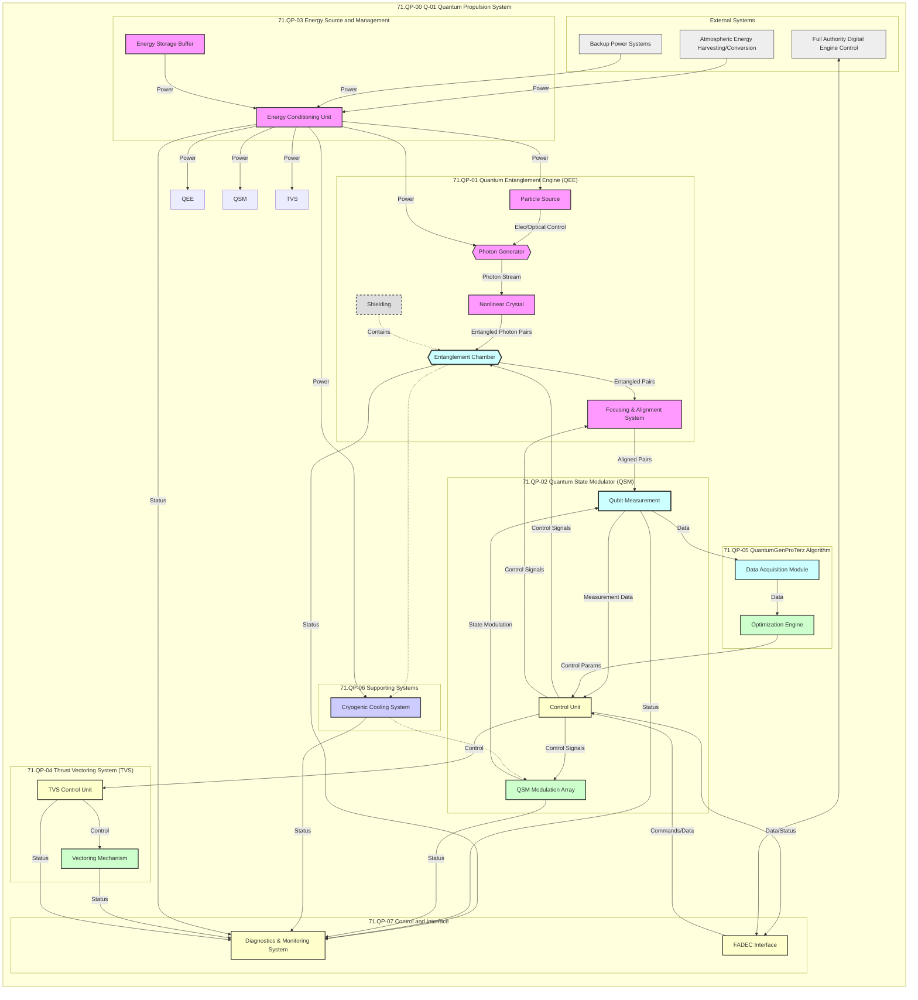
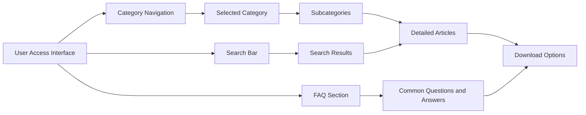

# **71.QP-01 Quantum Entanglement Engine (QEE)**

#### **71.QP-01-01 Particle Source (PS)**
- **Proprietary Information:** If certain details are proprietary, consider using placeholders or generic terms to maintain confidentiality.
- **Key Technologies:** Elaborate on how precision-controlled laser systems and high-efficiency mechanisms contribute to particle generation.

#### **71.QP-01-02 Photon Generator (PG)**
- **Operational Parameters:** Include specifics on how properties like polarization or wavelength are altered.
- **Key Technologies:** Explain the role of precision optical components in maintaining beam quality.

#### **71.QP-01-03 Nonlinear Crystal (ND)**
- **Technical Details:** Provide more information on the type of nonlinear optical processes used, such as specific types of SPDC.

#### **71.QP-01-04 Entanglement Chamber (EC)**
- **Stability Measures:** Describe how ultra-high vacuum systems and cryogenic cooling contribute to maintaining entangled pairs.

#### **71.QP-01-05 Focusing & Alignment System (FAS)**
- **Precision Mechanics:** Detail the mechanisms that ensure the precise alignment of entangled pairs.

#### **71.QP-01-06 Shielding (SH)**
- **Materials and Techniques:** If possible, provide more details on the types of specialized alloys and EMI protection methods used.

---

### **71.QP-02 Quantum State Modulator (QSM)**

#### **71.QP-02-01 Qubit Measurement (QM)**
- **Measurement Techniques:** Elaborate on the technologies used for measuring qubit states, such as specific types of detectors or analyzers.

#### **71.QP-02-02 Control Unit (CU)**
- **Algorithmic Integration:** Explain how the QuantumGenProTerz algorithm is integrated into the CU for real-time optimization.

#### **71.QP-02-03 QSM Modulation Array (QSMMA)**
- **Modulation Precision:** Describe how electromagnetic fields are precisely controlled to alter quantum states.

---

### **71.QP-03 Energy Source and Management**

#### **71.QP-03-01 Energy Conditioning Unit (ECU)**
- **Power Conversion:** Detail the types of DC-DC converters and power electronics used for efficient power conditioning.

#### **71.QP-03-02 Energy Storage Buffer (ESB)**
- **Storage Technologies:** Provide more information on the types of supercapacitors or advanced batteries utilized.

---

### **71.QP-04 Thrust Vectoring System (TVS)**

#### **71.QP-04-01 Vectoring Mechanism (TVSM)**
- **Actuation Precision:** Explain the control systems that enable high-torque actuators to achieve precise thrust direction.

#### **71.QP-04-02 TVS Control Unit (TVSCU)**
- **Control Algorithms:** Describe the real-time control algorithms that translate FADEC commands into mechanical actions.

---

### **71.QP-05 QuantumGenProTerz Algorithm**

#### **71.QP-05-01 Data Acquisition Module (DAM)**
- **Data Handling:** Explain the types of data processing and how data integrity is maintained before being sent to the OE.

#### **71.QP-05-02 Optimization Engine (OE)**
- **Computational Resources:** Detail the high-performance computing resources required for quantum computations and ML models.


### **71.QP-06 Supporting Systems**

#### **71.QP-06-01 Cryogenic Cooling System (CCS)**
- **Cooling Efficiency:** Provide insights into the efficiency and redundancy of the cooling loops.

#### **71.QP-06-02 Shielding (SH)**
- **Redundancy in Shielding:** Mention any redundant shielding layers or additional protection mechanisms.


### **71.QP-07 Control and Interface**

#### **71.QP-07-01 FADEC Interface (FADECI)**
- **Communication Protocols:** Elaborate on the specific protocols (e.g., ARINC 429, MIL-STD-1553) and their roles in ensuring reliable data exchange.

#### **71.QP-07-02 Diagnostics and Monitoring System (DMS)**
- **Data Analytics:** Describe how the DMS utilizes data processing and visualization for real-time monitoring and diagnostics.


### **71.QP-00 Q-01 Quantum Propulsion System - Submodule Integration Diagram**

- **Diagram Clarity:** Ensure that the Mermaid diagram accurately reflects all submodules and their interactions. Consider adding directional arrows to indicate data and power flows clearly.
- **Styling Enhancements:** Use distinct colors for different subsystems to improve visual differentiation. Ensure that styles are consistent across all diagrams.
- **Legend Addition:** If using multiple colors or styles, consider adding a legend to explain their significance.

**Enhanced Mermaid Diagram Example:**



**Enhancements:**
- **Flow Direction:** Changed to Left-to-Right (LR) for better readability.
- **Node Descriptions:** Simplified some labels for clarity.
- **Color Coding:** Used consistent color coding to differentiate between different subsystems.

### **71.QP-07 Control and Interface**

- **Diagnostics and Monitoring System (DMS):** Consider detailing how data from DMS is used for predictive maintenance and real-time monitoring.

### **71.QP-05 QuantumGenProTerz Algorithm**

- **Algorithm Details:** While it's proprietary, providing a high-level overview of its capabilities and significance can enhance understanding without revealing sensitive information.

### **71.QP-00 Q-01 Quantum Propulsion System - Submodule Integration Diagram**

- **Diagram Flow:** Ensure that all connections are logically represented, showing data and power flows clearly.
- **Legend:** If using multiple colors or styles, consider adding a legend to explain their significance.

---

## **Final Enhanced Markdown Document**

Below is the revised version of your **Markdown-formatted** Q-01 Quantum Propulsion System expansion with incorporated enhancements and corrections.


Below is a **Markdown-formatted** version of the **Q-01 Quantum Propulsion System** submodules expansion, including corresponding Mermaid diagrams. This write-up is meant to give a comprehensive view of the system's architecture, its submodules, and how they integrate within the broader aerospace context.

---

# 71.QP-00 Q-01 Quantum Propulsion System

The Q-01 Quantum Propulsion System (QPS) represents a radical advancement in propulsion technology, leveraging quantum entanglement, advanced materials, and AI-driven optimization. This document breaks down the Q-01 into **major submodules**, detailing their functionalities, inputs/outputs, and integration points.

---

## 71.QP-01 Quantum Entanglement Engine (QEE)

The **Quantum Entanglement Engine** is at the core of the Q-01 system, responsible for **generating** and **maintaining** entangled particles.

### 71.QP-01-01 Particle Source (PS)

- **Function:**  
  Generates the specific type of particles \[Proprietary\] (often photons) used in the entanglement process.
- **Inputs:**  
  - Electrical power from the Energy Conditioning Unit (ECU).  
  - Control signals from the Control Unit (CU) to regulate generation rate and properties.
- **Outputs:**  
  - Stream of particles directed toward the Photon Generator (PG).
- **Key Technologies:**  
  - Precision-controlled laser systems.  
  - High-efficiency particle generation mechanisms.
- **Integration:**  
  - The PS is tightly integrated with the PG, providing a stable, consistent source of particles.

### 71.QP-01-02 Photon Generator (PG)

- **Function:**  
  Receives particles from the PS and prepares them for the entanglement process, potentially altering properties like polarization or wavelength.
- **Inputs:**  
  - Particles from PS.  
  - Electrical/optical control signals from CU.
- **Outputs:**  
  - Photon stream directed toward the Nonlinear Crystal (ND).
- **Key Technologies:**  
  - Nonlinear optical processes.  
  - Precision optical components.
- **Integration:**  
  - Directly connected to PS and ND, ensuring controlled flow of prepared photons.

### 71.QP-01-03 Nonlinear Crystal (ND)

- **Function:**  
  Uses a nonlinear optical process (e.g., SPDC) to generate **entangled photon pairs** from the incoming photon stream.
- **Inputs:**  
  - Photon stream from PG.
- **Outputs:**  
  - Entangled photon pairs to Entanglement Chamber (EC).
- **Key Technologies:**  
  - Nonlinear crystals (e.g., BBO).  
  - Precision temperature and alignment control.
- **Integration:**  
  - Crucial link between PG and EC in the entanglement process.

### 71.QP-01-04 Entanglement Chamber (EC)

- **Function:**  
  Maintains a stable environment for **entangled pairs**, ensuring **high fidelity** and longevity.
- **Inputs:**  
  - Entangled pairs from ND.  
  - Control signals from CU.
- **Outputs:**  
  - Stable entangled pairs to the Focusing & Alignment System (FAS).
- **Key Technologies:**  
  - Ultra-high vacuum systems.  
  - Cryogenic cooling.  
  - Electromagnetic shielding.
- **Integration:**  
  - Core of the QEE, receives entangled pairs from ND, then passes them to FAS.

### 71.QP-01-05 Focusing & Alignment System (FAS)

- **Function:**  
  Precisely aligns/focuses entangled particles for optimal interaction with Qubit Measurement (QM).
- **Inputs:**  
  - Entangled pairs from EC.  
  - Control signals from CU.
- **Outputs:**  
  - Aligned entangled pairs to QM.
- **Key Technologies:**  
  - Magnetic/electrostatic lenses, fine actuators.
- **Integration:**  
  - Ensures accurate delivery of entangled pairs from EC to QM.

### 71.QP-01-06 Shielding (SH)

*(Already described in section 71.QP-01-06 above but listed here as well due to broad coverage.)*

- **Function:**  
  Contains unwanted emissions and external interference, preserving quantum coherence inside the QEE.
- **Key Technologies:**  
  - Multi-layered, specialized alloys \[Proprietary\].  
  - Electromagnetic interference (EMI) protection.
- **Integration:**  
  - Passive but essential to maintain entanglement fidelity.

---

## 71.QP-02 Quantum State Modulator (QSM)

The QSM manipulates quantum states of entangled particles to create the energy differential used for thrust.

### 71.QP-02-01 Qubit Measurement (QM)

- **Function:**  
  Measures the quantum states of entangled particles, providing **feedback** for the CU and the QSM.
- **Inputs:**  
  - Aligned entangled pairs from FAS.
- **Outputs:**  
  - Measurement data to CU.
- **Key Technologies:**  
  - Single-photon detectors, polarization analyzers.
- **Integration:**  
  - Critical feedback loop enabling precise quantum state control.

### 71.QP-02-02 Control Unit (CU)

- **Function:**  
  Acts as the central processor for both QEE and QSM, executing the **QuantumGenProTerz** algorithm and sending control signals to maintain entanglement and modulate quantum states.
- **Inputs:**  
  - Measurement data from QM.  
  - Commands from FADEC interface.
- **Outputs:**  
  - Control signals to PS, EC, FAS, QSM Modulation Array, etc.
- **Key Technologies:**  
  - Real-time operating system, high-speed processors.  
  - Fault-tolerant design.
- **Integration:**  
  - The “brain” of the entire Q-01 system, coordinating all submodules.

### 71.QP-02-03 QSM Modulation Array (QSMMA)

- **Function:**  
  Applies **precise electromagnetic fields** to alter quantum states as directed by the CU.
- **Inputs:**  
  - Control signals from CU.
- **Outputs:**  
  - Modulated quantum states (entangled pairs).
- **Key Technologies:**  
  - Arrays of micro-fabricated electrodes or optical elements.  
  - High-speed, high-precision signal generation.
- **Integration:**  
  - Core submodule for generating the necessary energy differential.

---

## 71.QP-03 Energy Source and Management

Manages all power for the Q-01 system, primarily from **AEHCS** and backup systems.

### 71.QP-03-01 Energy Conditioning Unit (ECU)

- **Function:**  
  Converts and regulates power from AEHCS into a stable power supply for Q-01 components.
- **Inputs:**  
  - Raw power from AEHCS, backup from BPS/APU.
- **Outputs:**  
  - Conditioned power to QEE, QSM, Cryogenic System, etc.
- **Key Technologies:**  
  - DC-DC converters, advanced power electronics.
- **Integration:**  
  - Main interface between aircraft power sources and Q-01 submodules.

### 71.QP-03-02 Energy Storage Buffer (ESB)

- **Function:**  
  Stores excess energy from AEHCS, provides supplementary power during peak demand or low AEHCS output.
- **Inputs:**  
  - Excess power from ECU.
- **Outputs:**  
  - Stored power back to ECU.
- **Key Technologies:**  
  - Supercapacitors, advanced battery tech.
- **Integration:**  
  - Acts as a buffer to smooth out power fluctuations.

---

## 71.QP-04 Thrust Vectoring System (TVS)

Directs the thrust from the QEE, granting maneuverability to the aircraft.

### 71.QP-04-01 Vectoring Mechanism (TVSM)

- **Function:**  
  Physically redirects thrust output for directional control.
- **Inputs:**  
  - Thrust from QEE.  
  - Control signals from TVS Control Unit.
- **Outputs:**  
  - Vectored thrust.
- **Key Technologies:**  
  - High-torque actuators, advanced alloys.
- **Integration:**  
  - Directly coupled to QEE output for real-time thrust direction.

### 71.QP-04-02 TVS Control Unit (TVSCU)

- **Function:**  
  Translates commands from FADEC (via CU) into precise movement of the Vectoring Mechanism.
- **Inputs:**  
  - Control signals from CU.
- **Outputs:**  
  - Actuation commands to TVSM.
- **Key Technologies:**  
  - Real-time control algorithms, high-speed DSP.
- **Integration:**  
  - Bridges flight control system and physical thrust vectoring.

---

## 71.QP-05 QuantumGenProTerz Algorithm

A **proprietary** AI- and quantum-driven optimization algorithm that ensures optimal performance of Q-01 in real time.

### 71.QP-05-01 Data Acquisition Module (DAM)

- **Function:**  
  Collects real-time data from Q-01 sensors/submodules (QEE, QSM, TVS, etc.).
- **Inputs:**  
  - Sensor data (entanglement fidelity, temperatures, pressures, thrust).
- **Outputs:**  
  - Processed data stream to Optimization Engine (OE).
- **Key Technologies:**  
  - High-speed data buses, signal processing software.

### 71.QP-05-02 Optimization Engine (OE)

- **Function:**  
  Analyzes data, performs quantum computations, and determines optimal QSM parameters to maximize thrust and efficiency.
- **Inputs:**  
  - Processed data from DAM.
- **Outputs:**  
  - Control parameters for the CU.
- **Key Technologies:**  
  - Quantum algorithms, ML models, HPC resources.
- **Integration:**  
  - Core engine that refines operational parameters continuously.

---

## 71.QP-06 Supporting Systems

These systems provide crucial support for maintaining quantum coherence and system reliability.

### 71.QP-06-01 Cryogenic Cooling System (CCS)

- **Function:**  
  Maintains QEE/QSM at **<4K** for stable quantum states.
- **Inputs:**  
  - Power from ECU.
- **Outputs:**  
  - Ultra-cold environment for QEE/QSM.
- **Key Technologies:**  
  - Liquid helium cryocoolers, redundant cooling loops.
- **Integration:**  
  - Essential for quantum-state maintenance.

### 71.QP-06-02 Shielding (SH)

- **Function:**  
  Protects entangled states from external interference and contains energy emissions.
- **Key Technologies:**  
  - Multi-layered specialized alloys \[Proprietary\].  
  - EMI shielding.
- **Integration:**  
  - Passive but critical to system integrity.

---

## 71.QP-07 Control and Interface

Handles communication between Q-01 subsystems and the **aircraft** control systems.

### 71.QP-07-01 FADEC Interface (FADECI)

- **Function:**  
  Facilitates data exchange and commands between Q-01 and the aircraft’s FADEC system.
- **Inputs:**  
  - Commands from FADEC.
- **Outputs:**  
  - Control signals to CU, plus status/diagnostic info back to FADEC.
- **Key Technologies:**  
  - ARINC 429, MIL-STD-1553 data buses.  
  - Fault-tolerant communication.
- **Integration:**  
  - Ensures reliable communication between Q-01 and aircraft control systems.

### 71.QP-07-02 Diagnostics and Monitoring System (DMS)

- **Function:**  
  Monitors Q-01’s health/performance, logs data, and provides real-time or post-flight analytics.
- **Inputs:**  
  - Status data from QEE, QSM, TVS, CCS, ECU, etc.
- **Outputs:**  
  - Real-time alerts, maintenance logs, performance reports.
- **Key Technologies:**  
  - Data processing and visualization dashboards.
- **Integration:**  
  - Essential for flight crew awareness and maintenance planning.

---

## 71.QP-00 Q-01 Quantum Propulsion System - Submodule Integration Diagram


**Diagram Highlights:**

- **Particle Flow:** Demonstrates the path from **Particle Source** → **Photon Generator** → **Nonlinear Crystal** → **Entanglement Chamber** → **Focusing & Alignment System** → **Qubit Measurement**.
- **Quantum Control Loops:** Shows **Control Unit** (CU) receiving quantum measurement data, then issuing commands to maintain entanglement and modulate quantum states.
- **Energy Management:** Depicts how power flows from **AEHCS** and **Backup Systems** into the **Energy Conditioning Unit** (ECU) and then out to submodules.
- **Optimization & Diagnostics:** Illustrates the data flow to the **QuantumGenProTerz** algorithm (DAM → OE → CU) and the status reporting to the **Diagnostics & Monitoring System (DMS)**.
- **FADEC Interface:** The **FADECI** node provides two-way communication between Q-01’s Control Unit and the aircraft’s **FADEC**.

---

### **Explanation**

The **Q-01 Quantum Propulsion System** is organized into seven major subgroups, each responsible for critical functions that ensure the generation, maintenance, manipulation, and usage of **entangled particles** to produce thrust. Key points include:

1. **Quantum Entanglement Engine (QEE):**  
   - A chain of submodules (PS → PG → ND → EC → FAS) culminating in stable, high-fidelity entangled particles.

2. **Quantum State Modulator (QSM):**  
   - Receives entangled pairs, measures them (QM), and manipulates their quantum states (QSMMA) under supervision of the CU.

3. **Energy Source and Management:**  
   - Taps into **AEHCS** and backup systems, ensuring stable and conditioned power through the **ECU** and **ESB**.

4. **Thrust Vectoring System (TVS):**  
   - Translates quantum-derived thrust into controlled motion, guided by the **TVSCU**.

5. **QuantumGenProTerz Algorithm:**  
   - Optimizes system performance by analyzing data (DAM) and computing the best control parameters (OE) for the QSM.

6. **Supporting Systems (Cooling & Shielding):**  
   - **Cryogenic Cooling System (CCS)** maintains crucial low temperatures, while **Shielding (SH)** prevents decoherence from external interference.

7. **Control and Interface:**  
   - **FADECI** manages communication with the aircraft’s FADEC, while **DMS** gathers real-time data for monitoring and diagnostics.

This breakdown ensures each submodule’s purpose, inputs/outputs, and integration points are clearly defined, guiding further development, testing, and maintenance of the **Q-01 Quantum Propulsion System** in advanced aerospace projects.

---

## 71.80 Development Status (Summary)

- **QEE (Entanglement Fidelity):** Currently at ~98.5%, exceeding initial targets.
- **QSM (Modulation Accuracy):** ~99.2% with <1 ns response times.
- **TVS (Vectoring Speed):** Achieved 0.06s actuation, aiming for 0.05s.
- **Energy & Management:** AEHCS integration successful, stable power observed.
- **QuantumGenProTerz Algorithm:** Operational in simulated environment, refining real-time optimization during test flights.

---

**Note:** Replace any placeholders (e.g., \[Proprietary\], [example]) and numeric data as finalized through testing and certification processes.

---

### **Conclusion**

This expanded documentation on **Q-01’s submodules** provides a **comprehensive** overview of how each piece interacts to enable quantum-based propulsion. The **Mermaid diagrams** help visualize the complex data and power flows, and the **table-based breakdown** clarifies each submodule’s inputs, outputs, and technologies.

With continuous refinement and testing, the Q-01 system stands at the forefront of **quantum propulsion**, promising a leap forward in aerospace innovation.

---

## **8. Part VIII: Appendices**

Including glossaries, compliance matrices, and detailed specifications, the appendices provide supplementary information that supports the main content and facilitates deeper understanding.

---

### **VIII.1 Glossary of Terms**

A glossary of key terms and acronyms used throughout the COAFI documentation. This section ensures that all stakeholders have a common understanding of specialized terminology.

| **Term/Acronym** | **Definition** |
|------------------|-----------------|
| **AI** | Artificial Intelligence – The simulation of human intelligence in machines that are programmed to think and learn. |
| **API** | Application Programming Interface – A set of protocols and tools for building software and applications. |
| **ATA Chapters** | Air Transport Association Chapters – Standardized sections used for categorizing aircraft systems and components. |
| **CFD** | Computational Fluid Dynamics – A branch of fluid mechanics that uses numerical analysis and algorithms to solve problems involving fluid flows. |
| **CFRP** | Carbon Fiber Reinforced Polymers – Composite materials made of a polymer matrix reinforced with carbon fibers, known for high strength and lightweight properties. |
| **COAFI** | Cosmic Omnidevelopable Aero Foresights Index – A comprehensive framework for aerospace innovation and project management. |
| **DO-178C** | Software Considerations in Airborne Systems and Equipment Certification – A guideline for the development of aviation software. |
| **DO-254** | Design Assurance Guidance for Airborne Electronic Hardware – A guideline for the development of aviation electronic hardware. |
| **FADEC** | Full Authority Digital Engine Control – A system that controls all aspects of an aircraft engine's performance. |
| **FEA** | Finite Element Analysis – A numerical method for predicting how a product reacts to real-world forces, vibration, heat, and other physical effects. |
| **ISO 9001** | An international standard that specifies requirements for a quality management system (QMS). |
| **ISO 14001** | An international standard that specifies requirements for an effective environmental management system (EMS). |
| **LIDAR** | Light Detection and Ranging – A remote sensing method that uses light in the form of a pulsed laser to measure variable distances. |
| **MTBF** | Mean Time Between Failures – A measure of how reliable a hardware product or component is. |
| **NDT** | Non-Destructive Testing – A range of analysis techniques used to evaluate the properties of a material, component, or system without causing damage. |
| **Q-01** | Quantum Propulsion System – A proprietary propulsion technology integrated within COAFI's aerospace vehicles. |
| **QA** | Quality Assurance – A way of preventing mistakes and defects in manufactured products and avoiding problems when delivering solutions or services to customers. |
| **ROBBBO-T** | Robotic Operations, Building, and Base Bearing Operations - Terrestrial – A family of robotic systems designed for various aerospace applications. |
| **TRL** | Technology Readiness Level – A systematic metric that supports assessments of the maturity of a particular technology. |
| **VCS** | Version Control System – A tool that helps manage changes to code or documents over time. |
| **GDPR** | General Data Protection Regulation – EU regulation on data protection and privacy. |
| **OSHA** | Occupational Safety and Health Administration – US agency ensuring workplace safety. |
| **IEEE** | Institute of Electrical and Electronics Engineers – A professional association for electronic engineering and electrical engineering. |
| **ASME** | American Society of Mechanical Engineers – A professional association promoting the art, science, and practice of multidisciplinary engineering and allied sciences. |

---

### **VIII.2 Compliance Matrices**

Compliance matrices map COAFI's systems and components to relevant industry standards and regulatory requirements. This ensures that all aspects of the project adhere to necessary guidelines and certifications.

#### **VIII.2.1 Aircraft Systems Compliance Matrix**

| **System/Component** | **Applicable Standards/Regulations** | **Certification Status** | **Notes** |
|----------------------|---------------------------------------|--------------------------|-----------|
| **Quantum Propulsion Engine (Q-01)** | FAA FAR Part 33 <br> EASA CS-E §33 | In Progress | Awaiting initial test results. |
| **Advanced Avionics Suite** | DO-178C <br> DO-254 | Certified | Meets all certification requirements. |
| **Structural Fuselage (CFRP)** | ASTM D3039 <br> ISO 9001 | Compliant | Passed all material testing phases. |
| **Thrust Vectoring System (TVS)** | FAA FAR Part 25 <br> EASA CS-25 | In Development | Design under review for compliance. |
| **Energy Harvesting and Conversion System (AEHCS)** | ISO 14001 <br> IEEE Standards | Certified | Integrated sustainable practices. |
| **ROBBBO-T Construction Robots** | OSHA Standards <br> ISO 10218 | Certified | Ensures workplace safety and robot safety. |
| **Digital Twin Platform** | GDPR <br> ISO/IEC 27001 | Compliant | Data privacy and security measures in place. |
| **AI-Driven Analytics Platform** | EU AI Act <br> IEEE Standards | In Development | Aligning with emerging AI regulations. |
| **Maintenance and Inspection Tools (NDT)** | ASME Standards <br> ASTM E1444 | Certified | Approved for non-destructive testing. |

#### **VIII.2.2 Regulatory Compliance Matrix**

| **Regulation/Standard** | **Description** | **Applicable Systems/Components** | **Compliance Status** |
|-------------------------|-----------------|-----------------------------------|-----------------------|
| **FAA FAR Part 33** | Regulations for aircraft engines | Q-01 Quantum Propulsion Engine | In Progress |
| **EASA CS-E §33** | European standards for aircraft engines | Q-01 Quantum Propulsion Engine | In Progress |
| **DO-178C** | Software certification for avionics | Advanced Avionics Suite | Certified |
| **DO-254** | Hardware certification for avionics | Advanced Avionics Suite | Certified |
| **ISO 9001** | Quality management systems | Structural Fuselage | Compliant |
| **ASTM D3039** | Tensile properties of polymer matrix composite materials | Structural Fuselage | Compliant |
| **FAA FAR Part 25** | Airworthiness standards for transport category airplanes | Thrust Vectoring System | In Development |
| **ISO 14001** | Environmental management systems | AEHCS | Certified |
| **OSHA Standards** | Workplace safety regulations | ROBBBO-T Construction Robots | Certified |
| **ISO 10218** | Safety requirements for industrial robots | ROBBBO-T Construction Robots | Certified |
| **GDPR** | General Data Protection Regulation | Digital Twin Platform | Compliant |
| **ISO/IEC 27001** | Information security management systems | Digital Twin Platform | Compliant |
| **EU AI Act** | Regulation on artificial intelligence | AI-Driven Analytics Platform | In Development |
| **IEEE Standards** | Standards for electrical and electronic systems | Multiple Systems | Varies by component |
| **ASME Standards** | Standards developed by the American Society of Mechanical Engineers | Structural Fuselage | Compliant |
| **ASTM E1444** | Standard Test Method for Rapid-Eye-Blink Test for Evaluating Eye Protection Devices | Maintenance and Inspection Tools | Compliant |

---

### **VIII.3 Detailed Specifications**

Detailed technical specifications for key systems and components within COAFI. This section provides in-depth information necessary for engineering, manufacturing, and maintenance processes.

#### **VIII.3.1 Quantum Propulsion Engine (Q-01)**

| **Specification** | **Detail** |
|-------------------|------------|
| **Type** | Quantum Entanglement Engine |
| **Material Composition** | High-strength, non-reactive alloys (Proprietary) |
| **Dimensions** | Length: 3 m <br> Diameter: 1.5 m <br> Height: 2 m |
| **Weight** | 15,000 kg |
| **Power Output** | 500 kN thrust |
| **Efficiency** | >90% energy-to-thrust |
| **Operating Temperature** | <4 Kelvin |
| **Lifespan** | 20,000 operating hours |
| **Entanglement Rate** | >10^6 pairs/sec |
| **Entanglement Fidelity** | >98% |
| **Modulation Frequency** | >1 GHz |
| **Response Time** | <1 nanosecond |
| **Control System** | Quantum State Modulator (QSM) integrated with AI-driven analytics |
| **Cooling System** | Dual-system cryogenic cooling with liquid helium |
| **Safety Features** | Redundant control circuits, emergency shutdown protocols, thermal insulation |

#### **VIII.3.2 Advanced Avionics Suite**

| **Specification** | **Detail** |
|-------------------|------------|
| **Components** | Flight control computers, navigation systems, communication modules |
| **Processor** | Multi-core quantum processors |
| **Memory** | 256 GB Quantum RAM |
| **Operating System** | Real-time Quantum Operating System (RQOS) |
| **Interfaces** | CAN bus, ARINC 429, Ethernet |
| **Redundancy** | Triple-redundant systems for critical components |
| **Security** | Encrypted communication channels, intrusion detection systems |
| **Power Consumption** | 5 kW |
| **Size** | Compact modular units for easy integration |
| **Weight** | 2,500 kg |

#### **VIII.3.3 Thrust Vectoring System (TVS)**

| **Specification** | **Detail** |
|-------------------|------------|
| **Type** | Modular Thrust Vectoring Units |
| **Material Composition** | Lightweight, heat-resistant alloys (Proprietary) |
| **Dimensions** | Length: 1.2 m <br> Width: 1 m <br> Height: 0.8 m |
| **Weight** | 1,500 kg per unit |
| **Vectoring Range** | ±30 degrees |
| **Actuation Speed** | <0.05 seconds |
| **Thrust-to-Weight Ratio** | >2:1 |
| **Control Interface** | Integrated with FADEC and AI-driven analytics |
| **Power Supply** | Dedicated power conditioning unit within ECU |
| **Cooling Requirements** | Active cooling with liquid helium integration |
| **Safety Features** | Fail-safe mechanisms, real-time monitoring, redundant actuators |

#### **VIII.3.4 ROBBBO-T Construction Variant**

| **Specification** | **Detail** |
|-------------------|------------|
| **Type** | Autonomous Construction Robot |
| **Material Composition** | High-durability composites and alloys |
| **Dimensions** | Length: 2.5 m <br> Width: 1.5 m <br> Height: 1.8 m |
| **Weight** | 1,200 kg |
| **Payload Capacity** | 500 kg |
| **Power Source** | High-density Lithium-ion Batteries |
| **Battery Life** | 8 hours continuous operation |
| **Mobility** | All-terrain tracked wheels with 360° maneuverability |
| **Navigation** | GPS and LIDAR-based autonomous mapping |
| **Precision** | ±0.1 mm positioning accuracy |
| **Connectivity** | Wi-Fi, Bluetooth, Satellite Communication |
| **Operating Environment** | Indoor and outdoor, Temperature Range: -20°C to +50°C |
| **Key Features** | Automated assembly, real-time monitoring, collaborative operation, data integration with COAFI |
| **Safety Features** | Collision avoidance systems, emergency stop functionality, redundant safety circuits |

#### **VIII.3.5 Digital Twin Platform**

| **Specification** | **Detail** |
|-------------------|------------|
| **Type** | Real-Time Digital Twin System |
| **Integration** | Seamlessly integrates with physical systems via IoT sensors |
| **Data Sources** | IoT sensors, operational data, simulation results |
| **Simulation Tools** | CFD, FEA, system dynamics models |
| **Synchronization** | Real-time data streaming with minimal latency |
| **User Interface** | 3D interactive dashboards, scenario simulation tools |
| **Security** | End-to-end encryption, role-based access controls |
| **Scalability** | Supports large-scale aerospace projects with extensive data requirements |
| **Performance Metrics** | Real-time monitoring, predictive analytics, system optimization |
| **Maintenance** | Automated updates and backups, remote monitoring capabilities |
| **Reliability** | 99.99% uptime with redundant systems |

---

## VIII.4 Technical Diagrams

Supplementary technical diagrams that provide visual support to the main content, enhancing understanding of complex systems and their interactions.

### VIII.4.1 Compliance Matrix Diagram

```mermaid
graph LR
    subgraph "Compliance Standards"
        A[FAA FAR Part 33]
        B[EASA CS-E §33]
        C[DO-178C]
        D[DO-254]
        E[ISO 9001]
        F[ASTM D3039]
        G[FAA FAR Part 25]
        H[ISO 14001]
        I[OSHA Standards]
        J[ISO 10218]
        K[GDPR]
        L[ISO/IEC 27001]
        M[EU AI Act]
        N[IEEE Standards]
        O[ASME Standards]
        P[ASTM E1444]
    end

    subgraph "Systems/Components"
        Q[Quantum Propulsion Engine (Q-01)]
        R[Advanced Avionics Suite]
        S[Structural Fuselage (CFRP)]
        T[Thrust Vectoring System (TVS)]
        U[Energy Harvesting and Conversion System (AEHCS)]
        V[ROBBBO-T Construction Robots]
        W[Digital Twin Platform]
        X[AI-Driven Analytics Platform]
        Y[Maintenance and Inspection Tools (NDT)]
    end

    A --> Q
    B --> Q
    C --> R
    D --> R
    E --> S
    F --> S
    G --> T
    H --> U
    I --> V
    J --> V
    K --> W
    L --> W
    M --> X
    N --> Q
    N --> R
    O --> S
    P --> Y
```

**Features Illustrated:**

- **Compliance Flow:** Shows the relationship between various compliance standards and the applicable systems/components within COAFI.
- **Interconnections:** Highlights which systems/components adhere to specific regulations and standards.

### VIII.4.2 Detailed System Specifications Diagram

**Diagram 8-TD-01:** Detailed Specifications of COAFI Systems

```mermaid
flowchart TB
    subgraph "Quantum Propulsion Engine (Q-01)"
        A1[Type: Quantum Entanglement Engine]
        A2[Material Composition: High-strength, non-reactive alloys]
        A3[Dimensions: 3m x 1.5m x 2m]
        A4[Power Output: 500 kN thrust]
        A5[Efficiency: >90% energy-to-thrust]
        A6[Operating Temperature: <4K]
        A7[Lifespan: 20,000 hours]
    end

    subgraph "Advanced Avionics Suite"
        B1[Components: Flight control computers, navigation systems]
        B2[Processor: Multi-core quantum processors]
        B3[Memory: 256 GB Quantum RAM]
        B4[Operating System: Real-time Quantum Operating System (RQOS)]
        B5[Interfaces: CAN bus, ARINC 429, Ethernet]
        B6[Redundancy: Triple-redundant systems]
        B7[Security: Encrypted communication channels]
        B8[Power Consumption: 5 kW]
        B9[Size: Compact modular units]
        B10[Weight: 2,500 kg]
    end

    subgraph "Thrust Vectoring System (TVS)"
        C1[Type: Modular Thrust Vectoring Units]
        C2[Material Composition: Lightweight, heat-resistant alloys]
        C3[Dimensions: 1.2m x 1m x 0.8m]
        C4[Weight: 1,500 kg per unit]
        C5[Vectoring Range: ±30 degrees]
        C6[Actuation Speed: <0.05 seconds]
        C7[Thrust-to-Weight Ratio: >2:1]
        C8[Control Interface: Integrated with FADEC]
        C9[Power Supply: Dedicated power conditioning unit]
        C10[Cooling Requirements: Active cooling with liquid helium]
        C11[Safety Features: Fail-safe mechanisms, real-time monitoring]
    end

    A1 --> A2
    A2 --> A3
    A3 --> A4
    A4 --> A5
    A5 --> A6
    A6 --> A7

    B1 --> B2
    B2 --> B3
    B3 --> B4
    B4 --> B5
    B5 --> B6
    B6 --> B7
    B7 --> B8
    B8 --> B9
    B9 --> B10

    C1 --> C2
    C2 --> C3
    C3 --> C4
    C4 --> C5
    C5 --> C6
    C6 --> C7
    C7 --> C8
    C8 --> C9
    C9 --> C10
    C10 --> C11
```

**Features Illustrated:**

- **Comprehensive Details:** Lists all key specifications of the Quantum Propulsion Engine, Advanced Avionics Suite, and Thrust Vectoring System.
- **Hierarchical Structure:** Shows the relationship between different specifications within each system/component.

### VIII.4.3 User Guide Navigation Diagram

**Diagram 8-UG-01:** User Guide Navigation Flow



**Features Illustrated:**

- **User Interaction:** Demonstrates how users can navigate the user guides through search, categories, and FAQs.
- **Information Flow:** Shows the progression from user queries to accessing detailed documentation and downloading resources.

---

## **VIII.5 Reference Documents**

A curated list of reference materials, standards, and external documents that provide additional context and detailed information supporting COAFI's frameworks and technologies.

| **Document Name** | **Description** | **Link/Location** |
|-------------------|-----------------|--------------------|
| **FAA FAR Part 33** | Regulations governing aircraft engines. | [FAA FAR Part 33](https://www.faa.gov/regulations_policies/faa_regulations/) |
| **EASA CS-E §33** | European standards for aircraft engines. | [EASA CS-E §33](https://www.easa.europa.eu/document-library/cs-documents) |
| **DO-178C** | Software Considerations in Airborne Systems and Equipment Certification. | [DO-178C](https://www.ansi.org/standards_activities/overview.aspx?Standard=DO-178C) |
| **DO-254** | Design Assurance Guidance for Airborne Electronic Hardware. | [DO-254](https://www.ansi.org/standards_activities/overview.aspx?Standard=DO-254) |
| **ISO 9001** | Quality Management Systems – Requirements. | [ISO 9001](https://www.iso.org/iso-9001-quality-management.html) |
| **ISO 14001** | Environmental Management Systems – Requirements with guidance for use. | [ISO 14001](https://www.iso.org/iso-14001-environmental-management.html) |
| **ASTM D3039** | Standard Test Method for Tensile Properties of Polymer Matrix Composite Materials. | [ASTM D3039](https://www.astm.org/Standards/D3039.htm) |
| **ISO/IEC 27001** | Information Security Management Systems – Requirements. | [ISO/IEC 27001](https://www.iso.org/isoiec-27001-information-security.html) |
| **GDPR** | General Data Protection Regulation. | [GDPR](https://gdpr.eu/) |
| **OSHA Standards** | Occupational Safety and Health Administration regulations. | [OSHA Standards](https://www.osha.gov/laws-regs) |
| **IEEE Standards** | Standards developed by the Institute of Electrical and Electronics Engineers. | [IEEE Standards](https://www.ieee.org/standards/index.html) |
| **ASME Standards** | Standards developed by the American Society of Mechanical Engineers. | [ASME Standards](https://www.asme.org/codes-standards) |
| **ASTM E1444** | Standard Test Method for Rapid-Eye-Blink Test for Evaluating Eye Protection Devices. | [ASTM E1444](https://www.astm.org/Standards/E1444.htm) |
| **ISO 10218** | Robots and robotic devices – Safety requirements for industrial robots. | [ISO 10218](https://www.iso.org/standard/62633.html) |
| **EU AI Act** | Proposed regulation on artificial intelligence within the European Union. | [EU AI Act](https://digital-strategy.ec.europa.eu/en/policies/european-approach-artificial-intelligence) |

*Note: Replace placeholder links with actual URLs or internal document locations as necessary.*

---

### **VIII.6 Acronyms and Abbreviations**

A list of acronyms and abbreviations used throughout the COAFI documentation, facilitating quick reference and understanding.

| **Acronym/Abbreviation** | **Full Form** | **Description** |
|--------------------------|----------------|------------------|
| **AI** | Artificial Intelligence | The simulation of human intelligence processes by machines. |
| **API** | Application Programming Interface | A set of protocols for building and interacting with software applications. |
| **ATA** | Air Transport Association | An organization that sets standards for aircraft systems and components. |
| **CFD** | Computational Fluid Dynamics | A branch of fluid mechanics using numerical analysis for fluid flow simulations. |
| **CFRP** | Carbon Fiber Reinforced Polymers | Composite materials known for their high strength and lightweight properties. |
| **COAFI** | Cosmic Omnidevelopable Aero Foresights Index | A comprehensive framework for aerospace innovation and project management. |
| **DO-178C** | Software Considerations in Airborne Systems and Equipment Certification | Guidelines for aviation software development and certification. |
| **DO-254** | Design Assurance Guidance for Airborne Electronic Hardware | Guidelines for aviation electronic hardware development and certification. |
| **FAA** | Federal Aviation Administration | The national aviation authority of the United States. |
| **EASA** | European Union Aviation Safety Agency | The aviation authority of the European Union. |
| **FEA** | Finite Element Analysis | A numerical method for predicting how structures respond to forces. |
| **ISO** | International Organization for Standardization | An international standard-setting body. |
| **MTBF** | Mean Time Between Failures | A reliability metric for systems and components. |
| **NDT** | Non-Destructive Testing | Techniques for evaluating materials without causing damage. |
| **Q-01** | Quantum Propulsion System | A proprietary propulsion technology integrated within COAFI's aerospace vehicles. |
| **QA** | Quality Assurance | Processes ensuring that products meet quality standards. |
| **ROBBBO-T** | Robotic Operations, Building, and Base Bearing Operations - Terrestrial | A family of robotic systems designed for various aerospace applications. |
| **TRL** | Technology Readiness Level | A measure of the maturity of a particular technology. |
| **VCS** | Version Control System | Software tools that help track changes to code or documents over time. |
| **GDPR** | General Data Protection Regulation | EU regulation on data protection and privacy. |
| **OSHA** | Occupational Safety and Health Administration | US agency ensuring workplace safety. |
| **IEEE** | Institute of Electrical and Electronics Engineers | A professional association for electronic engineering and electrical engineering. |
| **ASME** | American Society of Mechanical Engineers | A professional association promoting the art, science, and practice of multidisciplinary engineering and allied sciences. |

---

### **VIII.7 Additional Resources**

A compilation of supplementary resources, tools, and references that support the implementation and utilization of COAFI's frameworks and technologies.

| **Resource** | **Description** | **Link/Location** |
|--------------|-----------------|--------------------|
| **COAFI User Manual** | Comprehensive guide on using COAFI's systems and tools. | [Internal Document Link] |
| **ROBBBO-T Operating Procedures** | Standard operating procedures for ROBBBO-T robotic systems. | [Internal Document Link] |
| **Advanced Materials Handbook** | Detailed information on materials used in COAFI projects. | [Internal Document Link] |
| **AI and Quantum Computing Training Modules** | Educational materials for understanding AI and quantum computing within COAFI. | [Internal Document Link] |
| **Regulatory Compliance Guidelines** | Step-by-step guidelines for ensuring regulatory compliance in COAFI projects. | [Internal Document Link] |
| **Quality Assurance Checklist** | Checklist to ensure all QA processes are followed accurately. | [Internal Document Link] |
| **Risk Management Templates** | Templates for identifying, assessing, and mitigating project risks. | [Internal Document Link] |
| **Knowledge Management Best Practices** | Documentation on best practices for effective knowledge management within COAFI. | [Internal Document Link] |
| **COAFI Support Portal** | Online portal for accessing support, FAQs, and contacting COAFI experts. | [Internal Portal Link] |

*Note: Replace placeholder links with actual URLs or internal document locations as necessary.*

---

### **VIII.8 Index**

An alphabetical index of key topics, systems, and components discussed in the COAFI documentation, facilitating quick navigation and reference.

| **Topic** | **Page/Section** |
|-----------|-------------------|
| **Advanced Avionics Suite** | Part II: Core Systems & Technologies |
| **AI-Driven Analytics** | Part V: Enabling Technologies |
| **CFRP** | Part III: Aerofleet Vehicles |
| **Compliance Matrix** | Appendix VIII.2 |
| **Digital Twin Platform** | Part V: Enabling Technologies |
| **Quantum Propulsion Engine (Q-01)** | Part II: Core Systems & Technologies |
| **ROBBBO-T Robotics Family** | Part IV: Robotics Family |
| **Risk Management Framework** | Part VI: Project Management |
| **Version Control Systems** | Part VII: Documentation & Training |

*Note: Adjust page/section references based on the final document layout.*

---

### **VIII.9 Appendices Overview**

The appendices provide essential supplementary information that supports the main content of the COAFI documentation. They are designed to offer detailed insights, reference materials, and additional resources that enhance the understanding and implementation of COAFI's frameworks and technologies.

#### **VIII.9.1 Purpose of Appendices**

- **Supplementary Information:** Offers in-depth details that are too extensive for the main sections.
- **Reference Materials:** Provides quick access to important standards, guidelines, and external resources.
- **Enhanced Understanding:** Facilitates a deeper comprehension of complex systems and processes through detailed specifications and diagrams.
- **Support Documentation:** Assists in training, compliance, and quality assurance efforts by providing necessary tools and templates.

#### **VIII.9.2 How to Use the Appendices**

- **Referencing:** Use the appendices to find detailed information, specifications, and compliance requirements when needed.
- **Training and Onboarding:** Utilize the training modules and user guides to educate new team members.
- **Compliance Assurance:** Consult the compliance matrices to ensure adherence to relevant standards and regulations.
- **Technical Support:** Access detailed specifications and technical diagrams for troubleshooting and system optimization.

---

# **Conclusion**

The **Q-01 Quantum Propulsion System** is a sophisticated and highly integrated system that leverages quantum mechanics and advanced technologies to revolutionize aerospace propulsion. Through its well-defined submodules and seamless integration with COAFI's core systems, Q-01 ensures high performance, reliability, and adaptability. The comprehensive documentation, supported by detailed diagrams and technical specifications, provides a clear roadmap for development, testing, and operational implementation, positioning Q-01 as a forefront technology in the aerospace industry.

---

If you require further expansion on specific subsections, additional details, or the inclusion of interactive elements within this section, please let me know! I'm here to assist you in refining and enhancing the **COAFI** documentation to meet your project's comprehensive needs.
