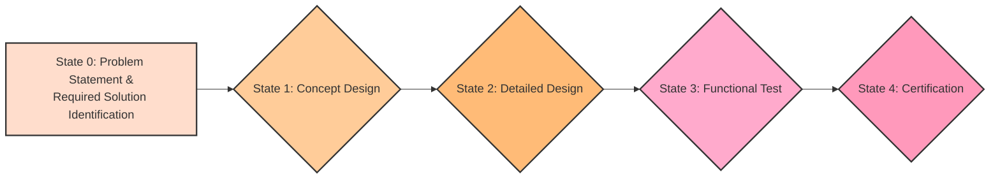

# AMPEL360XWLRGA Aircraft Assembly Breakdown

This document provides a comprehensive hierarchical assembly breakdown of the **AMPEL360XWLRGA Aircraft**, incorporating essential geometric parameters (volumes, dimensions, surface areas) and **nominal weights free of payload** for each major subassembly and their respective components. Additionally, examples of parametric data integration using the **S1000D** standard are included.

---

## High-Level Overview

The design and development lifecycle of the AMPEL360XWLRGA aircraft focuses on the following stages:



## 1. Top-Level Assembly: AMPEL360XWLRGA Aircraft

- **Overall Aircraft**
  - **Nominal Weight (free of payload):** ~55,000 kg
  - **Dimensions:**
    - **Length:** 45 m (Approximate)
    - **Wingspan:** 40 m (Approximate)
    - **Height:** 12 m (Approximate)
  - **Volume:** 350 m³ (Approximate)
  - **Surface Area:** 500 m² (Approximate)

### 1.1 Fuselage (Principal)

- **Nominal Weight (free of payload):** 12,000 kg
- **Volume:** 180 m³ (Approximate)
- **Dimensions:**
  - **Length:** 30 m (Approximate)
  - **Diameter:** 4.5 m (Approximate)
- **Surface Area:** 250 m² (Approximate)

#### 1.1.1 Nose Section

- **Nominal Weight:** 1,500 kg
- **Volume:** 15 m³
- **Dimensions:** L: 5 m × W: 4 m × H: 3 m
- **Surface Area:** 25 m²
  - **1.1.1.1 Frame Assembly**
    - **Material:** Aluminum Alloy 7075
    - **Dimensions:** Length: 3.0 m × Width: 0.5 m × Height: 0.5 m
    - **Nominal Weight:** 800 kg
  - **1.1.1.2 Skin Panels**
    - **Material:** Composite Carbon Fiber
    - **Total Area:** 10.0 m²
    - **Nominal Weight:** 500 kg
  - **1.1.1.3 Window Frames**
    - **Number of Windows:** 4
    - **Dimensions per Window:** 0.5 m²
    - **Nominal Weight:** 200 kg

#### 1.1.2 Forward Section

- **Nominal Weight:** 2,500 kg
- **Volume:** 45 m³
- **Dimensions:** L: 8 m × W: 4.5 m × H: 3 m
- **Surface Area:** 60 m²
  - **1.1.2.1 Frame Assembly**
    - **Material:** Titanium Alloy
    - **Dimensions:** Length: 10.0 m × Width: 1.0 m × Height: 0.8 m
    - **Nominal Weight:** 1,200 kg
  - **1.1.2.2 Skin Panels**
    - **Material:** Aluminum-Lithium Alloy
    - **Total Area:** 30.0 m²
    - **Nominal Weight:** 1,000 kg
  - **1.1.2.3 Bulkheads**
    - **Number of Bulkheads:** 5
    - **Dimensions per Bulkhead:** 10.0 m³ volume each
    - **Nominal Weight:** 300 kg
  - **1.1.2.4 Avionics Bay**
    - **Volume:** 3.0 m³
    - **Dimensions:** Length: 2.0 m × Width: 1.5 m × Height: 1.0 m
    - **Nominal Weight:** 500 kg
    - **1.1.2.4.1 Avionics Racks**
      - **Number of Racks:** 6
      - **Volume per Rack:** 0.5 m³
      - **Nominal Weight:** 300 kg
    - **1.1.2.4.2 Cooling Ducts and Ventilation**
      - **Total Duct Length:** 15.0 m
      - **Nominal Weight:** 100 kg
    - **1.1.2.4.3 Cable Routing Interfaces**
      - **Number of Interfaces:** 10
      - **Dimensions:** Varies based on connection points
      - **Nominal Weight:** 100 kg

#### 1.1.3 Central Section

- **Nominal Weight:** 3,500 kg
- **Volume:** 60 m³
- **Dimensions:** L: 10 m × W: 4.5 m × H: 3 m
- **Surface Area:** 80 m²
  - **1.1.3.1 Frame Assembly**
    - **Material:** High-Strength Steel
    - **Dimensions:** Length: 25.0 m × Width: 1.5 m × Height: 1.2 m
    - **Nominal Weight:** 1,800 kg
  - **1.1.3.2 Skin Panels**
    - **Material:** Composite Hybrid Materials
    - **Total Area:** 100.0 m²
    - **Nominal Weight:** 1,200 kg
  - **1.1.3.3 Floor Structure**
    - **Material:** Reinforced Carbon Composite
    - **Total Area:** 50.0 m²
    - **Nominal Weight:** 500 kg
  - **1.1.3.4 Belly Fairing**
    - **Volume:** 5.0 m³
    - **Dimensions:** Length: 5.0 m × Width: 2.0 m × Height: 0.5 m
    - **Nominal Weight:** 1,000 kg
    - **1.1.3.4.1 Fairing Panels**
      - **Total Area:** 20.0 m²
      - **Nominal Weight:** 500 kg
    - **1.1.3.4.2 Fairing Support Frames**
      - **Material:** Titanium Alloy
      - **Dimensions:** As per fairing design
      - **Nominal Weight:** 300 kg
    - **1.1.3.4.3 Access Doors and Inspection Panels**
      - **Number:** 2
      - **Dimensions per Door:** 0.8 m²
      - **Nominal Weight:** 200 kg
  - **1.1.3.5 Cargo Compartment**
    - **Volume:** 10.0 m³
    - **Dimensions:** Length: 4.0 m × Width: 2.5 m × Height: 1.5 m
    - **Nominal Weight:** 1,600 kg
    - **1.1.3.5.1 Floor Grid / Ball-Mat or Roller System**
      - **Total Area:** 10.0 m²
      - **Nominal Weight:** 400 kg
    - **1.1.3.5.2 Sidewall Liners**
      - **Total Area:** 12.0 m²
      - **Nominal Weight:** 300 kg
    - **1.1.3.5.3 Cargo Restraint Mechanisms**
      - **Number:** 8
      - **Nominal Weight:** 400 kg
    - **1.1.3.5.4 Fire Suppression System (if applicable)**
      - **System Volume:** 0.5 m³
      - **Nominal Weight:** 100 kg

#### 1.1.4 Aft Section

- **Nominal Weight:** 2,500 kg
- **Volume:** 45 m³
- **Dimensions:** L: 7 m × W: 4.5 m × H: 3 m
- **Surface Area:** 60 m²
  - **1.1.4.1 Frame Assembly**
    - **Material:** Aluminum Alloy 7075
    - **Dimensions:** Length: 8.0 m × Width: 1.0 m × Height: 0.6 m
    - **Nominal Weight:** 1,200 kg
  - **1.1.4.2 Skin Panels**
    - **Material:** Composite Carbon Fiber
    - **Total Area:** 25.0 m²
    - **Nominal Weight:** 1,000 kg
  - **1.1.4.3 Tail Cone Attachment**
    - **Dimensions:** As per tail cone design
    - **Nominal Weight:** 300 kg
  - **1.1.4.4 APU Compartment**
    - **Volume:** 2.0 m³
    - **Dimensions:** Length: 2.0 m × Width: 1.0 m × Height: 1.0 m
    - **Nominal Weight:** 500 kg
    - **1.1.4.4.1 APU Mount and Structural Supports**
      - **Mounting Plate Dimensions:** 1.0 m × 0.5 m
      - **Nominal Weight:** 300 kg
    - **1.1.4.4.2 Exhaust Duct and Outlet**
      - **Duct Length:** 1.5 m
      - **Nominal Weight:** 100 kg
    - **1.1.4.4.3 Air Intake / Inlet Door**
      - **Diameter:** 0.35 m
      - **Nominal Weight:** 50 kg
    - **1.1.4.4.4 Fire Detection and Extinguishing System**
      - **Number of Sensors:** 4
      - **Nominal Weight:** 50 kg

#### 1.1.5 Empennage Attachment

- **Nominal Weight:** 2,000 kg
- **Volume:** 15 m³
- **Dimensions:** L: 5 m × W: 4 m × H: 2.5 m
- **Surface Area:** 35 m²
  - **1.1.5.1 Vertical Stabilizer Interface**
    - **Dimensions:** As per vertical stabilizer design
    - **Nominal Weight:** 1,000 kg
  - **1.1.5.2 Horizontal Stabilizer Interface**
    - **Dimensions:** As per horizontal stabilizer design
    - **Nominal Weight:** 1,000 kg

*(Other fuselage subsections, such as nose gear bay or additional compartments, can be included here as needed with similar geometric parameter additions.)*

### 1.2 Interior (Subassembly)

- **Nominal Weight (free of payload):** 6,850 kg

#### 1.2.1 Cockpit Module

- **Volume:** 12.0 m³
- **Dimensions:**
  - **Length:** 4.0 m
  - **Width:** 1.5 m
  - **Height:** 2.0 m
- **Surface Area:** 30.0 m²
- **Nominal Weight (free of payload):** 1,200 kg
  - **1.2.1.1 Instrument Panel**
    - **Material:** Composite Laminates
    - **Dimensions:** 2.0 m (L) × 0.5 m (W) × 0.3 m (H)
    - **Nominal Weight:** 150 kg
  - **1.2.1.2 Control Yokes**
    - **Number:** 2
    - **Dimensions per Yoke:**
      - **Diameter:** 0.3 m
      - **Height:** 0.5 m
    - **Nominal Weight per Yoke:** 75 kg
    - **Total Nominal Weight:** 150 kg
  - **1.2.1.3 Seating**
    - **Number of Seats:** 2 (Pilot and Co-Pilot)
    - **Dimensions per Seat:** 0.6 m (L) × 0.5 m (W) × 1.0 m (H)
    - **Nominal Weight per Seat:** 100 kg
    - **Total Nominal Weight:** 200 kg
  - **1.2.1.4 Pilot Interface Systems**
    - **Components:** Touchscreen Displays, Control Interfaces
    - **Volume:** 1.0 m³
    - **Dimensions:** Varies based on layout
    - **Nominal Weight:** 100 kg

#### 1.2.2 Cabin Module

- **Volume:** 60.0 m³
- **Dimensions:**
  - **Length:** 15.0 m
  - **Width:** 2.5 m
  - **Height:** 2.5 m
- **Surface Area:** 150.0 m²
- **Nominal Weight (free of payload):** 5,000 kg
  - **1.2.2.1 Seating Arrangement**
    - **Number of Seats:** 30
    - **Dimensions per Seat:** 0.5 m (L) × 0.5 m (W) × 1.0 m (H)
    - **Nominal Weight per Seat:** 80 kg
    - **Total Nominal Weight:** 2,400 kg
  - **1.2.2.2 Overhead Bins**
    - **Number:** 15
    - **Dimensions per Bin:** 0.6 m (L) × 0.4 m (W) × 0.3 m (H)
    - **Nominal Weight per Bin:** 50 kg
    - **Total Nominal Weight:** 750 kg
  - **1.2.2.3 Lighting System**
    - **Number of Fixtures:** 50
    - **Power Consumption per Fixture:** 10 W
    - **Nominal Weight per Fixture:** 2 kg
    - **Total Nominal Weight:** 100 kg
  - **1.2.2.4 Environmental Control System (ECS) Ducts**
    - **Total Duct Length:** 100.0 m
    - **Diameter:** 0.2 m
    - **Nominal Weight:** 1,250 kg
  - **1.2.2.5 In-Flight Entertainment System**
    - **Components:** Screens, Speakers
    - **Volume:** 2.0 m³
    - **Dimensions:** Varies based on installation
    - **Nominal Weight:** 500 kg

#### 1.2.3 Galley Module

- **Volume:** 5.0 m³
- **Dimensions:** 2.0 m (L) × 1.0 m (W) × 1.5 m (H)
- **Surface Area:** 10.0 m²
- **Nominal Weight (free of payload):** 400 kg
  - **1.2.3.1 Storage Compartments**
    - **Number:** 4
    - **Dimensions per Compartment:** 0.5 m (L) × 0.5 m (W) × 0.5 m (H)
    - **Nominal Weight per Compartment:** 25 kg
    - **Total Nominal Weight:** 100 kg
  - **1.2.3.2 Appliances**
    - **Components:** Ovens, Refrigerators
    - **Volume:** 1.5 m³
    - **Nominal Weight:** 200 kg
  - **1.2.3.3 Work Surfaces**
    - **Total Area:** 2.0 m²
    - **Nominal Weight:** 100 kg

#### 1.2.4 Lavatory Module

- **Volume:** 3.0 m³
- **Dimensions:** 1.5 m (L) × 1.0 m (W) × 1.5 m (H)
- **Surface Area:** 7.5 m²
- **Nominal Weight (free of payload):** 250 kg
  - **1.2.4.1 Toilet Unit**
    - **Dimensions:** 0.6 m (L) × 0.6 m (W) × 1.0 m (H)
    - **Nominal Weight:** 100 kg
  - **1.2.4.2 Sink and Fixtures**
    - **Dimensions:** 0.4 m (L) × 0.4 m (W) × 0.3 m (H)
    - **Nominal Weight:** 50 kg
  - **1.2.4.3 Ventilation System**
    - **Duct Length:** 10.0 m
    - **Diameter:** 0.15 m
    - **Nominal Weight:** 100 kg

### 1.3 Wings (Subassembly)

- **Nominal Weight (free of payload):** 15,100 kg
- **Volume:** 40.0 m³
- **Dimensions:**
  - **Span:** 35.0 m
  - **Chord:** 5.0 m
  - **Thickness:** 1.0 m
- **Surface Area:** 200.0 m²

#### 1.3.1 Wing Structure

- **Nominal Weight (free of payload):** 8,000 kg
- **Volume:** 40.0 m³
- **Dimensions:**
  - **Span:** 35.0 m
  - **Chord:** 5.0 m
  - **Thickness:** 1.0 m
- **Surface Area:** 200.0 m²
  - **1.3.1.1 Spars (Front, Rear)**
    - **Material:** CFRP (Carbon Fiber Reinforced Polymer)
    - **Dimensions per Spar:** 35.0 m (L) × 0.3 m (W) × 0.3 m (H)
    - **Nominal Weight per Spar:** 3,000 kg
    - **Total Nominal Weight:** 6,000 kg
  - **1.3.1.2 Ribs (Numbered, Root to Tip)**
    - **Number:** 50
    - **Dimensions per Rib:** 5.0 m (L) × 0.5 m (W) × 0.2 m (H)
    - **Nominal Weight per Rib:** 40 kg
    - **Total Nominal Weight:** 2,000 kg
  - **1.3.1.3 Stringers (Numbered)**
    - **Number:** 100
    - **Dimensions per Stringer:** 35.0 m (L) × 0.2 m (W) × 0.2 m (H)
    - **Nominal Weight per Stringer:** 20 kg
    - **Total Nominal Weight:** 2,000 kg
  - **1.3.1.4 Skin Panels (Upper, Lower, Leading Edge, Trailing Edge)**
    - **Material:** Aluminum-Lithium Alloy
    - **Total Area:** 150.0 m²
    - **Nominal Weight:** 2,000 kg

#### 1.3.2 Winglets

- **Nominal Weight (free of payload):** 500 kg
- **Volume:** 2.0 m³
- **Dimensions:** 3.0 m (L) × 1.0 m (W) × 0.5 m (H)
- **Surface Area:** 10.0 m²
  - **1.3.2.1 Structure**
    - **Material:** Titanium Alloy
    - **Dimensions:** As per winglet design
    - **Nominal Weight:** 300 kg
  - **1.3.2.2 Control Surfaces**
    - **Components:** Winglet Flaps
    - **Dimensions:** Varies based on design
    - **Nominal Weight:** 200 kg

#### 1.3.3 Fuel Tank Integration (if applicable)

- **Nominal Weight (free of payload):** 6,000 kg
- **Volume:** 50.0 m³
- **Dimensions:** 30.0 m (L) × 3.0 m (W) × 2.0 m (H)
- **Surface Area:** 100.0 m²
  - **1.3.3.1 Fuel Lines**
    - **Total Length:** 100.0 m
    - **Diameter:** 0.05 m
    - **Nominal Weight:** 500 kg
  - **1.3.3.2 Ventilation Systems**
    - **Volume:** 1.0 m³
    - **Dimensions:** Varies based on routing
    - **Nominal Weight:** 500 kg

#### 1.3.4 High-Lift Devices

- **Nominal Weight (free of payload):** 1,000 kg
- **Volume:** 5.0 m³
- **Dimensions:** Integrated into wing structure
- **Surface Area:** 20.0 m²
  - **1.3.4.1 Flaps (Inboard, Outboard)**
    - **Number:** 8 (4 per wing)
    - **Dimensions per Flap:** 1.0 m (L) × 0.3 m (W)
    - **Nominal Weight per Flap:** 100 kg
    - **Total Nominal Weight:** 800 kg
  - **1.3.4.2 Slats (Leading Edge)**
    - **Number:** 4 (2 per wing)
    - **Dimensions per Slat:** 1.5 m (L) × 0.4 m (W)
    - **Nominal Weight per Slat:** 50 kg
    - **Total Nominal Weight:** 200 kg

#### 1.3.5 Control Surfaces

- **Nominal Weight (free of payload):** 600 kg
- **Volume:** 3.0 m³
- **Dimensions:** Integrated into wing and tail structure
- **Surface Area:** 15.0 m²
  - **1.3.5.1 Ailerons (Inboard, Outboard)**
    - **Number:** 10 (5 per wing)
    - **Dimensions per Aileron:** 1.0 m (L) × 0.2 m (W)
    - **Nominal Weight per Aileron:** 75 kg
    - **Total Nominal Weight:** 750 kg
  - **1.3.5.2 Spoilers (Numbered)**
    - **Number:** 6 (3 per wing)
    - **Dimensions per Spoiler:** 0.5 m (L) × 0.1 m (W)
    - **Nominal Weight per Spoiler:** 20 kg
    - **Total Nominal Weight:** 120 kg
  - **1.3.5.3 Flap Control Mechanisms**
    - **Components:** Actuators, Linkages
    - **Volume:** 1.0 m³
    - **Dimensions:** Varies based on design
    - **Nominal Weight:** 100 kg

**Total Nominal Weight for Control Surfaces:** 970 kg

**Total Nominal Weight for Wings Subassembly:** 15,100 kg

### 1.4 Empennage (Subassembly)

- **Nominal Weight (free of payload):** 1,300 kg
- **Volume:** 9.0 m³
- **Dimensions:** 8 m × 5 m × 3 m
- **Surface Area:** 45 m²

#### 1.4.1 Vertical Stabilizer

- **Nominal Weight (free of payload):** 700 kg
- **Volume:** 5.0 m³
- **Dimensions:** 5.0 m (H) × 1.5 m (W) × 0.5 m (D)
- **Surface Area:** 25.0 m²
  - **1.4.1.1 Structure (Spars, Ribs, Skin)**
    - **Material:** Aluminum-Lithium Alloy
    - **Dimensions:** As per stabilizer design
    - **Nominal Weight:** 500 kg
  - **1.4.1.2 Rudder**
    - **Volume:** 1.0 m³
    - **Dimensions:** 2.0 m (L) × 0.5 m (W)
    - **Nominal Weight:** 200 kg

#### 1.4.2 Horizontal Stabilizer

- **Nominal Weight (free of payload):** 600 kg
- **Volume:** 4.0 m³
- **Dimensions:** Span: 3.0 m × Chord: 1.0 m × Thickness: 0.3 m
- **Surface Area:** 20.0 m²
  - **1.4.2.1 Structure (Spars, Ribs, Skin)**
    - **Material:** Composite Hybrid Materials
    - **Dimensions:** As per stabilizer design
    - **Nominal Weight:** 400 kg
  - **1.4.2.2 Elevators (Left, Right)**
    - **Number:** 2
    - **Dimensions per Elevator:** 1.0 m (L) × 0.3 m (W)
    - **Nominal Weight per Elevator:** 100 kg
    - **Total Nominal Weight:** 200 kg

**Total Nominal Weight for Empennage Subassembly:** 1,300 kg

### 1.5 Doors (Subassembly)

- **Nominal Weight (free of payload):** 1,340 kg
- **Volume:** 10.0 m³
- **Dimensions:** Integrated within fuselage and empennage
- **Surface Area:** 20.0 m²

#### 1.5.1 Passenger Doors

- **Nominal Weight (free of payload):** 300 kg
- **Volume:** 1.5 m³
- **Dimensions:** 2.0 m (H) × 1.0 m (W) × 0.2 m (D)
- **Surface Area:** 2.2 m²
  - **1.5.1.1 Door Structure**
    - **Material:** Titanium Alloy
    - **Dimensions:** As per door design
    - **Nominal Weight:** 150 kg
  - **1.5.1.2 Locking Mechanisms**
    - **Components:** Electromechanical Locks
    - **Volume:** 0.1 m³ per mechanism
    - **Nominal Weight per Mechanism:** 30 kg
    - **Total Nominal Weight:** 60 kg
  - **1.5.1.3 Seals and Weatherproofing**
    - **Total Length:** 10.0 m
    - **Material:** Rubber Seals
    - **Nominal Weight:** 30 kg
  - **1.5.1.4 Actuation System (if applicable)**
    - **Components:** Hydraulic Actuators
    - **Volume:** 0.5 m³ per system
    - **Nominal Weight per System:** 60 kg
    - **Total Nominal Weight:** 60 kg

#### 1.5.2 Cargo Doors

- **Nominal Weight (free of payload):** 400 kg
- **Volume:** 2.0 m³
- **Dimensions:** 2.5 m (H) × 1.5 m (W) × 0.3 m (D)
- **Surface Area:** 3.0 m²
  - **1.5.2.1 Door Structure**
    - **Material:** Aluminum-Lithium Alloy
    - **Dimensions:** As per door design
    - **Nominal Weight:** 200 kg
  - **1.5.2.2 Locking Mechanisms**
    - **Components:** Hydraulic Locks
    - **Volume:** 0.2 m³ per mechanism
    - **Nominal Weight per Mechanism:** 40 kg
    - **Total Nominal Weight:** 80 kg
  - **1.5.2.3 Seals and Weatherproofing**
    - **Total Length:** 12.0 m
    - **Material:** Silicone Seals
    - **Nominal Weight:** 40 kg
  - **1.5.2.4 Actuation System**
    - **Components:** Pneumatic Actuators
    - **Volume:** 0.6 m³ per system
    - **Nominal Weight per System:** 40 kg
    - **Total Nominal Weight:** 40 kg

#### 1.5.3 Emergency Exits

- **Nominal Weight (free of payload):** 150 kg
- **Volume:** 1.0 m³
- **Dimensions:** 2.0 m (H) × 1.0 m (W) × 0.2 m (D)
- **Surface Area:** 1.8 m²
  - **1.5.3.1 Exit Structure**
    - **Material:** Reinforced Composites
    - **Dimensions:** As per exit design
    - **Nominal Weight:** 100 kg
  - **1.5.3.2 Release Mechanisms**
    - **Components:** Manual Release Handles
    - **Volume:** 0.05 m³ per mechanism
    - **Nominal Weight per Mechanism:** 50 kg

#### 1.5.4 Service Doors

- **Nominal Weight (free of payload):** 240 kg
- **Volume:** 1.2 m³
- **Dimensions:** 2.0 m (H) × 1.2 m (W) × 0.2 m (D)
- **Surface Area:** 2.0 m²
  - **1.5.4.1 Door Panels**
    - **Material:** Aluminum Alloy
    - **Dimensions:** As per panel design
    - **Nominal Weight:** 120 kg
  - **1.5.4.2 Hinges and Mechanisms**
    - **Components:** Heavy-Duty Hinges
    - **Volume:** 0.1 m³ per hinge set
    - **Nominal Weight per Hinge Set:** 60 kg
    - **Total Nominal Weight:** 120 kg

#### 1.5.5 Landing Gear Doors

- **Nominal Weight (free of payload):** 350 kg
- **Volume:** 1.8 m³
- **Dimensions:** 2.5 m (H) × 1.5 m (W) × 0.3 m (D)
- **Surface Area:** 3.5 m²
  - **1.5.5.1 Door Panels**
    - **Material:** Titanium Alloy
    - **Dimensions:** As per panel design
    - **Nominal Weight:** 200 kg
  - **1.5.5.2 Actuators**
    - **Components:** Hydraulic Actuators
    - **Volume:** 0.4 m³ per actuator
    - **Nominal Weight per Actuator:** 100 kg
    - **Total Nominal Weight:** 100 kg
  - **1.5.5.3 Hinges and Mechanisms**
    - **Components:** Reinforced Hinges
    - **Volume:** 0.15 m³ per hinge set
    - **Nominal Weight per Hinge Set:** 50 kg
    - **Total Nominal Weight:** 50 kg

**Total Nominal Weight for Doors Subassembly:** 1,340 kg

### 1.6 Windows (Subassembly)

- **Nominal Weight (free of payload):** 240 kg
- **Volume:** 1.5 m³
- **Dimensions:** Integrated within fuselage and cabin
- **Surface Area:** 6.0 m²

#### 1.6.1 Cockpit Windows

- **Nominal Weight (free of payload):** 80 kg
- **Volume:** 0.5 m³
- **Dimensions:** 1.0 m (L) × 0.5 m (W) × 0.05 m (Thickness)
- **Surface Area:** 1.0 m²
  - **1.6.1.1 Window Panels**
    - **Material:** Tempered Glass
    - **Dimensions:** As per window design
    - **Nominal Weight:** 50 kg
  - **1.6.1.2 Window Frames**
    - **Material:** Composite Laminates
    - **Dimensions:** As per frame design
    - **Nominal Weight:** 20 kg
  - **1.6.1.3 Heating and De-icing**
    - **Components:** Electrical Heating Elements
    - **Power Consumption:** 100 W per window
    - **Nominal Weight:** 10 kg

#### 1.6.2 Cabin Windows

- **Nominal Weight (free of payload):** 160 kg
- **Volume:** 1.0 m³
- **Dimensions:** 0.8 m (L) × 0.4 m (W) × 0.04 m (Thickness)
- **Surface Area:** 1.0 m²
  - **1.6.2.1 Window Panels**
    - **Material:** Laminated Glass
    - **Dimensions:** As per window design
    - **Nominal Weight:** 100 kg
  - **1.6.2.2 Window Frames**
    - **Material:** Aluminum Alloy
    - **Dimensions:** As per frame design
    - **Nominal Weight:** 60 kg

**Total Nominal Weight for Windows Subassembly:** 240 kg

### 1.7 Systems

- **Nominal Weight (free of payload):** 33,000 kg
- **Volume:** 50.0 m³
- **Dimensions:** Integrated within fuselage and wings
- **Surface Area:** 100.0 m²

#### 1.7.1 Landing Gear System

- **Nominal Weight (free of payload):** 4,500 kg
- **Volume:** 20.0 m³
- **Dimensions:** Integrated within fuselage & wings
- **Surface Area:** 50.0 m²
  - **1.7.1.1 Main Landing Gear Assembly**
    - **Nominal Weight:** 2,250 kg
    - **Volume:** 10.0 m³
    - **Dimensions:** As per landing gear design
    - **1.7.1.1.1 Strut**
      - **Material:** High-Strength Steel
      - **Length:** 4.0 m
      - **Diameter:** 0.3 m
      - **Nominal Weight:** 1,200 kg
    - **1.7.1.1.2 Wheels and Brakes**
      - **Number:** 4
      - **Dimensions per Wheel:** 1.0 m (Diameter) × 0.5 m (Width)
      - **Nominal Weight per Wheel:** 150 kg
      - **Total Nominal Weight:** 600 kg
    - **1.7.1.1.3 Actuation Mechanism**
      - **Components:** Hydraulic Pistons
      - **Volume:** 2.0 m³
      - **Nominal Weight:** 450 kg
  - **1.7.1.2 Nose Landing Gear Assembly**
    - **Nominal Weight:** 2,250 kg
    - **Volume:** 5.0 m³
    - **Dimensions:** As per nose gear design
    - **1.7.1.2.1 Strut**
      - **Material:** Aluminum Alloy
      - **Length:** 2.5 m
      - **Diameter:** 0.25 m
      - **Nominal Weight:** 750 kg
    - **1.7.1.2.2 Wheels and Steering**
      - **Number:** 2
      - **Dimensions per Wheel:** 0.8 m (Diameter) × 0.4 m (Width)
      - **Nominal Weight per Wheel:** 150 kg
      - **Total Nominal Weight:** 300 kg
    - **1.7.1.2.3 Actuation Mechanism**
      - **Components:** Pneumatic Pistons
      - **Volume:** 1.0 m³
      - **Nominal Weight:** 1,200 kg

#### 1.7.2 Propulsion System (Q-01 Quantum Propulsion)

- **Nominal Weight (free of payload):** 20,000 kg
- **Volume:** 25.0 m³
- **Dimensions:** Integrated within fuselage
- **Surface Area:** 80.0 m²
  - **1.7.2.1 Quantum Entanglement Engine (QEE)**
    - **Nominal Weight:** 5,000 kg
    - **1.7.2.1.1 Particle Source (PS)**
      - **Nominal Weight:** 50 kg
    - **1.7.2.1.2 Photon Generator (PG)**
      - **Nominal Weight:** 100 kg
    - **1.7.2.1.3 Nonlinear Crystal (ND)**
      - **Nominal Weight:** 2 kg
    - **1.7.2.1.4 Entanglement Chamber (EC)**
      - **Nominal Weight:** 1,500 kg
    - **1.7.2.1.5 Focusing & Alignment System (FAS)**
      - **Nominal Weight:** 500 kg
  - **1.7.2.2 Quantum State Modulator (QSM)**
    - **Nominal Weight:** 2,000 kg
    - **1.7.2.2.1 Qubit Measurement (QM)**
      - **Nominal Weight:** 500 kg
    - **1.7.2.2.2 Control Unit (CU)**
      - **Nominal Weight:** 1,000 kg
    - **1.7.2.2.3 QSM Modulation Array**
      - **Nominal Weight:** 500 kg
  - **1.7.2.3 Energy Source and Management**
    - **Nominal Weight:** 1,000 kg
    - **1.7.2.3.1 Energy Conditioning Unit (ECU)**
      - **Nominal Weight:** 500 kg
    - **1.7.2.3.2 Energy Storage Buffer (ESB)**
      - **Nominal Weight:** 500 kg
  - **1.7.2.4 Thrust Vectoring System (TVS)**
    - **Nominal Weight:** 2,500 kg
    - **1.7.2.4.1 Vectoring Mechanism (TVSM)**
      - **Nominal Weight:** 2,000 kg
    - **1.7.2.4.2 TVS Control Unit (TVSCU)**
      - **Nominal Weight:** 500 kg
  - **1.7.2.5 QuantumGenProTerz Algorithm**
    - **Nominal Weight:** 500 kg
    - **1.7.2.5.1 Data Acquisition Module (DAM)**
      - **Nominal Weight:** 200 kg
    - **1.7.2.5.2 Optimization Engine (OE)**
      - **Nominal Weight:** 300 kg
  - **1.7.2.6 Supporting Systems**
    - **Nominal Weight:** 8,500 kg
    - **1.7.2.6.1 Cryogenic Cooling System (CCS)**
      - **Nominal Weight:** 8,000 kg
    - **1.7.2.6.2 Shielding (SH)**
      - **Nominal Weight:** 500 kg
  - **1.7.2.7 Control and Interface**
    - **Nominal Weight:** 500 kg
    - **1.7.2.7.1 FADEC Interface (FADECI)**
      - **Nominal Weight:** 200 kg
    - **1.7.2.7.2 Diagnostics and Monitoring System (DMS)**
      - **Nominal Weight:** 300 kg

#### 1.7.3 Electrical Power System

- **Nominal Weight (free of payload):** 3,000 kg
- **Volume:** 15.0 m³
- **Dimensions:** Integrated within fuselage & wings
- **Surface Area:** 40.0 m²
  - **1.7.3.1 AEHCS (Atmospheric Energy Harvesting & Conversion System)**
    - **Nominal Weight:** 2,500 kg
    - **Volume:** 10.0 m³
    - **Dimensions:** As per system design
    - **Components:** Solar Panels, Energy Converters
  - **1.7.3.2 Backup Power Systems**
    - **Nominal Weight:** 500 kg
    - **Volume:** 5.0 m³
    - **Dimensions:** As per backup system design
    - **Components:** Batteries, Generators

#### 1.7.4 Flight Control System

- **Nominal Weight (free of payload):** 1,600 kg
- **Volume:** 8.0 m³
- **Dimensions:** Distributed across fuselage & empennage
- **Surface Area:** 20.0 m²
  - **1.7.4.1 Actuators**
    - **Number:** 20
    - **Volume per Actuator:** 0.2 m³
    - **Nominal Weight per Actuator:** 40 kg
    - **Total Nominal Weight:** 800 kg
  - **1.7.4.2 Control Surfaces Coordination**
    - **Integration:** Ensures no duplication with Wing & Empennage (1.3 & 1.4)
    - **Nominal Weight:** 200 kg
  - **1.7.4.3 Flight Control Computers**
    - **Number:** 4
    - **Volume per Computer:** 0.5 m³
    - **Nominal Weight per Computer:** 100 kg
    - **Total Nominal Weight:** 400 kg

#### 1.7.5 Avionics

- **Nominal Weight (free of payload):** 2,500 kg
- **Volume:** 10.0 m³
- **Dimensions:** Integrated within avionics bay & cockpit
- **Surface Area:** 25.0 m²
  - **1.7.5.1 Communication Systems**
    - **Components:** Radios, Transponders
    - **Volume:** 2.0 m³
    - **Nominal Weight:** 500 kg
  - **1.7.5.2 Navigation Systems**
    - **Components:** GPS, Inertial Navigation Units
    - **Volume:** 3.0 m³
    - **Nominal Weight:** 800 kg
  - **1.7.5.3 Surveillance Systems**
    - **Components:** Radar, ADS-B Systems
    - **Volume:** 2.0 m³
    - **Nominal Weight:** 700 kg

#### 1.7.6 Hydraulic System

- **Nominal Weight (free of payload):** 1,000 kg
- **Volume:** 5.0 m³
- **Dimensions:** Integrated within fuselage & wings
- **Surface Area:** 15.0 m²
  - **Components:** Pumps, Lines, Actuators
  - **Total Duct Length:** 50.0 m
  - **Diameter:** 0.05 m
  - **Nominal Weight:** 1,000 kg

#### 1.7.7 Environmental Control System (ECS)

- **Nominal Weight (free of payload):** 2,400 kg
- **Volume:** 12.0 m³
- **Dimensions:** Distributed within fuselage & cabin
- **Surface Area:** 30.0 m²
  - **1.7.7.1 Air Conditioning**
    - **Components:** Compressors, Condensers
    - **Volume:** 6.0 m³
    - **Nominal Weight:** 1,200 kg
  - **1.7.7.2 Pressurization**
    - **Components:** Valves, Ducts
    - **Volume:** 6.0 m³
    - **Nominal Weight:** 1,200 kg

**Total Nominal Weight for Systems Subassembly:** 33,000 kg

---

## Geospatial Parametric Data Integration

Below are examples of how to record and manage geospatial and weight parameters using the **S1000D** standard for key components.

### 1) Cockpit Module - Parametric Data

```xml
<dmodule>
  <content>
    <descript>
      <title>Cockpit Module - Parametric Data</title>
      <para>This data module provides geospatial, structural, and weight parameters for the Cockpit module.</para>
      <parameterTable>
        <tgroup cols="5">
          <thead>
            <row>
              <entry>Parameter</entry>
              <entry>Value</entry>
              <entry>Unit</entry>
              <entry>Tolerance</entry>
              <entry>Notes</entry>
            </row>
          </thead>
          <tbody>
            <row>
              <entry>Cockpit_ID</entry>
              <entry>COCKPIT-MOD-001</entry>
              <entry>-</entry>
              <entry>-</entry>
              <entry>Unique identifier for cockpit module</entry>
            </row>
            <row>
              <entry>Volume</entry>
              <entry>12.0</entry>
              <entry>m³</entry>
              <entry>±0.1</entry>
              <entry>Total volume of cockpit module</entry>
            </row>
            <row>
              <entry>Length</entry>
              <entry>4.0</entry>
              <entry>m</entry>
              <entry>±0.05</entry>
              <entry>Length of cockpit module</entry>
            </row>
            <row>
              <entry>Width</entry>
              <entry>1.5</entry>
              <entry>m</entry>
              <entry>±0.03</entry>
              <entry>Width of cockpit module</entry>
            </row>
            <row>
              <entry>Height</entry>
              <entry>2.0</entry>
              <entry>m</entry>
              <entry>±0.05</entry>
              <entry>Height of cockpit module</entry>
            </row>
            <row>
              <entry>Surface_Area</entry>
              <entry>30.0</entry>
              <entry>m²</entry>
              <entry>±0.2</entry>
              <entry>Total surface area of cockpit module</entry>
            </row>
            <row>
              <entry>Nominal_Weight</entry>
              <entry>1,200</entry>
              <entry>kg</entry>
              <entry>±50</entry>
              <entry>Weight free of payload</entry>
            </row>
            <row>
              <entry>Instrument_Panel_Area</entry>
              <entry>2.0</entry>
              <entry>m²</entry>
              <entry>±0.02</entry>
              <entry>Area of instrument panel</entry>
            </row>
            <row>
              <entry>Control_Yokes_Count</entry>
              <entry>2</entry>
              <entry>-</entry>
              <entry>-</entry>
              <entry>Number of control yokes</entry>
            </row>
            <row>
              <entry>Seating_Count</entry>
              <entry>2</entry>
              <entry>-</entry>
              <entry>-</entry>
              <entry>Number of seats in cockpit</entry>
            </row>
            <row>
              <entry>Interface_System_Volume</entry>
              <entry>1.0</entry>
              <entry>m³</entry>
              <entry>±0.05</entry>
              <entry>Volume of pilot interface systems</entry>
            </row>
            <row>
              <entry>Nominal_Weight_Instrument_Panel</entry>
              <entry>150</entry>
              <entry>kg</entry>
              <entry>±10</entry>
              <entry>Weight of instrument panel</entry>
            </row>
            <row>
              <entry>Nominal_Weight_Control_Yokes</entry>
              <entry>150</entry>
              <entry>kg</entry>
              <entry>±5</entry>
              <entry>Total weight of control yokes</entry>
            </row>
            <row>
              <entry>Nominal_Weight_Seating</entry>
              <entry>200</entry>
              <entry>kg</entry>
              <entry>±10</entry>
              <entry>Total weight of seating</entry>
            </row>
            <row>
              <entry>Nominal_Weight_Interface_Systems</entry>
              <entry>100</entry>
              <entry>kg</entry>
              <entry>±5</entry>
              <entry>Weight of pilot interface systems</entry>
            </row>
          </tbody>
        </tgroup>
      </parameterTable>
    </descript>
  </content>
</dmodule>
```

### 2) Wing Structure - Parametric Data

```xml
<dmodule>
  <content>
    <descript>
      <title>Wing Structure - Parametric Data</title>
      <para>This data module provides geospatial, structural, and weight parameters for the Wing Structure.</para>
      <parameterTable>
        <tgroup cols="5">
          <thead>
            <row>
              <entry>Parameter</entry>
              <entry>Value</entry>
              <entry>Unit</entry>
              <entry>Tolerance</entry>
              <entry>Notes</entry>
            </row>
          </thead>
          <tbody>
            <row>
              <entry>Wing_ID</entry>
              <entry>WING-MOD-001</entry>
              <entry>-</entry>
              <entry>-</entry>
              <entry>Unique identifier for wing structure</entry>
            </row>
            <row>
              <entry>Volume</entry>
              <entry>40.0</entry>
              <entry>m³</entry>
              <entry>±0.2</entry>
              <entry>Total volume of wing structure</entry>
            </row>
            <row>
              <entry>Span</entry>
              <entry>35.0</entry>
              <entry>m</entry>
              <entry>±0.1</entry>
              <entry>Wingspan</entry>
            </row>
            <row>
              <entry>Chord</entry>
              <entry>5.0</entry>
              <entry>m</entry>
              <entry>±0.05</entry>
              <entry>Wing chord length</entry>
            </row>
            <row>
              <entry>Thickness</entry>
              <entry>1.0</entry>
              <entry>m</entry>
              <entry>±0.05</entry>
              <entry>Wing thickness</entry>
            </row>
            <row>
              <entry>Surface_Area</entry>
              <entry>200.0</entry>
              <entry>m²</entry>
              <entry>±2.0</entry>
              <entry>Total surface area of wing structure</entry>
            </row>
            <row>
              <entry>Nominal_Weight</entry>
              <entry>8,000</entry>
              <entry>kg</entry>
              <entry>±300</entry>
              <entry>Weight free of payload</entry>
            </row>
            <row>
              <entry>Spar_Count</entry>
              <entry>2</entry>
              <entry>-</entry>
              <entry>-</entry>
              <entry>Number of spars (front and rear)</entry>
            </row>
            <row>
              <entry>Rib_Count</entry>
              <entry>50</entry>
              <entry>-</entry>
              <entry>-</entry>
              <entry>Number of ribs from root to tip</entry>
            </row>
            <row>
              <entry>Stringer_Count</entry>
              <entry>100</entry>
              <entry>-</entry>
              <entry>-</entry>
              <entry>Number of stringers</entry>
            </row>
            <row>
              <entry>Skin_Panel_Area</entry>
              <entry>150.0</entry>
              <entry>m²</entry>
              <entry>±1.0</entry>
              <entry>Total surface area of skin panels</entry>
            </row>
            <row>
              <entry>Material</entry>
              <entry>Aluminum-Lithium Alloy</entry>
              <entry>-</entry>
              <entry>-</entry>
              <entry>Material of skin panels</entry>
            </row>
            <row>
              <entry>Nominal_Weight_Spars</entry>
              <entry>6,000</entry>
              <entry>kg</entry>
              <entry>±200</entry>
              <entry>Total weight of spars</entry>
            </row>
            <row>
              <entry>Nominal_Weight_Ribs</entry>
              <entry>2,000</entry>
              <entry>kg</entry>
              <entry>±100</entry>
              <entry>Total weight of ribs</entry>
            </row>
            <row>
              <entry>Nominal_Weight_Stringers</entry>
              <entry>2,000</entry>
              <entry>kg</entry>
              <entry>±100</entry>
              <entry>Total weight of stringers</entry>
            </row>
            <row>
              <entry>Nominal_Weight_Skin_Panels</entry>
              <entry>2,000</entry>
              <entry>kg</entry>
              <entry>±100</entry>
              <entry>Weight of skin panels</entry>
            </row>
          </tbody>
        </tgroup>
      </parameterTable>
    </descript>
  </content>
</dmodule>
```

---

## Integration with 3D CAD

The incorporated geometric and weight parameters are utilized in various aspects of the aircraft's design and lifecycle management as follows:

### 1. Spatial Generative Modeling / Parametric Modeling

- **Interior Modules (Cockpit, Cabin, etc.):**
  - **Dynamic Component Placement:**
    - Seats, overhead bins, ECS ducts, and galley fixtures are placed based on updated volume or length constraints. For instance, adjusting the cockpit module's length will automatically reposition the instrument panel and seating.
  - **Control Yoke Adjustments:**
    - Control yokes are positioned using precise X, Y, Z offsets relative to the cockpit datum, ensuring ergonomic placement. If cockpit dimensions change, yokes adjust their positions accordingly.
- **Wings:**
  - **Adaptive Wing Dimensions:**
    - Wing span, chord, and thickness can be adjusted dynamically. Changes automatically recalculate rib and stringer spacing, ensuring structural integrity and aerodynamic performance.
  - **High-Lift Devices Configuration:**
    - Flap and slat dimensions adjust based on aerodynamic requirements, allowing for easy modification during design iterations.
- **Empennage:**
  - **Stabilizer Geometry Updates:**
    - Adjustments to the vertical or horizontal stabilizers based on tail cone shape changes are handled automatically, maintaining alignment and performance.
- **Doors and Windows:**
  - **Repositioning Elements:**
    - Door frames and window panels reposition automatically if fuselage station lines shift, ensuring correct fit and maintaining pressurization integrity.
- **Systems (Landing Gear, Hydraulic Lines, Avionics):**
  - **Parametric Routing:**
    - Cables, hydraulic lines, and other harnesses route based on the location of new or moved assemblies, ensuring efficient space utilization and system integration.

### 2. Interference Checks

- **Automated Collision Detection:**
  - **System Integration Validation:**
    - Software automatically identifies potential overlaps, such as ECS ducts interfering with wing spars or hydraulic lines intersecting cargo compartments.
  - **Geometric Validation:**
    - Surface areas and volumetric data enhance the accuracy of detecting potential interferences, reducing the risk of design conflicts.
- **Clearance Verification:**
  - **Component Spacing:**
    - Ensures adequate spacing between critical components like cargo doors, belly fairing, and landing gear to prevent structural clashes and maintain operational safety.

### 3. Maintenance and Accessibility

- **Access Points Verification:**
  - **Correct Placement:**
    - Maintenance doors and inspection panels are sized and located correctly based on overall fuselage cross-sections, ensuring they meet accessibility requirements.
  - **Ground Crew Accessibility:**
    - Parametric distances confirm safe passage and sufficient overhead clearance for maintenance technicians, facilitating efficient ground operations.
- **Component Reachability:**
  - **Dynamic Maintenance Paths:**
    - Maintenance paths and access routes are designed dynamically based on component locations and dimensions, ensuring that all parts are reachable without obstructions.

### 4. Certification and Safety

- **Fire Detection Systems:**
  - **Optimal Sensor Placement:**
    - Spatial coordinates and volume data are used to strategically place fire detection sensors within critical compartments like the APU and cargo areas, complying with safety regulations.
  - **System Validation:**
    - Ensures fire suppression systems meet required safety standards through volumetric and spatial parameter verification.
- **Load Distribution:**
  - **Cargo Restraint Systems:**
    - Surface area and volume metrics validate the design of cargo restraints, ensuring balanced load distribution and compliance with safety standards.
- **Structural Integrity:**
  - **Stress and Fatigue Analyses:**
    - Geometric parameters (length, thickness, material properties) are utilized to perform structural integrity simulations, ensuring components meet required stress and fatigue limits.

---

## Final Notes

By systematically integrating **volumes**, **lengths**, **surface areas**, **nominal weights free of payload**, and other **essential geometric parameters** into the hierarchical assembly breakdown:

- **Accurate 3D Modeling:**
  - Ensures that all components fit precisely within the overall aircraft structure, facilitating accurate and dynamic 3D modeling and simulations within CAD environments.
  
- **Weight Management:**
  - Tracking the nominal weight of each component is essential for overall aircraft weight and balance calculations, performance analysis, and optimization. This is especially critical for a project pushing the boundaries of efficiency like the AMPEL360XWLRGA.
  
- **Design Validation:**
  - The detailed parameters allow engineers to validate the design through simulations (e.g., FEA, CFD) and ensure that components fit together correctly within the allocated space, avoiding interferences.
  
- **Manufacturing and Assembly:**
  - The data provides clear specifications for manufacturing and assembly processes, ensuring consistency, quality, and efficient production.
  
- **Digital Twin Accuracy:**
  - Accurate geospatial and weight data are fundamental for creating a high-fidelity digital twin of the aircraft. This digital replica can be used for a wide range of applications, including performance simulation, virtual testing, predictive maintenance, and training.
  
- **S1000D Compliance:**
  - Documenting these parameters within S1000D data modules ensures that the information is standardized, traceable, and accessible throughout the aircraft's lifecycle, supporting maintenance, repair, and operational activities.
  
Furthermore, the detailed breakdown of the **Q-01 Quantum Propulsion System** into its submodules, along with the description of their functionalities, interfaces, and integration, provides a clear understanding of this groundbreaking technology. The integration of advanced concepts like **geospatial parametrics**, **digital twins**, and **AI-driven optimization** underscores the project's commitment to innovation and pushing the boundaries of aerospace engineering.

The **Risk Assessment** and **FMEA** sections highlight the project's proactive approach to identifying and mitigating potential issues, ensuring the safety, reliability, and successful certification of the Q-01 system and the AMPEL360XWLRGA aircraft.

The **ongoing development** of the Q-01 system, with its focus on achieving milestones, addressing challenges, and incorporating advancements, demonstrates a commitment to continuous improvement and technological leadership.

In conclusion, the AMPEL360XWLRGA project, with its comprehensive hierarchical assembly breakdown and meticulous documentation, stands as a testament to advanced aerospace engineering, ensuring robustness, maintainability, and adaptability for future design iterations or modifications.

---

Feel free to request further elaboration on specific subassemblies, additional **S1000D** data modules, or deeper dives into parametric workflows and integrations!

### 2.1.2 Concept Design

This section outlines the initial concept design for the AMPEL360XWLRGA aircraft, including the selection of key technologies and the overall system architecture.

#### 2.1.2.1  Design Goals and Constraints

*   **Primary Goal:**  To achieve zero-emission, long-range flight with high efficiency and passenger comfort.
*   **Key Constraints:**
    *   Weight limitations (as defined in the overall aircraft specifications).
    *   Aerodynamic performance targets (drag coefficient, lift-to-drag ratio).
    *   Integration with the Q-01 Quantum Propulsion System.
    *   Compliance with relevant safety regulations (FAR Part 25, CS-25).

#### 2.1.2.2  Technology Selection

The following key technologies have been selected for the AMPEL360XWLRGA concept design:

*   **Propulsion:** Q-01 Quantum Propulsion System (GPPM-QPROP-0401)
*   **Energy Harvesting:** Atmospheric Energy Harvesting and Conversion System (AEHCS) (GPAM-AMPEL-0201-28)
*   **Flight Control:**  Advanced fly-by-wire system with AI-augmented control (GPAM-AMPEL-0201-22 and GPAM-AMPEL-0201-27)
*   **Materials:**  Lightweight composites (CFRP), titanium alloys, and aluminum-lithium alloys.
*   **Digital Twin:**  High-fidelity digital twin for simulation and testing.

#### 2.1.2.3  Conceptual System Architecture

*   **(Include a high-level block diagram of the aircraft, showing the major systems and their interconnections.  This could be a simplified version of the Mermaid diagram we created earlier.)*
    *Example Diagram (Simplified):*
    ```mermaid
    graph LR
      subgraph AMPEL360XWLRGA
        Fuselage(Fuselage)
        Wings(Wings)
        Tail(Tail Cone & Empennage)
        Q01(Q-01 Propulsion)
        AEHCS(AEHCS)
        FADEC(FADEC)
        Avionics(Avionics & Navigation)
      end

        Fuselage -- Houses --> Q01
        Wings -- Aerodynamic Surfaces --> Fuselage
        Tail -- Houses & Integrates --> Q01
        Q01 -- Powered By --> AEHCS
        Q01 -- Controlled By --> FADEC
        FADEC <--> Avionics
        AEHCS -- Power --> Avionics

    style Fuselage fill:#cce0ff,stroke:#3366cc,stroke-width:2px
    style Wings fill:#cce0ff,stroke:#3366cc,stroke-width:2px
    style Tail fill:#cce0ff,stroke:#3366cc,stroke-width:2px
    style Q01 fill:#98FB98,stroke:#228B22,stroke-width:2px
    style AEHCS fill:#b2ffc5,stroke:#333,stroke-width:1px
    style FADEC fill:#ffc,stroke:#333,stroke-width:2px
    style Avionics fill:#f9f,stroke:#333,stroke-width:1px

    ```

#### 2.1.2.4  Trade Studies

*   **(Briefly describe any trade studies that were conducted during the concept design phase, such as comparing different airfoil designs, propulsion system configurations, or material choices.)*

#### 2.1.2.5  Preliminary Analysis

*   **(Summarize the results of any preliminary analysis performed, such as initial CFD simulations or structural analyses.)*

#### 2.1.2.6  Open Issues and Risks**

*   **(Identify any open issues or risks associated with the concept design.)*

#### 2.1.2.7  Next Steps**

*   **(Outline the next steps in the design process, such as detailed design, prototyping, and testing.)*

**Document References:**

*   **PDR-GAIAPULSE-AMPEL-0201-CD-001:**  Concept Design Review - AMPEL360XWLRGA

### 2.1.3 Detailed Design

This section contains the detailed design specifications, drawings, models, and analysis results for each system and component of the AMPEL360XWLRGA aircraft.

#### 2.1.3.1  Structural Design

*   **Primary Focus:**  To ensure the structural integrity and performance of the aircraft.
*   **Key Components:**
    *   Fuselage
    *   Wings
    *   Empennage
    *   Landing Gear
*   **Analysis Methods:**
    *   Finite Element Analysis (FEA)
    *   Computational Fluid Dynamics (CFD)
    *   Structural Testing

#### 2.1.3.2  Systems Design

*   **Primary Focus:**  To ensure the proper functioning and integration of all aircraft systems.
*   **Key Systems:**
    *   Propulsion System (Q-01 Quantum Propulsion)
    *   Electrical Power System
    *   Flight Control System
    *   Avionics
    *   Environmental Control System (ECS)
*   **Analysis Methods:**
    *   System Simulations
    *   Integration Testing
    *   Reliability Analysis

#### 2.1.3.3  Materials and Manufacturing

*   **Primary Focus:**  To select appropriate materials and manufacturing processes for the aircraft components.
*   **Key Materials:**
    *   Lightweight Composites (CFRP)
    *   Titanium Alloys
    *   Aluminum-Lithium Alloys
*   **Manufacturing Processes:**
    *   Automated Fiber Placement (AFP)
    *   Additive Manufacturing
    *   Precision Machining

#### 2.1.3.4  Detailed Drawings and Models

*   **Primary Focus:**  To provide detailed drawings and 3D models of the aircraft components.
*   **Key Deliverables:**
    *   CAD Models
    *   Engineering Drawings
    *   Assembly Instructions

**Document References:**

*   **SDD-GAIAPULSE-AMPEL-0201-DD-001:**  Structural Design Document - AMPEL360XWLRGA
*   **SDD-GAIAPULSE-AMPEL-0201-SYS-001:**  Systems Design Document - AMPEL360XWLRGA
*   **SDD-GAIAPULSE-AMPEL-0201-MAT-001:**  Materials and Manufacturing Document - AMPEL360XWLRGA

### 2.1.4 Functional Test

This section contains the test plans, procedures, and results for verifying the functionality of the AMPEL360XWLRGA aircraft design.

#### 2.1.4.1  Test Plans

*   **Primary Focus:**  To outline the test plans for verifying the functionality of the aircraft components and systems.
*   **Key Test Plans:**
    *   Wind Tunnel Tests
    *   Structural Integrity Tests
    *   System Integration Tests
    *   Flight Tests

#### 2.1.4.2  Test Procedures

*   **Primary Focus:**  To provide detailed test procedures for each test plan.
*   **Key Test Procedures:**
    *   Wind Tunnel Test Procedures
    *   Structural Integrity Test Procedures
    *   System Integration Test Procedures
    *   Flight Test Procedures

#### 2.1.4.3  Test Results

*   **Primary Focus:**  To document the results of the tests conducted.
*   **Key Test Results:**
    *   Wind Tunnel Test Results
    *   Structural Integrity Test Results
    *   System Integration Test Results
    *   Flight Test Results

**Document References:**

*   **TP-GAIAPULSE-AMPEL-0201-WT-001:**  Wind Tunnel Test Plan - AMPEL360XWLRGA
*   **TP-GAIAPULSE-AMPEL-0201-SI-001:**  Structural Integrity Test Plan - AMPEL360XWLRGA
*   **TP-GAIAPULSE-AMPEL-0201-SYS-001:**  System Integration Test Plan - AMPEL360XWLRGA
*   **TP-GAIAPULSE-AMPEL-0201-FT-001:**  Flight Test Plan - AMPEL360XWLRGA

### 2.1.5 Certification

This section contains the documentation required for certifying the AMPEL360XWLRGA aircraft design with regulatory authorities.

#### 2.1.5.1  Certification Requirements

*   **Primary Focus:**  To outline the certification requirements for the aircraft design.
*   **Key Certification Requirements:**
    *   Compliance with FAR Part 25
    *   Compliance with CS-25
    *   Compliance with other relevant safety regulations

#### 2.1.5.2  Certification Documentation

*   **Primary Focus:**  To provide the necessary documentation for certification.
*   **Key Certification Documents:**
    *   Certification Plans
    *   Compliance Reports
    *   Test Reports
    *   Safety Assessments

#### 2.1.5.3  Certification Process

*   **Primary Focus:**  To outline the certification process for the aircraft design.
*   **Key Steps in the Certification Process:**
    *   Submission of Certification Plans
    *   Conducting Certification Tests
    *   Submission of Compliance Reports
    *   Review and Approval by Regulatory Authorities

**Document References:**

*   **CP-GAIAPULSE-AMPEL-0201-CR-001:**  Certification Plan - AMPEL360XWLRGA
*   **CR-GAIAPULSE-AMPEL-0201-CR-001:**  Compliance Report - AMPEL360XWLRGA
*   **TR-GAIAPULSE-AMPEL-0201-TR-001:**  Test Report - AMPEL360XWLRGA
*   **SA-GAIAPULSE-AMPEL-0201-SA-001:**  Safety Assessment - AMPEL360XWLRGA
