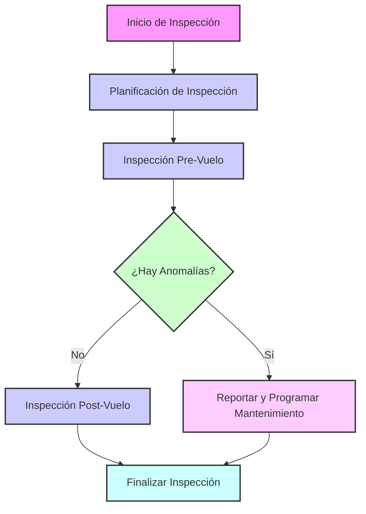
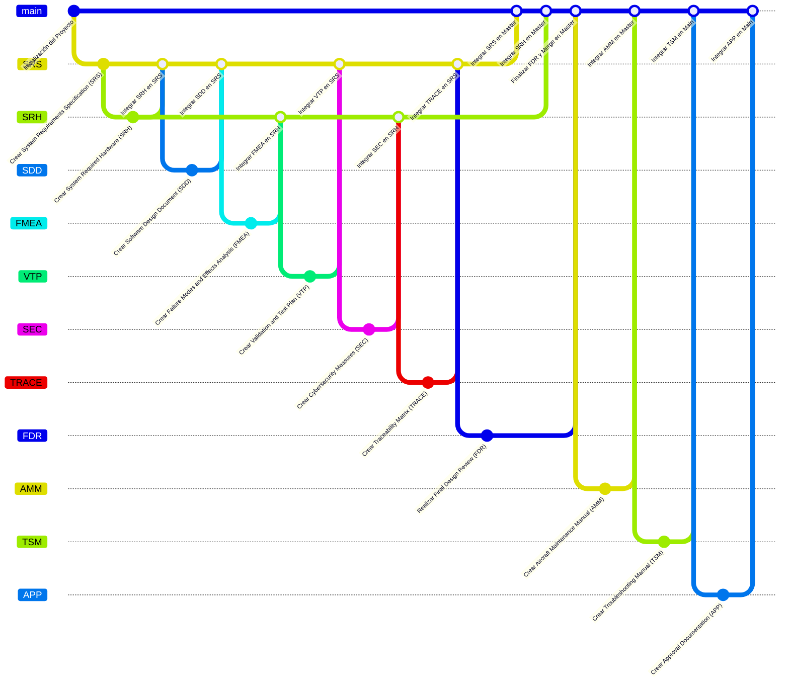

## Lista de ATA Chapters para GAIA AIR – Ampel360XWLRGA Aircraft

### **General**
| ATA Number | Chapter Name                                     |
|------------|--------------------------------------------------|
| ATA 00     | [General](#00-general)                           |
| ATA 01     | [Maintenance Policy](#01-maintenance-policy)     |
| ATA 02     | [Weight and Balance](#02-weight-and-balance)     |
| ATA 03     | [Minimum Equipment](#03-minimum-equipment)       |
| ATA 04     | [Airworthiness Limitations](#04-airworthiness-limitations) |
| ATA 05     | [Time Limits/Maintenance Controls](#05-time-limitsmaintenance-controls) |
| ATA 06     | [Dimensions and Surfaces](#06-dimensions-and-surfaces) |
| ATA 07     | [Lifting, Bracing, and Support](#07-lifting-bracing-and-support) |
| ATA 09     | [Towing and Ground Handling](#09-towing-and-ground-handling) |
| ATA 10     | [Parking, Mooring, Storage, and Return to Service](#10-parking-mooring-storage-and-return-to-service) |
| ATA 11     | [Signs and Markings](#11-signs-and-markings)       |
| ATA 12     | [Service – Routine Maintenance](#12-service-routine-maintenance) |
| ATA 13     | [General Hardware and Tools](#13-general-hardware-and-tools) |
| ATA 14     | [Tools](#14-tools)                               |
| ATA 15     | [External Training](#15-external-training)       |
| ATA 16     | [Ground Support Equipment](#16-ground-support-equipment) |
| ATA 17     | [Auxiliary Equipment](#17-auxiliary-equipment)   |
| ATA 18     | [Vibration](#18-vibration)                       |
| ATA 19     | [Fuel](#19-fuel)                                 |

### **Systems**
| ATA Number | Chapter Name                                         |
|------------|------------------------------------------------------|
| ATA 20     | [Standard Practices](#20-standard-practices)         |
| ATA 21     | [Air Conditioning and Pressurization](#21-air-conditioning-and-pressurization) |
| ATA 22     | [Autopilot](#22-autopilot)                           |
| ATA 23     | [Communications](#23-communications)                 |
| ATA 24     | [Electrical System](#24-electrical-system)           |
| ATA 25     | [Equipment and Accessories](#25-equipment-and-accessories) |
| ATA 26     | [Fire Protection](#26-fire-protection)               |
| ATA 27     | [Flight Controls](#27-flight-controls)               |
| ATA 28     | [Fuel](#28-fuel)                                     |
| ATA 29     | [Hydraulic System](#29-hydraulic-system)             |
| ATA 30     | [Ice and Rain Protection](#30-ice-and-rain-protection) |
| ATA 31     | [Indication and Recording Systems](#31-indication-and-recording-systems) |
| ATA 32     | [Landing Gear](#32-landing-gear)                     |
| ATA 33     | [Lights](#33-lights)                                 |
| ATA 34     | [Navigation](#34-navigation)                         |
| ATA 35     | [Oxygen](#35-oxygen)                                 |
| ATA 36     | [Pneumatic System](#36-pneumatic-system)             |
| ATA 37     | [Pressure and Vacuum](#37-pressure-and-vacuum)       |
| ATA 38     | [Water/Waste](#38-waterwaste)                         |
| ATA 39     | [Electrical-Electronic Panels and Multi-use Components](#39-electrical-electronic-panels-and-multi-use-components) |
| ATA 40     | [Multi-System](#40-multi-system)                     |
| ATA 41     | [Water/Ballast](#41-waterballast)                     |
| ATA 42     | [Integrated Modular Avionics](#42-integrated-modular-avionics) |
| ATA 44     | [Cabin Systems](#44-cabin-systems)                   |
| ATA 45     | [Diagnostic and Maintenance Systems](#45-diagnostic-and-maintenance-systems) |
| ATA 46     | [Information Systems](#46-information-systems)       |
| ATA 47     | [Nitrogen Generation System](#47-nitrogen-generation-system) |
| ATA 48     | [In-flight Fuel Dispensing](#48-in-flight-fuel-dispensing) |
| ATA 49     | [Auxiliary Power Unit](#49-auxiliary-power-unit)     |
| ATA 50     | [Cargo Compartments and Accessories](#50-cargo-compartments-and-accessories) |

### **Structure**
| ATA Number | Chapter Name                                               |
|------------|------------------------------------------------------------|
| ATA 51     | [Standard Practices and Structures – General](#51-standard-practices-and-structures-general) |
| ATA 52     | [Doors](#52-doors)                                        |
| ATA 53     | [Fuselage](#53-fuselage)                                  |
| ATA 54     | [Gondolas/Pylons](#54-gondolaspylons)                      |
| ATA 55     | [Stabilizers](#55-stabilizers)                            |
| ATA 56     | [Windows](#56-windows)                                    |
| ATA 57     | [Wings](#57-wings)                                        |

### **Propellers/Rotors**
| ATA Number | Chapter Name                                               |
|------------|------------------------------------------------------------|
| ATA 60     | [Practical Standards – Propeller/Rotor](#60-practical-standards-propellerrotor) |
| ATA 61     | [Propellers and Propulsors](#61-propellers-and-propulsors) |
| ATA 62     | [Main Rotor(s)](#62-main-rotors)                           |
| ATA 63     | [Rotor Impeller](#63-rotor-impeller)                       |
| ATA 64     | [Tail Rotor](#64-tail-rotor)                               |
| ATA 65     | [Tail Rotor Thrust](#65-tail-rotor-thrust)                 |
| ATA 66     | [Folding Blades/Pylons](#66-folding-bladespylons)          |
| ATA 67     | [In-flight Rotor Controls](#67-in-flight-rotor-controls)   |

### **Powerplant**
| ATA Number | Chapter Name                                        |
|------------|-----------------------------------------------------|
| ATA 70     | [Practical Engine Standards](#70-practical-engine-standards) |
| ATA 71     | [Power Plant](#71-power-plant)                      |
| ATA 72     | [Turbines/Turboprop Engines](#72-turbines-turboprop-engines) |
| ATA 73     | [Engine Fuel Control and Management](#73-engine-fuel-control-and-management) |
| ATA 74     | [Engine Ignition](#74-engine-ignition)              |
| ATA 75     | [Air Bleed](#75-air-bleed)                          |
| ATA 76     | [Engine Controls](#76-engine-controls)              |
| ATA 77     | [Engine Indicators](#77-engine-indicators)          |
| ATA 78     | [Engine Exhaust System](#78-engine-exhaust-system)  |
| ATA 79     | [Engine Oil](#79-engine-oil)                        |
| ATA 80     | [Engine Start](#80-engine-start)                    |
| ATA 81     | [Turbine System (Reciprocating Engine)](#81-turbine-system-reciprocating-engine) |
| ATA 82     | [Water Injection](#82-water-injection)              |
| ATA 83     | [Gearbox](#83-gearbox)                              |
| ATA 84     | [Propulsion Increase](#84-propulsion-increase)      |
| ATA 85     | [Fuel Cell Systems](#85-fuel-cell-systems)          |
| ATA 91     | [Graphs](#91-graphs)                                |
| ATA 92     | [Electrical System Installation](#92-electrical-system-installation) |


---

### 05.161. Inspection Process Flowchart



---

### Git Flow: Integración de Documentos


Below is an **interactive Markdown** version of the ATA breakdown for **AMPEL360XWLRGA (Advanced Aircraft Systems)**, using collapsible sections (GitHub-compatible `<details>` blocks). This structure allows for easy navigation and readability. Simply click on the **triangle** (►) beside each section to expand or collapse the details.

> **Note:** The links under each subsection (e.g., `DMC: ...`, `Document: ...`) are placeholders in this outline. In an actual repository, you could transform them into real hyperlinks to the relevant documents or references.

---

# Part II: GAIA PULSE AIR MODULES (GPAM) – Atmospheric Operations

## 2.1 AMPEL360XWLRGA (Advanced Aircraft Systems)

- **Aircraft Type Designation:** **AMPEL-360**  
- **P/N (Top-Level Assembly for documentation):** `GAIAPULSE-AM-ASSY-00001-Q`

---

<details>
<summary><strong>2.1.1 ATA Chapters</strong></summary>

<br />

### **P/N: GPAM-AMPEL-0201-ATA**  
*(This is a general P/N for the ATA chapter breakdown itself, not a specific component.)*

---

<details>
<summary><strong>2.1.1.A ATA 05 – Time Limits / Maintenance Checks</strong></summary>

**P/N:** `GPAM-AMPEL-0201-05`  
*(Section P/N)*

- **IN:** `GPAM-AMPEL-0201-05-001 – Scheduled Maintenance Program (S1000D)`  
  - **DMC:** `DMC-GAIAPULSE-AMPEL-0201-05-001-A-001-00_EN-US – Scheduled Maintenance Program`  
  - **Document:** `GPAM-AMPEL-0201-05-001-A – Scheduled Maintenance Program`

- **IN:** `GPAM-AMPEL-0201-05-002 – Maintenance Time Limits (S1000D)`  
  - **DMC:** `DMC-GAIAPULSE-AMPEL-0201-05-002-A-001-00_EN-US – Maintenance Time Limits`  
  - **Document:** `GPAM-AMPEL-0201-05-002-A – Maintenance Time Limits`

- **IN:** `GPAM-AMPEL-0201-05-003 – Airworthiness Limitations (S1000D)`  
  - **DMC:** `DMC-GAIAPULSE-AMPEL-0201-05-003-A-001-00_EN-US – Airworthiness Limitations`  
  - **Document:** `GPAM-AMPEL-0201-05-003-A – Airworthiness Limitations`

</details>

---

<details>
<summary><strong>2.1.1.B ATA 06 – Dimensions and Areas</strong></summary>

**P/N:** `GPAM-AMPEL-0201-06`  
*(Section P/N)*

- **IN:** `GPAM-AMPEL-0201-06-001 – Aircraft Dimensions and Stations (S1000D)`  
  - **DMC:** `DMC-GAIAPULSE-AMPEL-0201-06-001-A-001-00_EN-US – Aircraft Dimensions and Stations`  
  - **Document:** `GPAM-AMPEL-0201-06-001-A – Aircraft Dimensions and Stations`  
  - **PDR:** `PDR-GAIAPULSE-AMPEL-0201-06-001`  
  - **PBS:** `PBS-GAIAPULSE-AMPEL-0201-06-001`  
  - **BOM:** `BOM-GAIAPULSE-AMPEL-0201-06-001`

- **IN:** `GPAM-AMPEL-0201-06-002 – Compartment Layout and Dimensions (S1000D)`  
  - **DMC:** `DMC-GAIAPULSE-AMPEL-0201-06-002-A-001-00_EN-US – Compartment Layout and Dimensions`  
  - **Document:** `GPAM-AMPEL-0201-06-002-A – Compartment Layout and Dimensions`  
  - **PDR:** `PDR-GAIAPULSE-AMPEL-0201-06-002`  
  - **PBS:** `PBS-GAIAPULSE-AMPEL-0201-06-002`  
  - **BOM:** `BOM-GAIAPULSE-AMPEL-0201-06-002`

- **IN:** `GPAM-AMPEL-0201-06-003-A – AMPEL360XWLRGA Measurement Point Definitions`  
  - **Document:** `GPAM-AMPEL-0201-06-003-A – AMPEL360XWLRGA Measurement Point Definitions`

</details>

---

<details>
<summary><strong>2.1.1.C ATA 07 – Lifting and Shoring</strong></summary>

**P/N:** `GPAM-AMPEL-0201-07`  
*(Section P/N)*

- **IN:** `GPAM-AMPEL-0201-07-001 – Lifting Procedures and Diagrams (S1000D)`  
  - **DMC:** `DMC-GAIAPULSE-AMPEL-0201-07-001-A-001-00_EN-US – Lifting Procedures and Diagrams`  
  - **Document:** `GPAM-AMPEL-0201-07-001-A – Lifting Procedures and Diagrams`  
  - **PDR:** `PDR-GAIAPULSE-AMPEL-0201-07-001`  
  - **PBS:** `PBS-GAIAPULSE-AMPEL-0201-07-001`  
  - **BOM:** `BOM-GAIAPULSE-AMPEL-0201-07-001`

- **IN:** `GPAM-AMPEL-0201-07-002 – Shoring Procedures and Diagrams (S1000D)`  
  - **DMC:** `DMC-GAIAPULSE-AMPEL-0201-07-002-A-001-00_EN-US – Shoring Procedures and Diagrams`  
  - **Document:** `GPAM-AMPEL-0201-07-002-A – Shoring Procedures and Diagrams`  
  - **PDR:** `PDR-GAIAPULSE-AMPEL-0201-07-002`  
  - **PBS:** `PBS-GAIAPULSE-AMPEL-0201-07-002`  
  - **BOM:** `BOM-GAIAPULSE-AMPEL-0201-07-002`

</details>

---

<details>
<summary><strong>2.1.1.D ATA 08 – Leveling and Weighing</strong></summary>

**P/N:** `GPAM-AMPEL-0201-08`  
*(Section P/N)*

- **IN:** `GPAM-AMPEL-0201-08-001 – Leveling Procedures (S1000D)`  
  - **DMC:** `DMC-GAIAPULSE-AMPEL-0201-08-001-A-001-00_EN-US – Leveling Procedures`  
  - **Document:** `GPAM-AMPEL-0201-08-001-A – Leveling Procedures`

- **IN:** `GPAM-AMPEL-0201-08-002 – Aircraft Weighing Procedures (S1000D)`  
  - **DMC:** `DMC-GAIAPULSE-AMPEL-0201-08-002-A-001-00_EN-US – Aircraft Weighing Procedures`  
  - **Document:** `GPAM-AMPEL-0201-08-002-A – Aircraft Weighing Procedures`

</details>

---

<details>
<summary><strong>2.1.1.E ATA 09 – Towing and Taxiing</strong></summary>

**P/N:** `GPAM-AMPEL-0201-09`

- **IN:** `GPAM-AMPEL-0201-09-001 – Towing Procedures (S1000D)`  
  - **DMC:** `DMC-GAIAPULSE-AMPEL-0201-09-001-A-001-00_EN-US – Towing Procedures`  
  - **Document:** `GPAM-AMPEL-0201-09-001-A – Towing Procedures`

- **IN:** `GPAM-AMPEL-0201-09-002 – Taxiing Procedures (S1000D)`  
  - **DMC:** `DMC-GAIAPULSE-AMPEL-0201-09-002-A-001-00_EN-US – Taxiing Procedures`  
  - **Document:** `GPAM-AMPEL-0201-09-002-A – Taxiing Procedures`

</details>

---

<details>
<summary><strong>2.1.1.F ATA 10 – Parking, Mooring, Storage, and Return to Service</strong></summary>

**P/N:** `GPAM-AMPEL-0201-10`

- **IN:** `GPAM-AMPEL-0201-10-001 – Parking Procedures (S1000D)`  
  - **DMC:** `DMC-GAIAPULSE-AMPEL-0201-10-001-A-001-00_EN-US – Parking Procedures`  
  - **Document:** `GPAM-AMPEL-0201-10-001-A – Parking Procedures`

- **IN:** `GPAM-AMPEL-0201-10-002 – Mooring Procedures (S1000D)`  
  - **DMC:** `DMC-GAIAPULSE-AMPEL-0201-10-002-A-001-00_EN-US – Mooring Procedures`  
  - **Document:** `GPAM-AMPEL-0201-10-002-A – Mooring Procedures`

- **IN:** `GPAM-AMPEL-0201-10-003 – Storage Procedures (S1000D)`  
  - **DMC:** `DMC-GAIAPULSE-AMPEL-0201-10-003-A-001-00_EN-US – Storage Procedures`  
  - **Document:** `GPAM-AMPEL-0201-10-003-A – Storage Procedures`

- **IN:** `GPAM-AMPEL-0201-10-004 – Return to Service Procedures (S1000D)`  
  - **DMC:** `DMC-GAIAPULSE-AMPEL-0201-10-004-A-001-00_EN-US – Return to Service Procedures`  
  - **Document:** `GPAM-AMPEL-0201-10-004-A – Return to Service Procedures`

</details>

---

<details>
<summary><strong>2.1.1.G ATA 11 – Placards and Markings</strong></summary>

**P/N:** `GPAM-AMPEL-0201-11`

- **IN:** `GPAM-AMPEL-0201-11-001 – Exterior Placard Locations (S1000D)`  
  - **DMC:** `DMC-GAIAPULSE-AMPEL-0201-11-001-A-001-00_EN-US – Exterior Placard Locations`  
  - **Document:** `GPAM-AMPEL-0201-11-001-A – Exterior Placard Locations`

- **IN:** `GPAM-AMPEL-0201-11-002 – Interior Placard Locations (S1000D)`  
  - **DMC:** `DMC-GAIAPULSE-AMPEL-0201-11-002-A-001-00_EN-US – Interior Placard Locations`  
  - **Document:** `GPAM-AMPEL-0201-11-002-A – Interior Placard Locations`

- **IN:** `GPAM-AMPEL-0201-11-003 – Marking Specifications (S1000D)`  
  - **DMC:** `DMC-GAIAPULSE-AMPEL-0201-11-003-A-001-00_EN-US – Marking Specifications`  
  - **Document:** `GPAM-AMPEL-0201-11-003-A – Marking Specifications`

</details>

---

<details>
<summary><strong>2.1.1.H ATA 12 – Servicing</strong></summary>

**P/N:** `GPAM-AMPEL-0201-12`

- **IN:** `GPAM-AMPEL-0201-12-001 – Fluid Servicing Procedures (S1000D)`  
  - **DMC:** `DMC-GAIAPULSE-AMPEL-0201-12-001-A-001-00_EN-US – Fluid Servicing Procedures`  
  - **Document:** `GPAM-AMPEL-0201-12-001-A – Fluid Servicing Procedures`

- **IN:** `GPAM-AMPEL-0201-12-002 – Nitrogen/Oxygen Servicing Procedures (S1000D)`  
  - **DMC:** `DMC-GAIAPULSE-AMPEL-0201-12-002-A-001-00_EN-US – Nitrogen/Oxygen Servicing Procedures`  
  - **Document:** `GPAM-AMPEL-0201-12-002-A – Nitrogen/Oxygen Servicing Procedures`

- **IN:** `GPAM-AMPEL-0201-12-003 – Lubrication Procedures (S1000D)`  
  - **DMC:** `DMC-GAIAPULSE-AMPEL-0201-12-003-A-001-00_EN-US – Lubrication Procedures`  
  - **Document:** `GPAM-AMPEL-0201-12-003-A – Lubrication Procedures`

- **IN:** `GPAM-AMPEL-0201-12-004 – Water Servicing Procedures (S1000D)`  
  - **DMC:** `DMC-GAIAPULSE-AMPEL-0201-12-004-A-001-00_EN-US – Water Servicing Procedures`  
  - **Document:** `GPAM-AMPEL-0201-12-004-A – Water Servicing Procedures`

</details>

---

<details>
<summary><strong>2.1.1.I ATA 18 – Vibration and Noise Analysis</strong></summary>

**P/N:** `GPAM-AMPEL-0201-18`

- **IN:** `GPAM-AMPEL-0201-18-001 – Vibration Analysis Procedures (S1000D)`  
  - **DMC:** `DMC-GAIAPULSE-AMPEL-0201-18-001-A-001-00_EN-US – Vibration Analysis Procedures`  
  - **Document:** `GPAM-AMPEL-0201-18-001-A – Vibration Analysis Procedures`

- **IN:** `GPAM-AMPEL-0201-18-002 – Noise Level Measurement Procedures (S1000D)`  
  - **DMC:** `DMC-GAIAPULSE-AMPEL-0201-18-002-A-001-00_EN-US – Noise Level Measurement Procedures`  
  - **Document:** `GPAM-AMPEL-0201-18-002-A – Noise Level Measurement Procedures`

- **IN:** `GPAM-AMPEL-0201-18-003 – Vibration and Noise Limits and Acceptability Criteria (S1000D)`  
  - **DMC:** `DMC-GAIAPULSE-AMPEL-0201-18-003-A-001-00_EN-US – Vibration and Noise Limits and Acceptability Criteria`  
  - **Document:** `GPAM-AMPEL-0201-18-003-A – Vibration and Noise Limits and Acceptability Criteria`

</details>

---

<details>
<summary><strong>2.1.1.L ATA 20 – Standard Practices – Airframe</strong></summary>

**P/N:** `GPAM-AMPEL-0201-20`

- **IN:** `GPAM-AMPEL-0201-20-001 – Airframe Standard Practices Manual (S1000D)`  
  - **DMC:** `DMC-GAIAPULSE-AMPEL-0201-20-001-A-001-00_EN-US – Airframe Standard Practices Manual`  
  - **Document:** `GPAM-AMPEL-0201-20-001-A – Airframe Standard Practices Manual`

- **IN:** `GPAM-AMPEL-0201-20-002 – Corrosion Prevention and Control (S1000D)`  
  - **DMC:** `DMC-GAIAPULSE-AMPEL-0201-20-002-A-001-00_EN-US – Corrosion Prevention and Control`  
  - **Document:** `GPAM-AMPEL-0201-20-002-A – Corrosion Prevention and Control`

- **IN:** `GPAM-AMPEL-0201-20-003 – Non-Destructive Testing (NDT) Procedures (S1000D)`  
  - **DMC:** `DMC-GAIAPULSE-AMPEL-0201-20-003-A-001-00_EN-US – Non-Destructive Testing (NDT) Procedures`  
  - **Document:** `GPAM-AMPEL-0201-20-003-A – Non-Destructive Testing (NDT) Procedures`

</details>

---

<details>
<summary><strong>2.1.1.K ATA 21 – Air Conditioning and Pressurization</strong></summary>

**P/N:** `GPAM-AMPEL-0201-21`

- **IN:** `GPAM-AMPEL-0201-21-001 – Air Conditioning System Description and Operation (S1000D)`  
  - **DMC:** `DMC-GAIAPULSE-AMPEL-0201-21-001-A-001-00_EN-US – Air Conditioning System Description and Operation`  
  - **Document:** `GPAM-AMPEL-0201-21-001-A – Air Conditioning System Description and Operation`

- **IN:** `GPAM-AMPEL-0201-21-002 – Pressurization System Description and Operation (S1000D)`  
  - **DMC:** `DMC-GAIAPULSE-AMPEL-0201-21-002-A-001-00_EN-US – Pressurization System Description and Operation`  
  - **Document:** `GPAM-AMPEL-0201-21-002-A – Pressurization System Description and Operation`

- **IN:** `GPAM-AMPEL-0201-21-003 – Quantum Enhanced Air Purification System (QE-APS) Description (S1000D)`  
  - **DMC:** `DMC-GAIAPULSE-AMPEL-0201-21-003-A-001-00_EN-US – Quantum Enhanced Air Purification System (QE-APS) Description`  
  - **Document:** `GPAM-AMPEL-0201-21-003-A – Quantum Enhanced Air Purification System (QE-APS) Description`

</details>

---

<details>
<summary><strong>2.1.1.L ATA 22 – Autoflight</strong></summary>

**P/N:** `GPAM-AMPEL-0201-22`

- **IN:** `GPAM-AMPEL-0201-22-001 – Autopilot System Description and Operation (S1000D)`  
  - **DMC:** `DMC-GAIAPULSE-AMPEL-0201-22-001-A-001-00_EN-US – Autopilot System Description and Operation`  
  - **Document:** `GPAM-AMPEL-0201-22-001-A – Autopilot System Description and Operation`

- **IN:** `GPAM-AMPEL-0201-22-002 – Flight Management System (FMS) Description and Operation (S1000D)`  
  - **DMC:** `DMC-GAIAPULSE-AMPEL-0201-22-002-A-001-00_EN-US – Flight Management System (FMS) Description and Operation`  
  - **Document:** `GPAM-AMPEL-0201-22-002-A – Flight Management System (FMS) Description and Operation`

- **IN:** `GPAM-AMPEL-0201-22-003 – AI-Enhanced Flight Control System (AI-FCS) Description (S1000D)`  
  - **DMC:** `DMC-GAIAPULSE-AMPEL-0201-22-003-A-001-00_EN-US – AI-Enhanced Flight Control System (AI-FCS) Description`  
  - **Document:** `GPAM-AMPEL-0201-22-003-A – AI-Enhanced Flight Control System (AI-FCS) Description`

</details>

---

<details>
<summary><strong>2.1.1.M ATA 23 – Communications</strong></summary>

**P/N:** `GPAM-AMPEL-0201-23`

- **IN:** `GPAM-AMPEL-0201-23-001 – Communication Systems Overview (S1000D)`  
  - **DMC:** `DMC-GAIAPULSE-AMPEL-0201-23-001-A-001-00_EN-US – Communication Systems Overview`  
  - **Document:** `GPAM-AMPEL-0201-23-001-A – Communication Systems Overview`

- **IN:** `GPAM-AMPEL-0201-23-002 – Satellite Communication (SATCOM) System Description and Operation (S1000D)`  
  - **DMC:** `DMC-GAIAPULSE-AMPEL-0201-23-002-A-001-00_EN-US – Satellite Communication (SATCOM) System)`  
  - **Document:** `GPAM-AMPEL-0201-23-002-A – Satellite Communication (SATCOM) System Description and Operation`

- **IN:** `GPAM-AMPEL-0201-23-003 – Air-to-Ground Communication System Description and Operation (S1000D)`  
  - **DMC:** `DMC-GAIAPULSE-AMPEL-0201-23-003-A-001-00_EN-US – Air-to-Ground Communication System Description and Operation`  
  - **Document:** `GPAM-AMPEL-0201-23-003-A – Air-to-Ground Communication System Description and Operation`

- **IN:** `GPAM-AMPEL-0201-23-004 – Quantum Communication System (QCS) Description (S1000D)`  
  - **DMC:** `DMC-GAIAPULSE-AMPEL-0201-23-004-A-001-00_EN-US – Quantum Communication System (QCS) Description`  
  - **Document:** `GPAM-AMPEL-0201-23-004-A – Quantum Communication System (QCS) Description`

</details>

---

<details>
<summary><strong>2.1.1.N ATA 24 – Electrical Power</strong></summary>

**P/N:** `GPAM-AMPEL-0201-24`

- **IN:** `GPAM-AMPEL-0201-24-001 – Electrical Power Generation System Description and Operation (S1000D)`  
  - **DMC:** `DMC-GAIAPULSE-AMPEL-0201-24-001-A-001-00_EN-US – Electrical Power Generation System Description and Operation`  
  - **Document:** `GPAM-AMPEL-0201-24-001-A – Electrical Power Generation System Description and Operation`

- **IN:** `GPAM-AMPEL-0201-24-002 – Electrical Power Distribution System Description and Operation (S1000D)`  
  - **DMC:** `DMC-GAIAPULSE-AMPEL-0201-24-002-A-001-00_EN-US – Electrical Power Distribution System Description and Operation`  
  - **Document:** `GPAM-AMPEL-0201-24-002-A – Electrical Power Distribution System Description and Operation`

- **IN:** `GPAM-AMPEL-0201-24-003 – Quantum Energy Management System (Q-EMS) Description (S1000D)`  
  - **DMC:** `DMC-GAIAPULSE-AMPEL-0201-24-003-A-001-00_EN-US – Quantum Energy Management System (Q-EMS) Description`  
  - **Document:** `GPAM-AMPEL-0201-24-003-A – Quantum Energy Management System (Q-EMS) Description`

</details>

---

<details>
<summary><strong>2.1.1.O ATA 25 – Equipment / Furnishings</strong></summary>

**P/N:** `GPAM-AMPEL-0201-25`

- **IN:** `GPAM-AMPEL-0201-25-001 – Flight Deck Equipment and Furnishings (S1000D)`  
  - **DMC:** `DMC-GAIAPULSE-AMPEL-0201-25-001-A-001-00_EN-US – Flight Deck Equipment and Furnishings`  
  - **Document:** `GPAM-AMPEL-0201-25-001-A – Flight Deck Equipment and Furnishings`

- **IN:** `GPAM-AMPEL-0201-25-002 – Cabin Equipment and Furnishings (S1000D)`  
  - **DMC:** `DMC-GAIAPULSE-AMPEL-0201-25-002-A-001-00_EN-US – Cabin Equipment and Furnishings`  
  - **Document:** `GPAM-AMPEL-0201-25-002-A – Cabin Equipment and Furnishings`

- **IN:** `GPAM-AMPEL-0201-25-003 – Emergency Equipment (S1000D)`  
  - **DMC:** `DMC-GAIAPULSE-AMPEL-0201-25-003-A-001-00_EN-US – Emergency Equipment`  
  - **Document:** `GPAM-AMPEL-0201-25-003-A – Emergency Equipment`

</details>

---

<details>
<summary><strong>2.1.1.P ATA 26 – Fire Protection</strong></summary>

**P/N:** `GPAM-AMPEL-0201-26`

- **IN:** `GPAM-AMPEL-0201-26-001 – Fire Detection System Description and Operation (S1000D)`  
  - **DMC:** `DMC-GAIAPULSE-AMPEL-0201-26-001-A-001-00_EN-US – Fire Detection System Description and Operation`  
  - **Document:** `GPAM-AMPEL-0201-26-001-A – Fire Detection System Description and Operation`

- **IN:** `GPAM-AMPEL-0201-26-002 – Fire Extinguishing System Description and Operation (S1000D)`  
  - **DMC:** `DMC-GAIAPULSE-AMPEL-0201-26-002-A-001-00_EN-US – Fire Extinguishing System Description and Operation`  
  - **Document:** `GPAM-AMPEL-0201-26-002-A – Fire Extinguishing System Description and Operation`

- **IN:** `GPAM-AMPEL-0201-26-003 – Quantum Resonance Fire Suppression System (QRFSS) Description (S1000D)`  
  - **DMC:** `DMC-GAIAPULSE-AMPEL-0201-26-003-A-001-00_EN-US – Quantum Resonance Fire Suppression System (QRFSS) Description`  
  - **Document:** `GPAM-AMPEL-0201-26-003-A – Quantum Resonance Fire Suppression System (QRFSS) Description`

</details>

---

<details>
<summary><strong>2.1.1.Q ATA 27 – Flight Controls</strong></summary>

**P/N:** `GPAM-AMPEL-0201-27`

- **IN:** `GPAM-AMPEL-0201-27-001 – Primary Flight Controls System Description and Operation (S1000D)`  
  - **DMC:** `DMC-GAIAPULSE-AMPEL-0201-27-001-A-001-00_EN-US – Primary Flight Controls System Description and Operation`  
  - **Document:** `GPAM-AMPEL-0201-27-001-A – Primary Flight Controls System Description and Operation`

- **IN:** `GPAM-AMPEL-0201-27-002 – Secondary Flight Controls System Description and Operation (S1000D)`  
  - **DMC:** `DMC-GAIAPULSE-AMPEL-0201-27-002-A-001-00_EN-US – Secondary Flight Controls System Description and Operation`  
  - **Document:** `GPAM-AMPEL-0201-27-002-A – Secondary Flight Controls System Description and Operation`

- **IN:** `GPAM-AMPEL-0201-27-003 – Quantum Flight Control Augmentation System (Q-FCAS) Description (S1000D)`  
  - **DMC:** `DMC-GAIAPULSE-AMPEL-0201-27-003-A-001-00_EN-US – Quantum Flight Control Augmentation System (Q-FCAS) Description`  
  - **Document:** `GPAM-AMPEL-0201-27-003-A – Quantum Flight Control Augmentation System (Q-FCAS) Description`

</details>

---

<details>
<summary><strong>2.1.1.R ATA 28 – Fuel</strong></summary>

**P/N:** `GPAM-AMPEL-0201-28`

- **IN:** `GPAM-AMPEL-0201-28-001 – Fuel System Description and Operation (S1000D)`  
  - **DMC:** `DMC-GAIAPULSE-AMPEL-0201-28-001-A-001-00_EN-US – Fuel System Description and Operation`  
  - **Document:** `GPAM-AMPEL-0201-28-001-A – Fuel System Description and Operation`

- **IN:** `GPAM-AMPEL-0201-28-002 – Fuel Storage and Distribution (S1000D)`  
  - **DMC:** `DMC-GAIAPULSE-AMPEL-0201-28-002-A-001-00_EN-US – Fuel Storage and Distribution`  
  - **Document:** `GPAM-AMPEL-0201-28-002-A – Fuel Storage and Distribution`

- **IN:** `GPAM-AMPEL-0201-28-003 – Quantum Fuel Efficiency System (Q-FES) Description (S1000D)`  
  - **DMC:** `DMC-GAIAPULSE-AMPEL-0201-28-003-A-001-00_EN-US – Quantum Fuel Efficiency System (Q-FES) Description`  
  - **Document:** `GPAM-AMPEL-0201-28-003-A – Quantum Fuel Efficiency System (Q-FES) Description`

</details>

---

<details>
<summary><strong>2.1.1.S ATA 29 – Hydraulic Power</strong></summary>

**P/N:** `GPAM-AMPEL-0201-29`

- **IN:** `GPAM-AMPEL-0201-29-001 – Hydraulic Power System Description and Operation (S1000D)`  
  - **DMC:** `DMC-GAIAPULSE-AMPEL-0201-29-001-A-001-00_EN-US – Hydraulic Power System Description and Operation`  
  - **Document:** `GPAM-AMPEL-0201-29-001-A – Hydraulic Power System Description and Operation`

- **IN:** `GPAM-AMPEL-0201-29-002 – Electro-Hydraulic Power System (EHPS) Integration Details (S1000D)`  
  - **DMC:** `DMC-GAIAPULSE-AMPEL-0201-29-002-A-001-00_EN-US – Electro-Hydraulic Power System (EHPS) Integration Details`  
  - **Document:** `GPAM-AMPEL-0201-29-002-A – Electro-Hydraulic Power System (EHPS) Integration Details`

</details>

---

<details>
<summary><strong>2.1.1.T ATA 30 – Ice and Rain Protection</strong></summary>

**P/N:** `GPAM-AMPEL-0201-30`

- **IN:** `GPAM-AMPEL-0201-30-001 – Ice Protection System Description and Operation (S1000D)`  
  - **DMC:** `DMC-GAIAPULSE-AMPEL-0201-30-001-A-001-00_EN-US – Ice Protection System Description and Operation`  
  - **Document:** `GPAM-AMPEL-0201-30-001-A – Ice Protection System Description and Operation`

- **IN:** `GPAM-AMPEL-0201-30-002 – Rain Protection System Description and Operation (S1000D)`  
  - **DMC:** `DMC-GAIAPULSE-AMPEL-0201-30-002-A-001-00_EN-US – Rain Protection System Description and Operation`  
  - **Document:** `GPAM-AMPEL-0201-30-002-A – Rain Protection System Description and Operation`

- **IN:** `GPAM-AMPEL-0201-30-003 – Quantum-Enhanced Ice Detection System (QE-IDS) Description (S1000D)`  
  - **DMC:** `DMC-GAIAPULSE-AMPEL-0201-30-003-A-001-00_EN-US – Quantum-Enhanced Ice Detection System (QE-IDS) Description`  
  - **Document:** `GPAM-AMPEL-0201-30-003-A – Quantum-Enhanced Ice Detection System (QE-IDS) Description`

</details>

---

<details>
<summary><strong>2.1.1.U ATA 31 – Indicating / Recording Systems</strong></summary>

**P/N:** `GPAM-AMPEL-0201-31`

- **IN:** `GPAM-AMPEL-0201-31-001 – Flight Data Recording System (FDRS) Description and Operation (S1000D)`  
  - **DMC:** `DMC-GAIAPULSE-AMPEL-0201-31-001-A-001-00_EN-US – Flight Data Recording System (FDRS) Description and Operation`  
  - **Document:** `GPAM-AMPEL-0201-31-001-A – Flight Data Recording System (FDRS) Description and Operation`

- **IN:** `GPAM-AMPEL-0201-31-002 – Cockpit Voice Recording System (CVRS) Description and Operation (S1000D)`  
  - **DMC:** `DMC-GAIAPULSE-AMPEL-0201-31-002-A-001-00_EN-US – Cockpit Voice Recording System (CVRS) Description and Operation`  
  - **Document:** `GPAM-AMPEL-0201-31-002-A – Cockpit Voice Recording System (CVRS) Description and Operation`

- **IN:** `GPAM-AMPEL-0201-31-003 – Quantum Data Monitoring and Recording System (Q-DMRS) Description (S1000D)`  
  - **DMC:** `DMC-GAIAPULSE-AMPEL-0201-31-003-A-001-00_EN-US – Quantum Data Monitoring and Recording System (Q-DMRS) Description`  
  - **Document:** `GPAM-AMPEL-0201-31-003-A – Quantum Data Monitoring and Recording System (Q-DMRS) Description`

</details>

---

<details>
<summary><strong>2.1.1.V ATA 32 – Landing Gear</strong></summary>

**P/N:** `GPAM-AMPEL-0201-32`

- **IN:** `GPAM-AMPEL-0201-32-001 – Landing Gear System Description and Operation (S1000D)`  
  - **DMC:** `DMC-GAIAPULSE-AMPEL-0201-32-001-A-001-00_EN-US – Landing Gear System Description and Operation`  
  - **Document:** `GPAM-AMPEL-0201-32-001-A – Landing Gear System Description and Operation`

- **IN:** `GPAM-AMPEL-0201-32-002 – Landing Gear Control and Indication (S1000D)`  
  - **DMC:** `DMC-GAIAPULSE-AMPEL-0201-32-002-A-001-00_EN-US – Landing Gear Control and Indication`  
  - **Document:** `GPAM-AMPEL-0201-32-002-A – Landing Gear Control and Indication`

- **IN:** `GPAM-AMPEL-0201-32-003 – Quantum-Optimized Landing Gear Actuation System (Q-LGAS) Description (S1000D)`  
  - **DMC:** `DMC-GAIAPULSE-AMPEL-0201-32-003-A-001-00_EN-US – Quantum-Optimized Landing Gear Actuation System (Q-LGAS) Description`  
  - **Document:** `GPAM-AMPEL-0201-32-003-A – Quantum-Optimized Landing Gear Actuation System (Q-LGAS) Description`

</details>

---

<details>
<summary><strong>2.1.1.W ATA 33 – Lights</strong></summary>

**P/N:** `GPAM-AMPEL-0201-33`

- **IN:** `GPAM-AMPEL-0201-33-001 – Exterior Lighting System Description and Operation (S1000D)`  
  - **DMC:** `DMC-GAIAPULSE-AMPEL-0201-33-001-A-001-00_EN-US – Exterior Lighting System Description and Operation`  
  - **Document:** `GPAM-AMPEL-0201-33-001-A – Exterior Lighting System Description and Operation`

- **IN:** `GPAM-AMPEL-0201-33-002 – Interior Lighting System Description and Operation (S1000D)`  
  - **DMC:** `DMC-GAIAPULSE-AMPEL-0201-33-002-A-001-00_EN-US – Interior Lighting System Description and Operation`  
  - **Document:** `GPAM-AMPEL-0201-33-002-A – Interior Lighting System Description and Operation`

- **IN:** `GPAM-AMPEL-0201-33-003 – Quantum-Optimized Lighting System (Q-LS) Description (S1000D)`  
  - **DMC:** `DMC-GAIAPULSE-AMPEL-0201-33-003-A-001-00_EN-US – Quantum-Optimized Lighting System (Q-LS) Description`  
  - **Document:** `GPAM-AMPEL-0201-33-003-A – Quantum-Optimized Lighting System (Q-LS) Description`

</details>

---

<details>
<summary><strong>2.1.1.X ATA 34 – Navigation</strong></summary>

**P/N:** `GPAM-AMPEL-0201-34`

- **IN:** `GPAM-AMPEL-0201-34-001 – Navigation Systems Overview (S1000D)`  
  - **DMC:** `DMC-GAIAPULSE-AMPEL-0201-34-001-A-001-00_EN-US – Navigation Systems Overview`  
  - **Document:** `GPAM-AMPEL-0201-34-001-A – Navigation Systems Overview`

- **IN:** `GPAM-AMPEL-0201-34-002 – Inertial Reference System (IRS) Description and Operation (S1000D)`  
  - **DMC:** `DMC-GAIAPULSE-AMPEL-0201-34-002-A-001-00_EN-US – Inertial Reference System (IRS) Description and Operation`  
  - **Document:** `GPAM-AMPEL-0201-34-002-A – Inertial Reference System (IRS) Description and Operation`

- **IN:** `GPAM-AMPEL-0201-34-003 – Global Navigation Satellite System (GNSS) Description and Operation (S1000D)`  
  - **DMC:** `DMC-GAIAPULSE-AMPEL-0201-34-003-A-001-00_EN-US – Global Navigation Satellite System (GNSS) Description and Operation`  
  - **Document:** `GPAM-AMPEL-0201-34-003-A – Global Navigation Satellite System (GNSS) Description and Operation`

- **IN:** `GPAM-AMPEL-0201-34-004 – Quantum Navigation System (QNS) Description (S1000D)`  
  - **DMC:** `DMC-GAIAPULSE-AMPEL-0201-34-004-A-001-00_EN-US – Quantum Navigation System (QNS) Description`  
  - **Document:** `GPAM-AMPEL-0201-34-004-A – Quantum Navigation System (QNS) Description`

</details>

---

<details>
<summary><strong>2.1.1.Y ATA 35 – Oxygen</strong></summary>

**P/N:** `GPAM-AMPEL-0201-35`

- **IN:** `GPAM-AMPEL-0201-35-001 – Oxygen System Description and Operation (S1000D)`  
  - **DMC:** `DMC-GAIAPULSE-AMPEL-0201-35-001-A-001-00_EN-US – Oxygen System Description and Operation`  
  - **Document:** `GPAM-AMPEL-0201-35-001-A – Oxygen System Description and Operation`

- **IN:** `GPAM-AMPEL-0201-35-002 – Crew Oxygen System (S1000D)`  
  - **DMC:** `DMC-GAIAPULSE-AMPEL-0201-35-002-A-001-00_EN-US – Crew Oxygen System`  
  - **Document:** `GPAM-AMPEL-0201-35-002-A – Crew Oxygen System`

- **IN:** `GPAM-AMPEL-0201-35-003 – Passenger Oxygen System (S1000D)`  
  - **DMC:** `DMC-GAIAPULSE-AMPEL-0201-35-003-A-001-00_EN-US – Passenger Oxygen System`  
  - **Document:** `GPAM-AMPEL-0201-35-003-A – Passenger Oxygen System`

</details>

---

<details>
<summary><strong>2.1.1.Z ATA 36 – Pneumatic</strong></summary>

**P/N:** `GPAM-AMPEL-0201-36`

- **IN:** `GPAM-AMPEL-0201-36-001 – Pneumatic System Description and Operation (S1000D)`  
  - **DMC:** `DMC-GAIAPULSE-AMPEL-0201-36-001-A-001-00_EN-US – Pneumatic System Description and Operation`  
  - **Document:** `GPAM-AMPEL-0201-36-001-A – Pneumatic System Description and Operation`

</details>

---

<details>
<summary><strong>2.1.1.AA ATA 38 – Water/Waste</strong></summary>

**P/N:** `GPAM-AMPEL-0201-38`

- **IN:** `GPAM-AMPEL-0201-38-001 – Water System Description and Operation (S1000D)`  
  - **DMC:** `DMC-GAIAPULSE-AMPEL-0201-38-001-A-001-00_EN-US – Water System Description and Operation`  
  - **Document:** `GPAM-AMPEL-0201-38-001-A – Water System Description and Operation`

- **IN:** `GPAM-AMPEL-0201-38-002 – Waste System Description and Operation (S1000D)`  
  - **DMC:** `DMC-GAIAPULSE-AMPEL-0201-38-002-A-001-00_EN-US – Waste System Description and Operation`  
  - **Document:** `GPAM-AMPEL-0201-38-002-A – Waste System Description and Operation`

</details>

---

<details>
<summary><strong>2.1.1.I ATA 45 – Central Maintenance System (CMS)</strong></summary>

**P/N:** `GPAM-AMPEL-0201-45`

- **IN:** `GPAM-AMPEL-0201-45-001 – Central Maintenance System (CMS) Description and Operation (S1000D)`  
  - **DMC:** `DMC-GAIAPULSE-AMPEL-0201-45-001-A-001-00_EN-US – Central Maintenance System (CMS) Description and Operation`  
  - **Document:** `GPAM-AMPEL-0201-45-001-A – Central Maintenance System (CMS) Description and Operation`

- **IN:** `GPAM-AMPEL-0201-45-002 – Quantum-Enhanced Central Maintenance System (Q-CMS) Integration (S1000D)`  
  - **DMC:** `DMC-GAIAPULSE-AMPEL-0201-45-002-A-001-00_EN-US – Quantum-Enhanced Central Maintenance System (Q-CMS) Integration`  
  - **Document:** `GPAM-AMPEL-0201-45-002-A – Quantum-Enhanced Central Maintenance System (Q-CMS) Integration`

- **IN:** `GPAM-AMPEL-0201-45-003 – CMS Data and Fault Reporting (S1000D)`  
  - **DMC:** `DMC-GAIAPULSE-AMPEL-0201-45-003-A-001-00_EN-US – CMS Data and Fault Reporting`  
  - **Document:** `GPAM-AMPEL-0201-45-003-A – CMS Data and Fault Reporting`

**P/N:** `GPAM-AMPEL-0201-46`  

- **IN:** `GPAM-AMPEL-0201-46-001 – Aircraft Information Management System (AIMS) Overview (S1000D)`  
  - **DMC:** `DMC-GAIAPULSE-AMPEL-0201-46-001-A-001-00_EN-US – Aircraft Information Management System (AIMS) Overview`  
  - **Document:** `GPAM-AMPEL-0201-46-001-A – Aircraft Information Management System (AIMS) Overview`

- **IN:** `GPAM-AMPEL-0201-46-002 – Quantum Information Network Integration (Q-INI) (S1000D)`  
  - **DMC:** `DMC-GAIAPULSE-AMPEL-0201-46-002-A-001-00_EN-US – Quantum Information Network Integration (Q-INI)`  
  - **Document:** `GPAM-AMPEL-0201-46-002-A – Quantum Information Network Integration (Q-INI)`

- **IN:** `GPAM-AMPEL-0201-46-003 – Electronic Documentation System (EDS) for Maintenance (S1000D)`  
  - **DMC:** `DMC-GAIAPULSE-AMPEL-0201-46-003-A-001-00_EN-US – Electronic Documentation System (EDS) for Maintenance`  
  - **Document:** `GPAM-AMPEL-0201-46-003-A – Electronic Documentation System (EDS) for Maintenance`

</details>

---

<details>
<summary><strong>2.1.1.AB ATA 49 – Airborne Auxiliary Power</strong></summary>

**P/N:** `GPAM-AMPEL-0201-49`

- **IN:** `GPAM-AMPEL-0201-49-001 – Auxiliary Power Unit (APU) Description and Operation (S1000D)`  
  - **DMC:** `DMC-GAIAPULSE-AMPEL-0201-49-001-A-001-00_EN-US – Auxiliary Power Unit (APU) Description and Operation`  
  - **Document:** `GPAM-AMPEL-0201-49-001-A – Auxiliary Power Unit (APU) Description and Operation`

</details>

---

<details>
<summary><strong>2.1.1.AC ATA 51 – Standard Practices and Structures - General</strong></summary>

**P/N:** `GPAM-AMPEL-0201-51`

- **IN:** `GPAM-AMPEL-0201-51-001 – Structural Repair Manual (SRM) - General Practices (S1000D)`  
  - **DMC:** `DMC-GAIAPULSE-AMPEL-0201-51-001-A-001-00_EN-US – Structural Repair Manual (SRM) - General Practices`  
  - **Document:** `GPAM-AMPEL-0201-51-001-A – Structural Repair Manual (SRM) - General Practices`

</details>

---

<details>
<summary><strong>2.1.1.AD ATA 52 – Doors</strong></summary>

**P/N:** `GPAM-AMPEL-0201-52`

- **IN:** `GPAM-AMPEL-0201-52-001 – Passenger Doors Description and Operation (S1000D)`  
  - **DMC:** `DMC-GAIAPULSE-AMPEL-0201-52-001-A-001-00_EN-US – Passenger Doors Description and Operation`  
  - **Document:** `GPAM-AMPEL-0201-52-001-A – Passenger Doors Description and Operation`

- **IN:** `GPAM-AMPEL-0201-52-002 – Cargo Doors Description and Operation (S1000D)`  
  - **DMC:** `DMC-GAIAPULSE-AMPEL-0201-52-002-A-001-00_EN-US – Cargo Doors Description and Operation`  
  - **Document:** `GPAM-AMPEL-0201-52-002-A – Cargo Doors Description and Operation`

- **IN:** `GPAM-AMPEL-0201-52-003 – Quantum-Sealed Door System (Q-SDS) Description (S1000D)`  
  - **DMC:** `DMC-GAIAPULSE-AMPEL-0201-52-003-A-001-00_EN-US – Quantum-Sealed Door System (Q-SDS) Description`  
  - **Document:** `GPAM-AMPEL-0201-52-003-A – Quantum-Sealed Door System (Q-SDS) Description`

</details>

---

<details>
<summary><strong>2.1.1.AE ATA 53 – Fuselage</strong></summary>

**P/N:** `GPAM-AMPEL-0201-53`

- **IN:** `GPAM-AMPEL-0201-53-001 – Fuselage Structure Description (S1000D)`  
  - **DMC:** `DMC-GAIAPULSE-AMPEL-0201-53-001-A-001-00_EN-US – Fuselage Structure Description`  
  - **Document:** `GPAM-AMPEL-0201-53-001-A – Fuselage Structure Description`

- **IN:** `GPAM-AMPEL-0201-53-002 – Fuselage Skin Panels Description and Maintenance (S1000D)`  
  - **DMC:** `DMC-GAIAPULSE-AMPEL-0201-53-002-A-001-00_EN-US – Fuselage Skin Panels Description and Maintenance`  
  - **Document:** `GPAM-AMPEL-0201-53-002-A – Fuselage Skin Panels Description and Maintenance`

- **IN:** `GPAM-AMPEL-0201-53-003 – Quantum-Reinforced Fuselage Structure (Q-RFS) Description (S1000D)`  
  - **DMC:** `DMC-GAIAPULSE-AMPEL-0201-53-003-A-001-00_EN-US – Quantum-Reinforced Fuselage Structure (Q-RFS) Description`  
  - **Document:** `GPAM-AMPEL-0201-53-003-A – Quantum-Reinforced Fuselage Structure (Q-RFS) Description`

</details>

---

<details>
<summary><strong>2.1.1.AF ATA 54 – Nacelles/Pylons</strong></summary>

**P/N:** `GPAM-AMPEL-0201-54`

- **IN:** `GPAM-AMPEL-0201-54-001 – Nacelle Structure Description and Maintenance (S1000D)`  
  - **DMC:** `DMC-GAIAPULSE-AMPEL-0201-54-001-A-001-00_EN-US – Nacelle Structure Description and Maintenance`  
  - **Document:** `GPAM-AMPEL-0201-54-001-A – Nacelle Structure Description and Maintenance`

- **IN:** `GPAM-AMPEL-0201-54-002 – Pylon Structure Description and Maintenance (S1000D)`  
  - **DMC:** `DMC-GAIAPULSE-AMPEL-0201-54-002-A-001-00_EN-US – Pylon Structure Description and Maintenance`  
  - **Document:** `GPAM-AMPEL-0201-54-002-A – Pylon Structure Description and Maintenance`

- **IN:** `GPAM-AMPEL-0201-54-003 – Quantum-Dampened Nacelle Mounts (Q-DNM) Description (S1000D)`  
  - **DMC:** `DMC-GAIAPULSE-AMPEL-0201-54-003-A-001-00_EN-US – Quantum-Dampened Nacelle Mounts (Q-DNM) Description`  
  - **Document:** `GPAM-AMPEL-0201-54-003-A – Quantum-Dampened Nacelle Mounts (Q-DNM) Description`

</details>

---

<details>
<summary><strong>2.1.1.AG ATA 55 – Stabilizers</strong></summary>

**P/N:** `GPAM-AMPEL-0201-55`

- **IN:** `GPAM-AMPEL-0201-55-001 – Horizontal Stabilizer Structure Description and Maintenance (S1000D)`  
  - **DMC:** `DMC-GAIAPULSE-AMPEL-0201-55-001-A-001-00_EN-US – Horizontal Stabilizer Structure Description and Maintenance`  
  - **Document:** `GPAM-AMPEL-0201-55-001-A – Horizontal Stabilizer Structure Description and Maintenance`

- **IN:** `GPAM-AMPEL-0201-55-002 – Vertical Stabilizer Structure Description and Maintenance (S1000D)`  
  - **DMC:** `DMC-GAIAPULSE-AMPEL-0201-55-002-A-001-00_EN-US – Vertical Stabilizer Structure Description and Maintenance`  
  - **Document:** `GPAM-AMPEL-0201-55-002-A – Vertical Stabilizer Structure Description and Maintenance`

- **IN:** `GPAM-AMPEL-0201-55-003 – Quantum-Actuated Stabilizer Control System (Q-ASCS) Description (S1000D)`  
  - **DMC:** `DMC-GAIAPULSE-AMPEL-0201-55-003-A-001-00_EN-US – Quantum-Actuated Stabilizer Control System (Q-ASCS) Description`  
  - **Document:** `GPAM-AMPEL-0201-55-003-A – Quantum-Actuated Stabilizer Control System (Q-ASCS) Description`

</details>

---

<details>
<summary><strong>2.1.1.AH ATA 56 – Windows</strong></summary>

**P/N:** `GPAM-AMPEL-0201-56`

- **IN:** `GPAM-AMPEL-0201-56-001 – Cockpit Windows Description and Maintenance (S1000D)`  
  - **DMC:** `DMC-GAIAPULSE-AMPEL-0201-56-001-A-001-00_EN-US – Cockpit Windows Description and Maintenance`  
  - **Document:** `GPAM-AMPEL-0201-56-001-A – Cockpit Windows Description and Maintenance`

- **IN:** `GPAM-AMPEL-0201-56-002 – Cabin Windows Description and Maintenance (S1000D)`  
  - **DMC:** `DMC-GAIAPULSE-AMPEL-0201-56-002-A-001-00_EN-US – Cabin Windows Description and Maintenance`  
  - **Document:** `GPAM-AMPEL-0201-56-002-A – Cabin Windows Description and Maintenance`

- **IN:** `GPAM-AMPEL-0201-56-003 – Quantum-Tinted Windows System (Q-TWS) Description (S1000D)`  
  - **DMC:** `DMC-GAIAPULSE-AMPEL-0201-56-003-A-001-00_EN-US – Quantum-Tinted Windows System (Q-TWS) Description`  
  - **Document:** `GPAM-AMPEL-0201-56-003-A – Quantum-Tinted Windows System (Q-TWS) Description`

</details>

---

<details>
<summary><strong>2.1.1.AI ATA 57 – Wings</strong></summary>

**P/N:** `GPAM-AMPEL-0201-57`

- **IN:** `GPAM-AMPEL-0201-57-001 – Wing Structure Description (S1000D)`  
  - **DMC:** `DMC-GAIAPULSE-AMPEL-0201-57-001-A-001-00_EN-US – Wing Structure Description`  
  - **Document:** `GPAM-AMPEL-0201-57-001-A – Wing Structure Description`

- **IN:** `GPAM-AMPEL-0201-57-002 – Wing Skin Panels Description and Maintenance (S1000D)`  
  - **DMC:** `DMC-GAIAPULSE-AMPEL-0201-57-002-A-001-00_EN-US – Wing Skin Panels Description and Maintenance`  
  - **Document:** `GPAM-AMPEL-0201-57-002-A – Wing Skin Panels Description and Maintenance`

- **IN:** `GPAM-AMPEL-0201-57-003 – Quantum-Morphing Wing Technology (Q-MWT) Description (S1000D)`  
  - **DMC:** `DMC-GAIAPULSE-AMPEL-0201-57-003-A-001-00_EN-US – Quantum-Morphing Wing Technology (Q-MWT) Description`  
  - **Document:** `GPAM-AMPEL-0201-57-003-A – Quantum-Morphing Wing Technology (Q-MWT) Description`

</details>

---

<details>
<summary><strong>2.1.1.AJ ATA 71 – Power Plant - General</strong></summary>

**P/N:** `GPAM-AMPEL-0201-71`

- **IN:** `GPAM-AMPEL-0201-71-001 – Power Plant Overview (S1000D)`  
  - **DMC:** `DMC-GAIAPULSE-AMPEL-0201-71-001-A-001-00_EN-US – Power Plant Overview`  
  - **Document:** `GPAM-AMPEL-0201-71-001-A – Power Plant Overview`

- **IN:** `GPAM-AMPEL-0201-71-002 – Quantum Propulsion System (QPS-01) Description (S1000D)`  
  - **DMC:** `DMC-GAIAPULSE-AMPEL-0201-71-002-A-001-00_EN-US – Quantum Propulsion System (QPS-01) Description`  
  - **Document:** `GPAM-AMPEL-0201-71-002-A – Quantum Propulsion System (QPS-01) Description`

</details>

---

<details>
<summary><strong>2.1.1.AK ATA 72 – Engine (General)</strong></summary>

**P/N:** `GPAM-AMPEL-0201-72`

- **IN:** `GPAM-AMPEL-0201-72-001 – QPS-01 Engine – General Description (S1000D)`  
  - **DMC:** `DMC-GAIAPULSE-AMPEL-0201-72-001-A-001-00_EN-US – QPS-01 Engine – General Description`  
  - **Document:** `GPAM-AMPEL-0201-72-001-A – QPS-01 Engine – General Description`

- **IN:** `GPAM-AMPEL-0201-72-002 – QPS-01 Engine – Component Location and Identification (S1000D)`  
  - **DMC:** `DMC-GAIAPULSE-AMPEL-0201-72-002-A-001-00_EN-US – QPS-01 Engine – Component Location and Identification`  
  - **Document:** `GPAM-AMPEL-0201-72-002-A – QPS-01 Engine – Component Location and Identification`

</details>

---

<details>
<summary><strong>2.1.1.AL ATA 73 – Engine Fuel and Control</strong></summary>

**P/N:** `GPAM-AMPEL-0201-73`

- **IN:** `GPAM-AMPEL-0201-73-001 – QPS-01 Fuel/Energy Management System Description and Operation (S1000D)`  
  - **DMC:** `DMC-GAIAPULSE-AMPEL-0201-73-001-A-001-00_EN-US – QPS-01 Fuel/Energy Management System Description and Operation`  
  - **Document:** `GPAM-AMPEL-0201-73-001-A – QPS-01 Fuel/Energy Management System Description and Operation`

- **IN:** `GPAM-AMPEL-0201-73-002 – QPS-01 Engine Control System Description and Operation (S1000D)`  
  - **DMC:** `DMC-GAIAPULSE-AMPEL-0201-73-002-A-001-00_EN-US – QPS-01 Engine Control System Description and Operation`  
  - **Document:** `GPAM-AMPEL-0201-73-002-A – QPS-01 Engine Control System Description and Operation`

</details>

---

<details>
<summary><strong>2.1.1.AM ATA 74 – Engine Ignition</strong></summary>

**P/N:** `GPAM-AMPEL-0201-74`

- **IN:** `GPAM-AMPEL-0201-74-001 – QPS-01 Engine Ignition System Description and Operation (S1000D)`  
  - **DMC:** `DMC-GAIAPULSE-AMPEL-0201-74-001-A-001-00_EN-US – QPS-01 Engine Ignition System Description and Operation`  
  - **Document:** `GPAM-AMPEL-0201-74-001-A – QPS-01 Engine Ignition System Description and Operation`

</details>

---

<details>
<summary><strong>2.1.1.AN ATA 77 – Engine Indicating</strong></summary>

**P/N:** `GPAM-AMPEL-0201-77`

- **IN:** `GPAM-AMPEL-0201-77-001 – QPS-01 Engine Indicating System Description and Operation (S1000D)`  
  - **DMC:** `DMC-GAIAPULSE-AMPEL-0201-77-001-A-001-00_EN-US – QPS-01 Engine Indicating System Description and Operation`  
  - **Document:** `GPAM-AMPEL-0201-77-001-A – QPS-01 Engine Indicating System Description and Operation`

</details>

---

<details>
<summary><strong>2.1.1.AO ATA 79 – Engine Oil</strong></summary>

**P/N:** `GPAM-AMPEL-0201-79`

- **IN:** `GPAM-AMPEL-0201-79-001 – QPS-01 Engine Lubrication System Description and Operation (S1000D)`  
  - **DMC:** `DMC-GAIAPULSE-AMPEL-0201-79-001-A-001-00_EN-US – QPS-01 Engine Lubrication System Description and Operation`  
  - **Document:** `GPAM-AMPEL-0201-79-001-A – QPS-01 Engine Lubrication System Description and Operation`

</details>

---

<details>
<summary><strong>2.1.1.AP ATA 91 – Charts and Diagrams</strong></summary>

**P/N:** `GPAM-AMPEL-0201-91`

- **IN:** `GPAM-AMPEL-0201-91-001 – Aircraft General Arrangement Drawings (S1000D)`  
  - **DMC:** `DMC-GAIAPULSE-AMPEL-0201-91-001-A-001-00_EN-US – Aircraft General Arrangement Drawings`  
  - **Document:** `GPAM-AMPEL-0201-91-001-A – Aircraft General Arrangement Drawings`

- **IN:** `GPAM-AMPEL-0201-91-002 – System Schematics and Diagrams (S1000D)`  
  - **DMC:** `DMC-GAIAPULSE-AMPEL-0201-91-002-A-001-00_EN-US – System Schematics and Diagrams`  
  - **Document:** `GPAM-AMPEL-0201-91-002-A – System Schematics and Diagrams`

</details>

---

<details>
<summary><strong>2.1.1.AQ ATA 92 – Aircraft Wiring Diagrams</strong></summary>

**P/N:** `GPAM-AMPEL-0201-92`

- **IN:** `GPAM-AMPEL-0201-92-001 – Wiring Diagrams – Power Distribution (S1000D)`  
  - **DMC:** `DMC-GAIAPULSE-AMPEL-0201-92-001-A-001-00_EN-US – Wiring Diagrams – Power Distribution`  
  - **Document:** `GPAM-AMPEL-0201-92-001-A – Wiring Diagrams – Power Distribution`

- **IN:** `GPAM-AMPEL-0201-92-002 – Wiring Diagrams – Avionics and Control Systems (S1000D)`  
  - **DMC:** `DMC-GAIAPULSE-AMPEL-0201-92-002-A-001-00_EN-US – Wiring Diagrams – Avionics and Control Systems`  
  - **Document:** `GPAM-AMPEL-0201-92-002-A – Wiring Diagrams – Avionics and Control Systems`

</details>

</details>

---

**End of Interactive Markdown Structure**  

<br />

> **Usage Tip:**  
> - Click the “►” to expand/collapse each ATA chapter.  
> - Within each expanded section, you can hyperlink the P/N, DMC, and Document references to actual files in your repository (e.g., linking to PDFs, Word docs, or S1000D data modules).  
> - This format helps keep documentation organized and easy to navigate.

<br />

---

### Suggested Next Steps
1. **Link Real Documents:** In your repository, replace the placeholders (`DMC-GAIAPULSE-...`, `GPAM-AMPEL-...`, etc.) with actual hyperlinks to your version-controlled documents or S1000D data modules.  
2. **Enhance Interactivity:** If you use GitHub or GitLab, each line item can directly link to the relevant file or subfolder in the repository, making it even more interactive.  
3. **Automate Generation:** You could generate or update this Markdown file automatically via a script whenever new ATA references are added or changed, ensuring your structure remains current.

With this **interactive Markdown** layout, your extensive **AMPEL360XWLRGA ATA chapter breakdown** becomes cleaner, more navigable, and user-friendly.
---

### Notas y Recomendaciones

1. **Verificar Numeraciones**: Asegúrate de que los ATA Chapters adicionales (por ejemplo, 91 y 92) están correctamente justificados o documentados si son específicos para tu proyecto.

2. **Diagramas Mermaid**: Tanto el flujo de inspección (Inspection Process Flowchart) como la representación Git (gitGraph) pueden visualizarse en plataformas compatibles con Mermaid.

3. **Mantener Estilo Consistente**: Asegúrate de que los capítulos y secciones sigan un estilo uniforme en todo el documento.

4. **Mantenimiento de Índices y Hipervínculos**: Actualiza los enlaces (#ancla) según añadas secciones o subcapítulos para que la navegación sea fluida.

5. **Registro de Cambios (Change Log)**: Considera incluir un registro de cambios para dar seguimiento a las revisiones en los documentos principales.

¡Listo! Con esto cuentas con una tabla de capítulos ATA corregida y una estructura que incluye diagramas Mermaid para ilustrar flujos y versionados Git, todo en un único bloque de Markdown. ¡Éxito con tu proyecto de documentación! 
```
