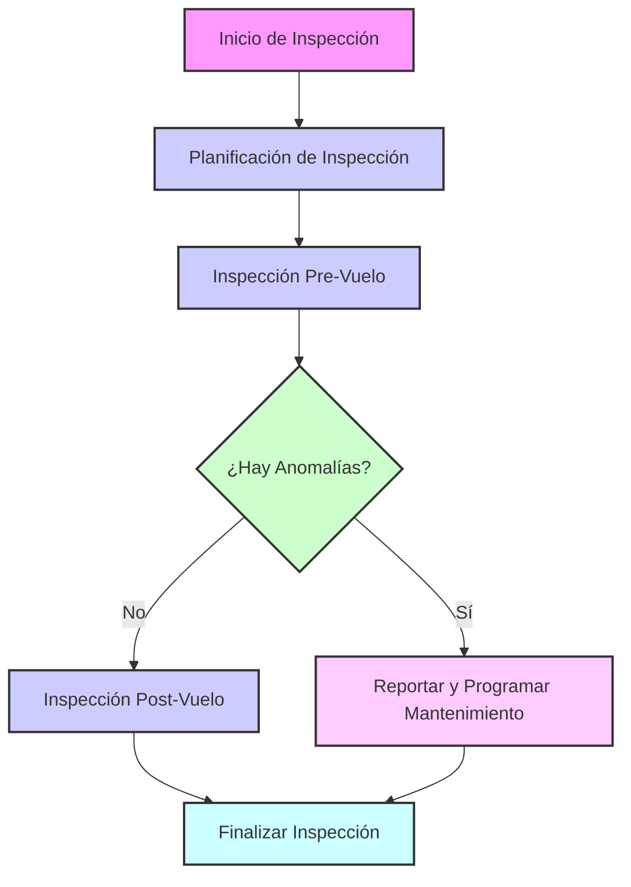
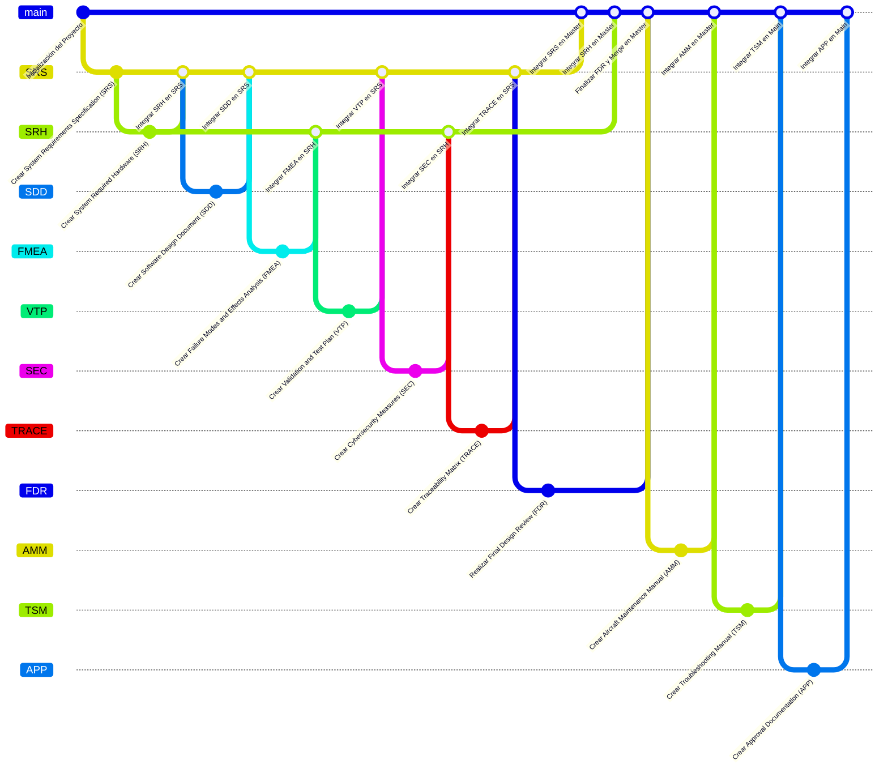

## Lista de ATA Chapters para GAIA AIR – Ampel360XWLRGA Aircraft

### **General**
| ATA Number | Chapter Name                                     |
|------------|--------------------------------------------------|
| ATA 00     | [General](#00-general)                           |
| ATA 01     | [Maintenance Policy](#01-maintenance-policy)     |
| ATA 02     | [Weight and Balance](#02-weight-and-balance)     |
| ATA 03     | [Minimum Equipment](#03-minimum-equipment)       |
| ATA 04     | [Airworthiness Limitations](#04-airworthiness-limitations) |
| ATA 05     | [Time Limits/Maintenance Controls](#05-time-limitsmaintenance-controls) |
| ATA 06     | [Dimensions and Surfaces](#06-dimensions-and-surfaces) |
| ATA 07     | [Lifting, Bracing, and Support](#07-lifting-bracing-and-support) |
| ATA 09     | [Towing and Ground Handling](#09-towing-and-ground-handling) |
| ATA 10     | [Parking, Mooring, Storage, and Return to Service](#10-parking-mooring-storage-and-return-to-service) |
| ATA 11     | [Signs and Markings](#11-signs-and-markings)       |
| ATA 12     | [Service – Routine Maintenance](#12-service-routine-maintenance) |
| ATA 13     | [General Hardware and Tools](#13-general-hardware-and-tools) |
| ATA 14     | [Tools](#14-tools)                               |
| ATA 15     | [External Training](#15-external-training)       |
| ATA 16     | [Ground Support Equipment](#16-ground-support-equipment) |
| ATA 17     | [Auxiliary Equipment](#17-auxiliary-equipment)   |
| ATA 18     | [Vibration](#18-vibration)                       |
| ATA 19     | [Fuel](#19-fuel)                                 |

### **Systems**
| ATA Number | Chapter Name                                         |
|------------|------------------------------------------------------|
| ATA 20     | [Standard Practices](#20-standard-practices)         |
| ATA 21     | [Air Conditioning and Pressurization](#21-air-conditioning-and-pressurization) |
| ATA 22     | [Autopilot](#22-autopilot)                           |
| ATA 23     | [Communications](#23-communications)                 |
| ATA 24     | [Electrical System](#24-electrical-system)           |
| ATA 25     | [Equipment and Accessories](#25-equipment-and-accessories) |
| ATA 26     | [Fire Protection](#26-fire-protection)               |
| ATA 27     | [Flight Controls](#27-flight-controls)               |
| ATA 28     | [Fuel](#28-fuel)                                     |
| ATA 29     | [Hydraulic System](#29-hydraulic-system)             |
| ATA 30     | [Ice and Rain Protection](#30-ice-and-rain-protection) |
| ATA 31     | [Indication and Recording Systems](#31-indication-and-recording-systems) |
| ATA 32     | [Landing Gear](#32-landing-gear)                     |
| ATA 33     | [Lights](#33-lights)                                 |
| ATA 34     | [Navigation](#34-navigation)                         |
| ATA 35     | [Oxygen](#35-oxygen)                                 |
| ATA 36     | [Pneumatic System](#36-pneumatic-system)             |
| ATA 37     | [Pressure and Vacuum](#37-pressure-and-vacuum)       |
| ATA 38     | [Water/Waste](#38-waterwaste)                         |
| ATA 39     | [Electrical-Electronic Panels and Multi-use Components](#39-electrical-electronic-panels-and-multi-use-components) |
| ATA 40     | [Multi-System](#40-multi-system)                     |
| ATA 41     | [Water/Ballast](#41-waterballast)                     |
| ATA 42     | [Integrated Modular Avionics](#42-integrated-modular-avionics) |
| ATA 44     | [Cabin Systems](#44-cabin-systems)                   |
| ATA 45     | [Diagnostic and Maintenance Systems](#45-diagnostic-and-maintenance-systems) |
| ATA 46     | [Information Systems](#46-information-systems)       |
| ATA 47     | [Nitrogen Generation System](#47-nitrogen-generation-system) |
| ATA 48     | [In-flight Fuel Dispensing](#48-in-flight-fuel-dispensing) |
| ATA 49     | [Auxiliary Power Unit](#49-auxiliary-power-unit)     |
| ATA 50     | [Cargo Compartments and Accessories](#50-cargo-compartments-and-accessories) |

### **Structure**
| ATA Number | Chapter Name                                               |
|------------|------------------------------------------------------------|
| ATA 51     | [Standard Practices and Structures – General](#51-standard-practices-and-structures-general) |
| ATA 52     | [Doors](#52-doors)                                        |
| ATA 53     | [Fuselage](#53-fuselage)                                  |
| ATA 54     | [Gondolas/Pylons](#54-gondolaspylons)                      |
| ATA 55     | [Stabilizers](#55-stabilizers)                            |
| ATA 56     | [Windows](#56-windows)                                    |
| ATA 57     | [Wings](#57-wings)                                        |

### **Propellers/Rotors**
| ATA Number | Chapter Name                                               |
|------------|------------------------------------------------------------|
| ATA 60     | [Practical Standards – Propeller/Rotor](#60-practical-standards-propellerrotor) |
| ATA 61     | [Propellers and Propulsors](#61-propellers-and-propulsors) |
| ATA 62     | [Main Rotor(s)](#62-main-rotors)                           |
| ATA 63     | [Rotor Impeller](#63-rotor-impeller)                       |
| ATA 64     | [Tail Rotor](#64-tail-rotor)                               |
| ATA 65     | [Tail Rotor Thrust](#65-tail-rotor-thrust)                 |
| ATA 66     | [Folding Blades/Pylons](#66-folding-bladespylons)          |
| ATA 67     | [In-flight Rotor Controls](#67-in-flight-rotor-controls)   |

### **Powerplant**
| ATA Number | Chapter Name                                        |
|------------|-----------------------------------------------------|
| ATA 70     | [Practical Engine Standards](#70-practical-engine-standards) |
| ATA 71     | [Power Plant](#71-power-plant)                      |
| ATA 72     | [Turbines/Turboprop Engines](#72-turbines-turboprop-engines) |
| ATA 73     | [Engine Fuel Control and Management](#73-engine-fuel-control-and-management) |
| ATA 74     | [Engine Ignition](#74-engine-ignition)              |
| ATA 75     | [Air Bleed](#75-air-bleed)                          |
| ATA 76     | [Engine Controls](#76-engine-controls)              |
| ATA 77     | [Engine Indicators](#77-engine-indicators)          |
| ATA 78     | [Engine Exhaust System](#78-engine-exhaust-system)  |
| ATA 79     | [Engine Oil](#79-engine-oil)                        |
| ATA 80     | [Engine Start](#80-engine-start)                    |
| ATA 81     | [Turbine System (Reciprocating Engine)](#81-turbine-system-reciprocating-engine) |
| ATA 82     | [Water Injection](#82-water-injection)              |
| ATA 83     | [Gearbox](#83-gearbox)                              |
| ATA 84     | [Propulsion Increase](#84-propulsion-increase)      |
| ATA 85     | [Fuel Cell Systems](#85-fuel-cell-systems)          |
| ATA 91     | [Graphs](#91-graphs)                                |
| ATA 92     | [Electrical System Installation](#92-electrical-system-installation) |


---

### 05.161. Inspection Process Flowchart



---

### Git Flow: Integración de Documentos



---

### Notas y Recomendaciones

1. **Verificar Numeraciones**: Asegúrate de que los ATA Chapters adicionales (por ejemplo, 91 y 92) están correctamente justificados o documentados si son específicos para tu proyecto.

2. **Diagramas Mermaid**: Tanto el flujo de inspección (Inspection Process Flowchart) como la representación Git (gitGraph) pueden visualizarse en plataformas compatibles con Mermaid.

3. **Mantener Estilo Consistente**: Asegúrate de que los capítulos y secciones sigan un estilo uniforme en todo el documento.

4. **Mantenimiento de Índices y Hipervínculos**: Actualiza los enlaces (#ancla) según añadas secciones o subcapítulos para que la navegación sea fluida.

5. **Registro de Cambios (Change Log)**: Considera incluir un registro de cambios para dar seguimiento a las revisiones en los documentos principales.

¡Listo! Con esto cuentas con una tabla de capítulos ATA corregida y una estructura que incluye diagramas Mermaid para ilustrar flujos y versionados Git, todo en un único bloque de Markdown. ¡Éxito con tu proyecto de documentación! 
```
