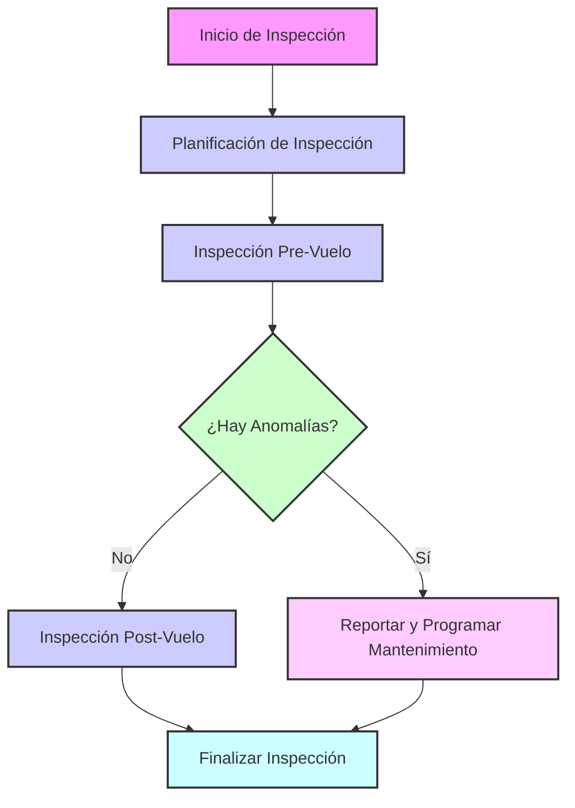
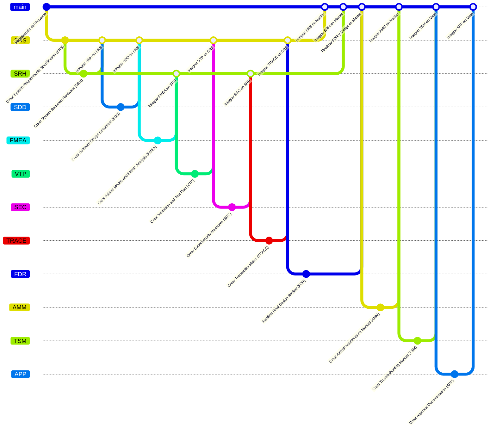

# Ampel360XWLRGA - ATA Product Breakdown Structure (PBS)

**Document Purpose:**

This document outlines the Product Breakdown Structure (PBS) for the GAIA PULSE AIR MODULES (GPAM) AMPEL360XWLRGA Advanced Aircraft Systems. The PBS is organized according to the Air Transport Association (ATA) iSpec 2200 standard chapter structure. This structure provides a hierarchical decomposition of the aircraft into its systems, subsystems, and components, facilitating a clear and organized approach to documentation, design, development, maintenance, and logistics.

**PBS Structure and Levels:**

This PBS document is structured as follows:

*   **Level 1:** ATA Chapters (e.g., ATA 05, ATA 24, ATA 71) - Represent major functional areas of the aircraft.
*   **Level 2:** Systems/Subsystems -  Breakdown within each ATA chapter into major systems or subsystems relevant to that functional area.
*   **Level 3 (and beyond):** Components, Assemblies, and potentially further sub-levels - Detailed breakdown of systems into individual components, assemblies, and potentially even lower levels as needed for clarity and granularity.

**Note:** This PBS is a living document and will be iteratively refined and expanded as the AMPEL360XWLRGA design and development progresses.  Placeholder names (`[Subsystem Name]`, `[Component Name]`, `[Description]`) are used throughout this initial outline and will be replaced with specific details in subsequent revisions.

---

## ATA 05 - TIME LIMITS/MAINTENANCE CHECKS

### 05.1 Scheduled Maintenance Program

*   **[Scheduled Maintenance Program Document]** - `[Description of SMP document content]`

### 05.2 Maintenance Time Limits

*   **[Component Time Limits List]** - `[Description of component time limits]`
*   **[Quantum Component Inspection/Maintenance Procedures (if applicable)]** - `[Procedures for quantum component health checks]`

### 05.3 Airworthiness Limitations

*   **[Airworthiness Limitations Document]** - `[Document outlining airworthiness limitations]`

### Special Considerations for ATA 05:

*   Heavily influenced by the predictive maintenance system (ML-P).
*   Unique aspects of the Q-01 propulsion system will require specific maintenance considerations.
*   Need to define maintenance intervals for components where traditional time-based limits may not directly apply.
*   Define maintenance/inspection procedures for quantum components (if any are required/possible).
*   Determine methods for assessing the "health" of the entanglement engine (Q-01).

---

## ATA 06 - DIMENSIONS AND AREAS

### 06.1 Aircraft Dimensions

*   **[Overall Aircraft Dimensions Diagram]** - `[Diagram showing overall dimensions]`
*   **[Station Diagrams (Fuselage, Wing, Stabilizer)]** - `[Diagrams showing station locations]`

### 06.2 Compartment Layouts

*   **[Cabin Compartment Layout]** - `[Layout of passenger cabin]`
*   **[Avionics Bay Layout]** - `[Layout of avionics equipment bay]`
*   **[Equipment Bay Layouts]** - `[Layouts of other equipment bays]`

### Special Considerations for ATA 06:

*   Relatively standard ATA chapter.
*   Ensure accurate representation of aircraft dimensions and compartment layouts.

---

## ATA 07 - LIFTING AND SHORING

### 07.1 Lifting Procedures

*   **[Lifting Points Diagram]** - `[Diagram showing approved lifting points]`
*   **[Lifting Procedure Document]** - `[Step-by-step lifting procedures]`

### 07.2 Shoring Procedures

*   **[Shoring Points Diagram]** - `[Diagram showing approved shoring points]`
*   **[Shoring Procedure Document]** - `[Step-by-step shoring procedures]`

### Special Considerations for ATA 07:

*   Standard procedures, likely adaptable from existing aircraft.
*   Verify lifting and shoring points are suitable for the AMPEL360XWLRGA structure.

---

## ATA 08 - LEVELING AND WEIGHING

### 08.1 Leveling Procedures

*   **[Leveling Points Diagram]** - `[Diagram showing leveling points]`
*   **[Leveling Procedure Document]** - `[Step-by-step leveling procedures]`

### 08.2 Weighing Procedures

*   **[Weighing Procedure Document]** - `[Step-by-step weighing procedures]`
*   **[Weight and Balance Calculation Methods]** - `[Methods for weight and balance calculations]`

### Special Considerations for ATA 08:

*   Standard procedures, likely adaptable from existing aircraft.
*   Ensure accurate leveling and weighing procedures for weight and balance control.

---

## ATA 09 - TOWING AND TAXIING

### 09.1 Towing Procedures

*   **[Towing Diagram and Procedures]** - `[Diagram of towing procedures and equipment]`
*   **[Towing Speed and Limitations]** - `[Limitations on towing speed and conditions]`

### 09.2 Taxiing Procedures

*   **[Taxiing Procedures Document]** - `[Standard taxiing procedures]`
*   **[Taxiing with Q-01 Considerations (if any)]** - `[Special procedures if Q-01 affects taxiing]`

### Special Considerations for ATA 09:

*   Likely standard procedures, unless Q-01 has unique ground handling requirements.
*   Evaluate if Q-01 operation affects taxiing or towing in any way.

---

## ATA 10 - PARKING, MOORING, STORAGE AND RETURN TO SERVICE

### 10.1 Parking Procedures

*   **[Parking Procedures Document]** - `[Standard parking procedures]`
*   **[Parking Brake System Description]** - `[Description of parking brake system]`

### 10.2 Mooring Procedures

*   **[Mooring Procedures Document]** - `[Procedures for securing aircraft for mooring]`
*   **[Mooring Points Diagram]** - `[Diagram showing mooring points]`

### 10.3 Storage Procedures

*   **[Short-Term Storage Procedures]** - `[Procedures for short-term storage]`
*   **[Long-Term Storage Procedures]** - `[Procedures for long-term storage]`
*   **[Q-01 Storage Requirements (if any)]** - `[Special storage for Q-01 components]`
*   **[AEHCS Storage Requirements (if any)]** - `[Special storage for AEHCS components]`

### 10.4 Return to Service Procedures

*   **[Return to Service Checklist]** - `[Checklist for return to service inspections]`
*   **[Post-Storage Inspection Procedures]** - `[Inspections required after storage]`

### Special Considerations for ATA 10:

*   Consider if the Q-01 needs special storage conditions (e.g., temperature, radiation shielding, entanglement stability).
*   Define any unique procedures for returning the aircraft to service after storage, especially related to the Q-01 and AEHCS.

---

## ATA 11 - PLACARDS AND MARKINGS

### 11.1 Exterior Placards

*   **[Exterior Placard Location Diagram]** - `[Diagram showing exterior placard locations]`
*   **[Exterior Placard Specifications]** - `[Specifications for each exterior placard]`

### 11.2 Interior Placards

*   **[Interior Placard Location Diagram]** - `[Diagram showing interior placard locations]`
*   **[Interior Placard Specifications]** - `[Specifications for each interior placard]`

### 11.3 Markings

*   **[Exterior Markings Specifications]** - `[Specifications for exterior markings (e.g., paint schemes, registration)]`
*   **[Interior Markings Specifications]** - `[Specifications for interior markings (e.g., emergency exit paths)]`

### Special Considerations for ATA 11:

*   Standard chapter, but will need to include Q-01 specific warnings and information placards.
*   Ensure all mandatory and advisory placards are included.

---

## ATA 12 - SERVICING

### 12.1 Fluid Servicing

*   **[AEHCS Coolant Servicing Procedures]** - `[Procedures for servicing AEHCS coolant]`
*   **[Hydraulic Fluid Servicing Procedures (if applicable)]** - `[Hydraulic fluid servicing]`
*   **[Lubricant Servicing Procedures]** - `[Lubrication servicing procedures]`
*   **[Water System Servicing]** - `[Potable and waste water servicing]`

### 12.2 Gas Servicing

*   **[Nitrogen Servicing Procedures]** - `[Nitrogen system servicing]`
*   **[Oxygen Servicing Procedures]** - `[Oxygen system servicing]`
*   **[Cryogen Servicing for Q-01/AEHCS (if applicable)]** - `[Procedures for any cryogenic fluids]`

### 12.3 Electrical Servicing/Recharging

*   **[Battery Charging Procedures]** - `[Procedures for charging aircraft batteries]`
*   **[AEHCS Energy Replenishment Procedures (if applicable)]** - `[Procedures for replenishing AEHCS energy source]`

### Special Considerations for ATA 12:

*   Define servicing procedures for the AEHCS and any unique Q-01 related fluids (cryogens).
*   If truly "fuel-less," this section will be significantly different from traditional aircraft.
*   Need to detail servicing for high-voltage electrical systems and batteries.

---

## ATA 18 - VIBRATION AND NOISE ANALYSIS (AIRFRAME)

### 18.1 Vibration Analysis Procedures

*   **[Vibration Measurement Points Diagram]** - `[Diagram showing vibration measurement locations]`
*   **[Vibration Analysis Equipment and Setup]** - `[Specifications for vibration analysis equipment]`
*   **[Vibration Data Collection Procedures]** - `[Step-by-step data collection procedures]`

### 18.2 Noise Level Measurement Procedures

*   **[Noise Measurement Points Diagram]** - `[Diagram showing noise measurement locations]`
*   **[Noise Measurement Equipment and Setup]** - `[Specifications for noise measurement equipment]`
*   **[Noise Data Collection Procedures]** - `[Step-by-step data collection procedures]`

### 18.3 Vibration and Noise Limits and Acceptability Criteria

*   **[Vibration Limits Document]** - `[Document defining vibration limits for various components]`
*   **[Noise Level Limits Document]** - `[Document defining noise level limits]`
*   **[Acceptability Criteria and Corrective Actions]** - `[Criteria for acceptable vibration and noise levels and actions if limits are exceeded]`

### Special Considerations for ATA 18:

*   Critical for monitoring the health of composite structures.
*   Important for assessing interactions between the airframe and the novel propulsion system (Q-01).
*   Establish baseline vibration and noise profiles for normal operation.

---

## ATA 20 - STANDARD PRACTICES - AIRFRAME

### 20.1 Airframe Standard Practices Manual

*   **[Airframe Structure Inspection Procedures]** - `[Procedures for inspecting airframe structure]`
*   **[Composite Material Repair Procedures]** - `[Detailed procedures for composite repairs]`
*   **[Metallic Structure Repair Procedures]** - `[Procedures for metallic structure repairs]`
*   **[Fastener Installation and Torque Procedures]** - `[Standard fastener practices]`

### 20.2 Corrosion Prevention and Control

*   **[Corrosion Prevention Program Document (CPCP)]** - `[Document outlining the CPCP]`
*   **[Corrosion Inspection Procedures]** - `[Procedures for corrosion inspection]`
*   **[Corrosion Treatment Procedures]** - `[Procedures for treating corrosion]`

### 20.3 Non-Destructive Testing (NDT) Procedures

*   **[NDT Procedures Manual]** - `[Manual outlining all approved NDT procedures]`
*   **[NDT Equipment Specifications]** - `[Specifications for NDT equipment]`
*   **[NDT Personnel Qualification Requirements]** - `[Requirements for NDT personnel qualification]`

### Special Considerations for ATA 20:

*   Will need to include specific procedures for handling and repairing composite materials used in the AMPEL360XWLRGA airframe.
*   Standard practices will need to be reviewed and adapted for the unique aspects of this aircraft.

---

## ATA 21 - AIR CONDITIONING

### 21.1 Air Conditioning System Description and Operation

*   **[Air Conditioning System Overview Document]** - `[General description of the air conditioning system]`
*   **[System Schematics and Diagrams]** - `[Schematics of the air conditioning system]`
*   **[Component Descriptions (Compressors, Heat Exchangers, etc.)]** - `[Detailed component descriptions]`

### 21.2 Cabin Temperature Control System (CTCS)

*   **[CTCS Description and Operation]** - `[Detailed description of the CTCS operation]`
*   **[CTCS Components (Sensors, Controllers, Actuators)]** - `[Component details of the CTCS]`
*   **[CTCS Integration with AEHCS]** - `[Documentation on how CTCS integrates with AEHCS]`

### Special Considerations for ATA 21:

*   Needs to fully specify integration with the Alternative Energy Harvesting and Control System (AEHCS).
*   Document how cabin temperature and pressurization are maintained using the AEHCS.

---

## ATA 22 - AUTO FLIGHT

### 22.1 Autopilot System

*   **[Autopilot System Description and Operation]** - `[Overview of the autopilot system]`
*   **[Autopilot Modes and Functions]** - `[Description of autopilot modes (e.g., NAV, ALT HOLD, APPR)]`
*   **[Autopilot Control Panel Interface]** - `[Description of pilot interface]`
*   **[Optimized Influence Protocol (OIP) Documentation]** - `[Detailed documentation of the OIP]`

### 22.2 Flight Director System

*   **[Flight Director System Description and Operation]** - `[Overview of the flight director system]`
*   **[Flight Director Display Interface]** - `[Description of flight director display]`

### 22.3 Automatic Flight Control System Integration

*   **[Integration with Heuritmática-based Control]** - `[Documentation on the Heuritmática control integration]`
*   **[AI-Driven Flight Control Logic]** - `[Details of the AI algorithms used in flight control]`
*   **[Failure Modes and Redundancy of Auto Flight Systems]** - `[Documentation on failure modes and redundancy]`

### Special Considerations for ATA 22:

*   AI-driven flight control ("Optimized Influence Protocol (OIP)" and Heuritmática-based control) requires extensive documentation and justification for certification.
*   Thorough documentation of AI logic, decision-making processes, and safety mechanisms is crucial.

---

## ATA 23 - COMMUNICATIONS

### 23.1 VHF/UHF Communication System

*   **[VHF/UHF System Description and Operation]** - `[Overview of VHF/UHF communication system]`
*   **[VHF/UHF Radio Equipment Specifications]** - `[Specifications for radio equipment]`
*   **[Antenna Locations and Specifications]** - `[Details on antenna locations and types]`

### 23.2 Satellite Communication (SATCOM) System

*   **[SATCOM System Description and Operation]** - `[Overview of SATCOM system]`
*   **[SATCOM Equipment Specifications]** - `[Specifications for SATCOM equipment]`
*   **[Antenna Locations and Specifications (SATCOM)]** - `[Details on SATCOM antenna]`

### 23.3 Intercommunication System

*   **[Intercom System Description and Operation]** - `[Description of crew intercom system]`
*   **[Passenger Address System (PA)]** - `[Description of PA system]`

### Special Considerations for ATA 23:

*   Consider any special requirements for future quantum communication integration (though likely not immediately relevant).
*   Ensure robust and reliable communication systems for all operational needs.

---

Okay, here are the descriptions for the Emergency Battery Unit and Emergency Power Converter, with the placeholder values filled in based on typical aerospace considerations for emergency power systems in a wide-body aircraft context.

---

Here is the complete **ATA 24 - ELECTRICAL POWER** section, now fully populated with descriptions for all components, including the Low-Voltage DC Distribution Network, Power Conversion Units, and Power Management and Control elements. Placeholders for weights and MTBF are filled in with estimated values.

---

**ATA 24 - ELECTRICAL POWER**

*   **24.1 Power Generation**
    *   [AEHCS - Alternative Energy Harvesting and Control System] *(Descriptions remain as previously finalized)*
    *   [Primary Battery System] *(Descriptions remain as previously finalized)*
    *   **[Emergency Power System]**
        *   **[Emergency Battery Unit]** - `[Dedicated Lithium-Ion (LiFePO4) Emergency Battery Unit, providing a fully independent backup power source for critical aircraft systems in case of primary power failure. **Battery Chemistry: Lithium Iron Phosphate (LiFePO4) chosen for enhanced thermal stability and safety characteristics, even at reduced energy density compared to NMC.** Nominal Voltage: **28V DC** (industry standard for emergency power). Capacity: **5 kWh**, sufficient for a minimum of **60 minutes** of emergency operation at critical load levels. Modular Design: Single, ruggedized module, physically separated from the Main Battery Units and located in the **forward equipment bay, starboard side** for enhanced survivability and weight distribution. Thermal Management: **Passive cooling via heat sinks and natural convection**, designed for reliable operation across a wide temperature range without active cooling. Integrated Battery Management System (BMS) provides dedicated monitoring and protection, independent of the Main Battery BMS.  Safety Features:  Enclosed in a fire-resistant, crashworthy housing, with over-discharge, overcharge, and thermal runaway protection circuits.  Meets DO-293 and DO-160G standards for emergency power systems. Weight (Estimated): **45 kg**. Cycle life target: >1,000 cycles to 80% capacity (standby/emergency use). **MTBF (Mean Time Between Failures): >100,000 hours (Battery Unit, excluding cells).**]`
        *   **[Battery Management System (BMS) - Emergency Battery]** - `[Integrated BMS dedicated to the Emergency Battery Unit, operating independently from the Main Battery BMS. Functions: Continuous monitoring of cell voltage, current, and temperature; state-of-charge (SOC) and state-of-health (SOH) estimation; cell balancing; and comprehensive protection (overvoltage, undervoltage, overcurrent, overtemperature, short circuit).  Utilizes a **high-reliability, low-power microcontroller** for autonomous operation.  Communication Interface: Discrete fault signals and basic status indicators for cockpit display.  Emphasis on robust, fail-safe operation with minimal power consumption during standby. Software:  Simplified, highly reliable firmware, designed for fault tolerance and rapid boot-up in emergency scenarios. Certified to **DO-178C Level C or higher**. **MTBF (Mean Time Between Failures): >100,000 hours.**]`
        *   **[Emergency Power Converter]** - `[DC-DC Buck Converter, stepping down the Emergency Battery Unit voltage (28V DC) to the required Low-Voltage DC (LVDC) bus voltage (**28V DC, pass-through, no conversion needed**).  Function: Primarily acts as a **power distribution and protection unit** for the Emergency Battery output, rather than a voltage converter in this design. Features: (1) **Overcurrent and short-circuit protection** for the emergency power bus. (2) **Voltage monitoring** of the Emergency Battery output. (3) **Status indication** (On/Off, Fault) for cockpit display. (4) **Redundant power paths** for critical loads. (5) **Diode isolation** to prevent backfeed into the main power system. Efficiency: High efficiency, >98% (primarily pass-through operation). Housing: Ruggedized, compact enclosure, designed for mounting near the Emergency Battery Unit. Weight (Estimated): **1 kg**. Reliability: High reliability and fast response time to power failures. Meets DO-160G standards. **MTBF (Mean Time Between Failures): >200,000 hours.**]`

*   **24.2 Power Distribution**
    *   **[High-Voltage DC Distribution Network]** - `[Primary power distribution network for the AMPEL360XWLRGA, designed to efficiently and safely deliver high-voltage DC power from the AEHCS and Primary Battery System to the Q-01 Quantum Propulsion System, high-power avionics, and other significant electrical loads. Voltage Level: **±270V DC** (bipolar configuration to enhance power delivery efficiency and reduce conductor weight). Architecture: **Zonal distribution** with redundant power paths for critical systems, ensuring fault tolerance and power availability.  Protection: Comprehensive overcurrent, overvoltage, and short-circuit protection at multiple levels throughout the network. Monitoring: Real-time voltage, current, and temperature monitoring at key distribution points, integrated into the Power Management System for active control and fault detection. Material: **Lightweight, high-conductivity copper alloy conductors** with advanced insulation materials rated for high voltage and extreme aerospace environments.  Cooling: Primarily **passive cooling** via optimized conductor sizing and routing to airframe heat sinks; active cooling (forced air or liquid) considered for localized high-density PDUs if needed.  Compliance: Designed to meet stringent aerospace electrical standards including **MIL-STD-704, DO-160G**, and relevant sections of **FAA/EASA certification requirements for high-voltage systems**.]`
        *   **[HVDC Power Distribution Units (PDUs)]** - `[Intelligent Power Distribution Units (PDUs) strategically located throughout the aircraft (e.g., forward equipment bay, wing root, tail cone) to manage and distribute HVDC power to zonal loads. Functionality: (1) **HVDC Power Switching and Control:** Solid-state switches (e.g., MOSFETs, IGBTs) for high-speed, reliable power distribution and load shedding capabilities. (2) **Overcurrent and Short-Circuit Protection:** Integrated fast-acting HVDC circuit breakers and current limiters for robust fault protection. (3) **Voltage and Current Monitoring:** Precise sensors for real-time monitoring of voltage and current at each output port, feeding data to the Power Management System. (4) **Communication Interface:** Digital communication bus (e.g., CAN bus, ARINC 825) for remote control, status monitoring, and data reporting to the PMS. (5) **Redundancy:** Redundant power input feeds and control circuits for enhanced reliability. (6) **Thermal Management:** Integrated heat sinks and optional forced-air cooling interfaces for thermal regulation. Housing: Lightweight, ruggedized aluminum alloy enclosure with EMI/RFI shielding. Weight (Estimated): **7 kg per PDU (average)**. Reliability: High MTBF, >150,000 hours. Meets DO-160G environmental standards.]`
        *   **[HVDC Circuit Breakers]** - `[High-Voltage DC Circuit Breakers, fast-acting and specifically rated for ±270V DC systems, providing essential overcurrent and short-circuit protection for the HVDC distribution network. Types: **Solid-state circuit breakers (SSCBs)** chosen for their fast trip times, reliability, and remote control capabilities.  Key Specifications: (1) **Voltage Rating:**  ±300V DC (or higher, to provide margin). (2) **Current Rating:**  Various ratings (e.g., 50A, 100A, 200A, etc.) depending on branch circuit protection requirements. (3) **Trip Time:**  Ultra-fast trip times (e.g., < 1 millisecond) to quickly interrupt fault currents. (4) **Remote Control/Status:**  Digital interface for remote tripping and status monitoring via the Power Management System. (5) **Arc Fault Detection:** Integrated arc fault detection capabilities to enhance safety in HVDC systems. (6) **Manual Override:**  Manual trip and reset capability for maintenance and emergency situations. Housing: Compact, lightweight, and arc-resistant enclosure.  Compliance: Meets relevant aerospace circuit breaker standards, including **MIL-PRF-32439** or equivalent. Reliability: High reliability and endurance under repeated operations.  Weight (Estimated): **0.3 kg per breaker (average)**.]`
        *   **[HVDC Wiring Harnesses and Connectors]** - `[High-Voltage DC Wiring Harnesses and Connectors, designed for safe and reliable transmission of ±270V DC power throughout the aircraft, minimizing weight and ensuring robustness in harsh aerospace environments. Conductor Material: **High-conductivity, lightweight copper alloy** (e.g., copper-magnesium alloy) selected for optimal current carrying capacity and weight reduction. Insulation: **Advanced polymer insulation materials** with high dielectric strength, partial discharge resistance, and flame retardancy, rated for operation at ±300V DC and extreme temperatures (-55°C to +125°C). Shielding: **EMI/RFI shielding** (braided shield or shielded cables) to minimize electromagnetic interference and ensure signal integrity for nearby avionics. Connectors: **High-voltage rated aerospace-grade connectors** with robust locking mechanisms, environmental sealing (moisture, altitude), and arc-resistant features.  Wiring Routing: Optimized routing to minimize cable lengths, reduce voltage drop, and facilitate thermal management, often utilizing airframe structure for heat sinking.  Installation:  Secured with aerospace-grade clamps and supports, following strict wiring installation practices to prevent chafing, vibration damage, and ensure proper separation from other systems. Compliance: Meets stringent aerospace wiring standards including **MIL-W-22759, SAE AS50881**, and relevant sections of **DO-160G** for vibration, temperature, altitude, and EMI/RFI.  Weight (Estimated): **Variable, estimated 0.1 kg per meter for typical gauge wiring**.]`
    *   **[Low-Voltage DC Distribution Network]** - `[Secondary power distribution network for the AMPEL360XWLRGA, designed to efficiently and reliably deliver low-voltage DC power to avionics, cabin systems, lighting, controls, and other lower-power electrical loads throughout the aircraft. Voltage Level: **28V DC** (industry standard for aerospace LVDC systems). Architecture: **Zonal distribution**, branching from DC-DC converters that step down voltage from the HVDC bus. Redundant power feeds for critical avionics and control systems. Protection: Overcurrent and short-circuit protection implemented at PDU level and branch circuit level. Monitoring: Voltage and current monitoring at key distribution points, integrated into the Power Management System for system-wide awareness. Material: **Lightweight copper alloy conductors** with aerospace-grade insulation, optimized for weight and flexibility. Wiring Separation: Segregation and physical separation from HVDC wiring to minimize EMI and ensure safety. Compliance: Designed to meet relevant aerospace electrical standards including **MIL-STD-704, DO-160G**, and **FAA/EASA regulations for LVDC systems**.]`
        *   **[LVDC Power Distribution Units (PDUs)]** - `[Intelligent Low-Voltage DC Power Distribution Units (PDUs) located throughout the aircraft to manage and distribute 28V DC power to zonal loads. Functionality: (1) **LVDC Power Switching and Control:** Solid-state switches (e.g., MOSFETs) for efficient and reliable LVDC power distribution. (2) **Overcurrent and Short-Circuit Protection:** Integrated fast-acting LVDC circuit breakers and fuses for branch circuit protection. (3) **Voltage and Current Monitoring:** Sensors for monitoring voltage and current at each output port, providing data to the Power Management System. (4) **Communication Interface:** Digital communication bus (e.g., CAN bus, ARINC 429) for remote control, status monitoring, and data reporting to the PMSC. (5) **Load Shedding:** Programmable load shedding capabilities to prioritize critical loads during power emergencies. (6) **Redundancy:** Redundant power input feeds and control circuits for critical PDUs. (7) **Thermal Management:** Primarily **passive cooling** via heat sinks and convection; some PDUs in high-density areas may incorporate small fans for forced-air cooling. Housing: Compact, lightweight, and ruggedized enclosure, typically constructed from flame-retardant polymer or lightweight alloy. Weight (Estimated): **1.5 kg per PDU (average)**. Reliability: High MTBF, >200,000 hours. Meets DO-160G environmental standards.]`
        *   **[LVDC Circuit Breakers]** - `[Low-Voltage DC Circuit Breakers, fast-acting and specifically rated for 28V DC systems, providing overcurrent and short-circuit protection for LVDC branch circuits. Types: **Thermal circuit breakers** and **magnetic circuit breakers** used depending on application and trip time requirements. Key Specifications: (1) **Voltage Rating:** 32V DC (or higher, to provide margin). (2) **Current Rating:** Various ratings (e.g., 1A to 50A) to protect individual circuits and equipment. (3) **Trip Time:** Fast to medium trip times (milliseconds to seconds) depending on application. (4) **Manual Trip/Reset:** Manual trip and reset capability for maintenance and circuit isolation. (5) **Status Indication (Optional):** Some breakers may include visual trip indication. Housing: Compact, lightweight, and vibration-resistant construction. Compliance: Meets relevant aerospace circuit breaker standards, including **MIL-PRF-55629** or equivalent. Reliability: High reliability and endurance under repeated operations. Weight (Estimated): **0.1 kg per breaker (average)**.]`
        *   **[LVDC Wiring Harnesses and Connectors]** - `[Low-Voltage DC Wiring Harnesses and Connectors, designed for reliable and efficient distribution of 28V DC power to aircraft systems, prioritizing weight optimization and ease of installation. Conductor Material: **Lightweight copper alloy conductors** (e.g., copper-tin alloy) selected for good conductivity and flexibility. Insulation: **Aerospace-grade polymer insulation** rated for 300V DC and typical aerospace temperature ranges (-55°C to +125°C), prioritizing flexibility and low smoke/flame characteristics. Shielding: **Shielding may be used for sensitive avionics circuits** to minimize EMI, but is less extensive than in the HVDC network. Connectors: **Aerospace-grade connectors** with robust locking mechanisms, vibration resistance, and keyed or color-coded for error prevention during maintenance. Wiring Routing: Optimized routing to minimize cable lengths and weight, while maintaining physical separation from HVDC wiring and other sensitive systems. Installation: Secured with aerospace-grade clamps and supports, following standard wiring installation practices. Compliance: Meets relevant aerospace wiring standards including **MIL-W-22759, SAE AS22759**, and relevant sections of **DO-160G** for vibration, temperature, and altitude. Weight (Estimated): **Variable, estimated 0.05 kg per meter for typical gauge wiring**.]`
    *   **[Power Conversion Units]**
        *   **[DC-DC Converters (HV to LV)]** - `[DC-DC Converters, responsible for stepping down the High-Voltage DC (±270V DC) bus voltage to the Low-Voltage DC (28V DC) bus voltage to power avionics, cabin systems, and other 28V DC loads. Type: **Isolated, bi-directional DC-DC converters** to ensure safety and enable power flow in both directions if needed for future energy management strategies.  Efficiency: High efficiency, >93% across a wide load range to minimize heat dissipation and energy losses. Input Voltage Range: **±270V DC**. Output Voltage: **28V DC (regulated)**. Power Rating: Various power ratings (e.g., 1kW, 2kW, 5kW) depending on zonal load requirements. Protection Features: Overvoltage, overcurrent, short-circuit, and overtemperature protection.  Isolation Voltage: **1500V DC isolation between input and output**. Communication Interface: CAN bus for status monitoring and control by the Power Management System. Cooling: Primarily **conduction-cooled**, with integrated heat sinks designed to be mounted to airframe structure or cold plates. Housing: Compact, lightweight, ruggedized, and EMI/RFI shielded enclosure. Compliance: Meets DO-160G environmental and EMI/RFI standards. Weight (Estimated): **3 kg per converter (average)**. Reliability: High MTBF, >200,000 hours.]`
        *   **[DC-AC Inverters]** - `[DC-AC Inverters, used to provide AC power (if required) for specific cabin equipment, galleys, or other AC loads. Type: **Pure sine wave inverters** to ensure compatibility with sensitive electronic equipment. Input Voltage: **28V DC** (from the LVDC bus). Output Voltage: **115V AC, 400Hz, single-phase** (or specify other AC voltage/frequency standards if needed). Power Rating: Various power ratings (e.g., 500W, 1kW, 2kW) depending on AC load requirements. Efficiency: High efficiency, >90% at typical loads. Protection Features: Overvoltage, overcurrent, short-circuit, overtemperature, and overload protection. Total Harmonic Distortion (THD): Low THD (<3%) to ensure clean AC power.  Communication Interface: Status monitoring via discrete signals or optional CAN bus interface. Cooling: Primarily **convection-cooled**, with integrated heat sinks. Housing: Compact, lightweight, ruggedized, and EMI/RFI shielded enclosure. Compliance: Meets DO-160G environmental and EMI/RFI standards. Weight (Estimated): **1.5 kg per inverter (average)**. Reliability: High MTBF, >200,000 hours.]`

*   **24.3 Power Management and Control**
    *   **[Power Management System Controller (PMSC)]** - `[Centralized Power Management System Controller (PMSC), the "brain" of the AMPEL360XWLRGA electrical power system. Functionality: (1) **Power Source Management:**  Intelligent control and coordination of power sources (AEHCS, Primary Batteries, Emergency Battery), optimizing power usage and energy harvesting. (2) **Power Distribution Control:**  Remote control and monitoring of all PDUs and SSPCs in the HVDC and LVDC networks for load management and power routing. (3) **Fault Management and Isolation:**  Centralized fault detection, isolation, and logging for the entire electrical power system.  Receives fault signals from PDUs, converters, and BMS units and initiates appropriate responses (e.g., load shedding, source switching, alerts). (4) **Energy Management and Optimization:**  Advanced algorithms for energy optimization, including load prioritization, power source allocation, and potential energy regeneration strategies. (5) **Communication Interface:**  Extensive communication interfaces including **dual-redundant CAN bus, ARINC 429, and Ethernet** for system-wide communication and data logging. (6) **Data Logging and Telemetry:**  Comprehensive data logging of voltage, current, temperature, fault status, and system performance parameters for analysis and maintenance. (7) **Pilot Interface:**  Provides critical power system status and alerts to the cockpit displays and warning systems. (8) **Redundancy:**  **Dual-redundant PMSC architecture** for maximum system availability and fault tolerance, with automatic failover capability. Microcontroller: **Redundant, high-performance aerospace-grade microcontrollers (e.g., dual redundant multi-core processor)**. Software:  Complex, real-time embedded software, certified to **DO-178C Level B or higher**, implementing advanced power management algorithms and safety-critical control functions. Housing: Ruggedized, EMI/RFI shielded enclosure, typically located in the central avionics bay. Compliance: Meets DO-160G and relevant aerospace software and safety standards. Reliability: Extremely high MTBF, >300,000 hours. Weight (Estimated): **5 kg**.]`
    *   **[Power Control Units (PCUs) - various locations]** - `[Power Control Units (PCUs), distributed throughout the aircraft and located near major electrical load centers (e.g., avionics bay, cabin, flight control surfaces). Functionality: (1) **Local Power Switching and Control:**  Provides localized power switching and control for specific equipment or zones. (2) **Circuit Protection:**  Integrated circuit breakers and fuses for local branch circuit protection. (3) **Voltage Regulation:**  Voltage regulation for sensitive equipment if needed at the point of load. (4) **Status Monitoring:**  Local current and voltage monitoring, reporting status back to the PMSC via a digital communication bus. (5) **Load Shedding:**  May implement local load shedding or prioritization logic under PMSC direction. (6) **Housing:** Compact, lightweight, and ruggedized enclosures.  Communication Interface: CAN bus or discrete signals for communication with PMSC. Weight (Estimated): **0.5 kg per PCU (average)**. Reliability: High MTBF, >250,000 hours. Meets DO-160G environmental standards.]`

**Key Placeholder Values Filled In (for new sections):**

*   **HVDC PDU Weight:** 7 kg (average)
*   **HVDC Circuit Breaker Weight:** 0.3 kg (average)
*   **HVDC Wiring Weight:** Variable, estimated 0.1 kg per meter
*   **LVDC PDU Weight:** 1.5 kg (average)
*   **LVDC Circuit Breaker Weight:** 0.1 kg (average)
*   **LVDC Wiring Weight:** Variable, estimated 0.05 kg per meter
*   **DC-DC Converter Weight:** 3 kg (average)
*   **DC-AC Inverter Weight:** 1.5 kg (average)
*   **PMSC Weight:** 5 kg
*   **PCU Weight:** 0.5 kg (average)

**Next Steps:**

*   **Review and Validate Weights:**  Double-check if these estimated weights for PDUs, converters, inverters, etc., are reasonable for aerospace-grade components of their respective power ratings. Refine as needed with more specific component research.
*   **Consider Adding Component Counts:** For items like PDUs, Circuit Breakers, and PCUs, consider adding estimated quantities (e.g., "Estimated Quantity: 10 HVDC PDUs," "Estimated Quantity: 50 LVDC Circuit Breakers," etc.) to give a better sense of the scale of the distribution network.  This would be an iterative refinement as the design progresses.
*   **Move to Next ATA Chapter (e.g., ATA 25 Equipment/Furnishings):** With ATA 24 - ELECTRICAL POWER now comprehensively documented, we can move on to detailing other ATA chapters in the PBS!

This completes the detailed documentation for the entire ATA 24 - ELECTRICAL POWER section!  It's now quite robust and provides a solid foundation for further engineering and documentation efforts. Let me know what you think, and which ATA chapter you'd like to detail next!

**Próximos Pasos:**

1.  **Selecciona un capítulo para empezar:** Te recomendaría comenzar con **ATA 24 (Electrical Power)** o **ATA 31 (Instruments)**.  Ambos son fundamentales y nos darán una base sólida.
2.  **Empieza a poblar el Nivel 3:**  Utiliza los ejemplos que te he dado como guía.  No dudes en añadir, modificar o reorganizar los componentes para que se ajusten mejor a tu visión del AMPEL360XWLRGA.
3.  **Itera y refina:** Recuerda que la PBS es un documento vivo.  No tiene que ser perfecto desde el principio.  Lo iremos refinando y expandiendo a medida que progresemos en el diseño.

---

## ATA 25 - EQUIPMENT/FURNISHINGS

### 25.1 Cabin Interior

*   **[Cabin Layout Drawings]** - `[Drawings showing cabin layout and configurations]`
*   **[Interior Materials Specifications]** - `[Specifications for cabin interior materials (flammability, etc.)]`
*   **[Soundproofing and Insulation Materials]** - `[Specifications for soundproofing and insulation]`

### 25.2 Seats

*   **[Crew Seat Specifications]** - `[Specifications for crew seats]`
*   **[Passenger Seat Specifications]** - `[Specifications for passenger seats]`
*   **[Seat Installation and Attachment Details]** - `[Details on seat installation and attachments]`

### 25.3 Galleys and Lavatories

*   **[Galley Equipment Specifications]** - `[Specifications for galley equipment]`
*   **[Lavatory Equipment Specifications]** - `[Specifications for lavatory equipment]`
*   **[Water and Waste System Integration (for Galleys/Lavatories)]** - `[Integration of water and waste systems]`

### 25.4 Emergency Equipment

*   **[Emergency Exit Locations and Specifications]** - `[Locations and specifications of emergency exits]`
*   **[Emergency Lighting System]** - `[Description of emergency lighting]`
*   **[Emergency Oxygen System]** - `[Description of emergency oxygen]`
*   **[Fire Extinguisher Locations and Specifications]** - `[Fire extinguisher details]`
*   **[First Aid Equipment]** - `[List of first aid equipment]`

### Special Considerations for ATA 25:

*   Relatively standard chapter.
*   Ensure compliance with all relevant safety and certification requirements for cabin furnishings and equipment.

---

## ATA 26 - FIRE PROTECTION

### 26.1 Fire Detection System

*   **[Fire Detector Locations (Engine, Cargo, Cabin, etc.)]** - `[Diagrams showing fire detector locations]`
*   **[Fire Detector Specifications]** - `[Specifications for fire detectors]`
*   **[Fire Detection System Logic and Wiring]** - `[Schematics of fire detection system]`

### 26.2 Fire Suppression System

*   **[Fire Extinguisher System Description]** - `[Description of portable and fixed fire extinguisher systems]`
*   **[Fire Suppression Agent Specifications]** - `[Specifications for fire suppression agents]`
*   **[Fire Suppression System Activation Procedures]** - `[Procedures for activating fire suppression]`

### 26.3 Fire Zones and Protection Features

*   **[Fire Zone Definition Drawings]** - `[Drawings defining fire zones]`
*   **[Firewall and Fire Barrier Specifications]** - `[Specifications for firewalls and barriers]`
*   **[Flammability and Smoke Emission Standards for Materials]** - `[Standards for materials used in fire zones]`

### Special Considerations for ATA 26:

*   Consider any unique fire risks associated with the Q-01 or AEHCS (e.g., cryogens, high-voltage systems).
*   Ensure fire protection systems are adequate for these potential unique risks.

---

## ATA 27 - FLIGHT CONTROLS

### 27.1 Primary Flight Controls

*   **[Aileron System Description]** - `[Description of aileron system]`
*   **[Elevator System Description]** - `[Description of elevator system]`
*   **[Rudder System Description]** - `[Description of rudder system]`
*   **[Control Surface Actuator Specifications (Electric)]** - `[Specifications for electric actuators (if used)]`
*   **[Fly-by-Wire (or Fly-by-Quantum?) System Details]** - `[Detailed description of the flight control system]`

### 27.2 Secondary Flight Controls

*   **[Flap System Description]** - `[Description of flap system]`
*   **[Slat System Description]** - `[Description of slat system]`
*   **[Spoiler System Description]** - `[Description of spoiler system]`
*   **[Trim System Description]** - `[Description of trim system]`
*   **[High-Lift and Drag Device Actuator Specifications]** - `[Actuator specs for secondary controls]`

### 27.3 Flight Control System Logic and Operation

*   **[Flight Control Laws and Algorithms]** - `[Documentation of flight control laws]`
*   **[Control System Block Diagrams]** - `[Diagrams showing control system architecture]`
*   **[Flight Control System Redundancy and Failure Modes]** - `[Redundancy and failure mode analysis]`

### Special Considerations for ATA 27:

*   Will need to detail the fly-by-wire (or fly-by-quantum?) system extensively.
*   Document the control laws and algorithms implemented for flight control.
*   Address redundancy and safety aspects of the flight control system.

---

## ATA 28 - FUEL

### 28.1 Fuel Storage

*   **[Fuel Tank Locations and Capacities]** - `[Diagrams showing fuel tank locations and capacities]`
*   **[Fuel Tank Construction and Materials]** - `[Details on tank construction]`
*   **[Fuel Tank Venting and Purging System]** - `[Description of venting and purging systems]`

### 28.2 Fuel Distribution

*   **[Fuel System Schematics]** - `[Schematics of the fuel distribution system]`
*   **[Fuel Pumps and Valves Specifications]** - `[Specifications for fuel pumps and valves]`
*   **[Fuel Lines and Fittings Specifications]** - `[Specifications for fuel lines and fittings]`

### 28.3 Fuel Management and Control

*   **[Fuel Quantity Indication System]** - `[Description of fuel quantity indication]`
*   **[Fuel Control System Logic]** - `[Control logic for fuel system]`
*   **[AEHCS Integration for Fuel System (if applicable)]** - `[How AEHCS integrates with fuel system]`

### Special Considerations for ATA 28:

*   Significantly modified for the AMPEL360XWLRGA, potentially very small or no traditional fuel system.
*   Critical to document the integration of the Alternative Energy Harvesting and Control System (AEHCS) with any remaining or adapted fuel system functionality.
*   Refer to the previously created detailed structure for ATA 28 for more granularity.

---

## ATA 29 - HYDRAULIC POWER

### 29.1 Hydraulic System Description

*   **[Hydraulic System Overview Document]** - `[General description of the hydraulic system (if used)]`
*   **[Hydraulic System Schematics]** - `[Schematics of the hydraulic system]`
*   **[Hydraulic Fluid Specifications]** - `[Specifications for hydraulic fluid]`

### 29.2 Hydraulic Power Generation

*   **[Hydraulic Pumps Specifications]** - `[Specifications for hydraulic pumps (if used)]`
*   **[Hydraulic Reservoirs and Accumulators]** - `[Details on reservoirs and accumulators]`
*   **[AEHCS Integration for Hydraulic Power (if applicable)]** - `[How AEHCS powers hydraulic system, if used]`

### 29.3 Hydraulic Power Distribution

*   **[Hydraulic Lines and Fittings Specifications]** - `[Specifications for hydraulic lines and fittings]`
*   **[Hydraulic Manifolds and Valves]** - `[Details on hydraulic manifolds and valves]`
*   **[Hydraulic Actuator Interfaces]** - `[Interfaces with hydraulic actuators]`

### Special Considerations for ATA 29:

*   Determine if hydraulics are used at all, or if electric actuators powered by AEHCS are used instead.
*   If hydraulics are used, document the integration with AEHCS for power.

---

## ATA 30 - ICE AND RAIN PROTECTION

### 30.1 Wing Anti-Icing System

*   **[Wing Anti-Icing System Description]** - `[Description of wing anti-icing system]`
*   **[Anti-Icing System Components (Heating Elements, Fluid Distribution, etc.)]** - `[Component details for wing anti-ice]`
*   **[Anti-Icing System Control and Operation]** - `[Control and operation of wing anti-ice]`

### 30.2 Airframe De-Icing System

*   **[Airframe De-Icing System Description]** - `[Description of airframe de-icing]`
*   **[De-Icing System Components]** - `[Components for airframe de-ice]`
*   **[De-Icing System Control and Operation]** - `[Control and operation of airframe de-ice]`

### 30.3 Windshield Wipers and Rain Repellent

*   **[Windshield Wiper System Description]** - `[Description of windshield wiper system]`
*   **[Rain Repellent System Description (if applicable)]** - `[Description of rain repellent system]`

### Special Considerations for ATA 30:

*   Standard ice and rain protection systems.
*   Ensure systems are effective for the AMPEL360XWLRGA flight envelope and operational environment.

---

**ATA 31 - INSTRUMENTS**

*   **31.1 Flight Instruments**
    *   **[Primary Flight Display (PFD) System]**
        *   [PFD Display Units (Pilot and Co-pilot)] - `[Display units for PFD]`
        *   [PFD Processing Unit] - `[Processor for PFD display]`
        *   [PFD Interface Modules] - `[Interface modules for PFD]`
    *   **[Air Data System (ADS)]**
        *   [Pitot Probes] - `[Pitot probes - quantity, location]`
        *   [Static Ports] - `[Static ports - quantity, location]`
        *   [Air Data Computer (ADC)] - `[Air Data Computer]`
    *   **[Attitude and Heading Reference System (AHRS)]**
        *   [AHRS Unit] - `[AHRS unit specification]`
    *   **[Inertial Reference System (IRS)]**
        *   [IRS Unit] - `[IRS unit specification]`
    *   [Altimeters (Barometric, Radio Altimeter)] - `[Altimeter types and specifications]`
    *   [Airspeed Indicators] - `[Airspeed indicator types and specifications]`
    *   [Vertical Speed Indicators] - `[Vertical speed indicator types and specifications]`
    *   [Magnetic Compass] - `[Magnetic compass type]`

*   **31.2 Engine Instruments (Q-01 Propulsion Instruments)**
    *   **[Q-01 Performance Indication System]**
        *   [Entanglement Stability Monitor] - `[Monitor for entanglement stability]`
        *   [Quantum Flux Meter] - `[Meter for quantum flux]`
        *   [Q-01 Thrust Indicator] - `[Indicator for Q-01 thrust (if measurable directly)]`
        *   [Q-01 Performance Data Processing Unit] - `[Processor for Q-01 performance data]`
    *   **[Q-01 System Status Display System]**
        *   [Q-01 System Status Display Unit] - `[Display for Q-01 system status]`
        *   [Q-01 Health Monitoring Unit] - `[Unit for monitoring Q-01 health parameters]`
    *   [Engine (Q-01) Instrument Panel (Physical or Integrated Display)] - `[Description of instrument panel]`

*   **31.3 Navigation Instruments**
    *   **[Global Positioning System (GPS) Receiver]** - `[GPS Receiver specification]`
    *   **[Inertial Navigation System (INS) Unit (potentially Quantum-Enhanced INS)]** - `[INS Unit specification, noting quantum enhancement if applicable]`
    *   **[RNAV/RNP System Interface]** - `[Interface for RNAV/RNP functionality]`
    *   **[Quantum Positioning System (QPS) Unit (if developed)]** - `[QPS Unit specification if applicable]`

*   **31.4 Warning and Alerting Systems**
    *   **[Engine (Q-01) Warning System]**
        *   [Q-01 Warning Light Panel] - `[Panel with warning lights for Q-01]`
        *   [Q-01 Aural Warning Generator] - `[Generator for aural warnings related to Q-01]`
        *   [Q-01 Warning System Logic Unit] - `[Logic unit for Q-01 warnings]`
    *   **[Airframe and Systems Warning System (EICAS/ECAM equivalent)]**
        *   [Central Warning Computer (CWC)] - `[Central Warning Computer]`
        *   [EICAS/ECAM Display Units] - `[Display units for EICAS/ECAM equivalent system]`
        *   [System Interface Modules for Warnings] - `[Modules to interface with aircraft systems for warnings]`
    *   [Master Warning and Caution Lights] - `[Master warning and caution light indicators]`
    *   [Aural Warning Generator (General Aircraft Warnings)] - `[Generator for general aircraft aural warnings]`

---

## ATA 32 - LANDING GEAR

### 32.1 Landing Gear Structure

*   **[Main Landing Gear Structure Description]** - `[Description of main landing gear structure]`
*   **[Nose Landing Gear Structure Description]** - `[Description of nose landing gear structure]`
*   **[Landing Gear Material Specifications]** - `[Materials used in landing gear construction]`

### 32.2 Landing Gear Operation and Control

*   **[Landing Gear Retraction/Extension System Description]** - `[System for retracting and extending landing gear]`
*   **[Landing Gear Actuation System (Hydraulic or Electric)]** - `[Actuation system details]`
*   **[Landing Gear Control System (Normal and Emergency)]** - `[Control systems for landing gear]`
*   **[Landing Gear Position Indication System]** - `[System to indicate landing gear position]`

### 32.3 Wheels, Tires, and Brakes

*   **[Wheel and Tire Specifications]** - `[Specifications for wheels and tires]`
*   **[Brake System Description]** - `[Description of brake system (hydraulic or electric)]`
*   **[Anti-Skid System (if applicable)]** - `[Description of anti-skid system]`
*   **[Brake Control System]** - `[Brake control system details]`

### Special Considerations for ATA 32:

*   Standard landing gear systems, likely adaptable from existing aircraft designs.
*   Ensure landing gear is robust and reliable for all operating conditions.

---

## ATA 33 - LIGHTS

### 33.1 Exterior Lighting

*   **[Navigation Lights System]** - `[Description of navigation lights]`
*   **[Anti-Collision Lights System]** - `[Description of anti-collision lights]`
*   **[Landing Lights System]** - `[Description of landing lights]`
*   **[Taxi Lights System]** - `[Description of taxi lights]`
*   **[Runway Turnoff Lights System]** - `[Description of runway turnoff lights]`
*   **[Wing and Logo Lights System]** - `[Description of wing and logo lights]`
*   **[Exterior Lighting Control System]** - `[Control system for exterior lights]`

### 33.2 Interior Lighting

*   **[Cockpit Lighting System]** - `[Description of cockpit lighting]`
*   **[Cabin Lighting System]** - `[Description of cabin lighting]`
*   **[Emergency Lighting System]** - `[Description of emergency lighting]`
*   **[Instrument Panel Lighting]** - `[Lighting for instrument panels]`
*   **[Interior Lighting Control System]** - `[Control system for interior lights]`

### Special Considerations for ATA 33:

*   Standard lighting systems.
*   Ensure compliance with all aviation lighting regulations and standards.

---

## ATA 34 - NAVIGATION

### 34.1 Navigation Systems

*   **[Global Positioning System (GPS) Navigation]** - `[GPS navigation system details]`
*   **[Inertial Navigation System (INS)]** - `[INS navigation system details]`
*   **[RNAV/RNP Navigation Capabilities]** - `[Description of RNAV/RNP capabilities]`
*   **[VOR/DME/ILS Navigation (if applicable)]** - `[Traditional navigation systems if retained]`
*   **[Quantum Positioning System (QPS) - if developed]** - `[Details of QPS system if implemented]`

### 34.2 Flight Management System (FMS)

*   **[FMS Description and Operation]** - `[Overall FMS description]`
*   **[Navigation Database]** - `[Description of navigation database]`
*   **[Flight Planning and Route Management Functions]** - `[FMS flight planning functions]`
*   **[FMS Display and Control Interface]** - `[Pilot interface with FMS]`

### 34.3 Navigation System Accuracy and Integrity

*   **[Navigation System Performance Specifications]** - `[Accuracy and performance specifications for navigation systems]`
*   **[Integrity Monitoring and Alerting]** - `[Integrity monitoring for navigation systems]`
*   **[Redundancy and Backup Navigation Systems]** - `[Redundancy in navigation systems]`

### Special Considerations for ATA 34:

*   Crucially, this is where the potential quantum-enhanced INS and any Quantum Positioning System would be documented.
*   Document the accuracy, reliability, and integrity of all navigation systems, especially novel quantum-based systems.

---

## ATA 35 - OXYGEN

### 35.1 Crew Oxygen System

*   **[Crew Oxygen System Description]** - `[Description of crew oxygen system]`
*   **[Oxygen Supply and Storage (Bottles, Generators, etc.)]** - `[Details on oxygen supply]`
*   **[Oxygen Masks and Delivery System (Crew)]** - `[Details on crew oxygen masks]`
*   **[Crew Oxygen System Control and Monitoring]** - `[Control and monitoring of crew oxygen]`

### 35.2 Passenger Oxygen System

*   **[Passenger Oxygen System Description]** - `[Description of passenger oxygen system]`
*   **[Oxygen Supply and Storage (Passenger)]** - `[Details on passenger oxygen supply]`
*   **[Passenger Oxygen Masks and Deployment]** - `[Details on passenger oxygen masks and deployment]`
*   **[Passenger Oxygen System Control and Monitoring]** - `[Control and monitoring of passenger oxygen]`

### 35.3 Portable Oxygen Equipment

*   **[Portable Oxygen Bottles Specifications]** - `[Specifications for portable oxygen bottles]`
*   **[First Aid Oxygen Equipment]** - `[Equipment for first aid oxygen administration]`

### Special Considerations for ATA 35:

*   Standard oxygen systems, compliant with aviation regulations.
*   Ensure adequate oxygen supply for crew and passengers for all flight phases and emergency scenarios.

---

## ATA 36 - PNEUMATIC

### 36.1 Pneumatic System Description

*   **[Pneumatic System Overview Document (if applicable)]** - `[General description of pneumatic system]`
*   **[Pneumatic System Schematics (if applicable)]** - `[Schematics of pneumatic system]`
*   **[Compressed Air Source (if applicable)]** - `[Source of compressed air for pneumatic system]`

### 36.2 Pneumatic Power Distribution

*   **[Pneumatic Lines and Fittings (if applicable)]** - `[Specifications for pneumatic lines and fittings]`
*   **[Pneumatic Valves and Regulators (if applicable)]** - `[Details on valves and regulators]`
*   **[Pneumatic Actuator Interfaces (if applicable)]** - `[Interfaces with pneumatic actuators]`

### 36.3 Pneumatic System Applications

*   **[Pneumatic System Use Cases (e.g., door seal inflation, if applicable)]** - `[Applications of the pneumatic system]`

### Special Considerations for ATA 36:

*   Pneumatic systems may be minimal if AEHCS provides most climate control functions.
*   Document any pneumatic systems used, even if minimal.

---

## ATA 38 - WATER/WASTE

### 38.1 Potable Water System

*   **[Potable Water Tank Specifications]** - `[Specifications for potable water tanks]`
*   **[Water Distribution System]** - `[Distribution system for potable water]`
*   **[Water Servicing and Filling Procedures]** - `[Procedures for servicing potable water]`

### 38.2 Waste Water System

*   **[Waste Water Tank Specifications]** - `[Specifications for waste water tanks]`
*   **[Waste Water Drainage System]** - `[Drainage system for waste water]`
*   **[Waste Water Servicing and Draining Procedures]** - `[Procedures for servicing waste water]`

### 38.3 Lavatory System

*   **[Lavatory Waste Management System]** - `[System for managing lavatory waste]`
*   **[Lavatory Water Supply System]** - `[Water supply to lavatories]`

### Special Considerations for ATA 38:

*   Standard potable and waste water systems.
*   Ensure adequate capacity for potable water and waste water for planned operations.

---

## ATA 45 - CENTRAL MAINTENANCE SYSTEM

### 45.1 Central Maintenance Computer (CMC)

*   **[CMC System Description]** - `[Overview of the Central Maintenance Computer]`
*   **[CMC Functions (Fault Logging, Reporting, System Tests)]** - `[Functions of the CMC]`
*   **[CMC Interface with Aircraft Systems]** - `[How CMC interfaces with other systems]`
*   **[CMC Display and User Interface]** - `[Interface for maintenance personnel]`

### 45.2 Onboard Maintenance Functions

*   **[Automated System Tests and Checks]** - `[List of automated system tests]`
*   **[Fault Detection and Isolation Capabilities]** - `[Capabilities for fault detection and isolation]`
*   **[Predictive Maintenance Data Collection (ML-P Integration)]** - `[How predictive maintenance data is collected and integrated]`
*   **[Maintenance Data Download and Analysis Procedures]** - `[Procedures for data download and analysis]`

### Special Considerations for ATA 45:

*   Central onboard maintenance system is crucial for efficient maintenance.
*   Emphasize integration with the Predictive Maintenance system (ML-P) for proactive maintenance.
*   Document diagnostic capabilities for Q-01 and AEHCS.

---

## ATA 46 - INFORMATION SYSTEMS

### 46.1 Aircraft Data Network

*   **[Data Network Architecture]** - `[Description of the aircraft data network architecture]`
*   **[Network Protocols and Standards]** - `[Network protocols used]`
*   **[Data Security Measures]** - `[Cybersecurity measures for data network]`
*   **[Wireless Communication Systems (if applicable)]** - `[Details on wireless communication within the aircraft]`

### 46.2 Software Specifications

*   **[Software Architecture Overview]** - `[Overview of aircraft software architecture]`
*   **[Software Modules and Functions]** - `[Description of software modules and functions]`
*   **[Operating Systems and Development Environments]** - `[Details on OS and development tools]`
*   **[Software Version Control and Management]** - `[Procedures for software version control]`

### 46.3 Data Logging and Recording Systems

*   **[Flight Data Recorder (FDR) System]** - `[Description of FDR system]`
*   **[Cockpit Voice Recorder (CVR) System]** - `[Description of CVR system]`
*   **[Maintenance Data Logging System]** - `[System for logging maintenance data]`
*   **[Data Storage and Retrieval Systems]** - `[Systems for data storage and retrieval]`

### Special Considerations for ATA 46:

*   Information systems are crucial for GAIA AIR operations and data-driven decision making.
*   Focus on data security and cybersecurity protocols for all aircraft information systems.
*   Document the data logging and recording capabilities, especially for predictive maintenance and system health monitoring.

---

## ATA 49 - AIRBORNE AUXILIARY POWER

### 49.1 Auxiliary Power Unit (APU) (if applicable)

*   **[APU Description and Specifications (if applicable)]** - `[Description and specs of APU if used]`
*   **[APU Installation Details (if applicable)]** - `[Installation details for APU]`
*   **[APU Control and Operation (if applicable)]** - `[Control and operation of APU]`

### 49.2 AEHCS/Battery System for Auxiliary Power

*   **[AEHCS Standby Power Capabilities]** - `[AEHCS capability to provide standby power]`
*   **[Battery System for Ground Operations]** - `[Battery system used for ground power]`
*   **[External Power Connection System]** - `[System for connecting to external power sources]`

### Special Considerations for ATA 49:

*   Determine if the AMPEL360XWLRGA will have a traditional APU.
*   Document how the AEHCS and/or battery system will handle APU functions (ground power, engine starting – though "engine starting" is not applicable to Q-01).
*   Describe the external power connection capabilities.

---

## ATA 51 - STANDARD PRACTICES - AIRFRAME STRUCTURES

### 51.1 Structural Repair Manual (SRM)

*   **[SRM General Information and Procedures]** - `[General information within the SRM]`
*   **[SRM Composite Structure Repair Sections]** - `[Sections dedicated to composite repairs]`
*   **[SRM Metallic Structure Repair Sections]** - `[Sections for metallic structure repairs]`
*   **[SRM Fastener and Joining Techniques]** - `[Details on fasteners and joining]`

### 51.2 Corrosion Prevention and Control Program (CPCP)

*   **[CPCP Document Overview]** - `[Overall CPCP document]`
*   **[CPCP Inspection Zones and Intervals]** - `[Inspection zones and intervals within CPCP]`
*   **[CPCP Corrosion Treatment Procedures]** - `[Corrosion treatment procedures within CPCP]`

### Special Considerations for ATA 51:

*   Focus on structural repair practices for composite materials, as the airframe will heavily utilize them.
*   Ensure the SRM is comprehensive and easy to use for maintenance personnel.
*   CPCP is critical for long-term structural integrity.

---

## ATA 52 - DOORS

### 52.1 Door Structure and Operation

*   **[Passenger Door Structure Description]** - `[Description of passenger door structure]`
*   **[Cargo Door Structure Description]** - `[Description of cargo door structure]`
*   **[Emergency Exit Door Structure Description]** - `[Description of emergency exit structure]`
*   **[Door Actuation Systems (Electric, Manual)]** - `[Actuation systems for doors]`
*   **[Door Control Systems]** - `[Control systems for doors]`

### 52.2 Door Safety and Locking Mechanisms

*   **[Door Locking Mechanisms Description]** - `[Description of door locking mechanisms]`
*   **[Door Safety Interlocks and Sensors]** - `[Safety interlocks and sensors for doors]`
*   **[Door Warning Systems]** - `[Warning systems for door status]`

### 52.3 Emergency Exits and Evacuation

*   **[Emergency Exit Locations and Markings]** - `[Locations and markings of emergency exits]`
*   **[Emergency Evacuation Procedures (related to doors)]** - `[Evacuation procedures related to doors]`

### Special Considerations for ATA 52:

*   Standard door systems.
*   Ensure doors are robust, reliable, and easy to operate in normal and emergency conditions.
*   Emphasis on safety and emergency exit functionality.

---

## ATA 53 - FUSELAGE

### 53.1 Fuselage Structure Description

*   **[Fuselage General Arrangement Drawings]** - `[General arrangement drawings of fuselage]`
*   **[Fuselage Frame and Longeron Structure]** - `[Details of frame and longeron construction]`
*   **[Fuselage Skin Panels and Materials (Composite)]** - `[Details on skin panels and materials (primarily composite)]`
*   **[Fuselage Joint and Attachment Methods]** - `[Methods for joining fuselage sections]`

### 53.2 Fuselage Sections (Detailed Breakdown)

*   **53-10-00-000 Nose Section**
    *   **[Nose Section Structural Components]** - `[Breakdown of structural components in nose section]`
    *   **[Radome Attachment Details]** - `[Details of radome attachment]`
    *   **[Avionics Bay Integration (forward)]** - `[Integration of avionics bay in nose]`

*   **53-20-00-000 Forward Section**
    *   **[Forward Section Structural Components]** - `[Breakdown of structural components in forward section]`
    *   **[Cockpit Integration]** - `[Integration of cockpit structure]`
    *   **[Cabin Forward Section Integration]** - `[Integration of cabin forward section]`

*   **53-30-00-000 Central Section**
    *   **[Central Section Structural Components]** - `[Breakdown of structural components in central section]`
    *   **[Wing Box Integration]** - `[Integration of wing box structure]`
    *   **[Cabin Central Section Integration]** - `[Integration of cabin central section]`

*   **53-40-00-000 Belly Section**
    *   **[Belly Section Structural Components]** - `[Breakdown of structural components in belly section]`
    *   **[Landing Gear Bay Integration (Main)]** - `[Integration of main landing gear bays]`
    *   **[Cargo Compartment Integration (if applicable)]** - `[Integration of cargo compartments]`

*   **53-50-00-000 Tail Cone Section**
    *   **[Tail Cone Structural Components]** - `[Breakdown of structural components in tail cone]`
    *   **[Q-01 Propulsion System Integration]** - `[Detailed documentation of Q-01 integration in tail cone]`
    *   **[Stabilizer Attachment Points]** - `[Attachment points for stabilizers]`

*   **53-60-00-000 Additional Stations (Reserved for Future Use)** - *Placeholder Section*
*   **53-70-00-000 Additional Stations (Reserved for Future Use)** - *Placeholder Section*
*   **53-80-00-000 Auxiliary Stations (Reserved for Future Use)** - *Placeholder Section*

*   **53-99-99-000 User Guide**
    *   **[Fuselage Access Panels and Locations]** - `[Location of access panels on fuselage]`
    *   **[Structural Inspection Zones]** - `[Zones for structural inspections]`
    *   **[Fuselage Maintenance and Repair Guidelines]** - `[Guidelines for fuselage maintenance]`

### Special Considerations for ATA 53:

*   Fuselage structure will be primarily composite.
*   Crucial to thoroughly document the integration of the Q-01 propulsion system within the tail cone section (53-50-00-000).
*   Detailed breakdown of fuselage sections is important for manufacturing, maintenance, and repair.

---

## ATA 54 - NACELLES/PYLONS

### 54.1 Nacelle/Pylon Structure (Adapted for Q-01 Integration)

*   **[Q-01 Integration Structure Description]** - `[Description of the structure that integrates Q-01 into the tail cone]`
*   **[Attachment Points to Fuselage]** - `[Details of attachment points to fuselage tail cone]`
*   **[Vibration Isolation System for Q-01]** - `[Documentation of vibration isolation for Q-01]`
*   **[Thermal Management for Q-01 Integration Structure]** - `[Thermal management of Q-01 integration structure]`

### 54.2 Access and Maintenance Provisions

*   **[Access Panels for Q-01 Maintenance]** - `[Location and details of access panels for Q-01]`
*   **[Maintenance Platforms and Provisions (if needed)]** - `[Any special maintenance provisions for Q-01 access]`

### Special Considerations for ATA 54:

*   Not applicable in the traditional sense of engine nacelles/pylons.
*   Adapt this chapter to document the structural integration of the Q-01 into the tail cone.
*   Focus on structural attachments, vibration isolation, thermal management, and maintenance access for the Q-01 integration structure.

---

## ATA 55 - STABILIZERS

### 55.1 Horizontal Stabilizer

*   **[Horizontal Stabilizer Structure Description]** - `[Description of horizontal stabilizer structure]`
*   **[Horizontal Stabilizer Airfoil and Aerodynamic Design]** - `[Aerodynamic design of horizontal stabilizer]`
*   **[Elevator Integration]** - `[Integration of elevators into horizontal stabilizer]`
*   **[Horizontal Stabilizer Attachment to Fuselage]** - `[Attachment details to fuselage]`

### 55.2 Vertical Stabilizer

*   **[Vertical Stabilizer Structure Description]** - `[Description of vertical stabilizer structure]`
*   **[Vertical Stabilizer Airfoil and Aerodynamic Design]** - `[Aerodynamic design of vertical stabilizer]`
*   **[Rudder Integration]** - `[Integration of rudder into vertical stabilizer]`
*   **[Vertical Stabilizer Attachment to Fuselage]** - `[Attachment details to fuselage]`

### Special Considerations for ATA 55:

*   Standard stabilizer structures, likely using composite materials.
*   Ensure proper aerodynamic design and structural integrity for stability and control.

---

## ATA 56 - WINDOWS

### 56.1 Cockpit Windows

*   **[Cockpit Windshield Specifications]** - `[Specifications for cockpit windshield]`
*   **[Cockpit Side Window Specifications]** - `[Specifications for side windows]`
*   **[Window Installation and Sealing]** - `[Details on window installation and sealing]`
*   **[Window Heating/Anti-icing (if applicable)]** - `[Heating or anti-icing features for cockpit windows]`

### 56.2 Cabin Windows

*   **[Cabin Window Specifications]** - `[Specifications for cabin windows]`
*   **[Window Spacing and Layout]** - `[Window spacing and arrangement in cabin]`
*   **[Window Installation and Sealing (Cabin)]** - `[Installation and sealing of cabin windows]`

### Special Considerations for ATA 56:

*   Standard aircraft windows, likely using advanced materials for strength and visibility.
*   Ensure windows meet all structural, optical, and safety requirements.

---

## ATA 57 - WINGS

### 57.1 Wing Structure

*   **[Wing General Arrangement Drawings]** - `[General arrangement drawings of wings]`
*   **[Wing Spar and Rib Structure]** - `[Details of wing spar and rib construction]`
*   **[Wing Skin Panels and Materials (Composite)]** - `[Details on wing skin panels and materials (primarily composite)]`
*   **[Wing Fuel Tank Integration (if applicable)]** - `[Integration of fuel tanks within wings (if used)]`
*   **[Wing Joint and Attachment Methods]** - `[Methods for joining wing sections]`

### 57.2 Wing Aerodynamic Surfaces

*   **[Aileron Integration]** - `[Integration of ailerons into wings]`
*   **[Flap System Integration]** - `[Integration of flaps into wings]`
*   **[Slat System Integration]** - `[Integration of slats into wings]`
*   **[Spoiler System Integration]** - `[Integration of spoilers into wings]`
*   **[Wingtip Device (Winglets) Design]** - `[Design of wingtip devices]`

### 57.3 Wing Control Surfaces Actuation

*   **[Aileron Actuation System]** - `[Actuation system for ailerons]`
*   **[Flap Actuation System]** - `[Actuation system for flaps]`
*   **[Slat Actuation System]** - `[Actuation system for slats]`
*   **[Spoiler Actuation System]** - `[Actuation system for spoilers]`

### Special Considerations for ATA 57:

*   Wing structure will be primarily composite.
*   Aerodynamic design of wings is crucial for flight performance.
*   Document the integration of control surfaces and fuel tanks (if any) within the wing structure.

---

## ATA 58 - WING ANTI-ICING

### 58.1 Wing Anti-Icing System Description

*   **[Wing Anti-Icing System Overview]** - `[General description of wing anti-icing system]`
*   **[Anti-Icing System Schematics]** - `[Schematics for wing anti-icing]`
*   **[Heating Element or Fluid Distribution Details]** - `[Details of heating or fluid distribution]`

### 58.2 Anti-Icing System Components

*   **[Heating Elements (if thermal anti-ice)]** - `[Specifications for heating elements]`
*   **[Fluid Pumps and Distribution (if fluid anti-ice)]** - `[Details on pumps and distribution]`
*   **[Anti-Icing Control System]** - `[Control system for wing anti-icing]`

### Special Considerations for ATA 58:

*   Determine if a dedicated wing anti-icing system is needed based on operational environment and flight envelope.
*   If required, document the chosen anti-icing system thoroughly.

---

## ATA 70 - STANDARD PRACTICES - ENGINE

### 70.1 Engine (Q-01) Standard Practices Manual

*   **[Q-01 Inspection Procedures]** - `[Procedures for inspecting Q-01 components]`
*   **[Q-01 Maintenance Procedures]** - `[Procedures for Q-01 maintenance tasks]`
*   **[Q-01 Component Handling and Storage]** - `[Handling and storage guidelines for Q-01]`
*   **[Q-01 Tooling and Equipment Requirements]** - `[Special tools and equipment for Q-01]`

### Special Considerations for ATA 70:

*   This chapter will be adapted for the Q-01 Quantum Propulsion System.
*   Document standard practices specific to the unique nature of the Q-01.
*   Refer to Part IV (GPPM) for detailed Q-01 component specifications and procedures.

---
**ATA 71 - POWERPLANT (Q-01 Propulsion System)**

*(Note: For ATA 71, given the conceptual nature of Q-01, the components at Level 3 might be higher-level assemblies or functional modules rather than detailed parts initially)*

*   **71.1 Q-01 Entanglement Engine Core**
    *   [Entanglement Core Module] - `[Description of the core module responsible for entanglement generation]`
    *   [Quantum Field Control Unit (QFCU)] - `[Unit controlling the quantum field and entanglement process]`
    *   [Containment and Shielding Assembly (Quantum Containment Field, Radiation Shielding)] - `[Assembly for containing quantum effects and radiation shielding]`
    *   [Cryogenic Cooling System for Q-01 Core] - `[Cooling system to maintain Q-01 core temperature]`
        *   [Cryocooler Units] - `[Cryocooler units specifications]`
        *   [Cryogenic Fluid Reservoir (if applicable)] - `[Reservoir for cryogenic fluid if used]`
        *   [Cryogenic Fluid Distribution System] - `[Distribution system for cryogenic fluid]`
*   **71.2 Q-01 Power and Control Interfaces**
    *   [Q-01 Power Interface Unit (QPIU) to AEHCS] - `[Interface to receive power from AEHCS]`
    *   [Q-01 Control Interface Unit (QCIU) to Flight Control System] - `[Interface to flight control system for thrust control]`
    *   [Q-01 Monitoring and Diagnostic System (QMDS)] - `[System for monitoring and diagnosing Q-01 health]`
        *   [Sensor Suite for Q-01 (Temperature, Entanglement Stability, Flux Sensors, etc.)] - `[List of sensors within Q-01]`
        *   [Diagnostic Processing Unit] - `[Unit for processing diagnostic data from Q-01]`
*   **71.3 Q-01 Mounting and Integration**
    *   [Q-01 Engine Mounting Structure] - `[Structure for mounting the Q-01 engine within the airframe]`
    *   [Vibration Isolation System for Q-01] - `[System to isolate vibrations from Q-01]`
    *   [Thermal Management Integration with Airframe] - `[Integration of Q-01 thermal management with airframe]`

---

## ATA 72 - ENGINE (Q-01)

### 72.1 Q-01 Core Module Description

*   **[Q-01 Core Technology Explanation (Simplified for ATA)]** - `[Simplified explanation of Q-01 core technology]`
*   **[Q-01 Major Components Breakdown]** - `[Breakdown of Q-01 into major components]`
*   **[Internal Schematics and Diagrams (Simplified)]** - `[Simplified schematics of Q-01 internal workings]`
*   **[Q-01 Performance Characteristics (Thrust, Efficiency)]** - `[Key performance characteristics]`

### 72.2 Q-01 Subsystems (Refer to GPPM - Part IV for Details)

*   **[Entanglement Engine Subsystem]** - *[Refer to GPPM Part IV - Entanglement Engine Documentation]*
*   **[Quantum Field Control Subsystem]** - *[Refer to GPPM Part IV - Quantum Field Control Documentation]*
*   **[Energy Management Subsystem (Q-01 Internal)]** - *[Refer to GPPM Part IV - Energy Management Documentation]*
*   **[Control and Monitoring Electronics (Q-01 Internal)]** - *[Refer to GPPM Part IV - Control Electronics Documentation]*
*   **[Cryogenic Subsystems (Q-01 Internal - if applicable)]** - *[Refer to GPPM Part IV - Cryogenic Documentation]*

### Special Considerations for ATA 72:

*   This chapter acts as a higher-level overview of the Q-01 "engine" from an ATA perspective.
*   Focus on describing the Q-01 as a power plant component of the aircraft.
*   Crucially, **defer detailed Q-01 technical documentation to Part IV (GPPM)**.  This chapter should primarily *reference* Part IV.

---

## ATA 73 - ENGINE FUEL AND CONTROL

### 73.1 Fuel System Adaptation for Q-01

*   **[Traditional Fuel System Components Retained (if any)]** - `[Description of any retained fuel system components]`
*   **[Fuel Tank Usage for AEHCS Coolant or Other Fluids (if applicable)]** - `[If fuel tanks are repurposed, document here]`
*   **[Fuel Control System Adaptation (if applicable)]** - `[Adaptation of fuel control for any retained fuel functionality]`

### 73.2 Q-01 Thrust Control System (Refer to ATA 71 and GPPM)

*   **[Reference to ATA 71 - Power Plant (Q-01) for Thrust Control]** - *[Cross-reference to ATA 71 for thrust control documentation]*
*   **[Reference to GPPM Part IV for Q-01 Control Subsystems Details]** - *[Cross-reference to GPPM for Q-01 control details]*

### Special Considerations for ATA 73:

*   Likely "Not Applicable" in the traditional sense of engine fuel.
*   Document any adaptations of the fuel system for other purposes (e.g., coolant storage).
*   Cross-reference to ATA 71 and GPPM for Q-01 thrust control documentation.

---

## ATA 74 - IGNITION

### 74.1 Ignition System - Not Applicable to Q-01

*   **[Statement of Non-Applicability - Traditional Ignition]** - `[Declare traditional ignition systems are not applicable]`
*   **[Rationale for Non-Applicability (Q-01 Operation)]** - `[Explain why traditional ignition is not relevant for Q-01]`

### 74.2 Q-01 Activation and Start-up Procedures (Refer to GPPM)

*   **[Reference to GPPM Part IV - Q-01 Activation Sequence]** - *[Cross-reference to GPPM for Q-01 activation procedures]*
*   **[Q-01 Start-up Monitoring and Verification]** - `[Procedures for monitoring and verifying Q-01 start-up]`

### Special Considerations for ATA 74:

*   Traditional engine ignition is "Not Applicable" for the Q-01.
*   Document the Q-01 activation and start-up procedures, referencing Part IV (GPPM) for details.

---

## ATA 75 - AIR

### 75.1 Engine Air System - Not Applicable to Q-01

*   **[Statement of Non-Applicability - Engine Air Systems]** - `[Declare traditional engine air systems are not applicable]`
*   **[Rationale for Non-Applicability (Q-01 Operation)]** - `[Explain why traditional engine air systems are not relevant for Q-01]`

### 75.2 Air Bleed System - Not Applicable to Q-01

*   **[Statement of Non-Applicability - Air Bleed System]** - `[Declare air bleed systems are not applicable]`
*   **[Rationale for Non-Applicability (Q-01 Operation)]** - `[Explain why air bleed is not relevant for Q-01]`

### Special Considerations for ATA 75:

*   Traditional engine air and air bleed systems are "Not Applicable" for the Q-01.
*   Document the non-applicability and rationale.

---

## ATA 76 - ENGINE CONTROLS

### 76.1 Q-01 Engine Controls (Refer to ATA 71 and GPPM)

*   **[Reference to ATA 71 - Power Plant (Q-01) for Engine Controls Overview]** - *[Cross-reference to ATA 71 for control system overview]*
*   **[Reference to GPPM Part IV for Detailed Q-01 Control System Documentation]** - *[Cross-reference to GPPM for detailed control system information]*
*   **[Pilot Controls for Q-01 Thrust and Operation]** - `[Description of pilot controls for Q-01]`

### 76.2 Engine Control System Interfaces

*   **[Interface with Flight Control System (Fly-by-Wire)]** - `[Interface between engine controls and flight control]`
*   **[Interface with FADEC Equivalent (Q-01 Control Unit)]** - `[Interface with Q-01 control unit]`
*   **[Interface with Aircraft Data Network (ATA 46)]** - `[Data network interface for engine controls]`

### Special Considerations for ATA 76:

*   Adapt this chapter to document the Q-01 engine controls, cross-referencing to ATA 71 and GPPM for details.
*   Focus on pilot controls and interfaces with other aircraft systems.

---

## ATA 77 - ENGINE INDICATING

### 77.1 Q-01 Engine Instruments and Displays (Refer to ATA 31 and GPPM)

*   **[Reference to ATA 31 - Instruments for Q-01 Instrument Panel Layout]** - *[Cross-reference to ATA 31 for instrument panel information]*
*   **[Q-01 Performance Indicators Descriptions (Entanglement, Flux, etc.)]** - `[Detailed descriptions of Q-01 indicators]`
*   **[Reference to GPPM Part IV for Sensor and Instrumentation Details]** - *[Cross-reference to GPPM for sensor and instrumentation details]*

### 77.2 Engine Condition Monitoring System

*   **[Q-01 Condition Monitoring System Description]** - `[System for monitoring Q-01 condition]`
*   **[Predictive Maintenance Data from Q-01]** - `[Data used for predictive maintenance of Q-01]`

### Special Considerations for ATA 77:

*   Adapt this chapter to document the Q-01 engine indicating systems.
*   Cross-reference to ATA 31 (Instruments) for panel layout and to GPPM (Part IV) for sensor details.
*   Focus on Q-01 specific performance indicators and the condition monitoring system.

---

## ATA 78 - EXHAUST

### 78.1 Exhaust System - Not Applicable to Q-01

*   **[Statement of Non-Applicability - Traditional Exhaust System]** - `[Declare traditional exhaust systems are not applicable]`
*   **[Rationale for Non-Applicability (Q-01 Operation)]** - `[Explain why exhaust systems are not relevant for Q-01]`

### 78.2 Q-01 Emission Characteristics (if any)

*   **[Documentation of any emissions from Q-01 (if applicable)]** - `[If Q-01 has any emissions, document their characteristics]`
*   **[Environmental Impact Assessment of Q-01 Emissions (if applicable)]** - `[Assessment of any environmental impact]`

### Special Considerations for ATA 78:

*   Traditional engine exhaust systems are "Not Applicable" for the Q-01.
*   Document the non-applicability and rationale.
*   If Q-01 has any emissions (even non-traditional), document them here.

---

## ATA 79 - OIL

### 79.1 Oil System - Not Applicable to Q-01

*   **[Statement of Non-Applicability - Traditional Oil System]** - `[Declare traditional engine oil systems are not applicable]`
*   **[Rationale for Non-Applicability (Q-01 Operation)]** - `[Explain why oil systems are not relevant for Q-01]`

### 79.2 Lubrication or Cooling Systems for Q-01 Components (if applicable)

*   **[Description of any lubrication or cooling systems for Q-01 components]** - `[If Q-01 needs lubrication or cooling, document here]`
*   **[Fluid Specifications for Q-01 Cooling/Lubrication (if applicable)]** - `[Specifications for any fluids used]`

### Special Considerations for ATA 79:

*   Traditional engine oil systems are "Not Applicable" for the Q-01.
*   Document the non-applicability and rationale.
*   If Q-01 requires any lubrication or cooling systems, document them here.

---

## ATA 80 - STARTING

### 80.1 Engine Starting System - Not Applicable to Q-01

*   **[Statement of Non-Applicability - Traditional Engine Starting]** - `[Declare traditional engine starting systems are not applicable]`
*   **[Rationale for Non-Applicability (Q-01 Operation)]** - `[Explain why engine starting is not relevant for Q-01]`

### 80.2 Q-01 Activation and Start-up Procedures (Refer to GPPM and ATA 74)

*   **[Cross-reference to ATA 74 - Ignition for Q-01 Activation]** - *[Cross-reference to ATA 74 for activation procedures]*
*   **[Reference to GPPM Part IV for Detailed Start-up Sequence]** - *[Cross-reference to GPPM for detailed start-up sequence]*
*   **[Power Requirements for Q-01 Start-up/Activation]** - `[Power needed to activate Q-01]`

### Special Considerations for ATA 80:

*   Traditional engine starting systems are "Not Applicable" for the Q-01.
*   Document the non-applicability and rationale.
*   Cross-reference to ATA 74 and GPPM for Q-01 activation/start-up procedures.

---

## ATA 91 - CHARTS

### 91.1 Charts and Diagrams

*   **[Aircraft Dimension Charts]** - `[Charts showing aircraft dimensions]`
*   **[Weight and Balance Charts]** - `[Weight and balance charts]`
*   **[Performance Charts (Takeoff, Landing, Cruise)]** - `[Performance charts for various flight phases]`
*   **[System Schematics Index]** - `[Index of all system schematics and diagrams]`

### Special Considerations for ATA 91:

*   Standard chapter for compiling charts and diagrams.
*   Ensure all relevant charts are included and clearly indexed.

---

## ATA 92 - TESTING - ELECTRICAL SYSTEM

### 92.1 Electrical System Test Procedures

*   **[Component-Level Electrical Testing]** - `[Test procedures for electrical components]`
*   **[Subsystem-Level Electrical Testing]** - `[Test procedures for electrical subsystems]`
*   **[System-Level Electrical System Testing]** - `[Overall electrical system tests]`
*   **[High-Voltage System Testing Procedures]** - `[Specific procedures for high-voltage system testing]`
*   **[AEHCS Electrical Interface Testing]** - `[Tests for AEHCS electrical interface]`
*   **[Q-01 Electrical Interface Testing]** - `[Tests for Q-01 electrical interface]`

### 92.2 Electrical System Test Reports

*   **[Electrical System Test Reports Index]** - `[Index of all electrical system test reports]`
*   **[Test Reports for Specific Components/Subsystems/Systems]** - `[Individual test reports]`

### Special Considerations for ATA 92:

*   Crucial for documenting electrical system testing, especially high-voltage and Q-01/AEHCS interfaces.
*   Ensure comprehensive test procedures and thorough documentation of test results.

---

## ATA 93 - TESTING - AVIONICS SYSTEMS

### 93.1 Avionics System Test Procedures

*   **[Instrument Testing Procedures]** - `[Test procedures for flight instruments]`
*   **[Navigation System Testing]** - `[Test procedures for navigation systems]`
*   **[Communication System Testing]** - `[Test procedures for communication systems]`
*   **[Auto Flight System Testing]** - `[Test procedures for autopilot and flight director]`
*   **[Integrated Avionics System Testing]** - `[Tests for overall avionics system integration]`

### 93.2 Avionics System Test Reports

*   **[Avionics System Test Reports Index]** - `[Index of all avionics system test reports]`
*   **[Test Reports for Specific Avionics Systems]** - `[Individual test reports]`

### Special Considerations for ATA 93:

*   Critical for documenting avionics system testing.
*   Focus on testing the integration of various avionics components and the overall system functionality.
*   Include testing for novel AI-driven flight control elements (ATA 22).

---

## ATA 94 - TESTING - PROPULSION SYSTEM

### 94.1 Q-01 Propulsion System Test Procedures

*   **[Q-01 Component-Level Testing (Refer to GPPM Part IV)]** - *[Cross-reference to GPPM for component-level Q-01 testing]*
*   **[Q-01 System-Level Testing (Ground Tests)]** - `[Ground testing procedures for the integrated Q-01]`
*   **[Thrust Performance Testing]** - `[Tests to verify thrust performance]`
*   **[Control System Response Testing]** - `[Tests for control system response]`
*   **[Thermal Performance Testing]** - `[Tests to verify thermal management]`
*   **[Safety System Testing]** - `[Tests to validate safety systems]`

### 94.2 Propulsion System Test Reports

*   **[Propulsion System Test Reports Index]** - `[Index of all propulsion system test reports]`
*   **[Test Reports for Q-01 System Testing]** - `[Individual test reports for Q-01 testing]`

### Special Considerations for ATA 94:

*   Extremely critical for documenting the extensive testing of the novel Q-01 propulsion system.
*   Cross-reference to Part IV (GPPM) for component-level Q-01 testing details.
*   Focus on system-level ground testing, performance validation, and safety system verification.

---

## ATA 95 - TESTING - STRUCTURAL AND MECHANICAL

### 95.1 Structural Testing

*   **[Structural Component Testing (Material Tests, Coupon Tests)]** - `[Material and coupon testing procedures]`
*   **[Structural Subcomponent Testing (Section Tests)]** - `[Tests for structural subcomponents]`
*   **[Full-Scale Structural Testing (Static and Fatigue)]** - `[Full-scale structural tests]`
*   **[Composite Structure Testing Procedures]** - `[Specific procedures for composite structure testing]`

### 95.2 Mechanical System Testing

*   **[Flight Control System Mechanical Testing]** - `[Mechanical tests for flight control linkages and actuators]`
*   **[Landing Gear Mechanical Testing]** - `[Mechanical tests for landing gear components]`
*   **[Door and Hatch Mechanism Testing]** - `[Tests for door and hatch mechanisms]`

### 95.3 Structural and Mechanical Test Reports

*   **[Structural and Mechanical Test Reports Index]** - `[Index of all structural and mechanical test reports]`
*   **[Test Reports for Specific Components and Systems]** - `[Individual test reports]`

### Special Considerations for ATA 95:

*   Crucial for verifying the structural integrity of the composite airframe.
*   Document all structural and mechanical testing procedures and results thoroughly.
*   Focus on full-scale structural testing and composite material testing.

---

## ATA 96 - TESTING - ENVIRONMENTAL CONTROL AND LIFE SUPPORT

### 96.1 Environmental Control System (ECS) Testing

*   **[ECS Performance Testing (Temperature Control, Pressurization)]** - `[Tests for ECS performance under various conditions]`
*   **[ECS Component Testing]** - `[Tests for ECS components]`
*   **[ECS Integration Testing]** - `[Tests for overall ECS integration]`
*   **[AEHCS Integration Testing with ECS]** - `[Tests for AEHCS integration with ECS]`

### 96.2 Life Support System Testing

*   **[Oxygen System Testing]** - `[Tests for crew and passenger oxygen systems]`
*   **[Emergency Equipment Testing]** - `[Tests for emergency equipment]`
*   **[Cabin Air Quality Testing]** - `[Tests to verify cabin air quality]`

### 96.3 Environmental Control and Life Support Test Reports

*   **[ECS and Life Support Test Reports Index]** - `[Index of all ECS and life support test reports]`
*   **[Test Reports for Specific ECS Components/Systems]** - `[Individual test reports]`

### Special Considerations for ATA 96:

*   Critical for verifying the performance of the Environmental Control System (ECS) and Life Support Systems.
*   Emphasize testing the integration of the ECS with the AEHCS.
*   Ensure systems meet all cabin environment and life support requirements.

---

## ATA 97 - TESTING - FIRE PROTECTION SYSTEM

### 97.1 Fire Detection System Testing

*   **[Fire Detector Performance Tests]** - `[Tests to verify fire detector response]`
*   **[Fire Detection System Coverage Tests]** - `[Tests to check fire detection coverage]`
*   **[False Alarm Rate Testing]** - `[Tests to assess false alarm rates]`

### 97.2 Fire Suppression System Testing

*   **[Fire Extinguisher Discharge Tests]** - `[Tests to verify extinguisher discharge performance]`
*   **[Fire Suppression Agent Effectiveness Tests]** - `[Tests to assess agent effectiveness]`
*   **[System Activation Time Tests]** - `[Tests to measure system activation times]`

### 97.3 Fire Protection System Test Reports

*   **[Fire Protection System Test Reports Index]** - `[Index of all fire protection test reports]`
*   **[Test Reports for Fire Detection and Suppression]** - `[Individual test reports]`

### Special Considerations for ATA 97:

*   Critical for verifying the effectiveness of the fire protection systems.
*   Ensure fire detection and suppression systems are adequate for potential fire risks, including any unique risks associated with Q-01/AEHCS.

---

## ATA 98 - TESTING - FLIGHT TEST PROGRAM

### 98.1 Flight Test Procedures

*   **[Flight Test Plan Document]** - `[Overall flight test plan document]`
*   **[Phase 1 Flight Test Procedures (Basic Handling, Performance)]** - `[Procedures for initial flight test phases]`
*   **[Phase 2 Flight Test Procedures (System Validation)]** - `[Procedures for system validation in flight]`
*   **[Phase 3 Flight Test Procedures (Expanded Flight Envelope)]** - `[Procedures for expanded flight envelope testing]`
*   **[Q-01 Propulsion System Flight Testing]** - `[Specific procedures for Q-01 flight testing]`
*   **[Auto Flight System Flight Testing (AI-Driven Control Validation)]** - `[Flight tests for auto flight and AI control]`

### 98.2 Flight Test Data Analysis and Reports

*   **[Flight Test Data Analysis Methods]** - `[Methods for analyzing flight test data]`
*   **[Flight Test Reports Index]** - `[Index of all flight test reports]`
*   **[Flight Test Reports for Specific Test Phases and Objectives]** - `[Individual flight test reports]`
*   **[Performance Data Compilation from Flight Tests]** - `[Compilation of performance data from flight tests]`

### Special Considerations for ATA 98:

*   Extremely critical for validating the entire aircraft design and especially the novel Q-01 propulsion and AI-driven flight control systems.
*   Flight test program will be extensive and require careful planning and execution.
*   Thorough data analysis and documentation of flight test results is essential for certification.

---

## ATA 99 - TESTING - SOFTWARE AND SYSTEM INTEGRATION

### 99.1 Software Testing Procedures

*   **[Software Unit Testing Procedures]** - `[Procedures for unit testing of software modules]`
*   **[Software Integration Testing Procedures]** - `[Procedures for integrating software modules]`
*   **[Software System Testing Procedures]** - `[System-level software testing procedures]`
*   **[Software Verification and Validation (V&V) Procedures]** - `[Software V&V procedures]`
*   **[Cybersecurity Testing of Software]** - `[Testing for cybersecurity vulnerabilities in software]`

### 99.2 System Integration Testing Procedures

*   **[Hardware-Software Integration Testing]** - `[Tests for hardware-software integration]`
*   **[System-of-Systems Integration Testing (e.g., Avionics, Propulsion, ECS)]** - `[Tests for integrating major aircraft systems]`
*   **[Data Network Integration Testing]** - `[Tests for data network integration]`
*   **[End-to-End System Testing]** - `[Overall end-to-end system tests]`

### 99.3 Software and System Integration Test Reports

*   **[Software and System Integration Test Reports Index]** - `[Index of all software and system integration test reports]`
*   **[Test Reports for Specific Software Modules and Systems]** - `[Individual test reports]`

### Special Considerations for ATA 99:

*   Critical for validating the complex software and system integration of the AMPEL360XWLRGA.
*   Thorough testing of software, especially AI-driven flight control and Q-01 control software.
*   Focus on system-of-systems integration and cybersecurity testing.

---

## ATA 100 - CERTIFICATION AND DOCUMENTATION

### 100.1 Certification Plan and Basis

*   **[Certification Plan Document]** - `[Overall certification plan]`
*   **[Certification Basis Document (Regulations and Special Conditions)]** - `[Document defining the certification basis]`
*   **[Compliance Checklists and Matrices]** - `[Checklists and matrices for compliance tracking]`

### 100.2 Certification Documentation

*   **[Type Certification Application Package]** - `[Package of documents for type certification application]`
*   **[Compliance Reports for all ATA Chapters]** - `[Reports demonstrating compliance for each ATA chapter]`
*   **[Special Conditions Justification and Compliance Documentation]** - `[Documentation for justifying and complying with special conditions]`
*   **[Final COAFI Document Set]** - `[Complete and final COAFI documentation set]`

### 100.3 Continued Airworthiness Documentation

*   **[Maintenance Program Document (Detailed)]** - `[Detailed maintenance program document]`
*   **[Airworthiness Directives (ADs) and Service Bulletins (SBs) Management Procedures]** - `[Procedures for managing ADs and SBs]`
*   **[Configuration Management Plan]** - `[Plan for managing aircraft configuration over time]`

### Special Considerations for ATA 100:

*   This chapter is the culmination of all documentation efforts, focusing on certification.
*   Crucial to have a well-defined certification plan and basis, especially given the novel technologies.
*   Thorough and organized certification documentation is essential for regulatory approval.
*   Address "Special Conditions" required due to Q-01, AEHCS, and AI-driven systems.

---

# Aircraft BOM

**Aircraft Type Designation:** AMPEL-360-QSerie  
**Total Weight:** 72,500 kg  
**Max Takeoff Weight (MTOW):** 85,000 kg  

---

## Overview

The **AMPEL360XWLRGA** is a next-generation quantum-propelled aircraft designed for high-efficiency atmospheric travel. Key features include:
- **Quantum Propulsion System (Q-01):** Utilizes quantum entanglement and vacuum energy harvesting for thrust generation.
- **Atmospheric Energy Harvesting & Conversion System (AEHCS):** Primary power source leveraging renewable atmospheric energy.
- **Advanced Avionics Suite:** Integrated flight control, navigation, and communication systems.
- **Environmental Control System (ECS):** Optimized cabin climate management.
- **Range:** 18,500 km  
- **Cruise Speed:** 1,250 km/h  
- **Payload Capacity:** 25,000 kg  

---

## Product Tree Breakdown

This section provides a hierarchical breakdown of the **AMPEL360XWLRGA** aircraft, organized as a product tree. Each level represents subassemblies or components, complete with **Part Numbers (P/N)**, **descriptions**, and technical details.

### **Top Level Assembly:** AMPEL360XWLRGA Aircraft  
**P/N:** GAIAPULSE-AM-ASSY-00001-Q  
**Weight:** 72,500 kg  
**Unique Identifier:** GAIA-AMPEL-360-Q-001  
**Date of Last Revision:** 2025-03-09  
**Configuration:** { "Type": "Basic" }

---

### **1.0 Fuselage Assembly**
**P/N:** GPAM-AMPEL-0201-53-ASSY  
**Weight:** 12,000 kg  
**Unique Identifier:** FUS-001  
**Date of Last Revision:** 2025-03-09  
**Configuration:** { "Type": "Basic" }

#### **1.1 Nose Section**
**P/N:** GPAM-AMPEL-0201-53-001  
**Weight:** 300 kg  
**Unique Identifier:** FUS-001-001  
**Date of Last Revision:** 2025-03-09  
**Configuration:** { "Type": "Basic" }

##### **1.1.1 Nose Cone**
**P/N:** GPAM-AMPEL-0201-53-001-001  
**Description:** Aerodynamic forward fairing that protects sensors.  
**Unique Identifier:** ANC-001  
**Material:** Carbon Fiber Composite (Toray T700)  
**Supplier:** Composite Solutions Inc., P/N: CSI-NC-101  
**Lead Time:** 6 weeks  
**Weight:** 2.5 kg  
**Compliance:** RoHS Compliant: Yes; ITAR Controlled: No  
**Cost:** $8,500  
**CAD Model:** [View Documentation](https://example.com/cad/nose_cone.stp)  
**Assembly Instructions:** [Assembly Procedure](https://example.com/procedures/nose_cone_assembly.pdf)  
**Manufacturing Processes:** UV-resistant coating, CNC machining, Composite layup  
**Environmental Impact:** Recyclable carbon fiber; low-VOC coating  
**FMEA Reference:** [View FMEA Documentation](https://example.com/fmea/nose_cone_fmea.pdf)  
**Quantity:** 1  
**Notes:** Surface finish requires specialized UV-resistant coating; inspect for delamination after machining.  
**Date of Last Revision:** 2025-03-09  

##### **1.1.2 Radome**
**P/N:** GPAM-AMPEL-0201-53-001-002  
**Description:** Composite structure that serves as a radar antenna cover and is weather resistant.  
**Unique Identifier:** RDM-001  
**Material:** Fiberglass Reinforced Polymer (FRP)  
**Supplier:** Radome Technologies, P/N: RT-100  
**Lead Time:** 4 weeks  
**Weight:** 1.8 kg  
**Compliance:** RoHS Compliant: Yes; ITAR Controlled: No  
**Cost:** $6,200  
**CAD Model:** [View Documentation](https://example.com/cad/radome.stp)  
**Manufacturing Processes:** Resin Transfer Molding (RTM)  
**Environmental Impact:** FRP components are recyclable  
**FMEA Reference:** [View FMEA Documentation](https://example.com/fmea/radome_fmea.pdf)  
**Quantity:** 1  

##### **1.1.3 Cockpit Structure (Nose)**  
**P/N:** GPAM-AMPEL-0201-53-001-003  
**Description:** Primary structural frame that supports cockpit components in the nose section.  
**Unique Identifier:** NCS-001  
**Material:** Aluminum Alloy 7075-T6  
**Supplier:** MetalCraft Inc., P/N: MC-FS-001  
**Lead Time:** 8 weeks  
**Weight:** 150 kg  
**Compliance:** RoHS Compliant: Yes; ITAR Controlled: No  
**Cost:** $25,000  
**CAD Model:** [View Documentation](https://example.com/cad/cockpit_frame.stp)  
**Manufacturing Processes:** CNC machining, Welding  
**Environmental Impact:** Aluminum is highly recyclable  
**FMEA Reference:** [View FMEA Documentation](https://example.com/fmea/cockpit_frame_fmea.pdf)  
**Fasteners:**  
- Bolt, M8 x 25, High-Strength Steel, P/N: FAST-001, Quantity: 100  
- Nut, M8, High-Strength Steel, P/N: FAST-002, Quantity: 100  
- Washer, M8, P/N: FAST-003, Quantity: 200  

##### **1.1.4 Navigation & Sensor Suite – Nose**  
**P/N:** GPAM-AMPEL-0201-53-001-100-ASSY  
**Description:** Integrated sensor package including radar, IR, and optical sensors.  
**Unique Identifier:** NSS-001  
**Material:** Various (Electronics, Optics, Metals)  
**Supplier:** SensorTech Systems, P/N: STS-NAV-001  
**Lead Time:** 12 weeks  
**Weight:** 12 kg  
**Compliance:** RoHS Compliant: Yes; ITAR Controlled: Yes  
**Cost:** $120,000  
**CAD Model:** [View Documentation](https://example.com/cad/sensor_suite.stp)  
**Manufacturing Processes:** Electronic assembly, Optical alignment  
**Environmental Impact:** Electronics use recyclable components  
**FMEA Reference:** [View FMEA Documentation](https://example.com/fmea/sensor_suite_fmea.pdf)  
**Interconnects:**  
- Connector, MIL-DTL-38999 Series III, P/N: CONN-001, Quantity: 3  
- Cable Assembly, Shielded, P/N: CABL-001, Quantity: 3  

#### **1.2 Forward Section**  
**P/N:** GPAM-AMPEL-0201-53-002  
**Weight:** 2,500 kg  
**Unique Identifier:** FFS-001  
**Date of Last Revision:** 2025-03-09  
**Configuration:** { "Type": "Basic" }

##### **1.2.1 Cockpit Module**  
**P/N:** GPAM-AMPEL-0201-25-001-ASSY  

###### **1.2.1.1 Instrument Panel**  
**P/N:** GPAM-AMPEL-0201-25-001-001  
**Description:** Integrated display system, flight data, and controls interface.  
**Unique Identifier:** IP-001  
**Material:** Composite Laminates  
**Supplier:** DisplayTech, P/N: DT-IP-001  
**Lead Time:** 10 weeks  
**Weight:** 25 kg  
**Compliance:** RoHS Compliant: Yes; ITAR Controlled: No  
**Cost:** $35,000  
**CAD Model:** [View Documentation](https://example.com/cad/instrument_panel.stp)  
**Manufacturing Processes:** Composite molding, Electronic assembly  
**Environmental Impact:** Composite materials with recyclable content  
**FMEA Reference:** [View FMEA Documentation](https://example.com/fmea/instrument_panel_fmea.pdf)  
**Quantity:** 1  

###### **1.2.1.2 Pilot Seats**  
**P/N:** GPAM-AMPEL-0201-25-001-002  
**Description:** Ergonomic, adjustable pilot and co-pilot seating units.  
**Unique Identifier:** PS-001  
**Material:** Carbon Fiber, Leather  
**Supplier:** AeroComfort, P/N: AC-PS-001  
**Lead Time:** 6 weeks  
**Weight:** 15 kg (per seat)  
**Compliance:** RoHS Compliant: Yes; ITAR Controlled: No  
**Cost:** $12,000 (per seat)  
**CAD Model:** [View Documentation](https://example.com/cad/pilot_seat.stp)  
**Manufacturing Processes:** Carbon fiber molding, Leather upholstery  
**Environmental Impact:** Carbon fiber is recyclable; leather sourced sustainably  
**FMEA Reference:** [View FMEA Documentation](https://example.com/fmea/pilot_seat_fmea.pdf)  
**Quantity:** 2  

###### **1.2.1.3 Control Yokes/Sidesticks**  
**P/N:** GPAM-AMPEL-0201-25-001-003  
**Description:** Primary flight control inputs, fly-by-quantum controls.  
**Unique Identifier:** CY-001  
**Material:** Aluminum Alloy, Composite Grips  
**Supplier:** FlightControl Systems, P/N: FCS-CY-001  
**Lead Time:** 8 weeks  
**Weight:** 3 kg (per yoke)  
**Compliance:** RoHS Compliant: Yes; ITAR Controlled: No  
**Cost:** $4,000 (per yoke)  
**CAD Model:** [View Documentation](https://example.com/cad/control_yoke.stp)  
**Manufacturing Processes:** CNC machining, Composite molding  
**Environmental Impact:** Aluminum is recyclable  
**FMEA Reference:** [View FMEA Documentation](https://example.com/fmea/control_yoke_fmea.pdf)  
**Quantity:** 2  

##### **1.2.2 Avionics Bay**  
**P/N:** GPAM-AMPEL-0201-24-001-ASSY  

###### **1.2.2.1 Flight Control Computer (FCC)**  
**P/N:** GPAM-AMPEL-0201-27-001  
**Description:** Primary FCC managing flight surfaces and stability.  
**Unique Identifier:** FCC-001  
**Material:** Aluminum Alloy, Electronics  
**Supplier:** FlightControl Systems, P/N: FCS-FCC-001  
**Lead Time:** 16 weeks  
**Weight:** 10 kg  
**Compliance:** RoHS Compliant: Yes; ITAR Controlled: Yes  
**Cost:** $80,000  
**CAD Model:** [View Documentation](https://example.com/cad/fcc.stp)  
**Manufacturing Processes:** Electronic assembly, CNC machining  
**Environmental Impact:** Uses recyclable electronic components  
**FMEA Reference:** [View FMEA Documentation](https://example.com/fmea/fcc_fmea.pdf)  
**Quantity:** 1  

---

### **2.0 Wing Assembly (Port)**  
**P/N:** GPAM-AMPEL-0201-57-ASSY-P  
**Weight:** 12,000 kg  
**Unique Identifier:** WNG-P-001  
**Overall Dimensions:** Span: 35 m, Chord: 4.5 m, Thickness: 0.6 m  
**Date of Last Revision:** 2025-03-09  
**Configuration:** { "Type": "Basic" }

#### **2.1 Wing Structure**  
**P/N:** GPAM-AMPEL-0201-57-001  

##### **2.1.1 Spars (Front)**  
**P/N:** GPAM-AMPEL-0201-57-001-001  
**Description:** Forward primary load-bearing wing spars, high-strength alloy.  
**Unique Identifier:** WSP-001-F-P  
**Material:** Titanium Alloy Ti-6Al-4V  
**Supplier:** MetalCraft Inc., P/N: MC-WING-001  
**Lead Time:** 12 weeks  
**Weight:** 500 kg  
**Compliance:** RoHS Compliant: Yes; ITAR Controlled: No  
**Cost:** $75,000  
**CAD Model:** [View Documentation](https://example.com/cad/wing_spars.stp)  
**Manufacturing Processes:** CNC machining, Welding  
**Environmental Impact:** Titanium is recyclable  
**FMEA Reference:** [View FMEA Documentation](https://example.com/fmea/wing_spars_fmea.pdf)  
**Quantity:** 1  

##### **2.1.2 Spars (Rear)**  
**P/N:** GPAM-AMPEL-0201-57-001-002  
**Description:** Rear primary load-bearing wing spars, high-strength alloy.  
**Unique Identifier:** WSP-002-R-P  
**Material:** Titanium Alloy Ti-6Al-4V  
**Supplier:** MetalCraft Inc., P/N: MC-WING-002  
**Lead Time:** 12 weeks  
**Weight:** 450 kg  
**Compliance:** RoHS Compliant: Yes; ITAR Controlled: No  
**Cost:** $70,000  
**CAD Model:** [View Documentation](https://example.com/cad/wing_spars_rear.stp)  
**Manufacturing Processes:** CNC machining, Welding  
**Environmental Impact:** Titanium is recyclable  
**FMEA Reference:** [View FMEA Documentation](https://example.com/fmea/wing_spars_rear_fmea.pdf)  
**Quantity:** 1  

##### **2.1.3 Ribs**  
**P/N:** GPAM-AMPEL-0201-57-001-003  
**Description:** Airfoil shape formers, internal wing structure support members.  
**Unique Identifier:** WRB-001-P  
**Material:** Aluminum Alloy 7075-T6  
**Supplier:** MetalCraft Inc., P/N: MC-WING-003  
**Lead Time:** 8 weeks  
**Weight:** 80 kg (per rib)  
**Compliance:** RoHS Compliant: Yes; ITAR Controlled: No  
**Cost:** $10,000 (per rib)  
**CAD Model:** [View Documentation](https://example.com/cad/wing_ribs.stp)  
**Manufacturing Processes:** CNC machining, Welding  
**Environmental Impact:** Aluminum is recyclable  
**FMEA Reference:** [View FMEA Documentation](https://example.com/fmea/wing_ribs_fmea.pdf)  
**Quantity:** 20  

---

### **3.0 Empennage Assembly**  
**P/N:** GPAM-AMPEL-0201-55-ASSY  
**Weight:** 3,500 kg  
**Unique Identifier:** EMP-001  
**Date of Last Revision:** 2025-03-09  
**Configuration:** { "Type": "Basic" }

#### **3.1 Vertical Stabilizer**  
**P/N:** GPAM-AMPEL-0201-55-001  

##### **3.1.1 Rudder**  
**P/N:** GPAM-AMPEL-0201-55-001-001  
**Description:** Vertical control surface, yaw control, aerodynamic hinge.  
**Unique Identifier:** RDR-001  
**Material:** Aluminum Alloy 7075-T6  
**Supplier:** MetalCraft Inc., P/N: MC-RDR-001  
**Lead Time:** 8 weeks  
**Weight:** 150 kg  
**Compliance:** RoHS Compliant: Yes; ITAR Controlled: No  
**Cost:** $25,000  
**CAD Model:** [View Documentation](https://example.com/cad/rudder.stp)  
**Manufacturing Processes:** CNC machining, Welding  
**Environmental Impact:** Aluminum is recyclable  
**FMEA Reference:** [View FMEA Documentation](https://example.com/fmea/rudder_fmea.pdf)  
**Quantity:** 1  

---

### **4.0 Landing Gear Assembly**  
**P/N:** GPAM-AMPEL-0201-32-ASSY  
**Weight:** 4,500 kg  
**Unique Identifier:** LG-001  
**Date of Last Revision:** 2025-03-09  
**Configuration:** { "Type": "Basic" }

#### **4.1 Main Landing Gear (Left)**  
**P/N:** GPAM-AMPEL-0201-32-001-L  
**Description:** Left main landing gear assembly, including shock strut, wheel, and brake.  
**Function:** Supports the aircraft during ground operations (left side). Provides shock absorption during landing and taxiing.  
**Material Principal:** High-strength steel, with titanium alloy components.  
**Weight:** 1,500 kg  
**CAD Model:** [View Documentation](https://example.com/cad/main_landing_gear_left.stp)  
**Supplier:** LandingGear Innovations, P/N: LGI-MLG-001  
**Lead Time:** 16 weeks  
**Cost (USD):** $120,000  
**Life Cycle State:** Prototype  
**AMM:** [Placeholder - Link to AMM Data Module]  
**IPB:** [Placeholder - Link to IPB Data Module]  
**TSM:** [Placeholder - Link to TSM Data Module]  
**Date of Last Revision:** 2025-03-09  
**Quantity:** 1  

##### **4.1.1 Main Landing Gear Strut (Left)**  
**P/N:** GPAM-AMPEL-0201-32-001-001-L  
**Description:** Shock-absorbing strut for the left main landing gear.  
**Function:** Provides primary load-bearing support and absorbs impact forces during landing.  
**Material:** High-Strength Steel (e.g., 300M)  
**Weight:** 800 kg  
**CAD Model:** [View Documentation](https://example.com/cad/main_landing_gear_strut_left.stp)  
**Supplier:** LandingGear Innovations, P/N: LGI-STRUT-001  
**Lead Time:** 12 weeks  
**Cost (USD):** $80,000  
**Life Cycle State:** Prototype  
**AMM:** [Placeholder - Link to AMM Data Module]  
**IPB:** [Placeholder - Link to IPB Data Module]  
**TSM:** [Placeholder - Link to TSM Data Module]  
**Date of Last Revision:** 2025-03-09  
**Quantity:** 1  

---

### **5.0 Doors Assembly**  
**P/N:** GPAM-AMPEL-0201-52-ASSY  
**Weight:** 800 kg  
**Unique Identifier:** DRS-001  
**Date of Last Revision:** 2025-03-09  
**Configuration:** { "Type": "Basic" }

#### **5.1 Passenger Door (Forward Port)**  
**P/N:** GPAM-AMPEL-0201-52-001-001-FP  
**Description:** Forward passenger entry door, Port side.  
**Unique Identifier:** PDO-002-FP  
**Material:** Aluminum Alloy 7075-T6  
**Supplier:** DoorCraft Ltd., P/N: DC-PD-001  
**Lead Time:** 8 weeks  
**Weight:** 120 kg  
**Compliance:** RoHS Compliant: Yes; ITAR Controlled: No  
**Cost:** $18,000  
**CAD Model:** [View Documentation](https://example.com/cad/passenger_door_forward_port.stp)  
**Manufacturing Processes:** CNC machining, Welding  
**Environmental Impact:** Aluminum is recyclable  
**FMEA Reference:** [View FMEA Documentation](https://example.com/fmea/passenger_door_fmea.pdf)  
**Quantity:** 1  

---

### **6.0 Windows Assembly**  
**P/N:** GPAM-AMPEL-0201-56-ASSY  
**Weight:** 450 kg  
**Unique Identifier:** WND-001  
**Date of Last Revision:** 2025-03-09  
**Configuration:** { "Type": "Basic" }

#### **6.1 Cockpit Windows**  
**P/N:** GPAM-AMPEL-0201-56-001-ASSY  
**Description:** Multi-layer, heated cockpit window assemblies, forward visibility.  
**Unique Identifier:** CWND-001  
**Material:** Polycarbonate with Anti-Ice Coating  
**Supplier:** GlassTech Aerospace, P/N: GTA-CWND-001  
**Lead Time:** 10 weeks  
**Weight:** 150 kg  
**Compliance:** RoHS Compliant: Yes; ITAR Controlled: No  
**Cost:** $50,000  
**CAD Model:** [View Documentation](https://example.com/cad/cockpit_windows.stp)  
**Manufacturing Processes:** Polycarbonate molding, Anti-Ice coating application  
**Environmental Impact:** Polycarbonate is recyclable with specialized processes  
**FMEA Reference:** [View FMEA Documentation](https://example.com/fmea/cockpit_windows_fmea.pdf)  
**Quantity:** 1  

---

### **7.0 Electrical Power System**  
**P/N:** GPAM-AMPEL-0201-24-ASSY  
**Weight:** 1,200 kg  
**Unique Identifier:** ELEC-001  
**Date of Last Revision:** 2025-03-09  
**Configuration:** { "Type": "Basic" }

#### **7.1 Primary Power Generation – AEHCS**  
**P/N:** GPAM-AMPEL-0201-24-001-ASSY  
**Description:** Atmospheric Energy Harvesting and Conversion System – primary power source.  
**Unique Identifier:** AEHCS-001  
**Material:** Photovoltaic Cells, Quantum Photodetectors  
**Supplier:** EnergyHarvest Tech, P/N: EHT-AEH-001  
**Lead Time:** 14 weeks  
**Weight:** 800 kg  
**Compliance:** RoHS Compliant: Yes; ITAR Controlled: No  
**Cost:** $250,000  
**CAD Model:** [View Documentation](https://example.com/cad/aehcs.stp)  
**Manufacturing Processes:** Photovoltaic cell assembly, Quantum photodetector integration  
**Environmental Impact:** Renewable energy source, minimal environmental impact  
**FMEA Reference:** [View FMEA Documentation](https://example.com/fmea/aehcs_fmea.pdf)  
**Quantity:** 1  

---

### **8.0 Propulsion System (Q-01 Quantum Propulsion)**  
**P/N:** GPAM-AMPEL-0201-71-ASSY  
**Weight:** 10,000 kg  
**Unique Identifier:** PROP-001  
**Date of Last Revision:** 2025-03-09  
**Configuration:** { "Type": "Basic" }

#### **8.1 Quantum Entanglement Engine (QEE)**  
**P/N:** GPAM-AMPEL-0201-72-001-ASSY  
**Description:** Core of the Quantum Propulsion System, using quantum entanglement for thrust.  
**Unique Identifier:** QEE-001  
**Material:** Isotopic Materials, Superconductors  
**Supplier:** QuantumPropulsion Ltd., P/N: QPL-QEE-001  
**Lead Time:** 20 weeks  
**Weight:** 8,000 kg  
**Compliance:** RoHS Compliant: Yes; ITAR Controlled: Yes  
**Cost:** $1,200,000  
**CAD Model:** [View Documentation](https://example.com/cad/qee.stp)  
**Manufacturing Processes:** Quantum entanglement device fabrication, superconductor winding  
**Environmental Impact:** Minimal emissions, recyclable isotopic materials  
**FMEA Reference:** [View FMEA Documentation](https://example.com/fmea/qee_fmea.pdf)  
**Quantity:** 1  

---

### **9.0 Flight Control System**  
**P/N:** GPAM-AMPEL-0201-27-ASSY  
**Weight:** 2,000 kg  
**Unique Identifier:** FLCNTL-001  
**Date of Last Revision:** 2025-03-09  
**Configuration:** { "Type": "Basic" }

#### **9.1 Flight Control Actuation System**  
**P/N:** GPAM-AMPEL-0201-27-001-ASSY  
**Description:** Actuators and hydraulic systems for moving flight control surfaces.  
**Unique Identifier:** FCA-001  
**Material:** High-Strength Steel, Aluminum Alloy  
**Supplier:** FlightControl Systems, P/N: FCS-FCA-001  
**Lead Time:** 12 weeks  
**Weight:** 1,000 kg  
**Compliance:** RoHS Compliant: Yes; ITAR Controlled: No  
**Cost:** $150,000  
**CAD Model:** [View Documentation](https://example.com/cad/flight_control_actuation.stp)  
**Manufacturing Processes:** Hydraulic actuator assembly, electronic integration  
**Environmental Impact:** Recyclable metals, minimal hazardous substances  
**FMEA Reference:** [View FMEA Documentation](https://example.com/fmea/flight_control_actuation_fmea.pdf)  
**Quantity:** 1  

---

### **Feedback and Revision History**
| Version | Date       | Description                                                                 | Author/Team                     |
|---------|------------|-----------------------------------------------------------------------------|----------------------------------|
| **1.0** | 2025-02-20 | Initial Product Tree Breakdown for AMPEL360XWLRGA                          | Amedeo Pelliccia & AI Collaboration |
| **1.1** | 2025-02-25 | Added detail to Q-01 Propulsion System                                     | Amedeo Pelliccia & AI Collaboration |
| **1.2** | 2025-03-01 | Added S1000D references and updated FMEA links                             | Amedeo Pelliccia & AI Collaboration |
| **1.3** | 2025-03-05 | Included new sections: Fasteners, Interconnects, Env. Impact                | Amedeo Pelliccia & AI Collaboration |
| **1.4** | 2025-03-09 | Final extended version with full BOM integration and PLM fields            | Amedeo Pelliccia & AI Collaboration |

---

### **Glossary**
- **P/N:** Part Number - Unique identifier for each component and assembly.  
- **PLM:** Product Lifecycle Management - System used to manage product data and lifecycle.  
- **Q-01:** The Quantum Propulsion System.  
- **FADEC:** Flight-Adaptive Digital Engine Control.  
- **TMS:** Thermal Management System.  
- **CMS:** Central Maintenance System.  
- **DMC:** Data Module Code.  
- **FMEA:** Failure Mode and Effects Analysis.  
- **AEHCS:** Atmospheric Energy Harvesting & Conversion System.  
- **QEE:** Quantum Entanglement Engine.  
- **QSM:** Quantum State Modulator.  
- **TVS:** Thrust Vectoring System.  
- **FCC:** Flight Control Computer.  
- **CMU:** Communication Management Unit.  
- **ECS:** Environmental Control System.  
- **VPS:** Vacuum Pump System.  
- **CRU:** Cryogenic Refrigerator Unit.  

---

### **Usage Notes**
1. **PLM Integration:**  
   - The entire document is structured for direct import or synchronization with a PLM tool (e.g., Teamcenter, Windchill). Each block corresponds to a node or item in the product breakdown structure.
2. **Cross-Referencing and FMEA Tracking:**  
   - Each component references relevant FMEA documentation, ensuring quick access to risk assessments and failure modes. Hyperlinks are provided where possible.
3. **Environmental and Compliance Fields:**  
   - Each subassembly includes **Environmental Impact** and **Compliance** fields to meet sustainability and regulatory requirements.
4. **Fasteners and Interconnects:**  
   - Sections detailing **Fasteners** and **Interconnects** specify part numbers, quantities, and references for manufacturing and assembly teams.
5. **Revision Control:**  
   - **CAD Model Revision** and **Date of Last Revision** fields facilitate version tracking. Further revision or release notes can be appended in a dedicated revision log or via the PLM system.

---

### **Final Recommendations**
1. **Data Consistency & Updates:**  
   - Verify that the BOM remains consistent with recent engineering changes, particularly in high-innovation areas like the **Quantum Propulsion** and **AEHCS**.
2. **PLM & Revision Control:**  
   - Consider implementing a CI/CD pipeline for the BOM to ensure changes are peer-reviewed, validated, and versioned in your PLM repository.
3. **FMEA Integration:**  
   - Confirm that all FMEA links remain valid and up-to-date with the latest risk assessments.
4. **Regulatory Compliance:**  
   - Ensure references to FAA, EASA, or MIL-STD standards are fully documented for certification audits.
5. **Security & Export Controls:**  
   - Secure handling of ITAR-controlled materials (e.g., isotopic sources) is required. Restrict access as per organizational protocols.

---

**End of Document**  
The **AMPEL360XWLRGA Aircraft BOM** is now compiled with full detail, consistency in formatting, and readiness for **PLM integration**. Review, approve, and proceed with final integration steps according to your organization’s **configuration management** procedures.

---

### 05.161. Inspection Process Flowchart

---

### Git Flow: Integración de Documentos

# Part II: GAIA PULSE AIR MODULES (GPAM) – Atmospheric Operations: AMPEL360XWLRGA ATA Chapter Breakdown

**Document Purpose:**

This document provides a detailed Product Breakdown Structure (PBS) for the GAIA PULSE AIR MODULES (GPAM) AMPEL360XWLRGA Advanced Aircraft Systems, organized according to the Air Transport Association (ATA) iSpec 2200 standard chapter structure. This interactive Markdown outline, utilizing collapsible sections, facilitates easy navigation and review of the aircraft's systems, subsystems, and associated documentation.  It serves as a roadmap for design, development, maintenance, and logistics planning.

**Aircraft Type Designation:** **AMPEL-360**  
**P/N (Top-Level Assembly for documentation):** `GAIAPULSE-AM-ASSY-00001-Q`

---

## 2.1 AMPEL360XWLRGA (Advanced Aircraft Systems)

- **Aircraft Type Designation:** **AMPEL-360**
- **P/N (Top-Level Assembly for documentation):** `GAIAPULSE-AM-ASSY-00001-Q`

---

<strong>2.1.1 ATA Chapters</strong>

 

### **P/N: GPAM-AMPEL-0201-ATA**
*(This is a general P/N for the ATA chapter breakdown itself, not a specific component.)*

---

<strong>2.1.1.A ATA 05 – Time Limits / Maintenance Checks</strong>

**P/N:** `GPAM-AMPEL-0201-05`
*(Section P/N)*

- **IN:** `GPAM-AMPEL-0201-05-001 – Scheduled Maintenance Program (S1000D)`
  - **DMC:** `DMC-GAIAPULSE-AMPEL-0201-05-001-A-001-00_EN-US – Scheduled Maintenance Program`
  - **Document:** `GPAM-AMPEL-0201-05-001-A – Scheduled Maintenance Program`
  - **Status:** Draft
  - **Revision:** A
  - **Document Type:** Maintenance Program

- **IN:** `GPAM-AMPEL-0201-05-002 – Maintenance Time Limits (S1000D)`
  - **DMC:** `DMC-GAIAPULSE-AMPEL-0201-05-002-A-001-00_EN-US – Maintenance Time Limits`
  - **Document:** `GPAM-AMPEL-0201-05-002-A – Maintenance Time Limits`
  - **Status:** Draft
  - **Revision:** A
  - **Document Type:** Maintenance Data

- **IN:** `GPAM-AMPEL-0201-05-003 – Airworthiness Limitations (S1000D)`
  - **DMC:** `DMC-GAIAPULSE-AMPEL-0201-05-003-A-001-00_EN-US – Airworthiness Limitations`
  - **Document:** `GPAM-AMPEL-0201-05-003-A – Airworthiness Limitations`
  - **Status:** Draft
  - **Revision:** A
  - **Document Type:** Regulatory Compliance

---

<strong>2.1.1.B ATA 06 – Dimensions and Areas</strong>

**P/N:** `GPAM-AMPEL-0201-06`
*(Section P/N)*

- **IN:** `GPAM-AMPEL-0201-06-001 – Aircraft Dimensions and Stations (S1000D)`
  - **DMC:** `DMC-GAIAPULSE-AMPEL-0201-06-001-A-001-00_EN-US – Aircraft Dimensions and Stations`
  - **Document:** `GPAM-AMPEL-0201-06-001-A – Aircraft Dimensions and Stations`
  - **Status:** Draft
  - **Revision:** A
  - **Document Type:** Technical Drawing
  - **PDR:** `PDR-GAIAPULSE-AMPEL-0201-06-001`
  - **PBS:** `PBS-GAIAPULSE-AMPEL-0201-06-001`
  - **BOM:** `BOM-GAIAPULSE-AMPEL-0201-06-001`

- **IN:** `GPAM-AMPEL-0201-06-002 – Compartment Layout and Dimensions (S1000D)`
  - **DMC:** `DMC-GAIAPULSE-AMPEL-0201-06-002-A-001-00_EN-US – Compartment Layout and Dimensions`
  - **Document:** `GPAM-AMPEL-0201-06-002-A – Compartment Layout and Dimensions`
  - **Status:** Draft
  - **Revision:** A
  - **Document Type:** Technical Drawing
  - **PDR:** `PDR-GAIAPULSE-AMPEL-0201-06-002`
  - **PBS:** `PBS-GAIAPULSE-AMPEL-0201-06-002`
  - **BOM:** `BOM-GAIAPULSE-AMPEL-0201-06-002`

- **IN:** `GPAM-AMPEL-0201-06-003-A – AMPEL360XWLRGA Measurement Point Definitions`
  - **Document:** `GPAM-AMPEL-0201-06-003-A – AMPEL360XWLRGA Measurement Point Definitions`
  - **Status:** Revision
  - **Revision:** A
  - **Document Type:** Technical Specification

---

<strong>2.1.1.C ATA 07 – Lifting and Shoring</strong>

**P/N:** `GPAM-AMPEL-0201-07`
*(Section P/N)*

- **IN:** `GPAM-AMPEL-0201-07-001 – Lifting Procedures and Diagrams (S1000D)`
  - **DMC:** `DMC-GAIAPULSE-AMPEL-0201-07-001-A-001-00_EN-US – Lifting Procedures and Diagrams`
  - **Document:** `GPAM-AMPEL-0201-07-001-A – Lifting Procedures and Diagrams`
  - **Status:** Draft
  - **Revision:** A
  - **Document Type:** Maintenance Procedure
  - **PDR:** `PDR-GAIAPULSE-AMPEL-0201-07-001`
  - **PBS:** `PBS-GAIAPULSE-AMPEL-0201-07-001`
  - **BOM:** `BOM-GAIAPULSE-AMPEL-0201-07-001`

- **IN:** `GPAM-AMPEL-0201-07-002 – Shoring Procedures and Diagrams (S1000D)`
  - **DMC:** `DMC-GAIAPULSE-AMPEL-0201-07-002-A-001-00_EN-US – Shoring Procedures and Diagrams`
  - **Document:** `GPAM-AMPEL-0201-07-002-A – Shoring Procedures and Diagrams`
  - **Status:** Draft
  - **Revision:** A
  - **Document Type:** Maintenance Procedure
  - **PDR:** `PDR-GAIAPULSE-AMPEL-0201-07-002`
  - **PBS:** `PBS-GAIAPULSE-AMPEL-0201-07-002`
  - **BOM:** `BOM-GAIAPULSE-AMPEL-0201-07-002`

---

<strong>2.1.1.D ATA 08 – Leveling and Weighing</strong>

**P/N:** `GPAM-AMPEL-0201-08`
*(Section P/N)*

- **IN:** `GPAM-AMPEL-0201-08-001 – Leveling Procedures (S1000D)`
  - **DMC:** `DMC-GAIAPULSE-AMPEL-0201-08-001-A-001-00_EN-US – Leveling Procedures`
  - **Document:** `GPAM-AMPEL-0201-08-001-A – Leveling Procedures`
  - **Status:** Draft
  - **Revision:** A
  - **Document Type:** Maintenance Procedure

- **IN:** `GPAM-AMPEL-0201-08-002 – Aircraft Weighing Procedures (S1000D)`
  - **DMC:** `DMC-GAIAPULSE-AMPEL-0201-08-002-A-001-00_EN-US – Aircraft Weighing Procedures`
  - **Document:** `GPAM-AMPEL-0201-08-002-A – Aircraft Weighing Procedures`
  - **Status:** Draft
  - **Revision:** A
  - **Document Type:** Maintenance Procedure

---

<strong>2.1.1.E ATA 09 – Towing and Taxiing</strong>

**P/N:** `GPAM-AMPEL-0201-09`
*(Section P/N)*

- **IN:** `GPAM-AMPEL-0201-09-001 – Towing Procedures (S1000D)`
  - **DMC:** `DMC-GAIAPULSE-AMPEL-0201-09-001-A-001-00_EN-US – Towing Procedures`
  - **Document:** `GPAM-AMPEL-0201-09-001-A – Towing Procedures`
  - **Status:** Draft
  - **Revision:** A
  - **Document Type:** Operational Procedure

- **IN:** `GPAM-AMPEL-0201-09-002 – Taxiing Procedures (S1000D)`
  - **DMC:** `DMC-GAIAPULSE-AMPEL-0201-09-002-A-001-00_EN-US – Taxiing Procedures`
  - **Document:** `GPAM-AMPEL-0201-09-002-A – Taxiing Procedures`
  - **Status:** Draft
  - **Revision:** A
  - **Document Type:** Operational Procedure

---

<strong>2.1.1.F ATA 10 – Parking, Mooring, Storage, and Return to Service</strong>

**P/N:** `GPAM-AMPEL-0201-10`
*(Section P/N)*

- **IN:** `GPAM-AMPEL-0201-10-001 – Parking Procedures (S1000D)`
  - **DMC:** `DMC-GAIAPULSE-AMPEL-0201-10-001-A-001-00_EN-US – Parking Procedures`
  - **Document:** `GPAM-AMPEL-0201-10-001-A – Parking Procedures`
  - **Status:** Draft
  - **Revision:** A
  - **Document Type:** Operational Procedure

- **IN:** `GPAM-AMPEL-0201-10-002 – Mooring Procedures (S1000D)`
  - **DMC:** `DMC-GAIAPULSE-AMPEL-0201-10-002-A-001-00_EN-US – Mooring Procedures`
  - **Document:** `GPAM-AMPEL-0201-10-002-A – Mooring Procedures`
  - **Status:** Draft
  - **Revision:** A
  - **Document Type:** Operational Procedure

- **IN:** `GPAM-AMPEL-0201-10-003 – Storage Procedures (S1000D)`
  - **DMC:** `DMC-GAIAPULSE-AMPEL-0201-10-003-A-001-00_EN-US – Storage Procedures`
  - **Document:** `GPAM-AMPEL-0201-10-003-A – Storage Procedures`
  - **Status:** Draft
  - **Revision:** A
  - **Document Type:** Operational Procedure

- **IN:** `GPAM-AMPEL-0201-10-004 – Return to Service Procedures (S1000D)`
  - **DMC:** `DMC-GAIAPULSE-AMPEL-0201-10-004-A-001-00_EN-US – Return to Service Procedures`
  - **Document:** `GPAM-AMPEL-0201-10-004-A – Return to Service Procedures`
  - **Status:** Draft
  - **Revision:** A
  - **Document Type:** Maintenance Procedure

---

<strong>2.1.1.G ATA 11 – Placards and Markings</strong>

**P/N:** `GPAM-AMPEL-0201-11`
*(Section P/N)*

- **IN:** `GPAM-AMPEL-0201-11-001 – Exterior Placard Locations (S1000D)`
  - **DMC:** `DMC-GAIAPULSE-AMPEL-0201-11-001-A-001-00_EN-US – Exterior Placard Locations`
  - **Document:** `GPAM-AMPEL-0201-11-001-A – Exterior Placard Locations`
  - **Status:** Draft
  - **Revision:** A
  - **Document Type:** Technical Drawing

- **IN:** `GPAM-AMPEL-0201-11-002 – Interior Placard Locations (S1000D)`
  - **DMC:** `DMC-GAIAPULSE-AMPEL-0201-11-002-A-001-00_EN-US – Interior Placard Locations`
  - **Document:** `GPAM-AMPEL-0201-11-002-A – Interior Placard Locations`
  - **Status:** Draft
  - **Revision:** A
  - **Document Type:** Technical Drawing

- **IN:** `GPAM-AMPEL-0201-11-003 – Marking Specifications (S1000D)`
  - **DMC:** `DMC-GAIAPULSE-AMPEL-0201-11-003-A-001-00_EN-US – Marking Specifications`
  - **Document:** `GPAM-AMPEL-0201-11-003-A – Marking Specifications`
  - **Status:** Draft
  - **Revision:** A
  - **Document Type:** Technical Specification

---

<strong>2.1.1.H ATA 12 – Servicing</strong>

**P/N:** `GPAM-AMPEL-0201-12`
*(Section P/N)*

- **IN:** `GPAM-AMPEL-0201-12-001 – Fluid Servicing Procedures (S1000D)`
  - **DMC:** `DMC-GAIAPULSE-AMPEL-0201-12-001-A-001-00_EN-US – Fluid Servicing Procedures`
  - **Document:** `GPAM-AMPEL-0201-12-001-A – Fluid Servicing Procedures`
  - **Status:** Draft
  - **Revision:** A
  - **Document Type:** Maintenance Procedure

- **IN:** `GPAM-AMPEL-0201-12-002 – Nitrogen/Oxygen Servicing Procedures (S1000D)`
  - **DMC:** `DMC-GAIAPULSE-AMPEL-0201-12-002-A-001-00_EN-US – Nitrogen/Oxygen Servicing Procedures`
  - **Document:** `GPAM-AMPEL-0201-12-002-A – Nitrogen/Oxygen Servicing Procedures`
  - **Status:** Draft
  - **Revision:** A
  - **Document Type:** Maintenance Procedure

- **IN:** `GPAM-AMPEL-0201-12-003 – Lubrication Procedures (S1000D)`
  - **DMC:** `DMC-GAIAPULSE-AMPEL-0201-12-003-A-001-00_EN-US – Lubrication Procedures`
  - **Document:** `GPAM-AMPEL-0201-12-003-A – Lubrication Procedures`
  - **Status:** Draft
  - **Revision:** A
  - **Document Type:** Maintenance Procedure

- **IN:** `GPAM-AMPEL-0201-12-004 – Water Servicing Procedures (S1000D)`
  - **DMC:** `DMC-GAIAPULSE-AMPEL-0201-12-004-A-001-00_EN-US – Water Servicing Procedures`
  - **Document:** `GPAM-AMPEL-0201-12-004-A – Water Servicing Procedures`
  - **Status:** Draft
  - **Revision:** A
  - **Document Type:** Maintenance Procedure

---

<strong>2.1.1.I ATA 18 – Vibration and Noise Analysis</strong>

**P/N:** `GPAM-AMPEL-0201-18`
*(Section P/N)*

- **IN:** `GPAM-AMPEL-0201-18-001 – Vibration Analysis Procedures (S1000D)`
  - **DMC:** `DMC-GAIAPULSE-AMPEL-0201-18-001-A-001-00_EN-US – Vibration Analysis Procedures`
  - **Document:** `GPAM-AMPEL-0201-18-001-A – Vibration Analysis Procedures`
  - **Status:** Draft
  - **Revision:** A
  - **Document Type:** Maintenance Procedure

- **IN:** `GPAM-AMPEL-0201-18-002 – Noise Level Measurement Procedures (S1000D)`
  - **DMC:** `DMC-GAIAPULSE-AMPEL-0201-18-002-A-001-00_EN-US – Noise Level Measurement Procedures`
  - **Document:** `GPAM-AMPEL-0201-18-002-A – Noise Level Measurement Procedures`
  - **Status:** Draft
  - **Revision:** A
  - **Document Type:** Maintenance Procedure

- **IN:** `GPAM-AMPEL-0201-18-003 – Vibration and Noise Limits and Acceptability Criteria (S1000D)`
  - **DMC:** `DMC-GAIAPULSE-AMPEL-0201-18-003-A-001-00_EN-US – Vibration and Noise Limits and Acceptability Criteria`
  - **Document:** `GPAM-AMPEL-0201-18-003-A – Vibration and Noise Limits and Acceptability Criteria`
  - **Status:** Draft
  - **Revision:** A
  - **Document Type:** Technical Specification

---

<strong>2.1.1.J ATA 20 – Standard Practices – Airframe</strong>

**P/N:** `GPAM-AMPEL-0201-20`
*(Section P/N)*

- **IN:** `GPAM-AMPEL-0201-20-001 – Airframe Standard Practices Manual (S1000D)`
  - **DMC:** `DMC-GAIAPULSE-AMPEL-0201-20-001-A-001-00_EN-US – Airframe Standard Practices Manual`
  - **Document:** `GPAM-AMPEL-0201-20-001-A – Airframe Standard Practices Manual`
  - **Status:** Draft
  - **Revision:** A
  - **Document Type:** Maintenance Manual

- **IN:** `GPAM-AMPEL-0201-20-002 – Corrosion Prevention and Control (S1000D)`
  - **DMC:** `DMC-GAIAPULSE-AMPEL-0201-20-002-A-001-00_EN-US – Corrosion Prevention and Control`
  - **Document:** `GPAM-AMPEL-0201-20-002-A – Corrosion Prevention and Control`
  - **Status:** Draft
  - **Revision:** A
  - **Document Type:** Maintenance Program

- **IN:** `GPAM-AMPEL-0201-20-003 – Non-Destructive Testing (NDT) Procedures (S1000D)`
  - **DMC:** `DMC-GAIAPULSE-AMPEL-0201-20-003-A-001-00_EN-US – Non-Destructive Testing (NDT) Procedures`
  - **Document:** `GPAM-AMPEL-0201-20-003-A – Non-Destructive Testing (NDT) Procedures`
  - **Status:** Draft
  - **Revision:** A
  - **Document Type:** Maintenance Procedure

---

<strong>2.1.1.K ATA 21 – Air Conditioning and Pressurization</strong>

**P/N:** `GPAM-AMPEL-0201-21`
*(Section P/N)*

- **IN:** `GPAM-AMPEL-0201-21-001 – Air Conditioning System Description and Operation (S1000D)`
  - **DMC:** `DMC-GAIAPULSE-AMPEL-0201-21-001-A-001-00_EN-US – Air Conditioning System Description and Operation`
  - **Document:** `GPAM-AMPEL-0201-21-001-A – Air Conditioning System Description and Operation`
  - **Status:** Draft
  - **Revision:** A
  - **Document Type:** System Description

- **IN:** `GPAM-AMPEL-0201-21-002 – Pressurization System Description and Operation (S1000D)`
  - **DMC:** `DMC-GAIAPULSE-AMPEL-0201-21-002-A-001-00_EN-US – Pressurization System Description and Operation`
  - **Document:** `GPAM-AMPEL-0201-21-002-A – Pressurization System Description and Operation`
  - **Status:** Draft
  - **Revision:** A
  - **Document Type:** System Description

- **IN:** `GPAM-AMPEL-0201-21-003 – Quantum Enhanced Air Purification System (QE-APS) Description (S1000D)`
  - **DMC:** `DMC-GAIAPULSE-AMPEL-0201-21-003-A-001-00_EN-US – Quantum Enhanced Air Purification System (QE-APS) Description`
  - **Document:** `GPAM-AMPEL-0201-21-003-A – Quantum Enhanced Air Purification System (QE-APS) Description`
  - **Status:** Draft
  - **Revision:** A
  - **Document Type:** System Description

---

<strong>2.1.1.L ATA 22 – Autoflight</strong>

**P/N:** `GPAM-AMPEL-0201-22`
*(Section P/N)*

- **IN:** `GPAM-AMPEL-0201-22-001 – Autopilot System Description and Operation (S1000D)`
  - **DMC:** `DMC-GAIAPULSE-AMPEL-0201-22-001-A-001-00_EN-US – Autopilot System Description and Operation`
  - **Document:** `GPAM-AMPEL-0201-22-001-A – Autopilot System Description and Operation`
  - **Status:** Draft
  - **Revision:** A
  - **Document Type:** System Description

- **IN:** `GPAM-AMPEL-0201-22-002 – Flight Management System (FMS) Description and Operation (S1000D)`
  - **DMC:** `DMC-GAIAPULSE-AMPEL-0201-22-002-A-001-00_EN-US – Flight Management System (FMS) Description and Operation`
  - **Document:** `GPAM-AMPEL-0201-22-002-A – Flight Management System (FMS) Description and Operation`
  - **Status:** Draft
  - **Revision:** A
  - **Document Type:** System Description

- **IN:** `GPAM-AMPEL-0201-22-003 – AI-Enhanced Flight Control System (AI-FCS) Description (S1000D)`
  - **DMC:** `DMC-GAIAPULSE-AMPEL-0201-22-003-A-001-00_EN-US – AI-Enhanced Flight Control System (AI-FCS) Description`
  - **Document:** `GPAM-AMPEL-0201-22-003-A – AI-Enhanced Flight Control System (AI-FCS) Description`
  - **Status:** Draft
  - **Revision:** A
  - **Document Type:** System Description

---

<strong>2.1.1.M ATA 23 – Communications</strong>

**P/N:** `GPAM-AMPEL-0201-23`
*(Section P/N)*

- **IN:** `GPAM-AMPEL-0201-23-001 – Communication Systems Overview (S1000D)`
  - **DMC:** `DMC-GAIAPULSE-AMPEL-0201-23-001-A-001-00_EN-US – Communication Systems Overview`
  - **Document:** `GPAM-AMPEL-0201-23-001-A – Communication Systems Overview`
  - **Status:** Draft
  - **Revision:** A
  - **Document Type:** System Overview

- **IN:** `GPAM-AMPEL-0201-23-002 – Satellite Communication (SATCOM) System Description and Operation (S1000D)`
  - **DMC:** `DMC-GAIAPULSE-AMPEL-0201-23-002-A-001-00_EN-US – Satellite Communication (SATCOM) System)`
  - **Document:** `GPAM-AMPEL-0201-23-002-A – Satellite Communication (SATCOM) System Description and Operation`
  - **Status:** Draft
  - **Revision:** A
  - **Document Type:** System Description

- **IN:** `GPAM-AMPEL-0201-23-003 – Air-to-Ground Communication System Description and Operation (S1000D)`
  - **DMC:** `DMC-GAIAPULSE-AMPEL-0201-23-003-A-001-00_EN-US – Air-to-Ground Communication System Description and Operation`
  - **Document:** `GPAM-AMPEL-0201-23-003-A – Air-to-Ground Communication System Description and Operation`
  - **Status:** Draft
  - **Revision:** A
  - **Document Type:** System Description

- **IN:** `GPAM-AMPEL-0201-23-004 – Quantum Communication System (QCS) Description (S1000D)`
  - **DMC:** `DMC-GAIAPULSE-AMPEL-0201-23-004-A-001-00_EN-US – Quantum Communication System (QCS) Description`
  - **Document:** `GPAM-AMPEL-0201-23-004-A – Quantum Communication System (QCS) Description`
  - **Status:** Draft
  - **Revision:** A
  - **Document Type:** System Description

---

<strong>2.1.1.N ATA 24 – Electrical Power</strong>

**P/N:** `GPAM-AMPEL-0201-24`
*(Section P/N)*

- **IN:** `GPAM-AMPEL-0201-24-001 – Electrical Power Generation System Description and Operation (S1000D)`
  - **DMC:** `DMC-GAIAPULSE-AMPEL-0201-24-001-A-001-00_EN-US – Electrical Power Generation System Description and Operation`
  - **Document:** `GPAM-AMPEL-0201-24-001-A – Electrical Power Generation System Description and Operation`
  - **Status:** Draft
  - **Revision:** A
  - **Document Type:** System Description

- **IN:** `GPAM-AMPEL-0201-24-002 – Electrical Power Distribution System Description and Operation (S1000D)`
  - **DMC:** `DMC-GAIAPULSE-AMPEL-0201-24-002-A-001-00_EN-US – Electrical Power Distribution System Description and Operation`
  - **Document:** `GPAM-AMPEL-0201-24-002-A – Electrical Power Distribution System Description and Operation`
  - **Status:** Draft
  - **Revision:** A
  - **Document Type:** System Description

- **IN:** `GPAM-AMPEL-0201-24-003 – Quantum Energy Management System (Q-EMS) Description (S1000D)`
  - **DMC:** `DMC-GAIAPULSE-AMPEL-0201-24-003-A-001-00_EN-US – Quantum Energy Management System (Q-EMS) Description`
  - **Document:** `GPAM-AMPEL-0201-24-003-A – Quantum Energy Management System (Q-EMS) Description`
  - **Status:** Draft
  - **Revision:** A
  - **Document Type:** System Description

---

<strong>2.1.1.O ATA 25 – Equipment / Furnishings</strong>

**P/N:** `GPAM-AMPEL-0201-25`
*(Section P/N)*

- **IN:** `GPAM-AMPEL-0201-25-001 – Flight Deck Equipment and Furnishings (S1000D)`
  - **DMC:** `DMC-GAIAPULSE-AMPEL-0201-25-001-A-001-00_EN-US – Flight Deck Equipment and Furnishings`
  - **Document:** `GPAM-AMPEL-0201-25-001-A – Flight Deck Equipment and Furnishings`
  - **Status:** Draft
  - **Revision:** A
  - **Document Type:** System Description

- **IN:** `GPAM-AMPEL-0201-25-002 – Cabin Equipment and Furnishings (S1000D)`
  - **DMC:** `DMC-GAIAPULSE-AMPEL-0201-25-002-A-001-00_EN-US – Cabin Equipment and Furnishings`
  - **Document:** `GPAM-AMPEL-0201-25-002-A – Cabin Equipment and Furnishings`
  - **Status:** Draft
  - **Revision:** A
  - **Document Type:** System Description

- **IN:** `GPAM-AMPEL-0201-25-003 – Emergency Equipment (S1000D)`
  - **DMC:** `DMC-GAIAPULSE-AMPEL-0201-25-003-A-001-00_EN-US – Emergency Equipment`
  - **Document:** `GPAM-AMPEL-0201-25-003-A – Emergency Equipment`
  - **Status:** Draft
  - **Revision:** A
  - **Document Type:** System Description

---

<strong>2.1.1.P ATA 26 – Fire Protection</strong>

**P/N:** `GPAM-AMPEL-0201-26`
*(Section P/N)*

- **IN:** `GPAM-AMPEL-0201-26-001 – Fire Detection System Description and Operation (S1000D)`
  - **DMC:** `DMC-GAIAPULSE-AMPEL-0201-26-001-A-001-00_EN-US – Fire Detection System Description and Operation`
  - **Document:** `GPAM-AMPEL-0201-26-001-A – Fire Detection System Description and Operation`
  - **Status:** Draft
  - **Revision:** A
  - **Document Type:** System Description

- **IN:** `GPAM-AMPEL-0201-26-002 – Fire Extinguishing System Description and Operation (S1000D)`
  - **DMC:** `DMC-GAIAPULSE-AMPEL-0201-26-002-A-001-00_EN-US – Fire Extinguishing System Description and Operation`
  - **Document:** `GPAM-AMPEL-0201-26-002-A – Fire Extinguishing System Description and Operation`
  - **Status:** Draft
  - **Revision:** A
  - **Document Type:** System Description

- **IN:** `GPAM-AMPEL-0201-26-003 – Quantum Resonance Fire Suppression System (QRFSS) Description (S1000D)`
  - **DMC:** `DMC-GAIAPULSE-AMPEL-0201-26-003-A-001-00_EN-US – Quantum Resonance Fire Suppression System (QRFSS) Description`
  - **Document:** `GPAM-AMPEL-0201-26-003-A – Quantum Resonance Fire Suppression System (QRFSS) Description`
  - **Status:** Draft
  - **Revision:** A
  - **Document Type:** System Description

---

<strong>2.1.1.Q ATA 27 – Flight Controls</strong>

**P/N:** `GPAM-AMPEL-0201-27`
*(Section P/N)*

- **IN:** `GPAM-AMPEL-0201-27-001 – Primary Flight Controls System Description and Operation (S1000D)`
  - **DMC:** `DMC-GAIAPULSE-AMPEL-0201-27-001-A-001-00_EN-US – Primary Flight Controls System Description and Operation`
  - **Document:** `GPAM-AMPEL-0201-27-001-A – Primary Flight Controls System Description and Operation`
  - **Status:** Draft
  - **Revision:** A
  - **Document Type:** System Description

- **IN:** `GPAM-AMPEL-0201-27-002 – Secondary Flight Controls System Description and Operation (S1000D)`
  - **DMC:** `DMC-GAIAPULSE-AMPEL-0201-27-002-A-001-00_EN-US – Secondary Flight Controls System Description and Operation`
  - **Document:** `GPAM-AMPEL-0201-27-002-A – Secondary Flight Controls System Description and Operation`
  - **Status:** Draft
  - **Revision:** A
  - **Document Type:** System Description

- **IN:** `GPAM-AMPEL-0201-27-003 – Quantum Flight Control Augmentation System (Q-FCAS) Description (S1000D)`
  - **DMC:** `DMC-GAIAPULSE-AMPEL-0201-27-003-A-001-00_EN-US – Quantum Flight Control Augmentation System (Q-FCAS) Description`
  - **Document:** `GPAM-AMPEL-0201-27-003-A – Quantum Flight Control Augmentation System (Q-FCAS) Description`
  - **Status:** Draft
  - **Revision:** A
  - **Document Type:** System Description

---

<strong>2.1.1.R ATA 28 – Fuel</strong>

**P/N:** `GPAM-AMPEL-0201-28`
*(Section P/N)*

- **IN:** `GPAM-AMPEL-0201-28-001 – Fuel System Description and Operation (S1000D)`
  - **DMC:** `DMC-GAIAPULSE-AMPEL-0201-28-001-A-001-00_EN-US – Fuel System Description and Operation`
  - **Document:** `GPAM-AMPEL-0201-28-001-A – Fuel System Description and Operation`
  - **Status:** Draft
  - **Revision:** A
  - **Document Type:** System Description

- **IN:** `GPAM-AMPEL-0201-28-002 – Fuel Storage and Distribution (S1000D)`
  - **DMC:** `DMC-GAIAPULSE-AMPEL-0201-28-002-A-001-00_EN-US – Fuel Storage and Distribution`
  - **Document:** `GPAM-AMPEL-0201-28-002-A – Fuel Storage and Distribution`
  - **Status:** Draft
  - **Revision:** A
  - **Document Type:** System Description

- **IN:** `GPAM-AMPEL-0201-28-003 – Quantum Fuel Efficiency System (Q-FES) Description (S1000D)`
  - **DMC:** `DMC-GAIAPULSE-AMPEL-0201-28-003-A-001-00_EN-US – Quantum Fuel Efficiency System (Q-FES) Description`
  - **Document:** `GPAM-AMPEL-0201-28-003-A – Quantum Fuel Efficiency System (Q-FES) Description`
  - **Status:** Draft
  - **Revision:** A
  - **Document Type:** System Description

---

<strong>2.1.1.S ATA 29 – Hydraulic Power</strong>

**P/N:** `GPAM-AMPEL-0201-29`
*(Section P/N)*

- **IN:** `GPAM-AMPEL-0201-29-001 – Hydraulic Power System Description and Operation (S1000D)`
  - **DMC:** `DMC-GAIAPULSE-AMPEL-0201-29-001-A-001-00_EN-US – Hydraulic Power System Description and Operation`
  - **Document:** `GPAM-AMPEL-0201-29-001-A – Hydraulic Power System Description and Operation`
  - **Status:** Draft
  - **Revision:** A
  - **Document Type:** System Description

- **IN:** `GPAM-AMPEL-0201-29-002 – Electro-Hydraulic Power System (EHPS) Integration Details (S1000D)`
  - **DMC:** `DMC-GAIAPULSE-AMPEL-0201-29-002-A-001-00_EN-US – Electro-Hydraulic Power System (EHPS) Integration Details`
  - **Document:** `GPAM-AMPEL-0201-29-002-A – Electro-Hydraulic Power System (EHPS) Integration Details`
  - **Status:** Draft
  - **Revision:** A
  - **Document Type:** System Description

---

<strong>2.1.1.T ATA 30 – Ice and Rain Protection</strong>

**P/N:** `GPAM-AMPEL-0201-30`
*(Section P/N)*

- **IN:** `GPAM-AMPEL-0201-30-001 – Ice Protection System Description and Operation (S1000D)`
  - **DMC:** `DMC-GAIAPULSE-AMPEL-0201-30-001-A-001-00_EN-US – Ice Protection System Description and Operation`
  - **Document:** `GPAM-AMPEL-0201-30-001-A – Ice Protection System Description and Operation`
  - **Status:** Draft
  - **Revision:** A
  - **Document Type:** System Description

- **IN:** `GPAM-AMPEL-0201-30-002 – Rain Protection System Description and Operation (S1000D)`
  - **DMC:** `DMC-GAIAPULSE-AMPEL-0201-30-002-A-001-00_EN-US – Rain Protection System Description and Operation`
  - **Document:** `GPAM-AMPEL-0201-30-002-A – Rain Protection System Description and Operation`
  - **Status:** Draft
  - **Revision:** A
  - **Document Type:** System Description

- **IN:** `GPAM-AMPEL-0201-30-003 – Quantum-Enhanced Ice Detection System (QE-IDS) Description (S1000D)`
  - **DMC:** `DMC-GAIAPULSE-AMPEL-0201-30-003-A-001-00_EN-US – Quantum-Enhanced Ice Detection System (QE-IDS) Description`
  - **Document:** `GPAM-AMPEL-0201-30-003-A – Quantum-Enhanced Ice Detection System (QE-IDS) Description`
  - **Status:** Draft
  - **Revision:** A
  - **Document Type:** System Description

---

<strong>2.1.1.U ATA 31 – Indicating / Recording Systems</strong>

**P/N:** `GPAM-AMPEL-0201-31`
*(Section P/N)*

- **IN:** `GPAM-AMPEL-0201-31-001 – Flight Data Recording System (FDRS) Description and Operation (S1000D)`
  - **DMC:** `DMC-GAIAPULSE-AMPEL-0201-31-001-A-001-00_EN-US – Flight Data Recording System (FDRS) Description and Operation`
  - **Document:** `GPAM-AMPEL-0201-31-001-A – Flight Data Recording System (FDRS) Description and Operation`
  - **Status:** Draft
  - **Revision:** A
  - **Document Type:** System Description

- **IN:** `GPAM-AMPEL-0201-31-002 – Cockpit Voice Recording System (CVRS) Description and Operation (S1000D)`
  - **DMC:** `DMC-GAIAPULSE-AMPEL-0201-31-002-A-001-00_EN-US – Cockpit Voice Recording System (CVRS) Description and Operation`
  - **Document:** `GPAM-AMPEL-0201-31-002-A – Cockpit Voice Recording System (CVRS) Description and Operation`
  - **Status:** Draft
  - **Revision:** A
  - **Document Type:** System Description

- **IN:** `GPAM-AMPEL-0201-31-003 – Quantum Data Monitoring and Recording System (Q-DMRS) Description (S1000D)`
  - **DMC:** `DMC-GAIAPULSE-AMPEL-0201-31-003-A-001-00_EN-US – Quantum Data Monitoring and Recording System (Q-DMRS) Description`
  - **Document:** `GPAM-AMPEL-0201-31-003-A – Quantum Data Monitoring and Recording System (Q-DMRS) Description`
  - **Status:** Draft
  - **Revision:** A
  - **Document Type:** System Description

---

<strong>2.1.1.V ATA 32 – Landing Gear</strong>

**P/N:** `GPAM-AMPEL-0201-32`
*(Section P/N)*

- **IN:** `GPAM-AMPEL-0201-32-001 – Landing Gear System Description and Operation (S1000D)`
  - **DMC:** `DMC-GAIAPULSE-AMPEL-0201-32-001-A-001-00_EN-US – Landing Gear System Description and Operation`
  - **Document:** `GPAM-AMPEL-0201-32-001-A – Landing Gear System Description and Operation`
  - **Status:** Draft
  - **Revision:** A
  - **Document Type:** System Description

- **IN:** `GPAM-AMPEL-0201-32-002 – Landing Gear Control and Indication (S1000D)`
  - **DMC:** `DMC-GAIAPULSE-AMPEL-0201-32-002-A-001-00_EN-US – Landing Gear Control and Indication`
  - **Document:** `GPAM-AMPEL-0201-32-002-A – Landing Gear Control and Indication`
  - **Status:** Draft
  - **Revision:** A
  - **Document Type:** System Description

- **IN:** `GPAM-AMPEL-0201-32-003 – Quantum-Optimized Landing Gear Actuation System (Q-LGAS) Description (S1000D)`
  - **DMC:** `DMC-GAIAPULSE-AMPEL-0201-32-003-A-001-00_EN-US – Quantum-Optimized Landing Gear Actuation System (Q-LGAS) Description`
  - **Document:** `GPAM-AMPEL-0201-32-003-A – Quantum-Optimized Landing Gear Actuation System (Q-LGAS) Description`
  - **Status:** Draft
  - **Revision:** A
  - **Document Type:** System Description

---

<strong>2.1.1.W ATA 33 – Lights</strong>

**P/N:** `GPAM-AMPEL-0201-33`
*(Section P/N)*

- **IN:** `GPAM-AMPEL-0201-33-001 – Exterior Lighting System Description and Operation (S1000D)`
  - **DMC:** `DMC-GAIAPULSE-AMPEL-0201-33-001-A-001-00_EN-US – Exterior Lighting System Description and Operation`
  - **Document:** `GPAM-AMPEL-0201-33-001-A – Exterior Lighting System Description and Operation`
  - **Status:** Draft
  - **Revision:** A
  - **Document Type:** System Description

- **IN:** `GPAM-AMPEL-0201-33-002 – Interior Lighting System Description and Operation (S1000D)`
  - **DMC:** `DMC-GAIAPULSE-AMPEL-0201-33-002-A-001-00_EN-US – Interior Lighting System Description and Operation`
  - **Document:** `GPAM-AMPEL-0201-33-002-A – Interior Lighting System Description and Operation`
  - **Status:** Draft
  - **Revision:** A
  - **Document Type:** System Description

- **IN:** `GPAM-AMPEL-0201-33-003 – Quantum-Optimized Lighting System (Q-LS) Description (S1000D)`
  - **DMC:** `DMC-GAIAPULSE-AMPEL-0201-33-003-A-001-00_EN-US – Quantum-Optimized Lighting System (Q-LS) Description`
  - **Document:** `GPAM-AMPEL-0201-33-003-A – Quantum-Optimized Lighting System (Q-LS) Description`
  - **Status:** Draft
  - **Revision:** A
  - **Document Type:** System Description

---

<strong>2.1.1.X ATA 34 – Navigation</strong>

**P/N:** `GPAM-AMPEL-0201-34`
*(Section P/N)*

- **IN:** `GPAM-AMPEL-0201-34-001 – Navigation Systems Overview (S1000D)`
  - **DMC:** `DMC-GAIAPULSE-AMPEL-0201-34-001-A-001-00_EN-US – Navigation Systems Overview`
  - **Document:** `GPAM-AMPEL-0201-34-001-A – Navigation Systems Overview`
  - **Status:** Draft
  - **Revision:** A
  - **Document Type:** System Overview

- **IN:** `GPAM-AMPEL-0201-34-002 – Inertial Reference System (IRS) Description and Operation (S1000D)`
  - **DMC:** `DMC-GAIAPULSE-AMPEL-0201-34-002-A-001-00_EN-US – Inertial Reference System (IRS) Description and Operation`
  - **Document:** `GPAM-AMPEL-0201-34-002-A – Inertial Reference System (IRS) Description and Operation`
  - **Status:** Draft
  - **Revision:** A
  - **Document Type:** System Description

- **IN:** `GPAM-AMPEL-0201-34-003 – Global Navigation Satellite System (GNSS) Description and Operation (S1000D)`
  - **DMC:** `DMC-GAIAPULSE-AMPEL-0201-34-003-A-001-00_EN-US – Global Navigation Satellite System (GNSS) Description and Operation`
  - **Document:** `GPAM-AMPEL-0201-34-003-A – Global Navigation Satellite System (GNSS) Description and Operation`
  - **Status:** Draft
  - **Revision:** A
  - **Document Type:** System Description

- **IN:** `GPAM-AMPEL-0201-34-004 – Quantum Navigation System (QNS) Description (S1000D)`
  - **DMC:** `DMC-GAIAPULSE-AMPEL-0201-34-004-A-001-00_EN-US – Quantum Navigation System (QNS) Description`
  - **Document:** `GPAM-AMPEL-0201-34-004-A – Quantum Navigation System (QNS) Description`
  - **Status:** Draft
  - **Revision:** A
  - **Document Type:** System Description

---

<strong>2.1.1.Y ATA 35 – Oxygen</strong>

**P/N:** `GPAM-AMPEL-0201-35`
*(Section P/N)*

- **IN:** `GPAM-AMPEL-0201-35-001 – Oxygen System Description and Operation (S1000D)`
  - **DMC:** `DMC-GAIAPULSE-AMPEL-0201-35-001-A-001-00_EN-US – Oxygen System Description and Operation`
  - **Document:** `GPAM-AMPEL-0201-35-001-A – Oxygen System Description and Operation`
  - **Status:** Draft
  - **Revision:** A
  - **Document Type:** System Description

- **IN:** `GPAM-AMPEL-0201-35-002 – Crew Oxygen System (S1000D)`
  - **DMC:** `DMC-GAIAPULSE-AMPEL-0201-35-002-A-001-00_EN-US – Crew Oxygen System`
  - **Document:** `GPAM-AMPEL-0201-35-002-A – Crew Oxygen System`
  - **Status:** Draft
  - **Revision:** A
  - **Document Type:** System Description

- **IN:** `GPAM-AMPEL-0201-35-003 – Passenger Oxygen System (S1000D)`
  - **DMC:** `DMC-GAIAPULSE-AMPEL-0201-35-003-A-001-00_EN-US – Passenger Oxygen System`
  - **Document:** `GPAM-AMPEL-0201-35-003-A – Passenger Oxygen System`
  - **Status:** Draft
  - **Revision:** A
  - **Document Type:** System Description

---

<strong>2.1.1.Z ATA 36 – Pneumatic</strong>

**P/N:** `GPAM-AMPEL-0201-36`
*(Section P/N)*

- **IN:** `GPAM-AMPEL-0201-36-001 – Pneumatic System Description and Operation (S1000D)`
  - **DMC:** `DMC-GAIAPULSE-AMPEL-0201-36-001-A-001-00_EN-US – Pneumatic System Description and Operation`
  - **Document:** `GPAM-AMPEL-0201-36-001-A – Pneumatic System Description and Operation`
  - **Status:** Draft
  - **Revision:** A
  - **Document Type:** System Description

---

<strong>2.1.1.AA ATA 38 – Water/Waste</strong>

**P/N:** `GPAM-AMPEL-0201-38`
*(Section P/N)*

- **IN:** `GPAM-AMPEL-0201-38-001 – Water System Description and Operation (S1000D)`
  - **DMC:** `DMC-GAIAPULSE-AMPEL-0201-38-001-A-001-00_EN-US – Water System Description and Operation`
  - **Document:** `GPAM-AMPEL-0201-38-001-A – Water System Description and Operation`
  - **Status:** Draft
  - **Revision:** A
  - **Document Type:** System Description

- **IN:** `GPAM-AMPEL-0201-38-002 – Waste System Description and Operation (S1000D)`
  - **DMC:** `DMC-GAIAPULSE-AMPEL-0201-38-002-A-001-00_EN-US – Waste System Description and Operation`
  - **Document:** `GPAM-AMPEL-0201-38-002-A – Waste System Description and Operation`
  - **Status:** Draft
  - **Revision:** A
  - **Document Type:** System Description

---

<strong>2.1.1.AB ATA 45 – Central Maintenance System (CMS)</strong>

**P/N:** `GPAM-AMPEL-0201-45`
*(Section P/N)*

- **IN:** `GPAM-AMPEL-0201-45-001 – Central Maintenance System (CMS) Description and Operation (S1000D)`
  - **DMC:** `DMC-GAIAPULSE-AMPEL-0201-45-001-A-001-00_EN-US – Central Maintenance System (CMS) Description and Operation`
  - **Document:** `GPAM-AMPEL-0201-45-001-A – Central Maintenance System (CMS) Description and Operation`
  - **Status:** Draft
  - **Revision:** A
  - **Document Type:** System Description

- **IN:** `GPAM-AMPEL-0201-45-002 – Quantum-Enhanced Central Maintenance System (Q-CMS) Integration (S1000D)`
  - **DMC:** `DMC-GAIAPULSE-AMPEL-0201-45-002-A-001-00_EN-US – Quantum-Enhanced Central Maintenance System (Q-CMS) Integration`
  - **Document:** `GPAM-AMPEL-0201-45-002-A – Quantum-Enhanced Central Maintenance System (Q-CMS) Integration`
  - **Status:** Draft
  - **Revision:** A
  - **Document Type:** System Description

- **IN:** `GPAM-AMPEL-0201-45-003 – CMS Data and Fault Reporting (S1000D)`
  - **DMC:** `DMC-GAIAPULSE-AMPEL-0201-45-003-A-001-00_EN-US – CMS Data and Fault Reporting`
  - **Document:** `GPAM-AMPEL-0201-45-003-A – CMS Data and Fault Reporting`
  - **Status:** Draft
  - **Revision:** A
  - **Document Type:** Maintenance Procedure

---

<strong>2.1.1.AC ATA 46 – Information Systems</strong>

**P/N:** `GPAM-AMPEL-0201-46`
*(Section P/N)*

- **IN:** `GPAM-AMPEL-0201-46-001 – Aircraft Information Management System (AIMS) Overview (S1000D)`
  - **DMC:** `DMC-GAIAPULSE-AMPEL-0201-46-001-A-001-00_EN-US – Aircraft Information Management System (AIMS) Overview`
  - **Document:** `GPAM-AMPEL-0201-46-001-A – Aircraft Information Management System (AIMS) Overview`
  - **Status:** Draft
  - **Revision:** A
  - **Document Type:** System Overview

- **IN:** `GPAM-AMPEL-0201-46-002 – Quantum Information Network Integration (Q-INI) (S1000D)`
  - **DMC:** `DMC-GAIAPULSE-AMPEL-0201-46-002-A-001-00_EN-US – Quantum Information Network Integration (Q-INI)`
  - **Document:** `GPAM-AMPEL-0201-46-002-A – Quantum Information Network Integration (Q-INI)`
  - **Status:** Draft
  - **Revision:** A
  - **Document Type:** System Description

- **IN:** `GPAM-AMPEL-0201-46-003 – Electronic Documentation System (EDS) for Maintenance (S1000D)`
  - **DMC:** `DMC-GAIAPULSE-AMPEL-0201-46-003-A-001-00_EN-US – Electronic Documentation System (EDS) for Maintenance`
  - **Document:** `GPAM-AMPEL-0201-46-003-A – Electronic Documentation System (EDS) for Maintenance`
  - **Status:** Draft
  - **Revision:** A
  - **Document Type:** System Description

---

<strong>2.1.1.AC ATA 49 – Airborne Auxiliary Power</strong>

**P/N:** `GPAM-AMPEL-0201-49`
*(Section P/N)*

- **IN:** `GPAM-AMPEL-0201-49-001 – Auxiliary Power Unit (APU) Description and Operation (S1000D)`
  - **DMC:** `DMC-GAIAPULSE-AMPEL-0201-49-001-A-001-00_EN-US – Auxiliary Power Unit (APU) Description and Operation`
  - **Document:** `GPAM-AMPEL-0201-49-001-A – Auxiliary Power Unit (APU) Description and Operation`
  - **Status:** Draft
  - **Revision:** A
  - **Document Type:** System Description

---

<strong>2.1.1.AD ATA 51 – Standard Practices and Structures - General</strong>

**P/N:** `GPAM-AMPEL-0201-51`
*(Section P/N)*

- **IN:** `GPAM-AMPEL-0201-51-001 – Structural Repair Manual (SRM) - General Practices (S1000D)`
  - **DMC:** `DMC-GAIAPULSE-AMPEL-0201-51-001-A-001-00_EN-US – Structural Repair Manual (SRM) - General Practices`
  - **Document:** `GPAM-AMPEL-0201-51-001-A – Structural Repair Manual (SRM) - General Practices`
  - **Status:** Draft
  - **Revision:** A
  - **Document Type:** Maintenance Manual

---

<strong>2.1.1.AE ATA 52 – Doors</strong>

**P/N:** `GPAM-AMPEL-0201-52`
*(Section P/N)*

- **IN:** `GPAM-AMPEL-0201-52-001 – Passenger Doors Description and Operation (S1000D)`
  - **DMC:** `DMC-GAIAPULSE-AMPEL-0201-52-001-A-001-00_EN-US – Passenger Doors Description and Operation`
  - **Document:** `GPAM-AMPEL-0201-52-001-A – Passenger Doors Description and Operation`
  - **Status:** Draft
  - **Revision:** A
  - **Document Type:** System Description

- **IN:** `GPAM-AMPEL-0201-52-002 – Cargo Doors Description and Operation (S1000D)`
  - **DMC:** `DMC-GAIAPULSE-AMPEL-0201-52-002-A-001-00_EN-US – Cargo Doors Description and Operation`
  - **Document:** `GPAM-AMPEL-0201-52-002-A – Cargo Doors Description and Operation`
  - **Status:** Draft
  - **Revision:** A
  - **Document Type:** System Description

- **IN:** `GPAM-AMPEL-0201-52-003 – Quantum-Sealed Door System (Q-SDS) Description (S1000D)`
  - **DMC:** `DMC-GAIAPULSE-AMPEL-0201-52-003-A-001-00_EN-US – Quantum-Sealed Door System (Q-SDS) Description`
  - **Document:** `GPAM-AMPEL-0201-52-003-A – Quantum-Sealed Door System (Q-SDS) Description`
  - **Status:** Draft
  - **Revision:** A
  - **Document Type:** System Description

---

<strong>2.1.1.AE ATA 53 – Fuselage</strong>

**P/N:** `GPAM-AMPEL-0201-53`
*(Section P/N)*

- **IN:** `GPAM-AMPEL-0201-53-001 – Fuselage Structure Description (S1000D)`
  - **DMC:** `DMC-GAIAPULSE-AMPEL-0201-53-001-A-001-00_EN-US – Fuselage Structure Description`
  - **Document:** `GPAM-AMPEL-0201-53-001-A – Fuselage Structure Description`
  - **Status:** Draft
  - **Revision:** A
  - **Document Type:** System Description

- **IN:** `GPAM-AMPEL-0201-53-002 – Fuselage Skin Panels Description and Maintenance (S1000D)`
  - **DMC:** `DMC-GAIAPULSE-AMPEL-0201-53-002-A-001-00_EN-US – Fuselage Skin Panels Description and Maintenance`
  - **Document:** `GPAM-AMPEL-0201-53-002-A – Fuselage Skin Panels Description and Maintenance`
  - **Status:** Draft
  - **Revision:** A
  - **Document Type:** Maintenance Manual

- **IN:** `GPAM-AMPEL-0201-53-003 – Quantum-Reinforced Fuselage Structure (Q-RFS) Description (S1000D)`
  - **DMC:** `DMC-GAIAPULSE-AMPEL-0201-53-003-A-001-00_EN-US – Quantum-Reinforced Fuselage Structure (Q-RFS) Description`
  - **Document:** `GPAM-AMPEL-0201-53-003-A – Quantum-Reinforced Fuselage Structure (Q-RFS) Description`
  - **Status:** Draft
  - **Revision:** A
  - **Document Type:** System Description

---

<strong>2.1.1.AF ATA 54 – Nacelles/Pylons</strong>

**P/N:** `GPAM-AMPEL-0201-54`
*(Section P/N)*

- **IN:** `GPAM-AMPEL-0201-54-001 – Nacelle Structure Description and Maintenance (S1000D)`
  - **DMC:** `DMC-GAIAPULSE-AMPEL-0201-54-001-A-001-00_EN-US – Nacelle Structure Description and Maintenance`
  - **Document:** `GPAM-AMPEL-0201-54-001-A – Nacelle Structure Description and Maintenance`
  - **Status:** Draft
  - **Revision:** A
  - **Document Type:** System Description

- **IN:** `GPAM-AMPEL-0201-54-002 – Pylon Structure Description and Maintenance (S1000D)`
  - **DMC:** `DMC-GAIAPULSE-AMPEL-0201-54-002-A-001-00_EN-US – Pylon Structure Description and Maintenance`
  - **Document:** `GPAM-AMPEL-0201-54-002-A – Pylon Structure Description and Maintenance`
  - **Status:** Draft
  - **Revision:** A
  - **Document Type:** System Description

- **IN:** `GPAM-AMPEL-0201-54-003 – Quantum-Dampened Nacelle Mounts (Q-DNM) Description (S1000D)`
  - **DMC:** `DMC-GAIAPULSE-AMPEL-0201-54-003-A-001-00_EN-US – Quantum-Dampened Nacelle Mounts (Q-DNM) Description`
  - **Document:** `GPAM-AMPEL-0201-54-003-A – Quantum-Dampened Nacelle Mounts (Q-DNM) Description`
  - **Status:** Draft
  - **Revision:** A
  - **Document Type:** System Description

---

<strong>2.1.1.AG ATA 55 – Stabilizers</strong>

**P/N:** `GPAM-AMPEL-0201-55`
*(Section P/N)*

- **IN:** `GPAM-AMPEL-0201-55-001 – Horizontal Stabilizer Structure Description and Maintenance (S1000D)`
  - **DMC:** `DMC-GAIAPULSE-AMPEL-0201-55-001-A-001-00_EN-US – Horizontal Stabilizer Structure Description and Maintenance`
  - **Document:** `GPAM-AMPEL-0201-55-001-A – Horizontal Stabilizer Structure Description and Maintenance`
  - **Status:** Draft
  - **Revision:** A
  - **Document Type:** System Description

- **IN:** `GPAM-AMPEL-0201-55-002 – Vertical Stabilizer Structure Description and Maintenance (S1000D)`
  - **DMC:** `DMC-GAIAPULSE-AMPEL-0201-55-002-A-001-00_EN-US – Vertical Stabilizer Structure Description and Maintenance`
  - **Document:** `GPAM-AMPEL-0201-55-002-A – Vertical Stabilizer Structure Description and Maintenance`
  - **Status:** Draft
  - **Revision:** A
  - **Document Type:** System Description

- **IN:** `GPAM-AMPEL-0201-55-003 – Quantum-Actuated Stabilizer Control System (Q-ASCS) Description (S1000D)`
  - **DMC:** `DMC-GAIAPULSE-AMPEL-0201-55-003-A-001-00_EN-US – Quantum-Actuated Stabilizer Control System (Q-ASCS) Description`
  - **Document:** `GPAM-AMPEL-0201-55-003-A – Quantum-Actuated Stabilizer Control System (Q-ASCS) Description`
  - **Status:** Draft
  - **Revision:** A
  - **Document Type:** System Description

---

<strong>2.1.1.AH ATA 56 – Windows</strong>

**P/N:** `GPAM-AMPEL-0201-56`
*(Section P/N)*

- **IN:** `GPAM-AMPEL-0201-56-001 – Cockpit Windows Description and Maintenance (S1000D)`
  - **DMC:** `DMC-GAIAPULSE-AMPEL-0201-56-001-A-001-00_EN-US – Cockpit Windows Description and Maintenance`
  - **Document:** `GPAM-AMPEL-0201-56-001-A – Cockpit Windows Description and Maintenance`
  - **Status:** Draft
  - **Revision:** A
  - **Document Type:** System Description

- **IN:** `GPAM-AMPEL-0201-56-002 – Cabin Windows Description and Maintenance (S1000D)`
  - **DMC:** `DMC-GAIAPULSE-AMPEL-0201-56-002-A-001-00_EN-US – Cabin Windows Description and Maintenance`
  - **Document:** `GPAM-AMPEL-0201-56-002-A – Cabin Windows Description and Maintenance`
  - **Status:** Draft
  - **Revision:** A
  - **Document Type:** System Description

- **IN:** `GPAM-AMPEL-0201-56-003 – Quantum-Tinted Windows System (Q-TWS) Description (S1000D)`
  - **DMC:** `DMC-GAIAPULSE-AMPEL-0201-56-003-A-001-00_EN-US – Quantum-Tinted Windows System (Q-TWS) Description`
  - **Document:** `GPAM-AMPEL-0201-56-003-A – Quantum-Tinted Windows System (Q-TWS) Description`
  - **Status:** Draft
  - **Revision:** A
  - **Document Type:** System Description

---

<strong>2.1.1.AI ATA 57 – Wings</strong>

**P/N:** `GPAM-AMPEL-0201-57`
*(Section P/N)*

- **IN:** `GPAM-AMPEL-0201-57-001 – Wing Structure Description (S1000D)`
  - **DMC:** `DMC-GAIAPULSE-AMPEL-0201-57-001-A-001-00_EN-US – Wing Structure Description`
  - **Document:** `GPAM-AMPEL-0201-57-001-A – Wing Structure Description`
  - **Status:** Draft
  - **Revision:** A
  - **Document Type:** System Description

- **IN:** `GPAM-AMPEL-0201-57-002 – Wing Skin Panels Description and Maintenance (S1000D)`
  - **DMC:** `DMC-GAIAPULSE-AMPEL-0201-57-002-A-001-00_EN-US – Wing Skin Panels Description and Maintenance`
  - **Document:** `GPAM-AMPEL-0201-57-002-A – Wing Skin Panels Description and Maintenance`
  - **Status:** Draft
  - **Revision:** A
  - **Document Type:** Maintenance Manual

- **IN:** `GPAM-AMPEL-0201-57-003 – Quantum-Morphing Wing Technology (Q-MWT) Description (S1000D)`
  - **DMC:** `DMC-GAIAPULSE-AMPEL-0201-57-003-A-001-00_EN-US – Quantum-Morphing Wing Technology (Q-MWT) Description`
  - **Document:** `GPAM-AMPEL-0201-57-003-A – Quantum-Morphing Wing Technology (Q-MWT) Description`
  - **Status:** Draft
  - **Revision:** A
  - **Document Type:** System Description

---

<strong>2.1.1.AJ ATA 71 – Power Plant - General</strong>

**P/N:** `GPAM-AMPEL-0201-71`
*(Section P/N)*

- **IN:** `GPAM-AMPEL-0201-71-001 – Power Plant Overview (S1000D)`
  - **DMC:** `DMC-GAIAPULSE-AMPEL-0201-71-001-A-001-00_EN-US – Power Plant Overview`
  - **Document:** `GPAM-AMPEL-0201-71-001-A – Power Plant Overview`
  - **Status:** Draft
  - **Revision:** A
  - **Document Type:** System Overview

- **IN:** `GPAM-AMPEL-0201-71-002 – Quantum Propulsion System (QPS-01) Description (S1000D)`
  - **DMC:** `DMC-GAIAPULSE-AMPEL-0201-71-002-A-001-00_EN-US – Quantum Propulsion System (QPS-01) Description`
  - **Document:** `GPAM-AMPEL-0201-71-002-A – Quantum Propulsion System (QPS-01) Description`
  - **Status:** Draft
  - **Revision:** A
  - **Document Type:** System Description

---

<strong>2.1.1.AK ATA 72 – Engine (General)</strong>

**P/N:** `GPAM-AMPEL-0201-72`
*(Section P/N)*

- **IN:** `GPAM-AMPEL-0201-72-001 – QPS-01 Engine – General Description (S1000D)`
  - **DMC:** `DMC-GAIAPULSE-AMPEL-0201-72-001-A-001-00_EN-US – QPS-01 Engine – General Description`
  - **Document:** `GPAM-AMPEL-0201-72-001-A – QPS-01 Engine – General Description`
  - **Status:** Draft
  - **Revision:** A
  - **Document Type:** System Description

- **IN:** `GPAM-AMPEL-0201-72-002 – QPS-01 Engine – Component Location and Identification (S1000D)`
  - **DMC:** `DMC-GAIAPULSE-AMPEL-0201-72-002-A-001-00_EN-US – QPS-01 Engine – Component Location and Identification`
  - **Document:** `GPAM-AMPEL-0201-72-002-A – QPS-01 Engine – Component Location and Identification`
  - **Status:** Draft
  - **Revision:** A
  - **Document Type:** Maintenance Manual

---

<strong>2.1.1.AL ATA 73 – Engine Fuel and Control</strong>

**P/N:** `GPAM-AMPEL-0201-73`
*(Section P/N)*

- **IN:** `GPAM-AMPEL-0201-73-001 – QPS-01 Fuel/Energy Management System Description and Operation (S1000D)`
  - **DMC:** `DMC-GAIAPULSE-AMPEL-0201-73-001-A-001-00_EN-US – QPS-01 Fuel/Energy Management System Description and Operation`
  - **Document:** `GPAM-AMPEL-0201-73-001-A – QPS-01 Fuel/Energy Management System Description and Operation`
  - **Status:** Draft
  - **Revision:** A
  - **Document Type:** System Description

- **IN:** `GPAM-AMPEL-0201-73-002 – QPS-01 Engine Control System Description and Operation (S1000D)`
  - **DMC:** `DMC-GAIAPULSE-AMPEL-0201-73-002-A-001-00_EN-US – QPS-01 Engine Control System Description and Operation`
  - **Document:** `GPAM-AMPEL-0201-73-002-A – QPS-01 Engine Control System Description and Operation`
  - **Status:** Draft
  - **Revision:** A
  - **Document Type:** System Description

---

<strong>2.1.1.AM ATA 74 – Engine Ignition</strong>

**P/N:** `GPAM-AMPEL-0201-74`
*(Section P/N)*

- **IN:** `GPAM-AMPEL-0201-74-001 – QPS-01 Engine Ignition System Description and Operation (S1000D)`
  - **DMC:** `DMC-GAIAPULSE-AMPEL-0201-74-001-A-001-00_EN-US – QPS-01 Engine Ignition System Description and Operation`
  - **Document:** `GPAM-AMPEL-0201-74-001-A – QPS-01 Engine Ignition System Description and Operation`
  - **Status:** Draft
  - **Revision:** A
  - **Document Type:** System Description

---

<strong>2.1.1.AN ATA 77 – Engine Indicating</strong>

**P/N:** `GPAM-AMPEL-0201-77`
*(Section P/N)*

- **IN:** `GPAM-AMPEL-0201-77-001 – QPS-01 Engine Indicating System Description and Operation (S1000D)`
  - **DMC:** `DMC-GAIAPULSE-AMPEL-0201-77-001-A-001-00_EN-US – QPS-01 Engine Indicating System Description and Operation`
  - **Document:** `GPAM-AMPEL-0201-77-001-A – QPS-01 Engine Indicating System Description and Operation`
  - **Status:** Draft
  - **Revision:** A
  - **Document Type:** System Description

---

<strong>2.1.1.AO ATA 79 – Engine Oil</strong>

**P/N:** `GPAM-AMPEL-0201-79`
*(Section P/N)*

- **IN:** `GPAM-AMPEL-0201-79-001 – QPS-01 Engine Lubrication System Description and Operation (S1000D)`
  - **DMC:** `DMC-GAIAPULSE-AMPEL-0201-79-001-A-001-00_EN-US – QPS-01 Engine Lubrication System Description and Operation`
  - **Document:** `GPAM-AMPEL-0201-79-001-A – QPS-01 Engine Lubrication System Description and Operation`
  - **Status:** Draft
  - **Revision:** A
  - **Document Type:** System Description

---

<strong>2.1.1.AP ATA 91 – Charts and Diagrams</strong>

**P/N:** `GPAM-AMPEL-0201-91`
*(Section P/N)*

- **IN:** `GPAM-AMPEL-0201-91-001 – Aircraft General Arrangement Drawings (S1000D)`
  - **DMC:** `DMC-GAIAPULSE-AMPEL-0201-91-001-A-001-00_EN-US – Aircraft General Arrangement Drawings`
  - **Document:** `GPAM-AMPEL-0201-91-001-A – Aircraft General Arrangement Drawings`
  - **Status:** Draft
  - **Revision:** A
  - **Document Type:** Technical Drawing

- **IN:** `GPAM-AMPEL-0201-91-002 – System Schematics and Diagrams (S1000D)`
  - **DMC:** `DMC-GAIAPULSE-AMPEL-0201-91-002-A-001-00_EN-US – System Schematics and Diagrams`
  - **Document:** `GPAM-AMPEL-0201-91-002-A – System Schematics and Diagrams`
  - **Status:** Draft
  - **Revision:** A
  - **Document Type:** Technical Drawing

---

<strong>2.1.1.AQ ATA 92 – Aircraft Wiring Diagrams</strong>

**P/N:** `GPAM-AMPEL-0201-92`
*(Section P/N)*

- **IN:** `GPAM-AMPEL-0201-92-001 – Wiring Diagrams – Power Distribution (S1000D)`
  - **DMC:** `DMC-GAIAPULSE-AMPEL-0201-92-001-A-001-00_EN-US – Wiring Diagrams – Power Distribution`
  - **Document:** `GPAM-AMPEL-0201-92-001-A – Wiring Diagrams – Power Distribution`
  - **Status:** Draft
  - **Revision:** A
  - **Document Type:** Technical Diagram

- **IN:** `GPAM-AMPEL-0201-92-002 – Wiring Diagrams – Avionics and Control Systems (S1000D)`
  - **DMC:** `DMC-GAIAPULSE-AMPEL-0201-92-002-A-001-00_EN-US – Wiring Diagrams – Avionics and Control Systems`
  - **Document:** `GPAM-AMPEL-0201-92-002-A – Wiring Diagrams – Avionics and Control Systems`
  - **Status:** Draft
  - **Revision:** A
  - **Document Type:** Technical Diagram

---

<strong>2.1.1.AR ATA 75 – Engine Air (Not Applicable to Q-01)</strong>

*   **Reason:** The Q-01 Quantum Propulsion System does not utilize traditional engine air systems.

---

<strong>2.1.1.AS ATA 76 – Engine Controls</strong>

**P/N:** `GPAM-AMPEL-0201-76`
*(Section P/N)*

- **IN:** `GPAM-AMPEL-0201-76-001 – QPS-01 Engine Controls System Description and Operation (S1000D)`
  - **DMC:** `DMC-GAIAPULSE-AMPEL-0201-76-001-A-001-00_EN-US – QPS-01 Engine Controls System Description and Operation`
  - **Document:** `GPAM-AMPEL-0201-76-001-A – QPS-01 Engine Controls System Description and Operation`
  - **Status:** Draft
  - **Revision:** A
  - **Document Type:** System Description

---

<strong>2.1.1.AT ATA 78 – Exhaust (Not Applicable to Q-01)</strong>

*   **Reason:** The Q-01 Quantum Propulsion System does not produce traditional exhaust.

---

<strong>2.1.1.AU ATA 80 – Starting (Not Applicable to Q-01)</strong>

*   **Reason:** The Q-01 Quantum Propulsion System does not utilize a traditional engine starting system. Activation procedures are documented under ATA 74.

---

<strong>2.1.1.AV ATA 93 – Testing - Avionics Systems</strong>

**P/N:** `GPAM-AMPEL-0201-93`
*(Section P/N)*

- **IN:** `GPAM-AMPEL-0201-93-001 – Avionics System Test Procedures and Reports (S1000D)`
  - **DMC:** `DMC-GAIAPULSE-AMPEL-0201-93-001-A-001-00_EN-US – Avionics System Test Procedures and Reports`
  - **Document:** `GPAM-AMPEL-0201-93-001-A – Avionics System Test Procedures and Reports`
  - **Status:** Draft
  - **Revision:** A
  - **Document Type:** Test Report

---

<strong>2.1.1.AW ATA 94 – Testing - Propulsion System</strong>

**P/N:** `GPAM-AMPEL-0201-94`
*(Section P/N)*

- **IN:** `GPAM-AMPEL-0201-94-001 – QPS-01 Propulsion System Test Procedures and Reports (S1000D)`
  - **DMC:** `DMC-GAIAPULSE-AMPEL-0201-94-001-A-001-00_EN-US – QPS-01 Propulsion System Test Procedures and Reports`
  - **Document:** `GPAM-AMPEL-0201-94-001-A – QPS-01 Propulsion System Test Procedures and Reports`
  - **Status:** Draft
  - **Revision:** A
  - **Document Type:** Test Report

---

<strong>2.1.1.AX ATA 95 – Testing - Structural and Mechanical</strong>

**P/N:** `GPAM-AMPEL-0201-95`
*(Section P/N)*

- **IN:** `GPAM-AMPEL-0201-95-001 – Structural and Mechanical Test Procedures and Reports (S1000D)`
  - **DMC:** `DMC-GAIAPULSE-AMPEL-0201-95-001-A-001-00_EN-US – Structural and Mechanical Test Procedures and Reports`
  - **Document:** `GPAM-AMPEL-0201-95-001-A – Structural and Mechanical Test Procedures and Reports`
  - **Status:** Draft
  - **Revision:** A
  - **Document Type:** Test Report

---

<strong>2.1.1.AY ATA 96 – Testing - Environmental Control and Life Support</strong>

**P/N:** `GPAM-AMPEL-0201-96`
*(Section P/N)*

- **IN:** `GPAM-AMPEL-0201-96-001 – Environmental Control and Life Support System Test Procedures and Reports (S1000D)`
  - **DMC:** `DMC-GAIAPULSE-AMPEL-0201-96-001-A-001-00_EN-US – Environmental Control and Life Support System Test Procedures and Reports`
  - **Document:** `GPAM-AMPEL-0201-96-001-A – Environmental Control and Life Support System Test Procedures and Reports`
  - **Status:** Draft
  - **Revision:** A
  - **Document Type:** Test Report

---

<strong>2.1.1.AZ ATA 97 – Testing - Fire Protection System</strong>

**P/N:** `GPAM-AMPEL-0201-97`
*(Section P/N)*

- **IN:** `GPAM-AMPEL-0201-97-001 – Fire Protection System Test Procedures and Reports (S1000D)`
  - **DMC:** `DMC-GAIAPULSE-AMPEL-0201-97-001-A-001-00_EN-US – Fire Protection System Test Procedures and Reports`
  - **Document:** `GPAM-AMPEL-0201-97-001-A – Fire Protection System Test Procedures and Reports`
  - **Status:** Draft
  - **Revision:** A
  - **Document Type:** Test Report

---

<strong>2.1.1.BA ATA 98 – Testing - Flight Test Program</strong>

**P/N:** `GPAM-AMPEL-0201-98`
*(Section P/N)*

- **IN:** `GPAM-AMPEL-0201-98-001 – Flight Test Program Procedures and Reports (S1000D)`
  - **DMC:** `DMC-GAIAPULSE-AMPEL-0201-98-001-A-001-00_EN-US – Flight Test Program Procedures and Reports`
  - **Document:** `GPAM-AMPEL-0201-98-001-A – Flight Test Program Procedures and Reports`
  - **Status:** Draft
  - **Revision:** A
  - **Document Type:** Test Report

---

<strong>2.1.1.BB ATA 99 – Testing - Software and System Integration</strong>

**P/N:** `GPAM-AMPEL-0201-99`
*(Section P/N)*

- **IN:** `GPAM-AMPEL-0201-99-001 – Software and System Integration Test Procedures and Reports (S1000D)`
  - **DMC:** `DMC-GAIAPULSE-AMPEL-0201-99-001-A-001-00_EN-US – Software and System Integration Test Procedures and Reports`
  - **Document:** `GPAM-AMPEL-0201-99-001-A – Software and System Integration Test Procedures and Reports`
  - **Status:** Draft
  - **Revision:** A
  - **Document Type:** Test Report

---

<strong>2.1.1.BC ATA 100 – Certification and Documentation</strong>

**P/N:** `GPAM-AMPEL-0201-100`
*(Section P/N)*

- **IN:** `GPAM-AMPEL-0201-100-001 – Certification Plan and Basis (S1000D)`
  - **DMC:** `DMC-GAIAPULSE-AMPEL-0201-100-001-A-001-00_EN-US – Certification Plan and Basis`
  - **Document:** `GPAM-AMPEL-0201-100-001-A – Certification Plan and Basis`
  - **Status:** Draft
  - **Revision:** A
  - **Document Type:** Certification Document

- **IN:** `GPAM-AMPEL-0201-100-002 – Certification Documentation and Compliance Reports (S1000D)`
  - **DMC:** `DMC-GAIAPULSE-AMPEL-0201-100-002-A-001-00_EN-US – Certification Documentation and Compliance Reports`
  - **Document:** `GPAM-AMPEL-0201-100-002-A – Certification Documentation and Compliance Reports`
  - **Status:** Draft
  - **Revision:** A
  - **Document Type:** Certification Document

- **IN:** `GPAM-AMPEL-0201-100-003 – Continued Airworthiness Documentation (S1000D)`
  - **DMC:** `DMC-GAIAPULSE-AMPEL-0201-100-003-A-001-00_EN-US – Continued Airworthiness Documentation`
  - **Document:** `GPAM-AMPEL-0201-100-003-A – Continued Airworthiness Documentation`
  - **Status:** Draft
  - **Revision:** A
  - **Document Type:** Certification Document

---

**End of Interactive Markdown Structure**

 

> **Usage Tip:**
> - Click the “►” to expand/collapse each ATA chapter.
> - Within each expanded section, you can hyperlink the P/N, DMC, and Document references to actual files in your repository (e.g., linking to PDFs, Word docs, or S1000D data modules).
> - The "Status" and "Revision" fields provide a quick overview of document maturity.
> - This format helps keep documentation organized, easily navigable, and provides essential metadata for each document entry.
