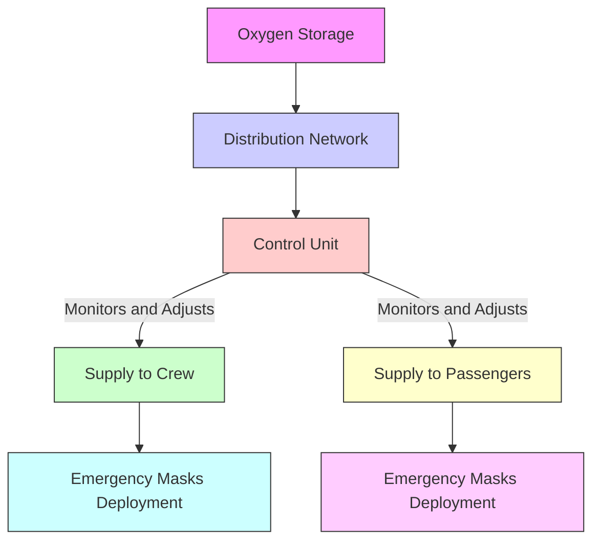

# Part II: GAIA PULSE AIR MODULES (GPAM) - Operaciones Atmosféricas

## 2.1 AMPEL360XWLRGA (Sistemas Avanzados de Aeronaves)
- **P/N:** GPAM-AMPEL-0201
- **2.1.1 Capítulos ATA:**
  - **P/N:** GPAM-AMPEL-0201-ATA
  - **(Capítulos ATA 05 - 33 Omitidos por Brevedad. Consultar Respuestas Previas para Detalles.)**

### 2.1.1.XX ATA 35 - Oxígeno
- **P/N:** GPAM-AMPEL-0201-35
It looks like you might have misspelled "mermaid." Here is your flowchart written in Mermaid syntax:



#### **IN:** GPAM-AMPEL-0201-35-W1-001 - **Sistema de Oxígeno para la Tripulación (S1000D)**
- **DMC:** DMC-GAIAPULSE-AMPEL-0201-35-W1-001-A-001-00_EN-US - Sistema de Oxígeno para la Tripulación
- **Documento:** GPAM-AMPEL-0201-35-W1-001-A - Sistema de Oxígeno para la Tripulación
- **SRS:** SRS-GAIAPULSE-AMPEL-0201-35-W1-001
- **WBS:** WBS-GAIAPULSE-AMPEL-0201-35-W1-001
- **EPOCHS:** EPOCH-GAIAPULSE-AMPEL-0201-35-W1-001

##### **SRS-GAIAPULSE-AMPEL-0201-35-W1-001: Sistema de Oxígeno para la Tripulación**
- **Propósito:**
  Definir los requisitos para el Sistema de Oxígeno de la Tripulación, garantizando un suministro adecuado de oxígeno, mecanismos de entrega y características de seguridad para la cabina de vuelo.
- **Alcance:**
  Incluye almacenamiento de oxígeno, redes de distribución, máscaras, reguladores y sistemas de emergencia para la tripulación.
- **Requisitos Funcionales:**
  - **FR-OXYGEN-001:** Proporcionar un suministro continuo de oxígeno a los miembros de la tripulación durante todas las fases del vuelo.
  - **FR-OXYGEN-002:** Activar automáticamente las máscaras de oxígeno de emergencia en caso de despresurización de la cabina.
  - **FR-OXYGEN-003:** Monitorear los niveles de oxígeno y la integridad del sistema en tiempo real.
- **Requisitos de Rendimiento:**
  - **PR-OXYGEN-100:** El sistema debe suministrar al menos una concentración de oxígeno del 21% a cada máscara.
  - **PR-OXYGEN-110:** Las máscaras de emergencia deben desplegarse dentro de los 5 segundos siguientes a la detección de despresurización.
  - **PR-OXYGEN-120:** Los tanques de almacenamiento de oxígeno deben mantener una presión entre 2000 psi y 3000 psi.
- **Verificación y Validación:**
  - **Pruebas en Tierra:** Pruebas de presión de los tanques de oxígeno, pruebas funcionales de los mecanismos de despliegue de máscaras.
  - **Pruebas de Vuelo:** Escenarios de despresurización en vuelo para validar el despliegue de máscaras de emergencia.
  - **Pruebas de Simulación:** Simulaciones de software para monitorear en tiempo real y sistemas de alerta.
- **Seguridad y Regulación:**
  - Debe cumplir con las normas FAA FAR Parte 25.853 y EASA CS-25.853 para sistemas de oxígeno.
  - Implementar sistemas redundantes para garantizar una operación a prueba de fallos.
- **Referencias:**
  - **[Índice Cósmico: SRS–SistemasDeOxígeno](#)**
  - **ATA iSpec 2200**
  - **“PDR–AMPEL–OXIGENO–SistemaTripulación”**
  - **“DMC–GAIAPULSE–OXIGENO–0201–35-W1-001-A-001-00_EN-US”**

##### **WBS-GAIAPULSE-AMPEL-0201-35-W1-001: Desarrollo del Sistema de Oxígeno para la Tripulación**
- **Tareas:**
  1. **Diseño de Tanques de Almacenamiento de Oxígeno**
     - Selección de materiales, análisis de integridad estructural.
  2. **Desarrollo de la Red de Distribución**
     - Ruteo de líneas de oxígeno, integración con sistemas existentes del fuselaje.
  3. **Fabricación de Máscaras de Oxígeno**
     - Diseño ergonómico, pruebas de confort, evaluaciones de fiabilidad.
  4. **Implementación de Software de Monitoreo**
     - Seguimiento en tiempo real de niveles de oxígeno, sistemas de alerta.
  5. **Realización de Pruebas de Seguridad**
     - Pruebas estáticas y dinámicas de los mecanismos de entrega de oxígeno.
  6. **Documentación**
     - Creación de manuales de mantenimiento, guías de usuario.

##### **EPOCH-GAIAPULSE-AMPEL-0201-35-W1-001: Hitos del Sistema de Oxígeno para la Tripulación**
- **Fase 1:** Finalización del Diseño - **2025-12-01**
- **Fase 2:** Desarrollo de Prototipo - **2026-03-15**
- **Fase 3:** Pruebas en Tierra - **2026-06-30**
- **Fase 4:** Pruebas de Vuelo - **2026-09-20**
- **Fase 5:** Certificación Final - **2026-12-15**

#### **IN:** GPAM-AMPEL-0201-35-W1-002 - **Sistema de Distribución de Oxígeno para la Tripulación (S1000D)**
- **DMC:** DMC-GAIAPULSE-AMPEL-0201-35-W1-002-A-001-00_EN-US - Sistema de Distribución de Oxígeno para la Tripulación
- **Documento:** GPAM-AMPEL-0201-35-W1-002-A - Sistema de Distribución de Oxígeno para la Tripulación
- **SRS:** SRS-GAIAPULSE-AMPEL-0201-35-W1-002
- **WBS:** WBS-GAIAPULSE-AMPEL-0201-35-W1-002
- **EPOCHS:** EPOCH-GAIAPULSE-AMPEL-0201-35-W1-002

##### **SRS-GAIAPULSE-AMPEL-0201-35-W1-002: Sistema de Distribución de Oxígeno para la Tripulación**
- **Propósito:**
  Establecer una red de distribución de oxígeno confiable y eficiente para los miembros de la tripulación, garantizando un flujo continuo y sistemas redundantes.
- **Alcance:**
  Incluye el ruteo de líneas de oxígeno, integración con los tanques de almacenamiento, interfaces de máscaras y válvulas de control.
- **Requisitos Funcionales:**
  - **FR-OXYGEN-004:** Mantener un flujo continuo de oxígeno bajo condiciones operativas normales.
  - **FR-OXYGEN-005:** Aislar automáticamente y redirigir el suministro de oxígeno en caso de fallo de una línea.
  - **FR-OXYGEN-006:** Proporcionar controles de anulación manual para escenarios de emergencia.
- **Requisitos de Rendimiento:**
  - **PR-OXYGEN-130:** Las líneas de distribución deben soportar presiones de hasta 3500 psi.
  - **PR-OXYGEN-140:** La tasa de flujo debe cumplir al menos con 15 litros por minuto por máscara.
  - **PR-OXYGEN-150:** El tiempo de respuesta para las válvulas de aislamiento debe ser ≤2 segundos.
- **Verificación y Validación:**
  - **Pruebas en Tierra:** Pruebas de resistencia a la presión, medición de tasas de flujo.
  - **Pruebas de Simulación:** Simulaciones de escenarios de fallo para validar aislamientos y redirecciones automáticas.
  - **Pruebas de Integración:** Confirmar compatibilidad con los sistemas de almacenamiento y máscaras de oxígeno.
- **Seguridad y Regulación:**
  - Debe cumplir con las normas FAA FAR Parte 25.853 y EASA CS-25.853 para sistemas de oxígeno.
  - Implementar mecanismos de fail-safe y caminos redundantes.
- **Referencias:**
  - **[Índice Cósmico: SRS–SistemasDeOxígeno](#)**
  - **ATA iSpec 2200**
  - **“PDR–AMPEL–OXIGENO–DistribucionTripulacion”**
  - **“DMC–GAIAPULSE–OXIGENO–0201–35-W1-002-A-001-00_EN-US”**

##### **WBS-GAIAPULSE-AMPEL-0201-35-W1-002: Desarrollo del Sistema de Distribución de Oxígeno para la Tripulación**
- **Tareas:**
  1. **Diseño del Ruteo de Líneas de Oxígeno**
     - Mapeo y simulación de rutas de flujo de oxígeno.
  2. **Selección e Instalación de Válvulas de Control**
     - Válvulas de alta presión, controles automatizados y manuales.
  3. **Integración con Tanques de Almacenamiento de Oxígeno**
     - Protocolos de conexión, regulación de presión.
  4. **Desarrollo de Sistemas Redundantes**
     - Líneas de respaldo, mecanismos de failover.
  5. **Realización de Pruebas de Tasa de Flujo y Presión**
     - Validar el rendimiento de distribución bajo diversas condiciones.
  6. **Documentación**
     - Guías de instalación, procedimientos de mantenimiento.

##### **EPOCH-GAIAPULSE-AMPEL-0201-35-W1-002: Hitos del Sistema de Distribución de Oxígeno para la Tripulación**
- **Fase 1:** Aprobación del Diseño de Líneas de Distribución - **2026-01-15**
- **Fase 2:** Selección e Implementación de Válvulas de Control - **2026-04-01**
- **Fase 3:** Instalación e Integración - **2026-07-10**
- **Fase 4:** Pruebas de Tasa de Flujo y Presión - **2026-09-05**
- **Fase 5:** Validación Final del Sistema - **2026-11-20**

#### **IN:** GPAM-AMPEL-0201-35-W2-001 - **Sistema de Oxígeno para Pasajeros (S1000D)**
- **DMC:** DMC-GAIAPULSE-AMPEL-0201-35-W2-001-A-001-00_EN-US - Sistema de Oxígeno para Pasajeros
- **Documento:** GPAM-AMPEL-0201-35-W2-001-A - Sistema de Oxígeno para Pasajeros
- **SRS:** SRS-GAIAPULSE-AMPEL-0201-35-W2-001
- **WBS:** WBS-GAIAPULSE-AMPEL-0201-35-W2-001
- **EPOCHS:** EPOCH-GAIAPULSE-AMPEL-0201-35-W2-001

##### **SRS-GAIAPULSE-AMPEL-0201-35-W2-001: Sistema de Oxígeno para Pasajeros**
- **Propósito:**
  Garantizar un suministro adecuado de oxígeno a los pasajeros, cumpliendo con los estándares de seguridad y mejorando la comodidad de los pasajeros.
- **Alcance:**
  Incluye almacenamiento de oxígeno, sistemas de despliegue de máscaras, mecanismos de entrega y sistemas de monitoreo para la cabina de pasajeros.
- **Requisitos Funcionales:**
  - **FR-OXYGEN-007:** Proporcionar oxígeno suplementario a los pasajeros durante operaciones normales y emergencias.
  - **FR-OXYGEN-008:** Desplegar automáticamente las máscaras de oxígeno en caso de despresurización de la cabina.
  - **FR-OXYGEN-009:** Monitorear y regular el flujo de oxígeno a cada máscara de pasajero.
- **Requisitos de Rendimiento:**
  - **PR-OXYGEN-160:** La concentración de oxígeno en las máscaras debe ser ≥21%.
  - **PR-OXYGEN-170:** El despliegue de máscaras de emergencia debe ocurrir dentro de los 5 segundos posteriores a la despresurización.
  - **PR-OXYGEN-180:** Los tanques de oxígeno deben operar dentro de un rango de temperatura de -20°C a +60°C.
- **Verificación y Validación:**
  - **Pruebas en Tierra:** Verificación de velocidad de despliegue de máscaras, consistencia del flujo de oxígeno.
  - **Pruebas de Vuelo:** Escenarios de despresurización simulados para validar la funcionalidad de las máscaras de emergencia.
  - **Pruebas de Software:** Validación de algoritmos de monitoreo y regulación.
- **Seguridad y Regulación:**
  - Debe cumplir con las normas FAA FAR Parte 25.853 y EASA CS-25.853 para sistemas de oxígeno para pasajeros.
  - Implementar caminos de suministro de oxígeno redundantes.
- **Referencias:**
  - **[Índice Cósmico: SRS–SistemasDeOxígeno](#)**
  - **ATA iSpec 2200**
  - **“PDR–AMPEL–OXIGENO–SistemaPasajeros”**
  - **“DMC–GAIAPULSE–OXIGENO–0201–35-W2-001-A-001-00_EN-US”**

##### **WBS-GAIAPULSE-AMPEL-0201-35-W2-001: Desarrollo del Sistema de Oxígeno para Pasajeros**
- **Tareas:**
  1. **Diseño de Unidades de Almacenamiento de Oxígeno**
     - Planificación de capacidad, selección de materiales.
  2. **Desarrollo de Mecanismos de Despliegue de Máscaras**
     - Sistemas de despliegue automático, diseño de máscaras para comodidad y fiabilidad.
  3. **Implementación de Regulación de Flujo de Oxígeno**
     - Medidores de flujo, reguladores de presión.
  4. **Integración de Sistemas de Monitoreo**
     - Sensores de niveles de oxígeno, indicadores de salud del sistema.
  5. **Realización de Pruebas de Seguridad y Fiabilidad**
     - Pruebas de resistencia a largo plazo, simulaciones de escenarios de emergencia.
  6. **Documentación**
     - Manuales del sistema de oxígeno para pasajeros, procedimientos de emergencia.

##### **EPOCH-GAIAPULSE-AMPEL-0201-35-W2-001: Hitos del Sistema de Oxígeno para Pasajeros**
- **Fase 1:** Finalización del Diseño - **2026-02-28**
- **Fase 2:** Desarrollo de Mecanismos de Despliegue de Máscaras - **2026-05-20**
- **Fase 3:** Implementación de Regulación de Flujo - **2026-08-15**
- **Fase 4:** Integración de Sistemas de Monitoreo - **2026-10-30**
- **Fase 5:** Pruebas de Seguridad y Fiabilidad - **2026-12-10**

#### **IN:** GPAM-AMPEL-0201-35-W2-002 - **Sistema de Distribución de Oxígeno para Pasajeros (S1000D)**
- **DMC:** DMC-GAIAPULSE-AMPEL-0201-35-W2-002-A-001-00_EN-US - Sistema de Distribución de Oxígeno para Pasajeros
- **Documento:** GPAM-AMPEL-0201-35-W2-002-A - Sistema de Distribución de Oxígeno para Pasajeros
- **SRS:** SRS-GAIAPULSE-AMPEL-0201-35-W2-002
- **WBS:** WBS-GAIAPULSE-AMPEL-0201-35-W2-002
- **EPOCHS:** EPOCH-GAIAPULSE-AMPEL-0201-35-W2-002

##### **SRS-GAIAPULSE-AMPEL-0201-35-W2-002: Sistema de Distribución de Oxígeno para Pasajeros**
- **Propósito:**
  Diseñar e implementar una red de distribución de oxígeno robusta que asegure una entrega eficiente y confiable de oxígeno a todas las máscaras de pasajeros.
- **Alcance:**
  Incluye el ruteo de líneas de oxígeno, integración con unidades de almacenamiento, interfaces de máscaras y válvulas de control específicas para las necesidades de oxígeno de los pasajeros.
- **Requisitos Funcionales:**
  - **FR-OXYGEN-010:** Asegurar una distribución equitativa de oxígeno a través de todos los asientos de pasajeros.
  - **FR-OXYGEN-011:** Aislar automáticamente y redirigir el suministro de oxígeno en caso de fallo de una línea.
  - **FR-OXYGEN-012:** Proporcionar capacidades de anulación manual para operaciones de mantenimiento y escenarios de emergencia.
- **Requisitos de Rendimiento:**
  - **PR-OXYGEN-190:** Las líneas de distribución deben soportar tasas de flujo de hasta 20 litros por minuto por máscara.
  - **PR-OXYGEN-200:** El sistema debe mantener la estabilidad de la presión dentro de ±5% durante las operaciones.
  - **PR-OXYGEN-210:** El tiempo de respuesta para las válvulas de aislamiento debe ser ≤3 segundos.
- **Verificación y Validación:**
  - **Pruebas en Tierra:** Verificación de presión y tasa de flujo, pruebas de funcionalidad de válvulas de aislamiento.
  - **Pruebas de Simulación:** Simulaciones de escenarios de cabina de pasajeros para validar la eficiencia de la distribución.
  - **Pruebas de Integración:** Confirmar la interacción fluida con máscaras de oxígeno y unidades de almacenamiento.
- **Seguridad y Regulación:**
  - Debe cumplir con las normas FAA FAR Parte 25.853 y EASA CS-25.853 para sistemas de oxígeno para pasajeros.
  - Implementar caminos de suministro de oxígeno redundantes para garantizar la fiabilidad del sistema.
- **Referencias:**
  - **[Índice Cósmico: SRS–SistemasDeOxígeno](#)**
  - **ATA iSpec 2200**
  - **“PDR–AMPEL–OXIGENO–DistribucionPasajeros”**
  - **“DMC–GAIAPULSE–OXIGENO–0201–35-W2-002-A-001-00_EN-US”**

##### **WBS-GAIAPULSE-AMPEL-0201-35-W2-002: Desarrollo del Sistema de Distribución de Oxígeno para Pasajeros**
- **Tareas:**
  1. **Diseño del Layout de Líneas de Distribución**
     - Mapeo de la cabina de pasajeros, optimización de rutas.
  2. **Selección de Válvulas y Reguladores de Control**
     - Válvulas de alto flujo, sistemas de control automatizados.
  3. **Instalación de Líneas de Distribución**
     - Integración con la infraestructura de la cabina, conexiones seguras.
  4. **Desarrollo de Caminos Redundantes**
     - Líneas de respaldo, mecanismos de failover.
  5. **Realización de Pruebas de Tasa de Flujo y Presión**
     - Validar el rendimiento de distribución bajo diversas condiciones.
  6. **Documentación**
     - Guías de instalación, procedimientos de mantenimiento.

##### **EPOCH-GAIAPULSE-AMPEL-0201-35-W2-002: Hitos del Sistema de Distribución de Oxígeno para Pasajeros**
- **Fase 1:** Aprobación del Diseño de Líneas de Distribución - **2026-03-10**
- **Fase 2:** Selección e Implementación de Válvulas de Control - **2026-06-05**
- **Fase 3:** Instalación e Integración - **2026-09-25**
- **Fase 4:** Pruebas de Tasa de Flujo y Presión - **2026-11-15**
- **Fase 5:** Validación Final del Sistema - **2027-01-05**

#### **IN:** GPAM-AMPEL-0201-35-W3-001 - **Unidad de Control de Suministro de Oxígeno (S1000D)**
- **DMC:** DMC-GAIAPULSE-AMPEL-0201-35-W3-001-A-001-00_EN-US - Unidad de Control de Suministro de Oxígeno
- **Documento:** GPAM-AMPEL-0201-35-W3-001-A - Unidad de Control de Suministro de Oxígeno
- **SRS:** SRS-GAIAPULSE-AMPEL-0201-35-W3-001
- **WBS:** WBS-GAIAPULSE-AMPEL-0201-35-W3-001
- **EPOCHS:** EPOCH-GAIAPULSE-AMPEL-0201-35-W3-001

##### **SRS-GAIAPULSE-AMPEL-0201-35-W3-001: Unidad de Control de Suministro de Oxígeno**
- **Propósito:**
  Gestionar y regular la distribución de oxígeno desde las unidades de almacenamiento hacia los sistemas de oxígeno para tripulación y pasajeros, asegurando un rendimiento óptimo y seguridad.
- **Alcance:**
  Incluye algoritmos de control, protocolos de interfaz, sistemas de failover y interfaces de usuario para control manual y monitoreo.
- **Requisitos Funcionales:**
  - **FR-OXYGEN-013:** Regular las tasas de flujo de oxígeno basadas en la demanda y el estado del sistema.
  - **FR-OXYGEN-014:** Implementar protocolos automáticos de failover en caso de fallo del suministro principal.
  - **FR-OXYGEN-015:** Proporcionar monitoreo y registro en tiempo real de los métricas de suministro de oxígeno.
- **Requisitos de Rendimiento:**
  - **PR-OXYGEN-220:** La unidad de control debe procesar datos de entrada en ≤50 milisegundos.
  - **PR-OXYGEN-230:** El tiempo de actividad del sistema debe ser ≥99.9%.
  - **PR-OXYGEN-240:** La precisión del registro de datos debe estar dentro de ±1%.
- **Verificación y Validación:**
  - **Pruebas de Software:** Pruebas unitarias, pruebas de integración y pruebas de sistema para algoritmos de control.
  - **Pruebas de Hardware:** Pruebas de fiabilidad de hardware de control bajo diversas condiciones.
  - **Pruebas de Integración del Sistema:** Validar protocolos de comunicación con las redes de distribución.
- **Seguridad y Regulación:**
  - Debe cumplir con las normas FAA FAR Parte 25.853 y EASA CS-25.853 para sistemas de control de oxígeno.
  - Implementar protocolos de comunicación seguros para prevenir accesos no autorizados.
- **Referencias:**
  - **[Índice Cósmico: SRS–SistemasDeOxígeno](#)**
  - **ATA iSpec 2200**
  - **“PDR–AMPEL–OXIGENO–UnidadControl”**
  - **“DMC–GAIAPULSE–OXIGENO–0201–35-W3-001-A-001-00_EN-US”**

##### **WBS-GAIAPULSE-AMPEL-0201-35-W3-001: Desarrollo de la Unidad de Control de Suministro de Oxígeno**
- **Tareas:**
  1. **Desarrollo de Algoritmos de Control**
     - Regulación de flujo, protocolos de failover.
  2. **Diseño de la Interfaz de Usuario**
     - Diseño de dashboards de monitoreo en tiempo real, controles de anulación manual.
  3. **Implementación de Protocolos de Comunicación**
     - Intercambio de datos seguros con las redes de distribución.
  4. **Realización de Pruebas de Software y Hardware**
     - Validar rendimiento y fiabilidad.
  5. **Integración con Redes de Distribución**
     - Comunicación fluida con los sistemas de oxígeno para tripulación y pasajeros.
  6. **Documentación**
     - Manuales de operación de la unidad de control, guías de software.

##### **EPOCH-GAIAPULSE-AMPEL-0201-35-W3-001: Hitos de la Unidad de Control de Suministro de Oxígeno**
- **Fase 1:** Desarrollo de Algoritmos de Control - **2026-04-20**
- **Fase 2:** Finalización del Diseño de la Interfaz de Usuario - **2026-07-15**
- **Fase 3:** Implementación de Protocolos de Comunicación - **2026-10-01**
- **Fase 4:** Pruebas de Software y Hardware - **2026-12-10**
- **Fase 5:** Integración y Validación Final - **2027-02-25**

#### **IN:** GPAM-AMPEL-0201-35-W3-002 - **Sistema de Despliegue de Oxígeno de Emergencia (S1000D)**
- **DMC:** DMC-GAIAPULSE-AMPEL-0201-35-W3-002-A-001-00_EN-US - Sistema de Despliegue de Oxígeno de Emergencia
- **Documento:** GPAM-AMPEL-0201-35-W3-002-A - Sistema de Despliegue de Oxígeno de Emergencia
- **SRS:** SRS-GAIAPULSE-AMPEL-0201-35-W3-002
- **WBS:** WBS-GAIAPULSE-AMPEL-0201-35-W3-002
- **EPOCHS:** EPOCH-GAIAPULSE-AMPEL-0201-35-W3-002

##### **SRS-GAIAPULSE-AMPEL-0201-35-W3-002: Sistema de Despliegue de Oxígeno de Emergencia**
- **Propósito:**
  Proporcionar un mecanismo confiable y rápido de despliegue de máscaras de oxígeno en situaciones de emergencia, garantizando la seguridad de los pasajeros y la tripulación.
- **Alcance:**
  Incluye activadores de despliegue, secuencias de activación de máscaras y sistemas redundantes para el suministro de oxígeno de emergencia.
- **Requisitos Funcionales:**
  - **FR-OXYGEN-016:** Desplegar automáticamente las máscaras de emergencia dentro de 5 segundos tras la detección de despresurización de la cabina.
  - **FR-OXYGEN-017:** Asegurar que las máscaras estén completamente funcionales y proporcionen un suministro continuo de oxígeno durante al menos 15 minutos.
  - **FR-OXYGEN-018:** Integrar con sensores de presión de la cabina y sistemas de control para una activación precisa.
- **Requisitos de Rendimiento:**
  - **PR-OXYGEN-250:** El mecanismo de despliegue debe lograr una tasa de éxito del 100% bajo condiciones probadas.
  - **PR-OXYGEN-260:** El suministro de oxígeno debe mantenerse estable sin interrupciones durante la duración requerida.
  - **PR-OXYGEN-270:** El sistema debe operar eficazmente en todas las condiciones ambientales (-20°C a +60°C).
- **Verificación y Validación:**
  - **Pruebas de Funcionalidad:** Verificar la precisión del tiempo de despliegue y la funcionalidad de las máscaras.
  - **Pruebas Ambientales:** Evaluar el rendimiento del sistema bajo temperaturas extremas y alta humedad.
  - **Pruebas de Seguridad:** Simular escenarios de emergencia para validar la fiabilidad del sistema.
- **Seguridad y Regulación:**
  - Debe cumplir con las normas FAA FAR Parte 25.853 y EASA CS-25.853 para sistemas de oxígeno de emergencia.
  - Implementar sistemas redundantes de suministro de oxígeno para asegurar la fiabilidad del sistema.
- **Referencias:**
  - **[Índice Cósmico: SRS–SistemasDeOxígeno](#)**
  - **ATA iSpec 2200**
  - **“PDR–AMPEL–OXIGENO–DespliegueEmergencia”**
  - **“DMC–GAIAPULSE–OXIGENO–0201–35-W3-002-A-001-00_EN-US”**

##### **WBS-GAIAPULSE-AMPEL-0201-35-W3-002: Desarrollo del Sistema de Despliegue de Oxígeno de Emergencia**
- **Tareas:**
  1. **Diseño del Mecanismo de Despliegue**
     - Sistemas de activación automática, mecanismos de despliegue mecánico.
  2. **Desarrollo de Secuencias de Activación**
     - Sincronización con sensores de presión de la cabina, verificación de preparación de máscaras.
  3. **Implementación de Suministro Redundante de Oxígeno**
     - Almacenamiento de respaldo y rutas de distribución alternativas.
  4. **Realización de Pruebas de Despliegue**
     - Exactitud del tiempo de despliegue, tasa de éxito del sistema.
  5. **Desarrollo de Protocolos de Seguridad**
     - Procedimientos de emergencia, operaciones a prueba de fallos.
  6. **Documentación**
     - Manuales de despliegue de emergencia, guías de operación.

##### **EPOCH-GAIAPULSE-AMPEL-0201-35-W3-002: Hitos del Sistema de Despliegue de Oxígeno de Emergencia**
- **Fase 1:** Diseño del Mecanismo de Despliegue - **2026-05-30**
- **Fase 2:** Desarrollo de Secuencias de Activación - **2026-08-20**
- **Fase 3:** Implementación de Suministro Redundante - **2026-11-10**
- **Fase 4:** Pruebas de Despliegue - **2027-01-25**
- **Fase 5:** Validación Final de Seguridad - **2027-04-05**

#### **IN:** GPAM-AMPEL-0201-35-W4-001 - **Software de Monitoreo y Control de Oxígeno (S1000D)**
- **DMC:** DMC-GAIAPULSE-AMPEL-0201-35-W4-001-A-001-00_EN-US - Software de Monitoreo y Control de Oxígeno
- **Documento:** GPAM-AMPEL-0201-35-W4-001-A - Software de Monitoreo y Control de Oxígeno
- **SRS:** SRS-GAIAPULSE-AMPEL-0201-35-W4-001
- **WBS:** WBS-GAIAPULSE-AMPEL-0201-35-W4-001
- **EPOCHS:** EPOCH-GAIAPULSE-AMPEL-0201-35-W4-001

##### **SRS-GAIAPULSE-AMPEL-0201-35-W4-001: Software de Monitoreo y Control de Oxígeno**
- **Propósito:**
  Desarrollar software para monitorear niveles de oxígeno, salud del sistema y controlar la distribución de oxígeno, asegurando una respuesta en tiempo real y seguridad.
- **Alcance:**
  Incluye adquisición de datos desde sensores, dashboards de monitoreo en tiempo real, algoritmos de control automatizados y sistemas de alerta.
- **Requisitos Funcionales:**
  - **FR-OXYGEN-019:** Monitorear continuamente los niveles de oxígeno en tanques de almacenamiento y redes de distribución.
  - **FR-OXYGEN-020:** Ajustar automáticamente las tasas de flujo de oxígeno basadas en la demanda en tiempo real.
  - **FR-OXYGEN-021:** Generar alertas para niveles bajos de oxígeno o fallos en el sistema.
- **Requisitos de Rendimiento:**
  - **PR-OXYGEN-280:** El sistema debe procesar datos de sensores con una latencia ≤100 milisegundos.
  - **PR-OXYGEN-290:** Las actualizaciones del dashboard deben ocurrir en tiempo real sin retrasos perceptibles.
  - **PR-OXYGEN-300:** La generación de alertas debe tener una precisión ≥99%.
- **Verificación y Validación:**
  - **Pruebas de Software:** Pruebas unitarias, pruebas de integración y pruebas de sistema para algoritmos de control.
  - **Pruebas de Rendimiento:** Pruebas de estrés para procesamiento de datos y respuesta del dashboard.
  - **Pruebas de Aceptación del Usuario:** Validar la usabilidad y funcionalidad con retroalimentación de pilotos y tripulación.
- **Seguridad y Regulación:**
  - Debe cumplir con las normas FAA FAR Parte 25.853 y EASA CS-25.853.
  - Implementar medidas de ciberseguridad para proteger el software de control contra accesos no autorizados.
- **Referencias:**
  - **[Índice Cósmico: SRS–SistemasDeOxígeno](#)**
  - **ATA iSpec 2200**
  - **“PDR–AMPEL–OXIGENO–MonitoreoControl”**
  - **“DMC–GAIAPULSE–OXIGENO–0201–35-W4-001-A-001-00_EN-US”**

##### **WBS-GAIAPULSE-AMPEL-0201-35-W4-001: Desarrollo del Software de Monitoreo y Control de Oxígeno**
- **Tareas:**
  1. **Desarrollo de Módulos de Adquisición de Datos**
     - Interfaz con sensores de oxígeno, preprocesamiento de datos.
  2. **Creación de Dashboard de Monitoreo en Tiempo Real**
     - Diseño de interfaz de usuario, visualización de datos.
  3. **Implementación de Algoritmos de Control**
     - Ajustes automáticos de tasas de flujo, previsión de demanda.
  4. **Desarrollo de Sistemas de Alerta**
     - Configuración de umbrales, protocolos de notificación.
  5. **Realización de Pruebas de Software**
     - Pruebas funcionales, de rendimiento y de seguridad.
  6. **Integración con Unidades de Control**
     - Comunicación fluida con el Sistema de Control de Suministro de Oxígeno.
  7. **Documentación**
     - Manuales de usuario del software, guías de mantenimiento.

##### **EPOCH-GAIAPULSE-AMPEL-0201-35-W4-001: Hitos del Software de Monitoreo y Control de Oxígeno**
- **Fase 1:** Desarrollo de Módulos de Adquisición de Datos - **2026-06-15**
- **Fase 2:** Desarrollo del Dashboard - **2026-09-01**
- **Fase 3:** Implementación de Algoritmos de Control - **2026-12-05**
- **Fase 4:** Integración de Sistemas de Alerta - **2027-02-20**
- **Fase 5:** Pruebas Exhaustivas del Software - **2027-04-30**
- **Fase 6:** Integración Final y Validación - **2027-07-15**

#### **IN:** GPAM-AMPEL-0201-35-W4-002 - **Diagnósticos del Sistema de Oxígeno (S1000D)**
- **DMC:** DMC-GAIAPULSE-AMPEL-0201-35-W4-002-A-001-00_EN-US - Diagnósticos del Sistema de Oxígeno
- **Documento:** GPAM-AMPEL-0201-35-W4-002-A - Diagnósticos del Sistema de Oxígeno
- **SRS:** SRS-GAIAPULSE-AMPEL-0201-35-W4-002
- **WBS:** WBS-GAIAPULSE-AMPEL-0201-35-W4-002
- **EPOCHS:** EPOCH-GAIAPULSE-AMPEL-0201-35-W4-002

##### **SRS-GAIAPULSE-AMPEL-0201-35-W4-002: Diagnósticos del Sistema de Oxígeno**
- **Propósito:**
  Desarrollar herramientas y protocolos de diagnóstico para monitorear la salud y el rendimiento de los sistemas de oxígeno, permitiendo un mantenimiento proactivo y la resolución de problemas.
- **Alcance:**
  Incluye algoritmos de detección de fallos, monitoreo de salud del sistema y herramientas de reporte diagnóstico.
- **Requisitos Funcionales:**
  - **FR-OXYGEN-022:** Detectar y registrar fallos y anomalías del sistema en tiempo real.
  - **FR-OXYGEN-023:** Proporcionar informes diagnósticos detallando la salud del sistema y las necesidades de mantenimiento.
  - **FR-OXYGEN-024:** Interfaz con sistemas de mantenimiento para reporte automatizado de fallos.
- **Requisitos de Rendimiento:**
  - **PR-OXYGEN-310:** La detección de fallos debe tener una precisión ≥98%.
  - **PR-OXYGEN-320:** La generación de informes diagnósticos debe ocurrir dentro de los 10 segundos siguientes a la detección de un fallo.
  - **PR-OXYGEN-330:** El sistema debe manejar detecciones simultáneas de fallos sin degradación del rendimiento.
- **Verificación y Validación:**
  - **Pruebas de Algoritmos:** Validar la precisión y fiabilidad de los algoritmos de detección de fallos.
  - **Pruebas de Integración del Sistema:** Asegurar una comunicación fluida con los sistemas de monitoreo y mantenimiento.
  - **Pruebas de Usuario:** Validar la usabilidad de las herramientas diagnósticas con el personal de mantenimiento.
- **Seguridad y Regulación:**
  - Debe cumplir con las normas FAA FAR Parte 25.853 y EASA CS-25.853.
  - Implementar protocolos seguros de manejo y transmisión de datos.
- **Referencias:**
  - **[Índice Cósmico: SRS–SistemasDeOxígeno](#)**
  - **ATA iSpec 2200**
  - **“PDR–AMPEL–OXIGENO–Diagnosticos”**
  - **“DMC–GAIAPULSE–OXIGENO–0201–35-W4-002-A-001-00_EN-US”**

##### **WBS-GAIAPULSE-AMPEL-0201-35-W4-002: Desarrollo de Diagnósticos del Sistema de Oxígeno**
- **Tareas:**
  1. **Desarrollo de Algoritmos de Detección de Fallos**
     - Modelos de aprendizaje automático, detección basada en umbrales.
  2. **Creación de Herramientas de Reporte Diagnóstico**
     - Generación automática de informes, interfaces amigables para el usuario.
  3. **Integración con Sistemas de Monitoreo**
     - Protocolos de intercambio de datos, transmisión de datos en tiempo real.
  4. **Implementación de Reporte Automatizado de Fallos**
     - Integración con sistemas de gestión de mantenimiento.
  5. **Realización de Pruebas de Diagnósticos**
     - Validar la precisión y fiabilidad de la detección de fallos.
  6. **Documentación**
     - Manuales de herramientas diagnósticas, procedimientos de mantenimiento.

##### **EPOCH-GAIAPULSE-AMPEL-0201-35-W4-002: Hitos de los Diagnósticos del Sistema de Oxígeno**
- **Fase 1:** Desarrollo de Algoritmos de Detección de Fallos - **2026-07-20**
- **Fase 2:** Creación de Herramientas de Reporte Diagnóstico - **2026-10-10**
- **Fase 3:** Integración con Sistemas de Monitoreo - **2027-01-05**
- **Fase 4:** Implementación de Reporte Automatizado de Fallos - **2027-03-25**
- **Fase 5:** Pruebas Exhaustivas de Diagnósticos - **2027-06-15**
- **Fase 6:** Documentación Final y Validación - **2027-08-30**

#### **IN:** GPAM-AMPEL-0201-35-W5-001 - **Características de Seguridad del Sistema de Oxígeno (S1000D)**
- **DMC:** DMC-GAIAPULSE-AMPEL-0201-35-W5-001-A-001-00_EN-US - Características de Seguridad del Sistema de Oxígeno
- **Documento:** GPAM-AMPEL-0201-35-W5-001-A - Características de Seguridad del Sistema de Oxígeno
- **SRS:** SRS-GAIAPULSE-AMPEL-0201-35-W5-001
- **WBS:** WBS-GAIAPULSE-AMPEL-0201-35-W5-001
- **EPOCHS:** EPOCH-GAIAPULSE-AMPEL-0201-35-W5-001

##### **SRS-GAIAPULSE-AMPEL-0201-35-W5-001: Características de Seguridad del Sistema de Oxígeno**
- **Propósito:**
  Definir e implementar características de seguridad para asegurar que los sistemas de oxígeno operen de manera confiable bajo todas las condiciones, minimizando riesgos para la tripulación y los pasajeros.
- **Alcance:**
  Incluye sistemas redundantes, interlocks de seguridad y protocolos de emergencia para el suministro y distribución de oxígeno.
- **Requisitos Funcionales:**
  - **FR-OXYGEN-025:** Implementar caminos de suministro de oxígeno redundantes para prevenir fallos del sistema.
  - **FR-OXYGEN-026:** Integrar interlocks de seguridad para prevenir sobrepresurización del sistema de oxígeno.
  - **FR-OXYGEN-027:** Desarrollar protocolos de cierre de emergencia para el sistema de suministro de oxígeno.
- **Requisitos de Rendimiento:**
  - **PR-OXYGEN-340:** Los caminos redundantes deben activarse dentro de 1 segundo tras el fallo del sistema principal.
  - **PR-OXYGEN-350:** Los interlocks de seguridad deben prevenir la sobrepresurización del sistema con una fiabilidad del 100%.
  - **PR-OXYGEN-360:** Los protocolos de cierre de emergencia deben ejecutarse sin demora al detectar fallos críticos.
- **Verificación y Validación:**
  - **Pruebas de Seguridad:** Simulaciones de fallos del sistema para probar la activación de redundancias e interlocks de seguridad.
  - **Pruebas de Cumplimiento:** Asegurar que todas las características de seguridad cumplen con las normas FAA FAR Parte 25.853 y EASA CS-25.853.
  - **Pruebas de Fiabilidad:** Pruebas de resistencia a largo plazo de los mecanismos de seguridad.
- **Seguridad y Regulación:**
  - Debe cumplir con las normas FAA FAR Parte 25.853 y EASA CS-25.853 para sistemas de oxígeno.
  - Implementar mecanismos de fail-safe y caminos redundantes para operaciones a prueba de fallos.
- **Referencias:**
  - **[Índice Cósmico: SRS–SistemasDeOxígeno](#)**
  - **ATA iSpec 2200**
  - **“PDR–AMPEL–OXIGENO–CaracteristicasSeguridad”**
  - **“DMC–GAIAPULSE–OXIGENO–0201–35-W5-001-A-001-00_EN-US”**

##### **WBS-GAIAPULSE-AMPEL-0201-35-W5-001: Desarrollo de Características de Seguridad del Sistema de Oxígeno**
- **Tareas:**
  1. **Diseño de Caminos de Suministro Redundantes**
     - Líneas de oxígeno paralelas, conexiones seguras.
  2. **Implementación de Interlocks de Seguridad**
     - Sensores de presión, válvulas de cierre automático.
  3. **Desarrollo de Protocolos de Cierre de Emergencia**
     - Procedimientos automatizados y manuales de cierre del sistema de oxígeno.
  4. **Realización de Pruebas de Seguridad**
     - Simulaciones de fallos del sistema, pruebas de funcionalidad de interlocks.
  5. **Asegurar Cumplimiento y Certificación**
     - Documentación y certificación de características de seguridad.
  6. **Documentación**
     - Manuales de características de seguridad, guías de operación de emergencia.

##### **EPOCH-GAIAPULSE-AMPEL-0201-35-W5-001: Hitos de las Características de Seguridad del Sistema de Oxígeno**
- **Fase 1:** Finalización del Diseño de Caminos Redundantes - **2026-08-25**
- **Fase 2:** Implementación de Interlocks de Seguridad - **2026-11-15**
- **Fase 3:** Desarrollo de Protocolos de Cierre de Emergencia - **2027-02-10**
- **Fase 4:** Pruebas Exhaustivas de Seguridad - **2027-04-20**
- **Fase 5:** Validación Final de Seguridad y Certificación - **2027-07-05**

##### **IN:** GPAM-AMPEL-0201-35-W5-002 - **Protocolos de Redundancia del Sistema de Oxígeno (S1000D)**
- **DMC:** DMC-GAIAPULSE-AMPEL-0201-35-W5-002-A-001-00_EN-US - Protocolos de Redundancia del Sistema de Oxígeno
- **Documento:** GPAM-AMPEL-0201-35-W5-002-A - Protocolos de Redundancia del Sistema de Oxígeno
- **SRS:** SRS-GAIAPULSE-AMPEL-0201-35-W5-002
- **WBS:** WBS-GAIAPULSE-AMPEL-0201-35-W5-002
- **EPOCHS:** EPOCH-GAIAPULSE-AMPEL-0201-35-W5-002

##### **SRS-GAIAPULSE-AMPEL-0201-35-W5-002: Protocolos de Redundancia del Sistema de Oxígeno**
- **Propósito:**
  Establecer protocolos para la redundancia dentro de los sistemas de suministro y distribución de oxígeno, asegurando la operación continua en caso de fallos de componentes.
- **Alcance:**
  Cubre líneas de oxígeno redundantes, sistemas de almacenamiento de respaldo, protocolos de redirección y mecanismos de failover.
- **Requisitos Funcionales:**
  - **FR-OXYGEN-028:** Detectar automáticamente y aislar líneas de oxígeno fallidas.
  - **FR-OXYGEN-029:** Redirigir el flujo de oxígeno a líneas de respaldo sin interrupción del suministro.
  - **FR-OXYGEN-030:** Notificar a los sistemas de mantenimiento sobre cualquier activación de redundancia.
- **Requisitos de Rendimiento:**
  - **PR-OXYGEN-370:** Las líneas redundantes deben activarse dentro de 2 segundos tras el fallo de la línea principal.
  - **PR-OXYGEN-380:** El sistema debe mantener el suministro de oxígeno sin interrupción durante el failover.
  - **PR-OXYGEN-390:** Los protocolos de redundancia deben lograr una fiabilidad ≥99.9%.
- **Verificación y Validación:**
  - **Pruebas de Redundancia:** Simular fallos en líneas principales para probar aislamiento automático y redirección.
  - **Pruebas de Rendimiento:** Medir tiempos de respuesta de failover y continuidad del suministro de oxígeno.
  - **Pruebas de Fiabilidad:** Pruebas de resistencia a largo plazo para asegurar la estabilidad de los protocolos.
- **Seguridad y Regulación:**
  - Debe cumplir con las normas FAA FAR Parte 25.853 y EASA CS-25.853 para redundancia de sistemas de oxígeno.
  - Implementar mecanismos de fail-safe para prevenir interrupciones en el suministro de oxígeno.
- **Referencias:**
  - **[Índice Cósmico: SRS–SistemasDeOxígeno](#)**
  - **ATA iSpec 2200**
  - **“PDR–AMPEL–OXIGENO–ProtocolosRedundancia”**
  - **“DMC–GAIAPULSE–OXIGENO–0201–35-W5-002-A-001-00_EN-US”**

##### **WBS-GAIAPULSE-AMPEL-0201-35-W5-002: Desarrollo de Protocolos de Redundancia del Sistema de Oxígeno**
- **Tareas:**
  1. **Diseño de Líneas de Oxígeno Redundantes**
     - Líneas paralelas de oxígeno, conexiones seguras.
  2. **Desarrollo de Mecanismos de Aislamiento de Seguridad**
     - Sensores de presión, válvulas de cierre automático.
  3. **Implementación de Protocolos de Redirección**
     - Software de control, activación de líneas de respaldo.
  4. **Realización de Pruebas de Redundancia**
     - Simulaciones de fallos, validación de aislamiento y redirección.
  5. **Asegurar Cumplimiento y Certificación**
     - Documentación y certificación de protocolos de redundancia.
  6. **Documentación**
     - Manuales de protocolos de redundancia, guías de operación de failover.

##### **EPOCH-GAIAPULSE-AMPEL-0201-35-W5-002: Hitos de los Protocolos de Redundancia del Sistema de Oxígeno**
- **Fase 1:** Finalización del Diseño de Líneas Redundantes - **2026-09-30**
- **Fase 2:** Implementación de Mecanismos de Aislamiento - **2026-12-20**
- **Fase 3:** Desarrollo de Protocolos de Redirección - **2027-03-10**
- **Fase 4:** Pruebas de Redundancia - **2027-05-25**
- **Fase 5:** Certificación Final y Validación - **2027-08-15**

---
    
## 2.1.1.XX Resumen: ATA 35 - Oxígeno

El capítulo **ATA 35 - Oxígeno** abarca el diseño, desarrollo e implementación de los sistemas de oxígeno tanto para la tripulación como para los pasajeros, asegurando el cumplimiento de los estándares de seguridad y mejorando la fiabilidad general de la aeronave. La integración de SRS, WBS y EPOCHS dentro del marco COAFI proporciona un enfoque estructurado para gestionar el ciclo de vida de cada componente del subsistema, desde el diseño inicial hasta la certificación final.

### **Componentes Clave:**
1. **Sistema de Oxígeno para la Tripulación:**
   - Garantiza un suministro continuo y confiable de oxígeno a la tripulación de vuelo.
   - Incorpora monitoreo, despliegue de emergencia y protocolos de redundancia.
2. **Sistema de Oxígeno para Pasajeros:**
   - Proporciona oxígeno suplementario a los pasajeros, con controles automatizados y manuales.
   - Incluye redes de distribución y mecanismos de despliegue de emergencia.
3. **Unidades de Control y Software:**
   - Gestiona el flujo de oxígeno, monitorea la salud del sistema y automatiza respuestas de emergencia.
   - Se integra con sistemas generales de monitoreo y control de la aeronave.
4. **Características de Seguridad:**
   - Implementa sistemas redundantes, interlocks de seguridad y protocolos de emergencia.
   - Asegura el cumplimiento de los estándares regulatorios de seguridad.

### **Próximos Pasos:**
- **Integración Detallada:**
  Continuar desarrollando entradas detalladas de COAFI para otros capítulos ATA, asegurando una cobertura integral de todos los sistemas de la aeronave.
- **Integración de Algoritmos:**
  Incorporar algoritmos específicos relacionados con el monitoreo y control del sistema de oxígeno dentro del marco COAFI.
- **Marco de Validación:**
  Establecer un marco robusto de validación y verificación alineado con los hitos PDR/CDR para asegurar que todos los sistemas cumplen con los requisitos de diseño y seguridad.
- **Estándares de Documentación:**
  Asegurar que toda la documentación cumpla con los estándares S1000D y ATA iSpec 2200 para consistencia y facilidad de acceso.

---
    
# 📌 Próximos Pasos y Recomendaciones

A continuación, se presentan algunas sugerencias concretas para refinar y ampliar este documento para una **implementación operativa completa** dentro del ecosistema GAIA AIR:

## ✅ 1. Profundizar la Integración de COAFI con el Índice Cósmico

### **Trazabilidad:**
- **Enlazar Cada Entrada de Algoritmo:**
  Asegurar que cada algoritmo documentado en COAFI esté vinculado a su correspondiente Sistema de Especificaciones de Requisitos (SRS), Revisiones de Diseño Preliminar (PDR) e Informes de Validación. Esto crea una matriz de trazabilidad robusta que rastrea el ciclo de vida de cada algoritmo desde su inicio hasta su despliegue.

### **Ejemplo de Mapeo para el Índice Cósmico:**

```plaintext
Índice Cósmico Estructura (COAFI)

├── SRS–SistemasDeAeronaves
│   ├── DMC–GAIAPULSE–AIR–0100–BASE–001A
│   ├── COAFI-ATA22-FCC-ALG-001 (Control de Vuelo)
│   ├── COAFI-ATA22-FCC-ALG-002 (Ajuste de Ruta Adaptativo)
│   ├── COAFI-ATA22-AP-MODES-ALG-001 (Mantener Rumbo)
│   ├── COAFI-ATA22-AP-MODES-ALG-002 (Mantener Altitud)
│   ├── COAFI-ATA22-AP-MODES-ALG-003 (Control de Crucero)
│   ├── COAFI-ATA22-FDS-ALG-001 (Guía de Ruta de Vuelo)
│   └── ...
|
├── SRS–SistemasDePropulsión
│   ├── DMC–GAIAPULSE–PROP–0200–Q01–001A
│   ├── DMC–GAIAPULSE–PROP–0200–HYB–002B
│   └── ...
|
├── SRS–SistemasDeEnergía
│   ├── DMC–GAIAPULSE–ENERGY–0300–BATT–001A
│   ├── DMC–GAIAPULSE–ENERGY–0300–H2FC–002B
│   └── ...
|
├── SRS–Materiales
│   ├── DMC–GAIAPULSE–MATL–0400–DIAMOND–001A
│   ├── DMC–GAIAPULSE–MATL–0400–GRAPHENE–002B
│   └── ...
|
└── Algoritmos
    ├── COAFI-ATA22-FCC-ALG-001 (Control de Vuelo - QPSO-v1.2)
    ├── COAFI-ATA22-FCC-ALG-002 (Ajuste de Ruta Adaptativo - Algoritmo A Modificado-v2.5)
    ├── COAFI-ATA22-AP-MODES-ALG-001 (Mantener Rumbo - PID-v3.1)
    ├── COAFI-ATA22-AP-MODES-ALG-002 (Mantener Altitud - Baro-PID-v1.0)
    ├── COAFI-ATA22-AP-MODES-ALG-003 (Control de Crucero - AI-AdaptiveCruise-v4.0)
    ├── COAFI-ATA22-FDS-ALG-001 (Guía de Ruta de Vuelo - GPT-v1.5)
    ├── COAFI-ATA34-INS-Q-ALG-001 (INS Cuántico Mejorado - QINS-Fusion-v2.0)
    ├── COAFI-ATA34-RNAV-RNP-ALG-001 (Cálculo de Ruta RNAV - Algoritmo A Modificado-v3.0)
    ├── COAFI-ATA34-RNAV-RNP-ALG-002 (Procedimientos de Aproximación RNP - AI-RNP-Approach-v1.0)
    ├── COAFI-ATA45-DIAG-BERT-RF-ALG-001 (Análisis de Reportes de Mantenimiento - BERT-RF-v1.2)
    ├── COAFI-ATA45-PRO-LSTM-FT-ALG-002 (Prognósticos de Fallos Predictivos - LSTM-FT-v2.0)
    ├── COAFI-ATA45-OPT-AI-RATIO-ALG-003 (Optimización de Programación de Mantenimiento - AI-Ratio-v1.5)
    ├── COAFI-ATA46-DATA-PROC-ALG-001 (Procesamiento de Datos en Tiempo Real - Grover-v1.0 & AI-Filter-v2.0)
    ├── COAFI-ATA46-DATA-SHAR-ALG-002 (Protocolo de Compartición de Datos Seguro - Quantum-Safe-Encrypt-v3.0)
    ├── COAFI-ATA46-DATA-ANALY-ALG-003 (Análisis de Datos Impulsado por AI - AI-Insights-v5.0)
    └── COAFI-ATA71-Q01-ENERGY-ALG-001 (Optimización de Recursos - QDE-QGA-v1.0)
```

### **Mapeo Automatizado del Flujo de Datos:**
Utilizar herramientas de control de versiones (por ejemplo, **Git**, **S1000D**, o **Confluence**) para rastrear automáticamente las actualizaciones de algoritmos, módulos de datos e informes de validación.
- **Integración con Control de Versiones:**
  - **Git:** Alojar todas las entradas de COAFI en un repositorio Git, utilizando ramas para desarrollo y solicitudes de extracción para actualizaciones.
  - **S1000D:** Utilizar herramientas compatibles con S1000D para la creación y mantenimiento de documentación modular.
  - **Confluence:** Vincular las entradas de COAFI con páginas de Confluence usando macros para incorporar contenido dinámico.
- **Enlace Automatizado:**
  - Implementar scripts o utilizar plugins para vincular automáticamente las entradas de COAFI con los documentos SRS, PDR e informes de validación correspondientes basados en convenciones de nomenclatura o etiquetas de metadatos.
  - **Ejemplo:**
    Desarrollar un script en Python que analice las entradas de COAFI y genere enlaces a documentos relacionados en tu repositorio basado en patrones de identificadores.

## ✅ 2. Fortalecer la Validación y Verificación (V&V)

El **marco COAFI debe alinearse con la preparación para PDR/CDR** asegurando que cada algoritmo pase por pruebas de vuelo reales y cumpla con las certificaciones regulatorias.

### **Casos de Prueba Clave por Capítulo ATA:**

| **Algoritmo**                                      | **Capítulo ATA**         | **Referencia de Prueba de Validación**                | **Cumplimiento Regulatorio** |
|----------------------------------------------------|--------------------------|-------------------------------------------------------|-------------------------------|
| **QPSO-v1.2** (Optimización por Enjambre de Partículas Cuántico para Estabilidad de Vuelo) | ATA 22 - Auto Flight      | `FCC-FUNC-TEST-005`, `FCC-SIM-002`                    | DO-178C                       |
| **AI-AdaptiveCruise-v4.0** (Control de Crucero Autónomo)           | ATA 22 - Autopilot        | `AP-PERF-TEST-002`, `AP-SIM-001`                    | FAR Parte 25                   |
| **QINS-Fusion-v2.0** (Sistema de Navegación Inercial Cuántico Mejorado)        | ATA 34 - Navigation        | `INS-PERF-TEST-001`, `QSENSOR-TEST-001`              | DO-254, MIL-STD-1553          |
| **AI-RNP-Approach-v1.0** (Guía de Aproximación RNP basada en AI)        | ATA 34 - RNAV/RNP          | `RNP-SIM-001`, `FLIGHT-TEST-004`                      | ICAO PBN, FAA AC 90-105A       |
| **LSTM-FT-v2.0** (Prognósticos de Fallos Predictivos)                   | ATA 45 - Central Maintenance System | `PROG-VALID-TEST-001`, `AI-MODEL-VALID-002`            | DO-178C, DO-254                |
| **AI-Insights-v5.0** (Análisis de Datos Impulsado por AI)                   | ATA 46 - Information Systems | `DATA-ANALYSIS-TEST-001`, `AI-MODEL-VALID-004`          | FAR Parte 25, EASA CS-25         |
| **QDE-QGA-v1.0** (Optimización de Recursos)                          | ATA 71-80 - Powerplant     | `ENERGY-OPT-SIM-001`, `POWER-MGMT-TEST-001`           | DO-178C, FAR Parte 25            |

### **Pasos de Implementación:**
1. **Definir Protocolos de Validación:**
   - Crear protocolos de validación detallados para cada algoritmo, especificando entornos de prueba, datos de entrada, resultados esperados y métricas de rendimiento.
2. **Desarrollar Scripts de Prueba:**
   - Desarrollar scripts de prueba automatizados y manuales para ejecutar los casos de prueba predefinidos, asegurando una cobertura completa de todos los requisitos funcionales y de rendimiento.
3. **Ejecutar Pruebas en Tierra y de Vuelo:**
   - Realizar pruebas exhaustivas en tierra en entornos controlados seguidas de pruebas de vuelo reales para validar el rendimiento de los algoritmos bajo condiciones operativas.
4. **Documentar Resultados de Pruebas:**
   - Mantener una documentación completa de todos los resultados de las pruebas, destacando cualquier discrepancia y asegurando que se cumplan todos los requisitos.
5. **Certificar Cumplimiento:**
   - Colaborar con organismos regulatorios para obtener las certificaciones necesarias, asegurando que todos los algoritmos cumplen con las normas y regulaciones pertinentes.

---
    
## ✅ 3. Gemelo Digital y Análisis de Datos Impulsado por AI

- **Todos los Algoritmos de COAFI deben estar vinculados a un Modelo de Gemelo Digital.**

### **Estrategia de Implementación:**
1. **Pruebas de Modelos AI en Entornos Simulados**
   - **Uso de Aprendizaje por Refuerzo para Controles de Vuelo:**  
     Ejemplo: Implementar Q-Learning para controles de autopiloto dentro del Gemelo Digital para simular diversos escenarios de vuelo y optimizar políticas de control.
   - **Simular Flujos de Datos de Sistemas de Navegación Cuántica:**  
     Ejemplo: Alimentar datos simulados de sensores cuánticos en el Gemelo Digital para refinar y validar el algoritmo QINS-Fusion-v2.0 bajo condiciones controladas.
2. **Integración en Pruebas del Mundo Real**
   - **Validación de Fusión de Sensores** usando **Filtro de Kalman y predicción de fallos impulsada por AI:**  
     Ejemplo: Validar el proceso de fusión de sensores en simulaciones en tiempo real dentro del Gemelo Digital, asegurando una integración de datos precisa y detección de anomalías por los algoritmos de AI.
   - **Análisis de Mantenimiento Predictivo** con **Diagnósticos basados en BERT-RF:**  
     Ejemplo: Utilizar el Gemelo Digital para simular escenarios de mantenimiento y validar la capacidad de los algoritmos BERT-RF para predecir y clasificar fallos con precisión.

### **Enlace de Algoritmos al Gemelo Digital:**
- **Sincronización de Datos:**
  Asegurar que todas las entradas y salidas de datos de los algoritmos estén reflejadas dentro del Gemelo Digital. Utilizar APIs o buses de datos para facilitar el flujo de datos en tiempo real entre los sistemas físicos y sus contrapartes virtuales.
- **Integración de Simulaciones:**
  Incorporar modelos de algoritmos dentro del Gemelo Digital para ejecutar simulaciones paralelas, permitiendo comparaciones de rendimiento y pruebas de estrés sin afectar las operaciones reales.
- **Bucles de Retroalimentación:**
  Utilizar la retroalimentación del Gemelo Digital para mejorar continuamente y actualizar los parámetros de los algoritmos, asegurando un rendimiento óptimo basado en datos simulados y reales.

---
    
## ✅ 4. Cumplimiento de Documentación: S1000D & ATA iSpec 2200

Asegurar que la **Documentación de Algoritmos de COAFI siga los estándares de documentación de la industria** como:
- **S1000D:**  
  - Utilizar herramientas compatibles con S1000D para módulos de datos modulares, permitiendo una documentación estandarizada y estructurada.
- **ATA iSpec 2200:**  
  - Adherirse a formatos estandarizados para la documentación de aeronaves, asegurando consistencia y facilidad de navegación en todos los documentos.
- **ARINC 429 / MIL-STD-1553:**  
  - Asegurar la compatibilidad con buses de datos siguiendo estándares establecidos para protocolos de comunicación dentro de la documentación.

### **Ejemplo de Módulo de Datos S1000D:**

```xml
<dmDocument code="COAFI-ATA22-FCC-ALG-001" title="Algoritmo de Control de Vuelo en Tiempo Real (QPSO-v1.2)">
    <description>Algoritmo de Control de Vuelo basado en Optimización por Enjambre de Partículas Cuántico</description>
    <lastRevision>2025-08-10</lastRevision>
    <contentType>Técnico</contentType>
    <dataModules>
        <dmSection code="A001">Descripción Funcional</dmSection>
        <dmSection code="A002">Detalles de Integración</dmSection>
        <dmSection code="A003">Tecnologías Clave</dmSection>
        <dmSection code="A004">Validación y Pruebas</dmSection>
        <dmSection code="A005">Mantenimiento y Actualizaciones</dmSection>
        <dmSection code="A006">Referencias de COAFI</dmSection>
    </dataModules>
</dmDocument>
```

### **Implementación de S1000D con COAFI:**
1. **Documentación Modular:**
   Desglosar cada algoritmo en módulos de datos S1000D, asegurando que cada aspecto funcional esté cubierto de manera completa.
2. **Etiquetado de Metadatos:**
   Utilizar etiquetas de metadatos para vincular las entradas de COAFI con sus respectivos módulos de datos S1000D, facilitando la trazabilidad y recuperación automatizada.
3. **Control de Versiones:**
   Implementar control de versiones para todos los módulos de datos S1000D, asegurando que las actualizaciones sean rastreadas y que las versiones anteriores sean archivadas para referencia.

---
    
## ✅ 5. Desarrollo de Plantillas Estructuradas para la Validación, Pruebas y Actualizaciones de Cada Algoritmo

Crear plantillas estandarizadas asegura consistencia y completitud en toda la documentación de los algoritmos. A continuación, se presentan plantillas estructuradas en formato Markdown que pueden adaptarse para cada algoritmo.

### **Plantilla: Plan de Validación y Pruebas de Algoritmo**

```markdown
# Plan de Validación y Pruebas para [Nombre del Algoritmo] ([Identificador del Algoritmo])

## 1. Introducción

### 1.1 Propósito
Definir los procedimientos de validación y pruebas para asegurar que el [Nombre del Algoritmo] cumpla con todos los requisitos funcionales y de rendimiento.

### 1.2 Alcance
Cubre todas las actividades de validación y pruebas relacionadas con el [Nombre del Algoritmo], incluyendo pruebas en tierra, pruebas de simulación y pruebas de vuelo.

## 2. Estrategia de Validación

### 2.1 Objetivos de Prueba
- Verificar que el algoritmo funcione según lo previsto bajo todas las condiciones especificadas.
- Asegurar el cumplimiento con los estándares regulatorios.
- Validar la integración con otros sistemas.

### 2.2 Tipos de Pruebas
- **Pruebas Funcionales:** Evaluar si el algoritmo cumple con todos los requisitos funcionales.
- **Pruebas de Rendimiento:** Evaluar la eficiencia, velocidad y uso de recursos del algoritmo.
- **Pruebas de Integración:** Asegurar una interacción fluida con otros sistemas y componentes.
- **Pruebas de Estrés:** Evaluar el comportamiento del algoritmo bajo condiciones extremas.

## 3. Procedimientos de Prueba

### 3.1 Pruebas en Tierra
- **Caso de Prueba 1:** [Descripción]
  - **Objetivo:** [Objetivo]
  - **Procedimiento:** [Procedimiento paso a paso]
  - **Resultado Esperado:** [Resultado esperado]

### 3.2 Pruebas de Simulación
- **Caso de Prueba 2:** [Descripción]
  - **Objetivo:** [Objetivo]
  - **Procedimiento:** [Procedimiento paso a paso]
  - **Resultado Esperado:** [Resultado esperado]

### 3.3 Pruebas de Vuelo
- **Caso de Prueba 3:** [Descripción]
  - **Objetivo:** [Objetivo]
  - **Procedimiento:** [Procedimiento paso a paso]
  - **Resultado Esperado:** [Resultado esperado]

## 4. Criterios de Validación

- **Exactitud:** El algoritmo debe lograr [métricas de exactitud específicas].
- **Fiabilidad:** El algoritmo debe operar sin fallos durante [duración especificada].
- **Cumplimiento:** Debe adherirse a [estándares regulatorios específicos].

## 5. Resultados de las Pruebas

| **Caso de Prueba** | **Resultado** | **Comentarios** |
|--------------------|---------------|-----------------|
| Caso de Prueba 1   | Aprobado/Rechazado | [Comentarios]    |
| Caso de Prueba 2   | Aprobado/Rechazado | [Comentarios]    |
| Caso de Prueba 3   | Aprobado/Rechazado | [Comentarios]    |

## 6. Resumen de la Validación

Proporcionar un resumen de los resultados generales de la validación, destacando cualquier problema encontrado y las resoluciones implementadas.

## 7. Referencias

- **Informes de Pruebas:**  
  - `FCC-FUNC-TEST-005`  
  - `FCC-SIM-002`
- **Entradas de COAFI Relacionadas:**  
  - `COAFI-ATA22-FCC-ALG-001`
- **Documentos Regulatorios:**  
  - **DO-178C**

## 8. Mantenimiento y Actualizaciones

### 8.1 Procedimientos de Mantenimiento
- **Revisiones Regulares:** Revisiones mensuales de los registros de rendimiento del algoritmo.
- **Protocolos de Actualización:** Procedimientos para desplegar actualizaciones del algoritmo, incluyendo control de versiones y mecanismos de reversión.

### 8.2 Historial de Actualizaciones

| **Versión** | **Fecha**       | **Autor(es)**             | **Descripción de Cambios**       |
|-------------|-----------------|---------------------------|-----------------------------------|
| 1.0         | YYYY-MM-DD      | [Nombre del Autor]        | Plan Inicial de Validación y Pruebas. |
| 1.1         | YYYY-MM-DD      | [Nombre del Autor], Equipo QA | Incorporación de feedback del [Informe de Prueba]. |
```

### **Plantilla: Registro de Actualizaciones del Algoritmo**

```markdown
# Registro de Actualizaciones del Algoritmo para [Nombre del Algoritmo] ([Identificador del Algoritmo])

## 1. Introducción

### 1.1 Propósito
Documentar todas las actualizaciones, mejoras y modificaciones realizadas al [Nombre del Algoritmo].

### 1.2 Alcance
Cubre todos los cambios relacionados con el código del algoritmo, parámetros y funcionalidad.

## 2. Historial de Actualizaciones

| **Versión** | **Fecha**       | **Autor(es)**             | **Descripción de Cambios**       |
|-------------|-----------------|---------------------------|-----------------------------------|
| 1.0         | YYYY-MM-DD      | [Nombre del Autor]        | Despliegue Inicial del Algoritmo. |
| 1.1         | YYYY-MM-DD      | [Nombre del Autor], Equipo Dev | Mejoras en parámetros de optimización. |
| 1.2         | YYYY-MM-DD      | [Nombre del Autor], Equipo QA | Corrección de fallos relacionados con la integración de sensores. |

## 3. Procedimientos de Gestión de Cambios

### 3.1 Aprobación de Actualizaciones
Todas las actualizaciones deben ser revisadas y aprobadas por [Autoridad/Equipo Relevante] antes de su implementación.

### 3.2 Documentación
Asegurar que todas las actualizaciones sean documentadas en el **Registro de Actualizaciones del Algoritmo** y vinculadas a la correspondiente entrada de COAFI.

### 3.3 Control de Versiones
Mantener el control de versiones utilizando [Git/S1000D/Confluence], asegurando que todos los cambios sean rastreados y que las versiones anteriores sean archivadas para referencia.

## 4. Análisis de Impacto

### 4.1 Impacto Funcional
Describir cómo la actualización afecta la funcionalidad del algoritmo y su interacción con otros sistemas.

### 4.2 Impacto en el Rendimiento
Evaluar cualquier cambio en las métricas de rendimiento del algoritmo después de la actualización.

## 5. Referencias

- **Entrada de COAFI:**  
  - `COAFI-ATA22-FCC-ALG-001`
- **Formularios de Aprobación de Actualización:**  
  - `[ID/Enlace del Formulario]`
```

---
    
## ✅ 6. Monitoreo y Actualización de la Documentación

- **Proceso de Gestión de Cambios:**
  - **Identificación de Cambios:**
    Monitorear métricas de rendimiento, feedback de usuarios y resultados de pruebas para identificar áreas que requieren actualizaciones.
  - **Revisión y Aprobación:**
    Implementar un proceso de revisión estructurado donde las propuestas de cambios sean evaluadas y aprobadas por los stakeholders relevantes.
  - **Implementación de Cambios:**
    Actualizar el código del algoritmo, planes de validación e entradas de COAFI conforme a los cambios aprobados.
  - **Documentación de Actualizaciones:**
    Utilizar el **Registro de Actualizaciones del Algoritmo** para registrar todos los cambios, asegurando trazabilidad y responsabilidad.

- **Mejora Continua:**
  - Evaluar regularmente la efectividad de los algoritmos y la documentación.
  - Incorporar lecciones aprendidas de las pruebas y datos operativos para mejorar el rendimiento de los algoritmos y la calidad de la documentación.

---
    
