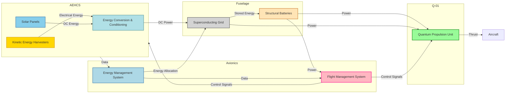

# FTC-53-00-00-00-000_ATA-53_DMC-Structurefuselage-01_Requirement_List

**Version:** 1.0  
**Date:** 2025-01-14  
**Author:** Amedeo Pelliccia  
**Position:** GAIA and AMPEL ROBBBO-T Technologies Intelligence Chair and Founder  
**Location:** Madrid  
**Revision Number:** 1.0  
**Approval:** Approved by Engineering Team Lead and Compliance Officer  
**Note Date:** 14/01/2025

---

## Table of Contents

1. [Introduction](#introduction)  
2. [Terms and Definitions](#terms-and-definitions)  
3. [General Requirements](#general-requirements)  
    - [GENERAL-001 Structural Integrity](#general-001-structural-integrity)  
    - [GENERAL-002 Weight Optimization](#general-002-weight-optimization)  
    - [GENERAL-003 Passenger Comfort](#general-003-passenger-comfort)  
    - [GENERAL-004 Modular Design](#general-004-modular-design)  
    - [GENERAL-005 Sustainability](#general-005-sustainability)  
4. [Material Requirements](#material-requirements)  
    - [MATERIAL-001 Carbon Fiber Reinforced Polymer (CFRP)](#material-001-carbon-fiber-reinforced-polymer-cfrp)  
    - [MATERIAL-002 Titanium Alloys (e.g., Ti-6Al-4V)](#material-002-titanium-alloys-eg-ti-6al-4v)  
    - [MATERIAL-003 Aluminum-Lithium Alloys](#material-003-aluminum-lithium-alloys)  
    - [MATERIAL-004 Smart Polymers](#material-004-smart-polymers)  
5. [Design Requirements](#design-requirements)  
    - [DESIGN-001 Laminar Flow Technology](#design-001-laminar-flow-technology)  
    - [DESIGN-002 Winglets and High-Performance Airfoils](#design-002-winglets-and-high-performance-airfoils)  
    - [DESIGN-003 Redundant Load Paths](#design-003-redundant-load-paths)  
    - [DESIGN-004 Crashworthiness](#design-004-crashworthiness)  
    - [DESIGN-005 Acoustic Liners and Optimized Fan Blades](#design-005-acoustic-liners-and-optimized-fan-blades)  
6. [Manufacturing Requirements](#manufacturing-requirements)  
    - [MANUFACTURING-001 Automated Fiber Placement (AFP)](#manufacturing-001-automated-fiber-placement-afp)  
    - [MANUFACTURING-002 Metal Additive Manufacturing](#manufacturing-002-metal-additive-manufacturing)  
    - [MANUFACTURING-003 Hot Isostatic Pressing (HIP)](#manufacturing-003-hot-isostatic-pressing-hip)  
    - [MANUFACTURING-004 Digital Twin Integration](#manufacturing-004-digital-twin-integration)  
7. [Quality Control Requirements](#quality-control-requirements)  
    - [QUALITY_CONTROL-001 AI-Driven Inspection](#quality_control-001-ai-driven-inspection)  
    - [QUALITY_CONTROL-002 Digital Thread Integration](#quality_control-002-digital-thread-integration)  
    - [QUALITY_CONTROL-003 Non-Destructive Testing (NDT)](#quality_control-003-non-destructive-testing-ndt)  
8. [Safety Requirements](#safety-requirements)  
    - [SAFETY-001 Pressurization Management](#safety-001-pressurization-management)  
    - [SAFETY-002 Lightning Strike Protection](#safety-002-lightning-strike-protection)  
    - [SAFETY-003 Emergency Systems Integration](#safety-003-emergency-systems-integration)  
9. [Maintenance Requirements](#maintenance-requirements)  
    - [MAINTENANCE-001 Routine Inspections](#maintenance-001-routine-inspections)  
    - [MAINTENANCE-002 Repair Procedures](#maintenance-002-repair-procedures)  
    - [MAINTENANCE-003 Component Replacement](#maintenance-003-component-replacement)  
10. [Compliance and Standards](#compliance-and-standards)  
    - [COMPLIANCE-001 FAA and EASA Regulations](#compliance-001-faa-and-easa-regulations)  
    - [COMPLIANCE-002 Environmental Standards](#compliance-002-environmental-standards)  
    - [COMPLIANCE-003 Quality Assurance Certifications](#compliance-003-quality-assurance-certifications)  
11. [Integration of AEHCS and Q-01 Propulsion System](#integration-of-aehcs-and-q-01-propulsion-system)  
12. [Risk Management Plan](#risk-management-plan)  
13. [QuantumGenProTerz Validation Plan](#quantumgenproterz-validation-plan)  
14. [Conclusion](#conclusion)  
15. [Next Steps](#next-steps)  
16. [Appendix A: Glossary](#appendix-a-glossary)  
17. [Appendix B: Compliance Matrix](#appendix-b-compliance-matrix)  
18. [Appendix C: Visual Roadmap](#appendix-c-visual-roadmap)  
19. [Appendix D: Wiring Diagrams and Schematics](#appendix-d-wiring-diagrams-and-schematics)  
20. [Appendix E: Figure List and Mermaid Diagrams](#appendix-e-figure-list-and-mermaid-diagrams)  
21. [Appendix F: User Guide](#appendix-f-user-guide)  
22. [Note](#note)

---

## Introduction

This **Requirement List** defines the critical specifications and standards for the **FTC-53-00-00-00-000_ATA-53_DMC-Structurefuselage-01** section of the **GAIA-AIR-AMPEL360 Extra Wide Body Long Range GenAI-Driven Aircraft**. It ensures that all aspects of the fuselage design—from material selection to manufacturing and quality assurance—meet the highest aerospace standards and operational demands.

This project leverages the innovative **Atmospheric Energy Harvesting and Conversion System (AEHCS)** and the **Q-01 Quantum Propulsion System** to achieve unprecedented levels of efficiency, sustainability, and performance in air travel. The integration of these advanced technologies marks a significant advancement in aerospace engineering, setting new benchmarks for the industry.

---

## Terms and Definitions

For the purposes of this document, the following terms and definitions apply. A comprehensive glossary can be found in [Appendix A: Glossary](#appendix-a-glossary).

- **CFRP:** Carbon Fiber Reinforced Polymer  
- **Al-Li:** Aluminum-Lithium Alloy  
- **ECS:** Environmental Control System  
- **APU:** Auxiliary Power Unit  
- **FEA:** Finite Element Analysis  
- **NDT:** Non-Destructive Testing  
- **AOA:** Angle of Attack  
- **PAUT:** Phased Array Ultrasonic Testing  
- **RT:** Radiographic Testing  
- **AOI:** Automated Optical Inspection  
- **AFP:** Automated Fiber Placement  
- **HIP:** Hot Isostatic Pressing  
- **CFD:** Computational Fluid Dynamics  
- **FMS:** Flight Management Systems  
- **SAF:** Safety  
- **DES:** Design  
- **MAN:** Manufacturing  
- **QC:** Quality Control  
- **GEN:** General  
- **MAT:** Material  
- **CMP:** Compliance and Standards  
- **MTN:** Maintenance  
- **AEHCS:** Atmospheric Energy Harvesting and Conversion System  
- **Q-01:** Quantum Propulsion System  
- **QuantumGenProTerz:** [Define if applicable]  
- **Limit Load:** The maximum load expected during normal operations.  
- **Ultimate Load:** The maximum load the structure can withstand before failure.  
- **TRL:** Technology Readiness Level  

---

## General Requirements

### GENERAL-001 Structural Integrity (Priority: Mandatory)

- **Description:** Ensure the fuselage maintains structural integrity under all operational loads, including aerodynamic forces, inertial stresses, and environmental conditions.  
- **Performance Metrics:**
  - **Load Factors:** Must meet or exceed limit load and ultimate load as per FAR Part 25.301 (Loads) and FAR Part 25.561 (Emergency Landing Conditions), and their corresponding CS-25 sections.  
- **Implementation:**  
  - Design using advanced materials and optimized structural layouts to withstand specified loads.  
  - Incorporate redundant load paths to enhance structural resilience.  
- **Verification Methods:** Finite Element Analysis (FEA), Static Testing.  
- **Prioritization Rationale:** Structural integrity is fundamental to aircraft safety and performance; failure could lead to catastrophic outcomes.  
- **Traceability:** Linked to FAR Part 25.301, FAR Part 25.561, CS-25.301, CS-25.561, and specific use cases for safety and performance.  

### GENERAL-002 Weight Optimization (Priority: Mandatory)

- **Description:** Achieve optimal weight reduction without compromising strength, durability, or safety. The minimization of weight is critical to maximize fuel efficiency, range, and payload capacity.  
- **Performance Metrics:**  
  - **Maximum Allowable Weight:** Fuselage structure shall not exceed 10,000 kg ± 5%.  
  - **Weight Breakdown:**  
    - **Nose Section:** ≤ 1,500 kg ± 5%  
    - **Forward Section:** ≤ 2,500 kg ± 5%  
    - **Central Section:** ≤ 3,000 kg ± 5%  
    - **Aft Section:** ≤ 2,000 kg ± 5%  
    - **Empennage Attachment:** ≤ 1,000 kg ± 5%  
  - **Weight Reduction Target:** Achieve an 8% reduction in fuselage weight compared to a comparable aircraft of similar size and mission profile using conventional materials.  
- **Implementation:**  
  - Utilize lightweight materials such as CFRP and aluminum-lithium alloys.  
  - Optimize structural designs using AI-driven simulations to minimize material usage while maintaining strength.  
- **Verification Methods:** Weight Measurement, Material Density Calculations.  
- **Prioritization Rationale:** Weight directly impacts fuel efficiency, range, and operational costs, making it a critical design factor.  
- **Traceability:** Linked to specific weight optimization use cases and AI simulation outputs.  

### GENERAL-003 Passenger Comfort (Priority: Mandatory)

- **Description:** Ensure passenger comfort through effective vibration damping, noise reduction, air quality, and lighting.  
- **Performance Metrics:**  
  - **Vibration Levels:** Cabin vibration levels shall not exceed 0.3 g in the frequency range of 20-200 Hz.  
  - **Noise Levels:** Cabin noise levels shall not exceed 75 dB(A) during cruise.  
  - **Air Quality:**  
    - **Maximum CO2 Concentration:** < 1000 ppm  
    - **Minimum Fresh Air Supply:** 20 cubic feet per minute per passenger  
    - **Filtration Efficiency:** HEPA filters with 99.97% efficiency for particles 0.3 microns and larger  
  - **Lighting:**  
    - **Color Temperature Range:** 2700K to 6500K  
    - **Illuminance Levels:** Minimum 300 lux at the reading plane  
    - **Circadian Rhythm Support:** Dynamic lighting system that adjusts color temperature to support passengers' natural circadian rhythms  
- **Implementation:**  
  - Incorporate vibration-damping materials and structural isolation techniques.  
  - Design acoustic treatments and integrate noise-reducing technologies.  
  - Implement advanced HVAC systems with HEPA filtration and real-time air quality monitoring.  
  - Install dynamic lighting systems with controllable color temperatures and intensity.  
- **Verification Methods:** Vibration Testing, Acoustic Testing, Air Quality Monitoring, Lighting System Testing.  
- **Prioritization Rationale:** Passenger comfort is essential for market competitiveness and overall flight experience.  
- **Traceability:** Linked to specific comfort-related use cases and regulatory standards for air quality and lighting.  

### GENERAL-004 Modular Design (Priority: Desirable)

- **Description:** Incorporate modularity in design to facilitate easy assembly, maintenance, and future upgrades or modifications.  
- **Performance Metrics:**  
  - **Modularity Coverage:** At least 80% of fuselage sections should be modular, defined as separable units with standardized bolted connections and flanged joints.  
  - **Interface Standardization:** All modular interfaces must adhere to standardized dimensions and connection protocols as per ISO 9001 and NAS standards.  
  - **Interchangeability:** Modules of the same type shall be interchangeable without requiring modifications.  
- **Implementation:**  
  - Design fuselage sections as interchangeable modules with standardized interfaces.  
  - Utilize bolted connections and flanged joints to enable quick assembly and disassembly.  
  - Develop a separate document defining standardized interface specifications.  
- **Verification Methods:** Inspection, Assembly Demonstration.  
- **Prioritization Rationale:** Enhances maintainability and scalability but is secondary to core structural and safety requirements.  
- **Traceability:** Linked to maintenance and upgrade use cases, and interface specification documents.  

### GENERAL-005 Sustainability (Priority: Desirable)

- **Description:** Utilize eco-friendly materials and manufacturing processes to minimize environmental impact.  
- **Performance Metrics:**  
  - **Recycled Materials Usage:** At least 20% of secondary materials should be recycled.  
  - **Manufacturing Waste Reduction:** Reduce manufacturing waste by 15% compared to traditional processes.  
  - **Emissions Reduction:** Achieve a 20% reduction in CO₂ emissions compared to conventional aircraft.  
  - **Lifecycle Assessment (LCA):** Conduct a comprehensive lifecycle assessment using ISO 14040 standards, evaluating environmental impact from material sourcing to end-of-life.  
- **Implementation:**  
  - Select materials with high recycled content where possible.  
  - Implement lean manufacturing techniques to minimize waste generation.  
  - Incorporate eco-friendly materials and energy-efficient manufacturing processes.  
  - Implement carbon offset programs and sustainable sourcing policies.  
  - Conduct lifecycle assessments to identify and mitigate environmental impacts.  
- **Verification Methods:** Material Composition Analysis, Manufacturing Process Audit, Environmental Impact Assessments.  
- **Prioritization Rationale:** Supports environmental goals and regulatory compliance, beneficial for corporate responsibility and market perception.  
- **Traceability:** Linked to sustainability use cases and ISO 14000 standards.  

---

## Material Requirements

### MATERIAL-001 Carbon Fiber Reinforced Polymer (CFRP) (Priority: Mandatory)

- **Properties:**  
  - **Type:** T700 Carbon Fiber  
  - **Resin System:** Epoxy-based resin  
    - **Glass Transition Temperature (Tg):** ≥ 180°C  
    - **Toughness:** Fracture toughness (KIC) ≥ 30 MPa√m  
    - **Moisture Absorption:** ≤ 1.5% by weight  
  - **Fiber Volume Fraction:** 60%  
  - **Ply Thickness:** 0.125 mm per ply  
  - **Layup Schedule:** 0°, ±45°, 90° orientations  
  - **Curing Method:** Autoclave curing at 180°C and 6 bar pressure  
- **Usage:** Applied in primary structural components such as wings, fuselage panels, and empennage to achieve weight reduction and enhanced fuel efficiency.  
- **Implementation:**  
  - Utilize prepreg layup processes to ensure consistent fiber alignment and resin distribution.  
  - Employ resin transfer molding where appropriate for complex geometries.  
  - Define specific layup schedules in a separate document.  
- **Verification Methods:** Material Testing (Tensile, Flexural), Layup Inspection (AOI), Curing Process Validation.  
- **Prioritization Rationale:** CFRP is essential for weight reduction and structural performance, directly impacting aircraft efficiency and durability.  
- **Traceability:** Linked to structural integrity and weight optimization use cases.  

### MATERIAL-002 Titanium Alloys (e.g., Ti-6Al-4V) (Priority: Mandatory)

- **Properties:**  
  - **Alloy Composition:** Ti-6Al-4V ELI  
  - **Mechanical Properties:**  
    - **Tensile Strength:** ≥ 900 MPa  
    - **Yield Strength:** ≥ 830 MPa  
    - **Fatigue Limit:** ≥ 500 MPa at 10⁷ cycles  
  - **Corrosion Resistance:** Excellent in saltwater and acidic environments.  
  - **High-Temperature Performance:** Capable of withstanding temperatures up to 400°C.  
  - **Microstructure:** Fine, equiaxed alpha-beta microstructure after heat treatment  
  - **Grain Size:** Maximum grain size of 20 microns after heat treatment  
  - **Surface Finish:** Ra ≤ 1.6 µm to ensure corrosion resistance  
- **Usage:** Utilized in engine nacelles, high-load fasteners, and critical structural parts requiring resistance to thermal and mechanical stresses.  
- **Implementation:**  
  - Apply laser welding techniques to ensure strong, precise joints.  
  - Utilize heat treatments to achieve desired mechanical properties.  
  - Specify joining methods such as laser beam welding and friction stir welding where applicable.  
- **Verification Methods:** Material Testing (Tensile, Hardness), Corrosion Testing, Microstructure Analysis.  
- **Prioritization Rationale:** Titanium alloys provide the necessary strength and durability for high-stress applications, ensuring structural reliability under extreme conditions.  
- **Traceability:** Linked to structural integrity and crashworthiness use cases.  

### MATERIAL-003 Aluminum-Lithium Alloys (Priority: Desirable)

- **Properties:**  
  - **Alloy Composition:** Al-Li 2195  
  - **Mechanical Properties:**  
    - **Tensile Strength:** ≥ 570 MPa  
    - **Yield Strength:** ≥ 480 MPa  
    - **Fatigue Strength:** ≥ 500 MPa at 10⁷ cycles  
  - **Corrosion Resistance:** Enhanced through surface treatments.  
  - **Temper Designation:** T6  
- **Usage:** Implemented in internal brackets, wing ribs, and fuselage skin to complement the performance of CFRP.  
- **Implementation:**  
  - Utilize extrusion processes for internal structural components.  
  - Apply anodizing and other surface treatments to enhance corrosion resistance.  
  - Employ friction stir welding and laser beam welding for joining.  
- **Verification Methods:** Material Testing (Tensile, Fatigue), Surface Treatment Verification, Joining Integrity Testing.  
- **Prioritization Rationale:** Offers additional stiffness and lightweight properties, beneficial for internal structures but secondary to primary structural materials.  
- **Traceability:** Linked to weight optimization and structural integrity use cases.  

### MATERIAL-004 Smart Polymers (Priority: Optional)

- **Properties:**  
  - **Type:** Tecnoflon PEEK-based self-healing elastomer XH602, Veriflex shape memory alloy (NiTi)  
  - **Self-Healing Rate:** ≥ 95% recovery of sealing function after puncture by a 1 mm diameter pin within 24 hours at 25°C.  
  - **Shape Memory Temperature:** Returns to original shape at 70°C ± 5°C.  
  - **Actuation Time:** ≤ 5 seconds.  
  - **Environmental Adaptability:** Maintains functionality under varying humidity and temperature conditions.  
  - **Activation Mechanism:**  
    - **Self-Healing Elastomer:** Environmental triggers such as temperature and moisture facilitate self-healing.  
    - **Shape Memory Actuators:** Electrical current triggers shape memory effect.  
- **Usage:**  
  - **Self-Healing Seals:** Fuel tank access panel seals.  
  - **Shape Memory Actuators:** Variable geometry air inlets for optimized engine performance.  
- **Implementation:**  
  - Integrate self-healing polymers in critical sealing applications to automatically repair minor leaks.  
  - Utilize shape memory actuators in airflow management systems for dynamic performance adjustments.  
  - Embed shape memory actuators into the fuselage structure and connect to the AI-powered control systems.  
- **Verification Methods:** Material Testing (Tensile, Flexural, Self-Healing, Shape Memory), Functional Testing of Seals and Actuators, Integration Testing.  
- **Prioritization Rationale:** Enhances performance and maintenance efficiency, offering advanced functionalities but not critical for basic structural requirements.  
- **Additional Resources:**  
  - [Tecnoflon XH602 Datasheet](https://example.com/tecnoflon-xh602-datasheet) *(Ensure this link is stable or hosted on your own repository)*  
  - [Veriflex NiTi Actuator Information](https://example.com/veriflex-niti-actuators) *(Ensure this link is stable or hosted on your own repository)*  
- **Traceability:** Linked to passenger comfort and emergency systems use cases.  

---

## Design Requirements

### DESIGN-001 Laminar Flow Technology (Priority: Mandatory)

- **Description:** Maintain laminar airflow over critical surfaces to reduce drag and enhance fuel efficiency.  
- **Performance Metrics:**  
  - **Laminar Flow Coverage:** Achieve at least 60% laminar flow over the forward fuselage and wing-fuselage fairings.  
  - **Reynolds Number Range:** Maintain laminar flow within the Reynolds number range of 5 x 10⁶ to 1 x 10⁷.  
  - **Surface Roughness:** Maximum average surface roughness (Ra) ≤ 0.2 µm.  
- **Implementation:**  
  - Utilize smooth surface contours and apply low-drag coatings such as riblet coatings or hybrid laminar flow control systems.  
  - Design using AI-powered CFD simulations to optimize shape and surface contours.  
  - Implement self-cleaning, hydrophobic coatings to maintain laminar flow.  
- **Verification Methods:** CFD Analysis, Wind Tunnel Testing, Surface Roughness Measurement.  
- **Prioritization Rationale:** Reducing aerodynamic drag is essential for fuel efficiency and range, directly impacting operational costs and environmental footprint.  
- **Traceability:** Linked to aerodynamic excellence and sustainability use cases.  

### DESIGN-002 Winglets and High-Performance Airfoils (Priority: Mandatory)

- **Description:** Enhance lift-to-drag ratios and fuel efficiency.  
- **Performance Metrics:**  
  - **Lift-to-Drag Ratio Improvement:** ≥ 15% compared to a conventional wing without winglets and with a NACA 2412 airfoil.  
  - **Fuel Efficiency Improvement:** ≥ 10% increase in range.  
  - **Winglet Type:** Blended winglets with a cant angle of 10° and a sweep angle of 25°.  
  - **Airfoil Performance:** Target lift coefficient (Cl) of 1.2 at cruise conditions.  
- **Implementation:**  
  - Incorporate blended winglet designs and high-performance airfoils optimized through AI-driven CFD simulations.  
  - Reference baseline configuration of a conventional wing without winglets and utilizing a NACA 2412 airfoil for comparative analysis.  
  - Integrate solar panels or other energy harvesting technologies in the tail cone.  
- **Verification Methods:** CFD Analysis, Wind Tunnel Testing, Flight Testing.  
- **Prioritization Rationale:** Enhances aerodynamic performance and operational efficiency, crucial for long-range missions.  
- **Traceability:** Linked to structural integrity and sustainability use cases.  

### DESIGN-003 Redundant Load Paths (Priority: Mandatory)

- **Description:** Ensure structural resilience in case of localized damage or component failure.  
- **Performance Metrics:**  
  - **Redundancy:** At least two independent load paths for all critical areas, considering failure scenarios such as single stringer failure and skin damage.  
  - **Specific Areas:** Primary load-bearing areas such as wing-fuselage junctions, central fuselage sections, and empennage attachments must have redundant load paths.  
  - **Energy Absorption:** Minimum energy absorption of 50 kJ in critical load paths.  
- **Implementation:**  
  - Design multiple load-bearing pathways using CFRP and titanium alloys.  
  - Validate through digital twin simulations and structural testing.  
  - Implement energy-absorbing structures in primary load paths.  
- **Verification Methods:** FEA, Structural Testing, Digital Twin Validation.  
- **Prioritization Rationale:** Redundancy is vital for maintaining structural integrity and safety in unforeseen damage scenarios.  
- **Traceability:** Linked to structural integrity and crashworthiness use cases.  

### DESIGN-004 Crashworthiness (Priority: Mandatory)

- **Description:** Protect passengers and critical systems during impact events.  
- **Performance Metrics:**  
  - **Impact Scenarios:** Must withstand impact velocities up to 100 m/s at various angles.  
  - **Deceleration Limits:** Maximum deceleration not exceeding 20 g to ensure passenger survivability.  
  - **Crashworthiness Standards:** Comply with FAR 25.561 and CS-25.561 requirements, including dynamic seat load factors and occupant injury criteria.  
  - **Floor Deformation Limits:** Floor structure must not deform beyond 200 mm during impact.  
  - **Energy Absorption:** Minimum energy absorption of 100 kJ in the forward and aft sections.  
- **Implementation:**  
  - Integrate energy-absorbing structures and reinforced frames.  
  - Design for specific crash scenarios as per regulatory standards.  
  - Utilize materials with high fracture toughness and energy absorption capabilities.  
- **Verification Methods:** Crash Testing, FEA, Energy Absorption Testing.  
- **Prioritization Rationale:** Ensures passenger safety and compliance with aviation safety regulations, a top priority in aircraft design.  
- **Traceability:** Linked to safety and structural integrity use cases.  

### DESIGN-005 Acoustic Liners and Optimized Fan Blades (Priority: Mandatory)

- **Description:** Minimize noise pollution and enhance passenger comfort.  
- **Performance Metrics:**  
  - **Noise Reduction Levels:** Cabin noise levels shall not exceed 75 dB(A) during cruise.  
  - **Sound Absorption Coefficients:** ≥ 0.8 at frequencies between 500 Hz and 2000 Hz for acoustic liners.  
  - **Acoustic Liner Materials:** Foam-based and honeycomb materials with high sound absorption properties.  
  - **Fan Blade Optimization:** AI-driven modeling to reduce aerodynamic noise generation, targeting a reduction of noise levels by 10 dB(A).  
  - **Target Frequency Range:** Focus on reducing noise in the 500 Hz to 4000 Hz range.  
- **Implementation:**  
  - Install acoustic liners within engine nacelles using foam and honeycomb materials.  
  - Design fan blades with AI-driven modeling to reduce aerodynamic noise generation.  
  - Apply noise-absorbing coatings on fan blades.  
- **Verification Methods:** Acoustic Testing, Material Property Verification, Noise Level Measurement.  
- **Prioritization Rationale:** Noise reduction is essential for passenger comfort and compliance with international noise regulations, enhancing the aircraft's marketability.  
- **Traceability:** Linked to passenger comfort and sustainability use cases.  

---

## Manufacturing Requirements

### MANUFACTURING-001 Automated Fiber Placement (AFP) (Priority: Mandatory)

- **Description:** Utilize precision robotic systems to lay down composite fibers in predefined patterns, ensuring uniformity and minimizing material waste.  
- **Performance Metrics:**  
  - **Fiber Placement Accuracy:** ±0.1 mm.  
  - **Layup Speed:** ≥ 10 meters per hour.  
  - **Material Waste Reduction:** ≤ 5% compared to manual placement.  
  - **Fiber Volume Fraction Consistency:** ±2% across all layups.  
  - **Ply Thickness Consistency:** ±0.01 mm per ply.  
  - **Maximum Gap and Overlap Between Fiber Tows:** ≤ 0.05 mm.  
  - **Defect Rate:** ≤ 1% voids or delaminations in composite parts produced.  
- **Implementation:**  
  - Employ AFP machines with high-precision control for consistent fiber alignment.  
  - Optimize fiber path planning using AI algorithms to enhance efficiency.  
  - Implement quality checks during the AFP process to detect and correct placement errors.  
- **Verification Methods:** Automated Optical Inspection (AOI), Material Thickness Measurement, Defect Rate Monitoring.  
- **Prioritization Rationale:** Essential for achieving consistent composite quality, reducing production time, and minimizing material costs.  
- **Traceability:** Linked to material requirements, structural integrity, and quality control use cases.  

### MANUFACTURING-002 Metal Additive Manufacturing (Priority: Desirable)

- **Description:** Employ additive manufacturing techniques such as Selective Laser Melting (SLM) and Electron Beam Melting (EBM) to fabricate titanium and aluminum components layer by layer.  
- **Performance Metrics:**  
  - **Geometric Accuracy:** ±0.05 mm for all critical dimensions.  
  - **Surface Finish Quality:** Ra ≤ 10 µm.  
  - **Material Density:** ≥ 99.5% of theoretical density.  
  - **Mechanical Properties:** Achieve specified tensile and fatigue strengths.  
  - **Powder Specifications:** Particle size distribution 20-50 µm, purity ≥ 99.5%.  
  - **Process Parameters:**  
    - **SLM:** Laser power 200 W, scan speed 800 mm/s, layer thickness 30 µm.  
    - **EBM:** Beam current 300 mA, scan speed 600 mm/s, layer thickness 50 µm.  
  - **Post-Processing Requirements:** Heat treatment at 800°C for 2 hours, surface finishing to achieve Ra ≤ 5 µm.  
- **Implementation:**  
  - Utilize certified additive manufacturing machines (e.g., EOS M 290 for titanium alloys).  
  - Implement process monitoring and control systems to ensure consistency.  
  - Develop standard operating procedures for each additive manufacturing technique.  
- **Verification Methods:** Material Testing, Dimensional Inspection (CMM), Density Measurement, Surface Finish Verification.  
- **Prioritization Rationale:** Enables the production of complex geometries and lightweight designs, enhancing performance and reducing manufacturing costs, though currently secondary to traditional manufacturing processes.  
- **Traceability:** Linked to material requirements and structural integrity use cases.  

### MANUFACTURING-003 Hot Isostatic Pressing (HIP) (Priority: Desirable)

- **Description:** Enhance the density and mechanical properties of metallic components through high-pressure heat treatment.  
- **Performance Metrics:**  
  - **Density Increase:** ≥ 99.9% relative density.  
  - **Residual Stress Reduction:** ≥ 50% reduction in residual stresses.  
  - **Processing Time:** ≤ 4 hours per batch.  
  - **Temperature and Pressure Requirements:** 1200°C and 200 MPa.  
  - **Atmosphere:** Argon.  
  - **Cycle Parameters:** Ramp-up rate 100°C/hour, cool-down rate 50°C/hour.  
- **Implementation:**  
  - Apply HIP to critical titanium and aluminum components to eliminate internal voids and reduce residual stresses.  
  - Integrate HIP processes into the production workflow for seamless component treatment.  
  - Develop standard operating procedures for HIP cycles.  
- **Verification Methods:** Density Measurement, Mechanical Testing (Tensile, Hardness), Residual Stress Analysis.  
- **Prioritization Rationale:** Improves material performance and reliability, essential for high-stress components but not critical for all parts.  
- **Traceability:** Linked to material requirements and structural integrity use cases.  

### MANUFACTURING-004 Digital Twin Integration (Priority: Optional)

- **Description:** Create real-time virtual replicas of manufacturing processes and aircraft components for continuous monitoring and optimization.  
- **Performance Metrics:**  
  - **Data Synchronization Rate:** Real-time (≤ 1 second latency).  
  - **Simulation Accuracy:** ≥ 95% correlation with physical processes.  
  - **Use Cases Coverage:** Process monitoring, predictive maintenance, design optimization, training.  
  - **Data Collected:** Fiber placement accuracy, temperature profiles, material flow rates, defect occurrences.  
  - **Data Exchange Format:** STEP AP242  
  - **Software Platform:** Siemens NX, Dassault Systèmes 3DEXPERIENCE  
- **Implementation:**  
  - Develop digital twin models for key manufacturing processes (e.g., AFP layup, additive manufacturing).  
  - Integrate sensor data and AI analytics to continuously update and refine digital twins.  
  - Define data standards and protocols for seamless data exchange.  
- **Verification Methods:** System Demonstration, Data Consistency Checks, Simulation Validation.  
- **Prioritization Rationale:** Enhances precision and reduces defects through advanced monitoring but is not essential for initial production phases.  
- **Traceability:** Linked to AI-driven design, quality control, and maintenance use cases.  

---

## Quality Control Requirements

### QUALITY_CONTROL-001 AI-Driven Inspection (Priority: Mandatory)

- **Description:** Utilize artificial intelligence algorithms to analyze data from ultrasonic, thermal, and visual inspections.  
- **Performance Metrics:**  
  - **Defect Detection Accuracy:** ≥ 98% for all defect types (cracks, delamination, porosity, foreign object debris).  
  - **Inspection Speed:** Complete inspections within 5 minutes per component.  
  - **False Positive Rate:** ≤ 2%.  
  - **Training Dataset Requirements:**  
    - **Data Collection:** Extensive datasets of known defects collected from past inspections and controlled defect introductions.  
    - **Data Labeling:** Accurate labeling by experienced inspectors.  
    - **Validation:** Separate validation dataset to test AI model performance.  
- **Implementation:**  
  - Integrate AI software with inspection equipment to enable real-time data analysis.  
  - Train AI models using extensive datasets of known defects to enhance detection capabilities.  
  - Develop feedback loops to continuously improve AI model accuracy.  
  - Ensure integration with specific NDT methods (ultrasonic, thermal, visual) for comprehensive inspection coverage.  
- **Verification Methods:** Inspection (Comparison with Known Defects), AI Model Validation, Integration Testing with NDT Methods.  
- **Prioritization Rationale:** Ensures high accuracy and efficiency in defect detection, crucial for maintaining structural integrity and quality standards.  
- **Traceability:** Linked to quality control and structural integrity use cases.  

### QUALITY_CONTROL-002 Digital Thread Integration (Priority: Desirable)

- **Description:** Maintain a seamless flow of data and information throughout the production lifecycle, ensuring traceability and consistency.  
- **Performance Metrics:**  
  - **Traceability Coverage:** 100% of materials and components.  
  - **Data Consistency:** 99.9% data accuracy across all stages.  
  - **Audit Compliance:** 100% pass rate during quality audits.  
  - **Data Standards:** STEP AP242 for data exchange.  
- **Implementation:**  
  - Implement a digital thread system that links design, manufacturing, and inspection data.  
  - Ensure all data is stored in a centralized database accessible for audits and quality assurance.  
  - Define data standards and protocols for consistent data handling.  
- **Verification Methods:** System Audit, Data Integrity Checks, Traceability Verification.  
- **Prioritization Rationale:** Enhances traceability and data consistency, reducing errors and facilitating quality audits, though secondary to immediate quality control measures.  
- **Traceability:** Linked to quality control and maintenance use cases.  

### QUALITY_CONTROL-003 Non-Destructive Testing (NDT) (Priority: Mandatory)

- **Description:** Employ techniques such as X-ray radiography and infrared thermography to detect internal defects without compromising structural components.  
- **Performance Metrics:**  
  - **Inspection Coverage:** 100% of critical components.  
  - **Defect Detection Rate:** ≥ 95% for all NDT methods.  
  - **Inspection Depth:** ≥ 50 mm for all NDT techniques.  
  - **Minimum Detectable Defect Size:** ≤ 1 mm for all NDT methods.  
  - **Sensitivity:** Ultrasonic Testing - minimum detectable crack length of 2 mm.  
- **Implementation:**  
  - Schedule regular NDT inspections for all critical fuselage components.  
  - Utilize advanced NDT equipment capable of detailed internal inspections.  
  - Develop and adhere to specific NDT procedures based on ASTM standards (e.g., ASTM E1444, ASTM E1417).  
  - Define acceptance criteria for each NDT method.  
- **Verification Methods:** NDT Inspection Reports, Cross-Verification with FEA Results, Sensitivity Testing.  
- **Prioritization Rationale:** Guarantees material integrity and structural reliability, essential for safety and performance.  
- **Traceability:** Linked to quality control, structural integrity, and maintenance use cases.  

---

## Safety Requirements

### SAFETY-001 Pressurization Management (Priority: Mandatory)

- **Objective:** Maintain a consistent cabin pressure differential of 0.6 bar (8.7 psi).  
- **Performance Metrics:**  
  - **Pressure Differential Accuracy:** ±0.05 bar.  
  - **Leak Rate:** ≤ 0.01% per hour.  
  - **Pressure Relief Valve Capacity:** Must activate at 0.7 bar with a flow rate sufficient to stabilize pressure within 5 minutes.  
  - **Redundant Pressurization System:** Secondary pressurization system must be capable of maintaining cabin pressure for at least 30 minutes in case of primary system failure.  
- **Implementation:**  
  - Utilize reinforced skin panels and strategically placed frames to handle stress.  
  - Integrate advanced pressure monitoring systems to ensure accurate regulation.  
  - Design redundant pressurization pathways and backup components.  
- **Verification Methods:** Pressure Testing, Leak Rate Measurement, Redundant System Testing.  
- **Prioritization Rationale:** Ensures passenger safety and comfort by maintaining optimal cabin pressure, complying with aviation safety standards.  
- **Traceability:** Linked to safety and passenger comfort use cases.  

### SAFETY-002 Lightning Strike Protection (Priority: Mandatory)

- **Objective:** Safeguard avionics and structural integrity from electrical surges caused by lightning strikes.  
- **Performance Metrics:**  
  - **Lightning Current Handling:** Up to 10 kA.  
  - **EMI Shielding Effectiveness:** ≥ 90% attenuation of electromagnetic interference.  
  - **Protected Zones:** Comply with SAE ARP5412 standards for Zones 1A, 2A, and 3.  
  - **Lightning Protection Components:** Conductive coatings, internal grounding pathways, and surge protectors for critical avionics.  
- **Implementation:**  
  - Apply conductive coatings and integrate internal grounding pathways as per SAE ARP5412 standards.  
  - Design structural elements to provide continuous conductive paths for lightning discharge.  
  - Implement surge protection devices for all critical avionics systems.  
  - Illustrate the intended current path for lightning strikes in fuselage diagrams.  
  - Protect individual components (e.g., fuel tanks, avionics) with shielding and isolation techniques.  
- **Verification Methods:** Lightning Strike Testing, Electrical Surge Testing, Current Path Validation.  
- **Prioritization Rationale:** Protects critical systems and structural components from lightning-induced damage, essential for flight safety and regulatory compliance.  
- **Traceability:** Linked to safety and structural integrity use cases.  

### SAFETY-003 Emergency Systems Integration (Priority: Mandatory)

- **Objective:** Ensure rapid evacuation and effective fire suppression capabilities.  
- **Performance Metrics:**  
  - **Number of Emergency Exits:** Minimum of 8 exits distributed evenly across the fuselage.  
  - **Maximum Evacuation Time:** ≤ 90 seconds for full cabin evacuation.  
  - **Fire Suppression Efficiency:** Extinguish 95% of fires within 30 seconds.  
  - **Emergency Lighting Compliance:** Install emergency lighting systems that comply with FAR 25.813 and CS-25.813 standards.  
  - **Regular Testing:** Emergency systems must undergo testing at least twice annually.  
- **Implementation:**  
  - Design accessible emergency exits and install fire-resistant materials in critical areas.  
  - Integrate automated fire suppression systems in engine nacelles and cargo compartments.  
  - Ensure emergency lighting systems are operational and compliant with regulations.  
  - Develop and conduct regular emergency evacuation drills.  
  - Record and review results of emergency system tests to ensure ongoing compliance and performance.  
- **Verification Methods:** System Demonstration, Emergency Evacuation Drills, Fire Suppression Testing, Compliance Audits.  
- **Prioritization Rationale:** Critical for passenger safety during emergencies, ensuring compliance with evacuation and fire safety regulations.  
- **Traceability:** Linked to safety and passenger comfort use cases.  

---

## Maintenance Requirements

### MAINTENANCE-001 Routine Inspections (Priority: Mandatory)

- **Description:** Conduct regular inspections of fuselage components to identify and address wear, corrosion, and other potential issues.  
- **Performance Metrics:**  
  - **Inspection Frequency:** Every 500 flight hours or 6 months, whichever comes first.  
  - **Inspection Coverage:** 100% of critical structural areas.  
  - **Acceptance Criteria:** No defects exceeding specified thresholds (e.g., cracks > 2 mm, corrosion > Grade 3).  
  - **NDT Methods:** Utilize ultrasonic testing, phased array ultrasonic testing (PAUT), and visual inspections during routine inspections.  
  - **Recording:** All inspection results must be recorded in a centralized maintenance database.  
- **Implementation:**  
  - Utilize AI-driven inspection tools and adhere to a standardized inspection checklist.  
  - Train maintenance personnel on the latest inspection techniques and technologies.  
  - Implement a centralized database system for recording and tracking inspection results.  
- **Verification Methods:** Inspection Reports, Maintenance Logs, Database Audits.  
- **Prioritization Rationale:** Ensures ongoing structural integrity and safety through proactive maintenance, preventing potential failures.  
- **Traceability:** Linked to quality control and structural integrity use cases.  

### MAINTENANCE-002 Repair Procedures (Priority: Mandatory)

- **Description:** Establish clear and standardized procedures for repairing structural defects to ensure restored integrity.  
- **Performance Metrics:**  
  - **Repair Time:** Complete repairs within 24 hours of defect detection.  
  - **Repair Quality:** 100% compliance with repair standards.  
  - **Post-Repair Testing:** 100% of repaired components must pass structural and material integrity tests.  
  - **Documentation:** Complete repair reports and material certifications must be maintained for each repair.  
  - **Damage Tolerance Analysis:** Conduct damage tolerance analysis to determine allowable damage limits for different fuselage parts.  
- **Implementation:**  
  - Follow aerospace repair protocols and utilize approved repair materials and techniques in accordance with Structural Repair Manual (SRM) guidelines.  
  - Implement a tracking system for all repairs to ensure accountability and traceability.  
  - Conduct damage tolerance analyses for critical components to define repair thresholds.  
- **Verification Methods:** Post-Repair Testing, Quality Assurance Audits, Damage Tolerance Validation.  
- **Prioritization Rationale:** Maintains structural integrity and safety by ensuring all repairs meet strict quality standards.  
- **Traceability:** Linked to quality control, structural integrity, and compliance use cases.  

### MAINTENANCE-003 Component Replacement (Priority: Desirable)

- **Description:** Facilitate the replacement of damaged or worn components with certified parts to maintain aircraft safety and performance.  
- **Performance Metrics:**  
  - **Replacement Time:** Complete replacements within 48 hours of component failure.  
  - **Component Certification:** All replacement parts must meet specified certification standards.  
  - **Downtime Reduction:** Ensure minimal operational downtime, targeting ≤ 5 hours per replacement.  
  - **Approved Parts Usage:** Use only approved parts from qualified suppliers.  
- **Implementation:**  
  - Design modular components for easy disassembly and reassembly, ensuring minimal downtime.  
  - Maintain a stock of critical replacement parts to expedite the replacement process.  
  - Source replacement parts exclusively from suppliers with approved certifications.  
- **Verification Methods:** Replacement Logs, Component Certification Verification, Downtime Tracking.  
- **Prioritization Rationale:** Enhances maintainability and operational efficiency, though secondary to immediate repair requirements.  
- **Traceability:** Linked to quality control and compliance use cases.  

---

## Compliance and Standards

### COMPLIANCE-001 FAA and EASA Regulations (Priority: Mandatory)

- **Objective:** Ensure all fuselage structures comply with relevant aviation standards and certification requirements.  
- **Performance Metrics:**  
  - **Compliance Rate:** 100% adherence to FAR Part 25.301 (Loads), FAR Part 25.561 (Emergency Landing Conditions), CS-25.301, and CS-25.561.  
  - **Compliance Matrix:** Develop a matrix mapping each applicable regulation to specific design features, analyses, tests, or documents that demonstrate compliance.  
- **Implementation:**  
  - Align design and manufacturing processes with FAA Part 25 and EASA CS-25 certification requirements.  
  - Conduct regular reviews of regulatory updates to ensure ongoing compliance.  
  - Develop and maintain a compliance matrix for tracking adherence to regulations.  
- **Verification Methods:** Regulatory Audits, Certification Documentation Review, Compliance Matrix Verification.  
- **Prioritization Rationale:** Compliance with aviation standards is non-negotiable for legal operation and safety assurance.  
- **Traceability:** Linked to all relevant design, manufacturing, and quality control use cases.  

### COMPLIANCE-002 Environmental Standards (Priority: Desirable)

- **Objective:** Meet global emissions and sustainability standards to minimize environmental impact.  
- **Performance Metrics:**  
  - **Emissions Reduction:** Achieve a 20% reduction in CO₂ emissions compared to conventional aircraft.  
  - **Material Sustainability:** Use at least 20% recycled materials in secondary components.  
  - **Energy Efficiency:** Reduce energy consumption during manufacturing by 15%.  
  - **Lifecycle Assessment (LCA):** Conduct a comprehensive lifecycle assessment using ISO 14040 standards, evaluating environmental impact from material sourcing to end-of-life.  
- **Implementation:**  
  - Incorporate eco-friendly materials and energy-efficient manufacturing processes.  
  - Implement carbon offset programs and sustainable sourcing policies.  
  - Conduct lifecycle assessments to identify and mitigate environmental impacts.  
- **Verification Methods:** Environmental Impact Assessments, Sustainability Reports, LCA Documentation.  
- **Prioritization Rationale:** Aligns with global sustainability goals and regulatory trends, enhancing corporate responsibility and market appeal.  
- **Traceability:** Linked to sustainability use cases and ISO 14000 standards.  

### COMPLIANCE-003 Quality Assurance Certifications (Priority: Mandatory)

- **Objective:** Achieve and maintain certifications such as AS9100 for quality management systems.  
- **Performance Metrics:**  
  - **Certification Status:** Obtain AS9100 certification by Q3 2025.  
  - **Audit Pass Rate:** 100% pass rate during external quality audits.  
  - **Continuous Improvement:** Implement at least two continuous improvement initiatives annually.  
  - **Quality Management System (QMS) Implementation:** Fully implement AS9100 QMS processes and procedures across all departments involved in fuselage design and manufacturing.  
- **Implementation:**  
  - Implement robust quality management systems and continuous improvement practices.  
  - Train staff on quality assurance protocols and standards.  
  - Conduct internal audits and prepare for external AS9100 certification audits.  
  - Maintain AS9100 certification throughout the project lifecycle by adhering to its requirements and undergoing regular surveillance audits.  
- **Verification Methods:** External Audits, Quality Assurance Reports, Continuous Improvement Documentation.  
- **Prioritization Rationale:** Ensures consistent quality and compliance with industry standards, crucial for certification and market trust.  
- **Traceability:** Linked to quality control and compliance use cases.  

---

## Integration of AEHCS and Q-01 Propulsion System

### 53-00-00-003 Integration of AEHCS and Q-01 Propulsion System (Priority: Mandatory)

- **Description:** This section details the integration of the Atmospheric Energy Harvesting and Conversion System (AEHCS) with the Q-01 Quantum Propulsion System. It outlines the interface specifications, control mechanisms, and performance expectations for the combined system.

- **Performance Metrics:**
  - **Energy Contribution:** AEHCS shall contribute at least 20% of the total energy required for auxiliary systems during cruise.
  - **Propulsion Synergy:** Q-01 propulsion efficiency shall improve by at least 5% when supplemented by AEHCS under optimal conditions.
  - **System Redundancy:** The integrated system shall maintain at least 80% operational capacity in case of failure in either the AEHCS or the Q-01 primary system.
  - **Switching Time:** Transition between AEHCS and Q-01 power sources shall occur within 0.1 seconds to ensure uninterrupted operation.
  - **Interface Compatibility:** 100% of interfaces between AEHCS, Q-01, and other aircraft systems must comply with the defined interface control documents (ICDs).

- **Implementation:**
  - **Interface Specifications:**
    - **Power Interface:** AEHCS will supply power to the Q-01 system via a DC bus with a voltage of [Specify Voltage] ± 5%.
    - **Data Interface:** A high-speed, bidirectional data bus (e.g., based on MIL-STD-1553) will be used for communication between the AEHCS, Q-01, and the flight management system (FMS).
    - **Control Signals:** Standardized control signals for activation, deactivation, and modulation of AEHCS output will be defined and implemented.
  - **Control Mechanisms:**
    - An integrated Energy Management System (EMS) will monitor and control the energy flow between AEHCS, Q-01, and other aircraft systems.
    - The EMS will prioritize the use of energy harvested by AEHCS, switching to Q-01 power when necessary.
    - Fail-safe mechanisms will be implemented to ensure a smooth transition to backup power sources in case of AEHCS or Q-01 system failures.
  - **Physical Integration:**
    - AEHCS components (harvesters, converters, storage) will be strategically integrated into the fuselage structure to minimize weight and aerodynamic impact.
    - Superconducting filaments will connect AEHCS to the Q-01 power input and structural battery units.
    - Thermal management systems will be integrated to handle heat generated by both AEHCS and Q-01.

- **Verification Methods:**
  - **System Simulation:** Extensive simulations using the Digital Twin, incorporating models of both AEHCS and Q-01 under various flight conditions.
  - **Component Testing:** Individual testing of AEHCS and Q-01 components to verify performance and interface compatibility.
  - **Integrated System Testing:** Testing of the integrated system on a full-scale prototype or test rig to validate performance under realistic conditions.
  - **Failure Mode and Effects Analysis (FMEA):** Conduct FMEA to identify potential failure modes and develop mitigation strategies.

- **Prioritization Rationale:** The successful integration of AEHCS and Q-01 is critical for achieving the project's ambitious goals for energy efficiency, sustainability, and performance. It represents a paradigm shift in aircraft propulsion and energy management.

- **Traceability:** Linked to GENERAL-002 (Weight Optimization), GENERAL-005 (Sustainability), DESIGN-001 (Laminar Flow Technology), 71-00-00-000 (Powerplant), and energy-efficiency use cases.

- **Diagram:**

---

## Risk Management Plan

### Risk Register

| **Risk ID** | **Risk Description**                      | **Likelihood** | **Impact** | **Mitigation Strategy**                                       |
|-------------|-------------------------------------------|----------------|-----------|----------------------------------------------------------------|
| R-001       | Integration failure (AEHCS & Q-01)        | Medium         | High      | Thorough simulation and integrated testing early               |
| R-002       | AI-driven inspection inaccuracies         | Low            | High      | Extensive training datasets, continuous algorithm updates      |
| R-003       | Delays in obtaining AS9100 certification  | Medium         | Medium    | Allocate resources for compliance audits                       |
| R-004       | Material supply chain disruptions         | High           | High      | Diversify suppliers, strategic stock levels                    |
| R-005       | Digital Twin synchronization issues       | Low            | Medium    | Implement data validation, redundancy systems                  |
| R-006       | Redundant pressurization system failures  | Low            | High      | Regular testing, maintenance of backup systems                 |
| R-007       | Unforeseen aerodynamic performance issues | Medium         | High      | Advanced CFD, iterative design                                 |
| R-008       | Environmental impact exceeding targets    | Low            | Medium    | Regular LCAs, adjust processes as needed                       |

### Failure Modes and Effects Analysis (FMEA)

| **Function**            | **Potential Failure Mode** | **Effect of Failure**      | **Severity** | **Cause**                | **Occurrence** | **Detection** | **RPN** | **Mitigation Actions**                              |
|-------------------------|----------------------------|----------------------------|-------------|--------------------------|----------------|--------------|---------|------------------------------------------------------|
| AEHCS Energy Harvesting | Harvester malfunction      | Reduced energy supply      | 9           | Mechanical wear          | 3              | 6            | 162     | Regular maintenance and monitoring                  |
| Q-01 Propulsion         | Quantum unit overheating   | System shutdown, no thrust | 10          | Thermal management fail  | 2              | 5            | 100     | Enhance cooling, add redundancy                     |
| Structural Integrity    | CFRP delamination          | Structural weakness        | 10          | Manufacturing defects    | 2              | 7            | 140     | Improve quality control, NDT                         |
| Passenger Comfort       | HVAC system failure        | Poor air quality           | 8           | Component failure        | 3              | 6            | 144     | Redundant HVAC, regular inspections                 |
| Modular Design          | Interface mismatch         | Difficulty interchanging   | 7           | Design inconsistencies   | 4              | 5            | 140     | Standardize interface specs                          |
| Compliance & Standards  | Non-compliance w/ FAR 25   | Certification delays       | 10          | Misinterpretation regs   | 2              | 6            | 120     | Compliance matrix, regular audits                   |

---

## QuantumGenProTerz Validation Plan

### Test Cases

1. **Algorithm Accuracy Test**
   - **Objective:** Validate the accuracy of QuantumGenProTerz algorithms in predicting structural stresses.
   - **Method:** Compare predictions with FEA and experimental data.
   - **Metrics:** Prediction error ≤ 5%.

2. **Real-Time Processing Test**
   - **Objective:** Ensure real-time data handling during flight ops.
   - **Method:** Simulated flight conditions, measure processing time.
   - **Metrics:** Processing latency ≤ 100 ms.

3. **Robustness Test**
   - **Objective:** Assess performance under variable environments.
   - **Method:** Introduce noise/data variability.
   - **Metrics:** Maintain accuracy, speed despite disturbances.

### Datasets

- **Historical Flight Data**: Real-world stress data  
- **Simulated Data**: High-fidelity scenarios  
- **Defect Data**: Various structural defects for training  

### Metrics

- **Accuracy**  
- **Processing Speed**  
- **Reliability**  
- **Scalability**  

---

## Conclusion

The fuselage design detailed in this document for the **AMPEL360 Project** represents a significant leap in aerospace engineering. By integrating **Q-01 Quantum Propulsion**, **AEHCS** for atmospheric energy harvesting, and advanced materials such as **CFRP** and **Al-Li** alloys, the aircraft aims to surpass current standards in performance, efficiency, and sustainability.

**Key Expected Outcomes**:
- **15%** reduction in fuel consumption  
- **10%** reduction in operational costs  
- **Enhanced** passenger comfort and safety  

Coupled with robust **AI-driven design optimization**, **Digital Twin** technologies, and a strong focus on **sustainability**, this program sets a new benchmark for modern aviation. Through iterative testing, continuous improvement, and strict adherence to **AS9100** and other regulations, the AMPEL360 Project will continue pushing the boundaries of aerospace innovation.

---

## Next Steps

1. **Finalize Suppliers and Validate Material Properties**  
   - **Action:** Identify/secure material suppliers.  
   - **Objective:** Ensure compliance with specs.  
   - **Timeline:** Q2 2025  
   - **Responsible Party:** Procurement / Materials

2. **Expand Digital Twin Applications**  
   - **Action:** Full-lifecycle integration.  
   - **Objective:** Predictive maintenance, performance optimization.  
   - **Timeline:** Q3 2025  
   - **Responsible Party:** Systems Engineering / IT

3. **Conduct Full-Scale Prototype Testing**  
   - **Action:** Build/test prototypes.  
   - **Objective:** Validate design assumptions.  
   - **Timeline:** Q4 2025  
   - **Responsible Party:** Testing / Validation

4. **Refine AI Models**  
   - **Action:** Improve algorithms for materials usage & precision.  
   - **Objective:** Reduce cost, enhance performance.  
   - **Timeline:** Ongoing from Q2 2025  
   - **Responsible Party:** AI / Data Science

5. **Regulatory Compliance & Certification**  
   - **Action:** Prepare doc submissions.  
   - **Objective:** Achieve FAA/EASA compliance.  
   - **Timeline:** Q1 2026  
   - **Responsible Party:** Regulatory Affairs

---

## Appendix A: Glossary

| **Term**            | **Definition**                                                    |
|---------------------|-------------------------------------------------------------------|
| CFRP                | Carbon Fiber Reinforced Polymer                                   |
| Al-Li               | Aluminum-Lithium Alloy                                            |
| ECS                 | Environmental Control System                                      |
| APU                 | Auxiliary Power Unit                                              |
| FEA                 | Finite Element Analysis                                           |
| NDT                 | Non-Destructive Testing                                           |
| AOA                 | Angle of Attack                                                   |
| PAUT                | Phased Array Ultrasonic Testing                                   |
| RT                  | Radiographic Testing                                              |
| AOI                 | Automated Optical Inspection                                      |
| AFP                 | Automated Fiber Placement                                         |
| HIP                 | Hot Isostatic Pressing                                            |
| CFD                 | Computational Fluid Dynamics                                      |
| FMS                 | Flight Management Systems                                         |
| SAF                 | Safety                                                            |
| DES                 | Design                                                            |
| MAN                 | Manufacturing                                                     |
| QC                  | Quality Control                                                   |
| GEN                 | General                                                           |
| MAT                 | Material                                                          |
| CMP                 | Compliance and Standards                                          |
| MTN                 | Maintenance                                                       |
| AEHCS               | Atmospheric Energy Harvesting and Conversion System              |
| Q-01                | Quantum Propulsion System                                        |
| QuantumGenProTerz   | [Define further if required]                                      |
| Limit Load          | The maximum load expected during normal operations               |
| Ultimate Load       | The maximum load before structural failure                       |
| TRL                 | Technology Readiness Level                                       |

---

## Appendix B: Compliance Matrix

*(Sample format—complete this matrix with all relevant FAR/CS sections and internal requirements.)*

| **Regulation/Standard**        | **Requirement**                    | **Document Section**                   | **Verification Method**         | **Status**      |
|--------------------------------|------------------------------------|----------------------------------------|---------------------------------|-----------------|
| FAR Part 25.301                | Structural Design Loads            | [GEN-001](#general-001-structural-int) | FEA, Static Testing             | Compliant       |
| FAR Part 25.561                | Emergency Landing Conditions       | [GEN-001](#general-001-structural-int) | Static/Dynamic Testing          | Partially Compliant |
| CS-25.301                      | EASA Structural Requirements       | [GEN-001](#general-001-structural-int) | FEA, Static Testing             | Compliant       |
| AS9100                         | Quality Management System          | [COMPLIANCE-003](#compliance-003-quality-assurance-certifications) | External Audit | Planned Q3 2025 |
| ISO 14000                      | Environmental Management           | [COMPLIANCE-002](#compliance-002-environmental-standards)           | LCA, Audits    | In Progress      |

---

## Appendix C: Visual Roadmap

*(High-level timeline and milestone Gantt chart for the AMPEL360 Project, including design, testing, certification, and production phases.)*

---

## Appendix D: Wiring Diagrams and Schematics

*(Include reference diagrams for all fuselage wiring, especially for integrated AEHCS + Q-01 power distribution.)*

---

## Appendix E: Figure List and Mermaid Diagrams

1. **Top View** – High-level subsystem layout  
2. **Lateral View** – Side profile, structural frames  
3. **Sectional View** – Cross-section with frames and systems  
4. **Aerodynamic Map + Actuators** – Wing surfaces, flight control positions  

*(Insert or link any additional Mermaid diagrams relevant to your design and system flows.)*

---

## Appendix F: User Guide

1. **Document Purpose** – Outlines structure & audience.  
2. **Document Access** – Security, versioning.  
3. **Document Structure** – Guidance for reading & cross-referencing.  
4. **Interaction with Tools** – Digital Twin, AI models, etc.  
5. **Understanding Key Concepts** – Quick reference for special terms.  
6. **Acronyms** – Additional or updated acronyms.  
7. **Further Documentation** – Links to SRM, compliance guidelines, or sister documents.

---

## Note

*This document is intended for internal use and official communication purposes only. Unauthorized distribution is prohibited.*

---

