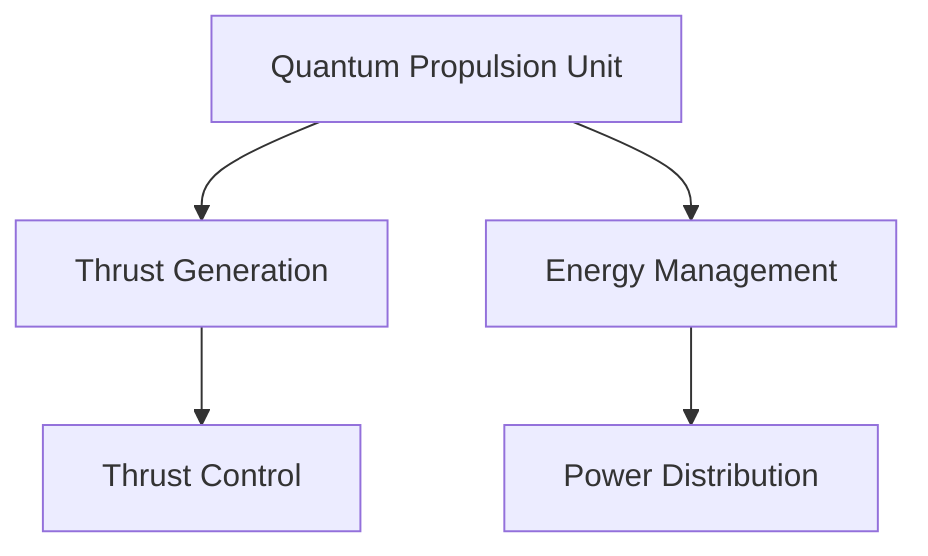
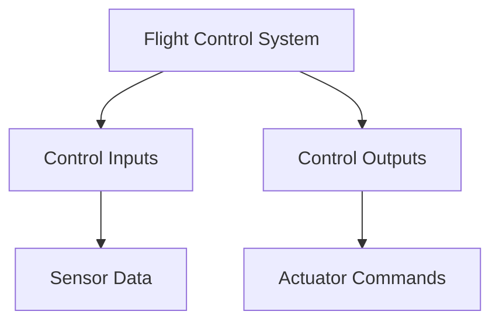

# FTC-71-00 QPS

## Quality Propulsion System (QPS) for GAIA AIR – AMPEL-360XWLRGA

### Overview

The Quality Propulsion System (QPS) is designed to ensure the highest standards of performance, safety, and reliability for the GAIA AIR – AMPEL-360XWLRGA aircraft. This document outlines the key components, processes, and quality assurance measures implemented in the QPS.

### Key Components

1. **Quantum Propulsion Unit (QPU)**
2. **Flight Control System (FCS)**
3. **Environmental Control System (ECS)**
4. **Safety and Monitoring Systems**

### Diagrams

#### Quantum Propulsion Unit (QPU) Diagram

#### Flight Control System (FCS) Diagram

### Quality Assurance Measures

1. **Design Reviews**
   - Regular design reviews to ensure compliance with standards and requirements.
   - Use of checklists to verify design completeness and accuracy.

2. **Testing and Validation**
   - Comprehensive testing of all components and systems.
   - Validation of performance under various operating conditions.

3. **Continuous Monitoring**
   - Real-time monitoring of system performance.
   - Implementation of predictive maintenance strategies.

4. **Documentation and Reporting**
   - Detailed documentation of all processes and procedures.
   - Regular reporting of quality metrics and performance data.

### Conclusion

The Quality Propulsion System (QPS) for the GAIA AIR – AMPEL-360XWLRGA aircraft is designed to deliver exceptional performance, safety, and reliability. Through rigorous quality assurance measures, continuous monitoring, and comprehensive testing, the QPS ensures that the aircraft meets the highest standards of excellence.
