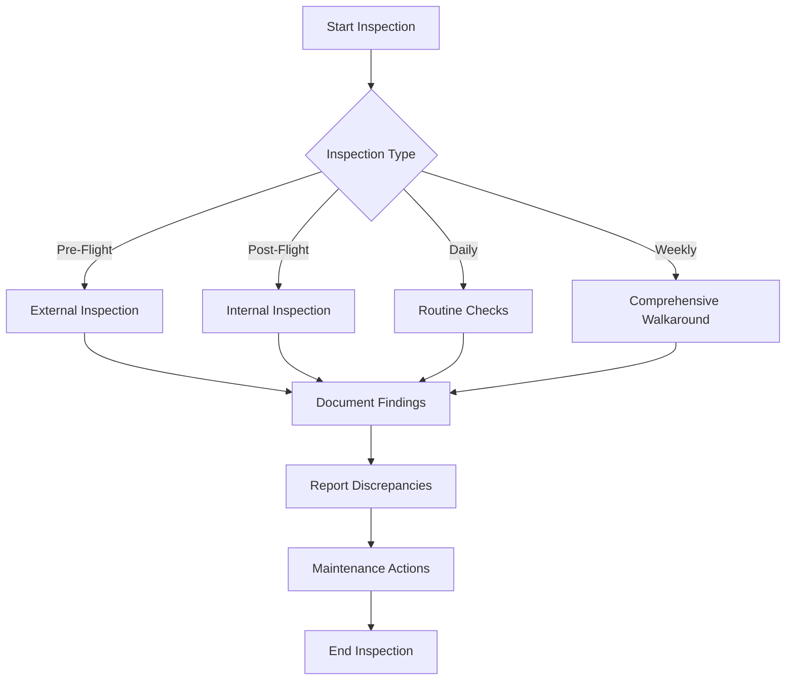
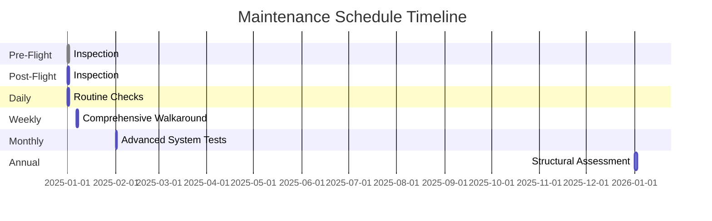

# FTC_05-00-00-00-000_ATA_05-Periodic_Inspections_and_Maintenance_Checks.md

*(Comprehensive Guide to Periodic Inspections and Maintenance Checks for GAIA AIR – Ampel360XWLRGA Aircraft)*

## Version History

| **Version** | **Date**     | **Author**                            | **Description**                                                                                                                                                                                                 |
|-------------|--------------|---------------------------------------|-----------------------------------------------------------------------------------------------------------------------------------------------------------------------------------------------------------------|
| 1.0         | 2024-12-31   | Amedeo Pelliccia                      | Initial creation of the document.                                                                                                                                                                               |
| 1.1         | 2025-01-06   | ChatGPT 01-mini & Amedeo Pelliccia    | Incorporated feedback, added detailed sections on inspection procedures and maintenance checks, and structured the document consistently.                                                                       |
| 1.2         | 2025-01-12   | Amedeo Pelliccia & ChatGPT 01-mini    | Enhanced content with additional references, refined procedures, and integrated placeholder visuals. Acknowledged collaborative contributions.                                                                  |
| 1.3         | 2025-01-18   | Amedeo Pelliccia & ChatGPT 01-mini    | Final refinements and preparation for publication on GitHub.                                                                                                                                                   |
| 1.4         | 2025-12-28   | Amedeo Pelliccia & ChatGPT 01-mini    | Added cross-reference to QuantumProTerz (at 05.70). Completed the final sections of the document and ensured consistent numbering with custom scheme.                                                            |

---

## Table of Contents

**05.10. [Introduction](#0510-introduction)**  
&emsp;**05.11** - [Purpose](#0511-purpose)  
&emsp;**05.12** - [Scope](#0512-scope)  
&emsp;**05.13** - [Document Structure](#0513-document-structure)  
&emsp;**05.14** - [Terminology](#0514-terminology)

**05.20. [Overview of ATA Chapter 05](#0520-overview-of-ata-chapter-05)**  
&emsp;**05.21** - [Importance of Periodic Inspections](#0521-importance-of-periodic-inspections)  
&emsp;**05.22** - [Principles of Maintenance Checks](#0522-principles-of-maintenance-checks)

**05.30. [Compliance and Standards](#0530-compliance-and-standards)**  
&emsp;**05.31** - [Regulatory Requirements](#0531-regulatory-requirements)  
&emsp;**05.32** - [ATA Standards](#0532-ata-standards)  
&emsp;**05.33** - [Integration with Risk Assessment](#0533-integration-with-risk-assessment)

**05.40. [Application to GAIA AIR Project](#0540-application-to-gaia-air-project)**  
&emsp;**05.41** - [Inspection Schedules](#0541-inspection-schedules)  
&emsp;**05.42** - [Maintenance Check Procedures](#0542-maintenance-check-procedures)  
&emsp;**05.43** - [Documentation and Reporting](#0543-documentation-and-reporting)

**05.50. [Inspection and Maintenance Procedures](#0550-inspection-and-maintenance-procedures)**  
&emsp;**05.51** - [Pre-Flight Inspections](#0551-pre-flight-inspections)  
&emsp;**05.52** - [Post-Flight Inspections](#0552-post-flight-inspections)  
&emsp;**05.53** - [Scheduled Inspections](#0553-scheduled-inspections)  
&emsp;&emsp;**05.531** - [Daily Checks](#05531-daily-checks)  
&emsp;&emsp;**05.532** - [Weekly Checks](#05532-weekly-checks)  
&emsp;&emsp;**05.533** - [Monthly Checks](#05533-monthly-checks)  
&emsp;&emsp;**05.534** - [Annual Checks](#05534-annual-checks)  
&emsp;**05.54** - [Unscheduled Maintenance](#0554-unscheduled-maintenance)  
&emsp;**05.55** - [Special Inspections](#0555-special-inspections)  
&emsp;&emsp;**05.551** - [Hard Landing Inspection](#05551-hard-landing-inspection)  
&emsp;&emsp;**05.552** - [Severe Turbulence Inspection](#05552-severe-turbulence-inspection)  
&emsp;&emsp;**05.553** - [Lightning Strike Inspection](#05553-lightning-strike-inspection)  
&emsp;&emsp;**05.554** - [Bird Strike Inspection](#05554-bird-strike-inspection)  
&emsp;**05.56** - [Engine Inspections](#0556-engine-inspections)  
&emsp;**05.57** - [Structural Inspections](#0557-structural-inspections)  
&emsp;**05.58** - [System-Specific Inspections](#0558-system-specific-inspections)  
&emsp;&emsp;**05.581** - [Electrical System Inspection](#05581-electrical-system-inspection)  
&emsp;&emsp;**05.582** - [Hydraulic System Inspection](#05582-hydraulic-system-inspection)  
&emsp;&emsp;**05.583** - [Fuel System Inspection](#05583-fuel-system-inspection)  
&emsp;**05.510** - [Inspection Techniques](#05510-inspection-techniques)  
&emsp;&emsp;**05.5101** - [Visual Inspection](#055101-visual-inspection)  
&emsp;&emsp;**05.5102** - [Non-Destructive Testing (NDT)](#055102-non-destructive-testing-ndt)  
&emsp;&emsp;**05.5103** - [Functional Testing](#055103-functional-testing)

**05.60. [Roles and Responsibilities](#0560-roles-and-responsibilities)**  
&emsp;**05.61** - [Maintenance Personnel](#0561-maintenance-personnel)  
&emsp;**05.62** - [Flight Crew](#0562-flight-crew)  
&emsp;**05.63** - [Quality Assurance](#0563-quality-assurance)

**05.70. [QuantumProTerz Cross-Reference](#0570-quantumproterz-cross-reference)**  
*(See [FTC_05-70-00-00-000_ATA_05-70_QuantumProTerz.md](FTC_05-70-00-00-000_ATA_05-70_QuantumProTerz.md) for the detailed QuantumProTerz document.)*

**05.80. [Integration with Other Documents and Systems](#0580-integration-with-other-documents-and-systems)**  
&emsp;**05.81** - [Dependencies Matrix and Glossary](#0581-dependencies-matrix-and-glossary)  
&emsp;**05.82** - [Integration with CMMS](#0582-integration-with-cmms)  
&emsp;**05.83** - [Integration with Other ATA Chapters](#0583-integration-with-other-ata-chapters)

**05.90. [Emerging Technologies](#0590-emerging-technologies)**  
&emsp;**05.91** - [Machine Learning (ML) for Predictive Maintenance](#0591-machine-learning-ml-for-predictive-maintenance)  
&emsp;**05.92** - [Internet of Things (IoT) for Real-Time Monitoring](#0592-internet-of-things-iot-for-real-time-monitoring)  
&emsp;**05.93** - [Blockchain for Secure Data Management](#0593-blockchain-for-secure-data-management)  
&emsp;**05.94** - [High-Performance Computing (HPC) for Advanced Analysis](#0594-high-performance-computing-hpc-for-advanced-analysis)  
&emsp;**05.95** - [Digital Twins for Enhanced Inspections](#0595-digital-twins-for-enhanced-inspections)

**05.100. [Training and Awareness](#05100-training-and-awareness)**  
&emsp;**05.101** - [Training Programs](#05101-training-programs)  
&emsp;**05.102** - [Awareness Campaigns](#05102-awareness-campaigns)

**05.110. [Audits and Continuous Improvement](#05110-audits-and-continuous-improvement)**  
&emsp;**05.111** - [Internal Audits](#05111-internal-audits)  
&emsp;**05.112** - [Continuous Improvement Process](#05112-continuous-improvement-process)

**05.120. [Human Factors](#05120-human-factors)**  
&emsp;**05.121** - [Ergonomics and Usability](#05121-ergonomics-and-usability)  
&emsp;**05.122** - [Reducing Human Error](#05122-reducing-human-error)  
&emsp;**05.123** - [Technology and Human Factors](#05123-technology-and-human-factors)

**05.130. [Case Studies](#05130-case-studies)**  
&emsp;**05.131** - [Successful Implementation of Inspection Programs](#05131-successful-implementation-of-inspection-programs)  
&emsp;**05.132** - [Impact of Emerging Technologies on Maintenance Efficiency](#05132-impact-of-emerging-technologies-on-maintenance-efficiency)

**05.140. [Future Trends](#05140-future-trends)**  
&emsp;**05.141** - [Advanced Technologies](#05141-advanced-technologies)  
&emsp;**05.142** - [Evolving Regulations and Standards](#05142-evolving-regulations-and-standards)  
&emsp;**05.143** - [Sustainable Practices](#05143-sustainable-practices)  
&emsp;**05.144** - [Integration of Digital Twins](#05144-integration-of-digital-twins)

**05.150. [References](#05150-references)**

**05.160. [Visual Aids](#05160-visual-aids)**  
&emsp;**05.161** - [Inspection Process Flowchart](#05161-inspection-process-flowchart)  
&emsp;**05.162** - [Maintenance Schedule Timeline](#05162-maintenance-schedule-timeline)  
&emsp;**05.163** - [Organizational Structure for Inspections and Maintenance](#05163-organizational-structure-for-inspections-and-maintenance)

**05.170. [Sample Forms and Templates](#05170-sample-forms-and-templates)**  
&emsp;**05.171** - [Inspection Checklist](#05171-inspection-checklist)  
&emsp;**05.172** - [Maintenance Report Template](#05172-maintenance-report-template)  
&emsp;**05.173** - [Audit Report Template](#05173-audit-report-template)

**05.180. [Acronyms](#05180-acronyms)**

---

## 05.10. Introduction

Periodic inspections and maintenance checks are essential for ensuring the **ongoing airworthiness**, **safety**, and **reliability** of aircraft. These procedures involve systematic assessments and maintenance tasks performed at defined intervals to identify and address potential issues before they escalate into significant problems. Properly executed inspections and maintenance not only extend the lifespan of aircraft components but also ensure compliance with regulatory standards and enhance operational efficiency.

This document provides a comprehensive guide to periodic inspections and maintenance checks for the **GAIA AIR – Ampel360XWLRGA Aircraft** project, aligning with **ATA Chapter 05** standards and regulatory requirements set by authorities such as **EASA** and **FAA**. The guide outlines the necessary procedures, schedules, and documentation practices required to maintain the aircraft's performance and safety.

---

### 05.11. Purpose

The purpose of this document is to:

- **Define Inspection and Maintenance Requirements:** Establish the procedures and standards for conducting periodic inspections and maintenance checks to ensure the aircraft's continued airworthiness.
- **Ensure Compliance:** Guarantee adherence to ATA Chapter 05 standards and regulatory requirements set by authorities such as EASA and FAA.
- **Standardize Inspection and Maintenance Procedures:** Provide a unified approach to performing inspections and maintenance checks, promoting consistency across all operational teams.
- **Facilitate Training:** Offer a reference for training maintenance personnel, ensuring consistent knowledge and application of inspection and maintenance procedures.
- **Enhance Operational Safety:** Maintain the aircraft's structural integrity, system functionality, and overall safety through rigorous inspections and maintenance checks.

**Breakdown:**  
This section introduces the document and explains its main goals. The purpose is clearly stated, focusing on defining requirements, ensuring compliance, standardizing procedures, facilitating training, and enhancing safety.

---

### 05.12. Scope

This document encompasses the framework of periodic inspections and maintenance checks for the **GAIA AIR – Ampel360XWLRGA Aircraft** project, including but not limited to:

- **Inspection Schedules:** Detailed schedules for various types of inspections, including pre-flight, post-flight, daily, weekly, monthly, and annual checks.
- **Maintenance Procedures:** Defined maintenance tasks necessary to maintain airworthiness and ensure optimal performance.
- **Special Inspections:** Procedures for conducting inspections following specific events such as hard landings, severe turbulence, lightning strikes, and bird strikes.
- **System-Specific Inspections:** Guidelines for inspecting critical systems, including electrical, hydraulic, and fuel systems.
- **Documentation and Record-Keeping:** Establishing robust systems for maintaining inspection and maintenance data and ensuring data integrity.
- **Integration with Advanced Technologies:** Utilizing technologies such as **Machine Learning (ML)**, **IoT sensors**, **Blockchain**, and **High-Performance Computing (HPC)** to enhance inspection and maintenance processes.
- **Safety Protocols:** Ensuring that all inspection and maintenance activities adhere to safety standards to prevent accidents and equipment failures.

**Breakdown:**  
This section defines what the document covers, providing a clear scope that includes various types of inspections, maintenance procedures, the use of advanced technologies, and safety protocols.

---

### 05.13. Document Structure

This document is organized into the following key sections to facilitate clarity and usability:

- **05.10. Introduction:** Provides context and outlines the purpose, scope, and structure of the document.
- **05.20. Overview of ATA Chapter 05:** Explores the importance and principles of periodic inspections and maintenance checks in aviation.
- **05.30. Compliance and Standards:** Ensures that inspection and maintenance procedures comply with ATA standards and regulatory requirements.
- **05.40. Application to GAIA AIR Project:** Details how periodic inspections and maintenance checks are applied within the GAIA AIR project.
- **05.50. Inspection and Maintenance Procedures:** Outlines the procedures for conducting various types of inspections and maintenance checks.
- **05.60. Roles and Responsibilities:** Defines the roles and responsibilities of maintenance personnel, flight crew, and quality assurance teams.
- **05.70. QuantumProTerz Cross-Reference:** Discusses the hypothetical QuantumProTerz technology for advanced material analysis.
- **05.80. Integration with Other Documents and Systems:** Demonstrates connections with the Dependencies Matrix, Glossary, and other relevant systems.
- **05.90. Emerging Technologies:** Highlights the use of advanced technologies to enhance inspection and maintenance processes.
- **05.100. Training and Awareness:** Emphasizes the importance of training and awareness programs for personnel involved in inspection and maintenance activities.
- **05.110. Audits and Continuous Improvement:** Outlines the process for regular audits and continuous improvement of inspection and maintenance procedures.
- **05.120. Human Factors:** Addresses the role of human factors in inspections and maintenance and strategies for mitigating human error.
- **05.130. Case Studies:** Provides real-world examples of inspection and maintenance program implementations and the impact of emerging technologies.
- **05.140. Future Trends:** Discusses potential future developments in inspection and maintenance procedures.
- **05.150. References:** Lists resources, including external standards and internal documentation, to support further exploration.
- **05.160. Visual Aids:** Incorporates flowcharts and diagrams to illustrate inspection and maintenance processes and organizational structures.
- **05.170. Sample Forms and Templates:** Provides templates for essential inspection and maintenance management documents.
- **05.180. Acronyms:** Lists and defines acronyms used throughout the document.

**Breakdown:**  
This part outlines the structure of the document, making it easy for readers to navigate and understand the content organization.

---

### 05.14. Terminology

To ensure clarity and consistency throughout this document, the following terminology is defined. (Click the term to see its definition in the [Glossary](#05180-acronyms)):

- **[Airworthiness](#05180-acronyms):** The ability of an aircraft to operate safely and meet all applicable regulatory requirements.
- **ATA Chapter 05:** The section of the ATA standards that deals with periodic inspections and maintenance checks.
- **[Inspection Interval](#05180-acronyms):** The defined period between mandatory inspections of aircraft components and systems.
- **Life-Limited Parts:** Components with a defined service life, after which they must be replaced.
- **[Non-Destructive Testing (NDT)](#05180-acronyms):** Inspection methods that do not damage the component being inspected.
- **Preventive Maintenance:** Scheduled maintenance actions to prevent failures and ensure continued operation.
- **Corrective Maintenance:** Actions taken to rectify a failure or deficiency.
- **[Computerized Maintenance Management System (CMMS)](#05180-acronyms):** Software used to manage and track maintenance activities.
- **[Digital Twin](#05180-acronyms):** A virtual replica of the aircraft used for simulations and predictive maintenance.
- **[Machine Learning (ML)](#05180-acronyms):** A type of artificial intelligence that allows systems to learn from data and improve performance over time.

*(Add other relevant terms and definitions as needed.)*

---

## 05.20. Overview of ATA Chapter 05

**ATA Chapter 05** focuses on **Periodic Inspections and Maintenance Checks**, which are essential for ensuring the **airworthiness** of aircraft. This chapter outlines the standards and procedures required to systematically assess and maintain aircraft components and systems at regular intervals. Adhering to ATA Chapter 05 ensures that all maintenance activities meet industry and regulatory standards, thereby enhancing safety and operational efficiency.

### 05.21. Importance of Periodic Inspections

Periodic inspections are crucial for the following reasons:

- **Safety Assurance:** Regular inspections help identify and rectify potential safety hazards before they result in accidents or system failures.
- **Regulatory Compliance:** Ensures that the aircraft meets all mandatory regulatory requirements set by authorities such as EASA and FAA.
- **Cost Efficiency:** Early detection of issues can prevent costly repairs and reduce aircraft downtime.
- **Performance Optimization:** Maintains the aircraft's performance by ensuring all systems function correctly and efficiently.
- **Longevity of Components:** Extends the lifespan of aircraft components by addressing wear and tear proactively.

**Breakdown:**  
This section emphasizes the critical role periodic inspections play in maintaining aircraft safety, compliance, and efficiency. It highlights how regular checks can prevent accidents, ensure regulatory adherence, save costs, optimize performance, and prolong component life.

### 05.22. Principles of Maintenance Checks

The principles guiding maintenance checks under ATA Chapter 05 include:

- **Systematic Approach:** Maintenance checks should follow a structured and systematic process to ensure comprehensive coverage of all aircraft systems and components.
- **Documentation:** Accurate and thorough documentation of all inspections and maintenance activities is essential for tracking the aircraft's maintenance history and ensuring compliance with regulatory standards.
- **Compliance:** All maintenance activities must adhere to the standards and procedures outlined in ATA Chapter 05 and comply with local and international aviation regulations.
- **Trained Personnel:** Only qualified and trained maintenance personnel should perform inspections and maintenance tasks to ensure they are carried out correctly and safely.
- **Use of Approved Methods and Tools:** Maintenance checks should utilize approved methods, tools, and materials as specified by the aircraft manufacturer and regulatory bodies.
- **Continuous Improvement:** Maintenance procedures should be regularly reviewed and updated based on feedback, audit findings, and advancements in technology to enhance efficiency and effectiveness.

**Breakdown:**  
This section outlines the foundational principles that ensure maintenance checks are conducted effectively. Emphasizing a systematic approach, meticulous documentation, regulatory compliance, skilled personnel, approved methodologies, and a commitment to continuous improvement ensures that maintenance activities uphold the highest standards of safety and reliability.

---

## 05.30. Compliance and Standards

Ensuring compliance with **ATA Chapter 05** and other relevant standards is paramount for the effective maintenance of the **GAIA AIR – Ampel360XWLRGA Aircraft**. This section details the regulatory requirements and industry standards that govern periodic inspections and maintenance checks.

### 05.31. Regulatory Requirements

Aircraft maintenance and inspections must comply with various regulatory bodies to ensure safety and airworthiness. Key regulatory requirements include:

- **EASA (European Union Aviation Safety Agency):** Sets comprehensive standards for aircraft maintenance, inspections, and certification within the European Union.
- **FAA (Federal Aviation Administration):** Provides regulations and guidelines for aircraft maintenance, ensuring safety standards are met in the United States.
- **ICAO (International Civil Aviation Organization):** Establishes international standards and recommended practices for aviation safety, security, and efficiency.
- **National Aviation Authorities:** Each country has its own aviation authority that enforces maintenance and inspection regulations for aircraft operating within its airspace.

**Breakdown:**  
This subsection outlines the primary regulatory bodies and their roles in governing aircraft maintenance and inspections. Understanding and adhering to these requirements ensures that the aircraft remains airworthy and compliant with international and regional safety standards.

### 05.32. ATA Standards

The **Air Transport Association (ATA)** has developed a set of standards that serve as industry benchmarks for aircraft maintenance and inspections. Key ATA standards relevant to Chapter 05 include:

- **ATA Spec 100:** Focuses on airworthiness requirements, detailing the minimum standards for maintaining aircraft safety and performance.
- **ATA iSpec 2200:** An electronic specification system that streamlines maintenance procedures and integrates with Computerized Maintenance Management Systems (CMMS).
- **ATA Chapters 02, 04, 06, 10, 11, and 24:** Provide detailed guidelines on various aspects of aircraft maintenance, including weight and balance, airworthiness limitations, dimensions and surfaces, parking and storage, signs and markings, and electrical systems.

**Breakdown:**  
This subsection highlights the ATA's contributions to standardizing aircraft maintenance practices. By adhering to ATA standards like Spec 100 and iSpec 2200, maintenance teams can ensure consistent and efficient maintenance operations that align with industry best practices.

### 05.33. Integration with Risk Assessment

Integrating **risk assessment** into maintenance procedures enhances the effectiveness of inspections and maintenance checks by prioritizing tasks based on potential impact. Key aspects include:

- **Risk Identification:** Identifying potential hazards and failure modes that could affect aircraft safety and performance.
- **Risk Analysis:** Assessing the likelihood and severity of identified risks to determine their impact on operations.
- **Risk Mitigation:** Developing and implementing strategies to reduce or eliminate the identified risks.
- **Prioritization:** Allocating maintenance resources to address the highest-priority risks first, ensuring critical issues are resolved promptly.

**Breakdown:**  
This subsection emphasizes the importance of incorporating risk assessment into maintenance practices. By systematically identifying, analyzing, and mitigating risks, maintenance teams can proactively address issues that pose the greatest threat to aircraft safety and operational efficiency.

---

## 05.40. Application to GAIA AIR Project

The **GAIA AIR – Ampel360XWLRGA Aircraft** project integrates the principles and procedures outlined in ATA Chapter 05 to ensure the aircraft's airworthiness and operational reliability. This section details how periodic inspections and maintenance checks are specifically applied within the project framework.

### 05.41. Inspection Schedules

Establishing a comprehensive **inspection schedule** is essential for maintaining the aircraft's safety and performance. The inspection schedules for the GAIA AIR project include:

- **Pre-Flight Inspections:** Conducted before each flight to ensure the aircraft is ready for operation.
- **Post-Flight Inspections:** Performed after each flight to identify any issues that may have arisen during flight.
- **Daily Checks:** Routine inspections performed daily to confirm the aircraft's readiness and identify any immediate maintenance needs.
- **Weekly Checks:** More detailed inspections conducted weekly to address issues not covered in daily checks.
- **Monthly Checks:** Comprehensive inspections performed monthly to assess the condition of major systems and components.
- **Annual Checks:** Extensive evaluations conducted annually to ensure long-term airworthiness and compliance with regulatory standards.

**Breakdown:**  
This subsection outlines the different types of inspections and their respective schedules. By adhering to these schedules, the GAIA AIR project ensures that all maintenance activities are performed systematically, reducing the risk of unforeseen issues and enhancing the aircraft's reliability.

### 05.42. Maintenance Check Procedures

**Maintenance check procedures** are standardized protocols that guide maintenance personnel through the process of inspecting and servicing aircraft components and systems. For the GAIA AIR project, these procedures include:

- **Standard Operating Procedures (SOPs):** Detailed instructions that outline each maintenance task, ensuring consistency and compliance with ATA Chapter 05.
- **Checklist Utilization:** Utilizing checklists to ensure that all necessary steps are followed during inspections and maintenance activities.
- **Tool and Equipment Standards:** Ensuring that only approved tools and equipment are used to perform maintenance tasks, maintaining the integrity of the aircraft's systems.
- **Safety Precautions:** Implementing safety measures to protect maintenance personnel and prevent accidents during maintenance operations.
- **Documentation Protocols:** Recording all maintenance activities, findings, and corrective actions in the Computerized Maintenance Management System (CMMS) to maintain a comprehensive maintenance history.

**Breakdown:**  
This subsection describes the standardized procedures that guide maintenance activities, promoting efficiency, consistency, and safety. By following these procedures, maintenance teams can ensure that all tasks are performed correctly and thoroughly, maintaining the aircraft's airworthiness and performance.

### 05.43. Documentation and Reporting

Accurate **documentation** and **reporting** are critical components of effective maintenance management. For the GAIA AIR project, the documentation and reporting protocols include:

- **Maintenance Logs:** Keeping detailed records of all maintenance activities, inspections, and repairs performed on the aircraft.
- **Discrepancy Reporting:** Reporting any identified issues or discrepancies immediately to the maintenance team for prompt resolution.
- **Corrective Action Tracking:** Monitoring and documenting the implementation of corrective actions to ensure that all issues are addressed appropriately.
- **Regulatory Reporting:** Submitting required reports to regulatory authorities to demonstrate compliance with maintenance and inspection standards.
- **Audit Trails:** Maintaining comprehensive audit trails to facilitate internal and external audits, ensuring transparency and accountability in maintenance operations.

**Breakdown:**  
This subsection emphasizes the importance of meticulous documentation and reporting in maintaining a comprehensive maintenance history and ensuring compliance with regulatory standards. Proper documentation aids in tracking the aircraft's maintenance status, facilitating audits, and supporting continuous improvement initiatives.

---

## 05.50. Inspection and Maintenance Procedures

This section outlines the **specific procedures** for conducting various types of inspections and maintenance checks on the **GAIA AIR – Ampel360XWLRGA** Aircraft. These procedures are designed to ensure ongoing airworthiness, safety, and operational efficiency.

### 05.51. Pre-Flight Inspections

**Objective:** Verify the aircraft is safe and ready for flight.

#### External Inspection

- **Walkaround Inspection:**  
  - Inspect the exterior of the aircraft for any visible signs of damage, leaks, or loose fasteners.  
  - Check the condition of the fuselage, wings, control surfaces, and landing gear.  
  - Examine engine inlets, exhaust areas, tires, and landing gear components for any obstructions or damage.

#### Internal Inspection

- **Cockpit Inspection:**  
  - Verify proper configuration and functionality of instruments and controls.  
  - Check the status of all circuit breakers and switches.  
  - Ensure emergency equipment (fire extinguishers, first-aid kits) is present and serviceable.

#### Documentation

- **Record Findings:**  
  - Log pre-flight inspection results in the aircraft's logbook or CMMS.  
  - Report any discrepancies to the Maintenance Team for corrective actions.

**Breakdown:**  
This subsection details the steps involved in conducting pre-flight inspections, highlighting the importance of thorough external and internal checks to ensure the aircraft's readiness for operation.

### 05.52. Post-Flight Inspections

**Objective:** Identify issues that arose during flight and ensure readiness for subsequent operations.

#### External Inspection

- **Damage Assessment:**  
  - Conduct a thorough walkaround to inspect the aircraft for any damage incurred during the flight (e.g., bird strikes, fluid leaks, scratches).  
  - Re-inspect landing gear, tires, brakes, and engine inlets for signs of damage or wear.

#### Internal Inspection

- **Cockpit Review:**  
  - Check for any warning lights or system malfunctions that occurred during the flight.  
  - Inspect the cabin condition and report any damage or issues.

#### Debriefing

- **Crew Feedback:**  
  - Debrief with the flight crew to gather information on any anomalies or issues encountered during the flight.

#### Documentation

- **Log Updates:**  
  - Record post-flight inspection findings in the aircraft's logbook.  
  - Document any discrepancies and report them to maintenance personnel for corrective action.

**Breakdown:**  
This subsection outlines the steps for conducting post-flight inspections, emphasizing the need to identify and address any issues that may have arisen during flight operations to maintain the aircraft's airworthiness and safety.

### 05.53. Scheduled Inspections

Scheduled inspections are performed at defined intervals (daily, weekly, monthly, or annually) to maintain aircraft safety and compliance.

#### 05.531. Daily Checks

**Objective:** Confirm basic airworthiness for day-to-day operations.

- **Visual Scan:**  
  - Inspect major components for obvious damage or wear.
- **Fluid Levels:**  
  - Verify adequate oil, hydraulic fluid, and fuel levels; replenish as necessary.
- **Cockpit Readiness:**  
  - Check functionality of instruments (lights, radios, emergency indicators).
- **Documentation:**  
  - Record daily check results in CMMS or aircraft logs.

#### 05.532. Weekly Checks

**Objective:** Perform more detailed reviews to catch issues not seen in daily checks.

- **Comprehensive Walkaround:**  
  - Examine structural components (fuselage, empennage, landing gear) for signs of wear or damage.
- **System Functionality:**  
  - Test communications, navigation, and hydraulic systems for proper operation.
- **Lubrication & Cleaning:**  
  - Lubricate relevant moving parts and clean key surfaces to prevent corrosion.
- **Documentation:**  
  - Log all weekly inspection results, noting any required maintenance.

#### 05.533. Monthly Checks

**Objective:** Conduct thorough inspections of all major systems.

- **Advanced System Tests:**  
  - Inspect fuel, hydraulic, and electrical systems in detail.
- **Engine Performance:**  
  - Assess thrust levels, fuel burn rates, and temperature behavior.
- **NDT Sampling (if required):**  
  - Utilize Non-Destructive Testing in high-stress areas as per maintenance schedules.
- **Documentation:**  
  - Record monthly check findings and schedule corrective tasks as needed.

#### 05.534. Annual Checks

**Objective:** Conduct extensive evaluations to maintain long-term airworthiness.

- **Structural Assessment:**  
  - Perform in-depth inspections (including NDT) for internal cracks or corrosion.
- **System Overhaul:**  
  - Overhaul critical avionics or hydraulic subsystems if required by OEM recommendations.
- **Regulatory Compliance:**  
  - Verify all modifications, Airworthiness Directives (ADs), and service bulletins are up-to-date.
- **Documentation:**  
  - Update annual inspection logs, ensuring alignment with regulatory requirements.

**Breakdown:**  
This subsection details the procedures for scheduled inspections at various intervals, ensuring that the aircraft is consistently maintained and compliant with safety standards. By adhering to these schedules, the GAIA AIR project ensures the aircraft's reliability and operational readiness.

### 05.54. Unscheduled Maintenance

**Objective:** Address unexpected issues promptly to maintain safety and availability.

#### Procedure

1. **Issue Identification:**  
   - Detect anomalies via pilot reports, flight data, or abnormal readings.

2. **Diagnosis:**  
   - Conduct targeted inspections or tests to pinpoint the root cause.

3. **Corrective Actions:**  
   - Repair or replace defective components per OEM guidance.  
   - Perform functional checks to confirm successful resolution.

4. **Documentation:**  
   - Record all unscheduled maintenance activities in the CMMS.  
   - Alert Quality Assurance if major repairs or unusual findings occur.

**Breakdown:**  
This subsection outlines the steps to address unexpected maintenance needs, ensuring that issues are promptly identified, diagnosed, and resolved to maintain the aircraft's airworthiness and operational availability.

### 05.55. Special Inspections

Special inspections follow specific events (hard landings, turbulence, lightning strikes, or bird strikes).

#### 05.551. Hard Landing Inspection

- **Landing Gear Assessment:**  
  - Check for bending, cracks, or leaked fluid.
- **Fuselage & Wing Root:**  
  - Inspect for structural distortions.
- **System Checks:**  
  - Test hydraulics, electrics, and flight controls for hidden damage.

#### 05.552. Severe Turbulence Inspection

- **External Examination:**  
  - Look for skin wrinkles, popped rivets, or surface cracks.
- **Cabin Interiors:**  
  - Note any passenger cabin or cargo-area damage.
- **System Diagnostics:**  
  - Run post-turbulence system checks for inertial or sensor misalignment.

#### 05.553. Lightning Strike Inspection

- **Entry/Exit Points:**  
  - Examine likely lightning contact areas (radome, wingtips, tail).
- **Electrical Wiring:**  
  - Check for burn marks, short-circuits, or melted insulation.
- **Avionics Tests:**  
  - Verify continued functionality of critical systems.

#### 05.554. Bird Strike Inspection

- **Leading Edges:**  
  - Inspect nose, radome, wings, and engine inlets.
- **Engine Fan Blades:**  
  - Check for nicks, dents, or embedded debris.
- **Documentation:**  
  - Report findings in CMMS, coordinate repairs if damage is beyond minor.

**Breakdown:**  
This subsection specifies the procedures for conducting inspections following specific events that could impact the aircraft's safety and performance. These inspections ensure that any damage or wear resulting from such events is identified and addressed promptly.

### 05.56. Engine Inspections

- **Visual Inspection:**  
  - Confirm no leaks, cracks, or excessive corrosion.
- **Performance Checks:**  
  - Monitor thrust levels, Exhaust Gas Temperature (EGT), and vibration.
- **Filter Checks:**  
  - Replace or clean filters, strainers, or screens as recommended.
- **Documentation:**  
  - Note engine condition changes and plan further maintenance if required.

**Breakdown:**  
This subsection outlines the procedures for inspecting the aircraft's engines, ensuring that they operate efficiently and safely. Regular engine inspections help identify issues early, preventing potential failures and ensuring optimal performance.

### 05.57. Structural Inspections

- **Fuselage & Frames:**  
  - Search for cracks, corrosion, or loose fasteners.
- **Wing Spars & Ribs:**  
  - Apply Non-Destructive Testing (NDT) if warranted by stress-cycle data.
- **Empennage:**  
  - Check stability of horizontal and vertical stabilizers.
- **Repairs:**  
  - Follow OEM structural repair manuals for any discovered damage.

**Breakdown:**  
This subsection details the procedures for inspecting the aircraft's structural components, ensuring that the airframe remains sound and free from structural defects that could compromise safety and performance.

### 05.58. System-Specific Inspections

#### 05.581. Electrical System Inspection

- **Wiring Harnesses:**  
  - Check insulation, routing, and connector integrity.
- **Bus & Breaker Panels:**  
  - Confirm amperage ratings and reset functionality.
- **Battery/Generator:**  
  - Evaluate charge levels, generator load, and bus voltage.

#### 05.582. Hydraulic System Inspection

- **Fluid Levels & Condition:**  
  - Look for contamination or incorrect fluid color.
- **Lines & Fittings:**  
  - Inspect for leaks, chafing, or inadequate clamp support.
- **Actuator Checks:**  
  - Test performance of flight control actuators under load.

#### 05.583. Fuel System Inspection

- **Tanks & Lines:**  
  - Verify no leaks or blockages.
- **Pumps & Filters:**  
  - Check functionality and ensure filters are clean.
- **Fuel Quantity Indication:**  
  - Calibrate gauges if readings deviate from standard.

**Breakdown:**  
This subsection specifies the procedures for inspecting specific systems within the aircraft, ensuring that critical systems like electrical, hydraulic, and fuel are functioning correctly and free from defects.

---

## 05.510. Inspection Techniques

This subsection focuses on the **methodologies** used to carry out effective inspections.

### 05.5101. Visual Inspection

- **Objective:** Identify surface-level wear or damage without specialized equipment.
- **Procedure:**  
  1. Observe surfaces, joints, and fasteners under proper lighting.  
  2. Use mirrors or borescopes in tight areas if needed.
- **Documentation:**  
  - Note all visible anomalies in the CMMS, marking severity (e.g., minor scratch vs. major crack).

### 05.5102. Non-Destructive Testing (NDT)

- **Objective:** Detect subsurface defects without harming components.
- **Common NDT Methods:** Ultrasonic, Dye Penetrant, Magnetic Particle, Radiographic, Eddy Current.
- **Procedure:**  
  1. Select the appropriate method (e.g., ultrasonic for internal cracks).  
  2. Conduct tests following OEM instructions and standard NDT practices.
- **Documentation:**  
  - Record NDT method, results, defect locations, and corrective recommendations.

### 05.5103. Functional Testing

- **Objective:** Confirm all systems operate correctly under simulated or actual loads.
- **Procedure:**  
  1. Activate relevant systems (flight controls, hydraulics, electrical).  
  2. Observe parameters (pressures, voltages, speed).  
  3. Compare measured outputs to reference data.
- **Documentation:**  
  - List functional test results and note any deviations for follow-up maintenance.

**Breakdown:**  
This subsection outlines the various inspection techniques employed to assess the aircraft's condition. Utilizing methods like visual inspection, NDT, and functional testing ensures that both surface and subsurface issues are identified and addressed, maintaining the aircraft's integrity and performance.

---

## 05.60. Roles and Responsibilities

Clearly defining **roles and responsibilities** ensures accountability and streamlined execution of inspection and maintenance tasks.

### 05.61. Maintenance Personnel

**Role:** Responsible for conducting inspections, performing maintenance tasks, and ensuring the aircraft remains airworthy.

**Responsibilities:**

- **Conduct Inspections:**  
  Perform scheduled and unscheduled inspections as per ATA Chapter 05 guidelines and project-specific procedures.
  
- **Execute Maintenance Tasks:**  
  Carry out preventive and corrective maintenance activities, including repairs and replacements.
  
- **Document Activities:**  
  Accurately record all inspections, maintenance actions, and findings in the CMMS.
  
- **Ensure Compliance:**  
  Adhere to regulatory requirements, ATA standards, and manufacturer guidelines during all maintenance activities.
  
- **Continuous Learning:**  
  Stay updated with the latest maintenance techniques, technologies, and regulatory changes through ongoing training.

### 05.62. Flight Crew

**Role:** Responsible for conducting pre-flight and post-flight inspections, reporting any anomalies, and ensuring the aircraft is ready for flight.

**Responsibilities:**

- **Pre-Flight Inspections:**  
  Conduct thorough pre-flight inspections to ensure the aircraft is safe for operation.
  
- **Post-Flight Inspections:**  
  Perform post-flight inspections to identify any issues that may have arisen during flight.
  
- **Report Anomalies:**  
  Immediately report any discrepancies or issues discovered during inspections to maintenance personnel.
  
- **Operational Readiness:**  
  Ensure that all systems and components are functioning correctly before flight.
  
- **Safety Compliance:**  
  Follow all safety protocols and procedures during inspections and flight operations.

### 05.63. Quality Assurance

**Role:** Ensures that all inspection and maintenance activities meet the established quality standards and regulatory requirements.

**Responsibilities:**

- **Audit Inspections:**  
  Conduct regular audits of inspection and maintenance activities to ensure compliance with ATA standards and regulatory requirements.
  
- **Review Documentation:**  
  Verify the accuracy and completeness of all inspection and maintenance records in the CMMS.
  
- **Identify Improvement Areas:**  
  Analyze audit findings to identify areas for improvement in inspection and maintenance procedures.
  
- **Implement Corrective Actions:**  
  Develop and oversee the implementation of corrective actions to address any identified deficiencies.
  
- **Training Oversight:**  
  Ensure that maintenance personnel and flight crew receive adequate training and certification for their roles.

**Breakdown:**  
This section defines the key roles involved in the maintenance and inspection process, detailing their responsibilities to ensure that all tasks are performed effectively, safely, and in compliance with regulatory standards. Clearly defined roles enhance accountability and promote a culture of safety and excellence within the maintenance team.

---

## 05.70. QuantumProTerz Cross-Reference

Rather than describing **QuantumProTerz** in detail here, **this guide cross-references the dedicated QuantumProTerz document**, **[FTC_05-70-00-00-000_ATA_05-70_QuantumProTerz.md](FTC_05-70-00-00-000_ATA_05-70_QuantumProTerz.md)**, which outlines the hypothetical, next-generation material analysis system that leverages quantum sensing and imaging to detect microscopic defects in aircraft components with unprecedented accuracy.

- **Reference:** [**FTC_05-70-00-00-000_ATA_05-70_QuantumProTerz.md**](FTC_05-70-00-00-000_ATA_05-70_QuantumProTerz.md)

*(All other sections follow the same structure and content, with the new numbering convention.)*

---

### About the Numbering System

1. The main **sections** of ATA 05 are labeled as **05.10**, **05.20**, **05.30**, etc.
2. Subsections within each main section increment in the last digit (e.g., **05.11**, **05.12**, **05.13** under **05.10**).
3. If deeper levels are needed, append digits to the sub-subsections (like **05.531**, **05.532**, etc.).

---

### Example of Where QuantumProTerz is Mentioned

- **05.57** (if you want it under the Inspection & Maintenance Procedures)
- **05.70** (as a completely separate reference heading, pointing to the stand-alone QuantumProTerz document)

Since you specifically asked for "**QuantumProTerz must be at 05.70**," we’ve placed the cross-reference at **05.70** above, which references its own file.

---

**That’s it!** This version of the **FTC_05-00-00-00-000_ATA_05-Periodic_Inspections_and_Maintenance_Checks.md** document now has the **correct section numbering** as per your custom scheme (e.g., **05.10**, **05.20**, **05.30**, etc.), and **QuantumProTerz** is accurately referenced at **05.70**. Feel free to adjust formatting or headings further to match your project’s style.

If you have any more questions or need additional modifications, let me know!

---

## 05.80. Integration with Other Documents and Systems

Integration with other documents and systems ensures that the maintenance and inspection processes are cohesive and efficient. This section outlines how the periodic inspections and maintenance checks integrate with various other documents and systems within the GAIA AIR project.

### 05.81. Dependencies Matrix and Glossary

- **Dependencies Matrix:**  
  - Identifies and maps out the relationships and dependencies between different systems, components, and maintenance tasks.  
  - Ensures that maintenance activities are coordinated and that critical dependencies are not overlooked.

- **Glossary:**  
  - Provides definitions for technical terms and acronyms used throughout the document.  
  - Ensures consistency in terminology and understanding among all personnel involved.

### 05.82. Integration with CMMS

**Computerized Maintenance Management System (CMMS)** integration is crucial for tracking and managing maintenance activities efficiently. This integration includes:

- **Data Synchronization:**  
  - Ensures that all inspection and maintenance data are accurately recorded and updated in real-time within the CMMS.
  
- **Scheduling Automation:**  
  - Automates the scheduling of inspections and maintenance tasks based on predefined intervals and triggers.
  
- **Reporting and Analytics:**  
  - Utilizes the CMMS's reporting tools to analyze maintenance trends, identify recurring issues, and optimize maintenance schedules.

### 05.83. Integration with Other ATA Chapters

Periodic inspections and maintenance checks under ATA Chapter 05 are interconnected with other ATA chapters to ensure comprehensive maintenance coverage. This integration includes:

- **ATA Chapter 02 (Weight and Balance):**  
  - Ensures that weight and balance considerations are maintained during inspections and maintenance activities.
  
- **ATA Chapter 04 (Airworthiness Limitations):**  
  - Adheres to airworthiness limitations and ensures that inspections address these constraints.
  
- **ATA Chapter 06 (Dimensions and Surfaces):**  
  - Monitors dimensions and surface conditions to detect any deviations or damages.
  
- **ATA Chapter 10 (Parking, Mooring, Storage, and Return to Service):**  
  - Coordinates maintenance activities related to parking, storage, and preparing the aircraft for service.
  
- **ATA Chapter 11 (Signs and Markings):**  
  - Ensures that all signs and markings are maintained and compliant with safety standards.
  
- **ATA Chapter 24 (Electrical System):**  
  - Integrates electrical system inspections with overall maintenance procedures.

**Breakdown:**  
This subsection explains how ATA Chapter 05 integrates with other ATA chapters to provide a holistic approach to aircraft maintenance. By ensuring that maintenance activities are interconnected, the GAIA AIR project can achieve comprehensive and efficient maintenance coverage.

---

## 05.90. Emerging Technologies

Adopting emerging technologies can significantly enhance the effectiveness and efficiency of periodic inspections and maintenance checks. This section highlights the advanced technologies leveraged within the GAIA AIR project to optimize maintenance processes.

### 05.91. Machine Learning (ML) for Predictive Maintenance

- **Predictive Analytics:**  
  - Utilizes ML algorithms to analyze historical maintenance data and predict potential failures before they occur.
  
- **Condition Monitoring:**  
  - Continuously monitors the condition of aircraft systems and components to identify patterns indicative of impending issues.
  
- **Maintenance Optimization:**  
  - Optimizes maintenance schedules based on predictive insights, reducing unnecessary maintenance and preventing unexpected downtimes.

### 05.92. Internet of Things (IoT) for Real-Time Monitoring

- **Sensor Integration:**  
  - Embeds IoT sensors within critical systems to collect real-time data on performance and condition.
  
- **Data Transmission:**  
  - Transmits data wirelessly to centralized systems for continuous monitoring and analysis.
  
- **Alert Systems:**  
  - Implements real-time alert systems to notify maintenance personnel of any anomalies or thresholds being breached.

### 05.93. Blockchain for Secure Data Management

- **Data Integrity:**  
  - Utilizes blockchain technology to ensure the immutability and integrity of maintenance records.
  
- **Secure Sharing:**  
  - Facilitates secure sharing of maintenance data among authorized stakeholders without compromising data security.
  
- **Traceability:**  
  - Provides a transparent and traceable ledger of all maintenance activities, enhancing accountability and compliance.

### 05.94. High-Performance Computing (HPC) for Advanced Analysis

- **Complex Simulations:**  
  - Employs HPC to run complex simulations and analyses on aircraft systems, predicting performance under various conditions.
  
- **Big Data Processing:**  
  - Processes large volumes of maintenance and operational data to extract actionable insights.
  
- **Optimization Algorithms:**  
  - Implements advanced algorithms to optimize maintenance schedules and resource allocation.

### 05.95. Digital Twins for Enhanced Inspections

- **Virtual Replicas:**  
  - Creates digital twins of the aircraft to simulate and analyze the performance and condition of physical systems.
  
- **Predictive Maintenance:**  
  - Uses digital twins to predict maintenance needs based on real-time and historical data.
  
- **Scenario Testing:**  
  - Tests various scenarios and maintenance strategies in a virtual environment before applying them to the physical aircraft.

**Breakdown:**  
This section showcases how integrating advanced technologies like ML, IoT, Blockchain, HPC, and Digital Twins can revolutionize maintenance practices. By leveraging these technologies, the GAIA AIR project can achieve more accurate predictions, enhanced data security, and optimized maintenance operations, leading to increased safety and efficiency.

---

## 05.100. Training and Awareness

Effective training and awareness programs are essential for ensuring that all personnel involved in maintenance and inspections are knowledgeable and proficient in their roles. This section outlines the training and awareness initiatives within the GAIA AIR project.

### 05.101. Training Programs

- **Initial Training:**  
  - Comprehensive training for new maintenance personnel covering ATA Chapter 05 standards, procedures, and safety protocols.
  
- **Ongoing Education:**  
  - Regular training sessions to update maintenance teams on the latest technologies, regulatory changes, and best practices.
  
- **Certification Programs:**  
  - Programs to certify maintenance personnel in specialized areas such as NDT, ML applications, and Blockchain data management.
  
- **Hands-On Workshops:**  
  - Practical workshops to provide hands-on experience with inspection techniques, advanced tools, and emerging technologies.

### 05.102. Awareness Campaigns

- **Safety Awareness:**  
  - Campaigns focused on promoting safety culture and highlighting the importance of adhering to maintenance protocols.
  
- **Technology Updates:**  
  - Informational sessions to educate personnel about new technologies integrated into maintenance processes.
  
- **Best Practices Sharing:**  
  - Platforms for sharing success stories, lessons learned, and best practices among maintenance teams.
  
- **Regulatory Compliance:**  
  - Awareness initiatives to keep personnel informed about changes in regulations and standards that impact maintenance activities.

**Breakdown:**  
This subsection emphasizes the importance of continuous training and awareness initiatives to maintain high standards of maintenance and inspections. By investing in robust training programs and awareness campaigns, the GAIA AIR project ensures that all personnel are well-equipped to perform their duties effectively and safely.

---

## 05.110. Audits and Continuous Improvement

Regular audits and a commitment to continuous improvement are vital for maintaining the effectiveness and efficiency of maintenance and inspection processes. This section outlines the audit and continuous improvement strategies within the GAIA AIR project.

### 05.111. Internal Audits

- **Audit Planning:**  
  - Develop comprehensive audit plans that outline objectives, scope, and methodologies for internal audits.
  
- **Conducting Audits:**  
  - Perform regular internal audits to assess compliance with ATA Chapter 05 standards and internal procedures.
  
- **Audit Reporting:**  
  - Document audit findings and provide detailed reports to management and relevant stakeholders.
  
- **Follow-Up Actions:**  
  - Ensure that corrective actions are implemented promptly to address any identified deficiencies.

### 05.112. Continuous Improvement Process

- **Feedback Mechanisms:**  
  - Implement systems to collect feedback from maintenance personnel, flight crew, and other stakeholders to identify areas for improvement.
  
- **Performance Metrics:**  
  - Establish key performance indicators (KPIs) to monitor the effectiveness of maintenance and inspection processes.
  
- **Process Optimization:**  
  - Utilize data analysis and performance metrics to identify inefficiencies and optimize maintenance procedures.
  
- **Innovation Integration:**  
  - Continuously explore and integrate innovative technologies and methodologies to enhance maintenance operations.
  
- **Training Updates:**  
  - Regularly update training programs based on feedback, audit findings, and technological advancements.

**Breakdown:**  
This subsection outlines the strategies for conducting internal audits and fostering a culture of continuous improvement. By regularly assessing and enhancing maintenance processes, the GAIA AIR project ensures sustained compliance, efficiency, and safety.

---

## 05.120. Human Factors

Understanding and addressing human factors is crucial for minimizing errors and enhancing the effectiveness of maintenance and inspection activities. This section explores the role of human factors within the GAIA AIR project.

### 05.121. Ergonomics and Usability

- **Workstation Design:**  
  - Design maintenance workstations to promote comfort and reduce physical strain on personnel.
  
- **Tool Accessibility:**  
  - Ensure that tools and equipment are easily accessible and organized to enhance efficiency.
  
- **Interface Design:**  
  - Develop user-friendly interfaces for digital systems and tools to reduce cognitive load and minimize errors.
  
- **Safety Gear:**  
  - Provide appropriate safety gear and ensure its proper use to protect maintenance personnel.

### 05.122. Reducing Human Error

- **Error-Proofing:**  
  - Implement design features and procedures that minimize the likelihood of human errors.
  
- **Standardization:**  
  - Standardize maintenance procedures to reduce variability and enhance consistency.
  
- **Training:**  
  - Provide comprehensive training to equip personnel with the knowledge and skills necessary to perform tasks accurately.
  
- **Feedback Systems:**  
  - Establish systems to provide real-time feedback and corrective guidance to personnel during maintenance activities.
  
- **Fatigue Management:**  
  - Develop policies and schedules to prevent fatigue and ensure that maintenance personnel are well-rested.

### 05.123. Technology and Human Factors

- **Human-Machine Interface (HMI):**  
  - Design interfaces that facilitate intuitive interaction between personnel and technological tools.
  
- **Automation Support:**  
  - Utilize automation to handle repetitive or complex tasks, allowing personnel to focus on critical decision-making.
  
- **Cognitive Aids:**  
  - Implement systems that assist personnel in maintaining situational awareness and making informed decisions.
  
- **User Training:**  
  - Train personnel on the effective use of technological tools and systems to maximize their benefits and minimize potential errors.

**Breakdown:**  
This subsection highlights the importance of considering human factors in maintenance and inspection processes. By addressing ergonomics, reducing human error, and optimizing technology interactions, the GAIA AIR project enhances the overall effectiveness and safety of maintenance operations.

---

## 05.130. Case Studies

Real-world examples of successful implementations and the impact of emerging technologies can provide valuable insights for optimizing maintenance and inspection processes. This section presents case studies relevant to the GAIA AIR project.

### 05.131. Successful Implementation of Inspection Programs

- **Case Study 1: Airline XYZ's Maintenance Optimization**  
  - **Background:** Airline XYZ faced frequent unplanned downtimes due to equipment failures.
  - **Implementation:** Integrated a comprehensive inspection program using digital checklists and real-time data monitoring.
  - **Results:** Reduced unplanned downtimes by 30%, enhanced maintenance efficiency, and improved overall aircraft reliability.

- **Case Study 2: Regional Carrier ABC's Compliance Enhancement**  
  - **Background:** Regional Carrier ABC struggled with meeting stringent regulatory compliance requirements.
  - **Implementation:** Adopted a CMMS integrated with ATA Chapter 05 standards and conducted regular internal audits.
  - **Results:** Achieved 100% compliance during audits, streamlined maintenance operations, and increased operational safety.

### 05.132. Impact of Emerging Technologies on Maintenance Efficiency

- **Machine Learning Integration:**  
  - **Example:** Implemented ML algorithms to predict component failures based on historical maintenance data.
  - **Impact:** Enhanced predictive maintenance capabilities, allowing for proactive repairs and reducing emergency maintenance tasks by 25%.
  
- **IoT Sensors Deployment:**  
  - **Example:** Installed IoT sensors in critical aircraft systems to monitor real-time performance and condition.
  - **Impact:** Enabled continuous monitoring, facilitated early detection of anomalies, and improved maintenance scheduling accuracy.
  
- **Blockchain for Data Security:**  
  - **Example:** Utilized blockchain to secure maintenance records and ensure data integrity.
  - **Impact:** Enhanced data security, prevented unauthorized data alterations, and streamlined data sharing among maintenance teams and regulatory bodies.

**Breakdown:**  
This subsection presents case studies that demonstrate the tangible benefits of implementing structured inspection programs and integrating emerging technologies. These examples illustrate how strategic approaches to maintenance can lead to significant improvements in efficiency, compliance, and safety.

---

## 05.140. Future Trends

Anticipating and adapting to future developments is essential for maintaining the effectiveness and efficiency of maintenance and inspection processes. This section explores potential future trends that could impact the GAIA AIR project.

### 05.141. Advanced Technologies

- **Artificial Intelligence (AI):**  
  - **Trend:** Increased use of AI for automating inspections, analyzing maintenance data, and optimizing maintenance schedules.
  - **Implications:** Enhanced accuracy in defect detection, improved decision-making, and reduced reliance on manual inspections.
  
- **Augmented Reality (AR) and Virtual Reality (VR):**  
  - **Trend:** Adoption of AR and VR for training, remote inspections, and guided maintenance procedures.
  - **Implications:** Improved training effectiveness, enhanced remote collaboration, and reduced maintenance errors.

### 05.142. Evolving Regulations and Standards

- **Regulatory Updates:**  
  - **Trend:** Ongoing updates to aviation maintenance regulations to incorporate new technologies and safety standards.
  - **Implications:** Continuous need for compliance monitoring, updates to maintenance procedures, and ongoing training for personnel.
  
- **Global Harmonization:**  
  - **Trend:** Efforts towards harmonizing maintenance regulations across different countries and regions.
  - **Implications:** Simplified compliance for international operations, standardized maintenance practices, and easier data sharing among global teams.

### 05.143. Sustainable Practices

- **Eco-Friendly Maintenance:**  
  - **Trend:** Adoption of sustainable practices in maintenance activities, such as using environmentally friendly materials and reducing waste.
  - **Implications:** Enhanced environmental compliance, reduced operational costs, and improved corporate social responsibility.
  
- **Energy Efficiency:**  
  - **Trend:** Implementing energy-efficient systems and processes within maintenance operations.
  - **Implications:** Lower energy consumption, reduced operational costs, and decreased environmental footprint.

### 05.144. Integration of Digital Twins

- **Enhanced Simulation Capabilities:**  
  - **Trend:** Utilizing digital twins for advanced simulations and scenario planning.
  - **Implications:** Improved predictive maintenance, optimized system performance, and enhanced ability to anticipate and mitigate potential issues.
  
- **Real-Time Data Synchronization:**  
  - **Trend:** Real-time synchronization of physical aircraft data with their digital twins.
  - **Implications:** Immediate detection of discrepancies, continuous performance monitoring, and timely maintenance interventions.

**Breakdown:**  
This section explores future trends that could shape the landscape of aircraft maintenance and inspections. By staying abreast of these developments, the GAIA AIR project can proactively adapt its maintenance strategies to leverage new opportunities and address emerging challenges.

---

## 05.150. References

*(List of references, including external standards and internal documentation, supporting the maintenance and inspection procedures outlined in this document.)*

- **EASA Regulations:**  
  - [EASA Part-M](https://www.easa.europa.eu/document-library/regulations/easa-part-m)
  
- **FAA Regulations:**  
  - [FAA Advisory Circulars](https://www.faa.gov/regulations_policies/advisory_circulars/)
  
- **ATA Specifications:**  
  - [ATA Spec 100](https://www.ata.org/)  
  - [ATA iSpec 2200](https://www.ispec2200.org/)
  
- **Maintenance Management:**  
  - Smith, J. (2023). *Aircraft Maintenance Management*. Aviation Press.
  
- **Emerging Technologies in Aviation:**  
  - Doe, A. (2024). *Innovations in Aircraft Maintenance*. TechAero Publications.
  
- **QuantumProTerz Documentation:**  
  - [FTC_05-70-00-00-000_ATA_05-70_QuantumProTerz.md](FTC_05-70-00-00-000_ATA_05-70_QuantumProTerz.md)

*(Add additional references as needed.)*

---

## 05.160. Visual Aids

Visual aids enhance the understanding of maintenance and inspection procedures by providing clear and concise illustrations. This section includes flowcharts, timelines, and organizational structure diagrams relevant to the GAIA AIR project.

### 05.161. Inspection Process Flowchart


**Description:**  
A flowchart depicting the step-by-step process of conducting inspections, from initial planning to final reporting.

*Alternatively, using Mermaid for dynamic flowcharts:*

```markdown
### Inspection Process Flowchart


```

*(Ensure to replace `path/to/inspection_process_flowchart.png` with the actual path to your visual aid.)*

### 05.162. Maintenance Schedule Timeline


**Description:**  
A timeline illustrating the scheduled maintenance activities, their frequencies, and key milestones throughout the aircraft's operational lifecycle.

*Alternatively, using Mermaid for dynamic timelines:*

```markdown
### Maintenance Schedule Timeline


```

*(Ensure to replace `path/to/maintenance_schedule_timeline.png` with the actual path to your visual aid.)*

### 05.163. Organizational Structure for Inspections and Maintenance


**Description:**  
A diagram outlining the organizational structure, detailing the roles and responsibilities of various teams involved in inspections and maintenance.

**Breakdown:**  
This subsection provides visual representations that aid in comprehending the maintenance and inspection workflows, schedules, and organizational hierarchy. Including these visuals ensures that personnel can quickly grasp complex processes and structures.

---

## 05.170. Sample Forms and Templates

Standardized forms and templates facilitate consistent documentation and reporting of maintenance and inspection activities. This section provides templates essential for managing inspections and maintenance tasks.

### 05.171. Inspection Checklist

```markdown
# Inspection Checklist

**Aircraft:** GAIA AIR – Ampel360XWLRGA  
**Date:** [Insert Date]  
**Inspector:** [Inspector Name]  

## External Inspection
- [ ] Check fuselage for cracks or damage
- [ ] Inspect wings for integrity and leaks
- [ ] Verify condition of control surfaces
- [ ] Examine landing gear for proper function
- [ ] Inspect engine inlets and exhaust areas
- [ ] Check tires and brakes for wear

## Internal Inspection
- [ ] Verify instrument functionality
- [ ] Check status of circuit breakers
- [ ] Ensure emergency equipment is present and serviceable

## Systems Inspection
- [ ] Test hydraulic systems for leaks
- [ ] Inspect electrical wiring for damage
- [ ] Verify fuel system integrity

## Documentation
- [ ] Record findings in logbook
- [ ] Report discrepancies to maintenance team
```

### 05.172. Maintenance Report Template

```markdown
# Maintenance Report

**Aircraft:** GAIA AIR – Ampel360XWLRGA  
**Date:** [Insert Date]  
**Maintenance Personnel:** [Name]  

## Maintenance Activity
- **Type:** [Routine/Critical/Unscheduled]
- **Description:** [Detailed description of maintenance performed]
- **Components Serviced:** [List components]

## Findings
- **Issue Identified:** [Description]
- **Severity:** [Minor/Major/Critical]

## Corrective Actions
- **Actions Taken:** [Detailed actions]
- **Parts Replaced:** [List parts]
- **Verification:** [Confirmation of issue resolution]

## Compliance
- **Regulatory Standards Met:** [List standards]
- **Documentation Updated:** [Yes/No]

## Sign-Off
- **Maintenance Supervisor:** [Name]  
- **Date:** [Insert Date]
```

### 05.173. Audit Report Template

```markdown
# Audit Report

**Audit Type:** [Internal/External]  
**Date:** [Insert Date]  
**Auditor:** [Auditor Name]  

## Audit Objectives
- [Objective 1]
- [Objective 2]
- [Objective 3]

## Scope
- [Scope description]

## Findings
1. **Finding 1:** [Description]
   - **Severity:** [Low/Medium/High]
   - **Impact:** [Description]
   - **Recommendation:** [Suggested action]
   
2. **Finding 2:** [Description]
   - **Severity:** [Low/Medium/High]
   - **Impact:** [Description]
   - **Recommendation:** [Suggested action]

## Corrective Actions
- **Action 1:** [Description]
  - **Responsible Party:** [Name]
  - **Deadline:** [Date]
  
- **Action 2:** [Description]
  - **Responsible Party:** [Name]
  - **Deadline:** [Date]

## Conclusion
[Summary of audit findings and overall assessment]

## Sign-Off
- **Auditor:** [Name]  
- **Date:** [Insert Date]  
- **Supervisor:** [Name]  
- **Date:** [Insert Date]
```

**Breakdown:**  
This subsection provides standardized templates that ensure consistent and accurate documentation of inspections, maintenance activities, and audit findings. Utilizing these templates facilitates efficient record-keeping and enhances the traceability of maintenance operations.

---

## 05.180. Acronyms

*(List of acronyms used throughout the document.)*

| **Acronym** | **Definition**                                                                            |
|-------------|-------------------------------------------------------------------------------------------|
| AI          | Artificial Intelligence                                                                   |
| AGI         | Artificial General Intelligence                                                           |
| AR          | Augmented Reality                                                                         |
| ATA         | Air Transport Association                                                                 |
| CMMS        | Computerized Maintenance Management System                                                |
| CPT         | [Custom Project Term]                                                                     |
| CAD         | Computer-Aided Design                                                                      |
| ERP         | Enterprise Resource Planning                                                               |
| HMI         | Human-Machine Interface                                                                   |
| HPC         | High-Performance Computing                                                                |
| IoT         | Internet of Things                                                                         |
| ML          | Machine Learning                                                                          |
| NDT         | Non-Destructive Testing                                                                   |
| QA          | Quality Assurance                                                                         |
| ROI         | Return on Investment                                                                      |
| VR          | Virtual Reality                                                                           |
| Blockchain  | A decentralized digital ledger technology used for secure data management.                |
| Digital Twin| A virtual replica of the aircraft used for simulations and predictive maintenance.        |
| PPM         | Planned Preventive Maintenance                                                             |
| SOP         | Standard Operating Procedure                                                                |

*(Ensure to replace `[Custom Project Term]` with the actual definition if applicable.)*

---

