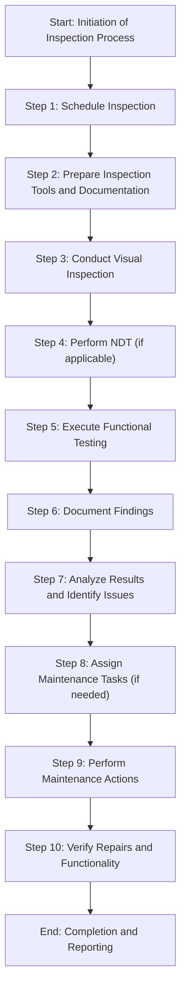
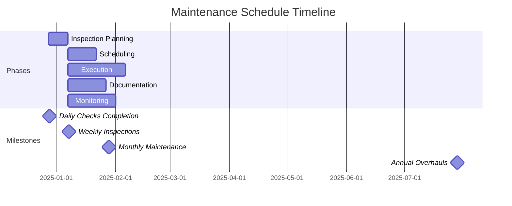
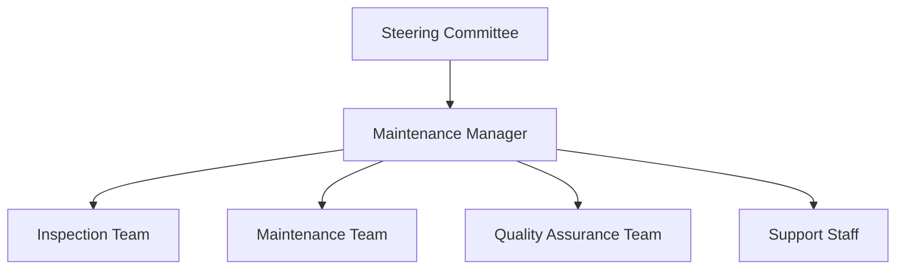

# FTC_05-00-00-00-000_ATA_05-Periodic_Inspections_and_Maintenance_Checks.md

*(Comprehensive Guide to Periodic Inspections and Maintenance Checks for GAIA AIR – Ampel360XWLRGA Aircraft)*

## Version History

| **Version** | **Date**       | **Author**                           | **Description**                                                                                                                                                                  |
|-------------|----------------|--------------------------------------|----------------------------------------------------------------------------------------------------------------------------------------------------------------------------------|
| 1.0         | 2024-12-28     | Amedeo Pelliccia & ChatGPT 01-mini    | Initial creation of the document.                                                                                                                                                 |
| 1.1         | 2024-12-28     | ChatGPT 01-mini & Amedeo Pelliccia    | Incorporated feedback, added detailed sections on inspection procedures and maintenance checks, and structured the document for consistency with other project documents.         |
| 1.2         | 2024-12-28     | Amedeo Pelliccia & ChatGPT 01-mini    | Enhanced content with additional references, refined procedures, and integrated placeholder visuals. Acknowledged collaborative contributions from both human and AI collaborators. |
| 1.3         | 2024-12-28     | Amedeo Pelliccia & ChatGPT 01-mini    | Final refinements and preparation for publication on GitHub.                                                                                                                     |

---

## Table of Contents

1.  [Introduction](#1-introduction)
    - [1.1 Purpose](#11-purpose)
    - [1.2 Scope](#12-scope)
    - [1.3 Document Structure](#13-document-structure)
    - [1.4 Terminology](#14-terminology)
2. [Overview of ATA Chapter 05](#2-overview-of-ata-chapter-05)
    - [2.1 Importance of Periodic Inspections](#21-importance-of-periodic-inspections)
    - [2.2 Principles of Maintenance Checks](#22-principles-of-maintenance-checks)
3. [Compliance and Standards](#3-compliance-and-standards)
    - [3.1 Regulatory Requirements](#31-regulatory-requirements)
    - [3.2 ATA Standards](#32-ata-standards)
    - [3.3 Integration with Risk Assessment](#33-integration-with-risk-assessment)
4. [Application to GAIA AIR Project](#4-application-to-gaia-air-project)
    - [4.1 Inspection Schedules](#41-inspection-schedules)
    - [4.2 Maintenance Check Procedures](#42-maintenance-check-procedures)
    - [4.3 Documentation and Reporting](#43-documentation-and-reporting)
5. [Inspection and Maintenance Procedures](#5-inspection-and-maintenance-procedures)
    - [5.1 Pre-Flight Inspections](#51-pre-flight-inspections)
    - [5.2 Post-Flight Inspections](#52-post-flight-inspections)
    - [5.3 Scheduled Inspections](#53-scheduled-inspections)
        - [5.3.1 Daily Checks](#531-daily-checks)
        - [5.3.2 Weekly Checks](#532-weekly-checks)
        - [5.3.3 Monthly Checks](#533-monthly-checks)
        - [5.3.4 Annual Checks](#534-annual-checks)
    - [5.4 Unscheduled Maintenance](#54-unscheduled-maintenance)
    - [5.5 Special Inspections](#55-special-inspections)
        - [5.5.1 Hard Landing Inspection](#551-hard-landing-inspection)
        - [5.5.2 Severe Turbulence Inspection](#552-severe-turbulence-inspection)
        - [5.5.3 Lightning Strike Inspection](#553-lightning-strike-inspection)
        - [5.5.4 Bird Strike Inspection](#554-bird-strike-inspection)
    - [5.6 Engine Inspections](#56-engine-inspections)
    - [5.7 Avionics Inspections](#57-avionics-inspections)
    - [5.8 Structural Inspections](#58-structural-inspections)
    - [5.9 System-Specific Inspections](#59-system-specific-inspections)
        - [5.9.1 Electrical System Inspection](#591-electrical-system-inspection)
        - [5.9.2 Hydraulic System Inspection](#592-hydraulic-system-inspection)
        - [5.9.3 Fuel System Inspection](#593-fuel-system-inspection)
    - [5.10 Inspection Techniques](#510-inspection-techniques)
        - [5.10.1 Visual Inspection](#5101-visual-inspection)
        - [5.10.2 Non-Destructive Testing (NDT)](#5102-non-destructive-testing-ndt)
        - [5.10.3 Functional Testing](#5103-functional-testing)
6. [Roles and Responsibilities](#6-roles-and-responsibilities)
    - [6.1 Maintenance Personnel](#61-maintenance-personnel)
    - [6.2 Flight Crew](#62-flight-crew)
    - [6.3 Quality Assurance](#63-quality-assurance)
7. [Integration with Other Documents and Systems](#7-integration-with-other-documents-and-systems)
    - [7.1 Dependencies Matrix and Glossary](#71-dependencies-matrix-and-glossary)
    - [7.2 Integration with CMMS](#72-integration-with-cmms)
    - [7.3 Integration with Other ATA Chapters](#73-integration-with-other-ata-chapters)
8. [Emerging Technologies](#8-emerging-technologies)
    - [8.1 Machine Learning (ML) for Predictive Maintenance](#81-machine-learning-ml-for-predictive-maintenance)
    - [8.2 Internet of Things (IoT) for Real-Time Monitoring](#82-internet-of-things-iot-for-real-time-monitoring)
    - [8.3 Blockchain for Secure Data Management](#83-blockchain-for-secure-data-management)
    - [8.4 High-Performance Computing (HPC) for Advanced Analysis](#84-high-performance-computing-hpc-for-advanced-analysis)
    - [8.5 Digital Twins for Enhanced Inspections](#85-digital-twins-for-enhanced-inspections)
9. [Training and Awareness](#9-training-and-awareness)
    - [9.1 Training Programs](#91-training-programs)
    - [9.2 Awareness Campaigns](#92-awareness-campaigns)
10. [Audits and Continuous Improvement](#10-audits-and-continuous-improvement)
    - [10.1 Internal Audits](#101-internal-audits)
    - [10.2 Continuous Improvement Process](#102-continuous-improvement-process)
11. [Human Factors](#11-human-factors)
    - [11.1 Human Error in Inspections and Maintenance](#111-human-error-in-inspections-and-maintenance)
    - [11.2 Mitigating Human Error](#112-mitigating-human-error)
    - [11.3 Technology and Human Factors](#113-technology-and-human-factors)
12. [Case Studies](#12-case-studies)
    - [12.1 Successful Implementation of Inspection Programs](#121-successful-implementation-of-inspection-programs)
    - [12.2 Impact of Emerging Technologies on Maintenance](#122-impact-of-emerging-technologies-on-maintenance)
13. [Future Trends](#13-future-trends)
    - [13.1 Advanced Technologies](#131-advanced-technologies)
    - [13.2 Evolving Regulations](#132-evolving-regulations)
14. [References](#14-references)
15. [Visual Aids](#15-visual-aids)
    - [15.1 Inspection Process Flowchart](#151-inspection-process-flowchart)
    - [15.2 Maintenance Schedule Timeline](#152-maintenance-schedule-timeline)
    - [15.3 Organizational Structure for Inspections and Maintenance](#153-organizational-structure-for-inspections-and-maintenance)
16. [Sample Forms](#16-sample-forms)
    - [16.1 Inspection Checklist](#161-inspection-checklist)
    - [16.2 Maintenance Report Template](#162-maintenance-report-template)
    - [16.3 Audit Report Template](#163-audit-report-template)
17. [Acronyms](#17-acronyms)

---

## 1. Introduction

Periodic inspections and maintenance checks are crucial for ensuring the ongoing airworthiness, safety, and reliability of aircraft. These procedures involve systematic assessments and maintenance tasks performed at defined intervals to identify and address potential issues before they escalate into significant problems. This document provides a comprehensive guide to periodic inspections and maintenance checks for the **GAIA AIR – Ampel360XWLRGA Aircraft** project, aligning with ATA Chapter 05 standards and regulatory requirements set by authorities such as EASA and FAA.

### 1.1 Purpose

The purpose of this document is to:

- **Define Inspection and Maintenance Requirements:** Establish the procedures and standards for conducting periodic inspections and maintenance checks to ensure the aircraft's continued airworthiness.
- **Ensure Compliance:** Guarantee adherence to ATA Chapter 05 standards and regulatory requirements set by authorities such as EASA and FAA.
- **Standardize Inspection and Maintenance Procedures:** Provide a unified approach to performing inspections and maintenance checks, promoting consistency across all operational teams.
- **Facilitate Training:** Offer a reference for training maintenance personnel, ensuring consistent knowledge and application of inspection and maintenance procedures.
- **Enhance Operational Safety:** Maintain the aircraft's structural integrity, system functionality, and overall safety through rigorous inspections and maintenance checks.

### 1.2 Scope

This document encompasses the framework of periodic inspections and maintenance checks for the **GAIA AIR – Ampel360XWLRGA Aircraft** project, including but not limited to:

- **Inspection Schedules:** Detailed schedules for various types of inspections, including pre-flight, post-flight, daily, weekly, monthly, and annual checks.
- **Maintenance Procedures:** Defined maintenance tasks necessary to maintain airworthiness and ensure optimal performance.
- **Special Inspections:** Procedures for conducting inspections following specific events such as hard landings, severe turbulence, lightning strikes, and bird strikes.
- **System-Specific Inspections:** Guidelines for inspecting critical systems, including electrical, hydraulic, and fuel systems.
- **Documentation and Record-Keeping:** Establishing robust systems for maintaining inspection and maintenance data and ensuring data integrity.
- **Integration with Advanced Technologies:** Utilizing technologies such as Machine Learning (ML), IoT sensors, Blockchain, and High-Performance Computing (HPC) to enhance inspection and maintenance processes.
- **Safety Protocols:** Ensuring that all inspection and maintenance activities adhere to safety standards to prevent accidents and equipment failures.

### 1.3 Document Structure

This document is organized into the following key sections to facilitate clarity and usability:

1. **Introduction:** Provides context and outlines the purpose, scope, and structure of the document.
2. **Overview of ATA Chapter 05:** Explores the importance and principles of periodic inspections and maintenance checks in aviation.
3. **Compliance and Standards:** Ensures that inspection and maintenance procedures comply with ATA standards and regulatory requirements.
4. **Application to GAIA AIR Project:** Details how periodic inspections and maintenance checks are applied within the GAIA AIR project.
5. **Inspection and Maintenance Procedures:** Outlines the procedures for conducting various types of inspections and maintenance checks.
6. **Roles and Responsibilities:** Defines the roles and responsibilities of maintenance personnel, flight crew, and quality assurance teams.
7. **Integration with Other Documents and Systems:** Demonstrates connections with the Dependencies Matrix, Glossary, and other relevant systems.
8. **Emerging Technologies:** Highlights the use of advanced technologies to enhance inspection and maintenance processes.
9. **Training and Awareness:** Emphasizes the importance of training and awareness programs for personnel involved in inspection and maintenance activities.
10. **Audits and Continuous Improvement:** Outlines the process for regular audits and continuous improvement of inspection and maintenance procedures.
11. **Human Factors:** Addresses the role of human factors in inspections and maintenance and strategies for mitigating human error.
12. **Case Studies:** Provides real-world examples of inspection and maintenance program implementations and the impact of emerging technologies.
13. **Future Trends:** Discusses potential future developments in inspection and maintenance procedures.
14. **References:** Lists resources, including external standards and internal documentation, to support further exploration.
15. **Visual Aids:** Incorporates flowcharts and diagrams to illustrate inspection and maintenance processes and organizational structures.
16. **Sample Forms:** Provides templates for essential inspection and maintenance management documents.
17. **Acronyms:** Lists and defines acronyms used throughout the document.

### 1.4 Terminology

To ensure clarity and consistency throughout this document, the following terminology is defined. (Click the term to see its definition in the [Glossary](CPT_0_GLOSSARY.md)):

- **[Airworthiness](CPT_0_GLOSSARY.md#Airworthiness):** The ability of an aircraft to operate safely and meet all applicable regulatory requirements.
- **ATA Chapter 05:** The section of the ATA standards that deals with periodic inspections and maintenance checks.
- **[Inspection Interval](CPT_0_GLOSSARY.md#InspectionInterval):** The defined period between mandatory inspections of aircraft components and systems.
- **Life-Limited Parts:** Components with a defined service life, after which they must be replaced.
- **[Non-Destructive Testing (NDT)](CPT_0_GLOSSARY.md#NDT):** Inspection methods that do not damage the component being inspected.
- **Preventive Maintenance:** Scheduled maintenance actions to prevent failures and ensure continued operation.
- **Corrective Maintenance:** Actions taken to rectify a failure or deficiency.
- **[Computerized Maintenance Management System (CMMS)](CPT_0_GLOSSARY.md#CMMS):** Software used to manage and track maintenance activities.
- **[Digital Twin](CPT_0_GLOSSARY.md#DigitalTwin):** A virtual replica of the aircraft used for simulations and predictive maintenance.
- **[Machine Learning (ML)](CPT_0_GLOSSARY.md#ML):** A type of artificial intelligence that allows systems to learn from data and improve performance over time.
- **[Internet of Things (IoT)](CPT_0_GLOSSARY.md#IoT):** A network of physical devices embedded with sensors and software to connect and exchange data.
- **[Blockchain](CPT_0_GLOSSARY.md#Blockchain):** A decentralized, immutable ledger used for secure data recording and tracking.
- **[High-Performance Computing (HPC)](CPT_0_GLOSSARY.md#HPC):** Advanced computing systems capable of processing large volumes of data and performing complex calculations.
- **Predictive Maintenance:** Using data analytics and machine learning to predict when maintenance is needed before a failure occurs.

*(If the technology does not exist or is purely hypothetical, you can add a brief disclaimer in the Glossary or as a footnote.)*

---

## 2. Overview of ATA Chapter 05

**ATA Chapter 05** provides a framework for periodic inspections and maintenance checks that are essential to maintaining the airworthiness and operational safety of aircraft. This chapter outlines the requirements for scheduling, performing, and documenting various types of inspections and maintenance tasks to ensure that aircraft remain in optimal condition throughout their service life.

### 2.1 Importance of Periodic Inspections

Periodic inspections are critical for several reasons:

- **Safety Assurance:** Regular inspections help identify and rectify potential issues before they escalate into major failures, thereby ensuring the safety of passengers and crew.
- **Regulatory Compliance:** Adherence to inspection schedules is mandated by aviation authorities such as the FAA and EASA to ensure that aircraft meet airworthiness standards.
- **Operational Reliability:** Consistent inspections and maintenance checks help maintain the aircraft's operational reliability, reducing the likelihood of unexpected downtime.
- **Cost Efficiency:** Early detection and resolution of issues through regular inspections can prevent more significant, costly repairs down the line.
- **Longevity of Aircraft:** Proper maintenance and timely inspections extend the operational lifespan of the aircraft by addressing wear and tear.

### 2.2 Principles of Maintenance Checks

Effective maintenance checks are guided by several key principles:

- **Systematic Approach:** Following a structured and methodical approach to inspections ensures that all critical areas and components are thoroughly assessed.
- **Regular Intervals:** Conducting checks at regular, predefined intervals helps in the early detection of potential issues.
- **Comprehensive Documentation:** Maintaining detailed records of all inspections and maintenance actions is essential for tracking the aircraft's condition and ensuring compliance.
- **Use of Advanced Techniques:** Employing modern inspection techniques, such as Non-Destructive Testing (NDT), enhances the accuracy and effectiveness of inspections.
- **Integration of Technology:** Leveraging technologies like IoT sensors, Machine Learning, and Digital Twins can improve the efficiency and predictive capabilities of maintenance checks.
- **Continuous Improvement:** Regularly reviewing and updating inspection and maintenance procedures based on operational experience and technological advancements ensures ongoing enhancement of safety and efficiency.

By adhering to these principles, the **GAIA AIR – Ampel360XWLRGA Aircraft** project will ensure that all aircraft maintain the highest standards of airworthiness and operational readiness.

---

## 3. Compliance and Standards

Ensuring compliance with regulatory requirements and industry standards is paramount for the airworthiness and operational safety of the **GAIA AIR – Ampel360XWLRGA Aircraft**. This section outlines the key regulations, standards, and risk assessment processes relevant to periodic inspections and maintenance checks.

### 3.1 Regulatory Requirements

Periodic inspections and maintenance checks must comply with regulations established by aviation authorities. Key regulatory requirements include:

- **FAA Regulations:**
    - **[14 CFR Part 43](https://www.ecfr.gov/current/title-14/chapter-I/subchapter-C/part-43):** Maintenance, Preventive Maintenance, Rebuilding, and Alteration.
    - **[14 CFR Part 91](https://www.ecfr.gov/current/title-14/chapter-I/subchapter-F/part-91):** General Operating and Flight Rules.
    - **[14 CFR Part 121](https://www.ecfr.gov/current/title-14/chapter-I/subchapter-G/part-121):** Operating Requirements: Domestic, Flag, and Supplemental Operations.
- **EASA Regulations:**
    - **[Part-M](https://www.easa.europa.eu/en/document-library/regulations/commission-regulation-eu-no-13212014) (Continuing Airworthiness Requirements):** Specifies the requirements for continuing airworthiness management.
    - **[Part-145](https://www.easa.europa.eu/en/document-library/regulations/commission-regulation-eu-no-13212014) (Approved Maintenance Organizations):** Defines the standards for organizations performing maintenance on aircraft.

**Compliance Strategies:**

- **Regular Audits:** Conduct internal and external audits to ensure adherence to regulatory requirements.
- **Documentation Reviews:** Regularly review and update inspection and maintenance procedures and documentation to align with regulatory changes.
- **Training Programs:** Implement comprehensive training programs to educate personnel on regulatory standards and compliance requirements. (See [Section 9. Training and Awareness](#9-training-and-awareness))

### 3.2 ATA Standards

ATA standards provide a framework for standardizing maintenance and inspection procedures across the aviation industry. Key ATA standards relevant to periodic inspections and maintenance checks include:

- **ATA Spec 100:** Guidelines for the creation and management of project documentation, ensuring consistency and compliance across different aircraft types.
- **ATA iSpec 2200:** Standards for electronic technical publications in aviation, facilitating seamless information exchange and maintenance activities.
- **ATA Chapter 05:** Specifically addresses periodic inspections and maintenance checks, outlining the required tasks, intervals, and procedures.

**Adherence to ATA Standards:**

- **Standardized Documentation:** Utilize ATA standards to develop consistent and comprehensive inspection and maintenance documentation.
- **Technology Integration:** Leverage ATA standards to integrate advanced technologies such as ML, IoT, Blockchain, and HPC into inspection and maintenance processes.
- **Continuous Improvement:** Regularly update inspection and maintenance procedures based on ATA standards and industry best practices.

### 3.3 Integration with Risk Assessment

Integrating periodic inspections and maintenance checks with risk assessment processes ensures that potential risks are identified, evaluated, and mitigated effectively. This integration involves:

- **Risk Identification:** Identifying potential risks associated with inadequate or missed inspections and maintenance tasks.
- **Risk Assessment:** Evaluating the likelihood and impact of each identified risk to prioritize mitigation efforts.
- **Risk Mitigation:** Developing and implementing strategies to reduce the probability or impact of high-priority risks.
- **Continuous Monitoring:** Regularly monitoring and reviewing risks to update mitigation plans as necessary.

**Example Integration:**

- **Scenario:** The project team identifies a potential risk of missing critical inspections due to manual scheduling errors.
- **Mitigation Steps:**
    1. **Detection:** Identify shortcomings in the current manual scheduling process through regular audits and feedback from maintenance personnel.
    2. **Immediate Action:** Implement a CMMS to automate inspection scheduling and provide real-time alerts for upcoming and overdue inspections.
    3. **Preventive Measures:** Train maintenance personnel on the use of the CMMS and establish procedures for verifying inspection schedules.
    4. **Documentation:** Record all inspection schedules, completions, and related data in the CMMS.
    5. **Review:** Analyze the effectiveness of the automated scheduling system and make necessary adjustments to improve its performance.

By integrating periodic inspections and maintenance checks with risk assessment, the **GAIA AIR** project can proactively address potential risks, ensuring the aircraft remains safe, reliable, and compliant with regulatory standards.

---

## 4. Application to GAIA AIR Project

The **GAIA AIR – Ampel360XWLRGA Aircraft** project requires a robust framework for periodic inspections and maintenance checks to ensure the ongoing airworthiness and operational efficiency of the aircraft. This section details the application of these procedures within the project.

### 4.1 Inspection Schedules

Developing a comprehensive inspection schedule is crucial for the systematic assessment of the aircraft's condition. The schedule includes various types of inspections, each with specific intervals and objectives.

**Types of Inspections:**

- **Pre-Flight Inspections:** Conducted before each flight to ensure the aircraft is in a safe condition for operation.
- **Post-Flight Inspections:** Performed after each flight to identify any issues that may have arisen during operation.
- **Daily Checks:** Routine checks performed every 24 hours to assess the general condition of the aircraft.
- **Weekly Checks:** More detailed inspections conducted weekly, covering key systems and components.
- **Monthly Checks:** Comprehensive inspections performed monthly to evaluate the condition of major systems and structures.
- **Annual Checks:** Extensive inspections and maintenance tasks carried out annually to ensure continued airworthiness.

**Implementation Steps:**

1. **Develop Inspection Schedule:** Create a detailed schedule based on ATA Chapter 05, regulatory requirements, and manufacturer recommendations.
2. **Resource Allocation:** Allocate necessary resources, including trained personnel, tools, and equipment, to perform inspections.
3. **Automate Scheduling:** Utilize the CMMS to automate the scheduling of inspections and generate alerts for upcoming and overdue tasks.
4. **Documentation:** Maintain detailed records of all inspections, including dates, findings, and corrective actions, within the CMMS.

**Technologies Utilized:**

- **CMMS:** For scheduling, tracking, and documenting inspections.
- **IoT Sensors:** To provide real-time data and alerts for critical components.
- **Digital Twins:** To simulate inspection scenarios and predict maintenance needs.

### 4.2 Maintenance Check Procedures

Maintenance checks are performed in conjunction with inspections to address identified issues and ensure the aircraft remains in optimal condition.

**Types of Maintenance Checks:**

- **Routine Maintenance:** Regularly scheduled tasks such as lubrication, cleaning, and minor adjustments.
- **Preventive Maintenance:** Actions taken to prevent failures, including the replacement of life-limited parts and system overhauls.
- **Corrective Maintenance:** Repairs and replacements performed to address issues identified during inspections or reported by the flight crew.

**Implementation Steps:**

1. **Develop Maintenance Procedures:** Create detailed procedures for each type of maintenance check, based on ATA standards and manufacturer guidelines.
2. **Train Personnel:** Ensure that maintenance personnel are trained on all relevant maintenance procedures and the use of associated technologies.
3. **Execute Maintenance Tasks:** Perform maintenance tasks according to the established procedures and schedules.
4. **Verify and Document:** Verify the completion of maintenance tasks and document all actions in the CMMS.

**Technologies Utilized:**

- **CMMS:** For planning, executing, and documenting maintenance checks.
- **Machine Learning (ML):** To predict maintenance needs and optimize maintenance schedules.
- **Blockchain:** To ensure the integrity and traceability of maintenance records.

### 4.3 Documentation and Reporting

Accurate and comprehensive documentation is essential for tracking inspections and maintenance checks, ensuring compliance, and facilitating continuous improvement.

**Implementation Steps:**

1. **Standardize Documentation:** Develop standardized templates for inspection reports, maintenance logs, and other relevant documents.
2. **Digital Documentation:** Utilize the CMMS to digitally document all inspection and maintenance activities, ensuring data is centralized and easily accessible.
3. **Data Integrity:** Implement measures to ensure the integrity and security of documentation, including encryption and access controls.
4. **Reporting:** Generate regular reports on inspection and maintenance activities, highlighting completed tasks, identified issues, and corrective actions.

**Technologies Utilized:**

- **CMMS:** For centralized documentation and reporting.
- **Blockchain:** To ensure the immutability and traceability of records.
- **Cloud Storage:** For secure and scalable storage of inspection and maintenance data.

By meticulously applying these procedures, the **GAIA AIR** project ensures that the **Ampel360XWLRGA Aircraft** remains airworthy, safe, and compliant with all relevant standards and regulations.

---

## 5. Inspection and Maintenance Procedures

This section outlines the specific procedures for conducting various types of inspections and maintenance checks on the **GAIA AIR – Ampel360XWLRGA Aircraft**. These procedures are designed to ensure the aircraft's ongoing airworthiness, safety, and operational efficiency.

### 5.1 Pre-Flight Inspections

**Objective:** To ensure the aircraft is in a safe condition for flight.

**Procedure:**

1. **External Inspection:**
    - Walk around the aircraft to visually inspect the exterior for any signs of damage, loose panels, or fluid leaks.
    - Check the condition of the fuselage, wings, control surfaces, and landing gear.
    - Inspect the engine inlets and exhaust for obstructions or damage.
    - Verify the condition of tires, brakes, and lights.
2. **Internal Inspection:**
    - Inspect the cockpit for proper configuration and functionality of instruments and controls.
    - Check the status of all circuit breakers and switches.
    - Verify the presence and condition of emergency equipment, including fire extinguishers and first-aid kits.
3. **Documentation:**
    - Record the pre-flight inspection findings in the aircraft's logbook.
    - Report any discrepancies to maintenance personnel for immediate action.

### 5.2 Post-Flight Inspections

**Objective:** To identify any issues that may have arisen during flight and ensure the aircraft is ready for subsequent operations.

**Procedure:**

1. **External Inspection:**
    - Conduct a thorough walk around to inspect the aircraft for any damage incurred during the flight.
    - Check for fluid leaks, loose panels, and structural damage.
    - Inspect the engine inlets and exhaust for any signs of damage or debris.
2. **Internal Inspection:**
    - Review the cockpit for any warning lights or system malfunctions that occurred during the flight.
    - Check the condition of the cabin and report any damage or issues.
3. **Debriefing:**
    - Debrief with the flight crew to gather information on any anomalies or issues encountered during the flight.
4. **Documentation:**
    - Record the post-flight inspection findings in the aircraft's logbook.
    - Document any discrepancies and report them to maintenance personnel for corrective action.

### 5.3 Scheduled Inspections

Scheduled inspections are performed at predefined intervals to ensure the continued airworthiness of the aircraft.

#### 5.3.1 Daily Checks

**Objective:** To perform routine checks ensuring the aircraft's readiness for daily operations.

**Procedure:**

1. **Visual Inspection:**
    - Inspect the exterior for general condition, including any signs of damage or wear.
    - Check fluid levels (oil, hydraulic fluid, fuel) and replenish as necessary.
    - Verify the condition of tires and brakes.
2. **Operational Checks:**
    - Test essential systems such as lights, radios, and navigation equipment.
    - Ensure the proper functioning of flight controls.
3. **Documentation:**
    - Record the daily check findings in the aircraft's logbook.

#### 5.3.2 Weekly Checks

**Objective:** To conduct more detailed inspections on a weekly basis.

**Procedure:**

1. **Comprehensive Inspection:**
    - Perform a detailed visual inspection of the aircraft's exterior and interior.
    - Check the condition of structural components, including wings, fuselage, and empennage.
    - Inspect the engine compartment for leaks, loose connections, and general condition.
2. **System Checks:**
    - Test the functionality of all avionics, communication, and navigation systems.
    - Verify the operation of hydraulic and electrical systems.
3. **Documentation:**
    - Document the weekly check findings in the CMMS.

#### 5.3.3 Monthly Checks

**Objective:** To perform comprehensive inspections and maintenance tasks on a monthly basis.

**Procedure:**

1. **In-Depth Inspection:**
    - Conduct a thorough inspection of all aircraft systems and components.
    - Inspect life-limited parts and ensure they are within their operational limits.
    - Check for and address any signs of corrosion.
2. **Maintenance Tasks:**
    - Perform scheduled maintenance tasks such as lubrication of moving parts and replacement of filters.
    - Calibrate instruments and systems as required.
3. **Documentation:**
    - Record the monthly check findings and completed maintenance tasks in the CMMS.

#### 5.3.4 Annual Checks

**Objective:** To conduct extensive inspections and maintenance tasks annually to ensure continued airworthiness.

**Procedure:**

1. **Comprehensive Inspection:**
    - Perform a detailed inspection of all aircraft structures, systems, and components.
    - Conduct NDT on critical components as required.
    - Inspect and verify the condition of all life-limited parts.
2. **Maintenance and Overhaul:**
    - Perform major maintenance tasks, including engine overhaul and system refurbishments as scheduled.
    - Replace any components that have reached their service life limits.
3. **Documentation:**
    - Document the annual check findings, completed maintenance tasks, and any replacements in the CMMS.

### 5.4 Unscheduled Maintenance

**Objective:** To address unforeseen issues and discrepancies identified outside of the scheduled inspection intervals.

**Procedure:**

1. **Identification:**
    - Identify and report any malfunctions, damage, or anomalies observed during operations or inspections.
2. **Assessment:**
    - Evaluate the severity of the issue and determine the necessary corrective actions.
3. **Repair:**
    - Perform necessary repairs or replacements to rectify the issue, following approved procedures and using certified parts.
4. **Testing:**
    - Conduct functional tests to ensure the repairs have resolved the issue and the aircraft is airworthy.
5. **Documentation:**
    - Record all unscheduled maintenance activities in the CMMS, including details of the issue, actions taken, and parts used.

### 5.5 Special Inspections

Special inspections are conducted following specific events that may have affected the aircraft's airworthiness.

#### 5.5.1 Hard Landing Inspection

**Objective:** To assess and rectify any damage resulting from a hard landing.

**Procedure:**

1. **Visual Inspection:**
    - Inspect the landing gear, fuselage, and wings for any signs of stress or damage.
    - Check for deformations, cracks, or loose fasteners.
2. **NDT:**
    - Perform NDT on critical components to detect any internal damage not visible during visual inspection.
3. **Repair:**
    - Repair or replace any damaged components as necessary.
4. **Documentation:**
    - Document the inspection findings and repair actions in the CMMS.

#### 5.5.2 Severe Turbulence Inspection

**Objective:** To assess and rectify any damage resulting from encountering severe turbulence.

**Procedure:**

1. **Visual Inspection:**
    - Inspect the aircraft exterior for any signs of damage, including skin deformation, loose panels, and damaged control surfaces.
    - Check the interior for dislodged components and structural integrity.
2. **Operational Checks:**
    - Verify the functionality of flight controls, avionics, and other critical systems.
3. **Documentation:**
    - Record the inspection findings and any corrective actions taken in the CMMS.

#### 5.5.3 Lightning Strike Inspection

**Objective:** To assess and rectify any damage resulting from a lightning strike.

**Procedure:**

1. **Visual Inspection:**
    - Inspect the aircraft exterior for burn marks, entry and exit points, and damage to antennas and lights.
    - Check for any signs of arcing or electrical damage.
2. **Electrical System Checks:**
    - Test all electrical systems, including avionics, navigation, and communication systems, for proper functionality.
    - Inspect wiring and connectors for damage.
3. **Repair:**
    - Repair or replace any damaged components, including wiring, avionics, and structural parts.
4. **Functional Testing:**
    - Perform functional tests on all affected systems to ensure they are operating correctly.
5. **Documentation:**
    - Record the inspection findings, repairs performed, and test results in the CMMS.

#### 5.5.4 Bird Strike Inspection

**Objective:** To assess and rectify any damage resulting from a bird strike.

**Procedure:**

1. **Visual Inspection:**
    - Inspect the aircraft exterior, focusing on areas prone to bird strikes such as the nose, engine inlets, and leading edges of wings.
    - Look for dents, punctures, or other damage.
2. **Engine Inspection:**
    - Conduct a thorough inspection of engine inlets and exhausts for foreign object debris (FOD) and damage to fan blades or other internal components.
3. **Operational Checks:**
    - Test the functionality of flight controls and avionics systems to ensure no damage has occurred.
4. **Repair:**
    - Repair or replace any damaged components as necessary.
5. **Documentation:**
    - Document the inspection findings and repair actions in the CMMS.

### 5.6 Engine Inspections

**Objective:** To ensure the engines are operating efficiently and safely.

**Procedure:**

1. **Visual Inspection:**
    - Inspect the exterior of the engines for signs of oil leaks, damage, or wear.
    - Check the condition of fan blades and compressor sections.
2. **Operational Testing:**
    - Perform engine performance tests to verify thrust output and fuel efficiency.
    - Monitor engine temperature and vibration levels for anomalies.
3. **NDT:**
    - Conduct NDT on critical engine components to detect internal damage or fatigue.
4. **Maintenance Actions:**
    - Perform scheduled maintenance tasks such as filter replacements, oil changes, and component overhauls.
5. **Documentation:**
    - Record all inspection findings, maintenance actions, and test results in the CMMS.

### 5.7 Avionics Inspections

**Objective:** To ensure all avionics systems are functioning correctly and reliably.

**Procedure:**

1. **System Testing:**
    - Test all avionics systems, including communication, navigation, and monitoring equipment, for proper functionality.
2. **Calibration:**
    - Calibrate instruments and sensors to ensure accurate readings and performance.
3. **Software Updates:**
    - Update avionics software and firmware to the latest versions as recommended by manufacturers.
4. **Visual Inspection:**
    - Inspect wiring, connectors, and mounting hardware for signs of damage or wear.
5. **Documentation:**
    - Record inspection findings, calibration results, and software updates in the CMMS.

### 5.8 Structural Inspections

**Objective:** To assess the integrity of the aircraft's structural components.

**Procedure:**

1. **Visual Inspection:**
    - Inspect the fuselage, wings, empennage, and other structural components for signs of cracks, corrosion, or deformation.
2. **NDT:**
    - Perform NDT techniques such as ultrasonic testing or dye penetrant inspections to detect internal cracks or flaws.
3. **Load Testing:**
    - Conduct load tests to verify the structural strength and integrity of critical components.
4. **Repair:**
    - Repair or reinforce any damaged or weakened structural elements as necessary.
5. **Documentation:**
    - Document inspection findings, load test results, and repair actions in the CMMS.

### 5.9 System-Specific Inspections

System-specific inspections focus on the detailed assessment of individual systems to ensure their proper functionality and reliability.

#### 5.9.1 Electrical System Inspection

**Objective:** To ensure the electrical systems are functioning correctly and safely.

**Procedure:**

1. **Visual Inspection:**
    - Inspect all electrical wiring, connectors, and components for signs of damage, wear, or overheating.
2. **System Testing:**
    - Test the functionality of all electrical systems, including lighting, avionics, and emergency power supplies.
3. **Safety Checks:**
    - Verify that all circuit breakers and fuses are functioning correctly and are appropriately rated.
4. **Maintenance Actions:**
    - Repair or replace any damaged wiring or components.
    - Perform preventive maintenance tasks such as cleaning connections and tightening loose terminals.
5. **Documentation:**
    - Record inspection findings, system test results, and maintenance actions in the CMMS.

#### 5.9.2 Hydraulic System Inspection

**Objective:** To ensure the hydraulic systems are operating efficiently and without leaks.

**Procedure:**

1. **Visual Inspection:**
    - Inspect hydraulic lines, hoses, and fittings for signs of leaks, cracks, or wear.
2. **Pressure Testing:**
    - Test hydraulic system pressures to ensure they are within specified limits.
3. **Fluid Analysis:**
    - Analyze hydraulic fluid for contamination, degradation, or loss of additives.
4. **System Testing:**
    - Test the functionality of hydraulic actuators and valves.
5. **Maintenance Actions:**
    - Repair or replace any damaged hoses or fittings.
    - Perform fluid changes and filter replacements as required.
6. **Documentation:**
    - Record inspection findings, pressure test results, and maintenance actions in the CMMS.

#### 5.9.3 Fuel System Inspection

**Objective:** To ensure the fuel systems are clean, leak-free, and operating efficiently.

**Procedure:**

1. **Visual Inspection:**
    - Inspect fuel lines, tanks, and fittings for signs of leaks, corrosion, or damage.
2. **Contamination Check:**
    - Test fuel samples for contamination, water presence, and proper fuel grade.
3. **System Testing:**
    - Test fuel pumps and injectors for proper operation and flow rates.
4. **Fuel Quantity Verification:**
    - Ensure accurate fuel quantity measurements and verify fuel gauges.
5. **Maintenance Actions:**
    - Clean or replace fuel filters and strainers.
    - Repair or replace any damaged fuel lines or components.
6. **Documentation:**
    - Record inspection findings, fuel test results, and maintenance actions in the CMMS.

### 5.10 Inspection Techniques

Various inspection techniques are employed to ensure thorough assessments of the aircraft's components and systems.

#### 5.10.1 Visual Inspection

**Objective:** To conduct a preliminary assessment of the aircraft's condition through direct observation.

**Procedure:**

1. **External Visual Inspection:**
    - Walk around the aircraft to identify any visible signs of damage, wear, or anomalies.
    - Use mirrors or borescopes to inspect hard-to-reach areas.
2. **Internal Visual Inspection:**
    - Inspect the cockpit, cabin, and cargo areas for any signs of damage or wear.
    - Check for proper installation and alignment of components.
3. **Documentation:**
    - Record all observations and any identified issues in the CMMS.

#### 5.10.2 Non-Destructive Testing (NDT)

**Objective:** To detect internal flaws or damage without causing harm to the components being inspected.

**Procedure:**

1. **Ultrasonic Testing:**
    - Use ultrasonic waves to detect internal cracks or voids in structural components.
2. **Dye Penetrant Inspection:**
    - Apply a dye penetrant to surfaces to highlight cracks or defects.
3. **Magnetic Particle Inspection:**
    - Use magnetic fields and iron particles to identify surface and near-surface defects in ferromagnetic materials.
4. **Radiographic Testing:**
    - Utilize X-rays or gamma rays to inspect the internal structure of components.
5. **Documentation:**
    - Record NDT findings, including the location and severity of detected defects, in the CMMS.

#### 5.10.3 Functional Testing

**Objective:** To verify that all systems and components are operating as intended.

**Procedure:**

1. **System Activation:**
    - Activate and operate systems such as avionics, hydraulics, and fuel systems to ensure proper functionality.
2. **Performance Measurement:**
    - Measure system outputs, such as fuel flow rates, hydraulic pressures, and electrical voltages, against specified performance criteria.
3. **Failure Simulation:**
    - Simulate failure scenarios to test the effectiveness of backup systems and emergency protocols.
4. **Documentation:**
    - Record functional test results and any identified issues in the CMMS.

---

## 6. Roles and Responsibilities

Clearly defining roles and responsibilities ensures accountability and streamlined execution of inspection and maintenance tasks.

### 6.1 Maintenance Personnel

**Role:** Responsible for conducting inspections, performing maintenance tasks, and ensuring the aircraft remains airworthy.

**Responsibilities:**

- **Conduct Inspections:** Perform scheduled and unscheduled inspections as per ATA Chapter 05 guidelines and project-specific procedures.
- **Execute Maintenance Tasks:** Carry out preventive and corrective maintenance activities, including repairs and replacements.
- **Document Activities:** Accurately record all inspections, maintenance actions, and findings in the CMMS.
- **Ensure Compliance:** Adhere to regulatory requirements, ATA standards, and manufacturer guidelines during all maintenance activities.
- **Continuous Learning:** Stay updated with the latest maintenance techniques, technologies, and regulatory changes through ongoing training.

### 6.2 Flight Crew

**Role:** Responsible for conducting pre-flight and post-flight inspections, reporting any anomalies, and ensuring the aircraft is ready for flight.

**Responsibilities:**

- **Pre-Flight Inspections:** Conduct thorough pre-flight inspections to ensure the aircraft is safe for operation.
- **Post-Flight Inspections:** Perform post-flight inspections to identify any issues that may have arisen during flight.
- **Report Anomalies:** Immediately report any discrepancies or issues discovered during inspections to maintenance personnel.
- **Operational Readiness:** Ensure that all systems and components are functioning correctly before flight.
- **Safety Compliance:** Follow all safety protocols and procedures during inspections and flight operations.

### 6.3 Quality Assurance

**Role:** Ensures that all inspection and maintenance activities meet the established quality standards and regulatory requirements.

**Responsibilities:**

- **Audit Inspections:** Conduct regular audits of inspection and maintenance activities to ensure compliance with ATA standards and regulatory requirements.
- **Review Documentation:** Verify the accuracy and completeness of all inspection and maintenance records in the CMMS.
- **Identify Improvement Areas:** Analyze audit findings to identify areas for improvement in inspection and maintenance procedures.
- **Implement Corrective Actions:** Develop and oversee the implementation of corrective actions to address any identified deficiencies.
- **Training Oversight:** Ensure that maintenance personnel and flight crew receive adequate training and certification for their roles.

---

## 7. Integration with Other Documents and Systems

Ensuring seamless integration with related documents and systems enhances consistency and efficiency across the project.

### 7.1 Dependencies Matrix and Glossary

This document is closely integrated with the **Dependencies Matrix** (`CPT_0000-Dependencies-matrix.md`) and the **Glossary** (`CPT_0_GLOSSARY.md`) to ensure consistency and clarity across all project documentation.

- **Dependencies Matrix:** Defines the relationships and dependencies between the various systems and subsystems of the Ampel360XWLRGA aircraft, providing a clear understanding of how each component interacts with others.
- **Glossary:** Provides definitions of technical terms and acronyms used throughout the documentation, facilitating understanding for all team members.

**Example Integration:**

- When performing **Engine Inspections** (Section 5.6), refer to the Dependencies Matrix to understand its interaction with the **Fuel System** (Section 5.9.3) and the **Hydraulic System** (Section 5.9.2). Ensure that any maintenance actions on the engine do not negatively affect these dependent systems.
- Use the Glossary to clarify any technical terms encountered during inspections, such as understanding how **Machine Learning (ML)** enhances predictive maintenance capabilities.

### 7.2 Integration with CMMS

Integrating periodic inspections and maintenance checks with the **Computerized Maintenance Management System (CMMS)** ensures efficient tracking, scheduling, and documentation of all maintenance activities.

**Implementation Steps:**

1. **System Configuration:**
    - Configure the CMMS to include all inspection schedules, maintenance tasks, and special inspections as defined in this document.
2. **Data Entry:**
    - Input all inspection and maintenance procedures into the CMMS, including detailed steps, required tools, and safety precautions.
3. **Automation:**
    - Utilize the CMMS's automation features to schedule inspections and maintenance tasks based on predefined intervals and trigger alerts for upcoming or overdue activities.
4. **Real-Time Tracking:**
    - Use the CMMS to monitor the status of all inspections and maintenance tasks in real-time, allowing for immediate action on any discrepancies or delays.
5. **Reporting:**
    - Generate comprehensive reports from the CMMS to analyze maintenance trends, identify recurring issues, and assess the effectiveness of maintenance strategies.

**Benefits of Integration:**

- **Centralized Management:** All maintenance activities are managed from a single platform, enhancing coordination and communication among team members.
- **Improved Efficiency:** Automation reduces the likelihood of missed inspections and ensures timely maintenance actions.
- **Enhanced Documentation:** The CMMS provides a digital record of all maintenance activities, facilitating easy access and audit readiness.
- **Data-Driven Insights:** Advanced reporting features allow for data analysis to inform continuous improvement efforts.

### 7.3 Integration with Other ATA Chapters

Periodic inspections and maintenance checks often interact with various other ATA chapters. Proper integration ensures that all related procedures and standards are consistently applied across the aircraft's systems.

**Key Integration Points:**

- **ATA Chapter 02 (Weight and Balance):**
    - Ensure that inspections and maintenance tasks do not adversely affect the aircraft's weight and balance. Coordinate with weight and balance calculations and loading procedures.
- **ATA Chapter 04 (Airworthiness Limitations):**
    - Align periodic inspections with airworthiness limitations to maintain compliance and safety standards.
- **ATA Chapter 06 (Dimensions and Surfaces):**
    - Integrate surface inspections with maintenance tasks involving aerodynamic surfaces to prevent structural and functional discrepancies.
- **ATA Chapter 24 (Electrical System):**
    - Coordinate electrical system inspections with overall maintenance checks to ensure comprehensive coverage of all electrical components.

**Implementation Steps:**

1. **Cross-Reference Procedures:**
    - Review inspection and maintenance procedures across relevant ATA chapters to identify and address any overlaps or dependencies.
2. **Unified Documentation:**
    - Ensure that all integrated procedures are documented consistently within the CMMS and project documentation.
3. **Collaborative Planning:**
    - Coordinate inspection schedules and maintenance tasks across different ATA chapters to optimize resource utilization and minimize operational disruptions.
4. **Holistic Training:**
    - Train maintenance personnel on integrated procedures to ensure a comprehensive understanding of how different systems and inspections interact.

By effectively integrating periodic inspections and maintenance checks with other ATA chapters, the **GAIA AIR** project can ensure a holistic approach to aircraft maintenance, enhancing safety, reliability, and operational efficiency.

---

## 8. Emerging Technologies

Embracing emerging technologies can significantly enhance the efficiency, accuracy, and predictive capabilities of periodic inspections and maintenance checks. This section explores the potential applications and benefits of advanced technologies within the project.

### 8.1 Machine Learning (ML) for Predictive Maintenance

**Machine Learning** offers powerful capabilities for predicting maintenance needs and identifying potential issues before they occur.

**Applications:**

- **Predictive Analytics:** Analyze historical maintenance data and real-time sensor inputs to predict when specific components are likely to fail or require maintenance.
- **Anomaly Detection:** Identify unusual patterns or deviations in system performance that may indicate underlying issues.
- **Maintenance Optimization:** Optimize maintenance schedules based on predicted component lifespans and usage patterns to reduce downtime and costs.

**Benefits:**

- **Enhanced Accuracy:** ML algorithms can analyze vast amounts of data to provide more accurate predictions of maintenance needs.
- **Cost Savings:** Preventive actions based on predictions can reduce the costs associated with unexpected failures and emergency repairs.
- **Increased Reliability:** Predictive maintenance ensures that critical components are maintained before issues arise, enhancing overall aircraft reliability.

**Implementation Steps:**

1. **Data Collection:** Gather historical maintenance records, sensor data, and operational data from the aircraft.
2. **Model Development:** Develop ML models tailored to predict maintenance needs based on the collected data.
3. **Integration:** Integrate ML models with the CMMS to provide real-time maintenance recommendations and alerts.
4. **Continuous Learning:** Continuously update and refine ML models with new data to improve prediction accuracy over time.

### 8.2 Internet of Things (IoT) for Real-Time Monitoring

**IoT Sensors** provide continuous monitoring of the aircraft's systems and components, offering real-time insights into their condition and performance.

**Applications:**

- **Real-Time Data Collection:** Deploy IoT sensors on critical components such as engines, hydraulics, and electrical systems to monitor parameters like temperature, pressure, vibration, and fluid levels.
- **Automated Alerts:** Configure IoT systems to generate automated alerts when sensor data indicates potential issues or deviations from normal operating conditions.
- **Remote Monitoring:** Enable remote access to real-time data, allowing maintenance teams to monitor the aircraft's condition from off-site locations.

**Benefits:**

- **Proactive Maintenance:** Real-time monitoring allows for the early detection of potential issues, enabling timely maintenance actions.
- **Enhanced Data Accuracy:** IoT sensors provide precise and continuous data, reducing the reliance on manual inspections.
- **Operational Efficiency:** Automated data collection and alert systems streamline the maintenance process, saving time and resources.

**Implementation Steps:**

1. **Sensor Deployment:** Install IoT sensors on critical aircraft systems and components.
2. **Data Integration:** Connect IoT sensors to the CMMS for centralized data management and analysis.
3. **Alert Configuration:** Set thresholds and parameters for automated alerts based on sensor data.
4. **Monitoring Dashboard:** Develop a real-time monitoring dashboard within the CMMS to visualize sensor data and alerts.

### 8.3 Blockchain for Secure Data Management

**Blockchain Technology** enhances the security and traceability of maintenance records, ensuring data integrity and facilitating compliance with regulatory standards.

**Applications:**

- **Immutable Records:** Record all maintenance activities, inspections, and component histories on a blockchain to prevent data tampering and ensure a verifiable audit trail.
- **Smart Contracts:** Automate maintenance workflows and approvals based on predefined conditions and triggers using smart contracts.
- **Parts Tracking:** Track the history and provenance of critical components to verify authenticity and compliance.

**Benefits:**

- **Data Integrity:** Blockchain ensures that all maintenance records are secure, tamper-proof, and easily auditable.
- **Transparency:** Provides a clear and immutable record of all maintenance activities, enhancing accountability.
- **Compliance:** Simplifies regulatory compliance by providing verifiable and transparent records of maintenance actions.

**Implementation Steps:**

1. **Blockchain Platform Selection:** Choose a suitable blockchain platform (e.g., Hyperledger Fabric) that meets project requirements.
2. **Integration with CMMS:** Connect the blockchain solution with the CMMS to automatically record maintenance activities and inspections.
3. **Access Controls:** Implement robust access controls to ensure that only authorized personnel can interact with the blockchain records.
4. **Smart Contract Development:** Develop and deploy smart contracts to automate maintenance workflows and approvals.

### 8.4 High-Performance Computing (HPC) for Advanced Analysis

**High-Performance Computing** enables the processing and analysis of large datasets, supporting complex simulations and predictive maintenance models related to periodic inspections and maintenance checks.

**Applications:**

- **Data Processing:** Handle vast amounts of sensor data from IoT devices and ML models in real-time.
- **Simulation and Modeling:** Conduct advanced simulations to predict system behaviors and maintenance needs under various operational conditions.
- **Optimization:** Optimize inspection schedules and maintenance tasks based on computational analysis of data patterns and predictions.

**Benefits:**

- **Rapid Analysis:** HPC systems can process and analyze large datasets quickly, providing timely insights for maintenance decisions.
- **Enhanced Predictive Capabilities:** Support the development of more accurate and reliable predictive maintenance models.
- **Scalability:** Provide the computational power necessary to scale maintenance management systems as data volumes increase.

**Implementation Steps:**

1. **HPC Infrastructure Setup:** Establish a robust HPC infrastructure capable of handling high data throughput and complex computations.
2. **Software Integration:** Utilize specialized software tools for data analysis, simulation, and modeling.
3. **Data Integration:** Ensure seamless integration of HPC capabilities with the CMMS, IoT sensors, and ML models.
4. **Performance Monitoring:** Continuously monitor the performance of HPC systems to ensure optimal operation and reliability.

### 8.5 Digital Twins for Enhanced Inspections

**Digital Twins** are virtual replicas of physical aircraft that enable simulations, real-time monitoring, and predictive maintenance.

**Applications:**

- **Simulation of Operational Scenarios:** Simulate various operational conditions and scenarios to predict the impact on aircraft systems and components.
- **Virtual Inspections:** Conduct virtual inspections using the digital twin to identify potential issues without the need for physical inspections.
- **Performance Monitoring:** Continuously monitor the aircraft's performance through the digital twin, comparing real-time data with simulated models to detect anomalies.

**Benefits:**

- **Enhanced Predictive Maintenance:** Provides a comprehensive understanding of system behaviors, enabling more accurate predictions of maintenance needs.
- **Reduced Downtime:** Virtual inspections can identify issues early, allowing for timely maintenance actions and reducing aircraft downtime.
- **Cost Savings:** Minimizes the need for extensive physical inspections and reduces maintenance costs through optimized maintenance planning.

**Implementation Steps:**

1. **Digital Twin Development:** Create a detailed digital twin of the **Ampel360XWLRGA Aircraft** using CAD models, sensor data, and system specifications.
2. **Integration with CMMS:** Connect the digital twin with the CMMS to enable data exchange and synchronized maintenance activities.
3. **Simulation and Testing:** Use the digital twin to simulate various operational conditions and test the effectiveness of maintenance strategies.
4. **Continuous Updates:** Regularly update the digital twin with new data and maintenance actions to ensure it remains an accurate representation of the physical aircraft.

By leveraging these emerging technologies, the **GAIA AIR** project can significantly enhance the efficiency, accuracy, and predictive capabilities of its periodic inspections and maintenance checks, ensuring the aircraft remains safe, reliable, and compliant with all regulatory standards.

---

## 9. Training and Awareness

Comprehensive training and awareness programs are essential for equipping personnel with the necessary skills and knowledge to effectively manage periodic inspections and maintenance checks.

### 9.1 Training Programs

**Target Audience:** All personnel involved in the **GAIA AIR – Ampel360XWLRGA Aircraft** project, including engineers, technicians, project managers, flight crew, and support staff.

**Training Content:**

- **Project Overview:** Comprehensive understanding of the project's objectives, scope, and structure.
- **Technical Training:** In-depth training on the technologies and systems integrated into the aircraft, including ML, IoT, Blockchain, HPC, and Digital Twins.
- **Inspection and Maintenance Procedures:** Detailed training on accurate execution of inspection and maintenance procedures, including the use of checklists and reporting tools.
- **Safety Protocols:** Training on safety standards and best practices to ensure a safe working environment.
- **Regulatory Compliance:** Education on relevant aviation regulations and ATA standards to ensure adherence throughout the project lifecycle.
- **Software Utilization:** Training on the use of project management and maintenance software, including CMMS integration.
- **Human Factors and Error Prevention:** Training on recognizing and mitigating human error in inspection and maintenance procedures. (See [Section 11. Human Factors](#11-human-factors))
- **Continuous Improvement Practices:** Training on methodologies for continuous improvement and quality assurance.

**Training Delivery Methods:**

- **Classroom Sessions:** Interactive sessions led by subject matter experts to provide foundational knowledge.
- **Hands-On Workshops:** Practical training sessions where personnel can apply learned concepts in simulated environments.
- **E-Learning Modules:** Online training courses for flexible, self-paced learning.
- **Simulation Exercises:** Use of simulators and digital twins to practice inspection and maintenance tasks.
- **Regular Refresher Courses:** Ongoing training sessions to update personnel on new procedures, technologies, and best practices.

**Enhancements:**

- **Specific Learning Objectives:** Define clear learning objectives for each training module to ensure targeted skill development. Example: "Upon completion of this module, the trainee will be able to accurately perform engine inspections using the digital twin and CMMS."
- **Assessment Methods:** Incorporate quizzes, practical evaluations, and feedback sessions to assess training effectiveness and participant understanding.
- **Certification:** Provide certifications for personnel who complete specific training modules, ensuring proficiency and accountability.
- **Feedback Mechanisms:** Implement systems for collecting feedback from trainees to continuously improve training programs.

### 9.2 Awareness Campaigns

**Purpose:** Raise awareness about the importance of periodic inspections, maintenance checks, compliance with regulations, and the use of advanced technologies within the project.

**Strategies:**

- **Workshops and Seminars:** Host events focused on key project areas, such as inspection techniques, maintenance best practices, and technological integrations.
- **Internal Communications:** Utilize newsletters, emails, and bulletin boards to disseminate important information and updates.
- **Visual Displays:** Install posters and infographics in common areas to reinforce key concepts and procedures.
- **Interactive Sessions:** Conduct Q&A sessions and discussion forums to engage personnel and address concerns.
- **Recognition Programs:** Acknowledge and reward personnel who demonstrate exceptional adherence to inspection and maintenance protocols and contribute to continuous improvement efforts.
- **Online Resources:** Provide access to online resources, including training materials, procedural documents, and FAQs, to support ongoing learning and awareness.

**Enhancements:**

- **Engaging Content:** Develop visually appealing and easily digestible content to capture and retain personnel attention.
- **Regular Updates:** Ensure that awareness campaigns are updated regularly to reflect the latest project developments, regulatory changes, and technological advancements.
- **Inclusive Participation:** Encourage participation from all project team members to foster a culture of collaboration and shared responsibility.
- **Measurement and Evaluation:** Implement metrics to assess the effectiveness of awareness campaigns and make data-driven improvements.

By implementing comprehensive training programs and awareness campaigns, **GAIA AIR** can ensure that all personnel are well-equipped with the knowledge and skills necessary to effectively manage periodic inspections and maintenance checks, contributing to the safe and reliable operation of the Ampel360XWLRGA Aircraft.

---

## 10. Audits and Continuous Improvement

Regular audits and a commitment to continuous improvement are essential for maintaining quality standards, ensuring regulatory compliance, and enhancing project outcomes.

### 10.1 Internal Audits

**Purpose:** To assess the effectiveness of inspection and maintenance procedures, ensure compliance with ATA standards and regulatory requirements, and identify areas for improvement.

**Frequency:** Conduct regular internal audits, at least annually, or more frequently based on project needs and risk assessments.

**Scope:** Audits should cover all aspects of periodic inspections and maintenance checks, including procedures, documentation, compliance, and the use of integrated technologies.

**Process:**

1. **Planning:** Define audit objectives, scope, and criteria. Develop an audit schedule and assign auditors.
2. **Execution:** Perform on-site inspections, review inspection and maintenance logs, and interview personnel to gather evidence.
3. **Reporting:** Document audit findings, highlighting areas of compliance and non-compliance. Provide actionable recommendations for improvement.
4. **Follow-Up:** Develop and implement corrective action plans based on audit findings. Verify the effectiveness of corrective actions in subsequent audits.
5. **Documentation:** Maintain comprehensive records of all audit activities, findings, and corrective actions for reference and regulatory compliance.

### 10.2 Continuous Improvement Process

Implementing a structured continuous improvement process fosters ongoing enhancements to periodic inspection and maintenance procedures, technologies, and outcomes.

**Steps for Continuous Improvement:**

1. **Feedback Collection:** Gather feedback from maintenance personnel, engineers, flight crew, and other stakeholders to identify areas for improvement.
2. **Data Analysis:** Analyze inspection and maintenance data, including performance metrics, incident reports, and audit results, to identify trends and root causes of issues.
3. **Identify Improvement Opportunities:** Pinpoint specific areas where processes, technologies, or practices can be enhanced to improve efficiency, safety, and quality.
4. **Develop Improvement Plans:** Create detailed plans outlining the steps needed to implement identified improvements, including timelines, resources, and responsible personnel.
5. **Implement Improvements:** Execute improvement plans, ensuring that changes are effectively integrated into periodic inspection and maintenance procedures.
6. **Monitor and Evaluate:** Continuously monitor the impact of implemented improvements through performance metrics and feedback. Evaluate their effectiveness and make necessary adjustments.
7. **Standardize Best Practices:** Document successful improvements as standardized procedures to ensure consistency and replication across the project.
8. **Encourage Innovation:** Foster a culture that encourages creativity and the exploration of new ideas to drive ongoing project enhancements.

**Example of Continuous Improvement Implementation:**

*Scenario:* During internal audits, the team identifies that tracking life-limited parts is inefficient, leading to potential omissions in part replacements.

*Improvement Steps:*

1. **Feedback Collection:** Gather input from maintenance personnel on challenges faced in tracking life-limited parts.
2. **Data Analysis:** Analyze the current tracking process to identify inefficiencies and bottlenecks.
3. **Identify Improvement Opportunities:** Determine that integrating IoT sensors with the CMMS can automate part tracking and provide real-time updates.
4. **Develop Improvement Plans:** Plan the integration of IoT sensors with the CMMS, including selecting compatible sensors and updating the CMMS configuration.
5. **Implement Improvements:** Install IoT sensors on life-limited parts and configure the CMMS to receive and process sensor data.
6. **Monitor and Evaluate:** Track the effectiveness of the new tracking system, ensuring accurate and timely updates of part statuses.
7. **Standardize Best Practices:** Document the new tracking process as the standard procedure for managing life-limited parts.
8. **Encourage Innovation:** Solicit suggestions from the team for further enhancements, such as predictive analytics to anticipate part failures.

By following this continuous improvement process, the **GAIA AIR** project ensures that periodic inspection and maintenance procedures become more efficient, reducing risks and enhancing overall project performance.

**Note on QuantumProTerz:**

This technology is currently hypothetical or in very early stages of research. Any references to QuantumProTerz in this document serve as a future-looking perspective, indicating potential avenues for advanced simulations and modeling. Actual implementation would require thorough feasibility studies, regulatory guidance, and integration with existing maintenance infrastructures.

---

## 11. Human Factors

Understanding and addressing human factors is critical for minimizing errors and enhancing the overall safety and efficiency of the **GAIA AIR – Ampel360XWLRGA Aircraft** project.

### 11.1 Human Error in Inspections and Maintenance

Human error can significantly impact periodic inspections and maintenance checks, leading to delays, increased costs, and safety hazards. Common areas where human error may occur include:

- **Inspection Oversights:** Missing critical components or areas during inspections due to inattention or fatigue.
- **Documentation Errors:** Inaccurate or incomplete recording of inspection and maintenance activities.
- **Improper Maintenance Execution:** Incorrectly performing maintenance tasks, leading to equipment malfunctions or failures.
- **Technology Misuse:** Misunderstanding or improperly using integrated technologies such as the CMMS, ML models, or digital twins.
- **Communication Breakdowns:** Ineffective communication between flight crew and maintenance personnel, leading to unaddressed issues.

**Contributing Factors:**

- **Fatigue:** Long working hours and insufficient rest can impair cognitive functions, increasing the likelihood of errors.
- **Stress:** High-pressure environments and tight deadlines can lead to rushed or careless work.
- **Lack of Training:** Inadequate training on inspection and maintenance procedures and the use of integrated technologies can result in improper execution and decision-making.
- **Complexity of Tasks:** Highly complex or repetitive tasks can contribute to decreased attention and increased error rates.
- **Environmental Factors:** Poor lighting, noisy environments, or inadequate workspace ergonomics can hinder effective inspections and maintenance.

### 11.2 Mitigating Human Error

Implementing strategies to mitigate human error enhances project safety and efficiency. Recommendations include:

- **Clear and Concise Documentation:** Ensure that all inspection and maintenance procedures are written in an unambiguous manner to reduce misinterpretation. Use standardized templates and formats for consistency.
- **Standardized Procedures and Checklists:** Utilize standardized checklists and procedures to guide critical tasks, ensuring that all necessary steps are followed systematically. (See [Section 16. Sample Forms](#16-sample-forms))
- **Effective Communication Protocols:** Establish robust communication protocols to ensure accurate information exchange between project team members. Encourage open communication and regular team meetings to address issues promptly.
- **Human Factors Training:** Incorporate training on human factors and error prevention techniques for all project personnel. Educate team members on recognizing and mitigating the influence of fatigue, stress, and other factors on performance. (See [Section 9. Training and Awareness](#9-training-and-awareness))
- **Ergonomic Design of Tools and Workspaces:** Design inspection and maintenance tools and workspaces to minimize physical strain and fatigue. Ensure that workstations are comfortable and conducive to sustained concentration.
- **Double-Check Systems:** Implement double-check procedures where critical calculations, inspections, and decisions are reviewed by a second qualified individual before approval.
- **Automation and Technology:** Leverage automated systems and advanced technologies to reduce the reliance on manual processes, minimizing the potential for human error.
- **Feedback and Reporting Mechanisms:** Encourage team members to report errors and near-misses without fear of retribution. Use these reports to identify trends and implement corrective actions.

### 11.3 Technology and Human Factors

Integrating new technologies can both mitigate and introduce human factors challenges. It is essential to design technology interfaces and workflows that support human performance and minimize the potential for errors.

- **Electronic Inspection and Maintenance Systems:** Transitioning from manual tracking to electronic systems can enhance accuracy and efficiency. However, ensure that these systems are user-friendly and provide clear instructions to prevent operator errors.
- **Automated Monitoring Tools:** Automation can streamline inspection and maintenance processes, reducing the need for manual interventions and decreasing the likelihood of errors. Balance automation with human oversight to maintain control and address unexpected issues.
- **User Interface Design:** Design software interfaces that are intuitive and easy to navigate, reducing cognitive load and minimizing the potential for user errors.
- **Training on New Technologies:** Provide comprehensive training on new inspection and maintenance technologies to ensure that project personnel are proficient in their use and understand their limitations. (See [Section 9. Training and Awareness](#9-training-and-awareness))
- **Error Detection and Correction:** Implement systems that can detect and alert users to potential errors in real-time, allowing for prompt correction before they impact project outcomes.
- **Feedback Loops:** Incorporate feedback loops within technological systems to learn from user interactions and continuously improve interface designs and workflows.

By addressing human factors and thoughtfully integrating technology, **GAIA AIR** can minimize the risk of human error, enhance project safety, and improve overall efficiency.

---

## 12. Case Studies

Examining real-world examples provides valuable insights into the successful implementation of periodic inspections and maintenance checks and the impact of emerging technologies within aviation projects.

### 12.1 Successful Implementation of Inspection Programs

**Background:**

A major aerospace company undertook the development of a new aircraft model, integrating advanced inspection and maintenance management systems to enhance safety and operational efficiency.

**Implementation Steps:**

1. **Assessment of Current Procedures:** Conducted a thorough review of existing inspection and maintenance procedures to identify areas for improvement.
2. **Technology Integration:** Implemented a CMMS integrated with IoT sensors and ML models for real-time monitoring and predictive maintenance.
3. **Training Programs:** Developed comprehensive training modules for maintenance personnel on the new inspection and maintenance systems.
4. **Quality Assurance:** Established a dedicated quality assurance team to monitor compliance with inspection and maintenance standards and perform regular audits.
5. **Continuous Improvement:** Implemented a feedback system to collect input from project personnel and incorporate continuous improvements into inspection and maintenance procedures.
6. **Regulatory Compliance:** Engaged with regulatory consultants to ensure all inspection and maintenance practices met FAA and EASA requirements.

**Outcomes:**

- **Enhanced Safety:** Automated tracking and real-time monitoring significantly reduced the risk of oversight in critical inspections.
- **Operational Efficiency:** Streamlined inspection and maintenance processes minimized delays and improved overall project timelines.
- **Regulatory Compliance:** Achieved full compliance with aviation regulations, avoiding potential penalties and ensuring market readiness.
- **Employee Confidence:** Increased confidence among maintenance personnel in managing inspections and maintenance tasks, contributing to higher job satisfaction and performance.

### 12.2 Impact of Emerging Technologies on Maintenance

**Background:**

An aviation startup integrated Machine Learning (ML), IoT, and Blockchain technologies into their inspection and maintenance management system to predict and prevent component failures and ensure data integrity.

**Implementation Steps:**

1. **Sensor Deployment:** Installed IoT sensors on critical components to monitor real-time performance and usage.
2. **Data Integration:** Integrated sensor data with ML algorithms to analyze patterns and predict potential component failures based on usage and wear.
3. **Blockchain Implementation:** Utilized Blockchain to securely record all inspection and maintenance activities, ensuring data integrity and traceability.
4. **Training and Adoption:** Conducted training sessions for maintenance personnel on the use of ML-enhanced inspection systems and Blockchain-based data management.
5. **Continuous Monitoring:** Established a monitoring system to track component performance continuously and receive automated alerts for any anomalies.
6. **Feedback and Improvement:** Collected feedback from users to refine ML models and enhance system functionalities.

**Outcomes:**

- **Proactive Maintenance:** ML algorithms successfully predicted component failures, allowing for timely replacements before failures impacted flight safety.
- **Data Integrity:** Blockchain ensured that all inspection and maintenance data was secure, immutable, and easily auditable, enhancing regulatory compliance.
- **Operational Efficiency:** Automated monitoring and alert systems reduced the need for manual inspections, saving time and resources.
- **Enhanced Safety:** Early detection and prevention of component failures significantly improved overall aircraft safety and reliability.

By leveraging emerging technologies, the aviation startup was able to enhance their inspection and maintenance management system, achieving higher levels of safety, efficiency, and regulatory compliance.

---

## 13. Future Trends

Staying abreast of future trends ensures that the **GAIA AIR – Ampel360XWLRGA Aircraft** project remains innovative and competitive in the evolving aviation landscape.

### 13.1 Advanced Technologies

Discuss the potential impact of future technologies on inspection and maintenance procedures, such as:

- **Artificial Intelligence (AI) for Automated Decision-Making:** Utilizing AI to analyze inspection and maintenance data and assist in decision-making processes related to scheduling, resource allocation, and risk management. For example, AI could evaluate real-time data to recommend optimal inspection intervals based on component usage and environmental factors.
- **Augmented Reality (AR) for Enhanced Maintenance Tasks:** Implementing AR to provide real-time visual guidance to maintenance personnel during inspections and repairs. AR glasses could overlay schematics, inspection checklists, and procedural instructions, improving accuracy and efficiency.
- **3D Printing for On-Demand Part Replacement:** Leveraging 3D printing technology to produce replacement parts for inspection and maintenance, reducing lead times and inventory costs. This would be particularly useful for specialized components that are difficult to source.
- **Quantum Computing for Complex Simulations:** Using quantum computing to perform highly complex simulations and analyses, enhancing the accuracy of predictive maintenance models and optimizing inspection schedules.

### 13.2 Evolving Regulations

Analyze potential changes in regulatory requirements and their impact on inspection and maintenance development and implementation. Discuss the role of industry collaboration and standardization efforts in shaping the future of inspection and maintenance procedures.

- **Regulatory Updates:** Anticipate upcoming changes in aviation regulations that may affect inspection and maintenance requirements. For instance, new regulations on data management and cybersecurity could influence how inspection and maintenance data is stored and protected.
- **Global Standardization Efforts:** Explore initiatives aimed at harmonizing inspection and maintenance standards across different aviation authorities to facilitate international operations. This could involve collaboration between organizations like the FAA, EASA, and ICAO.
- **Environmental Regulations:** Consider how evolving environmental regulations may influence inspection and maintenance procedures, particularly concerning waste management, emissions control, and the use of eco-friendly materials. New regulations might require more frequent inspections of emission control systems or the adoption of greener maintenance practices.

By anticipating and adapting to these future trends, the **GAIA AIR** project can maintain its position at the forefront of aviation innovation, ensuring long-term success and sustainability.

---

## 14. References

Include a comprehensive list of relevant documents, regulations, and standards, such as:

- **FAA Regulations:** [FAA Website](https://www.faa.gov/)
    - **[14 CFR Part 43](https://www.ecfr.gov/current/title-14/chapter-I/subchapter-C/part-43):** Maintenance, Preventive Maintenance, Rebuilding, and Alteration.
    - **[14 CFR Part 91](https://www.ecfr.gov/current/title-14/chapter-I/subchapter-F/part-91):** General Operating and Flight Rules.
    - **[14 CFR Part 121](https://www.ecfr.gov/current/title-14/chapter-I/subchapter-G/part-121):** Operating Requirements: Domestic, Flag, and Supplemental Operations.
- **EASA Regulations:** [EASA Website](https://www.easa.europa.eu/)
    - **[Part-M (Continuing Airworthiness Requirements)](https://www.easa.europa.eu/en/document-library/regulations/commission-regulation-eu-no-13212014):** Specifies the requirements for continuing airworthiness management.
    - **[Part-145 (Approved Maintenance Organizations)](https://www.easa.europa.eu/en/document-library/regulations/commission-regulation-eu-no-13212014):** Defines the standards for organizations performing maintenance on aircraft.
- **ATA Specifications:** [ATA Spec 100](https://www.ata.org/resources/specifications)
- **ATA iSpec 2200 Documentation:** [ATA iSpec 2200](https://www.ata.org/resources/specifications/ispec-2200)
- **Machine Learning in Aviation:** [ScienceDirect Article](https://www.sciencedirect.com/science/article/pii/S0963869518304474)
- **IoT in Aviation Maintenance:** [IBM IoT Solutions](https://www.ibm.com/internet-of-things)
- **Blockchain for Maintenance Records:** [Hyperledger Fabric](https://hyperledger.org/use/fabric)
- **Finite Element Analysis (FEA) Tools:** [ANSYS FEA](https://www.ansys.com/products/structures/ansys-finite-element-analysis)
- **QuantumProTerz Overview:** [REDACTED]
- **GAIA AIR Dependencies Matrix:** [`CPT_0000-Dependencies-matrix.md`](CPT_0000-Dependencies-matrix.md)
- **GAIA AIR Glossary:** [`CPT_0_GLOSSARY.md`](CPT_0_GLOSSARY.md)
- **GAIA AIR Risk Assessment:** [`CPT_0000-RISK_ASSESSMENT.md`](CPT_0000-RISK_ASSESSMENT.md)
- **Training Materials:** [GAIA AIR Training Modules](https://gaiaair.example.com/training)

---

## 15. Visual Aids

This section provides outlines and descriptions for visual aids that will enhance the clarity and understanding of inspection and maintenance processes and organizational structures.

### 15.1 Inspection Process Flowchart

**Inspection Process Flowchart:**

*Description:* This flowchart guides maintenance personnel and project managers through the structured process of conducting inspections, ensuring that all critical steps are systematically followed for maintaining aircraft safety and compliance.

### 15.2 Maintenance Schedule Timeline

**Graph: Maintenance Schedule Timeline (Gantt Chart Style)**

*Description:* Below is a conceptual representation of the maintenance schedule timeline. For a detailed and interactive Gantt chart, consider using tools like Microsoft Excel, Google Sheets, Lucidchart, or dedicated project management software.

*Note:* GitHub's native support for Mermaid Gantt charts may have limitations. For more detailed Gantt charts, it's recommended to use external tools and link them within your documentation.

### 15.3 Organizational Structure for Inspections and Maintenance

**Diagram: Organizational Structure for Inspections and Maintenance**

*Description:* This organizational chart clarifies the roles and reporting relationships within the inspection and maintenance framework, ensuring effective communication and coordination among team members.

---

## 16. Sample Forms

This section provides outlines for sample forms used in inspection and maintenance management, including checklists, inspection reports, and audit reports.

### 16.1 Inspection Checklist

*Figure 1: Sample Inspection Checklist.*

| **Item**               | **Description**                                                                                   | **Status**       | **Comments**                        |
|------------------------|---------------------------------------------------------------------------------------------------|------------------|-------------------------------------|
| **Component ID**       | Unique identifier for the component                                                              | [ ] Completed    | [Fillable Field]                    |
| **Inspection Date**    | Date when the inspection was conducted                                                           | [ ] Completed    | [Fillable Field]                    |
| **Inspector Name**     | Name of the person performing the inspection                                                    | [ ] Completed    | [Fillable Field]                    |
| **Inspection Type**    | Type of inspection performed (e.g., Visual, NDT, Functional)                                   | [ ] Completed    | [Fillable Field]                    |
| **Findings**           | Observations and issues identified during the inspection                                         | [ ] Completed    | [Fillable Field]                    |
| **Recommendations**    | Suggested actions based on inspection findings                                                  | [ ] Completed    | [Fillable Field]                    |
| **Follow-Up Actions**  | Actions to be taken to address findings                                                          | [ ] Completed    | [Fillable Field]                    |
| **Completion Status**  | Status of follow-up actions                                                                      | [ ] Completed    | [Fillable Field]                    |

**Export to Spreadsheet**

**Instructions for Use:**

1. **Component ID:** Enter the unique identifier assigned to the component.
2. **Inspection Date:** Enter the date when the inspection was conducted.
3. **Inspector Name:** Enter the name of the personnel conducting the inspection.
4. **Inspection Type:** Indicate the type of inspection performed (e.g., Visual, NDT, Functional).
5. **Findings:** Document any observations or issues identified during the inspection.
6. **Recommendations:** Provide actionable recommendations based on the inspection findings.
7. **Follow-Up Actions:** Outline the necessary actions to address the findings.
8. **Completion Status:** Update the status of follow-up actions (e.g., Completed, In Progress, Pending).

*Description:* This checklist ensures that all critical inspection tasks are systematically addressed, documented, and tracked, promoting thorough inspections and timely maintenance actions.

**Digital Implementation:**

- **Software Recommendations:** Utilize platforms like **Google Sheets**, **Microsoft Excel**, or **PDF Forms** to create and manage digital checklists.
- **Integration with CMMS:** Link checklist data to the CMMS for centralized tracking and reporting. (See [Section 7.2 Integration with CMMS](#72-integration-with-cmms))
- **Accessibility:** Store digital checklists in a centralized repository accessible to all relevant personnel.
- **Data Security:** Implement encryption and access controls to protect sensitive checklist data.

### 16.2 Maintenance Report Template

*Figure 2: Sample Maintenance Report Template.*

| **Report ID** | **Maintenance Date** | **Technician Name** | **Component ID** | **Maintenance Type** | **Actions Performed**                    | **Parts Replaced** | **Issues Identified** | **Next Maintenance Due** | **Status**  |
|---------------|-----------------------|---------------------|-------------------|-----------------------|------------------------------------------|--------------------|-----------------------|--------------------------|-------------|
| MR001         | [Maintenance Date]    | {{TECHNICIAN_NAME}} | COMP-12345        | Preventive            | Lubricated moving parts, replaced filters | FILTER-67890       | None                  | [Predicted Maintenance Date] | Completed   |
| MR002         | [Maintenance Date]    | {{TECHNICIAN_NAME}} | COMP-67890        | Corrective            | Repaired hydraulic leak, replaced hose    | HOSE-54321         | Hydraulic leak detected| [Predicted Maintenance Date] | In Progress |
| MR003         | [Maintenance Date]    | {{TECHNICIAN_NAME}} | COMP-54321        | Preventive            | Calibrated avionics systems              | N/A                | Minor calibration drift| [Predicted Maintenance Date] | Completed   |

**Export to Spreadsheet**

**Instructions for Use:**

1. **Report ID:** Assign a unique identifier to each maintenance report.
2. **Maintenance Date:** Enter the date when the maintenance was performed.
3. **Technician Name:** Enter the name of the individual performing the maintenance.
4. **Component ID:** Specify the unique identifier of the component maintained.
5. **Maintenance Type:** Indicate the type of maintenance performed (e.g., Preventive, Corrective).
6. **Actions Performed:** Describe the maintenance tasks executed.
7. **Parts Replaced:** List any parts that were replaced during the maintenance.
8. **Issues Identified:** Document any issues discovered during maintenance that require attention.
9. **Next Maintenance Due:** Specify the date when the next maintenance check is due.
10. **Status:** Update the status of maintenance actions (e.g., Completed, In Progress, Pending).

*Description:* This maintenance report template standardizes the documentation of maintenance activities, ensuring that all actions and outcomes are recorded systematically for future reference and analysis.

**Digital Implementation:**

- **Software Recommendations:** Use tools like **Microsoft Word**, **Google Docs**, or dedicated inspection reporting software to create and manage digital inspection reports.
- **Integration with CMMS:** Link maintenance reports to the CMMS for centralized tracking and maintenance scheduling. (See [Section 7.2 Integration with CMMS](#72-integration-with-cmms))
- **Accessibility:** Store digital inspection reports in a secure, centralized repository accessible to relevant personnel.
- **Data Security:** Implement encryption and access controls to protect sensitive inspection data.

### 16.3 Audit Report Template

*Figure 3: Sample Audit Report Template.*

| **Audit ID** | **Audit Date** | **Auditor Name**    | **Area Audited**          | **Findings**                         | **Recommendations**                   | **Action Plan**                       | **Responsible Party** | **Completion Date** | **Status**    |
|--------------|-----------------|---------------------|---------------------------|--------------------------------------|---------------------------------------|----------------------------------------|-----------------------|---------------------|---------------|
| A001         | [Audit Date]    | {{AUDITOR_NAME}}    | Life-Limited Parts        | Incomplete tracking records          | Implement automated tracking system.  | Integrate IoT sensors with CMMS.       | Airworthiness Manager | [Completion Date]   | In Progress   |
| A002         | [Audit Date]    | {{AUDITOR_NAME}}    | Mandatory Inspections     | Missed inspection due to scheduling  | Enhance scheduling in CMMS.           | Update CMMS scheduling parameters.     | Maintenance Lead      | [Completion Date]   | Planned       |
| A003         | [Audit Date]    | {{AUDITOR_NAME}}    | Documentation Practices  | Inconsistent documentation formats   | Standardize documentation templates.  | Develop standardized templates in CMMS. | Documentation Specialist | [Completion Date]   | Planned       |

**Export to Spreadsheet**

**Instructions for Use:**

1. **Audit ID:** Assign a unique identifier for each audit report.
2. **Audit Date:** Record the date when the audit was conducted.
3. **Auditor Name:** Name the individual or team responsible for conducting the audit.
4. **Area Audited:** Specify the project area or process that was audited (e.g., Life-Limited Parts, Mandatory Inspections, Documentation Practices).
5. **Findings:** Detail the observations and issues identified during the audit.
6. **Recommendations:** Provide actionable recommendations to address the findings.
7. **Action Plan:** Outline the steps required to implement the recommendations, including timelines and responsible parties.
8. **Responsible Party:** Assign responsibility for executing the action plan.
9. **Completion Date:** Set the expected date for completing the action plan.
10. **Status:** Update the current status of the audit actions (e.g., Completed, In Progress, Planned).

*Description:* This audit report template standardizes the documentation of audit activities, findings, and corrective actions, ensuring accountability and continuous improvement within the inspection and maintenance framework.

**Digital Implementation:**

- **Software Recommendations:** Utilize tools like **Microsoft Word**, **Google Docs**, or dedicated audit management software to create and manage digital audit reports.
- **Integration with CMMS:** Link audit reports to the CMMS for centralized access and tracking of corrective actions. (See [Section 7.2 Integration with CMMS](#72-integration-with-cmms))
- **Accessibility:** Store digital audit reports in a secure, centralized repository accessible to relevant project team members.
- **Data Security:** Implement encryption and access controls to protect audit data and ensure confidentiality.

**Enhancements:**

- **Digital Implementation:** Expanded details on software recommendations and integration strategies to ensure seamless data capture and reporting.

---

## 17. Acronyms

To ensure clarity and consistency, the following acronyms are used throughout this document:

| **Acronym**         | **Full Form**                                 | **Description**                                                                                                                                                                 |
|---------------------|-----------------------------------------------|---------------------------------------------------------------------------------------------------------------------------------------------------------------------------------|
| **AI**              | Artificial Intelligence                       | The simulation of human intelligence processes by machines, especially computer systems.                                                                                      |
| **AGI**             | Artificial General Intelligence               | A form of artificial intelligence that possesses the ability to understand, learn, and apply knowledge in a manner comparable to human intelligence.                                |
| **AR**              | Augmented Reality                             | An interactive experience where real-world environments are enhanced with computer-generated perceptual information.                                                             |
| **ATA**             | Air Transport Association                     | An industry trade organization representing aviation-related companies.                                                                                                         |
| **CBT**             | Computer-Based Training                       | Training delivered through computer systems, allowing for interactive and flexible learning environments.                                                                         |
| **CMMS**            | Computerized Maintenance Management System    | Software used to manage and track maintenance activities.                                                                                                                       |
| **EASA**            | European Union Aviation Safety Agency         | The agency responsible for civil aviation safety in the European Union.                                                                                                         |
| **ELT**             | Emergency Locator Transmitter                 | A device that automatically activates in the event of an aircraft accident to assist in search and rescue operations.                                                            |
| **FAA**             | Federal Aviation Administration               | The national aviation authority of the United States, responsible for regulating all aspects of civil aviation.                                                                   |
| **FEA**             | Finite Element Analysis                       | A computational method for predicting how objects react to external forces, vibration, heat, and other physical effects.                                                          |
| **HPC**             | High-Performance Computing                     | The use of supercomputers and parallel processing techniques to solve complex computational problems rapidly.                                                                     |
| **IoT**             | Internet of Things                             | A network of interconnected devices embedded with sensors and software to connect and exchange data.                                                                                 |
| **KPI**             | Key Performance Indicator                      | A measurable value that demonstrates how effectively a company is achieving key business objectives.                                                                               |
| **MEL**             | Minimum Equipment List                        | A list of equipment that must be operational for the aircraft to be considered airworthy under specific conditions.                                                                 |
| **ML**              | Machine Learning                               | A subset of artificial intelligence involving algorithms that learn from and make predictions based on data.                                                                        |
| **NDT**             | Non-Destructive Testing                        | Analysis techniques used to evaluate the properties of a material, component, or system without causing damage.                                                                      |
| **CG**              | Center of Gravity                              | The point at which the aircraft's mass is considered to be concentrated, crucial for maintaining balance and stability.                                                           |
| **MTOW**            | Maximum Takeoff Weight                         | The maximum weight at which the pilot is allowed to attempt to take off, ensuring structural and performance safety.                                                               |
| **SOP**             | Standard Operating Procedure                   | A set of step-by-step instructions compiled by an organization to help workers carry out routine operations.                                                                         |
| **CRM**             | Crew Resource Management                       | A set of training procedures for use in environments where human error can have a significant impact on safety.                                                                      |
| **Digital Twin**    | Digital Twin                                   | A virtual replica of the aircraft used for simulations and predictive maintenance.                                                                                                |
| **Blockchain**      | Blockchain                                     | A decentralized, immutable ledger used for secure data recording and tracking.                                                                                                     |
| **IoT Sensors**     | Internet of Things Sensors                     | Devices embedded with sensors to collect and transmit data for real-time monitoring and analysis.                                                                                   |

**Export to Spreadsheet**

