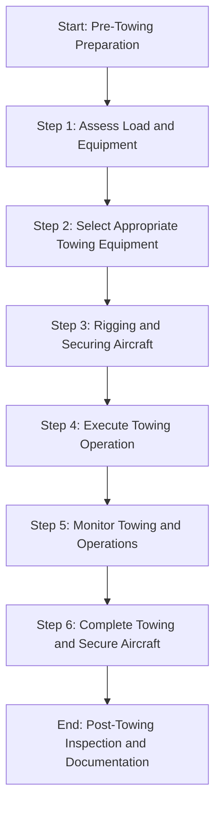
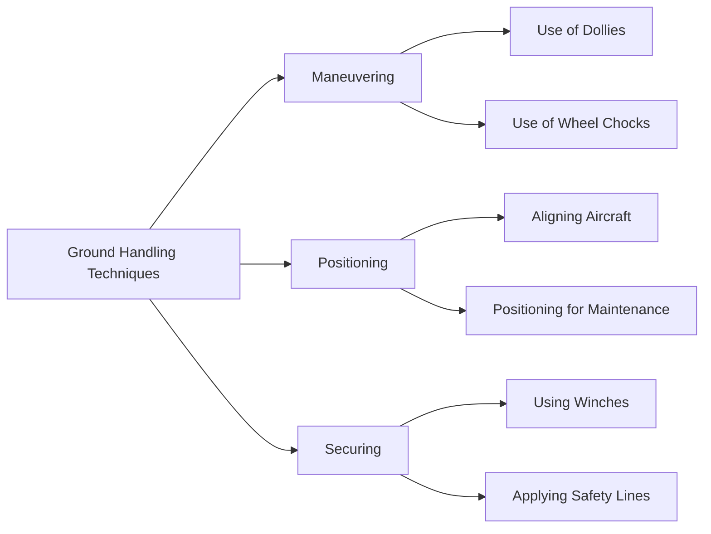
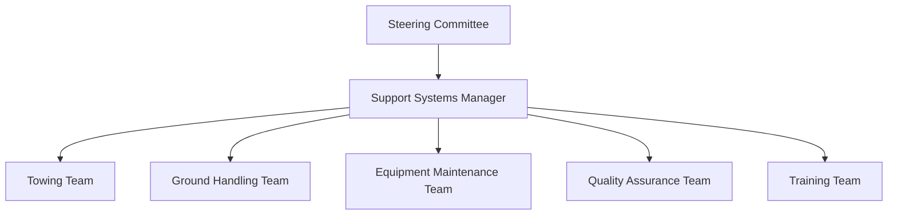

# FTC_09-00-00-00-000-ATA_09_Towing_and_Ground_Handling.md

*(Comprehensive Guide to Towing and Ground Handling for GAIA AIR – Ampel360XWLRGA Aircraft)*

## Version History

| **Version** | **Date**       | **Author**                           | **Description**                                                                                                                                                                  |
|-------------|----------------|--------------------------------------|----------------------------------------------------------------------------------------------------------------------------------------------------------------------------------|
| 1.0         | 2024-12-28     | Amedeo Pelliccia & ChatGPT 01-mini    | Initial creation of the document.                                                                                                                                                 |
| 1.1         | 2024-12-28     | ChatGPT 01-mini & Amedeo Pelliccia    | Incorporated feedback, added detailed sections on towing procedures, ground handling techniques, and system integrations, and structured the document for consistency with other project documents. |
| 1.2         | 2024-12-28     | Amedeo Pelliccia & ChatGPT 01-mini    | Enhanced content with additional references, refined procedures, and integrated placeholder visuals. Acknowledged collaborative contributions from both human and AI collaborators. |
| 1.3         | 2024-12-28     | Amedeo Pelliccia & ChatGPT 01-mini    | Final refinements and preparation for publication on GitHub.                                                                                                                     |

---

## Table of Contents

1.  [Introduction](#1-introduction)
    - [1.1 Purpose](#11-purpose)
    - [1.2 Scope](#12-scope)
    - [1.3 Document Structure](#13-document-structure)
    - [1.4 Terminology](#14-terminology)
2. [Overview of ATA Chapter 09](#2-overview-of-ata-chapter-09)
    - [2.1 Importance of Towing and Ground Handling](#21-importance-of-towing-and-ground-handling)
    - [2.2 Key Standards and Specifications](#22-key-standards-and-specifications)
3. [Compliance and Standards](#3-compliance-and-standards)
    - [3.1 Regulatory Requirements](#31-regulatory-requirements)
    - [3.2 ATA Standards](#32-ata-standards)
    - [3.3 Integration with Risk Assessment](#33-integration-with-risk-assessment)
4. [Application to GAIA AIR Project](#4-application-to-gaia-air-project)
    - [4.1 Towing Procedures](#41-towing-procedures)
    - [4.2 Ground Handling Techniques](#42-ground-handling-techniques)
    - [4.3 Equipment Specifications](#43-equipment-specifications)
    - [4.4 Documentation and Reporting](#44-documentation-and-reporting)
5. [Inspection and Maintenance Procedures](#5-inspection-and-maintenance-procedures)
    - [5.1 Towing Equipment Inspection](#51-towing-equipment-inspection)
    - [5.2 Ground Handling Equipment Maintenance](#52-ground-handling-equipment-maintenance)
    - [5.3 Scheduled Inspections](#53-scheduled-inspections)
        - [5.3.1 Daily Checks](#531-daily-checks)
        - [5.3.2 Weekly Checks](#532-weekly-checks)
        - [5.3.3 Monthly Checks](#533-monthly-checks)
        - [5.3.4 Annual Checks](#534-annual-checks)
    - [5.4 Unscheduled Maintenance](#54-unscheduled-maintenance)
    - [5.5 Special Inspections](#55-special-inspections)
        - [5.5.1 Post-Event Inspections](#551-post-event-inspections)
        - [5.5.2 Routine Structural Evaluations](#552-routine-structural-evaluations)
        - [5.5.3 Safety System Checks](#553-safety-system-checks)
    - [5.6 Towing and Support Adjustments](#56-towing-and-support-adjustments)
    - [5.7 Inspection Techniques](#57-inspection-techniques)
        - [5.7.1 Visual Inspection](#571-visual-inspection)
        - [5.7.2 Load Testing](#572-load-testing)
        - [5.7.3 Non-Destructive Testing (NDT)](#573-non-destructive-testing-ndt)
6. [Roles and Responsibilities](#6-roles-and-responsibilities)
    - [6.1 Maintenance Personnel](#61-maintenance-personnel)
    - [6.2 Ground Handling Crew](#62-ground-handling-crew)
    - [6.3 Quality Assurance](#63-quality-assurance)
7. [Integration with Other Documents and Systems](#7-integration-with-other-documents-and-systems)
    - [7.1 Dependencies Matrix and Glossary](#71-dependencies-matrix-and-glossary)
    - [7.2 Integration with CMMS](#72-integration-with-cmms)
    - [7.3 Integration with Other ATA Chapters](#73-integration-with-other-ata-chapters)
8. [Emerging Technologies](#8-emerging-technologies)
    - [8.1 Automated Towing Systems](#81-automated-towing-systems)
    - [8.2 IoT for Real-Time Monitoring](#82-iot-for-real-time-monitoring)
    - [8.3 AI-Driven Ground Handling Optimization](#83-ai-driven-ground-handling-optimization)
    - [8.4 High-Performance Materials](#84-high-performance-materials)
9. [Training and Awareness](#9-training-and-awareness)
    - [9.1 Training Programs](#91-training-programs)
    - [9.2 Awareness Campaigns](#92-awareness-campaigns)
10. [Audits and Continuous Improvement](#10-audits-and-continuous-improvement)
    - [10.1 Internal Audits](#101-internal-audits)
    - [10.2 Continuous Improvement Process](#102-continuous-improvement-process)
11. [Human Factors](#11-human-factors)
    - [11.1 Human Error in Towing and Ground Handling](#111-human-error-in-towing-and-ground-handling)
    - [11.2 Mitigating Human Error](#112-mitigating-human-error)
    - [11.3 Technology and Human Factors](#113-technology-and-human-factors)
12. [Case Studies](#12-case-studies)
    - [12.1 Successful Implementation of Automated Towing Systems](#121-successful-implementation-of-automated-towing-systems)
    - [12.2 Impact of AI-Driven Ground Handling Optimization](#122-impact-of-ai-driven-ground-handling-optimization)
13. [Future Trends](#13-future-trends)
    - [13.1 Advanced Robotics in Ground Handling](#131-advanced-robotics-in-ground-handling)
    - [13.2 Sustainable Ground Handling Practices](#132-sustainable-ground-handling-practices)
14. [References](#14-references)
15. [Visual Aids](#15-visual-aids)
    - [15.1 Towing Process Flowchart](#151-towing-process-flowchart)
    - [15.2 Ground Handling Techniques Diagram](#152-ground-handling-techniques-diagram)
    - [15.3 Support Systems Organizational Structure](#153-support-systems-organizational-structure)
16. [Sample Forms](#16-sample-forms)
    - [16.1 Towing Equipment Inspection Checklist](#161-towing-equipment-inspection-checklist)
    - [16.2 Ground Handling Inspection Report Template](#162-ground-handling-inspection-report-template)
    - [16.3 Maintenance Log for Towing and Ground Handling Systems](#163-maintenance-log-for-towing-and-ground-handling-systems)
    - [16.4 Audit Report Template](#164-audit-report-template)
17. [Acronyms](#17-acronyms)

---

## 1. Introduction

Towing and ground handling are essential operations in the maintenance, transportation, and storage of aircraft. Proper towing ensures safe movement of the aircraft without causing structural damage, while effective ground handling techniques maintain the aircraft's position and orientation during various operations. This document provides a comprehensive guide to towing and ground handling for the **GAIA AIR – Ampel360XWLRGA Aircraft** project, aligning with ATA Chapter 09 standards and regulatory requirements set by authorities such as EASA and FAA.

### 1.1 Purpose

The purpose of this document is to:

- **Define Towing and Ground Handling Requirements:** Establish procedures and standards for safely towing and handling aircraft on the ground.
- **Ensure Compliance:** Guarantee adherence to ATA Chapter 09 standards and regulatory requirements set by authorities such as EASA and FAA.
- **Standardize Procedures:** Provide a unified approach to performing towing and ground handling tasks, promoting consistency across all operational teams.
- **Facilitate Training:** Offer a reference for training personnel, ensuring consistent knowledge and application of towing and ground handling procedures.
- **Enhance Operational Safety:** Maintain the aircraft's structural integrity and safety through proper towing and ground handling techniques.

### 1.2 Scope

This document encompasses the framework for towing and ground handling of the **GAIA AIR – Ampel360XWLRGA Aircraft** project, including but not limited to:

- **Towing Procedures:** Detailed procedures for safely towing the aircraft using appropriate equipment and techniques.
- **Ground Handling Techniques:** Guidelines for effectively handling the aircraft during maintenance, loading, unloading, and storage.
- **Equipment Specifications:** Specifications for towing vehicles, ground handling tools, and support systems used in the project.
- **Documentation and Reporting:** Establishing robust systems for maintaining towing and ground handling records and ensuring data integrity.
- **Integration with Advanced Technologies:** Utilizing technologies such as automated towing systems, IoT sensors, and AI-driven ground handling optimization to enhance towing and ground handling processes.
- **Safety Protocols:** Ensuring that all towing and ground handling activities adhere to safety standards to prevent accidents and equipment damage.

### 1.3 Document Structure

This document is organized into the following key sections to facilitate clarity and usability:

1. **Introduction:** Provides context and outlines the purpose, scope, and structure of the document.
2. **Overview of ATA Chapter 09:** Explores the importance and key aspects of towing and ground handling in aviation.
3. **Compliance and Standards:** Ensures that towing and ground handling procedures comply with ATA standards and regulatory requirements.
4. **Application to GAIA AIR Project:** Details how towing and ground handling are managed within the GAIA AIR project.
5. **Inspection and Maintenance Procedures:** Outlines the procedures for conducting inspections and maintenance of towing and ground handling systems.
6. **Roles and Responsibilities:** Defines the roles and responsibilities of maintenance personnel, ground handling crew, and quality assurance teams.
7. **Integration with Other Documents and Systems:** Demonstrates connections with the Dependencies Matrix, Glossary, and other relevant systems.
8. **Emerging Technologies:** Highlights the use of advanced technologies to enhance towing and ground handling processes.
9. **Training and Awareness:** Emphasizes the importance of training and awareness programs for personnel involved in towing and ground handling activities.
10. **Audits and Continuous Improvement:** Outlines the process for regular audits and continuous improvement of towing and ground handling procedures.
11. **Human Factors:** Addresses the role of human factors in towing and ground handling and strategies for mitigating human error.
12. **Case Studies:** Provides real-world examples of towing and ground handling program implementations and the impact of emerging technologies.
13. **Future Trends:** Discusses potential future developments in towing and ground handling procedures.
14. **References:** Lists resources, including external standards and internal documentation, to support further exploration.
15. **Visual Aids:** Incorporates diagrams and flowcharts to illustrate towing and ground handling processes and organizational structures.
16. **Sample Forms:** Provides templates for essential towing and ground handling management documents.
17. **Acronyms:** Lists and defines acronyms used throughout the document.

### 1.4 Terminology

To ensure clarity and consistency throughout this document, the following terminology is defined. (Click the term to see its definition in the [Glossary](CPT_0_GLOSSARY.md)):

- **[Airworthiness](CPT_0_GLOSSARY.md#Airworthiness):** The ability of an aircraft to operate safely and meet all applicable regulatory requirements.
- **ATA Chapter 09:** The section of the ATA standards that deals with towing and ground handling of aircraft.
- **Towing Equipment:** Tools and machinery used to tow aircraft safely on the ground.
- **Ground Handling Tools:** Equipment used to maneuver, position, and stabilize aircraft during ground operations.
- **[Computerized Maintenance Management System (CMMS)](CPT_0_GLOSSARY.md#CMMS):** Software used to manage and track maintenance activities.
- **[Non-Destructive Testing (NDT)](CPT_0_GLOSSARY.md#NDT):** Inspection methods that do not damage the component being inspected.
- **[Finite Element Analysis (FEA)](CPT_0_GLOSSARY.md#FEA):** A computational method for predicting how objects react to external forces, vibration, heat, and other physical effects.
- **[Machine Learning (ML)](CPT_0_GLOSSARY.md#ML):** A type of artificial intelligence that allows systems to learn from data and improve performance over time.
- **[Internet of Things (IoT)](CPT_0_GLOSSARY.md#IoT):** A network of physical devices embedded with sensors and software to connect and exchange data.
- **[Blockchain](CPT_0_GLOSSARY.md#Blockchain):** A decentralized, immutable ledger used for secure data recording and tracking.
- **Smart Towing Systems:** Automated towing solutions that utilize sensors and AI to optimize towing operations.
- **Ergonomic Ground Handling Tools:** Ground handling tools designed to minimize physical strain and enhance operator comfort during ground operations.
- **Digital Twin:** A virtual replica of the aircraft used for simulations and predictive maintenance.

*(If the technology does not exist or is purely hypothetical, you can add a brief disclaimer in the Glossary or as a footnote.)*

---

## 2. Overview of ATA Chapter 09

**ATA Chapter 09** provides guidelines and standards for the towing and ground handling of aircraft. Proper towing ensures the safe movement of the aircraft on the ground without causing structural damage, while effective ground handling techniques maintain the aircraft's position and orientation during various operations such as maintenance, loading, unloading, and storage. This chapter outlines the requirements for selecting appropriate towing equipment, implementing effective ground handling techniques, and utilizing support systems to ensure that aircraft remain stable and secure during ground operations.

### 2.1 Importance of Towing and Ground Handling

Towing and ground handling play a pivotal role in the overall maintenance and operational efficiency of aircraft. Their importance includes:

- **Safety Assurance:** Proper towing and ground handling prevent accidents and injuries by ensuring that aircraft are moved and positioned safely.
- **Structural Integrity:** Effective ground handling maintains the aircraft's structural integrity by preventing undue stress or misalignment during ground operations.
- **Operational Efficiency:** Streamlined towing and ground handling processes reduce the time required for maintenance and operational tasks, enhancing overall project timelines.
- **Regulatory Compliance:** Adherence to towing and ground handling standards is mandated by aviation authorities, ensuring that aircraft meet airworthiness and safety standards.
- **Cost Efficiency:** Efficient towing and ground handling reduce the likelihood of equipment damage and operational delays, resulting in cost savings.
- **Aesthetic and Functional Maintenance:** Proper ground handling ensures that the aircraft is maintained in optimal condition, preserving both its aesthetic appearance and functional performance.

### 2.2 Key Standards and Specifications

Key standards and specifications for towing and ground handling include:

- **Towing Capacity:** Specifications for the maximum weight that towing equipment can safely handle, based on manufacturer guidelines and regulatory requirements.
- **Ground Handling Techniques:** Standardized methods for maneuvering and positioning the aircraft on the ground, including the use of tow bars, tugs, and ground handling tools.
- **Support Systems Design:** Guidelines for designing support systems that provide adequate stability and prevent movement of the aircraft during ground operations.
- **Equipment Certification:** Requirements for certifying towing vehicles, ground handling tools, and support systems to ensure they meet safety and performance standards.
- **Inspection Frequency:** Defined intervals for inspecting towing and ground handling equipment to ensure ongoing safety and functionality.
- **Operator Training:** Standards for training personnel on the proper use of towing and ground handling equipment and techniques to ensure safe and effective operations.

By adhering to these standards and specifications, the **GAIA AIR – Ampel360XWLRGA Aircraft** project ensures that all towing and ground handling operations are performed safely, efficiently, and in compliance with aviation regulations.

---

## 3. Compliance and Standards

Ensuring compliance with regulatory requirements and industry standards is paramount for maintaining the towing and ground handling systems of the **GAIA AIR – Ampel360XWLRGA Aircraft**. This section outlines the key regulations, standards, and risk assessment processes relevant to towing and ground handling inspections and maintenance checks.

### 3.1 Regulatory Requirements

Towing and ground handling inspections and maintenance checks must comply with regulations established by aviation authorities. Key regulatory requirements include:

- **FAA Regulations:**
    - **[14 CFR Part 43](https://www.ecfr.gov/current/title-14/chapter-I/subchapter-C/part-43):** Maintenance, Preventive Maintenance, Rebuilding, and Alteration.
    - **[14 CFR Part 91](https://www.ecfr.gov/current/title-14/chapter-I/subchapter-F/part-91):** General Operating and Flight Rules.
    - **[14 CFR Part 121](https://www.ecfr.gov/current/title-14/chapter-I/subchapter-G/part-121):** Operating Requirements: Domestic, Flag, and Supplemental Operations.
- **EASA Regulations:**
    - **[Part-M](https://www.easa.europa.eu/en/document-library/regulations/commission-regulation-eu-no-13212014) (Continuing Airworthiness Requirements):** Specifies the requirements for continuing airworthiness management.
    - **[Part-145](https://www.easa.europa.eu/en/document-library/regulations/commission-regulation-eu-no-13212014) (Approved Maintenance Organizations):** Defines the standards for organizations performing maintenance on aircraft.

**Compliance Strategies:**

- **Regular Audits:** Conduct internal and external audits to ensure adherence to regulatory requirements.
- **Documentation Reviews:** Regularly review and update towing and ground handling procedures and documentation to align with regulatory changes.
- **Training Programs:** Implement comprehensive training programs to educate personnel on regulatory standards and compliance requirements. (See [Section 9. Training and Awareness](#9-training-and-awareness))

### 3.2 ATA Standards

ATA standards provide a framework for standardizing maintenance and inspection procedures across the aviation industry. Key ATA standards relevant to towing and ground handling include:

- **ATA Spec 100:** Guidelines for the creation and management of project documentation, ensuring consistency and compliance across different aircraft types.
- **ATA iSpec 2200:** Standards for electronic technical publications in aviation, facilitating seamless information exchange and maintenance activities.
- **ATA Chapter 09:** Specifically addresses towing and ground handling, outlining the required tasks, equipment specifications, and safety protocols.

**Adherence to ATA Standards:**

- **Standardized Documentation:** Utilize ATA standards to develop consistent and comprehensive towing and ground handling inspection and maintenance documentation.
- **Technology Integration:** Leverage ATA standards to integrate advanced technologies such as automated towing systems, IoT sensors, and AI-driven ground handling optimization into towing and ground handling processes.
- **Continuous Improvement:** Regularly update towing and ground handling maintenance procedures based on ATA standards and industry best practices.

### 3.3 Integration with Risk Assessment

Integrating towing and ground handling inspections and maintenance checks with risk assessment processes ensures that potential risks are identified, evaluated, and mitigated effectively. This integration involves:

- **Risk Identification:** Identifying potential risks associated with inadequate or missed towing and ground handling inspections and maintenance tasks.
- **Risk Assessment:** Evaluating the likelihood and impact of each identified risk to prioritize mitigation efforts.
- **Risk Mitigation:** Developing and implementing strategies to reduce the probability or impact of high-priority risks.
- **Continuous Monitoring:** Regularly monitoring and reviewing risks to update mitigation plans as necessary.

**Example Integration:**

- **Scenario:** The project team identifies a potential risk of equipment failure due to insufficient maintenance of towing vehicles.
- **Mitigation Steps:**
    1. **Detection:** Identify shortcomings in the current maintenance schedule through regular audits and feedback from maintenance personnel.
    2. **Immediate Action:** Implement a CMMS to automate maintenance scheduling and provide real-time alerts for upcoming and overdue maintenance tasks.
    3. **Preventive Measures:** Train maintenance personnel on the use of the CMMS and establish procedures for verifying maintenance schedules.
    4. **Documentation:** Record all maintenance schedules, completions, and related data in the CMMS.
    5. **Review:** Analyze the effectiveness of the automated maintenance system and make necessary adjustments to improve its performance.

By integrating towing and ground handling inspections and maintenance checks with risk assessment, the **GAIA AIR** project can proactively address potential risks, ensuring the aircraft remains safe, reliable, and compliant with regulatory standards.

---

## 4. Application to GAIA AIR Project

The **GAIA AIR – Ampel360XWLRGA Aircraft** project requires a robust framework for towing and ground handling to ensure the ongoing airworthiness and operational efficiency of the aircraft. This section details the application of these procedures within the project.

### 4.1 Towing Procedures

Towing procedures are critical for safely moving the aircraft on the ground without causing structural damage. This section outlines the standardized procedures for towing the aircraft using appropriate equipment and techniques.

**Key Components:**

- **Towing Equipment:** Tugs, tow bars, and safety lines suitable for the weight and dimensions of the aircraft.
- **Load Assessment:** Evaluating the weight distribution and center of gravity of the aircraft before towing.
- **Rigging Techniques:** Properly attaching tow bars and safety lines to ensure balanced and secure towing.
- **Safety Protocols:** Implementing lockout/tagout procedures, using personal protective equipment (PPE), and adhering to safety guidelines to prevent accidents.

**Implementation Steps:**

1. **Define Towing Specifications:** Establish precise towing specifications based on aircraft weight, dimensions, and manufacturer guidelines.
2. **Select Appropriate Equipment:** Choose towing equipment that meets or exceeds the required towing capacity and is certified for aviation use.
3. **Develop Towing Protocols:** Create standardized towing protocols, including load assessment, rigging techniques, and safety measures.
4. **Train Personnel:** Provide comprehensive training to maintenance personnel on proper towing techniques and the use of towing equipment.
5. **Integrate with CMMS:** Document all towing activities, including equipment used, personnel involved, and any incidents, within the CMMS for centralized tracking and analysis.
6. **Conduct Regular Inspections:** Perform routine inspections of towing equipment to ensure functionality and safety. Schedule maintenance and replacements as needed.

### 4.2 Ground Handling Techniques

Ground handling techniques are essential for maneuvering, positioning, and stabilizing the aircraft during maintenance, loading, unloading, and storage. This section outlines effective ground handling methods and tools used in the project.

**Key Components:**

- **Ground Handling Tools:** Dollies, wheel chocks, winches, and hydraulic lifts designed for aircraft handling.
- **Handling Procedures:** Standardized methods for moving the aircraft in confined spaces, aligning it for maintenance tasks, and securing it during operations.
- **Load Distribution:** Ensuring that ground handling tools distribute loads evenly to prevent stress concentrations and potential structural damage.
- **Safety Protocols:** Implementing safety measures to protect personnel and equipment during ground handling operations.

**Implementation Steps:**

1. **Define Ground Handling Requirements:** Establish ground handling needs based on aircraft design, maintenance tasks, and operational contexts.
2. **Select Appropriate Ground Handling Tools:** Choose tools that are compatible with the aircraft and capable of providing adequate maneuverability and support.
3. **Develop Handling Protocols:** Create standardized ground handling protocols, including procedures for moving, positioning, and securing the aircraft.
4. **Train Personnel:** Provide training to ground handling crew on proper handling techniques and the use of ground handling tools.
5. **Integrate with CMMS:** Document all ground handling activities, including tools used, personnel involved, and any issues encountered, within the CMMS.
6. **Conduct Regular Inspections:** Perform routine inspections of ground handling tools and techniques to ensure effectiveness and safety. Schedule maintenance and replacements as needed.

### 4.3 Equipment Specifications

This section outlines the specifications for towing vehicles, ground handling tools, and support systems used in the project to ensure they meet safety and performance standards.

**Towing Vehicles:**

- **Capacity:** Must exceed the maximum towing load of the aircraft.
- **Certification:** Certified for aviation towing operations.
- **Features:** Equipped with safety features such as automatic braking, load indicators, and ergonomic controls.

**Ground Handling Tools:**

- **Durability:** Made from high-strength materials to withstand heavy loads and frequent use.
- **Functionality:** Designed for ease of use and effective load distribution.
- **Safety Features:** Include locking mechanisms, anti-slip surfaces, and protective guards.

**Support Systems:**

- **Stability:** Provide adequate support to prevent aircraft movement during operations.
- **Adjustability:** Adjustable to accommodate different aircraft sizes and configurations.
- **Ease of Setup:** Quick and easy to set up and dismantle as needed.

### 4.4 Documentation and Reporting

Accurate documentation and reporting are essential for tracking towing and ground handling activities, ensuring compliance, and facilitating continuous improvement.

**Implementation Steps:**

1. **Standardized Templates:** Develop standardized templates for towing and ground handling inspection reports, maintenance logs, and incident reports.
2. **Digital Documentation:** Utilize the CMMS to digitally document all towing and ground handling activities, ensuring data is centralized and easily accessible.
3. **Data Integrity Measures:** Implement measures such as data encryption and access controls to protect sensitive towing and ground handling data.
4. **Regular Reporting:** Generate regular reports on towing and ground handling activities, highlighting completed tasks, identified issues, and corrective actions.
5. **Audit Trails:** Maintain comprehensive audit trails within the CMMS to track changes, updates, and historical data for regulatory compliance and quality assurance.

By meticulously documenting and reporting towing and ground handling activities, the **GAIA AIR** project ensures traceability, accountability, and continuous enhancement of maintenance processes.

---

## 5. Inspection and Maintenance Procedures

This section outlines the specific procedures for conducting inspections and maintenance of towing and ground handling systems on the **GAIA AIR – Ampel360XWLRGA Aircraft**. These procedures are designed to ensure the systems' ongoing functionality, safety, and compliance with standards.

### 5.1 Towing Equipment Inspection

**Objective:** To ensure that all towing equipment is in proper working condition, meets safety standards, and is free from defects that could compromise towing operations.

**Procedure:**

1. **Pre-Inspection Preparation:**
    - Review the towing equipment inventory and schedule inspections based on usage and regulatory requirements.
    - Ensure that inspection tools and PPE are available.
2. **Visual Inspection:**
    - Check for any signs of wear, corrosion, or damage on towing equipment components such as tow bars, slings, and towing vehicles.
    - Verify that all markings and labels are legible and intact.
3. **Functional Testing:**
    - Test the operation of towing machinery to ensure it functions smoothly without unusual noises or resistance.
    - Check the braking systems and safety features for proper operation.
4. **Load Testing:**
    - Conduct load tests to verify that towing equipment can handle the maximum specified loads safely.
    - Ensure that load indicators and limiters are functioning correctly.
5. **Documentation:**
    - Record inspection findings, including any defects or maintenance needs, in the CMMS.
    - Schedule corrective actions for any identified issues.
6. **Follow-Up Maintenance:**
    - Perform necessary repairs or replacements based on inspection findings.
    - Re-inspect repaired equipment to ensure it meets safety standards.

### 5.2 Ground Handling Equipment Maintenance

**Objective:** To ensure that all ground handling equipment is in proper working condition, meets safety standards, and is free from defects that could compromise ground handling operations.

**Procedure:**

1. **Pre-Maintenance Preparation:**
    - Review the ground handling equipment inventory and schedule maintenance based on usage and regulatory requirements.
    - Ensure that maintenance tools and PPE are available.
2. **Visual Inspection:**
    - Inspect ground handling tools such as dollies, wheel chocks, winches, and hydraulic lifts for signs of wear, corrosion, or damage.
    - Verify that all components are in good condition and free from defects.
3. **Functional Testing:**
    - Test the operation of hydraulic lifts and winches to ensure they function correctly and safely.
    - Check the effectiveness of wheel chocks in preventing aircraft movement.
4. **Load Testing:**
    - Conduct load tests on ground handling tools to verify their capacity and functionality under operational loads.
5. **Documentation:**
    - Record maintenance activities, inspection findings, and any issues in the CMMS.
    - Schedule any required corrective actions or upgrades based on maintenance findings.
6. **Follow-Up Maintenance:**
    - Perform necessary repairs, adjustments, or replacements based on maintenance findings.
    - Re-inspect maintained equipment to ensure it meets safety and performance standards.

### 5.3 Scheduled Inspections

Scheduled inspections are performed at predefined intervals to ensure the ongoing functionality and safety of towing and ground handling systems.

#### 5.3.1 Daily Checks

**Objective:** To perform routine checks ensuring the readiness and safety of towing and ground handling systems for daily operations.

**Procedure:**

1. **Visual Inspection:**
    - Inspect towing equipment, ground handling tools, and support systems for any visible signs of damage or wear.
    - Check for loose connections or improperly secured components.
2. **Functional Checks:**
    - Test the operation of towing machinery and ground handling tools to ensure they are functioning correctly.
    - Verify that safety features are operational.
3. **Documentation:**
    - Record daily inspection findings in the CMMS.
    - Report any discrepancies or issues to the maintenance manager for immediate action.

#### 5.3.2 Weekly Checks

**Objective:** To conduct more detailed inspections on a weekly basis, covering all aspects of towing and ground handling systems.

**Procedure:**

1. **Comprehensive Inspection:**
    - Perform a thorough visual and functional inspection of all towing equipment and ground handling tools.
    - Check for signs of corrosion, fatigue, or other forms of deterioration.
2. **Load Verification:**
    - Verify that towing equipment and ground handling tools can handle the specified loads without excessive strain or deformation.
3. **Documentation:**
    - Document weekly inspection findings in the CMMS.
    - Schedule corrective actions for any identified issues.

#### 5.3.3 Monthly Checks

**Objective:** To perform comprehensive inspections and maintenance tasks on a monthly basis to ensure the ongoing safety and functionality of towing and ground handling systems.

**Procedure:**

1. **In-Depth Inspection:**
    - Conduct a detailed inspection of all towing and ground handling equipment, including hard-to-reach areas.
    - Use advanced inspection techniques such as NDT to detect hidden defects.
2. **Maintenance Tasks:**
    - Perform preventive maintenance tasks such as lubrication, tightening of connections, and cleaning of equipment.
    - Replace any worn or damaged components as needed.
3. **Load Testing:**
    - Conduct load tests to verify that towing and ground handling equipment can safely handle the maximum specified loads.
4. **Documentation:**
    - Record monthly inspection and maintenance activities in the CMMS.
    - Update maintenance logs and schedule any required follow-up actions.

#### 5.3.4 Annual Checks

**Objective:** To conduct extensive inspections and maintenance tasks annually to ensure continued airworthiness and safety of towing and ground handling systems.

**Procedure:**

1. **Comprehensive Inspection:**
    - Perform a full-scale inspection of all towing and ground handling equipment.
    - Use advanced NDT methods to assess structural integrity and detect any internal defects.
2. **Major Maintenance Tasks:**
    - Conduct major maintenance activities such as overhauls, replacements, and upgrades of towing machinery and ground handling tools.
    - Reapply protective coatings or treatments to prevent corrosion and wear.
3. **Certification Verification:**
    - Verify that all towing and ground handling equipment are certified and meet regulatory requirements.
    - Renew certifications as needed based on inspection findings.
4. **Documentation:**
    - Document all annual inspection and maintenance activities in the CMMS.
    - Generate detailed annual reports highlighting the condition and performance of towing and ground handling systems.

### 5.4 Unscheduled Maintenance

**Objective:** To address unforeseen issues and discrepancies identified outside of scheduled inspection intervals, ensuring the continued safety and functionality of towing and ground handling systems.

**Procedure:**

1. **Identification of Issues:**
    - Detect and report any malfunctions, damage, or anomalies observed during operations or inspections.
2. **Assessment:**
    - Evaluate the severity of the issue and determine the necessary corrective actions.
3. **Repair and Correction:**
    - Perform necessary repairs or replacements to rectify the issue, following approved procedures and using certified parts.
4. **Testing:**
    - Conduct functional tests to ensure that repairs have effectively resolved the issue and that towing and ground handling systems are operating correctly.
5. **Documentation:**
    - Record all unscheduled maintenance activities in the CMMS, including details of the issue, actions taken, and parts used.
    - Schedule follow-up inspections to verify the effectiveness of corrective actions.

### 5.5 Special Inspections

Special inspections are conducted following specific events or conditions that may affect the towing and ground handling systems' integrity and functionality.

#### 5.5.1 Post-Event Inspections

**Objective:** To assess and rectify any damage to towing and ground handling systems resulting from events such as collisions, rough handling, or adverse weather conditions.

**Procedure:**

1. **Visual Inspection:**
    - Inspect towing vehicles, tow bars, and ground handling tools for signs of impact damage, misalignment, or wear.
    - Check for broken or bent components.
2. **Functional Testing:**
    - Test the operation of towing machinery and ground handling tools to ensure they are functioning correctly after the event.
3. **Documentation:**
    - Record inspection findings and event details in the CMMS.
    - Schedule corrective actions for any identified damage or issues.
4. **Repair and Restoration:**
    - Perform necessary repairs or replacements to restore towing and ground handling systems to safe operating conditions.
    - Revalidate the functionality of repaired systems through testing.

#### 5.5.2 Routine Structural Evaluations

**Objective:** To conduct routine structural evaluations of towing and ground handling systems to ensure their ongoing integrity and performance.

**Procedure:**

1. **Comprehensive Inspection:**
    - Perform detailed inspections of all structural components involved in towing and ground handling.
    - Use advanced inspection techniques such as NDT to detect internal or hidden defects.
2. **Load Analysis:**
    - Analyze the loads applied to towing and ground handling systems to ensure they remain within safe operating limits.
3. **Maintenance and Upgrades:**
    - Perform preventive maintenance tasks and implement upgrades as needed to enhance system performance and safety.
4. **Documentation:**
    - Record evaluation findings in the CMMS.
    - Schedule any required maintenance or upgrades based on evaluation results.

#### 5.5.3 Safety System Checks

**Objective:** To ensure that all safety systems integrated into towing and ground handling operations are functioning correctly and effectively preventing accidents and equipment damage.

**Procedure:**

1. **Visual Inspection:**
    - Inspect safety features such as emergency stop buttons, alarms, and backup systems on towing vehicles and ground handling tools.
    - Check for any signs of wear or damage to safety components.
2. **Functional Testing:**
    - Test the operation of safety systems to ensure they activate correctly in the event of an emergency.
    - Verify that backup systems are operational and can take over if primary systems fail.
3. **Documentation:**
    - Record safety system inspection findings in the CMMS.
    - Schedule corrective actions for any identified issues with safety systems.
4. **Repair and Maintenance:**
    - Perform necessary repairs or replacements to restore full functionality of safety systems.
    - Re-test safety systems after maintenance to ensure they are working correctly.

### 5.6 Towing and Support Adjustments

**Objective:** To perform necessary adjustments to towing and support systems to maintain dimensional accuracy and structural integrity during operations.

**Procedure:**

1. **Identify Adjustment Needs:**
    - Determine the need for adjustments based on inspection findings, operational requirements, or changes in component specifications.
2. **Develop Adjustment Plan:**
    - Create a detailed plan outlining the steps, tools, and safety measures required for the adjustment process.
3. **Execute Adjustments:**
    - Perform adjustments using appropriate tools and techniques to ensure precise alignment and stability.
4. **Verification:**
    - Re-inspect and test the adjusted systems to confirm that adjustments have been successful and that systems meet safety and performance standards.
5. **Documentation:**
    - Record all adjustment activities and verification results in the CMMS.

### 5.7 Inspection Techniques

Various inspection techniques are employed to ensure thorough assessments of towing and ground handling systems.

#### 5.7.1 Visual Inspection

**Objective:** To conduct preliminary assessments of towing and ground handling systems through direct observation.

**Procedure:**

1. **External Inspection:**
    - Walk around towing vehicles, tow bars, and ground handling tools to identify any visible signs of damage, wear, or corrosion.
    - Use mirrors or borescopes to inspect hard-to-reach areas.
2. **Internal Inspection:**
    - Inspect internal components of towing machinery and ground handling systems for signs of wear or malfunction.
3. **Documentation:**
    - Record all visual observations and any identified issues in the CMMS.

#### 5.7.2 Load Testing

**Objective:** To verify that towing and ground handling systems can handle specified loads without compromising safety or functionality.

**Procedure:**

1. **Prepare Testing Equipment:**
    - Ensure that load testing equipment is calibrated and in good working condition.
2. **Conduct Load Tests:**
    - Apply incremental loads to towing and ground handling systems, monitoring their performance under stress.
    - Observe for any signs of strain, deformation, or failure.
3. **Safety Measures:**
    - Implement safety protocols to protect personnel and equipment during load testing.
4. **Documentation:**
    - Record load testing results, including any anomalies or failures, in the CMMS.
    - Schedule corrective actions for any identified issues.

#### 5.7.3 Non-Destructive Testing (NDT)

**Objective:** To detect internal flaws or structural defects in towing and ground handling systems without causing damage.

**NDT Methods:**

- **Ultrasonic Testing:** Uses high-frequency sound waves to detect internal cracks or voids.
- **Dye Penetrant Inspection:** Applies a dye to the surface to highlight cracks or defects.
- **Magnetic Particle Inspection:** Uses magnetic fields and iron particles to identify surface and near-surface defects in ferromagnetic materials.
- **Radiographic Testing:** Utilizes X-rays or gamma rays to inspect internal structures and detect hidden defects.
- **Eddy Current Testing:** Detects surface and subsurface flaws using electromagnetic induction.

**Procedure:**

1. **Select Appropriate NDT Method:**
    - Choose the NDT method based on the type of defect being inspected and the material properties of the component.
2. **Perform NDT Inspection:**
    - Conduct the NDT inspection following standardized procedures to ensure accurate detection of defects.
3. **Analyze Results:**
    - Interpret the NDT data to identify the presence, location, and severity of any defects.
4. **Documentation:**
    - Record NDT findings in the CMMS, including details of the inspection area and any identified defects.
5. **Maintenance Actions:**
    - Schedule and perform necessary maintenance or repairs based on NDT findings to address detected defects.

---

## 6. Roles and Responsibilities

Clearly defining roles and responsibilities ensures accountability and streamlined execution of towing and ground handling tasks.

### 6.1 Maintenance Personnel

**Role:** Responsible for conducting towing and ground handling inspections, performing maintenance tasks, and ensuring the systems remain functional and safe.

**Responsibilities:**

- **Conduct Inspections:** Perform scheduled and unscheduled inspections of towing equipment, ground handling tools, and support systems as per ATA Chapter 09 guidelines and project-specific procedures.
- **Execute Maintenance Tasks:** Carry out preventive and corrective maintenance activities, including repairs and replacements of towing and ground handling components.
- **Document Activities:** Accurately record all inspections, maintenance actions, and findings in the CMMS.
- **Ensure Compliance:** Adhere to regulatory requirements, ATA standards, and manufacturer guidelines during all maintenance activities.
- **Continuous Learning:** Stay updated with the latest maintenance techniques, technologies, and regulatory changes through ongoing training.

### 6.2 Ground Handling Crew

**Role:** Responsible for maneuvering, positioning, and stabilizing the aircraft during ground operations, ensuring safe and efficient handling.

**Responsibilities:**

- **Execute Ground Handling Procedures:** Perform ground handling tasks as per standardized procedures, including moving, positioning, and securing the aircraft.
- **Operate Ground Handling Tools:** Use ground handling tools and equipment safely and effectively to manage aircraft movement.
- **Monitor Aircraft Stability:** Continuously monitor the aircraft's position and stability during ground operations, making adjustments as necessary.
- **Report Issues:** Immediately report any discrepancies, equipment malfunctions, or safety concerns to the maintenance manager.
- **Safety Compliance:** Follow all safety protocols and guidelines to prevent accidents and injuries during ground handling operations.

### 6.3 Quality Assurance

**Role:** Ensures that all towing and ground handling activities meet the established quality standards and regulatory requirements.

**Responsibilities:**

- **Audit Inspections:** Conduct regular audits of towing and ground handling inspection and maintenance activities to ensure compliance with ATA standards and regulatory requirements.
- **Review Documentation:** Verify the accuracy and completeness of all inspection and maintenance records in the CMMS.
- **Identify Improvement Areas:** Analyze audit findings to identify areas for improvement in towing and ground handling procedures.
- **Implement Corrective Actions:** Develop and oversee the implementation of corrective actions to address any identified deficiencies.
- **Training Oversight:** Ensure that maintenance personnel and ground handling crew receive adequate training and certification for their roles.

---

## 7. Integration with Other Documents and Systems

Ensuring seamless integration with related documents and systems enhances consistency and efficiency across the project.

### 7.1 Dependencies Matrix and Glossary

This document is closely integrated with the **Dependencies Matrix** (`CPT_0000-Dependencies-matrix.md`) and the **Glossary** (`CPT_0_GLOSSARY.md`) to ensure consistency and clarity across all project documentation.

- **Dependencies Matrix:** Defines the relationships and dependencies between the various systems and subsystems of the Ampel360XWLRGA aircraft, providing a clear understanding of how each component interacts with others.
- **Glossary:** Provides definitions of technical terms and acronyms used throughout the documentation, facilitating understanding for all team members.

**Example Integration:**

- When performing **Towing Procedures** (Section 4.1), refer to the Dependencies Matrix to understand how towing operations affect other systems such as propulsion and structural integrity.
- Use the Glossary to clarify any technical terms encountered during towing and ground handling tasks, such as understanding how **Machine Learning (ML)** enhances predictive maintenance capabilities.

### 7.2 Integration with CMMS

Integrating towing and ground handling inspections and maintenance checks with the **Computerized Maintenance Management System (CMMS)** ensures efficient tracking, scheduling, and documentation of all maintenance activities.

**Implementation Steps:**

1. **System Configuration:**
    - Configure the CMMS to include all towing and ground handling inspection schedules, maintenance tasks, and special inspections as defined in this document.
2. **Data Entry:**
    - Input all inspection and maintenance procedures into the CMMS, including detailed steps, required tools, and safety precautions.
3. **Automation:**
    - Utilize the CMMS's automation features to schedule inspections and maintenance tasks based on predefined intervals and trigger alerts for upcoming or overdue activities.
4. **Real-Time Tracking:**
    - Use the CMMS to monitor the status of all towing and ground handling inspections and maintenance tasks in real-time, allowing for immediate action on any discrepancies or delays.
5. **Reporting:**
    - Generate comprehensive reports from the CMMS to analyze maintenance trends, identify recurring issues, and assess the effectiveness of maintenance strategies.

**Benefits of Integration:**

- **Centralized Management:** All towing and ground handling maintenance activities are managed from a single platform, enhancing coordination and communication among team members.
- **Improved Efficiency:** Automation reduces the likelihood of missed inspections and ensures timely maintenance actions.
- **Enhanced Documentation:** The CMMS provides a digital record of all maintenance activities, facilitating easy access and audit readiness.
- **Data-Driven Insights:** Advanced reporting features allow for data analysis to inform continuous improvement efforts.

### 7.3 Integration with Other ATA Chapters

Towing and ground handling inspections and maintenance checks often interact with various other ATA chapters. Proper integration ensures that all related procedures and standards are consistently applied across the aircraft's systems.

**Key Integration Points:**

- **ATA Chapter 02 (Weight and Balance):**
    - Ensure that towing operations do not adversely affect the aircraft's weight distribution and balance. Coordinate with weight and balance calculations and loading procedures.
- **ATA Chapter 04 (Airworthiness Limitations):**
    - Align towing and ground handling inspections with airworthiness limitations to maintain compliance and safety standards.
- **ATA Chapter 05 (Maintenance Checks):**
    - Coordinate with periodic maintenance checks to ensure that towing and ground handling maintenance tasks are integrated into the overall maintenance schedule.
- **ATA Chapter 24 (Electrical System):**
    - Coordinate towing and ground handling inspections with electrical system checks to ensure comprehensive coverage of all structural and electrical components.

**Implementation Steps:**

1. **Cross-Reference Procedures:**
    - Review inspection and maintenance procedures across relevant ATA chapters to identify and address any overlaps or dependencies.
2. **Unified Documentation:**
    - Ensure that all integrated procedures are documented consistently within the CMMS and project documentation.
3. **Collaborative Planning:**
    - Coordinate inspection schedules and maintenance tasks across different ATA chapters to optimize resource utilization and minimize operational disruptions.
4. **Holistic Training:**
    - Train maintenance personnel on integrated procedures to ensure a comprehensive understanding of how different systems and inspections interact.

By effectively integrating towing and ground handling inspections and maintenance checks with other ATA chapters, the **GAIA AIR** project can ensure a holistic approach to aircraft maintenance, enhancing safety, reliability, and operational efficiency.

---

## 8. Emerging Technologies

Embracing emerging technologies can significantly enhance the efficiency, accuracy, and predictive capabilities of towing and ground handling inspections and maintenance checks. This section explores the potential applications and benefits of advanced technologies within the project.

### 8.1 Automated Towing Systems

**Automated Towing Systems** offer higher precision, automation, and safety features, improving towing operations' overall efficiency and safety.

**Applications:**

- **Self-Driving Tugs:** Utilize autonomous tugs equipped with sensors and AI to tow the aircraft without human intervention, reducing the risk of human error.
- **Smart Tow Bars:** Implement tow bars with integrated sensors to monitor load distribution and detect potential overloads in real-time.
- **Remote-Controlled Towing:** Allow operators to control towing vehicles remotely, minimizing their exposure to potential hazards during towing operations.

**Benefits:**

- **Increased Safety:** Automation reduces the risk of accidents and injuries by minimizing human error and providing real-time load monitoring.
- **Enhanced Precision:** Automated systems ensure accurate positioning and handling of the aircraft, maintaining dimensional integrity.
- **Operational Efficiency:** Automation streamlines towing processes, reducing maintenance turnaround times and labor costs.

**Implementation Steps:**

1. **Assess Towing Needs:** Determine the specific towing requirements based on aircraft weight, size, and operational contexts.
2. **Select Automated Systems:** Choose automated towing systems that offer the desired automation and safety features, ensuring compatibility with project specifications.
3. **Integrate with CMMS:** Connect automated towing systems with the CMMS for centralized control and monitoring.
4. **Train Personnel:** Provide training to maintenance personnel on operating and maintaining automated towing systems.
5. **Conduct Pilot Tests:** Perform pilot towing operations to validate system performance and identify any operational issues.
6. **Full Deployment:** Roll out automated towing systems across all required towing operations based on pilot test results.

### 8.2 IoT for Real-Time Monitoring

**IoT Sensors** provide continuous monitoring of towing and ground handling equipment, offering real-time insights into their condition and performance.

**Applications:**

- **Real-Time Data Collection:** Deploy IoT sensors on towing vehicles and ground handling tools to monitor parameters such as load, temperature, and vibration.
- **Automated Alerts:** Configure IoT systems to generate automated alerts when sensor data indicates potential issues or deviations from normal operating conditions.
- **Remote Monitoring:** Enable remote access to real-time data, allowing maintenance teams to monitor equipment condition from off-site locations.

**Benefits:**

- **Proactive Maintenance:** Real-time monitoring allows for the early detection of potential issues, enabling timely maintenance actions.
- **Enhanced Data Accuracy:** IoT sensors provide precise and continuous data, reducing the reliance on manual inspections.
- **Operational Efficiency:** Automated data collection and alert systems streamline the maintenance process, saving time and resources.

**Implementation Steps:**

1. **Sensor Deployment:** Install IoT sensors on towing vehicles and ground handling tools, ensuring proper placement and calibration for accurate data collection.
2. **Data Integration:** Connect IoT sensors to the CMMS for centralized data management and analysis.
3. **Alert Configuration:** Set thresholds and parameters for automated alerts based on sensor data to notify maintenance teams of potential issues.
4. **Monitoring Dashboard:** Develop a real-time monitoring dashboard within the CMMS to visualize sensor data and alerts.
5. **Maintenance Planning:** Use real-time data insights to inform maintenance schedules and prioritize tasks based on equipment condition.

### 8.3 AI-Driven Ground Handling Optimization

**AI-Driven Ground Handling Optimization** utilizes artificial intelligence to analyze ground handling data and optimize handling techniques for efficiency and safety.

**Applications:**

- **Predictive Analytics:** Analyze historical and real-time ground handling data to predict maintenance needs and optimize handling schedules.
- **Process Automation:** Implement AI algorithms to automate repetitive ground handling tasks, reducing manual labor and increasing consistency.
- **Safety Enhancements:** Use AI to identify patterns that may indicate safety risks, enabling proactive measures to prevent accidents.

**Benefits:**

- **Improved Efficiency:** AI-driven optimization streamlines ground handling processes, reducing time and labor costs.
- **Enhanced Safety:** Predictive analytics and safety pattern recognition help prevent accidents and equipment damage.
- **Data-Driven Decision Making:** AI provides actionable insights based on data analysis, informing maintenance and operational strategies.

**Implementation Steps:**

1. **Data Collection:** Gather comprehensive ground handling data, including equipment usage, handling techniques, and maintenance records.
2. **AI Algorithm Development:** Develop AI algorithms tailored to analyze ground handling data and identify optimization opportunities.
3. **System Integration:** Integrate AI-driven optimization tools with the CMMS and other relevant systems for seamless data flow and decision-making.
4. **Pilot Testing:** Implement AI-driven optimization in pilot ground handling operations to assess effectiveness and identify areas for improvement.
5. **Full Deployment:** Roll out AI-driven ground handling optimization across all relevant operations based on pilot testing outcomes.

### 8.4 High-Performance Materials

**High-Performance Materials** offer superior strength-to-weight ratios and enhanced durability, contributing to the overall efficiency and safety of towing and ground handling systems.

**Applications:**

- **Carbon Fiber Composites:** Utilize lightweight yet strong composites for towing vehicles and ground handling tools to reduce weight and increase load capacity.
- **Advanced Alloys:** Implement corrosion-resistant and high-strength alloys in towing and ground handling equipment to enhance durability and performance.
- **Smart Materials:** Incorporate materials that can respond to environmental changes or provide self-monitoring capabilities for structural integrity.

**Benefits:**

- **Weight Reduction:** High-performance materials reduce the overall weight of towing and ground handling systems, enhancing fuel efficiency and payload capacity.
- **Increased Durability:** Advanced materials offer improved resistance to wear, corrosion, and environmental stressors, extending equipment lifespan.
- **Enhanced Performance:** Lightweight and strong materials improve the efficiency and effectiveness of towing and ground handling operations.

**Implementation Steps:**

1. **Material Selection:** Choose high-performance materials based on towing and ground handling system requirements and operational contexts.
2. **Design Integration:** Incorporate selected materials into the design of towing vehicles, tow bars, and ground handling tools.
3. **Manufacturing and Fabrication:** Utilize advanced manufacturing techniques to fabricate components using high-performance materials.
4. **Testing and Validation:** Conduct thorough testing to ensure that high-performance materials meet the required strength, durability, and safety standards.
5. **Implement Maintenance Procedures:** Develop maintenance procedures tailored to high-performance materials to ensure their longevity and performance.
6. **Train Personnel:** Provide training on handling, maintaining, and repairing components made from high-performance materials.
7. **Monitor Material Performance:** Continuously monitor the performance of high-performance materials in operational conditions and adjust maintenance strategies as needed.

By leveraging these emerging technologies, the **GAIA AIR** project can significantly enhance the efficiency, accuracy, and durability of towing and ground handling inspections and maintenance checks, ensuring the aircraft remains safe, reliable, and compliant with all regulatory standards.

---

## 9. Training and Awareness

Comprehensive training and awareness programs are essential for equipping personnel with the necessary skills and knowledge to effectively manage towing and ground handling inspections and maintenance checks.

### 9.1 Training Programs

**Target Audience:** All personnel involved in the **GAIA AIR – Ampel360XWLRGA Aircraft** project, including engineers, technicians, ground handling crew, quality assurance teams, and support staff.

**Training Content:**

- **Project Overview:** Comprehensive understanding of the project's objectives, scope, and structure.
- **Technical Training:** In-depth training on towing and ground handling specifications, measurement techniques, handling methods, and advanced technologies.
- **Inspection and Maintenance Procedures:** Detailed training on the accurate execution of towing and ground handling inspection and maintenance procedures, including the use of checklists and reporting tools.
- **Safety Protocols:** Training on safety standards and best practices to ensure a safe working environment during towing and ground handling activities.
- **Regulatory Compliance:** Education on relevant aviation regulations and ATA standards to ensure adherence throughout the project lifecycle.
- **Software Utilization:** Training on the use of project management and maintenance software, including CMMS integration for towing and ground handling tracking.
- **Human Factors and Error Prevention:** Training on recognizing and mitigating human error in towing and ground handling inspections and maintenance procedures. (See [Section 11. Human Factors](#11-human-factors))
- **Continuous Improvement Practices:** Training on methodologies for continuous improvement and quality assurance in towing and ground handling management.

**Training Delivery Methods:**

- **Classroom Sessions:** Interactive sessions led by subject matter experts to provide foundational knowledge.
- **Hands-On Workshops:** Practical training sessions where personnel can apply learned concepts in simulated environments.
- **E-Learning Modules:** Online training courses for flexible, self-paced learning.
- **Simulation Exercises:** Use of simulators and digital twins to practice towing and ground handling inspection and maintenance tasks.
- **Regular Refresher Courses:** Ongoing training sessions to update personnel on new procedures, technologies, and best practices.

**Enhancements:**

- **Specific Learning Objectives:** Define clear learning objectives for each training module to ensure targeted skill development. Example: "Upon completion of this module, the trainee will be able to accurately perform towing operations using automated towing systems and document activities in the CMMS."
- **Assessment Methods:** Incorporate quizzes, practical evaluations, and feedback sessions to assess training effectiveness and participant understanding.
- **Certification:** Provide certifications for personnel who complete specific training modules, ensuring proficiency and accountability.
- **Feedback Mechanisms:** Implement systems for collecting feedback from trainees to continuously improve training programs.

### 9.2 Awareness Campaigns

**Purpose:** Raise awareness about the importance of towing and ground handling inspections, maintenance checks, compliance with regulations, and the use of advanced technologies within the project.

**Strategies:**

- **Workshops and Seminars:** Host events focused on key project areas, such as advanced towing techniques, ground handling methods, and system integrations.
- **Internal Communications:** Utilize newsletters, emails, and bulletin boards to disseminate important information and updates related to towing and ground handling management.
- **Visual Displays:** Install posters and infographics in common areas to reinforce key concepts, inspection procedures, and maintenance schedules.
- **Interactive Sessions:** Conduct Q&A sessions and discussion forums to engage personnel, address concerns, and gather feedback on towing and ground handling management practices.
- **Recognition Programs:** Acknowledge and reward personnel who demonstrate exceptional adherence to towing and ground handling inspection and maintenance protocols and contribute to continuous improvement efforts.
- **Online Resources:** Provide access to online resources, including training materials, procedural documents, FAQs, and best practice guides, to support ongoing learning and awareness.

**Enhancements:**

- **Engaging Content:** Develop visually appealing and easily digestible content, such as animated videos, interactive infographics, and real-life case studies, to capture and retain personnel attention.
- **Regular Updates:** Ensure that awareness campaigns are updated regularly to reflect the latest project developments, regulatory changes, and technological advancements in towing and ground handling management.
- **Inclusive Participation:** Encourage participation from all project team members, fostering a culture of collaboration and shared responsibility for towing and ground handling integrity.
- **Measurement and Evaluation:** Implement metrics to assess the effectiveness of awareness campaigns, such as engagement rates, feedback scores, and knowledge retention assessments, and make data-driven improvements.

By implementing comprehensive training programs and awareness campaigns, **GAIA AIR** can ensure that all personnel are well-equipped with the knowledge and skills necessary to effectively manage towing and ground handling inspections and maintenance checks, contributing to the safe and reliable operation of the Ampel360XWLRGA Aircraft.

---

## 10. Audits and Continuous Improvement

Regular audits and a commitment to continuous improvement are essential for maintaining quality standards, ensuring regulatory compliance, and enhancing project outcomes in towing and ground handling management.

### 10.1 Internal Audits

**Purpose:** To assess the effectiveness of towing and ground handling inspection and maintenance procedures, ensure compliance with ATA standards and regulatory requirements, and identify areas for improvement.

**Frequency:** Conduct regular internal audits, at least annually, or more frequently based on project needs and risk assessments.

**Scope:** Audits should cover all aspects of towing and ground handling inspections and maintenance checks, including procedures, documentation, compliance, and the use of integrated technologies.

**Process:**

1. **Planning:** Define audit objectives, scope, and criteria. Develop an audit schedule and assign auditors with relevant expertise.
2. **Execution:** Perform on-site inspections, review towing and ground handling maintenance logs, and interview personnel to gather evidence.
3. **Reporting:** Document audit findings, highlighting areas of compliance and non-compliance. Provide actionable recommendations for improvement.
4. **Follow-Up:** Develop and implement corrective action plans based on audit findings. Verify the effectiveness of corrective actions in subsequent audits.
5. **Documentation:** Maintain comprehensive records of all audit activities, findings, and corrective actions for reference and regulatory compliance.

### 10.2 Continuous Improvement Process

Implementing a structured continuous improvement process fosters ongoing enhancements to towing and ground handling inspection and maintenance procedures, technologies, and outcomes.

**Steps for Continuous Improvement:**

1. **Feedback Collection:** Gather feedback from maintenance personnel, engineers, ground handling crew, and other stakeholders to identify areas for improvement in towing and ground handling management.
2. **Data Analysis:** Analyze towing and ground handling inspection and maintenance data, including performance metrics, incident reports, and audit results, to identify trends and root causes of issues.
3. **Identify Improvement Opportunities:** Pinpoint specific areas where processes, technologies, or practices can be enhanced to improve efficiency, safety, and quality.
4. **Develop Improvement Plans:** Create detailed plans outlining the steps needed to implement identified improvements, including timelines, resources, and responsible personnel.
5. **Implement Improvements:** Execute improvement plans, ensuring that changes are effectively integrated into towing and ground handling inspection and maintenance procedures.
6. **Monitor and Evaluate:** Continuously monitor the impact of implemented improvements through performance metrics and feedback. Evaluate their effectiveness and make necessary adjustments.
7. **Standardize Best Practices:** Document successful improvements as standardized procedures to ensure consistency and replication across the project.
8. **Encourage Innovation:** Foster a culture that encourages creativity and the exploration of new ideas to drive ongoing project enhancements.

**Example of Continuous Improvement Implementation:**

*Scenario:* During internal audits, the team identifies that tracking maintenance schedules for towing vehicles is inefficient, leading to potential lapses in maintenance.

*Improvement Steps:*

1. **Feedback Collection:** Gather input from maintenance personnel on challenges faced in tracking maintenance schedules for towing vehicles.
2. **Data Analysis:** Analyze the current tracking process to identify inefficiencies and bottlenecks.
3. **Identify Improvement Opportunities:** Determine that integrating IoT sensors with the CMMS can automate maintenance tracking and provide real-time updates.
4. **Develop Improvement Plans:** Plan the integration of IoT sensors with the CMMS, including selecting compatible sensors and updating the CMMS configuration.
5. **Implement Improvements:** Install IoT sensors on towing vehicles and configure the CMMS to receive and process sensor data.
6. **Monitor and Evaluate:** Track the effectiveness of the new maintenance tracking system, ensuring accurate and timely updates of maintenance statuses.
7. **Standardize Best Practices:** Document the new maintenance tracking process as the standard procedure for managing towing vehicle maintenance schedules.
8. **Encourage Innovation:** Solicit suggestions from the team for further enhancements, such as predictive analytics to anticipate maintenance needs based on towing vehicle usage patterns.

By following this continuous improvement process, the **GAIA AIR** project ensures that towing and ground handling inspection and maintenance procedures become more efficient, reducing risks and enhancing overall project performance.

**Note on QuantumProTerz:**

This technology is currently hypothetical or in very early stages of research. Any references to QuantumProTerz in this document serve as a future-looking perspective, indicating potential avenues for advanced simulations and modeling. Actual implementation would require thorough feasibility studies, regulatory guidance, and integration with existing maintenance infrastructures.

---

## 11. Human Factors

Understanding and addressing human factors is critical for minimizing errors and enhancing the overall safety and efficiency of the **GAIA AIR – Ampel360XWLRGA Aircraft** project.

### 11.1 Human Error in Towing and Ground Handling

Human error can significantly impact towing and ground handling inspections and maintenance checks, leading to accidents, equipment damage, and operational delays. Common areas where human error may occur include:

- **Inspection Oversights:** Missing critical components or areas during inspections due to inattention or fatigue.
- **Documentation Errors:** Inaccurate or incomplete recording of towing and ground handling maintenance activities.
- **Improper Maintenance Execution:** Incorrectly performing towing or ground handling tasks, leading to equipment malfunctions or failures.
- **Technology Misuse:** Misunderstanding or improperly using integrated technologies such as the CMMS, automated towing systems, or ground handling tools.
- **Communication Breakdowns:** Ineffective communication between maintenance personnel and ground handling crew, leading to unaddressed issues.

**Contributing Factors:**

- **Fatigue:** Long working hours and insufficient rest can impair cognitive functions, increasing the likelihood of errors.
- **Stress:** High-pressure environments and tight deadlines can lead to rushed or careless work.
- **Lack of Training:** Inadequate training on towing and ground handling procedures and the use of integrated technologies can result in improper execution and decision-making.
- **Complexity of Tasks:** Highly complex or repetitive tasks can contribute to decreased attention and increased error rates.
- **Environmental Factors:** Poor lighting, noisy environments, or inadequate workspace ergonomics can hinder effective inspections and maintenance.

### 11.2 Mitigating Human Error

Implementing strategies to mitigate human error enhances project safety and efficiency. Recommendations include:

- **Clear and Concise Documentation:** Ensure that all towing and ground handling inspection and maintenance procedures are written in an unambiguous manner to reduce misinterpretation. Use standardized templates and formats for consistency.
- **Standardized Procedures and Checklists:** Utilize standardized checklists and procedures to guide critical tasks, ensuring that all necessary steps are followed systematically. (See [Section 16. Sample Forms](#16-sample-forms))
- **Effective Communication Protocols:** Establish robust communication protocols to ensure accurate information exchange between project team members. Encourage open communication and regular team meetings to address issues promptly.
- **Human Factors Training:** Incorporate training on human factors and error prevention techniques for all project personnel. Educate team members on recognizing and mitigating the influence of fatigue, stress, and other factors on performance. (See [Section 9. Training and Awareness](#9-training-and-awareness))
- **Ergonomic Design of Tools and Workspaces:** Design towing and ground handling tools and workspaces to minimize physical strain and fatigue. Ensure that workstations are comfortable and conducive to sustained concentration.
- **Double-Check Systems:** Implement double-check procedures where critical towing and ground handling measurements, inspections, and decisions are reviewed by a second qualified individual before approval.
- **Automation and Technology:** Leverage automated systems and advanced technologies to reduce the reliance on manual processes, minimizing the potential for human error.
- **Feedback and Reporting Mechanisms:** Encourage team members to report errors and near-misses without fear of retribution. Use these reports to identify trends and implement corrective actions.

### 11.3 Technology and Human Factors

Integrating new technologies can both mitigate and introduce human factors challenges. It is essential to design technology interfaces and workflows that support human performance and minimize the potential for errors.

- **Automated Towing Systems:** Ensure that automated towing systems are user-friendly and provide clear instructions to prevent operator errors.
- **Smart Ground Handling Tools:** Utilize smart ground handling tools that provide real-time feedback and alerts to assist maintenance personnel in proper handling techniques.
- **User Interface Design:** Design software interfaces, including the CMMS, to be intuitive and easy to navigate, reducing cognitive load and minimizing the potential for user errors.
- **Training on New Technologies:** Provide comprehensive training on new towing and ground handling technologies to ensure that project personnel are proficient in their use and understand their limitations. (See [Section 9. Training and Awareness](#9-training-and-awareness))
- **Error Detection and Correction:** Implement systems that can detect and alert users to potential errors in real-time, allowing for prompt correction before they impact project outcomes.
- **Feedback Loops:** Incorporate feedback loops within technological systems to learn from user interactions and continuously improve interface designs and workflows.

By addressing human factors and thoughtfully integrating technology, **GAIA AIR** can minimize the risk of human error, enhance project safety, and improve overall efficiency.

---

## 12. Case Studies

Examining real-world examples provides valuable insights into the successful implementation of towing and ground handling programs and the impact of emerging technologies within aviation projects.

### 12.1 Successful Implementation of Automated Towing Systems

**Background:**

A major aerospace company implemented automated towing systems for their new aircraft model, integrating self-driving tugs and smart tow bars to enhance towing operations' safety and efficiency.

**Implementation Steps:**

1. **Assessment of Towing Needs:** Conducted a thorough analysis of towing requirements based on aircraft weight, size, and operational contexts.
2. **Technology Integration:** Installed self-driving tugs equipped with AI and sensor technologies to autonomously tow the aircraft within the hangar.
3. **Smart Tow Bars Installation:** Implemented smart tow bars with integrated sensors to monitor load distribution and detect potential overloads in real-time.
4. **Training Programs:** Developed comprehensive training modules for maintenance personnel on operating and maintaining automated towing systems.
5. **Quality Assurance:** Established a dedicated quality assurance team to monitor the performance of automated towing systems and conduct regular audits.
6. **Continuous Improvement:** Implemented a feedback system to collect input from maintenance personnel and incorporate continuous improvements into towing procedures.

**Outcomes:**

- **Enhanced Safety:** Automated towing systems reduced the risk of accidents and injuries by minimizing human error and providing real-time load monitoring.
- **Operational Efficiency:** Streamlined towing processes decreased the time required for towing operations, improving maintenance turnaround times.
- **Regulatory Compliance:** Achieved full compliance with aviation safety regulations, ensuring the aircraft met all required airworthiness standards.
- **Employee Confidence:** Increased confidence among maintenance personnel in using automated towing systems, contributing to higher job satisfaction and performance.

### 12.2 Impact of AI-Driven Ground Handling Optimization

**Background:**

An aviation startup integrated AI-driven ground handling optimization tools into their aircraft maintenance operations to enhance efficiency and safety.

**Implementation Steps:**

1. **Data Collection:** Gathered comprehensive ground handling data, including equipment usage, handling techniques, and maintenance records.
2. **AI Algorithm Development:** Developed AI algorithms tailored to analyze ground handling data and identify optimization opportunities.
3. **System Integration:** Integrated AI-driven optimization tools with the CMMS and other relevant systems for seamless data flow and decision-making.
4. **Pilot Testing:** Implemented AI-driven optimization in pilot ground handling operations to assess effectiveness and identify areas for improvement.
5. **Full Deployment:** Rolled out AI-driven ground handling optimization across all relevant operations based on pilot testing outcomes.
6. **Continuous Monitoring:** Established real-time monitoring dashboards within the CMMS to track ground handling system performance and detect anomalies.

**Outcomes:**

- **Improved Efficiency:** AI-driven optimization streamlined ground handling processes, reducing time and labor costs.
- **Enhanced Safety:** Predictive analytics and safety pattern recognition helped prevent accidents and equipment damage.
- **Data-Driven Decision Making:** AI provided actionable insights based on data analysis, informing maintenance and operational strategies.
- **Operational Flexibility:** Enhanced ability to adapt ground handling operations based on real-time data and AI recommendations.

By leveraging AI-driven ground handling optimization tools, the aviation startup enhanced the overall efficiency and safety of their ground handling operations, leading to improved performance and cost savings.

---

## 13. Future Trends

Staying abreast of future trends ensures that the **GAIA AIR – Ampel360XWLRGA Aircraft** project remains innovative and competitive in the evolving aviation landscape.

### 13.1 Advanced Robotics in Ground Handling

**Advanced Robotics** focus on developing more sophisticated robotic systems for ground handling tasks, enhancing automation and efficiency.

**Potential Developments:**

- **Autonomous Ground Handling Robots:** Utilize robots capable of performing complex ground handling tasks such as moving, positioning, and securing the aircraft without human intervention.
- **Collaborative Robots (Cobots):** Implement robots designed to work alongside human operators, assisting with heavy lifting and precise positioning.
- **Robotic Maintenance Tools:** Develop robotic tools equipped with sensors and AI to perform maintenance tasks on towing and ground handling equipment autonomously.

**Impact on Project:**

- **Increased Automation:** Advanced robotics reduce the need for manual labor, minimizing the risk of human error and enhancing operational efficiency.
- **Enhanced Precision:** Robotic systems ensure precise execution of ground handling tasks, maintaining dimensional accuracy and structural integrity.
- **Operational Flexibility:** Advanced robotics can adapt to varying operational conditions, providing flexibility in ground handling operations.

### 13.2 Sustainable Ground Handling Practices

**Sustainable Ground Handling Practices** aim to reduce environmental impact while maintaining or enhancing the effectiveness of ground handling operations.

**Potential Developments:**

- **Electric Towing Vehicles:** Transition from diesel-powered to electric towing vehicles to reduce carbon emissions and noise pollution.
- **Eco-Friendly Ground Handling Tools:** Utilize ground handling tools made from sustainable materials and designed for energy efficiency.
- **Energy-Efficient Support Systems:** Implement support systems that consume less energy, utilizing renewable energy sources or energy-saving technologies.
- **Waste Reduction:** Develop practices to minimize waste generated during ground handling operations, such as recycling materials and reducing single-use items.

**Impact on Project:**

- **Environmental Compliance:** Adopting sustainable practices aligns with increasing regulatory requirements for environmental protection, ensuring compliance and reducing ecological impact.
- **Cost Savings:** Sustainable materials and energy-efficient systems can lead to long-term cost savings through reduced material consumption and energy usage.
- **Market Appeal:** Demonstrating a commitment to sustainability enhances the project's market appeal and brand reputation, attracting environmentally conscious stakeholders and customers.
- **Operational Efficiency:** Energy-efficient and sustainable practices can improve overall operational efficiency by reducing resource consumption and waste.

By anticipating and adapting to these future trends, the **GAIA AIR** project can maintain its position at the forefront of aviation innovation, ensuring long-term success and sustainability.

---

## 14. References

Include a comprehensive list of relevant documents, regulations, and standards, such as:

- **FAA Regulations:** [FAA Website](https://www.faa.gov/)
    - **[14 CFR Part 43](https://www.ecfr.gov/current/title-14/chapter-I/subchapter-C/part-43):** Maintenance, Preventive Maintenance, Rebuilding, and Alteration.
    - **[14 CFR Part 91](https://www.ecfr.gov/current/title-14/chapter-I/subchapter-F/part-91):** General Operating and Flight Rules.
    - **[14 CFR Part 121](https://www.ecfr.gov/current/title-14/chapter-I/subchapter-G/part-121):** Operating Requirements: Domestic, Flag, and Supplemental Operations.
- **EASA Regulations:** [EASA Website](https://www.easa.europa.eu/)
    - **[Part-M (Continuing Airworthiness Requirements)](https://www.easa.europa.eu/en/document-library/regulations/commission-regulation-eu-no-13212014):** Specifies the requirements for continuing airworthiness management.
    - **[Part-145 (Approved Maintenance Organizations)](https://www.easa.europa.eu/en/document-library/regulations/commission-regulation-eu-no-13212014):** Defines the standards for organizations performing maintenance on aircraft.
- **ATA Specifications:** [ATA Spec 100](https://www.ata.org/resources/specifications)
- **ATA iSpec 2200 Documentation:** [ATA iSpec 2200](https://www.ata.org/resources/specifications/ispec-2200)
- **Machine Learning in Aviation:** [ScienceDirect Article](https://www.sciencedirect.com/science/article/pii/S0963869518304474)
- **IoT in Aviation Maintenance:** [IBM IoT Solutions](https://www.ibm.com/internet-of-things)
- **Blockchain for Maintenance Records:** [Hyperledger Fabric](https://hyperledger.org/use/fabric)
- **Finite Element Analysis (FEA) Tools:** [ANSYS FEA](https://www.ansys.com/products/structures/ansys-finite-element-analysis)
- **QuantumProTerz Overview:** [REDACTED]
- **GAIA AIR Dependencies Matrix:** [`CPT_0000-Dependencies-matrix.md`](CPT_0000-Dependencies-matrix.md)
- **GAIA AIR Glossary:** [`CPT_0_GLOSSARY.md`](CPT_0_GLOSSARY.md)
- **GAIA AIR Risk Assessment:** [`CPT_0000-RISK_ASSESSMENT.md`](CPT_0000-RISK_ASSESSMENT.md)
- **Training Materials:** [GAIA AIR Training Modules](https://gaiaair.example.com/training)

---

## 15. Visual Aids

This section provides outlines and descriptions for visual aids that will enhance the clarity and understanding of towing and ground handling processes and organizational structures.

### 15.1 Towing Process Flowchart

**Towing Process Flowchart:**

*Description:* This flowchart guides maintenance personnel through the structured process of conducting towing operations, ensuring that all critical steps are systematically followed for maintaining safety and compliance.

**Placeholder for Diagram Image:**

*Insert detailed towing process flowchart here using tools like Microsoft Visio, Lucidchart, or similar graphic design software.*

### 15.2 Ground Handling Techniques Diagram

**Ground Handling Techniques Diagram:**

*Description:* This diagram illustrates various ground handling techniques used to maneuver, position, and secure the aircraft during maintenance and other ground operations, including the use of dollies, wheel chocks, winches, and safety lines.

**Placeholder for Diagram Image:**

*Insert detailed ground handling techniques diagram here using tools like Microsoft Visio, Lucidchart, or similar graphic design software.*

### 15.3 Support Systems Organizational Structure

**Support Systems Organizational Structure:**

*Description:* This organizational chart clarifies the roles and reporting relationships within the support systems framework, ensuring effective communication and coordination among team members responsible for towing and ground handling operations.

**Placeholder for Organizational Structure Chart:**

*Insert detailed support systems organizational structure diagram here using tools like Microsoft Visio, Lucidchart, or similar graphic design software.*

---

## 16. Sample Forms

This section provides outlines for sample forms used in towing and ground handling management, including checklists, inspection reports, maintenance logs, and audit reports.

### 16.1 Towing Equipment Inspection Checklist

*Figure 1: Sample Towing Equipment Inspection Checklist.*

| **Item**               | **Description**                                                                                   | **Status**       | **Comments**                        |
|------------------------|---------------------------------------------------------------------------------------------------|------------------|-------------------------------------|
| **Equipment ID**       | Unique identifier for the towing equipment                                                       | [ ] Completed    | [Fillable Field]                    |
| **Inspection Date**    | Date when the inspection was conducted                                                           | [ ] Completed    | [Fillable Field]                    |
| **Inspector Name**     | Name of the person performing the inspection                                                    | [ ] Completed    | [Fillable Field]                    |
| **Load Capacity**      | Maximum load capacity of the equipment                                                           | [ ] Completed    | [Fillable Field]                    |
| **Visual Condition**   | Check for signs of wear, corrosion, or damage                                                     | [ ] Completed    | [Fillable Field]                    |
| **Functional Test**    | Test the operation of towing machinery and safety features                                       | [ ] Completed    | [Fillable Field]                    |
| **Safety Features**    | Verify the operation of safety features such as emergency brakes and alarms                       | [ ] Completed    | [Fillable Field]                    |
| **Load Testing**       | Conduct load tests to verify equipment can handle specified loads safely                           | [ ] Completed    | [Fillable Field]                    |
| **Maintenance Needs**  | Identify any maintenance or repairs required                                                      | [ ] Completed    | [Fillable Field]                    |
| **Action Required**    | Specify actions to be taken to address maintenance needs                                         | [ ] Completed    | [Fillable Field]                    |
| **Completion Status**  | Status of corrective actions                                                                      | [ ] Completed    | [Fillable Field]                    |

**Export to Spreadsheet**

**Instructions for Use:**

1. **Equipment ID:** Enter the unique identifier assigned to the towing equipment.
2. **Inspection Date:** Enter the date when the towing equipment inspection was conducted.
3. **Inspector Name:** Enter the name of the personnel conducting the inspection.
4. **Load Capacity:** Specify the maximum load capacity of the towing equipment.
5. **Visual Condition:** Check for any visible signs of wear, corrosion, or damage.
6. **Functional Test:** Test the operation of towing machinery and safety features to ensure proper functionality.
7. **Safety Features:** Verify that all safety features, such as emergency brakes and alarms, are functioning correctly.
8. **Load Testing:** Conduct load tests to verify that the towing equipment can safely handle the specified loads.
9. **Maintenance Needs:** Identify any maintenance or repairs required based on inspection findings.
10. **Action Required:** Outline the necessary actions to address identified maintenance needs.
11. **Completion Status:** Update the status of corrective actions (e.g., Completed, In Progress, Pending).

*Description:* This checklist ensures that all critical aspects of towing equipment are systematically inspected, documented, and maintained, promoting safe and efficient towing operations.

**Digital Implementation:**

- **Software Recommendations:** Utilize platforms like **Google Sheets**, **Microsoft Excel**, or **PDF Forms** to create and manage digital checklists.
- **Integration with CMMS:** Link checklist data to the CMMS for centralized tracking and reporting. (See [Section 7.2 Integration with CMMS](#72-integration-with-cmms))
- **Accessibility:** Store digital checklists in a centralized repository accessible to all relevant personnel.
- **Data Security:** Implement encryption and access controls to protect sensitive towing equipment inspection data.

### 16.2 Ground Handling Inspection Report Template

*Figure 2: Sample Ground Handling Inspection Report Template.*

| **Report ID** | **Inspection Date** | **Inspector Name** | **Ground Handling Tool** | **Inspection Method** | **Findings**                         | **Severity Level** | **Recommendations**                   | **Follow-Up Actions**                       | **Completion Status** |
|---------------|---------------------|---------------------|--------------------------|-----------------------|--------------------------------------|--------------------|---------------------------------------|----------------------------------------------|-----------------------|
| GHI001        | [Inspection Date]   | {{INSPECTOR_NAME}}  | Dolly A                  | Visual Inspection     | Minor wear on dolly wheels           | Low                | Replace worn wheels                   | Schedule replacement of dolly wheels          | Completed             |
| GHI002        | [Inspection Date]   | {{INSPECTOR_NAME}}  | Wheel Chock B            | Functional Test       | Wheel chock not locking properly     | High               | Repair locking mechanism               | Immediate repair of wheel chock mechanism      | In Progress           |
| GHI003        | [Inspection Date]   | {{INSPECTOR_NAME}}  | Winch C                  | NDT - Ultrasonic      | Internal cracks detected in winch    | Critical           | Replace winch                          | Immediate replacement of winch                 | Planned               |

**Export to Spreadsheet**

**Instructions for Use:**

1. **Report ID:** Assign a unique identifier for each ground handling inspection report.
2. **Inspection Date:** Enter the date when the ground handling inspection was conducted.
3. **Inspector Name:** Enter the name of the personnel conducting the inspection.
4. **Ground Handling Tool:** Specify the ground handling tool being inspected (e.g., Dolly A, Wheel Chock B).
5. **Inspection Method:** Indicate the method used for the inspection (e.g., Visual Inspection, Functional Test, NDT - Ultrasonic).
6. **Findings:** Document any defects or issues identified during the inspection.
7. **Severity Level:** Categorize the severity of the findings (e.g., Low, High, Critical).
8. **Recommendations:** Provide actionable recommendations based on the inspection findings.
9. **Follow-Up Actions:** Outline the necessary actions to address the findings.
10. **Completion Status:** Update the status of follow-up actions (e.g., Completed, In Progress, Planned).

*Description:* This report template standardizes the documentation of ground handling inspections, ensuring that all findings and maintenance actions are recorded systematically for future reference and analysis.

**Digital Implementation:**

- **Software Recommendations:** Use tools like **Microsoft Word**, **Google Docs**, or dedicated inspection reporting software to create and manage digital inspection reports.
- **Integration with CMMS:** Link ground handling inspection report data to the CMMS for centralized tracking and maintenance scheduling. (See [Section 7.2 Integration with CMMS](#72-integration-with-cmms))
- **Accessibility:** Store digital inspection reports in a secure, centralized repository accessible to relevant personnel.
- **Data Security:** Implement encryption and access controls to protect sensitive ground handling inspection data.

### 16.3 Maintenance Log for Towing and Ground Handling Systems

*Figure 3: Sample Maintenance Log for Towing and Ground Handling Systems.*

| **Log ID** | **Maintenance Date** | **Technician Name** | **System**            | **Maintenance Type** | **Actions Performed**                | **Parts Replaced** | **Issues Identified** | **Next Maintenance Due** | **Status**  |
|------------|----------------------|---------------------|-----------------------|-----------------------|--------------------------------------|--------------------|-----------------------|--------------------------|-------------|
| ML001      | [Maintenance Date]   | {{TECHNICIAN_NAME}} | Towing Vehicle A      | Preventive            | Lubricated towing hooks              | N/A                | None                  | [Next Date]              | Completed   |
| ML002      | [Maintenance Date]   | {{TECHNICIAN_NAME}} | Dolly B               | Corrective            | Replaced worn-out dolly wheels       | WHEEL-67890        | Wheel wear detected   | [Next Date]              | In Progress |
| ML003      | [Maintenance Date]   | {{TECHNICIAN_NAME}} | Winch C                | Preventive            | Cleaned and inspected winch system    | N/A                | Minor corrosion found | [Next Date]              | Completed   |
| ML004      | [Maintenance Date]   | {{TECHNICIAN_NAME}} | Ground Handling Tool D | Preventive            | Calibrated load sensors               | SENSOR-54321       | Sensor drift detected | [Next Date]              | Completed   |

**Export to Spreadsheet**

**Instructions for Use:**

1. **Log ID:** Assign a unique identifier for each maintenance log entry.
2. **Maintenance Date:** Enter the date when the maintenance was performed.
3. **Technician Name:** Enter the name of the technician performing the maintenance.
4. **System:** Specify the system being maintained (e.g., Towing Vehicle A, Dolly B).
5. **Maintenance Type:** Indicate the type of maintenance performed (e.g., Preventive, Corrective).
6. **Actions Performed:** Describe the maintenance tasks executed.
7. **Parts Replaced:** List any parts that were replaced during maintenance.
8. **Issues Identified:** Document any issues discovered during maintenance that require attention.
9. **Next Maintenance Due:** Specify the date when the next maintenance check is due.
10. **Status:** Update the status of maintenance actions (e.g., Completed, In Progress, Pending).

*Description:* This maintenance log template standardizes the documentation of towing and ground handling systems maintenance activities, ensuring that all actions and outcomes are recorded systematically for future reference and analysis.

**Digital Implementation:**

- **Software Recommendations:** Utilize platforms like **Google Sheets**, **Microsoft Excel**, or **CMMS Modules** to create and manage digital maintenance logs.
- **Integration with CMMS:** Link maintenance log data to the CMMS for centralized tracking and scheduling of future maintenance tasks. (See [Section 7.2 Integration with CMMS](#72-integration-with-cmms))
- **Accessibility:** Store digital maintenance logs in a centralized repository accessible to all relevant personnel.
- **Data Security:** Implement encryption and access controls to protect sensitive towing and ground handling maintenance data.

### 16.4 Audit Report Template

*Figure 4: Sample Audit Report Template.*

| **Audit ID** | **Audit Date** | **Auditor Name**    | **Area Audited**          | **Findings**                         | **Recommendations**                   | **Action Plan**                       | **Responsible Party** | **Completion Date** | **Status**    |
|--------------|-----------------|---------------------|---------------------------|--------------------------------------|---------------------------------------|----------------------------------------|-----------------------|---------------------|---------------|
| AR001        | [Audit Date]    | {{AUDITOR_NAME}}    | Towing Equipment          | Missing load capacity labels          | Re-label all towing equipment with load capacity | Schedule labeling of all equipment       | Maintenance Manager | [Completion Date]   | In Progress   |
| AR002        | [Audit Date]    | {{AUDITOR_NAME}}    | Ground Handling Tools     | Worn-out ground handling tools        | Replace worn-out ground handling tools | Order and install new tools               | Ground Handling Team Lead | [Completion Date]   | Planned       |
| AR003        | [Audit Date]    | {{AUDITOR_NAME}}    | Support Systems           | Corrosion detected on support frames  | Apply anti-corrosion treatment          | Schedule corrosion treatment             | Support Systems Manager | [Completion Date]   | Completed     |
| AR004        | [Audit Date]    | {{AUDITOR_NAME}}    | Safety Systems            | Emergency stop buttons not functioning | Repair or replace faulty emergency stops | Immediate repair of emergency stop buttons | Safety Manager       | [Completion Date]   | In Progress   |

**Export to Spreadsheet**

**Instructions for Use:**

1. **Audit ID:** Assign a unique identifier for each audit report.
2. **Audit Date:** Record the date when the audit was conducted.
3. **Auditor Name:** Name the individual or team responsible for conducting the audit.
4. **Area Audited:** Specify the project area or process that was audited (e.g., Towing Equipment, Ground Handling Tools, Support Systems).
5. **Findings:** Detail the observations and issues identified during the audit.
6. **Recommendations:** Provide actionable recommendations to address the findings.
7. **Action Plan:** Outline the steps required to implement the recommendations, including timelines and responsible parties.
8. **Responsible Party:** Assign responsibility for executing the action plan.
9. **Completion Date:** Set the expected date for completing the action plan.
10. **Status:** Update the current status of the audit actions (e.g., Completed, In Progress, Planned).

*Description:* This audit report template standardizes the documentation of audit activities, findings, and corrective actions, ensuring accountability and continuous improvement within the towing and ground handling framework.

**Digital Implementation:**

- **Software Recommendations:** Utilize tools like **Microsoft Word**, **Google Docs**, or dedicated audit management software to create and manage digital audit reports.
- **Integration with CMMS:** Link audit reports to the CMMS for centralized access and tracking of corrective actions. (See [Section 7.2 Integration with CMMS](#72-integration-with-cmms))
- **Accessibility:** Store digital audit reports in a secure, centralized repository accessible to relevant project team members.
- **Data Security:** Implement encryption and access controls to protect audit data and ensure confidentiality.

**Enhancements:**

- **Digital Implementation:** Expanded details on software recommendations and integration strategies to ensure seamless data capture and reporting.

---

## 17. Acronyms

To ensure clarity and consistency, the following acronyms are used throughout this document:

| **Acronym**         | **Full Form**                                 | **Description**                                                                                                                                                                 |
|---------------------|-----------------------------------------------|---------------------------------------------------------------------------------------------------------------------------------------------------------------------------------|
| **AI**              | Artificial Intelligence                       | The simulation of human intelligence processes by machines, especially computer systems.                                                                                      |
| **AGI**             | Artificial General Intelligence               | A form of artificial intelligence that possesses the ability to understand, learn, and apply knowledge in a manner comparable to human intelligence.                                |
| **AR**              | Augmented Reality                             | An interactive experience where real-world environments are enhanced with computer-generated perceptual information.                                                             |
| **ATA**             | Air Transport Association                     | An industry trade organization representing aviation-related companies.                                                                                                         |
| **CBT**             | Computer-Based Training                       | Training delivered through computer systems, allowing for interactive and flexible learning environments.                                                                         |
| **CMMS**            | Computerized Maintenance Management System    | Software used to manage and track maintenance activities.                                                                                                                       |
| **EASA**            | European Union Aviation Safety Agency         | The agency responsible for civil aviation safety in the European Union.                                                                                                         |
| **ELT**             | Emergency Locator Transmitter                 | A device that automatically activates in the event of an aircraft accident to assist in search and rescue operations.                                                            |
| **FAA**             | Federal Aviation Administration               | The national aviation authority of the United States, responsible for regulating all aspects of civil aviation.                                                                   |
| **FEA**             | Finite Element Analysis                       | A computational method for predicting how objects react to external forces, vibration, heat, and other physical effects.                                                          |
| **HPC**             | High-Performance Computing                     | The use of supercomputers and parallel processing techniques to solve complex computational problems rapidly.                                                                     |
| **IoT**             | Internet of Things                             | A network of interconnected devices embedded with sensors and software to connect and exchange data.                                                                                 |
| **KPI**             | Key Performance Indicator                      | A measurable value that demonstrates how effectively a company is achieving key business objectives.                                                                               |
| **MEL**             | Minimum Equipment List                        | A list of equipment that must be operational for the aircraft to be considered airworthy under specific conditions.                                                                 |
| **ML**              | Machine Learning                               | A subset of artificial intelligence involving algorithms that learn from and make predictions based on data.                                                                        |
| **NDT**             | Non-Destructive Testing                        | Analysis techniques used to evaluate the properties of a material, component, or system without causing damage.                                                                      |
| **CG**              | Center of Gravity                              | The point at which the aircraft's mass is considered to be concentrated, crucial for maintaining balance and stability.                                                           |
| **MTOW**            | Maximum Takeoff Weight                         | The maximum weight at which the pilot is allowed to attempt to take off, ensuring structural and performance safety.                                                               |
| **SOP**             | Standard Operating Procedure                   | A set of step-by-step instructions compiled by an organization to help workers carry out routine operations.                                                                         |
| **CRM**             | Crew Resource Management                       | A set of training procedures for use in environments where human error can have a significant impact on safety.                                                                      |
| **Digital Twin**    | Digital Twin                                   | A virtual replica of the aircraft used for simulations and predictive maintenance.                                                                                                |
| **Blockchain**      | Blockchain                                     | A decentralized, immutable ledger used for secure data recording and tracking.                                                                                                     |
| **IoT Sensors**     | Internet of Things Sensors                     | Devices embedded with sensors to collect and transmit data for real-time monitoring and analysis.                                                                                   |

**Export to Spreadsheet**

---

**Happy Documentation and Best of Luck with Your GAIA AIR Project! 🚀✈️**

---

