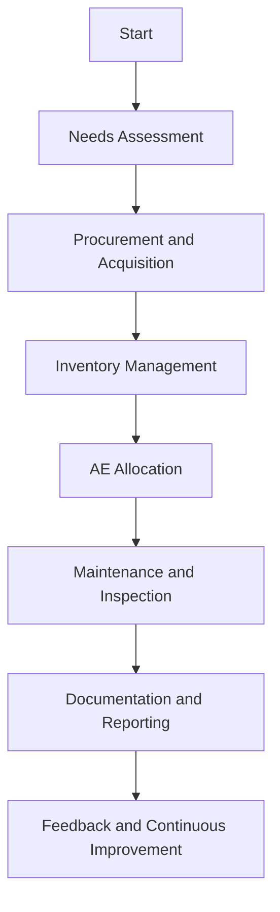
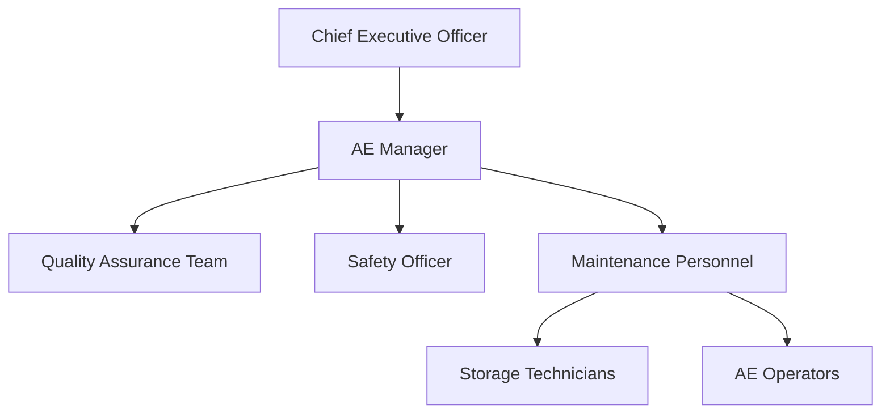

# FTC_17-00-00-00-000_ATA_17-Auxiliary-Equipment.md

## Comprehensive Guide for Auxiliary Equipment Management for GAIA AIR – Ampel360XWLRGA Aircraft

### Version History

| **Version** | **Date**       | **Author**                      | **Description**                                                       |
|-------------|----------------|---------------------------------|-----------------------------------------------------------------------|
| 1.0         | 2024-12-28     | Amedeo Pelliccia                | Initial creation of the document.                                     |


---

## Table of Contents

1.  [**17.10. Introduction**](#1710-introduction)
    - [17.11. Purpose](#1711-purpose)
    - [17.12. Scope](#1712-scope)
    - [17.13. Document Structure](#1713-document-structure)
    - [17.14. Terminology](#1714-terminology)
2.  [**17.20. Overview of ATA Chapter 17**](#1720-overview-of-ata-chapter-17)
    - [17.21. Importance of Auxiliary Equipment Management](#1721-importance-of-auxiliary-equipment-management)
    - [17.22. Principles of Auxiliary Equipment Management](#1722-principles-of-auxiliary-equipment-management)
3.  [**17.30. Compliance and Standards**](#1730-compliance-and-standards)
    - [17.31. Regulatory Requirements](#1731-regulatory-requirements)
    - [17.32. ATA Standards](#1732-ata-standards)
    - [17.33. Integration with Risk Assessment](#1733-integration-with-risk-assessment)
4.  [**17.40. Application to GAIA AIR Project**](#1740-application-to-gaia-air-project)
    - [17.41. AE Inventory Management](#1741-ae-inventory-management)
    - [17.42. AE Allocation Procedures](#1742-ae-allocation-procedures)
    - [17.43. AE Maintenance and Inspection](#1743-ae-maintenance-and-inspection)
    - [17.44. Documentation and Reporting](#1744-documentation-and-reporting)
5.  [**17.50. Auxiliary Equipment Procedures**](#1750-auxiliary-equipment-procedures)
    - [17.51. Acquisition and Procurement](#1751-acquisition-and-procurement)
    - [17.52. Storage and Security](#1752-storage-and-security)
    - [17.53. Operation Protocols](#1753-operation-protocols)
    - [17.54. Safety Measures](#1754-safety-measures)
6.  [**17.60. Roles and Responsibilities**](#1760-roles-and-responsibilities)
    - [17.61. AE Manager](#1761-ae-manager)
    - [17.62. Maintenance Personnel](#1762-maintenance-personnel)
    - [17.63. Quality Assurance](#1763-quality-assurance)
    - [17.64. Safety Officer](#1764-safety-officer)
7.  [**17.70. Integration with Other Documents and Systems**](#1770-integration-with-other-documents-and-systems)
    - [17.71. Dependencies Matrix and Glossary](#1771-dependencies-matrix-and-glossary)
    - [17.72. Integration with CMMS](#1772-integration-with-cmms)
    - [17.73. Integration with Other ATA Chapters](#1773-integration-with-other-ata-chapters)
    - [17.74. Integration with ERP Systems](#1774-integration-with-erp-systems)
    - [17.75. Integration with Safety Management Systems (SMS)](#1775-integration-with-safety-management-systems-sms)
8.  [**17.80. Training and Awareness**](#1780-training-and-awareness)
    - [17.81. AE Training Programs](#1781-ae-training-programs)
        - [17.811. Specific Training Modules](#17811-specific-training-modules)
        - [17.812. Training Needs Analysis](#17812-training-needs-analysis)
    - [17.82. Awareness Campaigns](#1782-awareness-campaigns)
9.  [**17.90. Audits and Continuous Improvement**](#1790-audits-and-continuous-improvement)
    - [17.91. Internal Audits](#1791-internal-audits)
    - [17.92. Continuous Improvement Process](#1792-continuous-improvement-process)
        - [17.921. Root Cause Analysis](#17921-root-cause-analysis)
        - [17.922. Benchmarking](#17922-benchmarking)
10. [**17.100. Human Factors**](#17100-human-factors)
    - [17.101. Ergonomics and Usability](#17101-ergonomics-and-usability)
    - [17.102. Reducing Human Error](#17102-reducing-human-error)
        - [17.1021. Checklists](#171021-checklists)
        - [17.1022. Team Resource Management (TRM)](#171022-team-resource-management-trm)
    - [17.103. Technology and Human Factors](#17103-technology-and-human-factors)
11. [**17.110. Case Studies**](#17110-case-studies)
    - [17.111. Successful Implementation of AE Management Programs](#17111-successful-implementation-of-ae-management-programs)
    - [17.112. Impact of Emerging Technologies on AE Management Efficiency](#17112-impact-of-emerging-technologies-on-ae-management-efficiency)
12. [**17.120. Future Trends**](#1720-future-trends)
    - [17.121. Advanced AE Technologies](#1721-advanced-ae-technologies)
    - [17.122. Evolving Regulations and Standards](#1722-evolving-regulations-and-standards)
    - [17.123. Sustainable AE Practices](#1723-sustainable-ae-practices)
    - [17.124. Integration of IoT and Automation in AE](#1724-integration-of-iot-and-automation-in-ae)
13. [**17.130. References**](#1730-references)
14. [**17.140. Visual Aids**](#1740-visual-aids)
    - [17.141. AE Management Process Flowchart](#1741-ae-management-process-flowchart)
    - [17.142. AE Maintenance Schedule Timeline](#1742-ae-maintenance-schedule-timeline)
    - [17.143. Organizational Structure for AE Management](#1743-organizational-structure-for-ae-management)
15. [**17.150. Sample Forms and Templates**](#1750-sample-forms-and-templates)
    - [17.151. AE Inventory Form](#1751-ae-inventory-form)
    - [17.152. AE Allocation Template](#1752-ae-allocation-template)
    - [17.153. AE Maintenance Report Template](#1753-ae-maintenance-report-template)
16. [**17.170. Acronyms**](#1770-acronyms)
17. [**17.180. Companion (Introductory Insights)**](#1780-companion-introductory-insights)
18. [**17.190. Generator (Design Solutions)**](#1790-generator-design-solutions)
19. [**17.200. Implementator (Scalability and Operation)**](#17920-implementator-scalability-and-operation)

---

## 17.10. Introduction

Auxiliary Equipment (AE) is integral to the efficient and safe operation of aircraft maintenance and ground handling activities. Effective management of AE ensures that maintenance personnel have access to the necessary tools and equipment, reducing downtime, enhancing operational efficiency, and maintaining the airworthiness of the **GAIA AIR – Ampel360XWLRGA Aircraft**. This document provides a comprehensive guide for managing AE, aligning with the **ATA Chapter 17** standards and regulatory requirements established by authorities such as **EASA** and **FAA**.

### 17.11. Purpose

The purpose of this document is to:

- **Define AE Management Requirements:** Establish procedures and standards for acquiring, allocating, maintaining, and tracking auxiliary equipment.
- **Ensure Compliance:** Guarantee adherence to ATA Chapter 17 standards and regulatory requirements set by authorities like EASA and FAA.
- **Standardize AE Procedures:** Provide a unified approach for managing AE, promoting consistency across all operational teams.
- **Facilitate Training:** Offer guidelines for training personnel in the proper use and maintenance of AE.
- **Enhance Operational Efficiency:** Ensure that maintenance operations are supported by reliable and well-maintained AE, reducing downtime and improving maintenance outcomes.

**Breakdown:** This section clearly defines the objectives of the document. It sets the stage for a standardized and compliant approach to AE management.

**Enhanced Breakdown:**

The purpose of this document is multifaceted, aiming to create a robust framework for AE management that ensures the operational readiness and safety of the Ampel360XWLRGA Aircraft.

1. **Define AE Management Requirements:**
    This involves establishing clear, detailed procedures and standards that cover every aspect of AE management. These standards will serve as a blueprint for all activities related to AE, ensuring that all equipment is acquired, allocated, maintained, and tracked in a manner that supports optimal aircraft maintenance operations.

2. **Ensure Compliance:**
    Compliance with industry and regulatory standards is paramount in aviation. This document aims to ensure that all AE management practices adhere to the guidelines set forth by ATA Chapter 17, as well as the regulatory requirements established by aviation authorities such as EASA and FAA. This adherence guarantees that GAIA AIR operates within the legal framework and meets the highest safety standards.

3. **Standardize AE Procedures:**
    Standardization is key to maintaining consistency and reliability across operations. By providing a unified approach to AE management, this document seeks to eliminate variability in how AE is handled, regardless of the personnel involved or the location of operations. This consistency is crucial for preventing errors and ensuring that best practices are followed universally within GAIA AIR.

4. **Facilitate Training:**
    Effective training is essential for ensuring that all personnel involved in AE operations are competent and knowledgeable. This document includes guidelines for comprehensive training programs that cover the proper use, maintenance, and safety protocols associated with AE. By facilitating thorough training, GAIA AIR ensures that its workforce is well-prepared to manage AE effectively.

5. **Enhance Operational Efficiency:**
    The ultimate goal of this document is to enhance the operational efficiency of GAIA AIR's maintenance activities. By ensuring that maintenance operations are supported by reliable and well-maintained AE, the document aims to minimize downtime and improve maintenance outcomes. Efficient AE management directly contributes to the overall operational readiness and performance of the Ampel360XWLRGA Aircraft.

### 17.12. Scope

This document encompasses the framework for managing Auxiliary Equipment for the **GAIA AIR – Ampel360XWLRGA Aircraft** project, including but not limited to:

- **AE Inventory Management:** Procedures for tracking and managing AE assets.
- **AE Allocation Procedures:** Processes for assigning AE to maintenance tasks and personnel.
- **AE Maintenance and Inspection:** Guidelines for routine maintenance and inspections to ensure AE reliability.
- **Acquisition and Procurement:** Standards for acquiring new AE, including vendor selection and procurement processes.
- **Storage and Security:** Directives for the proper storage and security of AE to prevent loss or damage.
- **Operation Protocols:** Standard operating procedures for the use of AE during maintenance and ground operations.
- **Safety Measures:** Implementing safety protocols to protect personnel and equipment during AE operations.
- **Integration with Advanced Technologies:** Utilization of technologies such as **IoT sensors**, **automation**, and **Blockchain** to enhance AE management processes.
- **Documentation and Reporting:** Establishing robust systems for documenting AE activities and generating necessary reports.
- **Integration with Other Systems:** Ensuring AE management is integrated with ERP systems, Safety Management Systems (SMS), and other operational systems.
- **Training and Awareness:** Developing comprehensive training programs and awareness campaigns for AE management.
- **Audits and Continuous Improvement:** Implementing regular audits and continuous improvement processes for AE management.
- **Human Factors:** Addressing ergonomics, reducing human error, and integrating technology with human operations in AE management.

**Breakdown:** The scope is well-defined, covering all critical aspects of AE management. This ensures a holistic approach to managing AE within the GAIA AIR project.

**Enhanced Breakdown:**

The scope of this document is comprehensive, covering all facets of Auxiliary Equipment (AE) management for the GAIA AIR – Ampel360XWLRGA Aircraft project.

1. **AE Inventory Management:**
    This includes detailed procedures for tracking and managing all AE assets. Effective inventory management ensures that all equipment is accounted for, readily available, and maintained in optimal condition. This involves maintaining an up-to-date database of all AE, including their specifications, locations, and maintenance histories.

2. **AE Allocation Procedures:**
    This section outlines the processes for assigning AE to specific maintenance tasks and personnel. Proper allocation ensures that the right equipment is available to the right people at the right time, enhancing the efficiency of maintenance operations and preventing delays.

3. **AE Maintenance and Inspection:**
    Guidelines for routine maintenance and inspections are crucial for ensuring the reliability and longevity of AE. This includes schedules for preventive maintenance, procedures for corrective maintenance, and protocols for regular inspections to identify and address any issues proactively.

4. **Acquisition and Procurement:**
    This document sets standards for the acquisition of new AE, including vendor selection and procurement processes. Ensuring that only high-quality, compliant equipment is procured is essential for maintaining operational standards and safety.

5. **Storage and Security:**
    Proper storage and security measures are necessary to protect AE from loss, theft, or damage. This includes directives for secure storage facilities, environmental controls, and access restrictions to ensure that AE remains in good condition and is available when needed.

6. **Operation Protocols:**
    Standard operating procedures (SOPs) for the use of AE during maintenance and ground operations are defined in this document. These protocols ensure that AE is used correctly and safely, minimizing the risk of accidents and equipment damage.

7. **Safety Measures:**
    Implementing safety protocols is paramount to protect personnel and equipment during AE operations. This involves safety training, the use of personal protective equipment (PPE), and adherence to safety guidelines to prevent accidents and injuries.

8. **Integration with Advanced Technologies:**
    This document emphasizes the utilization of advanced technologies to enhance AE management processes. Technologies such as IoT sensors for real-time monitoring, automation for routine tasks, and Blockchain for secure data management are integrated to improve efficiency, reliability, and transparency.

9. **Documentation and Reporting:**
    Establishing robust systems for documenting AE activities and generating reports is essential for maintaining accurate records and ensuring compliance. This includes maintenance logs, discrepancy reports, corrective action tracking, and regulatory reporting.

10. **Integration with Other Systems:**
    Ensuring AE management is integrated with Enterprise Resource Planning (ERP) systems for procurement, inventory management, and financial tracking, as well as Safety Management Systems (SMS) to feed AE-related data (e.g., incident reports, risk assessments) into the organization's overall safety framework.

11. **Training and Awareness:**
    Developing comprehensive training programs and awareness campaigns ensures that all personnel involved in AE management are competent and knowledgeable. This includes initial training, ongoing education, certification programs, hands-on workshops, and digital training modules.

12. **Audits and Continuous Improvement:**
    Implementing regular audits and a commitment to continuous improvement are vital for maintaining the effectiveness and efficiency of AE management processes. This includes internal audits, feedback mechanisms, performance metrics, process optimization, innovation integration, and training updates.

13. **Human Factors:**
    Addressing ergonomics, reducing human error, and integrating technology with human operations are crucial for enhancing the overall effectiveness and safety of AE management. This includes workstation design, equipment accessibility, interface design, safety gear, error-proofing, standardization, training, feedback systems, fatigue management, and the integration of Human-Machine Interfaces (HMI) and Team Resource Management (TRM).

### 17.13. Document Structure

This document is organized into the following key sections to facilitate clarity and usability:

- **17.10. Introduction:** Provides context and describes the purpose, scope, and structure of the document.
- **17.20. Overview of ATA Chapter 17:** Explores the importance and principles of AE management in aviation.
- **17.30. Compliance and Standards:** Ensures AE management procedures comply with ATA standards and regulatory requirements.
- **17.40. Application to GAIA AIR Project:** Details how AE management is applied within the GAIA AIR project framework.
- **17.50. Auxiliary Equipment Procedures:** Describes procedures for managing AE, including acquisition, allocation, maintenance, and safety protocols.
- **17.60. Roles and Responsibilities:** Defines the roles and responsibilities of the AE Manager, maintenance personnel, quality assurance teams, and safety officers.
- **17.70. Integration with Other Documents and Systems:** Demonstrates connections with the Dependencies Matrix, Glossary, CMMS, ERP systems, Safety Management Systems, and other relevant systems.
- **17.80. Training and Awareness:** Emphasizes the importance of training programs and awareness campaigns for personnel involved in AE management.
- **17.90. Audits and Continuous Improvement:** Describes the process for regular audits and continuous improvement of AE management procedures.
- **17.100. Human Factors:** Addresses the role of human factors in AE management and strategies to mitigate human errors.
- **17.110. Case Studies:** Provides real-world examples of AE management program implementations and the impact of emerging technologies.
- **17.120. Future Trends:** Discusses potential future developments in AE management procedures.
- **17.130. References:** Lists resources, including external standards and internal documentation, to support further exploration.
- **17.140. Visual Aids:** Incorporates flowcharts and diagrams to illustrate AE management processes and organizational structures.
- **17.150. Sample Forms and Templates:** Provides templates for essential AE management documents.
- **17.170. Acronyms:** Lists and defines acronyms used throughout the document.
- **17.180. Companion (Introductory Insights):** Provides initial guidance and context for implementing the AE management framework.
- **17.190. Generator (Design Solutions):** Offers detailed design solutions for key aspects of the AE management program.
- **17.200. Implementator (Scalability and Operation):** Outlines strategies for scaling and operationalizing the AE management program.

**Breakdown:** The structure is logical and comprehensive, making the document easy to navigate. Each section is clearly defined, contributing to the overall clarity of the document.

---

## 17.14. Terminology

To ensure clarity and consistency throughout this document, the following terms are defined:

- **AE Management:** The systematic process of overseeing Auxiliary Equipment, including its acquisition, allocation, maintenance, and disposal.
- **Asset Management:** The systematic process of developing, operating, maintaining, upgrading, and disposing of assets cost-effectively.
- **Inventory:** A comprehensive list of items such as AE, including details like quantity, location, and condition.
- **Preventive Maintenance:** Scheduled maintenance actions to prevent failures and ensure continuous operation of AE.
- **Corrective Maintenance:** Maintenance tasks performed to rectify a failure or deficiency.
- **Predictive Maintenance:** Maintenance based on the condition of AE determined by monitoring data, allowing maintenance to be performed just before a failure is likely.
- **AE Calibration:** The process of configuring AE to ensure it operates within specified parameters.
- **Safety Protocols:** Procedures and guidelines designed to ensure the safety of personnel and equipment during AE operations.
- **Digital Twin:** A virtual replica of an AE used for simulations and predictive maintenance.
- **Blockchain:** Decentralized digital ledger technology used for secure data management.
- **IoT Sensors:** Devices embedded in AE to collect and transmit data for monitoring purposes.
- **HPC:** High-Performance Computing, used for complex data analysis and simulations.
- **ML:** Machine Learning, a subfield of AI focused on building systems that learn from data.
- **Quality Assurance (QA):** A way to prevent errors and defects in processes and ensure compliance with standards.
- **CMMS:** Computerized Maintenance Management System, software that manages maintenance activities.
- **LMS:** Learning Management System, software that facilitates the administration, documentation, tracking, reporting, and delivery of educational courses or training programs.
- **ATA:** Air Transport Association, a major aviation industry organization that develops standards and guidelines.
- **EASA:** European Union Aviation Safety Agency, responsible for civil aviation safety regulation in the EU.
- **FAA:** Federal Aviation Administration, responsible for regulating all aspects of civil aviation in the United States.
- **ERP:** Enterprise Resource Planning, integrated management of main business processes, often in real-time and mediated by software and technology.
- **SMS:** Safety Management Systems, systematic approaches to managing safety, including the necessary organizational structures, accountabilities, policies, and procedures.
- **TRM:** Team Resource Management, a set of training procedures for use in environments where human error can have devastating effects.
- **GSE:** Ground Support Equipment
- **SOP:** Standard Operating Procedure

*(Add other relevant terms and definitions as necessary.)*

**Breakdown:** Defining key terms ensures that all readers have a common understanding of the terminology used throughout the document, enhancing clarity and consistency.

---

## 17.20. Overview of ATA Chapter 17

**ATA Chapter 17** focuses on **Auxiliary Equipment (AE) Management**, which is essential for ensuring that maintenance personnel have access to the necessary equipment and tools to perform their tasks efficiently and safely. This chapter outlines the standards and procedures required for managing AE systematically, ensuring that equipment is properly maintained, stored, and utilized during maintenance activities. Adhering to ATA Chapter 17 ensures that all AE management activities comply with industry and regulatory standards, enhancing operational efficiency and safety.

### 17.21. Importance of Auxiliary Equipment Management

Auxiliary Equipment is crucial for:

- **Operational Efficiency:** Ensuring that the right equipment is available when needed reduces downtime and enhances maintenance productivity.
- **Safety:** Properly maintained and stored AE prevents accidents and equipment failures.
- **Cost Management:** Effective inventory control minimizes unnecessary purchases and reduces the risk of equipment loss or theft.
- **Compliance:** Adherence to regulatory standards ensures that maintenance activities meet safety and quality requirements.
- **Asset Longevity:** Regular maintenance and proper handling extend the lifespan of AE, reducing replacement costs.

**Breakdown:** This section effectively highlights the critical role of AE management in aviation. It emphasizes how proper management contributes to efficiency, safety, cost-effectiveness, compliance, and the longevity of assets.

**Enhanced Breakdown:**

Auxiliary Equipment (AE) management is a cornerstone of efficient and safe aviation operations. The importance of effective AE management, as outlined in ATA Chapter 17, cannot be overstated. Here’s a deeper dive into why it is crucial:

- **Operational Efficiency:**
  
  AE management ensures that the right equipment is available at the right time, significantly reducing downtime and enhancing maintenance productivity. Efficient AE operations mean that aircraft maintenance can be performed swiftly and effectively, minimizing delays and ensuring that aircraft are returned to service as quickly as possible.

- **Safety:**
  
  Safety is paramount in aviation. Properly maintained and stored AE prevents accidents and equipment failures, which could otherwise lead to serious injuries or damage to aircraft. Adhering to stringent maintenance and storage protocols ensures that AE operates reliably and safely, protecting both personnel and valuable assets.

- **Cost Management:**
  
  Effective inventory control is a key aspect of AE management. By maintaining an accurate inventory and tracking the usage and condition of equipment, organizations can minimize unnecessary purchases, reduce the risk of equipment loss or theft, and optimize the allocation of resources. This leads to significant cost savings over time.

- **Compliance:**
  
  Compliance with regulatory standards is mandatory in the aviation industry. AE management practices must adhere to the guidelines set forth by ATA Chapter 17, as well as the standards outlined by regulatory bodies such as EASA and FAA. Compliance ensures that maintenance activities meet the highest safety and quality requirements, avoiding legal issues and maintaining the organization's reputation.

- **Asset Longevity:**
  
  Regular maintenance and proper handling of AE extend the lifespan of the equipment, reducing the need for frequent replacements. This not only saves costs but also ensures that AE remains reliable and functional over a longer period. Preventive and predictive maintenance practices play a crucial role in maximizing the operational life of AE assets.

### 17.22. Principles of Auxiliary Equipment Management

The principles guiding AE management under ATA Chapter 17 include:

- **Systematic Approach:** AE management should follow a structured process to ensure comprehensive coverage of all equipment.
- **Documentation:** Accurate and complete documentation of AE inventory, usage, and maintenance activities is essential.
- **Compliance:** All AE management activities must adhere to ATA Chapter 17 standards and relevant regulatory requirements.
- **Trained Personnel:** Only qualified and trained personnel should handle and operate AE to ensure safe and effective use.
- **Use of Approved Methods and Tools:** AE management should utilize methods, tools, and materials approved by equipment manufacturers and regulatory bodies.
- **Continuous Improvement:** AE management procedures should be regularly reviewed and updated based on feedback, audit findings, and technological advancements to enhance efficiency and effectiveness.

**Breakdown:** These principles provide a solid foundation for a robust AE management program. They emphasize a systematic approach, thorough documentation, compliance, the importance of trained personnel, use of approved methods, and continuous improvement.

**Enhanced Breakdown:**

The principles of AE management, as outlined in ATA Chapter 17, are designed to create a robust and effective framework for managing auxiliary equipment. Here’s a closer look at each principle:

- **Systematic Approach:**
  
  AE management must follow a structured, systematic process to ensure that all equipment is accounted for and maintained properly. This involves creating standardized procedures for every aspect of AE management, from acquisition and inventory to maintenance and disposal. A systematic approach ensures consistency and thoroughness in all AE-related activities.

- **Documentation:**
  
  Accurate and complete documentation is essential for effective AE management. This includes maintaining detailed records of AE inventory, usage, maintenance activities, and any incidents or discrepancies. Thorough documentation provides a clear history of each piece of equipment, facilitates audits, and supports compliance with regulatory requirements.

- **Compliance:**
  
  All AE management activities must adhere to the standards outlined in ATA Chapter 17 and any relevant regulatory requirements from bodies such as EASA and FAA. Compliance ensures that AE operations meet the highest safety and quality standards, minimizing risks and legal issues.

- **Trained Personnel:**
  
  Only qualified and trained personnel should handle and operate AE. Proper training ensures that personnel understand how to use AE safely and effectively, reducing the risk of accidents and equipment damage. Training programs should cover operational procedures, safety protocols, and maintenance practices.

- **Use of Approved Methods and Tools:**
  
  AE management should utilize methods, tools, and materials that are approved by equipment manufacturers and regulatory bodies. Using approved methods and tools ensures that AE is maintained and operated in a manner that is consistent with its design and intended use, enhancing safety and reliability.

- **Continuous Improvement:**
  
  AE management procedures should be regularly reviewed and updated to incorporate feedback, audit findings, and technological advancements. Continuous improvement ensures that AE management practices remain effective and efficient, adapting to changes in technology, regulations, and operational needs.

---

## 17.30. Compliance and Standards

Ensuring compliance with **ATA Chapter 17** and other relevant standards is fundamental for the effective management of Auxiliary Equipment for the **GAIA AIR – Ampel360XWLRGA Aircraft** project. This section details the regulatory requirements and industry standards that govern AE management.

### 17.31. Regulatory Requirements

Aircraft maintenance, including AE management, must comply with various regulatory authorities to ensure safety and airworthiness. Key regulatory requirements include:

- **EASA (European Union Aviation Safety Agency):** Establishes comprehensive standards for aircraft maintenance, inspections, and certifications within the European Union.
- **FAA (Federal Aviation Administration):** Provides regulations and guidelines for aircraft maintenance, ensuring compliance with safety standards in the United States.
- **ICAO (International Civil Aviation Organization):** Sets international standards and recommended practices for aviation safety, security, and efficiency.
- **National Aviation Authorities:** Each country has its own aviation authority enforcing maintenance and AE management regulations for aircraft operating within its airspace.

**Breakdown:** This subsection outlines the primary regulatory bodies and their roles in governing AE management. Understanding and adhering to these requirements ensures that the aircraft maintains its airworthiness and complies with international and regional safety standards.

### 17.32. ATA Standards

The **Air Transport Association (ATA)** has developed a set of standards that serve as industry benchmarks for aircraft maintenance and AE management. Key ATA standards relevant to Chapter 17 include:

- **ATA Spec 100:** Focuses on training requirements, detailing the minimum standards for training programs to maintain aircraft safety and performance.
- **ATA iSpec 2200:** An electronic specification system that optimizes maintenance procedures and integrates with Computerized Maintenance Management Systems (CMMS).
- **ATA Chapters 02, 04, 06, 10, 11, and 24:** Provide detailed guidelines on various aspects of aircraft maintenance, including weight and balance, airworthiness limitations, dimensions and surfaces, parking and storage, signs and markings, and electrical systems.

**Breakdown:** This subsection highlights the contributions of the ATA in standardizing AE management practices. Adhering to standards like Spec 100 and iSpec 2200 enables maintenance teams to ensure consistent and effective AE management operations aligned with industry best practices.

### 17.33. Integration with Risk Assessment

Integrating **risk assessment** into AE management enhances the effectiveness of maintenance activities by prioritizing equipment-related risks based on their potential impact. Key aspects include:

- **Risk Identification:** Identifying potential hazards and failure modes related to AE that could affect maintenance safety and efficiency.
- **Risk Analysis:** Evaluating the likelihood and severity of identified risks to determine their impact on operations.
- **Risk Mitigation:** Developing and implementing strategies to reduce or eliminate identified risks.
- **Prioritization:** Allocating resources to address high-priority risks first, ensuring that critical issues are resolved promptly.

**Breakdown:** Integrating risk assessment is a proactive approach to AE management. It helps in identifying, analyzing, and mitigating risks, thus enhancing safety and operational efficiency.

**Enhanced Breakdown:**

Integrating risk assessment into AE management is a critical step towards ensuring the safety and efficiency of maintenance activities. This process involves several key aspects:

- **Risk Identification:**
  
  This step involves identifying potential hazards and failure modes associated with AE that could impact maintenance operations. By systematically identifying risks, organizations can proactively address issues before they lead to accidents or operational disruptions.

- **Risk Analysis:**
  
  Once risks are identified, they need to be analyzed to determine their likelihood and potential severity. This involves evaluating the probability of each risk occurring and the impact it could have on operations. Risk analysis helps in understanding the significance of each identified risk.

- **Risk Mitigation:**
  
  Developing and implementing strategies to reduce or eliminate identified risks is crucial. Mitigation strategies might include preventive maintenance, additional training, or the introduction of new safety protocols. The goal is to minimize the likelihood of risks occurring and to reduce their impact if they do occur.

- **Prioritization:**
  
  Not all risks are equal. Prioritizing risks based on their severity and likelihood allows organizations to allocate resources effectively, addressing the most critical issues first. This ensures that the most significant risks are mitigated promptly, enhancing overall safety and operational efficiency.

---

## 17.40. Application to GAIA AIR Project

The **GAIA AIR – Ampel360XWLRGA Aircraft** project integrates the principles and procedures outlined in ATA Chapter 17 to ensure effective management of Auxiliary Equipment. This section details how AE management practices are applied within the project framework.

### 17.41. AE Inventory Management

Establishing a comprehensive **AE inventory management system** is essential for tracking and managing AE assets. AE inventory management for the GAIA AIR project includes:

- **Inventory Database:** Maintaining a detailed database that lists all AE, including specifications, quantities, locations, and conditions.
- **Barcode/RFID Tagging:** Utilizing barcode or RFID tagging for each AE item to facilitate tracking and real-time inventory updates.
- **Regular Audits:** Conducting regular inventory audits to ensure accuracy and identify any discrepancies or missing equipment.
- **Reordering Process:** Implementing an efficient reordering process to replenish AE that are low in stock or have reached the end of their service life.
- **Storage Solutions:** Providing organized storage solutions such as AE sheds, racks, and designated storage areas to ensure easy access and protection from damage.

**Breakdown:** This section outlines the key components of a robust inventory management system, which is crucial for maintaining accurate records and ensuring the availability of AE.

**Enhanced Breakdown:**

Establishing a comprehensive AE inventory management system is essential for tracking and managing AE assets effectively. The GAIA AIR project incorporates the following components:

- **Inventory Database:**
  
  Maintaining an up-to-date and detailed database of all AE assets ensures that every piece of equipment is accounted for. This database includes specifications, quantities, locations, and current conditions of each AE item, providing a centralized repository for easy access and management.

- **Barcode/RFID Tagging:**
  
  Implementing barcode or RFID tagging for each AE item facilitates precise tracking and real-time inventory updates. This technology allows maintenance personnel to quickly identify and locate equipment, reducing the time spent searching for AE and minimizing the risk of misplacement or loss.

- **Regular Audits:**
  
  Conducting regular inventory audits is critical to verify the accuracy of the inventory database. These audits help identify discrepancies, such as missing or damaged AE items, enabling prompt corrective actions to maintain inventory integrity.

- **Reordering Process:**
  
  An efficient reordering process ensures that AE required for maintenance activities are always available. This involves setting reorder points based on usage rates and service life, automating purchase orders, and maintaining relationships with reliable suppliers to guarantee timely replenishment.

- **Storage Solutions:**
  
  Providing organized storage solutions, including AE sheds, racks, and designated storage areas, ensures that equipment is easily accessible and protected from damage. Proper storage not only prolongs the lifespan of AE but also enhances operational efficiency by facilitating quick retrieval when needed.

### 17.42. AE Allocation Procedures

**AE allocation procedures** ensure that maintenance personnel have access to the necessary equipment when needed. AE allocation procedures for the GAIA AIR project include:

- **Request System:** Implementing a system where maintenance personnel can request specific AE for their tasks.
- **AE Checkout/Check-in:** Establishing a checkout/check-in process to track the use and return of AE, ensuring accountability and reducing the risk of loss or theft.
- **Reservation System:** Allowing maintenance personnel to reserve AE in advance for upcoming maintenance activities.
- **Usage Guidelines:** Providing clear guidelines on the proper use, handling, and maintenance of AE to prevent damage and ensure longevity.
- **AE Assignment:** Assigning AE based on the specific requirements of maintenance tasks, ensuring that the right equipment is used for the right job.

**Breakdown:** Clear allocation procedures are essential for efficient operations. This section describes a well-structured system for requesting, tracking, and assigning AE.

**Enhanced Breakdown:**

Implementing robust AE allocation procedures ensures that maintenance personnel have timely access to the necessary equipment, enhancing operational efficiency and reducing downtime. The GAIA AIR project employs the following allocation procedures:

- **Request System:**
  
  A structured request system allows maintenance personnel to request specific AE required for their tasks. This system can be managed through a centralized software platform, enabling efficient tracking and management of AE requests.

- **AE Checkout/Check-in:**
  
  Establishing a checkout/check-in process ensures that the use and return of AE are accurately tracked. This process enhances accountability by recording which personnel are using specific AE items, when they are used, and when they are returned, thereby minimizing the risk of loss or theft.

- **Reservation System:**
  
  Allowing maintenance personnel to reserve AE in advance ensures that the necessary equipment is available when needed, especially during peak maintenance periods. This system helps in planning and scheduling maintenance activities more effectively, reducing delays caused by equipment unavailability.

- **Usage Guidelines:**
  
  Providing clear guidelines on the proper use, handling, and maintenance of AE is essential to prevent damage and ensure the longevity of equipment. These guidelines should be documented and readily accessible to all maintenance personnel, promoting standardized and safe AE operations.

- **AE Assignment:**
  
  Assigning AE based on the specific requirements of maintenance tasks ensures that the right equipment is used for the right job. This targeted assignment enhances the effectiveness of maintenance activities and minimizes the risk of using inappropriate or inadequate equipment.

### 17.43. AE Maintenance and Inspection

Regular **maintenance and inspection** of AE are critical to ensure their reliability and safety. AE maintenance and inspection for the GAIA AIR project include:

- **Preventive Maintenance:** Scheduled maintenance tasks to prevent AE degradation or failures, performed based on time intervals or usage cycles.
  - **Lubrication:** Applying lubricants to moving parts to reduce friction and wear.
  - **Calibration:** Ensuring measurement and testing AE are accurately calibrated to provide reliable results.
  - **Cleaning:** Removing dirt, debris, and contaminants to prevent corrosion and maintain performance.
  - **Consumables Replacement:** Replacing parts with limited lifespans, such as blades, filters, and batteries.
  - **Critical Components Inspection:** Regularly inspecting essential components for signs of wear, damage, or potential failure.

- **Corrective Maintenance:** Actions taken to repair or replace AE that have failed or are malfunctioning.
  - **Repairing Damaged Parts:** Fixing or replacing damaged components to restore functionality.
  - **Faulty Parts Replacement:** Substituting defective parts with new or refurbished ones.
  - **Diagnostics:** Using diagnostic tools to identify the root cause of AE failures.
  - **Functional Testing:** Verifying that repaired or replaced AE operates correctly after maintenance.

- **Predictive Maintenance:** Utilizing data from IoT sensors and other monitoring tools to predict and prevent potential AE failures.
  - **Data Collection:** Gathering data on AE usage, performance, and environmental conditions.
  - **Trend Analysis:** Analyzing data trends to identify patterns indicative of impending failures.
  - **Maintenance Scheduling:** Planning maintenance activities based on predictive insights to address issues before they occur.

- **Inspection Protocols:** Establishing routine inspection schedules to ensure AE are in good working condition.
  - **Daily Checks:** Quick inspections to verify basic functionality and identify obvious issues.
  - **Weekly Inspections:** More detailed inspections to assess overall condition and performance.
  - **Monthly Audits:** Comprehensive inspections covering all aspects of AE operation and maintenance.
  - **Annual Overhauls:** Extensive maintenance activities to ensure long-term reliability and compliance with safety standards.

**Breakdown:** This section comprehensively covers the different types of maintenance and inspection activities necessary to keep AE in optimal condition. It highlights the importance of preventive, corrective, and predictive maintenance.

**Enhanced Breakdown:**

Regular maintenance and inspection of AE are crucial for ensuring their reliability, safety, and longevity. The GAIA AIR project incorporates a comprehensive approach to AE maintenance and inspection, which includes:

- **Preventive Maintenance:**
  
  Preventive maintenance is performed regularly to prevent AE degradation or failures. This includes:
  
  - **Lubrication:** Applying lubricants to moving parts to reduce friction and wear, ensuring smooth operation.
  - **Calibration:** Regularly calibrating measurement and testing AE to ensure they provide accurate and reliable results.
  - **Cleaning:** Removing dirt, debris, and contaminants to prevent corrosion and maintain optimal performance.
  - **Consumables Replacement:** Replacing parts with limited lifespans, such as blades, filters, and batteries, to ensure continuous operation.
  - **Critical Components Inspection:** Regularly inspecting essential components for signs of wear, damage, or potential failure to address issues proactively.

- **Corrective Maintenance:**
  
  Corrective maintenance is performed to repair or replace AE that have failed or are malfunctioning. This includes:
  
  - **Repairing Damaged Parts:** Fixing or replacing damaged components to restore functionality.
  - **Faulty Parts Replacement:** Substituting defective parts with new or refurbished ones to ensure reliability.
  - **Diagnostics:** Using diagnostic tools to identify the root cause of AE failures and implement effective repairs.
  - **Functional Testing:** Verifying that repaired or replaced AE operates correctly after maintenance to ensure it meets performance standards.

- **Predictive Maintenance:**
  
  Predictive maintenance utilizes data from IoT sensors and other monitoring tools to predict and prevent potential AE failures. This includes:
  
  - **Data Collection:** Gathering data on AE usage, performance, and environmental conditions to monitor their status.
  - **Trend Analysis:** Analyzing data trends to identify patterns that indicate impending failures or performance degradation.
  - **Maintenance Scheduling:** Planning maintenance activities based on predictive insights to address issues before they lead to failures, optimizing maintenance schedules and reducing downtime.

- **Inspection Protocols:**
  
  Establishing routine inspection schedules is essential for ensuring that AE remains in good working condition. This includes:
  
  - **Daily Checks:** Quick inspections performed daily to verify basic functionality and identify obvious issues.
  - **Weekly Inspections:** More detailed inspections conducted weekly to assess the overall condition and performance of AE.
  - **Monthly Audits:** Comprehensive inspections covering all aspects of AE operation and maintenance, performed monthly to ensure thorough oversight.
  - **Annual Overhauls:** Extensive maintenance activities conducted annually to ensure long-term reliability and compliance with safety standards.

---

### 17.44. Documentation and Reporting

Accurate **documentation** and **reporting** are essential components of effective AE management. For the GAIA AIR project, documentation and reporting protocols include:

- **Maintenance Logs:** Keeping detailed records of all AE maintenance activities, including inspections, calibrations, repairs, and replacements.
- **Discrepancy Reporting:** Documenting any issues or discrepancies identified during inspections or maintenance activities and reporting them promptly to the AE Manager.
- **Corrective Action Tracking:** Monitoring and documenting the implementation of corrective actions to address identified discrepancies and prevent recurrence.
- **Regulatory Reporting:** Submitting required reports to regulatory authorities to demonstrate compliance with AE management standards and safety regulations.
- **Audit Trails:** Maintaining comprehensive audit trails to facilitate internal and external audits, ensuring transparency and accountability in AE management operations.

**Breakdown:** This section emphasizes the importance of meticulous record-keeping and reporting. It ensures that all maintenance activities are documented, which is crucial for compliance and continuous improvement.

**Enhanced Breakdown:**

Accurate documentation and reporting are foundational to effective AE management. They provide a clear trail of activities, support compliance, and facilitate continuous improvement. The GAIA AIR project incorporates the following documentation and reporting protocols:

- **Maintenance Logs:**
  
  Detailed records of all AE maintenance activities are maintained to track the history and status of each piece of equipment. These logs include:
  
  - **Inspection Details:** Date, time, personnel involved, and findings from each inspection.
  - **Calibration Records:** Calibration dates, standards used, and results.
  - **Repair and Replacement Logs:** Details of repairs conducted, parts replaced, and associated costs.
  - **Operational Tests:** Results of functional testing post-maintenance to ensure AE operates correctly.

- **Discrepancy Reporting:**
  
  Any issues or discrepancies identified during inspections or maintenance activities are promptly documented and reported. This includes:
  
  - **Issue Description:** Detailed description of the discrepancy or malfunction.
  - **Impact Assessment:** Evaluation of how the issue affects AE functionality and safety.
  - **Immediate Actions Taken:** Steps taken to address the issue temporarily or permanently.
  - **Responsible Personnel:** Identification of individuals accountable for resolving the issue.

- **Corrective Action Tracking:**
  
  Monitoring and documenting the implementation of corrective actions is essential to address identified discrepancies and prevent recurrence. This includes:
  
  - **Action Plan:** Specific actions required to resolve the issue.
  - **Timeline:** Deadlines for completing corrective actions.
  - **Status Updates:** Regular updates on the progress of corrective actions.
  - **Verification:** Confirmation that corrective actions have been successfully implemented and are effective.

- **Regulatory Reporting:**
  
  Submitting required reports to regulatory authorities ensures compliance with AE management standards and safety regulations. This includes:
  
  - **Scheduled Reports:** Regular reports as mandated by EASA, FAA, or other relevant authorities.
  - **Incident Reports:** Detailed reports of any significant AE-related incidents, accidents, or near-misses.
  - **Audit Reports:** Findings from internal and external audits submitted to regulatory bodies.

- **Audit Trails:**
  
  Comprehensive audit trails are maintained to facilitate internal and external audits. These trails include:
  
  - **Access Logs:** Records of who accessed AE and performed specific actions.
  - **Change Logs:** Documentation of any changes made to AE management procedures, policies, or equipment configurations.
  - **Correspondence:** Communications related to AE management, including emails, memos, and meeting minutes.

---

## 17.50. Auxiliary Equipment Procedures

This section outlines the **specific procedures** for managing Auxiliary Equipment in the **GAIA AIR – Ampel360XWLRGA Aircraft**. These procedures are designed to ensure the reliability, safety, and efficiency of AE operations.

### 17.51. Acquisition and Procurement

Establishing robust **acquisition and procurement** procedures ensures that GAIA AIR obtains high-quality AE that meet operational requirements and regulatory standards.

- **Needs Assessment:** Identifying the types and quantities of AE required based on maintenance needs and operational demands.
- **Vendor Selection:** Evaluating and selecting vendors based on quality, reliability, cost, and compliance with regulatory standards.
- **Procurement Process:** Implementing a standardized procurement process that includes request for proposals (RFPs), bid evaluations, and contract negotiations.
- **Quality Assurance:** Ensuring that all procured AE meet the specified quality and performance standards before acceptance.
- **Inventory Integration:** Updating the AE inventory database upon acquisition to reflect new equipment.

**Breakdown:** This subsection details the procedures for acquiring new AE, emphasizing the importance of thorough needs assessments, vendor evaluations, and quality assurance to ensure that all equipment meets operational and regulatory requirements.

**Enhanced Breakdown:**

1. **Needs Assessment:**
   
   This initial step involves a thorough evaluation of the maintenance and operational requirements of the GAIA AIR project. It requires identifying the specific types of AE needed, determining the quantities required, and understanding the operational demands that the AE will need to meet. This assessment ensures that the procured equipment aligns with the project's needs.

2. **Vendor Selection:**
   
   Choosing the right vendors is crucial for obtaining high-quality AE. This involves evaluating potential vendors based on several criteria, including the quality of their equipment, their reliability in terms of delivery and support, the cost-effectiveness of their offerings, and their compliance with relevant regulatory standards. A rigorous vendor selection process helps in establishing partnerships that contribute to the project's success.

3. **Procurement Process:**
   
   A standardized procurement process is essential for ensuring transparency, fairness, and efficiency in acquiring AE. This process typically includes issuing requests for proposals (RFPs), evaluating bids from different vendors, and negotiating contracts. The goal is to secure the best possible terms while ensuring that all procurement activities are documented and auditable.

4. **Quality Assurance:**
   
   Before accepting any new AE, it is essential to conduct thorough quality assurance checks. This involves verifying that the equipment meets the specified quality and performance standards, as well as any regulatory requirements. Quality assurance ensures that the AE is fit for purpose and will perform reliably in its intended role.

5. **Inventory Integration:**
   
   Once new AE is procured and accepted, it must be integrated into the inventory management system. This involves updating the AE inventory database with information about the new equipment, including its specifications, quantity, location, and any relevant maintenance or usage guidelines. Proper inventory integration ensures that all AE assets are accurately tracked and managed.

### 17.52. Storage and Security

Proper **storage and security** of AE are vital to prevent loss, theft, and damage, ensuring that equipment remains available and in good condition for maintenance activities.

- **Secure Storage Facilities:** Providing designated storage areas with appropriate security measures, such as locked facilities, surveillance cameras, and access controls.
- **Organized Storage Solutions:** Implementing organized storage systems, including racks, shelves, and AE sheds, to facilitate easy access and prevent damage.
- **Environmental Controls:** Maintaining appropriate environmental conditions (e.g., temperature, humidity) to protect sensitive AE from deterioration.
- **Inventory Tracking:** Using barcode or RFID systems to track the location and status of AE within storage facilities.
- **Access Controls:** Restricting access to storage areas to authorized personnel only, ensuring accountability and reducing the risk of unauthorized use or theft.

**Breakdown:** This subsection outlines the best practices for storing and securing AE, highlighting the importance of secure storage facilities, organized storage solutions, environmental controls, inventory tracking, and access controls to protect equipment integrity and availability.

**Enhanced Breakdown:**

Providing organized storage solutions, including AE sheds, racks, and designated storage areas, ensures that equipment is easily accessible and protected from damage. Proper storage not only prolongs the lifespan of AE but also enhances operational efficiency by facilitating quick retrieval when needed.

1. **Secure Storage Facilities:**
   
   Providing designated storage areas with robust security measures is essential to protect AE from theft, vandalism, and unauthorized use. This includes locked storage rooms or sheds, surveillance cameras to monitor activity, and access controls to ensure that only authorized personnel can enter storage areas.

2. **Organized Storage Solutions:**
   
   Implementing organized storage systems, such as racks, shelves, and AE sheds, facilitates easy access to equipment and prevents damage from improper storage. Organized storage helps in maintaining the condition of AE, reducing the time spent searching for equipment, and ensuring that AE is readily available when needed.

3. **Environmental Controls:**
   
   Maintaining appropriate environmental conditions is crucial for protecting sensitive AE from deterioration. This includes controlling temperature and humidity levels in storage areas to prevent corrosion, rust, and other forms of damage that can affect the performance and lifespan of AE.

4. **Inventory Tracking:**
   
   Utilizing barcode or RFID systems to track the location and status of AE within storage facilities enhances inventory management. Real-time tracking allows for accurate monitoring of equipment usage, location, and maintenance needs, ensuring that AE is efficiently allocated and maintained.

5. **Access Controls:**
   
   Restricting access to storage areas to authorized personnel ensures accountability and reduces the risk of unauthorized use or theft. Implementing role-based access controls and maintaining logs of access activities enhances security and helps in tracking equipment usage.

### 17.53. Operation Protocols

Establishing standard **operation protocols** ensures that AE are used correctly and efficiently during maintenance and ground operations.

- **Standard Operating Procedures (SOPs):** Developing detailed SOPs for the operation of each type of AE, including setup, usage, and shutdown procedures.
- **Training Programs:** Providing comprehensive training to maintenance personnel on the proper use and handling of AE, including safety protocols and operational guidelines.
- **Usage Monitoring:** Implementing systems to monitor AE usage, ensuring adherence to SOPs and identifying any misuse or operational issues.
- **Performance Metrics:** Defining and tracking performance metrics (e.g., uptime, utilization rates) to assess the efficiency and effectiveness of AE operations.
- **Maintenance Coordination:** Coordinating AE operations with maintenance schedules to ensure that equipment is available and functioning when needed.

**Breakdown:** This subsection details the procedures for operating AE, emphasizing the importance of standard operating procedures, training, usage monitoring, performance tracking, and coordination with maintenance activities to ensure effective and safe AE usage.

**Enhanced Breakdown:**

Implementing robust AE allocation procedures ensures that maintenance personnel have timely access to the necessary equipment, enhancing operational efficiency and reducing downtime. The GAIA AIR project employs the following allocation procedures:

- **Request System:**
  
  A structured request system allows maintenance personnel to request specific AE required for their tasks. This system can be managed through a centralized software platform, enabling efficient tracking and management of AE requests.

- **AE Checkout/Check-in:**
  
  Establishing a checkout/check-in process ensures that the use and return of AE are accurately tracked. This process enhances accountability by recording which personnel are using specific AE items, when they are used, and when they are returned, thereby minimizing the risk of loss or theft.

- **Reservation System:**
  
  Allowing maintenance personnel to reserve AE in advance ensures that the necessary equipment is available when needed, especially during peak maintenance periods. This system helps in planning and scheduling maintenance activities more effectively, reducing delays caused by equipment unavailability.

- **Usage Guidelines:**
  
  Providing clear guidelines on the proper use, handling, and maintenance of AE is essential to prevent damage and ensure the longevity of equipment. These guidelines should be documented and readily accessible to all maintenance personnel, promoting standardized and safe AE operations.

- **AE Assignment:**
  
  Assigning AE based on the specific requirements of maintenance tasks ensures that the right equipment is used for the right job. This targeted assignment enhances the effectiveness of maintenance activities and minimizes the risk of using inappropriate or inadequate equipment.

### 17.54. Safety Measures

Implementing comprehensive **safety measures** ensures the protection of personnel and equipment during AE operations.

- **Safety Training:** Providing mandatory safety training for all personnel involved in AE operations, covering topics such as equipment handling, hazard identification, and emergency procedures.
- **Personal Protective Equipment (PPE):** Ensuring that maintenance personnel use appropriate PPE (e.g., gloves, safety glasses, helmets) when operating AE.
- **Risk Assessments:** Conducting regular risk assessments to identify potential hazards associated with AE operations and implementing mitigation strategies.
- **Safety Protocols:** Developing and enforcing safety protocols, including lockout/tagout procedures, equipment inspections, and reporting of safety incidents.
- **Incident Reporting:** Establishing a system for reporting and investigating safety incidents related to AE operations to prevent recurrence and improve safety practices.
- **Emergency Procedures:** Developing and training personnel on emergency response procedures in case of accidents or equipment failures during AE operations.

**Breakdown:** This subsection emphasizes the importance of implementing and adhering to safety measures to protect personnel and equipment during AE operations. It covers safety training, PPE usage, risk assessments, safety protocols, incident reporting, and emergency procedures to ensure a safe working environment.

**Enhanced Breakdown:**

Providing organized storage solutions, including AE sheds, racks, and designated storage areas, ensures that equipment is easily accessible and protected from damage. Proper storage not only prolongs the lifespan of AE but also enhances operational efficiency by facilitating quick retrieval when needed.

1. **Safety Training:**
   
   Providing mandatory safety training for all personnel involved in AE operations is essential for fostering a culture of safety. Training should cover the correct handling of equipment, identification of potential hazards, and procedures to follow in case of emergencies. Regular refresher courses ensure that safety practices remain up-to-date and that personnel are aware of any new safety protocols or equipment updates.

2. **Personal Protective Equipment (PPE):**
   
   Ensuring that maintenance personnel use appropriate PPE when operating AE is a critical component of safety measures. PPE such as gloves, safety glasses, helmets, and high-visibility clothing protect personnel from potential injuries and hazards associated with AE operations. Proper use and maintenance of PPE should be enforced through training and regular inspections.

3. **Risk Assessments:**
   
   Conducting regular risk assessments helps in identifying potential hazards associated with AE operations. These assessments should evaluate the likelihood and severity of risks and identify appropriate mitigation strategies to reduce or eliminate them. Risk assessments should be documented and reviewed periodically to ensure that they remain relevant and effective in addressing current operational challenges.

4. **Safety Protocols:**
   
   Developing and enforcing safety protocols ensures that AE operations are conducted safely and consistently. This includes implementing lockout/tagout procedures to control hazardous energy sources during maintenance, conducting regular equipment inspections to identify and address safety issues, and establishing protocols for reporting safety incidents. Clear safety protocols help in preventing accidents and ensuring that all personnel are aware of the steps to take in maintaining a safe work environment.

5. **Incident Reporting:**
   
   Establishing a system for reporting and investigating safety incidents related to AE operations is crucial for preventing recurrence and improving safety practices. This involves creating a standardized incident reporting process, conducting thorough investigations to determine root causes, and implementing corrective actions to address identified issues. Transparent incident reporting encourages personnel to report safety concerns without fear of repercussions, fostering a proactive approach to safety management.

6. **Emergency Procedures:**
   
   Developing and training personnel on emergency response procedures ensures that personnel are prepared to respond effectively in case of accidents or equipment failures during AE operations. Emergency procedures should include clear instructions for evacuation, first aid, equipment shutdown, and communication protocols. Regular drills and training sessions help in reinforcing these procedures and ensuring that personnel can respond quickly and efficiently during emergencies.

---

## 17.60. Roles and Responsibilities

Clearly defining **roles and responsibilities** ensures accountability and efficient execution of AE management tasks.

### 17.61. AE Manager

**Role:** Responsible for overseeing the AE management program, ensuring that all AE are available, maintained, and utilized effectively.

**Responsibilities:**

- **Inventory Management:**  
  Maintaining an accurate inventory of all AE, including tracking location, condition, and maintenance history.

- **Procurement:**  
  Identifying AE needs and managing the acquisition process to obtain necessary equipment in a timely manner.

- **Allocation:**  
  Assigning AE to maintenance personnel based on task requirements and equipment availability.

- **Maintenance Scheduling:**  
  Coordinating preventive and corrective maintenance activities to ensure AE remain in optimal condition.

- **Training Coordination:**  
  Ensuring that maintenance personnel receive proper training on the use and maintenance of AE.

- **Compliance:**  
  Ensuring that AE management activities comply with ATA Chapter 17 standards and regulatory requirements.

- **Reporting:**  
  Generating reports on AE usage, maintenance activities, and inventory status for management review.

**Breakdown:** This clearly defines the role and responsibilities of the AE Manager, who plays a central role in overseeing the entire AE management program.

### 17.62. Maintenance Personnel

**Role:** Responsible for utilizing AE to perform maintenance tasks effectively and safely.

**Responsibilities:**

- **AE Utilization:**  
  Using AE according to established SOPs and safety guidelines to perform maintenance tasks.

- **Maintenance Tasks:**  
  Conducting preventive and corrective maintenance on AE as scheduled to ensure their reliability and functionality.

- **Reporting Issues:**  
  Reporting any problems or discrepancies with AE to the AE Manager for prompt resolution.

- **Adhering to Safety Protocols:**  
  Following all safety procedures and using appropriate PPE when operating AE.

- **Feedback Provision:**  
  Providing feedback on AE performance and suggesting improvements to enhance operational efficiency.

**Breakdown:** This outlines the responsibilities of maintenance personnel, who are responsible for the hands-on use and maintenance of AE.

### 17.63. Quality Assurance

**Role:** Ensures that all AE management activities meet the established quality standards and regulatory requirements.

**Responsibilities:**

- **Audit AE Management:**  
  Conducting regular audits of AE management processes to assess compliance with ATA Chapter 17 and internal standards.

- **Review Documentation:**  
  Verifying the accuracy and completeness of all AE-related records and maintenance logs.

- **Identify Improvement Areas:**  
  Analyzing audit findings to identify areas for improvement in AE management procedures.

- **Implement Corrective Actions:**  
  Developing and overseeing the implementation of corrective actions to address identified deficiencies.

- **Training Oversight:**  
  Ensuring that the AE Manager and maintenance personnel receive adequate training and certifications required for their roles.

**Breakdown:** This defines the role of Quality Assurance, which is crucial for maintaining standards and ensuring compliance.

### 17.64. Safety Officer

**Role:** Responsible for overseeing the safety aspects of AE operations, ensuring a safe working environment for all personnel.

**Responsibilities:**

- **Safety Protocol Development:**  
  Developing and updating safety protocols related to AE operations.

- **Safety Training:**  
  Coordinating safety training programs for maintenance personnel on proper AE usage and hazard mitigation.

- **Incident Investigation:**  
  Investigating safety incidents involving AE to determine root causes and implement preventive measures.

- **Risk Assessments:**  
  Conducting regular risk assessments to identify potential hazards in AE operations and recommending mitigation strategies.

- **Safety Audits:**  
  Performing safety audits to ensure adherence to safety protocols and regulatory requirements.

**Breakdown:** This outlines the responsibilities of the Safety Officer, who plays a critical role in ensuring a safe working environment.

---

## 17.70. Integration with Other Documents and Systems

Integrating AE management with other documents and systems ensures consistency, efficiency, and comprehensive oversight of maintenance activities. This section details how AE management integrates with various other documents and systems within the GAIA AIR project.

### 17.71. Dependencies Matrix and Glossary

- **Dependencies Matrix:**  
  - **Purpose:** A dependencies matrix identifies and maps the relationships between different systems, processes, and documents involved in AE management. It ensures that all interconnected elements are considered and managed cohesively.
  - **Application:** The matrix for GAIA AIR will link AE management with other ATA chapters, maintenance schedules, and operational procedures. For example, it will show how AE allocations (ATA 17) depend on maintenance tasks (ATA 05) and how inventory management (ATA 17) relates to procurement processes.
  - **Benefits:** This visual tool helps in understanding interdependencies, facilitating better coordination, and preventing oversights that could lead to operational inefficiencies or safety issues.

- **Glossary:**  
  - **Purpose:** A glossary provides definitions for technical terms, acronyms, and abbreviations used in AE management and related documentation. It ensures that all personnel have a common understanding of the terminology.
  - **Application:** The glossary for GAIA AIR will include terms specific to the Ampel360XWLRGA Aircraft, AE operations, and relevant regulatory standards. This includes terms like "RFID," "CMMS," "EASA," "FAA," "ERP," "SMS," and specific AE model names.
  - **Benefits:** Consistent use of terminology enhances clarity in communication, training, and documentation, reducing the risk of misinterpretation and errors.

**Breakdown:**

- **Dependencies Matrix:** This tool is essential for understanding and managing the interconnectedness of various systems and processes. It helps in ensuring that changes in one area do not adversely affect others.

- **Glossary:** A comprehensive glossary is crucial for maintaining clarity and consistency in communication, especially in a technical field like aviation.

### 17.72. Integration with CMMS

**Computerized Maintenance Management System (CMMS)** integration is crucial for tracking and managing AE maintenance activities efficiently. This integration includes:

- **Data Synchronization:**  
  Ensures that all AE maintenance data, including schedules, tasks, and histories, are accurately recorded and updated in real time within the CMMS.

- **Scheduling Automation:**  
  Automates the scheduling of preventive maintenance tasks and inspections based on predefined intervals, usage, or condition-based triggers.

- **Reporting and Analytics:**  
  Utilizes CMMS reporting tools to analyze maintenance trends, identify recurring issues, and optimize AE maintenance schedules.

- **Asset Tracking:**  
  Tracks the usage and maintenance history of each AE item, providing insights into asset performance, lifecycle management, and cost analysis.

**Benefits:** CMMS integration enhances maintenance efficiency, reduces downtime, improves asset reliability, and supports data-driven decision-making for AE management.

**Breakdown:** Integrating with a CMMS is vital for modern AE management. It allows for automated scheduling, real-time tracking, and data-driven decision-making.

### 17.73. Integration with Other ATA Chapters

AE management under ATA Chapter 17 is interconnected with other ATA chapters to ensure a holistic approach to maintaining the Ampel360XWLRGA Aircraft. This integration includes:

- **ATA Chapter 05 (Time Limits/Maintenance Checks):**  
  Coordinates AE maintenance schedules with overall aircraft maintenance checks to ensure that AE availability aligns with aircraft maintenance needs.
  
- **ATA Chapter 06 (Dimensions and Areas):**  
  Ensures that AE operations and storage comply with aircraft dimensions and area restrictions to prevent damage or obstruction.
  
- **ATA Chapter 07 (Lifting and Shoring):**  
  Integrates procedures for using AE in lifting and shoring operations, ensuring safety and compliance with aircraft-specific requirements.
  
- **ATA Chapter 08 (Leveling and Weighing):**  
  Coordinates the use of AE for aircraft leveling and weighing, ensuring accuracy and adherence to procedures.
  
- **ATA Chapter 09 (Towing and Taxiing):**  
  Ensures that AE used in towing and taxiing operations are properly maintained and operated according to safety standards.
  
- **ATA Chapter 10 (Parking, Mooring, Storage, and Return to Service):**  
  Integrates AE management with procedures for aircraft parking, mooring, storage, and return to service activities, ensuring seamless operations.
  
- **ATA Chapter 11 (Placards and Markings):**  
  Ensures that AE used for applying or maintaining aircraft placards and markings are appropriate and properly maintained.
  
- **ATA Chapter 12 (Servicing):**  
  Coordinates AE usage in aircraft servicing operations, such as refueling, cleaning, and replenishing consumables, ensuring efficiency and safety.
  
- **ATA Chapter 24 (Electrical Power):**  
  Integrates inspections and maintenance of electrically powered AE with the overall aircraft electrical system maintenance.

**Benefits:** This integration ensures that AE management is aligned with broader aircraft maintenance activities, promoting overall operational efficiency, safety, and compliance.

**Breakdown:** This highlights the importance of integrating AE management with other aspects of aircraft maintenance, as defined by various ATA chapters. This ensures a cohesive approach to overall aircraft maintenance.

### 17.74. Integration with ERP Systems

**Enterprise Resource Planning (ERP)** systems integration is essential for streamlining procurement, inventory management, and financial tracking related to AE management. This integration includes:

- **Procurement Integration:**  
  Linking AE procurement processes with the ERP system to automate purchase orders, track vendor performance, and manage supplier relationships.

- **Inventory Management:**  
  Synchronizing AE inventory data with the ERP system to provide real-time visibility into stock levels, reorder points, and inventory valuation.

- **Financial Tracking:**  
  Integrating AE-related financial data, including costs, budgets, and expenditures, into the ERP system for accurate financial reporting and analysis.

**Benefits:** ERP integration ensures seamless data flow between AE management and other business functions, enhancing operational efficiency, reducing manual data entry errors, and providing comprehensive insights into AE-related expenditures and asset utilization.

**Breakdown:** Integrating AE management with ERP systems facilitates efficient procurement, accurate inventory tracking, and effective financial management, supporting the overall operational goals of GAIA AIR.

### 17.75. Integration with Safety Management Systems (SMS)

**Safety Management Systems (SMS)** integration ensures that AE management data contributes to the organization's overall safety framework. This integration includes:

- **Incident Reporting:**  
  AE-related incident reports are fed into the SMS to identify safety trends and implement corrective actions.

- **Risk Assessments:**  
  AE management risk assessments are integrated into the SMS to ensure that identified risks are addressed within the broader safety management framework.

- **Safety Performance Monitoring:**  
  AE management performance metrics related to safety are tracked within the SMS to monitor the effectiveness of safety initiatives and protocols.

**Benefits:** Integrating AE management with SMS enhances the organization's ability to proactively manage safety risks, ensure compliance with safety regulations, and promote a culture of continuous safety improvement.

**Breakdown:** This integration ensures that AE management activities align with the organization's safety objectives, providing a comprehensive approach to managing safety across all operational areas.

---

## 17.80. Training and Awareness

Effective **training programs** and **awareness campaigns** are essential for ensuring that all personnel involved in AE management are competent and knowledgeable in their roles. This section outlines the training and awareness initiatives within the GAIA AIR project.

### 17.81. AE Training Programs

- **Initial Training:**  
  Comprehensive training for new maintenance personnel covering ATA Chapter 17 standards, AE management procedures, and safety protocols.
  
- **Ongoing Education:**  
  Regular training sessions to update AE managers and maintenance personnel on the latest technologies, regulatory changes, and best practices in AE management.
  
- **Certification Programs:**  
  Programs to certify AE managers and maintenance personnel in specialized areas relevant to AE operations and maintenance.
  
- **Hands-On Workshops:**  
  Practical workshops to provide experience with AE handling, maintenance techniques, and safety procedures.
  
- **Digital Training Modules:**  
  E-learning modules and virtual simulations to enhance theoretical knowledge and provide flexible learning opportunities.

#### 17.811. Specific Training Modules

Consider incorporating the following specific training modules into the AE training programs:

- **Safe Operation of Hydraulic Pumps (AE-001):**  
  Training on the safe handling, operation, and maintenance of hydraulic pumps used in aircraft maintenance tasks.

- **Troubleshooting Power Supply Units (AE-002):**  
  Instruction on diagnosing and resolving common issues with power supply units to ensure uninterrupted AE functionality.

- **Emergency Procedures for Fueling Truck Malfunctions (AE-003):**  
  Guidelines and drills on how to respond to emergencies involving fueling trucks, including containment and evacuation procedures.

- **ATA Chapter 17 Compliance and Documentation (AE-004):**  
  Comprehensive overview of ATA Chapter 17 requirements, focusing on compliance, documentation standards, and audit preparation.

#### 17.812. Training Needs Analysis

To ensure that training programs are effective and tailored to the specific needs of the workforce, the following process should be implemented for conducting a training needs analysis:

1. **Identify Skill Requirements:**  
   Define the skills and competencies required for each role involved in AE management.

2. **Assess Current Skill Levels:**  
   Evaluate the existing skill levels of personnel through assessments, observations, and performance data.

3. **Identify Skill Gaps:**  
   Compare the required skills with the current skill levels to identify gaps that need to be addressed.

4. **Prioritize Training Needs:**  
   Determine which skill gaps are most critical and prioritize them based on their impact on operational efficiency and safety.

5. **Develop Training Programs:**  
   Design training programs that target the identified skill gaps, ensuring that they are aligned with organizational goals and regulatory requirements.

6. **Implement and Monitor:**  
   Deliver the training programs and monitor their effectiveness through feedback, assessments, and performance metrics.

**Breakdown:** Conducting a training needs analysis ensures that AE training programs are targeted, effective, and aligned with the specific skill requirements of the workforce.

### 17.82. Awareness Campaigns

- **Safety Awareness:**  
  Campaigns focused on promoting a safety culture and emphasizing the importance of adhering to AE management protocols.
  
- **Technology Updates:**  
  Informative sessions to educate personnel about new technologies integrated into AE management processes.
  
- **Best Practices Sharing:**  
  Platforms to share success stories, lessons learned, and best practices among AE management teams.
  
- **Regulatory Compliance:**  
  Awareness initiatives to keep personnel informed about changes in regulations and standards impacting AE management activities.

**Breakdown:** Awareness campaigns are crucial for maintaining a high level of knowledge and adherence to best practices among all personnel involved in AE management.

---

## 17.90. Audits and Continuous Improvement

Regular **audits** and a commitment to **continuous improvement** are vital for maintaining the effectiveness and efficiency of AE management processes. This section describes the audit and continuous improvement strategies within the GAIA AIR project.

### 17.91. Internal Audits

- **Audit Planning:**  
  Developing comprehensive audit plans outlining objectives, scope, and methodologies for internal AE management audits.
  
- **Conducting Audits:**  
  Performing regular internal audits to assess compliance with ATA Chapter 17 standards and internal AE management procedures.
  
- **Audit Reporting:**  
  Documenting audit findings and providing detailed reports to management and relevant stakeholders.
  
- **Follow-Up Actions:**  
  Ensuring that corrective actions are implemented promptly to address any identified deficiencies.

**Breakdown:** Internal audits are essential for assessing the effectiveness of AE management practices, ensuring compliance, and identifying areas for improvement.

### 17.92. Continuous Improvement Process

- **Feedback Mechanisms:**  
  Implementing systems to collect feedback from maintenance personnel, AE managers, and other stakeholders to identify areas for improvement.
  
- **Performance Metrics:**  
  Establishing key performance indicators (KPIs) to monitor the effectiveness of AE management processes.
  
- **Process Optimization:**  
  Utilizing data analysis and performance metrics to identify inefficiencies and optimize AE management procedures.
  
- **Innovation Integration:**  
  Continuously exploring and integrating innovative technologies and methodologies to enhance AE management operations.
  
- **Training Updates:**  
  Regularly updating training programs based on feedback, audit findings, and technological advancements to ensure that personnel are equipped with the latest knowledge and skills.

#### 17.921. Root Cause Analysis

Conducting root cause analysis for AE-related incidents or audit findings is essential to identify the underlying causes of issues and implement measures to prevent their recurrence. This involves:

1. **Incident Identification:**  
   Recognize and document AE-related incidents or discrepancies.

2. **Data Collection:**  
   Gather all relevant data, including maintenance logs, incident reports, and eyewitness accounts.

3. **Causal Factor Identification:**  
   Analyze the data to identify factors that contributed to the incident.

4. **Root Cause Identification:**  
   Determine the fundamental causes that led to the incident beyond the immediate causal factors.

5. **Action Plan Development:**  
   Develop and implement corrective actions to address the root causes and prevent future occurrences.

6. **Verification:**  
   Confirm that the corrective actions have effectively resolved the issues and prevented recurrence.

**Breakdown:** Root cause analysis is critical for addressing the underlying issues that lead to AE-related problems, thereby enhancing the overall safety and reliability of AE operations.

#### 17.922. Benchmarking

Benchmarking involves comparing AE management practices against industry best practices or other leading organizations to identify areas for improvement. This process includes:

1. **Identify Benchmarking Partners:**  
   Select organizations or standards that exemplify excellence in AE management.

2. **Data Collection:**  
   Gather data on AE management practices, performance metrics, and operational processes from benchmarking partners.

3. **Comparison and Analysis:**  
   Compare GAIA AIR's AE management practices against the benchmarks to identify strengths and areas for improvement.

4. **Action Plan Development:**  
   Develop strategies to adopt best practices and address identified gaps.

5. **Implementation and Monitoring:**  
   Implement the action plans and monitor their effectiveness through performance metrics and regular reviews.

**Breakdown:** Benchmarking provides valuable insights into how GAIA AIR's AE management practices stack up against industry leaders, facilitating continuous improvement and adoption of best practices.

---

## 17.100. Human Factors

Understanding and addressing **human factors** is crucial for minimizing errors and improving the effectiveness of AE management activities. This section explores the role of human factors within the GAIA AIR project.

### 17.101. Ergonomics and Usability

- **Workstation Design:**  
  Designing AE handling and maintenance workstations to promote comfort and reduce physical strain on personnel.
  
- **Equipment Accessibility:**  
  Ensuring that AE and maintenance tools are easily accessible and organized to enhance efficiency and reduce retrieval time.
  
- **Interface Design:**  
  Developing user-friendly interfaces for AE control systems to reduce cognitive load and minimize operational errors.
  
- **Safety Gear:**  
  Providing appropriate safety gear and ensuring its proper use to protect maintenance personnel from potential risks associated with AE operations.

**Breakdown:** Addressing ergonomics and usability ensures that personnel can perform AE-related tasks efficiently and safely, reducing the risk of injuries and errors.

### 17.102. Reducing Human Error

- **Error-Proofing:**  
  Implementing design features and procedures that minimize the likelihood of human errors in AE operations.
  
- **Standardization:**  
  Standardizing AE management procedures to reduce variability and improve consistency across all operations.
  
- **Training:**  
  Providing comprehensive training to equip personnel with the knowledge and skills needed to perform tasks accurately and safely.
  
- **Feedback Systems:**  
  Establishing systems to provide real-time feedback and corrective guidance to personnel during AE operations.
  
- **Fatigue Management:**  
  Developing policies and schedules to prevent fatigue and ensure that maintenance personnel are well-rested and alert during AE operations.

#### 17.1021. Checklists

Emphasizing the use of checklists is a proven method to reduce errors during AE operation and maintenance. Checklists ensure that all necessary steps are followed consistently, enhancing safety and reliability.

- **Operational Checklists:**  
  Standardized checklists for the setup, operation, and shutdown of AE to ensure all safety protocols are adhered to.
  
- **Maintenance Checklists:**  
  Detailed checklists for routine maintenance tasks to ensure that all components are inspected, lubricated, and functioning correctly.

**Breakdown:** Checklists serve as a critical tool for standardizing AE operations and maintenance, reducing the risk of oversight and ensuring that all necessary steps are consistently followed.

#### 17.1022. Team Resource Management (TRM)

Applying **Team Resource Management (TRM)** principles to AE management teams improves communication, coordination, and decision-making, thereby enhancing overall operational efficiency and safety.

- **Effective Communication:**  
  Promoting open and clear communication among team members to ensure that information is accurately conveyed and understood.
  
- **Role Clarity:**  
  Defining clear roles and responsibilities within the AE management team to prevent confusion and overlap.
  
- **Decision-Making:**  
  Encouraging collaborative decision-making processes that leverage the collective expertise of the team.
  
- **Situational Awareness:**  
  Enhancing the team's ability to perceive, comprehend, and project critical information about the operational environment.

**Breakdown:** Integrating TRM principles fosters a cohesive and efficient AE management team, enhancing both performance and safety through improved teamwork and communication.

### 17.103. Technology and Human Factors

- **Human-Machine Interface (HMI):**  
  Designing interfaces that facilitate intuitive interaction between personnel and the technological tools used in AE management.
  
- **Automation Support:**  
  Utilizing automation to handle repetitive or complex tasks, allowing personnel to focus on critical decision-making and supervision.
  
- **Cognitive Aids:**  
  Implementing systems that assist personnel in maintaining situational awareness and making informed decisions during AE operations.
  
- **User Training:**  
  Training personnel on the effective use of technological tools and systems to maximize their benefits and minimize potential errors.

**Breakdown:** Integrating technology with human operations enhances the overall efficiency and safety of AE management. Proper HMI design, automation support, cognitive aids, and user training are key to optimizing the interaction between personnel and AE technologies.

---

## 17.110. Case Studies

Real-world examples of successful implementations and the impact of emerging technologies can provide valuable insights for optimizing AE management processes. This section presents relevant case studies for the GAIA AIR project.

### 17.111. Successful Implementation of AE Management Programs

- **Case Study 1: Airline XYZ's AE Optimization Initiative**  
  - **Background:** Airline XYZ faced frequent AE failures and inefficiencies due to poor management practices.
  - **Implementation:** Integrated a comprehensive AE management program using digital inventory tracking and scheduled preventive maintenance.
  - **Results:** Reduced AE failures by 40%, improved maintenance efficiency, and increased overall operational reliability.

- **Case Study 2: Regional Carrier ABC's Compliance Enhancement**  
  - **Background:** Regional Carrier ABC struggled to maintain compliance with ATA Chapter 17 standards for AE management.
  - **Implementation:** Adopted a cloud-based CMMS integrated with ATA standards and conducted regular internal audits.
  - **Results:** Achieved 100% compliance during regulatory audits, optimized AE utilization, and enhanced safety protocols.

### 17.112. Impact of Emerging Technologies on AE Management Efficiency

- **IoT Sensors Deployment:**  
  - **Example:** Installed IoT sensors on critical AE to monitor usage, performance, and environmental conditions in real-time.
  - **Impact:** Enabled proactive maintenance, reduced unexpected equipment failures by 30%, and provided valuable data for optimizing AE utilization.

- **Machine Learning for Predictive Maintenance:**  
  - **Example:** Implemented machine learning algorithms to analyze AE performance data and predict potential failures.
  - **Impact:** Improved maintenance scheduling accuracy, extended AE lifespan, and reduced maintenance costs through timely interventions.

- **Blockchain for Asset Tracking:**  
  - **Example:** Utilized blockchain technology to create an immutable record of AE transactions, including acquisitions, maintenance activities, and allocations.
  - **Impact:** Enhanced data security and transparency, prevented unauthorized AE usage, and streamlined audit processes.

- **Automation and Robotics:**  
  - **Example:** Integrated automated systems and robotics for AE operations such as towing, fueling, and cargo handling.
  - **Impact:** Increased operational efficiency, reduced manual labor requirements, and minimized human errors in routine AE tasks.

**Breakdown:** This section showcases how emerging technologies can be leveraged to enhance AE management efficiency, providing specific examples and their impact. These case studies illustrate the tangible benefits of adopting advanced technologies in AE operations.

---

## 17.120. Future Trends

Anticipating and adapting to future developments is essential for maintaining the effectiveness and efficiency of AE management processes. This section explores potential future trends that could impact the GAIA AIR project.

### 17.121. Advanced AE Technologies

- **Electric and Hybrid AE:**  
  - **Trend:** Increasing adoption of electric and hybrid-powered AE to reduce emissions and operational costs.
  - **Implications:** Requires training on new power systems, maintenance procedures for electric components, and infrastructure for charging stations.

- **Autonomous AE:**  
  - **Trend:** Development of autonomous AE capable of performing tasks such as towing, fueling, and cargo handling without human intervention.
  - **Implications:** Enhances operational efficiency, reduces labor costs, and necessitates new safety protocols and maintenance practices.

### 17.122. Evolving Regulations and Standards

- **Regulatory Updates:**  
  - **Trend:** Continuous updates to aviation maintenance regulations to incorporate new technologies and safety standards.
  - **Implications:** Ongoing need for compliance monitoring, updates to AE management procedures, and continuous personnel training.

- **Global Harmonization:**  
  - **Trend:** Efforts towards harmonizing AE management regulations across different countries and regions.
  - **Implications:** Simplifies compliance for international operations, standardizes AE management practices, and facilitates data sharing between global maintenance teams.

### 17.123. Sustainable AE Practices

- **Eco-Friendly AE:**  
  - **Trend:** Adoption of sustainable practices in AE management, such as using eco-friendly materials and reducing waste.
  - **Implications:** Enhances environmental compliance, reduces operational costs, and improves corporate social responsibility.

- **Energy Efficiency:**  
  - **Trend:** Implementation of energy-efficient systems and processes in AE operations.
  - **Implications:** Lower energy consumption, reduced operational costs, and decreased environmental footprint.

### 17.124. Integration of IoT and Automation in AE

- **Enhanced Monitoring:**  
  - **Trend:** Increased use of IoT sensors for real-time monitoring of AE performance and condition.
  - **Implications:** Enables predictive maintenance, improves asset utilization, and enhances operational safety through continuous data collection.

- **Automation of Routine Tasks:**  
  - **Trend:** Automation of routine AE tasks such as towing, fueling, and cargo handling using robotics and automated systems.
  - **Implications:** Boosts operational efficiency, reduces manual labor requirements, and minimizes human error in repetitive tasks.

**Breakdown:** This section explores future trends that could shape the landscape of AE management. By staying abreast of these developments, the GAIA AIR project can proactively adapt its AE management strategies to leverage new opportunities and address emerging challenges.

---

## 17.130. References

### **Compliance and Standards**
1. **EASA (European Union Aviation Safety Agency). (2018).**  
   *EASA Part-M: Continuing Airworthiness.*  
   Retrieved from [https://www.easa.europa.eu/document-library/regulations/easa-part-m](https://www.easa.europa.eu/document-library/regulations/easa-part-m)  
   *Explanation:* Provides regulatory guidelines for aircraft maintenance and AE management standards within the EU.

2. **FAA (Federal Aviation Administration). (2020).**  
   *FAA Advisory Circular AC 43.13-1B: Acceptable Methods, Techniques, and Practices - Aircraft Inspection and Repair.*  
   Retrieved from [https://www.faa.gov/regulations_policies/advisory_circulars/](https://www.faa.gov/regulations_policies/advisory_circulars/)  
   *Explanation:* Outlines maintenance practices and acceptable methods to ensure adherence to FAA standards in aviation operations and AE management programs.

3. **Ramos, L. M. (2019).**  
   *Manual de Gestión del Mantenimiento Aeronáutico.* Editorial Avícola.  
   *Explanation:* A comprehensive guide on managing maintenance operations in the aviation industry, with insights into AE management best practices and safety protocols.

### **Digital Twins in Maintenance**
4. **Grieves, M. (2016).**  
   *Digital Twin: Manufacturing Excellence Through Virtual Replication.* Siemens PLM White Paper.  
   *Explanation:* Introduces the concept of digital twins for monitoring and optimizing equipment life cycles, crucial for predictive maintenance strategies.

5. **Tao, F., Cheng, P., Liu, J., & Lee, J. (2018).**  
   Digital twin-driven product lifecycle management: Concepts, challenges, and opportunities.  
   *IEEE Transactions on Industrial Informatics, 14*(10), 4405–4414.  
   [https://doi.org/10.1109/TII.2018.2854179](https://doi.org/10.1109/TII.2018.2854179)  
   *Explanation:* Discusses digital twins' role in lifecycle management, which can enhance AE management efficiency through simulations and virtual replications.

### **Blockchain in Aviation**
6. **Iansiti, M., & Lakhani, K. R. (2017).**  
   *The truth machine: The blockchain and the future of everything.* *Harvard Business Review.*  
   *Explanation:* Explores blockchain's transformative impact, including secure data management for AE tracking.

7. **Deloitte. (2019).**  
   *Blockchain in aviation: Taking flight.* Deloitte Insights.  
   Retrieved from [https://www2.deloitte.com/](https://www2.deloitte.com/)  
   *Explanation:* Examines blockchain's potential for transparency and efficiency in aviation maintenance records.

8. **PwC. (2018).**  
   *Blockchain in aerospace and defense: Transforming the future of flight.*  
   Retrieved from [https://www.pwc.com/](https://www.pwc.com/)  
   *Explanation:* Analyzes the role of blockchain in improving operational efficiency and security within aerospace, including applications in AE management.

### **Internet of Things (IoT) in AE Management**
9. **Atzori, L., Iera, A., & Morabito, G. (2010).**  
   *The internet of things: A survey.*  
   Computer Networks, 54(15), 2787–2805.  
   [https://doi.org/10.1016/j.comnet.2010.05.010](https://doi.org/10.1016/j.comnet.2010.05.010)  
   *Explanation:* Highlights IoT's potential for real-time monitoring of auxiliary equipment.

10. **Gubbi, J., Buyya, R., Marusic, S., & Palaniswami, M. (2013).**  
    Internet of things (IoT): A vision, architectural elements, and future directions.  
    *Future Generation Computer Systems, 29*(7), 1645–1660.  
    [https://doi.org/10.1016/j.future.2013.01.010](https://doi.org/10.1016/j.future.2013.01.010)  
    *Explanation:* Explores IoT applications in industrial environments, relevant for tracking AE and optimizing maintenance workflows.

11. **Lee, J., Lee, K., & Suh, Y. W. (2015).**  
    Internet of things and big data for advanced manufacturing services.  
    *International Journal of Precision Engineering and Manufacturing, 16*(1), 1–14.  
    [https://doi.org/10.1007/s12541-014-0114-8](https://doi.org/10.1007/s12541-014-0114-8)  
    *Explanation:* Highlights IoT integration with big data analytics, applicable to improving AE management programs and maintenance processes.

### **Machine Learning in Maintenance**
12. **Jardine, A. K., Lin, D., & Banjevic, D. (2006).**  
    *A review on machinery diagnostics and prognostics using artificial intelligence techniques.*  
    Mechanical Systems and Signal Processing, 20(7), 1483–1510.  
    [https://doi.org/10.1016/j.ymssp.2006.03.017](https://doi.org/10.1016/j.ymssp.2006.03.017)  
    *Explanation:* Reviews AI applications in diagnostics and predictive maintenance, providing foundational insights for machine learning-driven AE management systems.

13. **Vachtsevanos, G., Lewis, F. L., Roemer, M., Hess, A., & Wu, B. (2006).**  
    *Intelligent fault diagnosis and prognosis for engineering systems.*  
    John Wiley & Sons.  
    *Explanation:* Focuses on intelligent fault diagnosis systems, emphasizing their use in training personnel for predictive maintenance tasks in AE operations.

14. **Saxena, A., Goebel, K., Saha, B., & Schwabacher, M. (2008).**  
    *Prognostics and health management: A review literature.*  
    Mechanical Systems and Signal Processing, 23(8), 2014–2039.  
    [https://doi.org/10.1016/j.ymssp.2008.03.015](https://doi.org/10.1016/j.ymssp.2008.03.015)  
    *Explanation:* Discusses methods for health management in engineering systems, with practical applications for improving AE maintenance training and predictive maintenance strategies.

### **Learning Management Systems (LMS)**
15. **Siemens, G. (2013).**  
    *Learning Analytics: The Emergence of a Discipline.*  
    Retrieved from [https://www.researchgate.net/](https://www.researchgate.net/)  
    *Explanation:* Examines how learning analytics can enhance training management systems, relevant for AE training programs.
    
16. **Brown, A., & Green, T. (2020).**  
    *Designing Effective Learning Management Systems.*  
    Educational Technology Publications.  
    *Explanation:* Offers insights into creating LMS platforms, ensuring effective tracking and delivery of training programs for AE management.

### **Virtual and Augmented Reality in Training**
17. **Freina, L., & Ott, M. (2015).**  
    *A literature review on immersive virtual reality in education: State of the art and perspectives.*  
    In Conference Proceedings of Serious Games and Applications for Health, Education and Training (pp. 133–141).  
    [https://doi.org/10.1007/978-3-319-16307-9_11](https://doi.org/10.1007/978-3-319-16307-9_11)  
    *Explanation:* Explores the potential of VR in education, applicable to aviation for immersive training in complex AE maintenance scenarios.
    
18. **Bower, M., Howe, C., McCredie, N., Robinson, A., & Grover, D. (2017).**  
    *Augmented reality in education: Cases, places, and potentials.*  
    Educational Media International, 54(1), 1–15.  
    [https://doi.org/10.1080/09523987.2017.1281121](https://doi.org/10.1080/09523987.2017.1281121)  
    *Explanation:* Discusses AR applications in education, offering insights into enhancing hands-on AE training programs with augmented reality tools.

---

## 17.140. Visual Aids

**Visual aids** enhance the understanding of AE management processes by providing clear and concise illustrations. This section includes flowcharts, timelines, and organizational structure diagrams relevant to the GAIA AIR project.

### 17.141. AE Management Process Flowchart

A flowchart that outlines the step-by-step process of AE management.



**Description:**  
A flowchart representing the step-by-step process of AE management, from acquisition and inventory management to allocation, maintenance, and reporting.

### 17.142. AE Maintenance Schedule Timeline

A timeline that illustrates the frequency of maintenance activities for AE using placeholder phases.


**Description:**  
A timeline illustrating the scheduled maintenance activities for AE, their frequencies, and key milestones throughout the aircraft operational cycle.

### 17.143. Organizational Structure for AE Management

An organizational chart that represents the hierarchy of roles and responsibilities in AE management.



**Description:**  
A diagram detailing the organizational structure, specifying the roles and responsibilities of the AE Manager, maintenance personnel, quality assurance teams, and safety officers involved in AE management.

**Breakdown:**  
This subsection provides visual representations that help in understanding the workflows, schedules, and organizational hierarchies related to AE management. Including these visuals ensures that personnel can quickly grasp complex processes and structures.

---

## 17.150. Sample Forms and Templates

**Standardized forms and templates** facilitate consistent documentation and reporting of AE management activities. This section provides essential templates for managing AE tasks.

### 17.151. AE Inventory Form

```markdown
# AE Inventory Form

**Project:** GAIA AIR – Ampel360XWLRGA  
**Date:** [Insert Date]  
**AE Manager:** [Name]  

## AE Details

| **AE ID** | **AE Name**         | **Description**                | **Quantity** | **Location**       | **Condition** | **Last Maintained** |
|-----------|---------------------|--------------------------------|--------------|--------------------|---------------|---------------------|
| AE-001    | Hydraulic Pump      | High-pressure hydraulic pump   | 5            | Storage Area A     | Good          | 2025-01-10          |
| AE-002    | Power Supply Unit   | 220V portable power supply     | 8            | Storage Area B     | Excellent     | 2024-12-20          |
| AE-003    | Fueling Truck       | Diesel-powered fueling truck   | 3            | Storage Area C     | Fair          | 2025-02-05          |
```

### 17.152. AE Allocation Template

```markdown
# AE Allocation Template

**Project:** GAIA AIR – Ampel360XWLRGA  
**Date:** [Insert Date]  
**Maintenance Personnel:** [Name]  

## AE Allocation

| **AE ID** | **AE Name**         | **Purpose**                  | **Assigned Task**            | **Due Date** | **Return Date** |
|-----------|---------------------|------------------------------|------------------------------|--------------|------------------|
| AE-001    | Hydraulic Pump      | Operating hydraulic systems  | Hydraulic Maintenance Task #12 | 2025-03-15   | 2025-03-20       |
| AE-002    | Power Supply Unit   | Providing electrical power   | Electrical Systems Task #7      | 2025-03-16   | 2025-03-21       |
| AE-003    | Fueling Truck       | Refueling aircraft           | Aircraft Refueling Task #5      | 2025-03-17   | 2025-03-22       |
```

### 17.153. AE Maintenance Report Template

```markdown
# AE Maintenance Report

**AE ID:** [AE-001]  
**AE Name:** Hydraulic Pump  
**Date:** [Insert Date]  
**Maintenance Personnel:** [Name]  

## Maintenance Activities

| **Activity**              | **Description**                              | **Performed By** | **Date**       | **Remarks**                         |
|---------------------------|----------------------------------------------|-------------------|----------------|-------------------------------------|
| Inspection                | Visual inspection for leaks and wear         | [Name]            | 2025-03-10     | No issues found                     |
| Lubrication              | Applied lubricant to moving parts            | [Name]            | 2025-03-10     |                                     |
| Calibration               | Calibrated pressure gauges                   | [Name]            | 2025-03-10     | Calibration within specifications   |
| Cleaning                  | Cleaned exterior and checked for contaminants| [Name]            | 2025-03-10     | Cleaned thoroughly                  |
| Functional Testing        | Tested hydraulic pump operation              | [Name]            | 2025-03-10     | Operates smoothly                   |

## Next Scheduled Maintenance

- **Date:** 2025-04-10  
- **Activities:** Comprehensive inspection, lubrication, and calibration.

## Additional Remarks

[Provide any additional comments or observations related to the maintenance of the AE.]

## Sign-Off

- **Maintenance Personnel:** [Name]  
- **Signature:** _____________________  
- **Date:** [Insert Date]

- **AE Manager:** [Name]  
- **Signature:** _____________________  
- **Date:** [Insert Date]
```

**Breakdown:**  
This subsection provides standardized templates that ensure consistent documentation and reporting of AE management activities, including inventory tracking, allocation, and maintenance reporting. Utilizing these templates facilitates efficient management of AE assets and enhances traceability of maintenance activities.

---

## 17.170. Acronyms

*(List of acronyms used throughout the document.)*

| **Acronym** | **Definition**                                                                 |
|-------------|--------------------------------------------------------------------------------|
| AE          | Auxiliary Equipment                                                            |
| AI          | Artificial Intelligence                                                        |
| AR          | Augmented Reality                                                              |
| ATA         | Air Transport Association                                                      |
| CMMS        | Computerized Maintenance Management System                                   |
| CAD         | Computer-Aided Design                                                          |
| ERP         | Enterprise Resource Planning                                                   |
| HMI         | Human-Machine Interface                                                        |
| HPC         | High-Performance Computing                                                     |
| IoT         | Internet of Things                                                             |
| LMS         | Learning Management System                                                     |
| ML          | Machine Learning                                                               |
| NDT         | Non-Destructive Testing                                                        |
| QA          | Quality Assurance                                                              |
| ROI         | Return on Investment                                                           |
| TRM         | Team Resource Management                                                       |
| SMS         | Safety Management Systems                                                      |
| EASA        | European Union Aviation Safety Agency                                         |
| FAA         | Federal Aviation Administration                                               |
| SOP         | Standard Operating Procedure                                                    |

*(Add other acronyms and their definitions as necessary.)*

**Breakdown:**  
A comprehensive glossary is crucial for maintaining clarity and consistency in communication, especially in a technical field like aviation.

---

## 17.180. Companion (Introductory Insights)

**Companion (Introductory Insights):**  
You have established a clear, regulation-compliant framework for AE management, aligning ATA Chapter 17 guidelines with EASA and FAA standards. This solid structure ensures that every phase of the AE management process—from defining needs and acquiring equipment to allocation, maintenance, and continuous improvement—adheres to industry best practices. Such an approach directly supports GAIA AIR’s operational reliability and safety, particularly for technologically advanced platforms like the Ampel360XWLRGA aircraft.

**Breakdown and Enhancement:**

The Companion section serves as an introductory overview, highlighting the alignment of AE management practices with regulatory standards and industry best practices. It underscores the importance of each phase in the AE management lifecycle and its impact on operational reliability and safety.

---

## 17.190. Generator (Design Solutions)

1. **Competency Matrix Design**  
   - **What:** Maps each role (Maintenance Engineer, Aeronautical Technician, Supervisor, etc.) to the specific skills and training modules required, with defined proficiency levels (e.g., beginner, intermediate, advanced) for each competency.  
   - **Why:** Streamlines resource allocation and ensures targeted, role-specific instruction—eliminating redundancy and aligning skill sets with operational needs.

2. **Learning Analytics Integration**  
   - **What:** Incorporates analytics into the Learning Management System (LMS) to track compliance, completion times, and performance metrics while adhering to data privacy regulations.  
   - **Why:** Enables data-driven improvements, identifies skill gaps proactively, and offers predictive insights for trainees who may need additional support.

3. **Accreditation Protocols**  
   - **What:** Defines fixed reaccreditation intervals (e.g., every 12 or 24 months) based on competency criticality.  
   - **Why:** Keeps personnel aligned with evolving regulations, emerging technologies, and updated maintenance practices. Automated notifications for reaccreditation deadlines could be a valuable enhancement to ensure compliance.

4. **Training Scheduling Automation**  
   - **What:** Integrates scheduling tools with the Computerized Maintenance Management System (CMMS) for automated training alerts.  
   - **Why:** Prevents certification lapses and ensures technicians receive timely instruction without disrupting critical maintenance windows.

**Breakdown:**  
The Generator section provides strategic design solutions to enhance AE management. Each solution addresses specific challenges and offers actionable steps to improve the overall AE management framework.

---

## 17.200. Implementator (Scalability and Operation)

1. **Multi-Regional Scalability**  
   - **Action:** Deploy a secure, cloud-based training management system to centralize data and enable local adaptation.  
   - **Benefit:** Ensures consistent certification tracking worldwide, reducing administrative duplication while allowing each region to tailor programs to its specific needs. Features such as role-based access controls and localization support enhance scalability and ensure adaptability to diverse regional requirements.

2. **External Provider SLAs**  
   - **Action:** Formalize Service Level Agreements with third-party trainers, outlining update cycles, quality benchmarks, and response times.  
   - **Benefit:** Guarantees a uniform training experience across all sites and compliance with GAIA AIR’s regulatory obligations.

3. **Train-the-Trainer Programs**  
   - **Action:** Cultivate a pool of internally certified trainers who can replicate essential skills throughout the organization.  
   - **Benefit:** Lessens reliance on external instructors, maintains consistent training quality, and accelerates content updates to reflect changing technologies or standards.

4. **Feedback Integration**  
   - **Action:** Implement continuous feedback loops (e.g., post-course surveys, periodic Quality Department reviews) to refine training content. Multiple feedback channels and actionable insights could make the feedback process more comprehensive and effective.  
   - **Benefit:** Quickly addresses emerging skill gaps, enhances the learner experience, and ensures technical accuracy of all materials.

**Breakdown:**  
The Implementator section outlines actionable steps to scale and operationalize the AE management program. It ensures that the program can adapt to growth and changing needs while maintaining quality and compliance.

**Enhanced Breakdown:**

1. **Multi-Regional Scalability:**
   
   Deploying a cloud-based training management system allows GAIA AIR to manage training across multiple regions efficiently. This system centralizes training data, enabling easy access and updates while allowing regional adaptations to meet specific operational needs and regulatory requirements.

2. **External Provider SLAs:**
   
   Formalizing SLAs with third-party trainers ensures that external training providers meet GAIA AIR's standards for quality and responsiveness. This includes defining expectations for training delivery, content updates, and support services, ensuring a consistent training experience across all locations.

3. **Train-the-Trainer Programs:**
   
   Developing internal trainers through Train-the-Trainer programs empowers GAIA AIR to maintain control over training quality and content. Internally certified trainers can deliver training sessions, provide hands-on instruction, and ensure that training remains aligned with the organization's evolving needs and technological advancements.

4. **Feedback Integration:**
   
   Implementing continuous feedback mechanisms allows GAIA AIR to gather insights from trainees and trainers about the effectiveness of training programs. This feedback is used to make data-driven improvements, identify emerging skill gaps, enhance the learner experience, and ensure technical accuracy of all training materials.

---

