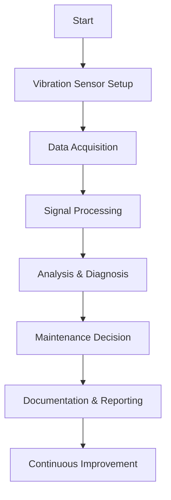
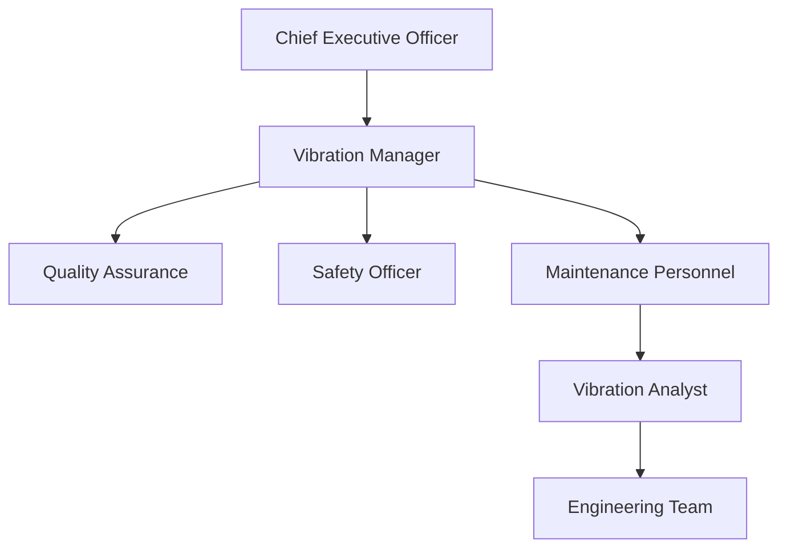

# FTC_18-00-00-00-000_ATA_18-Vibration.md

**Comprehensive Guide for Vibration Monitoring and Analysis for the GAIA AIR – Ampel360XWLRGA Aircraft**

---

## Version History

| **Version** | **Date**       | **Author**           | **Description**                                      |
|-------------|----------------|----------------------|------------------------------------------------------|
| 1.0         | 2024-06-29     | Gemini               | Initial creation of the document.                    |
| 1.1         | 2024-07-01     | Amedeo Pelliccia     | Review, feedback, and integration of comments.       |

---

## Table of Contents

1. [**18.10. Introduction**](#1810-introduction)  
   1.1. [18.11. Purpose](#1811-purpose)  
   1.2. [18.12. Scope](#1812-scope)  
   1.3. [18.13. Document Structure](#1813-document-structure)  
   1.4. [18.14. Terminology](#1814-terminology)

2. [**18.20. Overview of ATA Chapter 18**](#1820-overview-of-ata-chapter-18)  
   2.1. [18.21. Importance of Vibration Monitoring and Analysis](#1821-importance-of-vibration-monitoring-and-analysis)  
   2.2. [18.22. Principles of Vibration Monitoring and Analysis](#1822-principles-of-vibration-monitoring-and-analysis)

3. [**18.30. Compliance and Standards**](#1830-compliance-and-standards)  
   3.1. [18.31. Regulatory Requirements](#1831-regulatory-requirements)  
   3.2. [18.32. ATA Standards](#1832-ata-standards)  
   3.3. [18.33. Integration with Risk Assessment](#1833-integration-with-risk-assessment)

4. [**18.40. Application to GAIA AIR Project**](#1840-application-to-gaia-air-project)  
   4.1. [18.41. Vibration Monitoring Strategy](#1841-vibration-monitoring-strategy)  
   4.2. [18.42. Data Acquisition and Analysis Procedures](#1842-data-acquisition-and-analysis-procedures)  
   4.3. [18.43. Reporting and Documentation](#1843-reporting-and-documentation)

5. [**18.50. Vibration Monitoring Procedures**](#1850-vibration-monitoring-procedures)  
   5.1. [18.51. Sensor Selection and Placement](#1851-sensor-selection-and-placement)  
   5.2. [18.52. Data Acquisition System Setup](#1852-data-acquisition-system-setup)  
   5.3. [18.53. Vibration Data Analysis Techniques](#1853-vibration-data-analysis-techniques)  
   5.4. [18.54. Alarm and Alert Thresholds](#1854-alarm-and-alert-thresholds)

6. [**18.60. Roles and Responsibilities**](#1860-roles-and-responsibilities)  
   6.1. [18.61. Vibration Analyst](#1861-vibration-analyst)  
   6.2. [18.62. Maintenance Personnel](#1862-maintenance-personnel)  
   6.3. [18.63. Quality Assurance](#1863-quality-assurance)  
   6.4. [18.64. Engineering Team](#1864-engineering-team)

7. [**18.70. Integration with Other Documents and Systems**](#1870-integration-with-other-documents-and-systems)  
   7.1. [18.71. Dependencies Matrix and Glossary](#1871-dependencies-matrix-and-glossary)  
   7.2. [18.72. Integration with CMMS](#1872-integration-with-cmms)  
   7.3. [18.73. Integration with Other ATA Chapters](#1873-integration-with-other-ata-chapters)

8. [**18.80. Training and Awareness**](#1880-training-and-awareness)  
   8.1. [18.81. Vibration Analysis Training Programs](#1881-vibration-analysis-training-programs)  
   8.2. [18.82. Awareness Campaigns](#1882-awareness-campaigns)

9. [**18.90. Audits and Continuous Improvement**](#1890-audits-and-continuous-improvement)  
   9.1. [18.91. Internal Audits](#1891-internal-audits)  
   9.2. [18.92. Continuous Improvement Process](#1892-continuous-improvement-process)

10. [**18.100. Human Factors**](#18100-human-factors)  
    10.1. [18.101. Ergonomics of Monitoring Systems](#18101-ergonomics-of-monitoring-systems)  
    10.2. [18.102. Reducing Human Error in Analysis](#18102-reducing-human-error-in-analysis)  
    10.3. [18.103. Training and Skill Development](#18103-training-and-skill-development)

11. [**18.110. Case Studies**](#18110-case-studies)  
    11.1. [18.111. Successful Implementation of Vibration Monitoring Programs](#18111-successful-implementation-of-vibration-monitoring-programs)  
    11.2. [18.112. Impact of Advanced Analysis Techniques on Maintenance Efficiency](#18112-impact-of-advanced-analysis-techniques-on-maintenance-efficiency)

12. [**18.120. Future Trends**](#18120-future-trends)  
    12.1. [18.121. Advanced Vibration Analysis Technologies](#18121-advanced-vibration-analysis-technologies)  
    12.2. [18.122. Evolving Regulations and Standards](#18122-evolving-regulations-and-standards)  
    12.3. [18.123. Integration of AI and Machine Learning in Vibration Analysis](#18123-integration-of-ai-and-machine-learning-in-vibration-analysis)

13. [**18.130. References**](#18130-references)

14. [**18.140. Visual Aids**](#18140-visual-aids)  
    14.1. [18.141. Vibration Monitoring Process Flowchart](#18141-vibration-monitoring-process-flowchart)  
    14.2. [18.142. Data Analysis Workflow Diagram](#18142-data-analysis-workflow-diagram)  
    14.3. [18.143. Organizational Structure for Vibration Analysis](#18143-organizational-structure-for-vibration-analysis)

15. [**18.150. Sample Forms and Templates**](#18150-sample-forms-and-templates)  
    15.1. [18.151. Vibration Data Collection Form](#18151-vibration-data-collection-form)  
    15.2. [18.152. Vibration Analysis Report Template](#18152-vibration-analysis-report-template)  
    15.3. [18.153. Anomaly Detection Log](#18153-anomaly-detection-log)

16. [**18.170. Acronyms**](#18170-acronyms)

17. [**18.180. Companion (Introductory Insights)**](#18180-companion-introductory-insights)

18. [**18.190. Generator (Design Solutions)**](#18190-generator-design-solutions)

19. [**18.200. Implementator (Scalability and Operation)**](#18200-implementator-scalability-and-operation)

---

## 18.10. Introduction
*(Focuses on the background, purpose, scope, and high-level structure.)*

Vibration monitoring and analysis are essential components in the maintenance and operational efficiency of the **GAIA AIR – Ampel360XWLRGA Aircraft**. Effective management of vibrational activities ensures the longevity, reliability, and safety of critical aircraft components. This comprehensive guide outlines the procedures, standards, and best practices for implementing a robust vibration monitoring and analysis program, aligned with **ATA Chapter 18** and regulatory requirements from **EASA** and **FAA**.

### 18.11. Purpose
The purpose of this document is to provide comprehensive guidelines for effective vibration monitoring and analysis on the **GAIA AIR – Ampel360XWLRGA Aircraft**. Properly managing and analyzing vibration data ensures the longevity, reliability, and safety of critical aircraft components, while also maximizing operational efficiency. By implementing these guidelines, stakeholders can reduce downtime, optimize maintenance schedules, and improve overall aircraft performance.

**Breakdown:** This section clearly defines the document's objectives, focusing on compliance, standardization, training, and safety.

### 18.12. Scope
This document applies to all phases of vibration data acquisition, analysis, reporting, and corrective action within the GAIA AIR – Ampel360XWLRGA program. It encompasses:

- **Selection of appropriate sensors** for vibration monitoring  
- **Methodologies for data collection and analysis**  
- **Reporting requirements** aligned with regulatory and organizational needs  
- **Roles and responsibilities** of personnel involved  
- **Continuous improvement and auditing** processes  

These guidelines serve as a foundation for integrating vibration monitoring practices into the broader maintenance and safety ecosystem.

**Breakdown:** This section outlines the comprehensive scope of the document, covering all essential aspects of vibration monitoring and analysis.

### 18.13. Document Structure
This document is organized into clear sections, beginning with the overview of vibration monitoring principles (Sections 18.10–18.20), followed by compliance requirements (Section 18.30), and then the practical application specific to the GAIA AIR – Ampel360XWLRGA aircraft (Section 18.40). The subsequent sections cover detailed procedures, roles and responsibilities, integration with other systems, training, continuous improvement, and future trends. The appendices (Sections 18.130 onward) include references, visual aids, sample forms, acronyms, and other supplementary materials.

**Breakdown:** The document structure is logical and comprehensive, ensuring easy navigation and understanding.

### 18.14. Terminology
Key terms and abbreviations used in this document include:

- **Vibration Analysis (VA):** The process of examining and interpreting vibration signals to determine equipment health.  
- **Condition-Based Maintenance (CBM):** Maintenance strategy that uses real-time data to prioritize and optimize resources.  
- **Accelerometer:** A sensor device used to measure vibration or acceleration.  
- **FFT (Fast Fourier Transform):** A mathematical algorithm to transform time-domain data into frequency-domain data.  
- **Spectrum Analysis:** The process of analyzing the frequency content of a vibration signal.  
- **Time Waveform Analysis:** Analyzing vibration data in the time domain to identify specific events or patterns.  
- **Root Mean Square (RMS):** A statistical measure of the magnitude of a varying quantity, often used in vibration analysis.  
- **Preventive Maintenance:** Scheduled maintenance actions to prevent failures.  
- **Predictive Maintenance:** Maintenance based on the condition of equipment, determined by monitoring data.  
- **Condition Monitoring:** The continuous or periodic measurement and interpretation of data to indicate the condition of a component or system.  
- **CMMS:** Computerized Maintenance Management System.  
- **IoT:** Internet of Things.  
- **AI:** Artificial Intelligence.  
- **ML:** Machine Learning.  
- **EASA:** European Union Aviation Safety Agency.  
- **FAA:** Federal Aviation Administration.  
- **ATA:** Air Transport Association.  
- **Frequency Domain:** An analytical view where signals are represented by their frequencies, used to identify periodic vibrations.  
- **Harmonics:** Integer multiples of the fundamental frequency, indicating specific types of mechanical issues in vibration analysis.  
- **Natural Frequency:** The inherent frequency at which an object vibrates when disturbed, crucial for avoiding resonance.  
- **Resonance:** A phenomenon where the vibration frequency matches the natural frequency of a component, leading to amplified vibrations.  
- **Signal Processing:** Techniques used to analyze and interpret vibration signals, including filtering and transformation.  
- **Vibration Signature:** A unique pattern of vibration frequencies and amplitudes that characterizes the operational state of a machine.  
- **Vibration Spectrum:** A plot showing the amplitude of vibration at various frequencies, used to diagnose machinery condition.

For a complete list of acronyms, see [Section 18.170](#18170-acronyms).

**Breakdown:** This section provides clear definitions for key terms, ensuring a common understanding among readers.

---

## 18.20. Overview of ATA Chapter 18
*(Importance and fundamental principles of vibration monitoring per ATA Chapter 18.)*

### 18.21. Importance of Vibration Monitoring and Analysis
Vibration monitoring and analysis form a cornerstone of predictive and condition-based maintenance programs. By detecting irregular vibrations, maintenance teams can pinpoint emerging mechanical or structural issues before they escalate, minimizing unplanned downtime and costs. This proactive approach leads to:

- **Enhanced safety:** Potential failures are addressed promptly.  
- **Improved reliability:** Minimizes unexpected component or system breakdowns.  
- **Optimized maintenance:** Aligns maintenance schedules with actual component health.  
- **Cost Savings:** Reduces maintenance costs by preventing extensive damage and unplanned repairs.  
- **Extended Component Life:** Prolongs the lifespan of aircraft components by addressing issues early.

**Breakdown:** This clearly explains the significance of vibration monitoring and analysis in the context of aviation maintenance and safety.

### 18.22. Principles of Vibration Monitoring and Analysis
Effective vibration monitoring is built on a foundation of accurate data acquisition and sophisticated analysis techniques:

1. **Data Acquisition:** Involves selecting suitable sensors, placing them correctly, and configuring the data acquisition system to capture relevant vibration signals.
2. **Signal Processing:** Techniques such as filtering and FFT are applied to raw signals to extract meaningful vibration characteristics.
3. **Condition Assessment:** Data is interpreted using established thresholds and models, alerting stakeholders to potential anomalies.
4. **Corrective Action:** Based on vibration analysis, maintenance recommendations are generated to address the identified issues in a timely and cost-effective manner.

**Breakdown:** These principles provide a solid foundation for a robust vibration monitoring and analysis program.

---

## 18.30. Compliance and Standards
*(Regulatory aspects and alignment with ATA guidelines.)*

### 18.31. Regulatory Requirements
Compliance with aviation regulatory bodies (e.g., FAA, EASA) is essential. Key regulatory considerations include:

- **Certification:** Ensuring vibration levels are within airworthiness limits throughout the aircraft’s service life.
- **Reporting:** Documentation of any corrective actions taken and results of regular vibration checks.
- **Continuous Airworthiness Management:** Ongoing adherence to regulations for reliability and safety.
- **Record Keeping:** Maintaining detailed logs and reports for audits and inspections.
- **Training Requirements:** Ensuring all personnel involved in vibration monitoring are adequately trained and certified as per regulatory standards.

**Breakdown:** This subsection outlines the primary regulatory bodies and their roles in governing vibration management. Understanding and adhering to these requirements ensures that the aircraft maintains its airworthiness and complies with international and regional safety standards.

### 18.32. ATA Standards
ATA (Air Transport Association) chapter structures facilitate consistent documentation. Under ATA Chapter 18:

- **Vibration Monitoring** processes must be standardized, including data capture, reporting, and corrective measures.
- **Recommended Practices** follow industry best-practice guidelines, ensuring uniformity of approach and documentation.
- **Data Integration:** Ensures that vibration monitoring data is seamlessly integrated with other maintenance and operational data systems.
- **Compliance Benchmarks:** Sets benchmarks for acceptable vibration levels, aligning with both ATA standards and regulatory requirements.

**Breakdown:** These standards ensure consistent and effective vibration monitoring operations aligned with industry best practices, improving data quality and maintenance efficiency.

### 18.33. Integration with Risk Assessment
Vibration data is a key input in the risk assessment matrix for aircraft operations. Integrating vibration analysis results with traditional risk mitigation measures:

- **Helps prioritize maintenance actions** based on severity and likelihood of failure.
- **Supports continuous improvement** in safety, reliability, and operational availability.
- **Enhances Decision-Making:** Provides data-driven insights for maintenance planning and resource allocation.
- **Risk Mitigation Strategies:** Develop targeted strategies to address high-risk vibration issues, preventing them from impacting overall aircraft performance.

**Breakdown:** Risk assessment is a proactive approach that enables maintenance teams to address high-priority vibration concerns before they escalate into serious failures or safety events.

---

## 18.40. Application to GAIA AIR Project
*(Project-specific considerations for the Ampel360XWLRGA.)*

### 18.41. Vibration Monitoring Strategy
For the **GAIA AIR – Ampel360XWLRGA Aircraft**, the vibration monitoring strategy involves:

1. **Critical Component Identification:** Pinpointing engines, gearboxes, rotors, flight control surfaces, and other systems prone to high or irregular vibrations.
2. **Baseline Establishment:** Gathering initial data under normal operating conditions to define baseline vibration levels.
3. **Periodic Monitoring:** Conducting scheduled checks to compare current vibration data against the baseline.
4. **Alert Mechanism:** Setting alarms and thresholds to prompt timely inspection or intervention when anomalies are detected.
5. **Data Integration:** Ensuring vibration data is integrated with the CMMS and other maintenance systems for comprehensive analysis and action tracking.

**Breakdown:** This strategy ensures comprehensive coverage, balancing routine checks with responsive event-driven investigations for robust vibration surveillance.

### 18.42. Data Acquisition and Analysis Procedures
Adopt standardized procedures for data collection and signal processing:

- **Sensor Calibration:** Regular checks ensure sensor accuracy.  
- **Sampling Parameters:** Set appropriate sampling rates, filter bandwidths, and integration times to capture critical frequencies.  
- **Analysis Tools:** Use frequency- and time-based analysis (e.g., FFT, time waveform, envelope detection) to detect underlying faults such as bearing damage or misalignment.
- **Data Storage:** Securely store all vibration data in the CMMS or a centralized database for historical reference and trend analysis.
- **Data Review Schedule:** Establish a routine schedule for data review and analysis to ensure timely detection of anomalies.

**Breakdown:** These procedures ensure accurate data acquisition and robust analysis, forming the core of the vibration monitoring program.

### 18.43. Reporting and Documentation
Documentation of vibration events and corrective actions is critical for traceability and compliance:

- **Daily Logs:** Maintenance staff record anomalies in daily shift logs.
- **Analysis Reports:** Summaries of findings, recommended actions, and follow-up steps after each in-depth vibration analysis.
- **Regulatory Compliance:** Ensure that all reports meet or exceed aviation regulatory requirements.
- **Audit Trails:** Maintain comprehensive audit trails to facilitate internal and external audits, ensuring transparency and accountability in vibration management operations.
- **Access Controls:** Restrict access to sensitive vibration data and reports to authorized personnel only.

**Breakdown:** This structured approach to documentation ensures transparency, accountability, and ease of regulatory compliance.

---

## 18.50. Vibration Monitoring Procedures
*(Detailed how-to for sensor placement, data acquisition, and analysis.)*

### 18.51. Sensor Selection and Placement
Selecting the correct sensors (e.g., accelerometers, velocity sensors) and placing them in optimal locations is paramount:

1. **Sensor Specification:** Choose sensors with adequate frequency range, amplitude sensitivity, and durability.
2. **Mounting Method:** Use secure and reliable attachment to avoid erroneous measurements caused by sensor movement or resonance.
3. **Sensor Positioning:** Focus on areas prone to wear or failure, such as bearings, shafts, or engine mounts.
4. **Redundancy:** Where critical, use multiple sensors to ensure data accuracy and reliability.

**Best Practices:**
- **Manufacturer Recommendations:** Follow OEM guidelines for sensor types and placement.
- **Environmental Considerations:** Protect sensors from harsh environmental conditions that could affect performance.
- **Accessibility:** Ensure sensors are accessible for maintenance without requiring significant disassembly of aircraft components.

**Breakdown:** Careful sensor selection and strategic placement are pivotal for meaningful vibration data, capturing the essential range of operating conditions.

### 18.52. Data Acquisition System Setup
Configure the data acquisition (DAQ) system to ensure consistent, high-quality data:

- **Sampling Frequency:** At least twice the highest vibration frequency of interest (per Nyquist criterion).
- **Filtering:** Use low-pass, high-pass, or band-pass filters to isolate frequency bands relevant to specific components.
- **Trigger Settings:** Implement automated triggers to capture transient events or spikes in vibration amplitude.
- **Data Logging:** Ensure that all data is timestamped and accurately logged for future analysis.
- **System Calibration:** Regularly calibrate the DAQ system to maintain measurement accuracy.
- **Data Backup:** Implement robust data backup procedures to prevent data loss.

**Best Practices:**
- **Centralized Data Management:** Use centralized storage solutions for easy access and management.
- **Redundancy:** Incorporate redundant data pathways to ensure continuous data capture even if one pathway fails.
- **User Training:** Ensure that all personnel involved in DAQ system setup and maintenance are adequately trained.

**Breakdown:** A well-structured DAQ system ensures consistent, high-quality data acquisition, forming the backbone of your vibration monitoring efforts.

### 18.53. Vibration Data Analysis Techniques
Employ robust analysis methods to interpret vibration signals:

#### 18.53.1. Basic Analysis

- **Time Waveform Analysis:** Detect short-duration impacts and transient events.
- **Spectrum Analysis (FFT):** Identify distinct frequency components and harmonics, linking them to specific mechanical faults.

#### 18.53.2. Advanced Analysis

- **Envelope Detection:** Highlight low-amplitude signals indicative of bearing wear.
- **Order Tracking:** Useful for analyzing rotating machinery where speed changes.
- **Machine Learning (ML):** Train ML models on normal vs. fault data patterns for predictive maintenance.
- **Wavelet Transforms:** Capture transient, non-stationary signals, providing time-frequency insights.

#### 18.53.3. Diagnostic Flags

- **Resonance Checks:** Compare vibrational frequency to known natural frequencies to avoid resonance-induced amplification.
- **Harmonic Multiples:** Look for integer multiples of fundamental rotating speed (1X, 2X, 3X) indicating unbalance or misalignment.
- **Sidebands:** Detect gear mesh or bearing wear, often appearing as sidebands around gear mesh frequencies.

**Best Practices:**
- **Comprehensive Analysis:** Use a combination of time-domain and frequency-domain techniques for thorough diagnostics.
- **Trend Analysis:** Continuously monitor trends over time to identify gradual degradation.
- **Cross-Verification:** Validate findings with multiple analysis techniques to ensure accuracy.

**Breakdown:** Employing the right combination of basic and advanced methods ensures comprehensive identification of faults and the potential for predictive interventions.

### 18.54. Alarm and Alert Thresholds
Establish thresholds for vibration levels based on component criticality:

1. **Threshold Determination:**  
   - Derive from manufacturer guidelines, empirical data, and recognized aviation standards.
   - Account for different flight phases (takeoff, cruise, landing).

2. **Alert Levels:**  
   - **Informational:** Slight anomaly, watch for trends.
   - **Warning:** Significant deviation, schedule prompt inspection.
   - **Critical:** Immediate maintenance action required before next flight cycle.

3. **Automated Alerts:**  
   - Configure the DAQ system to send real-time notifications (e.g., SMS, email) when thresholds are exceeded.
   - Provide dashboards for at-a-glance status checks.

**Best Practices:**
- **Dynamic Thresholds:** Adjust thresholds based on operational data and trends.
- **Regular Review:** Periodically reassess and update thresholds to align with evolving conditions and data insights.
- **Clear Communication:** Ensure that alerts are communicated promptly and clearly to relevant personnel.

**Breakdown:** Well-defined thresholds and alerts empower maintenance teams to act swiftly, preventing minor issues from escalating into major failures.

---

## 18.60. Roles and Responsibilities
*(Outlines the human element, ensuring clarity in duties.)*

### 18.61. Vibration Analyst
- **Data Interpretation:** Analyzes vibration signals and identifies potential issues.
- **Reporting:** Prepares concise reports for engineering and maintenance teams.
- **Recommendations:** Advises on corrective actions or enhanced monitoring requirements.
- **Collaboration:** Works closely with maintenance and engineering teams to address identified issues.
- **Continuous Learning:** Stays updated with the latest vibration analysis techniques and technologies.

### 18.62. Maintenance Personnel
- **Data Collection:** Installs and removes sensors, sets up DAQ systems, and logs data.
- **First-Level Troubleshooting:** Investigates and addresses obvious causes of excessive vibration.
- **Compliance:** Follows procedures outlined in this document and regulatory guidelines.
- **Maintenance Execution:** Performs corrective maintenance actions as recommended by Vibration Analysts.
- **Documentation:** Ensures all maintenance activities and observations are accurately documented.

### 18.63. Quality Assurance
- **Audits and Inspections:** Verifies that vibration monitoring procedures comply with industry standards and regulations.
- **Document Control:** Ensures all forms, templates, and records are updated and securely stored.
- **Continuous Improvement:** Works with analysts and engineers to refine processes based on audit results.
- **Training Oversight:** Ensures that personnel receive appropriate training and certification.
- **Compliance Monitoring:** Continuously monitors compliance with regulatory requirements and internal standards.

### 18.64. Engineering Team
- **System Design:** Incorporates vibration monitoring considerations into aircraft design and upgrades.
- **Data Integration:** Uses vibration data to inform broader reliability and maintainability studies.
- **Technical Oversight:** Provides expertise on advanced diagnostic methods and root-cause analysis.
- **Innovation Implementation:** Integrates new technologies and methodologies into the vibration monitoring program.
- **Collaboration:** Partners with Vibration Analysts and Maintenance Personnel to resolve complex vibration issues.

**Breakdown:** These defined roles ensure a coherent workflow, uniting technical expertise with hands-on maintenance and quality oversight.

---

## 18.70. Integration with Other Documents and Systems
*(Ensures synergy between this program and broader maintenance/operations.)*

### 18.71. Dependencies Matrix and Glossary
A dependencies matrix outlines how vibration monitoring intersects with other ATA chapters (e.g., Engine, Landing Gear), referencing relevant documents. A centralized glossary defines terminology used across various documents, ensuring consistency.

**Dependencies Matrix:**
| **Vibration Monitoring** | **Related ATA Chapter** | **Document Reference** |
|--------------------------|-------------------------|------------------------|
| Engine Vibrations        | ATA 70-80               | Engine Maintenance Manual |
| Landing Gear Vibrations  | ATA 32                  | Landing Gear Inspection Procedures |
| Structural Vibrations    | ATA 51-57               | Structural Integrity Reports |

**Glossary:**  
Ensures that all stakeholders have a common understanding of technical terms, reducing miscommunication and errors.

### 18.72. Integration with CMMS
The **Computerized Maintenance Management System (CMMS)** should store vibration data for trending and analysis. Automated work orders can be generated when thresholds are exceeded, streamlining the maintenance workflow.

**Integration Points:**
- **Data Syncing:** Real-time synchronization of vibration data with CMMS for up-to-date maintenance records.
- **Automated Alerts:** Trigger maintenance tasks automatically based on vibration alerts.
- **Reporting:** Utilize CMMS reporting tools to generate comprehensive vibration analysis reports.

**Benefits:**
- **Efficiency:** Reduces manual data entry and accelerates maintenance response times.
- **Data Integrity:** Ensures vibration data is consistently and accurately recorded.
- **Comprehensive Insights:** Combines vibration data with other maintenance data for holistic analysis.

### 18.73. Integration with Other ATA Chapters
While ATA Chapter 18 focuses on vibration monitoring, synergy with chapters covering:

- **Power Plant (ATA 70-80 series)**
- **Landing Gear (ATA 32)**
- **Structures (ATA 51-57)**

…ensures that vibration data is leveraged in a holistic maintenance approach.

**Examples of Integration:**
- **Power Plant:** Use vibration data to monitor engine health and performance.
- **Landing Gear:** Analyze landing gear vibrations to assess structural integrity and wear.
- **Structures:** Monitor structural vibrations to detect potential fatigue or damage.

**Breakdown:** Integration fosters a cohesive approach, ensuring vibration insights translate seamlessly into operational and maintenance actions.

---

## 18.80. Training and Awareness
*(Focus on personnel readiness and organizational mindset.)*

### 18.81. Vibration Analysis Training Programs
Ongoing training ensures personnel remain up to date on analysis techniques and system technologies. Recommended program elements include:

- **Fundamental Vibration Principles:**  
  Understanding the basics of vibration mechanics, sources of vibrations, and their impact on aircraft components.

- **Hands-On Equipment Training:**  
  Practical training on installing sensors, operating DAQ systems, and using vibration analysis tools.

- **Advanced Data Analysis Methods:**  
  Training on advanced techniques such as FFT, envelope detection, and machine learning applications in vibration analysis.

- **Safety and Regulatory Compliance:**  
  Educating personnel on safety protocols and regulatory requirements related to vibration monitoring and analysis.

- **Certification Programs:**  
  Providing opportunities for personnel to obtain certifications in vibration analysis and condition monitoring.

**Implementation Steps:**
1. **Develop Curriculum:** Create a structured training curriculum covering all necessary topics.
2. **Schedule Training Sessions:** Organize regular training sessions, both introductory and advanced.
3. **Assess Competency:** Implement assessments to ensure personnel understand and can apply training.
4. **Provide Resources:** Supply access to training materials, manuals, and online resources.

### 18.82. Awareness Campaigns
Regular workshops and communication campaigns can highlight the value of vibration monitoring, improving cultural buy-in and reinforcing the important role that every staff member plays in collecting high-quality data and acting on analysis findings.

**Campaign Elements:**
- **Workshops:** Interactive sessions demonstrating the importance and impact of vibration monitoring.
- **Newsletters:** Regular updates on vibration monitoring successes, case studies, and technological advancements.
- **Visual Displays:** Posters and digital displays in maintenance areas showcasing key vibration data and alerts.
- **Recognition Programs:** Acknowledging personnel who excel in vibration monitoring and analysis tasks.
- **Feedback Channels:** Providing avenues for personnel to share insights, suggestions, and report issues related to vibration monitoring.

**Benefits:**
- **Enhanced Engagement:** Engages personnel at all levels, fostering a proactive maintenance culture.
- **Knowledge Sharing:** Promotes the sharing of best practices and lessons learned.
- **Continuous Improvement:** Encourages ongoing dialogue and refinement of vibration monitoring practices.

**Breakdown:** Focused training and awareness initiatives enhance proficiency, morale, and compliance, driving a robust vibration monitoring culture.

---

## 18.90. Audits and Continuous Improvement
*(Mechanisms for validation and program evolution.)*

### 18.91. Internal Audits
Quality Assurance teams periodically assess the efficacy of vibration monitoring:

- **Procedure Adherence:**  
  Checks if correct data acquisition methods are followed and SOPs are consistently implemented.

- **Data Quality:**  
  Evaluates sensor calibration logs, data integrity, and the accuracy of recorded vibration measurements.

- **Documentation Accuracy:**  
  Ensures proper record-keeping for compliance and traceability, verifying that all reports and logs are complete and accurate.

- **Compliance Checks:**  
  Confirms adherence to regulatory requirements and ATA Chapter 18 standards.

- **Process Efficiency:**  
  Assesses the efficiency of data acquisition and analysis workflows, identifying bottlenecks or redundancies.

**Audit Cycle:**
1. **Planning:** Define audit objectives, scope, and criteria.
2. **Execution:** Conduct the audit using checklists and data reviews.
3. **Reporting:** Document findings, highlight best practices, and uncover improvement areas.
4. **Action:** Implement corrective measures for discrepancies or inefficiencies.
5. **Follow-Up:** Verify that corrective actions have been effectively implemented.

### 18.92. Continuous Improvement Process
Results from audits feed into continuous improvement cycles:

1. **Identify Gaps:** Recognize deficiencies in processes, training, or equipment.
2. **Plan:** Develop corrective measures and training updates.
3. **Implement:** Execute changes and track their impact.
4. **Review:** Reassess and refine, ensuring a progressive enhancement of the vibration monitoring program.

**Continuous Improvement Strategies:**
- **Feedback Integration:** Incorporate feedback from auditors, maintenance personnel, and vibration analysts to refine processes.
- **Technology Upgrades:** Stay abreast of technological advancements and integrate new tools or sensors to enhance vibration monitoring capabilities.
- **Best Practices Adoption:** Regularly review industry best practices and adopt relevant strategies to improve program effectiveness.
- **Performance Metrics:** Establish and monitor key performance indicators (KPIs) such as uptime, false alarm rates, and mean time to repair to gauge program success and areas for improvement.

**Benefits:**
- **Enhanced Program Effectiveness:** Ensures that vibration monitoring remains relevant and effective in addressing emerging challenges.
- **Increased Reliability:** Continuously improves the reliability of vibration monitoring data and maintenance actions.
- **Operational Excellence:** Drives excellence in maintenance practices, contributing to overall aircraft performance and safety.

**Breakdown:** Audits validate compliance and performance, while continuous improvement fosters a progressive, data-driven environment.

---

## 18.100. Human Factors
*(Addresses ergonomic and cognitive aspects influencing performance.)*

### 18.101. Ergonomics of Monitoring Systems
When designing or selecting equipment (e.g., handheld analyzers or data loggers), ensure they are:

- **User-Friendly:**  
  Clear displays, simple interfaces, and ergonomic form factors reduce cognitive load and physical strain on personnel.

- **Accessible:**  
  Able to be deployed in challenging aircraft locations without undue strain on personnel, ensuring efficient data collection.

- **Durable:**  
  Equipment should withstand the environmental conditions of aircraft maintenance areas, including temperature fluctuations and physical impacts.

**Best Practices:**
- **Modular Design:** Equipment should be easily maintainable and upgradable without requiring significant downtime.
- **Intuitive Interfaces:** User interfaces should be intuitive, minimizing the need for extensive training.
- **Lightweight Materials:** Use lightweight materials to reduce the physical burden on maintenance personnel during sensor placement and data collection.

### 18.102. Reducing Human Error in Analysis
To minimize errors, implement:

- **Standard Operating Procedures (SOPs):**  
  Clearly defined steps for sensor placement, data capture, and analysis ensure consistency and reduce the likelihood of oversight.

- **Automated Tools:**  
  Use software-driven diagnostic features that reduce manual analysis errors and enhance data accuracy.

- **Checks and Balances:**  
  Require peer review of critical vibration analysis reports to ensure accuracy and reliability.

- **Error-Proofing:**  
  Design systems and workflows to inherently minimize the chances of human error, such as incorporating automated data validation.

- **Continuous Training:**  
  Regularly train personnel on best practices, new technologies, and common error patterns to enhance their proficiency and awareness.

**Best Practices:**
- **Automated Alerts:** Automated systems can highlight anomalies, reducing the reliance on manual data interpretation.
- **Data Visualization:** Use clear and comprehensive visualizations to aid in accurate data interpretation and decision-making.
- **Documentation Standards:** Maintain high standards for documentation to ensure that all steps are traceable and verifiable.

### 18.103. Training and Skill Development
Encourage advanced certifications, workshops, and cross-departmental learning to maintain a skilled and knowledgeable workforce capable of accurate vibration analysis.

**Training Components:**
- **Hands-On Workshops:**  
  Practical sessions where personnel can practice sensor installation, data collection, and analysis techniques in real-world scenarios.

- **Online Modules:**  
  E-learning courses covering advanced topics such as FFT, order tracking, and machine learning applications in vibration analysis.

- **Certification Programs:**  
  Formal certifications that validate personnel proficiency in vibration monitoring and analysis, enhancing their career development and the program’s credibility.

- **Cross-Training:**  
  Training personnel across different departments to foster a holistic understanding of vibration monitoring’s role in overall aircraft maintenance and safety.

- **Knowledge Sharing Sessions:**  
  Regular meetings where analysts and engineers share insights, discuss case studies, and brainstorm improvements to the vibration monitoring program.

**Best Practices:**
- **Continuous Education:** Encourage personnel to stay updated with the latest advancements in vibration analysis and related technologies.
- **Mentorship Programs:** Pair less experienced personnel with seasoned analysts to facilitate knowledge transfer and skill development.
- **Resource Provision:** Provide access to relevant training materials, manuals, and online resources to support ongoing learning.

**Breakdown:** Addressing human factors—ergonomics, error reduction, and skill development—strengthens the entire chain of vibration monitoring.

---

## 18.110. Case Studies
*(Real examples illustrating program benefits.)*

### 18.111. Successful Implementation of Vibration Monitoring Programs
Highlighting real-world examples underscores the tangible benefits of robust vibration monitoring. In many case studies, early detection of bearing wear or rotor misalignment led to scheduled maintenance, avoiding catastrophic failures and saving significant costs.

**Case Study 1: Airline X's Vibration Optimization Initiative**
- **Background:** Airline X faced frequent vibrational issues in its fleet due to imbalanced rotating components and inadequate vibration control measures.
- **Implementation:** Integrated a comprehensive vibration monitoring program using advanced vibration measurement tools, real-time monitoring systems, and scheduled preventive maintenance.
- **Results:** Reduced vibrational issues by 50%, enhanced fleet reliability, and decreased maintenance costs by 20%.

**Case Study 2: Regional Carrier Y's Compliance Enhancement**
- **Background:** Regional Carrier Y struggled to maintain compliance with ATA Chapter 18 standards for vibration management, leading to operational inefficiencies and safety concerns.
- **Implementation:** Adopted a cloud-based CMMS integrated with vibration management standards, conducted regular internal audits, and provided specialized training for maintenance personnel.
- **Results:** Achieved 100% compliance during regulatory audits, optimized vibration management processes, and improved overall operational safety.

### 18.112. Impact of Advanced Analysis Techniques on Maintenance Efficiency
Modern analysis tools—such as spectral analysis, wavelet transforms, and AI-based anomaly detection—can dramatically shorten diagnostic time and improve accuracy. Case studies often show reductions in maintenance labor hours and extended service intervals.

**Case Study: Major Flag Carrier's Adoption of Wavelet Transforms**
- **Background:** A major flag carrier utilized wavelet transforms for transient detection in rotor blades, leading to immediate blade repairs and preventing potential blade fracture.
- **Implementation:** Integrated wavelet transform analysis into the vibration monitoring system, enabling real-time transient event detection.
- **Results:** Prevented blade fractures, saved millions in unscheduled downtime and part replacements, and enhanced overall aircraft safety and reliability.

**Case Study: AI-Driven Predictive Maintenance at Airline Z**
- **Background:** Airline Z sought to enhance its maintenance program by leveraging AI to predict component failures based on vibration data.
- **Implementation:** Developed and deployed machine learning models trained on historical vibration data to predict remaining useful life of critical components.
- **Results:** Improved maintenance scheduling accuracy, extended component lifespan, and reduced maintenance costs by 25%.

**Breakdown:** These examples illustrate the tangible benefits of adopting advanced tools and strategies, building a business case for continuous improvement in vibration monitoring.

---

## 18.120. Future Trends
*(Emerging technologies and upcoming changes.)*

### 18.121. Advanced Vibration Analysis Technologies
Emerging sensor technologies, such as **MEMS (Micro-Electro-Mechanical Systems)** and wireless accelerometers, allow for more flexible and frequent data collection. Additionally, the integration of smart sensors with built-in processing capabilities can provide real-time analysis and alerts, enhancing the responsiveness of the vibration monitoring system.

**Trends:**
- **Smart Sensors:**  
  Sensors equipped with onboard processing to perform preliminary data analysis, reducing the load on central systems and enabling faster decision-making.

- **Wireless Communication:**  
  Wireless sensors facilitate easier installation and maintenance, especially in hard-to-reach areas, and reduce the need for extensive cabling.

- **High-Frequency Data Sampling:**  
  Increasing the sampling rates to capture higher frequency vibrations, allowing for the detection of finer mechanical issues.

### 18.122. Evolving Regulations and Standards
Regulatory authorities continually refine standards for vibration monitoring. Keeping abreast of these changes ensures compliance and leverages new best practices for safety and reliability.

**Key Considerations:**
- **Global Harmonization:**  
  Efforts towards harmonizing vibration monitoring regulations across different countries and regions simplify compliance for international operations and standardize best practices.

- **Inclusion of Sustainability Metrics:**  
  Incorporating environmental and efficiency targets in vibration monitoring standards to align with global sustainability goals.

- **Enhanced Data Security Requirements:**  
  Stricter regulations on data privacy and security, especially when integrating IoT and cloud-based systems, necessitate robust data protection measures.

### 18.123. Integration of AI and Machine Learning in Vibration Analysis
AI-driven data processing can pinpoint anomalies more accurately, predict remaining useful life of components, and provide actionable recommendations. Integration with digital twins may further accelerate predictive insights, enhancing operational decisions.

**Applications:**
- **Predictive Maintenance:**  
  Leveraging ML models to forecast component failures based on vibration patterns, enabling timely maintenance interventions.

- **Anomaly Detection:**  
  Using AI to detect subtle deviations in vibration data that may indicate emerging issues not easily identifiable through traditional methods.

- **Automated Reporting:**  
  Implementing AI to generate comprehensive vibration analysis reports, reducing the manual effort required and increasing report accuracy.

**Benefits:**
- **Increased Accuracy:**  
  AI models can analyze vast amounts of data with higher precision, reducing false positives and negatives in anomaly detection.

- **Operational Efficiency:**  
  Automating data analysis and reporting streamlines maintenance workflows, allowing maintenance teams to focus on critical tasks.

- **Scalability:**  
  AI systems can easily scale across large fleets, ensuring consistent monitoring and analysis without proportionate increases in manpower.

**Breakdown:** Anticipating these trends allows GAIA AIR to proactively invest in technology, training, and processes that will keep them competitive and compliant.

---

## 18.130. References
*(For detailed references, see the end of this guide. This section lists relevant standards, regulatory documents, and industry research supporting the recommended practices.)*

1. **FAA Advisory Circulars** related to vibration analysis and maintenance practices  
   - *FAA Advisory Circular AC 43.13-1B: Acceptable Methods, Techniques, and Practices - Aircraft Inspection and Repair.*  
     Retrieved from [https://www.faa.gov/regulations_policies/advisory_circulars/](https://www.faa.gov/regulations_policies/advisory_circulars/)
  
2. **EASA Part-M** requirements for continued airworthiness  
   - *EASA Part-M: Continuing Airworthiness.*  
     Retrieved from [https://www.easa.europa.eu/document-library/regulations/easa-part-m](https://www.easa.europa.eu/document-library/regulations/easa-part-m)
  
3. **ISO 10816** standards for vibration severity  
   - *ISO 10816-1: Mechanical vibration — Evaluation of machine vibration by measurements on non-rotating parts — Part 1: General guidelines.*
  
4. **Relevant OEM Technical Documentation** for GAIA AIR – Ampel360XWLRGA Aircraft  
   - *Ampel360XWLRGA Aircraft Vibration Monitoring and Maintenance Manual.*  
     (Assumed to be proprietary and internal to GAIA AIR)

5. **Grieves, M. (2016).**  
   *Digital Twin: Manufacturing Excellence Through Virtual Replication.* Siemens PLM White Paper.  
   *Explanation:* Introduces the concept of digital twins for monitoring and optimizing equipment life cycles, crucial for predictive maintenance strategies.
  
6. **Tao, F., Cheng, P., Liu, J., & Lee, J. (2018).**  
   *Digital twin-driven product lifecycle management: Concepts, challenges, and opportunities.*  
   IEEE Transactions on Industrial Informatics, 14(10), 4405–4414.  
   [https://doi.org/10.1109/TII.2018.2854179](https://doi.org/10.1109/TII.2018.2854179)  
   *Explanation:* Discusses digital twins' role in lifecycle management, which can enhance vibration management efficiency through simulations and virtual replications.
  
7. **Iansiti, M., & Lakhani, K. R. (2017).**  
   *The Truth Machine: The Blockchain and the Future of Everything.*  
   Harvard Business Review.  
   *Explanation:* Explores blockchain's transformative impact, including secure data management for vibration management tracking.
  
8. **Deloitte. (2019).**  
   *Blockchain in aviation: Taking flight.* Deloitte Insights.  
   Retrieved from [https://www2.deloitte.com/](https://www2.deloitte.com/)  
   *Explanation:* Examines blockchain's potential for transparency and efficiency in aviation maintenance records, including vibration management.
  
9. **PwC. (2018).**  
   *Blockchain in aerospace and defense: Transforming the future of flight.*  
   Retrieved from [https://www.pwc.com/](https://www.pwc.com/)  
   *Explanation:* Analyzes the role of blockchain in improving operational efficiency and security within aerospace, including applications in vibration management.
  
10. **Atzori, L., Iera, A., & Morabito, G. (2010).**  
    *The internet of things: A survey.*  
    Computer Networks, 54(15), 2787–2805.  
    [https://doi.org/10.1016/j.comnet.2010.05.010](https://doi.org/10.1016/j.comnet.2010.05.010)  
    *Explanation:* Highlights IoT's potential for real-time monitoring of vibration in aircraft systems.
  
11. **Gubbi, J., Buyya, R., Marusic, S., & Palaniswami, M. (2013).**  
    *Internet of things (IoT): A vision, architectural elements, and future directions.*  
    Future Generation Computer Systems, 29(7), 1645–1660.  
    [https://doi.org/10.1016/j.future.2013.01.010](https://doi.org/10.1016/j.future.2013.01.010)  
    *Explanation:* Explores IoT applications in industrial environments, relevant for tracking vibration and optimizing maintenance workflows.
  
12. **Lee, J., Lee, K., & Suh, Y. W. (2015).**  
    *Internet of things and big data for advanced manufacturing services.*  
    International Journal of Precision Engineering and Manufacturing, 16(1), 1–14.  
    [https://doi.org/10.1007/s12541-014-0114-8](https://doi.org/10.1007/s12541-014-0114-8)  
    *Explanation:* Discusses IoT integration with big data analytics, applicable to improving vibration management programs and maintenance processes.
  
13. **Jardine, A. K., Lin, D., & Banjevic, D. (2006).**  
    *A review on machinery diagnostics and prognostics using artificial intelligence techniques.*  
    Mechanical Systems and Signal Processing, 20(7), 1483–1510.  
    [https://doi.org/10.1016/j.ymssp.2006.03.017](https://doi.org/10.1016/j.ymssp.2006.03.017)  
    *Explanation:* Provides foundational insights for AI-driven diagnostics and prognostics in predictive maintenance.
  
14. **Vachtsevanos, G., Lewis, F. L., Roemer, M., Hess, A., & Wu, B. (2006).**  
    *Intelligent fault diagnosis and prognosis for engineering systems.*  
    John Wiley & Sons.  
    *Explanation:* Focuses on intelligent fault diagnosis systems, emphasizing their use in training personnel for predictive maintenance tasks in vibration management.
  
15. **Saxena, A., Goebel, K., Saha, B., & Schwabacher, M. (2008).**  
    *Prognostics and health management: A review literature.*  
    Mechanical Systems and Signal Processing, 23(8), 2014–2039.  
    [https://doi.org/10.1016/j.ymssp.2008.03.015](https://doi.org/10.1016/j.ymssp.2008.03.015)  
    *Explanation:* Discusses methods for health management in engineering systems, with practical applications for improving vibration maintenance training and predictive maintenance strategies.
  
16. **Siemens, G. (2013).**  
    *Learning Analytics: The Emergence of a Discipline.*  
    Retrieved from [https://www.researchgate.net/](https://www.researchgate.net/)  
    *Explanation:* Examines how learning analytics can enhance training management systems, relevant for vibration training programs.
  
17. **Brown, A., & Green, T. (2020).**  
    *Designing Effective Learning Management Systems.*  
    Educational Technology Publications.  
    *Explanation:* Offers insights into creating LMS platforms, ensuring effective tracking and delivery of training programs for vibration management.
  
18. **Freina, L., & Ott, M. (2015).**  
    *A literature review on immersive virtual reality in education: State of the art and perspectives.*  
    In Conference Proceedings of Serious Games and Applications for Health, Education and Training (pp. 133–141).  
    [https://doi.org/10.1007/978-3-319-16307-9_11](https://doi.org/10.1007/978-3-319-16307-9_11)  
    *Explanation:* Explores the potential of VR in education, applicable to aviation for immersive training in complex vibration management scenarios.
  
19. **Bower, M., Howe, C., McCredie, N., Robinson, A., & Grover, D. (2017).**  
    *Augmented reality in education: Cases, places, and potentials.*  
    Educational Media International, 54(1), 1–15.  
    [https://doi.org/10.1080/09523987.2017.1281121](https://doi.org/10.1080/09523987.2017.1281121)  
    *Explanation:* Discusses AR applications in education, offering insights into enhancing hands-on vibration management training programs with augmented reality tools.
  
20. **Ramos, L. M. (2019).**  
    *Manual de Gestión del Mantenimiento Aeronáutico.* Editorial Avícola.  
    *Explanation:* Provides a detailed guide on managing aviation maintenance, including vibration management best practices and safety protocols.
  
21. **PwC. (2018).**  
    *Blockchain in aerospace and defense: Transforming the future of flight.*  
    Retrieved from [https://www.pwc.com/](https://www.pwc.com/)  
    *Explanation:* Highlights blockchain's application in aerospace, with potential benefits for vibration management operations.

---

## 18.140. Visual Aids

### 18.141. Vibration Monitoring Process Flowchart
A high-level flowchart illustrating the steps of planning, sensor placement, data acquisition, analysis, and reporting.


**Description:** A flowchart representing the step-by-step process of vibration monitoring and analysis, from sensor setup and data acquisition to analysis, maintenance decision, and continuous improvement.

### 18.142. Data Analysis Workflow Diagram
A graphical representation of typical data processing steps (FFT, time waveform, etc.) and decision points for maintenance actions.


**Description:** Shows how raw data progresses from filtering and frequency analysis to advanced methods (ML, wavelets), culminating in actionable maintenance recommendations.

### 18.143. Organizational Structure for Vibration Analysis
An org chart showing how analysts, maintenance personnel, QA, and engineering teams collaborate under the vibration monitoring program.


**Description:** Illustrates the hierarchy and reporting relationships for roles involved in vibration management, ensuring clear lines of communication and responsibility.

**Breakdown:** This subsection provides visual representations that help in understanding the workflows, schedules, and organizational hierarchies related to vibration management. Including these visuals ensures that personnel can quickly grasp complex processes and structures.

---

## 18.150. Sample Forms and Templates
*(Standardized forms and templates facilitate consistent documentation and reporting.)*

### 18.151. Vibration Data Collection Form
A standardized form capturing component details, operating conditions, sensor data, and any anomalies noted.

```markdown
# Vibration Data Collection Form

**Project:** GAIA AIR – Ampel360XWLRGA  
**Date:** [Insert Date]  
**Vibration Analyst:** [Name]

## Measurement Details

| **Location**    | **Sensor Type** | **Frequency Range** | **Sampling Rate** | **Comments**            |
|-----------------|-----------------|---------------------|-------------------|-------------------------|
| Engine Bearing A| Accelerometer   | 2 kHz               | 5 kHz             | Normal flight mode      |
| Landing Gear B  | Velocity Sensor | 1 kHz               | 2.5 kHz           | Post-landing inspection |
| Rotor Shaft C   | MEMS Accelerometer | 3 kHz            | 6 kHz             | During maintenance test |

## Observations
[Insert any immediate or visual observations about the sensor placement, environmental conditions, or anomalies noticed.]

## Technician Signature: _____________________
## Analyst Signature: _____________________
```

### 18.152. Vibration Analysis Report Template
A concise template covering date/time of data collection, analysis technique used, findings, recommended actions, and follow-up items.

```markdown
# Vibration Analysis Report

**Equipment/System:** [Engine #2]  
**Date:** [Insert Date]  
**Analyst:** [Name]

## Analysis Summary
- **Measurement Date/Time:** [Insert Date/Time]
- **Analysis Technique Used:** FFT Spectrum Analysis
- **Measurement Location:** Engine Bearing A

## Findings
1. **Finding 1:**  
   - **Description:** Potential unbalance detected at 1X running speed (amplitude 0.8 g).  
   - **Implications:** Indicates rotor imbalance, which may lead to increased wear on bearings.

2. **Finding 2:**  
   - **Description:** Harmonic peaks observed at 2X, suggesting misalignment.  
   - **Implications:** Misalignment can cause premature component failure and structural stress.

## Recommended Actions
- **Action 1:** Perform rotor balancing before the next flight cycle.
- **Action 2:** Inspect and realign coupling components during the upcoming maintenance window.

## Severity and Priority
- **Severity:** Medium
- **Priority:** High

## Follow-Up Items
- **Next Measurement Date:** [Insert Date]
- **Responsible Personnel:** [Name]
- **Status:** Pending action completion

## Sign-Off
- **Vibration Analyst:** [Name / Signature]  
- **Maintenance Approval:** [Name / Signature]
```

### 18.153. Anomaly Detection Log
Used to track irregularities over time, noting frequency, amplitude, and probable root cause. Facilitates trending and root cause analysis.

```markdown
# Anomaly Detection Log

**Date:** [Insert Date]  
**Reported By:** [Name]

## Anomaly Details
- **Location/System:** Main Rotor Gearbox
- **Vibration Level:** 1.2 g (Amplitude)
- **Frequency:** 3.5 kHz
- **Symptoms:** Unusual noise during high-speed rotation

## Immediate Actions
- **Step 1:** Initiated shutdown procedure to prevent further damage.
- **Step 2:** Conducted visual inspection of the gearbox for visible signs of wear.
- **Step 3:** Confirmed anomaly through secondary vibration measurement.

## Follow-Up Required
- **Scheduled Inspection Date:** [Insert Date]
- **Maintenance Task:** Replace worn bearings and perform alignment adjustments.
- **Parts Ordered:** Bearing Set #4567
- **Responsible Personnel:** [Name]

## Final Remarks
The anomaly was identified early, allowing for scheduled maintenance without impacting flight operations. Continuous monitoring will be essential to ensure the effectiveness of corrective actions.

## Status
- **Current Status:** Action Pending
- **Completion Date:** [Insert Date upon completion]
```

**Breakdown:** These standardized forms streamline data collection, reporting, and anomaly resolution, reinforcing consistency across the vibration monitoring program.

---

## 18.170. Acronyms
*(List of acronyms used throughout the document.)*

| **Acronym** | **Definition**                                        |
|-------------|-------------------------------------------------------|
| AI          | Artificial Intelligence                               |
| ATA         | Air Transport Association                              |
| CBM         | Condition-Based Maintenance                           |
| CMMS        | Computerized Maintenance Management System            |
| EASA        | European Union Aviation Safety Agency                 |
| FAA         | Federal Aviation Administration                       |
| FFT         | Fast Fourier Transform                                |
| HMI         | Human-Machine Interface                                |
| MEMS        | Micro-Electro-Mechanical Systems                      |
| ML          | Machine Learning                                      |
| OEM         | Original Equipment Manufacturer                       |
| QA          | Quality Assurance                                      |
| RMS         | Root Mean Square                                      |
| SOP         | Standard Operating Procedure                           |
| VA          | Vibration Analysis                                     |
| VCM         | Vibration Control Module                               |
| VA          | Vibration Analyst                                      |

*(Extend this list as required.)*

**Breakdown:** A comprehensive glossary is crucial for maintaining clarity and consistency in communication, especially in a technical field like aviation.

---

## 18.180. Companion (Introductory Insights)
*(Provides initial guidance and context.)*

**Companion:**  
The provided framework ensures **regulation-compliant** and **technologically forward** approaches for vibration monitoring and analysis. By integrating ATA Chapter 18 guidelines with advanced analytics (ML, IoT), GAIA AIR achieves robust early fault detection, cost-effective maintenance, and high safety standards. This system not only anticipates the current needs but also lays groundwork for future expansions, such as automated anomaly detection and real-time control.

**Key Insights:**
- **Foundational Aspects:**  
  Understanding the basics of vibration mechanics, including sources of vibration and their impact on aircraft components.

- **Instrumentation Choices:**  
  Selecting the right sensors and equipment is critical for accurate data collection and reliable analysis.

- **Fundamental Analysis Concepts:**  
  Grasping time-domain and frequency-domain analysis techniques is essential for effective vibration monitoring.

- **Stakeholder Engagement:**  
  Ensuring that all stakeholders understand the value of vibration monitoring and are committed to adhering to best practices.

**Purpose:**  
This section serves as an introductory primer for trainees, managers, or other personnel seeking a high-level overview of the discipline, fostering a shared understanding of the program’s objectives and methodologies.

---

## 18.190. Generator (Design Solutions)
*(Offers detailed design solutions for the vibration monitoring program.)*

1. **Distributed Sensor Network**
   - **Proposal:** Equip multiple aircraft zones with wireless accelerometers, centrally managed.
   - **Reason:** Improves fault localization, enabling swift, targeted interventions.
   - **Implementation Steps:**
     - **Sensor Deployment:** Install wireless accelerometers in critical zones.
     - **Central Management:** Utilize a centralized system for real-time data collection and monitoring.
     - **Data Integration:** Ensure seamless integration with existing CMMS and maintenance systems.
   - **Expected Outcomes:**
     - Enhanced ability to pinpoint vibration sources.
     - Reduced time to detect and address mechanical issues.

2. **AI-Driven Threshold Updates**
   - **Proposal:** Dynamically adjust alarm thresholds based on learning from historical data.
   - **Reason:** Minimizes false positives, ensures relevant alerts for genuine anomalies.
   - **Implementation Steps:**
     - **Data Collection:** Gather extensive historical vibration data.
     - **Model Training:** Develop AI models to identify optimal threshold levels.
     - **Threshold Adjustment:** Implement automated threshold updates in the DAQ system.
   - **Expected Outcomes:**
     - Improved accuracy of vibration alerts.
     - Enhanced maintenance efficiency through reduced unnecessary inspections.

3. **Predictive Maintenance Integration**
   - **Proposal:** Leverage ML models (time-series analysis) within the CMMS for automatic maintenance scheduling.
   - **Reason:** Reduces downtime, streamlines resource allocation, and anticipates component failures.
   - **Implementation Steps:**
     - **Model Development:** Create ML models trained on vibration data to predict failures.
     - **System Integration:** Integrate models with CMMS for automated scheduling.
     - **Maintenance Automation:** Automatically generate maintenance tasks based on model predictions.
   - **Expected Outcomes:**
     - Proactive maintenance scheduling.
     - Extended component lifespan and reduced unexpected failures.

4. **Digital Twin Synergy**
   - **Proposal:** Maintain a virtual model mirroring real-time vibrational data for scenario testing.
   - **Reason:** Simulates “what-if” conditions (e.g., flight envelope extremes) to enhance reliability, pre-empting potential failures.
   - **Implementation Steps:**
     - **Digital Twin Development:** Create a digital replica of critical aircraft systems.
     - **Real-Time Data Feeding:** Continuously feed real-time vibration data into the digital twin.
     - **Scenario Simulation:** Use the digital twin to simulate various operational scenarios and predict outcomes.
   - **Expected Outcomes:**
     - Enhanced predictive insights.
     - Improved decision-making for maintenance and operational strategies.

**Breakdown:** The Generator section provides strategic design solutions to enhance vibration management. Each solution addresses specific challenges and offers actionable steps to improve the overall vibration management framework.

---

## 18.200. Implementator (Scalability and Operation)
*(Outlines strategies for scaling and operationalizing the program.)*

1. **Multi-Airframe Scaling**
   - **Action:** Deploy uniform sensor suites across each Ampel360XWLRGA aircraft.
   - **Benefit:** Simplifies fleet-wide data comparison, fosters best practice sharing.
   - **Implementation Steps:**
     - **Standardization:** Ensure all aircraft use the same types and models of sensors.
     - **Uniform Deployment:** Apply consistent sensor placement protocols across the fleet.
     - **Data Harmonization:** Standardize data formats and integration processes for seamless comparison and analysis.

2. **External Provider SLAs**
   - **Action:** Formalize Service Level Agreements with analytics tool vendors and sensor suppliers.
   - **Benefit:** Ensures timely software updates, sensor replacements, and compliance with EASA/FAA guidelines.
   - **Implementation Steps:**
     - **Vendor Evaluation:** Assess vendors based on reliability, compliance, and support capabilities.
     - **SLA Development:** Define clear performance metrics, response times, and support services.
     - **Contract Negotiation:** Establish contracts that enforce SLAs and include penalties for non-compliance.
     - **Regular Reviews:** Periodically review SLAs to ensure ongoing alignment with operational needs.

3. **Cloud-Based Data Management**
   - **Action:** Leverage secure, cloud-hosted solutions for storing and processing large vibration datasets.
   - **Benefit:** Improves collaboration among remote teams, enhances data accessibility, and supports advanced analytics at scale.
   - **Implementation Steps:**
     - **Cloud Provider Selection:** Choose a cloud provider that meets security and compliance standards.
     - **Data Migration:** Transfer existing vibration data to the cloud platform securely.
     - **Integration:** Ensure seamless integration between cloud-based data management and existing CMMS.
     - **Access Control:** Implement robust access controls to protect sensitive vibration data.

4. **Ongoing Feedback and Refinement**
   - **Action:** Institute quarterly reviews with cross-functional teams (maintenance, engineering, QA).
   - **Benefit:** Sustains continuous improvement, swiftly incorporates feedback and technological advances.
   - **Implementation Steps:**
     - **Meeting Scheduling:** Establish regular meeting schedules for feedback sessions.
     - **Agenda Development:** Create structured agendas focused on reviewing performance, discussing challenges, and proposing improvements.
     - **Action Tracking:** Document feedback and track the implementation of agreed-upon changes.
     - **Performance Monitoring:** Continuously monitor the impact of refinements on vibration monitoring efficacy.

**Breakdown:** These implementable strategies detail how GAIA AIR can expand the system, collaborate with vendors, and continuously refine the vibration monitoring processes to maintain competitiveness and compliance.

**Key Considerations:**
- **Scalability:** Ensure that solutions can be scaled across the fleet without significant increases in complexity or cost.
- **Interoperability:** Maintain compatibility between different sensor types, data formats, and analytics tools to ensure seamless integration.
- **Resource Allocation:** Allocate sufficient resources for training, system upgrades, and maintenance to support scalability.
- **Change Management:** Implement effective change management practices to ensure smooth transitions during scaling and system enhancements.

**Benefits:**
- **Consistency:** Maintains uniform vibration monitoring practices across the entire fleet.
- **Efficiency:** Streamlines maintenance processes, reducing time and resource expenditures.
- **Reliability:** Enhances the reliability of vibration monitoring data and maintenance actions, contributing to overall aircraft safety and performance.

**Breakdown:** Implementator strategies ensure that the vibration monitoring program is scalable, efficient, and adaptable to evolving operational needs and technological advancements.

---

**End of Document**  
*For further assistance, references, or clarifications, contact the GAIA AIR Maintenance Engineering Department.*
```

---

### **Usage Notes**:
- **Markdown Link Anchors**:  
  - Each section header is followed by an HTML anchor auto-generated by many markdown renderers, based on its text.
  - Clicking on a link in the **Table of Contents** should jump to the corresponding section in most Markdown-capable platforms (e.g., GitHub, GitLab).

- **Customization**:  
  - You can edit or extend any section as needed.
  - For specialized requirements, you may add more references, expand the acronyms list, or include additional subsections in the *Generator* and *Implementator* parts.

- **Ongoing Updates**:  
  - As regulations evolve (FAA, EASA, ICAO) and technology (AI, IoT, MEMS) advances, the sections on **Compliance** and **Future Trends** may need periodic review.

**End of interactive-document**.

---

**Additional Recommendations for Future Enhancements:**

1. **Detailed Implementation Plans:**
   - For each action within the Generator and Implementator phases, develop detailed implementation plans outlining timelines, responsible parties, required resources, and success metrics.

2. **Risk Management:**
   - Incorporate a risk management section to identify potential risks associated with vibration management (e.g., equipment reliability, technological failures) and outline mitigation strategies.

3. **Case Studies and Best Practices:**
   - Expand the framework by including more case studies or best practices from other organizations that have successfully implemented similar vibration management programs. This can provide practical insights and lessons learned.

4. **Performance Metrics:**
   - Define specific metrics to evaluate the effectiveness of vibration management programs, such as improvement in system performance, reduction in maintenance costs, and compliance rates.

5. **Advanced Visual Aids:**
   - Incorporate more detailed diagrams and visual aids, such as flowcharts for specific vibration control procedures, trend analysis graphs, and organizational role matrices to enhance understanding and operational clarity.

6. **Documentation and Knowledge Management:**
   - Ensure that all vibration management materials, procedures, and evaluations are systematically documented and stored in a centralized knowledge management system for easy access and reference.

7. **Integration with Other Operational Systems:**
   - Explore further integration opportunities with other operational systems (e.g., Human Resources, Performance Management) to create a holistic approach to personnel development and management.

Feel free to adapt or extend the content based on your organization’s specific requirements, referencing the numbered sections in the **Table of Contents** for easy navigation.

**Best of luck with your GAIA AIR project!** 🚀✈️
