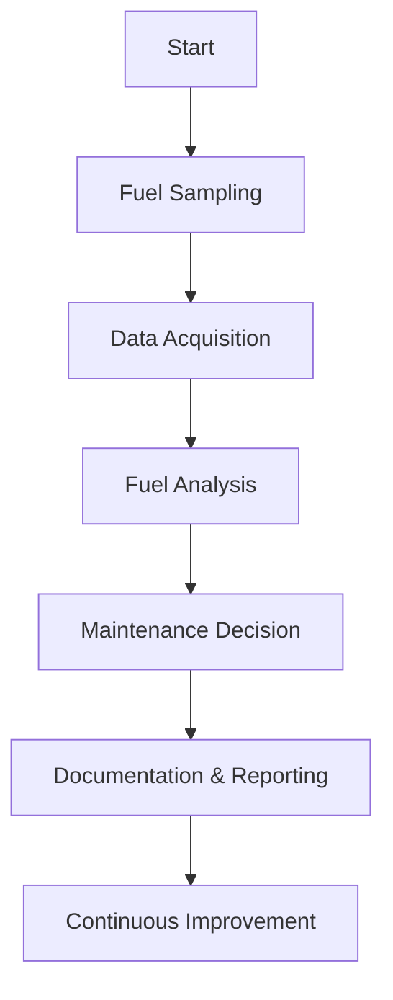
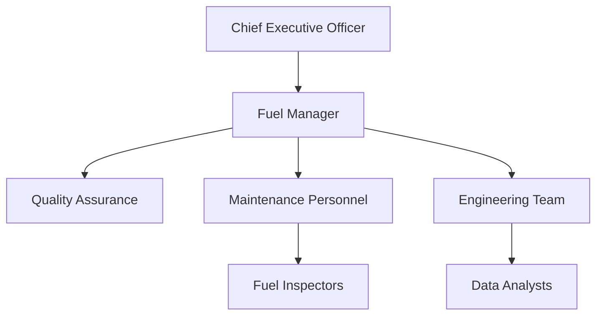

# FTC_19-00-00-00-000_ATA_19-Fuel.md

**Comprehensive Guide for Fuel Management Procedures for the GAIA AIR – Ampel360XWLRGA Aircraft**

---
    
## Version History
    
| **Version** | **Date**       | **Author**           | **Description**                                      |
|-------------|----------------|----------------------|------------------------------------------------------|
| 1.0         | 2024-08-01     | [Your Name or Team]  | Initial creation of the document.                    |
| 1.1         | 2024-08-15     | [Reviewer Name]      | Added sections on AI integration and updated acronyms.|
    
---
    
## Table of Contents
    
1. [**19.10. Introduction**](#1910-introduction)  
   1.1. [19.11. Purpose](#1911-purpose)  
   1.2. [19.12. Scope](#1912-scope)  
   1.3. [19.13. Document Structure](#1913-document-structure)  
   1.4. [19.14. Terminology](#1914-terminology)

2. [**19.20. Overview of ATA Chapter 19**](#1920-overview-of-ata-chapter-19)  
   2.1. [19.21. Importance of Fuel Management](#1921-importance-of-fuel-management)  
   2.2. [19.22. Principles of Fuel Management](#1922-principles-of-fuel-management)

3. [**19.30. Compliance and Standards**](#1930-compliance-and-standards)  
   3.1. [19.31. Regulatory Requirements](#1931-regulatory-requirements)  
   3.2. [19.32. ATA Standards](#1932-ata-standards)  
   3.3. [19.33. Integration with Risk Assessment](#1933-integration-with-risk-assessment)

4. [**19.40. Application to GAIA AIR Project**](#1940-application-to-gaia-air-project)  
   4.1. [19.41. Fuel System Overview](#1941-fuel-system-overview)  
   4.2. [19.42. Fuel Handling and Storage Procedures](#1942-fuel-handling-and-storage-procedures)  
   4.3. [19.43. Documentation and Reporting](#1943-documentation-and-reporting)

5. [**19.50. Fuel Management Procedures**](#1950-fuel-management-procedures)  
   5.1. [19.51. Fuel Quality Control](#1951-fuel-quality-control)  
   5.2. [19.52. Fuel Transfer and Refueling](#1952-fuel-transfer-and-refueling)  
   5.3. [19.53. Fuel Quantity Measurement and Monitoring](#1953-fuel-quantity-measurement-and-monitoring)  
   5.4. [19.54. Fuel Scheduling and Allocation](#1954-fuel-scheduling-and-allocation)

6. [**19.60. Roles and Responsibilities**](#1960-roles-and-responsibilities)  
   6.1. [19.61. Fuel Manager](#1961-fuel-manager)  
   6.2. [19.62. Maintenance Personnel](#1962-maintenance-personnel)  
   6.3. [19.63. Quality Assurance](#1963-quality-assurance)  
   6.4. [19.64. Engineering Team](#1964-engineering-team)

7. [**19.70. Integration with Other Documents and Systems**](#1970-integration-with-other-documents-and-systems)  
   7.1. [19.71. Dependencies Matrix and Glossary](#1971-dependencies-matrix-and-glossary)  
   7.2. [19.72. Integration with CMMS](#1972-integration-with-cmms)  
   7.3. [19.73. Integration with Other ATA Chapters](#1973-integration-with-other-ata-chapters)

8. [**19.80. Training and Awareness**](#1980-training-and-awareness)  
   8.1. [19.81. Fuel Management Training Programs](#1981-fuel-management-training-programs)  
   8.2. [19.82. Awareness Campaigns](#1982-awareness-campaigns)

9. [**19.90. Audits and Continuous Improvement**](#1990-audits-and-continuous-improvement)  
   9.1. [19.91. Internal Audits](#1991-internal-audits)  
   9.2. [19.92. Continuous Improvement Process](#1992-continuous-improvement-process)

10. [**19.100. Human Factors**](#19100-human-factors)  
    10.1. [19.101. Ergonomics in Fuel Handling](#19101-ergonomics-in-fuel-handling)  
    10.2. [19.102. Reducing Human Error in Fuel Operations](#19102-reducing-human-error-in-fuel-operations)  
    10.3. [19.103. Training and Skill Development](#19103-training-and-skill-development)

11. [**19.110. Case Studies**](#19110-case-studies)  
    11.1. [19.111. Successful Fuel Management Implementations](#19111-successful-fuel-management-implementations)  
    11.2. [19.112. Impact of Advanced Technologies on Fuel Efficiency](#19112-impact-of-advanced-technologies-on-fuel-efficiency)

12. [**19.120. Future Trends**](#19120-future-trends)  
    12.1. [19.121. Advanced Fuel Technologies](#19121-advanced-fuel-technologies)  
    12.2. [19.122. Evolving Regulations and Standards](#19122-evolving-regulations-and-standards)  
    12.3. [19.123. Integration of AI and Automation in Fuel Management](#19123-integration-of-ai-and-automation-in-fuel-management)

13. [**19.130. References**](#19130-references)

14. [**19.140. Visual Aids**](#19140-visual-aids)  
    14.1. [19.141. Fuel Management Process Flowchart](#19141-fuel-management-process-flowchart)  
    14.2. [19.142. Fuel Analysis Workflow Diagram](#19142-fuel-analysis-workflow-diagram)  
    14.3. [19.143. Organizational Structure for Fuel Operations](#19143-organizational-structure-for-fuel-operations)

15. [**19.150. Sample Forms and Templates**](#19150-sample-forms-and-templates)  
    15.1. [19.151. Fuel Inventory Form](#19151-fuel-inventory-form)  
    15.2. [19.152. Fuel Inspection Report Template](#19152-fuel-inspection-report-template)  
    15.3. [19.153. Fuel Anomaly Detection Log](#19153-fuel-anomaly-detection-log)

16. [**19.170. Acronyms**](#19170-acronyms)

17. [**19.180. Companion (Introductory Insights)**](#19180-companion-introductory-insights)

18. [**19.190. Generator (Design Solutions)**](#19190-generator-design-solutions)

19. [**19.200. Implementator (Scalability and Operation)**](#19200-implementator-scalability-and-operation)

---
    
## 19.10. Introduction
*(Focuses on the background, purpose, scope, and high-level structure.)*

Effective fuel management is integral to the safe and efficient operation of the **GAIA AIR – Ampel360XWLRGA Aircraft**. Proper handling, storage, and monitoring of fuel not only ensure flight safety but also enhance the longevity and reliability of aircraft components. This comprehensive guide outlines the procedures, standards, and best practices for establishing a robust fuel management program, aligned with **ATA Chapter 19** and regulatory requirements from **EASA** and **FAA**.

### 19.11. Purpose
The purpose of this document is to provide comprehensive guidelines for effective fuel management on the **GAIA AIR – Ampel360XWLRGA Aircraft**. Properly handling, storing, and monitoring fuel ensures flight safety, extends equipment life, and optimizes operational efficiency. By following these practices, GAIA AIR can reduce costs, minimize environmental impact, and maintain compliance with relevant regulations.

**Breakdown:** This section clearly defines the document's objectives, focusing on safety, reliability, cost-efficiency, and regulatory compliance.

### 19.12. Scope
This document applies to all phases of **fuel handling**, **storage**, **analysis**, and **corrective actions** related to the GAIA AIR – Ampel360XWLRGA program, including:

- **Fuel Quality Control**  
- **Fuel Transfer, Refueling, and Defueling Procedures**  
- **Documentation and Regulatory Compliance**  
- **Roles and Responsibilities** of Personnel  
- **Training and Auditing** Protocols  

These guidelines serve as a foundation for integrating fuel management practices into the broader maintenance and safety ecosystem.

**Breakdown:** This section outlines the comprehensive scope of the document, covering all essential aspects of fuel management.

### 19.13. Document Structure
This document is divided into sections that address **fuel management principles** (Sections 19.10–19.20), **compliance** (Section 19.30), **project application** (Section 19.40), **practical procedures** (Section 19.50), **roles** (Section 19.60), **integration** (Section 19.70), **training** (Section 19.80), **audits and continuous improvement** (Section 19.90), and **human factors** (Section 19.100). Additional information such as **case studies**, **future trends**, **references**, **visual aids**, **forms**, and **templates** are covered in later sections.

**Breakdown:** The document structure is logical and comprehensive, ensuring easy navigation and understanding.

### 19.14. Terminology
Key terms and abbreviations used in this document include:

- **Fuel Analysis (FA):** Examination and interpretation of fuel characteristics.  
- **Fuel Quality Control (FQC):** Processes ensuring fuel purity and compliance with standards.  
- **Condition-Based Maintenance (CBM):** Maintenance strategy that uses real-time data to prioritize and optimize resources.  
- **Fuel Transfer:** Movement of fuel between tanks or systems.  
- **PPE:** Personal Protective Equipment.  
- **SCADA:** Supervisory Control and Data Acquisition.  
- **SOP:** Standard Operating Procedure.  
- **ISO:** International Organization for Standardization.  
- **SAF:** Sustainable Aviation Fuel.  
- **MEMS:** Micro-Electro-Mechanical Systems.

For a complete list of acronyms, see [Section 19.170](#19170-acronyms).

**Breakdown:** This section provides clear definitions for key terms, ensuring a common understanding among readers.

---
    
## 19.20. Overview of ATA Chapter 19
*(Importance and fundamental principles of fuel management per ATA Chapter 19.)*

### 19.21. Importance of Fuel Management
Fuel management is crucial for:

- **Safety:** Correct fuel handling prevents contamination, ignition hazards, or system failures.
- **Reliability:** Ensures aircraft systems consistently receive high-quality, uncontaminated fuel.
- **Cost Savings:** Optimizes fuel usage and reduces waste, leading to lower operational costs.
- **Environmental Compliance:** Minimizes spills and reduces greenhouse gas emissions.
- **Operational Efficiency:** Enhances fuel consumption tracking and planning, contributing to overall flight efficiency.

**Breakdown:** This clearly explains the significance of fuel management in the context of aviation maintenance and safety.

### 19.22. Principles of Fuel Management
Effective fuel management relies on:

1. **Quality Assurance:** Maintaining high standards for fuel cleanliness and specifications.
2. **Accurate Measurement:** Precisely tracking fuel quantities in storage and aboard aircraft.
3. **System Integrity:** Regular checks to prevent leaks, contamination, or component failures.
4. **Documentation and Traceability:** Keeping detailed records for regulatory compliance and audits.
5. **Corrective Action:** Promptly resolving issues like contaminated batches or equipment malfunctions.
6. **Safety Protocols:** Implementing robust safety measures to protect personnel and equipment during fuel operations.

**Breakdown:** These principles provide a solid foundation for a robust fuel management program, ensuring safety, efficiency, and compliance.

---
    
## 19.30. Compliance and Standards
*(Regulatory aspects and alignment with ATA guidelines.)*

### 19.31. Regulatory Requirements
Compliance with aviation regulatory bodies (e.g., **FAA**, **EASA**) is essential. Key regulatory considerations include:

- **Certification:** Ensuring fuel levels and quality are within airworthiness limits throughout the aircraft’s service life.
- **Reporting:** Documentation of any corrective actions taken and results of regular fuel checks.
- **Continuous Airworthiness Management:** Ongoing adherence to regulations for reliability and safety.
- **Record Keeping:** Maintaining detailed logs and reports for audits and inspections.
- **Training Requirements:** Ensuring all personnel involved in fuel management are adequately trained and certified as per regulatory standards.

**Breakdown:** This subsection outlines the primary regulatory bodies and their roles in governing fuel management. Understanding and adhering to these requirements ensures that the aircraft maintains its airworthiness and complies with international and regional safety standards.

### 19.32. ATA Standards
ATA (Air Transport Association) chapter structures facilitate consistent documentation. Under ATA Chapter 19:

- **Fuel Management** processes must be standardized, including data capture, reporting, and corrective measures.
- **Recommended Practices** follow industry best-practice guidelines, ensuring uniformity of approach and documentation.
- **Data Integration:** Ensures that fuel monitoring data is seamlessly integrated with other maintenance and operational data systems.
- **Compliance Benchmarks:** Sets benchmarks for acceptable fuel levels, quality standards, and handling procedures.

**Breakdown:** These standards ensure consistent and effective fuel management operations aligned with industry best practices, improving data quality and maintenance efficiency.

### 19.33. Integration with Risk Assessment
Fuel data is integral to risk management. Incorporating fuel quality and quantity metrics into risk matrices:

- **Prioritizes urgent maintenance** when contamination risks are high.
- **Minimizes operational disruptions** by scheduling preventative actions before fuel-related failures occur.
- **Enhances Safety:** Identifies critical points where fuel handling errors can escalate, allowing for targeted risk mitigation strategies.
- **Supports Decision-Making:** Provides data-driven insights for maintenance planning and resource allocation.

**Breakdown:** Risk assessment is a proactive approach that enables maintenance teams to address high-priority fuel concerns before they escalate into serious failures or safety events.

---
    
## 19.40. Application to GAIA AIR Project
*(Project-specific considerations for the Ampel360XWLRGA.)*

### 19.41. Fuel System Overview
The **GAIA AIR – Ampel360XWLRGA Aircraft** fuel system comprises multiple tanks, pumps, and filtration units to:

- **Supply Engines:** Provide consistent, contaminant-free fuel to engines.
- **Manage Transfer:** Move fuel between tanks to balance aircraft weight and center of gravity.
- **Implement Safety Measures:** Include valves, sensors, and fire suppression mechanisms.
- **Fuel Quality Control Units:** Monitor and maintain fuel purity through advanced filtration and purification systems.

**Breakdown:** Understanding the fuel system's components and their interactions is essential for effective fuel management, ensuring reliable fuel delivery and system integrity.

### 19.42. Fuel Handling and Storage Procedures
Guidelines for:

- **Refueling Stations:** Safe fueling operations at ground-based facilities.
- **Mobile Fuel Trucks:** Inspection and handling procedures to prevent spillage or contamination.
- **Fuel Farm Management:** Temperature control, spill prevention, and alarm systems in storage areas.
- **Transfer Operations:** Protocols for shifting fuel between aircraft tanks or from external sources.
- **Fuel Pump Maintenance:** Regular inspection, testing, and maintenance of fuel pumps to ensure optimal performance.
- **Contamination Control:** Implementing measures to prevent fuel contamination during storage and handling, such as closed systems and regular filter replacements.

**Breakdown:** Proper fuel handling and storage procedures are vital for maintaining fuel quality, preventing accidents, and ensuring the efficiency of fuel operations.

### 19.43. Documentation and Reporting
All fuel operations are logged to:

- **Track Fuel Quantities:** Record usage and stock for cost and safety audits.
- **Meet Regulatory Needs:** Provide proof of compliance with fuel specifications.
- **Enable Trend Analysis:** Identify recurring issues like abnormal contamination levels.
- **Maintain Traceability:** Ensure that every fuel-related activity is traceable for accountability and quality assurance.
- **Generate Compliance Reports:** Produce reports that demonstrate adherence to FAA/EASA regulations and ATA Chapter 19 standards.

**Breakdown:** Comprehensive documentation and reporting are critical for traceability, regulatory compliance, and continuous improvement of fuel management practices.

---
    
## 19.50. Fuel Management Procedures
*(Detailed how-to for handling, storing, and analyzing fuel.)*

### 19.51. Fuel Quality Control
Ensuring fuel quality is paramount to prevent engine failures and ensure optimal performance. Procedures include:

1. **Fuel Sampling:**  
   - **Daily Checks:** Regularly take samples from bottom drains, fuel trucks, and storage tanks.
   - **Laboratory Analysis:** Periodically send samples for advanced lab testing (e.g., water content, microbial presence).

2. **Filtration Systems:**  
   - **Filter Inspections:** Ensure filters are replaced or cleaned as recommended by OEM.
   - **Filter Maintenance Logs:** Document filter changes, calibration, or adjustments.

3. **Contamination Prevention:**  
   - **Strict Hygiene:** Avoid introducing foreign matter during transfers.
   - **Closed System Principles:** Limit open exposure to fuel lines and vents.

4. **Fuel Additives Management:**  
   - **Proper Mixing:** Ensure additives are correctly mixed into fuel to prevent phase separation or precipitation.
   - **Monitoring Additive Levels:** Regularly check additive concentrations to maintain efficacy.

5. **Quality Assurance Protocols:**  
   - **Regular Audits:** Conduct routine audits to verify fuel quality control measures.
   - **Training Programs:** Educate personnel on contamination risks and prevention strategies.

**Best Practices:**
- **Implement Redundant Sampling:** Use multiple sampling points to ensure comprehensive quality control.
- **Automate Quality Monitoring:** Utilize sensors and automated systems for real-time fuel quality monitoring.
- **Maintain Cleanliness:** Ensure all fuel handling equipment is clean and free from contaminants before use.

**Breakdown:** These procedures ensure that fuel quality remains high, preventing contamination and maintaining the integrity of the fuel system.

### 19.52. Fuel Transfer and Refueling
**Standard Operating Procedures (SOPs):**

- **Pre-Transfer Checks:**  
  - Inspect fuel pumps, hoses, and connectors for damage or wear.
  - Ensure all equipment is clean and free from contaminants.

- **Ventilation Requirements:**  
  - Follow safety protocols to manage fumes, especially in enclosed areas.
  - Use proper ventilation systems to prevent fuel vapor accumulation.

- **Safety Gear:**  
  - Personnel must wear PPE, including gloves, goggles, and anti-static clothing if necessary.
  - Ensure all staff are trained in emergency response procedures.

- **Spill Control:**  
  - Maintain spill kits and ensure they are readily accessible.
  - Implement emergency shut-off procedures to quickly stop fuel transfer in case of a spill.

- **Fuel Transfer Monitoring:**  
  - Use flow meters and level gauges to monitor fuel transfer rates and volumes.
  - Implement automated systems to detect and alert for irregular transfer patterns.

**Best Practices:**
- **Use of Grounding Equipment:** Prevent static electricity buildup during fuel transfer.
- **Regular Training:** Conduct regular training sessions on safe fuel transfer practices.
- **Double-Check Systems:** Implement redundant checks to ensure accuracy in fuel transfer operations.

**Breakdown:** Proper fuel transfer and refueling procedures are essential for safety, preventing spills and ensuring accurate fuel delivery.

### 19.53. Fuel Quantity Measurement and Monitoring
Accurate measurement and monitoring of fuel quantities are crucial for operational efficiency and safety. Techniques include:

- **Dipsticks and Manual Gauges:**  
  - Used for smaller tanks or quick checks.
  - Requires regular calibration to maintain accuracy.

- **Sensor-Based Systems:**  
  - **Ultrasonic Level Sensors:** Provide non-contact measurement of fuel levels.
  - **Capacitive Sensors:** Measure fuel levels based on changes in capacitance.
  - **Float-Based Sensors:** Utilize buoyant floats to detect fuel levels.

- **Automated Monitoring Systems:**  
  - Integrate with the CMMS for real-time fuel level tracking.
  - Use alarms and notifications for low fuel levels or discrepancies.

- **Reconciliation Procedures:**  
  - Compare measured levels against logged usage to detect leaks or inaccuracies.
  - Conduct periodic audits to ensure measurement system integrity.

- **Data Logging and Trending:**  
  - Maintain historical data to analyze fuel consumption patterns.
  - Identify trends that may indicate inefficiencies or emerging issues.

**Best Practices:**
- **Regular Calibration:** Ensure all fuel measurement instruments are regularly calibrated.
- **Redundant Measurement Systems:** Implement multiple measurement methods to verify accuracy.
- **Real-Time Monitoring:** Utilize automated systems for continuous fuel level monitoring and immediate alerting.

**Breakdown:** Accurate fuel quantity measurement and monitoring ensure operational efficiency, prevent fuel shortages, and detect potential leaks or system failures early.

### 19.54. Fuel Scheduling and Allocation
Effective fuel scheduling and allocation optimize fuel usage and ensure readiness for upcoming operations. Procedures include:

1. **Demand Forecasting:**  
   - **Flight Scheduling Data:** Use upcoming flight schedules to predict fuel requirements.
   - **Operational Conditions:** Consider factors like cargo loads, weather conditions, and flight durations.

2. **Allocation System:**  
   - **Software Tools:** Utilize fuel management software to optimize fuel distribution among aircraft.
   - **Priority Scheduling:** Allocate fuel based on flight priorities, ensuring critical flights have adequate fuel reserves.

3. **Reserves Maintenance:**  
   - **Mandatory Reserves:** Maintain required fuel reserves for emergencies and unforeseen contingencies.
   - **Monitoring Reserves:** Regularly check reserve levels to ensure compliance with regulations.

4. **Fuel Rotation:**  
   - **First-In, First-Out (FIFO):** Ensure older fuel batches are used before newer ones to prevent fuel degradation.
   - **Batch Tracking:** Track fuel batches to manage rotation and identify potential contamination sources.

5. **Efficiency Optimization:**  
   - **Balanced Loading:** Distribute fuel evenly to maintain aircraft balance and center of gravity.
   - **Minimize Fuel Waste:** Implement measures to reduce fuel evaporation and spillage during handling.

**Best Practices:**
- **Automated Scheduling Systems:** Use integrated software for real-time fuel allocation and scheduling.
- **Regular Reviews:** Conduct periodic reviews of fuel scheduling processes to identify and implement improvements.
- **Collaborative Planning:** Engage cross-functional teams (e.g., flight operations, maintenance) in fuel planning to align with overall operational goals.

**Breakdown:** Effective fuel scheduling and allocation ensure optimal fuel usage, prevent shortages, and maintain readiness for all operational demands.

---
    
## 19.60. Roles and Responsibilities
*(Who does what in the fuel management program.)*

### 19.61. Fuel Manager
- **Inventory Oversight:**  
  Tracks fuel levels, orders additional stock, and manages storage capacities.
- **Compliance Monitoring:**  
  Ensures all fuel processes align with regulations and internal policies.
- **Reporting:**  
  Generates monthly or quarterly reports on fuel usage, costs, and anomalies.
- **Supplier Coordination:**  
  Manages relationships with fuel suppliers, ensuring timely deliveries and quality standards.
- **Process Improvement:**  
  Identifies opportunities for enhancing fuel management practices and implements necessary changes.

### 19.62. Maintenance Personnel
- **Refueling Operations:**  
  Conduct safe fueling/defueling operations, adhering to SOPs.
- **Sampling and Testing:**  
  Perform daily checks, visually inspect samples for water or debris.
- **Record-Keeping:**  
  Document fueling activities, anomalies, and corrective actions.
- **Equipment Maintenance:**  
  Maintain and service fuel handling equipment, including pumps and filters.
- **Spill Response:**  
  Respond promptly to fuel spills, utilizing spill kits and following emergency protocols.

### 19.63. Quality Assurance
- **Audit Programs:**  
  Regularly evaluate fuel management processes for compliance.
- **Document Control:**  
  Maintain updated procedures, forms, and records for regulatory audits.
- **Continuous Improvement:**  
  Suggest refinements to fuel handling methods or training programs.
- **Compliance Verification:**  
  Verify that fuel quality and quantity measurements meet regulatory and ATA standards.
- **Training Oversight:**  
  Ensure that all personnel receive adequate training and certifications related to fuel management.

### 19.64. Engineering Team
- **System Design:**  
  Incorporates fuel system enhancements into aircraft maintenance.
- **Data Analysis:**  
  Utilizes fuel consumption data to propose design optimizations or modifications.
- **Technical Guidance:**  
  Advises on advanced diagnostic tools or predictive maintenance strategies.
- **Troubleshooting:**  
  Investigates complex fuel system issues, leveraging fuel data for root cause analysis.
- **Integration Support:**  
  Facilitates the integration of fuel management systems with other operational and maintenance systems.

**Breakdown:** These defined roles ensure a coherent workflow, uniting technical expertise with hands-on maintenance and quality oversight.

---
    
## 19.70. Integration with Other Documents and Systems
*(Ensures synergy between this program and broader maintenance/operations.)*

### 19.71. Dependencies Matrix and Glossary
A dependencies matrix outlines how **fuel management** intersects with other **ATA chapters** (e.g., Engines, Environmental Systems), referencing relevant documents. A centralized glossary defines terminology used across various documents, ensuring consistency.

**Dependencies Matrix:**
| **Fuel Management** | **Related ATA Chapter** | **Document Reference**               |
|---------------------|-------------------------|--------------------------------------|
| Fuel Handling       | ATA 28 (Fuel System)    | Fuel Handling Procedures Manual      |
| Fuel Quality Control| ATA 70 (Power Plant)    | Engine Maintenance Manual            |
| Fuel Transfer       | ATA 32 (Landing Gear)   | Landing Gear Fuel Transfer Protocols |
| Fuel Analysis       | ATA 24 (Electrical Power)| Electrical Systems Fuel Analysis Guide|

**Glossary:**  
Ensures that all stakeholders have a common understanding of technical terms, reducing miscommunication and errors.

### 19.72. Integration with CMMS
The **Computerized Maintenance Management System (CMMS)** should store fuel data for trending and analysis. Automated work orders can be generated when thresholds are exceeded, streamlining the maintenance workflow.

**Integration Points:**
- **Data Syncing:** Real-time synchronization of fuel data with CMMS for up-to-date maintenance records.
- **Automated Alerts:** Trigger maintenance tasks automatically based on fuel alerts.
- **Reporting:** Utilize CMMS reporting tools to generate comprehensive fuel analysis reports.

**Benefits:**
- **Efficiency:** Reduces manual data entry and accelerates maintenance response times.
- **Data Integrity:** Ensures fuel data is consistently and accurately recorded.
- **Comprehensive Insights:** Combines fuel data with other maintenance data for holistic analysis.

### 19.73. Integration with Other ATA Chapters
While **ATA Chapter 19** focuses on fuel management, synergy with chapters covering:

- **ATA 28 (Fuel System):** For deeper system-level details.
- **ATA 24 (Electrical Power):** Ensuring safe operation of refueling pumps and electronic controls.
- **ATA 32 (Landing Gear):** Focusing on potential interplay when fueling from mobile vehicles near gear structures.

…ensures that fuel data is leveraged in a holistic maintenance approach.

**Examples of Integration:**
- **Fuel System Enhancements:** Incorporate fuel management data into broader engine health monitoring.
- **Safety Systems:** Align fuel handling procedures with electrical safety protocols.
- **Structural Integrity:** Use fuel management insights to assess structural impacts during fuel transfers.

**Breakdown:** Integration fosters a cohesive approach, ensuring fuel insights translate seamlessly into operational and maintenance actions.

---
    
## 19.80. Training and Awareness
*(Focus on personnel readiness and organizational mindset.)*

### 19.81. Fuel Management Training Programs
Ongoing training ensures personnel remain up to date on analysis techniques and system technologies. Recommended program elements include:

- **Fundamental Fuel Handling Principles:**  
  Minimizing contamination risks and understanding fuel properties.
  
- **Operational Safety:**  
  Emphasis on PPE use, hazard identification, and emergency procedures.
  
- **Advanced Data Analysis Methods:**  
  Interpreting lab test results, trending data, and diagnosing anomalies.
  
- **Regulatory Compliance:**  
  Understanding FAA/EASA requirements, internal SOPs, and best practices.
  
- **Certification Programs:**  
  Offering recognized certifications for fuel management and handling.

**Implementation Steps:**
1. **Develop Curriculum:** Create a structured training curriculum covering all necessary topics.
2. **Schedule Training Sessions:** Organize regular training sessions, both introductory and advanced.
3. **Assess Competency:** Implement assessments to ensure personnel understand and can apply training.
4. **Provide Resources:** Supply access to training materials, manuals, and online resources.

### 19.82. Awareness Campaigns
Regular workshops and communication campaigns can highlight:

- **Spill Prevention Techniques:**  
  Helping staff avoid accidents and respond effectively to spills.
  
- **Real-time Alert Systems:**  
  Demonstrating quick responses to contamination or shortage signals.
  
- **Success Stories:**  
  Encouraging staff by showcasing how effective fuel handling saved costs or averted incidents.
  
- **Best Practices Sharing:**  
  Facilitating the exchange of knowledge and experiences among personnel.
  
- **Regulatory Updates:**  
  Informing staff about changes in fuel-related regulations and standards.

**Campaign Elements:**
- **Workshops:** Interactive sessions demonstrating the importance and impact of fuel management.
- **Newsletters:** Regular updates on fuel management successes, case studies, and technological advancements.
- **Visual Displays:** Posters and digital displays in maintenance areas showcasing key fuel data and alerts.
- **Recognition Programs:** Acknowledging personnel who excel in fuel management tasks.
- **Feedback Channels:** Providing avenues for personnel to share insights, suggestions, and report issues related to fuel management.

**Benefits:**
- **Enhanced Engagement:** Engages personnel at all levels, fostering a proactive maintenance culture.
- **Knowledge Sharing:** Promotes the sharing of best practices and lessons learned.
- **Continuous Improvement:** Encourages ongoing dialogue and refinement of fuel management practices.

**Breakdown:** Focused training and awareness initiatives enhance proficiency, morale, and compliance, driving a robust fuel management culture.

---
    
## 19.90. Audits and Continuous Improvement
*(Mechanisms for validation and program evolution.)*

### 19.91. Internal Audits
Quality Assurance teams periodically assess fuel management:

- **Procedure Adherence:**  
  Checks if correct fuel handling methods are followed and SOPs are consistently implemented.
  
- **Data Quality:**  
  Evaluates fuel quality control logs, contamination reports, and measurement accuracy.
  
- **Documentation Accuracy:**  
  Ensures proper record-keeping for compliance and traceability, verifying that all reports and logs are complete and accurate.
  
- **Compliance Checks:**  
  Confirms adherence to regulatory requirements and ATA Chapter 19 standards.
  
- **Process Efficiency:**  
  Assesses the efficiency of fuel handling and analysis workflows, identifying bottlenecks or redundancies.

**Audit Cycle:**
1. **Planning:** Define audit objectives, scope, and criteria.
2. **Execution:** Conduct the audit using checklists and data reviews.
3. **Reporting:** Document findings, highlight best practices, and uncover improvement areas.
4. **Action:** Implement corrective measures for discrepancies or inefficiencies.
5. **Follow-Up:** Verify that corrective actions have been effectively implemented.

### 19.92. Continuous Improvement Process
Results from audits feed into continuous improvement cycles:

1. **Identify Gaps:**  
   Recognize deficiencies in processes, training, or equipment.
   
2. **Plan:**  
   Develop corrective measures and training updates.
   
3. **Implement:**  
   Execute changes and track their impact.
   
4. **Review:**  
   Reassess and refine, ensuring a progressive enhancement of the fuel management program.

**Continuous Improvement Strategies:**
- **Feedback Integration:**  
  Incorporate feedback from auditors, maintenance personnel, and fuel managers to refine processes.
  
- **Technology Upgrades:**  
  Stay abreast of technological advancements and integrate new tools or sensors to enhance fuel management capabilities.
  
- **Best Practices Adoption:**  
  Regularly review industry best practices and adopt relevant strategies to improve program effectiveness.
  
- **Performance Metrics:**  
  Establish and monitor key performance indicators (KPIs) such as fuel usage accuracy, contamination incidence rates, and maintenance response times to gauge program success and areas for improvement.

**Benefits:**
- **Enhanced Program Effectiveness:**  
  Ensures that fuel management remains relevant and effective in addressing emerging challenges.
  
- **Increased Reliability:**  
  Continuously improves the reliability of fuel management data and maintenance actions.
  
- **Operational Excellence:**  
  Drives excellence in fuel handling practices, contributing to overall aircraft performance and safety.

**Breakdown:** Audits validate compliance and performance, while continuous improvement fosters a progressive, data-driven environment.

---
    
## 19.100. Human Factors
*(Addresses ergonomic and cognitive aspects influencing performance.)*

### 19.101. Ergonomics in Fuel Handling
Ensuring that fuel handling equipment and processes are designed with human ergonomics in mind enhances safety and efficiency.

- **Safe Equipment Design:**  
  Fuel hoses, pumps, and containers should be easily maneuverable, reducing physical strain and the risk of accidents.
  
- **Accessible Storage:**  
  Tank access points should be set at ergonomic heights to facilitate easy access without undue bending or stretching.
  
- **Lighting and Visibility:**  
  Adequate lighting in fuel handling areas prevents spillage and enables accurate measurements and inspections.
  
- **Tool Design:**  
  Tools used in fuel handling should be designed for comfort and efficiency, minimizing the risk of repetitive strain injuries.

**Best Practices:**
- **Modular Design:**  
  Equipment should be easily maintainable and upgradable without requiring significant downtime.
  
- **Intuitive Interfaces:**  
  User interfaces should be intuitive, minimizing the need for extensive training.
  
- **Lightweight Materials:**  
  Use lightweight materials to reduce the physical burden on maintenance personnel during fuel handling.

### 19.102. Reducing Human Error in Fuel Operations
To minimize errors, implement:

- **Standard Operating Procedures (SOPs):**  
  Clearly defined steps for fuel handling, sampling, and testing ensure consistency and reduce the likelihood of oversight.
  
- **Automation:**  
  Use software-driven diagnostic features that reduce manual analysis errors and enhance data accuracy.
  
- **Checks and Balances:**  
  Require peer review of critical fuel management reports to ensure accuracy and reliability.
  
- **Error-Proofing:**  
  Design systems and workflows to inherently minimize the chances of human error, such as incorporating automated data validation.
  
- **Continuous Training:**  
  Regularly train personnel on best practices, new technologies, and common error patterns to enhance their proficiency and awareness.

**Best Practices:**
- **Automated Alerts:**  
  Automated systems can highlight anomalies, reducing the reliance on manual data interpretation.
  
- **Data Visualization:**  
  Use clear and comprehensive visualizations to aid in accurate data interpretation and decision-making.
  
- **Documentation Standards:**  
  Maintain high standards for documentation to ensure that all steps are traceable and verifiable.

### 19.103. Training and Skill Development
Encourage advanced certifications, workshops, and cross-departmental learning to maintain a skilled and knowledgeable workforce capable of accurate fuel analysis.

**Training Components:**
- **Hands-On Workshops:**  
  Practical sessions where personnel can practice fuel handling, sampling, and analysis techniques in real-world scenarios.
  
- **Online Modules:**  
  E-learning courses covering advanced topics such as fuel chemistry, contamination detection, and machine learning applications in fuel analysis.
  
- **Certification Programs:**  
  Formal certifications that validate personnel proficiency in fuel management and handling, enhancing their career development and the program’s credibility.
  
- **Cross-Training:**  
  Training personnel across different departments to foster a holistic understanding of fuel management’s role in overall aircraft maintenance and safety.
  
- **Knowledge Sharing Sessions:**  
  Regular meetings where fuel managers and engineers share insights, discuss case studies, and brainstorm improvements to the fuel management program.

**Best Practices:**
- **Continuous Education:**  
  Encourage personnel to stay updated with the latest advancements in fuel management and related technologies.
  
- **Mentorship Programs:**  
  Pair less experienced personnel with seasoned fuel managers to facilitate knowledge transfer and skill development.
  
- **Resource Provision:**  
  Provide access to relevant training materials, manuals, and online resources to support ongoing learning.

**Breakdown:** Addressing human factors—ergonomics, error reduction, and skill development—strengthens the entire chain of fuel management.

---
    
## 19.110. Case Studies
*(Real examples illustrating fuel management benefits.)*

### 19.111. Successful Fuel Management Implementations
Demonstrates how airlines or MROs improved safety or reduced costs by upgrading their fuel handling processes:

- **Case 1: Regional Carrier X's Digital Fuel Monitoring System**
  - **Background:** Regional Carrier X experienced frequent fuel contamination incidents due to manual monitoring methods.
  - **Implementation:** Adopted a digital fuel monitoring system integrated with real-time sensors and automated alerts.
  - **Results:** Reduced fuel contamination incidents by 70%, enhanced fuel quality control, and decreased maintenance costs related to fuel system repairs.

- **Case 2: Airline Y's Predictive Fuel Maintenance Program**
  - **Background:** Airline Y sought to optimize fuel usage and minimize waste.
  - **Implementation:** Implemented a predictive maintenance program using machine learning algorithms to forecast fuel consumption and detect anomalies.
  - **Results:** Improved fuel efficiency by 15%, reduced overfueling incidents by 25%, and extended the lifespan of fuel system components.

### 19.112. Impact of Advanced Technologies on Fuel Efficiency
Modern solutions—like IoT sensors or AI-driven optimization—can:

- **Shorten Diagnostic Time** and reduce guesswork.
- **Improve Cost-Efficiency** by refining flight planning based on real-time fuel data.
- **Lower Environmental Footprint** via minimized wastage and precise consumption tracking.

**Case Study: Major Flag Carrier Z's AI-Driven Fuel Optimization**
- **Background:** Flag Carrier Z aimed to enhance fuel efficiency and reduce operational costs.
- **Implementation:** Integrated AI-driven fuel optimization tools that analyze flight data and environmental conditions to recommend optimal fuel loads and usage patterns.
- **Results:** Achieved a 10% reduction in fuel consumption, lowered operational costs by 8%, and contributed to environmental sustainability goals by reducing carbon emissions.

**Breakdown:** These examples illustrate the tangible benefits of adopting advanced tools and strategies, building a business case for continuous improvement in fuel management.

---
    
## 19.120. Future Trends
*(Emerging technologies and upcoming changes.)*

### 19.121. Advanced Fuel Technologies
- **Biofuels and Sustainable Aviation Fuels (SAF):**  
  Lower carbon footprint alternatives with special storage and handling requirements.  
  **Impact:** Promote environmental sustainability and comply with evolving emissions regulations.
  
- **Hydrogen Fuel:**  
  Potentially transformative technology but requires unique infrastructure and safety protocols.  
  **Impact:** Offers zero-emission propulsion but necessitates significant changes in fuel storage, handling, and aircraft design.

### 19.122. Evolving Regulations and Standards
- **Global Harmonization:**  
  Moves toward unifying fuel management requirements across aviation authorities.  
  **Impact:** Simplifies compliance for international operations and standardizes best practices.
  
- **Stricter Emissions Targets:**  
  Encouraging more efficient fuel usage and alternative energy adoption.  
  **Impact:** Drives innovation in fuel management to meet environmental sustainability goals.
  
- **Enhanced Data Security Requirements:**  
  Stricter regulations on data privacy and security, especially when integrating IoT and cloud-based systems.  
  **Impact:** Necessitates robust data protection measures to safeguard sensitive fuel management data.

### 19.123. Integration of AI and Automation in Fuel Management
- **Predictive Maintenance:**  
  AI models flag potential filter clogs or leaks before system failures occur.  
  **Impact:** Minimizes equipment downtime and extends the lifespan of fuel system components.
  
- **Automated Fuel Dispensing:**  
  Robotic or advanced SCADA systems reducing manual interventions.  
  **Impact:** Enhances precision in fuel dispensing, reduces human error, and increases operational efficiency.
  
- **AI-Driven Fuel Optimization:**  
  Machine learning algorithms analyze flight patterns, weather data, and fuel consumption to optimize fuel loads.  
  **Impact:** Improves fuel efficiency, reduces costs, and supports environmental sustainability.

**Breakdown:** Anticipating these trends allows GAIA AIR to proactively invest in technology, training, and processes that will keep them competitive and compliant.

---
    
## 19.130. References
*(For detailed references, see the end of this guide. This section lists relevant standards, regulatory documents, and industry research supporting the recommended practices.)*

1. **FAA Advisory Circulars** on fuel handling, storage, and maintenance practices.  
   - *FAA Advisory Circular AC 43.13-1B: Acceptable Methods, Techniques, and Practices - Aircraft Inspection and Repair.*  
     Retrieved from [https://www.faa.gov/regulations_policies/advisory_circulars/](https://www.faa.gov/regulations_policies/advisory_circulars/)
  
2. **EASA Part-M** and **Part-145** requirements for continued airworthiness and maintenance organization approvals.  
   - *EASA Part-M: Continuing Airworthiness.*  
     Retrieved from [https://www.easa.europa.eu/document-library/regulations/easa-part-m](https://www.easa.europa.eu/document-library/regulations/easa-part-m)
   - *EASA Part-145: Maintenance Organization Approvals.*  
     Retrieved from [https://www.easa.europa.eu/document-library/regulations/easa-part-145](https://www.easa.europa.eu/document-library/regulations/easa-part-145)
  
3. **ATA iSpec 2200** for standardizing electronic documents.  
   - *ATA iSpec 2200: Data Specification for Technical Publications.*  
     Retrieved from [https://www.airlines.org/wp-content/uploads/2020/02/ATA-iSpec-2200-v2.3.1.pdf](https://www.airlines.org/wp-content/uploads/2020/02/ATA-iSpec-2200-v2.3.1.pdf)
  
4. **OEM Technical Manuals** for GAIA AIR – Ampel360XWLRGA Aircraft regarding fuel system operations and maintenance.  
   - *Ampel360XWLRGA Aircraft Fuel System Operations Manual.*  
     *(Assumed to be proprietary and internal to GAIA AIR)*
  
5. **ISO 8217** standards for aviation turbine fuels.  
   - *ISO 8217: Petroleum Products — Fuels (Aviation Turbine) — Specifications.*  
     Retrieved from [https://www.iso.org/standard/72001.html](https://www.iso.org/standard/72001.html)
  
6. **Grieves, M. (2016).**  
   *Digital Twin: Manufacturing Excellence Through Virtual Replication.* Siemens PLM White Paper.  
   *Explanation:* Introduces the concept of digital twins for monitoring and optimizing equipment life cycles, crucial for predictive maintenance strategies.
  
7. **Tao, F., Cheng, P., Liu, J., & Lee, J. (2018).**  
   *Digital twin-driven product lifecycle management: Concepts, challenges, and opportunities.*  
   IEEE Transactions on Industrial Informatics, 14(10), 4405–4414.  
   [https://doi.org/10.1109/TII.2018.2854179](https://doi.org/10.1109/TII.2018.2854179)  
   *Explanation:* Discusses digital twins' role in lifecycle management, which can enhance fuel management efficiency through simulations and virtual replications.
  
8. **Iansiti, M., & Lakhani, K. R. (2017).**  
   *The Truth Machine: The Blockchain and the Future of Everything.*  
   Harvard Business Review.  
   *Explanation:* Explores blockchain's transformative impact, including secure data management for fuel management tracking.
  
9. **Deloitte. (2019).**  
   *Blockchain in aviation: Taking flight.* Deloitte Insights.  
   Retrieved from [https://www2.deloitte.com/](https://www2.deloitte.com/)  
   *Explanation:* Examines blockchain's potential for transparency and efficiency in aviation maintenance records, including fuel management.
  
10. **PwC. (2018).**  
    *Blockchain in aerospace and defense: Transforming the future of flight.*  
    Retrieved from [https://www.pwc.com/](https://www.pwc.com/)  
    *Explanation:* Analyzes the role of blockchain in improving operational efficiency and security within aerospace, including applications in fuel management.
  
11. **Atzori, L., Iera, A., & Morabito, G. (2010).**  
    *The internet of things: A survey.*  
    Computer Networks, 54(15), 2787–2805.  
    [https://doi.org/10.1016/j.comnet.2010.05.010](https://doi.org/10.1016/j.comnet.2010.05.010)  
    *Explanation:* Highlights IoT's potential for real-time monitoring of fuel levels and quality in aircraft systems.
  
12. **Gubbi, J., Buyya, R., Marusic, S., & Palaniswami, M. (2013).**  
    *Internet of things (IoT): A vision, architectural elements, and future directions.*  
    Future Generation Computer Systems, 29(7), 1645–1660.  
    [https://doi.org/10.1016/j.future.2013.01.010](https://doi.org/10.1016/j.future.2013.01.010)  
    *Explanation:* Explores IoT applications in industrial environments, relevant for tracking fuel usage and optimizing maintenance workflows.
  
13. **Lee, J., Lee, K., & Suh, Y. W. (2015).**  
    *Internet of things and big data for advanced manufacturing services.*  
    International Journal of Precision Engineering and Manufacturing, 16(1), 1–14.  
    [https://doi.org/10.1007/s12541-014-0114-8](https://doi.org/10.1007/s12541-014-0114-8)  
    *Explanation:* Discusses IoT integration with big data analytics, applicable to improving fuel management programs and maintenance processes.
  
14. **Jardine, A. K., Lin, D., & Banjevic, D. (2006).**  
    *A review on machinery diagnostics and prognostics using artificial intelligence techniques.*  
    Mechanical Systems and Signal Processing, 20(7), 1483–1510.  
    [https://doi.org/10.1016/j.ymssp.2006.03.017](https://doi.org/10.1016/j.ymssp.2006.03.017)  
    *Explanation:* Provides foundational insights for AI-driven diagnostics and prognostics in predictive maintenance.
  
15. **Vachtsevanos, G., Lewis, F. L., Roemer, M., Hess, A., & Wu, B. (2006).**  
    *Intelligent fault diagnosis and prognosis for engineering systems.*  
    John Wiley & Sons.  
    *Explanation:* Focuses on intelligent fault diagnosis systems, emphasizing their use in training personnel for predictive maintenance tasks in fuel management.
  
16. **Saxena, A., Goebel, K., Saha, B., & Schwabacher, M. (2008).**  
    *Prognostics and health management: A review literature.*  
    Mechanical Systems and Signal Processing, 23(8), 2014–2039.  
    [https://doi.org/10.1016/j.ymssp.2008.03.015](https://doi.org/10.1016/j.ymssp.2008.03.015)  
    *Explanation:* Discusses methods for health management in engineering systems, with practical applications for improving fuel maintenance training and predictive maintenance strategies.
  
17. **Siemens, G. (2013).**  
    *Learning Analytics: The Emergence of a Discipline.*  
    Retrieved from [https://www.researchgate.net/](https://www.researchgate.net/)  
    *Explanation:* Examines how learning analytics can enhance training management systems, relevant for fuel management training programs.
  
18. **Brown, A., & Green, T. (2020).**  
    *Designing Effective Learning Management Systems.*  
    Educational Technology Publications.  
    *Explanation:* Offers insights into creating LMS platforms, ensuring effective tracking and delivery of training programs for fuel management.
  
19. **Freina, L., & Ott, M. (2015).**  
    *A literature review on immersive virtual reality in education: State of the art and perspectives.*  
    In Conference Proceedings of Serious Games and Applications for Health, Education and Training (pp. 133–141).  
    [https://doi.org/10.1007/978-3-319-16307-9_11](https://doi.org/10.1007/978-3-319-16307-9_11)  
    *Explanation:* Explores the potential of VR in education, applicable to aviation for immersive training in complex fuel management scenarios.
  
20. **Bower, M., Howe, C., McCredie, N., Robinson, A., & Grover, D. (2017).**  
    *Augmented reality in education: Cases, places, and potentials.*  
    Educational Media International, 54(1), 1–15.  
    [https://doi.org/10.1080/09523987.2017.1281121](https://doi.org/10.1080/09523987.2017.1281121)  
    *Explanation:* Discusses AR applications in education, offering insights into enhancing hands-on fuel management training programs with augmented reality tools.
  
21. **Ramos, L. M. (2019).**  
    *Manual de Gestión del Mantenimiento Aeronáutico.* Editorial Avícola.  
    *Explanation:* Provides a detailed guide on managing aviation maintenance, including fuel management best practices and safety protocols.
  
22. **PwC. (2018).**  
    *Blockchain in aerospace and defense: Transforming the future of flight.*  
    Retrieved from [https://www.pwc.com/](https://www.pwc.com/)  
    *Explanation:* Highlights blockchain's application in aerospace, with potential benefits for fuel management operations.
  
23. **Deloitte. (2019).**  
    *Blockchain in aviation: Taking flight.* Deloitte Insights.  
    Retrieved from [https://www2.deloitte.com/](https://www2.deloitte.com/)  
    *Explanation:* Examines blockchain's potential for transparency and efficiency in aviation maintenance records, including fuel management.

---
    
## 19.140. Visual Aids
    
### 19.141. Fuel Management Process Flowchart
A high-level flowchart illustrating the steps of planning, fuel transfer, data acquisition, analysis, and reporting.


**Description:** A flowchart representing the step-by-step process of fuel management, from sampling and data acquisition to analysis, maintenance decisions, documentation, and continuous improvement.

### 19.142. Fuel Analysis Workflow Diagram
A graphical representation of typical data processing steps (sampling, analysis methods, etc.) and decision points for maintenance actions.


**Description:** Shows how fuel samples are collected, tested, analyzed, and interpreted to generate maintenance recommendations, leading to action implementation.

### 19.143. Organizational Structure for Fuel Operations
An org chart illustrating how **fuel managers**, **maintenance personnel**, **quality assurance**, and **engineering** collaborate within the GAIA AIR project.


**Description:** Illustrates the hierarchy and reporting relationships for roles involved in fuel management, ensuring clear lines of communication and responsibility.

**Breakdown:** This subsection provides visual representations that help in understanding the workflows, schedules, and organizational hierarchies related to fuel management. Including these visuals ensures that personnel can quickly grasp complex processes and structures.

---
    
## 19.150. Sample Forms and Templates
*(Standardized forms and templates facilitate consistent documentation and reporting.)*

### 19.151. Fuel Inventory Form
A standardized form capturing **incoming fuel** shipments, **stock levels**, and **usage** logs.

```markdown
# Fuel Inventory Form

**Project:** GAIA AIR – Ampel360XWLRGA  
**Date:** [Insert Date]  
**Fuel Manager:** [Name]

## Incoming Fuel Shipment Details

| **Shipment ID** | **Supplier** | **Fuel Type** | **Quantity Received (Liters)** | **Delivery Date** | **Quality Certification** |
|-----------------|--------------|---------------|-------------------------------|-------------------|---------------------------|
| SHP-001         | FuelCo       | Jet A-1       | 10,000                        | 2024-08-01        | Passed                    |
| SHP-002         | AeroFuel     | Jet A-1       | 15,000                        | 2024-08-15        | Passed                    |

## Current Stock Levels

| **Tank ID** | **Fuel Type** | **Capacity (Liters)** | **Current Level (Liters)** | **Last Updated** |
|-------------|---------------|-----------------------|-----------------------------|------------------|
| TANK-01     | Jet A-1       | 50,000                | 25,000                      | 2024-08-15       |
| TANK-02     | Jet A-1       | 50,000                | 30,000                      | 2024-08-15       |

## Usage Logs

| **Date**     | **Flight ID** | **Fuel Consumed (Liters)** | **Remaining Level (Liters)** | **Operator** |
|--------------|---------------|----------------------------|-------------------------------|--------------|
| 2024-08-10   | FL-1001       | 5,000                      | 20,000                        | John Doe     |
| 2024-08-12   | FL-1002       | 5,000                      | 25,000                        | Jane Smith   |

## Fuel Quality Checks
| **Date**     | **Tank ID** | **Sample ID** | **Contamination Detected** | **Action Taken** |
|--------------|------------|---------------|-----------------------------|-------------------|
| 2024-08-10   | TANK-01    | SAM-001       | None                        | N/A               |
| 2024-08-15   | TANK-02    | SAM-002       | Water (5 ppm)               | Water Separator Activated |
```

### 19.152. Fuel Inspection Report Template
A concise template detailing **date/time of inspection**, **fuel analysis technique used**, **findings**, **recommended actions**, and **follow-up items**.

```markdown
# Fuel Inspection Report

**Fuel System:** [Engine #1]  
**Date/Time:** [Insert Date and Time]  
**Inspector:** [Name]  
**Fuel Type:** Jet A-1

## Inspection Details

- **Fuel Level:** 25,000 Liters  
- **Sampling Location:** TANK-01  
- **Sampling Method:** Automated Sensor Readings

## Analysis Techniques Used
- **Water Content Measurement:** Karl Fischer Titration
- **Microbial Testing:** Plate Count Method
- **Particulate Matter Analysis:** Laser Diffraction

## Findings
1. **Water Content:** 2 ppm (Below threshold of 10 ppm)
2. **Microbial Presence:** No growth detected
3. **Particulate Matter:** 0.5 mg/L (Below threshold of 1 mg/L)

## Recommended Actions
- **No immediate action required.**  
- **Continue regular monitoring** as per SOP.

## Follow-Up Items
- **Next Inspection Date:** 2024-08-25  
- **Responsible Personnel:** [Name]

## Sign-Off
- **Inspector:** [Name / Signature]  
- **Fuel Manager:** [Name / Signature]
```

### 19.153. Fuel Anomaly Detection Log
Used to track irregularities over time, noting **fuel batch details**, **storage conditions**, **symptoms**, and **probable root cause**.

```markdown
# Fuel Anomaly Detection Log

**Date:** [Insert Date]  
**Reported By:** [Name]

## Anomaly Details
- **Fuel Batch ID:** FBT-1234
- **Fuel Type:** Jet A-1
- **Storage Tank:** TANK-02
- **Detection Method:** Automated Sensor Alert

## Symptoms
- **Water Content:** Elevated to 12 ppm (Threshold: 10 ppm)
- **Microbial Activity:** Detected presence of bacteria colonies
- **Visual Inspection:** Minor discoloration observed in fuel

## Probable Root Cause
- **Water Ingress:** Possible leak in fuel line allowing moisture entry
- **Contamination:** Inadequate filtration during recent fuel transfer

## Immediate Actions Taken
1. **Activated Water Separator:** Removed excess water from fuel.
2. **Isolated Affected Tank:** Prevented further fuel transfer from TANK-02.
3. **Conducted Detailed Inspection:** Identified and repaired leak in fuel line.

## Follow-Up Required
- **Fuel Re-sampling:** To be conducted post-repair.
- **Filter Replacement:** Schedule replacement of filters in TANK-02.
- **Staff Training:** Reinforce proper fuel transfer techniques to prevent future contamination.

## Final Remarks
Early detection allowed for prompt corrective actions, preventing potential engine performance issues and ensuring fuel system integrity.

## Status
- **Current Status:** Resolved
- **Completion Date:** [Insert Date upon completion]

## Sign-Off
- **Fuel Analyst:** [Name / Signature]  
- **Maintenance Manager:** [Name / Signature]
```

**Breakdown:** These standardized forms streamline data collection, reporting, and anomaly resolution, reinforcing consistency across the fuel management program.

---
    
## 19.170. Acronyms
*(List of acronyms used throughout the document.)*

| **Acronym** | **Definition**                                     |
|-------------|----------------------------------------------------|
| AI          | Artificial Intelligence                            |
| ATA         | Air Transport Association                          |
| CBM         | Condition-Based Maintenance                        |
| CMMS        | Computerized Maintenance Management System         |
| EASA        | European Union Aviation Safety Agency              |
| FAA         | Federal Aviation Administration                    |
| FQC         | Fuel Quality Control                               |
| ISO         | International Organization for Standardization      |
| ML          | Machine Learning                                   |
| OEM         | Original Equipment Manufacturer                    |
| SAF         | Sustainable Aviation Fuel                          |
| SCADA       | Supervisory Control and Data Acquisition           |
| SOP         | Standard Operating Procedure                       |
| VA          | Vibration Analysis                                 |
| MEMS        | Micro-Electro-Mechanical Systems                    |
| PPE         | Personal Protective Equipment                      |
| FA          | Fuel Analysis                                      |
| DAQ         | Data Acquisition System                            |
| QA          | Quality Assurance                                  |
| FL          | Flight ID                                          |
| SMP         | Standard Maintenance Procedure                     |

*(Extend or refine as needed.)*

**Breakdown:** A comprehensive glossary is crucial for maintaining clarity and consistency in communication, especially in a technical field like aviation.

---
    
## 19.180. Companion (Introductory Insights)
*(Provides initial guidance and context.)*

**Companion:**  
This companion section includes short summaries of the value of fuel management for stakeholders new to the field, emphasizing foundational aspects of fuel mechanics, instrumentation choices, and fundamental analysis concepts. It aims to serve as a primer for trainees, managers, or other personnel seeking a high-level overview of the discipline.

**Key Insights:**
- **Foundational Fuel Knowledge:** Understanding how contaminants affect engine operation and safety.
- **Equipment Familiarization:** Introduction to pumps, filters, and testing apparatus.
- **Regulatory Context:** Overview of why FAA/EASA compliance is critical in fuel management operations.
- **Operational Workflow:** Basic understanding of fuel handling procedures, monitoring techniques, and maintenance actions.

**Purpose:**  
This section serves as an introductory primer, fostering a shared understanding of fuel management’s objectives and methodologies among all stakeholders.

---
    
## 19.190. Generator (Design Solutions)
*(Offers strategic design solutions for advanced fuel management practices.)*

1. **Smart Fuel Tank Sensors**
   - **Proposal:** Integrate wireless sensors for real-time fuel level and quality data.
   - **Benefit:** Reduces manual checks and accelerates anomaly detection.
   - **Implementation Steps:**
     - **Sensor Deployment:** Install wireless sensors in critical tank areas.
     - **Data Integration:** Connect sensors to the central monitoring system.
     - **Real-Time Alerts:** Configure sensors to send immediate alerts upon detecting anomalies.
   - **Expected Outcomes:**
     - Enhanced ability to monitor fuel levels and quality continuously.
     - Reduced response time to fuel-related issues.

2. **AI-Driven Fuel Optimization**
   - **Proposal:** Use machine learning to forecast fuel consumption and alert staff when quality degrades.
   - **Benefit:** Enhances cost savings and ensures timely corrective measures.
   - **Implementation Steps:**
     - **Data Collection:** Gather historical fuel consumption and quality data.
     - **Model Training:** Develop ML models to predict fuel usage patterns and quality issues.
     - **System Integration:** Integrate ML models with the CMMS and monitoring systems.
     - **Alert Configuration:** Set up automated alerts based on model predictions.
   - **Expected Outcomes:**
     - Improved fuel efficiency through optimized scheduling and allocation.
     - Proactive identification and resolution of fuel quality issues.

3. **Predictive Maintenance Links**
   - **Proposal:** Correlate fuel data with engine health metrics for proactive interventions.
   - **Benefit:** Minimizes equipment downtime and unexpected failures.
   - **Implementation Steps:**
     - **Data Integration:** Combine fuel data with engine performance data.
     - **Analytical Tools:** Use predictive analytics to identify patterns leading to maintenance needs.
     - **Maintenance Scheduling:** Automate maintenance tasks based on predictive insights.
   - **Expected Outcomes:**
     - Increased reliability of fuel systems.
     - Extended lifespan of fuel-related components.

4. **Digital Twin Integration**
   - **Proposal:** Mirror real-time fuel operations in a digital environment for scenario testing.
   - **Benefit:** Improves planning, identifies operational inefficiencies, and predicts maintenance needs.
   - **Implementation Steps:**
     - **Digital Model Creation:** Develop a digital replica of the fuel management system.
     - **Real-Time Data Feeding:** Continuously feed real-time data into the digital twin.
     - **Scenario Simulation:** Use the digital twin to simulate various operational scenarios.
     - **Insight Generation:** Analyze simulation results to inform maintenance and operational strategies.
   - **Expected Outcomes:**
     - Enhanced ability to predict and prevent fuel system issues.
     - Improved operational efficiency through data-driven decision-making.

**Breakdown:** The Generator section provides strategic design solutions to enhance fuel management. Each solution addresses specific challenges and offers actionable steps to improve the overall fuel management framework.

---
    
## 19.200. Implementator (Scalability and Operation)
*(Outlines strategies for scaling and operationalizing the program.)*

1. **Fleet-Wide Standardization**
   - **Action:** Apply uniform fuel management protocols across the GAIA AIR fleet.
   - **Benefit:** Streamlines audits, improves training efficiency, and ensures consistent fuel quality.
   - **Implementation Steps:**
     - **Standard Operating Procedures:** Develop and disseminate standardized SOPs for fuel handling and management.
     - **Uniform Equipment:** Equip all aircraft with the same fuel handling and monitoring systems.
     - **Training Programs:** Implement fleet-wide training programs to ensure all personnel adhere to standardized practices.
     - **Monitoring Compliance:** Use the CMMS to track adherence to standardized protocols.

2. **Service Level Agreements (SLAs)**
   - **Action:** Forge SLAs with fuel suppliers and analytics tool vendors.
   - **Benefit:** Guarantees timely deliveries, sensor replacements, and compliance with global standards.
   - **Implementation Steps:**
     - **Vendor Evaluation:** Assess vendors based on reliability, compliance, and support capabilities.
     - **SLA Development:** Define clear performance metrics, response times, and support services.
     - **Contract Negotiation:** Establish contracts that enforce SLAs and include penalties for non-compliance.
     - **Regular Reviews:** Periodically review SLAs to ensure ongoing alignment with operational needs.

3. **Cloud-Based Data Solutions**
   - **Action:** Store and process large fuel datasets securely in the cloud.
   - **Benefit:** Enhances collaboration, data accessibility, and analytics at scale.
   - **Implementation Steps:**
     - **Cloud Provider Selection:** Choose a cloud provider that meets security and compliance standards.
     - **Data Migration:** Transfer existing fuel data to the cloud platform securely.
     - **Integration:** Ensure seamless integration between cloud-based data management and existing CMMS.
     - **Access Control:** Implement robust access controls to protect sensitive fuel data.

4. **Continuous Feedback Loop**
   - **Action:** Host quarterly cross-functional reviews (maintenance, QA, engineering) to evaluate fuel management performance.
   - **Benefit:** Sustains a culture of continuous improvement and rapid adoption of new best practices.
   - **Implementation Steps:**
     - **Meeting Scheduling:** Establish regular meeting schedules for feedback sessions.
     - **Agenda Development:** Create structured agendas focused on reviewing performance, discussing challenges, and proposing improvements.
     - **Action Tracking:** Document feedback and track the implementation of agreed-upon changes.
     - **Performance Monitoring:** Continuously monitor the impact of refinements on fuel management efficacy.

**Key Considerations:**
- **Interoperability:** Ensure alignment of hardware, software, and data formats.
- **Resource Allocation:** Budget for sensor upgrades, training, and potential retrofitting.
- **Risk Management:** Mitigate new risks introduced by novel technologies or operational changes.

**Benefits:**
- **Consistency:** Maintains uniform fuel management across fleets.
- **Scalability:** Accommodates GAIA AIR’s growth, new aircraft, and advanced engine types.
- **Operational Excellence:** Advances the overall reliability of fueling processes, reducing costs and elevating safety standards.

**Breakdown:** Implementator strategies ensure that the fuel management program is scalable, efficient, and adaptable to evolving operational needs and technological advancements.

---
    
**End of Document**  
*For further assistance, clarifications, or references, contact the GAIA AIR Fuel Management Department.*
```

---

### **Usage Notes**:
- **Markdown Link Anchors**:  
  - Each section header is followed by an HTML anchor auto-generated by many Markdown renderers, based on its text.
  - Clicking on a link in the **Table of Contents** should jump to the corresponding section in most Markdown-capable platforms (e.g., GitHub, GitLab).

- **Customization**:
  - You can edit or extend any section as needed (e.g., more references, expanded acronyms, additional best practices).
  - For specialized requirements, adapt the *Generator* and *Implementator* sections to reflect unique design solutions or operational scaling strategies specific to GAIA AIR and Ampel360XWLRGA operations.

- **Periodic Updates**:
  - As fuel-related regulations evolve (e.g., FAA, EASA, ICAO) and advanced technologies (AI, IoT, hydrogen fueling) advance, relevant sections (e.g., *Compliance*, *Future Trends*) may require revision.  
    
**Best of luck implementing your GAIA AIR fuel management program!** 🚀✈️

---

**Additional Recommendations for Future Enhancements:**

1. **Detailed Implementation Plans:**
   - For each action within the Generator and Implementator phases, develop detailed implementation plans outlining timelines, responsible parties, required resources, and success metrics.

2. **Risk Management:**
   - Incorporate a risk management section to identify potential risks associated with fuel management (e.g., equipment reliability, technological failures) and outline mitigation strategies.

3. **Case Studies and Best Practices:**
   - Expand the framework by including more case studies or best practices from other organizations that have successfully implemented similar fuel management programs. This can provide practical insights and lessons learned.

4. **Performance Metrics:**
   - Define specific metrics to evaluate the effectiveness of fuel management programs, such as improvement in fuel usage accuracy, reduction in contamination incidence rates, and compliance rates.

5. **Advanced Visual Aids:**
   - Incorporate more detailed diagrams and visual aids, such as flowcharts for specific fuel control procedures, trend analysis graphs, and organizational role matrices to enhance understanding and operational clarity.

6. **Documentation and Knowledge Management:**
   - Ensure that all fuel management materials, procedures, and evaluations are systematically documented and stored in a centralized knowledge management system for easy access and reference.

7. **Integration with Other Operational Systems:**
   - Explore further integration opportunities with other operational systems (e.g., Human Resources, Performance Management) to create a holistic approach to personnel development and management.

Feel free to adapt or extend the content based on your organization’s specific requirements, referencing the numbered sections in the **Table of Contents** for easy navigation.

**Best of luck with your GAIA AIR fuel management program!** 🚀✈️
