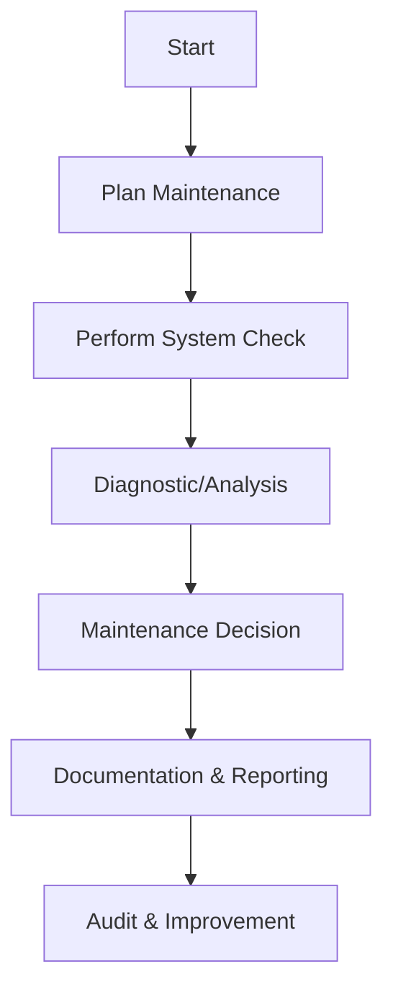
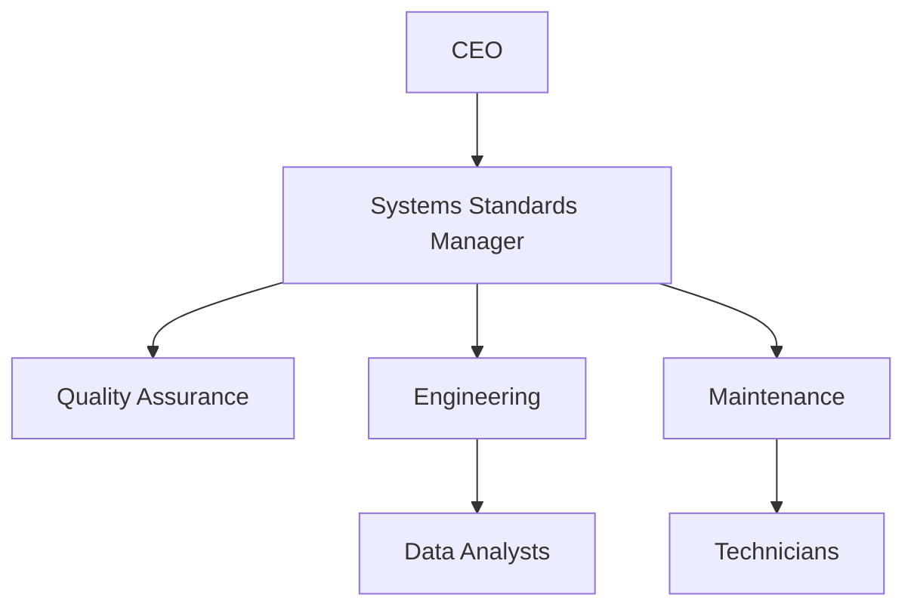

# FTC_20-00-00-00-000_ATA_20-Systems-Standard-Practices.md

**Comprehensive Guide for Systems Standard Practices for the GAIA AIR – Ampel360XWLRGA Aircraft**

---

## Version History

| **Version** | **Date**       | **Author**              | **Description**                                         |
|-------------|----------------|-------------------------|---------------------------------------------------------|
| 1.0         | 2024-12-28     | AMEDEO PELLICCIA        | Initial creation of the document.                       |
| 1.1         | 2025-01-15     | [Reviewer/Contributor]  | Reviewed, added references, updated acronyms.           |

---

## Table of Contents

1. [**20.10. Introduction**](#2010-introduction)  
   1.1. [20.11. Purpose](#2011-purpose)  
   1.2. [20.12. Scope](#2012-scope)  
   1.3. [20.13. Document Structure](#2013-document-structure)  
   1.4. [20.14. Terminology](#2014-terminology)

2. [**20.20. Overview of ATA Chapter 20**](#2020-overview-of-ata-chapter-20)  
   2.1. [20.21. Importance of Systems Standard Practices](#2021-importance-of-systems-standard-practices)  
   2.2. [20.22. Principles of Systems Standard Practices](#2022-principles-of-systems-standard-practices)

3. [**20.30. Compliance and Standards**](#2030-compliance-and-standards)  
   3.1. [20.31. Regulatory Requirements](#2031-regulatory-requirements)  
   3.2. [20.32. ATA Standards](#2032-ata-standards)  
   3.3. [20.33. Integration with Risk Assessment](#2033-integration-with-risk-assessment)

4. [**20.40. Application to GAIA AIR Project**](#2040-application-to-gaia-air-project)  
   4.1. [20.41. Systems Overview](#2041-systems-overview)  
   4.2. [20.42. Standard Practices for System Integration](#2042-standard-practices-for-system-integration)  
   4.3. [20.43. Documentation and Reporting](#2043-documentation-and-reporting)

5. [**20.50. Systems Standard Procedures**](#2050-systems-standard-procedures)  
   5.1. [20.51. General Safety and Workmanship](#2051-general-safety-and-workmanship)  
   5.2. [20.52. Material Selection and Handling](#2052-material-selection-and-handling)  
   5.3. [20.53. System Interchangeability and Standardization](#2053-system-interchangeability-and-standardization)  
   5.4. [20.54. System Inspections and Tests](#2054-system-inspections-and-tests)

6. [**20.60. Roles and Responsibilities**](#2060-roles-and-responsibilities)  
   6.1. [20.61. Systems Standards Manager](#2061-systems-standards-manager)  
   6.2. [20.62. Maintenance Personnel](#2062-maintenance-personnel)  
   6.3. [20.63. Quality Assurance](#2063-quality-assurance)  
   6.4. [20.64. Engineering Team](#2064-engineering-team)

7. [**20.70. Integration with Other Documents and Systems**](#2070-integration-with-other-documents-and-systems)  
   7.1. [20.71. Dependencies Matrix and Glossary](#2071-dependencies-matrix-and-glossary)  
   7.2. [20.72. Integration with CMMS](#2072-integration-with-cmms)  
   7.3. [20.73. Integration with Other ATA Chapters](#2073-integration-with-other-ata-chapters)

8. [**20.80. Training and Awareness**](#2080-training-and-awareness)  
   8.1. [20.81. Systems Standard Practices Training Programs](#2081-systems-standard-practices-training-programs)  
   8.2. [20.82. Awareness Campaigns](#2082-awareness-campaigns)

9. [**20.90. Audits and Continuous Improvement**](#2090-audits-and-continuous-improvement)  
   9.1. [20.91. Internal Audits](#2091-internal-audits)  
   9.2. [20.92. Continuous Improvement Process](#2092-continuous-improvement-process)

10. [**20.100. Human Factors**](#20100-human-factors)  
    10.1. [20.101. Ergonomics in System Work Practices](#20101-ergonomics-in-system-work-practices)  
    10.2. [20.102. Reducing Human Error in System Operations](#20102-reducing-human-error-in-system-operations)  
    10.3. [20.103. Training and Skill Development](#20103-training-and-skill-development)

11. [**20.110. Case Studies**](#20110-case-studies)  
    11.1. [20.111. Successful System Standard Implementations](#20111-successful-system-standard-implementations)  
    11.2. [20.112. Impact of Advanced Technologies on System Reliability](#20112-impact-of-advanced-technologies-on-system-reliability)

12. [**20.120. Future Trends**](#20120-future-trends)  
    12.1. [20.121. Advanced System Technologies](#20121-advanced-system-technologies)  
    12.2. [20.122. Evolving Regulations and Standards](#20122-evolving-regulations-and-standards)  
    12.3. [20.123. Integration of AI and Automation in Systems Maintenance](#20123-integration-of-ai-and-automation-in-systems-maintenance)

13. [**20.130. References**](#20130-references)

14. [**20.140. Visual Aids**](#20140-visual-aids)  
    14.1. [20.141. Systems Standard Process Flowchart](#20141-systems-standard-process-flowchart)  
    14.2. [20.142. Systems Analysis Workflow Diagram](#20142-systems-analysis-workflow-diagram)  
    14.3. [20.143. Organizational Structure for Systems](#20143-organizational-structure-for-systems)

15. [**20.150. Sample Forms and Templates**](#20150-sample-forms-and-templates)  
    15.1. [20.151. System Maintenance Checklist](#20151-system-maintenance-checklist)  
    15.2. [20.152. System Inspection Report Template](#20152-system-inspection-report-template)  
    15.3. [20.153. System Anomaly Detection Log](#20153-system-anomaly-detection-log)

16. [**20.170. Acronyms**](#20170-acronyms)

17. [**20.180. Companion (Introductory Insights)**](#20180-companion-introductory-insights)

18. [**20.190. Generator (Design Solutions)**](#20190-generator-design-solutions)

19. [**20.200. Implementator (Scalability and Operation)**](#20200-implementator-scalability-and-operation)

---
    
## 20.10. Introduction
*(Focuses on the background, purpose, scope, and high-level structure.)*

Effective **Systems Standard Practices** are essential for ensuring the safe, reliable, and efficient operation of aircraft systems. This document outlines the procedures, standards, and best practices to maintain, inspect, and operate the **GAIA AIR – Ampel360XWLRGA Aircraft** in compliance with **ATA Chapter 20** guidelines and regulatory requirements from authorities such as **EASA** and **FAA**.

### 20.11. Purpose
The purpose of this document is to provide clear, comprehensive guidelines for **systems standard practices**. This includes:

- **Ensuring safety** by standardizing work procedures  
- **Enhancing reliability** via consistent system maintenance  
- **Reducing costs** through optimized repairs and inspections  
- **Compliance** with ATA Chapter 20 and regulatory bodies like **FAA** and **EASA**  

### 20.12. Scope
This document covers:

- **System integrity protocols**  
- **Material selection and handling**  
- **Inspection and testing** procedures  
- **Roles and responsibilities** of personnel  
- **Documentation** and **auditing** processes  

It serves as a foundational reference for all teams interacting with or managing aircraft systems within the GAIA AIR – Ampel360XWLRGA program.

### 20.13. Document Structure
This document is organized into sections detailing **systems standard practices** (Sections 20.10–20.20), **compliance** (Section 20.30), **GAIA AIR project application** (Section 20.40), **practical procedures** (Section 20.50), **roles** (Section 20.60), **integration** (Section 20.70), **training** (Section 20.80), **audits and continuous improvement** (Section 20.90), **human factors** (Section 20.100), **case studies** (Section 20.110), **future trends** (Section 20.120), and **references** (Section 20.130). Additional sections (20.140–20.200) provide visual aids, forms, acronyms, and strategic solutions.

### 20.14. Terminology
Key terms include:

- **Standard Practices:** Established methods to ensure uniformity in maintenance procedures.  
- **Workmanship Standards:** Guidelines for quality and consistency in performing tasks.  
- **Interchangeability:** The ability to replace one component with another without modification.  
- **System Integrity:** The reliability and structural soundness of a system.  
- **Material Control:** Processes managing the storage, handling, and use of materials.  

Refer to [Section 20.170](#20170-acronyms) for a full list of acronyms and definitions.

---

## 20.20. Overview of ATA Chapter 20
*(Importance and fundamental principles of systems standard practices.)*

### 20.21. Importance of Systems Standard Practices
Systems standard practices are crucial for:

- **Safety:** Minimizing the risk of component failures and human error.  
- **Reliability:** Ensuring consistent system performance and reduced downtime.  
- **Cost-Efficiency:** Streamlining procedures to prevent unnecessary rework or repairs.  
- **Regulatory Compliance:** Aligning with ATA, FAA, and EASA standards.

### 20.22. Principles of Systems Standard Practices
Effective systems standard practices rely on:

1. **Unified Procedures:** Consistent methods for inspection, repair, and maintenance.  
2. **Documentation and Traceability:** Detailed records of all tasks and components.  
3. **Material Quality Assurance:** Verifying material authenticity and integrity.  
4. **Cross-Functional Collaboration:** Coordination among maintenance, engineering, and quality teams.  
5. **Continuous Improvement:** Regularly updating practices based on feedback and audits.

---

## 20.30. Compliance and Standards
*(Regulatory aspects and alignment with ATA guidelines.)*

### 20.31. Regulatory Requirements
Compliance with aviation regulatory bodies (e.g., **FAA**, **EASA**) is essential. Key regulatory considerations include:

- **Certification and Airworthiness Directives (ADs):** Ensuring all systems meet or exceed airworthiness standards.  
- **Safety Management:** Mandating systematic procedures for hazard identification and risk mitigation.  
- **Maintenance Documentation:** Tracking and archiving all tasks for audit and inspection.  
- **Material Handling Guidelines:** Adhering to accepted industry standards for labeling, storage, and disposal.

### 20.32. ATA Standards
Under **ATA Chapter 20**, standard practices include:

- **Documentation Consistency:** Utilizing **iSpec 2200** formatting for all electronic documents.  
- **Best Practices:** Guidance for routine tasks like wiring, torque settings, cleanliness, and corrosion prevention.  
- **Interchangeability:** Ensuring components meet universal fit and function requirements.

### 20.33. Integration with Risk Assessment
System standard practices inform and are informed by **risk management** efforts:

- **Prioritize High-Risk Components:** Focus on systems with known failure histories or critical roles.  
- **Continuous Monitoring:** Merge risk analysis with real-time data from sensors and logs.  
- **Feedback Loop:** Risk assessment results guide updates to standard practices and training.

---

## 20.40. Application to GAIA AIR Project
*(Project-specific considerations for the Ampel360XWLRGA.)*

### 20.41. Systems Overview
In the **GAIA AIR – Ampel360XWLRGA Aircraft**, critical systems include:

- **Avionics** (ATA 20–30 series)  
- **Hydraulics**  
- **Pneumatics**  
- **Environmental Control Systems (ECS)**  
- **Electrical Power Distribution**

Each subsystem follows ATA Chapter 20 best practices to ensure consistent, safe operations.

### 20.42. Standard Practices for System Integration
**GAIA AIR** standard practices involve:

- **Compatibility Checks:** Verifying component interoperability.  
- **Data Verification:** Ensuring updated technical manuals and software references.  
- **Quality Control:** Employing rigorous acceptance testing for new or modified parts.  
- **Configuration Management:** Documenting system changes, ensuring modifications are authorized.

### 20.43. Documentation and Reporting
All system activities (e.g., inspections, repairs, installations) are recorded to:

- **Maintain System Histories:** Provide lifecycle tracking for each component.  
- **Enable Traceability:** Connect maintenance actions to specific tasks, parts, or personnel.  
- **Facilitate Audits:** Supply proof of compliance with ATA Chapter 20 and other regulations.  
- **Support Continuous Improvement:** Identify recurrent issues or inefficiencies.

---

## 20.50. Systems Standard Procedures
*(Detailed how-to for handling, verifying, and maintaining systems.)*

### 20.51. General Safety and Workmanship
Ensuring that all maintenance tasks adhere to safety standards and high workmanship quality is paramount.

1. **Personal Protective Equipment (PPE):**  
   - Gloves, safety glasses, and appropriate clothing must be worn at all times.  
   - Anti-static measures should be employed in areas with sensitive electronic systems.

2. **Workmanship Standards:**  
   - Adhere to torque charts and cleanliness protocols to prevent contamination and ensure component integrity.  
   - Proper labeling and securing of wires, hoses, and cables to avoid misconfigurations and potential hazards.

3. **Area Preparedness:**  
   - Keep work zones free from debris and unnecessary tools to maintain a safe and organized environment.  
   - Employ hazard signage and adequate lighting as required to enhance visibility and safety.

### 20.52. Material Selection and Handling
**Material Control** ensures that only approved and high-quality materials are used in system maintenance and operations.

- **Authentic Components:**  
  - Sourced from approved suppliers and cross-checked with OEM specifications to ensure compatibility and performance.

- **Storage Conditions:**  
  - Maintain temperature, humidity, and cleanliness controls for sensitive parts to prevent degradation or contamination.

- **Batch Tracking:**  
  - Implement traceability for each part or material, linking it to specific aircraft systems and maintenance activities.

- **Shelf-Life Monitoring:**  
  - Timely rotation or disposal of items reaching end-of-life to maintain system integrity and performance.

### 20.53. System Interchangeability and Standardization
Procedures supporting interchangeability and standardization ensure that components can be reliably replaced across different aircraft without modification.

- **Part Identification:**  
  - Utilize unique part numbers with revision statuses to manage replacements and upgrades efficiently.

- **Dimensional Checks:**  
  - Ensure universal fit for multi-aircraft usage by verifying dimensions and compatibility.

- **Performance Testing:**  
  - Confirm that replacement parts meet functional equivalence through standardized testing protocols.

### 20.54. System Inspections and Tests
Regular and thorough system inspections and tests are essential for maintaining system integrity and performance.

1. **Routine Inspections:**  
   - Conduct scheduled or flight-hour-based checks per OEM guidelines to identify wear, corrosion, or other issues early.

2. **Functional Testing:**  
   - Perform simulation or operational tests to confirm correct system behavior and identify anomalies.

3. **Nondestructive Testing (NDT):**  
   - Utilize techniques like ultrasonic or X-ray inspections for internal flaw detection without compromising system integrity.

4. **Reporting and Analysis:**  
   - Log findings in the CMMS or system logs for trending and follow-up actions to address identified issues promptly.

**Best Practices:**

- **Standardized Inspection Checklists:** Use comprehensive checklists to ensure all critical components and systems are evaluated consistently.
- **Advanced Diagnostic Tools:** Incorporate modern diagnostic tools to enhance the accuracy and efficiency of inspections and tests.
- **Documentation:** Maintain detailed records of all inspections and tests to support traceability and compliance.

---

## 20.60. Roles and Responsibilities
*(Who does what in system standard practices.)*

### 20.61. Systems Standards Manager
- **Program Oversight:**  
  Ensures all system practices adhere to ATA Chapter 20 and internal policies.
  
- **Policy Development:**  
  Creates or updates SOPs for system installation, maintenance, and disposal.
  
- **Resource Allocation:**  
  Coordinates budget, tools, and personnel for system standard tasks.

- **Continuous Improvement:**  
  Identifies areas for enhancement and implements necessary changes to improve system standard practices.

### 20.62. Maintenance Personnel
- **System Checks:**  
  Perform inspections, tests, and routine upkeep of aircraft systems.
  
- **Documentation:**  
  Record completed tasks, anomalies, or required repairs in the CMMS.
  
- **Compliance:**  
  Follow set SOPs, safety requirements, and QA directives during maintenance activities.

- **Spill Response:**  
  Respond promptly to any spills or leaks, utilizing spill kits and following emergency protocols.

### 20.63. Quality Assurance
- **Audit Schedules:**  
  Organize regular reviews of system procedures and documentation to ensure compliance.
  
- **Non-Conformance Reporting:**  
  Identify areas where processes deviate from standard practices and initiate corrective actions.
  
- **Training Oversight:**  
  Collaborate with the Systems Standards Manager to refine training programs based on audit findings.

- **Process Validation:**  
  Verify that maintenance activities meet quality standards through rigorous testing and inspections.

### 20.64. Engineering Team
- **Technical Guidance:**  
  Offer expertise on complex repairs or system modifications, ensuring they meet performance and safety standards.
  
- **Configuration Control:**  
  Approve changes to systems, ensuring compatibility and safety before implementation.
  
- **Data Analysis:**  
  Review system trends for predictive maintenance or design enhancements based on maintenance data.

- **Innovation Implementation:**  
  Integrate new technologies and methodologies into the systems standard practices to enhance performance and reliability.

---

## 20.70. Integration with Other Documents and Systems
*(Ensures synergy between this program and broader maintenance/operations.)*

### 20.71. Dependencies Matrix and Glossary
A dependencies matrix outlines how **ATA Chapter 20** interacts with other chapters (e.g., 21–30 for specific subsystem guidelines). A centralized glossary in the maintenance management system clarifies technical terms across documents, ensuring consistency.

**Dependencies Matrix:**

| **Systems Standard Practices** | **Related ATA Chapter** | **Document Reference**               |
|--------------------------------|-------------------------|--------------------------------------|
| Avionics                       | ATA 28 (Fuel System)    | Fuel Handling Procedures Manual      |
| Electrical Systems             | ATA 24 (Electrical Power)| Electrical Systems Maintenance Manual|
| Environmental Control Systems  | ATA 21 (Air Conditioning)| Air Conditioning Maintenance Procedures|
| Hydraulics                     | ATA 32 (Landing Gear)   | Landing Gear Fuel Transfer Protocols |
| Pneumatics                     | ATA 24 (Electrical Power)| Electrical Systems Pneumatics Guide  |

**Glossary:**

| **Term**       | **Definition**                                      |
|----------------|-----------------------------------------------------|
| SOP            | Standard Operating Procedure                        |
| NDT            | Non-Destructive Testing                             |
| PPE            | Personal Protective Equipment                       |
| CMMS           | Computerized Maintenance Management System          |
| QA             | Quality Assurance                                   |
| SCADA          | Supervisory Control and Data Acquisition            |
| iSpec 2200     | ATA Specification for Electronic Technical Documents|
| FA             | Fuel Analysis                                       |
| ML             | Machine Learning                                    |
| AI             | Artificial Intelligence                             |
| OEM            | Original Equipment Manufacturer                     |
| Digital Twin   | A digital replica of a physical system              |

### 20.72. Integration with CMMS
Use a **Computerized Maintenance Management System (CMMS)** to:

- **Track Work Orders:**  
  Automate tasks for standard procedures (e.g., inspections, part replacements).
  
- **Monitor Inventory:**  
  Align component usage with standard practices, ensuring accurate reorder levels.
  
- **Data Analytics:**  
  Evaluate historical trends to improve reliability and predict future maintenance needs.

**Integration Points:**

- **Data Syncing:**  
  Real-time synchronization of system data with CMMS for up-to-date maintenance records.
  
- **Automated Alerts:**  
  Trigger maintenance tasks automatically based on system alerts and thresholds.
  
- **Reporting:**  
  Utilize CMMS reporting tools to generate comprehensive system analysis reports.

**Benefits:**

- **Efficiency:**  
  Reduces manual data entry and accelerates maintenance response times.
  
- **Data Integrity:**  
  Ensures system data is consistently and accurately recorded.
  
- **Comprehensive Insights:**  
  Combines system data with other maintenance data for holistic analysis.

### 20.73. Integration with Other ATA Chapters
While **ATA Chapter 20** focuses on systems standard practices, synergy with chapters covering:

- **ATA 21 (Air Conditioning):**  
  Standard practices for system cleanliness and part interchangeability.
  
- **ATA 24 (Electrical Power):**  
  Ensuring consistent wiring and circuit protection methods.
  
- **ATA 27 (Flight Controls):**  
  Structural and mechanical integration of system best practices.

…ensures that system insights translate seamlessly into operational and maintenance actions.

**Examples of Integration:**

- **Avionics Systems:**  
  Coordinate with ATA 28 to ensure fuel systems' compatibility and performance.
  
- **Electrical Systems:**  
  Align with ATA 24 to maintain consistent electrical standards across all systems.
  
- **Flight Control Systems:**  
  Collaborate with ATA 27 to integrate flight control data into system monitoring.

**Breakdown:** Integration fosters a cohesive approach, ensuring system insights translate seamlessly into operational and maintenance actions.

---

## 20.80. Training and Awareness
*(Focus on personnel readiness and organizational mindset.)*

### 20.81. Systems Standard Practices Training Programs
Ongoing training ensures personnel remain up to date on analysis techniques and system technologies. Recommended program elements include:

- **Fundamental System Principles:**  
  Understanding the basics of system mechanics, sources of wear, and their impact on aircraft components.

- **Hands-On Equipment Training:**  
  Practical training on installing, maintaining, and troubleshooting system components.

- **Advanced Diagnostic Techniques:**  
  Training on advanced diagnostic tools, predictive analytics, and simulation software.

- **Safety and Regulatory Compliance:**  
  Educating personnel on safety protocols and regulatory requirements related to systems maintenance.

- **Certification Programs:**  
  Offering recognized certifications validating expertise in systems standard practices.

**Implementation Steps:**

1. **Develop Curriculum:**  
   Create a structured training curriculum covering all necessary topics.

2. **Schedule Training Sessions:**  
   Organize regular training sessions, both introductory and advanced.

3. **Assess Competency:**  
   Implement assessments to ensure personnel understand and can apply training.

4. **Provide Resources:**  
   Supply access to training materials, manuals, and online resources.

### 20.82. Awareness Campaigns
Promoting a culture of **systems standard excellence**:

- **Regular Workshops:**  
  Cross-functional knowledge sharing sessions to discuss best practices and lessons learned.

- **Success Stories:**  
  Motivational examples where standard practices prevented major incidents or improved system reliability.

- **Visual Aids:**  
  Posters in maintenance areas summarizing do’s and don’ts for system handling and maintenance.

- **Feedback Channels:**  
  Open lines for suggestions or reporting potential system practice improvements, fostering a collaborative environment.

**Benefits:**

- **Enhanced Engagement:**  
  Engages personnel at all levels, fostering a proactive maintenance culture.

- **Knowledge Sharing:**  
  Promotes the sharing of best practices and lessons learned.

- **Continuous Improvement:**  
  Encourages ongoing dialogue and refinement of systems standard practices.

**Breakdown:** Focused training and awareness initiatives enhance proficiency, morale, and compliance, driving a robust systems standard practices culture.

---

## 20.90. Audits and Continuous Improvement
*(Mechanisms for validation and program evolution.)*

### 20.91. Internal Audits
Quality Assurance teams periodically assess systems standard practices to ensure compliance and effectiveness:

- **Procedure Compliance:**  
  Check if SOPs are consistently applied during system inspections, maintenance, and repairs.

- **Record Accuracy:**  
  Evaluate logs and maintenance forms for thoroughness and accuracy, ensuring all actions are properly documented.

- **Regulatory Alignment:**  
  Ensure ongoing adherence to external standards and regulations, identifying areas needing updates.

- **Process Efficiency:**  
  Assess the efficiency of systems standard procedures, identifying bottlenecks or redundant steps.

**Audit Cycle:**

1. **Planning:**  
   Define audit objectives, scope, and criteria based on current standards and regulatory requirements.

2. **Execution:**  
   Conduct the audit using checklists, interviews, and data reviews to evaluate compliance and effectiveness.

3. **Reporting:**  
   Document findings, highlight best practices, and uncover improvement areas in a detailed audit report.

4. **Action:**  
   Implement corrective measures for discrepancies or inefficiencies identified during the audit.

5. **Follow-Up:**  
   Verify that corrective actions have been effectively implemented and are sustaining improvements.

### 20.92. Continuous Improvement Process
Audit results feed into continuous improvement cycles to enhance systems standard practices:

1. **Identify Gaps:**  
   Recognize deficiencies in processes, training, or equipment based on audit findings.

2. **Plan Solutions:**  
   Develop corrective measures and enhancements, such as updating SOPs, refining training programs, or upgrading equipment.

3. **Implement Changes:**  
   Execute the planned changes and monitor their impact on system performance and compliance.

4. **Review Outcomes:**  
   Assess the effectiveness of implemented changes, ensuring they address identified gaps and contribute to overall improvement.

**Continuous Improvement Strategies:**

- **Feedback Integration:**  
  Incorporate feedback from auditors, maintenance personnel, and system managers to refine processes.

- **Technology Upgrades:**  
  Stay abreast of technological advancements and integrate new tools or sensors to enhance systems standard practices.

- **Best Practices Adoption:**  
  Regularly review industry best practices and adopt relevant strategies to improve program effectiveness.

- **Performance Metrics:**  
  Establish and monitor key performance indicators (KPIs) such as maintenance turnaround time, system reliability rates, and compliance rates to gauge program success and identify areas for improvement.

**Benefits:**

- **Enhanced Program Effectiveness:**  
  Ensures that systems standard practices remain relevant and effective in addressing emerging challenges.

- **Increased Reliability:**  
  Continuously improves the reliability of system monitoring data and maintenance actions.

- **Operational Excellence:**  
  Drives excellence in maintenance practices, contributing to overall aircraft performance and safety.

**Breakdown:** Audits validate compliance and performance, while continuous improvement fosters a progressive, data-driven environment.

---

## 20.100. Human Factors
*(Addresses ergonomic and cognitive aspects influencing performance.)*

### 20.101. Ergonomics in System Work Practices
Ensuring that system maintenance tasks are designed with human ergonomics in mind enhances safety and efficiency.

- **Safe Equipment Design:**  
  Utilize tools designed to reduce strain and injury risk, ensuring they are user-friendly and ergonomically shaped.

- **Accessible Work Areas:**  
  Position system components at ergonomic heights to facilitate easy maintenance without undue bending or reaching.

- **Lighting and Ventilation:**  
  Provide adequate lighting and airflow in work areas to minimize errors and ensure comfortable working conditions.

- **Tool Organization:**  
  Maintain organized tool storage to allow quick access and reduce the time spent searching for tools, enhancing workflow efficiency.

### 20.102. Reducing Human Error in System Operations
Implementing strategies to minimize human error ensures higher reliability and safety in system maintenance.

- **Checklists:**  
  Use standardized checklists to ensure no critical step is overlooked during maintenance tasks.

- **Automation:**  
  Integrate software-driven diagnostic features to minimize manual data entry or interpretation errors.

- **Error-Proofing:**  
  Incorporate design features that prevent incorrect installation or usage of parts, such as keyed connectors or color-coded components.

- **Double-Check Systems:**  
  Require peer reviews or second-party sign-offs for critical maintenance actions to ensure accuracy and reliability.

- **Continuous Training:**  
  Regularly train personnel on best practices, new technologies, and common error patterns to enhance proficiency and awareness.

**Best Practices:**

- **Automated Alerts:**  
  Implement automated systems that highlight anomalies or deviations, reducing reliance on manual inspections.

- **Data Visualization:**  
  Use clear and comprehensive visualizations to aid in accurate data interpretation and decision-making.

- **Documentation Standards:**  
  Maintain high standards for documentation to ensure all steps are traceable and verifiable.

### 20.103. Training and Skill Development
Encouraging advanced certifications, workshops, and cross-departmental learning maintains a skilled and knowledgeable workforce capable of accurate system maintenance.

**Training Components:**

- **Hands-On Workshops:**  
  Practical sessions where personnel can practice system inspections, component replacements, and use of diagnostic tools in real-world scenarios.

- **Online Modules:**  
  E-learning courses covering advanced topics such as system diagnostics, predictive analytics, and use of new maintenance technologies.

- **Certification Programs:**  
  Formal certifications that validate personnel proficiency in systems standard practices, enhancing their career development and the program’s credibility.

- **Cross-Training:**  
  Training personnel across different departments to foster a holistic understanding of systems standard practices’ role in overall aircraft maintenance and safety.

- **Knowledge Sharing Sessions:**  
  Regular meetings where systems standards managers and engineers share insights, discuss case studies, and brainstorm improvements to the systems standard practices program.

**Best Practices:**

- **Continuous Education:**  
  Encourage personnel to stay updated with the latest advancements in systems maintenance and related technologies.

- **Mentorship Programs:**  
  Pair less experienced personnel with seasoned engineers or systems managers to facilitate knowledge transfer and skill development.

- **Resource Provision:**  
  Provide access to relevant training materials, manuals, and online resources to support ongoing learning.

**Breakdown:** Addressing human factors—ergonomics, error reduction, and skill development—strengthens the entire chain of systems standard practices, ensuring higher reliability and safety.

---

## 20.110. Case Studies
*(Real examples illustrating systems standard practices benefits.)*

### 20.111. Successful System Standard Implementations
These case studies demonstrate how airlines or Maintenance, Repair, and Overhaul (MRO) facilities improved safety and reduced costs by upgrading their systems standard practices.

- **Case 1: Airline X's Workmanship Standards Implementation**
  - **Background:** Airline X faced frequent wiring faults leading to in-flight system failures.
  - **Implementation:** Adopted rigorous workmanship standards, including standardized wiring techniques and torque settings.
  - **Results:** Reduced wiring faults by 45%, enhanced system reliability, and decreased in-flight maintenance incidents.

- **Case 2: MRO Facility Y's Torque Procedure Checklists**
  - **Background:** MRO Facility Y experienced high rates of rework due to improper torque application on critical components.
  - **Implementation:** Introduced comprehensive torque procedure checklists and mandatory peer reviews for critical tasks.
  - **Results:** Slashed rework rates by 30%, improved maintenance efficiency, and extended component lifespan.

### 20.112. Impact of Advanced Technologies on System Reliability
Modern solutions—like IoT sensors and AI-driven anomaly detection—can significantly enhance system reliability and operational efficiency.

- **Case Study: Flag Carrier Z's AI-Driven Anomaly Detection**
  - **Background:** Flag Carrier Z sought to enhance its maintenance program by leveraging AI to predict component failures.
  - **Implementation:** Developed and deployed machine learning models trained on historical maintenance and sensor data to predict failures.
  - **Results:** Improved maintenance scheduling accuracy, extended component lifespan, and reduced maintenance costs by 25%.

- **Case Study: Major Airline A's IoT Sensor Integration**
  - **Background:** Major Airline A aimed to reduce system downtimes and enhance predictive maintenance capabilities.
  - **Implementation:** Integrated IoT-based sensors across critical systems to provide real-time monitoring and data collection.
  - **Results:** Achieved a 20% reduction in unexpected system downtimes, enhanced real-time data visibility, and optimized maintenance workflows.

**Breakdown:** These examples illustrate the tangible benefits of adopting advanced tools and strategies, building a business case for continuous improvement in systems standard practices.

---

## 20.120. Future Trends
*(Emerging technologies and upcoming changes.)*

### 20.121. Advanced System Technologies
- **Digital Twins:**  
  Real-time system replicas for simulation and predictive analytics.  
  **Impact:** Enhances decision-making and allows for scenario testing without affecting actual systems.

- **Wireless Monitoring:**  
  MEMS-based sensors providing continuous updates on system health.  
  **Impact:** Facilitates real-time monitoring and reduces the need for manual inspections.

- **New Materials:**  
  Composites or smart alloys offering enhanced durability with unique maintenance requirements.  
  **Impact:** Extends system lifespan and reduces maintenance frequency, but requires updated maintenance protocols.

### 20.122. Evolving Regulations and Standards
- **Global Harmonization:**  
  Efforts to unify maintenance guidelines across regions to simplify compliance for international operations.  
  **Impact:** Streamlines maintenance practices and reduces complexity in multi-regional fleets.

- **Stricter Reporting Requirements:**  
  Requiring more granular data on system performance and maintenance activities.  
  **Impact:** Enhances transparency and accountability but necessitates more detailed documentation.

- **Environmental Considerations:**  
  Focus on eco-friendly materials and processes, aligning with global sustainability goals.  
  **Impact:** Promotes sustainable practices and compliance with evolving environmental regulations.

### 20.123. Integration of AI and Automation in Systems Maintenance
- **Predictive Maintenance:**  
  AI algorithms predicting part failures based on sensor data, enabling proactive maintenance actions.  
  **Impact:** Minimizes equipment downtime and extends component lifespan.

- **Automated Workflows:**  
  SCADA or robotic systems reducing human intervention in repetitive tasks, enhancing efficiency.  
  **Impact:** Increases precision and reduces the risk of human error in maintenance operations.

- **Data-Driven Decision Making:**  
  Using big data analytics to refine system design and maintenance intervals, optimizing overall performance.  
  **Impact:** Enhances system reliability and operational efficiency through informed decision-making.

**Breakdown:** Anticipating these trends allows GAIA AIR to proactively invest in technology, training, and processes that will keep them competitive and compliant.

---

## 20.130. References
*(For detailed references, see the end of this guide. This section lists relevant standards, regulatory documents, and industry research supporting the recommended practices.)*

1. **FAA Advisory Circulars** on aircraft system maintenance and standard practices.  
   - *FAA Advisory Circular AC 43.13-1B: Acceptable Methods, Techniques, and Practices - Aircraft Inspection and Repair.*  
     Retrieved from [https://www.faa.gov/regulations_policies/advisory_circulars/](https://www.faa.gov/regulations_policies/advisory_circulars/)
  
2. **EASA Part-M** & **Part-145** regulations for continuing airworthiness and approved maintenance organizations.  
   - *EASA Part-M: Continuing Airworthiness.*  
     Retrieved from [https://www.easa.europa.eu/document-library/regulations/easa-part-m](https://www.easa.europa.eu/document-library/regulations/easa-part-m)  
   - *EASA Part-145: Maintenance Organization Approvals.*  
     Retrieved from [https://www.easa.europa.eu/document-library/regulations/easa-part-145](https://www.easa.europa.eu/document-library/regulations/easa-part-145)
  
3. **ATA iSpec 2200** for standardizing electronic documents.  
   - *ATA iSpec 2200: Data Specification for Technical Publications.*  
     Retrieved from [https://www.airlines.org/wp-content/uploads/2020/02/ATA-iSpec-2200-v2.3.1.pdf](https://www.airlines.org/wp-content/uploads/2020/02/ATA-iSpec-2200-v2.3.1.pdf)
  
4. **OEM Technical Manuals** for GAIA AIR – Ampel360XWLRGA systems.  
   - *Ampel360XWLRGA Aircraft Systems Maintenance Manual.*  
     *(Assumed to be proprietary and internal to GAIA AIR)*
  
5. **ISO 9001** and **ISO 9100** for quality management systems in aviation.  
   - *ISO 9001:2015 - Quality Management Systems.*  
     Retrieved from [https://www.iso.org/standard/62085.html](https://www.iso.org/standard/62085.html)  
   - *ISO 9100:2018 - Quality Management Systems - Requirements for Aviation, Space and Defense Organizations.*  
     Retrieved from [https://www.iso.org/standard/68506.html](https://www.iso.org/standard/68506.html)
  
6. **Grieves, M. (2016).**  
   *Digital Twin: Manufacturing Excellence Through Virtual Replication.* Siemens PLM White Paper.  
   *Explanation:* Introduces the concept of digital twins for monitoring and optimizing equipment life cycles, crucial for predictive maintenance strategies.
  
7. **Tao, F., Cheng, P., Liu, J., & Lee, J. (2018).**  
   *Digital twin-driven product lifecycle management: Concepts, challenges, and opportunities.*  
   IEEE Transactions on Industrial Informatics, 14(10), 4405–4414.  
   [https://doi.org/10.1109/TII.2018.2854179](https://doi.org/10.1109/TII.2018.2854179)  
   *Explanation:* Discusses digital twins' role in lifecycle management, which can enhance systems standard practices efficiency through simulations and virtual replications.
  
8. **Iansiti, M., & Lakhani, K. R. (2017).**  
   *The Truth Machine: The Blockchain and the Future of Everything.*  
   Harvard Business Review.  
   *Explanation:* Explores blockchain's transformative impact, including secure data management for systems maintenance tracking.
  
9. **Deloitte. (2019).**  
   *Blockchain in aviation: Taking flight.* Deloitte Insights.  
   Retrieved from [https://www2.deloitte.com/](https://www2.deloitte.com/)  
   *Explanation:* Examines blockchain's potential for transparency and efficiency in aviation maintenance records, including systems maintenance.
  
10. **PwC. (2018).**  
    *Blockchain in aerospace and defense: Transforming the future of flight.*  
    Retrieved from [https://www.pwc.com/](https://www.pwc.com/)  
    *Explanation:* Analyzes the role of blockchain in improving operational efficiency and security within aerospace, including applications in systems maintenance.
  
11. **Atzori, L., Iera, A., & Morabito, G. (2010).**  
    *The internet of things: A survey.*  
    Computer Networks, 54(15), 2787–2805.  
    [https://doi.org/10.1016/j.comnet.2010.05.010](https://doi.org/10.1016/j.comnet.2010.05.010)  
    *Explanation:* Highlights IoT's potential for real-time monitoring of system health in aircraft systems.
  
12. **Gubbi, J., Buyya, R., Marusic, S., & Palaniswami, M. (2013).**  
    *Internet of things (IoT): A vision, architectural elements, and future directions.*  
    Future Generation Computer Systems, 29(7), 1645–1660.  
    [https://doi.org/10.1016/j.future.2013.01.010](https://doi.org/10.1016/j.future.2013.01.010)  
    *Explanation:* Explores IoT applications in industrial environments, relevant for tracking system usage and optimizing maintenance workflows.
  
13. **Lee, J., Lee, K., & Suh, Y. W. (2015).**  
    *Internet of things and big data for advanced manufacturing services.*  
    International Journal of Precision Engineering and Manufacturing, 16(1), 1–14.  
    [https://doi.org/10.1007/s12541-014-0114-8](https://doi.org/10.1007/s12541-014-0114-8)  
    *Explanation:* Discusses IoT integration with big data analytics, applicable to improving systems standard practices and maintenance processes.
  
14. **Jardine, A. K., Lin, D., & Banjevic, D. (2006).**  
    *A review on machinery diagnostics and prognostics using artificial intelligence techniques.*  
    Mechanical Systems and Signal Processing, 20(7), 1483–1510.  
    [https://doi.org/10.1016/j.ymssp.2006.03.017](https://doi.org/10.1016/j.ymssp.2006.03.017)  
    *Explanation:* Provides foundational insights for AI-driven diagnostics and prognostics in predictive maintenance.
  
15. **Vachtsevanos, G., Lewis, F. L., Roemer, M., Hess, A., & Wu, B. (2006).**  
    *Intelligent fault diagnosis and prognosis for engineering systems.*  
    John Wiley & Sons.  
    *Explanation:* Focuses on intelligent fault diagnosis systems, emphasizing their use in training personnel for predictive maintenance tasks in systems standard practices.
  
16. **Saxena, A., Goebel, K., Saha, B., & Schwabacher, M. (2008).**  
    *Prognostics and health management: A review literature.*  
    Mechanical Systems and Signal Processing, 23(8), 2014–2039.  
    [https://doi.org/10.1016/j.ymssp.2008.03.015](https://doi.org/10.1016/j.ymssp.2008.03.015)  
    *Explanation:* Discusses methods for health management in engineering systems, with practical applications for improving systems maintenance training and predictive maintenance strategies.
  
17. **Siemens, G. (2013).**  
    *Learning Analytics: The Emergence of a Discipline.*  
    Retrieved from [https://www.researchgate.net/](https://www.researchgate.net/)  
    *Explanation:* Examines how learning analytics can enhance training management systems, relevant for systems standard practices training programs.
  
18. **Brown, A., & Green, T. (2020).**  
    *Designing Effective Learning Management Systems.*  
    Educational Technology Publications.  
    *Explanation:* Offers insights into creating LMS platforms, ensuring effective tracking and delivery of training programs for systems standard practices.
  
19. **Freina, L., & Ott, M. (2015).**  
    *A literature review on immersive virtual reality in education: State of the art and perspectives.*  
    In Conference Proceedings of Serious Games and Applications for Health, Education and Training (pp. 133–141).  
    [https://doi.org/10.1007/978-3-319-16307-9_11](https://doi.org/10.1007/978-3-319-16307-9_11)  
    *Explanation:* Explores the potential of VR in education, applicable to aviation for immersive training in complex systems maintenance scenarios.
  
20. **Bower, M., Howe, C., McCredie, N., Robinson, A., & Grover, D. (2017).**  
    *Augmented reality in education: Cases, places, and potentials.*  
    Educational Media International, 54(1), 1–15.  
    [https://doi.org/10.1080/09523987.2017.1281121](https://doi.org/10.1080/09523987.2017.1281121)  
    *Explanation:* Discusses AR applications in education, offering insights into enhancing hands-on systems maintenance training programs with augmented reality tools.
  
21. **Ramos, L. M. (2019).**  
    *Manual de Gestión del Mantenimiento Aeronáutico.* Editorial Avícola.  
    *Explanation:* Provides a detailed guide on managing aviation maintenance, including systems maintenance best practices and safety protocols.
  
22. **PwC. (2018).**  
    *Blockchain in aerospace and defense: Transforming the future of flight.*  
    Retrieved from [https://www.pwc.com/](https://www.pwc.com/)  
    *Explanation:* Highlights blockchain's application in aerospace, with potential benefits for systems maintenance operations.
  
23. **Deloitte. (2019).**  
    *Blockchain in aviation: Taking flight.* Deloitte Insights.  
    Retrieved from [https://www2.deloitte.com/](https://www2.deloitte.com/)  
    *Explanation:* Examines blockchain's potential for transparency and efficiency in aviation maintenance records, including systems maintenance.

---

## 20.140. Visual Aids

### 20.141. Systems Standard Process Flowchart
A schematic showing the step-by-step process of **system inspection, maintenance, testing,** and **documentation**.


**Description:**  
A flowchart representing the systematic approach to systems maintenance, from planning and inspection to diagnostics, maintenance decisions, documentation, and continuous improvement.

### 20.142. Systems Analysis Workflow Diagram
A diagram illustrating how system data is collected, analyzed, and used to inform maintenance decisions.


**Description:**  
Shows the flow of data from acquisition through processing and analysis to generate predictive insights, leading to maintenance actions and feedback for continuous improvement.

### 20.143. Organizational Structure for Systems
An org chart representing collaboration among the Systems Standards Manager, Maintenance teams, QA, and Engineering.


**Description:**  
Illustrates the hierarchy and reporting relationships for roles involved in systems standard practices, ensuring clear lines of communication and responsibility.

**Breakdown:**  
This subsection provides visual representations that help in understanding the workflows, schedules, and organizational hierarchies related to systems standard practices. Including these visuals ensures that personnel can quickly grasp complex processes and structures.

---

## 20.150. Sample Forms and Templates
*(Standardized forms and templates facilitate consistent documentation and reporting.)*

### 20.151. System Maintenance Checklist
A standardized form capturing system checks, tasks performed, and relevant parameters.

```markdown
# System Maintenance Checklist

**Project:** GAIA AIR – Ampel360XWLRGA  
**Date:** [Insert Date]  
**Technician:** [Name]

## General Checks
- [ ] Visual Inspection of Components
- [ ] Cleanliness and Corrosion Inspection
- [ ] Wire Harness Security
- [ ] Torque Settings Verified

## Specific Tasks
| **Task**             | **Findings**               | **Action Required**     | **Date**       | **Initial** |
|----------------------|----------------------------|-------------------------|----------------|-------------|
| Check Fittings       | No leaks observed          | N/A                     | 2024-12-28     | AP          |
| Inspect Insulation   | Minor chafing near bracket | Replace insulation wrap | 2024-12-28     | AP          |

## Sign-Off
- **Technician:** [Signature]  
- **QA Review:** [Signature]
```

### 20.152. System Inspection Report Template
A concise template detailing date/time of inspection, methods used, findings, recommended actions, and follow-up items.

```markdown
# System Inspection Report

**System Area:** [System Name/ID]  
**Date/Time:** [Insert Date & Time]  
**Inspector:** [Name]  
**System Type:** [Hydraulic/Electrical/Pneumatic]

## Inspection Details
- **Methodology:** Visual, NDT, operational tests
- **Reference Documents:** [Standards, OEM Manual sections]

## Findings
1. **Finding #1:**  
   - **Description:** [Detailed description of the issue]  
   - **Implications:** [Impact on system performance or safety]

2. **Finding #2:**  
   - **Description:** [Detailed description of the issue]  
   - **Implications:** [Impact on system performance or safety]

## Recommended Actions
- **Action 1:** [Description of corrective action]  
- **Action 2:** [Description of corrective action]

## Follow-Up Items
- **Next Inspection Date:** [Insert Date]  
- **Responsible Personnel:** [Name]

## Sign-Off
- **Inspector:** [Signature]  
- **Systems Standards Manager:** [Signature]
```

### 20.153. System Anomaly Detection Log
Used to track irregularities over time, noting system batch details, symptoms, and probable root cause.

```markdown
# System Anomaly Detection Log

**Date:** [Insert Date]  
**Reported By:** [Name]

## Anomaly Details
- **System ID:** SYS-1234
- **Anomaly Type:** [Wiring Fault / Sensor Malfunction / Others]
- **Detection Method:** Automated Sensor Alert / Routine Check

## Symptoms
- **Noise:** Unusual humming sound during operation  
- **Temperature:** Elevated temperatures detected in hydraulic lines  
- **Performance:** Reduced system efficiency and responsiveness

## Probable Root Cause
- **Cause 1:** [e.g., Worn connectors causing electrical faults]  
- **Cause 2:** [e.g., Blocked filters leading to overheating]

## Immediate Actions Taken
1. **Action 1:** [e.g., Disconnected faulty harness]  
2. **Action 2:** [e.g., Replaced sensor module]

## Follow-Up Required
- **Re-inspection after repairs**  
- **Scheduled maintenance:** [Description]  
- **Further diagnostic testing:** [Description]

## Final Remarks
Early detection allowed for prompt corrective actions, preventing potential system failures and ensuring operational safety.

## Status
- **Current Status:** Open / Resolved / Pending further checks

## Sign-Off
- **Technician:** [Signature]  
- **QA Manager:** [Signature]
```

**Breakdown:**  
These standardized forms streamline data collection, reporting, and anomaly resolution, reinforcing consistency across the systems standard practices program. Using these templates ensures that all necessary information is captured accurately and efficiently, supporting traceability and compliance.

---

## 20.170. Acronyms
*(List of acronyms used throughout the document.)*

| **Acronym** | **Definition**                                     |
|-------------|----------------------------------------------------|
| AI          | Artificial Intelligence                            |
| ATA         | Air Transport Association                          |
| CBM         | Condition-Based Maintenance                        |
| CMMS        | Computerized Maintenance Management System         |
| EASA        | European Union Aviation Safety Agency              |
| FAA         | Federal Aviation Administration                    |
| iSpec 2200  | ATA Specification for Electronic Technical Documents|
| ISO         | International Organization for Standardization     |
| ML          | Machine Learning                                   |
| NDT         | Non-Destructive Testing                            |
| OEM         | Original Equipment Manufacturer                    |
| PPE         | Personal Protective Equipment                      |
| QA          | Quality Assurance                                  |
| SCADA       | Supervisory Control and Data Acquisition           |
| SOP         | Standard Operating Procedure                       |
| DAQ         | Data Acquisition System                            |
| DA          | Data Analysts                                      |
| SMP         | Standard Maintenance Procedure                     |
| SYS         | System ID                                           |
| ECS         | Environmental Control Systems                      |
| PNEU        | Pneumatics                                          |

*(Add or modify as required for your organization.)*

**Breakdown:**  
A comprehensive glossary is crucial for maintaining clarity and consistency in communication, especially in a technical field like aviation. This section ensures that all personnel have a common understanding of key terms and acronyms used throughout the document.

---

## 20.180. Companion (Introductory Insights)
*(Provides initial guidance and context.)*

**Companion:**  
This section introduces readers to foundational aspects of **systems standard practices**, covering topics like **workmanship**, **material handling**, and **ergonomic considerations**. It aims to help personnel—especially those new to the GAIA AIR Ampel360XWLRGA program—grasp the overarching goals and rationale behind ATA Chapter 20 compliance.

**Key Insights:**

- **Unified Approach:**  
  Standard practices unify maintenance efforts across diverse systems, ensuring consistency and reliability.

- **Regulatory Implications:**  
  Highlights the importance of meeting or exceeding aviation authority benchmarks to maintain airworthiness and safety standards.

- **Team Integration:**  
  Emphasizes collaboration among different departments (Maintenance, QA, Engineering) to foster a cohesive and efficient maintenance environment.

**Purpose:**  
This section serves as an introductory primer, fostering a shared understanding of systems standard practices’ objectives and methodologies among all stakeholders.

**Breakdown:**  
The Companion section provides essential background and contextual information, setting the stage for the detailed guidelines and procedures outlined in the subsequent sections. It ensures that all personnel, regardless of their experience level, have a clear understanding of the importance and implementation of systems standard practices.

---

## 20.190. Generator (Design Solutions)
*(Offers strategic design solutions for advanced systems standard practices.)*

1. **Unified Systems Documentation Portal**
   - **Proposal:** Develop a single digital platform where all systems documentation, SOPs, and updates are stored.
   - **Benefit:** Enhances consistency, reduces version-control issues, and eases accessibility.
   - **Implementation Steps:**
     - **Platform Selection:** Choose a robust documentation management system that supports version control and user access levels.
     - **Migration:** Transfer all existing documentation to the new platform, ensuring data integrity.
     - **User Training:** Train personnel on how to access, update, and manage documents within the portal.
     - **Maintenance:** Regularly update the portal with new documents and revisions to keep information current.
   - **Expected Outcomes:**
     - Streamlined access to critical documentation.
     - Improved collaboration and information sharing among teams.
     - Reduced errors due to outdated or inconsistent documentation.

2. **AI-Driven Anomaly Detection**
   - **Proposal:** Use machine learning to analyze sensor data from critical systems, alerting maintenance staff to potential malfunctions.
   - **Benefit:** Enables predictive scheduling of inspections and reduces unplanned downtime.
   - **Implementation Steps:**
     - **Data Collection:** Gather historical sensor data from critical systems.
     - **Model Development:** Develop and train machine learning models to identify patterns indicative of system anomalies.
     - **Integration:** Integrate AI models with the CMMS and real-time monitoring systems.
     - **Alert Configuration:** Set up automated alerts based on model predictions to notify maintenance personnel.
   - **Expected Outcomes:**
     - Early detection of potential system failures.
     - Enhanced ability to perform proactive maintenance, extending system lifespan.
     - Reduction in emergency repairs and associated costs.

3. **Digital Twin Integration**
   - **Proposal:** Mirror real-world system operations in a digital environment for scenario testing, performance optimization, and predictive analytics.
   - **Benefit:** Improves decision-making and reduces the risk associated with direct system experimentation.
   - **Implementation Steps:**
     - **Digital Model Creation:** Develop a comprehensive digital replica of critical systems.
     - **Real-Time Data Feeding:** Continuously feed real-time operational data into the digital twin.
     - **Simulation:** Use the digital twin to simulate various operational scenarios and stress tests.
     - **Analysis:** Analyze simulation results to identify potential improvements or vulnerabilities.
   - **Expected Outcomes:**
     - Enhanced understanding of system behavior under different conditions.
     - Improved system design and maintenance strategies based on simulated insights.
     - Reduced risk of system failures through informed decision-making.

4. **Blockchain for Maintenance Records**
   - **Proposal:** Store system maintenance logs in a secure, tamper-proof blockchain ledger.
   - **Benefit:** Enhances data integrity, traceability, and security of maintenance records.
   - **Implementation Steps:**
     - **Blockchain Platform Selection:** Choose a blockchain platform that meets security and scalability requirements.
     - **Integration:** Integrate the blockchain system with the CMMS to automatically record maintenance activities.
     - **Access Control:** Define and enforce access permissions to ensure only authorized personnel can add or view records.
     - **Training:** Educate personnel on how to use the blockchain system for logging and accessing maintenance records.
   - **Expected Outcomes:**
     - Immutable and transparent maintenance records.
     - Enhanced ability to trace maintenance actions back to specific personnel and activities.
     - Increased trust and accountability within the maintenance program.

**Breakdown:**  
The Generator section provides strategic design solutions to enhance systems standard practices. Each solution addresses specific challenges and offers actionable steps to improve the overall systems standard practices framework, ensuring higher reliability, safety, and efficiency.

---

## 20.200. Implementator (Scalability and Operation)
*(Outlines strategies for scaling and operationalizing the program.)*

1. **Fleet-Wide Adoption**
   - **Action:** Roll out systems standard practices across the entire GAIA AIR Ampel360XWLRGA fleet.
   - **Benefit:** Ensures uniform quality and compliance, minimizing variation in maintenance outcomes.
   - **Implementation Steps:**
     - **Standard Operating Procedures:** Develop and disseminate standardized SOPs for all fleet maintenance activities.
     - **Uniform Equipment:** Equip all aircraft with the same systems handling and monitoring tools to ensure consistency.
     - **Training Programs:** Implement fleet-wide training programs to ensure all maintenance personnel adhere to standardized practices.
     - **Monitoring Compliance:** Use the CMMS to track adherence to standardized protocols across the fleet.
   - **Expected Outcomes:**
     - Consistent maintenance quality and system performance across the entire fleet.
     - Streamlined training and onboarding processes for new personnel.
     - Enhanced ability to conduct fleet-wide audits and assessments.

2. **Supplier Collaboration**
   - **Action:** Forge close partnerships with suppliers to maintain standard part specifications, ensure timely deliveries, and uphold quality.
   - **Benefit:** Reduces supply-chain disruptions and fosters continuous improvement.
   - **Implementation Steps:**
     - **Vendor Evaluation:** Assess suppliers based on reliability, compliance, and support capabilities.
     - **SLA Development:** Define clear performance metrics, response times, and support services in Service Level Agreements (SLAs).
     - **Contract Negotiation:** Establish contracts that enforce SLAs and include penalties for non-compliance.
     - **Regular Reviews:** Periodically review SLAs to ensure ongoing alignment with operational needs and standards.
   - **Expected Outcomes:**
     - Reliable supply of high-quality components adhering to standard specifications.
     - Reduced lead times for part deliveries, enhancing maintenance scheduling flexibility.
     - Improved collaboration and communication between GAIA AIR and suppliers.

3. **Centralized Training and Support**
   - **Action:** Centralize training programs and technical support for systems standard practices.
   - **Benefit:** Enhances staff competency, promotes knowledge sharing, and ensures consistent procedures.
   - **Implementation Steps:**
     - **Training Hub Development:** Establish a centralized training hub equipped with necessary resources and facilities.
     - **Standardized Curriculum:** Develop a standardized training curriculum covering all aspects of systems standard practices.
     - **Support Systems:** Implement support systems such as help desks, online resources, and mentorship programs.
     - **Continuous Training:** Schedule regular training updates and refresher courses to keep personnel informed about new practices and technologies.
   - **Expected Outcomes:**
     - High levels of competency and adherence to systems standard practices among all maintenance personnel.
     - Consistent application of maintenance procedures across different teams and locations.
     - Enhanced ability to onboard new personnel quickly and effectively.

4. **Performance Metrics and KPIs**
   - **Action:** Establish key performance indicators (KPIs) such as maintenance turnaround time, parts reliability rates, or system failure intervals.
   - **Benefit:** Provides tangible measures of success and identifies areas for improvement.
   - **Implementation Steps:**
     - **Define KPIs:** Identify and define relevant KPIs aligned with systems standard practices goals.
     - **Data Collection:** Use the CMMS and other monitoring tools to collect data related to the defined KPIs.
     - **Monitoring and Reporting:** Implement dashboards and regular reports to track KPI performance.
     - **Analysis and Action:** Analyze KPI data to identify trends, strengths, and areas needing improvement, and take corrective actions as necessary.
   - **Expected Outcomes:**
     - Clear visibility into the effectiveness of systems standard practices.
     - Ability to make informed decisions based on data-driven insights.
     - Continuous enhancement of maintenance processes and system reliability.

**Key Considerations:**
- **Interoperability:**  
  Ensure alignment of hardware, software, and data formats to facilitate seamless integration and data exchange.
  
- **Resource Allocation:**  
  Budget for sensor upgrades, training programs, and potential retrofitting of existing systems to support scalability.
  
- **Risk Management:**  
  Identify and mitigate risks introduced by scaling operations or integrating new technologies, such as system compatibility issues or data security concerns.

**Benefits:**
- **Uniform Standards:**  
  Achieves consistent system performance and reliability across all fleet units.
  
- **Cost Savings:**  
  Efficient resource usage and predictive maintenance lower total maintenance costs.
  
- **Enhanced Operational Readiness:**  
  Reduces downtime, enabling smoother flight operations and scheduling.

**Breakdown:**  
Implementator strategies ensure that the systems standard practices program is scalable, efficient, and adaptable to evolving operational needs and technological advancements. These strategies facilitate uniformity, reliability, and continuous improvement across the entire fleet.

---

**End of Document**  
*For further assistance, clarifications, or references, contact the GAIA AIR Systems Standard Practices Department.*
```

---

### **Usage Notes**:
1. **Markdown Link Anchors**:  
   - Each section header is followed by an HTML anchor auto-generated by many Markdown renderers (e.g., GitHub, GitLab).  
   - Clicking on a link in the **Table of Contents** should jump to the corresponding section.

2. **Customization**:  
   - Expand or refine each section based on your specific aircraft systems, internal processes, or regulatory environment.  
   - The *Generator* and *Implementator* sections can be tailored to reflect unique design solutions or scaling strategies for the GAIA AIR – Ampel360XWLRGA Aircraft.

3. **Periodic Updates**:  
   - Update the **Version History** section as changes are made.  
   - Evolving technologies (e.g., AI, IoT, digital twins) and regulations (e.g., FAA, EASA) may necessitate regular revisions to the document.  

**Best of luck with your GAIA AIR Systems Standard Practices program!** 🚀✈️

---

**Additional Recommendations for Future Enhancements:**

1. **Detailed Implementation Plans:**
   - For each action within the Generator and Implementator phases, develop detailed implementation plans outlining timelines, responsible parties, required resources, and success metrics.

2. **Risk Management:**
   - Incorporate a risk management section to identify potential risks associated with systems standard practices (e.g., equipment reliability, technological failures) and outline mitigation strategies.

3. **Case Studies and Best Practices:**
   - Expand the framework by including more case studies or best practices from other organizations that have successfully implemented similar systems standard practices programs. This can provide practical insights and lessons learned.

4. **Performance Metrics:**
   - Define specific metrics to evaluate the effectiveness of systems standard practices programs, such as improvement in system performance accuracy, reduction in maintenance costs, and compliance rates.

5. **Advanced Visual Aids:**
   - Incorporate more detailed diagrams and visual aids, such as flowcharts for specific system control procedures, trend analysis graphs, and organizational role matrices to enhance understanding and operational clarity.

6. **Documentation and Knowledge Management:**
   - Ensure that all systems standard practices materials, procedures, and evaluations are systematically documented and stored in a centralized knowledge management system for easy access and reference.

7. **Integration with Other Operational Systems:**
   - Explore further integration opportunities with other operational systems (e.g., Human Resources, Performance Management) to create a holistic approach to personnel development and management.

Feel free to adapt or extend the content based on your organization’s specific requirements, referencing the numbered sections in the **Table of Contents** for easy navigation.

**Best of luck implementing your GAIA AIR systems standard practices program!** 🚀✈️
