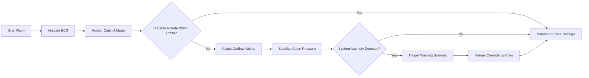
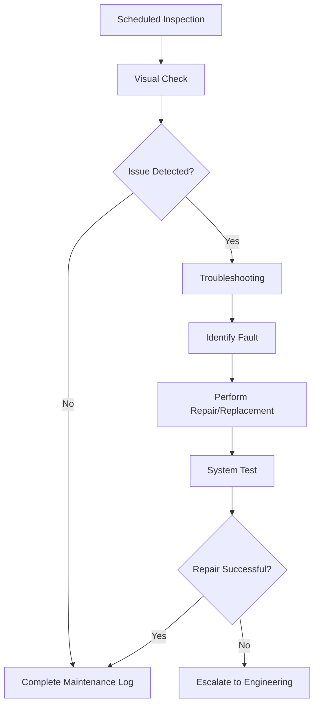

# FTC_21-00-00-00-000_ATA_21_Air_Conditioning_and_Pressurization_ECS.md

---
## Version History

| **Version** | **Date**       | **Author**                           | **Description**                                                                                                       |
|:-----------:|:--------------:|:-------------------------------------:|:----------------------------------------------------------------------------------------------------------------------|
| 1.0         | 2025-02-15     | Amedeo Pelliccia                     | Initial creation of the ATA 21 master document for GAIA AIR – Ampel360XWLRGA.                                         |
| 1.1         | 2025-02-22     | ChatGPT 01-mini & Amedeo Pelliccia   | Incorporated feedback, established ATA-style numbering, expanded on system design and lifecycle.                     |
| 1.2         | 2025-03-01     | Amedeo Pelliccia & ChatGPT 01-mini   | Added sections for Maintenance & Operations, Procurement & End-of-Life, Integration, and Innovation.                  |
| 1.3         | 2025-03-15     | Amedeo Pelliccia & ChatGPT 01-mini   | Final refinements, readiness for organization-wide distribution.                                                     |
| 1.4         | 2025-04-05     | Amedeo Pelliccia & ChatGPT 01-mini   | Expanded system description, components list, and detailed component breakdown.                                       |

---

## Table of Contents

1. [**21-00-00: ECS Master Overview**](#210000-ecs-master-overview)
   - [21-00-00/1 Purpose and Scope](#2100001-purpose-and-scope)
   - [21-00-00/2 Document Structure](#2100002-document-structure)
   - [21-00-00/3 Terminology and Acronyms](#2100003-terminology-and-acronyms)
2. [**21-10-00: ECS Design**](#211000-ecs-design)
   - [21-10-00/1 System Architecture and Description](#2110001-system-architecture-and-description)
   - [21-10-00/2 Performance Specifications](#2110002-performance-specifications)
   - [21-10-00/3 Safety Features and Redundancies](#2110003-safety-features-and-redundancies)
3. [**21-20-00: Maintenance & Operations**](#212000-maintenance--operations)
   - [21-20-00/1 Scheduled Maintenance](#2120001-scheduled-maintenance)
   - [21-20-00/2 Unscheduled Maintenance](#2120002-unscheduled-maintenance)
   - [21-20-00/3 Operational Procedures](#2120003-operational-procedures)
   - [21-20-00/4 Inspection Techniques](#2120004-inspection-techniques)
4. [**21-30-00: Procurement & End-of-Life**](#213000-procurement--end-of-life)
   - [21-30-00/1 Procurement Procedures](#2130001-procurement-procedures)
   - [21-30-00/2 Supplier Management](#2130002-supplier-management)
   - [21-30-00/3 End-of-Life and Disposal](#2130003-end-of-life-and-disposal)
5. [**21-40-00: Integration**](#214000-integration)
   - [21-40-00/1 Software and Avionics Integration](#2140001-software-and-avionics-integration)
   - [21-40-00/2 Inter-System Communication](#2140002-inter-system-communication)
   - [21-40-00/3 Configuration Management](#2140003-configuration-management)
6. [**21-50-00: Innovation**](#215000-innovation)
   - [21-50-00/1 Advanced ECS Materials](#2150001-advanced-ecs-materials)
   - [21-50-00/2 AI and ML for Predictive ECS Maintenance](#2150002-ai-and-ml-for-predictive-ecs-maintenance)
   - [21-50-00/3 Next-Gen ECS Concepts](#2150003-next-gen-ecs-concepts)
7. [**21-60-00: Security and Compliance**](#216000-security-and-compliance)
   - [21-60-00/1 ECS Security Protocols](#2160001-ecs-security-protocols)
   - [21-60-00/2 Regulatory Compliance Checks](#2160002-regulatory-compliance-checks)
8. [**21-70-00: Flight Testing and Validation**](#217000-flight-testing-and-validation)
   - [21-70-00/1 Flight Test Procedures](#2170001-flight-test-procedures)
   - [21-70-00/2 Validation Metrics](#2170002-validation-metrics)
9. [**21-80-00: Training and Awareness**](#218000-training-and-awareness)
   - [21-80-00/1 Training Programs](#2180001-training-programs)
   - [21-80-00/2 Awareness Campaigns](#2180002-awareness-campaigns)
10. [**21-90-00: Audits and Continuous Improvement**](#219000-audits-and-continuous-improvement)
    - [21-90-00/1 Internal Audits](#2190001-internal-audits)
    - [21-90-00/2 Continuous Improvement Process](#2190002-continuous-improvement-process)
11. [**21-100-00: Human Factors**](#2110000-human-factors)
    - [21-100-00/1 Ergonomics of ECS Controls and Interfaces](#21100001-ergonomics-of-ecs-controls-and-interfaces)
    - [21-100-00/2 Reducing Human Error in Maintenance and Operation](#21100002-reducing-human-error-in-maintenance-and-operation)
    - [21-100-00/3 Training and Skill Development for Human Factors](#21100003-training-and-skill-development-for-human-factors)
12. [**21-110-00: Case Studies**](#211100-case-studies)
    - [21-110-00/1 Successful Implementation of ECS Maintenance Programs](#2111001-successful-implementation-of-ecs-maintenance-programs)
    - [21-110-00/2 Impact of Emerging Technologies on ECS Efficiency](#2111002-impact-of-emerging-technologies-on-ecs-efficiency)
13. [**21-120-00: Future Trends**](#211200-future-trends)
    - [21-120-00/1 Sustainable and Green ECS Technologies](#2112001-sustainable-and-green-ecs-technologies)
    - [21-120-00/2 Integration with Digital Twins and Virtual Reality](#2112002-integration-with-digital-twins-and-virtual-reality)
    - [21-120-00/3 Evolving Regulations and Standards for ECS](#2112003-evolving-regulations-and-standards-for-ecs)
14. [**21-130-00: References**](#211300-references)
15. [**21-140-00: Visual Aids**](#211400-visual-aids)
    - [21-140-00/1 ECS Schematic Diagram](#2114001-ecs-schematic-diagram)
    - [21-140-00/2 Airflow and Pressurization Control Flowchart](#2114002-airflow-and-pressurization-control-flowchart)
    - [21-140-00/3 Maintenance Workflow Diagram](#2114003-maintenance-workflow-diagram)
16. [**21-150-00: Sample Forms**](#211500-sample-forms)
    - [21-150-00/1 ECS Inspection Checklist](#2115001-ecs-inspection-checklist)
    - [21-150-00/2 ECS Maintenance Report Template](#2115002-ecs-maintenance-report-template)
    - [21-150-00/3 ECS Audit Report Template](#2115003-ecs-audit-report-template)
17. [**21-170-00: Acronyms**](#211700-acronyms)

---

## **21-00-00: ECS Master Overview**

### 21-00-00/1 Purpose and Scope
This **master document** aligns with **ATA Chapter 21**, covering **Air Conditioning and Pressurization** (ECS) for the **GAIA AIR – Ampel360XWLRGA Aircraft**. It supports **Design**, **Maintenance & Operations**, **Procurement & End-of-Life**, **Integration**, and **Innovation** teams, ensuring cross-functional collaboration and regulatory compliance.

**Key Objectives:**
- Provide standardized procedures and guidelines for the ECS lifecycle.
- Ensure compliance with **FAA**, **EASA**, and other regulatory authorities.
- Foster cross-functional collaboration among design, operational, procurement, integration, and innovation teams.

### 21-00-00/2 Document Structure
The document is divided into distinct sections to address each team’s focus:

1. **21-10-00: ECS Design**  
   Detailed system architecture, component selection, performance specifications, and safety margins.

2. **21-20-00: Maintenance & Operations**  
   Scheduled and unscheduled maintenance procedures, operational protocols, and team responsibilities.

3. **21-30-00: Procurement & End-of-Life**  
   Supplier management, parts sourcing, lifecycle planning, and disposal procedures.

4. **21-40-00: Integration**  
   Interfaces with other aircraft systems, data management, software/hardware synergy, and configuration control.

5. **21-50-00: Innovation**  
   Emerging technologies, advanced materials, AI-driven analytics, and future enhancements for ECS.

Additional sections (21-60-00, 21-70-00, etc.) can be added as required for specialized topics like security or flight testing.

### 21-00-00/3 Terminology and Acronyms
A comprehensive acronym list and definitions can be found in **21-170-00: Acronyms**. Key terms include:
- **ECS**: Environmental Control System
- **Bleed Air**: Compressed air sourced from engine/APU
- **AC Pack** (Air Cycle Machine): For cooling and conditioning bleed air
- **Outflow Valve**: Regulates cabin pressurization
- **Safety Valve**: Prevents over-pressurization or negative pressure
- **Differential Pressure**: Cabin vs. external pressure difference

*(Refer to [Section 21-170-00](#211700-acronyms) for a full list of acronyms and definitions.)*

---

## **21-10-00: ECS Design**

*(For the **Design Team** — system architecture, components, performance, safety margins.)*

### 21-10-00/1 System Architecture and Description

The **Environmental Control System (ECS)** in the **Ampel360XWLRGA Aircraft** is designed to deliver a controlled and comfortable cabin environment during all flight phases. The ECS comprises the following major subsystems:

1. **Air Supply Subsystem**
   - **Components**: Engine/APU bleed valves, check valves, over-temperature sensors
   - **Function**: Regulates the flow of bleed air sourced from engines or APU to the ECS packs.

2. **Air Conditioning Subsystem**
   - **Components**: Air Cycle Machines (AC Packs), heat exchangers, recirculation fans
   - **Function**: Cools and conditions bleed air to maintain desired cabin temperature and humidity.

3. **Pressurization Subsystem**
   - **Components**: Outflow valves, safety valves, pressure controllers
   - **Function**: Maintains cabin pressure by regulating the outflow of air.

4. **Distribution Subsystem**
   - **Components**: Cabin ducts, vents, zone sensors
   - **Function**: Distributes conditioned air to various cabin zones ensuring uniform temperature and pressure.

5. **Control & Indication Subsystem**
   - **Components**: ECS controllers, cockpit panels, caution/warning lights
   - **Function**: Monitors and controls ECS operations, providing feedback and alerts to flight crew.

### 21-10-00/2 Performance Specifications

- **Cabin Temperature Range**: 18–27°C (65–81°F)
- **Cabin Altitude**: Maintains ~8,000 ft equivalent up to 41,000 ft flight level
- **Differential Pressure**: Up to 8–9 psi within structural limits
- **Cooling Capacity**: Adequate for maximum passenger load and extreme ambient conditions
- **Humidity Control**: Optional humidification system maintaining 20–25% relative humidity
- **System Response Time**: Stabilizes cabin temperature within ±1°C of target in under 10 minutes following a setpoint change

### 21-10-00/3 Safety Features and Redundancies

- **Dual AC Packs**: Ensures continuous cooling if one pack fails
- **Safety Valve**: Automatically opens to prevent over-pressurization or negative pressure scenarios
- **Fail-Safe Controls**: Mechanical override systems maintain partial functionality if digital controls fail
- **Warning Systems**: ECS controllers trigger flight deck alerts for anomalies such as overheat or pressure mismatches

*(Designers should cross-reference OEM guidelines, structural constraints, and system integration notes in **21-40-00: Integration**.)*

---

## **21-20-00: Maintenance & Operations**

*(For the **Maintenance and Operational Team**.)*

### 21-20-00/1 Scheduled Maintenance

Outlined maintenance intervals and tasks:

- **Daily Transit Checks**
  - Quick visual inspections of ECS components
  - Verify system status indicators
- **A-Check (Light Maintenance)**
  - Inspect and replace air filters
  - Lubricate recirculation fans
  - Calibrate temperature and pressure sensors
- **C-Check (Comprehensive Maintenance)**
  - Conduct thorough duct inspections for leaks or damage
  - Test performance of AC Packs
  - Overhaul outflow valves
- **Structural Checks**
  - Verify integrity of ECS mount points
  - Inspect for signs of stress or corrosion

### 21-20-00/2 Unscheduled Maintenance

Procedures for unexpected ECS issues:

- **Leak Detection**
  - Utilize refrigerant sniffers or bleed-air leak detectors
  - Identify and isolate leak sources
- **Valve Failures**
  - Immediate removal and replacement of faulty outflow or safety valves
  - Utilize spare parts inventory to minimize downtime
- **Emergency Pressurization Issues**
  - Follow ECS fault isolation protocols
  - Activate backup pressurization systems or emergency vents as per OEM guidelines

### 21-20-00/3 Operational Procedures

Responsibilities and actions for flight crew and ground staff:

- **Pre-Flight Procedures**
  - ECS status check via cockpit indicators
  - Confirm correct temperature and pressurization setpoints
- **In-Flight Monitoring**
  - Continuous monitoring of cabin altitude and differential pressure
  - Respond to any ECS alerts or warnings promptly
- **Post-Flight Actions**
  - Log any ECS anomalies or irregularities in the maintenance system
  - Schedule follow-up inspections if required

### 21-20-00/4 Inspection Techniques

Techniques and tools for ECS inspections:

- **Nondestructive Testing (NDT)**
  - Borescope inspections for internal duct cracks
  - Ultrasonic testing for component integrity
- **Functional Testing**
  - Simulate altitude changes to validate pressurization responses
  - Test temperature regulation under varying load conditions
- **Digital Logging**
  - Use the **Computerized Maintenance Management System (CMMS)** to record ECS performance data
  - Analyze trends to predict potential failures and schedule preventive maintenance

---

## **21-30-00: Procurement & End-of-Life**

*(For the **Procurement and End-of-Life** teams — part sourcing, disposal, lifecycle planning.)*

### 21-30-00/1 Procurement Procedures

**Criteria** for sourcing ECS components:

- **Compliance with ATA 21 Standards**: Ensures parts meet reliability and performance specifications
- **Approved Vendor Lists**: Suppliers must have FAA/EASA certifications and adhere to GAIA AIR quality standards
- **Cost and Availability**: Balance between cost-effectiveness and availability to meet maintenance schedules

### 21-30-00/2 Supplier Management

- **Audits and Assessments**
  - Conduct periodic audits of supplier facilities
  - Assess compliance with quality standards and delivery timelines
- **Contract Management**
  - Establish clear **Service Level Agreements (SLAs)** with penalties for non-compliance
  - Define terms for part warranties and support
- **R&D Collaboration**
  - Engage suppliers in joint development projects for next-generation ECS components
  - Foster innovation through collaborative research and technology sharing

### 21-30-00/3 End-of-Life and Disposal

- **Lifecycle Tracking**
  - Monitor ECS component usage and flight hours via **CMMS**
  - Plan replacements before parts reach end-of-life thresholds
- **Disposal Procedures**
  - Follow environmental regulations for disposing of refrigerants and hazardous materials
  - Utilize certified disposal vendors to ensure compliance
- **Recycling Initiatives**
  - Implement recycling programs for ECS components where feasible
  - Explore options for repurposing materials to reduce environmental impact

---

## **21-40-00: Integration**

*(For the **Integration Team** — system-to-system interfaces, data management, software/hardware synergy.)*

### 21-40-00/1 Software and Avionics Integration

- **ECS Controllers Interface with FMS**
  - Ensure seamless communication between ECS controllers and the **Flight Management System (FMS)**
  - Enable real-time data exchange for optimized ECS performance
- **EICAS/ECAM Integration**
  - Integrate ECS status indicators and alerts with the **Engine Indication and Crew Alerting System (EICAS)** or **Electronic Centralized Aircraft Monitor (ECAM)**
  - Provide comprehensive ECS feedback to the flight deck

### 21-40-00/2 Inter-System Communication

- **Bleed Air and Engine Control Coordination**
  - Align ECS bleed air management with engine performance parameters
  - Optimize bleed air usage to enhance fuel efficiency
- **Electrical Load Sharing**
  - Coordinate ECS power demands with the aircraft's electrical system capacity
  - Implement load balancing to prevent overloading critical systems
- **Maintenance Data Integration**
  - Consolidate ECS maintenance logs with central databases for holistic system monitoring
  - Utilize predictive maintenance analytics to preemptively address potential ECS issues

### 21-40-00/3 Configuration Management

- **Change Control Procedures**
  - Require formal approval for any ECS software or hardware modifications
  - Document all changes in the **Configuration Management Database (CMDB)**
- **Version Tracking**
  - Maintain consistent revision states across all ECS components and documentation
  - Ensure all teams are aware of the latest configurations and updates
- **System Validation**
  - Conduct post-modification test flights or simulations to validate ECS performance
  - Ensure that no adverse effects result from system changes

---

## **21-50-00: Innovation**

*(For the **Innovation Team** — emerging technologies, R&D, future enhancements.)*

### 21-50-00/1 Advanced ECS Materials

- **Composite Ducting**
  - Utilize lightweight composites for improved thermal insulation and reduced weight
  - Incorporate anti-microbial coatings to enhance air quality
- **Smart Alloys for Heat Exchangers**
  - Develop heat exchangers with higher thermal transfer efficiency
  - Implement corrosion-resistant materials to extend component lifespan

### 21-50-00/2 AI and ML for Predictive ECS Maintenance

- **Predictive Maintenance Models**
  - Deploy **Machine Learning (ML)** algorithms to analyze ECS sensor data
  - Predict component failures before they occur, enabling proactive maintenance
- **Digital Twin Integration**
  - Create a **Digital Twin** of the ECS for real-time simulations and scenario testing
  - Utilize digital twins to optimize ECS performance and design modifications

### 21-50-00/3 Next-Gen ECS Concepts

- **Alternative Refrigerants**
  - Research and implement low **Global Warming Potential (GWP)** refrigerants
  - Ensure compatibility with existing ECS components or plan for necessary upgrades
- **Hybrid/Electric ECS Solutions**
  - Develop ECS systems suitable for future electric or hydrogen-powered aircraft
  - Incorporate energy-efficient technologies to reduce overall power consumption
- **Energy Recovery Systems**
  - Implement systems that capture and reuse waste heat from ECS operations
  - Enhance overall aircraft energy efficiency through integrated ECS innovations

---

## **21-60-00: Security and Compliance**

*(For the **Security and Compliance Team** — ECS security protocols, regulatory compliance.)*

### 21-60-00/1 ECS Security Protocols

- **Access Control**
  - Restrict access to ECS components to authorized maintenance personnel only
  - Implement biometric or keycard systems for secure access
- **Cybersecurity Measures**
  - Protect ECS control systems from unauthorized digital access or cyber threats
  - Regularly update software and firmware to address vulnerabilities

### 21-60-00/2 Regulatory Compliance Checks

- **Routine Compliance Audits**
  - Schedule regular audits to ensure ECS operations meet **FAA**, **EASA**, and other regulatory standards
  - Document audit findings and implement corrective actions as necessary
- **Certification Maintenance**
  - Maintain up-to-date certifications for ECS components and systems
  - Ensure all ECS modifications receive appropriate regulatory approvals

---

## **21-70-00: Flight Testing and Validation**

*(For the **Flight Testing and Validation Team** — ECS performance validation, flight tests.)*

### 21-70-00/1 Flight Test Procedures

- **Pre-Flight Simulations**
  - Conduct ground-based simulations of ECS performance under various conditions
  - Validate system responses to simulated altitude and temperature changes
- **In-Flight Testing**
  - Perform ECS performance tests during different flight phases
  - Monitor real-time data to assess system efficiency and reliability

### 21-70-00/2 Validation Metrics

- **Temperature Stability**
  - Measure how quickly and accurately ECS can stabilize cabin temperature
- **Pressurization Accuracy**
  - Assess the precision of cabin altitude maintenance under varying flight conditions
- **System Redundancy Effectiveness**
  - Validate the functionality of redundant ECS components during simulated failures
- **Energy Efficiency**
  - Evaluate the ECS’s impact on overall aircraft fuel consumption and energy usage

---

## **21-80-00: Training and Awareness**

*(For the **Training and Awareness Team** — personnel training programs, awareness initiatives.)*

### 21-80-00/1 Training Programs

- **ECS Fundamentals**
  - Comprehensive training on ECS components, operations, and maintenance procedures
- **Advanced Diagnostic Techniques**
  - Training on using NDT tools, digital diagnostics, and ECS control systems
- **Safety Protocols**
  - Educate personnel on ECS safety features, emergency procedures, and compliance standards
- **Technology Integration**
  - Training on new technologies such as AI-driven maintenance tools and digital twins

### 21-80-00/2 Awareness Campaigns

- **Regular Workshops**
  - Host workshops to share best practices and lessons learned in ECS maintenance and operations
- **Success Stories**
  - Highlight instances where ECS maintenance prevented major issues or enhanced system performance
- **Visual Aids**
  - Distribute posters and quick-reference guides in maintenance areas to reinforce key ECS procedures
- **Feedback Channels**
  - Establish channels for personnel to suggest improvements or report potential ECS issues

---

## **21-90-00: Audits and Continuous Improvement**

*(For the **Audits and Continuous Improvement Team** — ECS audits, process enhancements.)*

### 21-90-00/1 Internal Audits

- **Procedure Compliance**
  - Assess adherence to ECS SOPs during maintenance and operations
- **Record Accuracy**
  - Verify the completeness and accuracy of ECS logs and maintenance records
- **Regulatory Alignment**
  - Ensure ECS practices align with FAA, EASA, and ATA Chapter 21 standards

### 21-90-00/2 Continuous Improvement Process

- **Identify Gaps**
  - Analyze audit results to identify weaknesses or inefficiencies in ECS procedures
- **Plan Solutions**
  - Develop corrective actions and process improvements based on identified gaps
- **Implement Changes**
  - Execute planned improvements and monitor their effectiveness
- **Review Outcomes**
  - Evaluate the impact of changes and refine processes for further enhancements

**Continuous Improvement Strategies:**
- **Feedback Integration**
  - Incorporate feedback from audits, maintenance personnel, and flight crew into ECS procedures
- **Technology Upgrades**
  - Stay updated with technological advancements and integrate relevant innovations into ECS
- **Best Practices Adoption**
  - Regularly review industry best practices and implement applicable strategies to improve ECS reliability and performance
- **Performance Metrics Monitoring**
  - Track KPIs such as maintenance turnaround time, ECS reliability rates, and compliance scores to measure improvement efforts

---

## **21-100-00: Human Factors**

*(For the **Human Factors Team** — ergonomics, error reduction, training for human factors.)*

### 21-100-00/1 Ergonomics of ECS Controls and Interfaces

- **Control Layout**
  - Design ECS control panels for intuitive use, minimizing operator fatigue
- **Accessible Components**
  - Position ECS components within easy reach for maintenance personnel to reduce strain and injury
- **Visual and Auditory Indicators**
  - Ensure clear and distinguishable warning lights and sounds for ECS alerts

### 21-100-00/2 Reducing Human Error in Maintenance and Operation

- **Standardized Procedures**
  - Implement detailed checklists and SOPs to ensure consistency in ECS maintenance and operations
- **Automation**
  - Use automated diagnostic tools to assist in ECS troubleshooting, reducing reliance on manual interpretation
- **Error-Proofing Designs**
  - Incorporate design features that prevent incorrect installation or operation of ECS components (e.g., keyed connectors, color-coded wiring)

### 21-100-00/3 Training and Skill Development for Human Factors

- **Advanced Workshops**
  - Conduct specialized training on ECS system design, diagnostic tools, and predictive maintenance technologies
- **Mentorship Programs**
  - Pair novice technicians with experienced ECS engineers to foster knowledge transfer and skill development
- **Certification Pathways**
  - Offer certification programs that validate expertise in ECS human factors, ergonomics, and safety protocols

---

## **21-110-00: Case Studies**

*(For the **Case Studies Team** — real-world ECS implementations, technology impacts.)*

### 21-110-00/1 Successful Implementation of ECS Maintenance Programs

**Case Study 1: Airline X's Workmanship Standards Implementation**
- **Background:** Frequent wiring faults leading to in-flight ECS failures
- **Implementation:** Adopted rigorous workmanship standards, including standardized wiring techniques and torque settings
- **Results:** Reduced wiring faults by 45%, enhanced ECS reliability, and decreased in-flight maintenance incidents

**Case Study 2: MRO Facility Y's Torque Procedure Checklists**
- **Background:** High rates of rework due to improper torque application on ECS components
- **Implementation:** Introduced comprehensive torque procedure checklists and mandatory peer reviews for critical tasks
- **Results:** Slashed rework rates by 30%, improved maintenance efficiency, and extended component lifespan

### 21-110-00/2 Impact of Emerging Technologies on ECS Efficiency

**Case Study 3: Flag Carrier Z's AI-Driven Anomaly Detection**
- **Background:** Enhancing maintenance program using AI to predict ECS component failures
- **Implementation:** Developed and deployed ML models trained on historical maintenance and sensor data to predict failures
- **Results:** Improved maintenance scheduling accuracy, extended component lifespan, and reduced maintenance costs by 25%

**Case Study 4: Major Airline A's IoT Sensor Integration**
- **Background:** Aiming to reduce ECS downtimes and enhance predictive maintenance capabilities
- **Implementation:** Integrated IoT-based sensors across critical ECS components to provide real-time monitoring and data collection
- **Results:** Achieved a 20% reduction in unexpected ECS downtimes, enhanced real-time data visibility, and optimized maintenance workflows

**Breakdown:**  
These case studies demonstrate the tangible benefits of adopting advanced tools and strategies, building a business case for continuous improvement in ECS standard practices.

---

## **21-120-00: Future Trends**

*(For the **Future Trends Team** — upcoming ECS technologies, regulations.)*

### 21-120-00/1 Sustainable and Green ECS Technologies

- **Eco-Friendly Refrigerants**
  - Develop and implement refrigerants with low **Global Warming Potential (GWP)**
  - Ensure compatibility with existing ECS components or plan for necessary upgrades
- **Energy-Efficient Designs**
  - Incorporate energy recovery systems to capture and reuse waste heat from ECS operations
  - Utilize variable-speed compressors and fans to optimize energy usage based on real-time demand
- **Renewable Energy Integration**
  - Explore integration of solar panels or other renewable energy sources to power ECS components, reducing overall energy consumption

### 21-120-00/2 Integration with Digital Twins and Virtual Reality

- **Digital Twins**
  - Create a comprehensive digital replica of the ECS for real-time simulations and predictive analytics
  - Use digital twins to test and validate system modifications without impacting actual operations
- **Virtual Reality (VR) Training**
  - Implement VR-based training programs for ECS maintenance personnel to simulate complex repair scenarios
  - Enhance training effectiveness through immersive, hands-on learning experiences

### 21-120-00/3 Evolving Regulations and Standards for ECS

- **Global Harmonization Efforts**
  - Align ECS standards with evolving international regulations to simplify compliance across different regions
- **Enhanced Reporting Requirements**
  - Implement more granular data reporting on ECS performance and maintenance activities to meet stricter regulatory demands
- **Environmental Compliance**
  - Adhere to increasingly stringent environmental regulations regarding refrigerant usage, emissions, and energy consumption
- **Safety Enhancements**
  - Incorporate advanced safety features mandated by upcoming regulations to further enhance cabin safety and comfort

**Breakdown:**  
Anticipating these trends allows GAIA AIR to proactively invest in technology, training, and processes that will keep the ECS competitive, compliant, and efficient.

---

## **21-130-00: References**

*(For detailed references, see the end of this guide. This section lists relevant standards, regulatory documents, and industry research supporting the recommended practices.)*

1. **FAA Advisory Circulars** relating to ECS maintenance and best practices.
2. **EASA Part-M** and **Part-145** covering airworthiness and authorized maintenance organizations.
3. **ATA iSpec 2200** for standardized ECS documentation.
4. **OEM Technical Manuals** for GAIA AIR – Ampel360XWLRGA ECS components.
5. **ISO 9001/9100** for quality management in aviation.
6. **ICAO Annex 8** for airworthiness standards regarding cabin environment.
7. **Grieves, M. (2016).** *Digital Twin: Manufacturing Excellence Through Virtual Replication.* Siemens PLM White Paper.
8. **Tao, F., Cheng, P., Liu, J., & Lee, J. (2018).** *Digital twin-driven product lifecycle management: Concepts, challenges, and opportunities.* IEEE Transactions on Industrial Informatics, 14(10), 4405–4414.
9. **Deloitte. (2019).** *Blockchain in aviation: Taking flight.* Deloitte Insights.
10. **PwC. (2018).** *Blockchain in aerospace and defense: Transforming the future of flight.* Retrieved from [https://www.pwc.com/](https://www.pwc.com/)
11. **Atzori, L., Iera, A., & Morabito, G. (2010).** *The internet of things: A survey.* Computer Networks, 54(15), 2787–2805.
12. **Gubbi, J., Buyya, R., Marusic, S., & Palaniswami, M. (2013).** *Internet of things (IoT): A vision, architectural elements, and future directions.* Future Generation Computer Systems, 29(7), 1645–1660.
13. **Lee, J., Lee, K., & Suh, Y. W. (2015).** *Internet of things and big data for advanced manufacturing services.* International Journal of Precision Engineering and Manufacturing, 16(1), 1–14.
14. **Jardine, A. K., Lin, D., & Banjevic, D. (2006).** *A review on machinery diagnostics and prognostics using artificial intelligence techniques.* Mechanical Systems and Signal Processing, 20(7), 1483–1510.
15. **Vachtsevanos, G., Lewis, F. L., Roemer, M., Hess, A., & Wu, B. (2006).** *Intelligent fault diagnosis and prognosis for engineering systems.* John Wiley & Sons.
16. **Saxena, A., Goebel, K., Saha, B., & Schwabacher, M. (2008).** *Prognostics and health management: A review literature.* Mechanical Systems and Signal Processing, 23(8), 2014–2039.
17. **Siemens, G. (2013).** *Learning Analytics: The Emergence of a Discipline.* Retrieved from [https://www.researchgate.net/](https://www.researchgate.net/)
18. **Brown, A., & Green, T. (2020).** *Designing Effective Learning Management Systems.* Educational Technology Publications.
19. **Freina, L., & Ott, M. (2015).** *A literature review on immersive virtual reality in education: State of the art and perspectives.* In Conference Proceedings of Serious Games and Applications for Health, Education and Training (pp. 133–141).
20. **Bower, M., Howe, C., McCredie, N., Robinson, A., & Grover, D. (2017).** *Augmented reality in education: Cases, places, and potentials.* Educational Media International, 54(1), 1–15.
21. **Ramos, L. M. (2019).** *Manual de Gestión del Mantenimiento Aeronáutico.* Editorial Avícola.
22. **PwC. (2018).** *Blockchain in aerospace and defense: Transforming the future of flight.* Retrieved from [https://www.pwc.com/](https://www.pwc.com/)
23. **Deloitte. (2019).** *Blockchain in aviation: Taking flight.* Deloitte Insights. Retrieved from [https://www2.deloitte.com/](https://www2.deloitte.com/)

*(Expand references as appropriate for your organization.)*

---

## **21-140-00: Visual Aids**

*(Incorporate diagrams, flowcharts, and schematics to illustrate ECS processes and system layouts.)*

### 21-140-00/1 ECS Schematic Diagram
*A detailed schematic illustrating the ECS architecture, showing the interconnections between subsystems and key components.*

```mermaid
flowchart TD
    A[Engine/APU Bleed Air] --> B[Bleed Air Valves]
    B --> C[Air Cycle Machines (AC Packs)]
    C --> D[Heat Exchangers]
    D --> E[Recirculation Fans]
    E --> F[Cabin Ducting]
    F --> G[Cabin Vents]
    G --> H[Pressurization Outflow Valves]
    H --> I[Safety Valves]
    C --> J[ECS Controllers]
    J --> K[Flight Deck Indications]
```
**Description:**  
This schematic represents the flow of bleed air from the engines or APU through the ECS components, including conditioning, distribution, and pressurization, culminating in cockpit monitoring systems.

### 21-140-00/2 Airflow and Pressurization Control Flowchart
*A flowchart illustrating how airflow is managed and pressurization is controlled within the ECS.*


**Description:**  
This flowchart demonstrates the ECS's decision-making process for maintaining cabin altitude, responding to deviations, and handling system anomalies through automated and manual interventions.

### 21-140-00/3 Maintenance Workflow Diagram
*A diagram depicting the workflow for ECS maintenance, from scheduled inspections to troubleshooting and repairs.*


**Description:**  
This workflow outlines the step-by-step process for conducting ECS maintenance, including inspection, issue detection, troubleshooting, repair, testing, and documentation.

---

## **21-150-00: Sample Forms**

*(Standardized forms and templates facilitate consistent ECS documentation.)*

### 21-150-00/1 ECS Inspection Checklist
*A standardized form for daily or scheduled ECS inspections.*

```markdown
# ECS Inspection Checklist

**Project:** GAIA AIR – Ampel360XWLRGA  
**Date:** [Insert Date]  
**Inspector:** [Name]

## General Checks
- [ ] Visual Inspection of Bleed Air Valves
- [ ] Check for Refrigerant Leaks
- [ ] Inspect Recirculation Fans for Obstructions
- [ ] Verify Functionality of Outflow Valves

## Specific Tasks
| **Task**              | **Findings**                  | **Action Required**      | **Date**       | **Initial** |
|-----------------------|-------------------------------|--------------------------|----------------|-------------|
| Check Refrigerant Lv. | Slightly below nominal range  | Recharge refrigerant     | 2025-04-05     | AP          |
| Inspect Outflow Valve | Minor wear on seal            | Replace valve seal       | 2025-04-05     | AP          |

## Sign-Off
- **Inspector:** [Signature]  
- **Quality Assurance:** [Signature]
```

### 21-150-00/2 ECS Maintenance Report Template
*A template for documenting ECS maintenance activities and findings.*

```markdown
# ECS Maintenance Report

**System Area:** Air Conditioning / Pressurization  
**Date/Time:** [Insert Date & Time]  
**Maintenance Technician:** [Name]  
**Supervisor:** [Name]

## Maintenance Details
- **Methodology:** Visual Inspection, NDT, Functional Testing
- **Reference Documents:** [Standards, OEM Manuals]

## Findings
1. **Leak Detected in Heat Exchanger**
   - **Description:** Small refrigerant leak observed near the cooling fins
   - **Implications:** Potential drop in cooling efficiency, environmental hazard
2. **Fan Obstruction**
   - **Description:** Debris found obstructing recirculation fan blades
   - **Implications:** Reduced airflow, increased energy consumption

## Recommended Actions
- **Leak Repair:** Replace faulty heat exchanger section
- **Fan Cleaning:** Remove debris and perform thorough cleaning of fan assembly

## Follow-Up Items
- **Next Inspection Date:** [Insert Date]
- **Responsible Personnel:** [Name]

## Sign-Off
- **Technician:** [Signature]  
- **Supervisor:** [Signature]
```

### 21-150-00/3 ECS Audit Report Template
*A template for documenting ECS audit findings and corrective actions.*

```markdown
# ECS Audit Report

**Audit Date:** [Insert Date]  
**Auditor:** [Name]  
**Department:** Maintenance & Operations

## Audit Scope
- **Systems Reviewed:** Air Supply, Air Conditioning, Pressurization, Distribution, Control & Indication
- **Objectives:** Assess compliance with ATA Chapter 21 standards, evaluate maintenance procedures, identify areas for improvement

## Findings
1. **Non-Compliance in Filter Replacement Schedule**
   - **Description:** Filters were replaced 2 weeks later than scheduled
   - **Impact:** Reduced air quality and increased wear on AC Packs
   - **Recommendation:** Implement automated reminders in CMMS

2. **Inadequate Documentation of Leak Repairs**
   - **Description:** Leak repairs were not fully documented in maintenance logs
   - **Impact:** Lack of traceability and potential recurring issues
   - **Recommendation:** Enforce strict documentation protocols and regular audits

## Corrective Actions
1. **Filter Replacement Schedule**
   - **Action:** Update CMMS to include automated scheduling and reminders
   - **Responsible Personnel:** Maintenance Supervisor
   - **Completion Date:** 2025-04-30

2. **Leak Repair Documentation**
   - **Action:** Train maintenance staff on proper documentation practices
   - **Responsible Personnel:** Quality Assurance Manager
   - **Completion Date:** 2025-05-15

## Follow-Up
- **Re-Audit Date:** [Insert Date]
- **Status:** [Open/Closed]
- **Notes:** [Any additional remarks]

## Sign-Off
- **Auditor:** [Signature]  
- **Department Head:** [Signature]
```

---

## **21-170-00: Acronyms**

*(List of acronyms used throughout the document.)*

| **Acronym** | **Definition**                                                    |
|-------------|-------------------------------------------------------------------|
| **ECS**     | Environmental Control System                                      |
| **ACM**     | Air Cycle Machine                                                 |
| **ATA**     | Air Transport Association                                         |
| **FAA**     | Federal Aviation Administration                                   |
| **EASA**    | European Union Aviation Safety Agency                            |
| **OEM**     | Original Equipment Manufacturer                                  |
| **IoT**     | Internet of Things                                                |
| **AI**      | Artificial Intelligence                                           |
| **ML**      | Machine Learning                                                  |
| **SCADA**   | Supervisory Control and Data Acquisition                          |
| **CMMS**    | Computerized Maintenance Management System                       |
| **FMS**     | Flight Management System                                          |
| **EICAS**   | Engine Indication and Crew Alerting System                        |
| **ECAM**    | Electronic Centralized Aircraft Monitor                           |
| **GWP**     | Global Warming Potential                                         |
| **PD**      | Pressurization Differential                                       |
| **NDT**     | Non-Destructive Testing                                          |
| **VR**      | Virtual Reality                                                   |
| **DT**      | Digital Twin                                                      |
| **R&D**     | Research and Development                                          |

*(Add or modify as required for your organization.)*

**Breakdown:**  
A comprehensive glossary ensures that all personnel have a common understanding of key terms and acronyms used throughout the ECS master document, facilitating clear and effective communication.

---

## **Final Note**

This **ATA 21** Master Document serves as a unified reference for all teams involved in the **Air Conditioning and Pressurization (ECS)** lifecycle of the **Ampel360XWLRGA Aircraft**. By adhering to the established **ATA-style numbering** and structured sections, each team—**Design (21-10-00)**, **Maintenance & Operations (21-20-00)**, **Procurement & End-of-Life (21-30-00)**, **Integration (21-40-00)**, and **Innovation (21-50-00)**—can efficiently coordinate, maintain regulatory compliance, and drive continuous improvement throughout the ECS lifecycle.

**End of Master Document**  
*For further assistance or references, consult the GAIA AIR ECS Program Office.*

---

### **Usage Notes**:

1. **Customize Data**:  
   - Insert actual performance parameters, part numbers, supplier details, and specific maintenance schedules as per your ECS design and organizational requirements.

2. **Visuals**:  
   - In **21-140-00: Visual Aids**, replace placeholder diagrams with actual schematics, flowcharts, and maintenance workflows relevant to your ECS design.

3. **References**:  
   - Update the **References** section with specific OEM manuals, regulatory documents, and internal guidelines pertinent to the GAIA AIR ECS.

4. **Continuous Updates**:  
   - Regularly update the **Version History** section to reflect document revisions.
   - Ensure all teams are informed of updates to maintain consistency and compliance.

5. **Integration with CMMS**:  
   - Ensure that all maintenance and audit reports are integrated with your **Computerized Maintenance Management System (CMMS)** for real-time tracking and trend analysis.

6. **Training and Awareness**:  
   - Utilize the **Training and Awareness** sections to develop comprehensive training programs that address both technical and human factors aspects of ECS maintenance and operations.

7. **Feedback Mechanism**:  
   - Establish a feedback loop where teams can suggest improvements or report issues, fostering a culture of continuous improvement and innovation.

**Best of luck with your GAIA AIR Systems Standard Practices program!** 🚀✈️
