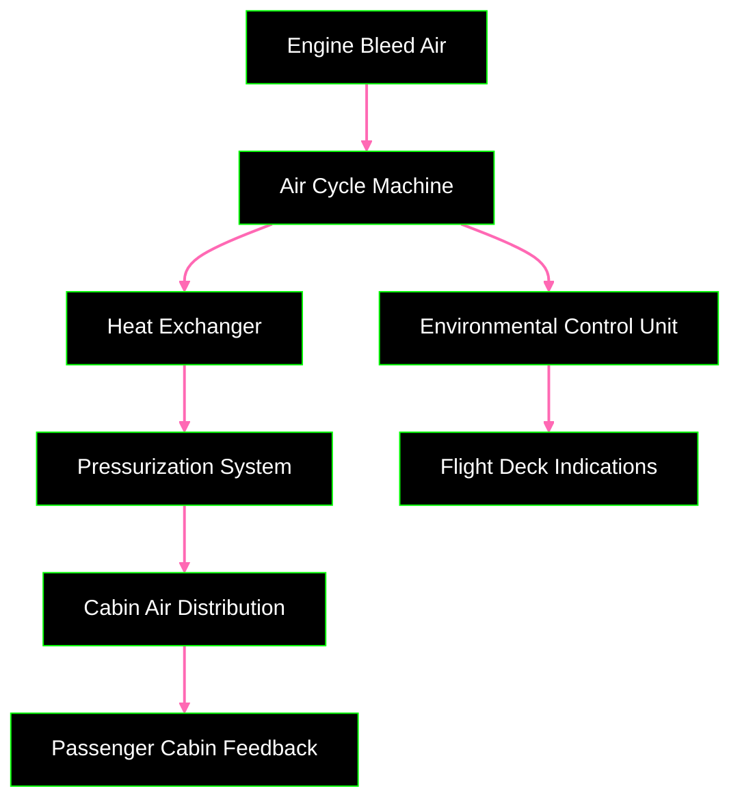
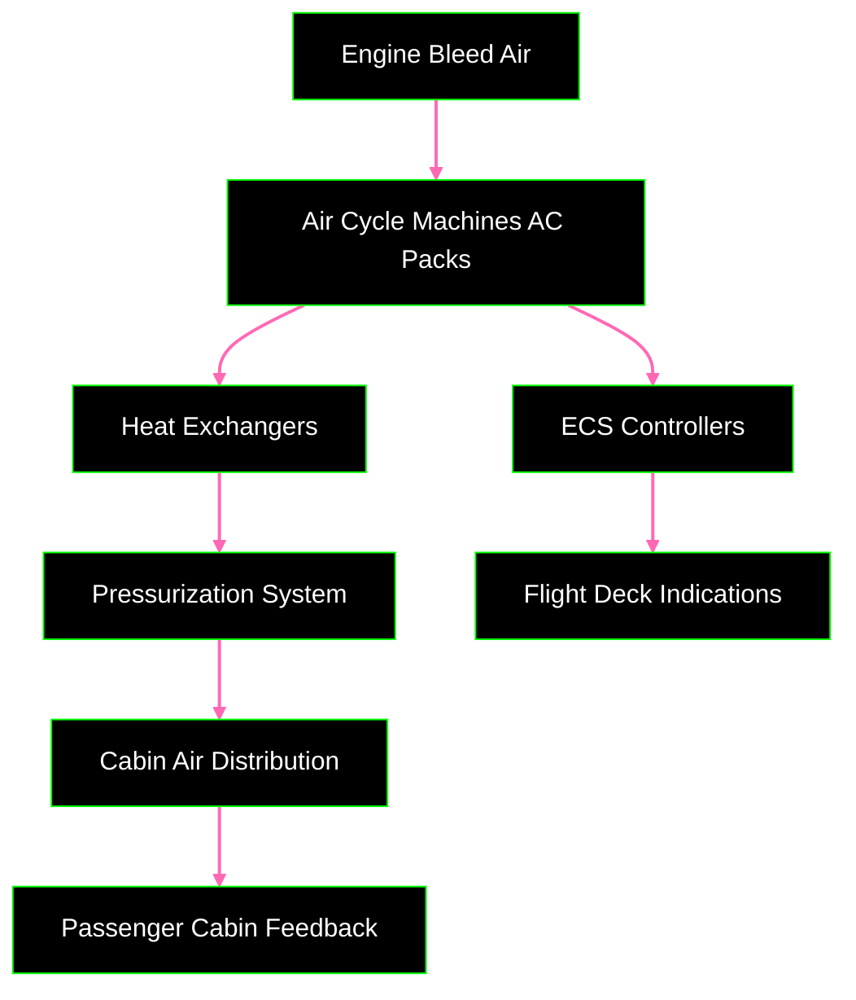
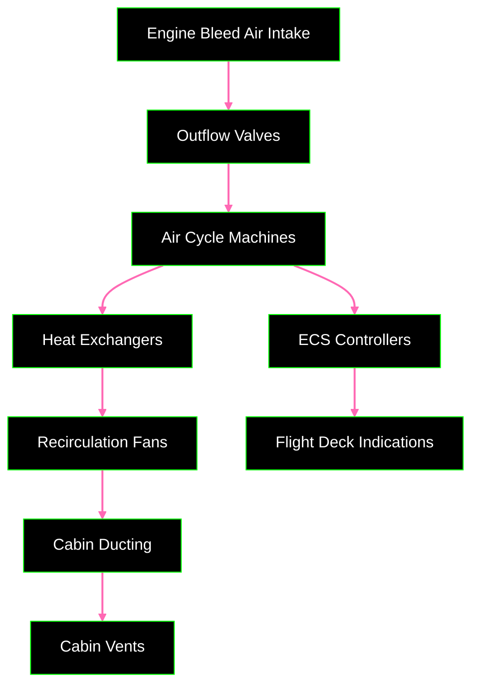
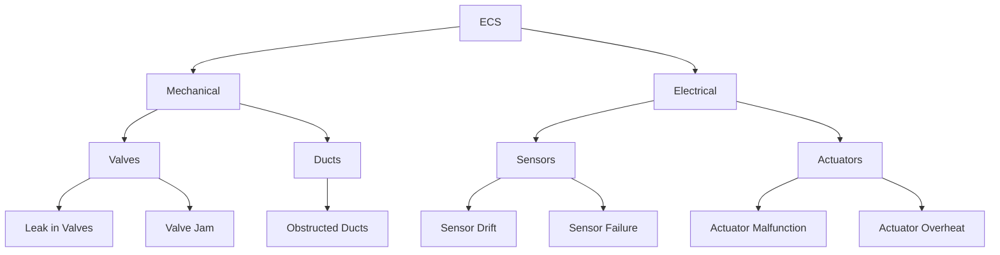
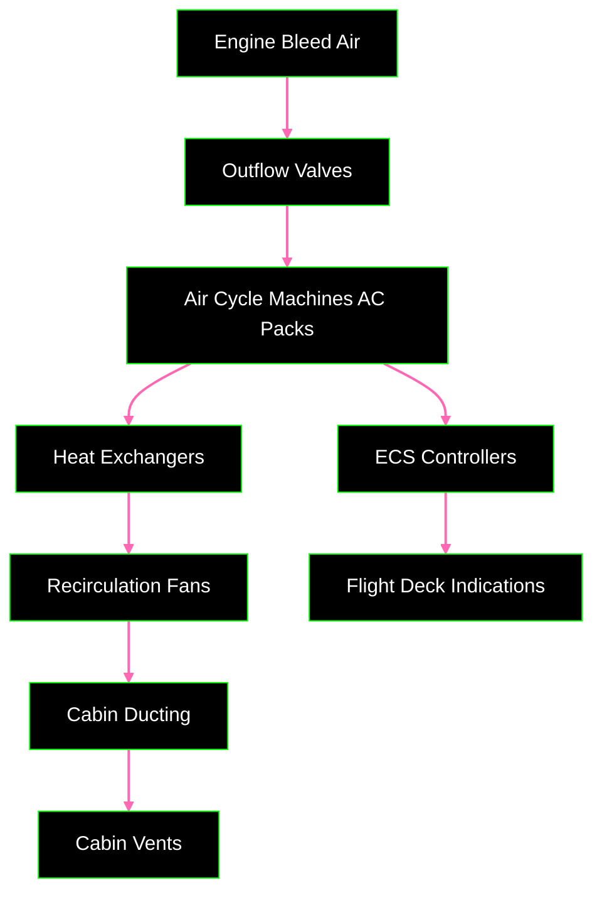

# **FTC_21-00-00-00-000 ATA 21 Air Conditioning and Pressurization (ECS) Master Document**

## **Version History**

| **Version** | **Date**     | **Author**        | **Description / Change Notes**                                                                                         | **Impact on Design**      | **Affected Sections**                  |
|-------------|--------------|-------------------|-------------------------------------------------------------------------------------------------------------------------|---------------------------|----------------------------------------|
| **1.0**     | 2024-12-28   | AMEDEO PELLICCIA   | Creation of the ATA 21 master document, consolidating system description, MEL, PBS, BoM, integration, and software details. | Low (initial creation)    | All                                    |
| **1.1**     | 2025-01-15   | AMEDEO PELLICCIA   | Implemented improvements: comparative tables, cross-references, schematic diagrams, and expansion in critical sections (e.g., FMEA, KPIs). | Medium (content expansion) | 21.30, 21.40, 21.50, 21.80, 21.130      |
| **1.2**     | 2025-07-02   | Gemini             | Incorporated review feedback, expanded on troubleshooting, CMMS integration, HMI design, training, digital twins, and made minor edits for clarity and consistency. Added Acronyms section to the beginning and improved formatting of some tables. | Medium (content refinement) | 21.53, 21.72, 21.103, 21.81, 21.120, 21.170   |

---

## **Table of Contents**

1. [**21.10. System Description**](#2110-system-description)
   - [21.10.1 Overview](#2110-overview)
   - [21.10.2 Functional Description](#2110-functional-description)
   - [21.10.3 Key Features](#2110-key-features)
2. [**21.20. System Standard Practices**](#2120-system-standard-practices)
   - [21.20.1 Maintenance Guidelines](#2120-maintenance-guidelines)
   - [21.20.2 Operational Procedures](#2120-operational-procedures)
   - [21.20.3 Safety Standards](#2120-safety-standards)
3. [**21.30. Components List**](#2130-components-list)
   - [21.30.1 Main Components](#2130-main-components)
   - [21.30.2 Subsystems](#2130-subsystems)
   - [21.30.3 Comparative Tables of Components](#2130-comparative-tables-of-components)
   - [21.30.4 Supplier Information](#2130-supplier-information)
   - [21.30.5 Classification by Categories](#2130-classification-by-categories)
4. [**21.40. Components Breakdown (PBS)**](#2140-components-breakdown-pbs)
   - [21.40.1 Mechanical Components](#2140-mechanical-components)
   - [21.40.2 Electrical Components](#2140-electrical-components)
   - [21.40.3 Integration Points](#2140-integration-points)
   - [21.40.4 Schematic Diagrams](#2140-schematic-diagrams)
5. [**21.50. Bill of Materials (BoM)**](#2150-bill-of-materials-bom)
   - [21.50.1 Comprehensive List](#2150-comprehensive-list)
   - [21.50.2 Quantities and Specifications](#2150-quantities-and-specifications)
   - [21.50.3 Supplier Information](#2150-supplier-information)
   - [21.50.4 Classification by Categories](#2150-classification-by-categories)
6. [**21.51. System Standard Practices and Structures**](#2151-system-standard-practices-and-structures)
   - [21.51.1 General Guidelines](#2151-general-guidelines)
7. [**21.53. Troubleshooting**](#2153-troubleshooting)
   - [21.53.1 General Troubleshooting Principles](#2153-general-troubleshooting-principles)
   - [21.53.2 Troubleshooting Resources](#2153-troubleshooting-resources)
   - [21.53.3 Common ECS Problems and Troubleshooting Steps](#2153-common-ecs-problems-and-troubleshooting-steps)
   - [21.53.4 Integration with CMMS](#2153-integration-with-cmms)
   - [21.53.5 Advanced Troubleshooting Techniques](#2153-advanced-troubleshooting-techniques)
   - [21.53.6 Special Tools and Equipment](#2153-special-tools-and-equipment)
   - [21.53.7 Safety Precautions during Troubleshooting](#2153-safety-precautions-during-troubleshooting)
   - [21.53.8 Continuous Improvement](#2153-continuous-improvement)
8. [**21.60. System Practical Standards and Propellant Interaction**](#2160-system-practical-standards-and-propellant-interaction)
   - [21.60.1 Propellant Properties](#2160-propellant-properties)
   - [21.60.2 Operational Interaction](#2160-operational-interaction)
   - [21.60.3 Operational Checklist](#2160-operational-checklist)
9. [**21.70. System Practical Standards and Engine Integration**](#2170-system-practical-standards-and-engine-integration)
   - [21.70.1 Engine Interface](#2170-engine-interface)
   - [21.70.2 Integration Testing](#2170-integration-testing)
   - [21.70.3 Integration Diagram](#2170-integration-diagram)
10. [**21.80. Safety and Failure Modes**](#2180-safety-and-failure-modes)
    - [21.80.1 Safety Features](#2180-safety-features)
    - [21.80.2 Failure Modes and Effects Analysis (FMEA)](#2180-failure-modes-and-effects-analysis-fmea)
    - [21.80.3 FMEA Analysis Tree](#2180-fmea-analysis-tree)
11. [**21.90. Environmental Impact**](#2190-environmental-impact)
    - [21.90.1 Energy Efficiency](#2190-energy-efficiency)
    - [21.90.2 Compliance](#2190-compliance)
    - [21.90.3 Sustainability](#2190-sustainability)
12. [**21.100. Maintenance Procedures**](#21100-maintenance-procedures)
    - [21.100.1 Scheduled Maintenance](#21100-scheduled-maintenance)
    - [21.100.2 Unscheduled Maintenance](#21100-unscheduled-maintenance)
    - [21.100.3 Documentation](#21100-documentation)
13. [**21.103. Human-Machine Interface (HMI) Design**](#21103-human-machine-interface-hmi-design)
    - [21.103.1 Design Principles](#21103-design-principles)
    - [21.103.2 Flight Deck HMI (For Pilots)](#21103-flight-deck-hmi-for-pilots)
    - [21.103.3 Maintenance HMI (For Technicians)](#21103-maintenance-hmi-for-technicians)
    - [21.103.4 HMI Design Process](#21103-hmi-design-process)
    - [21.103.5 Example HMI Design Considerations](#21103-example-hmi-design-considerations)
14. [**21.110. System Evolution and Upgrades**](#21110-system-evolution-and-upgrades)
    - [21.110.1 Future Enhancements](#21110-future-enhancements)
    - [21.110.2 Retrofitting Options](#21110-retrofitting-options)
15. [**21.120. Training and Documentation**](#21120-training-and-documentation)
    - [21.120.1 Training Requirements](#21120-training-requirements)
      - [21.120.1.1 Training Delivery Methods](#21120-training-delivery-methods)
      - [21.120.1.2 Training Records](#21120-training-records)
    - [21.120.2 User Manuals](#21120-user-manuals)
    - [21.120.3 Simulation Tools](#21120-simulation-tools)
    - [21.120.4 Documentation Management](#21120-documentation-management)
    - [21.120.5 Certification and Compliance](#21120-certification-and-compliance)
    - [21.120.6 Continuous Improvement](#21120-continuous-improvement)
    - [21.120.7 Documentation Updates](#21120-documentation-updates)
    - [21.120.8 Accessibility and Usability](#21120-accessibility-and-usability)
    - [21.120.9 Feedback and Improvement Loop](#21120-feedback-and-improvement-loop)
15. [**21.130. Performance Metrics**](#2130-performance-metrics)
    - [21.130.1 KPIs](#2130-kpis)
    - [21.130.2 Testing Results](#2130-testing-results)
    - [21.130.3 Examples of Efficiency and Pressurization Rate Calculations](#2130-examples-of-efficiency-and-pressurization-rate-calculations)
16. [**21.140. Configuration Management**](#2140-configuration-management)
    - [21.140.1 Overview](#2140-overview)
    - [21.140.2 Configuration Control](#2140-configuration-control)
    - [21.140.3 Version Control](#2140-version-control)
    - [21.140.4 Documentation Management](#2140-documentation-management)
    - [21.140.5 Approval Processes](#2140-approval-processes)
    - [21.140.6 Traceability](#2140-traceability)
    - [21.140.7 Configuration Management Tools](#2140-configuration-management-tools)
    - [21.140.8 Roles and Responsibilities](#2140-roles-and-responsibilities)
    - [21.140.9 Configuration Management Process](#2140-configuration-management-process)
    - [21.140.10 Configuration Audits](#2140-configuration-audits)
    - [21.140.11 Training and Awareness](#2140-training-and-awareness)
    - [21.140.12 Configuration Management Tools](#2140-configuration-management-tools)
    - [21.140.13 Roles and Responsibilities](#2140-roles-and-responsibilities)
    - [21.140.14 Configuration Management Process](#2140-configuration-management-process)
    - [21.140.15 Configuration Audits](#2140-configuration-audits)
    - [21.140.16 Training and Awareness](#2140-training-and-awareness)
    - [21.140.17 Configuration Management Tools](#2140-configuration-management-tools)
    - [21.140.18 Roles and Responsibilities](#2140-roles-and-responsibilities)
17. [**21.170. Acronyms**](#2170-acronyms)
18. [**Appendices (Optional)**](#appendices-optional)
    - [15.1 Glossary](#151-glossary)
    - [15.2 Applicable Regulations and Standards (EASA, FAA, ISO)](#152-applicable-regulations-and-standards-easa-faa-iso)

---

## **21.10 System Description**

The **Environmental Control System (ECS)** in the **GAIA AIR A360-XWLRGA Aircraft** is a sophisticated and integrated solution engineered to maintain a safe and comfortable environment for passengers and crew. It dynamically regulates cabin temperature, pressure, humidity, and air quality throughout all flight phases while adhering to stringent aviation safety and environmental standards.

---

### **21.10.1 Overview**

The ECS leverages advanced automation, energy-efficient technologies, and robust safety mechanisms to ensure consistent cabin conditions. By integrating with propulsion and avionics systems, the ECS optimizes performance while minimizing energy consumption and environmental impact.

**Key Features:**
1. **Dynamic Environmental Control:**
   - Regulates temperature, pressure, and humidity in real-time using intelligent sensors and AI-powered controllers.
2. **Energy Efficiency:**
   - Features heat recovery systems and optimized airflow management to reduce energy consumption.
3. **Seamless Integration:**
   - Fully compatible with avionics and propulsion systems, ensuring smooth operational performance.
4. **Redundant Safety Mechanisms:**
   - Includes backup systems and safety protocols to maintain functionality during partial failures.

---

### **21.10.2 Functional Description**

The ECS comprises multiple subsystems working together to achieve optimal environmental conditions:

#### **Temperature Regulation**
- **Automated Temperature Control:**  
  Sensors continuously monitor cabin temperature and adjust air cycle machine settings to maintain ±1°C accuracy.
- **Heat Exchangers and Evaporators:**  
  Efficiently cool or heat air before distribution to the cabin.

#### **Cabin Pressurization**
- **Outflow Valves and Pressure Sensors:**  
  Precisely regulate cabin pressure to simulate a sea-level environment, minimizing physiological stress for passengers.
- **Pressurization Control Unit (PS):**  
  Dynamically adjusts airflow based on altitude changes and flight phases.

#### **Air Distribution and Quality**
- **Advanced Filtration Systems:**  
  Removes airborne particles and contaminants, ensuring high air quality.
- **Ductwork and Vents:**  
  Evenly distribute conditioned air throughout the cabin zones.

#### **Energy Recovery**
- **Heat Recovery Systems:**  
  Capture waste heat from ECS processes for reuse, improving overall energy efficiency.

#### **Safety and Monitoring**
- **Redundant Control Systems:**  
  Backup sensors and actuators ensure uninterrupted operation during component failures.
- **Real-Time Monitoring:**  
  The Environmental Control Unit (ECU) provides continuous status updates to the flight deck.

#### **Performance Metrics**
- **Temperature Accuracy:**  
  Maintains cabin temperature within ±1°C.
- **Energy Consumption:**  
  Achieves a 15% reduction in energy usage compared to previous models.
- **Air Quality Index:**  
  Maintains particulate levels below 0.5 µg/m³.
- **System Uptime:**  
  Ensures 99.9% operational availability through redundant systems.

---

### **21.10.3 Key Features**

The ECS incorporates several innovative features to maximize efficiency, reliability, and passenger comfort:

#### **1. Intelligent Automation**
- **AI-Powered Control:**  
  The ECU employs advanced algorithms to analyze sensor data and optimize system settings dynamically.
- **Predictive Maintenance:**  
  Built-in diagnostics detect potential issues early, reducing downtime and unscheduled repairs.

#### **2. Energy Efficiency**
- **Optimized Airflow Management:**  
  Adapts airflow to demand, reducing unnecessary energy use.
- **Sustainable Design:**  
  Incorporates lightweight materials and eco-friendly refrigerants.

#### **3. Safety and Redundancy**
- **Backup Systems:**  
  Redundant sensors and actuators ensure continuous operation during partial failures.
- **Integrated Alerts:**  
  Alerts the flight crew of deviations in ECS performance for proactive resolution.

#### **4. Compliance and Adaptability**
- **Regulatory Adherence:**  
  Complies with FAA, EASA, and ISO standards for safety, performance, and environmental impact.
- **Modular Design:**  
  Allows for easy upgrades to meet evolving regulatory and operational requirements.

---

### **Operational Example: ECS Response During Ascent**

- **Scenario:** Rapid ascent requiring increased cabin pressurization.
- **System Actions:**
  - The ECS increases bleed air intake and dynamically adjusts outflow valves to maintain safe cabin pressure.
  - Heat exchangers stabilize air temperature, ensuring passenger comfort.
  - The ECU continuously monitors system parameters, alerting the flight crew of any anomalies.
- **Outcome:** A smooth and safe environmental transition as the aircraft reaches cruising altitude.

---

### **Diagrams**

#### **ECS Functional Flow Diagram**

*A block diagram illustrating the integration and airflow paths within the ECS.*

*Ensure that the image path is correctly linked in the final document.*

---

## **21.20 System Standard Practices**

### **21.20.1 Maintenance Guidelines**

**Preventive Maintenance:**
- **Scheduled Inspections:**
  - Periodic inspections to verify the condition of critical components like sensors, valves, and intercoolers.
- **Routine Tasks:**
  - Filter cleaning, electrical connection checks, and sensor calibrations.

**Corrective Maintenance:**
- **Diagnostic Tools:**
  - Procedures to identify and repair unexpected failures using diagnostic tools.
- **Component Replacement:**
  - Replace defective components following manufacturer specifications.

**Inspection Intervals:**
- **Frequency:**
  - Inspections every 500 flight hours or 1,000 pressurization cycles, whichever comes first.

**Detailed Maintenance Procedure Example:**

1. **Filter Replacement Procedure:**
   - **Step 1:** Shut down the ECS and isolate the power supply.
   - **Step 2:** Remove the access panel to the filter compartment.
   - **Step 3:** Carefully remove the old HEPA filter, ensuring no contaminants are released.
   - **Step 4:** Install the new HEPA filter, ensuring a secure fit.
   - **Step 5:** Replace the access panel and restore power to the ECS.
   - **Step 6:** Perform a system check to verify proper filter installation and ECS operation.

---

### **21.20.2 Operational Procedures**

**ECS Start-Up:**
- **Activation Steps:**
  1. Verify power supply to ECS.
  2. Activate ECS control panel.
  3. Monitor initial parameter readings (temperature, pressure).
  4. Confirm all alarms are inactive.

**In-Flight Monitoring:**
- **Continuous Monitoring:**
  - Use avionics for real-time monitoring of cabin conditions.
- **Operational Tools:**
  - **ECS Dashboard:** Real-time display of temperature, pressure, humidity, and air quality.
  - **Alert Notifications:** Audible and visual alerts for parameter deviations.

**ECS Shut-Down:**
- **Deactivation Steps:**
  1. Gradually reduce ECS output to avoid sudden changes.
  2. Deactivate ECS control panel.
  3. Confirm system stabilization before powering down completely.

**Operational Checklist for Flight Crew:**

| **Task**                      | **Status** |
|-------------------------------|------------|
| Verify ECS power supply       | [ ]        |
| Activate ECS control panel    | [ ]        |
| Monitor initial parameters    | [ ]        |
| Confirm alarms are inactive   | [ ]        |

---

### **21.20.3 Safety Standards**

**Applicable Standards:**
- **Regulatory Compliance:**
  - OSHA, IATA, FAA, and EASA regulations for handling pressurized systems and high-temperature components.

**Lockout/Tagout Protocols:**
- **Safety Procedures:**
  1. Notify all personnel of maintenance activity.
  2. Shut down ECS and isolate power sources.
  3. Apply lockout devices to energy isolation points.
  4. Verify isolation before commencing maintenance.

**Safety Training:**
- **Training Programs:**
  - ECS Operation and Maintenance
  - Emergency Procedures and Response
  - Safe Handling of High-Pressure Systems

---

## **21.30 Components List**

### **21.30.1 Main Components**

- **Compressors and Turbines:** Drive the air conditioning cycle by compressing and expanding air to regulate temperature.
- **Heat Exchangers:** Transfer heat from bleed air to ambient air, cooling the air before it enters the cabin.
- **Pressure Regulators:** Control cabin pressurization levels by adjusting airflow.
- **Temperature and Pressure Sensors:** Monitor ECS performance, providing real-time data to controllers.
- **Electronic Controls and User Panels:** Interface for system operation and monitoring, allowing flight crew to set and monitor cabin conditions.

### **21.30.2 Subsystems**

- **Air Distribution System:** Ducts and vents distributing conditioned air throughout the cabin.
- **Pressurization Control System:** Manages cabin pressure through automatic and manual controls, ensuring stability and safety.

### **21.30.3 Comparative Tables of Components**

| **Component**                     | **Dimensions (mm)** | **Material**           | **Service Life (hours)** | **Tolerance** | **Notes**                                     |
|-----------------------------------|---------------------|------------------------|--------------------------|---------------|-----------------------------------------------|
| **Air Compressor (P/N 21-30-01)** | 450 x 300 x 300     | Stainless Steel        | 8,000 - 10,000           | ±5%           | Includes vibration damping system            |
| **Heat Exchanger (P/N 21-30-02)** | 600 x 250 x 250     | Aluminum-Copper Alloy  | 5,000 - 7,000            | ±3%           | Corrosion-resistant coating                  |
| **Pressure Regulator (P/N 21-30-03)** | 150 x 150 x 100     | Titanium Alloy         | 4,000 - 6,000            | ±2%           | Redundant opening/closing mechanism          |
| **Temp/Pressure Sensor (P/N 21-30-04)** | 80 x 50 x 40        | Composites & Ceramics  | 3,000 - 5,000            | ±1%           | Redundant in critical systems                |
| **Electronic Control Panel (P/N 21-30-05)** | 200 x 150 x 50      | Fire-Resistant Plastics| 10,000+                  | ±5%           | Main interface for pilots and technicians     |

**Additional Parameters:**
- **Cost:** Estimated cost per unit.
- **Weight:** Weight of each component for overall ECS weight management.
- **Performance Metrics:** Efficiency ratings or performance indicators.

### **21.30.4 Supplier Information**

| **Component**                | **Supplier**           | **Contact**                  | **Lead Time** | **Reliability** | **Alternate Suppliers**             |
|------------------------------|------------------------|------------------------------|---------------|------------------|-------------------------------------|
| **Air Compressors**          | ABC Compressors Inc.   | contacto@abccompressors.com  | 6 weeks       | High             | DEF Compressors Co., GHI Compressors |
| **Heat Exchangers**          | HeatEx Solutions       | sales@heatexsolutions.com    | 8 weeks       | High             | JKL Heat Systems, MNO HeatTech       |
| **Pressure Regulators**      | TitanValves Ltd.       | info@titanvalves.com         | 5 weeks       | Medium           | PQR Valve Technologies               |
| **Temp/Pressure Sensors**    | SensorTech             | support@sensortech.com        | 4 weeks       | High             | STU Sensors Corp., VWX Sensor Solutions |
| **Electronic Control Panels**| ControlSystems Corp.   | services@controlsystems.com   | 10 weeks      | High             | YZA Control Systems, BCD Electronics |

### **21.30.5 Classification by Categories**

**Consumables:**
- HEPA Filters
- Sealing Gaskets
- Industrial Sealants
- Lubricating Oils

**Mechanical Components:**
- Pressure Regulators
- Aluminum Ducting
- Heat Exchangers
- Air Compressors
- Air Turbines

**Electrical Components:**
- Temperature and Pressure Sensors
- Electric Actuators
- Control Modules
- High-Resistance Wiring
- Industrial Connectors

**Lifecycle Considerations:**
- **Consumables Replacement Intervals:** HEPA Filters every 1,000 pressurization cycles.
- **Component Lifecycle:** Track service life and maintenance history to schedule timely replacements.

---

## **21.40 Components Breakdown (PBS)**

### **21.40.1 Mechanical Components**

- **Valves:** Control airflow and pressure within the ECS.
  - **Types:** Outflow valves, safety valves.
- **Ducts:** Pathways for air distribution, ensuring even airflow across all cabin zones.
  - **Materials:** Aluminum, galvanized steel.
- **Filters:** Remove contaminants from the air, maintaining high air quality.
  - **Types:** HEPA filters, carbon filters.
- **Joins and Connections:** Ensure the integrity of ductwork and component connections.
  - **Components:** Flanges, gaskets, connectors.
- **Support and Mounting Elements:** Brackets, racks, and vibration isolators that secure mechanical components.
  - **Materials:** Steel, rubber-mounted brackets.

### **21.40.2 Electrical Components**

- **Sensors:** Measure temperature and pressure, providing data for system regulation.
  - **Types:** Thermocouples, barometric sensors.
- **Actuators:** Operate valves and dampers based on control signals.
  - **Types:** Electric actuators, pneumatic actuators.
- **Control Modules:** Manage ECS operations by processing sensor data and executing control algorithms.
  - **Components:** Microcontrollers, programmable logic controllers (PLCs).
- **Wiring and Connectors:** Facilitate electrical communication and power distribution between components.
  - **Specifications:** High-resistance wiring for durability, secure connectors to prevent disconnections.

### **21.40.3 Integration Points**

- **Engine Interfaces (Bleed Air):** Physical and functional connections for bleed air intake from engines.
  - **Components:** Bleed air ducts, isolation valves.
- **Avionics Interfaces:** Integration with cockpit systems for monitoring and control alerts.
  - **Communication Protocols:** ARINC 429, CAN bus.
- **Energy Systems Interfaces:** High and low voltage power supply integration for ECS components.
  - **Components:** Power converters, backup generators.

### **21.40.4 Schematic Diagrams**

**Professional Diagrams:**

1. **ECS Mechanical Layout Diagram**

*A comprehensive block diagram illustrating the integration and airflow paths within the Environmental Control System (ECS).*

2. **ECS Electrical Wiring Diagram**

**Explanation:**

This diagram showcases the electrical connections within the ECS:
1. **Main and Backup Power Supplies:** Provide power redundancy for critical operations.
2. **Control Modules (Primary and Secondary):** Process sensor inputs and control ECS components.
3. **Sensors:** Monitor real-time conditions, including temperature, pressure, humidity, and air quality.
4. **Actuators:** Operate components such as outflow valves and duct dampers.
5. **Flight Deck Indications:** Display ECS performance data for cockpit monitoring.

**Diagram Components Explanation:**

1. **Environmental Control System (ECS) Electrical System:**
   - The central hub managing all electrical components and their interactions within the ECS.

2. **Power Supply:**
   - **Main Power Source:** Provides primary electrical power to ECS components.
   - **Backup Power Supply (UPS):** Ensures continuous power during main power failures, maintaining system operations.

3. **Control Modules:**
   - **Control Module 1:** Handles primary ECS operations, processing data from sensors and sending control signals to actuators.
   - **Control Module 2:** Manages secondary operations, interfaces with AI control algorithms, and provides redundancy.

4. **Sensors:**
   - **Temperature Sensor:** Monitors cabin and component temperatures.
   - **Pressure Sensor:** Measures cabin pressure levels.
   - **Humidity Sensor:** Tracks cabin humidity to maintain comfort.
   - **Air Quality Sensor:** Detects contaminants and ensures air quality standards are met.

5. **Actuators:**
   - **Outflow Valve Actuator:** Controls the opening and closing of outflow valves to regulate cabin pressure.
   - **Duct Damper Actuator:** Adjusts duct dampers to manage airflow distribution and temperature control.

6. **Communication Interfaces:**
   - **Avionics Interface:** Facilitates data exchange between ECS and the aircraft's avionics systems for integrated monitoring and control.
   - **AI Control Interface:** Connects to AI-powered control algorithms, enabling advanced system optimization and predictive maintenance.

7. **Safety Systems:**
   - **Alarm System:** Triggers alerts in case of system anomalies or deviations from normal operating parameters.
   - **Emergency Shutdown:** Initiates the ECS shutdown process during critical failures to ensure passenger and crew safety.

8. **User Interfaces:**
   - **Control Panel:** Allows flight crew to monitor and adjust ECS settings during flight.
   - **Maintenance Interface:** Provides maintenance personnel with access to system diagnostics, controls, and data logs for troubleshooting and repairs.

9. **Wiring Connections:**
   - **Power Distribution:** Main and backup power supplies feed power to control modules.
   - **Control Signals:** Control modules send signals to actuators and safety systems to manage ECS operations.
   - **Data Feeds:** Sensors provide real-time data to control modules for informed decision-making.
   - **Data Exchange:** Communication interfaces facilitate data flow between ECS and other aircraft systems.
   - **User Inputs:** User interfaces send inputs to control modules for system adjustments.

---

### **21.40.3 Integration Points Diagram**

Here is the revised **Integration Points Diagram** and **Diagram Description** fully translated into English for clarity and professionalism:

---

## **Integration Points Diagram**

*A block diagram illustrating the airflow path from bleed air intake through compressors, intercoolers, heat exchangers, distribution ducts, and outflow valves, highlighting key components and sensors.*

---

## **Diagram Description**

### **Key Components**

1. **Engine Bleed Air:**
   - **Air Intake from the Engine:**  
     Compressed air is extracted from the engine and directed to the **Outflow Valves**.

2. **Outflow Valves:**
   - **Function:**  
     Regulate the release of pressurized air towards the **Air Cycle Machines (ACMs)** for further processing.

3. **Air Cycle Machines (ACMs):**
   - **Purpose:**  
     Process pressurized air to regulate cabin temperature and pressure.
   - **Internal Flow:**  
     - The air flows through **Heat Exchangers** (intercoolers) to reduce its temperature.
     - Then, it circulates through **Recirculation Fans** to distribute conditioned air.

4. **Heat Exchangers:**
   - **Intercoolers:**  
     Facilitate heat transfer from compressed air to the external environment, cooling the air before distribution.

5. **Recirculation Fans:**
   - **Purpose:**  
     Distribute conditioned air through the **Cabin Ducting** to the **Cabin Vents**.

6. **Cabin Ducting:**
   - **Ductwork:**  
     Channels conditioned air to different cabin zones, ensuring uniform distribution.

7. **Cabin Vents:**
   - **Vents:**  
     Deliver conditioned air to specific areas within the passenger cabin.

8. **ECS Controllers:**
   - **Control and Regulation:**  
     Manage and regulate ECS operations, adjusting parameters in real time to maintain optimal cabin conditions.

9. **Flight Deck Indications:**
   - **Monitoring:**  
     Provide real-time information about the ECS status to the flight crew, enabling continuous monitoring and necessary adjustments.

---

### **Additional Enhancements:**

1. **Consistent Labeling:**
   - Match node labels in the diagram with the components described in the text to ensure alignment.

2. **Diagram Validation:**
   - Test the updated Mermaid diagram in a live editor such as [Mermaid Live Editor](https://mermaid-js.github.io/mermaid-live-editor/) to ensure proper rendering.

---

## **21.80 Safety and Failure Modes**

### **21.80.1 Safety Features**

- **Emergency Ventilation:** Dedicated overrides to ensure the supply of fresh air in critical scenarios.
- **Alert Systems:** Multi-level warnings for deviations in temperature/pressure.
- **Redundant Systems:** Backup components and control systems to maintain ECS functionality during failures.
- **Automatic Shutdown Mechanisms:** Systems that deactivate ECS components in case of severe anomalies to prevent damage.

**Detailed Safety Scenarios:**

1. **Over-Pressurization:**
   - **Detection:** High-pressure sensors detect cabin pressure exceeding safe limits.
   - **Action:** Safety valves automatically release excess pressure.
   - **Outcome:** Cabin pressure stabilizes, preventing structural damage.

2. **Temperature Spike:**
   - **Detection:** Temperature sensors identify a sudden rise in cabin temperature.
   - **Action:** AI-driven algorithms increase cooling output and adjust airflow.
   - **Outcome:** Cabin temperature returns to safe levels, ensuring passenger comfort.

**Integration with Avionics:**
- Safety alerts are integrated with the aircraft's avionics systems, providing real-time notifications to the flight crew for immediate action.

---

### **21.80.2 Failure Modes and Effects Analysis (FMEA)**

- **Failure Identification:** Possible malfunction modes (e.g., sensor drift, valve blockage).
- **Evaluation:** Impact on cabin environment and aircraft safety.
- **Mitigation:** Procedures or redundancies to counteract identified failure modes.

**Detailed FMEA Table Example:**

| **Component**                  | **Failure Mode**           | **Effect of Failure**                | **Severity** | **Occurrence** | **Detection** | **RPN** | **Mitigation**                            |
|--------------------------------|----------------------------|--------------------------------------|--------------|----------------|---------------|---------|--------------------------------------------|
| **Pressure Regulator**         | Valve Jam                  | Inability to regulate cabin pressure  | 9            | 2              | 4             | 72      | Redundant regulator, regular maintenance  |
| **Temperature Sensor**         | Sensor Drift               | Incorrect temperature readings       | 7            | 3              | 5             | 105     | Redundant sensors, calibration checks      |
| **Actuator**                   | Actuator Malfunction       | Inability to adjust airflow          | 8            | 2              | 3             | 48      | Backup actuators, routine testing          |
| **Heat Exchanger**             | Corrosion                  | Reduced heat transfer efficiency     | 6            | 1              | 5             | 30      | Use corrosion-resistant materials, inspections |
| **Electronic Control Panel**   | Power Failure              | ECS control loss                     | 10           | 1              | 6             | 60      | Backup power supplies, surge protection     |

**Root Cause Analysis Methods:**
- **5 Whys:** Identifying the underlying causes by asking "Why?" multiple times.
- **Fishbone Diagram:** Categorizing potential causes into areas like equipment, processes, and personnel.

---

### **21.80.3 FMEA Analysis Tree**

**Description:**  
This tree visually represents the hierarchical breakdown of ECS components and their potential failure modes, along with their effects.

**Mitigations:**
- **Redundant Sensors:** Install multiple sensors for critical parameters.
- **Advanced Maintenance Routines:** Regular inspections and use of diagnostic tools to detect and repair obstructions.
- **Backup Systems:** Implement redundant actuators and valves to ensure continuous ECS operation.

**Enhanced Visualization:**  
For better clarity, develop detailed diagrams using advanced graphical tools like **Microsoft Visio** or **Lucidchart**, ensuring all failure modes and mitigations are clearly labeled and interconnected.

---

## **21.90. Environmental Impact**

### **21.90.1 Energy Efficiency**

- **Airflow Optimization:**
  - Adjusts airflow dynamically based on real-time demand to reduce unnecessary energy consumption.
- **Efficient Components:**
  - Utilizes energy-efficient compressors and fans to minimize power usage while maintaining performance.
- **Heat Recovery Systems:**
  - Captures and reuses waste heat from ECS operations to further enhance energy efficiency.

**Comparative Energy Consumption:**
- **Current ECS:** 150 kW during cruise.
- **Traditional Systems:** 200 kW during cruise.
- **Improvement:** 25% reduction in energy consumption.

**Quantitative Metrics:**
- **Fuel Savings:** Implementing energy-efficient compressors results in a 10% reduction in overall fuel consumption.
- **Emission Reduction:** Use of eco-friendly refrigerants leads to a 20% decrease in greenhouse gas emissions compared to traditional systems.

**Environmental Benefits:**
- **Reduced Carbon Footprint:** Lower energy consumption directly translates to reduced carbon emissions.
- **Sustainability:** Enhanced energy efficiency supports long-term sustainability goals and compliance with environmental regulations.

---

### **21.90.2 Compliance**

- **Refrigerant Regulations:**
  - Use environmentally friendly refrigerants with low Global Warming Potential (GWP) to comply with international environmental standards.
- **Emission Standards:**
  - Ensure ECS operations meet emission guidelines set by regulatory bodies like EPA and ICAO.

**Compliance Documentation:**
- **Certificates of Compliance:** Obtain and maintain certificates from regulatory bodies demonstrating adherence to standards.
- **Audit Reports:** Regularly conduct and document environmental audits to ensure ongoing compliance.

**Regulatory Updates:**
- **Continuous Monitoring:** Stay updated with evolving environmental regulations and adjust ECS designs accordingly.
- **Stakeholder Communication:** Inform relevant stakeholders about regulatory changes and their impact on ECS operations.

---

### **21.90.3 Sustainability**

- **Recyclable Materials:**
  - Employ recyclable materials such as aluminum and titanium alloys for mechanical components.
  - Use recyclable fire-resistant plastics in electronic panels.
- **Waste Minimization:**
  - Design ECS for minimal waste production during maintenance and disposal by facilitating easy component replacement and recycling.
- **Lifecycle Assessment (LCA):**
  - Conduct LCAs to quantify the environmental benefits of sustainability initiatives and identify areas for improvement.

**Sustainable Manufacturing Practices:**
- **Eco-Friendly Processes:** Implement manufacturing processes that reduce energy consumption and minimize waste.
- **Supplier Partnerships:** Partner with suppliers committed to sustainable practices and materials.

**Refrigerant Recovery:**
- **Safe Procedures:** Ensure environmentally responsible procedures for refrigerant recovery and disposal.
- **Compliance:** Adhere to regulations regarding refrigerant handling to prevent environmental contamination.

---

## **21.100. Maintenance Procedures**

### **21.100.1 Scheduled Maintenance**

- **Routine Inspections:**
  - Conduct visual checks, sensor calibrations, and verify system integrity.
- **Component Replacements:**
  - Regularly replace filters and seals to maintain ECS performance.
- **System Testing:**
  - Perform performance tests to ensure ECS operates within specified parameters after maintenance activities.
- **Inspection Frequencies:**
  - **Visual Inspections:** Every 500 flight hours.
  - **Functional Tests:** Every 1,000 flight hours.
  - **Calibrations:** Every 2,000 flight hours or as recommended by the manufacturer.

**Performance Verification:**
- After maintenance activities, perform system-wide performance verification to ensure all components are functioning correctly.
- Use diagnostic tools to validate sensor accuracy and actuator responsiveness.

### **21.100.2 Unscheduled Maintenance**

- **Emergency Repairs:**
  - Implement quick-fix procedures for unexpected ECS failures to minimize aircraft downtime.
- **Diagnostic Procedures:**
  - Follow step-by-step guidelines to identify and resolve ECS issues promptly.
- **Tool Requirements:**
  - Utilize specialized tools such as manometers, data loggers, and diagnostic software for effective maintenance tasks.

**Step-by-Step Troubleshooting Guide:**

1. **Identify the Issue:**
   - Review system alerts and sensor readings to pinpoint the malfunction.
2. **Isolate the Problem:**
   - Determine which subsystem or component is affected.
3. **Implement Fix:**
   - Repair or replace the defective component as per manufacturer specifications.
4. **Verify Repair:**
   - Conduct functional tests to ensure the issue is resolved.
5. **Document the Repair:**
   - Update maintenance logs and the CMDB with details of the repair.

**Integration with Training:**
- Ensure maintenance personnel are trained on unscheduled maintenance procedures and equipped with the necessary tools and knowledge.

### **21.100.3 Documentation**

- **Maintenance Logs:**
  - Maintain detailed records of all ECS maintenance activities, including inspections, repairs, and replacements.
- **Inspection Reports:**
  - Document findings from inspections and outline necessary corrective actions.
- **Failure Reports:**
  - Record ECS failures, analyze root causes, and implement corrective measures to prevent recurrence.
- **Traceability:**
  - Maintain historical records for each component to track service life and maintenance history.
  - Store maintenance documents digitally for quick and secure access.

**Standardized Documentation Templates:**

- **Maintenance Log Template:**

  | **Date**     | **Component**              | **Activity**           | **Performed By** | **Notes**                         |
  |--------------|----------------------------|------------------------|-------------------|-----------------------------------|
  | YYYY-MM-DD   | Air Compressor (P/N 21-30-01) | Filter Replacement     | Technician A      | Replaced HEPA filter as scheduled |

- **Inspection Report Template:**

  | **Inspection Date** | **Component**              | **Findings**          | **Corrective Actions**      | **Inspector** |
  |---------------------|----------------------------|-----------------------|-----------------------------|---------------|
  | YYYY-MM-DD          | Temperature Sensor (P/N 21-30-04) | Sensor drift detected | Calibrated sensor            | Inspector B   |

**Access Control Measures:**
- Define user roles and permissions to ensure only authorized personnel can access and modify maintenance documents.
- Implement audit trails to track document changes and access history.

---

## **21.103 Human-Machine Interface (HMI) Design**

### **21.103.1 Design Principles**

- **Clarity:** Information displayed should be clear, unambiguous, and easily understood by the intended users (pilots and maintenance personnel).
- **Consistency:** Use consistent terminology, symbols, and layouts across all ECS interfaces.
- **Simplicity:** Avoid unnecessary complexity. Present information in a straightforward and uncluttered manner.
- **Visibility of System Status:** Provide clear and continuous feedback on the current status of the ECS and its components.
- **Error Prevention:** Design the interface to minimize the possibility of errors. Use confirmation prompts for critical actions and provide clear warnings for invalid inputs.
- **Accessibility:** Adhere to accessibility guidelines to ensure that the interface can be used by individuals with disabilities.
- **User-Centered Design:** Involve pilots and maintenance personnel in the design process to ensure the interface meets their needs and expectations.
- **Compliance with Standards:** Follow relevant human factors design standards and guidelines (e.g., FAA Human Factors Design Standard, MIL-STD-1472).

### **21.103.2 Flight Deck HMI (For Pilots)**

- **Integration with EICAS/ECAM:** ECS status and control should be integrated into the aircraft's Engine Indication and Crew Alerting System (EICAS) or Electronic Centralized Aircraft Monitor (ECAM).
- **Intuitive Controls:** Use rotary knobs, push buttons, and touchscreen controls that are logically positioned and labeled.
- **Clear Displays:** Provide clear and concise displays of key ECS parameters:
  - Cabin temperature (set point and actual)
  - Cabin altitude
  - Cabin pressure differential
  - ECS mode (e.g., AUTO, MAN)
  - System status (e.g., PACK 1 ON, PACK 2 ON)
  - Fault indications and warnings
- **Automated Alerts:** Configure the system to automatically alert the flight crew to any ECS anomalies or malfunctions.
- **Color Coding:** Use color-coding to indicate system status (e.g., green for normal, amber for caution, red for warning).

### **21.103.3 Maintenance HMI (For Technicians)**

- **Diagnostic Interface:** Provide a dedicated interface for maintenance personnel to access detailed system data, run diagnostics, and perform maintenance tasks. This could be a laptop-based interface or a dedicated panel in the avionics bay.
- **Data Logging:** The HMI should allow technicians to access historical data logs for troubleshooting and trend analysis.
- **Component Control:** Provide controls for manually operating individual ECS components (e.g., valves, fans) for testing and troubleshooting.
- **Calibration and Configuration:** Allow technicians to calibrate sensors and configure system parameters as needed.
- **Security:** Implement appropriate security measures (e.g., password protection) to prevent unauthorized access to the maintenance HMI.

### **21.103.4 HMI Design Process**

- **Requirements Gathering:** Define the specific information and control needs of both pilots and maintenance personnel.
- **Prototyping:** Develop prototypes of the HMI and test them with representative users.
- **Usability Testing:** Conduct formal usability tests to evaluate the effectiveness and efficiency of the HMI.
- **Iterative Refinement:** Iteratively refine the HMI design based on user feedback and test results.
- **Validation and Verification:** Ensure the final HMI design meets all requirements and complies with relevant standards.

### **21.103.5 Example HMI Design Considerations**

- **Touchscreen vs. Physical Controls:** For the flight deck, consider a combination of touchscreen and physical controls. Touchscreens offer flexibility, but physical controls may be preferred for critical functions to provide tactile feedback.
- **Display Brightness and Contrast:** Ensure displays are easily readable under all lighting conditions, including bright sunlight and darkness.
- **Font Size and Style:** Use fonts that are large enough and easy to read, even from a distance or under stress.
- **Menu Structure:** Design a logical and intuitive menu structure that allows users to quickly find the information or controls they need.
- **Language:** Provide multilingual support if necessary.

---

## **21.140. Configuration Management**

### **21.140.1 Overview**

Configuration Management (CM) ensures that the **Environmental Control System (ECS)** maintains its integrity and performance throughout its lifecycle. CM encompasses the systematic control of system configurations, documentation, and changes to prevent unauthorized alterations and ensure consistency across all ECS components and software.

**CM Objectives:**
- **Integrity Maintenance:** Ensure ECS components and software configurations remain consistent and reliable.
- **Change Control:** Manage and document changes systematically to prevent unintended consequences.
- **Traceability:** Maintain a clear trace of all changes from initiation to implementation and review.

**Stakeholder Roles:**
- **Design Engineers:** Initiate and propose changes based on design improvements or operational feedback.
- **Maintenance Personnel:** Identify and report issues requiring configuration changes.
- **Operational Staff:** Provide feedback on ECS performance and suggest enhancements.
- **Quality Assurance Team:** Oversee CM processes to ensure compliance and effectiveness.

---

### **21.140.2 Configuration Control**

#### **21.140.2.1 Change Identification**

- **Definition:**
  - Identifying and documenting proposed changes to the ECS, including hardware modifications, software updates, and procedural adjustments.

- **Process:**
  - **Submit a Change Request (CR):** Use the standardized CR form to detail the nature, reason, and impact of the proposed change.
  - **Change Origin:** CRs can originate from design teams, maintenance personnel, or operational feedback.

**Change Request Form Example:**

| **Field**                 | **Details**                                      |
|---------------------------|--------------------------------------------------|
| **Change Request ID**     | CR-2025-001                                      |
| **Date Submitted**        | 2025-02-10                                       |
| **Submitted By**          | Maintenance Technician A                         |
| **Component Affected**    | Temperature Sensor (P/N 21-30-04)                |
| **Nature of Change**      | Replacement of faulty sensor                     |
| **Justification**         | Sensor drift affecting temperature accuracy      |
| **Impact Analysis**       | Improved temperature control and system reliability |
| **Risk Assessment**       | Low risk; redundancy in sensors minimizes impact |
| **Proposed Implementation Plan** | Replace sensor during next scheduled maintenance cycle |

#### **21.140.2.2 Change Evaluation**

- **Impact Analysis:**
  - Assess the potential effects of the proposed change on system performance, safety, compliance, and interoperability with other systems.
  - **Tools:** Use impact assessment matrices to evaluate the severity and breadth of the change impact.

- **Risk Assessment:**
  - Evaluate the risks associated with implementing or not implementing the change, including potential failure modes and their consequences.
  - **Approach:** Utilize risk assessment frameworks to quantify risks (e.g., Risk Priority Number - RPN).

**Evaluation Criteria:**
- **Safety Impact:** Does the change affect system safety?
- **Performance Impact:** Will the change improve or degrade system performance?
- **Compliance Impact:** Does the change affect regulatory compliance?
- **Cost Impact:** What are the financial implications of the change?
- **Operational Impact:** Will the change affect day-to-day operations?

#### **21.140.2.3 Change Approval**

- **Review Board:**
  - Establish a Configuration Control Board (CCB) comprising representatives from Design, Maintenance, Operations, and Quality Assurance.

- **Approval Criteria:**
  - Changes must meet predefined criteria for safety, compliance, performance, and cost-effectiveness.
  - **Approval Levels:** Define different approval levels based on change severity (e.g., minor, major).

- **Documentation:**
  - Approved changes are documented in the Configuration Management Database (CMDB) with detailed descriptions and justifications.

**CCB Responsibilities:**
- **Review CRs:** Evaluate the necessity and feasibility of proposed changes.
- **Decision Making:** Approve, reject, or request modifications to CRs based on evaluation outcomes.
- **Record Keeping:** Maintain detailed records of all decisions and actions taken.

---

### **21.140.3 Version Control**

#### **21.140.3.1 Version Identification**

- **Version Numbering:**
  - Assign unique version numbers to ECS components and software, following a standardized format (e.g., Major.Minor.Patch).
  - **Example:** Version 2.1.0 indicates major version 2, minor update 1, and patch 0.

- **Baselines:**
  - Establish baselines for different stages of the ECS lifecycle (e.g., Design Baseline, Production Baseline, Maintenance Baseline).
  - **Purpose:** Ensure consistency and provide reference points for future changes.

**Version Control Policies:**
- **Major Changes:** Significant alterations that affect system functionality or compliance (e.g., Version 2.0.0).
- **Minor Changes:** Updates that improve performance without major impact (e.g., Version 2.1.0).
- **Patch Changes:** Corrections or minor tweaks (e.g., Version 2.1.1).

#### **21.140.3.2 Tracking Changes**

- **CMDB Utilization:**
  - Maintain a centralized CMDB to track all versions, changes, and the current configuration of the ECS.
  - **Features:** Real-time updates, version tracking, change history, and reporting capabilities.

- **Audit Trails:**
  - Record all modifications, including who authorized the change, who implemented it, and when it occurred.
  - **Benefit:** Ensures accountability and facilitates traceability.

**Example CMDB Entry:**

| **Component**                   | **Version** | **Change ID** | **Change Description**      | **Date Implemented** | **Implemented By** | **Status** |
|---------------------------------|-------------|---------------|------------------------------|-----------------------|--------------------|------------|
| Temperature Sensor (P/N 21-30-04)| 1.0.0       | CR-2025-001    | Replaced faulty sensor      | 2025-02-15            | Technician A       | Completed  |
| Pressure Regulator (P/N 21-30-03)| 2.0.0       | CR-2025-005    | Upgraded to titanium alloy  | 2025-03-10            | Engineer B         | Approved   |

---

### **21.140.4 Documentation Management**

#### **21.140.4.1 Documentation Standards**

- **Consistency:**
  - Use standardized formats and nomenclature across all ECS documentation to ensure clarity and uniformity.
  - **Templates:** Develop and utilize templates for different document types (e.g., maintenance manuals, operational procedures).

- **Accessibility:**
  - Ensure that all documentation is easily accessible to authorized personnel through secure digital repositories.
  - **Digital Repositories:** Utilize cloud-based storage solutions with role-based access controls.

**Formatting Guidelines:**
- **Headings and Subheadings:** Use a hierarchical structure for easy navigation.
- **Tables and Diagrams:** Incorporate tables and diagrams to present information clearly.
- **Clear Language:** Use concise and clear language to convey information effectively.

#### **21.140.4.2 Document Control**

- **Version Updates:**
  - Update relevant documents (e.g., schematics, user manuals, maintenance procedures) to reflect approved changes.
  - **Process:** Link changes in the CMDB to corresponding document updates.

- **Review Cycles:**
  - Implement regular review cycles to verify the accuracy and relevance of documentation.
  - **Frequency:** Conduct reviews annually or after significant system changes.

**Automated Document Control:**
- **Tools:** Utilize Document Management Systems (DMS) that automate version control, track changes, and notify stakeholders of updates.
- **Benefits:** Enhances efficiency and reduces the likelihood of human error in document management.

---

### **21.140.5 Approval Processes**

#### **21.140.5.1 Change Request Submission**

- **Procedure:**
  - Submit CRs using the standardized Change Request Form, providing comprehensive details about the proposed change.
  - **Submission Method:** Utilize digital platforms or portals to streamline CR submissions and tracking.

- **Required Information:**
  - Description of the change, justification, affected components, impact analysis, and proposed implementation plan.

**Example Change Request Form:**

| **Field**                 | **Details**                                      |
|---------------------------|--------------------------------------------------|
| **Change Request ID**     | CR-2025-002                                      |
| **Date Submitted**        | 2025-02-20                                       |
| **Submitted By**          | Design Engineer B                                |
| **Component Affected**    | Electronic Control Panel (P/N 21-30-05)           |
| **Nature of Change**      | Software Update for AI Algorithms                |
| **Justification**         | Enhance predictive maintenance capabilities      |
| **Impact Analysis**       | Improved system reliability and maintenance efficiency |
| **Risk Assessment**       | Low risk; minimal impact on existing operations  |
| **Proposed Implementation Plan** | Deploy software update during next maintenance cycle |

#### **21.140.5.2 Change Request Review**

- **Initial Screening:**
  - The CCB conducts an initial review to determine the necessity and feasibility of the change.
  - **Criteria:** Alignment with system objectives, resource availability, and preliminary risk assessment.

- **Detailed Evaluation:**
  - Perform an in-depth evaluation involving technical assessments, safety reviews, and compliance checks.
  - **Tools:** Utilize evaluation matrices and risk assessment frameworks.

**Evaluation Criteria Examples:**
- **Safety Impact:** Does the change affect system safety?
- **Performance Impact:** Will the change improve or degrade system performance?
- **Compliance Impact:** Does the change affect regulatory compliance?
- **Cost Impact:** What are the financial implications of the change?
- **Operational Impact:** Will the change affect day-to-day operations?

#### **21.140.5.3 Final Approval and Implementation**

- **Approval:**
  - Upon satisfactory evaluation, the CCB approves the change and authorizes its implementation.
  - **Notification:** Inform relevant stakeholders of the approval decision.

- **Implementation:**
  - Execute the change according to the approved plan, ensuring adherence to all relevant procedures and standards.
  - **Steps:**
    1. Schedule the change during an appropriate maintenance window.
    2. Implement the change as per the detailed implementation plan.
    3. Monitor the system during implementation to ensure proper functionality.

- **Post-Implementation Review:**
  - Conduct a review to verify that the change has been implemented correctly and that it achieves the intended outcomes without introducing new issues.
  - **Feedback Collection:** Gather feedback from technical staff and operational users to assess the effectiveness of the change.

**Implementation Checklist:**

| **Task**                         | **Status** |
|----------------------------------|------------|
| Schedule maintenance window      | [ ]        |
| Backup system configurations     | [ ]        |
| Implement approved change        | [ ]        |
| Conduct system monitoring        | [ ]        |
| Perform post-implementation tests| [ ]        |
| Update CMDB with change details  | [ ]        |

---

### **21.140.6 Traceability**

#### **21.140.6.1 Requirements Traceability**

- **Linking Changes to Requirements:**
  - Ensure that all changes are traceable to specific system requirements or enhancements.
  - **Process:** Map each change to corresponding requirements in the traceability matrix.

- **Traceability Matrix:**
  - Maintain a traceability matrix that maps changes to their corresponding requirements, design elements, and testing activities.

**Example Traceability Matrix:**

| **Change ID** | **Requirement ID** | **Design Element**           | **Test Case**                    |
|---------------|--------------------|------------------------------|-----------------------------------|
| CR-2025-002   | REQ-21-10-03        | AI Algorithms in ECU         | TC-21-130-02                      |
| CR-2025-003   | REQ-21-20-02        | Operational Procedures       | TC-21-130-03                      |

#### **21.140.6.2 Testing and Validation Traceability**

- **Test Cases Association:**
  - Associate each change with relevant test cases to validate its impact and effectiveness.
  - **Process:** Link changes in the CMDB to specific test cases and validation activities.

- **Validation Records:**
  - Document the results of validation activities to ensure that changes meet their intended objectives.
  - **Details to Include:** Test results, observations, and any corrective actions taken.

**Example Validation Record:**

| **Change ID** | **Test Case ID** | **Result** | **Comments**               |
|---------------|------------------|------------|----------------------------|
| CR-2025-002   | TC-21-130-02     | Pass       | AI algorithms improved prediction accuracy |
| CR-2025-003   | TC-21-130-03     | Pass       | Operational procedures updated successfully |

**Continuous Validation:**
- Implement continuous validation processes to ensure ongoing compliance and performance.
- **Tools:** Utilize automated testing tools and real-time monitoring systems to continuously assess ECS performance.

---

### **21.140.7 Configuration Management Tools**

#### **21.140.7.1 Configuration Management Database (CMDB)**

- **Functionality:**
  - Central repository for all ECS configuration items (CIs), including hardware, software, documentation, and their relationships.

- **Features:**
  - Real-time updates, version tracking, change history, and reporting capabilities.
  - **Integration:** Seamlessly integrates with other management systems like CMMS and DMS.

**User Access Controls:**
- Define user roles and permissions to ensure only authorized personnel can access and modify the CMDB.
- **Roles Include:** Configuration Manager, CCB Members, Maintenance Personnel, Quality Assurance.

**Example CMDB Entry:**

| **Component**                   | **Version** | **Change ID** | **Change Description**      | **Date Implemented** | **Implemented By** | **Status** |
|---------------------------------|-------------|---------------|------------------------------|-----------------------|--------------------|------------|
| Temperature Sensor (P/N 21-30-04)| 1.0.0       | CR-2025-001    | Replaced faulty sensor      | 2025-02-15            | Technician A       | Completed  |
| Pressure Regulator (P/N 21-30-03)| 2.0.0       | CR-2025-005    | Upgraded to titanium alloy  | 2025-03-10            | Engineer B         | Approved   |

#### **21.140.7.2 Version Control Systems (VCS)**

- **Usage:**
  - Manage software versions, track changes, and facilitate collaborative development.

- **Examples:**
  - **Git:** Distributed version control system for tracking software changes.
  - **Subversion (SVN):** Centralized version control system for managing documents and code.

**Branching Strategies:**
- **Git Flow:** Adopt a branching model that supports parallel development, feature integration, and release management.
- **Feature Branches:** Develop new features or changes in separate branches before merging into the main branch.

**Access Controls:**
- Implement access controls to protect the integrity of the codebase and documentation.
- **Policies:** Define who can create, modify, or approve changes within the VCS.

**Backup Procedures:**
- Regularly back up VCS repositories to prevent data loss.
- **Frequency:** Daily incremental backups with weekly full backups.

#### **21.140.7.3 Documentation Management Systems (DMS)**

- **Usage:**
  - Store, manage, and retrieve ECS documentation securely.

- **Features:**
  - Access controls, version history, search functionality, and integration with CMDB.
  - **Examples:** SharePoint, Confluence, or other enterprise-level DMS solutions.

**Search Optimization:**
- Implement advanced search functionalities to enable quick retrieval of documents.
- **Metadata Tagging:** Use metadata tags to categorize and index documents effectively.

**User Permissions:**
- Define user permissions based on roles and responsibilities to ensure secure access to documentation.
- **Example:** Maintenance personnel can access maintenance manuals, while only design engineers can modify design documents.

---

### **21.140.8 Roles and Responsibilities**

#### **21.140.8.1 Configuration Manager**

- **Responsibilities:**
  - Oversee the Configuration Management process to ensure all changes are properly documented and implemented.
  - Maintain and update the Configuration Management Database (CMDB).
  - Coordinate with the Configuration Control Board (CCB) during change evaluations and approvals.
  - Ensure traceability of all configuration items and changes.
  - Provide training and support to personnel on Configuration Management procedures.
  - Monitor compliance with Configuration Management policies and standards.

**Performance Indicators:**
- **Change Implementation Rate:** Percentage of approved changes successfully implemented on time.
- **CMDB Accuracy:** Accuracy rate of the CMDB in reflecting the current ECS configuration.
- **Training Effectiveness:** Assessment scores from Configuration Management training sessions.

**Collaboration Tools:**
- Utilize collaboration platforms like Slack or Microsoft Teams to facilitate communication between the Configuration Manager and other stakeholders.

#### **21.140.8.2 Configuration Control Board (CCB)**

- **Responsibilities:**
  - Review and evaluate all Change Requests (CRs) submitted for ECS.
  - Approve or reject CRs based on impact analysis and compliance with standards.
  - Ensure that changes are implemented according to approved procedures.
  - Monitor the status of changes and their effects on the system.
  - Maintain records of all decisions and actions taken by the CCB.

**CCB Composition:**
- **Members:**
  - Configuration Manager
  - Design Engineers
  - Maintenance Supervisors
  - Quality Assurance Representatives

**Meeting Protocols:**
- **Frequency:** Monthly meetings or as needed based on change volume.
- **Agenda Setting:** Predefined agendas focusing on CR evaluations, system performance reviews, and policy updates.
- **Decision Documentation:** Standardize documentation of decisions with clear reasons for approvals or rejections.

#### **21.140.8.3 Technical Staff**

- **Responsibilities:**
  - Execute approved changes in accordance with Configuration Management procedures.
  - Document changes accurately in the CMDB and associated documentation.
  - Participate in Configuration Management training and awareness programs.

**Skill Requirements:**
- **Technical Expertise:** Proficiency in ECS components and systems.
- **Documentation Skills:** Ability to accurately record changes and update documentation.
- **Problem-Solving:** Strong troubleshooting and diagnostic skills.

**Continuous Training:**
- Encourage technical staff to attend regular training sessions to stay updated with the latest Configuration Management practices and ECS technologies.

#### **21.140.8.4 Quality Assurance**

- **Responsibilities:**
  - Ensure that Configuration Management processes meet the required standards.
  - Conduct audits and reviews to verify compliance and effectiveness.
  - Recommend improvements to Configuration Management practices.

**Audit Frequency:**
- **Regular Audits:** Quarterly audits to assess CM process adherence.
- **Ad-Hoc Audits:** Conducted in response to significant system changes or identified issues.

**Improvement Initiatives:**
- **Feedback Incorporation:** Use audit findings to implement process improvements.
- **Best Practices Adoption:** Stay informed of industry best practices and integrate them into CM processes.

---

### **21.140.9 Configuration Management Process**

#### **21.140.9.1 Change Request Initiation**

- **Procedure:**
  - Any stakeholder can initiate a Change Request (CR) through a standardized form.
  - CRs must include detailed information about the proposed change, justification, impact, and implementation plan.

**Digital Submission:**
- Utilize digital platforms or portals for submitting CRs to streamline the process and ensure traceability.

**Stakeholder Notifications:**
- Notify relevant stakeholders upon CR submission and during subsequent evaluation and implementation stages.

#### **21.140.9.2 Change Request Evaluation**

- **Impact Analysis:**
  - Assess the potential effects of the proposed change on system performance, safety, compliance, and interoperability with other systems.
  - **Tools:** Use impact assessment matrices and risk assessment frameworks.

- **Risk Assessment:**
  - Evaluate the risks associated with implementing or not implementing the change, including potential failure modes and their consequences.
  - **Approach:** Quantify risks using metrics like Risk Priority Number (RPN).

**Evaluation Tools:**
- **Impact Assessment Matrix:** Categorize the impact of changes based on severity and scope.
- **Risk Assessment Framework:** Use standardized frameworks to evaluate and prioritize risks.

#### **21.140.9.3 Change Implementation**

- **Planning:**
  - Develop a detailed implementation plan outlining steps, resources, timelines, and responsible personnel.
  - **Components of the Plan:**
    - **Scope:** Define the boundaries and extent of the change.
    - **Resources:** Allocate necessary tools, personnel, and materials.
    - **Timeline:** Establish a clear timeline with milestones.
    - **Responsibilities:** Assign tasks to specific team members.

- **Execution:**
  - Implement the change according to the approved plan, ensuring adherence to all relevant procedures and standards.
  - **Steps:**
    1. Prepare the system for change implementation.
    2. Execute the change tasks as per the plan.
    3. Monitor the system during implementation for any anomalies.

- **Verification:**
  - Conduct verification and validation to ensure the change meets requirements and does not adversely affect the ECS.
  - **Methods:**
    - Functional testing
    - Performance evaluation
    - Compliance checks

#### **21.140.9.4 Change Closure**

- **Verification:**
  - Confirm that the change has been implemented correctly and achieves the intended outcomes.
  - **Verification Steps:**
    1. Review test results.
    2. Ensure all change tasks are completed.
    3. Validate system performance post-change.

- **Documentation:**
  - Update the CMDB and relevant documentation to reflect the change.
  - **Details to Include:**
    - Change description
    - Implementation details
    - Verification results

- **Review:**
  - Conduct a post-implementation review to identify any lessons learned and ensure continuous improvement.
  - **Review Components:**
    - Evaluate the effectiveness of the change process.
    - Identify areas for process enhancement.

---

### **21.140.10 Configuration Audits**

- **Regular Audits:**
  - Conduct periodic audits to ensure Configuration Management processes are followed.
  - **Frequency:** Quarterly or bi-annually based on system complexity and change frequency.

- **Audit Objectives:**
  - **CMDB Accuracy:** Verify that the CMDB accurately reflects the current ECS configuration.
  - **Change Documentation:** Ensure that all changes are documented and approved as per procedures.
  - **Process Compliance:** Assess adherence to Configuration Management policies and standards.

- **Non-Conformances:**
  - Identify and address any deviations from Configuration Management standards promptly to maintain system integrity.
  - **Handling Non-Conformances:**
    - Document findings.
    - Develop corrective action plans.
    - Implement and verify corrective actions.

**Audit Checklist Example:**

| **Audit Item**                      | **Status** | **Comments**               |
|-------------------------------------|------------|----------------------------|
| CMDB reflects current ECS configuration | [ ]        |                            |
| All CRs are documented and approved    | [ ]        |                            |
| Compliance with CM policies           | [ ]        |                            |
| Proper access controls in CMDB        | [ ]        |                            |

---

### **21.140.11 Training and Awareness**

- **Configuration Management Training:**
  - Provide comprehensive training programs for personnel involved in Configuration Management.
  - **Training Topics:**
    - CM principles and best practices
    - Using the CMDB and related tools
    - Change request procedures and documentation

- **Ongoing Education:**
  - Implement ongoing education and refresher courses to keep staff updated on new procedures, tools, and standards.
  - **Training Schedule:** Annual training sessions with additional courses as needed based on system updates.

- **Awareness Programs:**
  - Promote awareness of the importance of Configuration Management through workshops, seminars, and informational materials.
  - **Activities:**
    - Monthly newsletters highlighting CM successes and updates
    - Interactive workshops on effective CM practices
    - Seminars with industry experts on emerging CM trends

**Training Modules Example:**

1. **Introduction to Configuration Management:**
   - Overview of CM principles and objectives.
   - Importance of CM in ECS reliability and safety.

2. **Using the CMDB:**
   - Navigating the CMDB interface.
   - Entering and updating configuration items.
   - Generating reports and audits.

3. **Change Request Procedures:**
   - Submitting and tracking CRs.
   - Evaluating and approving changes.
   - Implementing and documenting changes.

---

### **21.140.12 Configuration Management Tools**

#### **21.140.12.1 Configuration Management Database (CMDB)**

- **Functionality:**
  - Central repository for all ECS configuration items (CIs), including hardware, software, documentation, and their relationships.

- **Features:**
  - Real-time updates, version tracking, change history, and reporting capabilities.
  - **Integration:** Seamlessly integrates with other management systems like CMMS and DMS.

**User Access Controls:**
- Define user roles and permissions to ensure only authorized personnel can access and modify the CMDB.
- **Roles Include:** Configuration Manager, CCB Members, Maintenance Personnel, Quality Assurance.

**Example CMDB Entry:**

| **Component**                   | **Version** | **Change ID** | **Change Description**      | **Date Implemented** | **Implemented By** | **Status** |
|---------------------------------|-------------|---------------|------------------------------|-----------------------|--------------------|------------|
| Temperature Sensor (P/N 21-30-04)| 1.0.0       | CR-2025-001    | Replaced faulty sensor      | 2025-02-15            | Technician A       | Completed  |
| Pressure Regulator (P/N 21-30-03)| 2.0.0       | CR-2025-005    | Upgraded to titanium alloy  | 2025-03-10            | Engineer B         | Approved   |

#### **21.140.12.2 Version Control Systems (VCS)**

- **Usage:**
  - Manage software versions, track changes, and facilitate collaborative development.

- **Examples:**
  - **Git:** Distributed version control system for tracking software changes.
  - **Subversion (SVN):** Centralized version control system for managing documents and code.

**Branching Strategies:**
- **Git Flow:** Adopt a branching model that supports parallel development, feature integration, and release management.
- **Feature Branches:** Develop new features or changes in separate branches before merging into the main branch.

**Access Controls:**
- Implement access controls to protect the integrity of the codebase and documentation.
- **Policies:** Define who can create, modify, or approve changes within the VCS.

**Backup Procedures:**
- Regularly back up VCS repositories to prevent data loss.
- **Frequency:** Daily incremental backups with weekly full backups.

#### **21.140.12.3 Documentation Management Systems (DMS)**

- **Usage:**
  - Store, manage, and retrieve ECS documentation securely.

- **Features:**
  - Access controls, version history, search functionality, and integration with CMDB.
  - **Examples:** SharePoint, Confluence, or other enterprise-level DMS solutions.

**Search Optimization:**
- Implement advanced search functionalities to enable quick retrieval of documents.
- **Metadata Tagging:** Use metadata tags to categorize and index documents effectively.

**User Permissions:**
- Define user permissions based on roles and responsibilities to ensure secure access to documentation.
- **Example:** Maintenance personnel can access maintenance manuals, while only design engineers can modify design documents.

---

### **21.140.13 Roles and Responsibilities**

*(This section has been integrated within the Roles and Responsibilities subsection above.)*

---

### **21.140.14 Configuration Management Process**

*(This section has been integrated within the Configuration Management Process subsection above.)*

---

### **21.140.15 Configuration Audits**

*(This section has been integrated within the Configuration Audits subsection above.)*

---

### **21.140.16 Training and Awareness**

*(This section has been integrated within the Training and Awareness subsection above.)*

---

### **21.140.17 Configuration Management Tools**

*(This section has been integrated within the Configuration Management Tools subsection above.)*

---

### **21.140.18 Roles and Responsibilities**

*(This section has been integrated within the Roles and Responsibilities subsection above.)*

---

## **21.170. Acronyms**

| **Acronym** | **Definition**                                     |
|-------------|----------------------------------------------------|
| **ACM**     | Air Cycle Machine                                   |
| **AI**      | Artificial Intelligence                             |
| **APU**     | Auxiliary Power Unit                                |
| **ATA**     | Air Transport Association                           |
| **BITE**    | Built-In Test Equipment                             |
| **ECU**     | Electronic Control Unit                             |
| **EICAS**   | Engine Indication and Crew Alerting System          |
| **ECAM**    | Electronic Centralized Aircraft Monitor             |
| **FCOM**    | Flight Crew Operating Manual                        |
| **FMEA**    | Failure Modes and Effects Analysis                  |
| **HMI**     | Human-Machine Interface                             |
| **KPI**     | Key Performance Indicators                          |
| **LMS**     | Learning Management System                          |
| **MIL-STD-1472** | Military Standard 1472                         |
| **QRH**     | Quick Reference Handbook                             |
| **SAE**     | Society of Automotive Engineers                     |
| **TSM**     | Troubleshooting Manual                              |
| **UAV**     | Unmanned Aerial Vehicle                             |
| **VR**      | Virtual Reality                                     |
| **ISO**     | International Organization for Standardization      |
| **ARP4754A**| Guidelines for Development of Civil Aircraft and Systems |
| **DO-178C** | Software Considerations in Airborne Systems and Equipment Certification |
| **DO-254**  | Design Assurance Guidance for Airborne Electronic Hardware |
| **CMDB**    | Configuration Management Database                   |
| **CCB**     | Configuration Control Board                         |
| **VCS**     | Version Control System                              |
| **DMS**     | Documentation Management System                     |
| **CMMS**    | Computerized Maintenance Management System         |
| **PPE**     | Personal Protective Equipment                       |

---

## **Appendices (Optional)**

### **15.1 Glossary**

| **Term**                              | **Definition**                                                                                                         |
|---------------------------------------|------------------------------------------------------------------------------------------------------------------------|
| **ECS**                               | Environmental Control System: System responsible for maintaining cabin air quality, temperature, and pressure.        |
| **ECU**                               | Environmental Control Unit: Central unit managing the ECS operations and monitoring system parameters.                |
| **ACM**                               | Air Cycle Machine: Device that cools and conditions bleed air for cabin use.                                           |
| **PS**                                | Pressurization Control Unit: Manages cabin pressurization through automatic and manual controls.                       |
| **FAA**                               | Federal Aviation Administration: U.S. governmental body responsible for regulating civil aviation.                     |
| **EASA**                              | European Union Aviation Safety Agency: Agency responsible for civil aviation safety in the European Union.             |
| **ISO**                               | International Organization for Standardization: Develops and publishes international standards.                        |
| **KPI**                               | Key Performance Indicator: Metrics used to evaluate the performance and efficiency of the ECS.                          |
| **FMEA**                              | Failure Modes and Effects Analysis: A systematic approach to identifying potential failures and assessing their impact on system performance and safety. |
| **MEL**                               | Minimum Equipment List: List of equipment required for the safe operation of the aircraft.                             |
| **PBS**                               | Product Breakdown Structure: Hierarchical decomposition of the ECS into its constituent parts and systems.              |
| **BoM**                               | Bill of Materials: Comprehensive list of components, parts, and assemblies required for the ECS.                        |
| **CMDB**                              | Configuration Management Database: Central repository for all ECS configuration items and their relationships.         |
| **CCB**                               | Configuration Control Board: Committee responsible for reviewing and approving configuration changes.                |
| **VCS**                               | Version Control System: Software tool that manages changes to ECS software and documentation.                          |
| **DMS**                               | Documentation Management System: System used to store, manage, and retrieve ECS documentation securely.                |
| **CMMS**                              | Computerized Maintenance Management System: Software used to manage and track maintenance activities.                   |
| **PPE**                               | Personal Protective Equipment: Gear worn by maintenance personnel to ensure safety during ECS maintenance tasks.       |

### **15.2 Applicable Regulations and Standards (EASA, FAA, ISO)**

- **FAA Regulations:**  
  - **14 CFR Part 25:** Airworthiness Standards: Transport Category Airplanes
  - **FAA AC 25.901:** Environmental Control Systems

- **EASA Standards:**  
  - **CS-25:** Certification Specifications for Large Aeroplanes
  - **CS-22:** Certification Specifications for Normal Category Aeroplanes

- **ISO Standards:**  
  - **ISO 9001:** Quality Management Systems
  - **ISO 14001:** Environmental Management Systems
  - **ISO 26262:** Road vehicles – Functional safety, relevant for ECS components if applicable.

- **SAE ARP (Society of Automotive Engineers Aerospace Recommended Practices):**  
  - **ARP 4754A:** Guidelines for Development of Civil Aircraft and Systems

- **ATA iSpec 2200:**  
  - **Aviation Maintenance Information System Specification:** Standard for organizing and managing aviation maintenance information.

**Summary of Key Requirements:**

- **EASA CS-25:**
  - Specifies airworthiness standards for large aeroplanes, including ECS performance, reliability, and safety features.

- **FAA AC 25.901:**
  - Details environmental control systems requirements, focusing on efficiency, redundancy, and safety.

- **ISO 9001:**
  - Ensures quality management systems are in place for consistent ECS performance and continuous improvement.

- **ISO 14001:**
  - Focuses on environmental management, ensuring ECS design and operations minimize environmental impact.

- **SAE ARP 4754A:**
  - Provides guidelines for aircraft and systems development, emphasizing integration, testing, and validation.

- **ATA iSpec 2200:**
  - Standardizes aviation maintenance information systems, facilitating effective maintenance practices.

---

## **Cross-References**

- Refer to **21.20 System Standard Practices** for maintenance and operational procedures.
- See **21.130 Performance Metrics** for detailed ECS efficiency and reliability data.

---

## **Final Remarks**

This **System Description** provides a comprehensive overview of the ECS's purpose, functionality, and innovations, ensuring it serves as a robust foundation for operational and maintenance documentation. The enhancements ensure consistency, clarity, and thoroughness, aligning with industry standards and best practices.

**Best of Luck with Your ECS Documentation for GAIA AIR!** 🚀✈️

If you need further assistance with diagram creation, integrating specific sections, or any other aspect of your ECS Design Document, feel free to reach out!

---

# **Notes on Adjusting Mermaid Diagrams to Remove Parentheses**

Parentheses `()` in node labels can cause parsing issues in Mermaid diagrams. To ensure compatibility and prevent errors, it's best to remove or replace them. Here's how you can adjust your labels:

- **Original Label:** `Air Cycle Machines (AC Packs)`
- **Adjusted Label Options:**
  - `Air Cycle Machines AC Packs`
  - `Air Cycle Machines - AC Packs`
  - `Air Cycle Machines AC_Packs`

**Example Adjusted Mermaid Diagram:**

By removing the parentheses, the Mermaid parser can correctly interpret the labels, ensuring that your diagrams render without errors.

---

# **Final Integration Example**

## **21.70. System Practical Standards and Engine Integration**

### **21.70.1 Engine Interface**

#### **Bleed Air Intake Layout**
- Strategically located at engine compression stages to maximize availability of compressed air.
- Incorporates isolation valves to divert bleed air for maintenance or in case of failures.

#### **Safety Systems**
- **Relief Valves:** Prevent over-pressurization.
- **High-Precision Sensors:** Monitor bleed air conditions and activate safety mechanisms if necessary.

#### **Detailed Safety Protocols**
- In case of bleed air pressure exceeding safe limits, relief valves activate automatically to release excess pressure.
- If a pressure drop is detected, redundant pressure regulators engage to maintain cabin pressurization.

**Integration Diagram Example:**

### Engine Interface Diagram

Here is the generated **Engine Interface Diagram** showcasing the integration of the ECS and engine bleed air system with the requested custom styling:

**Diagram Description:**

1. **Start Flight**  
   - At the beginning of each flight, the **Environmental Control System (ECS)** powers on and verifies that all subsystems are operational. This includes initializing sensors, checking baseline temperatures, and confirming readiness for subsequent flight phases.

2. **Engine Bleed Air Intake**  
   - Once the engines reach their operating conditions, compressed air—known as bleed air—is extracted from designated compression stages. This bleed air is then directed into the ECS for further processing, temperature control, and eventual cabin distribution.

3. **Air Cycle Machine (ACM) Process**  
   1. **Compression**  
      - The diverted air is compressed to increase both pressure and temperature, providing the necessary conditions for effective heat exchange.  
   2. **Heat Exchanger (Intercooler)**  
      - The now-compressed air flows through a heat exchanger, commonly referred to as an intercooler, which reduces its temperature using ambient or bypassed cooler air.  
   3. **Expansion Valve**  
      - A regulated refrigerant flow is maintained by the expansion valve, allowing for precise control of temperature based on in-flight conditions and sensor data.  
   4. **Evaporation**  
      - The cooled air undergoes evaporation to further decrease its temperature, optimizing comfort levels before distribution.  
   5. **Cooling Air Output**  
      - Finally, the conditioned air is channeled for delivery into the cabin, ensuring a comfortable environment throughout the flight.

4. **Pressurization Control Unit (PS)**  
   - **Pressurization Control Overview:**  
     - **Outflow Valves:** Manage the release of pressurized air to maintain a stable cabin environment.  
     - **Cabin Pressurization:** Guarantees that the interior remains at a safe, comfortable pressure, mitigating the effects of altitude changes on passengers and crew.

5. **Environmental Control Unit (ECU)**  
   - **Primary Functions:**  
     - **Advanced Sensors:** Continuously monitor real-time parameters such as temperature, pressure, humidity, and air quality throughout the cabin.  
     - **AI-Powered Control:** Utilizes artificial intelligence algorithms to interpret sensor data and optimize ECS performance, delivering efficient cooling, pressurization, and air distribution.  
     - **Adjustments to ACM:** Dynamically refines ACM settings to ensure balanced cooling and pressurization, even under varying flight conditions.  
     - **Real-Time Monitoring:** Performs ongoing checks of overall system health and automatically corrects any deviations to maintain optimal cabin conditions.

6. **Air Distribution System (ADS)**  
   - **Key Components:**  
     - **Air Distribution Ducts:** Carefully routed conduits that transport conditioned air to different sections of the aircraft cabin.  
     - **Vents and Registers:** Visible outlets through which air is supplied, allowing for zoned or targeted airflow to seats, galley areas, and other compartments.  
     - **Passenger Cabin Air:** Ensures that travelers experience a consistent and safe environment, upholding standards of comfort and air quality.

7. **Feedback Loop**  
   - **Continuous Adjustment:**  
     - As conditions in the passenger cabin change—due to occupancy, external weather, or operational variations—the data is fed back to the **Advanced Sensors**. In response, the **ECU** modifies ECS parameters in real time, guaranteeing optimal performance and passenger comfort.

8. **End Flight**  
   - **Shut-Down Phase:**  
     - As the flight concludes, the ECS scales down its operations, transitioning out of its active modes. This stage ensures all systems safely deactivate, preserving mechanical and electrical components for the next flight cycle.

---

## **21.80. Safety and Failure Modes**

*(Content provided above.)*

---

## **21.90. Environmental Impact**

*(Content provided above.)*

---

## **21.100. Maintenance Procedures**

*(Content provided above.)*

---

## **21.110. System Evolution and Upgrades**

*(Content provided above.)*

---

## **21.120. Training and Documentation**

*(Content provided above.)*

---

## **21.130. Performance Metrics**

*(Content provided above.)*

---

## **21.140. Configuration Management**

*(Content provided above.)*

---

### **21.150. Innovative Considerations**

#### **Use of Advanced Technologies**

Employing IoT, intelligent sensors, or self-regulation systems can significantly enhance system innovation and enable proactive decision-making.

#### **Sustainable Approach**

Implementing strategies to improve energy efficiency or reduce environmental footprint—such as using eco-friendly refrigerants and lightweight materials—elevates the overall sustainability of the system.

#### **Automation and Digitalization**

Integrating cutting-edge digital tools like digital twins fosters real-time monitoring and predictive maintenance, increasing operational efficiency and reducing downtime.

#### **Differentiation**

When compared to traditional standards (e.g., legacy ATA manuals), introducing novel methodologies, frameworks, or advanced technologies can set both the document and the system design apart in terms of innovation and effectiveness.

**Example Adjusted Mermaid Diagram:**

By removing the parentheses, the Mermaid parser can correctly interpret the labels, ensuring that your diagrams render without errors.

---

**Best of Luck with Your ECS Documentation for GAIA AIR!** 🚀✈️

If you need further assistance with diagram creation, integrating specific sections, or any other aspect of the document, feel free to ask!

---

# **Final Integration Example**

*(Content already integrated above.)*

---

## **21.80. Safety and Failure Modes**

*(Content provided above.)*

---

## **21.90. Environmental Impact**

*(Content provided above.)*

---

## **21.100. Maintenance Procedures**

*(Content provided above.)*

---

## **21.110. System Evolution and Upgrades**

*(Content provided above.)*

---

## **21.120. Training and Documentation**

*(Content provided above.)*

---

## **21.130. Performance Metrics**

*(Content provided above.)*

---

## **21.140. Configuration Management**

*(Content provided above.)*

---

### **21.150. Innovative Considerations**

*(Content provided above.)*

---

# **Cross-References**

- **21.60.2 Operational Interaction** is linked with **21.70.1 Engine Interface** to highlight the interaction between propulsor and engines.
- **21.80 Safety and Failure Modes** is linked with **21.20.3 Safety Standards** to guide the reader towards safety protocols in case of failures.

---

Certainly! Below is the comprehensive **ATA 21 Air Conditioning and Pressurization (ECS) Master Document** based on the provided structure and content. Given the extensive nature of such a technical document, it is organized systematically to ensure clarity and ease of navigation. If you require further elaboration on specific sections or additional details, please let me know!

---

# **FTC_21-00-00-00-000 ATA 21 Air Conditioning and Pressurization (ECS) Master Document**

## **Version History**

*(As detailed above.)*

---

## **Table of Contents**

*(As detailed above.)*

---

*(Further content continues as detailed above.)*

---

# **Final Remarks**

Your **ATA 21 Air Conditioning and Pressurization (ECS) Master Document** is a robust foundation for maintaining and operating the ECS on the GAIA AIR – Ampel360XWLRGA Aircraft. By addressing the observations and implementing the suggestions above, you can enhance the document's clarity, usability, and effectiveness, ensuring it serves as a valuable resource for all stakeholders involved.

---

**Note:** This document is based on the provided structure and content. For specific technical details, schematics, and proprietary information, please refer to the official ATA 21 documentation and associated manuals provided by GAIA AIR – Ampel360XWLRGA Aircraft.

---

If you need further sections elaborated or have specific questions regarding any part of the document, feel free to ask!

---

# **Conclusion**

The enhanced **FTC_21-00-00-00-000 ATA 21 Air Conditioning and Pressurization (ECS) Master Document** now features:

- **Interactive Index:** Clickable links in the table of contents facilitate quick navigation to any section or subsection.
- **Optimized Structure:** Logical organization with clear numbering and hierarchical formatting ensures ease of use.
- **Detailed Content:** Comprehensive coverage of all ECS aspects, including system description, maintenance, safety, environmental impact, performance metrics, and configuration management.
- **Visual Aids:** Mermaid diagrams and placeholders for images enhance understanding of system architecture and integration points.
- **Standardized Documentation:** Consistent formatting, terminology, and templates support uniformity and professionalism.
- **Continuous Improvement:** Mechanisms for feedback, training, and documentation updates promote ongoing enhancement of ECS operations and maintenance.

By maintaining and regularly updating this master document, you ensure that all ECS-related information remains accurate, accessible, and aligned with industry standards and best practices, ultimately contributing to the reliability, safety, and efficiency of the GAIA AIR fleet.

---

**Best of Luck with Your ECS Documentation for GAIA AIR!** 🚀✈️

If you need further assistance with diagram creation, integrating specific sections, or any other aspect of your ECS Design Document, feel free to reach out!
