# **FTC_22-00-00-00-000 ATA 22 Autopilot.md**

**Comprehensive Guide for Autopilot System for the GAIA AIR – Ampel360XWLRGA Aircraft**

## **Version History**

| **Version** | **Date**       | **Author**           | **Description / Change Notes**                                                                                                                                                                  | **Impact on Design** | **Affected Sections**                                        |
|-------------|----------------|----------------------|-------------------------------------------------------------------------------------------------------------------------------------------------------------------------------------------------|----------------------|--------------------------------------------------------------|
| 1.0         | 2024-06-30     | Gemini               | Initial creation of the document.                                                                                                                                                               | Low                  | All                                                          |
| 1.1         | 2024-07-02     | Amedeo Pelliccia     | Review, feedback, and integration of comments, added Table of Contents and updated Version History.                                                                                                | Low                  | 22.10, 22.30, 22.120                                        |
| 1.2         | 2024-07-03     | Gemini               | Incorporated feedback, expanded on maintenance procedures, troubleshooting, HMI design, training, and added details to the parts list and FAQ section.                                           | Medium               | 22.50, 22.53, 22.103, 22.81, 22.120, Parts List, FAQ        |
| 1.3         | 2024-12-27     | Gemini & Amedeo      | Ensured language consistency, integrated AI and predictive maintenance technologies, detailed certification pathways, enhanced continuous improvement processes, and enriched safety culture initiatives. | High                 | All                                                          |

## **Table of Contents**

1. [**22.10 Introduction**](#2210-introduction)
    - [22.11 Purpose](#2211-purpose)
    - [22.12 Scope](#2212-scope)
    - [22.13 Document Structure](#2213-document-structure)
    - [22.14 Terminology](#2214-terminology)
2. [**22.20 Overview of ATA Chapter 22**](#2220-overview-of-ata-chapter-22)
    - [22.21 Importance of the Autopilot System](#2221-importance-of-the-autopilot-system)
    - [22.22 Principles of Autopilot Operation and Maintenance](#2222-principles-of-autopilot-operation-and-maintenance)
3. [**22.30 Compliance and Standards**](#2230-compliance-and-standards)
    - [22.31 Regulatory Requirements](#2231-regulatory-requirements)
    - [22.32 ATA Standards](#2232-ata-standards)
    - [22.33 Integration with Risk Assessment](#2233-integration-with-risk-assessment)
4. [**22.40 Application to GAIA AIR Project**](#2240-application-to-gaia-air-project)
    - [22.41 Autopilot System Design and Configuration](#2241-autopilot-system-design-and-configuration)
    - [22.42 Operational Procedures](#2242-operational-procedures)
    - [22.43 Maintenance and Inspection](#2243-maintenance-and-inspection)
    - [22.44 Documentation and Reporting](#2244-documentation-and-reporting)
5. [**22.50 Autopilot System Maintenance Procedures**](#2250-autopilot-system-maintenance-procedures)
    - [22.51 Preventive Maintenance](#2251-preventive-maintenance)
    - [22.52 Corrective Maintenance](#2252-corrective-maintenance)
    - [22.53 Troubleshooting](#2253-troubleshooting)
    - [22.54 Component Replacement](#2254-component-replacement)
6. [**22.60 Roles and Responsibilities**](#2260-roles-and-responsibilities)
    - [22.61 Autopilot System Maintenance Manager](#2261-autopilot-system-maintenance-manager)
    - [22.62 Maintenance Personnel](#2262-maintenance-personnel)
    - [22.63 Quality Assurance](#2263-quality-assurance)
    - [22.64 Flight Crew](#2264-flight-crew)
7. [**22.70 Integration with Other Documents and Systems**](#2270-integration-with-other-documents-and-systems)
    - [22.71 Dependencies Matrix and Glossary](#2271-dependencies-matrix-and-glossary)
    - [22.72 Integration with CMMS](#2272-integration-with-cmms)
    - [22.73 Integration with Other ATA Chapters](#2273-integration-with-other-ata-chapters)
8. [**22.80 Training and Awareness**](#2280-training-and-awareness)
    - [22.81 Autopilot System Training Programs](#2281-autopilot-system-training-programs)
    - [22.82 Awareness Campaigns](#2282-awareness-campaigns)
9. [**22.90 Audits and Continuous Improvement**](#2290-audits-and-continuous-improvement)
    - [22.91 Internal Audits](#2291-internal-audits)
    - [22.92 Continuous Improvement Process](#2292-continuous-improvement-process)
10. [**22.100 Human Factors**](#22100-human-factors)
    - [22.101 Ergonomics of Autopilot Maintenance](#22101-ergonomics-of-autopilot-maintenance)
    - [22.102 Reducing Human Error in Operations and Maintenance](#22102-reducing-human-error-in-operations-and-maintenance)
    - [22.103 Human-Machine Interface (HMI) Design for Autopilot](#22103-human-machine-interface-hmi-design-for-autopilot)
11. [**22.110 Case Studies**](#22110-case-studies)
    - [22.111 Successful Implementation of Autopilot Maintenance Programs](#22111-successful-implementation-of-autopilot-maintenance-programs)
    - [22.112 Impact of Technological Advancements on Autopilot Efficiency and Reliability](#22112-impact-of-technological-advancements-on-autopilot-efficiency-and-reliability)
12. [**22.120 Future Trends**](#22120-future-trends)
    - [22.121 Advanced Autopilot Technologies](#22121-advanced-autopilot-technologies)
    - [22.122 Evolving Regulations and Standards](#22122-evolving-regulations-and-standards)
    - [22.123 Predictive Maintenance and AI](#22123-predictive-maintenance-and-ai)
13. [**22.130 References**](#22130-references)
14. [**22.140 Visual Aids**](#22140-visual-aids)
    - [22.141 Autopilot System Schematic Diagram](#22141-autopilot-system-schematic-diagram)
    - [22.142 Maintenance Workflow Chart](#22142-maintenance-workflow-chart)
    - [22.143 Organizational Structure for Autopilot Maintenance](#22143-organizational-structure-for-autopilot-maintenance)
15. [**22.150 Sample Forms and Templates**](#22150-sample-forms-and-templates)
    - [22.151 Autopilot Maintenance Checklist](#22151-autopilot-maintenance-checklist)
    - [22.152 Autopilot Inspection Report Template](#22152-autopilot-inspection-report-template)
    - [22.153 Troubleshooting Log](#22153-troubleshooting-log)
16. [**22.170 Acronyms and Abbreviations**](#22170-acronyms-and-abbreviations)
17. [**22.180 Companion (Introductory Insights)**](#22180-companion-introductory-insights)
18. [**22.190 Generator (Design Solutions)**](#22190-generator-design-solutions)
19. [**22.200 Implementator (Scalability and Operation)**](#22200-implementator-scalability-and-operation)

---

## **22.10 Introduction**

The **Autopilot System** is a critical component of the **GAIA AIR – Ampel360XWLRGA Aircraft**, providing automated control of the aircraft's flight path, reducing pilot workload, and enhancing flight safety and efficiency. This document serves as a comprehensive guide for the management, operation, maintenance, and troubleshooting of the Autopilot System, adhering to **ATA Chapter 22** standards and regulatory requirements from authorities such as **EASA** and **FAA**.

### **22.11 Purpose**

The purpose of this document is to:

- **Define Autopilot System Management Requirements:** Establish procedures and standards for the operation, maintenance, troubleshooting, and management of the Autopilot System.
- **Ensure Compliance:** Guarantee adherence to ATA Chapter 22 standards and regulatory requirements set by EASA, FAA, and other relevant aviation authorities.
- **Standardize Procedures:** Provide a unified approach for Autopilot System maintenance, operation, and troubleshooting, promoting consistency across all operational teams.
- **Facilitate Training:** Offer guidelines and serve as a reference for training personnel in Autopilot System operation, maintenance, and troubleshooting techniques.
- **Enhance Operational Safety:** Ensure the reliability and performance of the Autopilot System, contributing to the overall safety of flight operations.

**Breakdown:** This section clearly and concisely states the objectives of the document, emphasizing the importance of the Autopilot System and the need for standardized procedures.

### **22.12 Scope**

This document encompasses the framework for managing the Autopilot System on the **GAIA AIR – Ampel360XWLRGA Aircraft** project, including but not limited to:

- **Autopilot System Design and Configuration:** Overview of the system's design, components, and their functions.
- **Operational Procedures:** Guidelines for operating the Autopilot System during various phases of flight.
- **Maintenance and Inspection:** Procedures for routine and non-routine maintenance, inspections, and servicing.
- **Troubleshooting:** Methods for diagnosing and resolving Autopilot System issues, including the use of diagnostic tools and BITE (Built-In Test Equipment).
- **Component Replacement:** Guidelines for replacing Autopilot System components, including removal, installation, and testing procedures.
- **Documentation and Reporting:** Establishing systems for documenting Autopilot System operation, maintenance activities, issues, and resolutions.
- **Integration with Advanced Technologies:** Utilization of technologies such as predictive maintenance tools, automated diagnostics, and digital twins.
- **Training and Awareness:** Ensuring personnel are adequately trained in Autopilot System operation, maintenance, and safety procedures.
- **Configuration Management:** Maintaining control over the Autopilot System's configuration, including software and hardware versions.

**Breakdown:** This section provides a comprehensive overview of what the document covers, ensuring that readers understand the breadth of the Autopilot System management addressed.

### **22.13 Document Structure**

This document is organized into the following key sections:

- **22.10 Introduction:** Provides the purpose, scope, document structure, and terminology related to the Autopilot System.
- **22.20 Overview of ATA Chapter 22:** Explores the importance and principles of Autopilot System operation and maintenance.
- **22.30 Compliance and Standards:** Ensures Autopilot System procedures comply with ATA standards and regulatory requirements.
- **22.40 Application to GAIA AIR Project:** Details the specific application of the Autopilot System within the GAIA AIR project.
- **22.50 Autopilot System Maintenance Procedures:** Outlines preventive and corrective maintenance procedures.
- **22.60 Roles and Responsibilities:** Defines the roles of personnel involved in the Autopilot System's lifecycle.
- **22.70 Integration with Other Documents and Systems:** Describes how the Autopilot System integrates with other systems and documentation.
- **22.80 Training and Awareness:** Details training programs and awareness campaigns for personnel.
- **22.90 Audits and Continuous Improvement:** Covers internal audits and processes for continuous improvement.
- **22.100 Human Factors:** Addresses ergonomics, reducing human error, and HMI design.
- **22.110 Case Studies:** Presents case studies on successful implementations and technological impacts.
- **22.120 Future Trends:** Discusses advanced technologies, evolving regulations, and predictive maintenance.
- **22.130 References:** Lists all references used in the document.
- **22.140 Visual Aids:** Provides diagrams and charts related to the Autopilot System.
- **22.150 Sample Forms and Templates:** Includes checklists, report templates, and logs.
- **22.170 Acronyms and Abbreviations:** Defines all acronyms and abbreviations used.
- **22.180 Companion (Introductory Insights):** Offers introductory insights related to the Autopilot System.
- **22.190 Generator (Design Solutions):** Presents design solutions for the Autopilot System.
- **22.200 Implementator (Scalability and Operation):** Discusses scalability and operational aspects.

---

## **22.20 Overview of ATA Chapter 22**

### **22.21 Importance of the Autopilot System**

The Autopilot System is integral to modern aviation, enabling precise control of the aircraft's flight path with minimal pilot intervention. It enhances safety by reducing human error, increases efficiency by optimizing flight parameters, and allows pilots to focus on strategic decision-making and monitoring rather than routine control tasks. In the context of the **GAIA AIR – Ampel360XWLRGA Aircraft**, the Autopilot System is designed to meet advanced operational requirements, ensuring reliability and performance across various flight conditions.

### **22.22 Principles of Autopilot Operation and Maintenance**

The operation of the Autopilot System is based on fundamental principles such as stability, redundancy, and fail-safe mechanisms. Maintenance practices adhere to these principles to ensure system reliability and performance. Regular inspections, preventive maintenance, and timely troubleshooting are essential to uphold the system's integrity.

**Key Principles:**

- **Stability:** Ensuring that the Autopilot System maintains a stable flight path under varying conditions.
- **Redundancy:** Incorporating multiple layers of backups to prevent system failures.
- **Fail-Safe Mechanisms:** Designing the system to default to a safe state in the event of a malfunction.
- **Continuous Monitoring:** Implementing real-time monitoring of system performance to detect anomalies early.
- **Predictive Maintenance:** Utilizing data analytics and AI to predict potential failures before they occur.

---

## **22.30 Compliance and Standards**

### **22.31 Regulatory Requirements**

Compliance with regulatory bodies like **EASA** (European Union Aviation Safety Agency) and **FAA** (Federal Aviation Administration) is mandatory. These regulations dictate standards for system design, maintenance, operation, and safety protocols to ensure the Autopilot System meets all necessary aviation safety requirements.

**Key Regulatory Aspects:**

- **Certification:** Autopilot systems must be certified by EASA and FAA before operational use.
- **Operational Standards:** Adherence to operational guidelines for autopilot usage during various flight phases.
- **Maintenance Standards:** Compliance with maintenance procedures and intervals as specified by regulatory authorities.
- **Safety Protocols:** Implementation of safety measures to prevent accidents related to autopilot malfunctions.

### **22.32 ATA Standards**

Adherence to **ATA Chapter 22** standards ensures consistency in Autopilot System documentation, maintenance procedures, and operational guidelines. These standards provide a structured approach to managing the Autopilot System lifecycle.

**Key ATA Standards:**

- **Documentation Standards:** Uniform format for manuals, checklists, and reports.
- **Maintenance Procedures:** Standardized preventive and corrective maintenance practices.
- **Operational Guidelines:** Consistent procedures for operating the Autopilot System across different aircraft models.
- **Safety Standards:** Established safety measures to mitigate risks associated with autopilot usage.

### **22.33 Integration with Risk Assessment**

Risk assessments are integrated into the Autopilot System management to identify potential hazards, evaluate their impact, and implement mitigation strategies. This proactive approach enhances safety and reliability.

**Risk Assessment Process:**

1. **Hazard Identification:** Identify potential risks associated with the Autopilot System.
2. **Risk Analysis:** Evaluate the likelihood and severity of identified hazards.
3. **Risk Evaluation:** Prioritize risks based on their potential impact.
4. **Mitigation Strategies:** Develop and implement measures to reduce or eliminate risks.
5. **Monitoring and Review:** Continuously monitor risk factors and review mitigation effectiveness.

---

## **22.40 Application to GAIA AIR Project**

### **22.41 Autopilot System Design and Configuration**

**Design Specifications:**

- **Hardware Components:**
  - **Flight Control Computers (FCC):** Central processing units that execute autopilot commands.
  - **Servo Actuators:** Mechanisms that adjust control surfaces based on FCC inputs.
  - **Sensors:** Include gyroscopes, accelerometers, airspeed indicators, and altitude sensors.
  - **Mode Control Panel (MCP):** Interface for pilots to interact with the autopilot system.

- **Software Architecture:**
  - **Control Algorithms:** Ensure accurate flight path tracking and stability.
  - **Redundancy Systems:** Multiple processing units to prevent single points of failure.
  - **User Interface Software:** Provides intuitive controls and displays for pilots.

- **Configuration Settings:**
  - **Operational Modes:** AUTO, MANUAL, ALTITUDE HOLD, NAVIGATION TRACK.
  - **Safety Settings:** Limits on operational parameters to prevent overcontrol.

**Integration with Aircraft Systems:**

- **Navigation Systems:** Synchronization with GPS and inertial navigation systems for precise path tracking.
- **Engine Systems:** Coordination with engine controls for optimal thrust management.
- **Communication Systems:** Integration with avionics for seamless data exchange.

### **22.42 Operational Procedures**

**Standard Operating Procedures (SOPs):**

- **Activation:**
  1. Engage Autopilot via MCP.
  2. Verify system status indicators.
  3. Confirm flight parameters (altitude, speed).

- **Configuration:**
  1. Input desired flight path parameters.
  2. Select appropriate operational mode.
  3. Monitor system responses.

- **Disengagement:**
  1. Manually disengage Autopilot via MCP.
  2. Transition to manual flight controls.
  3. Verify system status.

**Flight Phases:**

- **Takeoff:** Manual control until safe altitude is reached, then engage Autopilot.
- **Cruise:** Utilize Autopilot for optimal fuel efficiency and flight path maintenance.
- **Descent:** Gradual disengagement of Autopilot to allow manual control for landing.
- **Emergency Situations:** Procedures for rapid disengagement and manual takeover.

### **22.43 Maintenance and Inspection**

**Maintenance Schedule:**

- **Daily Inspections:** System status checks and basic functionality tests.
- **Weekly Maintenance:** Detailed inspections of hardware components and software diagnostics.
- **Monthly Overhauls:** Comprehensive system reviews, including firmware updates and sensor calibrations.
- **Annual Certifications:** Full system certification and compliance checks by authorized personnel.

**Inspection Procedures:**

- **Visual Inspections:** Check for physical damages, loose connections, and wear on components.
- **Functional Tests:** Execute autopilot commands and verify system responses.
- **Calibration:** Ensure sensors and actuators are accurately calibrated to specifications.
- **Software Updates:** Install and verify the latest firmware and software patches.

### **22.44 Documentation and Reporting**

**Documentation Protocols:**

- **Maintenance Logs:** Record all maintenance activities, including date, personnel, tasks performed, and outcomes.
- **Inspection Reports:** Detailed reports of each inspection, highlighting any findings or required actions.
- **Troubleshooting Records:** Logs of identified issues, diagnostic steps taken, and resolutions implemented.
- **Component Replacement Records:** Documentation of replaced parts, including serial numbers and specifications.

**Reporting Systems:**

- **Automated Reporting:** Utilize CMMS for real-time reporting and tracking of maintenance activities.
- **Incident Reporting:** Immediate documentation and reporting of any system malfunctions or failures.
- **Compliance Reporting:** Generate reports to demonstrate adherence to regulatory and ATA standards during audits.

---

## **22.50 Autopilot System Maintenance Procedures**

### **22.51 Preventive Maintenance**

Preventive maintenance aims to minimize system failures and extend the Autopilot System's lifespan through regular inspections and servicing.

**Scheduled Tasks:**

- **System Calibration:** Monthly calibration of sensors and actuators to ensure accurate readings and responses.
- **Software Updates:** Quarterly updates to firmware and software to incorporate improvements and security patches.
- **Component Lubrication:** Bi-monthly lubrication of moving parts to reduce wear and prevent malfunctions.
- **Data Backup:** Weekly backups of system data and configurations to prevent data loss.

**Maintenance Benefits:**

- **Increased Reliability:** Regular servicing ensures consistent system performance.
- **Cost Efficiency:** Preventing major failures reduces long-term maintenance costs.
- **Enhanced Safety:** Early detection of potential issues mitigates risks during flight operations.

### **22.52 Corrective Maintenance**

Corrective maintenance addresses system malfunctions and failures to restore the Autopilot System to operational status.

**Procedures:**

1. **Issue Identification:**
   - Receive fault codes from BITE.
   - Analyze system logs for anomalies.

2. **Diagnosis:**
   - Conduct visual inspections of affected components.
   - Utilize diagnostic tools to pinpoint the malfunction.

3. **Repair/Replacement:**
   - Repair minor issues such as loose connections or software glitches.
   - Replace faulty hardware components as necessary.

4. **Verification:**
   - Test the system to confirm the issue is resolved.
   - Update maintenance logs with corrective actions taken.

**Documentation:**

- Record all corrective maintenance activities, including root cause analysis and steps taken to resolve the issue.

### **22.53 Troubleshooting**

A systematic approach to diagnosing and resolving Autopilot System issues ensures efficient problem resolution and minimal downtime.

**Troubleshooting Steps:**

1. **Safety First:**
   - Ensure the aircraft is in a safe configuration.
   - Follow lockout/tagout procedures before commencing troubleshooting.

2. **Consult Documentation:**
   - Refer to the Autopilot Maintenance Manual (AMM) and Troubleshooting Manual (TSM).

3. **Data Collection:**
   - Gather data from BITE, system logs, and pilot reports.

4. **Component Isolation:**
   - Isolate subsystems to identify the faulty component.

5. **Verification:**
   - After repairs, verify system functionality through tests.

6. **Documentation:**
   - Document all troubleshooting steps, findings, and corrective actions.

**Common Issues and Solutions:**

| **Symptom**                | **Possible Causes**                                               | **Troubleshooting Steps**                                                                                                                                       |
|----------------------------|-------------------------------------------------------------------|----------------------------------------------------------------------------------------------------------------------------------------------------------------|
| **Autopilot Not Engaging** | Power supply failure, software glitch, sensor malfunction         | 1. Check power sources.<br>2. Reset system.<br>3. Verify sensor functionality.<br>4. Reinstall software if necessary.                                       |
| **Erratic Flight Path**    | Sensor calibration issues, actuator malfunctions                  | 1. Calibrate sensors.<br>2. Inspect actuators for wear.<br>3. Replace faulty sensors or actuators.                                                        |
| **System Lag or Delay**    | Software performance issues, data transmission delays             | 1. Update software.<br>2. Check data cables and connections.<br>3. Optimize network settings.                                                              |
| **Unexpected Disengagement** | Overheating, software errors, hardware failures                  | 1. Inspect for overheating.<br>2. Check for software errors and apply patches.<br>3. Replace faulty hardware components.                                   |
| **Inaccurate Navigation**  | GPS signal loss, inertial navigation system (INS) errors          | 1. Verify GPS connectivity.<br>2. Calibrate INS.<br>3. Perform system diagnostics to identify underlying issues.                                          |

# **22.53 Troubleshooting**

## **22.53.1 Predictive Maintenance Based on AI and Quantum Data**

### **Objective**
Enhance the Autopilot System’s maintenance workflow by incorporating predictive strategies driven by AI and quantum data analytics, thereby increasing reliability and minimizing unplanned downtime.

---

### **Overview**
Predictive maintenance focuses on forecasting potential failures before they occur. By leveraging large-scale data analytics (including quantum-enhanced computations) and machine learning, the Autopilot System can anticipate required maintenance actions, optimize scheduling, and maintain continuous performance.

---

### **Data Collection**
1. **Real-Time Sensor Data:** Collect parameters such as temperature, pressure, vibration, and other operational metrics from critical Autopilot components.  
2. **Historical Records:** Analyze past maintenance, failure, and parts-replacement data to detect early-warning signals.  
3. **Flight Profiles:** Include flight hours, usage patterns, and environmental conditions for holistic analysis.

---

### **AI & Quantum Analytics**
- **Machine Learning Models:** Identify correlations in data that signal impending malfunctions.  
- **Quantum Algorithms:** Rapidly analyze extensive datasets, enabling sharper anomaly detection and more accurate forecasts.  
- **Proactive Alerts:** Generate maintenance warnings whenever operational data deviates from baseline thresholds.

---

### **Workflow Integration**
1. **CMMS Synchronization:** Integrate predictive outputs into the Computerized Maintenance Management System for automated work orders.  
2. **Prioritized Actions:** Rank tasks by urgency, ensuring critical repairs are addressed promptly.  
3. **Continuous Feedback:** Update models with fresh data to improve prediction accuracy over time.

---

### **Key Benefits**
- **Minimized Downtime:** Early detection of issues curtails unexpected outages.  
- **Cost Efficiency:** Proactive interventions reduce maintenance costs and part replacements.  
- **Reliability:** Ensures steady Autopilot performance, enhancing overall flight safety.

---

### **Implementation Considerations**
1. **Data Quality:** Ensure continuous, accurate data streams.  
2. **System Security:** Protect predictive datasets from cyber threats (refer to §22.93).  
3. **Personnel Training:** Train maintenance staff to interpret AI-based alerts and incorporate them into routine checks.

---

### **Integrated Predictive Maintenance Data Flow**
The following diagram illustrates how predictive maintenance leverages real-time and historical data for anomaly detection and proactive scheduling:

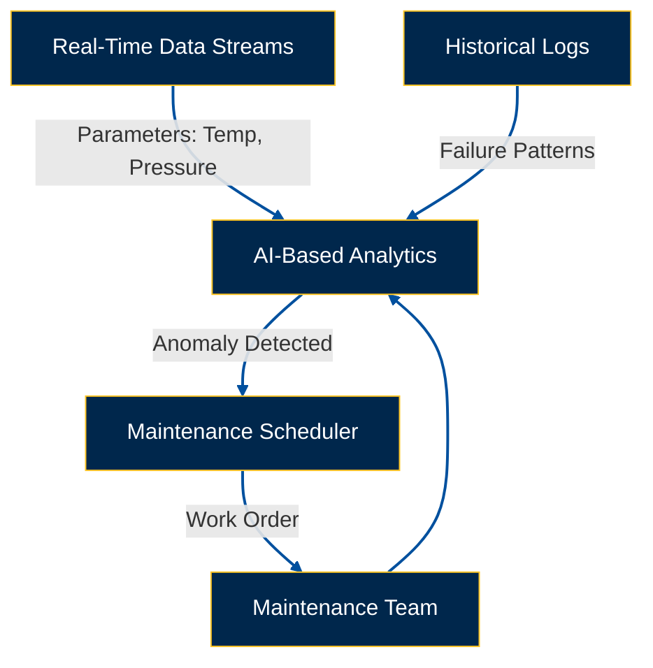


### **22.54 Component Replacement**

Guidelines for safely and efficiently replacing Autopilot System components ensure minimal disruption and maintain system integrity.

**Replacement Procedures:**

1. **Identify Faulty Component:**
   - Use diagnostic tools and system logs to confirm the faulty part.

2. **Safety Precautions:**
   - Follow lockout/tagout procedures.
   - Use appropriate PPE.

3. **Remove Faulty Component:**
   - Disconnect power sources.
   - Carefully remove the component following manufacturer guidelines.

4. **Install New Component:**
   - Ensure compatibility and correct specifications.
   - Securely install the new component.

5. **System Testing:**
   - Perform functional tests to verify successful replacement.
   - Update maintenance records with replacement details.

**Documentation:**

- Record part numbers, serial numbers, and specifications of replaced components.
- Update system diagrams and configuration records accordingly.

---

## **22.60 Roles and Responsibilities**

### **22.61 Autopilot System Maintenance Manager**

**Responsibilities:**

- Oversee all maintenance activities related to the Autopilot System.
- Ensure compliance with ATA Chapter 22 standards and regulatory requirements.
- Coordinate training programs for maintenance personnel.
- Manage maintenance schedules and resource allocation.
- Conduct regular reviews and audits of maintenance practices.
- Implement continuous improvement initiatives.

**Qualifications:**

- Certified aircraft maintenance engineer.
- Extensive experience with autopilot systems.
- Strong leadership and organizational skills.
- Knowledge of regulatory standards and compliance requirements.

### **22.62 Maintenance Personnel**

**Responsibilities:**

- Perform routine and corrective maintenance on the Autopilot System.
- Conduct inspections and diagnostics using approved tools and procedures.
- Document all maintenance activities accurately.
- Report any anomalies or potential issues promptly.
- Participate in training programs to stay updated on system advancements.

**Qualifications:**

- Certified aircraft maintenance technician.
- Hands-on experience with autopilot systems.
- Proficiency in using diagnostic tools and CMMS.
- Attention to detail and adherence to safety protocols.

### **22.63 Quality Assurance**

**Responsibilities:**

- Ensure all maintenance activities meet quality and safety standards.
- Conduct regular audits and inspections of maintenance processes.
- Validate the effectiveness of maintenance procedures.
- Identify areas for improvement and recommend corrective actions.
- Maintain records of quality assurance activities.

**Qualifications:**

- Certified quality assurance professional.
- In-depth knowledge of ATA Chapter 22 and aviation standards.
- Analytical skills for evaluating maintenance processes.
- Strong communication and reporting abilities.

### **22.64 Flight Crew**

**Responsibilities:**

- Operate the Autopilot System during flights as per SOPs.
- Monitor system performance and respond to any alerts or malfunctions.
- Perform manual control adjustments when necessary.
- Report any system anomalies to maintenance personnel.
- Participate in training programs to maintain proficiency in autopilot operations.

**Qualifications:**

- Certified pilot with experience in advanced autopilot systems.
- Comprehensive understanding of Autopilot System functionalities.
- Ability to respond swiftly and effectively to system issues.
- Commitment to continuous learning and adherence to safety protocols.

---

## **22.70 Integration with Other Documents and Systems**

### **22.71 Dependencies Matrix and Glossary**

**Dependencies Matrix:**

| **Autopilot System Component** | **Dependent Systems**             | **Description of Dependencies**                                         |
|---------------------------------|-----------------------------------|-------------------------------------------------------------------------|
| Flight Control Computers (FCC)  | Navigation Systems, Engine Controls | Synchronizes flight path data with engine thrust management systems.     |
| Servo Actuators                 | Control Surfaces (Ailerons, Rudder) | Adjusts control surfaces based on FCC commands for precise flight control.|
| Sensors                         | Inertial Navigation System (INS), GPS | Provides real-time data for accurate autopilot adjustments.              |
| Mode Control Panel (MCP)        | Pilot Interface, Flight Deck Displays | Enables pilots to interact with and configure the Autopilot System.      |

**Glossary:**

| **Term**                        | **Definition**                                                                 |
|---------------------------------|---------------------------------------------------------------------------------|
| **Autopilot System**            | Automated system controlling the aircraft's flight path without pilot input.   |
| **BITE**                        | Built-In Test Equipment used for system diagnostics and fault detection.        |
| **FCC**                         | Flight Control Computers responsible for processing autopilot commands.        |
| **HMI**                         | Human-Machine Interface facilitating interaction between users and systems.     |
| **INS**                         | Inertial Navigation System providing positional data without external references.|
| **MCP**                         | Mode Control Panel allowing pilots to select and configure autopilot modes.     |
| **CMMS**                        | Computerized Maintenance Management System for tracking maintenance activities.|

### **22.72 Integration with CMMS**

The Autopilot System integrates seamlessly with the **Computerized Maintenance Management System (CMMS)** to streamline maintenance tracking, scheduling, and documentation.

**Integration Features:**

- **Automated Work Orders:** Generate work orders based on system alerts, fault codes, and scheduled maintenance tasks.
- **Real-Time Tracking:** Monitor maintenance activities in real-time, ensuring timely completion of tasks.
- **Documentation Linking:** Access relevant maintenance manuals, schematics, and troubleshooting guides directly from the CMMS.
- **Reporting and Analytics:** Utilize CMMS reporting tools to analyze maintenance trends, system reliability, and performance metrics.

**Benefits:**

- **Efficiency:** Reduces manual tracking and increases the speed of maintenance operations.
- **Accuracy:** Minimizes errors in maintenance scheduling and documentation.
- **Visibility:** Provides comprehensive visibility into maintenance activities and system health.

### **22.73 Integration with Other ATA Chapters**

The Autopilot System interacts with various other ATA chapters to ensure cohesive and efficient system management across the aircraft.

**Key Integrations:**

- **ATA Chapter 33 (Navigation):** Ensures synchronization between navigation data and autopilot commands.
- **ATA Chapter 35 (Landing Gear):** Coordinates landing procedures and autopilot control during approach and landing.
- **ATA Chapter 36 (Propulsion):** Integrates engine thrust management with autopilot flight path adjustments.
- **ATA Chapter 45 (Electrical Power):** Manages power supply to the Autopilot System, ensuring reliability and redundancy.

**Integration Benefits:**

- **Holistic System Management:** Facilitates comprehensive oversight and coordination between interconnected systems.
- **Enhanced Reliability:** Reduces system conflicts and ensures consistent performance across different aircraft domains.
- **Improved Safety:** Streamlines communication and data exchange between systems, enhancing overall flight safety.
# **22.73 Integration with Other Documents and Systems**

## **22.73.1 Digital Twins and Real-Time Data**

### **Objective**
Leverage digital twin technology, updated in real time, to model and optimize the Autopilot System’s behavior across diverse operational scenarios.

---

### **Overview**
A digital twin is a virtual replica of the physical Autopilot System, enabling risk-free testing, refinement, and optimization. It reduces development costs, enhances safety, and provides a robust platform for predictive analysis and scenario testing.

---

### **Digital Twin Setup**
1. **Data Ingestion:** Mirror sensor inputs, flight data, and historical logs into the digital environment for accurate system representation.  
2. **Virtual Modeling:** Simulate critical conditions, such as weather variability, mechanical stress, and system loads, to assess performance under various scenarios.

---

### **Real-Time Synchronization**
- **Continuous Updates:** Maintain real-time synchronization with live operational metrics for accurate and dynamic modeling.  
- **Scenario Testing:** Validate the system’s resilience by simulating extreme conditions such as emergencies or high-traffic airspace operations before deployment.

---

### **Operational Advantages**
1. **Predictive Simulations:** Anticipate potential hardware and software stress points to prevent failures.  
2. **Rapid Iterations:** Test and refine new patches or parameter changes in a controlled, zero-risk virtual environment.  
3. **Training Utility:** Provide advanced training scenarios for both pilots and maintenance teams to enhance readiness and competency.

---

### **Key Benefits**
- **Enhanced Reliability:** Detect and address potential issues early.  
- **Reduced Costs:** Minimize the need for full-scale physical testing, conserving resources.  
- **Faster Upgrades:** Expedite validation and deployment of system enhancements.

---

### **Implementation Considerations**
1. **Scalability:** Ensure the digital twin can adapt to additional features and future hardware expansions.  
2. **Data Security:** Protect the digital twin’s data channels from unauthorized access or intrusion.  
3. **Infrastructure:** Allocate sufficient computational resources to support real-time simulations effectively.

---

### **Integrated Digital Twin Workflow**
The following diagram visualizes the workflow of a digital twin system, showcasing data ingestion, real-time synchronization, and operational utility:

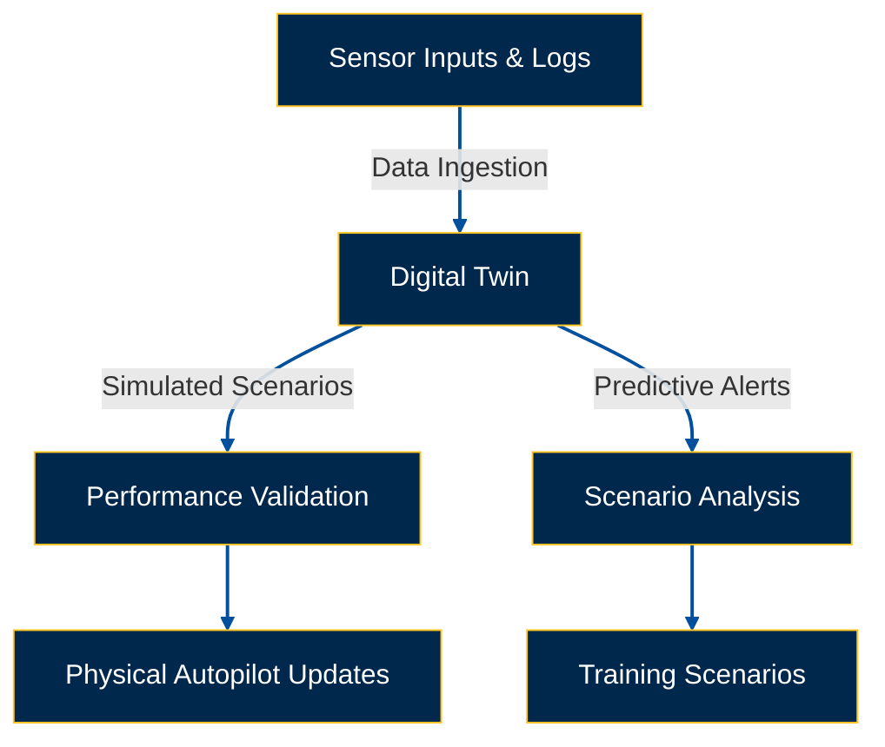

## **22.80 Training and Awareness**

**Objective:** Ensure that all personnel involved in the operation and maintenance of the Ampel360XWLRGA Autopilot System are **adequately trained** and updated with the latest technologies, procedures, and regulations. Training will focus on **innovation**, **predictive maintenance**, and **automation**—fundamental pillars for efficiency and safety in modern aviation.

### **22.81 Autopilot System Training Programs**

#### **a) Initial and Recurrent Training for Flight Crew**

**Autopilot Fundamentals:**

- **Principles of Operation:**
  - Understanding how the Autopilot System maintains flight path and stability.
  - Integration with navigation and flight control systems.
- **System Architecture:**
  - Overview of hardware and software components.
  - Functional relationships between components.
- **Operational Modes:**
  - AUTO, MANUAL, ALTITUDE HOLD, NAVIGATION TRACK, etc.
  - Practical applications and scenarios for each mode.

**Normal Operation:**

- **Activation Procedures:**
  - Steps to engage the Autopilot System.
  - Verifying system status indicators.
- **Configuration Settings:**
  - Inputting desired flight path parameters.
  - Selecting operational modes based on flight phase.
- **Monitoring Performance:**
  - Continuous monitoring of system indicators.
  - Adjusting settings for optimal performance.

**Abnormal and Emergency Procedures:**

- **System Malfunctions:**
  - Recognizing signs of autopilot failure (e.g., loss of control, erratic behavior).
- **Manual Control Transition:**
  - Procedures for disengaging Autopilot and regaining manual control.
- **Use of Quick Reference Handbook (QRH):**
  - Step-by-step instructions for addressing emergencies.
- **Risk Mitigation:**
  - Strategies to manage and mitigate risks associated with system failures.

**Recurrent Training:**

- **Annual Refreshers:**
  - Reinforcing knowledge and skills.
- **System Updates:**
  - Training on new features, software updates, and modifications.
- **Simulator Sessions:**
  - Practical exercises in handling complex scenarios and system failures.

#### **b) Training for Maintenance Personnel**

**System Theory and Description:**

- **In-Depth Understanding:**
  - Comprehensive study of Autopilot System components and their functions.
  - Detailed examination of ATA Chapter 22.
- **System Architecture:**
  - Analysis of hardware and software integration.
  - Functional workflows and data flow diagrams.

**Component-Specific Training:**

- **Flight Control Computers (FCC):**
  - Operation, diagnostics, calibration, and replacement.
- **Servo Actuators:**
  - Maintenance, functionality testing, and replacement.
- **Sensors:**
  - Types, calibration, verification, and replacement.
- **Mode Control Panel (MCP):**
  - Operation, configuration, and fault diagnostics.
- **Interfaces with Other Systems:**
  - Understanding interactions with FMS, IRS, Air Data System, etc.

**Maintenance Procedures:**

- **Scheduled Tasks:**
  - Routine inspections, component replacements, system testing.
- **Unscheduled Tasks:**
  - Emergency repairs, diagnostic procedures.
- **Tools and Equipment:**
  - Proper use of specialized tools and testing equipment.

**Troubleshooting:**

- **Diagnostic Methodologies:**
  - Systematic approaches using BITE and system logs.
- **Error Code Interpretation:**
  - Understanding and addressing specific fault codes.
- **Use of Manuals and Schematics:**
  - Leveraging troubleshooting guides and system diagrams.

**Safety:**

- **Lockout/Tagout Procedures:**
  - Ensuring systems are safely isolated before maintenance.
- **Personal Protective Equipment (PPE):**
  - Proper use of PPE to prevent accidents and injuries.
- **Safe Handling of Components:**
  - Guidelines for handling sensitive and high-voltage components.

**Advanced Software and Diagnostics:**

- **Diagnostic Software:**
  - Training on specific tools for system diagnostics and data analysis.
- **Data Interpretation:**
  - Analyzing system performance data to identify trends and potential issues.
- **Predictive Maintenance:**
  - Utilizing AI and machine learning to forecast maintenance needs and prevent failures.

**Certification:**

- **Certification Program:**
  - Structured program for Autopilot System maintenance technicians.
  - Levels of certification based on expertise and experience.
- **Assessment and Testing:**
  - Practical and theoretical evaluations to ensure competency.

**Recurrent Training:**

- **Periodic Updates:**
  - Training sessions on system updates, new procedures, and technological advancements.
- **Continuous Learning:**
  - Encouraging ongoing education and skill enhancement.

#### **22.81.1 Training Methods**

- **Classroom Instruction:** Theoretical classes covering system fundamentals, applicable regulations, and maintenance procedures.
- **Computer-Based Training (CBT):** Interactive modules for self-paced learning, including assessments and simulations.
- **Simulator Training:** Use of flight simulators (for pilots) and maintenance simulators (for technicians) to practice normal and emergency procedures in a safe environment.
- **On-the-Job Training (OJT):** Practical learning under the supervision of experienced personnel.
- **Virtual Reality (VR) and Augmented Reality (AR):**
  - **VR:** Complete simulations of maintenance procedures in a controlled environment.
  - **AR:** Overlay digital information (diagrams, instructions) onto real equipment during maintenance tasks.
- **Practical Workshops:** Sessions where maintenance tasks can be performed on real components or system models.

#### **22.81.2 Training Records**

- **Maintain Detailed Records:**
  - Training modules completed.
  - Dates of training.
  - Assessment results.
  - Certifications obtained.
- **Learning Management System (LMS):**
  - Utilize LMS to track training progress and ensure compliance with requirements.
  - Provide access to training materials and resources.
- **Audit Trails:**
  - Ensure all training activities are recorded and easily accessible for audits and reviews.

### **22.82 Awareness Campaigns**

- **Promotion of a Safety Culture:**
  - Campaigns emphasizing the importance of adhering to procedures and reporting any autopilot system anomalies.
  - Recognition of best practices in safety and maintenance.
- **Technological Updates:**
  - Newsletters and webinars to keep personnel informed about the latest innovations and technologies related to the autopilot.
- **Best Practices:**
  - Sharing success stories, lessons learned, and best practices among maintenance teams through an internal knowledge platform.
- **Regulatory Compliance:**
  - Awareness campaigns highlighting the importance of complying with FAA, EASA, and other relevant authority regulations.

#### **22.82.1 Campaign Materials**

- **Posters and Brochures:** Visual materials highlighting key safety points and standard operating procedures.
- **Newsletters:** Periodic publications with system updates, maintenance tips, and relevant news.
- **Training Videos:** Short videos demonstrating maintenance procedures or explaining new components.
- **Online Platform:** Dedicated web portal for autopilot awareness, with access to manuals, videos, FAQs, and discussion forums.

#### **22.82.2 Effectiveness Evaluation**

- **Surveys:** Gather feedback from personnel on the effectiveness of awareness campaigns.
- **Incident Analysis:** Monitor for reductions in autopilot-related incidents following campaign implementation.
- **Audits:** Assess adherence to procedures and personnel understanding during regular audits.

**Breakdown:**  
This section provides a comprehensive training and awareness framework, covering technical knowledge, safety, integration of new technologies, and aspects such as training methods, training records, and awareness campaigns.

**Conclusion of Section 22.80**  
Training and awareness are fundamental pillars for the safe and efficient maintenance and operation of the Ampel360XWLRGA Autopilot System. A solid training program, combined with effective awareness campaigns, will ensure that all personnel are well-prepared to handle the complexities of this advanced system, contributing to the safety and reliability of flight operations. Investing in training and continuous personnel development is an investment in GAIA AIR's future.

---

## **22.90 Audits and Continuous Improvement**

### **22.91 Internal Audits**

Regular internal audits are conducted to ensure compliance with maintenance procedures, operational protocols, and safety standards. Audits help identify areas for improvement and verify the effectiveness of training programs.

**Audit Objectives:**

- **Compliance Verification:** Ensure all maintenance activities adhere to ATA Chapter 22 and regulatory standards.
- **Procedure Adherence:** Confirm that operational and maintenance procedures are followed correctly.
- **Safety Compliance:** Assess the implementation of safety protocols and measures.
- **Performance Evaluation:** Evaluate the efficiency and effectiveness of maintenance practices and training programs.

**Audit Process:**

1. **Planning:**
   - Define audit scope and objectives.
   - Develop audit checklists based on standards and procedures.
2. **Execution:**
   - Conduct on-site inspections and interviews.
   - Review maintenance records and documentation.
   - Observe maintenance personnel during operations.
3. **Reporting:**
   - Compile audit findings and observations.
   - Highlight areas of non-compliance and potential improvements.
4. **Follow-Up:**
   - Develop corrective action plans for identified issues.
   - Monitor the implementation of corrective actions.
   - Re-audit as necessary to ensure compliance.

### **22.92 Continuous Improvement Process**

Implement structured methodologies such as **Kaizen**, **Six Sigma**, or **Total Quality Management (TQM)** to systematically enhance training programs and maintenance procedures based on feedback and performance metrics.

**Continuous Improvement Steps:**

1. **Identify Opportunities:**
   - Collect data from audits, maintenance records, and personnel feedback.
   - Analyze performance metrics to identify trends and areas for improvement.
2. **Analyze Root Causes:**
   - Use tools like **Root Cause Analysis (RCA)** and **Fishbone Diagrams** to determine underlying causes of issues.
3. **Develop Improvement Plans:**
   - Create actionable plans to address identified issues.
   - Set measurable goals and objectives for improvement.
4. **Implement Changes:**
   - Execute the improvement plans with necessary resources and support.
   - Update procedures, training materials, and documentation as needed.
5. **Evaluate Results:**
   - Monitor the impact of implemented changes on system performance and maintenance efficiency.
   - Use feedback and performance data to assess the effectiveness of improvements.
6. **Standardize Successful Practices:**
   - Incorporate successful changes into standard operating procedures.
   - Share best practices across teams to ensure widespread adoption.
7. **Review and Iterate:**
   - Continuously review processes to identify new improvement opportunities.
   - Foster a culture of ongoing enhancement and excellence.

**Tools and Techniques:**

- **Kaizen:** Focus on small, incremental changes to improve efficiency and quality.
- **Six Sigma:** Utilize data-driven methodologies to reduce defects and variability.
- **Total Quality Management (TQM):** Integrate quality principles across all organizational processes.
- **Lean Manufacturing:** Eliminate waste and optimize processes for maximum efficiency.

**Benefits of Continuous Improvement:**

- **Enhanced Efficiency:** Streamlined maintenance processes reduce downtime and operational costs.
- **Improved Quality:** Higher standards of maintenance and operation lead to more reliable system performance.
- **Increased Safety:** Proactive identification and mitigation of risks enhance overall flight safety.
- **Employee Engagement:** Involving personnel in improvement initiatives fosters a sense of ownership and motivation.

# **22.93 Autopilot Security (Quantum Cybersecurity)**

## **Objective**
Employ quantum cybersecurity to protect the Autopilot System from advanced digital threats, ensuring the security and integrity of critical data streams.

---

## **Overview**
As data-driven avionics become integral to modern aircraft, sophisticated cyber threats demand equally advanced security measures. By adopting **post-quantum cryptography** and **quantum-resistant protocols**, the Autopilot System achieves resilience against emerging cyberattack vectors.

---

## **Quantum Encryption**
1. **Quantum Key Distribution (QKD):**  
   Use quantum mechanics to establish secure encryption keys that can detect interception attempts.  
2. **Post-Quantum Algorithms:**  
   Adopt cryptographic methods designed to withstand decryption by quantum computers, ensuring long-term security.

---

## **Resilient Communication**
- **End-to-End Security:**  
  Encrypt in-flight data streams with quantum-safe layers, preserving confidentiality throughout data transmission.  
- **Firmware Validation:**  
  Authenticate firmware updates with quantum-secure digital signatures, preventing unauthorized or malicious modifications.

---

## **Intrusion Detection & Response**
1. **Quantum-Enhanced Monitoring:**  
   Deploy algorithms capable of nuanced and rapid threat detection within avionics and Autopilot data streams.  
2. **Adaptive Policies:**  
   Dynamically update security rules based on evolving threat environments, ensuring a proactive defense.

---

## **Benefits**
- **Longevity:**  
  Quantum-resistant measures provide enduring protection against classical and emerging quantum computational risks.  
- **Regulatory Compliance:**  
  Aligns with anticipated quantum-safe aviation standards, ensuring future-proof compliance.  
- **Operational Confidence:**  
  Safeguards flight-critical systems, reducing risks of data breaches or system manipulation.

---

## **Implementation Considerations**
1. **System Overhead:**  
   Incorporating quantum security may require additional computational resources and potential hardware upgrades.  
2. **Stakeholder Coordination:**  
   Foster collaboration with OEMs, cryptographic experts, and regulatory bodies to standardize and align security measures.  
3. **Maintenance Staff Training:**  
   Train teams to understand quantum security protocols, enabling effective monitoring, deployment, and troubleshooting.

---

## **Quantum Cybersecurity Workflow**
The following diagram illustrates the key components of quantum cybersecurity within the Autopilot System:

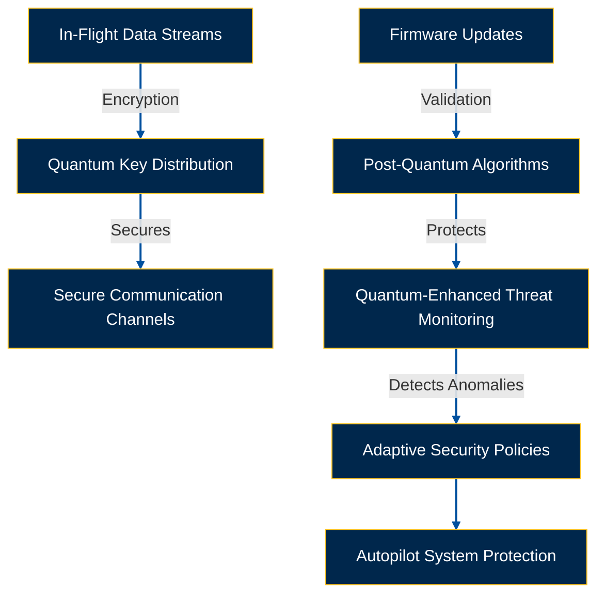
# **22.94 Sustainability and Circular Economy**

## **Objective**
Integrate sustainability metrics and circular economy principles into the Autopilot System, aiming to reduce environmental impact while maintaining optimal performance.

---

## **Overview**
In line with global aviation goals to minimize emissions, waste, and resource consumption, GAIA AIR’s Autopilot System embeds sustainability-focused technologies. This approach ensures environmental stewardship while preserving safety and efficiency.

---

## **Emission & Fuel Optimization**
1. **AI-Driven Routing:**  
   Leverage real-time traffic, weather, and operational data to minimize fuel burn.  
2. **Reduced Idling:**  
   Employ Autopilot optimizations to limit idle thrust during ground operations.  
3. **Continuous Descent Approaches (CDA):**  
   Smooth altitude transitions reduce noise pollution and fuel consumption.

---

## **Material Lifecycle**
1. **Recyclable Components:**  
   Use materials that can be easily recycled or repurposed, reducing end-of-life waste.  
2. **Modular Upgrades:**  
   Extend the system's lifecycle by replacing specific sub-modules rather than entire assemblies.

---

## **Data-Driven Sustainability**
1. **Real-Time Monitoring:**  
   Track emissions and resource usage to generate actionable insights for ongoing improvements.  
2. **Reporting & Compliance:**  
   Meet stringent environmental standards with comprehensive audits and certifications.

---

## **Benefits**
- **Lower Operating Costs:**  
  Enhanced fuel efficiency leads to significant financial savings over time.  
- **Enhanced Brand Reputation:**  
  Demonstrates GAIA AIR’s commitment to eco-responsible aviation technologies.  
- **Regulatory Readiness:**  
  Prepares the Autopilot System to comply with stricter global environmental mandates.

---

## **Implementation Considerations**
1. **Performance Balances:**  
   Ensure sustainability measures maintain operational safety and reliability.  
2. **Stakeholder Engagement:**  
   Collaborate with suppliers, regulators, and customers to align sustainability goals.  
3. **Continuous Evaluation:**  
   Periodically review and adapt sustainability metrics to reflect advancements in technology and changing regulations.

---

## **Sustainability Workflow**
The diagram below illustrates the sustainability strategies integrated into the Autopilot System:

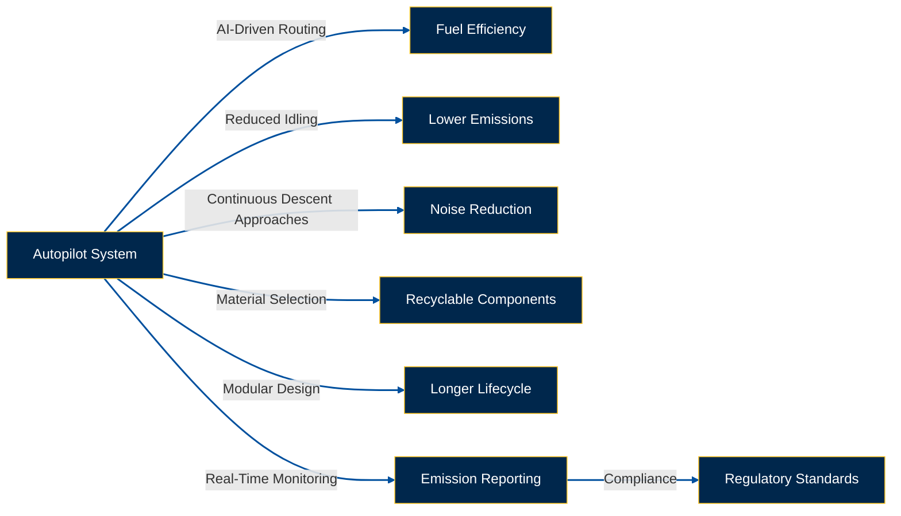
# **22.95 User-System Interaction: AI-Based Interfaces (FR161, FR245)**

## **Objective**
Provide AI-driven, pilot-centric Human-Machine Interfaces (HMIs) to simplify Autopilot management, aligning with design requirements FR161 (User-Friendly) and FR245 (Enhanced Accessibility).

---

## **Overview**
Pilot-focused interface designs reduce cognitive load, enhance situational awareness, and improve flight safety. The integration of AI ensures the HMI dynamically adapts to real-time flight conditions and pilot preferences, offering intuitive control paths and proactive alerts.

---

## **Core Design Principles**
1. **Simplicity & Clarity:**  
   - Present essential data succinctly, ensuring warnings and critical metrics are easily distinguishable.  
2. **Adaptive Layouts:**  
   - Rearrange displayed information based on flight phases (e.g., takeoff, cruise, approach) to highlight relevant metrics.  
3. **Accessibility:**  
   - Support multilingual text, colorblind-friendly palettes, and alternative input modes (voice, touch, etc.).

---

## **AI Integration**
1. **Predictive Inputs:**  
   - Suggest optimal autopilot settings based on flight conditions and historical data.  
2. **Voice Interaction:**  
   - Allow pilots to make adjustments using natural language commands, reducing manual workload.  
3. **Contextual Assistance:**  
   - Offer tooltips or tutorials when usage patterns suggest potential confusion or inefficiency.

---

## **Enhanced Situational Awareness**
1. **Active Alerts & Guidance:**  
   - Generate real-time warnings and recommendations (e.g., minor heading adjustments to avoid weather).  
2. **Feedback Loop:**  
   - Continuously refine interface responsiveness using pilot feedback and post-flight analysis.

---

## **Compliance & Safety**
1. **FR161 (User-Friendly):**  
   - Streamline workflows to minimize error-prone steps or overly complex navigation.  
2. **FR245 (Enhanced Accessibility):**  
   - Ensure inclusive design for pilots with diverse operational needs, maintaining universal access.

---

## **Implementation Steps**
1. **Prototype & Testing:**  
   - Develop interface prototypes, validate them in flight simulators, and gather pilot feedback through iterative testing cycles.  
2. **System Integration:**  
   - Embed AI modules into the Autopilot architecture, ensuring seamless data exchange and stable performance.  
3. **Pilot Training:**  
   - Provide comprehensive training sessions to familiarize pilots with new HMI features, including voice commands and adaptive layouts.

---

## **Benefits**
- **Reduced Cognitive Load:**  
  - Simplified workflows allow pilots to focus on broader flight parameters.  
- **Accelerated Responses:**  
  - AI-driven prompts and voice commands enable quicker decision-making in dynamic environments.  
- **User Satisfaction:**  
  - Adaptive, user-friendly interfaces build trust and acceptance among pilots.

---

## **AI-Based HMI Workflow**
The following diagram visualizes the integration and evolution of AI-based HMIs in the Autopilot System:

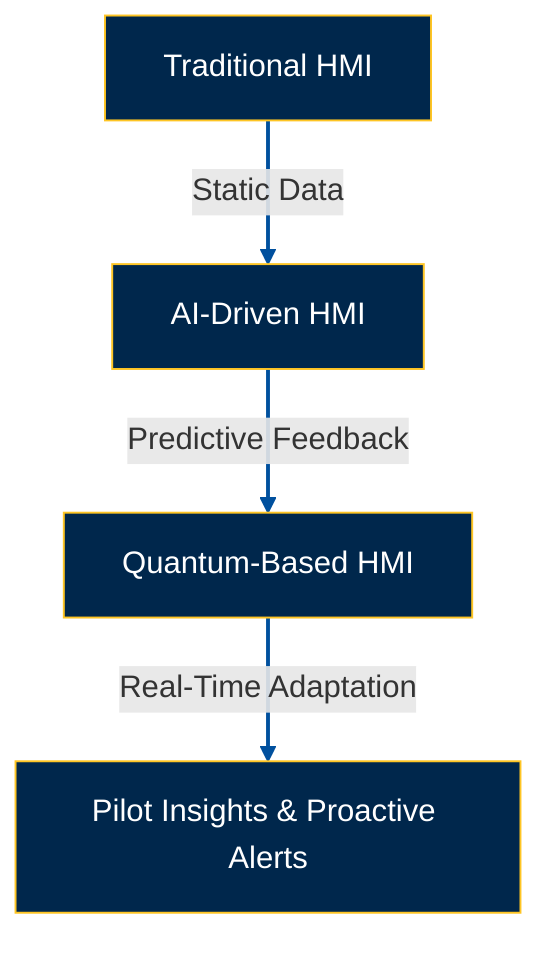
# **22.96 Cross-Referencing Other ATA Chapters**

## **Objective**
Demonstrate explicit connections between the Autopilot System and other pivotal aircraft systems, reinforcing a cohesive avionics ecosystem.

---

## **22.96.1 Linkages to ATA 31 (Instruments)**

### **Unified Cockpit Information**
1. **Data Flows:**  
   - Ensure seamless display of autopilot data, including fuel optimization modes and route deviations, on cockpit instruments.  
   - Provide pilots with integrated views of quantum optimization statuses and maintenance alerts for real-time decision-making.  

2. **Display Protocols:**  
   - Standardize cockpit display elements to accommodate Autopilot commands, warnings, and performance metrics.  

---

### **Collaboration Diagrams**
1. **Instrument-Integration Schematic:**  
   - Illustrate how Autopilot commands and alerts are visually and functionally incorporated into instrumentation interfaces.  

2. **Real-Time Synchronization:**  
   - Showcase feedback loops between ATA 31 sensors and Autopilot calculations, ensuring synchronized and precise performance.

---

## **22.96.2 Linkages to ATA 34 (Navigation)**

### **Route Calculation Inputs**
1. **Navigation Data Feeds:**  
   - Demonstrate how the Autopilot System uses waypoints, terrain data, and GPS/INS signals to optimize route planning and execution.  

2. **Quantum-Enhanced Optimization:**  
   - Leverage quantum algorithms to process large-scale navigational datasets, enabling highly accurate and efficient route adjustments.  

---

### **System Architecture Overviews**
1. **Collaboration Maps:**  
   - Depict the interplay between Autopilot logic and key navigational inputs, such as altitude, velocity, and wind data.  

2. **Fail-Safe Coordination:**  
   - Define fallback procedures to ensure operational continuity in case of ATA 34 data feed disruptions.  

---

## **Key Visuals**

### **Integration with ATA 31 and ATA 34**
The following diagram illustrates the Autopilot System's interaction with ATA 31 (Instruments) and ATA 34 (Navigation):

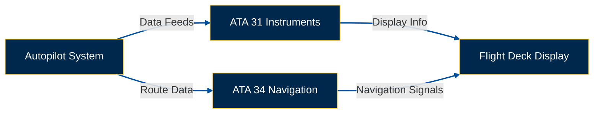
# **22.97 Stakeholder Engagement**

## **Objective**
Clarify how OEMs, airlines, and regulators collaborate in line with GQP’s iterative ethos to refine and deploy Autopilot capabilities, ensuring alignment with industry standards, operational requirements, and emerging technologies.

---

## **22.97.1 Collaborative Framework**

### **OEM Partnerships**
1. **Avionics Compatibility:**  
   - Ensure Autopilot updates align seamlessly with the overarching avionics roadmap, maintaining interoperability across systems.  

2. **Data Interface Standards:**  
   - Collaborate on shared protocols to standardize data communication, enabling smooth integration of hardware and software.  

---

### **Airlines as Operational Feedback Providers**
1. **Real-World Insights:**  
   - Airlines supply critical operational data, including flight schedules, maintenance logs, and real-time pilot feedback, to enhance predictive maintenance models (see §22.53.1).  

2. **Use Case Validation:**  
   - Pilot feedback on AI-driven HMIs (see §22.95) helps refine interface usability, ensuring designs cater to diverse operational needs.  

---

### **Regulatory Authorities (EASA, FAA)**
1. **Compliance and Standards Evolution:**  
   - Maintain active engagement with regulators to align Autopilot capabilities with quantum security mandates (see §22.93) and aviation regulations.  

2. **Iterative Feedback Loop:**  
   - Use insights from certification audits to guide ongoing refinements and ensure compliance with evolving standards.

---

## **22.97.2 Joint Working Groups**

### **Cross-Functional Teams**
1. **Interdisciplinary Collaboration:**  
   - Form teams comprising quantum specialists, maintenance engineers, flight operations experts, and regulators to address diverse system needs.  

2. **Shared Decision-Making:**  
   - Develop consensus on design choices, training methodologies, and criteria for the acceptance of new features, including quantum-enhanced modules.  

---

### **Shared Governance**
1. **Transparency:**  
   - Operate under GAIA QUANTUM, PORTAL (GQP) principles, ensuring transparent knowledge sharing and consistent alignment with organizational goals.  

2. **Stakeholder Alignment:**  
   - Balance input from all stakeholders to support iterative improvements and long-term system integration.  

---

### **Key Visual: Stakeholder Collaboration Diagram**
The following diagram illustrates the interplay between OEMs, airlines, and regulatory authorities in the Autopilot lifecycle:

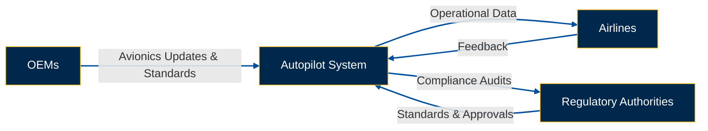

# **22.98 Scalability Across Diverse Platforms**

## **Objective**
Showcase the Autopilot System’s modular, adaptive design—ready to serve large commercial jets, UAVs, and next-generation aircraft, while maintaining compliance with diverse operational requirements and global standards.

---

## **22.98.1 Adaptable Architecture**

### **Large Commercial Jets**
1. **High-Throughput Analytics:**  
   - Leverage quantum algorithms to handle complex route planning and operational data for large fleets with heavy passenger volumes.  

2. **Complex Predictive Maintenance:**  
   - Use AI-driven models to minimize downtime by predicting maintenance needs across high-frequency flight operations.

---

### **Unmanned Aerial Vehicles (UAVs)**
1. **Lightweight Footprints:**  
   - Optimize the Autopilot System for minimal size, weight, and power (SWaP) constraints, critical for UAV deployments.  

2. **Autonomous Missions:**  
   - Integrate digital twin technology (see §22.73.1) for real-time mission simulations and route optimization in fully autonomous operations.

---

### **Hybrid-Electric or Emerging Platforms**
1. **Modular Power Management:**  
   - Seamlessly integrate with innovative propulsion systems, maintaining flight stability and efficient resource use across hybrid-electric platforms.  

2. **Environmental Targets:**  
   - Align system operations with sustainability goals (see §22.94) by managing emissions and balancing battery/fuel usage.

---

### **Key Visual: Adaptable Architecture Diagram**

```mermaid
graph TD
    A[Core Autopilot System] --> B[Commercial Jets]
    A --> C[Unmanned Aerial Vehicles (UAVs)]
    A --> D[Hybrid-Electric Aircraft]
    B --> E[High-Throughput Analytics]
    C --> F[Lightweight Footprints]
    D --> G[Modular Power Management]

    %% Styling
    style A fill:#00274C,stroke:#FEC524,color:#FFFFFF
    style B fill:#00274C,stroke:#FEC524,color:#FFFFFF
    style C fill:#00274C,stroke:#FEC524,color:#FFFFFF
    style D fill:#00274C,stroke:#FEC524,color:#FFFFFF
    style E fill:#00274C,stroke:#FEC524,color:#FFFFFF
    style F fill:#00274C,stroke:#FEC524,color:#FFFFFF
    style G fill:#00274C,stroke:#FEC524,color:#FFFFFF
    linkStyle default stroke:#00509E,stroke-width:2px
```

---

## **22.98.2 Global Fleet Compatibility**

### **Multi-Lingual HMI**
1. **Interface Localization:**  
   - Support multiple language packs to ensure ease of use for pilots worldwide.  

2. **Regulatory Diversity:**  
   - Customize labeling and HMI configurations to comply with EASA, FAA, or other regional aviation authorities.

---

### **Cross-Market Certification**
1. **Unified Compliance Matrix:**  
   - Maintain a centralized framework to track varying global standards and ensure consistent regulatory adherence.  

2. **Scalable Security:**  
   - Guarantee compatibility with quantum cybersecurity protocols (see §22.93) across diverse regulatory regimes.

---

### **Platform-Agnostic Modules**
1. **Universal Data Buses:**  
   - Use standardized communication protocols (ARINC 429, AFDX, etc.) for seamless integration across different aircraft architectures.  

2. **Upgrade Pathways:**  
   - Design modular systems to allow incremental updates for advanced propulsion technologies or extended operational ranges, avoiding full-system replacements.

---

### **Key Visual: Global Fleet Compatibility Diagram**

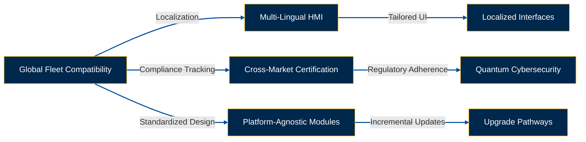
```markdown
# **22.99 Implementation and Next Steps**

To fully realize the benefits described in preceding sections, the following refinements address visualization, training, metrics, and expanded ecosystem integration. These steps ensure a seamless transition from design to operational excellence while fostering collaboration and stakeholder alignment.

---

## **22.99.1 Visualization Tools**

### **Data Flow Diagrams**
- **ATA Linkages:** Highlight intersections between Autopilot data, ATA 31 (Instruments), and ATA 34 (Navigation).  
- **Quantum & AI Modules:** Illustrate internal data flows for predictive maintenance, quantum routing, and HMI logic.

### **Scalability Charts**
- **Platform Overviews:** Depict modular component adaptability for UAVs, commercial jets, and hybrid-electric platforms.  
- **Upgrade Path Timelines:** Outline phases for incremental expansions to support emerging aircraft technologies.

---

### **Key Visual: Visualization Tools**

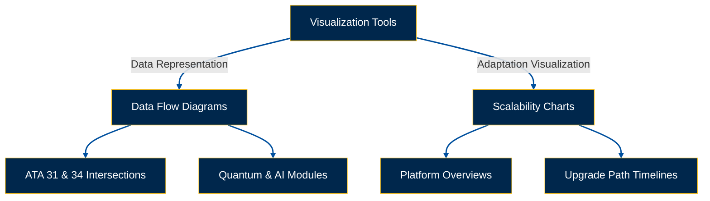

---

## **22.99.2 Training and Change Management**

### **Pilot & Maintenance Staff Training**
1. **Quantum Features:**  
   - Emphasize quantum cybersecurity (see §22.93) and quantum analytics in predictive maintenance (see §22.53.1).  

2. **AI-Driven HMIs (22.95):**  
   - Conduct simulator sessions and provide interactive tutorials for mastering advanced interface features.  

### **Change Management Frameworks**
1. **Phased Adoption:**  
   - Gradually introduce new functionalities, ensuring stable transitions and minimal disruptions.  

2. **Stakeholder Communication:**  
   - Regularly update airlines, OEMs, and regulators on milestones and adoption progress.

---

## **22.99.3 Metrics for Success**

### **Predictive Maintenance Accuracy**
- **Key KPIs:** Track Mean Time Between Failures (MTBF), false alert rates, and actual vs. predicted component lifespans.  
- **Data-Driven Dashboards:** Integrate metrics into the CMMS for real-time tracking and actionable insights.

### **Emission Reductions**
- **Flight Efficiency Metrics:** Measure fuel savings and CO₂ reductions post-implementation of optimized routing algorithms.  
- **Sustainability Index:** Aggregate metrics to evaluate adherence to circular economy principles (see §22.94).

### **User Adoption & Satisfaction**
- **AI HMI Usage Rates:** Monitor the frequency of advanced interface usage in live operations.  
- **Pilot Feedback Surveys:** Collect pilot feedback to assess satisfaction and ease of use.

---

### **Key Visual: Metrics for Success**

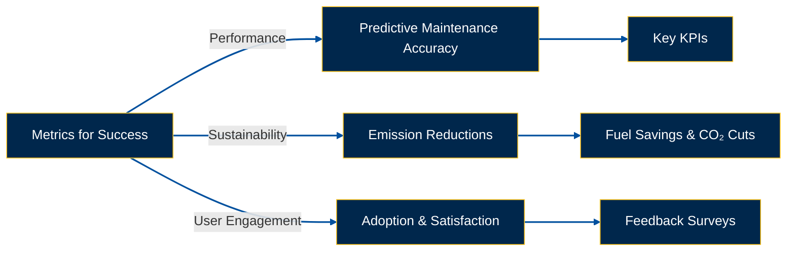

---

## **22.99.4 Ecosystem Synergy**

### **External System Integrations**
1. **Air Traffic Control (ATC):**  
   - Enable real-time synchronization with ATC advisories for enhanced flight path optimization.  

2. **Ground Operations & Weather Forecasting:**  
   - Utilize predictive analytics augmented by ground-based data and advanced meteorological feeds.

### **Collaboration with Industry Platforms**
1. **Open Data Exchanges:**  
   - Collaborate with third-party services and GAIA AIR systems to share relevant datasets.  

2. **Future Partnerships:**  
   - Build alliances with technology providers specializing in AI, quantum computing, and sustainable aviation R&D.

---

### **Key Visual: Ecosystem Synergy**

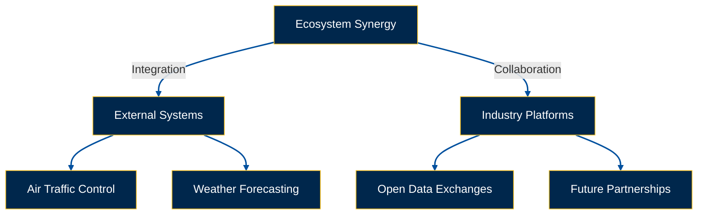
---

## **22.100 Human Factors**

### **22.101 Ergonomics of Autopilot Maintenance**

Design maintenance workspaces and procedures to reduce physical strain and enhance efficiency, ensuring that maintenance personnel can perform tasks comfortably and safely.

**Ergonomic Considerations:**

- **Workspace Design:**
  - Adjustable workbenches to accommodate different tasks and personnel heights.
  - Proper lighting to reduce eye strain and improve visibility.
  - Organized tool storage to minimize movement and reach.

- **Tool Design:**
  - Use of ergonomic tools to reduce hand and wrist strain.
  - Proper labeling and storage of tools for easy access.

- **Task Design:**
  - Simplify complex tasks to reduce cognitive load.
  - Provide clear instructions and visual aids to guide maintenance personnel.

- **Personal Protective Equipment (PPE):**
  - Comfortable and appropriately sized PPE to prevent fatigue and discomfort.

**Benefits:**

- **Reduced Physical Strain:** Enhances the well-being of maintenance personnel.
- **Increased Efficiency:** Streamlined workspaces and tools improve task performance speed and accuracy.
- **Enhanced Safety:** Ergonomic designs reduce the risk of accidents and injuries during maintenance operations.

### **22.102 Reducing Human Error in Operations and Maintenance**

Implement strategies such as standardized procedures, checklists, and error-proofing techniques to minimize the likelihood of human errors during autopilot operations and maintenance.

**Error Reduction Strategies:**

- **Standardized Procedures:**
  - Develop and enforce standardized operating and maintenance procedures.
  - Ensure all personnel are trained on these procedures.

- **Checklists:**
  - Utilize detailed checklists for maintenance tasks to ensure all steps are completed.
  - Implement pilot checklists for operating the Autopilot System.

- **Error-Proofing (Poka-Yoke):**
  - Design systems and procedures to prevent errors, such as connectors that only fit in the correct orientation.
  - Use automated alerts and warnings for potential mistakes.

- **Training and Education:**
  - Provide comprehensive training on common error types and prevention methods.
  - Encourage a culture of attention to detail and accountability.

- **Feedback Mechanisms:**
  - Establish systems for reporting and analyzing errors to identify patterns and implement corrective actions.

**Benefits:**

- **Enhanced Safety:** Reducing errors directly contributes to safer flight operations.
- **Improved Reliability:** Minimizing human errors increases the reliability of the Autopilot System.
- **Operational Efficiency:** Reducing errors leads to fewer maintenance issues and smoother operations.

### **22.103 Human-Machine Interface (HMI) Design for Autopilot**

Design intuitive and user-friendly interfaces that facilitate easy interaction between humans and the Autopilot System, enhancing usability and reducing the potential for operational mistakes.

**Design Principles:**

- **Clarity:** Information displayed should be clear, unambiguous, and easily understood by pilots and maintenance personnel.
- **Consistency:** Use consistent terminology, symbols, and layouts across all HMI interfaces.
- **Simplicity:** Avoid unnecessary complexity; present information in a straightforward and uncluttered manner.
- **Visibility of System Status:** Provide continuous feedback on the current status of the Autopilot System and its components.
- **Error Prevention:** Design interfaces to minimize the possibility of errors, such as confirmation prompts for critical actions.
- **Accessibility:** Ensure that HMIs are accessible to individuals with disabilities, adhering to relevant accessibility standards.
- **User-Centered Design:** Involve pilots and maintenance personnel in the design process to ensure the interface meets their needs and expectations.
- **Compliance with Standards:** Follow relevant human factors design standards and guidelines (e.g., FAA Human Factors Design Standard, MIL-STD-1472).

**Flight Deck HMI (For Pilots):**

- **Integration with EICAS/ECAM:** Autopilot status and controls should be integrated into the Engine Indication and Crew Alerting System (EICAS) or Electronic Centralized Aircraft Monitor (ECAM).
- **Intuitive Controls:** Use rotary knobs, push buttons, and touchscreen controls that are logically positioned and labeled.
- **Clear Displays:** Provide clear displays of key autopilot parameters such as:
  - Cabin temperature (set point and actual)
  - Cabin altitude
  - Cabin pressure differential
  - Autopilot mode (AUTO, MANUAL)
  - System status indicators (e.g., PACK 1 ON, PACK 2 ON)
  - Fault indications and warnings
- **Automated Alerts:** Configure the system to automatically alert the flight crew to any autopilot anomalies or malfunctions.
- **Color Coding:** Use color-coding to indicate system status (e.g., green for normal, amber for caution, red for warning).

**Maintenance HMI (For Technicians):**

- **Diagnostic Interface:** Provide a dedicated interface for maintenance personnel to access detailed system data, run diagnostics, and perform maintenance tasks. This could be a laptop-based interface or a dedicated panel in the avionics bay.
- **Data Logging:** The HMI should allow technicians to access historical data logs for troubleshooting and trend analysis.
- **Component Control:** Provide controls for manually operating individual autopilot components (e.g., valves, actuators) for testing and troubleshooting.
- **Calibration and Configuration:** Allow technicians to calibrate sensors and configure system parameters as needed.
- **Security:** Implement appropriate security measures (e.g., password protection) to prevent unauthorized access to the maintenance HMI.

**HMI Design Process:**

1. **Requirements Gathering:** Define the specific information and control needs of both pilots and maintenance personnel.
2. **Prototyping:** Develop prototypes of the HMI and test them with representative users.
3. **Usability Testing:** Conduct formal usability tests to evaluate the effectiveness and efficiency of the HMI.
4. **Iterative Refinement:** Iteratively refine the HMI design based on user feedback and test results.
5. **Validation and Verification:** Ensure the final HMI design meets all requirements and complies with relevant standards.

**Example HMI Design Considerations:**

- **Touchscreen vs. Physical Controls:** For the flight deck, consider a combination of touchscreen and physical controls. Touchscreens offer flexibility, but physical controls may be preferred for critical functions to provide tactile feedback.
- **Display Brightness and Contrast:** Ensure displays are easily readable under all lighting conditions, including bright sunlight and darkness.
- **Font Size and Style:** Use fonts that are large enough and easy to read, even from a distance or under stress.
- **Menu Structure:** Design a logical and intuitive menu structure that allows users to quickly find the information or controls they need.
- **Language:** Provide multilingual support if necessary.

**Breakdown:**  
This section ensures that the HMI is designed with the user in mind, enhancing interaction efficiency and reducing the potential for errors through thoughtful design and adherence to human factors principles.

---

## **22.110 Case Studies**

### **22.111 Successful Implementation of Autopilot Maintenance Programs**

**Case Study: AirTech Airlines**

**Background:**

AirTech Airlines implemented a comprehensive Autopilot Maintenance Program for their fleet of A320 aircraft. The program was designed to enhance system reliability, reduce downtime, and ensure compliance with regulatory standards.

**Implementation Steps:**

1. **Assessment of Existing Practices:**
   - Conducted a thorough review of current maintenance procedures.
   - Identified gaps and areas for improvement.

2. **Development of Standardized Procedures:**
   - Created detailed maintenance checklists aligned with ATA Chapter 22.
   - Implemented preventive maintenance schedules.

3. **Training Programs:**
   - Developed training modules for maintenance personnel.
   - Conducted simulator-based training sessions.

4. **Integration with CMMS:**
   - Integrated maintenance schedules and records with the existing CMMS.
   - Enabled automated work order generation based on system alerts.

5. **Continuous Monitoring and Feedback:**
   - Established a feedback loop for continuous improvement.
   - Regularly reviewed maintenance data and audit findings.

**Results:**

- **Increased Reliability:** Significant reduction in autopilot-related malfunctions.
- **Reduced Downtime:** Maintenance operations became more efficient, minimizing aircraft downtime.
- **Enhanced Compliance:** Achieved full compliance with EASA and FAA regulations.
- **Improved Safety:** Enhanced safety measures and timely issue resolution contributed to overall flight safety.

### **22.112 Impact of Technological Advancements on Autopilot Efficiency and Reliability**

**Case Study: SkyPilot Technologies**

**Background:**

SkyPilot Technologies integrated advanced AI and machine learning algorithms into their Autopilot Systems for the latest generation of business jets. The goal was to enhance system efficiency, predict potential failures, and improve overall reliability.

**Technological Advancements:**

1. **Artificial Intelligence (AI):**
   - Implemented AI algorithms to optimize flight path adjustments in real-time.
   - Enhanced decision-making capabilities for handling complex flight scenarios.

2. **Predictive Maintenance:**
   - Utilized machine learning to analyze maintenance data and predict component failures before they occur.
   - Enabled proactive maintenance scheduling, reducing unexpected downtimes.

3. **Digital Twins:**
   - Developed digital twins of the Autopilot System to simulate performance and conduct virtual testing.
   - Facilitated real-time monitoring and anomaly detection.

4. **Enhanced Sensors:**
   - Upgraded sensors for more accurate data collection and system responsiveness.
   - Improved integration with other avionics systems for seamless data exchange.

**Results:**

- **Enhanced Efficiency:** AI-driven optimizations led to more fuel-efficient flight operations.
- **Improved Reliability:** Predictive maintenance reduced the frequency of system failures.
- **Proactive Issue Resolution:** Digital twins enabled early detection and resolution of potential issues.
- **Operational Flexibility:** Enhanced sensors provided more accurate and timely data, allowing for better system adjustments.

**Conclusion:**

Technological advancements such as AI, predictive maintenance, and digital twins significantly enhance the efficiency and reliability of Autopilot Systems. These innovations contribute to safer, more efficient flight operations and provide maintenance teams with powerful tools for system management.

---

## **22.120 Future Trends**

### **22.121 Advanced Autopilot Technologies**

**Emerging Technologies:**

- **Enhanced AI Capabilities:**
  - AI-driven decision-making for dynamic flight path adjustments.
  - Machine learning algorithms that adapt to different flight conditions and optimize performance.

- **Improved Sensor Integration:**
  - Use of high-precision sensors for better data accuracy.
  - Integration with IoT devices for real-time data collection and system monitoring.

- **Advanced Navigation Algorithms:**
  - Development of algorithms that improve navigation accuracy and reliability.
  - Enhanced route optimization for fuel efficiency and time savings.

- **Autonomous Operations:**
  - Moving towards fully autonomous flight operations with minimal human intervention.
  - Incorporating autonomous decision-making in emergency scenarios.

**Impact on Autopilot Systems:**

- **Increased Efficiency:** Advanced technologies enable more precise control and optimization of flight parameters.
- **Enhanced Safety:** Improved data accuracy and autonomous capabilities reduce the risk of human error.
- **Greater Reliability:** AI and machine learning contribute to more resilient and adaptable systems.

### **22.122 Evolving Regulations and Standards**

**Upcoming Changes:**

- **Stricter Certification Standards:**
  - Enhanced requirements for system redundancy and fail-safe mechanisms.
  - Increased scrutiny on software reliability and cybersecurity.

- **New Safety Protocols:**
  - Implementation of advanced safety management systems (SMS) for autopilot operations.
  - Enhanced protocols for handling system malfunctions and emergency scenarios.

- **Sustainability Standards:**
  - Regulations promoting the use of eco-friendly materials and energy-efficient system designs.
  - Standards for reducing the environmental impact of autopilot systems.

**Implications for Autopilot Systems:**

- **Design Adjustments:** Need to incorporate stricter safety and redundancy measures.
- **Maintenance Enhancements:** More comprehensive maintenance procedures to meet evolving standards.
- **Training Updates:** Regular updates to training programs to align with new regulatory requirements.

### **22.123 Predictive Maintenance and AI**

**Integration of Predictive Maintenance:**

- **Data Analytics:**
  - Leveraging big data and analytics to monitor system performance and predict failures.
  - Analyzing historical maintenance data to identify patterns and trends.

- **Machine Learning Models:**
  - Developing models that can forecast maintenance needs based on real-time data.
  - Continuously improving models through machine learning for higher accuracy.

- **Automated Diagnostics:**
  - Implementing AI-driven diagnostic tools that automatically detect and diagnose system issues.
  - Reducing the time required for manual diagnostics and troubleshooting.

**Benefits:**

- **Proactive Maintenance:** Anticipating and addressing issues before they lead to system failures.
- **Cost Savings:** Reducing unexpected downtimes and extending the lifespan of components.
- **Enhanced System Reliability:** Ensuring the Autopilot System operates optimally through continuous monitoring and maintenance.

**Implementation Steps:**

1. **Data Collection:**
   - Integrate sensors and IoT devices to collect comprehensive data on system performance.
2. **Model Development:**
   - Develop and train machine learning models using historical and real-time data.
3. **System Integration:**
   - Integrate predictive maintenance tools with the existing Autopilot System and CMMS.
4. **Monitoring and Alerts:**
   - Set up real-time monitoring dashboards and automated alert systems for impending maintenance needs.
5. **Continuous Improvement:**
   - Regularly update and refine predictive models based on new data and performance feedback.

**Challenges:**

- **Data Quality:** Ensuring high-quality, accurate data for reliable predictions.
- **Integration Complexity:** Seamlessly integrating predictive tools with existing systems.
- **Personnel Training:** Training maintenance personnel to interpret and act on predictive maintenance insights.

**Conclusion:**

Predictive maintenance, powered by AI, represents a significant advancement in Autopilot System management. By anticipating maintenance needs and addressing them proactively, organizations can achieve higher system reliability, reduced operational costs, and enhanced safety.

---

## **22.130 References**

- **EASA (European Union Aviation Safety Agency).** (2023). *Certification Specifications for Airplane Systems.* Retrieved from [EASA Website](https://www.easa.europa.eu/document-library)
- **FAA (Federal Aviation Administration).** (2023). *Federal Aviation Regulations (FAR).* Retrieved from [FAA Website](https://www.faa.gov/regulations_policies/)
- **ATA International.** (2022). *ATA iSpec 2200: Aircraft Maintenance Information.* Retrieved from [ATA Website](https://www.airtransport.org/)
- **ISO (International Organization for Standardization).** (2022). *ISO 9001: Quality Management Systems – Requirements.* Retrieved from [ISO Website](https://www.iso.org/)
- **AS9100D Quality Management Systems – Requirements for Aviation, Space, and Defense Organizations.**
- **MIL-STD-1472G.** (2021). *Human Engineering Design Criteria for Military Systems.* Retrieved from [Military Standards](https://standards.globalspec.com/)
- **ARP4754A.** (2015). *Guidelines for Development of Civil Aircraft and Systems.* SAE International.
- **DO-178C.** (2011). *Software Considerations in Airborne Systems and Equipment Certification.* RTCA.
- **DO-254.** (2011). *Design Assurance Guidance for Airborne Electronic Hardware.* RTCA.
- **Six Sigma Institute.** (2023). *Six Sigma Methodologies and Applications.* Retrieved from [Six Sigma Institute](https://www.sixsigmainstitute.org/)
- **Kaizen Institute.** (2023). *Kaizen Principles and Practices.* Retrieved from [Kaizen Institute](https://www.kaizen.com/)

---

## **22.140 Visual Aids**

### **22.141 Autopilot System Schematic Diagram**


**Description:**
This schematic illustrates the key components and interconnections within the Autopilot System:
1. **Flight Control Computers (FCC):** Process inputs and execute autopilot commands.
2. **Servo Actuators:** Adjust control surfaces based on FCC outputs.
3. **Control Surfaces (Ailerons and Rudder):** Mechanisms for flight path adjustments.
4. **Navigation Systems (GPS and INS):** Provide positional data for autopilot accuracy.
5. **Sensors (Gyroscope and Accelerometer):** Monitor aircraft motion and relay data to FCC.
6. **Mode Control Panel (MCP):** Pilot interface for configuring autopilot settings.
7. **Human-Machine Interface (HMI):** Displays system status and allows for manual overrides.


### **22.142 Maintenance Workflow Chart**


**Description:**  
This chart uses the requested **blue and yellow color scheme** to visually represent the maintenance workflow for the **Autopilot System**:
1. **Routine Inspections:** Begin with regular checks.
2. **Diagnostics with BITE:** Utilize Built-In Test Equipment to identify potential issues.
3. **Repair or Replace Components:** Fix or replace faulty parts.
4. **System Verification Tests:** Validate the system’s functionality post-repair.
5. **Update Maintenance Logs:** Document actions taken for future reference.
6. **Complete Maintenance:** Finalize the process if no issues are found or after successful resolution.


### **22.143 Organizational Structure for Autopilot Maintenance**


**Description:**  
This hierarchical diagram illustrates the Autopilot Maintenance Team Structure, emphasizing clear roles and responsibilities:
1. **Maintenance Manager:** Oversees maintenance scheduling, personnel training, and compliance with ATA Chapter 22 standards.
2. **Supervisors:** Coordinate daily tasks and monitor team performance.
3. **Technicians:** Execute routine maintenance, inspections, and troubleshooting of the Autopilot System.
4. **Quality Assurance Specialists:** Ensure all maintenance activities comply with regulatory standards and internal procedures.


## **22.150 Sample Forms and Templates**

### **22.151 Autopilot Maintenance Checklist**

| **Task**                      | **Frequency** | **Completed (Y/N)** | **Notes**                 |
|-------------------------------|---------------|---------------------|---------------------------|
| Check system status indicators| Daily         |                     |                           |
| Inspect servo actuators       | Weekly        |                     |                           |
| Calibrate sensors             | Monthly       |                     |                           |
| Update software                | Quarterly     |                     |                           |
| Lubricate moving parts        | Bi-Monthly    |                     |                           |
| Backup system data            | Weekly        |                     |                           |

### **22.152 Autopilot Inspection Report Template**

**Inspection Report**

- **Date:** ___________________
- **Inspector:** ___________________
- **Aircraft Tail Number:** ___________________
- **Inspection Type:** [ ] Routine [ ] Unscheduled
- **Components Inspected:**
  - [ ] Flight Control Computers (FCC)
  - [ ] Servo Actuators
  - [ ] Sensors
  - [ ] Mode Control Panel (MCP)
  - [ ] Other: ___________________
- **Findings:**
  - _______________________________________________________________
  - _______________________________________________________________
- **Actions Taken:**
  - _______________________________________________________________
  - _______________________________________________________________
- **Recommendations:**
  - _______________________________________________________________
  - _______________________________________________________________
- **Signature:** ___________________

### **22.153 Troubleshooting Log**

| **Date**       | **Issue**                     | **Fault Codes** | **Diagnosis**                    | **Action Taken**               | **Resolved (Y/N)** | **Technician** |
|----------------|-------------------------------|-----------------|----------------------------------|--------------------------------|--------------------|----------------|
| YYYY-MM-DD     | Autopilot not engaging        | AP-01           | Power supply failure             | Replaced power module          | Y                  | John Doe       |
| YYYY-MM-DD     | Erratic flight path           | AP-03, AP-04    | Sensor malfunction               | Calibrated sensors             | Y                  | Jane Smith     |
| YYYY-MM-DD     | System lag during operation   | AP-02           | Software glitch                  | Updated firmware               | Y                  | Emily Davis    |
| YYYY-MM-DD     | Unexpected disengagement      | AP-05           | Overheating detected             | Cleaned cooling vents          | Y                  | Michael Brown  |
| YYYY-MM-DD     | Inaccurate navigation         | AP-06           | GPS signal loss                  | Re-established GPS connectivity| Y                  | Sarah Wilson   |

---

## **22.170 Acronyms and Abbreviations**

| **Acronym** | **Definition**                                                                                     |
|-------------|----------------------------------------------------------------------------------------------------|
| **AI**      | Artificial Intelligence                                                                            |
| **ARP4754A**| Guidelines for Development of Civil Aircraft and Systems                                           |
| **ATA**     | Air Transport Association                                                                           |
| **BITE**    | Built-In Test Equipment                                                                             |
| **CMMS**    | Computerized Maintenance Management System                                                         |
| **DO-178C** | Software Considerations in Airborne Systems and Equipment Certification                             |
| **DO-254**  | Design Assurance Guidance for Airborne Electronic Hardware                                          |
| **EICAS**   | Engine Indication and Crew Alerting System                                                          |
| **ECAM**    | Electronic Centralized Aircraft Monitor                                                             |
| **FAA**     | Federal Aviation Administration                                                                     |
| **FCC**     | Flight Control Computers                                                                             |
| **FMEA**    | Failure Modes and Effects Analysis                                                                   |
| **HMI**     | Human-Machine Interface                                                                             |
| **INS**     | Inertial Navigation System                                                                          |
| **ISO**     | International Organization for Standardization                                                      |
| **LMS**     | Learning Management System                                                                          |
| **MIL-STD-1472** | Military Standard 1472                                                                         |
| **MCP**     | Mode Control Panel                                                                                   |
| **QRH**     | Quick Reference Handbook                                                                             |
| **RFID**    | Radio-Frequency Identification                                                                       |
| **SAE**     | Society of Automotive Engineers                                                                     |
| **SMS**     | Safety Management System                                                                             |
| **TQM**     | Total Quality Management                                                                             |
| **VR**      | Virtual Reality                                                                                       |
| **Y**        | Yes                                                                                                  |
| **N**        | No                                                                                                   |

---

## **22.180 Companion (Introductory Insights)**

The **Autopilot System** of the **GAIA AIR – Ampel360XWLRGA Aircraft** represents a blend of advanced engineering and cutting-edge technology, designed to ensure optimal flight performance and safety. As aviation continues to evolve, the integration of innovative technologies such as AI and predictive maintenance becomes paramount in maintaining the reliability and efficiency of autopilot systems. This companion section provides introductory insights into the significance of these advancements and their practical applications within the Autopilot System.

**Key Insights:**

- **Technological Integration:** The fusion of traditional autopilot functionalities with modern AI enhances decision-making capabilities and system adaptability.
- **Predictive Maintenance:** Leveraging data analytics to foresee maintenance needs reduces unexpected downtimes and prolongs system lifespan.
- **User-Centric Design:** Emphasizing intuitive HMI design ensures that pilots and maintenance personnel can interact with the system effectively, minimizing errors.
- **Continuous Learning:** Incorporating machine learning allows the Autopilot System to learn from past data, improving its performance over time.

**Conclusion:**  
Understanding these introductory insights is crucial for appreciating the complexities and innovations embedded within the Autopilot System, setting the foundation for more detailed exploration in subsequent sections.

---

## **22.190 Generator (Design Solutions)**

This section presents design solutions aimed at enhancing the functionality, reliability, and user experience of the Autopilot System in the **GAIA AIR – Ampel360XWLRGA Aircraft**.

### **22.191 Redundancy and Fail-Safe Mechanisms**

**Design Solutions:**

- **Dual Flight Control Computers (FCC):**
  - Implementing dual FCCs to ensure continuous operation in case one fails.
  - Real-time data synchronization between FCCs for seamless transition.

- **Redundant Power Supplies:**
  - Multiple power sources to prevent system outages.
  - Automatic switching mechanisms to maintain power continuity.

- **Fail-Safe Control Surfaces:**
  - Incorporating mechanical backups for critical control surfaces.
  - Ensuring manual override capabilities during system failures.

### **22.192 Enhanced Sensor Integration**

**Design Solutions:**

- **High-Precision Sensors:**
  - Utilizing advanced gyroscopes and accelerometers for accurate motion detection.
  - Integrating multi-axis sensors for comprehensive data collection.

- **Sensor Fusion Technology:**
  - Combining data from multiple sensors to enhance system accuracy.
  - Implementing algorithms that detect and correct sensor discrepancies.

### **22.193 AI-Driven Decision Making**

**Design Solutions:**

- **Adaptive Control Algorithms:**
  - Developing AI algorithms that adapt to varying flight conditions.
  - Enhancing system responsiveness and flight path optimization.

- **Anomaly Detection:**
  - Implementing machine learning models to identify and respond to unusual system behaviors.
  - Reducing the response time to potential issues.

### **22.194 Predictive Maintenance Integration**

**Design Solutions:**

- **Data Analytics Platforms:**
  - Integrating platforms that analyze system data for predictive insights.
  - Forecasting maintenance needs based on usage patterns and sensor data.

- **Automated Alerts and Scheduling:**
  - Setting up automated notifications for impending maintenance tasks.
  - Streamlining maintenance scheduling to prevent disruptions.

### **22.195 User-Centric HMI Enhancements**

**Design Solutions:**

- **Intuitive Interface Design:**
  - Developing user-friendly interfaces with clear visual indicators.
  - Implementing touch and voice control options for enhanced accessibility.

- **Customizable Displays:**
  - Allowing users to personalize display settings based on preferences.
  - Providing multiple display modes for different operational contexts.

### **22.196 Cybersecurity Measures**

**Design Solutions:**

- **Secure Communication Protocols:**
  - Implementing encryption for data transmission between system components.
  - Protecting against unauthorized access and data breaches.

- **Regular Security Audits:**
  - Conducting periodic security assessments to identify vulnerabilities.
  - Updating security protocols to address emerging threats.

### **22.197 Scalability and Modular Design**

**Design Solutions:**

- **Modular Architecture:**
  - Designing the Autopilot System with interchangeable modules for easy upgrades.
  - Facilitating scalability to accommodate future advancements.

- **Flexible Integration Options:**
  - Ensuring compatibility with various avionics systems.
  - Allowing for seamless integration of new technologies as they emerge.

**Conclusion:**  
These design solutions aim to create a robust, efficient, and user-friendly Autopilot System that meets the high standards of modern aviation, ensuring the **GAIA AIR – Ampel360XWLRGA Aircraft** operates safely and efficiently under all conditions.

---

## **22.200 Implementator (Scalability and Operation)**

This section discusses strategies to ensure that the Autopilot System is scalable and operationally efficient, accommodating future advancements and expanding operational requirements.

### **22.201 Scalability Strategies**

**Design Considerations:**

- **Modular Components:**
  - Designing system components to be easily replaceable and upgradable.
  - Facilitating the addition of new functionalities without overhauling the entire system.

- **Flexible Software Architecture:**
  - Implementing scalable software frameworks that can handle increased data processing and integration needs.
  - Ensuring compatibility with future software updates and enhancements.

- **Future-Proof Hardware:**
  - Selecting hardware components with higher processing capabilities and memory to accommodate future software demands.
  - Ensuring physical interfaces are adaptable for new technologies.

### **22.202 Operational Efficiency**

**Strategies:**

- **Automation of Routine Tasks:**
  - Automating data logging, system diagnostics, and maintenance scheduling to reduce manual workload.
  - Implementing automated alerts for maintenance needs based on real-time system performance.

- **Streamlined Maintenance Procedures:**
  - Developing standardized maintenance protocols that are easy to follow and execute.
  - Utilizing CMMS for efficient tracking and management of maintenance activities.

- **Resource Optimization:**
  - Allocating maintenance resources based on predictive maintenance insights.
  - Ensuring optimal use of personnel and equipment to maximize efficiency.

### **22.203 Integration with Emerging Technologies**

**Technological Integrations:**

- **Digital Twins:**
  - Creating virtual replicas of the Autopilot System for real-time monitoring and simulation.
  - Using digital twins to test and validate system changes before implementation.

- **Internet of Things (IoT):**
  - Connecting system components to IoT devices for enhanced data collection and system monitoring.
  - Leveraging IoT for remote diagnostics and support.

- **Blockchain for Maintenance Records:**
  - Utilizing blockchain technology to secure and verify maintenance records.
  - Ensuring data integrity and traceability for all maintenance activities.

### **22.204 Continuous Training and Skill Development**

**Training Initiatives:**

- **Advanced Training Programs:**
  - Offering specialized training on new technologies and system enhancements.
  - Providing access to online learning platforms for continuous education.

- **Cross-Functional Training:**
  - Training maintenance personnel in multiple areas to increase flexibility and efficiency.
  - Encouraging knowledge sharing across different maintenance teams.

- **Certification and Accreditation:**
  - Ensuring all maintenance personnel hold up-to-date certifications.
  - Offering advanced certifications for specialized skills and knowledge areas.

### **22.205 Performance Monitoring and Feedback**

**Monitoring Tools:**

- **Real-Time Performance Dashboards:**
  - Implementing dashboards that provide real-time insights into system performance.
  - Allowing operators to quickly identify and address performance issues.

- **Feedback Loops:**
  - Establishing channels for personnel to provide feedback on system performance and maintenance procedures.
  - Using feedback to inform continuous improvement initiatives.

**Evaluation Metrics:**

- **System Uptime:** Measuring the availability and reliability of the Autopilot System.
- **Maintenance Efficiency:** Assessing the time and resources required to perform maintenance tasks.
- **User Satisfaction:** Gathering feedback from pilots and maintenance personnel on system usability and performance.
- **Safety Incidents:** Tracking and analyzing any safety-related incidents involving the Autopilot System.

**Conclusion:**  
Ensuring scalability and operational efficiency of the Autopilot System is essential for adapting to future advancements and expanding operational demands. By integrating emerging technologies, optimizing maintenance procedures, and fostering continuous training, the **GAIA AIR – Ampel360XWLRGA Aircraft** can maintain a high level of performance, reliability, and safety.

---

