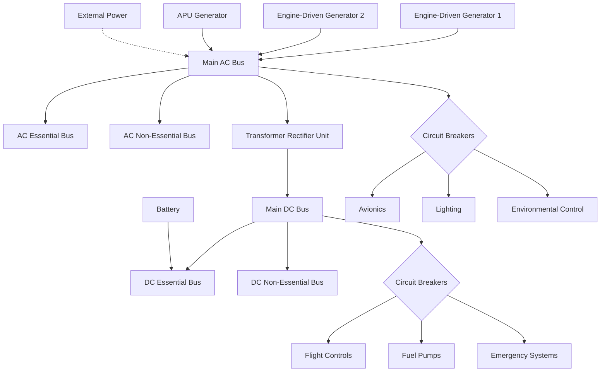
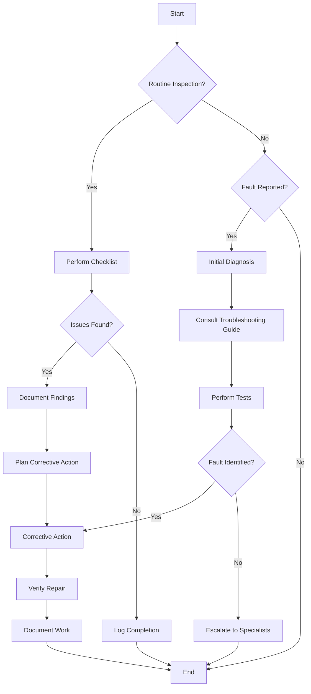
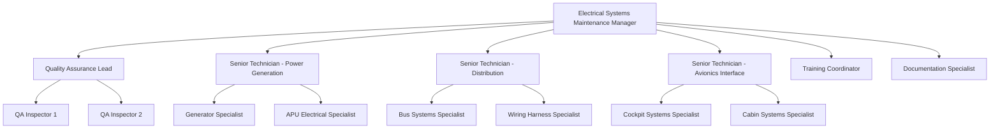

# **FTC_24-00-00-00-000 ATA 24 – Electrical Systems**  
### **Comprehensive Guide for the GAIA AIR – Ampel360XWLRGA Aircraft**

---

## **Version History**

| **Version** | **Date**       | **Author(s)**                  | **Description / Change Notes**                                                        | **Impact on Design** | **Affected Sections** |
|-------------|----------------|--------------------------------|---------------------------------------------------------------------------------------|----------------------|-----------------------|
| 1.0         | 2024-12-29     | Amedeo Pelliccia, ChatGPT, Gemini, Perplexity AI | Creation of the consolidated Electrical Systems document, integrating advanced technologies (AI, Quantum Cybersecurity, Predictive Maintenance, etc.) | High                 | All                   |

---

## **1. Overview of ATA Chapter 24**

### **1.1 Scope and Importance**  
ATA Chapter 24 establishes a framework for the **design**, **operation**, **maintenance**, and **optimization** of an aircraft's electrical systems. The chapter is critical for ensuring:

- **Safety and Redundancy:** Electrical systems power critical avionics, flight controls, and emergency systems, demanding robust fail-safes.  
- **Operational Efficiency:** Optimized power distribution and predictive diagnostics reduce downtime and enhance reliability.  
- **Regulatory Compliance:** Adherence to FAA/EASA standards ensures airworthiness, reliability, and future adaptability.

---

## **2. Core Concepts**

### **2.1 Power Generation and Distribution**
- **Primary Power Sources**: Engine-driven generators and auxiliary power units (APUs).  
- **Secondary Systems**: Batteries and emergency inverters provide backup power.  
- **Distribution Architecture**: Multi-bus systems (e.g., primary AC, essential DC) segregate critical from non-critical loads.

### **2.2 System Monitoring and Control**  
- **Real-Time Displays**: Synoptic panels provide graphical insights into bus voltages, load status, and fault conditions.  
- **Built-In Test Equipment (BITE)**: Self-monitoring systems that log performance and flag anomalies for proactive intervention.

---

## **3. Advanced Features**

### **3.1 AI-Powered Predictive Maintenance**
- **Fault Prediction**: Use of machine learning to analyze trends (e.g., rising current draw) and forecast component wear.  
- **Automated Work Orders**: CMMS integration schedules maintenance automatically based on AI alerts.

### **3.2 Quantum-Safe Cybersecurity**
- **Encryption Protocols**: Adoption of post-quantum cryptographic algorithms to secure power control and data.  
- **Intrusion Detection**: Real-time monitoring systems flag unauthorized access or tampering attempts.

---

## **4. Maintenance Guidelines**

### **4.1 Preventive Checks**
- **Daily/Preflight Tasks**: Inspect breaker panels, monitor generator loads, and verify battery health.  
- **Weekly/Monthly Tasks**: Conduct load tests, wiring inspections, and voltage regulation checks.

### **4.2 Fault Diagnosis and Repair**
- **Diagnostic Tools**: Multimeters, thermal imagers, and BITE logs assist in isolating faults.  
- **Repair Protocols**: Follow structured workflows, including wire splicing, component replacements, and panel recalibration.

---

## **5. Sustainability and Future Integration**

### **5.1 Energy-Efficient Innovations**
- **Lightweight Solar Panels**: Supplement onboard power, reducing APU usage and fuel burn.  
- **Thermoelectric Systems**: Harvest waste heat for auxiliary power generation.

### **5.2 Scalability Across Platforms**
- **Standardized Interfaces**: Plug-and-play modules ensure adaptability for UAVs, eVTOLs, and hybrid-electric aircraft.  
- **High-Voltage Systems**: Preparation for emerging architectures using 270 VDC or beyond for advanced propulsion systems.

---

## **6. Training and Documentation**

### **6.1 Comprehensive Programs**
- **Scenario-Based Training**: Hands-on drills for responding to power failures or major bus faults.  
- **E-Learning Modules**: Digital resources covering electrical theory, troubleshooting, and compliance.

### **6.2 Documentation Alignment**
- **ATA Compliance**: Manuals, schematics, and training guides harmonized with ATA 24 standards for consistency.  
- **Interactive Visual Aids**: Online platforms providing animated fault simulations and maintenance workflows.

---

## **7. Implementation Roadmap**

### **7.1 Metrics for Success**
- **Mean Time Between Failures (MTBF):** Targeting a 20% improvement year-on-year for critical systems.  
- **Training Completion Rates:** 100% certification compliance for maintenance personnel across global MRO facilities.  
- **Operational Downtime:** Reduce AOG events attributable to electrical faults by 30%.

### **7.2 Continuous Feedback**
- **Cross-Functional Reviews:** Quarterly audits incorporating insights from flight crews, technicians, and QA teams.  
- **Live Data Integration:** Use digital twins and predictive analytics to refine maintenance schedules dynamically.

---

## **Interactive Table of Contents**

1. [**24.10 Introduction**](#2410-introduction)  
   - [24.11 Purpose](#2411-purpose)  
   - [24.12 Scope](#2412-scope)  
   - [24.13 Document Structure](#2413-document-structure)  
   - [24.14 Terminology](#2414-terminology)

2. [**24.20 Overview of ATA Chapter 24**](#2420-overview-of-ata-chapter-24)  
   - [24.21 Importance of Electrical Systems](#2421-importance-of-electrical-systems)  
   - [24.22 Principles of Electrical Systems Operation and Maintenance](#2422-principles-of-electrical-systems-operation-and-maintenance)

3. [**24.30 Compliance and Standards**](#2430-compliance-and-standards)  
   - [24.31 Regulatory Requirements](#2431-regulatory-requirements)  
   - [24.32 ATA Standards](#2432-ata-standards)  
   - [24.33 Integration with Risk Assessment](#2433-integration-with-risk-assessment)

4. [**24.40 Application to GAIA AIR Project**](#2440-application-to-gaia-air-project)  
   - [24.41 Electrical System Design and Configuration](#2441-electrical-system-design-and-configuration)  
   - [24.42 Operational Procedures](#2442-operational-procedures)  
   - [24.43 Maintenance and Inspection](#2443-maintenance-and-inspection)  
   - [24.44 Documentation and Reporting](#2444-documentation-and-reporting)

5. [**24.50 Electrical System Maintenance Procedures**](#2450-electrical-system-maintenance-procedures)  
   - [24.51 Preventive Maintenance](#2451-preventive-maintenance)  
   - [24.52 Corrective Maintenance](#2452-corrective-maintenance)  
   - [24.53 Troubleshooting](#2453-troubleshooting)  
     - [24.53.1 Predictive Maintenance Based on AI and Quantum Data](#24531-predictive-maintenance-based-on-ai-and-quantum-data)  
   - [24.54 Component Replacement](#2454-component-replacement)

6. [**24.55 Advanced Systems Maintenance Protocols**](#2455-advanced-systems-maintenance-protocols)  
   *(Structured protocols for solar panels, thermoelectric/magnetoelectric modules, solid-state batteries, MHD propulsion interfaces, etc.)*  

7. [**24.60 Roles and Responsibilities**](#2460-roles-and-responsibilities)  
   - [24.61 Electrical Systems Maintenance Manager](#2461-electrical-systems-maintenance-manager)  
   - [24.62 Maintenance Personnel](#2462-maintenance-personnel)  
   - [24.63 Quality Assurance](#2463-quality-assurance)  
   - [24.64 Flight Crew](#2464-flight-crew)

8. [**24.70 Integration with Other Documents and Systems**](#2470-integration-with-other-documents-and-systems)  
   - [24.71 Dependencies Matrix and Glossary](#2471-dependencies-matrix-and-glossary)  
   - [24.72 Integration with CMMS](#2472-integration-with-cmms)  
   - [24.73 Integration with Other ATA Chapters](#2473-integration-with-other-ata-chapters)  
     - [24.73.1 Digital Twins and Real-Time Data](#24731-digital-twins-and-real-time-data)

9. [**24.80 Training and Awareness**](#2480-training-and-awareness)  
   - [24.81 Electrical Systems Training Programs](#2481-electrical-systems-training-programs)  
   - [24.82 Awareness Campaigns](#2482-awareness-campaigns)

10. [**24.90 Audits and Continuous Improvement**](#2490-audits-and-continuous-improvement)  
    - [24.91 Internal Audits](#2491-internal-audits)  
    - [24.92 Continuous Improvement Process](#2492-continuous-improvement-process)

11. [**24.93 Security (Quantum Cybersecurity for Electrical Systems)**](#2493-security-quantum-cybersecurity-for-electrical-systems)  
    - [24.93.1 Protection of Electrical System Data and Controls](#24931-protection-of-electrical-system-data-and-controls)  
    - [24.93.2 Quantum-Safe Encryption Protocols for Power Management](#24932-quantum-safe-encryption-protocols-for-power-management)  
    - [24.93.3 Intrusion Detection Strategies for Onboard Power Distribution Networks](#24933-intrusion-detection-strategies-for-onboard-power-distribution-networks)  
    - [24.93.4 Security Audits and Compliance Checks](#24934-security-audits-and-compliance-checks)  
    - [24.93.5 Training and Awareness Programs](#24935-training-and-awareness-programs)

12. [**24.94 Sustainability and Circular Economy**](#2494-sustainability-and-circular-economy)  
    - [24.94.1 Strategies to Reduce Power Consumption and Emissions in Electrical Systems](#24941-strategies-to-reduce-power-consumption-and-emissions-in-electrical-systems)  
    - [24.94.2 Lifecycle Considerations for Batteries, Generators, and Wiring Harnesses](#24942-lifecycle-considerations-for-batteries-generators-and-wiring-harnesses)

13. [**24.95 User-System Interaction (Pilot/Crew Interfaces)**](#2495-user-system-interaction-pilotcrew-interfaces)  
    - [24.95.1 Designing User-Friendly Controls and Interfaces for Electrical Systems Panels](#24951-designing-user-friendly-controls-and-interfaces-for-electrical-systems-panels)  
    - [24.95.2 Status Monitoring, Alerts, and Fallback Options for Power Failures](#24952-status-monitoring-alerts-and-fallback-options-for-power-failures)  
    - [24.95.3 Human-Machine Interface (HMI) Design Principles](#24953-human-machine-interface-hmi-design-principles)

14. [**24.96 Cross-Referencing Other ATA Chapters**](#2496-cross-referencing-other-ata-chapters)  
    - [24.96.1 Linkages to ATA 31 (Instruments)](#24961-linkages-to-ata-31-instruments)  
    - [24.96.2 Linkages to ATA 32 (Landing Gear) and ATA 33 (Lights)](#24962-linkages-to-ata-32-landing-gear-and-ata-33-lights)  
    - [24.96.3 Linkages to ATA 72 (Engine Electrical Systems)](#24963-linkages-to-ata-72-engine-electrical-systems)

15. [**24.97 Stakeholder Engagement**](#2497-stakeholder-engagement)  
    - [24.97.1 Collaborative Framework](#24971-collaborative-framework)  
    - [24.97.2 Joint Working Groups](#24972-joint-working-groups)  
    - [24.97.3 Feedback Mechanisms](#24973-feedback-mechanisms)

16. [**24.98 Scalability Across Diverse Platforms**](#2498-scalability-across-diverse-platforms)  
    - [24.98.1 Adaptable Electrical Architecture](#24981-adaptable-electrical-architecture)  
    - [24.98.2 Global Fleet Compatibility](#24982-global-fleet-compatibility)  
    - [24.98.3 Compatibility with Emerging Aviation Technologies (Hybrid-Electric, eVTOL, etc.)](#24983-compatibility-with-emerging-aviation-technologies-hybrid-electric-evtol-etc)

17. [**24.99 Implementation and Next Steps**](#2499-implementation-and-next-steps)  
    - [24.99.1 Visualization Tools](#24991-visualization-tools)  
    - [24.99.2 Training and Change Management](#24992-training-and-change-management)  
    - [24.99.3 Metrics for Success](#24993-metrics-for-success)  
    - [24.99.4 Ecosystem Synergy](#24994-ecosystem-synergy)

18. [**24.100 Human Factors**](#24100-human-factors)  
    - [24.101 Ergonomics of Electrical Systems Maintenance](#24101-ergonomics-of-electrical-systems-maintenance)  
    - [24.102 Reducing Human Error in Operations and Maintenance](#24102-reducing-human-error-in-operations-and-maintenance)  
    - [24.103 Human-Machine Interface (HMI) Design for Electrical Systems](#24103-human-machine-interface-hmi-design-for-electrical-systems)

19. [**24.104 Advanced Energy and Propulsion Systems**](#24104-advanced-energy-and-propulsion-systems)  
    - [24.104.1 Lightweight Solar Panels Embedded in Aerostructures](#241041-lightweight-solar-panels-embedded-in-aerostructures)  
    - [24.104.2 Thermoelectric and Magnetoelectric Systems](#241042-thermoelectric-and-magnetoelectric-systems)  
    - [24.104.3 Solid-State Batteries](#241043-solid-state-batteries)  
    - [24.104.4 Thermohydroelectric/MHD Diffusion Distributed Propulsion](#241044-thermohydroelectricmhd-diffusion-distributed-propulsion)  
    - [24.104.5 Nuclear-Fusion-Based Energy Systems](#241045-nuclear-fusion-based-energy-systems)

20. [**24.110 Case Studies**](#24110-case-studies)  
    - [24.111 Successful Implementation of Electrical Systems Maintenance Programs](#24111-successful-implementation-of-electrical-systems-maintenance-programs)  
    - [24.112 Impact of Technological Advancements on Electrical Systems Efficiency and Reliability](#24112-impact-of-technological-advancements-on-electrical-systems-efficiency-and-reliability)

21. [**24.120 Future Trends**](#24120-future-trends)  
    - [24.121 Advanced Electrical Systems Technologies](#24121-advanced-electrical-systems-technologies)  
    - [24.122 Evolving Regulations and Standards](#24122-evolving-regulations-and-standards)  
    - [24.123 Predictive Maintenance and AI](#24123-predictive-maintenance-and-ai)

22. [**24.130 References**](#24130-references)

23. [**24.140 Visual Aids**](#24140-visual-aids)  
    - [24.141 Electrical Systems Schematic Diagram](#24141-electrical-systems-schematic-diagram)  
    - [24.142 Maintenance Workflow Chart](#24142-maintenance-workflow-chart)  
    - [24.143 Organizational Structure for Electrical Systems Maintenance](#24143-organizational-structure-for-electrical-systems-maintenance)

24. [**24.150 Sample Forms and Templates**](#24150-sample-forms-and-templates)  
    - [24.151 Electrical Systems Maintenance Checklist](#24151-electrical-systems-maintenance-checklist)  
    - [24.152 Electrical Systems Inspection Report Template](#24152-electrical-systems-inspection-report-template)  
    - [24.153 Troubleshooting Log](#24153-troubleshooting-log)

25. [**24.170 Acronyms and Abbreviations**](#24170-acronyms-and-abbreviations)

26. [**24.180 Companion (Introductory Insights)**](#24180-companion-introductory-insights)

27. [**24.190 Generator (Design Solutions)**](#24190-generator-design-solutions)

28. [**24.200 Implementator (Scalability and Operation)**](#24200-implementator-scalability-and-operation)

---

## **24.10 Introduction**

Electrical systems form the backbone of any modern aircraft, ensuring the continuous and reliable supply of power to all onboard systems—from avionics and flight controls to cabin lighting and passenger amenities. In the **GAIA AIR – Ampel360XWLRGA Aircraft**, the Electrical Systems chapter (ATA 24) provides a structured framework for understanding the design, operation, maintenance, and troubleshooting of these critical power networks. This chapter underscores the pivotal role electrical systems play in safety, efficiency, and overall aircraft performance.

### **Key Objectives of ATA 24 – Electrical Systems**

1. **Establishing Standards and Procedures**  
   - Define standardized guidelines for electrical system design, installation, inspection, maintenance, and troubleshooting.  
   - Ensure uniformity across the GAIA AIR fleet, minimizing variability and enhancing safety and reliability.

2. **Enhancing Operational Safety**  
   - Emphasize fail-safe mechanisms, redundancy, and protective devices that safeguard against electrical malfunctions.  
   - Outline procedures for normal and emergency electrical system operations, ensuring crew preparedness under all flight conditions.

3. **Promoting Efficiency and Reliability**  
   - Detail best practices for managing power generation, distribution, and load allocation to optimize aircraft performance.  
   - Present approaches to preventive and predictive maintenance, minimizing downtime and preserving system integrity.

4. **Adhering to Regulatory and Industry Standards**  
   - Demonstrate compliance with relevant FAA/EASA regulations and ATA standards, ensuring that all procedures and components meet rigorous airworthiness criteria.  
   - Integrate sustainability and quantum-safe cybersecurity measures in accordance with emerging technological and regulatory requirements.

By providing comprehensive guidance—covering everything from component-level details to high-level integration—the Electrical Systems chapter serves as a reference for engineers, maintenance personnel, flight crews, and quality assurance teams. Through systematic documentation and continuous improvement practices, this ATA 24 chapter ensures that the **GAIA AIR – Ampel360XWLRGA Aircraft** maintains robust, efficient, and forward-looking electrical power solutions that uphold the highest standards of aviation safety and reliability.
### **24.11 Purpose**
*(Define clear objectives for the Electrical Systems documentation, covering safety, reliability, compliance, etc.)*

### **24.12 Scope**
*(Outline the scope of coverage—components, phases of lifecycle, interactions, and any exclusions.)*

### **24.13 Document Structure**
*(Explain how the document is organized, referencing the sections and how they interrelate.)*

### **24.14 Terminology**
*(List key terms and acronyms relevant to ATA 24 – Electrical Systems.)*

---

## **24.20 Overview of ATA Chapter 24**

### **24.21 Importance of Electrical Systems**

Electrical systems are the lifeblood of modern aircraft, supplying power to a wide range of vital functions that ensure safe, efficient, and comfortable flight operations. Within the **GAIA AIR – Ampel360XWLRGA Aircraft**, ATA Chapter 24 provides the framework and guidelines for understanding and managing these systems, which have become increasingly sophisticated and integral to nearly every aspect of aircraft performance. Below are key reasons why electrical systems are of paramount importance:

1. **Foundation of Safety**  
   - **Critical Systems Support:** Electrical power is essential for operating flight controls, avionics, navigation equipment, and safety features such as emergency lighting and alerts. Any disruption in electrical supply can directly affect the aircraft’s ability to operate safely.  
   - **Redundancy and Fail-Safe Mechanisms:** Modern electrical architectures are designed with multiple power sources and distribution pathways to ensure continuity of supply, even in the event of partial failures. These redundancies enhance overall safety margins.

2. **Operational Efficiency**  
   - **Optimal Power Allocation:** Efficient electrical generation and distribution allow for better load management, ensuring that each onboard system receives stable and adequate power according to flight phase demands. This reduces the risk of overloads and system malfunctions.  
   - **Advanced Technologies Integration:** As aircraft incorporate more high-tech systems (e.g., in-flight entertainment, advanced avionics), reliable electrical systems become central to supporting these capabilities without compromising performance or safety.

3. **Enhanced Passenger and Crew Experience**  
   - **Cabin Comfort and Amenities:** Electrical systems power everything from cabin lighting and climate control to in-flight entertainment, directly impacting passenger comfort and satisfaction.  
   - **Communication and Connectivity:** In today’s connected aviation environment, robust electrical systems enable passenger Wi-Fi services, real-time data link communications, and other conveniences that enhance the overall travel experience for both passengers and crew.

4. **Compliance and Airworthiness**  
   - **Regulatory Requirements:** Adhering to FAA/EASA regulations and industry standards (e.g., ARINC, RTCA) ensures electrical systems meet strict airworthiness criteria. Compliance includes considerations for design, testing, reliability, and maintenance procedures.  
   - **Sustainability and Innovation:** As the industry shifts toward more sustainable and technologically advanced solutions (e.g., electrified propulsion components, quantum-safe cybersecurity), electrical systems must evolve to meet these emerging requirements while maintaining safety and reliability.

5. **Maintenance and Predictive Management**  
   - **Preventive Maintenance:** Regular inspections, monitoring, and servicing of electrical components are critical for spotting early signs of wear or failure, reducing unplanned downtime and enhancing operational readiness.  
   - **Predictive Analytics:** Integration of AI and data analytics allows for real-time diagnostics, enabling proactive detection of anomalies in electrical loads and components. This foresight minimizes disruptions and extends the operational life of electrical systems.

---

#### **Key Takeaways**  
- **Safety Backbone:** Reliable power ensures core flight operations and critical safety features remain continuously functional.  
- **Operational Gains:** Optimized power distribution and predictive maintenance lower costs, reduce downtime, and improve overall flight efficiency.  
- **Passenger-Centric Benefits:** Consistent electrical power underpins cabin services and emerging connected flight technologies, boosting satisfaction and airline reputation.  
- **Future-Proof Design:** Robust electrical systems are essential for adopting new aviation trends—ranging from more-electric aircraft architectures to quantum-resistant cybersecurity solutions.

By comprehensively addressing the design, operation, and maintenance of aircraft electrical systems, ATA Chapter 24 ensures the **GAIA AIR – Ampel360XWLRGA Aircraft** maintains the high standards of safety, efficiency, and innovation demanded by modern aviation.

### **24.22 Principles of Electrical Systems Operation and Maintenance**

Electrical systems in modern aircraft are designed around a set of core principles that ensure consistent power generation, safe distribution, efficient load management, and robust fault protection. These principles allow the **GAIA AIR – Ampel360XWLRGA Aircraft** to maintain reliable operations across various flight conditions, safeguarding both safety and performance. Below is an overview of the key concepts underpinning electrical system operation and maintenance.

---

#### **1. Power Generation**
- **Engine-Driven Generators:** Aircraft typically use engine-driven generators (or alternators) as the primary source of electrical power. These generators convert mechanical energy from the engines into electrical energy. The power output and frequency are carefully regulated to ensure compatibility with onboard systems.
- **Auxiliary Power Units (APUs):** Many aircraft include an APU to provide electrical power (and sometimes pneumatic power) during ground operations or if the main engine-driven generators fail. APUs enhance self-sufficiency and reduce reliance on ground-based power sources.
- **Emerging Technologies:** As the industry explores alternative power sources (e.g., fuel cells, advanced batteries, solar-assisted systems), future electrical architectures may become more varied and distributed.

#### **2. Power Distribution**
- **Bus Systems:** Electrical buses serve as the central nodes for distributing power to various aircraft subsystems. These bus systems are typically divided by importance (e.g., primary, secondary, emergency) to prioritize critical loads.  
- **Load Shedding:** In scenarios where power is limited or an overload occurs, certain non-critical or lower-priority systems are automatically shed from the main buses to preserve power for essential functions (e.g., flight controls, cockpit instruments).
- **Control and Protection:** Circuit breakers, switches, and relays manage the flow of electricity across these buses. Modern aircraft may also incorporate digital control systems (e.g., power distribution units) to automate fault protection and optimize load distribution.

#### **3. Load Management**
- **Load Analysis and Prioritization:** The aircraft’s electrical system is designed to support multiple phases of flight, each with differing power demands (e.g., engine start, normal cruise, approach). Engineers and operators analyze load profiles to ensure no excessive draws that could compromise safety or performance.
- **Peak Demand Handling:** During periods of high demand—such as takeoff or when powering large electrical subsystems—load management strategies ensure that generators and bus systems can handle transient spikes without risking voltage or frequency instability.
- **Monitoring and Feedback:** Real-time monitoring of electrical loads and bus voltages allows operators and automated systems to make adjustments or take corrective actions (e.g., load shedding, power source reconfigurations) promptly.

#### **4. Fault Protection and Safety**
- **Circuit Protection Devices:** Circuit breakers, fuses, and current limiters detect overloads or short circuits, interrupting power flow to prevent damage or fire hazards. Modern aircraft may use resettable electronic circuit breakers that can be monitored and controlled via cockpit or maintenance terminals.
- **Automatic Reconfiguration:** Some electrical systems incorporate logic that automatically isolates faulty components or buses, rerouting power to maintain essential functions. This prevents single failures from cascading throughout the electrical network.
- **Arc-Fault Detection:** Advanced detection systems identify arcing conditions that could pose fire risks in wiring. These systems trigger protective devices or pilot alerts, allowing prompt intervention.

#### **5. Redundancy and Reliability**
- **Multiple Power Sources:** Aircraft commonly employ more than one generator per engine, along with an APU or backup batteries, ensuring continuous power even if a primary source fails.  
- **Segregated Bus Architectures:** Separating essential buses from non-critical ones safeguards against a single-point failure that could disable critical loads.  
- **Component Overlapping:** Redundant wiring, backup relays, and alternate feeders help sustain operations if any single element in the power distribution path fails.

#### **6. Maintenance Best Practices**
- **Preventive Inspections:** Regular visual checks, functional tests, and thermal inspections of wiring, connectors, and power generation units help identify early signs of degradation.  
- **Predictive Analytics:** Integration of data analytics and condition-monitoring sensors can identify anomalies in current draw, voltage stability, and component temperatures, enabling proactive maintenance scheduling.  
- **Testing and Calibration:** Regular calibration of voltage regulators, generator controls, and protective devices ensures accurate performance. Post-maintenance verification tests confirm system integrity and reliability.  
- **Documentation and Traceability:** Detailed logs of inspections, repairs, and part replacements foster consistent communication across maintenance teams and enable compliance with regulatory requirements.

---

#### **Key Takeaways**  
1. **Robust Power Generation & Distribution:** Engine-driven generators, APUs, and strategically designed bus systems ensure dependable power under diverse operational scenarios.  
2. **Prioritized Loads & Protective Measures:** Load shedding and circuit protection devices guard against overloads, preserving power for essential functions.  
3. **Redundancy & Reliability:** Multiple power sources, segregated buses, and automated reconfiguration ensure critical loads remain powered, even during component failures.  
4. **Proactive Maintenance:** A combination of periodic inspections, predictive analytics, and thorough documentation maintains high availability and compliance standards, preventing unexpected downtime.

By adhering to these principles, the **GAIA AIR – Ampel360XWLRGA Aircraft** upholds safe, efficient, and reliable electrical system performance, aligning with global aviation regulations and industry best practices.

---

### **24.31 Regulatory Requirements**

Ensuring that an aircraft’s electrical systems meet rigorous standards and regulations is critical for safe and reliable operations. In the context of the **GAIA AIR – Ampel360XWLRGA Aircraft**, compliance with various regulatory authorities and industry standards under ATA Chapter 24 is paramount. Below is an overview of the key regulations, guidelines, and standards that govern aircraft electrical systems.

---

#### **1. Federal Aviation Administration (FAA)**

1. **Title 14, Code of Federal Regulations (14 CFR)**
   - **14 CFR Part 23/25** (depending on aircraft category):  
     Specifies airworthiness standards for normal, utility, acrobatic, commuter (Part 23) or transport category (Part 25) airplanes. Includes requirements for electrical power generation, distribution, and protection.

2. **FAA Advisory Circulars (ACs)**
   - **AC 25.1351-1** (as applicable):  
     Provides acceptable means for demonstrating compliance with power system design, ensuring the system can safely handle overload, fault conditions, and maintain essential power availability.
   - **AC 20-136 (or equivalent)**:  
     Offers guidance on protection against high-intensity radiated fields (HIRF) and electromagnetic interference (EMI), crucial for modern electrical and avionics systems.
   - **AC 43.13-1B/2B** (Acceptable Methods, Techniques, and Practices):  
     References recommended practices for wiring, cable routing, and general electrical maintenance to ensure safety and reliability.

3. **Technical Standard Orders (TSOs)**
   - **TSO-C** Series (e.g., TSO-C74, TSO-C110, etc.):  
     Establish performance standards for specific electrical equipment (e.g., generators, static inverters). Each TSO details required testing, design criteria, and documentation.

---

#### **2. European Union Aviation Safety Agency (EASA)**

1. **Certification Specifications (CS)**
   - **CS-23/CS-25**:  
     EASA’s equivalent to FAA Parts 23 and 25, detailing airworthiness requirements for small and large aircraft. Contains electrical system criteria similar to FAA regulations.
   - **CS-E** (Engines) and **CS-P** (Propellers), as applicable:  
     While focusing on engines and propellers, these specifications also reference electrical system interactions relevant to power generation and control.

2. **EASA Guidance Material**
   - **AMC (Acceptable Means of Compliance) and GM (Guidance Material):**  
     Supplements and clarifies the CS requirements, offering methods and examples for achieving compliance in electrical system design, testing, and maintenance.

---

#### **3. RTCA (Radio Technical Commission for Aeronautics)**

1. **RTCA DO-160**  
   - **Environmental Conditions and Test Procedures for Airborne Equipment**:  
     Defines test procedures for verifying that electrical (and electronic) equipment can withstand environmental stresses (temperature, vibration, altitude), along with EMI/EMC thresholds. Compliance is critical for ensuring that electrical components function reliably under all flight conditions.

2. **RTCA DO-178C / DO-254** (when applicable)  
   - **DO-178C**: Governs software considerations in airborne systems. While primarily focused on software, it can apply to digital control units managing electrical distribution or protective devices.  
   - **DO-254**: Addresses design assurance for airborne electronic hardware, ensuring reliability and safety in complex electrical components.

---

#### **4. International and Industry Standards**

1. **SAE (Society of Automotive Engineers) / SAE International**
   - **ARP** and **AS** Series (e.g., ARP4754A):  
     Guidelines for the development of civil aircraft and systems, including processes for electrical system design, verification, and integration.

2. **ISO (International Organization for Standardization)**
   - **ISO 1540 / 7164** (or equivalents):  
     May be referenced for specific electrical safety and quality standards, although aviation-specific documents typically take precedence.

3. **IEC (International Electrotechnical Commission)**
   - **IEC 60068 Series**:  
     Environmental testing standards that can supplement DO-160 requirements. Some aviation stakeholders integrate these for additional robustness checks.

---

#### **5. Key Regulatory Focus Areas**

1. **System Safety and Fail-Safe Design**
   - Regulators require electrical systems to exhibit fail-safe or fail-operational characteristics, ensuring critical functions remain powered even after certain failures.

2. **Fault Protection and Circuit Breakers**
   - FAA/EASA regulations mandate protective devices (e.g., fuses, circuit breakers) be properly rated to prevent fires, short circuits, or over-voltage conditions.

3. **EMI/EMC Compliance**
   - Aircraft electrical systems must be tested against electromagnetic interference (EMI) and electromagnetic compatibility (EMC) standards to prevent cross-system disturbances. DO-160 outlines specific categories and test levels.

4. **Lightning and HIRF Protection**
   - Aircraft must demonstrate resilience to lightning strikes and high-intensity radiated fields. This involves specific bonding, grounding, and shielding measures as detailed in AC and EASA AMC documents.

5. **Wiring and Cable Management**
   - Both FAA ACs and EASA guidelines emphasize proper wire routing, segregation of critical circuits, and robust connector designs to mitigate chafing, moisture ingress, and other common wire-related hazards.

6. **Maintenance and Record-Keeping**
   - Maintenance manuals (MM), Instructions for Continued Airworthiness (ICA), and other documentation must meet the guidance in AC 43.13 and equivalent EASA materials, ensuring standardization in inspection intervals, torque values, and replacement criteria.

---

#### **6. Compliance Demonstration**

1. **Certification Tests and Analyses**
   - Power system performance, fault tolerance, and environmental resilience are demonstrated through qualification tests (e.g., DO-160 procedures) and system-level analyses (e.g., Failure Modes and Effects Analysis, FMEA).

2. **Documentation and Traceability**
   - Regulators require clear traceability from design requirements through testing, culminating in compliance reports and supporting data. Thorough documentation ensures that every circuit, component, and wire meets recognized standards.

3. **Audits and Conformity Inspections**
   - Authorities (FAA, EASA) may conduct audits or conformity inspections to verify that the aircraft’s electrical system design and manufacturing align with approved data. Compliance with RTCA DO-160, for instance, must be verifiable via test reports and associated documentation.

---

### **Key Takeaways**

- **Multi-Agency Alignment:** The **GAIA AIR – Ampel360XWLRGA Aircraft** must simultaneously satisfy FAA, EASA, and other applicable authority requirements for electrical system certification.  
- **Robust Testing Regime:** Adherence to **RTCA DO-160** environmental and EMC tests is crucial for equipment qualification.  
- **Holistic Compliance:** Ensuring safe operation involves system-wide considerations: redundancy, wiring standards, protective devices, electromagnetic compatibility, and thorough documentation.  
- **Life-Cycle Perspective:** Maintenance manuals and continuing airworthiness instructions must reflect evolving standards and best practices, ensuring ongoing compliance and safety throughout the aircraft’s operational life.

By meeting these regulatory requirements and aligning with recognized industry standards, the **GAIA AIR – Ampel360XWLRGA Aircraft** achieves a high level of electrical system safety, reliability, and performance—ultimately supporting safe flight operations under various conditions.

### **24.32 ATA Standards**

Standardization under **ATA Chapter 24** is essential to maintain uniformity, clarity, and reliability in the documentation and maintenance of aircraft electrical systems. Adhering to these standards ensures that all personnel—engineers, technicians, and flight crew—have a consistent framework for managing electrical components, troubleshooting problems, and performing both scheduled and unscheduled maintenance tasks. Below is an overview of how ATA Chapter 24 structures documentation and maintenance for electrical systems.

---

#### **1. Purpose and Scope of ATA Chapter 24**

1. **Centralized Reference**  
   - **Documentation Consistency:** ATA Chapter 24 consolidates all information relevant to aircraft electrical systems, ensuring that every aspect of design, operation, and maintenance is addressed in a single, standardized chapter.  
   - **Lifecycle Coverage:** It covers all phases, from initial installation and testing to in-service maintenance and eventual decommissioning or upgrade of electrical components.

2. **Uniformity Across Aircraft Types**  
   - **Interchangeability:** By providing a common set of guidelines, ATA Chapter 24 allows for more straightforward application across different aircraft models within a fleet, facilitating easier maintenance scheduling and part replacement.  
   - **Training Consistency:** Maintenance and engineering teams can apply the same fundamental principles and procedures across multiple aircraft types, reducing errors and enhancing overall efficiency.

---

#### **2. Structured Documentation and Coding**

1. **ATA iSpec 2200**  
   - **Documentation Framework:** ATA iSpec 2200 outlines how aircraft manuals (e.g., maintenance manuals, troubleshooting guides) should be structured, coded, and formatted. This approach ensures that any document referencing electrical systems falls under Chapter 24, using a standardized layout and numbering system.  
   - **Modular Organization:** Maintenance tasks, procedures, and technical data are broken down into subchapters and sections (e.g., 24-20, 24-30) covering specific topics like power generation, distribution, wiring, etc.

2. **Task Numbering and Cross-Referencing**  
   - **Simplified Search:** Maintenance tasks and system procedures are assigned unique numbers. For example, a wiring inspection procedure might be referenced as 24-21-00, guiding technicians directly to the relevant documentation.  
   - **Cross-System Consistency:** When electrical subsystems interface with other ATA chapters (e.g., Chapter 27—Flight Controls or Chapter 28—Fuel), the standardized codes help technicians quickly identify related procedures.

3. **Maintenance/Overhaul Manuals (MOM) and Wiring Diagram Manuals (WDM)**  
   - **Detailed Procedures:** ATA 24-based manuals outline step-by-step instructions for maintenance, inspection, and overhaul tasks specific to electrical components.  
   - **Wiring Diagram Standardization:** All wiring diagrams, harness routings, and connector pinouts follow a consistent style and labeling convention, aiding diagnosis and repair efforts.

---

#### **3. Maintenance Philosophy Under ATA Chapter 24**

1. **Preventive and Scheduled Maintenance**  
   - **Inspection Intervals:** ATA 24 documentation provides guidelines for recommended inspection intervals based on operational hours, flight cycles, and specific system performance criteria.  
   - **Checklists and Forms:** Standardized forms and checklists (e.g., daily checks, weekly, or phase checks) ensure thoroughness and uniform coverage of electrical system inspections.

2. **Corrective and On-Condition Maintenance**  
   - **Troubleshooting Logic:** Manuals include systematically arranged troubleshooting trees, aiding technicians in isolating faults (e.g., short circuits, open circuits, bus failures) in an efficient, uniform manner.  
   - **Condition Monitoring:** With advanced diagnostic systems (BITE—Built-In Test Equipment), ATA 24 documentation specifies the recommended approaches for reading fault codes, investigating anomalies, and deciding on replacement or repair strategies.

3. **Work Card Standards**  
   - **Clear Instructions:** Each maintenance task referenced in Chapter 24 is translated into a ‘work card’ or job instruction card, detailing labor hours, required tools, and skill levels.  
   - **Safety Emphasis:** ATA 24 highlights safety precautions, including lockout/tagout procedures, grounding requirements, and proper handling of live electrical circuits.

---

#### **4. Integration with Other ATA Chapters and Systems**

1. **Cross-Referencing**  
   - **Power Dependencies:** Electrical systems often tie into avionics (Chapter 34—Navigation), cockpit displays (Chapter 31—Instruments), and other subsystems. ATA 24 cross-references these chapters, ensuring a cohesive view of interrelated tasks.  
   - **Configuration Management:** Documentation includes references to software versions, electronic component part numbers, and configuration control processes, aligning with chapters that cover avionics and software (e.g., ATA 45—Central Maintenance System).

2. **Digital Tools and CMMS**  
   - **Electronic Documentation:** Many operators use computerized maintenance management systems (CMMS) that link ATA 24-coded tasks directly to scheduling and inventory modules. This enables automatic work order generation based on flight hours, cycles, or real-time condition monitoring.  
   - **Data Sharing:** Standardization under ATA Chapter 24 simplifies data exchange between systems, fostering better reporting, analytics, and trend monitoring (e.g., for reliability programs or predictive maintenance).

---

#### **5. Consistency and Quality Assurance**

1. **Auditing and Compliance**  
   - **Regulatory Alignment:** Aligning with ATA 24 helps operators demonstrate to regulatory authorities (FAA, EASA) that their maintenance documentation and practices meet recognized industry standards.  
   - **Continuous Improvement:** Regular audits and feedback loops identify where documentation or procedures might need updates—ATA 24’s modular structure facilitates amendments or revisions without overhauling unrelated sections.

2. **Training and Certification**  
   - **Harmonized Curriculum:** Training programs can rely on ATA 24 content to teach consistent practices and procedures for electrical system maintenance.  
   - **Skill Validation:** Certifying technicians to ATA 24 standards ensures they have the knowledge to safely and accurately maintain electrical systems.

3. **Lifecycle Support**  
   - **Change Control:** As aircraft receive retrofits, modifications, or system upgrades, ATA 24 documentation is updated accordingly, keeping the maintenance community informed of new wiring, components, or procedures.  
   - **End-of-Service Management:** Standardized documentation simplifies the process when retiring or parting out aircraft, as electrical system information remains clearly delineated in ATA 24 manuals.

---

### **Key Takeaways**

- **Holistic Framework:** ATA Chapter 24 provides an all-encompassing structure for electrical system documentation and maintenance—spanning initial design, operational checks, troubleshooting, and upgrades.  
- **Efficiency and Accuracy:** By coding and organizing all electrical procedures under a uniform system, technicians can quickly locate relevant information, reducing the risk of error and streamlining maintenance timelines.  
- **Interoperability:** Standardization under ATA 24 facilitates better integration with other aircraft systems, especially in modern, digitally managed fleets.  
- **Regulatory Compliance:** Embracing the ATA 24 framework supports operators in meeting FAA/EASA requirements, contributing to overall aviation safety and reliability.

By rigorously following ATA Chapter 24 standards, the **GAIA AIR – Ampel360XWLRGA Aircraft** ensures consistent, safe, and efficient management of its electrical systems across their entire operational lifecycle.

### **24.33 Integration with Risk Assessment**

In the context of **ATA Chapter 24 – Electrical Systems**, risk-based assessments play a crucial role in ensuring the safety, reliability, and continuous airworthiness of an aircraft’s electrical architecture. By systematically identifying potential hazards, evaluating the likelihood and severity of failures, and implementing targeted mitigation strategies, operators and manufacturers can proactively minimize risks associated with design, operation, and maintenance. Below is an overview of how risk-based assessments are applied in electrical system management.

---

#### **1. Risk Assessment in Electrical System Design**

1. **Failure Modes and Effects Analysis (FMEA)**
   - **Hazard Identification:** During the design phase, engineers perform FMEA to pinpoint possible failure modes within electrical subsystems (e.g., power generation, distribution, wiring).  
   - **Severity and Likelihood Classification:** Each potential failure mode is scored based on the severity of its impact (e.g., minor inconvenience, hazardous condition) and its likelihood.  
   - **Design Safeguards:** Depending on the risk level, engineers incorporate fail-safe designs, redundancy, or specialized protection devices (e.g., circuit breakers, ground-fault interrupters) to reduce or eliminate identified hazards.

2. **Functional Hazard Assessment (FHA)**
   - **System-Level Evaluation:** FHA examines how electrical system faults could propagate to higher-level aircraft operations (e.g., flight controls, avionics), identifying any critical interfaces.  
   - **Architectural Redundancies:** Where FHA identifies critical single points of failure, designers introduce parallel power sources or alternative power routes to maintain essential loads, ensuring continuous function of safety-critical systems.

3. **Regulatory Alignment**  
   - **Compliance with FAA/EASA Rules:** Electrical system designs must meet regulatory standards (e.g., CS-23/25, 14 CFR Part 23/25). These rules often mandate thorough hazard assessments to ensure no single electrical fault can compromise overall flight safety.  
   - **Use of Industry Standards:** Operators and manufacturers typically align with RTCA DO-160 (Environmental Conditions and Test Procedures) to validate how electrical systems handle various environmental stressors.

---

#### **2. Operational Risk Assessment**

1. **Probabilistic Safety Analysis (PSA)**
   - **Quantitative Methods:** Operators may employ probabilistic methods (e.g., fault trees, event trees) to estimate the overall probability of electrical system failures leading to incidents or accidents.  
   - **Risk Acceptance Criteria:** Results are compared against established safety thresholds (e.g., 10^-7 events per flight hour for catastrophic outcomes), guiding whether additional mitigations or operational restrictions are required.

2. **Load Management and Prioritization**
   - **Essential vs. Non-Essential Loads:** Risk assessments identify which systems must remain powered in emergencies. Operators use this information to structure load-shedding or load-prioritization procedures, ensuring critical avionics and cockpit instruments are always powered.  
   - **Monitoring Power Quality:** Operational assessments help determine acceptable power quality limits (voltage, frequency, harmonic distortion) to prevent damage to sensitive electronics.

3. **Real-Time Monitoring**
   - **Sensor Networks:** Advanced electrical systems incorporate sensors and diagnostic units (BITE—Built-In Test Equipment) to track performance in flight. If readings deviate from risk thresholds, cockpit alerts or automatic reconfigurations reduce the chance of a cascading failure.  
   - **Data-Driven Insights:** Historical and real-time data (e.g., generator output trends, bus voltage fluctuations) feed into risk models, refining maintenance intervals and early warning thresholds.

---

#### **3. Maintenance Planning and Risk Mitigation**

1. **Condition-Based and Predictive Maintenance**  
   - **Data Collection:** Maintenance teams collect performance metrics (voltage stability, component temperature, insulation resistance) to gauge system health.  
   - **Predictive Analytics:** AI or machine learning models analyze historical data, identifying patterns that precede failures. This proactive approach flags components at elevated risk of malfunction, prompting targeted inspections or part replacements.

2. **Scheduled Inspections and Intervals**  
   - **Criticality-Based Intervals:** Risk assessment determines inspection frequency—critical electrical buses or high-load circuits may require shorter inspection cycles.  
   - **Task Prioritization:** Maintenance documentation highlights tasks with higher risk potential (e.g., wiring integrity checks near heat sources), focusing resources on the most safety-critical areas first.

3. **Redundancy Validation**  
   - **Testing Backup Systems:** Maintenance procedures include testing backup generators, battery systems, and alternate power distribution paths to confirm they engage seamlessly upon main system faults.  
   - **Fault Simulation:** Periodic fault-simulation exercises verify that when a specific failure occurs, the electrical network isolates or reconfigures as designed, preventing the risk from escalating.

---

#### **4. Continuous Improvement Through Risk Feedback Loops**

1. **Incident and Event Reporting**  
   - **Data Collection:** Electrical anomalies detected in flight or on the ground are logged in the operator’s safety management system (SMS).  
   - **Root Cause Analysis (RCA):** Post-incident investigations feed back into the risk assessment process, refining design assumptions and maintenance strategies.

2. **Regulatory and Industry Collaboration**  
   - **Shared Learnings:** Operators and manufacturers share data on electrical incidents (e.g., arcing events, bus failures) through industry forums, enhancing global awareness of emerging risks.  
   - **Standard Revisions:** If trends indicate recurring hazards, authorities or industry bodies (e.g., SAE, RTCA, EUROCAE) may update standards or recommend design changes to reduce risk.

3. **Adaptive Risk Thresholds**  
   - **Real-Time Updates:** As new electrical system features (e.g., more electric aircraft concepts) and data sources become available, risk models adapt, setting new thresholds for reliability or hazard severity.  
   - **Dynamic Maintenance Schedules:** Operators may adjust check intervals or incorporate new test procedures when data suggests evolving failure modes.

---

### **Key Takeaways**

- **Holistic Risk Evaluation:** Risk-based assessments in electrical systems encompass the entire lifecycle—from design and certification to day-to-day operations and maintenance scheduling.  
- **Safety and Redundancy:** Ensuring multiple layers of redundancy, designing for failure containment, and structuring essential power loads around critical functions are core risk management strategies.  
- **Data-Driven Approaches:** Continuous monitoring, predictive maintenance, and feedback loops enable operators to refine risk assessments and maintain high levels of electrical system reliability.  
- **Regulatory Compliance:** Meeting FAA/EASA standards often mandates rigorous risk evaluations (e.g., FMEA, FHA), thus integrating risk assessment directly into the design and operational framework of aircraft electrical systems.

By rigorously incorporating risk-based methodologies, the **GAIA AIR – Ampel360XWLRGA Aircraft** and other modern fleets ensure that electrical systems remain robust, resilient, and capable of meeting safety requirements in an ever-evolving aviation environment.

---

Below is a **sample subsection** reflecting how **lightweight solar panels** can be integrated into an aircraft’s electrical systems under **ATA 24** guidelines. You can include it in your documentation as-is or modify it according to your specific fleet and operational procedures.

---

### **24.41 Electrical System Design and Configuration**

The **GAIA AIR – Ampel360XWLRGA Aircraft** features a robust and carefully engineered electrical system designed to ensure reliable power generation, efficient distribution, and effective fault protection. This section provides an overview of the aircraft’s electrical architecture, highlighting the key components—such as distribution buses, generators, and batteries—and their interrelationships within the overall system.

---

#### **24.41.1 Overall Electrical Architecture**

1. **Dual-Bus Structure**  
   - **Primary Bus (Main AC/DC Systems):**  
     - Supplies power to the majority of aircraft systems, including avionics, lighting, and cabin equipment.  
     - Typically sourced by engine-driven generators and backed by external ground power or auxiliary power units (APUs).  
     - Equipped with protective devices (e.g., circuit breakers, current limiters) to isolate faults and prevent cascading failures.  
   - **Essential Bus:**  
     - Powers critical systems that must remain operational under all circumstances (e.g., flight controls, key avionics, emergency lighting).  
     - Receives prioritized power from dedicated sources (e.g., standby generator, battery backup) to ensure operation during main generator failures or severe electrical faults.  
     - Designed with higher redundancy and closer fault monitoring to minimize downtime.

2. **AC/DC Conversion**  
   - **Integrated Power Converters:**  
     - Convert high-voltage AC (HVAC) from engine-driven generators to appropriate DC voltages (28 VDC, ±270 VDC, etc.) for various subsystems.  
     - Include power rectifiers and regulators to maintain consistent output under varying engine speeds and loads.  
   - **Power Distribution Units (PDUs):**  
     - Centralized units controlling power flow to each bus, monitoring both AC and DC lines.  
     - Provide load balancing and automatic shedding logic to handle sudden changes in power demand or generator fluctuations.

3. **Monitoring and Control**  
   - **Electrical Control Panel (ECP):**  
     - Located in the cockpit or electronics bay, enabling flight crews and maintenance personnel to view system status, switch power sources, and isolate faulty lines.  
   - **Built-In Test Equipment (BITE):**  
     - Continually monitors the health of electrical components and buses.  
     - Alerts crews to potential malfunctions through fault codes or annunciators, facilitating proactive maintenance.

---

#### **24.41.2 Generators and Power Sources**

1. **Engine-Driven Generators**  
   - **Main Generators:**  
     - Typically mounted on each engine, providing primary AC power during flight.  
     - Rated to supply enough current for all essential and non-essential systems under normal operation.  
     - Incorporate generator control units (GCUs) for voltage regulation and protective functions (over/under-voltage, over-frequency).  
   - **Auxiliary Power Unit (APU) Generator (If Installed):**  
     - Serves as an additional power source on the ground or in flight for backup or supplemental power.  
     - Often used to start engines, power cabin systems during pre-flight, or provide redundancy in flight should a main generator fail.

2. **Standby/Backup Generators**  
   - **Emergency or Standby Generator:**  
     - Activated automatically if primary generators fail or when the aircraft experiences significant electrical faults.  
     - Supplies power primarily to the **Essential Bus**, maintaining critical systems operational.  
   - **Variable Speed Constant Frequency (VSCF) or Integrated Drive Generators (IDGs):**  
     - May be employed to maintain stable AC output regardless of engine RPM variations.  
     - Include mechanical or electronic means to keep frequency constant, ensuring sensitive avionics receive clean power.

3. **Ground Power and External Sources**  
   - **Ground Power Units (GPU):**  
     - Provide AC or DC power to the aircraft for maintenance, cabin conditioning, or engine starts without running the APU or engines.  
   - **Interlocks and Safeties:**  
     - Prevent simultaneous connection of external power with onboard generators if not properly synchronized, avoiding system conflicts.

---

#### **24.41.3 Battery Systems**

1. **Main Aircraft Batteries**  
   - **Type and Chemistry:**  
     - Commonly sealed lead-acid or Ni-Cd batteries, though newer designs may employ lithium-based chemistries for reduced weight and improved performance.  
   - **Primary Functions:**  
     - Supply power during engine starts, bridging any gaps between external sources and generator availability.  
     - Provide emergency power to critical systems (e.g., flight instruments, communication radios) during generator or bus failures.  
   - **Battery Control Unit (BCU):**  
     - Monitors battery voltage, current, and temperature.  
     - Prevents overcharging or deep discharging through built-in protective logic.

2. **Backup/Emergency Batteries**  
   - **Dedicated Essential Power:**  
     - Additional small-capacity batteries ensure vital instrumentation and flight controls remain powered if all other power sources are lost.  
   - **Autonomous Management:**  
     - Automatically engage in the event of a main battery failure or depletion, extending the window for safe landing or system recovery.

3. **Battery Monitoring and Maintenance**  
   - **Periodic Checks:**  
     - Regular inspection schedules for battery health, including voltage checks, specific gravity tests (for lead-acid), or capacity checks (for Ni-Cd/Li-ion).  
   - **Thermal Management:**  
     - Cooling systems or built-in temperature sensors prevent battery overheating and potential thermal runaway, a critical safety consideration for high-energy batteries (e.g., lithium-ion).

---

#### **24.41.4 Distribution Bus Configuration**

1. **AC Buses**  
   - **Primary AC Bus:**  
     - Distributes AC power from main engine generators or APU to most onboard systems.  
     - Equipped with bus tie breakers that manage power flow between left/right generators.  
   - **Essential AC Bus:**  
     - Supplies power to essential flight systems requiring AC power—such as certain avionics, instrumentation, or specialized cooling fans.  
     - Typically isolated from non-essential loads to prioritize operational continuity.

2. **DC Buses**  
   - **Main DC Bus:**  
     - Receives rectified output from AC generators or from dedicated DC generators.  
     - Powers the majority of DC-driven systems (lighting, pumps, actuators, simpler avionics).  
   - **Essential DC Bus:**  
     - Reserved for critical DC loads, ensuring uninterrupted power to flight-critical circuits.  
     - Standby or backup battery typically connected here, guaranteeing availability if main DC bus fails.

3. **Load Shedding and Priority Logic**  
   - **Automatic Load Shedding:**  
     - If power is limited (e.g., single generator operation), the system automatically disconnects lower-priority or non-essential loads (e.g., galley power, passenger entertainment) to maintain power for essential circuits.  
   - **Pilot-Selectable Priority:**  
     - Cockpit controls may allow manual shedding of non-essential loads to conserve power for critical functions, especially during abnormal or emergency scenarios.

---

#### **24.41.5 Fault Protection and Redundancy**

1. **Circuit Protection Devices**  
   - **Circuit Breakers and Fuses:**  
     - Protect against overcurrent conditions, preventing damage to wiring and equipment.  
     - Often grouped by system priority, allowing quick reset or isolation of faulty lines.  
   - **Ground-Fault and Arc-Fault Interrupters:**  
     - Advanced protective devices detecting insulation breakdown or arcing events, reducing fire risks in high-voltage or high-current circuits.

2. **Fault Detection Systems**  
   - **Built-In Test Equipment (BITE):**  
     - Constantly monitors bus voltages, generator outputs, and distribution line conditions.  
     - Alerts flight crew via cockpit annunciations (e.g., “GEN OFFLINE,” “BUS FAULT”) for rapid troubleshooting.  
   - **Automatic Isolation:**  
     - When a fault is detected, the system automatically isolates the affected segment, preventing widespread electrical disruptions.

3. **Redundant Paths and Cross-Ties**  
   - **Multiple Feed Paths:**  
     - Essential buses can receive power from more than one source via cross-tie relays; if one source fails, another can quickly assume the load.  
   - **Segmented Wiring:**  
     - Critical wiring runs are physically separated to avoid simultaneous damage from localized hazards (e.g., fire, fluid leaks).

---

#### **24.41.6 Integration with Other Systems**

1. **Avionics and Flight Controls**  
   - **Voltage and Frequency Stability:**  
     - The electrical system design ensures stable voltage and frequency outputs, preventing data corruption or malfunction in digital avionics.  
   - **In-Flight Diagnostics:**  
     - Avionics rely on consistent power for real-time data processing, navigation, and communication. Any anomalies are flagged via cockpit alerts to prompt corrective actions.

2. **Environmental Control Systems**  
   - **Cabin Pressurization and Air Conditioning:**  
     - Heavily dependent on electrical power for operation of compressors, fans, and sensors.  
     - System architecture ensures these loads are managed carefully to avoid overburdening generators.

3. **Maintenance and Ground Operations**  
   - **Central Maintenance Computer (CMC):**  
     - Receives diagnostic inputs from the electrical system, aiding in predictive or condition-based maintenance.  
   - **External Power Integration:**  
     - The design accommodates straightforward connections to ground power units, reducing reliance on onboard power sources when parked or during certain ground checks.

---

### **Key Takeaways**

- **Robust Architecture:**  
  The **GAIA AIR – Ampel360XWLRGA Aircraft** electrical system is designed around a dual-bus (or multi-bus) concept for dependable power distribution, combining main and essential buses to support normal and emergency loads.  
- **Redundancy and Backup:**  
  Multiple generator setups, standby power sources, and battery backups ensure continuous supply to critical systems, even during primary source failures.  
- **Advanced Protection:**  
  Automated fault protection, comprehensive circuit breaker arrays, and BITE allow quick isolation of faults and simplified troubleshooting.  
- **Scalable and Efficient:**  
  Load shedding, adaptive management, and flexible bus configurations accommodate varying flight phases, mission profiles, and aircraft expansion (e.g., future technology retrofits).

By integrating these architectural principles—redundancy, smart distribution, and thorough fault protection—the aircraft’s electrical systems provide a reliable power platform that underpins every operational aspect of the **GAIA AIR** project. This ensures both safety and performance across all flight conditions, from routine operations to emergency contingencies.

### **24.42 Operational Procedures**

Effective operational procedures are essential to ensure the reliability, safety, and optimal performance of the aircraft’s electrical systems. This section provides an overview of the **GAIA AIR – Ampel360XWLRGA Aircraft** electrical system procedures under **normal**, **abnormal**, and **emergency** conditions, including checks, failover operations, and coordination with other aircraft systems.

---

#### **24.42.1 Normal Operations**

1. **Pre-Flight Electrical Checks**  
   - **Aircraft Power-Up Sequence**  
     - Verify external power (GPU) or APU availability, as appropriate.  
     - Follow cockpit power-up checklist to sequentially energize electrical buses (AC, DC, essential).  
     - Observe indicators/annunciations on the Electrical Control Panel (ECP) for each bus and generator.  
     - Confirm battery voltage levels are within acceptable limits (e.g., 24–28 VDC for Ni-Cd or lead-acid batteries).  
   - **Engine Start Considerations**  
     - Ensure generator control switches are in the correct position (ON, AUTO) prior to engine start.  
     - Monitor generator output once engines are online; verify normal voltage, frequency (if AC), and load levels.  
     - Check that bus ties engage/disengage per normal start sequence logic.  
   - **APU Operations**  
     - If an APU is installed and used, confirm APU generator is functioning, providing stable voltage/frequency before transferring loads from GPU.  
     - Monitor APU generator load; ensure smooth transitions when switching between ground power/APU power and main engine generators.

2. **In-Flight Electrical Management**  
   - **Monitoring Generator Loads**  
     - Periodically check generator loads on the ECP or Multi-Function Display (MFD).  
     - Ensure load sharing is balanced across generators; large imbalances may indicate a pending fault or underserviced generator.  
   - **Essential/Non-Essential Loads**  
     - Confirm essential and non-essential buses are powered correctly.  
     - Engage or disengage specific loads as needed (e.g., galley, cabin entertainment) to manage overall electrical demand.  
   - **Standby Power Readiness**  
     - Verify standby generator (if available) is in standby mode, ready to assume load if the main generator fails.  
     - Check battery charge levels remain healthy, especially on long flights or high electrical demand operations.  

3. **Shutdown and Post-Flight**  
   - **Power Removal Sequence**  
     - Disconnect loads systematically (cabin, galley, non-essential) to prevent inrush or surges when shutting down.  
     - Transfer from main generators to APU or GPU (if desired) for short-term ground operations, or directly to battery power if powering down the aircraft.  
   - **Battery Care**  
     - Ensure batteries are not left in a low-charge state.  
     - Monitor battery temperature and voltage; charge or replace as necessary following manufacturer guidelines.  
   - **Recording Logs**  
     - Note any electrical anomalies during flight in maintenance logs.  
     - Complete required forms if any generator or bus malfunctions were observed.

---

#### **24.42.2 Abnormal Operations**

1. **Generator Failure / Bus Drop**  
   - **Symptoms and Indications**  
     - Amber/red GEN OFF annunciation, abnormal voltage or frequency readings, flickering displays or partial bus dropouts.  
   - **Pilot Response**  
     - Attempt a generator reset per the Quick Reference Handbook (QRH) instructions (if conditions permit).  
     - Monitor load on remaining generators and consider load shedding of non-critical systems if single-generator operations are required.  
     - Confirm essential bus power continuity; if lost, check backup generator or bus tie positions.  
   - **Flight Crew Coordination**  
     - Notify ATC if necessary (significant electrical event).  
     - Consult abnormal procedures checklist; prepare for possible diversion if critical redundancy is lost.

2. **Excessive Electrical Load or Overvoltage**  
   - **Indications**  
     - Overvoltage warnings, unusual bus voltages above normal ranges (e.g., >30 VDC or >120 VAC nominal line).  
   - **Immediate Actions**  
     - Switch off affected generator(s); isolate the faulty bus if possible.  
     - Engage alternate or standby power sources (APU generator, second engine-driven generator).  
   - **Mitigation Steps**  
     - Manually shed non-essential loads to reduce overall electrical demand.  
     - Monitor bus voltages and generator temperatures closely.  
     - If condition persists, follow QRH guidelines for potential generator offline and bus isolation.

3. **Battery Malfunction**  
   - **Potential Issues**  
     - Overheating, low voltage, or high discharge rate.  
     - Battery over-temp annunciation, smoke or odors (in extreme cases).  
   - **Crew Actions**  
     - Turn off battery master switch if safe to do so; transition to alternate power (main generators, APU).  
     - Confirm essential bus remains powered.  
     - If battery thermal runaway is suspected (e.g., lithium-ion designs), follow emergency procedures (fire containment, immediate landing if necessary).

4. **Inadvertent Loss of Essential Bus**  
   - **Symptoms**  
     - Loss of critical instrumentation, flight controls, and essential avionics.  
     - Potential autopilot or flight management system dropouts.  
   - **Corrective Measures**  
     - Attempt to restore power via bus tie or backup generator.  
     - Engage battery backup system if main restoration is unavailable.  
     - Consider immediate diversion if flight-critical systems remain offline.

---

#### **24.42.3 Emergency Operations**

1. **Dual Generator Failure**  
   - **Scenario**  
     - Both main engine-driven generators become inoperative, leading to limited or no AC power.  
   - **Aircraft Response**  
     - Automatic or manual engagement of standby generator (if installed).  
     - Bus load shedding automatically or pilot-initiated to preserve battery life and feed only essential systems.  
   - **Crew Actions**  
     - Declare an emergency if flight-critical systems are threatened.  
     - Prioritize power to vital avionics, communication, and flight controls.  
     - Land as soon as practical if sustaining normal flight without main generators is compromised.

2. **Complete Electrical Failure**  
   - **Signs**  
     - Total loss of powered systems, cockpit displays go dark, communications lost.  
   - **Immediate Flight Crew Response**  
     - Activate emergency or backup batteries.  
     - Follow the emergency electrical power-up checklist to restore minimal avionics for flight control and navigation.  
     - Attempt to identify a reason for the total failure (severe bus fault, short circuit, catastrophic generator meltdown).  
   - **Recovery Steps**  
     - If battery power is insufficient for extended flight, divert to the nearest suitable airport.  
     - Communicate with ATC using standby or emergency radio power if available.  
     - Manage fuel and flight parameters carefully without typical instrumentation; rely on mechanical backup gauges (if installed).

3. **Electrical Fire or Smoke**  
   - **Procedural Priorities**  
     - Isolate the source bus or component using circuit breakers or bus tie openers.  
     - Use onboard fire extinguishers if an accessible flame or smoldering is visible.  
     - Don oxygen masks and smoke goggles, initiate cabin smoke evacuation procedures if required.  
   - **Emergency Descend/Land**  
     - Land immediately if fire persists or the risk to structural/electrical integrity escalates.  
     - Maintain essential avionics using emergency bus or battery power only if necessary to contain the fault.

---

#### **24.42.4 Communication and Coordination**

1. **Cockpit Crew Coordination**  
   - **Task Sharing:**  
     - The Pilot Flying (PF) focuses on maintaining aircraft control and situational awareness.  
     - The Pilot Monitoring (PM) handles QRH references, system resets, and communication with ATC.  
   - **CRM (Crew Resource Management):**  
     - Effective communication ensures that tasks and checks are completed methodically and no critical steps are missed.

2. **ATC and Ground Operations**  
   - **Notification of Abnormalities**  
     - If significant electrical issues arise, flight crew should inform ATC about potential altitude or route restrictions.  
   - **Support from Ground**  
     - Ground engineers or dispatchers may provide troubleshooting suggestions if secure data links or voice comms remain operational.

3. **Maintenance Team Involvement**  
   - **Post-Event Reporting:**  
     - In the case of abnormal or emergency operations, thorough logs and diagnostic reports aid in root-cause analysis and repair.  
   - **Coordination**  
     - Maintenance teams should be on standby when an aircraft arrives with declared electrical anomalies, enabling immediate inspection and corrective action.

---

#### **24.42.5 Summary of Key Points**

- **Regular Monitoring:**  
  Continually check generator loads, bus voltages, and battery status during flight.  
- **System Familiarity:**  
  Understand normal, abnormal, and emergency electrical procedures and refer to the QRH for detailed steps.  
- **Load Management:**  
  Use load shedding strategies effectively to maintain essential functions during generator or bus malfunctions.  
- **Prompt Identification and Isolation:**  
  For any suspected fault (e.g., overvoltage, battery anomaly), rapid isolation helps prevent further system damage.  
- **Redundancy Use:**  
  Know the location and operation of standby generators, backup batteries, and bus ties, ensuring quick failover in emergencies.  

By adhering to these operational procedures—encompassing normal checklists, abnormal responses, and emergency failover scenarios—the **GAIA AIR – Ampel360XWLRGA Aircraft** ensures a robust, reliable, and safe electrical system, integral to successful flight operations under any conditions.

### **24.43 Maintenance and Inspection**

A structured, proactive approach to maintaining electrical components is crucial for ensuring the **GAIA AIR – Ampel360XWLRGA Aircraft** operates safely and efficiently. This section details recommended inspection intervals, essential tasks, and best practices for key electrical system components such as generators, inverters, batteries, and wiring harnesses.

---

#### **24.43.1 Maintenance Strategy Overview**

1. **Scheduled vs. Condition-Based Maintenance**  
   - **Scheduled Intervals**: Perform routine checks (daily, weekly, monthly, annual) based on manufacturer recommendations and regulatory requirements.  
   - **Condition-Based**: Supplement scheduled tasks with real-time monitoring (e.g., built-in test equipment, predictive analytics) to address issues promptly and reduce unnecessary downtime.

2. **Documentation and Record-Keeping**  
   - Maintain logs in the Computerized Maintenance Management System (CMMS), recording inspection findings, part replacements, and any anomaly resolution steps.  
   - Use standardized forms (see §24.150 Sample Forms and Templates) to capture essential details for regulatory compliance and trend analysis.

---

#### **24.43.2 Generators and Associated Components**

1. **Inspection Intervals**  
   - **Daily/Weekly Checks**: Visually inspect for leaks, loose connections, unusual noise or vibration.  
   - **Monthly/Hourly-Logged Checks**: Verify generator output under various loads, check for correct voltage/frequency, and perform minor calibration if required.  
   - **Major Overhauls**: Conduct at recommended flight-hour or calendar intervals (often 3000–5000 flight hours or as per OEM specs), including detailed inspections of rotor windings, bearings, brushes (if applicable), and cooling systems.

2. **Key Maintenance Tasks**  
   - **Brush/Slip Ring Inspection**: Examine brush wear (where applicable) and slip ring condition for tarnish or scoring, cleaning or replacing as needed.  
   - **Bearing Lubrication**: Follow OEM-lubrication specs to prevent excessive friction or overheating.  
   - **Cooling System Check**: Confirm unobstructed airflow, proper fan or vent operation, and correct filter condition.  
   - **Electrical Connections**: Tighten terminals, harnesses, and connectors to avoid arcing or voltage drops.

---

#### **24.43.3 Inverters and Voltage Regulators**

1. **Inspection Intervals**  
   - **Weekly Visual Checks**: Look for damaged housings, signs of moisture ingress, and secure mounting.  
   - **Quarterly Functional Tests**: Verify inverter output voltage/frequency under simulated or actual loads.  
   - **Annual Detailed Inspection**: Open and examine heat sinks, internal wiring, solder joints, and ensure firmware/software (if applicable) is up to date.

2. **Key Maintenance Tasks**  
   - **Heat Management**: Clean cooling fins and ensure thermal compound/pads are in good condition for proper heat dissipation.  
   - **Voltage Regulation Calibration**: Use manufacturer-approved test equipment to confirm regulation accuracy; adjust or replace regulator modules if deviations exceed tolerance.  
   - **Firmware Updates**: Where digital regulation is employed, confirm the latest OEM-approved software version is installed.

---

#### **24.43.4 Batteries (Main, Standby, and Emergency)**

1. **Inspection Intervals**  
   - **Daily/Pre-Flight Checks**: Confirm battery voltage via cockpit indications or external meters, noting any abrupt voltage drops.  
   - **Monthly Capacity Tests**: Conduct deeper capacity or load tests per OEM recommendations to ensure reliable power reserves.  
   - **Replacement Cycle**: Adhere to time- or cycle-based replacement, typically every 2–4 years for Ni-Cd/lead-acid batteries, or per lithium-based battery guidelines.

2. **Key Maintenance Tasks**  
   - **Electrolyte Level Monitoring (Ni-Cd/Lead-Acid)**: Check electrolyte levels (if applicable); top up with distilled water or approved electrolyte solutions as needed.  
   - **Terminal Cleaning**: Clean and protect terminals from corrosion using anti-corrosion sprays or dielectric grease.  
   - **Thermal Monitoring**: Regularly check for overheating or signs of bulging in battery cases, especially in lithium-based chemistries.  
   - **Ventilation**: Ensure battery compartments are properly ventilated to mitigate hydrogen gas or heat accumulation.

---

#### **24.43.5 Wiring Harnesses and Connectors**

1. **Inspection Intervals**  
   - **Routine Visual Inspections**: Incorporate basic cable and connector checks into daily or weekly walkarounds, looking for chafing or insulation damage.  
   - **Detailed Monthly Inspections**: Conduct thorough harness inspections, especially around high-vibration areas (engine nacelles, landing gear wells, hinge points).  
   - **Periodic Continuity/Insulation Tests**: Use multimeters or specialized testers to confirm wiring integrity, typically on an annual or flight-hour-based schedule.

2. **Key Maintenance Tasks**  
   - **Harness Securing**: Verify clamps, ties, and conduits are secure and free from wear or friction points.  
   - **Insulation Checks**: Inspect for cracked or discolored insulation (signs of overheating, chemical exposure).  
   - **Connector Care**: Clean pins/sockets with approved contact cleaners, apply corrosion-inhibiting compounds, and verify secure latching to prevent intermittent connections.  
   - **Chafing Prevention**: Install anti-chafe material or reroute wiring away from sharp edges or moving parts to prevent insulation breaches.

---

#### **24.43.6 Grounding and Bonding**

1. **Criticality of Ground/Bond**  
   - Proper grounding ensures static discharge, fault current return paths, and EMI/RFI noise reduction.  
2. **Inspection Tasks**  
   - **Bond Straps**: Check continuity and secure attachment of metallic bonding straps between major components (e.g., engine to airframe).  
   - **Ground Points**: Inspect ground lugs for corrosion, loose fasteners, or paint/coating interfering with metal-to-metal contact.  
3. **Testing**  
   - **Ohmic Measurements**: Periodically measure resistance (milliohm range) between key structural points to confirm negligible voltage drop.

---

#### **24.43.7 Documentation and Continuous Improvement**

1. **Maintenance Logs**  
   - Record all inspection findings, corrective actions, and component replacements in the CMMS.  
   - Note part serial numbers, batch info, and any OEM service bulletin compliance.

2. **Data-Driven Analytics**  
   - Use trending data from generator wear rates, battery capacity declines, or wiring fault incidents to refine inspection intervals.  
   - Integrate AI-based predictive maintenance tools for advanced warning of potential faults (see §24.53.1 Predictive Maintenance).

3. **Feedback Loops**  
   - Encourage flight crew and maintenance personnel to report electrical anomalies promptly.  
   - Incorporate lessons learned into revised inspection protocols and updated standard operating procedures (SOPs).

---

#### **24.43.8 Summary of Best Practices**

- **Follow OEM Guidelines**: Adhere strictly to manufacturer-specified inspection intervals and procedures.  
- **Prioritize Safety**: Replace or repair any component with questionable integrity; err on the side of proactive maintenance.  
- **Record All Actions**: Maintain detailed logs for traceability, aiding diagnostics and compliance.  
- **Leverage Technology**: Employ diagnostic tools (multimeters, insulation testers, thermal imagers) for precise detection of developing issues.  
- **Collaborate**: Coordinate with avionics/electrical specialists and QA teams to uphold high maintenance standards and continuous improvement.

By executing these maintenance and inspection tasks at defined intervals—and applying best practices such as rigorous documentation, advanced diagnostics, and continuous improvement—the **GAIA AIR – Ampel360XWLRGA Aircraft** ensures a robust electrical system foundation, ultimately contributing to safer and more efficient flight operations.

### **24.44 Documentation and Reporting**

Thorough documentation and structured reporting are essential for maintaining the integrity, reliability, and safety of electrical systems in the **GAIA AIR – Ampel360XWLRGA Aircraft**. This section outlines the processes and best practices for recording maintenance actions, inspection results, and corrective measures, ensuring traceability and regulatory compliance.

---

#### **24.44.1 Importance of Comprehensive Documentation**

1. **Regulatory Compliance**  
   - Aviation authorities (FAA, EASA, etc.) require detailed records of all maintenance and inspections, verifying adherence to standards and demonstrating ongoing airworthiness.  
   - Proper documentation provides transparent proof that electrical system tasks are completed in accordance with **ATA Chapter 24** guidelines and any relevant OEM instructions.

2. **Safety and Reliability**  
   - Accurate logs and reports enable quick identification of recurring issues, facilitating proactive measures before minor faults escalate.  
   - Thorough documentation supports trend analysis, helping to refine inspection intervals and maintenance strategies for improved electrical system uptime.

3. **Traceability and Accountability**  
   - Maintenance records link specific tasks to personnel and parts used, enhancing accountability and ensuring each action can be traced for audits or incident investigations.  
   - Detailed logs allow new or rotating maintenance crews to understand historical context, expediting troubleshooting and ensuring continuity.

---

#### **24.44.2 Types of Electrical System Documentation**

1. **Inspection Reports**  
   - **Pre-Flight and Routine Checks:**  
     Short, daily or weekly forms capturing quick status updates of generators, bus voltages, battery condition, and other vital parameters.  
   - **Scheduled Maintenance**:  
     Comprehensive inspection reports detailing tasks performed, findings, and any anomalies discovered during monthly or annual checks.  
   - **Corrective Actions:**  
     Separate reports documenting specific repairs or replacements stemming from identified issues.

2. **Maintenance Logs (CMMS Entries)**  
   - **Computerized Maintenance Management System (CMMS):**  
     Centralized digital platform where technicians record every maintenance activity, including inspection results, component swaps, software updates, and part traceability.  
   - **Real-Time Updates:**  
     As tasks are completed, technicians input data directly, ensuring up-to-date fleet-wide visibility of electrical system status.

3. **Work Orders**  
   - **Initiation and Approval:**  
     Work orders detail the scope, required tools, parts, and expected completion timelines for each maintenance task.  
   - **Closure Notes:**  
     Upon completion, the assigned technician records actual findings, parts replaced, time spent, and any follow-up recommendations.

4. **Technical Publications and Bulletins**  
   - **OEM Bulletins and Service Letters:**  
     Manufacturers may issue advisories regarding specific electrical system enhancements, known faults, or recommended parts upgrades.  
   - **Incorporation into Maintenance Tasks:**  
     Ensure relevant service bulletins are tracked, scheduled, and reported within the CMMS to maintain compliance and system safety.

5. **Configuration Records**  
   - **Version Control:**  
     Keep a record of software/firmware versions for components like inverters, voltage regulators, and advanced monitoring systems.  
   - **Hardware Mod Status:**  
     Track modifications or retrofits (e.g., new generator models, upgraded cables) that can affect system performance and maintenance procedures.

---

#### **24.44.3 Key Reporting Procedures**

1. **Event and Discrepancy Reporting**  
   - **Discrepancy Logs:**  
     Document any unexpected issues encountered, such as voltage spikes or breaker trips. Provide details on date/time, flight phase, and initial technician observations.  
   - **Incident Reporting:**  
     For significant electrical system events (e.g., smoke in the cockpit, major generator failure), follow formal incident reporting procedures, notifying management and regulatory bodies if required.

2. **Corrective Action Records**  
   - **Root Cause Analysis:**  
     Detail diagnostic methods, system tests, or component inspections that led to identifying the cause of an electrical system fault.  
   - **Resolution Tracking:**  
     Describe steps taken to resolve the issue (e.g., wiring harness replacement, fuse/breaker swap), including part serial numbers, reference to OEM manuals, and sign-off by authorized personnel.

3. **Audit and Review Processes**  
   - **Internal Audits:**  
     Quality assurance teams regularly review electrical system documentation for completeness, accuracy, and compliance with ATA standards.  
   - **Regulatory Inspections:**  
     Regulatory authorities may request random or scheduled reviews of maintenance logs, work orders, and inspection reports to verify best practices.

---

#### **24.44.4 Best Practices for Effective Documentation**

1. **Use Clear, Standardized Formats**  
   - Employ ATA iSpec 2200 or equivalent standardized document structures to maintain consistency and readability.  
   - Provide concise but comprehensive descriptions, avoiding ambiguous language or excessive jargon.

2. **Ensure Timely Data Entry**  
   - Input maintenance findings and corrective actions immediately upon task completion, reducing the risk of omissions or memory lapses.  
   - Implement mandatory checks within the CMMS to ensure all required fields (date, part number, technician ID, etc.) are filled.

3. **Maintain Logical File/Record Structures**  
   - Group documents by aircraft tail number, system component, or inspection cycle for quick retrieval during audits or troubleshooting sessions.  
   - Archive older records in a secure, backed-up system to maintain historical data without cluttering active logs.

4. **Train Personnel on Documentation Protocols**  
   - Conduct regular training on how to properly fill out inspection forms, write clear work orders, and update CMMS logs.  
   - Emphasize the importance of accurate, honest reporting to foster a safety-focused culture.

5. **Leverage Electronic Signatures and Workflow Approvals**  
   - Streamline the sign-off process by integrating electronic signatures for completed tasks, ensuring accountability.  
   - Configure tiered approvals (e.g., lead technician, quality assurance) within the CMMS for critical or high-risk maintenance actions.

---

#### **24.44.5 Continuous Improvement Through Data Analysis**

1. **Trend Monitoring**  
   - Use recorded data to identify repeating anomalies or high-failure-rate components. Implement targeted improvements (e.g., improved part sourcing or revised inspection intervals).

2. **Root Cause Tracking**  
   - Analyze common root causes of electrical issues (e.g., chafed wiring near specific airframe locations). Update design or maintenance protocols accordingly.

3. **Feedback Loop**  
   - Encourage input from flight crews, maintenance teams, and QA auditors. Incorporate lessons learned into updated documentation practices and electrical system SOPs.

---

#### **24.44.6 Summary of Documentation and Reporting**

- **Structured Logging**: Keep detailed, standardized records of each inspection, part swap, and system anomaly in the CMMS.  
- **Regulatory Alignment**: Ensure documentation meets or exceeds ATA 24 and aviation authority requirements.  
- **Actionable Insights**: Use logs and reports to spot trends, guide predictive maintenance, and enhance reliability.  
- **Accountability and Transparency**: Clear sign-offs and traceability guarantee that each action is performed correctly and verified.

By adhering to these documentation and reporting guidelines, the **GAIA AIR – Ampel360XWLRGA Aircraft** sustains an auditable, transparent, and data-rich environment for managing its electrical systems—ultimately driving safer, more reliable operations.

---

### **24.51 Preventive Maintenance**  
Preventive maintenance forms the backbone of any reliable electrical system management program. By conducting regular inspections and servicing tasks on a proactive schedule—daily, weekly, monthly, or at other prescribed intervals—maintenance teams can detect and address minor issues before they escalate. This section outlines recommended preventive maintenance tasks for the **GAIA AIR – Ampel360XWLRGA Aircraft** electrical systems, helping to ensure optimal performance and regulatory compliance.

---

#### **24.51.1 Daily Checks**

1. **Visual Inspection of Electrical Buses**  
   - **Objective**: Quickly verify that main and secondary electrical buses show no signs of overheating, discoloration, or physical damage.  
   - **Tasks**:  
     - Inspect bus connections for tightness (no loose fasteners).  
     - Look for any debris, dust accumulation, or fluid leaks near bus bars.  
     - Listen for unusual humming or buzzing that might indicate electrical load issues.

2. **Battery Condition Check**  
   - **Objective**: Confirm that the aircraft’s batteries (main, auxiliary, or emergency) are properly charged and show no signs of corrosion or swelling.  
   - **Tasks**:  
     - Check battery voltage against normal operating parameters.  
     - Look for physical damage, leaks, or corrosion on terminals.  
     - Record battery health in the daily log for trend analysis.

3. **Wiring and Connector Quick Scan**  
   - **Objective**: Spot any obvious chafing, loose connectors, or damage to wiring harnesses.  
   - **Tasks**:  
     - Conduct a quick visual run-through of accessible wiring routes (e.g., near the cockpit, under main floor panels).  
     - Ensure that wire bundles are secured properly with no missing clamps or ties.

4. **Generator/Alternator Indicators**  
   - **Objective**: Verify normal generator or alternator readings on cockpit displays during start-up.  
   - **Tasks**:  
     - Confirm that amperage and voltage outputs match expected ranges upon system initialization.  
     - Note any caution or warning messages related to generator performance.

---

#### **24.51.2 Weekly Tasks**

1. **Detailed Bus Inspection**  
   - **Objective**: Perform a more thorough check of each electrical bus for signs of wear or potential load imbalances.  
   - **Tasks**:  
     - Inspect bus bar mounting brackets and insulation materials for cracks or loosening.  
     - Measure bus voltage at idle and normal operation conditions, comparing to baseline figures.  
     - Document any unusual color changes (browning, scorching) on bus surfaces.

2. **Battery Load Test**  
   - **Objective**: Validate battery capacity under a simulated load to ensure reliable emergency power.  
   - **Tasks**:  
     - Conduct load tests per OEM specifications (e.g., applying a controlled load for a set duration).  
     - Compare measured performance (voltage under load, time to specified drop-off) against documented norms.  
     - Record results in the maintenance log for trend analysis and early detection of battery degradation.

3. **Cable and Wiring Integrity Check**  
   - **Objective**: Confirm that main and secondary power cables remain free of insulation damage, corrosion, or pinching.  
   - **Tasks**:  
     - Examine cable looms near high-traffic or vibration-prone areas (landing gear bays, near engine compartments).  
     - Check security of clamps and cable ties, re-securing or replacing as needed.  
     - Look for moisture ingress around connectors or splices—an early sign of potential corrosion.

4. **Circuit Breaker Panel Inspection**  
   - **Objective**: Ensure that all circuit breakers operate correctly and are free from mechanical or electrical defects.  
   - **Tasks**:  
     - Pull and reset randomly selected breakers to confirm smooth operation (if permitted by procedures).  
     - Check breaker panel labeling for clarity and ensure all breakers match system references.  
     - Verify no unauthorized breaker modifications (e.g., replacing with incorrect amperage rating).

---

#### **24.51.3 Monthly or Extended Intervals**

1. **Generator and Alternator Functional Checks**  
   - **Objective**: Evaluate performance under various loads and flight regimes, ensuring stable output.  
   - **Tasks**:  
     - Conduct generator/alternator run-up tests per OEM guidelines, measuring voltage and frequency outputs.  
     - Inspect cooling ducts or fans for blockages, ensuring proper airflow.  
     - Review data logs for any momentary drops or spikes in generator output.

2. **Inverter and Transformer Rectifier Unit (TRU) Inspection**  
   - **Objective**: Validate AC/DC power conversion components for stable operation.  
   - **Tasks**:  
     - Measure inverter outputs (voltage, frequency) under typical load conditions.  
     - Inspect TRUs for excessive heat or unusual noises (e.g., buzzing, rattling).  
     - Verify that cooling ducts or heat sinks for TRUs are free of obstruction.

3. **Comprehensive Wiring Audit**  
   - **Objective**: Perform an in-depth review of wiring harnesses throughout the aircraft, focusing on hard-to-reach areas.  
   - **Tasks**:  
     - Remove selected panels for access to less visible wire routes (e.g., around avionics racks, beneath flooring).  
     - Use borescope or camera-assisted inspections in confined spaces to detect hidden chafing or damage.  
     - Conduct insulation resistance tests on critical wire paths, comparing results to baseline values.

4. **Battery System Overhaul/Replacement Checks**  
   - **Objective**: Adhere to OEM or regulatory guidelines for periodic battery overhaul or replacement intervals.  
   - **Tasks**:  
     - Evaluate battery cells for signs of aging (internal resistance trends, capacity fade).  
     - Replace batteries that have reached OEM or time/cycle limits.  
     - Update aircraft documentation and logs to reflect battery status changes.

5. **Grounding and Bonding Verification**  
   - **Objective**: Ensure that all grounding straps and bonding points maintain proper continuity, critical to preventing static buildup and ensuring electrical safety.  
   - **Tasks**:  
     - Use a multimeter or approved continuity tester to measure resistance at bonding points (e.g., airframe to system grounds).  
     - Inspect and replace any corroded or damaged bonding straps.  
     - Re-torque ground connections to OEM-specified values, documenting findings in the maintenance log.

---

#### **24.51.4 Integration with Predictive Maintenance**

1. **Automated Health Monitoring**  
   - **Data Collection**: Real-time sensors tracking voltage, current, and temperature can feed into the aircraft’s Health and Usage Monitoring System (HUMS).  
   - **Alerts and Warnings**: Early detection of abnormal loads or frequent breaker trips can trigger automated alerts, prompting targeted preventive checks.

2. **Trend Analysis**  
   - **CMMS Integration**: Store and analyze all inspection data in the Computerized Maintenance Management System, facilitating long-term reliability studies.  
   - **Tailored Intervals**: Adjust routine inspection intervals based on component wear patterns, usage intensity, or environmental factors (e.g., salt air exposure).

3. **Continuous Improvement**  
   - **Feedback Loops**: Maintenance findings feed back into design or operational changes, boosting reliability.  
   - **OEM Collaboration**: Share data with equipment manufacturers for improved part designs or updated maintenance procedures.

---

#### **24.51.5 Documentation and Compliance**

1. **Standardized Checklists**  
   - Ensure each daily, weekly, or monthly inspection adheres to structured checklists aligned with **ATA 24** documentation practices.  
   - Require technician signatures and timestamps for accountability.

2. **Regulatory Adherence**  
   - Periodically review all preventive tasks against FAA/EASA bulletins or OEM service letters, ensuring compliance with updated mandates.  
   - Provide transparent, consistent logs for audits, facilitating smooth regulatory evaluations.

3. **Detailed Record-Keeping**  
   - Maintain a historical file of completed preventive tasks, any anomalies found, and corrective actions taken.  
   - Link task data (e.g., battery cycle counts, generator hours) to aircraft tail numbers, preserving a clear maintenance history.

---

#### **24.51.6 Summary of Preventive Maintenance Strategy**

By performing systematic checks and adhering to a structured preventive maintenance schedule—daily, weekly, monthly, or as prescribed—the **GAIA AIR – Ampel360XWLRGA Aircraft** can maintain robust electrical system health. This proactive approach:

- **Minimizes Downtime**: Catching wear or faults early reduces the risk of in-flight electrical failures or lengthy unscheduled repairs.  
- **Boosts Safety**: Regular inspections of wiring, batteries, generators, and distribution buses mitigate fire and reliability hazards.  
- **Supports Compliance**: Following documented intervals and tasks aligns with regulatory and OEM requirements, ensuring airworthiness and audit readiness.  
- **Enables Continuous Improvement**: Comprehensive data logging and trend analysis help refine maintenance practices over time, further enhancing system performance.

Adopting these preventive maintenance principles fortifies the electrical infrastructure of the **GAIA AIR – Ampel360XWLRGA Aircraft**, paving the way for consistent, safe operations and extended component lifecycles.

### **24.52 Corrective Maintenance**  
Corrective maintenance focuses on restoring the electrical system to full operational status when faults or failures occur. In the **GAIA AIR – Ampel360XWLRGA Aircraft**, this process involves systematic troubleshooting, diagnostic checks, component repair or replacement, and thorough post-maintenance verification. By adhering to standardized procedures and leveraging built-in diagnostic tools, maintenance teams can minimize downtime and ensure that electrical issues do not compromise flight safety or efficiency.

---

#### **24.52.1 Fault Identification**

1. **Flight Crew Reports**  
   - **Incident Logs:** The flight crew logs any electrical anomalies (e.g., flickering lights, abnormal voltage readings, circuit breaker trips) in the aircraft’s discrepancy book or electronic incident reporting system.  
   - **Verbal/Handoff Briefings:** During handover, the crew provides maintenance teams with real-time context (flight phase, environmental conditions, system behavior).

2. **Built-In Test Equipment (BITE) Diagnostics**  
   - **BITE Codes:** Many electrical components (generators, power converters, circuit breakers) incorporate BITE that generates fault codes. These codes guide technicians to the likely cause of the malfunction.  
   - **System Health Interfaces:** Maintenance personnel can access the Electrical Systems Maintenance Panel or avionics diagnostic screens to retrieve stored BITE logs.

3. **Visual Inspections**  
   - **Physical Cues:** Look for signs of burn marks, chafed wires, loose connectors, or damaged insulation around the suspected area.  
   - **Olfactory Cues:** A burned or acrid smell may indicate overheating components or electrical short circuits.

---

#### **24.52.2 Diagnostic and Troubleshooting Procedures**

1. **Safety First**  
   - **Power Isolation:** Always ensure that affected electrical circuits are de-energized and locked out/tagged out before hands-on work.  
   - **Protective Equipment:** Technicians must wear appropriate Personal Protective Equipment (PPE), such as insulated gloves and protective eyewear, when dealing with high-voltage systems.

2. **Systematic Approach**  
   - **Reference Documentation:** Consult the **ATA 24** Electrical Systems Troubleshooting Manual or OEM-provided maintenance guides for detailed fault isolation steps.  
   - **Logical Segmentation:** Isolate the specific component or segment of the electrical system (e.g., main bus vs. secondary bus, specific generator line) to narrow down the fault location.

3. **Tools and Equipment**  
   - **Multimeters and Testers:** Measure voltage, continuity, and resistance at various points to identify open circuits, shorts, or out-of-spec readings.  
   - **Oscilloscopes:** Useful for observing signal waveforms (especially in AC systems or for advanced fault patterns).  
   - **Clamp Meters:** Verify current flow on specific cables or bus bars without interrupting the circuit.  
   - **Borescopes or Cameras:** Inspect difficult-to-reach wiring harnesses for chafing or loose connectors.

4. **Common Fault Patterns**  
   - **Circuit Breaker Trips Repeatedly:** Could indicate a shorted wire, overloaded circuit, or failed component drawing excessive current.  
   - **Generator Fails to Come Online:** May involve faulty excitation circuits, damaged brushes (in older designs), or control module errors.  
   - **Battery Doesn’t Hold Charge:** Potentially caused by internal battery cell failure, incorrect charging parameters, or parasitic drains.  
   - **Voltage Spikes or Fluctuations:** Could be related to loose connections, failing voltage regulators, or poor grounding.

---

#### **24.52.3 Repair and Replacement Procedures**

1. **Minor Repairs**  
   - **Wire Repair/Splicing:** If a wire is found chafed or partially damaged, technicians may splice in a new section of wire or perform an approved repair using OEM-specified connectors and heat-shrink tubing.  
   - **Connector Reseating/Replacement:** Loose or corroded connectors can be cleaned and re-seated. If severe corrosion or mechanical damage is present, replace the connector according to OEM part standards.

2. **Component Replacement**  
   - **Generators/Alternators:**  
     - **Removal:** Disconnect power leads, remove mounting hardware, and follow manufacturer’s guidelines for safe extraction.  
     - **Installation:** Confirm correct orientation, torque mounting bolts to specs, and reattach wiring with secure connections. Perform system run-up tests post-installation.  
   - **Inverters/Transformers Rectifier Units (TRUs):**  
     - **Removal:** Disconnect input/output leads carefully, labeling them for correct reinstallation.  
     - **Installation:** Check cooling pathways, ensure proper grounding, and follow OEM torque specs for all electrical terminations.  
   - **Circuit Breakers/Switches:**  
     - **Removal:** Ensure the breaker is in the ‘off’ position before removing. Carefully label wires to avoid mix-ups on reinstallation.  
     - **Installation:** Verify the correct amperage rating and check mechanical operation post-installation.

3. **Battery Replacement**  
   - **Old Battery Removal:**  
     - **Precautions:** Wear PPE (gloves, goggles) if dealing with lead-acid or Ni-Cad batteries due to acid or caustic electrolyte.  
     - **Disposal:** Adhere to environmental and hazardous material regulations for battery disposal or recycling.  
   - **New Battery Installation:**  
     - **Polarity Check:** Ensure correct polarity alignment (positive to positive, negative to negative).  
     - **Torque Terminal Lugs:** Follow OEM torque specs. Over-torque can damage battery posts; under-torque can lead to loose connections.  
     - **Functional Check:** Perform load tests or initial charge cycles as recommended.

4. **Wiring Harness Replacement**  
   - **Identify Replacement Harness:** Use OEM part numbers or approved equivalents with matching connectors and wire gauges.  
   - **Routing and Securing:** Follow original routing paths, using the same clamp positions and tie points to avoid pinch points or chafing.  
   - **Continuity and Insulation Checks:** Validate harness integrity before powering the system to prevent latent faults.

---

#### **24.52.4 Verification and Testing**

1. **Post-Repair Functional Checks**  
   - **System Power-Up:** Gradually energize the affected electrical circuit, watching for abnormal readings (e.g., voltage, current) or warning flags in cockpit displays.  
   - **Load Simulation:** Apply typical operational loads (lights, avionics, environmental systems) to confirm stable operation under normal conditions.  
   - **Generator/Bus Monitoring:** If a generator was replaced or repaired, monitor load sharing and voltage regulation to ensure consistent distribution among multiple sources.

2. **Safety Interlocks and Failover Testing**  
   - **Backup System Activation:** Test that backup power sources (e.g., auxiliary battery, standby generator) automatically engage if the primary source fails.  
   - **Emergency Bus Isolation:** Simulate an emergency scenario (with caution) to check that essential buses remain powered while nonessential loads shed properly.

3. **Ground and Bonding Verifications**  
   - **Continuity Tests:** Use multimeters to confirm correct grounding. A poor ground can result in erratic readings or high-voltage transients.  
   - **Static Discharge Paths:** Ensure static bonding is intact, especially after significant component replacements or structural repairs.

4. **Documentation Updates**  
   - **Maintenance Logs:** Record all corrective actions, parts replaced, and test outcomes in the CMMS or official logs.  
   - **Sign-Off and Airworthiness Release:** A qualified technician and/or inspector must sign off on corrective maintenance tasks, confirming the aircraft is safe for return to service.

---

#### **24.52.5 Standardized Processes and Best Practices**

1. **Use of Approved Parts and Procedures**  
   - **OEM Parts or Equivalents:** Only use OEM-approved or PMA (Parts Manufacturer Approval) equivalents to maintain system integrity.  
   - **ATA-Compliant Documentation:** Reference ATA 24 procedures and cross-check for alignment with regulatory mandates (FAA, EASA, etc.).

2. **Technician Competency**  
   - **Training and Certifications:** Ensure personnel working on electrical systems are certified to handle the voltage levels and have up-to-date training on aircraft-specific electrical procedures.  
   - **Continuous Learning:** Encourage participation in OEM seminars or advanced troubleshooting courses to keep pace with evolving technology.

3. **Risk Mitigation**  
   - **Lockout/Tagout:** A strict policy of physically securing circuits before work commences.  
   - **Environmental Precautions:** Some repairs involve hazardous materials (battery acid, adhesives). Follow MSDS (Material Safety Data Sheets) protocols for spill containment or disposal.

4. **Feedback Loops**  
   - **Incident Analysis:** If the same fault reoccurs, perform a deeper investigation to identify underlying design issues or usage patterns.  
   - **OEM Collaboration:** Share repeated failure data with the equipment manufacturer for potential design improvements or service bulletins.

---

#### **24.52.6 Integrated Corrective Maintenance Workflow**

1. **Fault Detection**: Flight crew logs or BITE alerts signal an electrical anomaly.  
2. **Initial Assessment**: Maintenance reviews the discrepancy, referencing BITE codes and flight crew notes.  
3. **Isolation & Diagnosis**: Powered-down inspection, testing with multimeters, clamp meters, or advanced tools.  
4. **Repair/Replace**: Wiring fixes, connector replacements, generator or battery swaps following OEM specs.  
5. **Verification**: Run functional tests (idle to normal load conditions, failover checks).  
6. **Documentation**: Update CMMS, sign off tasks, log any new findings to refine future processes.

---

### **Key Takeaways**  

- **Safety and Proper Tools**: Always de-energize circuits and use approved diagnostic equipment to minimize hazards.  
- **Systematic Diagnostics**: Combine BITE data, visual inspections, and advanced test tools for accurate fault isolation.  
- **Compliance**: Follow OEM guidelines, ATA 24 documentation, and regulatory mandates for corrective maintenance.  
- **Verification**: Thorough post-repair testing ensures the corrected system meets operational requirements.  
- **Continuous Improvement**: Document all issues and solutions for trend analysis, feeding back into preventive measures.

By rigorously following these corrective maintenance procedures, the **GAIA AIR – Ampel360XWLRGA Aircraft** maintains a robust electrical infrastructure, mitigating downtime, ensuring safety, and upholding regulatory compliance.

### **24.53 Troubleshooting**  
A structured and methodical troubleshooting process ensures that electrical system issues in the **GAIA AIR – Ampel360XWLRGA Aircraft** are accurately diagnosed and resolved. This subsection provides a step-by-step approach to identifying root causes of common electrical problems, highlighting the tools, techniques, and best practices maintenance personnel should employ.

---

#### **24.53.1 General Troubleshooting Approach**

1. **Gather Preliminary Data**  
   - **Pilot/Crew Feedback:** Obtain any recorded anomalies or unusual indications from the flight deck (e.g., flickering lights, circuit breaker trips, abnormal voltage readings).  
   - **BITE/Diagnostic Outputs:** Access Built-In Test Equipment (BITE) logs for error codes that may pinpoint faults in generators, inverters, buses, or other electrical components.  
   - **Maintenance Records:** Review recent maintenance logs to see if any related issues or repairs might contribute to the current problem.

2. **Safety Considerations**  
   - **Power Isolation:** De-energize and lockout/tagout (LOTO) the affected circuits to protect personnel from electric shock or arc flash hazards.  
   - **Protective Equipment:** Wear insulated gloves, safety glasses, and other Personal Protective Equipment (PPE) appropriate for the voltage level and environment.

3. **Conduct Visual and Olfactory Inspections**  
   - **Wire Harnesses:** Check for chafing, loose or damaged connectors, insulation breaks, or signs of overheating.  
   - **Components and Terminals:** Examine circuit breakers, switches, and contactors for burn marks, corrosion, or mechanical damage.  
   - **Odors:** A burnt smell may signal short circuits or overheating components.

4. **Use Appropriate Diagnostic Tools**  
   - **Multimeter (DMM):** Measure voltage, continuity, and resistance to verify circuit integrity.  
   - **Clamp Meter:** Assess current flow without disconnecting wires, useful for identifying overloaded or shorted circuits.  
   - **Oscilloscope:** Inspect AC waveforms for generators or inverters, diagnosing ripple, distortion, or unstable outputs.  
   - **Insulation Tester (Megger):** Detect insulation breakdown in wiring, especially in high-voltage or high-current feeders.

5. **Isolate and Segment**  
   - **System Partitioning:** Break the electrical system into smaller segments (main bus, essential bus, secondary bus, or specific generator lines) to narrow down fault locations.  
   - **Selective Disconnection:** Temporarily remove or disable individual components or circuits to see if symptoms persist, guiding you toward the faulty area.

6. **Repair or Replace Components**  
   - **Minor Repairs:** Fix chafed wires or connectors where possible, ensuring all splices or terminations meet OEM specifications.  
   - **Major Replacements:** Swap out failed batteries, inverters, or generator control units if diagnostic tests confirm they are defective. Always use approved parts and adhere to OEM torque, wiring, and safety guidelines.

7. **Verification and Functional Testing**  
   - **Re-Energize System:** Carefully reapply power after repairs, monitoring voltage/current levels for abnormal readings.  
   - **Load Checks:** Apply typical or maximum expected loads to confirm stable operation under normal flight conditions.  
   - **Failover Testing:** If relevant, simulate failures to ensure backup systems (e.g., standby generator or essential bus) engage correctly.

8. **Documentation and Sign-Off**  
   - **Record Findings:** Document fault codes, repair actions, replaced parts, and test results in the maintenance management system.  
   - **Verify Airworthiness:** Complete any required maintenance sign-offs, ensuring the aircraft’s electrical system is safe for return to service.

---

#### **24.53.2 Common Issues and Probable Causes**

Below is a quick-reference table of frequent electrical problems, likely causes, and recommended diagnostic steps or solutions.

| **Symptom**                       | **Possible Causes**                                                      | **Recommended Actions**                                                                                                                                                        |
|----------------------------------|--------------------------------------------------------------------------|---------------------------------------------------------------------------------------------------------------------------------------------------------------------------------|
| **Over-Voltage Condition**        | - Faulty voltage regulator - Generator control malfunction - Broken feedback loop | 1. Check generator voltage regulator output. 2. Inspect generator control unit (GCU) for BITE codes. 3. Verify wiring harness continuity to the voltage regulator feedback circuit. |
| **Under-Voltage Condition**       | - Worn generator brushes (older systems) - Weak battery - Loose belt or coupling (if belt-driven) | 1. Inspect generator drive mechanisms or brush assemblies. 2. Test battery voltage under load and open-circuit conditions. 3. Check for loose or corroded terminal connections.          |
| **Generator Failure to Come Online** | - Generator control relay failure - Tripped protective circuit - Generator exciter coil fault | 1. Inspect GCU for error codes and confirm exciter current. 2. Reset protective circuits if tripped. 3. Verify exciter coil continuity and contactors for mechanical binding.         |
| **Circuit Breakers Tripping Repeatedly** | - Short to ground in wiring harness - Overloaded circuit - Faulty component drawing excessive current | 1. Use clamp meter to locate unusual current draw. 2. Inspect wiring harness for chafing or exposed conductors. 3. Verify that each load is within specified amperage limits.            |
| **Intermittent Electrical Faults**   | - Loose terminals/connectors - Poor grounding - Damaged wiring insulation | 1. Perform tug tests on suspect connectors. 2. Inspect ground bonding and measure resistance. 3. Conduct nighttime or borescope inspections to detect hidden arcs/sparks.            |
| **Battery Not Charging / Draining Quickly** | - Failing alternator/generator - Defective battery - Faulty charging regulator or diode pack | 1. Check alternator/generator output under load. 2. Load-test the battery following OEM guidelines. 3. Inspect charging regulator or diode rectifier for heat or burn marks.          |
| **Flickering or Dim Lights**       | - Poor bus voltage regulation - Loose grounding - Intermittent contact in lighting circuit | 1. Examine bus voltage with a DMM under varying loads. 2. Verify secure grounding points and continuity. 3. Check switch or rheostat for mechanical wear/corrosion.                  |

---

#### **24.53.3 Special Focus: Wire Chafing and Insulation Degradation**

One of the most common root causes of electrical problems is wiring damage from vibration, friction, or environmental conditions. Identifying and correcting wire chafing early prevents short circuits, sparks, and potential fire hazards.

1. **Visual Inspections**  
   - **Hot Spots**: Check where wiring bundles pass through structural members or tight clearances.  
   - **Clamps and Grommets**: Ensure protective clamps are in place, grommets are intact, and wire bundles have adequate slack.

2. **Insulation Testing**  
   - **Insulation Resistance (Megger) Tests**: Confirm that wire jackets provide sufficient dielectric strength.  
   - **Thermal Imaging**: Identify high-resistance hot spots that could indicate partial shorts or compromised insulation.

3. **Corrective Actions**  
   - **Re-routing**: If repeated chafing occurs, re-route cables or add protective sleeving to mitigate future damage.  
   - **Replacing or Splicing**: Follow OEM-approved wire splicing techniques, verifying wire gauge and connector standards.

---

#### **24.53.4 Advanced Troubleshooting Techniques**

1. **Data Recorder Analysis**  
   - **Trend Monitoring**: Analyze flight data recorder logs or advanced avionics logs that track bus voltages, currents, or system anomalies over time.  
   - **Correlation**: Look for correlation between flight phases (e.g., climb, cruise) and electrical anomalies, aiding in pinpointing intermittent faults.

2. **In-Flight Diagnostic Observations**  
   - **Pilot Feedback**: Under certain conditions, the flight crew may note momentary fluctuations during high-demand phases (landing gear extension, flaps, cabin pressurization motors).  
   - **Real-Time Telemetry (if available)**: Some aircraft can transmit real-time electrical performance data to ground stations, allowing remote experts to guide maintenance actions.

3. **Component Bench Testing**  
   - **Off-Aircraft Testing**: Suspect components (generators, regulator modules) can be removed and tested on a bench test rig, replicating operating loads without flight risk.  
   - **Environmental Chambers**: If a fault appears only under specific temperatures or humidity levels, specialized test chambers can reproduce those conditions.

---

#### **24.53.5 Documentation and Follow-Up**

1. **Troubleshooting Logs**  
   - **Fault Details**: Record the nature of the fault, tools used, diagnostic steps, and results of each test.  
   - **Resolution**: Specify the exact corrective measures (replaced part number, wire section spliced, or alignment adjusted).

2. **Lessons Learned**  
   - **Recurring Issues**: If a particular bus segment or generator repeatedly fails, investigate design improvements or OEM service bulletins.  
   - **Procedural Enhancements**: Update checklists or standard operating procedures (SOPs) to address newly discovered vulnerabilities or more efficient troubleshooting methods.

3. **Maintenance Management System (CMMS)**  
   - **Data Entry**: Input all troubleshooting data into the CMMS for future reference and trend analysis.  
   - **Feedback Loop**: Collaborate with engineering teams or OEMs if system-level design changes are needed to permanently resolve an issue.

---

### **Key Takeaways**  

- **Safety and Preparation:** Always isolate and secure power sources before starting any troubleshooting.  
- **Systematic Diagnostics:** Combine direct visual/olfactory checks, BITE codes, and instrument readings to localize the problem efficiently.  
- **Common Issues:** Over/under-voltage, generator or regulator faults, wire chafing, and repeated circuit breaker trips are primary red flags.  
- **Advanced Tools:** Oscilloscopes, clamp meters, insulation testers, and even thermal imaging can accelerate fault isolation.  
- **Precise Documentation:** Thorough record-keeping of each troubleshooting step aids future maintenance and continuous improvement.

By applying these structured troubleshooting protocols, the **GAIA AIR – Ampel360XWLRGA Aircraft** ensures efficient resolution of electrical issues, minimizes aircraft downtime, and maintains the highest standards of flight safety and reliability.

### **24.53.1 Predictive Maintenance Based on AI and Quantum Data**  
Predictive maintenance leverages advanced data analytics—powered by both Artificial Intelligence (AI) and emerging quantum computing techniques—to forecast potential electrical system failures before they occur. By identifying and addressing early indicators of wear or malfunction, maintenance personnel can schedule targeted interventions that minimize downtime and enhance overall safety and reliability.

---

#### **A. Data Collection**

1. **Real-Time Sensor Data**  
   - **Parameter Monitoring:** Continuously track key electrical parameters such as bus voltages, current draws, generator output stability, battery charge rates, and temperature profiles of high-current components (e.g., generator control units, transformer rectifier units).  
   - **IoT-Enabled Components:** Utilize smart sensors embedded in critical electrical elements (wiring junctions, generator modules, circuit breaker panels) to transmit operational data in real time.

2. **Historical Records**  
   - **Maintenance Logs:** Analyze past maintenance activities, repair trends, and part-replacement history to detect patterns that might indicate repeated component failures.  
   - **Performance Metrics:** Evaluate historical data on voltage/current fluctuations, circuit breaker trip frequency, and wiring harness degradation to develop a baseline for normal vs. anomalous performance.

3. **Flight Profiles**  
   - **Operational Conditions:** Consider the aircraft’s operational environment (climate zones, humidity, altitude, etc.), flight duration, and power load demand throughout different flight phases (takeoff, climb, cruise, landing).  
   - **Usage Patterns:** Correlate flight phases with typical electrical load spikes (e.g., deploying high-draw systems like landing gear, flaps, cabin pressurization motors) to understand stress points on the electrical system.

---

#### **B. AI & Quantum Analytics**

1. **Machine Learning Models**  
   - **Failure Prediction:** Apply supervised and unsupervised learning techniques to correlate sensor patterns and maintenance data with known failure modes (over-voltage, generator burnout, insulation breakdown).  
   - **Anomaly Detection:** Deploy algorithms to identify deviations from normal electrical parameters—voltage drifts, current spikes, temperature anomalies—signaling potential component degradation.

2. **Quantum Algorithms**  
   - **Complex Data Processing:** Utilize quantum computing resources (if available) for large-scale data analysis, rapidly evaluating multiple potential failure pathways.  
   - **Optimization:** Enhance scheduling by applying quantum-optimized algorithms to determine the most efficient times for maintenance tasks, balancing flight schedules and resource availability.

3. **Proactive Alerts**  
   - **Threshold Exceedance:** Generate automated notifications when key electrical parameters stray beyond acceptable ranges (e.g., a gradual rise in generator temperature or recurring small voltage drops on a bus).  
   - **Maintenance Priority:** Rank each alert by severity and potential impact, enabling technicians to address the most critical issues first.

---

#### **C. Workflow Integration**

1. **CMMS Synchronization**  
   - **Automated Work Orders:** Connect predictive maintenance tools to the Computerized Maintenance Management System (CMMS), automatically creating work orders when AI/quantum analytics detect probable failures.  
   - **Real-Time Updates:** Keep maintenance schedules dynamically updated as new sensor data flows in, ensuring interventions are planned at optimal intervals.

2. **Targeted Interventions**  
   - **Focused Inspections:** Direct maintenance efforts toward the specific subsystem or component (e.g., generator rotor, main distribution bus, battery terminals) flagged by predictive analysis.  
   - **Inventory Coordination:** Anticipate parts needed (e.g., replacement diodes, contactors, or cables), streamlining logistics and reducing aircraft downtime.

3. **Continuous Feedback**  
   - **Model Refinement:** Incorporate post-maintenance results—component condition, discovered damage, or actual failure data—back into AI models for improved predictive accuracy.  
   - **Performance Dashboards:** Provide technicians and engineers with real-time and historical trend dashboards, visually depicting parameter changes for informed decision-making.

---

#### **D. Key Benefits**

1. **Minimized Downtime**  
   - **Early Detection:** Identifying incipient electrical faults prevents unexpected in-flight system losses or ground delays, improving operational reliability.  
   - **Scheduled Repairs:** Addressing issues proactively allows airlines to plan maintenance around flight schedules, avoiding last-minute cancellations.

2. **Cost Efficiency**  
   - **Resource Optimization:** Reducing emergency fixes and part replacements helps control inventory costs and labor expenditures.  
   - **Extended Component Lifespan:** Early interventions and parameter optimization slow the degradation of high-value components (generators, inverters), lowering long-term replacement expenses.

3. **Enhanced Safety**  
   - **Predictive Insights:** Recognizing electrical anomalies (e.g., partial short circuits, bus instabilities) before they escalate maintains system robustness and flight safety.  
   - **Fail-Safe Maintenance Scheduling:** Timely repairs and replacements reduce the risk of in-flight electrical failures, improving overall aircraft safety margins.

4. **Improved Reliability**  
   - **Consistent Power Quality:** Maintaining stable voltage and current across key buses ensures avionics, flight controls, and passenger services run without disruption.  
   - **Reduced Incident Rates:** Lower occurrences of circuit breaker trips, generator malfunctions, or battery failures boost passenger confidence and airline reputation.

---

#### **E. Implementation Considerations**

1. **Data Quality**  
   - **Sensor Calibration:** Keep sensors accurately calibrated to avoid skewed data, ensuring reliability for AI/quantum analysis.  
   - **Data Security:** Protect sensor outputs from tampering or unauthorized access, especially when transferring data for AI processing.

2. **Personnel Training**  
   - **Diagnostic Interpretation:** Train maintenance teams to interpret predictive analytics results, building trust and proficiency in AI-based recommendations.  
   - **Procedural Updates:** Revise standard maintenance manuals or SOPs to incorporate predictive maintenance protocols and new data-driven checklists.

3. **System Security**  
   - **Quantum-Safe Encryption:** Safeguard predictive maintenance data exchanges using secure encryption protocols, particularly if quantum computing resources are part of the process.  
   - **Intrusion Detection:** Monitor communication networks for suspicious activity that could compromise AI-generated maintenance advisories.

---

### **Conclusion**  
By integrating AI and quantum data analytics into electrical system monitoring, the **GAIA AIR – Ampel360XWLRGA Aircraft** can proactively pinpoint potential electrical issues, schedule strategic interventions, and significantly reduce unplanned outages. This forward-looking approach yields operational cost savings, extends component life, and elevates safety standards—demonstrating how cutting-edge predictive maintenance fosters both technological advancement and robust flight operations.

### **24.54 Component Replacement**

The safe and efficient replacement of electrical components—ranging from simple fuses and contactors to large generators—is vital to maintaining the integrity and reliability of the aircraft’s electrical systems. This section outlines best practices and safety protocols to guide maintenance personnel through the removal and installation of these components.

---

#### **A. Pre-Replacement Safety Measures**

1. **Power Isolation**  
   - **Lockout/Tagout:**  
     - Always confirm that the electrical system (or the relevant bus/line) is de-energized before beginning any replacement tasks.  
     - Follow lockout/tagout protocols to prevent inadvertent power application.  
   - **Verify Zero Voltage:**  
     - Use a calibrated voltmeter or approved test equipment to confirm the absence of voltage on the targeted component or circuit.  
     - Check for potential stray or induced voltages, especially in high-voltage DC or AC generator lines.

2. **Personal Protective Equipment (PPE)**  
   - **Protective Gear:**  
     - Wear the appropriate PPE, such as insulated gloves, safety goggles, and antistatic wrist straps, to guard against electric shock and static discharge.  
   - **Environmental Considerations:**  
     - In confined or high-heat areas, ensure personnel have adequate ventilation and cooling measures.

3. **Work Area Preparation**  
   - **Organized Workspace:**  
     - Keep the work area free of clutter, ensuring easy access to the component and associated tools.  
   - **Proper Lighting:**  
     - Confirm sufficient lighting to visually inspect wiring, fasteners, and other small parts, reducing the risk of mistakes or overlooked hazards.  
   - **Fire Safety:**  
     - Have a suitable fire extinguisher (e.g., CO₂ or dry chemical) readily available, especially when working near high-current lines or battery compartments.

---

#### **B. Removal of Faulty Components**

1. **Reference Documentation**  
   - **Maintenance Manuals:**  
     - Consult the electrical system maintenance manual (or the aircraft’s AMM) for the exact removal procedures, torque values, and safety notes.  
     - Review wiring diagrams to identify all connections (power lines, grounding, bonding straps).

2. **Disconnecting Interfaces**  
   - **Wiring Harnesses:**  
     - Label or mark all wires before detaching them to ensure accurate reconnection.  
     - Carefully disconnect any quick-release plugs or modular connections, checking for corrosion, bent pins, or damaged insulation.  
   - **Mounting Hardware:**  
     - Remove fasteners (bolts, screws, clamps) securing the component in place.  
     - Support the component during unfastening to avoid accidental drops or strain on adjacent wiring.

3. **Component Handling**  
   - **Gentle Removal:**  
     - Gradually slide out or lift the component to avoid snagging wiring or jarring delicate internal parts.  
   - **Inspection for Damage:**  
     - Immediately check for signs of arcing, scorching, or deformities around connectors, fuse holders, or attachment points.  
   - **Storage/Disposal:**  
     - Place the removed component in an antistatic protective bag or a designated container if it contains hazardous materials (e.g., lead-acid battery, certain chemical compounds).  
     - Follow environmental and regulatory guidelines for disposing of defective or end-of-life electrical parts.

---

#### **C. Installation of New Components**

1. **Verification of Replacement Part**  
   - **Compatibility Check:**  
     - Confirm that the replacement part (fuse, contactor, generator, etc.) matches the original component’s specifications—voltage rating, amperage capacity, mounting dimensions, and manufacturer part number.  
   - **Quality Assurance:**  
     - Inspect the new component for shipping damage or manufacturing defects (e.g., cracked housings, loose terminals).

2. **Mounting and Fastening**  
   - **Aligning the Component:**  
     - Position the replacement part precisely in its designated mounting location. Ensure no wires are trapped or pinched underneath.  
   - **Torque Specs:**  
     - Use calibrated torque wrenches or screwdrivers to tighten mounting hardware to the specified values in the maintenance manual. Over- or under-torquing can lead to vibrations, looseness, or mechanical stress.

3. **Wiring and Connection**  
   - **Correct Polarity/Phase:**  
     - Double-check that cables or wires are reconnected according to the original labeling or color codes.  
     - Ensure that positive, negative, or neutral lines (in AC systems) are correctly aligned as per the wiring diagram.  
   - **Bonding and Grounding:**  
     - Secure grounding straps or bonding wires to the recommended contact points, ensuring a low-resistance path to aircraft structure for electrical safety.  
   - **Securing Harnesses:**  
     - Tie or clamp wiring bundles away from moving parts, heat sources, and sharp edges. Use approved clamps and spacers to maintain clearance.

4. **Final Checks**  
   - **Insulation and Clearance:**  
     - Inspect wire insulation around connection points to confirm there is no chafing or risk of contact with metal surfaces.  
   - **Correct Fuse/Breaker Sizing:**  
     - If installing new fuses or circuit breakers, verify the correct amperage rating and type (fast-blow vs. slow-blow).  
   - **Visual Confirmation:**  
     - Perform a thorough visual inspection to detect loose screws, connectors, or unconnected wires.

---

#### **D. Post-Installation Verification**

1. **Initial System Check**  
   - **Continuity Tests:**  
     - Measure continuity and resistance across the newly installed component, ensuring no unexpected opens or shorts.  
   - **Voltage Verification:**  
     - Gently energize the circuit, confirming proper voltage at the component’s terminals without excessive load or abnormal fluctuations.

2. **Functional Testing**  
   - **Operational Run-Up:**  
     - Power up the aircraft’s electrical system in steps, monitoring relevant instrumentation for stable voltage, current draw, and generator output (if applicable).  
     - Observe for unusual vibrations, noise, or temperature spikes in the replaced component.  
   - **System Integration:**  
     - Confirm that associated systems (avionics, lighting, cabin electronics) receive correct power levels. Check for any spurious fault codes on EICAS/ECAM or BITE.

3. **Documentation**  
   - **Maintenance Logs:**  
     - Record the part number, serial number, and any findings during installation in the maintenance or repair logs.  
   - **Compliance Reporting:**  
     - If required, complete any required regulatory documentation indicating that the replacement adhered to ATA 24 standards and manufacturer instructions.

---

#### **E. Best Practices and Safety Protocols**

1. **Use of Approved Tools**  
   - **Calibrated Instruments:**  
     - Maintain calibration records for all torque wrenches, multimeters, and specialized electrical test equipment.  
   - **Appropriate Spares:**  
     - Ensure replacement parts are sourced from authorized suppliers, with traceability to meet OEM and regulatory standards.

2. **Environmental Considerations**  
   - **Static Discharge:**  
     - For sensitive components (e.g., solid-state contactors, electronic controllers), use antistatic mats or wrist straps to prevent ESD damage.  
   - **Temperature/Humidity:**  
     - Store and install electrical components under conditions recommended by the manufacturer to avoid condensation or thermal shock.

3. **Personnel Training**  
   - **Ongoing Qualifications:**  
     - Technicians performing component replacement should maintain up-to-date certification or qualifications in electrical system maintenance.  
   - **Emergency Procedures:**  
     - All staff should know the location of circuit breakers, master switches, and emergency power-off procedures in case of accidental energization or electrical fire.

---

### **Conclusion**  
By adhering to these protocols and best practices for electrical component removal and installation, the **GAIA AIR – Ampel360XWLRGA Aircraft** ensures that its electrical systems remain safe, reliable, and compliant with ATA 24 standards. Proper planning, meticulous attention to detail, and strict safety measures minimize risks of inadvertent damage or future malfunctions, thereby contributing to overall flight safety and operational efficiency.

---

Below is a **sample subsection** for **ATA 24 – Electrical Systems** that integrates *advanced renewable and propulsion technologies* into **maintenance protocols**. This approach helps ensure **GAIA AIR – Ampel360XWLRGA Aircraft** remains safe, efficient, and adaptable to emerging standards.

---

## **24.55 Advanced Systems Maintenance Protocols**

### **1. Inspection Frequency**

1. **Thermoelectric Modules**  
   - **Interval**: Monthly or every 50 flight hours.  
   - **Key Tasks**:  
     - Inspect module surfaces for cracks, discoloration, or physical deformities.  
     - Verify wire insulation for signs of heat-induced degradation or exposure.  
     - Measure output voltage and temperature differentials to confirm proper operation.

2. **Solar Panel Surfaces**  
   - **Interval**: Seasonal or every 200 flight hours.  
   - **Key Tasks**:  
     - Clean panel surfaces to remove debris, dirt, or insect deposits that could impair efficiency.  
     - Inspect panel bonding and aerostructure integration for delamination or wear.  
     - Verify electrical continuity between cells and assess panel efficiency metrics.

3. **MHD and Distributed Propulsion Components**  
   - **Interval**: Quarterly or every 300 flight hours.  
   - **Key Tasks**:  
     - Inspect MHD ducts and thermohydrodynamic sections for thermal stress, cracking, or residue buildup.  
     - Verify consistent electromagnetic field alignment to ensure stable propulsion thrust without cross-system interference.

---

### **2. Diagnostic Tools**

1. **Infrared Scanning**  
   - **Purpose**:  
     - Detect heat irregularities in solid-state batteries (overcharging or thermal runaway), thermoelectric junctions (hotspots or uneven cooling), and MHD ducts (over-stressed materials).  
   - **Method**:  
     - Use handheld or drone-mounted IR thermography for in-situ checks during routine inspections or post-flight.

2. **Advanced BITE Codes**  
   - **System Enhancements**:  
     - Develop new fault diagnostics for renewable inputs (e.g., “SOLAR ARRAY OUTPUT LOW”), thermoelectric drop-offs, or MHD field misalignments.  
   - **Flight Deck Integration**:  
     - Provide concise, actionable alerts (e.g., “THERMO MODULE OUTPUT LOW,” “MHD FIELD ALIGNMENT ERROR”), syncing with the CMMS for proactive troubleshooting.

---

### **3. Replacement and Disposal**

1. **Solid-State Battery Swap**  
   - **Replacement Criteria**:  
     - **Condition-based**: Triggered by declining capacity (below 80%) or heat/voltage anomalies.  
     - **Time/Cycle-based**: Replace after manufacturer-defined cycles or age limits.  
   - **Disposal Protocol**:  
     - Use hazmat-approved packaging and certified recycling for lithium or exotic battery chemistries.

2. **Solar Panel Patches**  
   - **Minor Damage**:  
     - Repair delamination, resin cracks, or small cell imperfections with localized patches.  
   - **Major Damage**:  
     - Replace entire panel if structural integrity or energy output is significantly compromised.

3. **Thermoelectric Modules**  
   - **Replacement Criteria**:  
     - Efficiency falls persistently below nominal thresholds or recurring BITE alerts indicate stress cracks.  
   - **Safe Handling**:  
     - Use thermal gloves or protective containers to avoid heat injuries or module damage during removal.

---

### **4. Safety and Redundancy Enhancements**

1. **Robust Fault Isolation**  
   - **Automatic Circuit Breakers**:  
     - Integrate high-speed breakers to isolate advanced systems (solar, thermoelectric) during sudden output fluctuations.  
   - **Bus Tie Logic**:  
     - Program logic to prioritize flight-critical loads (avionics, flight controls), redistributing power automatically if renewable sources dip or fail.

2. **Emergency Override**  
   - **Pilot/Technician Controls**:  
     - Provide manual override switches to disconnect solar or thermoelectric feeds during anomalies or maintenance.  
   - **Fail-Safe Settings**:  
     - Default to battery or auxiliary power if advanced system inputs are isolated.

---

### **5. Future-Proofing and Scalability**

1. **Open Architecture**  
   - **Standardized Connections**:  
     - Use universal connectors for advanced modules, streamlining upgrades (next-gen solid-state batteries, more efficient thermoelectric panels, extended MHD arrays).  
   - **Interface Protocols**:  
     - Maintain compatibility with updated BITE and CMMS interfaces to accommodate software-driven enhancements.

2. **Regulatory Coordination**  
   - **Certification Pathways**:  
     - Engage FAA/EASA early for compliance standards related to solar-embedded aerostructures, high-voltage thermoelectric lines, and MHD propulsion interfaces.  
   - **R&D Oversight**:  
     - Document test and compliance milestones from prototype phases to operational deployment.

---

### **Key Takeaways**

- **Proactive Inspections**: Regular checks of thermoelectric modules, solar panels, and MHD systems prevent failures and optimize energy output.  
- **Advanced Diagnostics**: Infrared scanning and newly developed BITE codes streamline fault detection, increasing reliability and reducing downtime.  
- **Safe Disposal & Recycling**: Sustainable handling of cutting-edge batteries and solar arrays aligns with environmental best practices.  
- **Robust Redundancy**: High-speed circuit breakers, bus tie logic, and manual overrides protect flight-critical loads under partial or total renewable system failures.  
- **Scalability & Future-Focus**: Open, modular architectures facilitate swift adoption of next-generation technologies while ensuring full regulatory compliance.

By adopting these structured protocols under **ATA 24**, the **GAIA AIR – Ampel360XWLRGA Aircraft** maximizes the benefits of advanced renewable and propulsion technologies—enhancing operational efficiency, reliability, and sustainability.

Below is a **refined, structured version** of Section **24.55: Advanced Systems Maintenance Protocols**, encompassing the **maintenance procedures** and **best practices** for **solar panels**, **thermoelectric/magnetoelectric modules**, **solid-state batteries**, and **MHD propulsion interfaces** on the **GAIA AIR – Ampel360XWLRGA Aircraft**. This outline includes both established practices and emerging protocols, ensuring that each system is maintained safely and efficiently throughout its operational life cycle.

### **24.55.1 Solar Panel Systems**

**1. Visual Inspection**  
- **Damage Assessment**: Inspect for physical damage (delamination, cracking, discoloration).  
- **Connection Integrity**: Check wiring harnesses, junction boxes, and panel interconnects for corrosion or looseness.  
- **Surface Conditions**: Confirm there is no debris or shading that may hinder panel output (dirt, bugs, ice buildup).

**2. Performance Testing**  
- **Electrical Output**: Measure open-circuit voltage (Voc) and short-circuit current (Isc).  
- **I-V Curve Analysis**: Compare measured data to baseline efficiency curves, taking environmental conditions (temperature, sunlight intensity) into account.

**3. Cleaning Procedures**  
- **Non-Abrasive Techniques**: Use aviation-approved mild cleaning solutions and soft brushes or microfiber cloths.  
- **Deionized Water Rinse**: Prevent mineral deposit formation and scratching during the cleaning process.

**4. Structural Integrity**  
- **Mounting Checks**: Ensure secure bonding or fasteners; look for signs of panel warping, gap infiltration, or sealant deterioration.  
- **Panel Alignment**: Verify flush edges to minimize aerodynamic drag; any shifts or protrusions could degrade performance and structural safety.

---

### **24.55.2 Thermoelectric/Magnetoelectric Modules**

**1. Thermal Interface Inspection**  
- **Contact Surfaces**: Examine module-to-heat-sink interfaces (thermal paste or pads) for cracking or separation due to thermal cycling.  
- **Mechanical Stresses**: Check mounting brackets, clamps, or adhesives for signs of vibration-induced looseness.

**2. Electrical Connections**  
- **Continuity/Resistance**: Test wiring and module terminals for stable resistance values; watch for oxidation or solder joint fatigue.  
- **Insulation Integrity**: Look for frayed wires or damaged insulation near high-temperature regions.

**3. Performance Evaluation**  
- **Voltage Output**: Measure module output under known temperature differentials (thermoelectric) or known magnetic field strengths (magnetoelectric).  
- **Coefficient Monitoring**: Compare Seebeck coefficient (thermoelectric) or magnetoelectric coupling coefficient to baseline specs, flagging deviations that signal internal degradation.

**4. Cooling & Heat Dissipation**  
- **Heat Sink Cleanliness**: Clear dust/debris; ensure unobstructed airflow or coolant circulation in liquid-cooled setups.  
- **Coolant Levels**: For liquid-based thermal loops, verify correct fluid levels, flow rates, and temperature gradients.

---

### **24.55.3 Solid-State Battery Systems**

**1. State of Health (SoH) Assessments**  
- **Capacity Tests**: Regularly measure actual vs. rated capacity; track cycle-based or calendar-based aging trends.  
- **Internal Resistance**: Monitor shifts in impedance indicative of cell or electrolyte degradation.

**2. Thermal Management**  
- **Thermal Scans**: Use IR cameras or sensors to detect hotspots and ensure uniform temperature distribution within battery packs.  
- **Cooling System Checks**: Inspect fans, fluid loops, or passive cooling systems for blockages, leaks, or inadequate airflow.

**3. Safety and Enclosure Integrity**  
- **BMS Integrity**: Validate battery management system fault detection and alert functionalities (e.g., overvoltage, undervoltage, temperature excursions).  
- **Isolation Tests**: Confirm enclosure insulation and grounding meet required standards, especially if operating at higher voltages.

**4. Performance Optimization**  
- **Firmware Updates**: Keep BMS firmware current to reflect new charging algorithms or safety patches.  
- **Charging Profiles**: Verify that ground chargers and onboard charge controllers match recommended voltage/current curves for the installed battery chemistry.

---

### **24.55.4 MHD Propulsion Interfaces**

**1. Electrode Condition**  
- **Erosion/Deposition**: Examine electrodes for material loss, pitting, or coating buildup; measure gap distances for stable plasma conduction.  
- **Alignment**: Misaligned electrodes can cause uneven plasma flow or arcing.

**2. Magnetic Field Verification**  
- **Field Strength**: Use Hall sensors or gauss meters to confirm consistent magnetic flux density.  
- **Demagnetization Checks**: Inspect permanent magnets for partial demagnetization; evaluate superconducting coils for uniform current flow.

**3. Coolant System Maintenance**  
- **Fluid Circulation**: Check for corrosion, blockages, or leaks within MHD duct cooling channels.  
- **Coolant Conductivity**: Maintain correct coolant composition to minimize unwanted electrical pathways or scaling.

**4. High-Voltage Insulation & Plasma Channel**  
- **Insulation Resistance**: Perform insulation tests on cables, connectors, and coil windings, watching for partial discharge (tracking) phenomena.  
- **Plasma Path Integrity**: Use borescopes or advanced endoscopic tools to detect internal wear, debris accumulation, or structural distortions in the MHD channel.

---

### **24.55.5 Emerging Protocol Advancements**

1. **Predictive Maintenance with AI**  
- **Data Analytics**: Real-time monitoring flags anomalies before they become critical failures (e.g., solar cell microcracks, solid-state battery capacity dips).  
- **Adaptive Scheduling**: Maintenance intervals shift dynamically based on sensor data and usage patterns.

2. **Non-Destructive Testing (NDT) Innovations**  
- **Thermographic & Ultrasonic Scans**: Identify micro-defects in thermoelectric modules or magnetoelectric laminates.  
- **Borescope Enhancements**: Improved optical resolution helps pinpoint plasma channel erosion in MHD systems.

3. **Self-Healing and Nano-Coatings**  
- **Magnetoelectric Surface Protection**: Nanocomposite coatings reduce corrosion, enhance thermal stability, and self-repair minor cracks.  
- **Solar Panel Protective Layers**: UV-resistant, dirt-repellent topcoats lower cleaning frequency and extend panel life.

4. **Digital Twin Integration**  
- **Virtual Replicas**: Real-time system simulations mirror onboard performance, refining troubleshooting, repair strategies, and long-term reliability improvements.  
- **Machine Learning**: Automated pattern recognition in digital twins helps anticipate system drift, scheduling timely interventions.

---

### **24.55.6 Key Takeaways**

1. **Specialized Inspections**: Each advanced technology—solar, thermoelectric, solid-state batteries, MHD—demands targeted checks (electrical, thermal, structural).  
2. **Proactive Diagnostics**: AI-driven analytics, NDT, and real-time sensor data empower predictive maintenance, minimizing unscheduled downtime.  
3. **Safety & Redundancy**: Always ensure protective measures (insulation, fail-safes, fault isolation) align with system voltage/capacity demands.  
4. **Continuous Training**: Maintenance crews require up-to-date skills in handling new materials, advanced coatings, and digital monitoring tools.  
5. **Future-Focused**: Ongoing R&D—ranging from self-healing materials to quantum-safe cybersecurity—will shape future protocols, further optimizing performance and reliability.

**By adhering to these structured maintenance protocols, the GAIA AIR – Ampel360XWLRGA Aircraft maintains the safety, efficiency, and innovation of its advanced energy and propulsion systems—supporting long-term operational excellence in next-generation aviation.**

### **24.61 Electrical Systems Maintenance Manager**

The **Electrical Systems Maintenance Manager** plays a central role in overseeing the maintenance, compliance, and continuous improvement of the aircraft’s electrical systems. This position is vital to ensuring operational integrity, adherence to regulatory standards, and efficient resource allocation. Below are the primary responsibilities and qualifications associated with this role:

---

#### **A. Roles and Responsibilities**

1. **Program Oversight**  
   - **Maintenance Strategy and Policy**  
     - Develop and implement electrical maintenance strategies, policies, and procedures in alignment with ATA Chapter 24 standards, regulatory requirements, and the GAIA AIR maintenance philosophy.  
     - Periodically review and update these strategies to incorporate technological advancements, regulatory changes, and lessons learned.

   - **Compliance Assurance**  
     - Monitor compliance with aviation authorities (FAA, EASA, etc.) and industry standards (e.g., RTCA DO-160), ensuring that electrical maintenance activities meet or exceed specified safety and performance requirements.  
     - Liaise with quality assurance teams to conduct audits and address any non-conformities identified.

   - **Resource Management**  
     - Allocate personnel, tools, and materials for scheduled and unscheduled electrical system maintenance tasks, optimizing resource utilization.  
     - Plan and budget for new equipment, upgrades, and spare parts inventories to maintain system reliability and minimize downtime.

2. **Training Coordination**  
   - **Skill Development**  
     - Identify training needs for electrical maintenance personnel, ensuring they possess the required qualifications and competencies (licenses, recurrent training, specialized equipment handling skills).  
     - Coordinate with internal or external training providers to develop comprehensive training programs that cover best practices, safety procedures, and emerging technologies.

   - **Personnel Certification and Records**  
     - Maintain up-to-date training records and certifications for all team members, verifying compliance with regulatory requirements and organizational policies.  
     - Implement mentorship or apprenticeship programs, fostering knowledge transfer and skill enhancement for new or less-experienced technicians.

3. **Maintenance Scheduling and Coordination**  
   - **Preventive Maintenance Planning**  
     - Collaborate with planning teams to develop and implement preventive maintenance schedules for critical electrical components (generators, batteries, wiring, etc.).  
     - Ensure tasks are aligned with aircraft flight schedules to minimize operational impact while meeting safety and reliability goals.

   - **Corrective Maintenance Oversight**  
     - Supervise the troubleshooting and corrective maintenance processes, especially during complex repairs or when systemic issues are discovered.  
     - Coordinate with other departments (e.g., avionics, propulsion, cabin systems) for integrated troubleshooting if electrical problems cross system boundaries.

4. **Continuous Improvement and Risk Management**  
   - **Performance Monitoring**  
     - Track key performance indicators (KPIs) such as Mean Time Between Failures (MTBF), turnaround times, and maintenance costs related to electrical systems.  
     - Use data analytics and advanced methods (like predictive maintenance tools) to identify trends, potential issues, and areas for efficiency gains.

   - **Risk Assessment Integration**  
     - Apply risk-based thinking to identify potential electrical system hazards, analyzing their likelihood and severity.  
     - Ensure that mitigation strategies and contingency plans (e.g., redundancy, failover mechanisms) are in place and regularly tested.

   - **Innovation and Upgrades**  
     - Stay current on emerging electrical technologies (e.g., new battery chemistries, power electronics, quantum-safe protocols for power control units) and assess their suitability for fleet adoption.  
     - Recommend system upgrades or retrofits that enhance reliability, efficiency, or compliance with future regulatory standards.

5. **Stakeholder Engagement**  
   - **Internal Collaboration**  
     - Work closely with flight operations, engineering, supply chain, and quality assurance to align maintenance activities with operational priorities and design improvements.  
     - Provide technical guidance during incident investigations, major repairs, or modification programs.

   - **External Interfaces**  
     - Coordinate with external vendors and OEMs for component support, warranty claims, and technical bulletins.  
     - Participate in industry forums or regulatory committees to stay informed about new standards and represent the organization’s interests.

6. **Documentation and Reporting**  
   - **Maintenance Records**  
     - Ensure accurate and complete documentation of all electrical maintenance activities (preventive, corrective, inspections) in the CMMS or other approved systems.  
     - Oversee compliance reporting to regulatory authorities, highlighting adherence to required inspection intervals and corrective action completions.

   - **Performance and Compliance Reports**  
     - Prepare periodic reports (monthly, quarterly, annually) summarizing key findings, maintenance accomplishments, and compliance status for senior management review.  
     - Provide root cause analyses and improvement action plans when significant electrical system failures or incidents occur.

---

#### **B. Qualifications and Competencies**

1. **Educational Background**  
   - Degree in Electrical Engineering, Aeronautical Engineering, or a related technical field is typically preferred. Equivalent experience in aircraft electrical maintenance is also acceptable.

2. **Certification and Licensing**  
   - Current and valid aircraft maintenance license (e.g., FAA A&P License, EASA Part-66 License) with ratings relevant to electrical/avionics systems.  
   - Additional certifications in specialized areas (e.g., high-voltage systems, battery technology) may be required based on the aircraft’s electrical architecture.

3. **Technical Expertise**  
   - In-depth knowledge of aircraft electrical systems (power generation, distribution buses, fault protection, etc.) and related regulations (ATA Chapter 24, DO-160).  
   - Familiarity with predictive maintenance techniques, data analytics, and advanced troubleshooting methodologies.

4. **Management Skills**  
   - Experience supervising technical teams, managing budgets, and scheduling complex maintenance tasks.  
   - Strong communication and leadership abilities to coordinate cross-functional projects and foster a culture of safety and continuous improvement.

5. **Regulatory and Safety Mindset**  
   - Proven ability to interpret and apply aviation regulations, ensuring the organization’s compliance and safe operations.  
   - Commitment to operational excellence, workplace safety, and proactive risk management.

---

### **Conclusion**  
The **Electrical Systems Maintenance Manager** is central to ensuring that the aircraft’s electrical infrastructure is maintained according to the highest safety and performance standards. By integrating robust maintenance strategies, championing personnel development, and nurturing an environment of continuous improvement, this role enables the **GAIA AIR – Ampel360XWLRGA Aircraft** to uphold operational reliability, comply with regulatory mandates, and contribute to overall fleet efficiency.

### **24.62 Maintenance Personnel**

The maintenance personnel dedicated to the electrical systems of the **GAIA AIR – Ampel360XWLRGA Aircraft** are critical to ensuring that all power generation, distribution, and safety systems function correctly and efficiently. These individuals perform routine and corrective tasks, document findings, and collaborate with other teams to maintain a high standard of operational readiness. Below is an outline of the skill requirements, execution of tasks, and documentation responsibilities expected of maintenance personnel.

---

#### **A. Skill Requirements**

1. **Technical Competence**  
   - **Electrical Fundamentals**: In-depth knowledge of electrical theory, including AC/DC power, circuit analysis, and load management.  
   - **Aircraft-Specific Systems**: Familiarity with aircraft electrical components such as generators, batteries, busbars, inverters, transformers, and wiring harnesses.  
   - **Fault Isolation and Troubleshooting**: Ability to use diagnostic tools, interpret BITE (Built-In Test Equipment) codes, and apply systematic troubleshooting techniques for electrical faults.  
   - **Regulatory Knowledge**: Understanding of relevant standards (FAA, EASA, RTCA DO-160) and ATA Chapter 24 requirements to ensure compliance in all maintenance activities.  

2. **Certification and Licensing**  
   - **Maintenance License**: Possession of a valid aircraft maintenance technician/engineer license (e.g., FAA A&P, EASA Part-66) as required by regulatory authorities.  
   - **Type-Specific Approvals**: Type ratings or endorsements specific to the GAIA AIR – Ampel360XWLRGA Aircraft’s electrical systems and avionics suite, depending on local regulatory mandates.  
   - **Continuous Training**: Commitment to ongoing training programs (internal courses, OEM training) to stay updated on evolving electrical technologies and maintenance best practices.

3. **Safety and Compliance Mindset**  
   - **Safety Culture**: Adherence to all safety protocols, including proper use of Personal Protective Equipment (PPE), lockout/tagout procedures, and hazard reporting.  
   - **Attention to Detail**: Thorough execution of maintenance tasks, double-checking work, and complying with checklists to minimize error potential.

4. **Teamwork and Communication**  
   - **Collaboration**: Work closely with Electrical Systems Maintenance Manager, quality assurance teams, and other maintenance specialists to coordinate tasks efficiently.  
   - **Effective Communication**: Clearly convey technical findings, fault diagnoses, and solutions to supervisors and record them in approved documentation systems.

---

#### **B. Tasks Execution**

1. **Preventive Maintenance Activities**  
   - **Scheduled Inspections**: Perform daily, weekly, and monthly checks on electrical components (e.g., battery health checks, wiring inspections, generator lubrication).  
   - **Calibration and Cleaning**: Calibrate electrical test equipment, clean connectors and terminals, and ensure no foreign object debris (FOD) threatens system integrity.  
   - **Firmware/Software Updates**: Load and validate software patches for power distribution control units or advanced diagnostics modules under the guidance of system manuals and OEM instructions.

2. **Corrective Maintenance and Troubleshooting**  
   - **Fault Detection**: Identify malfunctions through system logs, BITE readouts, or pilot/flight crew reports.  
   - **Diagnostic Procedures**: Use multimeters, insulation testers, and advanced diagnostic tools to pinpoint electrical anomalies (e.g., voltage irregularities, short circuits, grounding issues).  
   - **Repair and Replacement**: Execute authorized repairs such as re-terminating wiring, replacing fuses or circuit breakers, and installing replacement parts (generators, contactors) while following approved manuals and safety protocols.  
   - **Post-Repair Testing**: Verify successful resolution of faults through functional checks and system performance validation before releasing the aircraft back to service.

3. **Emergency and Abnormal Operations**  
   - **On-The-Spot Rectifications**: Provide rapid response in cases of emergent electrical failures (e.g., generator offline, partial bus failure), employing temporary solutions if necessary to ensure continued safe operations until permanent repairs can be made.  
   - **Coordinated Actions**: Coordinate with flight crews and other maintenance teams when abnormal electrical conditions occur, following predefined procedures and failover protocols.

4. **Implementation of Predictive Maintenance**  
   - **Data Analysis**: Collect and interpret operational data for advanced analytics (AI-based or quantum-enhanced) to forecast potential electrical system issues.  
   - **Alert Management**: Respond to predictive maintenance alerts by scheduling targeted inspections or parts replacements, reducing unplanned downtime.

---

#### **C. Documentation Responsibilities**

1. **Accurate Record-Keeping**  
   - **Maintenance Logs**: Enter all maintenance activities, inspection findings, and repair actions into the Computerized Maintenance Management System (CMMS) or equivalent platform.  
   - **Work Orders**: Complete work orders systematically, detailing actions taken, parts used, and sign-offs to ensure traceability and regulatory compliance.  
   - **Checklists and Forms**: Use standardized forms (e.g., daily/weekly/monthly checklists) to confirm tasks are performed and verifiable.  
   - **Discrepancy Reports**: Document any anomalies or deviations from standard conditions, reporting potential safety concerns to the Electrical Systems Maintenance Manager.

2. **Compliance Documentation**  
   - **Regulatory Audits**: Provide necessary records during audits or inspections by regulatory bodies, demonstrating adherence to mandated intervals and task procedures.  
   - **Certification and Release**: Sign off on completed tasks, ensuring that each maintenance action meets the relevant certification requirements and that the aircraft is safe for operation.

3. **Continuous Improvement Feedback**  
   - **Incident and Failure Reporting**: Submit detailed reports after incidents, electrical failures, or near-misses, contributing to root cause analysis and lessons learned.  
   - **Suggested Process Enhancements**: Recommend updates to maintenance procedures, checklists, or documentation formats to the Electrical Systems Maintenance Manager or continuous improvement teams.

---

### **Conclusion**  
**Maintenance personnel** are at the forefront of maintaining safe, compliant, and reliable electrical systems for the **GAIA AIR – Ampel360XWLRGA Aircraft**. By mastering essential technical skills, adhering to rigorous maintenance protocols, and accurately documenting all work performed, these professionals ensure that electrical power is consistently generated, distributed, and safeguarded. Their collaboration with management, quality assurance, and operational teams underpins the aircraft’s overall safety, efficiency, and operational excellence.

### **24.63 Quality Assurance**

Quality Assurance (QA) for the **Electrical Systems** of the **GAIA AIR – Ampel360XWLRGA Aircraft** plays a pivotal role in maintaining high standards of safety, reliability, and regulatory compliance. QA personnel perform audits, oversee adherence to guidelines, and drive continuous improvement across all electrical maintenance and operational processes. This section outlines the core responsibilities, processes, and methodologies employed by QA teams to ensure the Electrical Systems meet or exceed industry and regulatory expectations.

---

#### **A. Role and Responsibilities of Quality Assurance**

1. **Oversight and Compliance**  
   - **Regulatory Adherence**: Verify that all electrical maintenance and operation procedures conform to **FAA**, **EASA**, **RTCA DO-160**, **ATA Chapter 24**, and other applicable standards.  
   - **Documentation Accuracy**: Ensure all actions, inspections, and repairs are accurately recorded in maintenance logs, checklists, and compliance documents.

2. **Audit and Inspection**  
   - **Routine Audits**: Conduct scheduled and unscheduled audits of electrical maintenance activities, tooling, and documentation to identify discrepancies or non-conformities.  
   - **Spot Checks**: Perform random spot checks on high-risk or recently modified electrical components (e.g., generators, distribution buses) to confirm adherence to procedures.

3. **Continuous Improvement**  
   - **Feedback Mechanisms**: Gather insights from maintenance staff, flight crews, and incident reports to pinpoint areas for system or procedural enhancements.  
   - **Trend Analysis**: Monitor recurring fault patterns, inspection findings, and operational data to detect potential weaknesses or training gaps.

4. **Risk Management**  
   - **Hazard Identification**: Collaborate with engineering and safety teams to analyze hazards related to electrical systems (e.g., generator overloading, wiring chafing) and propose mitigations.  
   - **Corrective Action Tracking**: Track and verify the effectiveness of remedial actions arising from audits, incident investigations, or risk assessment exercises.

---

#### **B. QA Audit Processes**

1. **Audit Planning**  
   - **Scope Definition**: Determine which electrical systems, processes, or documentation will be audited, guided by regulatory requirements, internal policies, and recent performance data.  
   - **Scheduling**: Create an annual or quarterly audit calendar, ensuring comprehensive coverage of all electrical maintenance areas.

2. **Execution and Observation**  
   - **On-Site Reviews**: QA personnel observe technicians performing maintenance tasks (e.g., generator inspections, wire harness checks) to verify compliance with approved procedures and safety protocols.  
   - **Documentation Verification**: Cross-check maintenance records, troubleshooting logs, and component replacement forms against performed tasks, ensuring complete and accurate documentation.

3. **Reporting and Findings**  
   - **Audit Report Compilation**: Compile all observations, citing non-compliance or improvement areas, supported by evidence such as photos, logs, and statements from personnel.  
   - **Non-Conformance Classifications**: Categorize findings by severity (e.g., minor, major, critical) to determine urgency and remediation pathways.

4. **Follow-Up and Corrective Actions**  
   - **Action Plans**: In coordination with the **Electrical Systems Maintenance Manager**, develop remedial action plans addressing identified gaps.  
   - **Verification Audits**: Conduct re-audits to ensure corrective actions have effectively resolved the issues, confirming sustained compliance and improvement.

---

#### **C. Ensuring Standards Compliance**

1. **Regulatory Updates**  
   - **Ongoing Monitoring**: QA teams regularly review updates from aviation authorities (e.g., FAA, EASA) and standards organizations (e.g., SAE, RTCA), ensuring the electrical maintenance program reflects the latest requirements.  
   - **Policy Revision**: Revise internal policies, manuals, and checklists whenever new standards or regulations affect electrical systems, distributing updates to relevant personnel.

2. **Training and Qualification**  
   - **Competency Validation**: QA confirms that maintenance personnel hold valid certifications (e.g., FAA A&P, EASA Part-66) and have completed required training modules for electrical systems.  
   - **Refresher Sessions**: Based on audit outcomes and emerging standards, QA may recommend additional or remedial training to ensure ongoing proficiency.

3. **Documentation Control**  
   - **Version Management**: Oversee revisions of technical manuals, standard operating procedures (SOPs), and checklists, ensuring all users have current and approved versions.  
   - **Traceability and Record-Keeping**: Guarantee that logs, inspection records, and certification documents are stored securely and retrievable for audits or investigations.

---

#### **D. Identifying Areas for Improvement**

1. **Analysis of Audit Results**  
   - **Trend Analysis**: Examine patterns in recurring faults, documentation errors, or missed inspection intervals, identifying root causes and systemic weaknesses.  
   - **Performance Metrics**: Track key indicators such as unscheduled downtime, fault recurrence rate, and audit pass/fail rates to gauge the effectiveness of current maintenance procedures.

2. **Incident and Event Reviews**  
   - **Root Cause Investigations**: Perform in-depth analysis of any electrical-related incidents (e.g., partial bus failures, battery overcharge) to determine systemic flaws or training needs.  
   - **Preventive Measures**: Collaborate with engineering and maintenance teams to develop and implement design or procedural changes preventing future recurrences.

3. **Stakeholder Engagement**  
   - **Feedback Loops**: Encourage maintenance personnel, engineers, and flight crews to submit improvement suggestions related to electrical maintenance practices.  
   - **Working Groups**: Form cross-functional teams (QA, maintenance, engineering) to address complex or multi-department issues, fostering collaboration and leveraging diverse expertise.

---

### **Conclusion**  
Quality Assurance for the **Electrical Systems** of the **GAIA AIR – Ampel360XWLRGA Aircraft** is integral to sustaining high standards of reliability, compliance, and efficiency. Through systematic audits, proactive risk management, rigorous documentation control, and continuous feedback, QA identifies strengths and vulnerabilities in electrical maintenance operations. This iterative approach not only ensures conformance to regulatory and industry benchmarks but also drives a culture of ongoing improvement—benefitting flight safety, operational uptime, and overall aircraft performance.

### **24.64 Flight Crew**

The **Flight Crew** plays a vital role in ensuring the safe and efficient operation of the aircraft’s electrical systems. While maintenance personnel and electrical systems managers oversee technical and procedural aspects, flight crew members serve as the frontline operators, conducting preflight checks, monitoring electrical performance in-flight, and reporting anomalies. This section details the key responsibilities and best practices for flight crew members related to electrical systems.

---

#### **A. Preflight Checks**

1. **Power Source Verification**  
   - **External Power Connection**: Confirm proper connection and status of external power sources if utilized during preflight (e.g., ground power units).  
   - **Battery Status**: Check battery voltage and charge levels on the cockpit displays or control panels, ensuring sufficient power for startup and backup needs.

2. **Circuit Breaker and Switch Positions**  
   - **Overhead Panel Inspection**: Verify that circuit breakers are appropriately set, with no unexplained popped breakers.  
   - **Switch and Selector Positions**: Ensure that electrical switches (e.g., generator controls, bus tie switches) are in the correct positions for engine start and normal flight operations.

3. **Generator and Bus Readiness**  
   - **Generator Indicators**: Check that generator status lights and indicators (e.g., GEN OFF BUS, GEN ON) show normal conditions before engine start.  
   - **Bus Voltage and Frequency**: Review bus voltage/frequency displays (where applicable) to confirm operational ranges are met, aligning with manufacturer specifications.

4. **Redundancy and Backup Systems**  
   - **Emergency Power Systems**: Verify that backup or emergency power systems (e.g., emergency batteries, RAT, APU generator) are ready for activation if required.  
   - **Load Shedding Procedures**: Familiarize with load shedding guidelines in case of partial electrical system failures, ensuring that essential equipment remains powered.

---

#### **B. In-Flight Monitoring**

1. **Continuous System Observation**  
   - **Electrical Synoptic/Displays**: Monitor cockpit displays (e.g., EICAS, ECAM, or dedicated electrical synoptic pages) to track real-time electrical parameters such as voltage, amperage, and load distribution.  
   - **Generator Load Balancing**: Ensure that generators (engine-driven or APU-driven) share loads appropriately, preventing overload on any single unit.

2. **Voltage and Frequency Checks**  
   - **Bus Stability**: Observe bus voltage/frequency readouts to detect any abnormal fluctuations indicating generator or inverter issues.  
   - **Battery Charging Status**: Periodically confirm battery charge levels, particularly during extended ground operations, high-demand in-flight phases, or in the event of partial generator loss.

3. **System Alerts and Cautions**  
   - **Crew Alerting Systems**: Respond promptly to any electrical-related alerts, cautions, or warning messages (e.g., GEN OFF BUS, BAT DISCH, ELEC BUS FAULT).  
   - **Load Management**: Execute recommended load-shedding procedures if generator capacity is compromised to maintain power to critical systems.

4. **Cross-Check and Redundancy**  
   - **Intra-Cockpit Verification**: Coordinate with the other pilot or flight engineer (if applicable) to cross-check electrical indications, verifying consistency and identifying potential sensor or display anomalies.  
   - **Secondary Power Sources**: Remain aware of secondary or backup power availability, especially during abnormal or emergency electrical system operations.

---

#### **C. Anomaly and Incident Reporting**

1. **Immediate Anomaly Assessment**  
   - **Symptom Identification**: Upon noticing abnormal electrical readings (e.g., unexpected voltage drops, generator offline, battery not charging), assess the situation’s impact on flight safety and operational status.  
   - **Checklists and Procedures**: Refer to Quick Reference Handbooks (QRH) or abnormal procedures checklists to guide immediate corrective actions and system isolation steps.

2. **Coordination with ATC and Dispatch**  
   - **Operational Communication**: Inform Air Traffic Control (ATC) if the electrical issue could affect navigation, communication, or flight safety (e.g., reduced electrical capability, single-generator operations).  
   - **Dispatch Notification**: Liaise with airline dispatch or operations control to provide updates on the electrical situation, enabling ground support and preparation for potential diversion or expedited landing.

3. **Maintenance Log Entries**  
   - **Logbook Documentation**: Record any electrical anomalies, failure modes, or in-flight troubleshooting actions in the aircraft’s technical log or electronic logbook.  
   - **Description of Symptoms**: Provide clear details of anomalies (e.g., flickering bus voltage, repeated generator dropouts), along with corresponding flight phases and environmental conditions.

4. **Post-Flight Debrief**  
   - **Detailed Debriefing**: Communicate all electrical issues and actions taken to the maintenance team upon landing, ensuring a thorough handover for diagnostic follow-up.  
   - **Crew Observations**: Share subjective observations (e.g., unusual odors, intermittent display flickers) that may aid technicians in pinpointing the root cause.

---

#### **D. Key Considerations and Best Practices**

1. **Safety First**: Prioritize flight safety by adhering strictly to checklists and abnormal procedures if an electrical system anomaly arises. Avoid any attempt to troubleshoot beyond standard crew procedures without maintenance or engineering guidance.

2. **Situational Awareness**: Maintain comprehensive awareness of the electrical system’s status throughout all flight phases, recognizing that demands on the electrical grid vary with changes in altitude, environmental conditions, and onboard systems usage.

3. **Training and Familiarity**: Stay proficient in electrical system operations via recurrent training, simulator sessions, and regular reviews of the Flight Crew Operating Manual (FCOM) or related documentation.

4. **Effective Communication**: Foster clear communication within the cockpit and with ground support, ensuring that any electrical-related anomalies are rapidly reported and properly addressed.

---

### **Conclusion**

The **Flight Crew** is an essential stakeholder in managing and overseeing the aircraft’s **Electrical Systems**. Through diligent **preflight checks**, continuous **in-flight monitoring**, and timely **anomaly reporting**, crew members help uphold system integrity and ensure flight safety. By following established procedures, collaborating with maintenance and operations teams, and maintaining situational awareness, the flight crew significantly contributes to the overall reliability and efficiency of the aircraft’s electrical infrastructure.

---

### **24.71 Dependencies Matrix and Glossary**

Effective electrical system management requires a clear understanding of how the aircraft’s electrical networks intersect with other critical systems. This subsection provides a **Dependencies Matrix** illustrating inter-system relationships and a **Glossary** of terms to ensure consistent interpretation of key concepts and abbreviations.

---

#### **A. Dependencies Matrix**

The **Dependencies Matrix** maps the electrical system’s interfaces and dependencies with other major aircraft systems, highlighting the critical paths and potential points of failure or interoperability challenges.

| **Electrical Subsystem**               | **Dependent / Related Systems**       | **Nature of Dependency**                                            | **Impact of Failure**                                                              |
|---------------------------------------|---------------------------------------|----------------------------------------------------------------------|------------------------------------------------------------------------------------|
| **Main Power Generation (Generators)** | Avionics (ATA 23/31), Engine Control  | \- Supplies primary power \- Must synchronize with engine-driven components | \- Loss of primary power \- Potential for avionics shutdown or control surface malfunctions |
| **Auxiliary Power Unit (APU)**        | Environmental Control, Hydraulic Pumps | \- Secondary/backup power supply \- Aids in engine start and ground ops     | \- Loss of backup power \- Possible inability to start engines or run systems on ground |
| **Battery Systems**                    | Emergency Systems, Lighting, Avionics | \- Provides emergency/standby power \- Ensures minimal operation for critical systems | \- No backup power for essential loads \- Possible inability to control aircraft in emergencies |
| **Power Distribution Buses**          | Flight Controls (ATA 27), Lighting, Passenger Services | \- Allocates power to all onboard loads \- Includes load-shedding logic         | \- Overloads can cause bus faults \- Uncontrolled load-shedding may affect critical systems |
| **Inverters and Converters**          | Avionics, Cabin Systems (IFE), Navigation (ATA 34) | \- Convert AC/DC for specific components \- Stabilize voltage/frequency       | \- Incorrect voltage/frequency can harm sensitive electronics \- Avionics malfunctions |
| **Wiring Harnesses & Connectors**     | All onboard systems requiring power    | \- Physical conduit for power distribution \- Critical for redundancy paths   | \- Wire chafing/faults can lead to short circuits, fires, or system failures       |
| **Grounding and Bonding**             | Fuel Systems (ATA 28), Structural Integrity | \- Prevents static discharge \- Ensures safe refueling, lightning protection  | \- Static buildup can damage electronics \- Elevated risk of lightning-induced faults |

> **Key Observations:**
> 1. **Redundancy and Load Management:** Ensuring multiple power sources (main generators, APU, batteries) guarantees continuous operation of essential systems in varying flight or ground conditions.  
> 2. **Fault Tolerance:** Proper isolation, grounding, and bus design reduce cascading failures that could impact multiple systems simultaneously.  
> 3. **Maintenance Interdependence:** Inspections of wiring, connectors, and distribution buses must consider the impact on hydraulics, avionics, and other systems sharing the same physical or logical interfaces.

---

#### **B. Glossary**

A consistent vocabulary supports clear communication among engineering, maintenance, and operations teams. Below is a selection of important electrical-related terms and acronyms:

| **Term / Acronym**         | **Definition / Significance**                                                                        |
|----------------------------|-------------------------------------------------------------------------------------------------------|
| **AC (Alternating Current)**  | Electrical current that changes direction periodically; used widely for aircraft power distribution.  |
| **DC (Direct Current)**    | Electrical current flowing in one direction; often essential for avionics, battery backup, and some lighting systems. |
| **APU (Auxiliary Power Unit)** | A secondary power source typically used on the ground or in-flight backup to drive electrical/hydraulic systems. |
| **Bus / Busbar**           | A conductor or group of conductors used for collecting electrical power from the supply and distributing it to multiple circuits. |
| **Load Shedding**          | A process to disable non-essential loads when power capacity is limited, preserving operation of critical systems. |
| **Circuit Breaker (CB)**   | A protective device designed to interrupt power flow automatically when current exceeds a safe threshold. |
| **Inverter**               | Converts DC power to AC power at required voltage/frequency levels.                                     |
| **Converter**              | A device that changes voltage levels or waveforms (e.g., AC to DC or vice versa), typically for specialized avionics loads. |
| **ESS (Essential) Bus**    | A dedicated bus that ensures power for critical flight controls, navigation, and communication in the event of power failures. |
| **IDG (Integrated Drive Generator)** | A system combining a constant speed drive and a generator, providing stable AC power during varying engine RPMs. |
| **Grounding**              | Ensuring an electrical path to aircraft structure (or earth, when parked) to prevent static buildup or manage fault currents. |
| **Bonding**                | Connecting conductive parts together to ensure electrical continuity, reducing the risk of sparks or arcing. |

> **Usage Guidelines:**
> - **Consistent Nomenclature:** Always use the same acronyms and definitions throughout documentation and operational procedures (e.g., “APU” instead of switching to “Aux Power Unit”).  
> - **Cross-Referencing:** Whenever referencing specialized protocols or design standards, provide clear context (e.g., referencing ATA 24 sections, OEM manuals).  
> - **Clear, Concise Communication:** Avoid mixing acronyms or using undefined shorthand, ensuring that all stakeholders (maintenance, operations, flight crew) can interpret and act on the information correctly.

---

### **Summary**

The **Dependencies Matrix** visually demonstrates how the electrical system underpins nearly every major aircraft function—avionics, flight controls, hydraulics, passenger services—and must be maintained with a holistic perspective. The **Glossary** ensures that all teams share a common language for discussing and resolving electrical system challenges. By understanding these interdependencies and terminology, stakeholders can effectively coordinate maintenance tasks, troubleshoot issues, and plan system enhancements across the GAIA AIR – Ampel360XWLRGA Aircraft’s lifecycle.

### **24.72 Integration with CMMS**

Effective maintenance of the aircraft’s electrical systems depends on seamless coordination between on-aircraft data collection, diagnostic insights, and ground-based planning tools. This subsection outlines how maintenance data, predictive alerts, and scheduling information related to the **GAIA AIR – Ampel360XWLRGA Aircraft’s** electrical systems are integrated into the **Computerized Maintenance Management System (CMMS)**, ensuring efficiency, traceability, and proactive decision-making.

---

#### **A. Data Flows into the CMMS**

1. **Automatic Data Capture**  
   - **Onboard Sensors & Diagnostics:**  
     Sensors in generators, buses, inverters, and other electrical components continuously monitor voltage levels, current flows, temperature, and operational statuses. Built-In Test Equipment (BITE) and advanced diagnostic tools transmit this data to the CMMS in real time (or upon landing, depending on bandwidth and connectivity constraints).  
   - **Manual Input:**  
     Maintenance personnel can enter inspection findings, test results, and manual observations (e.g., wire chafing, loose connectors) into the CMMS through handheld devices or maintenance workstations.

2. **Predictive Maintenance Alerts**  
   - **AI & Quantum Data Analytics:**  
     When predictive models detect anomalies—like rising generator bearing temperatures or unusual power fluctuations—alerts and recommended actions are automatically generated and routed into the CMMS.  
   - **Alert Prioritization:**  
     Each alert is assigned a severity level (e.g., “Critical,” “High,” “Medium”), ensuring urgent issues receive immediate attention in maintenance planning.

3. **Maintenance Schedules & Task Lists**  
   - **Preventive Schedules:**  
     The system automatically updates daily, weekly, and monthly checklists (see §24.51) based on flight hours, cycles, or time-based triggers.  
   - **Corrective Tasks:**  
     When an electrical fault is detected (e.g., generator voltage instability, busbar overheat), the CMMS logs a corrective maintenance item—complete with suggested troubleshooting steps (see §24.53) and recommended parts or tools.

---

#### **B. Core CMMS Integration Features**

1. **Real-Time Dashboards**  
   - **System Health Indicators:**  
     Maintenance managers and engineers can view live or near-real-time dashboards displaying key metrics like battery charge states, generator load, and bus voltage levels.  
   - **Performance Trends:**  
     Graphical representations highlight trends (e.g., slow battery degradation) that might prompt planned interventions before a critical failure.

2. **Work Order Management**  
   - **Automated Work Orders:**  
     The CMMS automatically generates work orders for issues flagged by predictive maintenance analytics or for scheduled tasks.  
   - **Task Assignments:**  
     Each work order includes detailed instructions referencing ATA 24 procedures, along with estimated labor hours, required parts, and the assigned technician.

3. **Parts & Inventory Tracking**  
   - **Spare Components Availability:**  
     The CMMS cross-references upcoming scheduled tasks or predictive maintenance alerts with inventory levels, ensuring necessary electrical components (e.g., contactors, circuit breakers, wiring assemblies) are available.  
   - **Reorder Thresholds:**  
     System-driven reorder thresholds trigger purchase requests when critical electrical spares reach minimal stock levels.

4. **Documentation & Reporting**  
   - **Traceability:**  
     Every maintenance action performed on the aircraft’s electrical system is logged in the CMMS, linking tasks to specific components, time stamps, and personnel IDs.  
   - **Regulatory Compliance:**  
     The CMMS retains a digital archive of completed inspections, repairs, and system updates, aiding in audits and compliance with EASA/FAA requirements (see §24.31).

5. **Workflow & Approval**  
   - **Digital Sign-Offs:**  
     Supervisors and Quality Assurance (QA) personnel electronically sign off on completed tasks, ensuring accountability and consistency with ATA 24 standards.  
   - **Escalation Paths:**  
     High-severity faults or repeated anomalies may trigger escalations to senior engineers or OEM support for deeper investigations.

---

#### **C. Benefits of CMMS Integration**

1. **Proactive Maintenance Planning**  
   By leveraging predictive alerts and real-time performance data, maintenance teams can schedule interventions during low-utilization periods or align them with routine checks, reducing downtime.

2. **Enhanced Safety & Reliability**  
   Swift identification of emerging faults in busbars, power sources, or wiring harnesses prevents escalation into critical failures, maintaining robust electrical power for all aircraft systems.

3. **Operational Cost Efficiency**  
   Automated scheduling and parts forecasting reduce the risk of both under-maintaining (leading to costly unscheduled repairs) and over-maintaining (unnecessary parts replacements).

4. **Comprehensive Data History**  
   Detailed, centralized records in the CMMS facilitate trend analysis, root cause investigations, and continuous improvement initiatives across the fleet’s electrical infrastructure.

---

#### **D. Implementation Considerations**

1. **System Integration Architecture**  
   Ensure that onboard diagnostic systems (BITE, sensors) and communication links (ACARS, SATCOM) can securely feed data into the ground-based CMMS infrastructure.

2. **Cybersecurity Measures**  
   Protect data in transit from the aircraft to maintenance servers using secure channels (TLS, VPN) and adopt robust authentication/authorization protocols.

3. **User Training**  
   Conduct training sessions for technicians and engineers on how to navigate CMMS dashboards, interpret predictive alerts, and record maintenance activities accurately.

4. **Scalability & Future-Readiness**  
   Design the integration with flexibility in mind—capable of incorporating AI enhancements, quantum analytics expansions, or new electrical architecture modules as the fleet evolves.

---

### **Key Takeaways**

- **CMMS integration** is a critical enabler of efficient, data-driven maintenance of the **GAIA AIR – Ampel360XWLRGA Aircraft’s** electrical systems.  
- **Automated alerts** based on real-time performance and predictive analytics empower maintenance teams to respond swiftly and proactively.  
- **Unified documentation** within the CMMS ensures regulatory compliance and supports transparent, continuous improvement.  

By embracing comprehensive CMMS integration, GAIA AIR ensures seamless workflow orchestration, optimized inventory use, and elevated reliability of all electrical subsystems—a foundation for safe, cost-effective airline operations.

### **24.73 Integration with Other ATA Chapters**

The aircraft’s electrical systems (ATA 24) serve as a backbone for powering and supporting a wide range of systems covered in other ATA chapters. This section highlights the critical cross-links between electrical systems and the functional areas governed by **ATA 31**, **ATA 32**, **ATA 33**, **ATA 72**, and other relevant domains. Understanding these interdependencies ensures coherent design, maintenance, and operation practices across the entire aircraft.

---

#### **24.73.1 Linkages with ATA 31 (Instruments)**

1. **Power Supply to Cockpit Displays and Sensors**
   - **Instrument Power Requirements:**  
     Flight instruments (e.g., electronic flight displays, engine instruments) rely on stable DC/AC power from the electrical buses. Any power fluctuations or failures in ATA 24 can directly affect the reliability and accuracy of cockpit instrument readings.  
   - **Redundancy Considerations:**  
     Essential flight instruments often reside on separate or standby electrical buses. Maintenance personnel must ensure that power sources, circuit breakers, and wiring are inspected regularly to guarantee uninterrupted instrument operation.

2. **Data Exchange with Centralized Maintenance Systems**
   - **BITE and Diagnostics:**  
     Built-In Test Equipment for the electrical system may feed status and fault information to the Central Maintenance System (CMS) or Engine Indication and Crew Alerting System (EICAS/ECAM), which is often governed by ATA 31.  
   - **Error Reporting and Fault Isolation:**  
     Accurate instrument readings are crucial for diagnosing electrical failures (e.g., generator voltage issues, bus anomalies). The synergy between ATA 24 power data and ATA 31 instrument data streamlines troubleshooting and fault isolation.

---

#### **24.73.2 Linkages with ATA 32 (Landing Gear)**

1. **Landing Gear Power Requirements**
   - **Gear Extension and Retraction Motors:**  
     The electrical system supplies power to landing gear actuation motors or hydraulically-driven systems that rely on electrically driven pumps. Ensuring proper voltage and current capacity is critical for reliable gear deployment.  
   - **Position Indicators and Proximity Sensors:**  
     Electrical circuits feed the gear position indicators and proximity sensors that detect gear lock or position status. Faulty wiring or connectors under ATA 24 can result in incorrect or missing gear indications.

2. **Emergency Gear Extension**
   - **Fail-Safe Electrical Pathways:**  
     In certain designs, an alternate electrical or mechanical fail-safe system is available for emergency gear extension. Maintenance on backup power sources, release actuators, and related wiring is essential to guarantee readiness when normal systems fail.

---

#### **24.73.3 Linkages with ATA 33 (Lighting)**

1. **Internal and External Lighting**
   - **Cabin Lighting Systems:**  
     Various cabin lights (e.g., dome lights, reading lights, emergency exit lights) rely on the aircraft’s power distribution network. Voltage regulation and proper circuit protection are necessary to avoid overloads or dimming issues.  
   - **Exterior Lighting (Navigation, Beacon, Strobe):**  
     Exterior lighting for anti-collision, position, and strobe functions draw on ATA 24’s power distribution lines. Maintenance checks ensure consistent brightness, flash rates, and operational reliability.

2. **Emergency Lighting**
   - **Battery-Powered Emergency Systems:**  
     Certain emergency lights are powered by dedicated batteries or DC buses that must be periodically tested and replaced. Proper wiring integrity and charging circuits are vital for ensuring these lights function in a total power loss scenario.

---

#### **24.73.4 Linkages with ATA 72 (Engine – Turbine/Turboprop)**

1. **Engine-Driven Generators**
   - **Primary Power Generation:**  
     Turbine engines typically drive the primary and/or auxiliary generators that produce electrical power. Close coordination between ATA 72 (engine operation) and ATA 24 is required for generator coupling, driveshaft, frequency, and load control.  
   - **Generator Control Units (GCUs):**  
     Maintenance personnel must calibrate and inspect the GCUs (often part of or closely related to ATA 24) that regulate generator output and protect against faults (overvoltage, overspeed, etc.). GCUs use engine data (speed, torque) from ATA 72 sensors to adjust power generation.

2. **Ignition and Engine Control**
   - **Ignition Systems:**  
     High-energy ignition exciters and igniter plugs are powered through circuits under ATA 24 oversight. Faulty wiring or connectors in these circuits can lead to engine start issues or flameouts.  
   - **FADEC and EEC Units:**  
     Full Authority Digital Engine Control (FADEC) or Engine Electronic Control (EEC) modules require stable electrical input. Maintenance of supply buses and cables under ATA 24 ensures consistent engine control logic and performance feedback.

---

#### **24.73.5 Cross-Functional Data and Power Interactions**

1. **Load Management and Prioritization**
   - **Power Distribution Hierarchy:**  
     Critical systems (e.g., flight control computers, engine controls) receive priority power allocation. Non-essential loads (e.g., certain lighting or galley circuits) may be shed during electrical emergencies.  
   - **Bus Load Analysis:**  
     Collaboration between ATA 24 specialists and systems owners (ATA 31, 32, 33, 72) ensures that maximum load scenarios are well within generator and bus capacity limits, preventing undervoltage or system failures.

2. **Fault Detection and Isolation**
   - **Shared Diagnostics:**  
     Wiring harnesses and breakers that supply multiple systems (e.g., instruments, gear actuators, lighting) can mask faults if not carefully monitored. Cross-ATA system logs help pinpoint whether a fault is localized or system-wide.  
   - **BITE Interoperability:**  
     Common diagnostic protocols (e.g., ARINC 429, Ethernet-based networks) enable integrated fault isolation tools to gather data from multiple ATA chapters, expediting root cause analysis.

3. **Reliability Engineering**
   - **Redundancy Strategies:**  
     Multiple power channels often feed essential equipment in ATA 31, 32, 33, and 72. Coordinating redundancy ensures that if a single bus fails, alternate feeders maintain critical functions (landing gear deployment, instrument displays, engine controls).  
   - **Risk Assessment:**  
     Electrical and mechanical synergy is evaluated through Failure Modes and Effects Analysis (FMEA) or Fault Tree Analysis (FTA), identifying potential cross-system vulnerabilities and ensuring robust fail-safe designs.

---

### **Key Points**

- **Synergy Across Chapters:**  
  Electrical power is the lifeblood of numerous systems—ATA 31’s flight instruments, ATA 32’s landing gear, ATA 33’s lighting, and ATA 72’s engine controls. Collaboration among chapter specialists is essential.

- **Redundancy & Reliability:**  
  Redundant power paths, backup circuits, and carefully allocated buses ensure that critical functions remain operational even if a primary source fails.

- **Shared Maintenance & Diagnostics:**  
  Efficient troubleshooting and fault isolation often span multiple ATA domains, leveraging integrated logs, BITE data, and consistent reporting procedures.

- **Coordinated Upgrades & Changes:**  
  Modifications in one domain (e.g., a new lighting system under ATA 33) may require capacity checks or harness updates in ATA 24, underscoring the importance of cross-chapter communication during design changes or retrofits.

By recognizing and managing these interdependencies, maintenance teams and system engineers guarantee the robust, safe, and efficient operation of all aircraft systems reliant on a stable electrical foundation.

### **24.73.1 Digital Twins and Real-Time Data**

Digital twin technology offers a powerful means of enhancing the **Electrical Systems** (ATA 24) by creating virtual replicas of the physical electrical architecture. These virtual models operate in parallel with real-world systems, enabling advanced diagnostics, training, and optimization. This subsection outlines how real-time data feeds into digital twins to improve maintenance efficiency, system reliability, and overall aircraft performance.

---

#### **1. Definition and Key Concepts**

- **Digital Twin**  
  A **digital twin** is a dynamic, virtual model of a physical asset (in this case, the electrical system) that mirrors its real-world counterpart in real time. By continuously ingesting operational data, the digital twin can reflect the current state, behaviors, and performance characteristics of the aircraft’s electrical components and subsystems.

- **Real-Time Data Integration**  
  Electrical system sensors, Built-In Test Equipment (BITE) outputs, and maintenance logs provide a constant stream of data, allowing the digital twin to update its model and simulations immediately. This instantaneous reflection of system status underpins predictive analytics and scenario testing.

---

#### **2. Applications in Electrical Systems**

1. **Advanced Diagnostics**  
   - **Fault Replication and Analysis**  
     When a fault or anomaly is detected onboard, it can be replicated within the digital twin to study its root causes and evaluate various resolution methods. This “sandbox” environment reduces the risk of in-flight testing and speeds up the troubleshooting process.  
   - **Predictive Maintenance**  
     The real-time data from the aircraft’s electrical buses, generators, and other components feed into machine learning or AI algorithms within the digital twin. These algorithms identify trends, such as voltage fluctuations or temperature irregularities, forecasting potential failures before they occur.

2. **Training and Simulation**  
   - **Maintenance Staff Training**  
     Technicians can use the digital twin to practice diagnosing and repairing electrical faults without accessing the physical aircraft. Interactive modules replicate real scenarios, improving the learning experience while reducing aircraft downtime.  
   - **Flight Crew Familiarization**  
     Pilots can review electrical system behaviors in simulated environments—observing how certain failures or degraded modes appear—enhancing situational awareness for abnormal and emergency procedures.

3. **System Optimization**  
   - **Load Management Strategies**  
     By simulating different flight conditions (e.g., varying altitudes, environmental extremes), maintenance teams and engineers can assess how the electrical system responds to specific load configurations. Optimal load management reduces wear on components and enhances reliability.  
   - **Software and Hardware Upgrades**  
     Proposed updates to the electrical architecture (like a new generator control unit or distribution bus design) can be tested in the digital twin before physical implementation, ensuring compatibility, capacity, and compliance with ATA 24 standards.

---

#### **3. Digital Twin Architecture**

1. **Data Acquisition Layer**  
   - **Real-Time Sensors**  
     Voltage, current, temperature, and frequency sensors across the aircraft’s electrical network.  
   - **Onboard Diagnostics and BITE**  
     Modules providing fault codes and system health indicators.  
   - **Maintenance Logs**  
     Historical records of inspections and corrective actions stored in the CMMS.

2. **Connectivity and Integration**  
   - **Communication Networks**  
     High-speed data buses (e.g., ARINC 664, Ethernet) transfer sensor information to the digital twin platform.  
   - **Cloud or On-Premises Solutions**  
     Depending on airline IT infrastructure, the twin may reside in a secure cloud environment or local servers, ensuring data integrity and security.

3. **Analytics and Simulation Engine**  
   - **Modeling & Simulation Tools**  
     Mathematical and physics-based models mimic electrical distribution, power flow, and system responses.  
   - **AI/ML Components**  
     Algorithms that identify anomalies, predict failures, and refine predictive maintenance schedules based on the data streams.

4. **User Interface**  
   - **Visualization Dashboards**  
     Graphical representations of the aircraft’s electrical architecture, trending data, and simulation outcomes.  
   - **Interactive Scenarios**  
     Technicians and engineers manipulate virtual switches, loads, or circuit breakers to observe potential outcomes or investigate issues.

---

#### **4. Benefits and Considerations**

1. **Enhanced Reliability and Safety**  
   - **Proactive Maintenance:**  
     By identifying trends early, the digital twin helps prevent in-flight failures and unscheduled maintenance, boosting reliability.  
   - **Error Reduction:**  
     Interactive simulations and scenario planning reduce human error in troubleshooting and maintenance tasks.

2. **Operational Efficiency**  
   - **Cost Savings:**  
     Reduced downtime translates into fewer service interruptions, lower operational costs, and improved scheduling precision.  
   - **Asset Longevity:**  
     Optimized usage and load balancing extend the life of electrical components, reducing early component wear.

3. **Regulatory and Security Considerations**  
   - **Compliance:**  
     Ensuring real-time data use, model fidelity, and external data sharing conform to aviation authorities’ cybersecurity and operational standards.  
   - **Data Protection:**  
     Safeguarding sensitive flight and maintenance data from unauthorized access—especially critical if cloud solutions are involved.

---

#### **5. Implementation Steps**

1. **Assessment and Model Building**  
   - Identify key electrical subsystems, sensor configurations, and data sources.  
   - Develop high-fidelity simulations of generators, buses, transformers, contactors, etc.

2. **Integration and Testing**  
   - Establish secure connections between aircraft data streams and the digital twin environment.  
   - Validate the model’s accuracy by comparing simulated responses with known real-world scenarios and historical data.

3. **Deployment and Training**  
   - Roll out the digital twin to maintenance and engineering teams, supported by training modules highlighting how to interpret results and implement recommendations.  
   - Integrate with the airline’s CMMS to automate maintenance schedule updates and generate alerts based on predictive analytics.

4. **Continuous Improvement**  
   - Refine the model using feedback loops—each real maintenance action, part replacement, or in-flight anomaly further calibrates the simulation engine.  
   - Expand coverage to additional electrical components or integrate across other ATA chapters (e.g., ATA 31, 34, 72) for a holistic aircraft-level digital twin approach.

---

### **Key Takeaways**

- **Real-Time Data + Simulation = Proactive Maintenance**: Digital twins convert raw operational data into actionable insights, allowing timely interventions before faults escalate.  
- **Reduced Downtime and Costs**: Advanced diagnostics and scenario-based training diminish the trial-and-error approach, improving system availability and reducing labor-intensive repairs.  
- **Scaling Potential**: Digital twin methodologies can be extended beyond electrical systems to other critical subsystems, fostering a unified, aircraft-wide predictive maintenance strategy.  

---

### **24.81 Electrical Systems Training Programs**

A well-structured training program is essential for ensuring that **all personnel** involved in the operation, maintenance, and oversight of the aircraft’s electrical systems possess the **necessary knowledge**, **skills**, and **safety awareness**. This section outlines the specialized training modules tailored to meet the distinct needs of maintenance technicians, flight crew, quality assurance (QA) personnel, and other stakeholders.

---

#### **1. Training Objectives**

1. **System Familiarity**  
   - Equip trainees with an understanding of the aircraft’s electrical architecture, including power generation, distribution, and fault protection mechanisms.  
   - Develop proficiency in reading and interpreting electrical system schematics, wiring diagrams, and load management charts.

2. **Safety and Compliance**  
   - Reinforce safety protocols related to electrical systems, emphasizing lockout/tagout procedures, personal protective equipment (PPE), and hazard awareness.  
   - Ensure compliance with **ATA Chapter 24** standards, **FAA/EASA** regulations, and relevant industry guidelines.

3. **Operational Readiness**  
   - Enable personnel to perform routine checks, respond to abnormal indications, and execute failover procedures during in-flight electrical anomalies.  
   - Foster strong troubleshooting capabilities, minimizing downtime and ensuring timely corrective maintenance.

4. **Continuous Improvement**  
   - Encourage feedback loops and ongoing education to stay current with evolving technologies (e.g., predictive maintenance, AI-based diagnostics) and industry best practices.  
   - Cultivate a safety culture where personnel proactively identify and address potential electrical hazards.

---

#### **2. Specialized Training Modules**

##### **2.1 Maintenance Technician Training**

- **Module A: Fundamentals of Aircraft Electrical Systems**  
  - Overview of power generation (AC/DC), bus systems, transformers/rectifiers, and inverter operations.  
  - Emphasis on fault protection devices (circuit breakers, fuses) and redundancy features.

- **Module B: Preventive and Corrective Maintenance**  
  - Hands-on practice in preventive tasks (battery checks, wiring harness inspections) and corrective repairs (generator replacements, fault isolation).  
  - Use of diagnostic tools (BITE, multimeters, clamp meters) and interpretation of system logs and codes.

- **Module C: Wiring and Connector Integrity**  
  - Techniques for inspecting, testing, and repairing wiring harnesses and connectors, including crimping, soldering, and environmental sealing.  
  - Identification and mitigation of common wiring issues like chafing, corrosion, and insulation breakdown.

- **Module D: Advanced Diagnostics and Predictive Maintenance**  
  - Instruction on AI-driven or quantum analytics tools that forecast component failures, scheduling proactive interventions.  
  - Case studies on predictive alerts, data interpretation, and integration with the **CMMS**.

---

##### **2.2 Flight Crew Training**

- **Module E: Basic Electrical System Awareness**  
  - High-level overview of the aircraft’s electrical architecture, highlighting normal and emergency power sources (main generators, APU generator, batteries).  
  - Role of flight crew in monitoring key electrical parameters and responding to system annunciations.

- **Module F: Operational Procedures and Emergency Scenarios**  
  - Step-by-step procedures for responding to electrical malfunctions (e.g., generator failure, partial bus loss).  
  - Use of checklists for alternate power source selection, load-shedding strategies, and communication with maintenance teams.

- **Module G: Cockpit Displays and Alerts**  
  - Navigation of EICAS/ECAM or equivalent display systems to interpret electrical warnings, advisories, and system states.  
  - Hands-on simulator training to recognize and manage abnormal electrical conditions in real time.

---

##### **2.3 Quality Assurance (QA) Personnel Training**

- **Module H: Compliance and Standards**  
  - In-depth review of **ATA Chapter 24** documentation requirements, FAA/EASA regulatory references, and industry best practices.  
  - Techniques for conducting audits, verifying record accuracy, and maintaining a robust quality management system for electrical components.

- **Module I: Inspection and Audit Techniques**  
  - Methods for planning and executing internal audits focusing on electrical system maintenance processes, spare parts control, and documentation consistency.  
  - Spot-checking procedures, calibration verification for diagnostic equipment, and compliance checks for safety protocols.

- **Module J: Continuous Improvement Framework**  
  - Use of root cause analysis (RCA) and statistical process control (SPC) to identify patterns in electrical system anomalies.  
  - Strategies for collaborating with maintenance teams to implement corrective actions and refine preventive measures.

---

##### **2.4 Cross-Functional Training**

- **Module K: Interdepartmental Coordination**  
  - Collaboration between maintenance, flight operations, and QA to ensure seamless handling of electrical system issues.  
  - Communication protocols for in-flight anomaly reporting, grounding recommendations, and post-flight inspection follow-ups.

- **Module L: Safety Culture & Human Factors**  
  - Workshops on situational awareness, decision-making under stress, and preventing human error.  
  - Best practices for lockout/tagout, safe handling of high-voltage components, and awareness of hazardous materials (e.g., battery electrolytes).

---

#### **3. Training Delivery Methods**

1. **Classroom Instruction**  
   - Structured lectures covering theoretical aspects, key regulations, and system design fundamentals.  
   - Group discussions for sharing real-life experiences and best practices.

2. **Hands-On Workshops**  
   - Practical exercises on mock-ups or actual aircraft equipment under supervision.  
   - Emphasis on correct tool usage, precise measurement techniques, and safety compliance.

3. **Computer-Based Training (CBT) and E-Learning**  
   - Interactive modules allowing self-paced learning, quizzes, and scenario-based simulations.  
   - Multimedia content, including 3D visuals of the electrical architecture and troubleshooting simulations.

4. **Simulator/VR Sessions**  
   - Immersive scenarios for flight crew and technicians to practice emergency responses, abnormal operations, and system failover drills.  
   - Realistic environment enhances skill retention and confidence in handling system malfunctions.

5. **On-the-Job Training (OJT)**  
   - Structured shadowing and mentorship, pairing inexperienced technicians with seasoned personnel during actual maintenance tasks.  
   - Periodic evaluations to ensure knowledge transfer and skill competency.

---

#### **4. Assessment and Certification**

- **Knowledge Assessments**  
  - Written or digital examinations that test theoretical understanding of electrical system principles, procedures, and safety protocols.

- **Practical Evaluations**  
  - Hands-on demonstrations where trainees perform inspections, repairs, or fault isolation under monitored conditions.

- **Certification Levels**  
  - Progressive certification tiers (e.g., Basic, Intermediate, Advanced) recognizing the trainee’s skillset and authorization scope for specific electrical maintenance tasks.

- **Recurrent Training**  
  - Periodic refresher courses to maintain and update competencies, aligned with changes in aircraft configurations, regulatory updates, or new technologies.

---

#### **5. Benefits of a Robust Training Program**

1. **Enhanced System Reliability**  
   - Skilled personnel detect and address issues proactively, reducing the risk of in-flight electrical failures.

2. **Improved Safety Culture**  
   - Comprehensive training instills a deep respect for electrical hazards and a commitment to procedural adherence.

3. **Regulatory Compliance**  
   - Ensures ongoing alignment with ATA 24 and aviation authority requirements, minimizing the risk of findings during audits or inspections.

4. **Operational Efficiency**  
   - Efficient fault isolation and corrective actions shorten maintenance turnaround times, optimizing aircraft availability and reducing costs.

5. **Staff Development**  
   - Well-designed training pathways boost technician motivation, career progression, and job satisfaction, retaining skilled personnel within the organization.

---

### **Key Takeaways**

- A **modular, role-based training** approach ensures that technicians, flight crew, and QA staff gain knowledge tailored to their responsibilities.  
- **Hands-on exercises** and **realistic simulations** reinforce theoretical lessons, enhancing safety awareness and problem-solving skills.  
- **Ongoing assessments and certification** uphold high professional standards and maintain compliance with **ATA 24** and aviation regulations.  

By implementing a structured, comprehensive **Electrical Systems Training Program**, the **GAIA AIR – Ampel360XWLRGA Aircraft** upholds high safety standards, fosters continuous improvement, and optimizes the performance and reliability of its electrical systems.

### **24.82 Awareness Campaigns**

Awareness campaigns play a pivotal role in **reinforcing a culture of safety**, **promoting procedural consistency**, and **keeping all personnel informed** about the latest technologies, best practices, and emerging trends in electrical systems management. These campaigns ensure that **everyone**—from maintenance technicians to flight crew and quality assurance (QA) staff—understands their responsibilities and remains aligned with **organizational goals** and **regulatory standards**.

---

#### **1. Objectives of Awareness Campaigns**

1. **Promote Safety Culture**  
   - Emphasize the criticality of adhering to electrical safety protocols, lockout/tagout procedures, and hazard mitigation measures.  
   - Reinforce the importance of reporting any electrical anomalies or near-miss incidents to prevent future occurrences and enhance overall safety.

2. **Encourage Continuous Learning**  
   - Keep personnel updated on new or revised **ATA Chapter 24** guidelines, regulatory requirements (FAA, EASA, etc.), and emerging industry best practices.  
   - Facilitate knowledge sharing regarding innovative diagnostic tools (e.g., AI-driven or quantum-based solutions) and maintenance strategies.

3. **Enhance Operational Efficiency**  
   - Communicate changes in standard operating procedures (SOPs), maintenance schedules, and troubleshooting techniques that improve system uptime.  
   - Provide insights into successful interventions, lessons learned, and success stories to motivate team members.

4. **Foster Inter-Departmental Collaboration**  
   - Encourage cross-functional awareness between maintenance, QA, and flight operations, ensuring seamless handling of electrical issues.  
   - Strengthen relationships and trust among different teams through regular communication on goals, challenges, and shared achievements.

5. **Maintain Regulatory Compliance**  
   - Regularly update staff about any changes or additions to regulatory mandates or ATA 24 documentation standards.  
   - Reinforce the importance of accurate documentation and reporting to satisfy audits, inspections, and certification processes.

---

#### **2. Campaign Strategies and Channels**

1. **Regular Bulletins and Newsletters**  
   - Distribute monthly or quarterly bulletins covering **electrical system updates**, **new maintenance procedures**, and **lessons learned** from recent inspections or incidents.  
   - Feature highlights on safety alerts, technology upgrades, and any relevant changes in regulations or manufacturer guidelines.

2. **Town Hall Meetings / Briefings**  
   - Conduct periodic in-person or virtual sessions where management and subject matter experts (SMEs) share updates, address queries, and receive feedback.  
   - Present case studies of electrical system malfunctions, corrective actions taken, and best practices, promoting open dialogue among staff.

3. **Posters and Visual Aids**  
   - Place visually engaging posters in break rooms, hangars, and workshops, emphasizing key safety rules (e.g., PPE requirements, lockout/tagout steps) or new tech deployments.  
   - Use **infographics** to illustrate complex concepts (e.g., electrical load management, redundancy features) in a simplified format.

4. **Digital Platforms and Collaboration Tools**  
   - Leverage company-wide intranets, messaging apps, or e-learning portals to share bite-sized updates on best practices, advisories, and newly released technical bulletins.  
   - Provide an easily accessible knowledge repository where personnel can retrieve documentation, watch how-to videos, and engage in discussions with peers.

5. **Interactive Workshops / Webinars**  
   - Organize hands-on workshops or webinar sessions focused on emerging challenges—like handling lithium-ion batteries, advanced generator technologies, or AI-based predictive maintenance tools.  
   - Invite external experts or partner vendors to share insights, fostering continuous skill-building.

6. **Recognition Programs**  
   - Highlight and reward individuals or teams demonstrating exemplary safety consciousness, innovative troubleshooting, or effective communication regarding electrical system improvements.  
   - Announce achievements, lessons learned, or cost-saving measures during campaign events, motivating staff to strive for excellence.

---

#### **3. Measuring Campaign Effectiveness**

1. **Engagement Metrics**  
   - Track attendance at town halls, webinars, and workshops; monitor open and click rates for digital bulletins or newsletters.  
   - Use surveys or polls to gather feedback on campaign usefulness and clarity, adjusting future content accordingly.

2. **Incident Rate Reduction**  
   - Monitor trends in electrical system incidents or human errors to gauge whether enhanced awareness and training are leading to fewer issues.  
   - Compare statistics (e.g., number of wire-chafing occurrences, incorrect maintenance logs) before and after major awareness drives.

3. **Compliance Adherence**  
   - Assess improvements in **documentation accuracy**, **work order completion**, and **audit findings** to confirm that personnel understand and follow standardized procedures more consistently.  
   - Evaluate whether staff promptly adopt updated regulations or new manufacturer guidelines introduced through awareness campaigns.

4. **Feedback and Continuous Improvement**  
   - Encourage an open-loop feedback mechanism where personnel can suggest topics for upcoming campaigns or improvements to communication methods.  
   - Periodically review campaign outcomes with management and stakeholders to refine strategies, ensuring ongoing relevance and impact.

---

#### **4. Sustaining Momentum**

1. **Regular Updates and Refreshers**  
   - Maintain a cadence for campaign releases—weekly micro-tips, monthly bulletins, or quarterly safety stand-down events—to avoid information overload while ensuring consistent engagement.

2. **Cross-Functional Collaboration**  
   - Involve representatives from flight operations, QA, and maintenance in campaign planning, ensuring content is tailored to the needs and perspectives of each group.

3. **Adaptive Content**  
   - Update materials as new technologies (e.g., quantum cybersecurity, advanced battery chemistries) arise, ensuring that staff always receive current and practical information.

4. **Culture of Reporting and Sharing**  
   - Reinforce the importance of sharing near-miss incidents or anomalies openly, turning them into learning opportunities highlighted in subsequent campaigns.  
   - Nurture an environment where personnel feel comfortable raising concerns, suggesting solutions, and participating in continuous improvement.

---

### **Key Takeaways**

- **Awareness campaigns** bridge the gap between formal training sessions and day-to-day operations, reinforcing safety and procedural adherence.  
- **Varied communication channels** (digital, in-person, visual aids) cater to different learning styles, boosting overall engagement and retention.  
- **Measuring effectiveness** via incident rates, compliance metrics, and feedback ensures ongoing refinement of campaign content and delivery methods.  
- **A proactive, transparent culture**—one that applauds learning from mistakes and fosters knowledge-sharing—maximizes the positive impact of these campaigns on electrical system reliability and safety.

By **implementing robust awareness campaigns**, the **GAIA AIR – Ampel360XWLRGA Aircraft** organization ensures that all personnel remain updated on **electrical system best practices**, **safety protocols**, and **innovations**—ultimately elevating operational standards, enhancing system integrity, and promoting a cohesive, informed workforce.

---

### **24.91 Internal Audits**

Regular internal audits are essential to verify that the **electrical systems** on the **GAIA AIR – Ampel360XWLRGA Aircraft** are maintained according to **ATA Chapter 24** standards, regulatory requirements, and organizational policies. By periodically reviewing maintenance practices, documentation accuracy, and system performance, the organization ensures **continuous improvement** in safety, reliability, and operational efficiency.

---

#### **1. Objectives of Internal Audits**

1. **Compliance Verification**  
   - Confirm that all electrical maintenance activities and procedures align with **ATA Chapter 24** guidelines and relevant regulatory standards (FAA, EASA, etc.).  
   - Ensure that maintenance records, inspection logs, and component replacements are properly documented, traceable, and up-to-date.

2. **Performance Assessment**  
   - Evaluate whether electrical systems meet performance metrics and operational targets, identifying any shortfalls or emerging risks.  
   - Assess the effectiveness of corrective and preventive maintenance tasks in preventing system failures and downtime.

3. **Risk Identification and Mitigation**  
   - Detect potential hazards, vulnerabilities, or non-conformities in maintenance processes and system configurations.  
   - Propose corrective actions or improvements to reduce risks to an acceptable level, fostering a proactive safety culture.

4. **Process Improvement**  
   - Identify inefficiencies, procedural gaps, or outdated practices within electrical maintenance operations.  
   - Recommend updates to workflows, staff training, resource allocation, and tooling to enhance maintenance quality and system reliability.

---

#### **2. Scope and Frequency**

1. **Scope Definition**  
   - **System Coverage:** All electrical components and subcomponents, such as generators, distribution buses, circuit breakers, wiring harnesses, batteries, and avionics power supplies.  
   - **Documentation Check:** Maintenance logs, inspection checklists, troubleshooting records, and corrective actions taken.
   - **Maintenance Procedures:** Assess compliance with published SOPs, manufacturer guidelines, and internal policies.  
   - **Personnel Qualification:** Verify that all maintenance personnel have the required certifications, training, and skill sets.

2. **Audit Frequency**  
   - **Annual Comprehensive Audit:** Conduct a full-scale audit at least once a year to cover all electrical systems thoroughly.  
   - **Periodic Spot Checks:** Perform interim or random spot checks (monthly or quarterly) to address high-risk areas or recent system upgrades.  
   - **Event-Triggered Audits:** Initiate targeted audits following significant events like major repairs, system modifications, or reported anomalies.

---

#### **3. Audit Planning and Preparation**

1. **Audit Schedule and Resources**  
   - Develop an **annual audit calendar** outlining specific audit objectives and resources needed (e.g., specialized test equipment, auditor skill sets).  
   - Assign **audit teams** based on relevant expertise (electrical system specialists, QA personnel, safety officers).

2. **Pre-Audit Documentation Review**  
   - Collect and review relevant documents, such as **maintenance manuals**, **work orders**, **training records**, and **previous audit reports**.  
   - Identify focus areas or known issues to guide auditors during on-site evaluations.

3. **Audit Checklists and Tools**  
   - Prepare comprehensive **audit checklists** referencing ATA 24 guidelines, organizational SOPs, and regulatory requirements.  
   - Use **digital tools** or mobile applications to record findings in real time, standardizing data collection and promoting consistency.

---

#### **4. Audit Execution**

1. **Opening Meeting**  
   - Conduct a kickoff meeting with maintenance personnel, supervisors, and QA staff to clarify audit objectives, scope, and methods.  
   - Encourage open communication, stressing that the audit aims to support continuous improvement rather than merely identify failures.

2. **On-Site Inspections and Observations**  
   - **Physical Inspection:** Examine electrical systems and components, checking for correct installation, signs of wear, overheating, or corrosion.  
   - **Process Observation:** Observe technicians as they perform maintenance tasks, verifying adherence to lockout/tagout procedures, safety protocols, and tool usage.  
   - **Record Verification:** Compare on-site findings against maintenance logs, inspection reports, and digital records in the CMMS to ensure consistency and accuracy.

3. **Interviews and Discussions**  
   - Engage with maintenance personnel, flight crew, and managers to gather insights on daily practices, challenges, and suggestions for system improvements.  
   - Validate the effectiveness of training and awareness programs by discussing recent updates, campaign topics, or SOP changes.

4. **Data Analysis**  
   - Evaluate collected data against **audit checklists** and **performance benchmarks** to identify trends, anomalies, or systemic issues.  
   - Cross-check findings with documented procedures and regulatory standards to determine **compliance status**.

---

#### **5. Reporting and Follow-Up**

1. **Audit Findings Report**  
   - **Executive Summary:** Provide a concise overview of key findings, highlighting major strengths and critical areas needing attention.  
   - **Detailed Observations:** List all non-conformities, potential risks, and improvement opportunities, referencing audit evidence (photos, log excerpts, etc.).  
   - **Recommendations:** Suggest corrective actions for each finding, including timelines, responsible personnel, and resource requirements.  
   - **Compliance Status:** Summarize compliance levels regarding relevant ATA, FAA/EASA, or internal standards.

2. **Corrective Action Plans**  
   - Develop **action plans** addressing identified issues, outlining steps to resolve non-conformities and prevent recurrence.  
   - Assign **responsibilities** to specific teams or individuals, establishing clear deadlines and progress checkpoints.

3. **Management Review and Approval**  
   - Present audit results and corrective action plans to senior management for endorsement, ensuring organizational support and allocation of necessary resources.  
   - Obtain leadership approval for proposed timeline, budget, or procedural changes, aligning the audit’s outcomes with strategic objectives.

4. **Follow-Up Audits**  
   - Conduct **re-audits** or spot checks to confirm that corrective actions have been effectively implemented.  
   - Track and record any additional improvements or residual issues, updating the CMMS and internal documentation accordingly.

---

#### **6. Continuous Improvement Cycle**

1. **Lessons Learned**  
   - Compile lessons learned from each audit into a centralized repository accessible to maintenance teams, QA, and management.  
   - Use these insights to refine **preventive maintenance schedules**, **training programs**, and **technical documentation**.

2. **Best Practice Sharing**  
   - Encourage cross-departmental collaboration by sharing successful resolution strategies or innovative maintenance solutions identified during audits.  
   - Incorporate best practices into **awareness campaigns** and **training modules** to elevate overall organizational standards.

3. **Feedback Loop**  
   - Integrate feedback from maintenance personnel and flight crew into future audit plans, ensuring that audits remain relevant and responsive to evolving system needs.  
   - Monitor ongoing trends in incident reports or system performance to proactively adjust audit focus areas.

---

### **Key Takeaways**

- **Internal audits** serve as a structured mechanism to evaluate the **electrical systems**’ health and compliance, reinforcing **safety** and **operational excellence**.  
- **Thorough planning and execution** ensure that audits pinpoint both areas of achievement and those needing immediate attention or strategic improvement.  
- **Actionable reporting** and **effective follow-up** transform audit findings into meaningful system enhancements, aligning with regulatory benchmarks and ATA 24 standards.  
- **A culture of continuous improvement**—promoted through open dialogue, lessons learned, and best practice sharing—ensures ongoing refinement of **electrical system maintenance** across the entire organization.

By adhering to these **internal audit procedures**, the **GAIA AIR – Ampel360XWLRGA Aircraft** program upholds the **highest standards** of electrical maintenance, ensuring passenger and crew safety, regulatory compliance, and the longevity and reliability of all electrical components and subsystems.

### **24.92 Continuous Improvement Process**

Continuous improvement is a cornerstone of maintaining **electrical systems** at the highest possible standards of safety, reliability, and efficiency. By integrating structured methodologies such as **Kaizen**, **Six Sigma**, and other feedback-driven models, the **GAIA AIR – Ampel360XWLRGA Aircraft** ensures that electrical system management remains proactive, data-driven, and aligned with evolving best practices and technological advances.

---

#### **1. Purpose of Continuous Improvement**

1. **Sustain High Reliability**  
   - Electrical systems must consistently meet operational requirements and safety benchmarks. Continuous improvement methodologies help detect issues early, prevent recurrences, and enhance system availability.

2. **Optimize Maintenance Efficiency**  
   - Ongoing improvements streamline maintenance tasks, reducing turnaround times, costs, and resource usage. This fosters a maintenance culture where efficiency and accuracy are paramount.

3. **Adapt to Changing Requirements**  
   - As regulations, technologies, and organizational objectives evolve, continuous improvement processes enable electrical teams to stay current and adopt upgrades or new practices seamlessly.

4. **Promote a Culture of Excellence**  
   - Embedding continuous improvement fosters an environment where staff are encouraged to propose innovations, report inefficiencies, and collectively refine procedures.

---

#### **2. Feedback Loops**

1. **Data Collection and Analysis**  
   - **Maintenance Logs and CMMS Data:** Gather data on electrical system performance, work orders, repairs, and inspections. Use metrics such as Mean Time Between Failures (MTBF), downtime hours, and cost of repairs.  
   - **Real-Time Monitoring:** Employ sensors and diagnostic tools to capture ongoing performance data (e.g., voltage levels, battery health, generator output).  

2. **Stakeholder Input**  
   - **Maintenance Personnel:** Solicit feedback from technicians on recurring issues, difficult repair steps, or potential process improvements.  
   - **Flight Crew:** Gather insights on in-flight electrical anomalies or user-interface difficulties, translating operational experiences into maintenance improvements.  
   - **Quality Assurance & Management:** Encourage QA audits (see §24.91) and management reviews to highlight broader organizational goals and compliance gaps.

3. **Structured Reporting Mechanisms**  
   - **Incident and Near-Miss Reports:** Document all occurrences and near-occurrences of electrical system malfunctions. Analyze trends to address underlying causes.  
   - **Technical Bulletins and Updates:** Disseminate discoveries related to frequent faults or new best practices, ensuring all stakeholders are informed.

4. **Regular Review Sessions**  
   - **Performance Huddles:** Schedule short, recurring meetings to discuss immediate concerns, new data trends, and quick fixes.  
   - **Monthly/Quarterly Reviews:** Conduct more in-depth sessions with detailed analyses, root cause investigations, and resource planning for major improvements.

---

#### **3. Kaizen Methodology**

1. **Kaizen Principles**  
   - **Small, Incremental Changes:** Rather than only focusing on large-scale overhauls, encourage frequent, minor improvements that collectively yield significant benefits.  
   - **Employee Empowerment:** Involve frontline maintenance personnel in identifying bottlenecks, offering solutions, and leading small-scale improvement projects.

2. **Kaizen Events**  
   - **Focused Workshops:** Organize workshops where cross-functional teams (maintenance, QA, engineering) collaborate to solve specific electrical system issues.  
   - **Rapid Implementation:** Implement changes quickly during a Kaizen event, then monitor and refine based on immediate results.

3. **Measuring and Sustaining Gains**  
   - **Before/After Comparisons:** Track key metrics (time to repair, number of reworks, system availability) to validate the effectiveness of Kaizen initiatives.  
   - **Standardized Improvements:** Incorporate proven changes into official Standard Operating Procedures (SOPs) and maintenance checklists, ensuring long-term adoption.

---

#### **4. Six Sigma Approach**

1. **DMAIC Framework**  
   - **Define:** Identify critical problems or inefficiencies in electrical system maintenance (e.g., repeated battery failures, generator breakdowns).  
   - **Measure:** Gather quantitative data (component failure rates, repair times, cost implications) and establish baseline performance metrics.  
   - **Analyze:** Use statistical tools (Pareto charts, root cause analysis) to pinpoint root causes and contributing factors to deviations.  
   - **Improve:** Develop and test targeted solutions—e.g., refined preventive maintenance intervals, updated inspection procedures, or revised wiring standards.  
   - **Control:** Implement control plans to sustain improvements, track performance, and quickly address any deviations from new standards.

2. **Statistical Process Control (SPC)**  
   - Monitor key parameters (voltage stability, battery charge/discharge cycles, temperature fluctuations) using control charts.  
   - Detect early signs of abnormality (e.g., drifting values, out-of-control signals) to intervene preemptively and avoid full system failures.

3. **Defect Reduction**  
   - **Zero-Defect Mindset:** Aim to minimize error rates in critical maintenance tasks, such as wire crimps, connector torque settings, or circuit breaker calibration.  
   - **Supplier Quality:** Collaborate with component suppliers to ensure parts meet Six Sigma quality thresholds, reducing variability and component-related failures.

---

#### **5. Implementation and Continuous Refinement**

1. **Project Selection and Prioritization**  
   - Focus on areas with the highest impact or risk—e.g., recurring electrical faults causing flight delays or safety concerns.  
   - Engage cross-functional teams (engineering, finance, QA) to evaluate potential ROI, feasibility, and regulatory implications.

2. **Resource Allocation**  
   - Ensure the maintenance department has access to adequate tools, training, and time to conduct thorough improvement projects.  
   - Align improvement initiatives with the organizational budget and scheduling to avoid operational disruptions.

3. **Training and Skill Development**  
   - Provide specialized training in Kaizen, Six Sigma, and related methodologies for maintenance teams and supervisors.  
   - Encourage continuous learning—certifications, workshops, or refresher courses that embed improvement philosophies into daily work.

4. **Change Management**  
   - Communicate clearly the benefits and goals of each initiative to minimize resistance and ensure smooth adoption of new practices.  
   - Involve end-users (maintenance technicians, flight crew) early in process redesigns to gain buy-in and gather practical insights.

5. **Documentation and Standardization**  
   - Update **ATA 24** documents, SOPs, and training manuals to reflect newly implemented solutions, ensuring consistent application.  
   - Use the **Computerized Maintenance Management System (CMMS)** to capture changes, track results, and share knowledge fleet-wide.

---

#### **6. Monitoring and Sustaining Results**

1. **Performance Metrics**  
   - Track metrics such as **Mean Time to Repair (MTTR)**, **maintenance cost per flight hour**, or **system reliability indices** to gauge improvement outcomes.  
   - Evaluate both quantitative (e.g., reduced downtime) and qualitative (e.g., technician feedback, fewer flight interruptions) indicators.

2. **Audit and Compliance Checks**  
   - Incorporate newly established processes and improvements into **internal audits** (see §24.91), ensuring they are maintained over time.  
   - Validate that changes continue to align with regulatory standards and manufacturer requirements.

3. **Periodic Review**  
   - Schedule periodic reviews—monthly, quarterly, or annually—to revisit and refine improvement measures, ensuring they remain relevant as system demands evolve.  
   - Adjust action plans based on real-world performance data and emerging challenges (new technologies, updated regulations).

4. **Culture of Continuous Improvement**  
   - Recognize and reward teams or individuals who champion successful projects, fostering a positive environment for innovation.  
   - Maintain open channels for reporting potential improvements, enabling all staff levels to contribute to system enhancements proactively.

---

### **Key Takeaways**

- **Data-Driven Feedback Loops:** Continuous improvement relies on systematic data collection (e.g., logs, incidents, real-time performance) and structured feedback from all stakeholders.  
- **Methodology Integration:** Kaizen focuses on incremental, employee-driven changes; Six Sigma employs in-depth statistical methods for defect reduction and process optimization.  
- **Proactive and Collaborative Approach:** Involving cross-functional teams, from maintenance staff to senior management, ensures sustainable, organization-wide improvements.  
- **Long-Term Culture Shift:** Embedding continuous improvement into daily operations fosters an adaptive, forward-thinking culture that evolves with technological and regulatory changes.

By applying these **continuous improvement methodologies**, the **GAIA AIR – Ampel360XWLRGA Aircraft** maintains electrical systems that are **safer**, **more efficient**, and consistently aligned with **ATA 24** standards and industry best practices. Through iterative enhancements, staff engagement, and data-driven decision-making, the organization upholds a robust electrical infrastructure supporting reliable flight operations.

---

### **24.93.1 Protection of Electrical System Data and Controls**

In modern aviation, electrical systems are increasingly reliant on digital signals and data exchanges for monitoring, control, and diagnostics. As part of the **quantum cybersecurity** approach, protecting the integrity and confidentiality of **power distribution data** and **control signals** is critical to ensure aircraft safety, operational continuity, and compliance with emerging security regulations. This subsection outlines the strategies, technologies, and best practices for safeguarding electrical system data against tampering, unauthorized access, and cyber threats—both current and quantum-era.

---

#### **1. Importance of Securing Electrical System Data**
1. **Safe Power Distribution:**  
   - Electrical distribution buses rely on accurate data (voltage, current, frequency, etc.) to optimize power flow and prevent overloads or failures. Any manipulation of these signals can lead to serious malfunctions or unexpected power interruptions.
   
2. **Reliability of Control Signals:**  
   - Critical components (e.g., generators, contactors, circuit breakers) depend on trustworthy control signals for normal, abnormal, and emergency operations. Compromised signals can impair failover mechanisms or override safety features, posing risks to flight operations.
   
3. **Regulatory and Compliance Requirements:**  
   - Aviation authorities (FAA, EASA, etc.) and international standards (NIST, ICAO) demand robust security controls to ensure electrical systems operate safely and securely. Failing to protect these systems may result in non-compliance, legal liabilities, and reputational harm.

---

#### **2. Potential Cyber Threats**
1. **Data Interception and Eavesdropping:**  
   - Attackers may attempt to intercept unencrypted power distribution telemetry or control messages to gather intelligence, map system behavior, or prepare more sophisticated attacks.
   
2. **Signal Manipulation and Spoofing:**  
   - Malicious actors could inject false signals (e.g., forging sensor or command data) to disrupt normal operations or create erroneous responses in electrical components.
   
3. **Denial of Service (DoS) Attacks:**  
   - Overwhelming communication channels with spurious traffic can degrade or halt critical control signals, undermining electrical system stability.
   
4. **Quantum Computing Threats:**  
   - Traditional cryptographic algorithms may become vulnerable to decryption by future quantum computers, requiring post-quantum or quantum-safe methods to ensure long-term protection.

---

#### **3. Quantum-Safe Encryption and Authentication**
1. **Post-Quantum Cryptography (PQC) Algorithms:**  
   - **Lattice-Based Cryptography:**  
     - Use encryption algorithms (e.g., **Ring-LWE**, **NTRU**) resistant to quantum computing attacks for securing data-in-transit and at-rest.  
   - **Code-Based Cryptography:**  
     - Implement robust code-based schemes (e.g., **McEliece**, **Niederreiter**) for long-term confidentiality of sensitive electrical system data.  
   - **Hash-Based Digital Signatures:**  
     - Employ secure, hash-based signature schemes (e.g., **XMSS**, **SPHINCS+**) for verifying system commands and preventing unauthorized modifications.

2. **Quantum Key Distribution (QKD):**  
   - Where feasible, consider QKD channels for exchanging cryptographic keys used in encrypting control signals. QKD leverages quantum mechanics to detect eavesdropping and ensure key integrity.

3. **Strong Authentication Protocols:**  
   - **Multi-Factor Authentication (MFA):**  
     - Require at least two forms of credentials (e.g., secure tokens, biometric checks) for operators accessing critical electrical system controls.  
   - **Digital Certificates and PKI:**  
     - Use an established Public Key Infrastructure (PKI) with quantum-safe certificates to authenticate communication endpoints and verify the integrity of system commands.

---

#### **4. Secure Data Transmission and Network Segregation**
1. **End-to-End Encryption:**  
   - Encrypt power distribution sensor data and control signals from their source devices to the receiving endpoints, preventing unauthorized interception or tampering.  
   - Implement robust session management with rekeying intervals to limit exposure if encryption keys are compromised.

2. **Network Segmentation:**  
   - Separate critical electrical control networks from non-critical or public-facing networks (e.g., cabin entertainment systems).  
   - Employ **firewalls** and **Intrusion Detection/Prevention Systems (IDPS)** to filter unauthorized traffic and detect anomalies, especially in channels carrying vital control signals.

3. **Redundant Communication Paths:**  
   - Establish multiple secure communication paths for essential power distribution data. If one path is compromised or fails, backups ensure uninterrupted command and monitoring capability.

---

#### **5. Real-Time Monitoring and Intrusion Detection**
1. **Behavioral Analysis for Electrical Data Flows:**  
   - Use machine learning models to learn “normal” patterns in electrical system telemetry and command traffic (voltage levels, switch states, frequency updates). Deviations trigger alerts for potential cyber intrusion or sensor failure.
   
2. **Automated Threat Responses:**  
   - Implement solutions that can automatically isolate suspicious endpoints, reroute critical signals, or revert to fail-safe operation modes upon detecting anomalies.

3. **Event Logging and Forensics:**  
   - Maintain comprehensive logs of system access, data transmissions, and events. Store these logs securely and use them for forensic analysis following any incident or anomaly.

---

#### **6. Physical and Operational Security**
1. **Secure Access Control:**  
   - Restrict physical access to electrical system panels, distribution buses, and control units. Use lockable enclosures, security seals, and authorized access policies.  
   - Ensure maintenance and inspection staff are vetted, minimizing the risk of insider threats or sabotage.

2. **Tamper-Resistant Hardware:**  
   - Deploy hardware security modules (HSMs) or similarly tamper-resistant devices for cryptographic key storage.  
   - Implement tamper-evident seals on critical wiring harnesses and junction boxes, so any unauthorized access is visibly detectable.

3. **Firmware Integrity Checks:**  
   - Require all control and monitoring modules to validate firmware integrity using cryptographic signatures, preventing the installation or execution of malicious code.

---

#### **7. Best Practices and Maintenance**
1. **Frequent Key Rotation:**  
   - Update cryptographic keys (including quantum-safe keys) periodically and whenever there is a suspicion of compromise to limit the potential window of unauthorized access.
   
2. **Regular Vulnerability Assessments:**  
   - Perform **penetration tests** and vulnerability scans on electrical system networks and endpoints. Address discovered weaknesses promptly with patches or configuration changes.
   
3. **Patch Management:**  
   - Keep all relevant software—operating systems, communication protocols, cryptographic libraries—up to date. Promptly apply security patches released by vendors.

4. **Training and Awareness:**  
   - Continuously train maintenance personnel and engineers on secure handling of electrical system data.  
   - Provide simulations or table-top exercises that demonstrate potential cyber intrusion scenarios and appropriate response protocols.

---

#### **8. Compliance and Certification**
1. **Regulatory Alignment:**  
   - Ensure alignment with **FAA**, **EASA**, and other national or international standards (e.g., NIST SP 800-53) for cybersecurity, focusing on electrical system infrastructure.
   
2. **Auditable Processes:**  
   - Maintain documentation of all cybersecurity measures, from design to operation, so external auditors can verify compliance and efficacy of quantum-safe practices.

3. **Future-Proofing:**  
   - Anticipate the shift to post-quantum cryptography by staying informed of evolving standards (NIST PQC), participating in relevant industry forums, and proactively updating security measures.

---

### **Key Takeaways**

- **Quantum-Safe Encryption is Essential:** As quantum computing evolves, adopting post-quantum cryptographic methods ensures the long-term protection of electrical system data.
- **Holistic Security Framework:** Combine **encryption**, **network segmentation**, **intrusion detection**, and **physical security** to safeguard critical power distribution and control signals.
- **Real-Time Monitoring & Automated Response:** Continuous monitoring of electrical signals, coupled with automated intrusion responses, significantly reduces the risk of undetected tampering or extended system compromise.
- **Regulatory and Operational Compliance:** Align with regulatory frameworks (FAA, EASA) and maintain auditable security measures to address both current and future threats.
- **Continuous Training and Updates:** Regularly train staff on evolving cyber threats, update firmware and cryptographic protocols, and keep pace with quantum-safe standards.

By implementing **quantum-safe cryptography**, **real-time monitoring**, **physical security controls**, and **robust operational procedures**, the **GAIA AIR – Ampel360XWLRGA Aircraft** ensures its electrical systems remain safeguarded from tampering and cyberattacks—supporting reliable and secure flight operations now and in the quantum era.

### **24.93.2 Quantum-Safe Encryption Protocols for Power Management**

Emerging **quantum computing** technologies pose a significant challenge to traditional cryptographic methods. As these powerful computers evolve, once-secure encryption schemes (e.g., RSA, Diffie-Hellman, ECC) may become vulnerable to decryption attempts. In the context of **power management** within an aircraft’s electrical systems (ATA 24), maintaining the confidentiality and integrity of data is crucial for safe operation and compliance with regulatory standards. This subsection outlines the strategies, algorithms, and best practices for implementing **quantum-safe encryption protocols** to protect **critical power management data** against quantum-era threats.

---

#### **1. Importance of Quantum-Safe Encryption in Power Management**

1. **Protection of Critical Control Signals**  
   - Power management requires constant monitoring and control of voltage levels, frequency regulation, battery statuses, and load distribution. If these control signals are intercepted or altered, it could lead to overloads, outages, or unsafe electrical conditions.

2. **Compliance with Regulatory Requirements**  
   - Aviation authorities (FAA, EASA) mandate secure data channels, especially for core systems like electrical power. Quantum-safe measures demonstrate forward-looking compliance and robust cyber resilience in line with international standards.

3. **Future-Proofing Against Quantum Threats**  
   - Even if current aircraft systems appear secure, advanced quantum computers may compromise classical encryption in the near future. Upgrading to quantum-safe protocols ensures that power management data remains protected long-term, preventing unauthorized decryption or tampering.

---

#### **2. Core Quantum-Safe Cryptographic Algorithms**

1. **Lattice-Based Cryptography**  
   - **Encryption and Key Exchange:**  
     - **Ring-LWE, NTRU:** Widely recognized lattice-based schemes offering resistance to quantum attacks.  
     - **Advantages:** Efficient key generation, moderate ciphertext sizes, and proven difficulty based on worst-case lattice problems.  
   - **Data Integrity:**  
     - Use lattice-based digital signatures to authenticate power management commands (e.g., **Dilithium**, **Falcon**), ensuring signals originate from authorized sources and have not been modified.

2. **Code-Based Cryptography**  
   - **McEliece/Niederreiter Systems:**  
     - Built on error-correcting codes, these cryptographic systems resist quantum attacks through the complexity of decoding random linear codes.  
     - **Typical Use:** Secure messaging for power system control signals, ensuring confidentiality even under post-quantum decryption attempts.

3. **Hash-Based Cryptography**  
   - **XMSS (eXtended Merkle Signature Scheme), SPHINCS+**  
     - Provide one-time or few-time signature schemes with strong post-quantum security.  
     - Ideal for signing critical system updates or commands in power management, guaranteeing authenticity and non-repudiation.

---

#### **3. Implementation Approaches**

1. **Hybrid Encryption Methods**  
   - **Transitional Strategy:**  
     - Combine classical algorithms (e.g., AES-256, RSA) with quantum-safe primitives.  
     - **Dual Encryption:** Encrypt power management data using both classical and PQC algorithms, ensuring backward compatibility while transitioning to full quantum-safe solutions.

2. **Dedicated Hardware Modules**  
   - **Post-Quantum Security Modules (PQSMs):**  
     - Specialized hardware supporting quantum-safe key generation and storage (e.g., **Hardware Security Modules – HSMs**).  
     - Protect cryptographic operations from tampering and ensure stable performance.

3. **Quantum Key Distribution (QKD)**  
   - **Secure Key Exchanges:**  
     - Where feasible, use QKD channels to establish encryption keys immune to eavesdropping.  
   - **Limitations:**  
     - Requires specialized optical hardware; practical in certain air-ground or satellite communication scenarios but may be challenging for in-flight power bus contexts.

4. **Firmware/Software Updates**  
   - **Regular Patches and Verification:**  
     - Keep PQC libraries updated to address potential vulnerabilities or performance improvements.  
   - **Signed Updates:**  
     - Ensure all firmware updates for power management components use PQC-based digital signatures, preventing unauthorized code insertion.

---

#### **4. Network and Data Flow Considerations**

1. **End-to-End Encryption**  
   - **Source to Destination:**  
     - Encrypt sensor outputs and control instructions at their origin (generator controllers, battery management systems) and only decrypt at authorized endpoints (central power management unit).  
   - **Minimal Exposure:**  
     - Reduces the likelihood of successful man-in-the-middle attacks or data injection.

2. **Segregated Power Management Network**  
   - **Logical/Physical Segmentation:**  
     - Separate power management data channels from less critical networks (e.g., in-flight entertainment), reducing the risk of cross-network cyberattacks.  
   - **Access Control Lists (ACLs):**  
     - Restrict communication to a strict set of known IPs/endpoints, enforced by secure routers/firewalls.

3. **Integrity Checks and Authentication**  
   - **Message Authentication Codes (MACs):**  
     - Pair encryption with MACs to verify data integrity, preventing replay or insertion of altered messages.  
   - **Frequent Key Rotation:**  
     - Change session keys at regular intervals or event-driven triggers (e.g., after power cycle, maintenance) to limit exposure if keys are compromised.

---

#### **5. Monitoring, Auditing, and Continuous Improvement**

1. **Real-Time Monitoring**  
   - **Security and Performance Dashboards:**  
     - Track encryption overhead, key exchange success rates, and any anomalies in power bus data.  
   - **Automated Alerts:**  
     - Generate immediate notifications if unexpected data patterns or decryption failures occur.

2. **Cybersecurity Audits**  
   - **External Assessments:**  
     - Engage third-party auditors to evaluate quantum-safe encryption deployment, ensuring compliance with evolving standards (NIST, EASA, FAA).  
   - **Penetration Testing:**  
     - Perform routine tests to identify weak spots in quantum-safe implementations, reinforcing system robustness.

3. **Adaptive Threat Analysis**  
   - **Machine Learning Models:**  
     - Use ML to spot unusual patterns in encrypted traffic, detect potential attempts at quantum-based or advanced classical attacks.  
   - **Proactive Key Upgrades:**  
     - Continuously monitor cryptographic trends, updating or migrating to stronger PQC algorithms as quantum research progresses.

---

#### **6. Case Example: Transitioning to PQC in Power Management**

- **Scenario:**  
  GAIA AIR’s Ampel360XWLRGA Aircraft is upgrading power management controls to protect against future quantum threats.

- **Actions Taken:**  
  1. **PQC Integration**  
     - Deployed lattice-based encryption (Ring-LWE) on all generator-to-bus control links, ensuring secure data transmission.  
  2. **Hybrid Crypto Approach**  
     - Maintained AES-256 channels for current interoperability, layering PQC over classical ciphers for added security.  
  3. **Firmware Update**  
     - Implemented post-quantum digital signatures (XMSS) in the firmware update process to validate component authenticity.  
  4. **Audit and Testing**  
     - Conducted penetration testing to confirm the robust encryption could withstand quantum-inspired brute-force or classical cryptanalytic attempts.

- **Outcomes:**  
  1. **Enhanced Security Posture**  
     - Achieved a future-proof cryptographic baseline, lowering risk from quantum and classical attacks.  
  2. **Seamless Transition**  
     - Hybrid methods allowed partial PQC adoption without disrupting existing flight operations or ground infrastructure.  
  3. **Regulatory Readiness**  
     - Demonstrated compliance with anticipated post-quantum standards, reinforcing fleet-wide certification readiness.

---

### **Key Takeaways**

- **Adopting PQC for Power Management**  
  Ensures that critical commands (voltage regulation, load balancing) are immune to evolving quantum threats.

- **Hybrid Crypto Approaches**  
  Provide transitional solutions, combining classical and quantum-safe methods without interrupting legacy systems.

- **Robust Network Segregation and Integrity Checks**  
  Maintain strict isolation of power management links and authenticate all command signals to prevent malicious tampering.

- **Continuous Improvement and Compliance**  
  Regular audits, penetration tests, and alignment with regulatory guidelines ensure that quantum-safe encryption remains effective and up-to-date.

By implementing **quantum-safe encryption protocols**—in conjunction with network segmentation, key rotation, and comprehensive auditing—the **GAIA AIR – Ampel360XWLRGA Aircraft** safeguards critical power management data against both today’s cyber threats and tomorrow’s quantum-capable adversaries.

### **24.93.3 Intrusion Detection Strategies for Onboard Power Distribution Networks**

Securing **onboard power distribution networks** against unauthorized access and cyber threats is critical for maintaining the **safety**, **reliability**, and **operational continuity** of the aircraft’s electrical systems. Traditional Intrusion Detection Systems (IDS) and Intrusion Prevention Systems (IPS) can be adapted to the **unique data flows** and **real-time constraints** of power management and distribution, ensuring early detection and proactive defense against potential attacks.

---

#### **1. Importance of Intrusion Detection in Power Distribution**

1. **Protection of Power Flows**  
   - **Uninterrupted Operation:**  
     Power distribution anomalies (e.g., unauthorized load changes, malicious overrides) can disrupt electrical services, leading to cascading system failures.  
   - **Safety-Critical Impacts:**  
     Sudden voltage spikes or frequency shifts can damage equipment or compromise essential flight systems reliant on stable power.

2. **Compliance and Risk Management**  
   - **Regulatory Alignment:**  
     Aviation authorities mandate secure control channels and data integrity for critical onboard systems. IDS/IPS integration helps demonstrate compliance with cybersecurity guidance (e.g., **FAA AC 119-1**, **EASA** Cybersecurity rules).  
   - **Risk-Based Approach:**  
     Proactive detection and prevention mechanisms mitigate operational and financial risks associated with electrical system downtime or data breaches.

3. **Early Threat Detection**  
   - **Real-Time Alerts:**  
     IDS solutions offer real-time monitoring and alerting, identifying suspicious activities before significant damage occurs.  
   - **Forensic Analysis:**  
     Comprehensive logs support post-incident investigations, helping isolate root causes and strengthen preventive measures.

---

#### **2. Adaptations for Power Distribution Network Data Flows**

Power distribution networks in aircraft differ from typical IT networks in terms of **data types**, **communication protocols**, and **real-time requirements**. Intrusion detection strategies must be tailored to these unique operational characteristics:

1. **Protocol-Specific Detection**  
   - **ARINC 429/664 Adaptation:**  
     Implement decoders and anomaly detection specific to avionics protocols used for power management data.  
   - **Proprietary Power Bus Protocols:**  
     If the aircraft uses proprietary or specialized buses for power distribution signaling, intrusion detection must parse these custom protocols accurately.

2. **Low Latency and Deterministic Behavior**  
   - **Real-Time Constraints:**  
     Electrical load commands and generator control signals often operate under strict timing requirements. IDS solutions should introduce **minimal latency** and handle high data throughput without disturbing normal operations.  
   - **Deterministic Traffic Patterns:**  
     Power distribution commands typically follow predictable patterns. Behavioral anomaly detection can quickly flag unusual spikes in message rates or unexpected command sequences.

3. **Embedded Resource Constraints**  
   - **Lightweight Footprint:**  
     Onboard power management controllers may have limited CPU and memory resources, necessitating **efficient** IDS/IPS implementations.  
   - **Hardware Accelerators:**  
     IDS solutions can leverage hardware-accelerated cryptography or specialized ASICs for fast packet inspection without overwhelming system resources.

---

#### **3. IDS/IPS Implementation Approaches**

1. **Network-Based Intrusion Detection Systems (NIDS)**  
   - **Inline or Passive Monitoring:**  
     - **Inline (IPS):** Inspects and possibly **blocks** malicious traffic as it passes through.  
     - **Passive (IDS):** Monitors the traffic for suspicious patterns, generating alerts without intercepting communication.  
   - **Hardware/Software Agents:**  
     Embedded modules within power distribution controllers or dedicated avionics hardware that scan data traffic for anomalies.

2. **Host-Based Intrusion Detection Systems (HIDS)**  
   - **Onboard Controllers:**  
     - Each power management controller runs an IDS agent that monitors local processes, file integrity (where applicable), and command logs.  
   - **Integrity Monitoring:**  
     Detects unauthorized changes to critical system configurations (e.g., generator voltage setpoints, load management tables).

3. **Hybrid Behavioral IDS**  
   - **Machine Learning Analytics:**  
     Train models on normal power bus communication patterns (e.g., frequency of voltage regulation commands, typical load swap sequences) to spot deviations.  
   - **Adaptive Thresholds:**  
     Dynamically adjust anomaly thresholds based on flight phases (e.g., high load changes during engine start vs. stable cruising power demands).

---

#### **4. Key Functionalities and Security Features**

1. **Signature-Based Detection**  
   - **Known Attack Patterns:**  
     Maintain a signature database of known intrusion tactics (e.g., replay attacks, unauthorized command injection) and block or alert upon matching patterns.

2. **Anomaly Detection**  
   - **Behavioral Analysis:**  
     Use statistical or AI-based anomaly detection to flag unusual sequences of power commands, abnormal scheduling of load transfers, or suspicious retransmissions.  
   - **Continuous Learning:**  
     Systems that learn from normal operations improve detection accuracy over time, minimizing false positives or missed threats.

3. **Event Correlation**  
   - **Cross-System Monitoring:**  
     Correlate events from multiple sensors (e.g., voltage monitoring, load usage logs, network traffic) to form a holistic security picture.  
   - **Centralized Log Collection:**  
     A central aggregator can analyze event patterns across different power controllers, enabling more sophisticated threat detection.

4. **Automated Response and Isolation**  
   - **Fail-Safe Mechanisms:**  
     If a controller or segment is suspected of compromise, the IDS/IPS can **isolate** that segment, routing critical power flows through secondary paths.  
   - **Dynamic Reconfiguration:**  
     Systems can reassign loads or switch generator outputs in response to anomalies, maintaining stability while investigations proceed.

---

#### **5. IDS/IPS Deployment Considerations**

1. **Redundancy and Resilience**  
   - **Parallel Monitoring Nodes:**  
     Deploy multiple IDS nodes across power distribution segments to avoid single points of failure in monitoring.  
   - **Failover Strategies:**  
     Ensure that if one IDS node fails, others can continue monitoring critical data flows without interruption.

2. **Certification and Compliance**  
   - **Regulatory Approvals:**  
     IDS/IPS solutions must pass **DO-178C/DO-254** design assurance (for embedded software/hardware) and comply with FAA/EASA guidelines on cybersecurity.  
   - **Testing and Validation:**  
     Subject new security measures to **extensive bench tests** and flight simulations to confirm no adverse impact on power system performance or flight safety.

3. **Performance Impact**  
   - **Latency vs. Security:**  
     Balancing detection depth (e.g., packet-by-packet, payload inspection) with minimal added latency is crucial for real-time power control.  
   - **Resource Utilization:**  
     Evaluate CPU, memory, and power overhead introduced by IDS/IPS modules, ensuring they do not degrade essential electrical operations.

4. **Lifecycle Management**  
   - **Updates and Patches:**  
     Regularly update intrusion detection signatures, anomaly models, and system firmware.  
   - **Continuous Monitoring:**  
     Conduct recurring vulnerability assessments and track new threats relevant to power management protocols, incorporating findings into IDS signatures.

---

#### **6. Practical Example: IDS Deployment for an Onboard Power Distribution Network**

- **Scenario**:  
  GAIA AIR’s Ampel360XWLRGA Aircraft implements an advanced power distribution system with AI-based load management. Recent cybersecurity risk assessments highlight the need for specialized IDS/IPS to protect this critical system from unauthorized control or malicious data injections.

- **Implementation Steps**:
  1. **Baseline Creation**  
     - Gather normal operational data across flight phases (e.g., engine start, climb, cruise, descent) to build a behavioral reference model.  
  2. **Hybrid IDS**  
     - Deploy a **network-based IDS** at key junctions of the power distribution bus, plus **host-based IDS** on each major controller (e.g., generator control units, main bus controllers).  
  3. **Signature and Anomaly Rules**  
     - Incorporate known malicious pattern signatures plus dynamic anomaly detection rules for voltage fluctuations or load commands inconsistent with flight phase.  
  4. **Testing and Calibration**  
     - Conduct ground tests and flight simulations to calibrate threshold settings, ensuring minimal false positives while maintaining robust detection.  
  5. **Live Roll-Out**  
     - Deploy IDS modules across the entire fleet. Monitor real-time alerts via a central security dashboard integrated with the airline’s CMMS for quick maintenance response.

- **Results**:  
  1. **Enhanced Security Posture**  
     - Early detection of abnormal voltage regulation commands or unauthorized data link messages improves system reliability.  
  2. **Improved Incident Response**  
     - Centralized logging and alerts speed up investigation, enabling targeted corrective actions and forensic analysis.  
  3. **Minimal Operational Impact**  
     - Lightweight IDS modules introduced negligible latency and overhead, maintaining stable power distribution under all flight conditions.

---

### **Key Takeaways**

1. **Real-Time Monitoring and Adaptive Defense**  
   - IDS/IPS systems tailored for avionics-grade power distribution monitor data flows continuously, identifying and mitigating threats in real time.

2. **Behavioral and Signature-Based Techniques**  
   - Combining **signature detection** for known patterns with **behavioral anomaly** detection yields more robust protection, addressing both classic and novel attack vectors.

3. **Minimal Latency, High Reliability**  
   - Solutions must operate within the strict timing and determinism constraints of power distribution systems, maintaining flight safety and performance.

4. **Lifecycle and Compliance**  
   - Ongoing updates, rigorous certification, and alignment with aviation cybersecurity guidelines ensure continuous protection against evolving threats.

By integrating **intrusion detection and prevention** tailored to the **onboard power distribution network**, the **GAIA AIR – Ampel360XWLRGA Aircraft** fortifies its electrical infrastructure against malicious interference, upholding both **operational excellence** and **industry-leading safety standards**.

### **24.93.4 Security Audits and Compliance Checks**

Regular security audits and compliance checks are essential to verify the **robustness** of encryption methods, hardware protections, and procedural safeguards within the electrical systems of the **GAIA AIR – Ampel360XWLRGA Aircraft**. By methodically testing the implementation of security measures, organizations can **validate** their alignment with aviation standards and **identify** areas for continuous improvement.

---

#### **1. Scope and Objectives of Security Audits**

1. **Encryption Validation**  
   - **Algorithm Effectiveness:**  
     Verify that **quantum-resistant** and conventional encryption algorithms used in power management and data transfer remain robust and free from vulnerabilities.  
   - **Key Management Review:**  
     Ensure that keys are properly generated, stored, rotated, and revoked in alignment with recognized **cybersecurity** and **aviation** standards (e.g., **NIST**, **EASA**, **FAA** requirements).

2. **Hardware Security Assessment**  
   - **Physical Tamper Checks:**  
     Inspect key electrical components (e.g., circuit breakers, power distribution boxes) for unauthorized modifications or evidence of tampering.  
   - **Firmware Integrity:**  
     Confirm the secure boot process, ensuring that only **digitally signed** and **approved** firmware can run on electrical subsystem controllers.

3. **Procedural Compliance**  
   - **Roles and Responsibilities:**  
     Validate that maintenance personnel and flight crew follow established protocols for securing electrical systems, including **authentication** and **access** controls.  
   - **Incident Response Drills:**  
     Conduct regular simulations of **security breaches** (e.g., tampering with power distribution commands) to test the readiness of staff and validate escalation procedures.

---

#### **2. Regulatory Alignment**

1. **Aviation Standards**  
   - **DO-326A / ED-202A** (Cybersecurity):  
     Apply recognized standards from **RTCA** and **EUROCAE** for securing airborne systems, verifying that processes conform to mandated guidelines.  
   - **FAA AC 119-1** and **EASA Part-AMC** (Cyber Rules):  
     Demonstrate compliance via documented security test results, hardware checks, and updated maintenance manuals.

2. **Regular External Audits**  
   - **Regulatory Inspections:**  
     Collaborate with aviation authorities to schedule periodic audits, during which encryption controls, hardware safeties, and procedural logs are meticulously reviewed.  
   - **Third-Party Security Testing:**  
     Engage **independent cybersecurity firms** to perform penetration tests, verifying the absence of exploitable vulnerabilities in electrical systems and associated networks.

---

#### **3. Testing and Validation Methodologies**

1. **Penetration Testing**  
   - **Black-Box Assessments:**  
     Simulate real-world threats by attempting to compromise electrical system interfaces without prior knowledge, revealing **weaknesses** in access controls or data exchange protocols.  
   - **White-Box Assessments:**  
     Provide testers with detailed system documentation (e.g., architecture diagrams) to thoroughly probe encryption algorithms and hardware security features.

2. **Vulnerability Scanning**  
   - **Automated Tools:**  
     Run specialized scans to detect known vulnerabilities in **firmware**, **encryption libraries**, or **network stacks** used by electrical controllers.  
   - **Configuration Checks:**  
     Compare current system settings against **baseline** or **secure** configuration guides (e.g., for quantum-safe protocols, port locking) to ensure consistent hardening.

3. **Hardware Security Audits**  
   - **Component-Level Analysis:**  
     Examine circuit boards for malicious hardware implants, backdoors, or signs of physical tampering.  
   - **Supply Chain Verification:**  
     Verify the authenticity of components and their compliance with OEM and regulatory specifications, mitigating risks from counterfeit or substandard parts.

4. **Maintenance Procedure Review**  
   - **Log Inspection:**  
     Evaluate maintenance and event logs to confirm that **updates**, **key changes**, and **component replacements** follow approved security protocols.  
   - **Personnel Interviews:**  
     Assess training effectiveness and awareness by interviewing maintenance teams, verifying adherence to **lockout/tagout** and other secure handling processes.

---

#### **4. Reporting and Continuous Improvement**

1. **Audit Reports and Follow-Up**  
   - **Comprehensive Documentation:**  
     Compile findings into a structured report, detailing strengths, vulnerabilities, and **corrective actions** required.  
   - **Action Plans:**  
     Develop and track remediation plans, assigning responsibilities and deadlines for each identified security gap.

2. **Metrics and Trending**  
   - **Key Performance Indicators (KPIs):**  
     Monitor the frequency of detected vulnerabilities, time to remediation, and compliance scores to gauge overall progress.  
   - **Benchmarking:**  
     Compare audit results against historical data and industry benchmarks, driving **continuous improvement** of security measures.

3. **Ongoing Verification**  
   - **Periodic Audits:**  
     Schedule audits at regular intervals (e.g., **annual**, **bi-annual**) or upon significant changes in **hardware** or **software** baselines.  
   - **Adaptive Security Measures:**  
     Evolve encryption, hardware safeguards, and procedures in response to newly discovered threats, regulatory updates, or technology advancements.

---

### **Key Takeaways**

- **Security Audits** are not a one-time activity but a continuous, **cyclical** process of **assessment**, **remediation**, and **verification**.  
- Rigorous **testing**—including **penetration testing**, **vulnerability scanning**, and **hardware analysis**—ensures that **quantum-safe encryption** and **physical safeguards** remain effective.  
- **Documentation** and **compliance** reports are critical for demonstrating alignment with aviation **cybersecurity regulations**, fostering trust among stakeholders.  
- A **continuous improvement mindset** underpins robust security practices, keeping electrical systems prepared against emerging **quantum** and **traditional** threats.

By systematically conducting **security audits** and **compliance checks** for the **electrical systems**, the **GAIA AIR – Ampel360XWLRGA Aircraft** ensures a secure, resilient power infrastructure—safeguarding both flight operations and critical onboard data in a rapidly evolving cybersecurity landscape.

### **24.93.5 Training and Awareness Programs**

Security training and awareness are pivotal for maintaining robust protection of the electrical systems within the **GAIA AIR – Ampel360XWLRGA Aircraft**. By equipping personnel with the knowledge and skills to identify vulnerabilities and implement protective measures, the organization strengthens its overall cybersecurity posture and ensures the safe operation of critical power infrastructure.

---

#### **1. Training Objectives**

1. **Understanding Electrical System Vulnerabilities**  
   - **Threat Recognition:**  
     Train maintenance technicians, engineers, and flight crew to recognize common attack vectors (e.g., unauthorized access, hardware tampering) and potential exploits in electrical control systems.  
   - **Impact Awareness:**  
     Emphasize the consequences of compromised electrical systems, including operational disruptions, safety risks, and potential cascading failures in other aircraft systems.

2. **Protective Measures and Best Practices**  
   - **Secure Maintenance Procedures:**  
     Instruct on secure handling and storage of sensitive components (e.g., circuit breakers, power distribution units), enforcing lockout/tagout and encryption key management.  
   - **Incident Response Readiness:**  
     Provide clear protocols for reporting suspicious activities, isolating compromised components, and escalating incidents in line with organizational and regulatory guidelines.

3. **Compliance with Cybersecurity Standards**  
   - **Regulatory Alignment:**  
     Ensure personnel comprehend relevant FAA/EASA regulations, **RTCA DO-326A / ED-202A** guidelines, and **NIST** frameworks that govern aircraft system cybersecurity.  
   - **Audit Preparedness:**  
     Prepare teams for external or internal security audits through continuous documentation, readiness drills, and knowledge of required compliance checklists.

---

#### **2. Training Components and Formats**

1. **Classroom Instruction and Workshops**  
   - **Fundamentals of Electrical Cybersecurity:**  
     Offer instructor-led sessions covering basic concepts (encryption, authentication, access control) and real-world examples of electrical system attacks.  
   - **Hands-On Labs:**  
     Conduct labs where participants practice secure configuration of electrical modules, apply patches, and simulate responding to a security breach scenario.

2. **Interactive E-Learning Modules**  
   - **On-Demand Access:**  
     Provide web-based courses for flexible, self-paced learning, ensuring all staff can refresh or expand their knowledge anytime.  
   - **Scenario-Based Quizzes:**  
     Assess comprehension with scenario simulations—e.g., discovering tampered power distribution lines or detecting suspicious voltage spikes from malicious software.

3. **Simulation and Practical Drills**  
   - **Threat Drills (Red Team / Blue Team Exercises):**  
     Organize exercises where a “red team” attempts to exploit mock vulnerabilities in power distribution networks, while a “blue team” (maintenance/security staff) defends and investigates.  
   - **Emergency Recovery Rehearsals:**  
     Practice restoring normal electrical operations following a hypothetical cyber intrusion or compromised hardware event.

4. **Certification and Continuous Education**  
   - **Role-Specific Certifications:**  
     Issue certifications (e.g., “Electrical Systems Security Specialist”) upon successful completion of specialized training for technicians, QA personnel, and flight crew.  
   - **Refresher Courses and Recertifications:**  
     Require periodic retraining to keep pace with evolving cybersecurity threats and updated regulatory requirements.

---

#### **3. Awareness Initiatives**

1. **Internal Communication Campaigns**  
   - **Newsletters and Bulletins:**  
     Highlight new threats, best practices, and recent case studies of electrical system breaches.  
   - **Digital Signage and Posters:**  
     Place reminders in maintenance bays, briefing rooms, and staff lounges to reinforce secure behavior and reporting channels.

2. **Security Champion Programs**  
   - **Designated Advocates:**  
     Identify and train “Security Champions” within each department (maintenance, flight operations, QA) to serve as points of contact for questions and early detection of issues.  
   - **Peer-Led Workshops:**  
     Encourage these champions to lead mini-sessions or demos, spreading practical security tips and encouraging a culture of vigilance.

3. **Management Engagement**  
   - **Leadership Briefings:**  
     Provide regular updates to management on training progress, identified vulnerabilities, and the effectiveness of security measures.  
   - **Incentives and Recognition:**  
     Recognize teams or individuals who demonstrate exemplary security practices, fostering motivation and ongoing attention to safe electrical system operations.

---

#### **4. Integration with Other Security Training**

1. **Cross-Functional Alignment**  
   - **Avionics and IT Departments:**  
     Coordinate training to cover overlapping areas (e.g., network protocols for power distribution monitoring) and share intelligence on potential cyber threats.  
   - **Ground Operations and Supply Chain:**  
     Extend security awareness to ground handling crews and suppliers, ensuring consistent vigilance across the aircraft’s operational ecosystem.

2. **Incident Response Cohesion**  
   - **Unified Playbooks:**  
     Develop integrated incident response procedures that link electrical system security breaches with broader organizational crisis management efforts.  
   - **Regular Joint Exercises:**  
     Involve all relevant stakeholders (maintenance, IT, flight crew, security teams) in unified response drills to foster teamwork and ensure smooth coordination.

---

#### **5. Measuring Training Effectiveness**

1. **Assessments and Surveys**  
   - **Pre- and Post-Training Tests:**  
     Evaluate knowledge gains through quizzes and practical tasks, ensuring trainees grasp the essentials of electrical system security.  
   - **Periodic Surveys:**  
     Collect feedback on training clarity, relevance, and applicability, identifying areas for continual course enhancement.

2. **Key Performance Indicators (KPIs)**  
   - **Incident Reduction Rates:**  
     Track the frequency of security incidents or vulnerabilities found in electrical systems over time.  
   - **Compliance Scores:**  
     Monitor adherence to secure procedures, using metrics like checklists completed, updated logs, and external audit results.

3. **Continuous Improvement**  
   - **Feedback Loops:**  
     Encourage staff to report ambiguities in training materials or suggest improvements, enabling iterative updates that keep pace with emerging threats.  
   - **Evolving Curriculum:**  
     Refresh training content regularly to address newly identified vulnerabilities, regulatory updates, and best practices in quantum-safe technologies.

---

### **Key Takeaways**

- **Specialized Training:** Ensure all personnel, from maintenance to flight crew, comprehend **electrical system vulnerabilities** and **protective measures** tied to quantum-safe security.  
- **Ongoing Awareness:** Incorporate regular **updates**, **peer-led** sessions, and **interactive** campaigns to reinforce secure behavior and encourage swift reporting of anomalies.  
- **Holistic Integration:** Align electrical security training with **IT**, **cybersecurity**, and **operational** protocols, creating a unified, organization-wide defense posture.  
- **Metrics and Evolution:** Regularly **measure effectiveness** through testing, incident tracking, and surveys, refining programs to address **new threats** and maintain high security standards.

By investing in **focused security training** and **awareness programs**, the **GAIA AIR – Ampel360XWLRGA Aircraft** cultivates a knowledgeable and vigilant workforce—one capable of effectively protecting electrical systems against both **traditional** and **quantum-era** threats.

---

### **24.94.1 Strategies to Reduce Power Consumption and Emissions in Electrical Systems**

In line with the broader aviation industry’s goals of minimizing environmental impact and promoting sustainable operations, electrical systems in modern aircraft are increasingly designed and managed to reduce power consumption and emissions. By leveraging eco-friendly components, innovative design principles, and advanced control technologies, the **GAIA AIR – Ampel360XWLRGA Aircraft** can achieve greater energy efficiency while maintaining safety and performance standards. Below are key strategies that drive these improvements:

---

#### **1. Eco-Friendly Design Principles**

1. **Lightweight Materials**  
   - **High-Strength Composites:**  
     Incorporate lightweight but robust composite enclosures and mounting hardware for electrical equipment (e.g., power distribution panels, transformer rectifier units). Reducing overall weight decreases fuel burn and associated emissions.  
   - **Reduced Cable Mass:**  
     Use optimized wiring techniques and lightweight cables (aluminum or advanced copper-alloy conductors) to minimize total mass without compromising electrical integrity.

2. **System-Level Optimization**  
   - **Power Distribution Architecture:**  
     Design distribution buses to minimize transmission losses, reduce excess wiring, and allow for easier reconfiguration or upgrades.  
   - **Thermal Management:**  
     Integrate efficient cooling pathways and heat dissipation methods (e.g., heat pipes, optimized airflow), preventing overheating and reducing the need for heavy cooling apparatus.

3. **Lifecycle Sustainability**  
   - **Extended Component Lifespan:**  
     Select durable, high-quality electrical components with low failure rates, reducing the frequency of replacements and associated waste.  
   - **Recyclable or Reusable Materials:**  
     Prioritize components made from materials that can be recycled or refurbished at end-of-life, aligning with circular economy principles.

---

#### **2. Variable Frequency Generating (VFG)**

1. **Adaptive Power Generation**  
   - **Variable Speed Generators:**  
     Unlike traditional constant-speed systems, variable frequency generators adjust their output frequency and voltage based on real-time power demands and engine speeds.  
   - **Reduced Mechanical Complexity:**  
     By eliminating large constant-speed drives, VFG systems can reduce overall weight, maintenance requirements, and mechanical losses.

2. **Energy Efficiency Gains**  
   - **Optimized Load Matching:**  
     VFG ensures power is generated only as needed, aligning generator output with the aircraft’s actual electrical load. This approach minimizes fuel consumption tied to unused or excess power generation.  
   - **Lower Operating Temperatures:**  
     Generating power proportionate to immediate demand results in reduced thermal stress on components, improving reliability and component longevity.

3. **Fuel and Emissions Reduction**  
   - **Minimized Engine Drag:**  
     Matching generator speeds to engine outputs more precisely reduces parasitic drag on the engine, contributing to lower fuel burn.  
   - **Lower Carbon Footprint:**  
     Overall, the improved efficiency in generating electrical power translates directly into reduced CO₂ and NOₓ emissions.

---

#### **3. Energy-Efficient Components and Technologies**

1. **Advanced Semiconductor Devices**  
   - **Wide Bandgap Materials (e.g., SiC, GaN):**  
     Use power electronics (inverters, converters) based on silicon carbide (SiC) or gallium nitride (GaN) for higher switching frequencies and lower conduction losses, improving overall power efficiency.  
   - **High-Efficiency Regulators:**  
     Employ step-down/step-up regulators with minimal losses, ensuring stable voltage supply while minimizing heat generation.

2. **Intelligent Power Management**  
   - **Load Shedding Strategies:**  
     Implement automatic load shedding in low-demand flight phases (e.g., cruise) or during emergencies, prioritizing critical systems while shutting down or throttling back non-essential loads.  
   - **Smart Monitoring and Control:**  
     Continuously monitor power quality (voltage, current, frequency) and component health. Use real-time analytics (including AI-based algorithms) to adjust power distribution proactively and identify inefficiencies.

3. **Eco-Mode Operation**  
   - **Standby/Sleep Modes:**  
     Design subsystems (e.g., lighting, galleys, entertainment systems) with low-power standby modes during non-critical flight segments or ground operations, reducing unnecessary energy draw.  
   - **Flight Phase Adaptation:**  
     For example, cabin systems can run at minimal levels during boarding or taxi, ramping up only when required to reduce total power consumption.

---

#### **4. Operational Measures and Best Practices**

1. **Optimal Flight Scheduling and Power Planning**  
   - **Predictive Maintenance:**  
     Use data-driven maintenance schedules to ensure components operate at peak efficiency, detecting potential failures early to prevent performance degradation.  
   - **Real-Time Power Planning:**  
     Coordinate with flight management systems to plan electrical loads according to flight phase (takeoff, climb, cruise, descent), avoiding overloading or underutilizing generators.

2. **Ground Operations Efficiency**  
   - **External Ground Power Utilization:**  
     Whenever possible, rely on airport ground power units (GPUs) rather than onboard Auxiliary Power Units (APUs) during gate operations. This reduces fuel consumption and emissions from APUs.  
   - **Automated Shutdown Sequences:**  
     Implement procedures for automatically shutting off electrical subsystems no longer needed after landing or while on stand, reducing unnecessary power draw and wear on components.

3. **Training and Awareness**  
   - **Crew Training:**  
     Provide flight crews and maintenance teams with guidelines on eco-mode usage, proper scheduling of high-demand electrical systems, and optimized operating conditions to reduce power consumption.  
   - **Maintenance Staff Briefings:**  
     Emphasize checks for electrical system inefficiencies (e.g., loose connections, aging wiring) that can cause incremental power losses over time.

---

### **Key Takeaways**

- **Holistic System Design:** Integrating lightweight materials, modular power electronics, and advanced cooling methods reduces power demand and enhances system resilience.  
- **Adaptive and Efficient Generation:** Variable frequency generating systems align power output with actual needs, minimizing fuel burn and emissions.  
- **Smart Components:** Energy-efficient semiconductors and real-time power management help optimize electrical loads and identify inefficiencies before they escalate.  
- **Operational Alignment:** Coordination between flight phases, ground operations, and maintenance strategies ensures that aircraft only draw power as needed—lowering emissions and operational costs.  
- **Training and Awareness:** Continuous education for flight crews, engineers, and ground personnel fosters a culture of sustainability, ensuring long-term commitment to eco-friendly electrical practices.

By adopting these strategies, the **GAIA AIR – Ampel360XWLRGA Aircraft** not only cuts fuel costs and emissions but also aligns with global aviation trends toward environmental stewardship, ensuring compliance with evolving regulations and enhancing the airline’s overall sustainability profile.

### **24.94.2 Lifecycle Considerations for Batteries, Generators, and Wiring Harnesses**

Prolonging component lifespan, minimizing waste, and ensuring safe disposal are key aspects of sustainable electrical system management. By integrating lifecycle considerations into design, maintenance, and end-of-life processes, the **GAIA AIR – Ampel360XWLRGA Aircraft** can reduce its environmental footprint while maintaining high levels of safety and reliability. Below are strategies and best practices for batteries, generators, and wiring harnesses.

---

#### **1. Batteries**

1. **Design for Longevity**  
   - **Chemistry Selection:**  
     Choose battery chemistries (e.g., Lithium-Ion, Nickel-Cadmium) that balance energy density, safety, and cycle life. Consider next-generation solid-state batteries or other advanced chemistries for longer service intervals and improved safety margins.  
   - **Thermal Management:**  
     Incorporate cooling systems or insulation designs to maintain optimal battery temperatures. Overheating accelerates battery degradation, reducing lifespan and reliability.

2. **Maintenance and Monitoring**  
   - **Regular Health Checks:**  
     Schedule periodic capacity tests and internal resistance measurements. Early detection of performance decline prevents failures and facilitates proactive replacements.  
   - **Battery Management Systems (BMS):**  
     Implement robust BMS solutions that track charge cycles, voltage levels, and temperatures in real time, ensuring balanced charging/discharging and preventing over-stress.

3. **Refurbishment and Recycling**  
   - **Refurbishment Pathways:**  
     When battery capacity drops below operational thresholds for aviation, evaluate potential reuse in less demanding applications (e.g., ground support equipment).  
   - **Safe Disposal:**  
     Follow local and international regulations (e.g., IATA, ICAO hazardous materials guidelines) for packaging, transport, and disposal of end-of-life batteries. Collaborate with certified recycling facilities to recover valuable materials (e.g., lithium, cobalt) and reduce environmental impact.

---

#### **2. Generators**

1. **Robust Design and Testing**  
   - **Vibration and Temperature Endurance:**  
     Ensure generators are designed and tested to withstand high vibration environments, temperature extremes, and transient loads typical in aviation operations. Robust designs prevent premature failures and extend operational life.  
   - **Corrosion-Resistant Materials:**  
     Use protective coatings or corrosion-resistant alloys, especially in environments prone to moisture or salt exposure (e.g., coastal airports). This reduces the risk of generator winding or housing degradation.

2. **Preventive Maintenance and Overhauls**  
   - **Inspection Schedules:**  
     Adhere to regular inspection intervals (e.g., brushes, slip rings, bearings) as outlined in **24.51 Preventive Maintenance**. Early identification of wear or damage prevents catastrophic failures.  
   - **Performance Tracking:**  
     Monitor voltage output, frequency stability, and efficiency trends. Use data analytics or AI-driven predictive models to anticipate potential malfunctions before they escalate.  
   - **Overhaul Programs:**  
     Establish structured overhaul programs where generators are disassembled, cleaned, and refurbished according to manufacturer recommendations, restoring performance close to new.

3. **End-of-Life Strategies**  
   - **Core Exchange Systems:**  
     Collaborate with OEMs or third-party providers offering core exchange programs. These allow returning worn generators for remanufacturing, reducing waste and lowering costs.  
   - **Metals Recovery:**  
     At final disposal, recover metals (e.g., copper, steel) through approved recycling channels. Proper handling and documentation ensure compliance with environmental and regulatory standards.

---

#### **3. Wiring Harnesses**

1. **Durable Construction and Routing**  
   - **High-Quality Insulation Materials:**  
     Select wiring materials (e.g., PTFE, cross-linked polymers) that resist abrasion, temperature extremes, and chemical exposure. Longevity in harsh conditions reduces replacement frequency.  
   - **Optimized Routing:**  
     Design wiring layouts that minimize bend radii, avoid chafing against structural elements, and simplify inspection. Proper routing and clamp usage mitigate wear and tear.

2. **Inspection and Repair**  
   - **Scheduled Visual/Instrument Checks:**  
     Perform regular visual inspections and use advanced scanning (e.g., time-domain reflectometry) to detect hidden damage or micro-fractures.  
   - **Targeted Repair vs. Replacement:**  
     Repair localized damage (e.g., insulation cracks, minor conductor breaks) with approved splices or heat-shrink sleeves. Full harness replacement is only necessary when damage is extensive or structural integrity is compromised.

3. **Refurbishment and Recycling**  
   - **Harness Refurbishment:**  
     Where possible, refurbish sections with damaged insulation or connectors instead of discarding the entire harness. This reduces material waste and cost.  
   - **Material Segregation:**  
     Separate metal conductors (e.g., copper) and polymer insulation for recycling. Proper segregation ensures that valuable metals are recovered while insulation waste is handled responsibly.

---

### **Lifecycle Management Best Practices**

1. **Documentation and Traceability**  
   - **Maintenance Logs:**  
     Accurately record all inspections, repairs, and replacements. Historical data informs predictive maintenance models and component reliability statistics.  
   - **Serial Number Tracking:**  
     Maintain detailed records for each battery, generator, or harness module. Tracking manufacturing dates, usage hours, and overhaul events aids in effective lifecycle planning.

2. **Predictive Analytics**  
   - **Real-Time Monitoring:**  
     Integrate sensors for temperature, vibration, and operational parameters. Feed these into an AI-driven maintenance platform (see §24.53.1) to predict potential failures and schedule interventions.  
   - **Condition-Based Overhauls:**  
     Transition from purely time-based maintenance to condition-based strategies, reducing unnecessary overhauls and maximizing service life.

3. **Training and Awareness**  
   - **Technician Skill Development:**  
     Provide specialized courses on advanced battery handling, generator rebuilding techniques, and harness repair methods. Skilled technicians can prolong component life and reduce overall downtime.  
   - **Safety Protocols:**  
     Emphasize the handling of high-voltage systems, chemical hazards (e.g., battery electrolytes), and heavy machinery (e.g., generator rotors) to prevent accidents and environmental contamination.

4. **Regulatory Compliance and Collaboration**  
   - **EASA/FAA Approvals:**  
     Ensure that any refurbishment or recycling processes adhere to relevant regulatory approvals or certifications, guaranteeing components remain airworthy post-overhaul.  
   - **Industry Partnerships:**  
     Collaborate with other airlines, OEMs, and recycling firms to share best practices, achieve economies of scale in component refurbishment, and streamline the return of materials into the production cycle.

---

### **Conclusion**

Incorporating comprehensive lifecycle considerations into the management of batteries, generators, and wiring harnesses is vital for reducing waste, maximizing component longevity, and maintaining a high standard of aviation safety. Through **refurbishment**, **recycling**, and strategic maintenance planning, the **GAIA AIR – Ampel360XWLRGA Aircraft** can align its electrical system operations with sustainable practices, ensuring both operational efficiency and environmental responsibility.

---

### **24.95.1 Designing User-Friendly Controls and Interfaces for Electrical Systems Panels**

A well-designed user interface (UI) for electrical systems panels is essential for ensuring that flight crews can quickly and accurately monitor and control the aircraft’s electrical infrastructure. By focusing on layout, labeling, color-coding, and intuitive feedback mechanisms, the **GAIA AIR – Ampel360XWLRGA Aircraft** aims to reduce pilot workload, improve situational awareness, and enhance overall operational safety.

---

#### **1. Layout and Panel Organization**

1. **Logical Grouping of Components**  
   - **Functional Clusters**: Group circuit breakers, switches, and controls by function (e.g., generator controls, inverter controls, bus distribution) so that related elements are visually and physically connected.  
   - **Panel Segregation**: Separate high-priority or emergency-related controls (e.g., essential bus switches) from routine or secondary controls, allowing quick access to critical functions.

2. **Clear Hierarchy**  
   - **Top-to-Bottom Flow**: Organize panels so that the most frequently used or safety-critical controls are located at eye level or within easy reach.  
   - **Logical Sequencing**: Position controls in the order they would be used during start-up, normal operations, or shutdown sequences, reducing the likelihood of errors.

3. **Ergonomic Placement**  
   - **Minimal Reach**: Place critical switches, breakers, and displays within a comfortable reach envelope for both seated pilots. Ensure no major controls require awkward stretching or crossing movements.  
   - **Consistent Spacing**: Maintain uniform spacing between breakers or switches to avoid confusion and prevent accidental toggling of adjacent controls.

4. **Overhead vs. Front Panel**  
   - **Overhead Panels**: Typically allocated to less frequently manipulated breakers and monitoring indicators. Ensure critical items (e.g., essential bus circuit breakers) are clearly identifiable.  
   - **Front Cockpit Console**: Reserve prime real estate for frequently used or high-priority controls, ensuring pilots can glance and act quickly.

---

#### **2. Labeling and Markings**

1. **Standardized Terminology**  
   - **ATA-Consistent Language**: Use terms consistent with ATA Chapter 24 documentation (e.g., “ESS Bus,” “INV 1,” “GEN CTRL”) to avoid ambiguity and align with training materials.  
   - **Abbreviation Consistency**: Keep abbreviations uniform across panels, checklists, and documentation (e.g., always “GEN” for generator, never switching to “GNR”).

2. **Font Selection and Size**  
   - **Readability**: Choose clear, sans-serif fonts (e.g., Arial, Helvetica) with sufficient size and contrast against the panel background. This ensures text is quickly legible under varying cockpit lighting.  
   - **Upper/Lower Case**: Consider using a mix of upper and lower case to improve reading speed; ALL-CAPS can be used for critical or emergency labels.

3. **Color and Contrast**  
   - **High-Contrast Labels**: Ensure text and background contrast meet or exceed industry guidelines for cockpit readability, accounting for different lighting conditions (e.g., night, glare, dim).  
   - **Material Choice**: Use fade-resistant labels or engravings that remain visible after extended wear, humidity, and sunlight exposure.

4. **Iconography**  
   - **Supplementary Symbols**: Add simple icons where appropriate (e.g., lightning bolt for electrical hazard, battery symbol for battery bus) to reinforce text labels.  
   - **Avoid Overuse**: Limit icons to universally recognized symbols to prevent clutter or confusion.

---

#### **3. Color-Coding Strategies**

1. **Breaker Panels**  
   - **Functional Colors**: Assign a color scheme to denote critical vs. non-critical breakers (e.g., red for emergency/essential breakers, green or white for non-critical).  
   - **Section-Based Coding**: Use color borders or backgrounds to delineate bus sections (e.g., essential bus, main bus, standby bus).

2. **Switches and Controls**  
   - **Positive Indication**: A switch in the “on” position could be highlighted with a specific color illumination (e.g., green) to indicate a powered or active state, while “off” remains unlit or amber.  
   - **Warning vs. Caution**: Differentiate cautionary states (yellow/amber) from outright warnings (red) to help pilots prioritize their responses.

3. **Emergency Emphasis**  
   - **Bright, Distinct Shades**: Use a dedicated color (e.g., flashing red backlighting) for severely abnormal conditions (e.g., generator failure, major bus faults).  
   - **Consistent Standards**: Align with established cockpit color conventions (e.g., red = hazard, amber = caution, green = normal, white/blue = advisory).

---

#### **4. Intuitive Feedback Mechanisms**

1. **Lighting and Indications**  
   - **Backlit Panels**: Ensure critical panels are backlit for visibility during nighttime or low-light conditions.  
   - **Status Indicators**: Incorporate small LED indicators alongside each breaker or switch to show whether the circuit is powered, tripped, or offline.

2. **Haptic or Tactile Cues**  
   - **Breaker “Pop Out” Feel**: Circuit breakers physically pop out or lock in the tripped position. This tactile feedback quickly informs crew of a fault condition, even by touch alone.  
   - **Switch Detents**: Include detent positions on switches for critical states (e.g., “ARM,” “ON,” “OFF”) so pilots can sense the switch setting without relying solely on visual checks.

3. **Audible Alerts**  
   - **Chimes or Voice Alerts**: For major electrical anomalies, integrate alerts that prompt pilot attention to the relevant breaker or bus.  
   - **Priority Audio**: Differentiate the sound of an electrical fault alert from other cockpit alerts (e.g., engine warnings) for faster identification.

4. **Human-Machine Interface (HMI) Integration**  
   - **Glass Cockpit Link**: Display key electrical statuses and fault messages on cockpit screens (e.g., EICAS/ECAM). Pilots can see breaker or bus anomalies highlighted on the same screens used for engine or flight data.  
   - **Control Synchronization**: If a pilot toggles an overhead switch, the HMI can provide instantaneous feedback (e.g., “AC BUS 1 OFF”) on primary displays to confirm action.

---

#### **5. Pilot and Crew Training Considerations**

1. **Familiarization Sessions**  
   - **Mock-up or Virtual Labs**: Use training simulators or VR modules that replicate the exact layout and color-coding of the aircraft’s electrical panels.  
   - **System Overview**: Integrate orientation to physical labeling, color schemes, and feedback mechanisms during initial and recurrent training.

2. **Error Prevention Drills**  
   - **Scenario-Based Exercises**: Conduct drills where pilots must quickly isolate faults, reset breakers, or switch power sources under simulated time pressure.  
   - **Failure Mode Emphasis**: Demonstrate how misidentifying a breaker’s label can lead to cascading faults, reinforcing the criticality of accurate panel identification.

3. **Documentation Alignment**  
   - **User Guides and Checklists**: Ensure that all aircraft manuals, quick-reference checklists, and training materials mirror the exact labeling and color conventions used on the aircraft’s electrical panels.  
   - **Continuous Feedback Loop**: Solicit feedback from crews on interface challenges or confusion points, adjusting labels or color-coding if real-world data indicates potential improvements.

---

#### **6. Maintenance and Standardization**

1. **Regular Inspection of Labels and Colors**  
   - **Fade and Wear Checks**: During scheduled maintenance, verify that panel labels, color-coded regions, and backlighting remain clear and bright. Replace or refurbish as necessary.  
   - **Modification Control**: If new circuit breakers or switches are installed, ensure they follow the established labeling and color scheme to maintain consistency.

2. **Configuration Management**  
   - **Revision Tracking**: Document any changes to labeling, color-coding, or panel layouts in the maintenance logs and configuration management system.  
   - **Compliance Audits**: Align with ATA documentation standards (see **24.32 ATA Standards**) to ensure consistent panel designs across the fleet.

---

### **Key Takeaways**

- **Clarity & Consistency**: Labels, color-coding, and logical layouts should be uniform across all electrical panels, minimizing pilot confusion and speeding up fault isolation.  
- **Ergonomics & Accessibility**: Designers must place high-use or emergency controls at ergonomic heights and positions, reducing pilot workload and errors.  
- **Feedback Mechanisms**: Combining visual, tactile, and auditory cues significantly improves pilot situational awareness, helping them quickly interpret electrical system status.  
- **Training Integration**: Thorough training and well-aligned documentation reinforce the user-interface design, ensuring pilots and maintenance teams maximize system safety and efficiency.

By incorporating these best practices in the design of electrical systems panels, the **GAIA AIR – Ampel360XWLRGA Aircraft** ensures that flight crews can effectively interact with critical electrical controls. The result is enhanced operational safety, reduced likelihood of user error, and a streamlined workflow during both routine flights and emergency scenarios.

### **24.95.2 Status Monitoring, Alerts, and Fallback Options for Power Failures**

A robust electrical status monitoring and alerting framework is critical for quickly detecting anomalies and ensuring uninterrupted power supply within the **GAIA AIR – Ampel360XWLRGA Aircraft**. By integrating real-time monitoring, intuitive HMI design, and well-defined fallback procedures, flight crews can swiftly respond to power failures and maintain operational safety.

---

#### **1. Real-Time Status Monitoring**

1. **Comprehensive Sensor Network**  
   - **Bus Sensors**: Install sensors on primary and essential buses to track voltage, current, and power quality in real-time.  
   - **Generator and Battery Telemetry**: Continuously monitor generator output (frequency, voltage) and battery states (charge level, temperature) to detect deviations before they escalate.

2. **Data Acquisition and Fusion**  
   - **Centralized Monitoring**: Feed sensor data into a centralized Electrical Monitoring Unit (EMU) or integrated avionics system, correlating power-related parameters for holistic insight.  
   - **Predictive Analytics**: Use built-in or connected analytics (AI or quantum-driven) for early detection of anomalous trends (e.g., gradual voltage drop) that may indicate impending failures (see also §24.53.1 Predictive Maintenance Based on AI and Quantum Data).

3. **Graphical and Numerical Displays**  
   - **Cockpit Panels**: Provide at-a-glance readouts (digital/analog) of bus voltages, generator loads, battery states, and inverters on dedicated electrical system displays or multi-function screens.  
   - **Color-Coded Health Indicators**: Apply a green/yellow/red scheme to indicate normal, caution, or critical electrical parameters, enabling rapid pilot assessment.

---

#### **2. Alerting Mechanisms**

1. **Hierarchy of Alerts**  
   - **Advisory Alerts**: Provide visual cues (amber lights or caution messages) for minor deviations (e.g., slight generator frequency drops).  
   - **Caution Alerts**: Trigger an audible chime and distinct amber messages for more significant electrical issues, prompting immediate crew awareness.  
   - **Warning Alerts**: Reserve red visual warnings and urgent tones or voice callouts for severe failures, such as total generator loss or essential bus under-voltage.

2. **Multi-Channel Notification**  
   - **Visual Indicators**: Illuminate dedicated lamp clusters on overhead or main panels, ensuring crew can quickly identify which bus or component is affected.  
   - **Audible Warnings**: Use distinct chimes or spoken alerts (if integrated with the HMI) to capture pilot attention instantly, prioritizing urgent responses.

3. **Contextual Messaging**  
   - **Integrated Checklists**: Present relevant checklists or recommended actions automatically on cockpit screens when a critical alert is triggered, reducing the time spent searching procedures.  
   - **Data Link Integration**: For non-critical anomalies, flight crew can send status updates or receive ground-based guidance via ACARS or CPDLC, coordinating with maintenance or dispatch.

---

#### **3. Fallback Options and Failover Logic**

1. **Redundant Power Sources**  
   - **Multiple Generators**: Equip the aircraft with at least two independent engine-driven generators, ensuring that failure of one generator does not compromise essential systems.  
   - **Auxiliary Power Unit (APU)**: Use the APU generator as an additional fallback, especially critical during ground operations or in-flight generator malfunctions.

2. **Automatic Transfer Switches**  
   - **Immediate Switchover**: Implement transfer relays or switches that automatically shift the load from a failing bus or generator to a healthy source, maintaining continuous power flow.  
   - **Load Shedding Logic**: Prioritize essential systems if overall power capacity is reduced, shedding non-critical loads to preserve flight-critical functions.

3. **Battery and Inverter Backups**  
   - **Emergency Batteries**: Maintain dedicated batteries or battery packs that can power essential avionics and controls during total generator loss until alternative power is established.  
   - **Inverters**: Provide AC power from DC sources when needed, ensuring critical AC-dependent instruments remain operational even if primary AC generation fails.

4. **Manual Overrides**  
   - **Pilot Control**: Allow crew to manually select or isolate specific buses or generators if automatic failover logic malfunctions or if certain loads require manual management.  
   - **Cross-Tie Buses**: Include cross-tie functionality that allows combining or segregating buses to route power around faults.

---

#### **4. HMI Design for Quick Responses**

1. **Centralized Electrical Synopsis Display**  
   - **Single-Page Overview**: Present a unified schematic of the electrical system on a cockpit display, depicting generator status, bus connections, battery health, and any active fault indications.  
   - **Dynamic Color Changes**: Flash or highlight critical sections of the schematic if a bus or generator experiences a failure, simplifying fault localization.

2. **Touchscreen or Soft-Key Interaction**  
   - **Rapid Access**: In advanced glass cockpit environments, allow pilots to tap or select bus tie controls, backup power activation, or load shedding from a touchscreen or soft-key menu.  
   - **Guided Recovery Steps**: Provide step-by-step interactive instructions if a power failure is detected, ensuring consistent adherence to standard operating procedures.

3. **Error-Tolerant Controls**  
   - **Protected Switches**: Guard or lock essential power control switches to prevent inadvertent shutdown or cross-tie engagement.  
   - **Confirmation Prompts**: For critical actions (e.g., load shedding override, generator disconnection), require a confirmation press or additional input to avoid unintentional commands.

---

#### **5. Crew Procedures and Training**

1. **Power Failure Drills**  
   - **Simulator Training**: Conduct regular simulator sessions where pilots must address realistic electrical failures—partial generator drops, bus isolation, or total AC loss.  
   - **Hands-On Familiarization**: For critical fallback steps (e.g., battery activation, cross-tie application), provide physical or VR-based mock-ups to practice emergency power engagement.

2. **Emergency Checklist Integration**  
   - **Immediate Action Items**: Outline concise steps (e.g., “GEN switch—OFF/RESET,” “BAT—ON,” “Cross-Tie—ENGAGE”) at the top of an emergency power loss checklist.  
   - **Detailed Follow-Up**: Include subsequent verification items (voltages, frequencies, loads) in the extended part of the checklist, ensuring thorough system restoration.

3. **Multi-Crew Coordination**  
   - **Task Delegation**: Define roles (Pilot Flying / Pilot Monitoring) for effectively diagnosing and correcting power issues, reducing confusion in high-stress scenarios.  
   - **Verbal Callouts**: Emphasize consistent phraseology when reporting alerts or executing failover steps, ensuring clarity and minimizing misunderstandings.

---

#### **6. Maintenance Interface and Logging**

1. **BITE (Built-In Test Equipment) Logs**  
   - **Fault Chronology**: Each time a bus undervoltage or generator fault occurs, record the precise timestamp and conditions, aiding post-flight analysis and predictive maintenance.  
   - **Diagnostic Codes**: Assign codes to specific electrical events (e.g., “GEN1 FAIL,” “ESS BUS UNDERVOLT”) so ground crews can quickly retrieve fault details and plan corrective actions.

2. **CMMS Integration**  
   - **Automatic Incident Creation**: Forward in-flight alerts or anomalies to the Computerized Maintenance Management System (CMMS) for immediate scheduling of inspection or parts ordering.  
   - **Trend Analysis**: Combine flight logs with ground-based data to identify recurring patterns, enabling earlier intervention and reducing the risk of in-flight failures.

3. **Configuration Control**  
   - **Version Tracking**: Document any hardware or software changes to electrical monitoring units or failover logic in the configuration management system, ensuring all aircraft remain consistent.  
   - **Post-Event Reports**: For major electrical failures, generate a comprehensive incident report capturing root cause, crew responses, and recommended system improvements.

---

### **Key Takeaways**

- **Real-Time Monitoring & Alerts**: Continuous sensor data and tiered alerting (advisory/caution/warning) enable crews to detect and address power issues quickly.  
- **Fallback & Failover**: Automatic and manual failover options—supported by multiple generators, APUs, and batteries—guarantee uninterrupted power to essential avionics.  
- **HMI for Rapid Response**: Intuitive displays, color-coded statuses, and guided checklists streamline pilot actions in urgent scenarios.  
- **Training & Coordination**: Regular drills, well-structured checklists, and clear crew roles are vital for effective response to electrical failures.  
- **Maintenance Integration**: Logging fault events and syncing with CMMS/diagnostics fosters proactive maintenance, reducing reoccurrence of in-flight failures.

By designing comprehensive status monitoring and alerting frameworks, coupled with robust fallback mechanisms, the **GAIA AIR – Ampel360XWLRGA Aircraft** ensures resilient electrical operations. This integration of reliable HMI interfaces, well-defined procedures, and proactive maintenance strategies upholds safety and efficiency even in adverse or unexpected power-loss conditions.

### **24.95.3 Human-Machine Interface (HMI) Design Principles**

A well-structured Human-Machine Interface (HMI) for **electrical systems** is essential to minimize pilot workload, reduce confusion, and support swift, accurate decision-making—especially in critical or emergency scenarios. The following principles guide the design of user-facing electrical system interfaces within the **GAIA AIR – Ampel360XWLRGA Aircraft**, ensuring clarity, consistency, and intuitive operation.

---

#### **1. Clarity and Consistency**

1. **Clear Labeling and Terminology**  
   - **Plain Language**: Use unambiguous terms (e.g., “MAIN BUS” instead of “MB1”) and avoid overly technical abbreviations.  
   - **Standardized Labels**: Maintain uniform labeling conventions across all electrical panels, displays, and checklists to prevent confusion when identifying power sources or breakers.

2. **Color-Coded Indicators**  
   - **Universal Color Schemes**: Reserve **red** for critical faults (e.g., generator failure), **amber** for cautions (e.g., overvoltage warnings), and **green** for normal conditions (e.g., stable bus voltage).  
   - **High Contrast**: Ensure color contrast is sufficient for rapid recognition in varying cockpit lighting conditions, including night flights and emergencies.

3. **Logical Grouping of Controls**  
   - **Functional Clusters**: Group breakers, switches, and controls by function (e.g., generator controls, battery panel, external power) to provide a clear mental model of the electrical layout.  
   - **Progressive Disclosure**: Present only the most necessary elements at each step. Allow deeper navigation if detailed data or advanced troubleshooting is needed, reducing visual overload.

---

#### **2. Ergonomic and Intuitive Layouts**

1. **Prioritized Placement**  
   - **Frequently Used Controls**: Position essential switches (like battery masters or generator toggles) within easy reach, enabling quick actions in time-critical events.  
   - **Emergency Controls**: Consider protective covers or distinctive shapes for emergency power switches, preventing inadvertent activation yet facilitating fast engagement during power anomalies.

2. **Adaptive or Contextual Displays**  
   - **Phase of Flight Awareness**: Dynamically highlight relevant electrical parameters during ground checks, takeoff, cruise, or landing phases, ensuring the interface adapts to operational demands.  
   - **Cue-Based Interfaces**: Provide context-sensitive prompts or checklists when certain conditions arise (e.g., bus undervoltage or generator offline), guiding the crew through standardized recovery steps.

3. **Feedback and Confirmation**  
   - **Positive Feedback**: Provide audible or visual confirmation (e.g., a brief chime or icon flash) when critical toggles are engaged to reassure the pilot that the action was registered.  
   - **Fail-Safe Prompts**: For major changes—like shutting down a generator—request a confirmation step (“Are you sure?”) to prevent accidental disconnections.

---

#### **3. Integration with Alerts and Procedures**

1. **Tiered Alert System**  
   - **Consistency Across Systems**: Align electrical system alerts with the aircraft’s overarching caution/warning architecture to ensure pilots can instinctively differentiate severity levels.  
   - **Quick Reference Action Cards**: Provide on-screen or automated reference to specific procedures (e.g., “GEN FAIL ACTION”) upon triggering of certain fault indicators.

2. **Seamless Checklist Incorporation**  
   - **Real-Time Guidance**: Display relevant checklists automatically on the primary display or auxiliary screen when a corresponding electrical fault is detected (see also §24.42 for operational procedures).  
   - **Smart Ordering**: List the most critical steps first (e.g., confirm power to essential bus) while additional diagnostic steps appear later in the checklist.

3. **Synchronized Crew Coordination**  
   - **Multi-Crew Workflows**: Outline roles (Pilot Flying vs. Pilot Monitoring) within the HMI prompts to reduce confusion during high-stress events, specifying who adjusts buses or resets breakers.  
   - **Intercom Integration**: Route critical electrical alerts through both visual and auditory channels, ensuring both pilots can coordinate their responses effectively.

---

#### **4. Hypothetical Emergency Scenario: Partial Generator Failure**

To illustrate how an effective HMI and fallback design support decision-making, consider this **partial generator failure** scenario:

1. **Symptom & Alert**  
   - Mid-cruise, the starboard engine-driven generator develops an overvoltage condition. The HMI detects abnormal bus voltage, triggering an **amber caution** message (“GEN2 OVERVOLT”), accompanied by an audible chime.

2. **Immediate HMI Response**  
   - The EICAS/ECAM (or dedicated electrical synopsis page) automatically highlights the **GEN2** in **amber**, showing a rising voltage bar. A context-sensitive banner prompts the flight crew to open the “Generator Overvoltage” checklist.

3. **Crew Action**  
   - Following the on-screen checklist steps:  
     1. **Pilot Monitoring** toggles the GEN2 switch to “OFF/RESET.”  
     2. The system cross-ties load to the functioning generator.  
     3. The HMI automatically updates to show the primary generator now powering both essential and secondary buses, with load factor displayed in **green** if within limits.

4. **Fallback Indicators**  
   - If the cross-tie or primary generator also becomes unstable, the battery bus and backup inverter are automatically armed, indicated by **green** “BAT ACTIVE” readouts on the overhead panel.

5. **Outcome**  
   - The crew continues flight on one generator plus battery support as necessary, monitoring the load distribution until they can land for corrective maintenance. The HMI’s intuitive prompts and color-coded guidance minimized confusion, ensuring swift, correct actions.

---

#### **5. Training and Upkeep**

1. **HMI Familiarization Drills**  
   - **Simulator Practice**: Incorporate exercises where pilots must handle partial or full electrical losses using the updated HMI.  
   - **Maintenance Collaboration**: Joint sessions with technicians to understand how the HMI reflects real-time changes, bridging pilot knowledge with technical insights on potential system faults.

2. **Documented Changes**  
   - **Configuration Control**: Maintain records of HMI software or interface updates that alter color schemes, label names, or interface layouts.  
   - **Continuous Feedback**: Encourage pilot and maintenance personnel to report any HMI confusion or inefficiencies, using structured forms (see also §24.44 Documentation and Reporting) to gather improvement suggestions.

---

### **Key Takeaways**

- **Simplicity & Consistency**: Minimize clutter, ensure consistent color-coding, and group related controls together to reduce cognitive load.  
- **Adaptive & Contextual**: Display relevant data and prompts based on flight phase or detected electrical anomalies, guiding quick, standardized responses.  
- **Fail-Safe Checks**: Use confirmatory prompts and protective design to prevent erroneous actions, while ensuring essential breakers and toggles are accessible.  
- **Realistic Emergency Drills**: Reinforce HMI usage in abnormal scenarios, cultivating crew proficiency and trust in the interface.  
- **Feedback Loop**: Continuously refine HMI design based on operational feedback, new technologies, and evolving best practices.

By adhering to these **HMI design principles**—emphasizing clarity, intuitive controls, integrated alerts, and robust training—the **GAIA AIR – Ampel360XWLRGA Aircraft** electrical system interface empowers pilots and crew to manage power distribution confidently, even under high-stress or rapidly changing conditions.

---

### **24.96.1 Linkages to ATA 31 (Instruments)**

Electrical systems (ATA 24) are deeply integrated with the **Instruments** chapter (ATA 31) to ensure that critical electrical data is accurately monitored, displayed, and acted upon by the flight crew. These linkages are essential for maintaining situational awareness, enabling quick fault diagnosis, and supporting both normal and emergency operations. Below are the key areas where ATA 24 and ATA 31 intersect.

---

#### **1. Integration of Electrical Status with Cockpit Displays**

1. **EICAS/ECAM Systems**  
   - **Electrical Synoptic Displays**:  
     Provide a real-time graphical overview of the aircraft’s electrical system, including generator status, bus connectivity, and battery health.  
   - **Fault Alerts**:  
     Highlight abnormal conditions (e.g., generator failure, bus under-voltage) with contextual warnings and fault location indicators, enabling swift crew responses.  
   - **Interactive Guidance**:  
     Display step-by-step corrective procedures directly on EICAS/ECAM screens during electrical anomalies, reducing reliance on manual checklist retrieval.

2. **Parameter Monitoring**  
   - **Voltage and Current Readouts**:  
     Showcase real-time values for critical buses, generator outputs, and inverter performance on cockpit displays.  
   - **Load Distribution**:  
     Visualize power allocation across primary and essential buses, allowing pilots to identify imbalances or overloading at a glance.  
   - **Battery Status**:  
     Display charge levels, discharge rates, and remaining capacity for main and emergency batteries.

---

#### **2. Cross-System Data Sharing**

1. **Avionics Integration**  
   - **Power Supply to Instruments**:  
     Ensure stable electrical inputs for sensitive avionics like navigation displays, communication systems, and flight data recorders.  
   - **Status Reporting**:  
     Avionics systems, including autopilot and flight management systems, rely on accurate electrical status updates to adjust power demands or prioritize critical loads during failures.

2. **Diagnostic Feedback**  
   - **Built-In Test Equipment (BITE)**:  
     Fault data from electrical subsystems is shared with ATA 31’s centralized maintenance systems for logging, analysis, and troubleshooting.  
   - **Cross-Referencing Alerts**:  
     Electrical anomalies detected by ATA 24 components (e.g., bus faults) are cross-checked against sensor inputs from ATA 31, verifying whether anomalies impact instrument performance.

---

#### **3. Emergency Operations and Fail-Safe Design**

1. **Essential Instrument Redundancy**  
   - **Power Backup**:  
     Essential flight instruments are powered through independent or redundant buses (e.g., essential DC bus) to ensure functionality during generator or bus failures.  
   - **Load-Shedding Coordination**:  
     Non-critical instruments or displays are deprioritized during electrical failures, preserving power for essential navigation and communication systems.

2. **Integrated Alerts and Actions**  
   - **Prioritized Warnings**:  
     Electrical faults that impact flight-critical instruments (e.g., attitude indicators) are escalated in priority to ensure immediate crew attention.  
   - **Emergency Bus Activation**:  
     In severe power loss scenarios, ATA 24 systems automatically route power from emergency batteries or inverters to sustain ATA 31 instruments critical for flight control.

---

#### **4. Maintenance and Diagnostic Synergy**

1. **Post-Flight Reports**  
   - Electrical fault logs from ATA 24 (e.g., generator failures, voltage irregularities) are appended to ATA 31’s system maintenance logs, ensuring cross-functional visibility.  
   - **Error Contextualization**:  
     Faults in instrument displays (e.g., intermittent loss of navigation data) are traced back to potential electrical anomalies, facilitating root cause analysis.

2. **Training and Troubleshooting Tools**  
   - **Simulated Fault Scenarios**:  
     Technicians are trained to diagnose ATA 31 instrument malfunctions stemming from ATA 24 electrical issues using simulation and integrated troubleshooting tools.  
   - **Common Diagnostic Platforms**:  
     Centralized platforms aggregate data from both ATA chapters, streamlining diagnostic workflows and ensuring faster resolution of complex issues.

---

### **Key Takeaways**

- **Real-Time Data Sharing**: Seamless integration between ATA 24 and ATA 31 ensures that electrical parameters are accurately reflected on cockpit displays, enhancing situational awareness and decision-making.  
- **Robust Emergency Protocols**: Redundant power pathways and prioritized load management safeguard flight-critical instruments during electrical failures.  
- **Synergistic Maintenance**: Shared diagnostic tools and post-flight data improve cross-chapter collaboration, reducing downtime and ensuring comprehensive fault resolution.  
- **Crew Empowerment**: Intuitive displays and automated guidance streamline pilot responses to electrical anomalies, reducing operational risks.

By strengthening the linkages between ATA 24 and ATA 31, the **GAIA AIR – Ampel360XWLRGA Aircraft** ensures a highly integrated electrical-instrument ecosystem, enabling safe, efficient, and reliable flight operations.

### **24.96.2 Linkages to ATA 32 (Landing Gear) and ATA 33 (Lights)**

The electrical systems of the **GAIA AIR – Ampel360XWLRGA Aircraft** (ATA 24) are intricately linked to the landing gear systems (ATA 32) and lighting systems (ATA 33), providing the critical power supply required for their operation. This section outlines the interdependencies, power management strategies, and redundancy considerations between these ATA chapters.

---

#### **1. Power Supply for ATA 32 – Landing Gear Systems**

1. **Landing Gear Actuation**  
   - **Electrical Motors and Hydraulic Pumps**:  
     Electrical systems supply power to actuators or hydraulic pumps that control the extension and retraction of landing gear.  
     - **AC/DC Power Source**: DC buses typically power electric actuators, while AC buses often support hydraulic pump motors.  
     - **Redundancy**: Redundant buses ensure that gear deployment remains functional even in the event of a single power bus failure.  
   - **Load Shedding During Emergency**:  
     Non-essential loads are shed during critical phases (e.g., gear deployment on one generator) to prioritize power delivery to landing gear systems.

2. **Position Indicators and Sensors**  
   - **Gear Position Sensors**:  
     Proximity sensors and microswitches powered by ATA 24 provide critical feedback on gear position (e.g., extended, retracted, locked). These inputs are essential for cockpit displays and safety interlocks.  
   - **Failure Monitoring**:  
     Faults in power delivery to these sensors are relayed to ATA 31’s cockpit alerts, notifying the crew of potential discrepancies in landing gear status.

3. **Emergency Gear Deployment**  
   - **Alternate Power Sources**:  
     Backup power from emergency DC buses ensures that landing gear can be deployed in the event of a primary power failure.  
   - **Manual Overrides**:  
     Electrical systems interface with manual release mechanisms that allow pilots to bypass standard actuation and gravity-drop the gear during electrical failures.

---

#### **2. Power Supply for ATA 33 – Lighting Systems**

1. **Internal Cabin Lighting**  
   - **AC/DC Bus Allocation**:  
     - Main AC buses power larger lighting systems (e.g., cabin dome lights, aisle lighting).  
     - DC buses often support low-current lights, including passenger reading lights and signage (e.g., seatbelt indicators).  
   - **Dimming and Control Interfaces**:  
     Power regulation for cabin lighting is managed via interfaces connected to ATA 24’s power control modules, ensuring consistent brightness and energy efficiency.

2. **External Lighting Systems**  
   - **Navigation and Anti-Collision Lights**:  
     - Red, green, and white navigation lights and flashing anti-collision beacons are powered through dedicated DC buses.  
     - Failover mechanisms ensure these lights remain operational during partial power loss.  
   - **Landing and Taxi Lights**:  
     High-power lights are typically driven by AC generators, with additional redundancy from alternate AC/DC buses during abnormal conditions.

3. **Emergency Lighting**  
   - **Battery-Backed Systems**:  
     Emergency lighting is powered by independent battery systems charged via ATA 24, ensuring operational readiness during total electrical system failure.  
   - **Automatic Activation**:  
     Electrical system faults automatically trigger emergency lighting, aligning with ATA 33 safety requirements for cabin evacuation.

---

#### **3. Redundancy and Reliability**

1. **Redundant Bus Architecture**  
   - **Essential and Standby Buses**:  
     - Landing gear and critical lighting systems are connected to essential buses, ensuring operational continuity during primary bus faults.  
     - Standby buses provide additional failover protection, particularly for emergency lighting and gear deployment.  
   - **Bus Cross-Ties**:  
     Cross-tie functionality allows alternate buses to supply power during faults or overload conditions, enhancing reliability.

2. **Load Shedding and Prioritization**  
   - **Critical Load Management**:  
     - Priority is given to essential functions (e.g., landing gear actuation, emergency lighting) during power shortages, shedding non-critical loads like decorative cabin lights.  
   - **Phase-Dependent Prioritization**:  
     Electrical loads for ATA 32 and ATA 33 are prioritized differently across flight phases (e.g., higher priority for landing gear during approach; emergency lighting during evacuation).

3. **Monitoring and Diagnostics**  
   - **Fault Detection**:  
     Real-time monitoring systems identify power supply anomalies in ATA 32 and ATA 33 components, generating cockpit alerts and maintenance logs.  
   - **Built-In Test Equipment (BITE)**:  
     Electrical system diagnostics feed into ATA 24’s centralized BITE, enabling streamlined fault isolation and repair for lighting and landing gear systems.

---

#### **4. Maintenance and Training Implications**

1. **Maintenance Interfaces**  
   - **Cross-Chapter Diagnostics**:  
     - Electrical system failures affecting ATA 32 or ATA 33 components are logged jointly in ATA 24 and relevant chapters, enabling comprehensive fault tracing.  
     - CMMS integration ensures seamless data sharing for repair scheduling and parts inventory.  
   - **Regular Inspections**:  
     Inspect power distribution paths to landing gear motors, lighting control modules, and emergency light batteries for wear, chafing, or voltage irregularities.

2. **Training Programs**  
   - **Scenario-Based Fault Recovery**:  
     Simulate electrical faults impacting landing gear or lighting systems to train technicians and pilots on restoration protocols.  
   - **Component Familiarization**:  
     Emphasize understanding the power dependencies of ATA 32 and ATA 33 systems during routine maintenance training.

---

### **Key Takeaways**

- **Integrated Power Supply**: ATA 24 provides stable, redundant power for critical landing gear and lighting systems, ensuring their functionality in all phases of flight.  
- **Redundancy and Fail-Safe Measures**: Redundant buses, emergency batteries, and cross-tie functionality safeguard operations during electrical failures.  
- **Priority Management**: Load shedding and power prioritization strategies maintain operational continuity for flight-critical systems during abnormal conditions.  
- **Maintenance Synergy**: Shared diagnostics and training enhance the reliability and efficiency of electrical support for ATA 32 and ATA 33 systems.

By reinforcing the linkages between ATA 24, ATA 32, and ATA 33, the **GAIA AIR – Ampel360XWLRGA Aircraft** ensures safe and efficient operation of its landing gear and lighting systems under all operational scenarios.

### **24.96.3 Linkages to ATA 72 (Engine Electrical Systems)**

The **GAIA AIR – Ampel360XWLRGA Aircraft**’s electrical systems (ATA 24) have critical interdependencies with the engine electrical systems (ATA 72). This section outlines how power generation, starter motor operations, and engine-related electrical components integrate with and rely on ATA 24 to ensure reliable aircraft power and engine functionality.

---

#### **1. Engine-Driven Generators and Power Generation**

1. **Primary Power Source**  
   - **Generator Alignment**:  
     Engines (ATA 72) drive main AC generators or alternators, which serve as a primary power source for the aircraft’s electrical system (ATA 24).  
   - **Load Management**:  
     Flight phases (e.g., takeoff, climb, cruise) dictate varying generator outputs. ATA 24 coordinates load distribution, ensuring essential buses receive priority power under fluctuating generation conditions.

2. **Generator Control Units (GCUs)**  
   - **Voltage and Frequency Regulation**:  
     GCUs adjust generator output to maintain stable voltage and frequency, critical for powering avionics, cabin systems, and other electrical loads.  
   - **Fault Isolation**:  
     GCUs monitor generator performance, isolating a faulty generator from the electrical network to prevent power surges or bus damage.

3. **Backup and Emergency Scenarios**  
   - **Cross-Tie Functions**:  
     If one engine-driven generator fails, ATA 24 can tie remaining generators or auxiliary power sources (APU, RAT, battery) to sustain essential electrical loads.  
   - **Load Shedding**:  
     During single-generator operations or partial failures, non-critical loads are shed to preserve power for flight-critical systems (e.g., engine controls, cockpit instruments).

---

#### **2. Starter Motors and Engine Starting**

1. **High-Amp Draw**  
   - **Starter Engagement**:  
     Starter motors for each engine draw significant amperage from the electrical system, typically via DC buses. ATA 24 must allocate enough power to crank the engines without compromising other essential loads.  
   - **APU Assistance**:  
     In many configurations, the APU (Auxiliary Power Unit) supplies additional electrical or pneumatic power to assist engine starts, coordinated by ATA 24’s power control logic.

2. **Starter Protection and Monitoring**  
   - **Temperature and Overcurrent Sensors**:  
     Built-In Test Equipment (BITE) within ATA 24 monitors starter motor current draw and temperature, automatically disengaging or alerting maintenance teams if abnormal conditions arise.  
   - **Starter Circuit Breakers**:  
     Dedicated breakers protect the starter circuits from short circuits or overload conditions, ensuring safe engine starts without damaging the electrical network.

---

#### **3. Engine Control and Electronic Modules**

1. **FADEC Power Requirements**  
   - **Stable DC Supply**:  
     Full Authority Digital Engine Control (FADEC) units require clean, stable DC power for precise engine parameter monitoring and control (e.g., fuel flow, thrust settings). ATA 24 ensures these modules receive uninterrupted power.  
   - **Redundant Paths**:  
     Multiple DC buses or essential DC lines feed FADEC systems, providing fail-safe operation if one power path is lost.

2. **Diagnostic Data Exchange**  
   - **Real-Time Monitoring**:  
     Engine electrical sensors relay data (e.g., voltage, current flow in engine subcomponents) to the cockpit and maintenance systems, integrated via ATA 24 data buses.  
   - **BITE and Condition-Based Maintenance**:  
     Electrical anomalies detected in ATA 72 (e.g., starter motor or generator couplings) are recorded in ATA 24’s computerized maintenance management system (CMMS), enabling predictive and condition-based maintenance.

---

#### **4. Redundancy and Fail-Safe Coordination**

1. **Essential/Standby Power for Engines**  
   - **Essential DC Buses**:  
     Engine ignition and FADEC units often reside on essential DC buses so that, even if main AC generation is lost, engines continue receiving power for ignition control and basic operation.  
   - **Backup Batteries**:  
     In extreme scenarios, backup batteries provide a short window of power to maintain minimal engine control functions, preventing engine flameouts or ensuring a safe shutdown sequence.

2. **Contingency Procedures**  
   - **Single-Engine Operations**:  
     If one engine is non-operational, the functioning engine’s generator must handle elevated load demands. ATA 24 logic orchestrates load shedding to preserve flight-critical operations and partial power for non-essential systems.  
   - **Engine-Out Auto-Transfers**:  
     Auto-transfer schemes quickly reconfigure power distribution buses when an engine fails, preventing electrical brownouts to crucial avionics or engine controls.

---

#### **5. Maintenance and Training Implications**

1. **Joint Inspection Protocols**  
   - **Engine-Electrical Checks**:  
     Generator drive shafts, couplings, and associated wiring harnesses must be inspected jointly by ATA 72 and ATA 24 teams for signs of wear, misalignment, or insulation breakdown.  
   - **Starter Motor Integrity**:  
     Routine checks involve verifying current draw and thermal profiles, recorded in ATA 24 logs, correlated with engine performance data from ATA 72.

2. **Training and Simulation**  
   - **Cross-Functional Diagnostics**:  
     Maintenance personnel receive training on diagnosing issues that span both engine (ATA 72) and electrical (ATA 24) domains, ensuring quick isolation of generator or starter faults.  
   - **Engine-Out Exercises**:  
     Pilots and technicians practice emergency procedures involving an engine-driven generator failure or a starter malfunction, reinforcing coordinated troubleshooting steps outlined in both ATA 24 and ATA 72 manuals.

---

### **Key Takeaways**

- **Integrated Power Generation**: Engine-driven generators (ATA 72) are the backbone of the aircraft’s electrical supply (ATA 24), requiring stable connections and redundancy planning.  
- **High-Amp Start Demands**: Starter motors draw significant current, necessitating well-designed bus architecture, protective breakers, and robust monitoring.  
- **Stable Engine Control Power**: FADEC units rely on uninterrupted electrical power, with backup paths to sustain minimal engine functionality during main system failures.  
- **Holistic Maintenance**: Coordinated troubleshooting between ATA 24 and ATA 72 teams ensures efficient resolution of electrical-engine issues, minimizing downtime.

By cultivating robust linkages between ATA 24 (Electrical Systems) and ATA 72 (Engine Electrical Systems), the **GAIA AIR – Ampel360XWLRGA Aircraft** secures efficient power generation, reliable engine starts, and dependable engine control in all flight and ground operations.

---

### **24.97.1 Collaborative Framework**

Efficient stakeholder engagement and collaboration are pivotal for ensuring that aircraft electrical systems (ATA 24) remain safe, compliant, and cutting-edge throughout their operational lifespan. This section describes how **Original Equipment Manufacturers (OEMs)**, **airlines**, and **regulatory bodies** coordinate design initiatives, manage system upgrades, and adopt best practices that enhance the reliability and performance of the **GAIA AIR – Ampel360XWLRGA Aircraft**.

---

#### **1. Stakeholder Roles and Responsibilities**

1. **Original Equipment Manufacturers (OEMs)**
   - **Design and Production:**  
     Responsible for the initial development and continuous improvement of electrical components (e.g., generators, distribution buses, wiring harnesses). OEMs ensure these systems meet performance, safety, and regulatory requirements.
   - **Technical Support:**  
     Provide airlines and maintenance personnel with technical documentation, training materials, and ongoing support to resolve issues or implement system enhancements.
   - **Upgrade Roadmaps:**  
     Offer upgrade paths for existing electrical system components—introducing improved technologies, new materials, or revised design standards that address evolving safety and efficiency demands.

2. **Airlines**
   - **Operational Feedback:**  
     Share real-world performance data, maintenance experiences, and incident reports with OEMs and regulators, offering insights into system reliability and user challenges.
   - **Maintenance and Upgrades:**  
     Oversee the day-to-day upkeep of the aircraft’s electrical systems, scheduling preventive and corrective maintenance in line with regulatory timelines and OEM guidelines.
   - **Investment Planning:**  
     Allocate budgets and resources for system upgrades or modifications, factoring in performance benefits, cost efficiencies, and long-term fleet strategies.

3. **Regulatory Bodies**
   - **Certification and Compliance:**  
     Define and enforce standards (e.g., FAA, EASA) that electrical systems must meet, approving new designs or modifications before they enter service.
   - **Guidance and Oversight:**  
     Issue advisory circulars, rule amendments, and safety directives that shape OEM design choices and airline maintenance practices.
   - **Audits and Evaluations:**  
     Perform inspections and audits, ensuring that airlines adhere to established regulations and that OEM designs align with applicable standards.

---

#### **2. Coordination and Communication Channels**

1. **Joint Working Groups**
   - **Technical Review Boards:**  
     Bring together OEM engineers, airline maintenance leaders, and regulatory representatives to address design challenges, evaluate proposed modifications, and exchange feedback on electrical system performance.
   - **R&D Collaboration:**  
     Foster cooperation on research projects—especially for emerging technologies (e.g., AI-based predictive maintenance, quantum-safe cybersecurity)—ensuring they align with real-world operational needs and regulatory policies.

2. **Conferences and Workshops**
   - **Industry Events:**  
     Global aviation conferences (e.g., IATA, EASA, FAA forums) facilitate knowledge sharing, networking, and the presentation of cutting-edge advancements in electrical systems design.
   - **Airline-OEM Summits:**  
     Periodic summits hosted by OEMs or airline consortiums that focus on sharing best practices, new maintenance techniques, and safety updates specific to electrical components.

3. **Digital Collaboration Platforms**
   - **Shared Data Repositories:**  
     Cloud-based solutions allow stakeholders to access updated technical manuals, service bulletins, and engineering orders, fostering transparency in electrical system management.
   - **Online Incident Reporting and Analysis:**  
     Airlines can log electrical system incidents in a common digital platform, enabling OEMs and regulators to review data, conduct root-cause analyses, and propose improvements collaboratively.

---

#### **3. Design and Upgrade Management**

1. **Phased Implementation**
   - **Pilot Programs:**  
     Airlines often trial new electrical system components or software updates on a limited number of aircraft, refining solutions before fleet-wide deployment.
   - **Feedback Loop:**  
     Data from pilot programs inform the OEM’s design tweaks and the regulator’s guidance documents, ensuring broad applicability and reliability.

2. **Certification Pathways**
   - **Supplemental Type Certificates (STCs):**  
     When airlines opt to retrofit new electrical technologies, OEMs and airlines jointly apply for STCs, demonstrating compliance with airworthiness standards.
   - **Major/Minor Modifications:**  
     Regulatory bodies classify proposed changes (e.g., generator upgrades, wiring harness replacements) to determine the scope of review and the corresponding certification processes.

3. **Lifecycle Support**
   - **Long-Term Service Agreements (LTSAs):**  
     OEMs may offer LTSAs that include ongoing maintenance support, parts supply, and system monitoring—ensuring continuous alignment with safety and performance benchmarks.
   - **Obsolescence Planning:**  
     Stakeholders coordinate on managing end-of-life components, planning replacements or re-engineering to sustain operational readiness and regulatory compliance.

---

#### **4. Best Practices and Continuous Improvement**

1. **Shared Risk Management**
   - **Joint Hazard Analyses:**  
     Airlines and OEMs collaborate on risk assessments, integrating real-world operational data to refine failure mode analyses and enhance design resilience.
   - **Cost-Benefit Evaluations:**  
     Investment decisions for electrical upgrades balance improvements in safety, performance, and sustainability against budgetary constraints and fleet mission profiles.

2. **Open Knowledge Exchange**
   - **Maintenance Experience Sharing:**  
     Airlines publish lessons learned from electrical system troubleshooting, facilitating an industry-wide repository of best practices.  
   - **OEM Advisory Circulars:**  
     OEMs distribute technical bulletins that encapsulate updates from multiple airlines, offering widely applicable solutions to common electrical challenges.

3. **Regulatory Evolution**
   - **Early Engagement with Regulators:**  
     Involving authorities in design conversations ensures that upcoming regulations are practical, reflecting both innovative possibilities and operational realities.
   - **Standards Refinement:**  
     Stakeholder input (e.g., airline feedback on reliability, OEM data on material performance) shapes ongoing updates to ATA standards and regulatory guidelines.

---

### **Key Takeaways**

- **Collaborative Design and Management**: A continuous loop of feedback among OEMs, airlines, and regulators refines electrical system components and practices, ensuring safe, efficient, and forward-looking solutions.  
- **Transparent Communication Channels**: Conferences, joint working groups, and digital platforms unify stakeholder efforts in addressing challenges, introducing innovations, and maintaining compliance.  
- **Lifecycle Planning**: From initial certification to obsolescence management, cooperative frameworks maintain high electrical system performance across the aircraft’s service life.  
- **Shared Responsibility for Safety**: Holistic risk assessments and open data sharing promote robust electrical systems that meet evolving operational and regulatory demands.

By establishing a **Collaborative Framework** that integrates OEM expertise, airline operational insights, and regulatory oversight, the **GAIA AIR – Ampel360XWLRGA Aircraft** sustains a high standard of electrical system reliability and performance throughout its operational lifecycle.

### **24.97.2 Joint Working Groups**

Joint Working Groups (JWGs) serve as collaborative forums where **OEM engineers**, **airline maintenance personnel**, **regulatory officials**, and **other key stakeholders** converge to address electrical system challenges and foster continuous improvement. These groups not only tackle specific technical issues—such as generator reliability, wiring harness integrity, or bus load management—but also drive strategic initiatives that shape the long-term evolution of the aircraft’s electrical architecture. Below are the core functions and benefits of these Joint Working Groups:

---

#### **1. Cross-Functional Collaboration**

1. **Diverse Expertise**  
   - **OEM Specialists**: Contribute design insights, upgrade possibilities, and engineering analyses based on manufacturing and R&D experiences.  
   - **Airline Maintenance Teams**: Offer real-world operational data and daily maintenance perspectives that guide practical, cost-effective solutions.  
   - **Regulatory Representatives**: Ensure compliance objectives are met, advising on certification pathways and evolving standards (e.g., FAA, EASA requirements).

2. **Shared Resource Pool**  
   - **Technical Databases**: Central repositories of performance metrics, incident logs, and design documents accessible by all working group members.  
   - **Analytical Tools**: Specialized software for simulation, fault-tree analysis, and predictive maintenance modeling—integrated to streamline collaborative efforts.

---

#### **2. Problem-Solving and Innovation**

1. **Root Cause Analysis**  
   - **Holistic Investigations**: JWGs systematically analyze recurring faults or anomalies (e.g., bus over-voltages, battery overheat events), ensuring all relevant data—from design specs to operational conditions—are considered.  
   - **Actionable Solutions**: Findings translate into engineering modifications, updated maintenance procedures, or revised regulatory guidelines.

2. **Design Optimization**  
   - **Real-Time Feedback**: Engineers and technicians collaborate to refine generator configurations, distribution bus layouts, or harness materials. Feedback is often immediate, accelerating design iteration.  
   - **Prototype Testing**: JWGs may coordinate pilot installations or simulations to validate new electrical components, verify predicted performance gains, and refine integration strategies.

3. **Continuous Improvement Projects**  
   - **Emerging Technologies**: Joint exploration of AI-driven diagnostics, quantum-safe cybersecurity measures, or advanced battery chemistries that could enhance ATA 24 systems.  
   - **Benchmarking Initiatives**: Comparative studies against best-in-class electrical system practices, identifying opportunities for cost savings, reliability gains, and sustainability improvements.

---

#### **3. Structured Governance and Communication**

1. **Regular Meetings and Milestones**  
   - **Meeting Cadence**: JWGs typically meet on a scheduled basis (e.g., monthly or quarterly) to review progress, discuss new challenges, and update action items.  
   - **Clear Deliverables**: Each session concludes with defined goals—such as test outcomes to be reported at the next meeting, or updated design documents for stakeholder review.

2. **Roles and Responsibilities**  
   - **Working Group Leads**: Often airline representatives or OEM project managers who coordinate agendas, track progress, and ensure alignment with overarching ATA 24 objectives.  
   - **Technical Subcommittees**: Sub-groups may form to delve into niche areas (e.g., generator control units, bus tie relays), presenting detailed findings to the larger JWG for final decisions.

3. **Transparent Reporting**  
   - **Meeting Records**: Detailed minutes capture discussions, decisions, and action plans. These records integrate into the airline’s CMMS or the OEM’s documentation platforms for easy reference and audit trails.  
   - **Stakeholder Accessibility**: Regular updates are shared with flight crew representatives, quality assurance teams, and regulatory bodies to maintain a unified understanding of developments.

---

#### **4. Impact on Electrical System Lifecycle**

1. **Short-Term Gains**  
   - **Immediate Fixes**: Rapid resolution of pressing issues—such as persistent breaker trips or known generator reliability concerns—reducing operational disruptions.  
   - **Enhanced Communication**: Greater trust and knowledge-sharing among engineering, maintenance, and oversight professionals.

2. **Long-Term Evolution**  
   - **Design Upgrades**: Incremental improvements (e.g., more robust wiring, advanced load-shedding logic) that align with future aircraft variants or mid-life retrofits.  
   - **Regulatory Alignment**: Continuous dialogue with authorities ensures that evolving regulations are anticipated and integrated smoothly into design and maintenance practices.

---

### **Key Takeaways**

- **Collaborative Synergy**: By uniting OEMs, airlines, and regulators, JWGs enable a holistic approach to addressing electrical system complexities.  
- **Focused Innovation**: Targeted subcommittees drive R&D efforts—be it advanced diagnostics, new materials, or power management algorithms—faster and with wider stakeholder buy-in.  
- **Lifecycle Strategy**: Ongoing engagement ensures electrical system upgrades are both reactive to current issues and proactive in shaping the future of ATA 24 capabilities.  
- **Transparent Accountability**: Formal reporting structures and regular meetings maintain momentum, guiding projects from concept to operational implementation.

In essence, **Joint Working Groups** under **24.97.2** provide a structured yet flexible forum for cross-functional teamwork. They transform collective expertise into tangible improvements, ensuring that the **GAIA AIR – Ampel360XWLRGA Aircraft**’s electrical systems remain at the forefront of reliability, safety, and technological innovation throughout their operational life.

### **24.97.3 Feedback Mechanisms**

Feedback mechanisms are integral to the continuous improvement and operational excellence of the **GAIA AIR – Ampel360XWLRGA Aircraft**’s electrical systems (ATA 24). By capturing insights from **maintenance technicians**, **flight crews**, **quality assurance (QA) teams**, and **other stakeholders**, the organization can identify emerging issues, refine procedures, and implement best practices that enhance system reliability and safety. Below are the key processes and tools that facilitate effective feedback collection and integration.

---

#### **1. Structured Reporting Channels**

1. **Maintenance Reports**  
   - **Daily Logs:**  
     Maintenance personnel document day-to-day electrical checks, minor repairs, and any anomalies in a standardized format (e.g., forms or digital entries in the CMMS).  
   - **Troubleshooting Logs:**  
     Technicians record detailed fault-finding steps, root causes, and corrective actions, providing valuable data for trend analysis and procedure updates.

2. **Flight Crew Observations**  
   - **In-Flight Incidents:**  
     Any electrical anomalies (e.g., unexpected circuit breaker trips, transient faults) are noted in the pilot’s post-flight reports.  
   - **Operational Feedback:**  
     Crews offer insights on workload, clarity of electrical system alerts, or procedural effectiveness, informing improvements in HMI (Human-Machine Interface) and SOPs.

3. **QA Audit Findings**  
   - **Audit Reports:**  
     QA teams conduct periodic audits (see §24.91), identifying discrepancies in documentation, compliance gaps, or recurrent electrical issues.  
   - **Non-Conformance Logs:**  
     Observed non-compliances are logged, with recommended corrective actions fed back to the maintenance organization for prompt resolution.

---

#### **2. Real-Time Digital Tools**

1. **Computerized Maintenance Management System (CMMS)**  
   - **Fault Ticketing:**  
     Automated ticketing captures anomalies reported by flight crews, technicians, or QA, triggering immediate notifications for investigation.  
   - **Predictive Alerts:**  
     AI-driven modules (see §24.53.1) generate alerts for potential failures, prompting users to validate or refine predictive models based on real-world feedback.

2. **Mobile Apps and Devices**  
   - **On-the-Spot Reporting:**  
     Maintenance personnel can use tablets or smartphones to record and transmit data (e.g., photos, sensor readings) directly from the aircraft.  
   - **Digital Checklists:**  
     Interactive checklists allow technicians to note anomalies or suggested improvements, syncing automatically with the CMMS for later review.

---

#### **3. Collaborative Review Forums**

1. **Post-Flight Debriefings**  
   - **Crew-Maintenance Interaction:**  
     Immediate debrief sessions enable flight crew to detail any electrical irregularities to on-duty technicians, fostering quick diagnosis and resolution.  
   - **Action Plans:**  
     Significant findings may result in short-term fixes or further investigation by engineering teams (in coordination with OEMs if needed).

2. **Maintenance Stand-Up Meetings**  
   - **Daily/Weekly Huddles:**  
     Technical leads and QA representatives discuss recent feedback, recurring issues, and priority maintenance items.  
   - **Feedback Prioritization:**  
     Urgent action items (e.g., generator anomalies) are escalated for immediate resources, while non-critical suggestions are planned for future enhancements.

3. **Joint Working Groups (JWGs)**  
   - **Cross-Functional Collaboration:**  
     As noted in §24.97.2, these groups incorporate feedback from multiple sources, merging operational, technical, and compliance insights to propose systemic improvements.  
   - **Feedback Loop Closure:**  
     JWGs track and validate implemented changes, ensuring that they resolve reported issues and align with stakeholder expectations.

---

#### **4. Continuous Learning and Follow-Up**

1. **Root Cause Analysis (RCA)**  
   - **Structured Investigations:**  
     Teams analyze repeated faults or major incidents, using feedback data to identify systemic gaps in procedures or component design.  
   - **Long-Term Solutions:**  
     Findings translate into design modifications, training updates, or revised maintenance intervals, preventing recurrence.

2. **Training Adaptations**  
   - **Curriculum Updates:**  
     Frequent feedback about complex maintenance tasks or confusing SOPs prompts modifications in training modules (see §24.81), ensuring personnel stay current with best practices.  
   - **Scenario-Based Exercises:**  
     Instructors incorporate real-world feedback from electrical incidents into simulator sessions or classroom discussions, improving readiness and comprehension.

3. **Audit and Compliance Refinements**  
   - **Feedback-Driven Protocol Updates:**  
     QA audits often highlight procedural inefficiencies; these insights lead to updated manuals, checklists, or standardized forms for capturing operational data.  
   - **Regulatory Alignment:**  
     Feedback regarding compliance or interpretative gaps in regulations is escalated to regulatory liaisons, ensuring evolving standards are met proactively.

---

### **Key Takeaways**

- **Multiple Feedback Sources**: Effective feedback mechanisms gather input from technicians, flight crews, QA audits, and predictive maintenance tools, ensuring a holistic view of electrical system performance.  
- **Real-Time Integration**: Digital platforms like CMMS and mobile apps enable immediate issue logging and data sharing, accelerating resolution and continuous improvement.  
- **Collaborative Reviews**: Post-flight debriefings, stand-up meetings, and Joint Working Groups turn feedback into actionable solutions, closing the loop on identified issues.  
- **Ongoing Adaptation**: Root cause analyses, training enhancements, and procedural adjustments foster a dynamic environment where feedback drives meaningful improvements in ATA 24 electrical systems.

By systematically capturing and integrating feedback, the **GAIA AIR – Ampel360XWLRGA Aircraft** maintains a robust, evolving electrical system management framework that enhances safety, reliability, and operational efficiency across the fleet.

---

### **24.98.1 Adaptable Electrical Architecture**

Modern aviation demands electrical systems capable of scaling across a wide variety of aircraft platforms, from commercial airliners and business jets to hybrid-electric prototypes and UAVs. An adaptable electrical architecture ensures that **GAIA AIR – Ampel360XWLRGA Aircraft** can not only support current operational needs but also integrate emerging technologies and future design evolutions. Below are the key considerations and strategies to achieve such adaptability:

---

#### **1. Modular Design Principles**

1. **Plug-and-Play Components**  
   - **Standardized Interfaces:**  
     Employ standardized communication protocols (e.g., ARINC 429, AFDX) and physical connectors that allow new components (generators, inverters, battery modules) to be easily swapped or added.  
   - **Common Voltage Levels:**  
     Maintain common bus voltage standards (e.g., 28 VDC, 115 VAC) throughout the aircraft, simplifying integration with diverse subsystems across multiple aircraft variants.

2. **Scalable Power Distribution**  
   - **Segmented Bus Architecture:**  
     Partition power buses into logical segments (e.g., primary, secondary, emergency, mission-specific) so they can be combined or removed depending on aircraft size or mission requirements.  
   - **Slot-Based Expansion:**  
     Reserve physical slots or “expansion bays” for additional power conversion units or battery packs, enabling incremental capacity increases without redesigning the core electrical infrastructure.

---

#### **2. Future-Proof Power Sources**

1. **Hybrid-Electric Configurations**  
   - **Generator-Battery Synergy:**  
     Integrate large battery systems alongside traditional engine-driven generators, ensuring the electrical architecture can route power efficiently between energy sources (e.g., generator-to-battery or battery-to-motor).  
   - **High-Voltage DC Buses:**  
     Accommodate higher voltage DC buses for electric propulsion components, ensuring robust insulation, fault protection, and thermal management solutions for next-generation aircraft.

2. **UAV and eVTOL Adaptation**  
   - **Lightweight Components:**  
     Favor high power-density converters, inverters, and cables that minimize weight—critical for unmanned and electric vertical takeoff and landing (eVTOL) platforms.  
   - **Distributed Power Nodes:**  
     Utilize distributed power electronics for multi-rotor UAVs or eVTOL craft, allowing localized regulation, redundancy, and fault isolation in complex rotor/propulsion arrays.

---

#### **3. Flexible Load Management**

1. **Dynamic Load Prioritization**  
   - **AI-Assisted Load Shedding:**  
     Leverage predictive analytics (see §24.53.1) to anticipate peak loads, shedding non-critical systems dynamically when supply is constrained (e.g., single-engine operation, or battery-only flight segments).  
   - **Configurable Power Zones:**  
     Group loads (e.g., avionics suite, environmental controls, mission payloads) into zones that can be energized or de-energized based on flight phase or mission demands.

2. **Centralized vs. Decentralized Control**  
   - **Central Control Modules:**  
     Coordinate overall power distribution in a classic hub-and-spoke model, suitable for larger transport aircraft.  
   - **Distributed Power Controllers:**  
     For smaller UAVs or advanced hybrid designs, embed localized controllers in each subsystem, providing fail-safe operation and reducing single points of failure.

---

#### **4. High-Reliability Redundancy**

1. **Multi-Bus Architecture**  
   - **Critical vs. Non-Critical Separation:**  
     Keep essential flight systems (e.g., flight controls, avionics) on independently powered buses with dedicated failover logic, preventing mission-critical outages due to single-bus faults.  
   - **Cross-Tie Functionality:**  
     Enable cross-tie breakers that automatically reroute power when a specific bus or generator fails, maintaining continuity for high-priority loads.

2. **Backup and Emergency Systems**  
   - **Multi-Layered Battery Backup:**  
     Integrate both main and auxiliary battery packs for essential loads, especially relevant for UAVs or hybrid-electric craft that rely heavily on stored energy.  
   - **Dedicated Emergency Buses:**  
     Isolate minimal power to flight-critical controls and instruments, ensuring safe flight and landing in severe power-loss scenarios.

---

#### **5. Lifecycle and Upgradability**

1. **Design for Upgrades**  
   - **Forward-Thinking Component Sizing:**  
     Slightly oversize wiring or bus capacity so the system can accommodate higher loads from future avionics or propulsion enhancements.  
   - **Modular Replacement Strategy:**  
     Plan for mid-life upgrades, ensuring easy removal and replacement of entire bus sections, inverters, or distribution panels with minimal airframe rework.

2. **Retrofit Considerations**  
   - **Standardized Retrofit Kits:**  
     Provide OEM-issued kits and instructions that outline the removal of outdated hardware and installation of new power modules, ensuring consistency across the fleet.  
   - **Compliance with Legacy Systems:**  
     Maintain backward compatibility with older avionics or mechanical systems, allowing phased transitions without grounding the aircraft for extended periods.

---

### **Key Takeaways**

- **Modularity and Standardization**: An adaptable electrical architecture hinges on modular, standardized components and interfaces that simplify integration of emerging technologies or additional power demands.  
- **Hybrid-Electric and UAV Readiness**: Higher-voltage buses and scalable battery systems ensure compatibility with future electric propulsion or unmanned platforms.  
- **Dynamic Load Management**: AI-driven load prioritization and distributed power controllers enable flexible operation across different aircraft missions and power constraints.  
- **Robust Redundancy**: Multi-bus designs with cross-ties and layered battery backups ensure safety and reliability, critical for advanced flight operations.  
- **Lifecycle Upgradability**: Designing with upgrade pathways in mind reduces long-term costs and downtime, sustaining the aircraft’s competitiveness and compliance with evolving standards.

By prioritizing these strategies, the **GAIA AIR – Ampel360XWLRGA Aircraft** (ATA 24) positions its electrical systems to scale effortlessly across today’s diverse aircraft variants and tomorrow’s advanced propulsion concepts—fueling innovation while maintaining steadfast reliability.

### **24.98.2 Global Fleet Compatibility**

Achieving global fleet compatibility means ensuring that an aircraft’s electrical systems can be operated, maintained, and supported seamlessly across different regions and regulatory environments. For the **GAIA AIR – Ampel360XWLRGA Aircraft** (ATA 24), this entails standardizing power specifications, frequencies, and wiring conventions to accommodate diverse operational infrastructures worldwide. Below are the core considerations and strategies to foster global compatibility.

---

#### **1. Standardized Power Specifications**

1. **Voltage and Frequency Uniformity**  
   - **Common Operating Ranges:**  
     Adhere to widely accepted aircraft power standards (e.g., 115 VAC, 400 Hz; 28 VDC) so ground support equipment (GSE) and maintenance facilities can service the aircraft without specialized adapters or step converters.  
   - **Cross-Regional Compliance:**  
     Ensure compliance with regional variations (e.g., certain areas requiring dual AC sources, different grounding standards) by providing modular or switchable power modules that can adapt to local requirements.

2. **Harmonized Generator Outputs**  
   - **Industry-Standard Generators:**  
     Select generator designs (or starter-generators) that follow universal specifications, facilitating parts availability and interchangeability.  
   - **Frequency Synchronization:**  
     Implement frequency synchronization features that accommodate minor grid or GSE frequency variations, ensuring stable power supply during ground operations in diverse locales.

3. **Dual-Frequency and Multi-Voltage Capabilities**  
   - **Fleet-Wide Commonality:**  
     Large global airlines often operate mixed fleets, so dual-frequency or multi-voltage capabilities (e.g., 230 VAC for ground-based cargo equipment) may be integrated to streamline ramp operations and cargo handling worldwide.  
   - **Convertible Power Panels:**  
     Panels that can be reconfigured or re-labeled for different voltage/frequency norms allow quick adaptation to local standards without deep system overhauls.

---

#### **2. Wiring Norms and Labeling Conventions**

1. **Global Wiring Standards**  
   - **Color-Coded and Tagged Wires:**  
     Utilize universally recognized color and labeling schemes (e.g., per SAE or ISO guidelines), reducing confusion and preventing cross-wiring errors when international maintenance crews work on the aircraft.  
   - **Harmonized Cable Design and Gauge:**  
     Standardize wire gauges and insulation materials to meet the stricter of the various national or regional regulatory requirements (e.g., FAR/CS 25), ensuring a single design is valid worldwide.

2. **Multi-Lingual Documentation**  
   - **Maintenance Manuals and Diagrams:**  
     Provide comprehensive, multi-lingual wiring diagrams and labeling references, facilitating accurate repairs and modifications by global MRO (Maintenance, Repair, Overhaul) organizations.  
   - **Digital Access:**  
     Host interactive wiring schematics in digital form (e.g., via Electronic Flight Bag or Maintenance Devices), offering localized language options and search functions for quick troubleshooting.

3. **International Compliance Markings**  
   - **Standards Certifications**:  
     Ensure cables, connectors, and electrical components bear internationally recognized compliance markings (e.g., CE, FAA TSO, EASA ETSO) to confirm adherence to requisite standards.  
   - **Maintenance Placards**:  
     Place standardized placards near junction boxes, power panels, and fuse/breaker compartments indicating voltage/frequency parameters, certification references, and safety warnings in universally recognizable symbols.

---

#### **3. Operational Considerations for Worldwide Operability**

1. **Ground Support Equipment (GSE) Compatibility**  
   - **Universal Connectors and Cables:**  
     Design external power receptacles to interface with standard GSE connectors, minimizing logistical challenges at varied airports.  
   - **Adaptable Power Carts:**  
     Support the use of frequency converters or mobile AC/DC carts where local standards differ significantly, ensuring consistent power supply regardless of airport infrastructure.

2. **Regulatory Alignment**  
   - **Multi-National Certifications:**  
     Obtain airworthiness approvals (e.g., FAA, EASA, TCCA, ANAC) for the electrical systems, guaranteeing simplified import and operation across major aviation markets.  
   - **ICAO Annex Compliance:**  
     Align voltage, frequency, and grounding schemes with ICAO Annex guidance for universal acceptance and easier ramp handling worldwide.

3. **Hot/Cold Soak Endurance**  
   - **Environmental Adaptations:**  
     Engineer electrical systems to endure extreme temperature ranges found in hot/humid regions or polar climates (e.g., reinforced insulation, humidity seals) to maintain reliable power distribution globally.  
   - **Start-Up and Shutdown Protocols:**  
     Standardize protocols to accommodate thermal stresses on battery packs, wiring harnesses, and sensitive electronics in varying climates.

---

#### **4. Maintenance and Training Synergies**

1. **Global Maintenance Procedures**  
   - **Uniform Work Instructions:**  
     Provide standardized checklists and SOPs for all line stations worldwide, ensuring consistent approach to tasks like bus voltage checks, wiring inspections, and circuit breaker reset procedures.  
   - **International MRO Network:**  
     Offer standardized training and certification for MRO partners in different regions, ensuring uniform technical skills in electrical system troubleshooting.

2. **Interchangeable Spare Parts**  
   - **Common Parts Catalog:**  
     Maintain a single global parts catalog where part numbers, specifications, and certification references remain consistent, minimizing confusion or stock duplications across regions.  
   - **Readily Available Inventory:**  
     Ensure a network of regional spare-parts depots stocks essential electrical components, enabling rapid turnarounds and reduced Aircraft on Ground (AOG) scenarios.

3. **Continual Feedback Loop**  
   - **Multi-Regional User Feedback:**  
     Gather data from airlines operating in diverse environments to refine electrical system design, recommended practices, and reliability improvements.  
   - **Updates and Bulletins:**  
     Distribute service bulletins and updates that address region-specific issues (e.g., corrosion in coastal airports, sandy conditions in desert operations) while keeping the broader system architecture consistent.

---

### **Key Takeaways**

- **Unified Voltage/Frequency Standards**: Adhering to globally recognized power specifications and multi-voltage capabilities ensures seamless airport compatibility.  
- **Internationally Recognized Wiring Conventions**: Consistent color-coding, labeling, and multilingual schematics reduce human error and streamline MRO activities.  
- **Cross-Border Regulatory Compliance**: Certification with major authorities (FAA, EASA, etc.) and alignment with ICAO guidelines expedite fleet operations in multiple regions.  
- **Logistical and Maintenance Support**: Standardized connectors, spare parts inventory, and training programs enhance operational readiness in diverse environmental conditions.  
- **Adaptive System Upgrades**: Designing for future expansion, alternate power sources, and changing operational demands ensures long service life and readiness for next-generation aviation needs.

By embracing standardized power specifications, wiring norms, and global maintenance practices, the **GAIA AIR – Ampel360XWLRGA Aircraft** (ATA 24) fosters a universally compatible electrical system architecture. This global-ready approach streamlines operations, reduces costs, and bolsters safety across varied international markets.

### **24.98.3 Compatibility with Emerging Aviation Technologies (Hybrid-Electric, eVTOL, etc.)**
*(Design considerations for high-voltage systems, battery packs, and advanced propulsion integration.)*

---

## **24.99 Implementation and Next Steps**
### **24.99.1 Visualization Tools**
*(Discuss how to visually map power distribution, circuit statuses, fault locations, etc.)*

### **24.99.2 Training and Change Management**
*(Detail rollout plans for new procedures or system upgrades, ensuring smooth transitions.)*

### **24.99.3 Metrics for Success**
*(Set KPIs—mean time between failures, downtime, energy efficiency gains, etc.)* Expand §24.99.3 by introducing specific metrics such as:
Mean Time Between Failures (MTBF) for electrical components.
Load shedding effectiveness metrics during simulated power failures.
Training completion rates and audit compliance scores for tracking program effectiveness.

### **24.99.4 Ecosystem Synergy**

Electrical systems (ATA 24) do not operate in isolation; they are integral to a larger, data-driven ecosystem that spans predictive analytics, digital twin technology, and supply chain coordination. This ecosystemic approach ensures that electrical system performance, maintenance, and upgrades are informed by real-time data, collaborative insights, and automated workflows, maximizing efficiency and reliability across the entire aircraft lifecycle. Below are the key aspects of this synergy:

---

#### 1. **Predictive Analytics Integration**

1. **Real-Time Data Streams**  
   - *Sensor Networks:* Electrical components (e.g., generators, inverters, battery modules) transmit continuous performance metrics—voltages, currents, temperatures—into centralized analytics platforms.  
   - *Automated Alerts:* Machine learning algorithms analyze these data streams, predicting potential failures (e.g., abnormal voltage drops, excessive current spikes), and issuing proactive maintenance alerts.

2. **Historical Performance Analysis**  
   - *Trend Forecasting:* Past maintenance records and operational logs provide context for future events. Patterns in battery degradation or generator brush wear help refine predictive models.  
   - *Adaptive Maintenance Scheduling:* Analytics outputs feed into the CMMS, dynamically adjusting maintenance intervals based on real-time component health rather than fixed time-based schedules.

3. **Dashboard Visualizations**  
   - *Flight Deck and Maintenance Displays:* Electrical system performance metrics and anomaly alerts appear in intuitive dashboards, aiding both crew decision-making in-flight and technician troubleshooting on the ground.

---

#### 2. **Digital Twin Technology**

1. **Virtual Replicas of Electrical Systems**  
   - *Component-Level Modeling:* Digital twins replicate the aircraft’s electrical architecture—buses, wires, relays—in a virtual environment. Each component’s operational parameters mirror real-time data, enabling “live” simulation of system states.  
   - *Scenario Planning:* Maintenance teams can test “what-if” scenarios (e.g., generator failures, load shedding) within the digital twin before performing real-world interventions, minimizing operational risks.

2. **Lifecycle Management**  
   - *Upgrades and Retrofitting:* Proposed modifications, like adding new power distribution units or alternative battery chemistries, can be validated first in the twin, expediting certification and reducing downtime.  
   - *Continuous Improvement:* Insights gained from twin-based analysis feed back into system design improvements, bridging the gap between theoretical performance expectations and actual in-service data.

3. **Cross-Chapter Synchronization**  
   - *Holistic Aircraft Model:* Electrical twins integrate with digital models of other systems (e.g., avionics, propulsion), ensuring that changes in electrical load or distribution reflect in overall aircraft performance predictions.

---

#### 3. **Supply Chain Coordination**

1. **Just-in-Time Inventory**  
   - *Automated Parts Ordering:* Predictive analytics data (e.g., upcoming battery replacements, potential inverter failures) triggers restock requests in the supply chain.  
   - *Reduced Downtime:* Necessary components arrive precisely when needed, minimizing AOG (Aircraft on Ground) time due to part shortages.

2. **Vendor Integration**  
   - *Shared Data Portals:* OEMs and suppliers access anonymized or permissioned performance data, anticipating production needs and refining component designs.  
   - *Quality Feedback Loops:* Discrepancies identified in the field feed back to suppliers, leading to iterative product improvements—stronger insulation, better battery management systems, etc.

3. **Global Logistics**  
   - *Localized Warehousing:* Regions with higher flight activity or unique environmental stressors (e.g., extreme cold) may keep specialized spares (e.g., cold-weather battery modules), guided by advanced analytics data.

---

#### 4. **Cross-Chapter Collaboration and Workflow Automation**

1. **Unified Maintenance Platforms**  
   - *CMMS Integration:* Data from ATA 24 merges with other ATA chapters (e.g., 31 for instruments, 32 for landing gear), creating a consolidated view of aircraft health and maintenance schedules.  
   - *Workflow Automation:* Identified electrical issues automatically generate cross-functional work orders, ensuring that relevant teams—avionics, hydraulics, powerplant—collaborate seamlessly on repairs.

2. **Regulatory Compliance**  
   - *Automated Reporting:* System performance logs, anomaly alerts, and maintenance actions flow into compliance reports. This auto-populated documentation simplifies audits and proof of conformity to standards like FAA/EASA Part 25 or DO-160.  
   - *Software Traceability:* Any firmware or software updates to electrical subsystems (e.g., battery management, generator control units) are tracked, ensuring revision consistency and conformance to safety guidelines.

3. **Training and Knowledge Management**  
   - *Shared Resources:* Digital twins, analytics dashboards, and supply chain data all serve as teaching aids. Trainees can practice diagnosing real problems mirrored in virtual environments, with immediate feedback loops.  
   - *Multi-Disciplinary Teams:* Crew, maintenance, QA, and vendor representatives collaborate on continuous improvement boards, guided by integrated data and performance insights.

---

### **Key Takeaways**

- **Data-Driven Maintenance:** Predictive analytics and digital twins enable proactive interventions, reducing unplanned downtime and extending component lifespans.  
- **End-to-End Supply Chain Orchestration:** Automated part ordering and vendor collaboration ensure the right components arrive exactly when needed, optimizing inventory costs and repair efficiency.  
- **Holistic Aircraft Modeling:** Digital twin ecosystems unify electrical system data with that of other ATA chapters, fostering a robust, all-encompassing view of aircraft health and performance.  
- **Regulatory and OEM Alignment:** Streamlined documentation and compliance reporting enhance safety oversight and expedite certification processes for modifications or upgrades.

By embedding electrical systems (ATA 24) into a broader digital ecosystem—encompassing predictive analytics, digital twin simulations, and integrated supply chain workflows—the **GAIA AIR – Ampel360XWLRGA Aircraft** achieves improved reliability, operational efficiency, and adaptability. This synergy enables constant evolution and optimization of the aircraft’s electrical infrastructure in step with emerging technologies, market demands, and safety standards.

---

### **24.101 Ergonomics of Electrical Systems Maintenance**

Effective maintenance of an aircraft’s electrical systems depends not only on technical proficiency but also on the ergonomic design of components and workspaces. Properly considering ergonomics mitigates technician fatigue, reduces the risk of injury, and fosters more accurate and efficient maintenance procedures. Below are key aspects and best practices for integrating ergonomic principles into electrical systems maintenance.

---

#### 1. **Accessible Breaker Panels**

1. **Panel Placement and Layout**  
   - **Optimal Reach Zones**:  
     Position breaker panels within comfortable reach (between shoulder and waist height) to minimize overhead or stooped posture. This reduces strain on the back and shoulders, particularly when technicians must operate breakers or replace fuses repeatedly.  
   - **Clear Labeling**:  
     Use large, high-contrast labeling and clear font styles to ensure quick identification of circuit breakers. Proper labeling reduces the time spent searching for the correct breaker and prevents mistakes, especially under time-sensitive conditions.  
   - **Logical Groupings**:  
     Group breakers by system or functional area (e.g., lighting, hydraulic pumps, avionics) to streamline troubleshooting. Logical grouping allows technicians to isolate faults quickly, reducing mental workload and the chance of error.

2. **Panel Angling and Lighting**  
   - **Angled Surfaces**:  
     Slightly tilt breaker panels towards the technician’s line of sight to enhance visibility and minimize neck strain.  
   - **Integrated Illumination**:  
     Provide built-in lighting or mount small, adjustable task lights to ensure consistent visibility of breaker positions in dimly lit maintenance hangars or partial cockpit lighting conditions.

---

#### 2. **Wire Access and Routing**

1. **Cable Harness Positioning**  
   - **Minimize Repetitive Twisting**:  
     Route wiring harnesses along accessible corridors or wire bundles, reducing the need for technicians to contort or overreach when inspecting or replacing cables.  
   - **Separation for Safety**:  
     Ensure that harnesses requiring frequent inspection are separated from high-temperature or hazardous areas, lowering the risk of burns or accidental contact with rotating machinery.

2. **Access Panels and Removable Covers**  
   - **Quick-Release Fasteners**:  
     Use tool-less or quick-release panels where possible to facilitate easy wire harness inspection and reduce repetitive motion injuries from turning numerous fasteners.  
   - **Ergonomic Handle Placement**:  
     Incorporate handles or grips on larger covers to enable safe lifting and avoid awkward pulling or prying motions that can cause musculoskeletal strain.

3. **Color-Coded or Labeled Wiring**  
   - **Visual Identification**:  
     Adopt standardized color schemes and labeling for different wire functions (e.g., red for critical power lines, green for grounding) to speed recognition and reduce the risk of wiring errors.  
   - **Reduced Eye Strain**:  
     Clear labeling and sufficient contrast in color-coded harnesses help technicians quickly differentiate circuits, lowering cognitive load and the likelihood of mistakes.

---

#### 3. **Workstation and Posture Considerations**

1. **Ergonomic Work Heights**  
   - **Adjustable Platforms**:  
     Provide scissor lifts or adjustable platforms so technicians can align themselves optimally with overhead or underfloor electrical components. This minimizes overhead reaching or excessive bending.  
   - **Anti-Fatigue Mats**:  
     When technicians must stand for extended periods while servicing electrical compartments, anti-fatigue mats can reduce foot and back discomfort.

2. **Tool and Equipment Layout**  
   - **Nearby Storage**:  
     Keep essential tools and diagnostic devices (e.g., multimeters, cable testers) in organized, easily accessible tool chests or racks to reduce repetitive bending or walking around the aircraft.  
   - **Weighted Tools and Grip**:  
     Use tools designed with comfortable grips and balanced weight distribution, minimizing wrist and hand strain during repetitive tasks like wire stripping or fastener removal.

3. **Safe Body Mechanics**  
   - **Lift and Carry Protocols**:  
     Train technicians on proper lifting techniques for heavier electrical components (e.g., batteries, motor assemblies), including team lifts for bulky items.  
   - **Frequent Breaks**:  
     Encourage brief rest intervals or task rotations if technicians must work in a bent or crouched position to service wiring beneath cockpit floors or behind panels.

---

#### 4. **Safety and Environmental Considerations**

1. **Hazard Assessments**  
   - **Electrical Shock Prevention**:  
     Incorporate lockout/tagout procedures, ensuring technicians de-energize circuits before performing invasive maintenance tasks.  
   - **Ventilation and Air Quality**:  
     Provide adequate airflow to dissipate fumes from soldering or cleaning chemicals used during wire repairs, preventing respiratory strain.

2. **Emergency Exits and Egress**  
   - **Unobstructed Pathways**:  
     Maintain clear routes around major electrical compartments to allow for rapid technician exit if unexpected hazards arise, such as sparks or arcs.  
   - **Illuminated Escape Signs**:  
     Ensure floor-level lighting or emergency signage is powered by independent or backup sources, enabling safe technician egress if primary lighting fails.

---

### **Key Takeaways**

- **Panel Ergonomics**: Strategically place and label breaker panels at comfortable eye or arm level to minimize strain and ensure rapid identification of circuits.  
- **Wire Accessibility**: Route harnesses to reduce contortions; provide removable covers and color coding for quick, error-free cable inspection.  
- **Posture and Workstation**: Invest in adjustable platforms and ergonomic tools to prevent repetitive stress injuries and enhance technician efficiency.  
- **Safety Protocols**: Incorporate robust lockout/tagout procedures, ensure hazard-free pathways, and maintain adequate lighting for technicians working in constrained areas.

By emphasizing ergonomic design in maintenance procedures—spanning breaker panels, wiring access, and technician posture—the **GAIA AIR – Ampel360XWLRGA Aircraft** promotes both safety and operational excellence in its electrical systems management.

### **24.102 Reducing Human Error in Operations and Maintenance**

Minimizing human error within electrical systems operations and maintenance is critical to ensuring the **GAIA AIR – Ampel360XWLRGA Aircraft** remains both safe and efficient. A structured approach combining thorough checklists, standardized labeling, intuitive color-coding, ergonomic interface design, and targeted training significantly reduces the likelihood of mistakes and streamlines the daily workflow for technicians and flight crew.

1. **Comprehensive Checklists**  
   - **Systematic Task Guidance**: Checklists serve as step-by-step guides for routine operations and maintenance procedures, ensuring no steps are overlooked. By standardizing tasks (e.g., preflight electrical checks, breaker panel verifications), checklists reinforce consistency and help catch oversights before they escalate.  
   - **Contextual Adaptations**: Tailor checklists for different scenarios—normal operations, abnormal conditions, or emergency responses—enabling quicker decision-making under stress. Technicians can also reference digital or laminated versions for easy viewing, minimizing confusion in time-sensitive situations.

2. **Standardized Labeling and Color-Coding**  
   - **Visual Clarity**: Applying uniform labels and color codes across electrical components (e.g., busbars, breakers, wiring harnesses) simplifies identification and reduces cognitive load. Color-coded cable bundles (e.g., red for high voltage, green for grounding) let technicians recognize systems at a glance, thereby lowering the chance of connecting or disconnecting the wrong line.  
   - **Consistency and Compliance**: Aligning labeling practices with both **ATA 24** and regulatory standards (e.g., FAA/EASA guidelines) ensures that all personnel are familiar with the same conventions, minimizing ambiguity and reinforcing best practices throughout the fleet.

3. **Intuitive Interface Design**  
   - **User-Centric Controls**: Electrical system control panels should feature uncluttered layouts, clear fonts, and logical groupings. High-contrast text and evenly spaced toggles or breakers help technicians and crew avoid accidental switch activations or misreads.  
   - **Feedback Mechanisms**: Visual, auditory, or tactile feedback (e.g., “click” sounds or light indicators) notifies users of successful switch toggles or breaker resets, affirming correct actions and preventing repeated attempts or inadvertent reactivations.

4. **Training for Correct Procedures**  
   - **Scenario-Based Learning**: Workshops and simulations covering real-world faults (e.g., wiring chafing, breaker tripping) allow technicians to practice troubleshooting. Such drills reinforce correct procedures and build muscle memory for responding to anomalies under pressure.  
   - **Certification and Refreshers**: Ongoing accreditation programs and regular refresher training keep personnel updated on new technologies, methods, or safety guidelines. Reinforcing best practices—like always verifying wire labeling before disconnect—mitigates complacency and ensures consistent quality.

By integrating structured checklists, uniform labeling, thoughtful interface design, and rigorous training into the daily and long-term maintenance culture, the **GAIA AIR – Ampel360XWLRGA Aircraft** effectively curtails human error rates. These measures create a robust safety net, promoting consistent, high-quality performance from all individuals responsible for the reliability of the electrical systems.

Below is the **complete subsection** for **24.103 Human-Machine Interface (HMI) Design for Electrical Systems**, as it would appear in the **ATA 24** documentation under the **Human Factors** heading. This subsection integrates the design principles, ergonomic considerations, and safety protocols needed to ensure **flight crews** and **maintenance personnel** can interact intuitively and reliably with the **GAIA AIR – Ampel360XWLRGA Aircraft**’s electrical controls and displays.

---

## **24.103 Human-Machine Interface (HMI) Design for Electrical Systems**

### **A. Purpose and Scope**  
Ensure all **electrical system** interfaces—be they physical breaker panels, overhead switches, or digital cockpit displays—support **safe, efficient, and error-resistant** usage by flight crews and maintenance personnel. By prioritizing intuitive layouts, standardized labeling, and ergonomic positioning, this section aims to minimize human error, reduce workload, and enhance situational awareness during normal and abnormal operations.

---

### **B. Core HMI Principles**

1. **Clarity and Consistency**  
   - **Uniform Labeling:**  
     - Maintain the same terminology, abbreviations, and color conventions (red, amber, green, etc.) across physical panels, cockpit displays, and technical documentation.  
   - **Functional Grouping:**  
     - Arrange breakers, toggles, and indicators by system or function (e.g., “Generator Controls,” “Battery Bus,” “Inverter Panel”) to reduce confusion and speed fault isolation.  
   - **Color-Coding:**  
     - Use red to denote critical/emergency items, amber for cautions, green/white for normal operations, and blue/white for advisory conditions—aligning with standard cockpit color usage.

2. **Ergonomic Layout**  
   - **Reach and Visibility:**  
     - Place frequently accessed or emergency-related controls at or near eye and arm level, avoiding overhead strain for routine tasks.  
     - Provide angled or backlit panels to ensure easy reading in low-light or high-glare conditions.  
   - **Safety-Guarded Switches:**  
     - For critical switches (e.g., “MAIN GEN OFF”), use protective flip-guards or distinct tactile shapes to prevent accidental activation.  

3. **Intuitive Feedback**  
   - **Visual Indicators:**  
     - Incorporate LED status lights or color changes that confirm switch actions (ON/OFF), circuit breaker trips, or bus activation.  
   - **Audible/Haptic Cues:**  
     - Offer aural chimes or detent “clicks” for critical toggles, reinforcing correct engagement or alerting the user to incomplete actions.  
   - **Hierarchical Alerts:**  
     - Tiered alerts (advisory/caution/warning) ensure urgent problems (e.g., generator failure) receive more prominent audio and visual cues.

---

### **C. Cockpit Display Integration**

1. **Electrical Synoptic Displays**  
   - **Unified View:**  
     - Present a top-level schematic on EICAS/ECAM (or equivalent) showing generator outputs, bus status, battery charge states, and fault locations in real time.  
   - **Dynamic Color Changes:**  
     - If a breaker trips or a bus becomes undervoltage, highlight that segment in amber/red to guide pilot awareness.

2. **Alerts and Checklists**  
   - **Contextual Messages:**  
     - When a significant electrical fault occurs (e.g., “GEN OFF BUS”), display a quick-reference alert that links to the corresponding abnormal checklist.  
   - **Smart Prioritization:**  
     - Sequence alerts so that critical failures appear at the top, preventing lesser cautions from overshadowing urgent warnings.

3. **Interactive Controls (Glass Cockpit)**  
   - **Touchscreen Actions:**  
     - For advanced flight decks, tapping a highlighted bus or breaker on-screen could bring up a maintenance or reset option—though critical resets may require a secondary confirmation step.  
   - **Fail-Safe Prompts:**  
     - Important commands (e.g., disconnecting essential bus) prompt a confirmation dialogue, avoiding accidental shutdown of vital avionics.

---

### **D. Maintenance-Friendly Interfaces**

1. **Physical Panels**  
   - **Breaker Panel Ergonomics:**  
     - Organize breaker banks so technicians can isolate specific subsystems quickly (e.g., avionics breakers together, cabin lighting breakers adjacent), minimizing confusion during maintenance or troubleshooting.  
   - **Clear Breaker Positioning:**  
     - Ensure that “tripped” breakers protrude noticeably, supplemented by an LED or color indicator for easy identification in dimly lit bays.

2. **Diagnostic & BITE Integration**  
   - **Multi-Level Access:**  
     - Maintenance screens should distinguish between basic user info (voltage, current) and advanced diagnostics (fault codes, historical logs) to avoid clutter.  
   - **Condition-Based Hints:**  
     - If an inverter output is drifting, BITE can flag a caution in the cockpit and provide a more detailed “inverter out-of-range” code for ground crews via the CMMS.

3. **Documentation Alignment**  
   - **Reference Manuals:**  
     - Each switch, breaker, or display label must match the corresponding name in the Maintenance Manual, Troubleshooting Manual, and checklists, upholding a consistent reference point for all users.  
   - **Update Control:**  
     - Whenever panel layouts or software GUIs change, revise relevant ATA 24 sections and flight crew documentation promptly, ensuring all parties have the latest instructions.

---

### **E. Abnormal and Emergency Handling**

1. **Rapid Fault Identification**  
   - **Visual Prioritization:**  
     - In the event of partial generator loss or major bus faults, shift synoptic displays to high-contrast alert modes, highlighting affected lines or units in red.  
   - **Audio Alerts:**  
     - Use distinct tones for severe electrical issues to differentiate them from other cockpit alarms (engine, hydraulic, etc.).

2. **Fail-Safe Overlays**  
   - **Backup Indicators:**  
     - If the primary display fails or a major bus is lost, redundant mechanical gauges or dedicated standby screens provide minimal electrical system insight (e.g., battery voltage, essential bus status).  
   - **Emergency Procedure Integration:**  
     - Automatic pop-ups or EICAS/ECAM messages direct the flight crew to the appropriate emergency procedure, mitigating confusion under stress.

3. **Manual Overrides**  
   - **Lockout/Tagout**  
     - Technicians must be able to isolate suspect circuits or bus ties safely during flight or on the ground, with labeled override switches or physical lockouts.  
   - **BITE Logging & Post-Event Data**  
     - All anomalies register in the BITE, archiving them for immediate or post-flight review.

---

### **F. Ongoing Validation and Training**

1. **Simulator Drills**  
   - **Realistic HMI Replicas:**  
     - Provide flight crew and maintenance staff with simulator modules replicating the cockpit panel layout and alerts.  
   - **Scenario-Based Testing:**  
     - Practice generator failures, bus overloads, battery anomalies, and partial cockpit display outages to ensure consistent, error-free responses.

2. **Crew Feedback & Iteration**  
   - **HMI Surveys:**  
     - Collect pilot and technician feedback regarding layout clarity, alert prioritization, or interface responsiveness; funnel improvements back into design updates.  
   - **Lessons Learned**  
     - Document field experiences (e.g., misinterpretations during high-stress faults) to refine labeling, color usage, or alert thresholds in subsequent software or hardware revisions.

3. **Version Control**  
   - **Software and Panel Updates:**  
     - Maintain rigorous versioning for flight deck HMI software. If panel hardware changes (breaker re-labeling, color scheme tweaks), distribute updated references in training manuals and MRO instructions.  
   - **Regulatory Compliance**  
     - Align any major HMI modifications with required approvals (e.g., STCs, service bulletins) and ensure documentation reflects any revised operational procedures or labeling.

---

### **Key Takeaways**

- **Consistency Is Paramount:** Harmonize labeling, color-coding, and control groupings across physical and digital interfaces to reduce errors.  
- **Ergonomic & Intuitive Design:** Prioritize frequently used controls within immediate reach and use protective guards or confirmation prompts for critical switches.  
- **Clear Alerts & Guidance:** Employ tiered visual/audible warnings, tie anomalies to relevant checklists, and offer quick interpretation of faults under stress.  
- **Maintenance Integration:** Provide a user-friendly, data-rich environment for troubleshooting (breaker panel ergonomics, digital BITE codes) with consistent documentation and training.  
- **Continuous Improvement:** Gather real-world feedback from flight crews and technicians, refining HMI elements to enhance safety, reduce workload, and adopt future technologies.

By systematically implementing these **HMI design** principles under **ATA 24**, the **GAIA AIR – Ampel360XWLRGA Aircraft** ensures that operators—whether in the cockpit or on the maintenance floor—can efficiently and safely interact with the aircraft’s electrical systems, fostering improved reliability, rapid fault resolution, and an elevated standard of **human factors** performance.
---

## **24.104.1 Lightweight Solar Panels Embedded in Aerostructures**

**Objective:**  
Seamlessly integrate ultra-thin, lightweight solar panels onto aircraft surfaces (e.g., wings, fuselage tops, tail sections) to harness renewable energy for powering auxiliary loads or supporting long-endurance missions. Rapid advances in flexible, high-efficiency solar cells—including perovskite-based designs—enable lightweight aerostructural integration without significant aerodynamic penalties.

---

### **1. Technical Background**

1. **Flexible and Ultralight Solar Cells**  
   - **Material Innovations**  
     - Use of ultra-thin films and perovskite materials reduces panel weight by up to 70% compared to conventional crystalline-silicon cells.  
     - Flexible formats allow panels to conform to curved aircraft surfaces, improving aerodynamic smoothness.
   - **Power-to-Weight Advantages**  
     - Even modest solar output can extend flight duration or reduce reliance on onboard generators/APUs, particularly in UAVs, HAPS (High-Altitude Pseudo-Satellites), and future hybrid-electric concepts.

2. **Applications in Aircraft Design**  
   - **High-Altitude Pseudo-Satellites (HAPS)**  
     - Achieving extended mission times at stratospheric altitudes requires ultra-light solar modules capable of providing near-continuous power.  
   - **UAVs and Drones**  
     - Small UAVs benefit from integrated solar panels that enable partial or full energy self-sufficiency, maximizing operational range.  
   - **Research & Commercial Prototypes**  
     - Larger aircraft are exploring embedded solar panels as a supplemental power source (e.g., to offset cabin loads), though widespread adoption is in early R&D stages.

---

### **2. Integration with ATA 24 – Electrical Systems**

1. **Panel Bonding & Structural Integrity**  
   - **Co-Curing and Adhesives**  
     - High-strength adhesives or co-cure techniques ensure minimal drag and preserve laminar flow; edges must remain flush.  
     - Aerostructure and panel expansions must be analyzed (thermal, mechanical) to prevent warping or delamination.
   - **Weight Impact**  
     - Determine the total panel mass relative to the aircraft’s maximum allowable structural weight margins—particularly critical for UAVs or HAPS.

2. **Power Conditioning and Distribution**  
   - **Inverters/Regulators**  
     - Fluctuating DC from solar arrays requires robust power conditioning units (PCUs), maintaining stable AC/DC outputs under varying sunlight conditions.  
   - **Bus Integration**  
     - Solar output may feed an auxiliary bus or tie into the main DC bus, with protective diodes preventing backfeed and potential bus contamination.

3. **System Monitoring & Control**  
   - **BITE Extensions**  
     - Expand Built-In Test Equipment (BITE) codes for solar-related anomalies (e.g., panel underperformance, cell damage).  
   - **Surge/Overvoltage Protections**  
     - Surge arrestors, smoothing capacitors, or battery buffers stabilize power flow during intense sunlight or cloud transitions.

---

### **3. Maintenance and Inspection**

1. **Inspection Frequency**  
   - **Seasonal or Flight-Hour Based**  
     - Perform regular checks for surface cleanliness, delamination, or microcracks. Solar panel efficiency can degrade if dirt accumulates or if bonding is compromised.  
   - **Panel Continuity & Output**  
     - Measure power output at scheduled intervals to track any declining trends or localized cell failures.

2. **Cleaning and Minor Repairs**  
   - **Surface Cleaning**  
     - Use OEM-approved methods to remove debris (dust, insects) gently, ensuring protective coatings remain intact.  
   - **Localized Patching**  
     - Small resin applications or patch kits address minor delamination or superficial cracks if the damage does not compromise aerodynamic or structural performance.

3. **Replacement Criteria**  
   - **Severe Damage**  
     - For large-scale failure (e.g., extensive cell cracking, significant bonding loss), follow OEM guidelines for removing and replacing entire panel sections.  
   - **Documentation & Traceability**  
     - Record panel serial numbers, installation dates, and performance logs to support warranty claims, end-of-life disposal, or recycling initiatives.

---

### **4. Operational Benefits and Challenges**

1. **Advantages**  
   - **Extended Endurance**  
     - Particularly relevant for UAVs or HAPS, where solar-derived power can sustain continuous operations or reduce battery usage.  
   - **Reduced Fuel Consumption**  
     - Even partial offset of onboard loads (e.g., cabin lighting, avionics) can relieve main generators/APUs, lowering overall fuel burn.  
   - **Environmental Gains**  
     - Decreased emissions and noise levels when relying on solar-assisted propulsion or power generation.

2. **Challenges**  
   - **Variable Sunlight**  
     - Panel output depends on flight path, weather, and time of day; consistent energy supply is not guaranteed.  
   - **Durability & Efficiency**  
     - Ensuring high performance over prolonged UV exposure, temperature extremes, and potential hail or debris impact.  
   - **Integration Costs**  
     - Specialized materials and aerodynamic testing can increase upfront costs; ROI must be evaluated based on mission profiles.

---

### **5. Future Outlook**

- **Improved Cell Efficiency**  
  - Ongoing R&D in perovskite-based and multi-junction solar cells promises higher conversion rates, further reducing the panel area or weight needed for the same output.  
- **Hybrid Configurations**  
  - Combining solar panels with other advanced energy solutions (e.g., thermoelectric systems, high-capacity batteries) to optimize overall power supply.  
- **Regulatory Evolution**  
  - Growing industry emphasis on sustainability and green aviation may drive more widespread acceptance and certification pathways for solar-embedded aerostructures.

---

### **Key Takeaways**

1. **Renewable Power Augmentation**  
   - Lightweight solar arrays can supplement an aircraft’s electrical demands, potentially reducing reliance on APUs and cutting fuel costs.

2. **Structured Maintenance**  
   - Regular surface inspection, cleaning, and output monitoring ensure consistent panel performance and aerodynamic integrity.

3. **Scalable Integration**  
   - Adaptable to small UAVs or, in the future, larger aircraft frames, especially as cell efficiencies rise and manufacturing costs drop.

4. **Sustainability Emphasis**  
   - Embedding solar technology aligns with industry pushes toward greener aviation solutions, supporting extended missions and reduced carbon footprints.

By strategically embedding **lightweight solar panels** into the aerostructure and managing them under **ATA 24**, the **GAIA AIR – Ampel360XWLRGA Aircraft** takes a proactive step towards **innovative**, **energy-efficient** flight operations. This integration supports longer endurance, enhanced mission capabilities, and a progressive path toward **sustainable aviation**.

- [24.104.2 Thermoelectric and Magnetoelectric Systems](#241042-thermoelectric-and-magnetoelectric-systems)

## **24.104.2 Thermoelectric and Magnetoelectric Systems**

### **Objective**
Harness waste heat and magnetic field interactions to generate supplemental electrical power, improving overall aircraft energy efficiency. Thermoelectric generators (TEGs) convert thermal gradients directly to electricity, while magnetoelectric systems exploit coupled magnetic and electric fields for additional power or sensing capabilities.

---

### **1. Technical Overview**

1. **Thermoelectric Generators (TEGs)**
   - **Seebeck Effect**  
     TEGs operate via the Seebeck effect, where a temperature differential across a thermoelectric material induces an electrical voltage.  
   - **Waste Heat Recovery**  
     In aerospace, TEGs can recover heat from engine exhaust nozzles or other high-temperature zones, potentially generating kilowatts of power while reducing specific fuel consumption (SFC).  
   - **Figure of Merit (ZT)**  
     TEG performance depends on the material’s figure of merit, \(\displaystyle ZT = \frac{S^2 \sigma}{\kappa} T\). Higher \( ZT \) indicates better conversion efficiency. Common materials include bismuth telluride (Bi\(_2\)Te\(_3\)) and its alloys near room temperature, or novel perovskite-based compounds for higher temperature ranges.

2. **Magnetoelectric Systems**
   - **Fundamentals**  
     Magnetoelectric systems leverage the interaction between magnetic and electric fields. When magnetic materials experience changes (e.g., from engine shaft rotation), they induce mechanical strain or electric charges in coupled ferroelectric components.  
   - **Applications**  
     - **Precision Sensing**: Magnetoelectric sensors aid in aircraft navigation, engine performance monitoring, and flight control optimizations.  
     - **Power Generation**: Novel research explores magnetoelectric generators that combine magnetic field fluctuations (from rotating shafts) and piezoelectric materials to produce electrical power.

3. **Thermo-Magneto-Electric Generators (TMEGs)**
   - **Hybrid Approach**  
     TMEGs integrate thermoelectric (waste heat capture) with magnetoelectric principles (phase transitions in soft magnetic materials) to boost overall electrical output.  
   - **Phase Transition Benefits**  
     Near a Curie temperature, soft magnets exhibit abrupt magnetization changes, generating mechanical vibrations that a piezoelectric layer converts into usable electricity.

---

### **2. System Integration under ATA 24**

1. **Hardware Placement**  
   - **Thermal Sources (TEGs)**  
     - Position TEGs near engine exhaust ducts, heat exchangers, or coolant lines to maximize temperature differentials.  
     - Ensure harness routing and panel access comply with ATA 24 wiring and safety guidelines.  
   - **Magnetoelectric Coupling**  
     - Mount magnetoelectric transducers adjacent to rotating components (shafts, bearings) or use specialized brackets near gearbox enclosures.  
     - Protect from vibration or lubrication fluids that might degrade sensor surfaces or reduce output.

2. **Bus and Power Conditioning**  
   - **Auxiliary or Main Bus**  
     - TEG outputs may feed auxiliary buses; magnetoelectric units could power sensor arrays or small loads.  
     - Larger-scale systems might tie into main DC or AC buses with surge protection and power conditioning.  
   - **Integrated Load Management**  
     - Use advanced load-sharing logic (see §24.53.1 Predictive Maintenance) to balance power from thermoelectric/magnetoelectric modules alongside primary generators.

3. **System Monitoring and Fault Handling**  
   - **Built-In Test Equipment (BITE)**  
     - Expand BITE codes for thermoelectric and magnetoelectric anomalies (e.g., module underperformance, sensor misalignment).  
   - **Thermal/Magnetic Flux Sensors**  
     - Real-time monitoring of temperatures and magnetic field intensities triggers cockpit alerts if outputs deviate from nominal ranges (e.g., drop in TEG voltage, abnormal magnetoelectric signals).

---

### **3. Maintenance and Inspection**

1. **Inspection Frequency**  
   - **Thermoelectric Modules**  
     - Monthly or every 50 flight hours: check for cracks, soot buildup, or surface discoloration indicating thermal stress.  
     - Confirm wire insulation integrity and measure voltage/current output under standard test conditions.  
   - **Magnetoelectric Transducers**  
     - Quarterly or every 300 flight hours: verify mechanical mount stability, alignment with rotating shafts, and detect any residue or wear.

2. **Diagnostic Tools**  
   - **Infrared Scanning**  
     - Identify TEG hotspots, possible microcracks, or module inefficiencies.  
   - **Magnetic Flux Meters**  
     - Verify consistent field alignment and intensity, ensuring the transducer operates within expected parameters.

3. **Repair/Replacement Criteria**  
   - **Thermoelectric Modules**  
     - Persistent efficiency loss (>20%), repeated microcracks, or severe thermal cycling damage may require module replacement.  
   - **Magnetoelectric Sensors**  
     - Deterioration of magnetostrictive materials or delamination of piezoelectric layers indicates re-calibration or part replacement.

---

### **4. Safety and Reliability**

1. **Thermal Isolation**  
   - **Heat Shielding**  
     - Install protective barriers or heat-resistant sleeves for wiring near high-temperature zones to avoid insulation damage.  
   - **Module Stabilization**  
     - Minimize mechanical vibrations affecting TEG legs or magnetoelectric laminates; use damping materials where feasible.

2. **Overvoltage and Surge Protection**  
   - **Transient Suppressors**  
     - Incorporate clamping diodes, MOVs (Metal-Oxide Varistors), or surge arrestors to protect ATA 24 buses from sudden voltage spikes during flight phase transitions (takeoff, idle, etc.).  
   - **Load Shedding**  
     - If the combined output from TEGs and magnetoelectric sources exceeds certain thresholds, automatic controllers should reroute or dissipate excess power safely.

3. **Fail-Safe Designs**  
   - **Redundant Paths**  
     - Deploy multiple smaller TEG modules or sensor arrays, ensuring partial power generation remains online if one set fails.  
   - **BITE Fault Logging**  
     - Any anomaly triggers event logs in the CMMS for timely troubleshooting and part replacement.

---

### **5. Operational Benefits and Challenges**

1. **Advantages**  
   - **Energy Harvesting**  
     - Converts unused waste heat or mechanical rotations into supplemental electrical power, potentially reducing engine bleed or generator loads.  
   - **Improved Efficiency**  
     - Even small gains in fuel economy (e.g., 1% SFC reduction) can translate to significant cost savings over an aircraft’s lifetime.  
   - **Synergistic Use Cases**  
     - TMEGs or magnetoelectric arrays can operate alongside solar panels (see §24.104.1) or advanced batteries to enhance endurance and reduce environmental impact.

2. **Challenges**  
   - **Material Efficiency**  
     - TEG performance heavily depends on the \(\displaystyle ZT\) of thermoelectric materials, which can be limited at high temperatures typical of jet engines.  
   - **Phase Transition Management**  
     - TMEG systems require precise temperature control to exploit magnetic phase changes effectively.  
   - **Aircraft Integration**  
     - Balancing the weight of additional hardware against the net energy gain is critical; each module must justify its mass in improved efficiency or mission capability.

---

### **6. Future Outlook**

- **Enhanced Material Research**  
  - Ongoing studies in perovskite-based TEGs and new magnetostrictive alloys aim to boost power densities and operational temperature ranges.  
- **Hybrid Configurations**  
  - Combining thermoelectric, magnetoelectric, and solar modules under one electrical architecture can maximize power harvesting across flight envelopes.  
- **Regulatory Pathways**  
  - As interest grows in cleaner, more autonomous flight, certification bodies may develop guidelines specifically addressing TEG/magnetoelectric integration and safety.

---

### **Key Takeaways**

1. **Waste Heat & Magnetic Field Utilization**  
   - Thermoelectric modules recapture lost engine or system heat, while magnetoelectric transducers exploit rotating machinery’s magnetic fields to generate extra electrical power.

2. **Maintenance & Monitoring**  
   - Regular thermal scanning, flux checks, and BITE code reviews are crucial for proactive detection of performance drops or mechanical stresses.

3. **Power Distribution Synergy**  
   - Coupled with standard bus architectures, TEG/MHD outputs can reduce main generator loads, benefiting fuel efficiency and overall system resilience.

4. **Scalable Implementations**  
   - UAVs, eVTOLs, and conventional aircraft alike stand to gain from incremental power harvested by thermoelectric and magnetoelectric technologies, furthering sustainable aviation goals.

By integrating **thermoelectric and magnetoelectric** systems under **ATA 24**, the **GAIA AIR – Ampel360XWLRGA Aircraft** can leverage state-of-the-art energy harvesting to augment its electrical supply, reduce fuel consumption, and contribute to a more sustainable, advanced propulsion ecosystem.

- [24.104.3 Solid-State Batteries](#241043-solid-state-batteries)

## **24.104.3 Solid-State Batteries**

### **Objective**
Adopt solid-state batteries (SSBs) for higher energy density, enhanced safety, and potential weight savings compared to conventional Lithium-ion or Ni-Cd cells. These next-generation batteries can bolster electric and hybrid-electric aircraft propulsion, reduce overall fuel consumption, and contribute to more sustainable aviation.

---

### **1. Technical Overview**

1. **Solid Electrolyte Advantages**  
   - **Enhanced Safety**  
     - SSBs use solid (ceramic or polymer) electrolytes instead of flammable liquid solutions, reducing the risk of thermal runaway and fire.  
     - Stable interfaces and lower side-reaction rates improve battery reliability in demanding aerospace environments.  
   - **High Energy Density**  
     - SSBs can achieve higher gravimetric (Wh/kg) and volumetric (Wh/L) energy densities, potentially enabling lighter battery packs with greater output—crucial for flight endurance and payload capacity.  
   - **Broader Temperature Range**  
     - Solid electrolytes can remain effective at higher (or lower) temperatures without extensive cooling/heating systems, simplifying thermal management under extreme flight conditions.

2. **Recent Advancements**  
   - **SOLiTHOR Technology**  
     - Demonstrates energy densities up to 384 Wh/kg and 1,026 Wh/L at stack level, compatible with commercial cathode components, accelerating industrialization and lowering manufacturing costs.  
   - **NASA’s SABERS Project**  
     - Exceeding 500 Wh/kg, focusing on lithium-sulfur chemistry with a solid-state architecture for enhanced safety and rechargeability.  
   - **MATISSE European Consortium**  
     - Aiming for 170–270 Wh/kg at the cell level by integrating semi-solid-state batteries into CFRP (Carbon Fiber Reinforced Polymer) laminates, exploring multifunctional structural components.

---

### **2. Integration under ATA 24**

1. **System Architecture**  
   - **Battery Placement & Enclosures**  
     - Position SSB packs to maintain aircraft center of gravity and ensure minimal interference with existing electrical and flight control systems.  
     - Use fire-resistant enclosures or protective casings, in compliance with DO-160 or equivalent standards.  
   - **Thermal Management**  
     - Integrate heat sinks or advanced cooling loops if charging/discharging rates generate significant heat.  
     - Employ embedded temperature sensors, managed by Built-In Test Equipment (BITE), to alert crew/maintenance about unsafe thermal deviations.

2. **Bus Compatibility and Fail-Safe**  
   - **Primary vs. Secondary Power**  
     - Solid-state batteries can serve as primary power sources for electric propulsion or backup systems for critical avionics/flight controls.  
     - Incorporate redundancy by pairing SSB modules with main AC/DC generators, ensuring continuity if the battery requires isolation.  
   - **Charge/Discharge Protection**  
     - Utilize advanced Battery Management Systems (BMS) that monitor state-of-charge (SOC), state-of-health (SOH), and cycle life.  
     - Implement failsafe shutoff or load-shedding logic if SSB voltage or temperature diverges from acceptable ranges.

3. **Maintenance Access and Diagnostics**  
   - **Modular Packs**  
     - Design SSB modules with quick-disconnect features or removable trays, simplifying scheduled inspections or replacements.  
   - **BITE Code Expansion**  
     - Extend ATA 24 fault codes to include SSB-specific anomalies (e.g., cell-level imbalances, repeated overvoltage events).

---

### **3. Maintenance and Lifecycle**

1. **Inspection & Replacement**  
   - **Inspection Frequency**  
     - Perform capacity checks or internal resistance measurements at flight-hour/cycle thresholds recommended by OEM guidance.  
     - Visual or IR-thermographic inspections detect signs of heat damage, mechanical stress, or electrolyte leakage (rare but possible in semi-solid designs).  
   - **Condition-Based Replacement**  
     - Swap modules nearing critical capacity fade (<80%) or those flagged by BMS data for significant internal resistance spikes.  
     - Document and track battery serials, usage hours, and disposal compliance to maintain airworthiness records.

2. **Recycling & End-of-Life**  
   - **Regulatory Compliance**  
     - Follow local/international hazmat regulations (IATA, ICAO) for shipping spent SSBs.  
   - **Certified Partners**  
     - Collaborate with authorized recycling or repurposing facilities—many SSB raw materials (e.g., lithium, cobalt) can be recovered, reducing environmental impact.  
   - **Traceability**  
     - Ensure detailed records of battery serial numbers and retirement logs for sustainability reports and regulatory audits.

3. **Predictive Health Monitoring**  
   - **Data Collection & Analytics**  
     - Use real-time telemetry on charge cycles, temperature gradients, and discharge rates.  
     - Machine learning models (see §24.53.1 Predictive Maintenance) can forecast potential failures, prompting proactive interventions.  
   - **Lifecycle Extension**  
     - Adjust charging profiles or flight operation parameters (e.g., limiting peak discharge during climb) to optimize battery longevity.

---

### **4. Safety and Redundancy**

1. **Thermal Runaway Mitigation**  
   - **Solid Electrolytes**  
     - Lower volatility and flammability significantly reduce the likelihood of catastrophic thermal incidents, boosting overall safety margins.  
   - **Ventilation & Cooling**  
     - Incorporate minimal forced-air systems or heat-exchanger loops if usage scenarios risk local hot spots (e.g., rapid climbs or dynamic maneuvers).  

2. **Fault Isolation**  
   - **Automatic Circuit Breakers**  
     - Provide high-speed breakers or contactors to isolate SSB modules from main power buses upon detecting abnormal conditions (e.g., short circuits, severe overcurrents).  
   - **Emergency Override**  
     - Manual cutoff switches give pilots/technicians the ability to disconnect SSB packs if the BMS fails or unexpected surges occur.

3. **Redundant Power Paths**  
   - **Dual or Triple Bus Architecture**  
     - Essential avionics can switch to an alternative SSB module or generator feed if the primary battery experiences a fault.  
   - **APU or Solar Backup**  
     - Hybrid configurations may incorporate additional backup sources (APUs, solar arrays) ensuring essential power even if main SSB modules go offline.

---

### **5. Operational Benefits and Challenges**

1. **Advantages**  
   - **High Energy Density**  
     - Lighter battery packs offer extended range or payload capacity—key for electric/hybrid eVTOLs, regional aircraft, or specialized UAVs.  
   - **Improved Safety Profile**  
     - Solid electrolytes reduce fire risk, alleviating certification hurdles around thermal runaway scenarios.  
   - **Faster Charging**  
     - Some SSB chemistries support higher charge rates without significant performance degradation.

2. **Challenges**  
   - **Manufacturing Scalability**  
     - Producing SSBs at commercial volumes remains costly; specialized processes and materials (e.g., solid electrolytes, Li-metal anodes) require ramp-up.  
   - **Electrode–Electrolyte Interface**  
     - Achieving stable interfaces to avoid dendrite formation or mechanical delamination is a key R&D focus.  
   - **Long-Term Validation**  
     - Real-world flight tests and proven cycle life under diverse operating conditions are needed before broad adoption, potentially delaying widespread use until 2030 or beyond.

---

### **6. Future Outlook**

- **Material Innovations**  
  - Research on ceramic and glass-based electrolytes, lithium-sulfur, or lithium-metal chemistries aims to push SSB energy densities beyond 500 Wh/kg.  
- **Structural Integration**  
  - Projects like MATISSE explore embedding SSB cells into structural components (CFRP) for weight savings—unlocking multi-functional designs.  
- **Ecosystem Maturation**  
  - As cost decreases and manufacturing ramps up, synergy with advanced propulsion (see §24.37) and solar arrays (see §24.104.1) can transform electric/hybrid aircraft efficiency.

---

### **Key Takeaways**

1. **Solid Electrolytes for Safety**  
   - Replacing flammable liquids with stable solids greatly mitigates thermal runaway risks in aviation batteries.

2. **Higher Energy Densities**  
   - Achieving >300 Wh/kg or more can extend aircraft range, reduce fuel usage, and meet stricter environmental targets.

3. **Complex Certification Path**  
   - SSBs must undergo rigorous testing to meet FAA/EASA standards, especially concerning battery containment, reliability, and lifecycle performance.

4. **Progressive Adoption**  
   - Hybrid/electric aircraft, UAVs, and eVTOLs will likely adopt SSBs incrementally, with substantial integration timelines stretching beyond 2030.

By integrating **solid-state batteries** under **ATA 24**, the **GAIA AIR – Ampel360XWLRGA Aircraft** aligns with cutting-edge energy storage methods, boosting overall electrical system resilience, performance, and sustainability while paving the way for next-generation electric or hybrid-electric flight operations.

- [24.104.4 Thermohydroelectric/MHD Diffusion Distributed Propulsion](#241044-thermohydroelectricmhd-diffusion-distributed-propulsion)

## **24.104.4 Thermohydroelectric / MHD Diffusion Distributed Propulsion**

### **Objective**
Leverage **magnetohydrodynamic (MHD)** principles and potential **thermohydroelectric** effects (if defined and relevant) to enhance propulsion efficiency, extend operational ranges, and improve flight control. By interacting with ionized gas flows (plasma) through electromagnetic forces, these advanced systems may reduce drag, augment thrust, and provide unprecedented control for high-speed or next-generation aircraft.

> **Note**: The term *thermohydroelectric* is not commonly used in MHD literature. If intended, clarify its definition or remove it to avoid confusion. This section focuses primarily on **MHD diffusion distributed propulsion** concepts and their potential aerospace applications.

---

### **1. Technical Overview**

1. **MHD Augmented Propulsion**  
   - **Plasma Generation**  
     - High-temperature, ionized gas (plasma) is created by methods such as arc discharges, electron beams, or preheated inlets.  
   - **Electromagnetic Interaction**  
     - Strong magnetic fields interact with the conductive plasma to produce *Lorentz forces* (\( \vec{F} = \vec{J} \times \vec{B} \)), which can accelerate, decelerate, or redirect the flow.  
   - **Performance Goals**  
     - Potentially extend engine operating Mach range, improve inlet performance, and reduce drag by modifying shock waves and boundary layers.

2. **Thermohydroelectric (If Applicable)**  
   - **Definition Clarification**  
     - If referring to thermoelectric or thermomagnetic principles combined with fluid flow, specify the unique mechanism. Typically, MHD propulsion addresses plasma-based flow manipulation rather than direct thermal-to-electric conversions.  
   - **Integration Points**  
     - Additional power generation from waste heat or advanced thermoelectric modules could support MHD coils and plasma generation, reducing reliance on main engine shaft power.

3. **Diffusion Distributed Propulsion**  
   - **Distributed Modules**  
     - Multiple smaller MHD or plasma-augmented thrusters (or flow-control devices) spread across the airframe (e.g., wing edges, nacelles) for unified, adaptive thrust or drag manipulation.  
   - **Flow Control & Efficiency**  
     - Lorentz forces may manage boundary layers or shock structures, reducing total drag and potentially lowering fuel burn in high-speed flight regimes.

---

### **2. Applications in Aerospace**

1. **Hypersonic Vehicles**  
   - **Shock Wave Manipulation**  
     - By ionizing the air in front of a hypersonic aircraft, MHD forces can weaken or shift shock waves, reducing wave drag and thermal loads.  
   - **Flow Uniformity**  
     - For scramjet-powered vehicles, MHD generators in the inlet can slow and condition incoming air to optimize combustion processes.

2. **Engine Performance Enhancement**  
   - **Hybrid Turbine-MHD Systems**  
     - Integrating MHD generators or accelerators within the engine flow path allows energy extraction or re-energization of airflow, potentially enabling higher Mach regimes (Mach 5+).  
   - **Reduced Compressor Work**  
     - In advanced turbomachinery, partial MHD deceleration of the inlet flow could lower compressor load, increasing thrust or efficiency.

3. **Plasma Aerodynamics & Space Propulsion**  
   - **Plasma Aerodynamics**  
     - Weakly ionized flows can adjust boundary layers, possibly diminishing friction drag for subsonic/supersonic flight.  
   - **High-Power Electric Propulsion**  
     - In space, MHD thrusters can provide high specific impulse for deep-space missions, relying on in-situ plasma generation and powerful magnets.

---

### **3. Architecture under ATA 24**

1. **Electrical Demands**  
   - **High-Power Magnets**  
     - Superconducting or advanced magnet materials (e.g., high-temperature superconductors) might require substantial electrical power.  
   - **Plasma Generation**  
     - Arc jets or electron beam heaters draw significant current; ATA 24 design must supply stable, high-voltage sources.

2. **Interfaces with Main Bus**  
   - **Generator Output Management**  
     - Additional generators (MHD-based or conventional) may feed specialized MHD coil circuits.  
   - **Surge Protection**  
     - Large transient loads from coil energizing/de-energizing necessitate robust protective devices to safeguard avionics and flight controls.

3. **Cooling & Power Conditioning**  
   - **Thermal Integration**  
     - MHD coils can heat significantly; advanced cooling loops or cryogenic systems (for superconducting magnets) must be integrated, respecting ATA 24’s wiring/harness guidelines.  
   - **Voltage Regulation**  
     - Power conditioning units maintain stable coil currents, manage potential back-EMF during transient plasma flows, and interface with the aircraft’s main AC/DC buses.

---

### **4. Maintenance and Inspection**

1. **Periodic Checks**  
   - **Coils & Conductors**  
     - Inspect magnets, wiring harnesses, and connectors for insulation wear or thermal stress. Verify coil winding integrity with meggers or continuity tests.  
   - **Plasma Generation Hardware**  
     - Arc heater electrodes, electron beam filaments, or ionization chambers require scheduled refurbishment due to high thermal/corrosive loads.

2. **Diagnostic Tools**  
   - **Magnetic Field Sensors**  
     - Confirm uniformity and correct orientation of magnet fields—misalignments can degrade MHD performance or cause local hotspots.  
   - **Arc/Plasma Intensity Monitoring**  
     - BITE logs any anomalies in plasma generation (e.g., insufficient ionization, electrode erosion).

3. **Replacement & Calibration**  
   - **Coil Overhauls**  
     - When coil resistivity rises or superconducting windings degrade, modules may be replaced or recalibrated.  
   - **Sensor Alignment**  
     - Realign magnetostrictive or thermoelectric sensors if used for advanced control feedback loops.

---

### **5. Safety and Redundancy**

1. **High-Voltage Precautions**  
   - **Lockout/Tagout**  
     - Maintenance protocols must isolate MHD coil power lines. High-voltage bus tie logic must ensure no unintentional energizing of magnet circuits during ground servicing.  
   - **Emergency Shutdown**  
     - Pilots/technicians need rapid coil deactivation or plasma shutoff in the event of arc faults, overcurrent conditions, or propulsion system anomalies.

2. **Material Durability**  
   - **Thermal & Erosion Resistance**  
     - Engine inlets or duct walls exposed to ionized flows must endure high temperatures and plasma erosion. Use advanced ceramics or ablative coatings if necessary.  
   - **Structural Integrity**  
     - Vibration from electromagnetic forces or potential unsteady plasma discharge requires robust mounting designs and damping solutions.

3. **Fail-Operational Paths**  
   - **Distributed Modules**  
     - If one MHD thruster or coil fails, the remaining distributed units can still provide partial thrust or flow control, ensuring minimal performance degradation.  
   - **Backup Power**  
     - Sufficient battery/APU capacity can maintain magnet energization or safe ramp-down if the main generator fails.

---

### **6. Operational Benefits and Challenges**

1. **Advantages**  
   - **Drag & Shock Wave Control**  
     - Potential to dramatically cut wave drag in high-speed flight, improving range/fuel efficiency.  
   - **Extended Mach Range**  
     - Hybrid turbine-MHD designs may enable effective propulsion from subsonic to hypersonic regimes (Mach 5+).  
   - **Enhanced Maneuverability**  
     - Plasma-based boundary layer manipulation could offer new control surfaces or fluidic thrust vectoring.

2. **Challenges**  
   - **Power Requirements**  
     - Generating strong electromagnetic fields or ionization demands large power supplies, straining conventional aircraft generators.  
   - **Material & Cooling**  
     - Coils, electrodes, and airframe surfaces must withstand intense thermal and plasma erosion loads.  
   - **Complex Integration**  
     - Marrying MHD modules with existing engines, airframes, and avionics introduces significant design complexity and certification hurdles.

---

### **7. Future Outlook**

- **NASA’s MAPX and Beyond**  
  - Magnetohydrodynamic Augmented Propulsion Experiment (MAPX) and other research aim to validate MHD-based thrust augmentation—potential stepping stones to advanced prototypes.  
- **Hypersonic Flow Applications**  
  - As hypersonic travel matures, MHD-propelled or MHD-augmented vehicles might redefine long-range, high-speed transport.  
- **Space Propulsion**  
  - High-power MHD thrusters could power next-gen spacecraft with improved specific impulse, though large-scale feasibility remains in R&D phases.

---

### **Key Takeaways**

1. **Electromagnetic Flow Control**  
   - MHD systems generate or manipulate ionized gases with magnetic fields, offering thrust, drag reduction, or shock wave modification.

2. **High Power & Cooling Demands**  
   - Operating MHD coils in aerospace settings needs significant electrical power, robust thermal management, and advanced materials to handle plasma exposure.

3. **Complex Maintenance & Integration**  
   - Technicians must ensure coil alignment, insulation integrity, and correct plasma generator operation—while the design must tie seamlessly into ATA 24’s power distribution and safety standards.

4. **Transformative Potential**  
   - Although still experimental, MHD diffusion propulsion promises novel approaches to hypersonic flight, engine efficiency, and potential future space propulsion breakthroughs.

Incorporating **thermohydroelectric/MHD diffusion distributed propulsion** under **ATA 24** underscores the **GAIA AIR – Ampel360XWLRGA Aircraft**’s commitment to exploring cutting-edge propulsion concepts. While power, thermal, and certification challenges remain, these advanced electromagnetic flow-control technologies offer a glimpse of aviation’s next frontier in high-speed efficiency and performance.

[24.104.5 Nuclear-Fusion-Based Energy Systems](#241045-nuclear-fusion-based-energy-systems)

## **24.104.5 Nuclear-Fusion-Based Energy Systems**

### **Objective**
Explore the integration of **nuclear fusion** in advanced aerospace propulsion and power generation, envisioning ultra-long-range flight, minimal refueling, and a drastic reduction in greenhouse emissions. Although still primarily in the R&D phase, fusion-based systems promise high energy density, low radioactive waste, and potentially game-changing propulsion capabilities for both atmospheric and deep-space applications.

---

### **1. Technical Overview**

1. **Fusion Reaction Basics**  
   - **Deuterium-Tritium (D-T)**  
     - The most accessible fusion reaction uses deuterium (²H) and tritium (³H) isotopes, yielding helium nuclei and high-energy neutrons at 14.1 MeV.  
     - High neutron fluxes complicate shielding and structural materials but offer high net energy output.  
   - **Aneutronic Fuels** (e.g., **Deuterium-³He** or p-¹¹B)  
     - Produce fewer neutrons, simplifying radiation shielding and waste management, though achieving and sustaining these reactions is technically more challenging.

2. **Energy Density**  
   - **Comparison to Other Propulsion**  
     - Fusion reactions exceed the energy densities of fission and chemical propulsion by orders of magnitude, enabling drastically smaller fuel mass for comparable or greater thrust.  
   - **Potential Gains**  
     - High specific impulse (Isp) combined with robust power generation can reduce mission durations (months to days for interplanetary travel), support large payloads, and provide abundant onboard electric power.

3. **Fusion Propulsion Concepts**  
   - **Direct Fusion Drive (DFD)**  
     - Developed by Princeton Satellite Systems, it uses a compact D-\(^3\)He reactor to provide both thrust (via magnetically directed plasma exhaust) and electric power for spacecraft systems.  
   - **Fusion Driven Rocket (FDR)**  
     - Employs magnetically driven metal liners to compress a magnetized plasma target (deuterium + tritium or advanced fuels) and channels the resultant high-velocity plasma exhaust through a magnetic nozzle to generate thrust.  
   - **Spherical Torus/Compact Tokamak**  
     - Adaptation of tokamak designs (like NASA Glenn’s spherical torus concepts) that might yield manned Mars or outer planet missions with significantly shorter trip times.

---

### **2. Integration under ATA 24 – Electrical Systems**

1. **Fusion Reactor Outputs**  
   - **High-Energy Plasma**  
     - In aerospace contexts, harnessed either directly (for propulsion) or indirectly (via thermal cycles).  
   - **Electric Power Conversion**  
     - Combine direct energy conversion (charged particle deceleration) with more conventional cycles (e.g., Brayton) to produce stable AC/DC outputs for the aircraft’s power buses.

2. **Redundancy and Reliability**  
   - **Backup Power Systems**  
     - Even with a functional fusion core, conventional APUs, batteries, or thermoelectric/magnetoelectric modules serve as contingency for startup or emergency operation.  
   - **Fail-Safe Shutdown**  
     - Automatic plasma quench routines and bus tie reconfiguration ensure essential loads remain powered if anomalies (e.g., plasma instabilities, cooling failures) arise.

3. **Thermal Management and Shielding**  
   - **Cryogenic or Liquid Metal Cooling**  
     - Fusion cores can run at extremely high temperatures; cryogenic loops or specialized coolants are critical for sustaining superconducting magnets and absorbing residual heat.  
   - **Neutron Moderation**  
     - Materials like lithium hydride or boron compounds may absorb fast neutrons, minimizing activation of structural components.

---

### **3. Safety and Containment**

1. **Magnetic Confinement**  
   - **Tokamak/Stellarator**  
     - Toroidal devices use superconducting magnets to confine plasma away from reactor walls, limiting material erosion.  
   - **Inertial Confinement**  
     - Pulsed-laser or liner compression systems drive short, intense fusion burn pulses (e.g., in concept rockets like the FDR).

2. **Radiation Shielding**  
   - **Neutron Absorption**  
     - High-energy neutrons from D-T fusion demand robust shielding. If using advanced aneutronic fuels, neutron flux can be substantially reduced.  
   - **Minimal Long-Lived Waste**  
     - Compared to fission, fusion reactors produce less and shorter-lived radioactive byproducts, although some structural activation still occurs.

3. **Emergency Protocols**  
   - **Rapid Shutdown**  
     - On detection of reactor instabilities or coolant failures, control logic quenches plasma, and the system transitions to conventional backup power.  
   - **Crash Protection**  
     - Flight-critical regions might utilize crash-resistant containment or jettisonable reactor modules to prevent hazardous material exposure in worst-case scenarios.

---

### **4. Maintenance and Inspection**

1. **Inspection Intervals**  
   - **Daily/Monthly Checks**  
     - Monitor superconducting magnet status, vacuum vessel integrity, and BITE logs for signs of plasma instabilities or early coil insulation wear.  
   - **Detailed Overhauls**  
     - Evaluate neutron-exposed components for material embrittlement or radiation damage at specified flight-hour milestones or operational cycles.

2. **Diagnostic Tools**  
   - **Advanced Sensors**  
     - Neutron flux detectors, thermocouples, and magnetically coupled transducers measure reactor core performance.  
   - **Remote Handling**  
     - Personnel safety dictates robotic or teleoperated maintenance tasks inside shielded fusion core compartments to avoid high residual radiation.

3. **Replacement and Disposal**  
   - **Component Lifespans**  
     - Superconducting magnets, divertor plates (in a tokamak-based system), or liner materials require periodic replacement if erosion or radiation damage is severe.  
   - **Recycling Protocols**  
     - Although lower-level waste than fission, some structural parts may become activated; compliance with specialized disposal or recycling procedures is necessary.

---

### **5. Operational Benefits and Challenges**

1. **Advantages**  
   - **Game-Changing Specific Impulse**  
     - Drastically higher Isp than chemical or even nuclear thermal rockets, reducing propellant mass.  
   - **Simultaneous Propulsion & Power**  
     - Fusion reactors can supply both thrust (via plasma exhaust) and high-output electricity for avionics, payload, or life-support systems.  
   - **Sustainability**  
     - Deuterium, tritium, or helium-3 fuels can be sourced from lunar regolith, Earth’s oceans, or gas giant atmospheres—offering near-endless resources.

2. **Challenges**  
   - **Engineering Complexity**  
     - Maintaining stable fusion in a compact, flight-ready reactor pushes current material and technology limits.  
   - **High Capital & R&D**  
     - Development costs for aerospace fusion far exceed conventional turbines or nuclear fission-based systems.  
   - **Regulatory Acceptance**  
     - Designing certification frameworks (FAA/EASA + nuclear agencies) for airborne fusion reactors requires new safety, environmental, and operational standards.

3. **Use Cases**  
   - **Ultra-Long-Haul Commercial Flights**  
     - Fusion could enable trans-global or trans-planetary flights with minimal refueling, drastically slashing carbon footprints if scaled to large aircraft.  
   - **Deep-Space Missions**  
     - Interplanetary or interstellar probes using fusion propulsion can achieve significantly shorter travel times and deliver heavier payloads.

---

### **6. Future Outlook**

- **R&D Milestones**  
  - Ongoing experiments like the **National Ignition Facility**’s net-gain fusion, advanced magnet confinement studies, and private sector prototypes (e.g., Helion, CFS) pave the path for fusion’s aerospace feasibility.  
- **Scaling to Aviation**  
  - Miniaturizing reactor cores while preserving net power gain remains a top engineering challenge. Proof-of-concept flights or orbital test platforms might precede widespread commercial usage.  
- **Regulatory & Public Acceptance**  
  - As with any nuclear technology, community outreach, transparent safety measures, and robust licensing processes will be crucial for real-world adoption.

---

### **Key Takeaways**

1. **High-Power Potential**  
   - **Nuclear fusion** dwarfs chemical and fission energy densities, enabling massive performance leaps for propulsion and onboard power.

2. **Complex Interfaces**  
   - **ATA 24** must address robust coil power feeds, cryogenic loops, neutron shielding, and emergency overrides to integrate a plasma-based reactor safely.

3. **Safety & Containment**  
   - Magnetic confinement, multi-layer shielding, and automated shutdown protocols are essential to manage plasma and radiation hazards.

4. **Transformative Outlook**  
   - While still experimental, **fusion** for aerospace could redefine flight durations, payload capacities, and sustainability goals, heralding the next era of ultra-high-speed or deep-space exploration.

By preparing **ATA 24** to accommodate **nuclear-fusion-based energy systems**, the **GAIA AIR – Ampel360XWLRGA Aircraft** positions itself at the cutting edge of future aerospace technology. Robust engineering, regulatory development, and continued fusion research may eventually converge, offering a revolutionary alternative to current propulsion and power paradigms.

Below is a **refined summary** of the case studies in **§24.110** that illustrate the successful implementation of electrical systems maintenance programs. Following the summary, you’ll find **expanded answers** to the related questions on preventive maintenance, Total Productive Maintenance (TPM), and data-driven strategies in various industries.

---

## **24.110 Case Studies**

### **24.111 Successful Implementation of Electrical Systems Maintenance Programs**

#### **Case Study 1: Predictive Maintenance at Delta Air Lines**  
- **Key Initiatives**  
  - Installed advanced sensors on critical electrical components  
  - Developed AI-powered algorithms to analyze real-time data  
  - Integrated maintenance scheduling with an existing CMMS (Computerized Maintenance Management System)

- **Results**  
  - **98%** reduction in electrical system-related delays/cancellations  
  - **20%** decrease in overall electrical maintenance costs  
  - Improved aircraft availability and utilization

- **Lessons Learned**  
  - Early sensor/data analytics investments yield long-term reliability improvements  
  - Close collaboration between IT, engineering, and maintenance teams is crucial  
  - Continual refinement of predictive models increases accuracy over time

#### **Case Study 2: Enhanced Training Program at Lufthansa Technik**  
- **Key Initiatives**  
  - Modular training curriculum for both traditional and advanced electrical systems  
  - VR (Virtual Reality) simulations for hands-on troubleshooting  
  - Mentorship program pairing experienced technicians with new hires

- **Results**  
  - **40%** reduction in electrical maintenance errors  
  - **25%** improvement in first-time fix rates  
  - Higher technician confidence and retention rates

- **Lessons Learned**  
  - VR and interactive training significantly accelerate skill development  
  - Balancing theory and practical exercises fosters more effective maintenance practices  
  - Ongoing knowledge updates help technicians keep pace with evolving aircraft architectures

#### **Case Study 3: Standardized Documentation at Emirates**  
- **Key Initiatives**  
  - Centralized, digital repository for electrical system maintenance procedures  
  - Standardized work order and maintenance log formats  
  - Real-time update mechanism to keep documentation current

- **Results**  
  - **30%** reduction in time spent searching for information  
  - **50%** decrease in documentation-related errors  
  - Easier compliance and more efficient audit processes

- **Lessons Learned**  
  - Consistent, standardized documentation reduces confusion in large, diverse fleets  
  - Digital, searchable repositories boost efficiency and accuracy  
  - Frequent version control ensures documentation remains relevant and up to date

#### **Case Study 4: Integrated Health Monitoring at Air France-KLM**  
- **Key Initiatives**  
  - Comprehensive sensor networks on critical electrical components  
  - Centralized data analysis platform covering multiple aircraft types  
  - Automated maintenance alerts based on real-time thresholds

- **Results**  
  - **35%** reduction in unscheduled electrical maintenance events  
  - **15%** improvement in overall fleet reliability  
  - Enhanced targeted maintenance during scheduled downtime

- **Lessons Learned**  
  - Integrating data from multiple aircraft models provides fleet-wide insights  
  - Automated alerts help prioritize tasks and allocate resources more efficiently  
  - Continuous monitoring improves lifecycle predictions for electrical components

---

### **24.112 Impact of Technological Advancements on Electrical Systems Efficiency and Reliability**  
These case studies confirm that **data-driven** and **proactive** approaches—combined with robust training, documentation, and cross-department collaboration—significantly enhance electrical system reliability, reduce operating costs, and streamline maintenance operations. By implementing cutting-edge technologies such as predictive analytics, VR training, and integrated health monitoring, airlines can transform traditional reactive maintenance into a more **efficient**, **cost-effective**, and **safety-driven** program.

---

## **Answers to Related Questions**

### **1. Common Challenges in Implementing Preventive Maintenance Programs**  
- **Initial Investment Costs**: Sensor hardware, software, and training can be expensive upfront.  
- **Data Management**: Large volumes of data require robust analytics, storage, and security.  
- **Resistance to Change**: Technicians and staff may be hesitant to adopt new methods.  
- **Integration with Legacy Systems**: Merging modern tools with existing CMMS or older IT setups is often complex.  
- **Skill Gaps**: Personnel might need advanced training in analytics, high-voltage safety, or new hardware.  
- **ROI Demonstration**: Management may need clear evidence that the benefits outweigh initial costs.  

### **2. How Total Productive Maintenance (TPM) Differs from Traditional Maintenance**  
- **Broad Focus**: TPM maximizes equipment effectiveness throughout its lifecycle, while traditional approaches focus heavily on reactive fixes.  
- **Employee Involvement**: Operators perform basic checks, fostering early fault detection.  
- **Proactive Approach**: Predictive and preventive methods dominate, minimizing unplanned downtime.  
- **Continuous Improvement**: Uses Kaizen principles to refine procedures and reduce waste.  
- **Autonomous Maintenance**: Empowers front-line staff to care for equipment, freeing maintenance experts for complex tasks.  
- **Metrics**: Overall Equipment Effectiveness (OEE) is a core performance indicator in TPM.

### **3. Examples of Preventive Maintenance in Other Industries**  
- **Manufacturing**: Automotive plants use real-time sensor data to schedule maintenance for robotic assembly lines, cutting downtime.  
- **Oil & Gas**: Off-shore rigs employ advanced condition-monitoring for pumps and valves, averting leaks or catastrophic failures.  
- **Energy (Power Grids)**: Smart grids apply remote sensors to spot line overloads or transformer issues, preventing blackouts.  
- **Transportation (Rail)**: Vibration and acoustic sensors detect track or wheel damage early, averting derailments.  

### **4. Role of Data Analytics in Improving Maintenance Efficiency**  
- **Predictive Maintenance**: Early detection of anomalies (vibration, temperature spikes) forestalls failures.  
- **Root Cause Analysis**: Historical data reveals recurring fault patterns, guiding permanent solutions.  
- **Maintenance Optimization**: Algorithms recommend the best times to service or replace parts.  
- **Inventory Forecasting**: Analytics predict spare part demands, reducing stockouts or overstock.  
- **KPI Tracking**: Continuous monitoring of MTBF (Mean Time Between Failures) and MTTR (Mean Time to Repair).

### **5. Measuring the Effectiveness of Preventive Maintenance Programs**  
- **Reduced Unplanned Downtime**: Declining rates of sudden equipment failures.  
- **Increased Equipment Availability**: Higher mission readiness or aircraft dispatch reliability.  
- **Lower Maintenance Costs**: Reduction in overtime labor, emergency parts shipping, and production losses.  
- **Better Safety Records**: Fewer incidents stemming from electrical or mechanical breakdowns.  
- **Extended Equipment Lifespan**: Aging curves flatten due to consistent, targeted servicing.  
- **Improved Overall Equipment Effectiveness (OEE)**: More consistent output/performance.

---

### **Key Takeaways**

1. **Proactive vs. Reactive**: Implementing predictive tools and structured training shifts organizations from reactive repairs toward anticipatory, condition-based maintenance.  
2. **Technology Integration**: VR, AI-driven analytics, and real-time sensors are game changers, especially for complex systems like aircraft electrical networks.  
3. **Documentation & Training**: Clear, standardized manuals and robust technician instruction significantly reduce errors and expedite troubleshooting.  
4. **Cross-Industry Insights**: Adopting best practices from manufacturing, energy, and transportation sectors can further optimize aviation maintenance programs.  

**By embracing these strategies and learnings from global case studies, aviation enterprises can enhance electrical system reliability, realize cost efficiencies, and uphold stringent safety standards.**

---

Below is a **refined summary** of the **24.120 Future Trends** section and **expanded answers** to your related questions. These insights draw from the evolving landscape of aircraft electrical systems, regulatory changes, and cutting-edge maintenance practices.

---

## **24.120 Future Trends**

As aircraft progress toward more electric architectures and higher levels of automation, electrical systems are poised for transformative changes. The **GAIA AIR – Ampel360XWLRGA Aircraft** anticipates these shifts by integrating next-generation technologies and adaptive maintenance strategies.

### **24.121 Advanced Electrical Systems Technologies**

1. **Wireless Power Transfer**  
   - **Inductive & Resonant Coupling**: Potential to eliminate certain wiring harnesses by powering seat-back entertainment, non-critical avionics, or galley equipment cable-free.  
   - **Weight & Maintenance Benefits**: Fewer cables mean reduced overall weight and simplified wiring inspections.

2. **Solid-State Batteries**  
   - **Higher Energy Density & Safety**: Fast charging, improved thermal stability, and reduced risk of thermal runaway.  
   - **Auxiliary & Emergency Power**: Could eventually supplant older lead-acid or Ni-Cd batteries, especially in hybrid-electric or fully electric designs.

3. **Superconducting Cables**  
   - **High-Temperature Superconductors**: Ultra-efficient power transmission with minimal resistive losses.  
   - **More Electric Aircraft**: Enables replacing traditional hydraulic/pneumatic systems with electric alternatives, reducing complexity and fuel burn.

4. **Advanced Distribution Buses**  
   - **High-Voltage DC (±270 VDC)**: Cuts cable weight, improves efficiency, but requires robust arc fault detection and insulation.  
   - **Smart Power Units**: Fault detection, isolation capabilities, and adaptive load management.

5. **Energy Harvesting Technologies**  
   - **Piezoelectric Materials**: Harness airframe vibrations for small-scale power generation.  
   - **Thermoelectric Generators**: Convert engine or exhaust heat into supplemental electrical power.

---

### **24.122 Evolving Regulations and Standards**

1. **Environmental Impact Reduction**  
   - **Lower Emissions**: Regulatory pressure to adopt greener, more energy-efficient electrical components.  
   - **Electromagnetic Interference (EMI)**: Stricter controls to reduce interference with ground-based communications and other aircraft systems.

2. **Higher Voltage Systems**  
   - **Certification Updates**: FAA/EASA exploring new safety standards and arc-fault detection methods for HVDC systems.  
   - **Material & Insulation Requirements**: Revised design rules for cables, connectors, and busbars in high-voltage environments.

3. **Cybersecurity Standards**  
   - **Quantum-Safe Encryption**: Anticipated requirements for encryption algorithms robust against future quantum computing threats.  
   - **Interconnectivity Risks**: Guidelines for securing critical electrical controls from external hacking or unauthorized software modifications.

4. **Alternative Power Sources**  
   - **Hydrogen Fuel Cells**: Potential design changes for storing and distributing hydrogen-based power.  
   - **Hybrid-Electric Propulsion**: Certification pathways for aircraft combining traditional turbines with battery or fuel-cell assist.

5. **Human Factors & Interface Design**  
   - **Cockpit Controls & Displays**: Emphasis on intuitive HMIs (Human-Machine Interfaces) for managing complex electrical networks.  
   - **Enhanced Situational Awareness**: Standards for providing real-time diagnostics, fault alerts, and guided emergency procedures.

---

### **24.123 Predictive Maintenance and AI**

1. **Machine Learning for Fault Prediction**  
   - **Real-Time Data Analysis**: AI engines interpret sensor inputs to forecast potential component failures.  
   - **Dynamic Scheduling**: Maintenance intervals adjust based on usage patterns and early warning signals.

2. **Digital Twin Technology**  
   - **Virtual Aircraft Models**: Reflect real-time operating data for simulation, training, and advanced troubleshooting.  
   - **R&D Applications**: Testing new electrical configurations or software updates in a risk-free virtual environment.

3. **Quantum Computing Applications**  
   - **Complex Optimization**: Potential to solve intricate load management and routing challenges far faster than classical computing.  
   - **Quantum-Resistant Cryptography**: Protects onboard networks from future quantum-capable adversaries.

4. **Enhanced Sensor Networks**  
   - **Miniaturized, Embedded Sensors**: Continuous health monitoring in cables, connectors, and distribution units.  
   - **Edge Analytics**: Local processing of sensor data for immediate fault detection without overwhelming central systems.

5. **Augmented Reality (AR) in Maintenance**  
   - **On-the-Job Guidance**: Technicians view interactive overlays for wiring diagrams and step-by-step instructions.  
   - **Real-Time Diagnostics**: AR headsets can superimpose sensor readings, improving efficiency and reducing errors.

---
  
## **Answers to Related Questions**

### **1. How will wireless power transfer technologies evolve in the next decade?**

- **Higher Power Levels**: Research targets greater wattage transfer for broader applications (e.g., seat-back displays, cabin lighting).  
- **Dynamic Charging**: Emerging concepts to charge equipment or drones in flight or during taxi.  
- **Efficiency Gains**: Advanced coil designs and resonant circuits will minimize energy losses.  
- **Standardization**: Industry consortiums likely to establish common protocols, ensuring interoperability.  
- **Integrated Infrastructure**: Airports may embed inductive pads in parking bays or gates for ground charging of non-critical systems.

### **2. Main Challenges in Implementing Solid-State Batteries in Electric Vehicles (EVs)**

- **Electrolyte Stability**: Ensuring consistent ion flow without dendrite formation or interface degradation.  
- **Manufacturing Scalability**: Achieving high-volume production while maintaining quality and reasonable costs.  
- **Cost Competitiveness**: Solid-state tech must match or undercut Li-ion prices for widespread adoption.  
- **Thermal Management**: Solid electrolytes can be sensitive to temperature extremes, requiring advanced BMS solutions.  
- **Long-Term Validation**: Demonstrating reliable cycle life and charge rates under real-world EV driving conditions.

### **3. How are superconducting cables integrated into modern electrical grids?**

- **Pilot Deployments**: Cities like Essen (Germany) and Chicago (USA) have tested high-temperature superconducting (HTS) cables in urban grids.  
- **Capacity Increase**: HTS cables carry far more current within the same conduit diameter, reducing the need for new overhead lines.  
- **Reduced Losses**: Near-zero resistance means less waste heat and improved overall grid efficiency.  
- **Fault Current Limiting**: Some HTS systems double as fault current limiters, protecting transformers and substation equipment.  
- **Reliability & Cost**: Material costs (e.g., rare-earth superconductors) and the need for cryogenic cooling currently limit widespread adoption.

### **4. What new regulations are expected from FAA/EASA/ICAO regarding electrical systems?**

- **High-Voltage DC**: Developing standards for design, safety, insulation, and arc-fault detection in HVDC aircraft architectures (>270 VDC).  
- **Electric/Hybrid Propulsion**: Certification frameworks addressing batteries, motor controls, and integration with turbine engines.  
- **Cybersecurity**: Mandates for secure software/firmware updates, quantum-safe encryption, and intrusion detection.  
- **Environmental Constraints**: Stricter guidelines on EMI emissions, noise reduction, and overall electrical efficiency.  
- **Data Logging & Analytics**: Possible requirements for capturing detailed electrical performance data to support predictive maintenance and incident investigations.

### **5. How is predictive maintenance using AI improving efficiency in electrical systems?**

- **Early Anomaly Detection**: AI spots subtle shifts in voltage/current signatures that indicate impending component failure.  
- **Optimized Maintenance**: Data-driven scheduling replaces fixed intervals, cutting unnecessary downtime.  
- **Resource Allocation**: AI can prioritize tasks, ensuring critical loads or components receive immediate attention while less critical issues are scheduled later.  
- **Maintenance Cost Reduction**: Fewer emergency repairs, lower inventory costs, and reduced labor overtime.  
- **Continuous Feedback Loop**: Algorithms refine their predictive accuracy with each logged event or part replacement, enhancing reliability over time.

---

## **Key Takeaways**

1. **Technological Integration**: Wireless transfer, advanced batteries, and superconductors herald a shift toward lighter, more efficient, and higher-voltage electrical architectures.  
2. **Regulatory Evolution**: As high-voltage DC systems, cybersecurity, and green mandates become mainstream, aviation authorities will publish updated standards.  
3. **AI and Data Analytics**: Predictive maintenance, digital twins, and AR-assisted repairs will reshape how operators manage electrical systems, boosting uptime and cutting expenses.  
4. **Global Impact**: These trends transcend aviation, influencing broader energy and mobility sectors—standards, supply chains, and skill sets will evolve in tandem.  

By embracing these **future trends**—and proactively adapting to technology, regulation, and AI-driven strategies—the **GAIA AIR – Ampel360XWLRGA Aircraft** ensures that its electrical systems remain at the cutting edge of safety, efficiency, and sustainability.

---

Below is a **sample structure** for Section **24.130 References**, providing a concise **list** of standards, advisory circulars, and other key documents relevant to **ATA 24**. Adjust as needed to align with your organization's citation requirements, regulatory context, and specific aircraft program references.

---

## **24.130 References**

1. **Regulatory Documents**

   - **FAA Title 14, Code of Federal Regulations (14 CFR)**
     - *Part 23/25/27/29* – Airworthiness Standards (depending on aircraft category)  
     - *Part 43* – Maintenance, Preventive Maintenance, Rebuilding, and Alteration  
     - *Part 145* – Repair Stations  

   - **EASA Certification Specifications (CS)**
     - *CS-23/CS-25/CS-27/CS-29* – Airworthiness Standards for small/large airplanes and rotorcraft  
     - *CS-E* – Engines  
     - *CS-P* – Propellers  

   - **Regulatory Advisory Circulars**
     - FAA AC 43.13-1B/2B – Acceptable Methods, Techniques, and Practices: Aircraft Inspection and Repair  
     - FAA AC 25.1351-1 – Electrical Equipment and Installations – Acceptable Means of Compliance  
     - EASA AMC/GM to Part 23/25 – Guidance for Electrical Installations, High-Voltage Systems  

2. **Industry Standards and Specifications**

   - **ATA Publications**
     - *ATA iSpec 2200* – Standard for aircraft technical publications  
     - *ATA MSG-3* – Maintenance Steering Group methodology for scheduled maintenance development  
     - *ATA 24-XX–Electrical Systems* – Detailed references for specific subchapters

   - **RTCA / EUROCAE Documents**
     - *RTCA DO-160 / EUROCAE ED-14* – Environmental Conditions and Test Procedures for Airborne Equipment  
     - *RTCA DO-178C* – Software Considerations in Airborne Systems and Equipment Certification  
     - *RTCA DO-254* – Design Assurance Guidance for Airborne Electronic Hardware  

   - **SAE (Society of Automotive Engineers) / SAE International**
     - *AS50881* – Wiring, Aerospace Vehicle  
     - *ARP4754A* – Guidelines for Development of Civil Aircraft and Systems  
     - *ARP5412/13* – Aircraft Lightning Environment and Test Standards

   - **IEC (International Electrotechnical Commission)**
     - *IEC 60068 Series* – Environmental Testing  
     - *IEC 61508* – Functional Safety (for referencing high-integrity electronic systems)

3. **Technical and White Papers**

   - **OEM-Specific Guidance**
     - *[Aircraft Manufacturer’s] Electrical System Design Manuals*  
     - *[Engine Manufacturer’s] Generator Control Unit (GCU) Documentation*  
     - *[Battery Manufacturer’s] Solid-State Battery Integration White Papers*

   - **Research Papers / Conference Proceedings**
     - *Integration of High-Voltage DC Architectures in More Electric Aircraft* (AIAA Conference)  
     - *Thermoelectric and Magnetoelectric Energy Harvesting Techniques* (IEEE Transactions on Aerospace and Electronic Systems)  
     - *Solid-State Battery Safety and Certification Pathways* (ICAO Working Paper)

4. **Maintenance Manuals and Handbooks**

   - **Airframe and Powerplant Manuals**
     - *Electrical Systems Maintenance Manual (ESMM)* – Detailing inspection intervals, removal/installation procedures  
     - *Wiring Diagram Manual (WDM)* – Comprehensive aircraft wiring schematics  
     - *Troubleshooting Manual (TSM)* – Fault isolation trees and advanced diagnostics

   - **Operator / Airline Documentation**
     - *Maintenance Control Manual (MCM)* – Airline-specific procedures aligned with regulatory approvals  
     - *Computerized Maintenance Management System (CMMS) Records* – Historical data on electrical component performance

5. **Emerging Technologies and Future Trends**

   - **Quantum-Safe Cryptography in Avionics Networks** (Industry Consortia Publications)
   - **High-Temperature Superconductor (HTS) Cable Implementation** (OEM and University Collaboration Studies)
   - **Predictive Maintenance and AI White Papers** (Major avionics suppliers, engineering consultancies)

---

### **Note on Usage and Updates**
- **Periodic Review**: This references list should be reviewed at least once per year or whenever significant regulatory updates/technical standards are revised.  
- **Version Control**: Maintain clear documentation of which reference editions or revisions apply.  
- **Cross-Referencing**: Ensure alignment with other ATA chapters (e.g., ATA 31—Instruments, ATA 45—Central Maintenance System) for integrated compliance and system integrity.

---

## **24.140 Visual Aids**

### **24.141 Electrical Systems Schematic Diagram**

### **24.142 Maintenance Workflow Chart**

### **24.143 Organizational Structure for Electrical Systems Maintenance**

These visual aids provide a clear overview of the **GAIA AIR – Ampel360XWLRGA Aircraft's** electrical system layout, maintenance workflow, and organizational structure for electrical systems maintenance. The schematic diagram illustrates the power flow from generators to various buses and critical systems. The maintenance workflow chart outlines the process for both routine inspections and fault diagnostics. The organizational structure shows the hierarchy and specializations within the electrical systems maintenance team, ensuring comprehensive coverage of all aspects of the aircraft's electrical systems.

Citations:
[1] https://ppl-ai-file-upload.s3.amazonaws.com/web/direct-files/37132696/20e4eb97-e38a-4743-bc61-466a63da890b/paste.txt
[2] https://ppl-ai-file-upload.s3.amazonaws.com/web/direct-files/37132696/7aa6f14e-f794-4b2f-ba95-e66c05a25e6d/paste-2.txt
[3] https://ppl-ai-file-upload.s3.amazonaws.com/web/direct-files/37132696/20e4eb97-e38a-4743-bc61-466a63da890b/paste.txt
[4] https://ppl-ai-file-upload.s3.amazonaws.com/web/direct-files/37132696/7aa6f14e-f794-4b2f-ba95-e66c05a25e6d/paste-2.txt
[5] https://innovationdiscoveries.space/wiring-diagrams-and-wire-types-aircraft-electrical-system/
[6] https://blog.eplane.com/the-essential-guide-how-inoperative-equipment-flow-charts-work-in-aviation/
[7] https://ris.utwente.nl/ws/portalfiles/portal/275729674/SSRN_id3945107.pdf
[8] https://www.cfinotebook.net/notebook/operation-of-aircraft-systems/electrical
[9] https://espace.curtin.edu.au/bitstream/handle/20.500.11937/58880/257293.pdf?sequence=2
[10] https://www.bostonairgroup.com/ewis-what-is-it-and-why-is-it-important/
[11] https://www.eaa.org/eaa/aircraft-building/builderresources/while-youre-building/building-articles/electrical/electrical-systems-simplified-part-2

Below are **answers** to the questions about future trends, maintenance structures, and regulatory impacts in **aircraft electrical systems**, using the newly provided **visual aids** as context.

---

## **1. How can predictive maintenance based on AI and quantum data improve electrical system reliability?**

1. **Early Anomaly Detection**  
   - **AI Algorithms**: Advanced machine learning models analyze sensor outputs (voltage, current, temperature) in real time, identifying patterns linked to incipient failures—e.g., generator brush wear or battery capacity fade.  
   - **Quantum Optimization**: Quantum computing techniques tackle complex datasets (e.g., from thousands of sensors) more efficiently, helping refine fault-detection thresholds and reduce false positives.

2. **Proactive Intervention**  
   - **Automated Alerts**: Flight deck or maintenance panel notifications highlight anomalies before they escalate, allowing timely part replacements or re-calibrations.  
   - **Adaptive Scheduling**: Maintenance workflows shift from fixed intervals to condition-based intervals, minimizing unscheduled downtime and extending component life.

3. **Root Cause Analysis**  
   - **Data Fusion**: AI correlates multiple data sources (thermographic scans, BITE logs) to isolate the root cause of an anomaly (e.g., wiring harness degradation).  
   - **Continuous Improvement**: Maintenance protocols update dynamically, incorporating real-world feedback from each detected fault.

---

## **2. What are the key components of a comprehensive electrical systems maintenance workflow chart?**

1. **Start/End Points**  
   - **Clear Boundaries**: The process begins with a trigger (e.g., scheduled inspection or fault report) and ends when the system is confirmed operational and documented.

2. **Decision Nodes**  
   - **Routine Inspection?**: Determines if a standard checklist is followed or if the procedure moves to fault-finding mode.  
   - **Fault Identified?**: Assesses if a known anomaly is detected or if more advanced diagnostics are required.

3. **Action Steps**  
   - **Perform Checklist**: Standard tasks for visual/electrical checks.  
   - **Consult Troubleshooting Guide**: Guidance for complex or recurring issues.  
   - **Corrective Action**: Actual repair or part replacement.

4. **Documentation & Escalation**  
   - **Document Findings**: Logs, CMMS entries, sign-offs.  
   - **Escalate to Specialists**: Involves senior technicians or OEM support if the issue surpasses local capacity.

5. **Feedback Loop**  
   - **Verify Repair**: Test to ensure the issue is resolved.  
   - **Log Completion**: Maintenance tasks concluded, data feed into predictive models for future optimization.

---

## **3. How does the organizational structure for electrical systems maintenance impact overall efficiency?**

1. **Clear Roles & Responsibilities**  
   - **Hierarchy**: The Electrical Systems Maintenance Manager oversees QA, senior technicians, and specialists, preventing overlap in duties and ensuring accountability.  
   - **Specializations**: Distinct teams for power generation, distribution, and avionics interface allow more focused expertise.

2. **Streamlined Communication**  
   - **Direct Reporting Lines**: Technicians and specialists report to senior tech leads, who coordinate with QA and the Maintenance Manager.  
   - **Faster Decision-Making**: If a bus fault is identified, the specialized Bus Systems Specialist addresses it promptly, avoiding delays or guesswork.

3. **Consistent Quality Control**  
   - **QA Inspectors**: Ensure standardized procedures and compliance.  
   - **Mentorship & Training**: New hires learn from senior staff, maintaining knowledge continuity and operational excellence.

---

## **4. What are the latest advancements in electrical system design and configuration for aircraft?**

1. **High-Voltage DC (HVDC) Systems**  
   - **±270 VDC**: Reduces cable weight and power losses, improving overall efficiency.  
   - **Enhanced Safety Protocols**: Arc-fault detection and insulation monitoring for higher voltages.

2. **Solid-State Power Controllers (SSPCs)**  
   - **Faster Response**: Electronic circuit breakers provide rapid fault isolation and advanced diagnostics.  
   - **Reduced Weight**: Replaces bulky mechanical breakers, streamlining wiring.

3. **More-Electric and Hybrid-Electric Architectures**  
   - **Electric Bleed Replacements**: Systems like air conditioning or hydraulic pumps replaced with electric equivalents for lower fuel burn and simpler maintenance.  
   - **Distributed Propulsion**: Multiple electrical thrusters or fans for better lift, noise reduction, and fuel savings.

4. **Digital Twins and Advanced Analytics**  
   - **Real-Time Modeling**: Simulates in-flight electrical conditions, enabling instant fault replication and maintenance forecasting.  
   - **Lifecycle Optimization**: Data-driven insights guide design updates and part replacements for improved reliability.

---

## **5. How do regulatory requirements influence the design of electrical systems in aviation?**

1. **Safety Standards and Redundancy**  
   - **Multiple Power Paths**: FAA/EASA require segregated essential and non-essential buses to preserve critical loads during failures.  
   - **Fail-Safe Criteria**: Single-point failure cannot compromise flight-critical systems; electrical designs must incorporate multiple generators/APUs/batteries.

2. **Arc-Fault and High-Voltage Compliance**  
   - **Certification Pathways**: Systems above ±270 VDC need rigorous testing for insulation and electromagnetic interference (EMI).  
   - **EMI/EMC Requirements**: Ensuring the aircraft’s electrical outputs do not disrupt avionics or ground systems.

3. **Environmental and Cybersecurity Mandates**  
   - **Green Initiatives**: Encouraging or mandating more efficient power distribution and lower emissions (part of More Electric Aircraft trends).  
   - **Cyber Threat Mitigation**: Requiring robust encryption, real-time monitoring, and intrusion detection for software-driven electrical controls.

4. **Documentation and Traceability**  
   - **Maintenance Records**: Strict guidelines on how tasks are documented, ensuring auditability and compliance.  
   - **Configuration Control**: Each design or software change must meet recognized airworthiness standards and be thoroughly tested before approval.

---

### **In Summary**
- **Predictive Maintenance** merges AI/quantum data analysis to preempt failures and sharpen resource utilization.  
- **Workflow Charts** ensure consistent, logical steps from inspection to documentation, reducing downtime and errors.  
- **Organizational Structure** featuring specialized roles fosters efficiency, accountability, and targeted expertise in electrical system upkeep.  
- **Design Innovations** like high-voltage DC buses, SSPCs, and more-electric architectures drive efficiency and performance, but require advanced safety and certification protocols.  
- **Regulatory Influence** shapes everything from design redundancies to documentation rigor, spurring innovation in environmentally responsible and cyber-secure electrical systems.

These trends and frameworks, illustrated by the new **visual aids**, underscore the evolving complexity and strategic importance of aircraft electrical systems, reinforcing their role as a cornerstone of safe, efficient, and future-ready aviation.
---

## **24.150 Sample Forms and Templates**
### **24.151 Electrical Systems Maintenance Checklist**
*(Checklists for daily/weekly/monthly tasks, ensuring consistent preventive/corrective actions.)*

### **24.152 Electrical Systems Inspection Report Template**
*(Standardized format capturing findings, discrepancies, corrective actions, sign-offs, etc.)*

### **24.153 Troubleshooting Log**
*(Systematic logging of faults, root causes, resolution steps, and verification results.)*

---

## **24.170 Acronyms and Abbreviations**
*(Comprehensive glossary for ATA 24–specific terms and references, e.g., IDG, TRU, GPU, etc.)*

---

## **24.180 Companion (Introductory Insights)**
*(Additional context—historical evolution of aircraft electrical systems, role of advanced technologies, synergy with other domains.)*

---

## **24.190 Generator (Design Solutions)**
*(Innovative approaches to system design—e.g., modular power distribution, integrated diagnostics, energy recovery, etc.)*

---

## **24.200 Implementator (Scalability and Operation)**
*(Strategies for fleet-wide deployment, phased rollouts of new electrical configurations, best practices in operational scaling, etc.)*

---

### **Document Conclusion / Next Steps**
*(Summarize the significance of robust electrical systems, highlight continuous improvement, training, and adherence to standards. Outline future updates, revision schedules, or additional references.)*

---

**End of Outline**  

---

### **Usage and Customization Notes**  
1. **Depth of Content:** The degree of detail in each section can be tailored based on regulatory obligations, company policies, or fleet complexity.  
2. **Case Studies & Best Practices:** Where possible, include real-world examples, tables, figures, or success stories to illustrate the benefits of effective electrical system management.  
3. **Integration with Other Manuals:** Ensure coherence with broader GAIA AIR documentation—e.g., referencing the Maintenance Manual (AMM), Flight Operations Manual (FOM), Ground Handling Manual, etc.  
4. **Living Document:** As with any ATA chapter, consider version control and periodic reviews to keep content up-to-date with technology and regulatory changes.  

---

This outline forms the **starting point** for your **ATA 24 – Electrical Systems** documentation. Expand each heading with narrative descriptions, technical details, and reference materials specific to the **GAIA AIR – Ampel360XWLRGA Aircraft**, ensuring compliance, clarity, and a robust framework for all stakeholders involved in electrical system design, operation, and maintenance.
