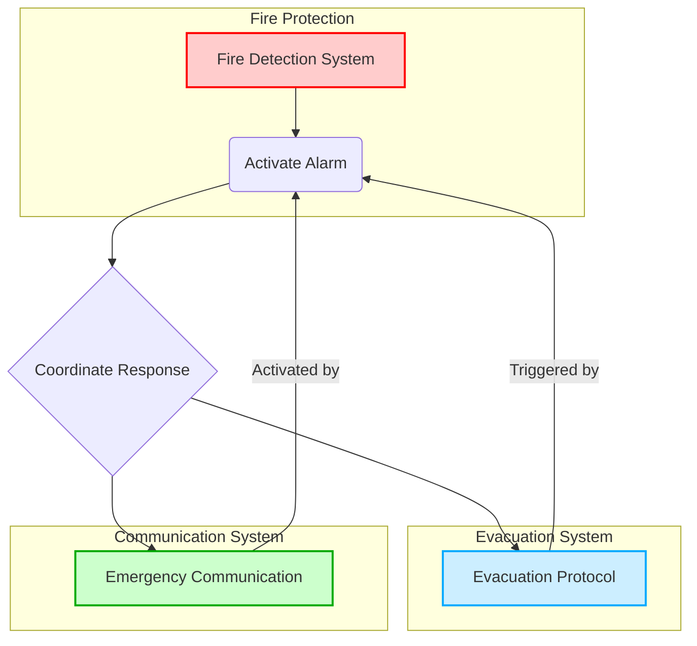
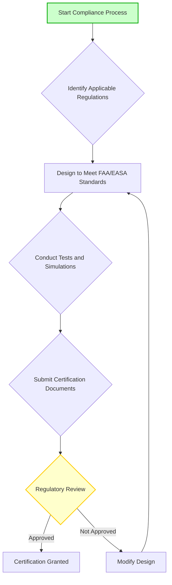
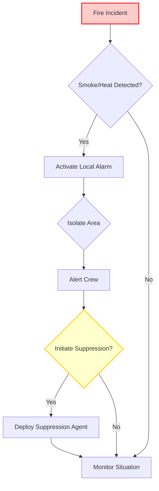
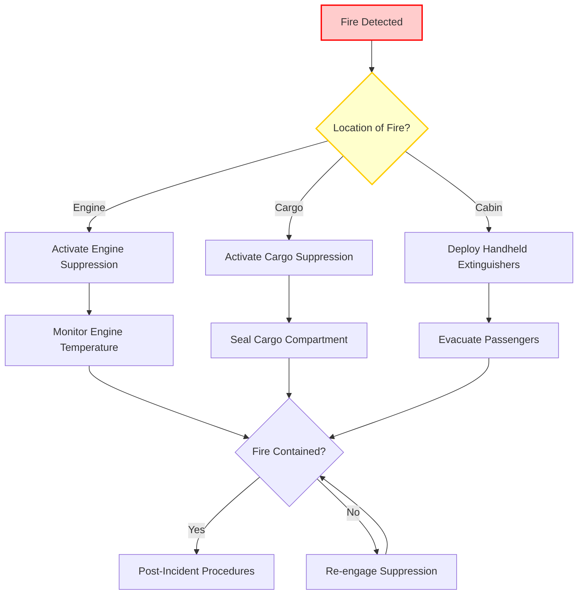
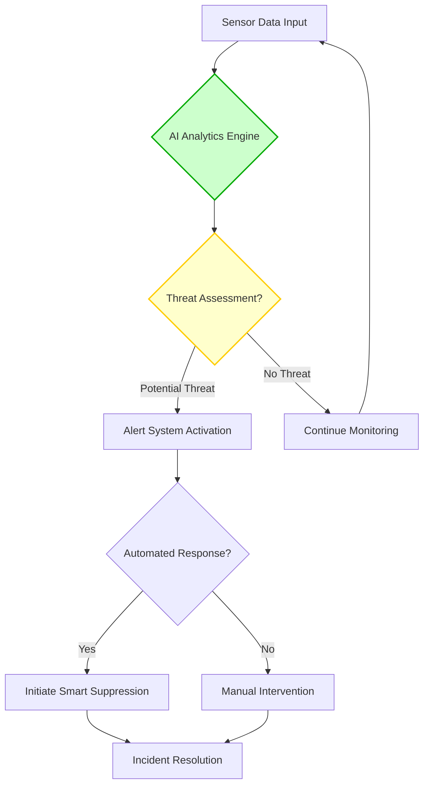
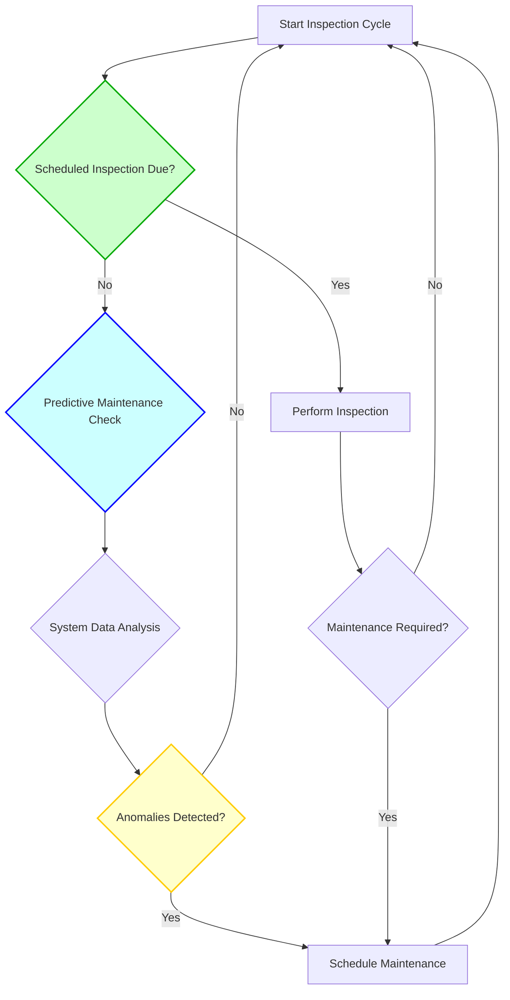

# **FTC_26-00-00-00-000 – ATA 26: Fire Protection**

Below is the **initial draft** for **ATA 26 – Fire Protection**, including suggestions for additional sections, placeholders for diagrams, and a forward-looking approach to emerging technologies and best practices. This draft is based on feedback and the proposed Table of Contents, and serves as a framework to be expanded with more detailed text, procedures, and references.

---

## **Version History**

| **Version** | **Date**       | **Author**                                                                                                      | **Description / Change Notes**                                                                                                                                                            | **Affected Sections** |
|-------------|----------------|------------------------------------------------------------------------------------------------------------------|------------------------------------------------------------------------------------------------------------------------------------------------------------------------------------------------|-----------------------|
| **1.0**     | **2024-12-31** | **Amedeo Pelliccia, ChatGPT, Copilot, Gemini, Perplexity AI, Mermaid AI**                                       | **Creation of the consolidated Equipment & Furnishing document, integrating advanced technologies (AI, Quantum Cybersecurity, Predictive Maintenance, etc.).**                                                                     | **All**              |
| **1.1**     | **2025-01-10** | **Amedeo Pelliccia, User Feedback Incorporation, ChatGPT, Gemini, Perplexity AI**                                | **Initial draft of ATA 26 Fire Protection. Included suggested additional sections and placeholders for diagrams.**                                                                                                                 | **All**              |

---

# **ATA 26 – Fire Protection: Table of Contents**

1. [**26.10 Introduction**](#2610-introduction)  
   *(Historical context of fire protection in aviation; evolution of safety regulations and technologies.)*

2. [**26.20 Scope and Objectives**](#2620-scope-and-objectives)  
   *(Defines the scope of systems under ATA 26—fire detection, suppression, prevention—and primary goals: safety, compliance, system reliability, etc.)*

3. [**26.30 Regulatory Requirements**](#2630-regulatory-requirements)  
   *(Overview of FAA/EASA regulations, design standards, certification processes, and reference to advisory circulars.)*  
   - **26.30.1 FAA Regulations** (FAR Part 25, AC 25-XX, etc.)  
   - **26.30.2 EASA CS-25 Requirements**  
   - **26.30.3 ICAO Standards**  
   - **26.30.4 Emerging Regulations for Advanced Fire Protection Technologies**  

4. [**26.40 Fire Detection Systems**](#2640-fire-detection-systems)  
   - **26.40.1 Engine/APU Fire Detection**  
   - **26.40.2 Cargo Compartment Detection**  
   - **26.40.3 Lavatory Smoke Detectors**  
   - **26.40.4 Cabin/Overhead Bin Smoke Detection**  
   - **26.40.5 Advanced Sensing Technologies** *(Infrared, AI-based anomaly detection, multi-criteria sensors)*  

5. [**26.50 Fire Extinguishing Systems**](#2650-fire-extinguishing-systems)  
   - **26.50.1 Engine and APU Fire Suppression**  
   - **26.50.2 Cargo Compartment Suppression** *(e.g., Halon replacements, inert gas systems)*  
   - **26.50.3 Lavatory Fire Extinguishers**  
   - **26.50.4 Handheld Fire Extinguishers** *(Cabin, cockpit requirements, new agent developments)*  
   - **26.50.5 Halon Replacement Initiatives** *(Sustainable, low-GWP agents)*  

6. [**26.60 Firewalls and Passive Protection**](#2660-firewalls-and-passive-protection)  
   - **26.60.1 Engine Nacelle Firewalls**  
   - **26.60.2 Cargo Compartment Liners** *(Burnthrough resistance, new materials)*  
   - **26.60.3 Cabin Interior Fireproofing** *(Panels, seats, insulation compliance—linked to ATA 25 references)*  
   - **26.60.4 Wiring and Conduit Protection**  

7. [**26.70 Advanced Technologies and Innovations**](#2670-advanced-technologies-and-innovations)  
   - **26.70.1 Early-Warning Fire Detection** *(AI-based analytics, integrated sensor fusion)*  
   - **26.70.2 Smart Fire Suppression** *(Automatically adjusting suppression agent flow, IoT for real-time status)*  
   - **26.70.3 Emerging Agents** *(Sustainable halon alternatives, eco-friendly compounds)*  
   - **26.70.4 Autonomous Firefighting Drones** *(Conceptual future for large cargo/bay areas)*  

8. [**26.80 Maintenance and Inspection Protocols**](#2680-maintenance-and-inspection-protocols)  
   - **26.80.1 Scheduled Inspections** *(Intervals, recommended checks for detectors, extinguishers, lines)*  
   - **26.80.2 Corrective Maintenance** *(Troubleshooting common failures, system resets)*  
   - **26.80.3 Predictive Maintenance** *(Sensor data, AI analytics for proactively replacing detection/suppression components)*  
   - **26.80.4 Automated Maintenance Solutions** *(Robotic or drone-based inspection of firewalls, remote sensor calibrations)*  

9. [**26.90 Human Factors and Ergonomics in Fire Protection**](#2690-human-factors-and-ergonomics-in-fire-protection)  
   - **26.90.1 Crew Training on Fire Systems** *(Use of handheld extinguishers, cockpit warnings, drills)*  
   - **26.90.2 Information Displays & Alerts** *(Cockpit/cabin display design, alarm prioritization)*  
   - **26.90.3 Maintenance Crew Ergonomics** *(Access points for detectors, ease of servicing lines or bottles)*  

10. [**26.100 Case Studies and Industry Best Practices**](#26100-case-studies-and-industry-best-practices)  
    - **26.100.1 High-Profile Fire Incidents** *(Lessons learned, regulatory changes)*  
    - **26.100.2 Implementation Examples** *(Airlines adopting advanced halon replacements, new detection methods)*  
    - **26.100.3 Common Pitfalls and Avoidance**  

11. [**26.110 Collaborative Stakeholder Practices**](#26110-collaborative-stakeholder-practices)  
    - **26.110.1 OEM-Airline Partnerships** *(Joint R&D for new fire suppression approaches)*  
    - **26.110.2 Cross-Functional Teams** *(Maintenance, operations, engineering synergy)*  
    - **26.110.3 Regulatory/Industry Working Groups** *(ICAO, IATA, ARAC committees on future fire standards)*  

12. [**26.120 References and Data**](#26120-references-and-data)  
    - **26.120.1 Regulatory Documents** *(FAR Part 25.851/.857, AC materials, EASA CS-25)*  
    - **26.120.2 OEM Manuals** *(Boeing, Airbus fire protection design guides)*  
    - **26.120.3 R&D and White Papers** *(On halon replacements, advanced detection sensors, AI-driven solutions)*  
    - **26.120.4 Case Study Repositories** *(FAA Fire Safety Branch resources, NTSB investigations)*  

13. [**26.130 Future Trends in Fire Protection**](#26130-future-trends-in-fire-protection)  
    - **26.130.1 AI-Enhanced Fire Suppression** *(Adaptive agent release, real-time detection)*  
    - **26.130.2 Advanced Materials** *(Fire-resistant composites, self-healing coatings)*  
    - **26.130.3 Autonomous Freight Interiors** *(Robotic cargo handling with integrated firefighting capabilities)*  
    - **26.130.4 Biomimetic Fire Prevention** *(Nature-inspired solutions for suppressing or isolating fires)*  

14. [**26.140 Fire Suppression in Battery-Intensive Environments**](#26140-fire-suppression-in-battery-intensive-environments)  
    *(Addresses firefighting strategies for emerging battery-powered systems, eVTOLs, or large lithium-ion battery cargo.)*

15. [**26.150 Fire Protection Training and Simulation**](#26150-fire-protection-training-and-simulation)  
    - **26.150.1 Virtual Reality Fire Drills**  
    - **26.150.2 Crew Resource Management (CRM) for Fire Incidents**  
    - **26.150.3 Maintenance Staff Certification Requirements**  

16. [**26.160 Integration with Cybersecurity**](#26160-integration-with-cybersecurity)  
    *(Highlights how digital control of fire suppression/detection systems requires robust cybersecurity measures, linking to ATA 24 or 46.)*

17. [**26.170 Environmental Impact of Fire Suppression Agents**](#26170-environmental-impact-of-fire-suppression-agents)  
    - **26.170.1 Green Alternatives to Halon**  
    - **26.170.2 Lifecycle Analysis of Suppression Chemicals**  
    - **26.170.3 Regulatory Incentives for Eco-Friendly Agents**  

18. [**26.180 Post-Incident Recovery and Investigation**](#26180-post-incident-recovery-and-investigation)  
    *(Procedures for investigating fire incidents, root cause analysis, and implementing corrective actions.)*  
    - **26.180.1 Incident Reporting Protocols**  
    - **26.180.2 Forensic Analysis Techniques**  
    - **26.180.3 Stakeholder Communication Strategies**  
    - **26.180.4 Continuous Improvement Processes**  

19. [**26.190 Integration with Other Safety Systems**](#26190-integration-with-other-safety-systems)  
    *(How fire protection integrates with other safety systems like evacuation systems, emergency communication, etc.)*  
    - **26.190.1 System Interoperability Standards**  
    - **26.190.2 Coordinated Emergency Response Protocols**  
    - **26.190.3 Holistic Safety Management Framework**  

20. [**26.200 Lifecycle Management of Fire Protection Systems**](#26200-lifecycle-management-of-fire-protection-systems)  
    *(From design to decommission, ensuring systems remain effective and compliant throughout their operational life.)*  
    - **26.200.1 Design Standards and Best Practices**  
    - **26.200.2 Installation and Commissioning Guidelines**  
    - **26.200.3 Maintenance Schedules and Procedures**  
    - **26.200.4 Upgrade and Modernization Paths**  
    - **26.200.5 End-of-Life Decommissioning and Disposal**  

21. [**26.210 Data Analytics for Fire Protection Optimization**](#26210-data-analytics-for-fire-protection-optimization)  
    - **26.210.1 Big Data Integration for Fire Safety**  
    - **26.210.2 Predictive Analytics for System Performance**  
    - **26.210.3 Performance Metrics and Reporting**  
    - **26.210.4 Continuous Monitoring and System Health Checks**  

22. [**26.220 Multi-Hazard Protection**](#26220-multi-hazard-protection)  
    - **26.220.1 Integrated Hazard Management Strategies**  
    - **26.220.2 Cross-System Safeguards and Protocols**  
    - **26.220.3 Comprehensive Risk Assessment Models**  

---

## **26.10 Introduction**
*(Historical context of fire protection in aviation; evolution of safety regulations and technologies.)*

**[Placeholder: Insert historical evolution, referencing early aviation incidents, post-WWII development of Halon-based systems, introduction of modern detection tech, etc.]**

---

## **26.20 Scope and Objectives**
*(Defines the scope of systems under ATA 26—fire detection, suppression, prevention—and primary goals: safety, compliance, system reliability, etc.)*

**[Placeholder: Outline the fundamental aims—public safety, regulatory adherence, operational continuity, environmental stewardship with new agent technologies, etc.]**

---

## **26.30 Regulatory Requirements**
*(Overview of FAA/EASA regulations, design standards, certification processes, and reference to advisory circulars.)*

### **26.30.1 FAA Regulations**  
*(FAR Part 25, AC 25-XX, etc.)*

### **26.30.2 EASA CS-25 Requirements**

### **26.30.3 ICAO Standards**

### **26.30.4 Emerging Regulations for Advanced Fire Protection Technologies**  
*(AI-based detection compliance, novel agent approvals, etc.)*

**[Placeholder: Summarize current and upcoming regulatory frameworks, referencing Advisory Circulars, EASA rulemaking tasks, ICAO guidelines, etc.]**

---

## **26.40 Fire Detection Systems**

### **26.40.1 Engine/APU Fire Detection**
### **26.40.2 Cargo Compartment Detection**
### **26.40.3 Lavatory Smoke Detectors**
### **26.40.4 Cabin/Overhead Bin Smoke Detection**
### **26.40.5 Advanced Sensing Technologies** *(Infrared, AI-based anomaly detection, multi-criteria sensors)*

**[Placeholder: Discuss sensor types, system architecture, reliability targets, alarm thresholds, fail-safe designs, etc.]**

---

## **26.50 Fire Extinguishing Systems**

### **26.50.1 Engine and APU Fire Suppression**
### **26.50.2 Cargo Compartment Suppression** *(e.g., Halon replacements, inert gas systems)*
### **26.50.3 Lavatory Fire Extinguishers**
### **26.50.4 Handheld Fire Extinguishers** *(Cabin, cockpit requirements, new agent developments)*
### **26.50.5 Halon Replacement Initiatives** *(Sustainable, low-GWP agents)*

---

## **26.60 Firewalls and Passive Protection**

### **26.60.1 Engine Nacelle Firewalls**
### **26.60.2 Cargo Compartment Liners** *(Burnthrough resistance, new materials)*
### **26.60.3 Cabin Interior Fireproofing** *(Panels, seats, insulation compliance—linked to ATA 25 references)*
### **26.60.4 Wiring and Conduit Protection**

**[Placeholder: Summarize material specs, compliance tests, synergy with ATA 25 for cabin materials, etc.]**

---

## **26.70 Advanced Technologies and Innovations**

### **26.70.1 Early-Warning Fire Detection** *(AI-based analytics, integrated sensor fusion)*
### **26.70.2 Smart Fire Suppression** *(Automatically adjusting suppression agent flow, IoT for real-time status)*
### **26.70.3 Emerging Agents** *(Sustainable halon alternatives, eco-friendly compounds)*
### **26.70.4 Autonomous Firefighting Drones** *(Conceptual future for large cargo/bay areas)*

---

## **26.80 Maintenance and Inspection Protocols**

### **26.80.1 Scheduled Inspections** *(Intervals, recommended checks for detectors, extinguishers, lines)*
### **26.80.2 Corrective Maintenance** *(Troubleshooting common failures, system resets)*
### **26.80.3 Predictive Maintenance** *(Sensor data, AI analytics for proactively replacing detection/suppression components)*
### **26.80.4 Automated Maintenance Solutions** *(Robotic or drone-based inspection of firewalls, remote sensor calibrations)*

---

## **26.90 Human Factors and Ergonomics in Fire Protection**

### **26.90.1 Crew Training on Fire Systems** *(Use of handheld extinguishers, cockpit warnings, drills)*
### **26.90.2 Information Displays & Alerts** *(Cockpit/cabin display design, alarm prioritization)*
### **26.90.3 Maintenance Crew Ergonomics** *(Access points for detectors, ease of servicing lines or bottles)*

**[Placeholder: Emphasize user-friendly designs, clarity in labeling, ease of maintenance tasks, VR training modules, etc.]**

---

## **26.100 Case Studies and Industry Best Practices**

### **26.100.1 High-Profile Fire Incidents** *(Lessons learned, regulatory changes)*
### **26.100.2 Implementation Examples** *(Airlines adopting advanced halon replacements, new detection methods)*
### **26.100.3 Common Pitfalls and Avoidance**

**[Placeholder: Summarize real incidents, cross-reference NTSB or EASA Safety Investigation reports, list best practices gleaned from experiences.]**

---

## **26.110 Collaborative Stakeholder Practices**

### **26.110.1 OEM-Airline Partnerships** *(Joint R&D for new fire suppression approaches)*
### **26.110.2 Cross-Functional Teams** *(Maintenance, operations, engineering synergy)*
### **26.110.3 Regulatory/Industry Working Groups** *(ICAO, IATA, ARAC committees on future fire standards)*

**[Placeholder: Outline the importance of collaboration for continuous improvement, referencing standardization bodies, joint research projects, etc.]**

---

## **26.120 References and Data**

### **26.120.1 Regulatory Documents** *(FAR Part 25.851/.857, AC materials, EASA CS-25)*
### **26.120.2 OEM Manuals** *(Boeing, Airbus fire protection design guides)*
### **26.120.3 R&D and White Papers** *(On halon replacements, advanced detection sensors, AI-driven solutions)*
### **26.120.4 Case Study Repositories** *(FAA Fire Safety Branch resources, NTSB investigations)*

**[Placeholder: Comprehensive reference list, including relevant bulletins, ACs, OEM docs, etc.]**

---

## **26.130 Future Trends in Fire Protection**

### **26.130.1 AI-Enhanced Fire Suppression** *(Adaptive agent release, real-time detection)*
### **26.130.2 Advanced Materials** *(Fire-resistant composites, self-healing coatings)*
### **26.130.3 Autonomous Freight Interiors** *(Robotic cargo handling with integrated firefighting capabilities)*
### **26.130.4 Biomimetic Fire Prevention** *(Nature-inspired solutions for suppressing or isolating fires)*

**[Placeholder: Explore near-future innovations, referencing ongoing R&D from aviation, automotive, maritime sectors.]**

---

## **26.140 Fire Suppression in Battery-Intensive Environments**
*(Addresses firefighting strategies for emerging battery-powered systems, eVTOLs, or large lithium-ion battery cargo.)*

---

## **26.150 Fire Protection Training and Simulation**

### **26.150.1 Virtual Reality Fire Drills**
### **26.150.2 Crew Resource Management (CRM) for Fire Incidents**
### **26.150.3 Maintenance Staff Certification Requirements**

---

## **26.160 Integration with Cybersecurity**
*(Highlights how digital control of fire suppression/detection systems requires robust cybersecurity measures, linking to ATA 24 or 46.)*

---

## **26.170 Environmental Impact of Fire Suppression Agents**

### **26.170.1 Green Alternatives to Halon**
### **26.170.2 Lifecycle Analysis of Suppression Chemicals**
### **26.170.3 Regulatory Incentives for Eco-Friendly Agents**

---

## **26.180 Post-Incident Recovery and Investigation**
*(Procedures for investigating fire incidents, root cause analysis, and implementing corrective actions.)*

### **26.180.1 Incident Reporting Protocols**
### **26.180.2 Forensic Analysis Techniques**
### **26.180.3 Stakeholder Communication Strategies**
### **26.180.4 Continuous Improvement Processes**

---

## **26.190 Integration with Other Safety Systems**
*(How fire protection integrates with other safety systems like evacuation systems, emergency communication, etc.)*

### **26.190.1 System Interoperability Standards**
### **26.190.2 Coordinated Emergency Response Protocols**
### **26.190.3 Holistic Safety Management Framework**

---

## **26.200 Lifecycle Management of Fire Protection Systems**
*(From design to decommission, ensuring systems remain effective and compliant throughout their operational life.)*

### **26.200.1 Design Standards and Best Practices**
### **26.200.2 Installation and Commissioning Guidelines**
### **26.200.3 Maintenance Schedules and Procedures**
### **26.200.4 Upgrade and Modernization Paths**
### **26.200.5 End-of-Life Decommissioning and Disposal**

---

## **26.210 Data Analytics for Fire Protection Optimization**

### **26.210.1 Big Data Integration for Fire Safety**
### **26.210.2 Predictive Analytics for System Performance**
### **26.210.3 Performance Metrics and Reporting**
### **26.210.4 Continuous Monitoring and System Health Checks**

---

## **26.220 Multi-Hazard Protection**

### **26.220.1 Integrated Hazard Management Strategies**
### **26.220.2 Cross-System Safeguards and Protocols**
### **26.220.3 Comprehensive Risk Assessment Models**

---

### **Key Considerations for Development**

1. **Data Standardization Across Stakeholders**  
   - Align fire protection data formats and reporting protocols among OEMs, airlines, and regulators for interoperability.

2. **Real-World Validation**  
   - Emphasize pilot projects and operational trials to validate new fire protection technologies in real-world scenarios.

3. **Public Confidence and Awareness**  
   - Address passenger concerns about new systems (e.g., halon replacements, autonomous firefighting drones) through education and transparent testing results.

4. **Integration with Sustainability Goals**  
   - Frame fire protection advancements as part of the broader aviation industry’s commitment to reducing environmental impacts.

---

## **Next Steps**

1. **Validate Regulatory Sections**  
   - Cross-check **FAR/CS** updates, EASA bulletins, and global standards (ICAO Annexes, ISO guidelines) for any changes in fire protection requirements.

2. **Implementation Guidance**  
   - Provide annexes or white papers detailing advanced halon-replacement agents, AI-driven detection, or sustainable firefighting solutions.

3. **Illustrate Complex Topics**  
   - Incorporate flowcharts/diagrams showing cargo compartment detection, engine fire loop systems, or multi-agent suppression networks.

4. **Leverage Industry Best Practices**  
   - Seek input from recognized safety committees (e.g., FAA Fire Safety, EASA STC groups) to refine procedures and ensure global compliance.

5. **Integrate Potential Additional Sections**  
   - Review and incorporate any proposed additional sections (e.g., **26.180**, **26.190**, **26.200**, **26.210**, **26.220**) based on operational needs or strategic interests.

