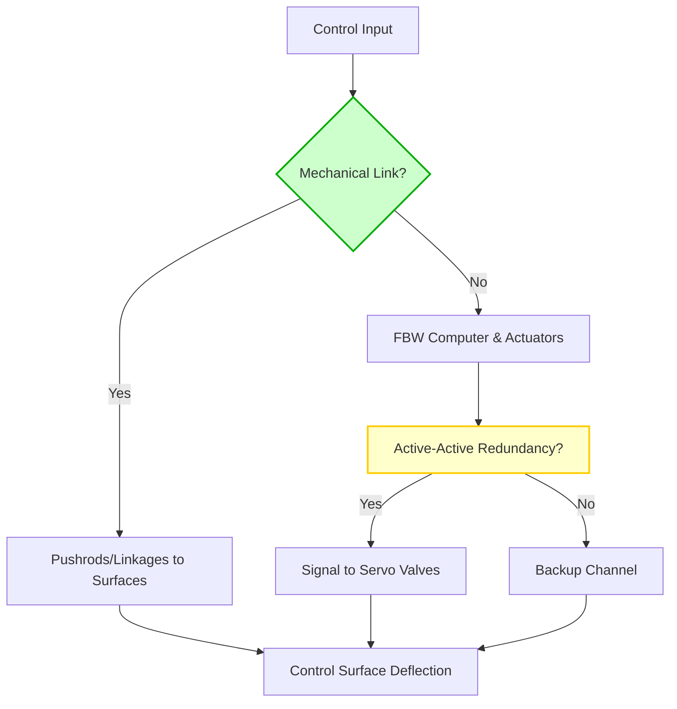
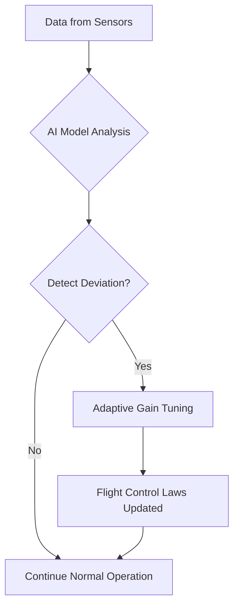
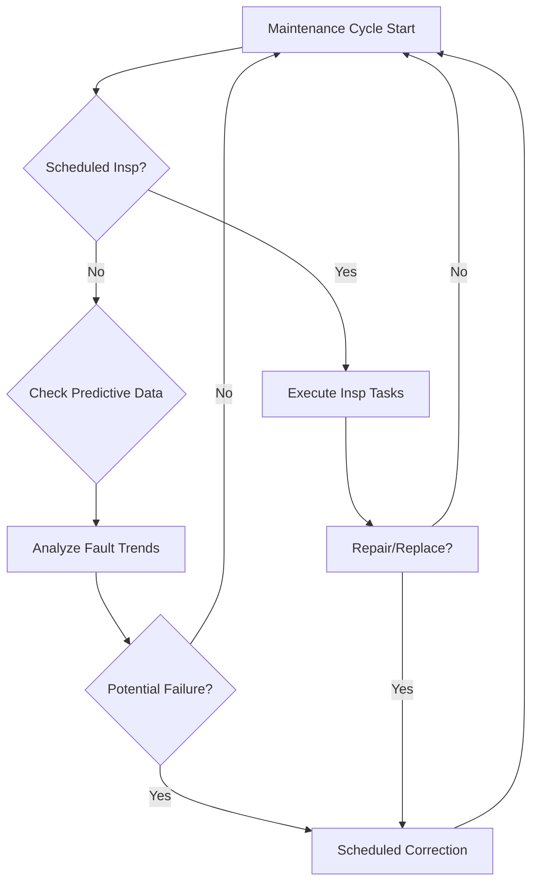

# **FTC_27-00-00-00-000 – ATA 27: Flight Controls**

This document provides an **initial draft** for **ATA 27 – Flight Controls**, outlining the structure, key sections, and emerging technologies relevant to modern aircraft. It serves as a comprehensive framework for understanding, maintaining, and innovating in the domain of aircraft flight control systems.

---

## **Version History**

| **Version** | **Date**       | **Author**                                                                                                  | **Description / Change Notes**                                                                                                                           | **Affected Sections**                  |
|-------------|----------------|----------------------------------------------------------------------------------------------------------------|----------------------------------------------------------------------------------------------------------------------------------------------------------|----------------------------------------|
| **1.0**     | **2024-12-31** | **Amedeo Pelliccia, ChatGPT, Copilot, Gemini, Perplexity AI, Mermaid AI**                                     | **Creation of the consolidated Flight Controls document, integrating advanced technologies (AI, fly-by-wire enhancements, predictive maintenance, etc.)** | **All**                                |

# **ATA 27 – Flight Controls: Table of Contents**

1. [**27.10 Introduction**](#2710-introduction)  
   *Overview of flight control systems' evolution, basic definitions, and historical milestones.*

2. [**27.20 Scope and Objectives**](#2720-scope-and-objectives)  
   *Defines ATA 27 system boundaries—primary/secondary controls, high-lift devices, advanced features—and highlights safety, reliability, and compliance goals.*

3. [**27.30 Regulatory Requirements**](#2730-regulatory-requirements)  
   - **27.30.1 FAA Regulations** *(FAR Part 25, AC references, etc.)*  
   - **27.30.2 EASA CS-25**  
   - **27.30.3 ICAO Standards**  
   - **27.30.4 Emerging Regulations** *(AI in flight controls, novel actuation systems, etc.)*

4. [**27.40 Primary Flight Controls**](#2740-primary-flight-controls)  
   - **27.40.1 Aileron Systems** *(Mechanical, FBW, or hybrid)*  
   - **27.40.2 Elevator Systems** *(Stabilizer trim, autopilot coupling)*  
   - **27.40.3 Rudder Systems** *(Yaw damping, mechanical vs. electro-mechanical)*  
   - **27.40.4 Fly-by-Wire Fundamentals** *(Signal processing, redundancy, architecture)*

5. [**27.50 Secondary Flight Controls**](#2750-secondary-flight-controls)  
   - **27.50.1 Flaps and Slats** *(High-lift devices, actuation methods)*  
   - **27.50.2 Spoilers/Ground Spoilers** *(Roll augmentation, lift dumping)*  
   - **27.50.3 Airbrakes/Speedbrakes**  
   - **27.50.4 Trim Systems** *(Horizontal stabilizer trim, autopilot integration)*

6. [**27.60 Hydraulic/Electric Actuation Systems**](#2760-hydraulic-electric-actuation-systems)  
   - **27.60.1 Hydraulic Actuators** *(Pressures, reservoirs, redundancy)*  
   - **27.60.2 Electro-Hydraulic/Electro-Mechanical Actuators** *(Power-by-wire concepts)*  
   - **27.60.3 Backup Systems** *(Ram Air Turbine, emergency actuation)*

7. [**27.70 Advanced Technologies in Flight Controls**](#2770-advanced-technologies-in-flight-controls)  
   - **27.70.1 Active Control Sidesticks** *(Force feedback, pilot coupling issues)*  
   - **27.70.2 AI-Augmented Flight Stability** *(Real-time data analytics, predictive control)*  
   - **27.70.3 Health Monitoring Sensors** *(Continuous detection of actuator wear/failures)*  
   - **27.70.4 Morphing Wing Surfaces** *(Adaptive structures, integrated flight controls)*

8. [**27.80 Maintenance and Inspection Protocols**](#2780-maintenance-and-inspection-protocols)  
   - **27.80.1 Scheduled Inspections** *(Intervals, recommended checks for mechanical linkages, actuators)*  
   - **27.80.2 Corrective Maintenance** *(Troubleshooting flight control anomalies, system resets)*  
   - **27.80.3 Predictive Maintenance** *(Sensor data, AI analytics for proactively identifying wear/failures)*  
   - **27.80.4 Automated Maintenance Tools** *(Drones for surface checks, robotic assistance for large aircraft)*

9. [**27.90 Human Factors and Ergonomics**](#2790-human-factors-and-ergonomics)  
   - **27.90.1 Flight Deck Interface** *(Control column/stick design, force feedback, pilot warnings)*  
   - **27.90.2 Crew Training for Advanced Systems** *(Handling characteristics, system reversion modes)*  
   - **27.90.3 Maintenance Ergonomics** *(Ease of access to flight control linkages, sensors, etc.)*

10. [**27.100 Case Studies and Industry Practices**](#27100-case-studies-and-industry-practices)  
    - **27.100.1 Notable Flight Control Incidents** *(Lessons learned, design changes)*  
    - **27.100.2 Implementation Examples** *(Airlines adopting next-gen FBW or power-by-wire)*  
    - **27.100.3 Common Pitfalls and Avoidance**  

11. [**27.110 Collaborative Stakeholder Practices**](#27110-collaborative-stakeholder-practices)  
    - **27.110.1 OEM-Airline Partnerships** *(Joint R&D, flight test programs)*  
    - **27.110.2 Cross-Functional Teams** *(Flight ops, engineering, maintenance synergy)*  
    - **27.110.3 Regulatory/Industry Working Groups** *(ICAO, IATA, ARAC committees on flight controls)*

12. [**27.120 References and Data**](#27120-references-and-data)  
    - **27.120.1 Regulatory Documents** *(FAR Part 25.671–.699, EASA CS-25, etc.)*  
    - **27.120.2 OEM Manuals** *(Airbus, Boeing flight control design guides)*  
    - **27.120.3 R&D White Papers** *(AI-based flight control research, morphing wing studies)*  
    - **27.120.4 Case Study Repositories** *(NTSB, EASA investigation reports)*

13. [**27.130 Future Trends in Flight Controls**](#27130-future-trends-in-flight-controls)  
    - **27.130.1 AI-Driven Autonomy** *(Self-healing flight control laws, adaptive gains)*  
    - **27.130.2 Next-Gen Materials** *(Lightweight composites for linkages, actuators)*  
    - **27.130.3 Urban Air Mobility** *(eVTOL flight control, distributed electric propulsion)*  
    - **27.130.4 Biomimetic Controls** *(Nature-inspired solutions, bird-like wing articulation)*

14. [**27.140 Integrated System Diagnostics and Alerts**](#27140-integrated-system-diagnostics-and-alerts)  
    - Real-time diagnostics, fault detection, and alert prioritization to enhance safety.

15. [**27.150 Safety Assurance and Certification Processes**](#27150-safety-assurance-and-certification-processes)  
    - Outlining methodologies for certification of modern digital flight control systems.

16. [**27.160 Cross-Industry Innovations**](#27160-cross-industry-innovations)  
    - Lessons from automotive, robotics, and energy sectors applied to aviation.

17. [**27.170 Human-Machine Interfaces (HMI)**](#27170-human-machine-interfaces-hmi)  
    - HMI advancements for optimizing pilot-system interaction.

18. [**27.180 Environmental and Operational Challenges**](#27180-environmental-and-operational-challenges)  
    - Adapting flight controls for extreme conditions, including high altitudes and harsh weather.

19. [**27.190 Software Integrity and Validation**](#27190-software-integrity-and-validation)  
    - Ensuring reliability and security of software components within flight control systems.

20. [**27.200 Feedback Systems and Pilot Input Integration**](#27200-feedback-systems-and-pilot-input-integration)  
    - Integration of pilot inputs and feedback mechanisms for enhanced control and situational awareness.

---

## **Additional Sections Justification**

- **Integrated System Diagnostics and Alerts**  
  Critical for real-time fault detection, alert prioritization, and system health monitoring, enabling proactive maintenance and enhanced safety.

- **Safety Assurance and Certification Processes**  
  Addresses evolving challenges with certifying AI-enhanced or next-gen flight controls, ensuring systems meet stringent safety standards.

- **Cross-Industry Innovations**  
  Highlights technology transfer opportunities from sectors like automotive and robotics, fostering advancements in aviation flight controls.

- **Human-Machine Interfaces (HMI)**  
  Focused on ergonomics and intuitive designs for pilot interactions with advanced systems, enhancing usability and reducing workload.

- **Environmental and Operational Challenges**  
  Prepares flight control systems for diverse operational environments, ensuring reliability and safety under varying conditions.

- **Software Integrity and Validation**  
  Emphasizes secure, dependable software for flight control, including rigorous SDLC, cybersecurity, and continuous monitoring.

- **Feedback Systems and Pilot Input Integration**  
  Details how pilot inputs merge with flight control laws and how feedback loops (visual, auditory, haptic) enhance situational awareness.

---

### **Diagrams**

1. **Primary Flight Control System Overview (Mechanical vs. FBW)**  
   - A flowchart illustrating signal paths from cockpit controls to control surfaces, including redundancy loops.

2. **Hydraulic/Electric Actuation Schematic (27.60)**  
   - Showing how hydraulic lines/electrical buses supply actuators, plus emergency backups.

3. **Predictive Maintenance Workflow for Flight Controls (27.80.3)**  
   - Depicting how sensor data feeds into AI analytics, generating proactive maintenance alerts.

4. **Urban Air Mobility/eVTOL Controls (27.130.3)**  
   - Conceptual diagram explaining distributed electric propulsion and integrated flight control management.





---

## **27.10 Introduction**
*(Historical context of flight control systems’ evolution, basic definitions, and historical milestones.)*

**[Placeholder: Insert timeline from wire-and-cable control to mechanical linkages, introduction of hydraulics, then partial or full fly-by-wire, culminating in AI or power-by-wire concepts.]**

---

## **27.20 Scope and Objectives**
*(Defines the scope of systems under ATA 27—flight surfaces, linkages, actuators—and major priorities: safety, reliability, compliance.)*

**[Placeholder: Summarize main goals—ensuring safe control throughout flight envelope, meeting regulatory standards, adapting to new aircraft configurations (eVTOL, UAM).]**

---

## **27.30 Regulatory Requirements**
*(Overview of FAA/EASA regulations, design standards, certification processes, etc.)*

### **27.30.1 FAA Regulations (FAR Part 25)**
**[Placeholder: Outline relevant paragraphs, e.g., 25.671–.699, focusing on control system integrity, jammed controls, break-out forces, redundancy, and so forth.]**

### **27.30.2 EASA CS-25 Requirements**
**[Placeholder: Detail EASA-specific regulations mirroring FAA requirements, emphasizing any unique aspects.]**

### **27.30.3 ICAO Standards**
**[Placeholder: Summarize ICAO Annexes relevant to flight controls, ensuring global compliance.]**

### **27.30.4 Emerging Regulations**
*(AI-based control augmentation, new materials for linkages, digital threat vectors requiring cybersecurity resilience.)*

**[Placeholder: Discuss upcoming regulations targeting advanced technologies, ensuring flight control systems remain compliant with evolving safety standards.]**

---

## **27.40 Primary Flight Controls**
*(Ailerons, Elevators, Rudder, plus any FBW nuances.)*

### **27.40.1 Aileron Systems**
**[Placeholder: Mechanical vs. digital, load relief, autopilot interface.]**

### **27.40.2 Elevator Systems**
**[Placeholder: Stabilizer trim, autopilot integration, jam overrides, system redundancies.]**

### **27.40.3 Rudder Systems**
**[Placeholder: Yaw damping, pedal feel units, advanced sideforce linkages in FBW.]**

### **27.40.4 Fly-by-Wire Fundamentals**
**[Placeholder: Computer architecture, channel redundancy (active-active or active-standby), force feedback, laws (normal/direct).]**

---

## **27.50 Secondary Flight Controls**
*(Flaps, slats, spoilers, trim systems, etc.)*

### **27.50.1 Flaps and Slats**
**[Placeholder: High-lift devices, actuation methods (electro-mechanical, hydraulic), load alleviation.]**

### **27.50.2 Spoilers/Ground Spoilers**
**[Placeholder: Roll augmentation, speedbrake function, integrated flight mode logic.]**

### **27.50.3 Airbrakes/Speedbrakes**
**[Placeholder: Detailed mechanisms, deployment methods, and integration with flight control laws.]**

### **27.50.4 Trim Systems**
**[Placeholder: Horizontal stabilizer, aileron/rudder trims, link to autopilot.]**

---

## **27.60 Hydraulic/Electric Actuation Systems**
*(Hydraulic circuits, servo valves, EMAs, EHA, backup systems.)*

### **27.60.1 Hydraulic Actuators**
### **27.60.2 Electro-Hydraulic/Electro-Mechanical Actuators**
### **27.60.3 Backup Systems**
**[Placeholder: Summarize typical operating pressures (3,000/5,000 psi), reservoir design, failure cases, RAT usage.]**

---

## **27.70 Advanced Technologies in Flight Controls**
*(Active control sticks, AI augmentation, morphing wings, health monitoring, etc.)*

### **27.70.1 Active Control Sidesticks**
### **27.70.2 AI-Augmented Flight Stability**
### **27.70.3 Health Monitoring Sensors**
### **27.70.4 Morphing Wing Surfaces**
**[Placeholder: Outline how sensors feed data into real-time flight control law adaptation, mention test programs or prototypes in development.]**


---

## **27.80 Maintenance and Inspection Protocols**
*(Scheduled checks, fault isolation, predictive approaches.)*

### **27.80.1 Scheduled Inspections**
### **27.80.2 Corrective Maintenance**
### **27.80.3 Predictive Maintenance**
### **27.80.4 Automated Maintenance Tools**



---

## **27.90 Human Factors and Ergonomics**
*(Pilot interface, training, maintenance accessibility.)*

### **27.90.1 Flight Deck Interface**
### **27.90.2 Crew Training for Advanced Systems**
### **27.90.3 Maintenance Ergonomics**
**[Placeholder: VR-based training for flight crews on FBW differences, easy-access design for maintainers, intuitive labeling.]**

---

## **27.100 Case Studies and Industry Practices**

### **27.100.1 Notable Flight Control Incidents**
### **27.100.2 Implementation Examples**
### **27.100.3 Common Pitfalls and Avoidance**
**[Placeholder: Summarize known events, referencing NTSB/EASA accident data, lessons learned about jammed controls, software anomalies, or mechanical failures.]**

---

## **27.110 Collaborative Stakeholder Practices**

### **27.110.1 OEM-Airline Partnerships**
### **27.110.2 Cross-Functional Teams**
### **27.110.3 Regulatory/Industry Working Groups**
**[Placeholder: Emphasize synergy between design engineering, flight ops, maintenance, and regulatory bodies, plus joint R&D efforts for next-gen flight controls.]**

---

## **27.120 References and Data**

### **27.120.1 Regulatory Documents**  
*(FAR Part 25.671–.699, EASA CS-25, etc.)*

### **27.120.2 OEM Manuals**  
*(Airbus, Boeing flight control design guides)*

### **27.120.3 R&D White Papers**  
*(AI-based flight control research, morphing wing studies)*

### **27.120.4 Case Study Repositories**  
*(NTSB, EASA investigation reports, etc.)*

**[Placeholder: Comprehensive list to be filled out with actual doc references, bulletins, and OEM data.]**

---

## **27.130 Future Trends in Flight Controls**

### **27.130.1 AI-Driven Autonomy**
### **27.130.2 Next-Gen Materials**
### **27.130.3 Urban Air Mobility**
### **27.130.4 Biomimetic Controls**
**[Placeholder: Focus on fully autonomous ops, new composites for linkages, eVTOL distributed control, bird-inspired design approaches.]**

---

## **27.140 Integrated System Diagnostics and Alerts**
*(Real-time diagnostics, fault detection, and alert prioritization to enhance safety.)*

### **27.140.1 Sensor Fusion Techniques**
*(Combining data from multiple sensors for accurate fault detection.)*

### **27.140.2 Fault Detection Algorithms**
*(AI and machine learning approaches for identifying system anomalies.)*

### **27.140.3 Alert Prioritization Mechanisms**
*(Determining the severity and urgency of detected faults.)*

### **27.140.4 Maintenance Notifications**
*(Automated alerts to maintenance teams for proactive interventions.)*

---

## **27.150 Safety Assurance and Certification Processes**
*(Outlining methodologies for certification of modern digital flight control systems.)*

### **27.150.1 Safety Analysis Methods**
*(HAZOP, FMEA, and other safety assessment techniques.)*

### **27.150.2 Certification Workflows**
*(Step-by-step processes for obtaining regulatory approvals.)*

### **27.150.3 Redundant Systems Validation**
*(Ensuring redundancy meets safety requirements.)*

### **27.150.4 Software Validation and Verification**
*(Testing and validating flight control software integrity.)*

---

## **27.160 Cross-Industry Innovations**
*(Lessons from automotive, robotics, and energy sectors applied to aviation.)*

### **27.160.1 Automotive Sensor Technologies**
*(Application of advanced sensors from the automotive industry to flight controls.)*

### **27.160.2 Robotics in Actuation**
*(Using robotics for precise control surface actuation.)*

### **27.160.3 Energy Sector Control Systems**
*(Innovations in control systems from the energy sector for aviation applications.)*

---

## **27.170 Human-Machine Interfaces (HMI)**
*(HMI advancements for optimizing pilot-system interaction.)*

### **27.170.1 Interface Design Principles**
*(Best practices for designing intuitive and effective HMIs.)*

### **27.170.2 Haptic Feedback Systems**
*(Enhancing pilot control through tactile feedback mechanisms.)*

### **27.170.3 Visual and Auditory Alerts**
*(Designing effective alert systems to communicate critical information.)*

### **27.170.4 Pilot Workload Reduction Techniques**
*(Strategies to minimize pilot workload through HMI design.)*

---

## **27.180 Environmental and Operational Challenges**
*(Adapting flight controls for extreme conditions, including high altitudes and harsh weather.)*

### **27.180.1 High Altitude Operations**
*(System adaptations for low-pressure and cold environments.)*

### **27.180.2 Tropical and Humid Conditions**
*(Ensuring system reliability in high-temperature and high-humidity settings.)*

### **27.180.3 Polar Operations**
*(Modifications for extreme cold and ice-prone environments.)*

### **27.180.4 Harsh Weather Resilience**
*(Enhancing flight control systems to withstand severe turbulence, icing, and other weather-related challenges.)*

---

## **27.190 Software Integrity and Validation**
*(Ensuring the reliability and security of software components within flight control systems.)*

### **27.190.1 Software Development Lifecycle (SDLC) for Flight Controls**
*(Structured approach to coding, testing, and verification for flight-critical software.)*

### **27.190.2 Code Verification and Validation**
*(Strict compliance with coding standards and advanced testing for embedded systems.)*

### **27.190.3 Cybersecurity Measures for Flight Control Software**
*(Applying rigorous security protocols, threat modeling, and vulnerability testing.)*

### **27.190.4 Continuous Software Monitoring and Updates**
*(Real-time anomaly detection, secure updates, and ongoing software health checks.)*

---

## **27.200 Feedback Systems and Pilot Input Integration**
*(Integration of pilot inputs and feedback mechanisms for enhanced control and situational awareness.)*

### **27.200.1 Pilot Input Processing**
*(How flight control computers receive and interpret pilot commands.)*

### **27.200.2 Feedback Mechanisms (Visual, Auditory, Haptic)**
*(Providing immediate, intuitive cues to pilots about system state.)*

### **27.200.3 Adaptive Control Responses Based on Pilot Input**
*(Systems that adjust dynamically to pilot style, flight phase, or conditions.)*

### **27.200.4 Enhancing Pilot Situational Awareness through Feedback Systems**
*(Strategies to keep pilots informed without overload, ensuring a safe and efficient cockpit environment.)*

---

### **Key Considerations for Development**

1. **Data Standardization Across Stakeholders**  
   - Align flight control data formats and reporting protocols among OEMs, airlines, and regulators for interoperability.

2. **Real-World Validation**  
   - Emphasize pilot projects and operational trials to validate new flight control technologies in real-world scenarios.

3. **Public Confidence and Awareness**  
   - Address passenger and pilot concerns about new systems (e.g., AI enhancements, active sidesticks) through education and transparent testing results.

4. **Integration with Sustainability Goals**  
   - Frame flight control advancements as part of the broader aviation industry’s commitment to reducing environmental impacts and enhancing efficiency.

---

## **Next Steps**

1. **Fill Out Technical Content**  
   - Expand each placeholder with detailed procedures, best practices, data tables, and compliance guidance.

2. **Incorporate Diagrams**  
   - Add system schematics (mechanical linkages, FBW architecture), flowcharts for troubleshooting, predictive maintenance workflows, etc.

3. **Validate Regulatory References**  
   - Cross-check **FAR/CS** updates, EASA bulletins, ICAO standards to ensure coverage of all mandatory flight control design/maintenance aspects.

4. **Industry Feedback**  
   - Collaborate with OEMs, airlines, and flight safety committees to refine sections and align with real-world operations.

5. **Training & Simulation**  
   - Potentially add sections on crew simulator design, maintenance VR modules, or advanced scenario testing for flight control anomalies.

---

## **Conclusion**

This **draft** for **ATA 27 – Flight Controls** provides a structured baseline for a comprehensive manual addressing modern and future flight control systems. By highlighting mechanical, hydraulic, electric, and advanced AI-enabled aspects, along with robust maintenance and human factor considerations, the document can guide stakeholders—operators, manufacturers, regulators—in maintaining safe, reliable, and innovative flight control operations.

---

### **Explanation for Added Sections**

1. **27.140 Integrated System Diagnostics and Alerts**  
   - **Purpose:** To describe diagnostic systems for real-time fault detection and alert mechanisms in flight control systems.  
   - **Key Topics:** Sensor fusion, fault detection algorithms, alert prioritization, and maintenance notifications.

2. **27.150 Safety Assurance and Certification Processes**  
   - **Purpose:** To outline the methodologies for certification of modern digital flight control systems, especially those integrating AI.  
   - **Key Topics:** Safety analysis, certification workflows, redundant systems validation, and software verification.

3. **27.160 Cross-Industry Innovations**  
   - **Purpose:** To explore how advancements in automotive, robotics, and energy can be applied to aviation flight controls.  
   - **Key Topics:** Automotive sensor technologies, robotics in actuation, and control system insights from the energy sector.

4. **27.170 Human-Machine Interfaces (HMI)**  
   - **Purpose:** To focus on pilot-system interaction, emphasizing ergonomics, workload reduction, and intuitive design.  
   - **Key Topics:** Interface design principles, haptic feedback, visual/auditory alerts, pilot workload management.

5. **27.180 Environmental and Operational Challenges**  
   - **Purpose:** To ensure flight controls remain reliable under extreme environmental conditions and harsh operational scenarios.  
   - **Key Topics:** High-altitude operations, tropical/humid conditions, polar operations, and resilience against turbulence and icing.

6. **27.190 Software Integrity and Validation**  
   - **Purpose:** Ensuring that flight control software is robust, secure, and compliant with strict aviation standards.  
   - **Key Topics:** SDLC processes, code verification, cybersecurity, continuous monitoring.

7. **27.200 Feedback Systems and Pilot Input Integration**  
   - **Purpose:** Explaining how pilot inputs merge with flight control laws and how feedback loops (visual, auditory, haptic) enhance situational awareness.  
   - **Key Topics:** Pilot input processing, adaptive responses, workload reduction, and advanced cockpit feedback design.
```
