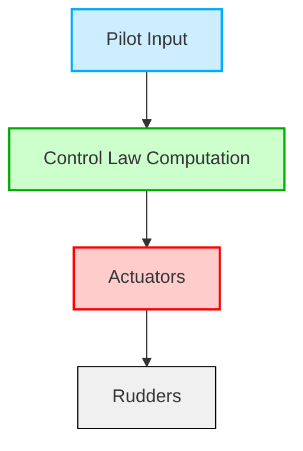
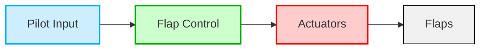
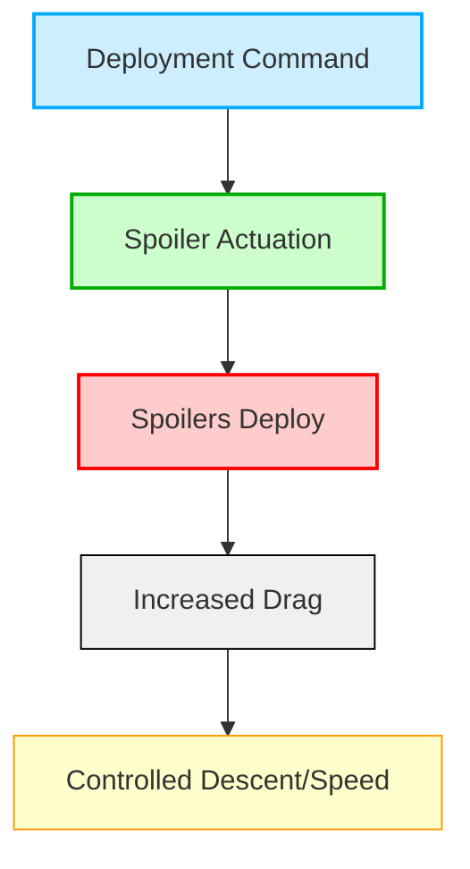
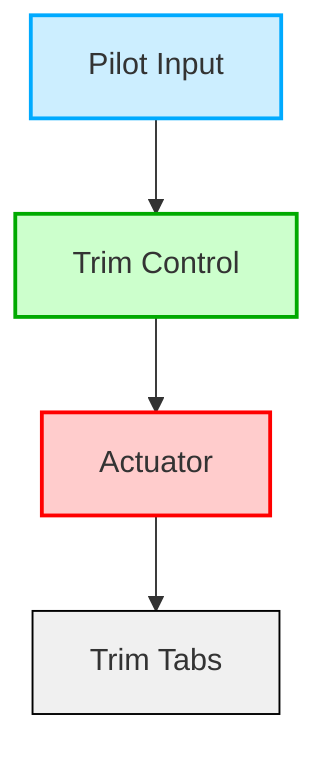
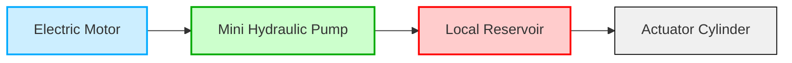
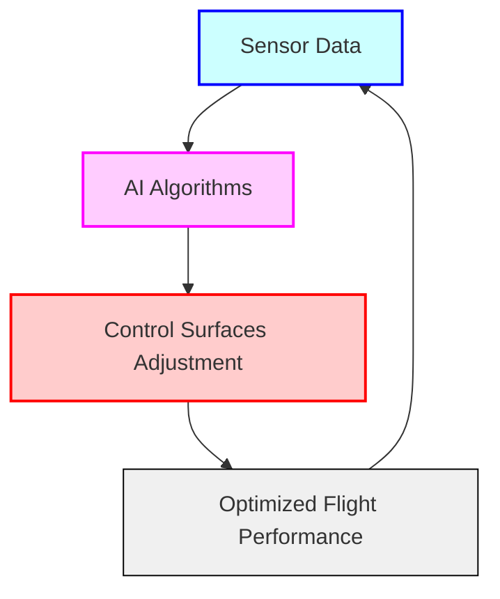
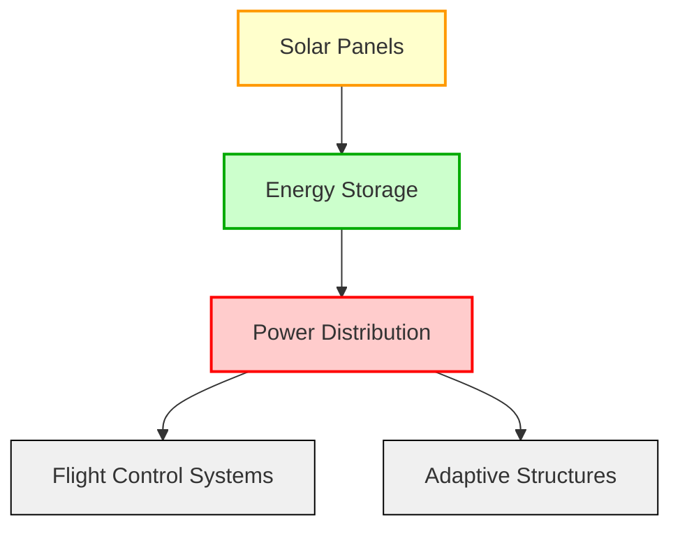
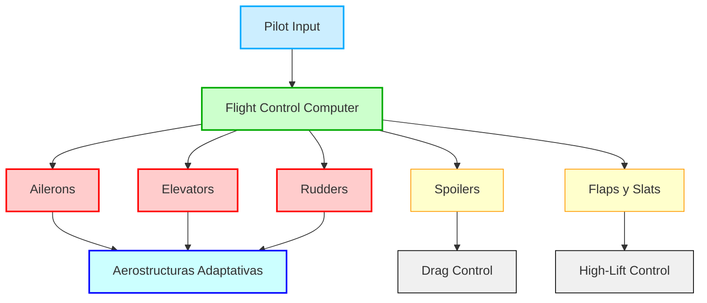

¡Claro! A continuación, presento una versión más esquemática y estructurada de la documentación de **ATA 27 - Flight Controls** para el **GAIA AIR AMPEL360**, manteniendo toda la información esencial. Esta versión está diseñada para facilitar la comprensión integral, ideal para pilotos y personal técnico.

---

# ATA 27 - Flight Controls

Este capítulo se relaciona estrechamente con las alas y cubre los sistemas que controlan las superficies de vuelo del avión (por ejemplo, flaps, alerones, spoilers, timones de dirección, y timones de profundidad).

## Índice

1. [Introducción](#27-10-introducción)
2. [Alcance y Objetivos](#27-20-alcance-y-objetivos)
3. [Requisitos Regulatorios](#27-30-requisitos-regulatorios)
4. [Controles de Vuelo Primarios](#27-40-controles-de-vuelo-primarios)
5. [Controles de Vuelo Secundarios](#27-50-controles-de-vuelo-secundarios)
6. [Sistemas de Actuación](#27-60-sistemas-de-actuación)
7. [Tecnologías Avanzadas](#27-70-tecnologías-avanzadas)
8. [Pruebas y Validación](#27-90-pruebas-y-validación)
9. [Mantenimiento e Inspección](#27-80-mantenimiento-e-inspección)
10. [Factores Humanos y Ergonomía](#27-90-factores-humanos-y-ergonomía)
11. [Estudios de Caso y Prácticas de la Industria](#27-100-estudios-de-caso-y-prácticas-de-la-industria)
12. [Prácticas Colaborativas con Stakeholders](#27-110-prácticas-colaborativas-con-stakeholders)
13. [Referencias y Datos](#27-120-referencias-y-datos)
14. [Tendencias Futuras en Controles de Vuelo](#27-130-tendencias-futuras-en-controles-de-vuelo)
15. [Diagramas Adicionales](#diagramas-adicionales)

---

## 27.10 Introducción

- **Evolución de los Sistemas de Control de Vuelo**: Desde los controles mecánicos de los hermanos Wright hasta los sistemas avanzados de fly-by-wire (FBW) y control adaptativo de la AMPEL360.
- **Ventajas de los Sistemas Modernos**:
  - Reducción de peso
  - Mejora en el manejo y rendimiento
  - Mayor seguridad y redundancia
  - Reducción de la carga de trabajo del piloto
- **Innovaciones en AMPEL360**:
  - Aerostructuras adaptativas integradas con paneles solares
  - Fusión avanzada de sensores
  - Controles augmentados por IA
  - Interfaces intuitivas para el piloto

---

## 27.20 Alcance y Objetivos

### 27.20.1 Alcance

**ATA 27** abarca todos los sistemas y componentes involucrados en el control de la actitud, trayectoria y configuración aerodinámica del avión:

- **A. Controles de Vuelo Primarios**
  - Alerones
  - Timones de profundidad
  - Timones de dirección
  - Sistemas de FBW

- **B. Controles de Vuelo Secundarios**
  - Spoilers/Speedbrakes
  - Flaps y Slats
  - Sistemas de trimado

- **C. Características Avanzadas**
  - Estabilidad augmentada por sistemas automáticos
  - Autopiloto y autothrottle
  - Aerostructuras adaptativas específicas de AMPEL360

### 27.20.2 Objetivos

- **Seguridad**: Diseño robusto, redundancia, detección y aislamiento de fallas.
- **Fiabilidad**: Sistemas probados, mantenimiento predictivo.
- **Cumplimiento Regulatorio**: Adherencia a FAR Part 25, EASA CS-25, ICAO.
- **Optimización de Rendimiento**: Eficiencia aerodinámica, ahorro de combustible, estabilidad y maniobrabilidad.
- **Integración**: Coordinación con otros sistemas del avión, gestión energética.
- **Adaptabilidad**: Control en tiempo real, integración con IA, materiales avanzados.

---

## 27.30 Requisitos Regulatorios

### 27.30.1 FAA Regulaciones (Estados Unidos)

- **FAR Part 25: Normas de Aeronavegabilidad para Aviones de Categoría de Transporte**
  - **25.671 Control Systems – General**
    - Controlable y maniobrable bajo todas las condiciones de vuelo anticipadas.
    - Robustez ante fallas simples.
  - **25.672 Stability Augmentation and Automatic/Power-Operated Systems**
    - Sistemas que mejoran la estabilidad o controlabilidad.
  - **25.675 Stops or Limit Devices**
    - Dispositivos que previenen el exceso de movimiento de superficies de control.
  - **25.677 Trim Systems**
    - Estándares para sistemas de trimado que mantienen la actitud deseada sin esfuerzo continuo del piloto.
  - **25.679 Control System Malfunctions**
    - Medidas para evitar consecuencias catastróficas ante fallas del sistema.
  - **25.683 Operation Tests**
    - Pruebas operativas para demostrar fiabilidad y funcionalidad.

### 27.30.2 EASA CS-25 Requisitos (Europa)

- **CS-25: Especificaciones de Certificación para Grandes Aeroplanos**
  - **25.671 Control Systems – General**
    - Funcionamiento suave y positivo.
    - Estabilidad y maniobrabilidad.
  - **25.672 Stability Augmentation and Automatic/Power-Operated Systems**
    - Integración de sistemas de aumento de estabilidad y control automático.
  - **25.675 Stops or Limit Devices**
    - Requisitos para dispositivos que limitan el movimiento de superficies de control.
  - **25.677 Trim Systems**
    - Requisitos para sistemas de trimado seguros y efectivos.
  - **25.679 Control System Malfunctions**
    - Análisis y mitigación de fallas en sistemas de control.
  - **25.683 Operation Tests**
    - Métodos para realizar pruebas operativas de sistemas de control.

### 27.30.3 ICAO Estándares

- **Annex 8 – Aeronavegabilidad de Aeroplanos**
  - **Principios de Diseño General**
    - Controlabilidad y maniobrabilidad
    - Estabilidad
    - Integridad estructural
  - **Redundancia y Tolerancia a Fallos**
    - Canales de control independientes
    - Fuentes de energía de respaldo

### 27.30.4 Regulaciones Emergentes

- **Regulaciones para IA en Controles de Vuelo**
  - **EASA AI Roadmap 2.0**
    - Seguridad y ética en IA.
    - Certificación de sistemas basados en IA.
  - **FAA Roadmap for Artificial Intelligence Safety Assurance**
    - Aseguramiento de seguridad basado en riesgos.
    - Implementación incremental de IA.
- **Regulaciones para Sistemas de Actuación Noveles**
  - **ACTUATION 2015 Project**
  - **SAE ARP4754A, ARP4761, DO-178C, DO-254**

---

## 27.40 Controles de Vuelo Primarios

### 27.40.1 Sistemas de Alerones

- **Definición**: Superficies en el borde de salida del ala que controlan el balanceo (roll) del avión.
- **Tipos**:
  - **Sistemas Mecánicos**: Conexión directa mediante cables y poleas.
  - **Fly-by-Wire (FBW)**: Control electrónico sin enlaces mecánicos directos.
  - **Sistemas Híbridos**: Combinación de mecánico y electrónico.
- **Diseños Avanzados**:
  - **Alerones Diferenciales**
  - **Alerones Frise**
  - **Spoilers Integrados**
  - **Flaperones**
- **Desafíos y Consideraciones**:
  - **Flutter de Alerones**
  - **Control en Estalls y Spins**
- **Diagramas**:


### 27.40.2 Sistemas de Timones de Profundidad

- **Definición**: Superficies móviles en el estabilizador horizontal que controlan el cabeceo (pitch).
- **Tipos**:
  - **Sistemas Mecánicos**
  - **Fly-by-Wire (FBW)**
  - **Sistemas Híbridos**
- **Diseños Avanzados**:
  - **Stabilator**
  - **Split Stabilizer**
  - **Super Trailing Edge**
- **Desafíos y Consideraciones**:
  - **Flutter de Timones**
  - **Control en Estalls y Spins**
- **Diagramas**:


### 27.40.3 Sistemas de Timones de Dirección

- **Definición**: Superficies en el estabilizador vertical que controlan el guiñada (yaw).
- **Tipos**:
  - **Sistemas Mecánicos**
  - **Fly-by-Wire (FBW)**
  - **Sistemas Híbridos**
- **Diseños Avanzados**:
  - **Timón Fractado**
  - **Super Stabilizer**
  - **Morphing Vertical Stabilizer**
- **Desafíos y Consideraciones**:
  - **Flutter de Timones**
  - **Control en Estalls y Spins**
- **Diagramas**:



---

## 27.50 Controles de Vuelo Secundarios

### 27.50.1 Flaps y Slats

- **Definición**: Dispositivos de alto sustentación que aumentan el coeficiente de sustentación a bajas velocidades.
- **Tipos de Flaps**:
  - **Plain Flaps**
  - **Split Flaps**
  - **Slotted Flaps**
  - **Fowler Flaps**
  - **Double/Triple-Slotted Flaps**
  - **Powered/Automated Flaps**
- **Tipos de Slats**:
  - **Fixed Slats**
  - **Movable/Automatic Slats**
  - **Powered Slats**
  - **Krueger Slats**
  - **Slotted Slats**
- **Consideraciones de Diseño**:
  - **Operación y Despliegue**
  - **Integración con Aerostructuras Adaptativas (AMPEL360)**
- **Diagramas**:



### 27.50.2 Spoilers/Ground Spoilers

- **Definición**: Superficies que aumentan la resistencia y reducen la sustentación para controlar la velocidad y la actitud.
- **Tipos**:
  - **Ground Spoilers**: Usados tras el aterrizaje para reducir sustentación y aumentar frenado.
  - **Flight Spoilers/Speedbrakes**: Usados en vuelo para controlar la tasa de descenso y la velocidad.
  - **Roll Spoilers**: Usados de forma asimétrica para asistir en el control de alabeo.
- **Consideraciones de Diseño**:
  - **Despliegue y Retracción**
  - **Integración con Sistemas de FBW**
- **Diagramas**:



### 27.50.3 Airbrakes/Speedbrakes

- **Definición**: Superficies diseñadas específicamente para incrementar la resistencia durante el vuelo.
- **Funciones**:
  - **Control de Velocidad y Descenso**
  - **Aceleración Rápida en Emergencias**
- **Tipos**:
  - **Airbrakes**: Aumentan la resistencia con mínima reducción de sustentación.
  - **Speedbrakes**: Generalmente incluyen spoilers que también reducen la sustentación.
- **Consideraciones de Diseño**:
  - **Integración con Sistemas de FBW**
  - **Reducción de Ruido y Vibraciones**
- **Diagramas**:


### 27.50.4 Sistemas de Trimado

- **Definición**: Sistemas que permiten al piloto ajustar la posición de las superficies de control para mantener una actitud de vuelo deseada sin esfuerzo continuo.
- **Tipos**:
  - **Trim Tabs**
  - **Stabilators**
  - **Electrically Operated Trim Systems**
- **Consideraciones de Diseño**:
  - **Prevención de Operación Inadvertida**
  - **Indicadores de Posición Clara**
  - **Prevención de Deslizamiento del Trim**
- **Diagramas**:



---

## 27.60 Sistemas de Actuación

### 27.60.1 Actuadores Hidráulicos

- **Funcionalidad**:
  - **Principio de Operación**: Convertir presión hidráulica en movimiento mecánico.
  - **Aplicaciones**: Controles de vuelo primarios y secundarios, tren de aterrizaje.
- **Componentes del Sistema**:
  - **Reservorio**: Almacena el fluido hidráulico.
  - **Bombas**: Generan la presión necesaria.
  - **Válvulas y Manifold**: Dirigen el flujo del fluido.
  - **Actuadores**: Mueven las superficies de control.
- **Innovaciones Modernas**:
  - **Electrohydrostatic Actuators (EHAs)**
  - **Fluidos Ecológicos**
- **Diagrama del Sistema Hidráulico**:


### 27.60.2 Actuadores Electromecánicos (EMAs)

- **Definición**: Actuadores que utilizan motores eléctricos para mover las superficies de control.
- **Ventajas**:
  - Reducción de peso
  - Mayor eficiencia
  - Menor mantenimiento
- **Componentes Clave**:
  - **Motor Eléctrico (PMSM o BLDC)**
  - **Unidad de Control Electrónico (ECU)**
  - **Transmisión (Gearbox + Ball Screw)**
  - **Sensores de Posición y Fuerza**
- **Diagramas de EMAs**:

```mermaid
graph TD
    A[Flight Control Computer] --> B[ECU]
    B --> C[Electric Motor (PMSM/BLDC)]
    C --> D[Gearbox]
    D --> E[Ball Screw]
    E --> F[Actuator]
    G[Sensors] --> B
    F --> H[Control Surface]
    style A fill:#cceeff,stroke:#00aaff,stroke-width:2px
    style B fill:#ccffcc,stroke:#00aa00,stroke-width:2px
    style C fill:#ffcccc,stroke:#ff0000,stroke-width:2px
    style D fill:#ffcccc,stroke:#ff0000,stroke-width:2px
    style E fill:#ffcccc,stroke:#ff0000,stroke-width:2px
    style F fill:#f0f0f0,stroke:#000000,stroke-width:1px
    style G fill:#ccffff,stroke:#0000ff,stroke-width:2px
    style H fill:#f0f0f0,stroke:#000000,stroke-width:1px
```

### 27.60.3 Actuadores Electro-Hidroestáticos (EHAs)

- **Definición**: Actuadores hidráulicos auto-contenidos que generan presión localmente mediante motores eléctricos.
- **Ventajas**:
  - Reducción de la infraestructura hidráulica central
  - Mayor modularidad y fiabilidad
- **Componentes Clave**:
  - **Motor Eléctrico**
  - **Mini Bomba Hidráulica**
  - **Reservorio Local**
  - **Cilindro Actuador**
- **Diagrama de EHA**:



---

## 27.70 Tecnologías Avanzadas

### 27.70.1 Control Adaptativo con IA

- **Definición**: Uso de algoritmos de inteligencia artificial para optimizar la configuración de aerostructuras en tiempo real.
- **Funciones**:
  - **Optimización Aerodinámica**: Ajuste dinámico de superficies para mejorar eficiencia y maniobrabilidad.
  - **Alivio de Cargas**: Distribución de cargas para reducir fatiga estructural.
- **Integración en AMPEL360**:
  - Coordinación entre sistemas tradicionales y adaptativos.
  - Feedback continuo de sensores para ajustes instantáneos.
- **Diagrama de Control Adaptativo**:



### 27.70.2 Integración de Paneles Solares

- **Definición**: Integración de paneles solares en aerostructuras para generación de energía sostenible.
- **Beneficios**:
  - **Eficiencia Energética**: Provisión de energía para sistemas eléctricos.
  - **Sostenibilidad**: Reducción de la huella de carbono.
- **Gestión de Energía**:
  - **Almacenamiento**: Uso de baterías estructurales para almacenar energía.
  - **Distribución Eficiente**: Priorizar sistemas críticos como control de vuelo.
- **Diagrama de Integración Solar**:



---

## 27.80 Mantenimiento e Inspección

### 27.80.1 Inspecciones Programadas

- **Frecuencia**: Basada en horas de vuelo, ciclos de uso y condiciones operativas.
- **Componentes**: Revisar flaps, alerones, actuadores, sistemas de FBW.

### 27.80.2 Mantenimiento Correctivo

- **Procedimientos**: Reparación o reemplazo de componentes defectuosos.
- **Registros**: Documentación detallada de reparaciones y mantenimientos.

### 27.80.3 Mantenimiento Predictivo

- **Tecnologías**: Uso de sensores y análisis de datos para anticipar fallos.
- **Beneficios**: Reducción de tiempos de inactividad y costos de mantenimiento.

### 27.80.4 Herramientas de Mantenimiento Automatizado

- **Equipos**: Sistemas automáticos para diagnósticos y reparaciones menores.
- **Integración**: Vinculación con plataformas de gestión de mantenimiento como COAFI y Cosmic Index.

---

## 27.90 Factores Humanos y Ergonomía

### 27.90.1 Interfaz de Cabina

- **Diseño Intuitivo**: Interfaces fáciles de usar que minimizan la carga de trabajo del piloto.
- **Feedback Visual y Táctil**: Información clara y oportuna sobre el estado de los sistemas de control.

### 27.90.2 Capacitación para Sistemas Avanzados

- **Programas de Entrenamiento**: Formación continua sobre el uso y manejo de tecnologías avanzadas.
- **Simuladores**: Uso de simuladores para practicar procedimientos de emergencia y operación normal.

### 27.90.3 Ergonomía de Mantenimiento

- **Diseño de Herramientas**: Equipos de mantenimiento ergonómicos para reducir fatiga.
- **Acceso Fácil**: Componentes diseñados para ser fácilmente accesibles durante las inspecciones y reparaciones.

---

## 27.100 Estudios de Caso y Prácticas de la Industria

### 27.100.1 Incidentes Notables de Controles de Vuelo

- **Análisis**: Estudio de incidentes para mejorar diseños y procedimientos.
- **Lecciones Aprendidas**: Implementación de mejoras basadas en análisis de fallos previos.

### 27.100.2 Ejemplos de Implementación

- **Casos de Éxito**: Implementación exitosa de sistemas FBW y control adaptativo en otras aeronaves.
- **Comparativas**: Comparación de tecnologías utilizadas en AMPEL360 con otras en la industria.

### 27.100.3 Errores Comunes y Cómo Evitarlos

- **Problemas de Integración**: Asegurar compatibilidad entre sistemas electrónicos y mecánicos.
- **Manejo de Fallos**: Diseño de sistemas redundantes para evitar pérdida de control.

---

## 27.110 Prácticas Colaborativas con Stakeholders

### 27.110.1 Alianzas OEM-Aerolíneas

- **Colaboración**: Desarrollo conjunto de tecnologías avanzadas.
- **Feedback**: Incorporación de retroalimentación operativa de las aerolíneas.

### 27.110.2 Equipos Multifuncionales

- **Integración de Expertos**: Ingeniería, mantenimiento, operaciones trabajando juntos.
- **Beneficios**: Mejor comunicación y resolución de problemas.

### 27.110.3 Grupos de Trabajo Regulatorios/Industriales

- **Desarrollo de Normas**: Participación en la creación de nuevas regulaciones y estándares.
- **Intercambio de Información**: Compartir datos y mejores prácticas para avanzar en la tecnología.

---

## 27.120 Referencias y Datos

### 27.120.1 Documentos Regulatorios

- **FAR Part 25**
- **EASA CS-25**
- **ICAO Annex 8**

### 27.120.2 Manuales OEM

- **Manual de Mantenimiento**
- **Manual de Operaciones**

### 27.120.3 White Papers de I+D

- **Innovaciones en FBW**
- **Tecnologías de Control Adaptativo**

### 27.120.4 Repositorios de Estudios de Caso

- **Bases de Datos de Incidentes**
- **Publicaciones de la Industria**

---

## 27.130 Tendencias Futuras en Controles de Vuelo

### 27.130.1 Autonomía Impulsada por IA

- **Desarrollo de Sistemas Autónomos**: Mayor automatización en la gestión de vuelo.
- **Beneficios**: Mejor eficiencia operativa, reducción de errores humanos.

### 27.130.2 Materiales de Próxima Generación

- **Nanomateriales y Composites Avanzados**: Mejora en la relación resistencia-peso.
- **Autoreparables**: Materiales que pueden reparar daños menores automáticamente.

### 27.130.3 Movilidad Aérea Urbana (UAM)

- **eVTOL Aircraft**: Nuevos desafíos y oportunidades para los sistemas de control de vuelo.
- **Requisitos Específicos**: Manejo en espacios urbanos, vuelos verticales y transicionales.

### 27.130.4 Controles Biomiméticos

- **Inspiración en la Naturaleza**: Diseño de sistemas de control basados en la biomecánica de aves.
- **Ventajas**: Mayor adaptabilidad y eficiencia aerodinámica.

### 27.130.5 Materiales Autoreparables

- **Polímeros Autoreparables**: Mejoran la durabilidad y reducen la necesidad de mantenimiento.
- **Integración en Aerostructuras**: Aplicación en componentes críticos para aumentar la fiabilidad.

---

## Diagramas Adicionales

### Diagrama de Integración de Sistemas de Controles de Vuelo



---

## Conclusión

La documentación de **ATA 27 (Flight Controls)** para el **GAIA AIR AMPEL360** está diseñada para ser exhaustiva y conforme a los estándares **S1000D**, abarcando desde la fabricación hasta la integración y mantenimiento de los sistemas de control de vuelo. La implementación de tecnologías avanzadas como **AEHCS**, **control adaptativo**, **e-motion**, y **baterías estructurales** no solo mejora la eficiencia y rendimiento del avión, sino que también garantiza su sostenibilidad y capacidad de adaptación a futuras innovaciones.

### Próximos Pasos

1. **Completar las Secciones Restantes**:
   - Finalizar documentación para **27.60 Actuadores**, **27.70 Tecnologías Avanzadas**, y otras secciones faltantes.
2. **Desarrollar Planes de Pruebas Detallados**:
   - Para **27.90 Pruebas y Validación** y **27.130 Tendencias Futuras**.
3. **Integración de Diagramas y Tablas**:
   - Incluir representaciones visuales para mejorar la comprensión.
4. **Vincular con Sistemas de Gestión**:
   - Integración con plataformas como **COAFI** y **Cosmic Index**.
5. **Capacitación y Soporte**:
   - Desarrollo de programas de formación para pilotos y personal técnico.

---

**Fin del Documento**

*(Esta plantilla puede servir como base para desarrollar las demás secciones de ATA 27. Para más detalles, agregar diagramas específicos o asistencia adicional, por favor, indíquelo.)*
```
