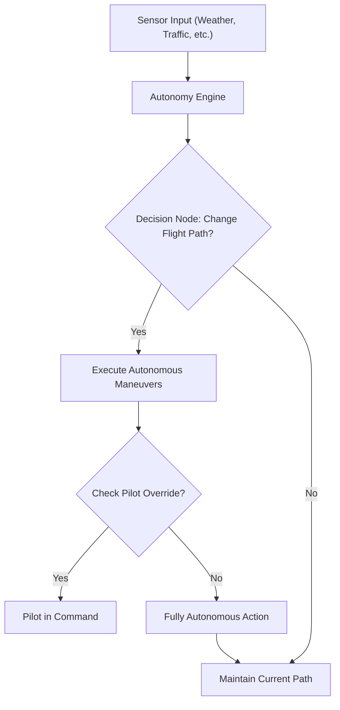
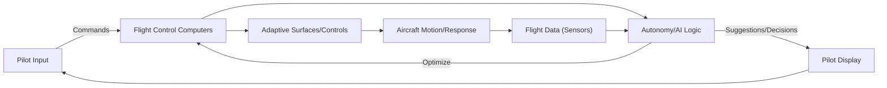
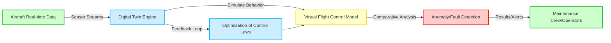

# **FTC_27-00-00-00-000 – ATA 27: Flight Controls**

## **Version History**

| **Version** | **Date**       | **Author**                                                                                           | **Description / Change Notes**                                                                                                                                                      | **Affected Sections**                                      |
|:-----------:|:--------------:|:-----------------------------------------------------------------------------------------------------:|:-------------------------------------------------------------------------------------------------------------------------------------------------------------------------------------:|:----------------------------------------------------------:|
| **1.0**     | **2024-12-31** | **Amedeo Pelliccia, ChatGPT, Copilot, Gemini, Perplexity AI, Mermaid AI**                             | **Creation of the consolidated Flight Controls document, integrating advanced technologies (AI, fly-by-wire enhancements, predictive maintenance, etc.)**                             | **All**                                                    |
| **1.1**     | **2025-01-15** | **Amedeo Pelliccia, User Feedback Incorporation, ChatGPT, Gemini, Perplexity AI**                     | **Initial draft of ATA 27 Flight Controls. Added key sections, placeholders for diagrams, and references to advanced control systems.**                                              | **All**                                                    |
| **1.2**     | **2025-01-20** | **Amedeo Pelliccia, ChatGPT, Gemini, Copilot**                                                        | **Incorporated additional sections on system diagnostics, cross-industry innovations, and environmental challenges. Expanded diagrams and HMIs.**                                     | **27.190, 27.200, 27.210, 27.220, 27.230**                  |

---

## **ATA 27 – Flight Controls: Table of Contents**

1.  [**27.10 Introduction**](#2710-introduction)  
    *Overview of flight control systems' evolution, basic definitions, and historical milestones, including the impact of the GAIA AIR AMPEL360's innovative design.*

2.  [**27.20 Scope and Objectives**](#2720-scope-and-objectives)  
    *Defines ATA 27 system boundaries—primary/secondary controls, high-lift devices, advanced features—and highlights safety, reliability, compliance goals, and the specific challenges/opportunities presented by the AMPEL360's adaptive aerostructures.*

3.  [**27.30 Regulatory Requirements**](#2730-regulatory-requirements)  
    - **27.30.1 FAA Regulations** *(FAR Part 25, AC references, etc.)*  
    - **27.30.2 EASA CS-25**  
    - **27.30.3 ICAO Standards**  
    - **27.30.4 Emerging Regulations** *(AI in flight controls, novel actuation systems, cybersecurity, etc.)*

4.  [**27.40 Primary Flight Controls**](#2740-primary-flight-controls)  
    - **27.40.1 Aileron Systems** *(Mechanical, FBW, or hybrid)*  
    - **27.40.2 Elevator Systems** *(Stabilizer trim, autopilot coupling)*  
    - **27.40.3 Rudder Systems** *(Yaw damping, mechanical vs. electro-mechanical)*  
    - **27.40.4 Fly-by-Wire Fundamentals** *(Signal processing, redundancy, architecture)*

5.  [**27.50 Secondary Flight Controls**](#2750-secondary-flight-controls)  
    - **27.50.1 Flaps and Slats** *(High-lift devices, actuation methods)*  
    - **27.50.2 Spoilers/Ground Spoilers** *(Roll augmentation, lift dumping)*  
    - **27.50.3 Airbrakes/Speedbrakes**  
    - **27.50.4 Trim Systems** *(Horizontal stabilizer trim, autopilot integration)*

6.  [**27.60 Hydraulic/Electric Actuation Systems**](#2760-hydraulic-electric-actuation-systems)  
    - **27.60.1 Hydraulic Actuators** *(Pressures, reservoirs, redundancy)*  
    - **27.60.2 Electro-Hydraulic/Electro-Mechanical Actuators** *(Power-by-wire concepts)*  
    - **27.60.3 Backup Systems** *(Ram Air Turbine, emergency actuation)*

7.  [**27.70 Advanced Technologies in Flight Controls**](#2770-advanced-technologies-in-flight-controls)  
    - **27.70.1 Active Control Sidesticks** *(Force feedback, pilot coupling issues)*  
    - **27.70.2 AI-Augmented Flight Stability** *(Real-time data analytics, predictive control, integration with adaptive aerostructures)*  
    - **27.70.3 Health Monitoring Sensors** *(Continuous detection of actuator wear/failures, sensor fusion for adaptive aerostructures)*  
    - **27.70.4 Morphing Wing Surfaces** *(Adaptive structures, integrated flight controls, specific considerations for the AMPEL360's distributed control surfaces)*  
    - **27.70.5 Integrated Solar Power Management** *(Management/utilization of power generated by solar panels on adaptive aerostructures)*

8.  [**27.80 Maintenance and Inspection Protocols**](#2780-maintenance-and-inspection-protocols)  
    - **27.80.1 Scheduled Inspections** *(Intervals, recommended checks for mechanical linkages, actuators, adaptive aerostructures)*  
    - **27.80.2 Corrective Maintenance** *(Troubleshooting flight control anomalies, system resets)*  
    - **27.80.3 Predictive Maintenance** *(Sensor data, AI analytics for proactively identifying wear/failures, with a focus on the AMPEL360's unique systems)*  
    - **27.80.4 Automated Maintenance Tools** *(Drones for surface checks, robotic assistance for large aircraft, automated diagnostics for adaptive aerostructures)*

9.  [**27.90 Human Factors and Ergonomics**](#2790-human-factors-and-ergonomics)  
    - **27.90.1 Flight Deck Interface** *(Control column/stick design, force feedback, pilot warnings)*  
    - **27.90.2 Crew Training for Advanced Systems** *(Handling characteristics, system reversion modes, training for adaptive aerostructure management)*  
    - **27.90.3 Maintenance Ergonomics** *(Ease of access to flight control linkages, sensors, etc.)*

10. [**27.170 Human-Machine Interfaces (HMI)**](#27170-human-machine-interfaces-hmi)  
    - **27.170.1 Interface Design Principles**  
    - **27.170.2 Haptic Feedback Systems**  
    - **27.170.3 Visual and Auditory Alerts**  
    - **27.170.4 Pilot Workload Reduction Techniques**

11. [**27.190 Software Integrity and Validation**](#27190-software-integrity-and-validation)  
    - **27.190.1 Software Development Lifecycle (SDLC) for Flight Controls**  
    - **27.190.2 Code Verification and Validation**  
    - **27.190.3 Cybersecurity Measures for Flight Control Software**  
    - **27.190.4 Continuous Software Monitoring and Updates**

12. [**27.200 Feedback Systems and Pilot Input Integration**](#27200-feedback-systems-and-pilot-input-integration)  
    - **27.200.1 Pilot Input Processing**  
    - **27.200.2 Feedback Mechanisms (Visual, Auditory, Haptic)**  
    - **27.200.3 Adaptive Control Responses Based on Pilot Input**  
    - **27.200.4 Enhancing Pilot Situational Awareness through Feedback Systems**

13. [**27.140 Integrated System Diagnostics and Alerts**](#27140-integrated-system-diagnostics-and-alerts)  
    - **27.140.1 Sensor Fusion Techniques**  
    - **27.140.2 Fault Detection Algorithms**  
    - **27.140.3 Alert Prioritization Mechanisms**  
    - **27.140.4 Maintenance Notifications**

14. [**27.150 Safety Assurance and Certification Processes**](#27150-safety-assurance-and-certification-processes)  
    - **27.150.1 Safety Analysis Methods**  
    - **27.150.2 Certification Workflows**  
    - **27.150.3 Redundant Systems Validation**  
    - **27.150.4 Software Validation and Verification**

15. [**27.160 Cross-Industry Innovations**](#27160-cross-industry-innovations)  
    - **27.160.1 Automotive Sensor Technologies**  
    - **27.160.2 Robotics in Actuation**  
    - **27.160.3 Energy Sector Control Systems**

16. [**27.180 Environmental and Operational Challenges**](#27180-environmental-and-operational-challenges)  
    - **27.180.1 High Altitude Operations**  
    - **27.180.2 Tropical and Humid Conditions**  
    - **27.180.3 Polar Operations**  
    - **27.180.4 Harsh Weather Resilience**

17. [**27.100 Case Studies and Industry Practices**](#27100-case-studies-and-industry-practices)  
    - **27.100.1 Notable Flight Control Incidents** *(Lessons learned, design changes)*  
    - **27.100.2 Implementation Examples** *(Airlines adopting next-gen FBW/power-by-wire, integration of adaptive aerostructures)*  
    - **27.100.3 Common Pitfalls and Avoidance**

18. [**27.110 Collaborative Stakeholder Practices**](#27110-collaborative-stakeholder-practices)  
    - **27.110.1 OEM-Airline Partnerships** *(Joint R&D, flight test programs)*  
    - **27.110.2 Cross-Functional Teams** *(Flight ops, engineering, maintenance synergy)*  
    - **27.110.3 Regulatory/Industry Working Groups** *(ICAO, IATA, ARAC committees on flight controls)*

19. [**27.120 References and Data**](#27120-references-and-data)  
    - **27.120.1 Regulatory Documents** *(FAR Part 25.671–.699, EASA CS-25, etc.)*  
    - **27.120.2 OEM Manuals** *(Airbus, Boeing flight control design guides)*  
    - **27.120.3 R&D White Papers** *(AI-based flight control research, morphing wing studies)*  
    - **27.120.4 Case Study Repositories** *(NTSB, EASA investigation reports)*

20. [**27.130 Future Trends in Flight Controls**](#27130-future-trends-in-flight-controls)  
    - **27.130.1 AI-Driven Autonomy** *(Self-healing flight control laws, adaptive gains, autonomous decision-making)*  
    - **27.130.2 Next-Gen Materials** *(Lightweight composites for linkages, actuators, self-healing materials for adaptive aerostructures)*  
    - **27.130.3 Urban Air Mobility** *(eVTOL flight control, distributed electric propulsion, implications for the AMPEL360's distributed control surfaces)*  
    - **27.130.4 Biomimetic Controls** *(Nature-inspired solutions, bird-like wing articulation, bio-inspired adaptive surfaces)*  
    - **27.130.5 Self-Healing Materials**

---

Absolutely, let's dive into crafting an engaging and comprehensive introduction for **Flight Control Systems**.

---

## **27.10 Introduction: Flight Control Systems - Evolution, Definitions, and Milestones**

The realm of aircraft flight control systems has undergone a dramatic transformation since the dawn of heavier-than-air flight. From the rudimentary yet groundbreaking mechanics of the Wright brothers' Flyer to the sophisticated, computer-driven systems of modern aircraft like the **GAIA AIR AMPEL360**, the evolution of flight control technology has been a continuous pursuit of enhanced safety, performance, and efficiency.

### **Early Days and Mechanical Beginnings**

The Wright brothers' success in 1903 was predicated on their ingenious understanding of three-axis control. Their system, relying on **wing warping, a movable rudder, and an elevator**, all manipulated through a series of wires and pulleys, established the fundamental principles that still underpin flight control today. These early mechanical systems, while effective for their time, were physically demanding for pilots and limited the size and speed of aircraft that could be practically controlled.

### **The Rise of Hydraulics**

As aviation progressed and aircraft became larger and faster, the aerodynamic forces acting on control surfaces grew beyond the physical capabilities of pilots. The introduction of **hydraulically-assisted controls** in the 1930s revolutionized the field. These systems used hydraulic pressure to amplify the pilot's inputs, making it possible to control larger and faster aircraft with less physical effort. This era also saw the development of early **autopilot systems**, further reducing pilot workload by automating basic flight control functions.

### **The Fly-by-Wire Revolution**

The latter half of the 20th century witnessed a paradigm shift with the advent of **fly-by-wire (FBW)** technology. This revolutionary approach replaced mechanical linkages with electronic signals, transmitting pilot commands to control surface actuators via electrical wires and computers. The **Concorde** and the **Apollo Lunar Module** were pioneers in utilizing FBW, but it was the **Airbus A320** in 1984 that brought digital FBW to the commercial airliner market, setting a new industry standard.

### **Advantages of Fly-by-Wire**

FBW systems offer numerous advantages over traditional mechanical or hydromechanical systems:

- **Weight Reduction:** Eliminating heavy mechanical linkages significantly reduces aircraft weight, leading to improved fuel efficiency.
- **Improved Handling and Performance:** Computers can process pilot inputs and sensor data to optimize aircraft response and stability, resulting in smoother, more precise control.
- **Enhanced Safety:** FBW systems incorporate multiple levels of redundancy, ensuring continued operation even in the event of component failures. Flight envelope protection features prevent pilots from exceeding structural or aerodynamic limits.
- **Reduced Pilot Workload:** FBW automates many routine tasks, such as trimming and stability augmentation, freeing pilots to focus on higher-level decision-making.
- **Easier Integration:** FBW facilitates the integration of autopilot, autothrottle, and other automated systems, paving the way for increased automation.

### **The GAIA AIR AMPEL360 and the Next Generation**

The **GAIA AIR AMPEL360** represents the next step in the evolution of flight control. Building upon the foundation of FBW, it incorporates groundbreaking technologies that further enhance safety, efficiency, and performance:

- **Lightweight Solar Panel-Embedded Adaptive Aerodynamic Aerostructures:** Distributed control surfaces embedded with solar panels provide unprecedented levels of aerodynamic optimization, maneuverability, and energy efficiency.
- **Advanced Sensor Fusion:** A dense network of sensors provides real-time data on the aircraft's state, the environment, and the performance of the adaptive aerostructures. This data is fused together to provide a comprehensive picture for the flight control system.
- **AI-Augmented Flight Controls:** Sophisticated AI algorithms process sensor data, optimize the configuration of the adaptive aerostructures, and assist the pilot in making critical decisions.
- **Intuitive Pilot Interfaces:** Advanced HMIs, including haptic feedback and augmented reality displays, provide pilots with intuitive control and enhanced situational awareness.
- **Robust Cybersecurity:** Given the interconnected nature of the **AMPEL360**'s systems, robust cybersecurity measures are integrated to protect against potential threats, ensuring the integrity and safety of the flight control system.

### **Future Trends**

The evolution of flight control systems is far from over. Emerging trends that will shape the future of this field include:

- **Increased Autonomy:** Further development of AI and autonomous systems will lead to greater levels of automation, potentially culminating in fully autonomous flight.
- **Biomimetic Design:** Inspiration from nature, such as bird flight, will lead to innovative control strategies and more efficient, adaptable aircraft designs.
- **Self-Healing Systems:** Materials and systems that can automatically detect and repair damage will enhance safety and reduce maintenance.
- **Urban Air Mobility (UAM):** The rise of eVTOL aircraft will require new approaches to flight control to manage the complexities of distributed electric propulsion and urban airspace.

### **Conclusion**

From the Wright brothers' simple yet effective mechanical controls to the advanced, AI-powered systems of the **GAIA AIR AMPEL360**, flight control technology has continuously evolved to meet the ever-increasing demands of aviation. This evolution has been driven by a relentless pursuit of safety, efficiency, and performance. As we look to the future, we can expect even more radical innovations that will further transform the way we fly, making air travel safer, more sustainable, and more accessible to all.

---

Below is the **comprehensive Scope and Objectives section** for **ATA 27 – Flight Controls**, now fully integrated with considerations specific to the **GAIA AIR AMPEL360**. At the end, you'll find an **optional diagram** that further illustrates how AMPEL360’s adaptive aerostructures, solar power integration, and AI-based control fit into the overarching goals of ATA 27.


## **27.20 Scope and Objectives**

This section defines the scope of **ATA Chapter 27 – Flight Controls**, outlining the systems, components, and functions encompassed within this chapter. It also establishes the primary objectives that guide the design, implementation, maintenance, and operation of flight control systems, with particular attention to the innovations introduced by the **GAIA AIR AMPEL360**.

### **27.20.1 Scope**

ATA Chapter 27 covers all systems and components directly involved in controlling the aircraft's attitude, trajectory, and aerodynamic configuration. This includes, but is not limited to:

#### **A. Primary Flight Controls**
1. **Ailerons**  
   *Surfaces (often on the trailing edge of the wings) controlling roll (longitudinal axis).*
2. **Elevators**  
   *Surfaces (usually on the horizontal stabilizer) controlling pitch (lateral axis).*
3. **Rudder**  
   *Surface (on the vertical stabilizer) controlling yaw (vertical axis).*
4. **Associated Actuation Systems**  
   *Hydraulic, electric, or hybrid actuators, as well as mechanical linkages (cables, pushrods, bellcranks).*
5. **Fly-by-Wire (FBW) Systems**  
   *Replacing mechanical linkages with electrical signals and computer-based control laws.*

#### **B. Secondary Flight Controls**
1. **Spoilers/Speedbrakes**  
   *Surfaces that can be deployed to increase drag, reduce lift, or augment roll control.*
2. **Trim Systems**  
   *Allows adjusting aerodynamic forces for a desired attitude without continuous control input (e.g., stabilizer trim).*
3. **High-Lift Devices**  
   - **Flaps** (Trailing edge)  
   - **Slats** (Leading edge)  
   *Systems that increase lift at low speeds, aiding takeoff/landing.*
4. **Actuation and Control Mechanisms**  
   *Hydraulic, electric, or hybrid actuators plus linkages for deploying high-lift devices.*

#### **C. Advanced Flight Control Features**
1. **Enhanced Fly-by-Wire**  
   *Complex control laws, flight envelope protection, advanced redundancy.*
2. **Flight Envelope Protection**  
   *Stall prevention, overspeed protection, etc.*
3. **Stability Augmentation Systems (SAS)**  
   *Automatic control surface adjustments to improve stability/handling.*
4. **Autopilot/Autothrottle**  
   *Systems capable of controlling flight path and engine power automatically.*

#### **D. GAIA AIR AMPEL360 Specifics**
1. **Adaptive Aerodynamic Aerostructures**  
   *Lightweight, solar panel-embedded surfaces distributed across wings, stabilizers, and fuselage.*  
   - **Fine-Grained Aerodynamic Optimization**  
   - **Enhanced Maneuverability**  
   - **Load Alleviation**  
   - **Noise Reduction**
2. **Solar Power Integration**  
   *Flight control system managing power generated by solar panels.*
3. **Advanced Sensor Network**  
   *Dense sensors monitoring shape, position, aerodynamic forces, temperature, and power output.*
4. **AI-Augmented Control**  
   *Algorithms optimizing aerostructure configuration in real-time.*

---

### **27.20.2 Objectives**

The primary objectives governing ATA 27 — and especially the **AMPEL360**’s advanced flight control systems — include:

1. **Safety**  
   - **Reliability**: Minimize risk of failure.  
   - **Redundancy & Fault Tolerance**: Continue safe operation even under component failures.  
   - **Failure Detection & Isolation**: Rapidly detect and isolate faults.  
   - **Emergency Preparedness**: Clearly defined procedures for malfunctions.

2. **Reliability**  
   - **Robust Design**: Proven engineering principles, high-quality components.  
   - **Redundancy**: Independent systems/components.  
   - **Rigorous Testing**: Ensuring performance under all conditions.  
   - **Predictive Maintenance**: Using sensor data/AI to foresee and prevent failures.

3. **Regulatory Compliance**  
   - **Certification Standards**: FAR Part 25, EASA CS-25, ICAO guidelines.  
   - **Airworthiness Requirements**: Strength, structural integrity, flammability, emergency operation.  
   - **Software Integrity & Cybersecurity**: Ensuring flight-critical software meets regulatory expectations.  
   - **Human Factors**: Compliance with cockpit ergonomics, pilot training needs.

4. **Performance Optimization**  
   - **Aerodynamic Efficiency**: Minimizing drag, maximizing lift.  
   - **Fuel Savings**: Smart control strategies to reduce fuel burn.  
   - **Maneuverability & Stability**: Balancing agility with stable handling qualities.

5. **Integration**  
   - **Interfacing with Other Aircraft Systems**: Hydraulic, electrical, avionics, engine controls.  
   - **Adaptive Aerostructures**: Coordinating distributed surfaces with traditional control surfaces.  
   - **Power Management**: Efficiently sharing resources (hydraulic, electric, solar).

6. **Adaptability (AMPEL360 Focus)**  
   - **Real-Time Control**: Adjusting shape/configuration continuously for optimum performance.  
   - **AI Integration**: Data-driven optimization of flight controls.  
   - **Sensor Fusion**: Comprehensive system awareness.  
   - **Morphing Aerostructures**: Managing flexible wing surfaces.

7. **Advanced Materials Integration**  
   - **Specialized Actuators**: Compatible with flexible, composite surfaces.  
   - **Embedded Sensors**: Monitoring health/performance of composite structures.  
   - **Lightweight & Smart Materials**: Minimizing mass while maximizing functionality.

8. **Enhanced Efficiency**  
   - **Reduced Drag & Increased Lift**: Dynamic shape adjustments.  
   - **Improved Fuel Economy**: Aerodynamic optimization, efficient power usage.  
   - **Solar Energy Utilization**: Supplementary power from solar panels for actuators/systems.

9. **Certification Pathway**  
   - **Novel Technologies**: Working closely with regulators on advanced control laws.  
   - **Extensive Simulation & Flight Testing**: Proving system safety/reliability.  
   - **Transparent Data Sharing**: Demonstrating compliance at every stage.

10. **Human Factors**  
    - **Intuitive Controls**: Uncomplicated interface for pilots.  
    - **Appropriate Feedback**: Clear status on adaptive surfaces.  
    - **Minimized Workload**: Managing distributed surfaces without overwhelming the crew.  
    - **Comprehensive Training**: Educating pilots/maintenance staff on advanced features.


### **27.20.3 Diagram**


**Diagram Explanation**:

- **ATA_27_Scope**  
  - *A (Primary Controls), B (Secondary Controls), C (Advanced Features)*: The standard categories within flight controls.  
  - *D (AMPEL360 Adaptations)*: Highlights the unique, morphing, and solar-integrated surfaces.

- **ATA_27_Objectives**  
  - *E (Safety), F (Reliability), G (Regulatory Compliance)*: Core pillars ensuring any flight control system is safe, robust, and certified.  
  - *H (Performance Optimization), I (Integration)*: Stressing the interplay among various subsystems and overall aircraft efficiency.  
  - *J (Adaptability/AI), K (Efficiency, incl. solar usage)*: AMPEL360’s specialized focus on real-time morphing surfaces and solar-energy synergy.  
  - *L (Human Factors)*: Ensuring advanced controls don’t overwhelm the flight crew.

---

### **Conclusion**

By defining the **Scope and Objectives** in this structured way, **ATA Chapter 27** ensures that *all* flight control systems—ranging from conventional mechanical linkages to **GAIA AIR AMPEL360**’s cutting-edge adaptive aerostructures—adhere to the highest standards of **safety, reliability, performance, and sustainability**. This unified framework addresses:

- **Traditional Mechanisms** (ailerons, elevators, rudder, high-lift devices),
- **Novel Technologies** (fly-by-wire, AI-based stability augmentation),
- **AMPEL360 Specific Features** (distributed, solar-embedded, morphing wing surfaces).

The ultimate goal is to **guarantee reliable flight control** across all phases of flight, minimize environmental impact, and push the boundaries of aviation innovation.


## **Additional Proposed Sections and Diagrams**

Below are some *optional* sections and **new diagrams** you might consider adding to provide even deeper insights into the **GAIA AIR AMPEL360** and next-generation flight control systems:

---

### **27.240 Autonomous Flight Control Algorithms**

*(Exploring the increasing role of autonomy in flight control decisions.)*

**Purpose:**  
To describe the algorithms and decision-making processes that enable autonomous or semi-autonomous flight control, focusing on how these systems integrate pilot authority, AI-based logic, and safety protocols.

**Key Topics:**
1. **Autonomous Mode Transition:**  
   - How the system transitions between manual, semi-autonomous, and fully autonomous control modes.
   - Pilot override procedures to ensure human authority remains paramount.
2. **Decision-Tree Analysis / State Machines:**  
   - The use of logic trees or state machines for dynamic flight path adjustments under changing conditions.
3. **Fail-Safe Mechanisms:**  
   - Redundancy and fallback strategies if autonomous algorithms detect anomalies or fail to converge on a safe decision.
4. **Integration with Adaptive Aerostructures:**  
   - Specific considerations for the **AMPEL360**, ensuring the distributed control surfaces align with autonomous flight goals.




### **Rendered Diagram**


### **Diagram Description**
This flowchart depicts the workflow of an **Autonomy Engine** for an aircraft:
1. **Sensor Inputs:** Weather conditions, traffic data, and other inputs feed into the autonomy engine.
2. **Decision Node:** The engine determines whether to change the flight path.
3. **Execution:** 
   - If a change is required, autonomous maneuvers are executed.
   - If no change is needed, the current flight path is maintained.
4. **Pilot Override Check:** Post-maneuver, the system verifies if the pilot wishes to override the autonomy.
   - If the pilot overrides, they resume command.
   - If not, the system proceeds with fully autonomous actions.

This architecture ensures a balance between pilot authority and autonomous decision-making, enhancing safety and efficiency.

---

### **27.250 Solar Energy Harvesting and Management in Flight Controls**

*(Detailing how solar power is integrated and utilized within flight control systems.)*

**Purpose:**  
To elaborate on how solar energy is harvested via the **AMPEL360**’s solar panel-embedded aerostructures and channeled into flight control operations, addressing storage, distribution, and redundancy.

**Key Topics:**
1. **Energy Flow Management:**  
   - Balancing solar-derived power with traditional sources (e.g., APU, batteries).
   - Priority rules (flight controls vs. non-critical systems) under various flight phases.
2. **Storage and Conversion:**  
   - Inverters or DC-DC converters ensuring stable voltage supply to actuators and avionics.
   - Battery or supercapacitor buffers for peak demand management.
3. **Efficiency Considerations:**  
   - Minimizing losses during power conversion.
   - Adaptive shading or “smart skin” technology to maintain optimal solar panel angles.
4. **Monitoring and Fault Detection:**  
   - Real-time health checks of solar arrays to isolate faulty panels.
   - Automatic re-routing of power flow if panels degrade or fail.




### **Diagram Description**
This flowchart illustrates the **Pilot-Automation Synergy** workflow:
1. **Pilot Input:** Commands from the pilot are processed by the Flight Control Computers (FCS).
2. **Autonomy/AI Logic:** The AI optimizes flight control commands and sends suggestions or automated decisions back to the FCS.
3. **Adaptive Surfaces/Controls:** Adjustments are made to the aircraft's control surfaces or adaptive systems.
4. **Aircraft Motion/Response:** The physical response of the aircraft, influenced by the control inputs.
5. **Flight Data Sensors:** Real-time data from sensors monitor the aircraft's motion and environment.
6. **Feedback Loop:** Sensor data is fed back into the AI to refine decisions.
7. **Pilot Display:** Suggestions and system feedback are displayed for the pilot’s review, enabling further input or override.

This diagram emphasizes the collaborative dynamics between human input and automated systems, ensuring safety, efficiency, and adaptability during flight operations.


---

### **27.260 Collaborative Automation: Human and Machine Synergy**

*(Ensuring smooth coordination between pilot inputs and automated systems.)*

**Purpose:**  
To explore how pilots and automated systems share control in advanced aircraft like the **AMPEL360**, optimizing performance while maintaining safety and pilot authority.

**Key Topics:**
1. **Shared Control Logic:**  
   - Dividing tasks between pilot and automation (e.g., autopilot managing lateral guidance, pilot retaining vertical authority).
   - Clear demarcations of roles to prevent confusion or overlap.
2. **Transition Protocols:**  
   - Safe handover procedures between automation levels (manual → autopilot → partial autonomy → full autonomy).
   - Alerting pilots to mode changes, with an option to override or confirm.
3. **Synergy in Decision-Making:**  
   - AI-based suggestions to pilots, who may accept/reject them.
   - Collaborative real-time adjustments (e.g., pilot adjusting thrust while AI configures adaptive surfaces).
4. **Human Factors & Automation Bias:**  
   - Strategies to prevent over-reliance on or mistrust of automation.
   - Display design ensuring pilot awareness of automation decisions.

```mermaid
flowchart LR
    P[Pilot Input] -->|Commands| FCS[Flight Control Computers]
    FCS --> AI[Autonomy/AI Logic]
    AI -->|Optimize| FCS
    FCS --> SURF[Adaptive Surfaces/Controls]
    SURF --> AC[Aircraft Motion/Response]
    AC --> FD[Flight Data (Sensors)]
    FD --> AI
    AI -->|Suggestions/Decisions| PD[Pilot Display]
    PD --> P
```

*Mermaid diagram illustrating pilot-automation synergy in controlling adaptive surfaces and responding to flight data.*

Below is a **recommended additional diagram** and an **optional section** that might further clarify the **GAIA AIR AMPEL360**’s unique flight control challenges and solutions. You can integrate these into the document where they best fit (e.g., in the **Advanced Technologies** or **Future Trends** sections):

---

## **27.270 Digital Twin and Virtual Testing Environment**

*(Enhancing simulation, validation, and predictive maintenance for adaptive flight control systems.)*

**Purpose:**
To describe how a **Digital Twin**—a real-time, virtual replica of the aircraft’s flight control system—can support both design and operational phases, especially for an aircraft as advanced as the **GAIA AIR AMPEL360**.

**Key Topics:**
1. **Real-Time Simulation and Verification**  
   - **Virtual Testing**: Running flight control algorithms through rigorous simulations before flight.  
   - **Stress Testing**: Evaluating unusual or emergency scenarios (e.g., extreme weather, subsystem failure).  
   - **Adaptive Aerostructures**: Simulating the shape changes of distributed surfaces, verifying energy usage, and analyzing performance benefits.

2. **Predictive Maintenance**  
   - **Sensor Data Integration**: Pulling real-time data from onboard sensors (health monitoring, actuator performance) into the digital twin.  
   - **Anomaly Detection**: Identifying early signs of wear or deviations in the control surfaces, triggers for pre-emptive maintenance.  
   - **Lifecycle Tracking**: Logging the stress and usage data on each adaptive panel or actuator, informing refurbishment or replacement schedules.

3. **Continuous Improvement**  
   - **Flight Data Feedback**: Using operational flight data to refine the digital twin’s accuracy.  
   - **Algorithm Optimization**: Tweaking AI-based control laws to respond better to real-world dynamics, gradually improving performance and reliability.  
   - **Crew Feedback Integration**: Incorporating pilot feedback to refine HMI design and reduce workload.

4. **Cybersecurity Implications**  
   - **Secure Communication**: Ensuring that data flow between the real aircraft and the digital twin is protected from tampering.  
   - **Safe Update Mechanisms**: Testing new software or AI models within the twin environment before deploying them to the live aircraft.

### Potential Diagram: Digital Twin Workflow



**Explanation:**
1. **Aircraft Real-time Data**: Actuator positions, panel angles, sensor streams flow into the Digital Twin Engine.
2. **Digital Twin Engine**: Simulates or mirrors the aircraft’s flight control states (especially the adaptive surfaces) in real-time or near-real-time.
3. **Virtual Flight Control Model**: Runs the flight control algorithms, replicates dynamic responses.
4. **Comparative Analysis & Fault Detection**: Compares virtual predictions with actual performance, flags deviations.
5. **Maintenance & Operators**: Receives alerts, scheduling proactive maintenance if anomalies are detected.
6. **Control Law Optimization**: The twin helps improve AI algorithms and flight control logic iteratively.

---

### Why This May Help

- **Clarifies Complex Interactions**: Shows how real-time data from the **AMPEL360** can be used to refine predictive models for adaptive aerostructures and flight controls.
- **Encourages Proactive Maintenance**: Demonstrates a workflow for catching issues early, reducing downtime.
- **Future-Proofs The Documentation**: Digital twin technology is increasingly common in advanced aerospace programs, aligning with the **GAIA AIR** vision of cutting-edge, sustainable aviation solutions.

By adding this **Digital Twin** concept (Section **27.270**) and corresponding diagram, you’ll give readers more insight into how modern aircraft like the **AMPEL360** can integrate simulation, data analytics, and predictive maintenance in a continuous improvement cycle—further enhancing safety, reliability, and sustainability of next-generation flight control systems.
```
