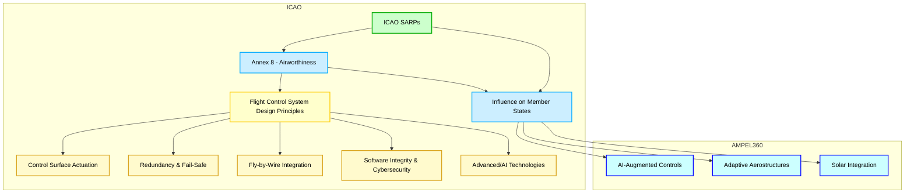
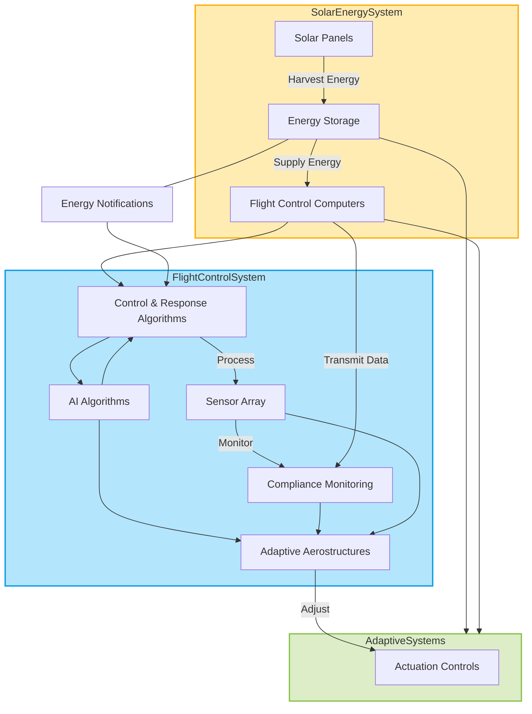
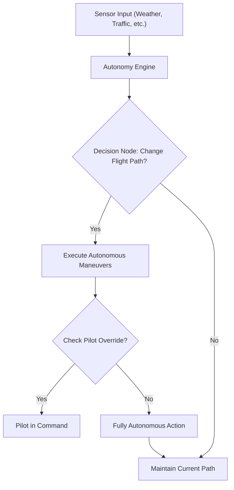
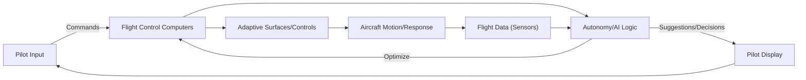

# **FTC_27-00-00-00-000 – ATA 27: Flight Controls**

## **Version History**

| **Version** | **Date**       | **Author**                                                                                           | **Description / Change Notes**                                                                                                                                                      | **Affected Sections**                                      |
|:-----------:|:--------------:|:-----------------------------------------------------------------------------------------------------:|:-------------------------------------------------------------------------------------------------------------------------------------------------------------------------------------:|:----------------------------------------------------------:|
| **1.0**     | **2024-12-31** | **Amedeo Pelliccia, ChatGPT, Copilot, Gemini, Perplexity AI, Mermaid AI**                             | **Creation of the consolidated Flight Controls document, integrating advanced technologies (AI, fly-by-wire enhancements, predictive maintenance, etc.)**                             | **All**                                                    |


---

## **ATA 27 – Flight Controls: Table of Contents**

1.  [**27.10 Introduction**](#2710-introduction)  
    *Overview of flight control systems' evolution, basic definitions, and historical milestones, including the impact of the GAIA AIR AMPEL360's innovative design.*

2.  [**27.20 Scope and Objectives**](#2720-scope-and-objectives)  
    *Defines ATA 27 system boundaries—primary/secondary controls, high-lift devices, advanced features—and highlights safety, reliability, compliance goals, and the specific challenges/opportunities presented by the AMPEL360's adaptive aerostructures.*

3.  [**27.30 Regulatory Requirements**](#2730-regulatory-requirements)  
    - **27.30.1 FAA Regulations** *(FAR Part 25, AC references, etc.)*  
    - **27.30.2 EASA CS-25**  
    - **27.30.3 ICAO Standards**  
    - **27.30.4 Emerging Regulations** *(AI in flight controls, novel actuation systems, cybersecurity, etc.)*

4.  [**27.40 Primary Flight Controls**](#2740-primary-flight-controls)  
    - **27.40.1 Aileron Systems** *(Mechanical, FBW, or hybrid)*  
    - **27.40.2 Elevator Systems** *(Stabilizer trim, autopilot coupling)*  
    - **27.40.3 Rudder Systems** *(Yaw damping, mechanical vs. electro-mechanical)*  
    - **27.40.4 Fly-by-Wire Fundamentals** *(Signal processing, redundancy, architecture)*

5.  [**27.50 Secondary Flight Controls**](#2750-secondary-flight-controls)  
    - **27.50.1 Flaps and Slats** *(High-lift devices, actuation methods)*  
    - **27.50.2 Spoilers/Ground Spoilers** *(Roll augmentation, lift dumping)*  
    - **27.50.3 Airbrakes/Speedbrakes**  
    - **27.50.4 Trim Systems** *(Horizontal stabilizer trim, autopilot integration)*

6.  [**27.60 Hydraulic/Electric Actuation Systems**](#2760-hydraulic-electric-actuation-systems)  
    - **27.60.1 Hydraulic Actuators** *(Pressures, reservoirs, redundancy)*  
    - **27.60.2 Electro-Hydraulic/Electro-Mechanical Actuators** *(Power-by-wire concepts)*  
    - **27.60.3 Backup Systems** *(Ram Air Turbine, emergency actuation)*

7.  [**27.70 Advanced Technologies in Flight Controls**](#2770-advanced-technologies-in-flight-controls)  
    - **27.70.1 Active Control Sidesticks** *(Force feedback, pilot coupling issues)*  
    - **27.70.2 AI-Augmented Flight Stability** *(Real-time data analytics, predictive control, integration with adaptive aerostructures)*  
    - **27.70.3 Health Monitoring Sensors** *(Continuous detection of actuator wear/failures, sensor fusion for adaptive aerostructures)*  
    - **27.70.4 Morphing Wing Surfaces** *(Adaptive structures, integrated flight controls, specific considerations for the AMPEL360's distributed control surfaces)*  
    - **27.70.5 Integrated Solar Power Management** *(Management/utilization of power generated by solar panels on adaptive aerostructures)*

8.  [**27.80 Maintenance and Inspection Protocols**](#2780-maintenance-and-inspection-protocols)  
    - **27.80.1 Scheduled Inspections** *(Intervals, recommended checks for mechanical linkages, actuators, adaptive aerostructures)*  
    - **27.80.2 Corrective Maintenance** *(Troubleshooting flight control anomalies, system resets)*  
    - **27.80.3 Predictive Maintenance** *(Sensor data, AI analytics for proactively identifying wear/failures, with a focus on the AMPEL360's unique systems)*  
    - **27.80.4 Automated Maintenance Tools** *(Drones for surface checks, robotic assistance for large aircraft, automated diagnostics for adaptive aerostructures)*

9.  [**27.90 Human Factors and Ergonomics**](#2790-human-factors-and-ergonomics)  
    - **27.90.1 Flight Deck Interface** *(Control column/stick design, force feedback, pilot warnings)*  
    - **27.90.2 Crew Training for Advanced Systems** *(Handling characteristics, system reversion modes, training for adaptive aerostructure management)*  
    - **27.90.3 Maintenance Ergonomics** *(Ease of access to flight control linkages, sensors, etc.)*

10. [**27.170 Human-Machine Interfaces (HMI)**](#27170-human-machine-interfaces-hmi)  
    - **27.170.1 Interface Design Principles**  
    - **27.170.2 Haptic Feedback Systems**  
    - **27.170.3 Visual and Auditory Alerts**  
    - **27.170.4 Pilot Workload Reduction Techniques**

11. [**27.190 Software Integrity and Validation**](#27190-software-integrity-and-validation)  
    - **27.190.1 Software Development Lifecycle (SDLC) for Flight Controls**  
    - **27.190.2 Code Verification and Validation**  
    - **27.190.3 Cybersecurity Measures for Flight Control Software**  
    - **27.190.4 Continuous Software Monitoring and Updates**

12. [**27.200 Feedback Systems and Pilot Input Integration**](#27200-feedback-systems-and-pilot-input-integration)  
    - **27.200.1 Pilot Input Processing**  
    - **27.200.2 Feedback Mechanisms (Visual, Auditory, Haptic)**  
    - **27.200.3 Adaptive Control Responses Based on Pilot Input**  
    - **27.200.4 Enhancing Pilot Situational Awareness through Feedback Systems**

13. [**27.140 Integrated System Diagnostics and Alerts**](#27140-integrated-system-diagnostics-and-alerts)  
    - **27.140.1 Sensor Fusion Techniques**  
    - **27.140.2 Fault Detection Algorithms**  
    - **27.140.3 Alert Prioritization Mechanisms**  
    - **27.140.4 Maintenance Notifications**

14. [**27.150 Safety Assurance and Certification Processes**](#27150-safety-assurance-and-certification-processes)  
    - **27.150.1 Safety Analysis Methods**  
    - **27.150.2 Certification Workflows**  
    - **27.150.3 Redundant Systems Validation**  
    - **27.150.4 Software Validation and Verification**

15. [**27.160 Cross-Industry Innovations**](#27160-cross-industry-innovations)  
    - **27.160.1 Automotive Sensor Technologies**  
    - **27.160.2 Robotics in Actuation**  
    - **27.160.3 Energy Sector Control Systems**

16. [**27.180 Environmental and Operational Challenges**](#27180-environmental-and-operational-challenges)  
    - **27.180.1 High Altitude Operations**  
    - **27.180.2 Tropical and Humid Conditions**  
    - **27.180.3 Polar Operations**  
    - **27.180.4 Harsh Weather Resilience**

17. [**27.100 Case Studies and Industry Practices**](#27100-case-studies-and-industry-practices)  
    - **27.100.1 Notable Flight Control Incidents** *(Lessons learned, design changes)*  
    - **27.100.2 Implementation Examples** *(Airlines adopting next-gen FBW/power-by-wire, integration of adaptive aerostructures)*  
    - **27.100.3 Common Pitfalls and Avoidance**

18. [**27.110 Collaborative Stakeholder Practices**](#27110-collaborative-stakeholder-practices)  
    - **27.110.1 OEM-Airline Partnerships** *(Joint R&D, flight test programs)*  
    - **27.110.2 Cross-Functional Teams** *(Flight ops, engineering, maintenance synergy)*  
    - **27.110.3 Regulatory/Industry Working Groups** *(ICAO, IATA, ARAC committees on flight controls)*

19. [**27.120 References and Data**](#27120-references-and-data)  
    - **27.120.1 Regulatory Documents** *(FAR Part 25.671–.699, EASA CS-25, etc.)*  
    - **27.120.2 OEM Manuals** *(Airbus, Boeing flight control design guides)*  
    - **27.120.3 R&D White Papers** *(AI-based flight control research, morphing wing studies)*  
    - **27.120.4 Case Study Repositories** *(NTSB, EASA investigation reports)*

20. [**27.130 Future Trends in Flight Controls**](#27130-future-trends-in-flight-controls)  
    - **27.130.1 AI-Driven Autonomy** *(Self-healing flight control laws, adaptive gains, autonomous decision-making)*  
    - **27.130.2 Next-Gen Materials** *(Lightweight composites for linkages, actuators, self-healing materials for adaptive aerostructures)*  
    - **27.130.3 Urban Air Mobility** *(eVTOL flight control, distributed electric propulsion, implications for the AMPEL360's distributed control surfaces)*  
    - **27.130.4 Biomimetic Controls** *(Nature-inspired solutions, bird-like wing articulation, bio-inspired adaptive surfaces)*  
    - **27.130.5 Self-Healing Materials**

---

Absolutely, let's dive into crafting an engaging and comprehensive introduction for **Flight Control Systems**.

---

## **27.10 Introduction: Flight Control Systems - Evolution, Definitions, and Milestones**

The realm of aircraft flight control systems has undergone a dramatic transformation since the dawn of heavier-than-air flight. From the rudimentary yet groundbreaking mechanics of the Wright brothers' Flyer to the sophisticated, computer-driven systems of modern aircraft like the **GAIA AIR AMPEL360**, the evolution of flight control technology has been a continuous pursuit of enhanced safety, performance, and efficiency.

### **Early Days and Mechanical Beginnings**

The Wright brothers' success in 1903 was predicated on their ingenious understanding of three-axis control. Their system, relying on **wing warping, a movable rudder, and an elevator**, all manipulated through a series of wires and pulleys, established the fundamental principles that still underpin flight control today. These early mechanical systems, while effective for their time, were physically demanding for pilots and limited the size and speed of aircraft that could be practically controlled.

### **The Rise of Hydraulics**

As aviation progressed and aircraft became larger and faster, the aerodynamic forces acting on control surfaces grew beyond the physical capabilities of pilots. The introduction of **hydraulically-assisted controls** in the 1930s revolutionized the field. These systems used hydraulic pressure to amplify the pilot's inputs, making it possible to control larger and faster aircraft with less physical effort. This era also saw the development of early **autopilot systems**, further reducing pilot workload by automating basic flight control functions.

### **The Fly-by-Wire Revolution**

The latter half of the 20th century witnessed a paradigm shift with the advent of **fly-by-wire (FBW)** technology. This revolutionary approach replaced mechanical linkages with electronic signals, transmitting pilot commands to control surface actuators via electrical wires and computers. The **Concorde** and the **Apollo Lunar Module** were pioneers in utilizing FBW, but it was the **Airbus A320** in 1984 that brought digital FBW to the commercial airliner market, setting a new industry standard.

### **Advantages of Fly-by-Wire**

FBW systems offer numerous advantages over traditional mechanical or hydromechanical systems:

- **Weight Reduction:** Eliminating heavy mechanical linkages significantly reduces aircraft weight, leading to improved fuel efficiency.
- **Improved Handling and Performance:** Computers can process pilot inputs and sensor data to optimize aircraft response and stability, resulting in smoother, more precise control.
- **Enhanced Safety:** FBW systems incorporate multiple levels of redundancy, ensuring continued operation even in the event of component failures. Flight envelope protection features prevent pilots from exceeding structural or aerodynamic limits.
- **Reduced Pilot Workload:** FBW automates many routine tasks, such as trimming and stability augmentation, freeing pilots to focus on higher-level decision-making.
- **Easier Integration:** FBW facilitates the integration of autopilot, autothrottle, and other automated systems, paving the way for increased automation.

### **The GAIA AIR AMPEL360 and the Next Generation**

The **GAIA AIR AMPEL360** represents the next step in the evolution of flight control. Building upon the foundation of FBW, it incorporates groundbreaking technologies that further enhance safety, efficiency, and performance:

- **Lightweight Solar Panel-Embedded Adaptive Aerodynamic Aerostructures:** Distributed control surfaces embedded with solar panels provide unprecedented levels of aerodynamic optimization, maneuverability, and energy efficiency.
- **Advanced Sensor Fusion:** A dense network of sensors provides real-time data on the aircraft's state, the environment, and the performance of the adaptive aerostructures. This data is fused together to provide a comprehensive picture for the flight control system.
- **AI-Augmented Flight Controls:** Sophisticated AI algorithms process sensor data, optimize the configuration of the adaptive aerostructures, and assist the pilot in making critical decisions.
- **Intuitive Pilot Interfaces:** Advanced HMIs, including haptic feedback and augmented reality displays, provide pilots with intuitive control and enhanced situational awareness.
- **Robust Cybersecurity:** Given the interconnected nature of the **AMPEL360**'s systems, robust cybersecurity measures are integrated to protect against potential threats, ensuring the integrity and safety of the flight control system.

### **Future Trends**

The evolution of flight control systems is far from over. Emerging trends that will shape the future of this field include:

- **Increased Autonomy:** Further development of AI and autonomous systems will lead to greater levels of automation, potentially culminating in fully autonomous flight.
- **Biomimetic Design:** Inspiration from nature, such as bird flight, will lead to innovative control strategies and more efficient, adaptable aircraft designs.
- **Self-Healing Systems:** Materials and systems that can automatically detect and repair damage will enhance safety and reduce maintenance.
- **Urban Air Mobility (UAM):** The rise of eVTOL aircraft will require new approaches to flight control to manage the complexities of distributed electric propulsion and urban airspace.

### **Conclusion**

From the Wright brothers' simple yet effective mechanical controls to the advanced, AI-powered systems of the **GAIA AIR AMPEL360**, flight control technology has continuously evolved to meet the ever-increasing demands of aviation. This evolution has been driven by a relentless pursuit of safety, efficiency, and performance. As we look to the future, we can expect even more radical innovations that will further transform the way we fly, making air travel safer, more sustainable, and more accessible to all.

---

Below is the **comprehensive Scope and Objectives section** for **ATA 27 – Flight Controls**, now fully integrated with considerations specific to the **GAIA AIR AMPEL360**. At the end, you'll find an **optional diagram** that further illustrates how AMPEL360’s adaptive aerostructures, solar power integration, and AI-based control fit into the overarching goals of ATA 27.


## **27.20 Scope and Objectives**

This section defines the scope of **ATA Chapter 27 – Flight Controls**, outlining the systems, components, and functions encompassed within this chapter. It also establishes the primary objectives that guide the design, implementation, maintenance, and operation of flight control systems, with particular attention to the innovations introduced by the **GAIA AIR AMPEL360**.

### **27.20.1 Scope**

ATA Chapter 27 covers all systems and components directly involved in controlling the aircraft's attitude, trajectory, and aerodynamic configuration. This includes, but is not limited to:

#### **A. Primary Flight Controls**
1. **Ailerons**  
   *Surfaces (often on the trailing edge of the wings) controlling roll (longitudinal axis).*
2. **Elevators**  
   *Surfaces (usually on the horizontal stabilizer) controlling pitch (lateral axis).*
3. **Rudder**  
   *Surface (on the vertical stabilizer) controlling yaw (vertical axis).*
4. **Associated Actuation Systems**  
   *Hydraulic, electric, or hybrid actuators, as well as mechanical linkages (cables, pushrods, bellcranks).*
5. **Fly-by-Wire (FBW) Systems**  
   *Replacing mechanical linkages with electrical signals and computer-based control laws.*

#### **B. Secondary Flight Controls**
1. **Spoilers/Speedbrakes**  
   *Surfaces that can be deployed to increase drag, reduce lift, or augment roll control.*
2. **Trim Systems**  
   *Allows adjusting aerodynamic forces for a desired attitude without continuous control input (e.g., stabilizer trim).*
3. **High-Lift Devices**  
   - **Flaps** (Trailing edge)  
   - **Slats** (Leading edge)  
   *Systems that increase lift at low speeds, aiding takeoff/landing.*
4. **Actuation and Control Mechanisms**  
   *Hydraulic, electric, or hybrid actuators plus linkages for deploying high-lift devices.*

#### **C. Advanced Flight Control Features**
1. **Enhanced Fly-by-Wire**  
   *Complex control laws, flight envelope protection, advanced redundancy.*
2. **Flight Envelope Protection**  
   *Stall prevention, overspeed protection, etc.*
3. **Stability Augmentation Systems (SAS)**  
   *Automatic control surface adjustments to improve stability/handling.*
4. **Autopilot/Autothrottle**  
   *Systems capable of controlling flight path and engine power automatically.*

#### **D. GAIA AIR AMPEL360 Specifics**
1. **Adaptive Aerodynamic Aerostructures**  
   *Lightweight, solar panel-embedded surfaces distributed across wings, stabilizers, and fuselage.*  
   - **Fine-Grained Aerodynamic Optimization**  
   - **Enhanced Maneuverability**  
   - **Load Alleviation**  
   - **Noise Reduction**
2. **Solar Power Integration**  
   *Flight control system managing power generated by solar panels.*
3. **Advanced Sensor Network**  
   *Dense sensors monitoring shape, position, aerodynamic forces, temperature, and power output.*
4. **AI-Augmented Control**  
   *Algorithms optimizing aerostructure configuration in real-time.*

---

### **27.20.2 Objectives**

The primary objectives governing ATA 27 — and especially the **AMPEL360**’s advanced flight control systems — include:

1. **Safety**  
   - **Reliability**: Minimize risk of failure.  
   - **Redundancy & Fault Tolerance**: Continue safe operation even under component failures.  
   - **Failure Detection & Isolation**: Rapidly detect and isolate faults.  
   - **Emergency Preparedness**: Clearly defined procedures for malfunctions.

2. **Reliability**  
   - **Robust Design**: Proven engineering principles, high-quality components.  
   - **Redundancy**: Independent systems/components.  
   - **Rigorous Testing**: Ensuring performance under all conditions.  
   - **Predictive Maintenance**: Using sensor data/AI to foresee and prevent failures.

3. **Regulatory Compliance**  
   - **Certification Standards**: FAR Part 25, EASA CS-25, ICAO guidelines.  
   - **Airworthiness Requirements**: Strength, structural integrity, flammability, emergency operation.  
   - **Software Integrity & Cybersecurity**: Ensuring flight-critical software meets regulatory expectations.  
   - **Human Factors**: Compliance with cockpit ergonomics, pilot training needs.

4. **Performance Optimization**  
   - **Aerodynamic Efficiency**: Minimizing drag, maximizing lift.  
   - **Fuel Savings**: Smart control strategies to reduce fuel burn.  
   - **Maneuverability & Stability**: Balancing agility with stable handling qualities.

5. **Integration**  
   - **Interfacing with Other Aircraft Systems**: Hydraulic, electrical, avionics, engine controls.  
   - **Adaptive Aerostructures**: Coordinating distributed surfaces with traditional control surfaces.  
   - **Power Management**: Efficiently sharing resources (hydraulic, electric, solar).

6. **Adaptability (AMPEL360 Focus)**  
   - **Real-Time Control**: Adjusting shape/configuration continuously for optimum performance.  
   - **AI Integration**: Data-driven optimization of flight controls.  
   - **Sensor Fusion**: Comprehensive system awareness.  
   - **Morphing Aerostructures**: Managing flexible wing surfaces.

7. **Advanced Materials Integration**  
   - **Specialized Actuators**: Compatible with flexible, composite surfaces.  
   - **Embedded Sensors**: Monitoring health/performance of composite structures.  
   - **Lightweight & Smart Materials**: Minimizing mass while maximizing functionality.

8. **Enhanced Efficiency**  
   - **Reduced Drag & Increased Lift**: Dynamic shape adjustments.  
   - **Improved Fuel Economy**: Aerodynamic optimization, efficient power usage.  
   - **Solar Energy Utilization**: Supplementary power from solar panels for actuators/systems.

9. **Certification Pathway**  
   - **Novel Technologies**: Working closely with regulators on advanced control laws.  
   - **Extensive Simulation & Flight Testing**: Proving system safety/reliability.  
   - **Transparent Data Sharing**: Demonstrating compliance at every stage.

10. **Human Factors**  
    - **Intuitive Controls**: Uncomplicated interface for pilots.  
    - **Appropriate Feedback**: Clear status on adaptive surfaces.  
    - **Minimized Workload**: Managing distributed surfaces without overwhelming the crew.  
    - **Comprehensive Training**: Educating pilots/maintenance staff on advanced features.


### **27.20.3 Diagram**


**Diagram Explanation**:

- **ATA_27_Scope**  
  - *A (Primary Controls), B (Secondary Controls), C (Advanced Features)*: The standard categories within flight controls.  
  - *D (AMPEL360 Adaptations)*: Highlights the unique, morphing, and solar-integrated surfaces.

- **ATA_27_Objectives**  
  - *E (Safety), F (Reliability), G (Regulatory Compliance)*: Core pillars ensuring any flight control system is safe, robust, and certified.  
  - *H (Performance Optimization), I (Integration)*: Stressing the interplay among various subsystems and overall aircraft efficiency.  
  - *J (Adaptability/AI), K (Efficiency, incl. solar usage)*: AMPEL360’s specialized focus on real-time morphing surfaces and solar-energy synergy.  
  - *L (Human Factors)*: Ensuring advanced controls don’t overwhelm the flight crew.

---

### **Conclusion**

By defining the **Scope and Objectives** in this structured way, **ATA Chapter 27** ensures that *all* flight control systems—ranging from conventional mechanical linkages to **GAIA AIR AMPEL360**’s cutting-edge adaptive aerostructures—adhere to the highest standards of **safety, reliability, performance, and sustainability**. This unified framework addresses:

- **Traditional Mechanisms** (ailerons, elevators, rudder, high-lift devices),
- **Novel Technologies** (fly-by-wire, AI-based stability augmentation),
- **AMPEL360 Specific Features** (distributed, solar-embedded, morphing wing surfaces).

The ultimate goal is to **guarantee reliable flight control** across all phases of flight, minimize environmental impact, and push the boundaries of aviation innovation.


## **Additional Proposed Sections and Diagrams**

Below are some *optional* sections and **new diagrams** you might consider adding to provide even deeper insights into the **GAIA AIR AMPEL360** and next-generation flight control systems:

---

Below is a **revised and more detailed version** of **Section 27.30 – Regulatory Requirements**, focusing on **FAA regulations** and adding key details relevant to the **GAIA AIR AMPEL360**. This expanded section highlights the specific provisions and certification challenges for emerging technologies such as **AI-augmented controls**, **adaptive aerostructures**, and **solar power integration**.

### **27.30 Regulatory Requirements**

This section outlines the **regulatory framework** governing flight control systems in the United States, ensuring they meet the stringent **safety** and **performance** standards set by the **Federal Aviation Administration (FAA)**. It also addresses the **certification challenges** posed by next-generation technologies like the **GAIA AIR AMPEL360**’s **AI-augmented flight controls**, **adaptive aerostructures**, and **solar panel integration**.

---

#### **27.30.1 FAA Regulations (United States)**

The **FAA** issues regulations, primarily in **FAR Part 25**, that define airworthiness standards for transport category airplanes. Manufacturers seeking certification for advanced or unconventional flight control systems—such as those in the **GAIA AIR AMPEL360**—must demonstrate compliance with these regulations, along with Advisory Circulars (ACs) that provide guidance on acceptable means of compliance.

---

**A. FAR Part 25: Airworthiness Standards – Transport Category Airplanes**

1. **FAR 25.671 Control Systems – General**  
   - Requires flight control systems to ensure the airplane is safely controllable and maneuverable under all anticipated flight conditions.  
   - Mandates robustness to single failures, jammed or restricted surfaces, and potential system malfunctions.  
   - For the **AMPEL360**, this includes designing distributed adaptive aerostructures to provide equivalent or better safety compared to traditional ailerons, elevators, and rudder systems.

2. **FAR 25.672 Stability Augmentation and Automatic/Power-Operated Systems**  
   - Covers standards for systems that enhance an aircraft’s stability or controllability (e.g., stability augmentation, autopilots, AI-based flight controls).  
   - Relevant to the **AMPEL360**’s **AI-Augmented Flight Stability** and the coordination of adaptive aerostructures in real-time.

3. **FAR 25.675 Stops or Limit Devices**  
   - Addresses the requirement for physical or electronic stops to prevent surfaces from overtravel.  
   - Critical for adaptive surfaces in **AMPEL360**, ensuring they remain within safe deflection ranges and do not compromise structural integrity.

4. **FAR 25.677 Trim Systems**  
   - Specifies design and operational standards for trim systems, ensuring the aircraft can be trimmed safely across its operating envelope.  
   - Applicable to both conventional and novel control surfaces, including distributed “micro-trim” features of adaptive aerostructures.

5. **FAR 25.679 Control System Malfunctions**  
   - Requires design provisions to address system malfunctions, preventing catastrophic outcomes.  
   - The **AMPEL360**’s diagnostics and fault-tolerant design must demonstrate resilience to sensor or actuator failures.

6. **FAR 25.683 Operation Tests**  
   - Mandates that the control systems undergo thorough operation tests under varying conditions to prove reliability and functionality.  
   - For **AMPEL360**, these tests must include scenarios with AI-driven morphing surfaces and partial solar power usage.

---

**B. FAA Advisory Circulars (ACs)**

To aid in compliance with **FAR Part 25**, the FAA publishes Advisory Circulars (ACs) that detail acceptable methods and best practices. Key ACs for flight control systems include:

1. **AC 25.671-1 (Control Systems – General)**  
   - Offers methods to demonstrate compliance with FAR 25.671, such as **Failure Mode and Effects Analysis (FMEA)** and **Fault Tree Analysis (FTA)**.  
   - Addresses redundancy strategies and software integrity for **fly-by-wire (FBW)** or partially **AI-driven** systems.

2. **AC 25.672-1 (Stability Augmentation and Automatic Systems)**  
   - Provides guidance on designing and evaluating autopilot, stability augmentation, or power-operated systems.  
   - For **AI-based** or **adaptive** control systems in **AMPEL360**, this includes considerations for system architecture, fault detection, and crew alerting.

3. **AC 25.675-1 (Stops or Limit Devices)**  
   - Explains design and testing of mechanisms that prevent control surface overtravel, ensuring structural safety.  
   - **AMPEL360** must demonstrate that its distributed surfaces can be reliably limited in travel, even under automated or AI-driven commands.

4. **AC 25.677-1 (Trim Systems)**  
   - Clarifies design/operational considerations for trim systems, including safe transitions and autopilot interactions.

5. **AC 25.679-1 (Control System Malfunctions)**  
   - Addresses analysis, testing, and design mitigation for system malfunctions—vital for the **AMPEL360**’s complex sensor-actuator network.

6. **AC 25.683-1 (Operation Tests)**  
   - Describes methods to conduct and document system operational tests, verifying performance across flight regimes.

---

**C. Certification of Advanced Technologies on the GAIA AIR AMPEL360**

Given the **AMPEL360**’s innovative flight control concepts, **FAA** regulations must be interpreted and possibly augmented by issue papers, special conditions, or equivalent-level-of-safety findings. Key areas include:

1. **AI Certification**  
   - **Explainability and Transparency**: Regulators require an auditable process for AI decision-making.  
   - **Robustness and Predictability**: AI must show reliable performance under diverse and unexpected conditions.  
   - **Continuous Monitoring/Adaptive Certification**: Real-time monitoring of AI performance may be necessary, updating certification status based on operational data.

2. **Adaptive Aerostructure Certification**  
   - **Equivalent Safety Demonstration**: Prove distributed surfaces match or exceed traditional control surfaces in safety and controllability.  
   - **Structural Integrity**: Validate that morphing or flexible wing sections meet load requirements under all flight conditions.  
   - **Control Integration**: Show that adaptive surfaces work seamlessly with primary and secondary controls, including fail-safe fallback modes.

3. **Solar Panel Integration**  
   - **Structural and Electrical Safety**: Panels must withstand aerodynamic loads, bird strikes, temperature extremes, and maintain electrical isolation.  
   - **Power Management**: Demonstrate safe and reliable distribution of solar-generated power to actuators or other systems.  
   - **Environmental Resistance**: Show compliance with flammability, hail/impact tests, and EMI/EMC standards.

---

**D. Cross-Referenced Standards**

Beyond **FAR Part 25** and ACs, the FAA often references additional industry standards for advanced flight control systems:

- **SAE ARP4754A**: Guidelines for civil aircraft system development (systems engineering approach).  
- **SAE ARP4761**: Safety assessment processes (FMEA, FTA, etc.).  
- **RTCA DO-178C**: Software considerations for airborne systems (software criticality levels).  
- **RTCA DO-254**: Hardware design assurance (electronic hardware compliance).


*Mermaid diagram illustrating the relationship between FAR Part 25 regulations, Advisory Circulars, certification of advanced technologies, and cross-referenced industry standards.*

**Diagram Overview:**
- FAA Regulations: Lists FAR Part 25 regulations, including sections for stability, trim systems, and operational tests.  
- Advisory Circulars: Links specific circulars to corresponding FAR regulations.
- Advanced Tech - AMPEL360: Shows emerging technology certifications and adaptations, such as AI certification, adaptive aerostructures, and solar panel integration.  
- Cross-Referenced Standards: Highlights connections to SAE and RTCA standards, including ARP4754A and DO-178C
  
---

### **Key Takeaways for the GAIA AIR AMPEL360**

- **Equivalent or Enhanced Safety**: Advanced features (AI, adaptive surfaces, solar power) must meet or exceed the safety benchmarks of traditional systems.  
- **Rigorous Testing & Simulation**: Extensive ground tests, flight tests, hardware-in-the-loop simulations, and AI verification will be critical.  
- **Regulatory Collaboration**: Close liaison with the FAA ensures special conditions (or issue papers) address novel aspects like AI explainability, morphing wing safety, and in-flight solar power generation.  
- **Documentation & Transparency**: Thorough record-keeping, data logging, and reporting are essential for demonstrating compliance and reliability.

**Final Note**: While **FAR Part 25** and related ACs form the foundation, the **AMPEL360**’s innovative design may require **special conditions** or **equivalent level of safety (ELOS)** findings to bridge gaps in existing regulations. Collaboration with the FAA and adherence to industry standards (SAE ARP4754A, ARP4761, DO-178C, DO-254) will be pivotal to achieving certification for these **next-generation** flight control systems.


### **27.30.2 EASA CS-25 Requirements (Europe)**

The **European Union Aviation Safety Agency (EASA)** establishes comprehensive regulatory standards for the design, certification, and operation of aircraft, including their flight control systems. These standards are crucial for ensuring the safety, reliability, and performance of aircraft operating within European airspace, and they are particularly relevant to the **GAIA AIR AMPEL360**, given its advanced technologies and unique design features.

---

#### **A. CS-25: Certification Specifications for Large Aeroplanes**

**CS-25** details the airworthiness standards for transport category airplanes within the EASA framework. Several sections within **CS-25** are particularly relevant to flight control systems:

1. **CS 25.671 Control Systems – General**  
   - Requires that control systems operate with **ease, smoothness, and positiveness** appropriate to their function:  
     - **Ease**: The pilot should be able to operate the controls without excessive physical effort or complex procedures.  
     - **Smoothness**: There should be no abrupt or unexpected changes in control forces or response.  
     - **Positiveness**: The control system should respond predictably and consistently to pilot inputs.  
   - The system must continue to operate and respond appropriately to commands in any attitude or flight condition.  
   - *For the **AMPEL360**, this necessitates that the adaptive aerostructures be thoroughly tested and validated under all anticipated flight regimes.*

2. **CS 25.672 Stability Augmentation and Automatic/Power-Operated Systems**  
   - Specifies that after any single failure of these systems, the airplane must be safely controllable under all approved operating limitations (speed, altitude, etc.).  
   - *This applies to yaw dampers, pitch stability augmentation, gust load alleviation, or any AI-augmented controls in the **AMPEL360**.*

3. **CS 25.675 Stops or Limit Devices**  
   - Addresses requirements for stops that positively limit control surface travel.  
   - *Crucial for preventing over-actuation or damage to the **AMPEL360**’s adaptive surfaces.*  

4. **CS 25.677 Trim Systems**  
   - Outlines standards for trim systems, including requirements for irreversible controls and proper trim indicators.  
   - Ensures the pilot can maintain desired attitudes without continuous input.

5. **CS 25.681 Limit Load Static Tests**  
   - Requires compliance with limit load requirements for control systems without structural failure.  
   - *Essential for verifying the structural integrity of actuators, linkages, and surfaces—particularly relevant for the **AMPEL360**’s morphing components.*

6. **CS 25.683 Operation Tests**  
   - Specifies operation tests of the control systems to demonstrate proper functioning under various conditions.  
   - *For the **AMPEL360**, these tests must cover scenarios with AI-driven adaptive surfaces and partial solar power usage.*

---

#### **B. Acceptable Means of Compliance (AMC) and Guidance Material (GM)**

EASA publishes **AMC** and **GM** documents to guide manufacturers in demonstrating compliance with CS-25. Relevant AMC/GM for flight control systems include:

1. **AMC 25.671**  
   - Provides guidance on reliability and performance demonstrations (e.g., **FMEA**, **FTA**, reliability testing).  
   - Addresses redundancy management, software integrity (for FBW systems), and best practices for advanced designs.

2. **AMC 25.672**  
   - Offers design/evaluation guidelines for stability augmentation, autopilots, and power-operated controls.  
   - *Highly relevant to AI-augmented controls in the **AMPEL360**, focusing on architecture, redundancy, and pilot-automation interface.*

3. **AMC 25.675**  
   - Covers the design, installation, and testing of stops or limit devices to protect against overtravel.

4. **AMC 25.677**  
   - Explains trim system requirements—design, indicators, testing.

5. **AMC 25.679**  
   - Details methods for addressing control system malfunctions (analysis, testing, mitigation).  
   - *Crucial for advanced diagnostics and fault tolerance in **AMPEL360**’s distributed control network.*

6. **AMC 25.683**  
   - Guides the conduct of operation tests for control systems (methods and performance criteria).

---

#### **C. Additional Considerations**

1. **Aeroelastic Stability**  
   - **CS 25.629** requires consideration of aeroelastic stability for failure modes in flight control systems (including dual hydraulic/electrical failures).  
   - *Significant for the **AMPEL360**, given its morphing surfaces and potential aerodynamic/structural interactions.*

2. **Cybersecurity**  
   - Recent amendments address data protection and potential vulnerabilities in connected cabin/flight systems.  
   - *For **AMPEL360**’s extensive sensor and AI network, robust cybersecurity measures—aligned with EASA’s “Cybersecurity Strategy”—are essential.*

3. **Human Factors**  
   - **CS-25** emphasizes ergonomic and intuitive design for cockpit interfaces, ensuring minimal pilot workload and maximal situational awareness.  
   - *Extremely relevant for advanced HMIs in the **AMPEL360**’s adaptive systems.*  

---

#### **D. EASA Certification Process**

1. **Type Certification (TC)**  
   - Required for new aircraft designs, showing compliance with all applicable airworthiness requirements.  
   - *The **AMPEL360** must undergo a rigorous TC process with EASA, addressing AI-based controls and adaptive surfaces.*

2. **Supplemental Type Certification (STC)**  
   - For significant modifications to an existing design. If the **AMPEL360**’s features are considered major changes to a base type, an STC may be required.

3. **Major Changes and Repairs**  
   - Any substantial alteration to flight control systems must be approved by EASA.  
   - *Adaptive system upgrades or AI software modifications could trigger a need for separate approvals.*

4. **Certification Review Items (CRIs)**  
   - EASA may issue CRIs for novel technologies not fully covered by existing rules.  
   - *The **AMPEL360**’s distributed aerostructures and solar integration might be addressed via CRIs.*

---

#### **E. Harmonization with FAA Regulations**

- **EASA** and **FAA** strive for regulatory harmonization to streamline certification for manufacturers operating in both jurisdictions.
- The **FAA-EASA Technical Implementation Procedures (TIP)** facilitate mutual acceptance or validation of approvals, reducing redundant testing and documentation.

---

#### **F. Specific Considerations for the GAIA AIR AMPEL360**

1. **AI-Augmented Flight Controls**  
   - EASA’s approach to AI is outlined in its evolving AI Roadmap, emphasizing **human oversight** and **predictability**.  
   - Demonstrating reliability, transparency, and fail-safe behavior of AI control laws will be key for certification.

2. **Adaptive Aerostructures**  
   - **Special Conditions or CRIs** likely needed for the **AMPEL360**’s distributed control surfaces.  
   - Must show **equivalent or improved safety** compared to conventional ailerons/elevators/rudders, focusing on:
     - **Structural integrity** (loads, fatigue life).  
     - **Aerodynamic performance** (controllability, stability).  
     - **Failure modes** and fallback control strategies.

3. **Solar Panel Integration**  
   - **Electrical Safety**: Panels must meet standards for wiring, insulation, and power distribution.  
   - **Structural Resistance**: Evaluate performance under aerodynamic loads, hail, and other environmental stresses.  
   - **EMI/EMC Compliance**: Ensure no interference with avionics or flight controls.

```mermaid
graph TD
    subgraph EASA_Regulations
        A[CS-25]
        B[25.671 General]
        C[25.672 Stability Augmentation]
        D[25.675 Stops]
        E[25.677 Trim]
        F[25.679 Malfunctions]
        G[25.683 Operation Tests]
        H[25.629 Aeroelastic Stability]
        A --> B
        A --> C
        A --> D
        A --> E
        A --> F
        A --> G
        A --> H
    end
    subgraph AMC_GM_Guidance
        I[AMC 25.671]
        J[AMC 25.672]
        K[AMC 25.675]
        L[AMC 25.677]
        M[AMC 25.679]
        N[AMC 25.683]
        I --> B
        J --> C
        K --> D
        L --> E
        M --> F
        N --> G
    end
    subgraph Certification_Process
        O[Type Certificate - TC]
        P[Supplemental Type Certificate - STC]
        Q[Major Changes]
        R[CRIs for Novel Technologies]
        A --> O
        A --> P
        A --> Q
        A --> R
    end
    subgraph GAIA_AIR_AMPEL360_Innovations
        S[AI-Augmented Controls]
        T[Adaptive Aerostructures]
        U[Solar Integration]
        C --> S
        D --> T
        B --> U
    end
    style A fill:#ccffcc,stroke:#00aa00,stroke-width:2px
    style I fill:#cceeff,stroke:#00aaff,stroke-width:2px
    style O fill:#ffcccc,stroke:#ff0000,stroke-width:2px
    style S fill:#ccffff,stroke:#0000ff,stroke-width:2px
```
     


---

### Diagram Overview:

1. **EASA Regulations (CS-25)**  
   Key sections like stability augmentation, aeroelastic stability, and operational tests are highlighted.

2. **AMC/GM Guidance:**  
   Aligns compliance and guidance with each CS-25 regulation.

3. **Certification Process:**  
   Shows pathways like Type Certificate (TC), Supplemental Type Certificate (STC), and considerations for novel technologies.

4. **GAIA AIR AMPEL360 Innovations:**  
   Highlights advanced features such as AI-Augmented Controls, Adaptive Aerostructures, and Solar Integration.

Let me know if you need further assistance!


*Mermaid diagram illustrating the relationship between CS-25 regulations, AMC/GM guidance, certification pathways, and the **AMPEL360**’s advanced features.*

---

### **Related Questions**

1. **How does CS-25 address aeroelastic stability in relation to flight control systems?**  
   *Answer:* Under **CS 25.629**, aeroelastic stability must be considered for various failure conditions, ensuring no detrimental coupling between structural flex and control operations.

2. **How might the AMPEL360’s adaptive aerostructures impact certification under EASA’s framework?**  
   *Answer:* **Special Conditions or CRIs** will define new standards for adaptive surfaces, including structural validation, aerodynamic performance, and seamless integration with conventional controls.

3. **How do AMC and GM documents aid compliance with CS-25?**  
   *Answer:* They provide **accepted methods**, best practices, and interpretations for meeting requirements, easing certification by clarifying acceptable compliance procedures.

4. **What cybersecurity measures must be addressed for advanced flight controls in Europe?**  
   *Answer:* EASA emphasizes **risk-based** security controls, ensuring robust protection against unauthorized access, malware, and data tampering, consistent with **EASA’s Cybersecurity Strategy**.

5. **How do Type Certificates (TC) differ from Supplemental Type Certificates (STC)?**  
   *Answer:* **TC** is for entirely new aircraft designs, while **STC** is for major modifications to an existing certified design. Both require rigorous evidence of safety and compliance.

6. **How does EASA’s approach to AI in flight controls compare with the FAA’s?**  
   *Answer:* Both aim for **harmonization**, but each agency may issue unique conditions or special papers. EASA’s “human-centric” AI guidelines emphasize **pilot oversight** and **predictability**.

---

**In essence**, **CS-25** forms the **regulatory backbone** for **large aeroplanes** in Europe, demanding **robust design**, **thorough testing**, and **strict adherence** to safety principles. For cutting-edge aircraft like the **GAIA AIR AMPEL360**, **EASA** may introduce **Special Conditions** or **Certification Review Items** to address AI-augmented controls, **morphing aerostructures**, and **integrated solar power**—ensuring these innovations meet the same **high safety standards** as traditional flight control systems.


### **27.30.3 ICAO Standards**

The **International Civil Aviation Organization (ICAO)**, a specialized agency of the United Nations, establishes global **Standards and Recommended Practices (SARPs)** for international civil aviation. These standards aim to ensure a high level of safety, efficiency, and uniformity across member states. While ICAO standards are not legally binding on their own, they are generally adopted and implemented by national aviation authorities through their own regulations.

---

#### **ICAO Annex 8 – Airworthiness of Aircraft**

Annex 8 outlines broad standards for aircraft design, construction, and maintenance, including provisions relevant to flight control systems. It covers areas such as:

- **General Design Principles:**  
  ICAO emphasizes robust design principles for flight control systems, including:
  - **Controllability and Maneuverability:** Ensuring the aircraft can be safely controlled throughout its flight envelope.
  - **Stability:** Providing adequate stability characteristics.
  - **Structural Integrity:** Designing control systems to withstand anticipated operating loads and environmental conditions.

- **Redundancy and Fault Tolerance:**  
  Annex 8 encourages the incorporation of redundancy and fault tolerance in flight control system design to ensure continued operation in case of failures:
  - Multiple independent control channels.
  - Backup power sources.
  - Fail-safe mechanisms to prevent catastrophic consequences.

- **Protection Against Jamming and Inadvertent Deployment:**  
  Standards address the need to protect control systems from jamming and to prevent unintentional deployment of control surfaces.

- **Fly-by-Wire (FBW) Systems:**  
  While not explicitly mandating FBW, Annex 8 acknowledges its increasing use and sets forth general principles for its safe implementation:
  - **Software Integrity and Validation**
  - **Protection Against Electromagnetic Interference (EMI)**
  - **System Security to Prevent Unauthorized Access or Modification**

- **Interaction with Other Aircraft Systems:**  
  ICAO standards emphasize the need for proper integration of flight control systems with other aircraft systems (hydraulics, electrical power, avionics, etc.).

---

#### **Specific Focus: Elevator and Tab Systems (Illustrative Example)**

Annex 8 contains specific standards related to the design and manufacturing of aircraft flight control systems, with a particular focus on elevator and tab systems:

1. **Crashworthiness:**  
   Elevator and tab systems must be designed to protect occupants in emergency landing conditions, ensuring they do not compromise structural integrity or obstruct emergency exits.

2. **Systems Design:**  
   - Operating environment and human factors considerations.  
   - **Control Surface Actuation:** Could be hydraulic, electromechanical, or fly-by-wire. Each choice impacts reliability, weight, and maintenance.  
   - **Redundancy and Fail-Safe Mechanisms:** Multiple hydraulic or electrical channels, backup modes, and fail-safe features to prevent catastrophic loss of control.

3. **Emergency Landing Loads:**  
   Must withstand loads likely to occur in emergency landing scenarios.

4. **Evacuation:**  
   Elevator and tab systems should not impede rapid aircraft evacuation in emergencies.

5. **Security:**  
   Design must minimize potential in-flight failures due to human error or inadvertent activation, with robust procedures for system checks and maintenance.

---

#### **Emerging Technologies and Flight Control Systems**

ICAO is continuously adapting its standards to address new technologies and operational concepts. Areas of particular relevance include:

- **Advanced Materials:**  
  New composites and smart materials can reduce weight and improve performance, requiring updates to maintenance and repair guidelines.

- **Artificial Intelligence (AI):**  
  - **Adaptive Flight Control:** Real-time AI optimizations for stability and fuel efficiency.  
  - **Autonomous Flight:** ICAO is examining feasibility, safety, and regulatory needs for autonomous or semi-autonomous control systems.  
  - **GAIA AIR AMPEL360 Integration:** AI for adaptive aerostructures aligns with ICAO’s broader vision for safe AI adoption in aviation.

- **Cybersecurity:**  
  ICAO’s work in cybersecurity focuses on secure system architecture, data protection, intrusion detection/prevention, and robust incident response, reflecting the growing interconnectedness of modern aircraft systems.

---

#### **Relationship with Other ICAO Annexes**

- **Annex 6 (Operation of Aircraft):** Flight procedures, crew training, and maintenance practices affecting flight controls.
- **Annex 13 (Aircraft Accident and Incident Investigation):** Sets the framework for investigating control-system-related incidents.
- **Annex 1 (Personnel Licensing):** Defines knowledge and skill requirements for those involved in flight control operation and maintenance.

---

#### **ICAO’s Role in Harmonization**

ICAO standards serve as **baselines** for national regulations. Member states typically integrate ICAO SARPs into their legal frameworks (e.g., FAA FAR Part 25, EASA CS-25). ICAO fosters **global consistency** in aviation safety by encouraging states to adopt uniform principles and reducing inconsistencies across different jurisdictions.

---

#### **GAIA AIR AMPEL360 Considerations**

- **Distributed Control Surfaces & AI:**  
  The AMPEL360’s design may spur new or updated ICAO guidance on certifying complex, AI-driven systems.

- **Solar Power Integration:**  
  Additional requirements may emerge for electrical safety and structural impact.

- **Shaping Future Standards:**  
  Operational data from the AMPEL360’s adaptive aerostructures could inform SARPs on next-generation flight control technologies.

---



*Mermaid diagram illustrating how ICAO Annex 8 shapes flight control design principles and influences the GAIA AIR AMPEL360’s innovations. All text is now styled in **black**.*

---

### **Related Questions**

1. **What are the main differences between ICAO SARPs and national aviation regulations?**  
   *Answer:* ICAO SARPs provide international standards and recommended practices, while national aviation regulations incorporate or expand upon these principles within their own legal frameworks.

2. **How does ICAO ensure uniformity in flight control system standards across different countries?**  
   *Answer:* By publishing Annexes (like Annex 8) and recommended practices, ICAO encourages states to adopt common principles, thus promoting consistency and facilitating international aviation operations.

3. **How might the AMPEL360’s distributed control surfaces shape future ICAO standards?**  
   *Answer:* Operational data and real-world performance feedback from the AMPEL360 could inform new SARPs for adaptive aerostructures, AI-based controls, and integrated solar power systems.

4. **What role does cybersecurity play in ICAO standards for modern flight control systems?**  
   *Answer:* As aircraft systems become more interconnected, ICAO emphasizes robust cybersecurity measures, including secure architectures, encryption, intrusion detection, and incident response protocols.

5. **Why is redundancy so important in flight control systems according to ICAO?**  
   *Answer:* Redundancy helps ensure continued aircraft controllability in the event of single or multiple failures, aligning with ICAO’s core safety objectives.

6. **How do advanced materials like composites influence ICAO’s approach to flight control systems?**  
   *Answer:* Advanced materials can improve performance and reduce weight but require updated maintenance, inspection, and repair standards to address their unique properties and failure modes.

7. **What challenges does ICAO face regarding AI integration in flight controls?**  
   *Answer:* Ensuring safety, explainability, and accountability for AI-driven decisions, as well as managing human-machine interaction and pilot oversight, are among the primary challenges.

8. **In what ways does ICAO Annex 8 interact with other ICAO Annexes for holistic aviation safety?**  
   *Answer:* Annexes like Annex 6 (Operations) and Annex 13 (Accident Investigation) complement Annex 8 by covering operational procedures, crew training, and incident investigation—each vital to overall aviation safety.

---

**Conclusion:**  
ICAO’s Annex 8 provides **foundational global standards** for flight control systems, emphasizing **controllability, stability, structural integrity, and redundancy**. The **GAIA AIR AMPEL360** demonstrates how pioneering designs may **influence future ICAO SARPs**, specifically around **adaptive aerostructures, AI usage, and solar power integration**—ultimately fostering safer and more innovative aviation solutions.


# **27.30.4 Emerging Regulations**

The aviation industry is witnessing rapid technological advancements in flight control systems, particularly in the areas of artificial intelligence (AI), novel actuation systems, cybersecurity, and the integration of unconventional technologies like adaptive structures and on-board power generation. Regulatory bodies worldwide are working to keep pace with these innovations by developing new standards and regulations. This is particularly crucial for groundbreaking aircraft like the **GAIA AIR AMPEL360**, which pushes the boundaries of traditional aircraft design.

---

#### **27.30.4.1 Regulations for AI in Flight Controls**

The integration of Artificial Intelligence (AI) into flight control systems promises to enhance automation, optimize performance, and improve safety. However, it also presents significant regulatory challenges related to ensuring the reliability, predictability, and security of AI systems.

- **Key Initiatives:**

  - **European Union Aviation Safety Agency (EASA):**
    - **EASA AI Roadmap 2.0:**  
      Outlines EASA's vision for the safety and ethical considerations of AI in aviation. It provides a comprehensive action plan for the EASA AI Programme, setting the pace for conceptual guidance deliverables and anticipated rulemaking activities.
    - **Emphasis on:**
      - **Safety:** Ensuring that AI systems meet the highest safety standards.  
      - **Certification:** Developing appropriate certification processes for AI-based systems.  
      - **Regulation:** Establishing clear regulations for AI development, deployment, and operation in aviation.  
      - **Risk-Based Assessments:** Identifying and mitigating potential AI-related hazards.  
      - **Collaboration:** Working with industry stakeholders to develop practical, effective regulations.  
    - **Human-Centric Approach:** AI systems should augment human operators, not replace them.  
    - **Phased Approach:** Starting with lower-risk applications and gradually moving toward more complex autonomous systems.

  - **Federal Aviation Administration (FAA):**
    - **FAA Roadmap for Artificial Intelligence Safety Assurance:**  
      Provides guiding principles for assuring AI safety in aviation.
    - **Guiding Principles:**
      - **Risk-Based Safety Assurance:** A risk-based approach to AI system certification and approval.  
      - **Incremental Deployment:** Begin with lower-risk AI applications, increasing complexity over time.  
      - **Continuous Monitoring:** Ongoing performance monitoring, adjusting as needed.
    - **Technical Standards:**  
      The FAA is working on standards to enable AI deployment in aircraft, aiming for higher levels of autonomy.

- **Key Regulatory Considerations for AI:**
  - **Safety Assurance:** Rigorous testing, risk-based assessments, and possibly formal methods.  
  - **Incremental Deployment:** Start with pilot-assistance features; collect data, iterate, and refine.  
  - **Human-Machine Teaming:** Collaborative design to enhance safety and reliability.  
  - **Cybersecurity:** Integrate robust security measures to prevent threats.  
  - **Ethical Considerations:** Transparency, accountability, and fairness in AI usage.  
  - **Explainability/Transparency:** AI decision-making must be understandable and auditable.  
  - **Robustness/Predictability:** Reliable performance under varying, off-nominal conditions.  
  - **Data Integrity:** Validate data used for AI training and operations.  
  - **New Safety Methodologies:** Dynamic licensing or adaptive certification for AI systems.

- **Impact on the GAIA AIR AMPEL360:**
  - **Adaptive Aerostructures & AI:** Careful regulatory compliance is needed for AMPEL360’s AI-driven optimization.  
  - **GAIA AIR Collaboration:** Close work with FAA, EASA, etc., is essential to prove safety, reliability, and explainability.  
  - **Extensive Testing & Possible New Approaches:** Simulation, data analysis, or novel certification paths.

---

#### **27.30.4.2 Regulations for Novel Actuation Systems**

Novel actuation systems—like fly-by-wire or electric actuation—reshape flight control design and operation, necessitating updated regulations to ensure safe integration.

- **Key Standards/Initiatives:**
  - **ACTUATION 2015 Project:**  
    European project creating modular, scalable electromechanical actuators (EMAs), aiming to cut costs, boost reliability, and reduce aircraft weight.
  - **SAE International Standards:**  
    - **AIR4253B:** Design info for FBW systems (electro-hydraulic/electromechanical).  
    - **ARP5007A:** Outlines FBW system development (requirements, design, testing, certification).  
    - **ARP5724:** Guidelines for EMAs (performance, endurance, environmental testing).

- **Types of Novel Actuation Systems:**
  - **Electromechanical Actuators (EMAs):** Electric motors directly drive surfaces; potentially lighter, more efficient, reliable than hydraulics.  
  - **Electro-Hydrostatic Actuators (EHAs):** Self-contained hydraulic units driven by electric motors, removing central hydraulic systems.  
  - **Smart Materials/Actuators:**  
    - **MR Fluids** for damping.  
    - **Piezoelectrics** for high precision/quick response.  
    - **Shape Memory Alloys (SMAs)** enabling adaptive surfaces.

- **Future Regulatory Considerations:**
  - **All-Electric Aircraft:** Eliminating hydraulic systems for EMAs requires new standards for unique challenges.  
  - **Smart Materials:** As these mature, certification frameworks must address safety/reliability.

- **Impact on the GAIA AIR AMPEL360:**
  - **Lightweight, Energy-Efficient Actuators:** Potential EMAs/EHAs or smart materials.  
  - **Compliance Needs:** Reliability, performance, fault tolerance under various conditions; align with SAE and EASA/FAA rules.

---

#### **27.30.4.3 Regulations for Flight Control Cybersecurity**

Greater digital connectivity in aircraft demands strong cybersecurity. Regulations are emerging to tackle threats.

- **Key Regulations/Initiatives:**
  - **FAA Cybersecurity Rules:**  
    - New design standards for transport airplanes, engines, propellers.  
    - Security risk analyses required for systems, architectures, interfaces.  
    - Mandatory vulnerability mitigation.
  - **EASA Info Security Regulations:**  
    - Manage info security risks that affect aviation safety.  
    - Require robust cybersecurity measures, ongoing risk assessments.
  - **IATA Guidance:**  
    - Risk assessment, supply chain oversight, security management systems.  
    - Data-driven governance and fostering cybersecurity culture.
  - **Relevant Standards:**
    - **DO-326A/ED-202A:** Airworthiness security process spec.  
    - **DO-356A/ED-203A:** Implementing DO-326A security processes.  
    - **DO-355/ED-204:** Info security guidance for continuing airworthiness.

- **Key Considerations:**
  - **Risk Assessment:** Regularly identify threats in flight control systems.  
  - **Mitigation Measures:** Encryption, access control, IDS, network segmentation.  
  - **Continuous Monitoring:** Real-time detection/response to cyber threats.  
  - **Collaboration:** Regulators, industry, cybersecurity experts must coordinate.  
  - **Training/Awareness:** Aviation personnel need cybersecurity competence.

- **Impact on GAIA AIR AMPEL360:**
  - **Interconnected Systems:** High data reliance demands robust cyber defenses.  
  - **Meeting or Exceeding Standards:** DO-326A compliance, IATA guidance adoption.

---

#### **27.30.4.4 Regulations for Adaptive Aerostructures (AMPEL360 Specific)**

The **AMPEL360**’s adaptive aerostructures deviate from traditional designs, posing unique regulatory challenges.

- **Regulatory Framework:**
  - **Certification Requirements:** Must meet FAR Part 25 / CS-25 but may need new regs or special conditions given novelty.  
  - **Risk Assessment:** Evaluate hazards from structural changes on performance/stability (FMEA, FTA).  
  - **Testing/Validation:** Lab, wind tunnel, flight tests for performance/safety.  
  - **Cybersecurity:** Protect advanced materials/control systems (DO-326A/ED-202A).  
  - **Collaboration:** Regulators, **GAIA AIR**, research institutions essential to craft effective rules.

- **AMPEL360 Considerations:**
  - **SMAs:** Might need specific rules (material selection, manufacturing processes, temperature ops).  
  - **Real-Time Adaptivity:** Systems must quickly respond to flight changes, maintain control (algorithms, sensors, actuators).  
  - **Environmental Impact:** Reduce noise, boost fuel efficiency; meet noise regs.  
  - **Maintenance/Inspection:** Define frequency, scope, repair, replacement guidelines.

- **Challenges/Future Development:**
  - **Equivalent Safety:** Demonstrate same or better safety vs. traditional surfaces.  
  - **Aeroelastic Effects:** Must be analyzed/mitigated.  
  - **Long-Term Reliability:** Vital for mainstream adoption.  
  - **Regulatory Flexibility:** Possibly use Special Conditions, CRIs, performance-based regs.

---

#### **27.30.4.5 Regulations for Integrated Solar Power Systems (AMPEL360 Specific)**

Integrating solar power on control surfaces (like on **AMPEL360**) brings unique safety/performance/durability concerns.

- **Regulatory Framework:**
  - **Certification Requirements:** Must comply with electrical/structural/environmental regs.  
  - **Risk Assessment:** Identify hazards (electrical safety, structural impact, aerodynamics, EMI).  
  - **Testing/Validation:** Lab, environmental, flight testing.  
  - **Cybersecurity:** Safeguard solar power management.  
  - **Collaboration:** Regulators, **GAIA AIR**, research institutions for tailored regulations.

- **AMPEL360 Considerations:**
  - **Material Selection:** Durable, efficient, flexible, safe (flammability/toxicity).  
  - **Integration:** Ensure compatibility with existing systems (electrical interfaces, control algorithms, energy management).  
  - **Environmental Impact:** Recyclable materials, disposal protocols.  
  - **Maintenance/Inspection:** Define inspection intervals, cleaning/repair procedures, performance monitoring.

- **Challenges/Future Development:**
  - **Long-Term Durability:** Must prove solar panels last on control surfaces.  
  - **Weight/Aerodynamic Effects:** Minimize mass, address potential drag issues.  
  - **Standardization:** Industry-wide standards needed.  
  - **Regulatory Adaptation:** Likely new rules for this novel tech.

---

### **27.30.4.8 Regulatory Collaboration and Harmonization

- **International Cooperation:** Collaboration among FAA, EASA, ICAO, etc., to harmonize standards for new tech.
- **Industry Input:** Engage manufacturers (e.g., **GAIA AIR**), researchers, airlines to ensure practical, effective regulations.
- **Information Sharing:** Share data, best practices for certifying/operating advanced technologies.

---

### **27.30.4.9 Future Regulatory Considerations

As AI, automation, and other tech keep advancing, regulators look at:

- **Single-Pilot Ops:** Using AI to assist or augment pilot tasks for commercial jets.
- **Real-Time Monitoring:** AI-based flight parameter checks, ensuring stability (especially on approach/landing).
- **AI-Enabled Flight Control & Avionics:** Crafting rules for safe integration into commercial fleets.

---

## **Conclusion for Emerging Regulations**

The **GAIA AIR AMPEL360**—with its advanced technologies—creates both **challenges** and **opportunities** in the regulatory sphere. Successful certification and operation will demand **close collaboration** between **GAIA AIR**, authorities, and researchers. New standards for AI, adaptive aerostructures, and solar power systems will enable the **AMPEL360**’s entry into service and pave the way for **further innovations** in aircraft design and operations. Regulatory updates will continue as these tech mature and integrate into commercial aviation, making it essential for stakeholders to remain informed and contribute to the **safe advancement** of flight control technologies.

---

### **Diagram Proposal**



---

### **Diagram Explanation**

1. **Solar Energy System (Yellow)**
   - **Function:** Harvests solar energy via panels and stores it in a dedicated energy storage unit.
   - **Interaction:** Supplies power to flight control systems and adaptive aerostructures for sustainable operation.
   - **Notifications:** Provides energy status updates to flight control computers for dynamic adjustments.

2. **Flight Control System (Blue)**
   - **Components:**
     - **Flight Control Computers (FCS):** Process pilot and sensor inputs.
     - **Control & Response Algorithms (CRA):** Manage real-time decisions and data.
     - **AI Algorithms:** Enhance optimization and predict future responses.
     - **Sensor Array (SA):** Monitors compliance and operational safety.
     - **Compliance Monitoring (CMP):** Ensures alignment with regulatory standards.
   - **Interaction:** Coordinates with adaptive systems for improved flight efficiency and safety.

3. **Adaptive Systems (Green)**
   - **Components:**
     - **Adaptive Aerostructures (MA):** Adjust wing and control surface positions for optimal aerodynamics.
     - **Actuation Controls (AC):** Physically implement structural adjustments.
   - **Interaction:** Receives energy inputs from solar storage and commands from flight control computers.

4. **Data and Notifications**
   - **Energy Notifications:** Solar system provides updates to flight control computers for optimal energy usage.
   - **Data Sharing:** Sensor and compliance data flow dynamically to adaptive aerostructures for precise adjustments.

---


## **27.40.1 Aileron Systems** 

Aileron systems are a critical component of an aircraft’s primary flight controls, responsible for roll control—rotation around the longitudinal axis. Modern aircraft employ various aileron system types, ranging from traditional mechanical linkages to advanced fly-by-wire (FBW) architectures and hybrid designs. Additionally, novel concepts like **active aeroelastic control** and **adaptive aerostructures** (as seen in the **GAIA AIR AMPEL360**) are opening new frontiers in aileron design and operation.

---

### **A. Mechanical Aileron Systems**
Traditional mechanical aileron systems use a direct physical connection between the pilot’s control stick or yoke and the aileron surfaces. This connection typically involves:

- **Cables:** Steel cables transmit the pilot’s control inputs.
- **Pulleys:** Guide the cables and change their direction as needed.
- **Linkages:** Rigid rods, bellcranks, and similar components that transfer motion to the aileron surfaces.

**Pros & Cons:**
- **Pros:** 
  - Simple, direct feedback to the pilot.  
  - Easy to maintain on smaller/lighter aircraft.  
- **Cons:** 
  - Can require significant physical effort at higher speeds or on larger aircraft.  
  - Friction and backlash can reduce control precision.  
  - Weight penalty on larger aircraft.  
  - Numerous moving parts requiring regular inspection and lubrication.

---

### **B. Fly-By-Wire (FBW) Aileron Systems**
FBW systems replace mechanical linkages with electronic signaling and computer control. This approach confers several major advantages:

1. **Reduced Weight:** Eliminating heavy mechanical linkages.
2. **Improved Handling Qualities:** Sophisticated control laws optimize handling throughout the flight envelope.
3. **Flight Envelope Protection:** Preventing the pilot from making inputs that exceed structural or aerodynamic limits.
4. **Enhanced Safety:** Multiple levels of redundancy and fault tolerance.
5. **Reduced Pilot Workload:** Automation of tasks like trimming and stability augmentation.
6. **Seamless Integration:** Facilitates integration with autopilot, autothrottle, and other automated flight systems.

**Typical FBW Workflow**  
1. **Pilot Input:** Sensors (e.g., LVDTs/RVDTs) detect control stick/yoke movements and convert them into electrical signals.  
2. **Signal Transmission:** Electronic data buses (e.g., ARINC 429, MIL-STD-1553, ARINC 664) carry signals to the Flight Control Computers (FCCs).  
3. **Control Law Computation:** FCCs process pilot inputs plus sensor data (gyro, accelerometer, air data) to calculate the required aileron deflection.  
4. **Actuation:** Commands go to hydraulic or electromechanical actuators that move the ailerons.  
5. **Redundancy:** Multiple FCCs and channels allow continued operation if any channel fails.

**GAIA AIR AMPEL360 Context**  
- **Adaptive Aerostructures & AI:** The **AMPEL360** integrates FBW with adaptive aerostructures and AI-driven optimization, coordinating both conventional ailerons and distributed control surfaces for enhanced maneuverability and load alleviation.

---

### **C. Hybrid Aileron Systems**
Some aircraft combine mechanical and FBW elements, such as:
- **Mechanical Backup:** Mechanical linkages as a fallback should the electronic system fail.  
- **Hydraulic Actuation + Electronic Control:** Hydraulic actuators controlled by servo valves under electronic command.

---

### **D. Advanced Aileron Designs**

1. **Differential Ailerons**  
   - Upward-deflected aileron moves more than the downward-deflected one.  
   - Creates extra drag on the descending wing, mitigating adverse yaw.

2. **Frise-Type Ailerons**  
   - Hinge placement allows the leading edge of the upward-moving aileron to protrude into the airflow below the wing, creating drag on the descending wing.

3. **Coupled Ailerons and Rudder (ARI)**  
   - Interconnect automatically deflects the rudder in the same direction as the aileron input, coordinating turns and reducing adverse yaw.

4. **Spoilers**  
   - Panels on the upper wing that disrupt airflow, reducing lift and increasing drag. Often used with ailerons for enhanced roll authority or as speed brakes.

5. **Flaperons**  
   - Combine flap and aileron functions. Deflect differentially for roll control and symmetrically for lift augmentation.

6. **Drooped Ailerons**  
   - Deflect downward in concert with flap extension, effectively acting as partial-span flaps.

---

### **E. Aileron Flutter**
- **Definition:** A self-sustaining oscillation caused by improper mass balance or inadequate wing stiffness, potentially leading to structural failure.
- **Prevention:**  
  - **Mass Balancing** to shift the aileron’s center of gravity.  
  - **Adequate Structural Stiffness.**  
  - **Flutter Testing** to ensure the aileron is free of flutter within the aircraft’s operating envelope.

---

### **F. Aileron Control in Stalls and Spins**
- **Stall:** Ailerons lose effectiveness near stall and can worsen the situation if misused, potentially inducing a spin.  
- **Spin Recovery:** Primarily uses rudder (and elevator). Ailerons are typically neutral or per the aircraft manual's stall/spin recovery procedures.

---

### **G. Future Advancements**
1. **Active Aeroelastic Control**  
   - Multiple small surfaces or adaptive wing structures manipulate wing shape in flight, improving efficiency and maneuverability.  
   - The **AMPEL360** exemplifies adaptive aerostructures, using AI algorithms for real-time optimization.

2. **More Electric Actuation**  
   - Growing trend towards electromechanical actuators (EMAs), reducing hydraulic circuits for lighter, more efficient aircraft.

3. **AI and Advanced Algorithms**  
   - AI-driven control optimization can consider a wide array of factors (pilot input, flight conditions, performance goals), continuously adapting aileron usage for safer, more efficient flight.

---

```mermaid
graph TD
    subgraph Mechanical_Aileron_System
        A[Pilot Stick/Yoke] --> B[Cables & Pulleys]
        B --> C[Bellcranks/Linkages]
        C --> D[Aileron Control Surface]
    end

    subgraph FBW_Aileron_System
        E[Pilot Stick/Yoke] --> F[Sensors (Position: LVDT or RVDT)]
        F --> G[Flight Control Computers]
        G --> H[Control Laws]
        H --> I[Actuators]
        I --> J[Aileron Control Surface]
    end

    style A fill:#ccffcc,stroke:#00aa00,stroke-width:2px
    style B fill:#ccffcc,stroke:#00aa00,stroke-width:2px
    style C fill:#ccffcc,stroke:#00aa00,stroke-width:2px
    style D fill:#ccffcc,stroke:#00aa00,stroke-width:2px
    style E fill:#ccffcc,stroke:#00aa00,stroke-width:2px
    style F fill:#cceeff,stroke:#00aaff,stroke-width:2px
    style G fill:#cceeff,stroke:#00aaff,stroke-width:2px
    style H fill:#ffcccc,stroke:#ff0000,stroke-width:2px
    style I fill:#ffcccc,stroke:#ff0000,stroke-width:2px
    style J fill:#ffcccc,stroke:#ff0000,stroke-width:2px
```


### **Diagram Explanation**

1. **Mechanical Aileron System (Green):**
   - **Pilot Stick/Yoke:** Directly manipulates the ailerons via physical linkages.
   - **Cables & Pulleys:** Transfer pilot input to the control surfaces.
   - **Bellcranks/Linkages:** Mechanically amplify and transmit forces.
   - **Aileron Control Surface:** Adjusts to change the aircraft's roll.

2. **Fly-By-Wire Aileron System (Blue/Red):**
   - **Pilot Stick/Yoke:** Inputs are sensed electronically rather than mechanically.
   - **Sensors (LVDT/RVDT):** Detect the position of the yoke or stick.
   - **Flight Control Computers:** Process input data and calculate control surface adjustments.
   - **Control Laws:** Algorithms ensure smooth, stable control responses.
   - **Actuators:** Electrically manipulate the ailerons based on computer commands.
   - **Aileron Control Surface:** Executes precise movements for roll adjustments.

---

---

## **Conclusion**
Aileron systems have transitioned from fundamental mechanical designs to sophisticated fly-by-wire and adaptive aerostructures, as exemplified by the **GAIA AIR AMPEL360**. Understanding these systems is essential for pilots, engineers, and aviation enthusiasts. As technology advances—particularly in **active aeroelastic control** and **AI-driven optimization**—we can anticipate safer, more efficient, and more capable aircraft in the future.

### **27.240 Autonomous Flight Control Algorithms**

*(Exploring the increasing role of autonomy in flight control decisions.)*

**Purpose:**  
To describe the algorithms and decision-making processes that enable autonomous or semi-autonomous flight control, focusing on how these systems integrate pilot authority, AI-based logic, and safety protocols.

**Key Topics:**
1. **Autonomous Mode Transition:**  
   - How the system transitions between manual, semi-autonomous, and fully autonomous control modes.
   - Pilot override procedures to ensure human authority remains paramount.
2. **Decision-Tree Analysis / State Machines:**  
   - The use of logic trees or state machines for dynamic flight path adjustments under changing conditions.
3. **Fail-Safe Mechanisms:**  
   - Redundancy and fallback strategies if autonomous algorithms detect anomalies or fail to converge on a safe decision.
4. **Integration with Adaptive Aerostructures:**  
   - Specific considerations for the **AMPEL360**, ensuring the distributed control surfaces align with autonomous flight goals.




### **Rendered Diagram**


### **Diagram Description**
This flowchart depicts the workflow of an **Autonomy Engine** for an aircraft:
1. **Sensor Inputs:** Weather conditions, traffic data, and other inputs feed into the autonomy engine.
2. **Decision Node:** The engine determines whether to change the flight path.
3. **Execution:** 
   - If a change is required, autonomous maneuvers are executed.
   - If no change is needed, the current flight path is maintained.
4. **Pilot Override Check:** Post-maneuver, the system verifies if the pilot wishes to override the autonomy.
   - If the pilot overrides, they resume command.
   - If not, the system proceeds with fully autonomous actions.

This architecture ensures a balance between pilot authority and autonomous decision-making, enhancing safety and efficiency.

---

### **27.250 Solar Energy Harvesting and Management in Flight Controls**

*(Detailing how solar power is integrated and utilized within flight control systems.)*

**Purpose:**  
To elaborate on how solar energy is harvested via the **AMPEL360**’s solar panel-embedded aerostructures and channeled into flight control operations, addressing storage, distribution, and redundancy.

**Key Topics:**
1. **Energy Flow Management:**  
   - Balancing solar-derived power with traditional sources (e.g., APU, batteries).
   - Priority rules (flight controls vs. non-critical systems) under various flight phases.
2. **Storage and Conversion:**  
   - Inverters or DC-DC converters ensuring stable voltage supply to actuators and avionics.
   - Battery or supercapacitor buffers for peak demand management.
3. **Efficiency Considerations:**  
   - Minimizing losses during power conversion.
   - Adaptive shading or “smart skin” technology to maintain optimal solar panel angles.
4. **Monitoring and Fault Detection:**  
   - Real-time health checks of solar arrays to isolate faulty panels.
   - Automatic re-routing of power flow if panels degrade or fail.

x


### Diagram Description
This diagram demonstrates the interaction between the pilot and the automation systems in controlling an aircraft:

1. **Pilot Input:** The process begins with commands issued by the pilot.
2. **Flight Control Computers (FCS):** The pilot's commands are processed and routed to appropriate control systems.
3. **Autonomy/AI Logic:** The AI layer optimizes these commands based on flight parameters and conditions.
4. **Adaptive Surfaces/Controls:** The optimized commands are sent to the aircraft's control surfaces or adaptive systems for execution.
5. **Aircraft Motion/Response:** Adjustments result in physical changes to the aircraft’s trajectory or behavior.
6. **Flight Data (Sensors):** Real-time sensor feedback monitors the aircraft's response and sends data back to the AI.
7. **Pilot Display:** The AI provides real-time decisions, suggestions, or system statuses to the pilot, ensuring they remain informed and in control.

This workflow ensures seamless interaction between the human operator and the automated systems, prioritizing safety and performance.


### **Diagram Description**
This flowchart illustrates the **Pilot-Automation Synergy** workflow:
1. **Pilot Input:** Commands from the pilot are processed by the Flight Control Computers (FCS).
2. **Autonomy/AI Logic:** The AI optimizes flight control commands and sends suggestions or automated decisions back to the FCS.
3. **Adaptive Surfaces/Controls:** Adjustments are made to the aircraft's control surfaces or adaptive systems.
4. **Aircraft Motion/Response:** The physical response of the aircraft, influenced by the control inputs.
5. **Flight Data Sensors:** Real-time data from sensors monitor the aircraft's motion and environment.
6. **Feedback Loop:** Sensor data is fed back into the AI to refine decisions.
7. **Pilot Display:** Suggestions and system feedback are displayed for the pilot’s review, enabling further input or override.

This diagram emphasizes the collaborative dynamics between human input and automated systems, ensuring safety, efficiency, and adaptability during flight operations.


---

### **27.260 Collaborative Automation: Human and Machine Synergy**

*(Ensuring smooth coordination between pilot inputs and automated systems.)*

**Purpose:**  
To explore how pilots and automated systems share control in advanced aircraft like the **AMPEL360**, optimizing performance while maintaining safety and pilot authority.

**Key Topics:**
1. **Shared Control Logic:**  
   - Dividing tasks between pilot and automation (e.g., autopilot managing lateral guidance, pilot retaining vertical authority).
   - Clear demarcations of roles to prevent confusion or overlap.
2. **Transition Protocols:**  
   - Safe handover procedures between automation levels (manual → autopilot → partial autonomy → full autonomy).
   - Alerting pilots to mode changes, with an option to override or confirm.
3. **Synergy in Decision-Making:**  
   - AI-based suggestions to pilots, who may accept/reject them.
   - Collaborative real-time adjustments (e.g., pilot adjusting thrust while AI configures adaptive surfaces).
4. **Human Factors & Automation Bias:**  
   - Strategies to prevent over-reliance on or mistrust of automation.
   - Display design ensuring pilot awareness of automation decisions.


*Mermaid diagram illustrating pilot-automation synergy in controlling adaptive surfaces and responding to flight data.*

Below is a **recommended additional diagram** and an **optional section** that might further clarify the **GAIA AIR AMPEL360**’s unique flight control challenges and solutions. You can integrate these into the document where they best fit (e.g., in the **Advanced Technologies** or **Future Trends** sections):

---

## **27.270 Digital Twin and Virtual Testing Environment**

*(Enhancing simulation, validation, and predictive maintenance for adaptive flight control systems.)*

**Purpose:**
To describe how a **Digital Twin**—a real-time, virtual replica of the aircraft’s flight control system—can support both design and operational phases, especially for an aircraft as advanced as the **GAIA AIR AMPEL360**.

**Key Topics:**
1. **Real-Time Simulation and Verification**  
   - **Virtual Testing**: Running flight control algorithms through rigorous simulations before flight.  
   - **Stress Testing**: Evaluating unusual or emergency scenarios (e.g., extreme weather, subsystem failure).  
   - **Adaptive Aerostructures**: Simulating the shape changes of distributed surfaces, verifying energy usage, and analyzing performance benefits.

2. **Predictive Maintenance**  
   - **Sensor Data Integration**: Pulling real-time data from onboard sensors (health monitoring, actuator performance) into the digital twin.  
   - **Anomaly Detection**: Identifying early signs of wear or deviations in the control surfaces, triggers for pre-emptive maintenance.  
   - **Lifecycle Tracking**: Logging the stress and usage data on each adaptive panel or actuator, informing refurbishment or replacement schedules.

3. **Continuous Improvement**  
   - **Flight Data Feedback**: Using operational flight data to refine the digital twin’s accuracy.  
   - **Algorithm Optimization**: Tweaking AI-based control laws to respond better to real-world dynamics, gradually improving performance and reliability.  
   - **Crew Feedback Integration**: Incorporating pilot feedback to refine HMI design and reduce workload.

4. **Cybersecurity Implications**  
   - **Secure Communication**: Ensuring that data flow between the real aircraft and the digital twin is protected from tampering.  
   - **Safe Update Mechanisms**: Testing new software or AI models within the twin environment before deploying them to the live aircraft.

### Potential Diagram: Digital Twin Workflow


**Explanation:**
1. **Aircraft Real-time Data**: Actuator positions, panel angles, sensor streams flow into the Digital Twin Engine.
2. **Digital Twin Engine**: Simulates or mirrors the aircraft’s flight control states (especially the adaptive surfaces) in real-time or near-real-time.
3. **Virtual Flight Control Model**: Runs the flight control algorithms, replicates dynamic responses.
4. **Comparative Analysis & Fault Detection**: Compares virtual predictions with actual performance, flags deviations.
5. **Maintenance & Operators**: Receives alerts, scheduling proactive maintenance if anomalies are detected.
6. **Control Law Optimization**: The twin helps improve AI algorithms and flight control logic iteratively.

---

### Why This May Help

- **Clarifies Complex Interactions**: Shows how real-time data from the **AMPEL360** can be used to refine predictive models for adaptive aerostructures and flight controls.
- **Encourages Proactive Maintenance**: Demonstrates a workflow for catching issues early, reducing downtime.
- **Future-Proofs The Documentation**: Digital twin technology is increasingly common in advanced aerospace programs, aligning with the **GAIA AIR** vision of cutting-edge, sustainable aviation solutions.

By adding this **Digital Twin** concept (Section **27.270**) and corresponding diagram, you’ll give readers more insight into how modern aircraft like the **AMPEL360** can integrate simulation, data analytics, and predictive maintenance in a continuous improvement cycle—further enhancing safety, reliability, and sustainability of next-generation flight control systems.
```
