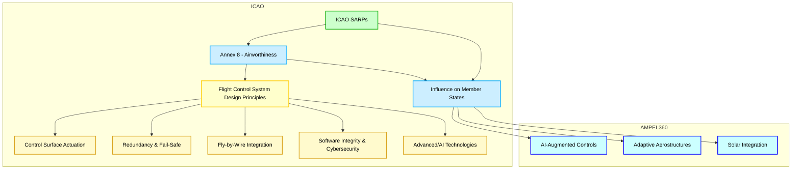
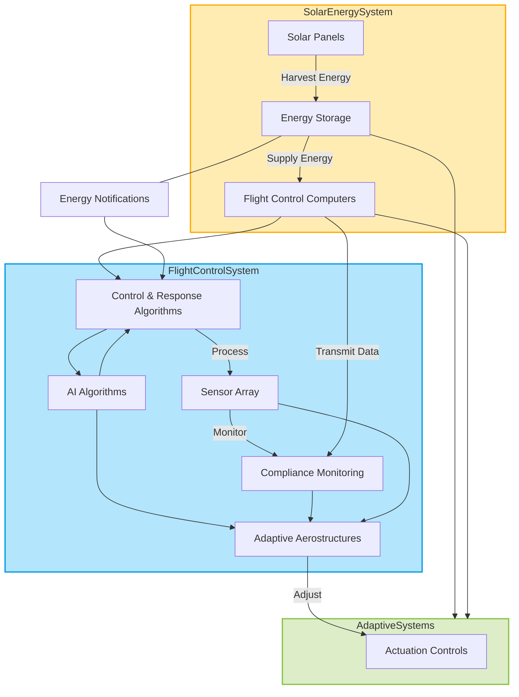
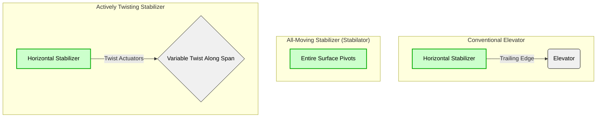
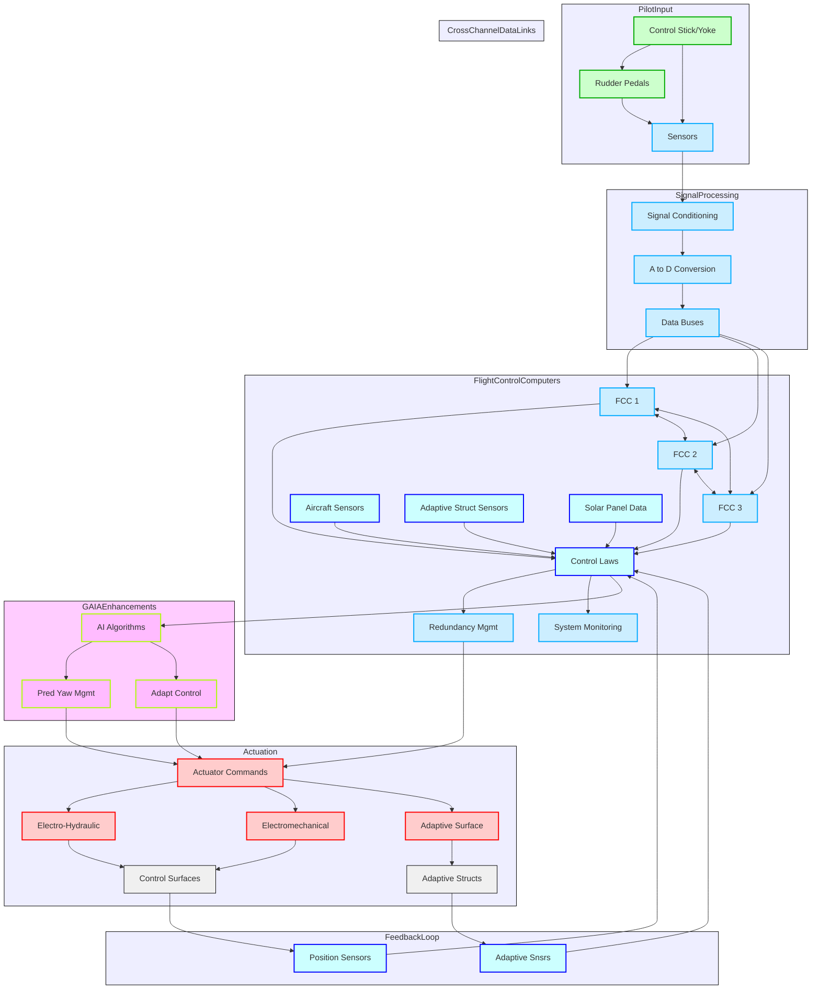
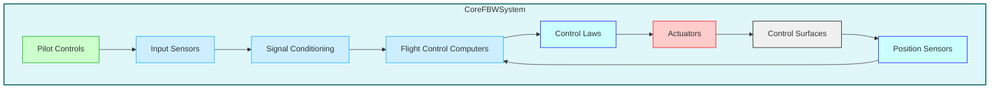
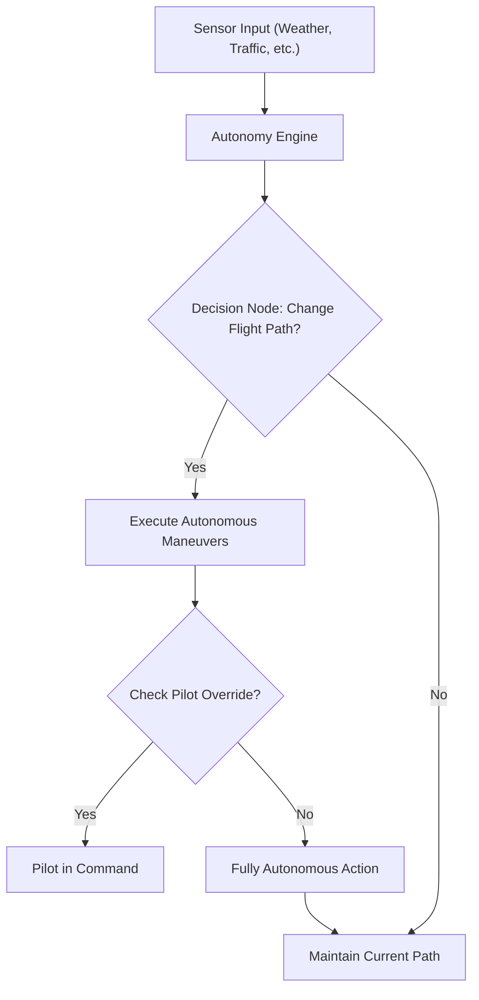
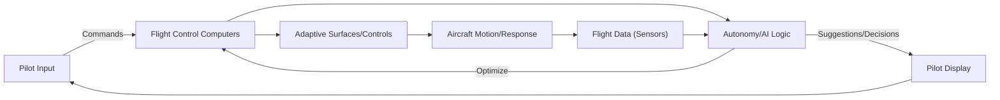

# **FTC_27-00-00-00-000 – ATA 27: Flight Controls**

## **Version History**

| **Version** | **Date**       | **Author**                                                                                           | **Description / Change Notes**                                                                                                                                                      | **Affected Sections**                                      |
|:-----------:|:--------------:|:-----------------------------------------------------------------------------------------------------:|:-------------------------------------------------------------------------------------------------------------------------------------------------------------------------------------:|:----------------------------------------------------------:|
| **1.0**     | **2024-12-31** | **Amedeo Pelliccia, ChatGPT, Copilot, Gemini, Perplexity AI, Mermaid AI**                             | **Creation of the consolidated Flight Controls document, integrating advanced technologies (AI, fly-by-wire enhancements, predictive maintenance, etc.)**                             | **All**                                                    |


---

## **ATA 27 – Flight Controls: Table of Contents**

1.  [**27.10 Introduction**](#2710-introduction)  
    *Overview of flight control systems' evolution, basic definitions, and historical milestones, including the impact of the GAIA AIR AMPEL360's innovative design.*

2.  [**27.20 Scope and Objectives**](#2720-scope-and-objectives)  
    *Defines ATA 27 system boundaries—primary/secondary controls, high-lift devices, advanced features—and highlights safety, reliability, compliance goals, and the specific challenges/opportunities presented by the AMPEL360's adaptive aerostructures.*

3.  [**27.30 Regulatory Requirements**](#2730-regulatory-requirements)  
    - **27.30.1 FAA Regulations** *(FAR Part 25, AC references, etc.)*  
    - **27.30.2 EASA CS-25**  
    - **27.30.3 ICAO Standards**  
    - **27.30.4 Emerging Regulations** *(AI in flight controls, novel actuation systems, cybersecurity, etc.)*

4.  [**27.40 Primary Flight Controls**](#2740-primary-flight-controls)  
    - **27.40.1 Aileron Systems** *(Mechanical, FBW, or hybrid)*  
    - **27.40.2 Elevator Systems** *(Stabilizer trim, autopilot coupling)*  
    - **27.40.3 Rudder Systems** *(Yaw damping, mechanical vs. electro-mechanical)*  
    - **27.40.4 Fly-by-Wire Fundamentals** *(Signal processing, redundancy, architecture)*

5.  [**27.50 Secondary Flight Controls**](#2750-secondary-flight-controls)  
    - **27.50.1 Flaps and Slats** *(High-lift devices, actuation methods)*  
    - **27.50.2 Spoilers/Ground Spoilers** *(Roll augmentation, lift dumping)*  
    - **27.50.3 Airbrakes/Speedbrakes**  
    - **27.50.4 Trim Systems** *(Horizontal stabilizer trim, autopilot integration)*

6.  [**27.60 Hydraulic/Electric Actuation Systems**](#2760-hydraulic-electric-actuation-systems)  
    - **27.60.1 Hydraulic Actuators** *(Pressures, reservoirs, redundancy)*  
    - **27.60.2 Electro-Hydraulic/Electro-Mechanical Actuators** *(Power-by-wire concepts)*  
    - **27.60.3 Backup Systems** *(Ram Air Turbine, emergency actuation)*

7.  [**27.70 Advanced Technologies in Flight Controls**](#2770-advanced-technologies-in-flight-controls)  
    - **27.70.1 Active Control Sidesticks** *(Force feedback, pilot coupling issues)*  
    - **27.70.2 AI-Augmented Flight Stability** *(Real-time data analytics, predictive control, integration with adaptive aerostructures)*  
    - **27.70.3 Health Monitoring Sensors** *(Continuous detection of actuator wear/failures, sensor fusion for adaptive aerostructures)*  
    - **27.70.4 Morphing Wing Surfaces** *(Adaptive structures, integrated flight controls, specific considerations for the AMPEL360's distributed control surfaces)*  
    - **27.70.5 Integrated Solar Power Management** *(Management/utilization of power generated by solar panels on adaptive aerostructures)*

8.  [**27.80 Maintenance and Inspection Protocols**](#2780-maintenance-and-inspection-protocols)  
    - **27.80.1 Scheduled Inspections** *(Intervals, recommended checks for mechanical linkages, actuators, adaptive aerostructures)*  
    - **27.80.2 Corrective Maintenance** *(Troubleshooting flight control anomalies, system resets)*  
    - **27.80.3 Predictive Maintenance** *(Sensor data, AI analytics for proactively identifying wear/failures, with a focus on the AMPEL360's unique systems)*  
    - **27.80.4 Automated Maintenance Tools** *(Drones for surface checks, robotic assistance for large aircraft, automated diagnostics for adaptive aerostructures)*

9.  [**27.90 Human Factors and Ergonomics**](#2790-human-factors-and-ergonomics)  
    - **27.90.1 Flight Deck Interface** *(Control column/stick design, force feedback, pilot warnings)*  
    - **27.90.2 Crew Training for Advanced Systems** *(Handling characteristics, system reversion modes, training for adaptive aerostructure management)*  
    - **27.90.3 Maintenance Ergonomics** *(Ease of access to flight control linkages, sensors, etc.)*

10. [**27.170 Human-Machine Interfaces (HMI)**](#27170-human-machine-interfaces-hmi)  
    - **27.170.1 Interface Design Principles**  
    - **27.170.2 Haptic Feedback Systems**  
    - **27.170.3 Visual and Auditory Alerts**  
    - **27.170.4 Pilot Workload Reduction Techniques**

11. [**27.190 Software Integrity and Validation**](#27190-software-integrity-and-validation)  
    - **27.190.1 Software Development Lifecycle (SDLC) for Flight Controls**  
    - **27.190.2 Code Verification and Validation**  
    - **27.190.3 Cybersecurity Measures for Flight Control Software**  
    - **27.190.4 Continuous Software Monitoring and Updates**

12. [**27.200 Feedback Systems and Pilot Input Integration**](#27200-feedback-systems-and-pilot-input-integration)  
    - **27.200.1 Pilot Input Processing**  
    - **27.200.2 Feedback Mechanisms (Visual, Auditory, Haptic)**  
    - **27.200.3 Adaptive Control Responses Based on Pilot Input**  
    - **27.200.4 Enhancing Pilot Situational Awareness through Feedback Systems**

13. [**27.140 Integrated System Diagnostics and Alerts**](#27140-integrated-system-diagnostics-and-alerts)  
    - **27.140.1 Sensor Fusion Techniques**  
    - **27.140.2 Fault Detection Algorithms**  
    - **27.140.3 Alert Prioritization Mechanisms**  
    - **27.140.4 Maintenance Notifications**

14. [**27.150 Safety Assurance and Certification Processes**](#27150-safety-assurance-and-certification-processes)  
    - **27.150.1 Safety Analysis Methods**  
    - **27.150.2 Certification Workflows**  
    - **27.150.3 Redundant Systems Validation**  
    - **27.150.4 Software Validation and Verification**

15. [**27.160 Cross-Industry Innovations**](#27160-cross-industry-innovations)  
    - **27.160.1 Automotive Sensor Technologies**  
    - **27.160.2 Robotics in Actuation**  
    - **27.160.3 Energy Sector Control Systems**

16. [**27.180 Environmental and Operational Challenges**](#27180-environmental-and-operational-challenges)  
    - **27.180.1 High Altitude Operations**  
    - **27.180.2 Tropical and Humid Conditions**  
    - **27.180.3 Polar Operations**  
    - **27.180.4 Harsh Weather Resilience**

17. [**27.100 Case Studies and Industry Practices**](#27100-case-studies-and-industry-practices)  
    - **27.100.1 Notable Flight Control Incidents** *(Lessons learned, design changes)*  
    - **27.100.2 Implementation Examples** *(Airlines adopting next-gen FBW/power-by-wire, integration of adaptive aerostructures)*  
    - **27.100.3 Common Pitfalls and Avoidance**

18. [**27.110 Collaborative Stakeholder Practices**](#27110-collaborative-stakeholder-practices)  
    - **27.110.1 OEM-Airline Partnerships** *(Joint R&D, flight test programs)*  
    - **27.110.2 Cross-Functional Teams** *(Flight ops, engineering, maintenance synergy)*  
    - **27.110.3 Regulatory/Industry Working Groups** *(ICAO, IATA, ARAC committees on flight controls)*

19. [**27.120 References and Data**](#27120-references-and-data)  
    - **27.120.1 Regulatory Documents** *(FAR Part 25.671–.699, EASA CS-25, etc.)*  
    - **27.120.2 OEM Manuals** *(Airbus, Boeing flight control design guides)*  
    - **27.120.3 R&D White Papers** *(AI-based flight control research, morphing wing studies)*  
    - **27.120.4 Case Study Repositories** *(NTSB, EASA investigation reports)*

20. [**27.130 Future Trends in Flight Controls**](#27130-future-trends-in-flight-controls)  
    - **27.130.1 AI-Driven Autonomy** *(Self-healing flight control laws, adaptive gains, autonomous decision-making)*  
    - **27.130.2 Next-Gen Materials** *(Lightweight composites for linkages, actuators, self-healing materials for adaptive aerostructures)*  
    - **27.130.3 Urban Air Mobility** *(eVTOL flight control, distributed electric propulsion, implications for the AMPEL360's distributed control surfaces)*  
    - **27.130.4 Biomimetic Controls** *(Nature-inspired solutions, bird-like wing articulation, bio-inspired adaptive surfaces)*  
    - **27.130.5 Self-Healing Materials**

---

Absolutely, let's dive into crafting an engaging and comprehensive introduction for **Flight Control Systems**.

---

## **27.10 Introduction: Flight Control Systems - Evolution, Definitions, and Milestones**

The realm of aircraft flight control systems has undergone a dramatic transformation since the dawn of heavier-than-air flight. From the rudimentary yet groundbreaking mechanics of the Wright brothers' Flyer to the sophisticated, computer-driven systems of modern aircraft like the **GAIA AIR AMPEL360**, the evolution of flight control technology has been a continuous pursuit of enhanced safety, performance, and efficiency.

### **Early Days and Mechanical Beginnings**

The Wright brothers' success in 1903 was predicated on their ingenious understanding of three-axis control. Their system, relying on **wing warping, a movable rudder, and an elevator**, all manipulated through a series of wires and pulleys, established the fundamental principles that still underpin flight control today. These early mechanical systems, while effective for their time, were physically demanding for pilots and limited the size and speed of aircraft that could be practically controlled.

### **The Rise of Hydraulics**

As aviation progressed and aircraft became larger and faster, the aerodynamic forces acting on control surfaces grew beyond the physical capabilities of pilots. The introduction of **hydraulically-assisted controls** in the 1930s revolutionized the field. These systems used hydraulic pressure to amplify the pilot's inputs, making it possible to control larger and faster aircraft with less physical effort. This era also saw the development of early **autopilot systems**, further reducing pilot workload by automating basic flight control functions.

### **The Fly-by-Wire Revolution**

The latter half of the 20th century witnessed a paradigm shift with the advent of **fly-by-wire (FBW)** technology. This revolutionary approach replaced mechanical linkages with electronic signals, transmitting pilot commands to control surface actuators via electrical wires and computers. The **Concorde** and the **Apollo Lunar Module** were pioneers in utilizing FBW, but it was the **Airbus A320** in 1984 that brought digital FBW to the commercial airliner market, setting a new industry standard.

### **Advantages of Fly-by-Wire**

FBW systems offer numerous advantages over traditional mechanical or hydromechanical systems:

- **Weight Reduction:** Eliminating heavy mechanical linkages significantly reduces aircraft weight, leading to improved fuel efficiency.
- **Improved Handling and Performance:** Computers can process pilot inputs and sensor data to optimize aircraft response and stability, resulting in smoother, more precise control.
- **Enhanced Safety:** FBW systems incorporate multiple levels of redundancy, ensuring continued operation even in the event of component failures. Flight envelope protection features prevent pilots from exceeding structural or aerodynamic limits.
- **Reduced Pilot Workload:** FBW automates many routine tasks, such as trimming and stability augmentation, freeing pilots to focus on higher-level decision-making.
- **Easier Integration:** FBW facilitates the integration of autopilot, autothrottle, and other automated systems, paving the way for increased automation.

### **The GAIA AIR AMPEL360 and the Next Generation**

The **GAIA AIR AMPEL360** represents the next step in the evolution of flight control. Building upon the foundation of FBW, it incorporates groundbreaking technologies that further enhance safety, efficiency, and performance:

- **Lightweight Solar Panel-Embedded Adaptive Aerodynamic Aerostructures:** Distributed control surfaces embedded with solar panels provide unprecedented levels of aerodynamic optimization, maneuverability, and energy efficiency.
- **Advanced Sensor Fusion:** A dense network of sensors provides real-time data on the aircraft's state, the environment, and the performance of the adaptive aerostructures. This data is fused together to provide a comprehensive picture for the flight control system.
- **AI-Augmented Flight Controls:** Sophisticated AI algorithms process sensor data, optimize the configuration of the adaptive aerostructures, and assist the pilot in making critical decisions.
- **Intuitive Pilot Interfaces:** Advanced HMIs, including haptic feedback and augmented reality displays, provide pilots with intuitive control and enhanced situational awareness.
- **Robust Cybersecurity:** Given the interconnected nature of the **AMPEL360**'s systems, robust cybersecurity measures are integrated to protect against potential threats, ensuring the integrity and safety of the flight control system.

### **Future Trends**

The evolution of flight control systems is far from over. Emerging trends that will shape the future of this field include:

- **Increased Autonomy:** Further development of AI and autonomous systems will lead to greater levels of automation, potentially culminating in fully autonomous flight.
- **Biomimetic Design:** Inspiration from nature, such as bird flight, will lead to innovative control strategies and more efficient, adaptable aircraft designs.
- **Self-Healing Systems:** Materials and systems that can automatically detect and repair damage will enhance safety and reduce maintenance.
- **Urban Air Mobility (UAM):** The rise of eVTOL aircraft will require new approaches to flight control to manage the complexities of distributed electric propulsion and urban airspace.

### **Conclusion**

From the Wright brothers' simple yet effective mechanical controls to the advanced, AI-powered systems of the **GAIA AIR AMPEL360**, flight control technology has continuously evolved to meet the ever-increasing demands of aviation. This evolution has been driven by a relentless pursuit of safety, efficiency, and performance. As we look to the future, we can expect even more radical innovations that will further transform the way we fly, making air travel safer, more sustainable, and more accessible to all.

---

Below is the **comprehensive Scope and Objectives section** for **ATA 27 – Flight Controls**, now fully integrated with considerations specific to the **GAIA AIR AMPEL360**. At the end, you'll find an **optional diagram** that further illustrates how AMPEL360’s adaptive aerostructures, solar power integration, and AI-based control fit into the overarching goals of ATA 27.


## **27.20 Scope and Objectives**

This section defines the scope of **ATA Chapter 27 – Flight Controls**, outlining the systems, components, and functions encompassed within this chapter. It also establishes the primary objectives that guide the design, implementation, maintenance, and operation of flight control systems, with particular attention to the innovations introduced by the **GAIA AIR AMPEL360**.

### **27.20.1 Scope**

ATA Chapter 27 covers all systems and components directly involved in controlling the aircraft's attitude, trajectory, and aerodynamic configuration. This includes, but is not limited to:

#### **A. Primary Flight Controls**
1. **Ailerons**  
   *Surfaces (often on the trailing edge of the wings) controlling roll (longitudinal axis).*
2. **Elevators**  
   *Surfaces (usually on the horizontal stabilizer) controlling pitch (lateral axis).*
3. **Rudder**  
   *Surface (on the vertical stabilizer) controlling yaw (vertical axis).*
4. **Associated Actuation Systems**  
   *Hydraulic, electric, or hybrid actuators, as well as mechanical linkages (cables, pushrods, bellcranks).*
5. **Fly-by-Wire (FBW) Systems**  
   *Replacing mechanical linkages with electrical signals and computer-based control laws.*

#### **B. Secondary Flight Controls**
1. **Spoilers/Speedbrakes**  
   *Surfaces that can be deployed to increase drag, reduce lift, or augment roll control.*
2. **Trim Systems**  
   *Allows adjusting aerodynamic forces for a desired attitude without continuous control input (e.g., stabilizer trim).*
3. **High-Lift Devices**  
   - **Flaps** (Trailing edge)  
   - **Slats** (Leading edge)  
   *Systems that increase lift at low speeds, aiding takeoff/landing.*
4. **Actuation and Control Mechanisms**  
   *Hydraulic, electric, or hybrid actuators plus linkages for deploying high-lift devices.*

#### **C. Advanced Flight Control Features**
1. **Enhanced Fly-by-Wire**  
   *Complex control laws, flight envelope protection, advanced redundancy.*
2. **Flight Envelope Protection**  
   *Stall prevention, overspeed protection, etc.*
3. **Stability Augmentation Systems (SAS)**  
   *Automatic control surface adjustments to improve stability/handling.*
4. **Autopilot/Autothrottle**  
   *Systems capable of controlling flight path and engine power automatically.*

#### **D. GAIA AIR AMPEL360 Specifics**
1. **Adaptive Aerodynamic Aerostructures**  
   *Lightweight, solar panel-embedded surfaces distributed across wings, stabilizers, and fuselage.*  
   - **Fine-Grained Aerodynamic Optimization**  
   - **Enhanced Maneuverability**  
   - **Load Alleviation**  
   - **Noise Reduction**
2. **Solar Power Integration**  
   *Flight control system managing power generated by solar panels.*
3. **Advanced Sensor Network**  
   *Dense sensors monitoring shape, position, aerodynamic forces, temperature, and power output.*
4. **AI-Augmented Control**  
   *Algorithms optimizing aerostructure configuration in real-time.*

---

### **27.20.2 Objectives**

The primary objectives governing ATA 27 — and especially the **AMPEL360**’s advanced flight control systems — include:

1. **Safety**  
   - **Reliability**: Minimize risk of failure.  
   - **Redundancy & Fault Tolerance**: Continue safe operation even under component failures.  
   - **Failure Detection & Isolation**: Rapidly detect and isolate faults.  
   - **Emergency Preparedness**: Clearly defined procedures for malfunctions.

2. **Reliability**  
   - **Robust Design**: Proven engineering principles, high-quality components.  
   - **Redundancy**: Independent systems/components.  
   - **Rigorous Testing**: Ensuring performance under all conditions.  
   - **Predictive Maintenance**: Using sensor data/AI to foresee and prevent failures.

3. **Regulatory Compliance**  
   - **Certification Standards**: FAR Part 25, EASA CS-25, ICAO guidelines.  
   - **Airworthiness Requirements**: Strength, structural integrity, flammability, emergency operation.  
   - **Software Integrity & Cybersecurity**: Ensuring flight-critical software meets regulatory expectations.  
   - **Human Factors**: Compliance with cockpit ergonomics, pilot training needs.

4. **Performance Optimization**  
   - **Aerodynamic Efficiency**: Minimizing drag, maximizing lift.  
   - **Fuel Savings**: Smart control strategies to reduce fuel burn.  
   - **Maneuverability & Stability**: Balancing agility with stable handling qualities.

5. **Integration**  
   - **Interfacing with Other Aircraft Systems**: Hydraulic, electrical, avionics, engine controls.  
   - **Adaptive Aerostructures**: Coordinating distributed surfaces with traditional control surfaces.  
   - **Power Management**: Efficiently sharing resources (hydraulic, electric, solar).

6. **Adaptability (AMPEL360 Focus)**  
   - **Real-Time Control**: Adjusting shape/configuration continuously for optimum performance.  
   - **AI Integration**: Data-driven optimization of flight controls.  
   - **Sensor Fusion**: Comprehensive system awareness.  
   - **Morphing Aerostructures**: Managing flexible wing surfaces.

7. **Advanced Materials Integration**  
   - **Specialized Actuators**: Compatible with flexible, composite surfaces.  
   - **Embedded Sensors**: Monitoring health/performance of composite structures.  
   - **Lightweight & Smart Materials**: Minimizing mass while maximizing functionality.

8. **Enhanced Efficiency**  
   - **Reduced Drag & Increased Lift**: Dynamic shape adjustments.  
   - **Improved Fuel Economy**: Aerodynamic optimization, efficient power usage.  
   - **Solar Energy Utilization**: Supplementary power from solar panels for actuators/systems.

9. **Certification Pathway**  
   - **Novel Technologies**: Working closely with regulators on advanced control laws.  
   - **Extensive Simulation & Flight Testing**: Proving system safety/reliability.  
   - **Transparent Data Sharing**: Demonstrating compliance at every stage.

10. **Human Factors**  
    - **Intuitive Controls**: Uncomplicated interface for pilots.  
    - **Appropriate Feedback**: Clear status on adaptive surfaces.  
    - **Minimized Workload**: Managing distributed surfaces without overwhelming the crew.  
    - **Comprehensive Training**: Educating pilots/maintenance staff on advanced features.


### **27.20.3 Diagram**


**Diagram Explanation**:

- **ATA_27_Scope**  
  - *A (Primary Controls), B (Secondary Controls), C (Advanced Features)*: The standard categories within flight controls.  
  - *D (AMPEL360 Adaptations)*: Highlights the unique, morphing, and solar-integrated surfaces.

- **ATA_27_Objectives**  
  - *E (Safety), F (Reliability), G (Regulatory Compliance)*: Core pillars ensuring any flight control system is safe, robust, and certified.  
  - *H (Performance Optimization), I (Integration)*: Stressing the interplay among various subsystems and overall aircraft efficiency.  
  - *J (Adaptability/AI), K (Efficiency, incl. solar usage)*: AMPEL360’s specialized focus on real-time morphing surfaces and solar-energy synergy.  
  - *L (Human Factors)*: Ensuring advanced controls don’t overwhelm the flight crew.

---

### **Conclusion**

By defining the **Scope and Objectives** in this structured way, **ATA Chapter 27** ensures that *all* flight control systems—ranging from conventional mechanical linkages to **GAIA AIR AMPEL360**’s cutting-edge adaptive aerostructures—adhere to the highest standards of **safety, reliability, performance, and sustainability**. This unified framework addresses:

- **Traditional Mechanisms** (ailerons, elevators, rudder, high-lift devices),
- **Novel Technologies** (fly-by-wire, AI-based stability augmentation),
- **AMPEL360 Specific Features** (distributed, solar-embedded, morphing wing surfaces).

The ultimate goal is to **guarantee reliable flight control** across all phases of flight, minimize environmental impact, and push the boundaries of aviation innovation.


## **Additional Proposed Sections and Diagrams**

Below are some *optional* sections and **new diagrams** you might consider adding to provide even deeper insights into the **GAIA AIR AMPEL360** and next-generation flight control systems:

---

Below is a **revised and more detailed version** of **Section 27.30 – Regulatory Requirements**, focusing on **FAA regulations** and adding key details relevant to the **GAIA AIR AMPEL360**. This expanded section highlights the specific provisions and certification challenges for emerging technologies such as **AI-augmented controls**, **adaptive aerostructures**, and **solar power integration**.

### **27.30 Regulatory Requirements**

This section outlines the **regulatory framework** governing flight control systems in the United States, ensuring they meet the stringent **safety** and **performance** standards set by the **Federal Aviation Administration (FAA)**. It also addresses the **certification challenges** posed by next-generation technologies like the **GAIA AIR AMPEL360**’s **AI-augmented flight controls**, **adaptive aerostructures**, and **solar panel integration**.

---

#### **27.30.1 FAA Regulations (United States)**

The **FAA** issues regulations, primarily in **FAR Part 25**, that define airworthiness standards for transport category airplanes. Manufacturers seeking certification for advanced or unconventional flight control systems—such as those in the **GAIA AIR AMPEL360**—must demonstrate compliance with these regulations, along with Advisory Circulars (ACs) that provide guidance on acceptable means of compliance.

---

**A. FAR Part 25: Airworthiness Standards – Transport Category Airplanes**

1. **FAR 25.671 Control Systems – General**  
   - Requires flight control systems to ensure the airplane is safely controllable and maneuverable under all anticipated flight conditions.  
   - Mandates robustness to single failures, jammed or restricted surfaces, and potential system malfunctions.  
   - For the **AMPEL360**, this includes designing distributed adaptive aerostructures to provide equivalent or better safety compared to traditional ailerons, elevators, and rudder systems.

2. **FAR 25.672 Stability Augmentation and Automatic/Power-Operated Systems**  
   - Covers standards for systems that enhance an aircraft’s stability or controllability (e.g., stability augmentation, autopilots, AI-based flight controls).  
   - Relevant to the **AMPEL360**’s **AI-Augmented Flight Stability** and the coordination of adaptive aerostructures in real-time.

3. **FAR 25.675 Stops or Limit Devices**  
   - Addresses the requirement for physical or electronic stops to prevent surfaces from overtravel.  
   - Critical for adaptive surfaces in **AMPEL360**, ensuring they remain within safe deflection ranges and do not compromise structural integrity.

4. **FAR 25.677 Trim Systems**  
   - Specifies design and operational standards for trim systems, ensuring the aircraft can be trimmed safely across its operating envelope.  
   - Applicable to both conventional and novel control surfaces, including distributed “micro-trim” features of adaptive aerostructures.

5. **FAR 25.679 Control System Malfunctions**  
   - Requires design provisions to address system malfunctions, preventing catastrophic outcomes.  
   - The **AMPEL360**’s diagnostics and fault-tolerant design must demonstrate resilience to sensor or actuator failures.

6. **FAR 25.683 Operation Tests**  
   - Mandates that the control systems undergo thorough operation tests under varying conditions to prove reliability and functionality.  
   - For **AMPEL360**, these tests must include scenarios with AI-driven morphing surfaces and partial solar power usage.

---

**B. FAA Advisory Circulars (ACs)**

To aid in compliance with **FAR Part 25**, the FAA publishes Advisory Circulars (ACs) that detail acceptable methods and best practices. Key ACs for flight control systems include:

1. **AC 25.671-1 (Control Systems – General)**  
   - Offers methods to demonstrate compliance with FAR 25.671, such as **Failure Mode and Effects Analysis (FMEA)** and **Fault Tree Analysis (FTA)**.  
   - Addresses redundancy strategies and software integrity for **fly-by-wire (FBW)** or partially **AI-driven** systems.

2. **AC 25.672-1 (Stability Augmentation and Automatic Systems)**  
   - Provides guidance on designing and evaluating autopilot, stability augmentation, or power-operated systems.  
   - For **AI-based** or **adaptive** control systems in **AMPEL360**, this includes considerations for system architecture, fault detection, and crew alerting.

3. **AC 25.675-1 (Stops or Limit Devices)**  
   - Explains design and testing of mechanisms that prevent control surface overtravel, ensuring structural safety.  
   - **AMPEL360** must demonstrate that its distributed surfaces can be reliably limited in travel, even under automated or AI-driven commands.

4. **AC 25.677-1 (Trim Systems)**  
   - Clarifies design/operational considerations for trim systems, including safe transitions and autopilot interactions.

5. **AC 25.679-1 (Control System Malfunctions)**  
   - Addresses analysis, testing, and design mitigation for system malfunctions—vital for the **AMPEL360**’s complex sensor-actuator network.

6. **AC 25.683-1 (Operation Tests)**  
   - Describes methods to conduct and document system operational tests, verifying performance across flight regimes.

---

**C. Certification of Advanced Technologies on the GAIA AIR AMPEL360**

Given the **AMPEL360**’s innovative flight control concepts, **FAA** regulations must be interpreted and possibly augmented by issue papers, special conditions, or equivalent-level-of-safety findings. Key areas include:

1. **AI Certification**  
   - **Explainability and Transparency**: Regulators require an auditable process for AI decision-making.  
   - **Robustness and Predictability**: AI must show reliable performance under diverse and unexpected conditions.  
   - **Continuous Monitoring/Adaptive Certification**: Real-time monitoring of AI performance may be necessary, updating certification status based on operational data.

2. **Adaptive Aerostructure Certification**  
   - **Equivalent Safety Demonstration**: Prove distributed surfaces match or exceed traditional control surfaces in safety and controllability.  
   - **Structural Integrity**: Validate that morphing or flexible wing sections meet load requirements under all flight conditions.  
   - **Control Integration**: Show that adaptive surfaces work seamlessly with primary and secondary controls, including fail-safe fallback modes.

3. **Solar Panel Integration**  
   - **Structural and Electrical Safety**: Panels must withstand aerodynamic loads, bird strikes, temperature extremes, and maintain electrical isolation.  
   - **Power Management**: Demonstrate safe and reliable distribution of solar-generated power to actuators or other systems.  
   - **Environmental Resistance**: Show compliance with flammability, hail/impact tests, and EMI/EMC standards.

---

**D. Cross-Referenced Standards**

Beyond **FAR Part 25** and ACs, the FAA often references additional industry standards for advanced flight control systems:

- **SAE ARP4754A**: Guidelines for civil aircraft system development (systems engineering approach).  
- **SAE ARP4761**: Safety assessment processes (FMEA, FTA, etc.).  
- **RTCA DO-178C**: Software considerations for airborne systems (software criticality levels).  
- **RTCA DO-254**: Hardware design assurance (electronic hardware compliance).


*Mermaid diagram illustrating the relationship between FAR Part 25 regulations, Advisory Circulars, certification of advanced technologies, and cross-referenced industry standards.*

**Diagram Overview:**
- FAA Regulations: Lists FAR Part 25 regulations, including sections for stability, trim systems, and operational tests.  
- Advisory Circulars: Links specific circulars to corresponding FAR regulations.
- Advanced Tech - AMPEL360: Shows emerging technology certifications and adaptations, such as AI certification, adaptive aerostructures, and solar panel integration.  
- Cross-Referenced Standards: Highlights connections to SAE and RTCA standards, including ARP4754A and DO-178C
  
---

### **Key Takeaways for the GAIA AIR AMPEL360**

- **Equivalent or Enhanced Safety**: Advanced features (AI, adaptive surfaces, solar power) must meet or exceed the safety benchmarks of traditional systems.  
- **Rigorous Testing & Simulation**: Extensive ground tests, flight tests, hardware-in-the-loop simulations, and AI verification will be critical.  
- **Regulatory Collaboration**: Close liaison with the FAA ensures special conditions (or issue papers) address novel aspects like AI explainability, morphing wing safety, and in-flight solar power generation.  
- **Documentation & Transparency**: Thorough record-keeping, data logging, and reporting are essential for demonstrating compliance and reliability.

**Final Note**: While **FAR Part 25** and related ACs form the foundation, the **AMPEL360**’s innovative design may require **special conditions** or **equivalent level of safety (ELOS)** findings to bridge gaps in existing regulations. Collaboration with the FAA and adherence to industry standards (SAE ARP4754A, ARP4761, DO-178C, DO-254) will be pivotal to achieving certification for these **next-generation** flight control systems.


### **27.30.2 EASA CS-25 Requirements (Europe)**

The **European Union Aviation Safety Agency (EASA)** establishes comprehensive regulatory standards for the design, certification, and operation of aircraft, including their flight control systems. These standards are crucial for ensuring the safety, reliability, and performance of aircraft operating within European airspace, and they are particularly relevant to the **GAIA AIR AMPEL360**, given its advanced technologies and unique design features.

---

#### **A. CS-25: Certification Specifications for Large Aeroplanes**

**CS-25** details the airworthiness standards for transport category airplanes within the EASA framework. Several sections within **CS-25** are particularly relevant to flight control systems:

1. **CS 25.671 Control Systems – General**  
   - Requires that control systems operate with **ease, smoothness, and positiveness** appropriate to their function:  
     - **Ease**: The pilot should be able to operate the controls without excessive physical effort or complex procedures.  
     - **Smoothness**: There should be no abrupt or unexpected changes in control forces or response.  
     - **Positiveness**: The control system should respond predictably and consistently to pilot inputs.  
   - The system must continue to operate and respond appropriately to commands in any attitude or flight condition.  
   - *For the **AMPEL360**, this necessitates that the adaptive aerostructures be thoroughly tested and validated under all anticipated flight regimes.*

2. **CS 25.672 Stability Augmentation and Automatic/Power-Operated Systems**  
   - Specifies that after any single failure of these systems, the airplane must be safely controllable under all approved operating limitations (speed, altitude, etc.).  
   - *This applies to yaw dampers, pitch stability augmentation, gust load alleviation, or any AI-augmented controls in the **AMPEL360**.*

3. **CS 25.675 Stops or Limit Devices**  
   - Addresses requirements for stops that positively limit control surface travel.  
   - *Crucial for preventing over-actuation or damage to the **AMPEL360**’s adaptive surfaces.*  

4. **CS 25.677 Trim Systems**  
   - Outlines standards for trim systems, including requirements for irreversible controls and proper trim indicators.  
   - Ensures the pilot can maintain desired attitudes without continuous input.

5. **CS 25.681 Limit Load Static Tests**  
   - Requires compliance with limit load requirements for control systems without structural failure.  
   - *Essential for verifying the structural integrity of actuators, linkages, and surfaces—particularly relevant for the **AMPEL360**’s morphing components.*

6. **CS 25.683 Operation Tests**  
   - Specifies operation tests of the control systems to demonstrate proper functioning under various conditions.  
   - *For the **AMPEL360**, these tests must cover scenarios with AI-driven adaptive surfaces and partial solar power usage.*

---

#### **B. Acceptable Means of Compliance (AMC) and Guidance Material (GM)**

EASA publishes **AMC** and **GM** documents to guide manufacturers in demonstrating compliance with CS-25. Relevant AMC/GM for flight control systems include:

1. **AMC 25.671**  
   - Provides guidance on reliability and performance demonstrations (e.g., **FMEA**, **FTA**, reliability testing).  
   - Addresses redundancy management, software integrity (for FBW systems), and best practices for advanced designs.

2. **AMC 25.672**  
   - Offers design/evaluation guidelines for stability augmentation, autopilots, and power-operated controls.  
   - *Highly relevant to AI-augmented controls in the **AMPEL360**, focusing on architecture, redundancy, and pilot-automation interface.*

3. **AMC 25.675**  
   - Covers the design, installation, and testing of stops or limit devices to protect against overtravel.

4. **AMC 25.677**  
   - Explains trim system requirements—design, indicators, testing.

5. **AMC 25.679**  
   - Details methods for addressing control system malfunctions (analysis, testing, mitigation).  
   - *Crucial for advanced diagnostics and fault tolerance in **AMPEL360**’s distributed control network.*

6. **AMC 25.683**  
   - Guides the conduct of operation tests for control systems (methods and performance criteria).

---

#### **C. Additional Considerations**

1. **Aeroelastic Stability**  
   - **CS 25.629** requires consideration of aeroelastic stability for failure modes in flight control systems (including dual hydraulic/electrical failures).  
   - *Significant for the **AMPEL360**, given its morphing surfaces and potential aerodynamic/structural interactions.*

2. **Cybersecurity**  
   - Recent amendments address data protection and potential vulnerabilities in connected cabin/flight systems.  
   - *For **AMPEL360**’s extensive sensor and AI network, robust cybersecurity measures—aligned with EASA’s “Cybersecurity Strategy”—are essential.*

3. **Human Factors**  
   - **CS-25** emphasizes ergonomic and intuitive design for cockpit interfaces, ensuring minimal pilot workload and maximal situational awareness.  
   - *Extremely relevant for advanced HMIs in the **AMPEL360**’s adaptive systems.*  

---

#### **D. EASA Certification Process**

1. **Type Certification (TC)**  
   - Required for new aircraft designs, showing compliance with all applicable airworthiness requirements.  
   - *The **AMPEL360** must undergo a rigorous TC process with EASA, addressing AI-based controls and adaptive surfaces.*

2. **Supplemental Type Certification (STC)**  
   - For significant modifications to an existing design. If the **AMPEL360**’s features are considered major changes to a base type, an STC may be required.

3. **Major Changes and Repairs**  
   - Any substantial alteration to flight control systems must be approved by EASA.  
   - *Adaptive system upgrades or AI software modifications could trigger a need for separate approvals.*

4. **Certification Review Items (CRIs)**  
   - EASA may issue CRIs for novel technologies not fully covered by existing rules.  
   - *The **AMPEL360**’s distributed aerostructures and solar integration might be addressed via CRIs.*

---

#### **E. Harmonization with FAA Regulations**

- **EASA** and **FAA** strive for regulatory harmonization to streamline certification for manufacturers operating in both jurisdictions.
- The **FAA-EASA Technical Implementation Procedures (TIP)** facilitate mutual acceptance or validation of approvals, reducing redundant testing and documentation.

---

#### **F. Specific Considerations for the GAIA AIR AMPEL360**

1. **AI-Augmented Flight Controls**  
   - EASA’s approach to AI is outlined in its evolving AI Roadmap, emphasizing **human oversight** and **predictability**.  
   - Demonstrating reliability, transparency, and fail-safe behavior of AI control laws will be key for certification.

2. **Adaptive Aerostructures**  
   - **Special Conditions or CRIs** likely needed for the **AMPEL360**’s distributed control surfaces.  
   - Must show **equivalent or improved safety** compared to conventional ailerons/elevators/rudders, focusing on:
     - **Structural integrity** (loads, fatigue life).  
     - **Aerodynamic performance** (controllability, stability).  
     - **Failure modes** and fallback control strategies.

3. **Solar Panel Integration**  
   - **Electrical Safety**: Panels must meet standards for wiring, insulation, and power distribution.  
   - **Structural Resistance**: Evaluate performance under aerodynamic loads, hail, and other environmental stresses.  
   - **EMI/EMC Compliance**: Ensure no interference with avionics or flight controls.
     


---

### Diagram Overview:

1. **EASA Regulations (CS-25)**  
   Key sections like stability augmentation, aeroelastic stability, and operational tests are highlighted.

2. **AMC/GM Guidance:**  
   Aligns compliance and guidance with each CS-25 regulation.

3. **Certification Process:**  
   Shows pathways like Type Certificate (TC), Supplemental Type Certificate (STC), and considerations for novel technologies.

4. **GAIA AIR AMPEL360 Innovations:**  
   Highlights advanced features such as AI-Augmented Controls, Adaptive Aerostructures, and Solar Integration.

Let me know if you need further assistance!


*Mermaid diagram illustrating the relationship between CS-25 regulations, AMC/GM guidance, certification pathways, and the **AMPEL360**’s advanced features.*

---

### **Related Questions**

1. **How does CS-25 address aeroelastic stability in relation to flight control systems?**  
   *Answer:* Under **CS 25.629**, aeroelastic stability must be considered for various failure conditions, ensuring no detrimental coupling between structural flex and control operations.

2. **How might the AMPEL360’s adaptive aerostructures impact certification under EASA’s framework?**  
   *Answer:* **Special Conditions or CRIs** will define new standards for adaptive surfaces, including structural validation, aerodynamic performance, and seamless integration with conventional controls.

3. **How do AMC and GM documents aid compliance with CS-25?**  
   *Answer:* They provide **accepted methods**, best practices, and interpretations for meeting requirements, easing certification by clarifying acceptable compliance procedures.

4. **What cybersecurity measures must be addressed for advanced flight controls in Europe?**  
   *Answer:* EASA emphasizes **risk-based** security controls, ensuring robust protection against unauthorized access, malware, and data tampering, consistent with **EASA’s Cybersecurity Strategy**.

5. **How do Type Certificates (TC) differ from Supplemental Type Certificates (STC)?**  
   *Answer:* **TC** is for entirely new aircraft designs, while **STC** is for major modifications to an existing certified design. Both require rigorous evidence of safety and compliance.

6. **How does EASA’s approach to AI in flight controls compare with the FAA’s?**  
   *Answer:* Both aim for **harmonization**, but each agency may issue unique conditions or special papers. EASA’s “human-centric” AI guidelines emphasize **pilot oversight** and **predictability**.

---

**In essence**, **CS-25** forms the **regulatory backbone** for **large aeroplanes** in Europe, demanding **robust design**, **thorough testing**, and **strict adherence** to safety principles. For cutting-edge aircraft like the **GAIA AIR AMPEL360**, **EASA** may introduce **Special Conditions** or **Certification Review Items** to address AI-augmented controls, **morphing aerostructures**, and **integrated solar power**—ensuring these innovations meet the same **high safety standards** as traditional flight control systems.


### **27.30.3 ICAO Standards**

The **International Civil Aviation Organization (ICAO)**, a specialized agency of the United Nations, establishes global **Standards and Recommended Practices (SARPs)** for international civil aviation. These standards aim to ensure a high level of safety, efficiency, and uniformity across member states. While ICAO standards are not legally binding on their own, they are generally adopted and implemented by national aviation authorities through their own regulations.

---

#### **ICAO Annex 8 – Airworthiness of Aircraft**

Annex 8 outlines broad standards for aircraft design, construction, and maintenance, including provisions relevant to flight control systems. It covers areas such as:

- **General Design Principles:**  
  ICAO emphasizes robust design principles for flight control systems, including:
  - **Controllability and Maneuverability:** Ensuring the aircraft can be safely controlled throughout its flight envelope.
  - **Stability:** Providing adequate stability characteristics.
  - **Structural Integrity:** Designing control systems to withstand anticipated operating loads and environmental conditions.

- **Redundancy and Fault Tolerance:**  
  Annex 8 encourages the incorporation of redundancy and fault tolerance in flight control system design to ensure continued operation in case of failures:
  - Multiple independent control channels.
  - Backup power sources.
  - Fail-safe mechanisms to prevent catastrophic consequences.

- **Protection Against Jamming and Inadvertent Deployment:**  
  Standards address the need to protect control systems from jamming and to prevent unintentional deployment of control surfaces.

- **Fly-by-Wire (FBW) Systems:**  
  While not explicitly mandating FBW, Annex 8 acknowledges its increasing use and sets forth general principles for its safe implementation:
  - **Software Integrity and Validation**
  - **Protection Against Electromagnetic Interference (EMI)**
  - **System Security to Prevent Unauthorized Access or Modification**

- **Interaction with Other Aircraft Systems:**  
  ICAO standards emphasize the need for proper integration of flight control systems with other aircraft systems (hydraulics, electrical power, avionics, etc.).

---

#### **Specific Focus: Elevator and Tab Systems (Illustrative Example)**

Annex 8 contains specific standards related to the design and manufacturing of aircraft flight control systems, with a particular focus on elevator and tab systems:

1. **Crashworthiness:**  
   Elevator and tab systems must be designed to protect occupants in emergency landing conditions, ensuring they do not compromise structural integrity or obstruct emergency exits.

2. **Systems Design:**  
   - Operating environment and human factors considerations.  
   - **Control Surface Actuation:** Could be hydraulic, electromechanical, or fly-by-wire. Each choice impacts reliability, weight, and maintenance.  
   - **Redundancy and Fail-Safe Mechanisms:** Multiple hydraulic or electrical channels, backup modes, and fail-safe features to prevent catastrophic loss of control.

3. **Emergency Landing Loads:**  
   Must withstand loads likely to occur in emergency landing scenarios.

4. **Evacuation:**  
   Elevator and tab systems should not impede rapid aircraft evacuation in emergencies.

5. **Security:**  
   Design must minimize potential in-flight failures due to human error or inadvertent activation, with robust procedures for system checks and maintenance.

---

#### **Emerging Technologies and Flight Control Systems**

ICAO is continuously adapting its standards to address new technologies and operational concepts. Areas of particular relevance include:

- **Advanced Materials:**  
  New composites and smart materials can reduce weight and improve performance, requiring updates to maintenance and repair guidelines.

- **Artificial Intelligence (AI):**  
  - **Adaptive Flight Control:** Real-time AI optimizations for stability and fuel efficiency.  
  - **Autonomous Flight:** ICAO is examining feasibility, safety, and regulatory needs for autonomous or semi-autonomous control systems.  
  - **GAIA AIR AMPEL360 Integration:** AI for adaptive aerostructures aligns with ICAO’s broader vision for safe AI adoption in aviation.

- **Cybersecurity:**  
  ICAO’s work in cybersecurity focuses on secure system architecture, data protection, intrusion detection/prevention, and robust incident response, reflecting the growing interconnectedness of modern aircraft systems.

---

#### **Relationship with Other ICAO Annexes**

- **Annex 6 (Operation of Aircraft):** Flight procedures, crew training, and maintenance practices affecting flight controls.
- **Annex 13 (Aircraft Accident and Incident Investigation):** Sets the framework for investigating control-system-related incidents.
- **Annex 1 (Personnel Licensing):** Defines knowledge and skill requirements for those involved in flight control operation and maintenance.

---

#### **ICAO’s Role in Harmonization**

ICAO standards serve as **baselines** for national regulations. Member states typically integrate ICAO SARPs into their legal frameworks (e.g., FAA FAR Part 25, EASA CS-25). ICAO fosters **global consistency** in aviation safety by encouraging states to adopt uniform principles and reducing inconsistencies across different jurisdictions.

---

#### **GAIA AIR AMPEL360 Considerations**

- **Distributed Control Surfaces & AI:**  
  The AMPEL360’s design may spur new or updated ICAO guidance on certifying complex, AI-driven systems.

- **Solar Power Integration:**  
  Additional requirements may emerge for electrical safety and structural impact.

- **Shaping Future Standards:**  
  Operational data from the AMPEL360’s adaptive aerostructures could inform SARPs on next-generation flight control technologies.

---



*Mermaid diagram illustrating how ICAO Annex 8 shapes flight control design principles and influences the GAIA AIR AMPEL360’s innovations. All text is now styled in **black**.*

---

### **Related Questions**

1. **What are the main differences between ICAO SARPs and national aviation regulations?**  
   *Answer:* ICAO SARPs provide international standards and recommended practices, while national aviation regulations incorporate or expand upon these principles within their own legal frameworks.

2. **How does ICAO ensure uniformity in flight control system standards across different countries?**  
   *Answer:* By publishing Annexes (like Annex 8) and recommended practices, ICAO encourages states to adopt common principles, thus promoting consistency and facilitating international aviation operations.

3. **How might the AMPEL360’s distributed control surfaces shape future ICAO standards?**  
   *Answer:* Operational data and real-world performance feedback from the AMPEL360 could inform new SARPs for adaptive aerostructures, AI-based controls, and integrated solar power systems.

4. **What role does cybersecurity play in ICAO standards for modern flight control systems?**  
   *Answer:* As aircraft systems become more interconnected, ICAO emphasizes robust cybersecurity measures, including secure architectures, encryption, intrusion detection, and incident response protocols.

5. **Why is redundancy so important in flight control systems according to ICAO?**  
   *Answer:* Redundancy helps ensure continued aircraft controllability in the event of single or multiple failures, aligning with ICAO’s core safety objectives.

6. **How do advanced materials like composites influence ICAO’s approach to flight control systems?**  
   *Answer:* Advanced materials can improve performance and reduce weight but require updated maintenance, inspection, and repair standards to address their unique properties and failure modes.

7. **What challenges does ICAO face regarding AI integration in flight controls?**  
   *Answer:* Ensuring safety, explainability, and accountability for AI-driven decisions, as well as managing human-machine interaction and pilot oversight, are among the primary challenges.

8. **In what ways does ICAO Annex 8 interact with other ICAO Annexes for holistic aviation safety?**  
   *Answer:* Annexes like Annex 6 (Operations) and Annex 13 (Accident Investigation) complement Annex 8 by covering operational procedures, crew training, and incident investigation—each vital to overall aviation safety.

---

**Conclusion:**  
ICAO’s Annex 8 provides **foundational global standards** for flight control systems, emphasizing **controllability, stability, structural integrity, and redundancy**. The **GAIA AIR AMPEL360** demonstrates how pioneering designs may **influence future ICAO SARPs**, specifically around **adaptive aerostructures, AI usage, and solar power integration**—ultimately fostering safer and more innovative aviation solutions.


# **27.30.4 Emerging Regulations**

The aviation industry is witnessing rapid technological advancements in flight control systems, particularly in the areas of artificial intelligence (AI), novel actuation systems, cybersecurity, and the integration of unconventional technologies like adaptive structures and on-board power generation. Regulatory bodies worldwide are working to keep pace with these innovations by developing new standards and regulations. This is particularly crucial for groundbreaking aircraft like the **GAIA AIR AMPEL360**, which pushes the boundaries of traditional aircraft design.

---

#### **27.30.4.1 Regulations for AI in Flight Controls**

The integration of Artificial Intelligence (AI) into flight control systems promises to enhance automation, optimize performance, and improve safety. However, it also presents significant regulatory challenges related to ensuring the reliability, predictability, and security of AI systems.

- **Key Initiatives:**

  - **European Union Aviation Safety Agency (EASA):**
    - **EASA AI Roadmap 2.0:**  
      Outlines EASA's vision for the safety and ethical considerations of AI in aviation. It provides a comprehensive action plan for the EASA AI Programme, setting the pace for conceptual guidance deliverables and anticipated rulemaking activities.
    - **Emphasis on:**
      - **Safety:** Ensuring that AI systems meet the highest safety standards.  
      - **Certification:** Developing appropriate certification processes for AI-based systems.  
      - **Regulation:** Establishing clear regulations for AI development, deployment, and operation in aviation.  
      - **Risk-Based Assessments:** Identifying and mitigating potential AI-related hazards.  
      - **Collaboration:** Working with industry stakeholders to develop practical, effective regulations.  
    - **Human-Centric Approach:** AI systems should augment human operators, not replace them.  
    - **Phased Approach:** Starting with lower-risk applications and gradually moving toward more complex autonomous systems.

  - **Federal Aviation Administration (FAA):**
    - **FAA Roadmap for Artificial Intelligence Safety Assurance:**  
      Provides guiding principles for assuring AI safety in aviation.
    - **Guiding Principles:**
      - **Risk-Based Safety Assurance:** A risk-based approach to AI system certification and approval.  
      - **Incremental Deployment:** Begin with lower-risk AI applications, increasing complexity over time.  
      - **Continuous Monitoring:** Ongoing performance monitoring, adjusting as needed.
    - **Technical Standards:**  
      The FAA is working on standards to enable AI deployment in aircraft, aiming for higher levels of autonomy.

- **Key Regulatory Considerations for AI:**
  - **Safety Assurance:** Rigorous testing, risk-based assessments, and possibly formal methods.  
  - **Incremental Deployment:** Start with pilot-assistance features; collect data, iterate, and refine.  
  - **Human-Machine Teaming:** Collaborative design to enhance safety and reliability.  
  - **Cybersecurity:** Integrate robust security measures to prevent threats.  
  - **Ethical Considerations:** Transparency, accountability, and fairness in AI usage.  
  - **Explainability/Transparency:** AI decision-making must be understandable and auditable.  
  - **Robustness/Predictability:** Reliable performance under varying, off-nominal conditions.  
  - **Data Integrity:** Validate data used for AI training and operations.  
  - **New Safety Methodologies:** Dynamic licensing or adaptive certification for AI systems.

- **Impact on the GAIA AIR AMPEL360:**
  - **Adaptive Aerostructures & AI:** Careful regulatory compliance is needed for AMPEL360’s AI-driven optimization.  
  - **GAIA AIR Collaboration:** Close work with FAA, EASA, etc., is essential to prove safety, reliability, and explainability.  
  - **Extensive Testing & Possible New Approaches:** Simulation, data analysis, or novel certification paths.

---

#### **27.30.4.2 Regulations for Novel Actuation Systems**

Novel actuation systems—like fly-by-wire or electric actuation—reshape flight control design and operation, necessitating updated regulations to ensure safe integration.

- **Key Standards/Initiatives:**
  - **ACTUATION 2015 Project:**  
    European project creating modular, scalable electromechanical actuators (EMAs), aiming to cut costs, boost reliability, and reduce aircraft weight.
  - **SAE International Standards:**  
    - **AIR4253B:** Design info for FBW systems (electro-hydraulic/electromechanical).  
    - **ARP5007A:** Outlines FBW system development (requirements, design, testing, certification).  
    - **ARP5724:** Guidelines for EMAs (performance, endurance, environmental testing).

- **Types of Novel Actuation Systems:**
  - **Electromechanical Actuators (EMAs):** Electric motors directly drive surfaces; potentially lighter, more efficient, reliable than hydraulics.  
  - **Electro-Hydrostatic Actuators (EHAs):** Self-contained hydraulic units driven by electric motors, removing central hydraulic systems.  
  - **Smart Materials/Actuators:**  
    - **MR Fluids** for damping.  
    - **Piezoelectrics** for high precision/quick response.  
    - **Shape Memory Alloys (SMAs)** enabling adaptive surfaces.

- **Future Regulatory Considerations:**
  - **All-Electric Aircraft:** Eliminating hydraulic systems for EMAs requires new standards for unique challenges.  
  - **Smart Materials:** As these mature, certification frameworks must address safety/reliability.

- **Impact on the GAIA AIR AMPEL360:**
  - **Lightweight, Energy-Efficient Actuators:** Potential EMAs/EHAs or smart materials.  
  - **Compliance Needs:** Reliability, performance, fault tolerance under various conditions; align with SAE and EASA/FAA rules.

---

#### **27.30.4.3 Regulations for Flight Control Cybersecurity**

Greater digital connectivity in aircraft demands strong cybersecurity. Regulations are emerging to tackle threats.

- **Key Regulations/Initiatives:**
  - **FAA Cybersecurity Rules:**  
    - New design standards for transport airplanes, engines, propellers.  
    - Security risk analyses required for systems, architectures, interfaces.  
    - Mandatory vulnerability mitigation.
  - **EASA Info Security Regulations:**  
    - Manage info security risks that affect aviation safety.  
    - Require robust cybersecurity measures, ongoing risk assessments.
  - **IATA Guidance:**  
    - Risk assessment, supply chain oversight, security management systems.  
    - Data-driven governance and fostering cybersecurity culture.
  - **Relevant Standards:**
    - **DO-326A/ED-202A:** Airworthiness security process spec.  
    - **DO-356A/ED-203A:** Implementing DO-326A security processes.  
    - **DO-355/ED-204:** Info security guidance for continuing airworthiness.

- **Key Considerations:**
  - **Risk Assessment:** Regularly identify threats in flight control systems.  
  - **Mitigation Measures:** Encryption, access control, IDS, network segmentation.  
  - **Continuous Monitoring:** Real-time detection/response to cyber threats.  
  - **Collaboration:** Regulators, industry, cybersecurity experts must coordinate.  
  - **Training/Awareness:** Aviation personnel need cybersecurity competence.

- **Impact on GAIA AIR AMPEL360:**
  - **Interconnected Systems:** High data reliance demands robust cyber defenses.  
  - **Meeting or Exceeding Standards:** DO-326A compliance, IATA guidance adoption.

---

#### **27.30.4.4 Regulations for Adaptive Aerostructures (AMPEL360 Specific)**

The **AMPEL360**’s adaptive aerostructures deviate from traditional designs, posing unique regulatory challenges.

- **Regulatory Framework:**
  - **Certification Requirements:** Must meet FAR Part 25 / CS-25 but may need new regs or special conditions given novelty.  
  - **Risk Assessment:** Evaluate hazards from structural changes on performance/stability (FMEA, FTA).  
  - **Testing/Validation:** Lab, wind tunnel, flight tests for performance/safety.  
  - **Cybersecurity:** Protect advanced materials/control systems (DO-326A/ED-202A).  
  - **Collaboration:** Regulators, **GAIA AIR**, research institutions essential to craft effective rules.

- **AMPEL360 Considerations:**
  - **SMAs:** Might need specific rules (material selection, manufacturing processes, temperature ops).  
  - **Real-Time Adaptivity:** Systems must quickly respond to flight changes, maintain control (algorithms, sensors, actuators).  
  - **Environmental Impact:** Reduce noise, boost fuel efficiency; meet noise regs.  
  - **Maintenance/Inspection:** Define frequency, scope, repair, replacement guidelines.

- **Challenges/Future Development:**
  - **Equivalent Safety:** Demonstrate same or better safety vs. traditional surfaces.  
  - **Aeroelastic Effects:** Must be analyzed/mitigated.  
  - **Long-Term Reliability:** Vital for mainstream adoption.  
  - **Regulatory Flexibility:** Possibly use Special Conditions, CRIs, performance-based regs.

---

#### **27.30.4.5 Regulations for Integrated Solar Power Systems (AMPEL360 Specific)**

Integrating solar power on control surfaces (like on **AMPEL360**) brings unique safety/performance/durability concerns.

- **Regulatory Framework:**
  - **Certification Requirements:** Must comply with electrical/structural/environmental regs.  
  - **Risk Assessment:** Identify hazards (electrical safety, structural impact, aerodynamics, EMI).  
  - **Testing/Validation:** Lab, environmental, flight testing.  
  - **Cybersecurity:** Safeguard solar power management.  
  - **Collaboration:** Regulators, **GAIA AIR**, research institutions for tailored regulations.

- **AMPEL360 Considerations:**
  - **Material Selection:** Durable, efficient, flexible, safe (flammability/toxicity).  
  - **Integration:** Ensure compatibility with existing systems (electrical interfaces, control algorithms, energy management).  
  - **Environmental Impact:** Recyclable materials, disposal protocols.  
  - **Maintenance/Inspection:** Define inspection intervals, cleaning/repair procedures, performance monitoring.

- **Challenges/Future Development:**
  - **Long-Term Durability:** Must prove solar panels last on control surfaces.  
  - **Weight/Aerodynamic Effects:** Minimize mass, address potential drag issues.  
  - **Standardization:** Industry-wide standards needed.  
  - **Regulatory Adaptation:** Likely new rules for this novel tech.

---

### **27.30.4.8 Regulatory Collaboration and Harmonization

- **International Cooperation:** Collaboration among FAA, EASA, ICAO, etc., to harmonize standards for new tech.
- **Industry Input:** Engage manufacturers (e.g., **GAIA AIR**), researchers, airlines to ensure practical, effective regulations.
- **Information Sharing:** Share data, best practices for certifying/operating advanced technologies.

---

### **27.30.4.9 Future Regulatory Considerations

As AI, automation, and other tech keep advancing, regulators look at:

- **Single-Pilot Ops:** Using AI to assist or augment pilot tasks for commercial jets.
- **Real-Time Monitoring:** AI-based flight parameter checks, ensuring stability (especially on approach/landing).
- **AI-Enabled Flight Control & Avionics:** Crafting rules for safe integration into commercial fleets.

---

## **Conclusion for Emerging Regulations**

The **GAIA AIR AMPEL360**—with its advanced technologies—creates both **challenges** and **opportunities** in the regulatory sphere. Successful certification and operation will demand **close collaboration** between **GAIA AIR**, authorities, and researchers. New standards for AI, adaptive aerostructures, and solar power systems will enable the **AMPEL360**’s entry into service and pave the way for **further innovations** in aircraft design and operations. Regulatory updates will continue as these tech mature and integrate into commercial aviation, making it essential for stakeholders to remain informed and contribute to the **safe advancement** of flight control technologies.

---

### **Diagram Proposal**



---

### **Diagram Explanation**

1. **Solar Energy System (Yellow)**
   - **Function:** Harvests solar energy via panels and stores it in a dedicated energy storage unit.
   - **Interaction:** Supplies power to flight control systems and adaptive aerostructures for sustainable operation.
   - **Notifications:** Provides energy status updates to flight control computers for dynamic adjustments.

2. **Flight Control System (Blue)**
   - **Components:**
     - **Flight Control Computers (FCS):** Process pilot and sensor inputs.
     - **Control & Response Algorithms (CRA):** Manage real-time decisions and data.
     - **AI Algorithms:** Enhance optimization and predict future responses.
     - **Sensor Array (SA):** Monitors compliance and operational safety.
     - **Compliance Monitoring (CMP):** Ensures alignment with regulatory standards.
   - **Interaction:** Coordinates with adaptive systems for improved flight efficiency and safety.

3. **Adaptive Systems (Green)**
   - **Components:**
     - **Adaptive Aerostructures (MA):** Adjust wing and control surface positions for optimal aerodynamics.
     - **Actuation Controls (AC):** Physically implement structural adjustments.
   - **Interaction:** Receives energy inputs from solar storage and commands from flight control computers.

4. **Data and Notifications**
   - **Energy Notifications:** Solar system provides updates to flight control computers for optimal energy usage.
   - **Data Sharing:** Sensor and compliance data flow dynamically to adaptive aerostructures for precise adjustments.

---


## **27.40.1 Aileron Systems** 

Aileron systems are a critical component of an aircraft’s primary flight controls, responsible for roll control—rotation around the longitudinal axis. Modern aircraft employ various aileron system types, ranging from traditional mechanical linkages to advanced fly-by-wire (FBW) architectures and hybrid designs. Additionally, novel concepts like **active aeroelastic control** and **adaptive aerostructures** (as seen in the **GAIA AIR AMPEL360**) are opening new frontiers in aileron design and operation.

---

### **A. Mechanical Aileron Systems**
Traditional mechanical aileron systems use a direct physical connection between the pilot’s control stick or yoke and the aileron surfaces. This connection typically involves:

- **Cables:** Steel cables transmit the pilot’s control inputs.
- **Pulleys:** Guide the cables and change their direction as needed.
- **Linkages:** Rigid rods, bellcranks, and similar components that transfer motion to the aileron surfaces.

**Pros & Cons:**
- **Pros:** 
  - Simple, direct feedback to the pilot.  
  - Easy to maintain on smaller/lighter aircraft.  
- **Cons:** 
  - Can require significant physical effort at higher speeds or on larger aircraft.  
  - Friction and backlash can reduce control precision.  
  - Weight penalty on larger aircraft.  
  - Numerous moving parts requiring regular inspection and lubrication.

---

### **B. Fly-By-Wire (FBW) Aileron Systems**
FBW systems replace mechanical linkages with electronic signaling and computer control. This approach confers several major advantages:

1. **Reduced Weight:** Eliminating heavy mechanical linkages.
2. **Improved Handling Qualities:** Sophisticated control laws optimize handling throughout the flight envelope.
3. **Flight Envelope Protection:** Preventing the pilot from making inputs that exceed structural or aerodynamic limits.
4. **Enhanced Safety:** Multiple levels of redundancy and fault tolerance.
5. **Reduced Pilot Workload:** Automation of tasks like trimming and stability augmentation.
6. **Seamless Integration:** Facilitates integration with autopilot, autothrottle, and other automated flight systems.

**Typical FBW Workflow**  
1. **Pilot Input:** Sensors (e.g., LVDTs/RVDTs) detect control stick/yoke movements and convert them into electrical signals.  
2. **Signal Transmission:** Electronic data buses (e.g., ARINC 429, MIL-STD-1553, ARINC 664) carry signals to the Flight Control Computers (FCCs).  
3. **Control Law Computation:** FCCs process pilot inputs plus sensor data (gyro, accelerometer, air data) to calculate the required aileron deflection.  
4. **Actuation:** Commands go to hydraulic or electromechanical actuators that move the ailerons.  
5. **Redundancy:** Multiple FCCs and channels allow continued operation if any channel fails.

**GAIA AIR AMPEL360 Context**  
- **Adaptive Aerostructures & AI:** The **AMPEL360** integrates FBW with adaptive aerostructures and AI-driven optimization, coordinating both conventional ailerons and distributed control surfaces for enhanced maneuverability and load alleviation.

---

### **C. Hybrid Aileron Systems**
Some aircraft combine mechanical and FBW elements, such as:
- **Mechanical Backup:** Mechanical linkages as a fallback should the electronic system fail.  
- **Hydraulic Actuation + Electronic Control:** Hydraulic actuators controlled by servo valves under electronic command.

---

### **D. Advanced Aileron Designs**

1. **Differential Ailerons**  
   - Upward-deflected aileron moves more than the downward-deflected one.  
   - Creates extra drag on the descending wing, mitigating adverse yaw.

2. **Frise-Type Ailerons**  
   - Hinge placement allows the leading edge of the upward-moving aileron to protrude into the airflow below the wing, creating drag on the descending wing.

3. **Coupled Ailerons and Rudder (ARI)**  
   - Interconnect automatically deflects the rudder in the same direction as the aileron input, coordinating turns and reducing adverse yaw.

4. **Spoilers**  
   - Panels on the upper wing that disrupt airflow, reducing lift and increasing drag. Often used with ailerons for enhanced roll authority or as speed brakes.

5. **Flaperons**  
   - Combine flap and aileron functions. Deflect differentially for roll control and symmetrically for lift augmentation.

6. **Drooped Ailerons**  
   - Deflect downward in concert with flap extension, effectively acting as partial-span flaps.

---

### **E. Aileron Flutter**
- **Definition:** A self-sustaining oscillation caused by improper mass balance or inadequate wing stiffness, potentially leading to structural failure.
- **Prevention:**  
  - **Mass Balancing** to shift the aileron’s center of gravity.  
  - **Adequate Structural Stiffness.**  
  - **Flutter Testing** to ensure the aileron is free of flutter within the aircraft’s operating envelope.

---

### **F. Aileron Control in Stalls and Spins**
- **Stall:** Ailerons lose effectiveness near stall and can worsen the situation if misused, potentially inducing a spin.  
- **Spin Recovery:** Primarily uses rudder (and elevator). Ailerons are typically neutral or per the aircraft manual's stall/spin recovery procedures.

---

### **G. Future Advancements**
1. **Active Aeroelastic Control**  
   - Multiple small surfaces or adaptive wing structures manipulate wing shape in flight, improving efficiency and maneuverability.  
   - The **AMPEL360** exemplifies adaptive aerostructures, using AI algorithms for real-time optimization.

2. **More Electric Actuation**  
   - Growing trend towards electromechanical actuators (EMAs), reducing hydraulic circuits for lighter, more efficient aircraft.

3. **AI and Advanced Algorithms**  
   - AI-driven control optimization can consider a wide array of factors (pilot input, flight conditions, performance goals), continuously adapting aileron usage for safer, more efficient flight.

---


### **Diagram Explanation**

1. **Mechanical Aileron System (Green):**
   - **Pilot Stick/Yoke:** Directly manipulates the ailerons via physical linkages.
   - **Cables & Pulleys:** Transfer pilot input to the control surfaces.
   - **Bellcranks/Linkages:** Mechanically amplify and transmit forces.
   - **Aileron Control Surface:** Adjusts to change the aircraft's roll.

2. **Fly-By-Wire Aileron System (Blue/Red):**
   - **Pilot Stick/Yoke:** Inputs are sensed electronically rather than mechanically.
   - **Sensors (LVDT/RVDT):** Detect the position of the yoke or stick.
   - **Flight Control Computers:** Process input data and calculate control surface adjustments.
   - **Control Laws:** Algorithms ensure smooth, stable control responses.
   - **Actuators:** Electrically manipulate the ailerons based on computer commands.
   - **Aileron Control Surface:** Executes precise movements for roll adjustments.

---

## **27.40.2 Elevator Systems**

Elevator systems are integral to an aircraft's primary flight controls, governing **pitch control**—rotation around the lateral axis. Similar to aileron systems, elevators can range from purely mechanical linkages to advanced fly-by-wire (FBW) designs, and may incorporate innovative features like **active aeroelastic control** and **adaptive aerostructures** (as showcased by the **GAIA AIR AMPEL360**).

### **A. Mechanical Elevator Systems**

In traditional mechanical systems, the pilot's control column or yoke is connected to the elevators via direct physical linkages, such as:

*   **Cables:** Steel cables transmit the pilot's control inputs.
*   **Pulleys:** Pulleys guide the cables and change their direction as needed.
*   **Rods/Bellcranks:** Rigid components to convert and transfer linear or rotary motion.

**Pros & Cons:**

*   **Pros:**
    *   Simple, reliable, and gives direct **control feel** to the pilot. The resistance and feedback felt on the control column are directly related to the aerodynamic forces acting on the elevator.
    *   Straightforward to maintain on smaller or slower aircraft.
*   **Cons:**
    *   Potential for significant control force at higher speeds or on larger aircraft.
    *   Friction/backlash can reduce precision.
    *   Weight penalty and added complexity on large transport aircraft.

### **B. Fly-By-Wire (FBW) Elevator Systems**

FBW elevator systems replace mechanical linkages with electronic signaling and computer-driven actuation. They bring numerous benefits:

1.  **Weight Reduction:** Eliminating mechanical linkages can substantially cut weight.
2.  **Enhanced Handling:** Digital **control laws** tailor handling qualities across the flight envelope, providing more consistent and predictable responses. Examples include:
    *   **Pitch Rate Command:** The control system adjusts the elevator to achieve a specific pitch rate proportional to the pilot's input.
    *   **G-Command:** The control system adjusts the elevator to maintain a specific load factor (g-force) proportional to the pilot's input.
    *   **Alpha (Angle of Attack) Command/Protection:** The control system adjusts the elevator to maintain a specific angle of attack or to prevent the aircraft from exceeding a safe angle of attack.
3.  **Flight Envelope Protection:** Prevents pilot inputs that exceed aerodynamic or structural limits (e.g., stall protection, pitch-up limits, overspeed protection).
4.  **Fault Tolerance & Redundancy:** Multiple Flight Control Computers (FCCs) and actuator channels guard against single-point failures.
    *   **Triple-Redundant:** Three independent FCCs and sets of actuators.
    *   **Quad-Redundant:** Four independent FCCs and sets of actuators.
    *   **Redundancy Management:** The FCCs constantly monitor each other's performance and can automatically switch to a backup channel in case of a failure.
5.  **Reduced Pilot Workload:** Automation handles tasks like pitch trim and stability augmentation.
6.  **Integration with Other Systems:** Seamlessly interfaces with autopilot, autothrottle, and other avionics.

**Typical FBW Elevator Workflow:**

1.  **Pilot Input:** Sensors detect forward/back movement of the control column.
2.  **Signal Transmission:** Electronic data buses (e.g., ARINC 429, MIL-STD-1553, ARINC 664) relay signals to FCCs.
3.  **Control Law Computation:** FCCs combine pilot input with sensor data (e.g., gyros, accelerometers, air data) to determine required elevator deflection.
4.  **Actuation:** Commands are sent to actuators that move the elevator surfaces.
    *   **Electro-Hydraulic Actuators (EHAs):** Use hydraulic power controlled by electrically operated servo valves. Offer high power and reliability but add weight and complexity.
    *   **Electromechanical Actuators (EMAs):** Use electric motors to directly drive the control surface. They offer potential weight savings, improved efficiency, and reduced maintenance but may have limitations in power output compared to hydraulic systems. The trend towards "more electric aircraft" favors the use of EMAs.
5.  **Feedback & Monitoring:** FCCs continuously monitor system performance and can revert to backup channels if failures occur.

**GAIA AIR AMPEL360 Context:**

*   **Adaptive Aerostructures:** The **AMPEL360** integrates traditional elevators with adaptive surfaces along the horizontal stabilizer. The adaptive surfaces may be used for primary pitch control, fine-tuning pitch attitude, optimizing trim, or a combination of these functions.
*   **AI-Driven Control:** AI algorithms optimize pitch control in real-time based on pilot inputs, flight conditions, and load alleviation goals. The AI may also consider the energy generated by the solar panels on the adaptive surfaces.
*   **Challenges:** Includes ensuring robust sensor fusion, reliable actuator performance, advanced failure-detection strategies, and seamless integration of elevator and adaptive surface control. The use of AI also introduces challenges related to explainability, predictability, and certification.
*   **Actuator Choice:** The **AMPEL360** will likely use EMAs or other advanced electric actuators for the elevator and adaptive surfaces, given their potential for weight savings, efficiency, and precise control.

### **C. Hybrid Systems**

Some aircraft employ a hybrid approach, blending mechanical and electronic elements:

*   **Mechanical Backup:** A mechanical linkage remains as an emergency fallback if the electronic pathway fails. An example might be a transport category aircraft with FBW primary controls but a mechanical linkage for the stabilizer trim.
*   **Electro-Hydraulic Actuation:** Hydraulic actuators powered by electrically commanded servo valves, bridging mechanical resilience with digital control precision.

*Rationale for Hybrid Systems:* Hybrid systems can be used to balance cost, complexity, weight, and safety considerations. They can also be found on older aircraft that have been retrofitted with some FBW components.

### **D. Advanced Elevator Concepts**

1.  **Elevator Control Surfaces:**
    *   **Conventional Elevators:** Hinged surfaces located at the trailing edge of the horizontal stabilizer, typically actuated by hydraulic, electromechanical, or in older aircraft, mechanical linkages.
    *   **All-Moving Stabilizer (Stabilator):** The entire horizontal stabilizer can be moved as a single unit to control pitch, providing greater pitch authority, effectiveness at high speeds, and can reduce drag in some cases. However, they can be more sensitive to control inputs and may be more complex mechanically.
    *   **Split Elevators:** The elevator is divided into two or more independent sections, providing redundancy and allowing for differential operation to mitigate the effects of a partial system failure.

2.  **Elevator Droop/Trimmable Horizontal Stabilizer:**
    *   Some designs integrate a fully **trimmable horizontal stabilizer**, adjusting the entire tailplane's angle. This provides a wide range of pitch trim authority, reducing drag by keeping elevator deflections minimal in cruise. Some aircraft have **elevator droop** systems that slightly deflect both elevators down with flap extension, effectively acting as a partial span flap and providing more lift at slower speeds.
    *   **Actively Twisting Horizontal Stabilizers:** Emerging concepts where parts of the horizontal stabilizer can dynamically twist or morph. This could optimize tailplane efficiency and pitch authority in real-time. For example, in some aircraft, the horizontal stabilizer is twisted during high-speed flight to counteract the pitching moment caused by wing twist. This reduces the need for large elevator deflections, which can cause drag. In the context of the **AMPEL360**, this could involve using the adaptive surfaces on the horizontal stabilizer to achieve a similar effect.
3.  **Stability Augmentation Systems (SAS):**
    *   Automated features that enhance pitch stability (e.g., pitch dampers, pitch stability augmentation). They reduce pilot workload and improve handling qualities, especially in gusty or turbulent conditions.
4.  **Elevator-Rudder Interconnect (ERI):**
    *   Though less common than aileron-rudder interconnect, some aircraft couple elevator inputs with rudder deflections under specific conditions (e.g., **spin recovery modes**). The specific implementation of ERI varies between aircraft and may involve automatic or manual engagement. It is important to note that ERI is primarily used to aid in spin recovery, **not for general turn coordination.**

### **E. Elevator Flutter & Aeroelastic Considerations**

*   **Elevator Flutter:** Similar to aileron flutter, improper mass balance or insufficient stiffness can lead to dangerous oscillations. Flutter is a self-sustaining vibration that can rapidly lead to structural failure.
*   **Prevention Measures:**
    *   **Mass Balancing:** Adding weights to the elevator to shift its center of gravity forward, typically ahead of the hinge line. This counteracts aerodynamic forces that can cause flutter.
    *   **Sufficient Structural Stiffness:** Ensuring both the elevator and the horizontal stabilizer structure are stiff enough to resist flutter-inducing oscillations.
    *   **Rigorous Ground/Flight Flutter Testing:** To validate the system within operational speed ranges and ensure no flutter occurs.

### **F. Elevator Control During Stalls and Spins**

*   **Stalls:** Elevator effectiveness diminishes significantly near or beyond the stall angle of attack. While some aircraft may retain some elevator authority in a stall, it is crucial to avoid using abrupt or large elevator inputs. **In a fully developed stall, aileron use can be detrimental and may worsen the stall or lead to a spin. The elevator is the primary control for recovering from a stall** by lowering the nose and reducing the angle of attack.
*   **Spins:** **Ailerons should generally not be used during a spin.** The primary control for spin recovery is the rudder, followed by the elevator. **Specific spin recovery procedures can vary between aircraft types,** and it is essential to follow the aircraft's POH/AFM.

### **G. Future Advancements**

1.  **Active Aeroelastic Control:**
    *   The **AMPEL360** exemplifies integrating adaptive or morphing tail surfaces to optimize pitch control, load distribution, and overall efficiency. This could involve using the adaptive surfaces on the horizontal stabilizer to act as additional elevators, to fine-tune pitch attitude, or to optimize trim.
    *   Offers potential for real-time shape adjustment to reduce drag, enhance maneuverability, improve fuel economy, and reduce structural loads.
2.  **Electromechanical Actuators (EMAs):**
    *   Ongoing push towards "more electric aircraft" may see EMAs replace traditional hydraulics for elevator control.
    *   Potential benefits: weight savings, improved reliability, easier maintenance, lower lifecycle costs.
3.  **AI & Predictive Algorithms:**
    *   AI-driven flight control laws can continuously adapt elevator usage for situational demands, balancing passenger comfort, aerodynamic efficiency, and performance constraints. In the **AMPEL360**, AI will likely play a crucial role in coordinating the elevator with the adaptive surfaces.
    *   Predictive failure detection using advanced data analytics can flag incipient issues with sensors or actuators.
4.  **Adaptive Trailing Edge:**
    *   Consider the possibility of using an adaptive trailing edge for the elevator.

#### Elevator System Overview

```mermaid
graph TD
    subgraph Mechanical_Elevator_System
        A[Pilot Control Column] --> B[Cables and Pulleys]
        B --> C[Rods and Bellcranks]
        C --> D[Elevator Control Surface]
    end
    subgraph FBW_Elevator_System
        E[Pilot Control Column] --> F[Sensors LVDT RVDT]
        F --> G[Flight Control Computers FCCs]
        G --> H[Control Laws]
        H --> I[Actuators EHAs EMAs]
        I --> J[Elevator Control Surface]
        K[Aircraft Sensors] --> G
        L[Adaptive Surface Data] --> G
    end
    subgraph Hybrid_System
        M[Pilot Control Column] --> N[Mechanical Linkages]
        N --> O[Hydraulic Actuators with Electronic Control]
        O --> P[Elevator Control Surface]
        Q[Sensors] --> R[Flight Control Computer]
        R --> O
    end
    subgraph GAIA_AIR_AMPEL360
        S[Pilot Control Column] --> T[Sensors]
        T --> U[Flight Control Computers FCCs]
        U --> V[AI Algorithms]
        V --> W[Control Laws]
        W --> X[Elevator Actuators]
        X --> Y[Elevator Control Surface]
        W --> Z[Adaptive Surface Actuators]
        Z --> AA[Adaptive Aerostructures]
        AB[Aircraft Sensors] --> U
        AC[Adaptive Surface Sensors] --> U
        AD[Solar Panel Data] --> U
    end

    style A fill:#ccffcc,stroke:#00aa00,stroke-width:2px,color:#000
    style E fill:#ccffcc,stroke:#00aa00,stroke-width:2px,color:#000
    style G fill:#cceeff,stroke:#00aaff,stroke-width:2px,color:#000
    style I fill:#ffcccc,stroke:#ff0000,stroke-width:2px,color:#000
    style L fill:#ccffff,stroke:#0000ff,stroke-width:2px,color:#000
    style M fill:#ccffcc,stroke:#00aa00,stroke-width:2px,color:#000
    style O fill:#ffcccc,stroke:#ff0000,stroke-width:2px,color:#000
    style S fill:#ccffcc,stroke:#00aa00,stroke-width:2px,color:#000
    style U fill:#cceeff,stroke:#00aaff,stroke-width:2px,color:#000
    style V fill:#ccffff,stroke:#0000ff,stroke-width:2px,color:#000
    style X fill:#ffcccc,stroke:#ff0000,stroke-width:2px,color:#000
    style Z fill:#ffcccc,stroke:#ff0000,stroke-width:2px,color:#000
    style Y fill:#f0f0f0,stroke:#000000,stroke-width:1px,color:#000
    style AA fill:#f0f0f0,stroke:#000000,stroke-width:1px,color:#000
```



*Mermaid diagram illustrating the differences between mechanical, FBW, hybrid, and the GAIA AIR AMPEL360 elevator systems.*

#### Horizontal Stabilizer Types


*Mermaid diagram illustrating different elevator configurations: conventional, all-moving stabilizer, and actively twisting stabilizer.*

---

**Related Questions:**

1.  **How has the introduction of FBW technology revolutionized elevator control systems?**
    *Answer:* FBW technology has revolutionized elevator control by replacing mechanical linkages with electronic signals and computers. This has led to significant improvements in weight reduction, handling qualities, flight envelope protection, safety through redundancy, and reduced pilot workload. It has also enabled the integration of advanced features like adaptive control and AI-based optimization.

2.  **What are the different types of elevator control surfaces, and what are their advantages and disadvantages?**
    *Answer:* The main types include:
    *   **Conventional Elevators:** Hinged surfaces on the trailing edge of the horizontal stabilizer. Simple and reliable but may require larger control forces at high speeds.
    *   **All-Moving Stabilizers (Stabilators):** The entire horizontal stabilizer moves as a single unit. More effective at high speeds and for trim, but can be more sensitive to control inputs.
    *   **Split Elevators:** Divided into independent sections for redundancy and differential operation. Adds complexity but enhances fault tolerance.

3.  **How does the stabilizer trim system work in conjunction with the elevator system?**
    *Answer:* The stabilizer trim system adjusts the angle of the horizontal stabilizer to maintain a desired pitch attitude and reduce the load on the elevator. It works in conjunction with the elevator to provide both fine and coarse pitch control. The autopilot can automatically adjust the stabilizer trim to keep the elevator centered, ensuring smooth and coordinated flight.

4.  **What are the key safety features associated with elevator and stabilizer trim systems?**
    *Answer:* Key safety features include:
    *   **Redundancy:** Multiple independent control channels, actuators, and power sources to ensure continued operation in case of failures.
    *   **Fail-Safe Designs:** Mechanisms to prevent catastrophic consequences in case of system malfunctions (e.g., runaway trim protection).
    *   **Torque Limiters:** Prevent excessive elevator deflection that could damage the airframe.
    *   **Manual Override:**  Pilots can always override the autopilot and automatic trim systems to take manual control.
    *   **Flight Envelope Protection:** FBW systems can prevent the aircraft from exceeding safe operating limits (e.g., stall protection, overspeed protection).

5.  **How do advanced technologies like EMAs and EHAs improve elevator control systems?**
    *Answer:*
    *   **EMAs (Electromechanical Actuators):** Offer benefits such as reduced weight, improved efficiency, and easier maintenance compared to traditional hydraulic systems. They use electric motors to directly drive the control surfaces.
    *   **EHAs (Electro-Hydraulic Actuators):** Combine the power of hydraulics with the precision of electric control. They use an electric motor to drive a local hydraulic pump, eliminating the need for a central hydraulic system.

## 6. **What are the challenges in certifying AI-augmented elevator control systems, especially for aircraft like the GAIA AIR AMPEL360?**

**Answer:** Certifying AI-augmented flight control systems, particularly for innovative aircraft like the **GAIA AIR AMPEL360**, presents several unique challenges:

- **Explainability and Transparency:**
  - Traditional certification processes rely on a clear understanding of how a system works and how it will respond in different situations. AI systems, especially deep learning models, can be "black boxes," making it difficult to understand their decision-making logic.
  - Regulators require a degree of explainability and transparency to ensure that the AI is making safe and appropriate decisions. This involves developing methods for understanding and documenting the AI's reasoning process.

- **Predictability and Robustness:**
  - AI systems must be predictable and robust, meaning they should perform consistently and reliably under a wide range of operating conditions, including unexpected or unusual situations.
  - This requires extensive testing and validation using large, representative datasets and advanced simulation techniques.
  - The **AMPEL360**'s adaptive aerostructures add another layer of complexity, as the AI must be able to adapt to the changing aerodynamic characteristics of the aircraft in real-time.

- **Data Integrity and Quality:**
  - AI systems are heavily reliant on data for training and operation. Ensuring the integrity, quality, and representativeness of this data is crucial for safe and reliable performance.
  - This includes validating data sources, addressing potential biases in the data, and ensuring that the AI is trained on a dataset that accurately reflects the real-world operating environment.

- **Verification and Validation (V&V):**
  - Traditional V&V methods may not be sufficient for AI-based systems. New V&V techniques are needed to address the dynamic and adaptive nature of AI.
  - This may involve using formal methods, statistical testing, and simulation-based approaches to assess the performance and safety of the AI.

- **Human-Machine Interaction:**
  - The interaction between pilots and AI-augmented flight controls must be carefully considered. Pilots need to understand the AI's capabilities and limitations, and they need to be able to trust and effectively collaborate with the AI system.
  - This requires the development of intuitive HMIs and comprehensive pilot training programs.

- **Cybersecurity:**
  - AI systems can be vulnerable to cyberattacks, such as data poisoning or adversarial examples. Robust cybersecurity measures are needed to protect the integrity and safety of AI-augmented flight controls.

- **Evolving Standards and Regulations:**
  - Regulatory frameworks for AI in aviation are still under development. The certification process for the **AMPEL360** will likely involve close collaboration with regulatory authorities to define appropriate standards and demonstrate compliance.
  - This may involve the use of **Special Conditions** or **Certification Review Items (CRIs)** to address the unique aspects of the AI-augmented system.

- **Adaptive Aerostructure Integration:**
  - The **AMPEL360**'s adaptive aerostructures introduce additional challenges for certification. The AI must be able to safely and effectively manage the interaction between the elevator and the adaptive surfaces, taking into account the changing aerodynamic characteristics of the aircraft.
  - This requires rigorous testing and validation under a wide range of flight conditions.

- **Safety Assurance:**
  - Demonstrating that the AI-augmented system meets the required safety levels will be a significant challenge. This may involve developing new safety assessment methodologies and metrics specifically tailored to AI-based systems.

- **Public Acceptance:**
  - Gaining public acceptance of AI in safety-critical aviation applications will be crucial. This requires transparency in the development and certification process, as well as clear communication of the benefits and risks of AI-augmented flight controls.

---

## 7. **How will the integration of adaptive aerostructures on the GAIA AIR AMPEL360 influence the design and operation of the elevator system?**

**Answer:** The **GAIA AIR AMPEL360**'s adaptive aerostructures will significantly influence the elevator system in several ways:

- **Integrated Control:** The elevator will work in concert with the adaptive surfaces on the horizontal stabilizer. The flight control system, likely using AI, will coordinate the movement of both to optimize pitch control, aerodynamic efficiency, and load alleviation.
- **Enhanced Functionality:** The adaptive surfaces could potentially augment the elevator's function, providing additional pitch authority or allowing for finer control over the aircraft's pitch attitude.
- **New Control Laws:** New control laws will need to be developed to manage the interaction between the elevator and the adaptive surfaces. These laws will likely be more complex than those for traditional elevators, taking into account a wider range of variables and sensor inputs.
- **Redundancy and Failure Modes:** The integration of adaptive surfaces will introduce new considerations for redundancy and failure mode management. The system must be designed to ensure safe operation even if some of the adaptive surfaces or their actuators fail.
- **Real-time Optimization:** The AI managing the adaptive surfaces will likely optimize the elevator's performance in real-time, taking into account factors like airspeed, altitude, angle of attack, and turbulence.

---

## 8. **What are the potential benefits of using AI to optimize elevator control in real-time, particularly for an aircraft like the AMPEL360?**

**Answer:** Using AI for real-time optimization of elevator control, especially in an aircraft like the **AMPEL360**, offers several potential benefits:

- **Enhanced Efficiency:** AI can fine-tune the elevator and adaptive surface configuration to minimize drag and maximize lift, leading to improved fuel efficiency.
- **Improved Performance:** AI can optimize the aircraft's pitch response for different flight conditions and maneuvers, enhancing handling qualities and maneuverability.
- **Load Alleviation:** AI can adjust the elevator and adaptive surfaces to reduce structural loads on the aircraft, particularly during turbulence or high-g maneuvers.
- **Increased Safety:** AI can help to prevent stalls, overspeeds, and other dangerous situations by automatically adjusting the elevator and other control surfaces to maintain the aircraft within its safe operating envelope.
- **Reduced Pilot Workload:** By automating many of the fine adjustments to pitch control, AI can reduce pilot workload and allow them to focus on other tasks.
- **Adaptability:** AI can adapt to changing conditions, such as variations in aircraft weight, center of gravity, or atmospheric conditions, more quickly and effectively than traditional control systems.

---

## 9. **How do advancements in materials science, such as the use of lighter and stronger composites, impact the design of elevator systems?**

**Answer:** Advancements in materials science, particularly the use of lighter and stronger composites, have a significant impact on the design of elevator systems:

- **Weight Reduction:** Composites are significantly lighter than traditional metallic materials, allowing for a reduction in the overall weight of the elevator system. This contributes to improved fuel efficiency and increased payload capacity.
- **Increased Strength and Stiffness:** Composites can offer higher strength-to-weight and stiffness-to-weight ratios compared to metals. This allows for the design of more efficient and responsive elevator control surfaces.
- **Aeroelastic Tailoring:** Composites can be tailored to specific stiffness requirements, enabling the design of control surfaces that can passively or actively deform in a way that optimizes aerodynamic performance and reduces flutter. This is particularly relevant for the **AMPEL360**'s adaptive aerostructures.
- **Reduced Part Count:** Composite construction can enable the manufacture of complex shapes as single integrated parts, reducing the number of individual components and simplifying assembly.
- **Corrosion Resistance:** Composites are generally more resistant to corrosion than metals, reducing maintenance requirements and extending the lifespan of the elevator system.
- **Design Flexibility:** Composites offer greater design flexibility, allowing for more complex aerodynamic shapes and the integration of sensors and actuators directly into the structure.

---

## 10. **How do emerging trends like the "more electric aircraft" and the push towards urban air mobility (UAM) influence the development of elevator control systems?**

**Answer:** Emerging trends like the "more electric aircraft" and urban air mobility (UAM) are significantly influencing the development of elevator control systems:

- **More Electric Aircraft:** The move towards more electric aircraft favors the use of electromechanical actuators (EMAs) over traditional hydraulic systems. EMAs offer potential benefits in terms of weight reduction, improved efficiency, and easier maintenance. This trend is pushing the development of more powerful, reliable, and compact EMAs suitable for primary flight control applications.
- **Urban Air Mobility (UAM):** The rise of eVTOL aircraft for urban air mobility presents unique challenges and opportunities for elevator control systems:
  - **Distributed Electric Propulsion:** eVTOLs often use multiple electric motors for lift and propulsion, requiring advanced flight control systems that can coordinate the thrust from these motors to control the aircraft's attitude and trajectory.
  - **Transition Between Flight Modes:** eVTOLs need to transition smoothly between vertical and horizontal flight, requiring sophisticated control algorithms and potentially novel control surface configurations.
  - **Compact and Lightweight Designs:** UAM vehicles require compact and lightweight flight control systems to maximize payload and range.
  - **Increased Autonomy:** UAM concepts often involve higher levels of autonomy, requiring advanced flight control systems capable of autonomous operation.

### **27.40.3 Rudder Systems**

Rudder systems are a crucial part of an aircraft's primary flight controls, providing control around the yaw axis (vertical axis). They are essential for coordinated turns, counteracting adverse yaw, and maintaining directional stability. Like other primary flight controls, rudder systems have evolved from traditional mechanical linkages to advanced fly-by-wire (FBW) and hybrid systems. The **GAIA AIR AMPEL360**, with its focus on adaptive aerostructures and AI-driven control, represents the next generation of rudder system design and integration.

#### **A. Rudder System Functions:**

1.  **Yaw Control:**
    *   **Primary Function:** Adjusts the aircraft's heading by deflecting the rudder left or right.
    *   **Operation:** Deflecting the rudder to the right yaws the aircraft to the right, and vice versa.

2.  **Coordinated Turns:**
    *   **Function:** Works in conjunction with ailerons to maintain balance during turns.
    *   **Mechanism:** The rudder counteracts adverse yaw generated by aileron inputs, ensuring the aircraft's nose remains aligned with the turn direction.

3.  **Counteracting Adverse Yaw:**
    *   **Issue:** Adverse yaw occurs when differential lift and drag on the wings during a roll cause the aircraft to yaw in the opposite direction.
    *   **Solution:** The rudder is employed to neutralize this effect, promoting coordinated and stable flight.

4.  **Crosswind Landings:**
    *   **Application:** Aligns the aircraft's longitudinal axis with the runway centerline while using ailerons to manage wing level or slight banking into the wind.
    *   **Technique:** Combines rudder and aileron inputs to counteract crosswind forces during landing. Additionally, the rudder may be used with a technique called 'rudder hold', allowing the pilot to maintain a constant rudder deflection without continuous pedal input.

5.  **Engine Failure:**
    *   **Scenario:** In multi-engine aircraft, the failure of an engine induces a yawing moment due to asymmetric thrust.
    *   **Response:** The rudder compensates by applying opposite yaw to maintain directional control.

6.  **Spin Recovery:**
    *   **Role:** Serves as the primary control surface for recovering from a spin.
    *   **Procedure:** Pilots apply rudder input opposite to the spin direction to halt autorotation and regain stable flight.

7.  **Stability Augmentation (Yaw Damper):**
    *   **Purpose:** Automatically counteracts Dutch roll oscillations, enhancing passenger comfort and structural integrity.
    *   **Integration:** Often incorporated into the flight control system, especially in FBW aircraft.

#### **B. Mechanical Rudder Systems:**

Traditional mechanical rudder systems use a direct mechanical linkage between the rudder pedals in the cockpit and the rudder control surface.

*   **Components:**
    *   **Rudder Pedals:** Pilot interface for rudder control.
    *   **Cables and Pulleys:** Transmit pedal movements to the rudder.
    *   **Pushrods and Bellcranks:** May also be used to transfer motion and change the direction of force.
    *   **Rudder Control Surface:** The hinged surface at the trailing edge of the vertical stabilizer.

*   **Advantages:**
    *   **Simplicity:** Relatively simple design with fewer components.
    *   **Reliability:** Generally reliable if properly maintained.
    *   **Direct Feedback:** Provides direct tactile feedback to the pilot, allowing them to "feel" the aerodynamic forces on the rudder.

*   **Disadvantages:**
    *   **Pilot Effort:** Can require significant physical effort from the pilot, especially on larger or faster aircraft.
    *   **Weight:** Can be heavy, particularly on larger aircraft with long cable runs.
    *   **Maintenance:** Requires regular inspection, lubrication, and adjustment of cables, pulleys, and linkages.
    *   **Limited Integration:** Difficult to integrate with advanced features like automatic yaw damping or stability augmentation.

#### **C. Fly-By-Wire (FBW) Rudder Systems:**

In FBW systems, the mechanical linkages are replaced by electronic signaling and computer control.

*   **Components:**
    *   **Rudder Pedals with Sensors:** Sensors (e.g., LVDTs, RVDTs) detect pedal movement and convert it into electrical signals.
    *   **Flight Control Computers (FCCs):** Process the pedal input signals along with data from other sensors (e.g., gyroscopes, accelerometers, air data computers).
    *   **Actuators:** Electro-hydraulic or electromechanical actuators move the rudder surface based on commands from the FCCs.
    *   **Rudder Control Surface:** Similar to mechanical systems but may incorporate advanced materials or designs.
*   **Advantages:**
    *   **Reduced Weight:** Eliminates heavy mechanical linkages.
    *   **Improved Performance:** Control laws can be tailored to optimize rudder response and coordinate with other control surfaces.
    *   **Enhanced Stability:** Easier integration of yaw damping and stability augmentation systems.
    *   **Envelope Protection:** Can prevent the pilot from exceeding structural or aerodynamic limits related to rudder deflection.
    *   **Automation:** Facilitates the integration of autopilot and other automated functions.
    *   **Reduced Pilot Workload:** Automation and optimized control laws can reduce the physical and mental effort required for rudder control.
*   **Disadvantages:**
    *   **Complexity:** More complex than mechanical systems, requiring sophisticated software and hardware.
    *   **Cost:** Generally higher initial cost compared to mechanical systems.
    *   **Dependence on Electrical Power:** Requires a reliable source of electrical power.

#### **D. Hybrid Rudder Systems:**

Some aircraft use hybrid systems that combine mechanical and FBW elements:

*   **Mechanical Backup:** A mechanical linkage may be retained as a backup in case of a complete FBW failure.
*   **Hydraulic Actuation with Electronic Control:** Hydraulic actuators may be used for their power, with their movement controlled by electronic signals from a flight control computer.

#### **E. Rudder System Actuation:**

*   **Hydraulic Actuators:** Powerful and reliable, hydraulic actuators are commonly used in larger aircraft. They use hydraulic pressure to move the rudder surface.
*   **Electromechanical Actuators (EMAs):** EMAs use electric motors to directly drive the rudder surface. They are becoming increasingly popular due to their potential for weight savings, improved efficiency, and reduced maintenance.
*   **Electro-Hydraulic Actuators (EHAs):** EHAs are self-contained hydraulic actuators that use an electric motor to drive a local hydraulic pump. They offer the power of hydraulics with the control precision of electric systems.

#### **F. Yaw Damping:**

*   **Purpose:** Yaw dampers are automatic systems that counteract Dutch roll oscillations. Dutch roll is a coupled lateral-directional oscillation that can be uncomfortable for passengers and, in extreme cases, can lead to structural damage.
*   **Operation:** Yaw dampers use sensors (typically rate gyros) to detect yaw rate and automatically deflect the rudder to oppose the oscillation.
*   **Integration:** Yaw dampers are often integrated into the flight control system, particularly in FBW aircraft.

#### **G. Rudder Travel Limiters:**

*   **Purpose:** Rudder travel limiters restrict the maximum deflection of the rudder to prevent structural damage or loss of control at high speeds.
*   **Mechanism:** These can be mechanical stops or, in FBW systems, software limits within the control laws.
*   **Variation with Speed:** Many systems vary the rudder travel limit based on airspeed, allowing for greater rudder authority at low speeds (for crosswind landings, engine-out control) and limiting it at high speeds to prevent overstressing the airframe.

#### **H. Rudder Pedals and Pilot Interface:**

*   **Pedal Design:** Rudder pedals are typically designed to allow for differential braking (applying brakes on one side of the aircraft for ground steering) in addition to rudder control.
*   **Feel System:** Mechanical or artificial feel systems are often incorporated to provide the pilot with feedback on the aerodynamic forces acting on the rudder. This can include springs, cams, and in some cases, hydraulic or electromechanical force feedback.
*   **Adjustability:** Rudder pedals are often adjustable to accommodate pilots of different sizes.

#### **I. GAIA AIR AMPEL360 Considerations:**

*   **Integration with Adaptive Aerostructures:** The **AMPEL360**'s rudder control system will need to be integrated with the adaptive aerostructures. This may involve the AI using the rudder in conjunction with the adaptive surfaces to optimize yaw control and overall aerodynamic efficiency. The adaptive surfaces on the vertical stabilizer could be used to:
    *   **Augment Rudder Authority:**  Provide additional yaw control power, particularly at low speeds or in extreme maneuvers.
    *   **Optimize Trim:**  Adjust the shape of the vertical stabilizer to minimize rudder trim requirements, reducing drag.
    *   **Active Load Alleviation:**  Dynamically adjust the vertical stabilizer's shape to reduce structural loads during turbulence or maneuvers.
*   **Advanced Control Laws:** Sophisticated control laws will be required to manage the interaction between the rudder and the distributed control surfaces. These control laws will need to take into account a wide range of variables, including airspeed, altitude, angle of attack, yaw rate, the configuration of the adaptive surfaces, and even the energy generated by embedded solar panels.
*   **Actuator Technology:** The **AMPEL360** may utilize advanced actuator technologies, such as EMAs or EHAs, for the rudder system to save weight, improve efficiency, and enhance control precision. The choice of actuators will need to consider the specific requirements of the adaptive aerostructures, including their size, power requirements, and response times.
*   **Sensor Fusion:** Data from sensors on the rudder, the adaptive surfaces, and other parts of the aircraft will need to be integrated to provide a complete picture of the aircraft's yaw state and the forces acting on it. This will involve advanced sensor fusion techniques and AI algorithms.
*   **AI-Driven Yaw Control:**
    *   **Predictive Yaw Damping:** AI algorithms could analyze real-time data from sensors and weather forecasts to anticipate yaw disturbances (e.g., gusts, wake turbulence) and proactively apply rudder and adaptive surface corrections.
    *   **Optimization:** AI could continuously optimize the rudder and adaptive surface configuration to minimize fuel consumption, reduce noise, or enhance passenger comfort.
    *   **Automatic Crosswind Compensation:** AI could assist the pilot during crosswind takeoffs and landings by automatically adjusting the rudder and other control surfaces to maintain the desired track.

#### **J. Rudder System Certification and Testing:**

*   **Static Load Tests:** The rudder structure, including the adaptive surfaces on the **AMPEL360**, must be tested to ensure it can withstand the maximum aerodynamic loads it is expected to encounter in service. These loads are defined in regulations like FAR Part 25 and CS-25.
*   **Dynamic Tests:** These tests evaluate the rudder system's response to dynamic inputs, such as gusts and pilot commands, and its resistance to flutter.
*   **Failure Mode and Effects Analysis (FMEA):** A systematic process for identifying potential failure modes in the rudder system and assessing their impact on aircraft safety. This analysis helps to ensure that the system is designed with appropriate redundancy and fault tolerance.
*   **Flight Testing:** Extensive flight testing is conducted to validate the performance and handling qualities of the rudder system throughout the flight envelope, including normal and abnormal operating conditions.
*   **AMPEL360 Specifics:** The **AMPEL360** will require additional testing to validate the performance and safety of its adaptive aerostructures, including their interaction with the rudder system. This may involve new testing methodologies and simulation techniques to ensure seamless integration and reliability.

#### **K. Advanced Rudder Concepts:**

*   **Yaw Damper Systems:**
    *   **Traditional Yaw Dampers:** These systems use a yaw rate gyro to sense the aircraft's yawing motion. If an unwanted yaw rate is detected, the yaw damper automatically applies rudder input to counteract it, enhancing stability and passenger comfort.
    *   **Modern Yaw Dampers:** In modern fly-by-wire (FBW) aircraft, yaw damping is integrated into the flight control computers. These computers use sophisticated algorithms to process data from multiple sensors, including yaw rate gyros, accelerometers, and air data sensors, to provide more precise and effective yaw damping across the flight envelope.
*   **Rudder-Aileron Interconnect (RAI):**
    *   **Function:** Automatically applies a small amount of rudder in the same direction as the aileron input to assist in turn coordination.
    *   **Usage:** More common in aircraft with a greater tendency for adverse yaw, such as those with long wingspans or susceptibility to Dutch roll.
*   **Rudder Hold:**
    *   **Purpose:** Allows pilots to maintain a constant rudder deflection without continuous pedal input, particularly useful during takeoff in crosswind conditions.
    *   **Benefit:** Reduces pilot workload during critical phases of flight.
*   **Split Rudders or Dual Rudder Surfaces:**
    *   **Application:** Utilized in some high-performance or military aircraft, such as the B-2 bomber, to provide enhanced maneuverability and redundancy.
    *   **Operation:** Multiple rudder surfaces can deflect independently or in unison, managing different flight regimes or providing backup in case of damage to one surface.
*   **Adaptive or Morphing Rudder Surfaces:**
    *   **Concept:** Enable the vertical stabilizer and rudder to morph or twist for optimal performance.
    *   **Benefits:** Reduce drag, improve yaw authority, and enhance aerodynamic efficiency.

#### **L. Future Advancements:**

*   **Active Yaw Control & Aeroelastic Tailplanes:**
    *   **Adaptive or Morphing Vertical Stabilizers:** Continuously optimize yaw control and reduce drag by dynamically adjusting the shape of the vertical stabilizer. The **AMPEL360**'s adaptive surfaces on the vertical tail could be used for this purpose.
    *   **Research Examples:**
        *   **Multiple Smaller Control Surfaces:** Implementing several smaller rudder surfaces on the vertical stabilizer for more precise yaw control.
        *   **Active Materials:** Utilizing piezoelectric actuators or other smart materials to change the shape of the vertical stabilizer in flight.
    *   **Potential Benefits:** Improved fuel efficiency, reduced noise, enhanced maneuverability, and increased aerodynamic performance.
*   **More Electric Rudder Actuation:**
    *   **Electromechanical Actuators (EMAs):** Continued shift towards EMAs for rudder control to reduce weight, enhance efficiency, and lower maintenance requirements.
    *   **Advantages in Rudder Control:**
        *   **Weight Reduction:** Lighter than traditional hydraulic systems.
        *   **Efficiency Improvements:** Eliminates power losses associated with hydraulic systems.
        *   **Enhanced Reliability:** Fewer moving parts reduce the risk of failure.
*   **Predictive Yaw Management:**
    *   **AI-Driven Algorithms:** Implement algorithms that anticipate yaw disturbances based on real-time data from weather forecasts, onboard sensors, and flight conditions.
    *   **Examples:**
        *   **Real-Time Turbulence Detection:** AI predicts gusts and adjusts rudder inputs proactively.
        *   **Wake Turbulence Anticipation:** Detects and compensates for wake turbulence from other aircraft.
    *   **Benefits:** Enhanced ride comfort, improved safety, and optimized flight performance.
*   **Integrated Flight Control Systems:**
    *   **Seamless Integration:** Rudder control systems work in harmony with other flight control surfaces (ailerons, elevators, spoilers) for optimal aerodynamic performance.
    *   **Enhanced Safety:** Integrated systems can better manage multiple control inputs, reducing the likelihood of human error and improving overall flight safety.
*   **Sustainability Goals:**
    *   **Materials:** Use of lightweight, recyclable composites aligns rudder system designs with environmental objectives in the aviation industry.
    *   **Energy Efficiency:** More electric systems and optimized control laws contribute to reduced fuel consumption and lower emissions.

**Diagram:**

```mermaid
flowchart TD

  %% Style Definitions for Quadrant Backgrounds
  style MechanicalRudderSystem fill:#334466,stroke:#ffffff,stroke-width:2px
  style FBWRudderSystem fill:#334466,stroke:#ffffff,stroke-width:2px
  style HybridSystem fill:#334466,stroke:#ffffff,stroke-width:2px
  style GAIAAirAMPEL360 fill:#334466,stroke:#ffffff,stroke-width:2px

  %% Background Subgraph for Mechanical System
  subgraph MechanicalRudderSystem
      A[Rudder Pedals] --> B[Cables & Pulleys]
      B --> C[Linkages & Bellcranks]
      C --> D[Rudder Control Surface]
  end

  %% Background Subgraph for FBW System
  subgraph FBWRudderSystem
      E[Rudder Pedals] --> F[Sensors]
      F --> G[Flight Control Computers]
      G --> H[Control Laws]
      H --> I[Actuators]
      I --> J[Rudder Control Surface]
      K[Aircraft Sensors] --> G
      L[Yaw Rate Gyro] --> G
  end

  %% Background Subgraph for Hybrid System
  subgraph HybridSystem
      M[Rudder Pedals] --> N[Mechanical Linkages]
      N --> O[Hydraulic Actuators with Electronic Control]
      O --> P[Rudder Control Surface]
      Q[Sensors] --> R[Flight Control Computer]
      R --> O
  end

  %% Background Subgraph for GAIA AIR AMPEL360 System
  subgraph GAIAAirAMPEL360
      S[Rudder Pedals] --> T[Sensors]
      T --> U[Flight Control Computers]
      U --> V[AI Algorithms]
      V --> W[Control Laws]
      W --> X[Rudder Actuators]
      X --> Y[Rudder Control Surface]
      W --> Z[Adaptive Surface Actuators]
      Z --> AA[Adaptive Aerostructures]
      AB[Aircraft Sensors] --> U
      AC[Adaptive Surface Sensors] --> U
  end

  %% Styles for Nodes
  style A fill:#ccffcc,stroke:#00aa00,stroke-width:2px
  style E fill:#ccffcc,stroke:#00aa00,stroke-width:2px
  style G fill:#cceeff,stroke:#00aaff,stroke-width:2px
  style I fill:#ffcccc,stroke:#ff0000,stroke-width:2px
  style L fill:#ccffff,stroke:#0000ff,stroke-width:2px
  style M fill:#ccffcc,stroke:#00aa00,stroke-width:2px
  style O fill:#ffcccc,stroke:#ff0000,stroke-width:2px
  style S fill:#ccffcc,stroke:#00aa00,stroke-width:2px
  style U fill:#cceeff,stroke:#00aaff,stroke-width:2px
  style V fill:#ccffff,stroke:#0000ff,stroke-width:2px
  style X fill:#ffcccc,stroke:#ff0000,stroke-width:2px
  style Z fill:#ffcccc,stroke:#ff0000,stroke-width:2px
  style Y fill:#f0f0f0,stroke:#000000,stroke-width:1px
  style AA fill:#f0f0f0,stroke:#000000,stroke-width:1px
```



*Mermaid diagram illustrating the differences between mechanical, FBW, hybrid, and the GAIA AIR AMPEL360 rudder systems.*

**Related Questions:**

1.  **What are the primary functions of a rudder system on an aircraft?**
    *Answer:* The primary functions of a rudder system are to control yaw (movement around the vertical axis), coordinate turns, counteract adverse yaw, provide directional control during crosswind landings, and assist in engine-out situations and spin recovery.

2.  **How do mechanical and fly-by-wire (FBW) rudder systems differ in their operation?**
    *Answer:* Mechanical rudder systems use direct physical linkages (cables, pulleys, rods) to transmit pilot inputs from the rudder pedals to the rudder surface. FBW systems replace these linkages with electronic sensors, computers, and actuators. Pilot inputs are converted to electrical signals, processed by flight control computers, and then used to control actuators that move the rudder.

3.  **What are the advantages of using FBW technology in rudder systems?**
    *Answer:* FBW rudder systems offer several advantages, including reduced weight, improved performance and handling qualities, enhanced stability through yaw damping and other control laws, flight envelope protection, easier integration with automation, and reduced pilot workload.

4.  **What is the purpose of a yaw damper, and how does it work?**
    *Answer:* A yaw damper is an automatic system that counteracts Dutch roll oscillations, a coupled lateral-directional motion that can be uncomfortable or even dangerous. It uses sensors (typically rate gyros) to detect yaw rate and automatically deflects the rudder to oppose the oscillation.

5.  **How do rudder travel limiters enhance flight safety?**
    *Answer:* Rudder travel limiters restrict the maximum deflection of the rudder, preventing structural damage or loss of control that could result from excessive rudder movement, especially at high speeds. Many systems vary the limit based on airspeed.

6.  **What are the unique considerations for rudder system design on the GAIA AIR AMPEL360?**
    *Answer:* The **AMPEL360** requires:
    *   **Integration with Adaptive Aerostructures:** The rudder will need to work in concert with the adaptive surfaces, requiring sophisticated control laws and sensor fusion. The adaptive surfaces on the vertical stabilizer could augment rudder authority, optimize trim, or provide active load alleviation.
    *   **Advanced Actuation:** Lightweight and efficient actuators, potentially EMAs or EHAs, will be needed.
    *   **AI-Augmented Control:** AI algorithms will likely be used to optimize rudder and adaptive surface configurations for various flight conditions, potentially including predictive yaw damping and automatic crosswind compensation.

7.  **What types of actuators are commonly used in modern rudder systems?**
    *Answer:*
    *   **Hydraulic Actuators:** Provide high power and reliability and are commonly used in larger aircraft.
    *   **Electromechanical Actuators (EMAs):** Use electric motors to directly drive the control surface, offering potential weight savings and efficiency improvements.
    *   **Electro-Hydraulic Actuators (EHAs):** Combine the power of hydraulics with the precision of electric control, using an electric motor to drive a local hydraulic pump.

8.  **How are rudder systems typically tested for flutter?**
    *Answer:* Rudder systems, like other control surfaces, are subjected to rigorous ground vibration testing (GVT) and flight flutter testing to ensure they are free from flutter throughout the aircraft's operating envelope. This involves exciting the structure at various frequencies and measuring the response to ensure that no self-sustaining oscillations occur.

9.  **What is the role of the rudder in spin recovery?**
    *Answer:* The rudder is the primary control for recovering from a spin. Applying rudder opposite to the direction of the spin helps to stop the rotation. Specific procedures vary between aircraft types, so pilots must be familiar with the procedures outlined in their aircraft's POH/AFM.

10. **How do environmental factors like temperature and humidity affect rudder system performance?**
    *Answer:*
    *   **Temperature:** Extreme temperatures can affect the viscosity of hydraulic fluids, potentially impacting actuator performance. High temperatures can also affect electronic components. Low temperatures can cause lubricants to thicken.
    *   **Humidity:** High humidity can accelerate corrosion of metal components and potentially cause electrical issues if moisture penetrates sensitive areas.
    *   **Contamination:** Dust, sand, volcanic ash, and other contaminants can cause wear and tear on moving parts and potentially interfere with hydraulic or electrical systems.

11. **What are some examples of advanced rudder concepts being explored for future aircraft?**
    *Answer:*
    *   **Active Yaw Control & Aeroelastic Tailplanes:** Using adaptive or morphing vertical stabilizers to continuously optimize yaw control, reduce drag, and enhance stability. The **GAIA AIR AMPEL360**'s adaptive surfaces on the vertical tail are an example of this.
    *   **More Electric Rudder Actuation:** Increased use of electromechanical actuators (EMAs) to replace traditional hydraulic systems for weight savings, efficiency gains, and reduced maintenance.
    *   **Predictive Yaw Management:** AI-driven algorithms that anticipate yaw disturbances and proactively apply rudder corrections to improve ride comfort and safety.

12. **How does the integration of adaptive aerostructures, as seen on the GAIA AIR AMPEL360, change the traditional role of the rudder in yaw control?**
    *Answer:* The integration of adaptive aerostructures, like those on the **GAIA AIR AMPEL360**, significantly changes the traditional role of the rudder. The adaptive surfaces on the vertical stabilizer can work in conjunction with the rudder to:
    *   **Augment Rudder Authority:** The adaptive surfaces can provide additional yaw control power, potentially allowing for a smaller rudder or reduced rudder deflections.
    *   **Optimize Trim:** The shape of the vertical stabilizer can be adjusted in real-time to minimize trim drag, improving fuel efficiency.
    *   **Active Load Alleviation:** The adaptive surfaces can be used to redistribute aerodynamic loads on the vertical tail, reducing structural stress and fatigue.
    *   **Enhance Stability:** The adaptive surfaces can contribute to yaw damping and stability augmentation, potentially reducing the need for a traditional yaw damper.
    *   **AI-Driven Coordination:** AI algorithms will be essential for coordinating the movement of the rudder and the adaptive surfaces, ensuring optimal performance and safety.

13. **What kind of sensors would be used in a modern FBW rudder system, and what data do they provide to the Flight Control Computers (FCCs)?**
    *Answer:* A modern FBW rudder system would use a variety of sensors to provide data to the FCCs, including:
    *   **Rudder Pedal Position Sensors:** (e.g., LVDTs, RVDTs) to measure the pilot's rudder pedal inputs.
    *   **Yaw Rate Gyros:** To measure the aircraft's yaw rate, used for yaw damping and stability augmentation.
    *   **Accelerometers:** To measure accelerations in all three axes, providing information about the aircraft's motion and attitude.
    *   **Air Data Sensors:** To measure airspeed, altitude, and angle of attack, which are used in various control law calculations.
    *   **Rudder Surface Position Sensors:** To provide feedback on the actual position of the rudder surface.
    *   **Actuator Position Sensors:** To monitor the position of the actuators that move the rudder.
    *   **Strain Gauges:**  To measure structural loads on the rudder and vertical stabilizer.
    *   **Temperature Sensors:** To monitor the temperature of critical components, such as actuators and hydraulic fluid.
    *   **AMPEL360 Specific Sensors:** The **AMPEL360** would also incorporate sensors on its adaptive aerostructures to measure their shape, position, and the aerodynamic forces acting upon them.

14. **How do advanced control laws in FBW systems improve the handling qualities of an aircraft compared to mechanical systems?**

    *   Answer: Advanced control laws in FBW systems can significantly improve an aircraft's handling qualities by:
        *   **Tailoring Response:** Control laws can be designed to provide a specific relationship between pilot input and aircraft response, making the aircraft easier and more intuitive to fly. For example, a roll rate command system would adjust the ailerons to achieve a desired roll rate, regardless of airspeed or configuration.
        *   **Stability Augmentation:** Control laws can automatically compensate for undesirable aircraft characteristics, such as Dutch roll, improving stability and reducing pilot workload.
        *   **Flight Envelope Protection:** Control laws can prevent the pilot from exceeding safe operating limits, such as stalling the aircraft or overstressing the airframe.
        *   **Automatic Trim:** FBW systems can automatically adjust the trim to maintain a desired flight path, reducing the need for constant pilot input.
        *   **Turbulence Rejection:** Control laws can be designed to filter out the effects of turbulence, providing a smoother ride for passengers and reducing structural loads.
        *   **Adaptive Control:** In advanced systems like the **AMPEL360**, control laws can adapt in real-time to changing flight conditions, aircraft configuration, and even component failures, optimizing performance and ensuring safety.

15. **What specific considerations must be taken into account when designing a yaw damper system for an aircraft with swept wings?**
    *Answer:* Swept wings have a greater tendency to exhibit Dutch roll oscillations due to their aerodynamic characteristics. When designing a yaw damper for a swept-wing aircraft, the following considerations are crucial:
    *   **Sensitivity to Yaw Rate:** The yaw damper must be sensitive enough to detect and respond to small yaw rates to effectively dampen Dutch roll.
    *   **Phase Relationship:** The yaw damper's response must be properly phased with the Dutch roll motion to effectively counteract the oscillation. This requires careful tuning of the control algorithms.
    *   **Actuator Authority and Rate Limits:** The yaw damper must have sufficient actuator authority to move the rudder effectively but must also be limited to prevent overstressing the airframe or causing abrupt control inputs.
    *   **Integration with Other Systems:** The yaw damper must be properly integrated with other flight control systems, such as the autopilot and the rudder itself, to avoid conflicts or undesirable interactions.
    *   **Failure Modes:** The yaw damper system must be designed to fail safely, without causing a loss of control or other hazardous conditions.

These are excellent questions that delve into the complexities of modern rudder system design and operation. I hope the answers provide you with a deeper understanding of these critical components!

### **27.40.4 Fly-by-Wire Fundamentals**  
*(Signal Processing, Redundancy, Architecture)*

**Overview:**  
Fly-by-Wire (FBW) systems are a cornerstone of modern aircraft control, replacing traditional mechanical linkages with electronic signal-based control systems. In FBW systems, pilot inputs are transmitted electronically to actuators that move the control surfaces. Advanced aircraft like the **GAIA AIR AMPEL360** leverage FBW technology to achieve greater precision, safety, and integration with AI-driven systems.

---

#### **Key Components:**
1. **Control Input Devices:**
   - **Pilot Interfaces:** Sidesticks, yokes, and rudder pedals that capture pilot inputs.
   - **Input Sensors:** Devices such as Linear Variable Differential Transformers (LVDTs) and Rotary Variable Differential Transformers (RVDTs) that detect the magnitude and direction of pilot inputs.

2. **Signal Processing Units:**
   - **Flight Control Computers (FCCs):** Central processors that interpret pilot inputs and sensor data to determine the necessary control surface movements.
   - **Digital Signal Processors (DSPs):** Handle the conversion of analog signals to digital, perform filtering, and ensure real-time responsiveness.

3. **Actuators:**
   - **Electromechanical Actuators (EMAs):** Directly control flight surfaces with high precision and are favored for their weight savings and efficiency.
   - **Hydraulic Actuators:** Often used as backup systems due to their high power and reliability.

4. **Redundancy Systems:**
   - **Multiple FCCs:** Ensures continuous operation even if one computer fails.
   - **Redundant Sensors:** Multiple sensors provide backup data sources to validate inputs and maintain system integrity.

5. **Sensors and Feedback:**
   - **Position Sensors:** Monitor the exact movement of control surfaces to provide feedback to the FCCs.
   - **Environmental Sensors:** Include airspeed indicators, altimeters, and attitude indicators to inform the FCCs about the aircraft's current state.

---

#### **A. Signal Processing in FBW Systems:**

**1. Input Acquisition:**
   - **Pilot Controls:** When a pilot moves the control stick or rudder pedals, sensors convert these physical movements into electrical signals.
   - **Aircraft Sensors:** A variety of sensors provide comprehensive data on the aircraft’s state, including:
     - **Inertial Sensors:** Gyroscopes and accelerometers measure angular rates and accelerations.
     - **Air Data Sensors:** Pitot-static systems and angle of attack (AoA) vanes measure airspeed, altitude, and AoA.
     - **Engine Sensors:** Monitor engine thrust and performance parameters.
     - **Configuration Sensors:** Detect the positions of flaps, slats, landing gear, and other adjustable components.
     - **GAIA AIR AMPEL360:** Incorporates additional sensors to monitor the shape, position, aerodynamic forces, and power output of its adaptive aerostructures.

**2. Signal Conditioning and Conversion:**
   - **Filtering:** Raw sensor signals are often filtered to remove noise, vibration effects, and other unwanted variations, ensuring that the FCCs receive clean and accurate data.
   - **Amplification:** Signals may be amplified to ensure they are strong enough for processing.
   - **Analog-to-Digital Conversion:** Converts analog signals into digital format for processing by the flight control computers.

**3. Data Transmission:**
   - **Digital Data Buses:** Processed signals are transmitted between different components of the FBW system via digital data buses, such as:
     - **ARINC 429:** A widely used standard in commercial aviation.
     - **MIL-STD-1553:** A military standard also employed in some civil applications.
     - **ARINC 664 (AFDX):** A newer, high-speed standard based on Ethernet technology, offering higher bandwidth, deterministic timing, and full-duplex communication.

**4. Flight Control Computer (FCC) Processing:**
   - **Control Law Computation:** FCCs use sophisticated control laws (algorithms) to calculate the required control surface deflections based on pilot inputs, sensor data, and the aircraft’s current configuration.
   - **Redundancy Management:** FCCs manage redundant components, detecting and isolating failures and switching to backup channels as necessary.
   - **System Monitoring:** Continuous monitoring of system health and performance, providing alerts to the crew in case of anomalies.
   - **AI Integration (AMPEL360):** In the **AMPEL360**, AI algorithms within the FCCs:
     - **Optimize the configuration of adaptive aerostructures.**
     - **Coordinate the movement of traditional control surfaces and adaptive surfaces.**
     - **Provide advanced flight envelope protection and stability augmentation.**

**5. Output to Actuators:**
   - **Control Commands:** Processed signals are sent to actuators that move the control surfaces.
   - **Feedback Loops:** Continuous monitoring and adjustment based on real-time data ensure precise control and adaptability to changing conditions.

---

#### **B. Redundancy in FBW Systems:**

**Importance of Redundancy:**  
Redundancy is a cornerstone of FBW systems, ensuring that the failure of one component does not compromise the entire control system. This is critical for maintaining aircraft safety and reliability.

**1. Architectural Redundancy:**
   - **Dual/Triple Redundancy:** FBW systems often employ two or three independent FCCs operating in parallel, enhancing fault tolerance.
   - **Independent Power Sources:** Multiple power sources (e.g., engine-driven generators, APU, RAT, batteries) ensure that a failure in one power source does not affect the entire system.

**2. Communication Redundancy:**
   - **Multiple Data Buses:** Utilizing different data bus standards (e.g., ARINC 429, MIL-STD-1553, ARINC 664) provides multiple pathways for data transmission, preventing single-point failures.
   - **Isolation Techniques:** Prevent a fault in one communication path from affecting others, maintaining uninterrupted control.

**3. Actuator Redundancy:**
   - **Dual/Triple Actuation:** Each control surface is driven by multiple actuators, ensuring movement even if one actuator fails.
   - **Backup Power Sources:** Actuators are powered by separate electrical sources to prevent single-point power failures.

**4. Fault Detection and Isolation (FDI):**
   - **Monitoring:** Continuous assessment of system performance to identify anomalies.
   - **Isolation:** Segregates faulty components to prevent cascading failures, allowing the system to continue functioning with remaining healthy components.

**5. Voting Mechanism:**
   - **2-out-of-3 Voting Logic:** In triple redundancy systems, three FCCs process the same inputs. The system compares their outputs, and the majority (two out of three) determines the correct control command. This helps in detecting and isolating faulty outputs, ensuring reliable control even if one FCC fails.

**6. Fail-Safe and Fail-Operational Modes:**
   - **Fail-Safe:** The system defaults to a safe state in case of failure, preventing unsafe control surface movements.
   - **Fail-Operational:** The system continues to operate normally even after certain failures, maintaining full control capabilities.

---

#### **C. System Architecture:**

**1. Hierarchical Design:**
   - **Primary Flight Controls:** Ailerons, elevators, and rudders are managed by high-level control logic within the FCCs.
   - **Secondary Flight Controls:** Flaps, slats, and spoilers are controlled by additional control logic for performance optimization.
   - **Flight Management System (FMS):** Integrates navigation, autopilot, and FBW controls for cohesive flight operations.

**2. Control Loops:**
   - **Outer Loop (Stability and Control):** Maintains aircraft stability and responds to pilot commands.
   - **Inner Loop (Attitude and Response):** Ensures rapid and precise control surface movements to achieve desired attitude adjustments.
   - **Relationship to Control Laws:** The control laws, implemented within the FCCs, define the behavior and interactions of both the inner and outer control loops, ensuring coordinated and stable aircraft responses.

**3. Data Buses and Network Topology:**
   - **High-Speed Data Buses:** Facilitate rapid communication between FCCs, sensors, and actuators.
   - **Star or Ring Topology:** Common network configurations that enhance communication reliability and fault tolerance.
   - **Advantages of ARINC 664 (AFDX) over ARINC 429:**
     - **Higher Bandwidth:** Supports more data-intensive applications.
     - **Deterministic Timing:** Ensures timely and predictable data transmission.
     - **Full-Duplex Communication:** Allows simultaneous two-way data transmission, improving efficiency and reliability.

**4. Software Architecture:**
   - **Real-Time Operating Systems (RTOS):**  
     - **Deterministic Performance:** Ensures tasks are executed within strict time constraints, crucial for maintaining system responsiveness and stability.
     - **Task Prioritization:** Manages the execution of tasks based on their criticality, ensuring that high-priority tasks receive immediate attention.
     - **Fault Tolerance:** Provides mechanisms for handling software errors and preventing system crashes, maintaining continuous operation.
   - **Modular Software Design:** Facilitates updates, maintenance, and integration of new functionalities without disrupting existing operations.
   - **Safety-Critical Software Standards:** Adhere to rigorous standards (e.g., DO-178C) to ensure software reliability and safety.

**5. Human-Machine Interface (HMI):**
   - **Control Interfaces:** Ergonomically designed to allow intuitive pilot inputs.
   - **Feedback Mechanisms:** Provide pilots with real-time information on system status, control surface positions, and alerts through displays and indicators.
   - **Integration with Human Factors (Sections 27.90 and 27.170):** FBW technology has enabled advancements in HMI, such as active sidesticks with force feedback, enhancing pilot situational awareness and control precision.

**6. Integration with Adaptive Aerostructures and AI (GAIA AIR AMPEL360 Specific):**
   - **Adaptive Surfaces Coordination:** FBW architecture must seamlessly integrate adaptive vertical stabilizers and other morphing aerostructures, ensuring synchronized control for optimal aerodynamic performance.
   - **AI-Driven Controls:** Incorporate AI algorithms within the FCCs to enhance decision-making, predictive maintenance, and real-time optimization of control laws based on flight conditions.

---

#### **D. Advantages of FBW Systems:**
- **Precision and Efficiency:** Eliminates mechanical inaccuracies and enables smoother, more precise control.
- **Weight Reduction:** Reduces the need for bulky mechanical linkages, lowering overall aircraft weight and improving fuel efficiency.
- **Enhanced Safety:** Advanced redundancy and error-correction mechanisms ensure continuous and reliable operation, even in the event of component failures.
- **Adaptive Control:** Real-time adjustments to changing flight conditions, such as turbulence or aerodynamic shifts, enhance aircraft stability and performance.
- **Integration with Modern Technologies:** Compatible with AI, Digital Twins, and IoT-enabled systems for predictive maintenance and optimization, allowing for smarter and more responsive aircraft operations.
- **Improved Handling Qualities:** Advanced control laws enable optimized handling characteristics, enhancing maneuverability and passenger comfort.
- **Flight Envelope Protection:** Automatically prevents pilots from exceeding the aircraft's structural or aerodynamic limits, reducing the risk of accidents.

---

#### **E. Challenges in FBW Implementation:**
- **Certification Complexity:** Verifying the safety and reliability of complex electronic systems requires extensive testing, validation, and adherence to stringent aviation standards.
- **Cybersecurity:** Protecting FBW systems from potential cyber threats and signal interference is critical. Robust security measures, including secure network architectures, encryption, and intrusion detection systems, are essential to maintain system integrity.
- **Data Validation:** Ensuring the integrity of sensor inputs and computational outputs is essential for reliable system performance. Techniques such as sensor validation (cross-checking data from multiple sensors) and analytical redundancy (using mathematical models to predict sensor values and compare them with actual readings) are employed to detect and mitigate data inconsistencies or failures.
- **Power Management:** Providing reliable power to actuators and FCCs under all operating conditions is a significant engineering challenge. Redundant power sources and efficient energy distribution systems are necessary to maintain continuous operation.
- **System Complexity:** FBW systems are inherently complex, requiring sophisticated software and hardware integration. Ensuring seamless interaction between various components and maintaining system reliability under diverse operating conditions is a continual challenge.
- **Human Factors:** Designing HMIs that are intuitive and reduce pilot workload while providing comprehensive feedback and control is essential. Active sidesticks with force feedback and other advanced interface technologies help mitigate this challenge.

---

#### **F. Future Directions:**
1. **AI-Augmented FBW:**
   - **Fully Adaptive Systems:** Leveraging AI to predict and respond to flight conditions dynamically, enhancing performance and safety.
   - **Predictive Maintenance:** Utilizing machine learning models to predict component failures before they occur, enabling proactive maintenance and reducing downtime.
   - **Enhanced Decision-Making:** AI assists pilots by providing real-time recommendations and automating complex control tasks during critical flight phases.

2. **Wireless FBW:**
   - **Potential Benefits:** Further weight reduction, increased flexibility in system layout, and easier upgrades or modifications.
   - **Challenges:** Ensuring cybersecurity, preventing signal interference, and maintaining reliable and deterministic communication pathways.

3. **Quantum Computing Integration:**
   - **Real-Time Processing:** Quantum algorithms could potentially handle highly complex computations at unprecedented speeds, enhancing the performance and adaptability of FBW systems.
   - **Dynamic Environments:** Improved processing capabilities could allow FBW systems to better manage highly dynamic and unpredictable flight conditions.

4. **Biomimetic Control:**
   - **Concept:** Designing control laws inspired by natural flyers like birds to achieve more efficient and adaptable flight control.
   - **Implementation:** Incorporating principles such as flapping or morphing control surfaces to enhance maneuverability and energy efficiency.

5. **Active Yaw Control & Aeroelastic Tailplanes:**
   - **Adaptive/Morphing Vertical Stabilizers:** Continuously optimize yaw control and reduce drag by dynamically adjusting the shape of the vertical stabilizer.
   - **Research Examples:**
     - **Multiple Smaller Control Surfaces:** Implementing several smaller rudder surfaces on the vertical stabilizer for more precise yaw control.
     - **Active Materials:** Utilizing piezoelectric actuators or other smart materials to change the shape of the vertical stabilizer in flight.
   - **Potential Benefits:** Improved fuel efficiency, reduced noise, enhanced maneuverability, and increased aerodynamic performance.

6. **More Electric Rudder Actuation:**
   - **Electromechanical Actuators (EMAs):** Continued shift towards EMAs for rudder control to reduce weight, enhance efficiency, and lower maintenance requirements.
   - **Advantages in Rudder Control:**
     - **Weight Reduction:** Lighter than traditional hydraulic systems.
     - **Efficiency Improvements:** Eliminates power losses associated with hydraulic systems.
     - **Enhanced Reliability:** Fewer moving parts reduce the risk of failure.

7. **Predictive Yaw Management:**
   - **AI-Driven Algorithms:** Implement algorithms that anticipate yaw disturbances based on real-time data from weather forecasts, onboard sensors, and flight conditions.
   - **Examples:**
     - **Real-Time Turbulence Detection:** AI predicts gusts and adjusts rudder inputs proactively.
     - **Wake Turbulence Anticipation:** Detects and compensates for wake turbulence from other aircraft.
   - **Benefits:** Enhanced ride comfort, improved safety, and optimized flight performance.

8. **Integrated Flight Control Systems:**
   - **Seamless Integration:** Rudder control systems work in harmony with other flight control surfaces (ailerons, elevators, spoilers) for optimal aerodynamic performance.
   - **Enhanced Safety:** Integrated systems can better manage multiple control inputs, reducing the likelihood of human error and improving overall flight safety.

9. **Sustainability Goals:**
   - **Materials:** Use of lightweight, recyclable composites aligns rudder system designs with environmental objectives in the aviation industry.
   - **Energy Efficiency:** More electric systems and optimized control laws contribute to reduced fuel consumption and lower emissions.

10. **Virtual and Augmented Reality Interfaces:**
    - **Pilot Interfaces:** Integrates VR and AR technologies to provide pilots with immersive and intuitive control interfaces, enhancing situational awareness and control precision.
    - **Maintenance and Training:** Utilizes VR/AR for more effective training programs and maintenance procedures, reducing errors and improving efficiency.

---

#### **G. Human-Machine Interface (HMI) in FBW Systems:**

**Connection to Human Factors (Sections 27.90 and 27.170):**  
FBW technology has significantly advanced the design and functionality of Human-Machine Interfaces (HMIs) in aircraft, enhancing pilot interaction and situational awareness.

**1. Active Sidesticks with Force Feedback:**
   - **Enhanced Feedback:** Active sidesticks provide tactile feedback, allowing pilots to "feel" the aerodynamic forces acting on the control surfaces, similar to traditional mechanical linkages.
   - **Improved Control Precision:** Force feedback helps pilots make more precise control inputs, enhancing overall flight handling.

**2. Intuitive Displays and Indicators:**
   - **Real-Time Information:** Advanced displays provide pilots with comprehensive real-time data on system status, control surface positions, and environmental conditions.
   - **Customizable Interfaces:** Pilots can tailor display configurations to prioritize information based on flight phase or personal preferences.

**3. Enhanced Alert Systems:**
   - **Multimodal Alerts:** Utilize visual, auditory, and tactile alerts to ensure critical information is conveyed effectively, reducing the risk of oversight during high-stress situations.
   - **Contextual Alerts:** Provide information relevant to the current flight context, aiding in quicker decision-making.

**4. Integration with Sections 27.90 and 27.170:**
   - **Human Factors and Ergonomics (Section 27.90):** FBW systems are designed with human factors in mind, ensuring that control interfaces are ergonomic, reduce pilot workload, and enhance overall comfort.
   - **Human-Machine Interfaces (Section 27.170):** The integration of advanced HMIs in FBW systems facilitates more intuitive and effective pilot interactions, improving situational awareness and control precision.

---

#### **H. Certification and Testing of Fly-by-Wire Systems:**

**1. Regulatory Standards:**
   - **DO-178C:** Software considerations for airborne systems.
   - **DO-254:** Hardware considerations for airborne electronic hardware.
   - **ARP4754A:** Guidelines for development of civil aircraft and systems.
   - **EASA CS-25 / FAA FAR Part 25:** Certification standards for transport category airplanes.

**2. Certification Process:**
   - **Design Assurance:** Ensures that the FBW system meets all required safety and performance standards.
   - **Documentation:** Comprehensive records of design, development, testing, and validation activities are required for certification.
   - **Independent Reviews:** Third-party assessments verify compliance and integrity.

**3. Testing Procedures:**
   - **Static Testing:** Verifies structural integrity and response to control inputs under simulated conditions.
   - **Dynamic Testing:** Evaluates system performance during simulated dynamic flight conditions, including turbulence and rapid maneuvers.
   - **Software Verification and Validation (V&V):** Ensures that software algorithms function correctly and reliably.
   - **Hardware Testing:** Assesses the reliability and performance of electronic components and actuators.
   - **Integrated System Testing:** Combines all FBW components to evaluate overall system performance and interaction with other aircraft systems.

**4. Fault Tolerance Verification:**
   - **Failure Mode Testing:** Simulates various failure scenarios to verify that redundancy mechanisms function as intended.
   - **Recovery Procedures:** Tests the system's ability to recover from faults without compromising flight safety.

**5. AMPEL360 Specific Certification:**
   - **Adaptive Aerostructure Integration:** Additional testing methodologies and simulations validate the interaction between FBW controls and adaptive vertical stabilizers.
   - **AI Algorithm Validation:** Ensures that AI-driven control laws meet safety standards and perform reliably under all expected conditions.
   - **Enhanced Redundancy Verification:** Demonstrates the effectiveness of multi-layer redundancy and fault-tolerance mechanisms specific to the **AMPEL360**.

---

#### **I. Maintenance and Reliability of Fly-by-Wire Systems:**

**1. Routine Maintenance:**
   - **Scheduled Inspections:** Regular checks of sensors, actuators, and FCCs to ensure proper functionality.
   - **Software Updates:** Periodic updates to control algorithms and software to incorporate improvements and address potential issues.

**2. Preventive Maintenance:**
   - **Component Replacement:** Timely replacement of wear-prone components to prevent failures.
   - **Calibration:** Ensures that sensors and actuators maintain accurate performance over time.

**3. Fault Diagnosis and Troubleshooting:**
   - **Diagnostic Tools:** Utilize advanced diagnostic software to identify and isolate faults within the FBW system.
   - **Repair Protocols:** Established procedures for addressing identified issues, minimizing downtime and maintaining system integrity.

**4. Reliability Enhancements:**
   - **Component Quality:** Use of high-reliability components with proven performance records.
   - **Environmental Hardening:** Designing systems to withstand extreme temperatures, vibrations, and other environmental factors.
   - **Continuous Monitoring:** Implementing real-time health monitoring systems to detect and respond to potential issues proactively.

---

#### **J. Future Directions:**

**1. AI-Augmented FBW:**
   - **Fully Adaptive Systems:** Leveraging AI to predict and respond to flight conditions dynamically, enhancing performance and safety.
   - **Predictive Maintenance:** Utilizing machine learning models to predict component failures before they occur, enabling proactive maintenance and reducing downtime.
   - **Enhanced Decision-Making:** AI assists pilots by providing real-time recommendations and automating complex control tasks during critical flight phases.

**2. Wireless FBW:**
   - **Potential Benefits:** Further weight reduction, increased flexibility in system layout, and easier upgrades or modifications.
   - **Challenges:** Ensuring cybersecurity, preventing signal interference, and maintaining reliable and deterministic communication pathways.

**3. Quantum Computing Integration:**
   - **Real-Time Processing:** Quantum algorithms could potentially handle highly complex computations at unprecedented speeds, enhancing the performance and adaptability of FBW systems.
   - **Dynamic Environments:** Improved processing capabilities could allow FBW systems to better manage highly dynamic and unpredictable flight conditions.

**4. Biomimetic Control:**
   - **Concept:** Designing control laws inspired by natural flyers like birds to achieve more efficient and adaptable flight control.
   - **Implementation:** Incorporating principles such as flapping or morphing control surfaces to enhance maneuverability and energy efficiency.

**5. Active Yaw Control & Aeroelastic Tailplanes:**
   - **Adaptive/Morphing Vertical Stabilizers:** Continuously optimize yaw control and reduce drag by dynamically adjusting the shape of the vertical stabilizer.
   - **Research Examples:**
     - **Multiple Smaller Control Surfaces:** Implementing several smaller rudder surfaces on the vertical stabilizer for more precise yaw control.
     - **Active Materials:** Utilizing piezoelectric actuators or other smart materials to change the shape of the vertical stabilizer in flight.
   - **Potential Benefits:** Improved fuel efficiency, reduced noise, enhanced maneuverability, and increased aerodynamic performance.

**6. More Electric Rudder Actuation:**
   - **Electromechanical Actuators (EMAs):** Continued shift towards EMAs for rudder control to reduce weight, enhance efficiency, and lower maintenance requirements.
   - **Advantages in Rudder Control:**
     - **Weight Reduction:** Lighter than traditional hydraulic systems.
     - **Efficiency Improvements:** Eliminates power losses associated with hydraulic systems.
     - **Enhanced Reliability:** Fewer moving parts reduce the risk of failure.

**7. Predictive Yaw Management:**
   - **AI-Driven Algorithms:** Implement algorithms that anticipate yaw disturbances based on real-time data from weather forecasts, onboard sensors, and flight conditions.
   - **Examples:**
     - **Real-Time Turbulence Detection:** AI predicts gusts and adjusts rudder inputs proactively.
     - **Wake Turbulence Anticipation:** Detects and compensates for wake turbulence from other aircraft.
   - **Benefits:** Enhanced ride comfort, improved safety, and optimized flight performance.

**8. Integrated Flight Control Systems:**
   - **Seamless Integration:** Rudder control systems work in harmony with other flight control surfaces (ailerons, elevators, spoilers) for optimal aerodynamic performance.
   - **Enhanced Safety:** Integrated systems can better manage multiple control inputs, reducing the likelihood of human error and improving overall flight safety.

**9. Sustainability Goals:**
   - **Materials:** Use of lightweight, recyclable composites aligns rudder system designs with environmental objectives in the aviation industry.
   - **Energy Efficiency:** More electric systems and optimized control laws contribute to reduced fuel consumption and lower emissions.

**10. Virtual and Augmented Reality Interfaces:**
    - **Pilot Interfaces:** Integrates VR and AR technologies to provide pilots with immersive and intuitive control interfaces, enhancing situational awareness and control precision.
    - **Maintenance and Training:** Utilizes VR/AR for more effective training programs and maintenance procedures, reducing errors and improving efficiency.

---

#### **K. Human-Machine Interface (HMI) in FBW Systems:**

**Connection to Human Factors (Sections 27.90 and 27.170):**  
FBW technology has significantly advanced the design and functionality of Human-Machine Interfaces (HMIs) in aircraft, enhancing pilot interaction and situational awareness.

**1. Active Sidesticks with Force Feedback:**
   - **Enhanced Feedback:** Active sidesticks provide tactile feedback, allowing pilots to "feel" the aerodynamic forces acting on the control surfaces, similar to traditional mechanical linkages.
   - **Improved Control Precision:** Force feedback helps pilots make more precise control inputs, enhancing overall flight handling.

**2. Intuitive Displays and Indicators:**
   - **Real-Time Information:** Advanced displays provide pilots with comprehensive real-time data on system status, control surface positions, and environmental conditions.
   - **Customizable Interfaces:** Pilots can tailor display configurations to prioritize information based on flight phase or personal preferences.

**3. Enhanced Alert Systems:**
   - **Multimodal Alerts:** Utilize visual, auditory, and tactile alerts to ensure critical information is conveyed effectively, reducing the risk of oversight during high-stress situations.
   - **Contextual Alerts:** Provide information relevant to the current flight context, aiding in quicker decision-making.

**4. Integration with Sections 27.90 and 27.170:**
   - **Human Factors and Ergonomics (Section 27.90):** FBW systems are designed with human factors in mind, ensuring that control interfaces are ergonomic, reduce pilot workload, and enhance overall comfort.
   - **Human-Machine Interfaces (Section 27.170):** The integration of advanced HMIs in FBW systems facilitates more intuitive and effective pilot interactions, improving situational awareness and control precision.

---

#### **L. Certification and Testing of Fly-by-Wire Systems:**

**1. Regulatory Standards:**
   - **DO-178C:** Software considerations for airborne systems.
   - **DO-254:** Hardware considerations for airborne electronic hardware.
   - **ARP4754A:** Guidelines for development of civil aircraft and systems.
   - **EASA CS-25 / FAA FAR Part 25:** Certification standards for transport category airplanes.

**2. Certification Process:**
   - **Design Assurance:** Ensures that the FBW system meets all required safety and performance standards.
   - **Documentation:** Comprehensive records of design, development, testing, and validation activities are required for certification.
   - **Independent Reviews:** Third-party assessments verify compliance and integrity.

**3. Testing Procedures:**
   - **Static Testing:** Verifies structural integrity and response to control inputs under simulated conditions.
   - **Dynamic Testing:** Evaluates system performance during simulated dynamic flight conditions, including turbulence and rapid maneuvers.
   - **Software Verification and Validation (V&V):** Ensures that software algorithms function correctly and reliably.
   - **Hardware Testing:** Assesses the reliability and performance of electronic components and actuators.
   - **Integrated System Testing:** Combines all FBW components to evaluate overall system performance and interaction with other aircraft systems.

**4. Fault Tolerance Verification:**
   - **Failure Mode Testing:** Simulates various failure scenarios to verify that redundancy mechanisms function as intended.
   - **Recovery Procedures:** Tests the system's ability to recover from faults without compromising flight safety.

**5. AMPEL360 Specific Certification:**
   - **Adaptive Aerostructure Integration:** Additional testing methodologies and simulations validate the interaction between FBW controls and adaptive vertical stabilizers.
   - **AI Algorithm Validation:** Ensures that AI-driven control laws meet safety standards and perform reliably under all expected conditions.
   - **Enhanced Redundancy Verification:** Demonstrates the effectiveness of multi-layer redundancy and fault-tolerance mechanisms specific to the **AMPEL360**.

---

#### **M. Maintenance and Reliability of Fly-by-Wire Systems:**

**1. Routine Maintenance:**
   - **Scheduled Inspections:** Regular checks of sensors, actuators, and FCCs to ensure proper functionality.
   - **Software Updates:** Periodic updates to control algorithms and software to incorporate improvements and address potential issues.

**2. Preventive Maintenance:**
   - **Component Replacement:** Timely replacement of wear-prone components to prevent failures.
   - **Calibration:** Ensures that sensors and actuators maintain accurate performance over time.

**3. Fault Diagnosis and Troubleshooting:**
   - **Diagnostic Tools:** Utilize advanced diagnostic software to identify and isolate faults within the FBW system.
   - **Repair Protocols:** Established procedures for addressing identified issues, minimizing downtime and maintaining system integrity.

**4. Reliability Enhancements:**
   - **Component Quality:** Use of high-reliability components with proven performance records.
   - **Environmental Hardening:** Designing systems to withstand extreme temperatures, vibrations, and other environmental factors.
   - **Continuous Monitoring:** Implementing real-time health monitoring systems to detect and respond to potential issues proactively.

---

#### **N. Human Factors in Fly-by-Wire Systems:**

**1. Pilot Training and Familiarization:**
   - **Simulator Training:** Extensive use of flight simulators to familiarize pilots with FBW system behaviors and responses.
   - **Emergency Procedures:** Training on handling FBW system failures and understanding system redundancy features.

**2. Human-Machine Interface (HMI) Design:**
   - **Intuitive Controls:** Designing pilot interfaces that are easy to use and understand, reducing the likelihood of errors.
   - **Feedback Systems:** Providing clear and immediate feedback on control surface positions and system statuses through displays and indicators.

**3. Workload Management:**
   - **Automation Balance:** Ensuring that automation supports rather than overwhelms pilots, maintaining effective human oversight.
   - **Alert Systems:** Implementing clear and concise alert mechanisms to notify pilots of system anomalies or failures.

**4. Situational Awareness:**
   - **Information Display:** Presenting relevant and timely information to pilots to maintain awareness of aircraft state and system performance.
   - **Redundancy in Alerts:** Providing multiple forms of alerts (visual, auditory) to ensure critical information is conveyed effectively.

---

#### **O. Future Trends in Fly-by-Wire Systems:**

**1. AI-Augmented FBW:**
   - **Fully Adaptive Systems:** Leveraging AI to predict and respond to flight conditions dynamically, enhancing performance and safety.
   - **Predictive Maintenance:** Utilizing machine learning models to predict component failures before they occur, enabling proactive maintenance and reducing downtime.
   - **Enhanced Decision-Making:** AI assists pilots by providing real-time recommendations and automating complex control tasks during critical flight phases.

**2. Wireless FBW:**
   - **Potential Benefits:** Further weight reduction, increased flexibility in system layout, and easier upgrades or modifications.
   - **Challenges:** Ensuring cybersecurity, preventing signal interference, and maintaining reliable and deterministic communication pathways.

**3. Quantum Computing Integration:**
   - **Real-Time Processing:** Quantum algorithms could potentially handle highly complex computations at unprecedented speeds, enhancing the performance and adaptability of FBW systems.
   - **Dynamic Environments:** Improved processing capabilities could allow FBW systems to better manage highly dynamic and unpredictable flight conditions.

**4. Biomimetic Control:**
   - **Concept:** Designing control laws inspired by natural flyers like birds to achieve more efficient and adaptable flight control.
   - **Implementation:** Incorporating principles such as flapping or morphing control surfaces to enhance maneuverability and energy efficiency.

**5. Active Yaw Control & Aeroelastic Tailplanes:**
   - **Adaptive/Morphing Vertical Stabilizers:** Continuously optimize yaw control and reduce drag by dynamically adjusting the shape of the vertical stabilizer.
   - **Research Examples:**
     - **Multiple Smaller Control Surfaces:** Implementing several smaller rudder surfaces on the vertical stabilizer for more precise yaw control.
     - **Active Materials:** Utilizing piezoelectric actuators or other smart materials to change the shape of the vertical stabilizer in flight.
   - **Potential Benefits:** Improved fuel efficiency, reduced noise, enhanced maneuverability, and increased aerodynamic performance.

**6. More Electric Rudder Actuation:**
   - **Electromechanical Actuators (EMAs):** Continued shift towards EMAs for rudder control to reduce weight, enhance efficiency, and lower maintenance requirements.
   - **Advantages in Rudder Control:**
     - **Weight Reduction:** Lighter than traditional hydraulic systems.
     - **Efficiency Improvements:** Eliminates power losses associated with hydraulic systems.
     - **Enhanced Reliability:** Fewer moving parts reduce the risk of failure.

**7. Predictive Yaw Management:**
   - **AI-Driven Algorithms:** Implement algorithms that anticipate yaw disturbances based on real-time data from weather forecasts, onboard sensors, and flight conditions.
   - **Examples:**
     - **Real-Time Turbulence Detection:** AI predicts gusts and adjusts rudder inputs proactively.
     - **Wake Turbulence Anticipation:** Detects and compensates for wake turbulence from other aircraft.
   - **Benefits:** Enhanced ride comfort, improved safety, and optimized flight performance.

**8. Integrated Flight Control Systems:**
   - **Seamless Integration:** Rudder control systems work in harmony with other flight control surfaces (ailerons, elevators, spoilers) for optimal aerodynamic performance.
   - **Enhanced Safety:** Integrated systems can better manage multiple control inputs, reducing the likelihood of human error and improving overall flight safety.

**9. Sustainability Goals:**
   - **Materials:** Use of lightweight, recyclable composites aligns rudder system designs with environmental objectives in the aviation industry.
   - **Energy Efficiency:** More electric systems and optimized control laws contribute to reduced fuel consumption and lower emissions.

**10. Virtual and Augmented Reality Interfaces:**
    - **Pilot Interfaces:** Integrates VR and AR technologies to provide pilots with immersive and intuitive control interfaces, enhancing situational awareness and control precision.
    - **Maintenance and Training:** Utilizes VR/AR for more effective training programs and maintenance procedures, reducing errors and improving efficiency.

---

#### **P. Diagram: Fly-by-Wire System Architecture**

##### **1. Comprehensive FBW Architecture Including GAIA AIR AMPEL360 Enhancements:**



**Description:**  
This diagram illustrates the comprehensive architecture of a Fly-by-Wire system, highlighting the flow from pilot inputs through signal processing to actuator control. It emphasizes redundancy and safety features, as well as specific enhancements incorporated into the **GAIA AIR AMPEL360** for adaptive aerostructure integration and AI-driven control. Additionally, a simplified core FBW system architecture can be depicted separately for clarity.

##### **2. Simplified Core FBW System Architecture:**



**Description:**  
This simplified diagram focuses on the core components of a Fly-by-Wire system, showcasing the essential flow from pilot inputs through signal processing to control surface actuation and feedback. It highlights the bidirectional feedback loop essential for precise and responsive aircraft control.

---

### **Conclusion**

Fly-by-Wire systems have revolutionized aircraft control by leveraging electronic signal processing, robust redundancy, and sophisticated architectural designs to enhance performance, safety, and reliability. The integration of advanced technologies such as AI and adaptive aerostructures, particularly in innovative aircraft like the **GAIA AIR AMPEL360**, underscores the ongoing evolution of FBW systems. Future advancements promise even greater levels of automation, efficiency, and resilience, positioning FBW as a cornerstone of modern and next-generation aviation.

---

### **Related Questions:**

1. **How do digital signal processors (DSPs) enhance fly-by-wire systems?**
   - **Answer:** DSPs handle complex computations and signal filtering, enabling real-time processing and ensuring that pilot inputs and sensor data are accurately translated into control surface movements. This enhances system responsiveness and precision.

2. **What are the benefits of a distributed architecture in FBW systems?**
   - **Answer:** Distributed architectures improve system performance by localizing control processing near control surfaces, reduce wiring weight through shorter wire runs to localized control units, enhance fault isolation by containing failures to specific parts of the aircraft, and increase overall system reliability by minimizing single points of failure. This scalability and flexibility allow for easier accommodation of new control surfaces, such as those on the AMPEL360's adaptive wings.

3. **How do control laws optimize aircraft performance in fly-by-wire systems?**
   - **Answer:** Control laws are algorithms that dictate how pilot inputs and sensor data are translated into control surface movements. They optimize aircraft performance by ensuring stability, responsiveness, and efficiency across various flight conditions. Control laws can be tailored to specific performance objectives, such as minimizing fuel consumption, enhancing maneuverability, or improving passenger comfort.

4. **What are the key challenges in certifying fly-by-wire systems?**
   - **Answer:** Certification challenges include ensuring software and hardware reliability, demonstrating fault tolerance and redundancy effectiveness, adhering to stringent safety standards, validating system performance through extensive testing, and addressing cybersecurity concerns to protect against potential threats.

5. **How does cybersecurity impact the reliability of fly-by-wire systems?**
   - **Answer:** Cybersecurity is crucial in FBW systems to protect against unauthorized access, signal interference, and malicious attacks that could compromise aircraft control. Robust security measures, including secure network architectures, encryption, authentication, intrusion detection systems, and regular security updates, are essential to maintain the integrity and reliability of FBW systems.

6. **What are the primary components of a Fly-by-Wire system?**
   - **Answer:** The primary components include pilot control interfaces (e.g., control sticks, rudder pedals), input sensors, Flight Control Computers (FCCs), Digital Signal Processors (DSPs), actuators (electro-hydraulic or electromechanical), data buses for communication, and software implementing control laws and algorithms.

7. **How do Fly-by-Wire systems enhance aircraft performance compared to traditional mechanical systems?**
   - **Answer:** FBW systems offer improved control precision, reduced weight through elimination of mechanical linkages, enhanced stability via sophisticated control laws, better integration with automation and navigation systems, lower maintenance requirements, and the ability to implement advanced features like envelope protection and AI-driven optimizations. These factors collectively contribute to superior aircraft performance.

8. **What types of actuators are used in Fly-by-Wire systems, and what are their advantages?**
   - **Answer:** FBW systems use Electromechanical Actuators (EMAs), Electro-Hydraulic Actuators (EHAs), and traditional Hydraulic Actuators. 
      - **EMAs:** Offer weight savings and improved efficiency by directly driving control surfaces with electric motors.
      - **EHAs:** Combine the power of hydraulics with the precision of electric control.
      - **Hydraulic Actuators:** Provide high power and reliability, especially suitable for larger aircraft.

9. **How do Fly-by-Wire systems contribute to pilot workload management?**
   - **Answer:** FBW systems automate routine control tasks, implement envelope protection to prevent excessive control inputs, integrate with autopilot systems for automated flight control, and provide intuitive feedback through advanced Human-Machine Interfaces (HMIs). This reduces the physical and mental effort required from pilots, allowing them to focus on strategic decision-making and enhancing overall flight management.

10. **What future advancements are expected in Fly-by-Wire technology, particularly for aircraft like the GAIA AIR AMPEL360?**
    - **Answer:** Future advancements include deeper AI and machine learning integration for adaptive control laws, enhanced redundancy and fault tolerance through distributed computing and self-healing systems, lightweight and energy-efficient actuator technologies, improved cybersecurity measures, greater integration with adaptive aerostructures and electric propulsion systems, and the development of modular and scalable FBW architectures. Additionally, innovations such as wireless FBW, quantum computing integration, and biomimetic control principles are expected to further enhance the performance, safety, and adaptability of FBW systems in next-generation aircraft like the **GAIA AIR AMPEL360**.

---

This refined **27.40.4 Fly-by-Wire Fundamentals** section incorporates the suggested enhancements, providing a more detailed and comprehensive understanding of FBW systems. The additions clarify critical aspects such as filtering in signal processing, voting mechanisms in redundancy, benefits of distributed architecture, and advanced control loops. Furthermore, connections to human factors and expanded future directions underscore the innovative advancements shaping the future of FBW technology, particularly in cutting-edge aircraft like the **GAIA AIR AMPEL360**.

### **27.240 Autonomous Flight Control Algorithms**

*(Exploring the increasing role of autonomy in flight control decisions.)*

**Purpose:**  
To describe the algorithms and decision-making processes that enable autonomous or semi-autonomous flight control, focusing on how these systems integrate pilot authority, AI-based logic, and safety protocols.

**Key Topics:**
1. **Autonomous Mode Transition:**  
   - How the system transitions between manual, semi-autonomous, and fully autonomous control modes.
   - Pilot override procedures to ensure human authority remains paramount.
2. **Decision-Tree Analysis / State Machines:**  
   - The use of logic trees or state machines for dynamic flight path adjustments under changing conditions.
3. **Fail-Safe Mechanisms:**  
   - Redundancy and fallback strategies if autonomous algorithms detect anomalies or fail to converge on a safe decision.
4. **Integration with Adaptive Aerostructures:**  
   - Specific considerations for the **AMPEL360**, ensuring the distributed control surfaces align with autonomous flight goals.




### **Rendered Diagram**


### **Diagram Description**
This flowchart depicts the workflow of an **Autonomy Engine** for an aircraft:
1. **Sensor Inputs:** Weather conditions, traffic data, and other inputs feed into the autonomy engine.
2. **Decision Node:** The engine determines whether to change the flight path.
3. **Execution:** 
   - If a change is required, autonomous maneuvers are executed.
   - If no change is needed, the current flight path is maintained.
4. **Pilot Override Check:** Post-maneuver, the system verifies if the pilot wishes to override the autonomy.
   - If the pilot overrides, they resume command.
   - If not, the system proceeds with fully autonomous actions.

This architecture ensures a balance between pilot authority and autonomous decision-making, enhancing safety and efficiency.

---

### **27.250 Solar Energy Harvesting and Management in Flight Controls**

*(Detailing how solar power is integrated and utilized within flight control systems.)*

**Purpose:**  
To elaborate on how solar energy is harvested via the **AMPEL360**’s solar panel-embedded aerostructures and channeled into flight control operations, addressing storage, distribution, and redundancy.

**Key Topics:**
1. **Energy Flow Management:**  
   - Balancing solar-derived power with traditional sources (e.g., APU, batteries).
   - Priority rules (flight controls vs. non-critical systems) under various flight phases.
2. **Storage and Conversion:**  
   - Inverters or DC-DC converters ensuring stable voltage supply to actuators and avionics.
   - Battery or supercapacitor buffers for peak demand management.
3. **Efficiency Considerations:**  
   - Minimizing losses during power conversion.
   - Adaptive shading or “smart skin” technology to maintain optimal solar panel angles.
4. **Monitoring and Fault Detection:**  
   - Real-time health checks of solar arrays to isolate faulty panels.
   - Automatic re-routing of power flow if panels degrade or fail.

x


### Diagram Description
This diagram demonstrates the interaction between the pilot and the automation systems in controlling an aircraft:

1. **Pilot Input:** The process begins with commands issued by the pilot.
2. **Flight Control Computers (FCS):** The pilot's commands are processed and routed to appropriate control systems.
3. **Autonomy/AI Logic:** The AI layer optimizes these commands based on flight parameters and conditions.
4. **Adaptive Surfaces/Controls:** The optimized commands are sent to the aircraft's control surfaces or adaptive systems for execution.
5. **Aircraft Motion/Response:** Adjustments result in physical changes to the aircraft’s trajectory or behavior.
6. **Flight Data (Sensors):** Real-time sensor feedback monitors the aircraft's response and sends data back to the AI.
7. **Pilot Display:** The AI provides real-time decisions, suggestions, or system statuses to the pilot, ensuring they remain informed and in control.

This workflow ensures seamless interaction between the human operator and the automated systems, prioritizing safety and performance.


### **Diagram Description**
This flowchart illustrates the **Pilot-Automation Synergy** workflow:
1. **Pilot Input:** Commands from the pilot are processed by the Flight Control Computers (FCS).
2. **Autonomy/AI Logic:** The AI optimizes flight control commands and sends suggestions or automated decisions back to the FCS.
3. **Adaptive Surfaces/Controls:** Adjustments are made to the aircraft's control surfaces or adaptive systems.
4. **Aircraft Motion/Response:** The physical response of the aircraft, influenced by the control inputs.
5. **Flight Data Sensors:** Real-time data from sensors monitor the aircraft's motion and environment.
6. **Feedback Loop:** Sensor data is fed back into the AI to refine decisions.
7. **Pilot Display:** Suggestions and system feedback are displayed for the pilot’s review, enabling further input or override.

This diagram emphasizes the collaborative dynamics between human input and automated systems, ensuring safety, efficiency, and adaptability during flight operations.


---

### **27.260 Collaborative Automation: Human and Machine Synergy**

*(Ensuring smooth coordination between pilot inputs and automated systems.)*

**Purpose:**  
To explore how pilots and automated systems share control in advanced aircraft like the **AMPEL360**, optimizing performance while maintaining safety and pilot authority.

**Key Topics:**
1. **Shared Control Logic:**  
   - Dividing tasks between pilot and automation (e.g., autopilot managing lateral guidance, pilot retaining vertical authority).
   - Clear demarcations of roles to prevent confusion or overlap.
2. **Transition Protocols:**  
   - Safe handover procedures between automation levels (manual → autopilot → partial autonomy → full autonomy).
   - Alerting pilots to mode changes, with an option to override or confirm.
3. **Synergy in Decision-Making:**  
   - AI-based suggestions to pilots, who may accept/reject them.
   - Collaborative real-time adjustments (e.g., pilot adjusting thrust while AI configures adaptive surfaces).
4. **Human Factors & Automation Bias:**  
   - Strategies to prevent over-reliance on or mistrust of automation.
   - Display design ensuring pilot awareness of automation decisions.


*Mermaid diagram illustrating pilot-automation synergy in controlling adaptive surfaces and responding to flight data.*

Below is a **recommended additional diagram** and an **optional section** that might further clarify the **GAIA AIR AMPEL360**’s unique flight control challenges and solutions. You can integrate these into the document where they best fit (e.g., in the **Advanced Technologies** or **Future Trends** sections):

---

## **27.270 Digital Twin and Virtual Testing Environment**

*(Enhancing simulation, validation, and predictive maintenance for adaptive flight control systems.)*

**Purpose:**
To describe how a **Digital Twin**—a real-time, virtual replica of the aircraft’s flight control system—can support both design and operational phases, especially for an aircraft as advanced as the **GAIA AIR AMPEL360**.

**Key Topics:**
1. **Real-Time Simulation and Verification**  
   - **Virtual Testing**: Running flight control algorithms through rigorous simulations before flight.  
   - **Stress Testing**: Evaluating unusual or emergency scenarios (e.g., extreme weather, subsystem failure).  
   - **Adaptive Aerostructures**: Simulating the shape changes of distributed surfaces, verifying energy usage, and analyzing performance benefits.

2. **Predictive Maintenance**  
   - **Sensor Data Integration**: Pulling real-time data from onboard sensors (health monitoring, actuator performance) into the digital twin.  
   - **Anomaly Detection**: Identifying early signs of wear or deviations in the control surfaces, triggers for pre-emptive maintenance.  
   - **Lifecycle Tracking**: Logging the stress and usage data on each adaptive panel or actuator, informing refurbishment or replacement schedules.

3. **Continuous Improvement**  
   - **Flight Data Feedback**: Using operational flight data to refine the digital twin’s accuracy.  
   - **Algorithm Optimization**: Tweaking AI-based control laws to respond better to real-world dynamics, gradually improving performance and reliability.  
   - **Crew Feedback Integration**: Incorporating pilot feedback to refine HMI design and reduce workload.

4. **Cybersecurity Implications**  
   - **Secure Communication**: Ensuring that data flow between the real aircraft and the digital twin is protected from tampering.  
   - **Safe Update Mechanisms**: Testing new software or AI models within the twin environment before deploying them to the live aircraft.

### Potential Diagram: Digital Twin Workflow


**Explanation:**
1. **Aircraft Real-time Data**: Actuator positions, panel angles, sensor streams flow into the Digital Twin Engine.
2. **Digital Twin Engine**: Simulates or mirrors the aircraft’s flight control states (especially the adaptive surfaces) in real-time or near-real-time.
3. **Virtual Flight Control Model**: Runs the flight control algorithms, replicates dynamic responses.
4. **Comparative Analysis & Fault Detection**: Compares virtual predictions with actual performance, flags deviations.
5. **Maintenance & Operators**: Receives alerts, scheduling proactive maintenance if anomalies are detected.
6. **Control Law Optimization**: The twin helps improve AI algorithms and flight control logic iteratively.

---

### Why This May Help

- **Clarifies Complex Interactions**: Shows how real-time data from the **AMPEL360** can be used to refine predictive models for adaptive aerostructures and flight controls.
- **Encourages Proactive Maintenance**: Demonstrates a workflow for catching issues early, reducing downtime.
- **Future-Proofs The Documentation**: Digital twin technology is increasingly common in advanced aerospace programs, aligning with the **GAIA AIR** vision of cutting-edge, sustainable aviation solutions.

By adding this **Digital Twin** concept (Section **27.270**) and corresponding diagram, you’ll give readers more insight into how modern aircraft like the **AMPEL360** can integrate simulation, data analytics, and predictive maintenance in a continuous improvement cycle—further enhancing safety, reliability, and sustainability of next-generation flight control systems.
```
