## **FTC_27-00-00-00-000 – ATA 27: Flight Controls**

### **Version History**

| **Version** | **Date**       | **Author**                                                                                           | **Description / Change Notes**                                                                                                                                                      | **Affected Sections**                                      |
|:-----------:|:--------------:|:-----------------------------------------------------------------------------------------------------:|:-------------------------------------------------------------------------------------------------------------------------------------------------------------------------------------:|:----------------------------------------------------------:|
| **1.0**     | **2024-12-31** | **Amedeo Pelliccia, ChatGPT, Copilot, Gemini, Perplexity AI, Mermaid AI**                             | **Creation of the consolidated Flight Controls document, integrating advanced technologies (AI, fly-by-wire enhancements, predictive maintenance, etc.)**                             | **All**                                                    |

---

## **Index (Expanded at ~30% Completion)**

1.  **[27.10 Introduction](#2710-introduction)**  
2.  **[27.20 Scope and Objectives](#2720-scope-and-objectives)**  
3.  **[27.30 Regulatory Requirements](#2730-regulatory-requirements)**  
    * [27.30.1 FAA Regulations](#27301-faa-regulations)  
    * [27.30.2 EASA CS-25](#27302-easa-cs-25)  
    * [27.30.3 ICAO Standards](#27303-icao-standards)  
    * [27.30.4 Emerging Regulations](#27304-emerging-regulations)  
      - [27.30.4.1 Regulations for AI in Flight Controls](#273041-regulations-for-ai-in-flight-controls)  
      - [27.30.4.2 Regulations for Novel Actuation Systems](#273042-regulations-for-novel-actuation-systems)  
      - [27.30.4.3 Regulations for Flight Control Cybersecurity](#273043-regulations-for-flight-control-cybersecurity)  
      - [27.30.4.4 Regulations for Adaptive Aerostructures (AMPEL360 Specific)](#273044-regulations-for-adaptive-aerostructures-ampel360-specific)  
      - [27.30.4.5 Regulations for Integrated Solar Power Systems (AMPEL360 Specific)](#273045-regulations-for-integrated-solar-power-systems-ampel360-specific)  
      - [27.30.4.6 International Perspective](#273046-international-perspective)  
      - [27.30.4.7 Future Regulatory Considerations](#273047-future-regulatory-considerations)  
      - [27.30.4.8 Regulatory Collaboration and Harmonization](#273048-regulatory-collaboration-and-harmonization)

4.  **[27.40 Primary Flight Controls](#2740-primary-flight-controls)**  
    * [27.40.1 Fly-by-Wire (FBW) Control Systems](#27401-fly-by-wire-fbw-control-systems)  
    * [27.40.2 Aileron Systems](#27402-aileron-systems)  
    * [27.40.3 Elevator Systems](#27403-elevator-systems)  
    * [27.40.4 Rudder Systems](#27404-rudder-systems)

5.  **[27.50 Secondary Flight Controls](#2750-secondary-flight-controls)**  
    * [27.50.1 Flaps and Slats](#27501-flaps-and-slats)  
    * [27.50.2 Spoilers/Ground Spoilers](#27502-spoilersground-spoilers)  
    * [27.50.3 Airbrakes/Speedbrakes](#27503-airbrakesspeedbrakes)  
    * [27.50.4 Trim Systems](#27504-trim-systems)

6.  **[27.60 Actuation Systems](#2760-actuation-systems)**  
    * [27.60.1 Hydraulic Actuators](#27601-hydraulic-actuators)  
    * [27.60.2 Electro-Hydraulic Actuators (EHAs)](#27602-electro-hydraulic-actuators-ehas)  
    * [27.60.3 Electromechanical Actuators (EMAs)](#27603-electromechanical-actuators-emas)  
    * [27.60.4 Backup Systems](#27604-backup-systems)

7.  **[27.70 Advanced Technologies in Flight Controls](#2770-advanced-technologies-in-flight-controls)**  
    * [27.70.1 Active Control Sidesticks](#27701-active-control-sidesticks)  
    * [27.70.2 AI-Augmented Flight Stability](#27702-ai-augmented-flight-stability)  
    * [27.70.3 Health Monitoring Sensors](#27703-health-monitoring-sensors)  
    * [27.70.4 Morphing Wing Surfaces](#27704-morphing-wing-surfaces)  
    * [27.70.5 Integrated Solar Power Management](#27705-integrated-solar-power-management)

8.  **[27.80 Maintenance and Inspection Protocols](#2780-maintenance-and-inspection-protocols)**  
    * [27.80.1 Scheduled Inspections](#27801-scheduled-inspections)  
    * [27.80.2 Corrective Maintenance](#27802-corrective-maintenance)  
    * [27.80.3 Predictive Maintenance](#27803-predictive-maintenance)  
    * [27.80.4 Automated Maintenance Tools](#27804-automated-maintenance-tools)

9.  **[27.90 Human Factors and Ergonomics](#2790-human-factors-and-ergonomics)**  
    * [27.90.1 Flight Deck Interface](#27901-flight-deck-interface)  
    * [27.90.2 Crew Training for Advanced Systems](#27902-crew-training-for-advanced-systems)  
    * [27.90.3 Maintenance Ergonomics](#27903-maintenance-ergonomics)

10. **[27.100 Case Studies and Industry Practices](#27100-case-studies-and-industry-practices)**  
    * [27.100.1 Notable Flight Control Incidents](#271001-notable-flight-control-incidents)  
    * [27.100.2 Implementation Examples](#271002-implementation-examples)  
    * [27.100.3 Common Pitfalls and Avoidance](#271003-common-pitfalls-and-avoidance)

11. **[27.110 Collaborative Stakeholder Practices](#27110-collaborative-stakeholder-practices)**  
    * [27.110.1 OEM-Airline Partnerships](#271101-oem-airline-partnerships)  
    * [27.110.2 Cross-Functional Teams](#271102-cross-functional-teams)  
    * [27.110.3 Regulatory/Industry Working Groups](#271103-regulatoryindustry-working-groups)

12. **[27.120 References and Data](#27120-references-and-data)**  
    * [27.120.1 Regulatory Documents](#271201-regulatory-documents)  
    * [27.120.2 OEM Manuals](#271202-oem-manuals)  
    * [27.120.3 R&D White Papers](#271203-rd-white-papers)  
    * [27.120.4 Case Study Repositories](#271204-case-study-repositories)

13. **[27.130 Future Trends in Flight Controls](#27130-future-trends-in-flight-controls)**  
    * [27.130.1 AI-Driven Autonomy](#271301-ai-driven-autonomy)  
    * [27.130.2 Next-Gen Materials](#271302-next-gen-materials)  
    * [27.130.3 Urban Air Mobility](#271303-urban-air-mobility)  
    * [27.130.4 Biomimetic Controls](#271304-biomimetic-controls)  
    * [27.130.5 Self-Healing Materials](#271305-self-healing-materials)

14. **[27.140 Integrated System Diagnostics and Alerts](#27140-integrated-system-diagnostics-and-alerts)**  
    * [27.140.1 Sensor Fusion Techniques](#271401-sensor-fusion-techniques)  
    * [27.140.2 Fault Detection Algorithms](#271402-fault-detection-algorithms)  
    * [27.140.3 Alert Prioritization Mechanisms](#271403-alert-prioritization-mechanisms)  
    * [27.140.4 Maintenance Notifications](#271404-maintenance-notifications)

15. **[27.150 Safety Assurance and Certification Processes](#27150-safety-assurance-and-certification-processes)**  
    * [27.150.1 Safety Analysis Methods](#271501-safety-analysis-methods)  
    * [27.150.2 Certification Workflows](#271502-certification-workflows)  
    * [27.150.3 Redundant Systems Validation](#271503-redundant-systems-validation)  
    * [27.150.4 Software Validation and Verification](#271504-software-validation-and-verification)

16. **[27.160 Cross-Industry Innovations](#27160-cross-industry-innovations)**  
    * [27.160.1 Automotive Sensor Technologies](#271601-automotive-sensor-technologies)  
    * [27.160.2 Robotics in Actuation](#271602-robotics-in-actuation)  
    * [27.160.3 Energy Sector Control Systems](#271603-energy-sector-control-systems)

17. **[27.170 Human-Machine Interfaces (HMI)](#27170-human-machine-interfaces-hmi)**  
    * [27.170.1 Interface Design Principles](#271701-interface-design-principles)  
    * [27.170.2 Haptic Feedback Systems](#271702-haptic-feedback-systems)  
    * [27.170.3 Visual and Auditory Alerts](#271703-visual-and-auditory-alerts)  
    * [27.170.4 Pilot Workload Reduction Techniques](#271704-pilot-workload-reduction-techniques)

18. **[27.180 Environmental and Operational Challenges](#27180-environmental-and-operational-challenges)**  
    > **Extreme Environment Handling (Section 27.180)**  
    > Have all potential extreme environmental conditions (e.g., high-altitude, icing, tropical climates) been analyzed for their impact on materials, actuators, and control reliability?  
    > **[Yes/No]:**  
    > Are specific tests like low-temperature actuator performance and load shedding under turbulence explicitly outlined?  
    > **[Yes/No]:**

    * [27.180.1 High Altitude Operations](#271801-high-altitude-operations)  
    * [27.180.2 Tropical and Humid Conditions](#271802-tropical-and-humid-conditions)  
    * [27.180.3 Polar Operations](#271803-polar-operations)  
    * [27.180.4 Harsh Weather Resilience](#271804-harsh-weather-resilience)

19. **[27.190 Software Integrity and Validation](#27190-software-integrity-and-validation)**  
    > **Quantum Safety and Advanced Redundancy (Section 27.190)**  
    > Does the documentation address quantum-resistant encryption for FBW and AI control algorithms?  
    > **[Yes/No]:**  
    > Are redundancy simulations for potential quantum cyberattack scenarios included?  
    > **[Yes/No]:**

    * [27.190.1 Software Development Lifecycle (SDLC) for Flight Controls](#271901-software-development-lifecycle-sdlc-for-flight-controls)  
    * [27.190.2 Code Verification and Validation](#271902-code-verification-and-validation)  
    * [27.190.3 Cybersecurity Measures for Flight Control Software](#271903-cybersecurity-measures-for-flight-control-software)  
    * [27.190.4 Continuous Software Monitoring and Updates](#271904-continuous-software-monitoring-and-updates)

20. **[27.200 Feedback Systems and Pilot Input Integration](#27200-feedback-systems-and-pilot-input-integration)**  
    * [27.200.1 Pilot Input Processing](#272001-pilot-input-processing)  
    * [27.200.2 Feedback Mechanisms (Visual, Auditory, Haptic)](#272002-feedback-mechanisms-visual-auditory-haptic)  
    * [27.200.3 Adaptive Control Responses Based on Pilot Input](#272003-adaptive-control-responses-based-on-pilot-input)  
    * [27.200.4 Enhancing Pilot Situational Awareness through Feedback Systems](#272004-enhancing-pilot-situational-awareness-through-feedback-systems)

21. **[27.240 Autonomous Flight Control Algorithms](#27240-autonomous-flight-control-algorithms)**  
    * [27.240.1 Mode Transitions and Logic](#272401-mode-transitions-and-logic)  
    * [27.240.2 Decision-Tree Analysis and Path Planning](#272402-decision-tree-analysis-and-path-planning)  
    * [27.240.3 Pilot Override and Interaction Protocols](#272403-pilot-override-and-interaction-protocols)  
    * [27.240.4 AI Integration with Adaptive Aerostructures](#272404-ai-integration-with-adaptive-aerostructures)

22. **[27.250 Solar Energy Harvesting and Management in Flight Controls](#27250-solar-energy-harvesting-and-management-in-flight-controls)**  
    * [27.250.1 Energy Flow and Distribution](#272501-energy-flow-and-distribution)  
    * [27.250.2 Energy Storage Solutions](#272502-energy-storage-solutions)  
    * [27.250.3 Fault Detection and Power System Redundancy](#272503-fault-detection-and-power-system-redundancy)  
    * [27.250.4 Efficiency Optimization Techniques](#272504-efficiency-optimization-techniques)

23. **[27.260 Collaborative Automation: Human and Machine Synergy](#27260-collaborative-automation-human-and-machine-synergy)**  
    * [27.260.1 Shared Control Architectures](#272601-shared-control-architectures)  
    * [27.260.2 Mode Transitions and Pilot-Automation Interaction](#272602-mode-transitions-and-pilot-automation-interaction)  
    * [27.260.3 Automation Bias Mitigation Strategies](#272603-automation-bias-mitigation-strategies)  
    * [27.260.4 Workload Management and Task Allocation](#272604-workload-management-and-task-allocation)

24. **[27.270 Digital Twin and Virtual Testing Environment](#27270-digital-twin-and-virtual-testing-environment)**  
    * [27.270.1 Real-Time Simulation and Modeling](#272701-real-time-simulation-and-modeling)  
    * [27.270.2 Predictive Maintenance and Diagnostics](#272702-predictive-maintenance-and-diagnostics)  
    * [27.270.3 Virtual Flight Testing and Validation](#272703-virtual-flight-testing-and-validation)  
    * [27.270.4 AI-Driven Improvement Cycles](#272704-ai-driven-improvement-cycles)

25. **[27.280 Adaptive Aerostructure Lifecycle Management](#27280-adaptive-aerostructure-lifecycle-management)**  
    > **Lifecycle and Maintenance (Section 27.280)**  
    > Are predictive maintenance strategies leveraging AI and Digital Twins explicitly outlined?  
    > **[Yes/No]:**  
    > Are end-of-life recycling and sustainability strategies for solar panels and adaptive materials included?  
    > **[Yes/No]:**

    * [27.280.1 Design for Inspectability and Maintainability](#272801-design-for-inspectability-and-maintainability)  
    * [27.280.2 Structural Health Monitoring (SHM) for Adaptive Surfaces](#272802-structural-health-monitoring-shm-for-adaptive-surfaces)  
    * [27.280.3 Lifecycle Stress Analysis and Fatigue Management](#272803-lifecycle-stress-analysis-and-fatigue-management)  
    * [27.280.4 Repair, Refurbishment, and Retrofit Strategies](#272804-repair-refurbishment-and-retrofit-strategies)

26. **[27.290 Design and Development Documentation](#27290-design-and-development-documentation)**  
    > **Flight Certification and Compliance (Section 27.290)**  
    > Does the documentation provide comprehensive workflows for DO-178C/254 certification?  
    > **[Yes/No]:**  
    > Are FAA/EASA certification workflows for adaptive aerostructures and AI clearly detailed?  
    > **[Yes/No]:**

    * [27.290.1 Comprehensive Flight Control System Design Specifications](#27291-comprehensive-flight-control-system-design-specifications)  
    * [27.290.2 Software Implementation Artifacts](#27292-source-code-and-embedded-software-artifacts)  
    * [27.290.3 Simulation and Digital Twin Files](#27293-simulation-and-digital-twin-files)  
    * [27.290.4 Physical Component Prototypes and Models](#27294-prototypes-models-and-physical-validation-reports)  
    * [27.290.5 Certification and Compliance Documents](#27295-certification-and-compliance-documentation)  
    * [27.290.6 Pilot and Maintenance Training Materials](#27296-pilot-and-maintenance-training-materials)  
    * [27.290.7 Manufacturing and Deployment Schematics](#27297-manufacturing-and-deployment-schematics)  
    * [27.290.8 Stakeholder Collaboration and Feedback Repositories](#27298-stakeholder-collaboration-and-feedback-repositories)

27. **[27.300 System Integration Across Aircraft](#27300-system-integration-across-aircraft)**  
    > **Interoperability Across Systems (Section 27.300)**  
    > Are the standards for communication protocols (ARINC 664, Ethernet/IP) clearly defined and integrated?  
    > **[Yes/No]:**  
    > Have specific integration examples with avionics, propulsion, and environmental controls been provided?  
    > **[Yes/No]:**

    * [27.300.1 Avionics Integration and Communication Protocols](#273001-avionics-integration-and-communication-protocols)  
    * [27.300.2 Propulsion System Coordination](#273002-propulsion-system-coordination)  
    * [27.300.3 Environmental Control Systems Interface](#273003-environmental-control-systems-interface)  
    * [27.300.4 Air Traffic Management and External Data Links](#273004-air-traffic-management-and-external-data-links)

28. **[27.310 Environmental and Sustainability Impact](#27310-environmental-and-sustainability-impact)**  
    * [27.310.1 Carbon Footprint Reduction Strategies](#273101-carbon-footprint-reduction-strategies)  
    * [27.310.2 Solar Energy Efficiency and Utilization](#273102-solar-energy-efficiency-and-utilization)  
    * [27.310.3 Lifecycle Analysis and Sustainability Metrics](#273103-lifecycle-analysis-and-sustainability-metrics)  
    * [27.310.4 End-of-Life Considerations for Adaptive Aerostructures](#273104-end-of-life-considerations-for-adaptive-aerostructures)

29. **[27.320 Detailed Testing Protocols](#27320-detailed-testing-protocols)**  
    * [27.320.1 Ground Testing Procedures and Methodologies](#273201-ground-testing-procedures-and-methodologies)  
    * [27.320.2 Flight Simulation and Performance Validation](#273202-flight-simulation-and-performance-validation)  
    * [27.320.3 Stress and Failure Mode Testing for Adaptive Systems](#273203-stress-and-failure-mode-testing-for-adaptive-systems)  
    * [27.320.4 Cybersecurity Testing and Validation](#273204-cybersecurity-testing-and-validation)

30. **[27.330 Risk Management and Safety Case](#27330-risk-management-and-safety-case)**  
    > **Risk Management Enhancements (Section 27.330)**  
    > Does the safety case consider multi-hazard scenarios like icing combined with high turbulence?  
    > **[Yes/No]:**  
    > Are fault-tolerant designs for adaptive systems under prolonged stress explicitly described?  
    > **[Yes/No]:**

    * [27.330.1 Hazard Identification and Risk Assessment (HIRA) for Flight Controls](#273301-hazard-identification-and-risk-assessment-hira-for-flight-controls)  
    * [27.330.2 AI-Specific Risk Mitigation Strategies](#273302-ai-specific-risk-mitigation-strategies)  
    * [27.330.3 Fault Tolerance and System Redundancy Analysis](#273303-fault-tolerance-and-system-redundancy-analysis)  
    * [27.330.4 Safety Case Development and Documentation](#273304-safety-case-development-and-documentation)

31. **[27.340 Economic and Scalability Analysis](#27340-economic-and-scalability-analysis)**  
    > **Scalability Across Aircraft Platforms (Section 27.340)**  
    > Have modular design elements (adaptive aerostructures, solar panels, etc.) been detailed for use across multiple aircraft platforms?  
    > **[Yes/No]:**  
    > Does the documentation include cost-benefit analysis and retrofit strategies for older aircraft?  
    > **[Yes/No]:**

    * [27.340.1 Cost-Benefit Analysis of Advanced Flight Control Systems](#273401-cost-benefit-analysis-of-advanced-flight-control-systems)  
    * [27.340.2 Scalability for Multi-Aircraft Platforms and Fleets](#273402-scalability-for-multi-aircraft-platforms-and-fleets)  
    * [27.340.3 Operational Cost Savings and ROI Projections](#273403-operational-cost-savings-and-roi-projections)  
    * [27.340.4 Market Analysis and Adoption Potential](#273404-market-analysis-and-adoption-potential)

---

### **Future-Proofing Addendum**

- **Does the documentation include placeholders for emerging technologies like biomimetic designs or ultra-lightweight composites?**  
  **[Yes/No]:**

- **Are VR/AR-based training modules adaptable for continuous learning and future upgrades?**  
  **[Yes/No]:**

- **For gaps**: Note specific sections requiring additions or updates.  
- **For completions**: Mark sections as ready for inclusion in the final engineering documentation.

---

## **Using This Interactive Structure**

For each subsection that includes a **[Yes/No]** prompt:

1. Mark **Yes** if the relevant data, test plans, or documentation is already compiled and validated.  
2. Mark **No** if additional detail, reformatting, or further testing is needed.  
3. Add notes on **who** is responsible for closing each gap and by **when**.

By iterating through these prompts, the **GAIA AIR AMPEL360** Flight Controls team can:

- Prioritize sections that **require** urgent engineering input or certification clarifications.  
- Identify well-documented areas that can proceed to **final integration** with minimal rework.  
- Establish a **clear timeline** for filling gaps, ensuring readiness for **certification** and eventual **airline/operator acceptance**.

---

### **Document Status (30% Complete)**

- **Core Outline**: Provided, covering all standard ATA 27 topics plus specialized areas (AI, solar, adaptive materials).  
- **Initial Content**: Key mechanical vs. FBW fundamentals, advanced concepts (morphing surfaces, AI augmentation), and regulatory approaches (FAA/EASA/ICAO).  
- **Yes/No Checklists**: Inserted at strategic points (e.g., environmental extremes, quantum security, adaptive lifecycle) to highlight missing or partially complete data.

---

### **Next Steps**

1. **Finalize Mechanical/Electrical Drawings**: Tie them to the relevant sections (27.40 for primary controls, 27.50 for secondary, 27.60 for actuators).  
2. **Populate Detailed Test Plans**: For sections like **27.320** (Detailed Testing Protocols) and **27.330** (Risk Management and Safety Case).  
3. **Close Gaps in Checklists**: Use the **Yes/No** prompts to track progress. If “No,” document the plan to rectify.  
4. **Conduct Interim Reviews**: Team leads or subject-matter experts (materials, software, AI, certification) confirm each item’s completeness.  
5. **Prepare for 70–100% Milestone**: Which includes fully robust engineering data, FMEA tables, formal compliance matrices, VR/AR training modules, and final approvals.

---


---

## **27.10 Introduction: Flight Control Systems - Evolution, Definitions, and Milestones**

The realm of aircraft flight control systems has undergone a dramatic transformation since the dawn of heavier-than-air flight. From the rudimentary yet groundbreaking mechanics of the Wright brothers' Flyer to the sophisticated, computer-driven systems of modern aircraft like the **GAIA AIR AMPEL360**, the evolution of flight control technology has been a continuous pursuit of enhanced safety, performance, and efficiency.

### **Early Days and Mechanical Beginnings**

The Wright brothers' success in 1903 was predicated on their ingenious understanding of three-axis control. Their system, relying on **wing warping, a movable rudder, and an elevator**, all manipulated through a series of wires and pulleys, established the fundamental principles that still underpin flight control today. These early mechanical systems, while effective for their time, were physically demanding for pilots and limited the size and speed of aircraft that could be practically controlled.

### **The Rise of Hydraulics**

As aviation progressed and aircraft became larger and faster, the aerodynamic forces acting on control surfaces grew beyond the physical capabilities of pilots. The introduction of **hydraulically-assisted controls** in the 1930s revolutionized the field. These systems used hydraulic pressure to amplify the pilot's inputs, making it possible to control larger and faster aircraft with less physical effort. This era also saw the development of early **autopilot systems**, further reducing pilot workload by automating basic flight control functions.

### **The Fly-by-Wire Revolution**

The latter half of the 20th century witnessed a paradigm shift with the advent of **fly-by-wire (FBW)** technology. This revolutionary approach replaced mechanical linkages with electronic signals, transmitting pilot commands to control surface actuators via electrical wires and computers. The **Concorde** and the **Apollo Lunar Module** were pioneers in utilizing FBW, but it was the **Airbus A320** in 1984 that brought digital FBW to the commercial airliner market, setting a new industry standard.

### **Advantages of Fly-by-Wire**

FBW systems offer numerous advantages over traditional mechanical or hydromechanical systems:

- **Weight Reduction:** Eliminating heavy mechanical linkages significantly reduces aircraft weight, leading to improved fuel efficiency.
- **Improved Handling and Performance:** Computers can process pilot inputs and sensor data to optimize aircraft response and stability, resulting in smoother, more precise control.
- **Enhanced Safety:** FBW systems incorporate multiple levels of redundancy, ensuring continued operation even in the event of component failures. Flight envelope protection features prevent pilots from exceeding structural or aerodynamic limits.
- **Reduced Pilot Workload:** FBW automates many routine tasks, such as trimming and stability augmentation, freeing pilots to focus on higher-level decision-making.
- **Easier Integration:** FBW facilitates the integration of autopilot, autothrottle, and other automated systems, paving the way for increased automation.

### **The GAIA AIR AMPEL360 and the Next Generation**

The **GAIA AIR AMPEL360** represents the next step in the evolution of flight control. Building upon the foundation of FBW, it incorporates groundbreaking technologies that further enhance safety, efficiency, and performance:

- **Lightweight Solar Panel-Embedded Adaptive Aerodynamic Aerostructures:** Distributed control surfaces embedded with solar panels provide unprecedented levels of aerodynamic optimization, maneuverability, and energy efficiency.
- **Advanced Sensor Fusion:** A dense network of sensors provides real-time data on the aircraft's state, the environment, and the performance of the adaptive aerostructures. This data is fused together to provide a comprehensive picture for the flight control system.
- **AI-Augmented Flight Controls:** Sophisticated AI algorithms process sensor data, optimize the configuration of the adaptive aerostructures, and assist the pilot in making critical decisions.
- **Intuitive Pilot Interfaces:** Advanced HMIs, including haptic feedback and augmented reality displays, provide pilots with intuitive control and enhanced situational awareness.
- **Robust Cybersecurity:** Given the interconnected nature of the **AMPEL360**'s systems, robust cybersecurity measures are integrated to protect against potential threats, ensuring the integrity and safety of the flight control system.

### **Future Trends**

The evolution of flight control systems is far from over. Emerging trends that will shape the future of this field include:

- **Increased Autonomy:** Further development of AI and autonomous systems will lead to greater levels of automation, potentially culminating in fully autonomous flight.
- **Biomimetic Design:** Inspiration from nature, such as bird flight, will lead to innovative control strategies and more efficient, adaptable aircraft designs.
- **Self-Healing Systems:** Materials and systems that can automatically detect and repair damage will enhance safety and reduce maintenance.
- **Urban Air Mobility (UAM):** The rise of eVTOL aircraft will require new approaches to flight control to manage the complexities of distributed electric propulsion and urban airspace.

### **Conclusion**

From the Wright brothers' simple yet effective mechanical controls to the advanced, AI-powered systems of the **GAIA AIR AMPEL360**, flight control technology has continuously evolved to meet the ever-increasing demands of aviation. This evolution has been driven by a relentless pursuit of safety, efficiency, and performance. As we look to the future, we can expect even more radical innovations that will further transform the way we fly, making air travel safer, more sustainable, and more accessible to all.

---

Below is the **comprehensive Scope and Objectives section** for **ATA 27 – Flight Controls**, now fully integrated with considerations specific to the **GAIA AIR AMPEL360**. At the end, you'll find an **optional diagram** that further illustrates how AMPEL360’s adaptive aerostructures, solar power integration, and AI-based control fit into the overarching goals of ATA 27.


## **27.20 Scope and Objectives**

This section defines the scope of **ATA Chapter 27 – Flight Controls**, outlining the systems, components, and functions encompassed within this chapter. It also establishes the primary objectives that guide the design, implementation, maintenance, and operation of flight control systems, with particular attention to the innovations introduced by the **GAIA AIR AMPEL360**.

### **27.20.1 Scope**

ATA Chapter 27 covers all systems and components directly involved in controlling the aircraft's attitude, trajectory, and aerodynamic configuration. This includes, but is not limited to:

#### **A. Primary Flight Controls**
1. **Ailerons**  
   *Surfaces (often on the trailing edge of the wings) controlling roll (longitudinal axis).*
2. **Elevators**  
   *Surfaces (usually on the horizontal stabilizer) controlling pitch (lateral axis).*
3. **Rudder**  
   *Surface (on the vertical stabilizer) controlling yaw (vertical axis).*
4. **Associated Actuation Systems**  
   *Hydraulic, electric, or hybrid actuators, as well as mechanical linkages (cables, pushrods, bellcranks).*
5. **Fly-by-Wire (FBW) Systems**  
   *Replacing mechanical linkages with electrical signals and computer-based control laws.*

#### **B. Secondary Flight Controls**
1. **Spoilers/Speedbrakes**  
   *Surfaces that can be deployed to increase drag, reduce lift, or augment roll control.*
2. **Trim Systems**  
   *Allows adjusting aerodynamic forces for a desired attitude without continuous control input (e.g., stabilizer trim).*
3. **High-Lift Devices**  
   - **Flaps** (Trailing edge)  
   - **Slats** (Leading edge)  
   *Systems that increase lift at low speeds, aiding takeoff/landing.*
4. **Actuation and Control Mechanisms**  
   *Hydraulic, electric, or hybrid actuators plus linkages for deploying high-lift devices.*

#### **C. Advanced Flight Control Features**
1. **Enhanced Fly-by-Wire**  
   *Complex control laws, flight envelope protection, advanced redundancy.*
2. **Flight Envelope Protection**  
   *Stall prevention, overspeed protection, etc.*
3. **Stability Augmentation Systems (SAS)**  
   *Automatic control surface adjustments to improve stability/handling.*
4. **Autopilot/Autothrottle**  
   *Systems capable of controlling flight path and engine power automatically.*

#### **D. GAIA AIR AMPEL360 Specifics**
1. **Adaptive Aerodynamic Aerostructures**  
   *Lightweight, solar panel-embedded surfaces distributed across wings, stabilizers, and fuselage.*  
   - **Fine-Grained Aerodynamic Optimization**  
   - **Enhanced Maneuverability**  
   - **Load Alleviation**  
   - **Noise Reduction**
2. **Solar Power Integration**  
   *Flight control system managing power generated by solar panels.*
3. **Advanced Sensor Network**  
   *Dense sensors monitoring shape, position, aerodynamic forces, temperature, and power output.*
4. **AI-Augmented Control**  
   *Algorithms optimizing aerostructure configuration in real-time.*

---

### **27.20.2 Objectives**

The primary objectives governing ATA 27 — and especially the **AMPEL360**’s advanced flight control systems — include:

1. **Safety**  
   - **Reliability**: Minimize risk of failure.  
   - **Redundancy & Fault Tolerance**: Continue safe operation even under component failures.  
   - **Failure Detection & Isolation**: Rapidly detect and isolate faults.  
   - **Emergency Preparedness**: Clearly defined procedures for malfunctions.

2. **Reliability**  
   - **Robust Design**: Proven engineering principles, high-quality components.  
   - **Redundancy**: Independent systems/components.  
   - **Rigorous Testing**: Ensuring performance under all conditions.  
   - **Predictive Maintenance**: Using sensor data/AI to foresee and prevent failures.

3. **Regulatory Compliance**  
   - **Certification Standards**: FAR Part 25, EASA CS-25, ICAO guidelines.  
   - **Airworthiness Requirements**: Strength, structural integrity, flammability, emergency operation.  
   - **Software Integrity & Cybersecurity**: Ensuring flight-critical software meets regulatory expectations.  
   - **Human Factors**: Compliance with cockpit ergonomics, pilot training needs.

4. **Performance Optimization**  
   - **Aerodynamic Efficiency**: Minimizing drag, maximizing lift.  
   - **Fuel Savings**: Smart control strategies to reduce fuel burn.  
   - **Maneuverability & Stability**: Balancing agility with stable handling qualities.

5. **Integration**  
   - **Interfacing with Other Aircraft Systems**: Hydraulic, electrical, avionics, engine controls.  
   - **Adaptive Aerostructures**: Coordinating distributed surfaces with traditional control surfaces.  
   - **Power Management**: Efficiently sharing resources (hydraulic, electric, solar).

6. **Adaptability (AMPEL360 Focus)**  
   - **Real-Time Control**: Adjusting shape/configuration continuously for optimum performance.  
   - **AI Integration**: Data-driven optimization of flight controls.  
   - **Sensor Fusion**: Comprehensive system awareness.  
   - **Morphing Aerostructures**: Managing flexible wing surfaces.

7. **Advanced Materials Integration**  
   - **Specialized Actuators**: Compatible with flexible, composite surfaces.  
   - **Embedded Sensors**: Monitoring health/performance of composite structures.  
   - **Lightweight & Smart Materials**: Minimizing mass while maximizing functionality.

8. **Enhanced Efficiency**  
   - **Reduced Drag & Increased Lift**: Dynamic shape adjustments.  
   - **Improved Fuel Economy**: Aerodynamic optimization, efficient power usage.  
   - **Solar Energy Utilization**: Supplementary power from solar panels for actuators/systems.

9. **Certification Pathway**  
   - **Novel Technologies**: Working closely with regulators on advanced control laws.  
   - **Extensive Simulation & Flight Testing**: Proving system safety/reliability.  
   - **Transparent Data Sharing**: Demonstrating compliance at every stage.

10. **Human Factors**  
    - **Intuitive Controls**: Uncomplicated interface for pilots.  
    - **Appropriate Feedback**: Clear status on adaptive surfaces.  
    - **Minimized Workload**: Managing distributed surfaces without overwhelming the crew.  
    - **Comprehensive Training**: Educating pilots/maintenance staff on advanced features.


### **27.20.3 Diagram**


**Diagram Explanation**:

- **ATA_27_Scope**  
  - *A (Primary Controls), B (Secondary Controls), C (Advanced Features)*: The standard categories within flight controls.  
  - *D (AMPEL360 Adaptations)*: Highlights the unique, morphing, and solar-integrated surfaces.

- **ATA_27_Objectives**  
  - *E (Safety), F (Reliability), G (Regulatory Compliance)*: Core pillars ensuring any flight control system is safe, robust, and certified.  
  - *H (Performance Optimization), I (Integration)*: Stressing the interplay among various subsystems and overall aircraft efficiency.  
  - *J (Adaptability/AI), K (Efficiency, incl. solar usage)*: AMPEL360’s specialized focus on real-time morphing surfaces and solar-energy synergy.  
  - *L (Human Factors)*: Ensuring advanced controls don’t overwhelm the flight crew.

---

### **Conclusion**

By defining the **Scope and Objectives** in this structured way, **ATA Chapter 27** ensures that *all* flight control systems—ranging from conventional mechanical linkages to **GAIA AIR AMPEL360**’s cutting-edge adaptive aerostructures—adhere to the highest standards of **safety, reliability, performance, and sustainability**. This unified framework addresses:

- **Traditional Mechanisms** (ailerons, elevators, rudder, high-lift devices),
- **Novel Technologies** (fly-by-wire, AI-based stability augmentation),
- **AMPEL360 Specific Features** (distributed, solar-embedded, morphing wing surfaces).

The ultimate goal is to **guarantee reliable flight control** across all phases of flight, minimize environmental impact, and push the boundaries of aviation innovation.


## **Additional Proposed Sections and Diagrams**

Below are some *optional* sections and **new diagrams** you might consider adding to provide even deeper insights into the **GAIA AIR AMPEL360** and next-generation flight control systems:

---

Below is a **revised and more detailed version** of **Section 27.30 – Regulatory Requirements**, focusing on **FAA regulations** and adding key details relevant to the **GAIA AIR AMPEL360**. This expanded section highlights the specific provisions and certification challenges for emerging technologies such as **AI-augmented controls**, **adaptive aerostructures**, and **solar power integration**.

### **27.30 Regulatory Requirements**

This section outlines the **regulatory framework** governing flight control systems in the United States, ensuring they meet the stringent **safety** and **performance** standards set by the **Federal Aviation Administration (FAA)**. It also addresses the **certification challenges** posed by next-generation technologies like the **GAIA AIR AMPEL360**’s **AI-augmented flight controls**, **adaptive aerostructures**, and **solar panel integration**.

---

#### **27.30.1 FAA Regulations (United States)**

The **FAA** issues regulations, primarily in **FAR Part 25**, that define airworthiness standards for transport category airplanes. Manufacturers seeking certification for advanced or unconventional flight control systems—such as those in the **GAIA AIR AMPEL360**—must demonstrate compliance with these regulations, along with Advisory Circulars (ACs) that provide guidance on acceptable means of compliance.

---

**A. FAR Part 25: Airworthiness Standards – Transport Category Airplanes**

1. **FAR 25.671 Control Systems – General**  
   - Requires flight control systems to ensure the airplane is safely controllable and maneuverable under all anticipated flight conditions.  
   - Mandates robustness to single failures, jammed or restricted surfaces, and potential system malfunctions.  
   - For the **AMPEL360**, this includes designing distributed adaptive aerostructures to provide equivalent or better safety compared to traditional ailerons, elevators, and rudder systems.

2. **FAR 25.672 Stability Augmentation and Automatic/Power-Operated Systems**  
   - Covers standards for systems that enhance an aircraft’s stability or controllability (e.g., stability augmentation, autopilots, AI-based flight controls).  
   - Relevant to the **AMPEL360**’s **AI-Augmented Flight Stability** and the coordination of adaptive aerostructures in real-time.

3. **FAR 25.675 Stops or Limit Devices**  
   - Addresses the requirement for physical or electronic stops to prevent surfaces from overtravel.  
   - Critical for adaptive surfaces in **AMPEL360**, ensuring they remain within safe deflection ranges and do not compromise structural integrity.

4. **FAR 25.677 Trim Systems**  
   - Specifies design and operational standards for trim systems, ensuring the aircraft can be trimmed safely across its operating envelope.  
   - Applicable to both conventional and novel control surfaces, including distributed “micro-trim” features of adaptive aerostructures.

5. **FAR 25.679 Control System Malfunctions**  
   - Requires design provisions to address system malfunctions, preventing catastrophic outcomes.  
   - The **AMPEL360**’s diagnostics and fault-tolerant design must demonstrate resilience to sensor or actuator failures.

6. **FAR 25.683 Operation Tests**  
   - Mandates that the control systems undergo thorough operation tests under varying conditions to prove reliability and functionality.  
   - For **AMPEL360**, these tests must include scenarios with AI-driven morphing surfaces and partial solar power usage.

---

**B. FAA Advisory Circulars (ACs)**

To aid in compliance with **FAR Part 25**, the FAA publishes Advisory Circulars (ACs) that detail acceptable methods and best practices. Key ACs for flight control systems include:

1. **AC 25.671-1 (Control Systems – General)**  
   - Offers methods to demonstrate compliance with FAR 25.671, such as **Failure Mode and Effects Analysis (FMEA)** and **Fault Tree Analysis (FTA)**.  
   - Addresses redundancy strategies and software integrity for **fly-by-wire (FBW)** or partially **AI-driven** systems.

2. **AC 25.672-1 (Stability Augmentation and Automatic Systems)**  
   - Provides guidance on designing and evaluating autopilot, stability augmentation, or power-operated systems.  
   - For **AI-based** or **adaptive** control systems in **AMPEL360**, this includes considerations for system architecture, fault detection, and crew alerting.

3. **AC 25.675-1 (Stops or Limit Devices)**  
   - Explains design and testing of mechanisms that prevent control surface overtravel, ensuring structural safety.  
   - **AMPEL360** must demonstrate that its distributed surfaces can be reliably limited in travel, even under automated or AI-driven commands.

4. **AC 25.677-1 (Trim Systems)**  
   - Clarifies design/operational considerations for trim systems, including safe transitions and autopilot interactions.

5. **AC 25.679-1 (Control System Malfunctions)**  
   - Addresses analysis, testing, and design mitigation for system malfunctions—vital for the **AMPEL360**’s complex sensor-actuator network.

6. **AC 25.683-1 (Operation Tests)**  
   - Describes methods to conduct and document system operational tests, verifying performance across flight regimes.

---

**C. Certification of Advanced Technologies on the GAIA AIR AMPEL360**

Given the **AMPEL360**’s innovative flight control concepts, **FAA** regulations must be interpreted and possibly augmented by issue papers, special conditions, or equivalent-level-of-safety findings. Key areas include:

1. **AI Certification**  
   - **Explainability and Transparency**: Regulators require an auditable process for AI decision-making.  
   - **Robustness and Predictability**: AI must show reliable performance under diverse and unexpected conditions.  
   - **Continuous Monitoring/Adaptive Certification**: Real-time monitoring of AI performance may be necessary, updating certification status based on operational data.

2. **Adaptive Aerostructure Certification**  
   - **Equivalent Safety Demonstration**: Prove distributed surfaces match or exceed traditional control surfaces in safety and controllability.  
   - **Structural Integrity**: Validate that morphing or flexible wing sections meet load requirements under all flight conditions.  
   - **Control Integration**: Show that adaptive surfaces work seamlessly with primary and secondary controls, including fail-safe fallback modes.

3. **Solar Panel Integration**  
   - **Structural and Electrical Safety**: Panels must withstand aerodynamic loads, bird strikes, temperature extremes, and maintain electrical isolation.  
   - **Power Management**: Demonstrate safe and reliable distribution of solar-generated power to actuators or other systems.  
   - **Environmental Resistance**: Show compliance with flammability, hail/impact tests, and EMI/EMC standards.

---

**D. Cross-Referenced Standards**

Beyond **FAR Part 25** and ACs, the FAA often references additional industry standards for advanced flight control systems:

- **SAE ARP4754A**: Guidelines for civil aircraft system development (systems engineering approach).  
- **SAE ARP4761**: Safety assessment processes (FMEA, FTA, etc.).  
- **RTCA DO-178C**: Software considerations for airborne systems (software criticality levels).  
- **RTCA DO-254**: Hardware design assurance (electronic hardware compliance).


*Mermaid diagram illustrating the relationship between FAR Part 25 regulations, Advisory Circulars, certification of advanced technologies, and cross-referenced industry standards.*

**Diagram Overview:**
- FAA Regulations: Lists FAR Part 25 regulations, including sections for stability, trim systems, and operational tests.  
- Advisory Circulars: Links specific circulars to corresponding FAR regulations.
- Advanced Tech - AMPEL360: Shows emerging technology certifications and adaptations, such as AI certification, adaptive aerostructures, and solar panel integration.  
- Cross-Referenced Standards: Highlights connections to SAE and RTCA standards, including ARP4754A and DO-178C
  
---

### **Key Takeaways for the GAIA AIR AMPEL360**

- **Equivalent or Enhanced Safety**: Advanced features (AI, adaptive surfaces, solar power) must meet or exceed the safety benchmarks of traditional systems.  
- **Rigorous Testing & Simulation**: Extensive ground tests, flight tests, hardware-in-the-loop simulations, and AI verification will be critical.  
- **Regulatory Collaboration**: Close liaison with the FAA ensures special conditions (or issue papers) address novel aspects like AI explainability, morphing wing safety, and in-flight solar power generation.  
- **Documentation & Transparency**: Thorough record-keeping, data logging, and reporting are essential for demonstrating compliance and reliability.

**Final Note**: While **FAR Part 25** and related ACs form the foundation, the **AMPEL360**’s innovative design may require **special conditions** or **equivalent level of safety (ELOS)** findings to bridge gaps in existing regulations. Collaboration with the FAA and adherence to industry standards (SAE ARP4754A, ARP4761, DO-178C, DO-254) will be pivotal to achieving certification for these **next-generation** flight control systems.


### **27.30.2 EASA CS-25 Requirements (Europe)**

The **European Union Aviation Safety Agency (EASA)** establishes comprehensive regulatory standards for the design, certification, and operation of aircraft, including their flight control systems. These standards are crucial for ensuring the safety, reliability, and performance of aircraft operating within European airspace, and they are particularly relevant to the **GAIA AIR AMPEL360**, given its advanced technologies and unique design features.

---

#### **A. CS-25: Certification Specifications for Large Aeroplanes**

**CS-25** details the airworthiness standards for transport category airplanes within the EASA framework. Several sections within **CS-25** are particularly relevant to flight control systems:

1. **CS 25.671 Control Systems – General**  
   - Requires that control systems operate with **ease, smoothness, and positiveness** appropriate to their function:  
     - **Ease**: The pilot should be able to operate the controls without excessive physical effort or complex procedures.  
     - **Smoothness**: There should be no abrupt or unexpected changes in control forces or response.  
     - **Positiveness**: The control system should respond predictably and consistently to pilot inputs.  
   - The system must continue to operate and respond appropriately to commands in any attitude or flight condition.  
   - *For the **AMPEL360**, this necessitates that the adaptive aerostructures be thoroughly tested and validated under all anticipated flight regimes.*

2. **CS 25.672 Stability Augmentation and Automatic/Power-Operated Systems**  
   - Specifies that after any single failure of these systems, the airplane must be safely controllable under all approved operating limitations (speed, altitude, etc.).  
   - *This applies to yaw dampers, pitch stability augmentation, gust load alleviation, or any AI-augmented controls in the **AMPEL360**.*

3. **CS 25.675 Stops or Limit Devices**  
   - Addresses requirements for stops that positively limit control surface travel.  
   - *Crucial for preventing over-actuation or damage to the **AMPEL360**’s adaptive surfaces.*  

4. **CS 25.677 Trim Systems**  
   - Outlines standards for trim systems, including requirements for irreversible controls and proper trim indicators.  
   - Ensures the pilot can maintain desired attitudes without continuous input.

5. **CS 25.681 Limit Load Static Tests**  
   - Requires compliance with limit load requirements for control systems without structural failure.  
   - *Essential for verifying the structural integrity of actuators, linkages, and surfaces—particularly relevant for the **AMPEL360**’s morphing components.*

6. **CS 25.683 Operation Tests**  
   - Specifies operation tests of the control systems to demonstrate proper functioning under various conditions.  
   - *For the **AMPEL360**, these tests must cover scenarios with AI-driven adaptive surfaces and partial solar power usage.*

---

#### **B. Acceptable Means of Compliance (AMC) and Guidance Material (GM)**

EASA publishes **AMC** and **GM** documents to guide manufacturers in demonstrating compliance with CS-25. Relevant AMC/GM for flight control systems include:

1. **AMC 25.671**  
   - Provides guidance on reliability and performance demonstrations (e.g., **FMEA**, **FTA**, reliability testing).  
   - Addresses redundancy management, software integrity (for FBW systems), and best practices for advanced designs.

2. **AMC 25.672**  
   - Offers design/evaluation guidelines for stability augmentation, autopilots, and power-operated controls.  
   - *Highly relevant to AI-augmented controls in the **AMPEL360**, focusing on architecture, redundancy, and pilot-automation interface.*

3. **AMC 25.675**  
   - Covers the design, installation, and testing of stops or limit devices to protect against overtravel.

4. **AMC 25.677**  
   - Explains trim system requirements—design, indicators, testing.

5. **AMC 25.679**  
   - Details methods for addressing control system malfunctions (analysis, testing, mitigation).  
   - *Crucial for advanced diagnostics and fault tolerance in **AMPEL360**’s distributed control network.*

6. **AMC 25.683**  
   - Guides the conduct of operation tests for control systems (methods and performance criteria).

---

#### **C. Additional Considerations**

1. **Aeroelastic Stability**  
   - **CS 25.629** requires consideration of aeroelastic stability for failure modes in flight control systems (including dual hydraulic/electrical failures).  
   - *Significant for the **AMPEL360**, given its morphing surfaces and potential aerodynamic/structural interactions.*

2. **Cybersecurity**  
   - Recent amendments address data protection and potential vulnerabilities in connected cabin/flight systems.  
   - *For **AMPEL360**’s extensive sensor and AI network, robust cybersecurity measures—aligned with EASA’s “Cybersecurity Strategy”—are essential.*

3. **Human Factors**  
   - **CS-25** emphasizes ergonomic and intuitive design for cockpit interfaces, ensuring minimal pilot workload and maximal situational awareness.  
   - *Extremely relevant for advanced HMIs in the **AMPEL360**’s adaptive systems.*  

---

#### **D. EASA Certification Process**

1. **Type Certification (TC)**  
   - Required for new aircraft designs, showing compliance with all applicable airworthiness requirements.  
   - *The **AMPEL360** must undergo a rigorous TC process with EASA, addressing AI-based controls and adaptive surfaces.*

2. **Supplemental Type Certification (STC)**  
   - For significant modifications to an existing design. If the **AMPEL360**’s features are considered major changes to a base type, an STC may be required.

3. **Major Changes and Repairs**  
   - Any substantial alteration to flight control systems must be approved by EASA.  
   - *Adaptive system upgrades or AI software modifications could trigger a need for separate approvals.*

4. **Certification Review Items (CRIs)**  
   - EASA may issue CRIs for novel technologies not fully covered by existing rules.  
   - *The **AMPEL360**’s distributed aerostructures and solar integration might be addressed via CRIs.*

---

#### **E. Harmonization with FAA Regulations**

- **EASA** and **FAA** strive for regulatory harmonization to streamline certification for manufacturers operating in both jurisdictions.
- The **FAA-EASA Technical Implementation Procedures (TIP)** facilitate mutual acceptance or validation of approvals, reducing redundant testing and documentation.

---

#### **F. Specific Considerations for the GAIA AIR AMPEL360**

1. **AI-Augmented Flight Controls**  
   - EASA’s approach to AI is outlined in its evolving AI Roadmap, emphasizing **human oversight** and **predictability**.  
   - Demonstrating reliability, transparency, and fail-safe behavior of AI control laws will be key for certification.

2. **Adaptive Aerostructures**  
   - **Special Conditions or CRIs** likely needed for the **AMPEL360**’s distributed control surfaces.  
   - Must show **equivalent or improved safety** compared to conventional ailerons/elevators/rudders, focusing on:
     - **Structural integrity** (loads, fatigue life).  
     - **Aerodynamic performance** (controllability, stability).  
     - **Failure modes** and fallback control strategies.

3. **Solar Panel Integration**  
   - **Electrical Safety**: Panels must meet standards for wiring, insulation, and power distribution.  
   - **Structural Resistance**: Evaluate performance under aerodynamic loads, hail, and other environmental stresses.  
   - **EMI/EMC Compliance**: Ensure no interference with avionics or flight controls.
     


---

### Diagram Overview:

1. **EASA Regulations (CS-25)**  
   Key sections like stability augmentation, aeroelastic stability, and operational tests are highlighted.

2. **AMC/GM Guidance:**  
   Aligns compliance and guidance with each CS-25 regulation.

3. **Certification Process:**  
   Shows pathways like Type Certificate (TC), Supplemental Type Certificate (STC), and considerations for novel technologies.

4. **GAIA AIR AMPEL360 Innovations:**  
   Highlights advanced features such as AI-Augmented Controls, Adaptive Aerostructures, and Solar Integration.

Let me know if you need further assistance!


*Mermaid diagram illustrating the relationship between CS-25 regulations, AMC/GM guidance, certification pathways, and the **AMPEL360**’s advanced features.*

---

### **Related Questions**

1. **How does CS-25 address aeroelastic stability in relation to flight control systems?**  
   *Answer:* Under **CS 25.629**, aeroelastic stability must be considered for various failure conditions, ensuring no detrimental coupling between structural flex and control operations.

2. **How might the AMPEL360’s adaptive aerostructures impact certification under EASA’s framework?**  
   *Answer:* **Special Conditions or CRIs** will define new standards for adaptive surfaces, including structural validation, aerodynamic performance, and seamless integration with conventional controls.

3. **How do AMC and GM documents aid compliance with CS-25?**  
   *Answer:* They provide **accepted methods**, best practices, and interpretations for meeting requirements, easing certification by clarifying acceptable compliance procedures.

4. **What cybersecurity measures must be addressed for advanced flight controls in Europe?**  
   *Answer:* EASA emphasizes **risk-based** security controls, ensuring robust protection against unauthorized access, malware, and data tampering, consistent with **EASA’s Cybersecurity Strategy**.

5. **How do Type Certificates (TC) differ from Supplemental Type Certificates (STC)?**  
   *Answer:* **TC** is for entirely new aircraft designs, while **STC** is for major modifications to an existing certified design. Both require rigorous evidence of safety and compliance.

6. **How does EASA’s approach to AI in flight controls compare with the FAA’s?**  
   *Answer:* Both aim for **harmonization**, but each agency may issue unique conditions or special papers. EASA’s “human-centric” AI guidelines emphasize **pilot oversight** and **predictability**.

---

**In essence**, **CS-25** forms the **regulatory backbone** for **large aeroplanes** in Europe, demanding **robust design**, **thorough testing**, and **strict adherence** to safety principles. For cutting-edge aircraft like the **GAIA AIR AMPEL360**, **EASA** may introduce **Special Conditions** or **Certification Review Items** to address AI-augmented controls, **morphing aerostructures**, and **integrated solar power**—ensuring these innovations meet the same **high safety standards** as traditional flight control systems.


### **27.30.3 ICAO Standards**

The **International Civil Aviation Organization (ICAO)**, a specialized agency of the United Nations, establishes global **Standards and Recommended Practices (SARPs)** for international civil aviation. These standards aim to ensure a high level of safety, efficiency, and uniformity across member states. While ICAO standards are not legally binding on their own, they are generally adopted and implemented by national aviation authorities through their own regulations.

---

#### **ICAO Annex 8 – Airworthiness of Aircraft**

Annex 8 outlines broad standards for aircraft design, construction, and maintenance, including provisions relevant to flight control systems. It covers areas such as:

- **General Design Principles:**  
  ICAO emphasizes robust design principles for flight control systems, including:
  - **Controllability and Maneuverability:** Ensuring the aircraft can be safely controlled throughout its flight envelope.
  - **Stability:** Providing adequate stability characteristics.
  - **Structural Integrity:** Designing control systems to withstand anticipated operating loads and environmental conditions.

- **Redundancy and Fault Tolerance:**  
  Annex 8 encourages the incorporation of redundancy and fault tolerance in flight control system design to ensure continued operation in case of failures:
  - Multiple independent control channels.
  - Backup power sources.
  - Fail-safe mechanisms to prevent catastrophic consequences.

- **Protection Against Jamming and Inadvertent Deployment:**  
  Standards address the need to protect control systems from jamming and to prevent unintentional deployment of control surfaces.

- **Fly-by-Wire (FBW) Systems:**  
  While not explicitly mandating FBW, Annex 8 acknowledges its increasing use and sets forth general principles for its safe implementation:
  - **Software Integrity and Validation**
  - **Protection Against Electromagnetic Interference (EMI)**
  - **System Security to Prevent Unauthorized Access or Modification**

- **Interaction with Other Aircraft Systems:**  
  ICAO standards emphasize the need for proper integration of flight control systems with other aircraft systems (hydraulics, electrical power, avionics, etc.).

---

#### **Specific Focus: Elevator and Tab Systems (Illustrative Example)**

Annex 8 contains specific standards related to the design and manufacturing of aircraft flight control systems, with a particular focus on elevator and tab systems:

1. **Crashworthiness:**  
   Elevator and tab systems must be designed to protect occupants in emergency landing conditions, ensuring they do not compromise structural integrity or obstruct emergency exits.

2. **Systems Design:**  
   - Operating environment and human factors considerations.  
   - **Control Surface Actuation:** Could be hydraulic, electromechanical, or fly-by-wire. Each choice impacts reliability, weight, and maintenance.  
   - **Redundancy and Fail-Safe Mechanisms:** Multiple hydraulic or electrical channels, backup modes, and fail-safe features to prevent catastrophic loss of control.

3. **Emergency Landing Loads:**  
   Must withstand loads likely to occur in emergency landing scenarios.

4. **Evacuation:**  
   Elevator and tab systems should not impede rapid aircraft evacuation in emergencies.

5. **Security:**  
   Design must minimize potential in-flight failures due to human error or inadvertent activation, with robust procedures for system checks and maintenance.

---

#### **Emerging Technologies and Flight Control Systems**

ICAO is continuously adapting its standards to address new technologies and operational concepts. Areas of particular relevance include:

- **Advanced Materials:**  
  New composites and smart materials can reduce weight and improve performance, requiring updates to maintenance and repair guidelines.

- **Artificial Intelligence (AI):**  
  - **Adaptive Flight Control:** Real-time AI optimizations for stability and fuel efficiency.  
  - **Autonomous Flight:** ICAO is examining feasibility, safety, and regulatory needs for autonomous or semi-autonomous control systems.  
  - **GAIA AIR AMPEL360 Integration:** AI for adaptive aerostructures aligns with ICAO’s broader vision for safe AI adoption in aviation.

- **Cybersecurity:**  
  ICAO’s work in cybersecurity focuses on secure system architecture, data protection, intrusion detection/prevention, and robust incident response, reflecting the growing interconnectedness of modern aircraft systems.

---

#### **Relationship with Other ICAO Annexes**

- **Annex 6 (Operation of Aircraft):** Flight procedures, crew training, and maintenance practices affecting flight controls.
- **Annex 13 (Aircraft Accident and Incident Investigation):** Sets the framework for investigating control-system-related incidents.
- **Annex 1 (Personnel Licensing):** Defines knowledge and skill requirements for those involved in flight control operation and maintenance.

---

#### **ICAO’s Role in Harmonization**

ICAO standards serve as **baselines** for national regulations. Member states typically integrate ICAO SARPs into their legal frameworks (e.g., FAA FAR Part 25, EASA CS-25). ICAO fosters **global consistency** in aviation safety by encouraging states to adopt uniform principles and reducing inconsistencies across different jurisdictions.

---

#### **GAIA AIR AMPEL360 Considerations**

- **Distributed Control Surfaces & AI:**  
  The AMPEL360’s design may spur new or updated ICAO guidance on certifying complex, AI-driven systems.

- **Solar Power Integration:**  
  Additional requirements may emerge for electrical safety and structural impact.

- **Shaping Future Standards:**  
  Operational data from the AMPEL360’s adaptive aerostructures could inform SARPs on next-generation flight control technologies.

---

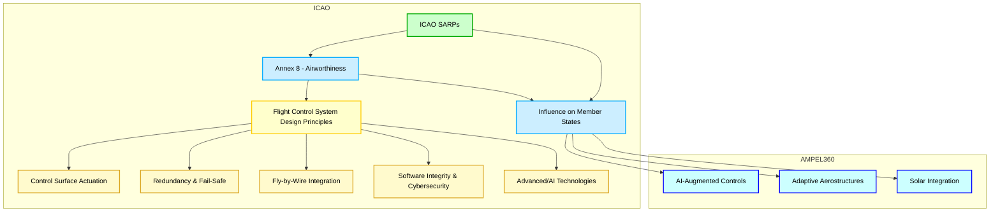

*Mermaid diagram illustrating how ICAO Annex 8 shapes flight control design principles and influences the GAIA AIR AMPEL360’s innovations. All text is now styled in **black**.*

---

### **Related Questions**

1. **What are the main differences between ICAO SARPs and national aviation regulations?**  
   *Answer:* ICAO SARPs provide international standards and recommended practices, while national aviation regulations incorporate or expand upon these principles within their own legal frameworks.

2. **How does ICAO ensure uniformity in flight control system standards across different countries?**  
   *Answer:* By publishing Annexes (like Annex 8) and recommended practices, ICAO encourages states to adopt common principles, thus promoting consistency and facilitating international aviation operations.

3. **How might the AMPEL360’s distributed control surfaces shape future ICAO standards?**  
   *Answer:* Operational data and real-world performance feedback from the AMPEL360 could inform new SARPs for adaptive aerostructures, AI-based controls, and integrated solar power systems.

4. **What role does cybersecurity play in ICAO standards for modern flight control systems?**  
   *Answer:* As aircraft systems become more interconnected, ICAO emphasizes robust cybersecurity measures, including secure architectures, encryption, intrusion detection, and incident response protocols.

5. **Why is redundancy so important in flight control systems according to ICAO?**  
   *Answer:* Redundancy helps ensure continued aircraft controllability in the event of single or multiple failures, aligning with ICAO’s core safety objectives.

6. **How do advanced materials like composites influence ICAO’s approach to flight control systems?**  
   *Answer:* Advanced materials can improve performance and reduce weight but require updated maintenance, inspection, and repair standards to address their unique properties and failure modes.

7. **What challenges does ICAO face regarding AI integration in flight controls?**  
   *Answer:* Ensuring safety, explainability, and accountability for AI-driven decisions, as well as managing human-machine interaction and pilot oversight, are among the primary challenges.

8. **In what ways does ICAO Annex 8 interact with other ICAO Annexes for holistic aviation safety?**  
   *Answer:* Annexes like Annex 6 (Operations) and Annex 13 (Accident Investigation) complement Annex 8 by covering operational procedures, crew training, and incident investigation—each vital to overall aviation safety.

---

**Conclusion:**  
ICAO’s Annex 8 provides **foundational global standards** for flight control systems, emphasizing **controllability, stability, structural integrity, and redundancy**. The **GAIA AIR AMPEL360** demonstrates how pioneering designs may **influence future ICAO SARPs**, specifically around **adaptive aerostructures, AI usage, and solar power integration**—ultimately fostering safer and more innovative aviation solutions.


# **27.30.4 Emerging Regulations**

The aviation industry is witnessing rapid technological advancements in flight control systems, particularly in the areas of artificial intelligence (AI), novel actuation systems, cybersecurity, and the integration of unconventional technologies like adaptive structures and on-board power generation. Regulatory bodies worldwide are working to keep pace with these innovations by developing new standards and regulations. This is particularly crucial for groundbreaking aircraft like the **GAIA AIR AMPEL360**, which pushes the boundaries of traditional aircraft design.

---

#### **27.30.4.1 Regulations for AI in Flight Controls**

The integration of Artificial Intelligence (AI) into flight control systems promises to enhance automation, optimize performance, and improve safety. However, it also presents significant regulatory challenges related to ensuring the reliability, predictability, and security of AI systems.

- **Key Initiatives:**

  - **European Union Aviation Safety Agency (EASA):**
    - **EASA AI Roadmap 2.0:**  
      Outlines EASA's vision for the safety and ethical considerations of AI in aviation. It provides a comprehensive action plan for the EASA AI Programme, setting the pace for conceptual guidance deliverables and anticipated rulemaking activities.
    - **Emphasis on:**
      - **Safety:** Ensuring that AI systems meet the highest safety standards.  
      - **Certification:** Developing appropriate certification processes for AI-based systems.  
      - **Regulation:** Establishing clear regulations for AI development, deployment, and operation in aviation.  
      - **Risk-Based Assessments:** Identifying and mitigating potential AI-related hazards.  
      - **Collaboration:** Working with industry stakeholders to develop practical, effective regulations.  
    - **Human-Centric Approach:** AI systems should augment human operators, not replace them.  
    - **Phased Approach:** Starting with lower-risk applications and gradually moving toward more complex autonomous systems.

  - **Federal Aviation Administration (FAA):**
    - **FAA Roadmap for Artificial Intelligence Safety Assurance:**  
      Provides guiding principles for assuring AI safety in aviation.
    - **Guiding Principles:**
      - **Risk-Based Safety Assurance:** A risk-based approach to AI system certification and approval.  
      - **Incremental Deployment:** Begin with lower-risk AI applications, increasing complexity over time.  
      - **Continuous Monitoring:** Ongoing performance monitoring, adjusting as needed.
    - **Technical Standards:**  
      The FAA is working on standards to enable AI deployment in aircraft, aiming for higher levels of autonomy.

- **Key Regulatory Considerations for AI:**
  - **Safety Assurance:** Rigorous testing, risk-based assessments, and possibly formal methods.  
  - **Incremental Deployment:** Start with pilot-assistance features; collect data, iterate, and refine.  
  - **Human-Machine Teaming:** Collaborative design to enhance safety and reliability.  
  - **Cybersecurity:** Integrate robust security measures to prevent threats.  
  - **Ethical Considerations:** Transparency, accountability, and fairness in AI usage.  
  - **Explainability/Transparency:** AI decision-making must be understandable and auditable.  
  - **Robustness/Predictability:** Reliable performance under varying, off-nominal conditions.  
  - **Data Integrity:** Validate data used for AI training and operations.  
  - **New Safety Methodologies:** Dynamic licensing or adaptive certification for AI systems.

- **Impact on the GAIA AIR AMPEL360:**
  - **Adaptive Aerostructures & AI:** Careful regulatory compliance is needed for AMPEL360’s AI-driven optimization.  
  - **GAIA AIR Collaboration:** Close work with FAA, EASA, etc., is essential to prove safety, reliability, and explainability.  
  - **Extensive Testing & Possible New Approaches:** Simulation, data analysis, or novel certification paths.

---

#### **27.30.4.2 Regulations for Novel Actuation Systems**

Novel actuation systems—like fly-by-wire or electric actuation—reshape flight control design and operation, necessitating updated regulations to ensure safe integration.

- **Key Standards/Initiatives:**
  - **ACTUATION 2015 Project:**  
    European project creating modular, scalable electromechanical actuators (EMAs), aiming to cut costs, boost reliability, and reduce aircraft weight.
  - **SAE International Standards:**  
    - **AIR4253B:** Design info for FBW systems (electro-hydraulic/electromechanical).  
    - **ARP5007A:** Outlines FBW system development (requirements, design, testing, certification).  
    - **ARP5724:** Guidelines for EMAs (performance, endurance, environmental testing).

- **Types of Novel Actuation Systems:**
  - **Electromechanical Actuators (EMAs):** Electric motors directly drive surfaces; potentially lighter, more efficient, reliable than hydraulics.  
  - **Electro-Hydrostatic Actuators (EHAs):** Self-contained hydraulic units driven by electric motors, removing central hydraulic systems.  
  - **Smart Materials/Actuators:**  
    - **MR Fluids** for damping.  
    - **Piezoelectrics** for high precision/quick response.  
    - **Shape Memory Alloys (SMAs)** enabling adaptive surfaces.

- **Future Regulatory Considerations:**
  - **All-Electric Aircraft:** Eliminating hydraulic systems for EMAs requires new standards for unique challenges.  
  - **Smart Materials:** As these mature, certification frameworks must address safety/reliability.

- **Impact on the GAIA AIR AMPEL360:**
  - **Lightweight, Energy-Efficient Actuators:** Potential EMAs/EHAs or smart materials.  
  - **Compliance Needs:** Reliability, performance, fault tolerance under various conditions; align with SAE and EASA/FAA rules.

---

#### **27.30.4.3 Regulations for Flight Control Cybersecurity**

Greater digital connectivity in aircraft demands strong cybersecurity. Regulations are emerging to tackle threats.

- **Key Regulations/Initiatives:**
  - **FAA Cybersecurity Rules:**  
    - New design standards for transport airplanes, engines, propellers.  
    - Security risk analyses required for systems, architectures, interfaces.  
    - Mandatory vulnerability mitigation.
  - **EASA Info Security Regulations:**  
    - Manage info security risks that affect aviation safety.  
    - Require robust cybersecurity measures, ongoing risk assessments.
  - **IATA Guidance:**  
    - Risk assessment, supply chain oversight, security management systems.  
    - Data-driven governance and fostering cybersecurity culture.
  - **Relevant Standards:**
    - **DO-326A/ED-202A:** Airworthiness security process spec.  
    - **DO-356A/ED-203A:** Implementing DO-326A security processes.  
    - **DO-355/ED-204:** Info security guidance for continuing airworthiness.

- **Key Considerations:**
  - **Risk Assessment:** Regularly identify threats in flight control systems.  
  - **Mitigation Measures:** Encryption, access control, IDS, network segmentation.  
  - **Continuous Monitoring:** Real-time detection/response to cyber threats.  
  - **Collaboration:** Regulators, industry, cybersecurity experts must coordinate.  
  - **Training/Awareness:** Aviation personnel need cybersecurity competence.

- **Impact on GAIA AIR AMPEL360:**
  - **Interconnected Systems:** High data reliance demands robust cyber defenses.  
  - **Meeting or Exceeding Standards:** DO-326A compliance, IATA guidance adoption.

---

#### **27.30.4.4 Regulations for Adaptive Aerostructures (AMPEL360 Specific)**

The **AMPEL360**’s adaptive aerostructures deviate from traditional designs, posing unique regulatory challenges.

- **Regulatory Framework:**
  - **Certification Requirements:** Must meet FAR Part 25 / CS-25 but may need new regs or special conditions given novelty.  
  - **Risk Assessment:** Evaluate hazards from structural changes on performance/stability (FMEA, FTA).  
  - **Testing/Validation:** Lab, wind tunnel, flight tests for performance/safety.  
  - **Cybersecurity:** Protect advanced materials/control systems (DO-326A/ED-202A).  
  - **Collaboration:** Regulators, **GAIA AIR**, research institutions essential to craft effective rules.

- **AMPEL360 Considerations:**
  - **SMAs:** Might need specific rules (material selection, manufacturing processes, temperature ops).  
  - **Real-Time Adaptivity:** Systems must quickly respond to flight changes, maintain control (algorithms, sensors, actuators).  
  - **Environmental Impact:** Reduce noise, boost fuel efficiency; meet noise regs.  
  - **Maintenance/Inspection:** Define frequency, scope, repair, replacement guidelines.

- **Challenges/Future Development:**
  - **Equivalent Safety:** Demonstrate same or better safety vs. traditional surfaces.  
  - **Aeroelastic Effects:** Must be analyzed/mitigated.  
  - **Long-Term Reliability:** Vital for mainstream adoption.  
  - **Regulatory Flexibility:** Possibly use Special Conditions, CRIs, performance-based regs.

---

#### **27.30.4.5 Regulations for Integrated Solar Power Systems (AMPEL360 Specific)**

Integrating solar power on control surfaces (like on **AMPEL360**) brings unique safety/performance/durability concerns.

- **Regulatory Framework:**
  - **Certification Requirements:** Must comply with electrical/structural/environmental regs.  
  - **Risk Assessment:** Identify hazards (electrical safety, structural impact, aerodynamics, EMI).  
  - **Testing/Validation:** Lab, environmental, flight testing.  
  - **Cybersecurity:** Safeguard solar power management.  
  - **Collaboration:** Regulators, **GAIA AIR**, research institutions for tailored regulations.

- **AMPEL360 Considerations:**
  - **Material Selection:** Durable, efficient, flexible, safe (flammability/toxicity).  
  - **Integration:** Ensure compatibility with existing systems (electrical interfaces, control algorithms, energy management).  
  - **Environmental Impact:** Recyclable materials, disposal protocols.  
  - **Maintenance/Inspection:** Define inspection intervals, cleaning/repair procedures, performance monitoring.

- **Challenges/Future Development:**
  - **Long-Term Durability:** Must prove solar panels last on control surfaces.  
  - **Weight/Aerodynamic Effects:** Minimize mass, address potential drag issues.  
  - **Standardization:** Industry-wide standards needed.  
  - **Regulatory Adaptation:** Likely new rules for this novel tech.

---

### **27.30.4.8 Regulatory Collaboration and Harmonization

- **International Cooperation:** Collaboration among FAA, EASA, ICAO, etc., to harmonize standards for new tech.
- **Industry Input:** Engage manufacturers (e.g., **GAIA AIR**), researchers, airlines to ensure practical, effective regulations.
- **Information Sharing:** Share data, best practices for certifying/operating advanced technologies.

---

### **27.30.4.9 Future Regulatory Considerations

As AI, automation, and other tech keep advancing, regulators look at:

- **Single-Pilot Ops:** Using AI to assist or augment pilot tasks for commercial jets.
- **Real-Time Monitoring:** AI-based flight parameter checks, ensuring stability (especially on approach/landing).
- **AI-Enabled Flight Control & Avionics:** Crafting rules for safe integration into commercial fleets.

---

## **Conclusion for Emerging Regulations**

The **GAIA AIR AMPEL360**—with its advanced technologies—creates both **challenges** and **opportunities** in the regulatory sphere. Successful certification and operation will demand **close collaboration** between **GAIA AIR**, authorities, and researchers. New standards for AI, adaptive aerostructures, and solar power systems will enable the **AMPEL360**’s entry into service and pave the way for **further innovations** in aircraft design and operations. Regulatory updates will continue as these tech mature and integrate into commercial aviation, making it essential for stakeholders to remain informed and contribute to the **safe advancement** of flight control technologies.

---

### **Diagram Proposal**

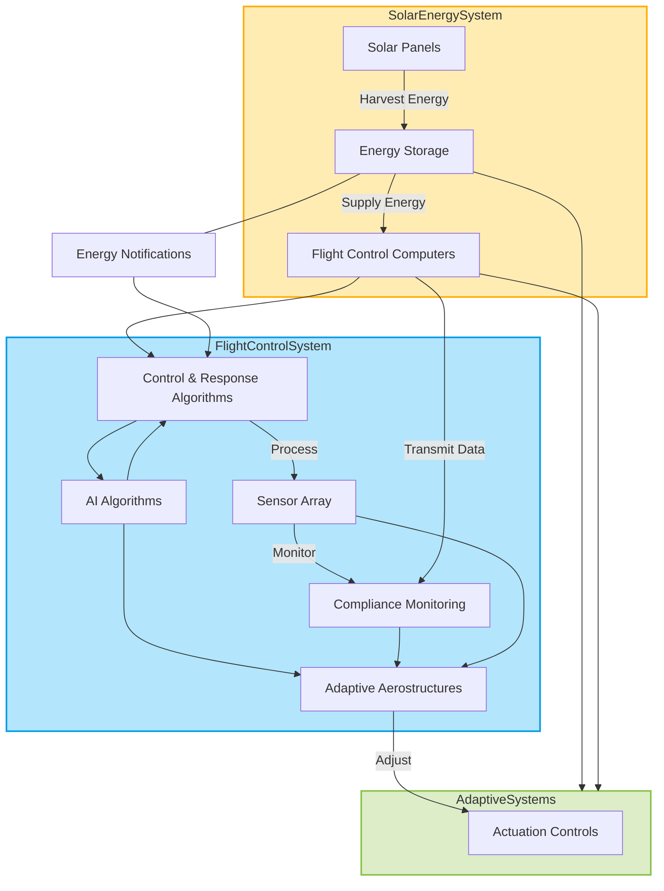

---

### **Diagram Explanation**

1. **Solar Energy System (Yellow)**
   - **Function:** Harvests solar energy via panels and stores it in a dedicated energy storage unit.
   - **Interaction:** Supplies power to flight control systems and adaptive aerostructures for sustainable operation.
   - **Notifications:** Provides energy status updates to flight control computers for dynamic adjustments.

2. **Flight Control System (Blue)**
   - **Components:**
     - **Flight Control Computers (FCS):** Process pilot and sensor inputs.
     - **Control & Response Algorithms (CRA):** Manage real-time decisions and data.
     - **AI Algorithms:** Enhance optimization and predict future responses.
     - **Sensor Array (SA):** Monitors compliance and operational safety.
     - **Compliance Monitoring (CMP):** Ensures alignment with regulatory standards.
   - **Interaction:** Coordinates with adaptive systems for improved flight efficiency and safety.

3. **Adaptive Systems (Green)**
   - **Components:**
     - **Adaptive Aerostructures (MA):** Adjust wing and control surface positions for optimal aerodynamics.
     - **Actuation Controls (AC):** Physically implement structural adjustments.
   - **Interaction:** Receives energy inputs from solar storage and commands from flight control computers.

4. **Data and Notifications**
   - **Energy Notifications:** Solar system provides updates to flight control computers for optimal energy usage.
   - **Data Sharing:** Sensor and compliance data flow dynamically to adaptive aerostructures for precise adjustments.

---


## **27.40.1 Aileron Systems** 

Aileron systems are a critical component of an aircraft’s primary flight controls, responsible for roll control—rotation around the longitudinal axis. Modern aircraft employ various aileron system types, ranging from traditional mechanical linkages to advanced fly-by-wire (FBW) architectures and hybrid designs. Additionally, novel concepts like **active aeroelastic control** and **adaptive aerostructures** (as seen in the **GAIA AIR AMPEL360**) are opening new frontiers in aileron design and operation.

---

### **A. Mechanical Aileron Systems**
Traditional mechanical aileron systems use a direct physical connection between the pilot’s control stick or yoke and the aileron surfaces. This connection typically involves:

- **Cables:** Steel cables transmit the pilot’s control inputs.
- **Pulleys:** Guide the cables and change their direction as needed.
- **Linkages:** Rigid rods, bellcranks, and similar components that transfer motion to the aileron surfaces.

**Pros & Cons:**
- **Pros:** 
  - Simple, direct feedback to the pilot.  
  - Easy to maintain on smaller/lighter aircraft.  
- **Cons:** 
  - Can require significant physical effort at higher speeds or on larger aircraft.  
  - Friction and backlash can reduce control precision.  
  - Weight penalty on larger aircraft.  
  - Numerous moving parts requiring regular inspection and lubrication.

---

### **B. Fly-By-Wire (FBW) Aileron Systems**
FBW systems replace mechanical linkages with electronic signaling and computer control. This approach confers several major advantages:

1. **Reduced Weight:** Eliminating heavy mechanical linkages.
2. **Improved Handling Qualities:** Sophisticated control laws optimize handling throughout the flight envelope.
3. **Flight Envelope Protection:** Preventing the pilot from making inputs that exceed structural or aerodynamic limits.
4. **Enhanced Safety:** Multiple levels of redundancy and fault tolerance.
5. **Reduced Pilot Workload:** Automation of tasks like trimming and stability augmentation.
6. **Seamless Integration:** Facilitates integration with autopilot, autothrottle, and other automated flight systems.

**Typical FBW Workflow**  
1. **Pilot Input:** Sensors (e.g., LVDTs/RVDTs) detect control stick/yoke movements and convert them into electrical signals.  
2. **Signal Transmission:** Electronic data buses (e.g., ARINC 429, MIL-STD-1553, ARINC 664) carry signals to the Flight Control Computers (FCCs).  
3. **Control Law Computation:** FCCs process pilot inputs plus sensor data (gyro, accelerometer, air data) to calculate the required aileron deflection.  
4. **Actuation:** Commands go to hydraulic or electromechanical actuators that move the ailerons.  
5. **Redundancy:** Multiple FCCs and channels allow continued operation if any channel fails.

**GAIA AIR AMPEL360 Context**  
- **Adaptive Aerostructures & AI:** The **AMPEL360** integrates FBW with adaptive aerostructures and AI-driven optimization, coordinating both conventional ailerons and distributed control surfaces for enhanced maneuverability and load alleviation.

---

### **C. Hybrid Aileron Systems**
Some aircraft combine mechanical and FBW elements, such as:
- **Mechanical Backup:** Mechanical linkages as a fallback should the electronic system fail.  
- **Hydraulic Actuation + Electronic Control:** Hydraulic actuators controlled by servo valves under electronic command.

---

### **D. Advanced Aileron Designs**

1. **Differential Ailerons**  
   - Upward-deflected aileron moves more than the downward-deflected one.  
   - Creates extra drag on the descending wing, mitigating adverse yaw.

2. **Frise-Type Ailerons**  
   - Hinge placement allows the leading edge of the upward-moving aileron to protrude into the airflow below the wing, creating drag on the descending wing.

3. **Coupled Ailerons and Rudder (ARI)**  
   - Interconnect automatically deflects the rudder in the same direction as the aileron input, coordinating turns and reducing adverse yaw.

4. **Spoilers**  
   - Panels on the upper wing that disrupt airflow, reducing lift and increasing drag. Often used with ailerons for enhanced roll authority or as speed brakes.

5. **Flaperons**  
   - Combine flap and aileron functions. Deflect differentially for roll control and symmetrically for lift augmentation.

6. **Drooped Ailerons**  
   - Deflect downward in concert with flap extension, effectively acting as partial-span flaps.

---

### **E. Aileron Flutter**
- **Definition:** A self-sustaining oscillation caused by improper mass balance or inadequate wing stiffness, potentially leading to structural failure.
- **Prevention:**  
  - **Mass Balancing** to shift the aileron’s center of gravity.  
  - **Adequate Structural Stiffness.**  
  - **Flutter Testing** to ensure the aileron is free of flutter within the aircraft’s operating envelope.

---

### **F. Aileron Control in Stalls and Spins**
- **Stall:** Ailerons lose effectiveness near stall and can worsen the situation if misused, potentially inducing a spin.  
- **Spin Recovery:** Primarily uses rudder (and elevator). Ailerons are typically neutral or per the aircraft manual's stall/spin recovery procedures.

---

### **G. Future Advancements**
1. **Active Aeroelastic Control**  
   - Multiple small surfaces or adaptive wing structures manipulate wing shape in flight, improving efficiency and maneuverability.  
   - The **AMPEL360** exemplifies adaptive aerostructures, using AI algorithms for real-time optimization.

2. **More Electric Actuation**  
   - Growing trend towards electromechanical actuators (EMAs), reducing hydraulic circuits for lighter, more efficient aircraft.

3. **AI and Advanced Algorithms**  
   - AI-driven control optimization can consider a wide array of factors (pilot input, flight conditions, performance goals), continuously adapting aileron usage for safer, more efficient flight.

---


### **Diagram Explanation**

1. **Mechanical Aileron System (Green):**
   - **Pilot Stick/Yoke:** Directly manipulates the ailerons via physical linkages.
   - **Cables & Pulleys:** Transfer pilot input to the control surfaces.
   - **Bellcranks/Linkages:** Mechanically amplify and transmit forces.
   - **Aileron Control Surface:** Adjusts to change the aircraft's roll.

2. **Fly-By-Wire Aileron System (Blue/Red):**
   - **Pilot Stick/Yoke:** Inputs are sensed electronically rather than mechanically.
   - **Sensors (LVDT/RVDT):** Detect the position of the yoke or stick.
   - **Flight Control Computers:** Process input data and calculate control surface adjustments.
   - **Control Laws:** Algorithms ensure smooth, stable control responses.
   - **Actuators:** Electrically manipulate the ailerons based on computer commands.
   - **Aileron Control Surface:** Executes precise movements for roll adjustments.

---

## **27.40.2 Elevator Systems**

Elevator systems are integral to an aircraft's primary flight controls, governing **pitch control**—rotation around the lateral axis. Similar to aileron systems, elevators can range from purely mechanical linkages to advanced fly-by-wire (FBW) designs, and may incorporate innovative features like **active aeroelastic control** and **adaptive aerostructures** (as showcased by the **GAIA AIR AMPEL360**).

### **A. Mechanical Elevator Systems**

In traditional mechanical systems, the pilot's control column or yoke is connected to the elevators via direct physical linkages, such as:

*   **Cables:** Steel cables transmit the pilot's control inputs.
*   **Pulleys:** Pulleys guide the cables and change their direction as needed.
*   **Rods/Bellcranks:** Rigid components to convert and transfer linear or rotary motion.

**Pros & Cons:**

*   **Pros:**
    *   Simple, reliable, and gives direct **control feel** to the pilot. The resistance and feedback felt on the control column are directly related to the aerodynamic forces acting on the elevator.
    *   Straightforward to maintain on smaller or slower aircraft.
*   **Cons:**
    *   Potential for significant control force at higher speeds or on larger aircraft.
    *   Friction/backlash can reduce precision.
    *   Weight penalty and added complexity on large transport aircraft.

### **B. Fly-By-Wire (FBW) Elevator Systems**

FBW elevator systems replace mechanical linkages with electronic signaling and computer-driven actuation. They bring numerous benefits:

1.  **Weight Reduction:** Eliminating mechanical linkages can substantially cut weight.
2.  **Enhanced Handling:** Digital **control laws** tailor handling qualities across the flight envelope, providing more consistent and predictable responses. Examples include:
    *   **Pitch Rate Command:** The control system adjusts the elevator to achieve a specific pitch rate proportional to the pilot's input.
    *   **G-Command:** The control system adjusts the elevator to maintain a specific load factor (g-force) proportional to the pilot's input.
    *   **Alpha (Angle of Attack) Command/Protection:** The control system adjusts the elevator to maintain a specific angle of attack or to prevent the aircraft from exceeding a safe angle of attack.
3.  **Flight Envelope Protection:** Prevents pilot inputs that exceed aerodynamic or structural limits (e.g., stall protection, pitch-up limits, overspeed protection).
4.  **Fault Tolerance & Redundancy:** Multiple Flight Control Computers (FCCs) and actuator channels guard against single-point failures.
    *   **Triple-Redundant:** Three independent FCCs and sets of actuators.
    *   **Quad-Redundant:** Four independent FCCs and sets of actuators.
    *   **Redundancy Management:** The FCCs constantly monitor each other's performance and can automatically switch to a backup channel in case of a failure.
5.  **Reduced Pilot Workload:** Automation handles tasks like pitch trim and stability augmentation.
6.  **Integration with Other Systems:** Seamlessly interfaces with autopilot, autothrottle, and other avionics.

**Typical FBW Elevator Workflow:**

1.  **Pilot Input:** Sensors detect forward/back movement of the control column.
2.  **Signal Transmission:** Electronic data buses (e.g., ARINC 429, MIL-STD-1553, ARINC 664) relay signals to FCCs.
3.  **Control Law Computation:** FCCs combine pilot input with sensor data (e.g., gyros, accelerometers, air data) to determine required elevator deflection.
4.  **Actuation:** Commands are sent to actuators that move the elevator surfaces.
    *   **Electro-Hydraulic Actuators (EHAs):** Use hydraulic power controlled by electrically operated servo valves. Offer high power and reliability but add weight and complexity.
    *   **Electromechanical Actuators (EMAs):** Use electric motors to directly drive the control surface. They offer potential weight savings, improved efficiency, and reduced maintenance but may have limitations in power output compared to hydraulic systems. The trend towards "more electric aircraft" favors the use of EMAs.
5.  **Feedback & Monitoring:** FCCs continuously monitor system performance and can revert to backup channels if failures occur.

**GAIA AIR AMPEL360 Context:**

*   **Adaptive Aerostructures:** The **AMPEL360** integrates traditional elevators with adaptive surfaces along the horizontal stabilizer. The adaptive surfaces may be used for primary pitch control, fine-tuning pitch attitude, optimizing trim, or a combination of these functions.
*   **AI-Driven Control:** AI algorithms optimize pitch control in real-time based on pilot inputs, flight conditions, and load alleviation goals. The AI may also consider the energy generated by the solar panels on the adaptive surfaces.
*   **Challenges:** Includes ensuring robust sensor fusion, reliable actuator performance, advanced failure-detection strategies, and seamless integration of elevator and adaptive surface control. The use of AI also introduces challenges related to explainability, predictability, and certification.
*   **Actuator Choice:** The **AMPEL360** will likely use EMAs or other advanced electric actuators for the elevator and adaptive surfaces, given their potential for weight savings, efficiency, and precise control.

### **C. Hybrid Systems**

Some aircraft employ a hybrid approach, blending mechanical and electronic elements:

*   **Mechanical Backup:** A mechanical linkage remains as an emergency fallback if the electronic pathway fails. An example might be a transport category aircraft with FBW primary controls but a mechanical linkage for the stabilizer trim.
*   **Electro-Hydraulic Actuation:** Hydraulic actuators powered by electrically commanded servo valves, bridging mechanical resilience with digital control precision.

*Rationale for Hybrid Systems:* Hybrid systems can be used to balance cost, complexity, weight, and safety considerations. They can also be found on older aircraft that have been retrofitted with some FBW components.

### **D. Advanced Elevator Concepts**

1.  **Elevator Control Surfaces:**
    *   **Conventional Elevators:** Hinged surfaces located at the trailing edge of the horizontal stabilizer, typically actuated by hydraulic, electromechanical, or in older aircraft, mechanical linkages.
    *   **All-Moving Stabilizer (Stabilator):** The entire horizontal stabilizer can be moved as a single unit to control pitch, providing greater pitch authority, effectiveness at high speeds, and can reduce drag in some cases. However, they can be more sensitive to control inputs and may be more complex mechanically.
    *   **Split Elevators:** The elevator is divided into two or more independent sections, providing redundancy and allowing for differential operation to mitigate the effects of a partial system failure.

2.  **Elevator Droop/Trimmable Horizontal Stabilizer:**
    *   Some designs integrate a fully **trimmable horizontal stabilizer**, adjusting the entire tailplane's angle. This provides a wide range of pitch trim authority, reducing drag by keeping elevator deflections minimal in cruise. Some aircraft have **elevator droop** systems that slightly deflect both elevators down with flap extension, effectively acting as a partial span flap and providing more lift at slower speeds.
    *   **Actively Twisting Horizontal Stabilizers:** Emerging concepts where parts of the horizontal stabilizer can dynamically twist or morph. This could optimize tailplane efficiency and pitch authority in real-time. For example, in some aircraft, the horizontal stabilizer is twisted during high-speed flight to counteract the pitching moment caused by wing twist. This reduces the need for large elevator deflections, which can cause drag. In the context of the **AMPEL360**, this could involve using the adaptive surfaces on the horizontal stabilizer to achieve a similar effect.
3.  **Stability Augmentation Systems (SAS):**
    *   Automated features that enhance pitch stability (e.g., pitch dampers, pitch stability augmentation). They reduce pilot workload and improve handling qualities, especially in gusty or turbulent conditions.
4.  **Elevator-Rudder Interconnect (ERI):**
    *   Though less common than aileron-rudder interconnect, some aircraft couple elevator inputs with rudder deflections under specific conditions (e.g., **spin recovery modes**). The specific implementation of ERI varies between aircraft and may involve automatic or manual engagement. It is important to note that ERI is primarily used to aid in spin recovery, **not for general turn coordination.**

### **E. Elevator Flutter & Aeroelastic Considerations**

*   **Elevator Flutter:** Similar to aileron flutter, improper mass balance or insufficient stiffness can lead to dangerous oscillations. Flutter is a self-sustaining vibration that can rapidly lead to structural failure.
*   **Prevention Measures:**
    *   **Mass Balancing:** Adding weights to the elevator to shift its center of gravity forward, typically ahead of the hinge line. This counteracts aerodynamic forces that can cause flutter.
    *   **Sufficient Structural Stiffness:** Ensuring both the elevator and the horizontal stabilizer structure are stiff enough to resist flutter-inducing oscillations.
    *   **Rigorous Ground/Flight Flutter Testing:** To validate the system within operational speed ranges and ensure no flutter occurs.

### **F. Elevator Control During Stalls and Spins**

*   **Stalls:** Elevator effectiveness diminishes significantly near or beyond the stall angle of attack. While some aircraft may retain some elevator authority in a stall, it is crucial to avoid using abrupt or large elevator inputs. **In a fully developed stall, aileron use can be detrimental and may worsen the stall or lead to a spin. The elevator is the primary control for recovering from a stall** by lowering the nose and reducing the angle of attack.
*   **Spins:** **Ailerons should generally not be used during a spin.** The primary control for spin recovery is the rudder, followed by the elevator. **Specific spin recovery procedures can vary between aircraft types,** and it is essential to follow the aircraft's POH/AFM.

### **G. Future Advancements**

1.  **Active Aeroelastic Control:**
    *   The **AMPEL360** exemplifies integrating adaptive or morphing tail surfaces to optimize pitch control, load distribution, and overall efficiency. This could involve using the adaptive surfaces on the horizontal stabilizer to act as additional elevators, to fine-tune pitch attitude, or to optimize trim.
    *   Offers potential for real-time shape adjustment to reduce drag, enhance maneuverability, improve fuel economy, and reduce structural loads.
2.  **Electromechanical Actuators (EMAs):**
    *   Ongoing push towards "more electric aircraft" may see EMAs replace traditional hydraulics for elevator control.
    *   Potential benefits: weight savings, improved reliability, easier maintenance, lower lifecycle costs.
3.  **AI & Predictive Algorithms:**
    *   AI-driven flight control laws can continuously adapt elevator usage for situational demands, balancing passenger comfort, aerodynamic efficiency, and performance constraints. In the **AMPEL360**, AI will likely play a crucial role in coordinating the elevator with the adaptive surfaces.
    *   Predictive failure detection using advanced data analytics can flag incipient issues with sensors or actuators.
4.  **Adaptive Trailing Edge:**
    *   Consider the possibility of using an adaptive trailing edge for the elevator.

#### Elevator System Overview

```mermaid
graph TD
    subgraph Mechanical_Elevator_System
        A[Pilot Control Column] --> B[Cables and Pulleys]
        B --> C[Rods and Bellcranks]
        C --> D[Elevator Control Surface]
    end
    subgraph FBW_Elevator_System
        E[Pilot Control Column] --> F[Sensors LVDT RVDT]
        F --> G[Flight Control Computers FCCs]
        G --> H[Control Laws]
        H --> I[Actuators EHAs EMAs]
        I --> J[Elevator Control Surface]
        K[Aircraft Sensors] --> G
        L[Adaptive Surface Data] --> G
    end
    subgraph Hybrid_System
        M[Pilot Control Column] --> N[Mechanical Linkages]
        N --> O[Hydraulic Actuators with Electronic Control]
        O --> P[Elevator Control Surface]
        Q[Sensors] --> R[Flight Control Computer]
        R --> O
    end
    subgraph GAIA_AIR_AMPEL360
        S[Pilot Control Column] --> T[Sensors]
        T --> U[Flight Control Computers FCCs]
        U --> V[AI Algorithms]
        V --> W[Control Laws]
        W --> X[Elevator Actuators]
        X --> Y[Elevator Control Surface]
        W --> Z[Adaptive Surface Actuators]
        Z --> AA[Adaptive Aerostructures]
        AB[Aircraft Sensors] --> U
        AC[Adaptive Surface Sensors] --> U
        AD[Solar Panel Data] --> U
    end

    style A fill:#ccffcc,stroke:#00aa00,stroke-width:2px,color:#000
    style E fill:#ccffcc,stroke:#00aa00,stroke-width:2px,color:#000
    style G fill:#cceeff,stroke:#00aaff,stroke-width:2px,color:#000
    style I fill:#ffcccc,stroke:#ff0000,stroke-width:2px,color:#000
    style L fill:#ccffff,stroke:#0000ff,stroke-width:2px,color:#000
    style M fill:#ccffcc,stroke:#00aa00,stroke-width:2px,color:#000
    style O fill:#ffcccc,stroke:#ff0000,stroke-width:2px,color:#000
    style S fill:#ccffcc,stroke:#00aa00,stroke-width:2px,color:#000
    style U fill:#cceeff,stroke:#00aaff,stroke-width:2px,color:#000
    style V fill:#ccffff,stroke:#0000ff,stroke-width:2px,color:#000
    style X fill:#ffcccc,stroke:#ff0000,stroke-width:2px,color:#000
    style Z fill:#ffcccc,stroke:#ff0000,stroke-width:2px,color:#000
    style Y fill:#f0f0f0,stroke:#000000,stroke-width:1px,color:#000
    style AA fill:#f0f0f0,stroke:#000000,stroke-width:1px,color:#000
```

*Mermaid diagram illustrating the differences between mechanical, FBW, hybrid, and the GAIA AIR AMPEL360 elevator systems.*

#### Horizontal Stabilizer Types

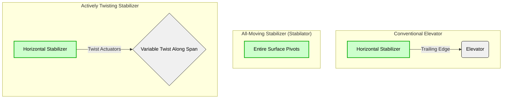
*Mermaid diagram illustrating different elevator configurations: conventional, all-moving stabilizer, and actively twisting stabilizer.*

---

**Related Questions:**

1.  **How has the introduction of FBW technology revolutionized elevator control systems?**
    *Answer:* FBW technology has revolutionized elevator control by replacing mechanical linkages with electronic signals and computers. This has led to significant improvements in weight reduction, handling qualities, flight envelope protection, safety through redundancy, and reduced pilot workload. It has also enabled the integration of advanced features like adaptive control and AI-based optimization.

2.  **What are the different types of elevator control surfaces, and what are their advantages and disadvantages?**
    *Answer:* The main types include:
    *   **Conventional Elevators:** Hinged surfaces on the trailing edge of the horizontal stabilizer. Simple and reliable but may require larger control forces at high speeds.
    *   **All-Moving Stabilizers (Stabilators):** The entire horizontal stabilizer moves as a single unit. More effective at high speeds and for trim, but can be more sensitive to control inputs.
    *   **Split Elevators:** Divided into independent sections for redundancy and differential operation. Adds complexity but enhances fault tolerance.

3.  **How does the stabilizer trim system work in conjunction with the elevator system?**
    *Answer:* The stabilizer trim system adjusts the angle of the horizontal stabilizer to maintain a desired pitch attitude and reduce the load on the elevator. It works in conjunction with the elevator to provide both fine and coarse pitch control. The autopilot can automatically adjust the stabilizer trim to keep the elevator centered, ensuring smooth and coordinated flight.

4.  **What are the key safety features associated with elevator and stabilizer trim systems?**
    *Answer:* Key safety features include:
    *   **Redundancy:** Multiple independent control channels, actuators, and power sources to ensure continued operation in case of failures.
    *   **Fail-Safe Designs:** Mechanisms to prevent catastrophic consequences in case of system malfunctions (e.g., runaway trim protection).
    *   **Torque Limiters:** Prevent excessive elevator deflection that could damage the airframe.
    *   **Manual Override:**  Pilots can always override the autopilot and automatic trim systems to take manual control.
    *   **Flight Envelope Protection:** FBW systems can prevent the aircraft from exceeding safe operating limits (e.g., stall protection, overspeed protection).

5.  **How do advanced technologies like EMAs and EHAs improve elevator control systems?**
    *Answer:*
    *   **EMAs (Electromechanical Actuators):** Offer benefits such as reduced weight, improved efficiency, and easier maintenance compared to traditional hydraulic systems. They use electric motors to directly drive the control surfaces.
    *   **EHAs (Electro-Hydraulic Actuators):** Combine the power of hydraulics with the precision of electric control. They use an electric motor to drive a local hydraulic pump, eliminating the need for a central hydraulic system.

## 6. **What are the challenges in certifying AI-augmented elevator control systems, especially for aircraft like the GAIA AIR AMPEL360?**

**Answer:** Certifying AI-augmented flight control systems, particularly for innovative aircraft like the **GAIA AIR AMPEL360**, presents several unique challenges:

- **Explainability and Transparency:**
  - Traditional certification processes rely on a clear understanding of how a system works and how it will respond in different situations. AI systems, especially deep learning models, can be "black boxes," making it difficult to understand their decision-making logic.
  - Regulators require a degree of explainability and transparency to ensure that the AI is making safe and appropriate decisions. This involves developing methods for understanding and documenting the AI's reasoning process.

- **Predictability and Robustness:**
  - AI systems must be predictable and robust, meaning they should perform consistently and reliably under a wide range of operating conditions, including unexpected or unusual situations.
  - This requires extensive testing and validation using large, representative datasets and advanced simulation techniques.
  - The **AMPEL360**'s adaptive aerostructures add another layer of complexity, as the AI must be able to adapt to the changing aerodynamic characteristics of the aircraft in real-time.

- **Data Integrity and Quality:**
  - AI systems are heavily reliant on data for training and operation. Ensuring the integrity, quality, and representativeness of this data is crucial for safe and reliable performance.
  - This includes validating data sources, addressing potential biases in the data, and ensuring that the AI is trained on a dataset that accurately reflects the real-world operating environment.

- **Verification and Validation (V&V):**
  - Traditional V&V methods may not be sufficient for AI-based systems. New V&V techniques are needed to address the dynamic and adaptive nature of AI.
  - This may involve using formal methods, statistical testing, and simulation-based approaches to assess the performance and safety of the AI.

- **Human-Machine Interaction:**
  - The interaction between pilots and AI-augmented flight controls must be carefully considered. Pilots need to understand the AI's capabilities and limitations, and they need to be able to trust and effectively collaborate with the AI system.
  - This requires the development of intuitive HMIs and comprehensive pilot training programs.

- **Cybersecurity:**
  - AI systems can be vulnerable to cyberattacks, such as data poisoning or adversarial examples. Robust cybersecurity measures are needed to protect the integrity and safety of AI-augmented flight controls.

- **Evolving Standards and Regulations:**
  - Regulatory frameworks for AI in aviation are still under development. The certification process for the **AMPEL360** will likely involve close collaboration with regulatory authorities to define appropriate standards and demonstrate compliance.
  - This may involve the use of **Special Conditions** or **Certification Review Items (CRIs)** to address the unique aspects of the AI-augmented system.

- **Adaptive Aerostructure Integration:**
  - The **AMPEL360**'s adaptive aerostructures introduce additional challenges for certification. The AI must be able to safely and effectively manage the interaction between the elevator and the adaptive surfaces, taking into account the changing aerodynamic characteristics of the aircraft.
  - This requires rigorous testing and validation under a wide range of flight conditions.

- **Safety Assurance:**
  - Demonstrating that the AI-augmented system meets the required safety levels will be a significant challenge. This may involve developing new safety assessment methodologies and metrics specifically tailored to AI-based systems.

- **Public Acceptance:**
  - Gaining public acceptance of AI in safety-critical aviation applications will be crucial. This requires transparency in the development and certification process, as well as clear communication of the benefits and risks of AI-augmented flight controls.

---

## 7. **How will the integration of adaptive aerostructures on the GAIA AIR AMPEL360 influence the design and operation of the elevator system?**

**Answer:** The **GAIA AIR AMPEL360**'s adaptive aerostructures will significantly influence the elevator system in several ways:

- **Integrated Control:** The elevator will work in concert with the adaptive surfaces on the horizontal stabilizer. The flight control system, likely using AI, will coordinate the movement of both to optimize pitch control, aerodynamic efficiency, and load alleviation.
- **Enhanced Functionality:** The adaptive surfaces could potentially augment the elevator's function, providing additional pitch authority or allowing for finer control over the aircraft's pitch attitude.
- **New Control Laws:** New control laws will need to be developed to manage the interaction between the elevator and the adaptive surfaces. These laws will likely be more complex than those for traditional elevators, taking into account a wider range of variables and sensor inputs.
- **Redundancy and Failure Modes:** The integration of adaptive surfaces will introduce new considerations for redundancy and failure mode management. The system must be designed to ensure safe operation even if some of the adaptive surfaces or their actuators fail.
- **Real-time Optimization:** The AI managing the adaptive surfaces will likely optimize the elevator's performance in real-time, taking into account factors like airspeed, altitude, angle of attack, and turbulence.

---

## 8. **What are the potential benefits of using AI to optimize elevator control in real-time, particularly for an aircraft like the AMPEL360?**

**Answer:** Using AI for real-time optimization of elevator control, especially in an aircraft like the **AMPEL360**, offers several potential benefits:

- **Enhanced Efficiency:** AI can fine-tune the elevator and adaptive surface configuration to minimize drag and maximize lift, leading to improved fuel efficiency.
- **Improved Performance:** AI can optimize the aircraft's pitch response for different flight conditions and maneuvers, enhancing handling qualities and maneuverability.
- **Load Alleviation:** AI can adjust the elevator and adaptive surfaces to reduce structural loads on the aircraft, particularly during turbulence or high-g maneuvers.
- **Increased Safety:** AI can help to prevent stalls, overspeeds, and other dangerous situations by automatically adjusting the elevator and other control surfaces to maintain the aircraft within its safe operating envelope.
- **Reduced Pilot Workload:** By automating many of the fine adjustments to pitch control, AI can reduce pilot workload and allow them to focus on other tasks.
- **Adaptability:** AI can adapt to changing conditions, such as variations in aircraft weight, center of gravity, or atmospheric conditions, more quickly and effectively than traditional control systems.

---

## 9. **How do advancements in materials science, such as the use of lighter and stronger composites, impact the design of elevator systems?**

**Answer:** Advancements in materials science, particularly the use of lighter and stronger composites, have a significant impact on the design of elevator systems:

- **Weight Reduction:** Composites are significantly lighter than traditional metallic materials, allowing for a reduction in the overall weight of the elevator system. This contributes to improved fuel efficiency and increased payload capacity.
- **Increased Strength and Stiffness:** Composites can offer higher strength-to-weight and stiffness-to-weight ratios compared to metals. This allows for the design of more efficient and responsive elevator control surfaces.
- **Aeroelastic Tailoring:** Composites can be tailored to specific stiffness requirements, enabling the design of control surfaces that can passively or actively deform in a way that optimizes aerodynamic performance and reduces flutter. This is particularly relevant for the **AMPEL360**'s adaptive aerostructures.
- **Reduced Part Count:** Composite construction can enable the manufacture of complex shapes as single integrated parts, reducing the number of individual components and simplifying assembly.
- **Corrosion Resistance:** Composites are generally more resistant to corrosion than metals, reducing maintenance requirements and extending the lifespan of the elevator system.
- **Design Flexibility:** Composites offer greater design flexibility, allowing for more complex aerodynamic shapes and the integration of sensors and actuators directly into the structure.

---

## 10. **How do emerging trends like the "more electric aircraft" and the push towards urban air mobility (UAM) influence the development of elevator control systems?**

**Answer:** Emerging trends like the "more electric aircraft" and urban air mobility (UAM) are significantly influencing the development of elevator control systems:

- **More Electric Aircraft:** The move towards more electric aircraft favors the use of electromechanical actuators (EMAs) over traditional hydraulic systems. EMAs offer potential benefits in terms of weight reduction, improved efficiency, and easier maintenance. This trend is pushing the development of more powerful, reliable, and compact EMAs suitable for primary flight control applications.
- **Urban Air Mobility (UAM):** The rise of eVTOL aircraft for urban air mobility presents unique challenges and opportunities for elevator control systems:
  - **Distributed Electric Propulsion:** eVTOLs often use multiple electric motors for lift and propulsion, requiring advanced flight control systems that can coordinate the thrust from these motors to control the aircraft's attitude and trajectory.
  - **Transition Between Flight Modes:** eVTOLs need to transition smoothly between vertical and horizontal flight, requiring sophisticated control algorithms and potentially novel control surface configurations.
  - **Compact and Lightweight Designs:** UAM vehicles require compact and lightweight flight control systems to maximize payload and range.
  - **Increased Autonomy:** UAM concepts often involve higher levels of autonomy, requiring advanced flight control systems capable of autonomous operation.

### **27.40.3 Rudder Systems**

Rudder systems are a crucial part of an aircraft's primary flight controls, providing control around the yaw axis (vertical axis). They are essential for coordinated turns, counteracting adverse yaw, and maintaining directional stability. Like other primary flight controls, rudder systems have evolved from traditional mechanical linkages to advanced fly-by-wire (FBW) and hybrid systems. The **GAIA AIR AMPEL360**, with its focus on adaptive aerostructures and AI-driven control, represents the next generation of rudder system design and integration.

#### **A. Rudder System Functions:**

1.  **Yaw Control:**
    *   **Primary Function:** Adjusts the aircraft's heading by deflecting the rudder left or right.
    *   **Operation:** Deflecting the rudder to the right yaws the aircraft to the right, and vice versa.

2.  **Coordinated Turns:**
    *   **Function:** Works in conjunction with ailerons to maintain balance during turns.
    *   **Mechanism:** The rudder counteracts adverse yaw generated by aileron inputs, ensuring the aircraft's nose remains aligned with the turn direction.

3.  **Counteracting Adverse Yaw:**
    *   **Issue:** Adverse yaw occurs when differential lift and drag on the wings during a roll cause the aircraft to yaw in the opposite direction.
    *   **Solution:** The rudder is employed to neutralize this effect, promoting coordinated and stable flight.

4.  **Crosswind Landings:**
    *   **Application:** Aligns the aircraft's longitudinal axis with the runway centerline while using ailerons to manage wing level or slight banking into the wind.
    *   **Technique:** Combines rudder and aileron inputs to counteract crosswind forces during landing. Additionally, the rudder may be used with a technique called 'rudder hold', allowing the pilot to maintain a constant rudder deflection without continuous pedal input.

5.  **Engine Failure:**
    *   **Scenario:** In multi-engine aircraft, the failure of an engine induces a yawing moment due to asymmetric thrust.
    *   **Response:** The rudder compensates by applying opposite yaw to maintain directional control.

6.  **Spin Recovery:**
    *   **Role:** Serves as the primary control surface for recovering from a spin.
    *   **Procedure:** Pilots apply rudder input opposite to the spin direction to halt autorotation and regain stable flight.

7.  **Stability Augmentation (Yaw Damper):**
    *   **Purpose:** Automatically counteracts Dutch roll oscillations, enhancing passenger comfort and structural integrity.
    *   **Integration:** Often incorporated into the flight control system, especially in FBW aircraft.

#### **B. Mechanical Rudder Systems:**

Traditional mechanical rudder systems use a direct mechanical linkage between the rudder pedals in the cockpit and the rudder control surface.

*   **Components:**
    *   **Rudder Pedals:** Pilot interface for rudder control.
    *   **Cables and Pulleys:** Transmit pedal movements to the rudder.
    *   **Pushrods and Bellcranks:** May also be used to transfer motion and change the direction of force.
    *   **Rudder Control Surface:** The hinged surface at the trailing edge of the vertical stabilizer.

*   **Advantages:**
    *   **Simplicity:** Relatively simple design with fewer components.
    *   **Reliability:** Generally reliable if properly maintained.
    *   **Direct Feedback:** Provides direct tactile feedback to the pilot, allowing them to "feel" the aerodynamic forces on the rudder.

*   **Disadvantages:**
    *   **Pilot Effort:** Can require significant physical effort from the pilot, especially on larger or faster aircraft.
    *   **Weight:** Can be heavy, particularly on larger aircraft with long cable runs.
    *   **Maintenance:** Requires regular inspection, lubrication, and adjustment of cables, pulleys, and linkages.
    *   **Limited Integration:** Difficult to integrate with advanced features like automatic yaw damping or stability augmentation.

#### **C. Fly-By-Wire (FBW) Rudder Systems:**

In FBW systems, the mechanical linkages are replaced by electronic signaling and computer control.

*   **Components:**
    *   **Rudder Pedals with Sensors:** Sensors (e.g., LVDTs, RVDTs) detect pedal movement and convert it into electrical signals.
    *   **Flight Control Computers (FCCs):** Process the pedal input signals along with data from other sensors (e.g., gyroscopes, accelerometers, air data computers).
    *   **Actuators:** Electro-hydraulic or electromechanical actuators move the rudder surface based on commands from the FCCs.
    *   **Rudder Control Surface:** Similar to mechanical systems but may incorporate advanced materials or designs.
*   **Advantages:**
    *   **Reduced Weight:** Eliminates heavy mechanical linkages.
    *   **Improved Performance:** Control laws can be tailored to optimize rudder response and coordinate with other control surfaces.
    *   **Enhanced Stability:** Easier integration of yaw damping and stability augmentation systems.
    *   **Envelope Protection:** Can prevent the pilot from exceeding structural or aerodynamic limits related to rudder deflection.
    *   **Automation:** Facilitates the integration of autopilot and other automated functions.
    *   **Reduced Pilot Workload:** Automation and optimized control laws can reduce the physical and mental effort required for rudder control.
*   **Disadvantages:**
    *   **Complexity:** More complex than mechanical systems, requiring sophisticated software and hardware.
    *   **Cost:** Generally higher initial cost compared to mechanical systems.
    *   **Dependence on Electrical Power:** Requires a reliable source of electrical power.

#### **D. Hybrid Rudder Systems:**

Some aircraft use hybrid systems that combine mechanical and FBW elements:

*   **Mechanical Backup:** A mechanical linkage may be retained as a backup in case of a complete FBW failure.
*   **Hydraulic Actuation with Electronic Control:** Hydraulic actuators may be used for their power, with their movement controlled by electronic signals from a flight control computer.

#### **E. Rudder System Actuation:**

*   **Hydraulic Actuators:** Powerful and reliable, hydraulic actuators are commonly used in larger aircraft. They use hydraulic pressure to move the rudder surface.
*   **Electromechanical Actuators (EMAs):** EMAs use electric motors to directly drive the rudder surface. They are becoming increasingly popular due to their potential for weight savings, improved efficiency, and reduced maintenance.
*   **Electro-Hydraulic Actuators (EHAs):** EHAs are self-contained hydraulic actuators that use an electric motor to drive a local hydraulic pump. They offer the power of hydraulics with the control precision of electric systems.

#### **F. Yaw Damping:**

*   **Purpose:** Yaw dampers are automatic systems that counteract Dutch roll oscillations. Dutch roll is a coupled lateral-directional oscillation that can be uncomfortable for passengers and, in extreme cases, can lead to structural damage.
*   **Operation:** Yaw dampers use sensors (typically rate gyros) to detect yaw rate and automatically deflect the rudder to oppose the oscillation.
*   **Integration:** Yaw dampers are often integrated into the flight control system, particularly in FBW aircraft.

#### **G. Rudder Travel Limiters:**

*   **Purpose:** Rudder travel limiters restrict the maximum deflection of the rudder to prevent structural damage or loss of control at high speeds.
*   **Mechanism:** These can be mechanical stops or, in FBW systems, software limits within the control laws.
*   **Variation with Speed:** Many systems vary the rudder travel limit based on airspeed, allowing for greater rudder authority at low speeds (for crosswind landings, engine-out control) and limiting it at high speeds to prevent overstressing the airframe.

#### **H. Rudder Pedals and Pilot Interface:**

*   **Pedal Design:** Rudder pedals are typically designed to allow for differential braking (applying brakes on one side of the aircraft for ground steering) in addition to rudder control.
*   **Feel System:** Mechanical or artificial feel systems are often incorporated to provide the pilot with feedback on the aerodynamic forces acting on the rudder. This can include springs, cams, and in some cases, hydraulic or electromechanical force feedback.
*   **Adjustability:** Rudder pedals are often adjustable to accommodate pilots of different sizes.

#### **I. GAIA AIR AMPEL360 Considerations:**

*   **Integration with Adaptive Aerostructures:** The **AMPEL360**'s rudder control system will need to be integrated with the adaptive aerostructures. This may involve the AI using the rudder in conjunction with the adaptive surfaces to optimize yaw control and overall aerodynamic efficiency. The adaptive surfaces on the vertical stabilizer could be used to:
    *   **Augment Rudder Authority:**  Provide additional yaw control power, particularly at low speeds or in extreme maneuvers.
    *   **Optimize Trim:**  Adjust the shape of the vertical stabilizer to minimize rudder trim requirements, reducing drag.
    *   **Active Load Alleviation:**  Dynamically adjust the vertical stabilizer's shape to reduce structural loads during turbulence or maneuvers.
*   **Advanced Control Laws:** Sophisticated control laws will be required to manage the interaction between the rudder and the distributed control surfaces. These control laws will need to take into account a wide range of variables, including airspeed, altitude, angle of attack, yaw rate, the configuration of the adaptive surfaces, and even the energy generated by embedded solar panels.
*   **Actuator Technology:** The **AMPEL360** may utilize advanced actuator technologies, such as EMAs or EHAs, for the rudder system to save weight, improve efficiency, and enhance control precision. The choice of actuators will need to consider the specific requirements of the adaptive aerostructures, including their size, power requirements, and response times.
*   **Sensor Fusion:** Data from sensors on the rudder, the adaptive surfaces, and other parts of the aircraft will need to be integrated to provide a complete picture of the aircraft's yaw state and the forces acting on it. This will involve advanced sensor fusion techniques and AI algorithms.
*   **AI-Driven Yaw Control:**
    *   **Predictive Yaw Damping:** AI algorithms could analyze real-time data from sensors and weather forecasts to anticipate yaw disturbances (e.g., gusts, wake turbulence) and proactively apply rudder and adaptive surface corrections.
    *   **Optimization:** AI could continuously optimize the rudder and adaptive surface configuration to minimize fuel consumption, reduce noise, or enhance passenger comfort.
    *   **Automatic Crosswind Compensation:** AI could assist the pilot during crosswind takeoffs and landings by automatically adjusting the rudder and other control surfaces to maintain the desired track.

#### **J. Rudder System Certification and Testing:**

*   **Static Load Tests:** The rudder structure, including the adaptive surfaces on the **AMPEL360**, must be tested to ensure it can withstand the maximum aerodynamic loads it is expected to encounter in service. These loads are defined in regulations like FAR Part 25 and CS-25.
*   **Dynamic Tests:** These tests evaluate the rudder system's response to dynamic inputs, such as gusts and pilot commands, and its resistance to flutter.
*   **Failure Mode and Effects Analysis (FMEA):** A systematic process for identifying potential failure modes in the rudder system and assessing their impact on aircraft safety. This analysis helps to ensure that the system is designed with appropriate redundancy and fault tolerance.
*   **Flight Testing:** Extensive flight testing is conducted to validate the performance and handling qualities of the rudder system throughout the flight envelope, including normal and abnormal operating conditions.
*   **AMPEL360 Specifics:** The **AMPEL360** will require additional testing to validate the performance and safety of its adaptive aerostructures, including their interaction with the rudder system. This may involve new testing methodologies and simulation techniques to ensure seamless integration and reliability.

#### **K. Advanced Rudder Concepts:**

*   **Yaw Damper Systems:**
    *   **Traditional Yaw Dampers:** These systems use a yaw rate gyro to sense the aircraft's yawing motion. If an unwanted yaw rate is detected, the yaw damper automatically applies rudder input to counteract it, enhancing stability and passenger comfort.
    *   **Modern Yaw Dampers:** In modern fly-by-wire (FBW) aircraft, yaw damping is integrated into the flight control computers. These computers use sophisticated algorithms to process data from multiple sensors, including yaw rate gyros, accelerometers, and air data sensors, to provide more precise and effective yaw damping across the flight envelope.
*   **Rudder-Aileron Interconnect (RAI):**
    *   **Function:** Automatically applies a small amount of rudder in the same direction as the aileron input to assist in turn coordination.
    *   **Usage:** More common in aircraft with a greater tendency for adverse yaw, such as those with long wingspans or susceptibility to Dutch roll.
*   **Rudder Hold:**
    *   **Purpose:** Allows pilots to maintain a constant rudder deflection without continuous pedal input, particularly useful during takeoff in crosswind conditions.
    *   **Benefit:** Reduces pilot workload during critical phases of flight.
*   **Split Rudders or Dual Rudder Surfaces:**
    *   **Application:** Utilized in some high-performance or military aircraft, such as the B-2 bomber, to provide enhanced maneuverability and redundancy.
    *   **Operation:** Multiple rudder surfaces can deflect independently or in unison, managing different flight regimes or providing backup in case of damage to one surface.
*   **Adaptive or Morphing Rudder Surfaces:**
    *   **Concept:** Enable the vertical stabilizer and rudder to morph or twist for optimal performance.
    *   **Benefits:** Reduce drag, improve yaw authority, and enhance aerodynamic efficiency.

#### **L. Future Advancements:**

*   **Active Yaw Control & Aeroelastic Tailplanes:**
    *   **Adaptive or Morphing Vertical Stabilizers:** Continuously optimize yaw control and reduce drag by dynamically adjusting the shape of the vertical stabilizer. The **AMPEL360**'s adaptive surfaces on the vertical tail could be used for this purpose.
    *   **Research Examples:**
        *   **Multiple Smaller Control Surfaces:** Implementing several smaller rudder surfaces on the vertical stabilizer for more precise yaw control.
        *   **Active Materials:** Utilizing piezoelectric actuators or other smart materials to change the shape of the vertical stabilizer in flight.
    *   **Potential Benefits:** Improved fuel efficiency, reduced noise, enhanced maneuverability, and increased aerodynamic performance.
*   **More Electric Rudder Actuation:**
    *   **Electromechanical Actuators (EMAs):** Continued shift towards EMAs for rudder control to reduce weight, enhance efficiency, and lower maintenance requirements.
    *   **Advantages in Rudder Control:**
        *   **Weight Reduction:** Lighter than traditional hydraulic systems.
        *   **Efficiency Improvements:** Eliminates power losses associated with hydraulic systems.
        *   **Enhanced Reliability:** Fewer moving parts reduce the risk of failure.
*   **Predictive Yaw Management:**
    *   **AI-Driven Algorithms:** Implement algorithms that anticipate yaw disturbances based on real-time data from weather forecasts, onboard sensors, and flight conditions.
    *   **Examples:**
        *   **Real-Time Turbulence Detection:** AI predicts gusts and adjusts rudder inputs proactively.
        *   **Wake Turbulence Anticipation:** Detects and compensates for wake turbulence from other aircraft.
    *   **Benefits:** Enhanced ride comfort, improved safety, and optimized flight performance.
*   **Integrated Flight Control Systems:**
    *   **Seamless Integration:** Rudder control systems work in harmony with other flight control surfaces (ailerons, elevators, spoilers) for optimal aerodynamic performance.
    *   **Enhanced Safety:** Integrated systems can better manage multiple control inputs, reducing the likelihood of human error and improving overall flight safety.
*   **Sustainability Goals:**
    *   **Materials:** Use of lightweight, recyclable composites aligns rudder system designs with environmental objectives in the aviation industry.
    *   **Energy Efficiency:** More electric systems and optimized control laws contribute to reduced fuel consumption and lower emissions.

**Diagram:**

```mermaid
flowchart TD

  %% Style Definitions for Quadrant Backgrounds
  style MechanicalRudderSystem fill:#334466,stroke:#ffffff,stroke-width:2px
  style FBWRudderSystem fill:#334466,stroke:#ffffff,stroke-width:2px
  style HybridSystem fill:#334466,stroke:#ffffff,stroke-width:2px
  style GAIAAirAMPEL360 fill:#334466,stroke:#ffffff,stroke-width:2px

  %% Background Subgraph for Mechanical System
  subgraph MechanicalRudderSystem
      A[Rudder Pedals] --> B[Cables & Pulleys]
      B --> C[Linkages & Bellcranks]
      C --> D[Rudder Control Surface]
  end

  %% Background Subgraph for FBW System
  subgraph FBWRudderSystem
      E[Rudder Pedals] --> F[Sensors]
      F --> G[Flight Control Computers]
      G --> H[Control Laws]
      H --> I[Actuators]
      I --> J[Rudder Control Surface]
      K[Aircraft Sensors] --> G
      L[Yaw Rate Gyro] --> G
  end

  %% Background Subgraph for Hybrid System
  subgraph HybridSystem
      M[Rudder Pedals] --> N[Mechanical Linkages]
      N --> O[Hydraulic Actuators with Electronic Control]
      O --> P[Rudder Control Surface]
      Q[Sensors] --> R[Flight Control Computer]
      R --> O
  end

  %% Background Subgraph for GAIA AIR AMPEL360 System
  subgraph GAIAAirAMPEL360
      S[Rudder Pedals] --> T[Sensors]
      T --> U[Flight Control Computers]
      U --> V[AI Algorithms]
      V --> W[Control Laws]
      W --> X[Rudder Actuators]
      X --> Y[Rudder Control Surface]
      W --> Z[Adaptive Surface Actuators]
      Z --> AA[Adaptive Aerostructures]
      AB[Aircraft Sensors] --> U
      AC[Adaptive Surface Sensors] --> U
  end

  %% Styles for Nodes
  style A fill:#ccffcc,stroke:#00aa00,stroke-width:2px
  style E fill:#ccffcc,stroke:#00aa00,stroke-width:2px
  style G fill:#cceeff,stroke:#00aaff,stroke-width:2px
  style I fill:#ffcccc,stroke:#ff0000,stroke-width:2px
  style L fill:#ccffff,stroke:#0000ff,stroke-width:2px
  style M fill:#ccffcc,stroke:#00aa00,stroke-width:2px
  style O fill:#ffcccc,stroke:#ff0000,stroke-width:2px
  style S fill:#ccffcc,stroke:#00aa00,stroke-width:2px
  style U fill:#cceeff,stroke:#00aaff,stroke-width:2px
  style V fill:#ccffff,stroke:#0000ff,stroke-width:2px
  style X fill:#ffcccc,stroke:#ff0000,stroke-width:2px
  style Z fill:#ffcccc,stroke:#ff0000,stroke-width:2px
  style Y fill:#f0f0f0,stroke:#000000,stroke-width:1px
  style AA fill:#f0f0f0,stroke:#000000,stroke-width:1px
```

*Mermaid diagram illustrating the differences between mechanical, FBW, hybrid, and the GAIA AIR AMPEL360 rudder systems.*

**Related Questions:**

1.  **What are the primary functions of a rudder system on an aircraft?**
    *Answer:* The primary functions of a rudder system are to control yaw (movement around the vertical axis), coordinate turns, counteract adverse yaw, provide directional control during crosswind landings, and assist in engine-out situations and spin recovery.

2.  **How do mechanical and fly-by-wire (FBW) rudder systems differ in their operation?**
    *Answer:* Mechanical rudder systems use direct physical linkages (cables, pulleys, rods) to transmit pilot inputs from the rudder pedals to the rudder surface. FBW systems replace these linkages with electronic sensors, computers, and actuators. Pilot inputs are converted to electrical signals, processed by flight control computers, and then used to control actuators that move the rudder.

3.  **What are the advantages of using FBW technology in rudder systems?**
    *Answer:* FBW rudder systems offer several advantages, including reduced weight, improved performance and handling qualities, enhanced stability through yaw damping and other control laws, flight envelope protection, easier integration with automation, and reduced pilot workload.

4.  **What is the purpose of a yaw damper, and how does it work?**
    *Answer:* A yaw damper is an automatic system that counteracts Dutch roll oscillations, a coupled lateral-directional motion that can be uncomfortable or even dangerous. It uses sensors (typically rate gyros) to detect yaw rate and automatically deflects the rudder to oppose the oscillation.

5.  **How do rudder travel limiters enhance flight safety?**
    *Answer:* Rudder travel limiters restrict the maximum deflection of the rudder, preventing structural damage or loss of control that could result from excessive rudder movement, especially at high speeds. Many systems vary the limit based on airspeed.

6.  **What are the unique considerations for rudder system design on the GAIA AIR AMPEL360?**
    *Answer:* The **AMPEL360** requires:
    *   **Integration with Adaptive Aerostructures:** The rudder will need to work in concert with the adaptive surfaces, requiring sophisticated control laws and sensor fusion. The adaptive surfaces on the vertical stabilizer could augment rudder authority, optimize trim, or provide active load alleviation.
    *   **Advanced Actuation:** Lightweight and efficient actuators, potentially EMAs or EHAs, will be needed.
    *   **AI-Augmented Control:** AI algorithms will likely be used to optimize rudder and adaptive surface configurations for various flight conditions, potentially including predictive yaw damping and automatic crosswind compensation.

7.  **What types of actuators are commonly used in modern rudder systems?**
    *Answer:*
    *   **Hydraulic Actuators:** Provide high power and reliability and are commonly used in larger aircraft.
    *   **Electromechanical Actuators (EMAs):** Use electric motors to directly drive the control surface, offering potential weight savings and efficiency improvements.
    *   **Electro-Hydraulic Actuators (EHAs):** Combine the power of hydraulics with the precision of electric control, using an electric motor to drive a local hydraulic pump.

8.  **How are rudder systems typically tested for flutter?**
    *Answer:* Rudder systems, like other control surfaces, are subjected to rigorous ground vibration testing (GVT) and flight flutter testing to ensure they are free from flutter throughout the aircraft's operating envelope. This involves exciting the structure at various frequencies and measuring the response to ensure that no self-sustaining oscillations occur.

9.  **What is the role of the rudder in spin recovery?**
    *Answer:* The rudder is the primary control for recovering from a spin. Applying rudder opposite to the direction of the spin helps to stop the rotation. Specific procedures vary between aircraft types, so pilots must be familiar with the procedures outlined in their aircraft's POH/AFM.

10. **How do environmental factors like temperature and humidity affect rudder system performance?**
    *Answer:*
    *   **Temperature:** Extreme temperatures can affect the viscosity of hydraulic fluids, potentially impacting actuator performance. High temperatures can also affect electronic components. Low temperatures can cause lubricants to thicken.
    *   **Humidity:** High humidity can accelerate corrosion of metal components and potentially cause electrical issues if moisture penetrates sensitive areas.
    *   **Contamination:** Dust, sand, volcanic ash, and other contaminants can cause wear and tear on moving parts and potentially interfere with hydraulic or electrical systems.

11. **What are some examples of advanced rudder concepts being explored for future aircraft?**
    *Answer:*
    *   **Active Yaw Control & Aeroelastic Tailplanes:** Using adaptive or morphing vertical stabilizers to continuously optimize yaw control, reduce drag, and enhance stability. The **GAIA AIR AMPEL360**'s adaptive surfaces on the vertical tail are an example of this.
    *   **More Electric Rudder Actuation:** Increased use of electromechanical actuators (EMAs) to replace traditional hydraulic systems for weight savings, efficiency gains, and reduced maintenance.
    *   **Predictive Yaw Management:** AI-driven algorithms that anticipate yaw disturbances and proactively apply rudder corrections to improve ride comfort and safety.

12. **How does the integration of adaptive aerostructures, as seen on the GAIA AIR AMPEL360, change the traditional role of the rudder in yaw control?**
    *Answer:* The integration of adaptive aerostructures, like those on the **GAIA AIR AMPEL360**, significantly changes the traditional role of the rudder. The adaptive surfaces on the vertical stabilizer can work in conjunction with the rudder to:
    *   **Augment Rudder Authority:** The adaptive surfaces can provide additional yaw control power, potentially allowing for a smaller rudder or reduced rudder deflections.
    *   **Optimize Trim:** The shape of the vertical stabilizer can be adjusted in real-time to minimize trim drag, improving fuel efficiency.
    *   **Active Load Alleviation:** The adaptive surfaces can be used to redistribute aerodynamic loads on the vertical tail, reducing structural stress and fatigue.
    *   **Enhance Stability:** The adaptive surfaces can contribute to yaw damping and stability augmentation, potentially reducing the need for a traditional yaw damper.
    *   **AI-Driven Coordination:** AI algorithms will be essential for coordinating the movement of the rudder and the adaptive surfaces, ensuring optimal performance and safety.

13. **What kind of sensors would be used in a modern FBW rudder system, and what data do they provide to the Flight Control Computers (FCCs)?**
    *Answer:* A modern FBW rudder system would use a variety of sensors to provide data to the FCCs, including:
    *   **Rudder Pedal Position Sensors:** (e.g., LVDTs, RVDTs) to measure the pilot's rudder pedal inputs.
    *   **Yaw Rate Gyros:** To measure the aircraft's yaw rate, used for yaw damping and stability augmentation.
    *   **Accelerometers:** To measure accelerations in all three axes, providing information about the aircraft's motion and attitude.
    *   **Air Data Sensors:** To measure airspeed, altitude, and angle of attack, which are used in various control law calculations.
    *   **Rudder Surface Position Sensors:** To provide feedback on the actual position of the rudder surface.
    *   **Actuator Position Sensors:** To monitor the position of the actuators that move the rudder.
    *   **Strain Gauges:**  To measure structural loads on the rudder and vertical stabilizer.
    *   **Temperature Sensors:** To monitor the temperature of critical components, such as actuators and hydraulic fluid.
    *   **AMPEL360 Specific Sensors:** The **AMPEL360** would also incorporate sensors on its adaptive aerostructures to measure their shape, position, and the aerodynamic forces acting upon them.

14. **How do advanced control laws in FBW systems improve the handling qualities of an aircraft compared to mechanical systems?**

    *   Answer: Advanced control laws in FBW systems can significantly improve an aircraft's handling qualities by:
        *   **Tailoring Response:** Control laws can be designed to provide a specific relationship between pilot input and aircraft response, making the aircraft easier and more intuitive to fly. For example, a roll rate command system would adjust the ailerons to achieve a desired roll rate, regardless of airspeed or configuration.
        *   **Stability Augmentation:** Control laws can automatically compensate for undesirable aircraft characteristics, such as Dutch roll, improving stability and reducing pilot workload.
        *   **Flight Envelope Protection:** Control laws can prevent the pilot from exceeding safe operating limits, such as stalling the aircraft or overstressing the airframe.
        *   **Automatic Trim:** FBW systems can automatically adjust the trim to maintain a desired flight path, reducing the need for constant pilot input.
        *   **Turbulence Rejection:** Control laws can be designed to filter out the effects of turbulence, providing a smoother ride for passengers and reducing structural loads.
        *   **Adaptive Control:** In advanced systems like the **AMPEL360**, control laws can adapt in real-time to changing flight conditions, aircraft configuration, and even component failures, optimizing performance and ensuring safety.

15. **What specific considerations must be taken into account when designing a yaw damper system for an aircraft with swept wings?**
    *Answer:* Swept wings have a greater tendency to exhibit Dutch roll oscillations due to their aerodynamic characteristics. When designing a yaw damper for a swept-wing aircraft, the following considerations are crucial:
    *   **Sensitivity to Yaw Rate:** The yaw damper must be sensitive enough to detect and respond to small yaw rates to effectively dampen Dutch roll.
    *   **Phase Relationship:** The yaw damper's response must be properly phased with the Dutch roll motion to effectively counteract the oscillation. This requires careful tuning of the control algorithms.
    *   **Actuator Authority and Rate Limits:** The yaw damper must have sufficient actuator authority to move the rudder effectively but must also be limited to prevent overstressing the airframe or causing abrupt control inputs.
    *   **Integration with Other Systems:** The yaw damper must be properly integrated with other flight control systems, such as the autopilot and the rudder itself, to avoid conflicts or undesirable interactions.
    *   **Failure Modes:** The yaw damper system must be designed to fail safely, without causing a loss of control or other hazardous conditions.

These are excellent questions that delve into the complexities of modern rudder system design and operation. I hope the answers provide you with a deeper understanding of these critical components!

### **27.40.4 Fly-by-Wire Fundamentals**  
*(Signal Processing, Redundancy, Architecture)*

**Overview:**  
Fly-by-Wire (FBW) systems are a cornerstone of modern aircraft control, replacing traditional mechanical linkages with electronic signal-based control systems. In FBW systems, pilot inputs are transmitted electronically to actuators that move the control surfaces. Advanced aircraft like the **GAIA AIR AMPEL360** leverage FBW technology to achieve greater precision, safety, and integration with AI-driven systems.

---

#### **Key Components:**
1. **Control Input Devices:**
   - **Pilot Interfaces:** Sidesticks, yokes, and rudder pedals that capture pilot inputs.
   - **Input Sensors:** Devices such as Linear Variable Differential Transformers (LVDTs) and Rotary Variable Differential Transformers (RVDTs) that detect the magnitude and direction of pilot inputs.

2. **Signal Processing Units:**
   - **Flight Control Computers (FCCs):** Central processors that interpret pilot inputs and sensor data to determine the necessary control surface movements.
   - **Digital Signal Processors (DSPs):** Handle the conversion of analog signals to digital, perform filtering, and ensure real-time responsiveness.

3. **Actuators:**
   - **Electromechanical Actuators (EMAs):** Directly control flight surfaces with high precision and are favored for their weight savings and efficiency.
   - **Hydraulic Actuators:** Often used as backup systems due to their high power and reliability.

4. **Redundancy Systems:**
   - **Multiple FCCs:** Ensures continuous operation even if one computer fails.
   - **Redundant Sensors:** Multiple sensors provide backup data sources to validate inputs and maintain system integrity.

5. **Sensors and Feedback:**
   - **Position Sensors:** Monitor the exact movement of control surfaces to provide feedback to the FCCs.
   - **Environmental Sensors:** Include airspeed indicators, altimeters, and attitude indicators to inform the FCCs about the aircraft's current state.

---

#### **A. Signal Processing in FBW Systems:**

**1. Input Acquisition:**
   - **Pilot Controls:** When a pilot moves the control stick or rudder pedals, sensors convert these physical movements into electrical signals.
   - **Aircraft Sensors:** A variety of sensors provide comprehensive data on the aircraft’s state, including:
     - **Inertial Sensors:** Gyroscopes and accelerometers measure angular rates and accelerations.
     - **Air Data Sensors:** Pitot-static systems and angle of attack (AoA) vanes measure airspeed, altitude, and AoA.
     - **Engine Sensors:** Monitor engine thrust and performance parameters.
     - **Configuration Sensors:** Detect the positions of flaps, slats, landing gear, and other adjustable components.
     - **GAIA AIR AMPEL360:** Incorporates additional sensors to monitor the shape, position, aerodynamic forces, and power output of its adaptive aerostructures.

**2. Signal Conditioning and Conversion:**
   - **Filtering:** Raw sensor signals are often filtered to remove noise, vibration effects, and other unwanted variations, ensuring that the FCCs receive clean and accurate data.
   - **Amplification:** Signals may be amplified to ensure they are strong enough for processing.
   - **Analog-to-Digital Conversion:** Converts analog signals into digital format for processing by the flight control computers.

**3. Data Transmission:**
   - **Digital Data Buses:** Processed signals are transmitted between different components of the FBW system via digital data buses, such as:
     - **ARINC 429:** A widely used standard in commercial aviation.
     - **MIL-STD-1553:** A military standard also employed in some civil applications.
     - **ARINC 664 (AFDX):** A newer, high-speed standard based on Ethernet technology, offering higher bandwidth, deterministic timing, and full-duplex communication.

**4. Flight Control Computer (FCC) Processing:**
   - **Control Law Computation:** FCCs use sophisticated control laws (algorithms) to calculate the required control surface deflections based on pilot inputs, sensor data, and the aircraft’s current configuration.
   - **Redundancy Management:** FCCs manage redundant components, detecting and isolating failures and switching to backup channels as necessary.
   - **System Monitoring:** Continuous monitoring of system health and performance, providing alerts to the crew in case of anomalies.
   - **AI Integration (AMPEL360):** In the **AMPEL360**, AI algorithms within the FCCs:
     - **Optimize the configuration of adaptive aerostructures.**
     - **Coordinate the movement of traditional control surfaces and adaptive surfaces.**
     - **Provide advanced flight envelope protection and stability augmentation.**

**5. Output to Actuators:**
   - **Control Commands:** Processed signals are sent to actuators that move the control surfaces.
   - **Feedback Loops:** Continuous monitoring and adjustment based on real-time data ensure precise control and adaptability to changing conditions.

---

#### **B. Redundancy in FBW Systems:**

**Importance of Redundancy:**  
Redundancy is a cornerstone of FBW systems, ensuring that the failure of one component does not compromise the entire control system. This is critical for maintaining aircraft safety and reliability.

**1. Architectural Redundancy:**
   - **Dual/Triple Redundancy:** FBW systems often employ two or three independent FCCs operating in parallel, enhancing fault tolerance.
   - **Independent Power Sources:** Multiple power sources (e.g., engine-driven generators, APU, RAT, batteries) ensure that a failure in one power source does not affect the entire system.

**2. Communication Redundancy:**
   - **Multiple Data Buses:** Utilizing different data bus standards (e.g., ARINC 429, MIL-STD-1553, ARINC 664) provides multiple pathways for data transmission, preventing single-point failures.
   - **Isolation Techniques:** Prevent a fault in one communication path from affecting others, maintaining uninterrupted control.

**3. Actuator Redundancy:**
   - **Dual/Triple Actuation:** Each control surface is driven by multiple actuators, ensuring movement even if one actuator fails.
   - **Backup Power Sources:** Actuators are powered by separate electrical sources to prevent single-point power failures.

**4. Fault Detection and Isolation (FDI):**
   - **Monitoring:** Continuous assessment of system performance to identify anomalies.
   - **Isolation:** Segregates faulty components to prevent cascading failures, allowing the system to continue functioning with remaining healthy components.

**5. Voting Mechanism:**
   - **2-out-of-3 Voting Logic:** In triple redundancy systems, three FCCs process the same inputs. The system compares their outputs, and the majority (two out of three) determines the correct control command. This helps in detecting and isolating faulty outputs, ensuring reliable control even if one FCC fails.

**6. Fail-Safe and Fail-Operational Modes:**
   - **Fail-Safe:** The system defaults to a safe state in case of failure, preventing unsafe control surface movements.
   - **Fail-Operational:** The system continues to operate normally even after certain failures, maintaining full control capabilities.

---

#### **C. System Architecture:**

**1. Hierarchical Design:**
   - **Primary Flight Controls:** Ailerons, elevators, and rudders are managed by high-level control logic within the FCCs.
   - **Secondary Flight Controls:** Flaps, slats, and spoilers are controlled by additional control logic for performance optimization.
   - **Flight Management System (FMS):** Integrates navigation, autopilot, and FBW controls for cohesive flight operations.

**2. Control Loops:**
   - **Outer Loop (Stability and Control):** Maintains aircraft stability and responds to pilot commands.
   - **Inner Loop (Attitude and Response):** Ensures rapid and precise control surface movements to achieve desired attitude adjustments.
   - **Relationship to Control Laws:** The control laws, implemented within the FCCs, define the behavior and interactions of both the inner and outer control loops, ensuring coordinated and stable aircraft responses.

**3. Data Buses and Network Topology:**
   - **High-Speed Data Buses:** Facilitate rapid communication between FCCs, sensors, and actuators.
   - **Star or Ring Topology:** Common network configurations that enhance communication reliability and fault tolerance.
   - **Advantages of ARINC 664 (AFDX) over ARINC 429:**
     - **Higher Bandwidth:** Supports more data-intensive applications.
     - **Deterministic Timing:** Ensures timely and predictable data transmission.
     - **Full-Duplex Communication:** Allows simultaneous two-way data transmission, improving efficiency and reliability.

**4. Software Architecture:**
   - **Real-Time Operating Systems (RTOS):**  
     - **Deterministic Performance:** Ensures tasks are executed within strict time constraints, crucial for maintaining system responsiveness and stability.
     - **Task Prioritization:** Manages the execution of tasks based on their criticality, ensuring that high-priority tasks receive immediate attention.
     - **Fault Tolerance:** Provides mechanisms for handling software errors and preventing system crashes, maintaining continuous operation.
   - **Modular Software Design:** Facilitates updates, maintenance, and integration of new functionalities without disrupting existing operations.
   - **Safety-Critical Software Standards:** Adhere to rigorous standards (e.g., DO-178C) to ensure software reliability and safety.

**5. Human-Machine Interface (HMI):**
   - **Control Interfaces:** Ergonomically designed to allow intuitive pilot inputs.
   - **Feedback Mechanisms:** Provide pilots with real-time information on system status, control surface positions, and alerts through displays and indicators.
   - **Integration with Human Factors (Sections 27.90 and 27.170):** FBW technology has enabled advancements in HMI, such as active sidesticks with force feedback, enhancing pilot situational awareness and control precision.

**6. Integration with Adaptive Aerostructures and AI (GAIA AIR AMPEL360 Specific):**
   - **Adaptive Surfaces Coordination:** FBW architecture must seamlessly integrate adaptive vertical stabilizers and other morphing aerostructures, ensuring synchronized control for optimal aerodynamic performance.
   - **AI-Driven Controls:** Incorporate AI algorithms within the FCCs to enhance decision-making, predictive maintenance, and real-time optimization of control laws based on flight conditions.

---

#### **D. Advantages of FBW Systems:**
- **Precision and Efficiency:** Eliminates mechanical inaccuracies and enables smoother, more precise control.
- **Weight Reduction:** Reduces the need for bulky mechanical linkages, lowering overall aircraft weight and improving fuel efficiency.
- **Enhanced Safety:** Advanced redundancy and error-correction mechanisms ensure continuous and reliable operation, even in the event of component failures.
- **Adaptive Control:** Real-time adjustments to changing flight conditions, such as turbulence or aerodynamic shifts, enhance aircraft stability and performance.
- **Integration with Modern Technologies:** Compatible with AI, Digital Twins, and IoT-enabled systems for predictive maintenance and optimization, allowing for smarter and more responsive aircraft operations.
- **Improved Handling Qualities:** Advanced control laws enable optimized handling characteristics, enhancing maneuverability and passenger comfort.
- **Flight Envelope Protection:** Automatically prevents pilots from exceeding the aircraft's structural or aerodynamic limits, reducing the risk of accidents.

---

#### **E. Challenges in FBW Implementation:**
- **Certification Complexity:** Verifying the safety and reliability of complex electronic systems requires extensive testing, validation, and adherence to stringent aviation standards.
- **Cybersecurity:** Protecting FBW systems from potential cyber threats and signal interference is critical. Robust security measures, including secure network architectures, encryption, and intrusion detection systems, are essential to maintain system integrity.
- **Data Validation:** Ensuring the integrity of sensor inputs and computational outputs is essential for reliable system performance. Techniques such as sensor validation (cross-checking data from multiple sensors) and analytical redundancy (using mathematical models to predict sensor values and compare them with actual readings) are employed to detect and mitigate data inconsistencies or failures.
- **Power Management:** Providing reliable power to actuators and FCCs under all operating conditions is a significant engineering challenge. Redundant power sources and efficient energy distribution systems are necessary to maintain continuous operation.
- **System Complexity:** FBW systems are inherently complex, requiring sophisticated software and hardware integration. Ensuring seamless interaction between various components and maintaining system reliability under diverse operating conditions is a continual challenge.
- **Human Factors:** Designing HMIs that are intuitive and reduce pilot workload while providing comprehensive feedback and control is essential. Active sidesticks with force feedback and other advanced interface technologies help mitigate this challenge.

---

#### **F. Future Directions:**
1. **AI-Augmented FBW:**
   - **Fully Adaptive Systems:** Leveraging AI to predict and respond to flight conditions dynamically, enhancing performance and safety.
   - **Predictive Maintenance:** Utilizing machine learning models to predict component failures before they occur, enabling proactive maintenance and reducing downtime.
   - **Enhanced Decision-Making:** AI assists pilots by providing real-time recommendations and automating complex control tasks during critical flight phases.

2. **Wireless FBW:**
   - **Potential Benefits:** Further weight reduction, increased flexibility in system layout, and easier upgrades or modifications.
   - **Challenges:** Ensuring cybersecurity, preventing signal interference, and maintaining reliable and deterministic communication pathways.

3. **Quantum Computing Integration:**
   - **Real-Time Processing:** Quantum algorithms could potentially handle highly complex computations at unprecedented speeds, enhancing the performance and adaptability of FBW systems.
   - **Dynamic Environments:** Improved processing capabilities could allow FBW systems to better manage highly dynamic and unpredictable flight conditions.

4. **Biomimetic Control:**
   - **Concept:** Designing control laws inspired by natural flyers like birds to achieve more efficient and adaptable flight control.
   - **Implementation:** Incorporating principles such as flapping or morphing control surfaces to enhance maneuverability and energy efficiency.

5. **Active Yaw Control & Aeroelastic Tailplanes:**
   - **Adaptive/Morphing Vertical Stabilizers:** Continuously optimize yaw control and reduce drag by dynamically adjusting the shape of the vertical stabilizer.
   - **Research Examples:**
     - **Multiple Smaller Control Surfaces:** Implementing several smaller rudder surfaces on the vertical stabilizer for more precise yaw control.
     - **Active Materials:** Utilizing piezoelectric actuators or other smart materials to change the shape of the vertical stabilizer in flight.
   - **Potential Benefits:** Improved fuel efficiency, reduced noise, enhanced maneuverability, and increased aerodynamic performance.

6. **More Electric Rudder Actuation:**
   - **Electromechanical Actuators (EMAs):** Continued shift towards EMAs for rudder control to reduce weight, enhance efficiency, and lower maintenance requirements.
   - **Advantages in Rudder Control:**
     - **Weight Reduction:** Lighter than traditional hydraulic systems.
     - **Efficiency Improvements:** Eliminates power losses associated with hydraulic systems.
     - **Enhanced Reliability:** Fewer moving parts reduce the risk of failure.

7. **Predictive Yaw Management:**
   - **AI-Driven Algorithms:** Implement algorithms that anticipate yaw disturbances based on real-time data from weather forecasts, onboard sensors, and flight conditions.
   - **Examples:**
     - **Real-Time Turbulence Detection:** AI predicts gusts and adjusts rudder inputs proactively.
     - **Wake Turbulence Anticipation:** Detects and compensates for wake turbulence from other aircraft.
   - **Benefits:** Enhanced ride comfort, improved safety, and optimized flight performance.

8. **Integrated Flight Control Systems:**
   - **Seamless Integration:** Rudder control systems work in harmony with other flight control surfaces (ailerons, elevators, spoilers) for optimal aerodynamic performance.
   - **Enhanced Safety:** Integrated systems can better manage multiple control inputs, reducing the likelihood of human error and improving overall flight safety.

9. **Sustainability Goals:**
   - **Materials:** Use of lightweight, recyclable composites aligns rudder system designs with environmental objectives in the aviation industry.
   - **Energy Efficiency:** More electric systems and optimized control laws contribute to reduced fuel consumption and lower emissions.

10. **Virtual and Augmented Reality Interfaces:**
    - **Pilot Interfaces:** Integrates VR and AR technologies to provide pilots with immersive and intuitive control interfaces, enhancing situational awareness and control precision.
    - **Maintenance and Training:** Utilizes VR/AR for more effective training programs and maintenance procedures, reducing errors and improving efficiency.

---

#### **G. Human-Machine Interface (HMI) in FBW Systems:**

**Connection to Human Factors (Sections 27.90 and 27.170):**  
FBW technology has significantly advanced the design and functionality of Human-Machine Interfaces (HMIs) in aircraft, enhancing pilot interaction and situational awareness.

**1. Active Sidesticks with Force Feedback:**
   - **Enhanced Feedback:** Active sidesticks provide tactile feedback, allowing pilots to "feel" the aerodynamic forces acting on the control surfaces, similar to traditional mechanical linkages.
   - **Improved Control Precision:** Force feedback helps pilots make more precise control inputs, enhancing overall flight handling.

**2. Intuitive Displays and Indicators:**
   - **Real-Time Information:** Advanced displays provide pilots with comprehensive real-time data on system status, control surface positions, and environmental conditions.
   - **Customizable Interfaces:** Pilots can tailor display configurations to prioritize information based on flight phase or personal preferences.

**3. Enhanced Alert Systems:**
   - **Multimodal Alerts:** Utilize visual, auditory, and tactile alerts to ensure critical information is conveyed effectively, reducing the risk of oversight during high-stress situations.
   - **Contextual Alerts:** Provide information relevant to the current flight context, aiding in quicker decision-making.

**4. Integration with Sections 27.90 and 27.170:**
   - **Human Factors and Ergonomics (Section 27.90):** FBW systems are designed with human factors in mind, ensuring that control interfaces are ergonomic, reduce pilot workload, and enhance overall comfort.
   - **Human-Machine Interfaces (Section 27.170):** The integration of advanced HMIs in FBW systems facilitates more intuitive and effective pilot interactions, improving situational awareness and control precision.

---

#### **H. Certification and Testing of Fly-by-Wire Systems:**

**1. Regulatory Standards:**
   - **DO-178C:** Software considerations for airborne systems.
   - **DO-254:** Hardware considerations for airborne electronic hardware.
   - **ARP4754A:** Guidelines for development of civil aircraft and systems.
   - **EASA CS-25 / FAA FAR Part 25:** Certification standards for transport category airplanes.

**2. Certification Process:**
   - **Design Assurance:** Ensures that the FBW system meets all required safety and performance standards.
   - **Documentation:** Comprehensive records of design, development, testing, and validation activities are required for certification.
   - **Independent Reviews:** Third-party assessments verify compliance and integrity.

**3. Testing Procedures:**
   - **Static Testing:** Verifies structural integrity and response to control inputs under simulated conditions.
   - **Dynamic Testing:** Evaluates system performance during simulated dynamic flight conditions, including turbulence and rapid maneuvers.
   - **Software Verification and Validation (V&V):** Ensures that software algorithms function correctly and reliably.
   - **Hardware Testing:** Assesses the reliability and performance of electronic components and actuators.
   - **Integrated System Testing:** Combines all FBW components to evaluate overall system performance and interaction with other aircraft systems.

**4. Fault Tolerance Verification:**
   - **Failure Mode Testing:** Simulates various failure scenarios to verify that redundancy mechanisms function as intended.
   - **Recovery Procedures:** Tests the system's ability to recover from faults without compromising flight safety.

**5. AMPEL360 Specific Certification:**
   - **Adaptive Aerostructure Integration:** Additional testing methodologies and simulations validate the interaction between FBW controls and adaptive vertical stabilizers.
   - **AI Algorithm Validation:** Ensures that AI-driven control laws meet safety standards and perform reliably under all expected conditions.
   - **Enhanced Redundancy Verification:** Demonstrates the effectiveness of multi-layer redundancy and fault-tolerance mechanisms specific to the **AMPEL360**.

---

#### **I. Maintenance and Reliability of Fly-by-Wire Systems:**

**1. Routine Maintenance:**
   - **Scheduled Inspections:** Regular checks of sensors, actuators, and FCCs to ensure proper functionality.
   - **Software Updates:** Periodic updates to control algorithms and software to incorporate improvements and address potential issues.

**2. Preventive Maintenance:**
   - **Component Replacement:** Timely replacement of wear-prone components to prevent failures.
   - **Calibration:** Ensures that sensors and actuators maintain accurate performance over time.

**3. Fault Diagnosis and Troubleshooting:**
   - **Diagnostic Tools:** Utilize advanced diagnostic software to identify and isolate faults within the FBW system.
   - **Repair Protocols:** Established procedures for addressing identified issues, minimizing downtime and maintaining system integrity.

**4. Reliability Enhancements:**
   - **Component Quality:** Use of high-reliability components with proven performance records.
   - **Environmental Hardening:** Designing systems to withstand extreme temperatures, vibrations, and other environmental factors.
   - **Continuous Monitoring:** Implementing real-time health monitoring systems to detect and respond to potential issues proactively.

---

#### **J. Future Directions:**

**1. AI-Augmented FBW:**
   - **Fully Adaptive Systems:** Leveraging AI to predict and respond to flight conditions dynamically, enhancing performance and safety.
   - **Predictive Maintenance:** Utilizing machine learning models to predict component failures before they occur, enabling proactive maintenance and reducing downtime.
   - **Enhanced Decision-Making:** AI assists pilots by providing real-time recommendations and automating complex control tasks during critical flight phases.

**2. Wireless FBW:**
   - **Potential Benefits:** Further weight reduction, increased flexibility in system layout, and easier upgrades or modifications.
   - **Challenges:** Ensuring cybersecurity, preventing signal interference, and maintaining reliable and deterministic communication pathways.

**3. Quantum Computing Integration:**
   - **Real-Time Processing:** Quantum algorithms could potentially handle highly complex computations at unprecedented speeds, enhancing the performance and adaptability of FBW systems.
   - **Dynamic Environments:** Improved processing capabilities could allow FBW systems to better manage highly dynamic and unpredictable flight conditions.

**4. Biomimetic Control:**
   - **Concept:** Designing control laws inspired by natural flyers like birds to achieve more efficient and adaptable flight control.
   - **Implementation:** Incorporating principles such as flapping or morphing control surfaces to enhance maneuverability and energy efficiency.

**5. Active Yaw Control & Aeroelastic Tailplanes:**
   - **Adaptive/Morphing Vertical Stabilizers:** Continuously optimize yaw control and reduce drag by dynamically adjusting the shape of the vertical stabilizer.
   - **Research Examples:**
     - **Multiple Smaller Control Surfaces:** Implementing several smaller rudder surfaces on the vertical stabilizer for more precise yaw control.
     - **Active Materials:** Utilizing piezoelectric actuators or other smart materials to change the shape of the vertical stabilizer in flight.
   - **Potential Benefits:** Improved fuel efficiency, reduced noise, enhanced maneuverability, and increased aerodynamic performance.

**6. More Electric Rudder Actuation:**
   - **Electromechanical Actuators (EMAs):** Continued shift towards EMAs for rudder control to reduce weight, enhance efficiency, and lower maintenance requirements.
   - **Advantages in Rudder Control:**
     - **Weight Reduction:** Lighter than traditional hydraulic systems.
     - **Efficiency Improvements:** Eliminates power losses associated with hydraulic systems.
     - **Enhanced Reliability:** Fewer moving parts reduce the risk of failure.

**7. Predictive Yaw Management:**
   - **AI-Driven Algorithms:** Implement algorithms that anticipate yaw disturbances based on real-time data from weather forecasts, onboard sensors, and flight conditions.
   - **Examples:**
     - **Real-Time Turbulence Detection:** AI predicts gusts and adjusts rudder inputs proactively.
     - **Wake Turbulence Anticipation:** Detects and compensates for wake turbulence from other aircraft.
   - **Benefits:** Enhanced ride comfort, improved safety, and optimized flight performance.

**8. Integrated Flight Control Systems:**
   - **Seamless Integration:** Rudder control systems work in harmony with other flight control surfaces (ailerons, elevators, spoilers) for optimal aerodynamic performance.
   - **Enhanced Safety:** Integrated systems can better manage multiple control inputs, reducing the likelihood of human error and improving overall flight safety.

**9. Sustainability Goals:**
   - **Materials:** Use of lightweight, recyclable composites aligns rudder system designs with environmental objectives in the aviation industry.
   - **Energy Efficiency:** More electric systems and optimized control laws contribute to reduced fuel consumption and lower emissions.

**10. Virtual and Augmented Reality Interfaces:**
    - **Pilot Interfaces:** Integrates VR and AR technologies to provide pilots with immersive and intuitive control interfaces, enhancing situational awareness and control precision.
    - **Maintenance and Training:** Utilizes VR/AR for more effective training programs and maintenance procedures, reducing errors and improving efficiency.

---

#### **K. Human-Machine Interface (HMI) in FBW Systems:**

**Connection to Human Factors (Sections 27.90 and 27.170):**  
FBW technology has significantly advanced the design and functionality of Human-Machine Interfaces (HMIs) in aircraft, enhancing pilot interaction and situational awareness.

**1. Active Sidesticks with Force Feedback:**
   - **Enhanced Feedback:** Active sidesticks provide tactile feedback, allowing pilots to "feel" the aerodynamic forces acting on the control surfaces, similar to traditional mechanical linkages.
   - **Improved Control Precision:** Force feedback helps pilots make more precise control inputs, enhancing overall flight handling.

**2. Intuitive Displays and Indicators:**
   - **Real-Time Information:** Advanced displays provide pilots with comprehensive real-time data on system status, control surface positions, and environmental conditions.
   - **Customizable Interfaces:** Pilots can tailor display configurations to prioritize information based on flight phase or personal preferences.

**3. Enhanced Alert Systems:**
   - **Multimodal Alerts:** Utilize visual, auditory, and tactile alerts to ensure critical information is conveyed effectively, reducing the risk of oversight during high-stress situations.
   - **Contextual Alerts:** Provide information relevant to the current flight context, aiding in quicker decision-making.

**4. Integration with Sections 27.90 and 27.170:**
   - **Human Factors and Ergonomics (Section 27.90):** FBW systems are designed with human factors in mind, ensuring that control interfaces are ergonomic, reduce pilot workload, and enhance overall comfort.
   - **Human-Machine Interfaces (Section 27.170):** The integration of advanced HMIs in FBW systems facilitates more intuitive and effective pilot interactions, improving situational awareness and control precision.

---

#### **L. Certification and Testing of Fly-by-Wire Systems:**

**1. Regulatory Standards:**
   - **DO-178C:** Software considerations for airborne systems.
   - **DO-254:** Hardware considerations for airborne electronic hardware.
   - **ARP4754A:** Guidelines for development of civil aircraft and systems.
   - **EASA CS-25 / FAA FAR Part 25:** Certification standards for transport category airplanes.

**2. Certification Process:**
   - **Design Assurance:** Ensures that the FBW system meets all required safety and performance standards.
   - **Documentation:** Comprehensive records of design, development, testing, and validation activities are required for certification.
   - **Independent Reviews:** Third-party assessments verify compliance and integrity.

**3. Testing Procedures:**
   - **Static Testing:** Verifies structural integrity and response to control inputs under simulated conditions.
   - **Dynamic Testing:** Evaluates system performance during simulated dynamic flight conditions, including turbulence and rapid maneuvers.
   - **Software Verification and Validation (V&V):** Ensures that software algorithms function correctly and reliably.
   - **Hardware Testing:** Assesses the reliability and performance of electronic components and actuators.
   - **Integrated System Testing:** Combines all FBW components to evaluate overall system performance and interaction with other aircraft systems.

**4. Fault Tolerance Verification:**
   - **Failure Mode Testing:** Simulates various failure scenarios to verify that redundancy mechanisms function as intended.
   - **Recovery Procedures:** Tests the system's ability to recover from faults without compromising flight safety.

**5. AMPEL360 Specific Certification:**
   - **Adaptive Aerostructure Integration:** Additional testing methodologies and simulations validate the interaction between FBW controls and adaptive vertical stabilizers.
   - **AI Algorithm Validation:** Ensures that AI-driven control laws meet safety standards and perform reliably under all expected conditions.
   - **Enhanced Redundancy Verification:** Demonstrates the effectiveness of multi-layer redundancy and fault-tolerance mechanisms specific to the **AMPEL360**.

---

#### **M. Maintenance and Reliability of Fly-by-Wire Systems:**

**1. Routine Maintenance:**
   - **Scheduled Inspections:** Regular checks of sensors, actuators, and FCCs to ensure proper functionality.
   - **Software Updates:** Periodic updates to control algorithms and software to incorporate improvements and address potential issues.

**2. Preventive Maintenance:**
   - **Component Replacement:** Timely replacement of wear-prone components to prevent failures.
   - **Calibration:** Ensures that sensors and actuators maintain accurate performance over time.

**3. Fault Diagnosis and Troubleshooting:**
   - **Diagnostic Tools:** Utilize advanced diagnostic software to identify and isolate faults within the FBW system.
   - **Repair Protocols:** Established procedures for addressing identified issues, minimizing downtime and maintaining system integrity.

**4. Reliability Enhancements:**
   - **Component Quality:** Use of high-reliability components with proven performance records.
   - **Environmental Hardening:** Designing systems to withstand extreme temperatures, vibrations, and other environmental factors.
   - **Continuous Monitoring:** Implementing real-time health monitoring systems to detect and respond to potential issues proactively.

---

#### **N. Human Factors in Fly-by-Wire Systems:**

**1. Pilot Training and Familiarization:**
   - **Simulator Training:** Extensive use of flight simulators to familiarize pilots with FBW system behaviors and responses.
   - **Emergency Procedures:** Training on handling FBW system failures and understanding system redundancy features.

**2. Human-Machine Interface (HMI) Design:**
   - **Intuitive Controls:** Designing pilot interfaces that are easy to use and understand, reducing the likelihood of errors.
   - **Feedback Systems:** Providing clear and immediate feedback on control surface positions and system statuses through displays and indicators.

**3. Workload Management:**
   - **Automation Balance:** Ensuring that automation supports rather than overwhelms pilots, maintaining effective human oversight.
   - **Alert Systems:** Implementing clear and concise alert mechanisms to notify pilots of system anomalies or failures.

**4. Situational Awareness:**
   - **Information Display:** Presenting relevant and timely information to pilots to maintain awareness of aircraft state and system performance.
   - **Redundancy in Alerts:** Providing multiple forms of alerts (visual, auditory) to ensure critical information is conveyed effectively.

---

#### **O. Future Trends in Fly-by-Wire Systems:**

**1. AI-Augmented FBW:**
   - **Fully Adaptive Systems:** Leveraging AI to predict and respond to flight conditions dynamically, enhancing performance and safety.
   - **Predictive Maintenance:** Utilizing machine learning models to predict component failures before they occur, enabling proactive maintenance and reducing downtime.
   - **Enhanced Decision-Making:** AI assists pilots by providing real-time recommendations and automating complex control tasks during critical flight phases.

**2. Wireless FBW:**
   - **Potential Benefits:** Further weight reduction, increased flexibility in system layout, and easier upgrades or modifications.
   - **Challenges:** Ensuring cybersecurity, preventing signal interference, and maintaining reliable and deterministic communication pathways.

**3. Quantum Computing Integration:**
   - **Real-Time Processing:** Quantum algorithms could potentially handle highly complex computations at unprecedented speeds, enhancing the performance and adaptability of FBW systems.
   - **Dynamic Environments:** Improved processing capabilities could allow FBW systems to better manage highly dynamic and unpredictable flight conditions.

**4. Biomimetic Control:**
   - **Concept:** Designing control laws inspired by natural flyers like birds to achieve more efficient and adaptable flight control.
   - **Implementation:** Incorporating principles such as flapping or morphing control surfaces to enhance maneuverability and energy efficiency.

**5. Active Yaw Control & Aeroelastic Tailplanes:**
   - **Adaptive/Morphing Vertical Stabilizers:** Continuously optimize yaw control and reduce drag by dynamically adjusting the shape of the vertical stabilizer.
   - **Research Examples:**
     - **Multiple Smaller Control Surfaces:** Implementing several smaller rudder surfaces on the vertical stabilizer for more precise yaw control.
     - **Active Materials:** Utilizing piezoelectric actuators or other smart materials to change the shape of the vertical stabilizer in flight.
   - **Potential Benefits:** Improved fuel efficiency, reduced noise, enhanced maneuverability, and increased aerodynamic performance.

**6. More Electric Rudder Actuation:**
   - **Electromechanical Actuators (EMAs):** Continued shift towards EMAs for rudder control to reduce weight, enhance efficiency, and lower maintenance requirements.
   - **Advantages in Rudder Control:**
     - **Weight Reduction:** Lighter than traditional hydraulic systems.
     - **Efficiency Improvements:** Eliminates power losses associated with hydraulic systems.
     - **Enhanced Reliability:** Fewer moving parts reduce the risk of failure.

**7. Predictive Yaw Management:**
   - **AI-Driven Algorithms:** Implement algorithms that anticipate yaw disturbances based on real-time data from weather forecasts, onboard sensors, and flight conditions.
   - **Examples:**
     - **Real-Time Turbulence Detection:** AI predicts gusts and adjusts rudder inputs proactively.
     - **Wake Turbulence Anticipation:** Detects and compensates for wake turbulence from other aircraft.
   - **Benefits:** Enhanced ride comfort, improved safety, and optimized flight performance.

**8. Integrated Flight Control Systems:**
   - **Seamless Integration:** Rudder control systems work in harmony with other flight control surfaces (ailerons, elevators, spoilers) for optimal aerodynamic performance.
   - **Enhanced Safety:** Integrated systems can better manage multiple control inputs, reducing the likelihood of human error and improving overall flight safety.

**9. Sustainability Goals:**
   - **Materials:** Use of lightweight, recyclable composites aligns rudder system designs with environmental objectives in the aviation industry.
   - **Energy Efficiency:** More electric systems and optimized control laws contribute to reduced fuel consumption and lower emissions.

**10. Virtual and Augmented Reality Interfaces:**
    - **Pilot Interfaces:** Integrates VR and AR technologies to provide pilots with immersive and intuitive control interfaces, enhancing situational awareness and control precision.
    - **Maintenance and Training:** Utilizes VR/AR for more effective training programs and maintenance procedures, reducing errors and improving efficiency.


#### **P. Diagram: Fly-by-Wire System Architecture**

##### **1. Comprehensive FBW Architecture Including GAIA AIR AMPEL360 Enhancements:**


**Description:**  
This diagram illustrates the comprehensive architecture of a Fly-by-Wire system, highlighting the flow from pilot inputs through signal processing to actuator control. It emphasizes redundancy and safety features, as well as specific enhancements incorporated into the **GAIA AIR AMPEL360** for adaptive aerostructure integration and AI-driven control. Additionally, a simplified core FBW system architecture can be depicted separately for clarity.

##### **2. Simplified Core FBW System Architecture:**

```mermaid
graph TD
    subgraph CoreFBWSystem
        A[Pilot Controls] --> B[Input Sensors]
        B --> C[Signal Conditioning]
        C --> D[Flight Control Computers]
        D --> E[Control Laws]
        E --> F[Actuators]
        F --> G[Control Surfaces]
        G --> H[Position Sensors]
        H --> D
    end

    style CoreFBWSystem fill:#e0f7fa,stroke:#006064,stroke-width:2px,color:#000
    style A fill:#ccffcc,stroke:#00aa00,stroke-width:1px,color:#000
    style B fill:#cceeff,stroke:#00aaff,stroke-width:1px,color:#000
    style C fill:#cceeff,stroke:#00aaff,stroke-width:1px,color:#000
    style D fill:#cceeff,stroke:#00aaff,stroke-width:1px,color:#000
    style E fill:#ccffff,stroke:#0000ff,stroke-width:1px,color:#000
    style F fill:#ffcccc,stroke:#ff0000,stroke-width:1px,color:#000
    style G fill:#f0f0f0,stroke:#000000,stroke-width:1px,color:#000
    style H fill:#ccffff,stroke:#0000ff,stroke-width:1px,color:#000
```

**Description:**  
This simplified diagram focuses on the core components of a Fly-by-Wire system, showcasing the essential flow from pilot inputs through signal processing to control surface actuation and feedback. It highlights the bidirectional feedback loop essential for precise and responsive aircraft control.
---

### **Conclusion**

Fly-by-Wire systems have revolutionized aircraft control by leveraging electronic signal processing, robust redundancy, and sophisticated architectural designs to enhance performance, safety, and reliability. The integration of advanced technologies such as AI and adaptive aerostructures, particularly in innovative aircraft like the **GAIA AIR AMPEL360**, underscores the ongoing evolution of FBW systems. Future advancements promise even greater levels of automation, efficiency, and resilience, positioning FBW as a cornerstone of modern and next-generation aviation.

---

### **Related Questions:**

1. **How do digital signal processors (DSPs) enhance fly-by-wire systems?**
   - **Answer:** DSPs handle complex computations and signal filtering, enabling real-time processing and ensuring that pilot inputs and sensor data are accurately translated into control surface movements. This enhances system responsiveness and precision.

2. **What are the benefits of a distributed architecture in FBW systems?**
   - **Answer:** Distributed architectures improve system performance by localizing control processing near control surfaces, reduce wiring weight through shorter wire runs to localized control units, enhance fault isolation by containing failures to specific parts of the aircraft, and increase overall system reliability by minimizing single points of failure. This scalability and flexibility allow for easier accommodation of new control surfaces, such as those on the AMPEL360's adaptive wings.

3. **How do control laws optimize aircraft performance in fly-by-wire systems?**
   - **Answer:** Control laws are algorithms that dictate how pilot inputs and sensor data are translated into control surface movements. They optimize aircraft performance by ensuring stability, responsiveness, and efficiency across various flight conditions. Control laws can be tailored to specific performance objectives, such as minimizing fuel consumption, enhancing maneuverability, or improving passenger comfort.

4. **What are the key challenges in certifying fly-by-wire systems?**
   - **Answer:** Certification challenges include ensuring software and hardware reliability, demonstrating fault tolerance and redundancy effectiveness, adhering to stringent safety standards, validating system performance through extensive testing, and addressing cybersecurity concerns to protect against potential threats.

5. **How does cybersecurity impact the reliability of fly-by-wire systems?**
   - **Answer:** Cybersecurity is crucial in FBW systems to protect against unauthorized access, signal interference, and malicious attacks that could compromise aircraft control. Robust security measures, including secure network architectures, encryption, authentication, intrusion detection systems, and regular security updates, are essential to maintain the integrity and reliability of FBW systems.

6. **What are the primary components of a Fly-by-Wire system?**
   - **Answer:** The primary components include pilot control interfaces (e.g., control sticks, rudder pedals), input sensors, Flight Control Computers (FCCs), Digital Signal Processors (DSPs), actuators (electro-hydraulic or electromechanical), data buses for communication, and software implementing control laws and algorithms.

7. **How do Fly-by-Wire systems enhance aircraft performance compared to traditional mechanical systems?**
   - **Answer:** FBW systems offer improved control precision, reduced weight through elimination of mechanical linkages, enhanced stability via sophisticated control laws, better integration with automation and navigation systems, lower maintenance requirements, and the ability to implement advanced features like envelope protection and AI-driven optimizations. These factors collectively contribute to superior aircraft performance.

8. **What types of actuators are used in Fly-by-Wire systems, and what are their advantages?**
   - **Answer:** FBW systems use Electromechanical Actuators (EMAs), Electro-Hydraulic Actuators (EHAs), and traditional Hydraulic Actuators. 
      - **EMAs:** Offer weight savings and improved efficiency by directly driving control surfaces with electric motors.
      - **EHAs:** Combine the power of hydraulics with the precision of electric control.
      - **Hydraulic Actuators:** Provide high power and reliability, especially suitable for larger aircraft.

9. **How do Fly-by-Wire systems contribute to pilot workload management?**
   - **Answer:** FBW systems automate routine control tasks, implement envelope protection to prevent excessive control inputs, integrate with autopilot systems for automated flight control, and provide intuitive feedback through advanced Human-Machine Interfaces (HMIs). This reduces the physical and mental effort required from pilots, allowing them to focus on strategic decision-making and enhancing overall flight management.

10. **What future advancements are expected in Fly-by-Wire technology, particularly for aircraft like the GAIA AIR AMPEL360?**
    - **Answer:** Future advancements include deeper AI and machine learning integration for adaptive control laws, enhanced redundancy and fault tolerance through distributed computing and self-healing systems, lightweight and energy-efficient actuator technologies, improved cybersecurity measures, greater integration with adaptive aerostructures and electric propulsion systems, and the development of modular and scalable FBW architectures. Additionally, innovations such as wireless FBW, quantum computing integration, and biomimetic control principles are expected to further enhance the performance, safety, and adaptability of FBW systems in next-generation aircraft like the **GAIA AIR AMPEL360**.

## **27.50 Secondary Flight Controls**

### **27.50.1 Flaps and Slats**

Flaps and slats are crucial **high-lift devices** employed by most fixed-wing aircraft to **increase lift** at lower speeds during critical phases such as **takeoff** and **landing**. Although they are **secondary** to the primary control surfaces (ailerons, elevators, rudder), their **aerodynamic influence** is substantial, affecting lift, drag, and aircraft handling characteristics in low-speed flight regimes.

---

### **A. Function and Importance**

1. **Lower Approach & Landing Speeds**  
   - **Flaps** and **slats** allow for **reduced approach speeds** by increasing the wing’s lift coefficient, improving safety margins—particularly on **short runways** or under challenging conditions (e.g., high altitude, hot weather).  
   - With flaps deployed, pilots can maintain a **stable approach** at lower speeds, reducing landing distance and enabling steeper descent paths without excessive airspeed buildup.

2. **Reduced Stall Speed**  
   - By effectively **increasing wing camber** and/or **extending wing area**, these devices **lower the critical angle of attack** at which the wing stalls. This provides a **greater margin of safety** in takeoff/landing phases or during slow-flight maneuvers.

3. **Enhanced Takeoff Performance**  
   - Deploying flaps and/or slats during **takeoff** allows the aircraft to generate sufficient lift at lower speeds, **shortening runway requirements** and aiding **obstacle clearance**.

4. **Steeper Approaches and Improved Runway Performance**  
   - In certain flap/slat configurations, aircraft can fly at **higher angles of attack** without stalling, enabling **steeper approach paths**. This feature is especially valuable at airports with noise abatement procedures or terrain constraints.

5. **Integration with GAIA AIR AMPEL360 Adaptive Aerostructures**  
   - Depending on the **final AMPEL360 design**, conventional flaps and slats may coexist with **morphing or adaptive** leading/trailing edges.  
   - **AI Optimization** could coordinate these devices alongside adaptive surfaces, aiming to minimize drag, reduce noise, and achieve precise lift control throughout various flight phases.  
   - In **some concepts**, adaptive surfaces might **replace** or **augment** traditional flaps/slats entirely by smoothly morphing to fulfill both high-lift and cruise-efficiency roles.

---

### **B. Types of Flaps**

Flaps are hinged or sliding surfaces located on the **wing’s trailing edge**, though some aircraft also have **leading-edge flaps** (Krueger flaps). Each flap type offers different trade-offs in terms of **lift gain**, **drag penalty**, and **mechanical complexity**.

1. **Plain Flaps**  
   - **Description**: The simplest flap design; the rear portion of the wing’s trailing edge hinges downward.  
   - **Advantages**: Lightweight, straightforward, easy to maintain.  
   - **Disadvantages**: **Less effective** at generating high lift compared to other types, primarily adding drag.  
   - **Use**: Common in smaller or older general aviation aircraft.

2. **Split Flaps**  
   - **Description**: Only the **lower surface** of the trailing edge deflects downward, while the upper surface remains fixed.  
   - **Advantages**: Simple construction, good drag increase for steep approaches.  
   - **Disadvantages**: **Limited lift increase** relative to slotted or Fowler flaps. Higher drag can be beneficial for approach but costly for climb performance.  
   - **Use**: Many WWII-era or simpler aircraft designs.

3. **Slotted Flaps**  
   - **Description**: A **slot** between the flap and the wing allows high-pressure air from below the wing to flow over the top of the flap, delaying flow separation.  
   - **Advantages**: More lift at higher flap angles, better lift-to-drag ratio than plain/split flaps.  
   - **Disadvantages**: Mechanically more complex and heavier.  
   - **Use**: Widely adopted in modern GA and commercial aircraft.

4. **Fowler Flaps**  
   - **Description**: Slide **rearward** as well as **deflect downward**, effectively increasing wing area and camber. May include single, double, or triple slots for additional lift.  
   - **Advantages**: One of the most **efficient** high-lift devices, enabling substantial increases in lift with manageable drag.  
   - **Disadvantages**: More intricate, heavier track mechanisms, higher manufacturing and maintenance complexity.  
   - **Use**: Common in large airliners (Boeing/Airbus families) where high lift is essential for safe operations at slower speeds and higher weights.

5. **Double/Triple-Slotted Flaps**  
   - **Description**: Multiple segments, each with its own slot, progressively deploying at different angles.  
   - **Advantages**: **Very high lift augmentation**, allowing lower approach speeds for heavy aircraft.  
   - **Disadvantages**: Complex, heavy, more maintenance overhead.  
   - **Use**: Large commercial aircraft or high-performance military transports.

6. **Leading-Edge Flaps (Krueger Flaps)**  
   - **Description**: Extend from the wing’s leading edge to increase camber and delay airflow separation.  
   - **Advantages**: Effective at reducing stall speeds, beneficial on swept-wing designs.  
   - **Disadvantages**: Additional actuation complexity, potential drag penalty if not stowed flush.  
   - **Use**: Often combined with trailing-edge flaps on large airliners.

7. **Continuous Trailing-Edge Flap (CTEF)**  
   - **Description**: Research concept involving multiple, individually controlled flaps along the trailing edge.  
   - **Advantages**: Fine-tuning of wing camber across the span for **optimal** lift/drag under variable conditions.  
   - **Use**: Experimental or advanced prototypes; conceptually akin to how the **AMPEL360** might use distributed adaptive surfaces.

8. **Circulation Control Wing**  
   - **Description**: Uses compressed air blowing over a rounded trailing edge to energize the boundary layer, greatly **enhancing lift**.  
   - **Advantages**: Potentially very **short takeoff/landing**, high-lift performance.  
   - **Disadvantages**: Requires a source of compressed air, adds weight/complexity.  
   - **Use**: Used experimentally on some aircraft (e.g., C-17 Globemaster III).

9. **Powered/Automated Flaps**  
   - **Description**: Flaps integrated with **FBW** or advanced control systems for automated scheduling.  
   - **GAIA AIR AMPEL360**: Likely to feature an **AI-driven** approach, coordinating flap deployment with the adaptive surfaces for maximum efficiency, especially under dynamic conditions such as turbulence or wind shear.

---

### **C. Types of Slats**

Slats are devices at the **leading edge** of the wing, creating a gap when extended to allow airflow to pass from the wing underside to the top surface, re-energizing the boundary layer at high angles of attack.

1. **Fixed Slats**  
   - **Description**: Permanently protrude from the leading edge; simplest type but cause continuous drag penalty.  
   - **Use**: Often on STOL (Short Takeoff and Landing) or utility aircraft.

2. **Movable/Automatic Slats**  
   - **Description**: **Spring-loaded** or **mechanically hinged** so they deploy automatically when the angle of attack is high enough.  
   - **Mechanism**: As AoA increases, differential pressure forces slats forward. They retract again in low AoA to reduce drag.

3. **Powered Slats**  
   - **Description**: Actively deployed/retracted via **hydraulic or electromechanical actuators**, giving precise control to pilots or automated systems.  
   - **Use**: Common in larger, sophisticated aircraft, sometimes integrated with trailing-edge flaps for coordinated deployment.

4. **Krueger Flaps (Leading Edge Flaps)**  
   - **Description**: Hinge forward from the underside of the wing’s leading edge, increasing camber and delaying stall onset.  
   - **Advantages**: Especially beneficial on swept wings, improving low-speed handling and reducing stall speeds.

5. **Slotted Slats**  
   - **Description**: Leading-edge devices that form a slot to re-energize airflow over the wing at high AoA.  
   - **Advantages**: Minimizes leading-edge separation, improving slow-speed performance and stall margins.

6. **GAIA AIR AMPEL360 Considerations**  
   - **Adaptive Leading Edge**: May incorporate **morphing** or **shape memory alloys** for an integrated leading edge that can function as a slat without traditional mechanical gaps.  
   - **AI Coordination**: Automatic control of slat deployment or edge morphing based on real-time AoA and wind data, optimizing drag-lift balance.

---

### **D. Flap and Slat Actuation Systems**

1. **Mechanical Linkages**  
   - **Pros**: Simpler in design for smaller aircraft, direct pilot feedback.  
   - **Cons**: Heavy, complex routing for large aircraft, less flexible for partial or continuous control.

2. **Hydraulic Actuators**  
   - **Pros**: **High force** output, proven reliability, used widely in large commercial planes.  
   - **Cons**: Additional weight from hydraulic lines/reservoirs, potential fluid leak hazards.

3. **Electromechanical Actuators (EMAs)**  
   - **Pros**: **Reduced hydraulic complexity**, weight savings, simpler maintenance.  
   - **Cons**: Must handle high torque demands; potential thermal management issues.  
   - **Use**: Growing trend in “more-electric” platforms.

4. **Hybrid or Advanced Actuation**  
   - **EHAs** (Electro-Hydrostatic Actuators): Local hydraulic power packs driven by electric motors—**best of both** electric and hydraulic domains.  
   - **Smart Materials**: Examples include **shape memory alloys (SMA)** or **piezoelectric actuators** enabling subtle shape changes, possibly integrated on **AMPEL360** for near-seamless leading/trailing-edge morphing.

5. **GAIA AIR AMPEL360 Specifics**  
   - Likely to leverage **EMAs** for flaps and slats due to **efficiency** and **weight savings**.  
   - Potentially **unique actuation** for adaptive surfaces—either fully replacing mechanical linkages or acting as an overlay system to traditional flaps/slats.

---

### **E. Operation and Deployment Logic**

1. **Takeoff and Landing Configurations**  
   - Pilots typically select discrete flap/slat settings (Flaps 1, 2, 5, etc.) to balance **lift/drag**. Leading-edge devices often extend simultaneously, improving low-speed handling.  
   - **Vfe**: Maximum flap extended speed. **Vlo**: Landing gear operating speed; can be relevant if flap and gear deployment often happen in sequence.

2. **Speed and Altitude Limits**  
   - **Exceeding Vfe** can damage flap systems or cause severe handling issues.  
   - Automatic systems or pilot alerts typically warn if speed is too high for the selected flap/slat configuration.

3. **AI-Optimized Deployment (AMPEL360)**  
   - The aircraft’s **flight management system** could continuously adjust flap/slat settings in coordination with **adaptive surfaces**, optimizing approach angles, reducing noise, and improving passenger comfort.  
   - Real-time sensor data (windshear detection, turbulence) may trigger micro-adjustments to maintain safe margins.

4. **Automatic Retraction/Extension**  
   - Some designs auto-deploy slats at high AoA for stall prevention and retract them to reduce drag in normal flight.  
   - **Fault Detection**: Position sensors and feedback loops detect asymmetry/jamming, with cockpit alerts (ECAM/EICAS).

---

### **F. Maintenance and Inspection**

1. **Scheduled Inspections**  
   - Inspect **tracks, rollers,** gearboxes, and actuator housings for **wear, corrosion, cracks**.  
   - Heavier flap systems (like Fowler/Double Slot) have multiple linkages needing thorough checks.

2. **Lubrication & Cleaning**  
   - Proper lubrication prevents friction and seizing of flap/slat rails or bearings.  
   - Debris or salt accumulation can hasten corrosion—especially in maritime or de-icing environments.

3. **Non-Destructive Testing (NDT)**  
   - **Ultrasonic**, **Eddy Current**, and **Dye Penetrant** methods reveal hidden cracks in structural components.

4. **Predictive Maintenance**  
   - **AI-based** health monitoring for actuator loads, cyclical usage, unusual vibration patterns.  
   - **AMPEL360** may feed real-time sensor data into advanced analytics or Digital Twin models, scheduling maintenance before failures or excessive wear occur.

---

### **G. GAIA AIR AMPEL360 Considerations**

1. **Co-Existence vs. Replacement**  
   - **Adaptive Surfaces** might supplement or replace conventional flaps/slats. If flaps remain, they can be **smaller** or used primarily for extreme conditions, while adaptive edges handle minor lift adjustments.

2. **AI-Driven Control Integration**  
   - A centralized **smart flight control** approach could unify pilot inputs, autopilot modes, adaptive surface commands, and flap/slat scheduling. This synergy allows **continuous optimization** of lift distribution, drag reduction, and noise abatement.

3. **Solar-Powered Actuation**  
   - Embedded solar panels could provide supplemental energy for electromechanical actuators—particularly beneficial in extended hold patterns or surface operations.

4. **Safety & Redundancy**  
   - Multiple independent actuation channels or mechanical backups ensure that a single-point failure does not compromise flight safety.  
   - Real-time diagnostic checks can revert to a simpler “fail-safe” mode if advanced morphing or AI-driven features malfunction.

---

### **H. Future Developments**

1. **Morphing Wing Edges**  
   - **Smooth, continuous** shape changes instead of discrete flaps/slats, reducing drag gaps and potentially lowering noise.  
   - Could offer **variable geometry** for cruise efficiency, short-field capability, or low-speed maneuverability.

2. **Active Flow Control**  
   - Pulsed jets, **synthetic jets**, or **plasma actuators** energize the boundary layer at critical points.  
   - Could reduce or eliminate large mechanical flaps/slats while preserving or enhancing high-lift performance.

3. **Digital Twins**  
   - Real-time modeling of system loads, environmental factors, component wear.  
   - Allows for **predictive maintenance**, dynamic flap/slat scheduling, and even software upgrades tested virtually before in-flight deployment.

4. **Integrated Envelope Control**  
   - AI coordinating **every surface** (ailerons, spoilers, flaps, slats, adaptive edges) for a single, holistic approach to flight envelope protection and performance optimization.

5. **GAIA AIR AMPEL360’s Vision**  
   - As a **crossroads** of quantum computing, AI, and advanced materials, AMPEL360 might demonstrate how **adaptive aerostructures** can surpass or partially replace conventional flaps/slats, achieving an **optimal** synergy of lift, drag, noise, and sustainability metrics.

---

### **Illustrative Diagram**

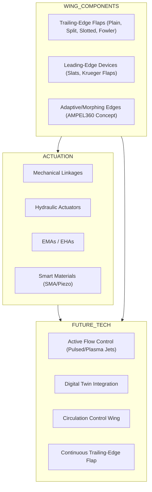
**Diagram Explanation**  
- **WING_COMPONENTS**: Showcases the variety of high-lift devices (flaps, slats, or morphing edges).  
- **ACTUATION**: Potential power and control systems (mechanical, hydraulic, electric, or smart materials).  
- **FUTURE_TECH**: Emerging concepts like active flow control, digital twins, advanced circulation control, and continuous trailing-edge flaps.

---

### **Key Takeaways**

1. **Versatility**: Flaps and slats significantly expand an aircraft’s low-speed flight envelope, **reducing stall speeds**, and **improving approach/landing safety**.  
2. **Multiple Designs**: From **plain** or **split** to **Fowler** and **Krueger**—each configuration balances lift, drag, complexity, and weight.  
3. **Advanced Actuation**: Modern trends favor **electromechanical** or **hybrid** systems, reducing hydraulic dependencies and easing maintenance.  
4. **Maintenance & Inspection**: Regular checks for **wear/corrosion**, proper lubrication, and potential use of **NDT** methods. Predictive strategies rely on sensor data and **AI** diagnostics.  
5. **AMPEL360 Integration**: Potential to *replace or augment* conventional flaps and slats with **adaptive aerostructures**. AI can optimize flap/slat usage in real time, seamlessly balancing performance, fuel efficiency, environmental impact, and noise abatement.  
6. **Future Outlook**: **Morphing wings**, **active flow control**, and **digital twin** technologies may revolutionize how aircraft generate and manage lift, reshaping the role and design of flaps and slats.


### **27.50.2 Spoilers/Ground Spoilers**

Spoilers are secondary flight control surfaces mounted on the upper surface of the wing that serve multiple purposes, including controlling descent rate, enhancing roll control, and improving braking effectiveness after landing. They are essential for managing the aircraft's energy state and ensuring safe and efficient operations. The **GAIA AIR AMPEL360**, with its advanced FBW system and adaptive aerostructures, will likely utilize spoilers in a highly integrated and optimized manner.

#### **A. Functions**

1.  **Ground Spoilers:**
    *   **Purpose:** Primarily used on the ground after touchdown to significantly reduce lift ("dump lift"), increase drag, and improve braking effectiveness.
    *   **Operation:** Typically deploy automatically to their maximum deflection upon landing when certain conditions are met (e.g., weight-on-wheels sensors, wheel spin-up, throttle position at idle). They may also be manually deployed by the pilot.
    *   **Effect:** By reducing lift, they transfer more of the aircraft's weight onto the landing gear, increasing the effectiveness of the wheel brakes. The increased drag also helps to slow the aircraft down, **significantly reducing landing distance.**
    *   **Retraction:** Some systems are designed to automatically retract the ground spoilers if the aircraft becomes airborne again after touchdown (e.g., during a rejected landing or "touch and go"), preventing a sudden loss of lift.

2.  **Flight Spoilers/Speedbrakes:**
    *   **Purpose:** Used in flight to increase drag and control the aircraft's descent rate without increasing airspeed. They can also be used to reduce airspeed or to comply with speed restrictions during approach.
    *   **Operation:** Can be partially or fully deployed in flight, providing a variable amount of drag. Pilots typically control them using a dedicated lever or a detent on the flap lever.
    *   **Effect:** Allow for steeper descents without increasing airspeed, enabling pilots to manage their approach path more effectively. They can also be used to quickly reduce airspeed if needed. **They can also increase the buffet boundary (the margin between the aircraft's current speed and the stall speed).**

3.  **Roll Spoilers:**
    *   **Purpose:** Used asymmetrically (one wing at a time) to augment roll control, working in conjunction with ailerons.
    *   **Operation:** When the pilot commands a roll, the spoilers on the wing moving downwards will deploy to a certain degree, increasing drag and reducing lift on that wing, assisting the ailerons in rolling the aircraft.
    *   **Effect:** Help maintain coordinated flight by counteracting adverse yaw (particularly helpful at low speeds) and provide more precise roll control, especially at high speeds where aileron effectiveness may be reduced. **They are typically integrated with the aileron control system through a mixer unit or, in FBW aircraft, through the flight control computers.**

#### **B. Design Considerations**

*   **Ground Spoilers:** Typically designed for full deployment only, maximizing their effectiveness in reducing lift and increasing drag on landing.
*   **Flight Spoilers:** Allow variable positioning for precise control over descent rate and airspeed. Their deployment angle is often controlled by a lever with multiple detents.
*   **Inboard Spoilers:** Often used as ground spoilers only to avoid interfering with the airflow to the engines on aircraft with rear-mounted engines.
*   **Mid-Span Placement:** Common for flight spoilers to balance their effect on the aircraft's pitching moment. Deploying spoilers forward of the center of gravity can cause a nose-down pitching moment, while deploying them aft of the center of gravity can cause a nose-up pitching moment.
*   **Pitching Moment:** The location of spoilers on the wing (forward or aft of the center of gravity) affects the pitching moment they produce when deployed.
*   **Buffet:** Spoiler design must consider the potential for buffet (vibration) caused by the turbulent airflow downstream of the deployed spoiler. Careful aerodynamic design is needed to minimize buffet.
*   **Actuation:** Spoilers are typically actuated by hydraulic or electromechanical actuators. The choice of actuator depends on factors like aircraft size, performance requirements, and the overall design philosophy (e.g., more electric aircraft).
*   **GAIA AIR AMPEL360:** The **AMPEL360**'s adaptive wing might influence spoiler design and operation. The adaptive surfaces could potentially be used:
    *   **In conjunction with traditional spoilers**, providing additional control authority and optimization capabilities.
    *   **To replace traditional spoilers entirely**, with the adaptive surfaces performing the functions of lift dumping, drag increase, and roll augmentation.
    *   AI algorithms could optimize spoiler deployment (or adaptive surface configuration) for various purposes, such as descent management, turbulence mitigation, approach speed control, and minimizing noise and vibration.

#### **C. Operation**

*   **Ground Spoilers:**
    *   **Automatic Deployment:**  Deploy automatically when weight-on-wheels sensors detect the aircraft has landed, and other criteria are met (e.g., wheel spin-up, throttle levers at idle).
    *   **Manual Override:** Pilots can typically manually override the automatic deployment if necessary.

*   **Flight Spoilers/Speedbrakes:**
    *   **Manual Control:** Controlled by pilots for descent and speed control using a dedicated lever or a detent on the flap lever.
    *   **Integration with Autopilot/Autothrottle:** In some aircraft, the autopilot or autothrottle can automatically deploy flight spoilers to maintain a specific descent profile or airspeed.

*   **Roll Spoilers:**
    *   **Integrated Control:** Typically integrated with the aileron control system through a mixer unit or, in FBW aircraft, through the flight control computers.
    *   **Asymmetric Deployment:**  Deploy asymmetrically to assist ailerons in roll control. The degree of spoiler deployment is often proportional to the aileron deflection and may also vary with airspeed and other factors.

*   **GAIA AIR AMPEL360:** The AI on the **AMPEL360** might optimize spoiler deployment (or adaptive surface configuration) for various purposes, such as:
    *   **Descent Management:**  Automating the deployment of spoilers to achieve a desired descent profile while minimizing fuel consumption and noise.
    *   **Turbulence Mitigation:**  Using spoilers to actively counteract the effects of turbulence, improving passenger comfort and reducing structural loads.
    *   **Approach Speed Control:**  Precisely adjusting spoiler deployment to maintain the optimal approach speed and glide path.

#### **D. Impact on Aircraft Performance**

*   **Increased Drag:** Spoilers significantly increase drag, allowing for steeper descents without increasing airspeed. **The magnitude of the drag increase depends on the size and deployment angle of the spoilers.**
*   **Reduced Lift:** Spoilers reduce lift by disrupting the airflow over the upper surface of the wing. **This is crucial for ground spoiler operation, as it transfers more weight to the landing gear and improves braking effectiveness.**
*   **Shorter Landing Distances:** By increasing drag and reducing lift, spoilers contribute to shorter landing distances. **This is particularly important for operations on short runways or in adverse conditions.**
*   **Enhanced Roll Control:** Roll spoilers provide more precise and effective roll control, especially at high speeds where aileron effectiveness may be reduced.
*   **Increased Stall Speed:**  **It's important to note that deploying spoilers will increase the stall speed.**
*   **GAIA AIR AMPEL360:** The **AMPEL360**'s adaptive surfaces may be used to achieve similar effects as traditional spoilers, potentially with greater efficiency and less noise. AI-driven control algorithms will optimize their deployment for various flight conditions.

#### **E. Limitations**

*   **Noise:** Spoiler deployment can increase aerodynamic noise due to the turbulent airflow they create.
*   **Vibration:** Spoiler deployment can sometimes cause noticeable vibration, particularly at high deflection angles.
*   **Reduced Lift:** Pilots need to be aware that spoilers reduce lift and must adjust their approach speed and power settings accordingly.
*   **Asymmetric Deployment:** A malfunction causing asymmetric deployment of spoilers can lead to roll control issues. This is why redundancy and rigorous testing are essential.
*   **Increased Stall Speed:** Spoiler deployment will increase the aircraft's stall speed.

#### **F. Diagrams**

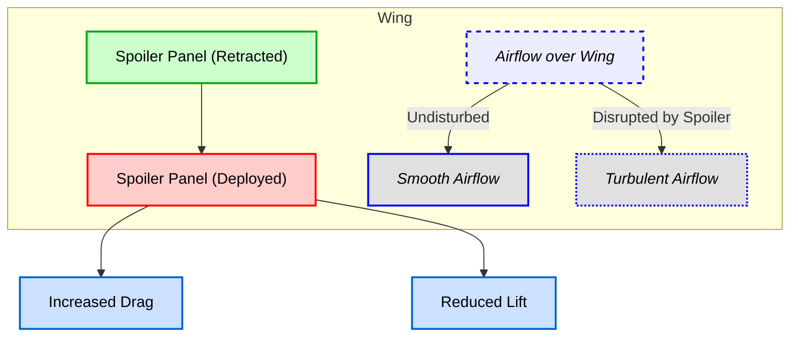

*Mermaid diagram illustrating spoiler deployment and its effect on airflow, drag, and lift.*

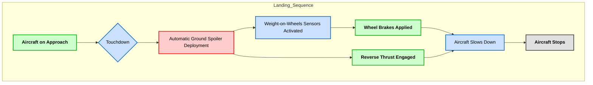

*Mermaid diagram illustrating the role of ground spoilers in the landing sequence.*

---

**Related Questions:**

1.  **How do ground spoilers differ from roll spoilers?**  
    *Answer:* Ground spoilers are primarily used on the ground after touchdown to reduce lift, increase drag, and improve braking effectiveness. They are typically deployed symmetrically to their maximum deflection. Roll spoilers are used in flight to assist the ailerons in roll control. They are deployed asymmetrically (on one wing at a time) to increase drag and reduce lift on the descending wing, causing the aircraft to roll.

2.  **What are the main benefits of using ground spoilers during landing?**  
    *Answer:* Ground spoilers improve braking effectiveness by increasing drag and, more importantly, by reducing lift and transferring more weight onto the landing gear, which increases the effectiveness of the wheel brakes. They also contribute to directional control during the landing roll.

3.  **Are there any specific aircraft models that do not have ground spoilers?**  
    *Answer:* Yes, some smaller general aviation aircraft and older aircraft models may not have ground spoilers. These aircraft typically rely on other means of braking, such as wheel brakes and reverse thrust (if equipped), and may have lower landing speeds that do not necessitate the additional stopping power provided by ground spoilers.

4.  **How do ground spoilers contribute to wheel brake efficiency?**  
    *Answer:* By reducing lift and increasing the weight on the landing gear, ground spoilers significantly enhance the effectiveness of wheel brakes. This allows for shorter stopping distances and reduces brake wear.

5.  **Can ground spoilers be used in icing conditions?**  
    *Answer:* Yes, ground spoilers can be used in icing conditions. However, it's crucial to ensure that the spoilers themselves are free of ice before deployment. Ice accumulation on the spoilers could affect their aerodynamic performance or prevent them from deploying properly. Pilots must follow the appropriate procedures for operating in icing conditions, as outlined in the aircraft's flight manual.

6.  **How does the use of spoilers affect the stall speed of an aircraft?**  
    *Answer:* Deploying spoilers, whether ground spoilers or flight spoilers, will generally **increase** the stall speed of an aircraft. This is because spoilers disrupt the airflow over the wing, reducing lift. Pilots must be aware of this effect and adjust their airspeed accordingly when using spoilers.

7.  **What are the certification requirements for spoiler systems on commercial aircraft?**  
    *Answer:* Spoiler systems on commercial aircraft must meet stringent certification requirements defined by regulatory authorities like the FAA (FAR Part 25) and EASA (CS-25). These requirements cover aspects such as:
    *   **Structural Strength:**  The ability to withstand aerodynamic loads in all deployment positions.
    *   **Actuation System Reliability:**  Redundancy and fail-safe mechanisms in the actuation system.
    *   **Deployment and Retraction Times:**  Meeting specified deployment and retraction times to ensure effectiveness.
    *   **Failure Modes and Effects Analysis (FMEA):**  A thorough analysis to identify potential failure modes and their impact on safety.
    *   **Flight Testing:**  Demonstrating the performance and safety of the spoiler system throughout the flight envelope.

8.  **How might AI be used to optimize spoiler deployment on an aircraft like the GAIA AIR AMPEL360?**  
    *Answer:* AI could optimize spoiler deployment on the **AMPEL360** in several ways:
    *   **Descent Profile Management:** AI could automatically adjust spoiler deployment to achieve the most fuel-efficient descent profile while meeting airspeed and altitude constraints.
    *   **Turbulence Mitigation:** AI could use sensor data to detect turbulence and deploy spoilers (or adjust adaptive surfaces) to counteract its effects, improving passenger comfort and reducing structural loads.
    *   **Noise Reduction:** AI could optimize spoiler deployment to minimize noise during approach and landing, particularly in noise-sensitive areas.
    *   **Approach Speed Control:** AI could fine-tune spoiler deployment to maintain the optimal approach speed and glide path, taking into account factors like wind, aircraft weight, and runway conditions.
    *   **Coordination with Adaptive Surfaces:** On the **AMPEL360**, AI would be essential for coordinating the deployment of spoilers with the adaptive wing surfaces to achieve the desired aerodynamic effects while maintaining stability and control.

9. **What are some of the limitations or potential drawbacks of using spoilers?**  
   *Answer:*
        *   **Noise:** Spoiler deployment can generate aerodynamic noise due to turbulent airflow.
        *   **Vibration:** Spoiler deployment can sometimes cause noticeable vibration or buffet.
        *   **Reduced Lift:** Pilots need to be aware that spoilers reduce lift and must adjust their airspeed and power settings accordingly.
        *   **Asymmetric Deployment:** A malfunction causing asymmetric deployment can lead to roll control issues, requiring immediate corrective action by the pilot.
        *   **Increased Stall Speed:** Spoiler deployment will increase the aircraft's stall speed.

### **27.50.3 Airbrakes/Speedbrakes**

Airbrakes and speedbrakes are secondary flight control surfaces designed to **increase drag** during flight, allowing pilots to manage the aircraft's speed and descent rate more effectively. While often used interchangeably, and sometimes combined on the same surfaces, there can be subtle distinctions:

*   **Airbrakes:** Primarily designed to increase drag with a minimal effect on lift.  
*   **Speedbrakes:** A more general term that encompasses both airbrakes and spoilers when used to increase drag and reduce speed in flight. (May also refer to dedicated surfaces.)

---

#### **A. Function and Design**

1. **Increase Drag**  
   *   Airbrakes and speedbrakes significantly increase drag, enabling the aircraft to decelerate more rapidly or maintain a lower airspeed during descent. They do this by **disrupting airflow** and creating turbulence or additional form drag.  
   *   **Key Difference from Spoilers**: While spoilers also increase drag, they substantially reduce lift as well, making them dual-purpose (roll control, lift dumping). Airbrakes specifically aim to **maximize drag while minimizing lift reduction**, providing more stable descent control without dramatic changes in lift.

2. **Typical Locations**  
   *   **Wings**: Many aircraft mount panels on the upper surface of the wing (and sometimes the underside) to disrupt airflow and generate drag.  
   *   **Fuselage**: High-performance military jets often have large fuselage-mounted airbrakes that extend from the sides or belly of the aircraft.  
   *   **Tailcone**: Aircraft like the BAe 146 use tailcone-mounted speedbrakes that split or open up clamshell-style to create a large aerodynamic brake.

3. **Extension and Deployment**  
   *   Can be extended incrementally to adjust the amount of drag.  
   *   Typically controlled via a lever (or detents) in the cockpit.  
   *   In some aircraft, integration with autopilot/autothrottle systems allows **automated speed control** by varying airbrake/speedbrake deployment.

4. **Streamlined Profile**  
   *   When retracted, they sit **flush** with the wing or fuselage to minimize drag in normal flight.  
   *   Advanced designs use contoured shapes or adaptive surfaces to reduce aerodynamic penalties when stowed.

---

#### **B. Benefits and Applications**

1. **Increased Descent Rate**  
   *   Airbrakes can **significantly boost** descent rates without forcing the pilot to reduce engine power to idle.  
   *   Useful for **expedited** or **emergency descents** (e.g., cabin depressurization) and maintaining **steeper glide paths** in mountainous terrain or tailwind approaches.  
   *   Certain airbrake designs can nearly **double** the normal descent rate achievable with idle power.

2. **Maintained Engine Power**  
   *   Enables rapid descents while keeping engines at moderate power:  
       *   **Maneuverability**: Higher engine RPM yields better throttle response if sudden speed or altitude corrections are needed.  
       *   **Engine Health**: Reduces the risk of shock cooling.  
       *   **Go-Around Capability**: Quicker engine spool-up if a missed approach or go-around is necessary.

3. **Reduced Engine Shock Cooling**  
   *   Descending at higher power settings (enabled by airbrakes) stabilizes engine temperatures and mitigates thermal stress on engine components.

4. **Quick Deceleration**  
   *   Useful in high-speed aborts (rejected takeoffs), approach/landing decelerations, or specialized maneuvers in military contexts (formation flying, combat tactics).

5. **Wing Loading and Turbulence**  
   *   Deploying airbrakes marginally increases wing loading, which can reduce the aircraft’s sensitivity to turbulence, improving ride comfort.

6. **Control in Crosswinds**  
   *   Some aircraft use **asymmetric** deployment (if designed) to assist with roll control in challenging crosswind conditions.  
   *   Typically more common in aircraft with separate spoiler panels for roll augmentation.

7. **Noise Abatement**  
   *   **Steeper descents** at higher power settings can lower engine noise footprint over populated areas, beneficial for meeting strict noise regulations or nighttime curfews.

---

#### **C. Operation**

*   **Actuation**  
   *   Often **electromechanical** (in smaller GA aircraft) or **hydraulic** (in larger or high-performance planes).  
   *   The **GAIA AIR AMPEL360** could adopt electromechanical or adaptive-surface solutions (no separate panels needed).

*   **Pilot Control**  
   *   Typically managed via a dedicated lever/switch with multiple detents.  
   *   Some designs incorporate an **automatic retraction** feature if throttle is advanced beyond a preset level, preventing inadvertent high-drag states.

*   **Autopilot Integration**  
   *   Modern FBW systems can link speedbrakes with the **autopilot/autothrottle**, automatically adjusting drag to maintain desired descent profiles or speed targets.

*   **Emergency Deployment**  
   *   May be used in **emergency descents** (cabin depressurization) or if the aircraft is accelerating unintentionally (engine surge).  
   *   If certain hydraulic or flight control failures occur, partial speedbrake deployment might help maintain controllable speeds or balance aerodynamic forces.

---

#### **D. Considerations**

1. **Final Approach**  
   *   Airbrakes designed primarily to **increase drag** without a drastic loss of lift can be more safely deployed during approach. However, many aircraft SOPs discourage or limit speedbrake usage below certain altitudes or in final approach to avoid unpredictable pitch changes or stall margin reduction.

2. **Differences from Spoilers**  
   *   **Airbrakes**: Minimal lift reduction, high drag.  
   *   **Spoilers**: Reduce lift-to-drag ratio more aggressively, doubling as roll control surfaces (e.g., roll spoilers) or ground lift dump.  
   *   In practice, some aircraft use the **same physical panels** for both spoiler and speedbrake functions, but the aerodynamic effects differ depending on design intent.

3. **Noise & Vibration**  
   *   Deployment often introduces **increased wind noise** or buffet. Careful aerodynamic shaping can limit these effects.

4. **Flight Testing**  
   *   **Performance Evaluations**: Deployment/retraction times, drag coefficients, buffet characteristics.  
   *   **Handling Qualities**: Checking pitch/roll changes, stability, and control during partial or full deployment.  
   *   **Structural Load Testing**: Ensuring panels and attachments withstand aerodynamic loads in all flight regimes.

5. **GAIA AIR AMPEL360**  
   *   **Adaptive Surfaces** might replicate or surpass traditional airbrakes: morphing wingtips or variable trailing edges could provide drag on demand.  
   *   **AI Optimization**: Integrates flight data, noise abatement profiles, and approach constraints to automatically deploy or retract adaptive surfaces for speed control.

---

#### **E. Flight Testing of Airbrakes/Speedbrakes**

1. **Performance Evaluations**  
   *   **Deployment & Retraction Times**: Must meet certification criteria for responsiveness and reliability.  
   *   **Drag Characteristics**: Accurately measured across a range of speeds/altitudes.  
   *   **Buffet & Vibration Analysis**: Flight test teams gather data to refine designs, limit excessive buffet.

2. **Handling Qualities**  
   *   **Pitching Moments**: Some aircraft auto-trim in response to speedbrake extension.  
   *   **Roll/Yaw Coupling**: Checking for adverse yaw or roll-off if airbrakes are asymmetrically deployed or if wing panels are used in tandem with spoilers.

3. **Structural Testing**  
   *   Panels must endure high-speed flight, turbulence, and repeated cycling.  
   *   **Failure Modes**: Asymmetric deployments, jammed actuators, or partial retraction are explored during certification to ensure safe outcomes.

4. **Emergency Scenarios**  
   *   **Rapid Descent**: Confirm pilot procedures for deploying airbrakes in a cabin pressure loss scenario.  
   *   **Engine Control Anomalies**: Verifying that partial speedbrake usage can prevent overspeed or uncommanded acceleration.

---

#### **F. Future of Airbrakes/Speedbrakes**

1. **Adaptive Aerostructures**  
   *   Surfaces that **dynamically reshape** to increase drag (or reduce lift) as needed—potentially replacing separate panels entirely.  
   *   **AMPEL360**: Could see integrated “drag-on-demand” features triggered by AI for approach, noise abatement, or emergency descents.

2. **AI Optimization**  
   *   Systems that **continuously monitor** flight conditions (wind, turbulence, altitude constraints) and adjust airbrake deployment for minimal noise and fuel burn.  
   *   Potential synergy with advanced autopilot or air traffic management data for fully automated descent management.

3. **More Electric Systems**  
   *   Transition from hydraulic to **electromechanical** actuators reduces weight, complexity, and fluid leak risks.  
   *   Facilitates easier integration with **digital flight control computers**.

4. **Integrated Envelope Control**  
   *   Future designs may unify **spoilers, airbrakes, adaptive edges**, and even reverse thrust logic into a single AI-driven suite, maximizing overall efficiency and safety.

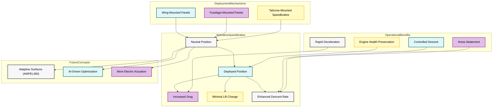

*Mermaid diagram illustrating the functionality, deployment mechanisms, operational benefits, and future concepts for airbrakes/speedbrakes.*

---

#### **Related Questions:**

1. **How do airbrakes and speedbrakes differ in their functions?**  
   *Answer:* Although used interchangeably, *airbrakes* maximize drag with minimal lift loss, whereas *speedbrakes* can include surfaces like spoilers that also reduce lift. Many aircraft use the same panels for both functions, but the aerodynamic impact depends on panel design and deployment angles.

2. **What are the safety regulations for airbrakes and speedbrakes?**  
   *Answer:* Under **FAR Part 25** and **EASA CS-25**, manufacturers must demonstrate structural integrity, dependable deployment/retraction, and safe handling characteristics. Flight testing must address drag performance, potential flutter or buffet, and failure modes (like asymmetric extension).

3. **How do airbrakes and speedbrakes impact aircraft performance?**  
   *Answer:* They increase drag, enabling rapid deceleration or controlled steep descents. By maintaining engine power at higher settings, they also help prevent shock cooling, improve go-around readiness, and can reduce noise footprints through steeper descent paths.

4. **What are the maintenance requirements for airbrakes and speedbrakes?**  
   *Answer:* Maintenance typically includes routine inspections for wear, corrosion, correct actuation times, lubrication of hinges or actuators, and ensuring electrical/hydraulic systems are fully functional. The intervals and specifics are outlined in each aircraft’s maintenance manual.

5. **Are there any recent innovations in airbrake and speedbrake technology?**  
   *Answer:* Advances include composite or adaptive surfaces, more electric actuators, and AI-based control logic for more precise, efficient drag management. **AMPEL360** exemplifies a move toward adaptive aerostructures that might consolidate or replace traditional high-drag devices.

6. **How are airbrakes/speedbrakes typically controlled by the pilot?**  
   *Answer:* Usually via a dedicated cockpit lever or switch with multiple detents for incremental deployment. In some modern FBW designs, these surfaces can be partially managed by the autopilot or flight management system to maintain target speeds or descent profiles.

7. **What are the considerations for using airbrakes/speedbrakes during different phases of flight?**  
   *Answer:*  
   * **Descent:** Quick altitude loss without pulling engines to idle.  
   * **Approach/Landing:** Can be used for speed control or noise abatement, but caution near stall margins.  
   * **Takeoff:** Typically *not* used.  
   * **High-Speed Cruise or Military:** Allows rapid deceleration or speed trimming in level flight.  
   * **AMPEL360:** Could integrate adaptive surfaces for a more seamless drag approach.

8. **How does the deployment of airbrakes/speedbrakes affect the aircraft's stall speed?**  
   *Answer:* Generally **increases stall speed**, though often less dramatically than full spoiler deployment, since airbrakes try to preserve more of the wing’s lift.

9. **Can airbrakes/speedbrakes induce undesirable pitching moments?**  
   *Answer:* Yes. Depending on location (forward or aft of CG), they may cause nose-up or nose-down pitching. Aircraft often include auto-trim features or pilot procedures to offset these effects during deployment.

10. **How might the GAIA AIR AMPEL360's adaptive aerostructures change the way airbrakes/speedbrakes are used or designed?**  
    *Answer:*  
    * **Integrated Functionality:** Adaptive surfaces may morph to create drag, negating the need for dedicated panels.  
    * **AI Optimization:** Real-time adjustments for minimal noise, fuel consumption, and optimal flight path.  
    * **Reduced Part Count:** Fewer moving parts than conventional hinged or sliding panels.  
    * **Enhanced Performance:** More precise control over descent and airspeed than legacy mechanical systems.

11. **What are some examples of aircraft that use fuselage-mounted airbrakes?**  
    *Answer:* High-performance military jets (e.g., **F-15 Eagle**, **Sukhoi Su-27**) commonly feature large dorsal airbrakes. Some business jets (e.g., certain **Dassault Falcons**) also use fuselage-mounted speedbrakes for drag management.

12. **What are the advantages of tailcone-mounted speedbrakes, as used on the BAe 146?**  
    *Answer:*  
    * **Effective Drag Increase:** Large “clamshell” surfaces generate substantial drag aft of the CG.  
    * **Minimal Pitch Change:** Location near the CG reduces pitching moments.  
    * **Less Wing Flow Disruption:** Freed from interfering with flaps or slats.  
    * **Reduced Buffet:** Potentially smoother airflow around the wings.

13. **How are airbrakes/speedbrakes tested for emergency deployment scenarios?**  
    *Answer:*  
    * **Emergency Descent Drills:** Validating procedures for rapid altitude loss (cabin depressurization).  
    * **Partial or Asymmetric Deployments:** Ensuring controllability if a panel jams.  
    * **Engine Overspeed Cases:** Confirming speedbrake effectiveness if engine thrust can’t be reduced quickly.  
    * **Structural Load Checks:** Verifying robust mounting and hinge designs can handle dynamic forces even during abrupt or partial deployment.

---

## **27.50.4 Trim Systems**

Trim systems are essential components of an aircraft's flight control suite, designed to **relieve the pilot from maintaining continuous control pressure**. By allowing the pilot to set and maintain a desired attitude and airspeed, trim systems reduce fatigue and optimize performance across various flight phases. While not classified as primary controls, they are key to maintaining **aircraft stability**, **handling quality**, and **pilot workload reduction**.

---

### **A. Purpose and Function**

* **Reduce Control Forces:**  
  Trim systems significantly decrease the physical forces pilots must exert on the control surfaces, enhancing comfort and reducing fatigue—particularly during prolonged climbs, descents, or cruise.

* **Maintain Equilibrium:**  
  By balancing aerodynamic forces and moments, a trim system allows the aircraft to fly “hands-off” at a specific attitude and airspeed, reducing pilot workload.

* **Compensate for Changes:**  
  1. **Center of Gravity (CG):** Fuel burn or shifting payload can move the CG, requiring trim re-adjustment.  
  2. **Airspeed:** Varying dynamic pressure affects control forces; trim helps maintain stable attitudes across different speeds.  
  3. **Configuration:** Deploying flaps, slats, or landing gear changes aerodynamic balance; trim counters these shifts.  
  4. **Engine Power (Multi-Engine):** Rudder trim counters yaw if an engine fails or asymmetric thrust arises.

* **Fine-Tune Control:**  
  Precisely adjusting trim improves performance (fuel efficiency, speed control) and can enhance passenger comfort by smoothing out minor attitude deviations.

---

### **B. Types of Trim Systems**

1. **Primary Control Surface Trim**  
   * **Elevator Trim:** Most common, adjusting pitch attitude via trim wheels, cranks, or electric switches.  
   * **Rudder Trim:** Cancels unwanted yaw from crosswinds or asymmetric thrust. Typically adjusted by a small wheel or dial.  
   * **Aileron Trim:** Offsets rolling moments from weight imbalance or aerodynamic imperfections.

2. **Trim Tabs**  
   * **Description:** Small hinged surfaces on the trailing edge of primary flight controls.  
   * **Operation:** Deflecting the trim tab in one direction drives the main surface the other way, reducing pilot effort.  
   * **Pros:** Simple, lightweight, no external power needed.  
   * **Cons:** Less effective at high speeds or on large aircraft.

3. **Adjustable Stabilizers (All-Moving Tail)**  
   * **Description:** The entire horizontal stabilizer pivots up/down to achieve pitch trim.  
   * **Pros:** Highly effective at high speeds (jets, large transports), reduced drag compared to big elevator deflections.  
   * **Cons:** More complex, heavier mechanisms.

4. **Balance Tabs**  
   * **Description:** Move opposite the control surface to reduce pilot effort (lower hinge moments).  
   * **Note:** Not strictly a trim function—do not set a hands-off attitude; they simply lighten control forces.

5. **Anti-Servo Tabs**  
   * **Description:** Move *with* the control surface (e.g., stabilators) to increase control force or provide artificial feel.  
   * **Note:** Again, not true trim, but do affect how controls behave and “feel” to the pilot.

6. **Electrically Operated Trim**  
   * **Description:** Motors drive trim tabs or pivot entire stabilizers.  
   * **Pros:** Precise, fast, autopilot-friendly.  
   * **Cons:** Adds weight/complexity, depends on reliable electrical power.

---

### **C. Design Requirements**

* **Prevention of Inadvertent Operation:**  
  Controls must be arranged to avoid accidental engagement or large unexpected changes.

* **Clear Indication of Trim Setting:**  
  Cockpit indicators (mechanical scales, digital readouts, or EFIS displays) should unambiguously show trim position.

* **Direction of Movement:**  
  A nose-down trim input moves the trim control forward, matching the intuitive pilot expectation.

* **Prevention of Trim Creep:**  
  Irreversible or locking mechanisms prevent the trim from drifting due to aerodynamic loads or vibration.

---

### **D. Regulatory Requirements (FAR/CS 25)**

* **FAR 25.677 / CS 25.677 (Trim Systems)**  
  1. **Effectiveness:** Must provide full trim authority under normal ops.  
  2. **Strength & Reliability:** Survive in-service stresses without jamming or structural failure.  
  3. **Control Location & Marking:** Within easy reach, clearly labeled.  
  4. **Irreversible Controls:** Must prevent aerodynamic back-driving.  
  5. **Rigid or Elastic Connection:** If irreversible units are used, ensure safe flutter margins.

* **FAR 25.161 / CS 25.161 (Trim)**  
  1. **Envelope Coverage:** Aircraft must be trimmable in takeoff, climb, cruise, descent, and landing.  
  2. **Hands-Off Stability:** Demonstration that the aircraft remains stable and safely controllable during normal and certain abnormal conditions.

---

### **E. Maintenance and Inspection**

1. **Regular Inspections:**  
   Check hinges, actuators, cables for wear, corrosion, secure attachments, and correct operation.

2. **Lubrication:**  
   Moving parts—tabs, screw jacks, or pivot points—need periodic lube to prevent binding.

3. **Rigging Checks:**  
   Ensure control surface neutrality and that trim indicators accurately match actual tab or stabilizer position.

4. **Operational Checks:**  
   Pilots typically test trim function on preflight, verifying no excessive friction or abnormal response.

---

### **F. GAIA AIR AMPEL360 Considerations**

1. **Adaptive Aerostructures**  
   * **Integration:** Future advanced surfaces might diminish the need for large trim tabs or all-moving stabilizers.  
   * **AI-Driven Adjustments:** The aircraft could morph subtle wing/tail shapes to maintain hands-off flight, seamlessly adjusting for CG shifts or aerodynamic changes.

2. **AI-Driven Trim Optimization**  
   * Real-time data from sensors and flight conditions feed into control algorithms, continuously adjusting the shape or angle of relevant surfaces (tailplane, wingtips).  
   * Could yield minimal drag, improved passenger comfort, or custom mission profiles (e.g., noise abatement climb vs. max efficiency cruise).

3. **Advanced Actuation**  
   * **Electromechanical** or even **smart materials** (shape memory alloys) may actively reposition surfaces.  
   * **Redundancy**: The distributed nature of adaptive surfaces can provide backup trim functionality if a primary system fails.

4. **Sensor Integration**  
   * Dense sensor arrays measure real-time aerodynamic forces, feeding AI systems that can “auto-trim” the aircraft far more precisely than mechanical wheels or tabs.

---

### **G. Future Trends**

* **More Electric Trim Systems:**  
  Replacing mechanical/hydraulic linkages with electric motors, reducing weight and simplifying design.

* **Smart Trim Systems:**  
  AI/machine learning optimize trim for different flight segments—climb, cruise, descent—potentially increasing fuel savings.

* **Integrated Flight Control:**  
  Merging autopilot, trim, spoiler, and adaptive wing functionalities for a holistic approach to flight envelope management.

* **Biomimetic Trim:**  
  Inspired by birds, shape-shifting surfaces might replace discrete trim tabs altogether.

```mermaid
graph TD
    subgraph Elevator Trim System
        A[Pilot Trim Control] --> B{Type of Control}
        B -- Manual --> C[Mechanical Linkage]
        B -- Electric --> D[Electric Trim Motor]
        C --> E[Trim Tab]
        D --> E
        E --> F[Elevator Control Surface]
        G[Position Indicator]
        E --> G
        H[Autopilot] --> D
    end

    subgraph Rudder Trim System
        I[Pilot Trim Control] --> J{Type of Control}
        J -- Manual --> K[Mechanical Linkage]
        J -- Electric --> L[Electric Trim Motor]
        K --> M[Trim Tab]
        L --> M
        M --> N[Rudder Control Surface]
        O[Position Indicator]
        M --> O
        P[Autopilot] --> L
    end

    %% Styles for Elevator Trim System
    style A fill:#ccffcc,stroke:#00aa00,stroke-width:2px,color:#000
    style B fill:#ffffcc,stroke:#ffcc00,stroke-width:2px,color:#000
    style C fill:#cceeff,stroke:#00aaff,stroke-width:2px,color:#000
    style D fill:#cceeff,stroke:#00aaff,stroke-width:2px,color:#000
    style E fill:#ffcccc,stroke:#ff0000,stroke-width:2px,color:#000
    style F fill:#f0f0f0,stroke:#000000,stroke-width:1px,color:#000
    style G fill:#cce0ff,stroke:#3366cc,stroke-width:2px,color:#000
    style H fill:#cceeff,stroke:#00aaff,stroke-width:2px,color:#000

    %% Styles for Rudder Trim System
    style I fill:#ccffcc,stroke:#00aa00,stroke-width:2px,color:#000
    style J fill:#ffffcc,stroke:#ffcc00,stroke-width:2px,color:#000
    style K fill:#cceeff,stroke:#00aaff,stroke-width:2px,color:#000
    style L fill:#cceeff,stroke:#00aaff,stroke-width:2px,color:#000
    style M fill:#ffcccc,stroke:#ff0000,stroke-width:2px,color:#000
    style N fill:#f0f0f0,stroke:#000000,stroke-width:1px,color:#000
    style O fill:#cce0ff,stroke:#3366cc,stroke-width:2px,color:#000
    style P fill:#cceeff,stroke:#00aaff,stroke-width:2px,color:#000
```
*Diagram:* Example trim system layout showing **manual** or **electric** actuation, integration with **autopilot**, and **position indicators**.

---

### **Related Questions:**

1. **What are the key components of a trim system in aircraft?**  
   **Answer:** Typically a trim control (wheel, switch), actuator (cables, electric motor, or hydraulic device), the trim tab or adjustable stabilizer, plus position indicators.

2. **How does a trim system improve aircraft performance?**  
   **Answer:** By reducing pilot workload and aligning surfaces for minimal drag or optimal flight condition. Proper trim can save fuel and enhance passenger comfort.

3. **Are there different types of trim systems used in aircraft?**  
   **Answer:** Yes. **Trim tabs**, **all-moving stabilizers**, **electromechanical** or **hydraulic** drive systems, plus **balance/anti-servo tabs** that modulate control forces.

4. **What are the maintenance requirements for trim systems?**  
   **Answer:** Regular inspection for wear, corrosion, and correct operation; lubrication of moving parts; rigging checks for alignment; ensuring no trim creep or binding.

5. **How do trim systems interact with other aircraft systems?**  
   **Answer:** They often integrate with **autopilot** and **flight management**. On **AMPEL360**, synergy with **adaptive aerostructures** and **AI** could yield near-continuous micro-adjustments for performance or passenger comfort.

6. **What are the specific design requirements for trim tab controls to prevent inadvertent operation?**  
   **Answer:** They must be carefully placed, require deliberate movement, and often incorporate mechanical resistance or detents to avoid accidental activation (FAR/CS 25.677).

7. **How do trim indicators typically display the trim position to the pilot?**  
   **Answer:** Mechanical scales, digital EFIS readouts, or visual markings on a trim wheel, all providing clear nose-up/nose-down or left/right orientation cues.

8. **What does it mean for a trim tab control to be “irreversible,” and why is this important?**  
   **Answer:** Aerodynamic forces can’t back-drive the tab. This prevents uncommanded movements in turbulence or high-speed flight, ensuring consistent control feel and safety.

9. **How are trim systems tested during the certification process of a new aircraft?**  
   **Answer:** Functional tests across the flight envelope, load tests, failure-mode simulations (jammed tab, motor malfunction), and flight evaluations ensuring stable, predictable behavior.

10. **What are some of the latest advancements or innovations in trim system technology?**  
    **Answer:** **Electrically-operated** trim (reducing mechanical linkages), **smart/AI-based** trim that self-optimizes for varying flight conditions, **adaptive surfaces** that assume trim roles, and **active load alleviation** features.

11. **How does the integration of adaptive aerostructures on the GAIA AIR AMPEL360 potentially change the traditional role or design of trim systems?**  
    **Answer:**  
    * **Reduced Traditional Hardware**: Morphing surfaces could handle trim tasks, reducing or eliminating large trim tabs or pivoting stabilizers.  
    * **AI Management**: Automated adjustments can maintain minimal drag or maximum lift, depending on flight phase.  
    * **New Strategies**: Real-time shape-shifting fosters dynamic trim states for noise abatement, turbulence smoothing, or fuel efficiency.  
    * **Enhanced Redundancy**: Multiple adaptive surfaces can back each other up, improving fault tolerance.

12. **Can trim systems be used in an emergency?**  
    **Answer:** Yes. Pilots sometimes use an available trim axis (e.g., pitch trim) if primary controls are jammed or partially inoperative. In multi-engine failures, rudder trim helps maintain directional control. In extreme scenarios, partial control via trim can avert total loss of control.

13. **Are there any noise abatement or operational considerations related to trim usage?**  
    **Answer:** Indirectly, yes. Maintaining a stable attitude via proper trim can help keep engine power and angles of attack consistent, contributing to smoother flight and lower noise profiles—especially near communities with strict noise regulations.

# **27.60 Actuation Systems**

## **27.60.1 Hydraulic Actuators**

Hydraulic actuators have long served as the workhorse of aircraft actuation, transforming pressurized fluid into mechanical motion for critical functions such as **primary flight controls**, **landing gear**, and **braking**. Their high power-to-weight ratio, reliability, and smooth control authority make them essential for many current aircraft. As aviation moves toward **more-electric** and **adaptive** systems, hydraulic technology continues to evolve, notably through localized **Electrohydrostatic Actuators (EHAs)** and improved fluid management techniques.

---

### **A. Functionality**

1. **Principle of Operation**  
   - Hydraulic actuators rely on fluid pressure (often **3,000 to 5,000 psi**) supplied by pumps, which is converted into linear or rotary motion via a piston/cylinder or vane mechanism.  
   - Differential pressure across the piston creates the force needed to move control surfaces or other subsystems under significant aerodynamic or structural loads.

2. **Flight Control Actuation**  
   - Ailerons, elevators, and rudders typically use **dual or triple hydraulic actuators** for redundancy, ensuring pilot authority and responsiveness even if one hydraulic system fails.  
   - The fine control and continuous power provided by hydraulics are well-suited for managing aerodynamic forces on large surfaces at varying speeds and altitudes.

3. **Landing Gear & Brakes**  
   - Retraction/extension of landing gear requires **high instantaneous power**, which hydraulic systems deliver reliably.  
   - Wheel brakes also use hydraulics to create the substantial clamping force needed for quick, efficient deceleration after touchdown.

4. **Other Uses**  
   - Hydraulic actuators can also drive **cargo doors**, **thrust reversers**, and other secondary systems.  
   - The power density of hydraulics allows these operations to remain stable and consistent throughout the flight envelope.

---

### **B. System Components**

1. **Reservoir**  
   - Stores the hydraulic fluid, keeping it at the proper level and pressure. Often pressurized to prevent **cavitation** at high altitude or during maneuvers.  
   - **Fluid Type:**  
     - **Mineral-Based Fluids** (e.g., MIL-PRF-5606): Typically used in smaller or legacy aircraft; good lubricity but flammable.  
     - **Phosphate Ester-Based Fluids** (e.g., Skydrol): Common in commercial aviation due to fire-resistant properties; however, they require specialized seals and careful handling due to chemical aggressiveness.  
   - **Fluid Contamination:** Particles or moisture can lead to increased wear, valve sticking, and potential overheating. Rigorous filtering and regular checks are crucial.  
   - **Environmental Considerations:** Disposal and potential toxicity of hydraulic fluids necessitate compliance with environmental regulations; next-generation “green” fluids are being researched for improved sustainability.

2. **Pumps**  
   - **Engine-Driven Pumps:** Supply the main hydraulic pressure during normal flight.  
   - **Electric or Backup Pumps:** Provide redundancy or ground operation.  
   - **Ram Air Turbine (RAT):** Emergency power source that can pressurize hydraulics if main systems fail.

3. **Valves & Manifolds**  
   - **Directional Control Valves:** Route pressurized fluid to the appropriate side of an actuator.  
   - **Pressure Relief Valves:** Prevent over-pressurization.  
   - **Shutoff Valves:** Isolate damaged or leaking sections to preserve system integrity.

4. **Actuators**  
   - **Linear Cylinders** or **Rotary Vane Actuators**: Convert fluid pressure to mechanical force or torque.  
   - Vary in size and configuration based on specific application (e.g., flight control surfaces vs. landing gear uplocks).

5. **Lines and Hoses**  
   - Transport the fluid at high pressures. Designed to handle temperature extremes, vibration, and potential abrasion.  
   - **Redundancy** in line routing can mitigate single-point failures from combat damage or mechanical wear.

---

### **C. Modern Innovations**

1. **Electrohydrostatic Actuators (EHAs)**  
   - Self-contained units combining an electric motor, small hydraulic pump, reservoir, and actuator.  
   - Reduce the extent of centralized hydraulic plumbing, making the system lighter, modular, and **fault-tolerant**—especially beneficial in the “more-electric aircraft” architecture.  
   - **Pros:** Enhanced response, localized power loops, simplified maintenance (no long lines across the wings or fuselage).  
   - **Cons:** Potentially higher heat generation in the actuator module, cost, and added complexity in integrating local sensors and control electronics.

2. **EHA Architectures (Optional Deep Dive)**  
   - **Inline Motor-Pump** vs. **Offset Motor** with flexible coupling.  
   - Single or dual motor designs for redundancy.  
   - Thermal management solutions, including heat exchangers and advanced cooling channels.

3. **Health Monitoring & Smart Diagnostics**  
   - Embedded sensors track temperature, vibration, and fluid quality.  
   - **AI-driven** or **Digital Twin** strategies predict wear, schedule proactive maintenance, and detect leaks or incipient failures earlier.

4. **Lightweight Materials & 3D Printing**  
   - Use of composites or additively manufactured metal components to reduce actuator mass and improve form factor.  
   - Potential for integrated fluid channels in 3D-printed housings, further minimizing external plumbing.

---

### **D. Reliability and Redundancy**

1. **Multiple Independent Circuits**  
   - Large or mission-critical aircraft usually implement two or more completely separate hydraulic systems. A single surface (e.g., elevator) may have dual actuators powered by separate systems.  
   - Ensures continued function after leaks or pump failures.

2. **Fail-Safe Designs**  
   - Check valves and shutoff valves isolate leaks.  
   - Priority valves ensure flight controls receive fluid if pressure drops, sacrificing lower-priority consumers (like cargo doors).

3. **Maintenance & Safety Interlocks**  
   - Hydraulic system design often includes safety interlocks preventing inadvertent operation—e.g., preventing landing gear retraction on the ground.  
   - Emergency procedures detail partial or alternate gear extension and manual reversion for flight controls if hydraulic pressure is lost.

4. **Contamination Control**  
   - Microscopic debris can cause valve stiction, accelerated wear, and unexpected control surface movement.  
   - Strict filtering, routine fluid sampling, and flushing procedures keep contamination levels minimal.

---

### **E. GAIA AIR AMPEL360 Considerations**

1. **Hybrid Actuation Mix**  
   - Despite a push for **Electromechanical Actuators (EMAs)**, certain high-load zones (landing gear, large control surfaces) on the AMPEL360 may still favor hydraulic or EHA solutions—particularly if load/force requirements exceed the practical limits of EMAs or if redundancy demands are high.

2. **Integration with Adaptive Aerostructures**  
   - Morphing wing sections or variable-camber trailing edges may require precise, high-bandwidth actuation.  
   - EHAs or advanced hydraulics could supply both power and finesse, especially under large aerodynamic loads.

3. **Material Compatibility**  
   - Composite or novel materials used in the AMPEL360’s structure must be compatible with chosen hydraulic fluids—especially **phosphate ester** types that can degrade certain sealants or composite matrices if not carefully matched.

4. **Environmental & Sustainability Goals**  
   - With solar integration and a green philosophy, the AMPEL360 project might explore new environmentally friendly fluids and advanced sealing technologies to minimize leaks and fluid disposal issues.

5. **Advanced Sensing & AI**  
   - Sensor fusion for real-time monitoring of actuator performance, fluid health, and dynamic loads.  
   - Predictive maintenance algorithms in the AMPEL360’s **digital twin** can detect anomalies—like micro-leaks or pressure drops—well before they escalate.

---

### **F. Maintenance and Safety**

1. **Fluid Checks**  
   - Regularly inspect reservoir levels, fluid cleanliness (via particle count or color-coded indicators).  
   - Replace filters and fluids according to OEM guidelines, especially for systems using phosphate ester fluids (e.g., Skydrol), which can absorb moisture.

2. **Ground Support Equipment (GSE)**  
   - Specialized hydraulic test stands, ground carts, and fluid reclamation units help check actuator performance and ensure fluid purity.  
   - Properly trained technicians are essential to mitigate contamination and potential hazards (high pressure, chemical exposure).

3. **Emergency Procedures**  
   - **Alternate Gear Extension** (mechanical or blow-down) ensures safe landing if hydraulic pressure is lost.  
   - **Manual Reversion** for flight controls or partial servo assistance if certain hydraulic systems fail.  
   - Checklists must be updated for AI or EHA failures, ensuring pilots have clarity on reversion modes.

4. **Safety Interlocks**  
   - Automated locks or latches can prevent gear retraction when weight-on-wheels is engaged.  
   - Spoiler or flight control locks might engage if fluid pressure is dangerously low.

---

### **G. Expanded “Adaptive Aerostructures” Discussion (Optional)**

1. **Morphing Wing Sections**  
   - Could require distributed mini-actuators or a combination of electric and hydraulic drives.  
   - Potential for continuous shape change demands actuators that handle high duty cycles without overheating or losing reliability.

2. **Active Flow Control**  
   - Some future concepts use hydraulically driven micro-jet arrays or small surface deflections.  
   - High cycle rates and small volumes might benefit from miniature EHAs or smart hydraulic manifolds.

3. **Variable Camber Mechanisms**  
   - Achieving seamless changes in wing profile can reduce drag, increase lift, or optimize for different flight regimes.  
   - Hydraulic solutions may be favored if very high forces or precise motion damping are required.

---

### **H. Diagrams (Recommended)**

# 27.60.1 Hydraulic Actuators (Enhanced Version)

Hydraulic actuators will continue to play an essential role in aviation, even as **electromechanical** and **adaptive** systems gain prominence. Innovations like **EHAs** (Electrohydrostatic Actuators), advanced fluid management, and integrated AI-driven monitoring ensure that hydraulics remain both relevant and efficient—perfectly complementing the evolving design philosophy of aircraft like **GAIA AIR AMPEL360**.

---

## Diagrams (Recommended)

### Diagram 1: Classic Hydraulic Layout


Figure 1: A simplified schematic of a traditional hydraulic system, showing how fluid flows from the pump and reservoir, through filters and pressure lines, to various valves and actuators, before returning via return lines.

Diagram 2: EHA Schematic

```marmeid
flowchart LR
    M[Electric Motor] --> N[Mini Hydraulic Pump]
    N --> O[Local Reservoir]
    O --> P[Actuator Cylinder]
```
### Figure 2: Electrohydrostatic Actuator (EHA) System

**Figure 2:** A high-level depiction of an Electrohydrostatic Actuator (EHA). The electric motor drives a mini pump, pressurizing fluid in a local reservoir to power an actuator cylinder—independent from the main aircraft hydraulic lines.

---

## Key Takeaways

1. **High Power Density & Proven Track Record**
   - Hydraulic actuators remain indispensable for many large commercial and military aircraft due to their robustness and instantaneous force capacity.

2. **Future of Hydraulics**
   - EHAs and localized loops reduce extensive plumbing, lowering weight and improving reliability.
   - A full transition to EMAs in all areas is not immediate; hybrid approaches will persist to handle certain high-load demands.

3. **Comparison to EMAs**
   - **Hydraulics:** Typically heavier infrastructure (lines, pumps, reservoirs), but excel in continuous high-force operations with quick response.
   - **EMAs:** Simpler installation (just power + data lines), but can generate excessive heat under constant load and may be heavier at high force outputs.
   - Many next-gen aircraft (including AMPEL360) may adopt a mixed approach based on each system’s load requirements, redundancy strategies, and cost considerations.

4. **Environmental & Sustainability Dimensions**
   - Fluid disposal and potential toxicity are ongoing concerns. Green fluids and advanced seal materials are emerging solutions.
   - Combining hydraulic technology with solar power and AI ensures that aircraft like AMPEL360 can remain energy-efficient and maintain robust actuation for critical flight operations.

5. **Maintenance & Safety**
   - Rigorous contamination control and redundant design are vital to safe operation.
   - Emergent technologies like digital twins and AI-based diagnostics can predict failures before they occur, greatly enhancing reliability and minimizing downtime.

---

## Final Thoughts

Hydraulic actuators will continue to play an essential role in aviation, even as electromechanical and adaptive systems gain prominence. Innovations like EHAs, advanced fluid management, and integrated AI-driven monitoring ensure that hydraulics remain both relevant and efficient—perfectly complementing the evolving design philosophy of aircraft like **GAIA AIR AMPEL360**.
Side-by-Side Comparison of a Traditional Hydraulic System vs. EHA System

Below is the Mermaid code for a simple, side-by-side comparison of a Traditional Hydraulic System and an Electrohydrostatic Actuator (EHA) system. You can paste this code into a Mermaid-compatible environment (such as the Mermaid Live Editor) to view the rendered diagram:


### Diagram Explanation

#### 1. Traditional Hydraulic System (Pink Subgraph)
- **Engine or Electric Pump:** Drives hydraulic fluid into the system.
- **Reservoir:** Stores the fluid, ensuring adequate supply.
- **Filter:** Removes contaminants before fluid enters the main lines.
- **Pressure Lines:** Transport pressurized fluid to valves and actuators.
- **Valves:** Direct fluid flow and control actuator movement.
- **Actuators:** Convert fluid pressure into mechanical force (e.g., for flight control surfaces, landing gear).
- **Return Lines:** Carry fluid back to the reservoir for recirculation.

#### 2. Electrohydrostatic Actuator System (Blue Subgraph)
- **Electric Motor:** Provides power locally rather than relying on long hydraulic lines.
- **Mini Hydraulic Pump:** Pressurizes fluid on-demand within a localized loop.
- **Local Reservoir:** Maintains fluid supply solely for the EHA.
- **Actuator Cylinder:** Converts the pressurized fluid’s energy into mechanical motion—similar to a traditional actuator, but self-contained.

By comparing the two subgraphs, you can see how **EHAs** reduce extensive hydraulic plumbing by integrating pumps, reservoirs, and actuators into localized modules. This simplifies maintenance and can improve reliability for certain aircraft applications, particularly in “more electric aircraft” architectures.

## **27.60.2 – Electro-Hydrostatic Actuators (EHAs)**

Electro-Hydrostatic Actuators (EHAs) represent a significant advancement in aircraft actuation technology, combining elements of traditional hydraulic systems with the benefits of electric power. By eliminating the need for extensive central hydraulic lines, EHAs allow localized power generation, thereby reducing weight and improving efficiency. They are particularly well-suited for “More Electric Aircraft” architectures and can play a critical role in advanced designs such as the **GAIA AIR AMPEL360**.

---

### **A. Principle of Operation**

1. **Electric Power Input**  
   The EHA receives electrical power from the aircraft’s electrical system (AC or DC bus).

2. **Local Hydraulic Power Generation**  
   An electric motor drives a small hydraulic pump, creating hydraulic pressure in a localized, closed-circuit system.

3. **Actuator Movement**  
   The pressurized fluid drives a hydraulic actuator (linear or rotary), producing mechanical force or movement for flight control surfaces or other systems.

4. **Closed-Loop Control**  
   Sensors (e.g., position, pressure) and an electronic control unit (ECU) provide constant feedback, adjusting the motor’s operation to ensure precise actuator movement.

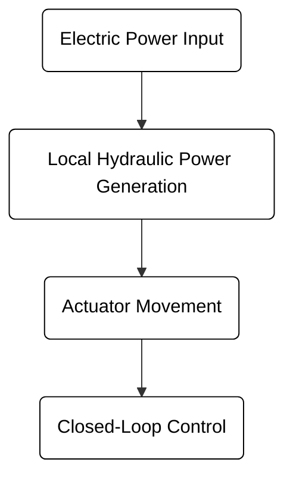
### Figure: Simplified flow (in black text) illustrating EHA operation.

### **B. Key Components**

1. **Electric Motor**
   - Converts electrical energy into mechanical power to drive the pump.
   - Often a brushless DC (BLDC) motor for high efficiency and controllability.

2. **Hydraulic Pump**
   - Generates local hydraulic pressure.
   - Common types include gear pumps or axial piston pumps sized for the EHA’s required operating range.

3. **Local Hydraulic Reservoir**
   - Contains sufficient hydraulic fluid for the localized circuit.
   - Compensates for fluid expansion and contraction under varying temperatures.

4. **Actuator (Linear or Rotary)**
   - Converts hydraulic pressure into mechanical force or motion.
   - **Linear Actuator:** Extends and retracts a rod for straight-line movement.
   - **Rotary Actuator:** Produces rotational movement using a vane or gear mechanism.
   - Integrated sensors (e.g., LVDTs, encoders) provide position feedback.

5. **Electronic Control Unit (ECU)**
   - Processes sensor data and regulates motor speed/direction.
   - Interfaces with the aircraft’s flight control system or other avionics.

6. **Accumulator (Optional)**
   - Damps pressure fluctuations and can provide a limited emergency power source.

### **C. Advantages of EHAs**

- **Weight Reduction**
  Eliminates extensive hydraulic lines and large central reservoirs/pumps, reducing overall system mass.

- **Improved Efficiency**
  Generates hydraulic power only when needed, minimizing energy losses compared to constant-flow hydraulic systems.

- **Enhanced Reliability and Fault Tolerance**
  Each EHA operates autonomously; a failure in one unit typically does not compromise the entire hydraulic network.
  - In critical systems like flight controls, multiple EHAs can be used on a single control surface to provide redundancy and ensure continued operation even if one unit fails.

- **Modularity and Simplified Maintenance**
  Self-contained design simplifies installation, inspection, and replacement of each actuator assembly.

- **Synergy with “More Electric Aircraft”**
  Aligns with the industry trend toward increased electrical power use, reducing reliance on large hydraulic systems and moving toward a more electric architecture.
  - In “More Electric Aircraft,” many traditionally hydraulic or pneumatic systems are replaced by electrically powered alternatives, improving overall efficiency and control.

### **D. Disadvantages and Challenges**

- **Heat Generation**
  Compact integration can lead to thermal buildup, requiring robust cooling strategies (e.g., heat exchangers, advanced cooling channels).

- **Cost and Complexity**
  EHAs can have higher initial costs and more complex designs than traditional hydraulic actuators.

- **Scalability**
  Meeting very high force demands may require carefully scaling or combining EHAs with other actuation methods. Currently, EHAs are more readily scaled for smaller or moderate-force applications.

- **Software and Certification**
  Increased reliance on digital controls necessitates rigorous testing (e.g., RTCA DO-178C for software) and careful regulatory approval.

### **E. Typical Applications**

1. **Primary Flight Controls**
   - Ailerons, elevators, rudders, and spoilers can benefit from localized hydraulic power, reducing weight and improving reliability.

2. **Secondary Flight Controls**
   - Flaps, slats, and speed brakes can also employ EHAs, further eliminating the need for extensive hydraulic plumbing.

3. **Landing Gear Systems**
   - Retraction/extension and landing gear door actuation can utilize EHAs, though very high load requirements may still favor centralized hydraulics in some designs.

4. **Utility and Cargo Systems**
   - Cargo doors, lifts, and other ancillary systems can be operated by independent EHAs, simplifying their power and control needs.

### **F. Thermal Management**

- **Heat Exchangers**
  Passive or active coolers (e.g., fans, liquid loops) dissipate excess heat generated by the motor and pump.

- **Advanced Cooling Channels**
  Internal passages and optimized fluid flow reduce thermal hotspots.

- **Material Selection**
  High thermal conductivity alloys (e.g., aluminum) can improve heat dissipation.

- **Duty Cycle Considerations**
  Sizing the EHA with adequate thermal margins is essential to prevent overheating under the expected flight profile.

### **G. EHAs in the GAIA AIR AMPEL360**

1. **Adaptive Aerostructures**
   - The AMPEL360’s morphing wing surfaces and intelligent control panels can be actuated via EHAs, providing precise control and localized power.

2. **Distributed Power**
   - Self-contained EHAs eliminate the need for large hydraulic lines, aligning with the AMPEL360’s goal of modular efficiency.

3. **Fault Tolerance**
   - Independent EHAs enhance safety. If one fails, others remain fully operational, reducing the likelihood of a total system failure.

4. **Weight and Maintenance Savings**
   - Reduced hydraulic infrastructure translates to lower weight and simpler upkeep.

### **H. Future Trends**

1. **All-Electric Aircraft**
   - EHAs fit into the drive towards “More Electric Aircraft,” potentially replacing central hydraulics in large commercial or military platforms.

2. **Smart Diagnostics and AI**
   - Embedded sensors, AI-driven analytics, and predictive maintenance algorithms can further optimize EHA performance and reliability.

3. **Advanced Materials and 3D Printing**
   - Lightweight composites, additive manufacturing, and new alloys can reduce EHA mass while enhancing structural integrity.

4. **Hybrid Architectures**
   - EHAs may be complemented by traditional hydraulic or electromechanical actuators (EMAs) for high-load systems, combining benefits from each technology.

### **I. Conclusion**

**Electro-Hydrostatic Actuators (EHAs)** mark a pivotal shift in aircraft actuation strategy, offering localized hydraulic power generation, reduced weight, and improved efficiency compared to traditional centralized hydraulic setups. Their self-contained, modular nature aligns especially well with the **GAIA AIR AMPEL360**, where each section of the aircraft can house its own actuator unit—improving reliability and fault tolerance.

#### **Advantages**
- **Localized Hydraulic Power** – On-demand actuation reduces energy losses.
- **Reduced Weight** – Eliminating central hydraulics can lower overall mass.
- **Enhanced Reliability & Redundancy** – Independent EHAs improve fault tolerance.
- **Synergy with More Electric Aircraft** – Perfect for future architectures focusing on electric power.

#### **Limitations**
- **Thermal Management** – Compact design demands careful heat dissipation.
- **Cost & Complexity** – Higher initial expense and more intricate design.
- **Scalability** – Larger surfaces may require multiple EHAs or supplementary methods.
- **Software & Certification** – Digital controls necessitate stringent testing (e.g., DO-178C).

Although EHAs demand robust thermal management, higher upfront costs, and thorough certification, their benefits—in modernization, efficiency, and fault tolerance—make them a highly attractive solution for next-generation aircraft designs. As the aviation industry embraces more electric and distributed power systems, EHAs stand at the forefront of a more efficient and resilient future for aircraft actuation.


Below is the **enhanced Markdown version** of the **27.60.3 Electromechanical Actuators (EMAs)** section, **with functional part numbers made interactive**. Each **Part Number** is now a clickable link that takes you to an **anchor definition** at the bottom of the document for quick reference.

## **27.60 Hydraulic/Electric Actuation Systems**

### **27.60.3 Electromechanical Actuators (EMAs)**

Electromechanical actuators (EMAs) are rapidly gaining prominence in the aerospace industry as a key technology for the **more-electric aircraft (MEA)** initiative. They offer significant advantages over traditional hydraulic actuators in terms of weight, efficiency, maintainability, and control precision. EMAs are particularly well-suited for fly-by-wire (FBW) systems and are expected to play a crucial role in future aircraft designs, including the **GAIA AIR AMPEL360**.

---

#### **A. Key Components and Operation**

EMAs typically consist of the following main components:

1. **Electric Motor:**
   - Usually a **permanent magnet synchronous motor (PMSM)** or a **brushless DC (BLDC) motor**.
     - **PMSMs:** Offer high power density, high efficiency, and precise control.  
     - **BLDC Motors:** Known for their reliability, long lifespan, and high-speed capabilities.
   - Other potential motor types include:
     - **Switched Reluctance Motors:** Noted for their simple construction, robustness, and fault tolerance.
     - **Induction Motors:** Less common in aerospace due to lower power density, but they offer simplicity and ruggedness.
   - **Functional Part Number Example:** 
     - [``71-63-01-100``](#fnp-71-63-01-100) *(Electric Motor Assembly)*

2. **Electronic Control Unit (ECU):**
   - The ECU is the "brain" of the EMA, responsible for controlling the motor’s speed, position, and torque.
   - It receives commands from the Flight Control Computer (FCC) and uses feedback from sensors to precisely control the actuator’s movement.
   - The ECU also performs functions such as:
     - **Commutation:** Controlling the current flow to the motor windings.
     - **Speed and Position Control:** Using algorithms like Proportional-Integral-Derivative (PID) control or more advanced techniques.
     - **Fault Detection and Isolation:** Monitoring the health of the motor and other components, and taking corrective action in case of failures.
   - **Functional Part Number Example:** 
     - [``71-63-01-200``](#fnp-71-63-01-200) *(Electronic Control Unit)*

3. **Transmission Mechanism:**
   - Converts the high-speed, low-torque output of the electric motor into a low-speed, high-torque output suitable for driving control surfaces.
   - Common types include:
     - **Gearbox:** A system of gears that increases torque and reduces speed (spur gears, planetary gears, or harmonic drives).
       - **Functional Part Number Example:** 
         - [``71-63-01-310``](#fnp-71-63-01-310) *(Gearbox Assembly)*
     - **Ball Screw:** A mechanism that converts rotary motion into linear motion with minimal friction/backlash.
       - **Functional Part Number Example:** 
         - [``71-63-01-320``](#fnp-71-63-01-320) *(Ball Screw Assembly)*
     - **Planetary Roller Screw:** Uses threaded rollers instead of balls for higher load capacity and stiffness.
       - **Functional Part Number Example:** 
         - [``71-63-01-330``](#fnp-71-63-01-330) *(Planetary Roller Screw Assembly)*

4. **Position and Force Sensors:**
   - Provide feedback to the ECU on the actuator’s position, speed, and output force.
   - Common types include:
     - **Resolvers:** Analog sensors providing absolute position data.
       - **Functional Part Number Example:** 
         - [``71-63-01-410``](#fnp-71-63-01-410) *(Resolver)*
     - **Encoders:** Digital sensors providing high-resolution position feedback.
       - **Functional Part Number Example:** 
         - [``71-63-01-420``](#fnp-71-63-01-420) *(Encoder)*
     - **LVDTs/RVDTs:** Linear/Rotary Variable Differential Transformers for precise position measurement.
       - **Functional Part Number Example:** 
         - [``71-63-01-430``](#fnp-71-63-01-430) *(LVDT/RVDT)*
     - **Load Cells:** Measure the force output of the actuator.
       - **Functional Part Number Example:** 
         - [``71-63-01-440``](#fnp-71-63-01-440) *(Load Cell)*

**Operation:**

1. The ECU receives a command signal from the Flight Control Computer (FCC) specifying the desired position or force.  
2. The ECU then controls the electric motor, which drives the transmission mechanism (e.g., gearbox + ball screw).  
3. The transmission mechanism converts rotary motion into linear/rotary motion of the output shaft, connected to the control surface.  
4. Position and force sensors provide feedback to the ECU, enabling closed-loop control and precise positioning.

---

#### **B. Applications in Aircraft Systems**

- **Primary Flight Controls:** Ailerons, rudders, elevators. The **AMPEL360** may use EMAs to control both traditional control surfaces and adaptive aerostructures.  
- **Secondary Flight Controls:** Flaps, slats, spoilers, airbrakes.  
- **Landing Gear Actuation:** Retraction and extension of landing gear.  
- **Thrust Vector Control:** In spacecraft, missiles, and some advanced fighter jets.  
- **Braking Systems:** As part of electric braking systems.  
- **Utility Systems:** Doors, ramps, and other utility functions.

---

#### **C. Advantages and Challenges**

**Advantages:**

- **Improved Efficiency:** Higher power-to-weight ratio; no hydraulic fluid losses.  
- **Reduced Weight:** Lighter than hydraulic systems, leading to fuel savings.  
- **Environmental Benefits:** No hydraulic fluids → fewer leaks/spills + simpler disposal.  
- **Energy Recovery:** Potential for regenerative braking.  
- **Control Precision:** Excellent for FBW and adaptive surfaces (e.g., **AMPEL360**).  
- **Simplified Maintenance:** Fewer moving parts, no hydraulic fluid.

**Challenges:**

- **Reliability & Redundancy:** Safety-critical → requires redundancy in motors, ECUs, power sources.  
- **Heat Management:** High-load operations generate heat → forced air, liquid cooling, heat sinks, etc.  
- **Jamming Issues:** Mechanical or electrical jams → anti-jamming mechanisms, redundant load paths.  
- **EMI:** Potential electromagnetic interference → proper shielding/filtering needed.  
- **Power Density:** May be lower vs. hydraulics for extreme force apps.  
- **Cost:** Higher initial cost, but offset by lower operating/maintenance costs over lifecycle.

---

#### **D. Advanced Technologies and Future Developments**

- **Health Monitoring:** 
  - Vibration/temperature/current signature analysis; AI/ML-based fault prediction.  
- **Thermal Management:** 
  - Advanced heat pipes, thermoelectric cooling, phase-change materials.  
- **Materials Innovation:** 
  - High-temp composites, advanced magnetic materials, lightweight alloys, self-lubricating gear materials.  
- **Integration with MEA Systems:** 
  - EMAs enable electrification of multiple aircraft subsystems (electric brakes, ECS, etc.).  
- **Hybrid Actuation Systems:** 
  - Combining EMAs with smaller hydraulics/EHAs for redundancy or specialized performance.


#### **E. Diagram**

```mermaid
graph TD
    subgraph EMA Components
        A[Flight Control Computer] --> B[Electronic Control Unit (ECU)]
        B --> C[Electric Motor (PMSM or BLDC)]
        C --> D[Gearbox]
        D --> E[Ball Screw or Planetary Roller Screw]
        E --> F[Output Shaft/Rod]
        G[Position Sensor (Resolver/Encoder/LVDT/RVDT)] --> B
        H[Force Sensor (Load Cell)] --> B
    end
    F --> I[Control Surface]
    style A fill:#cceeff,stroke:#00aaff,stroke-width:2px
    style B fill:#cceeff,stroke:#00aaff,stroke-width:2px
    style C fill:#ccffcc,stroke:#00aa00,stroke-width:2px
    style D fill:#ccffcc,stroke:#00aa00,stroke-width:2px
    style E fill:#ccffcc,stroke:#00aa00,stroke-width:2px
    style F fill:#ffcccc,stroke:#ff0000,stroke-width:2px
    style G fill:#ccffff,stroke:#0000ff,stroke-width:2px
    style H fill:#ccffff,stroke:#0000ff,stroke-width:2px
    style I fill:#f0f0f0,stroke:#000000,stroke-width:1px
```

---

#### **F. Connections to Other Sections**

- **27.70 Advanced Technologies in Flight Controls:**  
  - EMAs link tightly with AI, health monitoring sensors, more-electric trends.  
  - **AMPEL360** adaptive surfaces → advanced control algorithms/sensor fusion.  

- **27.80 Maintenance and Inspection Protocols:**  
  - Fewer hydraulic tasks, new electrical/mechanical checks.  
  - Predictive maintenance from EMA sensor data.  

- **27.140 Integrated System Diagnostics and Alerts:**  
  - Real-time monitoring → integrated into aircraft’s overall diagnostics.  

- **27.150 Safety Assurance and Certification Processes:**  
  - Rigorous testing (endurance, environment, FMEA, jamming) for flight-critical certification.

---

#### **G. Specific Considerations for the GAIA AIR AMPEL360**

- **Distributed Actuation:** Many smaller EMAs for adaptive surfaces → challenges in power distribution, coordination, thermal management.  
- **AI Integration:** AI safety, explainability, and certification for real-time optimization.  
- **Solar Power Integration:** Potential variable power from solar panels → advanced power management.  
- **Weight Optimization:** Large number of actuators → critical to minimize each unit’s weight.  
- **Reliability & Fault Tolerance:** Distributed control demands robust redundancy strategies.

---

### **Example Functional Part Number Breakdown**

**System:** ATA Chapter 27 - Flight Controls  
**Subsystem:** 71.60 - Actuation Systems  
**Component:** 71.63 - Electromechanical Actuators (EMAs)

* **[``71-63-01-100``](#fnp-71-63-01-100): Electric Motor Assembly**
  * [``71-63-01-101``](#fnp-71-63-01-101): Electric Motor (PMSM)  
  * [``71-63-01-102``](#fnp-71-63-01-102): Motor Housing  
  * [``71-63-01-103``](#fnp-71-63-01-103): Stator Winding  
  * [``71-63-01-104``](#fnp-71-63-01-104): Rotor Assembly  
  * [``71-63-01-105``](#fnp-71-63-01-105): Bearing Set

* **[``71-63-01-200``](#fnp-71-63-01-200): Electronic Control Unit (ECU)**
  * [``71-63-01-201``](#fnp-71-63-01-201): Microprocessor  
  * [``71-63-01-202``](#fnp-71-63-01-202): Power Supply Module  
  * [``71-63-01-203``](#fnp-71-63-01-203): Communication Interface  
  * [``71-63-01-204``](#fnp-71-63-01-204): Input/Output Circuitry

* **[``71-63-01-300``](#fnp-71-63-01-300): Transmission Mechanism**
  * [``71-63-01-310``](#fnp-71-63-01-310): Gearbox Assembly
    * [``71-63-01-311``](#fnp-71-63-01-311): Planetary Gear Set  
    * [``71-63-01-312``](#fnp-71-63-01-312): Gearbox Housing
  * [``71-63-01-320``](#fnp-71-63-01-320): Ball Screw Assembly
    * [``71-63-01-321``](#fnp-71-63-01-321): Ball Screw Shaft  
    * [``71-63-01-322``](#fnp-71-63-01-322): Ball Nut  
    * [``71-63-01-323``](#fnp-71-63-01-323): Recirculating Balls
  * [``71-63-01-330``](#fnp-71-63-01-330): Planetary Roller Screw Assembly  
    * [``71-63-01-331``](#fnp-71-63-01-331): Roller Screw Shaft  
    * [``71-63-01-332``](#fnp-71-63-01-332): Roller Nut  
    * [``71-63-01-333``](#fnp-71-63-01-333): Threaded Rollers

* **[``71-63-01-400``](#fnp-71-63-01-400): Sensors**
  * [``71-63-01-410``](#fnp-71-63-01-410): Resolver  
  * [``71-63-01-420``](#fnp-71-63-01-420): Encoder  
  * [``71-63-01-430``](#fnp-71-63-01-430): LVDT/RVDT  
  * [``71-63-01-440``](#fnp-71-63-01-440): Load Cell

---

## **Related Questions**

1. **How do EMAs compare to traditional hydraulic actuators in terms of efficiency?**  
   *Answer:* EMAs offer improved efficiency due to their higher power-to-weight ratio and elimination of hydraulic fluids, leading to reduced maintenance and environmental concerns. They are generally more energy-efficient than hydraulic actuators, as they only consume power when actively moving.

2. **What are the main components of an EMA system?**  
   *Answer:* An EMA system typically includes an electric motor (commonly PMSM or BLDC), an electronic control unit (ECU), a transmission mechanism (gearbox + ball screw or planetary roller screw), and position/force sensors.

3. **How does the quasi-static model approach simplify EMA simulations?**  
   *Answer:* It focuses on steady-state behavior, reducing computational complexity and giving quick performance insights. However, it may not capture important dynamic effects.

4. **What are the benefits of using EMAs in more electric aircraft?**  
   *Answer:* EMAs contribute to higher efficiency, reduced weight, simplified maintenance, and enhanced control precision. They eliminate the need for hydraulic fluids, reducing environmental impact.

5. **How does the dynamic nature of EMA actuator loads affect their design?**  
   *Answer:* Designers must handle peak loads, rapid changes in load direction, and potential turbulence/flight maneuvers. Heat generation, mechanical stress, and responsiveness are critical.

6. **Examples of EMAs in modern aircraft?**  
   *Answer:* Primary flight controls (Boeing 787, Airbus A350), secondary controls (flaps, slats, spoilers), landing gear, thrust vector control in military jets, and various utility systems.

7. **Key considerations for integrating EMAs into GAIA AIR AMPEL360?**  
   *Answer:*  
   - **Distributed Actuation** (power distribution, control coordination)  
   - **AI Integration** (real-time optimization)  
   - **Sensor Fusion** (comprehensive flight data)  
   - **Redundancy** (backup in case of failures)  
   - **Weight Optimization** (many small actuators)

8. **Emerging technologies to enhance EMAs?**  
   *Answer:*  
   - **Advanced Materials** (high-temp composites, magnetic materials)  
   - **Smart Actuators** (integrated intelligence, self-diagnostics)  
   - **Hybrid Actuation** (combining EMAs with other tech)  
   - **Energy Harvesting** (leveraging solar or other sources)  
   - **Shape Memory Alloys** for lightweight actuation.

9. **Specific challenges with planetary roller screws vs. ball screws?**  
   *Answer:* Higher load capacity/stiffness but more complexity, friction, cost, and wear sensitivity.

10. **How does an electric motor improve EMA efficiency vs. hydraulic actuators?**  
    *Answer:* No constant power draw to maintain fluid pressure, no fluid leakage/losses, potential for regenerative braking, and more precise control.

11. **Control algorithms in EMA ECUs for flight applications?**  
    *Answer:* PID loops, Model Predictive Control (MPC), Adaptive/Feedforward control, Gain scheduling, AI-based control (neural networks, reinforcement learning).

12. **Selecting a gearbox for an aerospace EMA—key considerations?**  
    *Answer:* Torque/speed requirements, efficiency, backlash, weight, reliability, noise/vibration, maintenance, cost, and gear type (planetary, harmonic, spur).

13. **AI’s role in optimizing EMAs on GAIA AIR AMPEL360?**  
    *Answer:* Real-time aerodynamic optimization, predictive control, adaptive laws, fault accommodation, multi-actuator coordination, continuous learning from flight data.

14. **Challenges of a distributed EMA system on GAIA AIR AMPEL360?**  
    *Answer:* Power distribution, thermal management, system complexity, weight, reliability/fault tolerance, EMI, wiring/connectors, and maintenance/accessibility.

15. **How does materials science improve EMAs for aerospace?**  
    *Answer:* Lightweight composites, high-temp materials, advanced magnetic alloys, shape memory alloys, self-lubricating surfaces, and nanomaterials all boost performance/durability.

---

## **Part Number Anchor Definitions**

Below are brief anchor references for each clickable Part Number in the text above.  
*(In an actual manual, these might contain deeper details like CAD drawings, BOM info, revision history, etc.)*

### <a id="fnp-71-63-01-100"></a>**71-63-01-100: Electric Motor Assembly**
- Core motor assembly for EMA systems  
- May include housing, rotor, stator, and basic cooling elements

#### <a id="fnp-71-63-01-101"></a>71-63-01-101: Electric Motor (PMSM)  
- Permanent Magnet Synchronous Motor sub-unit

#### <a id="fnp-71-63-01-102"></a>71-63-01-102: Motor Housing  
- Protective enclosure  
- Provides mounting points and thermal conduction

#### <a id="fnp-71-63-01-103"></a>71-63-01-103: Stator Winding  
- Copper or aluminum windings for electromagnetic field generation

#### <a id="fnp-71-63-01-104"></a>71-63-01-104: Rotor Assembly  
- Rotating element containing permanent magnets

#### <a id="fnp-71-63-01-105"></a>71-63-01-105: Bearing Set  
- High-speed bearings supporting the rotor shaft

---

### <a id="fnp-71-63-01-200"></a>**71-63-01-200: Electronic Control Unit (ECU)**
- Primary control board for EMA operation  
- Handles motor commutation, speed/position loops, fault detection

#### <a id="fnp-71-63-01-201"></a>71-63-01-201: Microprocessor  
- Executes control algorithms (e.g., PID, MPC, AI-based)

#### <a id="fnp-71-63-01-202"></a>71-63-01-202: Power Supply Module  
- Converts aircraft power bus to regulated voltages for the ECU/motor

#### <a id="fnp-71-63-01-203"></a>71-63-01-203: Communication Interface  
- ARINC, CAN, Ethernet, or custom protocols for FCC integration

#### <a id="fnp-71-63-01-204"></a>71-63-01-204: Input/Output Circuitry  
- Condition/monitor signals from sensors, motor phases, external signals

---

### <a id="fnp-71-63-01-300"></a>**71-63-01-300: Transmission Mechanism**
- Mechanical components converting motor output to actuator motion

#### <a id="fnp-71-63-01-310"></a>71-63-01-310: Gearbox Assembly  
- Torque increase & speed reduction  
- Various gear types (planetary, spur, etc.)

##### <a id="fnp-71-63-01-311"></a>71-63-01-311: Planetary Gear Set  
- High power density gear arrangement  
- Consists of sun gear, planet gears, and ring gear

##### <a id="fnp-71-63-01-312"></a>71-63-01-312: Gearbox Housing  
- Enclosure for gear sets + lubrication/cooling channels

#### <a id="fnp-71-63-01-320"></a>71-63-01-320: Ball Screw Assembly  
- Converts rotary motion to linear motion

##### <a id="fnp-71-63-01-321"></a>71-63-01-321: Ball Screw Shaft  
- Precision-threaded shaft for recirculating ball bearings

##### <a id="fnp-71-63-01-322"></a>71-63-01-322: Ball Nut  
- Travels axially along the shaft  
- Houses recirculating balls

##### <a id="fnp-71-63-01-323"></a>71-63-01-323: Recirculating Balls  
- Minimize friction between nut and shaft

#### <a id="fnp-71-63-01-330"></a>71-63-01-330: Planetary Roller Screw Assembly  
- Alternative to ball screws with higher load capacity

##### <a id="fnp-71-63-01-331"></a>71-63-01-331: Roller Screw Shaft  
- Threaded shaft engaging multiple planetary rollers

##### <a id="fnp-71-63-01-332"></a>71-63-01-332: Roller Nut  
- Holds rollers in correct alignment around the shaft

##### <a id="fnp-71-63-01-333"></a>71-63-01-333: Threaded Rollers  
- Provide multi-contact points, improving stiffness/load capacity

---

### <a id="fnp-71-63-01-400"></a>**71-63-01-400: Sensors**
- Sensor suite for position, speed, force feedback

#### <a id="fnp-71-63-01-410"></a>71-63-01-410: Resolver  
- Analog angle sensor for motor/actuator position

#### <a id="fnp-71-63-01-420"></a>71-63-01-420: Encoder  
- Digital sensor for high-resolution position/speed feedback

#### <a id="fnp-71-63-01-430"></a>71-63-01-430: LVDT/RVDT  
- Linear/Rotary Variable Differential Transformers for precise displacement

#### <a id="fnp-71-63-01-440"></a>71-63-01-440: Load Cell  
- Measures actuator force/thrust output

---

**End of Document**  


### How This Works

1. **Clickable Links:**  
   Each “Functional Part Number” is now a **Markdown link** of the form `[``71-63-01-100``](#fnp-71-63-01-100)`.  
   Clicking (in a Markdown viewer or GitHub) jumps to the **anchor definition** near the bottom.

2. **Anchors Section:**  
   The bottom of the document (`## Part Number Anchor Definitions`) contains headings with HTML `id`s.  
   This is where the jump leads you, letting you see more details about the specific part.

3. **Expandable for Real Projects:**  
   In an actual **GAIA AIR** or **AMPEL360** manual, each anchor section could include detailed specs, drawings, BOM data, maintenance instructions, revision notes, etc.

Feel free to adapt this pattern for **any** additional part numbers or sections you wish to reference interactively!

### **27.240 Autonomous Flight Control Algorithms**

*(Exploring the increasing role of autonomy in flight control decisions.)*

**Purpose:**  
To describe the algorithms and decision-making processes that enable autonomous or semi-autonomous flight control, focusing on how these systems integrate pilot authority, AI-based logic, and safety protocols.

**Key Topics:**
1. **Autonomous Mode Transition:**  
   - How the system transitions between manual, semi-autonomous, and fully autonomous control modes.
   - Pilot override procedures to ensure human authority remains paramount.
2. **Decision-Tree Analysis / State Machines:**  
   - The use of logic trees or state machines for dynamic flight path adjustments under changing conditions.
3. **Fail-Safe Mechanisms:**  
   - Redundancy and fallback strategies if autonomous algorithms detect anomalies or fail to converge on a safe decision.
4. **Integration with Adaptive Aerostructures:**  
   - Specific considerations for the **AMPEL360**, ensuring the distributed control surfaces align with autonomous flight goals.


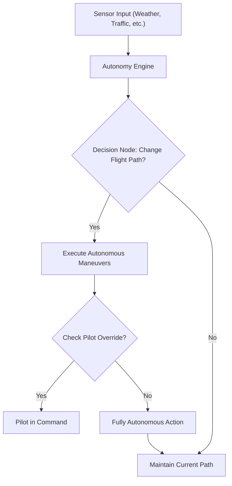

### **Rendered Diagram**


### **Diagram Description**
This flowchart depicts the workflow of an **Autonomy Engine** for an aircraft:
1. **Sensor Inputs:** Weather conditions, traffic data, and other inputs feed into the autonomy engine.
2. **Decision Node:** The engine determines whether to change the flight path.
3. **Execution:** 
   - If a change is required, autonomous maneuvers are executed.
   - If no change is needed, the current flight path is maintained.
4. **Pilot Override Check:** Post-maneuver, the system verifies if the pilot wishes to override the autonomy.
   - If the pilot overrides, they resume command.
   - If not, the system proceeds with fully autonomous actions.

This architecture ensures a balance between pilot authority and autonomous decision-making, enhancing safety and efficiency.

---

### **27.250 Solar Energy Harvesting and Management in Flight Controls**

*(Detailing how solar power is integrated and utilized within flight control systems.)*

**Purpose:**  
To elaborate on how solar energy is harvested via the **AMPEL360**’s solar panel-embedded aerostructures and channeled into flight control operations, addressing storage, distribution, and redundancy.

**Key Topics:**
1. **Energy Flow Management:**  
   - Balancing solar-derived power with traditional sources (e.g., APU, batteries).
   - Priority rules (flight controls vs. non-critical systems) under various flight phases.
2. **Storage and Conversion:**  
   - Inverters or DC-DC converters ensuring stable voltage supply to actuators and avionics.
   - Battery or supercapacitor buffers for peak demand management.
3. **Efficiency Considerations:**  
   - Minimizing losses during power conversion.
   - Adaptive shading or “smart skin” technology to maintain optimal solar panel angles.
4. **Monitoring and Fault Detection:**  
   - Real-time health checks of solar arrays to isolate faulty panels.
   - Automatic re-routing of power flow if panels degrade or fail.

x
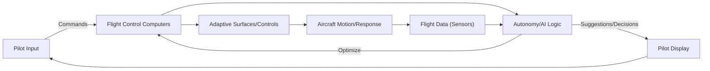

### Diagram Description
This diagram demonstrates the interaction between the pilot and the automation systems in controlling an aircraft:

1. **Pilot Input:** The process begins with commands issued by the pilot.
2. **Flight Control Computers (FCS):** The pilot's commands are processed and routed to appropriate control systems.
3. **Autonomy/AI Logic:** The AI layer optimizes these commands based on flight parameters and conditions.
4. **Adaptive Surfaces/Controls:** The optimized commands are sent to the aircraft's control surfaces or adaptive systems for execution.
5. **Aircraft Motion/Response:** Adjustments result in physical changes to the aircraft’s trajectory or behavior.
6. **Flight Data (Sensors):** Real-time sensor feedback monitors the aircraft's response and sends data back to the AI.
7. **Pilot Display:** The AI provides real-time decisions, suggestions, or system statuses to the pilot, ensuring they remain informed and in control.

This workflow ensures seamless interaction between the human operator and the automated systems, prioritizing safety and performance.


### **Diagram Description**
This flowchart illustrates the **Pilot-Automation Synergy** workflow:
1. **Pilot Input:** Commands from the pilot are processed by the Flight Control Computers (FCS).
2. **Autonomy/AI Logic:** The AI optimizes flight control commands and sends suggestions or automated decisions back to the FCS.
3. **Adaptive Surfaces/Controls:** Adjustments are made to the aircraft's control surfaces or adaptive systems.
4. **Aircraft Motion/Response:** The physical response of the aircraft, influenced by the control inputs.
5. **Flight Data Sensors:** Real-time data from sensors monitor the aircraft's motion and environment.
6. **Feedback Loop:** Sensor data is fed back into the AI to refine decisions.
7. **Pilot Display:** Suggestions and system feedback are displayed for the pilot’s review, enabling further input or override.

This diagram emphasizes the collaborative dynamics between human input and automated systems, ensuring safety, efficiency, and adaptability during flight operations.

---


---

### **27.260 Collaborative Automation: Human and Machine Synergy**

*(Ensuring smooth coordination between pilot inputs and automated systems.)*

**Purpose:**  
To explore how pilots and automated systems share control in advanced aircraft like the **AMPEL360**, optimizing performance while maintaining safety and pilot authority.

**Key Topics:**
1. **Shared Control Logic:**  
   - Dividing tasks between pilot and automation (e.g., autopilot managing lateral guidance, pilot retaining vertical authority).
   - Clear demarcations of roles to prevent confusion or overlap.
2. **Transition Protocols:**  
   - Safe handover procedures between automation levels (manual → autopilot → partial autonomy → full autonomy).
   - Alerting pilots to mode changes, with an option to override or confirm.
3. **Synergy in Decision-Making:**  
   - AI-based suggestions to pilots, who may accept/reject them.
   - Collaborative real-time adjustments (e.g., pilot adjusting thrust while AI configures adaptive surfaces).
4. **Human Factors & Automation Bias:**  
   - Strategies to prevent over-reliance on or mistrust of automation.
   - Display design ensuring pilot awareness of automation decisions.


*Mermaid diagram illustrating pilot-automation synergy in controlling adaptive surfaces and responding to flight data.*

Below is a **recommended additional diagram** and an **optional section** that might further clarify the **GAIA AIR AMPEL360**’s unique flight control challenges and solutions. You can integrate these into the document where they best fit (e.g., in the **Advanced Technologies** or **Future Trends** sections):

---

## **27.270 Digital Twin and Virtual Testing Environment**

*(Enhancing simulation, validation, and predictive maintenance for adaptive flight control systems.)*

**Purpose:**
To describe how a **Digital Twin**—a real-time, virtual replica of the aircraft’s flight control system—can support both design and operational phases, especially for an aircraft as advanced as the **GAIA AIR AMPEL360**.

**Key Topics:**
1. **Real-Time Simulation and Verification**  
   - **Virtual Testing**: Running flight control algorithms through rigorous simulations before flight.  
   - **Stress Testing**: Evaluating unusual or emergency scenarios (e.g., extreme weather, subsystem failure).  
   - **Adaptive Aerostructures**: Simulating the shape changes of distributed surfaces, verifying energy usage, and analyzing performance benefits.

2. **Predictive Maintenance**  
   - **Sensor Data Integration**: Pulling real-time data from onboard sensors (health monitoring, actuator performance) into the digital twin.  
   - **Anomaly Detection**: Identifying early signs of wear or deviations in the control surfaces, triggers for pre-emptive maintenance.  
   - **Lifecycle Tracking**: Logging the stress and usage data on each adaptive panel or actuator, informing refurbishment or replacement schedules.

3. **Continuous Improvement**  
   - **Flight Data Feedback**: Using operational flight data to refine the digital twin’s accuracy.  
   - **Algorithm Optimization**: Tweaking AI-based control laws to respond better to real-world dynamics, gradually improving performance and reliability.  
   - **Crew Feedback Integration**: Incorporating pilot feedback to refine HMI design and reduce workload.

4. **Cybersecurity Implications**  
   - **Secure Communication**: Ensuring that data flow between the real aircraft and the digital twin is protected from tampering.  
   - **Safe Update Mechanisms**: Testing new software or AI models within the twin environment before deploying them to the live aircraft.

### Potential Diagram: Digital Twin Workflow

```mermaid
flowchart LR
    A[Aircraft Real-time Data] -->|Sensor Streams| B[Digital Twin Engine]
    B -->|Simulate Behavior| C[Virtual Flight Control Model]
    C -->|Comparative Analysis| D[Anomaly/Fault Detection]
    D -->|Results/Alerts| E[Maintenance Crew/Operators]
    B -->|Feedback Loop| F[Optimization of Control Laws]
    F --> C

    style A fill:#ccffcc,stroke:#00aa00,stroke-width:2px
    style B fill:#cceeff,stroke:#00aaff,stroke-width:2px
    style C fill:#ffffcc,stroke:#ffcc00,stroke-width:2px
    style D fill:#ffcccc,stroke:#ff0000,stroke-width:2px
    style E fill:#ccffcc,stroke:#00aa00,stroke-width:2px
    style F fill:#cceeff,stroke:#00aaff,stroke-width:2px
```

**Explanation:**
1. **Aircraft Real-time Data**: Actuator positions, panel angles, sensor streams flow into the Digital Twin Engine.
2. **Digital Twin Engine**: Simulates or mirrors the aircraft’s flight control states (especially the adaptive surfaces) in real-time or near-real-time.
3. **Virtual Flight Control Model**: Runs the flight control algorithms, replicates dynamic responses.
4. **Comparative Analysis & Fault Detection**: Compares virtual predictions with actual performance, flags deviations.
5. **Maintenance & Operators**: Receives alerts, scheduling proactive maintenance if anomalies are detected.
6. **Control Law Optimization**: The twin helps improve AI algorithms and flight control logic iteratively.

---

### Why This May Help

- **Clarifies Complex Interactions**: Shows how real-time data from the **AMPEL360** can be used to refine predictive models for adaptive aerostructures and flight controls.
- **Encourages Proactive Maintenance**: Demonstrates a workflow for catching issues early, reducing downtime.
- **Future-Proofs The Documentation**: Digital twin technology is increasingly common in advanced aerospace programs, aligning with the **GAIA AIR** vision of cutting-edge, sustainable aviation solutions.

By adding this **Digital Twin** concept (Section **27.270**) and corresponding diagram, you’ll give readers more insight into how modern aircraft like the **AMPEL360** can integrate simulation, data analytics, and predictive maintenance in a continuous improvement cycle—further enhancing safety, reliability, and sustainability of next-generation flight control systems.
```
