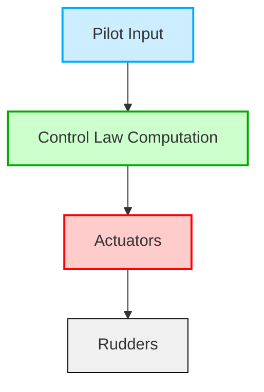
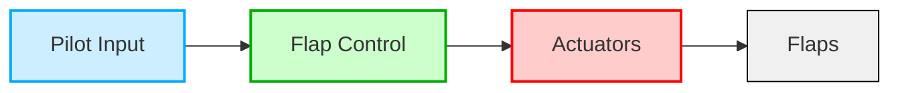
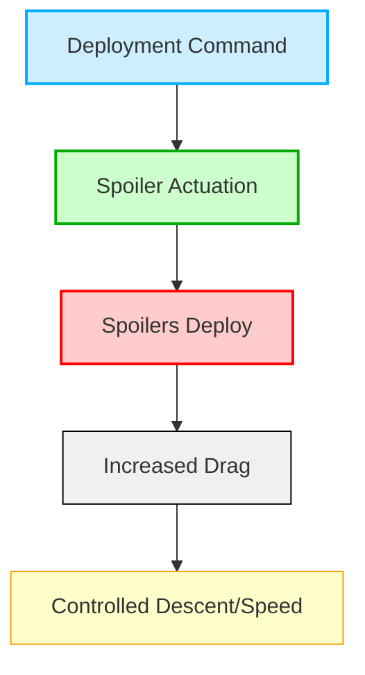
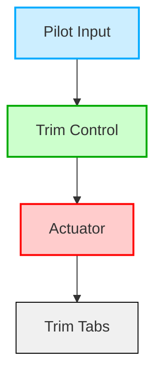
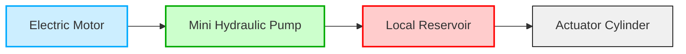
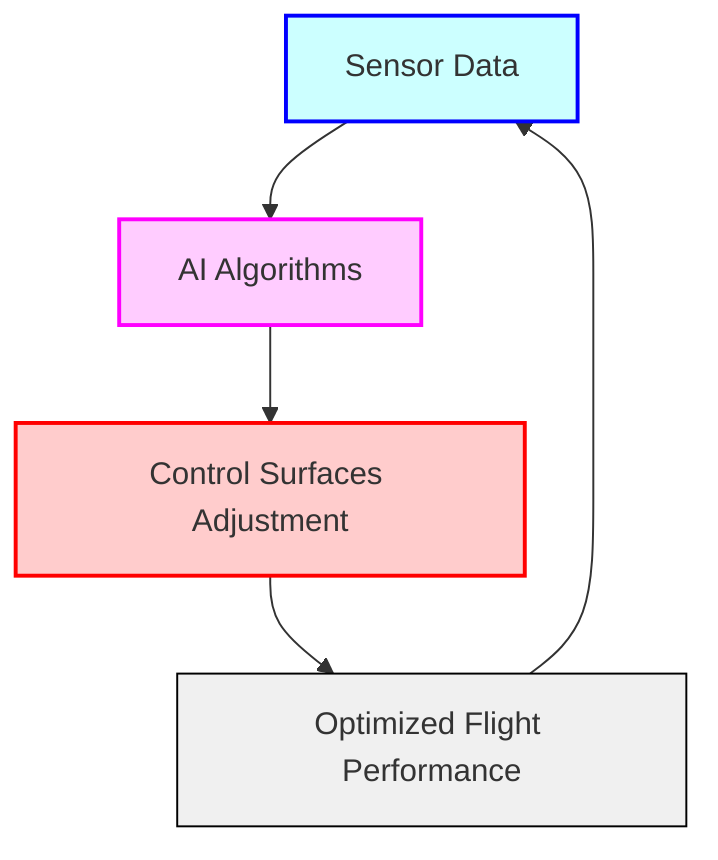
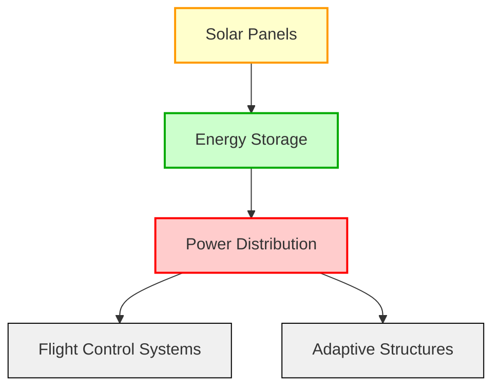
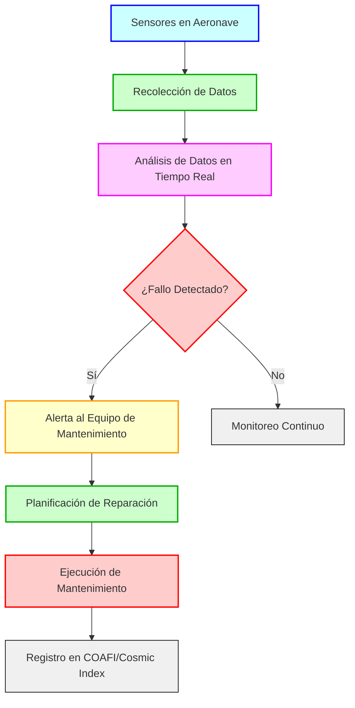
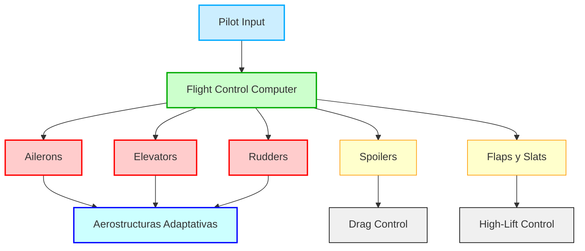

# ATA 27 - Flight Controls

Este capítulo se relaciona estrechamente con las alas y cubre los sistemas que controlan las superficies de vuelo del avión (por ejemplo, flaps, alerones, spoilers, timones de dirección y timones de profundidad).

## Índice

1. [Introducción](#2710-introducción)
2. [Alcance y Objetivos](#2720-alcance-y-objetivos)
3. [Requisitos Regulatorios](#2730-requisitos-regulatorios)
4. [Controles de Vuelo Primarios](#2740-controles-de-vuelo-primarios)
5. [Controles de Vuelo Secundarios](#2750-controles-de-vuelo-secundarios)
6. [Sistemas de Actuación](#2760-sistemas-de-actuación)
7. [Tecnologías Avanzadas](#2770-tecnologías-avanzadas)
8. [Pruebas y Validación](#2780-pruebas-y-validación)
9. [Mantenimiento e Inspección](#2790-mantenimiento-e-inspección)
10. [Factores Humanos y Ergonomía](#27100-factores-humanos-y-ergonomía)
11. [Estudios de Caso y Prácticas de la Industria](#27110-estudios-de-caso-y-prácticas-de-la-industria)
12. [Prácticas Colaborativas con Stakeholders](#27120-prácticas-colaborativas-con-stakeholders)
13. [Referencias y Datos](#27130-referencias-y-datos)
14. [Tendencias Futuras en Controles de Vuelo](#27140-tendencias-futuras-en-controles-de-vuelo)
15. [Diagramas Adicionales](#diagramas-adicionales)

---

## 27.10 Introducción

- **Evolución de los Sistemas de Control de Vuelo**: Desde los controles mecánicos de los hermanos Wright hasta los sistemas avanzados de fly-by-wire (FBW) y control adaptativo de la AMPEL360.
- **Ventajas de los Sistemas Modernos**:
  - **Reducción de Peso**: Menor masa en componentes críticos mejora la eficiencia y el rendimiento.
  - **Mejora en el Manejo y Rendimiento**: Respuestas más precisas y rápidas a las entradas del piloto.
  - **Mayor Seguridad y Redundancia**: Sistemas redundantes que aseguran el control incluso ante fallos.
  - **Reducción de la Carga de Trabajo del Piloto**: Automatización de tareas rutinarias permite al piloto concentrarse en decisiones estratégicas.
- **Innovaciones en AMPEL360**:
  - **Aerostructuras Adaptativas Integradas con Paneles Solares**: Superficies que se ajustan dinámicamente para optimizar el rendimiento energético y aerodinámico.
  - **Fusión Avanzada de Sensores**: Integración de múltiples fuentes de datos para una mejor toma de decisiones.
  - **Controles Augmentados por IA**: Algoritmos de inteligencia artificial que optimizan las superficies de control en tiempo real.
  - **Interfaces Intuitivas para el Piloto**: Diseño ergonómico y fácil de usar para mejorar la interacción piloto-sistema.

---

## 27.20 Alcance y Objetivos

### 27.20.1 Alcance

**ATA 27** abarca todos los sistemas y componentes involucrados en el control de la actitud, trayectoria y configuración aerodinámica del avión:

- **A. Controles de Vuelo Primarios**
  - Alerones
  - Timones de profundidad
  - Timones de dirección
  - Sistemas de FBW

- **B. Controles de Vuelo Secundarios**
  - Spoilers/Speedbrakes
  - Flaps y Slats
  - Sistemas de trimado

- **C. Características Avanzadas**
  - Estabilidad aumentada por sistemas automáticos
  - Autopiloto y autothrottle
  - Aerostructuras adaptativas específicas de AMPEL360

### 27.20.2 Objetivos

- **Seguridad**: Diseño robusto, redundancia, detección y aislamiento de fallas.
- **Fiabilidad**: Sistemas probados, mantenimiento predictivo.
- **Cumplimiento Regulatorio**: Adherencia a FAR Part 25, EASA CS-25, ICAO.
- **Optimización de Rendimiento**: Eficiencia aerodinámica, ahorro de combustible, estabilidad y maniobrabilidad.
- **Integración**: Coordinación con otros sistemas del avión, gestión energética.
- **Adaptabilidad**: Control en tiempo real, integración con IA, materiales avanzados.

---

## 27.30 Requisitos Regulatorios

### 27.30.1 FAA Regulaciones (Estados Unidos)

- **FAR Part 25: Normas de Aeronavegabilidad para Aviones de Categoría de Transporte**
  - **25.671 Control Systems – General**
    - Controlable y maniobrable bajo todas las condiciones de vuelo anticipadas.
    - Robustez ante fallas simples.
  - **25.672 Stability Augmentation and Automatic/Power-Operated Systems**
    - Sistemas que mejoran la estabilidad o controlabilidad.
  - **25.675 Stops or Limit Devices**
    - Dispositivos que previenen el exceso de movimiento de superficies de control.
  - **25.677 Trim Systems**
    - Estándares para sistemas de trimado que mantienen la actitud deseada sin esfuerzo continuo del piloto.
  - **25.679 Control System Malfunctions**
    - Medidas para evitar consecuencias catastróficas ante fallas del sistema.
  - **25.683 Operation Tests**
    - Pruebas operativas para demostrar fiabilidad y funcionalidad.

### 27.30.2 EASA CS-25 Requisitos (Europa)

- **CS-25: Especificaciones de Certificación para Grandes Aeroplanos**
  - **25.671 Control Systems – General**
    - Funcionamiento suave y positivo.
    - Estabilidad y maniobrabilidad.
  - **25.672 Stability Augmentation and Automatic/Power-Operated Systems**
    - Integración de sistemas de aumento de estabilidad y control automático.
  - **25.675 Stops or Limit Devices**
    - Requisitos para dispositivos que limitan el movimiento de superficies de control.
  - **25.677 Trim Systems**
    - Requisitos para sistemas de trimado seguros y efectivos.
  - **25.679 Control System Malfunctions**
    - Análisis y mitigación de fallas en sistemas de control.
  - **25.683 Operation Tests**
    - Métodos para realizar pruebas operativas de sistemas de control.

### 27.30.3 ICAO Estándares

- **Annex 8 – Aeronavegabilidad de Aeroplanos**
  - **Principios de Diseño General**
    - Controlabilidad y maniobrabilidad
    - Estabilidad
    - Integridad estructural
  - **Redundancia y Tolerancia a Fallos**
    - Canales de control independientes
    - Fuentes de energía de respaldo

### 27.30.4 Regulaciones Emergentes

- **Regulaciones para IA en Controles de Vuelo**
  - **EASA AI Roadmap 2.0**
    - Seguridad y ética en IA.
    - Certificación de sistemas basados en IA.
  - **FAA Roadmap for Artificial Intelligence Safety Assurance**
    - Aseguramiento de seguridad basado en riesgos.
    - Implementación incremental de IA.
- **Regulaciones para Sistemas de Actuación Noveles**
  - **ACTUATION 2015 Project**
  - **SAE ARP4754A, ARP4761, DO-178C, DO-254**

---

## 27.40 Controles de Vuelo Primarios

### 27.40.1 Sistemas de Alerones

- **Definición**: Superficies en el borde de salida del ala que controlan el balanceo (roll) del avión.
- **Tipos**:
  - **Sistemas Mecánicos**: Conexión directa mediante cables y poleas.
  - **Fly-by-Wire (FBW)**: Control electrónico sin enlaces mecánicos directos.
  - **Sistemas Híbridos**: Combinación de mecánico y electrónico.
- **Diseños Avanzados**:
  - **Alerones Diferenciales**: Deflexión asimétrica para minimizar el desvío de guiñada (yaw).
  - **Alerones Frise**: Incrementan la sustentación en un lado durante la deflexión, reduciendo el esfuerzo del piloto.
  - **Spoilers Integrados**: Combinación de alerones y spoilers para mayor control y redundancia.
  - **Flaperones**: Alerones que también actúan como flaps para aumentar la sustentación.
- **Desafíos y Consideraciones**:
  - **Flutter de Alerones**: Oscilaciones autoalimentadas que pueden dañar las superficies de control.
  - **Control en Estalls y Spins**: Sistemas de protección para evitar condiciones de pérdida de sustentación.
- **Diagramas**:


### 27.40.2 Sistemas de Timones de Profundidad

- **Definición**: Superficies móviles en el estabilizador horizontal que controlan el cabeceo (pitch).
- **Tipos**:
  - **Sistemas Mecánicos**
  - **Fly-by-Wire (FBW)**
  - **Sistemas Híbridos**
- **Diseños Avanzados**:
  - **Stabilator**: Todo el estabilizador horizontal se mueve para controlar el pitch.
  - **Split Stabilizer**: División del estabilizador en secciones independientes para mayor redundancia.
  - **Super Trailing Edge**: Diseño que permite una mayor deflexión y control preciso.
- **Desafíos y Consideraciones**:
  - **Flutter de Timones**: Riesgo de oscilaciones peligrosas en superficies de control.
  - **Control en Estalls y Spins**: Sistemas de protección integrados para mantener la estabilidad.
- **Diagramas**:


### 27.40.3 Sistemas de Timones de Dirección

- **Definición**: Superficies en el estabilizador vertical que controlan la guiñada (yaw).
- **Tipos**:
  - **Sistemas Mecánicos**
  - **Fly-by-Wire (FBW)**
  - **Sistemas Híbridos**
- **Diseños Avanzados**:
  - **Timón Fractado**: Dividido en secciones para mayor control y redundancia.
  - **Super Stabilizer**: Diseño avanzado que ofrece mayor control de guiñada.
  - **Morphing Vertical Stabilizer**: Estabilizador vertical que puede cambiar su forma para optimizar el rendimiento aerodinámico.
- **Desafíos y Consideraciones**:
  - **Flutter de Timones**: Diseño robusto para evitar oscilaciones destructivas.
  - **Control en Estalls y Spins**: Sistemas de recuperación automáticos para mantener la estabilidad.
- **Diagramas**:



---

## 27.50 Controles de Vuelo Secundarios

### 27.50.1 Flaps y Slats

- **Definición**: Dispositivos de alto sustentación que aumentan el coeficiente de sustentación a bajas velocidades.
- **Tipos de Flaps**:
  - **Plain Flaps**
    - **Descripción**: Flaps simples en el borde de salida que se despliegan hacia abajo.
    - **Ventajas**: Ligereza y simplicidad.
    - **Desventajas**: Menor incremento de sustentación comparado con otros tipos.
    - **Uso**: Común en aviones ligeros o antiguos.
  - **Split Flaps**
    - **Descripción**: Sólo la superficie inferior del ala se despliega.
    - **Ventajas**: Mayor incremento de arrastre, útil para descensos rápidos.
    - **Desventajas**: Menor incremento de sustentación en comparación con flaps con ranuras.
    - **Uso**: Aviones militares y algunos aviones comerciales antiguos.
  - **Slotted Flaps**
    - **Descripción**: Incluyen una ranura que permite el flujo de aire para retrasar la separación del flujo sobre el ala.
    - **Ventajas**: Mayor sustentación y menor riesgo de estallo.
    - **Desventajas**: Mayor complejidad mecánica.
    - **Uso**: Amplia adopción en aviones comerciales modernos.
  - **Fowler Flaps**
    - **Descripción**: Despliegan hacia atrás y hacia abajo, aumentando el área del ala.
    - **Ventajas**: Gran incremento de sustentación y eficiencia aerodinámica.
    - **Desventajas**: Sistemas más pesados y complejos.
    - **Uso**: Aviones de gran tamaño como los de las familias Boeing y Airbus.
  - **Double/Triple-Slotted Flaps**
    - **Descripción**: Flaps con múltiples ranuras para incrementar la sustentación aún más.
    - **Ventajas**: Muy alta sustentación, ideal para aviones pesados.
    - **Desventajas**: Alta complejidad y mantenimiento.
    - **Uso**: Aviones comerciales de gran capacidad y aeronaves militares.
  - **Powered/Automated Flaps**
    - **Descripción**: Flaps operados electrónicamente para despliegues más precisos y rápidos.
    - **Uso**: Aviones modernos con sistemas Fly-by-Wire.

- **Tipos de Slats**:
  - **Fixed Slats**
    - **Descripción**: Slats fijos que siempre están desplegados.
    - **Ventajas**: Menor complejidad mecánica.
    - **Desventajas**: Mayor arrastre continuo.
    - **Uso**: Aviones STOL y algunos aviones de carga.
  - **Movable/Automatic Slats**
    - **Descripción**: Slats que se despliegan automáticamente a altas ángulos de ataque.
    - **Ventajas**: Mejor sustentación sin necesidad de intervención manual.
    - **Desventajas**: Mayor complejidad y mantenimiento.
    - **Uso**: Aviones comerciales de gran tamaño.
  - **Powered Slats**
    - **Descripción**: Slats controlados electrónicamente para despliegues precisos.
    - **Ventajas**: Mayor control y flexibilidad.
    - **Uso**: Aviones modernos con sistemas Fly-by-Wire.
  - **Krueger Slats**
    - **Descripción**: Slats que se despliegan hacia adelante desde la parte inferior del ala.
    - **Ventajas**: Mejor rendimiento en altas velocidades.
    - **Uso**: A menudo combinados con flaps en aviones comerciales grandes.
  - **Slotted Slats**
    - **Descripción**: Slats con ranuras que permiten un flujo de aire más eficiente.
    - **Ventajas**: Mejora la sustentación y retraso del estallo.
    - **Uso**: Amplia adopción en aviones comerciales modernos.

- **Consideraciones de Diseño**:
  - **Operación y Despliegue**: Coordinación entre flaps y slats para maximizar el incremento de sustentación y minimizar el arrastre.
  - **Integración con Aerostructuras Adaptativas (AMPEL360)**: Utilización de superficies adaptativas para complementar o reemplazar flaps y slats tradicionales, optimizando la eficiencia aerodinámica y reduciendo el peso.

- **Diagramas**:



---

### 27.50.2 Spoilers/Ground Spoilers

- **Definición**: Superficies que aumentan la resistencia y reducen la sustentación para controlar la velocidad y la actitud.
- **Tipos**:
  - **Ground Spoilers**: Usados tras el aterrizaje para reducir sustentación y aumentar frenado.
  - **Flight Spoilers/Speedbrakes**: Usados en vuelo para controlar la tasa de descenso y la velocidad.
  - **Roll Spoilers**: Usados de forma asimétrica para asistir en el control de alabeo.
- **Consideraciones de Diseño**:
  - **Despliegue y Retracción**: Sistemas robustos para despliegues rápidos y seguros.
  - **Integración con Sistemas de FBW**: Coordinación con otros sistemas de control para una respuesta eficiente.
- **Diagramas**:



---

### 27.50.3 Airbrakes/Speedbrakes

- **Definición**: Superficies diseñadas específicamente para incrementar la resistencia durante el vuelo.
- **Funciones**:
  - **Control de Velocidad y Descenso**: Permiten descensos más pronunciados sin incrementar la velocidad excesivamente.
  - **Aceleración Rápida en Emergencias**: Reducen rápidamente la velocidad en situaciones de emergencia.
- **Tipos**:
  - **Airbrakes**: Aumentan la resistencia con mínima reducción de sustentación, ideales para control de velocidad en vuelo.
  - **Speedbrakes**: Generalmente incluyen spoilers que también reducen la sustentación, proporcionando un control más completo.
- **Consideraciones de Diseño**:
  - **Integración con Sistemas de FBW**: Asegurar una coordinación fluida con otros sistemas de control.
  - **Reducción de Ruido y Vibraciones**: Diseño aerodinámico que minimiza los impactos negativos en el confort del pasajero y la integridad estructural.
- **Diagramas**:


---

### 27.50.4 Sistemas de Trimado

- **Definición**: Sistemas que permiten al piloto ajustar la posición de las superficies de control para mantener una actitud de vuelo deseada sin esfuerzo continuo.
- **Tipos**:
  - **Trim Tabs**: Pequeñas superficies en el borde de salida de las superficies de control que se ajustan para equilibrar las fuerzas aerodinámicas.
  - **Stabilators**: Estabilizadores completos que se mueven para controlar el pitch, eliminando la necesidad de un trim tab separado.
  - **Electrically Operated Trim Systems**: Sistemas eléctricos que ajustan las superficies de trim automáticamente.
- **Consideraciones de Diseño**:
  - **Prevención de Operación Inadvertida**: Mecanismos para evitar ajustes accidentales.
  - **Indicadores de Posición Clara**: Pantallas o indicadores que muestran claramente la posición actual del trim.
  - **Prevención de Deslizamiento del Trim**: Diseños que aseguran que el trim se mantenga en la posición deseada incluso bajo cargas aerodinámicas.
- **Diagramas**:



---

## 27.60 Sistemas de Actuación

### 27.60.1 Actuadores Hidráulicos

- **Funcionalidad**:
  - **Principio de Operación**: Convertir presión hidráulica en movimiento mecánico mediante pistones o vánes.
  - **Aplicaciones**: Controles de vuelo primarios y secundarios, tren de aterrizaje, sistemas de frenos.
- **Componentes del Sistema**:
  - **Reservorio**: Almacena el fluido hidráulico, asegurando un suministro constante.
  - **Bombas**: Generan la presión necesaria para mover los actuadores.
  - **Válvulas y Manifold**: Dirigen el flujo del fluido a los actuadores adecuados.
  - **Actuadores**: Dispositivos que convierten la presión hidráulica en movimiento mecánico para controlar las superficies de vuelo.
- **Innovaciones Modernas**:
  - **Electrohydrostatic Actuators (EHAs)**: Actuadores hidráulicos auto-contenidos que generan presión localmente mediante motores eléctricos, reduciendo la necesidad de una infraestructura hidráulica central.
  - **Fluidos Ecológicos**: Desarrollo de fluidos hidráulicos más amigables con el medio ambiente, reduciendo la toxicidad y el riesgo de contaminación.
- **Diagrama del Sistema Hidráulico**:


### 27.60.2 Actuadores Electromecánicos (EMAs)

- **Definición**: Actuadores que utilizan motores eléctricos para mover las superficies de control, ofreciendo una alternativa más ligera y eficiente a los sistemas hidráulicos tradicionales.
- **Ventajas**:
  - **Reducción de Peso**: Eliminan la necesidad de tuberías hidráulicas y bombas centrales.
  - **Mayor Eficiencia**: Funcionan solo cuando se necesitan, reduciendo pérdidas de energía.
  - **Menor Mantenimiento**: Menos componentes móviles y ausencia de fluidos hidráulicos que puedan filtrarse.
- **Componentes Clave**:
  - **Motor Eléctrico (PMSM o BLDC)**: Proporciona la fuerza necesaria para mover las superficies de control.
  - **Unidad de Control Electrónico (ECU)**: Gestiona el funcionamiento del motor y asegura un control preciso.
  - **Transmisión (Gearbox + Ball Screw)**: Convierte el movimiento rotativo del motor en movimiento lineal o rotatorio adecuado para las superficies de control.
  - **Sensores de Posición y Fuerza**: Proporcionan retroalimentación al ECU para ajustes precisos.
- **Diagramas de EMAs**:

```mermaid
graph TD
    A[Flight Control Computer] --> B[ECU]
    B --> C[Electric Motor (PMSM/BLDC)]
    C --> D[Gearbox]
    D --> E[Ball Screw]
    E --> F[Actuator]
    G[Sensors] --> B
    F --> H[Control Surface]
    style A fill:#cceeff,stroke:#00aaff,stroke-width:2px
    style B fill:#ccffcc,stroke:#00aa00,stroke-width:2px
    style C fill:#ffcccc,stroke:#ff0000,stroke-width:2px
    style D fill:#ffcccc,stroke:#ff0000,stroke-width:2px
    style E fill:#ffcccc,stroke:#ff0000,stroke-width:2px
    style F fill:#f0f0f0,stroke:#000000,stroke-width:1px
    style G fill:#ccffff,stroke:#0000ff,stroke-width:2px
    style H fill:#f0f0f0,stroke:#000000,stroke-width:1px
```

### 27.60.3 Actuadores Electro-Hidroestáticos (EHAs)

- **Definición**: Actuadores hidráulicos auto-contenidos que generan presión localmente mediante motores eléctricos, combinando lo mejor de los sistemas hidráulicos y electromecánicos.
- **Ventajas**:
  - **Reducción de la Infraestructura Hidráulica Central**: Eliminan largas tuberías hidráulicas, reduciendo peso y complejidad.
  - **Mayor Modularidad y Fiabilidad**: Cada EHA opera de manera independiente, mejorando la redundancia y facilitando el mantenimiento.
- **Componentes Clave**:
  - **Motor Eléctrico**: Proporciona la energía para generar presión hidráulica local.
  - **Mini Bomba Hidráulica**: Genera la presión necesaria para mover el actuador.
  - **Reservorio Local**: Almacena el fluido hidráulico necesario para el funcionamiento del EHA.
  - **Cilindro Actuador**: Convierte la presión hidráulica en movimiento mecánico para controlar las superficies de vuelo.
- **Diagrama de EHA**:



---

## 27.70 Tecnologías Avanzadas

### 27.70.1 Control Adaptativo con IA

- **Definición**: Uso de algoritmos de inteligencia artificial para optimizar la configuración de aerostructuras en tiempo real.
- **Funciones**:
  - **Optimización Aerodinámica**: Ajuste dinámico de superficies para mejorar eficiencia y maniobrabilidad.
  - **Alivio de Cargas**: Distribución de cargas para reducir fatiga estructural.
- **Integración en AMPEL360**:
  - **Coordinación entre Sistemas Tradicionales y Adaptativos**: Asegurar que las superficies de control tradicionales trabajen en armonía con las aerostructuras adaptativas.
  - **Feedback Continuo de Sensores para Ajustes Instantáneos**: Utilización de datos en tiempo real para realizar ajustes precisos.
- **Diagrama de Control Adaptativo**:



### 27.70.2 Integración de Paneles Solares

- **Definición**: Integración de paneles solares en aerostructuras para generación de energía sostenible.
- **Beneficios**:
  - **Eficiencia Energética**: Provisión de energía para sistemas eléctricos, reduciendo la dependencia de fuentes tradicionales.
  - **Sostenibilidad**: Reducción de la huella de carbono y promoción de la aviación ecológica.
- **Gestión de Energía**:
  - **Almacenamiento**: Uso de baterías estructurales para almacenar la energía generada.
  - **Distribución Eficiente**: Priorizar el suministro de energía a sistemas críticos como el control de vuelo y las aerostructuras adaptativas.
- **Diagrama de Integración Solar**:



---

## 27.80 Pruebas y Validación

### 27.80.1 Pruebas de Laboratorio

- **Pruebas de Componentes**: Verificación de actuadores, sensores y sistemas de control bajo condiciones controladas.
- **Simulaciones**: Modelado del comportamiento de los sistemas en diferentes escenarios de vuelo.

### 27.80.2 Pruebas en Tierra

- **Pruebas Funcionales**: Operación completa de los sistemas de control sin carga de vuelo.
- **Pruebas de Integración**: Asegurar la correcta comunicación entre diferentes sistemas (FBW, IA, actuadores).

### 27.80.3 Pruebas en Vuelo

- **Pruebas de Manejo**: Evaluación de la respuesta de los sistemas de control en condiciones de vuelo reales.
- **Pruebas de Emergencia**: Validación de procedimientos de recuperación y redundancia.

### 27.80.4 Validación y Certificación

- **Cumplimiento Regulatorio**: Demostrar que los sistemas cumplen con FAR Part 25, EASA CS-25, ICAO Annex 8.
- **Documentación**: Generación de reportes detallados de pruebas y resultados para la certificación.

---

## 27.90 Mantenimiento e Inspección

### 27.90.1 Inspecciones Programadas

- **Frecuencia**: Basada en horas de vuelo, ciclos de uso y condiciones operativas.
- **Componentes a Revisar**:
  - Superficies de control: Flaps, alerones, timones de profundidad y dirección.
  - Actuadores: Verificación de funcionamiento y lubricación.
  - Sistemas Fly-by-Wire (FBW): Diagnóstico de software y hardware.
  - Estructuras: Detección de grietas, corrosión o daños en las superficies de control.

### 27.90.2 Mantenimiento Correctivo

- **Procedimientos**:
  - **Reparación**: Corrección de fallos menores, como ajustes de cables o reemplazo de piezas desgastadas.
  - **Reemplazo**: Sustitución de componentes defectuosos o dañados, como actuadores o sensores.
- **Registros**:
  - Documentación detallada de todas las reparaciones y mantenimientos realizados.
  - Información sobre el componente intervenido, fecha, horas de vuelo y técnico responsable.

### 27.90.3 Mantenimiento Predictivo

- **Tecnologías**:
  - **Sensores**: Monitoreo en tiempo real de vibraciones, temperatura, presión y otros parámetros críticos.
  - **Análisis de Datos**: Uso de algoritmos de IA y machine learning para predecir fallos antes de que ocurran.
  - **Plataformas de Monitoreo**: Sistemas como COAFI y Cosmic Index para análisis y alertas tempranas.
- **Beneficios**:
  - **Reducción de Tiempos de Inactividad**: Menos paradas no programadas.
  - **Optimización de Costos**: Menor necesidad de reemplazos y reparaciones de emergencia.
  - **Mayor Seguridad**: Detección temprana de problemas críticos.

### 27.90.4 Herramientas de Mantenimiento Automatizado

- **Equipos**:
  - **Sistemas de Diagnóstico Automático**: Herramientas para identificar fallos en sistemas eléctricos, hidráulicos y mecánicos.
  - **Robots de Inspección**: Equipos automatizados para revisar áreas de difícil acceso, como alas o estabilizadores.
  - **Software de Gestión**: Plataformas integradas para planificar y ejecutar tareas de mantenimiento.
- **Integración**:
  - Vinculación con sistemas de gestión de mantenimiento como COAFI y Cosmic Index.
  - Uso de datos en tiempo real para optimizar la programación de inspecciones y reparaciones.
  - Automatización de tareas repetitivas, como lubricación o ajustes menores.
- **Diagrama de Flujo de Mantenimiento Predictivo**:



Este enfoque integral del mantenimiento e inspección garantiza la operación segura y eficiente de los sistemas de control de vuelo, combinando métodos tradicionales con tecnologías avanzadas para maximizar la disponibilidad y confiabilidad de las aeronaves.

---

## 27.100 Factores Humanos y Ergonomía

### 27.100.1 Interfaz de Cabina

- **Diseño Intuitivo**: Interfaces gráficas y físicas diseñadas para minimizar la carga cognitiva del piloto.
- **Distribución Lógica de Controles y Pantallas**: Facilita el acceso rápido a funciones críticas.
- **Feedback Visual y Táctil**:
  - **Pantallas Táctiles y Sistemas Hápticos**: Proporcionan retroalimentación inmediata sobre el estado de los sistemas de control.
  - **Indicadores Visuales Claros**: Luces, alertas y símbolos para situaciones de emergencia o advertencias.

### 27.100.2 Capacitación para Sistemas Avanzados

- **Programas de Entrenamiento**:
  - **Cursos Especializados**: Formación en sistemas Fly-by-Wire (FBW), control adaptativo y tecnologías emergentes.
  - **Actualización Continua**: Entrenamientos regulares para pilotos y técnicos en nuevas funcionalidades y procedimientos.
- **Simuladores**:
  - **Entornos Virtuales**: Replicación de condiciones de vuelo reales, incluyendo emergencias y fallos de sistemas.
  - **Práctica de Procedimientos**: Operación normal y anormal para mejorar la respuesta en situaciones críticas.

### 27.100.3 Ergonomía de Mantenimiento

- **Diseño de Herramientas**:
  - **Ergonómicas**: Equipos diseñados para reducir la fatiga y el riesgo de lesiones en técnicos de mantenimiento.
  - **Materiales Ligeros y Mangos Antideslizantes**: Mayor comodidad y seguridad durante las operaciones de mantenimiento.
- **Acceso Fácil**:
  - **Componentes Accesibles**: Diseño de superficies y puntos de acceso estratégicos para facilitar inspecciones y reparaciones.
  - **Paneles de Inspección**: Facilitación de revisiones rápidas y eficientes.

---

## 27.110 Estudios de Caso y Prácticas de la Industria

### 27.110.1 Incidentes Notables de Controles de Vuelo

- **Análisis**:
  - **Investigación de Incidentes Históricos**: Fallos de sistemas Fly-by-Wire, errores de diseño en superficies de control.
  - **Identificación de Causas Raíz**: Determinación de factores contribuyentes y fallos de diseño.
- **Lecciones Aprendidas**:
  - **Implementación de Mejoras**: Actualizaciones en diseño, procedimientos y formación basadas en análisis de fallos previos.
  - **Desarrollo de Protocolos de Seguridad**: Incorporación de medidas preventivas para evitar incidentes similares.

### 27.110.2 Ejemplos de Implementación

- **Casos de Éxito**:
  - **Sistemas Fly-by-Wire en Aviones Comerciales**: Implementación exitosa en Airbus A320, Boeing 787.
  - **Control Adaptativo en Aeronaves Militares**: Integración en F-35 y otros aviones avanzados.
- **Comparativas**:
  - **Tecnologías Utilizadas en AMPEL360 vs. Industria**: Evaluación de innovaciones específicas y adopción de mejores prácticas.
  - **Identificación de Áreas de Mejora**: Benchmarking con estándares de la industria para optimizar diseños y funcionalidades.

### 27.110.3 Errores Comunes y Cómo Evitarlos

- **Problemas de Integración**:
  - **Compatibilidad entre Sistemas Electrónicos y Mecánicos**: Pruebas rigurosas para asegurar una integración sin fallos.
  - **Uso de Protocolos Estandarizados**: Implementación de estándares de comunicación para facilitar la interoperabilidad.
- **Manejo de Fallos**:
  - **Diseño de Sistemas Redundantes**: Implementación de redundancias para evitar pérdida de control.
  - **Protocolos de Recuperación**: Procedimientos claros para recuperar el control en caso de fallos múltiples.
  - **Simulaciones de Fallos**: Validación de la robustez del sistema mediante simulaciones de escenarios de fallo.

---

## 27.120 Prácticas Colaborativas con Stakeholders

### 27.120.1 Alianzas OEM-Aerolíneas

- **Colaboración**:
  - **Desarrollo Conjunto de Tecnologías Avanzadas**: Sistemas de control adaptativo, Fly-by-Wire (FBW).
  - **Pruebas en Entornos Operativos Reales**: Validación de funcionalidades en condiciones de vuelo reales.
- **Feedback**:
  - **Retroalimentación de Pilotos y Técnicos de Aerolíneas**: Mejoras en diseños y procedimientos basadas en experiencias operativas.
  - **Adaptación Continua**: Incorporación de sugerencias para optimizar el rendimiento y la seguridad.

### 27.120.2 Equipos Multifuncionales

- **Integración de Expertos**:
  - **Colaboración Interdisciplinaria**: Ingeniería, mantenimiento, operaciones trabajando conjuntamente.
  - **Resolución de Problemas Complejos**: Enfoque holístico para abordar desafíos técnicos y operativos.
- **Beneficios**:
  - **Mejor Comunicación**: Flujo de información eficiente entre diferentes departamentos.
  - **Resolución Rápida de Problemas**: Identificación y solución de fallos de manera ágil.
  - **Mayor Eficiencia en Implementación de Nuevas Tecnologías**: Coordinación efectiva para integrar innovaciones sin interrupciones operativas.

### 27.120.3 Grupos de Trabajo Regulatorios/Industriales

- **Desarrollo de Normas**:
  - **Participación Activa**: Contribución en la creación de nuevas regulaciones y estándares para sistemas de control de vuelo.
  - **Cumplimiento de Requisitos Regulatorios**: Asegurar que los sistemas cumplen con las normativas vigentes y emergentes.
- **Intercambio de Información**:
  - **Compartir Datos y Mejores Prácticas**: Colaboración con otras empresas y organismos reguladores para avanzar en la tecnología.
  - **Proyectos de Investigación y Desarrollo**: Participación en iniciativas conjuntas para explorar nuevas tecnologías y mejoras.

---

## 27.130 Referencias y Datos

### 27.130.1 Documentos Regulatorios

- **FAR Part 25**: Normas de la FAA para aeronaves de transporte.
- **EASA CS-25**: Requisitos de certificación de la Agencia Europea de Seguridad Aérea.
- **ICAO Annex 8**: Estándares internacionales para aeronavegabilidad.

### 27.130.2 Manuales OEM

- **Manual de Mantenimiento**: Procedimientos detallados para inspección y reparación.
- **Manual de Operaciones**: Guías para el uso seguro y eficiente de sistemas de control de vuelo.

### 27.130.3 White Papers de I+D

- **Innovaciones en FBW**: Estudios sobre sistemas Fly-by-Wire y su evolución.
- **Tecnologías de Control Adaptativo**: Investigaciones sobre IA y sistemas autónomos.

### 27.130.4 Repositorios de Estudios de Caso

- **Bases de Datos de Incidentes**: Registros de fallos y soluciones implementadas.
- **Publicaciones de la Industria**: Artículos y reportes sobre tendencias y avances.

---

## 27.140 Tendencias Futuras en Controles de Vuelo

### 27.140.1 Autonomía Impulsada por IA

- **Desarrollo de Sistemas Autónomos**: Mayor automatización en la gestión de vuelo.
- **Beneficios**: Mejor eficiencia operativa, reducción de errores humanos.

### 27.140.2 Materiales de Próxima Generación

- **Nanomateriales y Composites Avanzados**: Mejora en la relación resistencia-peso.
- **Autoreparables**: Materiales que pueden reparar daños menores automáticamente.

### 27.140.3 Movilidad Aérea Urbana (UAM)

- **eVTOL Aircraft**: Nuevos desafíos y oportunidades para los sistemas de control de vuelo.
- **Requisitos Específicos**: Manejo en espacios urbanos, vuelos verticales y transicionales.

### 27.140.4 Controles Biomiméticos

- **Inspiración en la Naturaleza**: Diseño de sistemas de control basados en la biomecánica de aves.
- **Ventajas**: Mayor adaptabilidad y eficiencia aerodinámica.

### 27.140.5 Materiales Autoreparables

- **Polímeros Autoreparables**: Mejoran la durabilidad y reducen la necesidad de mantenimiento.
- **Integración en Aerostructuras**: Aplicación en componentes críticos para aumentar la fiabilidad.

---

## Diagramas Adicionales

### Diagrama de Integración de Sistemas de Controles de Vuelo



---

## Conclusión

La documentación de **ATA 27 (Flight Controls)** para el **GAIA AIR AMPEL360** está diseñada para ser exhaustiva y conforme a los estándares **S1000D**, abarcando desde la fabricación hasta la integración y mantenimiento de los sistemas de control de vuelo. La implementación de tecnologías avanzadas como **EHAs**, **control adaptativo**, **energía solar**, y **sistemas augmentados por IA** no solo mejora la eficiencia y rendimiento del avión, sino que también garantiza su sostenibilidad y capacidad de adaptación a futuras innovaciones.

### Próximos Pasos

1. **Completar las Secciones Restantes**:
   - Finalizar documentación para **27.70 Tecnologías Avanzadas**, **27.80 Pruebas y Validación**, y otras secciones faltantes.
2. **Desarrollar Planes de Pruebas Detallados**:
   - Para **27.80 Pruebas y Validación** y **27.140 Tendencias Futuras**.
3. **Integración de Diagramas y Tablas**:
   - Incluir representaciones visuales para mejorar la comprensión.
4. **Vincular con Sistemas de Gestión**:
   - Integración con plataformas como **COAFI** y **Cosmic Index**.
5. **Capacitación y Soporte**:
   - Desarrollo de programas de formación para pilotos y personal técnico.

---

**Fin del Documento**

*(Esta plantilla puede servir como base para desarrollar las demás secciones de ATA 27. Para más detalles, agregar diagramas específicos o asistencia adicional, por favor, indíquelo.)*

---


```
