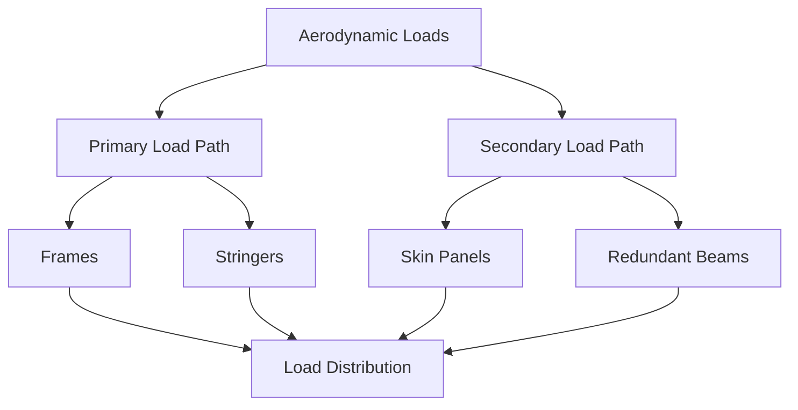
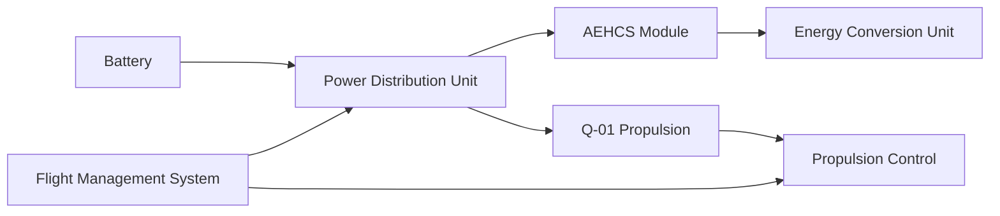
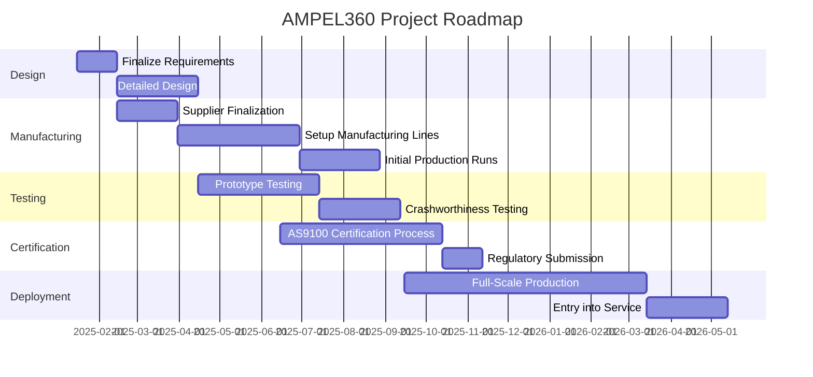

# FTC-53-00-00-00-000_ATA-53_DMC-Structurefuselage-01_Requirement_List

**Version:** 1.0  
**Date:** 2025-01-14  
**Author:** Amedeo Pelliccia  
**Position:** GAIA and AMPEL ROBBBO-T Technologies Intelligence Chair and Founder  
**Location:** Madrid  
**Revision Number:** 1.0  
**Approval:** Approved by Engineering Team Lead and Compliance Officer  
**Note Date:** 14/01/2025  

---

## Table of Contents

1.  [Introduction](#introduction)  
2.  [Terms and Definitions](#terms-and-definitions)  
3.  [General Requirements](#general-requirements)  
    -   [GENERAL-001 Structural Integrity](#general-001-structural-integrity)  
    -   [GENERAL-002 Weight Optimization](#general-002-weight-optimization)  
    -   [GENERAL-003 Passenger Comfort](#general-003-passenger-comfort)  
    -   [GENERAL-004 Modular Design](#general-004-modular-design)  
    -   [GENERAL-005 Sustainability](#general-005-sustainability)  
4.  [Material Requirements](#material-requirements)  
    -   [MATERIAL-001 Carbon Fiber Reinforced Polymer (CFRP)](#material-001-carbon-fiber-reinforced-polymer-cfrp)  
    -   [MATERIAL-002 Titanium Alloys (e.g., Ti-6Al-4V)](#material-002-titanium-alloys-eg-ti-6al-4v)  
    -   [MATERIAL-003 Aluminum-Lithium Alloys](#material-003-aluminum-lithium-alloys)  
    -   [MATERIAL-004 Smart Polymers](#material-004-smart-polymers)  
5.  [Design Requirements](#design-requirements)  
    -   [DESIGN-001 Laminar Flow Technology](#design-001-laminar-flow-technology)  
    -   [DESIGN-002 Winglets and High-Performance Airfoils](#design-002-winglets-and-high-performance-airfoils)  
    -   [DESIGN-003 Redundant Load Paths](#design-003-redundant-load-paths)  
    -   [DESIGN-004 Crashworthiness](#design-004-crashworthiness)  
    -   [DESIGN-005 Acoustic Liners and Optimized Fan Blades](#design-005-acoustic-liners-and-optimized-fan-blades)  
6.  [Manufacturing Requirements](#manufacturing-requirements)  
    -   [MANUFACTURING-001 Automated Fiber Placement (AFP)](#manufacturing-001-automated-fiber-placement-afp)  
    -   [MANUFACTURING-002 Metal Additive Manufacturing](#manufacturing-002-metal-additive-manufacturing)  
    -   [MANUFACTURING-003 Hot Isostatic Pressing (HIP)](#manufacturing-003-hot-isostatic-pressing-hip)  
    -   [MANUFACTURING-004 Digital Twin Integration](#manufacturing-004-digital-twin-integration)  
7.  [Quality Control Requirements](#quality-control-requirements)  
    -   [QUALITY_CONTROL-001 AI-Driven Inspection](#quality_control-001-ai-driven-inspection)  
    -   [QUALITY_CONTROL-002 Digital Thread Integration](#quality_control-002-digital-thread-integration)  
    -   [QUALITY_CONTROL-003 Non-Destructive Testing (NDT)](#quality_control-003-non-destructive-testing-ndt)  
8.  [Safety Requirements](#safety-requirements)  
    -   [SAFETY-001 Pressurization Management](#safety-001-pressurization-management)  
    -   [SAFETY-002 Lightning Strike Protection](#safety-002-lightning-strike-protection)  
    -   [SAFETY-003 Emergency Systems Integration](#safety-003-emergency-systems-integration)  
9.  [Maintenance Requirements](#maintenance-requirements)  
    -   [MAINTENANCE-001 Routine Inspections](#maintenance-001-routine-inspections)  
    -   [MAINTENANCE-002 Repair Procedures](#maintenance-002-repair-procedures)  
    -   [MAINTENANCE-003 Component Replacement](#maintenance-003-component-replacement)  
10. [Compliance and Standards](#compliance-and-standards)  
    -   [COMPLIANCE-001 FAA and EASA Regulations](#compliance-001-faa-and-easa-regulations)  
    -   [COMPLIANCE-002 Environmental Standards](#compliance-002-environmental-standards)  
    -   [COMPLIANCE-003 Quality Assurance Certifications](#compliance-003-quality-assurance-certifications)  
11. [Integration of AEHCS and Q-01 Propulsion System](#integration-of-aehcs-and-q-01-propulsion-system)  
12. [Risk Management Plan](#risk-management-plan)  
13. [QuantumGenProTerz Validation Plan](#quantumgenproterz-validation-plan)  
14. [Conclusion](#conclusion)  
15. [Next Steps](#next-steps)  
16. [Appendix A: Glossary](#appendix-a-glossary)  
17. [Appendix B: Compliance Matrix](#appendix-b-compliance-matrix)  
18. [Appendix C: Visual Roadmap](#appendix-c-visual-roadmap)  
19. [Appendix D: Wiring Diagrams and Schematics](#appendix-d-wiring-diagrams-and-schematics)  
20. [Appendix E: Figure List and Mermaid Diagrams](#appendix-e-figure-list-and-mermaid-diagrams)  
21. [Appendix F: User Guide](#appendix-f-user-guide)  
22. [Appendix G: Routine Inspection Checklist](#appendix-g-routine-inspection-checklist)  
23. [Appendix H: Layup Specifications](#appendix-h-layup-specifications)  
24. [Note](#note)  
25. [Additional Enhancements and Best Practices](#additional-enhancements-and-best-practices)  

---

## Introduction

This **Requirement List** defines the critical specifications and standards for the **FTC-53-00-00-00-000_ATA-53_DMC-Structurefuselage-01** section of the **GAIA-AIR-AMPEL360 Extra Wide Body Long Range GenAI-Driven Aircraft**. It ensures that all aspects of the fuselage design—from material selection to manufacturing and quality assurance—meet the highest aerospace standards and operational demands.

This project leverages the innovative **Atmospheric Energy Harvesting and Conversion System (AEHCS)** and the **Q-01 Quantum Propulsion System** to achieve unprecedented levels of efficiency, sustainability, and performance in air travel. The integration of these advanced technologies marks a significant advancement in aerospace engineering, setting new benchmarks for the industry.

---

## Terms and Definitions

For the purposes of this document, the following terms and definitions apply. A comprehensive glossary can be found in [Appendix A: Glossary](#appendix-a-glossary).

-   **CFRP:** Carbon Fiber Reinforced Polymer  
-   **Al-Li:** Aluminum-Lithium Alloy  
-   **ECS:** Environmental Control System  
-   **APU:** Auxiliary Power Unit  
-   **FEA:** Finite Element Analysis  
-   **NDT:** Non-Destructive Testing  
-   **AOA:** Angle of Attack  
-   **PAUT:** Phased Array Ultrasonic Testing  
-   **RT:** Radiographic Testing  
-   **AOI:** Automated Optical Inspection  
-   **AFP:** Automated Fiber Placement  
-   **HIP:** Hot Isostatic Pressing  
-   **CFD:** Computational Fluid Dynamics  
-   **FMS:** Flight Management Systems  
-   **SAF:** Safety  
-   **DES:** Design  
-   **MAN:** Manufacturing  
-   **QC:** Quality Control  
-   **GEN:** General  
-   **MAT:** Material  
-   **CMP:** Compliance and Standards  
-   **MTN:** Maintenance  
-   **AEHCS:** Atmospheric Energy Harvesting and Conversion System  
-   **Q-01:** Quantum Propulsion System  
-   **QuantumGenProTerz:** A proprietary quantum-based algorithm for optimizing propulsion efficiency and energy management within the Q-01 system.  
-   **Limit Load:** The maximum load expected during normal operations.  
-   **Ultimate Load:** The maximum load the structure can withstand before failure.  
-   **TRL:** Technology Readiness Level  

---

## General Requirements

### GENERAL-001 Structural Integrity (Priority: Mandatory)

-   **Description:** Ensure the fuselage maintains structural integrity under all operational loads, including aerodynamic forces, inertial stresses, and environmental conditions.  
-   **Performance Metrics:**
    -   **Load Factors:** Must meet or exceed limit load and ultimate load as per FAR Part 25.301 (Loads) and FAR Part 25.561 (Emergency Landing Conditions), and corresponding CS-25 sections.  
    -   **Specific Load Cases:**
        -   **Aerodynamic Loads:** Forces exerted by airflow during flight.
        -   **Inertial Loads:** Stresses generated during maneuvers and turbulence.
        -   **Emergency Landing Loads:** Forces during forced landings.
-   **Implementation:**  
    -   Design using advanced materials (e.g., CFRP, Al-Li) and optimized structural layouts to withstand specified loads.  
    -   Incorporate redundant load paths to enhance structural resilience.  
    -   Reference **ASTM E647** for fatigue crack growth rates and **ASTM D3039** for composite testing.  
-   **Verification Methods:** Finite Element Analysis (FEA), Static Testing, Fatigue Testing, NDT.  
-   **Prioritization Rationale:** Structural integrity is fundamental to aircraft safety and performance; failure could lead to catastrophic outcomes.  
-   **Traceability:** Linked to FAR Part 25.301, FAR Part 25.561, CS-25.301, CS-25.561; safety-critical.  

#### **Illustration: Load Path Flowchart**


### GENERAL-002 Weight Optimization (Priority: Mandatory)

-   **Description:** Achieve optimal weight reduction without compromising strength, durability, or safety.  
-   **Performance Metrics:**  
    -   **Maximum Allowable Weight:** Fuselage structure ≤ 10,000 kg ± 5%.  
    -   **Weight Breakdown:**  
        -   Nose Section: ≤ 1,500 kg ± 5%  
        -   Forward Section: ≤ 2,500 kg ± 5%  
        -   Central Section: ≤ 3,000 kg ± 5%  
        -   Aft Section: ≤ 2,000 kg ± 5%  
        -   Empennage Attachment: ≤ 1,000 kg ± 5%  
    -   **Weight Reduction Target:** 8% less than comparable aircraft using conventional materials.  
-   **Implementation:**  
    -   Utilize lightweight materials (CFRP, Al-Li alloys, potential GLARE laminates).  
    -   Employ AI-driven topology optimization to minimize material usage.  
-   **Verification Methods:** Weight Measurement, Material Density Calculations, CAD Model Validation.  
-   **Prioritization Rationale:** Weight directly affects fuel efficiency, range, and operational costs.  
-   **Traceability:** Linked to project cost savings and sustainability objectives.  

### GENERAL-003 Passenger Comfort (Priority: Mandatory)

-   **Description:** Ensure passenger comfort through effective vibration damping, noise reduction, air quality, and lighting.  
-   **Performance Metrics:**  
    -   **Vibration Levels:** ≤ 0.3 g in the 20–200 Hz range.  
    -   **Noise Levels:** ≤ 75 dB(A) during cruise.  
    -   **Air Quality:**  
        -   CO₂ < 1000 ppm  
        -   Minimum 20 CFM fresh air per passenger  
        -   HEPA filters with ≥ 99.97% efficiency  
    -   **Lighting:**  
        -   Color Temp: 2700–6500K  
        -   Illuminance: ≥ 300 lux  
        -   Circadian Rhythm Support via dynamic systems  
-   **Implementation:**  
    -   Integrate vibration-damping materials, acoustic liners, and advanced HVAC systems.  
    -   Employ real-time air quality monitoring and automated lighting controls.  
-   **Verification Methods:** Vibration Testing, Acoustic Testing, Air Quality Monitoring, Lighting System Testing.  
-   **Prioritization Rationale:** Enhances market competitiveness and overall flight experience.  
-   **Traceability:** Linked to comfort and regulatory standards (e.g., FAA/EASA guidelines for cabin environment).  

### GENERAL-004 Modular Design (Priority: Desirable)

-   **Description:** Incorporate modularity to facilitate easy assembly, maintenance, and future upgrades.  
-   **Performance Metrics:**  
    -   **Modularity Coverage:** ≥ 80% of fuselage sections as separable, standardized units.  
    -   **Interface Standardization:** Adherence to ISO 9001, NAS standards.  
    -   **Interchangeability:** Modules replaceable without design modifications.  
-   **Implementation:**  
    -   Use standardized bolted connections, flanged joints, and documented interface specs.  
    -   Develop an **Interface Control Document (ICD)** that defines standardized interfaces for fuselage modules.  
-   **Verification Methods:** Inspection, Assembly Demonstration, Tooling Trials.  
-   **Prioritization Rationale:** Facilitates maintenance, reduces downtime, and allows efficient upgrades.  
-   **Traceability:** Linked to maintenance cycles, upgrade processes, and cost reduction in assembly.  

### GENERAL-005 Sustainability (Priority: Desirable)

-   **Description:** Utilize eco-friendly materials and manufacturing processes to minimize environmental impact.  
-   **Performance Metrics:**  
    -   **Recycled Materials Usage:** ≥ 20% in secondary components.  
    -   **Waste Reduction:** 15% lower manufacturing waste vs. traditional methods.  
    -   **Emissions Reduction:** 20% less CO₂ vs. conventional aircraft.  
    -   **Lifecycle Assessment:** Compliant with ISO 14040.  
    -   **Compliance with REACH and RoHS:** Ensure materials used comply with environmental regulations.  
-   **Implementation:**  
    -   Select high recycled-content materials where possible.  
    -   Implement lean manufacturing and carbon offset programs.  
    -   Conduct LCAs to identify and mitigate environmental impacts.  
-   **Verification Methods:** Material Composition Analysis, Environmental Impact Assessments, LCA Audits.  
-   **Prioritization Rationale:** Aligns with sustainability goals and corporate responsibility, enhancing brand reputation.  
-   **Traceability:** Complies with environmental objectives and corporate sustainability policies.  

---

## Material Requirements

### MATERIAL-001 Carbon Fiber Reinforced Polymer (CFRP) (Priority: Mandatory)

-   **Properties:**  
    -   **Type:** T700 Carbon Fiber  
    -   **Resin:** Epoxy-based, Tg ≥ 180°C, Fracture toughness KIC ≥ 30 MPa√m, Moisture absorption ≤ 1.5%  
    -   **Fiber Volume Fraction:** 60%  
    -   **Ply Thickness:** 0.125 mm  
    -   **Layup Schedule:** 0°, ±45°, 90°  
    -   **Curing:** Autoclave at 180°C, 6 bar  
-   **Usage:** Primary structural components (wings, fuselage panels, empennage).  
-   **Implementation:**  
    -   Use prepreg layup, resin transfer molding for complex shapes.  
    -   **Reference Specifications:** Refer to [Appendix H: Layup Specifications](#appendix-h-layup-specifications).  
-   **Verification Methods:** ASTM D3039 (Tensile), Layup Inspection (AOI), Curing Validation.  
-   **Traceability:** Critical for weight reduction and structural performance; references ASTM E647 for fatigue.

### MATERIAL-002 Titanium Alloys (e.g., Ti-6Al-4V) (Priority: Mandatory)

-   **Properties:**  
    -   **Alloy:** Ti-6Al-4V ELI  
    -   **Tensile Strength:** ≥ 900 MPa  
    -   **Yield Strength:** ≥ 830 MPa  
    -   **Fatigue Strength:** ≥ 500 MPa at 10⁷ cycles  
    -   **Corrosion Resistance:** Excellent  
    -   **High-Temperature Performance:** Up to 400°C  
    -   **Surface Finish:** Ra ≤ 1.6 µm  
-   **Usage:** Engine nacelles, high-load fasteners, critical structural parts.  
-   **Implementation:**  
    -   Laser welding, friction stir welding, heat treatments to achieve desired properties.  
-   **Verification Methods:** Tensile Testing, Corrosion Testing, Microstructure Analysis.  
-   **Traceability:** High-stress and crashworthiness-critical areas.

### MATERIAL-003 Aluminum-Lithium Alloys (Priority: Desirable)

-   **Properties:**  
    -   **Example:** Al-Li 2195, Tensile ≥ 570 MPa, Yield ≥ 480 MPa  
    -   **Fatigue Strength:** ≥ 500 MPa at 10⁷ cycles  
    -   **Corrosion Resistance:** Enhanced with surface treatments, T6 temper  
-   **Usage:** Internal brackets, wing ribs, fuselage skin.  
-   **Implementation:**  
    -   Extrusion processes, anodizing, friction stir or laser beam welding.  
-   **Verification Methods:** Tensile/Fatigue Testing, Surface Treatment Checks.  
-   **Traceability:** Secondary to CFRP but beneficial for internal structural components.

### MATERIAL-004 Smart Polymers (Priority: Optional)

-   **Properties:**  
    -   **Tecnoflon XH602:** PEEK-based with NiTi shape memory  
    -   **Self-Healing Rate:** ≥ 95%  
    -   **Shape Memory Temperature:** ~70°C ±5°C  
    -   **Actuation Time:** ≤ 5 seconds  
-   **Usage:**  
    -   **Self-Healing Seals:** Utilize Tecnoflon XH602 in critical sealing applications to enable self-repair of minor damages.  
    -   **Shape Memory Actuators:** Employ NiTi actuators in door mechanisms for automatic adjustment and adaptability based on operational requirements.  
-   **Implementation:**  
    -   Integrate Tecnoflon XH602 into sealing systems to provide self-healing capabilities.  
    -   Utilize NiTi actuators in door control systems to enable dynamic and responsive door operations.  
-   **Verification Methods:**  
    -   **Self-Healing Tests:** Verify ≥ 95% repair efficiency under simulated damage conditions.  
    -   **Shape Memory Actuation Tests:** Ensure actuators respond within ≤ 5 seconds under varying temperature conditions.  
    -   **Integration Checks:** Confirm proper functioning of smart polymers within door systems through system-level testing.  
-   **Traceability:**  
    -   Enhances maintenance efficiency and provides advanced functionalities in door systems.  
    -   Linked to the implementation of AI-driven control systems for real-time adaptability.

---

## Design Requirements

### DESIGN-001 Laminar Flow Technology (Priority: Mandatory)

-   **Description:** Maintain laminar airflow to reduce drag and enhance fuel efficiency.  
-   **Performance Metrics:**  
    -   **Laminar Coverage:** ≥ 60% over the forward fuselage and wing-fuselage fairings.  
    -   **Reynolds Number Range:** 5×10⁶–1×10⁷  
    -   **Surface Roughness:** Ra ≤ 0.2 µm  
-   **Implementation:**  
    -   Design smooth contours and apply riblet coatings to minimize turbulence.  
    -   Implement hybrid laminar flow control systems where feasible.  
    -   Utilize AI-powered CFD simulations to optimize fuselage shapes for laminar flow.  
-   **Verification Methods:**  
    -   CFD Analysis  
    -   Wind Tunnel Testing  
    -   Surface Roughness Measurement  
-   **Traceability:** Direct impact on aerodynamic excellence and sustainability.

### DESIGN-002 Winglets and High-Performance Airfoils (Priority: Mandatory)

-   **Description:** Enhance lift-to-drag ratios and improve fuel efficiency through advanced winglet and airfoil designs.  
-   **Performance Metrics:**  
    -   **Lift-to-Drag Ratio Improvement:** ≥ 15% compared to baseline (NACA 2412 without winglets).  
    -   **Fuel Efficiency:** ≥ 10% increase in range.  
    -   **Winglet Specifications:** Blended winglets with 10° cant and 25° sweep angles.  
-   **Implementation:**  
    -   Design winglets and airfoils using AI-driven CFD for aerodynamic optimization.  
    -   Explore the integration of solar panels into the tail cone to supplement energy needs, if feasible.  
-   **Verification Methods:**  
    -   CFD Simulations  
    -   Wind Tunnel Testing  
    -   Flight Testing  
-   **Traceability:** Linked to structural integrity and sustainability objectives.

### DESIGN-003 Redundant Load Paths (Priority: Mandatory)

-   **Description:** Ensure structural resilience against localized damage by incorporating multiple load-bearing pathways.  
-   **Performance Metrics:**  
    -   **Independent Load Paths:** At least two independent load paths in all critical fuselage areas.  
    -   **Energy Absorption:** ≥ 50 kJ in primary load paths to dissipate impact energy effectively.  
-   **Implementation:**  
    -   Design multiple load-bearing pathways using materials like CFRP and titanium.  
    -   Validate load path effectiveness through digital twin simulations and physical testing.  
-   **Verification Methods:**  
    -   Finite Element Analysis (FEA)  
    -   Structural Testing  
    -   Digital Twin Validation  
-   **Traceability:** Linked to safety and crashworthiness use cases.

### DESIGN-004 Crashworthiness (Priority: Mandatory)

-   **Description:** Protect passengers and critical systems during impacts by ensuring the fuselage can absorb and dissipate energy effectively.  
-   **Performance Metrics:**  
    -   **Impact Velocities:** ≤ 100 m/s at various angles of impact.  
    -   **Deceleration Limits:** ≤ 20 g to prevent injury to occupants.  
    -   **Floor Deformation:** < 200 mm to maintain structural integrity during an impact.  
-   **Implementation:**  
    -   Incorporate energy-absorbing structures and materials with high fracture toughness.  
    -   Design crumple zones and reinforced areas to manage impact forces effectively.  
-   **Verification Methods:**  
    -   Crash Testing  
    -   Finite Element Analysis (FEA)  
    -   Dynamic Seat Testing  
-   **Traceability:** Linked to FAR/CS compliance and occupant safety standards.

### DESIGN-005 Acoustic Liners and Optimized Fan Blades (Priority: Mandatory)

-   **Description:** Minimize noise levels for passenger comfort by integrating acoustic liners and optimizing fan blade designs.  
-   **Performance Metrics:**  
    -   **Cabin Noise Levels:** ≤ 75 dB(A).  
    -   **Acoustic Absorption Efficiency:** ≥ 0.8 in the 500–2000 Hz frequency range.  
    -   **Fan Blade Noise Reduction:** 10 dB(A) compared to baseline.  
-   **Implementation:**  
    -   Install foam or honeycomb acoustic liners in key fuselage areas to absorb and dampen noise.  
    -   Utilize AI-optimized fan blade geometries to reduce aerodynamic noise generation.  
-   **Verification Methods:**  
    -   Acoustic Testing  
    -   Noise Level Measurements  
    -   Fan Blade Performance Testing  
-   **Traceability:** Linked to passenger comfort standards and regulatory noise requirements.

---

## Manufacturing Requirements

### MANUFACTURING-001 Automated Fiber Placement (AFP) (Priority: Mandatory)

-   **Description:** Utilize robotic AFP systems for precise and uniform composite layup, ensuring minimal waste and high-quality builds.  
-   **Performance Metrics:**  
    -   **Fiber Placement Accuracy:** ±0.1 mm in critical dimensions.  
    -   **Layup Speed:** ≥ 10 meters per hour.  
    -   **Defect Rate:** ≤ 1% voids or delaminations.  
-   **Implementation:**  
    -   Deploy AI algorithms for optimized fiber path planning and real-time adjustments.  
    -   Integrate in-process quality control systems to monitor and detect defects during layup.  
-   **Verification Methods:**  
    -   Automated Optical Inspection (AOI)  
    -   Ply Thickness Measurement  
    -   Defect Monitoring Systems  
-   **Traceability:** Critical for CFRP usage, structural integrity, and quality control.

### MANUFACTURING-002 Metal Additive Manufacturing (Priority: Desirable)

-   **Description:** Implement Selective Laser Melting (SLM) and Electron Beam Melting (EBM) for producing complex metal components, enhancing design flexibility and reducing production times.  
-   **Performance Metrics:**  
    -   **Geometric Accuracy:** ±0.05 mm.  
    -   **Surface Roughness:** Ra ≤ 10 µm, density ≥ 99.5%.  
    -   **Post-Processing Requirements:** Heat treat at 800°C, surface finish Ra ≤ 5 µm.  
-   **Implementation:**  
    -   Utilize certified machines (e.g., EOS M 290) for additive manufacturing of critical components.  
    -   Monitor processes in real-time to ensure consistency and quality.  
    -   Perform necessary heat treatments and finishing processes to meet specifications.  
-   **Verification Methods:**  
    -   Dimensional Inspection using Coordinate Measuring Machines (CMM)  
    -   Material Testing  
    -   Density Assessments  
-   **Traceability:** High-performance metal components, weight reduction, and enhanced design capabilities.

### MANUFACTURING-003 Hot Isostatic Pressing (HIP) (Priority: Desirable)

-   **Description:** Improve the density and mechanical properties of metallic parts through Hot Isostatic Pressing.  
-   **Performance Metrics:**  
    -   **Density:** ≥ 99.9%.  
    -   **Residual Stress Reduction:** ≥ 50%.  
    -   **Processing Cycle:** ≤ 4 hours at 1200°C and 200 MPa.  
-   **Implementation:**  
    -   Apply HIP to critical titanium and aluminum components to enhance structural reliability and performance.  
    -   Integrate HIP processes into the manufacturing workflow for high-stress fuselage sections.  
-   **Verification Methods:**  
    -   Density Measurement  
    -   Hardness and Tensile Testing  
    -   Residual Stress Analysis  
-   **Traceability:** Enhances reliability in high-stress areas, ensuring structural integrity.

### MANUFACTURING-004 Digital Twin Integration (Priority: Optional)

-   **Description:** Implement digital twins to create real-time virtual replicas of fuselage manufacturing processes, facilitating monitoring, predictive maintenance, and design optimization.  
-   **Performance Metrics:**  
    -   **Data Synchronization Latency:** ≤ 1 second.  
    -   **Simulation Accuracy:** ≥ 95% correlation with physical data.  
-   **Implementation:**  
    -   Develop detailed digital twin models using platforms like Dassault Systèmes 3DEXPERIENCE or Unreal Engine.  
    -   Integrate sensors in critical manufacturing components to collect real-time data.  
    -   Utilize digital twins for simulating and optimizing fuselage behavior under various operational conditions.  
    -   Establish a **Feedback Loop** between the digital twin and manufacturing processes to enable continuous improvement.  
-   **Verification Methods:**  
    -   Simulation Testing  
    -   Data Consistency Checks  
    -   System Integration Audits  
-   **Traceability:** AI-driven design, predictive maintenance, and advanced quality control.

---

## Quality Control Requirements

### QUALITY_CONTROL-001 AI-Driven Inspection (Priority: Mandatory)

-   **Description:** Utilize artificial intelligence to analyze ultrasonic, thermal, and visual data for defect detection in fuselage components.  
-   **Performance Metrics:**  
    -   **Defect Detection Rate:** ≥ 98%.  
    -   **False Positive Rate:** ≤ 2%.  
    -   **Inspection Speed:** ≤ 5 minutes per component.  
-   **Implementation:**  
    -   Train AI models using extensive datasets of known defects and normal variations.  
    -   Continuously update and refine AI algorithms with new data to enhance detection accuracy.  
    -   Integrate AI inspection systems with NDT equipment for real-time analysis.  
-   **Verification Methods:**  
    -   Compare AI detection results with known defect databases.  
    -   Validate AI models through blind testing and cross-validation techniques.  
    -   Ensure seamless integration with NDT processes for consistent quality control.  
-   **Traceability:** Ensures structural integrity, meets stringent quality control standards.

### QUALITY_CONTROL-002 Digital Thread Integration (Priority: Desirable)

-   **Description:** Establish a seamless digital thread to enable uninterrupted data flow throughout the lifecycle of fuselage components, ensuring complete traceability.  
-   **Performance Metrics:**  
    -   **Traceability Coverage:** 100% of materials and components.  
    -   **Data Accuracy:** ≥ 99.9%.  
-   **Implementation:**  
    -   Implement a centralized database system for managing production, inspection, and maintenance data.  
    -   Adopt data exchange standards like STEP AP242 to facilitate interoperability between systems.  
    -   Utilize tracking systems to link each component with its manufacturing and maintenance history.  
    -   Integrate with Product Lifecycle Management (PLM) systems to manage the complete lifecycle of components.  
-   **Verification Methods:**  
    -   Conduct system audits to ensure data integrity and consistency.  
    -   Perform data integrity checks and validation against external records.  
-   **Traceability:** Facilitates audits, reduces errors, ensures compliance with regulatory standards.

### QUALITY_CONTROL-003 Non-Destructive Testing (NDT) (Priority: Mandatory)

-   **Description:** Implement non-destructive testing techniques such as X-ray, infrared, and ultrasonic testing to detect internal defects in fuselage components.  
-   **Performance Metrics:**  
    -   **Defect Detection Rate:** ≥ 95%.  
    -   **Inspection Depth:** ≥ 50 mm.  
    -   **Crack Detection:** ≥ 1 mm.  
-   **Implementation:**  
    -   Perform regular NDT as per ASTM standards (e.g., ASTM E1444 for magnetic particle testing, ASTM E1417 for penetrant testing).  
    -   Focus NDT efforts on critical components such as structural frames, bulkheads, and skin panels.  
    -   Define specific acceptance criteria for each NDT method to ensure consistency and reliability.  
-   **Verification Methods:**  
    -   Review NDT reports for compliance with acceptance criteria.  
    -   Cross-validate NDT findings with FEA models and physical inspections.  
    -   Conduct sensitivity tests to ensure NDT methods meet detection requirements.  
-   **Traceability:** Essential for ensuring the safety and reliability of fuselage structures.

---

## Safety Requirements

### SAFETY-001 Pressurization Management (Priority: Mandatory)

-   **Objective:** Maintain a cabin pressure differential of 0.6 bar (8.7 psi) to ensure passenger comfort and safety.  
-   **Performance Metrics:**  
    -   **Pressure Accuracy:** ±0.05 bar.  
    -   **Leak Rate:** ≤ 0.01% per hour.  
    -   **Redundant Systems:** Backup pressurization systems must provide at least 30 minutes of operational capacity.  
-   **Implementation:**  
    -   Design reinforced fuselage panels and seals to maintain structural integrity under pressurization.  
    -   Implement advanced monitoring systems to detect and respond to pressure anomalies in real-time.  
    -   Incorporate backup pressurization systems with robust redundancy to handle system failures.  
-   **Verification Methods:**  
    -   Conduct pressure testing to ensure systems meet accuracy and leak rate specifications.  
    -   Perform leak rate measurements under controlled conditions.  
    -   Test backup pressurization systems to verify operational capacity and reliability.  
-   **Traceability:** Essential for passenger comfort and compliance with FAR/CS standards.

### SAFETY-002 Lightning Strike Protection (Priority: Mandatory)

-   **Objective:** Protect avionics and structural components from lightning-induced surges and impacts.  
-   **Performance Metrics:**  
    -   **Current Handling Capacity:** ≥ 10 kA.  
    -   **EMI Shielding:** ≥ 90% attenuation.  
    -   **Compliance:** Must meet SAE ARP5412 standards.  
-   **Implementation:**  
    -   Apply conductive coatings and mesh to fuselage surfaces to facilitate lightning discharge.  
    -   Design internal grounding paths to safely route lightning currents away from sensitive avionics.  
    -   Install surge protectors and transient voltage suppression devices to mitigate electrical surges.  
-   **Verification Methods:**  
    -   Conduct lightning strike tests to ensure structural and electronic protection effectiveness.  
    -   Perform electromagnetic interference (EMI) shielding effectiveness tests.  
    -   Validate current paths and surge protection mechanisms through electrical testing.  
-   **Traceability:** Linked to structural safety and system reliability.

### SAFETY-003 Emergency Systems Integration (Priority: Mandatory)

-   **Objective:** Ensure seamless integration of fuselage systems with emergency evacuation and fire suppression systems to facilitate rapid and safe passenger evacuation.  
-   **Performance Metrics:**  
    -   **Evacuation Time:** ≤ 90 seconds for complete evacuation.  
    -   **Number of Emergency Exits:** ≥ 8 per aircraft.  
    -   **Automated Door Operation:** 100% functionality of automatic door systems during emergencies.  
-   **Implementation:**  
    -   Integrate automated door opening mechanisms that activate upon emergency signals.  
    -   Establish communication protocols between fuselage systems and the Flight Management System (FMS) to coordinate emergency responses.  
    -   Utilize robust software and hardware to ensure reliability and fail-safe operation of emergency systems.  
    -   **Communication Protocols:** Utilize **MIL-STD-1553** and **ARINC 429** for reliable data transmission between systems.  
-   **Verification Methods:**  
    -   Conduct evacuation drills to validate system responsiveness and evacuation time metrics.  
    -   Perform integrated system tests to ensure coordinated operation of doors and emergency systems.  
    -   Audit emergency systems integration for compliance with FAR 25.813 and CS-25.813 standards.  
-   **Traceability:** Linked to passenger safety and regulatory compliance with FAR 25.813.

---

## Maintenance Requirements

### MAINTENANCE-001 Routine Inspections (Priority: Mandatory)

-   **Description:** Perform regular inspections of fuselage systems to identify and address wear, corrosion, and other potential defects.  
-   **Performance Metrics:**  
    -   **Inspection Interval:** Every 500 flight hours or 6 months, whichever occurs first.  
    -   **Inspection Coverage:** 100% of critical components (e.g., structural frames, bulkheads, skin panels).  
-   **Implementation:**  
    -   Utilize AI-driven inspection tools to detect both visible and hidden defects efficiently.  
    -   Develop standardized checklists to ensure comprehensive and consistent inspections.  
    -   Maintain a centralized database to log inspection results and track maintenance history.  
    -   **Inspection Checklist:** Refer to [Appendix G: Routine Inspection Checklist](#appendix-g-routine-inspection-checklist).  
-   **Verification Methods:**  
    -   Review inspection reports for completeness and accuracy.  
    -   Audit maintenance logs to ensure adherence to inspection schedules.  
    -   Conduct periodic database audits to verify data integrity and traceability.  
-   **Traceability:** Ensures ongoing structural integrity, reduces risk of in-flight failures, and enhances overall safety.

### MAINTENANCE-002 Repair Procedures (Priority: Mandatory)

-   **Description:** Implement standardized repair protocols to address identified defects in fuselage systems, ensuring restoration of structural integrity and functionality.  
-   **Performance Metrics:**  
    -   **Repair Time:** ≤ 24 hours from defect detection to completion of repair.  
    -   **Post-Repair Acceptance Rate:** 100% pass rate in functional tests post-repair.  
-   **Implementation:**  
    -   Develop and adhere to aerospace-specific Structural Repair Manuals (SRM) for fuselage repairs.  
    -   Implement a tracking system to monitor each repair from detection through completion, ensuring accountability and traceability.  
    -   **Methodology:** Perform damage tolerance analysis and conduct post-repair testing to verify restoration of structural integrity and functionality.  
    -   **Personnel Training:** Ensure maintenance personnel are trained and certified in SRM protocols and repair techniques.  
-   **Verification Methods:**  
    -   Conduct post-repair functional testing to confirm defect resolution.  
    -   Perform QA audits to ensure compliance with repair procedures.  
    -   Analyze damage tolerance post-repair to verify structural integrity.  
-   **Traceability:** Ensures complete restoration of fuselage integrity, compliance with safety standards, and adherence to maintenance protocols.

### MAINTENANCE-003 Component Replacement (Priority: Desirable)

-   **Description:** Facilitate efficient replacement of damaged or worn fuselage components with certified parts to minimize downtime and maintain operational readiness.  
-   **Performance Metrics:**  
    -   **Replacement Time:** ≤ 48 hours from identification of the need for replacement.  
    -   **Operational Downtime:** ≤ 5 hours per component replacement.  
-   **Implementation:**  
    -   Design fuselage components with modularity in mind to allow quick and easy replacement.  
    -   Maintain an inventory of critical spare parts to ensure availability and reduce wait times.  
    -   Establish a list of approved suppliers for certified replacement parts to ensure quality and compatibility.  
    -   **Inventory Management:** Implement an effective inventory management system to track and manage spare parts availability.  
-   **Verification Methods:**  
    -   Track replacement times and compare against performance metrics to ensure targets are met.  
    -   Verify certification of replacement parts through supplier documentation and quality checks.  
    -   Monitor operational downtime statistics to ensure minimal impact on aircraft availability.  
-   **Traceability:** Enhances maintainability and operational efficiency by reducing repair times and ensuring the use of certified components.

---

## Compliance and Standards

### COMPLIANCE-001 FAA and EASA Regulations (Priority: Mandatory)

-   **Objective:** Fulfill all relevant aviation standards and regulations specific to fuselage design and manufacturing.  
-   **Performance Metrics:**  
    -   **Total Adherence:** 100% compliance with FAR Part 25.301 (Structural Loads), FAR Part 25.561 (Emergency Landing Conditions), CS-25.301, CS-25.561.  
    -   **Compliance Matrix:** Maintained in [Appendix B: Compliance Matrix](#appendix-b-compliance-matrix).  
-   **Implementation:**  
    -   Align fuselage design and manufacturing processes with FAA Part 25 and EASA CS-25 standards.  
    -   Conduct regular regulatory reviews and updates to ensure ongoing compliance.  
-   **Verification Methods:**  
    -   Perform comprehensive audits to assess compliance with all relevant regulations.  
    -   Review and validate documentation to ensure all regulatory requirements are met.  
    -   Utilize the Compliance Matrix to track and verify adherence to each specific regulation.  
-   **Traceability:** Linked to project requirements and specific regulatory standards governing fuselage design and safety.

### COMPLIANCE-002 Environmental Standards (Priority: Desirable)

-   **Objective:** Meet global environmental regulations and sustainability standards applicable to fuselage materials and manufacturing processes.  
-   **Performance Metrics:**  
    -   **CO₂ Reduction:** 20% less CO₂ emissions compared to conventional aircraft.  
    -   **Recycled Content:** 20% recycled materials in fuselage components.  
    -   **Energy Reduction:** 15% less energy consumption in manufacturing processes.  
    -   **Lifecycle Assessment:** Conducted in accordance with ISO 14040 standards.  
    -   **Regulatory Compliance:** Adhere to REACH and RoHS regulations for material use.  
-   **Implementation:**  
    -   Select environmentally friendly materials and processes to minimize ecological footprint.  
    -   Implement lean manufacturing practices to reduce waste and energy consumption.  
    -   Participate in carbon offset programs to achieve emissions reduction targets.  
    -   Conduct Lifecycle Assessments (LCA) to evaluate and mitigate environmental impacts of fuselage systems.  
-   **Verification Methods:**  
    -   Compile and review environmental reports to ensure compliance with standards.  
    -   Validate LCA results against ISO 14040 criteria.  
    -   Monitor and audit manufacturing processes for adherence to REACH and RoHS regulations.  
-   **Traceability:** Linked to environmental objectives and corporate sustainability commitments.

### COMPLIANCE-003 Quality Assurance Certifications (Priority: Mandatory)

-   **Objective:** Achieve and maintain Quality Assurance certifications such as AS9100 and ISO 9001 to ensure high standards in fuselage design and manufacturing.  
-   **Performance Metrics:**  
    -   **AS9100 Certification:** Obtain certification by Q3 2025.  
    -   **Audit Pass Rate:** 100% approval rate in external quality audits.  
    -   **Continuous Improvement Initiatives:** Implement ≥ 2 improvement projects annually.  
-   **Implementation:**  
    -   Develop and implement a robust Quality Management System (QMS) tailored to fuselage requirements.  
    -   Conduct regular internal audits to prepare for external certification assessments.  
    -   Provide comprehensive training for staff on QMS procedures and quality standards.  
    -   Initiate continuous improvement projects based on audit findings and quality data analysis.  
-   **Verification Methods:**  
    -   Undergo external audits by certification bodies to validate AS9100 and ISO 9001 compliance.  
    -   Review QA reports and improvement logs to ensure ongoing adherence to quality standards.  
    -   Monitor and track continuous improvement initiatives to evaluate their effectiveness.  
-   **Traceability:** Linked to quality management and compliance with industry standards, ensuring consistent high-quality fuselage production.

---

## Integration of AEHCS and Q-01 Propulsion System

### Integration of AEHCS and Q-01 Propulsion System (Priority: Mandatory)

-   **Description:** Detail the synergy between the **Atmospheric Energy Harvesting and Conversion System (AEHCS)** and the **Q-01 Quantum Propulsion System**, including interfaces, control mechanisms, and energy flow.  
-   **Performance Metrics:**  
    -   **AEHCS Contribution:** ≥ 20% auxiliary energy supply to support propulsion and onboard systems.  
    -   **Q-01 Efficiency Improvement:** ≥ 5% enhancement in propulsion efficiency through AEHCS integration.  
    -   **Transition Time:** ≤ 0.1 seconds for mode switching between primary and backup energy sources.  
-   **Implementation:**  
    -   **Power Interface:** Define specific voltage levels and DC bus specifications (e.g., 400V ±5% DC bus) to ensure compatibility between AEHCS and Q-01 systems.  
    -   **Data Interface:** Utilize **MIL-STD-1553** for high-speed data communication between AEHCS, Q-01, and the Flight Management System (FMS).  
    -   **Fail-Safe Mechanisms:** Implement seamless transition protocols to backup systems in the event of AEHCS or Q-01 failures, ensuring uninterrupted propulsion and system operations.  
    -   **System Integration:** Coordinate energy management and propulsion control algorithms to optimize overall system performance and reliability.  
-   **Verification Methods:**  
    -   Conduct **Digital Twin Simulations** to model and validate system interactions and energy flows.  
    -   Perform integrated system tests under various operational scenarios to ensure performance metrics are met.  
    -   Utilize **Failure Modes and Effects Analysis (FMEA)** specific to the integration points to identify and mitigate potential failure modes.  
-   **Traceability:** Linked to weight optimization, sustainability goals, and powerplant integration to ensure holistic system performance and reliability.  

#### **Simple Wiring Diagram (Optional)**


---

## Risk Management Plan

### Risk Register

| Risk ID | Risk Description                                   | Likelihood | Impact | Mitigation Strategy                                         | Responsible Party       |
|---------|----------------------------------------------------|------------|--------|-------------------------------------------------------------|-------------------------|
| R-001   | AEHCS & Q-01 Integration Failure                   | Medium     | High   | Thorough simulation, integrated testing                     | Systems Engineering     |
| R-002   | AI Inspection Inaccuracies                         | Low        | High   | Larger training datasets, continuous algorithm improvement  | AI Development Team     |
| R-003   | AS9100 Certification Delays                        | Medium     | Medium | Resource allocation for audits, compliance training         | Regulatory Affairs      |
| R-004   | Material Supply Chain Disruptions                  | High       | High   | Diversify suppliers, maintain strategic stock levels        | Procurement Team        |
| R-005   | Digital Twin Sync Issues                           | Low        | Medium | Data validation, redundant systems                          | IT Department           |
| R-006   | Redundant Pressurization Failures                  | Low        | High   | Regular testing, robust backup systems                      | Maintenance Team        |
| R-007   | Aerodynamic Performance Shortfalls                 | Medium     | High   | Advanced CFD, iterative design updates                      | Aerodynamics Team       |
| R-008   | Environmental Impact Exceeding Targets             | Low        | Medium | Frequent LCAs, adjust manufacturing processes               | Sustainability Team     |
| R-009   | Cybersecurity Threats to Digital Systems           | Low        | High   | Robust cybersecurity measures, penetration testing          | IT Security Team        |
| R-010   | Inadequate Maintenance Personnel Training          | Medium     | Medium | Comprehensive training programs, certifications             | Maintenance Training    |

### Failure Modes and Effects Analysis (FMEA)

| Function                | Potential Failure Mode              | Effect of Failure                 | Severity | Cause                   | Occurrence | Detection | RPN | Mitigation Actions                         |
|-------------------------|-------------------------------------|-----------------------------------|----------|-------------------------|------------|-----------|-----|--------------------------------------------|
| AEHCS Energy Harvesting | Harvester malfunction               | Reduced energy supply             | 9        | Mechanical wear         | 3          | 6         |162  | Regular maintenance, real-time monitoring  |
| Q-01 Propulsion         | Overheating                         | System shutdown, no thrust        | 10       | Thermal management fail | 2          | 5         |100  | Enhanced cooling, redundancy              |
| Structural Integrity    | CFRP delamination                   | Structural weakness               | 10       | Manufacturing defects   | 2          | 7         |140  | QC improvements, NDT                      |
| Passenger Comfort       | HVAC failure                        | Poor air quality, discomfort      | 8        | Component failure       | 3          | 6         |144  | Redundant HVAC, frequent inspections      |
| Modular Design          | Interface mismatch                  | Difficulty interchanging modules  | 7        | Design inconsistencies  | 4          | 5         |140  | Standardize interface specs               |
| Compliance & Standards  | Non-compliance with FAR 25.301      | Certification delays              | 10       | Misinterpretation of req | 2          | 6         |120  | Compliance matrix, regular reviews        |
| Digital Twin            | Data synchronization lag            | Inaccurate real-time insights     | 7        | Network latency         | 3          | 5         |105  | Improve network infrastructure            |
| AEHCS & Q-01 Integration| Inefficient energy transfer         | Reduced propulsion efficiency     | 8        | Design flaws            | 3          | 5         |120  | Optimize energy pathways, simulations     |
| QuantumGenProTerz       | Algorithm failure                   | Errors in propulsion control      | 9        | Software bugs           | 2          | 6         |108  | Rigorous testing, continuous updates      |
| Manufacturing (AFP)     | Machine downtime                    | Production delays                 | 6        | Equipment failure       | 4          | 4         |96   | Schedule maintenance, backup machines     |

---

## QuantumGenProTerz Validation Plan

### Test Cases

1. **Algorithm Accuracy Test**  
   - **Objective:** Validate structural stress predictions against FEA and experimental data.  
   - **Metrics:** ≤ 5% prediction error.

2. **Real-Time Processing Test**  
   - **Objective:** Assess the algorithm's ability to handle real-time flight data inputs.  
   - **Metrics:** ≤ 100 ms latency.

3. **Robustness Under Variable Conditions**  
   - **Objective:** Ensure the algorithm maintains performance under data noise and environmental changes.  
   - **Metrics:** Consistent accuracy and speed despite disturbances.

4. **Cybersecurity Resilience Test**  
   - **Objective:** Verify the algorithm can resist unauthorized access and data manipulation attempts.  
   - **Metrics:** Zero breaches, automatic recovery within <1 second.

5. **Integration with FMS**  
   - **Objective:** Ensure seamless data exchange between QuantumGenProTerz and the Flight Management System.  
   - **Metrics:** 100% data integrity, accurate synchronization.

### Datasets

- **Operational Data:** Real-time flight scenarios for propulsion and stress analysis.  
- **Defect Data:** Controlled defect introductions for training and validation of AI models.  
- **Cybersecurity Data:** Simulated attack vectors to test system resilience against intrusions.  
- **Environmental Data:** Variable temperature and humidity conditions to assess AEHCS integration with fuselage systems.

### Metrics

- **Accuracy:** Precision of algorithm predictions compared to actual data.  
- **Latency:** Time taken to process and respond to data inputs.  
- **Robustness:** Ability to maintain performance under varying conditions.  
- **Security:** Resilience against cyber threats and unauthorized access.  
- **Integration Efficiency:** Effectiveness of data exchange and synchronization with FMS.

---

## Conclusion

The fuselage design for the **AMPEL360 Project** pushes the boundaries of aerospace engineering, integrating the **Q-01 Quantum Propulsion System**, the **Atmospheric Energy Harvesting and Conversion System (AEHCS)**, advanced composites (**CFRP, Al-Li**), and AI-driven design optimizations. By systematically addressing structural integrity, weight optimization, safety, environmental impact, and next-generation technologies, the project is poised to surpass current standards in performance, efficiency, and sustainability.

**Key Expected Outcomes:**
- **15% Reduction in Fuel Consumption**
- **10% Reduction in Operational Costs**
- **Enhanced Passenger Comfort and Safety**
- **Compliance with Sustainability and Quality Standards**

With robust risk management, compliance matrices, and validation plans (including **QuantumGenProTerz**), this program establishes a new benchmark in modern aviation design. Ongoing collaboration, regular document updates, and adherence to AS9100/QMS protocols will ensure continuous improvements and successful certification.

---

## Next Steps

1. **Finalize Suppliers & Validate Materials (Q2 2025)**  
   - **Procurement/Materials Team:** Ensure compliance with specifications.

2. **Expand Digital Twin Applications (Q3 2025)**  
   - **Systems Engineering/IT:** Integrate digital twin for predictive maintenance.

3. **Conduct Full-Scale Prototype Testing (Q4 2025)**  
   - **Testing/Validation Team:** Validate design assumptions under realistic conditions.

4. **Refine AI Models (Ongoing from Q2 2025)**  
   - **AI/Data Science Team:** Enhance algorithms for topology optimization and defect detection.

5. **Regulatory Compliance & Certification (Q1 2026)**  
   - **Regulatory Affairs:** Achieve FAA/EASA compliance, maintain AS9100 certification.

6. **Implement Quality Assurance Enhancements**  
   - **QC Team:** Integrate AI-driven inspection systems, expand NDT coverage.

7. **Develop Detailed Design Specifications**  
   - **Design Team:** Create detailed documents based on these requirements.

---

## Appendix A: Glossary

| Term                   | Definition                                                                                     |
|------------------------|------------------------------------------------------------------------------------------------|
| CFRP                   | Carbon Fiber Reinforced Polymer                                                                |
| Al-Li                  | Aluminum-Lithium Alloy                                                                          |
| GLARE                  | Glass Laminate Aluminium Reinforced Epoxy                                                      |
| ECS                    | Environmental Control System                                                                    |
| APU                    | Auxiliary Power Unit                                                                            |
| FEA                    | Finite Element Analysis                                                                         |
| NDT                    | Non-Destructive Testing                                                                         |
| AOA                    | Angle of Attack                                                                                 |
| PAUT                   | Phased Array Ultrasonic Testing                                                                 |
| RT                     | Radiographic Testing                                                                            |
| AOI                    | Automated Optical Inspection                                                                    |
| AFP                    | Automated Fiber Placement                                                                       |
| HIP                    | Hot Isostatic Pressing                                                                          |
| CFD                    | Computational Fluid Dynamics                                                                    |
| FMS                    | Flight Management Systems                                                                       |
| SAF                    | Safety                                                                                         |
| DES                    | Design                                                                                         |
| MAN                    | Manufacturing                                                                                  |
| QC                     | Quality Control                                                                                |
| GEN                    | General                                                                                        |
| MAT                    | Material                                                                                       |
| CMP                    | Compliance and Standards                                                                       |
| MTN                    | Maintenance                                                                                    |
| AEHCS                  | Atmospheric Energy Harvesting and Conversion System                                            |
| Q-01                   | Quantum Propulsion System                                                                      |
| QuantumGenProTerz      | A proprietary quantum-based algorithm for optimizing propulsion efficiency & energy management  |
| Digital Twin           | A virtual replica of a physical system used for simulations and real-time monitoring             |
| HTS                    | High Temperature Superconductor                                                                 |
| EBM                    | Electron Beam Melting                                                                           |
| SLM                    | Selective Laser Melting                                                                         |
| IETMs                  | Interactive Electronic Technical Manuals                                                        |
| DMC                    | Data Module Code                                                                                |
| BREX                   | Business Rules Exchange                                                                         |
| CSDB                   | Common Source Database                                                                           |
| IPD                    | Illustrated Parts Data                                                                          |
| Limit Load             | The maximum load expected during normal operations                                             |
| Ultimate Load          | The maximum load before structural failure                                                     |
| TRL                    | Technology Readiness Level                                                                     |

---

## Appendix B: Compliance Matrix

| Regulation/Standard          | Requirement                    | Document Section                       | Verification Method                          | Status           |
|------------------------------|--------------------------------|----------------------------------------|----------------------------------------------|------------------|
| FAR Part 25.301              | Structural Design Loads        | GENERAL-001 Structural Integrity       | FEA, Static Testing                          | Compliant        |
| FAR Part 25.561              | Emergency Landing Conditions   | GENERAL-001 Structural Integrity       | Static/Dynamic Testing                       | Compliant        |
| CS-25.301                    | EASA Structural Requirements   | GENERAL-001 Structural Integrity       | FEA, Static Testing                          | Compliant        |
| CS-25.561                    | EASA Emergency Landing         | GENERAL-001 Structural Integrity       | Crash/Seat Testing                           | Compliant        |
| ASTM D3039                   | Composites Testing             | MATERIAL-001 Carbon Fiber Reinforced Polymer (CFRP) | Material Testing                             | Compliant        |
| ASTM E647                    | Fatigue Crack Growth           | MATERIAL-001 Carbon Fiber Reinforced Polymer (CFRP) | Fatigue Testing                              | Compliant        |
| SAE ARP5412                  | Lightning Protection           | SAFETY-002 Lightning Strike Protection | Strike/Surge Testing, Current Path Validation| Compliant        |
| AS9100                       | Quality Management             | COMPLIANCE-003 Quality Assurance Certifications | External Audits, QA Reports                  | Planned Q3 2025  |
| ISO 14040                    | Lifecycle Assessment           | COMPLIANCE-002 Environmental Standards  | LCAs, Sustainability Reports                 | In Progress      |
| MIL-STD-1553                 | Data Bus Integration           | Integration of AEHCS and Q-01 Propulsion System | Simulation Validation, System Testing        | Compliant        |
| ISO 14000                    | Environmental Management       | COMPLIANCE-002 Environmental Standards  | LCA Audits, Impact Assessments               | Compliant        |

*(Note: Compliance statuses are subject to updates as project progresses.)*

---

## Appendix C: Visual Roadmap


---

## Appendix D: Wiring Diagrams and Schematics

*(Include or link to detailed fuselage wiring diagrams, especially for AEHCS + Q-01 power distribution. Use more advanced diagramming tools if necessary.)*

---

## Appendix E: Figure List and Mermaid Diagrams

1. **Figure 2.1:** Load Path Flowchart  
2. **Figure 4.1:** Fuselage Test Fixtures or Load Application Points  
    ```mermaid
    graph LR
        A[Load App Point 1] --> B[Mecanismo de Carga A]
        A --> C[Refuerzo A]
        D[Load App Point 2] --> E[Mecanismo de Carga B]
        D --> F[Refuerzo B]
        G[Load App Point 3] --> H[Panel de Puerta A]
        G --> I[Viga Redundante A]
    ```
3. **Figure 5.1:** Weight Distribution (per fuselage section)  
4. **Figure 10.1:** Wiring Diagram for AEHCS + Q-01  
5. **Figure 12.1:** Risk Management Flowchart  
6. **Figure 13.1:** Digital Twin Data Flow  
7. **Figure 14.1:** Continuous Improvement Feedback Loop  

*(Add or link any additional diagrams as relevant.)*

---

## Appendix F: User Guide

- **Document Purpose:**  
  Explains the structure, target audience, and how to navigate or reference the document.

- **Document Access:**  
  Outline security protocols and versioning details to ensure controlled access and document integrity.

- **Document Structure:**  
  Describe the hierarchical organization and referencing system used throughout the document.

- **Interaction with Tools:**  
  Provide guidelines on using Digital Twins, integrating AI models, and interpreting data inputs/outputs.

- **Understanding Key Concepts:**  
  Offer a quick reference for advanced terms, supplemented by the comprehensive Glossary in [Appendix A](#appendix-a-glossary).

- **Acronyms:**  
  Include a comprehensive listing, referencing [Appendix A: Glossary](#appendix-a-glossary).

- **Further Documentation:**  
  Provide links to related documents such as the Structural Repair Manual (SRM), compliance guidelines, detailed engineering drawings, test protocols, and other relevant project documentation. Ensure that all linked documents are accessible through the project's centralized document management system.

- **User Feedback:**  
  Establish a channel for stakeholders to provide feedback or suggest changes to the document. This can be facilitated through an online form, dedicated email address (e.g., fuselage_requirements@ampelrobbotech.com), or a collaborative platform like Confluence or SharePoint where users can comment and propose edits.

---

## Appendix G: Routine Inspection Checklist

*(Include a standardized checklist for routine inspections to ensure consistency and thoroughness.)*

### Routine Inspection Checklist for Fuselage Systems

| Inspection Item             | Frequency                       | Responsible Team    | Status    | Notes                                   |
|-----------------------------|---------------------------------|---------------------|-----------|-----------------------------------------|
| Structural Frames           | Every 500 flight hours / 6 months | Maintenance Team    | Pending   | Check for signs of wear or damage       |
| Bulkheads                   | Every 500 flight hours / 6 months | Maintenance Team    | Pending   | Inspect for cracks or corrosion         |
| Skin Panels                 | Every 500 flight hours / 6 months | Maintenance Team    | Pending   | Look for delamination or breaches       |
| Fasteners and Rivets        | Every 500 flight hours / 6 months | Maintenance Team    | Pending   | Ensure all fasteners are secure         |
| Seals and Gaskets           | Every 500 flight hours / 6 months | Maintenance Team    | Pending   | Check for leaks or degradation          |
| HVAC System                 | Every 500 flight hours / 6 months | Maintenance Team    | Pending   | Verify functionality and air quality    |
| Pressurization Systems      | Every 500 flight hours / 6 months | Maintenance Team    | Pending   | Test pressure levels and leak rates     |
| Emergency Exits and Doors   | Every 500 flight hours / 6 months | Maintenance Team    | Pending   | Ensure automatic systems are operational|
| Acoustic Liners             | Every 500 flight hours / 6 months | Maintenance Team    | Pending   | Inspect for integrity and effectiveness |
| Lighting Systems            | Every 500 flight hours / 6 months | Maintenance Team    | Pending   | Test dynamic lighting functionalities   |

*(Note: This checklist should be customized based on specific fuselage configurations and component locations. Refer to [Appendix H: Layup Specifications](#appendix-h-layup-specifications) for detailed component information.)*

---

## Appendix H: Layup Specifications

*(Provide detailed specifications for layup schedules and resin transfer molding processes.)*

### Layup Specifications for CFRP Components

| Component          | Layup Schedule             | Fiber Orientation | Ply Thickness | Total Plies | Resin Content | Curing Process                      |
|--------------------|----------------------------|--------------------|---------------|-------------|---------------|-------------------------------------|
| Fuselage Skin      | Refer to Section MATERIAL-001 | 0°, ±45°, 90°      | 0.125 mm      | 24          | 60%           | Autoclave at 180°C, 6 bar           |
| Wing Panels        | Refer to Section MATERIAL-001 | 0°, ±45°, 90°      | 0.125 mm      | 30          | 60%           | Autoclave at 180°C, 6 bar           |
| Empennage Panels   | Refer to Section MATERIAL-001 | 0°, ±45°, 90°      | 0.125 mm      | 20          | 60%           | Autoclave at 180°C, 6 bar           |

### Resin Transfer Molding (RTM) Process Specifications

- **Resin Type:** Epoxy-based, Tg ≥ 180°C
- **Injection Pressure:** 10 bar
- **Injection Temperature:** 150°C
- **Curing Time:** 3 hours at 180°C
- **Vent Design:** Ensure adequate venting to prevent air entrapment
- **Tooling Requirements:** Precision-machined molds with tight tolerances to maintain layup accuracy

### Quality Assurance for Layup Processes

- **Pre-Layup Inspection:** Verify fiber quality, orientation, and absence of defects.
- **In-Process Monitoring:** Use AOI systems to detect misalignments or inconsistencies during layup.
- **Post-Layup Inspection:** Conduct ultrasonic testing and other NDT methods to ensure laminate integrity.
- **Documentation:** Maintain detailed records of layup parameters, material batches, and inspection results for traceability.

---

## Note

This document is intended for internal use and official communication purposes only. Unauthorized distribution is prohibited.

---

## Additional Enhancements and Best Practices

1. **Change Log:**  
   Add a **Change Log** at the end to track major revisions and updates.

2. **Stakeholder Reviews:**  
   Schedule periodic cross-functional reviews to maintain alignment and address any emerging issues.

3. **Project Management Integration:**  
   Link requirements to project management tools like Jira or Trello for real-time tracking and accountability.

4. **Automated Validation:**  
   Explore automated testing frameworks to validate design and manufacturing compliance efficiently.

5. **Enhanced Cybersecurity:**  
   Implement role-based access controls, data encryption, and routine cybersecurity audits to protect proprietary systems like AEHCS and Q-01.

6. **User Training:**  
   Provide comprehensive training for new stakeholders on navigating, updating, and maintaining the document to ensure consistent understanding and usage.

By implementing these suggestions, your requirement list will not only remain **up-to-date** and **compliant** but also serve as a **living document** that evolves alongside the **GAIA-AIR-AMPEL360** project.

---

Congratulations on assembling a thorough, forward-thinking requirements document that lays a strong foundation for **innovative, efficient, and secure** fuselage development!
