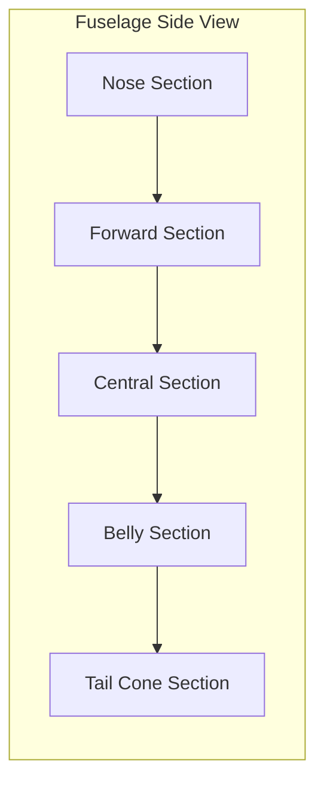
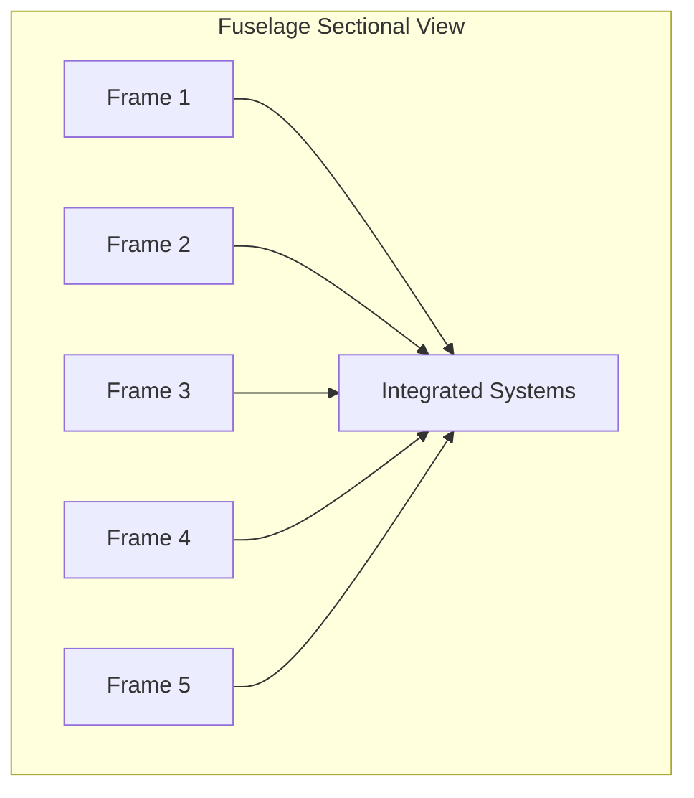
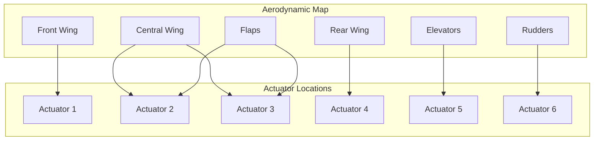

# FTC_53-00-00-000_ATA-53-AXLR-M01.md

## Fuselage Design for the AMPEL360 Project

### Tabla de Contenidos
1. **Historial de Versiones**  
2. **Research Methodology**  
3. **53-00-00-000 General Information**  
4. **53-00-00-001 Identification and Classification**  
5. **53-00-00-002 Description**  
6. **53-10-00-000 Nose Section**  
   1. 53-10-10-000 Nose Structure  
   2. 53-10-20-000 Nose Equipment  
7. **53-20-00-000 Forward Section**  
   1. 53-20-10-000 Forward Structure  
   2. 53-20-20-000 Forward Compartments  
8. **53-30-00-000 Central Section**  
   1. 53-30-10-000 Central Structure  
   2. 53-30-20-000 Central Systems Integration  
9. **53-40-00-000 Belly Section**  
   1. 53-40-10-000 Belly Structure  
   2. 53-40-20-000 Belly Systems  
10. **53-50-00-000 Tail Cone Section**  
    1. 53-50-10-000 Tail Cone Structure  
    2. 53-50-20-000 Tail Cone Systems  
11. **53-60-00-000 APU Compartment**  
    1. 53-60-10-000 APU Compartment Structure  
    2. 53-60-20-000 APU Systems Integration  
12. **53-70-00-000 Additional Stations (Reserved for Future Use)**  
    - 53-70-10-000 Station Name Placeholder  
    - 53-70-20-000 Station Systems Placeholder  
13. **53-80-00-000 Auxiliary Stations (Reserved for Future Use)**  
    - 53-80-10-000 Station Name Placeholder  
    - 53-80-20-000 Station Systems Placeholder  
14. **53-90-00-000 Equipment Manufacturing Methods**  
    - 53-90-10-000 Equipment Production Mapping  
15. **53-95-00-000 Production Line Machinery**  
    - 53-95-10-000 Machinery and Equipment List  
16. **53-96-00-000 Materiales y Fundamentos Químicos**  
    - 53-96-10-000 Descripción de Materiales, Polvos y Aleaciones  
    - 53-96-20-000 Polvos y Técnicas de Granulación  
    - 53-96-30-000 Aleaciones Avanzadas y Principios Químicos  
    - 53-96-40-000 Fases de Desarrollo y Sprints AMPEL/Agile  
17. **53-99-99-000 User Guide**  
    1. 53-99-99-001 Purpose  
    2. 53-99-99-002 Document Access  
       - 53-99-99-002-001 User Roles and Permissions  
       - 53-99-99-002-002 Access to Specific Sections  
       - 53-99-99-002-003 Illustrative Examples  
       - 53-99-99-002-004 Change Management  
       - 53-99-99-002-005 Troubleshooting and FAQs  
    3. 53-99-99-003 Document Structure  
    4. 53-99-99-004 Interaction with the Document  
       - 53-99-99-004-001 Viewing  
       - 53-99-99-004-002 Comments (Engineers and Higher Roles)  
       - 53-99-99-004-003 Editing (Restricted)  
       - 53-99-99-004-004 Change Approval (Managers and Ecosystem Managers)  
       - 53-99-99-004-005 Change Management  
       - 53-99-99-004-006 Troubleshooting and FAQs  
    5. 53-99-99-005 Understanding Key Concepts  
    6. 53-99-99-006 Acronyms  
    7. 53-99-99-007 Additional Information  
18. **Conclusion**  
19. **Wiring Diagrams and Schematics**  
20. **Figure List**  
21. **Mermaid Diagrams**  
22. **Aerodynamic Map with Actuator Locations**

---

## Historial de Versiones

| Versión | Fecha       | Descripción                               | Autores                                |
|---------|------------|-------------------------------------------|----------------------------------------|
| 0.0     | 2025-01-06 | Draft of the fuselage design.             | Amedeo Pelliccia, ChatGPT, Gemini      |
| 1.0     | 2025-03-15 | Initial Review and Feedback Incorporation | Amedeo Pelliccia, Engineering Team     |
| 1.1     | 2025-04-20 | Updated Material Specifications            | Amedeo Pelliccia, Materials Specialist |
| 2.0     | 2025-06-10 | Finalized Design and Compliance Checks     | Amedeo Pelliccia, Compliance Officer   |

## Research Methodology
*(…Texto original sobre la metodología de investigación…)*

## 53-00-00-000 General Information
*(…Texto original: propósito, alcance, descripción general…)*

## 53-00-00-001 Identification and Classification
*(…Texto original con su tabla de atributos y detalles de tecnología, componente, FTCodeID, etc.…)*

## 53-00-00-002 Description
*(…Texto original: propósito, metas ambientales, integración con otros sistemas, métricas, riesgos…)*

---

## 53-10-00-000 Nose Section

### 53-10-10-000 Nose Structure
*(…Detalles del Nose Structure: especificaciones, materiales, dimensiones, etc.…)*

### 53-10-20-000 Nose Equipment
*(…Detalles de equipos instalados en el morro: radar, tubos pitot, protección contra rayos, etc.…)*

---

## 53-20-00-000 Forward Section

### 53-20-10-000 Forward Structure
*(…Especificaciones, consideraciones de diseño estructural, etc.…)*

### 53-20-20-000 Forward Compartments
*(…Cockpit, Avionics Bay, Crew Rest Area, Forward Cargo, etc.…)*

---

## 53-30-00-000 Central Section

### 53-30-10-000 Central Structure
*(…Sección principal con materiales avanzados, procesos de fabricación, etc.…)*

### 53-30-20-000 Central Systems Integration
*(…Detalles de integración de combustible, aire acondicionado, sistemas eléctricos e hidráulicos…)*

---

## 53-40-00-000 Belly Section

### 53-40-10-000 Belly Structure
*(…Fabricación de la sección inferior del fuselaje, cargas estructurales, etc.…)*

### 53-40-20-000 Belly Systems
*(…Tren de aterrizaje, APU, cargo systems, control ambiental…)*

---

## 53-50-00-000 Tail Cone Section

### 53-50-10-000 Tail Cone Structure
*(…Construcción, materiales, procesos de fabricación para la cola…)*

### 53-50-20-000 Tail Cone Systems
*(…Rudder, stabilizer, antenas traseras, iluminación y protección contra rayos…)*

---

## 53-60-00-000 APU Compartment

### 53-60-10-000 APU Compartment Structure
*(…Especificaciones: vibración, cargas térmicas, recubrimientos…)*

### 53-60-20-000 APU Systems Integration
*(…Detalles de enfriamiento, escape, suministro de combustible y control electrónico…)*

---

## 53-70-00-000 Additional Stations (Reserved for Future Use)

### 53-70-10-000 Station Name Placeholder
*(…Texto placeholder para futuras expansiones…)*

### 53-70-20-000 Station Systems Placeholder
*(…Texto placeholder para futuras expansiones…)*

---

## 53-80-00-000 Auxiliary Stations (Reserved for Future Use)

### 53-80-10-000 Station Name Placeholder
*(…Texto placeholder para futuras expansiones…)*

### 53-80-20-000 Station Systems Placeholder
*(…Texto placeholder para futuras expansiones…)*

---

## 53-90-00-000 Equipment Manufacturing Methods

### 53-90-10-000 Equipment Production Mapping

Esta sección **mapea** los equipos que pueden ser producidos mediante métodos de **fabricación avanzada** tales como:

- **Topología Optimizada**  
- **Reticular (Lattice)**  
- **Honeycomb**  

Estos métodos permiten una **distribución eficiente del material**, reduciendo peso y aumentando la resistencia estructural.

| Equipo                          | Método de Fabricación            | Descripción                                                                 |
|--------------------------------|----------------------------------|-----------------------------------------------------------------------------|
| **Paneles Estructurales**      | Topología Optimizada, Honeycomb  | Paneles ligeros con alta resistencia para soportar cargas estructurales.    |
| **Compartimentos de Carga**    | Reticular Distribuida, Lattice    | Diseño modular que facilita la personalización y el acceso rápido.           |
| **Soportes de Sistemas**       | Honeycomb, Topología Optimizada   | Soportes internos para sistemas eléctricos e hidráulicos con mínima interferencia. |
| **Superficies de Control**     | Topología Optimizada, Lattice     | Superficies aerodinámicas con integración de actuadores electromecánicos.    |
| **Puertas y Ventanas**         | Reticular Distribuida, Honeycomb  | Marcos ligeros y resistentes que aseguran un sellado aerodinámico eficaz.    |
| **Compartimientos de Avionics**| Honeycomb, Topología Optimizada   | Espacios protegidos para sistemas avionics con fácil acceso para mantenimiento. |

**Notas**:

- **Topología Optimizada**: Emplea algoritmos de diseño para distribuir el material de manera eficiente, maximizando la resistencia y minimizando el peso.  
- **Lattice**: Estructuras de malla tridimensional que brindan alta resistencia con un **uso mínimo** de material.  
- **Honeycomb**: Estructuras celulares con alta rigidez y bajo peso, muy adecuadas para aplicaciones aerodinámicas.

---

## 53-95-00-000 Production Line Machinery

### 53-95-10-000 Machinery and Equipment List

A continuación, se presenta una **lista inicial** de maquinaria y equipos necesarios para la **línea de producción final** del fuselaje **AMPEL360**. Incluye impresoras 3D, estaciones de cómputo y otros módulos industriales esenciales, con **enlaces placeholders** para CMM o GSE.

| Machinery Type                           | Technology                          | Code            | Vendor Link |
|-----------------------------------------|-------------------------------------|-----------------|------------|
| **3D Printer**                          | FDM (Fused Deposition Modeling)     | 3DP-FDM-1001    | Vendor A    |
| **3D Printer**                          | SLS (Selective Laser Sintering)     | 3DP-SLS-1002    | Vendor B    |
| **CNC Milling Machine**                 | 5-Axis CNC                          | CNC-5AX-2001    | Vendor C    |
| **CNC Milling Machine**                 | 3-Axis CNC                          | CNC-3AX-2002    | Vendor D    |
| **Coordinate Measuring Machine (CMM)**  | Optical CMM                         | CMM-OPT-3001    | Vendor E    |
| **Ground Support Equipment (GSE)**      | Hydraulic Lift                      | GSE-HYD-4001    | Vendor F    |
| **Computer Workstations**              | High-Performance Computing (HPC)    | CS-WKHP-5001    | Vendor G    |
| **Industrial Robots**                  | Articulated Robots for Assembly     | IR-ART-6001     | Vendor H    |
| **Thermal Barrier Coating Equipment**  | Spray Coating Systems               | TBC-SPR-7001    | Vendor I    |
| **Automated Fiber Placement (AFP) Machine** | Composite Material Laying       | AFP-CMP-8001    | Vendor J    |
| **Laser Beam Welding Machine**          | Precision Welding                   | LBW-PREC-9001   | Vendor K    |
| **Adhesive Bonding Equipment**         | Automated Adhesive Dispenser        | AB-AD-1001      | Vendor L    |

**Notas**:

- **CMM (Coordinate Measuring Machine)**: para inspección y verificación dimensional de componentes.  
- **GSE (Ground Support Equipment)**: equipos de soporte en tierra (montaje, transporte, izado, etc.).  
- **Vendor Links**: sustituir “Vendor X” con la URL real del proveedor una vez definido el contrato o la relación comercial.

---

## 53-96-00-000 Materiales y Fundamentos Químicos

### 53-96-10-000 Descripción de Materiales, Polvos y Aleaciones

En esta subsección se definen los **tipos de material** que se emplearán en las distintas fases de prototipado, considerando sus propiedades mecánicas, químicas y su adecuación a procesos de manufactura avanzada (impresión 3D, infiltración, sinterizado, etc.):

| Tipo de Material                     | Ejemplo de Uso                                          | Características Clave                                                                                  |
|-------------------------------------|---------------------------------------------------------|---------------------------------------------------------------------------------------------------------|
| **Metales en Polvo**                | Piezas estructurales críticas, refuerzos                | - Elevada resistencia mecánica tras sinterizado<br>- Alta densidad tras procesos de fusión láser o EBM  |
| **Aleaciones de Aluminio-Litio**    | Estructuras de fuselaje y soportes                      | - Ligereza y rigidez<br>- Buen rendimiento a fatiga<br>- Capacidad para soldadura y maquinado           |
| **Titanio en Polvo**                | Elementos de alta temperatura (cercanías APU)           | - Excelente resistencia a la corrosión<br>- Elevada relación resistencia-peso<br>- Óptimo para procesos aditivos |
| **Polímeros de Alto Rendimiento** (PEEK, PEI) | Carcasas de sistemas, compartimentos ligeros  | - Buen comportamiento a temperaturas medias<br>- Resistencia química<br>- Adecuados para impresión FDM   |
| **Composites Reforzados** (CFRP, GFRP, etc.) | Paneles estructurales, superficies de control | - Alta rigidez con bajo peso<br>- Resistentes a la fatiga<br>- Adecuados para diseños honeycomb, lattice |

---

### 53-96-20-000 Polvos y Técnicas de Granulación

Esta sección detalla los **principios de la manipulación de polvos** y las **técnicas de granulaciones** más empleadas en procesos de manufactura aditiva y sustractiva híbrida:

1. **Atomización de Gas (Gas Atomization)**  
   - **Resumen**: Se rocía metal fundido en una cámara inerte, produciendo microesferas de tamaño controlado.  
   - **Uso**: Creación de polvos de titanio, aluminio y acero para procesos de fusión láser (SLM) o EBM.

2. **Atomización por Plasma (Plasma Atomization)**  
   - **Resumen**: El metal (barras o alambre) pasa a través de un plasma, generando partículas esféricas uniformes.  
   - **Ventajas**: Elevada pureza y control granular preciso para aplicaciones aeronáuticas críticas.

3. **Molienda Mecánica (Mechanical Milling)**  
   - **Resumen**: Reducción de partículas vía impactos mecánicos (bolas de acero o cerámicas en un molino).  
   - **Aplicación**: Polvos compuestos o mezclas especiales (p. ej., aleaciones experimentales Al-Li reforzadas).

4. **Granulación Spray (Spray Drying)**  
   - **Resumen**: Especialmente útil en cerámicos o compuestos poliméricos; forma gránulos de tamaño uniforme a partir de una suspensión líquida.  
   - **Uso**: Adecuado para preformas compuestas o métodos de inyección de polvos (Metal Injection Molding, MIM).

---

### 53-96-30-000 Aleaciones Avanzadas y Principios Químicos

En el marco del Proyecto AMPEL360, se seleccionan **aleaciones avanzadas** en función de:
- **Resistencia a la fatiga** y al **creep** (efectos a altas temperaturas).  
- **Ligereza y flexibilidad** para minimizar peso sin sacrificar integridad estructural.  
- **Compatibilidad química** con otros sistemas (fluido hidráulico, gases, etc.).

**Ejemplos de aleaciones clave**:

1. **Ti-6Al-4V (Titanio-Aluminio-Vanadio)**  
   - Uso en zonas con altas tensiones o temperatura (ej. secciones cercanas a la APU).  
   - Excelente biocompatibilidad (aplicable a otros sectores industriales).

2. **Al-Li (Aluminio-Litio)**  
   - Aporta ligereza y rigidez.  
   - Muy utilizado en estructuras de fuselaje por su **excelente relación peso-resistencia**.

3. **Ni-based Superalloys** (Inconel, Hastelloy)  
   - Para entornos extremos de calor/corrosión (cerca de escapes de APU o sistemas térmicos).  
   - Resistentes a la deformación a altas temperaturas.

4. **Acero Inoxidable 17-4PH o 15-5PH**  
   - Usos estructurales menos críticos o de anclaje.  
   - Facilidad de tratamiento térmico y buena ductilidad.

---

### 53-96-40-000 Fases de Desarrollo y Sprints AMPEL/Agile

Siguiendo la filosofía **AMPEL** (“Adopting Most Performant Engineered Layered”) y adoptando principios **agile**, la selección y caracterización de materiales se realizará de forma **iterativa**, en **ciclos cortos** de experimentación y validación:

1. **Sprint de Caracterización Inicial**  
   - **Objetivo**: Definir parámetros de impresión 3D y sinterizado para las aleaciones base (Al-Li, Ti).  
   - **Actividades**: Pruebas de tracción, microestructura, control de calidad con CMM.

2. **Sprint de Prototipado y Ensayo**  
   - **Objetivo**: Fabricar piezas piloto (ej. soportes de sistemas o paneles honeycomb) para ensayos de fatiga y vibración.  
   - **Actividades**: Ajuste fino de granulometría en polvos y análisis de fallos (FEM).

3. **Sprint de Optimización**  
   - **Objetivo**: Integrar mejoras topológicas y de procesos químicos (nuevas mezclas de polvos, recubrimientos cerámicos, etc.).  
   - **Actividades**: Talleres (ingeniería + materiales) para refinar parámetros de fusión, soldadura, inyección o moldeo.

4. **Sprint de Validación Final**  
   - **Objetivo**: Verificar la repetibilidad y escalabilidad del proceso con criterios de certificación aeronáutica (FAA/EASA).  
   - **Actividades**: Auditoría de procesos (AS9100), asegurando la trazabilidad total en la cadena de suministro.

#### Integración con el Documento de Diseño del Fuselaje
- **Sección 53-95 (Maquinaria)**: Vincular los polvos y aleaciones descritas con las **máquinas** (impresoras 3D, AFP, CNC) adecuadas para su manipulación y post-procesado.  
- **Sección 53-90 (Metodologías de Fabricación Avanzada)**: Alinear técnicas de granulación y aleaciones con **estructuras reticulares**, **honeycomb** o **topología optimizada** para lograr **máxima eficiencia** en peso y resistencia.

#### Notas Finales
Este nuevo apartado **53-96-00-000** se concibe como referencia para todos los **talleres AMPEL/Agile**, proporcionando las **bases químicas y de materiales** necesarias en cada sprint de desarrollo. Al mantener una **documentación iterativa**, se podrán actualizar periódicamente las propiedades de los polvos, técnicas de granulación y resultados de ensayos; así, el diseño del fuselaje capitaliza los avances **en tiempo real** de los equipos de **Materiales e Ingeniería Química**.

---

## 53-99-99-000 User Guide

### 53-99-99-001 Purpose
*(…Objetivo y Alcance del User Guide…)*

### 53-99-99-002 Document Access
*(…Controles de acceso, roles, seguridad, versionado…)*

#### 53-99-99-002-001 User Roles and Permissions
*(…Tabla de roles y permisos: Read-Only User, Engineer, Manager, etc.…)*

#### 53-99-99-002-002 Access to Specific Sections
*(…Acceso a KLUSTER, Ecosystem Manager…)*

#### 53-99-99-002-003 Illustrative Examples
*(…Ejemplos de comentario de ingeniero, aprobación de cambio por gerente…)*

#### 53-99-99-002-004 Change Management
*(…Propuesta de cambios, registro en Historial de Versiones…)*

#### 53-99-99-002-005 Troubleshooting and FAQs
*(…Preguntas frecuentes y soluciones…)*

### 53-99-99-003 Document Structure
*(…Estructura organizativa, formato consistente, referencias cruzadas…)*

### 53-99-99-004 Interaction with the Document
*(…Navegación, búsqueda, anotaciones, exportación…)*

#### 53-99-99-004-001 Viewing
#### 53-99-99-004-002 Comments (Engineers and Higher Roles)
#### 53-99-99-004-003 Editing (Restricted)
#### 53-99-99-004-004 Change Approval (Managers and Ecosystem Managers)
#### 53-99-99-004-005 Change Management
#### 53-99-99-004-006 Troubleshooting and FAQs

### 53-99-99-005 Understanding Key Concepts
*(…Explicación de eficiencia aerodinámica, integridad estructural, modularidad…)*

### 53-99-99-006 Acronyms
*(…Tabla de acrónimos usados: CFRP, AFP, FEM, CFD, FSW, APU, SHM, LCA, FAA, EASA, NDT, ITAR, EAR, ATA…)*

### 53-99-99-007 Additional Information
*(…Glosario, referencias externas, contactos de autores, apéndices…)*

---

## Conclusion

El diseño del fuselaje **AMPEL360** presentado en este documento **integra**:

- **Eficiencia Aerodinámica**  
- **Robustez Estructural**  
- **Sostenibilidad Ambiental**

El uso de **materiales de vanguardia** (CFRP, aleaciones Al-Li), unido a métodos de **fabricación avanzada** (topología optimizada, lattice, honeycomb), reduce peso y resistencia, mejorando el rendimiento general y la eficiencia de combustible.  

**Key Features Recap**:  
- **Modularity**: agiliza inspección y mantenimiento, permitiendo configuraciones internas flexibles.  
- **System Integration**: aprovecha el espacio de la sección central para minimizar el desorden y mejorar la funcionalidad.  
- **Eco-Friendly Materials**: alineados con objetivos globales de sostenibilidad.  

### Future Directions

- **Structural Health Monitoring (SHM)**: Implementación de sistemas que supervisen en tiempo real la integridad del fuselaje.  
- **Certification Roadmap**: Definir pasos y pruebas para cumplir las normativas FAA/EASA.  
- **Production Readiness**: Optimizar la línea de producción con maquinaria avanzada (AFP, Laser Beam Welding, 3D printing).  

Este documento cumple con las secciones ATA Chapter 53 (Fuselage) y actúa como referencia **trazable** y **colaborativa** para todas las partes interesadas. Cualquier duda puede ser dirigida al equipo de **Ingeniería Estructural (GAIA AIR)** o consultando la sección **User Guide (53-99-99-000)**.

---

## Wiring Diagrams and Schematics

### Wiring Diagrams and Schematics Overview
*(…Representaciones visuales del fuselaje, diagramas de vista superior, lateral y seccional con Mermaid…)*

#### 1. Top View (Vista Superior)

*(…Descripción de la vista superior…)*

#### 2. Lateral View (Vista Lateral)

*(…Descripción de la vista lateral…)*

#### 3. Sectional View (Vista Seccional)

*(…Descripción de la vista seccional…)*

## Aerodynamic Map with Actuator Locations

### Aerodynamic Map Diagram

*(…Descripción de la ubicación de actuadores y superficies aerodinámicas…)*

## Figure List
1. **Figure 1**: Top View of the Fuselage Structure  
2. **Figure 2**: Lateral View of the Fuselage Structure  
3. **Figure 3**: Sectional View of the Fuselage Structure  
4. **Figure 4**: Aerodynamic Map with Actuator Locations  

## Mermaid Diagrams
*(…List of Mermaid diagrams with code snippets…)*

---

**Nota**:  
- Actualiza los enlaces `Vendor A, B, C...` con URLs reales cuando se concreten los proveedores.  
- Reemplaza los *placeholders* de imagen con **diagramas CAD** y **fotografías** reales en la versión final.  
- Asigna roles y permisos en la plataforma GAIA según el **User Guide** de la sección 53-99-99.

---

### Final Reflection

Este documento **FTC_53-00-00-000_ATA-53-AXLR-M01.md** para el **Proyecto AMPEL360** ha sido **reforzado** con:  
- **Métodos de fabricación** topológicamente avanzados.  
- **Lista de maquinaria** requerida para la línea de producción.  
- **Sección de Materiales y Fundamentos Químicos (53-96)** para sustentar la selección de aleaciones y el desarrollo iterativo AMPEL/Agile.

Tales **mejoras** impulsan el **diseño estructural**, la **eficiencia operativa** y la **sostenibilidad** del fuselaje, asegurando que AMPEL360 se **mantenga a la vanguardia** de la innovación aeroespacial.

¡Documento actualizado e **integrado** exitosamente!
```
