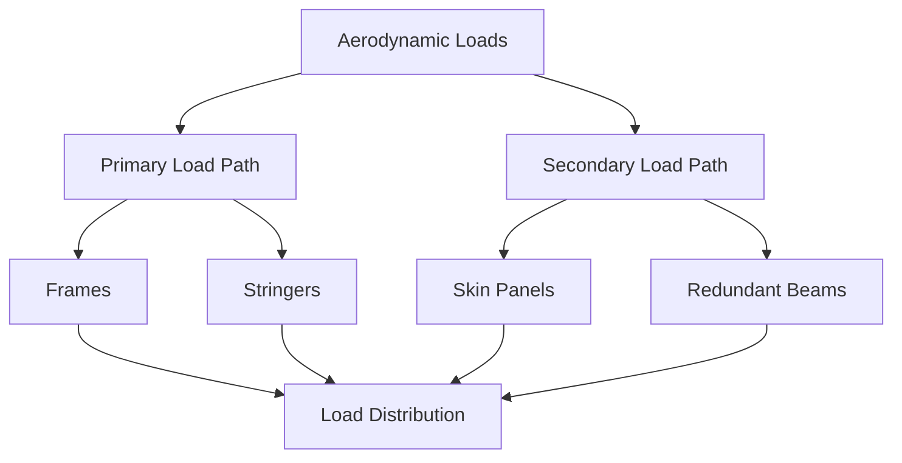
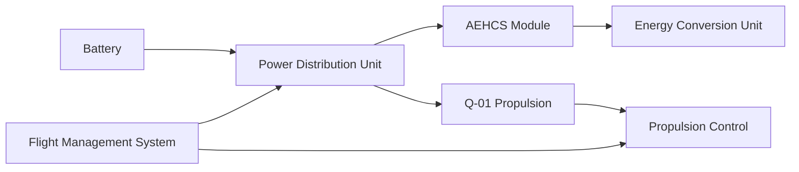
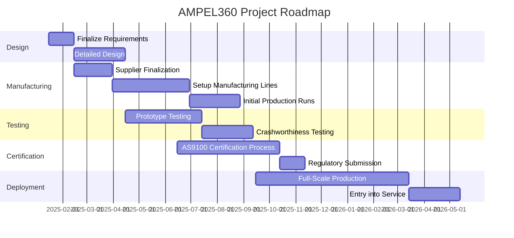
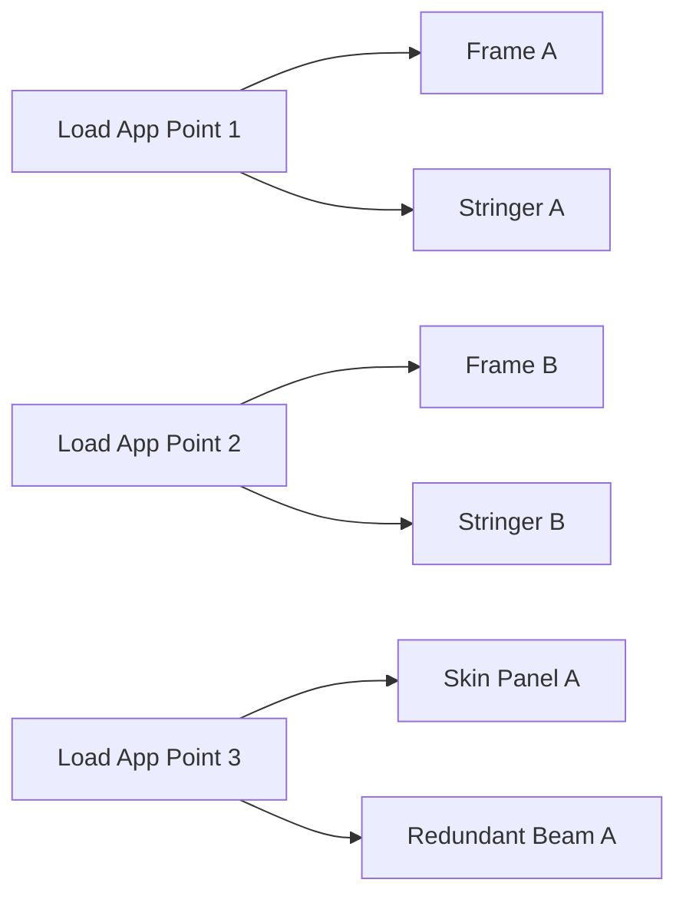
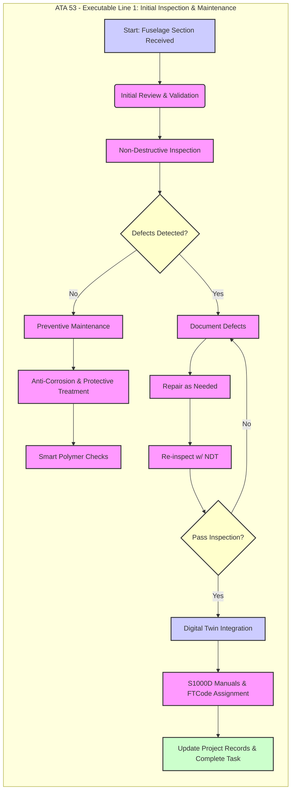
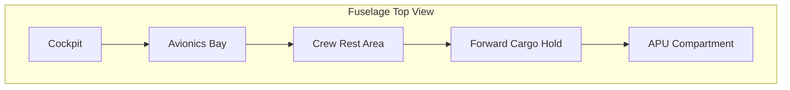
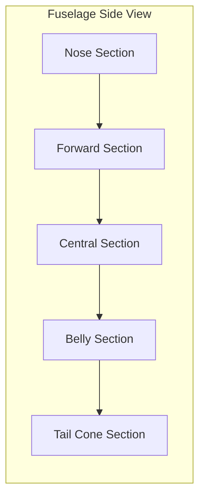
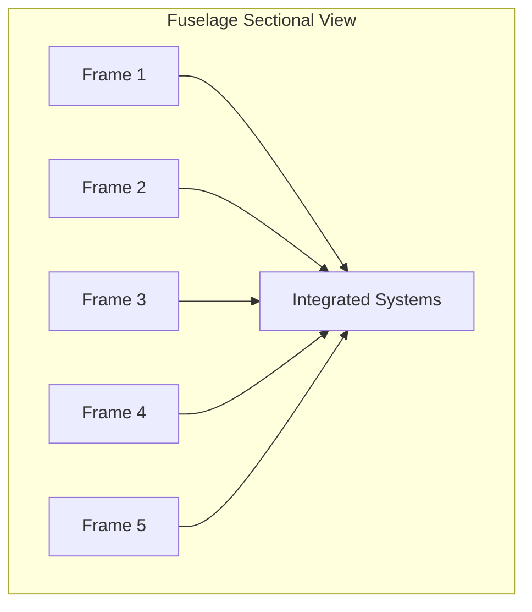
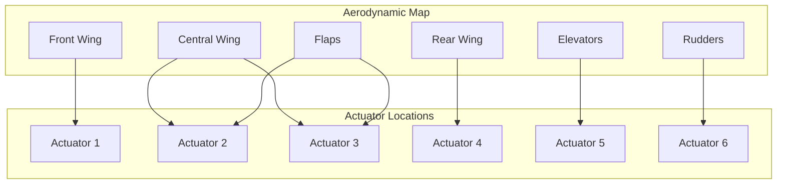

# FTC-53-00-00-00-000_ATA-53_DMC-Structurefuselage-01_Requirement_List

**Version:** 1.0  
**Date:** 2025-01-14  
**Author:** Amedeo Pelliccia  
**Position:** GAIA and AMPEL ROBBBO-T Technologies Intelligence Chair and Founder  
**Location:** Madrid  
**Revision Number:** 1.0  
**Approval:** Approved by Engineering Team Lead and Compliance Officer  
**Note Date:** 14/01/2025  

---

## Table of Contents

1. [Introduction](#introduction)  
2. [Terms and Definitions](#terms-and-definitions)  
3. [General Requirements](#general-requirements)  
   - [GENERAL-001 Structural Integrity](#general-001-structural-integrity)  
   - [GENERAL-002 Weight Optimization](#general-002-weight-optimization)  
   - [GENERAL-003 Passenger Comfort](#general-003-passenger-comfort)  
   - [GENERAL-004 Modular Design](#general-004-modular-design)  
   - [GENERAL-005 Sustainability](#general-005-sustainability)  
4. [Material Requirements](#material-requirements)  
   - [MATERIAL-001 Carbon Fiber Reinforced Polymer (CFRP)](#material-001-carbon-fiber-reinforced-polymer-cfrp)  
   - [MATERIAL-002 Titanium Alloys (e.g., Ti-6Al-4V)](#material-002-titanium-alloys-eg-ti-6al-4v)  
   - [MATERIAL-003 Aluminum-Lithium Alloys](#material-003-aluminum-lithium-alloys)  
   - [MATERIAL-004 Smart Polymers](#material-004-smart-polymers)  
5. [Design Requirements](#design-requirements)  
   - [DESIGN-001 Laminar Flow Technology](#design-001-laminar-flow-technology)  
   - [DESIGN-002 Winglets and High-Performance Airfoils](#design-002-winglets-and-high-performance-airfoils)  
   - [DESIGN-003 Redundant Load Paths](#design-003-redundant-load-paths)  
   - [DESIGN-004 Crashworthiness](#design-004-crashworthiness)  
   - [DESIGN-005 Acoustic Liners and Optimized Fan Blades](#design-005-acoustic-liners-and-optimized-fan-blades)  
6. [Manufacturing Requirements](#manufacturing-requirements)  
   - [MANUFACTURING-001 Automated Fiber Placement (AFP)](#manufacturing-001-automated-fiber-placement-afp)  
   - [MANUFACTURING-002 Metal Additive Manufacturing](#manufacturing-002-metal-additive-manufacturing)  
   - [MANUFACTURING-003 Hot Isostatic Pressing (HIP)](#manufacturing-003-hot-isostatic-pressing-hip)  
   - [MANUFACTURING-004 Digital Twin Integration](#manufacturing-004-digital-twin-integration)  
7. [Quality Control Requirements](#quality-control-requirements)  
   - [QUALITY_CONTROL-001 AI-Driven Inspection](#quality_control-001-ai-driven-inspection)  
   - [QUALITY_CONTROL-002 Digital Thread Integration](#quality_control-002-digital-thread-integration)  
   - [QUALITY_CONTROL-003 Non-Destructive Testing (NDT)](#quality_control-003-non-destructive-testing-ndt)  
8. [Safety Requirements](#safety-requirements)  
   - [SAFETY-001 Pressurization Management](#safety-001-pressurization-management)  
   - [SAFETY-002 Lightning Strike Protection](#safety-002-lightning-strike-protection)  
   - [SAFETY-003 Emergency Systems Integration](#safety-003-emergency-systems-integration)  
9. [Maintenance Requirements](#maintenance-requirements)  
   - [MAINTENANCE-001 Routine Inspections](#maintenance-001-routine-inspections)  
   - [MAINTENANCE-002 Repair Procedures](#maintenance-002-repair-procedures)  
   - [MAINTENANCE-003 Component Replacement](#maintenance-003-component-replacement)  
10. [Compliance and Standards](#compliance-and-standards)  
   - [COMPLIANCE-001 FAA and EASA Regulations](#compliance-001-faa-and-easa-regulations)  
   - [COMPLIANCE-002 Environmental Standards](#compliance-002-environmental-standards)  
   - [COMPLIANCE-003 Quality Assurance Certifications](#compliance-003-quality-assurance-certifications)  
11. [Integration of AEHCS and Q-01 Propulsion System](#integration-of-aehcs-and-q-01-propulsion-system)  
12. [Risk Management Plan](#risk-management-plan)  
13. [QuantumGenProTerz Validation Plan](#quantumgenproterz-validation-plan)  
14. [Conclusion](#conclusion)  
15. [Next Steps](#next-steps)  
16. [Appendix A: Glossary](#appendix-a-glossary)  
17. [Appendix B: Compliance Matrix](#appendix-b-compliance-matrix)  
18. [Appendix C: Visual Roadmap](#appendix-c-visual-roadmap)  
19. [Appendix D: Wiring Diagrams and Schematics](#appendix-d-wiring-diagrams-and-schematics)  
20. [Appendix E: Figure List and Mermaid Diagrams](#appendix-e-figure-list-and-mermaid-diagrams)  
21. [Appendix F: User Guide](#appendix-f-user-guide)  
22. [Note](#note)  

---

## Introduction

This **Requirement List** defines the critical specifications and standards for the **FTC-53-00-00-00-000_ATA-53_DMC-Structurefuselage-01** section of the **GAIA-AIR-AMPEL360 Extra Wide Body Long Range GenAI-Driven Aircraft**. It ensures that all aspects of the fuselage design—from material selection to manufacturing and quality assurance—meet the highest aerospace standards and operational demands.

This project leverages the innovative **Atmospheric Energy Harvesting and Conversion System (AEHCS)** and the **Q-01 Quantum Propulsion System** to achieve unprecedented levels of efficiency, sustainability, and performance in air travel. The integration of these advanced technologies marks a significant advancement in aerospace engineering, setting new benchmarks for the industry.

---

## Terms and Definitions

For the purposes of this document, the following terms and definitions apply. A comprehensive glossary can be found in [Appendix A: Glossary](#appendix-a-glossary).

- **CFRP:** Carbon Fiber Reinforced Polymer  
- **Al-Li:** Aluminum-Lithium Alloy  
- **ECS:** Environmental Control System  
- **APU:** Auxiliary Power Unit  
- **FEA:** Finite Element Analysis  
- **NDT:** Non-Destructive Testing  
- **AOA:** Angle of Attack  
- **PAUT:** Phased Array Ultrasonic Testing  
- **RT:** Radiographic Testing  
- **AOI:** Automated Optical Inspection  
- **AFP:** Automated Fiber Placement  
- **HIP:** Hot Isostatic Pressing  
- **CFD:** Computational Fluid Dynamics  
- **FMS:** Flight Management Systems  
- **SAF:** Safety  
- **DES:** Design  
- **MAN:** Manufacturing  
- **QC:** Quality Control  
- **GEN:** General  
- **MAT:** Material  
- **CMP:** Compliance and Standards  
- **MTN:** Maintenance  
- **AEHCS:** Atmospheric Energy Harvesting and Conversion System  
- **Q-01:** Quantum Propulsion System  
- **QuantumGenProTerz:** [A proprietary quantum-based algorithm for optimizing propulsion efficiency and energy management within the Q-01 system.]  
- **Limit Load:** The maximum load expected during normal operations.  
- **Ultimate Load:** The maximum load the structure can withstand before failure.  
- **TRL:** Technology Readiness Level  

---

## General Requirements

### GENERAL-001 Structural Integrity (Priority: Mandatory)

- **Description:** Ensure the fuselage maintains structural integrity under all operational loads, including aerodynamic forces, inertial stresses, and environmental conditions.  
- **Performance Metrics:**
  - **Load Factors:** Must meet or exceed limit load and ultimate load as per FAR Part 25.301 (Loads) and FAR Part 25.561 (Emergency Landing Conditions), and corresponding CS-25 sections.  
- **Implementation:**  
  - Design using advanced materials (e.g., CFRP, Al-Li) and optimized structural layouts to withstand specified loads.  
  - Incorporate redundant load paths to enhance structural resilience.  
  - Reference **ASTM E647** for fatigue crack growth rates and **ASTM D3039** for composite testing.  
- **Verification Methods:** Finite Element Analysis (FEA), Static Testing, Fatigue Testing, NDT.  
- **Prioritization Rationale:** Structural integrity is fundamental to aircraft safety and performance; failure could lead to catastrophic outcomes.  
- **Traceability:** Linked to FAR Part 25.301, FAR Part 25.561, CS-25.301, CS-25.561; safety-critical.  

#### **Illustration: Load Path Flowchart**



### GENERAL-002 Weight Optimization (Priority: Mandatory)

- **Description:** Achieve optimal weight reduction without compromising strength, durability, or safety.  
- **Performance Metrics:**  
  - **Maximum Allowable Weight:** Fuselage structure ≤ 10,000 kg ± 5%.  
  - **Weight Breakdown:**  
    - Nose Section: ≤ 1,500 kg ± 5%  
    - Forward Section: ≤ 2,500 kg ± 5%  
    - Central Section: ≤ 3,000 kg ± 5%  
    - Aft Section: ≤ 2,000 kg ± 5%  
    - Empennage Attachment: ≤ 1,000 kg ± 5%  
  - **Weight Reduction Target:** 8% less than comparable aircraft using conventional materials.  
- **Implementation:**  
  - Utilize lightweight materials (CFRP, Al-Li alloys, potential GLARE laminates).  
  - Employ AI-driven topology optimization to minimize material usage.  
- **Verification Methods:** Weight Measurement, Material Density Calculations, CAD Model Validation.  
- **Prioritization Rationale:** Weight directly affects fuel efficiency, range, and operational costs.  
- **Traceability:** Linked to project cost savings and sustainability objectives.  

### GENERAL-003 Passenger Comfort (Priority: Mandatory)

- **Description:** Ensure passenger comfort through effective vibration damping, noise reduction, air quality, and lighting.  
- **Performance Metrics:**  
  - **Vibration Levels:** ≤ 0.3 g in the 20–200 Hz range.  
  - **Noise Levels:** ≤ 75 dB(A) during cruise.  
  - **Air Quality:**  
    - CO₂ < 1000 ppm  
    - Minimum 20 CFM fresh air per passenger  
    - HEPA filters with ≥ 99.97% efficiency  
  - **Lighting:**  
    - Color Temp: 2700–6500K  
    - Illuminance: ≥ 300 lux  
    - Circadian Rhythm Support via dynamic systems  
- **Implementation:**  
  - Integrate vibration-damping materials, acoustic liners, and advanced HVAC.  
  - Employ real-time air quality monitoring and automated lighting controls.  
- **Verification Methods:** Vibration Testing, Acoustic Testing, Air Quality Monitoring, Lighting System Testing.  
- **Prioritization Rationale:** Enhances market competitiveness and overall flight experience.  
- **Traceability:** Linked to comfort and regulatory standards (e.g., FAA/EASA guidelines for cabin environment).  

### GENERAL-004 Modular Design (Priority: Desirable)

- **Description:** Incorporate modularity to facilitate easy assembly, maintenance, and future upgrades.  
- **Performance Metrics:**  
  - **Modularity Coverage:** ≥ 80% of fuselage sections as separable, standardized units.  
  - **Interface Standardization:** Adherence to ISO 9001, NAS standards.  
  - **Interchangeability:** Modules replaceable without design modifications.  
- **Implementation:**  
  - Use standardized bolted connections, flanged joints, and documented interface specs.  
- **Verification Methods:** Inspection, Assembly Demonstration, Tooling Trials.  
- **Traceability:** Linked to maintenance, upgrade cycles, and cost reduction in assembly.  

### GENERAL-005 Sustainability (Priority: Desirable)

- **Description:** Utilize eco-friendly materials and manufacturing processes to minimize environmental impact.  
- **Performance Metrics:**  
  - **Recycled Materials Usage:** ≥ 20% in secondary components.  
  - **Waste Reduction:** 15% lower manufacturing waste vs. traditional methods.  
  - **Emissions Reduction:** 20% less CO₂ vs. conventional aircraft.  
  - **Lifecycle Assessment:** Compliant with ISO 14040.  
- **Implementation:**  
  - Select high recycled-content materials where possible.  
  - Implement lean manufacturing and carbon offset programs.  
  - Conduct LCAs to identify and mitigate environmental impacts.  
- **Verification Methods:** Material Composition Analysis, Environmental Impact Assessments, LCA Audits.  
- **Traceability:** Linked to sustainability goals (ISO 14000) and corporate responsibility.  

---

## Material Requirements

### MATERIAL-001 Carbon Fiber Reinforced Polymer (CFRP) (Priority: Mandatory)

- **Properties:**  
  - Type: T700 Carbon Fiber  
  - Resin: Epoxy-based, Tg ≥ 180°C, Fracture toughness KIC ≥ 30 MPa√m, Moisture absorption ≤ 1.5%  
  - Fiber Volume Fraction: 60%  
  - Ply Thickness: 0.125 mm  
  - Layup Schedule: 0°, ±45°, 90°  
  - Curing: Autoclave at 180°C, 6 bar  
- **Usage:** Primary structural components (wings, fuselage panels, empennage).  
- **Implementation:**  
  - Use prepreg layup, resin transfer molding for complex shapes.  
- **Verification Methods:** ASTM D3039 (Tensile), Layup Inspection (AOI), Curing Validation.  
- **Traceability:** Critical for weight reduction, structural performance; references ASTM E647 for fatigue.  

### MATERIAL-002 Titanium Alloys (e.g., Ti-6Al-4V) (Priority: Mandatory)

- **Properties:**  
  - Alloy: Ti-6Al-4V ELI  
  - Tensile ≥ 900 MPa, Yield ≥ 830 MPa, Fatigue ≥ 500 MPa at 10⁷ cycles  
  - Corrosion: Excellent  
  - High Temp: Up to 400°C  
  - Surface Finish: Ra ≤ 1.6 µm  
- **Usage:** Engine nacelles, high-load fasteners, critical structural parts.  
- **Implementation:**  
  - Laser welding, friction stir welding, heat treatments for desired properties.  
- **Verification Methods:** Tensile Testing, Corrosion Testing, Microstructure Analysis.  
- **Traceability:** High-stress and crashworthiness-critical areas.  

### MATERIAL-003 Aluminum-Lithium Alloys (Priority: Desirable)

- **Properties:**  
  - Example: Al-Li 2195, Tensile ≥ 570 MPa, Yield ≥ 480 MPa  
  - Fatigue ≥ 500 MPa at 10⁷ cycles  
  - Corrosion: Enhanced with surface treatments, T6 temper  
- **Usage:** Internal brackets, wing ribs, fuselage skin.  
- **Implementation:**  
  - Extrusion processes, anodizing, friction stir or laser beam welding.  
- **Verification Methods:** Tensile/Fatigue Testing, Surface Treatment Checks.  
- **Traceability:** Secondary to CFRP but beneficial for internal structure.  

### MATERIAL-004 Smart Polymers (Priority: Optional)

- **Properties:**  
  - Tecnoflon XH602 (PEEK-based), NiTi shape memory  
  - Self-Healing Rate ≥ 95%, Shape Memory Temp ~70°C ±5°C  
  - Actuation Time ≤ 5 seconds  
- **Usage:** Self-healing seals, shape memory actuators for variable geometry inlets.  
- **Implementation:**  
  - Integrate in critical sealing applications and AI-driven control systems.  
- **Verification Methods:** Self-Healing Tests, Shape Memory Actuation, Integration Checks.  
- **Traceability:** Enhances maintenance efficiency, advanced functionalities.  

---

## Design Requirements

### DESIGN-001 Laminar Flow Technology (Priority: Mandatory)

- **Description:** Maintain laminar airflow to reduce drag, enhance fuel efficiency.  
- **Performance Metrics:**  
  - Laminar coverage ≥ 60% over forward fuselage, wing-fuselage fairings  
  - Reynolds range: 5×10⁶–1×10⁷  
  - Surface Roughness: Ra ≤ 0.2 µm  
- **Implementation:**  
  - Smooth contours, riblet coatings, hybrid laminar flow control  
  - AI-powered CFD for shape optimization  
- **Verification Methods:** CFD Analysis, Wind Tunnel Testing, Roughness Measurement.  
- **Traceability:** Direct impact on aerodynamic excellence and sustainability.  

### DESIGN-002 Winglets and High-Performance Airfoils (Priority: Mandatory)

- **Description:** Enhance lift-to-drag ratios and fuel efficiency.  
- **Performance Metrics:**  
  - Lift-to-Drag Ratio: ≥ 15% vs. baseline (NACA 2412, no winglets)  
  - Fuel Efficiency: ≥ 10% range increase  
  - Winglet Type: Blended, 10° cant, 25° sweep  
- **Implementation:**  
  - AI-driven CFD, integrated solar panels in tail cone if feasible  
- **Verification Methods:** CFD, Wind Tunnel, Flight Testing.  
- **Traceability:** Linked to structural integrity and sustainability goals.  

### DESIGN-003 Redundant Load Paths (Priority: Mandatory)

- **Description:** Ensure structural resilience against localized damage.  
- **Performance Metrics:**  
  - At least two independent load paths in all critical areas  
  - Energy absorption: ≥ 50 kJ in primary load paths  
- **Implementation:**  
  - Multiple load-bearing pathways (CFRP, titanium) validated via digital twin sims  
- **Verification Methods:** FEA, Structural Testing, Digital Twin Validation.  
- **Traceability:** Safety, crashworthiness use cases.  

### DESIGN-004 Crashworthiness (Priority: Mandatory)

- **Description:** Protect passengers, critical systems during impact.  
- **Performance Metrics:**  
  - Impact velocities ≤ 100 m/s at various angles  
  - Deceleration ≤ 20 g  
  - Floor deformation < 200 mm  
- **Implementation:**  
  - Energy-absorbing structures, high fracture toughness materials  
- **Verification Methods:** Crash Testing, FEA, Dynamic Seat Testing.  
- **Traceability:** FAR/CS compliance, occupant safety.  

### DESIGN-005 Acoustic Liners and Optimized Fan Blades (Priority: Mandatory)

- **Description:** Minimize noise for passenger comfort.  
- **Performance Metrics:**  
  - Cabin noise ≤ 75 dB(A)  
  - Acoustic absorption ≥ 0.8 (500–2000 Hz)  
  - Fan blade noise reduced by 10 dB(A)  
- **Implementation:**  
  - Foam/honeycomb liners, AI-optimized fan blades  
- **Verification Methods:** Acoustic Testing, Noise Level Measurement.  
- **Traceability:** Linked to passenger comfort, regulatory noise standards.  

---

## Manufacturing Requirements

### MANUFACTURING-001 Automated Fiber Placement (AFP) (Priority: Mandatory)

- **Description:** Use robotic AFP for uniform composite layup, minimal waste.  
- **Performance Metrics:**  
  - Fiber placement ±0.1 mm  
  - Layup speed ≥ 10 m/hr  
  - Defect Rate ≤ 1% voids/delaminations  
- **Implementation:**  
  - AI algorithms for fiber path planning, in-process QC checks  
- **Verification Methods:** AOI, Ply Thickness Measurement, Defect Monitoring.  
- **Traceability:** CFRP use, structural integrity, quality control.  

### MANUFACTURING-002 Metal Additive Manufacturing (Priority: Desirable)

- **Description:** SLM, EBM for titanium/aluminum parts, complex geometries.  
- **Performance Metrics:**  
  - Geometric Accuracy ±0.05 mm  
  - Ra ≤ 10 µm, ≥ 99.5% density  
  - Post-Processing: Heat treat at 800°C, finishing Ra ≤ 5 µm  
- **Implementation:**  
  - Certified machines (e.g., EOS M 290), process monitoring  
- **Verification Methods:** Dimensional Inspection (CMM), Material Testing.  
- **Traceability:** High-performance metallic components, weight reduction.  

### MANUFACTURING-003 Hot Isostatic Pressing (HIP) (Priority: Desirable)

- **Description:** Improve density, mechanical properties in metallic parts.  
- **Performance Metrics:**  
  - Density ≥ 99.9%  
  - Residual Stress Reduction ≥ 50%  
  - Cycle ≤ 4 hours at 1200°C, 200 MPa  
- **Implementation:**  
  - HIP for critical titanium/aluminum components  
- **Verification Methods:** Density Measurement, Hardness/Tensile Testing.  
- **Traceability:** Improves reliability in high-stress areas.  

### MANUFACTURING-004 Digital Twin Integration (Priority: Optional)

- **Description:** Real-time virtual replicas of manufacturing processes.  
- **Performance Metrics:**  
  - Data sync ≤ 1 s latency  
  - Simulation accuracy ≥ 95% correlation  
- **Implementation:**  
  - Models for AFP, additive manufacturing, sensor data integration  
- **Verification Methods:** System Demos, Data Consistency Checks, Simulation Validation.  
- **Traceability:** AI-driven design, predictive maintenance, advanced QC.  

---

## Quality Control Requirements

### QUALITY_CONTROL-001 AI-Driven Inspection (Priority: Mandatory)

- **Description:** Use AI to analyze ultrasonic, thermal, visual data for defects.  
- **Performance Metrics:**  
  - Defect detection ≥ 98%, false positives ≤ 2%  
  - Inspection speed ≤ 5 min/component  
- **Implementation:**  
  - Train AI on known defects, continuous dataset updates  
- **Verification Methods:** Comparison with known defects, model validation, integration with NDT.  
- **Traceability:** Ensures structural integrity, meets QC standards.  

### QUALITY_CONTROL-002 Digital Thread Integration (Priority: Desirable)

- **Description:** Seamless data flow across lifecycle for traceability.  
- **Performance Metrics:**  
  - Traceability coverage = 100% materials/components  
  - Data accuracy ≥ 99.9%  
- **Implementation:**  
  - Centralized database, STEP AP242 for data exchange  
- **Verification Methods:** System Audit, Data Integrity Checks.  
- **Traceability:** Facilitates audits, reduces errors, compliance.  

### QUALITY_CONTROL-003 Non-Destructive Testing (NDT) (Priority: Mandatory)

- **Description:** X-ray, infrared, ultrasonic for internal defect detection.  
- **Performance Metrics:**  
  - ≥ 95% defect detection  
  - Inspection depth ≥ 50 mm  
  - Detect cracks ≥ 1 mm  
- **Implementation:**  
  - Regular NDT per ASTM E1444 (mag particle), E1417 (penetrant), etc.  
- **Verification Methods:** NDT Reports, Cross-check with FEA, Sensitivity Tests.  
- **Traceability:** Essential for safety-critical fuselage checks.  

---

## Safety Requirements

### SAFETY-001 Pressurization Management (Priority: Mandatory)

- **Objective:** Maintain 0.6 bar (8.7 psi) cabin pressure differential.  
- **Performance Metrics:**  
  - ±0.05 bar accuracy, leak rate ≤ 0.01%/hr  
  - Redundant system ≥ 30 min backup  
- **Implementation:**  
  - Reinforced panels, advanced monitoring, backup pressurization.  
- **Verification Methods:** Pressure Testing, Leak Rate Measurement, Redundant System Checks.  
- **Traceability:** Essential for passenger comfort, meets FAR/CS.  

### SAFETY-002 Lightning Strike Protection (Priority: Mandatory)

- **Objective:** Protect avionics and structure from lightning surges.  
- **Performance Metrics:**  
  - Handle ≥ 10 kA current  
  - EMI shielding ≥ 90% attenuation  
  - Comply with SAE ARP5412  
- **Implementation:**  
  - Conductive coatings, internal grounding paths, surge protectors  
- **Verification Methods:** Lightning Strike Tests, Electrical Surge Tests, Current Path Validation.  
- **Traceability:** Linked to structural safety, system reliability.  

### SAFETY-003 Emergency Systems Integration (Priority: Mandatory)

- **Objective:** Rapid evacuation, effective fire suppression.  
- **Performance Metrics:**  
  - ≥ 8 emergency exits, evacuation ≤ 90 s  
  - Fire suppression 95% within 30 s  
- **Implementation:**  
  - Accessible exits, fire-resistant materials, automated systems  
- **Verification Methods:** Evacuation Drills, Fire Suppression Tests, Compliance Audits.  
- **Traceability:** Passenger safety, compliance with FAR 25.813.  

---

## Maintenance Requirements

### MAINTENANCE-001 Routine Inspections (Priority: Mandatory)

- **Description:** Regular fuselage inspections for wear, corrosion, etc.  
- **Performance Metrics:**  
  - Interval: every 500 flight hours or 6 months  
  - Coverage: 100% critical areas  
- **Implementation:**  
  - AI-driven inspection tools, standardized checklists  
  - Centralized database for logging results  
- **Verification Methods:** Inspection Reports, Maintenance Logs, Database Audits.  
- **Traceability:** Ongoing structural integrity, reduces failures.  

### MAINTENANCE-002 Repair Procedures (Priority: Mandatory)

- **Description:** Standardized repair protocols for structural defects.  
- **Performance Metrics:**  
  - ≤ 24 hours from defect detection to completed repair  
  - 100% post-repair testing pass rate  
- **Implementation:**  
  - Aerospace repair protocols (SRM), tracking system for accountability  
- **Verification Methods:** Post-Repair Testing, QA Audits, Damage Tolerance Analysis.  
- **Traceability:** Ensures structural integrity restoration, compliance.  

### MAINTENANCE-003 Component Replacement (Priority: Desirable)

- **Description:** Facilitates swapping damaged/worn components with certified parts.  
- **Performance Metrics:**  
  - ≤ 48 hours replacement time  
  - Downtime ≤ 5 hours per replacement  
- **Implementation:**  
  - Modular components, stock of critical spares, approved supplier list  
- **Verification Methods:** Replacement Logs, Certification Checks, Downtime Tracking.  
- **Traceability:** Enhances maintainability, operational efficiency.  

---

## Compliance and Standards

### COMPLIANCE-001 FAA and EASA Regulations (Priority: Mandatory)

- **Objective:** Fulfill all relevant aviation standards.  
- **Performance Metrics:**  
  - 100% adherence to FAR 25.301, 25.561, CS-25.301, CS-25.561  
  - Compliance Matrix maintained in Appendix B  
- **Implementation:**  
  - Align design/manufacturing with FAA Part 25, EASA CS-25  
  - Conduct regular regulatory reviews  
- **Verification Methods:** Audits, Documentation Review, Compliance Matrix.  

### COMPLIANCE-002 Environmental Standards (Priority: Desirable)

- **Objective:** Meet global emissions/sustainability standards.  
- **Performance Metrics:**  
  - 20% CO₂ reduction, 20% recycled content, 15% energy reduction  
  - Lifecycle Assessment per ISO 14040  
- **Implementation:**  
  - Eco-friendly materials, carbon offsets, lean manufacturing  
- **Verification Methods:** Environmental Reports, LCA Documentation.  

### COMPLIANCE-003 Quality Assurance Certifications (Priority: Mandatory)

- **Objective:** Achieve/maintain AS9100, ISO 9001.  
- **Performance Metrics:**  
  - AS9100 by Q3 2025, 100% audit pass rate  
  - ≥ 2 continuous improvement initiatives yearly  
- **Implementation:**  
  - Robust QMS, internal audits, staff training  
- **Verification Methods:** External Audits, QA Reports, Improvement Logs.  

---

## Integration of AEHCS and Q-01 Propulsion System

### 53-00-00-003 Integration of AEHCS and Q-01 (Priority: Mandatory)

- **Description:** Outlines AEHCS + Q-01 synergy, interfaces, control mechanisms.  
- **Performance Metrics:**  
  - AEHCS contributes ≥ 20% auxiliary energy  
  - Q-01 efficiency ≥ 5% improved with AEHCS  
  - Transition time ≤ 0.1 s  
- **Implementation:**  
  - **Power Interface:** `[Specify Voltage]` ±5% DC bus  
  - **Data Interface:** MIL-STD-1553 for high-speed comm  
  - **Fail-Safe:** Smooth switchover to backups  
- **Verification Methods:**  
  - Digital Twin simulations, integrated system tests, FMEA.  
- **Traceability:** Linked to weight optimization, sustainability, powerplant.  

#### Simple Wiring Diagram (Optional)



---

## Risk Management Plan

### Risk Register

| Risk ID | Risk Description                           | Likelihood | Impact | Mitigation Strategy                                         | Responsible Party       |
|---------|--------------------------------------------|-----------|--------|-------------------------------------------------------------|-------------------------|
| R-001   | AEHCS & Q-01 Integration Failure           | Medium    | High   | Thorough simulation, integrated testing                     | Systems Engineering     |
| R-002   | AI Inspection Inaccuracies                 | Low       | High   | Larger training datasets, continuous algorithm improvement  | AI Development Team     |
| R-003   | AS9100 Certification Delays                | Medium    | Medium | Resource allocation for audits, compliance training         | Regulatory Affairs      |
| R-004   | Material Supply Chain Disruptions          | High      | High   | Diversify suppliers, maintain strategic stock levels        | Procurement Team        |
| R-005   | Digital Twin Sync Issues                   | Low       | Medium | Data validation, redundant systems                          | IT Department           |
| R-006   | Redundant Pressurization Failures          | Low       | High   | Regular testing, robust backup systems                      | Maintenance Team        |
| R-007   | Aerodynamic Performance Shortfalls         | Medium    | High   | Advanced CFD, iterative design updates                      | Aerodynamics Team       |
| R-008   | Environmental Impact Exceeding Targets     | Low       | Medium | Frequent LCAs, adjust manufacturing processes               | Sustainability Team     |
| R-009   | Cybersecurity Threats to Digital Systems   | Low       | High   | Robust cybersecurity measures, penetration testing          | IT Security Team        |
| R-010   | Inadequate Maintenance Personnel Training  | Medium    | Medium | Comprehensive training programs, certifications             | Maintenance Training    |

### Failure Modes and Effects Analysis (FMEA)

| Function                  | Potential Failure Mode  | Effect of Failure           | Severity | Cause                   | Occurrence | Detection | RPN | Mitigation Actions                         |
|---------------------------|-------------------------|-----------------------------|----------|-------------------------|------------|-----------|-----|--------------------------------------------|
| AEHCS Energy Harvesting   | Harvester malfunction   | Reduced energy supply       | 9        | Mechanical wear         | 3          | 6         |162  | Regular maintenance, real-time monitoring  |
| Q-01 Propulsion           | Overheating             | System shutdown, no thrust  | 10       | Thermal mgmt fail       | 2          | 5         |100  | Enhanced cooling, redundancy              |
| Structural Integrity      | CFRP delamination       | Structural weakness         | 10       | Manufacturing defects   | 2          | 7         |140  | QC improvements, NDT                      |
| Passenger Comfort         | HVAC failure            | Poor air quality, discomfort| 8        | Component failure       | 3          | 6         |144  | Redundant HVAC, frequent inspections      |
| Modular Design            | Interface mismatch      | Difficulty interchanging    | 7        | Design inconsistencies  | 4          | 5         |140  | Standardize interface specs               |
| Compliance & Standards    | Non-compliance w/ FAR 25| Certification delays        | 10       | Reg misunderstanding    | 2          | 6         |120  | Compliance matrix, regular reviews        |
| Digital Twin              | Data synchronization lag| Inaccurate real-time insights| 7       | Network latency         | 3          | 5         |105  | Upgrade network infrastructure            |
| AEHCS & Q-01 Integration  | Inefficient energy transfer| Reduced propulsion efficiency| 8    | Design flaws            | 3          | 5         |120  | Optimize energy pathways, simulations     |
| QuantumGenProTerz         | Algorithm failure       | Propulsion system errors    | 9        | Software bugs           | 2          | 6         |108  | Rigorous testing, continuous updates      |
| Manufacturing (AFP)       | Machine downtime        | Production delays           | 6        | Equipment failure       | 4          | 4         |96   | Schedule maintenance, backup machines     |

---

## QuantumGenProTerz Validation Plan

### Test Cases

1. **Algorithm Accuracy Test**  
   - **Objective:** Validate structural stress predictions vs. FEA, experimental data.  
   - **Metrics:** ≤ 5% prediction error  

2. **Real-Time Processing Test**  
   - **Objective:** Assess handling of real-time flight data.  
   - **Metrics:** ≤ 100 ms latency  

3. **Robustness Under Variable Conditions**  
   - **Objective:** Maintain performance under data noise, environmental changes.  
   - **Metrics:** Stable accuracy, speed despite disturbances  

4. **Cybersecurity Resilience Test**  
   - **Objective:** Resist unauthorized access, data manipulation.  
   - **Metrics:** Zero breaches, auto-recovery <1 second  

5. **Integration with FMS**  
   - **Objective:** Seamless data exchange with Flight Management System.  
   - **Metrics:** 100% data integrity, sync accuracy  

### Datasets

- **Operational Data:** Real-time flight scenarios for propulsion/stress  
- **Defect Data:** Controlled defect intros for training, validation  
- **Cybersecurity Data:** Attack vectors to test intrusion resilience  
- **Environmental Data:** Varying temperature/humidity for AEHCS integration  

### Metrics

- **Accuracy**  
- **Latency**  
- **Robustness**  
- **Security**  
- **Integration Efficiency**  

---

## Conclusion

The fuselage design for the **AMPEL360 Project** pushes the boundaries of aerospace engineering, integrating **Q-01 Quantum Propulsion**, **AEHCS** energy harvesting, advanced composites (CFRP, Al-Li), and AI-driven design optimizations. By systematically addressing structural integrity, weight optimization, safety, environmental impact, and next-gen technologies, the project is poised to surpass current standards in performance, efficiency, and sustainability.

**Key Expected Outcomes:**
- 15% reduction in fuel consumption  
- 10% reduction in operational costs  
- Enhanced passenger comfort and safety  

With robust risk management, compliance matrices, and validation plans (including **QuantumGenProTerz**), this program establishes a new benchmark in modern aviation design. Ongoing collaboration, regular document updates, and adherence to AS9100/QMS protocols will ensure continuous improvements and successful certification.

---

## Next Steps

1. **Finalize Suppliers & Validate Materials (Q2 2025)**  
   - Procurement/Materials Team: Ensure compliance with specs

2. **Expand Digital Twin Applications (Q3 2025)**  
   - Systems Engineering/IT: Integrate digital twin for predictive maintenance

3. **Conduct Full-Scale Prototype Testing (Q4 2025)**  
   - Testing/Validation: Validate design assumptions under realistic conditions

4. **Refine AI Models (Ongoing from Q2 2025)**  
   - AI/Data Science Team: Enhance algorithms for topology optimization, defect detection

5. **Regulatory Compliance & Certification (Q1 2026)**  
   - Regulatory Affairs: Achieve FAA/EASA compliance, maintain AS9100

6. **Implement Quality Assurance Enhancements**  
   - QC Team: Integrate AI-driven inspection systems, expand NDT coverage

---

## Appendix A: Glossary

| Term                   | Definition                                                                                     |
|------------------------|------------------------------------------------------------------------------------------------|
| CFRP                   | Carbon Fiber Reinforced Polymer                                                                |
| Al-Li                  | Aluminum-Lithium Alloy                                                                          |
| GLARE                  | Glass Laminate Aluminium Reinforced Epoxy                                                      |
| ECS                    | Environmental Control System                                                                    |
| APU                    | Auxiliary Power Unit                                                                            |
| FEA                    | Finite Element Analysis                                                                         |
| NDT                    | Non-Destructive Testing                                                                         |
| AOA                    | Angle of Attack                                                                                 |
| PAUT                   | Phased Array Ultrasonic Testing                                                                 |
| RT                     | Radiographic Testing                                                                            |
| AOI                    | Automated Optical Inspection                                                                    |
| AFP                    | Automated Fiber Placement                                                                       |
| HIP                    | Hot Isostatic Pressing                                                                          |
| CFD                    | Computational Fluid Dynamics                                                                    |
| FMS                    | Flight Management Systems                                                                       |
| SAF                    | Safety                                                                                         |
| DES                    | Design                                                                                         |
| MAN                    | Manufacturing                                                                                  |
| QC                     | Quality Control                                                                                |
| GEN                    | General                                                                                        |
| MAT                    | Material                                                                                       |
| CMP                    | Compliance and Standards                                                                       |
| MTN                    | Maintenance                                                                                    |
| AEHCS                  | Atmospheric Energy Harvesting and Conversion System                                            |
| Q-01                   | Quantum Propulsion System                                                                      |
| QuantumGenProTerz      | A proprietary quantum-based algorithm for optimizing propulsion efficiency & energy management  |
| Limit Load             | The maximum load expected during normal operations                                             |
| Ultimate Load          | The maximum load before structural failure                                                     |
| TRL                    | Technology Readiness Level                                                                     |

---

## Appendix B: Compliance Matrix

| Regulation/Standard          | Requirement                    | Document Section                       | Verification Method                          | Status           |
|------------------------------|--------------------------------|----------------------------------------|----------------------------------------------|------------------|
| FAR Part 25.301              | Structural Design Loads        | GENERAL-001 Structural Integrity       | FEA, Static Testing                          | Compliant        |
| FAR Part 25.561              | Emergency Landing Conditions   | GENERAL-001 Structural Integrity       | Static/Dynamic Testing                       | Compliant        |
| CS-25.301                    | EASA Structural Requirements   | GENERAL-001 Structural Integrity       | FEA, Static Testing                          | Compliant        |
| CS-25.561                    | EASA Emergency Landing         | GENERAL-001 Structural Integrity       | Crash/Seat Testing                           | Compliant        |
| ASTM D3039                   | Composites Testing             | MATERIAL-001 CFRP                      | Material Testing                             | Compliant        |
| ASTM E647                    | Fatigue Crack Growth           | MATERIAL-001 CFRP                      | Fatigue Testing                              | Compliant        |
| SAE ARP5412                  | Lightning Protection           | SAFETY-002 Lightning Strike Protection | Strike/Surge Testing, Current Path Validation| Compliant        |
| AS9100                       | Quality Management             | COMPLIANCE-003 QA Certs                | External Audits, QA Reports                  | Planned Q3 2025  |
| ISO 14040                    | Lifecycle Assessment           | COMPLIANCE-002 Environmental           | LCAs, Sustainability Reports                 | In Progress      |
| MIL-STD-1553                 | Data Bus Integration           | Integration AEHCS & Q-01               | Simulation Validation, System Testing        | Compliant        |
| ISO 14000                    | Environmental Management       | COMPLIANCE-002 Environmental           | LCA Audits, Impact Assessments               | Compliant        |

*(Note: Compliance statuses are subject to updates as project progresses.)*

---

## Appendix C: Visual Roadmap



---

## Appendix D: Wiring Diagrams and Schematics

*(Include or link to detailed fuselage wiring diagrams, especially for AEHCS + Q-01 power distribution. Use more complex diagramming tools if needed.)*

---

## Appendix E: Figure List and Mermaid Diagrams

1. **Figure 2.1:** Load Path Flowchart  
2. **Figure 4.1:** Fuselage Test Fixtures or Load Application Points  



3. **Figure 5.1:** Weight Distribution (per fuselage section)  
4. **Figure 10.1:** Wiring Diagram for AEHCS + Q-01  
5. **Figure 12.1:** Risk Management Flowchart  
6. **Figure 13.1:** Digital Twin Data Flow  
7. **Figure 14.1:** Continuous Improvement Feedback Loop  

*(Add or link any additional diagrams as relevant.)*

---

## Appendix F: User Guide

- **Document Purpose:** Explains structure, target audience, and how to navigate or reference the document.  
- **Document Access:** Security protocols, versioning details.  
- **Document Structure:** Hierarchical org, referencing system.  
- **Interaction with Tools:** Digital Twin usage, AI model integration, data input/interpretation guidelines.  
- **Understanding Key Concepts:** Quick reference for advanced terms, supplemented by the Glossary.  
- **Acronyms:** Comprehensive listing, referencing [Appendix A](#appendix-a-glossary).  
- **Further Documentation:** Links to Structural Repair Manual (SRM), compliance guidelines, sister documents.  

---

## Note

This document is intended for internal use and official communication purposes only. Unauthorized distribution is prohibited.

---

### Final Thoughts

**Key Highlights** of this integrated document:

1. **Document Control & Approval**: Clear version tracking and sign-offs.  
2. **Robust Traceability**: Each requirement references rationale, performance metrics, and relevant standards.  
3. **Advanced Technologies**: AEHCS, Q-01, QuantumGenProTerz integrated with AI-driven design.  
4. **Risk Management & FMEA**: Systematic approach to identifying, tracking, mitigating potential failures.  
5. **Visual Aids & Mermaid Diagrams**: Load paths, fixture demos, wiring schematics for clarity.  
6. **Compliance & Glossary**: Enhanced detail for referencing FAR/CS, SAE, ASTM, ISO, etc.  

**Instructions for Use**:

1. **Distribute Internally**: Circulate among design, manufacturing, QA, regulatory teams.  
2. **Tailor/Update as Needed**: Insert actual voltage levels, references, or links specific to your organization.  
3. **Maintain Version Control**: Use Git or PLM solutions, note major revisions with commit logs.  
4. **Review & Audit Regularly**: Schedule milestone-based reviews, update risk registers, compliance matrix, FMEA as data evolves.

---

## Additional Enhancements and Best Practices

1. **Change Log**:  
   Consider adding a **Change Log** at the end to track major revisions.

2. **Stakeholder Reviews**:  
   Schedule periodic cross-functional reviews to maintain alignment.

3. **Project Management Integration**:  
   Link requirements to Jira/Trello or similar for real-time tracking.

4. **Automated Validation**:  
   Explore automated testing frameworks to validate design/manufacturing compliance.

5. **Enhanced Cybersecurity**:  
   Enforce role-based access, encryption, and routine audits for proprietary data (AEHCS, Q-01).

6. **User Training**:  
   Provide training for new stakeholders on navigating and updating the document.

By implementing these suggestions, your requirement list will not only remain **up-to-date** and **compliant** but also serve as a **living document** that evolves alongside the **GAIA-AIR-AMPEL360** project.

**Congratulations** on assembling a thorough, forward-thinking requirements document that lays a strong foundation for **innovative, efficient, and secure** fuselage development!
```

---

## Closing Note

This updated version merges **review feedback** and **best practices** into your existing structure. Feel free to **tailor each section** for your own standards, references, or naming conventions. Regularly revisiting and **updating** the document to reflect new findings, improved design methods, or evolving regulations will ensure that the **GAIA-AIR-AMPEL360** fuselage remains on the cutting edge of **modern aerospace engineering**.

---

# **ATA 53 - Executable Line 1: Initial Fuselage Structural Inspection and Maintenance**

---

## **Objective**
Define the initial specifications for fuselage inspection and structural maintenance, ensuring **compliance** with industry standards while leveraging **advanced technologies** for diagnostics, data capture, and documentation.

---

## **Scope & Subcomponents**
- **Fuselage Sections:**
  - **53-10-00-000** Nose Section  
  - **53-20-00-000** Forward Section  
  - **53-30-00-000** Central Section  
  - **53-40-00-000** Belly Section  
  - **53-50-00-000** Tail Cone Section  
  - **53-60-00-000** APU Compartment  

- **Doors:**
  - Passenger Doors
  - Cargo Doors
  - Emergency Exits

- **Structural Windows:**
  - Cockpit Windows
  - Cabin Windows

---

## **Technical Execution**

### **1. Initial Review and Validation**

**Action:** Cross-verify “as-designed” digital models with the “as-built” physical fuselage.

1. **Materials Validation**  
   - **CFRP (MATERIAL-001)**  
     - Check fiber orientation and ply thickness via **Automated Optical Inspection (AOI)**  
     - Perform Ultrasonic Testing (UT) to detect voids or delamination  
     - Acceptance: No porosity exceeding design thresholds; e.g., no delamination beyond 10 mm  
   - **Titanium Alloys (MATERIAL-002)**  
     - Inspect surface finish (**Ra ≤ 1.6 µm**)  
     - SEM or metallographic checks for grain size (≤ 20 µm)  
     - Verify post-weld heat treatment achieved desired microstructure  
   - **Aluminum-Lithium (MATERIAL-003)**  
     - Confirm T6 temper  
     - Validate anodizing/surface treatments for corrosion resistance  
     - Check thickness uniformity and bonding integrity (if used in layered structures)  
   - **Smart Polymers (MATERIAL-004)**  
     - Confirm self-healing rate (≥ 95%) and shape memory temp (70°C ± 5°C)  
     - Conduct sample activation test on a known seal/actuator assembly

2. **Tools**  
   - 3D Laser/Structured Light Scanners for “as-built” geometry capture  
   - AOI systems, Ultrasonic testers, SEM, Hardness testers  
   - PLM/ERP software for reconciling BOM (Bill of Materials) vs. actual inventory

3. **Deliverables**  
   - **Initial Material Validation Report** (per subcomponent)  
   - Updated **“As-Built” Digital Model** reflecting physical structure

---

### **2. Non-Destructive Inspection (NDI)**

**Purpose:** Detect manufacturing defects, damage, or assembly inaccuracies without harming the component.

1. **Inspection Methods**  
   - **Phased Array UT (PAUT):** Identify voids, delamination, cracks in CFRP  
   - **Radiographic Testing (RT/X-ray):** Check welds, titanium parts, and metal-laminate joints  
   - **Eddy Current Testing (ET):** Detect surface/subsurface cracks, corrosion in metallic sections  
   - **Automated Optical Inspection (AOI):** Identify surface defects or fiber misalignment in composites
   - **Thermal Imaging:** (optional) to detect hot spots, voids, or bonding issues

2. **Focus Areas**  
   - **Joints/Welds:** Laser beam welds, friction stir welds, riveted joints  
   - **High-Stress Zones:** Door surrounds, window frames, wing-fuselage junctions  
   - **Critical Components:** CFRP frames, integrated smart polymer locations

3. **Acceptance Criteria**  
   - Cracks ≤ X mm in length or delamination ≤ Y mm² (project-specific thresholds)  
   - No unauthorized repairs, foreign object debris, or substandard bonding

4. **Tools**  
   - PAUT system (e.g., Olympus OmniScan MX2)  
   - X-ray/CT scanning setup  
   - Eddy current probes, AOI stations

5. **Deliverables**  
   - **NDI Inspection Reports** for each fuselage subsection  
   - Comprehensive defect logs (if any), recommended repair instructions

---

### **3. Preventive Maintenance**

**Action:** Apply initial protective treatments and confirm core functionalities.

1. **Anti-Corrosion Treatment**  
   - Apply primers, coatings to metallic parts (Ti/Al-Li)  
   - Confirm coating thickness (micron range) via gauge  
   - Verify adhesion with standard pull-off tests

2. **Surface Protection**  
   - Use protective films to shield sensitive surfaces  
   - Inspect for uniform coverage and edges sealed

3. **Smart Polymer Activation**  
   - Sample test shape memory actuators for correct transformation temperature  
   - Verify self-healing seals in a controlled environment (e.g., puncture test)

4. **Tools**  
   - Coating thickness gauge, pull-off testers  
   - Lab setups for polymer activation checks

5. **Deliverables**  
   - **Anti-Corrosion Treatment Report**  
   - **Smart Polymer Initial Functionality Report** (optional if large-scale usage)

---

### **4. Digital Modeling**

**Action:** Develop or calibrate the **Digital Twin** to reflect “as-built” status.

1. **Digital Twin Development**  
   - Use platforms (e.g., Dassault Systèmes 3DEXPERIENCE, Siemens NX, or Unreal Engine)  
   - Incorporate NDI results (defect maps) into 3D geometry  
   - Establish parametric models for load simulations, occupant safety

2. **Focus Areas**  
   - High-stress or known defect areas get higher mesh fidelity  
   - Virtual sensor integration for future real-time data streams

3. **Tools**  
   - FEA (Ansys, Abaqus), CFD (ANSYS Fluent, STAR-CCM+), 3D modeling software  
   - PLM solutions for CAD/CAE data management

4. **Deliverables**  
   - **Initial Digital Twin Model** with integrated inspection data  
   - Simulation results highlighting areas for potential design refinement

---

### **5. Documentation**

**Action:** Generate comprehensive documentation for all inspection, maintenance, and modeling activities.

1. **S1000D Compliance**  
   - Create or update **Data Modules (DMs)** for inspection & maintenance tasks  
   - Tag each DM with relevant Data Module Code (DMC) and Information Code (IC)  
   - Store in a Common Source Database (CSDB)

2. **Interactive Reports**  
   - Link inspection findings to 3D digital twin for intuitive review  
   - Provide cross-references to relevant design or material specs

3. **FTCode Assignment**  
   - Assign unique **FTCode** to each inspection/maintenance step for traceability  
   - Include date/time, personnel, defect severity, final resolution

4. **Tools**  
   - XML editor or S1000D-authoring tool (e.g., SDL Contenta, CORENA)  
   - 3D visualization software for interactive reporting

5. **Deliverables**  
   - **S1000D-Compliant Manuals** (inspection & maintenance)  
   - Interactive 3D Inspection Reports  
   - **FTCode Log** linking tasks to components, results, and assigned technicians

---

### **6. Operational Specification**

- **Compliance:**  
  - Adherence to EASA/FAA rules (FAR Part 25, CS-25) and any additional national regulations  
- **Safety:**  
  - All operations performed under safe conditions, with defined PPE and risk assessments  
- **Training:**  
  - Personnel must have required certifications (e.g., Level II or III in NDT per EN 4179/NAS410)  
- **FTCode Integration:**  
  - Each step references the fuselage subsection (ATA 53-XX-XX-XXX)  
  - Tracks inspection type, date/time, assigned inspector, and results  
  - Example FTCode:

  ```
  GAIA-AMPEL-AXLR-53-30-10-NDT-UT-001
  └── GAIA-AMPEL-AXLR  (Project identifier)
  └── 53-30-10         (Fuselage Central Section, structural sub-area)
  └── NDT-UT           (Non-Destructive Testing, Ultrasonic)
  └── 001              (Unique task ID)
  ```

---

### **7. Evolutionary Feedback**

- **Data Analysis:**  
  - Gather inspection results, correlate with FEA to validate or refine stress predictions  
  - Identify recurring defects or anomalies for root cause analysis
- **Design Optimization:**  
  - Feed insights into next design iterations—e.g., local reinforcements or different material usage  
- **Continuous Improvement:**  
  - Maintain closed-loop feedback: frequent audits, updated training, revised DMs & FTCode logs  
  - Adjust manufacturing/maintenance SOPs based on real-world data

---

## **Integrated Mermaid Diagram: Initial Inspection & Maintenance Workflow**



---

## **Summary**

This **Initial Fuselage Structural Inspection and Maintenance** plan ensures that every section of the fuselage—nose, forward, central, belly, tail cone, APU compartment, along with doors and windows—undergoes **systematic validation** and **preventive maintenance**. By combining **advanced NDT methods**, **digital twin modeling**, **FTCode-based traceability**, and **S1000D** documentation, it promotes a **data-driven**, **continuous improvement** approach.  

As the project evolves:
1. **Update** acceptance thresholds or repair criteria based on field data.  
2. **Integrate** further AI or IoT sensors for real-time fuselage health monitoring.  
3. **Refine** the digital twin with in-service data to enhance predictive maintenance.

**Key**: Maintaining a **closed-loop** system of **inspection**, **repair**, **documentation**, and **analysis** will help ensure **long-term structural integrity**, regulatory compliance, and passenger safety for the **AMPEL360XWLRGA** or any next-generation fuselage design.
# FTC_53-00-00-000_ATA-53-M01.md
**Fuselage Design for the AMPEL360 Project**

**Table of Contents**
1. [Historical Versions](#historical-versions)  
2. [Research Methodology](#research-methodology)  
3. [53-00-00-000 General Information](#53-00-00-000-general-information)  
4. [53-00-00-001 Identification and Classification](#53-00-00-001-identification-and-classification)  
5. [53-00-00-002 Description](#53-00-00-002-description)  
6. [53-10-00-000 Nose Section](#53-10-00-000-nose-section)  
   1. [53-10-10-000 Nose Structure](#53-10-10-000-nose-structure)  
   2. [53-10-20-000 Nose Equipment](#53-10-20-000-nose-equipment)  
7. [53-20-00-000 Forward Section](#53-20-00-000-forward-section)  
   1. [53-20-10-000 Forward Structure](#53-20-10-000-forward-structure)  
   2. [53-20-20-000 Forward Compartments](#53-20-20-000-forward-compartments)  
8. [53-30-00-000 Central Section](#53-30-00-000-central-section)  
   1. [53-30-10-000 Central Structure](#53-30-10-000-central-structure)  
   2. [53-30-20-000 Central Systems Integration](#53-30-20-000-central-systems-integration)  
9. [53-40-00-000 Belly Section](#53-40-00-000-belly-section)  
   1. [53-40-10-000 Belly Structure](#53-40-10-000-belly-structure)  
   2. [53-40-20-000 Belly Systems](#53-40-20-000-belly-systems)  
10. [53-50-00-000 Tail Cone Section](#53-50-00-000-tail-cone-section)  
    1. [53-50-10-000 Tail Cone Structure](#53-50-10-000-tail-cone-structure)  
    2. [53-50-20-000 Tail Cone Systems](#53-50-20-000-tail-cone-systems)  
11. [53-60-00-000 APU Compartment](#53-60-00-000-apu-compartment)  
    1. [53-60-10-000 APU Compartment Structure](#53-60-10-000-apu-compartment-structure)  
    2. [53-60-20-000 APU Systems Integration](#53-60-20-000-apu-systems-integration)  
12. [53-70-00-000 Additional Stations (Reserved for Future Use)](#53-70-00-000-additional-stations-reserved-for-future-use)  
13. [53-80-00-000 Auxiliary Stations (Reserved for Future Use)](#53-80-00-000-auxiliary-stations-reserved-for-future-use)  
14. [Key Performance Requirements and Metrics List for Ampel360 Aircraft Platform](#key-performance-requirements-and-metrics-list)  
15. [User Guide](#user-guide)  
    1. [53-99-99-000 Purpose](#53-99-99-000-purpose)  
    2. [53-99-99-001 Document Access](#53-99-99-001-document-access)  
    3. [53-99-99-002 Document Structure](#53-99-99-002-document-structure)  
    4. [53-99-99-003 Interaction with the Document](#53-99-99-003-interaction-with-the-document)  
    5. [53-99-99-004 Understanding Key Concepts](#53-99-99-004-understanding-key-concepts)  
    6. [53-99-99-005 Acronyms](#53-99-99-005-acronyms)  
    7. [53-99-99-006 Additional Information](#53-99-99-006-additional-information)  
16. [Conclusion](#conclusion)  
17. [Wiring Diagrams and Schematics](#wiring-diagrams-and-schematics)  
18. [Figure List and Mermaid Diagrams](#figure-list-and-mermaid-diagrams)  

---

## Historical Versions
| Version | Date       | Description                                    | Authors                               |
|---------|-----------|------------------------------------------------|---------------------------------------|
| 0.0     | 2025-01-06 | Draft of the fuselage design.                  | Amedeo Pelliccia, ChatGPT, Gemini     |
| 1.0     | 2025-03-15 | Initial Review and Feedback Incorporation      | Amedeo Pelliccia, Engineering Team    |
| 1.1     | 2025-04-20 | Updated Material Specifications                | Amedeo Pelliccia, Materials Specialist|
| 2.0     | 2025-06-10 | Finalized Design and Compliance Checks         | Amedeo Pelliccia, Compliance Officer  |

---

## Research Methodology
The fuselage design for the **Ampel360 Project** is the result of an extensive research and iterative design process. The methodology includes:

1. **Data Collection:**  
   - **Aerodynamic Data** from wind tunnel experiments and flight tests.  
   - **Material Properties** from supplier data and proprietary tests.

2. **Simulations:**
   - **Computational Fluid Dynamics (CFD)** for airflow optimization.  
   - **Finite Element Method (FEM)** for structural integrity evaluation.

3. **Engineering Analysis:**
   - **Structural and Thermal** analysis for load distribution and temperature ranges.

4. **Compliance and Standards Review:**
   - **Regulatory Compliance** with FAA FAR Part 25 and EASA CS-25.  
   - **Industry Standards** like ATA iSpec 2200 and quality management (AS9100).

5. **Iterative Design and Prototyping:**
   - **Design Reviews** with cross-functional teams.  
   - **Prototyping** (scale models, full-scale prototypes) for validation.

6. **Sustainability Considerations:**
   - **Lifecycle Assessment (LCA)** for environmental impact from material extraction to disposal.  
   - **Eco-Friendly Materials** selection (recyclable, low carbon footprint).

---

## 53-00-00-000 General Information
Provides an overview of the fuselage architecture, referencing the **ATA Chapter 53** standards. Emphasis is placed on:

- **Structural Integrity and Weight Efficiency**  
- **Compliance with Regulatory Requirements**  
- **MTL (Method Task Layers) tokenized references**  
- **Blockchain-based traceability**  

---

## 53-00-00-001 Identification and Classification
**Attribute Details:**  
- **Technology:** Lightweight Materials  
- **Component:** Geometry and Weight  
- **System or Entity:** A360XWLRGA  
- **FTCodeID:** GAIA-AXLR-M01-53-ConceptDesign-01test  
- **Cluster:** Aircraft Structural Design  
- **Ecosystem:** GAIA  
- **Model/Version:** PRELIMINARY  

### Technology Details
**Lightweight Materials:**  
- **Carbon Fiber Reinforced Polymers (CFRP)** for high strength-to-weight ratio.  
- **Aluminum-Lithium Alloys** improving stiffness while reducing density.

### Component Interactions
**Geometry and Weight Optimization:**  
- **Aerodynamic Design** reduces drag.  
- **System Integration** ensures efficient avionics/hydraulics space usage.  
- **Structural Integrity** maintains safety margins.

### Interfaces and Connections
| Interface Area         | Connected ATA Chapter | Description                              | Notes                                          |
|------------------------|-----------------------|------------------------------------------|------------------------------------------------|
| Windows                | 56                    | Integration with window systems          | Ensure weather seal and aerodynamic concerns   |
| Horizontal Stabilizer  | 55                    | Structural attachment for aerodynamic stability | Coordination with flight controls systems  |
| Vertical Rudder        | 57                    | Integration of control surfaces          | Precisely aligned for maneuverability          |
| Doors                  | 52                    | Door attachment points                   | Integration with opening/closing systems       |
| Flight Controls        | 27                    | Flight control interface                 | Synchronization with electromechanical actuators|

---

## 53-00-00-002 Description
### Purpose
Design an optimal fuselage balancing weight and strength, ensuring aerodynamic efficiency and regulatory compliance. This advances sustainability goals for emissions reduction and robust operational standards.

### Key Features
1. **Optimized Geometry** (CFD & FEM-based)  
2. **Weight Reduction** (ultra-light materials with structural integrity)  
3. **Modularity** (easy inspection/maintenance; flexible cabin configs)  
4. **Sustainability** (low carbon footprint, recyclable materials)

### Performance Metrics
- **Drag Coefficient (Cd):** Targeted 5% reduction vs. baseline  
- **Weight Savings:** 8% fuselage weight reduction  
- **Structural Integrity Margin:** 1.5x max load  
- **Carbon Footprint Reduction:** 12% in manufacturing  

### Interfaces and Connections
| Interface Area         | Connected ATA Chapter | Description                      | Notes                                          |
|------------------------|-----------------------|----------------------------------|------------------------------------------------|
| Windows                | 56                    | Weather sealing & aerodynamics   | Ensure climate control compatibility           |
| Horizontal Stabilizer  | 55                    | Structural link for stability    | Flight control system coordination             |
| Vertical Rudder        | 57                    | Control surface integration      | Precision alignment for maneuvers              |
| Doors                  | 52                    | Door attachment points           | Safety compliance for opening/closing          |
| Flight Controls        | 27                    | Control system interface         | Coordination with electromechanical actuators  |

---

## 53-10-00-000 Nose Section
### 53-10-10-000 Nose Structure
**Specification Details:**  
- **Material Specs:** CFRP, Al-Li Alloy  
- **Dimension Constraints:** L=2.5 m, Ø=3.8 m  
- **Design Loads:** Pressure=0.6 bar, Bird impact=1.8 kg @250 m/s  
- **Manufacturing Process:** AFP, Electron Beam Welding  
- **Quality Requirements:** NDT inspection for defects (±0.1 mm tolerance)

### Structural Design Considerations
- **Material Selection:** CFRP for high strength-to-weight; Al-Li for durability.  
- **Dimensional Constraints:** Accommodates nose-mounted avionics.  
- **Design Loads:** Manages cabin pressurization & bird strike protection.  
- **Manufacturing:** Automated Fiber Placement ensures fiber alignment.  
- **Quality Assurance:** NDT and dimensional checks ±0.1 mm.

### Integration and Functionality
- **Aerodynamic Optimization** for minimal drag.  
- **System Mounts** for nose avionics/sensors.

### Interfaces and Connections
| Interface Area         | Connected ATA Chapter | Description                      | Notes                           |
|------------------------|-----------------------|----------------------------------|----------------------------------|
| Windows                | 56                    | Weather sealing, aerodynamics    | Compatibility with climate systems |
| Horizontal Stabilizer  | 55                    | Stability link                   | Flight control system synergy   |
| Vertical Rudder        | 57                    | Control surface integration      | Maneuvering alignment           |
| Doors                  | 52                    | Door attachment points           | Safety & sealing                |
| Flight Controls        | 27                    | Control interface                | Coordination with actuators     |

---

## 53-10-20-000 Nose Equipment
**Equipment Details**  
- **Weather Radar:** X-band, 300 km range  
- **Pitot Tubes:** Dual for airspeed accuracy  
- **Angle of Attack Sensors:** Redundant for precise angle measurement  
- **Navigation Lights:** LED-based, high visibility  
- **Lightning Protection:** Integrated for electronics & structure

### Integration and Functionality
- **Weather Radar Placement** for unobstructed coverage  
- **Pitot Tube Redundancy** ensures reliability  
- **Angle of Attack Sensors** feed flight control systems  
- **Navigation Lights** comply with aviation visibility standards  
- **Lightning Protection** for essential systems

### Interfaces and Connections
| Interface Area         | Connected ATA Chapter | Description                      | Notes                                       |
|------------------------|-----------------------|----------------------------------|---------------------------------------------|
| Windows                | 56                    | Sealing & aerodynamics           | Climate control compatibility               |
| Horizontal Stabilizer  | 55                    | Structural stability link         | Flight controls synergy                     |
| Vertical Rudder        | 57                    | Control surface integration       | Maneuvering alignment                       |
| Doors                  | 52                    | Door points                       | Opening/closing systems                     |
| Flight Controls        | 27                    | Control system interface          | Synchronization with actuators              |

---

## 53-20-00-000 Forward Section
### 53-20-10-000 Forward Structure
**Specification Details:**  
- **Material Specs:** CFRP, Al-Li Alloy  
- **Dimension Constraints:** L=8.5 m, Ø=4.2 m  
- **Design Loads:** Press. diff=0.8 bar, wing bending loads  
- **Manufacturing Process:** AFP, Friction Stir Welding  
- **Quality Reqs:** Ultrasonic inspection, ±0.2 mm tolerances

### Structural Design Considerations
- **Material Selection:** Ultra-light composites & Al-Li  
- **Dimension Constraints:** Houses forward compartments  
- **Design Loads:** Maintains integrity for pressurization & wing attach loads  
- **Manufacturing:** AFP for precise fiber placement; FSW for Al-Li joints  
- **Quality Assurance:** Ultrasonic checks, ±0.2 mm tolerances

### Integration and Functionality
- **Structural Support:** Fuel systems, avionics  
- **Aerodynamic Efficiency** with refined geometry

### Interfaces and Connections
| Interface Area         | Connected ATA Chapter | Description                      | Notes                                       |
|------------------------|-----------------------|----------------------------------|---------------------------------------------|
| Windows                | 56                    | Sealing, aerodynamics            | Climate control integration                 |
| Horizontal Stabilizer  | 55                    | Stability link                   | Flight controls synergy                     |
| Vertical Rudder        | 57                    | Control surface linkage           | Maneuvering alignment                       |
| Doors                  | 52                    | Door attachment points           | Safety & opening/closing mechanisms         |
| Flight Controls        | 27                    | Flight control interface         | Actuators alignment & synergy               |

---

### 53-20-20-000 Forward Compartments
**Compartment Details**  
- **Cockpit** for flight controls & avionics  
- **Avionics Bay** for centralized flight computers & comms  
- **Crew Rest Area** for long-haul flights  
- **Forward Cargo Hold** for secure cargo storage

### Integration and Functionality
- **Cockpit Ergonomic Design** to reduce pilot fatigue  
- **Avionics Bay Centralization** for easier maintenance & cooling  
- **Crew Rest Area** with safety compliance  
- **Forward Cargo Hold** with modular design for varied mission needs

### Interfaces and Connections
| Interface Area         | Connected ATA Chapter | Description                | Notes                                       |
|------------------------|-----------------------|----------------------------|---------------------------------------------|
| Windows                | 56                    | Weather sealing, aerodynamics | Climate control synergy                 |
| Horizontal Stabilizer  | 55                    | Stability link             | Flight controls synergy                     |
| Vertical Rudder        | 57                    | Control surface integration | Maneuvering alignment                       |
| Doors                  | 52                    | Door attachment points     | Opening/closing system integration          |
| Flight Controls        | 27                    | Flight control interface   | Actuator coordination                        |

---

## 53-30-00-000 Central Section
### 53-30-10-000 Central Structure
**Specification Details:**  
- **Material Specs:** High-strength CFRP, Titanium Alloys  
- **Dimension Constraints:** L=25 m, Ø=4.5 m  
- **Design Loads:** Press. diff=0.9 bar, wing/tail attachments  
- **Manufacturing Process:** AFP, Laser Beam Welding  
- **Quality Reqs:** X-ray inspection, ±0.3 mm tolerances

### Structural Design Considerations
- **Material Selection:** High-strength CFRP & possibly Al-Li  
- **Dimension Constraints:** Large central length for systems integration  
- **Design Loads:** Manages pressurization & bending from wings/tail  
- **Manufacturing:** AFP for composites; laser welding for precision  
- **Quality Assurance:** X-ray inspection, ±0.3 mm tolerance

### Integration and Functionality
- **Structural Support:** Fuel, avionics, critical systems  
- **Aerodynamic Efficiency** with low drag design

### Interfaces and Connections
| Interface Area         | Connected ATA Chapter | Description                | Notes                                       |
|------------------------|-----------------------|----------------------------|---------------------------------------------|
| Windows                | 56                    | Weather sealing, aerodynamics | Climate system synergy                    |
| Horizontal Stabilizer  | 55                    | Structural stability link   | Flight controls synergy                     |
| Vertical Rudder        | 57                    | Control surface integration | Maneuvering alignment                       |
| Doors                  | 52                    | Door points                 | Opening/closing system integration          |
| Flight Controls        | 27                    | Flight control interface   | Actuators synchronization                   |

---

### 53-30-20-000 Central Systems Integration
**System Integration Details**  
- **Fuel System** with integral tanks, optimized distribution  
- **Air Conditioning System** with efficient ducts  
- **Electrical System** harness routing  
- **Hydraulic System** embedded lines & actuators

### Integration and Functionality
- **Fuel System** ensuring balanced storage  
- **Air Conditioning System** with minimal turbulence  
- **Electrical System** well-organized harnesses  
- **Hydraulic System** for control surfaces & gear

### Interfaces and Connections
| Interface Area         | Connected ATA Chapter | Description                      | Notes                                       |
|------------------------|-----------------------|----------------------------------|---------------------------------------------|
| Windows                | 56                    | Weather sealing, aerodynamics    | Climate control synergy                     |
| Horizontal Stabilizer  | 55                    | Stability link                   | Flight control synergy                      |
| Vertical Rudder        | 57                    | Control surface integration       | Maneuvering alignment                       |
| Doors                  | 52                    | Door points                       | Opening/closing mechanism integration       |
| Flight Controls        | 27                    | Control system interface         | Synchronization with actuators              |

---

## 53-40-00-000 Belly Section
### 53-40-10-000 Belly Structure
**Specification Details:**  
- **Material Specs:** CFRP, Al-Li Alloy  
- **Dimension Constraints:** L=15 m, Ø=4.3 m  
- **Design Loads:** Press. diff=0.7 bar, under-floor systems  
- **Manufacturing Process:** AFP, Adhesive Bonding  
- **Quality Reqs:** Visual inspection, ±0.2 mm tolerance

### Structural Design Considerations
- **Material Selection:** Ultra-light & durable for underfloor systems  
- **Dimension Constraints:** Integrates with main fuselage structure  
- **Design Loads:** Supports additional systems weight  
- **Manufacturing:** AFP + adhesive for strong, light joints  
- **Quality Assurance:** Visual checks, ±0.2 mm tolerances

### Integration and Functionality
- **Floor Design** for electrical/hydraulic lines  
- **Vibration Dampening** for passenger comfort

### Interfaces and Connections
| Interface Area         | Connected ATA Chapter | Description                | Notes                                       |
|------------------------|-----------------------|----------------------------|---------------------------------------------|
| Windows                | 56                    | Weather sealing, aerodynamics | Climate system synergy                    |
| Horizontal Stabilizer  | 55                    | Structural stability link   | Flight controls synergy                     |
| Vertical Rudder        | 57                    | Control surfaces integration| Maneuvering alignment                       |
| Doors                  | 52                    | Door points                 | Opening/closing integration                 |
| Flight Controls        | 27                    | Flight control interface   | Actuator synchronization                    |

---

### 53-40-20-000 Belly Systems
**Systems Details**  
- **Landing Gear Integration**  
- **Auxiliary Power Units (APUs)** housing & cooling  
- **Cargo Systems** for modular loading  
- **Environmental Control Systems (ECS)** ducting

### Integration and Functionality
- **Landing Gear** retracted stowage area  
- **APU Cooling** with minimal thermal impact  
- **Modular Cargo** for mission adaptability  
- **ECS** with efficient airflow distribution

### Interfaces and Connections
| Interface Area         | Connected ATA Chapter | Description                | Notes                                       |
|------------------------|-----------------------|----------------------------|---------------------------------------------|
| Windows                | 56                    | Weather sealing, aerodynamics | Climate system synergy                    |
| Horizontal Stabilizer  | 55                    | Stability link             | Flight control synergy                      |
| Vertical Rudder        | 57                    | Control surfaces integration| Maneuvering alignment                       |
| Doors                  | 52                    | Door attachment points     | Integration with door systems              |
| Flight Controls        | 27                    | Control system interface   | Synchronization with actuators             |

---

## 53-50-00-000 Tail Cone Section
### 53-50-10-000 Tail Cone Structure
**Specification Details:**  
- **Material Specs:** CFRP, Al-Li Alloy  
- **Dimension Constraints:** L=4 m, Ø=3.5 m  
- **Design Loads:** Press. diff=0.5 bar, torsional loads  
- **Manufacturing Process:** AFP, Laser Beam Welding  
- **Quality Reqs:** X-ray inspection, ±0.1 mm tolerance

### Structural Design Considerations
- **Material Selection:** Ultra-light & strong for torsion loads  
- **Dimensional Constraints:** Houses rear equipment, stabilizes flow  
- **Design Loads:** Pressurization & tail assembly torsion  
- **Manufacturing:** AFP + laser welding for precision  
- **Quality Assurance:** X-ray checks, ±0.1 mm tolerance

### Integration and Functionality
- **Tail Assembly** supports control surfaces & exhaust  
- **Aerodynamic Efficiency** reduces drag at rear section

### Interfaces and Connections
| Interface Area         | Connected ATA Chapter | Description                    | Notes                               |
|------------------------|-----------------------|--------------------------------|--------------------------------------|
| Windows                | 56                    | Weather sealing, aerodynamics  | Climate system synergy               |
| Horizontal Stabilizer  | 55                    | Stability link                 | Flight controls synergy             |
| Vertical Rudder        | 57                    | Control surface integration     | Maneuvering alignment               |
| Doors                  | 52                    | Door points                     | Opening/closing system synergy      |
| Flight Controls        | 27                    | Control system interface       | Synchronization with actuators      |

---

### 53-50-20-000 Tail Cone Systems
**Systems Details**  
- **Rudder/Stabilizer Control Systems**  
- **Tail-Mounted Antennas**  
- **Lighting Systems** (LED-based, anticollision)  
- **Lightning Protection** for tail electronics

### Integration and Functionality
- **Precision Control** for rudder/stabilizer deflection  
- **Antenna Aerodynamics** for minimal drag  
- **LED Technology** for reliability, low power usage  
- **Lightning Shielding** for crucial tail systems

### Interfaces and Connections
| Interface Area         | Connected ATA Chapter | Description                | Notes                                        |
|------------------------|-----------------------|----------------------------|----------------------------------------------|
| Windows                | 56                    | Weather sealing, aerodynamics | Climate system synergy                     |
| Horizontal Stabilizer  | 55                    | Stability link             | Flight control synergy                       |
| Vertical Rudder        | 57                    | Control surface integration| Maneuvering alignment                        |
| Doors                  | 52                    | Door points                 | Opening/closing synergy                      |
| Flight Controls        | 27                    | Control system interface   | Actuator synchronization                     |

---

## 53-60-00-000 APU Compartment
### 53-60-10-000 APU Compartment Structure
**Specification Details:**  
- **Material Specs:** CFRP, Al-Li Alloy  
- **Dimension Constraints:** L=3 m, W=1.5 m, H=1.2 m  
- **Design Loads:** Vibration (APU), Thermal from exhaust  
- **Manufacturing Process:** AFP, Thermal Barrier Coating  
- **Quality Reqs:** Vibration damping tests, thermal insulation ±5% variance

### Structural Design Considerations
- **Material Selection:** Withstand APU vibrations & thermal loads  
- **Dimensional Constraints:** Enough for APU + maintenance space  
- **Design Loads:** Avoid structural fatigue from high vibrations  
- **Manufacturing:** AFP + thermal barrier coatings  
- **Quality Assurance:** Vibration damping & insulation checks

### Integration and Functionality
- **Compartment Design** ensures easy APU access & operation  
- **Thermal Management** for longevity of APU components

### Interfaces and Connections
| Interface Area         | Connected ATA Chapter | Description                | Notes                                   |
|------------------------|-----------------------|----------------------------|-----------------------------------------|
| Windows                | 56                    | Weather sealing, aerodynamics | Climate system synergy               |
| Horizontal Stabilizer  | 55                    | Stability link             | Flight control synergy                  |
| Vertical Rudder        | 57                    | Control surfaces integration| Maneuver alignment                       |
| Doors                  | 52                    | Door points                 | Opening/closing synergy                 |
| Flight Controls        | 27                    | Flight control interface   | Synchronization with actuators          |

---

### 53-60-20-000 APU Systems Integration
**Systems Integration Details**  
- **Cooling System** for APU temperature  
- **Exhaust System** ducting  
- **Fuel Supply System** dedicated lines  
- **Control Interface** integrated with main avionics

### Integration and Functionality
- **Cooling Circuits** for heat dissipation  
- **Exhaust Direction** away from critical areas  
- **Leak Detection** for APU fuel lines  
- **Electronic Controls** for APU operation

### Interfaces and Connections
| Interface Area         | Connected ATA Chapter | Description                         | Notes                                     |
|------------------------|-----------------------|-------------------------------------|-------------------------------------------|
| Windows                | 56                    | Weather sealing, aerodynamics       | Compatibility with climate control        |
| Horizontal Stabilizer  | 55                    | Stabilizing link                     | Flight controls synergy                   |
| Vertical Rudder        | 57                    | Control surface integration          | Maneuvering alignment                     |
| Doors                  | 52                    | Door points                          | Opening/closing synergy                   |
| Flight Controls        | 27                    | Flight control system interface      | Synchronization with actuators            |

---

## 53-70-00-000 Additional Stations (Reserved for Future Use)
**Description:** Placeholder for future expansions.  
**Components:** Defined based on evolving design requirements.  
**Interfaces and Connections:**  
*(Same baseline as above, referencing Windows-56, Stabilizer-55, Rudder-57, Doors-52, Flight Controls-27)*

**Proactive Planning**  
- **Modularity** for future integrations  
- **Accessibility** for easy system expansions  
- **Scalability** reinforcing structural capacity

---

## 53-80-00-000 Auxiliary Stations (Reserved for Future Use)
**Description:** Placeholder for additional expansions.  
**Components:** Defined for future design requirements.  
**Interfaces and Connections:**  
*(Same baseline referencing Windows-56, Stabilizer-55, Rudder-57, Doors-52, Flight Controls-27)*

**Proactive Planning**  
- **Redundancy** to maintain independent operations  
- **Integration Flexibility** for a wide range of auxiliary equipment  
- **Safety Compliance** with fire/integrity standards

---

## Key Performance Requirements and Metrics List
This consolidated list covers operational, environmental, and economic aspects for the **Ampel360 Aircraft Platform**:

1. **Weight Reduction & Structural Efficiency**  
   - *Requirement:* Achieve an 8% fuselage weight reduction.  
   - *Metric:* Compare final fuselage weight vs. baseline designs.

2. **Aerodynamic Efficiency**  
   - *Requirement:* Minimize drag coefficient by 5%.  
   - *Metric:* Wind tunnel / CFD-proven L/D ratio improvements.

3. **Material Sustainability**  
   - *Requirement:* Incorporate ≥40% recycled or eco-friendly materials.  
   - *Metric:* Materials life cycle analysis (LCA) confirming carbon footprint reduction.

4. **Maintenance Turnaround Time**  
   - *Requirement:* Routine maintenance tasks to meet a 20% faster turnaround.  
   - *Metric:* Documented man-hours/time to complete standard checks.

5. **Reliability & Redundancy**  
   - *Requirement:* Maintain system integrity with 1.5× load margin.  
   - *Metric:* Structural validation under maximum loads + 50%.

6. **Infrastructure & Ecosystem Integration**  
   - *Requirement:* Full blockchain-based traceability of all components, validated by MTL token references.  
   - *Metric:* % of documented components recorded on blockchain, cross-checked with MTL system.

7. **Smart Monitoring**  
   - *Requirement:* IA-driven predictive monitoring of fuselage sections.  
   - *Metric:* Reduction in unscheduled downtime by ≥15%.

8. **Modular Design**  
   - *Requirement:* Facilitate at least 2 modular interior configurations.  
   - *Metric:* Time to reconfigure interior ≤48 hours.

9. **Life Cycle Assessment (LCA)**  
   - *Requirement:* 12% carbon footprint reduction in manufacturing.  
   - *Metric:* Verified LCA from raw materials to disposal.

10. **Cost Efficiency**  
    - *Requirement:* Reduce total operating costs by 10%.  
    - *Metric:* Documented cost-tracking vs. baseline.

**Noise Reduction, Passenger Experience, Safety, Cybersecurity, and Automation** are additional areas recommended to track with decibel measures, comfort & safety KPIs, data protection standards, and autonomous flight feature definitions.

---

## User Guide

This **User Guide** section clarifies how to interact with the **Fuselage Design Document** (FTC_53-00-00-000_ATA-53-AXLR-M01.md) within the **GAIA ecosystem**.

### 53-99-99-000 Purpose
**Objective:**  
Outlines the **specifications, integrations, lifecycle management**, and **KPIs** for the A360XWLRGA fuselage, referencing **ATA Chapter 53**. It serves as a central resource for engineers, stakeholders, and regulatory bodies.

### 53-99-99-001 Document Access
**Access Protocols:**  
- **Digital Access:** Hosted on the secure GAIA intranet with **role-based access controls (RBAC)**.  
- **Version Control:** Centrally tracked (e.g., Git) to manage revisions and retrieve history.  
- **Security Measures:** Data encryption & regular backups to avoid data loss.

#### User Roles and Permissions
| Role                 | Permissions                                                                                                                                                          |
|----------------------|----------------------------------------------------------------------------------------------------------------------------------------------------------------------|
| **Read-Only User**   | View all document sections.                                                                                                                                          |
| **Engineer**         | View all sections, add comments, update **Current Results** in "Metrics & KPIs," contribute to "Next Steps."                                                                 |
| **Manager**          | All Engineer permissions, plus approve changes, modify “Risks and Mitigation Strategies,” and “Responsibilities.”                                                   |
| **Regulator**        | View all sections, add non-editable annotations.                                                                                                                     |
| **System Admin**     | Full control, including user management and access configuration.                                                                                                    |
| **Kluster Specialist** | Edit sections related to their assigned Kluster (e.g., “Aircraft Structural Design”). Restricted to relevant sections only.                                        |
| **Ecosystem Manager** | High-level access across the ECOSYSTEM, can approve changes but not modify direct technical details.                                                                |

---

### 53-99-99-002 Document Structure
**Organizational Layout:**  
Follows **ATA Chapter 53** breakdown: *General Info, Identification, Description, Nose/Forward/Central/Tail Cone, APU compartments, Additional/Auxiliary stations, etc.* Each section has sub-chapters with specs, integration, metrics, etc.

**Consistent Formatting:**  
Uniform headings, subheadings, tables, and styles.  

**Cross-Referencing:**  
Internal links to relevant sections, plus references to external standards (FAA/EASA, S1000D, AS9100).

---

### 53-99-99-003 Interaction with the Document
**Navigation Tools:**  
- **Clickable ToC** for quick access.  
- **Search Functionality** for specific terms.

**Comments (Engineers & Higher Roles):**  
- Select text → “Add Comment” → Input → Submit.  
- Link comments to specific sections for clarity.

**Editing (Restricted):**  
- **Engineers:** Update “Metrics & KPIs” current results, propose “Next Steps.”  
- **Managers:** Modify “Risks & Mitigation,” responsibilities, approve changes.  
- **Kluster Specialist:** Edit sections relevant to assigned KLUSTER.

**Change Approval:**  
- Proposed changes → Marked for review → Manager or Ecosystem Manager → Approve/Reject.  
- All changes tracked and versioned.

---

### 53-99-99-004 Understanding Key Concepts
**FTCodeid:** Unique ID for tracking components/processes in GAIA ecosystem.  
**KLUSTER:** Grouping of related components/systems (e.g., structural design).  
**ECOSYSTEM:** Collection of interconnected KLUSTERs (GAIA as the main ecosystem).  
**MTL (Method Task Layers):** Tokenized procedures ensuring supply chain traceability, structural validation.  
**Lightweight Materials:** Advanced composites (carbon fiber, Al-Li) for fuselage weight reduction.  
**A360XWLRGA:** Aircraft/system designation for this fuselage design.

---

### 53-99-99-005 Acronyms
| Acronym | Full Form                                  | Description                                                           |
|---------|--------------------------------------------|-----------------------------------------------------------------------|
| CFD     | Computational Fluid Dynamics               | Simulation of fluid flow around structures                            |
| FEM     | Finite Element Method                      | Numerical technique for structural analysis                           |
| ERP     | Enterprise Resource Planning               | Resource planning & purchasing                                        |
| MES     | Manufacturing Execution System             | Production floor monitoring                                           |
| SCADA   | Supervisory Control and Data Acquisition   | Real-time industrial process control                                  |
| IA      | Artificial Intelligence (basic AI)         | Machine-based intelligence, narrower than AGI                         |
| AGI     | Artificial General Intelligence            | More advanced, human-like intelligence capabilities                   |
| KPI     | Key Performance Indicator                  | Measurable performance metric                                         |
| L/D     | Lift-to-Drag ratio                         | Aerodynamic efficiency metric                                         |
| FAA     | Federal Aviation Administration            | US authority regulating civil aviation                                |
| EASA    | European Union Aviation Safety Agency      | EU authority overseeing aviation safety                               |
| ITAR    | International Traffic in Arms Regulations  | Defense-export controls in the US                                     |
| EAR     | Export Administration Regulations          | Commercial goods export regulations                                   |
| ATA     | Air Transport Association                  | Industry standard for aircraft documentation                          |
| MTL     | Method Task Layers                         | Tokenized procedures for supply chain & structural validation         |

---

### 53-99-99-006 Additional Information
For queries or issues, contact **Structures Engineering (GAIA AIR)**, or external specialists for lightweight materials, sustainability consulting.

---

## Conclusion
This fuselage design for the **Ampel360** merges aerodynamic efficiency, robust structural performance, and sustainability. Composites (CFRP, Al-Li) achieve weight and drag reductions, while ensuring safety margins. **KPIs** track measurable improvements (drag reduction, weight savings, carbon footprint), supporting compliance with **FAA/EASA** and **AS9100** quality.

---

## Wiring Diagrams and Schematics
Overview of key fuselage structures and systems:

1. **Top View (Mermaid)** showing cockpit, avionics, crew rest, cargo.  
2. **Lateral View (Mermaid)** for nose/forward/central/belly/tail sections.  
3. **Sectional View (Mermaid)** showing frames & integrated systems.  

---

## Figure List and Mermaid Diagrams

**Figure 1: Top View (Vista Superior)**  


**Figure 2: Lateral View (Vista Lateral)**  


**Figure 3: Sectional View (Vista Seccional)**  


**Figure 4: Aerodynamic Map with Actuator Locations**  


By **incorporating all sections**—including the **expanded Key Performance Requirements** and the **enhanced User Guide**—the **Ampel360 fuselage** documentation is **complete, user-friendly,** and fully **traceable** within **GAIA**. Any further modifications or updates can follow the **S1000D** and **ATA** guidelines referenced here, ensuring consistent version control and broad stakeholder accessibility.
```
