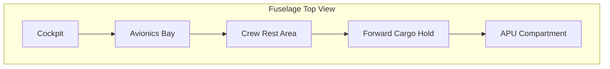
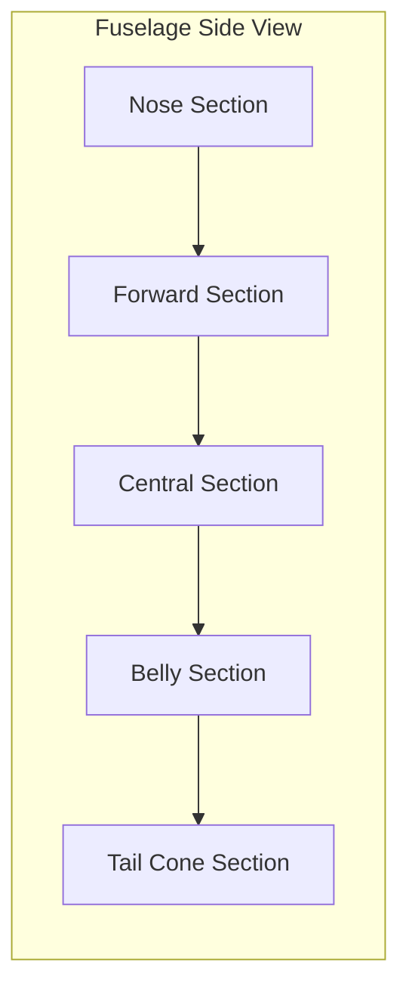
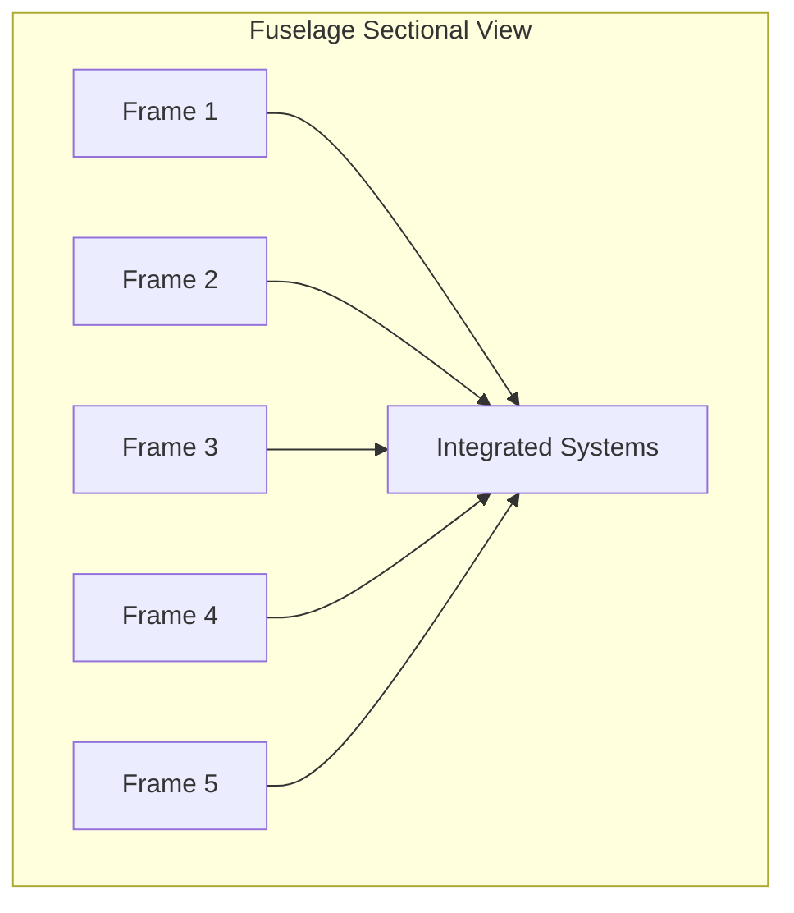
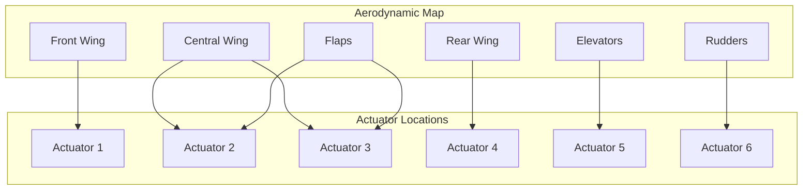

# FTC_53-00-00-000_ATA-53-AXLR-M01.md
**Fuselage Design for the AMPEL360 Project**

**Table of Contents**
1. [Historical Versions](#historical-versions)  
2. [Research Methodology](#research-methodology)  
3. [53-00-00-000 General Information](#53-00-00-000-general-information)  
4. [53-00-00-001 Identification and Classification](#53-00-00-001-identification-and-classification)  
5. [53-00-00-002 Description](#53-00-00-002-description)  
6. [53-10-00-000 Nose Section](#53-10-00-000-nose-section)  
   1. [53-10-10-000 Nose Structure](#53-10-10-000-nose-structure)  
   2. [53-10-20-000 Nose Equipment](#53-10-20-000-nose-equipment)  
7. [53-20-00-000 Forward Section](#53-20-00-000-forward-section)  
   1. [53-20-10-000 Forward Structure](#53-20-10-000-forward-structure)  
   2. [53-20-20-000 Forward Compartments](#53-20-20-000-forward-compartments)  
8. [53-30-00-000 Central Section](#53-30-00-000-central-section)  
   1. [53-30-10-000 Central Structure](#53-30-10-000-central-structure)  
   2. [53-30-20-000 Central Systems Integration](#53-30-20-000-central-systems-integration)  
9. [53-40-00-000 Belly Section](#53-40-00-000-belly-section)  
   1. [53-40-10-000 Belly Structure](#53-40-10-000-belly-structure)  
   2. [53-40-20-000 Belly Systems](#53-40-20-000-belly-systems)  
10. [53-50-00-000 Tail Cone Section](#53-50-00-000-tail-cone-section)  
    1. [53-50-10-000 Tail Cone Structure](#53-50-10-000-tail-cone-structure)  
    2. [53-50-20-000 Tail Cone Systems](#53-50-20-000-tail-cone-systems)  
11. [53-60-00-000 APU Compartment](#53-60-00-000-apu-compartment)  
    1. [53-60-10-000 APU Compartment Structure](#53-60-10-000-apu-compartment-structure)  
    2. [53-60-20-000 APU Systems Integration](#53-60-20-000-apu-systems-integration)  
12. [53-70-00-000 Additional Stations (Reserved for Future Use)](#53-70-00-000-additional-stations-reserved-for-future-use)  
13. [53-80-00-000 Auxiliary Stations (Reserved for Future Use)](#53-80-00-000-auxiliary-stations-reserved-for-future-use)  
14. [Key Performance Requirements and Metrics List for Ampel360 Aircraft Platform](#key-performance-requirements-and-metrics-list)  
15. [User Guide](#user-guide)  
    1. [53-99-99-000 Purpose](#53-99-99-000-purpose)  
    2. [53-99-99-001 Document Access](#53-99-99-001-document-access)  
    3. [53-99-99-002 Document Structure](#53-99-99-002-document-structure)  
    4. [53-99-99-003 Interaction with the Document](#53-99-99-003-interaction-with-the-document)  
    5. [53-99-99-004 Understanding Key Concepts](#53-99-99-004-understanding-key-concepts)  
    6. [53-99-99-005 Acronyms](#53-99-99-005-acronyms)  
    7. [53-99-99-006 Additional Information](#53-99-99-006-additional-information)  
16. [Conclusion](#conclusion)  
17. [Wiring Diagrams and Schematics](#wiring-diagrams-and-schematics)  
18. [Figure List and Mermaid Diagrams](#figure-list-and-mermaid-diagrams)  

---

## Historical Versions
| Version | Date       | Description                                    | Authors                               |
|---------|-----------|------------------------------------------------|---------------------------------------|
| 0.0     | 2025-01-06 | Draft of the fuselage design.                  | Amedeo Pelliccia, ChatGPT, Gemini     |
| 1.0     | 2025-03-15 | Initial Review and Feedback Incorporation      | Amedeo Pelliccia, Engineering Team    |
| 1.1     | 2025-04-20 | Updated Material Specifications                | Amedeo Pelliccia, Materials Specialist|
| 2.0     | 2025-06-10 | Finalized Design and Compliance Checks         | Amedeo Pelliccia, Compliance Officer  |

---

## Research Methodology
The fuselage design for the **Ampel360 Project** is the result of an extensive research and iterative design process. The methodology includes:

1. **Data Collection:**  
   - **Aerodynamic Data** from wind tunnel experiments and flight tests.  
   - **Material Properties** from supplier data and proprietary tests.

2. **Simulations:**
   - **Computational Fluid Dynamics (CFD)** for airflow optimization.  
   - **Finite Element Method (FEM)** for structural integrity evaluation.

3. **Engineering Analysis:**
   - **Structural and Thermal** analysis for load distribution and temperature ranges.

4. **Compliance and Standards Review:**
   - **Regulatory Compliance** with FAA FAR Part 25 and EASA CS-25.  
   - **Industry Standards** like ATA iSpec 2200 and quality management (AS9100).

5. **Iterative Design and Prototyping:**
   - **Design Reviews** with cross-functional teams.  
   - **Prototyping** (scale models, full-scale prototypes) for validation.

6. **Sustainability Considerations:**
   - **Lifecycle Assessment (LCA)** for environmental impact from material extraction to disposal.  
   - **Eco-Friendly Materials** selection (recyclable, low carbon footprint).

---

## 53-00-00-000 General Information
Provides an overview of the fuselage architecture, referencing the **ATA Chapter 53** standards. Emphasis is placed on:

- **Structural Integrity and Weight Efficiency**  
- **Compliance with Regulatory Requirements**  
- **MTL (Method Task Layers) tokenized references**  
- **Blockchain-based traceability**  

---

## 53-00-00-001 Identification and Classification
**Attribute Details:**  
- **Technology:** Lightweight Materials  
- **Component:** Geometry and Weight  
- **System or Entity:** A360XWLRGA  
- **FTCodeID:** GAIA-AXLR-M01-53-ConceptDesign-01test  
- **Cluster:** Aircraft Structural Design  
- **Ecosystem:** GAIA  
- **Model/Version:** PRELIMINARY  

### Technology Details
**Lightweight Materials:**  
- **Carbon Fiber Reinforced Polymers (CFRP)** for high strength-to-weight ratio.  
- **Aluminum-Lithium Alloys** improving stiffness while reducing density.

### Component Interactions
**Geometry and Weight Optimization:**  
- **Aerodynamic Design** reduces drag.  
- **System Integration** ensures efficient avionics/hydraulics space usage.  
- **Structural Integrity** maintains safety margins.

### Interfaces and Connections
| Interface Area         | Connected ATA Chapter | Description                              | Notes                                          |
|------------------------|-----------------------|------------------------------------------|------------------------------------------------|
| Windows                | 56                    | Integration with window systems          | Ensure weather seal and aerodynamic concerns   |
| Horizontal Stabilizer  | 55                    | Structural attachment for aerodynamic stability | Coordination with flight controls systems  |
| Vertical Rudder        | 57                    | Integration of control surfaces          | Precisely aligned for maneuverability          |
| Doors                  | 52                    | Door attachment points                   | Integration with opening/closing systems       |
| Flight Controls        | 27                    | Flight control interface                 | Synchronization with electromechanical actuators|

---

## 53-00-00-002 Description
### Purpose
Design an optimal fuselage balancing weight and strength, ensuring aerodynamic efficiency and regulatory compliance. This advances sustainability goals for emissions reduction and robust operational standards.

### Key Features
1. **Optimized Geometry** (CFD & FEM-based)  
2. **Weight Reduction** (ultra-light materials with structural integrity)  
3. **Modularity** (easy inspection/maintenance; flexible cabin configs)  
4. **Sustainability** (low carbon footprint, recyclable materials)

### Performance Metrics
- **Drag Coefficient (Cd):** Targeted 5% reduction vs. baseline  
- **Weight Savings:** 8% fuselage weight reduction  
- **Structural Integrity Margin:** 1.5x max load  
- **Carbon Footprint Reduction:** 12% in manufacturing  

### Interfaces and Connections
| Interface Area         | Connected ATA Chapter | Description                      | Notes                                          |
|------------------------|-----------------------|----------------------------------|------------------------------------------------|
| Windows                | 56                    | Weather sealing & aerodynamics   | Ensure climate control compatibility           |
| Horizontal Stabilizer  | 55                    | Structural link for stability    | Flight control system coordination             |
| Vertical Rudder        | 57                    | Control surface integration      | Precision alignment for maneuvers              |
| Doors                  | 52                    | Door attachment points           | Safety compliance for opening/closing          |
| Flight Controls        | 27                    | Control system interface         | Coordination with electromechanical actuators  |

---

## 53-10-00-000 Nose Section
### 53-10-10-000 Nose Structure
**Specification Details:**  
- **Material Specs:** CFRP, Al-Li Alloy  
- **Dimension Constraints:** L=2.5 m, Ø=3.8 m  
- **Design Loads:** Pressure=0.6 bar, Bird impact=1.8 kg @250 m/s  
- **Manufacturing Process:** AFP, Electron Beam Welding  
- **Quality Requirements:** NDT inspection for defects (±0.1 mm tolerance)

### Structural Design Considerations
- **Material Selection:** CFRP for high strength-to-weight; Al-Li for durability.  
- **Dimensional Constraints:** Accommodates nose-mounted avionics.  
- **Design Loads:** Manages cabin pressurization & bird strike protection.  
- **Manufacturing:** Automated Fiber Placement ensures fiber alignment.  
- **Quality Assurance:** NDT and dimensional checks ±0.1 mm.

### Integration and Functionality
- **Aerodynamic Optimization** for minimal drag.  
- **System Mounts** for nose avionics/sensors.

### Interfaces and Connections
| Interface Area         | Connected ATA Chapter | Description                      | Notes                           |
|------------------------|-----------------------|----------------------------------|----------------------------------|
| Windows                | 56                    | Weather sealing, aerodynamics    | Compatibility with climate systems |
| Horizontal Stabilizer  | 55                    | Stability link                   | Flight control system synergy   |
| Vertical Rudder        | 57                    | Control surface integration      | Maneuvering alignment           |
| Doors                  | 52                    | Door attachment points           | Safety & sealing                |
| Flight Controls        | 27                    | Control interface                | Coordination with actuators     |

---

## 53-10-20-000 Nose Equipment
**Equipment Details**  
- **Weather Radar:** X-band, 300 km range  
- **Pitot Tubes:** Dual for airspeed accuracy  
- **Angle of Attack Sensors:** Redundant for precise angle measurement  
- **Navigation Lights:** LED-based, high visibility  
- **Lightning Protection:** Integrated for electronics & structure

### Integration and Functionality
- **Weather Radar Placement** for unobstructed coverage  
- **Pitot Tube Redundancy** ensures reliability  
- **Angle of Attack Sensors** feed flight control systems  
- **Navigation Lights** comply with aviation visibility standards  
- **Lightning Protection** for essential systems

### Interfaces and Connections
| Interface Area         | Connected ATA Chapter | Description                      | Notes                                       |
|------------------------|-----------------------|----------------------------------|---------------------------------------------|
| Windows                | 56                    | Sealing & aerodynamics           | Climate control compatibility               |
| Horizontal Stabilizer  | 55                    | Structural stability link         | Flight controls synergy                     |
| Vertical Rudder        | 57                    | Control surface integration       | Maneuvering alignment                       |
| Doors                  | 52                    | Door points                       | Opening/closing systems                     |
| Flight Controls        | 27                    | Control system interface          | Synchronization with actuators              |

---

## 53-20-00-000 Forward Section
### 53-20-10-000 Forward Structure
**Specification Details:**  
- **Material Specs:** CFRP, Al-Li Alloy  
- **Dimension Constraints:** L=8.5 m, Ø=4.2 m  
- **Design Loads:** Press. diff=0.8 bar, wing bending loads  
- **Manufacturing Process:** AFP, Friction Stir Welding  
- **Quality Reqs:** Ultrasonic inspection, ±0.2 mm tolerances

### Structural Design Considerations
- **Material Selection:** Ultra-light composites & Al-Li  
- **Dimension Constraints:** Houses forward compartments  
- **Design Loads:** Maintains integrity for pressurization & wing attach loads  
- **Manufacturing:** AFP for precise fiber placement; FSW for Al-Li joints  
- **Quality Assurance:** Ultrasonic checks, ±0.2 mm tolerances

### Integration and Functionality
- **Structural Support:** Fuel systems, avionics  
- **Aerodynamic Efficiency** with refined geometry

### Interfaces and Connections
| Interface Area         | Connected ATA Chapter | Description                      | Notes                                       |
|------------------------|-----------------------|----------------------------------|---------------------------------------------|
| Windows                | 56                    | Sealing, aerodynamics            | Climate control integration                 |
| Horizontal Stabilizer  | 55                    | Stability link                   | Flight controls synergy                     |
| Vertical Rudder        | 57                    | Control surface linkage           | Maneuvering alignment                       |
| Doors                  | 52                    | Door attachment points           | Safety & opening/closing mechanisms         |
| Flight Controls        | 27                    | Flight control interface         | Actuators alignment & synergy               |

---

### 53-20-20-000 Forward Compartments
**Compartment Details**  
- **Cockpit** for flight controls & avionics  
- **Avionics Bay** for centralized flight computers & comms  
- **Crew Rest Area** for long-haul flights  
- **Forward Cargo Hold** for secure cargo storage

### Integration and Functionality
- **Cockpit Ergonomic Design** to reduce pilot fatigue  
- **Avionics Bay Centralization** for easier maintenance & cooling  
- **Crew Rest Area** with safety compliance  
- **Forward Cargo Hold** with modular design for varied mission needs

### Interfaces and Connections
| Interface Area         | Connected ATA Chapter | Description                | Notes                                       |
|------------------------|-----------------------|----------------------------|---------------------------------------------|
| Windows                | 56                    | Weather sealing, aerodynamics | Climate control synergy                 |
| Horizontal Stabilizer  | 55                    | Stability link             | Flight controls synergy                     |
| Vertical Rudder        | 57                    | Control surface integration | Maneuvering alignment                       |
| Doors                  | 52                    | Door attachment points     | Opening/closing system integration          |
| Flight Controls        | 27                    | Flight control interface   | Actuator coordination                        |

---

## 53-30-00-000 Central Section
### 53-30-10-000 Central Structure
**Specification Details:**  
- **Material Specs:** High-strength CFRP, Titanium Alloys  
- **Dimension Constraints:** L=25 m, Ø=4.5 m  
- **Design Loads:** Press. diff=0.9 bar, wing/tail attachments  
- **Manufacturing Process:** AFP, Laser Beam Welding  
- **Quality Reqs:** X-ray inspection, ±0.3 mm tolerances

### Structural Design Considerations
- **Material Selection:** High-strength CFRP & possibly Al-Li  
- **Dimension Constraints:** Large central length for systems integration  
- **Design Loads:** Manages pressurization & bending from wings/tail  
- **Manufacturing:** AFP for composites; laser welding for precision  
- **Quality Assurance:** X-ray inspection, ±0.3 mm tolerance

### Integration and Functionality
- **Structural Support:** Fuel, avionics, critical systems  
- **Aerodynamic Efficiency** with low drag design

### Interfaces and Connections
| Interface Area         | Connected ATA Chapter | Description                | Notes                                       |
|------------------------|-----------------------|----------------------------|---------------------------------------------|
| Windows                | 56                    | Weather sealing, aerodynamics | Climate system synergy                    |
| Horizontal Stabilizer  | 55                    | Structural stability link   | Flight controls synergy                     |
| Vertical Rudder        | 57                    | Control surface integration | Maneuvering alignment                       |
| Doors                  | 52                    | Door points                 | Opening/closing system integration          |
| Flight Controls        | 27                    | Flight control interface   | Actuators synchronization                   |

---

### 53-30-20-000 Central Systems Integration
**System Integration Details**  
- **Fuel System** with integral tanks, optimized distribution  
- **Air Conditioning System** with efficient ducts  
- **Electrical System** harness routing  
- **Hydraulic System** embedded lines & actuators

### Integration and Functionality
- **Fuel System** ensuring balanced storage  
- **Air Conditioning System** with minimal turbulence  
- **Electrical System** well-organized harnesses  
- **Hydraulic System** for control surfaces & gear

### Interfaces and Connections
| Interface Area         | Connected ATA Chapter | Description                      | Notes                                       |
|------------------------|-----------------------|----------------------------------|---------------------------------------------|
| Windows                | 56                    | Weather sealing, aerodynamics    | Climate control synergy                     |
| Horizontal Stabilizer  | 55                    | Stability link                   | Flight control synergy                      |
| Vertical Rudder        | 57                    | Control surface integration       | Maneuvering alignment                       |
| Doors                  | 52                    | Door points                       | Opening/closing mechanism integration       |
| Flight Controls        | 27                    | Control system interface         | Synchronization with actuators              |

---

## 53-40-00-000 Belly Section
### 53-40-10-000 Belly Structure
**Specification Details:**  
- **Material Specs:** CFRP, Al-Li Alloy  
- **Dimension Constraints:** L=15 m, Ø=4.3 m  
- **Design Loads:** Press. diff=0.7 bar, under-floor systems  
- **Manufacturing Process:** AFP, Adhesive Bonding  
- **Quality Reqs:** Visual inspection, ±0.2 mm tolerance

### Structural Design Considerations
- **Material Selection:** Ultra-light & durable for underfloor systems  
- **Dimension Constraints:** Integrates with main fuselage structure  
- **Design Loads:** Supports additional systems weight  
- **Manufacturing:** AFP + adhesive for strong, light joints  
- **Quality Assurance:** Visual checks, ±0.2 mm tolerances

### Integration and Functionality
- **Floor Design** for electrical/hydraulic lines  
- **Vibration Dampening** for passenger comfort

### Interfaces and Connections
| Interface Area         | Connected ATA Chapter | Description                | Notes                                       |
|------------------------|-----------------------|----------------------------|---------------------------------------------|
| Windows                | 56                    | Weather sealing, aerodynamics | Climate system synergy                    |
| Horizontal Stabilizer  | 55                    | Structural stability link   | Flight controls synergy                     |
| Vertical Rudder        | 57                    | Control surfaces integration| Maneuvering alignment                       |
| Doors                  | 52                    | Door points                 | Opening/closing integration                 |
| Flight Controls        | 27                    | Flight control interface   | Actuator synchronization                    |

---

### 53-40-20-000 Belly Systems
**Systems Details**  
- **Landing Gear Integration**  
- **Auxiliary Power Units (APUs)** housing & cooling  
- **Cargo Systems** for modular loading  
- **Environmental Control Systems (ECS)** ducting

### Integration and Functionality
- **Landing Gear** retracted stowage area  
- **APU Cooling** with minimal thermal impact  
- **Modular Cargo** for mission adaptability  
- **ECS** with efficient airflow distribution

### Interfaces and Connections
| Interface Area         | Connected ATA Chapter | Description                | Notes                                       |
|------------------------|-----------------------|----------------------------|---------------------------------------------|
| Windows                | 56                    | Weather sealing, aerodynamics | Climate system synergy                    |
| Horizontal Stabilizer  | 55                    | Stability link             | Flight control synergy                      |
| Vertical Rudder        | 57                    | Control surfaces integration| Maneuvering alignment                       |
| Doors                  | 52                    | Door attachment points     | Integration with door systems              |
| Flight Controls        | 27                    | Control system interface   | Synchronization with actuators             |

---

## 53-50-00-000 Tail Cone Section
### 53-50-10-000 Tail Cone Structure
**Specification Details:**  
- **Material Specs:** CFRP, Al-Li Alloy  
- **Dimension Constraints:** L=4 m, Ø=3.5 m  
- **Design Loads:** Press. diff=0.5 bar, torsional loads  
- **Manufacturing Process:** AFP, Laser Beam Welding  
- **Quality Reqs:** X-ray inspection, ±0.1 mm tolerance

### Structural Design Considerations
- **Material Selection:** Ultra-light & strong for torsion loads  
- **Dimensional Constraints:** Houses rear equipment, stabilizes flow  
- **Design Loads:** Pressurization & tail assembly torsion  
- **Manufacturing:** AFP + laser welding for precision  
- **Quality Assurance:** X-ray checks, ±0.1 mm tolerance

### Integration and Functionality
- **Tail Assembly** supports control surfaces & exhaust  
- **Aerodynamic Efficiency** reduces drag at rear section

### Interfaces and Connections
| Interface Area         | Connected ATA Chapter | Description                    | Notes                               |
|------------------------|-----------------------|--------------------------------|--------------------------------------|
| Windows                | 56                    | Weather sealing, aerodynamics  | Climate system synergy               |
| Horizontal Stabilizer  | 55                    | Stability link                 | Flight controls synergy             |
| Vertical Rudder        | 57                    | Control surface integration     | Maneuvering alignment               |
| Doors                  | 52                    | Door points                     | Opening/closing system synergy      |
| Flight Controls        | 27                    | Control system interface       | Synchronization with actuators      |

---

### 53-50-20-000 Tail Cone Systems
**Systems Details**  
- **Rudder/Stabilizer Control Systems**  
- **Tail-Mounted Antennas**  
- **Lighting Systems** (LED-based, anticollision)  
- **Lightning Protection** for tail electronics

### Integration and Functionality
- **Precision Control** for rudder/stabilizer deflection  
- **Antenna Aerodynamics** for minimal drag  
- **LED Technology** for reliability, low power usage  
- **Lightning Shielding** for crucial tail systems

### Interfaces and Connections
| Interface Area         | Connected ATA Chapter | Description                | Notes                                        |
|------------------------|-----------------------|----------------------------|----------------------------------------------|
| Windows                | 56                    | Weather sealing, aerodynamics | Climate system synergy                     |
| Horizontal Stabilizer  | 55                    | Stability link             | Flight control synergy                       |
| Vertical Rudder        | 57                    | Control surface integration| Maneuvering alignment                        |
| Doors                  | 52                    | Door points                 | Opening/closing synergy                      |
| Flight Controls        | 27                    | Control system interface   | Actuator synchronization                     |

---

## 53-60-00-000 APU Compartment
### 53-60-10-000 APU Compartment Structure
**Specification Details:**  
- **Material Specs:** CFRP, Al-Li Alloy  
- **Dimension Constraints:** L=3 m, W=1.5 m, H=1.2 m  
- **Design Loads:** Vibration (APU), Thermal from exhaust  
- **Manufacturing Process:** AFP, Thermal Barrier Coating  
- **Quality Reqs:** Vibration damping tests, thermal insulation ±5% variance

### Structural Design Considerations
- **Material Selection:** Withstand APU vibrations & thermal loads  
- **Dimensional Constraints:** Enough for APU + maintenance space  
- **Design Loads:** Avoid structural fatigue from high vibrations  
- **Manufacturing:** AFP + thermal barrier coatings  
- **Quality Assurance:** Vibration damping & insulation checks

### Integration and Functionality
- **Compartment Design** ensures easy APU access & operation  
- **Thermal Management** for longevity of APU components

### Interfaces and Connections
| Interface Area         | Connected ATA Chapter | Description                | Notes                                   |
|------------------------|-----------------------|----------------------------|-----------------------------------------|
| Windows                | 56                    | Weather sealing, aerodynamics | Climate system synergy               |
| Horizontal Stabilizer  | 55                    | Stability link             | Flight control synergy                  |
| Vertical Rudder        | 57                    | Control surfaces integration| Maneuver alignment                       |
| Doors                  | 52                    | Door points                 | Opening/closing synergy                 |
| Flight Controls        | 27                    | Flight control interface   | Synchronization with actuators          |

---

### 53-60-20-000 APU Systems Integration
**Systems Integration Details**  
- **Cooling System** for APU temperature  
- **Exhaust System** ducting  
- **Fuel Supply System** dedicated lines  
- **Control Interface** integrated with main avionics

### Integration and Functionality
- **Cooling Circuits** for heat dissipation  
- **Exhaust Direction** away from critical areas  
- **Leak Detection** for APU fuel lines  
- **Electronic Controls** for APU operation

### Interfaces and Connections
| Interface Area         | Connected ATA Chapter | Description                         | Notes                                     |
|------------------------|-----------------------|-------------------------------------|-------------------------------------------|
| Windows                | 56                    | Weather sealing, aerodynamics       | Compatibility with climate control        |
| Horizontal Stabilizer  | 55                    | Stabilizing link                     | Flight controls synergy                   |
| Vertical Rudder        | 57                    | Control surface integration          | Maneuvering alignment                     |
| Doors                  | 52                    | Door points                          | Opening/closing synergy                   |
| Flight Controls        | 27                    | Flight control system interface      | Synchronization with actuators            |

---

## 53-70-00-000 Additional Stations (Reserved for Future Use)
**Description:** Placeholder for future expansions.  
**Components:** Defined based on evolving design requirements.  
**Interfaces and Connections:**  
*(Same baseline as above, referencing Windows-56, Stabilizer-55, Rudder-57, Doors-52, Flight Controls-27)*

**Proactive Planning**  
- **Modularity** for future integrations  
- **Accessibility** for easy system expansions  
- **Scalability** reinforcing structural capacity

---

## 53-80-00-000 Auxiliary Stations (Reserved for Future Use)
**Description:** Placeholder for additional expansions.  
**Components:** Defined for future design requirements.  
**Interfaces and Connections:**  
*(Same baseline referencing Windows-56, Stabilizer-55, Rudder-57, Doors-52, Flight Controls-27)*

**Proactive Planning**  
- **Redundancy** to maintain independent operations  
- **Integration Flexibility** for a wide range of auxiliary equipment  
- **Safety Compliance** with fire/integrity standards

---

## Key Performance Requirements and Metrics List
This consolidated list covers operational, environmental, and economic aspects for the **Ampel360 Aircraft Platform**:

1. **Weight Reduction & Structural Efficiency**  
   - *Requirement:* Achieve an 8% fuselage weight reduction.  
   - *Metric:* Compare final fuselage weight vs. baseline designs.

2. **Aerodynamic Efficiency**  
   - *Requirement:* Minimize drag coefficient by 5%.  
   - *Metric:* Wind tunnel / CFD-proven L/D ratio improvements.

3. **Material Sustainability**  
   - *Requirement:* Incorporate ≥40% recycled or eco-friendly materials.  
   - *Metric:* Materials life cycle analysis (LCA) confirming carbon footprint reduction.

4. **Maintenance Turnaround Time**  
   - *Requirement:* Routine maintenance tasks to meet a 20% faster turnaround.  
   - *Metric:* Documented man-hours/time to complete standard checks.

5. **Reliability & Redundancy**  
   - *Requirement:* Maintain system integrity with 1.5× load margin.  
   - *Metric:* Structural validation under maximum loads + 50%.

6. **Infrastructure & Ecosystem Integration**  
   - *Requirement:* Full blockchain-based traceability of all components, validated by MTL token references.  
   - *Metric:* % of documented components recorded on blockchain, cross-checked with MTL system.

7. **Smart Monitoring**  
   - *Requirement:* IA-driven predictive monitoring of fuselage sections.  
   - *Metric:* Reduction in unscheduled downtime by ≥15%.

8. **Modular Design**  
   - *Requirement:* Facilitate at least 2 modular interior configurations.  
   - *Metric:* Time to reconfigure interior ≤48 hours.

9. **Life Cycle Assessment (LCA)**  
   - *Requirement:* 12% carbon footprint reduction in manufacturing.  
   - *Metric:* Verified LCA from raw materials to disposal.

10. **Cost Efficiency**  
    - *Requirement:* Reduce total operating costs by 10%.  
    - *Metric:* Documented cost-tracking vs. baseline.

**Noise Reduction, Passenger Experience, Safety, Cybersecurity, and Automation** are additional areas recommended to track with decibel measures, comfort & safety KPIs, data protection standards, and autonomous flight feature definitions.

---

## User Guide

This **User Guide** section clarifies how to interact with the **Fuselage Design Document** (FTC_53-00-00-000_ATA-53-AXLR-M01.md) within the **GAIA ecosystem**.

### 53-99-99-000 Purpose
**Objective:**  
Outlines the **specifications, integrations, lifecycle management**, and **KPIs** for the A360XWLRGA fuselage, referencing **ATA Chapter 53**. It serves as a central resource for engineers, stakeholders, and regulatory bodies.

### 53-99-99-001 Document Access
**Access Protocols:**  
- **Digital Access:** Hosted on the secure GAIA intranet with **role-based access controls (RBAC)**.  
- **Version Control:** Centrally tracked (e.g., Git) to manage revisions and retrieve history.  
- **Security Measures:** Data encryption & regular backups to avoid data loss.

#### User Roles and Permissions
| Role                 | Permissions                                                                                                                                                          |
|----------------------|----------------------------------------------------------------------------------------------------------------------------------------------------------------------|
| **Read-Only User**   | View all document sections.                                                                                                                                          |
| **Engineer**         | View all sections, add comments, update **Current Results** in "Metrics & KPIs," contribute to "Next Steps."                                                                 |
| **Manager**          | All Engineer permissions, plus approve changes, modify “Risks and Mitigation Strategies,” and “Responsibilities.”                                                   |
| **Regulator**        | View all sections, add non-editable annotations.                                                                                                                     |
| **System Admin**     | Full control, including user management and access configuration.                                                                                                    |
| **Kluster Specialist** | Edit sections related to their assigned Kluster (e.g., “Aircraft Structural Design”). Restricted to relevant sections only.                                        |
| **Ecosystem Manager** | High-level access across the ECOSYSTEM, can approve changes but not modify direct technical details.                                                                |

---

### 53-99-99-002 Document Structure
**Organizational Layout:**  
Follows **ATA Chapter 53** breakdown: *General Info, Identification, Description, Nose/Forward/Central/Tail Cone, APU compartments, Additional/Auxiliary stations, etc.* Each section has sub-chapters with specs, integration, metrics, etc.

**Consistent Formatting:**  
Uniform headings, subheadings, tables, and styles.  

**Cross-Referencing:**  
Internal links to relevant sections, plus references to external standards (FAA/EASA, S1000D, AS9100).

---

### 53-99-99-003 Interaction with the Document
**Navigation Tools:**  
- **Clickable ToC** for quick access.  
- **Search Functionality** for specific terms.

**Comments (Engineers & Higher Roles):**  
- Select text → “Add Comment” → Input → Submit.  
- Link comments to specific sections for clarity.

**Editing (Restricted):**  
- **Engineers:** Update “Metrics & KPIs” current results, propose “Next Steps.”  
- **Managers:** Modify “Risks & Mitigation,” responsibilities, approve changes.  
- **Kluster Specialist:** Edit sections relevant to assigned KLUSTER.

**Change Approval:**  
- Proposed changes → Marked for review → Manager or Ecosystem Manager → Approve/Reject.  
- All changes tracked and versioned.

---

### 53-99-99-004 Understanding Key Concepts
**FTCodeid:** Unique ID for tracking components/processes in GAIA ecosystem.  
**KLUSTER:** Grouping of related components/systems (e.g., structural design).  
**ECOSYSTEM:** Collection of interconnected KLUSTERs (GAIA as the main ecosystem).  
**MTL (Method Task Layers):** Tokenized procedures ensuring supply chain traceability, structural validation.  
**Lightweight Materials:** Advanced composites (carbon fiber, Al-Li) for fuselage weight reduction.  
**A360XWLRGA:** Aircraft/system designation for this fuselage design.

---

### 53-99-99-005 Acronyms
| Acronym | Full Form                                  | Description                                                           |
|---------|--------------------------------------------|-----------------------------------------------------------------------|
| CFD     | Computational Fluid Dynamics               | Simulation of fluid flow around structures                            |
| FEM     | Finite Element Method                      | Numerical technique for structural analysis                           |
| ERP     | Enterprise Resource Planning               | Resource planning & purchasing                                        |
| MES     | Manufacturing Execution System             | Production floor monitoring                                           |
| SCADA   | Supervisory Control and Data Acquisition   | Real-time industrial process control                                  |
| IA      | Artificial Intelligence (basic AI)         | Machine-based intelligence, narrower than AGI                         |
| AGI     | Artificial General Intelligence            | More advanced, human-like intelligence capabilities                   |
| KPI     | Key Performance Indicator                  | Measurable performance metric                                         |
| L/D     | Lift-to-Drag ratio                         | Aerodynamic efficiency metric                                         |
| FAA     | Federal Aviation Administration            | US authority regulating civil aviation                                |
| EASA    | European Union Aviation Safety Agency      | EU authority overseeing aviation safety                               |
| ITAR    | International Traffic in Arms Regulations  | Defense-export controls in the US                                     |
| EAR     | Export Administration Regulations          | Commercial goods export regulations                                   |
| ATA     | Air Transport Association                  | Industry standard for aircraft documentation                          |
| MTL     | Method Task Layers                         | Tokenized procedures for supply chain & structural validation         |

---

### 53-99-99-006 Additional Information
For queries or issues, contact **Structures Engineering (GAIA AIR)**, or external specialists for lightweight materials, sustainability consulting.

---

## Conclusion
This fuselage design for the **Ampel360** merges aerodynamic efficiency, robust structural performance, and sustainability. Composites (CFRP, Al-Li) achieve weight and drag reductions, while ensuring safety margins. **KPIs** track measurable improvements (drag reduction, weight savings, carbon footprint), supporting compliance with **FAA/EASA** and **AS9100** quality.

---

## Wiring Diagrams and Schematics
Overview of key fuselage structures and systems:

1. **Top View (Mermaid)** showing cockpit, avionics, crew rest, cargo.  
2. **Lateral View (Mermaid)** for nose/forward/central/belly/tail sections.  
3. **Sectional View (Mermaid)** showing frames & integrated systems.  

---

## Figure List and Mermaid Diagrams

**Figure 1: Top View (Vista Superior)**  


**Figure 2: Lateral View (Vista Lateral)**  


**Figure 3: Sectional View (Vista Seccional)**  


**Figure 4: Aerodynamic Map with Actuator Locations**  


By **incorporating all sections**—including the **expanded Key Performance Requirements** and the **enhanced User Guide**—the **Ampel360 fuselage** documentation is **complete, user-friendly,** and fully **traceable** within **GAIA**. Any further modifications or updates can follow the **S1000D** and **ATA** guidelines referenced here, ensuring consistent version control and broad stakeholder accessibility.
```
