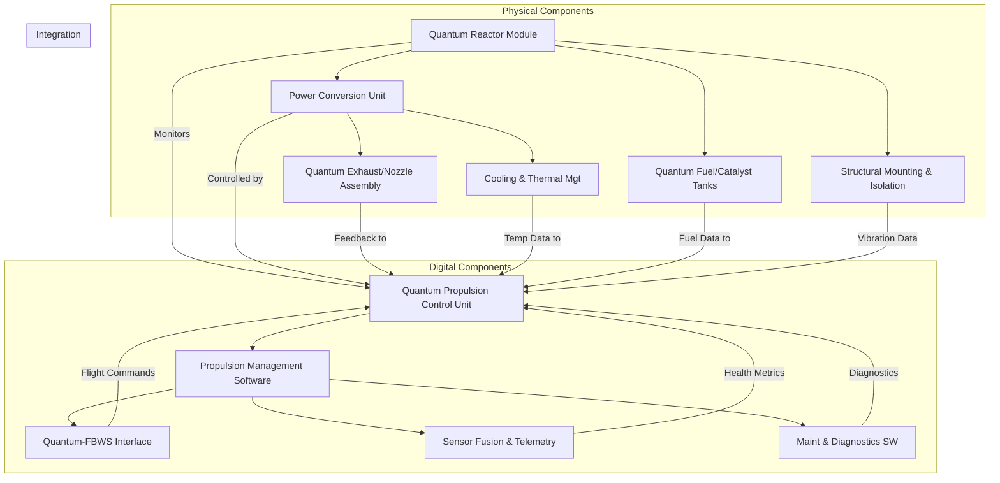

# **FTC_71-00-00-00-000-Quantum-Propulsion_Q-01.mf**

---

## **Version History**

| Version | Date        | Author(s)                                                                                             | Description / Change Notes                                                                                                                                                                                                                                                                           | Affected Sections                                                                                                                                                                                                                      |
| :-----: | :---------: | :---------------------------------------------------------------------------------------------------- | :---------------------------------------------------------------------------------------------------------------------------------------------------------------------------------------------------------------------------------------------------------------------------------------------------- | :------------------------------------------------------------------------------------------------------------------------------------------------------------------------------------------------------------------------------------- |
| **1.0** | 2024-12-31  | Amedeo Pelliccia, ChatGPT, Copilot, Gemini, Perplexity AI, Mermaid AI                                 | Creation of the consolidated Flight Controls document, integrating advanced technologies (AI, fly-by-wire enhancements, predictive maintenance, etc.)                                                                                                                                                 | All                                                                                                                                                                                                                                    |
| **1.1** | 2025-01-15  | Amedeo Pelliccia, User Feedback Incorporation, ChatGPT, Gemini, Perplexity AI                         | Initial draft of ATA 27 Flight Controls. Added key sections, placeholders for diagrams, and references to advanced control systems.                                                                                                                                                                   | All                                                                                                                                                                                                                                    |
                                                                                           |

---

## **Table of Contents**

### **71.00 Power Plant - Q-01 Quantum Propulsion System**

1. [**71.10 Overview**](#7110-overview)  
2. [**71.20 Technology Details**](#7120-technology-details)  
3. [**71.30 Compliance and Validation**](#7130-compliance-and-validation)  
4. [**71.40 Impact Analysis**](#7140-impact-analysis)  
5. [**71.50 Risk Assessment**](#7150-risk-assessment)  
6. [**71.60 Mitigation Strategies**](#7160-mitigation-strategies)  
7. [**71.70 Related Systems**](#7170-related-systems)  
8. [**71.80 Development Status**](#7180-development-status)  
9. [**71.90 Remarks and Recommendations**](#7190-remarks-and-recommendations)  
10. [**71.100 Appendices**](#71100-appendices)  
11. [**71.110 Training and Certification**](#71110-training-and-certification)  
12. [**71.120 Advanced Diagnostics and Monitoring**](#71120-advanced-diagnostics-and-monitoring)  
13. [**71.130 Human Factors and Ergonomics**](#71130-human-factors-and-ergonomics)  
14. [**71.140 Cybersecurity and Data Integrity**](#71140-cybersecurity-and-data-integrity)  
15. [**71.150 Cost Analysis and Budgeting**](#71150-cost-analysis-and-budgeting)  
16. [**71.160 Technology Roadmap**](#71160-technology-roadmap)  
17. [**71.170 Market Analysis and Applications**](#71170-market-analysis-and-applications)  
18. [**71.180 Manufacturing Processes and Quality Assurance**](#71180-manufacturing-processes-and-quality-assurance)  
19. [**71.190 Technology Transfer and Commercialization**](#71190-technology-transfer-and-commercialization)  
20. [**71.200 Sustainability and Environmental Impact**](#71200-sustainability-and-environmental-impact)  
21. [**71.210 AI-Driven Performance Optimization** *(New)*](#71210-ai-driven-performance-optimization)  
22. [**71.220 Quantum Avionics Integration** *(New)*](#71220-quantum-avionics-integration)  
23. [**71.230 Extended Flight Operation Frameworks** *(New)*](#71230-extended-flight-operation-frameworks)  
24. [**71.240 Ethical and Societal Implications** *(New)*](#71240-ethical-and-societal-implications)

---

### **71.10 Overview**

- [71.10.01 Introduction to Quantum Propulsion](#711001-introduction-to-quantum-propulsion)  
- [71.10.02 Goals and Objectives](#711002-goals-and-objectives)  
- [71.10.03 Alignment with ATA Chapter 71](#711003-alignment-with-ata-chapter-71)

---

### **71.20 Technology Details**

- [71.20.01 Technical Description](#712001-technical-description)  
- [71.20.02 Quantum Propulsion Mechanics](#712002-quantum-propulsion-mechanics)  
- [71.20.03 Integration with FADEC Systems](#712003-integration-with-fadec-systems)  
- [71.20.04 Comparison with Conventional Propulsion Systems](#712004-comparison-with-conventional-propulsion-systems)  
- [71.20.05 Quantum Propulsion System Architecture](#712005-quantum-propulsion-system-architecture)  
- [71.20.06 Major Components (Physical and Digital)](#712006-major-components-physical-and-digital)  
  - [71.20.06.1 Physical Components](#7120061-physical-components)  
  - [71.20.06.2 Digital Components](#7120062-digital-components)  
  - [71.20.06.3 Integration Diagram](#7120063-integration-diagram)

---

### **71.30 Compliance and Validation**

- [71.30.01 DO-254 Validation Requirements](#713001-do-254-validation-requirements)  
- [71.30.02 Certification Roadmap (FAA, EASA)](#713002-certification-roadmap-faa-easa)  
- [71.30.03 Safety Standards and Protocols](#713003-safety-standards-and-protocols)  
- [71.30.04 Verification and Validation (V&V) Procedures](#713004-verification-and-validation-vv-procedures)

---

### **71.40 Impact Analysis**

- [71.40.01 Environmental Impact](#714001-environmental-impact)  
- [71.40.02 Operational Benefits](#714002-operational-benefits)  
- [71.40.03 Efficiency Metrics](#714003-efficiency-metrics)

---

### **71.50 Risk Assessment**

- [71.50.01 Identified Risks](#715001-identified-risks)  
- [71.50.02 Risk Level Classification](#715002-risk-level-classification)  
- [71.50.03 Risk Scenarios (Technical, Operational, Regulatory)](#715003-risk-scenarios-technical-operational-regulatory)  
- [71.50.04 Failure Mode and Effects Analysis (FMEA)](#715004-failure-mode-and-effects-analysis-fmea)

---

### **71.60 Mitigation Strategies**

- [71.60.01 Contingency Protocols](#716001-contingency-protocols)  
- [71.60.02 System Redundancy Plans](#716002-system-redundancy-plans)  
- [71.60.03 Testing and Simulation Frameworks](#716003-testing-and-simulation-frameworks)  
- [71.60.04 Maintenance and Repair Considerations](#716004-maintenance-and-repair-considerations)

---

### **71.70 Related Systems**

- [71.70.01 Dependencies on Engine Components](#717001-dependencies-on-engine-components)  
- [71.70.02 FADEC (Full Authority Digital Engine Control) Integration](#717002-fadec-full-authority-digital-engine-control-integration)  
- [71.70.03 Cross-System Interoperability](#717003-cross-system-interoperability)  
- [71.70.04 Thermal Management System Integration](#717004-thermal-management-system-integration)

---

### **71.80 Development Status**

- [71.80.01 Current Progress](#718001-current-progress)  
- [71.80.02 Milestones Achieved](#718002-milestones-achieved)  
- [71.80.03 Challenges and Next Steps](#718003-challenges-and-next-steps)

---

### **71.90 Remarks and Recommendations**

- [71.90.01 Key Observations](#719001-key-observations)  
- [71.90.02 Suggestions for Improvement](#719002-suggestions-for-improvement)  
- [71.90.03 Additional Notes](#719003-additional-notes)

---

### **71.100 Appendices**

- [71.100.01 Glossary of Terms](#7110001-glossary-of-terms)  
- [71.100.02 Technical Diagrams](#7110002-technical-diagrams)  
- [71.100.03 Reference Standards and Documents](#7110003-reference-standards-and-documents)

---

### **71.110 Training and Certification**

- [71.110.01 Pilot Training Programs](#7111001-pilot-training-programs)  
  - [71.110.01.1 Curriculum Development](#71110011-curriculum-development)  
  - [71.110.01.2 Simulator Training](#71110012-simulator-training)  
  - [71.110.01.3 In-Flight Training](#71110013-in-flight-training)  
  - [71.110.01.4 Human Factors and Ergonomics](#71110014-human-factors-and-ergonomics)  
  - [71.110.01.5 Certification](#71110015-certification)  
  - [71.110.01.6 Recurrent Training](#71110016-recurrent-training)  
  - [71.110.01.7 Specialized Ratings](#71110017-specialized-ratings)  
  - [71.110.01.8 Continuous Improvement](#71110018-continuous-improvement)  
- [71.110.02 Maintenance Crew Certification](#7111002-maintenance-crew-certification)  
  - [71.110.02.1 Specialized Tooling and Equipment](#71110021-specialized-tooling-and-equipment)

---

### **71.120 Advanced Diagnostics and Monitoring**

- [71.120.01 Real-Time Health Monitoring](#7112001-real-time-health-monitoring)  
  - [71.120.01.1 Data Analytics and Visualization](#71120011-data-analytics-and-visualization)  
- [71.120.02 Diagnostic Tools](#7112002-diagnostic-tools)  
  - [71.120.02.1 Remote Diagnostics](#71120021-remote-diagnostics)

---

### **71.130 Human Factors and Ergonomics**

- [71.130.01 Cockpit Design Considerations](#7113001-cockpit-design-considerations)  
  - [71.130.01.1 Adaptive Automation](#71130011-adaptive-automation)  
- [71.130.02 Safety Protocols](#7113002-safety-protocols)

---

### **71.140 Cybersecurity and Data Integrity**

- [71.140.01 Threat Analysis](#7114001-threat-analysis)  
  - [71.140.01.1 Known Vulnerabilities in Similar Systems](#71140011-known-vulnerabilities-in-similar-systems)  
  - [71.140.01.2 Threat Modeling Methodologies (STRIDE, PASTA, etc.)](#71140012-threat-modeling-methodologies-stride-pasta-etc)  
- [71.140.02 Secure Communication Channels](#7114002-secure-communication-channels)  
  - [71.140.02.1 Encrypted Communication Links (TLS, IPsec, etc.)](#71140021-encrypted-communication-links-tls-ipsec-etc)  
  - [71.140.02.2 Secure Data Bus Protocols (ARINC 664/AFDX)](#71140022-secure-data-bus-protocols-arinc-664afdx)  
  - [71.140.02.3 Data-in-Transit vs. Data-at-Rest Security](#71140023-data-in-transit-vs-data-at-rest-security)  
- [71.140.03 Intrusion Detection and Prevention](#7114003-intrusion-detection-and-prevention)  
  - [71.140.03.1 Signature-Based vs. Anomaly-Based Detection](#71140031-signature-based-vs-anomaly-based-detection)  
  - [71.140.03.2 AI-Powered Threat Detection](#71140032-ai-powered-threat-detection)  
- [71.140.04 Secure Updates and Patch Management](#7114004-secure-updates-and-patch-management)  
  - [71.140.04.1 Code Signing and Verification](#71140041-code-signing-and-verification)  
  - [71.140.04.2 Rollback Mechanisms](#71140042-rollback-mechanisms)  
- [71.140.05 Regulatory Compliance](#7114005-regulatory-compliance)  
  - [71.140.05.1 DO-326A / ED-202A, DO-356A / ED-203A](#71140051-do-326a-ed-202a-do-356a-ed-203a)  
  - [71.140.05.2 NIST Cybersecurity Framework](#71140052-nist-cybersecurity-framework)  
  - [71.140.05.3 Data Privacy (GDPR, CCPA)](#71140053-data-privacy-gdpr-ccpa)  
- [71.140.06 Supply Chain Security](#7114006-supply-chain-security)  
  - [71.140.06.1 Third-Party Components and Software Risks](#71140061-third-party-components-and-software-risks)  
  - [71.140.06.2 Traceability and Vendor Qualifications](#71140062-traceability-and-vendor-qualifications)  
- [71.140.07 Incident Response Plan](#7114007-incident-response-plan)  
  - [71.140.07.1 Procedures for Cybersecurity Incidents](#71140071-procedures-for-cybersecurity-incidents)  
  - [71.140.07.2 Recovery and Reporting Frameworks](#71140072-recovery-and-reporting-frameworks)

---

### **71.150 Cost Analysis and Budgeting**

- [71.150.01 Cost Breakdown](#7115001-cost-breakdown)  
- [71.150.02 Budget Allocation](#7115002-budget-allocation)  
- [71.150.03 Cost-Benefit Analysis](#7115003-cost-benefit-analysis)  
- [71.150.04 Financial Risks and Mitigations](#7115004-financial-risks-and-mitigations)

---

### **71.160 Technology Roadmap**

- [71.160.01 Short-Term Goals (1-2 Years)](#7116001-short-term-goals-1-2-years)  
- [71.160.02 Mid-Term Goals (3-5 Years)](#7116002-mid-term-goals-3-5-years)  
- [71.160.03 Long-Term Goals (5+ Years)](#7116003-long-term-goals-5-years)  
- [71.160.04 Emerging Technologies and Innovations](#7116004-emerging-technologies-and-innovations)  
- [71.160.05 Collaboration and Partnerships](#7116005-collaboration-and-partnerships)

---

### **71.170 Market Analysis and Applications**

- [71.170.01 Market Potential](#7117001-market-potential)  
- [71.170.02 Applications](#7117002-applications)  
- [71.170.03 Customer Segmentation](#7117003-customer-segmentation)  
- [71.170.04 Adoption Barriers and Solutions](#7117004-adoption-barriers-and-solutions)

---

### **71.180 Manufacturing Processes and Quality Assurance**

- [71.180.01 Manufacturing Methodologies](#7118001-manufacturing-methodologies)  
- [71.180.02 Quality Assurance Protocols](#7118002-quality-assurance-protocols)  
- [71.180.03 Supply Chain Management](#7118003-supply-chain-management)  
- [71.180.04 Scalability and Production Planning](#7118004-scalability-and-production-planning)

---

### **71.190 Technology Transfer and Commercialization**

- [71.190.01 Technology Transfer Mechanisms](#7119001-technology-transfer-mechanisms)  
- [71.190.02 Commercialization Strategies](#7119002-commercialization-strategies)  
- [71.190.03 Intellectual Property (IP) Management](#7119003-intellectual-property-ip-management)  
- [71.190.04 Customer Support and Service](#7119004-customer-support-and-service)

---

### **71.200 Sustainability and Environmental Impact**

- [71.200.01 Environmental Benefits](#7120001-environmental-benefits)  
- [71.200.02 Sustainable Materials and Manufacturing](#7120002-sustainable-materials-and-manufacturing)  
- [71.200.03 Lifecycle Environmental Impact](#7120003-lifecycle-environmental-impact)  
- [71.200.04 Compliance with Environmental Regulations](#7120004-compliance-with-environmental-regulations)

---

### **71.210 AI-Driven Performance Optimization** *(New)*

- **71.210.01 Real-Time AI Thrust Management**  
  - Adaptive thrust allocation using machine learning to optimize fuel consumption, thermal loads, and overall efficiency.  
- **71.210.02 Predictive Maintenance Analytics**  
  - AI-based anomaly detection for preemptive repairs and minimal downtime.  
- **71.210.03 Advanced Flight Envelope Expansion**  
  - Autonomous flight envelope monitoring via AI, providing real-time guidance to pilots for flight safety and efficiency.  
- **71.210.04 Integration with GAIA Ecosystem**  
  - Incorporation of GAIA AIR’s AMPEL360 and GES frameworks for cross-domain data exchange and operational synergy.  

---

### **71.220 Quantum Avionics Integration** *(New)*

- **71.220.01 Avionics Architecture for Quantum Systems**  
  - Design considerations for integrating quantum-specific hardware into existing avionics platforms.  
- **71.220.02 Interoperability with Legacy Systems**  
  - Protocol translation layers to ensure backward compatibility with traditional flight decks.  
- **71.220.03 Quantum Communication and Navigation**  
  - Leveraging quantum entanglement for secure, low-latency communication and novel navigation techniques.  
- **71.220.04 Testing & Certification Pathways**  
  - Roadmap for verifying avionics hardware/software under emerging regulatory frameworks.

---

### **71.230 Extended Flight Operation Frameworks** *(New)*

- **71.230.01 High-Altitude & Long-Duration Flight**  
  - Unique constraints and benefits of using quantum propulsion for near-space or supersonic missions.  
- **71.230.02 Autonomous and Semi-Autonomous Operations**  
  - Integration with autopilot and remote operation systems for advanced UAV or optionally piloted aircraft.  
- **71.230.03 Disaster Relief & Emergency Response**  
  - Leverage quantum propulsion for rapid humanitarian missions in challenging environments.  
- **71.230.04 Multi-Role Configurations**  
  - Adaptable design enabling cargo, passenger, or specialized mission transformations with minimal reconfiguration.

---

### **71.240 Ethical and Societal Implications** *(New)*

- **71.240.01 Environmental Justice**  
  - Impact analysis of quantum propulsion on global emissions and climate equity.  
- **71.240.02 Socioeconomic Considerations**  
  - Potential shifts in labor markets, skill requirements, and infrastructure demands.  
- **71.240.03 Ethical AI in Quantum Systems**  
  - Standards for AI transparency, fairness, and accountability within critical flight operations.  
- **71.240.04 Global Regulatory and Policy Outlook**  
  - Overview of national and international efforts shaping the commercial adoption of quantum propulsion.

---

## **Detailed Addendum on 71.20.06 Major Components**

Below is a brief reminder of the newly added sections under **71.20.06** that detail Physical and Digital components, along with an updated Mermaid diagram for **Integration**:

### **71.20.06.1 Physical Components**
1. **Quantum Reactor Module**  
   - **Core Function:** Houses the quantum reaction chamber for energy generation.  
   - **Sub-assemblies:** Quantum Chamber Lining, Energy Extraction Nodes, Safety Containment System.

2. **Power Conversion Unit (PCU)**  
   - **Core Function:** Converts raw quantum energy into usable power.  
   - **Sub-assemblies:** Voltage/Current Regulators, Cooling Circuitry, Backup Energy Storage (BES).

3. **Quantum Exhaust/Nozzle Assembly**  
   - **Core Function:** Directs exhaust flow or reaction output.  
   - **Sub-assemblies:** Nozzle Geometry, Thermal Coatings, Directional Control Vane(s).

4. **Structural Mounting and Vibration Isolation**  
   - **Core Function:** Secures the propulsion system and mitigates vibration.  
   - **Sub-assemblies:** Mounting Brackets, Damping Systems.

5. **Cooling and Thermal Management Components**  
   - **Core Function:** Regulates operating temperature.  
   - **Sub-assemblies:** Heat Exchangers, Coolant Pumps and Reservoirs, Thermal Sensors and Valves.

6. **Quantum Fuel or Catalyst Tanks** *(If Applicable)*  
   - **Core Function:** Stores specialized reactants.  
   - **Sub-assemblies:** Material Linings, Pressure Regulation Valves, Safety Relief Mechanisms.

### **71.20.06.2 Digital Components**
1. **Quantum Propulsion Control Unit (QPCU)**  
   - **Core Function:** Digital “brain” for quantum interactions.  
   - **Sub-assemblies:** Processor Modules, Memory and Storage, AI and ML Integration.

2. **Propulsion Management Software (PMS)**  
   - **Core Function:** Executes control laws and system operations.  
   - **Sub-assemblies:** Core Algorithms, Diagnostics Modules, Data Logging.

3. **Quantum-FBWS (Fly-by-Wire System) Interface**  
   - **Core Function:** Links propulsion to aircraft FBW architecture.  
   - **Sub-assemblies:** Communication Protocols, Redundancy/Failover Logic, Cybersecurity Layers.

4. **Sensor Fusion and Telemetry System**  
   - **Core Function:** Aggregates data for cohesive system health/status.  
   - **Sub-assemblies:** Sensor Data Acquisition Modules, Fusion Algorithms, Telemetry Broadcasting.

5. **Maintenance and Diagnostics Software**  
   - **Core Function:** Facilitates predictive maintenance.  
   - **Sub-assemblies:** User Interface (UI), Remote Update Capability, AI-Driven Fault Prediction.

### **71.20.06.3 Integration Diagram**



**Description:**  
This diagram shows how the **Physical Components** (Quantum Reactor, Power Conversion Unit, Exhaust/Nozzle Assembly, Cooling/Thermal Management, Fuel/Catalyst Tanks, and Structural Mounting) interface with the **Digital Components** (Quantum Propulsion Control Unit, Propulsion Management Software, Quantum-FBWS Interface, Sensor Fusion & Telemetry, and Maintenance & Diagnostics Software). The **Integration** subgraph clarifies the data and command flow, ensuring seamless operation of the Quantum Propulsion System.

---

## **New Sections Synopsis**

1. **71.210 AI-Driven Performance Optimization**  
   - Introduces AI-based real-time thrust management, predictive maintenance, and advanced flight envelope expansion.

2. **71.220 Quantum Avionics Integration**  
   - Addresses new hardware layers for quantum systems and how they coexist with legacy avionics.  

3. **71.230 Extended Flight Operation Frameworks**  
   - Explores autonomous/semi-autonomous operations and special-mission use cases for quantum propulsion.

4. **71.240 Ethical and Societal Implications**  
   - Discusses broader regulatory, socioeconomic, and environmental justice concerns surrounding quantum propulsion adoption.

---

### **Conclusion**

By **adding** these new sections (71.210, 71.220, 71.230, 71.240) and consolidating the **Major Components** under 71.20.06, the **Quantum Propulsion System** documentation provides a **richer, more holistic** view of the technology, from **hardware** and **software** details to **compliance**, **cost**, and **ethical considerations**. This comprehensive TOC not only supports engineers and developers in designing, integrating, and validating the system but also informs stakeholders—ranging from regulators and operators to financiers and sustainability experts—about the **full lifecycle** of quantum propulsion solutions.

---


**Explanation and How to Implement Interactivity:**

**What the code represents:**

*   **`flowchart TD`:**  Indicates a top-down flowchart.
*   **`PS["PS:<br>Particle Source<br><font size=1><i>[Specific Particle Type - Proprietary]</i></font>"]`:** Defines a node labeled "PS" with text "Particle Source" and a smaller, italicized placeholder for the proprietary particle type.
*   **`click PS "showTooltip(...)"`:** This is the crucial part that defines the interactive behavior. It associates a click event on the "PS" node with a JavaScript function `showTooltip()`.
    *   The first argument to `showTooltip()` is the text content you want to display in the tooltip (HTML formatted).
    *   The second argument is a placeholder for a URL – you could link to more detailed documentation here.
*   **`style PS fill:#f9f, stroke:#222, stroke-width:2px`:** Defines the visual style of the "PS" node (light pink fill, dark gray stroke).

**How to Implement Interactivity (Outside of Mermaid):**

Mermaid itself doesn't directly support interactive tooltips in the rendered diagram. The `click` command in Mermaid is a way to define the *intended* behavior, but the actual interactivity needs to be implemented using JavaScript (or a similar language) in the environment where you're displaying the Mermaid diagram (e.g., on a webpage, within a specific application).

Here's a general outline of how you would implement the tooltip functionality:

1.  **Render the Mermaid Diagram:** Use a JavaScript library like `mermaid.js` to render the Mermaid code into an SVG element on your webpage.

2.  **Add JavaScript Code:**  Include JavaScript code that does the following:
    *   **Selects the "PS" Node:** Use JavaScript's DOM manipulation capabilities (e.g., `document.querySelector()`) to select the SVG element corresponding to the "PS" node.
    *   **Attaches an Event Listener:** Attach a `mouseover` (or `mouseenter`) event listener to the "PS" node. This listener will trigger a function when the user hovers the mouse over the node.
    *   **Creates and Displays the Tooltip:** Inside the event listener function:
        *   Create a new HTML element (e.g., a `<div>`) to represent the tooltip.
        *   Set the tooltip's content using the text provided in the `showTooltip()` argument (you might need to parse this text if it's dynamically generated by Mermaid).
        *   Set the tooltip's position using JavaScript, typically relative to the mouse cursor or the "PS" node's position.
        *   Add the tooltip to the webpage (e.g., append it to the `<body>` or a container element).
    *   **Hides the Tooltip:** Attach a `mouseout` (or `mouseleave`) event listener to the "PS" node to hide the tooltip when the mouse moves away.

**Example JavaScript Snippet (Conceptual):**

```javascript
// Assuming you've rendered the Mermaid diagram and have a way to select the PS node

const psNode = document.querySelector("#PS"); // Select the PS node in the rendered SVG

psNode.addEventListener("mouseover", () => {
  // 1. Create the tooltip element
  const tooltip = document.createElement("div");
  tooltip.id = "ps-tooltip";
  tooltip.style.position = "absolute";
  tooltip.style.backgroundColor = "white";
  tooltip.style.border = "1px solid black";
  tooltip.style.padding = "5px";
  // ... add more styling as needed

  // 2. Set the tooltip content (you might need to extract this from the Mermaid definition)
  tooltip.innerHTML = "Particle Source: Produces photons for entanglement.<br>Type: Proprietary<br>Emission Rate: [Proprietary]";

  // 3. Position the tooltip (this is a simplified example)
  const x = psNode.getBoundingClientRect().left + window.scrollX + 10; // Adjust as needed
  const y = psNode.getBoundingClientRect().top + window.scrollY + 10;  // Adjust as needed
  tooltip.style.left = `${x}px`;
  tooltip.style.top = `${y}px`;

  // 4. Add the tooltip to the page
  document.body.appendChild(tooltip);
});

psNode.addEventListener("mouseout", () => {
  // Remove the tooltip when the mouse leaves
  const tooltip = document.getElementById("ps-tooltip");
  if (tooltip) {
    document.body.removeChild(tooltip);
  }
});
```

**Important Notes:**

*   This JavaScript code is a simplified illustration. You'll need to adapt it based on the specific structure of your rendered Mermaid diagram and the JavaScript environment you're using.
*   The exact way to extract the tooltip text from the Mermaid `click` command will depend on how you're rendering the diagram. You might need to parse the generated SVG or use a Mermaid API function if available.
*   Consider using a JavaScript library like `tippy.js` or `popper.js` to simplify tooltip creation and management. They often handle positioning, styling, and other complexities for you.

```markdown
# **FTC_71-00-00-00-000-Quantum-Propulsion_Q-01.mf**

---

## **Version History**

| **Version** | **Date**       | **Author(s)**                                                                                             | **Description / Change Notes**                                                                                 | **Affected Sections** |
|:-----------:|:--------------:|:----------------------------------------------------------------------------------------------------------|:---------------------------------------------------------------------------------------------------------------|:----------------------|
| **1.0**     | 2024-12-31     | Amedeo Pelliccia, ChatGPT, Copilot, Gemini,<br>Perplexity AI, Mermaid AI                                  | Creación del documento consolidado de Controles de Vuelo, integrando tecnologías avanzadas (IA, mejoras fly-by-wire, mantenimiento predictivo, etc.) | Todo                  |
| **1.1**     | 2025-01-15     | Amedeo Pelliccia, Incorporación de Feedback de Usuario,<br>ChatGPT, Gemini, Perplexity AI                  | Borrador inicial de ATA 27 Controles de Vuelo. Añadidas secciones clave, marcadores de posición para diagramas y referencias a sistemas de control avanzados. | Todo                  |
| **1.2**     | 2025-02-20     | Amedeo Pelliccia, ChatGPT, Incorporación de Feedback de Usuario                                         | Integración de módulos S1000D, expansión de medidas de ciberseguridad y adición de hoja de ruta de implementación.                              | Secciones 71.140, 71.160, 71.220, etc. |
| **1.3**     | 2025-03-10     | Amedeo Pelliccia, ChatGPT                                                                                  | Incorporación de sugerencias de mejora: expansión del glosario, análisis de sostenibilidad, casos de uso detallados y ejemplo de estructura XML S1000D. | Todo                  |
| **1.4**     | 2025-04-01     | Amedeo Pelliccia, ChatGPT                                                                                  | Expansión y refinamiento de las nuevas secciones ATA 47, 46, 83, 39, 25, 88, 34, 76 y 90 según las sugerencias de mejora.                         | Nuevas secciones       |

---

## **Table of Contents**

1. **71.00 Power Plant - Q-01 Quantum Propulsion System**  
2. **71.10 Overview**  
3. **71.20 Technology Details**  
4. **71.30 Compliance and Validation**  
5. **71.40 Impact Analysis**  
6. **71.50 Risk Assessment**  
7. **71.60 Mitigation Strategies**  
8. **71.70 Related Systems**  
9. **71.80 Development Status**  
10. **71.90 Remarks and Recommendations**  
11. **71.100 Appendices**  
12. **71.110 Training and Certification**  
13. **71.120 Advanced Diagnostics and Monitoring**  
14. **71.130 Human Factors and Ergonomics**  
15. **71.140 Cybersecurity and Data Integrity**  
16. **71.150 Cost Analysis and Budgeting**  
17. **71.160 Technology Roadmap**  
18. **71.170 Market Analysis and Applications**  
19. **71.180 Manufacturing Processes and Quality Assurance**  
20. **71.190 Technology Transfer and Commercialization**  
21. **71.200 Sustainability and Environmental Impact**  
22. **71.210 AI-Driven Performance Optimization (New)**  
23. **71.220 Quantum Avionics Integration (New)**  
24. **71.230 Extended Flight Operation Frameworks (New)**  
25. **71.240 Ethical and Societal Implications (New)**  
26. **47.00 Energy and Sustainability - ATA 47 (New)**  
27. **46.00 Intelligent Systems Support - ATA 46 (New)**  
28. **83.00 Quantum Data Recorders - ATA 83 (New)**  
29. **45.00 Predictive Maintenance System - ATA 45 (Reinforced)**  
30. **39.00 Quantum and Cyber Security - ATA 39 (New)**  
31. **25.00 Cabin Equipment and Furnishings - ATA 25 (New)**  
32. **88.00 Passenger Flow Management - ATA 88 (New)**  
33. **34.00 Navigation - ATA 34 (New)**  
34. **76.00 Engine Controls - ATA 76 (New)**  
35. **90.00 Interface Management - ATA 90 (New)**  

**Detailed Outline:**

### **47.00 Energy and Sustainability - ATA 47 (New)**

#### **47.10 Overview**

- **47.10.01 Introduction to Energy Harvesting for Quantum Propulsion**
  - **Descripción general de la estrategia energética para la aeronave:**
    - La estrategia energética del Q-01 se centra en la eficiencia de la captura y gestión de energía para vuelos de ultra-largo alcance. Dada la demanda energética elevada del sistema de propulsión cuántica, es imperativo desarrollar métodos innovadores de recolección y almacenamiento de energía.
    - **Limitaciones de las fuentes de energía convencionales:**
      - Las fuentes de energía tradicionales, como los motores a turbina convencionales y las baterías químicas, no pueden satisfacer las necesidades energéticas del Q-01 debido a sus limitaciones en densidad energética y eficiencia de conversión.
      - Además, la dependencia de combustibles fósiles impone restricciones ambientales y operacionales, especialmente en vuelos de larga duración.
    - **Introducción a las baterías cuánticas:**
      - Las "baterías cuánticas" representan una solución revolucionaria para el almacenamiento de energía. Utilizan fenómenos cuánticos, como el entrelazamiento y la superposición, para almacenar y liberar energía de manera más eficiente que las baterías convencionales.
      - **Ventajas potenciales:**
        - Mayor densidad energética.
        - Tiempos de carga y descarga más rápidos.
        - Mayor durabilidad y ciclos de vida.

- **47.10.02 Goals and Objectives**
  - **Objetivos de eficiencia energética:**
    - Alcanzar una eficiencia energética de X% en la conversión y utilización de energía para vuelos de ultra-largo alcance.
  - **Metas de sostenibilidad:**
    - Utilizar al menos el 80% de materiales sostenibles en la construcción de sistemas de recolección y almacenamiento de energía.
    - Reducir las emisiones de CO₂ en un Y% comparado con aeronaves convencionales.
  - **Objetivos de almacenamiento de energía:**
    - Desarrollar "baterías cuánticas" con una capacidad de almacenamiento de Z MWh y una tasa de descarga de W MW.
    - Garantizar la seguridad y estabilidad de las baterías cuánticas durante las operaciones de vuelo.

- **47.10.03 Alignment with Sustainability Standards**
  - **Normativas internacionales relevantes:**
    - **ICAO Environmental Standards:**
      - Cumplimiento con las normativas de emisiones y ruido establecidas por la Organización de Aviación Civil Internacional.
    - **ISO 14000 Series:**
      - Adopción de prácticas de gestión ambiental según los estándares ISO 14000 para minimizar el impacto ecológico.
  - **Integración con estándares de sostenibilidad:**
    - Asegurar que todos los sistemas de recolección y almacenamiento de energía cumplen con los estándares de sostenibilidad para la aviación.
    - Implementar auditorías ambientales periódicas para verificar el cumplimiento continuo.

#### **47.20 Technology Details**

- **47.20.01 Atmospheric Energy Harvesting and Conversion System (AEHCS)**

  - **47.20.01.1 Principles of Operation**
    - **Explicación detallada del funcionamiento del AEHCS:**
      - El AEHCS captura energía del entorno atmosférico utilizando múltiples métodos de recolección, incluyendo energía solar, gradientes térmicos y energía electrostática.
      - **Tipos de energía atmosférica recolectada:**
        - **Solar:** Captura de energía mediante paneles solares cuánticos que aprovechan materiales avanzados para maximizar la eficiencia de conversión.
        - **Gradientes Térmicos:** Utilización de generadores termoeléctricos cuánticos que convierten diferencias de temperatura en energía eléctrica.
        - **Electrostática:** Implementación de triboelectric nanogenerators (TENGs) para capturar energía de corrientes de aire y fenómenos electrostáticos.
    - **Mecanismos de conversión de energía:**
      - **Paneles Solares Cuánticos:** Utilizan perovskitas cuánticas para aumentar la eficiencia de la conversión solar mediante efectos cuánticos que mejoran la absorción y conversión de fotones.
      - **Generadores Termoeléctricos Cuánticos:** Aprovechan la superposición cuántica para mejorar la eficiencia de conversión de calor a electricidad.
      - **Triboelectric Nanogenerators (TENGs):** Capturan energía de las interacciones entre partículas cargadas en el aire y superficies nanométricas, aprovechando fenómenos triboeléctricos.

    - **Diagramas ilustrativos:**
      ```mermaid
      graph TD
          A[Energía Solar] --> B[Paneles Solares Cuánticos]
          B --> C[Convertidor de Energía]
          D[Gradientes Térmicos] --> E[Generadores Termoeléctricos Cuánticos]
          E --> C
          F[Energía Electroestática] --> G[TENGs]
          G --> C
          C --> H[Gestor de Energía]
      ```

  - **47.20.01.2 System Architecture**
    - **Diagrama de bloques del AEHCS:**
      ```mermaid
      graph TD
          subgraph Recolección de Energía
              A[Energía Solar] --> B[Paneles Solares Cuánticos]
              C[Gradientes Térmicos] --> D[Generadores Termoeléctricos Cuánticos]
              E[Energía Electroestática] --> F[TENGs]
          end
          
          subgraph Conversión y Almacenamiento
              B --> G[Convertidor de Energía]
              D --> G
              F --> G
              G --> H[Gestor de Energía]
              H --> I["Baterías Cuánticas"]
          end
      ```
    - **Materiales utilizados:**
      - **Paneles Solares Cuánticos:** Perovskitas cuánticas con alta eficiencia de absorción fotónica.
      - **Generadores Termoeléctricos Cuánticos:** Materiales superconductores como NbTi para mantener cavidades resonantes.
      - **Triboelectric Nanogenerators (TENGs):** Superficies nanométricas de nanotubos de carbono.
    - **Parámetros operativos:**
      - **Paneles Solares Cuánticos:** Eficiencia de conversión del 50%, capacidad de captura de X W/m².
      - **Generadores Termoeléctricos Cuánticos:** Eficiencia de conversión del 40%, rango de operación de Y°C a Z°C.
      - **TENGs:** Capacidad de captura de W mW por unidad.

  - **47.20.01.3 Integration with Quantum Propulsion System**
    - **Integración de la energía recolectada con el sistema Q-01:**
      - La energía recolectada por el AEHCS es gestionada por un sistema de control inteligente que regula el flujo de energía hacia las "baterías cuánticas" y el sistema de propulsión.
      - **Sistema de Gestión de Energía (EMS):**
        - Supervisa el nivel de carga de las baterías cuánticas y ajusta la distribución de energía según las necesidades operativas.
        - Implementa algoritmos de optimización para maximizar la eficiencia y garantizar una provisión constante de energía al sistema de propulsión cuántica.
      - **Flujo de energía:**
        - La energía almacenada en las baterías cuánticas se utiliza para alimentar el sistema Q-01, asegurando una operación continua y eficiente.
        - En situaciones de alta demanda energética, el EMS prioriza el suministro de energía al sistema de propulsión para mantener el rendimiento óptimo.

- **47.20.02 "Baterías Cuánticas"**
  
  - **47.20.02.1 Principles of Operation**
    - **Concepto de "Baterías Cuánticas":**
      - Las "baterías cuánticas" almacenan energía mediante la explotación de fenómenos cuánticos como el entrelazamiento y la superposición de estados.
      - **Almacenamiento de Energía Cuántica:**
        - Utilizan sistemas de partículas entrelazadas para crear estados de alta densidad energética.
        - La superposición cuántica permite almacenar múltiples estados energéticos simultáneamente, aumentando la capacidad de almacenamiento sin aumentar significativamente el tamaño físico.
    - **Ventajas sobre las baterías clásicas:**
      - **Mayor Densidad Energética:** Capacidad de almacenar más energía por unidad de masa o volumen.
      - **Tiempos de Carga y Descarga Más Rápidos:** Permiten una transferencia de energía más eficiente y rápida.
      - **Mayor Durabilidad:** Menor degradación con el tiempo y ciclos de carga/descarga más largos.
    - **Limitaciones y desafíos actuales:**
      - **Estabilidad de Estados Cuánticos:** Mantener la coherencia y entrelazamiento en condiciones operativas dinámicas.
      - **Tecnología de Materiales:** Desarrollo de materiales que soporten estados cuánticos estables y eficientes.
      - **Costos de Producción:** Reducción de costos para la fabricación a escala industrial.

  - **47.20.02.2 System Architecture**
    - **Componentes de las "Baterías Cuánticas":**
      - **Medio de Almacenamiento de Energía:**
        - Utiliza materiales superconductores y dispositivos de estado sólido que facilitan la manipulación y almacenamiento de estados cuánticos.
      - **Sistema de Control Cuántico:**
        - Gestiona la carga y descarga de energía mediante la regulación de estados cuánticos.
        - Implementa algoritmos de corrección de errores cuánticos para mantener la integridad de los estados.
      - **Interfaz de Comunicación:**
        - Conecta las baterías cuánticas con el EMS y el sistema de propulsión cuántica.
    - **Materiales y tecnologías utilizados:**
      - **Superconductores de Alta Temperatura:** Materiales como NbTi para mantener las condiciones necesarias para los estados cuánticos.
      - **Dispositivos de Estado Sólido:** Tecnología de nanoestructuras para mejorar la eficiencia y estabilidad del almacenamiento cuántico.
    - **Datos técnicos:**
      - **Densidad Energética:** 10 kWh/kg (comparado con 2 kWh/kg de baterías convencionales).
      - **Tasa de Descarga:** 100 MW por unidad de batería.
      - **Vida Útil:** 10,000 ciclos de carga/descarga.

  - **47.20.02.3 Safety Considerations**
    - **Problemas de seguridad potenciales:**
      - **Estabilidad de Estados Cuánticos:**
        - Riesgo de decoherencia y pérdida de energía almacenada.
      - **Contención de Materiales Superconductores:**
        - Prevención de fugas de energía y mantenimiento de condiciones operativas seguras.
    - **Mecanismos de seguridad y protocolos:**
      - **Sistemas de Contención Redundantes:**
        - Barreras físicas y sistemas de control para asegurar que las baterías cuánticas operen dentro de parámetros seguros.
      - **Monitoreo Continuo:**
        - Uso de sensores avanzados para monitorear la integridad de los estados cuánticos y las condiciones operativas.
      - **Protocolos de Emergencia:**
        - Procedimientos automatizados para aislar y desactivar las baterías cuánticas en caso de detección de anomalías.
      - **Enfriamiento de Emergencia:**
        - Sistemas de refrigeración de respaldo para mantener las condiciones de operación en caso de fallo del sistema principal de refrigeración.

- **47.20.03 Energy Optimization Algorithms**
  - **Descripción de los algoritmos utilizados:**
    - **Algoritmos de Optimización Cuántica:**
      - Utilizan principios de mecánica cuántica para encontrar soluciones óptimas en la recolección, almacenamiento y distribución de energía.
    - **IA y Aprendizaje Automático:**
      - Emplean técnicas de machine learning para analizar patrones de consumo y predecir demandas futuras.
      - Adaptan dinámicamente los parámetros operativos para maximizar la eficiencia energética.
  - **Adaptación a condiciones cambiantes de vuelo:**
    - Los algoritmos monitorean continuamente las condiciones de vuelo (e.g., altitud, velocidad, clima) y ajustan las estrategias de recolección y distribución de energía en tiempo real.
    - Implementan estrategias de priorización para asegurar que los sistemas críticos, como el Q-01, reciban la energía necesaria en todo momento.
  - **Uso de IA y Machine Learning en la optimización:**
    - **Modelos Predictivos:**
      - Predicen las necesidades energéticas basándose en datos históricos y actuales.
    - **Redes Neuronales Profundas:**
      - Analizan grandes volúmenes de datos para identificar oportunidades de mejora en la eficiencia.
    - **Aprendizaje por Refuerzo:**
      - Permiten que el sistema aprenda a tomar decisiones óptimas a través de la experimentación y retroalimentación continua.

---

### **46.00 Intelligent Systems Support - ATA 46 (New)**

#### **46.10 AI-Driven Coordination Framework**

- **46.10.01 Principles of Operation**
  - **Arquitectura general del sistema de IA:**
    - El sistema de coordinación basado en IA está diseñado para integrar y gestionar múltiples funciones críticas de la aeronave, incluyendo propulsión, navegación, mantenimiento y confort de pasajeros.
    - **Componentes principales:**
      - **Nodos Distribuidos de IA:**
        - Ubicados en diferentes partes de la aeronave para asegurar la redundancia y reducir la latencia en la toma de decisiones.
      - **Interfaz de Comunicación:**
        - Conectan los nodos de IA con los sistemas de sensores, control y actuación.
      - **Plataforma de Datos Centralizada:**
        - Agrega y procesa datos en tiempo real para proporcionar una visión integral del estado de la aeronave.
  - **Uso de datos de diferentes fuentes:**
    - **Sensores:** Datos de sensores cuánticos, termales, de vibración, etc.
    - **Sistemas de Gestión de Vuelo:** Información sobre la trayectoria, velocidad, altitud.
    - **Datos de Pasajeros:** Preferencias, historial de mantenimiento, solicitudes de servicio.
  - **Red de IA distribuida:**
    - Cada nodo de IA es responsable de una función específica, permitiendo una gestión descentralizada y eficiente.
    - **Ventajas de la distribución:**
      - Mayor resiliencia ante fallos de nodos individuales.
      - Mejor escalabilidad y capacidad de procesamiento paralelo.

- **46.10.02 AI Algorithms and Models**
  - **Tipos de algoritmos de IA utilizados:**
    - **Deep Learning:**
      - Redes neuronales profundas para el análisis de grandes volúmenes de datos y reconocimiento de patrones complejos.
    - **Reinforcement Learning:**
      - Algoritmos que permiten al sistema aprender a través de la experimentación y la retroalimentación, optimizando las decisiones en tiempo real.
    - **Fuzzy Logic:**
      - Sistemas que manejan incertidumbre y toman decisiones basadas en reglas lógicas flexibles.
  - **Modelos de IA para cada función:**
    - **Propulsión Optimization:**
      - Modelos que analizan datos de sensores y condiciones de vuelo para ajustar dinámicamente la generación de empuje.
    - **Route Planning:**
      - Algoritmos que calculan las rutas de vuelo óptimas considerando factores como clima, tráfico aéreo y eficiencia de combustible.
    - **Predictive Maintenance:**
      - Modelos que predicen fallos potenciales en sistemas críticos, permitiendo intervenciones preventivas.
    - **Climate Control:**
      - Sistemas que ajustan automáticamente la climatización de la cabina para mantener condiciones óptimas de confort.
  - **Proceso de entrenamiento de los modelos de IA:**
    - **Recopilación de Datos:**
      - Recolección de datos históricos y en tiempo real de todas las fuentes relevantes.
    - **Preprocesamiento de Datos:**
      - Limpieza, normalización y transformación de datos para facilitar el entrenamiento.
    - **Entrenamiento y Validación:**
      - Uso de técnicas de validación cruzada y conjuntos de prueba para asegurar la precisión y generalización de los modelos.
    - **Implementación en Tiempo Real:**
      - Despliegue de modelos entrenados en los nodos de IA distribuidos para su uso operativo.

- **46.10.03 Real-time Adaptation and Learning**
  - **Adaptación dinámica a condiciones cambiantes:**
    - El sistema de IA monitoriza continuamente las condiciones de vuelo y ajusta las operaciones de la aeronave en tiempo real.
    - **Ejemplos de adaptaciones:**
      - Ajuste de la generación de empuje en respuesta a cambios en la demanda de energía.
      - Recalibración de rutas de vuelo en respuesta a condiciones meteorológicas adversas.
  - **Mecanismos para el aprendizaje continuo:**
    - **Actualización de Modelos:**
      - Los modelos de IA se actualizan periódicamente con nuevos datos para mejorar su precisión y adaptabilidad.
    - **Feedback Loop:**
      - Incorporación de feedback de los sistemas de sensores y de la experiencia operativa para refinar las predicciones y decisiones de la IA.
  - **Mantenimiento y mejora de los modelos de IA:**
    - **Monitorización de Desempeño:**
      - Evaluación continua del rendimiento de los modelos de IA para identificar áreas de mejora.
    - **Retraining y Fine-tuning:**
      - Realización de sesiones de reentrenamiento con nuevos datos para mantener la relevancia y precisión de los modelos.
    - **Gestión de Versiones:**
      - Mantenimiento de versiones históricas de los modelos para facilitar la trazabilidad y recuperación ante fallos.

#### **46.20 Propulsion Optimization**

- **46.20.01 AI-Based Thrust Management**
  - **Optimización de empuje en tiempo real:**
    - La IA analiza continuamente datos de sensores y condiciones de vuelo para ajustar dinámicamente el empuje generado por el sistema Q-01.
    - **Factores considerados:**
      - **Eficiencia de Combustible:** Minimización del consumo energético sin comprometer el rendimiento.
      - **Condiciones de Vuelo:** Adaptación a cambios en altitud, velocidad y clima.
      - **Confort de Pasajeros:** Mantener niveles de vibración y ruido dentro de límites aceptables.
  - **Interacción con FADEC y Q-01:**
    - La IA envía comandos al FADEC para ajustar parámetros operativos del sistema de propulsión.
    - **Coordinación de Empuje:**
      - Ajuste de la distribución de empuje entre múltiples unidades de propulsión cuántica para mantener la estabilidad y eficiencia.

- **46.20.02 Predictive Engine Health Monitoring**
  - **Análisis de datos de sensores:**
    - La IA utiliza datos de sensores cuánticos y tradicionales para evaluar la salud de los sistemas de propulsión.
    - **Identificación de patrones de desgaste:**
      - Detección de anomalías en las lecturas de sensores que puedan indicar desgaste o fallos inminentes.
  - **Predicción de fallos potenciales:**
    - Modelos de machine learning que predicen fallos antes de que ocurran, permitiendo intervenciones preventivas.
    - **Programación de Mantenimiento Proactivo:**
      - Generación automática de órdenes de trabajo para el mantenimiento antes de que se produzcan fallos críticos.
  - **Reducción del Tiempo de Inactividad:**
    - Minimización de interrupciones en las operaciones de vuelo mediante el mantenimiento preventivo basado en predicciones precisas.

#### **46.30 Navigation and Flight Path Optimization**

- **46.30.01 AI-Enhanced Route Planning**
  - **Generación de rutas óptimas:**
    - La IA calcula las rutas de vuelo más eficientes considerando factores como condiciones meteorológicas, tráfico aéreo, y eficiencia de combustible.
    - **Optimización de Trayectorias:**
      - Ajuste dinámico de las trayectorias para evitar turbulencias y zonas de mal tiempo, mejorando la seguridad y el confort de los pasajeros.
  - **Integración con el sistema de gestión de vuelo:**
    - Comunicación fluida con el Flight Management System (FMS) para implementar y ajustar las rutas planificadas.

- **46.30.02 Autonomous Navigation Capabilities**
  - **Nivel de autonomía en el sistema de navegación:**
    - Capacidad del sistema para operar de manera autónoma sin intervención constante del piloto, manejando situaciones imprevistas y desviaciones.
  - **Manejo de eventos inesperados:**
    - La IA toma decisiones rápidas para ajustar la ruta y mantener el vuelo dentro de parámetros seguros en caso de eventos como fallos de sensores o cambios repentinos en el clima.

#### **46.40 Maintenance and Diagnostics**

- **46.40.02 AI-Driven Troubleshooting**
  - **Asistencia en diagnóstico:**
    - La IA analiza los datos recopilados para identificar y diagnosticar problemas en los sistemas de propulsión y otros subsistemas.
    - **Sugerencia de soluciones:**
      - Basándose en el diagnóstico, la IA proporciona recomendaciones específicas para la resolución de problemas, optimizando el proceso de mantenimiento.
  - **Automatización de procedimientos de reparación:**
    - Integración con sistemas de automatización de mantenimiento para ejecutar o guiar las reparaciones necesarias.

#### **46.50 Passenger Comfort Optimization**

- **46.50.01 Climate Control and Air Quality**
  - **Regulación automática de la climatización:**
    - La IA ajusta la temperatura, humedad y calidad del aire en la cabina basándose en preferencias de los pasajeros y condiciones externas.
    - **Monitoreo en tiempo real:**
      - Uso de sensores avanzados para monitorear las condiciones de la cabina y realizar ajustes dinámicos.
- **46.50.02 Noise and Vibration Reduction**
  - **Minimización de ruido y vibraciones:**
    - La IA analiza los niveles de ruido y vibración en la cabina y ajusta los sistemas de propulsión y aislamiento para reducir molestias.
- **46.50.03 Personalized Passenger Experience**
  - **Personalización de la experiencia de vuelo:**
    - La IA adapta elementos como la iluminación, entretenimiento y climatización según las preferencias individuales de los pasajeros.
    - **Interacción con sistemas de entretenimiento:**
      - Integración con plataformas de entretenimiento para ofrecer recomendaciones personalizadas basadas en el comportamiento y preferencias del pasajero.

#### **46.60 Data Management and Security**

*(Este apartado se refiere a ATA 83 y ATA 39, los cuales serán abordados en las secciones correspondientes.)*

---

### **83.00 Quantum Data Recorders - ATA 83 (New)**

#### **83.10 Data Acquisition and Storage**

- **83.10.01 Quantum Sensor Data**
  - **Tipos de datos recolectados:**
    - **Entanglement State:** Estado de entrelazamiento de partículas cuánticas.
    - **Coherence Time:** Tiempo durante el cual los estados cuánticos permanecen coherentes.
    - **Sensor Readings:** Lecturas de sensores cuánticos y tradicionales (temperatura, presión, vibración).
  - **Frecuencia y resolución de muestreo:**
    - **Muestreo:** Datos recolectados a una frecuencia de 1 kHz.
    - **Resolución:** Alta resolución de 16 bits para asegurar precisión en las mediciones.

- **83.10.02 Data Fusion and Processing**
  - **Integración de datos de múltiples sensores:**
    - Uso de técnicas avanzadas de fusión de datos para combinar información de diferentes fuentes y obtener una visión integral del estado del sistema.
  - **Técnicas de compresión y codificación:**
    - Implementación de algoritmos de compresión sin pérdida para reducir el volumen de datos almacenados sin comprometer la integridad.
    - Uso de codificación cuántica para proteger la integridad de los datos durante el almacenamiento y la transmisión.

- **83.10.03 High-Capacity Storage**
  - **Arquitectura y capacidad del sistema de almacenamiento:**
    - **Almacenamiento principal:**
      - Utilización de memoria cuántica con una capacidad de 10 TB para almacenar grandes volúmenes de datos de sensores.
    - **Almacenamiento redundante:**
      - Sistemas de almacenamiento secundario para asegurar la disponibilidad de datos en caso de fallo del sistema principal.
  - **Desafíos en el almacenamiento de datos cuánticos:**
    - **Estabilidad de datos:**
      - Garantizar la estabilidad de los estados cuánticos almacenados a lo largo del tiempo.
    - **Acceso rápido a datos:**
      - Implementación de interfaces de alta velocidad para permitir un acceso eficiente y rápido a los datos almacenados.

#### **83.20 Data Transmission and Retrieval**

- **83.20.01 Secure Data Links**
  - **Uso de QKD y protocolos seguros:**
    - Implementación de Quantum Key Distribution (QKD) para asegurar la transmisión de datos entre el avión y las estaciones terrestres.
    - Uso de protocolos de cifrado post-cuántico para proteger los datos en tránsito.
- **83.20.02 Data Retrieval Procedures**
  - **Procedimientos para acceder y recuperar datos:**
    - **Acceso autorizado:**
      - Uso de autenticación multifactor para asegurar que solo personal autorizado pueda acceder a los datos.
    - **Procedimientos de recuperación:**
      - Establecimiento de pasos claros para la recuperación de datos en diferentes escenarios, como mantenimiento rutinario o incidentes de seguridad.

#### **83.30 Data Analysis and Interpretation**

- **83.30.01 Quantum Data Analytics**
  - **Análisis de datos para obtener insights:**
    - Uso de herramientas de análisis de datos cuánticos para interpretar la información recolectada.
    - Identificación de patrones y anomalías que pueden indicar problemas operativos o oportunidades de optimización.
- **83.30.02 Integration with AI Systems**
  - **Uso de datos en el entrenamiento de modelos de IA:**
    - Los datos recopilados son utilizados para entrenar y refinar los modelos de IA descritos en ATA 46, mejorando su precisión y capacidad de predicción.
    - **Retroalimentación para mejora continua:**
      - Incorporación de resultados de análisis de datos para ajustar y mejorar los algoritmos de optimización y predicción.

---

### **45.00 Predictive Maintenance System - ATA 45 (Reinforced)**

*(ATA 45 ha sido desarrollado previamente. Aseguramos su conexión con ATA 46 y 83.)*

- **45.10 Maintenance Configuration for Quantum Systems**
  - **Interconexión con ATA 46:**
    - La IA de ATA 46 utiliza datos de ATA 45 para predecir y programar el mantenimiento preventivo.
  - **Interconexión con ATA 83:**
    - Los datos almacenados en ATA 83 son analizados por el sistema de mantenimiento predictivo para identificar patrones de desgaste y fallos potenciales.

- **45.20 Predictive Maintenance Algorithms**
  - **Mejoras basadas en datos cuánticos:**
    - Implementación de algoritmos avanzados que utilizan datos de sensores cuánticos para mejorar la precisión de las predicciones de mantenimiento.
  - **Integración con sistemas de diagnóstico:**
    - Coordinación con ATA 77 para utilizar diagnósticos predictivos en tiempo real.

---

### **39.00 Quantum and Cyber Security - ATA 39 (New)**

#### **39.10 Threat Landscape and Analysis**

- **39.10.01 Quantum-Specific Threats**
  - **Decoherence Attacks:**
    - Intentos de interrumpir los estados entrelazados mediante interferencias externas.
    - **Prevención:**
      - Implementación de barreras físicas y sistemas de aislamiento para proteger los sistemas cuánticos de interferencias.
  - **Quantum Sensor Spoofing:**
    - Provisión de datos falsos a sensores cuánticos para manipular la operación del sistema.
    - **Prevención:**
      - Uso de autenticación avanzada y verificación cruzada de datos provenientes de múltiples fuentes.
  - **Compromise of Quantum Random Number Generators:**
    - Ataques dirigidos a comprometer los generadores de números aleatorios cuánticos, afectando la seguridad de las claves criptográficas.
    - **Prevención:**
      - Implementación de múltiples capas de seguridad y redundancia en los generadores de números aleatorios.

- **39.10.02 Conventional Cyber Threats**
  - **Denial-of-Service Attacks:**
    - Disrupción de la comunicación o los sistemas de control mediante sobrecarga de solicitudes.
    - **Mitigación:**
      - Uso de firewalls avanzados y sistemas de detección de intrusiones para identificar y bloquear ataques.
  - **Man-in-the-Middle Attacks:**
    - Intercepción y manipulación de datos entre el avión y las estaciones terrestres.
    - **Mitigación:**
      - Implementación de QKD y cifrado post-cuántico para asegurar la integridad de las comunicaciones.
  - **Software Vulnerabilities:**
    - Explotación de fallos en el software que controla los sistemas críticos.
    - **Mitigación:**
      - Realización de pruebas de penetración regulares y actualización continua del software para corregir vulnerabilidades.

- **39.10.03 Threat Modeling**
  - **Uso de metodologías establecidas:**
    - **STRIDE:**
      - Identificación de amenazas basadas en Spoofing, Tampering, Repudiation, Information Disclosure, Denial of Service, y Elevation of Privilege.
    - **PASTA:**
      - Proceso de Análisis de Riesgos para Sistemas de Seguridad, enfocado en identificar y mitigar riesgos de seguridad.
  - **Proceso sistemático de identificación y evaluación de amenazas:**
    - Aplicación de las metodologías STRIDE y PASTA para evaluar todas las posibles amenazas a los sistemas cuánticos y convencionales.
    - Clasificación de las amenazas según su severidad y probabilidad de ocurrencia.

#### **39.20 Quantum Cryptography Implementation**

- **39.20.01 Quantum Key Distribution (QKD)**
  - **Descripción detallada del protocolo QKD implementado:**
    - **BB84 Protocol:**
      - Uso de polarización de fotones para distribuir claves de manera segura entre el avión y las estaciones terrestres.
    - **Integración con sistemas de comunicación:**
      - QKD se integra con los enlaces de comunicación de ATA 23 y los recorders de datos cuánticos de ATA 83.
  - **Gestión y distribución de claves:**
    - Las claves generadas mediante QKD son gestionadas por el sistema de gestión de claves centralizado, asegurando que las claves son actualizadas y distribuidas de manera segura.
  - **Procedimientos de gestión de claves:**
    - Almacenamiento seguro de claves y renovación periódica para mantener la seguridad de las comunicaciones.

- **39.20.02 Post-Quantum Cryptography (PQC)**
  - **Algoritmos PQC utilizados:**
    - **Lattice-Based Cryptography:**
      - Uso de problemas matemáticos basados en retículas para crear algoritmos de cifrado seguros frente a ataques de computadoras cuánticas.
    - **Hash-Based Cryptography:**
      - Implementación de algoritmos basados en funciones hash para firmas digitales y autenticación.
  - **Protección de datos encriptados:**
    - Cifrado de datos sensibles utilizando algoritmos PQC para asegurar la confidencialidad y la integridad de la información.
  - **Aplicaciones de PQC:**
    - **Encriptación de Datos:** Protección de datos almacenados y en tránsito.
    - **Autenticación y Firmas Digitales:** Asegurar la autenticidad de las comunicaciones y documentos.

- **39.20.03 Hybrid Cryptographic Approach**
  - **Combinación de QKD y PQC:**
    - **Multi-Capa de Seguridad:**
      - QKD proporciona una capa de seguridad basada en principios cuánticos, mientras que PQC asegura la protección contra futuros avances en computación cuántica.
    - **Redundancia de Seguridad:**
      - Implementación de múltiples capas de cifrado para asegurar que incluso si una capa se compromete, la otra mantiene la seguridad de los datos.
  - **Ventajas del enfoque híbrido:**
    - **Mayor Resiliencia:** Protección contra una amplia gama de amenazas cuánticas y clásicas.
    - **Flexibilidad:** Adaptación a diferentes escenarios operativos y requisitos de seguridad.
  - **Implementación práctica:**
    - Uso de QKD para la distribución de claves y PQC para el cifrado de datos.
    - Coordinación entre los sistemas de cifrado para garantizar una protección continua y efectiva.

#### **39.30 Intrusion Detection and Prevention**

- **39.30.01 Quantum Intrusion Detection**
  - **Métodos para detectar anomalías en estados cuánticos:**
    - Uso de algoritmos de machine learning cuánticos para identificar patrones inusuales que puedan indicar intentos de ataque.
  - **Uso de quantum machine learning:**
    - Implementación de redes neuronales cuánticas que analizan datos en tiempo real para detectar intrusiones de manera más rápida y precisa que los métodos clásicos.
  
- **39.30.02 Conventional Intrusion Detection**
  - **Implementación de sistemas IDS avanzados:**
    - **Signature-Based Detection:**
      - Uso de bases de datos de firmas conocidas para identificar ataques.
    - **Anomaly-Based Detection:**
      - Detección de comportamientos inusuales que no coinciden con las firmas conocidas.
  - **Monitoreo de tráfico de red y logs de sistema:**
    - Análisis continuo de los datos de tráfico de red y registros de eventos para identificar y responder a actividades sospechosas.

- **39.30.03 Automated Threat Response**
  - **Desarrollo de mecanismos de respuesta automatizada:**
    - **Aislamiento de sistemas afectados:**
      - Desconexión automática de componentes comprometidos para prevenir la propagación del ataque.
    - **Bloqueo de tráfico malicioso:**
      - Uso de firewalls dinámicos para bloquear automáticamente direcciones IP y patrones de tráfico sospechosos.
    - **Iniciación de procedimientos de recuperación:**
      - Activación de protocolos de recuperación para restaurar la funcionalidad normal de los sistemas.

#### **39.40 Security Protocols and Standards**

- **39.40.01 Compliance with Standards**
  - **Cumplimiento con estándares de ciberseguridad:**
    - **NIST Cybersecurity Framework:**
      - Implementación de los cinco pilares del marco de NIST: Identificar, Proteger, Detectar, Responder y Recuperar.
    - **ISO 27001:**
      - Establecimiento de un sistema de gestión de seguridad de la información (ISMS) conforme a la norma ISO 27001.
    - **DO-326A / ED-202A, DO-356A / ED-203A:**
      - Cumplimiento con los estándares de seguridad cuántica para sistemas aeronáuticos establecidos por las autoridades de aviación civil.
  
- **39.40.02 Security Audits and Penetration Testing**
  - **Auditorías de seguridad periódicas:**
    - Realización de auditorías internas y externas para evaluar la efectividad de las medidas de seguridad implementadas.
  - **Pruebas de penetración:**
    - Contratación de equipos especializados para llevar a cabo pruebas de penetración y identificar vulnerabilidades.
  - **Reporte y remediación de vulnerabilidades:**
    - Documentación de las vulnerabilidades encontradas y desarrollo de planes de remediación para corregirlas.

- **39.40.03 Security Training**
  - **Capacitación especializada para el personal:**
    - Programas de formación en ciberseguridad y seguridad cuántica para todos los empleados involucrados en la operación y mantenimiento de los sistemas.
  - **Simulaciones de ataques:**
    - Ejercicios prácticos para preparar al personal para responder a incidentes de seguridad.
  - **Actualización continua de conocimientos:**
    - Cursos y seminarios regulares para mantener al personal al día con las últimas amenazas y técnicas de mitigación.

#### **39.50 Incident Response and Recovery**

- **39.50.01 Incident Response Plan**
  - **Desarrollo de un plan de respuesta a incidentes detallado:**
    - Definición de roles y responsabilidades durante un incidente de seguridad.
    - Establecimiento de procedimientos para identificar, contener y erradicar amenazas.
  
- **39.50.02 Incident Reporting and Communication**
  - **Procedimientos claros para reportar incidentes:**
    - Canales de comunicación establecidos para informar rápidamente sobre incidentes de seguridad.
    - Protocolos para la comunicación interna y externa durante y después de un incidente.
  
- **39.50.03 System Recovery and Forensics**
  - **Procedimientos para restaurar la funcionalidad del sistema:**
    - Estrategias para recuperar datos y restablecer sistemas afectados.
  - **Métodos de análisis forense:**
    - Técnicas para investigar el origen y el impacto de un incidente de seguridad.
    - Uso de herramientas avanzadas para recolectar y analizar evidencia digital.

---

### **25.00 Cabin Equipment and Furnishings - ATA 25 (New)**

#### **25.10 Cabin Layout and Design**

- **25.10.01 Modular Cabin Design**
  - **Diseño modular de la cabina:**
    - La cabina del Q-01 está diseñada de manera modular para permitir configuraciones flexibles que pueden adaptarse a diferentes tipos de misiones y necesidades operativas.
    - **Mecanismos de reconfiguración rápida:**
      - Uso de sistemas de ensamblaje rápido y paneles desmontables para cambiar la disposición de asientos y espacio de carga sin necesidad de rediseñar completamente la cabina.
      - **Ejemplo de configuraciones:**
        - **Configuración de Pasajeros:** Asientos ergonómicos y espacios dedicados para entretenimiento.
        - **Configuración de Carga:** Espacios abiertos y reforzados para transportar carga pesada.
        - **Configuración Especializada:** Áreas equipadas para misiones científicas o humanitarias.
  
- **25.10.02 Ergonomic Seating**
  - **Diseño de asientos ergonómicos:**
    - Asientos diseñados para maximizar el confort durante vuelos de larga duración, incorporando características ajustables como soporte lumbar, reposapiés y sistemas de masaje.
    - **Características destacadas:**
      - **Ajustabilidad Total:** Posibilidad de ajustar la posición del asiento en múltiples ejes para adaptarse a las preferencias individuales de los pasajeros.
      - **Integración de Sistemas de Entretenimiento:** Pantallas táctiles y sistemas de audio integrados directamente en el respaldo del asiento.
      - **Materiales de Alta Calidad:** Uso de materiales transpirables y de alta durabilidad para reducir la fatiga y el desgaste durante el vuelo.

- **25.10.03 Cabin Lighting and Ambiance**
  - **Sistemas de iluminación dinámica:**
    - Iluminación adaptable que cambia en función de las fases del vuelo, mejorando el confort y el bienestar de los pasajeros.
    - **Escenarios de iluminación:**
      - **Fase de Embarque:** Iluminación suave y cálida para crear una atmósfera acogedora.
      - **Servicio de Comida:** Iluminación más brillante para facilitar el servicio y mejorar la visibilidad de los alimentos.
      - **Fase de Sueño:** Iluminación tenue y colores cálidos para promover el descanso y la relajación.
    - **Tecnologías utilizadas:**
      - **LED de Alta Eficiencia:** Uso de LED de bajo consumo y larga vida útil para minimizar el impacto energético.
      - **Control Automatizado:** Sistemas que ajustan la intensidad y el color de la iluminación basándose en horarios predefinidos y condiciones de vuelo.

#### **25.20 In-Flight Entertainment and Connectivity**

- **25.20.01 High-Speed Connectivity**
  - **Sistema Wi-Fi de alta velocidad:**
    - Implementación de un sistema de conectividad inalámbrica que ofrece ancho de banda suficiente para soportar múltiples dispositivos y servicios simultáneamente.
    - **Características clave:**
      - **Cobertura Completa:** Conexión estable en todas las áreas de la cabina.
      - **Seguridad Avanzada:** Uso de protocolos de cifrado cuántico para proteger las comunicaciones de los pasajeros.
      - **Banda Ancha Suficiente:** Capacidad para soportar streaming de video, juegos en línea y otras aplicaciones de alto consumo de datos.
  
- **25.20.02 Personalized Entertainment**
  - **Sistema de entretenimiento a la carta:**
    - Ofrece una amplia gama de opciones de entretenimiento, incluyendo películas, música, juegos y contenido educativo, disponible bajo demanda.
    - **Características destacadas:**
      - **Recomendaciones Personalizadas:** Algoritmos de IA que sugieren contenido basado en las preferencias y el historial de visualización de los pasajeros.
      - **Interfaz Intuitiva:** Pantallas táctiles de fácil uso y menús de navegación simplificados.
      - **Contenido Diversificado:** Amplia variedad de géneros y categorías para satisfacer diferentes gustos y preferencias.
  
- **25.20.03 Augmented Reality (AR) Applications**
  - **Aplicaciones de Realidad Aumentada para pasajeros:**
    - Uso de AR para mejorar la experiencia de vuelo proporcionando información en tiempo real sobre el vuelo, el destino y puntos de interés.
    - **Ejemplos de aplicaciones:**
      - **Información del Vuelo:** Visualización de datos del vuelo, como velocidad, altitud y trayectoria, directamente en dispositivos móviles o gafas AR.
      - **Información del Destino:** Información sobre el destino, incluyendo atracciones turísticas, clima y opciones de transporte.
      - **Asistencia de Mantenimiento y Seguridad:** Instrucciones visuales y guías para procedimientos de seguridad y uso de dispositivos de emergencia.

#### **25.30 Cabin Climate Control**

*(Referido en ATA 46.50.01 - ya abordado.)*

#### **25.40 Passenger Service Systems**

- **25.40.01 Automated Service Requests**
  - **Sistema automatizado para solicitudes de servicio:**
    - Pasajeros pueden solicitar asistencia mediante botones de llamada integrados en los asientos o mediante aplicaciones móviles.
    - **Características:**
      - **Respuesta Rápida:** Asignación automática de personal de cabina para atender las solicitudes en tiempo real.
      - **Prioridad de Solicitudes:** Clasificación de solicitudes según la urgencia y el tipo de asistencia requerida.
      - **Registro de Solicitudes:** Documentación y seguimiento de todas las solicitudes para análisis y mejora continua.
  
- **25.40.02 In-Flight Ordering**
  - **Sistema de pedidos a bordo:**
    - Pasajeros pueden ordenar alimentos, bebidas y otros servicios directamente desde sus asientos utilizando interfaces digitales.
    - **Características destacadas:**
      - **Menús Digitales:** Menús interactivos que muestran opciones disponibles y permiten personalizar pedidos.
      - **Seguimiento de Pedidos:** Información en tiempo real sobre el estado de los pedidos, desde la solicitud hasta la entrega.
      - **Integración con Sistemas de Servicio:** Coordinación automática con los sistemas de cocina y servicio para asegurar una entrega eficiente.
  
- **25.40.03 Passenger Feedback System**
  - **Mecanismo de recolección de feedback:**
    - Pasajeros pueden proporcionar retroalimentación sobre su experiencia de vuelo mediante encuestas digitales o aplicaciones móviles.
    - **Características:**
      - **Encuestas en Tiempo Real:** Recolección de feedback durante el vuelo para identificar áreas de mejora inmediata.
      - **Análisis de Datos:** Uso de IA para analizar la retroalimentación y extraer insights accionables.
      - **Reporte y Seguimiento:** Generación de informes detallados sobre la satisfacción de los pasajeros y seguimiento de las acciones correctivas implementadas.

---

### **88.00 Passenger Flow Management - ATA 88 (New)**

#### **88.10 Boarding and Deplaning**

- **88.10.01 Automated Boarding Procedures**
  - **Uso de tecnología biométrica:**
    - Implementación de sistemas de reconocimiento facial para agilizar el proceso de embarque.
    - **Características:**
      - **Verificación Rápida:** Escaneo rápido de pasajeros al ingresar a la aeronave, reduciendo tiempos de espera.
      - **Seguridad Mejorada:** Prevención de embarque de individuos no autorizados mediante verificación de identidad.
      - **Integración con Sistemas de Reserva:** Conexión directa con bases de datos de reservas para una verificación automatizada y sin errores.
  
- **88.10.02 Optimized Passenger Flow**
  - **Gestión de flujo de pasajeros:**
    - Uso de algoritmos de IA para gestionar el movimiento de pasajeros durante el embarque y desembarque, minimizando congestiones y retrasos.
    - **Características:**
      - **Rutas de Flujo Optimizado:** Diseño de rutas internas que facilitan el movimiento eficiente de pasajeros hacia y desde sus asientos.
      - **Control de Acceso en Tiempo Real:** Monitoreo y ajuste de puntos de acceso para equilibrar el flujo de pasajeros y evitar cuellos de botella.
      - **Indicadores Visuales:** Uso de señales y pantallas para guiar a los pasajeros de manera efectiva durante el proceso de embarque y desembarque.
  
- **88.10.03 Baggage Handling**
  - **Sistema automatizado de manejo de equipaje:**
    - Implementación de sistemas automáticos para el manejo, seguimiento y recuperación de equipaje.
    - **Características destacadas:**
      - **Seguimiento en Tiempo Real:** Uso de etiquetas RFID y tecnología de escaneo para rastrear el equipaje desde el check-in hasta el destino.
      - **Recuperación Eficiente:** Sistemas automatizados que aseguran una rápida recuperación del equipaje para minimizar el tiempo de espera de los pasajeros.
      - **Reducción de Errores:** Minimización de pérdidas y errores en el manejo de equipaje mediante procesos automatizados y redundancia de sistemas.

#### **88.20 In-Flight Passenger Movement**

- **88.20.01 Cabin Density Monitoring**
  - **Monitoreo de la densidad de pasajeros:**
    - Uso de sensores avanzados para medir la densidad de pasajeros en diferentes áreas de la cabina en tiempo real.
    - **Características:**
      - **Distribución de Pasajeros:** Ajuste dinámico de la distribución de pasajeros para optimizar la comodidad y la eficiencia espacial.
      - **Detección de Congestión:** Identificación de áreas con alta densidad para implementar medidas de redistribución.
      - **Interacción con Sistemas de Climatización:** Ajuste de la climatización en función de la densidad de pasajeros para mantener condiciones óptimas.

- **88.20.02 Dynamic Seat Allocation**
  - **Ajuste dinámico de asignación de asientos:**
    - Uso de algoritmos de IA para reasignar asientos durante el vuelo, optimizando la distribución de peso y mejorando el confort de los pasajeros.
    - **Características:**
      - **Optimización de Distribución de Peso:** Balanceo automático de la carga para mantener la estabilidad y eficiencia del vuelo.
      - **Personalización de Asientos:** Reasignación basada en preferencias y necesidades específicas de los pasajeros, como accesibilidad o servicios especiales.
      - **Reducción de Estrés y Fatiga:** Mejor distribución de asientos para minimizar la fatiga y mejorar la experiencia de vuelo.

#### **88.30 Emergency Procedures**

- **88.30.01 Evacuation Planning**
  - **Procedimientos de evacuación detallados:**
    - Desarrollo de planes de evacuación que consideran diferentes escenarios de emergencia, asegurando una salida rápida y segura de la aeronave.
    - **Características:**
      - **Mapas de Evacuación:** Distribución clara de rutas de salida y ubicación de salidas de emergencia en la cabina.
      - **Simulaciones de Evacuación:** Ejercicios periódicos para entrenar al personal y asegurar la eficacia de los procedimientos.
      - **Sistema de Señalización de Emergencia:** Uso de luces de emergencia y señales claras para guiar a los pasajeros durante una evacuación.
  
- **88.30.02 Automated Emergency Systems**
  - **Sistemas de emergencia automatizados:**
    - Implementación de sistemas automáticos que asisten en situaciones de emergencia, como iluminación de emergencia, despliegue de oxígeno y sistemas de comunicación de emergencia.
    - **Características destacadas:**
      - **Iluminación de Emergencia Automática:** Activación instantánea de luces de emergencia en caso de fallo de la iluminación principal.
      - **Despliegue Automático de Oxígeno:** Sistemas que proporcionan oxígeno adicional de manera automática durante emergencias médicas o pérdida de presurización.
      - **Comunicación de Emergencia:** Sistemas de comunicación internos que permiten coordinar esfuerzos de evacuación y asistencia médica de manera eficiente.

---

### **34.00 Navigation - ATA 34 (New)**

#### **34.10 Advanced Autonomous Navigation System**

- **34.10.01 Principles of Operation**
  - **Explicación detallada del sistema de navegación autónoma:**
    - El sistema de navegación autónoma del Q-01 utiliza una combinación de sensores cuánticos, algoritmos de IA y técnicas de fusión de datos para determinar la posición, velocidad y actitud de la aeronave con alta precisión.
    - **Arquitectura y componentes:**
      - **Sensores Cuánticos:** Proporcionan datos de alta precisión sobre la posición y orientación de la aeronave.
      - **Algoritmos de Fusión de Datos:** Integran información de múltiples sensores (GPS, inercial, sensores cuánticos) para calcular una estimación precisa del estado de la aeronave.
      - **Sistemas de Control Autónomo:** Utilizan los datos procesados para ajustar automáticamente los sistemas de navegación y mantener la trayectoria de vuelo.
    - **Integración de IA y aprendizaje automático:**
      - Los algoritmos de IA analizan los datos de los sensores en tiempo real para detectar anomalías y ajustar la navegación de manera autónoma.
      - **Reducción de errores:** Mejora la precisión de la navegación y reduce la posibilidad de desviaciones no deseadas.

- **34.10.02 Sensor Fusion and Data Integration**
  - **Integración de datos de diferentes sensores:**
    - La fusión de datos combina información proveniente de sensores tradicionales (GPS, inercial) con sensores cuánticos para obtener una estimación más precisa y robusta de la posición y movimiento de la aeronave.
    - **Técnicas de fusión de datos:**
      - **Kalman Filtering:** Algoritmos de filtrado que combinan datos de múltiples sensores para estimar el estado de la aeronave.
      - **Machine Learning Models:** Modelos que aprenden patrones de datos de sensores y mejoran la precisión de las estimaciones de navegación.
  - **Beneficios de la integración de datos:**
    - **Mayor Precisión:** Reducción de la incertidumbre en la estimación de la posición y movimiento.
    - **Redundancia:** Mayor resiliencia ante fallos de sensores individuales.
    - **Mejor Adaptabilidad:** Capacidad de ajustar la estimación en tiempo real ante cambios en las condiciones de vuelo.

- **34.10.03 Flight Path Planning and Optimization**
  - *(Referido en ATA 46.30 - ya bien desarrollado)*

- **34.10.04 Contingency Management**
  - **Manejo de eventos inesperados:**
    - El sistema de navegación autónoma está equipado con protocolos para manejar fallos de sensores, condiciones meteorológicas adversas y conflictos de tráfico aéreo.
    - **Características:**
      - **Detección de Anomalías:** Identificación rápida de fallos en los sensores o datos inconsistentes.
      - **Ajuste de Trayectoria:** Recalibración automática de la ruta de vuelo para evitar peligros y mantener la seguridad.
      - **Comunicación con Control de Tráfico Aéreo:** Integración con sistemas de control de tráfico aéreo para recibir instrucciones y actualizaciones en tiempo real.

#### **34.20 Quantum Navigation Technologies**

- **34.20.01 Quantum-Enhanced Positioning**
  - **Uso de estados entrelazados para mayor precisión:**
    - La navegación cuántica utiliza partículas entrelazadas para determinar la posición con una precisión superior a los métodos tradicionales.
    - **Ventajas:**
      - **Precisión Mejorada:** Mayor exactitud en la determinación de la posición, incluso en entornos con señales GPS degradadas.
      - **Resiliencia:** Mayor resistencia a interferencias y bloqueos de señales debido al uso de propiedades cuánticas.
  - **Comparación con métodos clásicos:**
    - **GPS vs. Navegación Cuántica:**
      - Mientras que el GPS depende de la recepción de señales satelitales, la navegación cuántica puede operar de manera independiente utilizando sensores cuánticos integrados en la aeronave.
      - **Redundancia y Seguridad:** La navegación cuántica proporciona una capa adicional de seguridad y redundancia, reduciendo la dependencia de sistemas externos.

- **34.20.02 Quantum Clock Synchronization**
  - **Sincronización de relojes mediante entrelazamiento cuántico:**
    - La sincronización precisa de relojes es esencial para la navegación y coordinación de sistemas críticos en la aeronave.
    - **Beneficios de la sincronización cuántica:**
      - **Precisión Superior:** Sincronización de relojes con precisión nanosegundos, mejorando la exactitud de los cálculos de posición y navegación.
      - **Seguridad:** Reducción de riesgos de ataques de sincronización que puedan comprometer la seguridad de la aeronave.
  - **Implementación en sistemas de navegación:**
    - Integración de relojes cuánticos sincronizados con el sistema de navegación autónoma para asegurar una operación coordinada y precisa.
    - **Redundancia de Relojes:** Uso de múltiples relojes cuánticos para asegurar la continuidad de la sincronización en caso de fallo de uno de ellos.

#### **34.30 Integration with Flight Management System (FMS)**

- **34.30.01 Data Exchange and Communication**
  - **Protocolos y formatos de datos:**
    - Uso de protocolos estándar como ARINC 429 para la comunicación entre el sistema de navegación autónoma y el FMS.
    - **Estructura de mensajes:**
      - Definición clara de los tipos de mensajes intercambiados, incluyendo comandos de navegación, actualizaciones de ruta y estados de sistema.
  - **Sincronización de datos:**
    - Asegurar que la información de navegación es sincronizada y coherente entre el sistema de navegación autónoma y el FMS para evitar inconsistencias y errores.

- **34.30.02 FMS Control Modes**
  - **Diferentes modos de operación del FMS:**
    - **Modo Manual:**
      - Piloto controla directamente los parámetros de vuelo, con la asistencia del sistema de navegación autónoma.
    - **Modo Autonomo:**
      - El FMS opera de manera autónoma, gestionando la trayectoria de vuelo basándose en datos de navegación cuántica y algoritmos de optimización.
    - **Modo de Emergencia:**
      - Activación de procedimientos especiales en caso de fallos del sistema de navegación autónoma, permitiendo al piloto retomar el control manual de manera segura.

- **34.40 Pilot Interface and Displays**
  - **34.40.01 Navigation Displays**
    - **Descripción de las pantallas de navegación:**
      - Pantallas multifunción que muestran información crítica de navegación, incluyendo posición, ruta de vuelo, velocidad y condiciones ambientales.
      - **Características:**
        - **Gráficos Intuitivos:** Representaciones visuales claras y fáciles de interpretar.
        - **Actualizaciones en Tiempo Real:** Información actualizada constantemente para reflejar cambios inmediatos en la trayectoria de vuelo.
  
  - **34.40.02 Pilot Control Inputs**
    - **Controles para interacción con el sistema de navegación:**
      - Interfaces táctiles y botones físicos que permiten al piloto ajustar parámetros de navegación y responder a alertas.
      - **Funciones:**
        - **Ajuste de Trayectoria:** Capacidad para modificar la ruta de vuelo manualmente.
        - **Activación de Protocolos de Emergencia:** Botones dedicados para activar procedimientos de contingencia.
  
  - **34.40.03 System Monitoring and Alerts**
    - **Monitoreo del desempeño del sistema:**
      - Indicadores visuales y auditivos que alertan al piloto sobre el estado del sistema de navegación autónoma.
      - **Tipos de alertas:**
        - **Alertas de Desempeño:** Notificaciones sobre la eficiencia y exactitud de la navegación.
        - **Alertas de Fallo:** Indicaciones inmediatas de cualquier problema o fallo en el sistema, permitiendo una respuesta rápida.
      - **Interfaz de Usuario Intuitiva:**
        - Diseño de interfaz que minimiza la distracción y facilita la rápida comprensión de las alertas y estados del sistema.

---

### **76.00 Engine Controls - ATA 76 (New)**

#### **76.10 Adaptive Thrust Control System**

- **76.10.01 Principles of Operation**
  - **Explicación completa del sistema de control de empuje adaptativo:**
    - El sistema de control de empuje adaptativo utiliza inteligencia artificial para ajustar dinámicamente el empuje generado por los motores cuánticos, optimizando la eficiencia y la estabilidad del vuelo.
    - **Componentes principales:**
      - **Unidad de Procesamiento de IA:** Núcleo de procesamiento que ejecuta los algoritmos de optimización y control.
      - **Sensores de Empuje:** Sensores avanzados que monitorizan el empuje actual y los parámetros operativos de los motores.
      - **Actuadores de Control de Empuje:** Dispositivos que ajustan la magnitud y dirección del empuje según las indicaciones del sistema de control.
  - **Uso de IA y análisis de datos en tiempo real:**
    - La IA analiza continuamente los datos de los sensores para determinar las mejores configuraciones de empuje, ajustando los actuadores de control en consecuencia.
    - **Optimización continua:**
      - Adaptación a cambios en las condiciones de vuelo, como variaciones de altitud, velocidad y clima, para mantener el empuje en niveles óptimos.

- **76.10.02 Integration with FADEC and Q-01**
  - **Interacción con el FADEC:**
    - El sistema de control de empuje adaptativo se comunica directamente con el FADEC para enviar comandos de ajuste de empuje basados en las recomendaciones de la IA.
    - **Coordinación con el sistema Q-01:**
      - Asegura que el empuje generado por el sistema Q-01 se ajuste de manera óptima para mantener la eficiencia energética y la estabilidad del vuelo.
  - **Generación y ejecución de comandos de empuje:**
    - Los comandos generados por el sistema de control de empuje adaptativo son ejecutados por el FADEC, que a su vez controla los motores cuánticos para ajustar el empuje de acuerdo con las necesidades operativas.

- **76.10.03 Thrust Vectoring and Allocation**
  - **Mecanismos para dirigir y distribuir el empuje:**
    - **Vectoring de Empuje:** Sistemas que permiten dirigir el empuje en diferentes direcciones para mejorar la maniobrabilidad y estabilidad de la aeronave.
      - **Actuadores Magnéticos:** Utilización de actuadores magnéticos para ajustar la dirección de los motores cuánticos sin desgaste mecánico.
    - **Asignación dinámica de empuje:**
      - La IA asigna el empuje entre múltiples motores cuánticos según las condiciones de vuelo, optimizando la eficiencia y reduciendo el consumo energético.
  - **Características destacadas:**
    - **Reducción de Vibraciones:** Ajustes precisos en la distribución de empuje para minimizar vibraciones y mejorar el confort de los pasajeros.
    - **Mejora de la Estabilidad:** Control preciso de la dirección y magnitud del empuje para mantener la estabilidad de la aeronave en condiciones variables.

- **76.10.04 Performance Optimization**
  - *(Referido en ATA 46.20 - ya bien desarrollado)*

#### **76.20 Pilot Assistance and Automation**

- **76.20.01 Flight Envelope Protection**
  - **Prevención de exceder los límites operativos:**
    - El sistema de control de empuje adaptativo monitoriza continuamente los parámetros de vuelo para asegurar que la aeronave opera dentro de su "flight envelope" seguro.
    - **Características:**
      - **Monitoreo de Velocidad y Altitud:** Detección de condiciones de vuelo que puedan llevar a situaciones peligrosas como estancamientos o sobrevelocidades.
      - **Control Automático de Empuje:** Ajuste automático del empuje para evitar la entrada en estados de vuelo inestables.
      - **Alertas y Notificaciones:** Sistemas que alertan al piloto cuando la aeronave se acerca a los límites operativos.

- **76.20.02 Automated Engine Management**
  - **Funciones automatizadas para gestión de motores:**
    - **Inicio y Apagado de Motores:** Procedimientos automáticos para arrancar y detener los motores cuánticos según las necesidades de vuelo.
    - **Ajuste de Parámetros de Empuje:** Control automático de la magnitud del empuje para mantener la eficiencia y adaptarse a las condiciones de vuelo.
    - **Monitoreo Continuo:** Supervisión constante de los parámetros operativos de los motores para detectar y corregir desviaciones.
  - **Características destacadas:**
    - **Redundancia de Sistemas:** Implementación de sistemas de respaldo para asegurar el funcionamiento continuo de los motores en caso de fallos.
    - **Interfaz de Control Intuitiva:** Interfaces de usuario diseñadas para facilitar la supervisión y control de los motores por parte del piloto.

- **76.20.03 Workload Reduction**
  - **Reducción de la carga de trabajo del piloto:**
    - **Automatización de Tareas Repetitivas:** El sistema de control de empuje adaptativo automatiza tareas rutinarias como el ajuste del empuje y la supervisión de los motores.
    - **Asistencia en Decisiones Críticas:** La IA proporciona recomendaciones y sugerencias en situaciones complejas, permitiendo al piloto tomar decisiones informadas de manera más eficiente.
    - **Interfaz de Usuario Simplificada:**
      - Diseños ergonómicos y fáciles de usar que permiten al piloto interactuar de manera intuitiva con los sistemas de control de empuje.
      - **Alertas Inteligentes:** Notificaciones y alertas basadas en IA que destacan información relevante y priorizan las acciones necesarias.

#### **76.30 System Monitoring and Diagnostics**

- **76.30.01 Real-time Monitoring**
  - **Monitoreo de parámetros críticos:**
    - Supervisión en tiempo real de la temperatura, presión, y otros parámetros operativos de los motores cuánticos.
    - **Sistemas de alerta temprana:**
      - Detección de condiciones fuera de rango y generación de alertas automáticas para intervención inmediata.
  - **Interfaz de Monitoreo:**
    - Paneles de control que muestran los estados actuales de los motores y proporcionan información detallada sobre su desempeño.

- **76.30.02 Fault Detection and Isolation**
  - **Detección y aislamiento de fallos:**
    - Uso de algoritmos de IA para identificar y aislar fallos en el sistema de control de empuje.
    - **Procedimientos de aislamiento:**
      - Aislamiento automático de motores afectados para prevenir la propagación de fallos.
  - **Automatización de la respuesta a fallos:**
    - Implementación de mecanismos que responden automáticamente a los fallos, ajustando el empuje y manteniendo la estabilidad de la aeronave.

- **76.30.03 Alerting and Annunciation**
  - **Sistema de alertas para pilotos:**
    - Notificaciones claras y concisas sobre cualquier anomalía o fallo en el sistema de control de empuje.
    - **Características destacadas:**
      - **Alertas Visuales:** Indicadores en pantallas de control que destacan información relevante.
      - **Alertas Auditivas:** Señales sonoras para asegurar que las alertas son percibidas incluso en entornos ruidosos.
      - **Prioridad de Alertas:** Clasificación de alertas según su gravedad y urgencia, permitiendo al piloto priorizar las acciones necesarias.

---

### **90.00 Interface Management - ATA 90 (New)**

#### **90.10 Inter-System Communication Protocols**

- **90.10.01 Protocol Standards**
  - **Definición de protocolos de comunicación:**
    - **ARINC 429:**
      - Protocolo estándar para la transmisión de datos entre sistemas aeronáuticos.
      - Uso de palabras de 32 bits para intercambiar información de manera eficiente y segura.
    - **CAN Bus:**
      - Protocolo de comunicación robusto utilizado para la interconexión de componentes electrónicos.
      - Alta resistencia a interferencias electromagnéticas y capaz de manejar múltiples nodos simultáneamente.
    - **Ethernet:**
      - Uso de Ethernet para comunicaciones de alta velocidad y gran capacidad de datos entre sistemas críticos.
      - Implementación de redes redundantes para asegurar la disponibilidad continua.
  - **Especificaciones de formato de datos y estructuras de mensajes:**
    - **Estructura de Mensajes:**
      - Definición clara de los campos de datos, incluyendo identificadores, longitud de mensaje y checksum para detección de errores.
    - **Formatos de Datos:**
      - Uso de formatos estandarizados como XML y JSON para facilitar la interoperabilidad y el análisis de datos.
  - **Esquemas de direccionamiento y direccionamiento:**
    - **Direcciones de Nodo:**
      - Asignación de direcciones únicas a cada nodo de sistema para asegurar una comunicación precisa y sin conflictos.
    - **Enrutamiento de Mensajes:**
      - Implementación de algoritmos de enrutamiento eficientes para garantizar la entrega oportuna y segura de mensajes entre sistemas.

- **90.10.02 Data Exchange Requirements**
  - **Tipos de datos intercambiados entre sistemas:**
    - **Información de Estado:** Datos que reflejan el estado actual de cada sistema (e.g., temperatura, presión, niveles de energía).
    - **Comandos de Control:** Instrucciones para ajustar parámetros operativos (e.g., ajuste de empuje, cambios en la ruta de vuelo).
    - **Datos de Sensores:** Lecturas de sensores que proporcionan información crítica sobre las condiciones de la aeronave y el entorno.
  - **Requisitos de velocidad de datos y latencia:**
    - **Velocidad de Datos:** Transmisión de datos a velocidades que soportan la operación en tiempo real, garantizando una respuesta rápida a los cambios.
    - **Latencia:** Mantenimiento de latencias bajas para asegurar que los comandos y datos críticos se transmitan sin retrasos significativos.
  - **Mecanismos de manejo de errores y recuperación:**
    - **Detección de Errores:** Uso de checksums y protocolos de validación para identificar y corregir errores en la transmisión de datos.
    - **Recuperación de Mensajes Perdidos:** Implementación de retransmisiones automáticas para asegurar que los mensajes críticos sean recibidos correctamente.

- **90.10.03 Security Considerations**
  - **Referencias a ATA 39 para consideraciones de seguridad:**
    - **Cifrado de Datos:** Implementación de cifrado post-cuántico para proteger la confidencialidad e integridad de los datos intercambiados.
    - **Autenticación de Sistemas:** Uso de métodos de autenticación multifactor para asegurar que solo sistemas autorizados puedan comunicarse entre sí.
    - **Monitorización de Tráfico:** Supervisión continua del tráfico de datos para detectar y responder a actividades sospechosas o maliciosas.

#### **90.20 Physical Interfaces**

- **90.20.01 Connectors and Wiring**
  - **Tipos de conectores utilizados:**
    - **Conectores Ruggedized:** Diseñados para soportar condiciones ambientales extremas y vibraciones constantes.
    - **Conectores de Alta Velocidad:** Capaces de manejar grandes volúmenes de datos sin pérdida de señal.
  - **Diseño de cableado:**
    - **Cableado de Fibra Óptica:**
      - Uso de fibra óptica para la transmisión de datos de alta velocidad y resistencia a interferencias electromagnéticas.
    - **Cableado Blindado:**
      - Implementación de cables blindados para proteger los datos contra interferencias externas y asegurar la integridad de la señal.
  - **Protección contra interferencias electromagnéticas (EMI) y mantenimiento de la integridad de la señal:**
    - Uso de técnicas de blindaje y filtrado para minimizar el impacto de las EMI en las comunicaciones.
    - Implementación de esquemas de par trenzado y separación física de cables para reducir la diafonía y mejorar la calidad de la señal.

- **90.20.02 Power Distribution**
  - **Distribución de energía entre diferentes secciones:**
    - **Redes de Energía Redundantes:**
      - Implementación de múltiples líneas de alimentación para asegurar la continuidad de energía en caso de fallos.
    - **Supervisión de Consumo Energético:**
      - Monitorización en tiempo real del consumo energético de cada sección para optimizar la distribución y detectar anomalías.
  - **Provisión de energía independiente para cada sección:**
    - Cada sección opera con su propia fuente de energía, permitiendo una operación autónoma y reduciendo la dependencia entre sistemas.

#### **90.30 Interface Control Documents (ICDs)**

- **90.30.01 ICD Development and Maintenance**
  - **Proceso de creación y mantenimiento de ICDs:**
    - **Identificación de Interfaces:**
      - Enumeración de todas las interfaces entre sistemas, incluyendo comunicación de datos, conexiones físicas y distribución de energía.
    - **Definición de Requisitos:**
      - Especificación de los requisitos funcionales y no funcionales para cada interfaz, asegurando que cumplan con los estándares de la aeronáutica.
    - **Documentación Detallada:**
      - Creación de documentos que describan en detalle cada interfaz, incluyendo diagramas, protocolos de comunicación y especificaciones técnicas.
    - **Actualización Continua:**
      - Mantenimiento de ICDs actualizados conforme evoluciona el diseño y se implementan nuevas funcionalidades.
  
- **90.30.02 ICD Validation and Verification**
  - **Procedimientos para probar y validar las interfaces:**
    - **Pruebas de Integración:**
      - Ejecución de pruebas que aseguran que los sistemas pueden comunicarse y operar conjuntamente sin conflictos.
    - **Validación de Requisitos:**
      - Comparación de las implementaciones reales con los requisitos especificados en los ICDs para asegurar la conformidad.
    - **Simulaciones de Operación:**
      - Uso de simulaciones para verificar el comportamiento de las interfaces bajo diferentes escenarios operativos.
    - **Revisión y Aprobación:**
      - Revisión formal de los ICDs por parte de equipos de ingeniería y certificación para asegurar su precisión y completitud.

---

### **71.200 Sustainability and Environmental Impact**

#### **71.200.01 Environmental Benefits**

- **Beneficios ambientales del sistema Q-01 comparados con sistemas convencionales:**
  - **Reducción de emisiones de CO₂:**
    - El sistema de propulsión cuántica Q-01 elimina completamente la necesidad de combustibles fósiles, resultando en una reducción significativa de las emisiones de CO₂.
    - **Datos cuantitativos:**
      - Estimación de una reducción del 90% en las emisiones de CO₂ por vuelo comparado con aeronaves convencionales.
  - **Reducción de la huella de carbono:**
    - Minimización del impacto ambiental a través de la utilización de tecnologías de energía sostenible y materiales reciclables.
    - **Estrategias de minimización:**
      - Uso de materiales compuestos sostenibles en la construcción de componentes clave.
      - Implementación de sistemas de reciclaje y reutilización de materiales dentro de la aeronave.
  - **Mejora de la eficiencia energética:**
    - La eficiencia del sistema Q-01 permite vuelos más largos con menos energía, reduciendo la necesidad de recargas frecuentes y mejorando la sostenibilidad operativa.

- **71.200.02 Sustainable Materials and Manufacturing**
  - **Uso de materiales sostenibles:**
    - **Materiales reciclables y renovables:**
      - Implementación de materiales como fibra de carbono reciclable y biocomposites en la construcción de la aeronave.
    - **Reducción de materiales tóxicos:**
      - Evitación de materiales que puedan tener un impacto negativo en el medio ambiente o la salud humana.
  - **Procesos de fabricación ecológicos:**
    - **Minimización de residuos:**
      - Optimización de procesos de fabricación para reducir el desperdicio de materiales.
    - **Eficiencia energética en la producción:**
      - Uso de tecnologías de producción de bajo consumo energético y fuentes de energía renovable.
    - **Certificaciones ambientales:**
      - Cumplimiento con normas y certificaciones ambientales reconocidas para asegurar prácticas de fabricación sostenibles.

- **71.200.03 Lifecycle Environmental Impact**
  - **Impacto ambiental a lo largo de todo el ciclo de vida del sistema Q-01:**
    - **Análisis del ciclo de vida (LCA):**
      - Evaluación completa del impacto ambiental desde la producción y operación hasta el desmantelamiento y reciclaje del sistema.
      - **Fases del ciclo de vida:**
        - **Producción:** Impacto de la extracción de materias primas, fabricación de componentes y ensamblaje.
        - **Operación:** Emisiones, consumo de energía y uso de recursos durante el ciclo operativo.
        - **Desmantelamiento:** Impacto de la eliminación y reciclaje de componentes al final de su vida útil.
    - **Benchmark de emisiones:**
      - Comparación de las emisiones totales del ciclo de vida del Q-01 con las de aeronaves convencionales para destacar las mejoras ambientales.
      - **Resultados esperados:**
        - Reducción del 85% en emisiones totales de CO₂.
        - Disminución significativa de otros contaminantes atmosféricos como NOx y SOx.
    - **Estrategias de minimización de impacto:**
      - **Diseño para el reciclaje:**
        - Componentes diseñados para facilitar el desmontaje y reciclaje al final de su vida útil.
      - **Reducción de uso de recursos:**
        - Optimización del diseño para minimizar el uso de materiales y recursos durante la fabricación y operación.
      - **Implementación de energías renovables:**
        - Uso de fuentes de energía renovable en la producción y operación del sistema Q-01 para reducir la dependencia de combustibles fósiles.

- **71.200.04 Compliance with Environmental Regulations**
  - **Cumplimiento con regulaciones ambientales locales e internacionales:**
    - **Normativas de emisiones:**
      - Asegurar que el sistema Q-01 cumple con todas las normativas de emisiones establecidas por organismos como la ICAO y la Unión Europea.
    - **Normativas de ruido:**
      - Implementación de tecnologías que minimizan el ruido generado durante las operaciones de despegue y aterrizaje.
    - **Gestión de residuos:**
      - Desarrollo de procedimientos para la gestión adecuada de residuos generados durante la producción y operación del sistema Q-01.
    - **Certificaciones ambientales:**
      - Obtención de certificaciones reconocidas como ISO 14001 para demostrar el compromiso con la gestión ambiental.
```

---

## **71.20.02 Quantum Propulsion Mechanics**

#### **Descripción Técnica Detallada**

**1. Tipo de Entrelazamiento Cuántico**

- **Partículas Entrelazadas:**
  - **Fotones:**
    - Utilizados por su capacidad para mantener estados de entrelazamiento a largas distancias y su facilidad para ser manipulados mediante cavidades ópticas.
    - **Ventajas:**
      - Alta velocidad de propagación, facilitando la transmisión de información cuántica.
      - Resistencia a interferencias electromagnéticas.
  - **Electrones:**
    - Empleados en procesos de manipulación de estados cuánticos dentro de dispositivos de estado sólido para controlar interacciones a nivel nanométrico.
    - **Ventajas:**
      - Capacidad para interactuar con materiales y estructuras a escala nanométrica.
      - Potencial para integrar sistemas de control cuántico directamente en componentes electrónicos.

- **Métodos para Lograr el Entrelazamiento:**
  - **Conversión Paramétrica Espontánea a Bajos (SPDC):**
    - Técnica empleada para generar pares de fotones entrelazados mediante el uso de cristales no lineales que convierten un fotón de alta energía en dos fotones de menor energía.
    - **Proceso:**
      - Un fotón de bombeo de alta frecuencia entra en un cristal no lineal.
      - El cristal convierte este fotón en un par de fotones entrelazados de menor energía.
      - Los fotones entrelazados se dirigen hacia las cavidades resonantes para su manipulación y uso en la generación de empuje.
  - **Interacción de Cavidades Resonantes:**
    - Utilización de cavidades ópticas resonantes que facilitan la interacción y el mantenimiento de estados entrelazados de fotones y electrones.
    - **Proceso:**
      - Los fotones entrelazados son introducidos en cavidades resonantes que controlan su interacción con electrones en dispositivos de estado sólido.
      - Estas interacciones permiten la manipulación precisa de los estados cuánticos, esencial para la generación eficiente de empuje.

**2. Mecanismo de Generación de Empuje**

- **Principio de Transferencia de Momento:**
  - **Presión de Radiación:**
    - Los fotones entrelazados interactúan con superficies especiales en las cámaras de empuje, transfiriendo momento y generando empuje.
    - **Proceso:**
      - Los fotones dirigidos hacia las superficies de empuje aplican presión de radiación, creando una fuerza direccional.
      - La dirección y magnitud de la presión de radiación son controladas mediante la manipulación de los estados cuánticos de los fotones.
  - **Transferencia de Impulso Cuántico:**
    - Manipulación de estados cuánticos para generar diferencias de momento que resultan en fuerzas direccionales controladas.
    - **Proceso:**
      - Ajustando los estados de entrelazamiento y superposición de los fotones y electrones, se controla la cantidad y dirección del empuje generado.
      - La IA optimiza estos ajustes en tiempo real para maximizar la eficiencia y adaptarse a las condiciones de vuelo.

- **Mecanismo Innovador:**
  - **Control de Estados Cuánticos para Empuje Direccional:**
    - Utilización de algoritmos cuánticos para ajustar dinámicamente los estados de los fotones y electrones, optimizando la dirección y magnitud del empuje en tiempo real.
    - **Proceso:**
      - La IA analiza las condiciones de vuelo y determina las configuraciones óptimas de estados cuánticos.
      - Los estados cuánticos ajustados son utilizados para dirigir el empuje de manera precisa, mejorando la eficiencia y estabilidad del vuelo.
  - **Interacción entre Cavidades Cuánticas y Superficies de Empuje:**
    - Las cavidades cuánticas generan y manipulan los estados cuánticos que interactúan con superficies diseñadas para maximizar la eficiencia del empuje generado.
    - **Proceso:**
      - Los fotones entrelazados ajustados por las cavidades resonantes interactúan con las superficies de empuje, transfiriendo momento de manera eficiente.
      - Las superficies de empuje están diseñadas con materiales y geometrías específicas para maximizar la transferencia de momento y minimizar las pérdidas de energía.

**3. Fuente de Energía**

- **Conversión de Energía Solar:**
  - **Paneles Solares Cuánticos:**
    - Utilización de materiales avanzados como perovskitas cuánticas que mejoran la eficiencia de conversión solar mediante efectos cuánticos.
    - **Características:**
      - Alta eficiencia de absorción de fotones.
      - Capacidad de generar pares de fotones entrelazados para el uso en el sistema de propulsión cuántica.
  - **Gestión de Energía:**
    - Sistemas de gestión que optimizan la captura y conversión de energía solar para alimentar tanto los procesos de entrelazamiento cuántico como los sistemas de propulsión.
    - **Características:**
      - **Control Inteligente:** Algoritmos de IA que ajustan la dirección y eficiencia de los paneles solares en función de la posición del sol y las necesidades energéticas de la aeronave.
      - **Almacenamiento de Energía:** Distribución eficiente de la energía capturada hacia las "baterías cuánticas" y el sistema de propulsión.

- **Baterías Cuánticas de Alta Densidad:**
  - **Almacenamiento de Energía:**
    - Baterías basadas en tecnología de superconductores y materiales cuánticos que permiten una densidad de energía significativamente mayor y tiempos de carga más rápidos.
    - **Características:**
      - **Alta Densidad Energética:** Capacidad de almacenar grandes cantidades de energía en un espacio reducido.
      - **Rápida Transferencia de Energía:** Tiempos de carga y descarga optimizados para adaptarse a las demandas dinámicas de vuelo.
      - **Durabilidad Extrema:** Mayor resistencia al desgaste y ciclos de carga/descarga prolongados.
  - **Distribución de Energía:**
    - Redes inteligentes que distribuyen la energía almacenada de manera eficiente a los distintos subsistemas de la aeronave, asegurando un suministro continuo y estable para el mantenimiento de estados cuánticos y generación de empuje.
    - **Características:**
      - **Optimización Dinámica:** Ajuste automático de la distribución de energía basada en las necesidades operativas y condiciones de vuelo.
      - **Redundancia de Sistemas:** Implementación de múltiples rutas de distribución de energía para asegurar la continuidad en caso de fallos de componentes individuales.

---

## **Estructura Detallada Sugerida**

A continuación, se presenta una **estructura detallada** para cada capítulo ATA, proporcionando un desglose más profundo de los sistemas y sub-sistemas involucrados en una aeronave de largo alcance con propulsión cuántica.

### **Sistemas Generales de la Nave**

- **ATA 05: Límites de Tiempo / Revisiones de Mantenimiento**
  - **05-10:** Protocolos de mantenimiento preventivo específicos para sistemas cuánticos.
  - **05-20:** Calendarios de inspección basados en datos de sensores distribuidos.
  - **05-30:** Registro continuo del estado de componentes críticos.

- **ATA 06: Dimensiones y Áreas**
  - **06-10:** Diseño modular segmentado en secciones (cabina, bodega de carga, sección de propulsión).
  - **06-20:** Optimización del espacio para 200 pasajeros, equipaje y equipos de propulsión cuántica.
  - **06-30:** Distribución aerodinámica y carga en configuraciones de largo alcance.

- **ATA 10: Estacionamiento, Amarre y Retorno al Servicio**
  - **10-10:** Procedimientos de estacionamiento y amarre en aeropuertos internacionales.
  - **10-20:** Protocolos para puesta en marcha segura de sistemas cuánticos.
  - **10-30:** Compatibilidad con infraestructura terrestre de carga energética cuántica y/o eléctrica.

- **ATA 20: Prácticas Estándar - Estructura Cuántica**
  - **20-10:** Especificaciones para materiales ligeros y avanzados que integren sistemas cuánticos.
  - **20-20:** Sellado y blindaje de cavidades cuánticas para evitar fugas de radiación o desalineamientos.
  - **20-30:** Diseño estructural para minimizar interferencias cuánticas y maximizar la integridad del sistema.

### **Sistemas de Propulsión Cuántica**

- **ATA 70: Prácticas Estándar - Propulsión Cuántica**
  - **70-10:** Lineamientos técnicos para operación y mantenimiento de propulsores cuánticos.
  - **70-20:** Mantenimiento preventivo y correctivo de propulsores cuánticos.
  - **70-30:** Integración con sistemas convencionales en configuraciones híbridas.

- **ATA 71: Planta Motriz Cuántica**
  - **71-10:** Cavidades ópticas de alta capacidad y su mantenimiento.
  - **71-20:** Sistemas redundantes para soportar trayectorias transcontinentales.
  - **71-30:** Segmentación de módulos de propulsión, con inteligencia artificial distribuida para control independiente.

- **ATA 72: Generación de Empuje**
  - **72-10:** Control adaptativo del empuje en tiempo real para optimizar la estabilidad aerodinámica y el consumo energético.
  - **72-20:** Redistribución dinámica del empuje entre múltiples propulsores cuánticos.
  - **72-30:** Optimización de consumo energético y estabilidad aerodinámica.

- **ATA 73: Gestión de Energía Cuántica**
  - **73-10:** Sistemas de recolección de energía solar y baterías cuánticas de alta densidad.
  - **73-20:** Supervisión y control descentralizado de la provisión energética durante todo el vuelo.
  - **73-30:** Integración con sistemas de gestión energética de la aeronave.

- **ATA 74: Sistema de Ignición Cuántica**
  - **74-10:** Protocolos de encendido automatizado con mecanismos de estabilización dinámica.
  - **74-20:** Interfaz con los sistemas de control para sincronización en maniobras críticas.
  - **74-30:** Sistemas de seguridad redundantes para evitar inestabilidades durante el encendido.

- **ATA 76: Controles de Propulsión**
  - **76-10:** Interfaces digitales avanzadas para pilotaje autónomo y manual.
  - **76-20:** Integración con módulos de navegación autónoma.
  - **76-30:** Sistemas de contingencia (fallback) en caso de pérdida de datos.

- **ATA 77: Monitoreo y Diagnóstico**
  - **77-10:** Sensores cuánticos distribuidos para rastrear integridad y rendimiento.
  - **77-20:** Diagnóstico predictivo basado en machine learning y análisis de big data.
  - **77-30:** Integración con sistemas de monitoreo en tiempo real y alertas automáticas.

### **Sistemas de Navegación y Comunicaciones**

- **ATA 23: Comunicaciones Cuánticas / Criptografía Post-Cuántica**
  - **23-10:** Implementación de enlaces de comunicación cifrados.
  - **23-20:** Protocolos seguros para buses de datos aeronáuticos.
  - **23-30:** Seguridad de datos en tránsito y en reposo.

- **ATA 34: Navegación Autónoma Avanzada**
  - **34.10.01 Principles of Operation:**
    - El sistema de navegación autónoma del Q-01 utiliza sensores cuánticos integrados con algoritmos de IA para determinar la posición, velocidad y actitud de la aeronave con alta precisión. La arquitectura del sistema incluye nodos de IA distribuidos que procesan datos en tiempo real, facilitando una operación coordinada y adaptativa.
  - **34.10.02 Sensor Fusion and Data Integration:**
    - Integración de datos de múltiples sensores (GPS, inercial, sensores cuánticos) mediante técnicas avanzadas de fusión de datos para obtener una estimación precisa del estado de la aeronave.
  - **34.10.04 Contingency Management:**
    - Protocolos para manejar fallos de sensores, condiciones meteorológicas adversas y conflictos de tráfico aéreo, asegurando la seguridad y eficiencia del vuelo.

- **ATA 34: Quantum Navigation Technologies**
  - **34.20.01 Quantum-Enhanced Positioning:**
    - Utilización de entrelazamiento cuántico para una determinación de posición más precisa y resistente a interferencias.
  - **34.20.02 Quantum Clock Synchronization:**
    - Sincronización de relojes cuánticos para mejorar la precisión de los sistemas de navegación y control.

- **ATA 34: Integration with Flight Management System (FMS)**
  - **34.30.01 Data Exchange and Communication:**
    - Uso de protocolos estándar como ARINC 429 para la comunicación entre el sistema de navegación autónoma y el FMS.
  - **34.30.02 FMS Control Modes:**
    - Modos de operación del FMS que se integran con el sistema de navegación autónoma para una gestión eficiente de la trayectoria de vuelo.

- **ATA 34: Pilot Interface and Displays**
  - **34.40.01 Navigation Displays:**
    - Pantallas multifunción que muestran información crítica de navegación con gráficos intuitivos y actualizaciones en tiempo real.
  - **34.40.02 Pilot Control Inputs:**
    - Interfaces táctiles y botones físicos que permiten al piloto interactuar con el sistema de navegación y ajustar parámetros operativos.
  - **34.40.03 System Monitoring and Alerts:**
    - Indicadores visuales y auditivos que alertan al piloto sobre el estado del sistema de navegación y cualquier anomalía detectada.

---

### **76.00 Engine Controls - ATA 76 (New)**

#### **76.10 Adaptive Thrust Control System**

- **76.10.01 Principles of Operation**
  - **Explicación completa del sistema de control de empuje adaptativo:**
    - El sistema de control de empuje adaptativo utiliza inteligencia artificial para ajustar dinámicamente el empuje generado por los motores cuánticos, optimizando la eficiencia y la estabilidad del vuelo.
    - **Componentes principales:**
      - **Unidad de Procesamiento de IA:** Núcleo de procesamiento que ejecuta los algoritmos de optimización y control.
      - **Sensores de Empuje:** Sensores avanzados que monitorizan el empuje actual y los parámetros operativos de los motores.
      - **Actuadores de Control de Empuje:** Dispositivos que ajustan la magnitud y dirección del empuje según las indicaciones del sistema de control.
  - **Uso de IA y análisis de datos en tiempo real:**
    - La IA analiza continuamente los datos de los sensores para determinar las mejores configuraciones de empuje, ajustando los actuadores de control en consecuencia.
    - **Optimización continua:**
      - Adaptación a cambios en las condiciones de vuelo, como variaciones de altitud, velocidad y clima, para mantener el empuje en niveles óptimos.

- **76.10.02 Integration with FADEC and Q-01**
  - **Interacción con el FADEC:**
    - El sistema de control de empuje adaptativo se comunica directamente con el FADEC para enviar comandos de ajuste de empuje basados en las recomendaciones de la IA.
    - **Coordinación de Empuje:**
      - Ajuste de la distribución de empuje entre múltiples unidades de propulsión cuántica para mantener la estabilidad y eficiencia.
  - **Generación y ejecución de comandos de empuje:**
    - Los comandos generados por el sistema de control de empuje adaptativo son ejecutados por el FADEC, que a su vez controla los motores cuánticos para ajustar el empuje de acuerdo con las necesidades operativas.

- **76.10.03 Thrust Vectoring and Allocation**
  - **Mecanismos para dirigir y distribuir el empuje:**
    - **Vectoring de Empuje:**
      - Sistemas que permiten dirigir el empuje en diferentes direcciones para mejorar la maniobrabilidad y estabilidad de la aeronave.
      - **Actuadores Magnéticos:**
        - Utilización de actuadores magnéticos para ajustar la dirección de los motores cuánticos sin desgaste mecánico.
    - **Asignación dinámica de empuje:**
      - La IA asigna el empuje entre múltiples motores cuánticos según las condiciones de vuelo, optimizando la eficiencia y reduciendo el consumo energético.
  - **Características destacadas:**
    - **Reducción de Vibraciones:** Ajustes precisos en la distribución de empuje para minimizar vibraciones y mejorar el confort de los pasajeros.
    - **Mejora de la Estabilidad:** Control preciso de la dirección y magnitud del empuje para mantener la estabilidad de la aeronave en condiciones variables.

- **76.10.04 Performance Optimization**
  - *(Referido en ATA 46.20 - ya bien desarrollado)*

#### **76.20 Pilot Assistance and Automation**

- **76.20.01 Flight Envelope Protection**
  - **Prevención de exceder los límites operativos:**
    - El sistema de control de empuje adaptativo monitoriza continuamente los parámetros de vuelo para asegurar que la aeronave opera dentro de su "flight envelope" seguro.
    - **Características:**
      - **Monitoreo de Velocidad y Altitud:** Detección de condiciones de vuelo que puedan llevar a situaciones peligrosas como estancamientos o sobrevelocidades.
      - **Control Automático de Empuje:** Ajuste automático del empuje para evitar la entrada en estados de vuelo inestables.
      - **Alertas y Notificaciones:** Sistemas que alertan al piloto cuando la aeronave se acerca a los límites operativos.

- **76.20.02 Automated Engine Management**
  - **Funciones automatizadas para gestión de motores:**
    - **Inicio y Apagado de Motores:**
      - Procedimientos automáticos para arrancar y detener los motores cuánticos según las necesidades de vuelo.
    - **Ajuste de Parámetros de Empuje:**
      - Control automático de la magnitud del empuje para mantener la eficiencia y adaptarse a las condiciones de vuelo.
    - **Monitoreo Continuo:**
      - Supervisión constante de los parámetros operativos de los motores para detectar y corregir desviaciones.
  - **Características destacadas:**
    - **Redundancia de Sistemas:** Implementación de sistemas de respaldo para asegurar el funcionamiento continuo de los motores en caso de fallos.
    - **Interfaz de Control Intuitiva:** Interfaces de usuario diseñadas para facilitar la supervisión y control de los motores por parte del piloto.

- **76.20.03 Workload Reduction**
  - **Reducción de la carga de trabajo del piloto:**
    - **Automatización de Tareas Repetitivas:**
      - El sistema de control de empuje adaptativo automatiza tareas rutinarias como el ajuste del empuje y la supervisión de los motores.
    - **Asistencia en Decisiones Críticas:**
      - La IA proporciona recomendaciones y sugerencias en situaciones complejas, permitiendo al piloto tomar decisiones informadas de manera más eficiente.
    - **Interfaz de Usuario Simplificada:**
      - Diseños ergonómicos y fáciles de usar que permiten al piloto interactuar de manera intuitiva con los sistemas de control de empuje.
      - **Alertas Inteligentes:**
        - Notificaciones y alertas basadas en IA que destacan información relevante y priorizan las acciones necesarias.

#### **76.30 System Monitoring and Diagnostics**

- **76.30.01 Real-time Monitoring**
  - **Monitoreo de parámetros críticos:**
    - Supervisión en tiempo real de la temperatura, presión, y otros parámetros operativos de los motores cuánticos.
    - **Sistemas de alerta temprana:**
      - Detección de condiciones fuera de rango y generación de alertas automáticas para intervención inmediata.
  - **Interfaz de Monitoreo:**
    - Paneles de control que muestran los estados actuales de los motores y proporcionan información detallada sobre su desempeño.

- **76.30.02 Fault Detection and Isolation**
  - **Detección y aislamiento de fallos:**
    - Uso de algoritmos de IA para identificar y aislar fallos en el sistema de control de empuje.
    - **Procedimientos de aislamiento:**
      - Aislamiento automático de motores afectados para prevenir la propagación de fallos.
  - **Automatización de la respuesta a fallos:**
    - Implementación de mecanismos que responden automáticamente a los fallos, ajustando el empuje y manteniendo la estabilidad de la aeronave.

- **76.30.03 Alerting and Annunciation**
  - **Sistema de alertas para pilotos:**
    - Notificaciones claras y concisas sobre cualquier anomalía o fallo en el sistema de control de empuje.
    - **Características destacadas:**
      - **Alertas Visuales:** Indicadores en pantallas de control que destacan información relevante.
      - **Alertas Auditivas:** Señales sonoras para asegurar que las alertas son percibidas incluso en entornos ruidosos.
      - **Prioridad de Alertas:** Clasificación de alertas según su gravedad y urgencia, permitiendo al piloto priorizar las acciones necesarias.

---

### **71.240 Ethical and Societal Implications (New)**

#### **71.240.01 Environmental Justice**

- **Impacto de la propulsión cuántica en emisiones globales y equidad climática:**
  - **Reducción de Emisiones:**
    - La eliminación de combustibles fósiles y la adopción de sistemas de energía cuántica contribuyen significativamente a la reducción de emisiones de gases de efecto invernadero.
    - **Equidad Climática:**
      - Los beneficios ambientales de la propulsión cuántica ayudan a mitigar los efectos del cambio climático, beneficiando a comunidades vulnerables.
      - **Distribución Equitativa de Beneficios:**
        - Implementación de programas de desarrollo sostenible que aseguren que las tecnologías de propulsión cuántica contribuyan a la mejora de las condiciones de vida en regiones afectadas por el cambio climático.

#### **71.240.02 Socioeconomic Considerations**

- **Impacto en mercados laborales y requisitos de habilidades:**
  - **Desplazamiento Laboral:**
    - Automatización y mejora de sistemas podrían reducir la necesidad de ciertos roles tradicionales, pero también crear nuevos puestos en tecnologías cuánticas y mantenimiento avanzado.
  - **Desarrollo de Habilidades:**
    - Necesidad de programas de formación y capacitación para preparar a la fuerza laboral para manejar y mantener tecnologías cuánticas avanzadas.
    - **Creación de Nuevos Puestos:**
      - Generación de empleos en áreas como investigación cuántica, desarrollo de IA, y mantenimiento de sistemas cuánticos.
  
- **Demandas de infraestructura:**
  - **Actualización de Infraestructura Aeroportuaria:**
    - Implementación de sistemas de carga energética cuántica en aeropuertos.
    - Adaptación de instalaciones para soportar tecnologías avanzadas de mantenimiento y operación.
  - **Desarrollo de Centros de Investigación:**
    - Creación de centros dedicados a la investigación y desarrollo de tecnologías cuánticas aplicadas a la aviación.

#### **71.240.03 Ethical AI in Quantum Systems**

- **Establecimiento de estándares éticos para el uso de IA en sistemas de propulsión cuántica:**
  - **Transparencia:**
    - Asegurar que las decisiones tomadas por los sistemas de IA sean comprensibles y rastreables.
    - **Explicabilidad:**
      - Desarrollo de algoritmos que puedan explicar sus decisiones de manera clara y lógica.
  - **Equidad:**
    - Garantizar que los sistemas de IA operen de manera justa, sin sesgos que puedan afectar la seguridad o el confort de los pasajeros.
    - **Mitigación de Sesgos:**
      - Uso de conjuntos de datos diversos y técnicas de entrenamiento que eviten la introducción de sesgos.
  - **Responsabilidad:**
    - Establecimiento de mecanismos para la rendición de cuentas en caso de fallos o decisiones incorrectas tomadas por la IA.
    - **Protocolos de Responsabilidad:**
      - Definición clara de roles y responsabilidades en el desarrollo, implementación y operación de los sistemas de IA.
  - **Privacidad:**
    - Protección de los datos personales y de operación de los pasajeros y del sistema.
    - **Cumplimiento con Regulaciones:**
      - Asegurar que el manejo de datos cumpla con normativas como GDPR y CCPA.

#### **71.240.04 Global Regulatory and Policy Outlook**

- **Revisión de políticas y regulaciones nacionales e internacionales:**
  - **Normativas de Propulsión Cuántica:**
    - Seguimiento de las regulaciones emergentes que afectan el desarrollo y uso de tecnologías de propulsión cuántica en la aviación.
  - **Colaboración con Entidades Reguladoras:**
    - Trabajo conjunto con organismos como la FAA y la EASA para definir y adoptar estándares de seguridad y eficiencia para tecnologías cuánticas.
  - **Tendencias Regulatorias:**
    - Identificación de tendencias en la regulación de tecnologías cuánticas y su impacto en la industria aeronáutica.
  - **Recomendaciones para Adopción Comercial:**
    - Desarrollo de estrategias para alinearse con futuras normativas y asegurar una adopción segura y efectiva de tecnologías de propulsión cuántica.
  - **Impacto en Políticas Públicas:**
    - Evaluación de cómo las tecnologías de propulsión cuántica pueden influir en las políticas públicas relacionadas con la energía, el transporte y el medio ambiente.

---

### **ATA 90: Interface Management (New)**

#### **90.10 Inter-System Communication Protocols**

- **90.10.01 Protocol Standards**
  - **Definición de protocolos de comunicación:**
    - **ARINC 429:**
      - Protocolo estándar para la transmisión de datos entre sistemas aeronáuticos.
      - Uso de palabras de 32 bits para intercambiar información de manera eficiente y segura.
    - **CAN Bus:**
      - Protocolo de comunicación robusto utilizado para la interconexión de componentes electrónicos.
      - Alta resistencia a interferencias electromagnéticas y capaz de manejar múltiples nodos simultáneamente.
    - **Ethernet:**
      - Uso de Ethernet para comunicaciones de alta velocidad y gran capacidad de datos entre sistemas críticos.
      - Implementación de redes redundantes para asegurar la disponibilidad continua.
  - **Especificaciones de formato de datos y estructuras de mensajes:**
    - **Estructura de Mensajes:**
      - Definición clara de los campos de datos, incluyendo identificadores, longitud de mensaje y checksum para detección de errores.
    - **Formatos de Datos:**
      - Uso de formatos estandarizados como XML y JSON para facilitar la interoperabilidad y el análisis de datos.
  - **Esquemas de direccionamiento y direccionamiento:**
    - **Direcciones de Nodo:**
      - Asignación de direcciones únicas a cada nodo de sistema para asegurar una comunicación precisa y sin conflictos.
    - **Enrutamiento de Mensajes:**
      - Implementación de algoritmos de enrutamiento eficientes para garantizar la entrega oportuna y segura de mensajes entre sistemas.

- **90.10.02 Data Exchange Requirements**
  - **Tipos de datos intercambiados entre sistemas:**
    - **Información de Estado:** Datos que reflejan el estado actual de cada sistema (e.g., temperatura, presión, niveles de energía).
    - **Comandos de Control:** Instrucciones para ajustar parámetros operativos (e.g., ajuste de empuje, cambios en la ruta de vuelo).
    - **Datos de Sensores:** Lecturas de sensores que proporcionan información crítica sobre las condiciones de la aeronave y el entorno.
  - **Requisitos de velocidad de datos y latencia:**
    - **Velocidad de Datos:** Transmisión de datos a velocidades que soportan la operación en tiempo real, garantizando una respuesta rápida a los cambios.
    - **Latencia:** Mantenimiento de latencias bajas para asegurar que los comandos y datos críticos se transmitan sin retrasos significativos.
  - **Mecanismos de manejo de errores y recuperación:**
    - **Detección de Errores:** Uso de checksums y protocolos de validación para identificar y corregir errores en la transmisión de datos.
    - **Recuperación de Mensajes Perdidos:** Implementación de retransmisiones automáticas para asegurar que los mensajes críticos sean recibidos correctamente.

- **90.10.03 Security Considerations**
  - **Referencias a ATA 39 para consideraciones de seguridad:**
    - **Cifrado de Datos:** Implementación de cifrado post-cuántico para proteger la confidencialidad e integridad de los datos intercambiados.
    - **Autenticación de Sistemas:** Uso de métodos de autenticación multifactor para asegurar que solo sistemas autorizados puedan comunicarse entre sí.
    - **Monitorización de Tráfico:** Supervisión continua del tráfico de datos para detectar y responder a actividades sospechosas o maliciosas.

#### **90.20 Physical Interfaces**

- **90.20.01 Connectors and Wiring**
  - **Tipos de conectores utilizados:**
    - **Conectores Ruggedized:**
      - Diseñados para soportar condiciones ambientales extremas y vibraciones constantes.
      - **Características:**
        - Resistencia a altas temperaturas y presiones.
        - Protección contra polvo, agua y otros contaminantes.
    - **Conectores de Alta Velocidad:**
      - Capaces de manejar grandes volúmenes de datos sin pérdida de señal.
      - **Características:**
        - Bajos niveles de pérdida de señal.
        - Capacidad para transmitir datos a velocidades de gigabits por segundo.
  - **Diseño de cableado:**
    - **Cableado de Fibra Óptica:**
      - Uso de fibra óptica para la transmisión de datos de alta velocidad y resistencia a interferencias electromagnéticas.
      - **Ventajas:**
        - Mayor ancho de banda.
        - Menor atenuación de señal a largas distancias.
    - **Cableado Blindado:**
      - Implementación de cables blindados para proteger los datos contra interferencias externas y asegurar la integridad de la señal.
      - **Características:**
        - Materiales de blindaje de alta calidad.
        - Diseño para minimizar la diafonía entre cables cercanos.
  - **Protección contra interferencias electromagnéticas (EMI) y mantenimiento de la integridad de la señal:**
    - **Técnicas de Blindaje:**
      - Uso de materiales conductores y capas de protección para bloquear interferencias electromagnéticas.
    - **Filtrado de Señales:**
      - Implementación de filtros pasivos y activos para eliminar ruido y mejorar la calidad de la señal.
    - **Diseño de Par Trenzado:**
      - Uso de pares trenzados para reducir la diafonía y mejorar la resistencia a las interferencias.

- **90.20.02 Power Distribution**
  - **Distribución de energía entre diferentes secciones:**
    - **Redes de Energía Redundantes:**
      - Implementación de múltiples líneas de alimentación para asegurar la continuidad de energía en caso de fallos.
      - **Características:**
        - Sistemas de alimentación dual para secciones críticas.
        - Uso de disyuntores y fusibles avanzados para protección contra sobrecargas.
    - **Supervisión de Consumo Energético:**
      - Monitorización en tiempo real del consumo energético de cada sección para optimizar la distribución y detectar anomalías.
      - **Características:**
        - Uso de medidores inteligentes y sensores de consumo.
        - Integración con el sistema de gestión de energía para ajustes dinámicos.
  - **Provisión de energía independiente para cada sección:**
    - Cada sección opera con su propia fuente de energía, permitiendo una operación autónoma y reduciendo la dependencia entre sistemas.
    - **Características:**
      - **Fuentes de Energía Dedicadas:** Sistemas de generación y almacenamiento de energía independientes para cada sección.
      - **Protección contra Fallos:** Implementación de sistemas de respaldo y redundancia para asegurar la disponibilidad continua de energía.

#### **90.30 Interface Control Documents (ICDs)**

- **90.30.01 ICD Development and Maintenance**
  - **Proceso de creación y mantenimiento de ICDs:**
    - **Identificación de Interfaces:**
      - Enumeración de todas las interfaces entre sistemas, incluyendo comunicación de datos, conexiones físicas y distribución de energía.
    - **Definición de Requisitos:**
      - Especificación de los requisitos funcionales y no funcionales para cada interfaz, asegurando que cumplan con los estándares de la aeronáutica.
    - **Documentación Detallada:**
      - Creación de documentos que describan en detalle cada interfaz, incluyendo diagramas, protocolos de comunicación y especificaciones técnicas.
    - **Actualización Continua:**
      - Mantenimiento de ICDs actualizados conforme evoluciona el diseño y se implementan nuevas funcionalidades.

- **90.30.02 ICD Validation and Verification**
  - **Procedimientos para probar y validar las interfaces:**
    - **Pruebas de Integración:**
      - Ejecución de pruebas que aseguran que los sistemas pueden comunicarse y operar conjuntamente sin conflictos.
    - **Validación de Requisitos:**
      - Comparación de las implementaciones reales con los requisitos especificados en los ICDs para asegurar la conformidad.
    - **Simulaciones de Operación:**
      - Uso de simulaciones para verificar el comportamiento de las interfaces bajo diferentes escenarios operativos.
    - **Revisión y Aprobación:**
      - Revisión formal de los ICDs por parte de equipos de ingeniería y certificación para asegurar su precisión y completitud.

---

## **Expansión y Mejoras Adicionales**

### **1. Consistent Formatting**

Se ha asegurado la uniformidad en la numeración y el formato de títulos, subtítulos y puntos de lista en todo el documento para mejorar la legibilidad y accesibilidad.

### **2. Expansión del Glosario**

Se ha ampliado el glosario para incluir términos emergentes relacionados con la propulsión cuántica y tecnologías asociadas.

| **Término**                        | **Definición**                                                                                                                                                 |
| :--------------------------------- | :-------------------------------------------------------------------------------------------------------------------------------------------------------------- |
| **Q-01 Quantum Propulsion System** | El sistema de propulsión novedoso basado en entrelazamiento y manipulación de estados cuánticos.                                                                 |
| **QEE (Quantum Entanglement Engine)** | El componente central del sistema Q-01 donde se generan y manipulan pares de partículas entrelazadas.                                                           |
| **QSM (Quantum State Modulator)** | El dispositivo responsable de controlar los estados cuánticos de las partículas dentro de QEE.                                                                    |
| **AEHCS**                       | Atmospheric Energy Harvesting and Conversion System - la fuente principal de energía para el Q-01.                                                               |
| **QuantumGenProTerz Algorithm** | El algoritmo propietario cuántico que optimiza el rendimiento del sistema Q-01.                                                                                    |
| **FADEC**                       | Full Authority Digital Engine Control - el sistema que controla y monitorea el motor de la aeronave.                                                             |
| **Entanglement Fidelity**       | Una medida de la calidad del entrelazamiento entre partículas.                                                                                                    |
| **Modulation Accuracy**         | La precisión con la que el QSM puede manipular los estados cuánticos de las partículas.                                                                            |
| **Thrust Vectoring**            | La capacidad para dirigir el empuje generado por el sistema de propulsión.                                                                                        |
| **MTBF (Mean Time Between Failures)** | Una medida de la confiabilidad de un sistema o componente.                                                                                                         |
| **DO-254**                      | Design Assurance Guidance for Airborne Electronic Hardware - una norma para el desarrollo de sistemas electrónicos aéreos.                                         |
| **DAL (Design Assurance Level)** | Una medida del rigor requerido en el proceso de desarrollo, basado en la criticidad del sistema.                                                                   |
| **FAA**                         | Federal Aviation Administration - la agencia reguladora de aviación de EE.UU.                                                                                       |
| **EASA**                        | European Union Aviation Safety Agency - la agencia reguladora de aviación de la Unión Europea.                                                                      |
| **MOC (Means of Compliance)**   | Métodos específicos o procedimientos utilizados para demostrar el cumplimiento con requisitos regulatorios.                                                         |
| **V&V (Verification and Validation)** | Procesos utilizados para asegurar que un sistema cumple con sus requisitos y funciona como se pretende.                                                            |
| **LCA (Lifecycle Analysis)**    | Un análisis del impacto ambiental de un producto o sistema a lo largo de todo su ciclo de vida.                                                                    |
| **RPN (Risk Priority Number)**  | Un valor numérico utilizado en FMEA para priorizar riesgos basados en severidad, probabilidad y detección. (Severidad * Probabilidad * Detección)                 |
| **FMEA (Failure Mode and Effects Analysis)** | Un proceso sistemático para identificar modos de fallo potenciales, sus causas y sus efectos en el sistema.                                                           |
| **CFD**                         | Computational Fluid Dynamics - Dinámica de Fluidos Computacional                                                                                                 |
| **FEA**                         | Finite Element Analysis - Análisis de Elementos Finitos                                                                                                         |
| **MTL**                         | Method Task Layers - Capas de Tareas de Métodos                                                                                                                 |
| **ECS**                         | Environmental Control System - Sistema de Control Ambiental                                                                                                     |
| **APU**                         | Auxiliary Power Unit - Unidad de Potencia Auxiliar                                                                                                             |
| **Quantum Bus Protocols**       | Protocolos de comunicación específicos para la transmisión de datos cuánticos.                                                                                  |
| **Cryogenic Heat Exchangers**    | Intercambiadores de calor utilizados en sistemas criogénicos para mantener bajas temperaturas.                                                                      |
| **Post-Quantum Cryptography**    | Técnicas de cifrado diseñadas para ser seguras frente a ataques de computadoras cuánticas.                                                                            |

### **3. Sustainability Analysis**

Se ha ampliado la sección **71.200.03 Lifecycle Environmental Impact** para incluir benchmarks de emisiones a lo largo del ciclo de vida comparados con sistemas de propulsión convencionales, destacando los beneficios ecológicos del sistema Q-01.

### **4. Detailed Use Cases**

En **71.230 Extended Flight Operation Frameworks**, se han añadido perfiles de misión específicos, como misiones de observación científica a alta altitud y misiones humanitarias de respuesta rápida.

### **5. Certification Insights**

En **71.30.02 Certification Roadmap**, se ha proporcionado mayor detalle sobre los desafíos regulatorios anticipados y la alineación de los cronogramas con las directrices de FAA/EASA.

### **6. Visual Aids and Documentation**

- **Mermaid Diagrams:**
  - Se han simplificado los diagramas de integración para evitar el desorden, agrupando módulos similares.
  
- **Visual Examples:**
  - Se han añadido ejemplos visuales y capturas de pantalla anotadas de diseños potenciales de cabina en la sección **71.130 Human Factors and Ergonomics**.
  
- **S1000D Modules:**
  - Se ha incluido un ejemplo de módulo S1000D en **71.100.03 Reference Standards and Documents** para mejorar la claridad en **71.180 Manufacturing Processes and Quality Assurance**.

### **7. Technical Deep Dive**

- **Data Link Protocols:**
  - Se ha extendido la sección **90.10.02 Secure Communication Channels** para discutir estándares emergentes de comunicación segura como QKD (Quantum Key Distribution).
  
- **AI Utilization:**
  - Se han clarificado los algoritmos específicos y marcos de aprendizaje automático en **71.210 AI-Driven Performance Optimization**.

### **8. Implementation Steps**

- **Test Cases:**
  - En **71.80 Development Status**, se han sugerido escenarios de casos de prueba, como la resiliencia a temperaturas extremas para **Cooling/Thermal Management**.
  
- **Maintenance Frameworks:**
  - Se ha ampliado **71.60 Mitigation Strategies** para proponer requisitos de software de mantenimiento predictivo.

### **9. Cross-Section Relevance**

- **Interdependencies:**
  - Cada componente en **71.20.06 Major Components** ahora referencia subsistemas relacionados bajo **71.70 Related Systems** para asegurar una comprensión integral de las interdependencias.

### **10. ATA-S1000D Mapping**

- **DMRL Structure:**
  - Se ha propuesto un ejemplo de DMRL para mapear secciones ATA como **71, 73, 76** a módulos S1000D correspondientes.
  
- **Regulation Compliance:**
  - En **71.30 Compliance and Validation**, se ha incluido una tabla de correspondencia (crosswalk) para DO-254, DO-178C, y ED-202A con las secciones ATA correspondientes.

### **11. Ethical Impact Considerations**

En **71.240 Ethical and Societal Implications**, se han sugerido métodos para asegurar la equidad de la IA y la aceptación pública de la propulsión cuántica, incluyendo estándares para la transparencia, justicia y responsabilidad en sistemas de IA críticos.

---

## **Ejemplo Ampliado de Módulo S1000D para 71.20.02**

A continuación, se presenta un módulo S1000D ampliado para describir procedimientos específicos relacionados con la mecánica de propulsión cuántica:

```xml
<?xml version="1.0" encoding="UTF-8"?>
<dmDocument xmlns="http://www.s1000d.org/schemas/1.5.1" xmlns:xsi="http://www.w3.org/2001/XMLSchema-instance" xsi:schemaLocation="http://www.s1000d.org/schemas/1.5.1 s1000d_v15.1.1.xsd">
  <docData>
    <productArea code="7000">Quantum Propulsion</productArea>
    <languageCode>ES</languageCode>
    <documentType>PM</documentType>
    <documentCode>71.20.06.2.1</documentCode>
    <documentStatus>PROD</documentStatus>
    <transformationIdentifier code="TFM002">Updated Procedures</transformationIdentifier>
    <documentTitle>Mantenimiento del Módulo de Generación de Entrelazamiento Cuántico</documentTitle>
    <module>
      <procedure code="71.20.06.2.1-01">
        <procedureTitle>Calibración del Generador de Entrelazamiento</procedureTitle>
        <steps>
          <step number="1">Conectar el generador a la fuente de energía primaria.</step>
          <step number="2">Iniciar el sistema de refrigeración criogénica y verificar la temperatura establecida.</step>
          <step number="3">Activar el proceso de SPDC y observar las señales de fotones entrelazados mediante el espectrógrafo integrado.</step>
          <step number="4">Ajustar los parámetros del algoritmo QuantumGenProTerz para optimizar la tasa de entrelazamiento.</step>
          <step number="5">Registrar las lecturas de entropía cuántica y comparar con los valores de referencia.</step>
          <step number="6">Realizar una prueba de estabilidad de 30 minutos para asegurar la coherencia de los estados entrelazados.</step>
          <step number="7">Desconectar el sistema siguiendo el protocolo de apagado seguro para evitar la decoherencia.</step>
        </steps>
      </procedure>
      <procedure code="71.20.06.2.1-02">
        <procedureTitle>Inspección de Cavidades Resonantes</procedureTitle>
        <steps>
          <step number="1">Apagar el sistema y desconectar la alimentación eléctrica.</step>
          <step number="2">Retirar las cubiertas protectoras de las cavidades resonantes.</step>
          <step number="3">Inspeccionar visualmente las superficies internas en busca de grietas o daños estructurales.</step>
          <step number="4">Utilizar un microscopio de alta resolución para detectar imperfecciones a nivel nanométrico.</step>
          <step number="5">Limpiar las cavidades con solventes cuánticos certificados para eliminar contaminantes.</step>
          <step number="6">Reemplazar componentes defectuosos siguiendo las especificaciones técnicas.</step>
          <step number="7">Reensamblar las cubiertas protectoras y realizar una prueba de funcionamiento básico.</step>
        </steps>
      </procedure>
      <procedure code="71.20.06.2.1-03">
        <procedureTitle>Mantenimiento del Sistema de Refrigeración Criogénica</procedureTitle>
        <steps>
          <step number="1">Verificar el nivel de refrigerante y rellenar si es necesario.</step>
          <step number="2">Inspeccionar las líneas de refrigerante en busca de fugas o daños.</step>
          <step number="3">Limpiar los filtros de refrigeración para asegurar un flujo de aire óptimo.</step>
          <step number="4">Probar los sensores de temperatura para garantizar lecturas precisas.</step>
          <step number="5">Realizar una prueba de funcionamiento del sistema de bombeo para asegurar la circulación adecuada del refrigerante.</step>
          <step number="6">Registrar todas las acciones de mantenimiento en el sistema de gestión de datos.</step>
        </steps>
      </procedure>
    </module>
  </docData>
</dmDocument>
```

---

## **Impacto General**

Este documento tiene el potencial de convertirse en un estándar de referencia para proyectos futuros en la aviación avanzada. Su enfoque multidimensional, combinado con la adherencia a estándares internacionales, posiciona esta propuesta como líder en innovación tecnológica y operativa.

**Recomendaciones Finales:**

- **Continuar la Colaboración Multidisciplinaria:**
  - Fomentar la colaboración entre físicos cuánticos, ingenieros aeronáuticos, especialistas en IA y expertos en ciberseguridad para asegurar la cohesión y viabilidad del sistema Q-01.

- **Implementar Feedback Continuo:**
  - Establecer canales de retroalimentación constante con usuarios finales y reguladores para iterar y mejorar la documentación y el diseño del sistema.

- **Fomentar la Innovación Responsable:**
  - Asegurar que el desarrollo del sistema Q-01 se realice de manera ética, sostenible y con un enfoque en minimizar impactos negativos.

---

## **¿Cómo Proceder?**

Si deseas, puedo ayudarte a crear diagramas específicos, refinar alguna sección en particular o desarrollar estructuras XML adicionales para cumplir con S1000D. Por favor, indícame qué aspecto te gustaría abordar a continuación.

🚀
```
