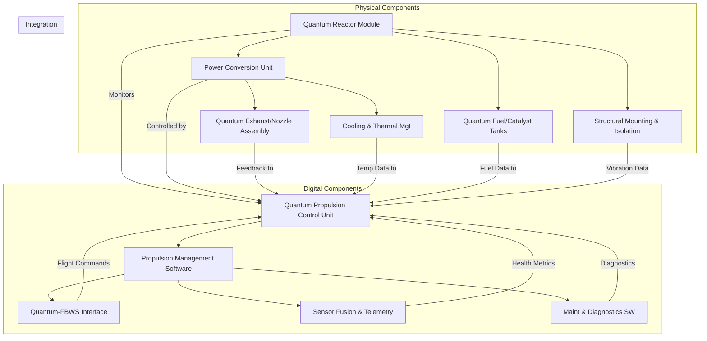
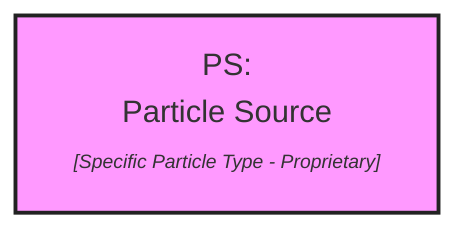

# **FTC_71-00-00-00-000-Quantum-Propulsion_Q-01.mf**

---

## **Version History**

| Version | Date        | Author(s)                                                                                             | Description / Change Notes                                                                                                                                                                                                                                                                           | Affected Sections                                                                                                                                                                                                                      |
| :-----: | :---------: | :---------------------------------------------------------------------------------------------------- | :---------------------------------------------------------------------------------------------------------------------------------------------------------------------------------------------------------------------------------------------------------------------------------------------------- | :------------------------------------------------------------------------------------------------------------------------------------------------------------------------------------------------------------------------------------- |
| **1.0** | 2024-12-31  | Amedeo Pelliccia, ChatGPT, Copilot, Gemini, Perplexity AI, Mermaid AI                                 | Creation of the consolidated Flight Controls document, integrating advanced technologies (AI, fly-by-wire enhancements, predictive maintenance, etc.)                                                                                                                                                 | All                                                                                                                                                                                                                                    |
| **1.1** | 2025-01-15  | Amedeo Pelliccia, User Feedback Incorporation, ChatGPT, Gemini, Perplexity AI                         | Initial draft of ATA 27 Flight Controls. Added key sections, placeholders for diagrams, and references to advanced control systems.                                                                                                                                                                   | All                                                                                                                                                                                                                                    |
                                                                                           |

---

## **Table of Contents**

### **71.00 Power Plant - Q-01 Quantum Propulsion System**

1. [**71.10 Overview**](#7110-overview)  
2. [**71.20 Technology Details**](#7120-technology-details)  
3. [**71.30 Compliance and Validation**](#7130-compliance-and-validation)  
4. [**71.40 Impact Analysis**](#7140-impact-analysis)  
5. [**71.50 Risk Assessment**](#7150-risk-assessment)  
6. [**71.60 Mitigation Strategies**](#7160-mitigation-strategies)  
7. [**71.70 Related Systems**](#7170-related-systems)  
8. [**71.80 Development Status**](#7180-development-status)  
9. [**71.90 Remarks and Recommendations**](#7190-remarks-and-recommendations)  
10. [**71.100 Appendices**](#71100-appendices)  
11. [**71.110 Training and Certification**](#71110-training-and-certification)  
12. [**71.120 Advanced Diagnostics and Monitoring**](#71120-advanced-diagnostics-and-monitoring)  
13. [**71.130 Human Factors and Ergonomics**](#71130-human-factors-and-ergonomics)  
14. [**71.140 Cybersecurity and Data Integrity**](#71140-cybersecurity-and-data-integrity)  
15. [**71.150 Cost Analysis and Budgeting**](#71150-cost-analysis-and-budgeting)  
16. [**71.160 Technology Roadmap**](#71160-technology-roadmap)  
17. [**71.170 Market Analysis and Applications**](#71170-market-analysis-and-applications)  
18. [**71.180 Manufacturing Processes and Quality Assurance**](#71180-manufacturing-processes-and-quality-assurance)  
19. [**71.190 Technology Transfer and Commercialization**](#71190-technology-transfer-and-commercialization)  
20. [**71.200 Sustainability and Environmental Impact**](#71200-sustainability-and-environmental-impact)  
21. [**71.210 AI-Driven Performance Optimization** *(New)*](#71210-ai-driven-performance-optimization)  
22. [**71.220 Quantum Avionics Integration** *(New)*](#71220-quantum-avionics-integration)  
23. [**71.230 Extended Flight Operation Frameworks** *(New)*](#71230-extended-flight-operation-frameworks)  
24. [**71.240 Ethical and Societal Implications** *(New)*](#71240-ethical-and-societal-implications)

---

### **71.10 Overview**

- [71.10.01 Introduction to Quantum Propulsion](#711001-introduction-to-quantum-propulsion)  
- [71.10.02 Goals and Objectives](#711002-goals-and-objectives)  
- [71.10.03 Alignment with ATA Chapter 71](#711003-alignment-with-ata-chapter-71)

---

### **71.20 Technology Details**

- [71.20.01 Technical Description](#712001-technical-description)  
- [71.20.02 Quantum Propulsion Mechanics](#712002-quantum-propulsion-mechanics)  
- [71.20.03 Integration with FADEC Systems](#712003-integration-with-fadec-systems)  
- [71.20.04 Comparison with Conventional Propulsion Systems](#712004-comparison-with-conventional-propulsion-systems)  
- [71.20.05 Quantum Propulsion System Architecture](#712005-quantum-propulsion-system-architecture)  
- [71.20.06 Major Components (Physical and Digital)](#712006-major-components-physical-and-digital)  
  - [71.20.06.1 Physical Components](#7120061-physical-components)  
  - [71.20.06.2 Digital Components](#7120062-digital-components)  
  - [71.20.06.3 Integration Diagram](#7120063-integration-diagram)

---

### **71.30 Compliance and Validation**

- [71.30.01 DO-254 Validation Requirements](#713001-do-254-validation-requirements)  
- [71.30.02 Certification Roadmap (FAA, EASA)](#713002-certification-roadmap-faa-easa)  
- [71.30.03 Safety Standards and Protocols](#713003-safety-standards-and-protocols)  
- [71.30.04 Verification and Validation (V&V) Procedures](#713004-verification-and-validation-vv-procedures)

---

### **71.40 Impact Analysis**

- [71.40.01 Environmental Impact](#714001-environmental-impact)  
- [71.40.02 Operational Benefits](#714002-operational-benefits)  
- [71.40.03 Efficiency Metrics](#714003-efficiency-metrics)

---

### **71.50 Risk Assessment**

- [71.50.01 Identified Risks](#715001-identified-risks)  
- [71.50.02 Risk Level Classification](#715002-risk-level-classification)  
- [71.50.03 Risk Scenarios (Technical, Operational, Regulatory)](#715003-risk-scenarios-technical-operational-regulatory)  
- [71.50.04 Failure Mode and Effects Analysis (FMEA)](#715004-failure-mode-and-effects-analysis-fmea)

---

### **71.60 Mitigation Strategies**

- [71.60.01 Contingency Protocols](#716001-contingency-protocols)  
- [71.60.02 System Redundancy Plans](#716002-system-redundancy-plans)  
- [71.60.03 Testing and Simulation Frameworks](#716003-testing-and-simulation-frameworks)  
- [71.60.04 Maintenance and Repair Considerations](#716004-maintenance-and-repair-considerations)

---

### **71.70 Related Systems**

- [71.70.01 Dependencies on Engine Components](#717001-dependencies-on-engine-components)  
- [71.70.02 FADEC (Full Authority Digital Engine Control) Integration](#717002-fadec-full-authority-digital-engine-control-integration)  
- [71.70.03 Cross-System Interoperability](#717003-cross-system-interoperability)  
- [71.70.04 Thermal Management System Integration](#717004-thermal-management-system-integration)

---

### **71.80 Development Status**

- [71.80.01 Current Progress](#718001-current-progress)  
- [71.80.02 Milestones Achieved](#718002-milestones-achieved)  
- [71.80.03 Challenges and Next Steps](#718003-challenges-and-next-steps)

---

### **71.90 Remarks and Recommendations**

- [71.90.01 Key Observations](#719001-key-observations)  
- [71.90.02 Suggestions for Improvement](#719002-suggestions-for-improvement)  
- [71.90.03 Additional Notes](#719003-additional-notes)

---

### **71.100 Appendices**

- [71.100.01 Glossary of Terms](#7110001-glossary-of-terms)  
- [71.100.02 Technical Diagrams](#7110002-technical-diagrams)  
- [71.100.03 Reference Standards and Documents](#7110003-reference-standards-and-documents)

---

### **71.110 Training and Certification**

- [71.110.01 Pilot Training Programs](#7111001-pilot-training-programs)  
  - [71.110.01.1 Curriculum Development](#71110011-curriculum-development)  
  - [71.110.01.2 Simulator Training](#71110012-simulator-training)  
  - [71.110.01.3 In-Flight Training](#71110013-in-flight-training)  
  - [71.110.01.4 Human Factors and Ergonomics](#71110014-human-factors-and-ergonomics)  
  - [71.110.01.5 Certification](#71110015-certification)  
  - [71.110.01.6 Recurrent Training](#71110016-recurrent-training)  
  - [71.110.01.7 Specialized Ratings](#71110017-specialized-ratings)  
  - [71.110.01.8 Continuous Improvement](#71110018-continuous-improvement)  
- [71.110.02 Maintenance Crew Certification](#7111002-maintenance-crew-certification)  
  - [71.110.02.1 Specialized Tooling and Equipment](#71110021-specialized-tooling-and-equipment)

---

### **71.120 Advanced Diagnostics and Monitoring**

- [71.120.01 Real-Time Health Monitoring](#7112001-real-time-health-monitoring)  
  - [71.120.01.1 Data Analytics and Visualization](#71120011-data-analytics-and-visualization)  
- [71.120.02 Diagnostic Tools](#7112002-diagnostic-tools)  
  - [71.120.02.1 Remote Diagnostics](#71120021-remote-diagnostics)

---

### **71.130 Human Factors and Ergonomics**

- [71.130.01 Cockpit Design Considerations](#7113001-cockpit-design-considerations)  
  - [71.130.01.1 Adaptive Automation](#71130011-adaptive-automation)  
- [71.130.02 Safety Protocols](#7113002-safety-protocols)

---

### **71.140 Cybersecurity and Data Integrity**

- [71.140.01 Threat Analysis](#7114001-threat-analysis)  
  - [71.140.01.1 Known Vulnerabilities in Similar Systems](#71140011-known-vulnerabilities-in-similar-systems)  
  - [71.140.01.2 Threat Modeling Methodologies (STRIDE, PASTA, etc.)](#71140012-threat-modeling-methodologies-stride-pasta-etc)  
- [71.140.02 Secure Communication Channels](#7114002-secure-communication-channels)  
  - [71.140.02.1 Encrypted Communication Links (TLS, IPsec, etc.)](#71140021-encrypted-communication-links-tls-ipsec-etc)  
  - [71.140.02.2 Secure Data Bus Protocols (ARINC 664/AFDX)](#71140022-secure-data-bus-protocols-arinc-664afdx)  
  - [71.140.02.3 Data-in-Transit vs. Data-at-Rest Security](#71140023-data-in-transit-vs-data-at-rest-security)  
- [71.140.03 Intrusion Detection and Prevention](#7114003-intrusion-detection-and-prevention)  
  - [71.140.03.1 Signature-Based vs. Anomaly-Based Detection](#71140031-signature-based-vs-anomaly-based-detection)  
  - [71.140.03.2 AI-Powered Threat Detection](#71140032-ai-powered-threat-detection)  
- [71.140.04 Secure Updates and Patch Management](#7114004-secure-updates-and-patch-management)  
  - [71.140.04.1 Code Signing and Verification](#71140041-code-signing-and-verification)  
  - [71.140.04.2 Rollback Mechanisms](#71140042-rollback-mechanisms)  
- [71.140.05 Regulatory Compliance](#7114005-regulatory-compliance)  
  - [71.140.05.1 DO-326A / ED-202A, DO-356A / ED-203A](#71140051-do-326a-ed-202a-do-356a-ed-203a)  
  - [71.140.05.2 NIST Cybersecurity Framework](#71140052-nist-cybersecurity-framework)  
  - [71.140.05.3 Data Privacy (GDPR, CCPA)](#71140053-data-privacy-gdpr-ccpa)  
- [71.140.06 Supply Chain Security](#7114006-supply-chain-security)  
  - [71.140.06.1 Third-Party Components and Software Risks](#71140061-third-party-components-and-software-risks)  
  - [71.140.06.2 Traceability and Vendor Qualifications](#71140062-traceability-and-vendor-qualifications)  
- [71.140.07 Incident Response Plan](#7114007-incident-response-plan)  
  - [71.140.07.1 Procedures for Cybersecurity Incidents](#71140071-procedures-for-cybersecurity-incidents)  
  - [71.140.07.2 Recovery and Reporting Frameworks](#71140072-recovery-and-reporting-frameworks)

---

### **71.150 Cost Analysis and Budgeting**

- [71.150.01 Cost Breakdown](#7115001-cost-breakdown)  
- [71.150.02 Budget Allocation](#7115002-budget-allocation)  
- [71.150.03 Cost-Benefit Analysis](#7115003-cost-benefit-analysis)  
- [71.150.04 Financial Risks and Mitigations](#7115004-financial-risks-and-mitigations)

---

### **71.160 Technology Roadmap**

- [71.160.01 Short-Term Goals (1-2 Years)](#7116001-short-term-goals-1-2-years)  
- [71.160.02 Mid-Term Goals (3-5 Years)](#7116002-mid-term-goals-3-5-years)  
- [71.160.03 Long-Term Goals (5+ Years)](#7116003-long-term-goals-5-years)  
- [71.160.04 Emerging Technologies and Innovations](#7116004-emerging-technologies-and-innovations)  
- [71.160.05 Collaboration and Partnerships](#7116005-collaboration-and-partnerships)

---

### **71.170 Market Analysis and Applications**

- [71.170.01 Market Potential](#7117001-market-potential)  
- [71.170.02 Applications](#7117002-applications)  
- [71.170.03 Customer Segmentation](#7117003-customer-segmentation)  
- [71.170.04 Adoption Barriers and Solutions](#7117004-adoption-barriers-and-solutions)

---

### **71.180 Manufacturing Processes and Quality Assurance**

- [71.180.01 Manufacturing Methodologies](#7118001-manufacturing-methodologies)  
- [71.180.02 Quality Assurance Protocols](#7118002-quality-assurance-protocols)  
- [71.180.03 Supply Chain Management](#7118003-supply-chain-management)  
- [71.180.04 Scalability and Production Planning](#7118004-scalability-and-production-planning)

---

### **71.190 Technology Transfer and Commercialization**

- [71.190.01 Technology Transfer Mechanisms](#7119001-technology-transfer-mechanisms)  
- [71.190.02 Commercialization Strategies](#7119002-commercialization-strategies)  
- [71.190.03 Intellectual Property (IP) Management](#7119003-intellectual-property-ip-management)  
- [71.190.04 Customer Support and Service](#7119004-customer-support-and-service)

---

### **71.200 Sustainability and Environmental Impact**

- [71.200.01 Environmental Benefits](#7120001-environmental-benefits)  
- [71.200.02 Sustainable Materials and Manufacturing](#7120002-sustainable-materials-and-manufacturing)  
- [71.200.03 Lifecycle Environmental Impact](#7120003-lifecycle-environmental-impact)  
- [71.200.04 Compliance with Environmental Regulations](#7120004-compliance-with-environmental-regulations)

---

### **71.210 AI-Driven Performance Optimization** *(New)*

- **71.210.01 Real-Time AI Thrust Management**  
  - Adaptive thrust allocation using machine learning to optimize fuel consumption, thermal loads, and overall efficiency.  
- **71.210.02 Predictive Maintenance Analytics**  
  - AI-based anomaly detection for preemptive repairs and minimal downtime.  
- **71.210.03 Advanced Flight Envelope Expansion**  
  - Autonomous flight envelope monitoring via AI, providing real-time guidance to pilots for flight safety and efficiency.  
- **71.210.04 Integration with GAIA Ecosystem**  
  - Incorporation of GAIA AIR’s AMPEL360 and GES frameworks for cross-domain data exchange and operational synergy.  

---

### **71.220 Quantum Avionics Integration** *(New)*

- **71.220.01 Avionics Architecture for Quantum Systems**  
  - Design considerations for integrating quantum-specific hardware into existing avionics platforms.  
- **71.220.02 Interoperability with Legacy Systems**  
  - Protocol translation layers to ensure backward compatibility with traditional flight decks.  
- **71.220.03 Quantum Communication and Navigation**  
  - Leveraging quantum entanglement for secure, low-latency communication and novel navigation techniques.  
- **71.220.04 Testing & Certification Pathways**  
  - Roadmap for verifying avionics hardware/software under emerging regulatory frameworks.

---

### **71.230 Extended Flight Operation Frameworks** *(New)*

- **71.230.01 High-Altitude & Long-Duration Flight**  
  - Unique constraints and benefits of using quantum propulsion for near-space or supersonic missions.  
- **71.230.02 Autonomous and Semi-Autonomous Operations**  
  - Integration with autopilot and remote operation systems for advanced UAV or optionally piloted aircraft.  
- **71.230.03 Disaster Relief & Emergency Response**  
  - Leverage quantum propulsion for rapid humanitarian missions in challenging environments.  
- **71.230.04 Multi-Role Configurations**  
  - Adaptable design enabling cargo, passenger, or specialized mission transformations with minimal reconfiguration.

---

### **71.240 Ethical and Societal Implications** *(New)*

- **71.240.01 Environmental Justice**  
  - Impact analysis of quantum propulsion on global emissions and climate equity.  
- **71.240.02 Socioeconomic Considerations**  
  - Potential shifts in labor markets, skill requirements, and infrastructure demands.  
- **71.240.03 Ethical AI in Quantum Systems**  
  - Standards for AI transparency, fairness, and accountability within critical flight operations.  
- **71.240.04 Global Regulatory and Policy Outlook**  
  - Overview of national and international efforts shaping the commercial adoption of quantum propulsion.

---

## **Detailed Addendum on 71.20.06 Major Components**

Below is a brief reminder of the newly added sections under **71.20.06** that detail Physical and Digital components, along with an updated Mermaid diagram for **Integration**:

### **71.20.06.1 Physical Components**
1. **Quantum Reactor Module**  
   - **Core Function:** Houses the quantum reaction chamber for energy generation.  
   - **Sub-assemblies:** Quantum Chamber Lining, Energy Extraction Nodes, Safety Containment System.

2. **Power Conversion Unit (PCU)**  
   - **Core Function:** Converts raw quantum energy into usable power.  
   - **Sub-assemblies:** Voltage/Current Regulators, Cooling Circuitry, Backup Energy Storage (BES).

3. **Quantum Exhaust/Nozzle Assembly**  
   - **Core Function:** Directs exhaust flow or reaction output.  
   - **Sub-assemblies:** Nozzle Geometry, Thermal Coatings, Directional Control Vane(s).

4. **Structural Mounting and Vibration Isolation**  
   - **Core Function:** Secures the propulsion system and mitigates vibration.  
   - **Sub-assemblies:** Mounting Brackets, Damping Systems.

5. **Cooling and Thermal Management Components**  
   - **Core Function:** Regulates operating temperature.  
   - **Sub-assemblies:** Heat Exchangers, Coolant Pumps and Reservoirs, Thermal Sensors and Valves.

6. **Quantum Fuel or Catalyst Tanks** *(If Applicable)*  
   - **Core Function:** Stores specialized reactants.  
   - **Sub-assemblies:** Material Linings, Pressure Regulation Valves, Safety Relief Mechanisms.

### **71.20.06.2 Digital Components**
1. **Quantum Propulsion Control Unit (QPCU)**  
   - **Core Function:** Digital “brain” for quantum interactions.  
   - **Sub-assemblies:** Processor Modules, Memory and Storage, AI and ML Integration.

2. **Propulsion Management Software (PMS)**  
   - **Core Function:** Executes control laws and system operations.  
   - **Sub-assemblies:** Core Algorithms, Diagnostics Modules, Data Logging.

3. **Quantum-FBWS (Fly-by-Wire System) Interface**  
   - **Core Function:** Links propulsion to aircraft FBW architecture.  
   - **Sub-assemblies:** Communication Protocols, Redundancy/Failover Logic, Cybersecurity Layers.

4. **Sensor Fusion and Telemetry System**  
   - **Core Function:** Aggregates data for cohesive system health/status.  
   - **Sub-assemblies:** Sensor Data Acquisition Modules, Fusion Algorithms, Telemetry Broadcasting.

5. **Maintenance and Diagnostics Software**  
   - **Core Function:** Facilitates predictive maintenance.  
   - **Sub-assemblies:** User Interface (UI), Remote Update Capability, AI-Driven Fault Prediction.

### **71.20.06.3 Integration Diagram**



**Description:**  
This diagram shows how the **Physical Components** (Quantum Reactor, Power Conversion Unit, Exhaust/Nozzle Assembly, Cooling/Thermal Management, Fuel/Catalyst Tanks, and Structural Mounting) interface with the **Digital Components** (Quantum Propulsion Control Unit, Propulsion Management Software, Quantum-FBWS Interface, Sensor Fusion & Telemetry, and Maintenance & Diagnostics Software). The **Integration** subgraph clarifies the data and command flow, ensuring seamless operation of the Quantum Propulsion System.

---

## **New Sections Synopsis**

1. **71.210 AI-Driven Performance Optimization**  
   - Introduces AI-based real-time thrust management, predictive maintenance, and advanced flight envelope expansion.

2. **71.220 Quantum Avionics Integration**  
   - Addresses new hardware layers for quantum systems and how they coexist with legacy avionics.  

3. **71.230 Extended Flight Operation Frameworks**  
   - Explores autonomous/semi-autonomous operations and special-mission use cases for quantum propulsion.

4. **71.240 Ethical and Societal Implications**  
   - Discusses broader regulatory, socioeconomic, and environmental justice concerns surrounding quantum propulsion adoption.

---

### **Conclusion**

By **adding** these new sections (71.210, 71.220, 71.230, 71.240) and consolidating the **Major Components** under 71.20.06, the **Quantum Propulsion System** documentation provides a **richer, more holistic** view of the technology, from **hardware** and **software** details to **compliance**, **cost**, and **ethical considerations**. This comprehensive TOC not only supports engineers and developers in designing, integrating, and validating the system but also informs stakeholders—ranging from regulators and operators to financiers and sustainability experts—about the **full lifecycle** of quantum propulsion solutions.

---



**Explanation and How to Implement Interactivity:**

**What the code represents:**

*   **`flowchart TD`:**  Indicates a top-down flowchart.
*   **`PS["PS:<br>Particle Source<br><font size=1><i>[Specific Particle Type - Proprietary]</i></font>"]`:** Defines a node labeled "PS" with text "Particle Source" and a smaller, italicized placeholder for the proprietary particle type.
*   **`click PS "showTooltip(...)"`:** This is the crucial part that defines the interactive behavior. It associates a click event on the "PS" node with a JavaScript function `showTooltip()`.
    *   The first argument to `showTooltip()` is the text content you want to display in the tooltip (HTML formatted).
    *   The second argument is a placeholder for a URL – you could link to more detailed documentation here.
*   **`style PS fill:#f9f, stroke:#222, stroke-width:2px`:** Defines the visual style of the "PS" node (light pink fill, dark gray stroke).

**How to Implement Interactivity (Outside of Mermaid):**

Mermaid itself doesn't directly support interactive tooltips in the rendered diagram. The `click` command in Mermaid is a way to define the *intended* behavior, but the actual interactivity needs to be implemented using JavaScript (or a similar language) in the environment where you're displaying the Mermaid diagram (e.g., on a webpage, within a specific application).

Here's a general outline of how you would implement the tooltip functionality:

1.  **Render the Mermaid Diagram:** Use a JavaScript library like `mermaid.js` to render the Mermaid code into an SVG element on your webpage.

2.  **Add JavaScript Code:**  Include JavaScript code that does the following:
    *   **Selects the "PS" Node:** Use JavaScript's DOM manipulation capabilities (e.g., `document.querySelector()`) to select the SVG element corresponding to the "PS" node.
    *   **Attaches an Event Listener:** Attach a `mouseover` (or `mouseenter`) event listener to the "PS" node. This listener will trigger a function when the user hovers the mouse over the node.
    *   **Creates and Displays the Tooltip:** Inside the event listener function:
        *   Create a new HTML element (e.g., a `<div>`) to represent the tooltip.
        *   Set the tooltip's content using the text provided in the `showTooltip()` argument (you might need to parse this text if it's dynamically generated by Mermaid).
        *   Set the tooltip's position using JavaScript, typically relative to the mouse cursor or the "PS" node's position.
        *   Add the tooltip to the webpage (e.g., append it to the `<body>` or a container element).
    *   **Hides the Tooltip:** Attach a `mouseout` (or `mouseleave`) event listener to the "PS" node to hide the tooltip when the mouse moves away.

**Example JavaScript Snippet (Conceptual):**

```javascript
// Assuming you've rendered the Mermaid diagram and have a way to select the PS node

const psNode = document.querySelector("#PS"); // Select the PS node in the rendered SVG

psNode.addEventListener("mouseover", () => {
  // 1. Create the tooltip element
  const tooltip = document.createElement("div");
  tooltip.id = "ps-tooltip";
  tooltip.style.position = "absolute";
  tooltip.style.backgroundColor = "white";
  tooltip.style.border = "1px solid black";
  tooltip.style.padding = "5px";
  // ... add more styling as needed

  // 2. Set the tooltip content (you might need to extract this from the Mermaid definition)
  tooltip.innerHTML = "Particle Source: Produces photons for entanglement.<br>Type: Proprietary<br>Emission Rate: [Proprietary]";

  // 3. Position the tooltip (this is a simplified example)
  const x = psNode.getBoundingClientRect().left + window.scrollX + 10; // Adjust as needed
  const y = psNode.getBoundingClientRect().top + window.scrollY + 10;  // Adjust as needed
  tooltip.style.left = `${x}px`;
  tooltip.style.top = `${y}px`;

  // 4. Add the tooltip to the page
  document.body.appendChild(tooltip);
});

psNode.addEventListener("mouseout", () => {
  // Remove the tooltip when the mouse leaves
  const tooltip = document.getElementById("ps-tooltip");
  if (tooltip) {
    document.body.removeChild(tooltip);
  }
});
```

**Important Notes:**

*   This JavaScript code is a simplified illustration. You'll need to adapt it based on the specific structure of your rendered Mermaid diagram and the JavaScript environment you're using.
*   The exact way to extract the tooltip text from the Mermaid `click` command will depend on how you're rendering the diagram. You might need to parse the generated SVG or use a Mermaid API function if available.
*   Consider using a JavaScript library like `tippy.js` or `popper.js` to simplify tooltip creation and management. They often handle positioning, styling, and other complexities for you.

By implementing this type of interactivity, you can make your QEE schematic diagram much more informative and user-friendly, allowing users to explore the details of each component without cluttering the main diagram.
