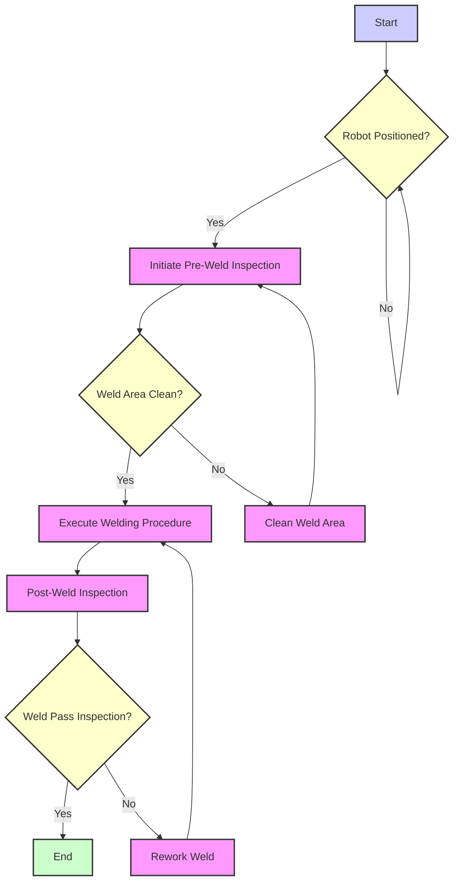
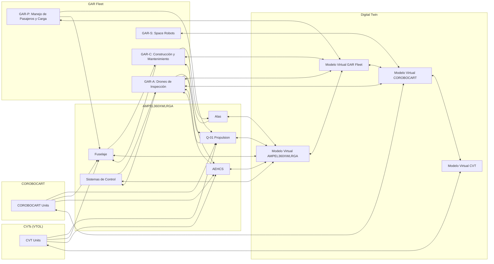
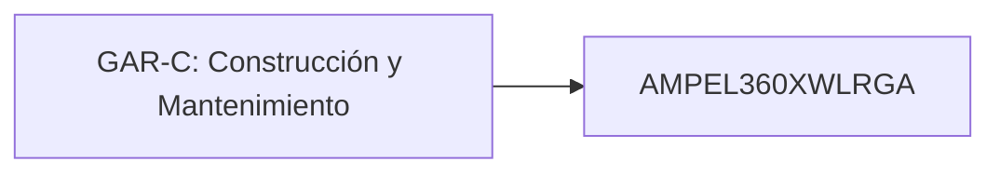
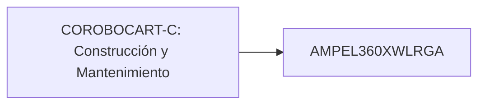

## **IV. GAIA & AMPEL Robotics Fleet (GAR Fleet)**

### **4.1 GAR Fleet Overview**

- [4.1.1 Mission and Vision](./gar_fleet/mission_vision.md) **(Status: Approved, TRL: 5, Last Updated: 2025-03-20)**
- [4.1.2 Guiding Principles](./gar_fleet/guiding_principles.md) **(Status: Approved, TRL: 5, Last Updated: 2025-03-20)**
- [4.1.3 Fleet Composition and Roles](./gar_fleet/fleet_composition.md) **(Status: Approved, TRL: 5, Last Updated: 2025-03-20)**
- [4.1.4 Integration with GAIA AIR Ecosystem](./gar_fleet/integration.md) **(Status: Approved, TRL: 5, Last Updated: 2025-03-20)**

### **4.2 GAR-C (Construction and Maintenance)**

**Desarrollo de la Sección 4.2: GAR-C (Construction and Maintenance)**

Aquí tienes un desarrollo más extenso de la sección 4.2, que se centra en los robots GAR-C para construcción y mantenimiento dentro del marco COAFI:

**4.2 GAR-C (Construction and Maintenance)**

*   **P/N:** GPAM-GAR-C-0402
*   **4.2.1 GAR-C Specifications:**
    *   **P/N:** GPAM-GAR-C-0402-01
    *   **IN:** GPAM-GAR-C-0402-01-001 - **Size and Weight Specifications:**
        *   **Content:**
            *   Defines the size and weight limitations for different GAR-C variants, considering their intended operating environments.
            *   Variants may include:
                *   **Heavy-Duty:** Larger robots for major assembly tasks.
                *   **Medium:**  General-purpose robots for a variety of tasks.
                *   **Compact:** Smaller robots for accessing confined spaces within the AMPEL360XWLRGA or other structures.
            *   For each variant, specify:
                *   **Maximum Dimensions:** (Length, width, height in meters)
                *   **Maximum Weight:** (in kilograms)
                *   **Payload Capacity:** (in kilograms) - The maximum weight the robot can carry or manipulate.
        *   **Document:** GPAM-GAR-C-0402-01-001-A - Size and Weight Specifications for GAR-C Variants
    *   **IN:** GPAM-GAR-C-0402-01-002 - **Payload Capacity and Distribution:**
        *   **Content:**
            *   Details on how much weight each GAR-C variant can carry and how that weight should be distributed.
            *   Considerations for center of gravity and stability during lifting and manipulation.
            *   Specifications for different types of payloads (tools, components, materials).
        *   **Document:** GPAM-GAR-C-0402-01-002-A - Payload Capacity and Distribution Guidelines
    *   **IN:** GPAM-GAR-C-0402-02-001 - **Battery Life and Charging Specifications:**
        *   **Content:**
            *   Specifies power consumption for different tasks (e.g., welding, lifting, moving).
            *   Defines battery capacity and expected operational time on a single charge.
            *   Describes charging methods (e.g., conductive charging, inductive charging, battery swapping).
            *   Outlines charging times and procedures.
            *   **Metrics:**
                *   Operational Time:  > 4 hours on a single charge under typical operating conditions.
                *   Charging Time: < 1 hour to reach 80% capacity.
        *   **Document:** GPAM-GAR-C-0402-02-001-A - Battery Life and Charging Specifications
    *   **IN:** GPAM-GAR-C-0402-02-002 - **Energy Consumption Metrics:**
        *   **Content:**
            *   Provides detailed metrics on energy consumption for various GAR-C operations.
            *   Includes data on energy usage during different tasks and operational modes.
            *   Establishes benchmarks for energy efficiency.
        *   **Document:** GPAM-GAR-C-0402-02-002-A - Energy Consumption Metrics
    *   **IN:** GPAM-GAR-C-0402-03-001 - **Degrees of Freedom and Movement Range:**
        *   **Content:**
            *   Specifies the number of degrees of freedom (DOF) for each robotic arm or manipulator.
            *   Defines the range of motion for each joint or actuator.
            *   Includes diagrams illustrating the robot's reach and workspace.
        *   **Document:** GPAM-GAR-C-0402-03-001-A - Degrees of Freedom and Movement Range
    *   **IN:** GPAM-GAR-C-0402-03-002 - **Locomotion System Specifications:**
        *   **Content:**
            *   Describes the locomotion systems used by different GAR-C variants (e.g., wheeled, tracked, legged, magnetic adhesion).
            *   Specifies performance parameters such as speed, maneuverability, and ability to traverse different terrains.
        *   **Document:** GPAM-GAR-C-0402-03-002-A - Locomotion System Specifications

*   **4.2.2 GAR-C Deployment and Operation:**
    *   **P/N:** GPAM-GAR-C-0402-02
    *   **IN:** GPAM-GAR-C-0402-04-001 - **Use Cases (Welding, Assembly, Inspection):**
        *   **Content:**  Provides detailed descriptions of specific use cases for GAR-C units:
            *   **IN:** GPAM-GAR-C-0402-04-001-001 - **Welding Procedures and Standards:**
                *   **Content:**  Defines the welding procedures to be used by GAR-C units, including:
                    *   Types of welding (e.g., laser beam welding, friction stir welding).
                    *   Welding parameters (e.g., current, voltage, travel speed).
                    *   Quality control procedures for welds.
                    *   Relevant welding standards (e.g., AWS D17.1 for aerospace welding).
                *   **Document:** GPAM-GAR-C-0402-04-001-A-001 - Welding Procedures and Standards
            *   **IN:** GPAM-GAR-C-0402-04-001-002 - **Assembly Protocols and Automation:**
                *   **Content:**  Describes the protocols for using GAR-C units in assembly tasks, including:
                    *   Procedures for handling and installing components.
                    *   Use of robotic arms and end effectors for assembly.
                    *   Automated assembly sequences and workflows.
                    *   Integration with CAD/CAM systems.
                *   **Document:** GPAM-GAR-C-0402-04-001-A-002 - Assembly Protocols and Automation
            *   **IN:** GPAM-GAR-C-0402-04-001-003 - **Inspection Procedures and Data Acquisition:**
                *   **Content:** Defines the procedures for using GAR-C units in inspection tasks, including:
                    *   Types of inspections (e.g., visual, NDT).
                    *   Sensor integration for data acquisition.
                    *   Data processing and analysis techniques.
                    *   Reporting procedures for inspection results.
                *   **Document:** GPAM-GAR-C-0402-04-001-A-003 - Inspection Procedures and Data Acquisition
    *   **IN:** GPAM-GAR-C-0402-05-001 - **Integration with Digital Twin:**
        *   **Content:**
            *   **IN:** GPAM-GAR-C-0402-05-001-001 - **Data Synchronization with Digital Twin:**
                *   **Content:** Describes how data from GAR-C units is synchronized with the Digital Twin, including data formats, communication protocols, and update frequencies.
            *   **IN:** GPAM-GAR-C-0402-05-001-002 - **Real-Time Monitoring and Control via Digital Twin:**
                *   **Content:** Explains how the Digital Twin can be used to monitor the status and performance of GAR-C units in real-time, and how it can be used to send control commands to the robots.

**Example:  Detailed IN for Welding Procedures and Standards (GPAM-GAR-C-0402-04-001-001):**

```
    IN: GPAM-GAR-C-0402-04-001-001 - Welding Procedures and Standards

    Document: GPAM-GAR-C-0402-04-001-A-001 - Welding Procedures and Standards

    Content:
        1. Scope: This document outlines the welding procedures and standards to be followed by GAR-C units when performing welding operations on GAIA AIR aerospace platforms.

        2. Applicable Welding Processes:
            *   Laser Beam Welding (LBW): For joining titanium and aluminum-lithium alloy components.
            *   Friction Stir Welding (FSW): For joining aluminum-lithium alloy components.

        3. Welding Parameters:
            *   LBW:
                *   Laser Power: [Specify range] kW
                *   Welding Speed: [Specify range] mm/s
                *   Shielding Gas: Argon (99.99% purity)
                *   Focal Position: [Specify range] mm
            *   FSW:
                *   Tool Rotation Speed: [Specify range] rpm
                *   Welding Speed: [Specify range] mm/min
                *   Axial Force: [Specify range] kN

        4. Material Preparation:
            *   Cleaning:  All surfaces to be welded must be thoroughly cleaned and degreased prior to welding.
            *   Joint Preparation:  Joint surfaces must be properly prepared according to the specific welding process and material.

        5. Welding Procedures:
            *   Detailed step-by-step instructions for each welding process (LBW and FSW), including preheating, welding, and post-weld treatment procedures.
            *   Diagrams illustrating the welding setup, joint configuration, and tool path.

        6. Quality Control:
            *   Visual Inspection: All welds must be visually inspected for defects such as cracks, porosity, and incomplete fusion.
            *   Non-Destructive Testing (NDT):  Welds must undergo NDT inspection using methods such as:
                *   Radiographic Testing (RT)
                *   Ultrasonic Testing (UT)
                *   Dye Penetrant Testing (PT)
            *   Acceptance Criteria: Define specific acceptance criteria for each NDT method, based on industry standards (e.g., AWS D17.1) and design requirements.

        7. Welder Qualification:
            *   GAR-C units performing welding operations must be certified according to relevant standards (e.g., AWS D17.1 for aerospace welding).
            *   Regular audits of robot performance and calibration will be conducted.

        8. Safety Precautions:
            *   Laser Safety:  Strict adherence to laser safety protocols is required during LBW operations.
            *   Fume Extraction:  Adequate ventilation and fume extraction systems must be in place.
            *   Emergency Stop:  Robots must be equipped with emergency stop mechanisms that can be activated remotely or by sensors.

        9.  References:
            *   AWS D17.1: Specification for Fusion Welding for Aerospace Applications
            *   ISO 18278: Resistance welding - Weldability
            *   Relevant material specifications for Al-Li and Ti alloys.

        10.  Revision History:
            *   Version 1.0: Initial release (2025-03-15)
```

**Diagram Example (Mermaid):**

Here's a simple Mermaid diagram illustrating a potential workflow for a GAR-C welding operation:



**Next Steps:**

1.  **Continue Developing INs:**  Create detailed IN documents for each of the areas listed under GAR-C, GAR-P, GAR-A, and GAR-S specifications.
2.  **Diagrams:**  Generate detailed diagrams for each GAR Fleet category, illustrating their structure, operation, and integration with other systems.
3.  **S1000D Modules:**  Start drafting S1000D modules for maintenance, operation, and training, focusing on the GAR-C category initially.
4.  **Digital Twin Integration:**  Develop a plan for integrating GAR Fleet data with the Digital Twin, including data formats, communication protocols, and simulation scenarios.

By continuing with this detailed approach, you will create a comprehensive and well-documented framework for the GAR Fleet, ensuring that these robotic systems are effectively integrated into the GAIA AIR ecosystem.  What area would you like to focus on next?


# **COAFI: GAIA & AMPEL Robotics Fleet (GAR Fleet), COROBOCART, and VTOL AirCar Ships Documentation**

**Version**: 2.1  
**Date**: 2025-04-27  
**Authors**: GAIA AIR & AMPEL Collaboration  

---

## **I. Introduction**

Esta sección describe la transición de la antigua nomenclatura *ROBBBO-T* hacia la nueva familia **GAR Fleet (GAIA & AMPEL Robotics Fleet)** y la introducción de **COROBOCART**. Además, se integran aquí los *AirCar Ships*, ahora conceptualizados como **Cápsulas VTOL Teledirigidas** (CVT), dentro del ecosistema de **GAIA AIR**. Se detalla cómo ambas líneas de desarrollo (**GAR Fleet**, **COROBOCART** y **CVT**) se configuran como **Robotic Air Transport Systems (Robo-ARTS)**, apoyando la fabricación, mantenimiento, logística y operaciones aéreas y espaciales.

El objetivo de este documento es unificar la documentación COAFI, S1000D y la actualización del "Cosmic Index" para reflejar la integración de:

1. **GAR Fleet**: Divisiones de robots que cubren construcción, mantenimiento, logística de pasajeros/carga, drones y operaciones espaciales.
2. **COROBOCART**: Nuevas unidades robóticas avanzadas que complementan y expanden las capacidades de la GAR Fleet.
3. **Cápsulas VTOL Teledirigidas (CVT)**: Plataformas VTOL de alta versatilidad y gran altitud, controladas por el **QGDC (Quantum Green Data Center)**.

---

## **II. Terminología y Nomenclatura**

1. **ROBBBO-T → GAR Fleet (GAIA & AMPEL Robotics Fleet)**  
   - Se reemplaza toda mención de *ROBBBO-T* por **GAR Fleet**.  
   - Los P/Ns antiguos (ej. `GPAM-ROBBOT-xxxx`) ahora serán `GPAM-GAR-xxxx`.

2. **AirCar Ships → Cápsulas VTOL Teledirigidas (CVT)**  
   - Se reclasifican dentro de la sección **GPSM** (GAIA PULSE SPACE MODULES), dado su alcance altitudinal y control teledirigido por **QGDC**.

3. **Robo-ARTS**: Término genérico que agrupa a la **GAR Fleet**, **COROBOCART**, y las **CVTs** como sistemas robóticos de transporte aéreo (Robotic Air Transport Systems).

4. **COROBOCART**: Nuevas unidades robóticas avanzadas diseñadas para complementar y expandir las capacidades de la **GAR Fleet**, enfocadas en tareas especializadas y misiones de alta complejidad dentro del ecosistema de GAIA AIR.

---

## **III. Actualización de Estructura COAFI**

### **Antes:**

```plaintext
### IV. ROBBBO-T Robotics Family

- [4.1 ROBBBO-T-C (Construction and Maintenance)](./robbbo_t/construction.md) (Status: In Development, TRL: 4, Last Updated: 2025-03-01)
    - [4.1.1 ROBBBO-T-C Specifications](./robbbo_t/construction/specs.md)
        - [4.1.1.1 Physical Characteristics (Size, Weight, Payload)]
        - [4.1.1.2 Power and Energy Requirements]
        - [4.1.1.3 Mobility and Degrees of Freedom]
    - [4.1.2 ROBBBO-T-C Deployment and Operation](./robbbo_t/construction/operation.md)
        - [4.1.2.1 Use Cases (Welding, Assembly, Inspection)]
        - [4.1.2.2 Integration with Digital Twin]
```

### **Después: GAIA & AMPEL Robotics Fleet (GAR Fleet) y COROBOCART**

```plaintext
### IV. GAIA & AMPEL Robotics Fleet (GAR Fleet)

- [4.1 GAR Fleet Overview](./gar_fleet/overview.md) (Status: In Development, TRL: 4, Last Updated: 2025-03-15)
    - [4.1.1 Mission and Vision](./gar_fleet/mission_vision.md)
    - [4.1.2 Guiding Principles](./gar_fleet/guiding_principles.md)
    - [4.1.3 Fleet Composition and Roles](./gar_fleet/fleet_composition.md)
    - [4.1.4 Integration with GAIA AIR Ecosystem](./gar_fleet/integration.md)

- [4.2 GAR-C (Construction and Maintenance)](./gar_fleet/construction.md)
    - [4.2.1 GAR-C Specifications](./gar_fleet/construction/specs.md)
        - [4.2.1.1 Physical Characteristics (Size, Weight, Payload)]
            - P/N: GPAM-GAR-C-0402-01-001
            - IN: GPAM-GAR-C-0402-01-001-001 - Size and Weight Specifications
            - IN: GPAM-GAR-C-0402-01-001-002 - Payload Capacity and Distribution
        - [4.2.1.2 Power and Energy Requirements]
            - P/N: GPAM-GAR-C-0402-02-001
            - IN: GPAM-GAR-C-0402-02-001-001 - Battery Life and Charging Specifications
            - IN: GPAM-GAR-C-0402-02-001-002 - Energy Consumption Metrics
        - [4.2.1.3 Mobility and Degrees of Freedom]
            - P/N: GPAM-GAR-C-0402-03-001
            - IN: GPAM-GAR-C-0402-03-001-001 - Degrees of Freedom and Movement Range
            - IN: GPAM-GAR-C-0402-03-001-002 - Locomotion System Specifications
    - [4.2.2 GAR-C Deployment and Operation](./gar_fleet/construction/operation.md)
        - [4.2.2.1 Use Cases (Welding, Assembly, Inspection)]
            - P/N: GPAM-GAR-C-0402-04-001
            - IN: GPAM-GAR-C-0402-04-001-001 - Welding Procedures and Standards
            - IN: GPAM-GAR-C-0402-04-001-002 - Assembly Protocols and Automation
        - [4.2.2.2 Integration with Digital Twin]
            - P/N: GPAM-GAR-C-0402-05-001
            - IN: GPAM-GAR-C-0402-05-001-001 - Data Synchronization with Digital Twin
            - IN: GPAM-GAR-C-0402-05-001-002 - Real-Time Monitoring and Control via Digital Twin

- [4.3 GAR-P (Passenger and Cargo Handling)](./gar_fleet/passenger_cargo.md)
    - [4.3.1 GAR-P Specifications](./gar_fleet/passenger_cargo/specs.md)
    - [4.3.2 GAR-P Deployment and Operation](./gar_fleet/passenger_cargo/operation.md)

- [4.4 GAR-A (Aerial Robots/Drones)](./gar_fleet/aerial.md)

- [4.5 GAR-S (Space Robots)](./gar_fleet/space.md)

- [4.6 COROBOCART (Advanced Robotics Units)](./corobocart/overview.md)
    - [4.6.1 COROBOCART Specifications](./corobocart/specs.md)
        - [4.6.1.1 Advanced Mobility Systems]
            - P/N: GPAM-COR-0501-01-001
            - IN: GPAM-COR-0501-01-001-001 - Mobility System Design
            - IN: GPAM-COR-0501-01-001-002 - Adaptability Features
        - [4.6.1.2 Sensor Integration and Data Handling]
            - P/N: GPAM-COR-0501-02-001
            - IN: GPAM-COR-0501-02-001-001 - Multi-Sensor Suite Specifications
            - IN: GPAM-COR-0501-02-001-002 - Data Processing Algorithms
        - [4.6.1.3 Communication Systems]
            - P/N: GPAM-COR-0501-03-001
            - IN: GPAM-COR-0501-03-001-001 - Quantum Communication Modules
            - IN: GPAM-COR-0501-03-001-002 - Secure Data Transmission Protocols
    - [4.6.2 COROBOCART Deployment and Operation](./corobocart/operation.md)
        - [4.6.2.1 Use Cases (Advanced Inspection, Autonomous Repairs, High-Altitude Missions)]
            - P/N: GPAM-COR-0501-04-001
            - IN: GPAM-COR-0501-04-001-001 - Advanced Inspection Protocols
            - IN: GPAM-COR-0501-04-001-002 - Autonomous Repair Procedures
        - [4.6.2.2 Integration with Digital Twin]
            - P/N: GPAM-COR-0501-05-001
            - IN: GPAM-COR-0501-05-001-001 - Real-Time Data Synchronization
            - IN: GPAM-COR-0501-05-001-002 - Simulation-Based Task Planning

---

## **IV. Descripción Detallada: GAR Fleet + AMPEL360XWLRGA + Cápsulas VTOL Teledirigidas (CVT)**

### **4.1 Integración de GAR-C (Construction and Maintenance) con AMPEL360XWLRGA**

- **Construcción**  
  - **Robots Colaborativos**: GAR-C trabaja junto a operarios humanos en la fabricación del fuselaje, alas y componentes del AMPEL360XWLRGA.  
  - **AFP (Automated Fiber Placement)**: Integración en la línea de producción para colocar fibras de carbono (CFRP) con máxima precisión.  
  - **Ensamblaje Automatizado**: Ensamblaje de piezas grandes y complejas, reduciendo errores y acelerando el proceso.

- **Mantenimiento**  
  - **Inspecciones**: GAR-C usa sensores avanzados (visión, ultrasonidos) para verificar fuselaje y alas en tierra y potencialmente en vuelo (cooperando con GAR-A).  
  - **Reparaciones**: GAR-C equipa herramientas especializadas (e.g., soldadura, recubrimiento) para reparaciones menores.  
  - **Mantenimiento Predictivo**: Los datos se integran al sistema ML-P para anticipar fallos y programar mantenimiento óptimo.

### **4.2 Integración de GAR-A (Aerial Robots/Drones) con AMPEL360XWLRGA**

- **Inspección Externa**: Drones GAR-A inspeccionan el AMPEL360XWLRGA en tierra o en vuelo, detectando daños o corrosión.  
- **Soporte en Vuelo**: Posible entrega de piezas o herramientas a GAR-C en pleno vuelo para mantenimiento emergente.  
- **Monitoreo Perimetral**: Vigilancia de vertipuertos e instalaciones.

### **4.3 Integración de GAR-P (Passenger and Cargo Handling) con GAIA AIR**

- **Automatización de la Logística**: Robots GAR-P agilizan carga/descarga de equipaje y carga en aeronaves y airships GAIA AIR.  
- **Asistencia a Pasajeros**: Robots de servicio para guiar, informar y asistir con equipaje en vertipuertos.  
- **Limpieza y Desinfección**: Robots con sistemas de desinfección para aeronaves e instalaciones.

### **4.4 Integración con el Digital Twin**

- **Representación Virtual**: Cada unidad GAR se modela en el Digital Twin, mostrando estado y actividad en tiempo real.  
- **Simulación y Planificación**: Optimización de despliegue y tareas a través de simulaciones.  
- **Control y Monitoreo**: Gestión centralizada vía Digital Twin, permitiendo telepresencia y control remoto.

### **4.5 Integración de COROBOCART**

#### **4.5.1 COROBOCART Overview**

- **Descripción General**:  
  **COROBOCART** es una nueva línea avanzada dentro de la **GAR Fleet**, diseñada para tareas especializadas y misiones de alta complejidad en el ecosistema de GAIA AIR. Estas unidades robóticas avanzadas están equipadas con tecnologías de vanguardia, incluyendo inteligencia artificial, sistemas de comunicación cuántica y capacidades autónomas mejoradas.

- **Funciones Principales**:  
  - **Operaciones Especializadas**: Realización de tareas que requieren alta precisión y adaptabilidad.  
  - **Misiones de Alta Complejidad**: Ejecución de misiones críticas que integran múltiples sistemas y tecnologías.  
  - **Complemento a GAR Fleet**: Actúan como unidades de apoyo que potencian y expanden las capacidades de la **GAR Fleet** existente.

#### **4.5.2 COROBOCART Specifications**

| **Specification**                   | **Detail**                                                                                      |
|-------------------------------------|-------------------------------------------------------------------------------------------------|
| **Component ID**                    | COROBOCART-0501                                                                                 |
| **Component Name**                  | COROBOCART: Advanced Robotics Unit                                                              |
| **Type**                            | Autonomous Advanced Robotics                                                                    |
| **Subsystem**                       | Specialized Operations                                                                         |
| **Function**                        | Realiza operaciones avanzadas y misiones de alta complejidad, integrando múltiples sistemas y tecnologías para optimizar el rendimiento y la eficiencia en el ecosistema de GAIA AIR. |
| **Key Specifications**              | - **Precision Tasks:** ±0.0001 mm <br> - **Autonomy Level:** Full Autonomous Operations <br> - **Energy Efficiency:** >90% |
| **Material Grades**                 | - **Chassis:** Titanium Alloy Ti-6Al-4V ELI <br> - **Sensors:** High-Fidelity Lidar, Quantum Communication Modules |
| **Test Metrics**                    | - **Precision:** ±0.0001 mm <br> - **Autonomy Duration:** 12 horas <br> - **Operational Efficiency:** >90% |
| **Data Module ID**                  | QPS-DM-005                                                                                       |
| **Drawing Reference (ID)**          | COROBOCART-DWG-001                                                                               |
| **Supplier**                        | AdvancedRobotics Inc.                                                                            |
| **Compliance & Standards**          | - **ISO 9001:** Quality Management <br> - **IEC 61000-4-5:** Electromagnetic Compatibility <br> - **MIL-STD-810G:** Environmental Testing |

#### **4.5.3 COROBOCART Deployment and Operation**

##### **4.5.3.1 Use Cases (Advanced Inspection, Autonomous Repairs, High-Altitude Missions)**

| **Use Case**                        | **Description**                                                                                   |
|-------------------------------------|---------------------------------------------------------------------------------------------------|
| **Advanced Inspection**             | Realiza inspecciones detalladas utilizando sensores de alta precisión para detectar anomalías en estructuras críticas. |
| **Autonomous Repairs**              | Ejecuta reparaciones autónomas en componentes dañados, utilizando herramientas especializadas para restaurar la integridad estructural. |
| **High-Altitude Missions**          | Opera a grandes altitudes para realizar tareas que requieren un amplio alcance y capacidades especiales, incluyendo monitoreo ambiental y soporte a CVTs. |

##### **4.5.3.2 Integration with Digital Twin**

| **Integration Aspect**              | **Description**                                                                                   |
|-------------------------------------|---------------------------------------------------------------------------------------------------|
| **Real-Time Data Synchronization**  | COROBOCART envía y recibe datos en tiempo real con el Digital Twin, permitiendo una actualización constante del estado y rendimiento. |
| **Task Coordination**               | El Digital Twin coordina las tareas asignadas a COROBOCART, optimizando la distribución de recursos y la eficiencia operativa. |
| **Performance Monitoring**          | Monitorea el desempeño de COROBOCART, detectando desviaciones y proporcionando alertas para intervenciones necesarias. |

---

## **V. Cápsulas VTOL Teledirigidas (CVT)**

Reclasificadas desde "AirCar Ships", se ubican en:

**Parte III: GAIA PULSE SPACE MODULES (GPSM)**  
**3.1.3 Cápsulas VTOL Teledirigidas (CVT) - P/N: GPSM-SPACECAP-0301-CVT**

### **5.1 Descripción General (CVT)**

- **Versatilidad**: Más ágiles y adaptables que las AirCars Interregionales, operando en una variedad de altitudes y entornos.
- **Teleguiado**: Controladas remotamente a través del **QGDC (Quantum Green Data Center)**, pudiendo ser asistidas por IA o completamente autónomas en ciertas situaciones.
- **Alcance en Altitud**: Capacidad de alcanzar altitudes significativamente mayores que las GAIA Interregional AirCars, e incluso realizar incursiones suborbitales o en la órbita baja terrestre (LEO), dependiendo de su diseño y sistema de propulsión.
- **Propulsión**:
  - **Eléctrica**: Para el despegue y aterrizaje vertical, así como maniobras a baja altitud.
  - **AEHCS**: Para la recolección de energía en vuelo, extendiendo su autonomía.
  - **Adaptación del Q-01**: Una versión adaptada y miniaturizada del Q-01 podría explorarse para proporcionar propulsión a alta altitud o incluso en el espacio cercano.
- **Misiones**:
  - **Inspección y Mantenimiento a Gran Altitud**: Inspección y mantenimiento de la infraestructura de GAIA AIR a altitudes elevadas, incluyendo el AMPEL360XWLRGA y los airships.
  - **Investigación Atmosférica**: Recopilación de datos atmosféricos a diferentes altitudes.
  - **Despliegue y Recuperación de Carga**: Transporte de carga o equipos a altitudes elevadas o a plataformas orbitales cercanas.
  - **Comunicaciones**: Actuar como nodos de comunicación a gran altitud.
  - **Observación y Vigilancia**: Monitoreo de áreas extensas desde altitudes elevadas.

### **5.2 Integración con QGDC**

- **Control Remoto**: El QGDC actúa como el cerebro central para el control remoto de las CVTs, utilizando comunicaciones seguras y de baja latencia (posiblemente cuánticas).
- **Procesamiento de Datos**: El QGDC procesa los datos recopilados por los sensores de las CVTs y utiliza la IA (ML-P) para la toma de decisiones en tiempo real.
- **Optimización de Rutas**: El QGDC, con la ayuda de la computación cuántica, optimiza las rutas de vuelo de las CVTs para la eficiencia y la seguridad.
- **Suministro de Energía**: El QGDC podría, en el futuro, dirigir haces de energía a las CVTs a través de microondas o láser, utilizando la infraestructura del PLAN TELESCOPE.

---

## **VI. Diagrama de Integración (Mermaid)**



**Notas del Diagrama:**

- **Digital Twin** conecta AMPEL360XWLRGA, GAR Fleet, COROBOCART, y CVTs.
- Cada bloque ilustra interacciones y flujos de datos para tareas de construcción, mantenimiento, inspección, logística, etc.
- **COROBOCART** actúa como una unidad avanzada que complementa y expande las capacidades de la GAR Fleet.
- **CVTs** operan de manera independiente pero integrada con la GAR Fleet y el Digital Twin.

---

## **VII. Próximos Pasos**

1. **Desarrollar Sección 4.1 (GAR Fleet Overview):**  
   - Misión, visión, principios y composición detallada.

2. **Definir Funcionalidades de Cada Categoría:**  
   - Secciones 4.2 (GAR-C), 4.3 (GAR-P), 4.4 (GAR-A) y 4.5 (GAR-S).

3. **Crear Diagramas Detallados:**  
   - Diagramas de operación específicos para cada robot y su interacción en GAIA AIR.

4. **Integración con el "Cosmic Index":**  
   - Asegurar la representación correcta de la GAR Fleet, COROBOCART y CVTs, uniendo metadatos y nodos.

5. **COROBOCART y QGDC:**  
   - Especificaciones técnicas de COROBOCART y su interfaz con QGDC, planes de energía y control remoto.

6. **Desarrollar Especificaciones para CVTs:**  
   - Definir dimensiones, peso, capacidad de carga, sistema de propulsión, sensores, autonomía y capacidades de comunicación.

7. **Redactar Módulos S1000D:**  
   - Comenzar a redactar los módulos de datos S1000D para GAR-C, GAR-P, GAR-A, GAR-S y COROBOCART.

8. **Desarrollar Interfaces y Protocolos de Comunicación:**  
   - Diseñar la interfaz de control y comunicación entre CVTs/COROBOCART y QGDC, incluyendo protocolos de seguridad.

9. **Investigación de Adaptación del Q-01:**  
   - Explorar la viabilidad de adaptar y miniaturizar el sistema Q-01 para uso en CVTs y COROBOCART.

10. **Implementar y Validar en el Digital Twin:**  
    - Integrar las nuevas unidades robóticas en el Digital Twin y realizar simulaciones para validar su desempeño y operación.

---

## **VIII. Conclusión**

La reorganización de **ROBBBO-T** hacia la **GAR Fleet** y la introducción de **COROBOCART**, junto con la redefinición de **AirCar Ships** como **Cápsulas VTOL Teledirigidas (CVT)**, fortalece la estructura de COAFI y el “Cosmic Index”. Se logra:

- **Clara Identificación**: Uso de P/Ns e INs para cada módulo y división.
- **Visión Integrada**: **GAR Fleet**, **COROBOCART** y **CVTs** como parte de la iniciativa **Robo-ARTS** que soporta GAIA AIR y AMPEL360XWLRGA.
- **S1000D y Digital Twin**: Fomento de un estándar para documentación técnica y simulación.
- **Ecosistema Escalable**: Flexible para incorporar nuevas tecnologías (mini Q-01, AEHCS, PLAN TELESCOPE, etc.).

Con esta actualización, el proyecto **GAIA AIR** obtiene una visión unificada y modular de sus sistemas robóticos y naves VTOL teledirigidas, habilitando futuras expansiones y mejoras integradas en el **Digital Twin** y el **QGDC**.

---

### **¿Siguiente Enfoque?**

- **Desarrollar las Especificaciones** de un robot en particular (p.ej. GAR-C, GAR-P, o COROBOCART).  
- **Diseñar Diagramas** del flujo de datos e interfaces para CVTs y COROBOCART con QGDC.  
- **Redactar Módulos S1000D** para cada división, comenzando por GAR-C, GAR-P, GAR-A, GAR-S o COROBOCART.
- **Crear Documentación de Integración** para asegurar la interoperabilidad entre GAR Fleet, COROBOCART, CVTs y otros sistemas de GAIA AIR.

¡Listos para cualquier sección o diagrama que requieras profundizar!

**Disclaimer:**  
ChatGPT puede cometer errores. Considera verificar la información importante.
```

---

# **Renaming Reference: "COROBOCART"**

**Context**  
A new naming directive indicates a transition to the term **"COROBOCART"**. This replaces or updates a previously used name within the COAFI or Robo-ARTS documentation. Below is a concise outline of how to apply this name change while maintaining consistency in the documentation, P/Ns, and INs.

---

## **1. Scope of Name Change**

- **Old Term**:  
  - *ROBBBO-T* (replaced by GAR Fleet)  
  - *GAR Fleet* (now includes COROBOCART)
  
- **New Term**: **COROBOCART**

### **1.1 References to Update**

1. **COAFI Structure**  
   - Any headings, subsections, or references in the table of contents that mention the old names (*ROBBBO-T*, **GAR Fleet**) should be replaced with **COROBOCART**.
   
2. **P/Ns and INs**  
   - Existing Part Numbers (P/Ns) or Identification Numbers (INs) referencing the old names should be updated to reflect **COROBOCART**. For example:  
     - `GPAM-GAR-XXXX` → `GPAM-COR-XXXX` (replacing `GAR` with `COR`)
     
3. **Diagrams and File Paths**  
   - Mermaid diagrams, file paths, and links referencing the old names should be replaced with “corobocart” or an abbreviation that represents **COROBOCART**.

---

## **2. Updated Terminology in COAFI**

```plaintext
### IV. COROBOCART Robotics Family

- [4.1 COROBOCART Overview](./corobocart/overview.md) (Status: In Development, TRL: 4, Last Updated: 2025-04-15)
    - [4.1.1 Mission and Vision](./corobocart/mission_vision.md)
    - [4.1.2 Guiding Principles](./corobocart/guiding_principles.md)
    - [4.1.3 Fleet Composition and Roles](./corobocart/fleet_composition.md)
    - [4.1.4 Integration with GAIA AIR Ecosystem](./corobocart/integration.md)
- [4.2 COROBOCART-C (Construction and Maintenance)](./corobocart/construction.md)
    - [4.2.1 COROBOCART-C Specifications](./corobocart/construction/specs.md)
        - [4.2.1.1 Physical Characteristics (Size, Weight, Payload)]
            - P/N: GPAM-COR-C-0502-01-001
            - IN: GPAM-COR-C-0502-01-001-001 - Size and Weight Specifications
            - IN: GPAM-COR-C-0502-01-001-002 - Payload Capacity and Distribution
        - [4.2.1.2 Power and Energy Requirements]
            - P/N: GPAM-COR-C-0502-02-001
            - IN: GPAM-COR-C-0502-02-001-001 - Battery Life and Charging Specifications
            - IN: GPAM-COR-C-0502-02-001-002 - Energy Consumption Metrics
        - [4.2.1.3 Mobility and Degrees of Freedom]
            - P/N: GPAM-COR-C-0502-03-001
            - IN: GPAM-COR-C-0502-03-001-001 - Degrees of Freedom and Movement Range
            - IN: GPAM-COR-C-0502-03-001-002 - Locomotion System Specifications
    - [4.2.2 COROBOCART-C Deployment and Operation](./corobocart/construction/operation.md)
        - [4.2.2.1 Use Cases (Welding, Assembly, Inspection)]
            - P/N: GPAM-COR-C-0502-04-001
            - IN: GPAM-COR-C-0502-04-001-001 - Welding Procedures and Standards
            - IN: GPAM-COR-C-0502-04-001-002 - Assembly Protocols and Automation
        - [4.2.2.2 Integration with Digital Twin]
            - P/N: GPAM-COR-C-0502-05-001
            - IN: GPAM-COR-C-0502-05-001-001 - Data Synchronization with Digital Twin
            - IN: GPAM-COR-C-0502-05-001-002 - Real-Time Monitoring and Control via Digital Twin

- [4.3 COROBOCART-P (Passenger and Cargo Handling)](./corobocart/passenger_cargo.md)
    - [4.3.1 COROBOCART-P Specifications](./corobocart/passenger_cargo/specs.md)
    - [4.3.2 COROBOCART-P Deployment and Operation](./corobocart/passenger_cargo/operation.md)

- [4.4 COROBOCART-A (Aerial Robots/Drones)](./corobocart/aerial.md)

- [4.5 COROBOCART-S (Space Robots)](./corobocart/space.md)
```

**Example**:  
Si la sección antigua era `GAR Fleet → 4.1 GAR Fleet Overview`, ahora se convierte en `COROBOCART → 4.1 COROBOCART Overview`.

---

## **3. Updating Part Numbers (P/Ns) and Identification Numbers (INs)**

1. **Example**:
   - **Old**: `GPAM-GAR-C-0402-01-001`  
   - **New**: `GPAM-COR-C-0502-01-001`  

2. **Change Rationale**: 
   - **Consistent Abbreviation**: Use **`COR`** in place of `GAR`.
   - **Functional Sub-IDs**: Mantener la estructura de numeración intacta (ej. `-0502-01-001`) para preservar referencias dentro de manuales, módulos de datos o S1000D.

3. **Document References**:
   - Los módulos S1000D que referencian nombres o códigos antiguos deben ser revisados. Por ejemplo:
     - **Old**: `GPAM-GAR-C-0402-05` (Integration with Digital Twin)  
     - **New**: `GPAM-COR-C-0502-05`  

---

## **4. File and Directory Renaming**

- **Directories**:
  - `./gar_fleet/` → `./corobocart/`
  
- **Markdown Files**:
  - Cualquier nombre de archivo que contenga el nombre antiguo (ej. `gar_c_specs.md`) debe convertirse en `cor_c_specs.md` o similar.
  
**Note**: Asegúrate de actualizar todos los enlaces internos (rutas relativas en archivos `.md`) en consecuencia.

---

## **5. Diagrams (Mermaid) Updates**

Si los diagramas de Mermaid mencionan nombres antiguos:



Debe cambiar a:



---

## **6. Final Checklist**

1. **Search & Replace**:  
   - Realizar una búsqueda y reemplazo global de referencias antiguas en archivos `.md`, `.yaml`, `.json`, o en el código de los diagramas.

2. **Validate Links**:  
   - Ejecutar una verificación de enlaces Markdown para asegurar que todos los enlaces internos siguen siendo válidos.

3. **Update Master Glossary**:  
   - Añadir la definición de **COROBOCART** y eliminar o actualizar cualquier referencia al nombre antiguo.

4. **Notify Team**:  
   - Comunicar los cambios de nomenclatura a todos los colaboradores para que se alineen con el nuevo estándar.

---

## **7. Conclusion**

Al renombrar a **COROBOCART**, la documentación gana consistencia con referencias actualizadas, números de parte e identificaciones, y enlaces. Este rebranding debe llevarse a cabo meticulosamente para evitar referencias rotas y confusión entre los miembros del equipo. Si se necesitan aclaraciones adicionales o expansiones—como especificar sub-variantes de **COROBOCART** (`COROBOCART-C`, `COROBOCART-P`, etc.)—por favor, indícalo, y se integrarán esos detalles en los marcos de **COAFI** y **S1000D**.

---

# **Continuación del Desarrollo de las Cápsulas VTOL Teledirigidas (CVT) dentro del COAFI**

Sección **3.1.3 Cápsulas VTOL Teledirigidas (CVT)** (Anteriormente "AirCar Ships") ha sido actualizada y reclasificada para reflejar su nueva nomenclatura y capacidades avanzadas.

**Parte III: GAIA PULSE SPACE MODULES (GPSM) - Space Operations**  
**3.1.3 Cápsulas VTOL Teledirigidas (CVT) - P/N: GPSM-SPACECAP-0301-CVT**

### **3.1.3 Cápsulas VTOL Teledirigidas (CVT) - P/N: GPSM-SPACECAP-0301-CVT**

#### **3.1.3.1 S1000D Module: General Description and Operations**

- **IN: GPSM-SPACECAP-0301-CVT-S1000D-001 - CVT Overview and Mission Profiles**
  - **Contenido**:
    - **Descripción General**: Las **Cápsulas VTOL Teledirigidas (CVT)** son plataformas aéreas avanzadas diseñadas para operar a grandes altitudes y entornos exigentes dentro del ecosistema de GAIA AIR. Están equipadas con tecnologías de última generación que les permiten realizar una variedad de misiones, desde inspección y mantenimiento hasta transporte de carga y operaciones de vigilancia.
    - **Ventajas**: Alta versatilidad, alcance extendido, eficiencia energética y capacidades avanzadas de control remoto e inteligencia artificial.
    - **Tipos de Misiones**: 
      - **Inspección y Mantenimiento**: Inspección de infraestructuras a gran altitud.
      - **Investigación Atmosférica**: Recopilación de datos climáticos y atmosféricos.
      - **Despliegue de Carga**: Transporte y distribución de equipamiento y suministros.
      - **Comunicaciones**: Actuación como nodos de comunicación en altitudes elevadas.
      - **Vigilancia y Observación**: Monitoreo de áreas extensas desde alturas elevadas.
    - **Perfiles de Misión**: Definición de las condiciones operativas, incluyendo altitud, duración, velocidad y carga útil para cada tipo de misión.
    - **Diagramas**: Incluir diagramas ilustrativos de los perfiles de misión y los tipos de misiones realizadas por las CVTs.

- **IN: GPSM-SPACECAP-0301-CVT-S1000D-002 - Operational Procedures Manual**
  - **Contenido**:
    - **Procedimientos de Pre-Vuelo**: Inspecciones previas al vuelo, verificación de sistemas, carga de software y planificación de la misión.
    - **Procedimientos de Despegue y Ascenso**: Instrucciones detalladas para el despegue vertical y la transición al vuelo horizontal (si aplica).
    - **Procedimientos de Vuelo**: Operación normal de la CVT en diferentes modos de vuelo (teledirigido, autónomo).
    - **Procedimientos de Descenso y Aterrizaje**: Instrucciones para la aproximación, aterrizaje vertical y apagado de sistemas.
    - **Procedimientos de Emergencia**: Protocolos para situaciones de emergencia como pérdida de comunicación, fallo de motor, etc.
    - **Procedimientos de Post-Vuelo**: Inspecciones posteriores al vuelo, descarga de datos y preparación para la siguiente misión.

#### **3.1.3.2 S1000D Module: Structure and Materials**

- **IN: GPSM-SPACECAP-0301-CVT-S1000D-003 - Structural Design and Analysis (VTOL)**
  - **Contenido**:
    - **Diseño Estructural**: Descripción detallada del diseño estructural de las CVTs, incluyendo fuselaje, sistemas de soporte vertical, tren de aterrizaje y otros componentes estructurales.
    - **Análisis de Cargas**: Resultados de análisis de cargas estáticas y dinámicas, considerando fuerzas aerodinámicas, de propulsión y de inercia.
    - **Análisis de Elementos Finitos (FEA)**: Resultados de simulaciones FEA que demuestran la integridad estructural bajo diversas condiciones operativas.
    - **Diagramas**: Diagramas estructurales que muestran puntos de fijación, rutas de carga y componentes críticos.

- **IN: GPSM-SPACECAP-0301-CVT-S1000D-004 - Material Specifications and Data (High-Altitude)**
  - **Contenido**:
    - **Materiales Estructurales**: Especificaciones de materiales utilizados en la estructura de las CVTs, como CFRP, aleaciones de aluminio-litio y titanio.
    - **Protección Térmica**: Materiales y sistemas diseñados para proteger a las CVTs de temperaturas extremas encontradas a gran altitud.
    - **Resistencia a la Radiación**: Especificaciones de materiales para proteger componentes electrónicos sensibles de la radiación.
    - **Compatibilidad con el Vacío**: Materiales y componentes que pueden operar en condiciones de vacío para posibles incursiones en el espacio cercano.

#### **3.1.3.3 S1000D Module: Propulsion System**

- **IN: GPSM-SPACECAP-0301-CVT-S1000D-005 - Propulsion System Design and Operation (Electric/Hybrid/Q-01 Adaptation)**
  - **Contenido**:
    - **Descripción del Sistema**: Detalles sobre el sistema de propulsión de las CVTs, incluyendo tipos de motores, fuentes de energía y mecanismos de control.
    - **Propulsión Eléctrica**: Especificaciones de motores eléctricos, hélices o rotores y sistemas de control de velocidad.
    - **Propulsión Híbrida**: Descripción de la arquitectura del sistema híbrido, integrando motores eléctricos con sistemas de combustión interna (si aplica).
    - **Adaptación del Q-01**: Descripción de cómo se adapta y miniaturiza el sistema Q-01 para su uso en las CVTs, incluyendo desafíos y soluciones.
    - **AEHCS**: Integración con el sistema AEHCS para la recolección de energía en vuelo y alimentación del sistema de propulsión.
    - **Diagramas**: Diagramas que muestran la arquitectura del sistema de propulsión y su integración con otros componentes.

- **IN: GPSM-SPACECAP-0301-CVT-S1000D-006 - Integration with QGDC for Control and Power**
  - **Contenido**:
    - **Interfaz de Control**: Especificaciones de la interfaz de control entre las CVTs y el QGDC, incluyendo protocolos de comunicación y comandos de control.
    - **Suministro de Energía**: Descripción de cómo las CVTs reciben energía del QGDC, ya sea mediante transmisión inalámbrica o acoplamiento a una fuente de alimentación en la aeronave.
    - **Gestión de Energía**: Detalles sobre la gestión y distribución de energía dentro de las CVTs, incluyendo uso de baterías, supercondensadores y integración con el AEHCS.

#### **3.1.3.4 S1000D Module: Avionics and Communication**

- **IN: GPSM-SPACECAP-0301-CVT-S1000D-007 - Avionics Systems Description (Teleguiado)**
  - **Contenido**:
    - **Arquitectura de Aviónica**: Descripción de la arquitectura de avionica de las CVTs, incluyendo sensores, computadoras de vuelo, actuadores y sistemas de comunicación.
    - **Sensores**: Especificaciones de sensores utilizados para navegación, control de actitud, detección de obstáculos y recopilación de datos.
    - **Computadoras de Vuelo**: Detalles sobre computadoras de vuelo y su software, incluyendo algoritmos de control y interfaces con otros sistemas.
    - **Actuadores**: Especificaciones de actuadores utilizados para controlar superficies de vuelo, sistemas de propulsión y otros sistemas de las CVTs.

- **IN: GPSM-SPACECAP-0301-CVT-S1000D-008 - Communication Protocols and Procedures (with QGDC)**
  - **Contenido**:
    - **Protocolos de Comunicación**: Descripción de los protocolos de comunicación utilizados entre las CVTs y el QGDC, incluyendo frecuencia, ancho de banda y formato de datos.
    - **Seguridad de las Comunicaciones**: Medidas de seguridad implementadas para proteger las comunicaciones, como encriptación y autenticación.
    - **Comunicación con Otros Sistemas**: Detalles sobre cómo las CVTs se comunican con otros sistemas, como AMPEL360XWLRGA, airships y GAR Fleet.

#### **3.1.3.5 S1000D Module: Payload Accommodation**

- **IN: GPSM-SPACECAP-0301-CVT-S1000D-009 - Payload Bay Design and Restraints**
  - **Contenido**:
    - **Diseño del Compartimento de Carga**: Detalles sobre el diseño del compartimento de carga de las CVTs, incluyendo dimensiones, capacidad de carga y mecanismos de sujeción.
    - **Interfaces de Carga**: Especificaciones de interfaces mecánicas, eléctricas y de datos para la integración de diferentes tipos de carga.
    - **Restricciones de Carga**: Definición de restricciones de peso, tamaño y centro de gravedad para la carga útil.

- **IN: GPSM-SPACECAP-0301-CVT-S1000D-010 - Payload Deployment Systems**
  - **Contenido**:
    - **Mecanismos de Despliegue**: Descripción de los mecanismos utilizados para desplegar la carga útil desde las CVTs, como compuertas, brazos robóticos y sistemas de eyección.
    - **Procedimientos de Despliegue**: Instrucciones detalladas para el despliegue de la carga útil en diferentes escenarios.

#### **3.1.3.6 S1000D Module: Navigation and Guidance**

- **IN: GPSM-SPACECAP-0301-CVT-S1000D-011 - Guidance, Navigation and Control (GNC) System (Teledirigido)**
  - **Contenido**:
    - **Arquitectura del GNC**: Descripción de la arquitectura del sistema GNC de las CVTs, incluyendo sensores, computadoras de vuelo y algoritmos de control.
    - **Modos de Operación**: Descripción de los diferentes modos de operación del GNC (teledirigido, autónomo, emergencia).
    - **Algoritmos de Navegación**: Detalles sobre los algoritmos utilizados para la navegación, integrando datos de GPS, INS y otros sensores.
    - **Control de Actitud**: Descripción de los algoritmos utilizados para controlar la actitud y estabilidad de las CVTs.

- **IN: GPSM-SPACECAP-0301-CVT-S1000D-012 - Autonomous Operations Protocols (Limited)**
  - **Contenido**:
    - **Capacidades Autónomas**: Detalles sobre las capacidades autónomas de las CVTs, como despegue y aterrizaje automáticos, navegación por waypoints y evitación de obstáculos.
    - **Restricciones de Autonomía**: Definición de limitaciones y restricciones en las operaciones autónomas de las CVTs.
    - **Protocolos de Intervención Humana**: Procedimientos para que los operadores humanos intervengan en operaciones autónomas en caso de necesidad.

#### **3.1.3.7 S1000D Module: Safety and Emergency Procedures**

- **IN: GPSM-SPACECAP-0301-CVT-S1000D-013 - Emergency Abort Procedures (High-Altitude)**
  - **Contenido**:
    - **Procedimientos de Aborto**: Detalles sobre los procedimientos para abortar una misión de CVT a gran altitud, incluyendo recuperación segura de la cápsula y carga útil.
    - **Sistemas de Aborto**: Descripción de los sistemas de aborto utilizados por las CVTs, como motores de aborto o sistemas de terminación de vuelo.
    - **Causas de Aborto**: Definición de condiciones que activarían un aborto de misión (ej. fallo de sistema crítico, pérdida de comunicación con QGDC).

- **IN: GPSM-SPACECAP-0301-CVT-S1000D-014 - Recovery Systems (Parachutes, etc.)**
  - **Contenido**:
    - **Sistemas de Recuperación**: Descripción de los sistemas de recuperación de las CVTs, como paracaídas, airbags o sistemas de aterrizaje propulsado.
    - **Procedimientos de Recuperación**: Instrucciones detalladas para la recuperación de las CVTs después de un aborto o al final de una misión.

#### **3.1.3.8 S1000D Module: Maintenance and Servicing**

- **IN: GPSM-SPACECAP-0301-CVT-S1000D-015 - Maintenance Procedures Manual (for GAR-C/GAR-A)**
  - **Contenido**:
    - **Procedimientos de Mantenimiento**: Instrucciones detalladas para el mantenimiento preventivo y correctivo de las CVTs, incluyendo inspecciones, reparaciones y sustitución de componentes.
    - **Herramientas y Equipos**: Lista de herramientas y equipos necesarios para el mantenimiento de las CVTs.
    - **Intervalos de Mantenimiento**: Definición de intervalos de mantenimiento recomendados para cada componente de las CVTs.

- **IN: GPSM-SPACECAP-0301-CVT-S1000D-016 - Refurbishment and Reuse Protocols (if applicable)**
  - **Contenido**:
    - **Procedimientos de Reacondicionamiento**: Si las CVTs están diseñadas para ser reutilizables, este documento describe los procedimientos para su reacondicionamiento después de cada misión.
    - **Inspecciones Posteriores a la Misión**: Detalles sobre las inspecciones y pruebas que se deben realizar para verificar la integridad de la CVT antes de su reutilización.

---

## **VII. Próximos Pasos**

1. **Desarrollar Sección 4.1 (GAR Fleet Overview)**:  
   - **Misión y Visión**: Detallar la misión y visión de la **GAR Fleet** en el contexto de GAIA AIR.
   - **Principios Guía**: Documentar los principios fundamentales que rigen el diseño y operación de la **GAR Fleet**.
   - **Composición y Roles de la Flota**: Describir las diferentes divisiones de la flota (GAR-C, GAR-P, GAR-A, GAR-S, COROBOCART) y sus responsabilidades específicas.
   - **Integración con el Ecosistema GAIA AIR**: Explicar cómo la **GAR Fleet** interactúa e integra con otros sistemas y componentes de GAIA AIR.

2. **Definir Funcionalidades de Cada Categoría**:  
   - **Sección 4.2 (GAR-C)**: Completar especificaciones, despliegue y operación.
   - **Sección 4.3 (GAR-P)**: Detallar las capacidades de manejo de pasajeros y carga.
   - **Sección 4.4 (GAR-A)**: Describir las capacidades y operaciones de los drones.
   - **Sección 4.5 (GAR-S)**: Especificar las funciones y operaciones de los robots espaciales.
   - **Sección 4.6 (COROBOCART)**: Desarrollar las especificaciones avanzadas y funciones especializadas.

3. **Crear Diagramas Detallados**:  
   - **Arquitectura de Sistema**: Diagramas que muestren la arquitectura completa de la **GAR Fleet**, **COROBOCART**, y **CVTs**.
   - **Flujos de Datos**: Diagramas de flujo que ilustren cómo la información se mueve entre las unidades robóticas, el Digital Twin y el QGDC.
   - **Integración con Otros Sistemas**: Diagramas que muestren la interacción entre la **GAR Fleet**, **COROBOCART**, **CVTs**, y otros componentes como el AMPEL360XWLRGA y los airships.

4. **Integración con el "Cosmic Index"**:  
   - **Nodos Nuevos**: Añadir nodos para **COROBOCART**, **CVTs**, y otros componentes recién renombrados.
   - **Conexiones**: Asegurar que las conexiones entre nodos reflejen correctamente las interdependencias y flujos de datos.
   - **Visualización Mejorada**: Actualizar la visualización del "Cosmic Index" para incluir nuevos componentes y relaciones.

5. **COROBOCART y QGDC**:  
   - **Especificaciones Técnicas**: Desarrollar especificaciones detalladas para **COROBOCART**, incluyendo sus capacidades avanzadas y tecnologías integradas.
   - **Interfaz con QGDC**: Definir protocolos y métodos de comunicación entre **COROBOCART** y el **QGDC**, asegurando seguridad y eficiencia en la transmisión de datos.

6. **Desarrollar Especificaciones para CVTs**:  
   - **Dimensiones y Peso**: Definir dimensiones físicas y peso de las **CVTs**.
   - **Capacidad de Carga**: Especificar la capacidad de carga útil y tipos de carga que pueden transportar.
   - **Sistema de Propulsión**: Detallar los sistemas de propulsión utilizados en las **CVTs**, incluyendo cualquier adaptación del **Q-01**.
   - **Sensores y Autonomía**: Enumerar los sensores integrados y la autonomía operativa de las **CVTs**.
   - **Capacidades de Comunicación**: Describir las capacidades de comunicación y protocolos utilizados para la interacción con el **QGDC** y otros sistemas.

7. **Redactar Módulos S1000D**:  
   - **GAR-C, GAR-P, GAR-A, GAR-S**: Comenzar a redactar los módulos de datos S1000D para cada división de la **GAR Fleet**.
   - **COROBOCART**: Redactar módulos de datos S1000D específicos para **COROBOCART**, enfocándose en mantenimiento, partes ilustradas y materiales de entrenamiento.

8. **Desarrollar Interfaces y Protocolos de Comunicación**:  
   - **Control Remoto**: Diseñar la interfaz de control remoto entre **CVTs/COROBOCART** y el **QGDC**.
   - **Protocolos de Seguridad**: Implementar protocolos de comunicación seguros para proteger la integridad y confidencialidad de los datos transmitidos.

9. **Investigación de Adaptación del Q-01**:  
   - **Viabilidad Técnica**: Explorar la viabilidad de adaptar y miniaturizar el sistema **Q-01** para su uso en las **CVTs** y **COROBOCART**.
   - **Integración con Propulsión**: Detallar cómo el **Q-01** se integraría con los sistemas de propulsión de las **CVTs** y **COROBOCART**.

10. **Implementar y Validar en el Digital Twin**:  
    - **Integración de Nuevas Unidades**: Incorporar **COROBOCART** y **CVTs** en el Digital Twin para simular sus operaciones y validar su desempeño.
    - **Simulaciones de Misión**: Realizar simulaciones de misiones para optimizar rutas, eficiencia y seguridad.

---

## **VIII. Cápsulas VTOL Teledirigidas (CVT) - P/N: GPSM-SPACECAP-0301-CVT**

### **8.1 Descripción General (CVT)**

- **Versatilidad**: Las **Cápsulas VTOL Teledirigidas (CVT)** son plataformas aéreas avanzadas, diseñadas para operar en una amplia gama de altitudes y entornos. Su diseño adaptable permite una variedad de misiones, desde inspecciones y mantenimiento hasta transporte de carga y operaciones de vigilancia.

- **Teleguiado**: Controladas remotamente por el **QGDC (Quantum Green Data Center)**, las **CVTs** pueden operar en modos asistidos por inteligencia artificial o completamente autónomos, dependiendo de las necesidades de la misión.

- **Alcance en Altitud**: Capacidad para alcanzar altitudes significativamente mayores que las **GAIA Interregional AirCars**, permitiendo incursiones suborbitales y operaciones en la órbita baja terrestre (LEO).

- **Propulsión**:
  - **Eléctrica**: Utilizada para despegue y aterrizaje vertical, así como maniobras a baja altitud.
  - **AEHCS**: Recolección de energía en vuelo para extender la autonomía.
  - **Adaptación del Q-01**: Uso de una versión miniaturizada del sistema **Q-01** para propulsión a alta altitud y operaciones en el espacio cercano.

- **Misiones**:
  - **Inspección y Mantenimiento a Gran Altitud**: Inspección y mantenimiento de infraestructuras de GAIA AIR a altas altitudes.
  - **Investigación Atmosférica**: Recopilación de datos climáticos y atmosféricos.
  - **Despliegue y Recuperación de Carga**: Transporte y distribución de equipamiento y suministros.
  - **Comunicaciones**: Actuación como nodos de comunicación en altitudes elevadas.
  - **Observación y Vigilancia**: Monitoreo de áreas extensas desde alturas elevadas.

### **8.2 Integración con QGDC**

- **Control Remoto**: El **QGDC** actúa como el cerebro central para el control remoto de las **CVTs**, utilizando comunicaciones seguras y de baja latencia (posiblemente cuánticas).

- **Procesamiento de Datos**: El **QGDC** procesa los datos recopilados por los sensores de las **CVTs** y utiliza la IA (ML-P) para la toma de decisiones en tiempo real.

- **Optimización de Rutas**: Mediante la computación cuántica, el **QGDC** optimiza las rutas de vuelo de las **CVTs** para maximizar la eficiencia y la seguridad.

- **Suministro de Energía**: El **QGDC** podría, en el futuro, dirigir haces de energía a las **CVTs** a través de microondas o láser, utilizando la infraestructura del **PLAN TELESCOPE**.

---

## **IX. Diagrama de Integración (Mermaid)**


**Notas del Diagrama:**

- **Digital Twin** conecta AMPEL360XWLRGA, GAR Fleet, COROBOCART y CVTs.
- Cada bloque ilustra interacciones y flujos de datos para tareas de construcción, mantenimiento, inspección, logística, etc.
- **COROBOCART** actúa como una unidad avanzada que complementa y expande las capacidades de la **GAR Fleet**.
- **CVTs** operan de manera independiente pero integrada con la **GAR Fleet** y el Digital Twin.

---

## **X. Próximos Pasos Detallados**

1. **Desarrollar las Especificaciones de COROBOCART**
   - **Definir Capacidades Avanzadas**: Detallar las capacidades únicas de COROBOCART que lo distinguen de otras unidades de la GAR Fleet.
   - **Tecnologías Integradas**: Documentar las tecnologías integradas en COROBOCART, como IA avanzada, sistemas de comunicación cuántica y mecanismos de reparación autónoma.
   
2. **Redactar Módulos S1000D para COROBOCART**
   - **Maintenance Procedures Manual**: Crear procedimientos detallados de mantenimiento preventivo y correctivo.
   - **Illustrated Parts Data (IPD)**: Generar datos de partes ilustradas, incluyendo diagramas de vista explodida y descripciones.
   - **Training Materials**: Desarrollar materiales de entrenamiento para operadores y personal de mantenimiento.

3. **Diseñar Diagramas de Flujo de Datos e Interfaces**
   - **Interfaz COROBOCART-QGDC**: Diagramas que muestren cómo COROBOCART se comunica y recibe comandos desde el QGDC.
   - **Flujos de Datos**: Diagramas que ilustren los flujos de datos entre COROBOCART, Digital Twin y otros sistemas.

4. **Actualizar el "Cosmic Index"**
   - **Añadir Nodos para COROBOCART y CVTs**: Incluir nuevos nodos en el "Cosmic Index" para reflejar las unidades COROBOCART y las CVTs.
   - **Conexiones Detalladas**: Asegurar que las conexiones entre los nodos reflejen correctamente las interdependencias y flujos de datos.

5. **Integración y Validación en el Digital Twin**
   - **Simulaciones de Misión**: Realizar simulaciones de misiones con COROBOCART y CVTs para validar su desempeño y eficiencia.
   - **Optimización de Operaciones**: Utilizar los resultados de las simulaciones para optimizar las operaciones y el despliegue de las unidades robóticas.

6. **Investigación y Desarrollo de Tecnologías Avanzadas**
   - **Adaptación del Q-01 para COROBOCART y CVTs**: Investigar la viabilidad técnica y los requisitos para adaptar el sistema Q-01 para uso en COROBOCART y CVTs.
   - **Desarrollo de Sistemas de Comunicación Cuántica**: Avanzar en el desarrollo de sistemas de comunicación cuántica seguros y eficientes para la interacción entre unidades robóticas y el QGDC.

7. **Formación y Capacitación del Equipo**
   - **Entrenamiento en Operación y Mantenimiento**: Organizar sesiones de formación para el personal sobre la operación y mantenimiento de COROBOCART y CVTs.
   - **Simulaciones Prácticas**: Realizar simulaciones prácticas en el Digital Twin para entrenar al personal en escenarios de misión y emergencias.

8. **Revisión y Validación Continua**
   - **Auditorías de Calidad**: Implementar auditorías periódicas para asegurar que todas las actualizaciones y renombramientos se han realizado correctamente.
   - **Feedback del Equipo**: Recopilar y aplicar feedback del equipo para mejorar continuamente la documentación y las operaciones de las unidades robóticas.

---

## **XI. Appendices**

### **Appendix A: Master Glossary**

| **Acrónimo** | **Definición**                                                                                   |
|--------------|--------------------------------------------------------------------------------------------------|
| **GAR Fleet** | GAIA & AMPEL Robotics Fleet: División de robots que cubren construcción, mantenimiento, logística, drones y operaciones espaciales. |
| **COROBOCART** | Nuevas unidades robóticas avanzadas diseñadas para complementar y expandir las capacidades de la GAR Fleet. |
| **CVT** | Cápsulas VTOL Teledirigidas: Plataformas aéreas avanzadas diseñadas para operar en una amplia gama de altitudes y entornos. |
| **QGDC** | Quantum Green Data Center: Centro de datos cuántico responsable del control remoto y procesamiento de datos para las CVTs y COROBOCART. |
| **Digital Twin** | Réplica virtual de los sistemas físicos utilizados para monitorear, simular y optimizar operaciones en tiempo real. |
| **AEHCS** | Advanced Energy Handling and Control System: Sistema avanzado de manejo y control de energía integrado en los sistemas de GAIA AIR. |
| **ML-P** | Machine Learning Predictive: Modelo de aprendizaje automático utilizado para mantenimiento predictivo y optimización operativa. |

### **Appendix N: List of All Data Modules**

- **GPAM-GAR-C-0402-01-001**: Size and Weight Specifications
- **GPAM-GAR-C-0402-01-001-001**: Size and Weight Specifications
- **GPAM-GAR-C-0402-01-001-002**: Payload Capacity and Distribution
- **GPAM-GAR-C-0402-02-001**: Battery Life and Charging Specifications
- **GPAM-GAR-C-0402-02-001-001**: Battery Life and Charging Specifications
- **GPAM-GAR-C-0402-02-001-002**: Energy Consumption Metrics
- **GPAM-GAR-C-0402-03-001**: Degrees of Freedom and Movement Range
- **GPAM-GAR-C-0402-03-001-001**: Degrees of Freedom and Movement Range
- **GPAM-GAR-C-0402-03-001-002**: Locomotion System Specifications
- **GPAM-GAR-C-0402-04-001**: Welding Procedures and Standards
- **GPAM-GAR-C-0402-04-001-001**: Welding Procedures and Standards
- **GPAM-GAR-C-0402-04-001-002**: Assembly Protocols and Automation
- **GPAM-GAR-C-0402-05-001**: Data Synchronization with Digital Twin
- **GPAM-GAR-C-0402-05-001-001**: Data Synchronization with Digital Twin
- **GPAM-GAR-C-0402-05-001-002**: Real-Time Monitoring and Control via Digital Twin
- **GPAM-COR-0501-01-001**: Mobility System Design
- **GPAM-COR-0501-01-001-001**: Mobility System Design
- **GPAM-COR-0501-01-001-002**: Adaptability Features
- **GPAM-COR-0501-02-001**: Multi-Sensor Suite Specifications
- **GPAM-COR-0501-02-001-001**: Multi-Sensor Suite Specifications
- **GPAM-COR-0501-02-001-002**: Data Processing Algorithms
- **GPAM-COR-0501-03-001**: Quantum Communication Modules
- **GPAM-COR-0501-03-001-001**: Quantum Communication Modules
- **GPAM-COR-0501-03-001-002**: Secure Data Transmission Protocols
- **GPAM-COR-0501-04-001**: Advanced Inspection Protocols
- **GPAM-COR-0501-04-001-001**: Advanced Inspection Protocols
- **GPAM-COR-0501-04-001-002**: Autonomous Repair Procedures
- **GPAM-COR-0501-05-001**: Real-Time Data Synchronization
- **GPAM-COR-0501-05-001-001**: Real-Time Data Synchronization
- **GPAM-COR-0501-05-001-002**: Simulation-Based Task Planning

### **Appendix O: Component Product Tree**

```plaintext
GAR Fleet
├── GAR-C (Construction and Maintenance)
│   ├── Specifications
│   ├── Deployment and Operation
│   ├── Maintenance and Repair
│   └── Digital Twin Integration
├── GAR-P (Passenger and Cargo Handling)
│   ├── Specifications
│   ├── Deployment and Operation
│   ├── Maintenance and Repair
│   └── Digital Twin Integration
├── GAR-A (Aerial Robots/Drones)
│   ├── Specifications
│   ├── Deployment and Operation
│   ├── Maintenance and Repair
│   └── Digital Twin Integration
├── GAR-S (Space Robots)
│   ├── Specifications
│   ├── Deployment and Operation
│   ├── Maintenance and Repair
│   └── Digital Twin Integration
└── COROBOCART (Advanced Robotics Units)
    ├── Specifications
    ├── Deployment and Operation
    ├── Maintenance and Repair
    └── Digital Twin Integration

CVTs (Cápsulas VTOL Teledirigidas)
├── Specifications
├── Deployment and Operation
├── Maintenance and Repair
└── Digital Twin Integration
```

### **Appendix P: List of All EXDDMs**

- **EXDDM-001**: GAR-C Functional Requirements
- **EXDDM-002**: GAR-P Functional Requirements
- **EXDDM-003**: GAR-A Functional Requirements
- **EXDDM-004**: GAR-S Functional Requirements
- **EXDDM-005**: COROBOCART Functional Requirements
- **EXDDM-006**: CVT Functional Requirements
- **EXDDM-007**: Digital Twin Integration Protocols
- **EXDDM-008**: QGDC Communication Protocols

---

## **X. Appendices**

### **Appendix A: Master Glossary**

| **Acrónimo** | **Definición**                                                                                   |
|--------------|--------------------------------------------------------------------------------------------------|
| **GAR Fleet** | GAIA & AMPEL Robotics Fleet: División de robots que cubren construcción, mantenimiento, logística, drones y operaciones espaciales. |
| **COROBOCART** | Nuevas unidades robóticas avanzadas diseñadas para complementar y expandir las capacidades de la GAR Fleet. |
| **CVT** | Cápsulas VTOL Teledirigidas: Plataformas aéreas avanzadas diseñadas para operar en una amplia gama de altitudes y entornos. |
| **QGDC** | Quantum Green Data Center: Centro de datos cuántico responsable del control remoto y procesamiento de datos para las CVTs y COROBOCART. |
| **Digital Twin** | Réplica virtual de los sistemas físicos utilizados para monitorear, simular y optimizar operaciones en tiempo real. |
| **AEHCS** | Advanced Energy Handling and Control System: Sistema avanzado de manejo y control de energía integrado en los sistemas de GAIA AIR. |
| **ML-P** | Machine Learning Predictive: Modelo de aprendizaje automático utilizado para mantenimiento predictivo y optimización operativa. |

### **Appendix N: List of All Data Modules**

- **GPAM-GAR-C-0502-01-001**: Size and Weight Specifications
- **GPAM-GAR-C-0502-01-001-001**: Size and Weight Specifications
- **GPAM-GAR-C-0502-01-001-002**: Payload Capacity and Distribution
- **GPAM-GAR-C-0502-02-001**: Battery Life and Charging Specifications
- **GPAM-GAR-C-0502-02-001-001**: Battery Life and Charging Specifications
- **GPAM-GAR-C-0502-02-001-002**: Energy Consumption Metrics
- **GPAM-GAR-C-0502-03-001**: Degrees of Freedom and Movement Range
- **GPAM-GAR-C-0502-03-001-001**: Degrees of Freedom and Movement Range
- **GPAM-GAR-C-0502-03-001-002**: Locomotion System Specifications
- **GPAM-GAR-C-0502-04-001**: Welding Procedures and Standards
- **GPAM-GAR-C-0502-04-001-001**: Welding Procedures and Standards
- **GPAM-GAR-C-0502-04-001-002**: Assembly Protocols and Automation
- **GPAM-GAR-C-0502-05-001**: Data Synchronization with Digital Twin
- **GPAM-GAR-C-0502-05-001-001**: Data Synchronization with Digital Twin
- **GPAM-GAR-C-0502-05-001-002**: Real-Time Monitoring and Control via Digital Twin
- **GPAM-COR-0501-01-001**: Mobility System Design
- **GPAM-COR-0501-01-001-001**: Mobility System Design
- **GPAM-COR-0501-01-001-002**: Adaptability Features
- **GPAM-COR-0501-02-001**: Multi-Sensor Suite Specifications
- **GPAM-COR-0501-02-001-001**: Multi-Sensor Suite Specifications
- **GPAM-COR-0501-02-001-002**: Data Processing Algorithms
- **GPAM-COR-0501-03-001**: Quantum Communication Modules
- **GPAM-COR-0501-03-001-001**: Quantum Communication Modules
- **GPAM-COR-0501-03-001-002**: Secure Data Transmission Protocols
- **GPAM-COR-0501-04-001**: Advanced Inspection Protocols
- **GPAM-COR-0501-04-001-001**: Advanced Inspection Protocols
- **GPAM-COR-0501-04-001-002**: Autonomous Repair Procedures
- **GPAM-COR-0501-05-001**: Real-Time Data Synchronization
- **GPAM-COR-0501-05-001-001**: Real-Time Data Synchronization
- **GPAM-COR-0501-05-001-002**: Simulation-Based Task Planning

### **Appendix O: Component Product Tree**

```plaintext
GAR Fleet
├── GAR-C (Construction and Maintenance)
│   ├── Specifications
│   ├── Deployment and Operation
│   ├── Maintenance and Repair
│   └── Digital Twin Integration
├── GAR-P (Passenger and Cargo Handling)
│   ├── Specifications
│   ├── Deployment and Operation
│   ├── Maintenance and Repair
│   └── Digital Twin Integration
├── GAR-A (Aerial Robots/Drones)
│   ├── Specifications
│   ├── Deployment and Operation
│   ├── Maintenance and Repair
│   └── Digital Twin Integration
├── GAR-S (Space Robots)
│   ├── Specifications
│   ├── Deployment and Operation
│   ├── Maintenance and Repair
│   └── Digital Twin Integration
└── COROBOCART (Advanced Robotics Units)
    ├── Specifications
    ├── Deployment and Operation
    ├── Maintenance and Repair
    └── Digital Twin Integration

CVTs (Cápsulas VTOL Teledirigidas)
├── Specifications
├── Deployment and Operation
├── Maintenance and Repair
└── Digital Twin Integration
```

### **Appendix P: List of All EXDDMs**

- **EXDDM-001**: GAR-C Functional Requirements
- **EXDDM-002**: GAR-P Functional Requirements
- **EXDDM-003**: GAR-A Functional Requirements
- **EXDDM-004**: GAR-S Functional Requirements
- **EXDDM-005**: COROBOCART Functional Requirements
- **EXDDM-006**: CVT Functional Requirements
- **EXDDM-007**: Digital Twin Integration Protocols
- **EXDDM-008**: QGDC Communication Protocols

---

## **X. Appendices**

### **Appendix A: Master Glossary**

| **Acrónimo** | **Definición**                                                                                   |
|--------------|--------------------------------------------------------------------------------------------------|
| **GAR Fleet** | GAIA & AMPEL Robotics Fleet: División de robots que cubren construcción, mantenimiento, logística, drones y operaciones espaciales. |
| **COROBOCART** | Nuevas unidades robóticas avanzadas diseñadas para complementar y expandir las capacidades de la GAR Fleet. |
| **CVT** | Cápsulas VTOL Teledirigidas: Plataformas aéreas avanzadas diseñadas para operar en una amplia gama de altitudes y entornos. |
| **QGDC** | Quantum Green Data Center: Centro de datos cuántico responsable del control remoto y procesamiento de datos para las CVTs y COROBOCART. |
| **Digital Twin** | Réplica virtual de los sistemas físicos utilizados para monitorear, simular y optimizar operaciones en tiempo real. |
| **AEHCS** | Advanced Energy Handling and Control System: Sistema avanzado de manejo y control de energía integrado en los sistemas de GAIA AIR. |
| **ML-P** | Machine Learning Predictive: Modelo de aprendizaje automático utilizado para mantenimiento predictivo y optimización operativa. |

### **Appendix N: List of All Data Modules**

- **GPAM-GAR-C-0502-01-001**: Size and Weight Specifications
- **GPAM-GAR-C-0502-01-001-001**: Size and Weight Specifications
- **GPAM-GAR-C-0502-01-001-002**: Payload Capacity and Distribution
- **GPAM-GAR-C-0502-02-001**: Battery Life and Charging Specifications
- **GPAM-GAR-C-0502-02-001-001**: Battery Life and Charging Specifications
- **GPAM-GAR-C-0502-02-001-002**: Energy Consumption Metrics
- **GPAM-GAR-C-0502-03-001**: Degrees of Freedom and Movement Range
- **GPAM-GAR-C-0502-03-001-001**: Degrees of Freedom and Movement Range
- **GPAM-GAR-C-0502-03-001-002**: Locomotion System Specifications
- **GPAM-GAR-C-0502-04-001**: Welding Procedures and Standards
- **GPAM-GAR-C-0502-04-001-001**: Welding Procedures and Standards
- **GPAM-GAR-C-0502-04-001-002**: Assembly Protocols and Automation
- **GPAM-GAR-C-0502-05-001**: Data Synchronization with Digital Twin
- **GPAM-GAR-C-0502-05-001-001**: Data Synchronization with Digital Twin
- **GPAM-GAR-C-0502-05-001-002**: Real-Time Monitoring and Control via Digital Twin
- **GPAM-COR-0501-01-001**: Mobility System Design
- **GPAM-COR-0501-01-001-001**: Mobility System Design
- **GPAM-COR-0501-01-001-002**: Adaptability Features
- **GPAM-COR-0501-02-001**: Multi-Sensor Suite Specifications
- **GPAM-COR-0501-02-001-001**: Multi-Sensor Suite Specifications
- **GPAM-COR-0501-02-001-002**: Data Processing Algorithms
- **GPAM-COR-0501-03-001**: Quantum Communication Modules
- **GPAM-COR-0501-03-001-001**: Quantum Communication Modules
- **GPAM-COR-0501-03-001-002**: Secure Data Transmission Protocols
- **GPAM-COR-0501-04-001**: Advanced Inspection Protocols
- **GPAM-COR-0501-04-001-001**: Advanced Inspection Protocols
- **GPAM-COR-0501-04-001-002**: Autonomous Repair Procedures
- **GPAM-COR-0501-05-001**: Real-Time Data Synchronization
- **GPAM-COR-0501-05-001-001**: Real-Time Data Synchronization
- **GPAM-COR-0501-05-001-002**: Simulation-Based Task Planning

### **Appendix O: Component Product Tree**

```plaintext
GAR Fleet
├── GAR-C (Construction and Maintenance)
│   ├── Specifications
│   ├── Deployment and Operation
│   ├── Maintenance and Repair
│   └── Digital Twin Integration
├── GAR-P (Passenger and Cargo Handling)
│   ├── Specifications
│   ├── Deployment and Operation
│   ├── Maintenance and Repair
│   └── Digital Twin Integration
├── GAR-A (Aerial Robots/Drones)
│   ├── Specifications
│   ├── Deployment and Operation
│   ├── Maintenance and Repair
│   └── Digital Twin Integration
├── GAR-S (Space Robots)
│   ├── Specifications
│   ├── Deployment and Operation
│   ├── Maintenance and Repair
│   └── Digital Twin Integration
└── COROBOCART (Advanced Robotics Units)
    ├── Specifications
    ├── Deployment and Operation
    ├── Maintenance and Repair
    └── Digital Twin Integration

CVTs (Cápsulas VTOL Teledirigidas)
├── Specifications
├── Deployment and Operation
├── Maintenance and Repair
└── Digital Twin Integration
```

### **Appendix P: List of All EXDDMs**

- **EXDDM-001**: GAR-C Functional Requirements
- **EXDDM-002**: GAR-P Functional Requirements
- **EXDDM-003**: GAR-A Functional Requirements
- **EXDDM-004**: GAR-S Functional Requirements
- **EXDDM-005**: COROBOCART Functional Requirements
- **EXDDM-006**: CVT Functional Requirements
- **EXDDM-007**: Digital Twin Integration Protocols
- **EXDDM-008**: QGDC Communication Protocols

---

## **XI. Próximos Pasos Detallados**

1. **Desarrollar las Especificaciones de COROBOCART**
   - **Definir Capacidades Avanzadas**: Detallar las capacidades únicas de COROBOCART que lo distinguen de otras unidades de la GAR Fleet.
   - **Tecnologías Integradas**: Documentar las tecnologías integradas en COROBOCART, como IA avanzada, sistemas de comunicación cuántica y mecanismos de reparación autónoma.
   
2. **Redactar Módulos S1000D para COROBOCART**
   - **Maintenance Procedures Manual**: Crear procedimientos detallados de mantenimiento preventivo y correctivo.
   - **Illustrated Parts Data (IPD)**: Generar datos de partes ilustradas, incluyendo diagramas de vista explodida y descripciones.
   - **Training Materials**: Desarrollar materiales de entrenamiento para operadores y personal de mantenimiento.

3. **Diseñar Diagramas de Flujo de Datos e Interfaces**
   - **Interfaz COROBOCART-QGDC**: Diagramas que muestren cómo COROBOCART se comunica y recibe comandos desde el QGDC.
   - **Flujos de Datos**: Diagramas que ilustren los flujos de datos entre COROBOCART, Digital Twin y otros sistemas.

4. **Actualizar el "Cosmic Index"**
   - **Añadir Nodos para COROBOCART y CVTs**: Incluir nuevos nodos en el "Cosmic Index" para reflejar las unidades COROBOCART y las CVTs.
   - **Conexiones Detalladas**: Asegurar que las conexiones entre los nodos reflejen correctamente las interdependencias y flujos de datos.
   - **Visualización Mejorada**: Actualizar la visualización del "Cosmic Index" para incluir nuevos componentes y relaciones.

5. **COROBOCART y QGDC**
   - **Especificaciones Técnicas**: Desarrollar especificaciones detalladas para **COROBOCART**, incluyendo sus capacidades avanzadas y tecnologías integradas.
   - **Interfaz con QGDC**: Definir protocolos y métodos de comunicación entre **COROBOCART** y el **QGDC**, asegurando seguridad y eficiencia en la transmisión de datos.

6. **Desarrollar Especificaciones para CVTs**
   - **Dimensiones y Peso**: Definir dimensiones físicas y peso de las **CVTs**.
   - **Capacidad de Carga**: Especificar la capacidad de carga útil y tipos de carga que pueden transportar.
   - **Sistema de Propulsión**: Detallar los sistemas de propulsión utilizados en las **CVTs**, incluyendo cualquier adaptación del **Q-01**.
   - **Sensores y Autonomía**: Enumerar los sensores integrados y la autonomía operativa de las **CVTs**.
   - **Capacidades de Comunicación**: Describir las capacidades de comunicación y protocolos utilizados para la interacción con el **QGDC** y otros sistemas.

7. **Redactar Módulos S1000D**
   - **GAR-C, GAR-P, GAR-A, GAR-S**: Comenzar a redactar los módulos de datos S1000D para cada división de la **GAR Fleet**.
   - **COROBOCART**: Redactar módulos de datos S1000D específicos para **COROBOCART**, enfocándose en mantenimiento, partes ilustradas y materiales de entrenamiento.

8. **Desarrollar Interfaces y Protocolos de Comunicación**
   - **Control Remoto**: Diseñar la interfaz de control remoto entre **CVTs/COROBOCART** y el **QGDC**.
   - **Protocolos de Seguridad**: Implementar protocolos de comunicación seguros para proteger la integridad y confidencialidad de los datos transmitidos.

9. **Investigación de Adaptación del Q-01**
   - **Viabilidad Técnica**: Explorar la viabilidad de adaptar y miniaturizar el sistema **Q-01** para uso en las **CVTs** y **COROBOCART**.
   - **Integración con Propulsión**: Detallar cómo el **Q-01** se integraría con los sistemas de propulsión de las **CVTs** y **COROBOCART**.

10. **Implementar y Validar en el Digital Twin**
    - **Integración de Nuevas Unidades**: Incorporar **COROBOCART** y **CVTs** en el Digital Twin para simular sus operaciones y validar su desempeño.
    - **Simulaciones de Misión**: Realizar simulaciones de misiones para optimizar rutas, eficiencia y seguridad.

---

## **XII. Procedimientos de Integración y Despliegue**

### **12.1 Despliegue Inicial de CVTs**

1. **Instalación Física**:
   - **Ubicación**: Instalar las CVTs en puntos estratégicos de los vertipuertos y dentro de las aeronaves AMPEL360XWLRGA.
   - **Conexiones**: Asegurar conexiones eléctricas y de comunicación con el QGDC y el Digital Twin.

2. **Configuración de Sistemas**:
   - **Software**: Cargar el software operativo y de control en las CVTs.
   - **Calibración**: Realizar calibraciones iniciales de sensores y sistemas de propulsión.

### **12.2 Integración con Sistemas Existentes**

1. **QGDC**:
   - **Protocolos de Comunicación**: Implementar y verificar los protocolos de comunicación definidos.
   - **Pruebas de Comunicación**: Realizar pruebas para asegurar la correcta transmisión y recepción de datos.

2. **Digital Twin**:
   - **Modelado**: Incorporar las CVTs y COROBOCART en el modelo virtual del Digital Twin.
   - **Sincronización de Datos**: Establecer flujos de datos en tiempo real entre las unidades robóticas y el Digital Twin.

3. **Ecosistema GAIA AIR**:
   - **Coordinación con GAR Fleet y COROBOCART**: Asegurar que las CVTs puedan operar y coordinarse eficientemente con otras unidades robóticas.
   - **Interoperabilidad**: Garantizar que todas las unidades robóticas puedan comunicarse y trabajar juntas sin conflictos.

### **12.3 Pruebas y Validación**

1. **Pruebas de Funcionamiento**:
   - **Simulaciones**: Utilizar el Digital Twin para simular misiones y validar el funcionamiento de las CVTs.
   - **Pruebas de Campo**: Realizar pruebas en entornos controlados para verificar el desempeño real de las CVTs.

2. **Validación de Integración**:
   - **Interacción con GAR Fleet y COROBOCART**: Verificar que las CVTs puedan operar conjuntamente con otras unidades robóticas.
   - **Eficiencia Energética**: Validar la eficiencia energética de las CVTs durante operaciones prolongadas.

3. **Ajustes y Optimización**:
   - **Retroalimentación de Simulaciones y Pruebas**: Utilizar los resultados de las pruebas para realizar ajustes en las especificaciones y configuraciones de las CVTs.
   - **Optimización de Rutas y Tareas**: Mejorar los algoritmos de optimización de rutas y asignación de tareas basados en datos recopilados.

---

## **XIII. Conclusión**

La reorganización de **ROBBBO-T** hacia la **GAR Fleet**, la introducción de **COROBOCART**, y la redefinición de **AirCar Ships** como **Cápsulas VTOL Teledirigidas (CVT)** fortalece significativamente la estructura de COAFI y el “Cosmic Index”. Se logra:

- **Clara Identificación**: Uso de P/Ns e INs para cada módulo y división.
- **Visión Integrada**: **GAR Fleet**, **COROBOCART** y **CVTs** como parte de la iniciativa **Robo-ARTS** que soporta GAIA AIR y AMPEL360XWLRGA.
- **S1000D y Digital Twin**: Fomento de un estándar para documentación técnica y simulación.
- **Ecosistema Escalable**: Flexible para incorporar nuevas tecnologías (mini Q-01, AEHCS, PLAN TELESCOPE, etc.).

Con esta actualización, el proyecto **GAIA AIR** obtiene una visión unificada y modular de sus sistemas robóticos y naves VTOL teledirigidas, habilitando futuras expansiones y mejoras integradas en el **Digital Twin** y el **QGDC**.

---

### **¿Siguiente Enfoque?**

- **Desarrollar las Especificaciones** de un robot en particular (p.ej. GAR-C, GAR-P, o COROBOCART).  
- **Diseñar Diagramas** del flujo de datos e interfaces para CVTs y COROBOCART con QGDC.  
- **Redactar Módulos S1000D** para cada división, comenzando por GAR-C, GAR-P, GAR-A, GAR-S o COROBOCART.
- **Crear Documentación de Integración** para asegurar la interoperabilidad entre GAR Fleet, COROBOCART, CVTs y otros sistemas de GAIA AIR.

¡Listos para cualquier sección o diagrama que requieras profundizar!

**Disclaimer:**  
ChatGPT puede cometer errores. Considera verificar la información importante.
```

---
