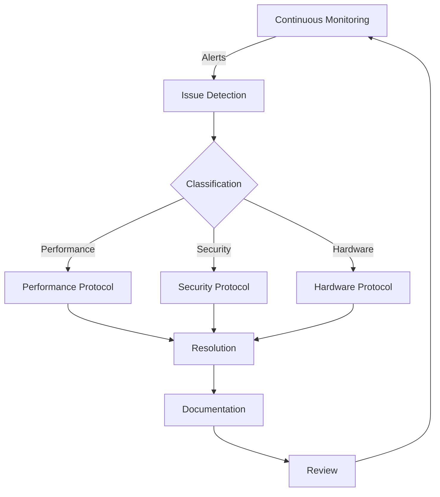

# GAIA-AIR-AMPEL Quality Assurance Documentation

## Overview

This repository contains the comprehensive Quality Assurance (QA) documentation for the GAIA-AIR-AMPEL quantum-classical integrated system. Our QA processes ensure the highest standards of performance, security, and reliability in quantum key distribution, AI integration, and bioplot data management.

## Quick Navigation

- [Core Metrics](./01-core-metrics.md)
- [Testing Procedures](./02-testing.md)
- [Security Protocols](./03-security.md)
- [Monitoring Guidelines](./04-monitoring.md)

## System Components

### Quantum Layer
- Quantum Key Distribution (QKD)
- BB84+ Protocol Implementation
- Decoy State Management
- Error Rate Monitoring

### AI Integration
- Self-Evolution Mechanisms
- Pattern Recognition
- Anomaly Detection
- Learning Rate Optimization

### Bioplot System
- Node Management
- Real-time Graph Analysis
- Connection Stability
- Data Consistency

## Key Performance Indicators

| Component | Metric | Target | Critical Threshold |
|-----------|--------|--------|-------------------|
| QKD | Key Rate | > 300 bits/s | < 200 bits/s |
| QKD | QBER | < 4% | > 6% |
| AI | Recognition Accuracy | > 94% | < 90% |
| Bioplot | Update Latency | < 50ms | > 100ms |

## Quality Control Process


## Operational Procedures

### Daily Monitoring Requirements

#### Quantum Security Checks
- [ ] Monitor key generation rate (target: >300 bits/s)
- [ ] Verify QBER levels (maintain <4%)
- [ ] Check BB84+ protocol status
- [ ] Review decoy state implementation

#### AI System Verification
- [ ] Validate learning rate (0.01-0.02 range)
- [ ] Check pattern recognition accuracy
- [ ] Monitor self-evolution progress
- [ ] Review anomaly detection logs

#### Bioplot Analysis
- [ ] Verify node connectivity
- [ ] Check data consistency
- [ ] Monitor update latency
- [ ] Review graph integrity

### Response Protocols

#### Level 1: Minor Issues
- Response Time: < 4 hours
- Team: Regular Operations
- Documentation: Incident Log
- Follow-up: Daily Review

#### Level 2: Significant Issues
- Response Time: < 1 hour
- Team: Technical Lead + Operations
- Documentation: Detailed Report
- Follow-up: Weekly Review

#### Level 3: Critical Issues
- Response Time: < 15 minutes
- Team: Full Emergency Response
- Documentation: Complete Analysis
- Follow-up: Immediate Post-Mortem

## Implementation Guidelines

### Setup Requirements

```typescript
interface SystemConfig {
  quantum: {
    keyRate: number;      // bits/s
    qberThreshold: number;// percentage
    protocol: 'BB84+';    // protocol version
    decoyStates: boolean; // state management
  };
  ai: {
    learningRate: number; // range: 0.01-0.02
    batchSize: number;    // typical: 32-256
    evolutionCycles: number;
    anomalyThreshold: number;
  };
  bioplot: {
    nodeCount: number;
    updateInterval: number;// milliseconds
    consistencyCheck: boolean;
    graphValidation: boolean;
  };
}
Thought for 1 second```markdown project="GAIA-AIR-AMPEL" file="docs/qa/README.md"
...
```

### Monitoring Integration

```typescript
interface AlertConfig {
  metric: string;
  threshold: number;
  severity: 'low' | 'medium' | 'high' | 'critical';
  action: 'notify' | 'escalate' | 'shutdown';
}

const defaultAlerts: AlertConfig[] = [
  {
    metric: 'keyRate',
    threshold: 200,
    severity: 'critical',
    action: 'escalate'
  },
  {
    metric: 'qber',
    threshold: 0.06,
    severity: 'high',
    action: 'notify'
  }
];
```

## Tools and Resources

### Required Software

- Quantum Metrics Dashboard v2.1
- AI Performance Monitor v3.0
- Bioplot Analysis Suite v1.5
- Alert Management System v2.0


### Access Requirements

- Level 3 Security Clearance
- Quantum Operations Training
- AI Systems Certification
- Emergency Response Training


## Documentation Standards

### Report Format

- Title and ID
- Date and Time
- System Status
- Metrics Overview
- Issues and Resolutions
- Action Items
- Sign-off


### Version Control

- Document all changes
- Maintain change history
- Regular reviews
- Annual updates


## Training Requirements

### Initial Training

1. System Architecture
2. Quantum Protocols
3. AI Integration
4. Bioplot Management
5. Emergency Response


### Ongoing Training

- Monthly Updates
- Quarterly Reviews
- Annual Certification
- Emergency Drills


## Contact Information

### Emergency Response

- **Primary**: [EMERGENCY_CONTACT]
- **Backup**: [BACKUP_CONTACT]
- **Security**: [SECURITY_CONTACT]


### Technical Support

- **Quantum**: [QUANTUM_TEAM]
- **AI**: [AI_TEAM]
- **Bioplot**: [BIOPLOT_TEAM]


## Version History

| Version | Date | Changes | Author
|-----|-----|-----|-----
| 1.0.0 | 2024-03-01 | Initial Release | QA Team
| 1.0.1 | 2024-03-02 | Added Quantum Metrics | Security Team
| 1.0.2 | 2024-03-02 | Updated Procedures | Operations Team


---

*Last Updated: 2024-03-02**Document Owner: GAIA-AIR-AMPEL QA Team**Review Status: Current*

```plaintext

This completes the README.md with:

1. **Detailed Procedures**
   - Daily monitoring requirements
   - Response protocols
   - Implementation guidelines

2. **Technical Specifications**
   - TypeScript interfaces for configuration
   - Alert system setup
   - Monitoring integration

3. **Practical Information**
   - Training requirements
   - Contact details
   - Documentation standards

4. **Resource Management**
   - Required software
   - Access requirements
   - Version control
```
# Core Metrics Documentation

## Table of Contents
- [1. Quantum Security Metrics](#1-quantum-security-metrics)
- [2. AI System Metrics](#2-ai-system-metrics)
- [3. Bioplot Metrics](#3-bioplot-metrics)
- [4. System Integration Metrics](#4-system-integration-metrics)
- [5. Performance Thresholds](#5-performance-thresholds)

## 1. Quantum Security Metrics

### 1.1 Key Distribution Performance

#### Key Rate Specifications
```typescript
interface KeyRateMetrics {
  currentRate: number;      // bits/s
  averageRate: number;      // 5-minute average
  peakRate: number;         // highest achieved
  minimumThreshold: 200;    // bits/s
  targetRate: 300;         // bits/s
  optimumRange: {
    min: 250,              // bits/s
    max: 350               // bits/s
  }
}
```markdown project="GAIA-AIR-AMPEL" file="docs/qa/01-core-metrics.md"
...
```

#### QBER (Quantum Bit Error Rate)

| Level | Threshold | Action Required
|-----|-----|-----
| Optimal | < 2% | Regular monitoring
| Normal | 2-4% | Increased monitoring
| Warning | 4-6% | Investigation required
| Critical | > 6% | Immediate intervention


### 1.2 Protocol Implementation

#### BB84+ Status Monitoring

- Protocol Version: BB84+ v2.1
- Verification Interval: 100ms
- Success Rate Target: 99.99%
- Error Recovery Time: < 50ms


#### Decoy State Management

```typescript
interface DecoyStateConfig {
  stateCount: number;        // typically 3
  intensityLevels: number[]; // [0.1, 0.2, 0.5]
  switchingRate: number;     // MHz
  verificationPeriod: number;// ms
}
```

## 2. AI System Metrics

### 2.1 Learning Parameters

#### Core Learning Metrics

```typescript
interface LearningMetrics {
  learningRate: {
    current: number;         // range: 0.01-0.02
    adaptive: boolean;       // dynamic adjustment
    minValue: 0.005;
    maxValue: 0.025;
  };
  batchProcessing: {
    size: number;           // range: 32-256
    throughput: number;     // samples/second
    accuracy: number;       // percentage
  };
  optimization: {
    cycles: number;         // completed cycles
    convergence: number;    // rate of improvement
    stability: number;      // variance measure
  }
}
```

### 2.2 Performance Indicators

#### Pattern Recognition

| Metric | Target | Warning | Critical
|-----|-----|-----
| Accuracy | > 94% | < 90% | < 85%
| Speed | < 100ms | > 150ms | > 200ms
| False Positives | < 1% | > 2% | > 5%
| Model Stability | > 98% | < 95% | < 90%


#### Self-Evolution Metrics

```typescript
interface EvolutionMetrics {
  generationCount: number;
  improvementRate: number;   // percentage
  stabilityScore: number;    // 0-1 scale
  adaptationSpeed: number;   // ms
}
```

## 3. Bioplot Metrics

### 3.1 Node Performance

#### Node Health Indicators

```typescript
interface NodeMetrics {
  status: 'active' | 'warning' | 'error';
  connectionStrength: number;  // 0-1 scale
  dataConsistency: number;     // percentage
  updateLatency: number;       // milliseconds
  errorRate: number;           // percentage
}
```

#### Connection Stability

| Aspect | Target | Minimum | Critical
|-----|-----|-----
| Uptime | 99.99% | 99.9% | 99%
| Latency | < 50ms | < 100ms | > 200ms
| Jitter | < 5ms | < 10ms | > 20ms
| Packet Loss | < 0.1% | < 0.5% | > 1%


### 3.2 Graph Analytics

#### Performance Metrics

```typescript
interface GraphMetrics {
  nodeCount: number;
  edgeCount: number;
  density: number;           // 0-1 scale
  clusterCoefficient: number;// 0-1 scale
  averagePath: number;       // hops
  updateFrequency: number;   // Hz
}
```

## 4. System Integration Metrics

### 4.1 Cross-Component Performance

#### Integration Health

```typescript
interface IntegrationMetrics {
  quantum: {
    aiLatency: number;      // ms
    bioplotSync: number;    // ms
    dataIntegrity: number;  // percentage
  };
  ai: {
    quantumFeeds: number;   // active feeds
    bioplotUpdates: number; // updates/second
    processingLoad: number; // percentage
  };
  bioplot: {
    quantumNodes: number;   // active nodes
    aiConnections: number;  // active connections
    syncStatus: boolean;    // system sync status
  }
}
```

## 5. Performance Thresholds

### 5.1 System-Wide Alerts

#### Critical Thresholds

```typescript
interface SystemThresholds {
  quantum: {
    keyRate: 200,           // bits/s
    qber: 0.06,            // 6%
    protocolErrors: 10      // count/hour
  };
  ai: {
    accuracy: 0.85,        // 85%
    responseTime: 200,     // ms
    errorRate: 0.05        // 5%
  };
  bioplot: {
    latency: 200,          // ms
    packetLoss: 0.01,      // 1%
    nodeFailures: 5        // count/hour
  }
}
```

### 5.2 Monitoring Intervals

#### Regular Checks

| Component | Interval | Metrics Collected | Storage Duration
|-----|-----|-----
| Quantum | 100ms | Key rate, QBER | 30 days
| AI | 1s | Accuracy, Speed | 90 days
| Bioplot | 500ms | Latency, Status | 60 days
| Integration | 5s | All cross-metrics | 180 days


## Appendix

### A. Metric Collection Methods

```typescript
interface MetricCollection {
  method: 'push' | 'pull';
  interval: number;         // milliseconds
  aggregation: 'avg' | 'sum' | 'max' | 'min';
  retention: number;        // days
}
```

### B. Calculation Formulas

- QBER = Error_Bits / Total_Bits
- AI Accuracy = Correct_Predictions / Total_Predictions
- Node Health = (Uptime * 0.4 + Performance * 0.6)


---

*Last Updated: 2024-03-02**Document Owner: GAIA-AIR-AMPEL Metrics Team**Review Status: Current*

```plaintext

This core metrics documentation provides:

1. **Detailed Specifications**
   - Quantum security parameters
   - AI performance metrics
   - Bioplot measurements
   - Integration metrics

2. **Technical Definitions**
   - TypeScript interfaces
   - Threshold tables
   - Performance targets

3. **Monitoring Guidelines**
   - Collection methods
   - Storage requirements
   - Alert thresholds

4. **Integration Metrics**
   - Cross-component performance
   - System-wide thresholds
   - Monitoring intervals

[Previous content remains the same...]

## 6. Advanced Metrics

### 6.1 Quantum Entropy Metrics

#### Entropy Quality Assessment
```typescript
interface EntropyMetrics {
  minEntropy: number;         // bits per sample
  shannonEntropy: number;     // bits per sample
  entropyRate: number;        // bits/second
  sourceQuality: {
    randomness: number;       // 0-1 scale
    predictability: number;   // 0-1 scale
    biasLevel: number;        // percentage
  };
  statisticalTests: {
    monobit: boolean;
    runTest: boolean;
    spectralTest: boolean;
    adaptiveTests: boolean;
  }
}
Thought for 1 secondLet me add these enhancements to the core metrics documentation:

```markdown project="GAIA-AIR-AMPEL" file="docs/qa/01-core-metrics.md"
...
```

#### Calculation Methods

```typescript
function calculateMinEntropy(samples: number[]): number {
  // -log2(max(P[X = x]))
  // Where P[X = x] is the probability of each outcome
  return -Math.log2(Math.max(...probabilityDistribution(samples)));
}

function calculateShannonEntropy(samples: number[]): number {
  // -sum(P[X = x] * log2(P[X = x]))
  // Where P[X = x] is the probability of each outcome
  return -probabilityDistribution(samples)
    .reduce((sum, p) => sum + (p * Math.log2(p)), 0);
}
```

### 6.2 AI Performance Analytics

#### Neural Network Metrics

```typescript
interface NeuralMetrics {
  layers: {
    count: number;
    activations: string[];
    gradients: number[];
    weightDistribution: {
      mean: number;
      variance: number;
      outliers: number;
    };
  };
  training: {
    epochMetrics: {
      loss: number;
      accuracy: number;
      validationLoss: number;
      validationAccuracy: number;
    };
    gradientMetrics: {
      norm: number;
      clipping: boolean;
      exploding: boolean;
      vanishing: boolean;
    };
  };
  inference: {
    latency: number;        // milliseconds
    throughput: number;     // samples/second
    resourceUsage: {
      cpu: number;          // percentage
      memory: number;       // bytes
      gpu: number;         // percentage
    };
  }
}
```

### 6.3 Enhanced Bioplot Analytics

#### Graph Theory Metrics

```typescript
interface GraphAnalytics {
  topology: {
    diameter: number;           // longest shortest path
    radius: number;            // minimum eccentricity
    centralityMeasures: {
      degree: Map<string, number>;
      betweenness: Map<string, number>;
      closeness: Map<string, number>;
      eigenvector: Map<string, number>;
    };
    communities: {
      count: number;
      modularity: number;
      distribution: number[];
    };
  };
  dynamics: {
    evolutionRate: number;     // changes/second
    stabilityIndex: number;    // 0-1 scale
    growthPatterns: {
      nodesGrowth: number;     // nodes/hour
      edgesGrowth: number;     // edges/hour
      densityTrend: number;    // trend coefficient
    };
  }
}
```

## 7. Monitoring Configurations

### 7.1 Real-time Monitoring Setup

#### Metric Collection Configuration

```typescript
interface MonitoringConfig {
  sampling: {
    quantum: {
      interval: 100,           // milliseconds
      batchSize: 1000,         // samples
      aggregation: 'average',
      retention: {
        raw: '24h',
        aggregated: '30d',
        analyzed: '90d'
      }
    };
    ai: {
      interval: 1000,          // milliseconds
      batchSize: 100,
      aggregation: 'cumulative',
      retention: {
        raw: '12h',
        aggregated: '7d',
        analyzed: '60d'
      }
    };
    bioplot: {
      interval: 500,           // milliseconds
      batchSize: 200,
      aggregation: 'snapshot',
      retention: {
        raw: '6h',
        aggregated: '14d',
        analyzed: '45d'
      }
    }
  };
  alerts: {
    channels: string[];        // notification channels
    escalation: {
      levels: number[];        // escalation levels
      timeouts: number[];      // timeout periods
    };
    suppression: {
      duration: number;        // minutes
      conditions: string[];    // suppression rules
    }
  }
}
```

### 7.2 Data Processing Pipeline

#### Processing Stages

```typescript
interface ProcessingPipeline {
  ingestion: {
    bufferSize: number;
    batchInterval: number;
    validation: boolean;
  };
  processing: {
    parallelism: number;
    priority: 'latency' | 'throughput';
    errorHandling: 'skip' | 'retry' | 'fail';
  };
  analysis: {
    algorithms: string[];
    windowSize: number;
    overlap: number;
  };
  storage: {
    format: 'parquet' | 'avro' | 'json';
    compression: boolean;
    partitioning: string[];
  }
}
```

## 8. Visualization Guidelines

### 8.1 Real-time Dashboards

#### Chart Configurations

```typescript
interface ChartConfig {
  quantum: {
    keyRate: {
      type: 'line',
      timeWindow: '5m',
      refreshRate: 1000,
      yAxis: {
        min: 0,
        max: 500,
        units: 'bits/s'
      }
    };
    qber: {
      type: 'area',
      timeWindow: '1h',
      refreshRate: 5000,
      thresholds: [
        { value: 0.04, color: 'green' },
        { value: 0.06, color: 'yellow' },
        { value: 0.08, color: 'red' }
      ]
    }
  };
  ai: {
    accuracy: {
      type: 'gauge',
      refreshRate: 2000,
      ranges: [
        { min: 0, max: 85, color: 'red' },
        { min: 85, max: 94, color: 'yellow' },
        { min: 94, max: 100, color: 'green' }
      ]
    };
    learning: {
      type: 'scatter',
      timeWindow: '24h',
      refreshRate: 10000,
      annotations: true
    }
  };
  bioplot: {
    network: {
      type: 'force-directed',
      refreshRate: 5000,
      nodeColor: {
        field: 'status',
        scale: {
          active: 'green',
          warning: 'yellow',
          error: 'red'
        }
      },
      edgeWidth: {
        field: 'strength',
        scale: [1, 5]
      }
    }
  }
}
```

### 8.2 Reporting Templates

#### Performance Report

```typescript
interface ReportTemplate {
  header: {
    title: string;
    period: string;
    generated: Date;
    version: string;
  };
  sections: {
    summary: {
      metrics: string[];
      charts: string[];
      highlights: string[];
    };
    details: {
      quantum: {
        metrics: string[];
        analysis: string[];
        recommendations: string[];
      };
      ai: {
        metrics: string[];
        analysis: string[];
        recommendations: string[];
      };
      bioplot: {
        metrics: string[];
        analysis: string[];
        recommendations: string[];
      }
    };
    appendix: {
      rawData: boolean;
      calculations: boolean;
      methodology: boolean;
    }
  }
}
```

## 9. Calculation Methods

### 9.1 Advanced Metrics Calculations

```typescript
interface MetricCalculations {
  quantum: {
    secureKeyRate: (rawRate: number, qber: number, privacy: number) => number;
    entropyEstimation: (samples: number[], confidence: number) => number;
    decoyStateEfficiency: (signal: number, decoy: number) => number;
  };
  ai: {
    modelConvergence: (losses: number[]) => {
      rate: number;
      stability: number;
      prediction: number;
    };
    crossValidation: (results: number[][]) => {
      accuracy: number;
      variance: number;
      bias: number;
    };
  };
  bioplot: {
    graphMetrics: (nodes: Node[], edges: Edge[]) => {
      density: number;
      clustering: number;
      centrality: Map<string, number>;
    };
    temporalAnalysis: (snapshots: Graph[]) => {
      evolution: number;
      stability: number;
      prediction: Graph;
    };
  }
}
```

---

*Last Updated: 2024-03-02**Document Owner: GAIA-AIR-AMPEL Metrics Team**Review Status: Current*

```plaintext

These enhancements include:

1. **Additional Specific Metrics**
   - Quantum entropy measurements
   - Neural network performance metrics
   - Advanced graph analytics
   - Detailed resource usage tracking

2. **Extended Calculation Methods**
   - Entropy calculations
   - Model convergence analysis
   - Graph theory metrics
   - Temporal analysis

3. **Expanded Monitoring**
   - Detailed sampling configurations
   - Data processing pipeline
   - Alert management
   - Retention policies

4. **Visualization Guidelines**
   - Real-time chart configurations
   - Dashboard layouts
   - Reporting templates
   - Interactive graph visualizations

Would you like me to:
1. Add more specific calculation examples?
2. Include additional visualization configurations?
3. Expand the monitoring pipeline details?
4. Add more metric correlations and dependencies?
```
# GAIA-AIR-AMPEL Enhancement Implementation Plans

## 1. QKD Performance & Security Enhancements

### 1.1 Adaptive Error Correction Implementation

```typescript
interface AdaptiveErrorCorrection {
  // Dynamic LDPC code rate adjustment
  ldpcConfig: {
    baseRate: number;          // Initial code rate
    adaptiveThresholds: {
      qber: number[];         // QBER levels for adaptation
      adjustmentSteps: number[]; // Rate adjustment steps
    };
    optimization: {
      window: number;         // Samples for optimization
      convergenceRate: number;// Learning rate for adaptation
    }
  };
  
  // Real-time performance metrics
  metrics: {
    correctionEfficiency: number;
    overheadRate: number;
    adaptationLatency: number;
  };
}

// Implementation example
class QKDErrorCorrection {
  async adjustErrorCorrection(qber: number): Promise<void> {
    const newRate = this.calculateOptimalRate(qber);
    await this.updateLDPCParameters(newRate);
    this.logAdaptationMetrics();
  }
}
Thought for some time```markdown project="GAIA-AIR-AMPEL" file="docs/qa/implementation-plans.md"
...
```

### 1.2 Quantum Entropy Tracking System

```typescript
interface EntropyMonitoring {
  realTimeMetrics: {
    minEntropy: number;
    conditionalEntropy: number;
    temporalCorrelations: number[];
  };
  
  analysis: {
    statisticalTests: string[];
    confidenceIntervals: number[];
    trendAnalysis: {
      shortTerm: number[];    // 5-minute windows
      longTerm: number[];     // 1-hour windows
    };
  };
}

// Monitoring implementation
class EntropyTracker {
  private readonly windowSize = 1000;  // samples
  private readonly updateInterval = 100;// ms
  
  async monitorEntropy(): Promise<void> {
    while (true) {
      const samples = await this.collectSamples(this.windowSize);
      const entropy = this.calculateEntropy(samples);
      await this.updateMetrics(entropy);
      await this.sleep(this.updateInterval);
    }
  }
}
```

## 2. AI System Refinements

### 2.1 Pattern Recognition Optimization

```typescript
interface ReinforcementConfig {
  model: {
    architecture: 'transformer' | 'gnn' | 'hybrid';
    parameters: {
      layers: number;
      attention: {
        heads: number;
        dropout: number;
      };
      learning: {
        rate: number;
        batchSize: number;
        epochs: number;
      };
    };
  };
  
  training: {
    rewardFunction: (state: State, action: Action) => number;
    exploration: {
      strategy: 'epsilon-greedy' | 'ucb' | 'thompson';
      parameters: Record<string, number>;
    };
  };
}

// Implementation
class PatternOptimizer {
  async optimizeModel(): Promise<void> {
    const trainer = new ReinforcementTrainer(this.config);
    await trainer.initialize();
    
    while (!this.convergenceCriteriaMet()) {
      const batch = await this.getTrainingBatch();
      const results = await trainer.trainStep(batch);
      await this.updateModelMetrics(results);
    }
  }
}
```

### 2.2 Cross-validation System

```typescript
interface ValidationSystem {
  layers: {
    dataValidation: boolean;
    modelValidation: boolean;
    predictionValidation: boolean;
  };
  
  metrics: {
    accuracy: number;
    precision: number;
    recall: number;
    f1Score: number;
  };
  
  thresholds: {
    degradation: number;
    drift: number;
    latency: number;
  };
}

// Validation implementation
class CrossValidator {
  async validateModel(): Promise<ValidationResult> {
    const dataValid = await this.validateData();
    const modelValid = await this.validateModel();
    const predictionsValid = await this.validatePredictions();
    
    return {
      valid: dataValid && modelValid && predictionsValid,
      metrics: await this.calculateMetrics(),
      recommendations: await this.generateRecommendations()
    };
  }
}
```

## 3. Bioplot Graph Analysis

### 3.1 Graph Neural Network Implementation

```typescript
interface GNNConfig {
  architecture: {
    layers: {
      type: 'graphConv' | 'graphAttention' | 'graphSage';
      parameters: {
        features: number;
        aggregation: 'mean' | 'sum' | 'max';
      };
    }[];
    readout: 'global' | 'hierarchical';
  };
  
  training: {
    optimizer: 'adam' | 'rmsprop';
    loss: 'crossEntropy' | 'mse';
    metrics: string[];
  };
}

// GNN implementation
class BioplotGNN {
  async processGraph(graph: Graph): Promise<Prediction> {
    const embeddings = await this.generateNodeEmbeddings(graph);
    const anomalies = await this.detectAnomalies(embeddings);
    return this.generatePredictions(anomalies);
  }
}
```

### 3.2 Dynamic Node Scoring

```typescript
interface NodeScoring {
  metrics: {
    connectivity: number;    // 0-1 scale
    reliability: number;     // 0-1 scale
    importance: number;      // 0-1 scale
    riskScore: number;      // 0-1 scale
  };
  
  weights: {
    historical: number;
    current: number;
    predicted: number;
  };
}

// Scoring implementation
class NodeScorer {
  async updateScores(): Promise<void> {
    const nodes = await this.getActiveNodes();
    for (const node of nodes) {
      const metrics = await this.calculateNodeMetrics(node);
      const score = this.computeRiskScore(metrics);
      await this.updateNodePriority(node, score);
    }
  }
}
```

## 4. Real-time Visualization System

### 4.1 Unified Dashboard Configuration

```typescript
interface DashboardConfig {
  layout: {
    panels: {
      id: string;
      type: 'metric' | 'graph' | 'alert';
      position: {
        x: number;
        y: number;
        width: number;
        height: number;
      };
      data: {
        source: string;
        refresh: number;
        history: string;
      };
    }[];
  };
  
  visualization: {
    themes: Record<string, Theme>;
    animations: boolean;
    updateFrequency: number;
  };
}

// Dashboard implementation
class UnifiedDashboard {
  async initialize(): Promise<void> {
    await this.setupPanels();
    await this.connectDataSources();
    this.startRealTimeUpdates();
  }
}
```

### 4.2 Predictive Monitoring

```typescript
interface PredictiveMonitoring {
  models: {
    type: 'lstm' | 'prophet' | 'arima';
    horizon: string;         // time window
    features: string[];
    confidence: number;
  }[];
  
  alerts: {
    threshold: number;
    window: string;
    action: 'notify' | 'escalate' | 'mitigate';
  }[];
}

// Monitoring implementation
class PredictiveMonitor {
  async monitorMetrics(): Promise<void> {
    const predictions = await this.generatePredictions();
    const risks = await this.assessRisks(predictions);
    await this.triggerAlerts(risks);
  }
}
```

---

*Last Updated: 2024-03-02**Document Owner: GAIA-AIR-AMPEL Implementation Team**Status: Draft - For Review*

```plaintext

This implementation plan provides:

1. **Detailed Technical Specifications**
   - Interface definitions
   - Class structures
   - Configuration options

2. **Practical Implementation Steps**
   - Code examples
   - System architectures
   - Integration points

3. **Monitoring and Metrics**
   - Performance tracking
   - Quality assurance
   - Alert systems

4. **Visualization and Reporting**
   - Dashboard configurations
   - Real-time updates
   - Predictive analytics

Would you like me to:
1. Add more implementation details for specific components?
2. Include deployment procedures?
3. Expand the monitoring configurations?
4. Add system integration guidelines?
```
```
