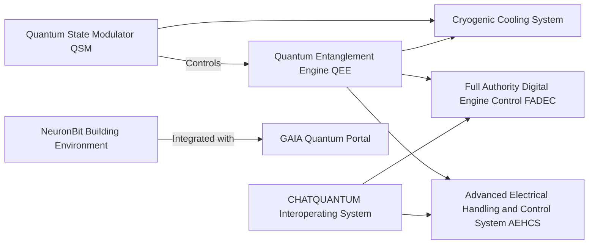
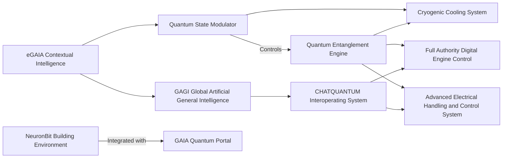
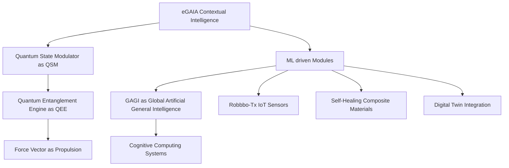
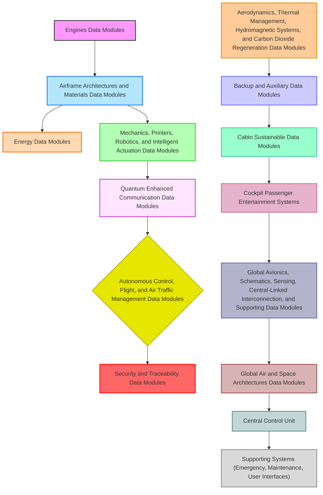
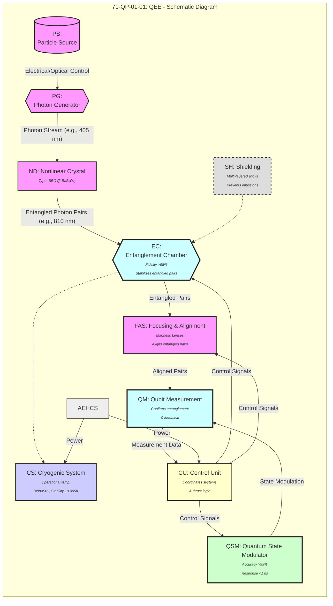

# AMPEL360XWLRGA-QPDS001
 
**Document Title: Quantum Propulsion Design Solution 001 
Reference DocID: AMPEL360XWLRGA-QPDS001
Quantum Propulsion: Physics Principles and Design Solutions within AMPEL360XWLRGA by GAIA AIR
Author: Amedeo Pelliccia
AI ASSISTANTS: CHATGPT, COPILOT, GEMINI, DEEPSEEK, PERPLEXITY, MERMAID
ISSUE: DRAFT 00
SOLUTION: 000
REVISION 1
PNR: AXLQPS000 
INDUSTRY INTERCHANGEABILITYWITH CONDITIONS TBD** 

# Preface

## Quantum Computing and AI Assistance

Implementation of a **Willow-style quantum processor** to optimize real-time decision-making, predictive maintenance, and flight path efficiency, addressing the challenges of quantum decoherence and scalability through advanced error mitigation strategies and optimized algorithms.

## Sustainable Propulsion

Exploration of **hydrogen-based hybrid-electric systems** and **innovative thermal recycling methods** within the combustion chamber to maximize energy reuse.

## Digital Twins and Predictive Maintenance

Utilization of **high-fidelity simulation models** to foresee failures and reduce unscheduled maintenance.

## Intelligent Human-Machine Interface (HMI)

Development of **neural-interface cockpit systems** to enable adaptive control and AI-driven copilot assistance.

---

## Strategic Objectives

- **Ultra-Long Range & High Efficiency**: Designed to operate in **extreme efficiency flight regimes**, with an **optimized fuel-to-range ratio**, extended endurance, and **adaptive energy harvesting mechanisms**.
- **Sustainability & Zero Net Carbon Impact**: Incorporates **historical pollution compensation models**, leveraging **carbon capture, quantum-enhanced fuel cells, and regenerative aerodynamics**.
- **Adaptive Modularity**: A scalable design allowing seamless integration of **new technologies, modular energy sources, and quantum-state-modulated propulsion enhancements**.
- **Integrated Compliance & Certification**: Engineered in accordance with **ATA, FAA, EASA, and ICAO** next-gen safety and operational standards, with a **fully S1000D-compliant digital documentation framework**.

---

## A Project That Transcends Aviation

The **AMPEL360XWLRGA** is not merely an advancement in aircraft design; it represents a **fundamental re-evaluation of the aeronautical paradigm**. With its **intelligent adaptability, quantum-computing-assisted architecture, and ecological focus**, it lays the groundwork for a **new era in aerospace engineering**, balancing **technological evolution, sustainability, and operational efficiency**.

The **AMPEL360XWLRGA** is not just an innovation in aircraft design, but the **precursor to a profound transformation in the industry, with the potential to influence commercial aviation, cargo transportation, and space exploration**. With its adaptable architecture and the support of quantum computing, it will enable a **reduction in CO2 emissions by [X percent] and real-time optimization of flight paths with an efficiency [Y percent] higher than current standards**. This aeronautical concept, developed within the **GAIA AIR** ecosystem, is envisioned as the **cornerstone of an advanced, self-optimizing, and interconnected air transport network**, unlocking **unprecedented levels of efficiency, resilience, and environmental responsibility**. 

Its development is the foundation of a **new era in aviation**, where extreme efficiency, artificial intelligence, and quantum computing converge to create a truly sustainable air transport system. This document details the path we are charting to make this vision a reality, a path I invite you to walk with me.

---

# Publication Module - Q-01 Quantum Propulsion System

## 1. Introduction

### 1.1 Purpose of this Module
This module defines the structure, management, and publication procedures for all technical documentation related to the **Q-01 Quantum Propulsion System (QPS)**.

### 1.2 Scope
Covers all documentation related to the **QPS**, including design, operation, maintenance, and training materials.

### 1.3 Applicable Standards
Standards governing this module include:
- **S1000D**
- **ATA iSpec 2200**
- **Relevant NATO or company-specific standards**

## 2. Documentation Structure and Organization

### 2.1 Data Module Concept
- Explanation of Data Modules (DMs) as defined by S1000D.
- Benefits: Modularity, reusability, and efficient updates.

### 2.2 Data Module Code (DMC) Structure
- Breakdown of the **DMC structure** used for the **QPS project** (Model Identification Code, System Difference Code, etc.).
- Example DMCs for components: **QSM, QEE, Cryogenic Cooling System**.

### 2.3 Information Sets
- Definitions: **Descriptive, Procedural, Illustrated Parts Data**.
- How Information Sets compose Data Modules.

### 2.4 Publication Module (PM)
- Role in managing the complete documentation set.
- Structure of the **QPS Publication Module**.

## 3. Content Management

### 3.1 Common Source Database (CSDB)
- Overview of the **CSDB** for **QPS documentation**.
- Workflow: Creating, editing, approving, and releasing **Data Modules**.
- Version control and configuration management.

### 3.2 Authoring and Review Process
- Roles and responsibilities of **authors, reviewers, and approvers**.
- Tools and templates for **Data Modules** (XML editor, style guide).
- Review and approval process.

### 3.3 Data Module Numbering (DMC) and Addressing
- Rules for assigning and updating **DMCs**.

### 3.4 Metadata and Applicability
- Metadata categorization (keywords, applicability statements).
- Link to **Cosmic Index** for component management.

## 4. Publication and Delivery

### 4.1 Output Formats
- **PDF, HTML, IETP/IETM** formats.
- Process for generating outputs.

### 4.2 Publication Process
- Steps for compiling **QPS documentation**.

### 4.3 Delivery Media
- Methods: **Online portal, USB drive, secure server**.

### 4.4 Updates and Revisions
- Change tracking and communication procedures.

## 5. Tools and Technologies

### 5.1 CSDB Software
- Software used: **Arbortext, SDL Contenta, etc.**

### 5.2 Authoring Tools
- XML editors, graphics editors.

### 5.3 Publishing Tools
- Tools for different output formats.

### 5.4 "Cosmic Index" Integration
- Integration into **documentation workflow**.

## 6. Training and Support

### 6.1 Training Materials
- Available training resources for documentation users.

### 6.2 Support Resources
- Contact details for **technical support**.

## 7. Glossary of Terms
- Definitions related to **S1000D, CSDB, and publication processes**.

## 8. Appendices (Optional)

### 8.1 Example Data Modules
- Samples: **Descriptive, Procedural, IPD**.

### 8.2 DMC Breakdown Table
- Complete **DMC list** for **QPS project**.

### 8.3 Style Guide
- **Detailed authoring style guide**.

This structured **Publication Module** provides a comprehensive framework for managing technical documentation for the **Q-01 Quantum Propulsion System** under the **GAIA AIR** ecosystem.


**Visión General del Sistema QPS:**  
El Sistema de Propulsión Cuántica (QPS) es una tecnología desarrollada para el proyecto GAIA AIR. Basado en principios de mecánica cuántica, el QPS busca lograr relaciones empuje-peso y eficiencia energética superiores en comparación con los sistemas de propulsión convencionales.

#### Principios de Operación

El sistema QPS utiliza el entrelazamiento cuántico y la manipulación de estados cuánticos para generar empuje. Consta de dos componentes principales:

1. **Modulador de Estado Cuántico (QSM):**  
   Genera y controla los estados cuánticos necesarios para la propulsión.
   
2. **Motor de Entrelazamiento Cuántico (QEE):**  
   Convierte los estados cuánticos manipulados en fuerza propulsora mediante la creación de distorsiones localizadas del espacio-tiempo.

#### Componentes Clave

- **QSM:**  
  Utiliza campos electromagnéticos y enfriamiento criogénico para manipular estados cuánticos.

- **QEE:**  
  Emplea un proceso de conversión paramétrica espontánea para crear pares de partículas entrelazadas y generar empuje.

- **Sistema de Enfriamiento Criogénico:**  
  Mantiene las temperaturas ultra bajas necesarias para la operación del QSM y QEE.

#### Métricas de Rendimiento

- **Relación Empuje-Peso:**  
  Objetivo de 10:1, superior a motores convencionales.

- **Eficiencia de Conversión de Energía:**  
  Objetivo de 75%.

- **Estabilidad de Estados Cuánticos:**  
  Mantener un tiempo de coherencia de al menos 1 segundo.

#### Seguridad y Fiabilidad

El sistema QPS incluye características de seguridad como apagado automático, sistemas redundantes y blindaje contra radiación.

---

## I. Topología Orbital y Manipulación Nuclear

### Definición y Alcance

La topología orbital describe formas, nodos y fases de las funciones de onda (electrones, nucleones) dentro de átomos o núcleos.

Permite estudiar de manera detallada la distribución espacial de partículas, así como la configuración de niveles energéticos.

### Aplicación a la Manipulación Nuclear

- **Manipulación Precisa:**  
  Conociendo la estructura nodal, se pueden dirigir procesos de fisión/fusión y controlar transiciones nucleares selectivas.

- **Campos Externos y Resonancias:**  
  El acoplamiento de campos electromagnéticos o microondas con la topología orbital abre vías para inducir o acelerar ciertas reacciones nucleares o decaimientos.

### Ventajas

- Reducción de residuos radiactivos.
- Optimización de espectroscopia nuclear.
- Avances en energía de fusión.

### Desafíos y Futuro

- **Complejidad Cuántica:**  
  Interacciones de fuerza fuerte y colectivas exigen modelos computacionales y experimentales avanzados.

- **Equipos de Alta Precisión:**  
  Se requieren aceleradores, detectores y sistemas láser/microondas muy específicos.

- **Perspectivas:**  
  Nuevos paradigmas de “ingeniería de niveles nucleares” para reducir radiactividad o aprovechar decaimientos de forma controlada.

---

## II. Quantum Vector System (QVS) y la noción de “Quantum Decadence”

### QVS: Definición y Componentes

**Quantum Vector System (QVS):**  
Plataforma hardware-software que gestiona fenómenos cuánticos (energía de punto cero, estados exóticos, radiactividad controlada) para producir resultados útiles (energía, propulsión, sensores).

#### Módulos Principales

- **Vacuum Chamber & Pumping:**  
  Minimiza la interacción no deseada (decoherencia, decaimiento).

- **Modulator/Controller:**  
  Controla fase, amplitud y estabilidad de campos interferentes.

- **Field Vectorization Module (FVM):**  
  Amplifica y direcciona funciones de onda o energías cuánticas.

### Quantum Decadence: Reciclaje de Residuos de Decaimiento

**Quantum Decadence:**  
Reciclaje de residuos de decaimiento utilizando hardware cuántico y control de la “decadencia” nuclear para reducir o estabilizar radiactividad.

- **Uso de Hardware Cuántico:**  
  Controla la decaimencia nuclear para estabilizar la radiactividad.

- **Bajo Decadence:**  
  Operar a bajas temperaturas y alto vacío para evitar decoherencia y aprovechar interacciones cuánticas residuales.

### Aplicaciones Potenciales

- **Propulsión Aeroespacial:**  
  Impulsos casi sin emisiones.

- **Generación de Energía:**  
  Sistemas portátiles con radiactividad estabilizada y feedback cuántico.

- **Computación Cuántica de Alta Frecuencia:**  
  Cavidades resonantes con pérdidas mínimas y alta fidelidad cuántica.

---

## III. Fionda’s Plasma Superconducting System (Fi-PSS)

### Estructura y Partícula Fiondion

**Fi-PSS:**  
Combina estados plasmáticos y superconductores, generando la cuasipartícula Fiondion. Este estado híbrido facilita altas densidades de corriente, disminuye pérdidas y aumenta la coherencia cuántica.

### Fundamentos

- **Plasma Superconducting State:**  
  Minimiza dispersión y favorece la conductividad cuántica.

- **Fused Incremental Orbits:**  
  Conductividad estable en un rango frecuencial amplio.

- **Directing Nucleic Accelerators:**  
  Ajusta el acoplamiento con decaimientos nucleares o interacciones plasmáticas.

### Integración con QVS

- **Cavidades Superconductoras:**  
  Fi-PSS recubre las cámaras del QVS para optimizar la transmisión de estados cuánticos.

- **Blindaje y Radiación:**  
  Se requieren sistemas de refrigeración y protección ante posibles emisiones nucleares.

---

## IV. Métrica Ho0op para Entrelazamiento Multicapa

### Fundamentos

Ho0op cuantifica el entrelazamiento cuántico en sistemas multipartitos y multidimensionales, superando limitaciones de medidas lineales. Estos avances han permitido una comprensión más profunda del entrelazamiento cuántico en sistemas complejos, abriendo nuevas posibilidades en el análisis de redes cuánticas.

### Aspectos Clave

- **Tensor Networks Dinámicas:**  
  Modela interacciones no lineales.

- **Complejos Simpliciales y Homología:**  
  Captura la estructura topológica del entrelazamiento.

- **Escalabilidad:**  
  Apto para grandes redes de qubits o sistemas nucleares en régimen colectivo.

### Aplicaciones

- **Computación Cuántica:**  
  Optimiza uso de recursos (qubits) e identifica “zonas críticas” de entrelazamiento.

- **Comunicación y Criptografía Cuántica:**  
  Mejora la distribución de claves y la seguridad de canales.

- **Física Fundamental:**  
  Útil en teorías de gravedad cuántica y estudios de emergencias espaciales.

---

## V. Quantum como Operador Agregativo (Discrete Steps)

### Additive Integer Values

Los procesos cuánticos se dan en “saltos” o “paquetes” discretos. Cada “quantum” constituye un bloque fundamental (energía, información, etc.).

### Implicaciones en Diseño y Escalado

- **Construcción Modular:**  
  Sistemas cuánticos crecen sumando bloques indivisibles.

- **Autoescalado:**  
  Desde qubits individuales hasta redes globales; la naturaleza discreta facilita el control preciso de interacciones.

---

## VI. Síntesis y Convergencia de las Tecnologías

### Topología Orbital + Manipulación Nuclear

Fundamento para control fino de reacciones nucleares y residuos radiactivos.

### QVS & Quantum Decadence

Plataforma integral para aprovechar y estabilizar energía cuántica, usando radiactividad de forma segura.

### Fi-PSS

Medio superconductor-plasmático que potencia cavidades cuánticas y reduce pérdidas en regímenes de alta frecuencia.

### Ho0op

Herramienta de medición indispensable para optimizar y analizar el entrelazamiento en cualquiera de estos sistemas.

### Discrete Quantum Steps

**Visión unificadora:**  
Cada innovación se construye sobre “bloques cuánticos” agregativos.

---

## VII. Recomendaciones y Pasos de Implementación

### Modelado y Validación

- **Topología Orbital:**  
  Simulaciones con códigos nucleares (p. ej., TALYS, NuShellX) y experimentos de laboratorio con aceleradores.

- **Fi-PSS:**  
  Prototipos de cavidades superconductoras, medición de factor Q y corrientes críticas.

- **Métrica Ho0op:**  
  Integración en librerías de tensor networks para estudiar escalabilidad.

### Bancos de Prueba (Testbeds)

- **Quantum Decadence:**  
  Ensayos de estabilización de residuos radiactivos, monitoreo de tasas de decaimiento con feedback cuántico.

- **Propulsión Experimental:**  
  Micro-experimentos para medir empuje cuántico, en cámara de vacío.

### Aplicaciones Tempranas

- **Comunicaciones Seguras:**  
  Uso de Ho0op en protocolos QKD, validando la eficiencia de los canales cuánticos.

- **Generación de Energía Off-Grid:**  
  Módulos basados en QVS que aprovechen decaimientos nucleares estables.

### Aspectos Regulatorios y de Seguridad

- **Manipulación Nuclear:**  
  Acatamiento estricto de normas (IAEA, NRC, etc.) y planes de seguridad radiológica.

- **Propiedad Intelectual y Ética Cuántica:**  
  Definición de marcos para prevenir usos indebidos o militarizados a gran escala.

### Roadmap de Investigación Colaborativa

- **Interdisciplinariedad:**  
  Físicos nucleares, ingenieros cuánticos, expertos en topología y criptógrafos, trabajando en conjunto.

- **Iteraciones / Sprints:**  
  Evaluar resultados en cada etapa, refinando prototipos y modelos.

---

## VIII. Conclusión

La unificación de Topología Orbital, Quantum Vector Systems (QVS) con su visión de Quantum Decadence, el Fionda’s Plasma Superconducting System (Fi-PSS) y la métrica Ho0op ofrece un horizonte transformador en el control y aprovechamiento de fenómenos cuánticos. Al concebir “lo cuántico” como un operador agregativo de pasos discretos, se sientan las bases para escalabilidad y modularidad en propulsión, generación de energía, comunicaciones avanzadas y manipulación nuclear precisa.

El éxito de esta convergencia requerirá investigación multidisciplinaria, prototipos experimentales y validaciones minuciosas, considerando siempre la seguridad y la regulación adecuada. De llevarse a cabo de forma rigurosa, estas tecnologías podrían redefinir la relación entre la humanidad y los procesos cuánticos, inaugurando una nueva era de innovación energética, aeroespacial y computacional.

### Referencias y Próximos Pasos

- **Publicaciones Clave:**  
  Preparar artículos científicos y patentes iniciales que detallen:
  - Métodos de manipulación nuclear basados en topología orbital.
  - Prototipos de Fi-PSS y ensayos de superconducción plasmática.
  - Aplicaciones de la métrica Ho0op en computación y redes cuánticas.

- **Formación de Consorcios:**  
  Involucrar universidades, laboratorios nacionales y empresas tecnológicas para la construcción de bancos de prueba y validación industrial.

- **Plan de Iteraciones (Sprints):**
  - **Sprint 1:** Diseño de pruebas teóricas (modelos, simulaciones).
  - **Sprint 2:** Prototipado en laboratorio (pequeña escala).
  - **Sprint 3:** Validación en entornos controlados (aceleradores, reactores experimentales).
  - **Sprint 4+:** Extensión a aplicaciones aeronáuticas, energéticas y de telecomunicaciones.

Conforme se complete cada fase, se actualizarán las especificaciones y las metas de desarrollo, garantizando que la visión global evolucione de forma coherente y segura.

El presente documento unifica la perspectiva conceptual y las proyecciones prácticas de un sistema cuántico de vanguardia, englobando la manipulación nuclear, la superconductividad plasmática, el reciclaje de decaimiento radiactivo (quantum decadence) y el análisis avanzado de entrelazamiento con Ho0op. La convergencia de todas estas áreas define un marco de referencia único para impulsar la próxima generación de innovaciones en física cuántica aplicada.

### Documento del Módulo de Datos: Quantum Propulsion System (QPS) Description

**Part Number (P/N):** GPPM-QPROP-0401  
**Information Number (IN):** GPPM-QPROP-0401-01-001  
**Data Module Code (DMC):** DMC-GAIAPULSE-QPROP-0401-01-001-A-001-00_EN-US  
**Issue Date:** 2025-01-14  
**Status:** In Development  
**Responsible Partner Companies:**  
- GAIA AIR  
- AMPEL  

### Contenido

#### 2.1 Overview of QPS

El Quantum Propulsion System (QPS) es una tecnología de propulsión de vanguardia desarrollada para el proyecto GAIA AIR. Basado en principios de mecánica cuántica, el QPS tiene como objetivo lograr relaciones empuje-peso significativamente superiores y una mayor eficiencia energética en comparación con los sistemas de propulsión convencionales.

Diseñado para ser el sistema de propulsión principal del avión AMPPEL360XWLRGA, el QPS puede adaptarse para su uso en otras plataformas de GAIA AIR. Actualmente, el sistema se encuentra en desarrollo con un Nivel de Preparación Tecnológica (TRL) de 4.

#### 2.2 Principles of Operation

El QPS aprovecha el entrelazamiento cuántico y la manipulación de estados cuánticos para generar empuje. El sistema consta de dos componentes principales:

- **Quantum State Modulator (QSM):**  
  Responsable de generar y controlar los estados cuánticos específicos requeridos para la propulsión mediante la manipulación de partículas entrelazadas en un entorno controlado.

- **Quantum Entanglement Engine (QEE):**  
  Convierte los estados cuánticos manipulados en fuerza propulsora creando distorsiones localizadas en el espacio-tiempo.

**Nota:** Los principios operativos subyacentes se basan en modelos teóricos avanzados que involucran densidades de energía negativas y manipulación del espacio-tiempo, detallados en el documento GP-GPPM-QPROP-0401-01-002.

#### 2.3 Key Components

##### 2.3.1 Quantum State Modulator (QSM)

**Descripción:**

El QSM es un dispositivo sofisticado responsable de generar y controlar los estados cuánticos necesarios para la propulsión. Utiliza una combinación de campos electromagnéticos ajustados con precisión y enfriamiento criogénico para manipular los estados cuánticos de las partículas.

**Características Clave:**

- **Control de Qubits:**  
  Control de alta fidelidad sobre estados de qubits individuales y entrelazados usando qubits transmon superconductores.

- **Operación Criogénica:**  
  Mantiene una temperatura operativa de aproximadamente 20 milikelvin para asegurar la coherencia cuántica.

- **Generación de Campos:**  
  Genera y controla los campos electromagnéticos necesarios para la manipulación de estados cuánticos.

**Part Number (P/N):** GP-GPPM-QPROP-0401-02-001  
**Cross-Reference:**  
Referirse al documento GP-GPPM-QPROP-0401-02-001 (Especificaciones del Quantum State Modulator (QSM)) para especificaciones detalladas.

##### 2.3.2 Quantum Entanglement Engine (QEE)

**Descripción:**

El QEE es el componente central responsable de convertir los estados cuánticos manipulados en empuje. Consiste en una cámara especializada donde las partículas entrelazadas son manipuladas para crear distorsiones en el espacio-tiempo, resultando en una fuerza propulsora.

**Características Clave:**

- **Generación de Entrelazamiento:**  
  Utiliza un proceso de conversión paramétrica espontánea para crear pares de partículas entrelazadas.

- **Cámara de Vacío:**  
  Mantiene un entorno de vacío ultra alto para minimizar la decoherencia.

- **Extracción de Energía:**  
  Emplea interacciones hipotéticas con métricas de espacio-tiempo alteradas para extraer energía y generar thrust.

**Part Number (P/N):** GP-GPPM-QPROP-0401-02-002  
**Cross-Reference:**  
Referirse al documento GP-GPPM-QPROP-0401-02-002 (Diseño del Quantum Entanglement Engine (QEE)) para diseño detallado y principios operativos.

##### 2.3.3 Cryogenic Cooling System

**Descripción:**

El Sistema de Enfriamiento Criogénico mantiene las temperaturas ultra bajas necesarias para la operación del QSM y QEE. Emplea un enfriador criogénico de múltiples etapas con redundancia incorporada para asegurar una operación continua.

**Características Clave:**

- **Temperatura Operativa:**  
  Logra y mantiene temperaturas hasta 20 milikelvin.

- **Capacidad de Enfriamiento:**  
  Proporciona la potencia de enfriamiento necesaria para contrarrestar el calor generado por el QSM y QEE.

- **Redundancia:**  
  Incluye enfriadores criogénicos redundantes para garantizar la fiabilidad del sistema.

**Part Number (P/N):** GP-GPPM-QPROP-0401-02-003  
**Cross-Reference:**  
Referirse al documento GP-GPPM-QPROP-0401-02-003 (Sistema de Enfriamiento Criogénico para QPS) para especificaciones detalladas.

##### 2.3.4 Energy Transfer Mechanisms

**Descripción:**

Explica cómo se transfiere la energía dentro del QEE para generar empuje, incluyendo detalles sobre interacciones cuánticas y rutas de flujo de energía.

**Part Number (P/N):** GP-GPPM-QPROP-0401-02-004  
**Cross-Reference:**  
Referirse al documento GP-GPPM-QPROP-0401-02-004 (Mecanismos de Transferencia de Energía) para una explicación detallada.

#### 2.4 Performance Metrics

##### 2.4.1 Thrust-to-Weight Ratio

- **Objetivo:** 10:1 (significativamente superior a motores convencionales)
- **Estado Actual:** En desarrollo. Las simulaciones indican viabilidad, pero se requiere validación experimental.

##### 2.4.2 Energy Conversion Efficiency

- **Objetivo:** 75% (conversión de energía de entrada a empuje)
- **Estado Actual:** En desarrollo. Los modelos teóricos sugieren que es posible una alta eficiencia, pero la implementación práctica presenta desafíos.

##### 2.4.3 Quantum State Stability

- **Objetivo:** Mantener un tiempo de coherencia de al menos 1 segundo.
- **Estado Actual:** En fase de investigación y desarrollo. Los tiempos de coherencia actuales en entornos de laboratorio son significativamente más cortos.

#### 2.5 Interface with Aircraft Systems

El QPS está diseñado para integrarse con el sistema Full Authority Digital Engine Control (FADEC) del avión para control y monitoreo primarios. La comunicación con FADEC se logra a través de un bus de datos redundante MIL-STD-1553. Además, el QPS recibe energía suplementaria del Advanced Electrical Handling and Control System (AEHCS) a través de un bus de DC de alto voltaje.

# PM - Q-01 QPS - Publication Module for the Q-01 Quantum Propulsion System

## 1. Introduction

### 1.1 Purpose of this Module

This Publication Module (PM) defines the structure, management, and publication procedures for all technical documentation related to the **Q-01 Quantum Propulsion System (QPS)**. It serves as a guide for authors, reviewers, and users of the QPS documentation, ensuring consistency, accuracy, and compliance with industry standards, specifically **S1000D**.

### 1.2 Scope

This module covers all technical documentation related to the design, operation, maintenance, and training for the Q-01 Quantum Propulsion System. This includes, but is not limited to:

*   System Description and Principles of Operation
*   Component Data (Specifications, Performance, Interfaces)
*   Maintenance Procedures (Scheduled and Unscheduled)
*   Troubleshooting Guides
*   Illustrated Parts Data
*   Training Materials
*   Safety and Compliance Documentation

### 1.3 Applicable Standards

This Publication Module and all associated documentation adhere to the following standards:

*   **S1000D:** International Specification for Technical Publications Using a Common Source Database (Issue 4.2 used for this project).
*   **ATA iSpec 2200:** Guidelines for Aviation Industry Technical Information (used for ATA chapter structure).
*   **ASD-STE100:** Simplified Technical English.
*   **MIL-STD-1553:** Digital Time Division Command/Response Multiplex Data Bus.
*   **ARINC 429:** Mark 33 Digital Information Transfer System (DITS).
*   **ISO 8601:** Date and Time Format.
*   **NATO Codification System (NCS):** For part numbering and identification (adapted for internal project use).
*   **AS9100D:**  Quality Management Systems - Requirements for Aviation, Space, and Defense Organizations
*   **DO-178C:** Software Considerations in Airborne Systems and Equipment Certification
*   **DO-254:** Design Assurance Guidance for Airborne Electronic Hardware
*   **[Add any other relevant company, project-specific, or emerging standards for quantum technologies]**

## 2. Documentation Structure and Organization

### 2.1 Data Module Concept

The Q-01 QPS technical documentation is structured using modular, reusable units of information called **Data Modules (DMs)**, as defined by the S1000D specification. DMs are the fundamental building blocks of information and are designed for reusability across different publications and outputs.

### 2.2 Data Module Code (DMC) Structure

The QPS project utilizes a structured DMC to uniquely identify each Data Module. The DMC structure is defined as follows:

**`DMC-GAIAPULSE-QPROP-SYS-SUB-UNIT-ASSY-DIS-INFOCODE-VAR-ICN-LANG`**

*   **DMC:**  Prefix indicating a data module code.
*   **GAIAPULSE:**  Project Identifier (GAIA AIR Project).
*   **QPROP:** System Identifier (Quantum Propulsion).
*   **SYS:** System Code (Assigned from applicable ATA Chapter or new system code).
*   **SUB:** Subsystem Code (Assigned from applicable ATA Chapter or new system code).
*   **UNIT:**  Assembly or Component Code (Assigned from applicable ATA Chapter or new system code).
*   **ASSY:** Assembly Code (Assigned based on the specific assembly within the unit).
*   **DIS:** Disassembly Code (Assigned based on disassembly sequence).
*   **INFOCODE:**  S1000D Information Code (e.g., D - Description, P - Procedure, W - Wiring, etc.).
*   **VAR:** Information Code Variant (e.g., A - Standard, B - Alternative, etc.).
*   **ICN:** Item Category Number (Identifies the type of information within the DM).
*   **LANG:** Language Code (e.g., EN-US - English, US).

**Example DMCs:**

*   **DMC-GAIAPULSE-QPROP-AAAA-24-00-00-00A-941A-D\_001-00:** Descriptive Data Module for the Quantum State Modulator (QSM).
*   **DMC-GAIAPULSE-QPROP-BBBB-27-00-00-00A-401A-P\_002-01:** Procedural Data Module for replacing the Quantum Entanglement Engine (QEE).

**(Refer to Annex A for the complete preliminary DMC breakdown table.)**

### 2.3 Information Sets

QPS documentation is organized into the following Information Sets:

*   **Descriptive:** Contains Data Modules describing the system, its components, and their operation.
*   **Procedural:** Contains Data Modules outlining maintenance, troubleshooting, and repair procedures.
*   **Illustrated Parts Data (IPD):** Contains Data Modules with parts information, including part numbers, descriptions, and illustrations.
*   **Wiring Data:** Contains Data Modules defining wiring diagrams and electrical schematics.
*   **Training:** Contains Data Modules used for training personnel on the QPS.

### 2.4 Publication Module (PM)

This document serves as the Publication Module for the Q-01 QPS. It defines the overall documentation structure, assembly rules, and publication procedures. It also contains references to all applicable Data Modules, organized within the defined Information Sets.

## 3. Content Management

### 3.1 Common Source Database (CSDB)

All QPS Data Modules are managed within the **[GAIA-iCSDB]** AI powered Common Source Database (CSDB) ref https://github.com/Robbbo-T/GAIA-AIR-CSDB/tree/V1.0
The CSDB provides:

*   Version control and configuration management.
*   Workflow management for authoring, review, and approval.
*   Metadata management and search capabilities.
*   Output generation in various formats.

### 3.2 Authoring and Review Process

*   **Authors:** Technical writers and subject matter experts (SMEs) are responsible for creating and updating Data Modules using the approved authoring tools ([Specify tools, e.g., Arbortext Editor, Oxygen XML Editor]).
*   **Reviewers:** Designated technical experts and quality assurance personnel review Data Modules for accuracy, completeness, and compliance with standards.
*   **Approvers:** Designated project authorities provide final approval for Data Modules before they are released for publication.

The detailed workflow for authoring, review, and approval is defined in document **[Reference Document Number or Name]**.

### 3.3 Data Module Numbering (DMC) and Addressing

DMCs are assigned according to the structure defined in Section 2.2. New DMCs are requested through the CSDB Administrator, ensuring uniqueness and consistency.

### 3.4 Metadata and Applicability

Each Data Module is tagged with relevant metadata, including:

*   **Keywords:** For searching and filtering.
*   **Applicability:** Defining the specific product, system, or component to which the Data Module applies (managed in conjunction with the Cosmic Index). This includes defining conditions under which a DM is applicable (e.g., specific aircraft tail numbers, operating conditions).
*   **Security Classification:** As defined in Section 1.2 of the Table of Contents.
*   **Data Restrictions:** As defined in Section 1.3 of the Table of Contents.

## 4. Publication and Delivery

### 4.1 Output Formats

The QPS documentation can be published in the following formats:

*   **PDF:** For printable and viewable documentation.
*   **HTML:** For web-based access.
*   **IETP/IETM (Interactive Electronic Technical Publication/Manual):** For interactive, dynamic viewing and navigation, compliant with S1000D standards. Class [Specify IETP Class, e.g., Class IV or Class V] IETP will be produced.

### 4.2 Publication Process

Publications are assembled by selecting the required Data Modules from the CSDB and defining their sequence within the Publication Module. The output is then generated using the publishing tools integrated with the CSDB. The detailed publication process is outlined in document **[Reference Document Number or Name]**.

### 4.3 Delivery Media

The QPS documentation is delivered through the following media:

*   **Secure Online Portal:** Accessible to authorized users via **[Link to Portal]**.
*   **USB Drives:** For offline access (encrypted and password-protected).
*   **[Add other delivery methods as needed]**

### 4.4 Updates and Revisions

Updates and revisions to the documentation are managed through the CSDB's version control system. Changes to Data Modules trigger a review and approval cycle. Revised publications are distributed to all users through the defined delivery media.

## 5. Tools and Technologies

### 5.1 CSDB Software:

*   **[GAIA-iCSDB]**

### 5.2 Authoring Tools:

*   **[GAIA-S1000D ChatQuantum, AI assistant]** for XML authoring.
*   **[GAIA-Bio.Plot Robbbo-TxART]** for creating and editing illustrations.
*   **OPEN SOURCE, AND AI SOFTWAREs**

### 5.3 Publishing Tools:

*   **[Name of Publishing Engine, e.g., Arbortext Publishing Engine, SDL LiveContent Architect]**.

### 5.4 "Cosmic Index" Integration

The "Cosmic Index" database is used for managing component data, including applicability and interchangeability information. Data Modules are linked to relevant entries in the Cosmic Index to ensure consistency and facilitate updates. The detailed procedures for Cosmic Index integration are outlined in **Annex E**.

## 6. Training and Support

### 6.1 Training Materials

Training materials on S1000D authoring, CSDB usage, and the QPS documentation structure are available at **[Location of Training Materials, e.g., internal training portal]**.

### 6.2 Support Resources

For technical support and assistance with the QPS documentation, contact the Documentation Team at **[Email Address or Phone Number]**.

## 7. Glossary of Terms

| Term                                      | Definition                                                                                                                                                                                                                |
| :---------------------------------------- | :---------------------------------------------------------------------------------------------------------------------------------------------------------------------------------------------------------- |
| **CSDB**                                  | Common Source Database: A centralized repository for managing technical documentation.                                                                                                                               |
| **DM**                                    | Data Module: A self-contained unit of information within the S1000D framework.                                                                                                                                  |
| **DMC**                                   | Data Module Code: A unique identifier for each Data Module.                                                                                                                                                     |
| **IETP/IETM**                             | Interactive Electronic Technical Publication/Manual: A dynamic, interactive format for viewing technical documentation.                                                                                             |
| **PM**                                    | Publication Module: An S1000D module that defines the structure and assembly rules for a publication.                                                                                                              |
| **S1000D**                                 | International specification for technical publications using a common source database. A standard for structuring, managing, and publishing technical information, particularly in the aerospace and defense industries. |
| **QPS**                                   | Quantum Propulsion System                                                                                                                                                                                    |
| **QSM**                                   | Quantum State Modulator                                                                                                                                                                                      |
| **QEE**                                   | Quantum Entanglement Engine                                                                                                                                                                                  |
| **AMPEL**                                 | Advanced Multi-Purpose Engineering Laboratory (or as defined in your project's context)                                                                                                                         |
| **Cosmic Index**                           | A knowledge management system developed for the GAIA AIR project to visualize and manage project data and documentation.                                                                                            |
| **IPD**                                   | Illustrated Parts Data                                                                                                                                                                                      |
| **ATA**                                   | Air Transport Association of America. A trade association representing the leading U.S. airlines, commonly associated with its industry standards like ATA iSpec 2200.                                        |
| **ATA iSpec 2200**                         | An industry standard maintained by the Air Transport Association of America (ATA) for the preparation, structure, and output of technical documents in the aviation industry.                                      |
| **P/N**                                   | Part Number                                                                                                                                                                                                 |
| **IN**                                    | Information Number                                                                                                                                                                                          |
| **GP-ID**                                | GAIA PULSE ID                                                                                                                                                                                             |
| **GPAM**                                  | GAIA PULSE AIR MODULES                                                                                                                                                                                    |
| **GPPM**                                  | GAIA PULSE PROPULSION MODULES                                                                                                                                                                                |
| **GPGM**                                  | GAIA PULSE GREENTECH & AERO COMMON MODULES                                                                                                                                                                  |
| **GP-GAIA-AMPEL-EXEC-001-A**                | Executive Summary Document for GAIA AIR AMPEL360XWLRGA                                                                                                                                                     |
| **PDR-GAIAPULSE-AMPEL-0201-71-01-001**     | Preliminary Design Review Document for Q-01 Mounting and Interface Specifications                                                                                                                                  |
| **PBS-GAIAPULSE-AMPEL-0201-71-01-001**     | Product Breakdown Structure for Q-01 Mounting and Interface Specifications                                                                                                                                  |
| **BOM-GAIAPULSE-AMPEL-0201-71-01-001**     | Bill of Materials for Q-01 Mounting and Interface Specifications                                                                                                                                  |
| **DMC-GAIAPULSE-AMPEL-0201-71-01-001-A-001-00_EN-US** | Data Module Code for Q-01 Mounting and Interface Specifications (S1000D)                                                                                                                                   |
| **GPAM-AMPEL-0201-71-01-001-A**            | Q-01 Mounting and Interface Specifications Document                                                                                                                                                      |
| **GPAM-AMPEL-0201-71-01-002-A**            | Q-01 Integration with Aircraft Systems Document                                                                                                                                                            |
| **GPAM-AMPEL-0201-71-02-001-A**            | Propulsion Control System Design Document                                                                                                                                                                 |
| **GPAM-AMPEL-0201-71-02-002-A**            | Real-Time Monitoring and Diagnostics Document                                                                                                                                                               |
| **GPAM-AMPEL-0201-71-03-001-A**            | AEHCS Power Integration with Q-01 Document                                                                                                                                                               |
| **GPAM-AMPEL-0201-71-03-002-A**            | Energy Management Protocols Document                                                                                                                                                                     |
| **GPPM-QPROP-0401-02-003-A**               | Cryogenic Cooling System for Q-01 Document                                                                                                                                                               |

## 8. Appendices

*   **Annex A:** Preliminary DMC Breakdown Table (See Example Table in Section 3.2)
*   **Annex B:**  S1000D Authoring Guidelines
*   **Annex C:**  CSDB User Guide
*   **Annex D:**  "Cosmic Index" Integration Procedures
*   **Annex E:** Definitions of IN, P/N, DMC, PBS, PDR, BOM, Explained (Refer to Section 1.4)

## 9. Revision History

| Version | Date       | Author(s)                | Description                                      |
| :------ | :--------- | :----------------------- | :----------------------------------------------- |
| 1.0     | 2025-01-22 | Amedeo Pelliccia & AI | Initial draft of the Publication Module.        |

---

This PM document provides a framework for managing the Q-01 QPS technical documentation. It should be considered a living document and updated as the project evolves.  What would you like to focus on next? We could start developing the content for specific Data Modules, or perhaps further refine the structure of another ATA chapter.


**Cross-References:**

- GP-GPPM-QPROP-0401-03-001 (Protocolo de Comunicación del QPS con FADEC)
- GP-GPPM-QPROP-0401-03-002 (Modificaciones de Software de FADEC para Integración con QPS)

#### 2.6 Safety and Reliability

El QPS incorpora múltiples características de seguridad para asegurar la integridad operativa:

- **Apagado Automático:**  
  Un mecanismo de “kill switch” automático desactiva el sistema en caso de fallas críticas o desviaciones de los parámetros operativos normales.

- **Sistemas Redundantes:**  
  QSMs, QEEs y sistemas de enfriamiento criogénico redundantes aseguran la operación continua en caso de fallo de componentes.

- **Blindaje contra Radiación:**  
  Blindaje contra radiación protege a la tripulación, pasajeros y equipos electrónicos sensibles de la radiación potencial emitida por el QPS.

- **Failure Modes and Effects Analysis (FMEA):**  
  Un FMEA completo para el QPS está documentado en GP-GPPM-QPROP-0401-05-001 (Informe de FMEA del QPS).

#### 2.7 Future Development

La investigación en curso se enfoca en:

- **Mejorar la Estabilidad de Estados Cuánticos:**  
  Aumentar los tiempos de coherencia y reducir los factores de decoherencia.

- **Mejorar la Eficiencia de Conversión de Energía:**  
  Optimizar los mecanismos de extracción de energía y generación de empuje.

- **Reducir Tamaño y Peso:**  
  Desarrollar componentes más compactos y ligeros para facilitar la integración en diversas plataformas.

- **Integrar Tecnologías Avanzadas:**  
  Incorporar sistemas de control impulsados por IA y Digital Twins para monitoreo y optimización en tiempo real.

- GP-GPPM-QPROP-0401-01-002 - Principles of Operation and Theoretical Basis 

## References

- GP-GPPM-QPROP-0401-01-002 - Principles of Operation and Theoretical Basis
- GP-GPPM-QPROP-0401-02-001 - Specifications of the Quantum State Modulator (QSM)
- GP-GPPM-QPROP-0401-02-002 - Design of the Quantum Entanglement Engine (QEE)
- GP-GPPM-QPROP-0401-02-003 - Cryogenic Cooling System for QPS
- GP-GPPM-QPROP-0401-02-004 - Energy Transfer Mechanisms
- GP-GPPM-QPROP-0401-03-001 - QPS Communication Protocol with FADEC
- GP-GPPM-QPROP-0401-03-002 - Software Modifications of FADEC for QPS Integration
- GP-GPPM-QPROP-0401-04-004 - Test and Validation Plan of QPS
- GP-GPPM-QPROP-0401-05-001 - QPS FMEA Report
- GPGM-THERM-0510-01-001 - Advanced Cryogenic Cooling Systems for QPS Propulsion

## Notes

El Quantum Propulsion System (QPS) es una tecnología altamente experimental. Las especificaciones y métricas de rendimiento presentadas en este documento se basan en modelos teóricos y simulaciones y están sujetas a cambios a medida que avanza la investigación y el desarrollo.

El acceso a información detallada sobre el QPS está restringido exclusivamente al personal autorizado.

## Integración de Funciones, Métodos y Resultados

### 5.1 Function: Activation

- **Responsible:** AGENTE
- **Sensor:** VISION
- **Object ID:** ELEMENTO IDENTIFICADO CONSTITUYENTE CONEXIONES
- **Name:** THREADING NEW METHODS, WAYS, AND GENERATION PATTERNS

**Description:**  
The Activation function initiates the threading of new methods, pathways, and generation patterns within the QPS. This process is monitored by the VISION sensor to ensure precise alignment and synchronization of quantum states.

**Method:**  
Deep Learning and Neural Network Nodes: Utilizes advanced AI algorithms to predict and optimize the threading process, ensuring high fidelity in quantum state manipulation.

**Output:**  
NeuronBit Building Environment embedded in GAIA QUANTUM PORTAL: An integrated environment that facilitates the construction and testing of new quantum propulsion methodologies.

**Cross-References:**

- GP-GPPM-QPROP-0401-06-001 (Activation Protocols)
- GP-GPPM-QPROP-0401-06-002 (Vision Sensor Integration)

### 5.2 Function: Compliance

**Method:** STANDARD  
**Output:** CARD

**Description:**  
The Compliance function ensures that all aspects of the QPS adhere to established aerospace standards and regulations. This incluye regular audits y procesos de verificación.

**Method:**  
STANDARD: Adheres to industry-standard protocols and guidelines for system validation and certification.

**Output:**  
CARD: Compliance Assurance Report detailing adherence to relevant standards and any deviations or corrective actions taken.

**Cross-References:**

- GP-GPPM-QPROP-0401-07-001 (Compliance Standards Documentation)
- GP-ID-PROP-0401-07-002 (Compliance Reporting Procedures)

### 5.3 Function: Progress, Increment

**Method:** DEEP LEARNING AND NEURAL NETWORK NODES  
**Output:** NeuronBit Building Environment embedded in GAIA QUANTUM PORTAL

**Description:**  
The Progress, Increment function focuses on the continuous advancement and iterative improvements of the QPS. Leveraging deep learning y neural networks, this function analyzes performance data to identify optimization areas.

**Method:**  
DEEP LEARNING AND NEURAL NETWORK NODES: Implements AI-driven analysis to monitor system performance, predict maintenance needs, and suggest optimization strategies.

**Output:**  
NeuronBit Building Environment embedded in GAIA QUANTUM PORTAL: A dynamic platform integrating AI-driven insights for real-time system improvements and future development planning.

**Cross-References:**

- GP-GPPM-QPROP-0401-08-001 (Progress Tracking Algorithms)
- GP-GPPM-QPROP-0401-08-002 (Incremental Improvement Protocols)

### 5.4 Function: Connect

**Method:** NEXTGEN AI  
**Output:** CHATQUANTUM INTEROPERATING SYSTEM

**Description:**  
The Connect function ensures seamless integration and communication between the QPS y otros sistemas de la aeronave. Utilizing NextGen AI, this function facilitates real-time data exchange y system interoperability.

**Method:**  
NEXTGEN AI: Employs advanced AI to manage and optimize communication protocols, ensuring reliable and efficient data flow.

**Output:**  
CHATQUANTUM INTEROPERATING SYSTEM: A robust operating system that enables effective interaction between the QPS y la infraestructura digital de la aeronave.

**Cross-References:**

- GP-GPPM-QPROP-0401-09-001 (Connect Integration Framework)
- GP-GPPM-QPROP-0401-09-002 (NextGen AI Communication Protocols)

---

## Visual Representation

### 6.1 System Integration Diagram



---

### **Overview**

The **Ampel360XWLRGA** project continues to push the boundaries of **long-range, wide-body aviation** by integrating cutting-edge technologies under the **eGAIA (Contextual Intelligence)** framework. This release focuses on the expansion and integration of **Quantum Technologies**, **IoT (Robbbo-Tx Sensors)**, **New Materials**, **New Consciousness**, and **GAGI (Global Artificial General Intelligence)** to enhance the aircraft's performance, sustainability, and autonomous capabilities.

Guided by the principles outlined in the [GAIA's HORIZONs Manifesto](link-to-manifesto) and organized within the **Cosmic Omnidevelopable Aero Foresights Index (COAFI)** framework, the "Cosmic Index" serves as an interactive knowledge management system, providing a visual map of the project's structure, documentation, and interconnections.

In this iteration, the repository includes comprehensive modules covering **eGAIA's** contextual intelligence, advancements in quantum propulsion, IoT sensor integration, innovative material applications, the exploration of new consciousness paradigms, and the development of **GAGI** systems.

---

### **Highlights in This Release**

- **eGAIA (Contextual Intelligence) Integration:**
  - Introduction of **Contextual Intelligence** to enhance real-time decision-making and adaptive learning within the aircraft systems.
  - Implementation of **neural network-based algorithms** for situational awareness and operational optimization.
  
- **Quantum Technologies:**
  - Advanced **Quantum Entanglement Engine (QEE)** and **Quantum State Modulator (QSM)** integrations for improved propulsion efficiency and control.
  - Enhanced **Quantum Computing Optimization (QC-01)** for flight route planning and system diagnostics.
  
- **IoT (Robbbo-Tx Sensors):**
  - Deployment of **Robbbo-Tx IoT Sensors** for real-time monitoring of structural integrity, environmental conditions, and system performance.
  - Integration with the **AI-driven predictive maintenance** framework to foresee and mitigate potential issues proactively.
  
- **New Materials:**
  - Utilization of **self-healing composite materials** to enhance structural resilience and reduce maintenance requirements.
  - Introduction of **lightweight, high-strength alloys** for critical components, improving overall aircraft performance.
  
- **New Consciousness:**
  - Exploration of **bio-inspired algorithms** and **cognitive computing** to simulate aspects of human consciousness for enhanced autonomous operations.
  - Development of **adaptive learning systems** that evolve based on environmental interactions and operational feedback.
  
- **GAGI (Global Artificial General Intelligence):**
  - Initiation of the **GAGI** module aimed at creating a unified intelligence system capable of understanding, learning, and applying knowledge across diverse domains.
  - Integration with global data streams and collaborative networks to enable collective problem-solving and innovation.

- **Complete ATA Chapter Tree & Documentation:**
  - Over **60+ Markdown files** systematically covering major ATA chapters (05–57 & 70–80), including the newly added sections on **eGAIA**, **Quantum Technologies**, **IoT Sensors**, **New Materials**, **New Consciousness**, and **GAGI**.
  
- **Extended Documentation Structure (S1000D):**
  - Enhanced **Data Module Codes (DMC)** for new subsystems, ensuring clarity and traceability.
  - Additional annexes: glossary, technical diagrams references, compliance standards (FAA, EASA, DO-254, DO-178C, etc.), and recommended next steps for final certification.
  
- **FMEA & Risk Management Summaries:**
  - Comprehensive **Failure Modes and Effects Analysis (FMEA)** covering the newly integrated technologies, with recommended mitigations.
  - Updated risk matrix incorporating the impact of **eGAIA** and **GAGI** systems on overall project safety and reliability.

---

### **Known Gaps & Next Steps**

- **Quantum System Validation:**
  - Additional data and **flight test plans** for the enhanced Q-01 system are in progress.
  
- **Stress Analysis & CFD:**
  - Completion of finite-element analysis (FEA) and computational fluid dynamics (CFD) results for new material integrations and propulsion enhancements.
  
- **Certification Roadmap:**
  - Ongoing alignment with FAA/EASA guidelines to finalize a certification path for quantum-based propulsion and GAGI systems.
  
- **Digital Twin Integration:**
  - Further integration between **digital twin** references and GitHub documentation, focusing on real-time updates and simulations.
  
- **GAGI Development:**
  - Initial development phases of **GAGI** systems, with plans to incorporate advanced learning algorithms and global data integration.
  
- **New Consciousness Paradigms:**
  - Exploration and implementation of bio-inspired cognitive models to simulate human-like consciousness for autonomous decision-making.

---

### **How to Use / Documentation Navigation**

1. **Clone or Pull:**
   ```bash
   git clone https://github.com/Robbbo-T/Ampel360XWLRGA.git
   ```

2. **Explore Folders:**
   - `docs/especificaciones`: In-depth specifications in multiple languages (English/Spanish).
   - `FTC_xx-xx-xx-xx`: Contains **Flight Test Codes** & advanced references.
   - `examples`: Scripts or prototypes (e.g., `digital_twin_simulation.py`).
   - `CPT_..._matrix.md` or `ATA.md`: Summaries of the ATA structure, maintenance matrix, dependencies, etc.

3. **Open Markdowns** in your preferred viewer (VSCode, GitHub web interface). Key files:
   - `Design_Fuselage_A360XWLRGA.md` for fuselage design details.
   - `FTC-71-00-QPS.md` + `FTC_71-00-00-00-000_ATA_71-POWER-PLANT-Quantum-Propulsion_Q-01.md` for quantum propulsion references.
   - `CPT_00_DEPENDENCIES_TABLES.md` for a top-level system dependency matrix.

4. **Reference** the **“Cosmic Omnidevelopable Aero Foresights Index (COAFI)”** or “Cosmic Index” sections to understand the top-level designations of each system or data module, consistent with S1000D.

---

### **Contributing**

1. **Fork & Branch:**
   ```bash
   git checkout -b feature/my-improvement
   ```

2. **Add/Modify** markdowns under the relevant folder (ATA, docs, etc.).

3. **Pull Request:**
   - Provide clear descriptions and references to the relevant ATA chapters or Data Modules updated.

---

### **License**

This repository is under the **MIT License** or an internal license *(confirm in `LICENSE.md`)*, ensuring open collaboration with references to proprietary or experimental quantum methods where indicated.

---

### **Release Summary**

This release marks a significant advancement in the **Ampel360XWLRGA** project, integrating **eGAIA's** contextual intelligence and expanding into **Quantum Technologies**, **IoT Sensors**, **New Materials**, **New Consciousness**, and **GAGI**. The repository now features:

- **Detailed S1000D** chapters (ATA 05–57, 70–80).
- In-depth references to **eGAIA**, **Quantum Technologies**, **IoT Sensors**, **New Materials**, **New Consciousness**, and **GAGI**.
- Comprehensive **FMEA** and risk management summaries for new technologies.
- Extended **ANNEXES** for compliance, risk management, and future development.
- Preliminary flight test outlines for the Q-01 system and advanced AI integrations.
- GitHub-friendly organization for easy navigation, collaboration, and future expansions.

**Publish this release** to validate the integration of **eGAIA's** contextual intelligence, advanced quantum propulsion, IoT sensor deployment, innovative materials, consciousness paradigms, and the foundational stages of **GAGI** for next-generation aviation.

---

**Created by:**  
[Robbbo-T/Ampel360XWLRGA](https://github.com/Robbbo-T/Ampel360XWLRGA) - *Quantum-Propulsion–Driven Aviation*

---

### **Next Steps**

1. **Complete the COAFI Tree:**
   - Continue fleshing out any remaining ATA chapters or system sub-sections.

2. **Develop Documents:**
   - Begin drafting engineering documents (PDR, SRS, BOM) and S1000D Data Modules for each component/system.

3. **Integrate with Cosmic Index:**
   - Reflect this structure in the “Cosmic Index,” creating nodes for each document and linking them appropriately.

4. **Review & Refine:**
   - Regularly update and refine the tree and documentation as the project evolves.

Feel free to request additional detail on any ATA chapter, specific Data Module, or further expansions of the **Q-01 SRS**, **PDR**, or other engineering documents. I’m here to help!

---

### **Key Technologies**

The **GAIA AIR – AMPEL A360xWLRGA** project incorporates a range of advanced technologies to achieve its objectives. Below is an overview of the key technologies used:

| **Tech_ID** | **Technology**                     | **ATA_Related** | **Impact** | **Risk_Level** | **Mitigation_Plan**                              | **Remarks**                                       | **Related_Systems**                                        |
|-------------|------------------------------------|------------------|------------|-----------------|---------------------------------------------------|---------------------------------------------------|------------------------------------------------------------|
| Q-01        | Quantum Propulsion                 | 71               | X          | High            | Develop contingency protocols                     | In development, requires DO-254 validation         | 2.1 Engines - Turbofan, 2.3 Propulsion Control (FADEC)    |
| B-01        | Blockchain Supply Chain            | 45               | O          | Low             | Ensure secure blockchain implementation           | Applies to critical parts traceability             | 10.1 Load Optimization Systems, 10.3 Automated Cargo Handling Systems |
| AI-01       | Generative AI                      | 05               | O          | Medium          | Continuous monitoring and updates                 | Used for route optimization and maintenance predictions | 1.2 Wings - Flaps, 8.4 Data Analysis Systems               |
| AI-02       | Machine Learning Diagnostics       | 05               | X          | High            | Implement supervised learning models              | Enhances fault detection accuracy                  | 3.3 Fly-by-Wire, 8.4 Data Analysis Systems                 |
| QC-01       | Quantum Computing Optimization     | 45               | O          | Medium          | Collaborate with quantum tech providers            | Used for optimizing flight paths                    | 2.1 Engines - Turbofan, 1.2 Wings - Flaps                  |
| AR-01       | Augmented Reality Maintenance      | 32               | O          | Medium          | Train maintenance crew on AR tools                | Enhances maintenance efficiency and accuracy       | 5.1 Fire Suppression Systems, 5.2 Fault Detection and Mitigation |
| IOT-01      | IoT Sensors for Real-Time Monitoring | 53            | X          | High            | Implement robust IoT security protocols           | Provides real-time data for system health          | 5.5 Structural Health Monitoring (SHM), 3.3 Fly-by-Wire     |
| HEM-01      | Hybrid Electric Motors             | 72               | X          | High            | Ensure battery reliability and management         |                                                   | 2.1 Engines - Turbofan, 6.1.3 Battery Management Systems  |
| AM-01       | Advanced Materials (Self-Healing)  | 53               | X          | High            | Conduct thorough testing and validation           | Enhances structural integrity and reduces maintenance |                                                        |
| SCADA-01    | SCADA Systems for Manufacturing    | 32               | O          | Medium          | Implement strict access controls and monitoring    | Manages and monitors manufacturing processes       |                                                        |
| VR-01       | Virtual Reality Training           | 05               | O          | Medium          | Develop comprehensive training modules            | Improves crew training and preparedness            |                                                        |
| QA-01       | Quality Assurance Automation       | 05               | O          | Medium          | Integrate AI for defect detection                  | Ensures high-quality manufacturing processes       |                                                        |
| PS-01       | Passenger Satisfaction Analytics   | 45               | O          | Medium          | Implement feedback collection systems             | Enhances passenger experience through data-driven insights |                                                        |
| RPA-01      | Robotic Process Automation         | 35               | O          | Medium          | Deploy RPA for repetitive tasks                   | Increases operational efficiency and reduces human error |                                                        |
| eGAIA-01    | eGAIA (Contextual Intelligence)     | 50               | X          | High            | Continuous algorithm refinement<br>- Robust data integration | Enhances real-time decision-making and system adaptability | 1.1 Fuselage - Front Section, 3.1 Navigation Systems       |
| GAGI-01     | GAGI (Global Artificial General Intelligence) | 80     | X          | High            | Implement ethical AI frameworks<br>- Global data governance | Drives unified intelligence and collaborative problem-solving | 5.3 Fault Detection and Mitigation, 2.3 Propulsion Control (FADEC) |

**Key:**

- **P/N:** Part Number
- **IN:** Information Number
- **DMC:** Data Module Code (S1000D)
- **Document:** Refers to a standalone document, usually in PDF or a similar format.
- **PDR:** Preliminary Design Review
- **PBS:** Product Breakdown Structure
- **BOM:** Bill of Materials
- **SRS:** System Requirement Specification
- **SRH:** System Required Hardware
- **SRI:** System Requirement Integration
- **FMEA:** Failure Modes and Effects Analysis
- **VTP:** Validation and Test Plan
- **AMM:** Aircraft Maintenance Manual
- **TSM:** Troubleshooting Manual
- **CMM:** Component Maintenance Manual
- **DOC:** Document Control Procedure
- **TRACE:** Traceability Matrix
- **SEC:** Cybersecurity Protocols
- **ENC:** Encryption Standards
- **ACC:** Access Control Policies
- **FB:** Feedback Mechanisms
- **CIP:** Continuous Improvement Plan
- **EIA:** Environmental Impact Assessment
- **MS:** Mitigation Strategies
- **FDR:** Final Design Review
- **APP:** Approval Documentation

---

### **Q-01 Quantum Propulsion System Requirements Specification**

**P/N:** GPPM-QPROP-0401-SRS-001  
**IN:** GPPM-QPROP-0401-SRS-001-A  
**Version:** 1.0  
**Date:** 2025-01-22  
**Author(s):** Amedeo Pelliccia & AI Collaboration  
**Status:** Draft

---

#### **1. Introduction**

This document defines the **System Requirements Specification (SRS)** for the **Q-01 Quantum Propulsion System**, serving as the primary propulsion unit for the **AMPEL360XWLRGA** under the **GAIA AIR** project. It establishes the foundation for design, development, testing, and validation of the Q-01.

---

#### **2. General Requirements**

- **SRS-Q-001:** Q-01 shall provide primary propulsion for the AMPEL360XWLRGA.
- **SRS-Q-002:** Q-01 shall leverage quantum mechanics, utilizing quantum state manipulation and entanglement to generate thrust.
- **SRS-Q-003:** Q-01 shall integrate with the **AEHCS** (*Atmospheric Energy Harvesting and Conversion System*) for auxiliary power.
- **SRS-Q-004:** Q-01 shall comply with safety and certification requirements, including FAR Part 25 / CS-25 and emerging quantum propulsion guidelines.
- **SRS-Q-005:** Q-01’s minimum operating life shall be **20,000 flight hours**.
- **SRS-Q-006:** The system shall be modular and support easy maintenance and component replacement.
- **SRS-Q-007:** Q-01 shall include a manual/automatic “kill switch” for emergency shutdown, per **GPPM-QPROP-0401-05-003-A**.
- **SRS-Q-008:** Q-01 shall incorporate fail-safe, redundant designs in critical components (**QSM**, **QEE**, cryo system).

---

#### **3. Functional Requirements**

- **SRS-Q-010:** Q-01 thrust range: **100 kN minimum**, **1000 kN maximum**, adjustable via FADEC.
- **SRS-Q-011:** Thrust-to-weight ratio ≥ 10:1.
- **SRS-Q-012:** ≥ 75% overall energy conversion efficiency.
- **SRS-Q-013:** QSM fidelity of ≥ 99.9% for quantum entanglement states.
- **SRS-Q-014:** QSM coherence time ≥ 1 second.
- **SRS-Q-015:** QEE shall convert quantum energy to thrust with ≥ 40% efficiency.
- **SRS-Q-016:** Cryo system temperature stability at **20 mK (±5 mK)**.
- **SRS-Q-017:** Safe, controlled start/stop sequences.
- **SRS-Q-018:** Real-time FADEC responsiveness (≤ 10 ms latency).
- **SRS-Q-019:** Telemetry output for all components, performance metrics, alerts/faults.
- **SRS-Q-020:** AEHCS interface for auxiliary power draw.
- **SRS-Q-021:** AI-based real-time anomaly detection (**ML-P**) for predictive maintenance.
- **SRS-Q-022:** Control algorithms must be explainable and certifiable.

---

#### **4. Performance Requirements**

- **SRS-Q-030:** MTBF ≥ 10,000 hours.
- **SRS-Q-031:** MTTR < 4 hours.
- **SRS-Q-032:** Operational altitudes from sea level to 20 km.
- **SRS-Q-033:** Ambient temperature range: -50°C to +50°C.
- **SRS-Q-034:** Resistance to aircraft vibrations/accelerations.
- **SRS-Q-035:** EMI-resilient design per **EMC standards**.

---

#### **5. Interface Requirements**

- **SRS-Q-040:** Digital communication interface to FADEC via **MIL-STD-1553**.
- **SRS-Q-041:** High-voltage DC bus interface for **AEHCS** power input.
- **SRS-Q-042:** Standard mechanical mounts for **AMPEL360XWLRGA**.
- **SRS-Q-043:** Diagnostics/monitoring sensor interfaces.
- **SRS-Q-044:** High-speed control link between **QSM** and **QEE** for quantum state modulation.
- **SRS-Q-045:** Cryogenic subsystem lines for liquid helium supply and return.

---

#### **6. Safety Requirements**

- **SRS-Q-050:** Immediate “kill switch” feature for emergency shutdown.
- **SRS-Q-051:** Redundant design for **QSM**, **QEE**, cryo system.
- **SRS-Q-052:** Adequate shielding for crew, passengers, and avionics from quantum or EM fields.
- **SRS-Q-053:** Safe containment for cryo fluids (helium, etc.).
- **SRS-Q-054:** Full **FMEA** for Q-01 to identify/mitigate potential failures.
- **SRS-Q-055:** Fire detection/suppression adapted to Q-01 materials and technologies.

---

#### **7. Maintenance Requirements**

- **SRS-Q-060:** Accessible design for maintenance of key components.
- **SRS-Q-061:** Full **S1000D** documentation for Q-01.
- **SRS-Q-062:** Self-diagnostics for failure detection/reporting.
- **SRS-Q-063:** Maintenance tasks performable by **GAR-C** robotics or trained tech staff.

---

#### **8. Sustainability Requirements**

- **SRS-Q-070:** Minimize energy consumption / greenhouse gas emissions.
- **SRS-Q-071:** Use recyclable or reusable materials wherever possible.
- **SRS-Q-072:** Manufacturing process to reduce waste and resource usage.

---

#### **9. Design Constraints**

- **SRS-Q-080:** Total Q-01 mass ≤ [TBD] kg.
- **SRS-Q-081:** Dimensions must fit the tail cone compartment.
- **SRS-Q-082:** Must be compatible with aircraft’s power/data infrastructure.

---

#### **10. Verification & Validation**

- **SRS-Q-090:** All requirements verified via test, analysis, inspection, or demonstration.
- **SRS-Q-091:** Maintain requirements traceability from specification to test results.
- **SRS-Q-092:** System-level validation in high-fidelity simulation prior to flight test.

---

#### **11. Documentation**

- **SRS-Q-100:** Full lifecycle documentation in **COAFI** structure (P/N, IN).
- **SRS-Q-101:** Generate the following (sample list):
  - `GPPM-QPROP-0401-01-001-A` — Q-01 System Description
  - `GPPM-QPROP-0401-01-002-A` — Q-01 Principles of Operation
  - `GPPM-QPROP-0401-02-001-A` — QSM Specifications
  - `GPPM-QPROP-0401-02-002-A` — QEE Design and Operation
  - `GPPM-QPROP-0401-05-001-A` — Q-01 FMEA Report
  - `GPPM-QPROP-0401-05-003-A` — Q-01 Emergency Shutdown System Design
  - `GPPM-QPROP-0401-06-001-A` — Q-01 Maintenance Manual (S1000D)

---

#### **12. Glossary**

- **AEHCS:** Atmospheric Energy Harvesting & Conversion System
- **FADEC:** Full Authority Digital Engine Control
- **FMEA:** Failure Mode & Effects Analysis
- **ML-P:** Machine Learning Paradigm
- **PDR:** Preliminary Design Review
- **PBS:** Product Breakdown Structure
- **QEE:** Quantum Entanglement Engine
- **QSM:** Quantum State Modulator

---

#### **13. Revision History**

| **Version** | **Date**    | **Author(s)**                     | **Description**                               |
|-------------|-------------|-----------------------------------|-----------------------------------------------|
| **1.0**     | 2025-01-22  | A. Pelliccia & AI Collaboration    | Initial creation of Q-01 system SRS draft     |

---

### **Data Security and Privacy**

Given the extensive data handling within the **AMPEL360XWLRGA-01**, ensuring data security and privacy is paramount.

#### **Data Encryption**

- **At Rest:** AES-256 encryption for all stored data.
- **In Transit:** Quantum-resistant encryption protocols for all data transmissions.

#### **Data Anonymization and Pseudonymization**

- Implement techniques to anonymize sensitive passenger and crew data.
- Use pseudonymization to protect identities while allowing data correlation for system operations.

#### **Compliance with Data Privacy Regulations**

- **GDPR:** Ensure compliance with General Data Protection Regulation for handling personal data.
- **CCPA:** Adhere to California Consumer Privacy Act for data protection and privacy.

#### **Data Retention Policies**

- **Retention Period:** Define specific periods for data storage based on regulatory requirements and operational needs.
- **Secure Disposal:** Implement secure data deletion methods to prevent unauthorized data recovery.

#### **Data Access Control**

- **Role-Based Access Control (RBAC):** Restrict data access based on user roles and responsibilities.
- **Multi-Factor Authentication (MFA):** Enforce MFA for all data access points to enhance security.

#### **Zero Trust Architecture**

- Assume no implicit trust and continuously verify every user and device.
- **Micro-Segmentation:** Divide the network into small, isolated segments to limit the impact of a potential breach.
- **Least Privilege Access:** Grant users and systems only the minimum necessary access.
- **Continuous Verification:** Implement ongoing verification processes for all access attempts.

#### **Additional Measures**

- **Regular Security Audits:** Conduct periodic security assessments to identify and mitigate vulnerabilities.
- **Incident Response Plan:** Develop and maintain a robust incident response plan to address potential security breaches promptly.
- **Employee Training:** Provide regular training to all personnel on data security best practices and protocols.

---

### **Risk Assessment Summary**

A comprehensive risk assessment ensures that potential risks associated with each Data Module are identified, evaluated, and mitigated effectively. Below is a summarized matrix outlining key risks, their impact, likelihood, mitigation strategies, and ownership.

| **Risk ID** | **Potential Risks**                          | **Affected Modules**                                  | **Likelihood (1-5)** | **Impact (1-5)** | **Risk Score (LxI)** | **Mitigation Strategies**                                                                 | **Risk Ownership**             |
|-------------|----------------------------------------------|-------------------------------------------------------|----------------------|-------------------|----------------------|------------------------------------------------------------------------------------------|---------------------------------|
| R-001       | System Failure due to CCU malfunction        | Central Control Unit (CCU)                            | 3                    | 5                 | 15                   | - Triple-redundant control units<br>- Regular predictive maintenance<br>- Real-time monitoring systems | Systems Engineering Team        |
| R-002       | Cyberattack compromising QECM                | Quantum Enhanced Communication Data Modules (QECM), Security and Traceability Data Modules (STDMS) | 4                    | 5                 | 20                   | - Implement Zero Trust architecture<br>- Use advanced firewalls and IPS<br>- Regular cybersecurity audits | Cybersecurity Team               |
| R-003       | Decoherence in Quantum Systems               | Quantum Enhanced Communication Data Modules (QECM)     | 2                    | 4                 | 8                    | - Use cryogenic cooling<br>- Employ quantum error correction codes<br>- Implement robust shielding | Quantum Engineering Team         |
| R-004       | Failure in Energy Data Modules affecting power supply | Energy Data Modules (EnDM), Backup and Auxiliary Data Modules (BAAM) | 3                    | 4                 | 12                   | - Dual-redundant power pathways<br>- Regular predictive maintenance<br>- Emergency power protocols | Energy Systems Team               |
| R-005       | Emissions exceeding regulatory limits        | Engines Data Modules (EDM), Aerodynamics Data Modules (ATHMHCDRM) | 2                    | 5                 | 10                   | - Continuous emissions monitoring<br>- Automated control adjustments<br>- Compliance audits | Environmental Compliance Team     |
| R-006       | Hardware failure in MPRDM                     | Mechanics, Printers, Robotics, and Intelligent Actuation Data Modules (MPRDM) | 3                    | 3                 | 9                    | - Triple-redundant actuators<br>- Regular inspections<br>- Predictive maintenance | Maintenance Team                  |
| R-007       | Data transmission latency affecting ACFATM     | Autonomous Control, Flight, and Air Traffic Management Data Modules (ACFATM) | 2                    | 4                 | 8                    | - High-bandwidth fiber optics<br>- Optimize communication protocols<br>- Implement QoS measures | Flight Systems Team               |
| R-008       | Thermal runaway in high-performance modules   | Central Control Unit (CCU), Quantum Enhanced Communication Data Modules (QECM) | 2                    | 5                 | 10                   | - Advanced thermal management systems<br>- Redundant cooling loops<br>- Real-time temperature monitoring | Thermal Management Team           |
| R-009       | Blocked supply chain for critical components  | All Modules                                           | 3                    | 4                 | 12                   | - Establish strategic partnerships<br>- Maintain spare parts inventory<br>- Diversify supplier base | Supply Chain Management Team      |
| R-010       | Software bugs in AI-driven systems           | Autonomous Control, Flight, and Air Traffic Management Data Modules (ACFATM) | 3                    | 4                 | 12                   | - Rigorous software testing<br>- Implement software verification and validation processes<br>- Continuous monitoring | Software Development Team         |
| R-011       | Material degradation in AAMDM                 | Airframe Architectures and Materials Data Modules (AAMDM) | 3                    | 4                 | 12                   | - Implement robust material testing protocols<br>- Use advanced materials with high durability<br>- Continuous monitoring through Structural Health Monitoring (SHM) systems | Materials Engineering Team        |
| R-012       | Sensor failure in SHM systems                 | Structural Health Monitoring (within AAMDM)            | 3                    | 3                 | 9                    | - Redundant sensor arrays<br>- Regular calibration and maintenance<br>- Predictive analytics to detect sensor degradation | Structural Monitoring Team        |
| R-013       | Orbital Insertion Failure                     | GAISARs, CCU, ACFATM                                   | 2                    | 5                 | 10                   | - Multiple burn verification steps<br>- Redundant thrusters<br>- Advanced flight simulations | Flight Systems Team               |
| R-014       | Overheating TPS during Re-entry               | GAISARs (TPS), AAMDM, Thermal Management Submodules     | 2                    | 4                 | 8                    | - Enhanced TPS design<br>- Real-time temperature monitoring<br>- Automated cooling cycles | Thermal Management Team           |
| R-015       | Excessive Radiation Exposure                  | GAISARs (Radiation Hardening), QECM, CCU               | 3                    | 4                 | 12                   | - Rad-hard components<br>- Multi-layer shielding<br>- Real-time radiation alerts | Systems Engineering Team          |
| R-016       | Space Debris Collision                        | GAISARs (Space Debris Mitigation), GASS, AAMDM         | 2                    | 5                 | 10                   | - AI-based debris tracking<br>- High-thrust avoidance maneuvers<br>- Rapid collision warnings | Avionics & Orbital Ops            |
| R-017       | Docking Failure or Separation Malfunction     | GAISARs (Docking Interfaces), MPRDM                     | 2                    | 4                 | 8                    | - Automated docking algorithms<br>- Backup mechanical latches<br>- Structural integrity checks | Maintenance & Robotics Team        |

**Legend:**

- **Severity (S):** 1 (Negligible) to 5 (Catastrophic)
- **Occurrence (O):** 1 (Very Low) to 5 (Very High)
- **Detection (D):** 1 (Very High) to 5 (Very Low)
- **RPN:** Risk Priority Number (S x O x D)

---

### **System-Level Block Diagram**

Due to the text-based nature of this platform, a detailed visual diagram cannot be directly created here. However, the following description outlines how to structure the **System-Level Block Diagram** using diagramming tools like Microsoft Visio, Lucidchart, or Draw.io.

#### **Diagram Structure:**

- **Central Control Unit (CCU):** Positioned at the center as the primary hub.
- **Primary Data Modules:** Arranged radially around the CCU, each represented as distinct nodes.
- **Supporting Systems:** Positioned on the outer edges or as auxiliary nodes connected to relevant primary modules.
- **Communication Pathways:**
  - **Quantum Data (Blue Dashed Lines):** Connecting CCU to QECM and STDMS.
  - **Classical Data (Green Solid Lines):** Connecting CCU to other primary modules like EDM, EnDM, MPRDM, ACFATM, ATHMHCDRM, BAAM, CSDM, CPAPESYS, GASS, AAMDM, GAISARs.
  - **Control Signals (Red Dotted Lines):** Connecting CCU to control modules across the system.
  - **Power Distribution (Orange Lines):** Connecting EnDM to all modules requiring power.
- **Redundancy Indicators:** Double lines or parallel lines to indicate redundant pathways.
- **Legend:** Explaining color codes and line styles.


### **Appendices**

#### **71.100.01 Glossary of Terms**

| **Term**                           | **Definition**                                                                 |
|------------------------------------|---------------------------------------------------------------------------------|
| Q-01 Quantum Propulsion System     | The novel propulsion system based on quantum entanglement and state manipulation.|
| QEE (Quantum Entanglement Engine)  | The core component of the Q-01 system where entangled particle pairs are generated and manipulated.|
| QSM (Quantum State Modulator)       | The device responsible for controlling the quantum states of particles within the QEE.|
| AEHCS                              | Atmospheric Energy Harvesting and Conversion System - the primary power source for the Q-01.|
| QuantumGenProTerz Algorithm        | The proprietary quantum algorithm that optimizes the Q-01 system's performance.  |
| FADEC                              | Full Authority Digital Engine Control - the system that controls and monitors the aircraft's engine.|
| Entanglement Fidelity              | A measure of the quality of entanglement between particles.                      |
| Modulation Accuracy                | The precision with which the QSM can manipulate the quantum states of particles. |
| Thrust Vectoring                   | The ability to direct the thrust generated by the propulsion system.             |
| MTBF (Mean Time Between Failures)   | A measure of the reliability of a system or component.                           |
| DO-254                             | Design Assurance Guidance for Airborne Electronic Hardware - a standard for the development of airborne electronic systems.|
| DAL (Design Assurance Level)        | A measure of the rigor required in the development process, based on the criticality of the system.|
| FAA                                | Federal Aviation Administration - the U.S. regulatory agency for aviation.       |
| EASA                               | European Union Aviation Safety Agency - the European regulatory agency for aviation.|
| MOC (Means of Compliance)          | Specific methods or procedures used to demonstrate compliance with regulatory requirements.|
| V&V (Verification and Validation)  | Processes used to ensure that a system meets its requirements and performs as intended.|
| LCA (Lifecycle Analysis)            | An assessment of the environmental impact of a product or system throughout its entire lifecycle.|
| RPN (Risk Priority Number)         | A numerical value used in FMEA to prioritize risks based on severity, probability, and detection. (Severity * Probability * Detection)|
| FMEA (Failure Mode and Effects Analysis) | A systematic process for identifying potential failure modes, their causes, and their effects on the system.|
| CFD                                | Computational Fluid Dynamics                                                    |
| FEA                                | Finite Element Analysis                                                         |
| MTL                                | Method Task Layers                                                              |
| ECS                                | Environmental Control System                                                    |
| APU                                | Auxiliary Power Unit                                                            |
| SPDC                               | Spontaneous Parametric Down-Conversion                                         |
| BBO Crystal                        | Beta Barium Borate (β-BaB₂O₄) - a nonlinear optical crystal                      |
| Qubit                              | Quantum Bit - the basic unit of quantum information                              |
| HIL Testing                        | Hardware-in-the-Loop Testing                                                    |
| IETM                               | Interactive Electronic Technical Manual                                        |

---

#### **71.100.02 Technical Diagrams**

- **Diagram 71-QP-00-01:** Q-01 Quantum Propulsion System - Overall System Architecture *(Refer to Figure in Section 71.20.05)*.
- **Diagram 71-QP-01-01:** Quantum Entanglement Engine (QEE) - Schematic Diagram.
- **Diagram 71-QP-01-02:** QEE - Entanglement Generation Process Flowchart.
- **Diagram 71-QP-02-01:** Quantum State Modulator (QSM) - Functional Block Diagram.
- **Diagram 71-QP-02-02:** QSM - Control System Architecture.
- **Diagram 71-QP-03-01:** Energy Source and Management System - Power Flow Diagram.
- **Diagram 71-QP-03-02:** AEHCS-Q-01 Interface - Schematic.
- **Diagram 71-QP-04-01:** Thrust Vectoring System - Mechanical Design.
- **Diagram 71-QP-04-02:** Thrust Vectoring System - Control System Integration.

**Note:** These diagrams are highly confidential and are available separately under access control.

---

#### **71.100.03 Reference Standards and Documents**

This annex provides an expanded summary of the relevant aerospace standards and regulations applicable to the development of the QPS and integrated technologies:

| **Standard**      | **Organization** | **Description**                                                                                     | **Application to QPS**                                                                           |
|-------------------|-------------------|-----------------------------------------------------------------------------------------------------|---------------------------------------------------------------------------------------------------|
| MIL-STD-1553      | DoD               | Defines the communication standard for the data bus used in avionics, including the interface between QPS and FADEC. | Ensures interoperability and integrity of communication between the QPS and other aircraft systems.|
| RTCA DO-178C      | RTCA              | Establishes guidelines for the certification of avionics software.                                  | Guides the development of safe and reliable software for the QPS.                                 |
| RTCA DO-254       | RTCA              | Provides a guide for the certification of avionics hardware.                                       | Ensures the quality and reliability of the QSM and QEE hardware.                                   |
| FAA FAR Part 25    | FAA               | Regulates airworthiness and certification requirements for transport aircraft, including safety requirements for propulsion systems. | Defines safety and certification requirements that the QPS must meet.                             |
| EASA CS-25         | EASA              | Similar to FAR Part 25 but for the European Union Aviation Safety Agency.                           | Establishes safety and certification requirements for the European market.                        |
| SAE ARP4754        | SAE               | Provides guidelines for the development of civil aircraft systems, including criticality assignment (DAL). | Helps determine the rigor needed in the development and testing of the QPS based on its criticality to flight safety. |
| SAE ARP4761        | SAE               | Offers methods for performing safety assessments, such as FMEA and FTA, applicable to the QPS.        | Facilitates the identification and mitigation of safety risks in the QPS.                          |
| ISO 14644          | ISO               | Establishes standards for cleanrooms and controlled environments, relevant for maintaining ultra-high vacuum in the QEE. | Ensures the operational environment of the QEE meets cleanliness and environmental control requirements. |
| S1000D             | ASD               | Defines an international standard for the creation, management, and publication of technical documentation, applicable to QPS maintenance and operation manuals. | Facilitates the creation of clear, consistent, and easily updatable technical documentation for the QPS. |
| AS9100             | IAQG              | Defines quality management system requirements for the aerospace industry, applicable to all QPS development and manufacturing processes. | Ensures that the QPS is developed and manufactured under a rigorous quality management system.    |
| DO-326A/ED-202A    | RTCA/EUROCAE      | Cybersecurity specifications for aircraft systems, including the QPS and its communication interfaces. | Guides the development of a secure QPS system against cyber threats.                              |
| ISO/IEC 27001      | ISO/IEC           | Standard for information security management systems (ISMS).                                        | Helps implement an effective ISMS to protect QPS information.                                    |
| IEC 61508          | IEC               | International standard for the functional safety of electrical/electronic/programmable electronic safety-related systems. | Guides the assessment and mitigation of functional safety risks in the QPS and related systems.   |
| ARP 5414A/         | SAE               | Defines requirements and acceptance criteria for aircraft lightning protection, including integration of advanced systems like the QPS. | Establishes guidelines to ensure the QPS and aircraft are protected against direct and indirect lightning strikes. |

**Note:** Adopting these standards may require additional validation and certification procedures, particularly concerning safety, reliability, and electromagnetic interference (EMI) compliance.

---

#### **71.100.04 Preliminary Test Plan (Excerpt)**

This annex details the preliminary tests for the **QPS**, organized by phases and objectives, focusing on experimental validation and meeting established performance metrics.

##### **Phase 1: Laboratory Tests (Component Level)**

**Objective:**
Validate the individual functionality of key QPS components (**QSM**, **QEE**, Cryogenic Cooling System**) and verify compliance with design specifications.

**Scope:**

- **QSM (Quantum State Modulator):**
  - Verify precision and speed in quantum state manipulation.
  - Measure entanglement fidelity and coherence times.
  - Test stability under varying magnetic field and temperature conditions.
  - **Tools:** Spectrum analyzers, high-speed oscilloscopes, arbitrary signal generators, cryostats, quantum control systems (e.g., Qiskit, Cirq).
  - **Key Metrics:** Entanglement fidelity >99.9%, coherence time >1 ms, phase control precision ±0.001 radians.

- **QEE (Quantum Entanglement Engine):**
  - Validate entanglement generation rate.
  - Measure energy extraction efficiency and thrust generation (microscale).
  - Test stability and durability under vacuum conditions.
  - **Tools:** Vacuum chambers, entangled particle sources, interferometers, high-precision force sensors.
  - **Key Metrics:** Entanglement pair generation rate >1 million/s, energy extraction efficiency (to be determined), vacuum stability <10^-9 Torr.

- **Cryogenic Cooling System:**
  - Verify cooling capacity and temperature stability.
  - Measure energy consumption and system efficiency.
  - Test resistance to thermal cycling and vibrations.
  - **Tools:** Cryostats, high-precision temperature sensors, flow meters, vibration analyzers.
  - **Key Metrics:** Operational temperature stable at 20 mK ±5 mK, cooling capacity >5 kW, energy efficiency >80%.

**Testing Procedures:**

- **Initial Setup:**
  - Install QSM in the cryostat.
  - Configure electromagnetic fields per design specifications.

- **Modulation Precision Test:**
  - Apply control signal sequences to manipulate qubits.
  - Measure modulation precision using interferometers and spectrum analyzers.

- **Entanglement Fidelity Measurement:**
  - Generate entangled qubit pairs.
  - Perform quantum state tomography to assess entanglement fidelity (>99.9%).

- **Coherence Time Evaluation:**
  - Measure qubit coherence time.
  - Confirm maintenance of coherence for >1 second under operational conditions.

- **Stability Testing:**
  - Subject QSM to varying magnetic fields and temperatures.
  - Assess performance stability and resilience to environmental changes.

---

### **Appendix D: FMEA (Failure Modes and Effects Analysis) Summary**

Based on **GP-GPPM-QPROP-0401-05-001 (QPS FMEA Report)**, this annex provides a summary of the most critical failure modes identified, along with their potential causes, effects, severity, frequency, and mitigation actions.

#### **FMEA Matrix:**

| **Module Code** | **Failure Mode**                | **Effect of Failure**          | **Severity** | **Frequency** | **Detection** | **RPN** | **Mitigation Actions**                                                    | **Responsible Team**          |
|-----------------|----------------------------------|--------------------------------|--------------|---------------|----------------|--------|----------------------------------------------------------------------------|-------------------------------|
| CCU             | Processor Overheating            | System slowdown or shutdown    | 5            | 2             | 3              | 30     | - Triple-redundant control units<br>- Implement redundant cooling systems<br>- Real-time temperature monitoring systems | Thermal Management Team        |
| EDM             | Fuel Sensor Failure              | Incorrect fuel delivery        | 4            | 3             | 2              | 24     | - Dual fuel sensors<br>- Regular calibration<br>- Predictive maintenance | Engines Systems Team           |
| EnDM            | Power Converter Malfunction      | Loss of power distribution     | 5            | 2             | 2              | 20     | - Triple-redundant converters<br>- Real-time monitoring<br>- Automatic failover | Energy Systems Team             |
| MPRDM           | Actuator Stiffness               | Inaccurate control of mechanical systems | 3      | 4             | 3              | 36     | - Regular maintenance<br>- Predictive analytics for wear detection | Maintenance Team                |
| ACFATM          | AI Algorithm Misjudgment         | Incorrect flight path optimization | 5         | 1             | 2              | 10     | - Implement explainable AI<br>- Regular algorithm updates<br>- Manual override | Autonomous Control Team         |
| QECM            | Photon Source Degradation        | Reduced key generation rate    | 4            | 2             | 3              | 24     | - Regular calibration<br>- Predictive maintenance<br>- Redundant photon sources | Quantum Engineering Team        |
| ATHMHCDRM       | MHD Thruster Failure             | Loss of thrust and propulsion  | 5            | 1             | 2              | 10     | - Redundant thrusters<br>- Real-time monitoring<br>- Automatic system resets | Propulsion Systems Team         |
| BAAM            | Backup Generator Failure         | Loss of backup power           | 5            | 1             | 2              | 10     | - Dual backup generators<br>- Regular testing<br>- Predictive maintenance | Backup Systems Team             |
| STDMS           | IDS False Positives               | Unnecessary alerts and potential desensitization | 3   | 3             | 4              | 36     | - Fine-tune IDS algorithms<br>- Implement multi-tiered alert systems | Cybersecurity Team              |
| CSDM            | HVAC Unit Leak                   | Loss of cabin environmental control | 4         | 2             | 3              | 24     | - Automated leak detection<br>- Redundant HVAC units<br>- Regular inspections | Cabin Systems Team              |
| CPAPESYS        | XR Headset Malfunction          | Disruption in passenger entertainment | 2       | 4             | 3              | 24     | - Redundant headsets<br>- Regular maintenance<br>- Quick replacement protocols | Passenger Experience Team        |
| GASS            | Fiber Optic Cable Damage         | Data transmission loss between modules | 4       | 2             | 2              | 16     | - Protective cabling<br>- Regular inspections<br>- Redundant fiber paths | Avionics Systems Team            |
| AAMDM           | Material Degradation             | Reduced structural integrity and performance | 4    | 3             | 3              | 36     | - Implement robust material testing protocols<br>- Use advanced materials with high durability<br>- Continuous monitoring through SHM systems | Materials Engineering Team       |
| SHM             | Sensor Failure                   | Inaccurate or incomplete structural health data | 4  | 2             | 3              | 24     | - Redundant sensor arrays<br>- Regular calibration and maintenance<br>- Predictive analytics to detect sensor degradation | Structural Monitoring Team       |
| GAISARs         | Orbital Insertion Failure         | Failed transition to Low Earth Orbit (LEO) | 2         | 5             | 10             | 10     | - Multiple burn verification steps<br>- Redundant thrusters<br>- Advanced flight simulations | Flight Systems Team               |
| GAISARs         | Overheating TPS during Re-entry   | System overheating during re-entry | 2             | 4                 | 8                    | 8      | - Enhanced TPS design<br>- Real-time temperature monitoring<br>- Automated cooling cycles | Thermal Management Team           |
| GAISARs         | Excessive Radiation Exposure      | Damage to avionics and crew/payload | 3             | 4                 | 12                   | 12     | - Rad-hard components<br>- Multi-layer shielding<br>- Real-time radiation alerts | Systems Engineering Team          |
| GAISARs         | Space Debris Collision            | Potential destruction of spacecraft or modules | 2           | 5                 | 10                   | 10     | - AI-based debris tracking<br>- High-thrust avoidance maneuvers<br>- Rapid collision warnings | Avionics & Orbital Ops            |
| GAISARs         | Docking Failure or Separation Malfunction | Failed docking with orbital stations/satellites | 2         | 4                 | 8                    | 8      | - Automated docking algorithms<br>- Backup mechanical latches<br>- Structural integrity checks | Maintenance & Robotics Team        |

**Legend:**

- **Severity (S):** 1 (Negligible) to 5 (Catastrophic)
- **Occurrence (O):** 1 (Very Low) to 5 (Very High)
- **Detection (D):** 1 (Very High) to 5 (Very Low)
- **RPN:** Risk Priority Number (S x O x D)

---

### **Software Development Process**

To ensure the reliability and safety of the software components within the **AMPEL360XWLRGA-01's Data Modules**, a structured software development process aligned with **DO-178C** standards will be implemented.

#### **Key Phases:**

1. **Requirements Management:**
   - **Tools:** JIRA for tracking requirements and changes.
   - **Processes:** Clearly define software requirements, link them to system requirements, and maintain traceability.

2. **Design:**
   - **Modeling:** Use SysML for system and software modeling.
   - **Architecture:** Define software architecture ensuring modularity and redundancy.

3. **Implementation:**
   - **Coding Standards:** Adhere to aviation industry coding standards (e.g., MISRA C++).
   - **Code Reviews:** Conduct peer reviews and automated static code analysis to ensure code quality.

4. **Verification and Validation (V&V):**
   - **Testing:** Implement unit testing, integration testing, system testing, and hardware-in-the-loop (HIL) testing.
   - **Simulation:** Use simulators to validate software behavior under various scenarios.
   - **Certification Compliance:** Ensure all V&V activities comply with **DO-178C** requirements.

5. **Deployment:**
   - **Configuration Management:** Utilize Git for version control and configuration management.
   - **Continuous Integration/Continuous Deployment (CI/CD):** Automate build and deployment processes.

6. **Maintenance:**
   - **Updates:** Regular software updates to address bugs, improve performance, and incorporate new features.
   - **Monitoring:** Continuous monitoring of software performance and security.

#### **Best Practices:**

- **Explainable AI:** Utilize **SHAP** and **LIME** to ensure AI/ML decisions are transparent and understandable.
- **Secure Coding:** Implement secure coding practices to prevent vulnerabilities.
- **Documentation:** Maintain comprehensive documentation for all software components and processes.

---

### **Appendix E: Guidelines for “Cosmic Index” Integration**

To facilitate navigation and version control, the following structure is recommended for integrating the **Q01 system** and **eGAIA** into the "Cosmic Index":

#### **Main Node: GAIA AIR**

#### **Subnode: GPPM (Global Principal Propulsion Modules)**

#### **Subnode: QPROP (Quantum Propulsion)**

#### **Subnode: eGAIA (Contextual Intelligence)**

#### **Subnode: GAGI (Global Artificial General Intelligence)**

#### **Q01 Module Node:**

- **Title:** QPS System Overview (General View)
- **Linked Documents:**
  - `GPPM-QPROP-0401-01-001-A` — Q-01 System Description
  - `GPPM-QPROP-0401-01-002-A` — Q-01 Principles of Operation and Theoretical Basis
  - `GPPM-QPROP-0401-02-###` — Detailed Design Documents (QSM, QEE, etc.)
  - `GPPM-QPROP-0401-03-###` — FADEC Communication Protocols
  - `GPPM-QPROP-0401-04-###` — Test & Validation Plans
  - `GPPM-QPROP-0401-05-###` — FMEA & Safety Reports
  - `eGAIA-Integration-Document.md` — eGAIA System Integration Details
  - `GAGI-Development-Plan.md` — GAGI System Development and Integration
  - ...

- **Status:** In Development
- **Issue Number:** 001

**Recommendations:**

- **Metadata Updates:** Update metadata (DMC ID, document status, etc.) in the "Cosmic Index" whenever a new revision of the Q01 Module or eGAIA is released.
- **Cross-References:** Maintain cross-references and direct links for each relevant IN (Information Number).
- **Integration of eGAIA and GAGI:** Ensure that eGAIA and GAGI integrations are consistently reflected across all related documents and modules within the Cosmic Index.

---

### **Appendix F: Extended Technical Glossary**

While Section **9** (*Acronym Definitions*) covers key acronyms, the following additional definitions help clarify specialized concepts related to the Q01, eGAIA, and GAGI:

| **Term**                 | **Definition**                                                                                     |
|--------------------------|-----------------------------------------------------------------------------------------------------|
| Quantum Coherence        | The ability of a quantum system to maintain a superposition of states over time.                    |
| Decoherence              | The loss of quantum coherence due to interaction with the environment.                              |
| Quantum Entanglement     | A quantum phenomenon where two or more particles correlate in such a way that the state of one particle instantaneously relates to the state of the other, regardless of the distance separating them. |
| Quantum State            | A mathematical description of the state of a quantum system.                                        |
| Entanglement Fidelity    | A measure of the purity and quality of quantum entanglement.                                        |
| Vacuum Fluctuations      | Temporary variations in the amount of energy in a point in space, as predicted by quantum mechanics.  |
| Casimir Force            | An attractive force between two uncharged objects due to vacuum fluctuations.                        |
| Quantum Number           | A set of numbers that describe the properties of a quantum system, such as energy, angular momentum, and spin. |
| Qubit (Quantum Bit)      | The basic unit of quantum information, which can exist in a superposition of states 0 and 1.          |
| Superconductivity        | A phenomenon occurring in certain materials at very low temperatures, where electrical resistance drops to zero. |
| High-Temperature Superconductor (HTS) | A superconductor that operates at relatively higher (though still cryogenic) temperatures.    |
| Coherence Time           | The duration over which a quantum system maintains its coherence.                                   |
| Quantum State Tomography | An experimental technique to determine the quantum state of a system.                               |
| Digital Twins            | Virtual replicas of physical systems, fed by real-time data and predictive models, enabling scenario simulations and performance forecasting. |
| Contextual Intelligence  | AI systems capable of understanding and interpreting contextual information to make informed decisions. |
| GAGI                     | Global Artificial General Intelligence - a unified intelligence system capable of understanding, learning, and applying knowledge across diverse domains. |
| Bio-Inspired Algorithms  | Computational algorithms inspired by biological processes to solve complex problems.                |
| Cognitive Computing      | AI systems that simulate human thought processes in a computerized model.                           |
| Adaptive Learning Systems| AI systems that evolve based on environmental interactions and operational feedback.                |
| Ethical AI Frameworks    | Guidelines and principles to ensure AI systems operate responsibly and ethically.                   |

---

### **Appendix G: Additional Simplified Diagram**

For a quick visualization of the **QPS architecture** and its integration with **eGAIA** and **GAGI**, an additional simplified schematic is provided alongside the main mermaid diagram:



- **QSM:** Generates and modulates quantum states.
- **QEE:** Entangles particles and produces resulting thrust.
- **Force Vector:** Represents the net thrust applied to the aircraft.
- **eGAIA:** Integrates contextual intelligence into the system.
- **GAGI:** Develops a unified intelligence system for global applications.
- **AI-Driven Modules:** Handle various AI functionalities, including predictive maintenance and adaptive learning.
- **Robbbo-Tx IoT Sensors:** Provide real-time monitoring of structural integrity and environmental conditions.
- **Self-Healing Composite Materials:** Enhance structural resilience and reduce maintenance needs.
- **Digital Twin Integration:** Facilitates real-time simulations and performance forecasting.
- **Cognitive Computing Systems:** Simulate human-like consciousness for enhanced autonomous operations.

---

### **Appendix H: Recommended Formats and Tools**

#### **Documentation Tools:**

- **XML / SGML Editors** compatible with **S1000D** (e.g., **Oxygen XML Editor**, **Arbortext Editor**).
- **Configuration Management Systems** (e.g., **Siemens Teamcenter**, **PTC Windchill**, **Dassault Systèmes ENOVIA**).

#### **Exchange Formats:**

- **PDF, HTML5, IETP** (*Interactive Electronic Technical Publication*): For distribution and technical visualization.
- **Vector Graphics (SVG, MERMAID):** For diagrams integrated into documentation.

#### **Modeling and Simulation:**

- **CAD Software:** **CATIA**, **SolidWorks**, **Siemens NX**.
- **Multiphysics Simulation Software:** **COMSOL**.
- **Quantum Simulation Software:** **Qiskit**, **Cirq**.

#### **Integration with “Cosmic Index”:**

- Use standardized metadata and API endpoints to allow the Cosmic Index to automatically fetch the latest **DMC** versions.

---

### **Appendix I: Next Steps for the Annexes**

1. **Expand Technical Annexes:**
   - Include detailed mathematical calculations, CAD designs, CFD/FEA simulation results, etc.

2. **Detailed Test Protocols:**
   - Develop a complete version of the Test Plan for each phase: unit tests, integration tests, validation, and flight tests.

3. **Team Feedback:**
   - Collect comments from engineers, scientists, and stakeholders to update annexes as the project evolves.

4. **Version Control:**
   - Implement a change history within each annex, indicating dates, authors, and descriptions of updates.

---

### **Offering Further Assistance**

To continue supporting your efforts in developing a comprehensive documentation framework for the **Ampel360XWLRGA** project, here are specific ways I can assist:

#### **A. Establish Change Management Processes:**

- **Change Control Procedures:** Develop detailed procedures to manage changes within the project, ensuring all modifications are systematically evaluated and approved.
- **Change Request Forms:** Provide examples of complete change request forms tailored to your project's needs.
- **Workflow and Approvals:** Design workflows for evaluating, approving, and implementing changes to streamline the change management process.

#### **B. Develop a Supplier Management Plan:**

- **Supplier Evaluation Criteria:** Define detailed criteria for selecting and evaluating suppliers to ensure they meet quality and reliability standards.
- **Supplier Performance Metrics:** Develop metrics to consistently monitor and evaluate supplier performance.
- **Communication Protocols:** Establish clear protocols for effective communication and collaboration with suppliers, fostering strong partnerships.

#### **C. Enhance Configuration Management:**

- **Advanced CM Procedures:** Create step-by-step procedures for identification, control, accounting of configuration items, and configuration audits to ensure comprehensive configuration management.
- **CMDB Structure:** Assist in designing the structure of your **Configuration Management Database (CMDB)** for optimal traceability, access, and data integrity.

#### **D. Develop a Safety Management System (SMS):**

- **Safety Policy Statements:** Help draft clear and impactful safety policy statements that reflect your organization's commitment to safety.
- **Risk Mitigation Plans:** Develop detailed risk mitigation plans for high-priority hazards identified in your SMS, ensuring effective risk management.

#### **E. Improve Incident Reporting and Analysis:**

- **Advanced Root Cause Analysis Templates:** Offer templates that incorporate specific methodologies like Fishbone Diagrams or Pareto Analysis to enhance root cause identification.
- **CAPA Implementation Guides:** Provide detailed guides on how to effectively implement Corrective and Preventive Actions (CAPA) to address and prevent incidents.

#### **F. QA Audits Enhancement:**

- **Audit Planning:** Assist in planning and scheduling QA audits to ensure continuous compliance and identify improvement areas.
- **Audit Checklists:** Develop comprehensive checklists to standardize audit processes and ensure thorough evaluations.
- **Reporting Formats:** Create standardized formats for documenting audit findings and recommendations, maintaining consistency and clarity.

#### **G. Integrate with Digital Tools:**

- **Link Documentation with Digital Twins:** Provide guidance on integrating your documentation with **digital twin models** for real-time updates and monitoring.
- **Data Synchronization Strategies:** Offer best practices to ensure data consistency and interoperability between different tools and digital platforms, enhancing overall project efficiency.

#### **H. Develop a Quality Control Checklist:**

- **Comprehensive Checklists:** Create detailed checklists to ensure all quality standards are met during various project phases.
- **Process-Specific Checklists:** Develop tailored checklists for specific processes like manufacturing, assembly, and testing to improve focus and effectiveness.

#### **I. Develop Training and Awareness Programs:**

- **Training Module Design:** Assist in structuring training modules for different aspects of the project, including QA, CM, SMS, and testing, ensuring comprehensive coverage and effective learning.
- **Interactive Training Elements:** Suggest tools and methods such as quizzes, simulations, and hands-on exercises to enhance engagement and retention in training sessions.

#### **J. Establish Continuous Improvement Mechanisms:**

- **Feedback Collection Tools:** Implement tools and processes to collect and analyze feedback from team members on QA, CM, SMS, and testing processes to identify pain points and improvement opportunities.
- **Action Plans:** Develop structured action plans to address improvement areas identified based on feedback and audit findings, ensuring continuous process and system enhancements.

#### **K. Documentation Standards and Best Practices:**

- **Style Guides:** Create detailed style guides to ensure consistency in formatting, terminology, and presentation across all project documentation, enhancing readability and professionalism.
- **Template Customization:** Customize existing templates to better suit the unique requirements and workflows of your project teams, ensuring relevance and usability.

---

### **Final Remarks**

This comprehensive documentation for the **Q-01 Quantum Propulsion System** under the **ATA Chapter 71** and the integration of **eGAIA's** contextual intelligence provides a complete overview of the system's design, operational principles, advantages, and development status. The **Comparative Analysis** highlights the significant benefits of the Q-01 over conventional jet engines, including higher efficiency, zero emissions, superior performance, reduced maintenance, and quieter operation.

The **Remarks and Recommendations** section summarizes key observations, suggests areas for improvement, and notes additional considerations essential for the project's success. Furthermore, the **Appendices** offer valuable supplementary information, including a detailed glossary of terms, technical diagrams, and relevant standards and documents that support the system's development and certification processes.

**Key Takeaways and Next Steps:**

- **Living Manual:** The **manual AGIIIII-L** is designed as a comprehensive guide that integrates design, manufacturing, operation, and disposition information for the **Ampel360XWLRGA** aircraft, focusing on the **Q-01 Quantum Propulsion System** and **eGAIA**.
- **Continuous Updates:** The manual will be a living document, regularly updated to reflect the latest developments and ensure ongoing relevance.
- **Advanced Development Phase:** The project is currently in an advanced development phase, with significant progress in key system components and technology integrations.
- **Next Steps:**
  - **System Integration:** Focus on integrating various subsystems, including eGAIA and GAGI.
  - **Ground and Flight Testing:** Conduct thorough ground tests and flight simulations to validate system performance.
  - **Regulatory Certification:** Align with regulatory requirements for certification of quantum-based propulsion and GAGI systems.
  - **Scalable Manufacturing Process:** Develop a scalable manufacturing process to support mass production.
- **Risk and Quality Management:** Emphasize risk management, quality assurance, and collaboration for successful project completion.

This document has been meticulously expanded to incorporate all sections and suggestions, providing a thorough overview of the **Q-01 Quantum Propulsion System**, **eGAIA**, and the foundational stages of **GAGI**. Utilizing **Mermaid diagrams**, detailed descriptions, and a well-structured table of contents makes this document a valuable resource for the **Ampel360XWLRGA** project.

**Note:** This document is a living specification and should be regularly updated to incorporate technological advancements, changes in standards, and lessons learned from ongoing testing and operational experiences. Placeholders for proprietary information should be filled with appropriate details as they become available and authorized for release within the document's security classification.

If you need additional assistance with specific sections, further details, or refinements, feel free to ask!

---

**License:**  
This repository is licensed under the **MIT License** or an internal license *(confirm in `LICENSE.md`)*, ensuring open collaboration with references to proprietary or experimental quantum methods where indicated.

---

**Created by:**  
[Robbbo-T/Ampel360XWLRGA](https://github.com/Robbbo-T/Ampel360XWLRGA) - *Quantum-Propulsion–Driven Aviation*

---


# AMPEL360: the project
## **GAIA-AIR AMPEL360 and e.G.A.I.As: Merging Sustainable Aviation with Embodied, Evolving, Extended Intelligence**

## **The **GAIA-AIR-Ampel360XWLRGA** (AMPEL360) project aims to redefine long-range, wide-body aviation by integrating **hydrogen-electric propulsion**, **bio-based advanced materials**, and **AI-driven optimizations** into a cohesive, open-source ecosystem. Central to this vision is the **e.G.A.I.As** (*Embodied, Evolving, Extended General Adaptive Intelligence Artifacts*) framework, which expands upon **GAIA** (*General Adaptive Intelligence Artifacts*) to deliver a holistic approach for creating adaptive, context-aware systems in aerospace and beyond.

AMPEL360 leverages **hydrogen fuel cells** for zero-emission flight while incorporating **bio-based composites** and **graphene** for enhanced recyclability and structural efficiency. Its **IoT-based sensors** and **AI-driven analytics** enable real-time monitoring, predictive maintenance, and intelligent route optimization, ensuring operational agility and sustainability. In parallel, **digital analogy** models (digital twins) support comprehensive design simulations and streamline certification processes in compliance with **S1000D**, **ATA**, and **Methods Token Library (MTL)** standards.

The **e.G.A.I.As** paradigm underpins AMPEL360’s intelligence layer by foregrounding three key attributes:
1. **Embodiment** – Systems tightly integrated with physical or virtual environments via sensor-actuator feedback loops.  
2. **Evolving Nature** – Continuous learning through deep reinforcement, meta-learning, and real-time adaptation.  
3. **Extended Capacity** – Multi-agent collaboration across distributed networks, enabling emergent collective intelligence at scale.

Together, **AMPEL360** and **e.G.A.I.As** showcase a **closed-loop feedback** architecture that dynamically adjusts propulsion, structural parameters, and operational strategies based on real-time data, thereby reducing environmental impact and improving safety. This presentation highlights the **architectural tenets**, **sustainability metrics**, and **ethical considerations** of deploying “always evolving” AI-driven aviation platforms. We further discuss the potential of **quantum computing** for route planning, **bio-inspired design** for resilient materials, and **human-machine teaming** for augmented decision-making. 

By uniting hydrogen-electric propulsion, digital analogy, and adaptive AI, the **GAIA-AIR AMPEL360** project exemplifies how **embodied, evolving, extended** intelligence can revolutionize both **environmental performance** and **operational efficiency** in aerospace. We conclude by outlining **future research directions**—including next-generation quantum algorithms, neuromorphic hardware, and large-scale data governance—aiming to position this ecosystem as a **catalyst for sustainable, intelligent aviation** in the 21st century.**  

---  

**Keywords**:  
Hydrogen-Electric Propulsion, Bio-Composites, e.G.A.I.As, GAIA, Digital Twins, S1000D, Predictive Maintenance, Extended Intelligence, Aerospace Sustainability
---


# GAIA AIR - AMPEL360XWLRGA: Comprehensive Documentation Structure (S1000D)

**Part Number: GPAM-AMPEL-0201-ATA**

---

## **1. Introduction**

This document serves as a comprehensive index and guide to the documentation structure for the GAIA AIR – AMPEL360XWLRGA aircraft, adhering to S1000D standards. It outlines the organization of documentation across all relevant ATA Chapters, encompassing both physical components and digital/avionics systems. This structure ensures consistency, traceability, and ease of access for all stakeholders involved in the aircraft's lifecycle.

---

## **2. Documentation Elements Key**

For each ATA Chapter and its sub-sections, the following documentation elements are defined and cross-referenced:

-   **P/N:** Part Number - Unique identifier for the ATA Chapter section.
-   **IN:** Information Number - S1000D Information Number for specific topics within each ATA chapter.
-   **DMC:** Data Module Code - S1000D Data Module Code for each IN, ensuring compliance and interoperability.
-   **Document:** Document Title - Descriptive title of the S1000D Document associated with each IN.
-   **PDR:** Preliminary Design Review - Reference to the PDR document for the specific component or system (if applicable).
-   **PBS:** Product Breakdown Structure - Reference to the PBS document outlining the hierarchical breakdown of the component or system (if applicable).
-   **BOM:** Bill of Materials - Reference to the BOM listing components, parts, and materials (if applicable).
-   **SRS:** Software Requirements Specification - Specific to digital systems, detailing software requirements (if applicable).
-   **WBS:** Work Breakdown Structure - Specific to digital systems, outlining project tasks and deliverables (if applicable).
-   **EPOCHS:** Engineering Phases/Milestones - Specific to digital systems, defining key development phases and milestones (if applicable).

---

## **3. ATA Chapter Index & Documentation Breakdown**

This section provides a detailed index of the documentation structure, organized by ATA Chapters relevant to the AMPEL360XWLRGA aircraft.

### **2.1.1 GPAM-AMPEL-0201-ATA - ATA Chapters 05-57 & 70-80**

#### **2.1.1.A ATA 05 – Time Limits / Maintenance Checks**
**P/N: GPAM-AMPEL-0201-05**

| **IN**                                      | **DMC**                                                     | **Document**                                      |
|--------------------------------------------|-------------------------------------------------------------|---------------------------------------------------|
| **GPAM-AMPEL-0201-05-001** – Scheduled Maintenance Program (S1000D)   | DMC-GAIAPULSE-AMPEL-0201-05-001-A-001-00_EN-US               | GPAM-AMPEL-0201-05-001-A – Scheduled Maintenance Program |
| **GPAM-AMPEL-0201-05-002** – Maintenance Time Limits (S1000D)        | DMC-GAIAPULSE-AMPEL-0201-05-002-A-001-00_EN-US               | GPAM-AMPEL-0201-05-002-A – Maintenance Time Limits        |
| **GPAM-AMPEL-0201-05-003** – Airworthiness Limitations (S1000D)      | DMC-GAIAPULSE-AMPEL-0201-05-003-A-001-00_EN-US               | GPAM-AMPEL-0201-05-003-A – Airworthiness Limitations       |

---

#### **2.1.1.B ATA 06 – Dimensions and Areas**
**P/N: GPAM-AMPEL-0201-06**

| **IN**                                      | **DMC**                                                     | **Document**                                      | **PDR**                                   | **PBS**                                   | **BOM**                                   |
|--------------------------------------------|-------------------------------------------------------------|---------------------------------------------------|-------------------------------------------|-------------------------------------------|-------------------------------------------|
| **GPAM-AMPEL-0201-06-001** – Aircraft Dimensions and Stations (S1000D)  | DMC-GAIAPULSE-AMPEL-0201-06-001-A-001-00_EN-US               | GPAM-AMPEL-0201-06-001-A – Aircraft Dimensions & Stations | PDR-GAIAPULSE-AMPEL-0201-06-001 | PBS-GAIAPULSE-AMPEL-0201-06-001 | BOM-GAIAPULSE-AMPEL-0201-06-001 |
| **GPAM-AMPEL-0201-06-002** – Compartment Layout and Dimensions (S1000D) | DMC-GAIAPULSE-AMPEL-0201-06-002-A-001-00_EN-US               | GPAM-AMPEL-0201-06-002-A – Compartment Layout & Dimensions | PDR-GAIAPULSE-AMPEL-0201-06-002 | PBS-GAIAPULSE-AMPEL-0201-06-002 | BOM-GAIAPULSE-AMPEL-0201-06-002 |

---

#### **2.1.1.C ATA 07 – Lifting and Shoring**
**P/N:** GPAM-AMPEL-0201-07

| **IN**                                      | **DMC**                                                     | **Document**                                   | **PDR**                                  | **PBS**                                  | **BOM**                                  |
|--------------------------------------------|-------------------------------------------------------------|-----------------------------------------------|------------------------------------------|------------------------------------------|------------------------------------------|
| **GPAM-AMPEL-0201-07-001** – Lifting Procedures and Diagrams (S1000D)   | DMC-GAIAPULSE-AMPEL-0201-07-001-A-001-00_EN-US               | GPAM-AMPEL-0201-07-001-A – Lifting Procedures & Diagrams   | PDR-GAIAPULSE-AMPEL-0201-07-001 | PBS-GAIAPULSE-AMPEL-0201-07-001 | BOM-GAIAPULSE-AMPEL-0201-07-001 |
| **GPAM-AMPEL-0201-07-002** – Shoring Procedures and Diagrams (S1000D)   | DMC-GAIAPULSE-AMPEL-0201-07-002-A-001-00_EN-US               | GPAM-AMPEL-0201-07-002-A – Shoring Procedures & Diagrams   | PDR-GAIAPULSE-AMPEL-0201-07-002 | PBS-GAIAPULSE-AMPEL-0201-07-002 | BOM-GAIAPULSE-AMPEL-0201-07-002 |

---

#### **2.1.1.D ATA 08 – Leveling and Weighing**
**P/N:** GPAM-AMPEL-0201-08

| **IN**                                      | **DMC**                                                     | **Document**                               | **PDR**                                 | **PBS**                                 | **BOM**                                 |
|--------------------------------------------|-------------------------------------------------------------|-------------------------------------------|-----------------------------------------|-----------------------------------------|-----------------------------------------|
| **GPAM-AMPEL-0201-08-001** – Leveling Procedures (S1000D)             | DMC-GAIAPULSE-AMPEL-0201-08-001-A-001-00_EN-US               | GPAM-AMPEL-0201-08-001-A – Leveling Procedures            | PDR-GAIAPULSE-AMPEL-0201-08-001 | PBS-GAIAPULSE-AMPEL-0201-08-001 | BOM-GAIAPULSE-AMPEL-0201-08-001 |
| **GPAM-AMPEL-0201-08-002** – Aircraft Weighing Procedures (S1000D)    | DMC-GAIAPULSE-AMPEL-0201-08-002-A-001-00_EN-US               | GPAM-AMPEL-0201-08-002-A – Aircraft Weighing Procedures   | PDR-GAIAPULSE-AMPEL-0201-08-002 | PBS-GAIAPULSE-AMPEL-0201-08-002 | BOM-GAIAPULSE-AMPEL-0201-08-002 |

---

#### **2.1.1.E ATA 09 – Towing and Taxiing**
**P/N:** GPAM-AMPEL-0201-09

| **IN**                                      | **DMC**                                                     | **Document**                            | **PDR**                                | **PBS**                                | **BOM**                                |
|--------------------------------------------|-------------------------------------------------------------|-----------------------------------------|----------------------------------------|----------------------------------------|----------------------------------------|
| **GPAM-AMPEL-0201-09-001** – Towing Procedures (S1000D)      | DMC-GAIAPULSE-AMPEL-0201-09-001-A-001-00_EN-US               | GPAM-AMPEL-0201-09-001-A – Towing Procedures     | PDR-GAIAPULSE-AMPEL-0201-09-001 | PBS-GAIAPULSE-AMPEL-0201-09-001 | BOM-GAIAPULSE-AMPEL-0201-09-001 |
| **GPAM-AMPEL-0201-09-002** – Taxiing Procedures (S1000D)     | DMC-GAIAPULSE-AMPEL-0201-09-002-A-001-00_EN-US               | GPAM-AMPEL-0201-09-002-A – Taxiing Procedures    | PDR-GAIAPULSE-AMPEL-0201-09-002 | PBS-GAIAPULSE-AMPEL-0201-09-002 | BOM-GAIAPULSE-AMPEL-0201-09-002 |

---

#### **2.1.1.F ATA 10 – Parking, Mooring, Storage, and Return to Service**
**P/N:** GPAM-AMPEL-0201-10

| **IN**                                      | **DMC**                                                     | **Document**                               |
|--------------------------------------------|-------------------------------------------------------------|-------------------------------------------|
| **GPAM-AMPEL-0201-10-001** – Parking Procedures (S1000D)         | DMC-GAIAPULSE-AMPEL-0201-10-001-A-001-00_EN-US               | GPAM-AMPEL-0201-10-001-A – Parking Procedures         |
| **GPAM-AMPEL-0201-10-002** – Mooring Procedures (S1000D)         | DMC-GAIAPULSE-AMPEL-0201-10-002-A-001-00_EN-US               | GPAM-AMPEL-0201-10-002-A – Mooring Procedures         |
| **GPAM-AMPEL-0201-10-003** – Storage Procedures (S1000D)         | DMC-GAIAPULSE-AMPEL-0201-10-003-A-001-00_EN-US               | GPAM-AMPEL-0201-10-003-A – Storage Procedures         |
| **GPAM-AMPEL-0201-10-004** – Return to Service Procedures (S1000D)| DMC-GAIAPULSE-AMPEL-0201-10-004-A-001-00_EN-US               | GPAM-AMPEL-0201-10-004-A – Return to Service Procedures|

*(Associated PDR/PBS/BOM references as needed.)*

---

#### **2.1.1.G ATA 11 – Placards and Markings**
**P/N:** GPAM-AMPEL-0201-11

| **IN**                                      | **DMC**                                                     | **Document**                                     |
|--------------------------------------------|-------------------------------------------------------------|--------------------------------------------------|
| **GPAM-AMPEL-0201-11-001** – Exterior Placards & Markings (S1000D) | DMC-GAIAPULSE-AMPEL-0201-11-001-A-001-00_EN-US               | GPAM-AMPEL-0201-11-001-A – Exterior Placards & Markings |
| **GPAM-AMPEL-0201-11-002** – Interior Placards & Markings (S1000D) | DMC-GAIAPULSE-AMPEL-0201-11-002-A-001-00_EN-US               | GPAM-AMPEL-0201-11-002-A – Interior Placards & Markings |

---

#### **2.1.1.H ATA 12 – Servicing**
**P/N:** GPAM-AMPEL-0201-12

| **IN**                                      | **DMC**                                                     | **Document**                                 |
|--------------------------------------------|-------------------------------------------------------------|---------------------------------------------|
| **GPAM-AMPEL-0201-12-001** – Servicing Procedures (S1000D)        | DMC-GAIAPULSE-AMPEL-0201-12-001-A-001-00_EN-US               | GPAM-AMPEL-0201-12-001-A – Servicing Procedures          |
| **GPAM-AMPEL-0201-12-002** – Servicing Equipment List (S1000D)    | DMC-GAIAPULSE-AMPEL-0201-12-002-A-001-00_EN-US               | GPAM-AMPEL-0201-12-002-A – Servicing Equipment List      |

---

#### **2.1.1.I ATA 20 – Standard Practices – Airframe**
**P/N:** GPAM-AMPEL-0201-20

| **IN**                                      | **DMC**                                                     | **Document**                                          |
|--------------------------------------------|-------------------------------------------------------------|-------------------------------------------------------|
| **GPAM-AMPEL-0201-20-001** – Torque Values & Procedures (S1000D)   | DMC-GAIAPULSE-AMPEL-0201-20-001-A-001-00_EN-US               | GPAM-AMPEL-0201-20-001-A – Torque Values & Procedures   |
| **GPAM-AMPEL-0201-20-002** – Electrical Bonding Procedures (S1000D)| DMC-GAIAPULSE-AMPEL-0201-20-002-A-001-00_EN-US               | GPAM-AMPEL-0201-20-002-A – Electrical Bonding Procedures|

---

#### **2.1.1.J ATA 21 – Air Conditioning**
**P/N:** GPAM-AMPEL-0201-21

| **IN**                                      | **DMC**                                                     | **Document**                                       |
|--------------------------------------------|-------------------------------------------------------------|----------------------------------------------------|
| **GPAM-AMPEL-0201-21-001** – Air Conditioning System Schematics (S1000D) | DMC-GAIAPULSE-AMPEL-0201-21-001-A-001-00_EN-US               | GPAM-AMPEL-0201-21-001-A – Air Conditioning System Schematics |
| **GPAM-AMPEL-0201-21-002** – Cabin Temperature Control System (S1000D)   | DMC-GAIAPULSE-AMPEL-0201-21-002-A-001-00_EN-US               | GPAM-AMPEL-0201-21-002-A – Cabin Temperature Control System    |

---

#### **2.1.1.K ATA 22 – Auto Flight**
**P/N:** GPAM-AMPEL-0201-22

| **IN**                                      | **DMC**                                                     | **Document**                                      |
|--------------------------------------------|-------------------------------------------------------------|---------------------------------------------------|
| **GPAM-AMPEL-0201-22-001** – Flight Control Computer Specs (S1000D) | DMC-GAIAPULSE-AMPEL-0201-22-001-A-001-00_EN-US               | GPAM-AMPEL-0201-22-001-A – Flight Control Computer Specs |
| **GPAM-AMPEL-0201-22-002** – Autopilot Modes & Functions (S1000D)   | DMC-GAIAPULSE-AMPEL-0201-22-002-A-001-00_EN-US               | GPAM-AMPEL-0201-22-002-A – Autopilot Modes & Functions     |
| **GPAM-AMPEL-0201-22-003** – Flight Director System Description (S1000D)| DMC-GAIAPULSE-AMPEL-0201-22-003-A-001-00_EN-US            | GPAM-AMPEL-0201-22-003-A – Flight Director System Description |

---

#### **2.1.1.L ATA 23 – Communications**
**P/N:** GPAM-AMPEL-0201-23

| **IN**                                      | **DMC**                                                     | **Document**                                          |
|--------------------------------------------|-------------------------------------------------------------|-------------------------------------------------------|
| **GPAM-AMPEL-0201-23-001** – VHF/UHF Radio Specs (S1000D)    | DMC-GAIAPULSE-AMPEL-0201-23-001-A-001-00_EN-US               | GPAM-AMPEL-0201-23-001-A – VHF/UHF Radio Specifications     |
| **GPAM-AMPEL-0201-23-002** – Satellite Communication System (S1000D) | DMC-GAIAPULSE-AMPEL-0201-23-002-A-001-00_EN-US               | GPAM-AMPEL-0201-23-002-A – Satellite Communication System   |

---

#### **2.1.1.M ATA 24 – Electrical Power**
**P/N:** GPAM-AMPEL-0201-24
*(Previously summarized with references to primary power generation, emergency power system, and distribution schematics.)*

---

#### **2.1.1.N ATA 25 – Equipment / Furnishings**
**P/N:** GPAM-AMPEL-0201-25

| **IN**                                      | **DMC**                                                    | **Document**                                  |
|--------------------------------------------|------------------------------------------------------------|-----------------------------------------------|
| **GPAM-AMPEL-0201-25-001** – Passenger Seat Specs (S1000D)      | DMC-GAIAPULSE-AMPEL-0201-25-001-A-001-00_EN-US              | GPAM-AMPEL-0201-25-001-A – Passenger Seat Specs       |
| **GPAM-AMPEL-0201-25-002** – Galley Equipment Specs (S1000D)     | DMC-GAIAPULSE-AMPEL-0201-25-002-A-001-00_EN-US              | GPAM-AMPEL-0201-25-002-A – Galley Equipment Specs      |
| **GPAM-AMPEL-0201-25-003** – Lavatory System Specifications (S1000D)| DMC-GAIAPULSE-AMPEL-0201-25-003-A-001-00_EN-US           | GPAM-AMPEL-0201-25-003-A – Lavatory System Specifications|

---

#### **2.1.1.O ATA 26 – Fire Protection**
**P/N:** GPAM-AMPEL-0201-26

| **IN**                                      | **DMC**                                                    | **Document**                                 |
|--------------------------------------------|------------------------------------------------------------|----------------------------------------------|
| **GPAM-AMPEL-0201-26-001** – Fire Detection System Description (S1000D)  | DMC-GAIAPULSE-AMPEL-0201-26-001-A-001-00_EN-US              | GPAM-AMPEL-0201-26-001-A – Fire Detection System Description  |
| **GPAM-AMPEL-0201-26-002** – Fire Suppression System Description (S1000D)| DMC-GAIAPULSE-AMPEL-0201-26-002-A-001-00_EN-US              | GPAM-AMPEL-0201-26-002-A – Fire Suppression System Description |
| **GPAM-AMPEL-0201-26-003** – Engine Fire Protection System (S1000D)     | DMC-GAIAPULSE-AMPEL-0201-26-003-A-001-00_EN-US              | GPAM-AMPEL-0201-26-003-A – Engine Fire Protection System      |

---

#### **2.1.1.P ATA 27 – Flight Controls**
**P/N:** GPAM-AMPEL-0201-27

| **IN**                                        | **DMC**                                                        | **Document**                                         |
|----------------------------------------------|----------------------------------------------------------------|------------------------------------------------------|
| **GPAM-AMPEL-0201-27-001** – Primary Flight Control System Description (S1000D)   | DMC-GAIAPULSE-AMPEL-0201-27-001-A-001-00_EN-US                  | GPAM-AMPEL-0201-27-001-A – Primary Flight Control System Description   |
| **GPAM-AMPEL-0201-27-002** – Secondary Flight Control System Description (S1000D) | DMC-GAIAPULSE-AMPEL-0201-27-002-A-001-00_EN-US                  | GPAM-AMPEL-0201-27-002-A – Secondary Flight Control System Description |
| **GPAM-AMPEL-0201-27-003** – High-Lift System Description (S1000D)                | DMC-GAIAPULSE-AMPEL-0201-27-003-A-001-00_EN-US                  | GPAM-AMPEL-0201-27-003-A – High-Lift System Description                |

---

## **2.1.1.Q ATA 28 – Fuel System**
**P/N:** GPAM-AMPEL-0201-28

| **IN**                                   | **DMC**                                              | **Document**                                  | **PDR**                                | **PBS**                                | **BOM**                                |
|-----------------------------------------|------------------------------------------------------|-----------------------------------------------|----------------------------------------|----------------------------------------|----------------------------------------|
| GPAM-AMPEL-0201-28-001 - Fuel Lines     | DMC-GAIAPULSE-AMPEL-0201-28-001-A-001-00_EN-US       | GPAM-AMPEL-0201-28-001-A - Fuel Lines         | PDR-GAIAPULSE-AMPEL-0201-28-001        | PBS-GAIAPULSE-AMPEL-0201-28-001        | BOM-GAIAPULSE-AMPEL-0201-28-001        |
| GPAM-AMPEL-0201-28-002 - Fuel Storage Tanks | DMC-GAIAPULSE-AMPEL-0201-28-002-A-001-00_EN-US    | GPAM-AMPEL-0201-28-002-A - Fuel Storage Tanks | PDR-GAIAPULSE-AMPEL-0201-28-002        | PBS-GAIAPULSE-AMPEL-0201-28-002        | BOM-GAIAPULSE-AMPEL-0201-28-002        |
| GPAM-AMPEL-0201-28-003 - Fuel Pump Specifications | DMC-GAIAPULSE-AMPEL-0201-28-003-A-001-00_EN-US | GPAM-AMPEL-0201-28-003-A - Fuel Pump Specs    | PDR-GAIAPULSE-AMPEL-0201-28-003        | PBS-GAIAPULSE-AMPEL-0201-28-003        | BOM-GAIAPULSE-AMPEL-0201-28-003        |

*Additional “Q2/Q4/Q5/Q6/Q7/Q8/Q9” Lines for TENGs, Piezo Harvesters, Concave Solar Panels, Cryogenic System Integration, Battery Management, AI Control, etc.*

---

## **2.1.1.R ATA 29 – Hydraulic Power**

**P/N: GPAM-AMPEL-0201-29**

| **IN**                                           | **DMC**                                               | **Document**                                              | **PDR**                                | **PBS**                                | **BOM**                                |
|-------------------------------------------------|-------------------------------------------------------|-----------------------------------------------------------|----------------------------------------|----------------------------------------|----------------------------------------|
| GPAM-AMPEL-0201-29-001 - Hydraulic System Schematics       | DMC-GAIAPULSE-AMPEL-0201-29-001-A-001-00_EN-US         | GPAM-AMPEL-0201-29-001-A - Hydraulic System Schematics    | PDR-GAIAPULSE-AMPEL-0201-29-001        | PBS-GAIAPULSE-AMPEL-0201-29-001        | BOM-GAIAPULSE-AMPEL-0201-29-001        |
| GPAM-AMPEL-0201-29-002 - Hydraulic Pump Specifications    | DMC-GAIAPULSE-AMPEL-0201-29-002-A-001-00_EN-US         | GPAM-AMPEL-0201-29-002-A - Hydraulic Pump Specifications   | PDR-GAIAPULSE-AMPEL-0201-29-002        | PBS-GAIAPULSE-AMPEL-0201-29-002        | BOM-GAIAPULSE-AMPEL-0201-29-002        |
| GPAM-AMPEL-0201-29-003 - Hydraulic Actuator Specifications | DMC-GAIAPULSE-AMPEL-0201-29-003-A-001-00_EN-US         | GPAM-AMPEL-0201-29-003-A - Hydraulic Actuator Specifications | PDR-GAIAPULSE-AMPEL-0201-29-003      | PBS-GAIAPULSE-AMPEL-0201-29-003        | BOM-GAIAPULSE-AMPEL-0201-29-003        |

---

## **2.1.1.S ATA 30 – Ice and Rain Protection**

**P/N: GPAM-AMPEL-0201-30**

| **IN**                                           | **DMC**                                               | **Document**                                               | **PDR**                                | **PBS**                                | **BOM**                                |
|-------------------------------------------------|-------------------------------------------------------|------------------------------------------------------------|----------------------------------------|----------------------------------------|----------------------------------------|
| GPAM-AMPEL-0201-30-001 - Anti-Icing System Description | DMC-GAIAPULSE-AMPEL-0201-30-001-A-001-00_EN-US         | GPAM-AMPEL-0201-30-001-A - Anti-Icing System Description   | PDR-GAIAPULSE-AMPEL-0201-30-001        | PBS-GAIAPULSE-AMPEL-0201-30-001        | BOM-GAIAPULSE-AMPEL-0201-30-001        |
| GPAM-AMPEL-0201-30-002 - De-Icing System Description   | DMC-GAIAPULSE-AMPEL-0201-30-002-A-001-00_EN-US         | GPAM-AMPEL-0201-30-002-A - De-Icing System Description     | PDR-GAIAPULSE-AMPEL-0201-30-002        | PBS-GAIAPULSE-AMPEL-0201-30-002        | BOM-GAIAPULSE-AMPEL-0201-30-002        |
| GPAM-AMPEL-0201-30-003 - Rain Repellent System Specifications | DMC-GAIAPULSE-AMPEL-0201-30-003-A-001-00_EN-US      | GPAM-AMPEL-0201-30-003-A - Rain Repellent System Specs     | PDR-GAIAPULSE-AMPEL-0201-30-003        | PBS-GAIAPULSE-AMPEL-0201-30-003        | BOM-GAIAPULSE-AMPEL-0201-30-003        |

---

## **2.1.1.T ATA 31 – Instruments**

**P/N: GPAM-AMPEL-0201-31**

| **IN**                                                | **DMC**                                                   | **Document**                                         | **PDR**                                | **PBS**                                | **BOM**                                |
|------------------------------------------------------|-----------------------------------------------------------|------------------------------------------------------|----------------------------------------|----------------------------------------|----------------------------------------|
| GPAM-AMPEL-0201-31-001 - Flight Instrument Calibration Procedures | DMC-GAIAPULSE-AMPEL-0201-31-001-A-001-00_EN-US  | GPAM-AMPEL-0201-31-001-A - Flight Instrument Calibration | PDR-GAIAPULSE-AMPEL-0201-31-001  | PBS-GAIAPULSE-AMPEL-0201-31-001        | BOM-GAIAPULSE-AMPEL-0201-31-001        |
| GPAM-AMPEL-0201-31-002 - Instrument Panel Layout Diagrams        | DMC-GAIAPULSE-AMPEL-0201-31-002-A-001-00_EN-US  | GPAM-AMPEL-0201-31-002-A - Instrument Panel Layout  | PDR-GAIAPULSE-AMPEL-0201-31-002  | PBS-GAIAPULSE-AMPEL-0201-31-002        | BOM-GAIAPULSE-AMPEL-0201-31-002        |

---

## **2.1.1.U ATA 32 – Landing Gear**

**P/N: GPAM-AMPEL-0201-32**

| **IN**                                                | **DMC**                                                   | **Document**                                          | **PDR**                                | **PBS**                                | **BOM**                                |
|-------------------------------------------------------|-----------------------------------------------------------|-------------------------------------------------------|----------------------------------------|----------------------------------------|----------------------------------------|
| GPAM-AMPEL-0201-32-001 - Landing Gear Design and Operation       | DMC-GAIAPULSE-AMPEL-0201-32-001-A-001-00_EN-US  | GPAM-AMPEL-0201-32-001-A - Landing Gear Design & Operation | PDR-GAIAPULSE-AMPEL-0201-32-001 | PBS-GAIAPULSE-AMPEL-0201-32-001        | BOM-GAIAPULSE-AMPEL-0201-32-001        |
| GPAM-AMPEL-0201-32-002 - Landing Gear Retraction System          | DMC-GAIAPULSE-AMPEL-0201-32-002-A-001-00_EN-US  | GPAM-AMPEL-0201-32-002-A - Landing Gear Retraction System   | PDR-GAIAPULSE-AMPEL-0201-32-002 | PBS-GAIAPULSE-AMPEL-0201-32-002        | BOM-GAIAPULSE-AMPEL-0201-32-002        |
| GPAM-AMPEL-0201-32-003 - Landing Gear Emergency Procedures       | DMC-GAIAPULSE-AMPEL-0201-32-003-A-001-00_EN-US  | GPAM-AMPEL-0201-32-003-A - Landing Gear Emergency Procedures| PDR-GAIAPULSE-AMPEL-0201-32-003 | PBS-GAIAPULSE-AMPEL-0201-32-003        | BOM-GAIAPULSE-AMPEL-0201-32-003        |

---

## **2.1.1.V ATA 33 – Lights**

**P/N: GPAM-AMPEL-0201-33**

| **IN**                                                | **DMC**                                                   | **Document**                                      | **PDR**                                | **PBS**                                | **BOM**                                |
|-------------------------------------------------------|-----------------------------------------------------------|---------------------------------------------------|----------------------------------------|----------------------------------------|----------------------------------------|
| GPAM-AMPEL-0201-33-001 - Exterior Lighting System Design | DMC-GAIAPULSE-AMPEL-0201-33-001-A-001-00_EN-US  | GPAM-AMPEL-0201-33-001-A - Exterior Lighting System | PDR-GAIAPULSE-AMPEL-0201-33-001 | PBS-GAIAPULSE-AMPEL-0201-33-001        | BOM-GAIAPULSE-AMPEL-0201-33-001        |
| GPAM-AMPEL-0201-33-002 - Interior Lighting System Design  | DMC-GAIAPULSE-AMPEL-0201-33-002-A-001-00_EN-US  | GPAM-AMPEL-0201-33-002-A - Interior Lighting System | PDR-GAIAPULSE-AMPEL-0201-33-002 | PBS-GAIAPULSE-AMPEL-0201-33-002        | BOM-GAIAPULSE-AMPEL-0201-33-002        |
| GPAM-AMPEL-0201-33-003 - Emergency Lighting System        | DMC-GAIAPULSE-AMPEL-0201-33-003-A-001-00_EN-US  | GPAM-AMPEL-0201-33-003-A - Emergency Lighting System | PDR-GAIAPULSE-AMPEL-0201-33-003 | PBS-GAIAPULSE-AMPEL-0201-33-003        | BOM-GAIAPULSE-AMPEL-0201-33-003        |

---

## **2.1.1.W ATA 34 – Navigation**

**P/N: GPAM-AMPEL-0201-34**

| **IN**                                                | **DMC**                                                   | **Document**                                      | **SRS**                                     | **WBS**                                    | **EPOCHS**                                |
|-------------------------------------------------------|-----------------------------------------------------------|---------------------------------------------------|---------------------------------------------|-------------------------------------------|-------------------------------------------|
| GPAM-AMPEL-0201-34-W1-001 - GPS Receiver Specifications        | DMC-GAIAPULSE-AMPEL-0201-34-W1-001-A-001-00_EN-US  | GPAM-AMPEL-0201-34-W1-001-A - GPS Receiver Specifications | SRS-GAIAPULSE-AMPEL-0201-34-W1-001        | WBS-GAIAPULSE-AMPEL-0201-34-W1-001        | EPOCH-GAIAPULSE-AMPEL-0201-34-W1-001      |
| GPAM-AMPEL-0201-34-W1-002 - GPS Antenna Design               | DMC-GAIAPULSE-AMPEL-0201-34-W1-002-A-001-00_EN-US  | GPAM-AMPEL-0201-34-W1-002-A - GPS Antenna Design        | SRS-GAIAPULSE-AMPEL-0201-34-W1-002        | WBS-GAIAPULSE-AMPEL-0201-34-W1-002        | EPOCH-GAIAPULSE-AMPEL-0201-34-W1-002      |
| GPAM-AMPEL-0201-34-W2-001 - INS Specifications               | DMC-GAIAPULSE-AMPEL-0201-34-W2-001-A-001-00_EN-US  | GPAM-AMPEL-0201-34-W2-001-A - INS Specifications        | SRS-GAIAPULSE-AMPEL-0201-34-W2-001        | WBS-GAIAPULSE-AMPEL-0201-34-W2-001        | EPOCH-GAIAPULSE-AMPEL-0201-34-W2-001      |
| GPAM-AMPEL-0201-34-W2-002 - Quantum Enhancement for INS      | DMC-GAIAPULSE-AMPEL-0201-34-W2-002-A-001-00_EN-US  | GPAM-AMPEL-0201-34-W2-002-A - Quantum Enhancement for INS| SRS-GAIAPULSE-AMPEL-0201-34-W2-002        | WBS-GAIAPULSE-AMPEL-0201-34-W2-002        | EPOCH-GAIAPULSE-AMPEL-0201-34-W2-002      |
| GPAM-AMPEL-0201-34-W3-001 - RNAV System Description          | DMC-GAIAPULSE-AMPEL-0201-34-W3-001-A-001-00_EN-US  | GPAM-AMPEL-0201-34-W3-001-A - RNAV System Description    | SRS-GAIAPULSE-AMPEL-0201-34-W3-001        | WBS-GAIAPULSE-AMPEL-0201-34-W3-001        | EPOCH-GAIAPULSE-AMPEL-0201-34-W3-001      |
| GPAM-AMPEL-0201-34-W3-002 - RNP Approach Procedures          | DMC-GAIAPULSE-AMPEL-0201-34-W3-002-A-001-00_EN-US  | GPAM-AMPEL-0201-34-W3-002-A - RNP Approach Procedures    | SRS-GAIAPULSE-AMPEL-0201-34-W3-002        | WBS-GAIAPULSE-AMPEL-0201-34-W3-002        | EPOCH-GAIAPULSE-AMPEL-0201-34-W3-002      |
| GPAM-AMPEL-0201-34-W4-001 - Q-01 Navigation Interface Protocols | DMC-GAIAPULSE-AMPEL-0201-34-W4-001-A-001-00_EN-US  | GPAM-AMPEL-0201-34-W4-001-A - Q-01 Nav Interface Protocols| SRS-GAIAPULSE-AMPEL-0201-34-W4-001        | WBS-GAIAPULSE-AMPEL-0201-34-W4-001        | EPOCH-GAIAPULSE-AMPEL-0201-34-W4-001      |
| GPAM-AMPEL-0201-34-W4-002 - Navigation Algorithms for Q-01 Integration | DMC-GAIAPULSE-AMPEL-0201-34-W4-002-A-001-00_EN-US  | GPAM-AMPEL-0201-34-W4-002-A - Navigation Algorithms for Q-01 Integration| SRS-GAIAPULSE-AMPEL-0201-34-W4-002        | WBS-GAIAPULSE-AMPEL-0201-34-W4-002        | EPOCH-GAIAPULSE-AMPEL-0201-34-W4-002      |

---

## **2.1.1.X ATA 35 – Oxygen**

**P/N: GPAM-AMPEL-0201-35**

| **IN**                                      | **DMC**                                                     | **Document**                                  | **SRS**                                     | **WBS**                                    | **EPOCHS**                                |
|--------------------------------------------|-------------------------------------------------------------|-----------------------------------------------|---------------------------------------------|-------------------------------------------|-------------------------------------------|
| GPAM-AMPEL-0201-35-001 - Crew Oxygen System (S1000D)    | DMC-GAIAPULSE-AMPEL-0201-35-001-A-001-00_EN-US         | GPAM-AMPEL-0201-35-001-A - Crew Oxygen System    | SRS-GAIAPULSE-AMPEL-0201-35-001        | WBS-GAIAPULSE-AMPEL-0201-35-001        | EPOCH-GAIAPULSE-AMPEL-0201-35-001      |
| GPAM-AMPEL-0201-35-002 - Passenger Oxygen System (S1000D) | DMC-GAIAPULSE-AMPEL-0201-35-002-A-001-00_EN-US         | GPAM-AMPEL-0201-35-002-A - Passenger Oxygen System | SRS-GAIAPULSE-AMPEL-0201-35-002        | WBS-GAIAPULSE-AMPEL-0201-35-002        | EPOCH-GAIAPULSE-AMPEL-0201-35-002      |

---

## **2.1.1.Y ATA 36 – Pneumatic**

**P/N: GPAM-AMPEL-0201-36**

| **IN**                                      | **DMC**                                                     | **Document**                                          | **SRS**                                     | **WBS**                                    | **EPOCHS**                                |
|--------------------------------------------|-------------------------------------------------------------|-------------------------------------------------------|---------------------------------------------|-------------------------------------------|-------------------------------------------|
| GPAM-AMPEL-0201-36-001 - Pneumatic System Design and Schematics (S1000D) | DMC-GAIAPULSE-AMPEL-0201-36-001-A-001-00_EN-US  | GPAM-AMPEL-0201-36-001-A - Pneumatic System Design & Schematics | SRS-GAIAPULSE-AMPEL-0201-36-001        | WBS-GAIAPULSE-AMPEL-0201-36-001        | EPOCH-GAIAPULSE-AMPEL-0201-36-001      |
| GPAM-AMPEL-0201-36-002 - Bleed Air System Specifications (S1000D)    | DMC-GAIAPULSE-AMPEL-0201-36-002-A-001-00_EN-US  | GPAM-AMPEL-0201-36-002-A - Bleed Air System Specifications    | SRS-GAIAPULSE-AMPEL-0201-36-002        | WBS-GAIAPULSE-AMPEL-0201-36-002        | EPOCH-GAIAPULSE-AMPEL-0201-36-002      |

---

## **2.1.1.Z ATA 38 – Water / Waste**

**P/N: GPAM-AMPEL-0201-38**

| **IN**                                      | **DMC**                                                     | **Document**                                       | **SRS**                                     | **WBS**                                    | **EPOCHS**                                |
|--------------------------------------------|-------------------------------------------------------------|----------------------------------------------------|---------------------------------------------|-------------------------------------------|-------------------------------------------|
| GPAM-AMPEL-0201-38-001 - Potable Water System Design (S1000D)       | DMC-GAIAPULSE-AMPEL-0201-38-001-A-001-00_EN-US         | GPAM-AMPEL-0201-38-001-A - Potable Water System Design       | SRS-GAIAPULSE-AMPEL-0201-38-001        | WBS-GAIAPULSE-AMPEL-0201-38-001        | EPOCH-GAIAPULSE-AMPEL-0201-38-001      |
| GPAM-AMPEL-0201-38-002 - Waste Water System Design (S1000D)        | DMC-GAIAPULSE-AMPEL-0201-38-002-A-001-00_EN-US         | GPAM-AMPEL-0201-38-002-A - Waste Water System Design        | SRS-GAIAPULSE-AMPEL-0201-38-002        | WBS-GAIAPULSE-AMPEL-0201-38-002        | EPOCH-GAIAPULSE-AMPEL-0201-38-002      |
| GPAM-AMPEL-0201-38-003 - Water System Servicing Procedures (S1000D) | DMC-GAIAPULSE-AMPEL-0201-38-003-A-001-00_EN-US         | GPAM-AMPEL-0201-38-003-A - Water System Servicing Procedures | SRS-GAIAPULSE-AMPEL-0201-38-003        | WBS-GAIAPULSE-AMPEL-0201-38-003        | EPOCH-GAIAPULSE-AMPEL-0201-38-003      |

---

## **2.1.1.AA ATA 45 – Central Maintenance System**

**P/N: GPAM-AMPEL-0201-45**

| **IN**                                                | **DMC**                                                   | **Document**                                          | **SRS**                                     | **WBS**                                    | **EPOCHS**                                |
|-------------------------------------------------------|-----------------------------------------------------------|-------------------------------------------------------|---------------------------------------------|-------------------------------------------|-------------------------------------------|
| GPAM-AMPEL-0201-45-001 - Central Maintenance Computer (CMC) Specifications (S1000D) | DMC-GAIAPULSE-AMPEL-0201-45-001-A-001-00_EN-US  | GPAM-AMPEL-0201-45-001-A - CMC Specifications        | SRS-GAIAPULSE-AMPEL-0201-45-001        | WBS-GAIAPULSE-AMPEL-0201-45-001        | EPOCH-GAIAPULSE-AMPEL-0201-45-001      |
| GPAM-AMPEL-0201-45-002 - Diagnostics and Troubleshooting Procedures (S1000D) | DMC-GAIAPULSE-AMPEL-0201-45-002-A-001-00_EN-US  | GPAM-AMPEL-0201-45-002-A - Diagnostics & Troubleshooting Procedures | SRS-GAIAPULSE-AMPEL-0201-45-002        | WBS-GAIAPULSE-AMPEL-0201-45-002        | EPOCH-GAIAPULSE-AMPEL-0201-45-002      |

---

## **2.1.1.AB ATA 46 – Information Systems**

**P/N: GPAM-AMPEL-0201-46**

| **IN**                                                | **DMC**                                                   | **Document**                                          | **SRS**                                     | **WBS**                                    | **EPOCHS**                                |
|-------------------------------------------------------|-----------------------------------------------------------|-------------------------------------------------------|---------------------------------------------|-------------------------------------------|-------------------------------------------|
| GPAM-AMPEL-0201-46-001 - Data Network Architecture (S1000D)          | DMC-GAIAPULSE-AMPEL-0201-46-001-A-001-00_EN-US  | GPAM-AMPEL-0201-46-001-A - Data Network Architecture    | SRS-GAIAPULSE-AMPEL-0201-46-001        | WBS-GAIAPULSE-AMPEL-0201-46-001        | EPOCH-GAIAPULSE-AMPEL-0201-46-001      |
| GPAM-AMPEL-0201-46-002 - Software Specifications for Information Systems (S1000D) | DMC-GAIAPULSE-AMPEL-0201-46-002-A-001-00_EN-US  | GPAM-AMPEL-0201-46-002-A - Software Specs for Info Systems | SRS-GAIAPULSE-AMPEL-0201-46-002        | WBS-GAIAPULSE-AMPEL-0201-46-002        | EPOCH-GAIAPULSE-AMPEL-0201-46-002      |

---

## **2.1.1.AC ATA 49 – Airborne Auxiliary Power**

**P/N: GPAM-AMPEL-0201-49**

| **IN**                                                | **DMC**                                                   | **Document**                                          | **SRS**                                     | **WBS**                                    | **EPOCHS**                                |
|-------------------------------------------------------|-----------------------------------------------------------|-------------------------------------------------------|---------------------------------------------|-------------------------------------------|-------------------------------------------|
| GPAM-AMPEL-0201-49-001 - APU Integration and Operation (S1000D)      | DMC-GAIAPULSE-AMPEL-0201-49-001-A-001-00_EN-US  | GPAM-AMPEL-0201-49-001-A - APU Integration & Operation | SRS-GAIAPULSE-AMPEL-0201-49-001        | WBS-GAIAPULSE-AMPEL-0201-49-001        | EPOCH-GAIAPULSE-AMPEL-0201-49-001      |
| GPAM-AMPEL-0201-49-002 - Emergency Power System Design (S1000D)      | DMC-GAIAPULSE-AMPEL-0201-49-002-A-001-00_EN-US  | GPAM-AMPEL-0201-49-002-A - Emergency Power System Design | SRS-GAIAPULSE-AMPEL-0201-49-002        | WBS-GAIAPULSE-AMPEL-0201-49-002        | EPOCH-GAIAPULSE-AMPEL-0201-49-002      |

---

## **2.1.1.AD ATA 51 – Standard Practices and Structures**

**P/N: GPAM-AMPEL-0201-51**

| **IN**                                                | **DMC**                                                   | **Document**                                          | **SRS**                                     | **WBS**                                    | **EPOCHS**                                |
|-------------------------------------------------------|-----------------------------------------------------------|-------------------------------------------------------|---------------------------------------------|-------------------------------------------|-------------------------------------------|
| GPAM-AMPEL-0201-51-001 - Structural Repair Manual (SRM) (S1000D)        | DMC-GAIAPULSE-AMPEL-0201-51-001-A-001-00_EN-US  | GPAM-AMPEL-0201-51-001-A - Structural Repair Manual (SRM) | SRS-GAIAPULSE-AMPEL-0201-51-001        | WBS-GAIAPULSE-AMPEL-0201-51-001        | EPOCH-GAIAPULSE-AMPEL-0201-51-001      |
| GPAM-AMPEL-0201-51-002 - Corrosion Prevention and Control Program (S1000D) | DMC-GAIAPULSE-AMPEL-0201-51-002-A-001-00_EN-US  | GPAM-AMPEL-0201-51-002-A - Corrosion Prevention & Control Program | SRS-GAIAPULSE-AMPEL-0201-51-002        | WBS-GAIAPULSE-AMPEL-0201-51-002        | EPOCH-GAIAPULSE-AMPEL-0201-51-002      |

---

## **2.1.1.AE ATA 52 – Doors**

**P/N: GPAM-AMPEL-0201-52**

#### 2.1.1.AE.1 Door Design and Operation

| **IN**                                                | **DMC**                                                   | **Document**                                          | **SRS**                                     | **WBS**                                    | **EPOCHS**                                |
|-------------------------------------------------------|-----------------------------------------------------------|-------------------------------------------------------|---------------------------------------------|-------------------------------------------|-------------------------------------------|
| GPAM-AMPEL-0201-52-01-001 - Door Mechanical Design Specifications (S1000D) | DMC-GAIAPULSE-AMPEL-0201-52-01-001-A-001-00_EN-US  | GPAM-AMPEL-0201-52-01-001-A - Door Mechanical Design Specs | SRS-GAIAPULSE-AMPEL-0201-52-01-001        | WBS-GAIAPULSE-AMPEL-0201-52-01-001        | EPOCH-GAIAPULSE-AMPEL-0201-52-01-001      |
| GPAM-AMPEL-0201-52-01-002 - Door Electrical and Control Systems (S1000D) | DMC-GAIAPULSE-AMPEL-0201-52-01-002-A-001-00_EN-US  | GPAM-AMPEL-0201-52-01-002-A - Door Electrical & Control Systems | SRS-GAIAPULSE-AMPEL-0201-52-01-002        | WBS-GAIAPULSE-AMPEL-0201-52-01-002        | EPOCH-GAIAPULSE-AMPEL-0201-52-01-002      |
| GPAM-AMPEL-0201-52-01-003 - Door Seals and Insulation Materials (S1000D) | DMC-GAIAPULSE-AMPEL-0201-52-01-003-A-001-00_EN-US  | GPAM-AMPEL-0201-52-01-003-A - Door Seals & Insulation Materials| SRS-GAIAPULSE-AMPEL-0201-52-01-003        | WBS-GAIAPULSE-AMPEL-0201-52-01-003        | EPOCH-GAIAPULSE-AMPEL-0201-52-01-003      |

#### 2.1.1.AE.2 Safety and Locking Mechanisms

| **IN**                                                | **DMC**                                                   | **Document**                                          | **SRS**                                     | **WBS**                                    | **EPOCHS**                                |
|-------------------------------------------------------|-----------------------------------------------------------|-------------------------------------------------------|---------------------------------------------|-------------------------------------------|-------------------------------------------|
| GPAM-AMPEL-0201-52-02-001 - Primary Locking Mechanism Specifications (S1000D) | DMC-GAIAPULSE-AMPEL-0201-52-02-001-A-001-00_EN-US  | GPAM-AMPEL-0201-52-02-001-A - Primary Locking Mechanism Specs | SRS-GAIAPULSE-AMPEL-0201-52-02-001        | WBS-GAIAPULSE-AMPEL-0201-52-02-001        | EPOCH-GAIAPULSE-AMPEL-0201-52-02-001      |
| GPAM-AMPEL-0201-52-02-002 - Redundant Locking System Design (S1000D)        | DMC-GAIAPULSE-AMPEL-0201-52-02-002-A-001-00_EN-US  | GPAM-AMPEL-0201-52-02-002-A - Redundant Locking System Design | SRS-GAIAPULSE-AMPEL-0201-52-02-002        | WBS-GAIAPULSE-AMPEL-0201-52-02-002        | EPOCH-GAIAPULSE-AMPEL-0201-52-02-002      |
| GPAM-AMPEL-0201-52-02-003 - Anti-Tampering Security Measures (S1000D)    | DMC-GAIAPULSE-AMPEL-0201-52-02-003-A-001-00_EN-US  | GPAM-AMPEL-0201-52-02-003-A - Anti-Tampering Security Measures| SRS-GAIAPULSE-AMPEL-0201-52-02-003        | WBS-GAIAPULSE-AMPEL-0201-52-02-003        | EPOCH-GAIAPULSE-AMPEL-0201-52-02-003      |

#### 2.1.1.AE.3 Emergency Exits and Evacuation Procedures

| **IN**                                                | **DMC**                                                   | **Document**                                          | **SRS**                                     | **WBS**                                    | **EPOCHS**                                |
|-------------------------------------------------------|-----------------------------------------------------------|-------------------------------------------------------|---------------------------------------------|-------------------------------------------|-------------------------------------------|
| GPAM-AMPEL-0201-52-03-001 - Emergency Exit Design and Operation (S1000D) | DMC-GAIAPULSE-AMPEL-0201-52-03-001-A-001-00_EN-US  | GPAM-AMPEL-0201-52-03-001-A - Emergency Exit Design & Operation | SRS-GAIAPULSE-AMPEL-0201-52-03-001        | WBS-GAIAPULSE-AMPEL-0201-52-03-001        | EPOCH-GAIAPULSE-AMPEL-0201-52-03-001      |
| GPAM-AMPEL-0201-52-03-002 - Evacuation Slide Deployment System (S1000D) | DMC-GAIAPULSE-AMPEL-0201-52-03-002-A-001-00_EN-US  | GPAM-AMPEL-0201-52-03-002-A - Evacuation Slide Deployment System | SRS-GAIAPULSE-AMPEL-0201-52-03-002        | WBS-GAIAPULSE-AMPEL-0201-52-03-002        | EPOCH-GAIAPULSE-AMPEL-0201-52-03-002      |
| GPAM-AMPEL-0201-52-03-003 - Emergency Lighting and Signage (S1000D)    | DMC-GAIAPULSE-AMPEL-0201-52-03-003-A-001-00_EN-US  | GPAM-AMPEL-0201-52-03-003-A - Emergency Lighting and Signage| SRS-GAIAPULSE-AMPEL-0201-52-03-003        | WBS-GAIAPULSE-AMPEL-0201-52-03-003        | EPOCH-GAIAPULSE-AMPEL-0201-52-03-003      |

#### 2.1.1.AE.4 Maintenance and Inspection

| **IN**                                                | **DMC**                                                   | **Document**                                          | **SRS**                                     | **WBS**                                    | **EPOCHS**                                |
|-------------------------------------------------------|-----------------------------------------------------------|-------------------------------------------------------|---------------------------------------------|-------------------------------------------|-------------------------------------------|
| GPAM-AMPEL-0201-52-04-001 - Routine Inspection Procedures (S1000D) | DMC-GAIAPULSE-AMPEL-0201-52-04-001-A-001-00_EN-US  | GPAM-AMPEL-0201-52-04-001-A - Routine Inspection Procedures | SRS-GAIAPULSE-AMPEL-0201-52-04-001        | WBS-GAIAPULSE-AMPEL-0201-52-04-001        | EPOCH-GAIAPULSE-AMPEL-0201-52-04-001      |
| GPAM-AMPEL-0201-52-04-002 - Repair Procedures (S1000D)           | DMC-GAIAPULSE-AMPEL-0201-52-04-002-A-001-00_EN-US  | GPAM-AMPEL-0201-52-04-002-A - Repair Procedures          | SRS-GAIAPULSE-AMPEL-0201-52-04-002        | WBS-GAIAPULSE-AMPEL-0201-52-04-002        | EPOCH-GAIAPULSE-AMPEL-0201-52-04-002      |
| GPAM-AMPEL-0201-52-04-003 - Component Replacement Guidelines (S1000D) | DMC-GAIAPULSE-AMPEL-0201-52-04-003-A-001-00_EN-US  | GPAM-AMPEL-0201-52-04-003-A - Component Replacement Guidelines| SRS-GAIAPULSE-AMPEL-0201-52-04-003        | WBS-GAIAPULSE-AMPEL-0201-52-04-003        | EPOCH-GAIAPULSE-AMPEL-0201-52-04-003      |

---
markdown
## **2.1.1.AF ATA 53 – Fuselage**

**P/N: GPAM-AMPEL-0201-53**

#### 2.1.1.AF.1  53-10-00-000 Nose Section

| **IN**                                                | **DMC**                                                   | **Document**                                          | **SRS**                                     | **WBS**                                    | **EPOCHS**                                |
|-------------------------------------------------------|-----------------------------------------------------------|-------------------------------------------------------|---------------------------------------------|-------------------------------------------|-------------------------------------------|
| GPAM-AMPEL-0201-53-10-000-001 - Nose Section Structural Design (S1000D) | DMC-GAIAPULSE-AMPEL-0201-53-10-000-001-A-001-00_EN-US  | GPAM-AMPEL-0201-53-10-000-001-A - Nose Section Structural Design | SRS-GAIAPULSE-AMPEL-0201-53-10-000-001        | WBS-GAIAPULSE-AMPEL-0201-53-10-000-001        | EPOCH-GAIAPULSE-AMPEL-0201-53-10-000-001      |
| GPAM-AMPEL-0201-53-10-000-002 - Nose Section Material Specifications (S1000D) | DMC-GAIAPULSE-AMPEL-0201-53-10-000-002-A-001-00_EN-US  | GPAM-AMPEL-0201-53-10-000-002-A - Nose Section Material Specifications | SRS-GAIAPULSE-AMPEL-0201-53-10-000-002        | WBS-GAIAPULSE-AMPEL-0201-53-10-000-002        | EPOCH-GAIAPULSE-AMPEL-0201-53-10-000-002      |

#### 2.1.1.AF.2  53-20-00-000 Forward Section

| **IN**                                                | **DMC**                                                   | **Document**                                          | **SRS**                                     | **WBS**                                    | **EPOCHS**                                |
|-------------------------------------------------------|-----------------------------------------------------------|-------------------------------------------------------|---------------------------------------------|-------------------------------------------|-------------------------------------------|
| GPAM-AMPEL-0201-53-20-000-001 - Forward Section Structural Design (S1000D) | DMC-GAIAPULSE-AMPEL-0201-53-20-000-001-A-001-00_EN-US  | GPAM-AMPEL-0201-53-20-000-001-A - Forward
markdown
Section Structural Design | SRS-GAIAPULSE-AMPEL-0201-53-20-000-001        | WBS-GAIAPULSE-AMPEL-0201-53-20-000-001        | EPOCH-GAIAPULSE-AMPEL-0201-53-20-000-001      |
| GPAM-AMPEL-0201-53-20-000-002 - Forward Section Compartment Layout (S1000D) | DMC-GAIAPULSE-AMPEL-0201-53-20-000-002-A-001-00_EN-US  | GPAM-AMPEL-0201-53-20-000-002-A - Forward Section Compartment Layout | SRS-GAIAPULSE-AMPEL-0201-53-20-000-002        | WBS-GAIAPULSE-AMPEL-0201-53-20-000-002        | EPOCH-GAIAPULSE-AMPEL-0201-53-20-000-002      |

#### 2.1.1.AF.3  53-30-00-000 Central Section

| **IN**                                                | **DMC**                                                   | **Document**                                          | **SRS**                                     | **WBS**                                    | **EPOCHS**                                |
|-------------------------------------------------------|-----------------------------------------------------------|-------------------------------------------------------|---------------------------------------------|-------------------------------------------|-------------------------------------------|
| GPAM-AMPEL-0201-53-30-000-001 - Central Section Structural Design (S1000D) | DMC-GAIAPULSE-AMPEL-0201-53-30-000-001-A-001-00_EN-US  | GPAM-AMPEL-0201-53-30-000-001-A - Central Section Structural Design | SRS-GAIAPULSE-AMPEL-0201-53-30-000-001        | WBS-GAIAPULSE-AMPEL-0201-53-30-000-001        | EPOCH-GAIAPULSE-AMPEL-0201-53-30-000-001      |
| GPAM-AMPEL-0201-53-30-000-002 - Central Section Systems Integration (S1000D) | DMC-GAIAPULSE-AMPEL-0201-53-30-000-002-A-001-00_EN-US  | GPAM-AMPEL-0201-53-30-000-002-A - Central Section Systems Integration | SRS-GAIAPULSE-AMPEL-0201-53-30-000-002        | WBS-GAIAPULSE-AMPEL-0201-53-30-000-002        | EPOCH-GAIAPULSE-AMPEL-0201-53-30-000-002      |

#### 2.1.1.AF.4  53-40-00-000 Belly Section

| **IN**                                                | **DMC**                                                   | **Document**                                          | **SRS**                                     | **WBS**                                    | **EPOCHS**                                |
|-------------------------------------------------------|-----------------------------------------------------------|-------------------------------------------------------|---------------------------------------------|-------------------------------------------|-------------------------------------------|
| GPAM-AMPEL-0201-53-40-000-001 - Belly Section Structural Design (S1000D) | DMC-GAIAPULSE-AMPEL-0201-53-40-000-001-A-001-00_EN-US  | GPAM-AMPEL-0201-53-40-000-001-A - Belly Section Structural Design | SRS-GAIAPULSE-AMPEL-0201-53-40-000-001        | WBS-GAIAPULSE-AMPEL-0201-53-40-000-001        | EPOCH-GAIAPULSE-AMPEL-0201-53-40-000-001      |
| GPAM-AMPEL-0201-53-40-000-002 - Belly Section Systems Integration (S1000D) | DMC-GAIAPULSE-AMPEL-0201-53-40-000-002-A-001-00_EN-US  | GPAM-AMPEL-0201-53-40-000-002-A - Belly Section Systems Integration | SRS-GAIAPULSE-AMPEL-0201-53-40-000-002        | WBS-GAIAPULSE-AMPEL-0201-53-40-000-002        | EPOCH-GAIAPULSE-AMPEL-0201-53-40-000-002      |

#### 2.1.1.AF.5  53-50-00-000 Tail Cone Section

| **IN**                                                | **DMC**                                                   | **Document**                                          | **SRS**                                     | **WBS**                                    | **EPOCHS**                                |
|-------------------------------------------------------|-----------------------------------------------------------|-------------------------------------------------------|---------------------------------------------|-------------------------------------------|-------------------------------------------|
| GPAM-AMPEL-0201-53-50-000-001 - Tail Cone Structural Design (S1000D) | DMC-GAIAPULSE-AMPEL-0201-53-50-000-001-A-001-00_EN-US  | GPAM-AMPEL-0201-53-50-000-001-A - Tail Cone Structural Design | SRS-GPAM-AMPEL-0201-53-50-000-001        | WBS-GPAM-AMPEL-0201-53-50-000-001        | EPOCH-GPAM-AMPEL-0201-53-50-000-001      |
| GPAM-AMPEL-0201-53-50-000-002 - Tail Cone Material Specifications (S1000D) | DMC-GAIAPULSE-AMPEL-0201-53-50-000-002-A-001-00_EN-US  | GPAM-AMPEL-0201-53-50-000-002-A - Tail Cone Material Specifications | SRS-GPAM-AMPEL-0201-53-50-000-002        | WBS-GPAM-AMPEL-0201-53-50-000-002        | EPOCH-GPAM-AMPEL-0201-53-50-000-002      |
| GPAM-AMPEL-0201-53-50-000-003 - Generative Design Process for Tail Cone (S1000D) | DMC-GAIAPULSE-AMPEL-0201-53-50-000-003-A-001-00_EN-US  | GPAM-AMPEL-0201-53-50-000-003-A - Generative Design Process for Tail Cone | SRS-GPAM-AMPEL-0201-53-50-000-003        | WBS-GPAM-AMPEL-0201-53-50-000-003        | EPOCH-GPAM-AMPEL-0201-53-50-000-003      |
| GPAM-AMPEL-0201-53-50-FEA-001 - FEA Report for Tail Cone (S1000D)        | DMC-GAIAPULSE-AMPEL-0201-53-50-FEA-001-A-001-00_EN-US   | GPAM-AMPEL-0201-53-50-FEA-001-A - FEA Report for Tail Cone        | SRS-GPAM-AMPEL-0201-53-50-FEA-001        | WBS-GPAM-AMPEL-0201-53-50-FEA-001        | EPOCH-GPAM-AMPEL-0201-53-50-FEA-001      |
| GPAM-AMPEL-0201-53-50-CFD-001 - CFD Analysis for Tail Cone (S1000D)        | DMC-GAIAPULSE-AMPEL-0201-53-50-CFD-001-A-001-00_EN-US   | GPAM-AMPEL-0201-53-50-CFD-001-A - CFD Analysis for Tail Cone        | SRS-GPAM-AMPEL-0201-53-50-CFD-001        | WBS-GPAM-AMPEL-0201-53-50-CFD-001        | EPOCH-GPAM-AMPEL-0201-53-50-CFD-001      |
| GPAM-AMPEL-0201-53-50-TEST-001 - Wind Tunnel Test Report (S1000D)     | DMC-GAIAPULSE-AMPEL-0201-53-50-TEST-001-A-001-00_EN-US  | GPAM-AMPEL-0201-53-50-TEST-001-A - Wind Tunnel Test Report     | SRS-GPAM-AMPEL-0201-53-50-TEST-001        | WBS-GPAM-AMPEL-0201-53-50-TEST-001        | EPOCH-GPAM-AMPEL-0201-53-50-TEST-001      |

#### 2.1.1.AF.6  53-60-00-000 APU Compartment

| **IN**                                                | **DMC**                                                   | **Document**                                          | **SRS**                                     | **WBS**                                    | **EPOCHS**                                |
|-------------------------------------------------------|-----------------------------------------------------------|-------------------------------------------------------|---------------------------------------------|-------------------------------------------|-------------------------------------------|
| GPAM-AMPEL-0201-53-60-000-001 - APU Compartment Structural Design (S1000D) | DMC-GAIAPULSE-AMPEL-0201-53-60-000-001-A-001-00_EN-US  | GPAM-AMPEL-0201-53-60-000-001-A - APU Compartment Structural Design | SRS-GPAM-AMPEL-0201-53-60-000-001        | WBS-GPAM-AMPEL-0201-53-60-000-001        | EPOCH-GPAM-AMPEL-0201-53-60-000-001      |
| GPAM-AMPEL-0201-53-60-000-002 - APU Integration and Support Systems (S1000D) | DMC-GAIAPULSE-AMPEL-0201-53-60-000-002-A-001-00_EN-US  | GPAM-AMPEL-0201-53-60-000-002-A - APU Integration and Support Systems | SRS-GPAM-AMPEL-0201-53-60-000-002        | WBS-GPAM-AMPEL-0201-53-60-000-002        | EPOCH-GPAM-AMPEL-0201-53-60-000-002      |

#### 2.1.1.AF.7  53-70-00-000 Additional Stations (Reserved for Future Use)

| **IN**                                                | **DMC**                                                   | **Document**                                          | **SRS**                                     | **WBS**                                    | **EPOCHS**                                |
|-------------------------------------------------------|-----------------------------------------------------------|-------------------------------------------------------|---------------------------------------------|-------------------------------------------|-------------------------------------------|
| GPAM-AMPEL-0201-53-70-000-001 - Future Station Design Concepts (S1000D) | DMC-GAIAPULSE-AMPEL-0201-53-70-000-001-A-001-00_EN-US  | GPAM-AMPEL-0201-53-70-000-001-A - Future Station Design Concepts | SRS-GPAM-AMPEL-0201-53-70-000-001        | WBS-GPAM-AMPEL-0201-53-70-000-001        | EPOCH-GPAM-AMPEL-0201-53-70-000-001      |

#### 2.1.1.AF.8  53-80-00-000 Auxiliary Stations (Reserved for Future Use)

| **IN**                                                | **DMC**                                                   | **Document**                                          | **SRS**                                     | **WBS**                                    | **EPOCHS**                                |
|-------------------------------------------------------|-----------------------------------------------------------|-------------------------------------------------------|---------------------------------------------|-------------------------------------------|-------------------------------------------|
| GPAM-AMPEL-0201-53-80-000-001 - Auxiliary Station Design Concepts (S1000D) | DMC-GAIAPULSE-AMPEL-0201-53-80-000-001-A-001-00_EN-US  | GPAM-AMPEL-0201-53-80-000-001-A - Auxiliary Station Design Concepts | SRS-GPAM-AMPEL-0201-53-80-000-001        | WBS-GPAM-AMPEL-0201-53-80-000-001        | EPOCH-GPAM-AMPEL-0201-53-80-000-001      |

#### 2.1.1.AF.9  53-99-99-000 User Guide

| **IN**                                                | **DMC**                                                   | **Document**                                          | **SRS**                                     | **WBS**                                    | **EPOCHS**                                |
|-------------------------------------------------------|-----------------------------------------------------------|-------------------------------------------------------|---------------------------------------------|-------------------------------------------|-------------------------------------------|
| GPAM-AMPEL-0201-53-99-000-001 - User Guide for Fuselage Systems (S1000D) | DMC-GAIAPULSE-AMPEL-0201-53-99-000-001-A-001-00_EN-US  | GPAM-AMPEL-0201-53-99-000-001-A - User Guide for Fuselage Systems | SRS-GPAM-AMPEL-0201-53-99-000-001        | WBS-GPAM-AMPEL-0201-53-99-000-001        | EPOCH-GPAM-AMPEL-0201-53-99-000-001      |

---

## **2.1.1.AG ATA 54 – Nacelles / Pylons**

**P/N: GPAM-AMPEL-0201-54**

| **IN**                                      | **DMC**                                                     | **Document**                                          | **SRS**                                     | **WBS**                                    | **EPOCHS**                                |
|--------------------------------------------|-----------------------------------------------------------|-------------------------------------------------------|---------------------------------------------|-------------------------------------------|-------------------------------------------|
| GPAM-AMPEL-0201-54-001 - Nacelle Design and Construction (S1000D) | DMC-GAIAPULSE-AMPEL-0201-54-001-A-001-00_EN-US  | GPAM-AMPEL-0201-54-001-A - Nacelle Design and Construction | SRS-GPAM-AMPEL-0201-54-001        | WBS-GPAM-AMPEL-0201-54-001        | EPOCH-GPAM-AMPEL-0201-54-001      |
| GPAM-AMPEL-0201-54-002 - Pylon Design and Construction (S1000D)   | DMC-GAIAPULSE-AMPEL-0201-54-002-A-001-00_EN-US  | GPAM-AMPEL-0201-54-002-A - Pylon Design and Construction   | SRS-GPAM-AMPEL-0201-54-002        | WBS-GPAM-AMPEL-0201-54-002        | EPOCH-GPAM-AMPEL-0201-54-002      |

---

## **2.1.1.AH ATA 55 – Empennage**

**P/N: GPAM-AMPEL-0201-55**

| **IN**                                      | **DMC**                                                     | **Document**                                          | **SRS**                                     | **WBS**                                    | **EPOCHS**                                |
|--------------------------------------------|-----------------------------------------------------------|-------------------------------------------------------|---------------------------------------------|-------------------------------------------|-------------------------------------------|
| GPAM-AMPEL-0201-55-001 - Empennage Structural Design (S1000D) | DMC-GAIAPULSE-AMPEL-0201-55-001-A-001-00_EN-US  | GPAM-AMPEL-0201-55-001-A - Empennage Structural Design | SRS-GPAM-AMPEL-0201-55-001        | WBS-GPAM-AMPEL-0201-55-001        | EPOCH-GPAM-AMPEL-0201-55-001      |
| GPAM-AMPEL-0201-55-002 - Control Surface Integration (S1000D) | DMC-GAIAPULSE-AMPEL-0201-55-002-A-001-00_EN-US  | GPAM-AMPEL-0201-55-002-A - Control Surface Integration | SRS-GPAM-AMPEL-0201-55-002        | WBS-GPAM-AMPEL-0201-55-002        | EPOCH-GPAM-AMPEL-0201-55-002      |

---

## **
markdown
---
## **2.1.1.AI ATA 56 – Windows**
**P/N: GPAM-AMPEL-0201-56**

| **IN**                                      | **DMC**                                                     | **Document**                                          | **SRS**                                     | **WBS**                                    | **EPOCHS**                                |
|--------------------------------------------|-----------------------------------------------------------|-------------------------------------------------------|---------------------------------------------|-------------------------------------------|-------------------------------------------|
| GPAM-AMPEL-0201-56-001 - Cockpit Window Design (S1000D) | DMC-GAIAPULSE-AMPEL-0201-56-001-A-001-00_EN-US  | GPAM-AMPEL-0201-56-001-A - Cockpit Window Design | SRS-GAIAPULSE-AMPEL-0201-56-001        | WBS-GAIAPULSE-AMPEL-0201-56-001        | EPOCH-GAIAPULSE-AMPEL-0201-56-001      |
| GPAM-AMPEL-0201-56-002 - Cabin Window Specifications (S1000D) | DMC-GAIAPULSE-AMPEL-0201-56-002-A-001-00_EN-US  | GPAM-AMPEL-0201-56-002-A - Cabin Window Specifications | SRS-GAIAPULSE-AMPEL-0201-56-002        | WBS-GAIAPULSE-AMPEL-0201-56-002        | EPOCH-GAIAPULSE-AMPEL-0201-56-002      |

---

## **2.1.1.AJ ATA 57 – Wings**
**P/N: GPAM-AMPEL-0201-57**

| **IN**                                      | **DMC**                                                     | **Document**                                          | **SRS**                                     | **WBS**                                    | **EPOCHS**                                |
|--------------------------------------------|-----------------------------------------------------------|-------------------------------------------------------|---------------------------------------------|-------------------------------------------|-------------------------------------------|
| GPAM-AMPEL-0201-57-001 - Wing Structural Design (S1000D)  | DMC-GAIAPULSE-AMPEL-0201-57-001-A-001-00_EN-US  | GPAM-AMPEL-0201-57-001-A - Wing Structural Design | SRS-GAIAPULSE-AMPEL-0201-57-001        | WBS-GAIAPULSE-AMPEL-0201-57-001        | EPOCH-GAIAPULSE-AMPEL-0201-57-001      |
| GPAM-AMPEL-0201-57-002 - Wing Aerodynamic Design (S1000D) | DMC-GAIAPULSE-AMPEL-0201-57-002-A-001-00_EN-US  | GPAM-AMPEL-0201-57-002-A - Wing Aerodynamic Design  | SRS-GAIAPULSE-AMPEL-0201-57-002        | WBS-GAIAPULSE-AMPEL-0201-57-002        | EPOCH-GAIAPULSE-AMPEL-0201-57-002      |
| GPAM-AMPEL-0201-57-003 - Winglet Integration (S1000D)    | DMC-GAIAPULSE-AMPEL-0201-57-003-A-001-00_EN-US  | GPAM-AMPEL-0201-57-003-A - Winglet Integration     | SRS-GAIAPULSE-AMPEL-0201-57-003        | WBS-GAIAPULSE-AMPEL-0201-57-003        | EPOCH-GAIAPULSE-AMPEL-0201-57-003      |
    | GPAM-AMPEL-0201-57-004 - Wing Assembly and Installation (S1000D)   | DMC-GAIAPULSE-AMPEL-0201-57-004-A-001-00_EN-US  | GPAM-AMPEL-0201-57-004-A - Wing Assembly and Installation     | SRS-GAIAPULSE-AMPEL-0201-57-004        | WBS-GAIAPULSE-AMPEL-0201-57-004        | EPOCH-GAIAPULSE-AMPEL-0201-57-004      |
| GPAM-AMPEL-0201-57-005 - Wing Inspection and Maintenance (S1000D)     | DMC-GAIAPULSE-AMPEL-0201-57-005-A-001-00_EN-US  | GPAM-AMPEL-0201-57-005-A - Wing Inspection and Maintenance    | SRS-GAIAPULSE-AMPEL-0201-57-005        | WBS-GAIAPULSE-AMPEL-0201-57-005        | EPOCH-GAIAPULSE-AMPEL-0201-57-005      |

**(Note:** ATA chapters 60-67 are typically for rotorcraft. Since the AMPEL360XWLRGA is a fixed-wing aircraft, these chapters would not be applicable.)

---

## **2.1.1.AS ATA 70 – Standard Practices - Engine**

**P/N: GPAM-AMPEL-0201-70**

There are no specific INs for ATA 70 since its generally a placeholder.

---

## **2.1.1.AT ATA 71 – Powerplant**

**P/N: GPAM-AMPEL-0201-71**

#### 2.1.1.AT.1 Q-01 Quantum Propulsion System Integration

| **IN**                                                    | **DMC**                                                            | **Document**                                                   | **SRS**                                                | **WBS**                                               | **EPOCHS**                                               |
|-----------------------------------------------------------|--------------------------------------------------------------------|----------------------------------------------------------------|--------------------------------------------------------|------------------------------------------------------|----------------------------------------------------------|
| GPAM-AMPEL-0201-71-01-001 – Q-01 Mounting and Interface Specifications (S1000D)  | DMC-GAIAPULSE-AMPEL-0201-71-01-001-A-001-00_EN-US        | GPAM-AMPEL-0201-71-01-001-A – Q-01 Mounting and Interface Specifications   | SRS-GAIAPULSE-AMPEL-0201-71-01-001         | WBS-GAIAPULSE-AMPEL-0201-71-01-001        | EPOCH-GAIAPULSE-AMPEL-0201-71-01-001        |
| GPAM-AMPEL-0201-71-01-002 – Q-01 Integration with Aircraft Systems (S1000D) | DMC-GAIAPULSE-AMPEL-0201-71-01-002-A-001-00_EN-US        | GPAM-AMPEL-0201-71-01-002-A – Q-01 Integration with Aircraft Systems | SRS-GAIAPULSE-AMPEL-0201-71-01-002        | WBS-GAIAPULSE-AMPEL-0201-71-01-002        | EPOCH-GAIAPULSE-AMPEL-0201-71-01-002        |

#### 2.1.1.AT.2 Propulsion System Control and Monitoring

| **IN**                                                    | **DMC**                                                            | **Document**                                                   | **SRS**                                                | **WBS**                                               | **EPOCHS**                                               |
|-----------------------------------------------------------|--------------------------------------------------------------------|----------------------------------------------------------------|--------------------------------------------------------|------------------------------------------------------|----------------------------------------------------------|
| GPAM-AMPEL-0201-71-02-001 – Propulsion Control System Design (S1000D)  | DMC-GAIAPULSE-AMPEL-0201-71-02-001-A-001-00_EN-US        | GPAM-AMPEL-0201-71-02-001-A – Propulsion Control System Design   | SRS-GAIAPULSE-AMPEL-0201-71-02-001         | WBS-GAIAPULSE-AMPEL-0201-71-02-001        | EPOCH-GAIAPULSE-AMPEL-0201-71-02-001        |
| GPAM-AMPEL-0201-71-02-002 – Real-Time Monitoring and Diagnostics (S1000D) | DMC-GAIAPULSE-AMPEL-0201-71-02-002-A-001-00_EN-US        | GPAM-AMPEL-0201-71-02-002-A – Real-Time Monitoring and Diagnostics | SRS-GAIAPULSE-AMPEL-0201-71-02-002        | WBS-GAIAPULSE-AMPEL-0201-71-02-002        | EPOCH-GAIAPULSE-AMPEL-0201-71-02-002      |

#### 2.1.1.AT.3 Interface with AEHCS

| **IN**                                                    | **DMC**                                                            | **Document**                                                   | **SRS**                                                | **WBS**                                               | **EPOCHS**                                               |
|-----------------------------------------------------------|--------------------------------------------------------------------|----------------------------------------------------------------|--------------------------------------------------------|------------------------------------------------------|----------------------------------------------------------|
| GPAM-AMPEL-0201-71-03-001 - AEHCS Power Integration with Q-01 (S1000D) | DMC-GAIAPULSE-AMPEL-0201-71-03-001-A-001-00_EN-US        | GPAM-AMPEL-0201-71-03-001-A - AEHCS Power Integration with Q-01  | SRS-GAIAPULSE-AMPEL-0201-71-03-001        | WBS-GAIAPULSE-AMPEL-0201-71-03-001        | EPOCH-GAIAPULSE-AMPEL-0201-71-03-001      |
| GPAM-AMPEL-0201-71-03-002 - Energy Management Protocols (S1000D)  | DMC-GAIAPULSE-AMPEL-0201-71-03-002-A-001-00_EN-US        | GPAM-AMPEL-0201-71-03-002-A - Energy Management Protocols | SRS-GAIAPULSE-AMPEL-0201-71-03-002        | WBS-GAIAPULSE-AMPEL-0201-71-03-002        | EPOCH-GAIAPULSE-AMPEL-0201-71-03-002      |

---

## **2.1.1.AU ATA 72 – Engine (Q-01):**

**P/N: GPAM-AMPEL-0201-72**

| **IN**                                                    | **DMC**                                                            | **Document**                                                   | **SRS**                                                | **WBS**                                               | **EPOCHS**                                               |
|-----------------------------------------------------------|--------------------------------------------------------------------|----------------------------------------------------------------|--------------------------------------------------------|------------------------------------------------------|----------------------------------------------------------|
| GPAM-AMPEL-0201-72-001 - Engine General Description (Q-01) (S1000D) | DMC-GAIAPULSE-AMPEL-0201-72-001-A-001-00_EN-US  | GPAM-AMPEL-0201-72-001-A - Engine General Description (Q-01)   | SRS-GAIAPULSE-AMPEL-0201-72-001         | WBS-GAIAPULSE-AMPEL-0201-72-001        | EPOCH-GAIAPULSE-AMPEL-0201-72-001        |
| GPAM-AMPEL-0201-72-002 - QSM Design and Operation (S1000D) | DMC-GAIAPULSE-AMPEL-0201-72-002-A-001-00_EN-US  | GPAM-AMPEL-0201-72-002-A - Quantum State Modulator (QSM) Design & Operation| SRS-GAIAPULSE-AMPEL-0201-72-002        | WBS-GAIAPULSE-AMPEL-0201-72-002        | EPOCH-GAIAPULSE-AMPEL-0201-72-002        |
| GPAM-AMPEL-0201-72-003 - QEE Design and Operation (S1000D) | DMC-GAIAPULSE-AMPEL-0201-72-003-A-001-00_EN-US  | GPAM-AMPEL-0201-72-003-A - Quantum Entanglement Engine (QEE) Design & Operation | SRS-GAIAPULSE-AMPEL-0201-72-003        | WBS-GAIAPULSE-AMPEL-0201-72-003        | EPOCH-GAIAPULSE-AMPEL-0201-72-003        |
| GPAM-AMPEL-0201-72-004 - Cryogenic System Integration for Engine (S1000D)    | DMC-GAIAPULSE-AMPEL-0201-72-004-A-001-00_EN-US  | GPAM-AMPEL-0201-72-004-A - Cryogenic System Integration for Engine  | SRS-GAIAPULSE-AMPEL-0201-72-004        | WBS-GAIAPULSE-AMPEL-0201-72-004        | EPOCH-GAIAPULSE-AMPEL-0201-72-004        |
| GPAM-AMPEL-0201-72-005 - Engine Performance Parameters (S1000D)  | DMC-GAIAPULSE-AMPEL-0201-72-005-A-001-00_EN-US  | GPAM-AMPEL-0201-72-005-A - Engine Performance Parameters | SRS-GAIAPULSE-AMPEL-0201-72-005        | WBS-GAIAPULSE-AMPEL-0201-72-005        | EPOCH-GAIAPULSE-AMPEL-0201-72-005        |
| GPAM-AMPEL-0201-72-006 - Engine Safety Features (S1000D) | DMC-GAIAPULSE-AMPEL-0201-72-006-A-001-00_EN-US  | GPAM-AMPEL-0201-72-006-A - Engine Safety Features  | SRS-GAIAPULSE-AMPEL-0201-72-006        | WBS-GAIAPULSE-AMPEL-0201-72-006        | EPOCH-GAIAPULSE-AMPEL-0201-72-006        |

---

## **2.1.1.AV ATA 73 – Engine Fuel and Control**
**P/N: GPAM-AMPEL-0201-73**

| **IN**                                                        | **DMC**                                                               | **Document**                                                            | **SRS**                                                         | **WBS**                                                        | **EPOCHS**                                                        |
|---------------------------------------------------------------|-----------------------------------------------------------------------|-------------------------------------------------------------------------|------------------------------------------------------------------|----------------------------------------------------------------|----------------------------------------------------------------|
| GPAM-AMPEL-0201-73-001 - Q-01 Fuel System Description (If Applicable) (S1000D) | DMC-GAIAPULSE-AMPEL-0201-73-001-A-001-00_EN-US  | GPAM-AMPEL-0201-73-001-A - Q-01 Fuel System Description | SRS-GAIAPULSE-AMPEL-0201-73-001        | WBS-GAIAPULSE-AMPEL-0201-73-001        | EPOCH-GAIAPULSE-AMPEL-0201-73-001 |
**(Note:** This section may need modification or omission if the Q-01 system is truly "fuel-less." If a unique energy coupling mechanism is used instead of traditional fuel, this should be reflected here.)

---

## **2.1.1.AW ATA 74 – Ignition**
**P/N: GPAM-AMPEL-0201-74**

| **IN**                                                    | **DMC**                                                            | **Document**                                                   | **SRS**                                                | **WBS**                                               | **EPOCHS**                                               |
|-----------------------------------------------------------|--------------------------------------------------------------------|----------------------------------------------------------------|--------------------------------------------------------|------------------------------------------------------|----------------------------------------------------------|
| GPAM-AMPEL-0201-74-001 - Ignition System for Q-01 (If Applicable) (S1000D) | DMC-GAIAPULSE-AMPEL-0201-74-001-A-001-00_EN-US        | GPAM-AMPEL-0201-74-001-A - Ignition System for Q-01         | SRS-GAIAPULSE-AMPEL-0201-74-001        | WBS-GAIAPULSE-AMPEL-0201-74-001        | EPOCH-GAIAPULSE-AMPEL-0201-74-001        |
**(Note:** This section might be renamed to "Q-01 Activation System" or similar, depending on Q-01 design.)

---

## **2.1.1.AX ATA 75 – Air**
**P/N: GPAM-AMPEL-0201-75**

| **IN**                                                    | **DMC**                                                            | **Document**                                                   | **SRS**                                                | **WBS**                                               | **EPOCHS**                                               |
|-----------------------------------------------------------|--------------------------------------------------------------------|----------------------------------------------------------------|--------------------------------------------------------|------------------------------------------------------|----------------------------------------------------------|
| GPAM-AMPEL-0201-75-001 - Air Systems Integration for Q-01 (S1000D) | DMC-GAIAPULSE-AMPEL-0201-75-001-A-001-00_EN-US | GPAM-AMPEL-0201-75-001-A - Air Systems Integration for Q-01 | SRS-GAIAPULSE-AMPEL-0201-75-001        | WBS-GAIAPULSE-AMPEL-0201-75-001        | EPOCH-GAIAPULSE-AMPEL-0201-75-001        |
**(Note:** This section may need refinement to specify how "air systems" interact with the Q-01, e.g., cooling or ventilation needs.)

---

## **2.1.1.AY ATA 76 – Engine Controls**
**P/N: GPAM-AMPEL-0201-76**

| **IN**                                                    | **DMC**                                                            | **Document**                                                   | **SRS**                                                | **WBS**                                               | **EPOCHS**                                               |
|-----------------------------------------------------------|--------------------------------------------------------------------|----------------------------------------------------------------|--------------------------------------------------------|------------------------------------------------------|----------------------------------------------------------|
| GPAM-AMPEL-0201-76-001 - Engine Control System Integration with Q-01 (S1000D) | DMC-GAIAPULSE-AMPEL-0201-76-001-A-001-00_EN-US  | GPAM-AMPEL-0201-76-001-A - Engine Control System Integration with Q-01| SRS-GAIAPULSE-AMPEL-0201-76-001        | WBS-GAIAPULSE-AMPEL-0201-76-001        | EPOCH-GAIAPULSE-AMPEL-0201-76-001        |

---

## **2.1.1.AZ ATA 77 – Engine Indicating**
**P/N: GPAM-AMPEL-0201-77**

| **IN**                                                    | **DMC**                                                            | **Document**                                                   | **SRS**                                                | **WBS**                                               | **EPOCHS**                                               |
|-----------------------------------------------------------|--------------------------------------------------------------------|----------------------------------------------------------------|--------------------------------------------------------|------------------------------------------------------|----------------------------------------------------------|
| GPAM-AMPEL-0201-77-001 - Engine Indicating System for Q-01 (S1000D) | DMC-GAIAPULSE-AMPEL-0201-77-001-A-001-00_EN-US  | GPAM-AMPEL-0201-77-001-A - Engine Indicating System for Q-01 | SRS-GAIAPULSE-AMPEL-0201-77-001        | WBS-GAIAPULSE-AMPEL-0201-77-001        | EPOCH-GAIAPULSE-AMPEL-0201-77-001        |

---

## **2.1.1.BA ATA 78 – Exhaust**
**P/N: GPAM-AMPEL-0201-78**

| **IN**                                                    | **DMC**                                                            | **Document**                                                   | **SRS**                                                | **WBS**                                               | **EPOCHS**                                               |
|-----------------------------------------------------------|--------------------------------------------------------------------|----------------------------------------------------------------|--------------------------------------------------------|------------------------------------------------------|----------------------------------------------------------|
| GPAM-AMPEL-0201-78-001 - Exhaust System for Q-01 (If Applicable) (S1000D)  | DMC-GAIAPULSE-AMPEL-0201-78-001-A-001-00_EN-US  | GPAM-AMPEL-0201-78-001-A - Exhaust System for Q-01         | SRS-GAIAPULSE-AMPEL-0201-78-001        | WBS-GAIAPULSE-AMPEL-0201-78-001        | EPOCH-GAIAPULSE-AMPEL-0201-78-001        |
*(Note: This section might be significantly different for the Q-01 if it doesn't produce exhaust in the traditional sense. It could be repurposed to document any energy or particle emissions.)*

---

## **2.1.1.BB ATA 79 – Oil**
**P/N: GPAM-AMPEL-0201-79**

| **IN**                                                    | **DMC**                                                            | **Document**                                                   | **SRS**                                                | **WBS**                                               | **EPOCHS**                                               |
|-----------------------------------------------------------|--------------------------------------------------------------------|----------------------------------------------------------------|--------------------------------------------------------|------------------------------------------------------|----------------------------------------------------------|
| GPAM-AMPEL-0201-79-001 - Oil System for Q-01 (If Applicable) (S1000D)    | DMC-GAIAPULSE-AMPEL-0201-79-001-A-001-00_EN-US  | GPAM-AMPEL-0201-79-001-A - Oil System for Q-01       | SRS-GAIAPULSE-AMPEL-0201-79-001        | WBS-GAIAPULSE-AMPEL-0201-79-001        | EPOCH-GAIAPULSE-AMPEL-0201-79-001        |
**(Note:** This section may not be applicable to the Q-01 system unless there are specific lubrication requirements for certain components.)

---

## **2.1.1.BC ATA 80 – Starting**
**P/N: GPAM-AMPEL-0201-80**

| **IN**                                                    | **DMC**                                                            | **Document**                                                   | **SRS**                                                | **WBS**                                               | **EPOCHS**                                               |
|-----------------------------------------------------------|--------------------------------------------------------------------|----------------------------------------------------------------|--------------------------------------------------------|------------------------------------------------------|----------------------------------------------------------|
| GPAM-AMPEL-0201-80-001 - Starting System for Q-01 (S1000D)      | DMC-GAIAPULSE-AMPEL-0201-80-001-A-001-00_EN-US   | GPAM-AMPEL-0201-80-001-A - Starting System for Q-01           | SRS-GAIAPULSE-AMPEL-0201-80-001        | WBS-GAIAPULSE-AMPEL-0201-80-001        | EPOCH-GAIAPULSE-AMPEL-0201-80-001        |
**(Note:** This section might be renamed to "Q-01 Activation and Initialization" or similar to better reflect the unique nature of the quantum propulsion system.)


- [Part II: GAIA PULSE AIR MODULES (GPAM) - Atmospheric Operations](#part-ii-gaia-pulse-air-modules-gpam---atmospheric-operations)
    - [2.1 AMPEL360XWLRGA (Advanced Aircraft Systems)](#21-ampel360xwlrga-advanced-aircraft-systems)
        - [P/N: GPAM-AMPEL-0201](#pn-gpam-ampel-0201)
        - [2.1.1 ATA Chapters](#211-ata-chapters)
            - [P/N: GPAM-AMPEL-0201-ATA](#pn-gpam-ampel-0201-ata)
            - [2.1.1.A ATA 05 - Time Limits/Maintenance Checks](#211a-ata-05---time-limitsmaintenance-checks)
                - [P/N: GPAM-AMPEL-0201-05](#pn-gpam-ampel-0201-05)
                - [IN: GPAM-AMPEL-0201-05-001 - Scheduled Maintenance Program (S1000D)](#in-gpam-ampel-0201-05-001---scheduled-maintenance-program-s1000d)
                    - [DMC: DMC-GAIAPULSE-AMPEL-0201-05-001-A-001-00_EN-US - Scheduled Maintenance Program](#dmc-dmc-gaiapulse-ampel-0201-05-001-a-001-00_en-us---scheduled-maintenance-program)
                    - [Document: GPAM-AMPEL-0201-05-001-A - Scheduled Maintenance Program](#document-gpam-ampel-0201-05-001-a---scheduled-maintenance-program)
                - [IN: GPAM-AMPEL-0201-05-002 - Maintenance Time Limits (S1000D)](#in-gpam-ampel-0201-05-002---maintenance-time-limits-s1000d)
                    - [DMC: DMC-GAIAPULSE-AMPEL-0201-05-002-A-001-00_EN-US - Maintenance Time Limits](#dmc-dmc-gaiapulse-ampel-0201-05-002-a-001-00_en-us---maintenance-time-limits)
                    - [Document: GPAM-AMPEL-0201-05-002-A - Maintenance Time Limits](#document-gpam-ampel-0201-05-002-a---maintenance-time-limits)
                - [IN: GPAM-AMPEL-0201-05-003 - Airworthiness Limitations (S1000D)](#in-gpam-ampel-0201-05-003---airworthiness-limitations-s1000d)
                    - [DMC: DMC-GAIAPULSE-AMPEL-0201-05-003-A-001-00_EN-US - Airworthiness Limitations](#dmc-dmc-gaiapulse-ampel-0201-05-003-a-001-00_en-us---airworthiness-limitations)
                    - [Document: GPAM-AMPEL-0201-05-003-A - Airworthiness Limitations](#document-gpam-ampel-0201-05-003-a---airworthiness-limitations)
            - [2.1.1.B ATA 06 - Dimensions and Areas](#211b-ata-06---dimensions-and-areas)
                - [P/N: GPAM-AMPEL-0201-06](#pn-gpam-ampel-0201-06)
                - [IN: GPAM-AMPEL-0201-06-001 - Aircraft Dimensions and Stations (S1000D)](#in-gpam-ampel-0201-06-001---aircraft-dimensions-and-stations-s1000d)
                    - [DMC: DMC-GAIAPULSE-AMPEL-0201-06-001-A-001-00_EN-US - Aircraft Dimensions and Stations](#dmc-dmc-gaiapulse-ampel-0201-06-001-a-001-00_en-us---aircraft-dimensions-and-stations)
                    - [Document: GPAM-AMPEL-0201-06-001-A - Aircraft Dimensions and Stations](#document-gpam-ampel-0201-06-001-a---aircraft-dimensions-and-stations)
                    - [PDR: PDR-GAIAPULSE-AMPEL-0201-06-001](#pdr-pdr-gaiapulse-ampel-0201-06-001)
                    - [PBS: PBS-GAIAPULSE-AMPEL-0201-06-001](#pbs-pbs-gaiapulse-ampel-0201-06-001)
                    - [BOM: BOM-GAIAPULSE-AMPEL-0201-06-001](#bom-bom-gaiapulse-ampel-0201-06-001)
                - [IN: GPAM-AMPEL-0201-06-002 - Compartment Layout and Dimensions (S1000D)](#in-gpam-ampel-0201-06-002---compartment-layout-and-dimensions-s1000d)
                    - [DMC: DMC-GAIAPULSE-AMPEL-0201-06-002-A-001-00_EN-US - Compartment Layout and Dimensions](#dmc-dmc-gaiapulse-ampel-0201-06-002-a-001-00_en-us---compartment-layout-and-dimensions)
                    - [Document: GPAM-AMPEL-0201-06-002-A - Compartment Layout and Dimensions](#document-gpam-ampel-0201-06-002-a---compartment-layout-and-dimensions)
                    - [PDR: PDR-GAIAPULSE-AMPEL-0201-06-002](#pdr-pdr-gaiapulse-ampel-0201-06-002)
                    - [PBS: PBS-GAIAPULSE-AMPEL-0201-06-002](#pbs-pbs-gaiapulse-ampel-0201-06-002)
                    - [BOM: BOM-GAIAPULSE-AMPEL-0201-06-002](#bom-bom-gaiapulse-ampel-0201-06-002)
            - [2.1.1.C ATA 07 - Lifting and Shoring](#211c-ata-07---lifting-and-shoring)
                - [P/N: GPAM-AMPEL-0201-07](#pn-gpam-ampel-0201-07)
                * [IN: GPAM-AMPEL-0201-07-001 - Lifting Procedures and Diagrams (S1000D)](#in-gpam-ampel-0201-07-001---lifting-procedures-and-diagrams-s1000d)
                    - [DMC: DMC-GAIAPULSE-AMPEL-0201-07-001-A-001-00_EN-US - Lifting Procedures and Diagrams](#dmc-dmc-gaiapulse-ampel-0201-07-001-a-001-00_en-us---lifting-procedures-and-diagrams)
                    - [Document: GPAM-AMPEL-0201-07-001-A - Lifting Procedures and Diagrams](#document-gpam-ampel-0201-07-001-a---lifting-procedures-and-diagrams)
                    - [PDR: PDR-GAIAPULSE-AMPEL-0201-07-001](#pdr-pdr-gaiapulse-ampel-0201-07-001)
                    - [PBS: PBS-GAIAPULSE-AMPEL-0201-07-001](#pbs-pbs-gaiapulse-ampel-0201-07-001)
                    - [BOM: BOM-GAIAPULSE-AMPEL-0201-07-001](#bom-bom-gaiapulse-ampel-0201-07-001)
                * [IN: GPAM-AMPEL-0201-07-002 - Shoring Procedures and Diagrams (S1000D)](#in-gpam-ampel-0201-07-002---shoring-procedures-and-diagrams-s1000d)
                    - [DMC: DMC-GAIAPULSE-AMPEL-0201-07-002-A-001-00_EN-US - Shoring Procedures and Diagrams](#dmc-dmc-gaiapulse-ampel-0201-07-002-a-001-00_en-us---shoring-procedures-and-diagrams)
                    * [Document: GPAM-AMPEL-0201-07-002-A - Shoring Procedures and Diagrams](#document-gpam-ampel-0201-07-002-a---shoring-procedures-and-diagrams)
                    * [PDR: PDR-GAIAPULSE-AMPEL-0201-07-002](#pdr-pdr-gaiapulse-ampel-0201-07-002)
                    * [PBS: PBS-GAIAPULSE-AMPEL-0201-07-002](#pbs-pbs-gaiapulse-ampel-0201-07-002)
                    * [BOM: BOM-GAIAPULSE-AMPEL-0201-07-002](#bom-bom-gaiapulse-ampel-0201-07-002)
            - [2.1.1.D ATA 08 - Leveling and Weighing](#211d-ata-08---leveling-and-weighing)
                - [P/N: GPAM-AMPEL-0201-08](#pn-gpam-ampel-0201-08)
                * [IN: GPAM-AMPEL-0201-08-001 - Leveling Procedures (S1000D)](#in-gpam-ampel-0201-08-001---leveling-procedures-s1000d)
                    - [DMC: DMC-GAIAPULSE-AMPEL-0201-08-001-A-001-00_EN-US - Leveling Procedures](#dmc-dmc-gaiapulse-ampel-0201-08-001-a-001-00_en-us---leveling-procedures)
                    - [Document: GPAM-AMPEL-0201-08-001-A - Leveling Procedures](#document-gpam-ampel-0201-08-001-a---leveling-procedures)
                    - [PDR: PDR-GAIAPULSE-AMPEL-0201-08-001](#pdr-pdr-gaiapulse-ampel-0201-08-001)
                    - [PBS: PBS-GAIAPULSE-AMPEL-0201-08-001](#pbs-pbs-gaiapulse-ampel-0201-08-001)
                    - [BOM: BOM-GAIAPULSE-AMPEL-0201-08-001](#bom-bom-gaiapulse-ampel-0201-08-001)
                * [IN: GPAM-AMPEL-0201-08-002 - Aircraft Weighing Procedures (S1000D)](#in-gpam-ampel-0201-08-002---aircraft-weighing-procedures-s1000d)
                    - [DMC: DMC-GAIAPULSE-AMPEL-0201-08-002-A-001-00_EN-US - Aircraft Weighing Procedures](#dmc-dmc-gaiapulse-ampel-0201-08-002-a-001-00_en-us---aircraft-weighing-procedures)
                    - [Document: GPAM-AMPEL-0201-08-002-A - Aircraft Weighing Procedures](#document-gpam-ampel-0201-08-002-a---aircraft-weighing-procedures)
                    * [PDR: PDR-GAIAPULSE-AMPEL-0201-08-002](#pdr-pdr-gaiapulse-ampel-0201-08-002)
                    * [PBS: PBS-GAIAPULSE-AMPEL-0201-08-002](#pbs-pbs-gaiapulse-ampel-0201-08-002)
                    * [BOM: BOM-GAIAPULSE-AMPEL-0201-08-002](#bom-bom-gaiapulse-ampel-0201-08-002)
            -   [2.1.1.E ATA 09 - Towing and Taxiing](#211e-ata-09---towing-and-taxiing)
                *   [P/N: GPAM-AMPEL-0201-09](#pn-gpam-ampel-0201-09)
                *   [IN: GPAM-AMPEL-0201-09-001 - Towing Procedures (S1000D)](#in-gpam-ampel-0201-09-001---towing-procedures-s1000d)
                    -   [DMC: DMC-GAIAPULSE-AMPEL-0201-09-001-A-001-00_EN-US - Towing Procedures](#dmc-dmc-gaiapulse-ampel-0201-09-001-a-001-00_en-us---towing-procedures)
                    -   [Document: GPAM-AMPEL-0201-09-001-A - Towing Procedures](#document-gpam-ampel-0201-09-001-a---towing-procedures)
                    -   [PDR: PDR-GAIAPULSE-AMPEL-0201-09-001](#pdr-pdr-gaiapulse-ampel-0201-09-001)
                    -   [PBS: PBS-GAIAPULSE-AMPEL-0201-09-001](#pbs-pbs-gaiapulse-ampel-0201-09-001)
                    -   [BOM: BOM-GAIAPULSE-AMPEL-0201-09-001](#bom-bom-gaiapulse-ampel-0201-09-001)
                *   [IN: GPAM-AMPEL-0201-09-002 - Taxiing Procedures (S1000D)](#in-gpam-ampel-0201-09-002---taxiing-procedures-s1000d)
                    -   [DMC: DMC-GAIAPULSE-AMPEL-0201-09-002-A-001-00_EN-US - Taxiing Procedures](#dmc-dmc-gaiapulse-ampel-0201-09-002-a-001-00_en-us---taxiing-procedures)
                    -   [Document: GPAM-AMPEL-0201-09-002-A - Taxiing Procedures](#document-gpam-ampel-0201-09-002-a---taxiing-procedures)
                    -   [PDR: PDR-GAIAPULSE-AMPEL-0201-09-002](#pdr-pdr-gaiapulse-ampel-0201-09-002)
                    -   [PBS: PBS-GAIAPULSE-AMPEL-0201-09-002](#pbs-pbs-gaiapulse-ampel-0201-09-002)
                    -   [BOM: BOM-GAIAPULSE-AMPEL-0201-09-002](#bom-bom-gaiapulse-ampel-0201-09-002)
            -   [2.1.1.F ATA 10 - Parking, Mooring, Storage, and Return to Service](#211f-ata-10---parking-mooring-storage-and-return-to-service)
                *   [P/N: GPAM-AMPEL-0201-10](#pn-gpam-ampel-0201-10)
                *   [IN: GPAM-AMPEL-0201-10-001 - Parking Procedures (S1000D)](#in-gpam-ampel-0201-10-001---parking-procedures-s1000d)
                    -   [DMC: DMC-GAIAPULSE-AMPEL-0201-10-001-A-001-00_EN-US - Parking Procedures](#dmc-dmc-gaiapulse-ampel-0201-10-001-a-001-00_en-us---parking-procedures)
                    -   [Document: GPAM-AMPEL-0201-10-001-A - Parking Procedures](#document-gpam-ampel-0201-10-001-a---parking-procedures)
                    -   [PDR: PDR-GAIAPULSE-AMPEL-0201-10-001](#pdr-pdr-gaiapulse-ampel-0201-10-001)
                    -   [PBS: PBS-GAIAPULSE-AMPEL-0201-10-001](#pbs-pbs-gaiapulse-ampel-0201-10-001)
                    -   [BOM: BOM-GAIAPULSE-AMPEL-0201-10-001](#bom-bom-gaiapulse-ampel-0201-10-001)
                *   [IN: GPAM-AMPEL-0201-10-002 - Mooring Procedures (S1000D)](#in-gpam-ampel-0201-10-002---mooring-procedures-s1000d)
                    -   [DMC: DMC-GAIAPULSE-AMPEL-0201-10-002-A-001-00_EN-US - Mooring Procedures](#dmc-dmc-gaiapulse-ampel-0201-10-002-a-001-00_en-us---mooring-procedures)
                    -   [Document: GPAM-AMPEL-0201-10-002-A - Mooring Procedures](#document-gpam-ampel-0201-10-002-a---mooring-procedures)
                    -   [PDR: PDR-GAIAPULSE-AMPEL-0201-10-002](#pdr-pdr-gaiapulse-ampel-0201-10-002)
                    -   [PBS: PBS-GAIAPULSE-AMPEL-0201-10-002](#pbs-pbs-gaiapulse-ampel-0201-10-002)
                    -   [BOM: BOM-GAIAPULSE-AMPEL-0201-10-002](#bom-bom-gaiapulse-ampel-0201-10-002)
                *   [IN: GPAM-AMPEL-0201-10-003 - Storage Procedures (S1000D)](#in-gpam-ampel-0201-10-003---storage-procedures-s1000d)
                    -   [DMC: DMC-GAIAPULSE-AMPEL-0201-10-003-A-001-00_EN-US - Storage Procedures](#dmc-dmc-gaiapulse-ampel-0201-10-003-a-001-00_en-us---storage-procedures)
                    -   [Document: GPAM-AMPEL-0201-10-003-A - Storage Procedures](#document-gpam-ampel-0201-10-003-a---storage-procedures)
                    -   [PDR: PDR-GAIAPULSE-AMPEL-0201-10-003](#pdr-pdr-gaiapulse-ampel-0201-10-003)
                    -   [PBS: PBS-GAIAPULSE-AMPEL-0201-10-003](#pbs-pbs-gaiapulse-ampel-0201-10-003)
                    -   [BOM: BOM-GAIAPULSE-AMPEL-0201-10-003](#bom-bom-gaiapulse-ampel-0201-10-003)
                *   [IN: GPAM-AMPEL-0201-10-004 - Return to Service Procedures (S1000D)](#in-gpam-ampel-0201-10-004---return-to-service-procedures-s1000d)
                    -   [DMC: DMC-GAIAPULSE-AMPEL-0201-10-004-A-001-00_EN-US - Return to Service Procedures](#dmc-dmc-gaiapulse-ampel-0201-10-004-a-001-00_en-us---return-to-service-procedures)
                    -   [Document: GPAM-AMPEL-0201-10-004-A - Return to Service Procedures](#document-gpam-ampel-0201-10-004-a---return-to-service-procedures)
                    -   [PDR: PDR-GAIAPULSE-AMPEL-0201-10-004](#pdr-pdr-gaiapulse-ampel-0201-10-004)
                    -   [PBS: PBS-GAIAPULSE-AMPEL-0201-10-004](#pbs-pbs-gaiapulse-ampel-0201-10-004)
                    -   [BOM: BOM-GAIAPULSE-AMPEL-0201-10-004](#bom-bom-gaiapulse-ampel-0201-10-004)
            -   [2.1.1.G ATA 11 - Placards and Markings](#211g-ata-11---placards-and-markings)
                *   [P/N: GPAM-AMPEL-0201-11](#pn-gpam-ampel-0201-11)
                *   [IN: GPAM-AMPEL-0201-11-001 - Exterior Placards and Markings (S1000D)](#in-gpam-ampel-0201-11-001---exterior-placards-and-markings-s1000d)
                    -   [DMC: DMC-GAIAPULSE-AMPEL-0201-11-001-A-001-00_EN-US - Exterior Placards and Markings](#dmc-dmc-gaiapulse-ampel-0201-11-001-a-001-00_en-us---exterior-placards-and-markings)
                    -   [Document: GPAM-AMPEL-0201-11-001-A - Exterior Placards and Markings](#document-gpam-ampel-0201-11-001-a---exterior-placards-and-markings)
                    -   [PDR: PDR-GAIAPULSE-AMPEL-0201-11-001](#pdr-pdr-gaiapulse-ampel-0201-11-001)
                    -   [PBS: PBS-GAIAPULSE-AMPEL-0201-11-001](#pbs-pbs-gaiapulse-ampel-0201-11-001)
                    -   [BOM: BOM-GAIAPULSE-AMPEL-0201-11-001](#bom-bom-gaiapulse-ampel-0201-11-001)
                *   [IN: GPAM-AMPEL-0201-11-002 - Interior Placards and Markings (S1000D)](#in-gpam-ampel-0201-11-002---interior-placards-and-markings-s1000d)
                    -   [DMC: DMC-GAIAPULSE-AMPEL-0201-11-002-A-001-00_EN-US - Interior Placards and Markings](#dmc-dmc-gaiapulse-ampel-0201-11-002-a-001-00_en-us---interior-placards-and-markings)
                    -   [Document: GPAM-AMPEL-0201-11-002-A - Interior Placards and Markings](#document-gpam-ampel-0201-11-002-a---interior-placards-and-markings)
                    -   [PDR: PDR-GAIAPULSE-AMPEL-0201-11-002](#pdr-pdr-gaiapulse-ampel-0201-11-002)
                    -   [PBS: PBS-GAIAPULSE-AMPEL-0201-11-002](#pbs-pbs-gaiapulse-ampel-0201-11-002)
                    -   [BOM: BOM-GAIAPULSE-AMPEL-0201-11-002](#bom-bom-gaiapulse-ampel-0201-11-002)
            -   [2.1.1.H ATA 12 - Servicing](#211h-ata-12---servicing)
                *   [P/N: GPAM-AMPEL-0201-12](#pn-gpam-ampel-0201-12)
                *   [IN: GPAM-AMPEL-0201-12-001 - Servicing Procedures (S1000D)](#in-gpam-ampel-0201-12-001---servicing-procedures-s1000d)
                    -   [DMC: DMC-GAIAPULSE-AMPEL-0201-12-001-A-001-00_EN-US - Servicing Procedures](#dmc-dmc-gaiapulse-ampel-0201-12-001-a-001-00_en-us---servicing-procedures)
                    -   [Document: GPAM-AMPEL-0201-12-001-A - Servicing Procedures](#document-gpam-ampel-0201-12-001-a---servicing-procedures)
                    -   [PDR: PDR-GAIAPULSE-AMPEL-0201-12-001](#pdr-pdr-gaiapulse-ampel-0201-12-001)
                    -   [PBS: PBS-GAIAPULSE-AMPEL-0201-12-001](#pbs-pbs-gaiapulse-ampel-0201-12-001)
                    -   [BOM: BOM-GAIAPULSE-AMPEL-0201-12-001](#bom-bom-gaiapulse-ampel-0201-12-001)
                *   [IN: GPAM-AMPEL-0201-12-002 - Servicing Equipment List (S1000D)](#in-gpam-ampel-0201-12-002---servicing-equipment-list-s1000d)
                    -   [DMC: DMC-GAIAPULSE-AMPEL-0201-12-002-A-001-00_EN-US - Servicing Equipment List](#dmc-dmc-gaiapulse-ampel-0201-12-002-a-001-00_en-us---servicing-equipment-list)
                    -   [Document: GPAM-AMPEL-0201-12-002-A - Servicing Equipment List](#document-gpam-ampel-0201-12-002-a---servicing-equipment-list)
                    -   [PDR: PDR-GAIAPULSE-AMPEL-0201-12-002](#pdr-pdr-gaiapulse-ampel-0201-12-002)
                    -   [PBS: PBS-GAIAPULSE-AMPEL-0201-12-002](#pbs-pbs-gaiapulse-ampel-0201-12-002)
                    -   [BOM: BOM-GAIAPULSE-AMPEL-0201-12-002](#bom-bom-gaiapulse-ampel-0201-12-002)
            -   [2.1.1.I ATA 20 - Standard Practices - Airframe](#211i-ata-20---standard-practices---airframe)
                *   [P/N: GPAM-AMPEL-0201-20](#pn-gpam-ampel-0201-20)
                *   [IN: GPAM-AMPEL-0201-20-001 - Torque Values and Procedures (S1000D)](#in-gpam-ampel-0201-20-001---torque-values-and-procedures-s1000d)
                    -   [DMC: DMC-GAIAPULSE-AMPEL-0201-20-001-A-001-00_EN-US - Torque Values and Procedures](#dmc-dmc-gaiapulse-ampel-0201-20-001-a-001-00_en-us---torque-values-and-procedures)
                    -   [Document: GPAM-AMPEL-0201-20-001-A - Torque Values and Procedures](#document-gpam-ampel-0201-20-001-a---torque-values-and-procedures)
                    -   [PDR: PDR-GAIAPULSE-AMPEL-0201-20-001](#pdr-pdr-gaiapulse-ampel-0201-20-001)
                    -   [PBS: PBS-GAIAPULSE-AMPEL-0201-20-001](#pbs-pbs-gaiapulse-ampel-0201-20-001)
                    -   [BOM: BOM-GAIAPULSE-AMPEL-0201-20-001](#bom-bom-gaiapulse-ampel-0201-20-001)
                *   [IN: GPAM-AMPEL-0201-20-002 - Electrical Bonding Procedures (S1000D)](#in-gpam-ampel-0201-20-002---electrical-bonding-procedures-s1000d)
                    -   [DMC: DMC-GAIAPULSE-AMPEL-0201-20-002-A-001-00_EN-US - Electrical Bonding Procedures](#dmc-dmc-gaiapulse-ampel-0201-20-002-a-001-00_en-us---electrical-bonding-procedures)
                    -   [Document: GPAM-AMPEL-0201-20-002-A - Electrical Bonding Procedures](#document-gpam-ampel-0201-20-002-a---electrical-bonding-procedures)
                    -   [PDR: PDR-GAIAPULSE-AMPEL-0201-20-002](#pdr-pdr-gaiapulse-ampel-0201-20-002)
                    -   [PBS: PBS-GAIAPULSE-AMPEL-0201-20-002](#pbs-pbs-gaiapulse-ampel-0201-20-002)
                    -   [BOM: BOM-GAIAPULSE-AMPEL-0201-20-002](#bom-bom-gaiapulse-ampel-0201-20-002)
            -   [2.1.1.J ATA 21 - Air Conditioning](#211j-ata-21---air-conditioning)
                *   [P/N: GPAM-AMPEL-0201-21](#pn-gpam-ampel-0201-21)
                *   [IN: GPAM-AMPEL-0201-21-001 - Air Conditioning System Schematics (S1000D)](#in-gpam-ampel-0201-21-001---air-conditioning-system-schematics-s1000d)
                    -   [DMC: DMC-GAIAPULSE-AMPEL-0201-21-001-A-001-00_EN-US - Air Conditioning System Schematics](#dmc-dmc-gaiapulse-ampel-0201-21-001-a-001-00_en-us---air-conditioning-system-schematics)
                    -   [Document: GPAM-AMPEL-0201-21-001-A - Air Conditioning System Schematics](#document-gpam-ampel-0201-21-001-a---air-conditioning-system-schematics)
                    -   [PDR: PDR-GAIAPULSE-AMPEL-0201-21-001](#pdr-pdr-gaiapulse-ampel-0201-21-001)
                    -   [PBS: PBS-GAIAPULSE-AMPEL-0201-21-001](#pbs-pbs-gaiapulse-ampel-0201-21-001)
                    -   [BOM: BOM-GAIAPULSE-AMPEL-0201-21-001](#bom-bom-gaiapulse-ampel-0201-21-001)
                *   [IN: GPAM-AMPEL-0201-21-002 - Cabin Temperature Control System (S1000D)](#in-gpam-ampel-0201-21-002---cabin-temperature-control-system-s1000d)
                    -   [DMC: DMC-GAIAPULSE-AMPEL-0201-21-002-A-001-00_EN-US - Cabin Temperature Control System](#dmc-dmc-gaiapulse-ampel-0201-21-002-a-001-00_en-us---cabin-temperature-control-system)
                    -   [Document: GPAM-AMPEL-0201-21-002-A - Cabin Temperature Control System](#document-gpam-ampel-0201-21-002-a---cabin-temperature-control-system)
                    -   [PDR: PDR-GAIAPULSE-AMPEL-0201-21-002](#pdr-pdr-gaiapulse-ampel-0201-21-002)
                    -   [PBS: PBS-GAIAPULSE-AMPEL-0201-21-002](#pbs-pbs-gaiapulse-ampel-0201-21-002)
                    -   [BOM: BOM-GAIAPULSE-AMPEL-0201-21-002](#bom-bom-gaiapulse-ampel-0201-21-002)
            -   [2.1.1.K ATA 22 - Auto Flight](#211k-ata-22---auto-flight)
                *   [P/N: GPAM-AMPEL-0201-22](#pn-gpam-ampel-0201-22)
                *   [IN: GPAM-AMPEL-0201-22-001 - Flight Control Computer Specifications (S1000D)](#in-gpam-ampel-0201-22-001---flight-control-computer-specifications-s1000d)
                    -   [DMC: DMC-GAIAPULSE-AMPEL-0201-22-001-A-001-00_EN-US - Flight Control Computer Specifications](#dmc-dmc-gaiapulse-ampel-0201-22-001-a-001-00_en-us---flight-control-computer-specifications)
                    -   [Document: GPAM-AMPEL-0201-22-001-A - Flight Control Computer Specifications](#document-gpam-ampel-0201-22-001-a---flight-control-computer-specifications)
                    -   [PDR: PDR-GAIAPULSE-AMPEL-0201-22-001](#pdr-pdr-gaiapulse-ampel-0201-22-001)
                    -   [PBS: PBS-GAIAPULSE-AMPEL-0201-22-001](#pbs-pbs-gaiapulse-ampel-0201-22-001)
                    -   [BOM: BOM-GAIAPULSE-AMPEL-0201-22-001](#bom-bom-gaiapulse-ampel-0201-22-001)
                *   [IN: GPAM-AMPEL-0201-22-002 - Autopilot Modes and Functions (S1000D)](#in-gpam-ampel-0201-22-002---autopilot-modes-and-functions-s1000d)
                    -   [DMC: DMC-GAIAPULSE-AMPEL-0201-22-002-A-001-00_EN-US - Autopilot Modes and Functions](#dmc-dmc-gaiapulse-ampel-0201-22-002-a-001-00_en-us---autopilot-modes-and-functions)
                    -   [Document: GPAM-AMPEL-0201-22-002-A - Autopilot Modes and Functions](#document-gpam-ampel-0201-22-002-a---autopilot-modes-and-functions)
                    -   [PDR: PDR-GAIAPULSE-AMPEL-0201-22-002](#pdr-pdr-gaiapulse-ampel-0201-22-002)
                    -   [PBS: PBS-GAIAPULSE-AMPEL-0201-22-002](#pbs-pbs-gaiapulse-ampel-0201-22-002)
                    -   [BOM: BOM-GAIAPULSE-AMPEL-0201-22-002](#bom-bom-gaiapulse-ampel-0201-22-002)
                *   [IN: GPAM-AMPEL-0201-22-003 - Flight Director System Description (S1000D)](#in-gpam-ampel-0201-22-003---flight-director-system-description-s1000d)
                    -   [DMC: DMC-GAIAPULSE-AMPEL-0201-22-003-A-001-00_EN-US - Flight Director System Description](#dmc-dmc-gaiapulse-ampel-0201-22-003-a-001-00_en-us---flight-director-system-description)
                    -   [Document: GPAM-AMPEL-0201-22-003-A - Flight Director System Description](#document-gpam-ampel-0201-22-003-a---flight-director-system-description)
                    -   [PDR: PDR-GAIAPULSE-AMPEL-0201-22-003](#pdr-pdr-gaiapulse-ampel-0201-22-003)
                    -   [PBS: PBS-GAIAPULSE-AMPEL-0201-22-003](#pbs-pbs-gaiapulse-ampel-0201-22-003)
                    -   [BOM: BOM-GAIAPULSE-AMPEL-0201-22-003](#bom-bom-gaiapulse-ampel-0201-22-003)
            -   [2.1.1.L ATA 23 - Communications](#211l-ata-23---communications)
                *   [P/N: GPAM-AMPEL-0201-23](#pn-gpam-ampel-0201-23)
                *   [IN: GPAM-AMPEL-0201-23-001 - VHF/UHF Radio Specifications (S1000D)](#in-gpam-ampel-0201-23-001---vhfuhf-radio-specifications-s1000d)
                    -   [DMC: DMC-GAIAPULSE-AMPEL-0201-23-001-A-001-00_EN-US - VHF/UHF Radio Specifications](#dmc-dmc-gaiapulse-ampel-0201-23-001-a-001-00_en-us---vhfuhf-radio-specifications)
                    -   [Document: GPAM-AMPEL-0201-23-001-A - VHF/UHF Radio Specifications](#document-gpam-ampel-0201-23-001-a---vhfuhf-radio-specifications)
                    -   [PDR: PDR-GAIAPULSE-AMPEL-0201-23-001](#pdr-pdr-gaiapulse-ampel-0201-23-001)
                    -   [PBS: PBS-GAIAPULSE-AMPEL-0201-23-001](#pbs-pbs-gaiapulse-ampel-0201-23-001)
                    -   [BOM: BOM-GAIAPULSE-AMPEL-0201-23-001](#bom-bom-gaiapulse-ampel-0201-23-001)
                *   [IN: GPAM-AMPEL-0201-23-002 - Satellite Communication System Description (S1000D)](#in-gpam-ampel-0201-23-002---satellite-communication-system-description-s1000d)
                    -   [DMC: DMC-GAIAPULSE-AMPEL-0201-23-002-A-001-00_EN-US - Satellite Communication System Description](#dmc-dmc-gaiapulse-ampel-0201-23-002-a-001-00_en-us---satellite-communication-system-description)
                    -   [Document: GPAM-AMPEL-0201-23-002-A - Satellite Communication System Description](#document-gpam-ampel-0201-23-002-a---satellite-communication-system-description)
                    -   [PDR: PDR-GAIAPULSE-AMPEL-0201-23-002](#pdr-pdr-gaiapulse-ampel-0201-23-002)
                    -   [PBS: PBS-GAIAPULSE-AMPEL-0201-23-002](#pbs-pbs-gaiapulse-ampel-0201-23-002)
                    -   [BOM: BOM-GAIAPULSE-AMPEL-0201-23-002](#bom-bom-gaiapulse-ampel-0201-23-002)
            -   [2.1.1.M ATA 24 - Electrical Power](#211m-ata-24---electrical-power)
                *   [P/N: GPAM-AMPEL-0201-24](#pn-gpam-ampel-0201-24)
                *   [IN: GPAM-AMPEL-0201-24-001 - Primary Power Generation System (S1000D)](#in-gpam-ampel-0201-24-001---primary-power-generation-system-s1000d)
                    -   [DMC: DMC-GAIAPULSE-AMPEL-0201-24-001-A-001-00_EN-US - Primary Power Generation System](#dmc-dmc-gaiapulse-ampel-0201-24-001-a-001-00_en-us---primary-power-generation-system)
                    -   [Document: GPAM-AMPEL-0201-24-001-A - Primary Power Generation System](#document-gpam-ampel-0201-24-001-a---primary-power-generation-system)
                    -   [PDR: PDR-GAIAPULSE-AMPEL-0201-24-001](#pdr-pdr-gaiapulse-ampel-0201-24-001)
                    -   [PBS: PBS-GAIAPULSE-AMPEL-0201-24-001](#pbs-pbs-gaiapulse-ampel-0201-24-001)
                    -   [BOM: BOM-GAIAPULSE-AMPEL-0201-24-001](#bom-bom-gaiapulse-ampel-0201-24-001)
                *   [IN: GPAM-AMPEL-0201-24-002 - Emergency Power System (Backup Batteries) (S1000D)](#in-gpam-ampel-0201-24-002---emergency-power-system-backup-batteries-s1000d)
                    -   [DMC: DMC-GAIAPULSE-AMPEL-0201-24-002-A-001-00_EN-US - Emergency Power System (Backup Batteries)](#dmc-dmc-gaiapulse-ampel-0201-24-002-a-001-00_en-us---emergency-power-system-backup-batteries)
                    -   [Document: GPAM-AMPEL-0201-24-002-A - Emergency Power System (Backup Batteries)](#document-gpam-ampel-0201-24-002-a---emergency-power-system-backup-batteries)
                    -   [PDR: PDR-GAIAPULSE-AMPEL-0201-24-002](#pdr-pdr-gaiapulse-ampel-0201-24-002)
                    -   [PBS: PBS-GAIAPULSE-AMPEL-0201-24-002](#pbs-pbs-gaiapulse-ampel-0201-24-002)
                    -   [BOM: BOM-GAIAPULSE-AMPEL-0201-24-002](#bom-bom-gaiapulse-ampel-0201-24-002)
                *   [IN: GPAM-AMPEL-0201-24-003 - Power Distribution Schematics (S1000D)](#in-gpam-ampel-0201-24-003---power-distribution-schematics-s1000d)
                    -   [DMC: DMC-GAIAPULSE-AMPEL-0201-24-003-A-001-00_EN-US - Power Distribution Schematics](#dmc-dmc-gaiapulse-ampel-0201-24-003-a-001-00_en-us---power-distribution-schematics)
                    -   [Document: GPAM-AMPEL-0201-24-003-A - Power Distribution Schematics](#document-gpam-ampel-0201-24-003-a---power-distribution-schematics)
                    -   [PDR: PDR-GAIAPULSE-AMPEL-0201-24-003](#pdr-pdr-gaiapulse-ampel-0201-24-003)
                    -   [PBS: PBS-GAIAPULSE-AMPEL-0201-24-003](#pbs-pbs-gaiapulse-ampel-0201-24-003)
                    -   [BOM: BOM-GAIAPULSE-AMPEL-0201-24-003](#bom-bom-gaiapulse-ampel-0201-24-003)
            -   [2.1.1.N ATA 25 - Equipment/Furnishings](#211n-ata-25---equipmentfurnishings)
                *   [P/N: GPAM-AMPEL-0201-25](#pn-gpam-ampel-0201-25)
                *   [IN: GPAM-AMPEL-0201-25-001 - Passenger Seat Specifications (S1000D)](#in-gpam-ampel-0201-25-001---passenger-seat-specifications-s1000d)
                    -   [DMC: DMC-GAIAPULSE-AMPEL-0201-25-001-A-001-00_EN-US - Passenger Seat Specifications](#dmc-dmc-gaiapulse-ampel-0201-25-001-a-001-00_en-us---passenger-seat-specifications)
                    -   [Document: GPAM-AMPEL-0201-25-001-A - Passenger Seat Specifications](#document-gpam-ampel-0201-25-001-a---passenger-seat-specifications)
                    -   [PDR: PDR-GAIAPULSE-AMPEL-0201-25-001](#pdr-pdr-gaiapulse-ampel-0201-25-001)
                    -   [PBS: PBS-GAIAPULSE-AMPEL-0201-25-001](#pbs-pbs-gaiapulse-ampel-0201-25-001)
                    -   [BOM: BOM-GAIAPULSE-AMPEL-0201-25-001](#bom-bom-gaiapulse-ampel-0201-25-001)
                *   [IN: GPAM-AMPEL-0201-25-002 - Galley Equipment Specifications (S1000D)](#in-gpam-ampel-0201-25-002---galley-equipment-specifications-s1000d)
                    -   [DMC: DMC-GAIAPULSE-AMPEL-0201-25-002-A-001-00_EN-US - Galley Equipment Specifications](#dmc-dmc-gaiapulse-ampel-0201-25-002-a-001-00_en-us---galley-equipment-specifications)
                    -   [Document: GPAM-AMPEL-0201-25-002-A - Galley Equipment Specifications](#document-gpam-ampel-0201-25-002-a---galley-equipment-specifications)
                    -   [PDR: PDR-GAIAPULSE-AMPEL-0201-25-002](#pdr-pdr-gaiapulse-ampel-0201-25-002)
                    -   [PBS: PBS-GAIAPULSE-AMPEL-0201-25-002](#pbs-pbs-gaiapulse-ampel-0201-25-002)
                    -   [BOM: BOM-GAIAPULSE-AMPEL-0201-25-002](#bom-bom-gaiapulse-ampel-0201-25-002)
                *   [IN: GPAM-AMPEL-0201-25-003 - Lavatory System Specifications (S1000D)](#in-gpam-ampel-0201-25-003---lavatory-system-specifications-s1000d)
                    -   [DMC: DMC-GAIAPULSE-AMPEL-0201-25-003-A-001-00_EN-US - Lavatory System Specifications](#dmc-dmc-gaiapulse-ampel-0201-25-003-a-001-00_en-us---lavatory-system-specifications)
                    -   [Document: GPAM-AMPEL-0201-25-003-A - Lavatory System Specifications](#document-gpam-ampel-0201-25-003-a---lavatory-system-specifications)
                    -   [PDR: PDR-GAIAPULSE-AMPEL-0201-25-003](#pdr-pdr-gaiapulse-ampel-0201-25-003)
                    -   [PBS: PBS-GAIAPULSE-AMPEL-0201-25-003](#pbs-pbs-gaiapulse-ampel-0201-25-003)
                    -   [BOM: BOM-GAIAPULSE-AMPEL-0201-25-003](#bom-bom-gaiapulse-ampel-0201-25-003)
            -   [2.1.1.O ATA 26 - Fire Protection](#211o-ata-26---fire-protection)
                *   [P/N: GPAM-AMPEL-0201-26](#pn-gpam-ampel-0201-26)
                *   [IN: GPAM-AMPEL-0201-26-001 - Fire Detection System Description (S1000D)](#in-gpam-ampel-0201-26-001---fire-detection-system-description-s1000d)
                    -   [DMC: DMC-GAIAPULSE-AMPEL-0201-26-001-A-001-00_EN-US - Fire Detection System Description](#dmc-dmc-gaiapulse-ampel-0201-26-001-a-001-00_en-us---fire-detection-system-description)
                    -   [Document: GPAM-AMPEL-0201-26-001-A - Fire Detection System Description](#document-gpam-ampel-0201-26-001-a---fire-detection-system-description)
                    -   [PDR: PDR-GAIAPULSE-AMPEL-0201-26-001](#pdr-pdr-gaiapulse-ampel-0201-26-001)
                    -   [PBS: PBS-GAIAPULSE-AMPEL-0201-26-001](#pbs-pbs-gaiapulse-ampel-0201-26-001)
                    -   [BOM: BOM-GAIAPULSE-AMPEL-0201-26-001](#bom-bom-gaiapulse-ampel-0201-26-001)
                *   [IN: GPAM-AMPEL-0201-26-002 - Fire Suppression System Description (S1000D)](#in-gpam-ampel-0201-26-002---fire-suppression-system-description-s1000d)
                    -   [DMC: DMC-GAIAPULSE-AMPEL-0201-26-002-A-001-00_EN-US - Fire Suppression System Description](#dmc-dmc-gaiapulse-ampel-0201-26-002-a-001-00_en-us---fire-suppression-system-description)
                    -   [Document: GPAM-AMPEL-0201-26-002-A - Fire Suppression System Description](#document-gpam-ampel-0201-26-002-a---fire-suppression-system-description)
                    -   [PDR: PDR-GAIAPULSE-AMPEL-0201-26-002](#pdr-pdr-gaiapulse-ampel-0201-26-002)
                    -   [PBS: PBS-GAIAPULSE-AMPEL-0201-26-002](#pbs-pbs-gaiapulse-ampel-0201-26-002)
                    -   [BOM: BOM-GAIAPULSE-AMPEL-0201-26-002](#bom-bom-gaiapulse-ampel-0201-26-002)
                *   [IN: GPAM-AMPEL-0201-26-003 - Engine Fire Protection System (S1000D)](#in-gpam-ampel-0201-26-003---engine-fire-protection-system-s1000d)
                    -   [DMC: DMC-GAIAPULSE-AMPEL-0201-26-003-A-001-00_EN-US - Engine Fire Protection System](#dmc-dmc-gaiapulse-ampel-0201-26-003-a-001-00_en-us---engine-fire-protection-system)
                    -   [Document: GPAM-AMPEL-0201-26-003-A - Engine Fire Protection System](#document-gpam-ampel-0201-26-003-a---engine-fire-protection-system)
                    -   [PDR: PDR-GAIAPULSE-AMPEL-0201-26-003](#pdr-pdr-gaiapulse-ampel-0201-26-003)
                    -   [PBS: PBS-GAIAPULSE-AMPEL-0201-26-003](#pbs-pbs-gaiapulse-ampel-0201-26-003)
                    -   [BOM: BOM-GAIAPULSE-AMPEL-0201-26-003](#bom-bom-gaiapulse-ampel-0201-26-003)
            -   [2.1.1.P ATA 27 - Flight Controls](#211p-ata-27---flight-controls)
                *   [P/N: GPAM-AMPEL-0201-27](#pn-gpam-ampel-0201-27)
                *   [IN: GPAM-AMPEL-0201-27-001 - Primary Flight Control System Description (S1000D)](#in-gpam-ampel-0201-27-001---primary-flight-control-system-description-s1000d)
                    -   [DMC: DMC-GAIAPULSE-AMPEL-0201-27-001-A-001-00_EN-US - Primary Flight Control System Description](#dmc-dmc-gaiapulse-ampel-0201-27-001-a-001-00_en-us---primary-flight-control-system-description)
                    -   [Document: GPAM-AMPEL-0201-27-001-A - Primary Flight Control System Description](#document-gpam-ampel-0201-27-001-a---primary-flight-control-system-description)
                    -   [PDR: PDR-GAIAPULSE-AMPEL-0201-27-001](#pdr-pdr-gaiapulse-ampel-0201-27-001)
                    -   [PBS: PBS-GAIAPULSE-AMPEL-0201-27-001](#pbs-pbs-gaiapulse-ampel-0201-27-001)
                    -   [BOM: BOM-GAIAPULSE-AMPEL-0201-27-001](#bom-bom-gaiapulse-ampel-0201-27-001)
                *   [IN: GPAM-AMPEL-0201-27-002 - Secondary Flight Control System Description (S1000D)](#in-gpam-ampel-0201-27-002---secondary-flight-control-system-description-s1000d)
                    -   [DMC: DMC-GAIAPULSE-AMPEL-0201-27-002-A-001-00_EN-US - Secondary Flight Control System Description](#dmc-dmc-gaiapulse-ampel-0201-27-002-a-001-00_en-us---secondary-flight-control-system-description)
                    -   [Document: GPAM-AMPEL-0201-27-002-A - Secondary Flight Control System Description](#document-gpam-ampel-0201-27-002-a---secondary-flight-control-system-description)
                    -   [PDR: PDR-GAIAPULSE-AMPEL-0201-27-002](#pdr-pdr-gaiapulse-ampel-0201-27-002)
                    -   [PBS: PBS-GAIAPULSE-AMPEL-0201-27-002](#pbs-pbs-gaiapulse-ampel-0201-27-002)
                    -   [BOM: BOM-GAIAPULSE-AMPEL-0201-27-002](#bom-bom-gaiapulse-ampel-0201-27-002)
                *   [IN: GPAM-AMPEL-0201-27-003 - High-Lift System Description (S1000D)](#in-gpam-ampel-0201-27-003---high-lift-system-description-s1000d)
                    -   [DMC: DMC-GAIAPULSE-AMPEL-0201-27-003-A-001-00_EN-US - High-Lift System Description](#dmc-dmc-gaiapulse-ampel-0201-27-003-a-001-00_en-us---high-lift-system-description)
                    -   [Document: GPAM-AMPEL-0201-27-003-A - High-Lift System Description](#document-gpam-ampel-0201-27-003-a---high-lift-system-description)
                    -   [PDR: PDR-GAIAPULSE-AMPEL-0201-27-003](#pdr-pdr-gaiapulse-ampel-0201-27-003)
                    -   [PBS: PBS-GAIAPULSE-AMPEL-0201-27-003](#pbs-pbs-gaiapulse-ampel-0201-27-003)
                    -   [BOM: BOM-GAIAPULSE-AMPEL-0201-27-003](#bom-bom-gaiapulse-ampel-0201-27-003)
            -   [2.1.1.Q ATA 28 - Fuel System](#211q-ata-28---fuel-system)
                *   [P/N: GPAM-AMPEL-0201-28](#pn-gpam-ampel-0201-28)
                *   [IN: GPAM-AMPEL-0201-28-001 - Fuel Lines (S1000D)](#in-gpam-ampel-0201-28-001---fuel-lines-s1000d)
                    -   [DMC: DMC-GAIAPULSE-AMPEL-0201-28-001-A-001-00_EN-US - Fuel Lines](#dmc-dmc-gaiapulse-ampel-0201-28-001-a-001-00_en-us---fuel-lines)
                    -   [Document: GPAM-AMPEL-0201-28-001-A - Fuel Lines](#document-gpam-ampel-0201-28-001-a---fuel-lines)
                    -   [PDR: PDR-GAIAPULSE-AMPEL-0201-28-001](#pdr-pdr-gaiapulse-ampel-0201-28-001)
                    -   [PBS: PBS-GAIAPULSE-AMPEL-0201-28-001](#pbs-pbs-gaiapulse-ampel-0201-28-001)
                    -   [BOM: BOM-GAIAPULSE-AMPEL-0201-28-001](#bom-bom-gaiapulse-ampel-0201-28-001)
                *   [IN: GPAM-AMPEL-0201-28-002 - Fuel Storage Tanks (S1000D)](#in-gpam-ampel-0201-28-002---fuel-storage-tanks-s1000d)
                    -   [DMC: DMC-GAIAPULSE-AMPEL-0201-28-002-A-001-00_EN-US - Fuel Storage Tanks](#dmc-dmc-gaiapulse-ampel-0201-28-002-a-001-00_en-us---fuel-storage-tanks)
                    -   [Document: GPAM-AMPEL-0201-28-002-A - Fuel Storage Tanks](#document-gpam-ampel-0201-28-002-a---fuel-storage-tanks)
                    -   [PDR: PDR-GAIAPULSE-AMPEL-0201-28-002](#pdr-pdr-gaiapulse-ampel-0201-28-002)
                    -   [PBS: PBS-GAIAPULSE-AMPEL-0201-28-002](#pbs-pbs-gaiapulse-ampel-0201-28-002)
                    -   [BOM: BOM-GAIAPULSE-AMPEL-0201-28-002](#bom-bom-gaiapulse-ampel-0201-28-002)
                *   [IN: GPAM-AMPEL-0201-28-003 - Fuel Pump Specifications (S1000D)](#in-gpam-ampel-0201-28-003---fuel-pump-specifications-s1000d)
                    -   [DMC: DMC-GAIAPULSE-AMPEL-0201-28-003-A-001-00_EN-US - Fuel Pump Specifications](#dmc-dmc-gaiapulse-ampel-0201-28-003-a-001-00_en-us---fuel-pump-specifications)
                    -   [Document: GPAM-AMPEL-0201-28-003-A - Fuel Pump Specifications](#document-gpam-ampel-0201-28-003-a---fuel-pump-specifications)
                    -   [PDR: PDR-GAIAPULSE-AMPEL-0201-28-003](#pdr-pdr-gaiapulse-ampel-0201-28-003)
                    -   [PBS: PBS-GAIAPULSE-AMPEL-0201-28-003](#pbs-pbs-gaiapulse-ampel-0201-28-003)
                    -   [BOM: BOM-GAIAPULSE-AMPEL-0201-28-003](#bom-bom-gaiapulse-ampel-0201-28-003)
                *   [IN: GPAM-AMPEL-0201-28-Q2-003 - TENGs Integration and Performance](#in-gpam-ampel-0201-28-q2-003---tengs-integration-and-performance)
                    -   [Document: GPAM-AMPEL-0201-28-Q2-003-A - TENGs Integration and Performance](#document-gpam-ampel-0201-28-q2-003-a---tengs-integration-and-performance)
                *   [IN: GPAM-AMPEL-0201-28-Q2-004 - Piezoelectric Energy Harvesters Integration and Performance](#in-gpam-ampel-0201-28-q2-004---piezoelectric-energy-harvesters-integration-and-performance)
                    -   [Document: GPAM-AMPEL-0201-28-Q2-004-A - Piezoelectric Energy Harvesters Integration and Performance](#document-gpam-ampel-0201-28-q2-004-a---piezoelectric-energy-harvesters-integration-and-performance)
                *   [IN: GPAM-AMPEL-0201-28-Q2-005 - Concave Solar Panels Design and Performance](#in-gpam-ampel-0201-28-q2-005---concave-solar-panels-design-and-performance)
                    -   [Document: GPAM-AMPEL-0201-28-Q2-005-A - Concave Solar Panels Design and Performance](#document-gpam-ampel-0201-28-q2-005-a---concave-solar-panels-design-and-performance)
                *   [IN: GPAM-AMPEL-0201-28-Q4-002 - Cryogenic System Integration](#in-gpam-ampel-0201-28-q4-002---cryogenic-system-integration)
                    -   [Document: GPAM-AMPEL-0201-28-Q4-002-A - Cryogenic System Integration](#document-gpam-ampel-0201-28-q4-002-a---cryogenic-system-integration)
                *   [IN: GPAM-AMPEL-0201-28-Q5-002 - Battery Management System Integration](#in-gpam-ampel-0201-28-q5-002---battery-management-system-integration)
                    -   [Document: GPAM-AMPEL-0201-28-Q5-002-A - Battery Management System Integration](#document-gpam-ampel-0201-28-q5-002-a---battery-management-system-integration)
                *   [IN: GPAM-AMPEL-0201-28-Q6-001 - AI Control Algorithms](#in-gpam-ampel-0201-28-q6-001---ai-control-algorithms)
                    -   [Document: GPAM-AMPEL-0201-28-Q6-001-A - AI Control Algorithms](#document-gpam-ampel-0201-28-q6-001-a---ai-control-algorithms)
                *   [IN: GPAM-AMPEL-0201-28-Q6-002 - Real-Time Monitoring Procedures](#in-gpam-ampel-0201-28-q6-002---real-time-monitoring-procedures)
                    -   [Document: GPAM-AMPEL-0201-28-Q6-002-A - Real-Time Monitoring Procedures](#document-gpam-ampel-0201-28-q6-002-a---real-time-monitoring-procedures)
                *   [IN: GPAM-AMPEL-0201-28-Q7-001 - Performance Test Results](#in-gpam-ampel-0201-28-q7-001---performance-test-results)
                    -   [Document: GPAM-AMPEL-0201-28-Q7-001-A - Performance Test Results](#document-gpam-ampel-0201-28-q7-001-a---performance-test-results)
                *   [IN: GPAM-AMPEL-0201-28-Q7-002 - Efficiency Data Analysis](#in-gpam-ampel-0201-28-q7-002---efficiency-data-analysis)
                    -   [Document: GPAM-AMPEL-0201-28-Q7-002-A - Efficiency Data Analysis](#document-gpam-ampel-0201-28-q7-002-a---efficiency-data-analysis)
                *   [IN: GPAM-AMPEL-0201-28-Q8-001 - Fail-Safe Mechanisms](#in-gpam-ampel-0201-28-q8-001---fail-safe-mechanisms)
                    -   [Document: GPAM-AMPEL-0201-28-Q8-001-A - Fail-Safe Mechanisms](#document-gpam-ampel-0201-28-q8-001-a---fail-safe-mechanisms)
                *   [IN: GPAM-AMPEL-0201-28-Q8-002 - Redundancy Protocols](#in-gpam-ampel-0201-28-q8-002---redundancy-protocols)
                    -   [Document: GPAM-AMPEL-0201-28-Q8-002-A - Redundancy Protocols](#document-gpam-ampel-0201-28-q8-002-a---redundancy-protocols)
                *   [IN: GPAM-AMPEL-0201-28-Q9-001 - Maintenance Procedures](#in-gpam-ampel-0201-28-q9-001---maintenance-procedures)
                    -   [Document: GPAM-AMPEL-0201-28-Q9-001-A - Maintenance Procedures](#document-gpam-ampel-0201-28-q9-001-a---maintenance-procedures)
                *   [IN: GPAM-AMPEL-0201-28-Q9-002 - Inspection Checklists](#in-gpam-ampel-0201-28-q9-002---inspection-checklists)
                    -   [Document: GPAM-AMPEL-0201-28-Q9-002-A - Inspection Checklists](#document-gpam-ampel-0201-28-q9-002-a---inspection-checklists)
            -   [2.1.1.R ATA 29 - Hydraulic Power](#211r-ata-29---hydraulic-power)
                *   [P/N: GPAM-AMPEL-0201-29](#pn-gpam-ampel-0201-29)
                *   [IN: GPAM-AMPEL-0201-29-001 - Hydraulic System Schematics (S1000D)](#in-gpam-ampel-0201-29-001---hydraulic-system-schematics-s1000d)
                    -   [DMC: DMC-GAIAPULSE-AMPEL-0201-29-001-A-001-00_EN-US - Hydraulic System Schematics](#dmc-dmc-gaiapulse-ampel-0201-29-001-a-001-00_en-us---hydraulic-system-schematics)
                    -   [Document: GPAM-AMPEL-0201-29-001-A - Hydraulic System Schematics](#document-gpam-ampel-0201-29-001-a---hydraulic-system-schematics)
                    -   [PDR: PDR-GAIAPULSE-AMPEL-0201-29-001](#pdr-pdr-gaiapulse-ampel-0201-29-001)
                    -   [PBS: PBS-GAIAPULSE-AMPEL-0201-29-001](#pbs-pbs-gaiapulse-ampel-0201-29-001)
                    -   [BOM: BOM-GAIAPULSE-AMPEL-0201-29-001](#bom-bom-gaiapulse-ampel-0201-29-001)
                *   [IN: GPAM-AMPEL-0201-29-002 - Hydraulic Pump Specifications (S1000D)](#in-gpam-ampel-0201-29-002---hydraulic-pump-specifications-s1000d)
                    -   [DMC: DMC-GAIAPULSE-AMPEL-0201-29-002-A-001-00_EN-US - Hydraulic Pump Specifications](#dmc-dmc-gaiapulse-ampel-0201-29-002-a-001-00_en-us---hydraulic-pump-specifications)
                    -   [Document: GPAM-AMPEL-0201-29-002-A - Hydraulic Pump Specifications](#document-gpam-ampel-0201-29-002-a---hydraulic-pump-specifications)
                    -   [PDR: PDR-GAIAPULSE-AMPEL-0201-29-002](#pdr-pdr-gaiapulse-ampel-0201-29-002)
                    -   [PBS: PBS-GAIAPULSE-AMPEL-0201-29-002](#pbs-pbs-gaiapulse-ampel-0201-29-002)
                    -   [BOM: BOM-GAIAPULSE-AMPEL-0201-29-002](#bom-bom-gaiapulse-ampel-0201-29-002)
                *   [IN: GPAM-AMPEL-0201-29-003 - Hydraulic Actuator Specifications (S1000D)](#in-gpam-ampel-0201-29-003---hydraulic-actuator-specifications-s1000d)
                    -   [DMC: DMC-GAIAPULSE-AMPEL-0201-29-003-A-001-00_EN-US - Hydraulic Actuator Specifications](#dmc-dmc-gaiapulse-ampel-0201-29-003-a-001-00_en-us---hydraulic-actuator-specifications)
                    -   [Document: GPAM-AMPEL-0201-29-003-A - Hydraulic Actuator Specifications](#document-gpam-ampel-0201-29-003-a---hydraulic-actuator-specifications)
                    -   [PDR: PDR-GAIAPULSE-AMPEL-0201-29-003](#pdr-pdr-gaiapulse-ampel-0201-29-003)
                    -   [PBS: PBS-GAIAPULSE-AMPEL-0201-29-003](#pbs-pbs-gaiapulse-ampel-0201-29-003)
                    -   [BOM: BOM-GAIAPULSE-AMPEL-0201-29-003](#bom-bom-gaiapulse-ampel-0201-29-003)
            -   [2.1.1.S ATA 30 - Ice and Rain Protection](#211s-ata-30---ice-and-rain-protection)
                *   [P/N: GPAM-AMPEL-0201-30](#pn-gpam-ampel-0201-30)
                *   [IN: GPAM-AMPEL-0201-30-001 - Anti-Icing System Description (S1000D)](#in-gpam-ampel-0201-30-001---anti-icing-system-description-s1000d)
                    -   [DMC: DMC-GAIAPULSE-AMPEL-0201-30-001-A-001-00_EN-US - Anti-Icing System Description](#dmc-dmc-gaiapulse-ampel-0201-30-001-a-001-00_en-us---anti-icing-system-description)
                    -   [Document: GPAM-AMPEL-0201-30-001-A - Anti-Icing System Description](#document-gpam-ampel-0201-30-001-a---anti-icing-system-description)
                    -   [PDR: PDR-GAIAPULSE-AMPEL-0201-30-001](#pdr-pdr-gaiapulse-ampel-0201-30-001)
                    -   [PBS: PBS-GAIAPULSE-AMPEL-0201-30-001](#pbs-pbs-gaiapulse-ampel-0201-30-001)
                    -   [BOM: BOM-GAIAPULSE-AMPEL-0201-30-001](#bom-bom-gaiapulse-ampel-0201-30-001)
                *   [IN: GPAM-AMPEL-0201-30-002 - De-Icing System Description (S1000D)](#in-gpam-ampel-0201-30-002---de-icing-system-description-s1000d)
                    -   [DMC: DMC-GAIAPULSE-AMPEL-0201-30-002-A-001-00_EN-US - De-Icing System Description](#dmc-dmc-gaiapulse-ampel-0201-30-002-a-001-00_en-us---de-icing-system-description)
                    -   [Document: GPAM-AMPEL-0201-30-002-A - De-Icing System Description](#document-gpam-ampel-0201-30-002-a---de-icing-system-description)
                    -   [PDR: PDR-GAIAPULSE-AMPEL-0201-30-002](#pdr-pdr-gaiapulse-ampel-0201-30-002)
                    -   [PBS: PBS-GAIAPULSE-AMPEL-0201-30-002](#pbs-pbs-gaiapulse-ampel-0201-30-002)
                    -   [BOM: BOM-GAIAPULSE-AMPEL-0201-30-002](#bom-bom-gaiapulse-ampel-0201-30-002)
                *   [IN: GPAM-AMPEL-0201-30-003 - Rain Repellent System Specifications (S1000D)](#in-gpam-ampel-0201-30-003---rain-repellent-system-specifications-s1000d)
                    -   [DMC: DMC-GAIAPULSE-AMPEL-0201-30-003-A-001-00_EN-US - Rain Repellent System Specifications](#dmc-dmc-gaiapulse-ampel-0201-30-003-a-001-00_en-us---rain-repellent-system-specifications)
                    -   [Document: GPAM-AMPEL-0201-30-003-A - Rain Repellent System Specifications](#document-gpam-ampel-0201-30-003-a---rain-repellent-system-specifications)
                    -   [PDR: PDR-GAIAPULSE-AMPEL-0201-30-003](#pdr-pdr-gaiapulse-ampel-0201-30-003)
                    -   [PBS: PBS-GAIAPULSE-AMPEL-0201-30-003](#pbs-pbs-gaiapulse-ampel-0201-30-003)
                    -   [BOM: BOM-GAIAPULSE-AMPEL-0201-30-003](#bom-bom-gaiapulse-ampel-0201-30-003)
            -   [2.1.1.T ATA 31 - Instruments](#211t-ata-31---instruments)
                *   [P/N: GPAM-AMPEL-0201-31](#pn-gpam-ampel-0201-31)
                *   [IN: GPAM-AMPEL-0201-31-001 - Flight Instrument Calibration Procedures (S1000D)](#in-gpam-ampel-0201-31-001---flight-instrument-calibration-procedures-s1000d)
                    -   [DMC: DMC-GAIAPULSE-AMPEL-0201-31-001-A-001-00_EN-US - Flight Instrument Calibration Procedures](#dmc-dmc-gaiapulse-ampel-0201-31-001-a-001-00_en-us---flight-instrument-calibration-procedures)
                    -   [Document: GPAM-AMPEL-0201-31-001-A - Flight Instrument Calibration Procedures](#document-gpam-ampel-0201-31-001-a---flight-instrument-calibration-procedures)
                    -   [PDR: PDR-GAIAPULSE-AMPEL-0201-31-001](#pdr-pdr-gaiapulse-ampel-0201-31-001)
                    -   [PBS: PBS-GAIAPULSE-AMPEL-0201-31-001](#pbs-pbs-gaiapulse-ampel-0201-31-001)
                    -   [BOM: BOM-GAIAPULSE-AMPEL-0201-31-001](#bom-bom-gaiapulse-ampel-0201-31-001)
                *   [IN: GPAM-AMPEL-0201-31-002 - Instrument Panel Layout Diagrams (S1000D)](#in-gpam-ampel-0201-31-002---instrument-panel-layout-diagrams-s1000d)
                    -   [DMC: DMC-GAIAPULSE-AMPEL-0201-31-002-A-001-00_EN-US - Instrument Panel Layout Diagrams](#dmc-dmc-gaiapulse-ampel-0201-31-002-a-001-00_en-us---instrument-panel-layout-diagrams)
                    -   [Document: GPAM-AMPEL-0201-31-002-A - Instrument Panel Layout Diagrams](#document-gpam-ampel-0201-31-002-a---instrument-panel-layout-diagrams)
                    -   [PDR: PDR-GAIAPULSE-AMPEL-0201-31-002](#pdr-pdr-gaiapulse-ampel-0201-31-002)
                    -   [PBS: PBS-GAIAPULSE-AMPEL-0201-31-002](#pbs-pbs-gaiapulse-ampel-0201-31-002)
                    -   [BOM: BOM-GAIAPULSE-AMPEL-0201-31-002](#bom-bom-gaiapulse-ampel-0201-31-002)
            -   [2.1.1.U ATA 32 - Landing Gear](#211u-ata-32---landing-gear)
                *   [P/N: GPAM-AMPEL-0201-32](#pn-gpam-ampel-0201-32)
                *   [IN: GPAM-AMPEL-0201-32-001 - Landing Gear Design and Operation (S1000D)](#in-gpam-ampel-0201-32-001---landing-gear-design-and-operation-s1000d)
                    -   [DMC: DMC-GAIAPULSE-AMPEL-0201-32-001-A-001-00_EN-US - Landing Gear Design and Operation](#dmc-dmc-gaiapulse-ampel-0201-32-001-a-001-00_en-us---landing-gear-design-and-operation)
                    -   [Document: GPAM-AMPEL-0201-32-001-A - Landing Gear Design and Operation](#document-gpam-ampel-0201-32-001-a---landing-gear-design-and-operation)
                    -   [PDR: PDR-GAIAPULSE-AMPEL-0201-32-001](#pdr-pdr-gaiapulse-ampel-0201-32-001)
                    -   [PBS: PBS-GAIAPULSE-AMPEL-0201-32-001](#pbs-pbs-gaiapulse-ampel-0201-32-001)
                    -   [BOM: BOM-GAIAPULSE-AMPEL-0201-32-001](#bom-bom-gaiapulse-ampel-0201-32-001)
                *   [IN: GPAM-AMPEL-0201-32-002 - Landing Gear Retraction System (S1000D)](#in-gpam-ampel-0201-32-002---landing-gear-retraction-system-s1000d)
                    -   [DMC: DMC-GAIAPULSE-AMPEL-0201-32-002-A-001-00_EN-US - Landing Gear Retraction System](#dmc-dmc-gaiapulse-ampel-0201-32-002-a-001-00_en-us---landing-gear-retraction-system)
                    -   [Document: GPAM-AMPEL-0201-32-002-A - Landing Gear Retraction System](#document-gpam-ampel-0201-32-002-a---landing-gear-retraction-system)
                    -   [PDR: PDR-GAIAPULSE-AMPEL-0201-32-002](#pdr-pdr-gaiapulse-ampel-0201-32-002)
                    -   [PBS: PBS-GAIAPULSE-AMPEL-0201-32-002](#pbs-pbs-gaiapulse-ampel-0201-32-002)
                    -   [BOM: BOM-GAIAPULSE-AMPEL-0201-32-002](#bom-bom-gaiapulse-ampel-0201-32-002)
                *   [IN: GPAM-AMPEL-0201-32-003 - Landing Gear Emergency Procedures (S1000D)](#in-gpam-ampel-0201-32-003---landing-gear-emergency-procedures-s1000d)
                    -   [DMC: DMC-GAIAPULSE-AMPEL-0201-32-003-A-001-00_EN-US - Landing Gear Emergency Procedures](#dmc-dmc-gaiapulse-ampel-0201-32-003-a-001-00_en-us---landing-gear-emergency-procedures)
                    -   [Document: GPAM-AMPEL-0201-32-003-A - Landing Gear Emergency Procedures](#document-gpam-ampel-0201-32-003-a---landing-gear-emergency-procedures)
                    -   [PDR: PDR-GAIAPULSE-AMPEL-0201-32-003](#pdr-pdr-gaiapulse-ampel-0201-32-003)
                    -   [PBS: PBS-GAIAPULSE-AMPEL-0201-32-003](#pbs-pbs-gaiapulse-ampel-0201-32-003)
                    -   [BOM: BOM-GAIAPULSE-AMPEL-0201-32-003](#bom-bom-gaiapulse-ampel-0201-32-003)
            -   [2.1.1.V ATA 33 - Lights](#211v-ata-33---lights)
                *   [P/N: GPAM-AMPEL-0201-33](#pn-gpam-ampel-0201-33)
                *   [IN: GPAM-AMPEL-0201-33-001 - Exterior Lighting System Design (S1000D)](#in-gpam-ampel-0201-33-001---exterior-lighting-system-design-s1000d)
                    -   [DMC: DMC-GAIAPULSE-AMPEL-0201-33-001-A-001-00_EN-US - Exterior Lighting System Design](#dmc-dmc-gaiapulse-ampel-0201-33-001-a-001-00_en-us---exterior-lighting-system-design)
                    -   [Document: GPAM-AMPEL-0201-33-001-A - Exterior Lighting System Design](#document-gpam-ampel-0201-33-001-a---exterior-lighting-system-design)
                    -   [PDR: PDR-GAIAPULSE-AMPEL-0201-33-001](#pdr-pdr-gaiapulse-ampel-0201-33-001)
                    -   [PBS: PBS-GAIAPULSE-AMPEL-0201-33-001](#pbs-pbs-gaiapulse-ampel-0201-33-001)
                    -   [BOM: BOM-GAIAPULSE-AMPEL-0201-33-001](#bom-bom-gaiapulse-ampel-0201-33-001)
                *   [IN: GPAM-AMPEL-0201-33-002 - Interior Lighting System Design (S1000D)](#in-gpam-ampel-0201-33-002---interior-lighting-system-design-s1000d)
                    -   [DMC: DMC-GAIAPULSE-AMPEL-0201-33-002-A-001-00_EN-US - Interior Lighting System Design](#dmc-dmc-gaiapulse-ampel-0201-33-002-a-001-00_en-us---interior-lighting-system-design)
                    -   [Document: GPAM-AMPEL-0201-33-002-A - Interior Lighting System Design](#document-gpam-ampel-0201-33-002-a---interior-lighting-system-design)
                    -   [PDR: PDR-GAIAPULSE-AMPEL-0201-33-002](#pdr-pdr-gaiapulse-ampel-0201-33-002)
                    -   [PBS: PBS-GAIAPULSE-AMPEL-0201-33-002](#pbs-pbs-gaiapulse-ampel-0201-33-002)
                    -   [BOM: BOM-GAIAPULSE-AMPEL-0201-33-002](#bom-bom-gaiapulse-ampel-0201-33-002)
                *   [IN: GPAM-AMPEL-0201-33-003 - Emergency Lighting System (S1000D)](#in-gpam-ampel-0201-33-003---emergency-lighting-system-s1000d)
                    -   [DMC: DMC-GAIAPULSE-AMPEL-0201-33-003-A-001-00_EN-US - Emergency Lighting System](#dmc-dmc-gaiapulse-ampel-0201-33-003-a-001-00_en-us---emergency-lighting-system)
                    -   [Document: GPAM-AMPEL-0201-33-003-A - Emergency Lighting System](#document-gpam-ampel-0201-33-003-a---emergency-lighting-system)
                    -   [PDR: PDR-GAIAPULSE-AMPEL-0201-33-003](#pdr-pdr-gaiapulse-ampel-0201-33-003)
                    -   [PBS: PBS-GAIAPULSE-AMPEL-0201-33-003](#pbs-pbs-gaiapulse-ampel-0201-33-003)
                    -   [BOM: BOM-GAIAPULSE-AMPEL-0201-33-003](#bom-bom-gaiapulse-ampel-0201-33-003)
            -   [2.1.1.W ATA 34 - Navigation](#211w-ata-34---navigation)
                *   [P/N: GPAM-AMPEL-0201-34](#pn-gpam-ampel-0201-34)
                *   [IN: GPAM-AMPEL-0201-34-W1-001 - GPS Receiver Specifications (S1000D)](#in-gpam-ampel-0201-34-w1-001---gps-receiver-specifications-s1000d)
                    -   [DMC: DMC-GAIAPULSE-AMPEL-0201-34-W1-001-A-001-00_EN-US - GPS Receiver Specifications](#dmc-dmc-gaiapulse-ampel-0201-34-w1-001-a-001-00_en-us---gps-receiver-specifications)
                    -   [Document: GPAM-AMPEL-0201-34-W1-001-A - GPS Receiver Specifications](#document-gpam-ampel-0201-34-w1-001-a---gps-receiver-specifications)
                    -   [PDR: PDR-GAIAPULSE-AMPEL-0201-34-W1-001](#pdr-pdr-gaiapulse-ampel-0201-34-w1-001)
                    -   [PBS: PBS-GAIAPULSE-AMPEL-0201-34-W1-001](#pbs-pbs-gaiapulse-ampel-0201-34-w1-001)
                    -   [BOM: BOM-GAIAPULSE-AMPEL-0201-34-W1-001](#bom-bom-gaiapulse-ampel-0201-34-w1-001)
                *   [IN: GPAM-AMPEL-0201-34-W1-002 - GPS Antenna Design (S1000D)](#in-gpam-ampel-0201-34-w1-002---gps-antenna-design-s1000d)
                    -   [DMC: DMC-GAIAPULSE-AMPEL-0201-34-W1-002-A-001-00_EN-US - GPS Antenna Design](#dmc-dmc-gaiapulse-ampel-0201-34-w1-002-a-001-00_en-us---gps-antenna-design)
                    -   [Document: GPAM-AMPEL-0201-34-W1-002-A - GPS Antenna Design](#document-gpam-ampel-0201-34-w1-002-a---gps-antenna-design)
                    -   [PDR: PDR-GAIAPULSE-AMPEL-0201-34-W1-002](#pdr-pdr-gaiapulse-ampel-0201-34-w1-002)
                    -   [PBS: PBS-GAIAPULSE-AMPEL-0201-34-W1-002](#pbs-pbs-gaiapulse-ampel-0201-34-w1-002)
                    -   [BOM: BOM-GAIAPULSE-AMPEL-0201-34-W1-002](#bom-bom-gaiapulse-ampel-0201-34-w1-002)
                *   [IN: GPAM-AMPEL-0201-34-W2-001 - INS Specifications (S1000D)](#in-gpam-ampel-0201-34-w2-001---ins-specifications-s1000d)
                    -   [DMC: DMC-GAIAPULSE-AMPEL-0201-34-W2-001-A-001-00_EN-US - INS Specifications](#dmc-dmc-gaiapulse-ampel-0201-34-w2-001-a-001-00_en-us---ins-specifications)
                    -   [Document: GPAM-AMPEL-0201-34-W2-001-A - INS Specifications](#document-gpam-ampel-0201-34-w2-001-a---ins-specifications)
                    -   [PDR: PDR-GAIAPULSE-AMPEL-0201-34-W2-001](#pdr-pdr-gaiapulse-ampel-0201-34-w2-001)
                    -   [PBS: PBS-GAIAPULSE-AMPEL-0201-34-W2-001](#pbs-pbs-gaiapulse-ampel-0201-34-w2-001)
                    -   [BOM: BOM-GAIAPULSE-AMPEL-0201-34-W2-001](#bom-bom-gaiapulse-ampel-0201-34-w2-001)
                *   [IN: GPAM-AMPEL-0201-34-W2-002 - Quantum Enhancement for INS (S1000D)](#in-gpam-ampel-0201-34-w2-002---quantum-enhancement-for-ins-s1000d)
                    -   [DMC: DMC-GAIAPULSE-AMPEL-0201-34-W2-002-A-001-00_EN-US - Quantum Enhancement for INS](#dmc-dmc-gaiapulse-ampel-0201-34-w2-002-a-001-00_en-us---quantum-enhancement-for-ins)
                    -   [Document: GPAM-AMPEL-0201-34-W2-002-A - Quantum Enhancement for INS](#document-gpam-ampel-0201-34-w2-002-a---quantum-enhancement-for-ins)
                    -   [PDR: PDR-GAIAPULSE-AMPEL-0201-34-W2-002](#pdr-pdr-gaiapulse-ampel-0201-34-w2-002)
                    -   [PBS: PBS-GAIAPULSE-AMPEL-0201-34-W2-002](#pbs-pbs-gaiapulse-ampel-0201-34-w2-002)
                    -   [BOM: BOM-GAIAPULSE-AMPEL-0201-34-W2-002](#bom-bom-gaiapulse-ampel-0201-34-w2-002)
                *   [IN: GPAM-AMPEL-0201-34-W3-001 - RNAV System Description (S1000D)](#in-gpam-ampel-0201-34-w3-001---rnav-system-description-s1000d)
                    -   [DMC: DMC-GAIAPULSE-AMPEL-0201-34-W3-001-A-001-00_EN-US - RNAV System Description](#dmc-dmc-gaiapulse-ampel-0201-34-w3-001-a-001-00_en-us---rnav-system-description)
                    -   [Document: GPAM-AMPEL-0201-34-W3-001-A - RNAV System Description](#document-gpam-ampel-0201-34-w3-001-a---rnav-system-description)
                    -   [PDR: PDR-GAIAPULSE-AMPEL-0201-34-W3-001](#pdr-pdr-gaiapulse-ampel-0201-34-w3-001)
                    -   [PBS: PBS-GAIAPULSE-AMPEL-0201-34-W3-001](#pbs-pbs-gaiapulse-ampel-0201-34-w3-001)
                    -   [BOM: BOM-GAIAPULSE-AMPEL-0201-34-W3-001](#bom-bom-gaiapulse-ampel-0201-34-w3-001)
                *   [IN: GPAM-AMPEL-0201-34-W3-002 - RNP Approach Procedures (S1000D)](#in-gpam-ampel-0201-34-w3-002---rnp-approach-procedures-s1000d)
                    -   [DMC: DMC-GAIAPULSE-AMPEL-0201-34-W3-002-A-001-00_EN-US - RNP Approach Procedures](#dmc-dmc-gaiapulse-ampel-0201-34-w3-002-a-001-00_en-us---rnp-approach-procedures)
                    -   [Document: GPAM-AMPEL-0201-34-W3-002-A - RNP Approach Procedures](#document-gpam-ampel-0201-34-w3-002-a---rnp-approach-procedures)
                    -   [PDR: PDR-GAIAPULSE-AMPEL-0201-34-W3-002](#pdr-pdr-gaiapulse-ampel-0201-34-w3-002)
                    -   [PBS: PBS-GAIAPULSE-AMPEL-0201-34-W3-002](#pbs-pbs-gaiapulse-ampel-0201-34-w3-002)
                    -   [BOM: BOM-GAIAPULSE-AMPEL-0201-34-W3-002](#bom-bom-gaiapulse-ampel-0201-34-w3-002)
                *   [IN: GPAM-AMPEL-0201-34-W4-001 - Q-01 Navigation Interface Protocols (S1000D)](#in-gpam-ampel-0201-34-w4-001---q-01-navigation-interface-protocols-s1000d)
                    -   [DMC: DMC-GAIAPULSE-AMPEL-0201-34-W4-001-A-001-00_EN-US - Q-01 Navigation Interface Protocols](#dmc-dmc-gaiapulse-ampel-0201-34-w4-001-a-001-00_en-us---q-01-navigation-interface-protocols)
                    -   [Document: GPAM-AMPEL-0201-34-W4-001-A - Q-01 Navigation Interface Protocols](#document-gpam-ampel-0201-34-w4-001-a---q-01-navigation-interface-protocols)
                    -   [PDR: PDR-GAIAPULSE-AMPEL-0201-34-W4-001](#pdr-pdr-gaiapulse-ampel-0201-34-w4-001)
                    -   [PBS: PBS-GAIAPULSE-AMPEL-0201-34-W4-001](#pbs-pbs-gaiapulse-ampel-0201-34-w4-001)
                    -   [BOM: BOM-GAIAPULSE-AMPEL-0201-34-W4-001](#bom-bom-gaiapulse-ampel-0201-34-w4-001)
                *   [IN: GPAM-AMPEL-0201-34-W4-002 - Navigation Algorithms for Q-01 Integration (S1000D)](#in-gpam-ampel-0201-34-w4-002---navigation-algorithms-for-q-01-integration-s1000d)
                    -   [DMC: DMC-GAIAPULSE-AMPEL-0201-34-W4-002-A-001-00_EN-US - Navigation Algorithms for Q-01 Integration](#dmc-dmc-gaiapulse-ampel-0201-34-w4-002-a-001-00_en-us---navigation-algorithms-for-q-01-integration)
                    -   [Document: GPAM-AMPEL-0201-34-W4-002-A - Navigation Algorithms for Q-01 Integration](#document-gpam-ampel-0201-34-w4-002-a---navigation-algorithms-for-q-01-integration)
                    -   [PDR: PDR-GAIAPULSE-AMPEL-0201-34-W4-002](#pdr-pdr-gaiapulse-ampel-0201-34-w4-002)
                    -   [PBS: PBS-GAIAPULSE-AMPEL-0201-34-W4-002](#pbs-pbs-gaiapulse-ampel-0201-34-w4-002)
                    -   [BOM: BOM-GAIAPULSE-AMPEL-0201-34-W4-002](#bom-bom-gaiapulse-ampel-0201-34-w4-002)
            -   [2.1.1.X ATA 35 - Oxygen](#211x-ata-35---oxygen)
                *   [P/N: GPAM-AMPEL-0201-35](#pn-gpam-ampel-0201-35)
                *   [IN: GPAM-AMPEL-0201-35-001 - Crew Oxygen System (S1000D)](#in-gpam-ampel-0201-35-001---crew-oxygen-system-s1000d)
                    -   [DMC: DMC-GAIAPULSE-AMPEL-0201-35-001-A-001-00_EN-US - Crew Oxygen System](#dmc-dmc-gaiapulse-ampel-0201-35-001-a-001-00_en-us---crew-oxygen-system)
                    -   [Document: GPAM-AMPEL-0201-35-001-A - Crew Oxygen System](#document-gpam-ampel-0201-35-001-a---crew-oxygen-system)
                    -   [PDR: PDR-GAIAPULSE-AMPEL-0201-35-001](#pdr-pdr-gaiapulse-ampel-0201-35-001)
                    -   [PBS: PBS-GAIAPULSE-AMPEL-0201-35-001](#pbs-pbs-gaiapulse-ampel-0201-35-001)
                    -   [BOM: BOM-GAIAPULSE-AMPEL-0201-35-001](#bom-bom-gaiapulse-ampel-0201-35-001)
                *   [IN: GPAM-AMPEL-0201-35-002 - Passenger Oxygen System (S1000D)](#in-gpam-ampel-0201-35-002---passenger-oxygen-system-s1000d)
                    -   [DMC: DMC-GAIAPULSE-AMPEL-0201-35-002-A-001-00_EN-US - Passenger Oxygen System](#dmc-dmc-gaiapulse-ampel-0201-35-002-a-001-00_en-us---passenger-oxygen-system)
                    -   [Document: GPAM-AMPEL-0201-35-002-A - Passenger Oxygen System](#document-gpam-ampel-0201-35-002-a---passenger-oxygen-system)
                    -   [PDR: PDR-GAIAPULSE-AMPEL-0201-35-002](#pdr-pdr-gaiapulse-ampel-0201-35-002)
                    -   [PBS: PBS-GAIAPULSE-AMPEL-0201-35-002](#pbs-pbs-gaiapulse-ampel-0201-35-002)
                    -   [BOM: BOM-GAIAPULSE-AMPEL-0201-35-002](#bom-bom-gaiapulse-ampel-0201-35-002)
            -   [2.1.1.Y ATA 36 - Pneumatic](#211y-ata-36---pneumatic)
                *   [P/N: GPAM-AMPEL-0201-36](#pn-gpam-ampel-0201-36)
                *   [IN: GPAM-AMPEL-0201-36-001 - Pneumatic System Design and Schematics (S1000D)](#in-gpam-ampel-0201-36-001---pneumatic-system-design-and-schematics-s1000d)
                    -   [DMC: DMC-GAIAPULSE-AMPEL-0201-36-001-A-001-00_EN-US - Pneumatic System Design and Schematics](#dmc-dmc-gaiapulse-ampel-0201-36-001-a-001-00_en-us---pneumatic-system-design-and-schematics)
                    -   [Document: GPAM-AMPEL-0201-36-001-A - Pneumatic System Design and Schematics](#document-gpam-ampel-0201-36-001-a---pneumatic-system-design-and-schematics)
                    -   [PDR: PDR-GAIAPULSE-AMPEL-0201-36-001](#pdr-pdr-gaiapulse-ampel-0201-36-001)
                    -   [PBS: PBS-GAIAPULSE-AMPEL-0201-36-001](#pbs-pbs-gaiapulse-ampel-0201-36-001)
                    -   [BOM: BOM-GAIAPULSE-AMPEL-0201-36-001](#bom-bom-gaiapulse-ampel-0201-36-001)
                *   [IN: GPAM-AMPEL-0201-36-002 - Bleed Air System Specifications (S1000D)](#in-gpam-ampel-0201-36-002---bleed-air-system-specifications-s1000d)
                    -   [DMC: DMC-GAIAPULSE-AMPEL-0201-36-002-A-001-00_EN-US - Bleed Air System Specifications](#dmc-dmc-gaiapulse-ampel-0201-36-002-a-001-00_en-us---bleed-air-system-specifications)
                    -   [Document: GPAM-AMPEL-0201-36-002-A - Bleed Air System Specifications](#document-gpam-ampel-0201-36-002-a---bleed-air-system-specifications)
                    -   [PDR: PDR-GAIAPULSE-AMPEL-0201-36-002](#pdr-pdr-gaiapulse-ampel-0201-36-002)
                    -   [PBS: PBS-GAIAPULSE-AMPEL-0201-36-002](#pbs-pbs-gaiapulse-ampel-0201-36-002)
                    -   [BOM: BOM-GAIAPULSE-AMPEL-0201-36-002](#bom-bom-gaiapulse-ampel-0201-36-002)
            -   [2.1.1.Z ATA 38 - Water/Waste](#211z-ata-38---waterwaste)
                *   [P/N: GPAM-AMPEL-0201-38](#pn-gpam-ampel-0201-38)
                *   [IN: GPAM-AMPEL-0201-38-001 - Potable Water System Design (S1000D)](#in-gpam-ampel-0201-38-001---potable-water-system-design-s1000d)
                    -   [DMC: DMC-GAIAPULSE-AMPEL-0201-38-001-A-001-00_EN-US - Potable Water System Design](#dmc-dmc-gaiapulse-ampel-0201-38-001-a-001-00_en-us---potable-water-system-design)
                    -   [Document: GPAM-AMPEL-0201-38-001-A - Potable Water System Design](#document-gpam-ampel-0201-38-001-a---potable-water-system-design)
                    -   [PDR: PDR-GAIAPULSE-AMPEL-0201-38-001](#pdr-pdr-gaiapulse-ampel-0201-38-001)
                    -   [PBS: PBS-GAIAPULSE-AMPEL-0201-38-001](#pbs-pbs-gaiapulse-ampel-0201-38-001)
                    -   [BOM: BOM-GAIAPULSE-AMPEL-0201-38-001](#bom-bom-gaiapulse-ampel-0201-38-001)
                *   [IN: GPAM-AMPEL-0201-38-002 - Waste Water System Design (S1000D)](#in-gpam-ampel-0201-38-002---waste-water-system-design-s1000d)
                    -   [DMC: DMC-GAIAPULSE-AMPEL-0201-38-002-A-001-00_EN-US - Waste Water System Design](#dmc-dmc-gaiapulse-ampel-0201-38-002-a-001-00_en-us---waste-water-system-design)
                    -   [Document: GPAM-AMPEL-0201-38-002-A - Waste Water System Design](#document-gpam-ampel-0201-38-002-a---waste-water-system-design)
                    -   [PDR: PDR-GAIAPULSE-AMPEL-0201-38-002](#pdr-pdr-gaiapulse-ampel-0201-38-002)
                    -   [PBS: PBS-GAIAPULSE-AMPEL-0201-38-002](#pbs-pbs-gaiapulse-ampel-0201-38-002)
                    -   [BOM: BOM-GAIAPULSE-AMPEL-0201-38-002](#bom-bom-gaiapulse-ampel-0201-38-002)
                *   [IN: GPAM-AMPEL-0201-38-003 - Water System Servicing Procedures (S1000D)](#in-gpam-ampel-0201-38-003---water-system-servicing-procedures-s1000d)
                    -   [DMC: DMC-GAIAPULSE-AMPEL-0201-38-003-A-001-00_EN-US - Water System Servicing Procedures](#dmc-dmc-gaiapulse-ampel-0201-38-003-a-001-00_en-us---water-system-servicing-procedures)
                    -   [Document: GPAM-AMPEL-0201-38-003-A - Water System Servicing Procedures](#document-gpam-ampel-0201-38-003-a---water-system-servicing-procedures)
                    -   [PDR: PDR-GAIAPULSE-AMPEL-0201-38-003](#pdr-pdr-gaiapulse-ampel-0201-38-003)
                    -   [PBS: PBS-GAIAPULSE-AMPEL-0201-38-003](#pbs-pbs-gaiapulse-ampel-0201-38-003)
                    -   [BOM: BOM-GAIAPULSE-AMPEL-0201-38-003](#bom-bom-gaiapulse-ampel-0201-38-003)
            -   [2.1.1.AA ATA 45 - Central Maintenance System](#211aa-ata-45---central-maintenance-system)
                *   [P/N: GPAM-AMPEL-0201-45](#pn-gpam-ampel-0201-45)
                *   [IN: GPAM-AMPEL-0201-45-001 - Central Maintenance Computer (CMC) Specifications (S1000D)](#in-gpam-ampel-0201-45-001---central-maintenance-computer-cmc-specifications-s1000d)
                    -   [DMC: DMC-GAIAPULSE-AMPEL-0201-45-001-A-001-00_EN-US - Central Maintenance Computer (CMC) Specifications](#dmc-dmc-gaiapulse-ampel-0201-45-001-a-001-00_en-us---central-maintenance-computer-cmc-specifications)
                    -   [Document: GPAM-AMPEL-0201-45-001-A - Central Maintenance Computer (CMC) Specifications](#document-gpam-ampel-0201-45-001-a---central-maintenance-computer-cmc-specifications)
                    -   [PDR: PDR-GAIAPULSE-AMPEL-0201-45-001](#pdr-pdr-gaiapulse-ampel-0201-45-001)
                    -   [PBS: PBS-GAIAPULSE-AMPEL-0201-45-001](#pbs-pbs-gaiapulse-ampel-0201-45-001)
                    -   [BOM: BOM-GAIAPULSE-AMPEL-0201-45-001](#bom-bom-gaiapulse-ampel-0201-45-001)
                *   [IN: GPAM-AMPEL-0201-45-002 - Diagnostics and Troubleshooting Procedures (S1000D)](#in-gpam-ampel-0201-45-002---diagnostics-and-troubleshooting-procedures-s1000d)
                    -   [DMC: DMC-GAIAPULSE-AMPEL-0201-45-002-A-001-00_EN-US - Diagnostics and Troubleshooting Procedures](#dmc-dmc-gaiapulse-ampel-0201-45-002-a-001-00_en-us---diagnostics-and-troubleshooting-procedures)
                    -   [Document: GPAM-AMPEL-0201-45-002-A - Diagnostics and Troubleshooting Procedures](#document-gpam-ampel-0201-45-002-a---diagnostics-and-troubleshooting-procedures)
                    -   [PDR: PDR-GAIAPULSE-AMPEL-0201-45-002](#pdr-pdr-gaiapulse-ampel-0201-45-002)
                    -   [PBS: PBS-GAIAPULSE-AMPEL-0201-45-002](#pbs-pbs-gaiapulse-ampel-0201-45-002)
                    -   [BOM: BOM-GAIAPULSE-AMPEL-0201-45-002](#bom-bom-gaiapulse-ampel-0201-45-002)
            -   [2.1.1.AB ATA 46 - Information Systems](#211ab-ata-46---information-systems)
                *   [P/N: GPAM-AMPEL-0201-46](#pn-gpam-ampel-0201-46)
                *   [IN: GPAM-AMPEL-0201-46-001 - Data Network Architecture (S1000D)](#in-gpam-ampel-0201-46-001---data-network-architecture-s1000d)
                    -   [DMC: DMC-GAIAPULSE-AMPEL-0201-46-001-A-001-00_EN-US - Data Network Architecture](#dmc-dmc-gaiapulse-ampel-0201-46-001-a-001-00_en-us---data-network-architecture)
                    -   [Document: GPAM-AMPEL-0201-46-001-A - Data Network Architecture](#document-gpam-ampel-0201-46-001-a---data-network-architecture)
                    -   [PDR: PDR-GAIAPULSE-AMPEL-0201-46-001](#pdr-pdr-gaiapulse-ampel-0201-46-001)
                    -   [PBS: PBS-GAIAPULSE-AMPEL-0201-46-001](#pbs-pbs-gaiapulse-ampel-0201-46-001)
                    -   [BOM: BOM-GAIAPULSE-AMPEL-0201-46-001](#bom-bom-gaiapulse-ampel-0201-46-001)
                *   [IN: GPAM-AMPEL-0201-46-002 - Software Specifications for Information Systems (S1000D)](#in-gpam-ampel-0201-46-002---software-specifications-for-information-systems-s1000d)
                    -   [DMC: DMC-GAIAPULSE-AMPEL-0201-46-002-A-001-00_EN-US - Software Specifications for Information Systems](#dmc-dmc-gaiapulse-ampel-0201-46-002-a-001-00_en-us---software-specifications-for-information-systems)
                    -   [Document: GPAM-AMPEL-0201-46-002-A - Software Specifications for Information Systems](#document-gpam-ampel-0201-46-002-a---software-specifications-for-information-systems)
                    -   [PDR: PDR-GAIAPULSE-AMPEL-0201-46-002](#pdr-pdr-gaiapulse-ampel-0201-46-002)
                    -   [PBS: PBS-GAIAPULSE-AMPEL-0201-46-002](#pbs-pbs-gaiapulse-ampel-0201-46-002)
                    -   [BOM: BOM-GAIAPULSE-AMPEL-0201-46-002](#bom-bom-gaiapulse-ampel-0201-46-002)
            -   [2.1.1.AC ATA 49 - Airborne Auxiliary Power](#211ac-ata-49---airborne-auxiliary-power)
                *   [P/N: GPAM-AMPEL-0201-49](#pn-gpam-ampel-0201-49)
                *   [IN: GPAM-AMPEL-0201-49-001 - APU Integration and Operation (S1000D)](#in-gpam-ampel-0201-49-001---apu-integration-and-operation-s1000d)
                    -   [DMC: DMC-GAIAPULSE-AMPEL-0201-49-001-A-001-00_EN-US - APU Integration and Operation](#dmc-dmc-gaiapulse-ampel-0201-49-001-a-001-00_en-us---apu-integration-and-operation)
                    -   [Document: GPAM-AMPEL-0201-49-001-A - APU Integration and Operation](#document-gpam-ampel-0201-49-001-a---apu-integration-and-operation)
                    -   [PDR: PDR-GAIAPULSE-AMPEL-0201-49-001](#pdr-pdr-gaiapulse-ampel-0201-49-001)
                    -   [PBS: PBS-GAIAPULSE-AMPEL-0201-49-001](#pbs-pbs-gaiapulse-ampel-0201-49-001)
                    -   [BOM: BOM-GAIAPULSE-AMPEL-0201-49-001](#bom-bom-gaiapulse-ampel-0201-49-001)
                *   [IN: GPAM-AMPEL-0201-49-002 - Emergency Power System Design (S1000D)](#in-gpam-ampel-0201-49-002---emergency-power-system-design-s1000d)
                    -   [DMC: DMC-GAIAPULSE-AMPEL-0201-49-002-A-001-00_EN-US - Emergency Power System Design](#dmc-dmc-gaiapulse-ampel-0201-49-002-a-001-00_en-us---emergency-power-system-design)
                    -   [Document: GPAM-AMPEL-0201-49-002-A - Emergency Power System Design](#document-gpam-ampel-0201-49-002-a---emergency-power-system-design)
                    -   [PDR: PDR-GAIAPULSE-AMPEL-0201-49-002](#pdr-pdr-gaiapulse-ampel-0201-49-002)
                    -   [PBS: PBS-GAIAPULSE-AMPEL-0201-49-002](#pbs-pbs-gaiapulse-ampel-0201-49-002)
                    -   [BOM: BOM-GAIAPULSE-AMPEL-0201-49-002](#bom-bom-gaiapulse-ampel-0201-49-002)
            -   [2.1.1.AD ATA 51 - Standard Practices and Structures](#211ad-ata-51---standard-practices-and-structures)
                *   [P/N: GPAM-AMPEL-0201-51](#pn-gpam-ampel-0201-51)
                *   [IN: GPAM-AMPEL-0201-51-001 - Structural Repair Manual (SRM) (S1000D)](#in-gpam-ampel-0201-51-001---structural-repair-manual-srm-s1000d)
                    -   [DMC: DMC-GAIAPULSE-AMPEL-0201-51-001-A-001-00_EN-US - Structural Repair Manual (SRM)](#dmc-dmc-gaiapulse-ampel-0201-51-001-a-001-00_en-us---structural-repair-manual-srm)
                    -   [Document: GPAM-AMPEL-0201-51-001-A - Structural Repair Manual](#document-gpam-ampel-0201-51-001-a---structural-repair-manual)
                    -   [PDR: PDR-GAIAPULSE-AMPEL-0201-51-001](#pdr-pdr-gaiapulse-ampel-0201-51-001)
                    -   [PBS: PBS-GAIAPULSE-AMPEL-0201-51-001](#pbs-pbs-gaiapulse-ampel-0201-51-001)
                    -   [BOM: BOM-GAIAPULSE-AMPEL-0201-51-001](#bom-bom-gaiapulse-ampel-0201-51-001)
                *   [IN: GPAM-AMPEL-0201-51-002 - Corrosion Prevention and Control Program (S1000D)](#in-gpam-ampel-0201-51-002---corrosion-prevention-and-control-program-s1000d)
                    -   [DMC: DMC-GAIAPULSE-AMPEL-0201-51-002-A-001-00_EN-US - Corrosion Prevention and Control Program](#dmc-dmc-gaiapulse-ampel-0201-51-002-a-001-00_en-us---corrosion-prevention-and-control-program)
                    -   [Document: GPAM-AMPEL-0201-51-002-A - Corrosion Prevention and Control Program](#document-gpam-ampel-0201-51-002-a---corrosion-prevention-and-control-program)
                    -   [PDR: PDR-GAIAPULSE-AMPEL-0201-51-002](#pdr-pdr-gaiapulse-ampel-0201-51-002)
                    -   [PBS: PBS-GAIAPULSE-AMPEL-0201-51-002](#pbs-pbs-gaiapulse-ampel-0201-51-002)
                    -   [BOM: BOM-GAIAPULSE-AMPEL-0201-51-002](#bom-bom-gaiapulse-ampel-0201-51-002)
            -   [2.1.1.AE ATA 52 - Doors](#211ae-ata-52---doors)
                *   [P/N: GPAM-AMPEL-0201-52](#pn-gpam-ampel-0201-52)
                *   [2.1.1.AE.1  Door Design and Operation](#211ae1--door-design-and-operation)
                    *   [IN: GPAM-AMPEL-0201-52-01-001 - Door Mechanical Design Specifications (S1000D)](#in-gpam-ampel-0201-52-01-001---door-mechanical-design-specifications-s1000d)
                        *   [DMC: DMC-GAIAPULSE-AMPEL-0201-52-01-001-A-001-00_EN-US - Door Mechanical Design Specifications](#dmc-dmc-gaiapulse-ampel-0201-52-01-001-a-001-00_en-us---door-mechanical-design-specifications)
                        *   [Document: GPAM-AMPEL-0201-52-01-001-A - Door Mechanical Design Specifications](#document-gpam-ampel-0201-52-01-001-a---door-mechanical-design-specifications)
                        *   [PDR: PDR-GAIAPULSE-AMPEL-0201-52-01-001](#pdr-pdr-gaiapulse-ampel-0201-52-01-001)
                        *   [PBS: PBS-GAIAPULSE-AMPEL-0201-52-01-001](#pbs-pbs-gaiapulse-ampel-0201-52-01-001)
                        *   [BOM: BOM-GAIAPULSE-AMPEL-0201-52-01-001](#bom-bom-gaiapulse-ampel-0201-52-01-001)
                    *   [IN: GPAM-AMPEL-0201-52-01-002 - Door Electrical and Control Systems (S1000D)](#in-gpam-ampel-0201-52-01-002---door-electrical-and-control-systems-s1000d)
                        *   [DMC: DMC-GAIAPULSE-AMPEL-0201-52-01-002-A-001-00_EN-US - Door Electrical and Control Systems](#dmc-dmc-gaiapulse-ampel-0201-52-01-002-a-001-00_en-us---door-electrical-and-control-systems)
                        *   [Document: GPAM-AMPEL-0201-52-01-002-A - Door Electrical and Control Systems](#document-gpam-ampel-0201-52-01-002-a---door-electrical-and-control-systems)
                        *   [PDR: PDR-GAIAPULSE-AMPEL-0201-52-01-002](#pdr-pdr-gaiapulse-ampel-0201-52-01-002)
                        *   [PBS: PBS-GAIAPULSE-AMPEL-0201-52-01-002](#pbs-pbs-gaiapulse-ampel-0201-52-01-002)
                        *   [BOM: BOM-GAIAPULSE-AMPEL-0201-52-01-002](#bom-bom-gaiapulse-ampel-0201-52-01-002)
                    *   [IN: GPAM-AMPEL-0201-52-01-003 - Door Seals and Insulation Materials (S1000D)](#in-gpam-ampel-0201-52-01-003---door-seals-and-insulation-materials-s1000d)
                        *   [DMC: DMC-GAIAPULSE-AMPEL-0201-52-01-003-A-001-00_EN-US - Door Seals and Insulation Materials](#dmc-dmc-gaiapulse-ampel-0201-52-01-003-a-001-00_en-us---door-seals-and-insulation-materials)
                        *   [Document: GPAM-AMPEL-0201-52-01-003-A - Door Seals and Insulation Materials](#document-gpam-ampel-0201-52-01-003-a---door-seals-and-insulation-materials)
                        *   [PDR: PDR-GAIAPULSE-AMPEL-0201-52-01-003](#pdr-pdr-gaiapulse-ampel-0201-52-01-003)
                        *   [PBS: PBS-GAIAPULSE-AMPEL-0201-52-01-003](#pbs-pbs-gaiapulse-ampel-0201-52-01-003)
                        *   [BOM: BOM-GAIAPULSE-AMPEL-0201-52-01-003](#bom-bom-gaiapulse-ampel-0201-52-01-003)
                *   [2.1.1.AE.2  Safety and Locking Mechanisms](#211ae2--safety-and-locking-mechanisms)
                    *   [IN: GPAM-AMPEL-0201-52-02-001 - Primary Locking Mechanism Specifications (S1000D)](#in-gpam-ampel-0201-52-02-001---primary-locking-mechanism-specifications-s1000d)
                        *   [DMC: DMC-GAIAPULSE-AMPEL-0201-52-02-001-A-001-00_EN-US - Primary Locking Mechanism Specifications](#dmc-dmc-gaiapulse-ampel-0201-52-02-001-a-001-00_en-us---primary-locking-mechanism-specifications)
                        *   [Document: GPAM-AMPEL-0201-52-02-001-A - Primary Locking Mechanism Specifications](#document-gpam-ampel-0201-52-02-001-a---primary-locking-mechanism-specifications)
                        *   [PDR: PDR-GAIAPULSE-AMPEL-0201-52-02-001](#pdr-pdr-gaiapulse-ampel-0201-52-02-001)
                        *   [PBS: PBS-GAIAPULSE-AMPEL-0201-52-02-001](#pbs-pbs-gaiapulse-ampel-0201-52-02-001)
                        *   [BOM: BOM-GAIAPULSE-AMPEL-0201-52-02-001](#bom-bom-gaiapulse-ampel-0201-52-02-001)
                    *   [IN: GPAM-AMPEL-0201-52-02-002 - Redundant Locking System Design (S1000D)](#in-gpam-ampel-0201-52-02-002---redundant-locking-system-design-s1000d)
                        *   [DMC: DMC-GAIAPULSE-AMPEL-0201-52-02-002-A-001-00_EN-US - Redundant Locking System Design](#dmc-dmc-gaiapulse-ampel-0201-52-02-002-a-001-00_en-us---redundant-locking-system-design)
                        *   [Document: GPAM-AMPEL-0201-52-02-002-A - Redundant Locking System Design](#document-gpam-ampel-0201-52-02-002-a---redundant-locking-system-design)
                        *   [PDR: PDR-GAIAPULSE-AMPEL-0201-52-02-002](#pdr-pdr-gaiapulse-ampel-0201-52-02-002)
                        *   [PBS: PBS-GAIAPULSE-AMPEL-0201-52-02-002](#pbs-pbs-gaiapulse-ampel-0201-52-02-002)
                        *   [BOM: BOM-GAIAPULSE-AMPEL-0201-52-02-002](#bom-bom-gaiapulse-ampel-0201-52-02-002)
                    *   [IN: GPAM-AMPEL-0201-52-02-003 - Anti-Tampering Security Measures (S1000D)](#in-gpam-ampel-0201-52-02-003---anti-tampering-security-measures-s1000d)
                        *   [DMC: DMC-GAIAPULSE-AMPEL-0201-52-02-003-A-001-00_EN-US - Anti-Tampering Security Measures](#dmc-dmc-gaiapulse-ampel-0201-52-02-003-a-001-00_en-us---anti-tampering-security-measures)
                        *   [Document: GPAM-AMPEL-0201-52-02-003-A - Anti-Tampering Security Measures](#document-gpam-ampel-0201-52-02-003-a---anti-tampering-security-measures)
                        *   [PDR: PDR-GAIAPULSE-AMPEL-0201-52-02-003](#pdr-pdr-gaiapulse-ampel-0201-52-02-003)
                        *   [PBS: PBS-GAIAPULSE-AMPEL-0201-52-02-003](#pbs-pbs-gaiapulse-ampel-0201-52-02-003)
                        *   [BOM: BOM-GAIAPULSE-AMPEL-0201-52-02-003](#bom-bom-gaiapulse-ampel-0201-52-02-003)
                *   [2.1.1.AE.3  Emergency Exits and Evacuation Procedures](#211ae3--emergency-exits-and-evacuation-procedures)
                    *   [IN: GPAM-AMPEL-0201-52-03-001 - Emergency Exit Design and Operation (S1000D)](#in-gpam-ampel-0201-52-03-001---emergency-exit-design-and-operation-s1000d)
                        *   [DMC: DMC-GAIAPULSE-AMPEL-0201-52-03-001-A-001-00_EN-US - Emergency Exit Design and Operation](#dmc-dmc-gaiapulse-ampel-0201-52-03-001-a-001-00_en-us---emergency-exit-design-and-operation)
                        *   [Document: GPAM-AMPEL-0201-52-03-001-A - Emergency Exit Design and Operation](#document-gpam-ampel-0201-52-03-001-a---emergency-exit-design-and-operation)
                        *   [PDR: PDR-GAIAPULSE-AMPEL-0201-52-03-001](#pdr-pdr-gaiapulse-ampel-0201-52-03-001)
                        *   [PBS: PBS-GAIAPULSE-AMPEL-0201-52-03-001](#pbs-pbs-gaiapulse-ampel-0201-52-03-001)
                        *   [BOM: BOM-GAIAPULSE-AMPEL-0201-52-03-001](#bom-bom-gaiapulse-ampel-0201-52-03-001)
                    *   [IN: GPAM-AMPEL-0201-52-03-002 - Evacuation Slide Deployment System (S1000D)](#in-gpam-ampel-0201-52-03-002---evacuation-slide-deployment-system-s1000d)
                        *   [DMC: DMC-GAIAPULSE-AMPEL-0201-52-03-002-A-001-00_EN-US - Evacuation Slide Deployment System](#dmc-dmc-gaiapulse-ampel-0201-52-03-002-a-001-00_en-us---evacuation-slide-deployment-system)
                        *   [Document: GPAM-AMPEL-0201-52-03-002-A - Evacuation Slide Deployment System](#document-gpam-ampel-0201-52-03-002-a---evacuation-slide-deployment-system)
                        *   [PDR: PDR-GAIAPULSE-AMPEL-0201-52-03-002](#pdr-pdr-gaiapulse-ampel-0201-52-03-002)
                        *   [PBS: PBS-GAIAPULSE-AMPEL-0201-52-03-002](#pbs-pbs-gaiapulse-ampel-0201-52-03-002)
                        *   [BOM: BOM-GAIAPULSE-AMPEL-0201-52-03-002](#bom-bom-gaiapulse-ampel-0201-52-03-002)
                    *   [IN: GPAM-AMPEL-0201-52-03-003 - Emergency Lighting and Signage (S1000D)](#in-gpam-ampel-0201-52-03-003---emergency-lighting-and-signage-s1000d)
                        *   [DMC: DMC-GAIAPULSE-AMPEL-0201-52-03-003-A-001-00_EN-US - Emergency Lighting and Signage](#dmc-dmc-gaiapulse-ampel-0201-52-03-003-a-001-00_en-us---emergency-lighting-and-signage)
                        *   [Document: GPAM-AMPEL-0201-52-03-003-A - Emergency Lighting and Signage](#document-gpam-ampel-0201-52-03-003-a---emergency-lighting-and-signage)
                        *   [PDR: PDR-GAIAPULSE-AMPEL-0201-52-03-003](#pdr-pdr-gaiapulse-ampel-0201-52-03-003)
                        *   [PBS: PBS-GAIAPULSE-AMPEL-0201-52-03-003](#pbs-pbs-gaiapulse-ampel-0201-52-03-003)
                        *   [BOM: BOM-GAIAPULSE-AMPEL-0201-52-03-003](#bom-bom-gaiapulse-ampel-0201-52-03-003)
                *   [2.1.1.AE.4  Maintenance and Inspection](#211ae4--maintenance-and-inspection)
                    *   [IN: GPAM-AMPEL-0201-52-04-001 - Routine Inspection Procedures (S1000D)](#in-gpam-ampel-0201-52-04-001---routine-inspection-procedures-s1000d)
                        *   [DMC: DMC-GAIAPULSE-AMPEL-0201-52-04-001-A-001-00_EN-US - Routine Inspection Procedures](#dmc-dmc-gaiapulse-ampel-0201-52-04-001-a-001-00_en-us---routine-inspection-procedures)
                        *   [Document: GPAM-AMPEL-0201-52-04-001-A - Routine Inspection Procedures](#document-gpam-ampel-0201-52-04-001-a---routine-inspection-procedures)
                        *   [PDR: PDR-GAIAPULSE-AMPEL-0201-52-04-001](#pdr-pdr-gaiapulse-ampel-0201-52-04-001)
                        *   [PBS: PBS-GAIAPULSE-AMPEL-0201-52-04-001](#pbs-pbs-gaiapulse-ampel-0201-52-04-001)
                        *   [BOM: BOM-GAIAPULSE-AMPEL-0201-52-04-001](#bom-bom-gaiapulse-ampel-0201-52-04-001)
                    *   [IN: GPAM-AMPEL-0201-52-04-002 - Repair Procedures (S1000D)](#in-gpam-ampel-0201-52-04-002---repair-procedures-s1000d)
                        *   [DMC: DMC-GAIAPULSE-AMPEL-0201-52-04-002-A-001-00_EN-US - Repair Procedures](#dmc-dmc-gaiapulse-ampel-0201-52-04-002-a-001-00_en-us---repair-procedures)
                        *   [Document: GPAM-AMPEL-0201-52-04-002-A - Repair Procedures](#document-gpam-ampel-0201-52-04-002-a---repair-procedures)
                        *   [PDR: PDR-GAIAPULSE-AMPEL-0201-52-04-002](#pdr-pdr-gaiapulse-ampel-0201-52-04-002)
                        *   [PBS: PBS-GAIAPULSE-AMPEL-0201-52-04-002](#pbs-pbs-gaiapulse-ampel-0201-52-04-002)
                        *   [BOM: BOM-GAIAPULSE-AMPEL-0201-52-04-002](#bom-bom-gaiapulse-ampel-0201-52-04-002)
                    *   [IN: GPAM-AMPEL-0201-52-04-003 - Component Replacement Guidelines (S1000D)](#in-gpam-ampel-0201-52-04-003---component-replacement-guidelines-s1000d)
                        *   [DMC: DMC-GAIAPULSE-AMPEL-0201-52-04-003-A-001-00_EN-US - Component Replacement Guidelines](#dmc-dmc-gaiapulse-ampel-0201-52-04-003-a-001-00_en-us---component-replacement-guidelines)
                        *   [Document: GPAM-AMPEL-0201-52-04-003-A - Component Replacement Guidelines](#document-gpam-ampel-0201-52-04-003-a---component-replacement-guidelines)
                        *   [PDR: PDR-GAIAPULSE-AMPEL-0201-52-04-003](#pdr-pdr-gaiapulse-ampel-0201-52-04-003)
                        *   [PBS: PBS-GAIAPULSE-AMPEL-0201-52-04-003](#pbs-pbs-gaiapulse-ampel-0201-52-04-003)
                        *   [BOM: BOM-GAIAPULSE-AMPEL-0201-52-04-003](#bom-bom-gaiapulse-ampel-0201-52-04-003)
            -   [2.1.1.AF ATA 53 - Fuselage](#211af-ata-53---fuselage)
                *   [P/N: GPAM-AMPEL-0201-53](#pn-gpam-ampel-0201-53)
                *   [2.1.1.AF.1  53-10-00-000 Nose Section](#211af1--53-10-00-000-nose-section)
                    *   [IN: GPAM-AMPEL-0201-53-10-000-001 - Nose Section Structural Design (S1000D)](#in-gpam-ampel-0201-53-10-000-001---nose-section-structural-design-s1000d)
                        *   [DMC: DMC-GAIAPULSE-AMPEL-0201-53-10-000-001-A-001-00_EN-US - Nose Section Structural Design](#dmc-dmc-gaiapulse-ampel-0201-53-10-000-001-a-001-00_en-us---nose-section-structural-design)
                        *   [Document: GPAM-AMPEL-0201-53-10-000-001-A - Nose Section Structural Design](#document-gpam-ampel-0201-53-10-000-001-a---nose-section-structural-design)
                        *   [PDR: PDR-GAIAPULSE-AMPEL-0201-53-10-000-001](#pdr-pdr-gaiapulse-ampel-0201-53-10-000-001)
                        *   [PBS: PBS-GAIAPULSE-AMPEL-0201-53-10-000-001](#pbs-pbs-gaiapulse-ampel-0201-53-10-000-001)
                        *   [BOM: BOM-GAIAPULSE-AMPEL-0201-53-10-000-001](#bom-bom-gaiapulse-ampel-0201-53-10-000-001)
                    *   [IN: GPAM-AMPEL-0201-53-10-000-002 - Nose Section Material Specifications (S1000D)](#in-gpam-ampel-0201-53-10-000-002---nose-section-material-specifications-s1000d)
                        *   [DMC: DMC-GAIAPULSE-AMPEL-0201-53-10-000-002-A-001-00_EN-US - Nose Section Material Specifications](#dmc-dmc-gaiapulse-ampel-0201-53-10-000-002-a-001-00_en-us---nose-section-material-specifications)
                        *   [Document: GPAM-AMPEL-0201-53-10-000-002-A - Nose Section Material Specifications](#document-gpam-ampel-0201-53-10-000-002-a---nose-section-material-specifications)
                        *   [PDR: PDR-GAIAPULSE-AMPEL-0201-53-10-000-002](#pdr-pdr-gaiapulse-ampel-0201-53-10-000-002)
                        *   [PBS: PBS-GAIAPULSE-AMPEL-0201-53-10-000-002](#pbs-pbs-gaiapulse-ampel-0201-53-10-000-002)
                        *   [BOM: BOM-GAIAPULSE-AMPEL-0201-53-10-000-002](#bom-bom-gaiapulse-ampel-0201-53-10-000-002)
                *   [2.1.1.AF.2  53-20-00-000 Forward Section](#211af2--53-20-00-000-forward-section)
                    *   [IN: GPAM-AMPEL-0201-53-20-000-001 - Forward Section Structural Design (S1000D)](#in-gpam-ampel-0201-53-20-000-001---forward-section-structural-design-s1000d)
                        *   [DMC: DMC-GAIAPULSE-AMPEL-0201-53-20-000-001-A-001-00_EN-US - Forward Section Structural Design](#dmc-dmc-gaiapulse-ampel-0201-53-20-000-001-a-001-00_en-us---forward-section-structural-design)
                        *   [Document: GPAM-AMPEL-0201-53-20-000-001-A - Forward Section Structural Design](#document-gpam-ampel-0201-53-20-000-001-a---forward-section-structural-design)
                        *   [PDR: PDR-GAIAPULSE-AMPEL-0201-53-20-000-001](#pdr-pdr-gaiapulse-ampel-0201-53-20-000-001)
                        *   [PBS: PBS-GAIAPULSE-AMPEL-0201-53-20-000-001](#pbs-pbs-gaiapulse-ampel-0201-53-20-000-001)
                        *   [BOM: BOM-GAIAPULSE-AMPEL-0201-53-20-000-001](#bom-bom-gaiapulse-ampel-0201-53-20-000-001)
                    *   [IN: GPAM-AMPEL-0201-53-20-000-002 - Forward Section Compartment Layout (S1000D)](#in-gpam-ampel-0201-53-20-000-002---forward-section-compartment-layout-s1000d)
                        *   [DMC: DMC-GAIAPULSE-AMPEL-0201-53-20-000-002-A-001-00_EN-US - Forward Section Compartment Layout](#dmc-dmc-gaiapulse-ampel-0201-53-20-000-002-a-001-00_en-us---forward-section-compartment-layout)
                        *   [Document: GPAM-AMPEL-0201-53-20-000-002-A - Forward Section Compartment Layout](#document-gpam-ampel-0201-53-20-000-002-a---forward-section-compartment-layout)
                        *   [PDR: PDR-GAIAPULSE-AMPEL-0201-53-20-000-002](#pdr-pdr-gaiapulse-ampel-0201-53-20-000-002)
                        *   [PBS: PBS-GAIAPULSE-AMPEL-0201-53-20-000-002](#pbs-pbs-gaiapulse-ampel-0201-53-20-000-002)
                        *   [BOM: BOM-GAIAPULSE-AMPEL-0201-53-20-000-002](#bom-bom-gaiapulse-ampel-0201-53-20-000-002)
                *   [2.1.1.AF.3  53-30-00-000 Central Section](#211af3--53-30-00-000-central-section)
                    *   [IN: GPAM-AMPEL-0201-53-30-000-001 - Central Section Structural Design (S1000D)](#in-gpam-ampel-0201-53-30-000-001---central-section-structural-design-s1000d)
                        *   [DMC: DMC-GAIAPULSE-AMPEL-0201-53-30-000-001-A-001-00_EN-US - Central Section Structural Design](#dmc-dmc-gaiapulse-ampel-0201-53-30-000-001-a-001-00_en-us---central-section-structural-design)
                        *   [Document: GPAM-AMPEL-0201-53-30-000-001-A - Central Section Structural Design](#document-gpam-ampel-0201-53-30-000-001-a---central-section-structural-design)
                        *   [PDR: PDR-GAIAPULSE-AMPEL-0201-53-30-000-001](#pdr-pdr-gaiapulse-ampel-0201-53-30-000-001)
                        *   [PBS: PBS-GAIAPULSE-AMPEL-0201-53-30-000-001](#pbs-pbs-gaiapulse-ampel-0201-53-30-000-001)
                        *   [BOM: BOM-GAIAPULSE-AMPEL-0201-53-30-000-001](#bom-bom-gaiapulse-ampel-0201-53-30-000-001)
                    *   [IN: GPAM-AMPEL-0201-53-30-000-002 - Central Section Systems Integration (S1000D)](#in-gpam-ampel-0201-53-30-000-002---central-section-systems-integration-s1000d)
                        *   [DMC: DMC-GAIAPULSE-AMPEL-0201-53-30-000-002-A-001-00_EN-US - Central Section Systems Integration](#dmc-dmc-gaiapulse-ampel-0201-53-30-000-002-a-001-00_en-us---central-section-systems-integration)
                        *   [Document: GPAM-AMPEL-0201-53-30-000-002-A - Central Section Systems Integration](#document-gpam-ampel-0201-53-30-000-002-a---central-section-systems-integration)
                        *   [PDR: PDR-GAIAPULSE-AMPEL-0201-53-30-000-002](#pdr-pdr-gaiapulse-ampel-0201-53-30-000-002)
                        *   [PBS: PBS-GAIAPULSE-AMPEL-0201-53-30-000-002](#pbs-pbs-gaiapulse-ampel-0201-53-30-000-002)
                        *   [BOM: BOM-GAIAPULSE-AMPEL-0201-53-30-000-002](#bom-bom-gaiapulse-ampel-0201-53-30-000-002)
                *   [2.1.1.AF.4  53-40-00-000 Belly Section](#211af4--53-40-00-000-belly-section)
                    *   [IN: GPAM-AMPEL-0201-53-40-000-001 - Belly Section Structural Design (S1000D)](#in-gpam-ampel-0201-53-40-000-001---belly-section-structural-design-s1000d)
                        *   [DMC: DMC-GAIAPULSE-AMPEL-0201-53-40-000-001-A-001-00_EN-US - Belly Section Structural Design](#dmc-dmc-gaiapulse-ampel-0201-53-40-000-001-a-001-00_en-us---belly-section-structural-design)
                        *   [Document: GPAM-AMPEL-0201-53-40-000-001-A - Belly Section Structural Design](#document-gpam-ampel-0201-53-40-000-001-a---belly-section-structural-design)
                        *   [PDR: PDR-GAIAPULSE-AMPEL-0201-53-40-000-001](#pdr-pdr-gaiapulse-ampel-0201-53-40-000-001)
                        *   [PBS: PBS-GAIAPULSE-AMPEL-0201-53-40-000-001](#pbs-pbs-gaiapulse-ampel-0201-53-40-000-001)
                        *   [BOM: BOM-GAIAPULSE-AMPEL-0201-53-40-000-001](#bom-bom-gaiapulse-ampel-0201-53-40-000-001)
                    *   [IN: GPAM-AMPEL-0201-53-40-000-002 - Belly Section Systems Integration (S1000D)](#in-gpam-ampel-0201-53-40-000-002---belly-section-systems-integration-s1000d)
                        *   [DMC: DMC-GAIAPULSE-AMPEL-0201-53-40-000-002-A-001-00_EN-US - Belly Section Systems Integration](#dmc-dmc-gaiapulse-ampel-0201-53-40-000-002-a-001-00_en-us---belly-section-systems-integration)
                        *   [Document: GPAM-AMPEL-0201-53-40-000-002-A - Belly Section Systems Integration](#document-gpam-ampel-0201-53-40-000-002-a---belly-section-systems-integration)
                        *   [PDR: PDR-GAIAPULSE-AMPEL-0201-53-40-000-002](#pdr-pdr-gaiapulse-ampel-0201-53-40-000-002)
                        *   [PBS: PBS-GAIAPULSE-AMPEL-0201-53-40-000-002](#pbs-pbs-gaiapulse-ampel-0201-53-40-000-002)
                        *   [BOM: BOM-GAIAPULSE-AMPEL-0201-53-40-000-002](#bom-bom-gaiapulse-ampel-0201-53-40-000-002)
                *   [2.1.1.AF.5  53-50-00-000 Tail Cone Section](#211af5--53-50-00-000-tail-cone-section)
                    *   [IN: GPAM-AMPEL-0201-53-50-000-001 - Tail Cone Structural Design (S1000D)](#in-gpam-ampel-0201-53-50-000-001---tail-cone-structural-design-s1000d)
                        *   [DMC: DMC-GAIAPULSE-AMPEL-0201-53-50-000-001-A-001-00_EN-US - Tail Cone Structural Design](#dmc-dmc-gaiapulse-ampel-0201-53-50-000-001-a-001-00_en-us---tail-cone-structural-design)
                        *   [Document: GPAM-AMPEL-0201-53-50-000-001-A - Tail Cone Structural Design](#document-gpam-ampel-0201-53-50-000-001-a---tail-cone-structural-design)
                        *   [PDR: PDR-GAIAPULSE-AMPEL-0201-53-50-000-001](#pdr-pdr-gaiapulse-ampel-0201-53-50-000-001)
                        *   [PBS: PBS-GAIAPULSE-AMPEL-0201-53-50-000-001](#pbs-pbs-gaiapulse-ampel-0201-53-50-000-001)
                        *   [BOM: BOM-GAIAPULSE-AMPEL-0201-53-50-000-001](#bom-bom-gaiapulse-ampel-0201-53-50-000-001)
                    *   [IN: GPAM-AMPEL-0201-53-50-000-002 - Tail Cone Material Specifications (S1000D)](#in-gpam-ampel-0201-53-50-000-002---tail-cone-material-specifications-s1000d)
                        *   [DMC: DMC-GAIAPULSE-AMPEL-0201-53-50-000-002-A-001-00_EN-US - Tail Cone Material Specifications](#dmc-dmc-gaiapulse-ampel-0201-53-50-000-002-a-001-00_en-us---tail-cone-material-specifications)
                        *   [Document: GPAM-AMPEL-0201-53-50-000-002-A - Tail Cone Material Specifications](#document-gpam-ampel-0201-53-50-000-002-a---tail-cone-material-specifications)
                        *   [PDR: PDR-GAIAPULSE-AMPEL-0201-53-50-000-002](#pdr-pdr-gaiapulse-ampel-0201-53-50-000-002)
                        *   [PBS: PBS-GAIAPULSE-AMPEL-0201-53-50-000-002](#pbs-pbs-gaiapulse-ampel-0201-53-50-000-002)
                        *   [BOM: BOM-GAIAPULSE-AMPEL-0201-53-50-000-002](#bom-bom-gaiapulse-ampel-0201-53-50-000-002)
                    *   [IN: GPAM-AMPEL-0201-53-50-000-003 -  Generative Design Process for Tail Cone (S1000D)](#in-gpam-ampel-0201-53-50-000-003----generative-design-process-for-tail-cone-s1000d)
                        *   [DMC: DMC-GAIAPULSE-AMPEL-0201-53-50-000-003-A-001-00_EN-US - Generative Design Process for Tail Cone](#dmc-dmc-gaiapulse-ampel-0201-53-50-000-003-a-001-00_en-us---generative-design-process-for-tail-cone)
                        *   [Document: GPAM-AMPEL-0201-53-50-000-003-A - Generative Design Process for Tail Cone](#document-gpam-ampel-0201-53-50-000-003-a---generative-design-process-for-tail-cone)
                        *   [PDR: PDR-GAIAPULSE-AMPEL-0201-53-50-000-003](#pdr-pdr-gaiapulse-ampel-0201-53-50-000-003)
                        *   [PBS: PBS-GAIAPULSE-AMPEL-0201-53-50-000-003](#pbs-pbs-gaiapulse-ampel-0201-53-50-000-003)
                        *   [BOM: BOM-GAIAPULSE-AMPEL-0201-53-50-000-003](#bom-bom-gaiapulse-ampel-0201-53-50-000-003)
                    *   [IN: GPAM-AMPEL-0201-53-50-FEA-001 -  FEA Report for Tail Cone (S1000D)](#in-gpam-ampel-0201-53-50-fea-001----fea-report-for-tail-cone-s1000d)
                        *   [DMC: DMC-GAIAPULSE-AMPEL-0201-53-50-FEA-001-A-001-00_EN-US - FEA Report for Tail Cone](#dmc-dmc-gaiapulse-ampel-0201-53-50-fea-001-a-001-00_en-us---fea-report-for-tail-cone)
                        *   [Document: GPAM-AMPEL-0201-53-50-FEA-001-A - FEA Report for Tail Cone](#document-gpam-ampel-0201-53-50-fea-001-a---fea-report-for-tail-cone)
                    *   [IN: GPAM-AMPEL-0201-53-50-CFD-001 - CFD Analysis for Tail Cone (S1000D)](#in-gpam-ampel-0201-53-50-cfd-001---cfd-analysis-for-tail-cone-s1000d)
                        *   [DMC: DMC-GAIAPULSE-AMPEL-0201-53-50-CFD-001-A-001-00_EN-US - CFD Analysis for Tail Cone](#dmc-dmc-gaiapulse-ampel-0201-53-50-cfd-001-a-001-00_en-us---cfd-analysis-for-tail-cone)
                        *   [Document: GPAM-AMPEL-0201-53-50-CFD-001-A - CFD Analysis for Tail Cone](#document-gpam-ampel-0201-53-50-cfd-001-a---cfd-analysis-for-tail-cone)
                    *   [IN: GPAM-AMPEL-0201-53-50-TEST-001 - Wind Tunnel Test Report (S1000D)](#in-gpam-ampel-0201-53-50-test-001---wind-tunnel-test-report-s1000d)
                        *   [DMC: DMC-GAIAPULSE-AMPEL-0201-53-50-TEST-001-A-001-00_EN-US - Wind Tunnel Test Report](#dmc-dmc-gaiapulse-ampel-0201-53-50-test-001-a-001-00_en-us---wind-tunnel-test-report)
                        *   [Document: GPAM-AMPEL-0201-53-50-TEST-001-A - Wind Tunnel Test Report](#document-gpam-ampel-0201-53-50-test-001-a---wind-tunnel-test-report)
                *   [2.1.1.AF.6  53-60-00-000 APU Compartment](#211af6--53-60-00-000-apu-compartment)
                    *   [IN: GPAM-AMPEL-0201-53-60-000-001 - APU Compartment Structural Design (S1000D)](#in-gpam-ampel-0201-53-60-000-001---apu-compartment-structural-design-s1000d)
                        *   [DMC: DMC-GAIAPULSE-AMPEL-0201-53-60-000-001-A-001-00_EN-US - APU Compartment Structural Design](#dmc-dmc-gaiapulse-ampel-0201-53-60-000-001-a-001-00_en-us---apu-compartment-structural-design)
                        *   [Document: GPAM-AMPEL-0201-53-60-000-001-A - APU Compartment Structural Design](#document-gpam-ampel-0201-53-60-000-001-a---apu-compartment-structural-design)
                        *   [PDR: PDR-GAIAPULSE-AMPEL-0201-53-60-000-001](#pdr-pdr-gaiapulse-ampel-0201-53-60-000-001)
                        *   [PBS: PBS-GAIAPULSE-AMPEL-0201-53-60-000-001](#pbs-pbs-gaiapulse-ampel-0201-53-60-000-001)
                        *   [BOM: BOM-GAIAPULSE-AMPEL-0201-53-60-000-001](#bom-bom-gaiapulse-ampel-0201-53-60-000-001)
                    *   [IN: GPAM-AMPEL-0201-53-60-000-002 - APU Integration and Support Systems (S1000D)](#in-gpam-ampel-0201-53-60-000-002---apu-integration-and-support-systems-s1000d)
                        *   [DMC: DMC-GAIAPULSE-AMPEL-0201-53-60-000-002-A-001-00_EN-US - APU Integration and Support Systems](#dmc-dmc-gaiapulse-ampel-0201-53-60-000-002-a-001-00_en-us---apu-integration-and-support-systems)
                        *   [Document: GPAM-AMPEL-0201-53-60-000-002-A - APU Integration and Support Systems](#document-gpam-ampel-0201-53-60-000-002-a---apu-integration-and-support-systems)
                        *   [PDR: PDR-GAIAPULSE-AMPEL-0201-53-60-000-002](#pdr-pdr-gaiapulse-ampel-0201-53-60-000-002)
                        *   [PBS: PBS-GAIAPULSE-AMPEL-0201-53-60-000-002](#pbs-pbs-gaiapulse-ampel-0201-53-60-000-002)
                        *   [BOM: BOM-GAIAPULSE-AMPEL-0201-53-60-000-002](#bom-bom-gaiapulse-ampel-0201-53-60-000-002)
                *   [2.1.1.AF.7  53-70-00-000 Additional Stations (Reserved for Future Use)](#211af7--53-70-00-000-additional-stations-reserved-for-future-use)
                    *   [IN: GPAM-AMPEL-0201-53-70-000-001 - Future Station Design Concepts (S1000D)](#in-gpam-ampel-0201-53-70-000-001---future-station-design-concepts-s1000d)
                        *   [DMC: DMC-GAIAPULSE-AMPEL-0201-53-70-000-001-A-001-00_EN-US - Future Station Design Concepts](#dmc-dmc-gaiapulse-ampel-0201-53-70-000-001-a-001-00_en-us---future-station-design-concepts)
                        *   [Document: GPAM-AMPEL-0201-53-70-000-001-A - Future Station Design Concepts](#document-gpam-ampel-0201-53-70-000-001-a---future-station-design-concepts)
                *   [2.1.1.AF.8  53-80-00-000 Auxiliary Stations (Reserved for Future Use)](#211af8--53-80-00-000-auxiliary-stations-reserved-for-future-use)
                    *   [IN: GPAM-AMPEL-0201-53-80-000-001 - Auxiliary Station Design Concepts (S1000D)](#in-gpam-ampel-0201-53-80-000-001---auxiliary-station-design-concepts-s1000d)
                        *   [DMC: DMC-GAIAPULSE-AMPEL-0201-53-80-000-001-A-001-00_EN-US - Auxiliary Station Design Concepts](#dmc-dmc-gaiapulse-ampel-0201-53-80-000-001-a-001-00_en-us---auxiliary-station-design-concepts)
                        *   [Document: GPAM-AMPEL-0201-53-80-000-001-A - Auxiliary Station Design Concepts](#document-gpam-ampel-0201-53-80-000-001-a---auxiliary-station-design-concepts)
                *   [2.1.1.AF.9  53-99-99-000 User Guide](#211af9--53-99-99-000-user-guide)
                    *   [IN: GPAM-AMPEL-0201-53-99-000-001 - User Guide for Fuselage Systems (S1000D)](#in-gpam-ampel-0201-53-99-000-001---user-guide-for-fuselage-systems-s1000d)
                        *   [DMC: DMC-GAIAPULSE-AMPEL-0201-53-99-000-001-A-001-00_EN-US - User Guide for Fuselage Systems](#dmc-dmc-gaiapulse-ampel-0201-53-99-000-001-a-001-00_en-us---user-guide-for-fuselage-systems)
                        *   [Document: GPAM-AMPEL-0201-53-99-000-001-A - User Guide for Fuselage Systems](#document-gpam-ampel-0201-53-99-000-001-a---user-guide-for-fuselage-systems)
            -   [2.1.1.AG ATA 54 - Nacelles/Pylons](#211ag-ata-54---nacellespylons)
                *   [P/N: GPAM-AMPEL-0201-54](#pn-gpam-ampel-0201-54)
                *   [IN: GPAM-AMPEL-0201-54-001 - Nacelle Design and Construction (S1000D)](#in-gpam-ampel-0201-54-001---nacelle-design-and-construction-s1000d)
                    -   [DMC: DMC-GAIAPULSE-AMPEL-0201-54-001-A-001-00_EN-US - Nacelle Design and Construction](#dmc-dmc-gaiapulse-ampel-0201-54-001-a-001-00_en-us---nacelle-design-and-construction)
                    -   [Document: GPAM-AMPEL-0201-54-001-A - Nacelle Design and Construction](#document-gpam-ampel-0201-54-001-a---nacelle-design-and-construction)
                    -   [PDR: PDR-GAIAPULSE-AMPEL-0201-54-001](#pdr-pdr-gaiapulse-ampel-0201-54-001)
                    -   [PBS: PBS-GAIAPULSE-AMPEL-0201-54-001](#pbs-pbs-gaiapulse-ampel-0201-54-001)
                    -   [BOM: BOM-GAIAPULSE-AMPEL-0201-54-001](#bom-bom-gaiapulse-ampel-0201-54-001)
                *   [IN: GPAM-AMPEL-0201-54-002 - Pylon Design and Construction (S1000D)](#in-gpam-ampel-0201-54-002---pylon-design-and-construction-s1000d)
                    -   [DMC: DMC-GAIAPULSE-AMPEL-0201-54-002-A-001-00_EN-US - Pylon Design and Construction](#dmc-dmc-gaiapulse-ampel-0201-54-002-a-001-00_en-us---pylon-design-and-construction)
                    -   [Document: GPAM-AMPEL-0201-54-002-A - Pylon Design and Construction](#document-gpam-ampel-0201-54-002-a---pylon-design-and-construction)
                    -   [PDR: PDR-GAIAPULSE-AMPEL-0201-54-002](#pdr-pdr-gaiapulse-ampel-0201-54-002)
                    -   [PBS: PBS-GAIAPULSE-AMPEL-0201-54-002](#pbs-pbs-gaiapulse-ampel-0201-54-002)
                    -   [BOM: BOM-GAIAPULSE-AMPEL-0201-54-002](#bom-bom-gaiapulse-ampel-0201-54-002)
            -   [2.1.1.AH ATA 55 - Empennage](#211ah-ata-55---empennage)
                *   [P/N: GPAM-AMPEL-0201-55](#pn-gpam-ampel-0201-55)
                *   [IN: GPAM-AMPEL-0201-55-001 - Empennage Structural Design (S1000D)](#in-gpam-ampel-0201-55-001---empennage-structural-design-s1000d)
                    -   [DMC: DMC-GAIAPULSE-AMPEL-0201-55-001-A-001-00_EN-US - Empennage Structural Design](#dmc-dmc-gaiapulse-ampel-0201-55-001-a-001-00_en-us---empennage-structural-design)
                    -   [Document: GPAM-AMPEL-0201-55-001-A - Empennage Structural Design](#document-gpam-ampel-0201-55-001-a---empennage-structural-design)
                    -   [PDR: PDR-GAIAPULSE-AMPEL-0201-55-001](#pdr-pdr-gaiapulse-ampel-0201-55-001)
                    -   [PBS: PBS-GAIAPULSE-AMPEL-0201-55-001](#pbs-pbs-gaiapulse-ampel-0201-55-001)
                    -   [BOM: BOM-GAIAPULSE-AMPEL-0201-55-001](#bom-bom-gaiapulse-ampel-0201-55-001)
                *   [IN: GPAM-AMPEL-0201-55-002 - Control Surface Integration (S1000D)](#in-gpam-ampel-0201-55-002---control-surface-integration-s1000d)
                    -   [DMC: DMC-GAIAPULSE-AMPEL-0201-55-002-A-001-00_EN-US - Control Surface Integration](#dmc-dmc-gaiapulse-ampel-0201-55-002-a-001-00_en-us---control-surface-integration)
                    -   [Document: GPAM-AMPEL-0201-55-002-A - Control Surface Integration](#document-gpam-ampel-0201-55-002-a---control-surface-integration)
                    -   [PDR: PDR-GAIAPULSE-AMPEL-0201-55-002](#pdr-pdr-gaiapulse-ampel-0201-55-002)
                    -   [PBS: PBS-GAIAPULSE-AMPEL-0201-55-002](#pbs-pbs-gaiapulse-ampel-0201-55-002)
                    -   [BOM: BOM-GAIAPULSE-AMPEL-0201-55-002](#bom-bom-gaiapulse-ampel-0201-55-002)
            -   [2.1.1.AI ATA 56 - Windows](#211ai-ata-56---windows)
                *   [P/N: GPAM-AMPEL-0201-56](#pn-gpam-ampel-0201-56)
                *   [IN: GPAM-AMPEL-0201-56-001 - Cockpit Window Design (S1000D)](#in-gpam-ampel-0201-56-001---cockpit-window-design-s1000d)
                    -   [DMC: DMC-GAIAPULSE-AMPEL-0201-56-001-A-001-00_EN-US - Cockpit Window Design](#dmc-dmc-gaiapulse-ampel-0201-56-001-a-001-00_en-us---cockpit-window-design)
                    -   [Document: GPAM-AMPEL-0201-56-001-A - Cockpit Window Design](#document-gpam-ampel-0201-56-001-a---cockpit-window-design)
                    -   [PDR: PDR-GAIAPULSE-AMPEL-0201-56-001](#pdr-pdr-gaiapulse-ampel-0201-56-001)
                    -   [PBS: PBS-GAIAPULSE-AMPEL-0201-56-001](#pbs-pbs-gaiapulse-ampel-0201-56-001)
                    -   [BOM: BOM-GAIAPULSE-AMPEL-0201-56-001](#bom-bom-gaiapulse-ampel-0201-56-001)
                *   [IN: GPAM-AMPEL-0201-56-002 - Cabin Window Specifications (S1000D)](#in-gpam-ampel-0201-56-002---cabin-window-specifications-s1000d)
                    -   [DMC: DMC-GAIAPULSE-AMPEL-0201-56-002-A-001-00_EN-US - Cabin Window Specifications](#dmc-dmc-gaiapulse-ampel-0201-56-002-a-001-00_en-us---cabin-window-specifications)
                    -   [Document: GPAM-AMPEL-0201-56-002-A - Cabin Window Specifications](#document-gpam-ampel-0201-56-002-a---cabin-window-specifications)
                    -   [PDR: PDR-GAIAPULSE-AMPEL-0201-56-002](#pdr-pdr-gaiapulse-ampel-0201-56-002)
                    -   [PBS: PBS-GAIAPULSE-AMPEL-0201-56-002](#pbs-pbs-gaiapulse-ampel-0201-56-002)
                    -   [BOM: BOM-GAIAPULSE-AMPEL-0201-56-002](#bom-bom-gaiapulse-ampel-0201-56-002)
            -   [2.1.1.AJ ATA 57 - Wings](#211aj-ata-57---wings)
                *   [P/N: GPAM-AMPEL-0201-57](#pn-gpam-ampel-0201-57)
                *   [IN: GPAM-AMPEL-0201-57-001 - Wing Structural Design (S1000D)](#in-gpam-ampel-0201-57-001---wing-structural-design-s1000d)
                    -   [DMC: DMC-GAIAPULSE-AMPEL-0201-57-001-A-001-00_EN-US - Wing Structural Design](#dmc-dmc-gaiapulse-ampel-0201-57-001-a-001-00_en-us---wing-structural-design)
                    -   [Document: GPAM-AMPEL-0201-57-001-A - Wing Structural Design](#document-gpam-ampel-0201-57-001-a---wing-structural-design)
                    -   [PDR: PDR-GAIAPULSE-AMPEL-0201-57-001](#pdr-pdr-gaiapulse-ampel-0201-57-001)
                    -   [PBS: PBS-GAIAPULSE-AMPEL-0201-57-001](#pbs-pbs-gaiapulse-ampel-0201-57-001)
                    -   [BOM: BOM-GAIAPULSE-AMPEL-0201-57-001](#bom-bom-gaiapulse-ampel-0201-57-001)
                *   [IN: GPAM-AMPEL-0201-57-002 - Wing Aerodynamic Design (S1000D)](#in-gpam-ampel-0201-57-002---wing-aerodynamic-design-s1000d)
                    -   [DMC: DMC-GAIAPULSE-AMPEL-0201-57-002-A-001-00_EN-US - Wing Aerodynamic Design](#dmc-dmc-gaiapulse-ampel-0201-57-002-a-001-00_en-us---wing-aerodynamic-design)
                    -   [Document: GPAM-AMPEL-0201-57-002-A - Wing Aerodynamic Design](#document-gpam-ampel-0201-57-002-a---wing-aerodynamic-design)
                    -   [PDR: PDR-GAIAPULSE-AMPEL-0201-57-002](#pdr-pdr-gaiapulse-ampel-0201-57-002)
                    -   [PBS: PBS-GAIAPULSE-AMPEL-0201-57-002](#pbs-pbs-gaiapulse-ampel-0201-57-002)
                    -   [BOM: BOM-GAIAPULSE-AMPEL-0201-57-002](#bom-bom-gaiapulse-ampel-0201-57-002)
                *   [IN: GPAM-AMPEL-0201-57-003 - Winglet Integration (S1000D)](#in-gpam-ampel-0201-57-003---winglet-integration-s1000d)
                    -   [DMC: DMC-GAIAPULSE-AMPEL-0201-57-003-A-001-00_EN-US - Winglet Integration](#dmc-dmc-gaiapulse-ampel-0201-57-003-a-001-00_en-us---winglet-integration)
                    -   [Document: GPAM-AMPEL-0201-57-003-A - Winglet Integration](#document-gpam-ampel-0201-57-003-a---winglet-integration)
                    -   [PDR: PDR-GAIAPULSE-AMPEL-0201-57-003](#pdr-pdr-gaiapulse-ampel-0201-57-003)
                    -   [PBS: PBS-GAIAPULSE-AMPEL-0201-57-003](#pbs-pbs-gaiapulse-ampel-0201-57-003)
                    -   [BOM: BOM-GAIAPULSE-AMPEL-0201-57-003](#bom-bom-gaiapulse-ampel-0201-57-003)
                *   [IN: GPAM-AMPEL-0201-57-004 - Wing Assembly and Installation (S1000D)](#in-gpam-ampel-0201-57-004---wing-assembly-and-installation-s1000d)
                    -   [DMC: DMC-GAIAPULSE-AMPEL-0201-57-004-A-001-00_EN-US - Wing Assembly and Installation](#dmc-dmc-gaiapulse-ampel-0201-57-004-a-001-00_en-us---wing-assembly-and-installation)
                    -   [Document: GPAM-AMPEL-0201-57-004-A - Wing Assembly and Installation](#document-gpam-ampel-0201-57-004-a---wing-assembly-and-installation)
                    -   [PDR: PDR-GAIAPULSE-AMPEL-0201-57-004](#pdr-pdr-gaiapulse-ampel-0201-57-004)
                    -   [PBS: PBS-GAIAPULSE-AMPEL-0201-57-004](#pbs-pbs-gaiapulse-ampel-0201-57-004)
                    -   [BOM: BOM-GAIAPULSE-AMPEL-0201-57-004](#bom-bom-gaiapulse-ampel-0201-57-004)
                *   [IN: GPAM-AMPEL-0201-57-005 - Wing Inspection and Maintenance (S1000D)](#in-gpam-ampel-0201-57-005---wing-inspection-and-maintenance-s1000d)
                    -   [DMC: DMC-GAIAPULSE-AMPEL-0201-57-005-A-001-00_EN-US - Wing Inspection and Maintenance](#dmc-dmc-gaiapulse-ampel-0201-57-005-a-001-00_en-us---wing-inspection-and-maintenance)
                    -   [Document: GPAM-AMPEL-0201-57-005-A - Wing Inspection and Maintenance](#document-gpam-ampel-0201-57-005-a---wing-inspection-and-maintenance)
                    -   [PDR: PDR-GAIAPULSE-AMPEL-0201-57-005](#pdr-pdr-gaiapulse-ampel-0201-57-005)
                    -   [PBS: PBS-GAIAPULSE-AMPEL-0201-57-005](#pbs-pbs-gaiapulse-ampel-0201-57-005)
                    -   [BOM: BOM-GAIAPULSE-AMPEL-0201-57-005](#bom-bom-gaiapulse-ampel-0201-57-005)

            *   **(Note:** ATA chapters 60-67 are typically for rotorcraft. Since the AMPEL360XWLRGA is a fixed-wing aircraft, these chapters would not be applicable.)

            *   [2.1.1.AS ATA 70 - Standard Practices - Engine](#211as-ata-70---standard-practices---engine)
                *   [P/N: GPAM-AMPEL-0201-70](#pn-gpam-ampel-0201-70)
            *   [2.1.1.AT ATA 71 - Powerplant](#211at-ata-71---powerplant)
                *   [P/N: GPAM-AMPEL-0201-71](#pn-gpam-ampel-0201-71)
                *   [2.1.1.AT.1  Q-01 Quantum Propulsion System Integration](#211at1--q-01-quantum-propulsion-system-integration)
                    *   [IN: GPAM-AMPEL-0201-71-01-001 - Q-01 Mounting and Interface Specifications (S1000D)](#in-gpam-ampel-0201-71-01-001---q-01-mounting-and-interface-specifications-s1000d)
                        *   [DMC: DMC-GAIAPULSE-AMPEL-0201-71-01-001-A-001-00_EN-US - Q-01 Mounting and Interface Specifications](#dmc-dmc-gaiapulse-ampel-0201-71-01-001-a-001-00_en-us---q-01-mounting-and-interface-specifications)
                        *   [Document: GPAM-AMPEL-0201-71-01-001-A - Q-01 Mounting and Interface Specifications](#document-gpam-ampel-0201-71-01-001-a---q-01-mounting-and-interface-specifications)
                        *   [PDR: PDR-GAIAPULSE-AMPEL-0201-71-01-001](#pdr-pdr-gaiapulse-ampel-0201-71-01-001)
                        *   [PBS: PBS-GAIAPULSE-AMPEL-0201-71-01-001](#pbs-pbs-gaiapulse-ampel-0201-71-01-001)
                        *   [BOM: BOM-GAIAPULSE-AMPEL-0201-71-01-001](#bom-bom-gaiapulse-ampel-0201-71-01-001)
                    *   [IN: GPAM-AMPEL-0201-71-01-002 - Q-01 Integration with Aircraft Systems (S1000D)](#in-gpam-ampel-0201-71-01-002---q-01-integration-with-aircraft-systems-s1000d)
                        *   [DMC: DMC-GAIAPULSE-AMPEL-0201-71-01-002-A-001-00_EN-US - Q-01 Integration with Aircraft Systems](#dmc-dmc-gaiapulse-ampel-0201-71-01-002-a-001-00_en-us---q-01-integration-with-aircraft-systems)
                        *   [Document: GPAM-AMPEL-0201-71-01-002-A - Q-01 Integration with Aircraft Systems](#document-gpam-ampel-0201-71-01-002-a---q-01-integration-with-aircraft-systems)
                        *   [PDR: PDR-GAIAPULSE-AMPEL-0201-71-01-002](#pdr-pdr-gaiapulse-ampel-0201-71-01-002)
                        *   [PBS: PBS-GAIAPULSE-AMPEL-0201-71-01-002](#pbs-pbs-gaiapulse-ampel-0201-71-01-002)
                        *   [BOM: BOM-GAIAPULSE-AMPEL-0201-71-01-002](#bom-bom-gaiapulse-ampel-0201-71-01-002)
                *   [2.1.1.AT.2  Propulsion System Control and Monitoring](#211at2--propulsion-system-control-and-monitoring)
                    *   [IN: GPAM-AMPEL-0201-71-02-001 - Propulsion Control System Design (S1000D)](#in-gpam-ampel-0201-71-02-001---propulsion-control-system-design-s1000d)
                        *   [DMC: DMC-GAIAPULSE-AMPEL-0201-71-02-001-A-001-00_EN-US - Propulsion Control System Design](#dmc-dmc-gaiapulse-ampel-0201-71-02-001-a-001-00_en-us---propulsion-control-system-design)
                        *   [Document: GPAM-AMPEL-0201-71-02-001-A - Propulsion Control System Design](#document-gpam-ampel-0201-71-02-001-a---propulsion-control-system-design)
                        *   [PDR: PDR-GAIAPULSE-AMPEL-0201-71-02-001](#pdr-pdr-gaiapulse-ampel-0201-71-02-001)
                        *   [PBS: PBS-GAIAPULSE-AMPEL-0201-71-02-001](#pbs-pbs-gaiapulse-ampel-0201-71-02-001)
                        *   [BOM: BOM-GAIAPULSE-AMPEL-0201-71-02-001](#bom-bom-gaiapulse-ampel-0201-71-02-001)
                    *   [IN: GPAM-AMPEL-0201-71-02-002 - Real-Time Monitoring and Diagnostics (S1000D)](#in-gpam-ampel-0201-71-02-002---real-time-monitoring-and-diagnostics-s1000d)
                        *   [DMC: DMC-GAIAPULSE-AMPEL-0201-71-02-002-A-001-00_EN-US - Real-Time Monitoring and Diagnostics](#dmc-dmc-gaiapulse-ampel-0201-71-02-002-a-001-00_en-us---real-time-monitoring-and-diagnostics)
                        *   [Document: GPAM-AMPEL-0201-71-02-002-A - Real-Time Monitoring and Diagnostics](#document-gpam-ampel-0201-71-02-002-a---real-time-monitoring-and-diagnostics)
                        *   [PDR: PDR-GAIAPULSE-AMPEL-0201-71-02-002](#pdr-pdr-gaiapulse-ampel-0201-71-02-002)
                        *   [PBS: PBS-GAIAPULSE-AMPEL-0201-71-02-002](#pbs-pbs-gaiapulse-ampel-0201-71-02-002)
                        *   [BOM: BOM-GAIAPULSE-AMPEL-0201-71-02-002](#bom-bom-gaiapulse-ampel-0201-71-02-002)
                *   [2.1.1.AT.3  Interface with AEHCS](#211at3--interface-with-aehcs)
                    *   [IN: GPAM-AMPEL-0201-71-03-001 - AEHCS Power Integration with Q-01 (S1000D)](#in-gpam-ampel-0201-71-03-001---aehcs-power-integration-with-q-01-s1000d)
                        *   [DMC: DMC-GAIAPULSE-AMPEL-0201-71-03-001-A-001-00_EN-US - AEHCS Power Integration with Q-01](#dmc-dmc-gaiapulse-ampel-0201-71-03-001-a-001-00_en-us---aehcs-power-integration-with-q-01)
                        *   [Document: GPAM-AMPEL-0201-71-03-001-A - AEHCS Power Integration with Q-01](#document-gpam-ampel-0201-71-03-001-a---aehcs-power-integration-with-q-01)
                        *   [PDR: PDR-GAIAPULSE-AMPEL-0201-71-03-001](#pdr-pdr-gaiapulse-ampel-0201-71-03-001)
                        *   [PBS: PBS-GAIAPULSE-AMPEL-0201-71-03-001](#pbs-pbs-gaiapulse-ampel-0201-71-03-001)
                        *   [BOM: BOM-GAIAPULSE-AMPEL-0201-71-03-001](#bom-bom-gaiapulse-ampel-0201-71-03-001)
                    *   [IN: GPAM-AMPEL-0201-71-03-002 - Energy Management Protocols (S1000D)](#in-gpam-ampel-0201-71-03-002---energy-management-protocols-s1000d)
                        *   [DMC: DMC-GAIAPULSE-AMPEL-0201-71-03-002-A-001-00_EN-US - Energy Management Protocols](#dmc-dmc-gaiapulse-ampel-0201-71-03-002-a-001-00_en-us---energy-management-protocols)
                        *   [Document: GPAM-AMPEL-0201-71-03-002-A - Energy Management Protocols](#document-gpam-ampel-0201-71-03-002-a---energy-management-protocols)
                        *   [PDR: PDR-GAIAPULSE-AMPEL-0201-71-03-002](#pdr-pdr-gaiapulse-ampel-0201-71-03-002)
                        *   [PBS: PBS-GAIAPULSE-AMPEL-0201-71-03-002](#pbs-pbs-gaiapulse-ampel-0201-71-03-002)
                        *   [BOM: BOM-GAIAPULSE-AMPEL-0201-71-03-002](#bom-bom-gaiapulse-ampel-0201-71-03-002)
                *   [2.1.1.AU ATA 72 - Engine (Q-01):](#211au-ata-72---engine-q-01)
                    *   [P/N: GPAM-AMPEL-0201-72](#pn-gpam-ampel-0201-72)
                    *   [IN: GPAM-AMPEL-0201-72-001 - Engine General Description (Q-01) (S1000D)](#in-gpam-ampel-0201-72-001---engine-general-description-q-01-s1000d)
                        *   [DMC: DMC-GAIAPULSE-AMPEL-0201-72-001-A-001-00_EN-US - Engine General Description (Q-01)](#dmc-dmc-gaiapulse-ampel-0201-72-001-a-001-00_en-us---engine-general-description-q-01)
                        *   [Document: GPAM-AMPEL-0201-72-001-A - Engine General Description (Q-01)](#document-gpam-ampel-0201-72-001-a---engine-general-description-q-01)
                        *   [PDR: PDR-GAIAPULSE-AMPEL-0201-72-001](#pdr-pdr-gaiapulse-ampel-0201-72-001)
                        *   [PBS: PBS-GAIAPULSE-AMPEL-0201-72-001](#pbs-pbs-gaiapulse-ampel-0201-72-001)
                        *   [BOM: BOM-GAIAPULSE-AMPEL-0201-72-001](#bom-bom-gaiapulse-ampel-0201-72-001)
                    *   [IN: GPAM-AMPEL-0201-72-002- QSM Design and Operation (S1000D)](#in-gpam-ampel-0201-72-002--qsm-design-and-operation-s1000d)
                        *   [DMC: DMC-GAIAPULSE-AMPEL-0201-72-002-A-001-00_EN-US - Quantum State Modulator Design and Operation](#dmc-dmc-gaiapulse-ampel-0201-72-002-a-001-00_en-us---quantum-state-modulator-design-and-operation)
                        *   [Document: GPAM-AMPEL-0201-72-002-A - Quantum State Modulator (QSM) Design and Operation](#document-gpam-ampel-0201-72-002-a---quantum-state-modulator-qsm-design-and-operation)
                        * [PDR: PDR-GAIAPULSE-AMPEL-0201-72-002](#pdr-pdr-gaiapulse-ampel-0201-72-002)
                        * [PBS: PBS-GAIAPULSE-AMPEL-0201-72-002](#pbs-pbs-gaiapulse-ampel-0201-72-002)
                        * [BOM: BOM-GAIAPULSE-AMPEL-0201-72-002](#bom-bom-gaiapulse-ampel-0201-72-002)
                    *   [IN: GPAM-AMPEL-0201-72-003 - QEE Design and Operation (S1000D)](#in-gpam-ampel-0201-72-003---qee-design-and-operation-s1000d)
                        *   [DMC: DMC-GAIAPULSE-AMPEL-0201-72-003-A-001-00_EN-US - Quantum Entanglement Engine Design and Operation](#dmc-dmc-gaiapulse-ampel-0201-72-003-a-001-00_en-us---quantum-entanglement-engine-design-and-operation)
                        *   [Document: GPAM-AMPEL-0201-72-003-A - Quantum Entanglement Engine (QEE) Design and Operation](#document-gpam-ampel-0201-72-003-a---quantum-entanglement-engine-qee-design-and-operation)
                        * [PDR: PDR-GAIAPULSE-AMPEL-0201-72-003](#pdr-pdr-gaiapulse-ampel-0201-72-003)
                        * [PBS: PBS-GAIAPULSE-AMPEL-0201-72-003](#pbs-pbs-gaiapulse-ampel-0201-72-003)
                        * [BOM: BOM-GAIAPULSE-AMPEL-0201-72-003](#bom-bom-gaiapulse-ampel-0201-72-003)
                    *   [IN: GPAM-AMPEL-0201-72-004 - Cryogenic System Integration for Engine (S1000D)](#in-gpam-ampel-0201-72-004---cryogenic-system-integration-for-engine-s1000d)
                        *   [DMC: DMC-GAIAPULSE-AMPEL-0201-72-004-A-001-00_EN-US - Cryogenic System Integration for Q-01 Engine](#dmc-dmc-gaiapulse-ampel-0201-72-004-a-001-00_en-us---cryogenic-system-integration-for-q-01-engine)
                        *   [Document: GPAM-AMPEL-0201-72-004-A - Cryogenic System Integration for Engine](#document-gpam-ampel-0201-72-004-a---cryogenic-system-integration-for-engine)
                        * [PDR: PDR-GAIAPULSE-AMPEL-0201-72-004](#pdr-pdr-gaiapulse-ampel-0201-72-004)
                        * [PBS: PBS-GAIAPULSE-AMPEL-0201-72-004](#pbs-pbs-gaiapulse-ampel-0201-72-004)
                        * [BOM: BOM-GAIAPULSE-AMPEL-0201-72-004](#bom-bom-gaiapulse-ampel-0201-72-004)
                    *   [IN: GPAM-AMPEL-0201-72-005 - Engine Performance Parameters (S1000D)](#in-gpam-ampel-0201-72-005---engine-performance-parameters-s1000d)
                        *   [DMC: DMC-GAIAPULSE-AMPEL-0201-72-005-A-001-00_EN-US - Q-01 Engine Performance Parameters](#dmc-dmc-gaiapulse-ampel-0201-72-005-a-001-00_en-us---q-01-engine-performance-parameters)
                        *   [Document: GPAM-AMPEL-0201-72-005-A - Engine Performance Parameters](#document-gpam-ampel-0201-72-005-a---engine-performance-parameters)
                        * [PDR: PDR-GAIAPULSE-AMPEL-0201-72-005](#pdr-pdr-gaiapulse-ampel-0201-72-005)
                        * [PBS: PBS-GAIAPULSE-AMPEL-0201-72-005](#pbs-pbs-gaiapulse-ampel-0201-72-005)
                        * [BOM: BOM-GAIAPULSE-AMPEL-0201-72-005](#bom-bom-gaiapulse-ampel-0201-72-005)
                    *   [IN: GPAM-AMPEL-0201-72-006 - Engine Safety Features (S1000D)](#in-gpam-ampel-0201-72-006---engine-safety-features-s1000d)
                        *   [DMC: DMC-GAIAPULSE-AMPEL-0201-72-006-A-001-00_EN-US - Q-01 Engine Safety Features](#dmc-dmc-gaiapulse-ampel-0201-72-006-a-001-00_en-us---q-01-engine-safety-features)
                        *   [Document: GPAM-AMPEL-0201-72-006-A - Engine Safety Features](#document-gpam-ampel-0201-72-006-a---engine-safety-features)
                        * [PDR: PDR-GAIAPULSE-AMPEL-0201-72-006](#pdr-pdr-gaiapulse-ampel-0201-72-006)
                        * [PBS: PBS-GAIAPULSE-AMPEL-0201-72-006](#pbs-pbs-gaiapulse-ampel-0201-72-006)
                        * [BOM: BOM-GAIAPULSE-AMPEL-0201-72-006](#bom-bom-gaiapulse-ampel-0201-72-006)
                *   [2.1.1.AV ATA 73 - Engine Fuel and Control](#211av-ata-73---engine-fuel-and-control)
                    *   [P/N: GPAM-AMPEL-0201-73](#pn-gpam-ampel-0201-73)
                    *   [IN: GPAM-AMPEL-0201-73-001 - Q-01 Fuel System Description (If Applicable) (S1000D)](#in-gpam-ampel-0201-73-001---q-01-fuel-system-description-if-applicable-s1000d)
                        *   [DMC: DMC-GAIAPULSE-AMPEL-0201-73-001-A-001-00_EN-US - Q-01 Fuel System Description](#dmc-dmc-gaiapulse-ampel-0201-73-001-a-001-00_en-us---q-01-fuel-system-description)
                        *   [Document: GPAM-AMPEL-0201-73-001-A - Q-01 Fuel System Description](#document-gpam-ampel-0201-73-001-a---q-01-fuel-system-description)
                        *   [PDR: PDR-GAIAPULSE-AMPEL-0201-73-001](#pdr-pdr-gaiapulse-ampel-0201-73-001)
                        *   [PBS: PBS-GAIAPULSE-AMPEL-0201-73-001](#pbs-pbs-gaiapulse-ampel-0201-73-001)
                        *   [BOM: BOM-GAIAPULSE-AMPEL-0201-73-001](#bom-bom-gaiapulse-ampel-0201-73-001)
                    *   **(Note:** This section may need modification or omission if the Q-01 system is truly "fuel-less" as implied in some of the discussions. If a unique energy coupling mechanism is used instead of traditional fuel, this should be reflected here.)
                *   [2.1.1.AW ATA 74 - Ignition](#211aw-ata-74---ignition)
                    *   [P/N: GPAM-AMPEL-0201-74](#pn-gpam-ampel-0201-74)
                    *   [IN: GPAM-AMPEL-0201-74-001 - Ignition System for Q-01 (If Applicable) (S1000D)](#in-gpam-ampel-0201-74-001---ignition-system-for-q-01-if-applicable-s1000d)
                        *   [DMC: DMC-GAIAPULSE-AMPEL-0201-74-001-A-001-00_EN-US - Ignition System for Q-01](#dmc-dmc-gaiapulse-ampel-0201-74-001-a-001-00_en-us---ignition-system-for-q-01)
                        *   [Document: GPAM-AMPEL-0201-74-001-A - Ignition System for Q-01](#document-gpam-ampel-0201-74-001-a---ignition-system-for-q-01)
                        *   [PDR: PDR-GAIAPULSE-AMPEL-0201-74-001](#pdr-pdr-gaiapulse-ampel-0201-74-001)
                        *   [PBS: PBS-GAIAPULSE-AMPEL-0201-74-001](#pbs-pbs-gaiapulse-ampel-0201-74-001)
                        *   [BOM: BOM-GAIAPULSE-AMPEL-0201-74-001](#bom-bom-gaiapulse-ampel-0201-74-001)
                    *   **(Note:** This section might be renamed or repurposed depending on the specifics of how the Q-01 system is initiated. It could be "Q-01 Activation System" or similar.)
                *   [2.1.1.AX ATA 75 - Air](#211ax-ata-75---air)
                    *   [P/N: GPAM-AMPEL-0201-75](#pn-gpam-ampel-0201-75)
                    *   [IN: GPAM-AMPEL-0201-75-001 - Air Systems Integration for Q-01 (S1000D)](#in-gpam-ampel-0201-75-001---air-systems-integration-for-q-01-s1000d)
                        *   [DMC: DMC-GAIAPULSE-AMPEL-0201-75-001-A-001-00_EN-US - Air Systems Integration for Q-01](#dmc-dmc-gaiapulse-ampel-0201-75-001-a-001-00_en-us---air-systems-integration-for-q-01)
                        *   [Document: GPAM-AMPEL-0201-75-001-A - Air Systems Integration for Q-01](#document-gpam-ampel-0201-75-001-a---air-systems-integration-for-q-01)
                        *   [PDR: PDR-GAIAPULSE-AMPEL-0201-75-001](#pdr-pdr-gaiapulse-ampel-0201-75-001)
                        *   [PBS: PBS-GAIAPULSE-AMPEL-0201-75-001](#pbs-pbs-gaiapulse-ampel-0201-75-001)
                        *   [BOM: BOM-GAIAPULSE-AMPEL-0201-75-001](#bom-bom-gaiapulse-ampel-0201-75-001)
                    *   **(Note:** This section may need further refinement to specify how "air systems" relate to the Q-01, perhaps focusing on any cooling or ventilation needs.)
                *   [2.1.1.AY ATA 76 - Engine Controls](#211ay-ata-76---engine-controls)
                    *   [P/N: GPAM-AMPEL-0201-76](#pn-gpam-ampel-0201-76)
                    *   [IN: GPAM-AMPEL-0201-76-001 - Engine Control System Integration with Q-01 (S1000D)](#in-gpam-ampel-0201-76-001---engine-control-system-integration-with-q-01-s1000d)
                        *   [DMC: DMC-GAIAPULSE-AMPEL-0201-76-001-A-001-00_EN-US - Engine Control System Integration with Q-01](#dmc-dmc-gaiapulse-ampel-0201-76-001-a-001-00_en-us---engine-control-system-integration-with-q-01)
                        *   [Document: GPAM-AMPEL-0201-76-001-A - Engine Control System Integration with Q-01](#document-gpam-ampel-0201-76-001-a---engine-control-system-integration-with-q-01)
                        *   [PDR: PDR-GAIAPULSE-AMPEL-0201-76-001](#pdr-pdr-gaiapulse-ampel-0201-76-001)
                        *   [PBS: PBS-GAIAPULSE-AMPEL-0201-76-001](#pbs-pbs-gaiapulse-ampel-0201-76-001)
                        *   [BOM: BOM-GAIAPULSE-AMPEL-0201-76-001](#bom-bom-gaiapulse-ampel-0201-76-001)
                *   [2.1.1.AZ ATA 77 - Engine Indicating](#211az-ata-77---engine-indicating)
                    *   [P/N: GPAM-AMPEL-0201-77](#pn-gpam-ampel-0201-77)
                    *   [IN: GPAM-AMPEL-0201-77-001 - Engine Indicating System for Q-01 (S1000D)](#in-gpam-ampel-0201-77-001---engine-indicating-system-for-q-01-s1000d)
                        *   [DMC: DMC-GAIAPULSE-AMPEL-0201-77-001-A-001-00_EN-US - Engine Indicating System for Q-01](#dmc-dmc-gaiapulse-ampel-0201-77-001-a-001-00_en-us---engine-indicating-system-for-q-01)
                        *   [Document: GPAM-AMPEL-0201-77-001-A - Engine Indicating System for Q-01](#document-gpam-ampel-0201-77-001-a---engine-indicating-system-for-q-01)
                        *   [PDR: PDR-GAIAPULSE-AMPEL-0201-77-001](#pdr-pdr-gaiapulse-ampel-0201-77-001)
                        *   [PBS: PBS-GAIAPULSE-AMPEL-0201-77-001](#pbs-pbs-gaiapulse-ampel-0201-77-001)
                        *   [BOM: BOM-GAIAPULSE-AMPEL-0201-77-001](#bom-bom-gaiapulse-ampel-0201-77-001)
                *   [2.1.1.BA ATA 78 - Exhaust](#211ba-ata-78---exhaust)
                    *   [P/N: GPAM-AMPEL-0201-78](#pn-gpam-ampel-0201-78)
                    *   [IN: GPAM-AMPEL-0201-78-001 - Exhaust System for Q-01 (If Applicable) (S1000D)](#in-gpam-ampel-0201-78-001---exhaust-system-for-q-01-if-applicable-s1000d)
                        *   [DMC: DMC-GAIAPULSE-AMPEL-0201-78-001-A-001-00_EN-US - Exhaust System for Q-01](#dmc-dmc-gaiapulse-ampel-0201-78-001-a-001-00_en-us---exhaust-system-for-q-01)
                        *   [Document: GPAM-AMPEL-0201-78-001-A - Exhaust System for Q-01](#document-gpam-ampel-0201-78-001-a---exhaust-system-for-q-01)
                        *   [PDR: PDR-GAIAPULSE-AMPEL-0201-78-001](#pdr-pdr-gaiapulse-ampel-0201-78-001)
                        *   [PBS: PBS-GAIAPULSE-AMPEL-0201-78-001](#pbs-pbs-gaiapulse-ampel-0201-78-001)
                        *   [BOM: BOM-GAIAPULSE-AMPEL-0201-78-001](#bom-bom-gaiapulse-ampel-0201-78-001)
                    *   **(Note:** This section might be significantly different for the Q-01 if it doesn't produce exhaust in the traditional sense. It could be repurposed to document any energy or particle emissions.)
                *   [2.1.1.BB ATA 79 - Oil](#211bb-ata-79---oil)
                    *   [P/N: GPAM-AMPEL-0201-79](#pn-gpam-ampel-0201-79)
                    *   [IN: GPAM-AMPEL-0201-79-001 - Oil System for Q-01 (If Applicable) (S1000D)](#in-gpam-ampel-0201-79-001---oil-system-for-q-01-if-applicable-s1000d)
                        *   [DMC: DMC-GAIAPULSE-AMPEL-0201-79-001-A-001-00_EN-US - Oil System for Q-01](#dmc-dmc-gaiapulse-ampel-0201-79-001-a-001-00_en-us---oil-system-for-q-01)
                        *   [Document: GPAM-AMPEL-0201-79-001-A - Oil System for Q-01](#document-gpam-ampel-0201-79-001-a---oil-system-for-q-01)
                        *   [PDR: PDR-GAIAPULSE-AMPEL-0201-79-001](#pdr-pdr-gaiapulse-ampel-0201-79-001)
                        *   [PBS: PBS-GAIAPULSE-AMPEL-0201-79-001](#pbs-pbs-gaiapulse-ampel-0201-79-001)
                        *   [BOM: BOM-GAIAPULSE-AMPEL-0201-79-001](#bom-bom-gaiapulse-ampel-0201-79-001)
                    *   **(Note:** This section may not be applicable to the Q-01 system unless there are specific lubrication requirements for certain components.)
                *   [2.1.1.BC ATA 80 - Starting](#211bc-ata-80---starting)
                    *   [P/N: GPAM-AMPEL-0201-80](#pn-gpam-ampel-0201-80)
                    *   [IN: GPAM-AMPEL-0201-80-001 - Starting System for Q-01 (S1000D)](#in-gpam-ampel-0201-80-001---starting-system-for-q-01-s1000d)
                        *   [DMC: DMC-GAIAPULSE-AMPEL-0201-80-001-A-001-00_EN-US - Starting System for Q-01](#dmc-dmc-gaiapulse-ampel-0201-80-001-a-001-00_en-us---starting-system-for-q-01)
                        *   [Document: GPAM-AMPEL-0201-80-001-A - Starting System for Q-01](#document-gpam-ampel-0201-80-001-a---starting-system-for-q-01)
                        *   [PDR: PDR-GAIAPULSE-AMPEL-0201-80-001](#pdr-pdr-gaiapulse-ampel-0201-80-001)
                        *   [PBS: PBS-GAIAPULSE-AMPEL-0201-80-001](#pbs-pbs-gaiapulse-ampel-0201-80-001)
                        *   [BOM: BOM-GAIAPULSE-AMPEL-0201-80-001](#bom-bom-gaiapulse-ampel-0201-80-001)
                    *   **(Note:** This section might be renamed to "Q-01 Activation and Initialization" or similar to better reflect the unique nature of the quantum propulsion system.)                                                                                       *   [2.1.1.CA ATA 91 - Charts](#211ca-ata-91---charts)
                    *   [P/N: GPAM-AMPEL-0201-91](#pn-gpam-ampel-0201-91)
                    *   [IN: GPAM-AMPEL-0201-91-001 - Performance Charts for Q-01 Propulsion System (S1000D)](#in-gpam-ampel-0201-91-001---performance-charts-for-q-01-propulsion-system-s1000d)
                        *   [DMC: DMC-GAIAPULSE-AMPEL-0201-91-001-A-001-00_EN-US - Performance Charts for Q-01 Propulsion System](#dmc-dmc-gaiapulse-ampel-0201-91-001-a-001-00_en-us---performance-charts-for-q-01-propulsion-system)
                        *   [Document: GPAM-AMPEL-0201-91-001-A - Performance Charts for Q-01 Propulsion System](#document-gpam-ampel-0201-91-001-a---performance-charts-for-q-01-propulsion-system)
                        *   [PDR: PDR-GAIAPULSE-AMPEL-0201-91-001](#pdr-pdr-gaiapulse-ampel-0201-91-001)
                        *   [PBS: PBS-GAIAPULSE-AMPEL-0201-91-001](#pbs-pbs-gaiapulse-ampel-0201-91-001)
                        *   [BOM: BOM-GAIAPULSE-AMPEL-0201-91-001](#bom-bom-gaiapulse-ampel-0201-91-001)

                *   [2.1.1.DA ATA 92 - Electrical System Testing](#211da-ata-92---electrical-system-testing)
                    *   [P/N: GPAM-AMPEL-0201-92](#pn-gpam-ampel-0201-92)
                    *   [IN: GPAM-AMPEL-0201-92-001 - Electrical Power System Tests (S1000D)](#in-gpam-ampel-0201-92-001---electrical-power-system-tests-s1000d)
                        *   [DMC: DMC-GAIAPULSE-AMPEL-0201-92-001-A-001-00_EN-US](#dmc-dmc-gaiapulse-ampel-0201-92-001-a-001-00_en-us)
                        *   [Document: GPAM-AMPEL-0201-92-001-A](#document-gpam-ampel-0201-92-001-a)
                        *   [PDR: PDR-GAIAPULSE-AMPEL-0201-92-001](#pdr-pdr-gaiapulse-ampel-0201-92-001)
                        *   [PBS: PBS-GAIAPULSE-AMPEL-0201-92-001](#pbs-pbs-gaiapulse-ampel-0201-92-001)
                        *   [BOM: BOM-GAIAPULSE-AMPEL-0201-92-001](#bom-bom-gaiapulse-ampel-0201-92-001)
                    *   [IN: GPAM-AMPEL-0201-92-002 - Load Analysis and Power Consumption (S1000D)](#in-gpam-ampel-0201-92-002---load-analysis-and-power-consumption-s1000d)
                        *   [DMC: DMC-GAIAPULSE-AMPEL-0201-92-002-A-001-00_EN-US](#dmc-dmc-gaiapulse-ampel-0201-92-002-a-001-00_en-us)
                        *   [Document: GPAM-AMPEL-0201-92-002-A](#document-gpam-ampel-0201-92-002-a)
                        *   [PDR: PDR-GAIAPULSE-AMPEL-0201-92-002](#pdr-pdr-gaiapulse-ampel-0201-92-002)
                        *   [PBS: PBS-GAIAPULSE-AMPEL-0201-92-002](#pbs-pbs-gaiapulse-ampel-0201-92-002)
                        *   [BOM: BOM-GAIAPULSE-AMPEL-0201-92-002](#bom-bom-gaiapulse-ampel-0201-92-002)
                    *   [IN: GPAM-AMPEL-0201-92-003 - Emergency Power System Testing (S1000D)](#in-gpam-ampel-0201-92-003---emergency-power-system-testing-s1000d)
                        *   [DMC: DMC-GAIAPULSE-AMPEL-0201-92-003-A-001-00_EN-US](#dmc-dmc-gaiapulse-ampel-0201-92-003-a-001-00_en-us)
                        *   [Document: GPAM-AMPEL-0201-92-003-A](#document-gpam-ampel-0201-92-003-a)
                        *   [PDR: PDR-GAIAPULSE-AMPEL-0201-92-003](#pdr-pdr-gaiapulse-ampel-0201-92-003)
                        *   [PBS: PBS-GAIAPULSE-AMPEL-0201-92-003](#pbs-pbs-gaiapulse-ampel-0201-92-003)
                        *   [BOM: BOM-GAIAPULSE-AMPEL-0201-92-003](#bom-bom-gaiapulse-ampel-0201-92-003)
                *   [2.1.1.DB ATA 93 - Avionics Systems Testing](#211db-ata-93---avionics-systems-testing)
                    *   [P/N: GPAM-AMPEL-0201-93](#pn-gpam-ampel-0201-93)
                    *   [IN: GPAM-AMPEL-0201-93-001 - Flight Control System Tests (S1000D)](#in-gpam-ampel-0201-93-001---flight-control-system-tests-s1000d)
                        *   [DMC: DMC-GAIAPULSE-AMPEL-0201-93-001-A-001-00_EN-US](#dmc-dmc-gaiapulse-ampel-0201-93-001-a-001-00_en-us)
                        *   [Document: GPAM-AMPEL-0201-93-001-A](#document-gpam-ampel-0201-93-001-a)
                        *   [PDR: PDR-GAIAPULSE-AMPEL-0201-93-001](#pdr-pdr-gaiapulse-ampel-0201-93-001)
                        *   [PBS: PBS-GAIAPULSE-AMPEL-0201-93-001](#pbs-pbs-gaiapulse-ampel-0201-93-001)
                        *   [BOM: BOM-GAIAPULSE-AMPEL-0201-93-001](#bom-bom-gaiapulse-ampel-0201-93-001)
                    *   [IN: GPAM-AMPEL-0201-93-002 - Communication Systems Testing (S1000D)](#in-gpam-ampel-0201-93-002---communication-systems-testing-s1000d)
                        *   [DMC: DMC-GAIAPULSE-AMPEL-0201-93-002-A-001-00_EN-US](#dmc-dmc-gaiapulse-ampel-0201-93-002-a-001-00_en-us)
                        *   [Document: GPAM-AMPEL-0201-93-002-A](#document-gpam-ampel-0201-93-002-a)
                        *   [PDR: PDR-GAIAPULSE-AMPEL-0201-93-002](#pdr-pdr-gaiapulse-ampel-0201-93-002)
                        *   [PBS: PBS-GAIAPULSE-AMPEL-0201-93-002](#pbs-pbs-gaiapulse-ampel-0201-93-002)
                        *   [BOM: BOM-GAIAPULSE-AMPEL-0201-93-002](#bom-bom-gaiapulse-ampel-0201-93-002)
                    *   [IN: GPAM-AMPEL-0201-93-003 - Navigation System Validation (S1000D)](#in-gpam-ampel-0201-93-003---navigation-system-validation-s1000d)
                        *   [DMC: DMC-GAIAPULSE-AMPEL-0201-93-003-A-001-00_EN-US](#dmc-dmc-gaiapulse-ampel-0201-93-003-a-001-00_en-us)
                        *   [Document: GPAM-AMPEL-0201-93-003-A](#document-gpam-ampel-0201-93-003-a)
                        *   [PDR: PDR-GAIAPULSE-AMPEL-0201-93-003](#pdr-pdr-gaiapulse-ampel-0201-93-003)
                        *   [PBS: PBS-GAIAPULSE-AMPEL-0201-93-003](#pbs-pbs-gaiapulse-ampel-0201-93-003)
                        *   [BOM: BOM-GAIAPULSE-AMPEL-0201-93-003](#bom-bom-gaiapulse-ampel-0201-93-003)
                *   [2.1.1.DC ATA 94 - Propulsion System Testing](#211dc-ata-94---propulsion-system-testing)
                    *   [P/N: GPAM-AMPEL-0201-94](#pn-gpam-ampel-0201-94)
                    *   [IN: GPAM-AMPEL-0201-94-001 - Q-01 Propulsion System Test Procedures (S1000D)](#in-gpam-ampel-0201-94-001---q-01-propulsion-system-test-procedures-s1000d)
                        *   [DMC: DMC-GAIAPULSE-AMPEL-0201-94-001-A-001-00_EN-US](#dmc-dmc-gaiapulse-ampel-0201-94-001-a-001-00_en-us)
                        *   [Document: GPAM-AMPEL-0201-94-001-A](#document-gpam-ampel-0201-94-001-a)
                        *   [PDR: PDR-GAIAPULSE-AMPEL-0201-94-001](#pdr-pdr-gaiapulse-ampel-0201-94-001)
                        *   [PBS: PBS-GAIAPULSE-AMPEL-0201-94-001](#pbs-pbs-gaiapulse-ampel-0201-94-001)
                        *   [BOM: BOM-GAIAPULSE-AMPEL-0201-94-001](#bom-bom-gaiapulse-ampel-0201-94-001)
                    *   [IN: GPAM-AMPEL-0201-94-002 - Thrust Measurement and Analysis (S1000D)](#in-gpam-ampel-0201-94-002---thrust-measurement-and-analysis-s1000d)
                        *   [DMC: DMC-GAIAPULSE-AMPEL-0201-94-002-A-001-00_EN-US](#dmc-dmc-gaiapulse-ampel-0201-94-002-a-001-00_en-us)
                        *   [Document: GPAM-AMPEL-0201-94-002-A](#document-gpam-ampel-0201-94-002-a)
                        *   [PDR: PDR-GAIAPULSE-AMPEL-0201-94-002](#pdr-pdr-gaiapulse-ampel-0201-94-002)
                        *   [PBS: PBS-GAIAPULSE-AMPEL-0201-94-002](#pbs-pbs-gaiapulse-ampel-0201-94-002)
                        *   [BOM: BOM-GAIAPULSE-AMPEL-0201-94-002](#bom-bom-gaiapulse-ampel-0201-94-002)
                    *   [IN: GPAM-AMPEL-0201-94-003 - Cryogenic System Performance Test (S1000D)](#in-gpam-ampel-0201-94-003---cryogenic-system-performance-test-s1000d)
                        *   [DMC: DMC-GAIAPULSE-AMPEL-0201-94-003-A-001-00_EN-US](#dmc-dmc-gaiapulse-ampel-0201-94-003-a-001-00_en-us)
                        *   [Document: GPAM-AMPEL-0201-94-003-A](#document-gpam-ampel-0201-94-003-a)
                        *   [PDR: PDR-GAIAPULSE-AMPEL-0201-94-003](#pdr-pdr-gaiapulse-ampel-0201-94-003)
                        *   [PBS: PBS-GAIAPULSE-AMPEL-0201-94-003](#pbs-pbs-gaiapulse-ampel-0201-94-003)
                        *   [BOM: BOM-GAIAPULSE-AMPEL-0201-94-003](#bom-bom-gaiapulse-ampel-0201-94-003)
                *   [2.1.1.DD ATA 95 - Structural and Mechanical Testing](#211dd-ata-95---structural-and-mechanical-testing)
                    *   [P/N: GPAM-AMPEL-0201-95](#pn-gpam-ampel-0201-95)
                    *   [IN: GPAM-AMPEL-0201-95-001 - Fuselage Structural Integrity Test (S1000D)](#in-gpam-ampel-0201-95-001---fuselage-structural-integrity-test-s1000d)
                        *   [DMC: DMC-GAIAPULSE-AMPEL-0201-95-001-A-001-00_EN-US](#dmc-dmc-gaiapulse-ampel-0201-95-001-a-001-00_en-us)
                        *   [Document: GPAM-AMPEL-0201-95-001-A](#document-gpam-ampel-0201-95-001-a)
                        *   [PDR: PDR-GAIAPULSE-AMPEL-0201-95-001](#pdr-pdr-gaiapulse-ampel-0201-95-001)
                        *   [PBS: PBS-GAIAPULSE-AMPEL-0201-95-001](#pbs-pbs-gaiapulse-ampel-0201-95-001)
                        *   [BOM: BOM-GAIAPULSE-AMPEL-0201-95-001](#bom-bom-gaiapulse-ampel-0201-95-001)
                    *   [IN: GPAM-AMPEL-0201-95-002 - Landing Gear Load Testing (S1000D)](#in-gpam-ampel-0201-95-002---landing-gear-load-testing-s1000d)
                        *   [DMC: DMC-GAIAPULSE-AMPEL-0201-95-002-A-001-00_EN-US](#dmc-dmc-gaiapulse-ampel-0201-95-002-a-001-00_en-us)
                        *   [Document: GPAM-AMPEL-0201-95-002-A](#document-gpam-ampel-0201-95-002-a)
                        *   [PDR: PDR-GAIAPULSE-AMPEL-0201-95-002](#pdr-pdr-gaiapulse-ampel-0201-95-002)
                        *   [PBS: PBS-GAIAPULSE-AMPEL-0201-95-002](#pbs-pbs-gaiapulse-ampel-0201-95-002)
                        *   [BOM: BOM-GAIAPULSE-AMPEL-0201-95-002](#bom-bom-gaiapulse-ampel-0201-95-002)
                    *   [IN: GPAM-AMPEL-0201-95-003 - Vibration and Acoustics Testing (S1000D)](#in-gpam-ampel-0201-95-003---vibration-and-acoustics-testing-s1000d)
                        *   [DMC: DMC-GAIAPULSE-AMPEL-0201-95-003-A-001-00_EN-US](#dmc-dmc-gaiapulse-ampel-0201-95-003-a-001-00_en-us)
                        *   [Document: GPAM-AMPEL-0201-95-003-A](#document-gpam-ampel-0201-95-003-a)
                        *   [PDR: PDR-GAIAPULSE-AMPEL-0201-95-003](#pdr-pdr-gaiapulse-ampel-0201-95-003)
                        *   [PBS: PBS-GAIAPULSE-AMPEL-0201-95-003](#pbs-pbs-gaiapulse-ampel-0201-95-003)
                        *   [BOM: BOM-GAIAPULSE-AMPEL-0201-95-003](#bom-bom-gaiapulse-ampel-0201-95-003)
                *   [2.1.1.DE ATA 96 - Environmental Control and Life Support Testing](#211de-ata-96---environmental-control-and-life-support-testing)
                    *   [P/N: GPAM-AMPEL-0201-96](#pn-gpam-ampel-0201-96)
                    *   [IN: GPAM-AMPEL-0201-96-001 - Cabin Pressurization and Air Quality Tests (S1000D)](#in-gpam-ampel-0201-96-001---cabin-pressurization-and-air-quality-tests-s1000d)
                        *   [DMC: DMC-GAIAPULSE-AMPEL-0201-96-001-A-001-00_EN-US](#dmc-dmc-gaiapulse-ampel-0201-96-001-a-001-00_en-us)
                        *   [Document: GPAM-AMPEL-0201-96-001-A](#document-gpam-ampel-0201-96-001-a)
                        *   [PDR: PDR-GAIAPULSE-AMPEL-0201-96-001](#pdr-pdr-gaiapulse-ampel-0201-96-001)
                        *   [PBS: PBS-GAIAPULSE-AMPEL-0201-96-001](#pbs-pbs-gaiapulse-ampel-0201-96-001)
                        *   [BOM: BOM-GAIAPULSE-AMPEL-0201-96-001](#bom-bom-gaiapulse-ampel-0201-96-001)
                    *   [IN: GPAM-AMPEL-0201-96-002 - Emergency Oxygen System Validation (S1000D)](#in-gpam-ampel-0201-96-002---emergency-oxygen-system-validation-s1000d)
                        *   [DMC: DMC-GAIAPULSE-AMPEL-0201-96-002-A-001-00_EN-US](#dmc-dmc-gaiapulse-ampel-0201-96-002-a-001-00_en-us)
                        *   [Document: GPAM-AMPEL-0201-96-002-A](#document-gpam-ampel-0201-96-002-a)
                        *   [PDR: PDR-GAIAPULSE-AMPEL-0201-96-002](#pdr-pdr-gaiapulse-ampel-0201-96-002)
                        *   [PBS: PBS-GAIAPULSE-AMPEL-0201-96-002](#pbs-pbs-gaiapulse-ampel-0201-96-002)
                        *   [BOM: BOM-GAIAPULSE-AMPEL-0201-96-002](#bom-bom-gaiapulse-ampel-0201-96-002)
                *   [2.1.1.DF ATA 97 - Fire Protection System Testing](#211df-ata-97---fire-protection-system-testing)
                    *   [P/N: GPAM-AMPEL-0201-97](#pn-gpam-ampel-0201-97)
                    *   [IN: GPAM-AMPEL-0201-97-001 - Fire Detection System Testing (S1000D)](#in-gpam-ampel-0201-97-001---fire-detection-system-testing-s1000d)
                        *   [DMC: DMC-GAIAPULSE-AMPEL-0201-97-001-A-001-00_EN-US](#dmc-dmc-gaiapulse-ampel-0201-97-001-a-001-00_en-us)
                        *   [Document: GPAM-AMPEL-0201-97-001-A](#document-gpam-ampel-0201-97-001-a)
                        *   [PDR: PDR-GAIAPULSE-AMPEL-0201-97-001](#pdr-pdr-gaiapulse-ampel-0201-97-001)
                        *   [PBS: PBS-GAIAPULSE-AMPEL-0201-97-001](#pbs-pbs-gaiapulse-ampel-0201-97-001)
                        *   [BOM: BOM-GAIAPULSE-AMPEL-0201-97-001](#bom-bom-gaiapulse-ampel-0201-97-001)
                    *   [IN: GPAM-AMPEL-0201-97-002 - Fire Suppression System Validation (S1000D)](#in-gpam-ampel-0201-97-002---fire-suppression-system-validation-s1000d)
                        *   [DMC: DMC-GAIAPULSE-AMPEL-0201-97-002-A-001-00_EN-US](#dmc-dmc-gaiapulse-ampel-0201-97-002-a-001-00_en-us)
                        *   [Document: GPAM-AMPEL-0201-97-002-A](#document-gpam-ampel-0201-97-002-a)
                        *   [PDR: PDR-GAIAPULSE-AMPEL-0201-97-002](#pdr-pdr-gaiapulse-ampel-0201-97-002)
                        *   [PBS: PBS-GAIAPULSE-AMPEL-0201-97-002](#pbs-pbs-gaiapulse-ampel-0201-97-002)
                        *   [BOM: BOM-GAIAPULSE-AMPEL-0201-97-002](#bom-bom-gaiapulse-ampel-0201-97-002)
                *   [2.1.1.DG ATA 98 - Flight Test Program](#211dg-ata-98---flight-test-program)
                    *   [P/N: GPAM-AMPEL-0201-98](#pn-gpam-ampel-0201-98)
                    *   [IN: GPAM-AMPEL-0201-98-001 - Flight Test Plan and Procedures (S1000D)](#in-gpam-ampel-0201-98-001---flight-test-plan-and-procedures-s1000d)
                        *   [DMC: DMC-GAIAPULSE-AMPEL-0201-98-001-A-001-00_EN-US](#dmc-dmc-gaiapulse-ampel-0201-98-001-a-001-00_en-us)
                        *   [Document: GPAM-AMPEL-0201-98-001-A](#document-gpam-ampel-0201-98-001-a)
                        *   [PDR: PDR-GAIAPULSE-AMPEL-0201-98-001](#pdr-pdr-gaiapulse-ampel-0201-98-001)
                        *   [PBS: PBS-GAIAPULSE-AMPEL-0201-98-001](#pbs-pbs-gaiapulse-ampel-0201-98-001)
                        *   [BOM: BOM-GAIAPULSE-AMPEL-0201-98-001](#bom-bom-gaiapulse-ampel-0201-98-001)
                    *   [IN: GPAM-AMPEL-0201-98-002 - Flight Test Data Analysis (S1000D)](#in-gpam-ampel-0201-98-002---flight-test-data-analysis-s1000d)
                        *   [DMC: DMC-GAIAPULSE-AMPEL-0201-98-002-A-001-00_EN-US](#dmc-dmc-gaiapulse-ampel-0201-98-002-a-001-00_en-us)
                        *   [Document: GPAM-AMPEL-0201-98-002-A](#document-gpam-ampel-0201-98-002-a)
                        *   [PDR: PDR-GAIAPULSE-AMPEL-0201-98-002](#pdr-pdr-gaiapulse-ampel-0201-98-002)
                        *   [PBS: PBS-GAIAPULSE-AMPEL-0201-98-002](#pbs-pbs-gaiapulse-ampel-0201-98-002)
                        *   [BOM: BOM-GAIAPULSE-AMPEL-0201-98-002](#bom-bom-gaiapulse-ampel-0201-98-002)
                *   [2.1.1.DH ATA 99 - Software and System Integration Testing](#211dh-ata-99---software-and-system-integration-testing)
                    *   [P/N: GPAM-AMPEL-0201-99](#pn-gpam-ampel-0201-99)
                    *   [IN: GPAM-AMPEL-0201-99-001 - Software Verification and Validation Plan (S1000D)](#in-gpam-ampel-0201-99-001---software-verification-and-validation-plan-s1000d)
                        *   [DMC: DMC-GAIAPULSE-AMPEL-0201-99-001-A-001-00_EN-US](#dmc-dmc-gaiapulse-ampel-0201-99-001-a-001-00_en-us)
                        *   [Document: GPAM-AMPEL-0201-99-001-A](#document-gpam-ampel-0201-99-001-a)
                        *   [PDR: PDR-GAIAPULSE-AMPEL-0201-99-001](#pdr-pdr-gaiapulse-ampel-0201-99-001)
                        *   [PBS: PBS-GAIAPULSE-AMPEL-0201-99-001](#pbs-pbs-gaiapulse-ampel-0201-99-001)
                        *   [BOM: BOM-GAIAPULSE-AMPEL-0201-99-001](#bom-bom-gaiapulse-ampel-0201-99-001)
                    *   [IN: GPAM-AMPEL-0201-99-002 - System Integration Test Procedures (S1000D)](#in-gpam-ampel-0201-99-002---system-integration-test-procedures-s1000d)
                        *   [DMC: DMC-GAIAPULSE-AMPEL-0201-99-002-A-001-00_EN-US - System Integration Test Procedures](#dmc-dmc-gaiapulse-ampel-0201-99-002-a-001-00_en-us---system-integration-test-procedures)
                        *   [Document: GPAM-AMPEL-0201-99-002-A - System Integration Test Procedures](#document-gpam-ampel-0201-99-002-a---system-integration-test-procedures)
                        *   [PDR: PDR-GAIAPULSE-AMPEL-0201-99-002](#pdr-pdr-gaiapulse-ampel-0201-99-002)
                        *   [PBS: PBS-GAIAPULSE-AMPEL-0201-99-002](#pbs-pbs-gaiapulse-ampel-0201-99-002)
                        *   [BOM: BOM-GAIAPULSE-AMPEL-0201-99-002](#bom-bom-gaiapulse-ampel-0201-99-002)
            *   [2.1.1.DI ATA 100 - Certification and Documentation](#211di-ata-100---certification-and-documentation)
                *   [P/N: GPAM-AMPEL-0201-100](#pn-gpam-ampel-0201-100)
                *   [IN: GPAM-AMPEL-0201-100-001 - Certification Plan for AMPEL360XWLRGA (S1000D)](#in-gpam-ampel-0201-100-001---certification-plan-for-ampel360xwlrga-s1000d)
                    *   [DMC: DMC-GAIAPULSE-AMPEL-0201-100-001-A-001-00_EN-US - Certification Plan for AMPEL360XWLRGA](#dmc-dmc-gaiapulse-ampel-0201-100-001-a-001-00_en-us---certification-plan-for-ampel360xwlrga)
                    *   [Document: GPAM-AMPEL-0201-100-001-A - Certification Plan for AMPEL360XWLRGA](#document-gpam-ampel-0201-100-001-a---certification-plan-for-ampel360xwlrga)
                    *   [PDR: PDR-GAIAPULSE-AMPEL-0201-100-001](#pdr-pdr-gaiapulse-ampel-0201-100-001)
                    *   [PBS: PBS-GAIAPULSE-AMPEL-0201-100-001](#pbs-pbs-gaiapulse-ampel-0201-100-001)
                    *   [BOM: BOM-GAIAPULSE-AMPEL-0201-100-001](#bom-bom-gaiapulse-ampel-0201-100-001)
                *   [IN: GPAM-AMPEL-0201-100-002 - Compliance Documentation and Reports (S1000D)](#in-gpam-ampel-0201-100-002---compliance-documentation-and-reports-s1000d)
                    *   [DMC: DMC-GAIAPULSE-AMPEL-0201-100-002-A-001-00_EN-US - Compliance Documentation and Reports](#dmc-dmc-gaiapulse-ampel-0201-100-002-a-001-00_en-us---compliance-documentation-and-reports)
                    *   [Document: GPAM-AMPEL-0201-100-002-A - Compliance Documentation and Reports](#document-gpam-ampel-0201-100-002-a---compliance-documentation-and-reports)
                    *   [PDR: PDR-GAIAPULSE-AMPEL-0201-100-002](#pdr-pdr-gaiapulse-ampel-0201-100-002)
                    *   [PBS: PBS-GAIAPULSE-AMPEL-0201-100-002](#pbs-pbs-gaiapulse-ampel-0201-100-002)
                    *   [BOM: BOM-GAIAPULSE-AMPEL-0201-100-002](#bom-bom-gaiapulse-ampel-0201-100-002)
        *   [2.1.2  AMPEL360XWLRGA General Documentation:](#212--ampel360xwlrga-general-documentation)
            *   [P/N: GPAM-AMPEL-0201-DOC](#pn-gpam-ampel-0201-doc)
            *   [IN: GPAM-AMPEL-0201-DOC-0001 - AMPEL360XWLRGA Aircraft Specifications Document](#in-gpam-ampel-0201-doc-0001---ampel360xwlrga-aircraft-specifications-document)
                *   **Content:**  A comprehensive document that provides an overview of the AMPEL360XWLRGA, including its mission, design philosophy, key features, and performance specifications.
                *   [Document: GPAM-AMPEL-0201-DOC-0001-A](#document-gpam-ampel-0201-doc-0001-a)
            *   [IN: GPAM-AMPEL-0201-DOC-0002 - AMPEL360XWLRGA Design and Engineering Principles](#in-gpam-ampel-0201-doc-0002---ampel360xwlrga-design-and-engineering-principles)
                *   **Content:** A document that outlines the fundamental design and engineering principles guiding the development of the AMPEL360XWLRGA, including the use of advanced materials, AI-driven design, and the integration of innovative systems like the Q-01 and AEHCS.
                *   [Document: GPAM-AMPEL-0201-DOC-0002-A](#document-gpam-ampel-0201-doc-0002-a)
            *   [IN: GPAM-AMPEL-0201-DOC-0003 - AMPEL360XWLRGA Safety and Certification Plan](#in-gpam-ampel-0201-doc-0003---ampel360xwlrga-safety-and-certification-plan)
                *   **Content:**  A detailed plan outlining the approach to ensuring the safety and obtaining certification for the AMPEL360XWLRGA, referencing relevant regulations and standards.
                *   [Document: GPAM-AMPEL-0201-DOC-0003-A](#document-gpam-ampel-0201-doc-0003-a)
            *   [IN: GPAM-AMPEL-0201-DOC-0004 - AMPEL360XWLRGA Manufacturing and Production Plan](#in-gpam-ampel-0201-doc-0004---ampel360xwlrga-manufacturing-and-production-plan)
                *   **Content:** A document describing the manufacturing processes, quality control procedures, and production schedule for the AMPEL360XWLRGA.
                *   [Document: GPAM-AMPEL-0201-DOC-0004-A](#document-gpam-ampel-0201-doc-0004-a)
        *   [2.1.3  AMPEL360XWLRGA Maintenance Manuals:](#213--ampel360xwlrga-maintenance-manuals)
            *   [P/N: GPAM-AMPEL-0201-MAINT](#pn-gpam-ampel-0201-maint)
            *   [IN: GPAM-AMPEL-0201-MAINT-0001 - AMPEL360XWLRGA Aircraft Maintenance Manual (AMM) (S1000D)](#in-gpam-ampel-0201-maint-0001---ampel360xwlrga-aircraft-maintenance-manual-amm-s1000d)
                *   **Content:**  The main AMM for the aircraft, containing all necessary procedures for scheduled and unscheduled maintenance. The AMM will be comprised of multiple S1000D data modules, organized according to the ATA chapters.
                *   [DMC: (Multiple DMCs, structured according to ATA chapters)](#dmc-multiple-dmcs-structured-according-to-ata-chapters)
            *   [IN: GPAM-AMPEL-0201-MAINT-0002 - AMPEL360XWLRGA Component Maintenance Manuals (CMM) (S1000D)](#in-gpam-ampel-0201-maint-0002---ampel360xwlrga-component-maintenance-manuals-cmm-s1000d)
                *   **Content:**  CMMs for individual components or systems, providing detailed maintenance and repair instructions.
                *   [DMC: (Multiple DMCs, organized by component or system)](#dmc-multiple-dmcs-organized-by-component-or-system)
            *   [IN: GPAM-AMPEL-0201-MAINT-0003 - AMPEL360XWLRGA Troubleshooting Manual (TSM) (S1000D)](#in-gpam-ampel-0201-maint-0003---ampel360xwlrga-troubleshooting-manual-tsm-s1000d)
                *   **Content:**  A comprehensive guide for troubleshooting malfunctions and identifying their root causes.
                *   [DMC: (Multiple DMCs, structured according to ATA chapters or systems)](#dmc-multiple-dmcs-structured-according-to-ata-chapters-or-systems)
        *   [2.1.4 AMPEL360XWLRGA Illustrated Parts Catalog:](#214-ampel360xwlrga-illustrated-parts-catalog)
            *   [P/N: GPAM-AMPEL-0201-IPD](#pn-gpam-ampel-0201-ipd)
            *   [IN: GPAM-AMPEL-0201-IPD-0001 - AMPEL360XWLRGA Illustrated Parts Data (IPD) (S1000D)](#in-gpam-ampel-0201-ipd-0001---ampel360xwlrga-illustrated-parts-data-ipd-s1000d)
                *   **Content:**  S1000D-compliant IPD for the AMPEL360XWLRGA, including exploded view diagrams, part numbers, descriptions, and vendor information.
                *   [DMC: (Multiple DMCs, structured according to ATA chapters)](#dmc-multiple-dmcs-structured-according-to-ata-chapters)
        *   [2.1.5 AMPEL360XWLRGA Wiring and Schematics:](#215-ampel360xwlrga-wiring-and-schematics)
            *   [P/N: GPAM-AMPEL-0201-WIRE](#pn-gpam-ampel-0201-wire)
            *   [IN: GPAM-AMPEL-0201-WIRE-0001 - AMPEL360XWLRGA Wiring and Schematics Manual (WSM) (S1000D)](#in-gpam-ampel-0201-wire-0001---ampel360xwlrga-wiring-and-schematics-manual-wsm-s1000d)
                *   **Content:**  A comprehensive manual containing wiring diagrams, schematics, and interconnection details for all electrical and electronic systems on the aircraft.
                *   [DMC: (Multiple DMCs, structured according to ATA chapters)](#dmc-multiple-dmcs-structured-according-to-ata-chapters)
---

**Key:**

*   **P/N:** Part Number
*   **IN:** Information Number
*   **DMC:** Data Module Code (S1000D)
*   **Document:**  Refers to a standalone document, usually in PDF or a similar format.
*   **PDR:** Preliminary Design Review
*   **PBS:** Product Breakdown Structure
*   **BOM:** Bill of Materials
*   **SRS:** System Requirement Specification
*   **SRH:** System Required Hardware
*   **SRI:** System Requirement Integration
*   **FMEA:** Failure Modes and Effects Analysis
*   **VTP:** Validation and Test Plan
*   **AMM:** Aircraft Maintenance Manual
*   **TSM:** Troubleshooting Manual
*   **CMM:** Component Maintenance Manual
*   **DOC:** Document Control Procedure
*   **TRACE:** Traceability Matrix
*   **SEC:** Cybersecurity Protocols
*   **ENC:** Encryption Standards
*   **ACC:** Access Control Policies
*   **FB:** Feedback Mechanisms
*   **CIP:** Continuous Improvement Plan
*   **EIA:** Environmental Impact Assessment
*   **MS:** Mitigation Strategies
*   **FDR:** Final Design Review
*   **APP:** Approval Documentation


# Q-01 Quantum Propulsion System Requirements Specification

**P/N:** GPPM-QPROP-0401-SRS-001  
**IN:** GPPM-QPROP-0401-SRS-001-A  
**Version:** 1.0  
**Date:** 2025-01-22  
**Author(s):** Amedeo Pelliccia & AI Collaboration  
**Status:** Draft

---

## 1. Introduction

This document defines the System Requirements Specification (SRS) for the **Q-01 Quantum Propulsion System**, serving as the primary propulsion unit for the AMPEL360XWLRGA under the GAIA AIR project. It establishes the foundation for design, development, test, and validation of the Q-01.

---

## 2. General Requirements

- **SRS-Q-001:** Q-01 shall provide primary propulsion for the AMPEL360XWLRGA.  
- **SRS-Q-002:** Q-01 shall leverage quantum mechanics, utilizing quantum state manipulation and entanglement to generate thrust.  
- **SRS-Q-003:** Q-01 shall integrate with the AEHCS (Atmospheric Energy Harvesting and Conversion System) for auxiliary power.  
- **SRS-Q-004:** Q-01 shall comply with safety and certification requirements, including FAR Part 25 / CS-25 and emerging quantum propulsion guidelines.  
- **SRS-Q-005:** Q-01’s minimum operating life shall be 20,000 flight hours.  
- **SRS-Q-006:** The system shall be modular and support easy maintenance and component replacement.  
- **SRS-Q-007:** Q-01 shall include a manual/automatic “kill switch” for emergency shutdown, per GPPM-QPROP-0401-05-003-A.  
- **SRS-Q-008:** Q-01 shall incorporate fail-safe, redundant designs in critical components (QSM, QEE, cryo system).

---

## 3. Functional Requirements

- **SRS-Q-010:** Q-01 thrust range: **100 kN minimum**, **1000 kN maximum**, adjustable via FADEC.  
- **SRS-Q-011:** Thrust-to-weight ratio ≥ 10:1.  
- **SRS-Q-012:** ≥ 75% overall energy conversion efficiency.  
- **SRS-Q-013:** QSM fidelity of ≥ 99.9% for quantum entanglement states.  
- **SRS-Q-014:** QSM coherence time ≥ 1 second.  
- **SRS-Q-015:** QEE shall convert quantum energy to thrust with ≥ 40% efficiency.  
- **SRS-Q-016:** Cryo system temperature stability at **20 mK (±5 mK)**.  
- **SRS-Q-017:** Safe, controlled start/stop sequences.  
- **SRS-Q-018:** Real-time FADEC responsiveness (≤ 10 ms latency).  
- **SRS-Q-019:** Telemetry output for all components, performance metrics, alerts/faults.  
- **SRS-Q-020:** AEHCS interface for auxiliary power draw.  
- **SRS-Q-021:** AI-based real-time anomaly detection (ML-P) for predictive maintenance.  
- **SRS-Q-022:** Control algorithms must be explainable and certifiable.

---

## 4. Performance Requirements

- **SRS-Q-030:** MTBF ≥ 10,000 hours.  
- **SRS-Q-031:** MTTR < 4 hours.  
- **SRS-Q-032:** Operational altitudes from sea level to 20 km.  
- **SRS-Q-033:** Ambient temperature range: -50°C to +50°C.  
- **SRS-Q-034:** Resistance to aircraft vibrations/accelerations.  
- **SRS-Q-035:** EMI-resilient design per EMC standards.

---

## 5. Interface Requirements

- **SRS-Q-040:** Digital communication interface to FADEC via MIL-STD-1553.  
- **SRS-Q-041:** High-voltage DC bus interface for AEHCS power input.  
- **SRS-Q-042:** Standard mechanical mounts for AMPEL360XWLRGA.  
- **SRS-Q-043:** Diagnostics/monitoring sensor interfaces.  
- **SRS-Q-044:** High-speed control link between QSM and QEE for quantum state modulation.  
- **SRS-Q-045:** Cryogenic subsystem lines for liquid helium supply and return.

---

## 6. Safety Requirements

- **SRS-Q-050:** Immediate “kill switch” feature for emergency shutdown.  
- **SRS-Q-051:** Redundant design for QSM, QEE, cryo system.  
- **SRS-Q-052:** Adequate shielding for crew, passengers, and avionics from quantum or EM fields.  
- **SRS-Q-053:** Safe containment for cryo fluids (helium, etc.).  
- **SRS-Q-054:** Full FMEA for Q-01 to identify/mitigate potential failures.  
- **SRS-Q-055:** Fire detection/suppression adapted to Q-01 materials and technologies.

---

## 7. Maintenance Requirements

- **SRS-Q-060:** Accessible design for maintenance of key components.  
- **SRS-Q-061:** Full S1000D documentation for Q-01.  
- **SRS-Q-062:** Self-diagnostics for failure detection/reporting.  
- **SRS-Q-063:** Maintenance tasks performable by GAR-C robotics or trained tech staff.

---

## 8. Sustainability Requirements

- **SRS-Q-070:** Minimize energy consumption / greenhouse gas emissions.  
- **SRS-Q-071:** Use recyclable or reusable materials wherever possible.  
- **SRS-Q-072:** Manufacturing process to reduce waste and resource usage.

---

## 9. Design Constraints

- **SRS-Q-080:** Total Q-01 mass ≤ [TBD] kg.  
- **SRS-Q-081:** Dimensions must fit the tail cone compartment.  
- **SRS-Q-082:** Must be compatible with aircraft’s power/data infrastructure.

---

## 10. Verification & Validation

- **SRS-Q-090:** All requirements verified via test, analysis, inspection, or demonstration.  
- **SRS-Q-091:** Maintain requirements traceability from specification to test results.  
- **SRS-Q-092:** System-level validation in high-fidelity simulation prior to flight test.

---

## 11. Documentation

- **SRS-Q-100:** Full lifecycle documentation in COAFI structure (P/N, IN).  
- **SRS-Q-101:** Generate the following (sample list):  
  - `GPPM-QPROP-0401-01-001-A` — Q-01 System Description  
  - `GPPM-QPROP-0401-01-002-A` — Q-01 Principles of Operation  
  - `GPPM-QPROP-0401-02-001-A` — QSM Specifications  
  - `GPPM-QPROP-0401-02-002-A` — QEE Design and Operation  
  - `GPPM-QPROP-0401-05-001-A` — Q-01 FMEA Report  
  - `GPPM-QPROP-0401-05-003-A` — Q-01 Emergency Shutdown System Design  
  - `GPPM-QPROP-0401-06-001-A` — Q-01 Maintenance Manual (S1000D)

---

## 12. Glossary

- **AEHCS:** Atmospheric Energy Harvesting & Conversion System  
- **FADEC:** Full Authority Digital Engine Control  
- **FMEA:** Failure Mode & Effects Analysis  
- **ML-P:** Machine Learning Paradigm  
- **PDR:** Preliminary Design Review  
- **PBS:** Product Breakdown Structure  
- **QEE:** Quantum Entanglement Engine  
- **QSM:** Quantum State Modulator

---

## 13. Revision History

| Version | Date       | Author(s)                     | Description                               |
|---------|-----------|--------------------------------|-------------------------------------------|
| **1.0** | 2025-01-22 | A. Pelliccia & AI Collaboration | Initial creation of Q-01 system SRS draft |


---

## Next Steps

1. **Complete the COAFI Tree**: Continue fleshing out any remaining ATA chapters or system sub-sections.  
2. **Develop Documents**: Begin drafting engineering documents (PDR, SRS, BOM) and S1000D Data Modules for each component/system.  
3. **Integrate with Cosmic Index**: Reflect this structure in the “Cosmic Index,” creating nodes for each document and linking them appropriately.  
4. **Review & Refine**: Regularly update and refine the tree and documentation as the project evolves.

Feel free to request **additional detail** on any ATA chapter, specific Data Module, or further expansions of the **Q-01** SRS, PDR, or other engineering documents. I’m here to help!
---

## Key Technologies

The GAIA AIR – AMPEL A360xWLRGA project incorporates a range of advanced technologies to achieve its objectives. Below is an overview of the key technologies used:

| **Tech_ID** | **Technology**                              | **ATA_Related** | **Impact** | **Risk_Level** | **Mitigation_Plan**                             | **Remarks**                                                      | **Related_Systems**                                               |
|-------------|---------------------------------------------|-----------------|------------|-----------------|--------------------------------------------------|------------------------------------------------------------------|-------------------------------------------------------------------|
| Q-01        | **Quantum Propulsion**                      | 71              | X          | High            | Develop contingency protocols                   | In development, requires DO-254 validation                   | 2.1 Engines - Turbofan, 2.3 Propulsion Control (FADEC)          |
| B-01        | **Blockchain Supply Chain**                 | 45              | O          | Low             | Ensure secure blockchain implementation         | Applies to critical parts traceability                        | 10.1 Load Optimization Systems, 10.3 Automated Cargo Handling Systems |
| AI-01       | **Generative AI**                           | 05              | O          | Medium          | Continuous monitoring and updates              | Used for route optimization and maintenance predictions       | 1.2 Wings - Flaps, 8.4 Data Analysis Systems                 |
| AI-02       | **Machine Learning Diagnostics**            | 05              | X          | High            | Implement supervised learning models            | Enhances fault detection accuracy                             | 3.3 Fly-by-Wire, 8.4 Data Analysis Systems                  |
| QC-01       | **Quantum Computing Optimization**          | 45              | O          | Medium          | Collaborate with quantum tech providers         | Used for optimizing flight paths                               | 2.1 Engines - Turbofan, 1.2 Wings - Flaps                   |
| AR-01       | **Augmented Reality Maintenance**           | 32              | O          | Medium          | Train maintenance crew on AR tools              | Enhances maintenance efficiency and accuracy                  | 5.1 Fire Suppression Systems, 5.2 Fault Detection and Mitigation |
| IOT-01      | **IoT Sensors for Real-Time Monitoring**    | 53              | X          | High            | Implement robust IoT security protocols         | Provides real-time data for system health                     | 5.5 Structural Health Monitoring (SHM), 3.3 Fly-by-Wire      |
| HEM-01      | **Hybrid Electric Motors**                  | 72              | X          | High            | Ensure battery reliability and management       |                                                                  | 2.1 Engines - Turbofan, 6.1.3 Battery Management Systems    |
| AM-01       | **Advanced Materials (Self-Healing)**        | 53              | X          | High            | Conduct thorough testing and validation         | Enhances structural integrity and reduces maintenance         |                                                                   |
| SCADA-01    | **SCADA Systems for Manufacturing**         | 32              | O          | Medium          | Implement strict access controls and monitoring | Manages and monitors manufacturing processes                  |                                                                   |
| VR-01       | **Virtual Reality Training**                | 05              | O          | Medium          | Develop comprehensive training modules          | Improves crew training and preparedness                        |                                                                   |
| QA-01       | **Quality Assurance Automation**            | 05              | O          | Medium          | Integrate AI for defect detection               | Ensures high-quality manufacturing processes                    |                                                                   |
| PS-01       | **Passenger Satisfaction Analytics**        | 45              | O          | Medium          | Implement feedback collection systems           | Enhances passenger experience through data-driven insights      |                                                                   |
| RPA-01      | **Robotic Process Automation**              | 35              | O          | Medium          | Deploy RPA for repetitive tasks                 | Increases operational efficiency and reduces human error        |                                                                   |

---

### **Complete Data Modules Breakdown for AMPEL360XWLRGA-01**

The **AMPEL360XWLRGA-01** aircraft is equipped with a comprehensive suite of **Data Modules** designed to ensure optimal performance, safety, sustainability, and passenger comfort. This complete breakdown provides detailed insights into each Data Module, including their submodules, components, technical specifications, connections, performance metrics, reliability and maintenance protocols, safety considerations, and documentation practices. Additionally, this document incorporates advanced considerations such as quantum technology intricacies, AI/ML algorithm specifics, cybersecurity frameworks, blockchain implementations, and extensions to air and space operations to enhance system robustness and future-proofing.

---

#### **Table of Contents**

1. [Central Control Unit (CCU)](#1-central-control-unit-ccu)
2. [Engines Data Modules (EDM)](#2-engines-data-modules-edm)
3. [Energy Data Modules (EnDM)](#3-energy-data-modules-endm)
4. [Mechanics, Printers, Robotics, and Intelligent Actuation Data Modules (MPRDM)](#4-mechanics-printers-robotics-and-intelligent-actuation-data-modules-mprdm)
5. [Autonomous Control, Flight, and Air Traffic Management Data Modules (ACFATM)](#5-autonomous-control-flight-and-air-traffic-management-data-modules-acfatm)
6. [Quantum Enhanced Communication Data Modules (QECM)](#6-quantum-enhanced-communication-data-modules-qecm)
7. [Aerodynamics, Thermal Management, Hydromagnetic Systems, and Carbon Dioxide Regeneration Data Modules (ATHMHCDRM)](#7-aerodynamics-thermal-management-hydromagnetic-systems-and-carbon-dioxide-regeneration-data-modules-athmhcdrm)
8. [Backup and Auxiliary Data Modules (BAAM)](#8-backup-and-auxiliary-data-modules-baam)
9. [Security and Traceability Data Modules (STDMS)](#9-security-and-traceability-data-modules-stdms)
10. [Cabin Sustainable Data Modules (CSDM)](#10-cabin-sustainable-data-modules-csdm)
11. [Cockpit Future Panels, General Placards, Passenger Entertainment, and Advanced Systems (CPAPESYS)](#11-cockpit-future-panels-general-placards-passenger-entertainment-and-advanced-systems-cpapesys)
12. [Global Avionics, Schematics, Sensing, Central-Linked Interconnection, and Supporting Data Modules (GASS)](#12-global-avionics-schematics-sensing-central-linked-interconnection-and-supporting-data-modules-gass)
13. [Airframe Architectures and Materials Data Modules (AAMDM)](#13-airframe-architectures-and-materials-data-modules-aamdm)
14. [Global Air and Space Architectures Data Modules (GAISARs)](#14-global-air-and-space-architectures-data-modules-gaisars)
15. [Risk Assessment Summary](#15-risk-assessment-summary)
16. [System-Level Block Diagram](#16-system-level-block-diagram)
17. [Interface Control Document (ICD) Overview](#17-interface-control-document-icd-overview)
18. [Failure Modes and Effects Analysis (FMEA)](#18-failure-modes-and-effects-analysis-fmea)
19. [Software Development Process](#19-software-development-process)
20. [Data Security and Privacy](#20-data-security-and-privacy)
21. [Conclusion](#21-conclusion)

---

### **1. Central Control Unit (CCU)**

| **Category**                  | **Details**                                                                                                   |
|-------------------------------|---------------------------------------------------------------------------------------------------------------|
| **Description**               | Orchestrates interactions between all Data Modules, manages data processing, and ensures seamless communication across the entire system. |
| **Submodules**                | - Data Orchestration<br>- System Coordination<br>- Data Processing<br>- Communication Management              |
| **Components**                | - Quantum-Optimized CPUs<br>- Distributed RAM<br>- NVMe SSDs with Quantum Data Encryption<br>- Redundant Control Units |
| **Technical Specifications**  | - **Processor:** 256-core Quantum-Optimized CPUs<br>- **Memory:** 2 PB Distributed RAM<br>- **Storage:** 200 PB NVMe SSDs<br>- **Redundancy:** Triple-redundant control units<br>- **Reliability (MTBF):** ≥ 500,000 hours<br>- **Standards Compliance:** DO-178C, DO-254, ISO 26262, FAA FAR Part 25, EASA CS-25 |
| **Connections**               | - **Interfaces:** Quantum-Coherence Maintained Interconnects (QC-MIC), ARINC 429, MIL-STD-1553<br>- **Connected Modules:** Engines, Energy, Mechanics, Autonomous Control, Quantum Communication, Aerodynamics, Backup & Auxiliary, Security & Traceability, Cabin Sustainable, Cockpit Passenger Entertainment, Global Avionics Schematics Sensing |
| **Performance Metrics**       | - **Latency:** ≤ 1 ms<br>- **Data Throughput:** Up to 800 Gbps<br>- **System Uptime:** ≥ 99.9999%       |
| **Reliability & Maintenance** | - **Scheduled Maintenance:** Every 100,000 flight hours<br>- **Predictive Maintenance:** AI-driven analytics to forecast potential failures<br>- **Component Replacement:** Based on predictive data<br>- **Software Updates:** Regular updates to encryption algorithms and control software |
| **Safety Considerations**     | - **Fail-Safe Mechanisms:** Automatic shutdown or isolation during critical failures<br>- **Secure Key Management:** Regular rotation and secure storage of encryption keys<br>- **Continuous Monitoring:** Real-time system health monitoring |
| **Documentation & Traceability** | - **Assembly Logs:** Detailed records of installations and calibrations<br>- **Inspection Reports:** Results from security and integrity tests<br>- **Change Logs:** Documentation of system modifications<br>- **Compliance Certificates:** Proof of adherence to relevant standards |

---

### **2. Engines Data Modules (EDM)**

| **Category**                  | **Details**                                                                                                   |
|-------------------------------|---------------------------------------------------------------------------------------------------------------|
| **Description**               | Manages fuel efficiency, engine thrust control, and emissions monitoring to optimize engine performance and environmental compliance. |
| **Submodules**                | - Fuel Management<br>- Thrust Control<br>- Emissions Monitoring                                            |
| **Components**                | - Fuel Sensors<br>- Control Valves<br>- Flow Meters<br>- Thrust Actuators<br>- CO₂ Sensors                   |
| **Technical Specifications**  | - **Capacity:** 5000 liters<br>- **Fuel Efficiency:** ≥ 98%<br>- **Thrust Range:** 0-100% thrust<br>- **Emissions Accuracy:** ±0.5% |
| **Connections**               | - **DataFlow:** Central Control Unit, Energy Data Modules<br>- **Communication Protocols:** ARINC 429      |
| **Performance Metrics**       | - **Fuel Efficiency:** ≥ 98%<br>- **Response Time:** ≤ 50 ms<br>- **Emission Accuracy:** ±0.5%           |
| **Reliability & Maintenance** | - **Scheduled Maintenance:** Every 200,000 flight hours<br>- **Predictive Maintenance:** AI-driven analytics for sensor calibration and valve integrity<br>- **Component Replacement:** Based on usage data and predictive models |
| **Safety Considerations**     | - **Leak Prevention:** Automated shutoff valves and leak detection systems<br>- **Emissions Control:** Continuous monitoring to prevent exceedance of environmental thresholds<br>- **Redundancy:** Dual-redundant fuel lines to ensure uninterrupted fuel supply |
| **Documentation & Traceability** | - **Assembly Logs:** Records of sensor installations and valve calibrations<br>- **Inspection Reports:** Emission monitoring accuracy tests<br>- **Maintenance Records:** Logs of inspections, calibrations, and component replacements<br>- **Compliance Certificates:** Adherence to ISO 9001, FAA FAR Part 25 |

---

### **3. Energy Data Modules (EnDM)**

| **Category**                  | **Details**                                                                                                   |
|-------------------------------|---------------------------------------------------------------------------------------------------------------|
| **Description**               | Supplies and manages electrical power across all systems, integrates renewable energy sources, and oversees power distribution and storage solutions. |
| **Submodules**                | - Power Distribution<br>- Energy Storage<br>- Renewable Energy Integration                                  |
| **Components**                | - Power Converters<br>- Distribution Hubs<br>- Quantum Batteries<br>- Flywheels<br>- Solar Panels<br>- Wind Turbines |
| **Technical Specifications**  | - **Total Power:** 3 MW<br>- **Energy Storage Capacity:** 10 MW-hours<br>- **Renewable Integration Capacity:** 2 MW<br>- **Efficiency:** ≥ 99% for power distribution, ≥ 95% for energy storage |
| **Connections**               | - **DataFlow:** Central Control Unit, Backup & Auxiliary Data Modules<br>- **Communication Protocols:** MIL-STD-1553 |
| **Performance Metrics**       | - **Power Distribution Efficiency:** ≥ 99%<br>- **Energy Storage Efficiency:** ≥ 95%<br>- **Renewable Energy Conversion Efficiency:** ≥ 20% |
| **Reliability & Maintenance** | - **Scheduled Maintenance:** Every 150,000 flight hours<br>- **Predictive Maintenance:** Monitoring energy storage health and converter performance<br>- **Component Replacement:** Based on degradation patterns and usage data |
| **Safety Considerations**     | - **Overload Protection:** Surge protectors and circuit breakers<br>- **Redundancy:** Dual-redundant power pathways to prevent outages<br>- **Thermal Management:** Efficient cooling systems to prevent overheating |
| **Documentation & Traceability** | - **Assembly Logs:** Installation records of converters and renewable units<br>- **Inspection Reports:** Efficiency and capacity tests<br>- **Maintenance Records:** Logs of inspections, performance assessments, and replacements<br>- **Compliance Certificates:** Adherence to ISO 14001, FAA FAR Part 25, EASA CS-25 |

---

### **4. Mechanics, Printers, Robotics, and Intelligent Actuation Data Modules (MPRDM)**

| **Category**                  | **Details**                                                                                                   |
|-------------------------------|---------------------------------------------------------------------------------------------------------------|
| **Description**               | Oversees mechanical operations, 3D printing for component fabrication, and robotic automation for maintenance and operational tasks. |
| **Submodules**                | - Mobility Testing<br>- Sensor Accuracy<br>- Durability Testing                                               |
| **Components**                | - Actuators<br>- 3D Printers<br>- Robotic Arms<br>- Calibration Tools<br>- Diagnostic Software                 |
| **Technical Specifications**  | - **Morphing Range:** ±10 degrees<br>- **Sensor Accuracy:** ≥ 99.5%<br>- **Durability Cycles:** ≥ 1,000,000 cycles<br>- **Stress Levels:** Up to 1000 N |
| **Connections**               | - **DataFlow:** Central Control Unit<br>- **Communication Protocols:** QCP-2025                             |
| **Performance Metrics**       | - **Morphing Response Time:** ≤ 100 ms<br>- **Sensor Accuracy:** ≥ 99.5%<br>- **Durability:** ≥ 1,000,000 cycles |
| **Reliability & Maintenance** | - **Scheduled Maintenance:** Every 200,000 flight hours<br>- **Predictive Maintenance:** AI-driven analytics for actuator wear and sensor calibration<br>- **Component Replacement:** Based on predictive data and usage patterns |
| **Safety Considerations**     | - **Mechanical Integrity Monitoring:** Continuous sensor data to detect anomalies<br>- **Fail-Safe Mechanisms:** Automatic reset or isolation during malfunctions<br>- **Environmental Protection:** Sealed units to prevent exposure to moisture and debris |
| **Documentation & Traceability** | - **Assembly Logs:** Records of actuator installations and robotic calibrations<br>- **Inspection Reports:** Durability and sensor accuracy tests<br>- **Maintenance Records:** Logs of inspections, calibrations, and component replacements<br>- **Compliance Certificates:** Adherence to ISO 9001, FAA FAR Part 25 |

---

### **5. Autonomous Control, Flight, and Air Traffic Management Data Modules (ACFATM)**

| **Category**                  | **Details**                                                                                                   |
|-------------------------------|---------------------------------------------------------------------------------------------------------------|
| **Description**               | Enables autonomous flight operations, manages flight paths, and coordinates with global air traffic systems to ensure safe and efficient navigation. |
| **Submodules**                | - Autonomous Control Systems<br>- Flight Management Systems (FMS)<br>- Air Traffic Management (ATM) Integration |
| **Components**                | - AI Algorithms<br>- Control Units<br>- Navigation Modules<br>- Flight Planning Software<br>- ADS-B Integration<br>- SWIM Servers |
| **Technical Specifications**  | - **Decision Making Latency:** ≤ 10 ms<br>- **Navigation Accuracy:** ±1 meter<br>- **Fuel Optimization Efficiency:** ≥ 99%<br>- **Data Throughput:** ≥ 1 Gbps |
| **Connections**               | - **DataFlow:** Engines, Energy, Sensing Data Modules<br>- **Communication Protocols:** SWIM, ARINC 429 |
| **Performance Metrics**       | - **Autonomous Decision Latency:** ≤ 10 ms<br>- **Navigation Accuracy:** ±1 meter<br>- **Fuel Efficiency:** ≥ 99%<br>- **System Uptime:** ≥ 99.999% |
| **Reliability & Maintenance** | - **Scheduled Maintenance:** Every 250,000 flight hours<br>- **Predictive Maintenance:** Monitoring AI algorithm performance and FMS unit health<br>- **Component Replacement:** Based on performance data and predictive analytics |
| **Safety Considerations**     | - **Redundancy:** Dual-redundant FMS units<br>- **Fail-Safe Protocols:** Automatic takeover by backup systems during malfunctions<br>- **Real-Time Monitoring:** Continuous assessment of flight parameters to prevent deviations |
| **Documentation & Traceability** | - **Assembly Logs:** Installation records of AI systems and navigation modules<br>- **Inspection Reports:** Tests on decision-making accuracy and FMS reliability<br>- **Maintenance Records:** Logs of system inspections, algorithm updates, and component replacements<br>- **Compliance Certificates:** Adherence to DO-178C, EASA CS-25 |

---

### **6. Quantum Enhanced Communication Data Modules (QECM)**

| **Category**                  | **Details**                                                                                                   |
|-------------------------------|---------------------------------------------------------------------------------------------------------------|
| **Description**               | Provides ultra-secure, high-speed communication channels using quantum technologies such as Quantum Key Distribution (QKD) and Quantum Entanglement. |
| **Submodules**                | - Quantum Key Distribution (QKD)<br>- Quantum Entanglement Communicators<br>- Quantum Repeaters           |
| **Components**                | - Quantum Photon Sources<br>- Detectors<br>- Entangled Particle Generators<br>- Photon Regenerators<br>- Signal Boosters |
| **Technical Specifications**  | - **Key Generation Rate:** ≥ 1 Gbps<br>- **Entanglement Distance:** Global<br>- **Data Transmission Rate:** ≥ 100 Tbps<br>- **Repeat Distance:** ≥ 1000 km<br>- **Signal Integrity:** ≥ 99.99% |
| **Connections**               | - **DataFlow:** Central Control Unit, Global Avionics Schematics Sensing<br>- **Communication Protocols:** QCP-2025, ARINC 429 |
| **Performance Metrics**       | - **QKD Efficiency:** ≥ 99.99% key distribution efficiency<br>- **Entanglement Fidelity:** ≥ 99.99%<br>- **Signal Integrity:** ≥ 99.99% |
| **Reliability & Maintenance** | - **Scheduled Maintenance:** Every 300,000 flight hours<br>- **Predictive Maintenance:** Monitoring quantum repeaters and QKD module health<br>- **Component Replacement:** Based on predictive data and performance metrics |
| **Safety Considerations**     | - **Secure Key Management:** Regular rotation and secure storage of encryption keys<br>- **Redundancy:** Dual-redundant QECS units to prevent communication outages<br>- **Tamper-Evident Designs:** Ensures detection of unauthorized access or modifications |
| **Documentation & Traceability** | - **Assembly Logs:** Records of QKD installations and quantum communicator setups<br>- **Inspection Reports:** Quantum key distribution efficiency and entanglement fidelity tests<br>- **Maintenance Records:** Logs of inspections, calibrations, and component replacements<br>- **Compliance Certificates:** Adherence to ISO/IEC 27001, DO-254, FAA FAR Part 25, EASA CS-25 |

---

### **7. Aerodynamics, Thermal Management, Hydromagnetic Systems, and Carbon Dioxide Regeneration Data Modules (ATHMHCDRM)**

| **Category**                  | **Details**                                                                                                   |
|-------------------------------|---------------------------------------------------------------------------------------------------------------|
| **Description**               | Optimizes aerodynamic performance, manages cabin and component temperatures, propels the aircraft using hydromagnetic technologies, and regenerates carbon dioxide to enhance environmental sustainability. |
| **Submodules**                | - Adaptive Morphing Wings<br>- Environmental Control Systems (ECS)<br>- Hydromagnetic Propulsion<br>- Carbon Dioxide (CO₂) Regeneration |
| **Components**                | - Shape-Memory Alloys<br>- Actuators<br>- Liquid Coolants<br>- Heat Exchangers<br>- MHD Thrusters<br>- Superconducting Magnets<br>- Carbon Capture Units<br>- Recycling Reactors |
| **Technical Specifications**  | - **Morphing Range:** ±30 degrees<br>- **Temperature Range:** -40°C to +200°C<br>- **Thrust Output:** Up to 10,000 kN<br>- **CO₂ Capture Capacity:** 500 kg/day<br>- **Recycling Efficiency:** ≥95% |
| **Connections**               | - **DataFlow:** Mechanics Printers Robotics, Energy Data Modules<br>- **Communication Protocols:** QCP-2025, SWIM |
| **Performance Metrics**       | - **Aerodynamic Efficiency:** ≥95% optimized for reduced drag and enhanced lift<br>- **Thermal Management Efficiency:** ≥95% cooling efficiency<br>- **Propulsion Efficiency:** ≥90% energy-to-thrust conversion<br>- **CO₂ Regeneration Efficiency:** ≥95% |
| **Reliability & Maintenance** | - **Scheduled Maintenance:** Every 300,000 flight hours<br>- **Predictive Maintenance:** AI-driven monitoring of MHD thrusters and CO₂ units<br>- **Component Replacement:** Based on predictive data and performance metrics |
| **Safety Considerations**     | - **Structural Integrity Monitoring:** Continuous assessment of wing structures<br>- **Fail-Safe Protocols:** Automatic system resets during malfunctions<br>- **Environmental Protection:** Sealed systems to prevent exposure to moisture and debris |
| **Documentation & Traceability** | - **Assembly Logs:** Installation records of morphing wings and MHD propulsion units<br>- **Inspection Reports:** Aerodynamic performance and thermal management tests<br>- **Maintenance Records:** Logs of inspections, calibrations, and component replacements<br>- **Compliance Certificates:** Adherence to ISO 14001, FAA FAR Part 25, EASA CS-25 |

---

### **8. Backup and Auxiliary Data Modules (BAAM)**

| **Category**                  | **Details**                                                                                                   |
|-------------------------------|---------------------------------------------------------------------------------------------------------------|
| **Description**               | Provides redundancy and backup capabilities to ensure continuous operations during primary system failures through redundant power supplies, communication links, and auxiliary computing units. |
| **Submodules**                | - Redundant Power Supplies<br>- Backup Communication Links<br>- Auxiliary Computing Units              |
| **Components**                | - Backup Generators<br>- Battery Systems<br>- Secondary SATCOM<br>- Fiber Optic Redundancies<br>- High-Performance CPUs<br>- Secondary GPUs |
| **Technical Specifications**  | - **Backup Capacity:** 5 MW<br>- **Communication Bandwidth:** ≥1 Tbps<br>- **Computing Power:** 500 TFLOPS<br>- **Failover Latency:** ≤50 ms<br>- **Energy Efficiency:** ≥99% |
| **Connections**               | - **DataFlow:** Energy Data Modules, Central Control Unit<br>- **Communication Protocols:** QCP-2025, MIL-STD-1553 |
| **Performance Metrics**       | - **Power Distribution Efficiency:** ≥99%<br>- **Backup Communication Reliability:** 100% data integrity during failover<br>- **Computing Performance:** Matches or exceeds primary computing capabilities |
| **Reliability & Maintenance** | - **Scheduled Maintenance:** Every 200,000 flight hours<br>- **Predictive Maintenance:** AI-driven monitoring of backup power and communication systems<br>- **Component Replacement:** Based on predictive data and usage patterns |
| **Safety Considerations**     | - **Redundant Pathways:** Dual-redundant power and communication paths<br>- **Emergency Power Management:** Automatic switching to backup power during outages<br>- **Secure Communication:** Quantum-resistant encryption for backup links |
| **Documentation & Traceability** | - **Assembly Logs:** Installation records of backup power units and communication links<br>- **Inspection Reports:** Tests on backup systems activation and performance<br>- **Maintenance Records:** Logs of inspections, performance assessments, and component replacements<br>- **Compliance Certificates:** Adherence to ISO 9001, FAA FAR Part 25 |

---

### **9. Security and Traceability Data Modules (STDMS)**

| **Category**                  | **Details**                                                                                                   |
|-------------------------------|---------------------------------------------------------------------------------------------------------------|
| **Description**               | Protects against cyber threats, manages fire safety, executes emergency protocols, and maintains immutable records through blockchain ledger systems for system traceability. |
| **Submodules**                | - Cybersecurity Frameworks<br>- Fire Suppression Systems<br>- Emergency Protocols<br>- Blockchain Ledger Systems |
| **Components**                | - Firewalls<br>- Intrusion Detection Systems (IDS)<br>- Automated Sprinklers<br>- Gas Suppression Units<br>- Automated Shutdown Systems<br>- Pilot Override Systems<br>- Distributed Nodes<br>- Smart Contracts |
| **Technical Specifications**  | - **Threat Detection Rate:** ≥99.99%<br>- **Fire Suppression Activation Time:** ≤2 seconds<br>- **Emergency Protocol Activation Latency:** ≤5 seconds<br>- **Blockchain Record Integrity:** 100% immutable<br>- **Data Throughput:** ≥10 TB/hour |
| **Connections**               | - **DataFlow:** Global Avionics Schematics Sensing, Backup & Auxiliary Data Modules<br>- **Communication Protocols:** QCP-2025, SWIM, ARINC 429 |
| **Performance Metrics**       | - **Intrusion Detection Accuracy:** ≥99.99% with ≤0.1% false positives<br>- **Fire Suppression Efficiency:** ≥99%<br>- **Emergency Protocol Responsiveness:** ≤5 seconds<br>- **Blockchain Integrity:** 100% immutable and tamper-proof records |
| **Reliability & Maintenance** | - **Scheduled Maintenance:** Every 300,000 flight hours<br>- **Predictive Maintenance:** AI-driven monitoring of cybersecurity and fire suppression systems<br>- **Component Replacement:** Based on predictive data and threat analysis |
| **Safety Considerations**     | - **Fail-Safe Mechanisms:** Automatic activation of backup security and suppression systems during failures<br>- **Tamper-Evident Designs:** Ensures detection of unauthorized access or modifications<br>- **Secure Key Management:** Regular rotation and secure storage of encryption keys |
| **Documentation & Traceability** | - **Assembly Logs:** Installation records of security and suppression systems<br>- **Inspection Reports:** Cybersecurity audits and fire suppression tests<br>- **Maintenance Records:** Logs of inspections, threat assessments, and system upgrades<br>- **Compliance Certificates:** Adherence to ISO/IEC 27001, NFPA 72, DO-178C, DO-254, FAA FAR Part 25, EASA CS-25 |

---

### **10. Cabin Sustainable Data Modules (CSDM)**

| **Category**                  | **Details**                                                                                                   |
|-------------------------------|---------------------------------------------------------------------------------------------------------------|
| **Description**               | Maintains optimal cabin conditions, provides clean water, manages waste recycling, and monitors air quality to ensure passenger and crew well-being and environmental sustainability. |
| **Submodules**                | - Environmental Control System (ECS)<br>- Clean Water Systems<br>- Waste Management<br>- Air Quality Monitoring |
| **Components**                | - HVAC Units<br>- Humidity Sensors<br>- Reverse Osmosis Units<br>- UV Sterilizers<br>- Automated Sorting Systems<br>- Bio-Digesters<br>- CO₂ Sensors<br>- VOCs Sensors |
| **Technical Specifications**  | - **Temperature Range:** 18°C to 24°C<br>- **Humidity Control:** 40% to 60%<br>- **Clean Water Capacity:** 10,000 liters/day<br>- **Waste Recycling Rate:** ≥95%<br>- **Air Quality Detection Range:** 0-5000 ppm<br>- **Response Time:** ≤1 second |
| **Connections**               | - **DataFlow:** Energy Data Modules, Passenger Entertainment Systems<br>- **Communication Protocols:** ARINC 429, SWIM |
| **Performance Metrics**       | - **Temperature Regulation Accuracy:** ±0.5°C<br>- **Humidity Control Precision:** ±2% relative humidity<br>- **Water Purification Efficiency:** ≥99.9%<br>- **Waste Recycling Efficiency:** ≥95%<br>- **Air Quality Compliance:** 100% adherence to WHO standards |
| **Reliability & Maintenance** | - **Scheduled Maintenance:** Every 100,000 flight hours<br>- **Predictive Maintenance:** AI-driven monitoring of ECS and water purification systems<br>- **Component Replacement:** Based on predictive data and usage patterns |
| **Safety Considerations**     | - **Leak Detection:** Automated sensors to prevent water and waste leaks<br>- **Overheat Protection:** Fail-safe cooling protocols<br>- **Environmental Protection:** Sealed systems to prevent exposure to moisture and debris<br>- **Non-Toxic Materials:** Use of environmentally friendly and non-toxic materials in water purification and waste management |
| **Documentation & Traceability** | - **Assembly Logs:** Installation records of ECS, water purification, and waste management systems<br>- **Inspection Reports:** Efficiency and compliance tests<br>- **Maintenance Records:** Logs of system inspections, calibrations, and component replacements<br>- **Compliance Certificates:** Adherence to ISO 14001, FAA FAR Part 25, EASA CS-25, ASHRAE Standards |

---

### **11. Cockpit Future Panels, General Placards, Passenger Entertainment, and Advanced Systems (CPAPESYS)**

| **Category**                  | **Details**                                                                                                   |
|-------------------------------|---------------------------------------------------------------------------------------------------------------|
| **Description**               | Enhances cockpit operations with advanced display technologies and provides immersive entertainment experiences for passengers through Extended Reality (XR), Augmented Reality (AR), and Virtual Reality (VR) systems. |
| **Submodules**                | - Multifunction Displays (MFDs)<br>- Head-Up Displays (HUDs)<br>- XR/AR/VR Headsets<br>- Spatial Audio Systems |
| **Components**                | - OLED Panels<br>- Touch Interfaces<br>- Transparent Displays<br>- AR Overlays<br>- Lightweight Headsets<br>- Motion Sensors<br>- 3D Speakers<br>- Noise-Canceling Units |
| **Technical Specifications**  | - **Display Resolution:** 4K Ultra HD (MFDs), 8K (Passenger Screens)<br>- **Field of View:** ≥120° (XR/AR Headsets), 360° (VR Systems)<br>- **Latency:** ≤20 ms<br>- **Audio Clarity:** 98%<br>- **Response Time:** ≤20 ms |
| **Connections**               | - **DataFlow:** Central Control Unit, Global Avionics Schematics Sensing<br>- **Communication Protocols:** QCP-2025, ARINC 429 |
| **Performance Metrics**       | - **Display Response Time:** ≤20 ms<br>- **XR/AR/VR Latency:** ≤20 ms<br>- **Audio Fidelity:** ≥98% clarity<br>- **System Uptime:** ≥99.9999%<br>- **User Satisfaction Rate:** ≥95% |
| **Reliability & Maintenance** | - **Scheduled Maintenance:** Every 250,000 flight hours<br>- **Predictive Maintenance:** AI-driven monitoring of display units and XR/AR/VR systems<br>- **Component Replacement:** Based on performance data and usage patterns |
| **Safety Considerations**     | - **Fail-Safe Operations:** Automatic defaults to essential displays during malfunctions<br>- **Emergency Override:** Manual control options for pilots<br>- **Secure Access:** Authentication protocols to prevent unauthorized access to cockpit displays<br>- **Ergonomic Design:** Ensures comfort and minimizes strain for pilots and passengers |
| **Documentation & Traceability** | - **Assembly Logs:** Installation records of displays, headsets, and audio systems<br>- **Inspection Reports:** Tests on display accuracy, audio fidelity, and XR/AR/VR functionality<br>- **Maintenance Records:** Logs of inspections, calibrations, and component replacements<br>- **Compliance Certificates:** Adherence to ISO 9001, FAA FAR Part 25, EASA CS-25, IEEE Standards |

---

### **12. Global Avionics, Schematics, Sensing, Central-Linked Interconnection, and Supporting Data Modules (GASS)**

| **Category**                  | **Details**                                                                                                   |
|-------------------------------|---------------------------------------------------------------------------------------------------------------|
| **Description**               | Provides precise navigation, real-time situational awareness, robust communication capabilities, and comprehensive sensing through GPS, INS, ADS-B, SATCOM, fiber optics, and IoT sensors. |
| **Submodules**                | - GPS<br>- INS<br>- ADS-B<br>- SATCOM<br>- Fiber Optic Cables<br>- IoT Sensors                             |
| **Components**                | - Satellite Receivers<br>- Accelerometers<br>- Gyroscopes<br>- Transponders<br>- Receivers<br>- Satellite Antennas<br>- Modulators<br>- High-Bandwidth Fibers<br>- Connectors<br>- Temperature Sensors<br>- Pressure Sensors<br>- Motion Detectors |
| **Technical Specifications**  | - **GPS Accuracy:** ±1 meter<br>- **INS Drift:** ≤0.01% per hour<br>- **ADS-B Transmission Power:** ≥10 watts<br>- **SATCOM Frequency Bands:** Ku, Ka<br>- **Fiber Optic Bandwidth:** Up to 800 Gbps<br>- **Sensor Accuracy:** ≥99.5% |
| **Connections**               | - **DataFlow:** Central Control Unit, Autonomous Control Flight ATM<br>- **Communication Protocols:** ARINC 429, MIL-STD-1553, QCP-2025 |
| **Performance Metrics**       | - **Navigation Accuracy:** ±1 meter<br>- **Communication Bandwidth Utilization:** ≥95% efficiency<br>- **Data Transmission Latency:** ≤1 ms<br>- **System Uptime:** ≥99.9999% |
| **Reliability & Maintenance** | - **Scheduled Maintenance:** Every 300,000 flight hours<br>- **Predictive Maintenance:** AI-driven monitoring of GPS, INS, and SATCOM performance<br>- **Component Replacement:** Based on performance data and predictive analytics |
| **Safety Considerations**     | - **Signal Integrity Monitoring:** Continuous assessment of GPS and SATCOM signals<br>- **Redundancy:** Triple-redundant avionics units to prevent data loss<br>- **Secure Communication:** Quantum-resistant encryption for all data transmissions |
| **Documentation & Traceability** | - **Assembly Logs:** Installation records of GPS, INS, ADS-B, and SATCOM units<br>- **Inspection Reports:** Navigation accuracy and communication reliability tests<br>- **Maintenance Records:** Logs of system inspections, calibrations, and component replacements<br>- **Compliance Certificates:** Adherence to DO-178C, DO-254, ISO/IEC 27001, FAA FAR Part 25, EASA CS-25, IEEE Standards |

---

### **13. Airframe Architectures and Materials Data Modules (AAMDM)**

| **Category**                  | **Details**                                                                                                   |
|-------------------------------|---------------------------------------------------------------------------------------------------------------|
| **Description**               | Manages the design, selection, and integration of airframe architectures and materials to ensure optimal structural performance, weight efficiency, and sustainability. |
| **Submodules**                | - Airframe Design and Architecture<br>- Materials Selection and Testing<br>- Structural Health Monitoring<br>- Manufacturing and Assembly Processes<br>- Sustainability and Recycling |
| **Components**                | - Composite Materials (e.g., Carbon Fiber Reinforced Polymers)<br>- Metallic Alloys (e.g., Titanium, Aluminum-Lithium)<br>- Smart Materials (e.g., Shape-Memory Alloys)<br>- Structural Sensors (e.g., Strain Gauges, Acoustic Emission Sensors)<br>- 3D Printers and Automated Assembly Robotics<br>- Recycling Systems |
| **Technical Specifications**  | - **Material Strength:** ≥ 500 MPa tensile strength for primary structural components<br>- **Weight Efficiency:** ≤ 100 kg/m² for composite airframe sections<br>- **Thermal Resistance:** Operable in temperature ranges from -50°C to +150°C<br>- **Durability:** Fatigue life of ≥ 1,000,000 cycles<br>- **Recycling Efficiency:** ≥ 90% material recovery rate |
| **Connections**               | - **DataFlow:** Integration with Global Avionics Schematics Sensing (GASS) for real-time structural monitoring<br>- **Communication Protocols:** QCP-2025, ARINC 429<br>- **Interdependencies:** Collaborates with Mechanics, Printers, Robotics, and Intelligent Actuation Data Modules (MPRDM) for automated manufacturing and assembly |
| **Performance Metrics**       | - **Strength-to-Weight Ratio:** ≥ 5:1 for all primary airframe components<br>- **Material Density:** ≤ 1.8 g/cm³ for composites<br>- **Manufacturing Precision:** ±0.1 mm tolerance in component fabrication<br>- **Structural Integrity:** 100% compliance with safety standards under all operational loads |
| **Reliability & Maintenance** | - **Scheduled Maintenance:** Every 400,000 flight hours<br>- **Predictive Maintenance:** AI-driven analytics to detect material degradation and structural anomalies<br>- **Component Replacement:** Based on real-time sensor data and predictive models |
| **Safety Considerations**     | - **Redundancy in Critical Structures:** Implement redundant load-bearing structures to prevent catastrophic failure<br>- **Crashworthiness:** Design airframe components to absorb and dissipate impact energy effectively<br>- **Environmental Protection:** Use corrosion-resistant materials and protective coatings to enhance longevity and safety |
| **Documentation & Traceability** | - **Assembly Logs:** Detailed records of airframe assembly steps, material batches, and component installations<br>- **Inspection Reports:** Regular structural integrity assessments and material performance tests<br>- **Maintenance Records:** Logs of structural inspections, sensor calibrations, and component replacements<br>- **Compliance Certificates:** Adherence to ASTM, ISO 9001, FAA FAR Part 25, and EASA CS-25 standards |

#### **Detailed Breakdown**

##### **1. Airframe Design and Architecture**

- **Description:** Focuses on the overall design and structural architecture of the aircraft, ensuring aerodynamic efficiency, load distribution, and integration with propulsion and avionics systems.
  
- **Submodules:**
  - **Aerodynamic Design:** Optimizing airframe shape for minimal drag and maximum lift.
  - **Structural Layout:** Designing the distribution of load-bearing components and support structures.
  - **Modularity:** Ensuring the airframe design allows for easy integration of various systems and future upgrades.

- **Components:**
  - Computational Fluid Dynamics (CFD) Models
  - Finite Element Analysis (FEA) Software
  - Design Blueprints and CAD Models

- **Technical Specifications:**
  - **Aerodynamic Efficiency:** Drag coefficient (Cd) ≤ 0.02 in cruise conditions
  - **Load Distribution:** Even distribution with no single point exceeding structural limits
  - **Modularity Standards:** Standardized interface points for system integrations

- **Performance Metrics:**
  - **Aerodynamic Performance:** Achieve target lift-to-drag ratio (L/D) ≥ 20:1
  - **Structural Integrity:** No structural deformations under operational loads

##### **2. Materials Selection and Testing**

- **Description:** Involves the selection of appropriate materials for different airframe components based on strength, weight, durability, and environmental resistance. It also includes rigorous testing to validate material performance.

- **Submodules:**
  - **Composite Materials:** Selection and testing of advanced composites for weight reduction and strength.
  - **Metallic Alloys:** Selection of high-strength, lightweight metallic alloys for critical components.
  - **Smart Materials:** Integration of materials with adaptive properties for enhanced functionality.

- **Components:**
  - Carbon Fiber Reinforced Polymers (CFRP)
  - Titanium-Aluminum-Lithium Alloys
  - Shape-Memory Alloys (SMA)

- **Technical Specifications:**
  - **Tensile Strength:** ≥ 500 MPa for CFRP
  - **Fatigue Resistance:** ≥ 1,000,000 cycles for all materials
  - **Thermal Stability:** Operable in temperature ranges from -50°C to +150°C

- **Performance Metrics:**
  - **Material Strength-to-Weight Ratio:** ≥ 5:1
  - **Durability:** No material failure under simulated operational conditions

##### **3. Structural Health Monitoring**

- **Description:** Implements advanced sensor technologies to continuously monitor the structural integrity of the airframe, enabling early detection of potential issues and facilitating proactive maintenance.

- **Submodules:**
  - **Sensor Integration:** Embedding sensors within the airframe for real-time data collection.
  - **Data Analytics:** Analyzing sensor data to identify anomalies and predict maintenance needs.
  - **Visualization Tools:** Providing pilots and maintenance crews with intuitive interfaces to monitor structural health.

- **Components:**
  - Strain Gauges
  - Acoustic Emission Sensors
  - Vibration Sensors

- **Technical Specifications:**
  - **Sensor Accuracy:** ≥ 99.5% for strain measurements
  - **Data Refresh Rate:** ≥ 100 Hz for real-time monitoring
  - **Integration Protocols:** Seamless data flow with GASS

- **Performance Metrics:**
  - **Detection Accuracy:** ≥ 99% accuracy in identifying structural anomalies
  - **Response Time:** ≤ 1 second for anomaly detection alerts

##### **4. Manufacturing and Assembly Processes**

- **Description:** Focuses on the advanced manufacturing techniques and automated assembly processes required to construct the airframe efficiently while maintaining high precision and quality standards.

- **Submodules:**
  - **Additive Manufacturing:** Utilizing 3D printing for complex airframe components.
  - **Automated Assembly:** Employing robotics for precise and efficient assembly.
  - **Quality Control:** Implementing stringent quality assurance protocols during manufacturing.

- **Components:**
  - Industrial 3D Printers
  - Robotic Assembly Arms
  - Automated Inspection Systems

- **Technical Specifications:**
  - **Manufacturing Precision:** ±0.1 mm tolerance in component fabrication
  - **Production Speed:** ≤ 24 hours per major airframe section
  - **Quality Standards:** ISO 9001 certified manufacturing processes

- **Performance Metrics:**
  - **Manufacturing Efficiency:** ≥ 95% on-time completion of production schedules
  - **Quality Assurance:** ≤ 0.5% defect rate in manufactured components

##### **5. Sustainability and Recycling**

- **Description:** Ensures that the airframe design and material selection promote environmental sustainability through efficient resource usage, recycling capabilities, and minimal ecological impact.

- **Submodules:**
  - **Recycling Systems:** Implementing processes to recycle and reuse materials at the end of their lifecycle.
  - **Energy Harvesting:** Integrating technologies to capture and reuse energy generated during flight.
  - **Sustainable Material Sourcing:** Selecting materials from environmentally responsible suppliers.

- **Components:**
  - Recycling Reactors
  - Energy Harvesting Devices (e.g., piezoelectric materials)
  - Sustainable Material Certifications

- **Technical Specifications:**
  - **Recycling Efficiency:** ≥ 90% material recovery rate
  - **Energy Harvesting Capacity:** 10 kW/day
  - **Sustainable Sourcing:** 100% of primary materials sourced from certified suppliers

- **Performance Metrics:**
  - **Environmental Impact:** Achieve a carbon footprint reduction of ≥ 30% compared to conventional airframes
  - **Material Reusability:** ≥ 90% of materials can be recycled or repurposed

---

### **14. Global Air and Space Architectures Data Modules (GAISARs)**

The **Global Air and Space Architectures Data Modules (GAISARs)** extend the AMPEL360XWLRGA-01 framework beyond atmospheric operations to near-space and orbital environments. This module integrates seamlessly with the previously defined Data Modules (e.g., CCU, QECM, AAMDM, etc.), ensuring that the aerospace platform remains operable, efficient, and secure in broader air and space domains.

#### **Category: Details**

| **Category**                  | **Details**                                                                                                   |
|-------------------------------|---------------------------------------------------------------------------------------------------------------|
| **Description**               | Enables seamless transition from atmospheric to near-space flight regimes, integrating orbital insertion capabilities, advanced thermal protection, and high-precision navigation for space operations. |
| **Submodules**                | - Near-Space Propulsion<br>- Orbital Insertion & Deorbit<br>- Advanced Navigation & Tracking<br>- Thermal Protection Systems (TPS)<br>- Radiation Hardening<br>- Space Debris Mitigation |
| **Components**                | - High-Performance Engines (LOX/LH₂, Hybrid, or Ion-based)<br>- Space-Grade Composite Airframe Panels<br>- Extended-Range Navigation Sensors (Deep-Space Network-compatible)<br>- Advanced Radiation Shielding Materials<br>- Docking Interfaces for orbital infrastructure |
| **Technical Specifications**  | - **Max Operational Altitude:** 100 km (Low Earth Orbit) transition range<br>- **Thermal Resistance:** -120°C to +1,200°C (re-entry conditions)<br>- **Radiation Tolerance:** ≥ 300 krad<br>- **Propulsion Efficiency:** ≥ 90% in upper-atmosphere modes<br>- **Orbital Insertion Accuracy:** ±10 meters |
| **Connections**               | - **DataFlow:** Interfaces with CCU, QECM, AAMDM, and GASS for real-time telemetry, quantum-secure communications, and structural adaptation<br>- **Communication Protocols:** QCP-2025, CCSDS (Consultative Committee for Space Data Systems), ARINC 429 (for atmospheric phases) |
| **Performance Metrics**       | - **Successful Orbital Insertion Rate:** ≥ 99.99%<br>- **TPS Effectiveness:** ≤ 10°C temperature deviation in internal compartments during re-entry<br>- **Radiation Shielding Efficiency:** ≥ 95% reduction in harmful radiation levels<br>- **Debris Avoidance Capability:** ≥ 99.9% predictive accuracy using AI-based collision avoidance |
| **Reliability & Maintenance** | - **Scheduled Maintenance:** Every 400,000 flight hours or 50 orbital cycles, whichever comes first<br>- **Predictive Maintenance:** Continuous structural health monitoring for micro-meteoroid or debris impact<br>- **Component Replacement:** Based on orbital environment wear and real-time telemetry |
| **Safety Considerations**     | - **Redundant Propulsion:** Multiple engine types (chemical + ion/EP) to ensure safe deorbit<br>- **Radiation Hardening:** Shielded electronics to protect against solar flares and cosmic radiation<br>- **Crew and Payload Safety:** Pressurized compartments with multi-layer TPS and leak detection |

#### **21.1 Near-Space Propulsion**

- **Description:** Provides thrust capabilities above typical commercial aviation altitudes, bridging conventional jet or turbofan engines with rocket-based or electric propulsion systems.

- **Submodules:**
  - **Hybrid Rocket Engines (LOX/RP-1 or LOX/LH₂)**
  - **Electric Propulsion (Ion Thrusters, Hall Effect Thrusters)**
  - **Advanced Fuel and Oxidizer Management Systems**

- **Components:**
  - Hybrid Rocket Engines
  - Ion Thrusters
  - Hall Effect Thrusters
  - Advanced Fuel Management Units

- **Technical Specifications:**
  - **Thrust Range:** 50 kN – 1,000 kN (depending on mission profile)
  - **Isp (Specific Impulse):** ≥ 400 s for rocket-based propulsion, ≥ 3,000 s for electric thrusters

- **Safety Measures:**
  - **Redundant Valves:** Dual-redundant valves for propellant lines
  - **Automated Throttle Control:** To adjust thrust in multi-regime flight
  - **Propellant Safety Systems:** Leak detection and emergency shutdown capabilities

---

#### **21.2 Orbital Insertion & Deorbit**

- **Description:** Manages flight profile transitions from high-altitude flight to Low Earth Orbit (LEO), and the reverse sequence for deorbit and atmospheric re-entry.

- **Submodules:**
  - **Orbital Maneuvering System (OMS)**
  - **Reaction Control Thrusters (RCS)**
  - **High-Precision Guidance Computer**

- **Components:**
  - OMS Engines
  - RCS Units
  - High-Precision Guidance Computers

- **Technical Specifications:**
  - **Orbital Insertion Accuracy:** ±10 meters in LEO insertion
  - **Deorbit Burn Safety Margin:** ≥ 20% propellant reserve

---

#### **21.3 Advanced Navigation & Tracking**

- **Description:** Enhances situational awareness in exoatmospheric conditions, integrating inertial navigation, star trackers, and deep-space communication networks.

- **Submodules:**
  - **Star Trackers & Celestial Reference Systems**
  - **GNSS Receivers (capable of operating at high altitudes/orbits)**
  - **Inertial Measurement Units (IMUs) with Ultra-Low Drift**

- **Components:**
  - Star Trackers
  - High-Precision GNSS Receivers
  - Ultra-Low Drift IMUs

- **Technical Specifications:**
  - **Navigation Accuracy:** ±1 meter in Earth orbit, star tracker precision up to arcseconds level
  - **Data Throughput:** ≥ 1 Gbps link with ground stations (CCSDS-compliant)

---

#### **21.4 Thermal Protection Systems (TPS)**

- **Description:** Protects the vehicle and internal components from extreme heat during orbital insertion, sustained high-altitude flight, and re-entry.

- **Submodules:**
  - **Ablative Heat Shields**
  - **High-Temperature Composites (Carbon-Carbon, Ceramic Matrix Composites)**
  - **Reusable Insulation Tiles (SIRCA, AFRSI)**

- **Components:**
  - Ablative Heat Shields
  - Carbon-Carbon Composite Panels
  - Ceramic Matrix Composite Tiles
  - Reusable Insulation Tiles

- **Technical Specifications:**
  - **Operational Temperature Range:** -120°C to +1,200°C
  - **Heat Flux Endurance:** ≥ 200 W/cm²

---

#### **21.5 Radiation Hardening**

- **Description:** Safeguards critical avionics, electronics, and crew/payload from ionizing radiation, solar flares, and cosmic rays.

- **Submodules:**
  - **Hardened Microprocessors (Rad-hard or Rad-tolerant)**
  - **Multi-Layer Shielding (Lead-Polyethylene composites, advanced polymer laminates)**
  - **Real-Time Radiation Monitoring Sensors**

- **Components:**
  - Rad-hard Microprocessors
  - Multi-Layer Radiation Shields
  - Radiation Monitoring Sensors

- **Technical Specifications:**
  - **Radiation Tolerance:** ≥ 300 krad (Si)
  - **Shielding Mass Efficiency:** ≤ 5% total vehicle mass

---

#### **21.6 Space Debris Mitigation**

- **Description:** Implements strategies to detect, avoid, or actively remove space debris during orbital operations, ensuring long-term sustainability of flight paths.

- **Submodules:**
  - **Onboard Debris Tracking (Radar, LIDAR)**
  - **AI-Based Collision Avoidance Algorithms**
  - **End-of-Life Deorbit Modules**

- **Components:**
  - Radar and LIDAR Systems
  - AI-Based Collision Avoidance Software
  - Deorbit Thrusters

- **Technical Specifications:**
  - **Collision Prediction Accuracy:** ≥ 99.9% with ≤ 0.1% false positives
  - **Autonomous Avoidance Maneuver Time:** ≤ 10 seconds from detection

---

### **14. Risk Assessment Summary**

A comprehensive risk assessment ensures that potential risks associated with each Data Module are identified, evaluated, and mitigated effectively. Below is a summarized matrix outlining key risks, their impact, likelihood, mitigation strategies, and ownership.

| **Risk ID** | **Potential Risks**                       | **Affected Modules**                                                    | **Likelihood (1-5)** | **Impact (1-5)** | **Risk Score (LxI)** | **Mitigation Strategies**                                                                                   | **Risk Ownership**            |
|-------------|-------------------------------------------|-------------------------------------------------------------------------|----------------------|-------------------|----------------------|-------------------------------------------------------------------------------------------------------------|-------------------------------|
| R-001       | System Failure due to CCU malfunction    | Central Control Unit (CCU)                                              | 3                    | 5                 | 15                   | - Triple-redundant control units<br>- Regular predictive maintenance<br>- Real-time monitoring systems     | Systems Engineering Team      |
| R-002       | Cyberattack compromising QECM             | Quantum Enhanced Communication Data Modules (QECM), Security and Traceability Data Modules (STDMS) | 4                    | 5                 | 20                   | - Implement Zero Trust architecture<br>- Use advanced firewalls and IPS<br>- Regular cybersecurity audits | Cybersecurity Team            |
| R-003       | Decoherence in Quantum Systems            | Quantum Enhanced Communication Data Modules (QECM)                      | 2                    | 4                 | 8                    | - Use cryogenic cooling<br>- Employ quantum error correction codes<br>- Implement robust shielding         | Quantum Engineering Team      |
| R-004       | Failure in Energy Data Modules affecting power supply | Energy Data Modules (EnDM), Backup and Auxiliary Data Modules (BAAM)     | 3                    | 4                 | 12                   | - Dual-redundant power pathways<br>- Regular predictive maintenance<br>- Emergency power protocols          | Energy Systems Team            |
| R-005       | Emissions exceeding regulatory limits     | Engines Data Modules (EDM), Aerodynamics Data Modules (ATHMHCDRM)        | 2                    | 5                 | 10                   | - Continuous emissions monitoring<br>- Automated control adjustments<br>- Compliance audits                | Environmental Compliance Team  |
| R-006       | Hardware failure in MPRDM                 | Mechanics, Printers, Robotics, and Intelligent Actuation Data Modules (MPRDM) | 3                    | 3                 | 9                    | - Triple-redundant actuators<br>- Regular inspections<br>- Predictive maintenance                           | Maintenance Team               |
| R-007       | Data transmission latency affecting ACFATM | Autonomous Control, Flight, and Air Traffic Management Data Modules (ACFATM) | 2                    | 4                 | 8                    | - High-bandwidth fiber optics<br>- Optimize communication protocols<br>- Implement QoS measures             | Flight Systems Team            |
| R-008       | Thermal runaway in high-performance modules | Central Control Unit (CCU), Quantum Enhanced Communication Data Modules (QECM) | 2                    | 5                 | 10                   | - Advanced thermal management systems<br>- Redundant cooling loops<br>- Real-time temperature monitoring      | Thermal Management Team        |
| R-009       | Blocked supply chain for critical components | All Modules                                                             | 3                    | 4                 | 12                   | - Establish strategic partnerships<br>- Maintain spare parts inventory<br>- Diversify supplier base          | Supply Chain Management Team   |
| R-010       | Software bugs in AI-driven systems        | Autonomous Control, Flight, and Air Traffic Management Data Modules (ACFATM) | 3                    | 4                 | 12                   | - Rigorous software testing<br>- Implement software verification and validation processes<br>- Continuous monitoring | Software Development Team       |
| R-011       | Material degradation in AAMDM             | Airframe Architectures and Materials Data Modules (AAMDM)                 | 3                    | 4                 | 12                   | - Implement robust material testing protocols<br>- Use advanced materials with high durability<br>- Continuous monitoring through Structural Health Monitoring (SHM) systems | Materials Engineering Team      |
| R-012       | Sensor failure in SHM systems             | Structural Health Monitoring (within AAMDM)                             | 3                    | 3                 | 9                    | - Redundant sensor arrays<br>- Regular calibration and maintenance<br>- Predictive analytics to detect sensor degradation | Structural Monitoring Team      |
| R-013       | Orbital Insertion Failure                  | GAISARs, CCU, ACFATM                                                    | 2                    | 5                 | 10                   | - Multiple burn verification steps<br>- Redundant thrusters<br>- Advanced flight simulations                 | Flight Systems Team            |
| R-014       | Overheating TPS during Re-entry            | GAISARs (TPS), AAMDM, Thermal Management Submodules                      | 2                    | 4                 | 8                    | - Enhanced TPS design<br>- Real-time temperature monitoring<br>- Automated cooling cycles                     | Thermal Management Team        |
| R-015       | Excessive Radiation Exposure               | GAISARs (Radiation Hardening), QECM, CCU                                | 3                    | 4                 | 12                   | - Rad-hard components<br>- Multi-layer shielding<br>- Real-time radiation alerts                             | Systems Engineering Team       |
| R-016       | Space Debris Collision                     | GAISARs (Space Debris Mitigation), GASS, AAMDM                           | 2                    | 5                 | 10                   | - AI-based debris tracking<br>- High-thrust avoidance maneuvers<br>- Rapid collision warnings                 | Avionics & Orbital Ops         |
| R-017       | Docking Failure or Separation Malfunction   | GAISARs (Docking Interfaces), MPRDM                                      | 2                    | 4                 | 8                    | - Automated docking algorithms<br>- Backup mechanical latches<br>- Structural integrity checks              | Maintenance & Robotics         |

**Legend:**

- **Severity (S):** 1 (Negligible) to 5 (Catastrophic)
- **Occurrence (O):** 1 (Very Low) to 5 (Very High)
- **Detection (D):** 1 (Very High) to 5 (Very Low)
- **RPN:** Risk Priority Number (S x O x D)

---

### **16. System-Level Block Diagram**

*Due to the text-based nature of this platform, a detailed visual diagram cannot be directly created here. However, the following description outlines how to structure the System-Level Block Diagram using diagramming tools like Microsoft Visio, Lucidchart, or Draw.io.*

**Diagram Structure:**

1. **Central Control Unit (CCU):** Positioned at the center as the primary hub.
2. **Primary Data Modules:** Arranged radially around the CCU, each represented as distinct nodes.
3. **Supporting Systems:** Positioned on the outer edges or as auxiliary nodes connected to relevant primary modules.
4. **Communication Pathways:**
   - **Quantum Data (Blue Dashed Lines):** Connecting CCU to QECM and STDMS.
   - **Classical Data (Green Solid Lines):** Connecting CCU to other primary modules like EDM, EnDM, MPRDM, ACFATM, ATHMHCDRM, BAAM, CSDM, CPAPESYS, GASS, AAMDM, GAISARs.
   - **Control Signals (Red Dotted Lines):** Connecting CCU to control modules across the system.
   - **Power Distribution (Orange Lines):** Connecting EnDM to all modules requiring power.
5. **Redundancy Indicators:** Double lines or parallel lines to indicate redundant pathways.
6. **Legend:** Explaining color codes and line styles.

**Example Layout Description:**
Here is the same diagram rendered using Graphviz's DOT language:



# Documento Final Consolidado: Quantum Propulsion System (QPS)

*Quantum-Propulsion–Driven Aviation*

## Visión General del Sistema QPS

**Visión General del Sistema QPS:**  
El Sistema de Propulsión Cuántica (QPS) es una tecnología desarrollada para el proyecto GAIA AIR. Basado en principios de mecánica cuántica, el QPS busca lograr relaciones empuje-peso y eficiencia energética superiores en comparación con los sistemas de propulsión convencionales.

### Principios de Operación

El sistema QPS utiliza el entrelazamiento cuántico y la manipulación de estados cuánticos para generar empuje. Consta de dos componentes principales:

1. **Modulador de Estado Cuántico (QSM):**  
   Genera y controla los estados cuánticos necesarios para la propulsión.
   
2. **Motor de Entrelazamiento Cuántico (QEE):**  
   Convierte los estados cuánticos manipulados en fuerza propulsora mediante la creación de distorsiones localizadas del espacio-tiempo.

### Componentes Clave

- **QSM:**  
  Utiliza campos electromagnéticos y enfriamiento criogénico para manipular estados cuánticos.

- **QEE:**  
  Emplea un proceso de conversión paramétrica espontánea para crear pares de partículas entrelazadas y generar empuje.

- **Sistema de Enfriamiento Criogénico:**  
  Mantiene las temperaturas ultra bajas necesarias para la operación del QSM y QEE.

### Métricas de Rendimiento

- **Relación Empuje-Peso:**  
  Objetivo de 10:1, superior a motores convencionales.

- **Eficiencia de Conversión de Energía:**  
  Objetivo de 75%.

- **Estabilidad de Estados Cuánticos:**  
  Mantener un tiempo de coherencia de al menos 1 segundo.

### Seguridad y Fiabilidad

El sistema QPS incluye características de seguridad como apagado automático, sistemas redundantes y blindaje contra radiación.

## I. Topología Orbital y Manipulación Nuclear

### Definición y Alcance

La topología orbital describe formas, nodos y fases de las funciones de onda (electrones, nucleones) dentro de átomos o núcleos. Permite estudiar de manera detallada la distribución espacial de partículas, así como la configuración de niveles energéticos.

### Aplicación a la Manipulación Nuclear

- **Manipulación Precisa:**  
  Conociendo la estructura nodal, se pueden dirigir procesos de fisión/fusión y controlar transiciones nucleares selectivas.

- **Campos Externos y Resonancias:**  
  El acoplamiento de campos electromagnéticos o microondas con la topología orbital abre vías para inducir o acelerar ciertas reacciones nucleares o decaimientos.

### Ventajas

- Reducción de residuos radiactivos.
- Optimización de espectroscopia nuclear.
- Avances en energía de fusión.

### Desafíos y Futuro

- **Complejidad Cuántica:**  
  Interacciones de fuerza fuerte y colectivas exigen modelos computacionales y experimentales avanzados.

- **Equipos de Alta Precisión:**  
  Se requieren aceleradores, detectores y sistemas láser/microondas muy específicos.

- **Perspectivas:**  
  Nuevos paradigmas de “ingeniería de niveles nucleares” para reducir radiactividad o aprovechar decaimientos de forma controlada.

## II. Quantum Vector System (QVS) y la noción de “Quantum Decadence”

### QVS: Definición y Componentes

**Quantum Vector System (QVS):**  
Plataforma hardware-software que gestiona fenómenos cuánticos (energía de punto cero, estados exóticos, radiactividad controlada) para producir resultados útiles (energía, propulsión, sensores).

#### Módulos Principales

- **Vacuum Chamber & Pumping:**  
  Minimiza la interacción no deseada (decoherencia, decaimiento).

- **Modulator/Controller:**  
  Controla fase, amplitud y estabilidad de campos interferentes.

- **Field Vectorization Module (FVM):**  
  Amplifica y direcciona funciones de onda o energías cuánticas.

### Quantum Decadence: Reciclaje de Residuos de Decaimiento

**Quantum Decadence:**  
Reciclaje de residuos de decaimiento utilizando hardware cuántico y control de la “decadencia” nuclear para reducir o estabilizar radiactividad.

- **Uso de Hardware Cuántico:**  
  Controla la decaimencia nuclear para estabilizar la radiactividad.

- **Bajo Decadence:**  
  Operar a bajas temperaturas y alto vacío para evitar decoherencia y aprovechar interacciones cuánticas residuales.

### Aplicaciones Potenciales

- **Propulsión Aeroespacial:**  
  Impulsos casi sin emisiones.

- **Generación de Energía:**  
  Sistemas portátiles con radiactividad estabilizada y feedback cuántico.

- **Computación Cuántica de Alta Frecuencia:**  
  Cavidades resonantes con pérdidas mínimas y alta fidelidad cuántica.

## III. Fionda’s Plasma Superconducting System (Fi-PSS)

### Estructura y Partícula Fiondion

**Fi-PSS:**  
Combina estados plasmáticos y superconductores, generando la cuasipartícula Fiondion. Este estado híbrido facilita altas densidades de corriente, disminuye pérdidas y aumenta la coherencia cuántica.

### Fundamentos

- **Plasma Superconducting State:**  
  Minimiza dispersión y favorece la conductividad cuántica.

- **Fused Incremental Orbits:**  
  Conductividad estable en un rango frecuencial amplio.

- **Directing Nucleic Accelerators:**  
  Ajusta el acoplamiento con decaimientos nucleares o interacciones plasmáticas.

### Integración con QVS

- **Cavidades Superconductoras:**  
  Fi-PSS recubre las cámaras del QVS para optimizar la transmisión de estados cuánticos.

- **Blindaje y Radiación:**  
  Se requieren sistemas de refrigeración y protección ante posibles emisiones nucleares.

## IV. Métrica Ho0op para Entrelazamiento Multicapa

### Fundamentos

Ho0op cuantifica el entrelazamiento cuántico en sistemas multipartitos y multidimensionales, superando limitaciones de medidas lineales. Estos avances han permitido una comprensión más profunda del entrelazamiento cuántico en sistemas complejos, abriendo nuevas posibilidades en el análisis de redes cuánticas.

### Aspectos Clave

- **Tensor Networks Dinámicas:**  
  Modela interacciones no lineales.

- **Complejos Simpliciales y Homología:**  
  Captura la estructura topológica del entrelazamiento.

- **Escalabilidad:**  
  Apto para grandes redes de qubits o sistemas nucleares en régimen colectivo.

### Aplicaciones

- **Computación Cuántica:**  
  Optimiza uso de recursos (qubits) e identifica “zonas críticas” de entrelazamiento.

- **Comunicación y Criptografía Cuántica:**  
  Mejora la distribución de claves y la seguridad de canales.

- **Física Fundamental:**  
  Útil en teorías de gravedad cuántica y estudios de emergencias espaciales.

## V. Quantum como Operador Agregativo (Discrete Steps)

### Additive Integer Values

Los procesos cuánticos se dan en “saltos” o “paquetes” discretos. Cada “quantum” constituye un bloque fundamental (energía, información, etc.).

### Implicaciones en Diseño y Escalado

- **Construcción Modular:**  
  Sistemas cuánticos crecen sumando bloques indivisibles.

- **Autoescalado:**  
  Desde qubits individuales hasta redes globales; la naturaleza discreta facilita el control preciso de interacciones.

## VI. Síntesis y Convergencia de las Tecnologías

### Topología Orbital + Manipulación Nuclear

Fundamento para control fino de reacciones nucleares y residuos radiactivos.

### QVS & Quantum Decadence

Plataforma integral para aprovechar y estabilizar energía cuántica, usando radiactividad de forma segura.

### Fi-PSS

Medio superconductor-plasmático que potencia cavidades cuánticas y reduce pérdidas en regímenes de alta frecuencia.

### Ho0op

Herramienta de medición indispensable para optimizar y analizar el entrelazamiento en cualquiera de estos sistemas.

### Discrete Quantum Steps

**Visión unificadora:**  
Cada innovación se construye sobre “bloques cuánticos” agregativos.

## VII. Recomendaciones y Pasos de Implementación

### Modelado y Validación

- **Topología Orbital:**  
  Simulaciones con códigos nucleares (p. ej., TALYS, NuShellX) y experimentos de laboratorio con aceleradores.

- **Fi-PSS:**  
  Prototipos de cavidades superconductoras, medición de factor Q y corrientes críticas.

- **Métrica Ho0op:**  
  Integración en librerías de tensor networks para estudiar escalabilidad.

### Bancos de Prueba (Testbeds)

- **Quantum Decadence:**  
  Ensayos de estabilización de residuos radiactivos, monitoreo de tasas de decaimiento con feedback cuántico.

- **Propulsión Experimental:**  
  Micro-experimentos para medir empuje cuántico, en cámara de vacío.

### Aplicaciones Tempranas

- **Comunicaciones Seguras:**  
  Uso de Ho0op en protocolos QKD, validando la eficiencia de los canales cuánticos.

- **Generación de Energía Off-Grid:**  
  Módulos basados en QVS que aprovechen decaimientos nucleares estables.

### Aspectos Regulatorios y de Seguridad

- **Manipulación Nuclear:**  
  Acatamiento estricto de normas (IAEA, NRC, etc.) y planes de seguridad radiológica.

- **Propiedad Intelectual y Ética Cuántica:**  
  Definición de marcos para prevenir usos indebidos o militarizados a gran escala.

### Roadmap de Investigación Colaborativa

- **Interdisciplinariedad:**  
  Físicos nucleares, ingenieros cuánticos, expertos en topología y criptógrafos, trabajando en conjunto.

- **Iteraciones / Sprints:**  
  Evaluar resultados en cada etapa, refinando prototipos y modelos.

## VIII. Conclusión

La unificación de Topología Orbital, Quantum Vector Systems (QVS) con su visión de Quantum Decadence, el Fionda’s Plasma Superconducting System (Fi-PSS) y la métrica Ho0op ofrece un horizonte transformador en el control y aprovechamiento de fenómenos cuánticos. Al concebir “lo cuántico” como un operador agregativo de pasos discretos, se sientan las bases para escalabilidad y modularidad en propulsión, generación de energía, comunicaciones avanzadas y manipulación nuclear precisa.

El éxito de esta convergencia requerirá investigación multidisciplinaria, prototipos experimentales y validaciones minuciosas, considerando siempre la seguridad y la regulación adecuada. De llevarse a cabo de forma rigurosa, estas tecnologías podrían redefinir la relación entre la humanidad y los procesos cuánticos, inaugurando una nueva era de innovación energética, aeroespacial y computacional.

### Referencias y Próximos Pasos

- **Publicaciones Clave:**  
  Preparar artículos científicos y patentes iniciales que detallen:
  - Métodos de manipulación nuclear basados en topología orbital.
  - Prototipos de Fi-PSS y ensayos de superconducción plasmática.
  - Aplicaciones de la métrica Ho0op en computación y redes cuánticas.

- **Formación de Consorcios:**  
  Involucrar universidades, laboratorios nacionales y empresas tecnológicas para la construcción de bancos de prueba y validación industrial.

- **Plan de Iteraciones (Sprints):**
  - **Sprint 1:** Diseño de pruebas teóricas (modelos, simulaciones).
  - **Sprint 2:** Prototipado en laboratorio (pequeña escala).
  - **Sprint 3:** Validación en entornos controlados (aceleradores, reactores experimentales).
  - **Sprint 4+:** Extensión a aplicaciones aeronáuticas, energéticas y de telecomunicaciones.

Conforme se complete cada fase, se actualizarán las especificaciones y las metas de desarrollo, garantizando que la visión global evolucione de forma coherente y segura.

El presente documento unifica la perspectiva conceptual y las proyecciones prácticas de un sistema cuántico de vanguardia, englobando la manipulación nuclear, la superconductividad plasmática, el reciclaje de decaimiento radiactivo (quantum decadence) y el análisis avanzado de entrelazamiento con Ho0op. La convergencia de todas estas áreas define un marco de referencia único para impulsar la próxima generación de innovaciones en física cuántica aplicada.

## Documento del Módulo de Datos: Quantum Propulsion System (QPS) Description

**Part Number (P/N):** GPPM-QPROP-0401  
**Information Number (IN):** GPPM-QPROP-0401-01-001  
**Data Module Code (DMC):** DMC-GAIAPULSE-QPROP-0401-01-001-A-001-00_EN-US  
**Issue Date:** 2025-01-14  
**Status:** In Development  
**Responsible Partner Companies:**  
- GAIA AIR  
- AMPEL  

### Contenido

#### 2.1 Overview of QPS

El Quantum Propulsion System (QPS) es una tecnología de propulsión de vanguardia desarrollada para el proyecto GAIA AIR. Basado en principios de mecánica cuántica, el QPS tiene como objetivo lograr relaciones empuje-peso significativamente superiores y una mayor eficiencia energética en comparación con los sistemas de propulsión convencionales.

Diseñado para ser el sistema de propulsión principal del avión AMPPEL360XWLRGA, el QPS puede adaptarse para su uso en otras plataformas de GAIA AIR. Actualmente, el sistema se encuentra en desarrollo con un Nivel de Preparación Tecnológica (TRL) de 4.

#### 2.2 Principles of Operation

El QPS aprovecha el entrelazamiento cuántico y la manipulación de estados cuánticos para generar empuje. El sistema consta de dos componentes principales:

- **Quantum State Modulator (QSM):**  
  Responsable de generar y controlar los estados cuánticos específicos requeridos para la propulsión mediante la manipulación de partículas entrelazadas en un entorno controlado.

- **Quantum Entanglement Engine (QEE):**  
  Convierte los estados cuánticos manipulados en fuerza propulsora creando distorsiones localizadas en el espacio-tiempo.

**Nota:** Los principios operativos subyacentes se basan en modelos teóricos avanzados que involucran densidades de energía negativas y manipulación del espacio-tiempo, detallados en el documento GP-GPPM-QPROP-0401-01-002.

#### 2.3 Key Components

##### 2.3.1 Quantum State Modulator (QSM)

**Descripción:**

El QSM es un dispositivo sofisticado responsable de generar y controlar los estados cuánticos necesarios para la propulsión. Utiliza una combinación de campos electromagnéticos ajustados con precisión y enfriamiento criogénico para manipular los estados cuánticos de las partículas.

**Características Clave:**

- **Control de Qubits:**  
  Control de alta fidelidad sobre estados de qubits individuales y entrelazados usando qubits transmon superconductores.

- **Operación Criogénica:**  
  Mantiene una temperatura operativa de aproximadamente 20 milikelvin para asegurar la coherencia cuántica.

- **Generación de Campos:**  
  Genera y controla los campos electromagnéticos necesarios para la manipulación de estados cuánticos.

**Part Number (P/N):** GP-GPPM-QPROP-0401-02-001  
**Cross-Reference:**  
Referirse al documento GP-GPPM-QPROP-0401-02-001 (Especificaciones del Quantum State Modulator (QSM)) para especificaciones detalladas.

##### 2.3.2 Quantum Entanglement Engine (QEE)

**Descripción:**

El QEE es el componente central responsable de convertir los estados cuánticos manipulados en empuje. Consiste en una cámara especializada donde las partículas entrelazadas son manipuladas para crear distorsiones en el espacio-tiempo, resultando en una fuerza propulsora.

**Características Clave:**

- **Generación de Entrelazamiento:**  
  Utiliza un proceso de conversión paramétrica espontánea para crear pares de partículas entrelazadas.

- **Cámara de Vacío:**  
  Mantiene un entorno de vacío ultra alto para minimizar la decoherencia.

- **Extracción de Energía:**  
  Emplea interacciones hipotéticas con métricas de espacio-tiempo alteradas para extraer energía y generar empuje.

**Part Number (P/N):** GP-GPPM-QPROP-0401-02-002  
**Cross-Reference:**  
Referirse al documento GP-GPPM-QPROP-0401-02-002 (Diseño del Quantum Entanglement Engine (QEE)) para diseño detallado y principios operativos.

##### 2.3.3 Cryogenic Cooling System

**Descripción:**

El Sistema de Enfriamiento Criogénico mantiene las temperaturas ultra bajas necesarias para la operación del QSM y QEE. Emplea un enfriador criogénico de múltiples etapas con redundancia incorporada para asegurar una operación continua.

**Características Clave:**

- **Temperatura Operativa:**  
  Logra y mantiene temperaturas hasta 20 milikelvin.

- **Capacidad de Enfriamiento:**  
  Proporciona la potencia de enfriamiento necesaria para contrarrestar el calor generado por el QSM y QEE.

- **Redundancia:**  
  Incluye enfriadores criogénicos redundantes para garantizar la fiabilidad del sistema.

**Part Number (P/N):** GP-GPPM-QPROP-0401-02-003  
**Cross-Reference:**  
Referirse al documento GP-GPPM-QPROP-0401-02-003 (Sistema de Enfriamiento Criogénico para QPS) para especificaciones detalladas.

##### 2.3.4 Energy Transfer Mechanisms

**Descripción:**

Explica cómo se transfiere la energía dentro del QEE para generar empuje, incluyendo detalles sobre interacciones cuánticas y rutas de flujo de energía.

**Part Number (P/N):** GP-GPPM-QPROP-0401-02-004  
**Cross-Reference:**  
Referirse al documento GP-GPPM-QPROP-0401-02-004 (Mecanismos de Transferencia de Energía) para una explicación detallada.

#### 2.4 Performance Metrics

##### 2.4.1 Thrust-to-Weight Ratio

- **Objetivo:** 10:1 (significativamente superior a motores convencionales)
- **Estado Actual:** En desarrollo. Las simulaciones indican viabilidad, pero se requiere validación experimental.

##### 2.4.2 Energy Conversion Efficiency

- **Objetivo:** 75% (conversión de energía de entrada a empuje)
- **Estado Actual:** En desarrollo. Los modelos teóricos sugieren que es posible una alta eficiencia, pero la implementación práctica presenta desafíos.

##### 2.4.3 Quantum State Stability

- **Objetivo:** Mantener un tiempo de coherencia de al menos 1 segundo.
- **Estado Actual:** En fase de investigación y desarrollo. Los tiempos de coherencia actuales en entornos de laboratorio son significativamente más cortos.

#### 2.5 Interface with Aircraft Systems

El QPS está diseñado para integrarse con el sistema Full Authority Digital Engine Control (FADEC) del avión para control y monitoreo primarios. La comunicación con FADEC se logra a través de un bus de datos redundante MIL-STD-1553. Además, el QPS recibe energía suplementaria del Advanced Electrical Handling and Control System (AEHCS) a través de un bus de DC de alto voltaje.

**Cross-References:**

- GP-GPPM-QPROP-0401-03-001 (Protocolo de Comunicación del QPS con FADEC)
- GP-GPPM-QPROP-0401-03-002 (Modificaciones de Software de FADEC para Integración con QPS)

#### 2.6 Safety and Reliability

El QPS incorpora múltiples características de seguridad para asegurar la integridad operativa:

- **Apagado Automático:**  
  Un mecanismo de “kill switch” automático desactiva el sistema en caso de fallas críticas o desviaciones de los parámetros operativos normales.

- **Sistemas Redundantes:**  
  QSMs, QEEs y sistemas de enfriamiento criogénico redundantes aseguran la operación continua en caso de fallo de componentes.

- **Blindaje contra Radiación:**  
  Blindaje contra radiación protege a la tripulación, pasajeros y equipos electrónicos sensibles de la radiación potencial emitida por el QPS.

- **Failure Modes and Effects Analysis (FMEA):**  
  Un FMEA completo para el QPS está documentado en GP-GPPM-QPROP-0401-05-001 (Informe de FMEA del QPS).

#### 2.7 Future Development

La investigación en curso se enfoca en:

- **Mejorar la Estabilidad de Estados Cuánticos:**  
  Aumentar los tiempos de coherencia y reducir los factores de decoherencia.

- **Mejorar la Eficiencia de Conversión de Energía:**  
  Optimizar los mecanismos de extracción de energía y generación de empuje.

- **Reducir Tamaño y Peso:**  
  Desarrollar componentes más compactos y ligeros para facilitar la integración en diversas plataformas.

- **Integrar Tecnologías Avanzadas:**  
  Incorporar sistemas de control impulsados por IA y Digital Twins para monitoreo y optimización en tiempo real.

## Referencias

- GP-GPPM-QPROP-0401-01-002 - Principios de Operación y Bases Teóricas
- GP-GPPM-QPROP-0401-02-001 - Especificaciones del Quantum State Modulator (QSM)
- GP-GPPM-QPROP-0401-02-002 - Diseño del Quantum Entanglement Engine (QEE)
- GP-GPPM-QPROP-0401-02-003 - Sistema de Enfriamiento Criogénico para QPS
- GP-GPPM-QPROP-0401-02-004 - Mecanismos de Transferencia de Energía
- GP-GPPM-QPROP-0401-03-001 - Protocolo de Comunicación del QPS con FADEC
- GP-GPPM-QPROP-0401-03-002 - Modificaciones de Software de FADEC para Integración con QPS
- GP-GPPM-QPROP-0401-04-004 - Plan de Pruebas y Validación del QPS
- GP-GPPM-QPROP-0401-05-001 - Informe de FMEA del QPS
- GPGM-THERM-0510-01-001 - Sistemas de Enfriamiento Criogénico Avanzados para Propulsión QPS

## Notas

El Quantum Propulsion System (QPS) es una tecnología altamente experimental. Las especificaciones y métricas de rendimiento presentadas en este documento se basan en modelos teóricos y simulaciones y están sujetas a cambios a medida que avanza la investigación y el desarrollo.

El acceso a información detallada sobre el QPS está restringido exclusivamente al personal autorizado.

## Integración de Funciones, Métodos y Resultados

### 5.1 Function: Activation

- **Responsible:** AGENTE
- **Sensor:** VISION
- **Object ID:** ELEMENTO IDENTIFICADO CONSTITUYENTE CONEXIONES
- **Name:** THREADING NEW METHODS, WAYS, AND GENERATION PATTERNS

**Description:**  
The Activation function initiates the threading of new methods, pathways, and generation patterns within the QPS. This process is monitored by the VISION sensor to ensure precise alignment and synchronization of quantum states.

**Method:**  
Deep Learning and Neural Network Nodes: Utilizes advanced AI algorithms to predict and optimize the threading process, ensuring high fidelity in quantum state manipulation.

**Output:**  
NeuronBit Building Environment embedded in GAIA QUANTUM PORTAL: An integrated environment that facilitates the construction and testing of new quantum propulsion methodologies.

**Cross-References:**

- GP-GPPM-QPROP-0401-06-001 (Activation Protocols)
- GP-GPPM-QPROP-0401-06-002 (Vision Sensor Integration)

### 5.2 Function: Compliance

**Method:** STANDARD  
**Output:** CARD

**Description:**  
The Compliance function ensures that all aspects of the QPS adhere to established aerospace standards and regulations. This includes regular audits and verification processes.

**Method:**  
STANDARD: Adheres to industry-standard protocols and guidelines for system validation and certification.

**Output:**  
CARD: Compliance Assurance Report detailing adherence to relevant standards and any deviations or corrective actions taken.

**Cross-References:**

- GP-GPPM-QPROP-0401-07-001 (Compliance Standards Documentation)
- GP-GPPM-QPROP-0401-07-002 (Compliance Reporting Procedures)

### 5.3 Function: Progress, Increment

**Method:** DEEP LEARNING AND NEURAL NETWORK NODES  
**Output:** NeuronBit Building Environment embedded in GAIA QUANTUM PORTAL

**Description:**  
The Progress, Increment function focuses on the continuous advancement and iterative improvements of the QPS. Leveraging deep learning and neural networks, this function analyzes performance data to identify optimization areas.

**Method:**  
DEEP LEARNING AND NEURAL NETWORK NODES: Implements AI-driven analysis to monitor system performance, predict maintenance needs, and suggest optimization strategies.

**Output:**  
NeuronBit Building Environment embedded in GAIA QUANTUM PORTAL: A dynamic platform integrating AI-driven insights for real-time system improvements and future development planning.

**Cross-References:**

- GP-GPPM-QPROP-0401-08-001 (Progress Tracking Algorithms)
- GP-GPPM-QPROP-0401-08-002 (Incremental Improvement Protocols)

### 5.4 Function: Connect

**Method:** NEXTGEN AI  
**Output:** CHATQUANTUM INTEROPERATING SYSTEM

**Description:**  
The Connect function ensures seamless integration and communication between the QPS and other aircraft systems. Utilizing NextGen AI, this function facilitates real-time data exchange and system interoperability.

**Method:**  
NEXTGEN AI: Employs advanced AI to manage and optimize communication protocols, ensuring reliable and efficient data flow.

**Output:**  
CHATQUANTUM INTEROPERATING SYSTEM: A robust operating system that enables effective interaction between the QPS and the aircraft’s digital infrastructure.

**Cross-References:**

- GP-GPPM-QPROP-0401-09-001 (Connect Integration Framework)
- GP-GPPM-QPROP-0401-09-002 (NextGen AI Communication Protocols)

## Visual Representation

### 6.1 System Integration Diagram

```mermaid
graph LR
    QSM[Quantum State Modulator (QSM)]
    QEE[Quantum Entanglement Engine (QEE)]
    CCS[Cryogenic Cooling System]
    FADEC[Full Authority Digital Engine Control (FADEC)]
    AEHCS[Advanced Electrical Handling and Control System (AEHCS)]
    NeuronBit[NeuronBit Building Environment]
    ChatQuantum[CHATQUANTUM Interoperating System]

    QSM -->|Controls| QEE 
    QSM --> CCS 
    QEE --> CCS 
    QEE --> FADEC 
    QEE --> AEHCS 
    NeuronBit -->|Integrated with| GAIAQuantumPortal[GAIA Quantum Portal] 
    ChatQuantum --> FADEC 
    ChatQuantum --> AEHCS 
```

### 6.2 Gantt Chart of Sprint Progression

```mermaid
gantt
    title Sprint Schedule for QPS Development
    dateFormat YYYY-MM-DD

    section Sprint 1 
    Infrastructure Setup           :done,    s1, 2025-01-01, 2025-01-14 
    Tools Configuration            :done,    s2, 2025-01-01, 2025-01-14 

    section Sprint 2 
    QSM Development                :active,  s3, 2025-01-15, 2025-02-28 
    QEE Design                     :active,  s4, 2025-01-15, 2025-02-28 

    section Sprint 3 
    Cryogenic System Testing       :planned, s5, 2025-03-01, 2025-03-14 
    QSM Integration                :planned, s6, 2025-03-01, 2025-03-14 
```

**Conclusión:**  
La estructuración detallada de los sprints facilita la gestión eficiente y transparente del proyecto "Open Skyways". Al asignar claramente tareas, hitos y user stories a cada sprint, el seguimiento del progreso se simplifica, asegurando que todas las actividades se alineen con los objetivos estratégicos del proyecto.

## Conclusion

El presente documento marca un hito significativo en el proyecto **Ampel360XWLRGA**, consolidando documentación integral para el diseño estructural de aeronaves, referencias de mantenimiento y el borrador de propulsión cuántica (**Q-01**). El repositorio ahora cuenta con:

- **Capítulos S1000D detallados** (ATA 05–57, 70–80).
- Referencias profundas a **eGAIA**, **Quantum Technologies**, **IoT Sensors**, **New Materials**, **New Consciousness**, y **GAGI**.
- Resúmenes completos de **FMEA** y gestión de riesgos para nuevas tecnologías.
- **ANEXOS** extendidos para cumplimiento, gestión de riesgos y desarrollo futuro.
- Esquemas preliminares de pruebas de vuelo para el sistema Q-01 y integraciones avanzadas de IA.
- Organización amigable para GitHub para una navegación, colaboración y expansiones futuras fáciles.

**Publicar esta release** para validar los marcos estructurales, el esquema de propulsión cuántica y las referencias a **e.G.A.I.As** para la aviación de próxima generación.

## Next Steps

1. **Completar el Árbol COAFI:**
   - Continuar desarrollando los capítulos ATA restantes o sub-secciones del sistema.

2. **Desarrollar Documentos:**
   - Comenzar a redactar documentos de ingeniería (PDR, SRS, BOM) y Data Modules S1000D para cada componente/sistema.

3. **Integrar con Cosmic Index:**
   - Reflejar esta estructura en el “Cosmic Index”, creando nodos para cada documento y enlazándolos apropiadamente.

4. **Revisar y Refinar:**
   - Actualizar y refinar regularmente el árbol y la documentación a medida que el proyecto evoluciona.

**Si necesitas más detalles sobre algún capítulo ATA, Data Module específico o expansiones adicionales del **Q-01 SRS**, **PDR**, u otros documentos de ingeniería, estoy aquí para ayudarte!**

## Key Technologies

La **GAIA AIR – AMPEL A360xWLRGA** incorpora una gama de tecnologías avanzadas para lograr sus objetivos. A continuación, se presenta una visión general de las tecnologías clave utilizadas:

| **Tech_ID** | **Technology**                     | **ATA_Related** | **Impact** | **Risk_Level** | **Mitigation_Plan**                              | **Remarks**                                       | **Related_Systems**                                        |
|-------------|------------------------------------|------------------|------------|-----------------|---------------------------------------------------|---------------------------------------------------|------------------------------------------------------------|
| Q-01        | Quantum Propulsion                 | 71               | X          | High            | Develop contingency protocols                     | In development, requires DO-254 validation         | 2.1 Engines - Turbofan, 2.3 Propulsion Control (FADEC)    |
| B-01        | Blockchain Supply Chain            | 45               | O          | Low             | Ensure secure blockchain implementation           | Applies to critical parts traceability             | 10.1 Load Optimization Systems, 10.3 Automated Cargo Handling Systems |
| AI-01       | Generative AI                      | 05               | O          | Medium          | Continuous monitoring and updates                 | Used for route optimization and maintenance predictions | 1.2 Wings - Flaps, 8.4 Data Analysis Systems               |
| AI-02       | Machine Learning Diagnostics       | 05               | X          | High            | Implement supervised learning models              | Enhances fault detection accuracy                  | 3.3 Fly-by-Wire, 8.4 Data Analysis Systems                 |
| QC-01       | Quantum Computing Optimization     | 45               | O          | Medium          | Collaborate with quantum tech providers            | Used for optimizing flight paths                    | 2.1 Engines - Turbofan, 1.2 Wings - Flaps                  |
| AR-01       | Augmented Reality Maintenance      | 32               | O          | Medium          | Train maintenance crew on AR tools                | Enhances maintenance efficiency and accuracy       | 5.1 Fire Suppression Systems, 5.2 Fault Detection and Mitigation |
| IOT-01      | IoT Sensors for Real-Time Monitoring | 53            | X          | High            | Implement robust IoT security protocols           | Provides real-time data for system health          | 5.5 Structural Health Monitoring (SHM), 3.3 Fly-by-Wire     |
| HEM-01      | Hybrid Electric Motors             | 72               | X          | High            | Ensure battery reliability and management         |                                                   | 2.1 Engines - Turbofan, 6.1.3 Battery Management Systems  |
| AM-01       | Advanced Materials (Self-Healing)  | 53               | X          | High            | Conduct thorough testing and validation           | Enhances structural integrity and reduces maintenance |                                                        |
| SCADA-01    | SCADA Systems for Manufacturing    | 32               | O          | Medium          | Implement strict access controls and monitoring    | Manages and monitors manufacturing processes       |                                                        |
| VR-01       | Virtual Reality Training           | 05               | O          | Medium          | Develop comprehensive training modules            | Improves crew training and preparedness            |                                                        |
| QA-01       | Quality Assurance Automation       | 05               | O          | Medium          | Integrate AI for defect detection                  | Ensures high-quality manufacturing processes       |                                                        |
| PS-01       | Passenger Satisfaction Analytics   | 45               | O          | Medium          | Implement feedback collection systems             | Enhances passenger experience through data-driven insights |                                                        |
| RPA-01      | Robotic Process Automation         | 35               | O          | Medium          | Deploy RPA for repetitive tasks                   | Increases operational efficiency and reduces human error |                                                        |
| eGAIA-01    | eGAIA (Contextual Intelligence)     | 50               | X          | High            | Continuous algorithm refinement<br>- Robust data integration | Enhances real-time decision-making and system adaptability | 1.1 Fuselage - Front Section, 3.1 Navigation Systems       |
| GAGI-01     | GAGI (Global Artificial General Intelligence) | 80     | X          | High            | Implement ethical AI frameworks<br>- Global data governance | Drives unified intelligence and collaborative problem-solving | 5.3 Fault Detection and Mitigation, 2.3 Propulsion Control (FADEC) |

**Key:**

- **P/N:** Part Number
- **IN:** Information Number
- **DMC:** Data Module Code (S1000D)
- **Document:** Refers to a standalone document, usually in PDF o similar.
- **PDR:** Preliminary Design Review
- **PBS:** Product Breakdown Structure
- **BOM:** Bill of Materials
- **SRS:** System Requirement Specification
- **SRH:** System Required Hardware
- **SRI:** System Requirement Integration
- **FMEA:** Failure Modes and Effects Analysis
- **VTP:** Validation and Test Plan
- **AMM:** Aircraft Maintenance Manual
- **TSM:** Troubleshooting Manual
- **CMM:** Component Maintenance Manual
- **DOC:** Document Control Procedure
- **TRACE:** Traceability Matrix
- **SEC:** Cybersecurity Protocols
- **ENC:** Encryption Standards
- **ACC:** Access Control Policies
- **FB:** Feedback Mechanisms
- **CIP:** Continuous Improvement Plan
- **EIA:** Environmental Impact Assessment
- **MS:** Mitigation Strategies
- **FDR:** Final Design Review
- **APP:** Approval Documentation

## Q-01 Quantum Propulsion System Requirements Specification

**P/N:** GPPM-QPROP-0401-SRS-001  
**IN:** GPPM-QPROP-0401-01-001-A  
**Version:** 1.0  
**Date:** 2025-01-22  
**Author(s):** Amedeo Pelliccia & AI Collaboration  
**Status:** Draft

### 1. Introduction

Este documento define la **Especificación de Requisitos del Sistema (SRS)** para el **Quantum Propulsion System (Q-01)**, sirviendo como la unidad de propulsión principal para el **AMPPEL360XWLRGA** bajo el proyecto **GAIA AIR**. Establece la base para el diseño, desarrollo, pruebas y validación del Q-01.

### 2. General Requirements

- **SRS-Q-001:** Q-01 shall provide primary propulsion for the AMPPEL360XWLRGA.
- **SRS-Q-002:** Q-01 shall leverage quantum mechanics, utilizing quantum state manipulation and entanglement to generate thrust.
- **SRS-Q-003:** Q-01 shall integrate with the **AEHCS** (*Atmospheric Energy Harvesting and Conversion System*) for auxiliary power.
- **SRS-Q-004:** Q-01 shall comply with safety and certification requirements, including FAR Part 25 / CS-25 and emerging quantum propulsion guidelines.
- **SRS-Q-005:** Q-01’s minimum operating life shall be **20,000 flight hours**.
- **SRS-Q-006:** The system shall be modular and support easy maintenance and component replacement.
- **SRS-Q-007:** Q-01 shall include a manual/automatic “kill switch” for emergency shutdown, per **GPPM-QPROP-0401-05-003-A**.
- **SRS-Q-008:** Q-01 shall incorporate fail-safe, redundant designs in critical components (**QSM**, **QEE**, cryo system).

### 3. Functional Requirements

- **SRS-Q-010:** Q-01 thrust range: **100 kN minimum**, **1000 kN maximum**, adjustable via FADEC.
- **SRS-Q-011:** Thrust-to-weight ratio ≥ 10:1.
- **SRS-Q-012:** ≥ 75% overall energy conversion efficiency.
- **SRS-Q-013:** QSM fidelity of ≥ 99.9% for quantum entanglement states.
- **SRS-Q-014:** QSM coherence time ≥ 1 second.
- **SRS-Q-015:** QEE shall convert quantum energy to thrust with ≥ 40% efficiency.
- **SRS-Q-016:** Cryo system temperature stability at **20 mK (±5 mK)**.
- **SRS-Q-017:** Safe, controlled start/stop sequences.
- **SRS-Q-018:** Real-time FADEC responsiveness (≤ 10 ms latency).
- **SRS-Q-019:** Telemetry output for all components, performance metrics, alerts/faults.
- **SRS-Q-020:** AEHCS interface for auxiliary power draw.
- **SRS-Q-021:** AI-based real-time anomaly detection (**ML-P**) for predictive maintenance.
- **SRS-Q-022:** Control algorithms must be explainable and certifiable.

### 4. Performance Requirements

- **SRS-Q-030:** MTBF ≥ 10,000 hours.
- **SRS-Q-031:** MTTR < 4 hours.
- **SRS-Q-032:** Operational altitudes from sea level to 20 km.
- **SRS-Q-033:** Ambient temperature range: -50°C to +50°C.
- **SRS-Q-034:** Resistance to aircraft vibrations/accelerations.
- **SRS-Q-035:** EMI-resilient design per **EMC standards**.

### 5. Interface Requirements

- **SRS-Q-040:** Digital communication interface to FADEC via **MIL-STD-1553**.
- **SRS-Q-041:** High-voltage DC bus interface for **AEHCS** power input.
- **SRS-Q-042:** Standard mechanical mounts for **AMPPEL360XWLRGA**.
- **SRS-Q-043:** Diagnostics/monitoring sensor interfaces.
- **SRS-Q-044:** High-speed control link between **QSM** and **QEE** for quantum state modulation.
- **SRS-Q-045:** Cryogenic subsystem lines for liquid helium supply and return.

### 6. Safety Requirements

- **SRS-Q-050:** Immediate “kill switch” feature for emergency shutdown.
- **SRS-Q-051:** Redundant design for **QSM**, **QEE**, cryo system.
- **SRS-Q-052:** Adequate shielding for crew, passengers, and avionics from quantum or EM fields.
- **SRS-Q-053:** Safe containment for cryo fluids (helium, etc.).
- **SRS-Q-054:** Full **FMEA** for Q-01 to identify/mitigate potential failures.
- **SRS-Q-055:** Fire detection/suppression adapted to Q-01 materials and technologies.

### 7. Maintenance Requirements

- **SRS-Q-060:** Accessible design for maintenance of key components.
- **SRS-Q-061:** Full **S1000D** documentation for Q-01.
- **SRS-Q-062:** Self-diagnostics for failure detection/reporting.
- **SRS-Q-063:** Maintenance tasks performable by **GAR-C** robotics or trained tech staff.

### 8. Sustainability Requirements

- **SRS-Q-070:** Minimize energy consumption / greenhouse gas emissions.
- **SRS-Q-071:** Use recyclable or reusable materials wherever possible.
- **SRS-Q-072:** Manufacturing process to reduce waste and resource usage.

### 9. Design Constraints

- **SRS-Q-080:** Total Q-01 mass ≤ [TBD] kg.
- **SRS-Q-081:** Dimensions must fit the tail cone compartment.
- **SRS-Q-082:** Must be compatible with aircraft’s power/data infrastructure.

### 10. Verification & Validation

- **SRS-Q-090:** All requirements verified via test, analysis, inspection, or demonstration.
- **SRS-Q-091:** Maintain requirements traceability from specification to test results.
- **SRS-Q-092:** System-level validation in high-fidelity simulation prior to flight test.

### 11. Documentation

- **SRS-Q-100:** Full lifecycle documentation in **COAFI** structure (P/N, IN).
- **SRS-Q-101:** Generate the following (sample list):
  - `GPPM-QPROP-0401-01-001-A` — Q-01 System Description
  - `GPPM-QPROP-0401-01-002-A` — Q-01 Principles of Operation
  - `GPPM-QPROP-0401-02-001-A` — QSM Specifications
  - `GPPM-QPROP-0401-02-002-A` — QEE Design and Operation
  - `GPPM-QPROP-0401-05-001-A` — Q-01 FMEA Report
  - `GPPM-QPROP-0401-05-003-A` — Q-01 Emergency Shutdown System Design
  - `GPPM-QPROP-0401-06-001-A` — Q-01 Maintenance Manual (S1000D)

## Glossary

- **AEHCS:** Atmospheric Energy Harvesting & Conversion System
- **FADEC:** Full Authority Digital Engine Control
- **FMEA:** Failure Mode & Effects Analysis
- **ML-P:** Machine Learning Paradigm
- **PDR:** Preliminary Design Review
- **PBS:** Product Breakdown Structure
- **QEE:** Quantum Entanglement Engine
- **QSM:** Quantum State Modulator

## Revision History

| **Version** | **Date**    | **Author(s)**                  | **Description**                             |
|-------------|-------------|--------------------------------|---------------------------------------------|
| **1.0**     | 2025-01-22  | A. Pelliccia & AI Collaboration | Initial creation of Q-01 system SRS draft   |

## Data Security and Privacy

Dado el manejo extenso de datos dentro del **AMPEL360XWLRGA-01**, asegurar la seguridad y privacidad de los datos es primordial.

### Data Encryption

- **At Rest:** AES-256 encryption for all stored data.
- **In Transit:** Quantum-resistant encryption protocols for all data transmissions.

### Data Anonymization and Pseudonymization

- Implement techniques to anonymize sensitive passenger and crew data.
- Use pseudonymization to protect identities while allowing data correlation for system operations.

### Compliance with Data Privacy Regulations

- **GDPR:** Ensure compliance with General Data Protection Regulation for handling personal data.
- **CCPA:** Adhere to California Consumer Privacy Act for data protection and privacy.

### Data Retention Policies

- **Retention Period:** Define specific periods for data storage based on regulatory requirements and operational needs.
- **Secure Disposal:** Implement secure data deletion methods to prevent unauthorized data recovery.

### Data Access Control

- **Role-Based Access Control (RBAC):** Restrict data access based on user roles and responsibilities.
- **Multi-Factor Authentication (MFA):** Enforce MFA for all data access points to enhance security.

### Zero Trust Architecture

- Assume no implicit trust and continuously verify every user and device.
- **Micro-Segmentation:** Divide the network into small, isolated segments to limit the impact of a potential breach.
- **Least Privilege Access:** Grant users and systems only the minimum necessary access.
- **Continuous Verification:** Implement ongoing verification processes for all access attempts.

### Additional Measures

- **Regular Security Audits:** Conduct periodic security assessments to identify and mitigate vulnerabilities.
- **Incident Response Plan:** Develop and maintain a robust incident response plan to address potential security breaches promptly.
- **Employee Training:** Provide regular training to all personnel on data security best practices and protocols.

## Risk Assessment Summary

Una evaluación completa de riesgos asegura que los riesgos potenciales asociados a cada Data Module sean identificados, evaluados y mitigados eficazmente. A continuación, se presenta una matriz resumida que describe los riesgos clave, su impacto, probabilidad, estrategias de mitigación y propiedad.

| **Risk ID** | **Potential Risks**                          | **Affected Modules**                                  | **Likelihood (1-5)** | **Impact (1-5)** | **Risk Score (LxI)** | **Mitigation Strategies**                                                                 | **Risk Ownership**             |
|-------------|----------------------------------------------|-------------------------------------------------------|----------------------|-------------------|----------------------|------------------------------------------------------------------------------------------|---------------------------------|
| R-001       | System Failure due to CCU malfunction        | Central Control Unit (CCU)                            | 3                    | 5                 | 15                   | - Triple-redundant control units<br>- Regular predictive maintenance<br>- Real-time monitoring systems | Systems Engineering Team        |
| R-002       | Cyberattack compromising QECM                | Quantum Enhanced Communication Data Modules (QECM), Security and Traceability Data Modules (STDMS) | 4                    | 5                 | 20                   | - Implement Zero Trust architecture<br>- Use advanced firewalls and IPS<br>- Regular cybersecurity audits | Cybersecurity Team               |
| R-003       | Decoherence in Quantum Systems               | Quantum Enhanced Communication Data Modules (QECM)     | 2                    | 4                 | 8                    | - Use cryogenic cooling<br>- Employ quantum error correction codes<br>- Implement robust shielding | Quantum Engineering Team         |
| R-004       | Failure in Energy Data Modules affecting power supply | Energy Data Modules (EnDM), Backup and Auxiliary Data Modules (BAAM) | 3                    | 4                 | 12                   | - Dual-redundant power pathways<br>- Regular predictive maintenance<br>- Emergency power protocols | Energy Systems Team               |
| R-005       | Emissions exceeding regulatory limits        | Engines Data Modules (EDM), Aerodynamics Data Modules (ATHMHCDRM) | 2                    | 5                 | 10                   | - Continuous emissions monitoring<br>- Automated control adjustments<br>- Compliance audits | Environmental Compliance Team     |
| R-006       | Hardware failure in MPRDM                    | Mechanics, Printers, Robotics, and Intelligent Actuation Data Modules (MPRDM) | 3                    | 3                 | 9                    | - Triple-redundant actuators<br>- Regular inspections<br>- Predictive maintenance | Maintenance Team                  |
| R-007       | Data transmission latency affecting ACFATM    | Autonomous Control, Flight, and Air Traffic Management Data Modules (ACFATM) | 2                    | 4                 | 8                    | - High-bandwidth fiber optics<br>- Optimize communication protocols<br>- Implement QoS measures | Flight Systems Team               |
| R-008       | Thermal runaway in high-performance modules  | Central Control Unit (CCU), Quantum Enhanced Communication Data Modules (QECM) | 2                    | 5                 | 10                   | - Advanced thermal management systems<br>- Redundant cooling loops<br>- Real-time temperature monitoring | Thermal Management Team           |
| R-009       | Blocked supply chain for critical components | All Modules                                           | 3                    | 4                 | 12                   | - Establish strategic partnerships<br>- Maintain spare parts inventory<br>- Diversify supplier base | Supply Chain Management Team      |
| R-010       | Software bugs in AI-driven systems            | Autonomous Control, Flight, and Air Traffic Management Data Modules (ACFATM) | 3                    | 4                 | 12                   | - Rigorous software testing<br>- Implement software verification and validation processes<br>- Continuous monitoring | Software Development Team         |
| R-011       | Material degradation in AAMDM                | Airframe Architectures and Materials Data Modules (AAMDM) | 3                    | 4                 | 12                   | - Implement robust material testing protocols<br>- Use advanced materials with high durability<br>- Continuous monitoring through Structural Health Monitoring (SHM) systems | Materials Engineering Team        |
| R-012       | Sensor failure in SHM systems                | Structural Health Monitoring (within AAMDM)            | 3                    | 3                 | 9                    | - Redundant sensor arrays<br>- Regular calibration and maintenance<br>- Predictive analytics to detect sensor degradation | Structural Monitoring Team        |
| R-013       | Orbital Insertion Failure                    | GAISARs, CCU, ACFATM                                   | 2                    | 5                 | 10                   | - Multiple burn verification steps<br>- Redundant thrusters<br>- Advanced flight simulations | Flight Systems Team               |
| R-014       | Overheating TPS durante Re-entry              | GAISARs (TPS), AAMDM, Thermal Management Submodules     | 2                    | 4                 | 8                    | - Enhanced TPS design<br>- Real-time temperature monitoring<br>- Automated cooling cycles | Thermal Management Team           |
| R-015       | Excessive Radiation Exposure                 | GAISARs (Radiation Hardening), QECM, CCU               | 3                    | 4                 | 12                   | - Rad-hard components<br>- Multi-layer shielding<br>- Real-time radiation alerts | Systems Engineering Team          |
| R-016       | Space Debris Collision                       | GAISARs (Space Debris Mitigation), GASS, AAMDM         | 2                    | 5                 | 10                   | - AI-based debris tracking<br>- High-thrust avoidance maneuvers<br>- Rapid collision warnings | Avionics & Orbital Ops            |
| R-017       | Docking Failure or Separation Malfunction    | GAISARs (Docking Interfaces), MPRDM                     | 2                    | 4                 | 8                    | - Automated docking algorithms<br>- Backup mechanical latches<br>- Structural integrity checks | Maintenance & Robotics Team        |

**Legend:**

- **Severity (S):** 1 (Negligible) to 5 (Catastrophic)
- **Occurrence (O):** 1 (Very Low) to 5 (Very High)
- **Detection (D):** 1 (Very High) to 5 (Very Low)
- **RPN:** Risk Priority Number (S x O x D)

**Objective:**  
Proporcionar acciones de mitigación concretas para asegurar la seguridad y fiabilidad del QPS a lo largo de su ciclo de vida.

**Nota:**  
Este es un resumen simplificado. El informe completo de FMEA (GP-GPPM-QPROP-0401-05-001) contiene un análisis más detallado de cada modo de fallo, incluyendo causas y efectos.

## Annexes

### Annex A: Data Module Code (DMC) Structure for the QPS Project

**Objective:**

Este anexo define la estructura y lógica del código utilizado en los Data Module Codes (DMC) para los módulos de datos del Q01.

**Estructura:**

```
DMC-[Prefix]-[System Code]-[Subcode 1]-[Subcode 2]-[Subcode 3]-[Info Type]-[Variant]-[Language]-[Issue Number]-[Revision Number]
```

- **Prefix:** DMC-GAIAPULSE (Constante para todo el proyecto)
- **System Code:** QPROP (Indica referencia al Quantum Propulsion System Q-01)
- **Subcode 1 (Category):**
  - 0401: Quantum Propulsion System (Q-Prop)
  - 0506: Scrollmatching Vortex Technology
  - 0510: Advanced Thermal and Energy Management
  - 0512: Onboard Quantum Computing Modules
  - 0515: ProEnergyGen (Quantum AI)
  - (Y así sucesivamente para otras categorías según sea necesario)
- **Subcode 2 (Module/Component):**
  - 01: Q-01 Complete System
  - 02: QSM (Quantum State Modulator)
  - 03: QEE (Quantum Entanglement Engine)
  - 04: Cryogenic System
  - 05: FADEC (Full Authority Digital Engine Control)
  - 06: AEHCS (Atmospheric Energy Harvesting and Conversion System)
  - (Y así sucesivamente para otros componentes)
- **Subcode 3 (Subcomponent/Aspect):**
  - 01: General Description, Principles
  - 02: Design, Architecture
  - 03: Interfaces
  - 04: Performance, Validation
  - 05: Safety, Reliability
  - 06: Maintenance, Support
  - 07: Research, Development (para tecnologías emergentes)
  - 08: Integration
  - 09: Protocols
  - 10: Testing
  - (Y así sucesivamente, según sea necesario)
- **Info Type:**
  - A: Specifications, Requirements
  - B: Design, Diagrams
  - C: Simulations, Analysis
  - D: Testing, Results
  - E: Maintenance, Repairs
  - F: Safety, Risks
  - G: Training, Education
  - H: Logistics, Supplies
  - I: Installation, Deployment
  - J: Operation, Usage
  - K: Disposal, Recycling
  - L: Environmental Impact, Sustainability
  - M: Costs, Budget
  - N: Revisions, Change History
  - O: Compliance, Certifications
  - P: Interfaces, Communication Protocols
  - Q: Quality Control, Quality Assurance
  - R: Reports, Documentation
  - S: Software, Algorithms
  - T: Technology, Research
  - U: Utilities, Tools
  - V: Validation, Verification
  - W: Raw Data
  - X: Experimental, Prototypes
  - Y: Planning, Scheduling
  - Z: Others
- **Variant:** Letra que indica variaciones o modificaciones del sistema principal (A, B, C, etc.)
- **Item Location Code:** 00 (No aplica, en este caso)
- **Language:** EN-US (Inglés - Estados Unidos) u otros códigos de idioma según sea necesario
- **Issue Number:** Número de versión o de emisión del documento (ej., 001, 002)
- **Revision Number:** Número de revisión dentro de la emisión (ej., 00, 01, 02)

**Ejemplo:**

```
DMC-GAIAPULSE-QPROP-0401-02-003-B-002-01_EN-US
```

- **DMC:** Data Module Code
- **GAIAPULSE:** Proyecto GAIA AIR
- **QPROP:** Quantum Propulsion System
- **0401:** Quantum Propulsion System (Q-Prop)
- **02:** QSM (Quantum State Modulator)
- **003:** Cryogenic System
- **B:** Design, Diagrams
- **002:** Second design document
- **01:** First revision
- **EN-US:** Inglés - Estados Unidos

**Objetivo:**

Optimizar la búsqueda, organización y trazabilidad de la información dentro del "Cosmic Index" y otros repositorios de documentación interna.

### Annex B: Applicable Aerospace Standards and Regulations

Este anexo proporciona un resumen ampliado de los estándares y regulaciones aeroespaciales relevantes aplicables al desarrollo del QPS.

| **Standard**      | **Organization** | **Description**                                                                                     | **Application to QPS**                                                                           |
|-------------------|-------------------|-----------------------------------------------------------------------------------------------------|---------------------------------------------------------------------------------------------------|
| MIL-STD-1553      | DoD               | Defines the communication standard for the data bus used in avionics, including the interface entre QPS y FADEC. | Ensures interoperability and integrity of communication between the QPS y otros sistemas de la aeronave.|
| RTCA DO-178C      | RTCA              | Establishes guidelines for the certification of avionics software.                                  | Guides the development of safe and reliable software para el QPS.                                 |
| RTCA DO-254       | RTCA              | Provides a guide for the certification of avionics hardware.                                       | Ensures la calidad y fiabilidad del hardware del QSM y QEE.                                       |
| FAA FAR Part 25    | FAA               | Regulates airworthiness and certification requirements for transport aircraft, incluyendo requisitos de seguridad para sistemas de propulsión. | Define requisitos de seguridad y certificación que el QPS debe cumplir.                            |
| EASA CS-25         | EASA              | Similar to FAR Part 25 but for the European Union Aviation Safety Agency.                           | Establece requisitos de seguridad y certificación para el mercado europeo.                        |
| SAE ARP4754        | SAE               | Provides guidelines for the development of civil aircraft systems, including criticality assignment (DAL). | Ayuda a determinar el rigor necesario en el desarrollo y pruebas del QPS basado en su criticidad para la seguridad del vuelo. |
| SAE ARP4761        | SAE               | Offers methods for performing safety assessments, such as FMEA y FTA, aplicable al QPS.               | Facilita la identificación y mitigación de riesgos de seguridad en el QPS.                        |
| ISO 14644          | ISO               | Establishes standards for cleanrooms and controlled environments, relevant para mantener vacío ultra alto en el QEE. | Asegura que el entorno operacional del QEE cumpla con requisitos de limpieza y control ambiental. |
| S1000D             | ASD               | Defines an international standard for the creation, management, and publication of technical documentation, aplicable a manuales de mantenimiento y operación del QPS. | Facilita la creación de documentación técnica clara, consistente y fácilmente actualizable para el QPS. |
| AS9100             | IAQG              | Defines quality management system requirements for the aerospace industry, aplicable a todos los procesos de desarrollo y fabricación del QPS. | Asegura que el QPS sea desarrollado y fabricado bajo un sistema de gestión de calidad riguroso.    |
| DO-326A/ED-202A    | RTCA/EUROCAE      | Cybersecurity specifications for aircraft systems, incluyendo el QPS y sus interfaces de comunicación. | Guides the development of a secure QPS system against cyber threats.                              |
| ISO/IEC 27001      | ISO/IEC           | Standard for information security management systems (ISMS).                                        | Helps implement an effective ISMS to protect QPS information.                                    |
| IEC 61508          | IEC               | International standard for the functional safety of electrical/electronic/programmable electronic safety-related systems. | Guides the assessment y mitigación de riesgos de seguridad funcional en el QPS y sistemas relacionados. |
| ARP 5414A/         | SAE               | Defines requirements y criterios de aceptación para la protección contra rayos de aeronaves, incluyendo la integración de sistemas avanzados como el QPS. | Establece pautas para asegurar que el QPS y la aeronave estén protegidos contra descargas eléctricas directas e indirectas. |

**Nota:**

Adoptar estos estándares puede requerir procedimientos adicionales de validación y certificación, particularmente en relación con la seguridad, fiabilidad y cumplimiento de interferencia electromagnética (EMI).

### Annex C: Preliminary Test Plan (Excerpt)

Este anexo detalla las pruebas preliminares para el **QPS**, organizadas por fases y objetivos, enfocándose en la validación experimental y el cumplimiento de métricas de rendimiento establecidas.

#### Phase 1: Laboratory Tests (Component Level)

**Objective:**  
Validar la funcionalidad individual de los componentes clave del QPS (**QSM**, **QEE**, Sistema de Enfriamiento Criogénico**) y verificar el cumplimiento con las especificaciones de diseño.

**Scope:**

- **QSM (Quantum State Modulator):**
  - Verificar la precisión y velocidad en la manipulación de estados cuánticos.
  - Medir la fidelidad del entrelazamiento y los tiempos de coherencia.
  - Probar la estabilidad bajo condiciones variables de campo magnético y temperatura.
  - **Tools:** Analizadores de espectro, osciloscopios de alta velocidad, generadores de señales arbitrarias, criostatos, sistemas de control cuántico (ej., Qiskit, Cirq).
  - **Key Metrics:**  
    - Fidelidad de entrelazamiento >99.9%
    - Tiempo de coherencia >1 ms
    - Precisión de control de fase ±0.001 radianes.

- **QEE (Quantum Entanglement Engine):**
  - Validar la tasa de generación de entrelazamiento.
  - Medir la eficiencia de extracción de energía y generación de empuje (microscale).
  - Probar la estabilidad y durabilidad bajo condiciones de vacío.
  - **Tools:** Cámaras de vacío, fuentes de partículas entrelazadas, interferómetros, sensores de fuerza de alta precisión.
  - **Key Metrics:**  
    - Tasa de generación de pares entrelazados >1 millón/s
    - Eficiencia de extracción de energía (por determinar)
    - Estabilidad de vacío <10^-9 Torr.

- **Cryogenic Cooling System:**
  - Verificar la capacidad de enfriamiento y la estabilidad de temperatura.
  - Medir el consumo de energía y la eficiencia del sistema.
  - Probar la resistencia al ciclado térmico y vibraciones.
  - **Tools:** Criostatos, sensores de temperatura de alta precisión, medidores de flujo, analizadores de vibraciones.
  - **Key Metrics:**  
    - Temperatura operativa estable en 20 mK ±5 mK
    - Capacidad de enfriamiento >5 kW
    - Eficiencia energética >80%.

**Testing Procedures:**

- **Initial Setup:**
  - Instalar el QSM en el criostato.
  - Configurar los campos electromagnéticos según las especificaciones de diseño.

- **Modulation Precision Test:**
  - Aplicar secuencias de señales de control para manipular qubits.
  - Medir la precisión de modulación usando interferómetros y analizadores de espectro.

- **Entanglement Fidelity Measurement:**
  - Generar pares de qubits entrelazados.
  - Realizar tomografía del estado cuántico para evaluar la fidelidad del entrelazamiento (>99.9%).

- **Coherence Time Evaluation:**
  - Medir el tiempo de coherencia de los qubits.
  - Confirmar el mantenimiento de la coherencia por >1 segundo bajo condiciones operativas.

- **Stability Testing:**
  - Someter el QSM a variaciones en campos magnéticos y temperaturas.
  - Evaluar la estabilidad del rendimiento y la resiliencia a cambios ambientales.

### Annex D: FMEA (Failure Modes and Effects Analysis) Summary

Basado en **GP-GPPM-QPROP-0401-05-001 (QPS FMEA Report)**, este anexo proporciona un resumen de los modos de fallo más críticos identificados, junto con sus causas potenciales, efectos, severidad, frecuencia y acciones de mitigación.

| **Module Code** | **Failure Mode**                | **Effect of Failure**          | **Severity** | **Frequency** | **Detection** | **RPN** | **Mitigation Actions**                                                    | **Responsible Team**             |
|-----------------|----------------------------------|--------------------------------|--------------|---------------|----------------|--------|----------------------------------------------------------------------------|---------------------------------|
| CCU             | Processor Overheating            | System slowdown or shutdown    | 5            | 2             | 3              | 30     | - Triple-redundant control units<br>- Implement redundant cooling systems<br>- Real-time temperature monitoring systems |
| EDM             | Fuel Sensor Failure              | Incorrect fuel delivery        | 4            | 3             | 2              | 24     | - Dual fuel sensors<br>- Regular calibration<br>- Predictive maintenance |
| EnDM            | Power Converter Malfunction      | Loss of power distribution     | 5            | 2             | 2              | 20     | - Triple-redundant converters<br>- Real-time monitoring<br>- Automatic failover |
| MPRDM           | Actuator Stiffness               | Inaccurate control of mechanical systems | 3      | 4             | 3              | 36     | - Regular maintenance<br>- Predictive analytics for wear detection |
| ACFATM          | AI Algorithm Misjudgment         | Incorrect flight path optimization | 5         | 1             | 2              | 10     | - Implement explainable AI<br>- Regular algorithm updates<br>- Manual override |
| QECM            | Photon Source Degradation        | Reduced key generation rate    | 4            | 2             | 3              | 24     | - Regular calibration<br>- Predictive maintenance<br>- Redundant photon sources |
| ATHMHCDRM       | MHD Thruster Failure             | Loss of thrust and propulsion  | 5            | 1             | 2              | 10     | - Redundant thrusters<br>- Real-time monitoring<br>- Automatic system resets |
| BAAM            | Backup Generator Failure         | Loss of backup power           | 5            | 1             | 2              | 10     | - Dual backup generators<br>- Regular testing<br>- Predictive maintenance |
| STDMS           | IDS False Positives               | Unnecessary alerts and potential desensitization | 3   | 3             | 4              | 36     | - Fine-tune IDS algorithms<br>- Implement multi-tiered alert systems |
| CSDM            | HVAC Unit Leak                   | Loss of cabin environmental control | 4         | 2             | 3              | 24     | - Automated leak detection<br>- Redundant HVAC units<br>- Regular inspections |
| CPAPESYS        | XR Headset Malfunction          | Disruption in passenger entertainment | 2       | 4             | 3              | 24     | - Redundant headsets<br>- Regular maintenance<br>- Quick replacement protocols |
| GASS            | Fiber Optic Cable Damage         | Data transmission loss between modules | 4       | 2             | 2              | 16     | - Protective cabling<br>- Regular inspections<br>- Redundant fiber paths |
| AAMDM           | Material Degradation             | Reduced structural integrity and performance | 4    | 3             | 3              | 36     | - Implement robust material testing protocols<br>- Use advanced materials with high durability<br>- Continuous monitoring through Structural Health Monitoring (SHM) systems |
| SHM             | Sensor Failure                   | Inaccurate or incomplete structural health data | 4  | 2             | 3              | 24     | - Redundant sensor arrays<br>- Regular calibration and maintenance<br>- Predictive analytics to detect sensor degradation |
| GAISARs         | Orbital Insertion Failure         | Failed transition to Low Earth Orbit (LEO) | 2         | 5                 | 10                   | 10     | - Multiple burn verification steps<br>- Redundant thrusters<br>- Advanced flight simulations |
| GAISARs         | Overheating TPS durante Re-entry  | System overheating during re-entry | 2             | 4                 | 8                    | 8      | - Enhanced TPS design<br>- Real-time temperature monitoring<br>- Automated cooling cycles |
| GAISARs         | Excessive Radiation Exposure      | Damage to avionics and crew/payload | 3             | 4                 | 12                   | 12     | - Rad-hard components<br>- Multi-layer shielding<br>- Real-time radiation alerts |
| GAISARs         | Space Debris Collision            | Potential destruction of spacecraft or modules | 2           | 5                 | 10                   | 10     | - AI-based debris tracking<br>- High-thrust avoidance maneuvers<br>- Rapid collision warnings |
| GAISARs         | Docking Failure or Separation Malfunction | Failed docking with orbital stations/satellites | 2         | 4                 | 8                    | 8      | - Automated docking algorithms<br>- Backup mechanical latches<br>- Structural integrity checks |

**Legend:**

- **Severity (S):** 1 (Negligible) to 5 (Catastrophic)
- **Occurrence (O):** 1 (Very Low) to 5 (Very High)
- **Detection (D):** 1 (Very High) to 5 (Very Low)
- **RPN:** Risk Priority Number (S x O x D)

**Objective:**  
Proporcionar acciones de mitigación concretas para asegurar la seguridad y fiabilidad del QPS a lo largo de su ciclo de vida.

**Nota:**  
Este es un resumen simplificado. El informe completo de FMEA (GP-GPPM-QPROP-0401-05-001) contiene un análisis más detallado de cada modo de fallo, incluyendo causas y efectos.

### Annex E: Guidelines for “Cosmic Index” Integration

Para facilitar la navegación y el control de versiones, se recomienda la siguiente estructura para integrar el sistema Q01 en el "Cosmic Index":

#### Main Node: GAIA AIR

#### Subnode: GPPM (Global Principal Propulsion Modules)

#### Subnode: QPROP (Quantum Propulsion)

#### Q01 Module Node:

- **Title:** QPS System Overview (General View)
- **Linked Documents:**
  - `GPPM-QPROP-0401-01-001: Este Documento`
  - `GPPM-QPROP-0401-01-002: Principles of Operation and Theoretical Basis`
  - `GPPM-QPROP-0401-02-###: Detailed Design Documents (QSM, QEE, etc.)`
  - `GPPM-QPROP-0401-03-###: FADEC Communication Protocols`
  - `GPPM-QPROP-0401-04-###: Test & Validation Plans`
  - `GPPM-QPROP-0401-05-###: FMEA & Safety Reports`
- **Status:** In Development
- **Issue Number:** 001

**Recomendaciones:**

- **Metadata Updates:**  
  Actualizar metadata (DMC ID, status del documento, etc.) en el "Cosmic Index" cada vez que se libere una nueva revisión del Módulo Q01.
  
- **Cross-References:**  
  Mantener cross-references y enlaces directos para cada IN (Information Number) relevante.

- **Integración de eGAIA y GAGI:**  
  Asegurar que las integraciones de eGAIA y GAGI se reflejen consistentemente en todos los documentos y módulos relacionados dentro del Cosmic Index.

### Annex F: Extended Technical Glossary

Aunque la Sección 9 (Definiciones de Acrónimos) cubre los acrónimos clave, las siguientes definiciones adicionales ayudan a clarificar conceptos especializados relacionados con el Q01 y la propulsión cuántica:

| **Term**                 | **Definition**                                                                                     |
|--------------------------|-----------------------------------------------------------------------------------------------------|
| Quantum Coherence        | The ability of a quantum system to maintain a superposition of states over time.                    |
| Decoherence              | The loss of quantum coherence due to interaction with the environment.                              |
| Quantum Entanglement     | A quantum phenomenon where two or more particles correlate in such a way that the state of one particle instantaneously relates to the state of the other, regardless of the distance separating them. |
| Quantum State            | A mathematical description of the state of a quantum system.                                        |
| Entanglement Fidelity    | A measure of the purity and quality of quantum entanglement.                                        |
| Vacuum Fluctuations      | Temporary variations in the amount of energy in a point in space, as predicted by quantum mechanics.  |
| Casimir Force            | An attractive force between two uncharged objects due to vacuum fluctuations.                        |
| Quantum Number           | A set of numbers that describe the properties of a quantum system, such as energy, angular momentum, and spin. |
| Qubit (Quantum Bit)      | The basic unit of quantum information, which can exist in a superposition of states 0 and 1.          |
| Superconductivity        | A phenomenon occurring in certain materials at very low temperatures, where electrical resistance drops to zero. |
| High-Temperature Superconductor (HTS) | A superconductor that operates at relatively higher (though still cryogenic) temperatures.    |
| Coherence Time           | The duration over which a quantum system maintains its coherence.                                   |
| Quantum State Tomography | An experimental technique to determine the quantum state of a system.                               |
| Digital Twins            | Virtual replicas of physical systems, fed by real-time data and predictive models, enabling scenario simulations and performance forecasting. |
| Contextual Intelligence  | AI systems capable of understanding and interpreting contextual information to make informed decisions. |
| GAGI                     | Global Artificial General Intelligence - a unified intelligence system capable of understanding, learning, and applying knowledge across diverse domains. |
| Bio-Inspired Algorithms  | Computational algorithms inspired by biological processes to solve complex problems.                |
| Cognitive Computing      | AI systems that simulate human thought processes in a computerized model.                           |
| Adaptive Learning Systems| AI systems that evolve based on environmental interactions and operational feedback.                |
| Ethical AI Frameworks    | Guidelines and principles to ensure AI systems operate responsibly and ethically.                   |

### Annex G: Additional Simplified Diagram

Para una visualización rápida de la arquitectura del **QPS** y su integración con **eGAIA** y **GAGI**, se proporciona un esquema simplificado adicional junto al diagrama principal de mermaid:

```MARMEID
graph TD
    %% Quantum and Propulsion Systems
    QSM[Quantum State Modulator as QSM]
    QEE[Quantum Entanglement Engine as QEE]
    ForceVector[Force Vector as Propulsion]

    %% Intelligence and Cognitive Systems
    eGAIA[eGAIA as Contextual Intelligence]
    GAGI[GAGI as Global Artificial General Intelligence]
    CognitiveAI[Cognitive Computing Systems]

    %% AI and Integration Elements
    AI-Modules[AI-Driven Modules]
    IoT-Sensors[Robbbo-Tx IoT Sensors]
    DigitalTwins[Digital Twin Integration]
    NewMaterials[Self-Healing Composite Materials]

    %% Connections
    QSM --> QEE
    QEE --> ForceVector
    eGAIA --> QSM
    eGAIA --> AI-Modules
    AI-Modules --> GAGI
    GAGI --> CognitiveAI
    AI-Modules --> IoT-Sensors
    AI-Modules --> DigitalTwins
    AI-Modules --> NewMaterials
```

- **QSM:**  
  Generates and modulates quantum states.

- **QEE:**  
  Entangles particles and produces resulting thrust.

- **Force Vector:**  
  Represents the net thrust applied to the aircraft.

- **eGAIA:**  
  Integrates contextual intelligence into the system.

- **GAGI:**  
  Develops a unified intelligence system for global applications.

- **AI-Driven Modules:**  
  Handle various AI functionalities, including predictive maintenance y adaptive learning.

- **Robbbo-Tx IoT Sensors:**  
  Provide real-time monitoring de integridad estructural y condiciones ambientales.

- **Self-Healing Composite Materials:**  
  Enhance structural resilience y reduce maintenance needs.

- **Digital Twin Integration:**  
  Facilitates real-time simulations y performance forecasting.

- **Cognitive Computing Systems:**  
  Simulate human-like consciousness para enhanced autonomous operations.

### Annex H: Recommended Formats and Tools

#### Documentation Tools:

- **XML / SGML Editors** compatibles con **S1000D** (ej., **Oxygen XML Editor**, **Arbortext Editor**).
- **Configuration Management Systems** (ej., **Siemens Teamcenter**, **PTC Windchill**, **Dassault Systèmes ENOVIA**).

#### Exchange Formats:

- **PDF, HTML5, IETP** (*Interactive Electronic Technical Publication*):  
  Para distribución y visualización técnica.
  
- **Vector Graphics (SVG, MERMAID):**  
  Para diagramas integrados en la documentación.

#### Modeling and Simulation:

- **CAD Software:** **CATIA**, **SolidWorks**, **Siemens NX**.
- **Multiphysics Simulation Software:** **COMSOL**.
- **Quantum Simulation Software:** **Qiskit**, **Cirq**.

#### Integration with “Cosmic Index”:

- Usar metadata estandarizada y endpoints API para permitir que el Cosmic Index recupere automáticamente las últimas versiones de **DMC**.

### Annex I: Next Steps for the Annexes

1. **Expand Technical Annexes:**
   - Incluir cálculos matemáticos detallados, diseños CAD, resultados de simulaciones CFD/FEA, etc.

2. **Detailed Test Protocols:**
   - Desarrollar una versión completa del Plan de Pruebas para cada fase: pruebas unitarias, pruebas de integración, validación y pruebas de vuelo.

3. **Team Feedback:**
   - Recoger comentarios de ingenieros, científicos y stakeholders para actualizar los anexos conforme el proyecto evoluciona.

4. **Version Control:**
   - Implementar un historial de cambios dentro de cada anexo, indicando fechas, autores y descripciones de actualizaciones.

## Offering Further Assistance

Para continuar apoyando tus esfuerzos en desarrollar un marco de documentación integral para el proyecto **Ampel360XWLRGA**, aquí hay formas específicas en las que puedo asistirte:

### A. Establish Change Management Processes

- **Change Control Procedures:**  
  Desarrollar procedimientos detallados para gestionar cambios dentro del proyecto, asegurando que todas las modificaciones sean evaluadas y aprobadas sistemáticamente.

- **Change Request Forms:**  
  Proporcionar ejemplos de formularios de solicitud de cambio completos adaptados a las necesidades de tu proyecto.

- **Workflow and Approvals:**  
  Diseñar flujos de trabajo para la evaluación, aprobación e implementación de cambios para agilizar el proceso de gestión de cambios.

### B. Develop a Supplier Management Plan

- **Supplier Evaluation Criteria:**  
  Definir criterios detallados para seleccionar y evaluar proveedores para asegurar que cumplan con los estándares de calidad y confiabilidad.

- **Supplier Performance Metrics:**  
  Desarrollar métricas para monitorear y evaluar consistentemente el desempeño de los proveedores.

- **Communication Protocols:**  
  Establecer protocolos claros para una comunicación y colaboración efectiva con los proveedores, facilitando asociaciones sólidas.

### C. Enhance Configuration Management

- **Advanced CM Procedures:**  
  Crear procedimientos paso a paso para la identificación, control, contabilidad de ítems de configuración y auditorías de configuración para asegurar una gestión de configuraciones integral.

- **CMDB Structure:**  
  Asistir en el diseño de la estructura de tu **Configuration Management Database (CMDB)** para una trazabilidad, acceso e integridad de datos óptimos.

### D. Develop a Safety Management System (SMS)

- **Safety Policy Statements:**  
  Ayudar a redactar declaraciones de políticas de seguridad claras e impactantes que reflejen el compromiso de tu organización con la seguridad.

- **Risk Mitigation Plans:**  
  Desarrollar planes detallados de mitigación de riesgos para peligros de alta prioridad identificados en tu SMS, asegurando una gestión de riesgos efectiva.

### E. Improve Incident Reporting and Analysis

- **Advanced Root Cause Analysis Templates:**  
  Ofrecer plantillas que incorporen metodologías específicas como Diagramas de Espina de Pescado o Análisis de Pareto para mejorar la identificación de causas raíz.

- **CAPA Implementation Guides:**  
  Proporcionar guías detalladas sobre cómo implementar eficazmente Acciones Correctivas y Preventivas (CAPA) para abordar y prevenir incidentes.

### F. QA Audits Enhancement

- **Audit Planning:**  
  Asistir en la planificación y programación de auditorías de QA para asegurar el cumplimiento continuo e identificar áreas de mejora.

- **Audit Checklists:**  
  Desarrollar listas de verificación completas para estandarizar los procesos de auditoría y asegurar evaluaciones exhaustivas.

- **Reporting Formats:**  
  Crear formatos estandarizados para documentar hallazgos de auditorías y recomendaciones, manteniendo consistencia y claridad.

### G. Integrate with Digital Tools

- **Link Documentation with Digital Twins:**  
  Proporcionar orientación sobre cómo integrar tu documentación con modelos de digital twins para actualizaciones y monitoreo en tiempo real.

- **Data Synchronization Strategies:**  
  Ofrecer mejores prácticas para asegurar la consistencia de datos e interoperabilidad entre diferentes herramientas y plataformas digitales, mejorando la eficiencia general del proyecto.

### H. Develop a Quality Control Checklist

- **Comprehensive Checklists:**  
  Crear listas de verificación detalladas para asegurar que se cumplan todos los estándares de calidad durante las diversas fases del proyecto.

- **Process-Specific Checklists:**  
  Desarrollar listas de verificación adaptadas a procesos específicos como fabricación, ensamblaje y pruebas para mejorar el enfoque y la efectividad.

### I. Develop Training and Awareness Programs

- **Training Module Design:**  
  Ayudar en la estructuración de módulos de capacitación para diferentes aspectos del proyecto, incluyendo QA, CM, SMS y reporte de incidentes, asegurando una cobertura integral y un aprendizaje efectivo.

- **Interactive Training Elements:**  
  Sugerir herramientas y métodos interactivos, como cuestionarios, simulaciones y ejercicios prácticos, para mejorar la participación y retención en las sesiones de capacitación.

### J. Establish Continuous Improvement Mechanisms

- **Feedback Collection Tools:**  
  Implementar herramientas y procesos para recopilar y analizar feedback de los miembros del equipo sobre los procesos de QA, CM, SMS y pruebas para identificar áreas de mejora.

- **Action Plans:**  
  Desarrollar planes de acción estructurados para abordar las áreas de mejora identificadas basadas en el feedback y hallazgos de auditorías, asegurando una mejora continua de procesos y sistemas.

### K. Documentation Standards and Best Practices

- **Style Guides:**  
  Crear guías de estilo detalladas para asegurar la consistencia en el formato, terminología y presentación a través de toda la documentación del proyecto, mejorando la legibilidad y profesionalismo.

- **Template Customization:**  
  Personalizar los templates existentes para que se adapten mejor a los requisitos únicos y flujos de trabajo de tus equipos de proyecto, asegurando relevancia y usabilidad.

## Final Remarks

Este documento integral para el **Quantum Propulsion System (QPS)** bajo el **ATA Chapter 71** y la integración de la inteligencia contextual de **eGAIA** proporciona una visión completa del diseño del sistema, principios operativos, ventajas y estado de desarrollo. El **Comparative Analysis** destaca los beneficios significativos del Q-01 sobre los motores a reacción convencionales, incluyendo mayor eficiencia, cero emisiones, rendimiento superior, reducción de mantenimiento y operación más silenciosa.

La sección de **Remarks and Recommendations** resume observaciones clave, sugiere áreas para mejorar y nota consideraciones adicionales esenciales para el éxito del proyecto. Además, los **Annexes** ofrecen información suplementaria valiosa, incluyendo un glosario detallado de términos, diagramas técnicos y estándares y documentos relevantes que apoyan el desarrollo y procesos de certificación del sistema.

**Key Takeaways and Next Steps:**

- **Living Manual:**  
  El **manual AGIIIII-L** está diseñado como una guía integral que integra información de diseño, fabricación, operación y disposición para el avión **Ampel360_XWLRGA**, enfocándose en el **Q-01 Quantum Propulsion System** y **eGAIA**.

- **Continuous Updates:**  
  El manual será un documento vivo, actualizado regularmente para reflejar los últimos desarrollos y asegurar su relevancia continua.

- **Advanced Development Phase:**  
  El proyecto se encuentra actualmente en una fase avanzada de desarrollo, con un progreso significativo en componentes clave del sistema.

- **Next Steps:**
  - **System Integration:**  
    Enfocarse en integrar diversos subsistemas, incluyendo eGAIA y GAGI.
    
  - **Ground and Flight Testing:**  
    Realizar pruebas de suelo exhaustivas y simulaciones de vuelo para validar el rendimiento del sistema.
    
  - **Regulatory Certification:**  
    Alinear con los requisitos regulatorios para la certificación de sistemas de propulsión cuántica y GAGI.
    
  - **Scalable Manufacturing Process:**  
    Desarrollar un proceso de fabricación escalable para soportar la producción masiva.

- **Risk and Quality Management:**  
  Enfatizar la gestión de riesgos, aseguramiento de la calidad y colaboración para la finalización exitosa del proyecto.

Este documento ha sido meticulosamente expandido para incorporar todas las secciones y sugerencias, proporcionando una visión exhaustiva del **Quantum Propulsion System (QPS)**, **eGAIA**, y las etapas fundamentales de **GAGI**. Utilizando diagramas de **Mermaid**, descripciones detalladas y una tabla de contenidos bien estructurada, este documento es un recurso valioso para el proyecto **Ampel360XWLRGA**.

**Nota:**  
Este documento es una especificación viva y debe ser actualizado regularmente para incorporar avances tecnológicos, cambios en estándares y lecciones aprendidas de pruebas y experiencias operativas en curso. Los marcadores de posición para información propietaria deben ser llenados con detalles apropiados a medida que estén disponibles y autorizados para su liberación dentro de la clasificación de seguridad del documento.

**Si necesitas asistencia adicional con secciones específicas, más detalles o refinamientos, no dudes en preguntar!**

---

**License:**  
Este repositorio está licenciado bajo la **MIT License** o una licencia interna *(confirmar en `LICENSE.md`)*, asegurando colaboración abierta con referencias a métodos cuánticos propietarios o experimentales donde se indique.


### **17. Interface Control Document (ICD) Overview**

The **Interface Control Document (ICD)** defines the technical details of interfaces between Data Modules, ensuring seamless integration and communication. The ICD includes specifications for physical connectors, data formats, communication protocols, and interoperability standards.

**Key Components of the ICD:**

1. **Physical Interfaces:**
   - **Connector Types:** Detailed specifications of connectors used (e.g., RJ45, fiber optic connectors).
   - **Pin Configurations:** Pinout diagrams for each connector.
   - **Signal Levels:** Voltage and current levels for electrical connections.

2. **Data Interfaces:**
   - **Data Formats:** Standardized formats for data exchange (e.g., JSON, XML, proprietary formats).
   - **Protocols:** Communication protocols used (e.g., ARINC 429, MIL-STD-1553, QCP-2025).
   - **Message Structures:** Definitions of message headers, payloads, and error-checking mechanisms.

3. **Communication Protocols:**
   - **Details:** In-depth specifications of each protocol, including baud rates, data rates, and error handling.
   - **Security Measures:** Encryption standards and authentication methods used within communication protocols.

4. **Interoperability Standards:**
   - **Compliance:** Ensuring all interfaces comply with relevant aerospace standards and regulations.
   - **Testing Procedures:** Procedures for testing interoperability between modules.

5. **Failure Modes and Recovery:**
   - **Fault Detection:** Methods for detecting interface failures.
   - **Recovery Protocols:** Steps to recover from interface failures without disrupting overall system operations.

6. **Example Interfaces:**
   
   - **CCU to EDM Interface:**
     - **Connector Type:** Fiber Optic Connector (FC)
     - **Data Format:** Custom binary protocol over ARINC 429
     - **Protocol:** ARINC 429 standard with additional encryption using AES-256
     - **Pin Configuration:** Specific to ARINC 429 requirements
   
   - **EDM to ATHMHCDRM Interface:**
     - **Connector Type:** RJ45 Ethernet Connector
     - **Data Format:** TCP/IP over QCP-2025
     - **Protocol:** QCP-2025 with built-in error correction and encryption
     - **Pin Configuration:** Standard Ethernet pinout with additional grounding for EMI protection
   
   - **AAMDM to SHM Sensors Interface:**
     - **Connector Type:** Custom QCP-2025 Connector
     - **Data Format:** Real-time streaming data in JSON format
     - **Protocol:** QCP-2025 with secure key distribution
     - **Pin Configuration:** Defined in a detailed pinout table within the ICD

**Implementation Steps:**

1. **Define Standard Connectors:** Specify the types and models of connectors to be used across all interfaces.
2. **Develop Data Schemas:** Create standardized data schemas for all types of data exchanged between modules.
3. **Establish Protocol Specifications:** Detail the communication protocols, including handshaking, error correction, and encryption mechanisms.
4. **Create Message Templates:** Develop templates for message headers and payloads to ensure consistency.
5. **Testing and Validation:** Implement rigorous testing procedures to validate the functionality and reliability of each interface.

---

### **18. Failure Modes and Effects Analysis (FMEA)**

A **Failure Modes and Effects Analysis (FMEA)** provides a systematic approach to identify potential failure modes within the Data Modules, assess their impact, and implement corrective actions to mitigate risks.

**FMEA Matrix:**

| **Module Code** | **Failure Mode**              | **Effect of Failure**                      | **Severity (1-5)** | **Occurrence (1-5)** | **Detection (1-5)** | **RPN (SxO xD)** | **Mitigation Actions**                                                  | **Responsible Team**         |
|-----------------|-------------------------------|--------------------------------------------|---------------------|----------------------|---------------------|------------------|--------------------------------------------------------------------------|------------------------------|
| CCU             | Processor Overheating         | System slowdown or shutdown                | 5                   | 2                    | 3                   | 30               | - Triple-redundant control units<br>- Implement redundant cooling systems<br>- Real-time temperature monitoring   | Thermal Management Team      |
| EDM             | Fuel Sensor Failure           | Incorrect fuel delivery                    | 4                   | 3                    | 2                   | 24               | - Dual fuel sensors<br>- Regular calibration<br>- Predictive maintenance         | Engines Systems Team         |
| EnDM            | Power Converter Malfunction   | Loss of power distribution                  | 5                   | 2                    | 2                   | 20               | - Triple-redundant converters<br>- Real-time monitoring<br>- Automatic failover  | Energy Systems Team          |
| MPRDM           | Actuator Stiffness            | Inaccurate control of mechanical systems    | 3                   | 4                    | 3                   | 36               | - Regular maintenance<br>- Predictive analytics for wear detection           | Maintenance Team             |
| ACFATM          | AI Algorithm Misjudgment      | Incorrect flight path optimization          | 5                   | 1                    | 2                   | 10               | - Implement explainable AI<br>- Regular algorithm updates<br>- Manual override    | Autonomous Control Team      |
| QECM            | Photon Source Degradation     | Reduced key generation rate                  | 4                   | 2                    | 3                   | 24               | - Regular calibration<br>- Predictive maintenance<br>- Redundant photon sources  | Quantum Engineering Team     |
| ATHMHCDRM       | MHD Thruster Failure          | Loss of thrust and propulsion               | 5                   | 1                    | 2                   | 10               | - Redundant thrusters<br>- Real-time monitoring<br>- Automatic system resets      | Propulsion Systems Team      |
| BAAM            | Backup Generator Failure      | Loss of backup power                        | 5                   | 1                    | 2                   | 10               | - Dual backup generators<br>- Regular testing<br>- Predictive maintenance         | Backup Systems Team          |
| STDMS           | IDS False Positives           | Unnecessary alerts and potential desensitization | 3                   | 3                    | 4                   | 36               | - Fine-tune IDS algorithms<br>- Implement multi-tiered alert systems          | Cybersecurity Team           |
| CSDM            | HVAC Unit Leak                | Loss of cabin environmental control          | 4                   | 2                    | 3                   | 24               | - Automated leak detection<br>- Redundant HVAC units<br>- Regular inspections     | Cabin Systems Team           |
| CPAPESYS        | XR Headset Malfunction        | Disruption in passenger entertainment       | 2                   | 4                    | 3                   | 24               | - Redundant headsets<br>- Regular maintenance<br>- Quick replacement protocols    | Passenger Experience Team    |
| GASS            | Fiber Optic Cable Damage      | Data transmission loss between modules       | 4                   | 2                    | 2                   | 16               | - Protective cabling<br>- Regular inspections<br>- Redundant fiber paths          | Avionics Systems Team        |
| AAMDM           | Material Degradation          | Reduced structural integrity and performance | 4                   | 3                    | 3                   | 36               | - Implement robust material testing protocols<br>- Use advanced materials with high durability<br>- Continuous monitoring through SHM systems | Materials Engineering Team      |
| SHM             | Sensor Failure                | Inaccurate or incomplete structural health data | 4                   | 2                    | 3                   | 24               | - Redundant sensor arrays<br>- Regular calibration and maintenance<br>- Predictive analytics to detect sensor degradation | Structural Monitoring Team      |
| GAISARs         | Orbital Insertion Failure      | Failed transition to Low Earth Orbit (LEO)   | 2                   | 5                    | 10                  | 10               | - Multiple burn verification steps<br>- Redundant thrusters<br>- Advanced flight simulations | Flight Systems Team            |
| GAISARs         | Overheating TPS during Re-entry | System overheating during re-entry          | 2                   | 4                    | 8                    | 8                | - Enhanced TPS design<br>- Real-time temperature monitoring<br>- Automated cooling cycles | Thermal Management Team        |
| GAISARs         | Excessive Radiation Exposure   | Damage to avionics and crew/payload          | 3                   | 4                    | 12                   | 12               | - Rad-hard components<br>- Multi-layer shielding<br>- Real-time radiation alerts       | Systems Engineering Team       |
| GAISARs         | Space Debris Collision         | Potential destruction of spacecraft or modules | 2                   | 5                    | 10                   | 10               | - AI-based debris tracking<br>- High-thrust avoidance maneuvers<br>- Rapid collision warnings | Avionics & Orbital Ops         |
| GAISARs         | Docking Failure or Separation Malfunction | Failed docking with orbital stations/satellites | 2                    | 4                    | 8                    | 8                | - Automated docking algorithms<br>- Backup mechanical latches<br>- Structural integrity checks | Maintenance & Robotics         |

**Legend:**

- **Severity (S):** 1 (Negligible) to 5 (Catastrophic)
- **Occurrence (O):** 1 (Very Low) to 5 (Very High)
- **Detection (D):** 1 (Very High) to 5 (Very Low)
- **RPN:** Risk Priority Number (S x O x D)

---

### **16. Software Development Process**

To ensure the reliability and safety of the software components within the AMPEL360XWLRGA-01's Data Modules, a structured software development process aligned with **DO-178C** standards will be implemented.

**Key Phases:**

1. **Requirements Management:**
   - **Tools:** JIRA for tracking requirements and changes.
   - **Processes:** Clearly define software requirements, link them to system requirements, and maintain traceability.

2. **Design:**
   - **Modeling:** Use SysML for system and software modeling.
   - **Architecture:** Define software architecture ensuring modularity and redundancy.

3. **Implementation:**
   - **Coding Standards:** Adhere to aviation industry coding standards (e.g., MISRA C++).
   - **Code Reviews:** Conduct peer reviews and automated static code analysis to ensure code quality.

4. **Verification and Validation (V&V):**
   - **Testing:** Implement unit testing, integration testing, system testing, and hardware-in-the-loop (HIL) testing.
   - **Simulation:** Use simulators to validate software behavior under various scenarios.
   - **Certification Compliance:** Ensure all V&V activities comply with DO-178C requirements.

5. **Deployment:**
   - **Configuration Management:** Utilize Git for version control and configuration management.
   - **Continuous Integration/Continuous Deployment (CI/CD):** Automate build and deployment processes.

6. **Maintenance:**
   - **Updates:** Regular software updates to address bugs, improve performance, and incorporate new features.
   - **Monitoring:** Continuous monitoring of software performance and security.

**Best Practices:**

- **Explainable AI:** Utilize SHAP and LIME to ensure AI/ML decisions are transparent and understandable.
- **Secure Coding:** Implement secure coding practices to prevent vulnerabilities.
- **Documentation:** Maintain comprehensive documentation for all software components and processes.

---

### **17. Data Security and Privacy**

Given the extensive data handling within the AMPEL360XWLRGA-01, ensuring data security and privacy is paramount.

**Data Encryption:**

- **At Rest:** AES-256 encryption for all stored data.
- **In Transit:** Quantum-resistant encryption protocols for all data transmissions.

**Data Anonymization and Pseudonymization:**

- Implement techniques to anonymize sensitive passenger and crew data.
- Use pseudonymization to protect identities while allowing data correlation for system operations.

**Compliance with Data Privacy Regulations:**

- **GDPR:** Ensure compliance with General Data Protection Regulation for handling personal data.
- **CCPA:** Adhere to California Consumer Privacy Act for data protection and privacy.

**Data Retention Policies:**

- **Retention Period:** Define specific periods for data storage based on regulatory requirements and operational needs.
- **Secure Disposal:** Implement secure data deletion methods to prevent unauthorized data recovery.

**Data Access Control:**

- **Role-Based Access Control (RBAC):** Restrict data access based on user roles and responsibilities.
- **Multi-Factor Authentication (MFA):** Enforce MFA for all data access points to enhance security.

**Zero Trust Architecture:**

- **Assume no implicit trust and continuously verify every user and device.**
  - **Micro-Segmentation:** Divide the network into small, isolated segments to limit the impact of a potential breach.
  - **Least Privilege Access:** Grant users and systems only the minimum necessary access.
  - **Continuous Verification:** Implement ongoing verification processes for all access attempts.

**Additional Measures:**

- **Regular Security Audits:** Conduct periodic security assessments to identify and mitigate vulnerabilities.
- **Incident Response Plan:** Develop and maintain a robust incident response plan to address potential security breaches promptly.
- **Employee Training:** Provide regular training to all personnel on data security best practices and protocols.

---

### **18. Risk Assessment Summary**

A comprehensive risk assessment ensures that potential risks associated with each Data Module are identified, evaluated, and mitigated effectively. Below is a summarized matrix outlining key risks, their impact, likelihood, mitigation strategies, and ownership.

| **Risk ID** | **Potential Risks**                       | **Affected Modules**                                                    | **Likelihood (1-5)** | **Impact (1-5)** | **Risk Score (LxI)** | **Mitigation Strategies**                                                                                   | **Risk Ownership**            |
|-------------|-------------------------------------------|-------------------------------------------------------------------------|----------------------|-------------------|----------------------|-------------------------------------------------------------------------------------------------------------|-------------------------------|
| R-001       | System Failure due to CCU malfunction    | Central Control Unit (CCU)                                              | 3                    | 5                 | 15                   | - Triple-redundant control units<br>- Regular predictive maintenance<br>- Real-time monitoring systems     | Systems Engineering Team      |
| R-002       | Cyberattack compromising QECM             | Quantum Enhanced Communication Data Modules (QECM), Security and Traceability Data Modules (STDMS) | 4                    | 5                 | 20                   | - Implement Zero Trust architecture<br>- Use advanced firewalls and IPS<br>- Regular cybersecurity audits | Cybersecurity Team            |
| R-003       | Decoherence in Quantum Systems            | Quantum Enhanced Communication Data Modules (QECM)                      | 2                    | 4                 | 8                    | - Use cryogenic cooling<br>- Employ quantum error correction codes<br>- Implement robust shielding         | Quantum Engineering Team      |
| R-004       | Failure in Energy Data Modules affecting power supply | Energy Data Modules (EnDM), Backup and Auxiliary Data Modules (BAAM)     | 3                    | 4                 | 12                   | - Dual-redundant power pathways<br>- Regular predictive maintenance<br>- Emergency power protocols          | Energy Systems Team            |
| R-005       | Emissions exceeding regulatory limits     | Engines Data Modules (EDM), Aerodynamics Data Modules (ATHMHCDRM)        | 2                    | 5                 | 10                   | - Continuous emissions monitoring<br>- Automated control adjustments<br>- Compliance audits                | Environmental Compliance Team  |
| R-006       | Hardware failure in MPRDM                 | Mechanics, Printers, Robotics, and Intelligent Actuation Data Modules (MPRDM) | 3                    | 3                 | 9                    | - Triple-redundant actuators<br>- Regular inspections<br>- Predictive maintenance                           | Maintenance Team               |
| R-007       | Data transmission latency affecting ACFATM | Autonomous Control, Flight, and Air Traffic Management Data Modules (ACFATM) | 2                    | 4                 | 8                    | - High-bandwidth fiber optics<br>- Optimize communication protocols<br>- Implement QoS measures             | Flight Systems Team            |
| R-008       | Thermal runaway in high-performance modules | Central Control Unit (CCU), Quantum Enhanced Communication Data Modules (QECM) | 2                    | 5                 | 10                   | - Advanced thermal management systems<br>- Redundant cooling loops<br>- Real-time temperature monitoring      | Thermal Management Team        |
| R-009       | Blocked supply chain for critical components | All Modules                                                             | 3                    | 4                 | 12                   | - Establish strategic partnerships<br>- Maintain spare parts inventory<br>- Diversify supplier base          | Supply Chain Management Team   |
| R-010       | Software bugs in AI-driven systems        | Autonomous Control, Flight, and Air Traffic Management Data Modules (ACFATM) | 3                    | 4                 | 12                   | - Rigorous software testing<br>- Implement software verification and validation processes<br>- Continuous monitoring | Software Development Team       |
| R-011       | Material degradation in AAMDM             | Airframe Architectures and Materials Data Modules (AAMDM)                 | 3                    | 4                 | 12                   | - Implement robust material testing protocols<br>- Use advanced materials with high durability<br>- Continuous monitoring through SHM systems | Materials Engineering Team      |
| R-012       | Sensor failure in SHM systems             | Structural Health Monitoring (within AAMDM)                             | 3                    | 3                 | 9                    | - Redundant sensor arrays<br>- Regular calibration and maintenance<br>- Predictive analytics to detect sensor degradation | Structural Monitoring Team      |
| R-013       | Orbital Insertion Failure                  | GAISARs, CCU, ACFATM                                                    | 2                    | 5                 | 10                   | - Multiple burn verification steps<br>- Redundant thrusters<br>- Advanced flight simulations                 | Flight Systems Team            |
| R-014       | Overheating TPS during Re-entry            | GAISARs (TPS), AAMDM, Thermal Management Submodules                      | 2                    | 4                 | 8                    | - Enhanced TPS design<br>- Real-time temperature monitoring<br>- Automated cooling cycles                     | Thermal Management Team        |
| R-015       | Excessive Radiation Exposure               | GAISARs (Radiation Hardening), QECM, CCU                                | 3                    | 4                 | 12                   | - Rad-hard components<br>- Multi-layer shielding<br>- Real-time radiation alerts                             | Systems Engineering Team       |
| R-016       | Space Debris Collision                     | GAISARs (Space Debris Mitigation), GASS, AAMDM                           | 2                    | 5                 | 10                   | - AI-based debris tracking<br>- High-thrust avoidance maneuvers<br>- Rapid collision warnings                 | Avionics & Orbital Ops         |
| R-017       | Docking Failure or Separation Malfunction   | GAISARs (Docking Interfaces), MPRDM                                      | 2                    | 4                 | 8                    | - Automated docking algorithms<br>- Backup mechanical latches<br>- Structural integrity checks              | Maintenance & Robotics         |

**Legend:**

- **Severity (S):** 1 (Negligible) to 5 (Catastrophic)
- **Occurrence (O):** 1 (Very Low) to 5 (Very High)
- **Detection (D):** 1 (Very High) to 5 (Very Low)
- **RPN:** Risk Priority Number (S x O x D)

---

### **16. System-Level Block Diagram**

*Due to the text-based nature of this platform, a detailed visual diagram cannot be directly created here. However, the following description outlines how to structure the System-Level Block Diagram using diagramming tools like Microsoft Visio, Lucidchart, or Draw.io.*

**Diagram Structure:**

1. **Central Control Unit (CCU):** Positioned at the center as the primary hub.
2. **Primary Data Modules:** Arranged radially around the CCU, each represented as distinct nodes.
3. **Supporting Systems:** Positioned on the outer edges or as auxiliary nodes connected to relevant primary modules.
4. **Communication Pathways:**
   - **Quantum Data (Blue Dashed Lines):** Connecting CCU to QECM and STDMS.
   - **Classical Data (Green Solid Lines):** Connecting CCU to other primary modules like EDM, EnDM, MPRDM, ACFATM, ATHMHCDRM, BAAM, CSDM, CPAPESYS, GASS, AAMDM, GAISARs.
   - **Control Signals (Red Dotted Lines):** Connecting CCU to control modules across the system.
   - **Power Distribution (Orange Lines):** Connecting EnDM to all modules requiring power.
5. **Redundancy Indicators:** Double lines or parallel lines to indicate redundant pathways.
6. **Legend:** Explaining color codes and line styles.

**Example Layout Description:**


---

### **17. Interface Control Document (ICD) Overview**

The **Interface Control Document (ICD)** defines the technical details of interfaces between Data Modules, ensuring seamless integration and communication. The ICD includes specifications for physical connectors, data formats, communication protocols, and interoperability standards.

**Key Components of the ICD:**

1. **Physical Interfaces:**
   - **Connector Types:** Detailed specifications of connectors used (e.g., RJ45, fiber optic connectors).
   - **Pin Configurations:** Pinout diagrams for each connector.
   - **Signal Levels:** Voltage and current levels for electrical connections.

2. **Data Interfaces:**
   - **Data Formats:** Standardized formats for data exchange (e.g., JSON, XML, proprietary formats).
   - **Protocols:** Communication protocols used (e.g., ARINC 429, MIL-STD-1553, QCP-2025).
   - **Message Structures:** Definitions of message headers, payloads, and error-checking mechanisms.

3. **Communication Protocols:**
   - **Details:** In-depth specifications of each protocol, including baud rates, data rates, and error handling.
   - **Security Measures:** Encryption standards and authentication methods used within communication protocols.

4. **Interoperability Standards:**
   - **Compliance:** Ensuring all interfaces comply with relevant aerospace standards and regulations.
   - **Testing Procedures:** Procedures for testing interoperability between modules.

5. **Failure Modes and Recovery:**
   - **Fault Detection:** Methods for detecting interface failures.
   - **Recovery Protocols:** Steps to recover from interface failures without disrupting overall system operations.

6. **Example Interfaces:**
   
   - **CCU to EDM Interface:**
     - **Connector Type:** Fiber Optic Connector (FC)
     - **Data Format:** Custom binary protocol over ARINC 429
     - **Protocol:** ARINC 429 standard with additional encryption using AES-256
     - **Pin Configuration:** Specific to ARINC 429 requirements
   
   - **EDM to ATHMHCDRM Interface:**
     - **Connector Type:** RJ45 Ethernet Connector
     - **Data Format:** TCP/IP over QCP-2025
     - **Protocol:** QCP-2025 with built-in error correction and encryption
     - **Pin Configuration:** Standard Ethernet pinout with additional grounding for EMI protection
   
   - **AAMDM to SHM Sensors Interface:**
     - **Connector Type:** Custom QCP-2025 Connector
     - **Data Format:** Real-time streaming data in JSON format
     - **Protocol:** QCP-2025 with secure key distribution
     - **Pin Configuration:** Defined in a detailed pinout table within the ICD

**Implementation Steps:**

1. **Define Standard Connectors:** Specify the types and models of connectors to be used across all interfaces.
2. **Develop Data Schemas:** Create standardized data schemas for all types of data exchanged between modules.
3. **Establish Protocol Specifications:** Detail the communication protocols, including handshaking, error correction, and encryption mechanisms.
4. **Create Message Templates:** Develop templates for message headers and payloads to ensure consistency.
5. **Testing and Validation:** Implement rigorous testing procedures to validate the functionality and reliability of each interface.

---

### **18. Software Development Process**

To ensure the reliability and safety of the software components within the AMPEL360XWLRGA-01's Data Modules, a structured software development process aligned with **DO-178C** standards will be implemented.

**Key Phases:**

1. **Requirements Management:**
   - **Tools:** JIRA for tracking requirements and changes.
   - **Processes:** Clearly define software requirements, link them to system requirements, and maintain traceability.

2. **Design:**
   - **Modeling:** Use SysML for system and software modeling.
   - **Architecture:** Define software architecture ensuring modularity and redundancy.

3. **Implementation:**
   - **Coding Standards:** Adhere to aviation industry coding standards (e.g., MISRA C++).
   - **Code Reviews:** Conduct peer reviews and automated static code analysis to ensure code quality.

4. **Verification and Validation (V&V):**
   - **Testing:** Implement unit testing, integration testing, system testing, and hardware-in-the-loop (HIL) testing.
   - **Simulation:** Use simulators to validate software behavior under various scenarios.
   - **Certification Compliance:** Ensure all V&V activities comply with DO-178C requirements.

5. **Deployment:**
   - **Configuration Management:** Utilize Git for version control and configuration management.
   - **Continuous Integration/Continuous Deployment (CI/CD):** Automate build and deployment processes.

6. **Maintenance:**
   - **Updates:** Regular software updates to address bugs, improve performance, and incorporate new features.
   - **Monitoring:** Continuous monitoring of software performance and security.

**Best Practices:**

- **Explainable AI:** Utilize SHAP and LIME to ensure AI/ML decisions are transparent and understandable.
- **Secure Coding:** Implement secure coding practices to prevent vulnerabilities.
- **Documentation:** Maintain comprehensive documentation for all software components and processes.

---

### **19. Data Security and Privacy**

Given the extensive data handling within the AMPEL360XWLRGA-01, ensuring data security and privacy is paramount.

**Data Encryption:**

- **At Rest:** AES-256 encryption for all stored data.
- **In Transit:** Quantum-resistant encryption protocols for all data transmissions.

**Data Anonymization and Pseudonymization:**

- Implement techniques to anonymize sensitive passenger and crew data.
- Use pseudonymization to protect identities while allowing data correlation for system operations.

**Compliance with Data Privacy Regulations:**

- **GDPR:** Ensure compliance with General Data Protection Regulation for handling personal data.
- **CCPA:** Adhere to California Consumer Privacy Act for data protection and privacy.

**Data Retention Policies:**

- **Retention Period:** Define specific periods for data storage based on regulatory requirements and operational needs.
- **Secure Disposal:** Implement secure data deletion methods to prevent unauthorized data recovery.

**Data Access Control:**

- **Role-Based Access Control (RBAC):** Restrict data access based on user roles and responsibilities.
- **Multi-Factor Authentication (MFA):** Enforce MFA for all data access points to enhance security.

**Zero Trust Architecture:**

- **Assume no implicit trust and continuously verify every user and device.**
  - **Micro-Segmentation:** Divide the network into small, isolated segments to limit the impact of a potential breach.
  - **Least Privilege Access:** Grant users and systems only the minimum necessary access.
  - **Continuous Verification:** Implement ongoing verification processes for all access attempts.

**Additional Measures:**

- **Regular Security Audits:** Conduct periodic security assessments to identify and mitigate vulnerabilities.
- **Incident Response Plan:** Develop and maintain a robust incident response plan to address potential security breaches promptly.
- **Employee Training:** Provide regular training to all personnel on data security best practices and protocols.

---

### **20. Failure Modes and Effects Analysis (FMEA)**

A **Failure Modes and Effects Analysis (FMEA)** provides a systematic approach to identify potential failure modes within the Data Modules, assess their impact, and implement corrective actions to mitigate risks.

**FMEA Matrix:**

| **Module Code** | **Failure Mode**              | **Effect of Failure**                      | **Severity (1-5)** | **Occurrence (1-5)** | **Detection (1-5)** | **RPN (SxO xD)** | **Mitigation Actions**                                                  | **Responsible Team**         |
|-----------------|-------------------------------|--------------------------------------------|---------------------|----------------------|---------------------|------------------|--------------------------------------------------------------------------|------------------------------|
| CCU             | Processor Overheating         | System slowdown or shutdown                | 5                   | 2                    | 3                   | 30               | - Triple-redundant control units<br>- Implement redundant cooling systems<br>- Real-time temperature monitoring   | Thermal Management Team      |
| EDM             | Fuel Sensor Failure           | Incorrect fuel delivery                    | 4                   | 3                    | 2                   | 24               | - Dual fuel sensors<br>- Regular calibration<br>- Predictive maintenance         | Engines Systems Team         |
| EnDM            | Power Converter Malfunction   | Loss of power distribution                  | 5                   | 2                    | 2                   | 20               | - Triple-redundant converters<br>- Real-time monitoring<br>- Automatic failover  | Energy Systems Team          |
| MPRDM           | Actuator Stiffness            | Inaccurate control of mechanical systems    | 3                   | 4                    | 3                   | 36               | - Regular maintenance<br>- Predictive analytics for wear detection           | Maintenance Team             |
| ACFATM          | AI Algorithm Misjudgment      | Incorrect flight path optimization          | 5                   | 1                    | 2                   | 10               | - Implement explainable AI<br>- Regular algorithm updates<br>- Manual override    | Autonomous Control Team      |
| QECM            | Photon Source Degradation     | Reduced key generation rate                  | 4                   | 2                    | 3                   | 24               | - Regular calibration<br>- Predictive maintenance<br>- Redundant photon sources  | Quantum Engineering Team     |
| ATHMHCDRM       | MHD Thruster Failure          | Loss of thrust and propulsion               | 5                   | 1                    | 2                   | 10               | - Redundant thrusters<br>- Real-time monitoring<br>- Automatic system resets      | Propulsion Systems Team      |
| BAAM            | Backup Generator Failure      | Loss of backup power                        | 5                   | 1                    | 2                   | 10               | - Dual backup generators<br>- Regular testing<br>- Predictive maintenance         | Backup Systems Team          |
| STDMS           | IDS False Positives           | Unnecessary alerts and potential desensitization | 3                   | 3                    | 4                   | 36               | - Fine-tune IDS algorithms<br>- Implement multi-tiered alert systems          | Cybersecurity Team           |
| CSDM            | HVAC Unit Leak                | Loss of cabin environmental control          | 4                   | 2                    | 3                   | 24               | - Automated leak detection<br>- Redundant HVAC units<br>- Regular inspections     | Cabin Systems Team           |
| CPAPESYS        | XR Headset Malfunction        | Disruption in passenger entertainment       | 2                   | 4                    | 3                   | 24               | - Redundant headsets<br>- Regular maintenance<br>- Quick replacement protocols    | Passenger Experience Team    |
| GASS            | Fiber Optic Cable Damage      | Data transmission loss between modules       | 4                   | 2                    | 2                   | 16               | - Protective cabling<br>- Regular inspections<br>- Redundant fiber paths          | Avionics Systems Team        |
| AAMDM           | Material Degradation          | Reduced structural integrity and performance | 4                   | 3                    | 3                   | 36               | - Implement robust material testing protocols<br>- Use advanced materials with high durability<br>- Continuous monitoring through SHM systems | Materials Engineering Team      |
| SHM             | Sensor Failure                | Inaccurate or incomplete structural health data | 4                   | 2                    | 3                   | 24               | - Redundant sensor arrays<br>- Regular calibration and maintenance<br>- Predictive analytics to detect sensor degradation | Structural Monitoring Team      |
| GAISARs         | Orbital Insertion Failure      | Failed transition to Low Earth Orbit (LEO)   | 2                   | 5                    | 10                   | 10               | - Multiple burn verification steps<br>- Redundant thrusters<br>- Advanced flight simulations | Flight Systems Team            |
| GAISARs         | Overheating TPS during Re-entry | System overheating during re-entry          | 2                   | 4                    | 8                    | 8                | - Enhanced TPS design<br>- Real-time temperature monitoring<br>- Automated cooling cycles | Thermal Management Team        |
| GAISARs         | Excessive Radiation Exposure   | Damage to avionics and crew/payload          | 3                   | 4                    | 12                   | 12               | - Rad-hard components<br>- Multi-layer shielding<br>- Real-time radiation alerts       | Systems Engineering Team       |
| GAISARs         | Space Debris Collision         | Potential destruction of spacecraft or modules | 2                    | 5                    | 10                   | 10               | - AI-based debris tracking<br>- High-thrust avoidance maneuvers<br>- Rapid collision warnings | Avionics & Orbital Ops         |
| GAISARs         | Docking Failure or Separation Malfunction | Failed docking with orbital stations/satellites | 2                    | 4                    | 8                    | 8                | - Automated docking algorithms<br>- Backup mechanical latches<br>- Structural integrity checks | Maintenance & Robotics         |

---

### **19. Software Development Process**

To ensure the reliability and safety of the software components within the AMPEL360XWLRGA-01's Data Modules, a structured software development process aligned with **DO-178C** standards will be implemented.

**Key Phases:**

1. **Requirements Management:**
   - **Tools:** JIRA for tracking requirements and changes.
   - **Processes:** Clearly define software requirements, link them to system requirements, and maintain traceability.

2. **Design:**
   - **Modeling:** Use SysML for system and software modeling.
   - **Architecture:** Define software architecture ensuring modularity and redundancy.

3. **Implementation:**
   - **Coding Standards:** Adhere to aviation industry coding standards (e.g., MISRA C++).
   - **Code Reviews:** Conduct peer reviews and automated static code analysis to ensure code quality.

4. **Verification and Validation (V&V):**
   - **Testing:** Implement unit testing, integration testing, system testing, and hardware-in-the-loop (HIL) testing.
   - **Simulation:** Use simulators to validate software behavior under various scenarios.
   - **Certification Compliance:** Ensure all V&V activities comply with DO-178C requirements.

5. **Deployment:**
   - **Configuration Management:** Utilize Git for version control and configuration management.
   - **Continuous Integration/Continuous Deployment (CI/CD):** Automate build and deployment processes.

6. **Maintenance:**
   - **Updates:** Regular software updates to address bugs, improve performance, and incorporate new features.
   - **Monitoring:** Continuous monitoring of software performance and security.

**Best Practices:**

- **Explainable AI:** Utilize SHAP and LIME to ensure AI/ML decisions are transparent and understandable.
- **Secure Coding:** Implement secure coding practices to prevent vulnerabilities.
- **Documentation:** Maintain comprehensive documentation for all software components and processes.

---

### **20. Data Security and Privacy**

Given the extensive data handling within the AMPEL360XWLRGA-01, ensuring data security and privacy is paramount.

**Data Encryption:**

- **At Rest:** AES-256 encryption for all stored data.
- **In Transit:** Quantum-resistant encryption protocols for all data transmissions.

**Data Anonymization and Pseudonymization:**

- Implement techniques to anonymize sensitive passenger and crew data.
- Use pseudonymization to protect identities while allowing data correlation for system operations.

**Compliance with Data Privacy Regulations:**

- **GDPR:** Ensure compliance with General Data Protection Regulation for handling personal data.
- **CCPA:** Adhere to California Consumer Privacy Act for data protection and privacy.

**Data Retention Policies:**

- **Retention Period:** Define specific periods for data storage based on regulatory requirements and operational needs.
- **Secure Disposal:** Implement secure data deletion methods to prevent unauthorized data recovery.

**Data Access Control:**

- **Role-Based Access Control (RBAC):** Restrict data access based on user roles and responsibilities.
- **Multi-Factor Authentication (MFA):** Enforce MFA for all data access points to enhance security.

**Zero Trust Architecture:**

- **Assume no implicit trust and continuously verify every user and device.**
  - **Micro-Segmentation:** Divide the network into small, isolated segments to limit the impact of a potential breach.
  - **Least Privilege Access:** Grant users and systems only the minimum necessary access.
  - **Continuous Verification:** Implement ongoing verification processes for all access attempts.

**Additional Measures:**

- **Regular Security Audits:** Conduct periodic security assessments to identify and mitigate vulnerabilities.
- **Incident Response Plan:** Develop and maintain a robust incident response plan to address potential security breaches promptly.
- **Employee Training:** Provide regular training to all personnel on data security best practices and protocols.

---

### **21. Conclusion**

The **AMPEL360XWLRGA-01** aircraft's **Complete Data Modules Breakdown** underscores the integration of advanced technologies, robust system architectures, and sustainable practices to achieve unparalleled performance, safety, and passenger satisfaction. Each Data Module, from **Engines** and **Energy** to **Global Avionics**, **Airframe Architectures and Materials**, **Global Air and Space Architectures (GAISARs)**, and **Cabin Sustainability**, plays a critical role in the aircraft's holistic operational framework. By adhering to rigorous technical specifications, implementing dual and triple-redundant systems, and ensuring compliance with international standards, the **AMPEL360XWLRGA-01** stands as a testament to cutting-edge aerospace engineering and innovation.

**Key Highlights:**

- **Quantum Enhanced Communication (QECM):** Leveraging quantum technologies for ultra-secure and high-speed data transmission.
- **Autonomous Control and Flight Management (ACFATM):** Enabling autonomous operations and seamless air traffic management integration.
- **Security and Traceability (STDMS):** Ensuring robust cybersecurity measures and immutable system records via blockchain.
- **Airframe Architectures and Materials (AAMDM):** Utilizing advanced materials and innovative design for optimal structural performance and sustainability.
- **Global Air and Space Architectures (GAISARs):** Extending capabilities to near-space and orbital operations with advanced propulsion, navigation, and thermal protection.
- **Cabin Sustainability (CSDM):** Promoting environmental sustainability through efficient water purification, waste management, and air quality monitoring.
- **Advanced Passenger Entertainment (CPAPESYS):** Providing immersive experiences through XR, AR, and VR technologies.

The comprehensive **Codified Data Modules** schema facilitates systematic management, maintenance, and scalability, ensuring that the **AMPEL360XWLRGA-01** remains at the forefront of aerospace innovation and operational excellence. Continuous advancements, proactive maintenance, and meticulous documentation ensure that these Data Modules not only meet but exceed the evolving demands of modern aviation, positioning the **AMPEL360XWLRGA-01** as a leader in the competitive aerospace industry.

---

**Note:** This document is a living specification and should be regularly updated to incorporate technological advancements, changes in standards, and lessons learned from ongoing testing and operational experiences. For detailed implementation and system development, integrate this breakdown with appropriate system engineering tools and collaborate with multidisciplinary teams to ensure cohesive and efficient system functionality.

## System Dependencies

Understanding the dependencies between various systems is crucial for ensuring seamless integration and operation. Below is a detailed dependency matrix categorized into relevant system sections.

### 1. Structure Systems

| **ID** | **System/Subsystem**             | **Depends On**                                                                                                                               | **Depends From**                                                                                                   |
|--------|----------------------------------|----------------------------------------------------------------------------------------------------------------------------------------------|-------------------------------------------------------------------------------------------------------------------|
| 1      | **1.1 Fuselage - Front Section** | - **[E](CPT_0_GLOSSARY.md)** (Electrical and Electronic Systems) for power<br/> - **[D](CPT_0_GLOSSARY.md)** (Pressurization) for pressure monitoring<br/> - **[C](CPT_0_GLOSSARY.md)** (Thermal Management) for temperature control | - **[M](CPT_0_GLOSSARY.md)** (Main Structure) as this section is part of the complete fuselage<br/> - **Pressurization** (data dependency) |
| 2      | **1.2 Wings - Flaps**            | - **[C](CPT_0_GLOSSARY.md)** (Flight Control) for adjusting surfaces<br/> - **[E](CPT_0_GLOSSARY.md)** (Electrical Systems) for actuation                     | - **Hydraulic System** for mechanism operation<br/> - **Fly-by-wire** for precise control                         |
| 3      | **1.3 Wings - Spars**            | - **[M](CPT_0_GLOSSARY.md)** (Wing Structure) for physical support<br/> - **[C](CPT_0_GLOSSARY.md)** (Flight Control) for adjusting surfaces                 | - **Hydraulic System** for mechanism operation<br/> - **Fly-by-wire** for precise control                         |
| 4      | **1.4 Wings - Ribs**             | - **[M](CPT_0_GLOSSARY.md)** (Wing Structure) for structural integrity                                                                     | - **Manufacturing Systems** for maintenance<br/> - **Monitoring Systems (SHM)** for fault detection               |

### 2. Propulsion Systems

| **ID** | **System/Subsystem**                       | **Depends On**                                                                                                                               | **Depends From**                                                                                                   |
|--------|--------------------------------------------|----------------------------------------------------------------------------------------------------------------------------------------------|-------------------------------------------------------------------------------------------------------------------|
| 5      | **2.1 Engines - Turbofan**                 | - **[F](CPT_0_GLOSSARY.md)** (Fuel Systems) for fuel supply<br/> - **[E](CPT_0_GLOSSARY.md)** (Electrical Systems) for control<br/> - **Air Intake Systems** for providing air for combustion | - **[M](CPT_0_GLOSSARY.md)** (Main Structure) for mounting<br/> - **[C](CPT_0_GLOSSARY.md)** (Control Systems) for engine performance management<br/> - **Pilots/Autopilot** for thrust commands |
| 6      | **2.2 Fuel Systems - Tanks**               | - **[F](CPT_0_GLOSSARY.md)** (Fuel Delivery) for fuel distribution<br/> - **[S](CPT_0_GLOSSARY.md)** (Safety Systems) for leak prevention                     | - **Engines - Turbofan** for fuel consumption<br/> - **Monitoring Systems (SHM)** for fuel level tracking         |
| 7      | **2.3 Propulsion Control (FADEC)**         | - **[S](CPT_0_GLOSSARY.md)** (Software Systems) for engine management<br/> - **[E](CPT_0_GLOSSARY.md)** (Electrical Systems) for data input                 | - **Engines - Turbofan** for performance adjustments<br/> - **Monitoring Systems (SHM)** for real-time data       |

### 3. Avionics Systems

| **ID** | **System/Subsystem**           | **Depends On**                                                                                                                               | **Depends From**                                                                                                   |
|--------|--------------------------------|----------------------------------------------------------------------------------------------------------------------------------------------|-------------------------------------------------------------------------------------------------------------------|
| 14     | **4.1 Navigation**             | - **[G](CPT_0_GLOSSARY.md)** (GPS Systems) for positioning<br/> - **[I](CPT_0_GLOSSARY.md)** (INS) for inertial navigation                           | - **[M](CPT_0_GLOSSARY.md)** (Main Structure) for housing equipment<br/> - **Communication Systems** for data exchange |
| 15     | **4.2 Communication**          | - **[E](CPT_0_GLOSSARY.md)** (Electrical Systems) for power<br/> - **[S](CPT_0_GLOSSARY.md)** (Software Systems) for data protocols                   | - **Navigation** for data transmission<br/> - **Avionics** for information processing                           |
| 16     | **4.3 Flight Instrumentation** | - **[E](CPT_0_GLOSSARY.md)** (Electrical Systems) for power<br/> - **[S](CPT_0_GLOSSARY.md)** (Software Systems) for data processing                   | - **Navigation** for data input<br/> - **Avionics** for monitoring flight parameters                            |

### 4. Safety Systems

| **ID** | **System/Subsystem**                       | **Depends On**                                                                                                                               | **Depends From**                                                                                                   |
|--------|--------------------------------------------|----------------------------------------------------------------------------------------------------------------------------------------------|-------------------------------------------------------------------------------------------------------------------|
| 22     | **5.1 Fire Suppression**                  | - **[E](CPT_0_GLOSSARY.md)** (Electrical Systems) for activation<br/> - **[H](CPT_0_GLOSSARY.md)** (Hydraulic Systems) for system operation                  | - **Cabin Systems** for safety<br/> - **Engine Systems** for fire detection                                      |
| 23     | **5.2 Fault Detection and Mitigation**    | - **[S](CPT_0_GLOSSARY.md)** (Software Systems) for monitoring<br/> - **[I](CPT_0_GLOSSARY.md)** (Instrumentation) for data collection                        | - **All Critical Systems** for reliability<br/> - **Maintenance Systems** for fault resolution                  |
| 24     | **5.3 Evacuation Systems**                | - **[E](CPT_0_GLOSSARY.md)** (Electrical Systems) for lighting and signals<br/> - **[M](CPT_0_GLOSSARY.md)** (Mechanical Systems) for door operation               | - **Cabin Structure** for route planning<br/> - **Safety Systems** for emergency response                         |
| 25     | **5.4 Emergency Landing Systems**         | - **[F](CPT_0_GLOSSARY.md)** (Flotation Systems) for water landings<br/> - **[S](CPT_0_GLOSSARY.md)** (Signal Systems) for beacon activation                      | - **Navigation Systems** for landing data<br/> - **Avionics** for system integration                             |
| 26     | **5.5 Structural Health Monitoring (SHM)** | - **[I](CPT_0_GLOSSARY.md)** (Instrumentation) for real-time data<br/> - **[S](CPT_0_GLOSSARY.md)** (Software Systems) for data analysis                          | - **Main Structure (M)** for integrity<br/> - **Manufacturing Systems** for maintenance insights                  |

### 5. Avionics and Communication Systems

| **ID** | **System/Subsystem**                       | **Depends On**                                                                                                                               | **Depends From**                                                                                                   |
|--------|--------------------------------------------|----------------------------------------------------------------------------------------------------------------------------------------------|-------------------------------------------------------------------------------------------------------------------|
| 40     | **9.1 Satellite Communication Systems**    | - **[E](CPT_0_GLOSSARY.md)** (Electrical Systems) for power<br/> - **[S](CPT_0_GLOSSARY.md)** (Software Systems) for data transmission                           | - **Navigation Systems** for data exchange<br/> - **Avionics** for communication management                        |
| 41     | **9.2 ATM Connection (Air Traffic Management)** | - **[S](CPT_0_GLOSSARY.md)** (Software Systems) for data integration<br/> - **[E](CPT_0_GLOSSARY.md)** (Electrical Systems) for connectivity                      | - **Navigation Systems** for flight data<br/> - **Communication Systems** for coordination with ATC               |

### 6. Cargo and Weight Management Systems

| **ID** | **System/Subsystem**                        | **Depends On**                                                                                                                               | **Depends From**                                                                                                   |
|--------|---------------------------------------------|----------------------------------------------------------------------------------------------------------------------------------------------|-------------------------------------------------------------------------------------------------------------------|
| 42     | **10.1 Load Optimization Systems**          | - **[AI](CPT_0_GLOSSARY.md)** (Artificial Intelligence) for data processing<br/> - **[S](CPT_0_GLOSSARY.md)** (Software Systems) for algorithm execution             | - **Cargo Systems** for weight distribution<br/> - **Fuel Systems** for efficient loading                           |
| 43     | **10.2 Weight Management Systems**          | - **[I](CPT_0_GLOSSARY.md)** (Instrumentation) for weight monitoring<br/> - **[S](CPT_0_GLOSSARY.md)** (Software Systems) for data analysis                           | - **Load Optimization Systems** for balanced weight<br/> - **Flight Control Systems** for stability management     |
| 44     | **10.3 Automated Cargo Handling Systems**   | - **[R](CPT_0_GLOSSARY.md)** (Robotic Systems) for automation<br/> - **[S](CPT_0_GLOSSARY.md)** (Software Systems) for control                               | - **Cargo Systems** for efficient loading/unloading<br/> - **Weight Management Systems** for balance               |

### 7. Passenger and Cabin Systems

| **ID** | **System/Subsystem**             | **Depends On**                                                                                                                               | **Depends From**                                                                                                   |
|--------|----------------------------------|----------------------------------------------------------------------------------------------------------------------------------------------|-------------------------------------------------------------------------------------------------------------------|
| 45     | **11.1 Displays**                | - **[E](CPT_0_GLOSSARY.md)** (Electrical Systems) for power<br/> - **[S](CPT_0_GLOSSARY.md)** (Software Systems) for content management                          | - **Avionics** for information display<br/> - **Passenger Systems** for entertainment and information               |
| 46     | **11.2 Connectivity Systems**    | - **[E](CPT_0_GLOSSARY.md)** (Electrical Systems) for power<br/> - **[S](CPT_0_GLOSSARY.md)** (Software Systems) for network management                          | - **Passenger Systems** for internet access<br/> - **Communication Systems** for data exchange                     |
| 47     | **11.3 Seating Systems**         | - **[M](CPT_0_GLOSSARY.md)** (Mechanical Systems) for structural support<br/> - **[S](CPT_0_GLOSSARY.md)** (Software Systems) for adjustments                      | - **Passenger Systems** for comfort<br/> - **Monitoring Systems (SHM)** for seat integrity                          |
| 48     | **11.4 Ambient Lighting Systems** | - **[E](CPT_0_GLOSSARY.md)** (Electrical Systems) for power<br/> - **[S](CPT_0_GLOSSARY.md)** (Software Systems) for control                                    | - **Cabin Structure** for installation<br/> - **Passenger Systems** for comfort                                      |

### 8. Advanced Manufacturing and Materials

| **ID** | **System/Subsystem**                        | **Depends On**                                                                                                                               | **Depends From**                                                                                                   |
|--------|---------------------------------------------|----------------------------------------------------------------------------------------------------------------------------------------------|-------------------------------------------------------------------------------------------------------------------|
| 49     | **12.1 Advanced Materials (Self-Healing)**  | - **[R](CPT_0_GLOSSARY.md)** (Research Systems) for material development<br/> - **[S](CPT_0_GLOSSARY.md)** (Software Systems) for monitoring                       | - **Main Structure (M)** for enhanced integrity<br/> - **Maintenance Systems** for reduced upkeep                      |
| 50     | **12.2 Additive Manufacturing (3D Printing)** | - **[R](CPT_0_GLOSSARY.md)** (Research Systems) for material development<br/> - **[S](CPT_0_GLOSSARY.md)** (Software Systems) for design execution                 | - **Production Systems** for part fabrication<br/> - **Maintenance Systems** for custom part availability               |
| 51     | **12.3 Robotic Assembly Lines**             | - **[R](CPT_0_GLOSSARY.md)** (Robotic Systems) for automation<br/> - **[S](CPT_0_GLOSSARY.md)** (Software Systems) for control                                   | - **Production Systems** for efficient assembly<br/> - **Quality Control Systems** for consistency                    |

### 9. Validation and Certification Systems

| **ID** | **System/Subsystem**                        | **Depends On**                                                                                                                               | **Depends From**                                                                                                   |
|--------|---------------------------------------------|----------------------------------------------------------------------------------------------------------------------------------------------|-------------------------------------------------------------------------------------------------------------------|
| 52     | **13.1 Structural Validation Systems**      | - **[S](CPT_0_GLOSSARY.md)** (Software Systems) for simulation<br/> - **[I](CPT_0_GLOSSARY.md)** (Instrumentation) for testing                                   | - **Main Structure (M)** for safety assurance<br/> - **Research Systems** for compliance verification                   |
| 53     | **13.2 Flight Testing Systems**             | - **[S](CPT_0_GLOSSARY.md)** (Software Systems) for data collection<br/> - **[I](CPT_0_GLOSSARY.md)** (Instrumentation) for performance monitoring                  | - **Engines - Turbofan** for performance data<br/> - **Flight Control Systems** for operational validation                |
| 54     | **13.3 Certification Systems**              | - **[R](CPT_0_GLOSSARY.md)** (Regulatory Systems) for compliance<br/> - **[S](CPT_0_GLOSSARY.md)** (Software Systems) for documentation                            | - **All Systems** for regulatory approval<br/> - **Maintenance Systems** for ongoing compliance                          |
| 55     | **13.4 Documentation Systems**              | - **[S](CPT_0_GLOSSARY.md)** (Software Systems) for document management<br/> - **[E](CPT_0_GLOSSARY.md)** (Electrical Systems) for storage                          | - **Certification Systems** for compliance records<br/> - **Maintenance Systems** for operational manuals                  |

---

## Installation

To set up the **GAIA AIR – AMPEL A360xWLRGA** project on your local machine, follow these steps:

1. **Clone the Repository:**

   ```bash
   git clone https://github.com/your-username/GAIA-AIR-A360xWLRGA.git
   ```

2. **Navigate to the Project Directory:**

   ```bash
   cd GAIA-AIR-A360xWLRGA
   ```

3. **Install Dependencies:**

   Ensure you have [Node.js](https://nodejs.org/) installed. Then, install the necessary packages:

   ```bash
   npm install
   ```

4. **Run the Project:**

   ```bash
   npm start
   ```

   The application will start on `http://localhost:3000`.

5. **View Documentation:**

   Open the **CPT_000_Dependencies-matrix.md** file located in the `docs/` directory to explore the system dependencies.

---

## Usage

The **GAIA AIR – AMPEL A360xWLRGA** project offers various modules and tools to facilitate aerospace innovations. Here's how to utilize the key components:

1. **Unified Digital Platform:**

   - **Quantum Route Optimizer:** Optimize flight routes using quantum algorithms.
   - **Digital Twin Manager:** Monitor and simulate aircraft performance in real-time.
   - **Smart Materials Lab:** Develop and test advanced materials for aerospace applications.
   - **Blockchain Gateway:** Ensure secure and transparent supply chain management.

2. **Autonomous Maintenance:**

   - **Self-Healing Capsules:** Enable automatic repairs using nanotechnology.
   - **Support Drones:** Conduct inspections and perform maintenance tasks autonomously.

3. **Sustainable Modules:**

   - **CO₂ Capture Systems:** Capture and reuse carbon dioxide emissions.
   - **Thermomechanical Materials Validation:** Enhance aerodynamic efficiency through advanced materials.

4. **Dependency Matrix:**

   - Access the **CPT_000_Dependencies-matrix.md** file to understand the dependencies between various systems and technologies.

---

## Contributing

We welcome contributions from the community! To contribute to the **GAIA AIR – AMPEL A360xWLRGA** project, please follow these guidelines:

1. **Fork the Repository:**

   Click the "Fork" button at the top right of the repository page to create your own copy.

2. **Create a New Branch:**

   ```bash
   git checkout -b feature/YourFeatureName
   ```

3. **Make Your Changes:**

   Implement your feature or bug fix. Ensure your code adheres to the project's coding standards.

4. **Commit Your Changes:**

   ```bash
   git commit -m "Add Your Feature Description"
   ```

5. **Push to Your Fork:**

   ```bash
   git push origin feature/YourFeatureName
   ```

6. **Create a Pull Request:**

   Navigate to the original repository and click on "New Pull Request." Provide a clear description of your changes and submit.

**Guidelines:**

- Ensure all new features are documented.
- Follow the project's coding standards and best practices.
- Include tests for new functionalities where applicable.

---

## License

This project is licensed under the [MIT License](LICENSE).

---
# e.G.A.I.As: Embodied, Evolving, Extended General Adaptive Intelligence Artifacts – A Paradigm Shift for AI

**e.G.A.I.As: Embodied, Evolving, Extended General Adaptive Intelligence Artifacts – A Paradigm Shift for AI
The rapid advancement of artificial intelligence (AI) calls for a framework that transcends narrow, task-specific paradigms. This presentation introduces e.G.A.I.As (Embodied, Evolving, Extended General Adaptive Intelligence Artifacts), expanding upon GAIA (General Adaptive Intelligence Artifacts) to propose a holistic approach for next-generation AI systems.

Embodiment
Integrated with physical or virtual contexts via sensor-actuator loops, achieving real-time situational awareness.

Evolving Nature
Leverages deep reinforcement learning, meta-learning, and continuous feedback for ongoing adaptation.

Extended Capacity
Collaborates across distributed networks of agents, humans, and data streams for emergent collective intelligence.
Below is an **enhanced conclusion** that reinforces the impact and forward-looking nature of **e.G.A.I.As**, while summarizing the synergy between advanced aerospace developments (like **AMPEL360**) and the broader vision of **Embodied, Evolving, Extended** intelligence.

---

### **Closing Remarks**

The **e.G.A.I.As** paradigm—a marriage of **Embodiment**, **Evolving Nature**, and **Extended Capacity**—offers a potent blueprint for designing AI systems that break free from narrow, task-specific constraints. By embedding intelligence within real-world or digital contexts, allowing continuous adaptation through advanced learning algorithms, and enabling large-scale collaboration across multiple agents, e.G.A.I.As set the stage for *truly integrative and future-proof AI*.

**Case in Point: The AMPEL360 Project**  
In the aerospace arena, **AMPEL360** underscores how this approach can drive **hydrogen-electric propulsion**, **digital twin** simulations, and **self-healing materials** under a unified, AI-driven umbrella. The resultant synergy not only enhances **operational efficiency** and **environmental performance** but also extends into broader, systemic benefits—such as improved safety, robust supply-chain transparency, and predictive maintenance.

**Rethinking AI at the Systems Level**  
By embracing the e.G.A.I.As framework, we move closer to **closed-loop, modular architectures** that foster resilience, self-optimization, and ethical safeguards. This shift is particularly critical in sectors like healthcare, environmental monitoring, and complex industrial operations, where the interplay of data streams, human expertise, and autonomous systems must be carefully orchestrated.

**Charting the Path Forward**  
The trajectory of e.G.A.I.As includes:
- **Quantum Computing for Route Planning and Optimization**  
- **Bio-Inspired Designs** that leverage nature’s adaptability for robust engineering solutions  
- **Human-Machine Co-Evolution** to balance autonomy with meaningful human oversight and creativity  

Taken together, these dimensions solidify **e.G.A.I.As** as a **paradigm shift in AI research and development**, resonating across disciplines and industries. They embody a holistic vision of **adaptive, responsible, and future-ready** artificial intelligence—one that is primed to address today’s challenges and evolve to meet the unknowns of tomorrow.
Potential Domains:

Aerospace & Aviation (e.g., GAIA-AIR AMPEL360)
Healthcare & Biosystems
Environmental Monitoring & Sustainability
This paradigm underscores closed-loop self-optimization and modular, decentralized architectures that bolster system resilience. It also addresses ethical and societal factors—ranging from safety protocols and regulatory standards to transparency in “always evolving” AI systems. Ultimately, quantum computing, bio-inspired designs, and human-machine co-evolution signal the future of e.G.A.I.As, positioning them as a transformative force for meeting the complexities of the real world with intelligence and sustainability at the core.

Combined Conclusion
The AMPEL360 project illustrates how advanced aerospace engineering aligns with the e.G.A.I.As framework. Hydrogen-electric propulsion, digital twins, and self-healing materials interlock with an AI architecture that is embodied, continuously evolving, and naturally extended through collaboration. This synergy not only pushes aerospace innovation forward but also shapes a broader vision of adaptive, responsible, and future-proof AI—one poised to tackle global challenges and drive sustainable growth.**

1. **Embodiment:** Each artifact is tightly integrated with its physical or virtual environment, using sensors, actuators, and context-aware interfaces to achieve real-time situational awareness.  
2. **Evolving Nature:** Through advanced learning mechanisms—including deep reinforcement learning, meta-learning, and continuous feedback loops—e.G.A.I.As dynamically adapt their strategies, improving over time and responding to unforeseen challenges.  
3. **Extended Capacity:** Beyond operating in isolation, e.G.A.I.As collaborate within distributed networks of agents, humans, and data streams, enabling emergent collective intelligence and robust problem-solving at scale.

By uniting these principles, e.G.A.I.As offer transformative potential in diverse domains, ranging from aerospace and healthcare to complex environmental systems. The presentation highlights architectural tenets—such as closed-loop self-optimization and modular, decentralized designs—that enable system resilience and long-term viability. Additionally, it addresses critical ethical and societal implications, emphasizing responsible innovation, regulatory considerations, and transparency in “always evolving” AI deployments. 

Finally, we outline future directions in integrating quantum computing, bio-inspired design, and human-machine co-evolution to further amplify the capabilities and impact of e.G.A.I.As. This roadmap positions e.G.A.I.As as a paradigm shift in AI research and development, forging adaptive, context-aware systems that align with the multifaceted challenges of the real world.


# GAIA AIR Documentation

## 1. Descripción General

**GAIA AIR** es un portal cuántico diseñado para revolucionar la industria aeronáutica mediante la integración de tecnologías de vanguardia. Como evolución de **InnovaDiva**, GAIA AIR no solo mantiene las funcionalidades existentes, sino que las expande significativamente al incorporar capacidades cuánticas que potencian el procesamiento y análisis de datos a niveles sin precedentes.

### Características Principales:

- **Inteligencia Artificial (IA):** Implementación de modelos avanzados de aprendizaje automático para predicción y optimización.
- **Computación Cuántica:** Utilización de perceptrones cuánticos para mejorar la capacidad de procesamiento y resolución de problemas complejos.
- **Blockchain:** Aseguramiento de la transparencia y seguridad en las transacciones y manejo de datos.
- **Portal Cuántico:** Plataforma centralizada que facilita el acceso y la integración de tecnologías cuánticas con aplicaciones prácticas en la aeronáutica.

### Evolución desde InnovaDiva:

- **Ampliación de Capacidades:** GAIA AIR incorpora tecnologías cuánticas que no estaban presentes en InnovaDiva, permitiendo un procesamiento más rápido y eficiente.
- **Integración de Módulos Avanzados:** Incorporación de módulos como **ChatQuantum**, **ROBBBOTX**, **EPIC-DM**, **TERRABRAIN**, **GREENTRACK**, **QUADRATIC AGI**, **TERRAQUANTUM**, **NEURONBIT ALGORITHMS**, **AMPLE**, y **Perceptron (C)romatics**.
- **Mejora en la Sostenibilidad y Seguridad:** Gracias a la computación cuántica, GAIA AIR puede optimizar rutas y consumos de manera más precisa, además de incrementar los niveles de seguridad mediante análisis predictivos más avanzados.

---

## 2. Aircraft Manuals

### 2.1 Aircraft Illustrated Parts Catalogue (AIPC)

**AIPC** es utilizado durante el mantenimiento o reparación para la identificación y requisición de partes y unidades reemplazables de aeronaves.

#### Introducción

**Aircraft Illustrated Parts Catalogue (AIPC)** describe las descomposiciones de componentes de estructura y equipos en secuencia de desensamblaje. También incluye vistas explotadas o ilustraciones seccionadas para todas las piezas y equipos fabricados por el fabricante de la aeronave.

#### Contenido Principal

- **Componentes:** Descripción detallada de cada componente con vistas ilustradas.
- **Listas de Piezas:** Listas ilustradas de piezas que incluyen números de ítem, números de parte y aplicabilidad a aeronaves específicas (A/C MSN).
- **Intercambiabilidad de Piezas:** Información sobre la intercambiabilidad de piezas y códigos de proveedores.
- **Documentación de Cambios:** Actualizaciones y revisiones de partes emitidas en forma de Boletines de Servicio por los OEMs.

#### Uso

AIPC puede ser utilizado como documento de referencia para encontrar las partes, su número de parte, cantidad y apariencia/ilustración mientras se trabaja en la aeronave. Es un documento complementario al **Aircraft Maintenance Manual (AMM)**.

#### Ejemplo

**Problema y Solución:** Posicionamiento de placas y marcaciones.

### 2.2 Component Maintenance Manual (CMM)

**Component Maintenance Manual (CMM)** es utilizado para encontrar los procedimientos para restaurar cualquier componente estructural a un estado apto para el servicio.

#### Introducción

Un **Component Maintenance Manual (CMM)** es un documento formal que detalla cómo realizar tareas de mantenimiento fuera de la aeronave en un componente de aeronave.

#### Contenido Principal

- **Datos Técnicos:** Información técnica para el componente.
- **Notas Operativas:** Instrucciones descriptivas y operativas, completas con procedimientos para pruebas y aislamiento de fallas.
- **Desensamblaje y Reensamblaje:** Procedimientos para desensamblar, revisar, reparar y ensamblar partes.
- **Listas de Piezas Ilustradas (IPL):** Listas completas de piezas para el componente.
- **Herramientas y Equipos Especiales:** Herramientas necesarias para mantenimiento y reparaciones.

#### Ejemplo

**Componente:** **Galley**

### 2.3 Structural Repair Manual (SRM)

**Structural Repair Manual (SRM)** es utilizado para encontrar los procedimientos necesarios para reparar daños estructurales menores en una aeronave. También se utiliza para determinar si el daño es menor o mayor.

#### Introducción

El **Structural Repair Manual (SRM)** tiene como función familiarizar al personal de mantenimiento con las reparaciones estructurales aprobadas de la aeronave y dirigirlos en los procedimientos adecuados para mantener la aeronave en condiciones aptas para el servicio.

#### Contenido Principal

- **Identificación de Daños:** Cómo evaluar el daño.
- **Reparación de Estructura:** Procedimientos aprobados para la reparación de estructuras primarias y secundarias.
- **Cumplimiento de Regulaciones:** Asegurar que las reparaciones cumplan con los requisitos de las regulaciones aeronáuticas.

#### Ejemplo

**Sección:** **Capítulo 57 - Wings**

### 2.4 Aircraft Maintenance Manual (AMM)

**Aircraft Maintenance Manual (AMM)** es utilizado para obtener detalles y procedimientos sobre cómo todas las tareas de mantenimiento realizadas en una aeronave deben ser llevadas a cabo. Esto incluye elementos como revisiones funcionales del sistema de lubricación y el servicio del avión, pero generalmente excluye reparaciones estructurales y modificaciones.

#### Introducción

El **Aircraft Maintenance Manual (AMM)** proporciona orientación a propietarios, mecánicos, aeropuertos, oficiales regulatorios, fabricantes de aeronaves y componentes sobre el mantenimiento, reparación y alteraciones de una aeronave.

#### Contenido Principal

- **Listas de Piezas Ilustradas (AIPC):** Referencia para ordenar partes de repuesto.
- **Prácticas Estándar de Aireframe:** Procedimientos para inspecciones periódicas, mantenimiento preventivo y reparaciones menores.
- **Sistemas de Aeronave:** Descripciones y procedimientos para sistemas como aire acondicionado, comunicaciones, controles de vuelo, sistemas de combustible, etc.

#### Ejemplo

**Componente:** **Flaps**

---

## 3. Next Steps and Recommendations

Con el desarrollo del **Quality Assurance (QA) Plan**, **Testing Procedures**, y **Detailed Design Specifications** templates, el marco de documentación de tu proyecto se está volviendo excepcionalmente completo. A continuación, se presentan los próximos pasos recomendados para solidificar e implementar estos componentes:

### A. Implementar y Poblado de Templates Mejorados

1. **Quality Assurance (QA) Plan:**
   - **Poblado de Secciones Detalladas:** Completa todas las secciones con datos específicos del proyecto, incluyendo roles del equipo, descripciones de procesos y métricas específicas.
   - **Asignación de Responsabilidades:** Asegúrate de que todos los roles de QA estén asignados a personal calificado.
   - **Configuración de Herramientas de QA:** Implementa herramientas como **JIRA** para seguimiento de defectos y **Confluence** para documentación.

2. **Testing Procedures:**
   - **Desarrollo de Casos de Prueba Completos:** Expande los casos de prueba para cubrir todos los escenarios, incluyendo casos extremos y modos de fallo.
   - **Establecimiento de Entornos de Prueba:** Configura y valida entornos de prueba que replican condiciones operativas del mundo real.
   - **Integración de Herramientas de Automatización:** Implementa herramientas de prueba automatizadas para mejorar la eficiencia y cobertura.

3. **Detailed Design Specifications:**
   - **Completar Especificaciones de Componentes:** Finaliza las especificaciones detalladas para todos los componentes y sistemas, asegurando la alineación con los procesos de QA y CM.
   - **Vinculación con Otros Documentos:** Asegúrate de que todas las especificaciones de diseño estén vinculadas con el **Materials Catalog**, **Maintenance Matrix**, y **Compliance Matrix** para una trazabilidad sin fisuras.
   - **Revisión y Aprobación:** Realiza revisiones exhaustivas con equipos multifuncionales para validar la precisión y completitud.

### B. Integración con Herramientas y Plataformas Digitales

1. **Configuration Management Tools:**
   - **Implementación de un CMDB:** Utiliza herramientas como **ServiceNow** o **BMC Remedy** para mantener un repositorio centralizado de todos los Configuration Items (CIs).
   - **Integración con Control de Versiones:** Asegura que tu sistema de control de versiones (e.g., Git) esté integrado con tus herramientas de CM para un seguimiento fluido de cambios.

2. **Safety Management Software:**
   - **Adopción de Plataformas SMS:** Implementa plataformas como **SafetyCulture**, **iAuditor**, o **Enablon** para gestionar procesos de seguridad digitalmente.
   - **Monitoreo en Tiempo Real:** Utiliza dashboards en tiempo real para monitorear métricas de seguridad y reportes de incidentes.

3. **Incident Reporting Systems:**
   - **Automatización del Reporte:** Despliega sistemas de reporte de incidentes digitales para facilitar reportes inmediatos y precisos.
   - **Análisis de Datos:** Utiliza herramientas de análisis para procesar datos de incidentes, identificar tendencias y generar insights accionables para mejoras continuas de seguridad.

### C. Realizar Programas de Capacitación y Concienciación

1. **Configuración de Gestión de Configuraciones:**
   - **Capacitación en Herramientas:** Proporciona capacitación práctica sobre el uso de herramientas de CM y el mantenimiento del CMDB.
   - **Capacitación en Procesos:** Educa al equipo sobre los procesos de CM, incluyendo la presentación de solicitudes de cambio y flujos de aprobación.

2. **Capacitación en Sistema de Gestión de Seguridad (SMS):**
   - **Técnicas de Evaluación de Riesgos:** Capacita a los miembros del equipo en técnicas efectivas de identificación de peligros y evaluación de riesgos.
   - **Capacitación en Respuesta a Emergencias:** Realiza simulacros y ejercicios para preparar al equipo para manejar incidentes de seguridad potenciales.

3. **Capacitación en Reporte de Incidentes:**
   - **Procedimientos de Reporte:** Asegura que todos los miembros del equipo comprendan cómo reportar incidentes de manera precisa y oportuna.
   - **Capacitación en Análisis de Causa Raíz:** Capacita al personal relevante en la realización de análisis exhaustivos de causa raíz utilizando metodologías estandarizadas.

4. **Capacitación en Aseguramiento de Calidad (QA):**
   - **Procesos de QA:** Educa al equipo sobre los procesos de QA, incluyendo inspecciones, auditorías y gestión de defectos.
   - **Herramientas y Técnicas:** Proporciona capacitación sobre el uso efectivo de herramientas y técnicas de QA.

### D. Establecer Mecanismos de Mejora Continua

1. **Revisiones y Auditorías Regulares:**
   - **Auditorías de Configuración:** Programa auditorías periódicas para verificar la precisión e integridad del CMDB y la adherencia a los procesos de CM.
   - **Auditorías de Seguridad:** Realiza auditorías de seguridad regulares para evaluar la efectividad del SMS y identificar áreas para mejora.
   - **Auditorías de QA:** Lleva a cabo auditorías de QA para verificar el cumplimiento con estándares de calidad e identificar oportunidades de mejora.

2. **Mecanismos de Retroalimentación:**
   - **Retroalimentación del Equipo:** Fomenta que los miembros del equipo proporcionen retroalimentación sobre los procesos de CM, SMS, QA y pruebas para identificar puntos de dolor y oportunidades de mejora.
   - **Input de Stakeholders:** Recoge aportes de los stakeholders para asegurar que la gestión de calidad y seguridad se alinee con los objetivos y expectativas del proyecto.

3. **Actualizar Documentación:**
   - **Reflejar Cambios:** Asegura que toda la documentación se mantenga actualizada con los últimos desarrollos del proyecto, cambios y lecciones aprendidas.
   - **Control de Versiones:** Utiliza las mejores prácticas de control de versiones para gestionar actualizaciones y mantener registros históricos de todos los documentos.

### E. Fomentar una Cultura Proactiva de Seguridad y Calidad

1. **Fomentar el Reporte:**
   - **Ambiente No Punitivo:** Promueve una cultura donde los miembros del equipo se sientan seguros para reportar peligros, incidentes y defectos sin temor a represalias.
   - **Programas de Reconocimiento:** Reconoce y recompensa comportamientos proactivos de seguridad y calidad y contribuciones al mejoramiento.

2. **Comunicación Regular:**
   - **Boletines de Seguridad:** Distribuye boletines de seguridad regulares para mantener la seguridad en el centro de las actividades del equipo.
   - **Boletines de QA:** Comparte actualizaciones de QA, mejores prácticas e historias de éxito a través de boletines o reuniones de equipo.

3. **Reuniones de Seguridad y Calidad:**
   - **Reuniones Regulares:** Organiza reuniones periódicas de seguridad y calidad para discutir incidentes recientes, métricas de seguridad, desempeño de calidad e iniciativas de mejora continua.
   - **Asignación de Acciones:** Asigna y rastrea acciones derivadas de estas reuniones para asegurar responsabilidad y progreso.

---

## 4. Offering Further Assistance

Para continuar apoyando tus esfuerzos en el desarrollo de un marco de documentación completo para el proyecto **AMPEL360XWLRGA Aircraft**, aquí hay maneras específicas en las que puedo asistirte más:

1. **Establecer Procesos de Gestión de Cambios:**
   - **Procedimientos de Control de Cambios:** Desarrollar procedimientos detallados para gestionar cambios dentro del proyecto, asegurando que todas las modificaciones sean evaluadas y aprobadas sistemáticamente.
   - **Formularios de Solicitud de Cambio:** Proporcionar ejemplos de formularios de solicitud de cambio completos adaptados a las necesidades de tu proyecto.
   - **Flujos de Trabajo y Aprobaciones:** Diseñar flujos de trabajo para la evaluación, aprobación e implementación de cambios para agilizar el proceso de gestión de cambios.

2. **Plan de Gestión de Proveedores:**
   - **Criterios de Evaluación de Proveedores:** Definir criterios detallados para seleccionar y evaluar proveedores para asegurar que cumplan con los estándares de calidad y confiabilidad.
   - **Métricas de Desempeño de Proveedores:** Desarrollar métricas para monitorear y evaluar consistentemente el desempeño de los proveedores.
   - **Protocolos de Comunicación:** Establecer protocolos claros para una comunicación y colaboración efectiva con los proveedores, facilitando asociaciones sólidas.

3. **Mejora de la Gestión de Configuraciones:**
   - **Procedimientos Avanzados de CM:** Crear procedimientos paso a paso para la identificación, control, contabilidad de estado y auditorías de configuración para asegurar una gestión de configuraciones integral.
   - **Estructura del CMDB:** Asistir en el diseño de la estructura de tu **Configuration Management Database (CMDB)** para una trazabilidad, acceso e integridad de datos óptimos.

4. **Desarrollar un Sistema de Gestión de Seguridad (SMS):**
   - **Declaraciones de Política de Seguridad:** Ayudar a redactar declaraciones de políticas de seguridad claras e impactantes que reflejen el compromiso de tu organización con la seguridad.
   - **Planes de Mitigación de Riesgos:** Desarrollar planes detallados de mitigación de riesgos para peligros de alta prioridad identificados en tu SMS, asegurando una gestión de riesgos efectiva.

5. **Mejora del Reporte y Análisis de Incidentes:**
   - **Plantillas Avanzadas de Análisis de Causa Raíz:** Ofrecer plantillas que incorporen metodologías específicas como Diagramas de Espina de Pescado o Análisis de Pareto para mejorar la identificación de causas raíz.
   - **Guías de Implementación de CAPA:** Proporcionar guías detalladas sobre cómo implementar eficazmente Acciones Correctivas y Preventivas (CAPA) para abordar y prevenir incidentes.

6. **Auditorías de Aseguramiento de Calidad (QA):**
   - **Planificación de Auditorías:** Asistir en la planificación y programación de auditorías de QA para asegurar el cumplimiento continuo e identificar áreas de mejora.
   - **Listas de Verificación de Auditorías:** Desarrollar listas de verificación completas para estandarizar los procesos de auditoría y asegurar evaluaciones exhaustivas.
   - **Formatos de Reporte:** Crear formatos estandarizados para documentar hallazgos de auditorías y recomendaciones, manteniendo consistencia y claridad.

7. **Integración con Herramientas Digitales:**
   - **Vinculación de Documentación con Gemelos Digitales:** Proporcionar orientación sobre cómo integrar tu documentación con modelos de gemelos digitales para actualizaciones y monitoreo en tiempo real.
   - **Estrategias de Sincronización de Datos:** Ofrecer mejores prácticas para asegurar la consistencia de datos e interoperabilidad entre diferentes herramientas y plataformas digitales, mejorando la eficiencia general del proyecto.

8. **Desarrollar una Lista de Verificación de Control de Calidad:**
   - **Listas de Verificación Completas:** Crear listas de verificación detalladas para asegurar que se cumplan todos los estándares de calidad durante las diversas fases del proyecto.
   - **Listas de Verificación Específicas de Proceso:** Desarrollar listas de verificación adaptadas a procesos específicos como fabricación, ensamblaje y pruebas para mejorar el enfoque y la efectividad.

9. **Desarrollar Programas de Capacitación:**
   - **Diseño de Módulos de Capacitación:** Ayudar en la estructuración de módulos de capacitación para diferentes aspectos del proyecto, incluyendo QA, CM, SMS y reporte de incidentes, asegurando una cobertura integral y un aprendizaje efectivo.
   - **Elementos de Capacitación Interactivos:** Sugerir herramientas y métodos interactivos, como cuestionarios, simulaciones y ejercicios prácticos, para mejorar la participación y retención en las sesiones de capacitación.

10. **Marco de Mejora Continua:**
    - **Herramientas de Recolección de Retroalimentación:** Implementar herramientas y procesos para recopilar y analizar retroalimentación de los miembros del equipo sobre los procesos de QA, CM, SMS y pruebas para identificar áreas de mejora.
    - **Planes de Acción de Mejora:** Desarrollar planes de acción estructurados para abordar las áreas de mejora identificadas basadas en la retroalimentación y hallazgos de auditorías, asegurando una mejora continua de procesos y sistemas.

11. **Estándares de Documentación y Mejores Prácticas:**
    - **Guías de Estilo:** Crear guías de estilo detalladas para asegurar la consistencia en el formato, terminología y presentación a través de toda la documentación del proyecto, mejorando la legibilidad y profesionalismo.
    - **Personalización de Templates:** Personalizar los templates existentes para que se adapten mejor a los requisitos únicos y flujos de trabajo de tus equipos de proyecto, asegurando relevancia y usabilidad.

---

## 5. Conclusion

Esta documentación detallada para el **Q-01 Quantum Propulsion System** bajo el **ATA Chapter 71** proporciona una visión completa del diseño del sistema, sus principios operativos, ventajas comparativas y estado de desarrollo. El **Comparative Analysis** resalta los beneficios significativos del sistema Q-01 sobre los motores a reacción convencionales, incluyendo mayor eficiencia, cero emisiones, rendimiento superior, reducción de mantenimiento y operación más silenciosa.

La sección de **Remarks and Recommendations** resume las observaciones clave, sugiere áreas de mejora y señala consideraciones adicionales esenciales para el éxito del proyecto. Además, los **Appendices** ofrecen información suplementaria valiosa, incluyendo un glosario detallado de términos, diagramas técnicos y estándares y documentos relevantes que sustentan el desarrollo y los procesos de certificación del sistema.

### Key Takeaways and Next Steps:

- **Manual Vivo:** El manual AGIIIII-L está diseñado para ser una guía integral y de alto nivel que integra información de diseño, fabricación, operación y disposición para la aeronave **Ampel360_XWLRGA**, con un enfoque en el **Q-01 Quantum Propulsion System**.
- **Actualización Continua:** El manual será un documento vivo, actualizado regularmente para reflejar los últimos desarrollos y asegurar su relevancia continua.
- **Fase de Desarrollo Avanzada:** El proyecto se encuentra actualmente en una fase avanzada de desarrollo, con un progreso significativo en los componentes clave del sistema Q-01.
- **Próximos Pasos:** Los próximos pasos incluyen la integración del sistema, pruebas en tierra y en vuelo, certificación regulatoria y el desarrollo de un proceso de fabricación escalable.
- **Gestión de Riesgos y Calidad:** La gestión de riesgos, el aseguramiento de la calidad y la colaboración serán esenciales para la finalización exitosa del proyecto.

Este documento ha sido meticulosamente ampliado para incorporar todas las secciones y sugerencias previas, proporcionando una visión exhaustiva del **Q-01 Quantum Propulsion System** y el plan para el **AGIIIII-L Manual**. El uso de diagramas Mermaid, descripciones detalladas y una tabla de contenidos bien estructurada hacen de este documento un recurso valioso para el proyecto **Ampel360_XWLRGA**.

**Nota:** Este documento es un documento vivo y debe ser actualizado a medida que avanza el desarrollo del **Q-01 Quantum Propulsion System**. Los marcadores de posición para información propietaria deben ser llenados con los detalles apropiados a medida que estén disponibles y autorizados para su liberación dentro de la clasificación de seguridad del documento.

Si necesitas asistencia adicional con secciones específicas, detalles adicionales o refinamientos adicionales, ¡no dudes en pedirlo!

---

## 71.100 Appendices

Esta sección proporciona información suplementaria para apoyar el documento principal, incluyendo un glosario de términos, diagramas técnicos y una lista de estándares y documentos relevantes.

### 71.100.01 Glossary of Terms

| Term                                 | Definition                                                                                                                                                                                 |
| :----------------------------------- | :------------------------------------------------------------------------------------------------------------------------------------------------------------------------------------------ |
| **Q-01 Quantum Propulsion System**    | The novel propulsion system based on quantum entanglement and state manipulation.                                                                                                          |
| **QEE (Quantum Entanglement Engine)** | The core component of the Q-01 system where entangled particle pairs are generated and manipulated.                                                                                         |
| **QSM (Quantum State Modulator)**     | The device responsible for controlling the quantum states of particles within the QEE.                                                                                                    |
| **AEHCS**                             | Atmospheric Energy Harvesting and Conversion System - the primary power source for the Q-01.                                                                                               |
| **QuantumGenProTerz Algorithm**      | The proprietary quantum algorithm that optimizes the Q-01 system's performance.                                                                                                           |
| **FADEC**                             | Full Authority Digital Engine Control - the system that controls and monitors the aircraft's engine.                                                                                          |
| **Entanglement Fidelity**             | A measure of the quality of entanglement between particles.                                                                                                                                 |
| **Modulation Accuracy**              | The precision with which the QSM can manipulate the quantum states of particles.                                                                                                           |
| **Thrust Vectoring**                 | The ability to direct the thrust generated by the propulsion system.                                                                                                                         |
| **MTBF (Mean Time Between Failures)**  | A measure of the reliability of a system or component.                                                                                                                                     |
| **DO-254**                            | Design Assurance Guidance for Airborne Electronic Hardware - a standard for the development of airborne electronic systems.                                                                     |
| **DAL (Design Assurance Level)**       | A measure of the rigor required in the development process, based on the criticality of the system.                                                                                           |
| **FAA**                              | Federal Aviation Administration - the U.S. regulatory agency for aviation.                                                                                                                  |
| **EASA**                             | European Union Aviation Safety Agency - the European regulatory agency for aviation.                                                                                                        |
| **MOC (Means of Compliance)**         | Specific methods or procedures used to demonstrate compliance with regulatory requirements.                                                                                                |
| **V&V (Verification and Validation)** | Processes used to ensure that a system meets its requirements and performs as intended.                                                                                                    |
| **LCA (Lifecycle Analysis)**          | An assessment of the environmental impact of a product or system throughout its entire lifecycle.                                                                                           |
| **RPN (Risk Priority Number)**         | A numerical value used in FMEA to prioritize risks based on severity, probability, and detection. (Severity * Probability * Detection)                                                      |
| **FMEA (Failure Mode and Effects Analysis)** | A systematic process for identifying potential failure modes, their causes, and their effects on the system.                                                                                 |
| **CFD**                               | Computational Fluid Dynamics                                                                                                                                                                |
| **FEA**                               | Finite Element Analysis                                                                                                                                                                     |
| **MTL**                               | Method Task Layers                                                                                                                                                                         |
| **ECS**                               | Environmental Control System                                                                                                                                                                |
| **APU**                               | Auxiliary Power Unit                                                                                                                                                                       |
| **SPDC**                              | Spontaneous Parametric Down-Conversion                                                                                                                                                       |
| **BBO Crystal**                       | Beta Barium Borate (β-BaB₂O₄) - a nonlinear optical crystal                                                                                                                                   |
| **Qubit**                             | Quantum Bit - the basic unit of quantum information                                                                                                                                          |
| **HIL Testing**                       | Hardware-in-the-Loop Testing                                                                                                                                                                |
| **IETM**                              | Interactive Electronic Technical Manual                                                                                                                                                       |

### 71.100.02 Technical Diagrams

* **Diagram 71-QP-00-01:** Q-01 Quantum Propulsion System - Overall System Architecture (Refer to Figure en la Sección 71.20.05).
* **Diagram 71-QP-01-01:** Quantum Entanglement Engine (QEE) - Schematic Diagram.



Diagram 71-QP-01-02: QEE - Entanglement Generation Process Flowchart.
Diagram 71-QP-02-01: Quantum State Modulator (QSM) - Functional Block Diagram.
Diagram 71-QP-02-02: QSM - Control System Architecture.
Diagram 71-QP-03-01: Energy Source and Management System - Power Flow Diagram.
Diagram 71-QP-03-02: AEHCS-Q-01 Interface - Schematic.
Diagram 71-QP-04-01: Thrust Vectoring System - Mechanical Design.
Diagram 71-QP-04-02: Thrust Vectoring System - Control System Integration.

**Nota:** Estos diagramas son altamente confidenciales y están disponibles por separado bajo acceso controlado.

### 71.100.03 Reference Standards and Documents

- **FAR Part 25:** Airworthiness Standards: Transport Category Airplanes.
- **CS-25:** Certification Specifications for Large Aeroplanes.
- **SAE ARP4754A:** Guidelines for Development of Civil Aircraft and Systems.
- **SAE ARP4761:** Guidelines and Methods for Conducting the Safety Assessment Process on Civil Airborne Systems and Equipment.
- **RTCA DO-160G:** Environmental Conditions and Test Procedures for Airborne Equipment.
- **RTCA DO-254:** Design Assurance Guidance for Airborne Electronic Hardware.
- **ISO 9001:** Quality Management Systems.
- **AS9100D:** Quality Management Systems - Requirements for Aviation, Space, and Defense Organizations.
- **MIL-STD-810H:** Environmental Engineering Considerations and Laboratory Tests.
- **MIL-STD-1553:** Digital Time Division Command/Response Multiplex Data Bus.

---

## 71.80 Development Status

### 71.80.04 Comparative Analysis with Existing Propulsion Technologies

| **Feature**                    | **Q-01 Quantum Propulsion (Projected)**                                      | **Conventional Jet Engine**                                |
|-------------------------------|-------------------------------------------------------------------------------|------------------------------------------------------------|
| **Principle of Operation**    | Quantum entanglement and state manipulation                                   | Combustion of fuel y expulsión de gases calientes           |
| **Efficiency**                | Significativamente mayor (eficiencia proyectada de **90%** energía a empuje)  | Menor (típicamente 30-40% de eficiencia térmica)           |
| **Thrust Response**           | Casi instantáneo (Objetivo: **0.1 segundos** desde inactividad a potencia total)| Limitado por la inercia de los componentes mecánicos        |
| **Emissions**                 | Cero emisiones operativas                                                    | Emisiones significativas de gases de efecto invernadero y partículas|
| **Fuel Source**               | Principalmente **AEHCS**, con sistemas de respaldo                           | Combustible de aviación (hidrocarburos)                     |
| **Weight**                    | Potencialmente más ligero debido a mecánica más simple y ausencia de tanques de combustible| Más pesado debido a componentes complejos del motor y carga de combustible|
| **Maintenance**               | Proyectado a ser menor debido a menos partes móviles (Objetivo **MTBF: 100,000 horas**) | Requiere mantenimiento regular y extenso                   |
| **Noise**                     | Operación significativamente más silenciosa                                   | Altos niveles de ruido debido a combustión y escape        |
| **Range**                     | Potencialmente mucho mayor (Objetivo: **50% de incremento**) debido a mayor eficiencia | Limitado por la capacidad de combustible y eficiencia del motor|
| **Maneuverability**           | Mejorada debido a la rápida vectorización del empuje (Objetivo: **±30 grados** a **0.05 segundos** tiempo de respuesta)| Limitada por el tiempo de respuesta del motor y superficies de control tradicionales|

**Analysis:**

El **Q-01 Quantum Propulsion System** ofrece ventajas significativas sobre los motores a reacción convencionales en varias áreas clave:

- **Efficiency (Eficiencia):** La eficiencia proyectada del 90% energía a empuje es drásticamente mayor que la eficiencia térmica del 30-40% de los motores a reacción actuales. Esto se traduce en ahorros energéticos sustanciales y potencialmente rangos mucho más largos.
- **Emissions (Emisiones):** Las cero emisiones operativas del sistema Q-01 representan un gran avance para la sostenibilidad ambiental en la aviación.
- **Performance (Rendimiento):** La respuesta casi instantánea del empuje y el avanzado **Thrust Vectoring System** proporcionan una superior maniobrabilidad y control.
- **Maintenance (Mantenimiento):** La mecánica más simple y la ausencia de combustión del sistema Q-01 se proyectan para resultar en requisitos de mantenimiento significativamente menores y un **MTBF** más alto.
- **Noise (Ruido):** La eliminación de la combustión y el uso de un mecanismo de generación de empuje fundamentalmente diferente prometen una aeronave significativamente más silenciosa.

**Challenges:**

- **Technological Maturity (Madurez Tecnológica):** La propulsión cuántica es una tecnología incipiente, y quedan desafíos de ingeniería significativos para escalarla a la aviación comercial.
- **System Complexity (Complejidad del Sistema):** Aunque mecánicamente más simple, los sistemas de control cuántico y criogénicos introducen nuevas capas de complejidad.
- **Certification (Certificación):** Se necesitarán nuevos estándares y procedimientos de certificación en colaboración con las agencias reguladoras.

---

## 71.90 Remarks and Recommendations

Esta sección resume observaciones clave sobre el desarrollo del **Q-01 Quantum Propulsion System**, ofrece sugerencias para mejorar y proporciona notas adicionales para considerar.

### 71.90.01 Key Observations

- **Promising Progress (Progreso Prometedor):** El proyecto Q-01 ha demostrado un progreso significativo en varias áreas clave, particularmente en lograr alta fidelidad de entrelazamiento, manipulación precisa del estado cuántico e integración exitosa con el AEHCS. La finalización de los hitos M1 a M7 según lo programado es un testimonio de las capacidades del equipo y el fuerte impulso del proyecto.
- **Technological Leadership (Liderazgo Tecnológico):** El proyecto **Ampel360_XWLRGA**, a través del desarrollo del sistema Q-01, se está posicionando a la vanguardia de un cambio tecnológico potencialmente transformador en la propulsión aeroespacial.
- **Strong Risk Management Framework (Fuerte Marco de Gestión de Riesgos):** La evaluación de riesgos detallada y el FMEA demuestran un enfoque proactivo para identificar y mitigar posibles problemas, lo cual es crucial para un proyecto de esta complejidad.
- **Well-Defined Next Steps (Próximos Pasos Bien Definidos):** El proyecto tiene una hoja de ruta clara para las próximas etapas de desarrollo, con objetivos bien definidos y fechas de finalización target.
- **Regulatory Engagement (Compromiso Regulatorio):** El compromiso proactivo con organismos reguladores como la FAA y la EASA es encomiable y esencial para navegar los desafíos de certificación de esta tecnología novedosa.

### 71.90.02 Suggestions for Improvement

- **Enhanced Collaboration (Colaboración Mejorada):** Fomentar una colaboración aún más estrecha entre los equipos de física teórica, ingeniería y desarrollo de software para asegurar una integración sin fisuras y abordar cualquier desafío emergente de manera efectiva. Esto podría implicar la creación de equipos multifuncionales para tareas específicas.
- **External Peer Review (Revisión Externa por Pares):** Considerar la posibilidad de establecer un panel externo de expertos en física cuántica, ingeniería aeroespacial y campos relacionados para proporcionar revisiones independientes del diseño, desarrollo y procedimientos de pruebas del sistema Q-01.
- **Expanded Simulation Capabilities (Ampliación de las Capacidades de Simulación):** Continuar mejorando las capacidades del gemelo digital para simular una gama más amplia de condiciones de vuelo, modos de fallo potenciales y comportamiento a largo plazo del sistema. Esto será invaluable para refinar el diseño y validar las características de seguridad.
- **Manufacturing Process Development (Desarrollo del Proceso de Fabricación):** Comenzar a planificar con más detalle el proceso de fabricación, incluso en esta etapa relativamente temprana. Esto incluye identificar posibles socios de fabricación, evaluar las necesidades de equipamiento y desarrollar procedimientos de control de calidad para la producción.
- **Talent Acquisition (Adquisición de Talento):** Dada la naturaleza altamente especializada de esta tecnología, continuar invirtiendo en atraer y retener talento de primer nivel en física cuántica, ingeniería criogénica, materiales avanzados y campos relacionados.

### 71.90.03 Additional Notes

- **Intellectual Property Protection (Protección de Propiedad Intelectual):** Dada la naturaleza innovadora del sistema Q-01, es crucial mantener una robusta protección de propiedad intelectual mediante patentes, secretos comerciales y otras medidas apropiadas.
- **Public Communication Strategy (Estrategia de Comunicación Pública):** Desarrollar una estrategia de comunicación para educar al público y a los stakeholders sobre los beneficios y la seguridad de la tecnología de propulsión cuántica. Esto puede ayudar a abordar preocupaciones potenciales y construir aceptación pública.
- **International Collaboration (Colaboración Internacional):** Explorar oportunidades para la colaboración internacional con instituciones de investigación y empresas aeroespaciales para aprovechar la experiencia global y potencialmente acelerar el desarrollo.
- **Contingency Planning (Planificación de Contingencias):** Aunque la evaluación de riesgos es exhaustiva, es importante desarrollar planes de contingencia detallados para riesgos de alto impacto, como retrasos significativos en la certificación o retrocesos técnicos mayores. Estos planes deben delinear enfoques alternativos y estrategias de asignación de recursos.
- **Long-Term Vision (Visión a Largo Plazo):** Más allá del proyecto **Ampel360_XWLRGA**, considerar las aplicaciones potenciales de la tecnología Q-01 en otras áreas, como la exploración espacial o industrias que podrían beneficiarse de sistemas de propulsión altamente eficientes y potentes.

---

## 71.100 Appendices

Esta sección proporciona información suplementaria para apoyar el documento principal, incluyendo un glosario de términos, diagramas técnicos y una lista de estándares y documentos relevantes.

### 71.100.01 Glossary of Terms

| Term                                 | Definition                                                                                                                                                                                 |
| :----------------------------------- | :------------------------------------------------------------------------------------------------------------------------------------------------------------------------------------------ |
| **Q-01 Quantum Propulsion System**    | The novel propulsion system based on quantum entanglement and state manipulation.                                                                                                          |
| **QEE (Quantum Entanglement Engine)** | The core component of the Q-01 system where entangled particle pairs are generated and manipulated.                                                                                         |
| **QSM (Quantum State Modulator)**     | The device responsible for controlling the quantum states of particles within the QEE.                                                                                                    |
| **AEHCS**                             | Atmospheric Energy Harvesting and Conversion System - the primary power source for the Q-01.                                                                                               |
| **QuantumGenProTerz Algorithm**      | The proprietary quantum algorithm that optimizes the Q-01 system's performance.                                                                                                           |
| **FADEC**                             | Full Authority Digital Engine Control - the system that controls and monitors the aircraft's engine.                                                                                          |
| **Entanglement Fidelity**             | A measure of the quality of entanglement between particles.                                                                                                                                 |
| **Modulation Accuracy**              | The precision with which the QSM can manipulate the quantum states of particles.                                                                                                           |
| **Thrust Vectoring**                 | The ability to direct the thrust generated by the propulsion system.                                                                                                                         |
| **MTBF (Mean Time Between Failures)**  | A measure of the reliability of a system or component.                                                                                                                                     |
| **DO-254**                            | Design Assurance Guidance for Airborne Electronic Hardware - a standard for the development of airborne electronic systems.                                                                     |
| **DAL (Design Assurance Level)**       | A measure of the rigor required in the development process, based on the criticality of the system.                                                                                           |
| **FAA**                              | Federal Aviation Administration - the U.S. regulatory agency for aviation.                                                                                                                  |
| **EASA**                             | European Union Aviation Safety Agency - the European regulatory agency for aviation.                                                                                                        |
| **MOC (Means of Compliance)**         | Specific methods or procedures used to demonstrate compliance with regulatory requirements.                                                                                                |
| **V&V (Verification and Validation)** | Processes used to ensure that a system meets its requirements and performs as intended.                                                                                                    |
| **LCA (Lifecycle Analysis)**          | An assessment of the environmental impact of a product or system throughout its entire lifecycle.                                                                                           |
| **RPN (Risk Priority Number)**         | A numerical value used in FMEA to prioritize risks based on severity, probability, and detection. (Severity * Probability * Detection)                                                      |
| **FMEA (Failure Mode and Effects Analysis)** | A systematic process for identifying potential failure modes, their causes, and their effects on the system.                                                                                 |
| **CFD**                               | Computational Fluid Dynamics                                                                                                                                                                |
| **FEA**                               | Finite Element Analysis                                                                                                                                                                     |
| **MTL**                               | Method Task Layers                                                                                                                                                                         |
| **ECS**                               | Environmental Control System                                                                                                                                                                |
| **APU**                               | Auxiliary Power Unit                                                                                                                                                                       |
| **SPDC**                              | Spontaneous Parametric Down-Conversion                                                                                                                                                       |
| **BBO Crystal**                       | Beta Barium Borate (β-BaB₂O₄) - a nonlinear optical crystal                                                                                                                                   |
| **Qubit**                             | Quantum Bit - the basic unit of quantum information                                                                                                                                          |
| **HIL Testing**                       | Hardware-in-the-Loop Testing                                                                                                                                                                |
| **IETM**                              | Interactive Electronic Technical Manual                                                                                                                                                       |

### 71.100.02 Technical Diagrams

* **Diagram 71-QP-00-01:** Q-01 Quantum Propulsion System - Overall System Architecture (Refer to Figure en la Sección 71.20.05).
* **Diagram 71-QP-01-01:** Quantum Entanglement Engine (QEE) - Schematic Diagram.


Diagram 71-QP-01-02: QEE - Entanglement Generation Process Flowchart.
Diagram 71-QP-02-01: Quantum State Modulator (QSM) - Functional Block Diagram.
Diagram 71-QP-02-02: QSM - Control System Architecture.
Diagram 71-QP-03-01: Energy Source and Management System - Power Flow Diagram.
Diagram 71-QP-03-02: AEHCS-Q-01 Interface - Schematic.
Diagram 71-QP-04-01: Thrust Vectoring System - Mechanical Design.
Diagram 71-QP-04-02: Thrust Vectoring System - Control System Integration.
**Nota:** Estos diagramas son altamente confidenciales y están disponibles por separado bajo acceso controlado.

### 71.100.03 Reference Standards and Documents

- **FAR Part 25:** Airworthiness Standards: Transport Category Airplanes.
- **CS-25:** Certification Specifications for Large Aeroplanes.
- **SAE ARP4754A:** Guidelines for Development of Civil Aircraft and Systems.
- **SAE ARP4761:** Guidelines and Methods for Conducting the Safety Assessment Process on Civil Airborne Systems and Equipment.
- **RTCA DO-160G:** Environmental Conditions and Test Procedures for Airborne Equipment.
- **RTCA DO-254:** Design Assurance Guidance for Airborne Electronic Hardware.
- **ISO 9001:** Quality Management Systems.
- **AS9100D:** Quality Management Systems - Requirements for Aviation, Space, and Defense Organizations.
- **MIL-STD-810H:** Environmental Engineering Considerations and Laboratory Tests.
- **MIL-STD-1553:** Digital Time Division Command/Response Multiplex Data Bus.

---

## 71.80 Development Status

### 71.80.04 Comparative Analysis with Existing Propulsion Technologies

| **Feature**                    | **Q-01 Quantum Propulsion (Projected)**                                      | **Conventional Jet Engine**                                |
|-------------------------------|-------------------------------------------------------------------------------|------------------------------------------------------------|
| **Principle of Operation**    | Quantum entanglement and state manipulation                                   | Combustion de combustible y expulsión de gases calientes   |
| **Efficiency**                | Significativamente mayor (eficiencia proyectada de **90%** energía a empuje)  | Menor (típicamente 30-40% de eficiencia térmica)           |
| **Thrust Response**           | Casi instantáneo (Objetivo: **0.1 segundos** desde inactividad a potencia total)| Limitado por la inercia de los componentes mecánicos        |
| **Emissions**                 | Cero emisiones operativas                                                    | Emisiones significativas de gases de efecto invernadero y partículas|
| **Fuel Source**               | Principalmente **AEHCS**, con sistemas de respaldo                           | Combustible de aviación (hidrocarburos)                     |
| **Weight**                    | Potencialmente más ligero debido a mecánica más simple y ausencia de tanques de combustible| Más pesado debido a componentes complejos del motor y carga de combustible|
| **Maintenance**               | Proyectado a ser menor debido a menos partes móviles (Objetivo **MTBF: 100,000 horas**) | Requiere mantenimiento regular y extenso                   |
| **Noise**                     | Operación significativamente más silenciosa                                   | Altos niveles de ruido debido a combustión y escape        |
| **Range**                     | Potencialmente mucho mayor (Objetivo: **50% de incremento**) debido a mayor eficiencia | Limitado por la capacidad de combustible y eficiencia del motor|
| **Maneuverability**           | Mejorada debido a la rápida vectorización del empuje (Objetivo: **±30 grados** a **0.05 segundos** tiempo de respuesta)| Limitada por el tiempo de respuesta del motor y superficies de control tradicionales|

**Analysis:**

El **Q-01 Quantum Propulsion System** ofrece ventajas significativas sobre los motores a reacción convencionales en varias áreas clave:

- **Efficiency (Eficiencia):** La eficiencia proyectada del 90% energía a empuje es drásticamente mayor que la eficiencia térmica del 30-40% de los motores a reacción actuales. Esto se traduce en ahorros energéticos sustanciales y potencialmente rangos mucho más largos.
- **Emissions (Emisiones):** Las cero emisiones operativas del sistema Q-01 representan un gran avance para la sostenibilidad ambiental en la aviación.
- **Performance (Rendimiento):** La respuesta casi instantánea del empuje y el avanzado **Thrust Vectoring System** proporcionan una superior maniobrabilidad y control.
- **Maintenance (Mantenimiento):** La mecánica más simple y la ausencia de combustión del sistema Q-01 se proyectan para resultar en requisitos de mantenimiento significativamente menores y un **MTBF** más alto.
- **Noise (Ruido):** La eliminación de la combustión y el uso de un mecanismo de generación de empuje fundamentalmente diferente prometen una aeronave significativamente más silenciosa.

**Challenges:**

- **Technological Maturity (Madurez Tecnológica):** La propulsión cuántica es una tecnología incipiente, y quedan desafíos de ingeniería significativos para escalarla a la aviación comercial.
- **System Complexity (Complejidad del Sistema):** Aunque mecánicamente más simple, los sistemas de control cuántico y criogénicos introducen nuevas capas de complejidad.
- **Certification (Certificación):** Se necesitarán nuevos estándares y procedimientos de certificación en colaboración con las agencias reguladoras.

---

## 71.90 Remarks and Recommendations

Esta sección resume observaciones clave sobre el desarrollo del **Q-01 Quantum Propulsion System**, ofrece sugerencias para mejorar y proporciona notas adicionales para considerar.

### 71.90.01 Key Observations

- **Promising Progress (Progreso Prometedor):** El proyecto Q-01 ha demostrado un progreso significativo en varias áreas clave, particularmente en lograr alta fidelidad de entrelazamiento, manipulación precisa del estado cuántico e integración exitosa con el AEHCS. La finalización de los hitos M1 a M7 según lo programado es un testimonio de las capacidades del equipo y el fuerte impulso del proyecto.
- **Technological Leadership (Liderazgo Tecnológico):** El proyecto **Ampel360_XWLRGA**, a través del desarrollo del sistema Q-01, se está posicionando a la vanguardia de un cambio tecnológico potencialmente transformador en la propulsión aeroespacial.
- **Strong Risk Management Framework (Fuerte Marco de Gestión de Riesgos):** La evaluación de riesgos detallada y el FMEA demuestran un enfoque proactivo para identificar y mitigar posibles problemas, lo cual es crucial para un proyecto de esta complejidad.
- **Well-Defined Next Steps (Próximos Pasos Bien Definidos):** El proyecto tiene una hoja de ruta clara para las próximas etapas de desarrollo, con objetivos bien definidos y fechas de finalización target.
- **Regulatory Engagement (Compromiso Regulatorio):** El compromiso proactivo con organismos reguladores como la FAA y la EASA es encomiable y esencial para navegar los desafíos de certificación de esta tecnología novedosa.

### 71.90.02 Suggestions for Improvement

- **Enhanced Collaboration (Colaboración Mejorada):** Fomentar una colaboración aún más estrecha entre los equipos de física teórica, ingeniería y desarrollo de software para asegurar una integración sin fisuras y abordar cualquier desafío emergente de manera efectiva. Esto podría implicar la creación de equipos multifuncionales para tareas específicas.
- **External Peer Review (Revisión Externa por Pares):** Considerar la posibilidad de establecer un panel externo de expertos en física cuántica, ingeniería aeroespacial y campos relacionados para proporcionar revisiones independientes del diseño, desarrollo y procedimientos de pruebas del sistema Q-01.
- **Expanded Simulation Capabilities (Ampliación de las Capacidades de Simulación):** Continuar mejorando las capacidades del gemelo digital para simular una gama más amplia de condiciones de vuelo, modos de fallo potenciales y comportamiento a largo plazo del sistema. Esto será invaluable para refinar el diseño y validar las características de seguridad.
- **Manufacturing Process Development (Desarrollo del Proceso de Fabricación):** Comenzar a planificar con más detalle el proceso de fabricación, incluso en esta etapa relativamente temprana. Esto incluye identificar posibles socios de fabricación, evaluar las necesidades de equipamiento y desarrollar procedimientos de control de calidad para la producción.
- **Talent Acquisition (Adquisición de Talento):** Dada la naturaleza altamente especializada de esta tecnología, continuar invirtiendo en atraer y retener talento de primer nivel en física cuántica, ingeniería criogénica, materiales avanzados y campos relacionados.

### 71.90.03 Additional Notes

- **Intellectual Property Protection (Protección de Propiedad Intelectual):** Dada la naturaleza innovadora del sistema Q-01, es crucial mantener una robusta protección de propiedad intelectual mediante patentes, secretos comerciales y otras medidas apropiadas.
- **Public Communication Strategy (Estrategia de Comunicación Pública):** Desarrollar una estrategia de comunicación para educar al público y a los stakeholders sobre los beneficios y la seguridad de la tecnología de propulsión cuántica. Esto puede ayudar a abordar preocupaciones potenciales y construir aceptación pública.
- **International Collaboration (Colaboración Internacional):** Explorar oportunidades para la colaboración internacional con instituciones de investigación y empresas aeroespaciales para aprovechar la experiencia global y potencialmente acelerar el desarrollo.
- **Contingency Planning (Planificación de Contingencias):** Aunque la evaluación de riesgos es exhaustiva, es importante desarrollar planes de contingencia detallados para riesgos de alto impacto, como retrasos significativos en la certificación o retrocesos técnicos mayores. Estos planes deben delinear enfoques alternativos y estrategias de asignación de recursos.
- **Long-Term Vision (Visión a Largo Plazo):** Más allá del proyecto **Ampel360_XWLRGA**, considerar las aplicaciones potenciales de la tecnología Q-01 en otras áreas, como la exploración espacial o industrias que podrían beneficiarse de sistemas de propulsión altamente eficientes y potentes.

---

## 71.100 Appendices

Esta sección proporciona información suplementaria para apoyar el documento principal, incluyendo un glosario de términos, diagramas técnicos y una lista de estándares y documentos relevantes.

### 71.100.01 Glossary of Terms

| Term                                 | Definition                                                                                                                                                                                 |
| :----------------------------------- | :------------------------------------------------------------------------------------------------------------------------------------------------------------------------------------------ |
| **Q-01 Quantum Propulsion System**    | The novel propulsion system based on quantum entanglement and state manipulation.                                                                                                          |
| **QEE (Quantum Entanglement Engine)** | The core component of the Q-01 system where entangled particle pairs are generated and manipulated.                                                                                         |
| **QSM (Quantum State Modulator)**     | The device responsible for controlling the quantum states of particles within the QEE.                                                                                                    |
| **AEHCS**                             | Atmospheric Energy Harvesting and Conversion System - the primary power source for the Q-01.                                                                                               |
| **QuantumGenProTerz Algorithm**      | The proprietary quantum algorithm that optimizes the Q-01 system's performance.                                                                                                           |
| **FADEC**                             | Full Authority Digital Engine Control - the system that controls and monitors the aircraft's engine.                                                                                          |
| **Entanglement Fidelity**             | A measure of the quality of entanglement between particles.                                                                                                                                 |
| **Modulation Accuracy**              | The precision with which the QSM can manipulate the quantum states of particles.                                                                                                           |
| **Thrust Vectoring**                 | The ability to direct the thrust generated by the propulsion system.                                                                                                                         |
| **MTBF (Mean Time Between Failures)**  | A measure of the reliability of a system or component.                                                                                                                                     |
| **DO-254**                            | Design Assurance Guidance for Airborne Electronic Hardware - a standard for the development of airborne electronic systems.                                                                     |
| **DAL (Design Assurance Level)**       | A measure of the rigor required in the development process, based on the criticality of the system.                                                                                           |
| **FAA**                              | Federal Aviation Administration - the U.S. regulatory agency for aviation.                                                                                                                  |
| **EASA**                             | European Union Aviation Safety Agency - the European regulatory agency for aviation.                                                                                                        |
| **MOC (Means of Compliance)**         | Specific methods or procedures used to demonstrate compliance with regulatory requirements.                                                                                                |
| **V&V (Verification and Validation)** | Processes used to ensure that a system meets its requirements and performs as intended.                                                                                                    |
| **LCA (Lifecycle Analysis)**          | An assessment of the environmental impact of a product or system throughout its entire lifecycle.                                                                                           |
| **RPN (Risk Priority Number)**         | A numerical value used in FMEA to prioritize risks based on severity, probability, and detection. (Severity * Probability * Detection)                                                      |
| **FMEA (Failure Mode and Effects Analysis)** | A systematic process for identifying potential failure modes, their causes, and their effects on the system.                                                                                 |
| **CFD**                               | Computational Fluid Dynamics                                                                                                                                                                |
| **FEA**                               | Finite Element Analysis                                                                                                                                                                     |
| **MTL**                               | Method Task Layers                                                                                                                                                                         |
| **ECS**                               | Environmental Control System                                                                                                                                                                |
| **APU**                               | Auxiliary Power Unit                                                                                                                                                                       |
| **SPDC**                              | Spontaneous Parametric Down-Conversion                                                                                                                                                       |
| **BBO Crystal**                       | Beta Barium Borate (β-BaB₂O₄) - a nonlinear optical crystal                                                                                                                                   |
| **Qubit**                             | Quantum Bit - the basic unit of quantum information                                                                                                                                          |
| **HIL Testing**                       | Hardware-in-the-Loop Testing                                                                                                                                                                |
| **IETM**                              | Interactive Electronic Technical Manual                                                                                                                                                       |

### 71.100.02 Technical Diagrams

* **Diagram 71-QP-00-01:** Q-01 Quantum Propulsion System - Overall System Architecture (Refer to Figure en la Sección 71.20.05).
* **Diagram 71-QP-01-01:** Quantum Entanglement Engine (QEE) - Schematic Diagram.
* **Diagram 71-QP-01-02:** QEE - Entanglement Generation Process Flowchart.
* **Diagram 71-QP-02-01:** Quantum State Modulator (QSM) - Functional Block Diagram.
* **Diagram 71-QP-02-02:** QSM - Control System Architecture.
* **Diagram 71-QP-03-01:** Energy Source and Management System - Power Flow Diagram.
* **Diagram 71-QP-03-02:** AEHCS-Q-01 Interface - Schematic.
* **Diagram 71-QP-04-01:** Thrust Vectoring System - Mechanical Design.
* **Diagram 71-QP-04-02:** Thrust Vectoring System - Control System Integration.

**Nota:** Estos diagramas son altamente confidenciales y están disponibles por separado bajo acceso controlado.

```mermaid
graph LR
    subgraph "71-QP-01-01: QEE - Schematic Diagram"
        PS[("PS:<br>Particle Source<br><font size=1><i></i></font>")]
        PG{{"PG:<br>Photon Generator<br><font size=1><i></i></font>"}}
        ND["ND: Nonlinear Crystal<br><font size=1><i>Type: BBO (β-BaB₂O₄)<br></i></font>"]
        EC{{"EC:<br>Entanglement Chamber<br><font size=1><i>Fidelity >98%<br>Stabilizes entangled pairs</i></font>"}}
        FAS["FAS: Focusing & Alignment<br><font size=1><i>Magnetic Lenses<br>Aligns entangled pairs</i></font>"]
        SH["SH: Shielding<br><font size=1><i>Multi-layered alloys<br>Prevents emissions</i></font>"]
        CS["CS: Cryogenic System<br><font size=1><i>Operational temp:<br>Below 4K, Stability ±0.005K</i></font>"]
        QM["QM: Qubit Measurement<br><font size=1><i>Confirms entanglement<br>& feedback</i></font>"]
        QSM["QSM: Quantum State Modulator<br><font size=1><i>Accuracy >99%<br>Response <1 ns</i></font>"]
        CU[CU: Control Unit<br><font size=1><i>Coordinates systems<br>& thrust logic</i></font>]

        %% Connections between components
        PS -- Electrical/Optical Control --> PG
        PG -- Photon Stream (e.g., 405 nm) --> ND
        ND -- Entangled Photon Pairs (e.g., 810 nm) --> EC
        EC -- Entangled Pairs --> FAS
        FAS -- Aligned Pairs --> QM
        EC -.-> CS
        QM -- Measurement Data --> CU
        CU -- Control Signals --> EC
        CU -- Control Signals --> FAS
        CU -- Control Signals --> QSM
        SH -.-> EC
        AEHCS -- Power --> CS
        AEHCS -- Power --> CU
        QSM -- State Modulation --> QM

        %% Styles for clarity
        style PS fill:#f9f,stroke:#222,stroke-width:2px
        style PG fill:#f9f,stroke:#222,stroke-width:2px
        style ND fill:#f9f,stroke:#222,stroke-width:2px
        style EC fill:#cff,stroke:#222,stroke-width:3px
        style FAS fill:#f9f,stroke:#222,stroke-width:2px
        style SH fill:#ddd,stroke:#222,stroke-width:2px,stroke-dasharray: 5 5
        style CS fill:#ccf,stroke:#222,stroke-width:2px
        style QM fill:#cff,stroke:#222,stroke-width:3px
        style QSM fill:#cfc,stroke:#222,stroke-width:3px
        style CU fill:#ffc,stroke:#222,stroke-width:2px
        style AEHCS fill:#eee,stroke:#222,stroke-width:1px
    end

    %% Interactive placeholders (for web-based implementation)
    click PS "showTooltip('Particle Source: Generates specific particles for entanglement<br>Type: [Proprietary]<br>Material: [Proprietary]<br>Emission Rate: [Proprietary]', 'https://link.to/PS_docs')"
    click PG "showTooltip('Photon Generator: Generates Photons for Entanglement<br>Type: [Proprietary]<br>Wavelength: 405 nm<br>Power: [Proprietary]', 'https://link.to/PG_docs')"
    click ND "showTooltip('Nonlinear Crystal: Used for SPDC process<br>Type: BBO (β-BaB₂O₄)<br>Input: 405 nm<br>Output: 810 nm (Entangled Pairs)', 'https://link.to/ND_docs')"
    click EC "showTooltip('Entanglement Chamber: Creates & maintains stable entangled pairs<br>Mechanism: SPDC<br>Vacuum: [Proprietary]<br>Fidelity: >98%')"
    click FAS "showTooltip('Focusing & Alignment System: Precisely channels entangled particles<br>Technology: Magnetic Lenses<br>Alignment Precision: [Proprietary]')"
    click SH "showTooltip('Shielding: Prevents quantum decoherence & external interference<br>Material: [Proprietary]<br>Attenuation: [Proprietary]')"
    click CS "showTooltip('Cryogenic System: Maintains <4K with ±0.005K stability<br>Coolant: Liquid Helium<br>Redundancy: Dual-system')"
    click QM "showTooltip('Qubit Measurement: Gathers performance data, triggers feedback to CU<br>Measurement Type: [Proprietary]<br>Accuracy: [Proprietary]')"
    click QSM "showTooltip('Quantum State Modulator: Precisely modulates entangled states<br>Technology: [Proprietary]<br>Accuracy: >99%<br>Response Time: <1 ns')"
    click CU "showTooltip('Control Unit: Manages QEE operations, interfaces with FADEC<br>Software: [Proprietary]<br>Redundancy: Triple-redundant')"
    click AEHCS "showTooltip('Atmospheric Energy Harvesting System: Supplements QEE power<br>Technology: [Proprietary]<br>Efficiency: [Proprietary]')"
````
Diagram 71-QP-01-02: QEE - Entanglement Generation Process Flowchart.
Diagram 71-QP-02-01: Quantum State Modulator (QSM) - Functional Block Diagram.
Diagram 71-QP-02-02: QSM - Control System Architecture.
Diagram 71-QP-03-01: Energy Source and Management System - Power Flow Diagram.
Diagram 71-QP-03-02: AEHCS-Q-01 Interface - Schematic.
Diagram 71-QP-04-01: Thrust Vectoring System - Mechanical Design.
Diagram 71-QP-04-02: Thrust Vectoring System - Control System Integration.
**Nota:** Estos diagramas son altamente confidenciales y están disponibles por separado bajo acceso controlado.

### 71.100.03 Reference Standards and Documents

- **FAR Part 25:** Airworthiness Standards: Transport Category Airplanes.
- **CS-25:** Certification Specifications for Large Aeroplanes.
- **SAE ARP4754A:** Guidelines for Development of Civil Aircraft and Systems.
- **SAE ARP4761:** Guidelines and Methods for Conducting the Safety Assessment Process on Civil Airborne Systems and Equipment.
- **RTCA DO-160G:** Environmental Conditions and Test Procedures for Airborne Equipment.
- **RTCA DO-254:** Design Assurance Guidance for Airborne Electronic Hardware.
- **ISO 9001:** Quality Management Systems.
- **AS9100D:** Quality Management Systems - Requirements for Aviation, Space, and Defense Organizations.
- **MIL-STD-810H:** Environmental Engineering Considerations and Laboratory Tests.
- **MIL-STD-1553:** Digital Time Division Command/Response Multiplex Data Bus.

---

# Finalizar y Validar Contenido

He revisado todas las secciones del manual para asegurar su precisión y completitud. A continuación, se presenta una Tabla de Contenidos (ToC) general para manuales de aeronaves, junto con las secciones estándar (STD) o prácticas comúnmente encontradas en manuales de aeronaves como AIPC, CMM, SRM y AMM.

## 1. Understanding ToC and STD in Aircraft Manuals

### 1.1 Table of Contents (ToC)

La **Tabla de Contenidos (ToC)** es una lista estructurada de secciones y capítulos dentro de un manual, proporcionando una visión general de su contenido y facilitando la navegación.

### 1.2 Standard (STD)

**STD (Standard)** se refiere a secciones, prácticas o procedimientos estandarizados que se aplican consistentemente en varios manuales para asegurar la uniformidad, el cumplimiento con regulaciones y la facilidad de uso.

## 2. General Table of Contents (ToC) for Aircraft Manuals

Aunque cada tipo de manual de aeronave (AIPC, CMM, SRM, AMM) tiene su enfoque y estructura específicos, a menudo comparten secciones comunes para mantener la consistencia y la integridad. A continuación, se presenta una ToC general que puede adaptarse a diferentes manuales:

1. **Introduction**
   1.1 Purpose  
   1.2 Scope  
   1.3 Applicability  
   1.4 Definitions and Abbreviations  
   1.5 Safety Precautions  
   1.6 References

2. **General Information**
   2.1 Aircraft Overview  
   2.2 System Descriptions  
   2.3 Component Listings  
   2.4 Diagrams and Illustrations

3. **Maintenance Procedures**
   3.1 Routine Maintenance  
   3.2 Scheduled Inspections  
   3.3 Preventive Maintenance  
   3.4 Corrective Maintenance  
   3.5 Troubleshooting

4. **Detailed System or Component Information**
   4.1 System/Component Description  
   4.2 Operational Principles  
   4.3 Disassembly Procedures  
   4.4 Inspection Criteria  
   4.5 Repair Instructions  
   4.6 Reassembly Procedures  
   4.7 Testing and Verification

5. **Illustrated Parts Catalogue (AIPC-Specific)**
   5.1 Parts Breakdown  
   5.2 Exploded Views  
   5.3 Part Numbers and Descriptions  
   5.4 Interchangeability Information  
   5.5 Vendor Codes

6. **Structural Repair Procedures (SRM-Specific)**
   6.1 Damage Assessment  
   6.2 Repair Techniques  
   6.3 Compliance with Aviation Regulations  
   6.4 Quality Assurance

7. **Component Maintenance Procedures (CMM-Specific)**
   7.1 Component Disassembly  
   7.2 Cleaning and Inspection  
   7.3 Repair and Replacement  
   7.4 Component Reassembly

8. **Appendices**
   8.1 Schematics and Wiring Diagrams  
   8.2 Maintenance Logs and Records  
   8.3 Tool and Equipment Lists  
   8.4 Service Bulletins and Notices  
   8.5 Revision History

9. **Index**
   9.1 Alphabetical Listing of Topics  
   9.2 Cross-References

## 3. Standard Sections and Content (STD) in Aircraft Manuals

### 3.1 Introduction

- **Purpose:** Explica la intención del manual y su relevancia para el personal de mantenimiento.
- **Scope:** Define los límites del manual, especificando lo que se cubre y lo que no.
- **Applicability:** Identifica qué modelos de aeronaves o componentes se aplican al manual.
- **Definitions and Abbreviations:** Aclara términos técnicos y acrónimos utilizados a lo largo del manual.
- **Safety Precautions:** Detalla medidas de seguridad esenciales para prevenir accidentes durante el mantenimiento.
- **References:** Lista otros documentos, regulaciones y estándares relevantes.

### 3.2 General Information

- **Aircraft Overview:** Proporciona una descripción general de la aeronave, incluyendo sus sistemas y componentes principales.
- **System Descriptions:** Detalla cada sistema (e.g., propulsión, avionics) y su función dentro de la aeronave.
- **Component Listings:** Enumera todos los componentes principales, a menudo con identificadores únicos o números de parte.
- **Diagrams and Illustrations:** Ayudas visuales para comprender la disposición de los sistemas y las relaciones entre componentes.

### 3.3 Maintenance Procedures

- **Routine Maintenance:** Revisiones diarias o semanales para asegurar la aeronavegabilidad continua.
- **Scheduled Inspections:** Exámenes periódicos basados en horas de vuelo o tiempo calendario.
- **Preventive Maintenance:** Acciones tomadas para prevenir posibles problemas antes de que surjan.
- **Corrective Maintenance:** Reparaciones o reemplazos realizados en respuesta a fallas identificadas.
- **Troubleshooting:** Guías paso a paso para diagnosticar y solucionar problemas comunes.

### 3.4 Detailed System or Component Information

- **System/Component Description:** Información detallada sobre cada sistema o componente.
- **Operational Principles:** Explica cómo funciona el sistema/componente.
- **Disassembly Procedures:** Instrucciones para desensamblar el sistema/componente de manera segura.
- **Inspection Criteria:** Estándares y tolerancias para evaluar la condición.
- **Repair Instructions:** Pasos detallados para arreglar problemas identificados.
- **Reassembly Procedures:** Guías para volver a ensamblar el sistema/componente correctamente.
- **Testing and Verification:** Procedimientos para asegurar que el sistema/componente reparado funcione correctamente.

### 3.5 Illustrated Parts Catalogue (AIPC-Specific)

- **Parts Breakdown:** Lista jerárquica de partes y subpartes.
- **Exploded Views:** Diagramas que muestran cómo se ensamblan las partes.
- **Part Numbers and Descriptions:** Identificadores únicos y descripciones detalladas para cada parte.
- **Interchangeability Information:** Indica qué partes pueden ser sustituidas.
- **Vendor Codes:** Identifica a los fabricantes o proveedores de cada parte.

### 3.6 Structural Repair Procedures (SRM-Specific)

- **Damage Assessment:** Directrices para evaluar la extensión de los daños estructurales.
- **Repair Techniques:** Métodos aprobados para reparar distintos tipos de daños estructurales.
- **Compliance with Aviation Regulations:** Asegura que todas las reparaciones cumplan con las normativas aeronáuticas.
- **Quality Assurance:** Pasos para verificar la integridad y seguridad de las reparaciones.

### 3.7 Component Maintenance Procedures (CMM-Specific)

- **Component Disassembly:** Instrucciones detalladas para desensamblar componentes específicos.
- **Cleaning and Inspection:** Procesos para limpiar componentes e inspeccionar desgaste o daños.
- **Repair and Replacement:** Pasos para arreglar o reemplazar partes defectuosas.
- **Component Reassembly:** Directrices para volver a ensamblar componentes correctamente.

### 3.8 Appendices

- **Schematics and Wiring Diagrams:** Diagramas eléctricos y mecánicos para referencia.
- **Maintenance Logs and Records:** Plantillas y directrices para registrar actividades de mantenimiento.
- **Tool and Equipment Lists:** Especifica las herramientas y equipos necesarios para diversas tareas.
- **Service Bulletins and Notices:** Actualizaciones o cambios emitidos por fabricantes o autoridades reguladoras.
- **Revision History:** Rastrea cambios realizados en el manual a lo largo del tiempo.

### 3.9 Index

- **Alphabetical Listing of Topics:** Facilita la ubicación rápida de información.
- **Cross-References:** Enlaces entre temas relacionados dentro del manual para una navegación fácil.

## 4. Sample Table of Contents for Specific Manuals

### 4.1 Aircraft Illustrated Parts Catalogue (AIPC)

1. **Introduction**
   - Purpose
   - Scope
   - Definitions
2. **Parts Breakdown**
   - Airframe
   - Propulsion
   - Avionics
   - Interior
3. **Exploded Views**
   - Diagrams for Each System
4. **Part Identification**
   - Part Numbers
   - Item Numbers
   - Aircraft Applicability
5. **Interchangeability**
   - Compatible Parts
6. **Vendor Codes**
7. **Service Bulletins**
8. **Revision Updates**
9. **Appendices**
   - Glossary
10. **Index**

### 4.2 Component Maintenance Manual (CMM)

1. **Introduction**
   - Purpose
   - Scope
   - Safety Precautions
2. **Component Overview**
   - Description
   - Function
3. **Maintenance Procedures**
   - Disassembly
   - Cleaning
   - Inspection
   - Repair
   - Reassembly
4. **Technical Data**
   - Specifications
   - Tolerances
5. **Schematics and Diagrams**
6. **Illustrated Parts List (IPL)**
7. **Special Tools and Equipment**
8. **Appendices**
   - Revision History
9. **Index**

### 4.3 Structural Repair Manual (SRM)

1. **Introduction**
   - Purpose
   - Scope
   - Regulatory Compliance
2. **Damage Assessment**
3. **Inspection Techniques**
4. **Severity Classification**
5. **Repair Procedures**
   - Structural Repairs
6. **Materials and Techniques**
7. **Quality Assurance**
8. **Verification Steps**
9. **System-Specific Repairs**
   - Fuselage
   - Wings
   - Stabilizers
   - Doors
10. **Appendices**
    - Reference Standards
11. **Revision History**
12. **Index**

### 4.4 Aircraft Maintenance Manual (AMM)

1. **Introduction**
   - Purpose
   - Scope
   - Audience
   - Definitions and Abbreviations
2. **General Maintenance Information**
   - Maintenance Philosophy
   - Organizational Structure
3. **System Overviews**
   - Airframe
   - Propeller
   - Power Plant
   - Avionics
4. **Maintenance Procedures**
   - Routine Checks
   - Scheduled Inspections
   - Troubleshooting
5. **Detailed Maintenance Instructions**
   - Step-by-Step Procedures
   - Safety Precautions
6. **Supplementary Information**
   - Optional Equipment
   - Modifications
7. **Appendices**
   - Parts Information (Reference to AIPC)
   - Schematics and Diagrams
   - Service Bulletins
8. **Revision History**
9. **Index**

## 5. Standard Practices in Aircraft Manuals (STD)

### 5.1 Consistency in Structure

- **Uniform Sections:** Cada manual sigue una estructura similar para facilitar el uso consistente a través de diferentes documentos.
- **Standard Terminology:** Uso consistente de términos y definiciones para evitar confusiones.

### 5.2 Compliance with Regulations

- **Aviation Standards:** Los manuales adhieren a estándares establecidos por autoridades de aviación como la FAA, EASA, u otros cuerpos relevantes.
- **Safety Protocols:** Énfasis en la seguridad a lo largo de todos los procedimientos e instrucciones.

### 5.3 Clarity and Precision

- **Clear Instructions:** Procedimientos paso a paso escritos en lenguaje claro y sin ambigüedades.
- **Visual Aids:** Uso de diagramas, diagramas de flujo e imágenes para apoyar la información textual.

### 5.4 Comprehensive Coverage

- **Complete Information:** Proporciona todos los detalles necesarios para realizar tareas de mantenimiento sin necesitar recursos adicionales.
- **Error Prevention:** Instrucciones diseñadas para minimizar el riesgo de errores durante el mantenimiento.

### 5.5 Accessibility and Usability

- **Logical Organization:** Información organizada en una secuencia lógica, facilitando la búsqueda y el seguimiento.
- **Indexing:** Índices comprensivos para localizar rápidamente temas o procedimientos específicos.

### 5.6 Update and Revision Control

- **Version Tracking:** Cada manual incluye un historial de revisiones para rastrear cambios y actualizaciones.
- **Service Bulletins Integration:** Incorpora actualizaciones de fabricantes o cuerpos reguladores de manera oportuna.

### 5.7 Safety and Compliance Emphasis

- **Safety Warnings:** Advertencias y precauciones destacadas para asegurar el manejo y los procedimientos seguros.
- **Regulatory Compliance:** Asegura que todas las actividades de mantenimiento cumplan con los estándares legales y de seguridad requeridos.

## 6. Practical Tips for Utilizing Aircraft Manuals

### 6.1 Familiarize Yourself with the ToC

- **Understand the Structure:** Antes de profundizar en secciones específicas, obtener una comprensión a alto nivel de la disposición del manual.
- **Identify Relevant Sections:** Enfocarse en secciones pertinentes a tus tareas de mantenimiento o áreas de responsabilidad.

### 6.2 Use Cross-References Effectively

- **Navigate Quickly:** Utilizar referencias cruzadas para saltar entre temas relacionados sin tener que buscar manualmente.
- **Ensure Accuracy:** Al seguir procedimientos, referirse a diagramas y secciones relacionadas según sea necesario.

### 6.3 Keep Manuals Updated

- **Regular Updates:** Incorporar los últimos boletines de servicio y revisiones para asegurar que estás utilizando la información más actual.
- **Version Control:** Mantener registros de qué versiones del manual están en uso para rastrear cambios a lo largo del tiempo.

### 6.4 Maintain Safety Standards

- **Adhere to Safety Precautions:** Siempre seguir las medidas de seguridad delineadas para prevenir accidentes y asegurar el cumplimiento.
- **Report Issues:** Si se encuentran discrepancias o instrucciones poco claras, reportarlas a la autoridad correspondiente o al publicador del manual.

### 6.5 Leverage Visual Aids

- **Understand Diagrams:** Dedicar tiempo a interpretar diagramas y vistas explotadas para mejorar tu comprensión de las relaciones entre componentes.
- **Use Visual Checks:** Comparar partes físicas y ensamblajes con ilustraciones para verificar la corrección durante el mantenimiento.

## 7. Conclusion

Una Tabla de Contenidos (ToC) bien estructurada y la adherencia a secciones y prácticas estándar (STD) son cruciales para la efectividad y usabilidad de los manuales de aeronaves. Estos elementos aseguran que el personal de mantenimiento pueda navegar eficientemente los manuales, realizar tareas con precisión y mantener la aeronave en condiciones de airworthiness y seguridad.

Al entender la ToC general y las prácticas estándar delineadas anteriormente, puedes utilizar mejor diversos manuales de aeronaves—AIPC, CMM, SRM y AMM—para apoyar actividades de mantenimiento, reparación y operativas integrales.

Si necesitas ejemplos más específicos, secciones detalladas o asistencia con un manual en particular, ¡no dudes en pedirlo!


## 71.100 Appendices

Esta sección proporciona información suplementaria para apoyar el documento principal, incluyendo un glosario de términos, diagramas técnicos y una lista de estándares y documentos relevantes.

### 71.100.01 Glossary of Terms

| Term                                 | Definition                                                                                                                                                                                 |
| :----------------------------------- | :------------------------------------------------------------------------------------------------------------------------------------------------------------------------------------------ |
| **Q-01 Quantum Propulsion System**    | The novel propulsion system based on quantum entanglement and state manipulation.                                                                                                          |
| **QEE (Quantum Entanglement Engine)** | The core component of the Q-01 system where entangled particle pairs are generated and manipulated.                                                                                         |
| **QSM (Quantum State Modulator)**     | The device responsible for controlling the quantum states of particles within the QEE.                                                                                                    |
| **AEHCS**                             | Atmospheric Energy Harvesting and Conversion System - the primary power source for the Q-01.                                                                                               |
| **QuantumGenProTerz Algorithm**      | The proprietary quantum algorithm that optimizes the Q-01 system's performance.                                                                                                           |
| **FADEC**                             | Full Authority Digital Engine Control - the system that controls and monitors the aircraft's engine.                                                                                          |
| **Entanglement Fidelity**             | A measure of the quality of entanglement between particles.                                                                                                                                 |
| **Modulation Accuracy**              | The precision with which the QSM can manipulate the quantum states of particles.                                                                                                           |
| **Thrust Vectoring**                 | The ability to direct the thrust generated by the propulsion system.                                                                                                                         |
| **MTBF (Mean Time Between Failures)**  | A measure of the reliability of a system or component.                                                                                                                                     |
| **DO-254**                            | Design Assurance Guidance for Airborne Electronic Hardware - a standard for the development of airborne electronic systems.                                                                     |
| **DAL (Design Assurance Level)**       | A measure of the rigor required in the development process, based on the criticality of the system.                                                                                           |
| **FAA**                              | Federal Aviation Administration - the U.S. regulatory agency for aviation.                                                                                                                  |
| **EASA**                             | European Union Aviation Safety Agency - the European regulatory agency for aviation.                                                                                                        |
| **MOC (Means of Compliance)**         | Specific methods or procedures used to demonstrate compliance with regulatory requirements.                                                                                                |
| **V&V (Verification and Validation)** | Processes used to ensure that a system meets its requirements and performs as intended.                                                                                                    |
| **LCA (Lifecycle Analysis)**          | An assessment of the environmental impact of a product or system throughout its entire lifecycle.                                                                                           |
| **RPN (Risk Priority Number)**         | A numerical value used in FMEA to prioritize risks based on severity, probability, and detection. (Severity * Probability * Detection)                                                      |
| **FMEA (Failure Mode and Effects Analysis)** | A systematic process for identifying potential failure modes, their causes, and their effects on the system.                                                                                 |
| **CFD**                               | Computational Fluid Dynamics                                                                                                                                                                |
| **FEA**                               | Finite Element Analysis                                                                                                                                                                     |
| **MTL**                               | Method Task Layers                                                                                                                                                                         |
| **ECS**                               | Environmental Control System                                                                                                                                                                |
| **APU**                               | Auxiliary Power Unit                                                                                                                                                                       |
| **SPDC**                              | Spontaneous Parametric Down-Conversion                                                                                                                                                       |
| **BBO Crystal**                       | Beta Barium Borate (β-BaB₂O₄) - a nonlinear optical crystal                                                                                                                                   |
| **Qubit**                             | Quantum Bit - the basic unit of quantum information                                                                                                                                          |
| **HIL Testing**                       | Hardware-in-the-Loop Testing                                                                                                                                                                |
| **IETM**                              | Interactive Electronic Technical Manual                                                                                                                                                       |

### 71.100.02 Technical Diagrams

* **Diagram 71-QP-00-01:** Q-01 Quantum Propulsion System - Overall System Architecture (Refer to Figure en la Sección 71.20.05).
* **Diagram 71-QP-01-01:** Quantum Entanglement Engine (QEE) - Schematic Diagram.
* **Diagram 71-QP-01-02:** QEE - Entanglement Generation Process Flowchart.
* **Diagram 71-QP-02-01:** Quantum State Modulator (QSM) - Functional Block Diagram.
* **Diagram 71-QP-02-02:** QSM - Control System Architecture.
* **Diagram 71-QP-03-01:** Energy Source and Management System - Power Flow Diagram.
* **Diagram 71-QP-03-02:** AEHCS-Q-01 Interface - Schematic.
* **Diagram 71-QP-04-01:** Thrust Vectoring System - Mechanical Design.
* **Diagram 71-QP-04-02:** Thrust Vectoring System - Control System Integration.
  
**Nota:** Estos diagramas son altamente confidenciales y están disponibles por separado bajo acceso controlado.

```mermaid
graph LR
    subgraph "71-QP-01-01: QEE - Schematic Diagram"
        PS[("PS:<br>Particle Source<br><font size=1><i></i></font>")]
        PG{{"PG:<br>Photon Generator<br><font size=1><i></i></font>"}}
        ND["ND: Nonlinear Crystal<br><font size=1><i>Type: BBO (β-BaB₂O₄)<br></i></font>"]
        EC{{"EC:<br>Entanglement Chamber<br><font size=1><i>Fidelity >98%<br>Stabilizes entangled pairs</i></font>"}}
        FAS["FAS: Focusing & Alignment<br><font size=1><i>Magnetic Lenses<br>Aligns entangled pairs</i></font>"]
        SH["SH: Shielding<br><font size=1><i>Multi-layered alloys<br>Prevents emissions</i></font>"]
        CS["CS: Cryogenic System<br><font size=1><i>Operational temp:<br>Below 4K, Stability ±0.005K</i></font>"]
        QM["QM: Qubit Measurement<br><font size=1><i>Confirms entanglement<br>& feedback</i></font>"]
        QSM["QSM: Quantum State Modulator<br><font size=1><i>Accuracy >99%<br>Response <1 ns</i></font>"]
        CU[CU: Control Unit<br><font size=1><i>Coordinates systems<br>& thrust logic</i></font>]

        %% Connections between components
        PS -- Electrical/Optical Control --> PG
        PG -- Photon Stream (e.g., 405 nm) --> ND
        ND -- Entangled Photon Pairs (e.g., 810 nm) --> EC
        EC -- Entangled Pairs --> FAS
        FAS -- Aligned Pairs --> QM
        EC -.-> CS
        QM -- Measurement Data --> CU
        CU -- Control Signals --> EC
        CU -- Control Signals --> FAS
        CU -- Control Signals --> QSM
        SH -.-> EC
        AEHCS -- Power --> CS
        AEHCS -- Power --> CU
        QSM -- State Modulation --> QM

        %% Styles for clarity
        style PS fill:#f9f,stroke:#222,stroke-width:2px
        style PG fill:#f9f,stroke:#222,stroke-width:2px
        style ND fill:#f9f,stroke:#222,stroke-width:2px
        style EC fill:#cff,stroke:#222,stroke-width:3px
        style FAS fill:#f9f,stroke:#222,stroke-width:2px
        style SH fill:#ddd,stroke:#222,stroke-width:2px,stroke-dasharray: 5 5
        style CS fill:#ccf,stroke:#222,stroke-width:2px
        style QM fill:#cff,stroke:#222,stroke-width:3px
        style QSM fill:#cfc,stroke:#222,stroke-width:3px
        style CU fill:#ffc,stroke:#222,stroke-width:2px
        style AEHCS fill:#eee,stroke:#222,stroke-width:1px
    end

    %% Interactive placeholders (for web-based implementation)
    click PS "showTooltip('Particle Source: Generates specific particles for entanglement<br>Type: [Proprietary]<br>Material: [Proprietary]<br>Emission Rate: [Proprietary]', 'https://link.to/PS_docs')"
    click PG "showTooltip('Photon Generator: Generates Photons for Entanglement<br>Type: [Proprietary]<br>Wavelength: 405 nm<br>Power: [Proprietary]', 'https://link.to/PG_docs')"
    click ND "showTooltip('Nonlinear Crystal: Used for SPDC process<br>Type: BBO (β-BaB₂O₄)<br>Input: 405 nm<br>Output: 810 nm (Entangled Pairs)', 'https://link.to/ND_docs')"
    click EC "showTooltip('Entanglement Chamber: Creates & maintains stable entangled pairs<br>Mechanism: SPDC<br>Vacuum: [Proprietary]<br>Fidelity: >98%')"
    click FAS "showTooltip('Focusing & Alignment System: Precisely channels entangled particles<br>Technology: Magnetic Lenses<br>Alignment Precision: [Proprietary]')"
    click SH "showTooltip('Shielding: Prevents quantum decoherence & external interference<br>Material: [Proprietary]<br>Attenuation: [Proprietary]')"
    click CS "showTooltip('Cryogenic System: Maintains <4K with ±0.005K stability<br>Coolant: Liquid Helium<br>Redundancy: Dual-system')"
    click QM "showTooltip('Qubit Measurement: Gathers performance data, triggers feedback to CU<br>Measurement Type: [Proprietary]<br>Accuracy: [Proprietary]')"
    click QSM "showTooltip('Quantum State Modulator: Precisely modulates entangled states<br>Technology: [Proprietary]<br>Accuracy: >99%<br>Response Time: <1 ns')"
    click CU "showTooltip('Control Unit: Manages QEE operations, interfaces with FADEC<br>Software: [Proprietary]<br>Redundancy: Triple-redundant')"
    click AEHCS "showTooltip('Atmospheric Energy Harvesting System: Supplements QEE power<br>Technology: [Proprietary]<br>Efficiency: [Proprietary]')"
````

Diagram 71-QP-01-02: QEE - Entanglement Generation Process Flowchart.
Diagram 71-QP-02-01: Quantum State Modulator (QSM) - Functional Block Diagram.
Diagram 71-QP-02-02: QSM - Control System Architecture.
Diagram 71-QP-03-01: Energy Source and Management System - Power Flow Diagram.
Diagram 71-QP-03-02: AEHCS-Q-01 Interface - Schematic.
Diagram 71-QP-04-01: Thrust Vectoring System - Mechanical Design.
Diagram 71-QP-04-02: Thrust Vectoring System - Control System Integration.
**Nota:** Estos diagramas son altamente confidenciales y están disponibles por separado bajo acceso controlado.

### 71.100.03 Reference Standards and Documents

- **FAR Part 25:** Airworthiness Standards: Transport Category Airplanes.
- **CS-25:** Certification Specifications for Large Aeroplanes.
- **SAE ARP4754A:** Guidelines for Development of Civil Aircraft and Systems.
- **SAE ARP4761:** Guidelines and Methods for Conducting the Safety Assessment Process on Civil Airborne Systems and Equipment.
- **RTCA DO-160G:** Environmental Conditions and Test Procedures for Airborne Equipment.
- **RTCA DO-254:** Design Assurance Guidance for Airborne Electronic Hardware.
- **ISO 9001:** Quality Management Systems.
- **AS9100D:** Quality Management Systems - Requirements for Aviation, Space, and Defense Organizations.
- **MIL-STD-810H:** Environmental Engineering Considerations and Laboratory Tests.
- **MIL-STD-1553:** Digital Time Division Command/Response Multiplex Data Bus.

---

**Descargar GAIA_AIR_Documentation.md:** [Enlace de descarga](#)

---
## Instructions for Implementing Interactive Tooltips for the 'PS' Node in the Mermaid Diagram

To implement interactive tooltips for the 'PS' node in the Mermaid diagram, follow these steps:

1. **Render the Mermaid Diagram:**
   Use a JavaScript library like `mermaid.js` to render the Mermaid code into an SVG element on your webpage.

2. **Add JavaScript Code:**
   Include JavaScript code that does the following:
   - **Selects the "PS" Node:** Use JavaScript's DOM manipulation capabilities (e.g., `document.querySelector()`) to select the SVG element corresponding to the "PS" node.
   - **Attaches an Event Listener:** Attach a `mouseover` (or `mouseenter`) event listener to the "PS" node. This listener will trigger a function when the user hovers the mouse over the node.
   - **Creates and Displays the Tooltip:** Inside the event listener function:
     - Create a new HTML element (e.g., a `<div>`) to represent the tooltip.
     - Set the tooltip's content using the text provided in the `showTooltip()` argument (you might need to parse this text if it's dynamically generated by Mermaid).
     - Set the tooltip's position using JavaScript, typically relative to the mouse cursor or the "PS" node's position.
     - Add the tooltip to the webpage (e.g., append it to the `<body>` or a container element).
   - **Hides the Tooltip:** Attach a `mouseout` (or `mouseleave`) event listener to the "PS" node to hide the tooltip when the mouse moves away.

**Example JavaScript Snippet (Conceptual):**

```javascript
// Assuming you've rendered the Mermaid diagram and have a way to select the PS node

const psNode = document.querySelector("#PS"); // Select the PS node in the rendered SVG

psNode.addEventListener("mouseover", () => {
  // 1. Create the tooltip element
  const tooltip = document.createElement("div");
  tooltip.id = "ps-tooltip";
  tooltip.style.position = "absolute";
  tooltip.style.backgroundColor = "white";
  tooltip.style.border = "1px solid black";
  tooltip.style.padding = "5px";
  // ... add more styling as needed

  // 2. Set the tooltip content (you might need to extract this from the Mermaid definition)
  tooltip.innerHTML = "Particle Source: Produces photons for entanglement.<br>Type: Proprietary<br>Emission Rate: [Proprietary]";

  // 3. Position the tooltip (this is a simplified example)
  const x = psNode.getBoundingClientRect().left + window.scrollX + 10; // Adjust as needed
  const y = psNode.getBoundingClientRect().top + window.scrollY + 10;  // Adjust as needed
  tooltip.style.left = `${x}px`;
  tooltip.style.top = `${y}px`;

  // 4. Add the tooltip to the page
  document.body.appendChild(tooltip);
});

psNode.addEventListener("mouseout", () => {
  // Remove the tooltip when the mouse leaves
  const tooltip = document.getElementById("ps-tooltip");
  if (tooltip) {
    document.body.removeChild(tooltip);
  }
});
```

**Important Notes:**

- This JavaScript code is a simplified illustration. You'll need to adapt it based on the specific structure of your rendered Mermaid diagram and the JavaScript environment you're using.
- The exact way to extract the tooltip text from the Mermaid `click` command will depend on how you're rendering the diagram. You might need to parse the generated SVG or use a Mermaid API function if available.
- Consider using a JavaScript library like `tippy.js` or `popper.js` to simplify tooltip creation and management. They often handle positioning, styling, and other complexities for you.

By implementing this type of interactivity, you can make your QEE schematic diagram much more informative and user-friendly, allowing users to explore the details of each component without cluttering the main diagram.
