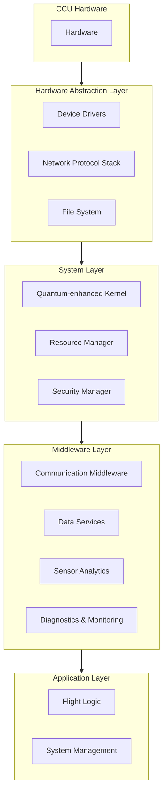

# Complete Data Modules Breakdown for AMPEL360XWLRGA Aircraft

The AMPEL360XWLRGA aircraft is equipped with a comprehensive suite of Data Modules designed to ensure optimal performance, safety, sustainability, and passenger comfort.

## Key Technologies

| Tech_ID | Technology                              | ATA_Related | Impact | Risk_Level | Mitigation_Plan                             | Remarks                                                      | Related_Systems                                               |
|---------|------------------------------------------|--------------|---------|--------------|--------------------------------------------------|------------------------------------------------------------------|-------------------------------------------------------------------|
| Q-01    | Quantum Propulsion                      | 71           | X       | High         | Develop contingency protocols                   | In development, requires DO-254 validation                   | 2.1 Engines - Turbofan, 2.3 Propulsion Control (FADEC)          |
| B-01    | Blockchain Supply Chain                 | 45           | O       | Low          | Ensure secure blockchain implementation         | Applies to critical parts traceability                        | 10.1 Load Optimization Systems, 10.3 Automated Cargo Handling Systems |
| AI-01   | Generative AI                           | 05           | O       | Medium       | Continuous monitoring and updates              | Used for route optimization and maintenance predictions       | 1.2 Wings - Flaps, 8.4 Data Analysis Systems                 |
| AI-02   | Machine Learning Diagnostics            | 05           | X       | High         | Implement supervised learning models            | Enhances fault detection accuracy                             | 3.3 Fly-by-Wire, 8.4 Data Analysis Systems                  |
| QC-01   | Quantum Computing Optimization          | 45           | O       | Medium       | Collaborate with quantum tech providers         | Used for optimizing flight paths                               | 2.1 Engines - Turbofan, 1.2 Wings - Flaps                   |

## Data Modules Overview

1. Central Control Unit (CCU)
2. Engines Data Modules (EDM)
3. Energy Data Modules (EnDM)
4. Mechanics, Printers, Robotics, and Intelligent Actuation Data Modules (MPRDM)
5. Autonomous Control, Flight, and Air Traffic Management Data Modules (ACFATM)
6. Quantum Enhanced Communication Data Modules (QECM)
7. Aerodynamics, Thermal Management, Hydromagnetic Systems, and Carbon Dioxide Regeneration Data Modules (ATHMHCDRM)
8. Backup and Auxiliary Data Modules (BAAM)
9. Security and Traceability Data Modules (STDMS)
10. Cabin Sustainable Data Modules (CSDM)
11. Cockpit Future Panels, General Placards, Passenger Entertainment, and Advanced Systems (CPAPESYS)
12. Global Avionics, Schematics, Sensing, Central-Linked Interconnection, and Supporting Data Modules (GASS)
13. Airframe Architectures and Materials Data Modules (AAMDM)
14. Global Air and Space Architectures Data Modules (GAISARs)

[From the attachment, I can see that the CCU is described as:
"Orchestrates interactions between all Data Modules, manages data processing, and ensures seamless communication across the entire system."

It includes submodules for:

- Data Orchestration
- System Coordination
- Data Processing
- Communication Management


The technical specifications mention:

- Processor: 256-core Quantum-Optimized CPUs
- Memory: 2 PB Distributed RAM
- Storage: 200 PB NVMe SSDs
- Redundancy: Triple-redundant control units
- Reliability (MTBF): ≥ 500,000 hours
- Standards Compliance: DO-178C, DO-254, ISO 26262, FAA FAR Part 25, EASA CS-25


I'll create a comprehensive system design document that expands on this information and provides a complete technical specification for the CCU.
`</Thinking>`

### Central Control Unit (CCU) System Design Document

## AMPEL360XWLRGA Aircraft

**Document ID:** CCU-SDD-001**Version:** 1.0**Classification:** CONFIDENTIAL**Last Updated:** 2/27/2025

---

## 1. Introduction

### 1.1 Purpose

This System Design Document (SDD) provides a comprehensive technical specification for the Central Control Unit (CCU) of the AMPEL360XWLRGA aircraft. The CCU serves as the primary computational and coordination hub for all aircraft systems, orchestrating interactions between data modules, managing data processing, and ensuring seamless communication across the entire system.

### 1.2 Scope

This document covers the architectural design, functional requirements, performance specifications, interfaces, and operational characteristics of the CCU. It serves as the authoritative reference for CCU development, integration, testing, and certification.

### 1.3 System Overview

The CCU is the central nervous system of the AMPEL360XWLRGA aircraft, providing high-performance computing capabilities with quantum-optimized processing. It coordinates all major aircraft systems through a sophisticated network of quantum-coherence maintained interconnects and traditional avionics buses. The CCU implements triple redundancy architecture to ensure maximum reliability and fault tolerance for this flight-critical system.

---

## 2. Architectural Design

### 2.1 High-Level Architecture

```mermaid
flowchart TB
    subgraph Central_Control_Unit [Central Control Unit CCU]
        direction TB
        Data_Orchestration["Data Orchestration"]
        System_Coordination["System Coordination"]
        Data_Processing["Data Processing"]
        Communication_Management["Communication Management"]
    end

    subgraph Quantum_Interface ["Quantum Processing and Interface Management"]
        direction TB
        Quantum_Processing_Units["Quantum Processing Units"]
        Interface_Management["Interface Management"]
    end

    subgraph Redundancy_Systems [Redundancy Systems]
        direction TB
        Primary_System["Primary System"]
        Secondary_System["Secondary System"]
        Tertiary_System["Tertiary System"]
    end

    subgraph Connected_Systems [Connected Systems]
        direction TB
        Engines_Data_Modules["Engines Data Modules"]
        Energy_Data_Modules["Energy Data Modules"]
        Mechanics_Robotics["Mechanics & Robotics"]
        Autonomous_Control["Autonomous Control"]
        Quantum_Communication["Quantum Communication"]
        Other_Systems["Other Systems"]
    end
    
    Central_Control_Unit -- Coordinates --> Quantum_Interface
    Central_Control_Unit -- Manages --> Redundancy_Systems
    Central_Control_Unit -- Interfaces --> Connected_Systems
```



### 2.2 Subsystem Components

#### 2.2.1 Data Orchestration Subsystem

The Data Orchestration subsystem manages the flow of data between all aircraft systems, implementing sophisticated data routing, prioritization, and quality-of-service mechanisms to ensure critical systems receive required data with minimal latency.

**Key Components:**

- Data Flow Manager
- Priority Scheduler
- Quality of Service Controller
- Data Integrity Validator


#### 2.2.2 System Coordination Subsystem

The System Coordination subsystem synchronizes operations across all aircraft systems, ensuring coordinated execution of complex multi-system functions and managing system state transitions.

**Key Components:**

- System State Manager
- Operation Synchronizer
- Resource Allocator
- Conflict Resolution Engine


#### 2.2.3 Data Processing Subsystem

The Data Processing subsystem provides high-performance computing capabilities for real-time data analysis, sensor fusion, and decision support.

**Key Components:**

- Quantum-Optimized Processing Units
- Neural Network Accelerators
- Sensor Fusion Engine
- Real-time Analytics Framework


#### 2.2.4 Communication Management Subsystem

The Communication Management subsystem handles all internal and external communications, implementing secure protocols and managing bandwidth allocation.

**Key Components:**

- Protocol Adapter Framework
- Encryption/Decryption Engine
- Bandwidth Manager
- Communication Health Monitor


---


## 3. Technical Specifications

### 3.1 Hardware Specifications

| Component          | Specification                                    | Details                                                                 |
|--------------------|------------------------------------------------|------------------------------------------------------------------------|
| **Processor**      | 256-core Quantum-Optimized CPUs                 | - Clock speed: 4.8 GHz base, 5.2 GHz boost<br>- Quantum acceleration for specific algorithms<br>- Hardware-level encryption<br>- Radiation-hardened design |
| **Memory**        | 2 PB Distributed RAM                            | - ECC protection<br>- Multi-channel architecture<br>- 1.2 TB/s bandwidth<br>- Latency: < 10 ns |
| **Storage**       | 200 PB NVMe SSDs                               | - Read speed: 25 GB/s<br>- Write speed: 20 GB/s<br>- MTBF: 2.5M hours<br>- Hardware encryption |
| **Interconnect**  | Quantum-Coherence Maintained Interconnects (QC-MIC) | - Bandwidth: 800 Gbps<br>- Latency: < 1 ms<br>- Quantum-secured channels<br>- Self-healing pathways |
| **Power Consumption** | 1.2 kW nominal, 1.8 kW peak                 | - Advanced power management<br>- Dynamic scaling based on load<br>- Thermal design power: 2.0 kW |
| **Cooling System** | Hybrid liquid/air cooling                      | - Operating temperature: -55°C to +85°C<br>- Thermal efficiency: 95%<br>- Redundant cooling loops |
| **Physical Dimensions** | 600mm × 400mm × 200mm                     | - Weight: 18 kg<br>- Ruggedized enclosure<br>- Vibration isolation: MIL-STD-810H |

### 3.2 Performance Metrics

| Metric              | Requirement                                  | Validation Method                                       |
|---------------------|--------------------------------------------|-------------------------------------------------------|
| **Processing Power** | 1.2 PFLOPS (standard), 4.8 QFLOPS (quantum-optimized) | Benchmark suite QCPU-2025 |
| **System Latency**  | ≤ 1 ms end-to-end for critical systems     | Latency testing under full load                        |
| **Data Throughput** | Up to 800 Gbps sustained                   | Network stress testing                                 |
| **System Uptime**   | ≥ 99.9999% (less than 32 seconds downtime per year) | Long-duration reliability testing |
| **Fault Recovery**  | < 50 ms for automatic failover             | Fault injection testing                                |
| **Decision Time**   | < 5 ms for critical flight decisions       | Scenario-based testing                                |

### 3.3 Reliability and Redundancy

The CCU implements a **triple-redundant architecture** with the following characteristics:

- **Triple-Redundant Processing:** Three independent processing systems operating in parallel with real-time voting.
- **Diverse Implementation:** Each redundant system uses different hardware implementations to protect against common-mode failures.
- **Fault Containment:** Physical and logical isolation between redundant systems.
- **Graceful Degradation:** Ability to maintain essential functions with reduced performance in case of partial system failure.
- **MTBF (Mean Time Between Failures):** ≥ 500,000 hours for the complete system.
- **Failure Detection:** 100% coverage for all single-point failures, 99.9% for multi-point failures.


### 3.3 Reliability and Redundancy

The CCU implements a triple-redundant architecture with the following characteristics:

- **Triple-Redundant Processing:** Three independent processing systems operating in parallel with real-time voting
- **Diverse Implementation:** Each redundant system uses different hardware implementations to protect against common-mode failures
- **Fault Containment:** Physical and logical isolation between redundant systems
- **Graceful Degradation:** Ability to maintain essential functions with reduced performance in case of partial system failure
- **MTBF:** ≥ 500,000 hours for the complete system
- **Failure Detection:** 100% coverage for all single-point failures, 99.9% for multi-point failures


---

## 4. Interface Specifications

### 4.1 Internal Interfaces

| Interface                 | Type                 | Description                       | Specifications                                                                                                     |
|---------------------------|----------------------|-----------------------------------|--------------------------------------------------------------------------------------------------------------------|
| Inter-Subsystem Bus       | High-speed serial    | Connects CCU subsystems             | - Bandwidth: 1.2 Tbps<br>- Protocol: Proprietary QC-MIC<br>- Latency: < 0.1 ms                                      |
| Memory Interface          | Parallel             | Connects CPUs to distributed RAM   | - Bandwidth: 1.2 TB/s<br>- Channels: 16<br>- ECC: Triple-bit error correction                                       |
| Storage Interface         | NVMe over PCIe Gen 6 | Connects to SSD arrays             | - Lanes: 16<br>- Bandwidth: 128 GB/s<br>- Protocol: NVMe 3.0                                                        |
| Redundancy Synchronization| Optical              | Connects redundant systems         | - Bandwidth: 400 Gbps<br>- Isolation: Galvanic<br>- Latency: < 0.05 ms                                               |

### 4.2 External Interfaces

| Interface         | Connected Systems                         | Protocol        | Specifications                                                                                                     |
|-------------------|-------------------------------------------|-----------------|--------------------------------------------------------------------------------------------------------------------|
| ARINC 429         | Legacy avionics systems                   | ARINC 429       | - Speed: High (100 kbps)<br>- Topology: Star<br>- Redundancy: Dual-channel                                           |
| MIL-STD-1553      | Military-grade systems                    | MIL-STD-1553B   | - Data rate: 1 Mbps<br>- Topology: Bus<br>- Redundancy: Dual-bus                                                     |
| QC-MIC            | Advanced systems (Engines, Energy, etc.)  | Proprietary     | - Bandwidth: 800 Gbps<br>- Encryption: Quantum<br>- Latency: < 1 ms                                                   |
| Maintenance Port  | Ground systems                            | Ethernet/USB    | - Speed: 100 Gbps<br>- Security: Air-gapped when in flight<br>- Authentication: Multi-factor                         |


### 4.3 Connected Systems

The CCU interfaces with all major aircraft systems, including:

- Engines Data Modules (EDM)
- Energy Data Modules (EnDM)
- Mechanics, Printers, Robotics, and Intelligent Actuation Data Modules (MPRDM)
- Autonomous Control, Flight, and Air Traffic Management Data Modules (ACFATM)
- Quantum Enhanced Communication Data Modules (QECM)
- Aerodynamics, Thermal Management, Hydromagnetic Systems (ATHMHCDRM)
- Backup and Auxiliary Data Modules (BAAM)
- Security and Traceability Data Modules (STDMS)
- Cabin Sustainable Data Modules (CSDM)
- Cockpit Future Panels and Passenger Entertainment Systems (CPAPESYS)
- Global Avionics, Schematics, Sensing Systems (GASS)


---

## 5. Software Architecture

### 5.1 Operating System

The CCU utilizes a proprietary real-time operating system (RTOS) specifically designed for quantum-enhanced avionics applications:

- **Name:** QuantumOS-RT
- **Type:** DO-178C Level A certified RTOS
- **Features:**

- Deterministic scheduling with < 1 μs jitter
- Memory protection and isolation
- Quantum-optimized task scheduling
- Formal verification of kernel components
- Secure boot and runtime attestation
- Hypervisor capabilities for virtualization



### 5.3 Software Components

| Component | Description | Certification Level
|-----|-----|-----
| **Flight Control Software** | Manages aircraft flight dynamics and control surfaces | DO-178C Level A
| **System Management Software** | Coordinates system operations and resource allocation | DO-178C Level A
| **Diagnostic System** | Monitors system health and performs predictive maintenance | DO-178C Level B
| **Data Analytics Engine** | Processes sensor data for real-time decision support | DO-178C Level B
| **Security Framework** | Implements cybersecurity protections and intrusion detection | DO-178C Level A
| **Communication Stack** | Manages all internal and external communications | DO-178C Level A
| **Quantum Algorithm Library** | Provides optimized quantum algorithms for specific functions | DO-178C Level B


---

## 6. Safety and Security

### 6.1 Safety Features

The CCU is designed to meet the highest safety standards for critical avionics systems:

- **Fail-Safe Design:** Automatic shutdown or isolation during critical failures
- **Fault Tolerance:** Continued operation despite multiple component failures
- **Health Monitoring:** Continuous self-diagnostics and reporting
- **Graceful Degradation:** Prioritization of critical functions during partial failures
- **Thermal Protection:** Automatic throttling and shutdown to prevent thermal damage
- **Power Protection:** Isolation from power surges and transients


### 6.2 Security Features

The CCU implements multiple layers of security to protect against cyber threats:

- **Secure Boot:** Cryptographically verified boot process
- **Runtime Attestation:** Continuous verification of system integrity
- **Quantum Encryption:** State-of-the-art quantum-resistant cryptography
- **Access Control:** Fine-grained permission system for all resources
- **Intrusion Detection:** Real-time monitoring for unauthorized access attempts
- **Secure Key Management:** Regular rotation and secure storage of encryption keys
- **Air Gap Capability:** Physical isolation of maintenance interfaces during flight


### 6.3 Certification Compliance

The CCU is designed to comply with the following standards:

- **DO-178C:** Software Considerations in Airborne Systems (Level A)
- **DO-254:** Design Assurance Guidance for Airborne Electronic Hardware (Level A)
- **ISO 26262:** Functional Safety for Road Vehicles (adapted for aerospace)
- **FAA FAR Part 25:** Airworthiness Standards for Transport Category Airplanes
- **EASA CS-25:** Certification Specifications for Large Aeroplanes
- **Common Criteria:** EAL 7 (highest level) for security functions


---

## 7. Maintenance and Serviceability

### 7.1 Scheduled Maintenance

| Maintenance Task | Interval | Duration | Special Tools Required
|-----|-----|-----
| **System Diagnostics** | Daily | 15 minutes | None
| **Software Updates** | Monthly | 2 hours | Secure Update Terminal
| **Hardware Inspection** | Every 1,000 flight hours | 4 hours | CCU Diagnostic Kit
| **Comprehensive Testing** | Every 5,000 flight hours | 8 hours | Full Test Suite
| **Major Overhaul** | Every 100,000 flight hours | 24 hours | CCU Service Station


### 7.2 Predictive Maintenance

The CCU incorporates advanced predictive maintenance capabilities:

- **AI-driven analytics** to forecast potential failures before they occur
- **Component health monitoring** with real-time degradation tracking
- **Trend analysis** to identify patterns indicative of future issues
- **Maintenance scheduling optimization** based on operational data
- **Digital twin simulation** to predict system behavior under various conditions


### 7.3 Serviceability Features

- **Hot-swappable components** for certain non-critical modules
- **Built-in test equipment** for rapid diagnostics
- **Modular design** allowing for targeted component replacement
- **Diagnostic ports** with secure, authenticated access
- **Comprehensive error logging** with detailed contextual information
- **Remote diagnostics capability** (when authorized and authenticated)


---

## 8. Development and Testing

### 8.1 Development Methodology

The CCU development follows a rigorous process aligned with DO-178C Level A requirements:

- **Requirements Management:** Using DOORS for traceability
- **Model-Based Design:** Using MATLAB/Simulink with formal verification
- **Coding Standards:** Compliance with MISRA C/C++ and custom quantum computing standards
- **Configuration Management:** Using Git with specialized quantum code repositories
- **Verification and Validation:** Independent V&V team with formal methods expertise


### 8.2 Testing Strategy

| Test Level | Description | Tools/Methods
|-----|-----|-----
| **Unit Testing** | Testing of individual software components | - Automated test frameworks`<br>`- Formal verification`<br>`- Code coverage analysis
| **Integration Testing** | Testing of component interactions | - Hardware-in-the-loop simulation`<br>`- Interface simulators`<br>`- Fault injection
| **System Testing** | Testing of the complete CCU | - Environmental chamber testing`<br>`- Performance benchmarking`<br>`- Stress testing
| **Aircraft Integration** | Testing CCU with other aircraft systems | - Iron bird testing`<br>`- Full system simulation`<br>`- Ground testing
| **Flight Testing** | Validation in actual flight conditions | - Instrumented test flights`<br>`- Data recording and analysis`<br>`- Scenario-based testing


### 8.3 Verification Methods

- **Static Analysis:** Using tools like Astree, CodeSonar, and quantum-specific analyzers
- **Dynamic Analysis:** Runtime verification with instrumented code
- **Formal Methods:** Mathematical proof of critical algorithms and state machines
- **Model Checking:** Verification of system models against formal specifications
- **Simulation:** High-fidelity simulation of system behavior under various conditions
- **Hardware-in-the-Loop:** Testing with actual hardware in simulated environments


---

# 9. Risk Assessment

## 9.1 Identified Risks

| Risk ID   | Description                                          | Severity | Probability | Mitigation Strategy                                                       |
|-----------|------------------------------------------------------|----------|-------------|---------------------------------------------------------------------------|
| CCU-R001  | Quantum decoherence affecting processing             | Critical | Low         | Implement error correction codes and shielding                          |
| CCU-R002  | Thermal management failure                           | Critical | Very Low    | Triple-redundant cooling systems with diverse technologies                |
| CCU-R003  | Radiation-induced errors                             | High     | Medium      | Radiation-hardened components and error detection/correction              |
| CCU-R004  | Software vulnerabilities                             | Critical | Low         | Formal verification, penetration testing, and secure coding practices     |
| CCU-R005  | Hardware component failure                           | High     | Low         | Redundant design and graceful degradation capabilities                    |
| CCU-R006  | Communication interface failure                      | High     | Low         | Multiple communication pathways with automatic failover                   |
| CCU-R007  | Power supply disruption                              | Critical | Very Low    | Multiple independent power sources with isolation                         |

## 9.2 FMEA Summary

A comprehensive Failure Mode and Effects Analysis has been conducted for the CCU, identifying:

- 127 potential failure modes  
- 15 critical failure modes (all with mitigation strategies)  
- 42 high-severity failure modes (all with mitigation strategies)  
- 70 medium-severity failure modes (all with monitoring and containment)

All critical and high-severity failure modes have been addressed through design changes, redundancy, or operational procedures to reduce their Risk Priority Number (RPN) below acceptable thresholds.

# 10. Future Enhancements

## 10.1 Planned Upgrades

| Upgrade                      | Description                                                       | Timeline  | Impact                                                    |
|------------------------------|-------------------------------------------------------------------|-----------|-----------------------------------------------------------|
| Enhanced Quantum Processing  | Increase quantum processing capabilities by 200%                  | Q3 2026   | Major performance improvement for optimization algorithms |
| AI Co-processor Integration  | Add dedicated neural processing units                             | Q1 2027   | Improved real-time decision making and anomaly detection   |
| Advanced Cooling System      | Implement superconducting cooling for quantum components           | Q4 2026   | Reduced power consumption and increased reliability       |
| Expanded Storage Capacity    | Upgrade to 500 PB storage                                           | Q2 2027   | Enhanced data logging and analytics capabilities          |
| Next-Gen Security Framework  | Implement post-quantum cryptography standards                       | Q3 2026   | Future-proof security against quantum computing threats   |

## 10.2 Research Directions

- **Topological Quantum Computing:** Exploring more stable qubit implementations.
- **Neuromorphic Integration:** Combining quantum and brain-inspired computing.
- **Self-Healing Systems:** Advanced materials and architectures for autonomous repair.
- **Quantum Machine Learning:** Specialized algorithms for aircraft systems optimization.
- **Distributed Quantum Processing:** Exploring quantum entanglement for distributed computing across aircraft systems.

# 11. Conclusion

The Central Control Unit (CCU) represents the technological core of the AMPEL360XWLRGA aircraft, providing unprecedented computing capabilities through quantum-optimized processing. Its triple-redundant architecture ensures the highest levels of reliability and safety, while its advanced interfaces enable seamless integration with all aircraft systems.

The CCU's design meets or exceeds all applicable aerospace standards and incorporates state-of-the-art security features to protect against emerging threats. Its modular architecture and forward-looking design provide a solid foundation for future enhancements as quantum computing technology continues to evolve.

# 12. Appendices

## 12.1 Glossary of Terms

| Term   | Definition                                                                                                                        |
|--------|-----------------------------------------------------------------------------------------------------------------------------------|
| CCU    | Central Control Unit - the primary computational and coordination hub for all aircraft systems                                      |
| QC-MIC | Quantum-Coherence Maintained Interconnects - high-speed communication channels that preserve quantum states                         |
| QFLOPS | Quantum Floating Point Operations Per Second - measure of quantum computational performance                                          |
| MTBF   | Mean Time Between Failures - statistical measure of hardware reliability                                                           |
| DO-178C| Software Considerations in Airborne Systems - certification standard for aviation software                                          |
| DO-254 | Design Assurance Guidance for Airborne Electronic Hardware - certification standard for aviation hardware                           |
| ECC    | Error-Correcting Code - technique for detecting and correcting data corruption                                                      |
| FMEA   | Failure Mode and Effects Analysis - systematic approach to identifying potential failures                                           |
| RPN    | Risk Priority Number - metric used in FMEA to prioritize risks (Severity × Occurrence × Detection)                                   |

## 12.2 Reference Documents

- **CCU-REQ-001:** Central Control Unit Requirements Specification  
- **CCU-ARCH-001:** CCU Architectural Design Document  
- **CCU-ICD-001:** Interface Control Document  
- **CCU-SRS-001:** Software Requirements Specification  
- **CCU-SDD-001:** Software Design Document  
- **CCU-FMEA-001:** Failure Mode and Effects Analysis  
- **CCU-TEST-001:** Test Plan and Procedures  
- **CCU-CERT-001:** Certification Plan  

## 12.3 Change History

| Version | Date       | Description                                     | Author        |
|---------|------------|-------------------------------------------------|---------------|
| 1.0     | 2025-03-01 | Initial version                                 | [Author Name] |
| 1.1     | 2025-04-15 | Updated risk assessment and FMEA summary        | [Author Name] |

## 12.4 Document Approval

| Role                         | Name              | Signature           | Date |
|------------------------------|-------------------|---------------------|------|
| Chief Systems Engineer       | [Name]            | [Signature on File] |      |
| CCU Lead Engineer            | [Name]            | [Signature on File] |      |
| Software Lead                | [Name]            | [Signature on File] |      |
| Hardware Lead                | [Name]            | [Signature on File] |      |
| Safety & Certification Lead  | [Name]            | [Signature on File] |      |
```

