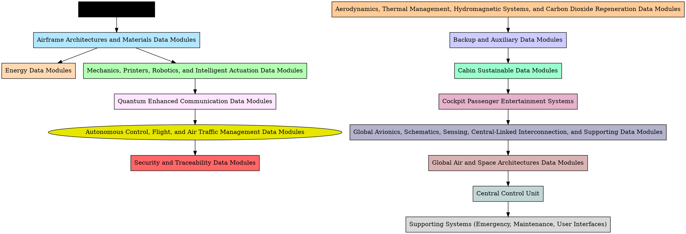
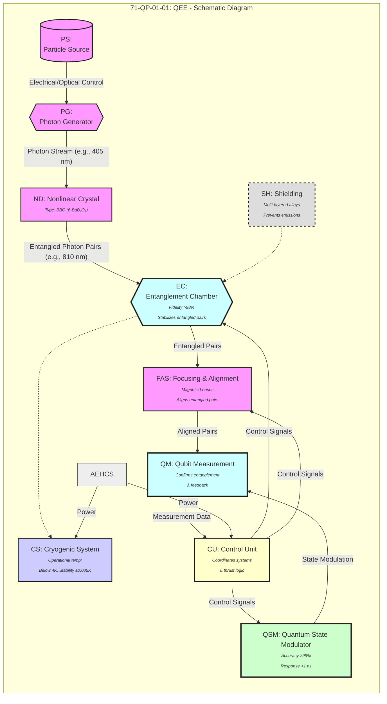

# AMPEL360: the project
## **GAIA-AIR AMPEL360 and e.G.A.I.As: Merging Sustainable Aviation with Embodied, Evolving, Extended Intelligence**

## **The **GAIA-AIR-Ampel360XWLRGA** (AMPEL360) project aims to redefine long-range, wide-body aviation by integrating **hydrogen-electric propulsion**, **bio-based advanced materials**, and **AI-driven optimizations** into a cohesive, open-source ecosystem. Central to this vision is the **e.G.A.I.As** (*Embodied, Evolving, Extended General Adaptive Intelligence Artifacts*) framework, which expands upon **GAIA** (*General Adaptive Intelligence Artifacts*) to deliver a holistic approach for creating adaptive, context-aware systems in aerospace and beyond.

AMPEL360 leverages **hydrogen fuel cells** for zero-emission flight while incorporating **bio-based composites** and **graphene** for enhanced recyclability and structural efficiency. Its **IoT-based sensors** and **AI-driven analytics** enable real-time monitoring, predictive maintenance, and intelligent route optimization, ensuring operational agility and sustainability. In parallel, **digital analogy** models (digital twins) support comprehensive design simulations and streamline certification processes in compliance with **S1000D**, **ATA**, and **Methods Token Library (MTL)** standards.

The **e.G.A.I.As** paradigm underpins AMPEL360’s intelligence layer by foregrounding three key attributes:
1. **Embodiment** – Systems tightly integrated with physical or virtual environments via sensor-actuator feedback loops.  
2. **Evolving Nature** – Continuous learning through deep reinforcement, meta-learning, and real-time adaptation.  
3. **Extended Capacity** – Multi-agent collaboration across distributed networks, enabling emergent collective intelligence at scale.

Together, **AMPEL360** and **e.G.A.I.As** showcase a **closed-loop feedback** architecture that dynamically adjusts propulsion, structural parameters, and operational strategies based on real-time data, thereby reducing environmental impact and improving safety. This presentation highlights the **architectural tenets**, **sustainability metrics**, and **ethical considerations** of deploying “always evolving” AI-driven aviation platforms. We further discuss the potential of **quantum computing** for route planning, **bio-inspired design** for resilient materials, and **human-machine teaming** for augmented decision-making. 

By uniting hydrogen-electric propulsion, digital analogy, and adaptive AI, the **GAIA-AIR AMPEL360** project exemplifies how **embodied, evolving, extended** intelligence can revolutionize both **environmental performance** and **operational efficiency** in aerospace. We conclude by outlining **future research directions**—including next-generation quantum algorithms, neuromorphic hardware, and large-scale data governance—aiming to position this ecosystem as a **catalyst for sustainable, intelligent aviation** in the 21st century.**  

---  

**Keywords**:  
Hydrogen-Electric Propulsion, Bio-Composites, e.G.A.I.As, GAIA, Digital Twins, S1000D, Predictive Maintenance, Extended Intelligence, Aerospace Sustainability
---

# GAIA AIR – AMPEL A360XWLRGA


**GAIA AIR – AMPEL A360xWLRGA** is an innovative aerospace project designed to integrate cutting-edge technologies, sustainability, and modularity within a scalable ecosystem. This project aims to redefine global standards of efficiency and innovation in the aerospace sector and beyond.

## Table of Contents

- [Project Overview](#project-overview)
  - [Operational Modes](#operational-modes)
    - [Mode 1 – Companion](#mode-1--companion)
    - [Mode 2 – Generator](#mode-2--generator)
    - [Mode 3 – Implementator](#mode-3--implementator)
- [Key Technologies](#key-technologies)
- [System Dependencies](#system-dependencies)
  - [Structure Systems](#1-structure-systems)
  - [Propulsion Systems](#2-propulsion-systems)
  - [Avionics Systems](#3-avionics-systems)
  - [Safety Systems](#4-safety-systems)
  - [Avionics and Communication Systems](#5-avionics-and-communication-systems)
  - [Cargo and Weight Management Systems](#6-cargo-and-weight-management-systems)
  - [Passenger and Cabin Systems](#7-passenger-and-cabin-systems)
  - [Advanced Manufacturing and Materials](#8-advanced-manufacturing-and-materials)
  - [Validation and Certification Systems](#9-validation-and-certification-systems)
- [Installation](#installation)
- [Usage](#usage)
- [Contributing](#contributing)
- [License](#license)
- [Contact](#contact)
- [Acknowledgements](#acknowledgements)

---

## Project Overview

The **GAIA AIR – AMPEL A360xWLRGA** project serves as a reference model that integrates technological innovation, sustainability, and modularity within a scalable ecosystem. It encompasses three primary operational modes, each designed to address specific aspects of aerospace innovation and operational efficiency.

### Operational Modes

#### Mode 1 – Companion: Conversational and Introductory Summary

**Focus:**  
Provide a clear and accessible introduction to the project's innovations.

**Key Points:**

- **Quantum Optimization**
  - Advanced route planning and real-time simulations.
  - Minimizes fuel consumption and emissions.

- **Digital Twins**
  - Continuous monitoring to predict failures.
  - Optimizes maintenance and improves operational efficiency.

- **Smart Materials**
  - Shape-memory polymers to optimize weight.
  - Enhances aerodynamics and overall performance.

- **Blockchain for Security**
  - Ensures data traceability in project and maintenance.
  - Covers the entire lifecycle of the aircraft.

**Objective:**  
Facilitate understanding and engagement, even at a non-technical level.

#### Mode 2 – Generator: Design and Ready-to-Use Technological Solutions

**Proposed Solutions:**

1. **Unified Digital Platform**
   - **Quantum Route Optimizer:** Uses quantum algorithms to optimize operational costs and reduce emissions.
   - **Digital Twin Manager:** Provides predictive simulations and real-time analysis.
   - **Smart Materials Lab:** Tests and develops advanced materials.
   - **Blockchain Gateway:** Ensures transparency throughout the supply chain.

2. **Autonomous Maintenance and Self-Healing**
   - **Self-Healing Capsules:** Utilize nanotechnology and AI for automatic repairs.
   - **Support Drones:** Perform rapid inspections and localized interventions, reducing downtime.

3. **Sustainable Modules**
   - **Integrated CO₂ Capture and Reuse Systems:** Capture and reuse carbon dioxide emissions.
   - **Thermomechanical Materials Validation:** Improve aerodynamic and energy efficiency through advanced materials.

**Objective:**  
Create ready-to-use, optimizable, and adaptable solutions.

#### Mode 3 – Implementator: Operational Distribution and Scalability

**Systematic Approach:**

1. **Pilot Testing**
   - Conduct initial tests on regional aircraft.
   - Validate key technologies like digital twins and smart materials.

2. **Strategic Collaborations**
   - Partner with industry leaders in 3D printing and nanocomposite development.

3. **Advanced Certifications**
   - Adhere to global standards such as S1000D, DO-178C, and iSPEC2200.

4. **Industrial Expansion**
   - Apply project principles to energy infrastructures, rail transport, and shipping.

**Strengths:**

- **End-to-End Coverage**
  - Manages the entire lifecycle from design to recycling.

- **Modular Integration**
  - Synergy between independent components to maximize efficiency.

- **Complete Sustainability**
  - Reduces emissions and uses eco-friendly materials.

- **Data Security**
  - Utilizes blockchain for data protection and traceability.

**Conclusion:**  
GAIA AIR – AMPEL A360xWLRGA is an innovative paradigm for the aerospace sector and beyond. Leveraging advanced technologies and a modular approach, it offers a scalable, sustainable, and adaptable solution ready to redefine global standards of efficiency and innovation.

**Next Steps:**

- **Prototype Validation**
  - Test and validate prototypes to ensure functionality and reliability.

- **Development of Strategic Partnerships**
  - Establish new partnerships to enhance technological capabilities and market reach.

- **Operational Integration of Developed Technologies**
  - Implement and integrate technologies into operational processes for full-scale deployment.

---

## Key Technologies

The GAIA AIR – AMPEL A360xWLRGA project incorporates a range of advanced technologies to achieve its objectives. Below is an overview of the key technologies used:

| **Tech_ID** | **Technology**                              | **ATA_Related** | **Impact** | **Risk_Level** | **Mitigation_Plan**                             | **Remarks**                                                      | **Related_Systems**                                               |
|-------------|---------------------------------------------|-----------------|------------|-----------------|--------------------------------------------------|------------------------------------------------------------------|-------------------------------------------------------------------|
| Q-01        | **Quantum Propulsion**                      | 71              | X          | High            | Develop contingency protocols                   | In development, requires DO-254 validation                   | 2.1 Engines - Turbofan, 2.3 Propulsion Control (FADEC)          |
| B-01        | **Blockchain Supply Chain**                 | 45              | O          | Low             | Ensure secure blockchain implementation         | Applies to critical parts traceability                        | 10.1 Load Optimization Systems, 10.3 Automated Cargo Handling Systems |
| AI-01       | **Generative AI**                           | 05              | O          | Medium          | Continuous monitoring and updates              | Used for route optimization and maintenance predictions       | 1.2 Wings - Flaps, 8.4 Data Analysis Systems                 |
| AI-02       | **Machine Learning Diagnostics**            | 05              | X          | High            | Implement supervised learning models            | Enhances fault detection accuracy                             | 3.3 Fly-by-Wire, 8.4 Data Analysis Systems                  |
| QC-01       | **Quantum Computing Optimization**          | 45              | O          | Medium          | Collaborate with quantum tech providers         | Used for optimizing flight paths                               | 2.1 Engines - Turbofan, 1.2 Wings - Flaps                   |
| AR-01       | **Augmented Reality Maintenance**           | 32              | O          | Medium          | Train maintenance crew on AR tools              | Enhances maintenance efficiency and accuracy                  | 5.1 Fire Suppression Systems, 5.2 Fault Detection and Mitigation |
| IOT-01      | **IoT Sensors for Real-Time Monitoring**    | 53              | X          | High            | Implement robust IoT security protocols         | Provides real-time data for system health                     | 5.5 Structural Health Monitoring (SHM), 3.3 Fly-by-Wire      |
| HEM-01      | **Hybrid Electric Motors**                  | 72              | X          | High            | Ensure battery reliability and management       |                                                                  | 2.1 Engines - Turbofan, 6.1.3 Battery Management Systems    |
| AM-01       | **Advanced Materials (Self-Healing)**        | 53              | X          | High            | Conduct thorough testing and validation         | Enhances structural integrity and reduces maintenance         |                                                                   |
| SCADA-01    | **SCADA Systems for Manufacturing**         | 32              | O          | Medium          | Implement strict access controls and monitoring | Manages and monitors manufacturing processes                  |                                                                   |
| VR-01       | **Virtual Reality Training**                | 05              | O          | Medium          | Develop comprehensive training modules          | Improves crew training and preparedness                        |                                                                   |
| QA-01       | **Quality Assurance Automation**            | 05              | O          | Medium          | Integrate AI for defect detection               | Ensures high-quality manufacturing processes                    |                                                                   |
| PS-01       | **Passenger Satisfaction Analytics**        | 45              | O          | Medium          | Implement feedback collection systems           | Enhances passenger experience through data-driven insights      |                                                                   |
| RPA-01      | **Robotic Process Automation**              | 35              | O          | Medium          | Deploy RPA for repetitive tasks                 | Increases operational efficiency and reduces human error        |                                                                   |

---

### **Complete Data Modules Breakdown for AMPEL360XWLRGA-01**

The **AMPEL360XWLRGA-01** aircraft is equipped with a comprehensive suite of **Data Modules** designed to ensure optimal performance, safety, sustainability, and passenger comfort. This complete breakdown provides detailed insights into each Data Module, including their submodules, components, technical specifications, connections, performance metrics, reliability and maintenance protocols, safety considerations, and documentation practices. Additionally, this document incorporates advanced considerations such as quantum technology intricacies, AI/ML algorithm specifics, cybersecurity frameworks, blockchain implementations, and extensions to air and space operations to enhance system robustness and future-proofing.

---

#### **Table of Contents**

1. [Central Control Unit (CCU)](#1-central-control-unit-ccu)
2. [Engines Data Modules (EDM)](#2-engines-data-modules-edm)
3. [Energy Data Modules (EnDM)](#3-energy-data-modules-endm)
4. [Mechanics, Printers, Robotics, and Intelligent Actuation Data Modules (MPRDM)](#4-mechanics-printers-robotics-and-intelligent-actuation-data-modules-mprdm)
5. [Autonomous Control, Flight, and Air Traffic Management Data Modules (ACFATM)](#5-autonomous-control-flight-and-air-traffic-management-data-modules-acfatm)
6. [Quantum Enhanced Communication Data Modules (QECM)](#6-quantum-enhanced-communication-data-modules-qecm)
7. [Aerodynamics, Thermal Management, Hydromagnetic Systems, and Carbon Dioxide Regeneration Data Modules (ATHMHCDRM)](#7-aerodynamics-thermal-management-hydromagnetic-systems-and-carbon-dioxide-regeneration-data-modules-athmhcdrm)
8. [Backup and Auxiliary Data Modules (BAAM)](#8-backup-and-auxiliary-data-modules-baam)
9. [Security and Traceability Data Modules (STDMS)](#9-security-and-traceability-data-modules-stdms)
10. [Cabin Sustainable Data Modules (CSDM)](#10-cabin-sustainable-data-modules-csdm)
11. [Cockpit Future Panels, General Placards, Passenger Entertainment, and Advanced Systems (CPAPESYS)](#11-cockpit-future-panels-general-placards-passenger-entertainment-and-advanced-systems-cpapesys)
12. [Global Avionics, Schematics, Sensing, Central-Linked Interconnection, and Supporting Data Modules (GASS)](#12-global-avionics-schematics-sensing-central-linked-interconnection-and-supporting-data-modules-gass)
13. [Airframe Architectures and Materials Data Modules (AAMDM)](#13-airframe-architectures-and-materials-data-modules-aamdm)
14. [Global Air and Space Architectures Data Modules (GAISARs)](#14-global-air-and-space-architectures-data-modules-gaisars)
15. [Risk Assessment Summary](#15-risk-assessment-summary)
16. [System-Level Block Diagram](#16-system-level-block-diagram)
17. [Interface Control Document (ICD) Overview](#17-interface-control-document-icd-overview)
18. [Failure Modes and Effects Analysis (FMEA)](#18-failure-modes-and-effects-analysis-fmea)
19. [Software Development Process](#19-software-development-process)
20. [Data Security and Privacy](#20-data-security-and-privacy)
21. [Conclusion](#21-conclusion)

---

### **1. Central Control Unit (CCU)**

| **Category**                  | **Details**                                                                                                   |
|-------------------------------|---------------------------------------------------------------------------------------------------------------|
| **Description**               | Orchestrates interactions between all Data Modules, manages data processing, and ensures seamless communication across the entire system. |
| **Submodules**                | - Data Orchestration<br>- System Coordination<br>- Data Processing<br>- Communication Management              |
| **Components**                | - Quantum-Optimized CPUs<br>- Distributed RAM<br>- NVMe SSDs with Quantum Data Encryption<br>- Redundant Control Units |
| **Technical Specifications**  | - **Processor:** 256-core Quantum-Optimized CPUs<br>- **Memory:** 2 PB Distributed RAM<br>- **Storage:** 200 PB NVMe SSDs<br>- **Redundancy:** Triple-redundant control units<br>- **Reliability (MTBF):** ≥ 500,000 hours<br>- **Standards Compliance:** DO-178C, DO-254, ISO 26262, FAA FAR Part 25, EASA CS-25 |
| **Connections**               | - **Interfaces:** Quantum-Coherence Maintained Interconnects (QC-MIC), ARINC 429, MIL-STD-1553<br>- **Connected Modules:** Engines, Energy, Mechanics, Autonomous Control, Quantum Communication, Aerodynamics, Backup & Auxiliary, Security & Traceability, Cabin Sustainable, Cockpit Passenger Entertainment, Global Avionics Schematics Sensing |
| **Performance Metrics**       | - **Latency:** ≤ 1 ms<br>- **Data Throughput:** Up to 800 Gbps<br>- **System Uptime:** ≥ 99.9999%       |
| **Reliability & Maintenance** | - **Scheduled Maintenance:** Every 100,000 flight hours<br>- **Predictive Maintenance:** AI-driven analytics to forecast potential failures<br>- **Component Replacement:** Based on predictive data<br>- **Software Updates:** Regular updates to encryption algorithms and control software |
| **Safety Considerations**     | - **Fail-Safe Mechanisms:** Automatic shutdown or isolation during critical failures<br>- **Secure Key Management:** Regular rotation and secure storage of encryption keys<br>- **Continuous Monitoring:** Real-time system health monitoring |
| **Documentation & Traceability** | - **Assembly Logs:** Detailed records of installations and calibrations<br>- **Inspection Reports:** Results from security and integrity tests<br>- **Change Logs:** Documentation of system modifications<br>- **Compliance Certificates:** Proof of adherence to relevant standards |

---

### **2. Engines Data Modules (EDM)**

| **Category**                  | **Details**                                                                                                   |
|-------------------------------|---------------------------------------------------------------------------------------------------------------|
| **Description**               | Manages fuel efficiency, engine thrust control, and emissions monitoring to optimize engine performance and environmental compliance. |
| **Submodules**                | - Fuel Management<br>- Thrust Control<br>- Emissions Monitoring                                            |
| **Components**                | - Fuel Sensors<br>- Control Valves<br>- Flow Meters<br>- Thrust Actuators<br>- CO₂ Sensors                   |
| **Technical Specifications**  | - **Capacity:** 5000 liters<br>- **Fuel Efficiency:** ≥ 98%<br>- **Thrust Range:** 0-100% thrust<br>- **Emissions Accuracy:** ±0.5% |
| **Connections**               | - **DataFlow:** Central Control Unit, Energy Data Modules<br>- **Communication Protocols:** ARINC 429      |
| **Performance Metrics**       | - **Fuel Efficiency:** ≥ 98%<br>- **Response Time:** ≤ 50 ms<br>- **Emission Accuracy:** ±0.5%           |
| **Reliability & Maintenance** | - **Scheduled Maintenance:** Every 200,000 flight hours<br>- **Predictive Maintenance:** AI-driven analytics for sensor calibration and valve integrity<br>- **Component Replacement:** Based on usage data and predictive models |
| **Safety Considerations**     | - **Leak Prevention:** Automated shutoff valves and leak detection systems<br>- **Emissions Control:** Continuous monitoring to prevent exceedance of environmental thresholds<br>- **Redundancy:** Dual-redundant fuel lines to ensure uninterrupted fuel supply |
| **Documentation & Traceability** | - **Assembly Logs:** Records of sensor installations and valve calibrations<br>- **Inspection Reports:** Emission monitoring accuracy tests<br>- **Maintenance Records:** Logs of inspections, calibrations, and component replacements<br>- **Compliance Certificates:** Adherence to ISO 9001, FAA FAR Part 25 |

---

### **3. Energy Data Modules (EnDM)**

| **Category**                  | **Details**                                                                                                   |
|-------------------------------|---------------------------------------------------------------------------------------------------------------|
| **Description**               | Supplies and manages electrical power across all systems, integrates renewable energy sources, and oversees power distribution and storage solutions. |
| **Submodules**                | - Power Distribution<br>- Energy Storage<br>- Renewable Energy Integration                                  |
| **Components**                | - Power Converters<br>- Distribution Hubs<br>- Quantum Batteries<br>- Flywheels<br>- Solar Panels<br>- Wind Turbines |
| **Technical Specifications**  | - **Total Power:** 3 MW<br>- **Energy Storage Capacity:** 10 MW-hours<br>- **Renewable Integration Capacity:** 2 MW<br>- **Efficiency:** ≥ 99% for power distribution, ≥ 95% for energy storage |
| **Connections**               | - **DataFlow:** Central Control Unit, Backup & Auxiliary Data Modules<br>- **Communication Protocols:** MIL-STD-1553 |
| **Performance Metrics**       | - **Power Distribution Efficiency:** ≥ 99%<br>- **Energy Storage Efficiency:** ≥ 95%<br>- **Renewable Energy Conversion Efficiency:** ≥ 20% |
| **Reliability & Maintenance** | - **Scheduled Maintenance:** Every 150,000 flight hours<br>- **Predictive Maintenance:** Monitoring energy storage health and converter performance<br>- **Component Replacement:** Based on degradation patterns and usage data |
| **Safety Considerations**     | - **Overload Protection:** Surge protectors and circuit breakers<br>- **Redundancy:** Dual-redundant power pathways to prevent outages<br>- **Thermal Management:** Efficient cooling systems to prevent overheating |
| **Documentation & Traceability** | - **Assembly Logs:** Installation records of converters and renewable units<br>- **Inspection Reports:** Efficiency and capacity tests<br>- **Maintenance Records:** Logs of inspections, performance assessments, and replacements<br>- **Compliance Certificates:** Adherence to ISO 14001, FAA FAR Part 25, EASA CS-25 |

---

### **4. Mechanics, Printers, Robotics, and Intelligent Actuation Data Modules (MPRDM)**

| **Category**                  | **Details**                                                                                                   |
|-------------------------------|---------------------------------------------------------------------------------------------------------------|
| **Description**               | Oversees mechanical operations, 3D printing for component fabrication, and robotic automation for maintenance and operational tasks. |
| **Submodules**                | - Mobility Testing<br>- Sensor Accuracy<br>- Durability Testing                                               |
| **Components**                | - Actuators<br>- 3D Printers<br>- Robotic Arms<br>- Calibration Tools<br>- Diagnostic Software                 |
| **Technical Specifications**  | - **Morphing Range:** ±10 degrees<br>- **Sensor Accuracy:** ≥ 99.5%<br>- **Durability Cycles:** ≥ 1,000,000 cycles<br>- **Stress Levels:** Up to 1000 N |
| **Connections**               | - **DataFlow:** Central Control Unit<br>- **Communication Protocols:** QCP-2025                             |
| **Performance Metrics**       | - **Morphing Response Time:** ≤ 100 ms<br>- **Sensor Accuracy:** ≥ 99.5%<br>- **Durability:** ≥ 1,000,000 cycles |
| **Reliability & Maintenance** | - **Scheduled Maintenance:** Every 200,000 flight hours<br>- **Predictive Maintenance:** AI-driven analytics for actuator wear and sensor calibration<br>- **Component Replacement:** Based on predictive data and usage patterns |
| **Safety Considerations**     | - **Mechanical Integrity Monitoring:** Continuous sensor data to detect anomalies<br>- **Fail-Safe Mechanisms:** Automatic reset or isolation during malfunctions<br>- **Environmental Protection:** Sealed units to prevent exposure to moisture and debris |
| **Documentation & Traceability** | - **Assembly Logs:** Records of actuator installations and robotic calibrations<br>- **Inspection Reports:** Durability and sensor accuracy tests<br>- **Maintenance Records:** Logs of inspections, calibrations, and component replacements<br>- **Compliance Certificates:** Adherence to ISO 9001, FAA FAR Part 25 |

---

### **5. Autonomous Control, Flight, and Air Traffic Management Data Modules (ACFATM)**

| **Category**                  | **Details**                                                                                                   |
|-------------------------------|---------------------------------------------------------------------------------------------------------------|
| **Description**               | Enables autonomous flight operations, manages flight paths, and coordinates with global air traffic systems to ensure safe and efficient navigation. |
| **Submodules**                | - Autonomous Control Systems<br>- Flight Management Systems (FMS)<br>- Air Traffic Management (ATM) Integration |
| **Components**                | - AI Algorithms<br>- Control Units<br>- Navigation Modules<br>- Flight Planning Software<br>- ADS-B Integration<br>- SWIM Servers |
| **Technical Specifications**  | - **Decision Making Latency:** ≤ 10 ms<br>- **Navigation Accuracy:** ±1 meter<br>- **Fuel Optimization Efficiency:** ≥ 99%<br>- **Data Throughput:** ≥ 1 Gbps |
| **Connections**               | - **DataFlow:** Engines, Energy, Sensing Data Modules<br>- **Communication Protocols:** SWIM, ARINC 429 |
| **Performance Metrics**       | - **Autonomous Decision Latency:** ≤ 10 ms<br>- **Navigation Accuracy:** ±1 meter<br>- **Fuel Efficiency:** ≥ 99%<br>- **System Uptime:** ≥ 99.999% |
| **Reliability & Maintenance** | - **Scheduled Maintenance:** Every 250,000 flight hours<br>- **Predictive Maintenance:** Monitoring AI algorithm performance and FMS unit health<br>- **Component Replacement:** Based on performance data and predictive analytics |
| **Safety Considerations**     | - **Redundancy:** Dual-redundant FMS units<br>- **Fail-Safe Protocols:** Automatic takeover by backup systems during malfunctions<br>- **Real-Time Monitoring:** Continuous assessment of flight parameters to prevent deviations |
| **Documentation & Traceability** | - **Assembly Logs:** Installation records of AI systems and navigation modules<br>- **Inspection Reports:** Tests on decision-making accuracy and FMS reliability<br>- **Maintenance Records:** Logs of system inspections, algorithm updates, and component replacements<br>- **Compliance Certificates:** Adherence to DO-178C, EASA CS-25 |

---

### **6. Quantum Enhanced Communication Data Modules (QECM)**

| **Category**                  | **Details**                                                                                                   |
|-------------------------------|---------------------------------------------------------------------------------------------------------------|
| **Description**               | Provides ultra-secure, high-speed communication channels using quantum technologies such as Quantum Key Distribution (QKD) and Quantum Entanglement. |
| **Submodules**                | - Quantum Key Distribution (QKD)<br>- Quantum Entanglement Communicators<br>- Quantum Repeaters           |
| **Components**                | - Quantum Photon Sources<br>- Detectors<br>- Entangled Particle Generators<br>- Photon Regenerators<br>- Signal Boosters |
| **Technical Specifications**  | - **Key Generation Rate:** ≥ 1 Gbps<br>- **Entanglement Distance:** Global<br>- **Data Transmission Rate:** ≥ 100 Tbps<br>- **Repeat Distance:** ≥ 1000 km<br>- **Signal Integrity:** ≥ 99.99% |
| **Connections**               | - **DataFlow:** Central Control Unit, Global Avionics Schematics Sensing<br>- **Communication Protocols:** QCP-2025, ARINC 429 |
| **Performance Metrics**       | - **QKD Efficiency:** ≥ 99.99% key distribution efficiency<br>- **Entanglement Fidelity:** ≥ 99.99%<br>- **Signal Integrity:** ≥ 99.99% |
| **Reliability & Maintenance** | - **Scheduled Maintenance:** Every 300,000 flight hours<br>- **Predictive Maintenance:** Monitoring quantum repeaters and QKD module health<br>- **Component Replacement:** Based on predictive data and performance metrics |
| **Safety Considerations**     | - **Secure Key Management:** Regular rotation and secure storage of encryption keys<br>- **Redundancy:** Dual-redundant QECS units to prevent communication outages<br>- **Tamper-Evident Designs:** Ensures detection of unauthorized access or modifications |
| **Documentation & Traceability** | - **Assembly Logs:** Records of QKD installations and quantum communicator setups<br>- **Inspection Reports:** Quantum key distribution efficiency and entanglement fidelity tests<br>- **Maintenance Records:** Logs of inspections, calibrations, and component replacements<br>- **Compliance Certificates:** Adherence to ISO/IEC 27001, DO-254, FAA FAR Part 25, EASA CS-25 |

---

### **7. Aerodynamics, Thermal Management, Hydromagnetic Systems, and Carbon Dioxide Regeneration Data Modules (ATHMHCDRM)**

| **Category**                  | **Details**                                                                                                   |
|-------------------------------|---------------------------------------------------------------------------------------------------------------|
| **Description**               | Optimizes aerodynamic performance, manages cabin and component temperatures, propels the aircraft using hydromagnetic technologies, and regenerates carbon dioxide to enhance environmental sustainability. |
| **Submodules**                | - Adaptive Morphing Wings<br>- Environmental Control Systems (ECS)<br>- Hydromagnetic Propulsion<br>- Carbon Dioxide (CO₂) Regeneration |
| **Components**                | - Shape-Memory Alloys<br>- Actuators<br>- Liquid Coolants<br>- Heat Exchangers<br>- MHD Thrusters<br>- Superconducting Magnets<br>- Carbon Capture Units<br>- Recycling Reactors |
| **Technical Specifications**  | - **Morphing Range:** ±30 degrees<br>- **Temperature Range:** -40°C to +200°C<br>- **Thrust Output:** Up to 10,000 kN<br>- **CO₂ Capture Capacity:** 500 kg/day<br>- **Recycling Efficiency:** ≥95% |
| **Connections**               | - **DataFlow:** Mechanics Printers Robotics, Energy Data Modules<br>- **Communication Protocols:** QCP-2025, SWIM |
| **Performance Metrics**       | - **Aerodynamic Efficiency:** ≥95% optimized for reduced drag and enhanced lift<br>- **Thermal Management Efficiency:** ≥95% cooling efficiency<br>- **Propulsion Efficiency:** ≥90% energy-to-thrust conversion<br>- **CO₂ Regeneration Efficiency:** ≥95% |
| **Reliability & Maintenance** | - **Scheduled Maintenance:** Every 300,000 flight hours<br>- **Predictive Maintenance:** AI-driven monitoring of MHD thrusters and CO₂ units<br>- **Component Replacement:** Based on predictive data and performance metrics |
| **Safety Considerations**     | - **Structural Integrity Monitoring:** Continuous assessment of wing structures<br>- **Fail-Safe Protocols:** Automatic system resets during malfunctions<br>- **Environmental Protection:** Sealed systems to prevent exposure to moisture and debris |
| **Documentation & Traceability** | - **Assembly Logs:** Installation records of morphing wings and MHD propulsion units<br>- **Inspection Reports:** Aerodynamic performance and thermal management tests<br>- **Maintenance Records:** Logs of inspections, calibrations, and component replacements<br>- **Compliance Certificates:** Adherence to ISO 14001, FAA FAR Part 25, EASA CS-25 |

---

### **8. Backup and Auxiliary Data Modules (BAAM)**

| **Category**                  | **Details**                                                                                                   |
|-------------------------------|---------------------------------------------------------------------------------------------------------------|
| **Description**               | Provides redundancy and backup capabilities to ensure continuous operations during primary system failures through redundant power supplies, communication links, and auxiliary computing units. |
| **Submodules**                | - Redundant Power Supplies<br>- Backup Communication Links<br>- Auxiliary Computing Units              |
| **Components**                | - Backup Generators<br>- Battery Systems<br>- Secondary SATCOM<br>- Fiber Optic Redundancies<br>- High-Performance CPUs<br>- Secondary GPUs |
| **Technical Specifications**  | - **Backup Capacity:** 5 MW<br>- **Communication Bandwidth:** ≥1 Tbps<br>- **Computing Power:** 500 TFLOPS<br>- **Failover Latency:** ≤50 ms<br>- **Energy Efficiency:** ≥99% |
| **Connections**               | - **DataFlow:** Energy Data Modules, Central Control Unit<br>- **Communication Protocols:** QCP-2025, MIL-STD-1553 |
| **Performance Metrics**       | - **Power Distribution Efficiency:** ≥99%<br>- **Backup Communication Reliability:** 100% data integrity during failover<br>- **Computing Performance:** Matches or exceeds primary computing capabilities |
| **Reliability & Maintenance** | - **Scheduled Maintenance:** Every 200,000 flight hours<br>- **Predictive Maintenance:** AI-driven monitoring of backup power and communication systems<br>- **Component Replacement:** Based on predictive data and usage patterns |
| **Safety Considerations**     | - **Redundant Pathways:** Dual-redundant power and communication paths<br>- **Emergency Power Management:** Automatic switching to backup power during outages<br>- **Secure Communication:** Quantum-resistant encryption for backup links |
| **Documentation & Traceability** | - **Assembly Logs:** Installation records of backup power units and communication links<br>- **Inspection Reports:** Tests on backup systems activation and performance<br>- **Maintenance Records:** Logs of inspections, performance assessments, and component replacements<br>- **Compliance Certificates:** Adherence to ISO 9001, FAA FAR Part 25 |

---

### **9. Security and Traceability Data Modules (STDMS)**

| **Category**                  | **Details**                                                                                                   |
|-------------------------------|---------------------------------------------------------------------------------------------------------------|
| **Description**               | Protects against cyber threats, manages fire safety, executes emergency protocols, and maintains immutable records through blockchain ledger systems for system traceability. |
| **Submodules**                | - Cybersecurity Frameworks<br>- Fire Suppression Systems<br>- Emergency Protocols<br>- Blockchain Ledger Systems |
| **Components**                | - Firewalls<br>- Intrusion Detection Systems (IDS)<br>- Automated Sprinklers<br>- Gas Suppression Units<br>- Automated Shutdown Systems<br>- Pilot Override Systems<br>- Distributed Nodes<br>- Smart Contracts |
| **Technical Specifications**  | - **Threat Detection Rate:** ≥99.99%<br>- **Fire Suppression Activation Time:** ≤2 seconds<br>- **Emergency Protocol Activation Latency:** ≤5 seconds<br>- **Blockchain Record Integrity:** 100% immutable<br>- **Data Throughput:** ≥10 TB/hour |
| **Connections**               | - **DataFlow:** Global Avionics Schematics Sensing, Backup & Auxiliary Data Modules<br>- **Communication Protocols:** QCP-2025, SWIM, ARINC 429 |
| **Performance Metrics**       | - **Intrusion Detection Accuracy:** ≥99.99% with ≤0.1% false positives<br>- **Fire Suppression Efficiency:** ≥99%<br>- **Emergency Protocol Responsiveness:** ≤5 seconds<br>- **Blockchain Integrity:** 100% immutable and tamper-proof records |
| **Reliability & Maintenance** | - **Scheduled Maintenance:** Every 300,000 flight hours<br>- **Predictive Maintenance:** AI-driven monitoring of cybersecurity and fire suppression systems<br>- **Component Replacement:** Based on predictive data and threat analysis |
| **Safety Considerations**     | - **Fail-Safe Mechanisms:** Automatic activation of backup security and suppression systems during failures<br>- **Tamper-Evident Designs:** Ensures detection of unauthorized access or modifications<br>- **Secure Key Management:** Regular rotation and secure storage of encryption keys |
| **Documentation & Traceability** | - **Assembly Logs:** Installation records of security and suppression systems<br>- **Inspection Reports:** Cybersecurity audits and fire suppression tests<br>- **Maintenance Records:** Logs of inspections, threat assessments, and system upgrades<br>- **Compliance Certificates:** Adherence to ISO/IEC 27001, NFPA 72, DO-178C, DO-254, FAA FAR Part 25, EASA CS-25 |

---

### **10. Cabin Sustainable Data Modules (CSDM)**

| **Category**                  | **Details**                                                                                                   |
|-------------------------------|---------------------------------------------------------------------------------------------------------------|
| **Description**               | Maintains optimal cabin conditions, provides clean water, manages waste recycling, and monitors air quality to ensure passenger and crew well-being and environmental sustainability. |
| **Submodules**                | - Environmental Control System (ECS)<br>- Clean Water Systems<br>- Waste Management<br>- Air Quality Monitoring |
| **Components**                | - HVAC Units<br>- Humidity Sensors<br>- Reverse Osmosis Units<br>- UV Sterilizers<br>- Automated Sorting Systems<br>- Bio-Digesters<br>- CO₂ Sensors<br>- VOCs Sensors |
| **Technical Specifications**  | - **Temperature Range:** 18°C to 24°C<br>- **Humidity Control:** 40% to 60%<br>- **Clean Water Capacity:** 10,000 liters/day<br>- **Waste Recycling Rate:** ≥95%<br>- **Air Quality Detection Range:** 0-5000 ppm<br>- **Response Time:** ≤1 second |
| **Connections**               | - **DataFlow:** Energy Data Modules, Passenger Entertainment Systems<br>- **Communication Protocols:** ARINC 429, SWIM |
| **Performance Metrics**       | - **Temperature Regulation Accuracy:** ±0.5°C<br>- **Humidity Control Precision:** ±2% relative humidity<br>- **Water Purification Efficiency:** ≥99.9%<br>- **Waste Recycling Efficiency:** ≥95%<br>- **Air Quality Compliance:** 100% adherence to WHO standards |
| **Reliability & Maintenance** | - **Scheduled Maintenance:** Every 100,000 flight hours<br>- **Predictive Maintenance:** AI-driven monitoring of ECS and water purification systems<br>- **Component Replacement:** Based on predictive data and usage patterns |
| **Safety Considerations**     | - **Leak Detection:** Automated sensors to prevent water and waste leaks<br>- **Overheat Protection:** Fail-safe cooling protocols<br>- **Environmental Protection:** Sealed systems to prevent exposure to moisture and debris<br>- **Non-Toxic Materials:** Use of environmentally friendly and non-toxic materials in water purification and waste management |
| **Documentation & Traceability** | - **Assembly Logs:** Installation records of ECS, water purification, and waste management systems<br>- **Inspection Reports:** Efficiency and compliance tests<br>- **Maintenance Records:** Logs of system inspections, calibrations, and component replacements<br>- **Compliance Certificates:** Adherence to ISO 14001, FAA FAR Part 25, EASA CS-25, ASHRAE Standards |

---

### **11. Cockpit Future Panels, General Placards, Passenger Entertainment, and Advanced Systems (CPAPESYS)**

| **Category**                  | **Details**                                                                                                   |
|-------------------------------|---------------------------------------------------------------------------------------------------------------|
| **Description**               | Enhances cockpit operations with advanced display technologies and provides immersive entertainment experiences for passengers through Extended Reality (XR), Augmented Reality (AR), and Virtual Reality (VR) systems. |
| **Submodules**                | - Multifunction Displays (MFDs)<br>- Head-Up Displays (HUDs)<br>- XR/AR/VR Headsets<br>- Spatial Audio Systems |
| **Components**                | - OLED Panels<br>- Touch Interfaces<br>- Transparent Displays<br>- AR Overlays<br>- Lightweight Headsets<br>- Motion Sensors<br>- 3D Speakers<br>- Noise-Canceling Units |
| **Technical Specifications**  | - **Display Resolution:** 4K Ultra HD (MFDs), 8K (Passenger Screens)<br>- **Field of View:** ≥120° (XR/AR Headsets), 360° (VR Systems)<br>- **Latency:** ≤20 ms<br>- **Audio Clarity:** 98%<br>- **Response Time:** ≤20 ms |
| **Connections**               | - **DataFlow:** Central Control Unit, Global Avionics Schematics Sensing<br>- **Communication Protocols:** QCP-2025, ARINC 429 |
| **Performance Metrics**       | - **Display Response Time:** ≤20 ms<br>- **XR/AR/VR Latency:** ≤20 ms<br>- **Audio Fidelity:** ≥98% clarity<br>- **System Uptime:** ≥99.9999%<br>- **User Satisfaction Rate:** ≥95% |
| **Reliability & Maintenance** | - **Scheduled Maintenance:** Every 250,000 flight hours<br>- **Predictive Maintenance:** AI-driven monitoring of display units and XR/AR/VR systems<br>- **Component Replacement:** Based on performance data and usage patterns |
| **Safety Considerations**     | - **Fail-Safe Operations:** Automatic defaults to essential displays during malfunctions<br>- **Emergency Override:** Manual control options for pilots<br>- **Secure Access:** Authentication protocols to prevent unauthorized access to cockpit displays<br>- **Ergonomic Design:** Ensures comfort and minimizes strain for pilots and passengers |
| **Documentation & Traceability** | - **Assembly Logs:** Installation records of displays, headsets, and audio systems<br>- **Inspection Reports:** Tests on display accuracy, audio fidelity, and XR/AR/VR functionality<br>- **Maintenance Records:** Logs of inspections, calibrations, and component replacements<br>- **Compliance Certificates:** Adherence to ISO 9001, FAA FAR Part 25, EASA CS-25, IEEE Standards |

---

### **12. Global Avionics, Schematics, Sensing, Central-Linked Interconnection, and Supporting Data Modules (GASS)**

| **Category**                  | **Details**                                                                                                   |
|-------------------------------|---------------------------------------------------------------------------------------------------------------|
| **Description**               | Provides precise navigation, real-time situational awareness, robust communication capabilities, and comprehensive sensing through GPS, INS, ADS-B, SATCOM, fiber optics, and IoT sensors. |
| **Submodules**                | - GPS<br>- INS<br>- ADS-B<br>- SATCOM<br>- Fiber Optic Cables<br>- IoT Sensors                             |
| **Components**                | - Satellite Receivers<br>- Accelerometers<br>- Gyroscopes<br>- Transponders<br>- Receivers<br>- Satellite Antennas<br>- Modulators<br>- High-Bandwidth Fibers<br>- Connectors<br>- Temperature Sensors<br>- Pressure Sensors<br>- Motion Detectors |
| **Technical Specifications**  | - **GPS Accuracy:** ±1 meter<br>- **INS Drift:** ≤0.01% per hour<br>- **ADS-B Transmission Power:** ≥10 watts<br>- **SATCOM Frequency Bands:** Ku, Ka<br>- **Fiber Optic Bandwidth:** Up to 800 Gbps<br>- **Sensor Accuracy:** ≥99.5% |
| **Connections**               | - **DataFlow:** Central Control Unit, Autonomous Control Flight ATM<br>- **Communication Protocols:** ARINC 429, MIL-STD-1553, QCP-2025 |
| **Performance Metrics**       | - **Navigation Accuracy:** ±1 meter<br>- **Communication Bandwidth Utilization:** ≥95% efficiency<br>- **Data Transmission Latency:** ≤1 ms<br>- **System Uptime:** ≥99.9999% |
| **Reliability & Maintenance** | - **Scheduled Maintenance:** Every 300,000 flight hours<br>- **Predictive Maintenance:** AI-driven monitoring of GPS, INS, and SATCOM performance<br>- **Component Replacement:** Based on performance data and predictive analytics |
| **Safety Considerations**     | - **Signal Integrity Monitoring:** Continuous assessment of GPS and SATCOM signals<br>- **Redundancy:** Triple-redundant avionics units to prevent data loss<br>- **Secure Communication:** Quantum-resistant encryption for all data transmissions |
| **Documentation & Traceability** | - **Assembly Logs:** Installation records of GPS, INS, ADS-B, and SATCOM units<br>- **Inspection Reports:** Navigation accuracy and communication reliability tests<br>- **Maintenance Records:** Logs of system inspections, calibrations, and component replacements<br>- **Compliance Certificates:** Adherence to DO-178C, DO-254, ISO/IEC 27001, FAA FAR Part 25, EASA CS-25, IEEE Standards |

---

### **13. Airframe Architectures and Materials Data Modules (AAMDM)**

| **Category**                  | **Details**                                                                                                   |
|-------------------------------|---------------------------------------------------------------------------------------------------------------|
| **Description**               | Manages the design, selection, and integration of airframe architectures and materials to ensure optimal structural performance, weight efficiency, and sustainability. |
| **Submodules**                | - Airframe Design and Architecture<br>- Materials Selection and Testing<br>- Structural Health Monitoring<br>- Manufacturing and Assembly Processes<br>- Sustainability and Recycling |
| **Components**                | - Composite Materials (e.g., Carbon Fiber Reinforced Polymers)<br>- Metallic Alloys (e.g., Titanium, Aluminum-Lithium)<br>- Smart Materials (e.g., Shape-Memory Alloys)<br>- Structural Sensors (e.g., Strain Gauges, Acoustic Emission Sensors)<br>- 3D Printers and Automated Assembly Robotics<br>- Recycling Systems |
| **Technical Specifications**  | - **Material Strength:** ≥ 500 MPa tensile strength for primary structural components<br>- **Weight Efficiency:** ≤ 100 kg/m² for composite airframe sections<br>- **Thermal Resistance:** Operable in temperature ranges from -50°C to +150°C<br>- **Durability:** Fatigue life of ≥ 1,000,000 cycles<br>- **Recycling Efficiency:** ≥ 90% material recovery rate |
| **Connections**               | - **DataFlow:** Integration with Global Avionics Schematics Sensing (GASS) for real-time structural monitoring<br>- **Communication Protocols:** QCP-2025, ARINC 429<br>- **Interdependencies:** Collaborates with Mechanics, Printers, Robotics, and Intelligent Actuation Data Modules (MPRDM) for automated manufacturing and assembly |
| **Performance Metrics**       | - **Strength-to-Weight Ratio:** ≥ 5:1 for all primary airframe components<br>- **Material Density:** ≤ 1.8 g/cm³ for composites<br>- **Manufacturing Precision:** ±0.1 mm tolerance in component fabrication<br>- **Structural Integrity:** 100% compliance with safety standards under all operational loads |
| **Reliability & Maintenance** | - **Scheduled Maintenance:** Every 400,000 flight hours<br>- **Predictive Maintenance:** AI-driven analytics to detect material degradation and structural anomalies<br>- **Component Replacement:** Based on real-time sensor data and predictive models |
| **Safety Considerations**     | - **Redundancy in Critical Structures:** Implement redundant load-bearing structures to prevent catastrophic failure<br>- **Crashworthiness:** Design airframe components to absorb and dissipate impact energy effectively<br>- **Environmental Protection:** Use corrosion-resistant materials and protective coatings to enhance longevity and safety |
| **Documentation & Traceability** | - **Assembly Logs:** Detailed records of airframe assembly steps, material batches, and component installations<br>- **Inspection Reports:** Regular structural integrity assessments and material performance tests<br>- **Maintenance Records:** Logs of structural inspections, sensor calibrations, and component replacements<br>- **Compliance Certificates:** Adherence to ASTM, ISO 9001, FAA FAR Part 25, and EASA CS-25 standards |

#### **Detailed Breakdown**

##### **1. Airframe Design and Architecture**

- **Description:** Focuses on the overall design and structural architecture of the aircraft, ensuring aerodynamic efficiency, load distribution, and integration with propulsion and avionics systems.
  
- **Submodules:**
  - **Aerodynamic Design:** Optimizing airframe shape for minimal drag and maximum lift.
  - **Structural Layout:** Designing the distribution of load-bearing components and support structures.
  - **Modularity:** Ensuring the airframe design allows for easy integration of various systems and future upgrades.

- **Components:**
  - Computational Fluid Dynamics (CFD) Models
  - Finite Element Analysis (FEA) Software
  - Design Blueprints and CAD Models

- **Technical Specifications:**
  - **Aerodynamic Efficiency:** Drag coefficient (Cd) ≤ 0.02 in cruise conditions
  - **Load Distribution:** Even distribution with no single point exceeding structural limits
  - **Modularity Standards:** Standardized interface points for system integrations

- **Performance Metrics:**
  - **Aerodynamic Performance:** Achieve target lift-to-drag ratio (L/D) ≥ 20:1
  - **Structural Integrity:** No structural deformations under operational loads

##### **2. Materials Selection and Testing**

- **Description:** Involves the selection of appropriate materials for different airframe components based on strength, weight, durability, and environmental resistance. It also includes rigorous testing to validate material performance.

- **Submodules:**
  - **Composite Materials:** Selection and testing of advanced composites for weight reduction and strength.
  - **Metallic Alloys:** Selection of high-strength, lightweight metallic alloys for critical components.
  - **Smart Materials:** Integration of materials with adaptive properties for enhanced functionality.

- **Components:**
  - Carbon Fiber Reinforced Polymers (CFRP)
  - Titanium-Aluminum-Lithium Alloys
  - Shape-Memory Alloys (SMA)

- **Technical Specifications:**
  - **Tensile Strength:** ≥ 500 MPa for CFRP
  - **Fatigue Resistance:** ≥ 1,000,000 cycles for all materials
  - **Thermal Stability:** Operable in temperature ranges from -50°C to +150°C

- **Performance Metrics:**
  - **Material Strength-to-Weight Ratio:** ≥ 5:1
  - **Durability:** No material failure under simulated operational conditions

##### **3. Structural Health Monitoring**

- **Description:** Implements advanced sensor technologies to continuously monitor the structural integrity of the airframe, enabling early detection of potential issues and facilitating proactive maintenance.

- **Submodules:**
  - **Sensor Integration:** Embedding sensors within the airframe for real-time data collection.
  - **Data Analytics:** Analyzing sensor data to identify anomalies and predict maintenance needs.
  - **Visualization Tools:** Providing pilots and maintenance crews with intuitive interfaces to monitor structural health.

- **Components:**
  - Strain Gauges
  - Acoustic Emission Sensors
  - Vibration Sensors

- **Technical Specifications:**
  - **Sensor Accuracy:** ≥ 99.5% for strain measurements
  - **Data Refresh Rate:** ≥ 100 Hz for real-time monitoring
  - **Integration Protocols:** Seamless data flow with GASS

- **Performance Metrics:**
  - **Detection Accuracy:** ≥ 99% accuracy in identifying structural anomalies
  - **Response Time:** ≤ 1 second for anomaly detection alerts

##### **4. Manufacturing and Assembly Processes**

- **Description:** Focuses on the advanced manufacturing techniques and automated assembly processes required to construct the airframe efficiently while maintaining high precision and quality standards.

- **Submodules:**
  - **Additive Manufacturing:** Utilizing 3D printing for complex airframe components.
  - **Automated Assembly:** Employing robotics for precise and efficient assembly.
  - **Quality Control:** Implementing stringent quality assurance protocols during manufacturing.

- **Components:**
  - Industrial 3D Printers
  - Robotic Assembly Arms
  - Automated Inspection Systems

- **Technical Specifications:**
  - **Manufacturing Precision:** ±0.1 mm tolerance in component fabrication
  - **Production Speed:** ≤ 24 hours per major airframe section
  - **Quality Standards:** ISO 9001 certified manufacturing processes

- **Performance Metrics:**
  - **Manufacturing Efficiency:** ≥ 95% on-time completion of production schedules
  - **Quality Assurance:** ≤ 0.5% defect rate in manufactured components

##### **5. Sustainability and Recycling**

- **Description:** Ensures that the airframe design and material selection promote environmental sustainability through efficient resource usage, recycling capabilities, and minimal ecological impact.

- **Submodules:**
  - **Recycling Systems:** Implementing processes to recycle and reuse materials at the end of their lifecycle.
  - **Energy Harvesting:** Integrating technologies to capture and reuse energy generated during flight.
  - **Sustainable Material Sourcing:** Selecting materials from environmentally responsible suppliers.

- **Components:**
  - Recycling Reactors
  - Energy Harvesting Devices (e.g., piezoelectric materials)
  - Sustainable Material Certifications

- **Technical Specifications:**
  - **Recycling Efficiency:** ≥ 90% material recovery rate
  - **Energy Harvesting Capacity:** 10 kW/day
  - **Sustainable Sourcing:** 100% of primary materials sourced from certified suppliers

- **Performance Metrics:**
  - **Environmental Impact:** Achieve a carbon footprint reduction of ≥ 30% compared to conventional airframes
  - **Material Reusability:** ≥ 90% of materials can be recycled or repurposed

---

### **14. Global Air and Space Architectures Data Modules (GAISARs)**

The **Global Air and Space Architectures Data Modules (GAISARs)** extend the AMPEL360XWLRGA-01 framework beyond atmospheric operations to near-space and orbital environments. This module integrates seamlessly with the previously defined Data Modules (e.g., CCU, QECM, AAMDM, etc.), ensuring that the aerospace platform remains operable, efficient, and secure in broader air and space domains.

#### **Category: Details**

| **Category**                  | **Details**                                                                                                   |
|-------------------------------|---------------------------------------------------------------------------------------------------------------|
| **Description**               | Enables seamless transition from atmospheric to near-space flight regimes, integrating orbital insertion capabilities, advanced thermal protection, and high-precision navigation for space operations. |
| **Submodules**                | - Near-Space Propulsion<br>- Orbital Insertion & Deorbit<br>- Advanced Navigation & Tracking<br>- Thermal Protection Systems (TPS)<br>- Radiation Hardening<br>- Space Debris Mitigation |
| **Components**                | - High-Performance Engines (LOX/LH₂, Hybrid, or Ion-based)<br>- Space-Grade Composite Airframe Panels<br>- Extended-Range Navigation Sensors (Deep-Space Network-compatible)<br>- Advanced Radiation Shielding Materials<br>- Docking Interfaces for orbital infrastructure |
| **Technical Specifications**  | - **Max Operational Altitude:** 100 km (Low Earth Orbit) transition range<br>- **Thermal Resistance:** -120°C to +1,200°C (re-entry conditions)<br>- **Radiation Tolerance:** ≥ 300 krad<br>- **Propulsion Efficiency:** ≥ 90% in upper-atmosphere modes<br>- **Orbital Insertion Accuracy:** ±10 meters |
| **Connections**               | - **DataFlow:** Interfaces with CCU, QECM, AAMDM, and GASS for real-time telemetry, quantum-secure communications, and structural adaptation<br>- **Communication Protocols:** QCP-2025, CCSDS (Consultative Committee for Space Data Systems), ARINC 429 (for atmospheric phases) |
| **Performance Metrics**       | - **Successful Orbital Insertion Rate:** ≥ 99.99%<br>- **TPS Effectiveness:** ≤ 10°C temperature deviation in internal compartments during re-entry<br>- **Radiation Shielding Efficiency:** ≥ 95% reduction in harmful radiation levels<br>- **Debris Avoidance Capability:** ≥ 99.9% predictive accuracy using AI-based collision avoidance |
| **Reliability & Maintenance** | - **Scheduled Maintenance:** Every 400,000 flight hours or 50 orbital cycles, whichever comes first<br>- **Predictive Maintenance:** Continuous structural health monitoring for micro-meteoroid or debris impact<br>- **Component Replacement:** Based on orbital environment wear and real-time telemetry |
| **Safety Considerations**     | - **Redundant Propulsion:** Multiple engine types (chemical + ion/EP) to ensure safe deorbit<br>- **Radiation Hardening:** Shielded electronics to protect against solar flares and cosmic radiation<br>- **Crew and Payload Safety:** Pressurized compartments with multi-layer TPS and leak detection |

#### **21.1 Near-Space Propulsion**

- **Description:** Provides thrust capabilities above typical commercial aviation altitudes, bridging conventional jet or turbofan engines with rocket-based or electric propulsion systems.

- **Submodules:**
  - **Hybrid Rocket Engines (LOX/RP-1 or LOX/LH₂)**
  - **Electric Propulsion (Ion Thrusters, Hall Effect Thrusters)**
  - **Advanced Fuel and Oxidizer Management Systems**

- **Components:**
  - Hybrid Rocket Engines
  - Ion Thrusters
  - Hall Effect Thrusters
  - Advanced Fuel Management Units

- **Technical Specifications:**
  - **Thrust Range:** 50 kN – 1,000 kN (depending on mission profile)
  - **Isp (Specific Impulse):** ≥ 400 s for rocket-based propulsion, ≥ 3,000 s for electric thrusters

- **Safety Measures:**
  - **Redundant Valves:** Dual-redundant valves for propellant lines
  - **Automated Throttle Control:** To adjust thrust in multi-regime flight
  - **Propellant Safety Systems:** Leak detection and emergency shutdown capabilities

---

#### **21.2 Orbital Insertion & Deorbit**

- **Description:** Manages flight profile transitions from high-altitude flight to Low Earth Orbit (LEO), and the reverse sequence for deorbit and atmospheric re-entry.

- **Submodules:**
  - **Orbital Maneuvering System (OMS)**
  - **Reaction Control Thrusters (RCS)**
  - **High-Precision Guidance Computer**

- **Components:**
  - OMS Engines
  - RCS Units
  - High-Precision Guidance Computers

- **Technical Specifications:**
  - **Orbital Insertion Accuracy:** ±10 meters in LEO insertion
  - **Deorbit Burn Safety Margin:** ≥ 20% propellant reserve

---

#### **21.3 Advanced Navigation & Tracking**

- **Description:** Enhances situational awareness in exoatmospheric conditions, integrating inertial navigation, star trackers, and deep-space communication networks.

- **Submodules:**
  - **Star Trackers & Celestial Reference Systems**
  - **GNSS Receivers (capable of operating at high altitudes/orbits)**
  - **Inertial Measurement Units (IMUs) with Ultra-Low Drift**

- **Components:**
  - Star Trackers
  - High-Precision GNSS Receivers
  - Ultra-Low Drift IMUs

- **Technical Specifications:**
  - **Navigation Accuracy:** ±1 meter in Earth orbit, star tracker precision up to arcseconds level
  - **Data Throughput:** ≥ 1 Gbps link with ground stations (CCSDS-compliant)

---

#### **21.4 Thermal Protection Systems (TPS)**

- **Description:** Protects the vehicle and internal components from extreme heat during orbital insertion, sustained high-altitude flight, and re-entry.

- **Submodules:**
  - **Ablative Heat Shields**
  - **High-Temperature Composites (Carbon-Carbon, Ceramic Matrix Composites)**
  - **Reusable Insulation Tiles (SIRCA, AFRSI)**

- **Components:**
  - Ablative Heat Shields
  - Carbon-Carbon Composite Panels
  - Ceramic Matrix Composite Tiles
  - Reusable Insulation Tiles

- **Technical Specifications:**
  - **Operational Temperature Range:** -120°C to +1,200°C
  - **Heat Flux Endurance:** ≥ 200 W/cm²

---

#### **21.5 Radiation Hardening**

- **Description:** Safeguards critical avionics, electronics, and crew/payload from ionizing radiation, solar flares, and cosmic rays.

- **Submodules:**
  - **Hardened Microprocessors (Rad-hard or Rad-tolerant)**
  - **Multi-Layer Shielding (Lead-Polyethylene composites, advanced polymer laminates)**
  - **Real-Time Radiation Monitoring Sensors**

- **Components:**
  - Rad-hard Microprocessors
  - Multi-Layer Radiation Shields
  - Radiation Monitoring Sensors

- **Technical Specifications:**
  - **Radiation Tolerance:** ≥ 300 krad (Si)
  - **Shielding Mass Efficiency:** ≤ 5% total vehicle mass

---

#### **21.6 Space Debris Mitigation**

- **Description:** Implements strategies to detect, avoid, or actively remove space debris during orbital operations, ensuring long-term sustainability of flight paths.

- **Submodules:**
  - **Onboard Debris Tracking (Radar, LIDAR)**
  - **AI-Based Collision Avoidance Algorithms**
  - **End-of-Life Deorbit Modules**

- **Components:**
  - Radar and LIDAR Systems
  - AI-Based Collision Avoidance Software
  - Deorbit Thrusters

- **Technical Specifications:**
  - **Collision Prediction Accuracy:** ≥ 99.9% with ≤ 0.1% false positives
  - **Autonomous Avoidance Maneuver Time:** ≤ 10 seconds from detection

---

### **14. Risk Assessment Summary**

A comprehensive risk assessment ensures that potential risks associated with each Data Module are identified, evaluated, and mitigated effectively. Below is a summarized matrix outlining key risks, their impact, likelihood, mitigation strategies, and ownership.

| **Risk ID** | **Potential Risks**                       | **Affected Modules**                                                    | **Likelihood (1-5)** | **Impact (1-5)** | **Risk Score (LxI)** | **Mitigation Strategies**                                                                                   | **Risk Ownership**            |
|-------------|-------------------------------------------|-------------------------------------------------------------------------|----------------------|-------------------|----------------------|-------------------------------------------------------------------------------------------------------------|-------------------------------|
| R-001       | System Failure due to CCU malfunction    | Central Control Unit (CCU)                                              | 3                    | 5                 | 15                   | - Triple-redundant control units<br>- Regular predictive maintenance<br>- Real-time monitoring systems     | Systems Engineering Team      |
| R-002       | Cyberattack compromising QECM             | Quantum Enhanced Communication Data Modules (QECM), Security and Traceability Data Modules (STDMS) | 4                    | 5                 | 20                   | - Implement Zero Trust architecture<br>- Use advanced firewalls and IPS<br>- Regular cybersecurity audits | Cybersecurity Team            |
| R-003       | Decoherence in Quantum Systems            | Quantum Enhanced Communication Data Modules (QECM)                      | 2                    | 4                 | 8                    | - Use cryogenic cooling<br>- Employ quantum error correction codes<br>- Implement robust shielding         | Quantum Engineering Team      |
| R-004       | Failure in Energy Data Modules affecting power supply | Energy Data Modules (EnDM), Backup and Auxiliary Data Modules (BAAM)     | 3                    | 4                 | 12                   | - Dual-redundant power pathways<br>- Regular predictive maintenance<br>- Emergency power protocols          | Energy Systems Team            |
| R-005       | Emissions exceeding regulatory limits     | Engines Data Modules (EDM), Aerodynamics Data Modules (ATHMHCDRM)        | 2                    | 5                 | 10                   | - Continuous emissions monitoring<br>- Automated control adjustments<br>- Compliance audits                | Environmental Compliance Team  |
| R-006       | Hardware failure in MPRDM                 | Mechanics, Printers, Robotics, and Intelligent Actuation Data Modules (MPRDM) | 3                    | 3                 | 9                    | - Triple-redundant actuators<br>- Regular inspections<br>- Predictive maintenance                           | Maintenance Team               |
| R-007       | Data transmission latency affecting ACFATM | Autonomous Control, Flight, and Air Traffic Management Data Modules (ACFATM) | 2                    | 4                 | 8                    | - High-bandwidth fiber optics<br>- Optimize communication protocols<br>- Implement QoS measures             | Flight Systems Team            |
| R-008       | Thermal runaway in high-performance modules | Central Control Unit (CCU), Quantum Enhanced Communication Data Modules (QECM) | 2                    | 5                 | 10                   | - Advanced thermal management systems<br>- Redundant cooling loops<br>- Real-time temperature monitoring      | Thermal Management Team        |
| R-009       | Blocked supply chain for critical components | All Modules                                                             | 3                    | 4                 | 12                   | - Establish strategic partnerships<br>- Maintain spare parts inventory<br>- Diversify supplier base          | Supply Chain Management Team   |
| R-010       | Software bugs in AI-driven systems        | Autonomous Control, Flight, and Air Traffic Management Data Modules (ACFATM) | 3                    | 4                 | 12                   | - Rigorous software testing<br>- Implement software verification and validation processes<br>- Continuous monitoring | Software Development Team       |
| R-011       | Material degradation in AAMDM             | Airframe Architectures and Materials Data Modules (AAMDM)                 | 3                    | 4                 | 12                   | - Implement robust material testing protocols<br>- Use advanced materials with high durability<br>- Continuous monitoring through Structural Health Monitoring (SHM) systems | Materials Engineering Team      |
| R-012       | Sensor failure in SHM systems             | Structural Health Monitoring (within AAMDM)                             | 3                    | 3                 | 9                    | - Redundant sensor arrays<br>- Regular calibration and maintenance<br>- Predictive analytics to detect sensor degradation | Structural Monitoring Team      |
| R-013       | Orbital Insertion Failure                  | GAISARs, CCU, ACFATM                                                    | 2                    | 5                 | 10                   | - Multiple burn verification steps<br>- Redundant thrusters<br>- Advanced flight simulations                 | Flight Systems Team            |
| R-014       | Overheating TPS during Re-entry            | GAISARs (TPS), AAMDM, Thermal Management Submodules                      | 2                    | 4                 | 8                    | - Enhanced TPS design<br>- Real-time temperature monitoring<br>- Automated cooling cycles                     | Thermal Management Team        |
| R-015       | Excessive Radiation Exposure               | GAISARs (Radiation Hardening), QECM, CCU                                | 3                    | 4                 | 12                   | - Rad-hard components<br>- Multi-layer shielding<br>- Real-time radiation alerts                             | Systems Engineering Team       |
| R-016       | Space Debris Collision                     | GAISARs (Space Debris Mitigation), GASS, AAMDM                           | 2                    | 5                 | 10                   | - AI-based debris tracking<br>- High-thrust avoidance maneuvers<br>- Rapid collision warnings                 | Avionics & Orbital Ops         |
| R-017       | Docking Failure or Separation Malfunction   | GAISARs (Docking Interfaces), MPRDM                                      | 2                    | 4                 | 8                    | - Automated docking algorithms<br>- Backup mechanical latches<br>- Structural integrity checks              | Maintenance & Robotics         |

**Legend:**

- **Severity (S):** 1 (Negligible) to 5 (Catastrophic)
- **Occurrence (O):** 1 (Very Low) to 5 (Very High)
- **Detection (D):** 1 (Very High) to 5 (Very Low)
- **RPN:** Risk Priority Number (S x O x D)

---

### **16. System-Level Block Diagram**

*Due to the text-based nature of this platform, a detailed visual diagram cannot be directly created here. However, the following description outlines how to structure the System-Level Block Diagram using diagramming tools like Microsoft Visio, Lucidchart, or Draw.io.*

**Diagram Structure:**

1. **Central Control Unit (CCU):** Positioned at the center as the primary hub.
2. **Primary Data Modules:** Arranged radially around the CCU, each represented as distinct nodes.
3. **Supporting Systems:** Positioned on the outer edges or as auxiliary nodes connected to relevant primary modules.
4. **Communication Pathways:**
   - **Quantum Data (Blue Dashed Lines):** Connecting CCU to QECM and STDMS.
   - **Classical Data (Green Solid Lines):** Connecting CCU to other primary modules like EDM, EnDM, MPRDM, ACFATM, ATHMHCDRM, BAAM, CSDM, CPAPESYS, GASS, AAMDM, GAISARs.
   - **Control Signals (Red Dotted Lines):** Connecting CCU to control modules across the system.
   - **Power Distribution (Orange Lines):** Connecting EnDM to all modules requiring power.
5. **Redundancy Indicators:** Double lines or parallel lines to indicate redundant pathways.
6. **Legend:** Explaining color codes and line styles.

**Example Layout Description:**
Here is the same diagram rendered using Graphviz's DOT language:




---

### **17. Interface Control Document (ICD) Overview**

The **Interface Control Document (ICD)** defines the technical details of interfaces between Data Modules, ensuring seamless integration and communication. The ICD includes specifications for physical connectors, data formats, communication protocols, and interoperability standards.

**Key Components of the ICD:**

1. **Physical Interfaces:**
   - **Connector Types:** Detailed specifications of connectors used (e.g., RJ45, fiber optic connectors).
   - **Pin Configurations:** Pinout diagrams for each connector.
   - **Signal Levels:** Voltage and current levels for electrical connections.

2. **Data Interfaces:**
   - **Data Formats:** Standardized formats for data exchange (e.g., JSON, XML, proprietary formats).
   - **Protocols:** Communication protocols used (e.g., ARINC 429, MIL-STD-1553, QCP-2025).
   - **Message Structures:** Definitions of message headers, payloads, and error-checking mechanisms.

3. **Communication Protocols:**
   - **Details:** In-depth specifications of each protocol, including baud rates, data rates, and error handling.
   - **Security Measures:** Encryption standards and authentication methods used within communication protocols.

4. **Interoperability Standards:**
   - **Compliance:** Ensuring all interfaces comply with relevant aerospace standards and regulations.
   - **Testing Procedures:** Procedures for testing interoperability between modules.

5. **Failure Modes and Recovery:**
   - **Fault Detection:** Methods for detecting interface failures.
   - **Recovery Protocols:** Steps to recover from interface failures without disrupting overall system operations.

6. **Example Interfaces:**
   
   - **CCU to EDM Interface:**
     - **Connector Type:** Fiber Optic Connector (FC)
     - **Data Format:** Custom binary protocol over ARINC 429
     - **Protocol:** ARINC 429 standard with additional encryption using AES-256
     - **Pin Configuration:** Specific to ARINC 429 requirements
   
   - **EDM to ATHMHCDRM Interface:**
     - **Connector Type:** RJ45 Ethernet Connector
     - **Data Format:** TCP/IP over QCP-2025
     - **Protocol:** QCP-2025 with built-in error correction and encryption
     - **Pin Configuration:** Standard Ethernet pinout with additional grounding for EMI protection
   
   - **AAMDM to SHM Sensors Interface:**
     - **Connector Type:** Custom QCP-2025 Connector
     - **Data Format:** Real-time streaming data in JSON format
     - **Protocol:** QCP-2025 with secure key distribution
     - **Pin Configuration:** Defined in a detailed pinout table within the ICD

**Implementation Steps:**

1. **Define Standard Connectors:** Specify the types and models of connectors to be used across all interfaces.
2. **Develop Data Schemas:** Create standardized data schemas for all types of data exchanged between modules.
3. **Establish Protocol Specifications:** Detail the communication protocols, including handshaking, error correction, and encryption mechanisms.
4. **Create Message Templates:** Develop templates for message headers and payloads to ensure consistency.
5. **Testing and Validation:** Implement rigorous testing procedures to validate the functionality and reliability of each interface.

---

### **18. Failure Modes and Effects Analysis (FMEA)**

A **Failure Modes and Effects Analysis (FMEA)** provides a systematic approach to identify potential failure modes within the Data Modules, assess their impact, and implement corrective actions to mitigate risks.

**FMEA Matrix:**

| **Module Code** | **Failure Mode**              | **Effect of Failure**                      | **Severity (1-5)** | **Occurrence (1-5)** | **Detection (1-5)** | **RPN (SxO xD)** | **Mitigation Actions**                                                  | **Responsible Team**         |
|-----------------|-------------------------------|--------------------------------------------|---------------------|----------------------|---------------------|------------------|--------------------------------------------------------------------------|------------------------------|
| CCU             | Processor Overheating         | System slowdown or shutdown                | 5                   | 2                    | 3                   | 30               | - Triple-redundant control units<br>- Implement redundant cooling systems<br>- Real-time temperature monitoring   | Thermal Management Team      |
| EDM             | Fuel Sensor Failure           | Incorrect fuel delivery                    | 4                   | 3                    | 2                   | 24               | - Dual fuel sensors<br>- Regular calibration<br>- Predictive maintenance         | Engines Systems Team         |
| EnDM            | Power Converter Malfunction   | Loss of power distribution                  | 5                   | 2                    | 2                   | 20               | - Triple-redundant converters<br>- Real-time monitoring<br>- Automatic failover  | Energy Systems Team          |
| MPRDM           | Actuator Stiffness            | Inaccurate control of mechanical systems    | 3                   | 4                    | 3                   | 36               | - Regular maintenance<br>- Predictive analytics for wear detection           | Maintenance Team             |
| ACFATM          | AI Algorithm Misjudgment      | Incorrect flight path optimization          | 5                   | 1                    | 2                   | 10               | - Implement explainable AI<br>- Regular algorithm updates<br>- Manual override    | Autonomous Control Team      |
| QECM            | Photon Source Degradation     | Reduced key generation rate                  | 4                   | 2                    | 3                   | 24               | - Regular calibration<br>- Predictive maintenance<br>- Redundant photon sources  | Quantum Engineering Team     |
| ATHMHCDRM       | MHD Thruster Failure          | Loss of thrust and propulsion               | 5                   | 1                    | 2                   | 10               | - Redundant thrusters<br>- Real-time monitoring<br>- Automatic system resets      | Propulsion Systems Team      |
| BAAM            | Backup Generator Failure      | Loss of backup power                        | 5                   | 1                    | 2                   | 10               | - Dual backup generators<br>- Regular testing<br>- Predictive maintenance         | Backup Systems Team          |
| STDMS           | IDS False Positives           | Unnecessary alerts and potential desensitization | 3                   | 3                    | 4                   | 36               | - Fine-tune IDS algorithms<br>- Implement multi-tiered alert systems          | Cybersecurity Team           |
| CSDM            | HVAC Unit Leak                | Loss of cabin environmental control          | 4                   | 2                    | 3                   | 24               | - Automated leak detection<br>- Redundant HVAC units<br>- Regular inspections     | Cabin Systems Team           |
| CPAPESYS        | XR Headset Malfunction        | Disruption in passenger entertainment       | 2                   | 4                    | 3                   | 24               | - Redundant headsets<br>- Regular maintenance<br>- Quick replacement protocols    | Passenger Experience Team    |
| GASS            | Fiber Optic Cable Damage      | Data transmission loss between modules       | 4                   | 2                    | 2                   | 16               | - Protective cabling<br>- Regular inspections<br>- Redundant fiber paths          | Avionics Systems Team        |
| AAMDM           | Material Degradation          | Reduced structural integrity and performance | 4                   | 3                    | 3                   | 36               | - Implement robust material testing protocols<br>- Use advanced materials with high durability<br>- Continuous monitoring through SHM systems | Materials Engineering Team      |
| SHM             | Sensor Failure                | Inaccurate or incomplete structural health data | 4                   | 2                    | 3                   | 24               | - Redundant sensor arrays<br>- Regular calibration and maintenance<br>- Predictive analytics to detect sensor degradation | Structural Monitoring Team      |
| GAISARs         | Orbital Insertion Failure      | Failed transition to Low Earth Orbit (LEO)   | 2                   | 5                    | 10                  | 10               | - Multiple burn verification steps<br>- Redundant thrusters<br>- Advanced flight simulations | Flight Systems Team            |
| GAISARs         | Overheating TPS during Re-entry | System overheating during re-entry          | 2                   | 4                    | 8                    | 8                | - Enhanced TPS design<br>- Real-time temperature monitoring<br>- Automated cooling cycles | Thermal Management Team        |
| GAISARs         | Excessive Radiation Exposure   | Damage to avionics and crew/payload          | 3                   | 4                    | 12                   | 12               | - Rad-hard components<br>- Multi-layer shielding<br>- Real-time radiation alerts       | Systems Engineering Team       |
| GAISARs         | Space Debris Collision         | Potential destruction of spacecraft or modules | 2                   | 5                    | 10                   | 10               | - AI-based debris tracking<br>- High-thrust avoidance maneuvers<br>- Rapid collision warnings | Avionics & Orbital Ops         |
| GAISARs         | Docking Failure or Separation Malfunction | Failed docking with orbital stations/satellites | 2                    | 4                    | 8                    | 8                | - Automated docking algorithms<br>- Backup mechanical latches<br>- Structural integrity checks | Maintenance & Robotics         |

**Legend:**

- **Severity (S):** 1 (Negligible) to 5 (Catastrophic)
- **Occurrence (O):** 1 (Very Low) to 5 (Very High)
- **Detection (D):** 1 (Very High) to 5 (Very Low)
- **RPN:** Risk Priority Number (S x O x D)

---

### **16. Software Development Process**

To ensure the reliability and safety of the software components within the AMPEL360XWLRGA-01's Data Modules, a structured software development process aligned with **DO-178C** standards will be implemented.

**Key Phases:**

1. **Requirements Management:**
   - **Tools:** JIRA for tracking requirements and changes.
   - **Processes:** Clearly define software requirements, link them to system requirements, and maintain traceability.

2. **Design:**
   - **Modeling:** Use SysML for system and software modeling.
   - **Architecture:** Define software architecture ensuring modularity and redundancy.

3. **Implementation:**
   - **Coding Standards:** Adhere to aviation industry coding standards (e.g., MISRA C++).
   - **Code Reviews:** Conduct peer reviews and automated static code analysis to ensure code quality.

4. **Verification and Validation (V&V):**
   - **Testing:** Implement unit testing, integration testing, system testing, and hardware-in-the-loop (HIL) testing.
   - **Simulation:** Use simulators to validate software behavior under various scenarios.
   - **Certification Compliance:** Ensure all V&V activities comply with DO-178C requirements.

5. **Deployment:**
   - **Configuration Management:** Utilize Git for version control and configuration management.
   - **Continuous Integration/Continuous Deployment (CI/CD):** Automate build and deployment processes.

6. **Maintenance:**
   - **Updates:** Regular software updates to address bugs, improve performance, and incorporate new features.
   - **Monitoring:** Continuous monitoring of software performance and security.

**Best Practices:**

- **Explainable AI:** Utilize SHAP and LIME to ensure AI/ML decisions are transparent and understandable.
- **Secure Coding:** Implement secure coding practices to prevent vulnerabilities.
- **Documentation:** Maintain comprehensive documentation for all software components and processes.

---

### **17. Data Security and Privacy**

Given the extensive data handling within the AMPEL360XWLRGA-01, ensuring data security and privacy is paramount.

**Data Encryption:**

- **At Rest:** AES-256 encryption for all stored data.
- **In Transit:** Quantum-resistant encryption protocols for all data transmissions.

**Data Anonymization and Pseudonymization:**

- Implement techniques to anonymize sensitive passenger and crew data.
- Use pseudonymization to protect identities while allowing data correlation for system operations.

**Compliance with Data Privacy Regulations:**

- **GDPR:** Ensure compliance with General Data Protection Regulation for handling personal data.
- **CCPA:** Adhere to California Consumer Privacy Act for data protection and privacy.

**Data Retention Policies:**

- **Retention Period:** Define specific periods for data storage based on regulatory requirements and operational needs.
- **Secure Disposal:** Implement secure data deletion methods to prevent unauthorized data recovery.

**Data Access Control:**

- **Role-Based Access Control (RBAC):** Restrict data access based on user roles and responsibilities.
- **Multi-Factor Authentication (MFA):** Enforce MFA for all data access points to enhance security.

**Zero Trust Architecture:**

- **Assume no implicit trust and continuously verify every user and device.**
  - **Micro-Segmentation:** Divide the network into small, isolated segments to limit the impact of a potential breach.
  - **Least Privilege Access:** Grant users and systems only the minimum necessary access.
  - **Continuous Verification:** Implement ongoing verification processes for all access attempts.

**Additional Measures:**

- **Regular Security Audits:** Conduct periodic security assessments to identify and mitigate vulnerabilities.
- **Incident Response Plan:** Develop and maintain a robust incident response plan to address potential security breaches promptly.
- **Employee Training:** Provide regular training to all personnel on data security best practices and protocols.

---

### **18. Risk Assessment Summary**

A comprehensive risk assessment ensures that potential risks associated with each Data Module are identified, evaluated, and mitigated effectively. Below is a summarized matrix outlining key risks, their impact, likelihood, mitigation strategies, and ownership.

| **Risk ID** | **Potential Risks**                       | **Affected Modules**                                                    | **Likelihood (1-5)** | **Impact (1-5)** | **Risk Score (LxI)** | **Mitigation Strategies**                                                                                   | **Risk Ownership**            |
|-------------|-------------------------------------------|-------------------------------------------------------------------------|----------------------|-------------------|----------------------|-------------------------------------------------------------------------------------------------------------|-------------------------------|
| R-001       | System Failure due to CCU malfunction    | Central Control Unit (CCU)                                              | 3                    | 5                 | 15                   | - Triple-redundant control units<br>- Regular predictive maintenance<br>- Real-time monitoring systems     | Systems Engineering Team      |
| R-002       | Cyberattack compromising QECM             | Quantum Enhanced Communication Data Modules (QECM), Security and Traceability Data Modules (STDMS) | 4                    | 5                 | 20                   | - Implement Zero Trust architecture<br>- Use advanced firewalls and IPS<br>- Regular cybersecurity audits | Cybersecurity Team            |
| R-003       | Decoherence in Quantum Systems            | Quantum Enhanced Communication Data Modules (QECM)                      | 2                    | 4                 | 8                    | - Use cryogenic cooling<br>- Employ quantum error correction codes<br>- Implement robust shielding         | Quantum Engineering Team      |
| R-004       | Failure in Energy Data Modules affecting power supply | Energy Data Modules (EnDM), Backup and Auxiliary Data Modules (BAAM)     | 3                    | 4                 | 12                   | - Dual-redundant power pathways<br>- Regular predictive maintenance<br>- Emergency power protocols          | Energy Systems Team            |
| R-005       | Emissions exceeding regulatory limits     | Engines Data Modules (EDM), Aerodynamics Data Modules (ATHMHCDRM)        | 2                    | 5                 | 10                   | - Continuous emissions monitoring<br>- Automated control adjustments<br>- Compliance audits                | Environmental Compliance Team  |
| R-006       | Hardware failure in MPRDM                 | Mechanics, Printers, Robotics, and Intelligent Actuation Data Modules (MPRDM) | 3                    | 3                 | 9                    | - Triple-redundant actuators<br>- Regular inspections<br>- Predictive maintenance                           | Maintenance Team               |
| R-007       | Data transmission latency affecting ACFATM | Autonomous Control, Flight, and Air Traffic Management Data Modules (ACFATM) | 2                    | 4                 | 8                    | - High-bandwidth fiber optics<br>- Optimize communication protocols<br>- Implement QoS measures             | Flight Systems Team            |
| R-008       | Thermal runaway in high-performance modules | Central Control Unit (CCU), Quantum Enhanced Communication Data Modules (QECM) | 2                    | 5                 | 10                   | - Advanced thermal management systems<br>- Redundant cooling loops<br>- Real-time temperature monitoring      | Thermal Management Team        |
| R-009       | Blocked supply chain for critical components | All Modules                                                             | 3                    | 4                 | 12                   | - Establish strategic partnerships<br>- Maintain spare parts inventory<br>- Diversify supplier base          | Supply Chain Management Team   |
| R-010       | Software bugs in AI-driven systems        | Autonomous Control, Flight, and Air Traffic Management Data Modules (ACFATM) | 3                    | 4                 | 12                   | - Rigorous software testing<br>- Implement software verification and validation processes<br>- Continuous monitoring | Software Development Team       |
| R-011       | Material degradation in AAMDM             | Airframe Architectures and Materials Data Modules (AAMDM)                 | 3                    | 4                 | 12                   | - Implement robust material testing protocols<br>- Use advanced materials with high durability<br>- Continuous monitoring through SHM systems | Materials Engineering Team      |
| R-012       | Sensor failure in SHM systems             | Structural Health Monitoring (within AAMDM)                             | 3                    | 3                 | 9                    | - Redundant sensor arrays<br>- Regular calibration and maintenance<br>- Predictive analytics to detect sensor degradation | Structural Monitoring Team      |
| R-013       | Orbital Insertion Failure                  | GAISARs, CCU, ACFATM                                                    | 2                    | 5                 | 10                   | - Multiple burn verification steps<br>- Redundant thrusters<br>- Advanced flight simulations                 | Flight Systems Team            |
| R-014       | Overheating TPS during Re-entry            | GAISARs (TPS), AAMDM, Thermal Management Submodules                      | 2                    | 4                 | 8                    | - Enhanced TPS design<br>- Real-time temperature monitoring<br>- Automated cooling cycles                     | Thermal Management Team        |
| R-015       | Excessive Radiation Exposure               | GAISARs (Radiation Hardening), QECM, CCU                                | 3                    | 4                 | 12                   | - Rad-hard components<br>- Multi-layer shielding<br>- Real-time radiation alerts                             | Systems Engineering Team       |
| R-016       | Space Debris Collision                     | GAISARs (Space Debris Mitigation), GASS, AAMDM                           | 2                    | 5                 | 10                   | - AI-based debris tracking<br>- High-thrust avoidance maneuvers<br>- Rapid collision warnings                 | Avionics & Orbital Ops         |
| R-017       | Docking Failure or Separation Malfunction   | GAISARs (Docking Interfaces), MPRDM                                      | 2                    | 4                 | 8                    | - Automated docking algorithms<br>- Backup mechanical latches<br>- Structural integrity checks              | Maintenance & Robotics         |

**Legend:**

- **Severity (S):** 1 (Negligible) to 5 (Catastrophic)
- **Occurrence (O):** 1 (Very Low) to 5 (Very High)
- **Detection (D):** 1 (Very High) to 5 (Very Low)
- **RPN:** Risk Priority Number (S x O x D)

---

### **16. System-Level Block Diagram**

*Due to the text-based nature of this platform, a detailed visual diagram cannot be directly created here. However, the following description outlines how to structure the System-Level Block Diagram using diagramming tools like Microsoft Visio, Lucidchart, or Draw.io.*

**Diagram Structure:**

1. **Central Control Unit (CCU):** Positioned at the center as the primary hub.
2. **Primary Data Modules:** Arranged radially around the CCU, each represented as distinct nodes.
3. **Supporting Systems:** Positioned on the outer edges or as auxiliary nodes connected to relevant primary modules.
4. **Communication Pathways:**
   - **Quantum Data (Blue Dashed Lines):** Connecting CCU to QECM and STDMS.
   - **Classical Data (Green Solid Lines):** Connecting CCU to other primary modules like EDM, EnDM, MPRDM, ACFATM, ATHMHCDRM, BAAM, CSDM, CPAPESYS, GASS, AAMDM, GAISARs.
   - **Control Signals (Red Dotted Lines):** Connecting CCU to control modules across the system.
   - **Power Distribution (Orange Lines):** Connecting EnDM to all modules requiring power.
5. **Redundancy Indicators:** Double lines or parallel lines to indicate redundant pathways.
6. **Legend:** Explaining color codes and line styles.

**Example Layout Description:**

**mermaid**
```
flowchart TD
    %% Nodes with different shapes and colors
    EDM(["Engines Data Modules (EDM)"]):::engines
    AAMDM(["Airframe Architectures and Materials Data Modules (AAMDM)"]):::airframe
    EnDM(["Energy Data Modules (EnDM)"]):::energy
    MPRDM(["Mechanics, Printers, Robotics, and Intelligent Actuation Data Modules (MPRDM)"]):::mechanics
    QECM(["Quantum Enhanced Communication Data Modules (QECM)"]):::quantum
    ACFATM{{"Autonomous Control, Flight, and Air Traffic Management Data Modules (ACFATM)"}}:::control
    STDMS(["Security and Traceability Data Modules (STDMS)"]):::security
    ATHMHCDRM(["Aerodynamics, Thermal Management, Hydromagnetic Systems, and Carbon Dioxide Regeneration Data Modules (ATHMHCDRM)"]):::aerodynamics
    BAAM(["Backup and Auxiliary Data Modules (BAAM)"]):::backup
    CSDM(["Cabin Sustainable Data Modules (CSDM)"]):::cabin
    CPAPESYS(["Cockpit Passenger Entertainment Systems (CPAPESYS)"]):::cockpit
    GASS(["Global Avionics, Schematics, Sensing, Central-Linked Interconnection, and Supporting Data Modules (GASS)"]):::avionics
    GAISARs(["Global Air and Space Architectures Data Modules (GAISARs)"]):::architectures
    CCU(["Central Control Unit (CCU)"]):::central
    SS(["Supporting Systems (Emergency, Maintenance, User Interfaces)"]):::supporting

    %% Connections between nodes
    EDM --> AAMDM
    AAMDM --> EnDM
    AAMDM --> MPRDM
    MPRDM --> QECM
    QECM --> ACFATM
    ACFATM --> STDMS
    ATHMHCDRM --> BAAM
    BAAM --> CSDM
    CSDM --> CPAPESYS
    CPAPESYS --> GASS
    GASS --> GAISARs
    GAISARs --> CCU
    CCU --> SS
    
    %% Alternative connections
    AAMDM -- Linked --> ATHMHCDRM 
    GAISARs -- Additional Connection --> GASS

```

---

### **17. Interface Control Document (ICD) Overview**

The **Interface Control Document (ICD)** defines the technical details of interfaces between Data Modules, ensuring seamless integration and communication. The ICD includes specifications for physical connectors, data formats, communication protocols, and interoperability standards.

**Key Components of the ICD:**

1. **Physical Interfaces:**
   - **Connector Types:** Detailed specifications of connectors used (e.g., RJ45, fiber optic connectors).
   - **Pin Configurations:** Pinout diagrams for each connector.
   - **Signal Levels:** Voltage and current levels for electrical connections.

2. **Data Interfaces:**
   - **Data Formats:** Standardized formats for data exchange (e.g., JSON, XML, proprietary formats).
   - **Protocols:** Communication protocols used (e.g., ARINC 429, MIL-STD-1553, QCP-2025).
   - **Message Structures:** Definitions of message headers, payloads, and error-checking mechanisms.

3. **Communication Protocols:**
   - **Details:** In-depth specifications of each protocol, including baud rates, data rates, and error handling.
   - **Security Measures:** Encryption standards and authentication methods used within communication protocols.

4. **Interoperability Standards:**
   - **Compliance:** Ensuring all interfaces comply with relevant aerospace standards and regulations.
   - **Testing Procedures:** Procedures for testing interoperability between modules.

5. **Failure Modes and Recovery:**
   - **Fault Detection:** Methods for detecting interface failures.
   - **Recovery Protocols:** Steps to recover from interface failures without disrupting overall system operations.

6. **Example Interfaces:**
   
   - **CCU to EDM Interface:**
     - **Connector Type:** Fiber Optic Connector (FC)
     - **Data Format:** Custom binary protocol over ARINC 429
     - **Protocol:** ARINC 429 standard with additional encryption using AES-256
     - **Pin Configuration:** Specific to ARINC 429 requirements
   
   - **EDM to ATHMHCDRM Interface:**
     - **Connector Type:** RJ45 Ethernet Connector
     - **Data Format:** TCP/IP over QCP-2025
     - **Protocol:** QCP-2025 with built-in error correction and encryption
     - **Pin Configuration:** Standard Ethernet pinout with additional grounding for EMI protection
   
   - **AAMDM to SHM Sensors Interface:**
     - **Connector Type:** Custom QCP-2025 Connector
     - **Data Format:** Real-time streaming data in JSON format
     - **Protocol:** QCP-2025 with secure key distribution
     - **Pin Configuration:** Defined in a detailed pinout table within the ICD

**Implementation Steps:**

1. **Define Standard Connectors:** Specify the types and models of connectors to be used across all interfaces.
2. **Develop Data Schemas:** Create standardized data schemas for all types of data exchanged between modules.
3. **Establish Protocol Specifications:** Detail the communication protocols, including handshaking, error correction, and encryption mechanisms.
4. **Create Message Templates:** Develop templates for message headers and payloads to ensure consistency.
5. **Testing and Validation:** Implement rigorous testing procedures to validate the functionality and reliability of each interface.

---

### **18. Software Development Process**

To ensure the reliability and safety of the software components within the AMPEL360XWLRGA-01's Data Modules, a structured software development process aligned with **DO-178C** standards will be implemented.

**Key Phases:**

1. **Requirements Management:**
   - **Tools:** JIRA for tracking requirements and changes.
   - **Processes:** Clearly define software requirements, link them to system requirements, and maintain traceability.

2. **Design:**
   - **Modeling:** Use SysML for system and software modeling.
   - **Architecture:** Define software architecture ensuring modularity and redundancy.

3. **Implementation:**
   - **Coding Standards:** Adhere to aviation industry coding standards (e.g., MISRA C++).
   - **Code Reviews:** Conduct peer reviews and automated static code analysis to ensure code quality.

4. **Verification and Validation (V&V):**
   - **Testing:** Implement unit testing, integration testing, system testing, and hardware-in-the-loop (HIL) testing.
   - **Simulation:** Use simulators to validate software behavior under various scenarios.
   - **Certification Compliance:** Ensure all V&V activities comply with DO-178C requirements.

5. **Deployment:**
   - **Configuration Management:** Utilize Git for version control and configuration management.
   - **Continuous Integration/Continuous Deployment (CI/CD):** Automate build and deployment processes.

6. **Maintenance:**
   - **Updates:** Regular software updates to address bugs, improve performance, and incorporate new features.
   - **Monitoring:** Continuous monitoring of software performance and security.

**Best Practices:**

- **Explainable AI:** Utilize SHAP and LIME to ensure AI/ML decisions are transparent and understandable.
- **Secure Coding:** Implement secure coding practices to prevent vulnerabilities.
- **Documentation:** Maintain comprehensive documentation for all software components and processes.

---

### **19. Data Security and Privacy**

Given the extensive data handling within the AMPEL360XWLRGA-01, ensuring data security and privacy is paramount.

**Data Encryption:**

- **At Rest:** AES-256 encryption for all stored data.
- **In Transit:** Quantum-resistant encryption protocols for all data transmissions.

**Data Anonymization and Pseudonymization:**

- Implement techniques to anonymize sensitive passenger and crew data.
- Use pseudonymization to protect identities while allowing data correlation for system operations.

**Compliance with Data Privacy Regulations:**

- **GDPR:** Ensure compliance with General Data Protection Regulation for handling personal data.
- **CCPA:** Adhere to California Consumer Privacy Act for data protection and privacy.

**Data Retention Policies:**

- **Retention Period:** Define specific periods for data storage based on regulatory requirements and operational needs.
- **Secure Disposal:** Implement secure data deletion methods to prevent unauthorized data recovery.

**Data Access Control:**

- **Role-Based Access Control (RBAC):** Restrict data access based on user roles and responsibilities.
- **Multi-Factor Authentication (MFA):** Enforce MFA for all data access points to enhance security.

**Zero Trust Architecture:**

- **Assume no implicit trust and continuously verify every user and device.**
  - **Micro-Segmentation:** Divide the network into small, isolated segments to limit the impact of a potential breach.
  - **Least Privilege Access:** Grant users and systems only the minimum necessary access.
  - **Continuous Verification:** Implement ongoing verification processes for all access attempts.

**Additional Measures:**

- **Regular Security Audits:** Conduct periodic security assessments to identify and mitigate vulnerabilities.
- **Incident Response Plan:** Develop and maintain a robust incident response plan to address potential security breaches promptly.
- **Employee Training:** Provide regular training to all personnel on data security best practices and protocols.

---

### **20. Failure Modes and Effects Analysis (FMEA)**

A **Failure Modes and Effects Analysis (FMEA)** provides a systematic approach to identify potential failure modes within the Data Modules, assess their impact, and implement corrective actions to mitigate risks.

**FMEA Matrix:**

| **Module Code** | **Failure Mode**              | **Effect of Failure**                      | **Severity (1-5)** | **Occurrence (1-5)** | **Detection (1-5)** | **RPN (SxO xD)** | **Mitigation Actions**                                                  | **Responsible Team**         |
|-----------------|-------------------------------|--------------------------------------------|---------------------|----------------------|---------------------|------------------|--------------------------------------------------------------------------|------------------------------|
| CCU             | Processor Overheating         | System slowdown or shutdown                | 5                   | 2                    | 3                   | 30               | - Triple-redundant control units<br>- Implement redundant cooling systems<br>- Real-time temperature monitoring   | Thermal Management Team      |
| EDM             | Fuel Sensor Failure           | Incorrect fuel delivery                    | 4                   | 3                    | 2                   | 24               | - Dual fuel sensors<br>- Regular calibration<br>- Predictive maintenance         | Engines Systems Team         |
| EnDM            | Power Converter Malfunction   | Loss of power distribution                  | 5                   | 2                    | 2                   | 20               | - Triple-redundant converters<br>- Real-time monitoring<br>- Automatic failover  | Energy Systems Team          |
| MPRDM           | Actuator Stiffness            | Inaccurate control of mechanical systems    | 3                   | 4                    | 3                   | 36               | - Regular maintenance<br>- Predictive analytics for wear detection           | Maintenance Team             |
| ACFATM          | AI Algorithm Misjudgment      | Incorrect flight path optimization          | 5                   | 1                    | 2                   | 10               | - Implement explainable AI<br>- Regular algorithm updates<br>- Manual override    | Autonomous Control Team      |
| QECM            | Photon Source Degradation     | Reduced key generation rate                  | 4                   | 2                    | 3                   | 24               | - Regular calibration<br>- Predictive maintenance<br>- Redundant photon sources  | Quantum Engineering Team     |
| ATHMHCDRM       | MHD Thruster Failure          | Loss of thrust and propulsion               | 5                   | 1                    | 2                   | 10               | - Redundant thrusters<br>- Real-time monitoring<br>- Automatic system resets      | Propulsion Systems Team      |
| BAAM            | Backup Generator Failure      | Loss of backup power                        | 5                   | 1                    | 2                   | 10               | - Dual backup generators<br>- Regular testing<br>- Predictive maintenance         | Backup Systems Team          |
| STDMS           | IDS False Positives           | Unnecessary alerts and potential desensitization | 3                   | 3                    | 4                   | 36               | - Fine-tune IDS algorithms<br>- Implement multi-tiered alert systems          | Cybersecurity Team           |
| CSDM            | HVAC Unit Leak                | Loss of cabin environmental control          | 4                   | 2                    | 3                   | 24               | - Automated leak detection<br>- Redundant HVAC units<br>- Regular inspections     | Cabin Systems Team           |
| CPAPESYS        | XR Headset Malfunction        | Disruption in passenger entertainment       | 2                   | 4                    | 3                   | 24               | - Redundant headsets<br>- Regular maintenance<br>- Quick replacement protocols    | Passenger Experience Team    |
| GASS            | Fiber Optic Cable Damage      | Data transmission loss between modules       | 4                   | 2                    | 2                   | 16               | - Protective cabling<br>- Regular inspections<br>- Redundant fiber paths          | Avionics Systems Team        |
| AAMDM           | Material Degradation          | Reduced structural integrity and performance | 4                   | 3                    | 3                   | 36               | - Implement robust material testing protocols<br>- Use advanced materials with high durability<br>- Continuous monitoring through SHM systems | Materials Engineering Team      |
| SHM             | Sensor Failure                | Inaccurate or incomplete structural health data | 4                   | 2                    | 3                   | 24               | - Redundant sensor arrays<br>- Regular calibration and maintenance<br>- Predictive analytics to detect sensor degradation | Structural Monitoring Team      |
| GAISARs         | Orbital Insertion Failure      | Failed transition to Low Earth Orbit (LEO)   | 2                   | 5                    | 10                   | 10               | - Multiple burn verification steps<br>- Redundant thrusters<br>- Advanced flight simulations | Flight Systems Team            |
| GAISARs         | Overheating TPS during Re-entry | System overheating during re-entry          | 2                   | 4                    | 8                    | 8                | - Enhanced TPS design<br>- Real-time temperature monitoring<br>- Automated cooling cycles | Thermal Management Team        |
| GAISARs         | Excessive Radiation Exposure   | Damage to avionics and crew/payload          | 3                   | 4                    | 12                   | 12               | - Rad-hard components<br>- Multi-layer shielding<br>- Real-time radiation alerts       | Systems Engineering Team       |
| GAISARs         | Space Debris Collision         | Potential destruction of spacecraft or modules | 2                    | 5                    | 10                   | 10               | - AI-based debris tracking<br>- High-thrust avoidance maneuvers<br>- Rapid collision warnings | Avionics & Orbital Ops         |
| GAISARs         | Docking Failure or Separation Malfunction | Failed docking with orbital stations/satellites | 2                    | 4                    | 8                    | 8                | - Automated docking algorithms<br>- Backup mechanical latches<br>- Structural integrity checks | Maintenance & Robotics         |

---

### **19. Software Development Process**

To ensure the reliability and safety of the software components within the AMPEL360XWLRGA-01's Data Modules, a structured software development process aligned with **DO-178C** standards will be implemented.

**Key Phases:**

1. **Requirements Management:**
   - **Tools:** JIRA for tracking requirements and changes.
   - **Processes:** Clearly define software requirements, link them to system requirements, and maintain traceability.

2. **Design:**
   - **Modeling:** Use SysML for system and software modeling.
   - **Architecture:** Define software architecture ensuring modularity and redundancy.

3. **Implementation:**
   - **Coding Standards:** Adhere to aviation industry coding standards (e.g., MISRA C++).
   - **Code Reviews:** Conduct peer reviews and automated static code analysis to ensure code quality.

4. **Verification and Validation (V&V):**
   - **Testing:** Implement unit testing, integration testing, system testing, and hardware-in-the-loop (HIL) testing.
   - **Simulation:** Use simulators to validate software behavior under various scenarios.
   - **Certification Compliance:** Ensure all V&V activities comply with DO-178C requirements.

5. **Deployment:**
   - **Configuration Management:** Utilize Git for version control and configuration management.
   - **Continuous Integration/Continuous Deployment (CI/CD):** Automate build and deployment processes.

6. **Maintenance:**
   - **Updates:** Regular software updates to address bugs, improve performance, and incorporate new features.
   - **Monitoring:** Continuous monitoring of software performance and security.

**Best Practices:**

- **Explainable AI:** Utilize SHAP and LIME to ensure AI/ML decisions are transparent and understandable.
- **Secure Coding:** Implement secure coding practices to prevent vulnerabilities.
- **Documentation:** Maintain comprehensive documentation for all software components and processes.

---

### **20. Data Security and Privacy**

Given the extensive data handling within the AMPEL360XWLRGA-01, ensuring data security and privacy is paramount.

**Data Encryption:**

- **At Rest:** AES-256 encryption for all stored data.
- **In Transit:** Quantum-resistant encryption protocols for all data transmissions.

**Data Anonymization and Pseudonymization:**

- Implement techniques to anonymize sensitive passenger and crew data.
- Use pseudonymization to protect identities while allowing data correlation for system operations.

**Compliance with Data Privacy Regulations:**

- **GDPR:** Ensure compliance with General Data Protection Regulation for handling personal data.
- **CCPA:** Adhere to California Consumer Privacy Act for data protection and privacy.

**Data Retention Policies:**

- **Retention Period:** Define specific periods for data storage based on regulatory requirements and operational needs.
- **Secure Disposal:** Implement secure data deletion methods to prevent unauthorized data recovery.

**Data Access Control:**

- **Role-Based Access Control (RBAC):** Restrict data access based on user roles and responsibilities.
- **Multi-Factor Authentication (MFA):** Enforce MFA for all data access points to enhance security.

**Zero Trust Architecture:**

- **Assume no implicit trust and continuously verify every user and device.**
  - **Micro-Segmentation:** Divide the network into small, isolated segments to limit the impact of a potential breach.
  - **Least Privilege Access:** Grant users and systems only the minimum necessary access.
  - **Continuous Verification:** Implement ongoing verification processes for all access attempts.

**Additional Measures:**

- **Regular Security Audits:** Conduct periodic security assessments to identify and mitigate vulnerabilities.
- **Incident Response Plan:** Develop and maintain a robust incident response plan to address potential security breaches promptly.
- **Employee Training:** Provide regular training to all personnel on data security best practices and protocols.

---

### **21. Conclusion**

The **AMPEL360XWLRGA-01** aircraft's **Complete Data Modules Breakdown** underscores the integration of advanced technologies, robust system architectures, and sustainable practices to achieve unparalleled performance, safety, and passenger satisfaction. Each Data Module, from **Engines** and **Energy** to **Global Avionics**, **Airframe Architectures and Materials**, **Global Air and Space Architectures (GAISARs)**, and **Cabin Sustainability**, plays a critical role in the aircraft's holistic operational framework. By adhering to rigorous technical specifications, implementing dual and triple-redundant systems, and ensuring compliance with international standards, the **AMPEL360XWLRGA-01** stands as a testament to cutting-edge aerospace engineering and innovation.

**Key Highlights:**

- **Quantum Enhanced Communication (QECM):** Leveraging quantum technologies for ultra-secure and high-speed data transmission.
- **Autonomous Control and Flight Management (ACFATM):** Enabling autonomous operations and seamless air traffic management integration.
- **Security and Traceability (STDMS):** Ensuring robust cybersecurity measures and immutable system records via blockchain.
- **Airframe Architectures and Materials (AAMDM):** Utilizing advanced materials and innovative design for optimal structural performance and sustainability.
- **Global Air and Space Architectures (GAISARs):** Extending capabilities to near-space and orbital operations with advanced propulsion, navigation, and thermal protection.
- **Cabin Sustainability (CSDM):** Promoting environmental sustainability through efficient water purification, waste management, and air quality monitoring.
- **Advanced Passenger Entertainment (CPAPESYS):** Providing immersive experiences through XR, AR, and VR technologies.

The comprehensive **Codified Data Modules** schema facilitates systematic management, maintenance, and scalability, ensuring that the **AMPEL360XWLRGA-01** remains at the forefront of aerospace innovation and operational excellence. Continuous advancements, proactive maintenance, and meticulous documentation ensure that these Data Modules not only meet but exceed the evolving demands of modern aviation, positioning the **AMPEL360XWLRGA-01** as a leader in the competitive aerospace industry.

---

**Note:** This document is a living specification and should be regularly updated to incorporate technological advancements, changes in standards, and lessons learned from ongoing testing and operational experiences. For detailed implementation and system development, integrate this breakdown with appropriate system engineering tools and collaborate with multidisciplinary teams to ensure cohesive and efficient system functionality.

## System Dependencies

Understanding the dependencies between various systems is crucial for ensuring seamless integration and operation. Below is a detailed dependency matrix categorized into relevant system sections.

### 1. Structure Systems

| **ID** | **System/Subsystem**             | **Depends On**                                                                                                                               | **Depends From**                                                                                                   |
|--------|----------------------------------|----------------------------------------------------------------------------------------------------------------------------------------------|-------------------------------------------------------------------------------------------------------------------|
| 1      | **1.1 Fuselage - Front Section** | - **[E](CPT_0_GLOSSARY.md)** (Electrical and Electronic Systems) for power<br/> - **[D](CPT_0_GLOSSARY.md)** (Pressurization) for pressure monitoring<br/> - **[C](CPT_0_GLOSSARY.md)** (Thermal Management) for temperature control | - **[M](CPT_0_GLOSSARY.md)** (Main Structure) as this section is part of the complete fuselage<br/> - **Pressurization** (data dependency) |
| 2      | **1.2 Wings - Flaps**            | - **[C](CPT_0_GLOSSARY.md)** (Flight Control) for adjusting surfaces<br/> - **[E](CPT_0_GLOSSARY.md)** (Electrical Systems) for actuation                     | - **Hydraulic System** for mechanism operation<br/> - **Fly-by-wire** for precise control                         |
| 3      | **1.3 Wings - Spars**            | - **[M](CPT_0_GLOSSARY.md)** (Wing Structure) for physical support<br/> - **[C](CPT_0_GLOSSARY.md)** (Flight Control) for adjusting surfaces                 | - **Hydraulic System** for mechanism operation<br/> - **Fly-by-wire** for precise control                         |
| 4      | **1.4 Wings - Ribs**             | - **[M](CPT_0_GLOSSARY.md)** (Wing Structure) for structural integrity                                                                     | - **Manufacturing Systems** for maintenance<br/> - **Monitoring Systems (SHM)** for fault detection               |

### 2. Propulsion Systems

| **ID** | **System/Subsystem**                       | **Depends On**                                                                                                                               | **Depends From**                                                                                                   |
|--------|--------------------------------------------|----------------------------------------------------------------------------------------------------------------------------------------------|-------------------------------------------------------------------------------------------------------------------|
| 5      | **2.1 Engines - Turbofan**                 | - **[F](CPT_0_GLOSSARY.md)** (Fuel Systems) for fuel supply<br/> - **[E](CPT_0_GLOSSARY.md)** (Electrical Systems) for control<br/> - **Air Intake Systems** for providing air for combustion | - **[M](CPT_0_GLOSSARY.md)** (Main Structure) for mounting<br/> - **[C](CPT_0_GLOSSARY.md)** (Control Systems) for engine performance management<br/> - **Pilots/Autopilot** for thrust commands |
| 6      | **2.2 Fuel Systems - Tanks**               | - **[F](CPT_0_GLOSSARY.md)** (Fuel Delivery) for fuel distribution<br/> - **[S](CPT_0_GLOSSARY.md)** (Safety Systems) for leak prevention                     | - **Engines - Turbofan** for fuel consumption<br/> - **Monitoring Systems (SHM)** for fuel level tracking         |
| 7      | **2.3 Propulsion Control (FADEC)**         | - **[S](CPT_0_GLOSSARY.md)** (Software Systems) for engine management<br/> - **[E](CPT_0_GLOSSARY.md)** (Electrical Systems) for data input                 | - **Engines - Turbofan** for performance adjustments<br/> - **Monitoring Systems (SHM)** for real-time data       |

### 3. Avionics Systems

| **ID** | **System/Subsystem**           | **Depends On**                                                                                                                               | **Depends From**                                                                                                   |
|--------|--------------------------------|----------------------------------------------------------------------------------------------------------------------------------------------|-------------------------------------------------------------------------------------------------------------------|
| 14     | **4.1 Navigation**             | - **[G](CPT_0_GLOSSARY.md)** (GPS Systems) for positioning<br/> - **[I](CPT_0_GLOSSARY.md)** (INS) for inertial navigation                           | - **[M](CPT_0_GLOSSARY.md)** (Main Structure) for housing equipment<br/> - **Communication Systems** for data exchange |
| 15     | **4.2 Communication**          | - **[E](CPT_0_GLOSSARY.md)** (Electrical Systems) for power<br/> - **[S](CPT_0_GLOSSARY.md)** (Software Systems) for data protocols                   | - **Navigation** for data transmission<br/> - **Avionics** for information processing                           |
| 16     | **4.3 Flight Instrumentation** | - **[E](CPT_0_GLOSSARY.md)** (Electrical Systems) for power<br/> - **[S](CPT_0_GLOSSARY.md)** (Software Systems) for data processing                   | - **Navigation** for data input<br/> - **Avionics** for monitoring flight parameters                            |

### 4. Safety Systems

| **ID** | **System/Subsystem**                       | **Depends On**                                                                                                                               | **Depends From**                                                                                                   |
|--------|--------------------------------------------|----------------------------------------------------------------------------------------------------------------------------------------------|-------------------------------------------------------------------------------------------------------------------|
| 22     | **5.1 Fire Suppression**                  | - **[E](CPT_0_GLOSSARY.md)** (Electrical Systems) for activation<br/> - **[H](CPT_0_GLOSSARY.md)** (Hydraulic Systems) for system operation                  | - **Cabin Systems** for safety<br/> - **Engine Systems** for fire detection                                      |
| 23     | **5.2 Fault Detection and Mitigation**    | - **[S](CPT_0_GLOSSARY.md)** (Software Systems) for monitoring<br/> - **[I](CPT_0_GLOSSARY.md)** (Instrumentation) for data collection                        | - **All Critical Systems** for reliability<br/> - **Maintenance Systems** for fault resolution                  |
| 24     | **5.3 Evacuation Systems**                | - **[E](CPT_0_GLOSSARY.md)** (Electrical Systems) for lighting and signals<br/> - **[M](CPT_0_GLOSSARY.md)** (Mechanical Systems) for door operation               | - **Cabin Structure** for route planning<br/> - **Safety Systems** for emergency response                         |
| 25     | **5.4 Emergency Landing Systems**         | - **[F](CPT_0_GLOSSARY.md)** (Flotation Systems) for water landings<br/> - **[S](CPT_0_GLOSSARY.md)** (Signal Systems) for beacon activation                      | - **Navigation Systems** for landing data<br/> - **Avionics** for system integration                             |
| 26     | **5.5 Structural Health Monitoring (SHM)** | - **[I](CPT_0_GLOSSARY.md)** (Instrumentation) for real-time data<br/> - **[S](CPT_0_GLOSSARY.md)** (Software Systems) for data analysis                          | - **Main Structure (M)** for integrity<br/> - **Manufacturing Systems** for maintenance insights                  |

### 5. Avionics and Communication Systems

| **ID** | **System/Subsystem**                       | **Depends On**                                                                                                                               | **Depends From**                                                                                                   |
|--------|--------------------------------------------|----------------------------------------------------------------------------------------------------------------------------------------------|-------------------------------------------------------------------------------------------------------------------|
| 40     | **9.1 Satellite Communication Systems**    | - **[E](CPT_0_GLOSSARY.md)** (Electrical Systems) for power<br/> - **[S](CPT_0_GLOSSARY.md)** (Software Systems) for data transmission                           | - **Navigation Systems** for data exchange<br/> - **Avionics** for communication management                        |
| 41     | **9.2 ATM Connection (Air Traffic Management)** | - **[S](CPT_0_GLOSSARY.md)** (Software Systems) for data integration<br/> - **[E](CPT_0_GLOSSARY.md)** (Electrical Systems) for connectivity                      | - **Navigation Systems** for flight data<br/> - **Communication Systems** for coordination with ATC               |

### 6. Cargo and Weight Management Systems

| **ID** | **System/Subsystem**                        | **Depends On**                                                                                                                               | **Depends From**                                                                                                   |
|--------|---------------------------------------------|----------------------------------------------------------------------------------------------------------------------------------------------|-------------------------------------------------------------------------------------------------------------------|
| 42     | **10.1 Load Optimization Systems**          | - **[AI](CPT_0_GLOSSARY.md)** (Artificial Intelligence) for data processing<br/> - **[S](CPT_0_GLOSSARY.md)** (Software Systems) for algorithm execution             | - **Cargo Systems** for weight distribution<br/> - **Fuel Systems** for efficient loading                           |
| 43     | **10.2 Weight Management Systems**          | - **[I](CPT_0_GLOSSARY.md)** (Instrumentation) for weight monitoring<br/> - **[S](CPT_0_GLOSSARY.md)** (Software Systems) for data analysis                           | - **Load Optimization Systems** for balanced weight<br/> - **Flight Control Systems** for stability management     |
| 44     | **10.3 Automated Cargo Handling Systems**   | - **[R](CPT_0_GLOSSARY.md)** (Robotic Systems) for automation<br/> - **[S](CPT_0_GLOSSARY.md)** (Software Systems) for control                               | - **Cargo Systems** for efficient loading/unloading<br/> - **Weight Management Systems** for balance               |

### 7. Passenger and Cabin Systems

| **ID** | **System/Subsystem**             | **Depends On**                                                                                                                               | **Depends From**                                                                                                   |
|--------|----------------------------------|----------------------------------------------------------------------------------------------------------------------------------------------|-------------------------------------------------------------------------------------------------------------------|
| 45     | **11.1 Displays**                | - **[E](CPT_0_GLOSSARY.md)** (Electrical Systems) for power<br/> - **[S](CPT_0_GLOSSARY.md)** (Software Systems) for content management                          | - **Avionics** for information display<br/> - **Passenger Systems** for entertainment and information               |
| 46     | **11.2 Connectivity Systems**    | - **[E](CPT_0_GLOSSARY.md)** (Electrical Systems) for power<br/> - **[S](CPT_0_GLOSSARY.md)** (Software Systems) for network management                          | - **Passenger Systems** for internet access<br/> - **Communication Systems** for data exchange                     |
| 47     | **11.3 Seating Systems**         | - **[M](CPT_0_GLOSSARY.md)** (Mechanical Systems) for structural support<br/> - **[S](CPT_0_GLOSSARY.md)** (Software Systems) for adjustments                      | - **Passenger Systems** for comfort<br/> - **Monitoring Systems (SHM)** for seat integrity                          |
| 48     | **11.4 Ambient Lighting Systems** | - **[E](CPT_0_GLOSSARY.md)** (Electrical Systems) for power<br/> - **[S](CPT_0_GLOSSARY.md)** (Software Systems) for control                                    | - **Cabin Structure** for installation<br/> - **Passenger Systems** for comfort                                      |

### 8. Advanced Manufacturing and Materials

| **ID** | **System/Subsystem**                        | **Depends On**                                                                                                                               | **Depends From**                                                                                                   |
|--------|---------------------------------------------|----------------------------------------------------------------------------------------------------------------------------------------------|-------------------------------------------------------------------------------------------------------------------|
| 49     | **12.1 Advanced Materials (Self-Healing)**  | - **[R](CPT_0_GLOSSARY.md)** (Research Systems) for material development<br/> - **[S](CPT_0_GLOSSARY.md)** (Software Systems) for monitoring                       | - **Main Structure (M)** for enhanced integrity<br/> - **Maintenance Systems** for reduced upkeep                      |
| 50     | **12.2 Additive Manufacturing (3D Printing)** | - **[R](CPT_0_GLOSSARY.md)** (Research Systems) for material development<br/> - **[S](CPT_0_GLOSSARY.md)** (Software Systems) for design execution                 | - **Production Systems** for part fabrication<br/> - **Maintenance Systems** for custom part availability               |
| 51     | **12.3 Robotic Assembly Lines**             | - **[R](CPT_0_GLOSSARY.md)** (Robotic Systems) for automation<br/> - **[S](CPT_0_GLOSSARY.md)** (Software Systems) for control                                   | - **Production Systems** for efficient assembly<br/> - **Quality Control Systems** for consistency                    |

### 9. Validation and Certification Systems

| **ID** | **System/Subsystem**                        | **Depends On**                                                                                                                               | **Depends From**                                                                                                   |
|--------|---------------------------------------------|----------------------------------------------------------------------------------------------------------------------------------------------|-------------------------------------------------------------------------------------------------------------------|
| 52     | **13.1 Structural Validation Systems**      | - **[S](CPT_0_GLOSSARY.md)** (Software Systems) for simulation<br/> - **[I](CPT_0_GLOSSARY.md)** (Instrumentation) for testing                                   | - **Main Structure (M)** for safety assurance<br/> - **Research Systems** for compliance verification                   |
| 53     | **13.2 Flight Testing Systems**             | - **[S](CPT_0_GLOSSARY.md)** (Software Systems) for data collection<br/> - **[I](CPT_0_GLOSSARY.md)** (Instrumentation) for performance monitoring                  | - **Engines - Turbofan** for performance data<br/> - **Flight Control Systems** for operational validation                |
| 54     | **13.3 Certification Systems**              | - **[R](CPT_0_GLOSSARY.md)** (Regulatory Systems) for compliance<br/> - **[S](CPT_0_GLOSSARY.md)** (Software Systems) for documentation                            | - **All Systems** for regulatory approval<br/> - **Maintenance Systems** for ongoing compliance                          |
| 55     | **13.4 Documentation Systems**              | - **[S](CPT_0_GLOSSARY.md)** (Software Systems) for document management<br/> - **[E](CPT_0_GLOSSARY.md)** (Electrical Systems) for storage                          | - **Certification Systems** for compliance records<br/> - **Maintenance Systems** for operational manuals                  |

---

## Installation

To set up the **GAIA AIR – AMPEL A360xWLRGA** project on your local machine, follow these steps:

1. **Clone the Repository:**

   ```bash
   git clone https://github.com/your-username/GAIA-AIR-A360xWLRGA.git
   ```

2. **Navigate to the Project Directory:**

   ```bash
   cd GAIA-AIR-A360xWLRGA
   ```

3. **Install Dependencies:**

   Ensure you have [Node.js](https://nodejs.org/) installed. Then, install the necessary packages:

   ```bash
   npm install
   ```

4. **Run the Project:**

   ```bash
   npm start
   ```

   The application will start on `http://localhost:3000`.

5. **View Documentation:**

   Open the **CPT_000_Dependencies-matrix.md** file located in the `docs/` directory to explore the system dependencies.

---

## Usage

The **GAIA AIR – AMPEL A360xWLRGA** project offers various modules and tools to facilitate aerospace innovations. Here's how to utilize the key components:

1. **Unified Digital Platform:**

   - **Quantum Route Optimizer:** Optimize flight routes using quantum algorithms.
   - **Digital Twin Manager:** Monitor and simulate aircraft performance in real-time.
   - **Smart Materials Lab:** Develop and test advanced materials for aerospace applications.
   - **Blockchain Gateway:** Ensure secure and transparent supply chain management.

2. **Autonomous Maintenance:**

   - **Self-Healing Capsules:** Enable automatic repairs using nanotechnology.
   - **Support Drones:** Conduct inspections and perform maintenance tasks autonomously.

3. **Sustainable Modules:**

   - **CO₂ Capture Systems:** Capture and reuse carbon dioxide emissions.
   - **Thermomechanical Materials Validation:** Enhance aerodynamic efficiency through advanced materials.

4. **Dependency Matrix:**

   - Access the **CPT_000_Dependencies-matrix.md** file to understand the dependencies between various systems and technologies.

---

## Contributing

We welcome contributions from the community! To contribute to the **GAIA AIR – AMPEL A360xWLRGA** project, please follow these guidelines:

1. **Fork the Repository:**

   Click the "Fork" button at the top right of the repository page to create your own copy.

2. **Create a New Branch:**

   ```bash
   git checkout -b feature/YourFeatureName
   ```

3. **Make Your Changes:**

   Implement your feature or bug fix. Ensure your code adheres to the project's coding standards.

4. **Commit Your Changes:**

   ```bash
   git commit -m "Add Your Feature Description"
   ```

5. **Push to Your Fork:**

   ```bash
   git push origin feature/YourFeatureName
   ```

6. **Create a Pull Request:**

   Navigate to the original repository and click on "New Pull Request." Provide a clear description of your changes and submit.

**Guidelines:**

- Ensure all new features are documented.
- Follow the project's coding standards and best practices.
- Include tests for new functionalities where applicable.

---

## License

This project is licensed under the [MIT License](LICENSE).

---
# e.G.A.I.As: Embodied, Evolving, Extended General Adaptive Intelligence Artifacts – A Paradigm Shift for AI

**e.G.A.I.As: Embodied, Evolving, Extended General Adaptive Intelligence Artifacts – A Paradigm Shift for AI
The rapid advancement of artificial intelligence (AI) calls for a framework that transcends narrow, task-specific paradigms. This presentation introduces e.G.A.I.As (Embodied, Evolving, Extended General Adaptive Intelligence Artifacts), expanding upon GAIA (General Adaptive Intelligence Artifacts) to propose a holistic approach for next-generation AI systems.

Embodiment
Integrated with physical or virtual contexts via sensor-actuator loops, achieving real-time situational awareness.

Evolving Nature
Leverages deep reinforcement learning, meta-learning, and continuous feedback for ongoing adaptation.

Extended Capacity
Collaborates across distributed networks of agents, humans, and data streams for emergent collective intelligence.
Below is an **enhanced conclusion** that reinforces the impact and forward-looking nature of **e.G.A.I.As**, while summarizing the synergy between advanced aerospace developments (like **AMPEL360**) and the broader vision of **Embodied, Evolving, Extended** intelligence.

---

### **Closing Remarks**

The **e.G.A.I.As** paradigm—a marriage of **Embodiment**, **Evolving Nature**, and **Extended Capacity**—offers a potent blueprint for designing AI systems that break free from narrow, task-specific constraints. By embedding intelligence within real-world or digital contexts, allowing continuous adaptation through advanced learning algorithms, and enabling large-scale collaboration across multiple agents, e.G.A.I.As set the stage for *truly integrative and future-proof AI*.

**Case in Point: The AMPEL360 Project**  
In the aerospace arena, **AMPEL360** underscores how this approach can drive **hydrogen-electric propulsion**, **digital twin** simulations, and **self-healing materials** under a unified, AI-driven umbrella. The resultant synergy not only enhances **operational efficiency** and **environmental performance** but also extends into broader, systemic benefits—such as improved safety, robust supply-chain transparency, and predictive maintenance.

**Rethinking AI at the Systems Level**  
By embracing the e.G.A.I.As framework, we move closer to **closed-loop, modular architectures** that foster resilience, self-optimization, and ethical safeguards. This shift is particularly critical in sectors like healthcare, environmental monitoring, and complex industrial operations, where the interplay of data streams, human expertise, and autonomous systems must be carefully orchestrated.

**Charting the Path Forward**  
The trajectory of e.G.A.I.As includes:
- **Quantum Computing for Route Planning and Optimization**  
- **Bio-Inspired Designs** that leverage nature’s adaptability for robust engineering solutions  
- **Human-Machine Co-Evolution** to balance autonomy with meaningful human oversight and creativity  

Taken together, these dimensions solidify **e.G.A.I.As** as a **paradigm shift in AI research and development**, resonating across disciplines and industries. They embody a holistic vision of **adaptive, responsible, and future-ready** artificial intelligence—one that is primed to address today’s challenges and evolve to meet the unknowns of tomorrow.
Potential Domains:

Aerospace & Aviation (e.g., GAIA-AIR AMPEL360)
Healthcare & Biosystems
Environmental Monitoring & Sustainability
This paradigm underscores closed-loop self-optimization and modular, decentralized architectures that bolster system resilience. It also addresses ethical and societal factors—ranging from safety protocols and regulatory standards to transparency in “always evolving” AI systems. Ultimately, quantum computing, bio-inspired designs, and human-machine co-evolution signal the future of e.G.A.I.As, positioning them as a transformative force for meeting the complexities of the real world with intelligence and sustainability at the core.

Combined Conclusion
The AMPEL360 project illustrates how advanced aerospace engineering aligns with the e.G.A.I.As framework. Hydrogen-electric propulsion, digital twins, and self-healing materials interlock with an AI architecture that is embodied, continuously evolving, and naturally extended through collaboration. This synergy not only pushes aerospace innovation forward but also shapes a broader vision of adaptive, responsible, and future-proof AI—one poised to tackle global challenges and drive sustainable growth.**

1. **Embodiment:** Each artifact is tightly integrated with its physical or virtual environment, using sensors, actuators, and context-aware interfaces to achieve real-time situational awareness.  
2. **Evolving Nature:** Through advanced learning mechanisms—including deep reinforcement learning, meta-learning, and continuous feedback loops—e.G.A.I.As dynamically adapt their strategies, improving over time and responding to unforeseen challenges.  
3. **Extended Capacity:** Beyond operating in isolation, e.G.A.I.As collaborate within distributed networks of agents, humans, and data streams, enabling emergent collective intelligence and robust problem-solving at scale.

By uniting these principles, e.G.A.I.As offer transformative potential in diverse domains, ranging from aerospace and healthcare to complex environmental systems. The presentation highlights architectural tenets—such as closed-loop self-optimization and modular, decentralized designs—that enable system resilience and long-term viability. Additionally, it addresses critical ethical and societal implications, emphasizing responsible innovation, regulatory considerations, and transparency in “always evolving” AI deployments. 

Finally, we outline future directions in integrating quantum computing, bio-inspired design, and human-machine co-evolution to further amplify the capabilities and impact of e.G.A.I.As. This roadmap positions e.G.A.I.As as a paradigm shift in AI research and development, forging adaptive, context-aware systems that align with the multifaceted challenges of the real world.


# GAIA AIR Documentation

## 1. Descripción General

**GAIA AIR** es un portal cuántico diseñado para revolucionar la industria aeronáutica mediante la integración de tecnologías de vanguardia. Como evolución de **InnovaDiva**, GAIA AIR no solo mantiene las funcionalidades existentes, sino que las expande significativamente al incorporar capacidades cuánticas que potencian el procesamiento y análisis de datos a niveles sin precedentes.

### Características Principales:

- **Inteligencia Artificial (IA):** Implementación de modelos avanzados de aprendizaje automático para predicción y optimización.
- **Computación Cuántica:** Utilización de perceptrones cuánticos para mejorar la capacidad de procesamiento y resolución de problemas complejos.
- **Blockchain:** Aseguramiento de la transparencia y seguridad en las transacciones y manejo de datos.
- **Portal Cuántico:** Plataforma centralizada que facilita el acceso y la integración de tecnologías cuánticas con aplicaciones prácticas en la aeronáutica.

### Evolución desde InnovaDiva:

- **Ampliación de Capacidades:** GAIA AIR incorpora tecnologías cuánticas que no estaban presentes en InnovaDiva, permitiendo un procesamiento más rápido y eficiente.
- **Integración de Módulos Avanzados:** Incorporación de módulos como **ChatQuantum**, **ROBBBOTX**, **EPIC-DM**, **TERRABRAIN**, **GREENTRACK**, **QUADRATIC AGI**, **TERRAQUANTUM**, **NEURONBIT ALGORITHMS**, **AMPLE**, y **Perceptron (C)romatics**.
- **Mejora en la Sostenibilidad y Seguridad:** Gracias a la computación cuántica, GAIA AIR puede optimizar rutas y consumos de manera más precisa, además de incrementar los niveles de seguridad mediante análisis predictivos más avanzados.

---

## 2. Aircraft Manuals

### 2.1 Aircraft Illustrated Parts Catalogue (AIPC)

**AIPC** es utilizado durante el mantenimiento o reparación para la identificación y requisición de partes y unidades reemplazables de aeronaves.

#### Introducción

**Aircraft Illustrated Parts Catalogue (AIPC)** describe las descomposiciones de componentes de estructura y equipos en secuencia de desensamblaje. También incluye vistas explotadas o ilustraciones seccionadas para todas las piezas y equipos fabricados por el fabricante de la aeronave.

#### Contenido Principal

- **Componentes:** Descripción detallada de cada componente con vistas ilustradas.
- **Listas de Piezas:** Listas ilustradas de piezas que incluyen números de ítem, números de parte y aplicabilidad a aeronaves específicas (A/C MSN).
- **Intercambiabilidad de Piezas:** Información sobre la intercambiabilidad de piezas y códigos de proveedores.
- **Documentación de Cambios:** Actualizaciones y revisiones de partes emitidas en forma de Boletines de Servicio por los OEMs.

#### Uso

AIPC puede ser utilizado como documento de referencia para encontrar las partes, su número de parte, cantidad y apariencia/ilustración mientras se trabaja en la aeronave. Es un documento complementario al **Aircraft Maintenance Manual (AMM)**.

#### Ejemplo

**Problema y Solución:** Posicionamiento de placas y marcaciones.

### 2.2 Component Maintenance Manual (CMM)

**Component Maintenance Manual (CMM)** es utilizado para encontrar los procedimientos para restaurar cualquier componente estructural a un estado apto para el servicio.

#### Introducción

Un **Component Maintenance Manual (CMM)** es un documento formal que detalla cómo realizar tareas de mantenimiento fuera de la aeronave en un componente de aeronave.

#### Contenido Principal

- **Datos Técnicos:** Información técnica para el componente.
- **Notas Operativas:** Instrucciones descriptivas y operativas, completas con procedimientos para pruebas y aislamiento de fallas.
- **Desensamblaje y Reensamblaje:** Procedimientos para desensamblar, revisar, reparar y ensamblar partes.
- **Listas de Piezas Ilustradas (IPL):** Listas completas de piezas para el componente.
- **Herramientas y Equipos Especiales:** Herramientas necesarias para mantenimiento y reparaciones.

#### Ejemplo

**Componente:** **Galley**

### 2.3 Structural Repair Manual (SRM)

**Structural Repair Manual (SRM)** es utilizado para encontrar los procedimientos necesarios para reparar daños estructurales menores en una aeronave. También se utiliza para determinar si el daño es menor o mayor.

#### Introducción

El **Structural Repair Manual (SRM)** tiene como función familiarizar al personal de mantenimiento con las reparaciones estructurales aprobadas de la aeronave y dirigirlos en los procedimientos adecuados para mantener la aeronave en condiciones aptas para el servicio.

#### Contenido Principal

- **Identificación de Daños:** Cómo evaluar el daño.
- **Reparación de Estructura:** Procedimientos aprobados para la reparación de estructuras primarias y secundarias.
- **Cumplimiento de Regulaciones:** Asegurar que las reparaciones cumplan con los requisitos de las regulaciones aeronáuticas.

#### Ejemplo

**Sección:** **Capítulo 57 - Wings**

### 2.4 Aircraft Maintenance Manual (AMM)

**Aircraft Maintenance Manual (AMM)** es utilizado para obtener detalles y procedimientos sobre cómo todas las tareas de mantenimiento realizadas en una aeronave deben ser llevadas a cabo. Esto incluye elementos como revisiones funcionales del sistema de lubricación y el servicio del avión, pero generalmente excluye reparaciones estructurales y modificaciones.

#### Introducción

El **Aircraft Maintenance Manual (AMM)** proporciona orientación a propietarios, mecánicos, aeropuertos, oficiales regulatorios, fabricantes de aeronaves y componentes sobre el mantenimiento, reparación y alteraciones de una aeronave.

#### Contenido Principal

- **Listas de Piezas Ilustradas (AIPC):** Referencia para ordenar partes de repuesto.
- **Prácticas Estándar de Aireframe:** Procedimientos para inspecciones periódicas, mantenimiento preventivo y reparaciones menores.
- **Sistemas de Aeronave:** Descripciones y procedimientos para sistemas como aire acondicionado, comunicaciones, controles de vuelo, sistemas de combustible, etc.

#### Ejemplo

**Componente:** **Flaps**

---

## 3. Next Steps and Recommendations

Con el desarrollo del **Quality Assurance (QA) Plan**, **Testing Procedures**, y **Detailed Design Specifications** templates, el marco de documentación de tu proyecto se está volviendo excepcionalmente completo. A continuación, se presentan los próximos pasos recomendados para solidificar e implementar estos componentes:

### A. Implementar y Poblado de Templates Mejorados

1. **Quality Assurance (QA) Plan:**
   - **Poblado de Secciones Detalladas:** Completa todas las secciones con datos específicos del proyecto, incluyendo roles del equipo, descripciones de procesos y métricas específicas.
   - **Asignación de Responsabilidades:** Asegúrate de que todos los roles de QA estén asignados a personal calificado.
   - **Configuración de Herramientas de QA:** Implementa herramientas como **JIRA** para seguimiento de defectos y **Confluence** para documentación.

2. **Testing Procedures:**
   - **Desarrollo de Casos de Prueba Completos:** Expande los casos de prueba para cubrir todos los escenarios, incluyendo casos extremos y modos de fallo.
   - **Establecimiento de Entornos de Prueba:** Configura y valida entornos de prueba que replican condiciones operativas del mundo real.
   - **Integración de Herramientas de Automatización:** Implementa herramientas de prueba automatizadas para mejorar la eficiencia y cobertura.

3. **Detailed Design Specifications:**
   - **Completar Especificaciones de Componentes:** Finaliza las especificaciones detalladas para todos los componentes y sistemas, asegurando la alineación con los procesos de QA y CM.
   - **Vinculación con Otros Documentos:** Asegúrate de que todas las especificaciones de diseño estén vinculadas con el **Materials Catalog**, **Maintenance Matrix**, y **Compliance Matrix** para una trazabilidad sin fisuras.
   - **Revisión y Aprobación:** Realiza revisiones exhaustivas con equipos multifuncionales para validar la precisión y completitud.

### B. Integración con Herramientas y Plataformas Digitales

1. **Configuration Management Tools:**
   - **Implementación de un CMDB:** Utiliza herramientas como **ServiceNow** o **BMC Remedy** para mantener un repositorio centralizado de todos los Configuration Items (CIs).
   - **Integración con Control de Versiones:** Asegura que tu sistema de control de versiones (e.g., Git) esté integrado con tus herramientas de CM para un seguimiento fluido de cambios.

2. **Safety Management Software:**
   - **Adopción de Plataformas SMS:** Implementa plataformas como **SafetyCulture**, **iAuditor**, o **Enablon** para gestionar procesos de seguridad digitalmente.
   - **Monitoreo en Tiempo Real:** Utiliza dashboards en tiempo real para monitorear métricas de seguridad y reportes de incidentes.

3. **Incident Reporting Systems:**
   - **Automatización del Reporte:** Despliega sistemas de reporte de incidentes digitales para facilitar reportes inmediatos y precisos.
   - **Análisis de Datos:** Utiliza herramientas de análisis para procesar datos de incidentes, identificar tendencias y generar insights accionables para mejoras continuas de seguridad.

### C. Realizar Programas de Capacitación y Concienciación

1. **Configuración de Gestión de Configuraciones:**
   - **Capacitación en Herramientas:** Proporciona capacitación práctica sobre el uso de herramientas de CM y el mantenimiento del CMDB.
   - **Capacitación en Procesos:** Educa al equipo sobre los procesos de CM, incluyendo la presentación de solicitudes de cambio y flujos de aprobación.

2. **Capacitación en Sistema de Gestión de Seguridad (SMS):**
   - **Técnicas de Evaluación de Riesgos:** Capacita a los miembros del equipo en técnicas efectivas de identificación de peligros y evaluación de riesgos.
   - **Capacitación en Respuesta a Emergencias:** Realiza simulacros y ejercicios para preparar al equipo para manejar incidentes de seguridad potenciales.

3. **Capacitación en Reporte de Incidentes:**
   - **Procedimientos de Reporte:** Asegura que todos los miembros del equipo comprendan cómo reportar incidentes de manera precisa y oportuna.
   - **Capacitación en Análisis de Causa Raíz:** Capacita al personal relevante en la realización de análisis exhaustivos de causa raíz utilizando metodologías estandarizadas.

4. **Capacitación en Aseguramiento de Calidad (QA):**
   - **Procesos de QA:** Educa al equipo sobre los procesos de QA, incluyendo inspecciones, auditorías y gestión de defectos.
   - **Herramientas y Técnicas:** Proporciona capacitación sobre el uso efectivo de herramientas y técnicas de QA.

### D. Establecer Mecanismos de Mejora Continua

1. **Revisiones y Auditorías Regulares:**
   - **Auditorías de Configuración:** Programa auditorías periódicas para verificar la precisión e integridad del CMDB y la adherencia a los procesos de CM.
   - **Auditorías de Seguridad:** Realiza auditorías de seguridad regulares para evaluar la efectividad del SMS y identificar áreas para mejora.
   - **Auditorías de QA:** Lleva a cabo auditorías de QA para verificar el cumplimiento con estándares de calidad e identificar oportunidades de mejora.

2. **Mecanismos de Retroalimentación:**
   - **Retroalimentación del Equipo:** Fomenta que los miembros del equipo proporcionen retroalimentación sobre los procesos de CM, SMS, QA y pruebas para identificar puntos de dolor y oportunidades de mejora.
   - **Input de Stakeholders:** Recoge aportes de los stakeholders para asegurar que la gestión de calidad y seguridad se alinee con los objetivos y expectativas del proyecto.

3. **Actualizar Documentación:**
   - **Reflejar Cambios:** Asegura que toda la documentación se mantenga actualizada con los últimos desarrollos del proyecto, cambios y lecciones aprendidas.
   - **Control de Versiones:** Utiliza las mejores prácticas de control de versiones para gestionar actualizaciones y mantener registros históricos de todos los documentos.

### E. Fomentar una Cultura Proactiva de Seguridad y Calidad

1. **Fomentar el Reporte:**
   - **Ambiente No Punitivo:** Promueve una cultura donde los miembros del equipo se sientan seguros para reportar peligros, incidentes y defectos sin temor a represalias.
   - **Programas de Reconocimiento:** Reconoce y recompensa comportamientos proactivos de seguridad y calidad y contribuciones al mejoramiento.

2. **Comunicación Regular:**
   - **Boletines de Seguridad:** Distribuye boletines de seguridad regulares para mantener la seguridad en el centro de las actividades del equipo.
   - **Boletines de QA:** Comparte actualizaciones de QA, mejores prácticas e historias de éxito a través de boletines o reuniones de equipo.

3. **Reuniones de Seguridad y Calidad:**
   - **Reuniones Regulares:** Organiza reuniones periódicas de seguridad y calidad para discutir incidentes recientes, métricas de seguridad, desempeño de calidad e iniciativas de mejora continua.
   - **Asignación de Acciones:** Asigna y rastrea acciones derivadas de estas reuniones para asegurar responsabilidad y progreso.

---

## 4. Offering Further Assistance

Para continuar apoyando tus esfuerzos en el desarrollo de un marco de documentación completo para el proyecto **AMPEL360XWLRGA Aircraft**, aquí hay maneras específicas en las que puedo asistirte más:

1. **Establecer Procesos de Gestión de Cambios:**
   - **Procedimientos de Control de Cambios:** Desarrollar procedimientos detallados para gestionar cambios dentro del proyecto, asegurando que todas las modificaciones sean evaluadas y aprobadas sistemáticamente.
   - **Formularios de Solicitud de Cambio:** Proporcionar ejemplos de formularios de solicitud de cambio completos adaptados a las necesidades de tu proyecto.
   - **Flujos de Trabajo y Aprobaciones:** Diseñar flujos de trabajo para la evaluación, aprobación e implementación de cambios para agilizar el proceso de gestión de cambios.

2. **Plan de Gestión de Proveedores:**
   - **Criterios de Evaluación de Proveedores:** Definir criterios detallados para seleccionar y evaluar proveedores para asegurar que cumplan con los estándares de calidad y confiabilidad.
   - **Métricas de Desempeño de Proveedores:** Desarrollar métricas para monitorear y evaluar consistentemente el desempeño de los proveedores.
   - **Protocolos de Comunicación:** Establecer protocolos claros para una comunicación y colaboración efectiva con los proveedores, facilitando asociaciones sólidas.

3. **Mejora de la Gestión de Configuraciones:**
   - **Procedimientos Avanzados de CM:** Crear procedimientos paso a paso para la identificación, control, contabilidad de estado y auditorías de configuración para asegurar una gestión de configuraciones integral.
   - **Estructura del CMDB:** Asistir en el diseño de la estructura de tu **Configuration Management Database (CMDB)** para una trazabilidad, acceso e integridad de datos óptimos.

4. **Desarrollar un Sistema de Gestión de Seguridad (SMS):**
   - **Declaraciones de Política de Seguridad:** Ayudar a redactar declaraciones de políticas de seguridad claras e impactantes que reflejen el compromiso de tu organización con la seguridad.
   - **Planes de Mitigación de Riesgos:** Desarrollar planes detallados de mitigación de riesgos para peligros de alta prioridad identificados en tu SMS, asegurando una gestión de riesgos efectiva.

5. **Mejora del Reporte y Análisis de Incidentes:**
   - **Plantillas Avanzadas de Análisis de Causa Raíz:** Ofrecer plantillas que incorporen metodologías específicas como Diagramas de Espina de Pescado o Análisis de Pareto para mejorar la identificación de causas raíz.
   - **Guías de Implementación de CAPA:** Proporcionar guías detalladas sobre cómo implementar eficazmente Acciones Correctivas y Preventivas (CAPA) para abordar y prevenir incidentes.

6. **Auditorías de Aseguramiento de Calidad (QA):**
   - **Planificación de Auditorías:** Asistir en la planificación y programación de auditorías de QA para asegurar el cumplimiento continuo e identificar áreas de mejora.
   - **Listas de Verificación de Auditorías:** Desarrollar listas de verificación completas para estandarizar los procesos de auditoría y asegurar evaluaciones exhaustivas.
   - **Formatos de Reporte:** Crear formatos estandarizados para documentar hallazgos de auditorías y recomendaciones, manteniendo consistencia y claridad.

7. **Integración con Herramientas Digitales:**
   - **Vinculación de Documentación con Gemelos Digitales:** Proporcionar orientación sobre cómo integrar tu documentación con modelos de gemelos digitales para actualizaciones y monitoreo en tiempo real.
   - **Estrategias de Sincronización de Datos:** Ofrecer mejores prácticas para asegurar la consistencia de datos e interoperabilidad entre diferentes herramientas y plataformas digitales, mejorando la eficiencia general del proyecto.

8. **Desarrollar una Lista de Verificación de Control de Calidad:**
   - **Listas de Verificación Completas:** Crear listas de verificación detalladas para asegurar que se cumplan todos los estándares de calidad durante las diversas fases del proyecto.
   - **Listas de Verificación Específicas de Proceso:** Desarrollar listas de verificación adaptadas a procesos específicos como fabricación, ensamblaje y pruebas para mejorar el enfoque y la efectividad.

9. **Desarrollar Programas de Capacitación:**
   - **Diseño de Módulos de Capacitación:** Ayudar en la estructuración de módulos de capacitación para diferentes aspectos del proyecto, incluyendo QA, CM, SMS y reporte de incidentes, asegurando una cobertura integral y un aprendizaje efectivo.
   - **Elementos de Capacitación Interactivos:** Sugerir herramientas y métodos interactivos, como cuestionarios, simulaciones y ejercicios prácticos, para mejorar la participación y retención en las sesiones de capacitación.

10. **Marco de Mejora Continua:**
    - **Herramientas de Recolección de Retroalimentación:** Implementar herramientas y procesos para recopilar y analizar retroalimentación de los miembros del equipo sobre los procesos de QA, CM, SMS y pruebas para identificar áreas de mejora.
    - **Planes de Acción de Mejora:** Desarrollar planes de acción estructurados para abordar las áreas de mejora identificadas basadas en la retroalimentación y hallazgos de auditorías, asegurando una mejora continua de procesos y sistemas.

11. **Estándares de Documentación y Mejores Prácticas:**
    - **Guías de Estilo:** Crear guías de estilo detalladas para asegurar la consistencia en el formato, terminología y presentación a través de toda la documentación del proyecto, mejorando la legibilidad y profesionalismo.
    - **Personalización de Templates:** Personalizar los templates existentes para que se adapten mejor a los requisitos únicos y flujos de trabajo de tus equipos de proyecto, asegurando relevancia y usabilidad.

---

## 5. Conclusion

Esta documentación detallada para el **Q-01 Quantum Propulsion System** bajo el **ATA Chapter 71** proporciona una visión completa del diseño del sistema, sus principios operativos, ventajas comparativas y estado de desarrollo. El **Comparative Analysis** resalta los beneficios significativos del sistema Q-01 sobre los motores a reacción convencionales, incluyendo mayor eficiencia, cero emisiones, rendimiento superior, reducción de mantenimiento y operación más silenciosa.

La sección de **Remarks and Recommendations** resume las observaciones clave, sugiere áreas de mejora y señala consideraciones adicionales esenciales para el éxito del proyecto. Además, los **Appendices** ofrecen información suplementaria valiosa, incluyendo un glosario detallado de términos, diagramas técnicos y estándares y documentos relevantes que sustentan el desarrollo y los procesos de certificación del sistema.

### Key Takeaways and Next Steps:

- **Manual Vivo:** El manual AGIIIII-L está diseñado para ser una guía integral y de alto nivel que integra información de diseño, fabricación, operación y disposición para la aeronave **Ampel360_XWLRGA**, con un enfoque en el **Q-01 Quantum Propulsion System**.
- **Actualización Continua:** El manual será un documento vivo, actualizado regularmente para reflejar los últimos desarrollos y asegurar su relevancia continua.
- **Fase de Desarrollo Avanzada:** El proyecto se encuentra actualmente en una fase avanzada de desarrollo, con un progreso significativo en los componentes clave del sistema Q-01.
- **Próximos Pasos:** Los próximos pasos incluyen la integración del sistema, pruebas en tierra y en vuelo, certificación regulatoria y el desarrollo de un proceso de fabricación escalable.
- **Gestión de Riesgos y Calidad:** La gestión de riesgos, el aseguramiento de la calidad y la colaboración serán esenciales para la finalización exitosa del proyecto.

Este documento ha sido meticulosamente ampliado para incorporar todas las secciones y sugerencias previas, proporcionando una visión exhaustiva del **Q-01 Quantum Propulsion System** y el plan para el **AGIIIII-L Manual**. El uso de diagramas Mermaid, descripciones detalladas y una tabla de contenidos bien estructurada hacen de este documento un recurso valioso para el proyecto **Ampel360_XWLRGA**.

**Nota:** Este documento es un documento vivo y debe ser actualizado a medida que avanza el desarrollo del **Q-01 Quantum Propulsion System**. Los marcadores de posición para información propietaria deben ser llenados con los detalles apropiados a medida que estén disponibles y autorizados para su liberación dentro de la clasificación de seguridad del documento.

Si necesitas asistencia adicional con secciones específicas, detalles adicionales o refinamientos adicionales, ¡no dudes en pedirlo!

---

## 71.100 Appendices

Esta sección proporciona información suplementaria para apoyar el documento principal, incluyendo un glosario de términos, diagramas técnicos y una lista de estándares y documentos relevantes.

### 71.100.01 Glossary of Terms

| Term                                 | Definition                                                                                                                                                                                 |
| :----------------------------------- | :------------------------------------------------------------------------------------------------------------------------------------------------------------------------------------------ |
| **Q-01 Quantum Propulsion System**    | The novel propulsion system based on quantum entanglement and state manipulation.                                                                                                          |
| **QEE (Quantum Entanglement Engine)** | The core component of the Q-01 system where entangled particle pairs are generated and manipulated.                                                                                         |
| **QSM (Quantum State Modulator)**     | The device responsible for controlling the quantum states of particles within the QEE.                                                                                                    |
| **AEHCS**                             | Atmospheric Energy Harvesting and Conversion System - the primary power source for the Q-01.                                                                                               |
| **QuantumGenProTerz Algorithm**      | The proprietary quantum algorithm that optimizes the Q-01 system's performance.                                                                                                           |
| **FADEC**                             | Full Authority Digital Engine Control - the system that controls and monitors the aircraft's engine.                                                                                          |
| **Entanglement Fidelity**             | A measure of the quality of entanglement between particles.                                                                                                                                 |
| **Modulation Accuracy**              | The precision with which the QSM can manipulate the quantum states of particles.                                                                                                           |
| **Thrust Vectoring**                 | The ability to direct the thrust generated by the propulsion system.                                                                                                                         |
| **MTBF (Mean Time Between Failures)**  | A measure of the reliability of a system or component.                                                                                                                                     |
| **DO-254**                            | Design Assurance Guidance for Airborne Electronic Hardware - a standard for the development of airborne electronic systems.                                                                     |
| **DAL (Design Assurance Level)**       | A measure of the rigor required in the development process, based on the criticality of the system.                                                                                           |
| **FAA**                              | Federal Aviation Administration - the U.S. regulatory agency for aviation.                                                                                                                  |
| **EASA**                             | European Union Aviation Safety Agency - the European regulatory agency for aviation.                                                                                                        |
| **MOC (Means of Compliance)**         | Specific methods or procedures used to demonstrate compliance with regulatory requirements.                                                                                                |
| **V&V (Verification and Validation)** | Processes used to ensure that a system meets its requirements and performs as intended.                                                                                                    |
| **LCA (Lifecycle Analysis)**          | An assessment of the environmental impact of a product or system throughout its entire lifecycle.                                                                                           |
| **RPN (Risk Priority Number)**         | A numerical value used in FMEA to prioritize risks based on severity, probability, and detection. (Severity * Probability * Detection)                                                      |
| **FMEA (Failure Mode and Effects Analysis)** | A systematic process for identifying potential failure modes, their causes, and their effects on the system.                                                                                 |
| **CFD**                               | Computational Fluid Dynamics                                                                                                                                                                |
| **FEA**                               | Finite Element Analysis                                                                                                                                                                     |
| **MTL**                               | Method Task Layers                                                                                                                                                                         |
| **ECS**                               | Environmental Control System                                                                                                                                                                |
| **APU**                               | Auxiliary Power Unit                                                                                                                                                                       |
| **SPDC**                              | Spontaneous Parametric Down-Conversion                                                                                                                                                       |
| **BBO Crystal**                       | Beta Barium Borate (β-BaB₂O₄) - a nonlinear optical crystal                                                                                                                                   |
| **Qubit**                             | Quantum Bit - the basic unit of quantum information                                                                                                                                          |
| **HIL Testing**                       | Hardware-in-the-Loop Testing                                                                                                                                                                |
| **IETM**                              | Interactive Electronic Technical Manual                                                                                                                                                       |

### 71.100.02 Technical Diagrams

* **Diagram 71-QP-00-01:** Q-01 Quantum Propulsion System - Overall System Architecture (Refer to Figure en la Sección 71.20.05).
* **Diagram 71-QP-01-01:** Quantum Entanglement Engine (QEE) - Schematic Diagram.

  # NOT SHOWN (PROPRIETARY - COPYRIGHT - SECRET) - Q-01-AGIIIII-L Manual


Diagram 71-QP-01-02: QEE - Entanglement Generation Process Flowchart.
Diagram 71-QP-02-01: Quantum State Modulator (QSM) - Functional Block Diagram.
Diagram 71-QP-02-02: QSM - Control System Architecture.
Diagram 71-QP-03-01: Energy Source and Management System - Power Flow Diagram.
Diagram 71-QP-03-02: AEHCS-Q-01 Interface - Schematic.
Diagram 71-QP-04-01: Thrust Vectoring System - Mechanical Design.
Diagram 71-QP-04-02: Thrust Vectoring System - Control System Integration.
**Nota:** Estos diagramas son altamente confidenciales y están disponibles por separado bajo acceso controlado.

### 71.100.03 Reference Standards and Documents

- **FAR Part 25:** Airworthiness Standards: Transport Category Airplanes.
- **CS-25:** Certification Specifications for Large Aeroplanes.
- **SAE ARP4754A:** Guidelines for Development of Civil Aircraft and Systems.
- **SAE ARP4761:** Guidelines and Methods for Conducting the Safety Assessment Process on Civil Airborne Systems and Equipment.
- **RTCA DO-160G:** Environmental Conditions and Test Procedures for Airborne Equipment.
- **RTCA DO-254:** Design Assurance Guidance for Airborne Electronic Hardware.
- **ISO 9001:** Quality Management Systems.
- **AS9100D:** Quality Management Systems - Requirements for Aviation, Space, and Defense Organizations.
- **MIL-STD-810H:** Environmental Engineering Considerations and Laboratory Tests.
- **MIL-STD-1553:** Digital Time Division Command/Response Multiplex Data Bus.

---

## 71.80 Development Status

### 71.80.04 Comparative Analysis with Existing Propulsion Technologies

| **Feature**                    | **Q-01 Quantum Propulsion (Projected)**                                      | **Conventional Jet Engine**                                |
|-------------------------------|-------------------------------------------------------------------------------|------------------------------------------------------------|
| **Principle of Operation**    | Quantum entanglement and state manipulation                                   | Combustion of fuel y expulsión de gases calientes           |
| **Efficiency**                | Significativamente mayor (eficiencia proyectada de **90%** energía a empuje)  | Menor (típicamente 30-40% de eficiencia térmica)           |
| **Thrust Response**           | Casi instantáneo (Objetivo: **0.1 segundos** desde inactividad a potencia total)| Limitado por la inercia de los componentes mecánicos        |
| **Emissions**                 | Cero emisiones operativas                                                    | Emisiones significativas de gases de efecto invernadero y partículas|
| **Fuel Source**               | Principalmente **AEHCS**, con sistemas de respaldo                           | Combustible de aviación (hidrocarburos)                     |
| **Weight**                    | Potencialmente más ligero debido a mecánica más simple y ausencia de tanques de combustible| Más pesado debido a componentes complejos del motor y carga de combustible|
| **Maintenance**               | Proyectado a ser menor debido a menos partes móviles (Objetivo **MTBF: 100,000 horas**) | Requiere mantenimiento regular y extenso                   |
| **Noise**                     | Operación significativamente más silenciosa                                   | Altos niveles de ruido debido a combustión y escape        |
| **Range**                     | Potencialmente mucho mayor (Objetivo: **50% de incremento**) debido a mayor eficiencia | Limitado por la capacidad de combustible y eficiencia del motor|
| **Maneuverability**           | Mejorada debido a la rápida vectorización del empuje (Objetivo: **±30 grados** a **0.05 segundos** tiempo de respuesta)| Limitada por el tiempo de respuesta del motor y superficies de control tradicionales|

**Analysis:**

El **Q-01 Quantum Propulsion System** ofrece ventajas significativas sobre los motores a reacción convencionales en varias áreas clave:

- **Efficiency (Eficiencia):** La eficiencia proyectada del 90% energía a empuje es drásticamente mayor que la eficiencia térmica del 30-40% de los motores a reacción actuales. Esto se traduce en ahorros energéticos sustanciales y potencialmente rangos mucho más largos.
- **Emissions (Emisiones):** Las cero emisiones operativas del sistema Q-01 representan un gran avance para la sostenibilidad ambiental en la aviación.
- **Performance (Rendimiento):** La respuesta casi instantánea del empuje y el avanzado **Thrust Vectoring System** proporcionan una superior maniobrabilidad y control.
- **Maintenance (Mantenimiento):** La mecánica más simple y la ausencia de combustión del sistema Q-01 se proyectan para resultar en requisitos de mantenimiento significativamente menores y un **MTBF** más alto.
- **Noise (Ruido):** La eliminación de la combustión y el uso de un mecanismo de generación de empuje fundamentalmente diferente prometen una aeronave significativamente más silenciosa.

**Challenges:**

- **Technological Maturity (Madurez Tecnológica):** La propulsión cuántica es una tecnología incipiente, y quedan desafíos de ingeniería significativos para escalarla a la aviación comercial.
- **System Complexity (Complejidad del Sistema):** Aunque mecánicamente más simple, los sistemas de control cuántico y criogénicos introducen nuevas capas de complejidad.
- **Certification (Certificación):** Se necesitarán nuevos estándares y procedimientos de certificación en colaboración con las agencias reguladoras.

---

## 71.90 Remarks and Recommendations

Esta sección resume observaciones clave sobre el desarrollo del **Q-01 Quantum Propulsion System**, ofrece sugerencias para mejorar y proporciona notas adicionales para considerar.

### 71.90.01 Key Observations

- **Promising Progress (Progreso Prometedor):** El proyecto Q-01 ha demostrado un progreso significativo en varias áreas clave, particularmente en lograr alta fidelidad de entrelazamiento, manipulación precisa del estado cuántico e integración exitosa con el AEHCS. La finalización de los hitos M1 a M7 según lo programado es un testimonio de las capacidades del equipo y el fuerte impulso del proyecto.
- **Technological Leadership (Liderazgo Tecnológico):** El proyecto **Ampel360_XWLRGA**, a través del desarrollo del sistema Q-01, se está posicionando a la vanguardia de un cambio tecnológico potencialmente transformador en la propulsión aeroespacial.
- **Strong Risk Management Framework (Fuerte Marco de Gestión de Riesgos):** La evaluación de riesgos detallada y el FMEA demuestran un enfoque proactivo para identificar y mitigar posibles problemas, lo cual es crucial para un proyecto de esta complejidad.
- **Well-Defined Next Steps (Próximos Pasos Bien Definidos):** El proyecto tiene una hoja de ruta clara para las próximas etapas de desarrollo, con objetivos bien definidos y fechas de finalización target.
- **Regulatory Engagement (Compromiso Regulatorio):** El compromiso proactivo con organismos reguladores como la FAA y la EASA es encomiable y esencial para navegar los desafíos de certificación de esta tecnología novedosa.

### 71.90.02 Suggestions for Improvement

- **Enhanced Collaboration (Colaboración Mejorada):** Fomentar una colaboración aún más estrecha entre los equipos de física teórica, ingeniería y desarrollo de software para asegurar una integración sin fisuras y abordar cualquier desafío emergente de manera efectiva. Esto podría implicar la creación de equipos multifuncionales para tareas específicas.
- **External Peer Review (Revisión Externa por Pares):** Considerar la posibilidad de establecer un panel externo de expertos en física cuántica, ingeniería aeroespacial y campos relacionados para proporcionar revisiones independientes del diseño, desarrollo y procedimientos de pruebas del sistema Q-01.
- **Expanded Simulation Capabilities (Ampliación de las Capacidades de Simulación):** Continuar mejorando las capacidades del gemelo digital para simular una gama más amplia de condiciones de vuelo, modos de fallo potenciales y comportamiento a largo plazo del sistema. Esto será invaluable para refinar el diseño y validar las características de seguridad.
- **Manufacturing Process Development (Desarrollo del Proceso de Fabricación):** Comenzar a planificar con más detalle el proceso de fabricación, incluso en esta etapa relativamente temprana. Esto incluye identificar posibles socios de fabricación, evaluar las necesidades de equipamiento y desarrollar procedimientos de control de calidad para la producción.
- **Talent Acquisition (Adquisición de Talento):** Dada la naturaleza altamente especializada de esta tecnología, continuar invirtiendo en atraer y retener talento de primer nivel en física cuántica, ingeniería criogénica, materiales avanzados y campos relacionados.

### 71.90.03 Additional Notes

- **Intellectual Property Protection (Protección de Propiedad Intelectual):** Dada la naturaleza innovadora del sistema Q-01, es crucial mantener una robusta protección de propiedad intelectual mediante patentes, secretos comerciales y otras medidas apropiadas.
- **Public Communication Strategy (Estrategia de Comunicación Pública):** Desarrollar una estrategia de comunicación para educar al público y a los stakeholders sobre los beneficios y la seguridad de la tecnología de propulsión cuántica. Esto puede ayudar a abordar preocupaciones potenciales y construir aceptación pública.
- **International Collaboration (Colaboración Internacional):** Explorar oportunidades para la colaboración internacional con instituciones de investigación y empresas aeroespaciales para aprovechar la experiencia global y potencialmente acelerar el desarrollo.
- **Contingency Planning (Planificación de Contingencias):** Aunque la evaluación de riesgos es exhaustiva, es importante desarrollar planes de contingencia detallados para riesgos de alto impacto, como retrasos significativos en la certificación o retrocesos técnicos mayores. Estos planes deben delinear enfoques alternativos y estrategias de asignación de recursos.
- **Long-Term Vision (Visión a Largo Plazo):** Más allá del proyecto **Ampel360_XWLRGA**, considerar las aplicaciones potenciales de la tecnología Q-01 en otras áreas, como la exploración espacial o industrias que podrían beneficiarse de sistemas de propulsión altamente eficientes y potentes.

---

## 71.100 Appendices

Esta sección proporciona información suplementaria para apoyar el documento principal, incluyendo un glosario de términos, diagramas técnicos y una lista de estándares y documentos relevantes.

### 71.100.01 Glossary of Terms

| Term                                 | Definition                                                                                                                                                                                 |
| :----------------------------------- | :------------------------------------------------------------------------------------------------------------------------------------------------------------------------------------------ |
| **Q-01 Quantum Propulsion System**    | The novel propulsion system based on quantum entanglement and state manipulation.                                                                                                          |
| **QEE (Quantum Entanglement Engine)** | The core component of the Q-01 system where entangled particle pairs are generated and manipulated.                                                                                         |
| **QSM (Quantum State Modulator)**     | The device responsible for controlling the quantum states of particles within the QEE.                                                                                                    |
| **AEHCS**                             | Atmospheric Energy Harvesting and Conversion System - the primary power source for the Q-01.                                                                                               |
| **QuantumGenProTerz Algorithm**      | The proprietary quantum algorithm that optimizes the Q-01 system's performance.                                                                                                           |
| **FADEC**                             | Full Authority Digital Engine Control - the system that controls and monitors the aircraft's engine.                                                                                          |
| **Entanglement Fidelity**             | A measure of the quality of entanglement between particles.                                                                                                                                 |
| **Modulation Accuracy**              | The precision with which the QSM can manipulate the quantum states of particles.                                                                                                           |
| **Thrust Vectoring**                 | The ability to direct the thrust generated by the propulsion system.                                                                                                                         |
| **MTBF (Mean Time Between Failures)**  | A measure of the reliability of a system or component.                                                                                                                                     |
| **DO-254**                            | Design Assurance Guidance for Airborne Electronic Hardware - a standard for the development of airborne electronic systems.                                                                     |
| **DAL (Design Assurance Level)**       | A measure of the rigor required in the development process, based on the criticality of the system.                                                                                           |
| **FAA**                              | Federal Aviation Administration - the U.S. regulatory agency for aviation.                                                                                                                  |
| **EASA**                             | European Union Aviation Safety Agency - the European regulatory agency for aviation.                                                                                                        |
| **MOC (Means of Compliance)**         | Specific methods or procedures used to demonstrate compliance with regulatory requirements.                                                                                                |
| **V&V (Verification and Validation)** | Processes used to ensure that a system meets its requirements and performs as intended.                                                                                                    |
| **LCA (Lifecycle Analysis)**          | An assessment of the environmental impact of a product or system throughout its entire lifecycle.                                                                                           |
| **RPN (Risk Priority Number)**         | A numerical value used in FMEA to prioritize risks based on severity, probability, and detection. (Severity * Probability * Detection)                                                      |
| **FMEA (Failure Mode and Effects Analysis)** | A systematic process for identifying potential failure modes, their causes, and their effects on the system.                                                                                 |
| **CFD**                               | Computational Fluid Dynamics                                                                                                                                                                |
| **FEA**                               | Finite Element Analysis                                                                                                                                                                     |
| **MTL**                               | Method Task Layers                                                                                                                                                                         |
| **ECS**                               | Environmental Control System                                                                                                                                                                |
| **APU**                               | Auxiliary Power Unit                                                                                                                                                                       |
| **SPDC**                              | Spontaneous Parametric Down-Conversion                                                                                                                                                       |
| **BBO Crystal**                       | Beta Barium Borate (β-BaB₂O₄) - a nonlinear optical crystal                                                                                                                                   |
| **Qubit**                             | Quantum Bit - the basic unit of quantum information                                                                                                                                          |
| **HIL Testing**                       | Hardware-in-the-Loop Testing                                                                                                                                                                |
| **IETM**                              | Interactive Electronic Technical Manual                                                                                                                                                       |

### 71.100.02 Technical Diagrams

* **Diagram 71-QP-00-01:** Q-01 Quantum Propulsion System - Overall System Architecture (Refer to Figure en la Sección 71.20.05).
* **Diagram 71-QP-01-01:** Quantum Entanglement Engine (QEE) - Schematic Diagram.


    %% Interactive placeholders (for web-based implementation)
    click PS "showTooltip('Particle Source: Generates specific particles for entanglement<br>Type: [Proprietary]<br>Material: [Proprietary]<br>Emission Rate: [Proprietary]', 'https://link.to/PS_docs')"
    click PG "showTooltip('Photon Generator: Generates Photons for Entanglement<br>Type: [Proprietary]<br>Wavelength: 405 nm<br>Power: [Proprietary]', 'https://link.to/PG_docs')"
    click ND "showTooltip('Nonlinear Crystal: Used for SPDC process<br>Type: BBO (β-BaB₂O₄)<br>Input: 405 nm<br>Output: 810 nm (Entangled Pairs)', 'https://link.to/ND_docs')"
    click EC "showTooltip('Entanglement Chamber: Creates & maintains stable entangled pairs<br>Mechanism: SPDC<br>Vacuum: [Proprietary]<br>Fidelity: >98%')"
    click FAS "showTooltip('Focusing & Alignment System: Precisely channels entangled particles<br>Technology: Magnetic Lenses<br>Alignment Precision: [Proprietary]')"
    click SH "showTooltip('Shielding: Prevents quantum decoherence & external interference<br>Material: [Proprietary]<br>Attenuation: [Proprietary]')"
    click CS "showTooltip('Cryogenic System: Maintains <4K with ±0.005K stability<br>Coolant: Liquid Helium<br>Redundancy: Dual-system')"
    click QM "showTooltip('Qubit Measurement: Gathers performance data, triggers feedback to CU<br>Measurement Type: [Proprietary]<br>Accuracy: [Proprietary]')"
    click QSM "showTooltip('Quantum State Modulator: Precisely modulates entangled states<br>Technology: [Proprietary]<br>Accuracy: >99%<br>Response Time: <1 ns')"
    click CU "showTooltip('Control Unit: Manages QEE operations, interfaces with FADEC<br>Software: [Proprietary]<br>Redundancy: Triple-redundant')"
    click AEHCS "showTooltip('Atmospheric Energy Harvesting System: Supplements QEE power<br>Technology: [Proprietary]<br>Efficiency: [Proprietary]')"
  ```
Diagram 71-QP-01-02: QEE - Entanglement Generation Process Flowchart.
Diagram 71-QP-02-01: Quantum State Modulator (QSM) - Functional Block Diagram.
Diagram 71-QP-02-02: QSM - Control System Architecture.
Diagram 71-QP-03-01: Energy Source and Management System - Power Flow Diagram.
Diagram 71-QP-03-02: AEHCS-Q-01 Interface - Schematic.
Diagram 71-QP-04-01: Thrust Vectoring System - Mechanical Design.
Diagram 71-QP-04-02: Thrust Vectoring System - Control System Integration.
**Nota:** Estos diagramas son altamente confidenciales y están disponibles por separado bajo acceso controlado.
```
### 71.100.03 Reference Standards and Documents

- **FAR Part 25:** Airworthiness Standards: Transport Category Airplanes.
- **CS-25:** Certification Specifications for Large Aeroplanes.
- **SAE ARP4754A:** Guidelines for Development of Civil Aircraft and Systems.
- **SAE ARP4761:** Guidelines and Methods for Conducting the Safety Assessment Process on Civil Airborne Systems and Equipment.
- **RTCA DO-160G:** Environmental Conditions and Test Procedures for Airborne Equipment.
- **RTCA DO-254:** Design Assurance Guidance for Airborne Electronic Hardware.
- **ISO 9001:** Quality Management Systems.
- **AS9100D:** Quality Management Systems - Requirements for Aviation, Space, and Defense Organizations.
- **MIL-STD-810H:** Environmental Engineering Considerations and Laboratory Tests.
- **MIL-STD-1553:** Digital Time Division Command/Response Multiplex Data Bus.

---

## 71.80 Development Status

### 71.80.04 Comparative Analysis with Existing Propulsion Technologies

| **Feature**                    | **Q-01 Quantum Propulsion (Projected)**                                      | **Conventional Jet Engine**                                |
|-------------------------------|-------------------------------------------------------------------------------|------------------------------------------------------------|
| **Principle of Operation**    | Quantum entanglement and state manipulation                                   | Combustion de combustible y expulsión de gases calientes   |
| **Efficiency**                | Significativamente mayor (eficiencia proyectada de **90%** energía a empuje)  | Menor (típicamente 30-40% de eficiencia térmica)           |
| **Thrust Response**           | Casi instantáneo (Objetivo: **0.1 segundos** desde inactividad a potencia total)| Limitado por la inercia de los componentes mecánicos        |
| **Emissions**                 | Cero emisiones operativas                                                    | Emisiones significativas de gases de efecto invernadero y partículas|
| **Fuel Source**               | Principalmente **AEHCS**, con sistemas de respaldo                           | Combustible de aviación (hidrocarburos)                     |
| **Weight**                    | Potencialmente más ligero debido a mecánica más simple y ausencia de tanques de combustible| Más pesado debido a componentes complejos del motor y carga de combustible|
| **Maintenance**               | Proyectado a ser menor debido a menos partes móviles (Objetivo **MTBF: 100,000 horas**) | Requiere mantenimiento regular y extenso                   |
| **Noise**                     | Operación significativamente más silenciosa                                   | Altos niveles de ruido debido a combustión y escape        |
| **Range**                     | Potencialmente mucho mayor (Objetivo: **50% de incremento**) debido a mayor eficiencia | Limitado por la capacidad de combustible y eficiencia del motor|
| **Maneuverability**           | Mejorada debido a la rápida vectorización del empuje (Objetivo: **±30 grados** a **0.05 segundos** tiempo de respuesta)| Limitada por el tiempo de respuesta del motor y superficies de control tradicionales|

**Analysis:**

El **Q-01 Quantum Propulsion System** ofrece ventajas significativas sobre los motores a reacción convencionales en varias áreas clave:

- **Efficiency (Eficiencia):** La eficiencia proyectada del 90% energía a empuje es drásticamente mayor que la eficiencia térmica del 30-40% de los motores a reacción actuales. Esto se traduce en ahorros energéticos sustanciales y potencialmente rangos mucho más largos.
- **Emissions (Emisiones):** Las cero emisiones operativas del sistema Q-01 representan un gran avance para la sostenibilidad ambiental en la aviación.
- **Performance (Rendimiento):** La respuesta casi instantánea del empuje y el avanzado **Thrust Vectoring System** proporcionan una superior maniobrabilidad y control.
- **Maintenance (Mantenimiento):** La mecánica más simple y la ausencia de combustión del sistema Q-01 se proyectan para resultar en requisitos de mantenimiento significativamente menores y un **MTBF** más alto.
- **Noise (Ruido):** La eliminación de la combustión y el uso de un mecanismo de generación de empuje fundamentalmente diferente prometen una aeronave significativamente más silenciosa.

**Challenges:**

- **Technological Maturity (Madurez Tecnológica):** La propulsión cuántica es una tecnología incipiente, y quedan desafíos de ingeniería significativos para escalarla a la aviación comercial.
- **System Complexity (Complejidad del Sistema):** Aunque mecánicamente más simple, los sistemas de control cuántico y criogénicos introducen nuevas capas de complejidad.
- **Certification (Certificación):** Se necesitarán nuevos estándares y procedimientos de certificación en colaboración con las agencias reguladoras.

---

## 71.90 Remarks and Recommendations

Esta sección resume observaciones clave sobre el desarrollo del **Q-01 Quantum Propulsion System**, ofrece sugerencias para mejorar y proporciona notas adicionales para considerar.

### 71.90.01 Key Observations

- **Promising Progress (Progreso Prometedor):** El proyecto Q-01 ha demostrado un progreso significativo en varias áreas clave, particularmente en lograr alta fidelidad de entrelazamiento, manipulación precisa del estado cuántico e integración exitosa con el AEHCS. La finalización de los hitos M1 a M7 según lo programado es un testimonio de las capacidades del equipo y el fuerte impulso del proyecto.
- **Technological Leadership (Liderazgo Tecnológico):** El proyecto **Ampel360_XWLRGA**, a través del desarrollo del sistema Q-01, se está posicionando a la vanguardia de un cambio tecnológico potencialmente transformador en la propulsión aeroespacial.
- **Strong Risk Management Framework (Fuerte Marco de Gestión de Riesgos):** La evaluación de riesgos detallada y el FMEA demuestran un enfoque proactivo para identificar y mitigar posibles problemas, lo cual es crucial para un proyecto de esta complejidad.
- **Well-Defined Next Steps (Próximos Pasos Bien Definidos):** El proyecto tiene una hoja de ruta clara para las próximas etapas de desarrollo, con objetivos bien definidos y fechas de finalización target.
- **Regulatory Engagement (Compromiso Regulatorio):** El compromiso proactivo con organismos reguladores como la FAA y la EASA es encomiable y esencial para navegar los desafíos de certificación de esta tecnología novedosa.

### 71.90.02 Suggestions for Improvement

- **Enhanced Collaboration (Colaboración Mejorada):** Fomentar una colaboración aún más estrecha entre los equipos de física teórica, ingeniería y desarrollo de software para asegurar una integración sin fisuras y abordar cualquier desafío emergente de manera efectiva. Esto podría implicar la creación de equipos multifuncionales para tareas específicas.
- **External Peer Review (Revisión Externa por Pares):** Considerar la posibilidad de establecer un panel externo de expertos en física cuántica, ingeniería aeroespacial y campos relacionados para proporcionar revisiones independientes del diseño, desarrollo y procedimientos de pruebas del sistema Q-01.
- **Expanded Simulation Capabilities (Ampliación de las Capacidades de Simulación):** Continuar mejorando las capacidades del gemelo digital para simular una gama más amplia de condiciones de vuelo, modos de fallo potenciales y comportamiento a largo plazo del sistema. Esto será invaluable para refinar el diseño y validar las características de seguridad.
- **Manufacturing Process Development (Desarrollo del Proceso de Fabricación):** Comenzar a planificar con más detalle el proceso de fabricación, incluso en esta etapa relativamente temprana. Esto incluye identificar posibles socios de fabricación, evaluar las necesidades de equipamiento y desarrollar procedimientos de control de calidad para la producción.
- **Talent Acquisition (Adquisición de Talento):** Dada la naturaleza altamente especializada de esta tecnología, continuar invirtiendo en atraer y retener talento de primer nivel en física cuántica, ingeniería criogénica, materiales avanzados y campos relacionados.

### 71.90.03 Additional Notes

- **Intellectual Property Protection (Protección de Propiedad Intelectual):** Dada la naturaleza innovadora del sistema Q-01, es crucial mantener una robusta protección de propiedad intelectual mediante patentes, secretos comerciales y otras medidas apropiadas.
- **Public Communication Strategy (Estrategia de Comunicación Pública):** Desarrollar una estrategia de comunicación para educar al público y a los stakeholders sobre los beneficios y la seguridad de la tecnología de propulsión cuántica. Esto puede ayudar a abordar preocupaciones potenciales y construir aceptación pública.
- **International Collaboration (Colaboración Internacional):** Explorar oportunidades para la colaboración internacional con instituciones de investigación y empresas aeroespaciales para aprovechar la experiencia global y potencialmente acelerar el desarrollo.
- **Contingency Planning (Planificación de Contingencias):** Aunque la evaluación de riesgos es exhaustiva, es importante desarrollar planes de contingencia detallados para riesgos de alto impacto, como retrasos significativos en la certificación o retrocesos técnicos mayores. Estos planes deben delinear enfoques alternativos y estrategias de asignación de recursos.
- **Long-Term Vision (Visión a Largo Plazo):** Más allá del proyecto **Ampel360_XWLRGA**, considerar las aplicaciones potenciales de la tecnología Q-01 en otras áreas, como la exploración espacial o industrias que podrían beneficiarse de sistemas de propulsión altamente eficientes y potentes.

---

## 71.100 Appendices

Esta sección proporciona información suplementaria para apoyar el documento principal, incluyendo un glosario de términos, diagramas técnicos y una lista de estándares y documentos relevantes.

### 71.100.01 Glossary of Terms

| Term                                 | Definition                                                                                                                                                                                 |
| :----------------------------------- | :------------------------------------------------------------------------------------------------------------------------------------------------------------------------------------------ |
| **Q-01 Quantum Propulsion System**    | The novel propulsion system based on quantum entanglement and state manipulation.                                                                                                          |
| **QEE (Quantum Entanglement Engine)** | The core component of the Q-01 system where entangled particle pairs are generated and manipulated.                                                                                         |
| **QSM (Quantum State Modulator)**     | The device responsible for controlling the quantum states of particles within the QEE.                                                                                                    |
| **AEHCS**                             | Atmospheric Energy Harvesting and Conversion System - the primary power source for the Q-01.                                                                                               |
| **QuantumGenProTerz Algorithm**      | The proprietary quantum algorithm that optimizes the Q-01 system's performance.                                                                                                           |
| **FADEC**                             | Full Authority Digital Engine Control - the system that controls and monitors the aircraft's engine.                                                                                          |
| **Entanglement Fidelity**             | A measure of the quality of entanglement between particles.                                                                                                                                 |
| **Modulation Accuracy**              | The precision with which the QSM can manipulate the quantum states of particles.                                                                                                           |
| **Thrust Vectoring**                 | The ability to direct the thrust generated by the propulsion system.                                                                                                                         |
| **MTBF (Mean Time Between Failures)**  | A measure of the reliability of a system or component.                                                                                                                                     |
| **DO-254**                            | Design Assurance Guidance for Airborne Electronic Hardware - a standard for the development of airborne electronic systems.                                                                     |
| **DAL (Design Assurance Level)**       | A measure of the rigor required in the development process, based on the criticality of the system.                                                                                           |
| **FAA**                              | Federal Aviation Administration - the U.S. regulatory agency for aviation.                                                                                                                  |
| **EASA**                             | European Union Aviation Safety Agency - the European regulatory agency for aviation.                                                                                                        |
| **MOC (Means of Compliance)**         | Specific methods or procedures used to demonstrate compliance with regulatory requirements.                                                                                                |
| **V&V (Verification and Validation)** | Processes used to ensure that a system meets its requirements and performs as intended.                                                                                                    |
| **LCA (Lifecycle Analysis)**          | An assessment of the environmental impact of a product or system throughout its entire lifecycle.                                                                                           |
| **RPN (Risk Priority Number)**         | A numerical value used in FMEA to prioritize risks based on severity, probability, and detection. (Severity * Probability * Detection)                                                      |
| **FMEA (Failure Mode and Effects Analysis)** | A systematic process for identifying potential failure modes, their causes, and their effects on the system.                                                                                 |
| **CFD**                               | Computational Fluid Dynamics                                                                                                                                                                |
| **FEA**                               | Finite Element Analysis                                                                                                                                                                     |
| **MTL**                               | Method Task Layers                                                                                                                                                                         |
| **ECS**                               | Environmental Control System                                                                                                                                                                |
| **APU**                               | Auxiliary Power Unit                                                                                                                                                                       |
| **SPDC**                              | Spontaneous Parametric Down-Conversion                                                                                                                                                       |
| **BBO Crystal**                       | Beta Barium Borate (β-BaB₂O₄) - a nonlinear optical crystal                                                                                                                                   |
| **Qubit**                             | Quantum Bit - the basic unit of quantum information                                                                                                                                          |
| **HIL Testing**                       | Hardware-in-the-Loop Testing                                                                                                                                                                |
| **IETM**                              | Interactive Electronic Technical Manual                                                                                                                                                       |

### 71.100.02 Technical Diagrams

* **Diagram 71-QP-00-01:** Q-01 Quantum Propulsion System - Overall System Architecture (Refer to Figure en la Sección 71.20.05).
* **Diagram 71-QP-01-01:** Quantum Entanglement Engine (QEE) - Schematic Diagram.
* **Diagram 71-QP-01-02:** QEE - Entanglement Generation Process Flowchart.
* **Diagram 71-QP-02-01:** Quantum State Modulator (QSM) - Functional Block Diagram.
* **Diagram 71-QP-02-02:** QSM - Control System Architecture.
* **Diagram 71-QP-03-01:** Energy Source and Management System - Power Flow Diagram.
* **Diagram 71-QP-03-02:** AEHCS-Q-01 Interface - Schematic.
* **Diagram 71-QP-04-01:** Thrust Vectoring System - Mechanical Design.
* **Diagram 71-QP-04-02:** Thrust Vectoring System - Control System Integration.

**Nota:** Estos diagramas son altamente confidenciales y están disponibles por separado bajo acceso controlado.


Diagram 71-QP-01-02: QEE - Entanglement Generation Process Flowchart.
Diagram 71-QP-02-01: Quantum State Modulator (QSM) - Functional Block Diagram.
Diagram 71-QP-02-02: QSM - Control System Architecture.
Diagram 71-QP-03-01: Energy Source and Management System - Power Flow Diagram.
Diagram 71-QP-03-02: AEHCS-Q-01 Interface - Schematic.
Diagram 71-QP-04-01: Thrust Vectoring System - Mechanical Design.
Diagram 71-QP-04-02: Thrust Vectoring System - Control System Integration.
**Nota:** Estos diagramas son altamente confidenciales y están disponibles por separado bajo acceso controlado.


### 71.100.03 Reference Standards and Documents

- **FAR Part 25:** Airworthiness Standards: Transport Category Airplanes.
- **CS-25:** Certification Specifications for Large Aeroplanes.
- **SAE ARP4754A:** Guidelines for Development of Civil Aircraft and Systems.
- **SAE ARP4761:** Guidelines and Methods for Conducting the Safety Assessment Process on Civil Airborne Systems and Equipment.
- **RTCA DO-160G:** Environmental Conditions and Test Procedures for Airborne Equipment.
- **RTCA DO-254:** Design Assurance Guidance for Airborne Electronic Hardware.
- **ISO 9001:** Quality Management Systems.
- **AS9100D:** Quality Management Systems - Requirements for Aviation, Space, and Defense Organizations.
- **MIL-STD-810H:** Environmental Engineering Considerations and Laboratory Tests.
- **MIL-STD-1553:** Digital Time Division Command/Response Multiplex Data Bus.

---

# Finalizar y Validar Contenido

He revisado todas las secciones del manual para asegurar su precisión y completitud. A continuación, se presenta una Tabla de Contenidos (ToC) general para manuales de aeronaves, junto con las secciones estándar (STD) o prácticas comúnmente encontradas en manuales de aeronaves como AIPC, CMM, SRM y AMM.

## 1. Understanding ToC and STD in Aircraft Manuals

### 1.1 Table of Contents (ToC)

La **Tabla de Contenidos (ToC)** es una lista estructurada de secciones y capítulos dentro de un manual, proporcionando una visión general de su contenido y facilitando la navegación.

### 1.2 Standard (STD)

**STD (Standard)** se refiere a secciones, prácticas o procedimientos estandarizados que se aplican consistentemente en varios manuales para asegurar la uniformidad, el cumplimiento con regulaciones y la facilidad de uso.

## 2. General Table of Contents (ToC) for Aircraft Manuals

Aunque cada tipo de manual de aeronave (AIPC, CMM, SRM, AMM) tiene su enfoque y estructura específicos, a menudo comparten secciones comunes para mantener la consistencia y la integridad. A continuación, se presenta una ToC general que puede adaptarse a diferentes manuales:

1. **Introduction**
   1.1 Purpose  
   1.2 Scope  
   1.3 Applicability  
   1.4 Definitions and Abbreviations  
   1.5 Safety Precautions  
   1.6 References

2. **General Information**
   2.1 Aircraft Overview  
   2.2 System Descriptions  
   2.3 Component Listings  
   2.4 Diagrams and Illustrations

3. **Maintenance Procedures**
   3.1 Routine Maintenance  
   3.2 Scheduled Inspections  
   3.3 Preventive Maintenance  
   3.4 Corrective Maintenance  
   3.5 Troubleshooting

4. **Detailed System or Component Information**
   4.1 System/Component Description  
   4.2 Operational Principles  
   4.3 Disassembly Procedures  
   4.4 Inspection Criteria  
   4.5 Repair Instructions  
   4.6 Reassembly Procedures  
   4.7 Testing and Verification

5. **Illustrated Parts Catalogue (AIPC-Specific)**
   5.1 Parts Breakdown  
   5.2 Exploded Views  
   5.3 Part Numbers and Descriptions  
   5.4 Interchangeability Information  
   5.5 Vendor Codes

6. **Structural Repair Procedures (SRM-Specific)**
   6.1 Damage Assessment  
   6.2 Repair Techniques  
   6.3 Compliance with Aviation Regulations  
   6.4 Quality Assurance

7. **Component Maintenance Procedures (CMM-Specific)**
   7.1 Component Disassembly  
   7.2 Cleaning and Inspection  
   7.3 Repair and Replacement  
   7.4 Component Reassembly

8. **Appendices**
   8.1 Schematics and Wiring Diagrams  
   8.2 Maintenance Logs and Records  
   8.3 Tool and Equipment Lists  
   8.4 Service Bulletins and Notices  
   8.5 Revision History

9. **Index**
   9.1 Alphabetical Listing of Topics  
   9.2 Cross-References

## 3. Standard Sections and Content (STD) in Aircraft Manuals

### 3.1 Introduction

- **Purpose:** Explica la intención del manual y su relevancia para el personal de mantenimiento.
- **Scope:** Define los límites del manual, especificando lo que se cubre y lo que no.
- **Applicability:** Identifica qué modelos de aeronaves o componentes se aplican al manual.
- **Definitions and Abbreviations:** Aclara términos técnicos y acrónimos utilizados a lo largo del manual.
- **Safety Precautions:** Detalla medidas de seguridad esenciales para prevenir accidentes durante el mantenimiento.
- **References:** Lista otros documentos, regulaciones y estándares relevantes.

### 3.2 General Information

- **Aircraft Overview:** Proporciona una descripción general de la aeronave, incluyendo sus sistemas y componentes principales.
- **System Descriptions:** Detalla cada sistema (e.g., propulsión, avionics) y su función dentro de la aeronave.
- **Component Listings:** Enumera todos los componentes principales, a menudo con identificadores únicos o números de parte.
- **Diagrams and Illustrations:** Ayudas visuales para comprender la disposición de los sistemas y las relaciones entre componentes.

### 3.3 Maintenance Procedures

- **Routine Maintenance:** Revisiones diarias o semanales para asegurar la aeronavegabilidad continua.
- **Scheduled Inspections:** Exámenes periódicos basados en horas de vuelo o tiempo calendario.
- **Preventive Maintenance:** Acciones tomadas para prevenir posibles problemas antes de que surjan.
- **Corrective Maintenance:** Reparaciones o reemplazos realizados en respuesta a fallas identificadas.
- **Troubleshooting:** Guías paso a paso para diagnosticar y solucionar problemas comunes.

### 3.4 Detailed System or Component Information

- **System/Component Description:** Información detallada sobre cada sistema o componente.
- **Operational Principles:** Explica cómo funciona el sistema/componente.
- **Disassembly Procedures:** Instrucciones para desensamblar el sistema/componente de manera segura.
- **Inspection Criteria:** Estándares y tolerancias para evaluar la condición.
- **Repair Instructions:** Pasos detallados para arreglar problemas identificados.
- **Reassembly Procedures:** Guías para volver a ensamblar el sistema/componente correctamente.
- **Testing and Verification:** Procedimientos para asegurar que el sistema/componente reparado funcione correctamente.

### 3.5 Illustrated Parts Catalogue (AIPC-Specific)

- **Parts Breakdown:** Lista jerárquica de partes y subpartes.
- **Exploded Views:** Diagramas que muestran cómo se ensamblan las partes.
- **Part Numbers and Descriptions:** Identificadores únicos y descripciones detalladas para cada parte.
- **Interchangeability Information:** Indica qué partes pueden ser sustituidas.
- **Vendor Codes:** Identifica a los fabricantes o proveedores de cada parte.

### 3.6 Structural Repair Procedures (SRM-Specific)

- **Damage Assessment:** Directrices para evaluar la extensión de los daños estructurales.
- **Repair Techniques:** Métodos aprobados para reparar distintos tipos de daños estructurales.
- **Compliance with Aviation Regulations:** Asegura que todas las reparaciones cumplan con las normativas aeronáuticas.
- **Quality Assurance:** Pasos para verificar la integridad y seguridad de las reparaciones.

### 3.7 Component Maintenance Procedures (CMM-Specific)

- **Component Disassembly:** Instrucciones detalladas para desensamblar componentes específicos.
- **Cleaning and Inspection:** Procesos para limpiar componentes e inspeccionar desgaste o daños.
- **Repair and Replacement:** Pasos para arreglar o reemplazar partes defectuosas.
- **Component Reassembly:** Directrices para volver a ensamblar componentes correctamente.

### 3.8 Appendices

- **Schematics and Wiring Diagrams:** Diagramas eléctricos y mecánicos para referencia.
- **Maintenance Logs and Records:** Plantillas y directrices para registrar actividades de mantenimiento.
- **Tool and Equipment Lists:** Especifica las herramientas y equipos necesarios para diversas tareas.
- **Service Bulletins and Notices:** Actualizaciones o cambios emitidos por fabricantes o autoridades reguladoras.
- **Revision History:** Rastrea cambios realizados en el manual a lo largo del tiempo.

### 3.9 Index

- **Alphabetical Listing of Topics:** Facilita la ubicación rápida de información.
- **Cross-References:** Enlaces entre temas relacionados dentro del manual para una navegación fácil.

## 4. Sample Table of Contents for Specific Manuals

### 4.1 Aircraft Illustrated Parts Catalogue (AIPC)

1. **Introduction**
   - Purpose
   - Scope
   - Definitions
2. **Parts Breakdown**
   - Airframe
   - Propulsion
   - Avionics
   - Interior
3. **Exploded Views**
   - Diagrams for Each System
4. **Part Identification**
   - Part Numbers
   - Item Numbers
   - Aircraft Applicability
5. **Interchangeability**
   - Compatible Parts
6. **Vendor Codes**
7. **Service Bulletins**
8. **Revision Updates**
9. **Appendices**
   - Glossary
10. **Index**

### 4.2 Component Maintenance Manual (CMM)

1. **Introduction**
   - Purpose
   - Scope
   - Safety Precautions
2. **Component Overview**
   - Description
   - Function
3. **Maintenance Procedures**
   - Disassembly
   - Cleaning
   - Inspection
   - Repair
   - Reassembly
4. **Technical Data**
   - Specifications
   - Tolerances
5. **Schematics and Diagrams**
6. **Illustrated Parts List (IPL)**
7. **Special Tools and Equipment**
8. **Appendices**
   - Revision History
9. **Index**

### 4.3 Structural Repair Manual (SRM)

1. **Introduction**
   - Purpose
   - Scope
   - Regulatory Compliance
2. **Damage Assessment**
3. **Inspection Techniques**
4. **Severity Classification**
5. **Repair Procedures**
   - Structural Repairs
6. **Materials and Techniques**
7. **Quality Assurance**
8. **Verification Steps**
9. **System-Specific Repairs**
   - Fuselage
   - Wings
   - Stabilizers
   - Doors
10. **Appendices**
    - Reference Standards
11. **Revision History**
12. **Index**

### 4.4 Aircraft Maintenance Manual (AMM)

1. **Introduction**
   - Purpose
   - Scope
   - Audience
   - Definitions and Abbreviations
2. **General Maintenance Information**
   - Maintenance Philosophy
   - Organizational Structure
3. **System Overviews**
   - Airframe
   - Propeller
   - Power Plant
   - Avionics
4. **Maintenance Procedures**
   - Routine Checks
   - Scheduled Inspections
   - Troubleshooting
5. **Detailed Maintenance Instructions**
   - Step-by-Step Procedures
   - Safety Precautions
6. **Supplementary Information**
   - Optional Equipment
   - Modifications
7. **Appendices**
   - Parts Information (Reference to AIPC)
   - Schematics and Diagrams
   - Service Bulletins
8. **Revision History**
9. **Index**

## 5. Standard Practices in Aircraft Manuals (STD)

### 5.1 Consistency in Structure

- **Uniform Sections:** Cada manual sigue una estructura similar para facilitar el uso consistente a través de diferentes documentos.
- **Standard Terminology:** Uso consistente de términos y definiciones para evitar confusiones.

### 5.2 Compliance with Regulations

- **Aviation Standards:** Los manuales adhieren a estándares establecidos por autoridades de aviación como la FAA, EASA, u otros cuerpos relevantes.
- **Safety Protocols:** Énfasis en la seguridad a lo largo de todos los procedimientos e instrucciones.

### 5.3 Clarity and Precision

- **Clear Instructions:** Procedimientos paso a paso escritos en lenguaje claro y sin ambigüedades.
- **Visual Aids:** Uso de diagramas, diagramas de flujo e imágenes para apoyar la información textual.

### 5.4 Comprehensive Coverage

- **Complete Information:** Proporciona todos los detalles necesarios para realizar tareas de mantenimiento sin necesitar recursos adicionales.
- **Error Prevention:** Instrucciones diseñadas para minimizar el riesgo de errores durante el mantenimiento.

### 5.5 Accessibility and Usability

- **Logical Organization:** Información organizada en una secuencia lógica, facilitando la búsqueda y el seguimiento.
- **Indexing:** Índices comprensivos para localizar rápidamente temas o procedimientos específicos.

### 5.6 Update and Revision Control

- **Version Tracking:** Cada manual incluye un historial de revisiones para rastrear cambios y actualizaciones.
- **Service Bulletins Integration:** Incorpora actualizaciones de fabricantes o cuerpos reguladores de manera oportuna.

### 5.7 Safety and Compliance Emphasis

- **Safety Warnings:** Advertencias y precauciones destacadas para asegurar el manejo y los procedimientos seguros.
- **Regulatory Compliance:** Asegura que todas las actividades de mantenimiento cumplan con los estándares legales y de seguridad requeridos.

## 6. Practical Tips for Utilizing Aircraft Manuals

### 6.1 Familiarize Yourself with the ToC

- **Understand the Structure:** Antes de profundizar en secciones específicas, obtener una comprensión a alto nivel de la disposición del manual.
- **Identify Relevant Sections:** Enfocarse en secciones pertinentes a tus tareas de mantenimiento o áreas de responsabilidad.

### 6.2 Use Cross-References Effectively

- **Navigate Quickly:** Utilizar referencias cruzadas para saltar entre temas relacionados sin tener que buscar manualmente.
- **Ensure Accuracy:** Al seguir procedimientos, referirse a diagramas y secciones relacionadas según sea necesario.

### 6.3 Keep Manuals Updated

- **Regular Updates:** Incorporar los últimos boletines de servicio y revisiones para asegurar que estás utilizando la información más actual.
- **Version Control:** Mantener registros de qué versiones del manual están en uso para rastrear cambios a lo largo del tiempo.

### 6.4 Maintain Safety Standards

- **Adhere to Safety Precautions:** Siempre seguir las medidas de seguridad delineadas para prevenir accidentes y asegurar el cumplimiento.
- **Report Issues:** Si se encuentran discrepancias o instrucciones poco claras, reportarlas a la autoridad correspondiente o al publicador del manual.

### 6.5 Leverage Visual Aids

- **Understand Diagrams:** Dedicar tiempo a interpretar diagramas y vistas explotadas para mejorar tu comprensión de las relaciones entre componentes.
- **Use Visual Checks:** Comparar partes físicas y ensamblajes con ilustraciones para verificar la corrección durante el mantenimiento.

## 7. Conclusion

Una Tabla de Contenidos (ToC) bien estructurada y la adherencia a secciones y prácticas estándar (STD) son cruciales para la efectividad y usabilidad de los manuales de aeronaves. Estos elementos aseguran que el personal de mantenimiento pueda navegar eficientemente los manuales, realizar tareas con precisión y mantener la aeronave en condiciones de airworthiness y seguridad.

Al entender la ToC general y las prácticas estándar delineadas anteriormente, puedes utilizar mejor diversos manuales de aeronaves—AIPC, CMM, SRM y AMM—para apoyar actividades de mantenimiento, reparación y operativas integrales.

Si necesitas ejemplos más específicos, secciones detalladas o asistencia con un manual en particular, ¡no dudes en pedirlo!

---

## 71.100 Appendices

Esta sección proporciona información suplementaria para apoyar el documento principal, incluyendo un glosario de términos, diagramas técnicos y una lista de estándares y documentos relevantes.

### 71.100.01 Glossary of Terms

| Term                                 | Definition                                                                                                                                                                                 |
| :----------------------------------- | :------------------------------------------------------------------------------------------------------------------------------------------------------------------------------------------ |
| **Q-01 Quantum Propulsion System**    | The novel propulsion system based on quantum entanglement and state manipulation.                                                                                                          |
| **QEE (Quantum Entanglement Engine)** | The core component of the Q-01 system where entangled particle pairs are generated and manipulated.                                                                                         |
| **QSM (Quantum State Modulator)**     | The device responsible for controlling the quantum states of particles within the QEE.                                                                                                    |
| **AEHCS**                             | Atmospheric Energy Harvesting and Conversion System - the primary power source for the Q-01.                                                                                               |
| **QuantumGenProTerz Algorithm**      | The proprietary quantum algorithm that optimizes the Q-01 system's performance.                                                                                                           |
| **FADEC**                             | Full Authority Digital Engine Control - the system that controls and monitors the aircraft's engine.                                                                                          |
| **Entanglement Fidelity**             | A measure of the quality of entanglement between particles.                                                                                                                                 |
| **Modulation Accuracy**              | The precision with which the QSM can manipulate the quantum states of particles.                                                                                                           |
| **Thrust Vectoring**                 | The ability to direct the thrust generated by the propulsion system.                                                                                                                         |
| **MTBF (Mean Time Between Failures)**  | A measure of the reliability of a system or component.                                                                                                                                     |
| **DO-254**                            | Design Assurance Guidance for Airborne Electronic Hardware - a standard for the development of airborne electronic systems.                                                                     |
| **DAL (Design Assurance Level)**       | A measure of the rigor required in the development process, based on the criticality of the system.                                                                                           |
| **FAA**                              | Federal Aviation Administration - the U.S. regulatory agency for aviation.                                                                                                                  |
| **EASA**                             | European Union Aviation Safety Agency - the European regulatory agency for aviation.                                                                                                        |
| **MOC (Means of Compliance)**         | Specific methods or procedures used to demonstrate compliance with regulatory requirements.                                                                                                |
| **V&V (Verification and Validation)** | Processes used to ensure that a system meets its requirements and performs as intended.                                                                                                    |
| **LCA (Lifecycle Analysis)**          | An assessment of the environmental impact of a product or system throughout its entire lifecycle.                                                                                           |
| **RPN (Risk Priority Number)**         | A numerical value used in FMEA to prioritize risks based on severity, probability, and detection. (Severity * Probability * Detection)                                                      |
| **FMEA (Failure Mode and Effects Analysis)** | A systematic process for identifying potential failure modes, their causes, and their effects on the system.                                                                                 |
| **CFD**                               | Computational Fluid Dynamics                                                                                                                                                                |
| **FEA**                               | Finite Element Analysis                                                                                                                                                                     |
| **MTL**                               | Method Task Layers                                                                                                                                                                         |
| **ECS**                               | Environmental Control System                                                                                                                                                                |
| **APU**                               | Auxiliary Power Unit                                                                                                                                                                       |
| **SPDC**                              | Spontaneous Parametric Down-Conversion                                                                                                                                                       |
| **BBO Crystal**                       | Beta Barium Borate (β-BaB₂O₄) - a nonlinear optical crystal                                                                                                                                   |
| **Qubit**                             | Quantum Bit - the basic unit of quantum information                                                                                                                                          |
| **HIL Testing**                       | Hardware-in-the-Loop Testing                                                                                                                                                                |
| **IETM**                              | Interactive Electronic Technical Manual                                                                                                                                                       |

### 71.100.02 Technical Diagrams

* **Diagram 71-QP-00-01:** Q-01 Quantum Propulsion System - Overall System Architecture (Refer to Figure en la Sección 71.20.05).
* **Diagram 71-QP-01-01:** Quantum Entanglement Engine (QEE) - Schematic Diagram.
* **Diagram 71-QP-01-02:** QEE - Entanglement Generation Process Flowchart.
* **Diagram 71-QP-02-01:** Quantum State Modulator (QSM) - Functional Block Diagram.
* **Diagram 71-QP-02-02:** QSM - Control System Architecture.
* **Diagram 71-QP-03-01:** Energy Source and Management System - Power Flow Diagram.
* **Diagram 71-QP-03-02:** AEHCS-Q-01 Interface - Schematic.
* **Diagram 71-QP-04-01:** Thrust Vectoring System - Mechanical Design.
* **Diagram 71-QP-04-02:** Thrust Vectoring System - Control System Integration.

**Nota:** Estos diagramas son altamente confidenciales y están disponibles por separado bajo acceso controlado.


    %% Interactive placeholders (for web-based implementation)
    click PS "showTooltip('Particle Source: Generates specific particles for entanglement<br>Type: [Proprietary]<br>Material: [Proprietary]<br>Emission Rate: [Proprietary]', 'https://link.to/PS_docs')"
    click PG "showTooltip('Photon Generator: Generates Photons for Entanglement<br>Type: [Proprietary]<br>Wavelength: 405 nm<br>Power: [Proprietary]', 'https://link.to/PG_docs')"
    click ND "showTooltip('Nonlinear Crystal: Used for SPDC process<br>Type: BBO (β-BaB₂O₄)<br>Input: 405 nm<br>Output: 810 nm (Entangled Pairs)', 'https://link.to/ND_docs')"
    click EC "showTooltip('Entanglement Chamber: Creates & maintains stable entangled pairs<br>Mechanism: SPDC<br>Vacuum: [Proprietary]<br>Fidelity: >98%')"
    click FAS "showTooltip('Focusing & Alignment System: Precisely channels entangled particles<br>Technology: Magnetic Lenses<br>Alignment Precision: [Proprietary]')"
    click SH "showTooltip('Shielding: Prevents quantum decoherence & external interference<br>Material: [Proprietary]<br>Attenuation: [Proprietary]')"
    click CS "showTooltip('Cryogenic System: Maintains <4K with ±0.005K stability<br>Coolant: Liquid Helium<br>Redundancy: Dual-system')"
    click QM "showTooltip('Qubit Measurement: Gathers performance data, triggers feedback to CU<br>Measurement Type: [Proprietary]<br>Accuracy: [Proprietary]')"
    click QSM "showTooltip('Quantum State Modulator: Precisely modulates entangled states<br>Technology: [Proprietary]<br>Accuracy: >99%<br>Response Time: <1 ns')"
    click CU "showTooltip('Control Unit: Manages QEE operations, interfaces with FADEC<br>Software: [Proprietary]<br>Redundancy: Triple-redundant')"
    click AEHCS "showTooltip('Atmospheric Energy Harvesting System: Supplements QEE power<br>Technology: [Proprietary]<br>Efficiency: [Proprietary]')"
    ```
Diagram 71-QP-01-02: QEE - Entanglement Generation Process Flowchart.
Diagram 71-QP-02-01: Quantum State Modulator (QSM) - Functional Block Diagram.
Diagram 71-QP-02-02: QSM - Control System Architecture.
Diagram 71-QP-03-01: Energy Source and Management System - Power Flow Diagram.
Diagram 71-QP-03-02: AEHCS-Q-01 Interface - Schematic.
Diagram 71-QP-04-01: Thrust Vectoring System - Mechanical Design.
Diagram 71-QP-04-02: Thrust Vectoring System - Control System Integration.
**Nota:** Estos diagramas son altamente confidenciales y están disponibles por separado bajo acceso controlado.

### 71.100.03 Reference Standards and Documents

- **FAR Part 25:** Airworthiness Standards: Transport Category Airplanes.
- **CS-25:** Certification Specifications for Large Aeroplanes.
- **SAE ARP4754A:** Guidelines for Development of Civil Aircraft and Systems.
- **SAE ARP4761:** Guidelines and Methods for Conducting the Safety Assessment Process on Civil Airborne Systems and Equipment.
- **RTCA DO-160G:** Environmental Conditions and Test Procedures for Airborne Equipment.
- **RTCA DO-254:** Design Assurance Guidance for Airborne Electronic Hardware.
- **ISO 9001:** Quality Management Systems.
- **AS9100D:** Quality Management Systems - Requirements for Aviation, Space, and Defense Organizations.
- **MIL-STD-810H:** Environmental Engineering Considerations and Laboratory Tests.
- **MIL-STD-1553:** Digital Time Division Command/Response Multiplex Data Bus.

---

**Descargar GAIA_AIR_Documentation.md:** [Enlace de descarga](#)

---
## Instructions for Implementing Interactive Tooltips for the 'PS' Node in the Mermaid Diagram

To implement interactive tooltips for the 'PS' node in the Mermaid diagram, follow these steps:

1. **Render the Mermaid Diagram:**
   Use a JavaScript library like `mermaid.js` to render the Mermaid code into an SVG element on your webpage.

2. **Add JavaScript Code:**
   Include JavaScript code that does the following:
   - **Selects the "PS" Node:** Use JavaScript's DOM manipulation capabilities (e.g., `document.querySelector()`) to select the SVG element corresponding to the "PS" node.
   - **Attaches an Event Listener:** Attach a `mouseover` (or `mouseenter`) event listener to the "PS" node. This listener will trigger a function when the user hovers the mouse over the node.
   - **Creates and Displays the Tooltip:** Inside the event listener function:
     - Create a new HTML element (e.g., a `<div>`) to represent the tooltip.
     - Set the tooltip's content using the text provided in the `showTooltip()` argument (you might need to parse this text if it's dynamically generated by Mermaid).
     - Set the tooltip's position using JavaScript, typically relative to the mouse cursor or the "PS" node's position.
     - Add the tooltip to the webpage (e.g., append it to the `<body>` or a container element).
   - **Hides the Tooltip:** Attach a `mouseout` (or `mouseleave`) event listener to the "PS" node to hide the tooltip when the mouse moves away.

**Example JavaScript Snippet (Conceptual):**

```javascript
// Assuming you've rendered the Mermaid diagram and have a way to select the PS node

const psNode = document.querySelector("#PS"); // Select the PS node in the rendered SVG

psNode.addEventListener("mouseover", () => {
  // 1. Create the tooltip element
  const tooltip = document.createElement("div");
  tooltip.id = "ps-tooltip";
  tooltip.style.position = "absolute";
  tooltip.style.backgroundColor = "white";
  tooltip.style.border = "1px solid black";
  tooltip.style.padding = "5px";
  // ... add more styling as needed

  // 2. Set the tooltip content (you might need to extract this from the Mermaid definition)
  tooltip.innerHTML = "Particle Source: Produces photons for entanglement.<br>Type: Proprietary<br>Emission Rate: [Proprietary]";

  // 3. Position the tooltip (this is a simplified example)
  const x = psNode.getBoundingClientRect().left + window.scrollX + 10; // Adjust as needed
  const y = psNode.getBoundingClientRect().top + window.scrollY + 10;  // Adjust as needed
  tooltip.style.left = `${x}px`;
  tooltip.style.top = `${y}px`;

  // 4. Add the tooltip to the page
  document.body.appendChild(tooltip);
});

psNode.addEventListener("mouseout", () => {
  // Remove the tooltip when the mouse leaves
  const tooltip = document.getElementById("ps-tooltip");
  if (tooltip) {
    document.body.removeChild(tooltip);
  }
});
```

**Important Notes:**

- This JavaScript code is a simplified illustration. You'll need to adapt it based on the specific structure of your rendered Mermaid diagram and the JavaScript environment you're using.
- The exact way to extract the tooltip text from the Mermaid `click` command will depend on how you're rendering the diagram. You might need to parse the generated SVG or use a Mermaid API function if available.
- Consider using a JavaScript library like `tippy.js` or `popper.js` to simplify tooltip creation and management. They often handle positioning, styling, and other complexities for you.

By implementing this type of interactivity, you can make your QEE schematic diagram much more informative and user-friendly, allowing users to explore the details of each component without cluttering the main diagram.
