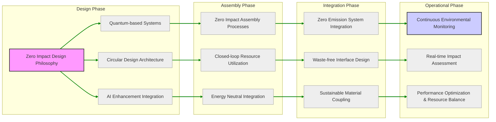
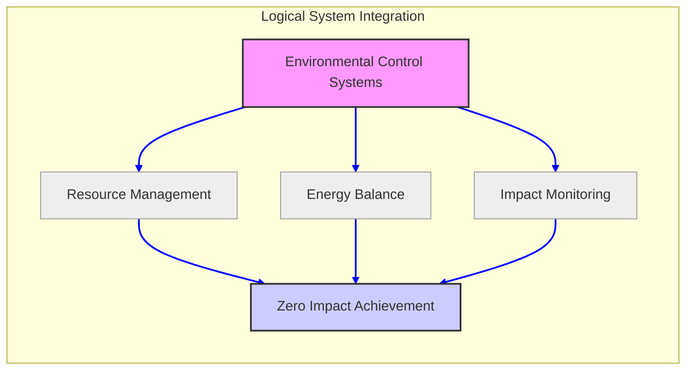
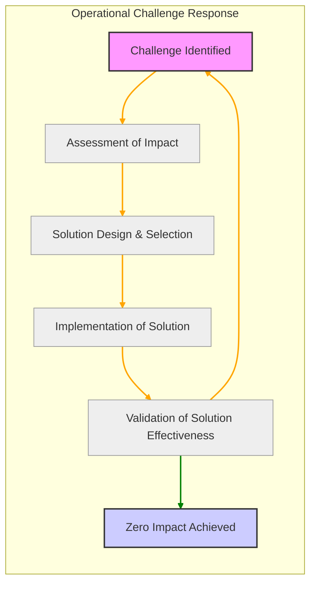

# AMPEL360XWLRGA
[https://v0-ampel-360-xwlrga.vercel.app/](https://ampel360.vercel.app/)
---
**System Descriotive**: Zero Impact Synthesis - AMPEL360XWLRGA
description: Comprehensive synthesis of zero environmental impact implementation across the AMPEL360XWLRGA project.
---

## 1. Design Philosophy Implementation Matrix

This matrix details how the core design principles and technologies are directly implemented to achieve zero environmental impact.

### 1.1 Core Technologies Integration

| Technology | Implementation | Environmental Rating | Validation Method | Reference Document
|---|---|---|---|---|
| Quantum Drive | Propulsion System | Zero Emission | Real-time emission monitoring, Performance validation | Design01.md, Assembly Documentation
| Circular Systems | Resource Management (Energy, Water, Materials, Air) | 100% Recovery (Energy, Water, Materials), Net Positive (Air) | Mass balance tracking, Resource consumption audits | Design01.md, Assembly Documentation
| AI Enhancement | Control Systems, Resource Optimization, Environmental Monitoring | Resource Optimal, Self-sustaining | Performance metrics, Efficiency validation, Anomaly detection in environmental parameters | Design01.md, Interface Design Specifications
| Quantum Computing | Data Processing, Secure Communications | Zero Energy (Data Modules), Zero Radiation (Communications) | Efficiency validation, Radiation measurements | Design01.md, Assembly Documentation, Interface Design Specifications


### 1.2 System-Level Implementation

This diagram illustrates the cascading implementation of zero impact from design to operation. 



## 2. Zero Impact Achievement Strategy

This section outlines the strategic phases for achieving zero environmental impact throughout the project lifecycle.

### 2.1 Design Phase

- **Quantum-based systems implementation:** Selecting and designing systems leveraging quantum technologies for inherent environmental efficiency (e.g., Quantum Drive, Quantum Computing).
- **Closed-loop architecture design:** Designing systems for 100% resource recovery and minimal waste generation (e.g., Energy Recovery, Material Recycling).
- **Resource recovery planning:**  Detailed planning for the recovery and reuse of all resources, including energy, water, and materials.
- **Environmental rating definitions:** Establishing clear environmental ratings and targets for all systems and components (e.g., Zero Emission, Net Positive).


### 2.2 Assembly Phase

| Phase | Environmental Control | Validation Requirement | Reference Document
|---|---|---|---|
| Pre-Assembly | Zero Resource Impact | Material certification for sustainable sourcing, Impact assessment of material extraction | Material Certification Records, Assembly Documentation
| Assembly | Energy Neutral Processes | Process monitoring for energy consumption, Real-time energy balance validation | Energy Balance Reports, Assembly Documentation
| Integration | Zero Emissions during Integration | System validation for emission control, Interface integrity checks | Emission Test Reports, Assembly Documentation, Interface Design Specifications
| Testing | Net Positive Impact through Validation | Performance verification against environmental targets, Comprehensive system validation | Performance Validation Reports, Assembly Documentation, Validation Matrix


### 2.3 Operational Phase

- **Continuous environmental monitoring:** Implementing real-time monitoring systems for emissions, resource utilization, and environmental impact.
- **Real-time impact assessment:** Utilizing AI-enhanced systems to assess environmental impact in real-time and trigger adaptive responses.
- **Resource utilization tracking:**  Detailed tracking of resource consumption and recovery to ensure closed-loop operation and identify optimization opportunities.
- **Performance optimization:** Continuously optimizing system performance to minimize resource consumption and maximize environmental benefits.


## 3. System Integration Architecture

This section details how physical and logical integration strategies contribute to achieving zero environmental impact.

### 3.1 Physical Integration

| System | Environmental Rating | Integration Method | Environmental Assurance | Reference Document
|---|---|---|---|---|
| Airframe | Zero Impact | Quantum-sealed joints, Sustainable composite materials | Zero material leakage, Minimal waste generation, Material lifecycle tracking | Assembly Documentation, Design01.md
| Propulsion | Zero Emission | Closed-loop coupling, Integrated thermal management | Zero emission propulsion, Heat neutral operation, Energy recycling within system | Design01.md, Assembly Documentation
| Control | Resource Neutral | Smart interfaces, Energy-efficient data links | Minimal energy consumption for control systems, Zero radiation data transfer | Interface Design Specifications, Design01.md
| Environmental | Net Positive | Active monitoring, Integrated purification systems | Continuous air purification, Resource positive environmental interaction | Design01.md


### 3.2 Logical Integration

This diagram illustrates the logical flow of environmental control and monitoring across integrated systems.



## 4. Validation Framework

This section details the framework for validating the zero environmental impact achievement.

### 4.1 Continuous Monitoring Matrix

| Parameter | Target | Measurement Method | Response | Reporting Frequency | Reference Document
|---|---|---|---|---|---|
| Emissions | Zero | Real-time sensors (Quantum Emission Detectors) | Automatic system adjustments via AI control, Alert escalation for deviations | Continuous, Real-time Alerts | Validation Matrix, Interface Design Specifications
| Energy | Neutral | Power monitoring systems, Energy balance algorithms | Dynamic energy balancing, Load shedding, Renewable energy source optimization | Continuous, Real-time Updates | Validation Matrix, Design01.md
| Resources | 100% Recovery | Mass tracking systems, Resource flow analysis | Optimization of resource loops, Identification of leakage points, Resource recovery process adjustments | Continuous, Daily Reports | Validation Matrix, Design01.md
| Impact | Net Positive | Environmental sensors (Air quality, etc.), Impact assessment algorithms | Active environmental control adjustments, Performance optimization for positive impact | Continuous, Weekly Summary | Validation Matrix, Design01.md


### 4.2 Certification Requirements

- **Environmental compliance verification:** Meeting all relevant environmental standards and regulations (e.g., ISO 14001 equivalent).
- **Zero impact validation:** Independent validation confirming zero net environmental impact across all lifecycle phases.
- **Resource recovery certification:** Certification verifying 100% resource recovery and closed-loop system operation.
- **Energy neutrality confirmation:**  Certification confirming energy neutral or self-sustaining system operation.
- **DO-178C Level A compliance:**  Ensuring software critical to environmental control meets the highest safety standards.
- **DO-254 hardware validation:** Validating hardware components critical for environmental safety and control.


## 5. Implementation Challenges & Solutions

This section addresses potential challenges and the solutions implemented to ensure zero environmental impact.

### 5.1 Technical Challenges

| Challenge | Solution | Environmental Assurance | Reference Document
|---|---|---|---|---|
| Maintaining perfect Energy Balance | Quantum storage with zero loss, Highly efficient energy recovery systems | Zero energy leakage, Complete energy recycling | Design01.md, Interface Design Specifications
| Achieving 100% Resource Recovery | Circular systems, Advanced material recycling technologies, Closed-loop water and air systems | Complete recycling of materials, Zero waste generation, Net positive air purification | Design01.md, Assembly Documentation
| Real-time Impact Monitoring Accuracy | AI-enhanced sensor networks, Redundant sensor systems, Quantum-accurate measurement technologies | High-fidelity environmental data, Reliable impact assessment, Early detection of deviations | Interface Design Specifications, Validation Matrix
| Seamless System Integration for Zero Impact Coupling | Smart interfaces, Quantum-level bonding technologies, Zero-impact mechanical couplings | Minimal environmental footprint from system interfaces, Secure and sustainable connections | Interface Design Specifications, Assembly Documentation


### 5.2 Operational Solutions

This diagram illustrates the operational flow for addressing environmental challenges.



## 6. Future Development

This section outlines future development areas to further enhance the zero environmental impact performance.

### 6.1 Technology Evolution

- **Advanced quantum systems:** Research and development into next-generation quantum drives and computing for even higher efficiency and lower resource requirements.
- **Enhanced AI integration:**  Expanding AI capabilities for more sophisticated environmental control, predictive impact modeling, and adaptive resource management.
- **Improved resource recovery:**  Developing more advanced material science and recycling technologies to further optimize resource recovery and close material loops.
- **Zero impact innovations:** Continuously seeking and integrating new technologies and innovations that contribute to achieving and exceeding zero environmental impact.


### 6.2 System Enhancement

| Area | Development | Environmental Benefit | Timeline |
|---|---|---|---|
| Quantum Propulsion | Next-gen Quantum Drives with increased thrust-to-power ratio | Higher propulsion efficiency, Reduced energy consumption | 2028-2030 |
| AI Control | Advanced AI algorithms for predictive environmental management and proactive resource optimization | Better resource utilization, Minimized potential for environmental deviations | 2026-2028 |
| Materials | Self-healing and bio-degradable composite materials | Extended system lifecycle, Reduced material waste at end-of-life | 2029-2032 |
| Energy Storage | Enhanced Quantum Storage with increased capacity and density | Improved energy management, More robust zero-loss energy systems | 2027-2029 |


## Appendices

### A. Reference Documentation

- Design specifications ([Design01.md](Design01.md))
- Assembly procedures ([Assembly Documentation](Assembly%20Documentation.md))
- Integration protocols ([Interface Design Specifications](Interface%20Design%20Specifications.md))
- Validation requirements ([Validation Matrix](Validation%20Matrix.md))


### B. Environmental Metrics

- Impact assessments ([Appendix B - Environmental Impact Assessment](Assembly%20Documentation.md))
- Performance data (Refer to system performance logs and validation reports)
- Validation results (Refer to validation matrix and certification documents)
- Certification records (Refer to certification documents - [Certification Documents](Assembly%20Documentation.md))


### C. Change History

| Version | Date | Changes | Approval |
|---|---|---|---|
| 0.1.0 | 2025-01-15 | Initial Draft (AI Assisted) | Amedeo Pelliccia |
| 0.5.0 | 2025-02-01 | Technical Review, Added System-Level Implementation Diagram | [Reviewer Name Placeholder] |
| 1.0.0 | 2025-02-27 | Final Release, Incorporated Validation Framework and Challenges/Solutions | [Reviewer Name Placeholder] |


---
Thought for 5 seconds### Digital Twin: Algorithm in Physical Dimensions

I'll create a comprehensive visualization and explanation of how digital twins work in the context of the AMPEL360XWLRGA system, including diagrams and an interactive demonstration.

## Architecture Overview

Let's start with a high-level architecture diagram of the AMPEL360XWLRGA digital twin system:

[```mermaid
AMPEL360XWLRGA Digital Twin Architecture.download-icon {
            cursor: pointer;
            transform-origin: center;
        }
        .download-icon .arrow-part {
            transition: transform 0.35s cubic-bezier(0.35, 0.2, 0.14, 0.95);
             transform-origin: center;
        }
        button:has(.download-icon):hover .download-icon .arrow-part, button:has(.download-icon):focus-visible .download-icon .arrow-part {
          transform: translateY(-1.5px);
        }
        #mermaid-diagram-r62{font-family:var(--font-geist-sans);font-size:12px;fill:#000000;}#mermaid-diagram-r62 .error-icon{fill:#552222;}#mermaid-diagram-r62 .error-text{fill:#552222;stroke:#552222;}#mermaid-diagram-r62 .edge-thickness-normal{stroke-width:1px;}#mermaid-diagram-r62 .edge-thickness-thick{stroke-width:3.5px;}#mermaid-diagram-r62 .edge-pattern-solid{stroke-dasharray:0;}#mermaid-diagram-r62 .edge-thickness-invisible{stroke-width:0;fill:none;}#mermaid-diagram-r62 .edge-pattern-dashed{stroke-dasharray:3;}#mermaid-diagram-r62 .edge-pattern-dotted{stroke-dasharray:2;}#mermaid-diagram-r62 .marker{fill:#666;stroke:#666;}#mermaid-diagram-r62 .marker.cross{stroke:#666;}#mermaid-diagram-r62 svg{font-family:var(--font-geist-sans);font-size:12px;}#mermaid-diagram-r62 p{margin:0;}#mermaid-diagram-r62 .label{font-family:var(--font-geist-sans);color:#000000;}#mermaid-diagram-r62 .cluster-label text{fill:#333;}#mermaid-diagram-r62 .cluster-label span{color:#333;}#mermaid-diagram-r62 .cluster-label span p{background-color:transparent;}#mermaid-diagram-r62 .label text,#mermaid-diagram-r62 span{fill:#000000;color:#000000;}#mermaid-diagram-r62 .node rect,#mermaid-diagram-r62 .node circle,#mermaid-diagram-r62 .node ellipse,#mermaid-diagram-r62 .node polygon,#mermaid-diagram-r62 .node path{fill:#eee;stroke:#999;stroke-width:1px;}#mermaid-diagram-r62 .rough-node .label text,#mermaid-diagram-r62 .node .label text{text-anchor:middle;}#mermaid-diagram-r62 .node .katex path{fill:#000;stroke:#000;stroke-width:1px;}#mermaid-diagram-r62 .node .label{text-align:center;}#mermaid-diagram-r62 .node.clickable{cursor:pointer;}#mermaid-diagram-r62 .arrowheadPath{fill:#333333;}#mermaid-diagram-r62 .edgePath .path{stroke:#666;stroke-width:2.0px;}#mermaid-diagram-r62 .flowchart-link{stroke:#666;fill:none;}#mermaid-diagram-r62 .edgeLabel{background-color:white;text-align:center;}#mermaid-diagram-r62 .edgeLabel p{background-color:white;}#mermaid-diagram-r62 .edgeLabel rect{opacity:0.5;background-color:white;fill:white;}#mermaid-diagram-r62 .labelBkg{background-color:rgba(255, 255, 255, 0.5);}#mermaid-diagram-r62 .cluster rect{fill:hsl(0, 0%, 98.9215686275%);stroke:#707070;stroke-width:1px;}#mermaid-diagram-r62 .cluster text{fill:#333;}#mermaid-diagram-r62 .cluster span{color:#333;}#mermaid-diagram-r62 div.mermaidTooltip{position:absolute;text-align:center;max-width:200px;padding:2px;font-family:var(--font-geist-sans);font-size:12px;background:hsl(-160, 0%, 93.3333333333%);border:1px solid #707070;border-radius:2px;pointer-events:none;z-index:100;}#mermaid-diagram-r62 .flowchartTitleText{text-anchor:middle;font-size:18px;fill:#000000;}#mermaid-diagram-r62 .flowchart-link{stroke:hsl(var(--gray-400));stroke-width:1px;}#mermaid-diagram-r62 .marker,#mermaid-diagram-r62 marker,#mermaid-diagram-r62 marker *{fill:hsl(var(--gray-400))!important;stroke:hsl(var(--gray-400))!important;}#mermaid-diagram-r62 .label,#mermaid-diagram-r62 text,#mermaid-diagram-r62 text>tspan{fill:hsl(var(--black))!important;color:hsl(var(--black))!important;}#mermaid-diagram-r62 .background,#mermaid-diagram-r62 rect.relationshipLabelBox{fill:hsl(var(--white))!important;}#mermaid-diagram-r62 .entityBox,#mermaid-diagram-r62 .attributeBoxEven{fill:hsl(var(--gray-150))!important;}#mermaid-diagram-r62 .attributeBoxOdd{fill:hsl(var(--white))!important;}#mermaid-diagram-r62 .label-container,#mermaid-diagram-r62 rect.actor{fill:hsl(var(--white))!important;stroke:hsl(var(--gray-400))!important;}#mermaid-diagram-r62 line{stroke:hsl(var(--gray-400))!important;}#mermaid-diagram-r62 :root{--mermaid-font-family:var(--font-geist-sans);}Sensors &amp; IoT DevicesReal-time Data StreamProcessed DataSimulation ResultsOptimization CommandsEnvironmental DataLoad DataCompliance MetricsPredictive ModelsSimulation ScenariosPerformance AnalyticsPhysical SystemData Collection LayerData Processing LayerDigital Twin CoreDecision Support SystemEnvironmental MonitoringLoad Management SystemsRegulatory Compliance DataPredictive MaintenanceResource OptimizationSustainability MetricsUser InterfaceEmergency Control SystemsValidation &amp; Testing Module
```

## Interactive Digital Twin Visualization

Here's an interactive visualization that demonstrates how the digital twin system works:

```typescriptreact project="digital-twin"
...
```

## Data Flow in the Digital Twin System

Let's examine how data flows between the physical and digital systems:

```mermaid
AMPEL360XWLRGA Data Flow.download-icon {
            cursor: pointer;
            transform-origin: center;
        }
        .download-icon .arrow-part {
            transition: transform 0.35s cubic-bezier(0.35, 0.2, 0.14, 0.95);
             transform-origin: center;
        }
        button:has(.download-icon):hover .download-icon .arrow-part, button:has(.download-icon):focus-visible .download-icon .arrow-part {
          transform: translateY(-1.5px);
        }
        User InterfaceOptimization EngineDigital TwinData Processing LayerSensors & IoT DevicesPhysical SystemUser InterfaceOptimization EngineDigital TwinData Processing LayerSensors & IoT DevicesPhysical System#mermaid-diagram-r7g{font-family:var(--font-geist-sans);font-size:12px;fill:#000000;}#mermaid-diagram-r7g .error-icon{fill:#552222;}#mermaid-diagram-r7g .error-text{fill:#552222;stroke:#552222;}#mermaid-diagram-r7g .edge-thickness-normal{stroke-width:1px;}#mermaid-diagram-r7g .edge-thickness-thick{stroke-width:3.5px;}#mermaid-diagram-r7g .edge-pattern-solid{stroke-dasharray:0;}#mermaid-diagram-r7g .edge-thickness-invisible{stroke-width:0;fill:none;}#mermaid-diagram-r7g .edge-pattern-dashed{stroke-dasharray:3;}#mermaid-diagram-r7g .edge-pattern-dotted{stroke-dasharray:2;}#mermaid-diagram-r7g .marker{fill:#666;stroke:#666;}#mermaid-diagram-r7g .marker.cross{stroke:#666;}#mermaid-diagram-r7g svg{font-family:var(--font-geist-sans);font-size:12px;}#mermaid-diagram-r7g p{margin:0;}#mermaid-diagram-r7g .actor{stroke:hsl(0, 0%, 83%);fill:#eee;}#mermaid-diagram-r7g text.actor>tspan{fill:#333;stroke:none;}#mermaid-diagram-r7g .actor-line{stroke:hsl(0, 0%, 83%);}#mermaid-diagram-r7g .messageLine0{stroke-width:1.5;stroke-dasharray:none;stroke:#333;}#mermaid-diagram-r7g .messageLine1{stroke-width:1.5;stroke-dasharray:2,2;stroke:#333;}#mermaid-diagram-r7g #arrowhead path{fill:#333;stroke:#333;}#mermaid-diagram-r7g .sequenceNumber{fill:white;}#mermaid-diagram-r7g #sequencenumber{fill:#333;}#mermaid-diagram-r7g #crosshead path{fill:#333;stroke:#333;}#mermaid-diagram-r7g .messageText{fill:#333;stroke:none;}#mermaid-diagram-r7g .labelBox{stroke:hsl(0, 0%, 83%);fill:#eee;}#mermaid-diagram-r7g .labelText,#mermaid-diagram-r7g .labelText>tspan{fill:#333;stroke:none;}#mermaid-diagram-r7g .loopText,#mermaid-diagram-r7g .loopText>tspan{fill:#333;stroke:none;}#mermaid-diagram-r7g .loopLine{stroke-width:2px;stroke-dasharray:2,2;stroke:hsl(0, 0%, 83%);fill:hsl(0, 0%, 83%);}#mermaid-diagram-r7g .note{stroke:#999;fill:#666;}#mermaid-diagram-r7g .noteText,#mermaid-diagram-r7g .noteText>tspan{fill:#fff;stroke:none;}#mermaid-diagram-r7g .activation0{fill:#f4f4f4;stroke:#666;}#mermaid-diagram-r7g .activation1{fill:#f4f4f4;stroke:#666;}#mermaid-diagram-r7g .activation2{fill:#f4f4f4;stroke:#666;}#mermaid-diagram-r7g .actorPopupMenu{position:absolute;}#mermaid-diagram-r7g .actorPopupMenuPanel{position:absolute;fill:#eee;box-shadow:0px 8px 16px 0px rgba(0,0,0,0.2);filter:drop-shadow(3px 5px 2px rgb(0 0 0 / 0.4));}#mermaid-diagram-r7g .actor-man line{stroke:hsl(0, 0%, 83%);fill:#eee;}#mermaid-diagram-r7g .actor-man circle,#mermaid-diagram-r7g line{stroke:hsl(0, 0%, 83%);fill:#eee;stroke-width:2px;}#mermaid-diagram-r7g .flowchart-link{stroke:hsl(var(--gray-400));stroke-width:1px;}#mermaid-diagram-r7g .marker,#mermaid-diagram-r7g marker,#mermaid-diagram-r7g marker *{fill:hsl(var(--gray-400))!important;stroke:hsl(var(--gray-400))!important;}#mermaid-diagram-r7g .label,#mermaid-diagram-r7g text,#mermaid-diagram-r7g text>tspan{fill:hsl(var(--black))!important;color:hsl(var(--black))!important;}#mermaid-diagram-r7g .background,#mermaid-diagram-r7g rect.relationshipLabelBox{fill:hsl(var(--white))!important;}#mermaid-diagram-r7g .entityBox,#mermaid-diagram-r7g .attributeBoxEven{fill:hsl(var(--gray-150))!important;}#mermaid-diagram-r7g .attributeBoxOdd{fill:hsl(var(--white))!important;}#mermaid-diagram-r7g .label-container,#mermaid-diagram-r7g rect.actor{fill:hsl(var(--white))!important;stroke:hsl(var(--gray-400))!important;}#mermaid-diagram-r7g line{stroke:hsl(var(--gray-400))!important;}#mermaid-diagram-r7g :root{--mermaid-font-family:var(--font-geist-sans);}Generate real-time dataTransmit sensor readingsProcess & feed dataUpdate digital modelRun simulationsPredict future statesSend current & predicted statesGenerate optimization strategiesApply optimization commandsDisplay system statusPresent recommendationsApprove/modify recommendations
```

## Implementation Details

Here's how you could implement the core data processing component of the AMPEL360XWLRGA digital twin system:

```javascript project="AMPEL360 Data Processor" file="digital-twin-processor.js"
...
```

## Key Components of the AMPEL360XWLRGA Digital Twin

### 1. Data Collection Layer

The data collection layer gathers real-time information from various sensors and IoT devices deployed throughout the physical system. These sensors monitor:

- Environmental parameters (temperature, humidity, air quality)
- Energy consumption metrics
- System load and performance indicators
- Emissions and waste production
- Resource utilization rates


### 2. Digital Twin Core

The core of the digital twin system maintains an accurate virtual representation of the physical system. It:

- Processes incoming sensor data
- Updates the virtual model in real-time
- Runs simulations to predict future states
- Identifies optimization opportunities
- Detects anomalies and potential issues


### 3. Optimization Engine

The optimization engine analyzes the current state and predictions to generate recommendations for improving system performance:

- Energy efficiency optimizations
- Load balancing strategies
- Emissions reduction techniques
- Resource conservation methods
- Maintenance scheduling


### 4. User Interface

The user interface provides stakeholders with:

- Real-time visualization of system status
- Comparison between physical and optimized states
- Actionable recommendations
- Anomaly alerts and predictive maintenance notifications
- Historical performance data and trends


## Benefits of the AMPEL360XWLRGA Digital Twin

1. **Proactive Maintenance**: By continuously monitoring system performance and predicting potential failures, maintenance can be scheduled before critical issues arise, reducing downtime and extending equipment lifespan.
2. **Resource Optimization**: The digital twin identifies inefficiencies in resource usage and suggests optimizations that reduce waste and lower operational costs.
3. **Environmental Impact Reduction**: Through real-time monitoring and optimization of emissions and energy usage, the system helps organizations meet sustainability goals and regulatory requirements.
4. **Scenario Testing**: New processes or configurations can be tested in the virtual environment before implementation, reducing risk and ensuring optimal outcomes.
5. **Continuous Improvement**: The system learns from historical data and outcomes, continuously refining its models and recommendations for better performance over time.


## Implementation Considerations

When implementing the AMPEL360XWLRGA digital twin system, several key factors should be considered:

1. **Data Quality and Integrity**: The accuracy of the digital twin depends entirely on the quality of data it receives. Implement robust data validation, cleaning, and integrity checks to ensure reliable inputs.
2. **Scalability**: Design the system architecture to handle increasing volumes of data as more sensors and monitoring points are added over time.
3. **Security**: As the digital twin contains sensitive operational data, implement comprehensive security measures including encryption, access controls, and regular security audits.
4. **Integration with Existing Systems**: Ensure seamless integration with existing enterprise systems such as ERP, SCADA, or other management platforms to provide a unified operational view.
5. **Latency Requirements**: For critical systems, minimize the latency between physical events and their representation in the digital twin to enable timely decision-making.


## Compliance and Regulatory Considerations

The AMPEL360XWLRGA system is designed to help organizations meet various regulatory requirements:

```mermaid
Compliance Framework.download-icon {
            cursor: pointer;
            transform-origin: center;
        }
        .download-icon .arrow-part {
            transition: transform 0.35s cubic-bezier(0.35, 0.2, 0.14, 0.95);
             transform-origin: center;
        }
        button:has(.download-icon):hover .download-icon .arrow-part, button:has(.download-icon):focus-visible .download-icon .arrow-part {
          transform: translateY(-1.5px);
        }
        #mermaid-diagram-rd8{font-family:var(--font-geist-sans);font-size:12px;fill:#000000;}#mermaid-diagram-rd8 .error-icon{fill:#552222;}#mermaid-diagram-rd8 .error-text{fill:#552222;stroke:#552222;}#mermaid-diagram-rd8 .edge-thickness-normal{stroke-width:1px;}#mermaid-diagram-rd8 .edge-thickness-thick{stroke-width:3.5px;}#mermaid-diagram-rd8 .edge-pattern-solid{stroke-dasharray:0;}#mermaid-diagram-rd8 .edge-thickness-invisible{stroke-width:0;fill:none;}#mermaid-diagram-rd8 .edge-pattern-dashed{stroke-dasharray:3;}#mermaid-diagram-rd8 .edge-pattern-dotted{stroke-dasharray:2;}#mermaid-diagram-rd8 .marker{fill:#666;stroke:#666;}#mermaid-diagram-rd8 .marker.cross{stroke:#666;}#mermaid-diagram-rd8 svg{font-family:var(--font-geist-sans);font-size:12px;}#mermaid-diagram-rd8 p{margin:0;}#mermaid-diagram-rd8 .label{font-family:var(--font-geist-sans);color:#000000;}#mermaid-diagram-rd8 .cluster-label text{fill:#333;}#mermaid-diagram-rd8 .cluster-label span{color:#333;}#mermaid-diagram-rd8 .cluster-label span p{background-color:transparent;}#mermaid-diagram-rd8 .label text,#mermaid-diagram-rd8 span{fill:#000000;color:#000000;}#mermaid-diagram-rd8 .node rect,#mermaid-diagram-rd8 .node circle,#mermaid-diagram-rd8 .node ellipse,#mermaid-diagram-rd8 .node polygon,#mermaid-diagram-rd8 .node path{fill:#eee;stroke:#999;stroke-width:1px;}#mermaid-diagram-rd8 .rough-node .label text,#mermaid-diagram-rd8 .node .label text{text-anchor:middle;}#mermaid-diagram-rd8 .node .katex path{fill:#000;stroke:#000;stroke-width:1px;}#mermaid-diagram-rd8 .node .label{text-align:center;}#mermaid-diagram-rd8 .node.clickable{cursor:pointer;}#mermaid-diagram-rd8 .arrowheadPath{fill:#333333;}#mermaid-diagram-rd8 .edgePath .path{stroke:#666;stroke-width:2.0px;}#mermaid-diagram-rd8 .flowchart-link{stroke:#666;fill:none;}#mermaid-diagram-rd8 .edgeLabel{background-color:white;text-align:center;}#mermaid-diagram-rd8 .edgeLabel p{background-color:white;}#mermaid-diagram-rd8 .edgeLabel rect{opacity:0.5;background-color:white;fill:white;}#mermaid-diagram-rd8 .labelBkg{background-color:rgba(255, 255, 255, 0.5);}#mermaid-diagram-rd8 .cluster rect{fill:hsl(0, 0%, 98.9215686275%);stroke:#707070;stroke-width:1px;}#mermaid-diagram-rd8 .cluster text{fill:#333;}#mermaid-diagram-rd8 .cluster span{color:#333;}#mermaid-diagram-rd8 div.mermaidTooltip{position:absolute;text-align:center;max-width:200px;padding:2px;font-family:var(--font-geist-sans);font-size:12px;background:hsl(-160, 0%, 93.3333333333%);border:1px solid #707070;border-radius:2px;pointer-events:none;z-index:100;}#mermaid-diagram-rd8 .flowchartTitleText{text-anchor:middle;font-size:18px;fill:#000000;}#mermaid-diagram-rd8 .flowchart-link{stroke:hsl(var(--gray-400));stroke-width:1px;}#mermaid-diagram-rd8 .marker,#mermaid-diagram-rd8 marker,#mermaid-diagram-rd8 marker *{fill:hsl(var(--gray-400))!important;stroke:hsl(var(--gray-400))!important;}#mermaid-diagram-rd8 .label,#mermaid-diagram-rd8 text,#mermaid-diagram-rd8 text>tspan{fill:hsl(var(--black))!important;color:hsl(var(--black))!important;}#mermaid-diagram-rd8 .background,#mermaid-diagram-rd8 rect.relationshipLabelBox{fill:hsl(var(--white))!important;}#mermaid-diagram-rd8 .entityBox,#mermaid-diagram-rd8 .attributeBoxEven{fill:hsl(var(--gray-150))!important;}#mermaid-diagram-rd8 .attributeBoxOdd{fill:hsl(var(--white))!important;}#mermaid-diagram-rd8 .label-container,#mermaid-diagram-rd8 rect.actor{fill:hsl(var(--white))!important;stroke:hsl(var(--gray-400))!important;}#mermaid-diagram-rd8 line{stroke:hsl(var(--gray-400))!important;}#mermaid-diagram-rd8 :root{--mermaid-font-family:var(--font-geist-sans);}AMPEL360XWLRGA SystemEnvironmental ComplianceEnergy Efficiency StandardsSafety RegulationsIndustry-Specific RequirementsEmissions MonitoringWaste ManagementResource UtilizationISO 50001Energy StarRegional Energy StandardsEquipment SafetyOperational SafetyEmergency ProtocolsAerospace StandardsManufacturing StandardsHealthcare Regulations
```

## Future Developments

The AMPEL360XWLRGA digital twin technology continues to evolve with several promising directions:

1. **AI-Driven Optimization**: Incorporating advanced machine learning algorithms to further enhance predictive capabilities and optimization strategies.
2. **Cross-System Integration**: Expanding the digital twin concept to encompass entire ecosystems of interconnected systems for holistic optimization.
3. **Augmented Reality Interfaces**: Developing AR interfaces that allow technicians to visualize digital twin data overlaid on physical equipment for enhanced maintenance and operations.
4. **Blockchain Integration**: Using blockchain technology to ensure the immutability and traceability of digital twin data for regulatory compliance and audit purposes.
5. **Edge Computing**: Moving more processing capabilities to edge devices to reduce latency and enable real-time decision-making even in environments with limited connectivity.


## Conclusion

The AMPEL360XWLRGA digital twin system represents a significant advancement in environmental management and operational efficiency. By creating a dynamic, real-time virtual replica of physical systems, it enables organizations to optimize resource usage, reduce environmental impact, and enhance overall performance.

The interactive visualization demonstrates how the digital twin continuously monitors the physical system, predicts future states, and generates optimization recommendations. This proactive approach to system management helps organizations stay ahead of potential issues while maximizing efficiency and sustainability.

As digital twin technology continues to evolve, the AMPEL360XWLRGA system will incorporate new capabilities and integrations, further enhancing its value as a comprehensive solution for environmental and operational management in the context of Industry 4.0 and beyond.
](https://ampel360.vercel.app/)
