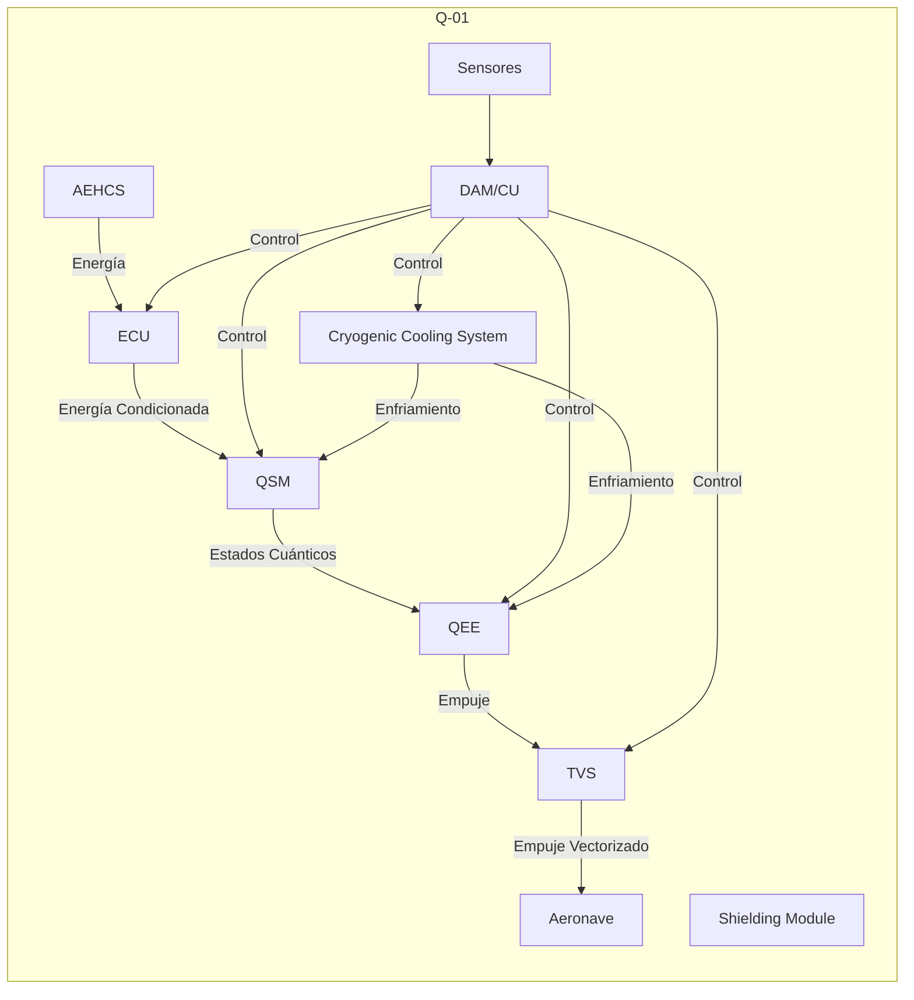

# 71-00-00 Generalidades de la Planta de Potencia (Q-01)

---
dmc: [COMPLETAR: DMC-GAIAPULSE-AMPEL-0201-71-000-A-001-00_EN-US]
ident:
  dmCode: GPAM-AMPEL-0201-71-00-000-A-001-00  #Example
  modelIdentCode: AMPEL360
  systemDiffCode: A
  systemCode: 0201 # Airframe (adjust as needed)
  subSystemCode: 71 # Power Plant
  subSubSystemCode: 00 # General
  assyCode: 000
  disassyCode: 00
  disassyCodeVariant: A
  infoCode: 001  # Overview
  infoCodeVariant: A
  itemLocationCode: 00
  language: ES-ES #Spanish
applicability: AMPEL360XWLRGA-Q-01
status: draft
security: [COMPLETAR: Clasificación de seguridad, si aplica]
responsiblePartnerCompany: GAIAPULSE
originator: [COMPLETAR: Autor/Equipo]
date: 2025-03-09
---

## 1. Introducción

Este documento proporciona una descripción general de la **Planta de Potencia Q-01**, el sistema de propulsión cuántica que impulsa la aeronave **AMPEL360XWLRGA**.  A diferencia de los sistemas de propulsión convencionales (motores de turbina o pistón), el Q-01 utiliza principios de la **mecánica cuántica** y la **manipulación del vacío cuántico** para generar empuje.  Por lo tanto, este capítulo ATA 71 se *adapta* para reflejar la naturaleza única del Q-01.

**Importante:**  Este documento *no* cubre los sistemas de propulsión convencionales (si los hubiera).  Se centra *exclusivamente* en el Q-01.

## 2. Propósito del Sistema

El propósito principal del Q-01 es proporcionar **empuje sin propelente** y con **cero emisiones**, logrando una eficiencia y sostenibilidad sin precedentes en la aviación.  Los objetivos clave incluyen:

*   Generación de empuje mediante la manipulación de estados cuánticos.
*   Operación a temperaturas criogénicas para mantener la coherencia cuántica.
*   Integración con el sistema de gestión de energía AEHCS (Alternative Energy Harvesting and Control System) de la aeronave.
*   Cumplimiento de los más altos estándares de seguridad y confiabilidad.
*   Reducción drástica del consumo de energía en comparación con los sistemas de propulsión tradicionales.

## 3. Descripción General del Sistema Q-01

El Q-01 se compone de los siguientes módulos principales:

*   **Quantum State Modulator (QSM):**  Este módulo es el responsable de generar y controlar los estados cuánticos necesarios para la propulsión.  Utiliza [COMPLETAR: Tecnología específica de QSM, ej., "cristales no lineales con bombeo láser", "qubits superconductores", etc.].  [COMPLETAR: Breve descripción de la física subyacente - 1-2 frases].
*   **Quantum Entanglement Engine (QEE):**  El QEE es el "corazón" del sistema de propulsión.  Aquí, los estados cuánticos preparados por el QSM se utilizan para [COMPLETAR: Descripción del mecanismo de generación de empuje. Ej: "extraer energía del vacío cuántico," "crear una asimetría en el campo cuántico," etc.].  Este proceso se basa en el principio de [COMPLETAR: Principio físico/teórico fundamental, e.g., "Amplificación de Resonancia de Pelliccia"].
*   **Cryogenic Cooling System (CCS):**  Mantiene los componentes del QSM y QEE a temperaturas criogénicas (aproximadamente [COMPLETAR: Temperatura en Kelvin o Celsius]) para garantizar la coherencia cuántica y la superconductividad.  Utiliza [COMPLETAR: Tipo de sistema de enfriamiento, e.g., "refrigeradores de pulso-tubo de dos etapas con helio líquido"].
*   **Energy Conditioning Unit (ECU):**  Gestiona y distribuye la energía eléctrica dentro del Q-01. Convierte y acondiciona la energía proveniente del AEHCS o de otras fuentes.
*   **Thrust Vectoring System (TVS):**  Dirige y controla el empuje generado por el QEE.  [COMPLETAR:  Breve descripción de cómo funciona el TVS en este contexto: toberas magnéticas, campos de fuerza, etc.].
*   **Data Acquisition and Control Module (DAM/CU):**  Recopila datos de sensores, monitorea el estado del sistema y ejecuta los algoritmos de control.  Es el "cerebro" del Q-01.
*   **Shielding and Containment Module (SH):**  Proporciona aislamiento y contención para los componentes cuánticos, protegiéndolos de interferencias externas y asegurando la seguridad operacional.

**Diagrama de Bloques Simplificado:**

## 4. Principios de Operación (Alto Nivel)

[Aquí se debe proporcionar una descripción de *alto nivel* de cómo funciona el Q-01. Evitar detalles técnicos excesivamente complejos en este documento de *overview*. El objetivo es dar una idea general del proceso.]

**Ejemplo (simplificado, por favor, amplíalo y corrígelo con tus datos técnicos):**

1.  **Preparación de Estado Cuántico:** El QSM genera un estado cuántico específico (por ejemplo, un estado entrelazado de qubits superconductores o fotones).
2.  **Manipulación del Vacío Cuántico:** El QEE utiliza este estado cuántico preparado para interactuar con el vacío cuántico, generando una "asimetría" o "perturbación" que produce una fuerza neta (empuje). [COMPLETAR:  Referencia a la teoría física que respalda este proceso - Amplificación de Resonancia de Pelliccia, Efecto Casimir Dinámico, etc.].
3.  **Vectorización del Empuje:** El TVS dirige el empuje generado, permitiendo controlar la dirección y magnitud del movimiento de la aeronave.
4.  **Control y Retroalimentación:** El DAM/CU monitoriza constantemente el estado del sistema, los sensores, y la salida de empuje, y ajusta los parámetros del QSM y QEE para optimizar el rendimiento y mantener la estabilidad.
5.  **Gestión Térmica:** El CCS mantiene los componentes criogénicos a la temperatura operativa necesaria.
6. **Gestión de Energía:** La ECU recibe la alimentación desde el sistema AEHCS o un sistema eléctrico convencional, y la acondiciona para que llegue a cada módulo del Q-01.
