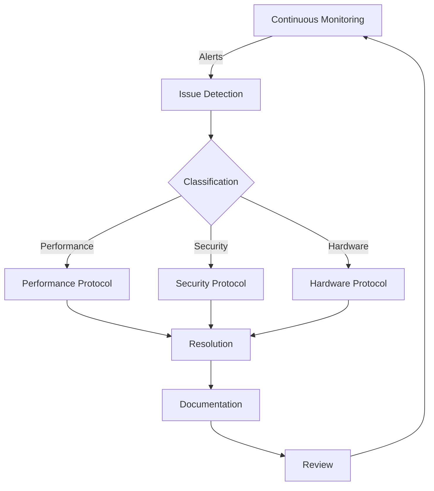

Here is a structured **README.md** for **Ampel360XWLRGA Quality Assurance (QA) Documentation**:

---

# **Ampel360XWLRGA Quality Assurance (QA) Documentation**  

## **Overview**  
This document provides a **comprehensive Quality Assurance (QA) framework** for **Ampel360XWLRGA**, ensuring **robust security, performance, and reliability** in **Quantum Key Distribution (QKD)**, **AI auto-optimization**, and **Bioplot Graph Analysis**.

## **Quick Navigation**
- [System Components](#system-components)
- [Key Performance Metrics](#key-performance-metrics)
- [Quality Control Workflow](#quality-control-workflow)
- [Monitoring & Alerts](#monitoring--alerts)
- [Response Protocols](#response-protocols)
- [Implementation Guidelines](#implementation-guidelines)
- [Required Tools & Access](#required-tools--access)
- [Documentation Standards](#documentation-standards)
- [Training & Compliance](#training--compliance)

---

## **System Components**

### **Quantum Security Layer**
- **Quantum Key Distribution (QKD)**
- **BB84+ Protocol with Decoy States**
- **QBER Monitoring & Error Correction**
- **Entropy-Based Key Validation**

### **AI Auto-Evolution System**
- **Pattern Recognition & Anomaly Detection**
- **Self-Learning Optimization (AI Evolution Cycles)**
- **Adaptive Learning Rate Control**
- **Neural Network Performance Monitoring**

### **Bioplot Graph Network**
- **Distributed Node Management**
- **Real-time Graph Integrity Checks**
- **Connection Stability & Latency Analysis**
- **Data Consistency Validation**

### **AI-Based Power Distribution Optimization**
- **Real-time Power Distribution Management**
- **Demand and Priority-Based Allocation**
- **Energy Efficiency Improvement**
- **Critical System Power Assurance**

### **AI-Based Fractal Electrostatic System Optimization**
- **Real-time Fractal Electrostatic System Management**
- **Charge Pattern and Resonant Frequency Adjustment**
- **Enhanced Electrostatic Force Manipulation**
- **Critical System Stability Assurance**

---

## **Key Performance Metrics**  

| **Component** | **Metric** | **Target** | **Critical Threshold** |
|--------------|-----------|------------|----------------------|
| QKD | **Key Rate** | > 300 bits/s | < 200 bits/s |
| QKD | **QBER** | < 4% | > 6% |
| AI | **Recognition Accuracy** | > 94% | < 90% |
| AI | **Optimization Cycles** | 1000+ | < 500 |
| Bioplot | **Update Latency** | < 50ms | > 100ms |
| Bioplot | **Node Health Index** | > 0.85 | < 0.7 |
| Power Distribution | **Energy Efficiency** | > 95% | < 90% |
| Power Distribution | **Critical System Power** | 100% | < 95% |
| Fractal Electrostatic System | **Charge Pattern Accuracy** | > 98% | < 95% |
| Fractal Electrostatic System | **Resonant Frequency Stability** | > 99% | < 97% |

---

## **Quality Control Workflow**  



---

## **Monitoring & Alerts**  

### **Quantum Security Checks**
- ✅ **Monitor key rate generation** (Target: >300 bits/s)
- ✅ **QBER threshold validation** (Maintain <4%)
- ✅ **BB84+ protocol integrity check**
- ✅ **Decoy state implementation monitoring**

### **AI System Verification**
- ✅ **Validate adaptive learning rate** (Optimal: 0.01 - 0.02)
- ✅ **Check model accuracy & anomaly detection logs**
- ✅ **Self-evolution tracking**
- ✅ **Identify potential model drift**

### **Bioplot Graph Integrity**
- ✅ **Verify node connectivity & stability**
- ✅ **Monitor real-time update latency**
- ✅ **Check graph consistency & error rates**
- ✅ **Analyze centrality & network evolution**

### **Power Distribution Optimization**
- ✅ **Monitor real-time power distribution** (Target: >95% efficiency)
- ✅ **Validate demand and priority-based allocation**
- ✅ **Check critical system power assurance** (Maintain 100%)
- ✅ **Analyze energy efficiency improvements**

### **Fractal Electrostatic System Optimization**
- ✅ **Monitor real-time fractal electrostatic system performance** (Target: >98% charge pattern accuracy)
- ✅ **Validate charge pattern and resonant frequency adjustment**
- ✅ **Check critical system stability assurance** (Maintain 99% stability)
- ✅ **Analyze enhanced electrostatic force manipulation**

---

## **Response Protocols**

| **Issue Level** | **Response Time** | **Action** | **Follow-Up** |
|---------------|----------------|---------|------------|
| Level 1: Minor | < 4 hours | Incident Log | Daily Review |
| Level 2: Significant | < 1 hour | Immediate Fix | Weekly Review |
| Level 3: Critical | < 15 minutes | Emergency Response | Post-Mortem |

---

## **Implementation Guidelines**

### **System Configuration**
```typescript
interface SystemConfig {
  quantum: {
    keyRate: number;      
    qberThreshold: number;
    protocol: 'BB84+';    
    decoyStates: boolean;
  };
  ai: {
    learningRate: number; 
    batchSize: number;    
    evolutionCycles: number;
    anomalyThreshold: number;
  };
  bioplot: {
    nodeCount: number;
    updateInterval: number;
    consistencyCheck: boolean;
    graphValidation: boolean;
  };
  powerDistribution: {
    efficiencyTarget: number;
    criticalSystemPower: number;
    demandPriorityAllocation: boolean;
  };
  fractalElectrostaticSystem: {
    chargePatternAccuracy: number;
    resonantFrequencyStability: number;
    enhancedForceManipulation: boolean;
  };
}
```

### **Alert Configuration**
```typescript
interface AlertConfig {
  metric: string;
  threshold: number;
  severity: 'low' | 'medium' | 'high' | 'critical';
  action: 'notify' | 'escalate' | 'shutdown';
}

const defaultAlerts: AlertConfig[] = [
  {
    metric: 'keyRate',
    threshold: 200,
    severity: 'critical',
    action: 'escalate'
  },
  {
    metric: 'qber',
    threshold: 0.06,
    severity: 'high',
    action: 'notify'
  },
  {
    metric: 'energyEfficiency',
    threshold: 0.90,
    severity: 'critical',
    action: 'escalate'
  },
  {
    metric: 'criticalSystemPower',
    threshold: 0.95,
    severity: 'high',
    action: 'notify'
  },
  {
    metric: 'chargePatternAccuracy',
    threshold: 0.95,
    severity: 'high',
    action: 'notify'
  },
  {
    metric: 'resonantFrequencyStability',
    threshold: 0.97,
    severity: 'critical',
    action: 'escalate'
  }
];
```

---

## **Required Tools & Access**

### **Software Tools**
- ✅ **Quantum Metrics Dashboard v2.1**
- ✅ **AI Performance Monitor v3.0**
- ✅ **Bioplot Analysis Suite v1.5**
- ✅ **Alert Management System v2.0**
- ✅ **Power Distribution Optimization Tool v1.0**
- ✅ **Fractal Electrostatic System Optimization Tool v1.0**

### **Access Requirements**
- 🔒 **Level 3 Security Clearance**
- 📜 **Quantum Operations Certification**
- 🤖 **AI Systems Training**
- 🚨 **Emergency Response Authorization**
- ⚡ **Power Distribution Management Certification**
- 🔋 **Fractal Electrostatic System Management Certification**

---

## **Documentation Standards**

### **Report Format**
- 📌 **Title & ID**
- 📆 **Date & Timestamp**
- 🔍 **System Status Overview**
- 📊 **Metrics & Key Findings**
- ⚠️ **Issues & Resolution Steps**
- 🎯 **Action Items**
- ✅ **Sign-Off by QA Team**

### **Version Control**
- 📝 **Maintain detailed change history**
- 🔄 **Regular system reviews**
- 📅 **Annual policy updates**
- 🛠 **Version control tracking**

---

## **Training & Compliance**

### **Initial Training**
1️⃣ **System Architecture Overview**  
2️⃣ **Quantum Protocols & Security**  
3️⃣ **AI Integration & Optimization**  
4️⃣ **Bioplot Graph Management**  
5️⃣ **Emergency Response & Incident Handling**  
6️⃣ **Power Distribution Management**  
7️⃣ **Fractal Electrostatic System Management**  

### **Ongoing Training**
- 📅 **Monthly AI Model Updates**
- 📊 **Quarterly Performance Audits**
- 🎓 **Annual Security Certification**
- 🚨 **Emergency Drills & Stress Tests**
- ⚡ **Bi-Annual Power Distribution Optimization Training**
- 🔋 **Annual Fractal Electrostatic System Optimization Training**

---

## **Contact Information**

### **Emergency Response**
- 🔴 **Primary Contact**: [EMERGENCY_CONTACT]
- 🟡 **Backup Contact**: [BACKUP_CONTACT]
- 🔒 **Security Team**: [SECURITY_CONTACT]

### **Technical Support**
- 🔵 **Quantum Security**: [QUANTUM_TEAM]
- 🟢 **AI & Optimization**: [AI_TEAM]
- 🟠 **Bioplot Graph Systems**: [BIOPLOT_TEAM]
- ⚡ **Power Distribution**: [POWER_TEAM]
- 🔋 **Fractal Electrostatic System**: [FRACTAL_TEAM]

---

## **Version History**
| **Version** | **Date** | **Changes** | **Author** |
|------------|--------|------------|------------|


---

*📝 **Last Updated:** 2024-03-02*  
*📂 **Document Owner:** Ampel360XWLRGA QA Team*  
*✅ **Review Status:** Current*

---

This README.md serves as a **structured, technical QA document** for **Ampel360XWLRGA**, covering **security, AI monitoring, Bioplot performance, system alerts, and emergency protocols**.

Would you like additional sections such as **detailed API integrations, real-time dashboard specs, or extended AI validation methods?** 🚀
